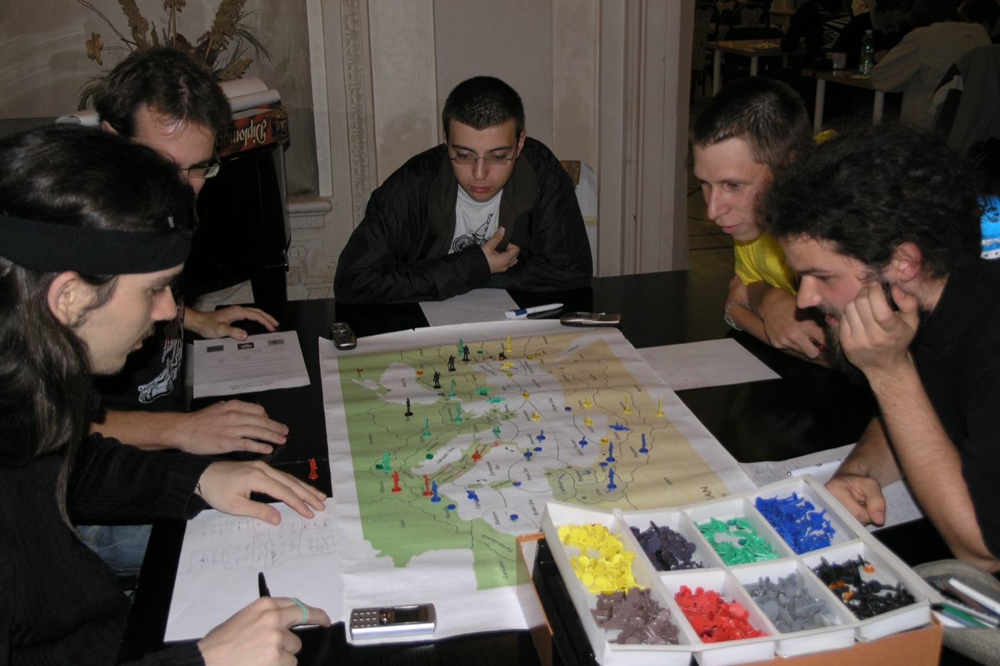

# diplomacy-A2A



<sub>*A Diplomacy board mid-game: pieces from all seven powers deployed across
the European map. Gameboard photo from
[cardboardrepublic.com](https://www.cardboardrepublic.com/classics/risk-vs-diplomacy).*</sub>

**Diplomacy** is a 7-player strategy game set in pre-WWI Europe, where each
player controls one of the Great Powers (Austria, England, France, Germany,
Italy, Russia, Turkey) that are competing for supply centers that are
distributed across the map. No dice are used in Diplomacy, which means that
each nation's armies and navies advance or retreat deterministically per
players' orders. Every turn unfolds in parallel rather than in sequence: all seven players
negotiate simultaneously, write their orders in secret, and the orders are
then adjudicated as a single batch with no turn order.
What makes the game distinctive is that those negotiations are
unenforceable: any deal can be broken, betrayal is expected, and most
games are decided more by what was promised or lied about in private
than pure tactical cleverness.

This project replaces those seven human players with **seven Claude-powered
AI agents**. The agents negotiate privately each turn, choose their military
orders, and outcomes are adjudicated by simple rules that amount to
"the larger force prevails". Each game produces a full transcript of who
said what to whom, who honored deals, and who betrayed. The artifact that
matters here is the **negotiation transcript**, and not which agent wins,
because the transcript records the part of AI agent behavior that a benchmark
score cannot show: how each agent reasoned about who to trust, what to
promise, and when to honor or break a deal. The gap between what an agent
says in private and what it actually does on the board is visible to this
project's user at every turn.

This project is a successor to
[CICERO](https://www.science.org/doi/10.1126/science.ade9097), the 2022
Meta AI system that paired a fine-tuned language model with a separate
strategic-reasoning module to achieve human-level play on online Diplomacy.
CICERO controlled one of the seven powers in anonymous games on
webDiplomacy.net, while six humans controlled the others. But this effort
drops the strategic-reasoning module in favor of letting Agent-to-Agent
(A2A) communication manage all negotiations, with all decisions made by a
well-prompted frontier LLM, and with all players represented by AI agents.

## Visual dive into a representative game

You are invited to explore our **[canonical game](https://joehahn.github.io/diplomacy-A2A/results/20260529T225943Z/dashboard/index.html)**,
which uses Sonnet to power seven AI agents across 5 game-years. A game year
has five phases (Spring Movement & Retreats, Fall Movement & Retreats,
Winter Adjustments), so the canonical
contains 10 movement phases over those 5 years, with 3 rounds of
inter-agent communication before each movement. That dashboard shows the turn-by-turn movements of every army and
navy unit, full transcripts of the agent-to-agent (A2A) communications that
precede each turn, each agent's self-authored strategy notes, and an
LLM-generated summary of the gameplay that describes which nations used
A2A negotiations to advance their goals, which agents fumbled translating
negotiations into success, and who backstabbed whom.

## Project goals & deliverables

1. **Built with Claude Code, but reproducible with just an Anthropic key.**
   The project is *developed* using Claude Code, yet it *runs* on nothing more
   than the [Anthropic SDK](https://docs.anthropic.com/en/api/client-sdks)
   and an API key — Claude Code is the development harness, not a runtime
   dependency. Anyone can clone this, drop in their key, and rebuild or
   re-run the simulation.

2. **Highlight agent-to-agent interactions that move each other.** The point is
   not just that agents *send* messages, but that they *influence* one another —
   proposing, reacting across rounds, honoring or betraying deals — and that
   those interactions visibly drive how the game evolves. The negotiation
   transcript and the turn-by-turn slideshow are the deliverables that
   expose how effective those agents are at influencing each other, not
   whether any particular agent wins.

3. **Quantify what helps an AI agent succeed when it is competing against other agents in an A2A universe.** *(Under active development.)*
   Controlled A/B experiments where six agents are identical and one differs
   along a single axis: model capability (one Sonnet among Haikus, or one Opus
   among Sonnets), memory depth (one agent given more or less past-turn
   context), personality trait (one aggressive / untruthful / backstabbing
   agent at an otherwise neutral table), pre-game collusion (two agents
   share a private agreement to coordinate prior to game start), or
   information asymmetry (one agent has parts of its prompt hidden, such as
   the current supply-center ownership tracker, forcing it to infer
   standings from unit positions and dialogue alone).

## Real-world A2A analogies (placeholder)

Diplomacy is the testbed for these experiments, but the same structure
(many private parties, no central enforcement, every promise breakable)
shows up in real-world domains where AI agents are increasingly deployed
competitively. Candidate analogies under consideration for framing the
findings:

- **Programmatic advertising auctions** (real-time bidding): hundreds
  of thousands of bidder agents competing in sub-100 ms windows for the
  same ad impression; strategy is adversarial and payoffs are zero-sum
  within an auction.
- **M&A and procurement negotiations**: multi-round, multi-party,
  information-asymmetric, with side deals and coalitions that shift
  between rounds. Exclusivity periods get violated, NDAs get leaked,
  last-minute counter-bids appear.
- **High-frequency trading and market-making**: trading agents
  competing for execution priority and information edge against a
  shared, partially-visible order book.
- **Multi-party trade and climate negotiations**: the direct
  geopolitical analog of the testbed. Alliances shift between rounds,
  public statements often diverge from private positions, and
  enforcement is weak to nonexistent.
- **Cybersecurity red-team / blue-team agents**: opposing automated
  adversaries that must model each other's strategy and adapt in real
  time, on the same network or the same model.

Information asymmetry is the structural feature these domains share:
bidders never see opponents' reserves, M&A parties never see walk-away
prices, traders never see opponents' positions.

## Setup

This project requires Python 3.10+ (developed on 3.12) and an Anthropic API key.

```bash
git clone <this repo>
cd diplomacy-A2A
python3 -m venv .venv
source .venv/bin/activate
pip install -r requirements.txt
cp .env.example .env          # then paste your key into .env
```

## Game execution

The CLI does three things: it runs a game and stores game history as a
transcript (`run`), it renders the gameplay dashboard from a game transcript
(`render`), and it adds LLM-composed strategic commentary to that dashboard
(`commentary`).

```bash
# Execute default game (is Sonnet-powered, lasts 5 years, w/ 3 negotiation rounds per movement phase)
python -m diplomacy_a2a run

# Execute canonical game (5 yrs of gameplay + 1st-year dump of all agents' prompts & responses + LLM commentary)
python -m diplomacy_a2a run --log-prompts --with-commentary

# End-to-end verification using lower-cost Haiku for 1 year and 1 negotiation round
python -m diplomacy_a2a run --smoke

# all agents use stronger LLM
python -m diplomacy_a2a run --model claude-opus-4-7

# per-power model override (only Turkey uses Opus LLM)
python -m diplomacy_a2a run --power-model TURKEY=claude-opus-4-7

# per-power memory-depth override (Turkey context preserves past 5 movements)
python -m diplomacy_a2a run --power-memory TURKEY=5

# Render a finished game, this step does not use any LLM
python -m diplomacy_a2a render results/20260529T225943Z/

# Add or refresh LLM commentary on a finished run, then render
python -m diplomacy_a2a render results/20260529T225943Z/ --with-commentary

# Generate commentary only, no render (useful in scripts)
python -m diplomacy_a2a commentary results/20260529T225943Z/

python -m diplomacy_a2a --help                # subcommand list
python -m diplomacy_a2a run --help            # game-execution options
python -m diplomacy_a2a render --help         # render + commentary options
```

Artifacts (transcript, maps, slideshow, report) land under `results/<run-id>/`.
The transcript is the canonical artifact; every renderer derives from it.

### Options

The flags below let you swap the LLM (`--model`), tune game length and
negotiation depth (`--years`, `--rounds`), strengthen or weaken individual
agents (`--power-model`, `--power-memory`), and control output
(`--log-prompts`, `--with-commentary`).

| Flag | Default | What it does |
|---|---|---|
| `--model MODEL` | `claude-sonnet-4-6` | Anthropic model id used as the default for every power. Sonnet is the canonical game's workhorse; `claude-opus-4-7` is the stronger and more expensive AI while `claude-haiku-4-5-20251001` is less. |
| `--years N` | `5` | Game-years to play unless one nation captures 18 supply centers (SCs). |
| `--rounds N` | `3` | Negotiation rounds before each movement phase. `0` skips negotiation entirely. |
| `--power-model POWER=MODEL` *(repeatable)* | – | Give one power a different model than the default, so `--power-model TURKEY=claude-opus-4-7` means that Turkey's agent is Opus powered while all others use Sonnet. |
| `--memory N` | `3` | How many **movement turns** of memory each agent carries. Covers all three channels at once: the *"What happened in the last N turns"* narration recap, the agent's own strategy notes (2N of them, since each movement contributes initial + revised), and the dialogue history (older messages drop out of the prompt). `0` is a fully memoryless agent — only the current board, no recap. |
| `--power-memory POWER=N` *(repeatable)* | – | Override the memory depth for one power. E.g. `--power-memory TURKEY=5` lets Turkey remember 5 turns back while everyone else uses the default. |
| `--log-prompts` | off | Save every prompt each agent receives, paired with its response, to `prompts.jsonl` and `prompts.md`. |
| `--log-prompts-years N` | `1` | When `--log-prompts` is on, only log calls in the first N game-years. |
| `--with-commentary` | off | After the game finishes, also generate LLM strategic commentary and re-render so the slides include it. This is the "create the polished published dashboard" flag. |
| `--commentary-model MODEL` | same as `--model` | When `--with-commentary` is on, the model used for the commentary post-pass. |
| `--no-render` | off | Skip the dashboard render at end of game. Use this when you plan to run `render` separately, e.g. iterating on viewer code. |
| `--smoke` | off | Shortcut for cheap end-to-end verification: Haiku, 1 year, 1 round. |
| `--results-dir PATH` | `results` | Root directory for artifacts. |
| `--quiet` | off | Suppress the verbose phase-by-phase trace. |

### Options *not* in the CLI yet

- **Per-agent personality traits** (aggressive, untruthful, backstabbing, crazy)
  — currently every power shares the same persona prompt from
  [`personas/registry.py`](diplomacy_a2a/personas/registry.py). The programmatic
  `run_game(personas={"TURKEY": "<prompt>"})` already accepts per-power
  overrides; the CLI flag is **axis B** of the goal-3 experiments — design in
  [REFERENCE.md](REFERENCE.md).

## Code architecture

- **`diplomacy_a2a/llm/`** — All LLM calls go through one small interface
  called `LLMClient`, with `AnthropicClient` as its only implementation
  today. Adding another provider (OpenAI, Gemini, LiteLLM) means writing
  one new file against the same interface, not rewriting the rest of the
  project.
- **`diplomacy_a2a/personas/`** — default agent personas.
- **`diplomacy_a2a/game/`** — thin wrapper around
  [Meta's `diplomacy` library](https://github.com/diplomacy/diplomacy).
  No custom rules code.
- **Agent orchestration** — agents exchange private messages each turn,
  then commit orders, then Meta's `diplomacy` library adjudicates.
  See also **Negotiation protocol** below.
- **`results/`** — each game logs gameplay to
  `results/<run-id>/transcript.jsonl`, so `python -m diplomacy_a2a render
  results/<run-id>/ --with-commentary` then builds a dashboard for
  browsing the turn-by-turn movements, the agents' inter-turn
  negotiations, and the LLM-generated commentary on the play.

## What each agent knows

Diplomacy is a game of **open information**, and the simulation preserves that.
Each agent's per-turn view (built by
[`diplomacy_a2a/game/view.py`](diplomacy_a2a/game/view.py)) provides
visibility across the **full board** every turn:

- **Every power's unit positions** — not just its own; there is no fog of war.
- **Every supply center**, including the currently unowned (neutral) ones,
  with counts (so it knows the standings and which centers are still
  grabbable).
- **Its own legal moves** for the upcoming phase as computed by the
  library `diplomacy.Game.get_all_possible_orders`, which lets the
  agent see which moves into adjacent provinces are allowed and, by
  implication, which provinces are more distant.
- A plain-English **"what happened last turn"** recap (see Turn narration).

An agent does **not** see other powers' submitted orders, their legal-move lists,
or any private messages it wasn't party to — only its own correspondence.

Agents do not have eyes. **Geography is not spelled out.** There is deliberately no adjacency table or
coordinates in the prompt. Tactical correctness comes from the legal-moves list
(an illegal move simply isn't offered), and strategic geographic reasoning
("Galicia borders us both") relies on the model's built-in knowledge of the
standard Diplomacy map via the canonical province codes (`GAL`, `BOH`, …).
Positions are conveyed as **text**, using those codes — the rendered SVG maps
(with province labels) are for human readers, not the agents. If geography
hallucinations ever surface in transcripts, a compact adjacency table can be
added to the prompt as a cheap experiment.

## Negotiation protocol

Before each **movement** phase, agents negotiate over a configurable number of
rounds (`negotiation_rounds`, set when calling `run_game`):

- **Within a round, messaging is simultaneous** — every power composes its
  outgoing messages from the same shared history, so a recipient doesn't see
  what you sent until the *next* round.
- **Across rounds it is sequential** — round 2+ sees the prior rounds' incoming
  messages, so agents can react, counter, and confirm before committing.
- **Each agent chooses its own recipients** (any subset of the other powers)
  and **may stay silent** in any round.
- After the final round, each agent submits orders with the full dialogue in
  context, so deals (and betrayals) flow through to actual moves.

Agents are told this protocol explicitly — the round count, which round they're
in, the simultaneity, and that the final round is for closing — which produces a
deliberate *probe → negotiate → close* arc rather than repeated openers. The
mechanics live in [`diplomacy_a2a/agent.py`](diplomacy_a2a/agent.py) (`negotiate`, the system
prompt, dialogue formatting) and [`diplomacy_a2a/negotiation.py`](diplomacy_a2a/negotiation.py)
(`run_negotiation_round`); [`diplomacy_a2a/runner.py`](diplomacy_a2a/runner.py) drives the rounds.

## Agent strategy & memory

Beyond the dialogue history and the deterministic narration recap, each agent
also carries a self-authored **strategy log** — a private record of what
*it* thought it was doing each turn, generated by the runner without
any extra prompting from the user. (This was previously opt-in behind a
`--strategy` flag; it's now hardwired on because the artifacts the project
exists to produce are dramatically richer with it.)

On every movement phase the runner asks each power to write a 1–2 sentence
note twice:

- **Before negotiation** — *initial strategy*: goals for the turn (named powers,
  named provinces, intended deals), informed by the board and the agent's own
  strategy history from prior turns.
- **After the final round, before orders** — *revised strategy*: an updated
  stance reflecting what the negotiation actually produced (deals struck, refused,
  or broken).

Every subsequent call (later negotiation rounds, order submission, future turns)
is given **that agent's own strategy history** (capped to the last `2 × --memory`
entries — default 6, since `--memory` is 3 movement turns and each movement
contributes initial + revised), so agents carry an explicit, persistent memory
of their stated plans and how those plans evolved.

This makes the agents work smarter in three concrete ways:

1. **Planning-then-acting sharpens decisions.** Forcing the model to articulate
   a plan before it speaks or moves is a well-established way to make its
   reasoning more coherent — the strategy note functions as a brief planning
   step that constrains the negotiation messages and the orders that follow.
2. **Cross-turn memory of allies and rivals.** Without the log, an agent can
   forget a betrayal two turns ago. With it, the exact phrasing the agent itself
   wrote ("Russia stabbed me at Galicia in F1901M; treat as hostile.") is back
   in front of it next turn — far more reliable than re-inferring trust from
   positions and a long dialogue history.
3. **Observable intent.** Strategy notes are first-class artifacts: shown in the
   slideshow as a per-power collapsible block on each movement-phase slide, and
   captured in `prompts.md`. Detecting a betrayal becomes "stated goal X, did
   Y" — clean and unambiguous. This is also the per-persona behavioral
   fingerprint goal-3's personality experiment needs: aggressive, conservative,
   or backstabbing traits will produce visibly different strategy notes,
   complementing what dialogue alone shows.

Strategy notes are **private to each agent** (opponents see only the messages it
chooses to send, mirroring how Diplomacy works at a table). Cost: about
**+25–35% per game** — two extra short LLM calls per power per movement phase
plus a small token bump for carrying history. Always on; the previously-required
`--strategy` flag has been promoted to default behavior. Mechanics live in
[`diplomacy_a2a/agent.py`](diplomacy_a2a/agent.py) (`state_strategy` / `revise_strategy`) and
[`diplomacy_a2a/runner.py`](diplomacy_a2a/runner.py).

## Turn narration & observability

After each phase, a **deterministic plain-English narration** of what every
power did and how it resolved is generated straight from the orders + adjudication
results — e.g. *"AUSTRIA: A BUD → SER; F ALB supports A SER → GRE; ITALY: A VEN →
TRI (bounced)"*. No LLM, so it's faithful and reproducible
([`diplomacy_a2a/narration.py`](diplomacy_a2a/narration.py)). It serves two consumers:

- **Humans** — shown beside the maps on each slideshow/report phase, so the action
  reads at a glance instead of as raw order syntax.
- **Agents** — fed into each agent's view as a "what happened last turn" recap,
  so they reason about who supported or attacked whom from readable facts (and see
  *outcomes* like bounces/dislodgements that bare orders don't convey).

### Seeing the exact agent prompts and responses

For transparency/debugging, `--log-prompts` writes the exact **prompt** each
agent receives plus the **response** it produced to `results/<run-id>/prompts.jsonl`,
and renders a navigable, GitHub-friendly **`prompts.md`** alongside it
(collapsible per-call sections grouped by phase / round / power — skim the index,
click any prompt to expand). By default it only captures **the first game-year**,
which is where the opening negotiation/coordination is most legible and keeps the
artifact focused (`--log-prompts-years N` extends that).

The canonical run's dumps **are committed** so you can read precisely what
the agents said without spending anything:
[**`prompts.md`**](results/20260529T225943Z/prompts.md) (≈853 KB; GitHub
renders the collapsibles inline) or the raw
[`prompts.jsonl`](results/20260529T225943Z/prompts.jsonl) (≈778 KB). The
flag is off by default and otherwise gitignored, so a full experiment grid
isn't bloated with redundant dumps. To produce one yourself:

```bash
python -m diplomacy_a2a run --log-prompts                       # game + dashboard
python -m diplomacy_a2a run --log-prompts --with-commentary     # + LLM commentary
```

That's the bare canonical: 5-year, 3-round, Sonnet, strategy on, log year 1
(≈$8 / ≈80 min; `+$0.50` for the commentary post-pass with `--with-commentary`).
`--log-prompts` itself adds no API cost — it only saves prompts that are sent
anyway.

Separately, **optional LLM commentary** ([`diplomacy_a2a/commentary.py`](diplomacy_a2a/commentary.py))
can add a narrator's strategic read to each slide — who's threatening whom, who's
cooperating, who appears to have betrayed a promise — shown between the result map
and the negotiation. Unlike the deterministic narration, this is *interpretation*
(human-facing only, never fed to agents), so it's a separate opt-in pass over a
finished transcript (one LLM call per phase) rather than part of `run_game` — kept
out of the game loop so a full experiment grid stays cheap.

## Cost / time per game

A `--smoke` run costs pennies. The canonical (Sonnet, 5 years, 3 rounds,
strategy on, `--log-prompts` year 1, plus the LLM-commentary post-pass)
came in at about **$13** and about **80 min** wall-time. Opus at the
same configuration is about **$15**, while Haiku is about **$5** but
see also [REFERENCE.md](REFERENCE.md) for known issues.

The `render` subcommand is free since it does not utilize the LLM, while
`commentary` adds about $0.50 of Sonnet calls for an 18-phase game.
`--with-commentary` rolls game + commentary + re-render into one command.

## Notes for re-running

LLM outputs are not byte-for-byte deterministic even at temperature 0,
so a rerun will produce *similar* dynamics, not identical transcripts.
Model IDs are pinned in `diplomacy_a2a/config.py` so reruns are
comparable across model releases.

For technical details (model pricing, per-phase timing observations,
quality notes, experiment results as they land, known issues): see
[**REFERENCE.md**](REFERENCE.md).

