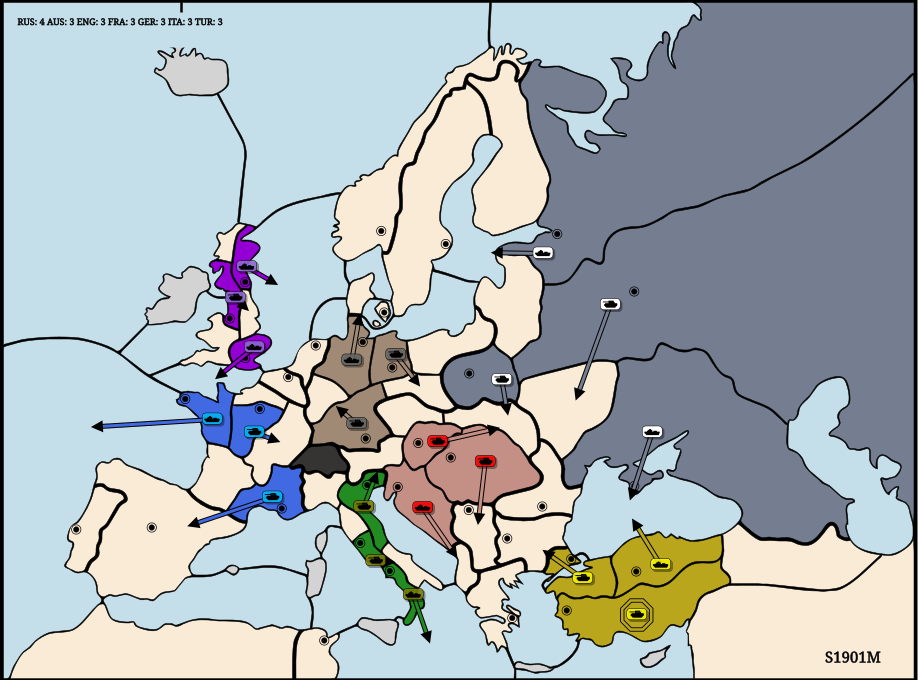
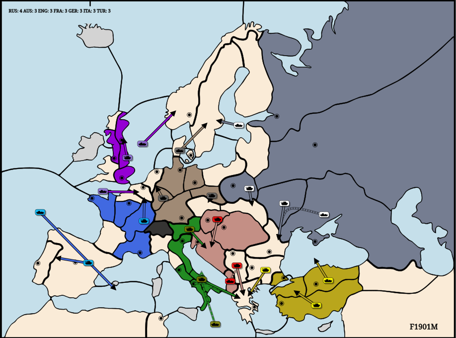
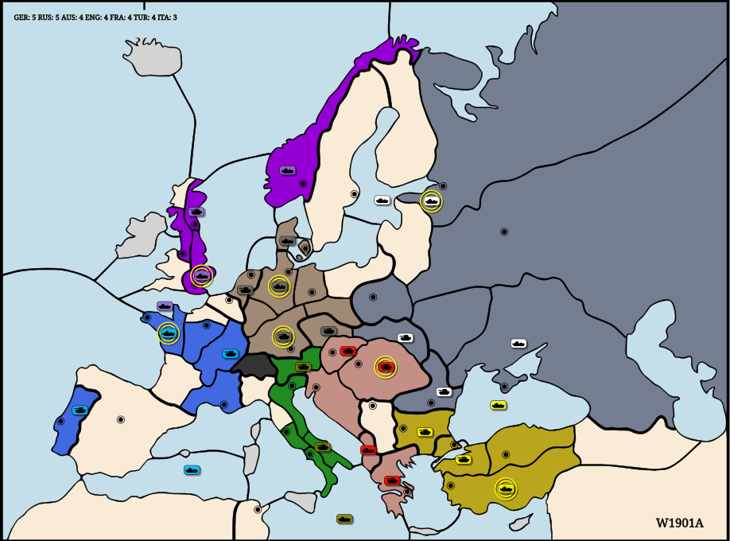
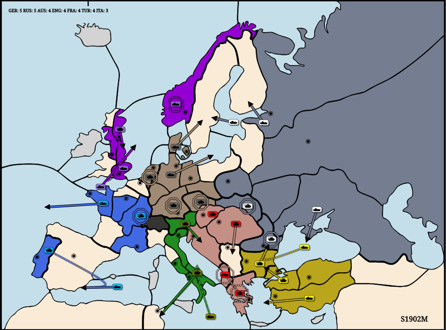
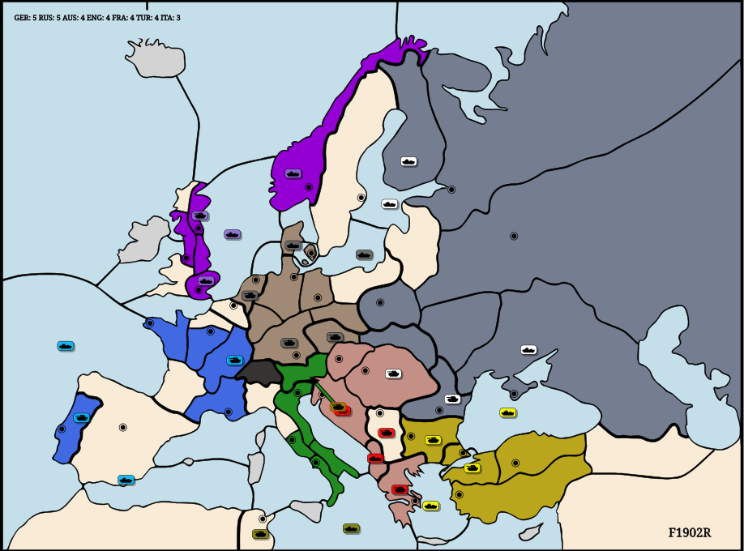
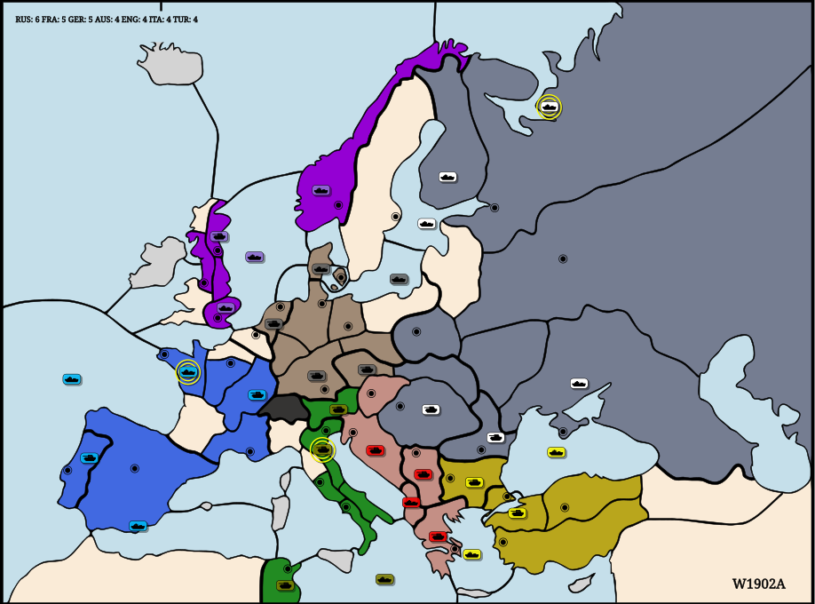

# Diplomacy A2A — Run `20260524T031616Z`

- **Model**: `claude-sonnet-4-6`
- **Years targeted**: 2
- **Started**: 2026-05-24T03:16:16+00:00
- **Ended**: 2026-05-24T03:21:02+00:00
- **Phases played**: 7
- **Tokens**: input=43165, output=10059, cache_create=12772, cache_read=56562
- **Approx cost (USD)**: $0.3452

## Personas

- **FRANCE** — A pragmatic, conservative player who prefers stable alliances and avoids unnecessary risks.
- **GERMANY** — An opportunist — seize tactical chances, willing to pivot alliances when payoffs flip.
- **ENGLAND** — Cautious and naval-focused; build a strong fleet position before committing to aggression.
- **ITALY** — Ambiguous and scheming; keep options open, prefer surprise moves over telegraphed campaigns.
- **AUSTRIA** — Defensive and central; hold the position, broker peace between feuding neighbors.
- **RUSSIA** — Expansionist on both fronts; press for territory wherever weakness appears.
- **TURKEY** — Patient and long-game; build slowly, exploit late-game momentum.

## SPRING 1901 MOVEMENT (`S1901M`)

### AUSTRIA
Orders: `A BUD - SER` · `F TRI - ALB` · `A VIE - GAL`

Reasoning

> Looking at the opening position, Austria's classic challenge is to expand into the Balkans while protecting against Italian aggression toward Trieste and Russian pressure from Galicia. The standard strong opening for Austria is to push A BUD toward Serbia (a free supply center), move F TRI to Albania (positioning for Greece), and advance A VIE to Galicia to block Russia or pivot to Tyrolia to check Italy. Moving to Galicia with Vienna is particularly important to prevent Russia from occupying it unopposed, which would threaten Budapest directly. I'll send BUD to Serbia for a free center, TRI to Albania for positioning toward Greece, and VIE to Galicia as a defensive/expansionary move.

### ENGLAND
Orders: `F EDI - NTH` · `F LON - ENG` · `A LVP - YOR`

Reasoning

> Looking at the opening position, England's classic strong start involves getting F EDI to NTH (the key northern sea province) and F LON to ENG (the English Channel, blocking France and opening southern options). A LVP should move toward YOR or WAL to eventually build up for a convoy or support position. The NTH is critical for Norway in Fall 1901, so I want to secure it immediately. Moving F LON to ENG contests the channel with France early, which is aggressive but valuable. A LVP to YOR positions the army to support a fleet move or eventually convoy to the continent.

### FRANCE
Orders: `F BRE - MAO` · `A MAR - SPA` · `A PAR - BUR`

Reasoning

> Looking at the opening position, France's classic strong opening is to secure Spain (via Marseille or Gascony) and contest Burgundy while keeping England at bay. The most aggressive and effective standard opening for France is to move the fleet to the Mid-Atlantic Ocean (MAO) to project power and eventually contest Portugal/Spain, move the army from Marseille to Spain or Burgundy, and push Paris toward Burgundy to contest that key neutral. However, I need to be careful not to antagonize Germany unnecessarily in turn 1. A solid conservative approach: F BRE → MAO (Atlantic power), A MAR → SPA (secure a neutral), A PAR → BUR (contest Burgundy — risky but standard). This is the classic "standard French opening" and gives France good expansion options while keeping options open diplomatically.

### GERMANY
Orders: `F KIE - DEN` · `A MUN - RUH` · `A BER - SIL`

Reasoning

> Looking at the opening position, I want to maximize my gains in 1901. The classic German opening targets Denmark (via KIE) and Holland (via RUH or directly from KIE), while keeping BER secure. I'll send the fleet to Denmark for a guaranteed supply center, move MUN to RUH to threaten Holland next turn (or directly to BUR to pressure France), and hold BER or push toward SIL. Actually, the most aggressive and opportunistic opening is: F KIE → DEN (guaranteed SC), A MUN → RUH (sets up HOL grab in Fall), A BER → SIL (pressures Russia/Austria, sets up future options). This is the "Bismarck" style opening — strong and flexible.

### ITALY
Orders: `F NAP - ION` · `A ROM - APU` · `A VEN - TYR`

Reasoning

> Looking at the opening position, Italy's classic dilemma is whether to go east (against Turkey/Austria) or west (against France). As an ambiguous schemer, I want to keep options open while making aggressive moves that can't easily be anticipated. The standard "Lepanto" opening sends F NAP to ION for an eastern push, while A VEN to TYR threatens Austria/Germany. A ROM to APU is a common Lepanto setup move. However, I can also feint west with A VEN to PIE threatening France. 
>
> I'll go with a modified Lepanto setup: F NAP to ION (eastern fleet positioning), A ROM to APU (supports the Lepanto or threatens Austria via Adriatic), and A VEN to TYR (threatens both Austria and Germany, keeping everyone guessing). This is aggressive and ambiguous — Austria will be nervous about TYR, Turkey about the fleet moving east, and it signals nothing definitive to France either.

### RUSSIA
Orders: `F SEV - BLA` · `A WAR - GAL` · `F STP/SC - BOT` · `A MOS - UKR`

Reasoning

> Looking at Spring 1901, Russia's classic opening goals are to secure Rumania (a key neutral SC) with the fleet from Sevastopol, push into Galicia or Livonia for pressure, and get the St. Petersburg fleet into the Gulf of Bothnia to threaten Scandinavia. I'll move F SEV to BLA to contest the Black Sea and threaten Rumania next fall, push A WAR to GAL to pressure Austria, move F STP/SC to BOT for Scandinavian access, and move A MOS to UKR to support future southern expansion.

### TURKEY
Orders: `F ANK - BLA` · `A CON - BUL` · `A SMY H`

Reasoning

> Looking at the opening position, Turkey's classic strong opening is to secure the Black Sea with the fleet and push into Bulgaria with the army from Constantinople. This gives me two builds in Fall 1901 (Bulgaria and a neutral), setting up a powerful Balkan position. The fleet in the Black Sea threatens both Russia (Sevastopol) and gives me flexibility. I'll move F ANK to BLA, A CON to BUL, and A SMY holds to defend the home center.

## FALL 1901 MOVEMENT (`F1901M`)

### AUSTRIA
Orders: `A VIE - TRI` · `A SER - GRE` · `F ALB S A SER - GRE`

Reasoning

> Looking at the board, I need to assess my position carefully. I currently hold BUD, TRI, VIE but my units are at VIE, SER, and ALB — not on supply centers I need to capture. I need to gain at least one new supply center this fall to grow.
>
> Key opportunities:
> - **Greece (GRE)**: A SER can move to GRE, and F ALB can support it. This is a clean grab.
> - **Romania (RUM)**: A SER could go there instead, but Turkey has BUL and Russia has forces nearby — risky without coordination.
> - **Trieste (TRI)**: Italy has A TYR nearby which is threatening. I should be cautious about TRI.
>
> The best play is to take Greece with A SER supported by F ALB, while using A VIE to either defend or position defensively. Italy's A TYR is near TRI and BOH — I should be watchful. A VIE holding or moving to BOH to block German/Italian expansion seems prudent. Actually, moving A VIE to TRI to secure it against Italy's A TYR threat makes sense, but F ALB is already positioned to support SER into GRE.
>
> Best plan: A SER → GRE (supported by F ALB), A VIE → TRI (to secure home center against Italy's TYR).

### ENGLAND
Orders: `F NTH - NWY` · `F ENG - BEL` · `A YOR - EDI`

Reasoning

> Looking at the board, England's position is solid but I need to expand. The key targets are Norway (NWY) and Belgium (BEL) — both are neutral supply centers I can grab this fall. Norway is reachable from NTH, and Belgium is contested but worth attempting. France has A BUR which could go to BEL, and Germany has A RUH which could also go to BEL. I should push F NTH to NWY to secure that center. For Belgium, I can try F NTH - BEL but that conflicts with Norway. Better to take Norway with NTH and push toward Belgium with ENG or YOR. Actually, F NTH - NWY is the clear priority (a free supply center). F ENG - BEL is a strong move — it may bounce with France/Germany but worth trying. A YOR - EDI frees up YOR for future use... actually A YOR should move to WAL or hold. Let me secure: F NTH → NWY, F ENG → BEL (contest it), A YOR → EDI (to free up YOR province and position for future builds). Actually YOR to EDI doesn't help much — A YOR → WAL is better to support a future build or just hold. I'll go NTH→NWY, ENG→BEL, YOR→EDI to open home centers for winter builds.

### FRANCE
Orders: `A BUR - BEL` · `A SPA - POR` · `F MAO - WES`

Reasoning

> Looking at the board, France is in a solid position after Spring 1901. I have A BUR, A SPA, and F MAO. The key opportunities are: taking POR with my fleet/army, securing BEL with A BUR, and potentially grabbing a third center. England has F NTH and F ENG which could contest BEL, but I should try for it anyway. POR is uncontested and a natural French gain. BEL is contested but worth attempting. I'll move A BUR to BEL, A SPA to POR, and F MAO to support or position for WES/NAF. Since A SPA can reach POR directly, and F MAO can move to WES or support, I'll send F MAO to POR as a convoy support isn't needed — A SPA - POR is a direct land move. F MAO can move toward WES for future Mediterranean positioning.

### GERMANY
Orders: `F DEN - SWE` · `A RUH - HOL` · `A SIL - BOH`

Reasoning

> Looking at the board: I have F DEN, A SIL, A RUH. My priority is to grab new supply centers. HOL and BEL are the obvious targets for Germany in Fall 1901. I can take HOL with A RUH, and I should try to grab BEL or push into BUR. France has A BUR which is threatening, but I can try to take HOL cleanly. For DEN, I should move to secure SWE (a neutral SC) before Russia grabs it with F BOT. A SIL can support or move toward BOH/GAL to pressure Austria or hold position. The key moves: F DEN - SWE (grab the SC), A RUH - HOL (grab the SC), A SIL - BOH (pressure Austria/Italy, or position for future moves). This nets me potentially +2 SCs (SWE and HOL) going into Winter 1901.

### ITALY
Orders: `F ION C A APU - GRE` · `A APU - GRE VIA` · `A TYR - TRI`

Reasoning

> Looking at the board: I'm Italy with F ION, A APU, A TYR. I need to grab supply centers to grow. GRE is the obvious target in the south - Turkey has BUL there and Austria has ALB nearby, making Greece contested. I should grab GRE with a convoy (F ION convoys A APU to GRE) while also pushing for TUN or TRI. Meanwhile, A TYR can push toward TRI or MUN. Austria is weak with F ALB exposed - but Turkey's A BUL is also eyeing GRE. I'll grab GRE via convoy and push TYR into TRI to snag a second center, keeping ambiguity about my intentions toward both Austria and Turkey.

### RUSSIA
Orders: `F SEV S A UKR - RUM` · `A UKR - RUM` · `F BOT - SWE` · `A WAR - GAL`

Reasoning

> Looking at the board, I need to maximize my supply center gains this fall. The key targets are:
>
> - **Rumania (RUM)**: A prime target. I can take it with F SEV - RUM or A UKR - RUM. Using both creates a guaranteed capture even against resistance.
> - **Sweden (SWE)**: F BOT can grab it, though Germany's F DEN is also eyeing it. I should try to take it.
> - **Galicia (GAL)** or **Prussia (PRU)**: A WAR can push into German or Austrian territory.
>
> The best plan: Send F SEV to support A UKR into RUM for a guaranteed Rumania capture. Send F BOT to SWE (it's unoccupied and adjacent). Push A WAR into GAL to pressure Austria and potentially grab a center next year.
>
> With F SEV supporting A UKR into RUM, that's a 2-strength attack that beats any single defender. F BOT grabs SWE. A WAR moves to GAL to threaten Austria and position for future gains.
>
> This gives me RUM and SWE in Fall 1901, bringing me to 6 supply centers — a strong position.

### TURKEY
Orders: `F ANK - BLA` · `A BUL - GRE` · `A SMY - CON`

Reasoning

> Looking at the board situation: Turkey is in a strong position with BUL already taken. The key Fall 1901 goals are to grab GRE and RUM to grow to 5 supply centers, which would be an excellent start. 
>
> Austria has F ALB which could contest GRE, and Russia has F SEV which could take RUM. I need to coordinate carefully. A BUL can take GRE (Austria's F ALB is in position to support or contest, but A SER is supporting Austria's position). Russia's F SEV is eyeing RUM — I should try to get RUM with A BUL, but then I lose GRE. 
>
> Best play: Send A BUL to RUM (contesting with Russia's F SEV — it's a race, and A BUL moving to RUM has strength 1 vs F SEV moving to RUM with strength 1, so it bounces unless supported). F ANK moves to BLA to establish sea presence and pressure. A SMY moves to CON to free up the home center and reposition.
>
> Actually, the cleaner play: A BUL - GRE (grab a free supply center — Austria's F ALB may not be going there), F ANK - BLA (important for long-term positioning, blocks Russia), A SMY - CON (repositioning).
>
> GRE seems likely uncontested if Austria is focused elsewhere. RUM is contested with Russia. Taking GRE safely is better than bouncing on RUM.

## WINTER 1901 ADJUSTMENTS (`W1901A`)

### AUSTRIA
Orders: `A BUD B`

Reasoning

> Looking at the position: Austria has 4 supply centers (BUD, TRI, VIE, GRE) and 3 units, so I can build 1 unit. I need to decide where to build and what type.
>
> My current units are A VIE, F ALB, A GRE. Italy has A TYR sitting on my doorstep, which is concerning. Russia has A GAL also threatening from the north. I need to shore up my central position. Building an Army in BUD makes the most sense — it protects against Russia's A GAL threatening Budapest, and can also support operations in the Balkans or move toward TRI if Italy pushes. TRI is open and I could build there too, but BUD is more central and directly counters the GAL threat.

### ENGLAND
Orders: `F LON B`

Reasoning

> Looking at the position: England has 4 supply centers (EDI, LON, LVP, NWY) and 3 units, so I can build 1 unit. I need to decide where and what to build.
>
> My current units are F ENG, F NWY, and A EDI. I have a strong naval presence already. France has moved to POR and has F WES in the western Mediterranean — they're expanding south. Germany is strong with 5 centers. 
>
> Building F LON gives me another fleet in the English Channel area, strengthening my naval dominance and positioning me to either pressure France or move into the North Sea/Baltic region. Building F LVP would give me access to the Irish Sea and Mid-Atlantic, useful for western expansion. An army build is less useful given my naval-focused strategy.
>
> F LON B is the strongest choice — it keeps pressure on France and gives me flexibility in the Channel/North Sea theater. I'll waive the second build opportunity (I only get one build since I have 4 centers and 3 units = 1 build).

### FRANCE
Orders: `F BRE B`

Reasoning

> Looking at the board, France has 4 supply centers (BRE, MAR, PAR, POR) and 3 units (A BUR, F WES, A POR), so I can build 1 unit. Germany is strong with 5 centers, and England has 4. I need to think about where to build. A fleet at Brest (F BRE B) would give me Atlantic/Channel options and pressure England or move toward the Mediterranean. An army at Paris or Marseille would support land operations. Given Germany's strength and the need to maintain flexibility both on land and sea, building a fleet at Brest is the most strategically valuable option — it opens up options against England or toward the Atlantic/Spain.

### GERMANY
Orders: `F KIE B` · `A MUN B` · `WAIVE`

Reasoning

> I have 5 supply centers and 3 units, so I can build 2 new units. I should maximize my build efficiency: a fleet in Kiel to contest naval space (North Sea, Baltic) and an army in Berlin or Munich to strengthen my land position. Given that England has NWY and France has POR, I need naval presence to contest the North Sea and potentially threaten England or support future moves. Building F KIE gives me a second fleet for North Sea pressure. Building A MUN strengthens my central position and gives me flexibility toward France, Austria, or Russia. I'll waive BER to keep builds focused.

### RUSSIA
Orders: `F STP/SC B`

Reasoning

> I have 5 supply centers and 4 units, so I can build 1 unit. The key question is where and what to build. I want to press on both fronts — against Turkey in the south (I have F SEV and A RUM well-positioned) and potentially expand in the north/west. Building a fleet at STP/SC would give me access to the Baltic and pressure on Scandinavia/Germany, while building at STP/NC gives Arctic access. An army at WAR or MOS would support western/central expansion. Given Germany's strength (5 SCs) and the need to pressure both Turkey and potentially Scandinavia, F STP/SC is the most strategically flexible choice — it can move into the Baltic and threaten Sweden/Germany, complementing my existing northern fleet in BOT.

### TURKEY
Orders: `F SMY B` · `WAIVE`

Reasoning

> Turkey gained one supply center (BUL) in 1901, giving us 4 centers and 3 units — so we can build one new unit. The key decision is where and what to build. ANK is our natural fleet-building port for Black Sea/eastern Mediterranean expansion, but we already have F BLA covering that area. SMY is well-positioned for a fleet pushing into the Eastern Mediterranean (ION, AEG), which is critical for long-term growth toward Italy and the western Med. Building a fleet at SMY gives us pressure toward Greece and the Ionian, while an army at SMY could eventually push into Anatolia or support Balkan moves. Given Italy is sitting in ION, a fleet at SMY is the most threatening and strategically sound build to contest the eastern Mediterranean and eventually challenge Italy.

## SPRING 1902 MOVEMENT (`S1902M`)

### AUSTRIA
Orders: `A BUD - SER` · `A GRE S F ALB` · `F ALB S A GRE`
Invalid (filtered): `A VIE S A BUD - SER`

Reasoning

> Looking at the board, I need to assess the key threats and opportunities. Russia has A GAL threatening Vienna/Budapest, and A RUM is nearby. Turkey has A BUL adjacent to Greece which I hold. Italy has A TYR which threatens Trieste/Vienna. Germany has A BOH also near Vienna. I'm somewhat surrounded and need to consolidate.
>
> My priorities: (1) Defend Vienna against the multiple threats (GAL, BOH, TYR all adjacent), (2) Hold Greece against Turkey's BUL, (3) Keep Trieste secure. The most pressing threat is the combination of Russian A GAL and potentially German A BOH near Vienna. I should support Vienna defensively and try to push into Serbia to gain a supply center, which would give me 5 SCs.
>
> A BUD - SER is a good move to grab Serbia (currently unoccupied). A VIE should hold or support. F ALB supports A GRE to hold Greece against Turkish pressure. A GRE supports itself or I use it to push toward BUL/SER.
>
> Actually, let me go for SER with BUD, support VIE against GAL threats, hold GRE with ALB support, and use VIE to support BUD into SER.

### ENGLAND
Orders: `A EDI - YOR` · `F ENG - NTH` · `F LON S F ENG - NTH` · `F NWY H`

Reasoning

> Looking at the board, Germany has grown to 5 centers and is the dominant land power. I need to secure the North Sea to maintain naval dominance and position for future expansion. France has a fleet in Brest which is a potential threat, but right now I want to push into the North Sea and potentially threaten Belgium or Scandinavia. My army in Edinburgh is somewhat idle - I'll move it toward Yorkshire to have flexibility. I should get F NWY into a position to threaten Sweden or support North Sea control. Getting F ENG and F LON to coordinate into the North Sea is the priority.

### FRANCE
Orders: `F WES - SPA/SC` · `A POR S F WES - SPA/SC` · `A BUR H` · `F BRE - MAO`

Reasoning

> Looking at the board, Germany is the dominant power with 5 centers and strong positioning. England has 4 centers and a fleet in the English Channel (ENG) which is threatening. I need to consolidate my position and look for expansion opportunities. Spain (SPA) is the obvious target for growth - I can move my fleet from WES to SPA/SC supported by the army in POR. For BUR, I should hold or support defensively given Germany's strength. F BRE should move to MAO to expand Atlantic presence and protect against England. This gives me a path to 5 centers (adding SPA) while maintaining defensive posture.

### GERMANY
Orders: `F DEN - SWE` · `F KIE - BAL` · `A HOL H` · `A MUN H` · `A BOH H`

Reasoning

> Looking at the board, I'm in a strong position with 5 supply centers. My key concerns are:
>
> 1. **England** has fleets in NTH area (F ENG, F LON, F NWY) and could threaten HOL or DEN. I need to be cautious there.
> 2. **France** has A BUR adjacent to my territory - potential threat to MUN or BEL.
> 3. **Italy** has A TYR adjacent to BOH and MUN - I should watch this but Italy is likely focused south.
> 4. **Russia** is strong with 5 SCs - GAL is adjacent to BOH, could be a future threat.
>
> My opportunist strategy: Secure my position, push into SWE via DEN for a 6th SC, and position for future gains. France's BUR is tempting but I lack enough force to take it safely. England's NWY fleet is concerning for DEN/SWE.
>
> Key moves:
> - F DEN → SWE (grab a supply center!)
> - F KIE → BAL (support DEN's position, open KIE for builds)
> - A HOL holds (defend against France/England)
> - A MUN holds or supports
> - A BOH holds (buffer against Italy/Austria/Russia)
>
> Actually, F DEN - SWE is the big opportunity. I'll support it with F KIE - BAL. A BOH supports MUN as buffer. A MUN and A HOL hold defensively.

### ITALY
Orders: `A APU - TUN VIA` · `F ION C A APU - TUN` · `A TYR - TRI`

Reasoning

> Looking at the board: Italy is stuck at 3 SCs while everyone else is growing. I need to expand. The most promising directions are: (1) grabbing TUN via convoy, which is uncontested and gives me a 4th SC; (2) pushing toward the Balkans or Greece eventually. Austria has GRE but is spread thin. Turkey looks strong in the east. Germany is dominant in the north. 
>
> My key move: convoy A APU to TUN (F ION convoys, A APU moves). This secures a free supply center. Meanwhile, A TYR should pressure VEN or position for future gains — but VEN is my own center, so I should push toward TRI or MUN. Actually, A TYR - TRI could grab Trieste from Austria (it's unoccupied currently — wait, Austria has F ALB and A GRE but TRI itself... Austria's units are VIE, ALB, GRE, BUD — TRI is a home SC of Austria but no unit there!). A TYR - TRI could take an Austrian SC! That's very tempting. Let me do: A APU - TUN VIA (convoyed), F ION C A APU - TUN, A TYR - TRI. This gives me potentially 2 new SCs (TUN and TRI) in one move — aggressive and surprising.

### RUSSIA
Orders: `F SEV - BLA` · `A RUM H` · `A GAL H` · `F BOT - SWE` · `F STP/SC - FIN`

Reasoning

> Looking at the board, I need to assess threats and opportunities. Turkey has F BLA which threatens SEV and RUM. Austria has grown to 4 centers with GRE. Germany is strong at 5 centers. I need to press south against Turkey while securing my northern position.
>
> Key considerations:
> - Turkey's F BLA is a direct threat to SEV. I should try to take BLA or at least neutralize it.
> - F SEV can push into BLA if supported, but I need RUM to hold firm.
> - In the north, F STP/SC can move to FIN to eventually threaten NWY or SWE, and F BOT can support.
> - A GAL should pressure Austria or hold defensively.
> - A RUM needs to either attack Turkey or hold against Austrian pressure.
>
> The main play: Push F SEV into BLA (threatening Turkey), support with A RUM. Use F STP/SC to move to FIN with F BOT support. A GAL holds or pressures Austria.
>
> Since F BLA is Turkish and threatening, if I move F SEV - BLA and Turkey moves F BLA somewhere else, I take it. If Turkey holds, I need support — but F SEV alone can't dislodge F BLA without support. A RUM can't directly support SEV into BLA. So F SEV - BLA alone might bounce if Turkey holds. Better to have F SEV hold/support and wait, or try to attack BUL from RUM.
>
> Actually, let me try: A RUM - BUL (pressuring Turkey's center), F SEV S A RUM... wait, SEV can't support RUM - BUL. Let me push A RUM - BUL with F SEV supporting if possible... F SEV can't reach BUL. 
>
> Best plan: F SEV - BLA (solo attempt, may bounce but worth trying), A RUM S F SEV (can't - wrong direction). A RUM H or A RUM - BUL. A GAL - UKR or hold. F BOT - SWE for a new SC. F STP/SC - FIN.
>
> Final plan: F SEV - BLA, A RUM S F SEV (not available - use A RUM H to hold RUM), A GAL H, F BOT - SWE (grab a supply center!), F STP/SC - FIN.

### TURKEY
Orders: `A BUL - RUM` · `F BLA S A BUL - RUM` · `A CON - BUL` · `F SMY - AEG`

Reasoning

> Looking at the board, Turkey is in a solid position with 4 centers. Russia has F SEV and A RUM nearby, which are threats, but also potential targets. Austria has A GRE which I'd like to pressure eventually. My key strategic goal is to expand into the Balkans and Black Sea region while keeping Russia from dominating. 
>
> Russia has A RUM adjacent to BUL and F SEV adjacent to BLA — these are threats I need to manage. A coordinated push: I can try to take RUM with A BUL supported by F BLA, while using A CON to reinforce BUL and F SMY to move toward AEG for future expansion into the Mediterranean or to pressure Greece. Taking RUM would give me a 5th center and weaken Russia significantly.

## FALL 1902 MOVEMENT (`F1902M`)

### AUSTRIA
Orders: `A VIE - TRI` · `F ALB S A VIE - TRI` · `A SER S A GRE` · `A GRE H`

Reasoning

> Looking at the board, Austria is in a reasonable position with 4 centers (BUD, TRI, VIE, GRE) and 4 units. The key threats are:
> - Italy has A TRI, threatening to hold or expand
> - Turkey has A BUL threatening GRE, plus F AEG and F BLA providing naval pressure
> - Russia has A GAL threatening VIE/BUD
>
> My priorities: defend GRE against Turkish pressure, secure TRI back from Italy, and protect the northern flank. Italy's A TRI is a prime target - if I can take it, I gain a 5th center. I should push A VIE - TRI with F ALB support to dislodge the Italian army there. Meanwhile, I need to hold GRE against Turkey - supporting it with both SER and ALB would be ideal but I can't do both. I'll use A SER to support A GRE hold, and use F ALB to support the TRI attack. A GRE holds with SER support. For VIE, I need to guard against Russian A GAL - I'll support A GAL defensively or move carefully. Actually, the best play: push for TRI with VIE and ALB support, hold GRE with SER support.

### ENGLAND
Orders: `F NWY - SWE` · `F NTH S F NWY - SKA` · `F LON H` · `A YOR - EDI`

Reasoning

> Looking at the board, I need to assess my position carefully. I have 4 supply centers (EDI, LON, LVP, NWY) and need to grow. Germany has 5 centers and is the dominant land power, while France has 4. I'm in a decent naval position with three fleets.
>
> Key considerations:
> - France has F MAO and F SPA/SC which could threaten my home waters or push into ENG. I should be wary.
> - Germany has F DEN and F BAL in the north — I could contest DEN or push into Scandinavia.
> - Russia has F FIN and F BOT near STP — if I can coordinate, there's opportunity in the north, but I'm not allied with Russia.
> - My A YOR is somewhat stranded on land. I should try to move it somewhere useful or convoy it.
> - F NWY could push to SWE to gain a supply center.
> - F NTH could support NWY → SWE or move to DEN.
>
> The best play: F NWY → SWE (picking up a supply center), F NTH supports NWY → SWE to ensure success against any German resistance. F LON holds to secure the home front. A YOR moves to EDI or holds.
>
> Actually, SWE is unoccupied (Germany has DEN, not SWE), so F NWY → SWE should succeed without support. I can use F NTH more aggressively — perhaps moving to DEN or HOL to threaten Germany. Let me try: F NWY → SWE, F NTH → DEN (contesting Germany's fleet there), F LON holds, A YOR holds.
>
> DEN has a German fleet — F NTH → DEN alone won't dislodge it without support. Better to support NWY → SWE with NTH, and probe elsewhere. Or move NTH → HOL (unoccupied? Germany has A HOL). 
>
> Best safe play: F NWY → SWE (free SC), F NTH supports this, F LON holds, A YOR → EDI (consolidate).

### FRANCE
Orders: `A BUR - BEL` · `A POR H` · `F SPA/SC H` · `F MAO S F SPA/SC`

Reasoning

> Looking at the board, France is in a solid but not dominant position with 4 supply centers. I need to think about expansion opportunities. The most natural target is either pushing into Germany (via BEL or MUN) or consolidating in Iberia/Mediterranean. Germany is strong with 5 centers and England has 4 — there's tension between them in the north. Italy is weak at 3 centers and vulnerable in the Mediterranean. 
>
> My best move is to push toward BEL with A BUR (a supply center I don't hold), while securing my western flank. I should try to take BEL to gain a 5th center. I'll move A BUR - BEL, and support it if possible. However, I have no support available from my other units for that specific move. England might be moving into BEL too (they have F NTH which can move to BEL). 
>
> Alternatively, I could push into GAS with A BUR and move A POR - SPA to consolidate Iberia, while my fleets hold. Actually, POR is already mine, and SPA is not a supply center I control (I have F SPA/SC but SPA itself — wait, SPA is a supply center and I have a fleet there, so I do control it). So my supply centers are BRE, MAR, PAR, POR — not SPA. I should try to keep F SPA/SC in place to hold SPA as a supply center this fall.
>
> Let me try to grab BEL with A BUR - BEL. F MAO can support A BUR - GAS or hold. I'll push A BUR toward BEL, hold F SPA/SC to secure SPA, support A POR, and use F MAO to support or reposition.

### GERMANY
Orders: `F BAL S F DEN - SWE` · `F DEN - SWE` · `A HOL - BEL` · `A MUN S A BOH` · `A BOH H`

Reasoning

> Looking at the board, I need to consolidate my position and potentially expand. I have 5 SCs and need to grow. England has NWY and is sitting at 4 SCs - I could push for SWE which would be a 6th center. France has BEL unoccupied and BUR is adjacent - I could potentially grab BEL. Russia has BOT fleet and FIN fleet - they're a potential threat in the north. My key opportunities: push F DEN to SWE (gaining a 6th SC), use HOL to grab BEL, and keep BOH defending against any Austrian/Russian pressure. I'll support DEN moving to SWE with BAL, push HOL to BEL, and keep MUN and BOH solid defensively.

### ITALY
Orders: `F ION - GRE` · `A TRI H` · `A TUN - APU VIA`

Reasoning

> Looking at the board, Italy is in a weak position with only 3 supply centers (NAP, ROM, VEN) while holding TRI (an Austrian SC) and TUN. I need to capture supply centers this fall. TRI is currently occupied by my army - if I can hold it through fall, I gain it as a supply center. I should also look for opportunities in Greece or elsewhere. Austria holds GRE with A GRE, and Turkey has F AEG nearby. The key moves: hold TRI to secure it as a gain, use ION to pressure Greece or support an attack, and move TUN somewhere useful. Actually, I'm sitting in TRI already - I just need to hold it to capture it. For Greece, I could try F ION - GRE but Austria's A GRE would bounce me without support. Turkey might support me into GRE if we coordinate, but I haven't established that. Let me try F ION - GRE as a speculative move (hoping Turkey's F AEG supports or Austria doesn't defend properly), hold TRI to lock in that SC, and move A TUN to NAF or APU to position for future builds. Actually, A TRI - VIE is tempting to stab Austria further, but without support it likely bounces off A VIE. Let me keep it ambiguous: hold TRI, push ION toward GRE, and move TUN toward APU for flexibility.

### RUSSIA
Orders: `F FIN - SWE` · `F BOT S F FIN - SWE` · `A GAL - BUD` · `A RUM H` · `F SEV S A RUM`

Reasoning

> Looking at the board, I need to consolidate and expand. In the north, I want to push toward Sweden which is a supply center I don't yet hold. In the south, I need to defend RUM against Turkey (BUL, BLA threaten it) while potentially pushing into Turkish territory or securing my position. Austria looks vulnerable with TRI now held by Italy, and I could threaten BUD from GAL. My key priorities: (1) grab SWE with FIN, supported by BOT; (2) hold/defend RUM with SEV support; (3) use GAL to threaten BUD or hold position. Turkey has BLA fleet threatening SEV/RUM, so I need SEV to support RUM defensively.

### TURKEY
Orders: `A BUL - GRE` · `F AEG S A BUL - GRE` · `F BLA H` · `A CON H`

Reasoning

> Looking at the board, Turkey has 4 supply centers (ANK, CON, SMY, BUL) and needs to expand. The key targets are GRE (held by Austria) and RUM (held by Russia). Austria has A GRE and F ALB in the area, while Russia has A RUM and F SEV. 
>
> My best opportunity is to take GRE from Austria. I have A BUL which can move to GRE, and I can support it with F AEG. F BLA should hold or position for future moves. A CON can support BUL or hold.
>
> The plan: A BUL - GRE (supported by F AEG), F BLA holds to deter Russia, A CON holds to secure the home center. This gives me a solid shot at GRE for a 5th supply center.

## FALL 1902 RETREATS (`F1902R`)

### ITALY
Orders: `A TRI R TYR`

Reasoning

> Looking at this situation: Austria has a dislodged unit at TRI that must retreat. Wait — I'm Italy, and the legal orders show I need to handle a unit at TRI. But looking at my units, I have F ION and A TUN... 
>
> Ah, I see — the retreat options are for Austria's dislodged A TRI, but the adjudicator is asking me to submit orders for it. Actually, re-reading: these are MY legal orders this phase. But A TRI is listed as Austria's unit. This must mean Italy dislodged Austria from TRI and now Austria's unit must retreat — but the system is presenting retreat options to me? 
>
> Wait, let me re-read: "Your legal orders this phase" — perhaps Italy has a unit at TRI that I'm not seeing listed, or this is an error. But I should trust the legal orders menu. The menu says TRI with retreat options. Given A TRI is Austria's unit in the positions list, this seems odd, but I must follow the legal orders given.
>
> Since VEN is my home center and I don't want Austria walking into VEN, I should block that. Choosing TYR keeps Austria away from my territory and is less threatening than VEN. Actually, if this IS my unit somehow, I'd want TYR. But if it's Austria's retreat and I'm choosing for them... VEN would be bad for me. I'll pick TYR as the least threatening option for Italy.

## WINTER 1902 ADJUSTMENTS (`W1902A`)

### FRANCE
Orders: `F BRE B`

Reasoning

> Looking at the position: France has 5 supply centers (BRE, MAR, PAR, POR, SPA) and 4 units (A BUR, A POR, F SPA/SC, F MAO), so I can build 1 unit. 
>
> I need to decide where and what to build. My current forces are spread across the Iberian peninsula and Burgundy. I have no fleet presence in the north (MAO is there but I need more naval power to contest the Atlantic and potentially threaten England or defend against Germany). Building a fleet at BRE would strengthen my Atlantic position and give me a second fleet to work with alongside F MAO. Building at MAR could support Italian or Mediterranean ambitions. Given my conservative, pragmatic style and the current board state (Russia is strong at 6 SCs, Germany at 5), I should focus on consolidating my western position. A fleet at BRE gives me strong Atlantic control and potential northern leverage.

### ITALY
Orders: `A VEN B`

Reasoning

> Looking at the board, Italy has 4 supply centers (NAP, ROM, VEN, TUN) and 3 units (F ION, A TUN, A TYR), so I can build 1 unit. I need to decide where and what type. 
>
> Austria is sitting in TRI and has units in ALB/GRE/SER — they're a threat to my north. Turkey controls AEG and BLA with fleets, threatening ION. I need to think about whether to build an army to push into Austria/the Balkans or a fleet to contest the eastern Mediterranean. 
>
> An army in VEN gives me pressure on TRI and BOH (with A TYR already there). A fleet in NAP could support F ION and contest AEG/EAS. Given that Turkey has F AEG threatening my position and Austria is in TRI, I think building an army in VEN to coordinate with A TYR for a potential stab on Austria is the most impactful move — keeping my options ambiguous between east and west.

### RUSSIA
Orders: `F STP/NC B` · `WAIVE` · `WAIVE`

Reasoning

> I have 6 supply centers and 5 units, so I can build 1 new unit. I want to maximize pressure on multiple fronts. Building a fleet at STP/NC would give me access to the Norwegian Sea and pressure on Scandinavia/England, while an army at MOS or WAR would help on the central front. Given that Germany is strong (5 centers) and I want to contest Scandinavia, F STP/NC is the best build — it threatens NWY and gives me naval flexibility in the north. I'll waive the other build slots.

## Final state

| Power | Centers | # |
|---|---|---|
| RUSSIA | MOS, SEV, STP, WAR, RUM, BUD | 6 |
| FRANCE | BRE, MAR, PAR, POR, SPA | 5 |
| GERMANY | BER, KIE, MUN, DEN, HOL | 5 |
| AUSTRIA | TRI, VIE, GRE, SER | 4 |
| ENGLAND | EDI, LON, LVP, NWY | 4 |
| ITALY | NAP, ROM, VEN, TUN | 4 |
| TURKEY | ANK, CON, SMY, BUL | 4 |

