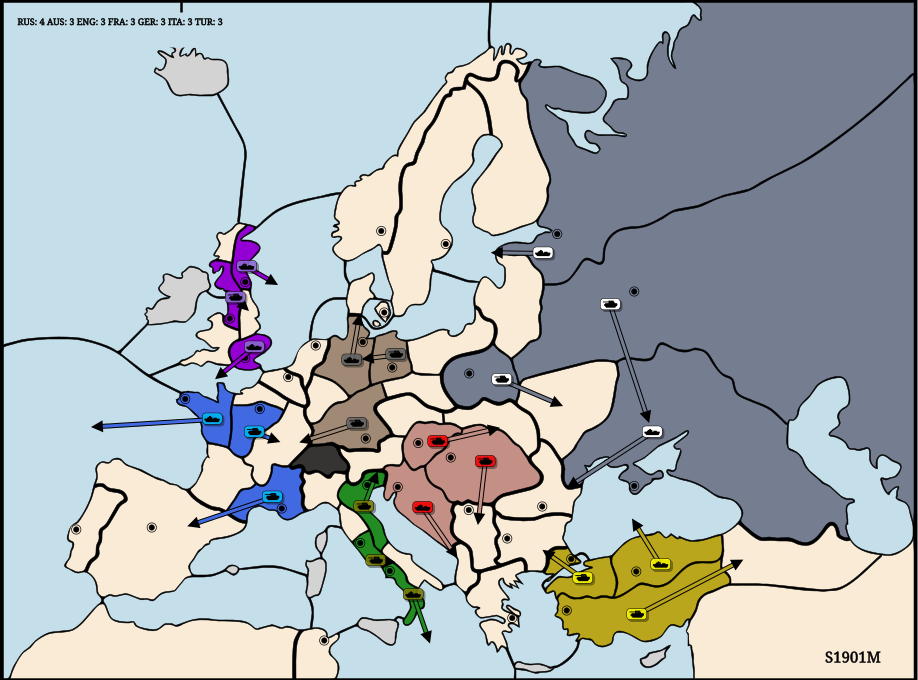
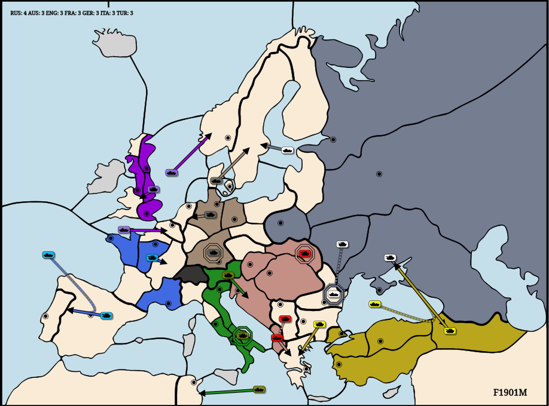
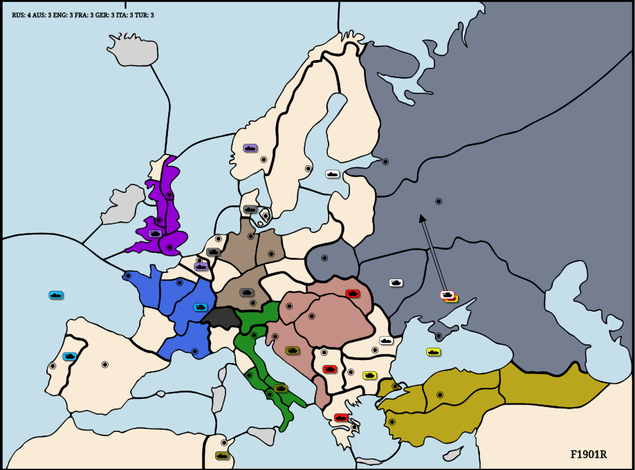
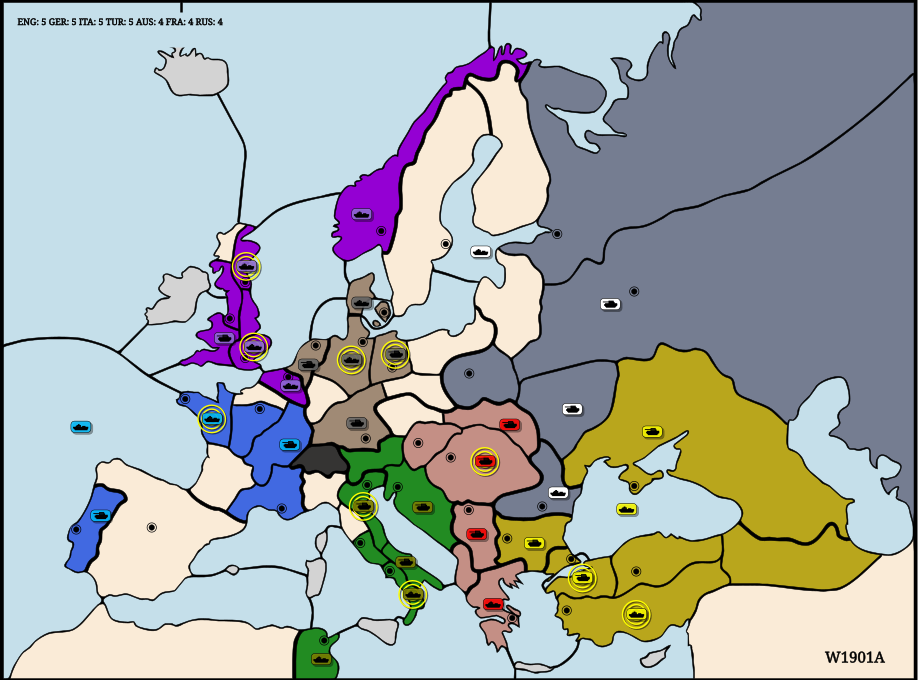
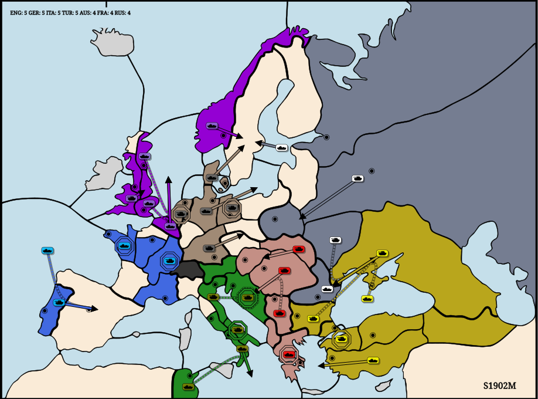
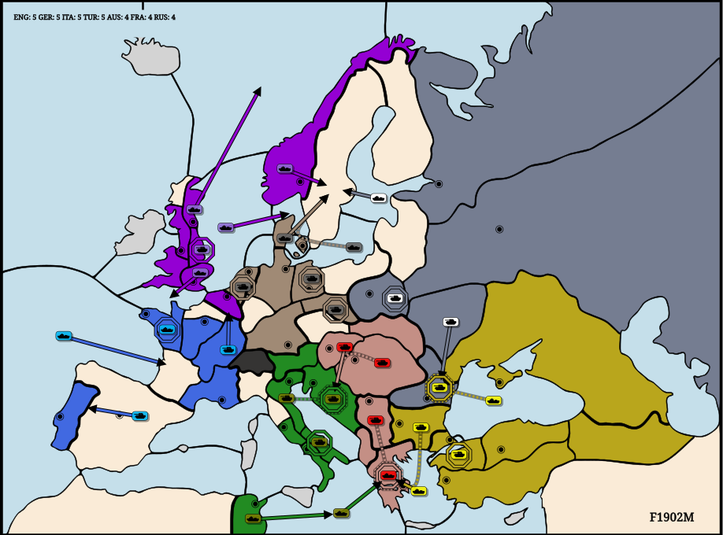
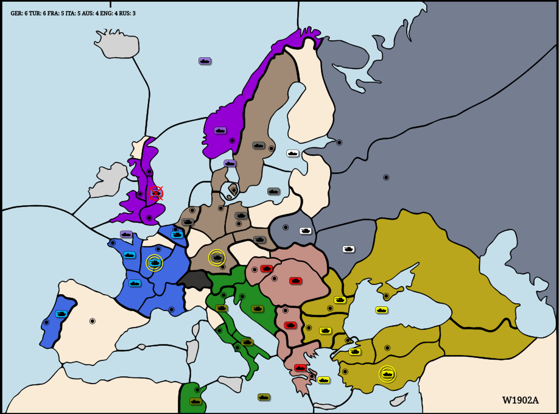

# Diplomacy A2A — Run `20260524T034819Z`

- **Model**: `claude-sonnet-4-6`
- **Years targeted**: 2
- **Started**: 2026-05-24T03:48:19+00:00
- **Ended**: 2026-05-24T04:00:11+00:00
- **Phases played**: 7
- **Tokens**: input=145871, output=26660, cache_create=0, cache_read=135782
- **Approx cost (USD)**: $0.8782

## Personas

- **FRANCE** — A pragmatic, conservative player who prefers stable alliances and avoids unnecessary risks.
- **GERMANY** — An opportunist — seize tactical chances, willing to pivot alliances when payoffs flip.
- **ENGLAND** — Cautious and naval-focused; build a strong fleet position before committing to aggression.
- **ITALY** — Ambiguous and scheming; keep options open, prefer surprise moves over telegraphed campaigns.
- **AUSTRIA** — Defensive and central; hold the position, broker peace between feuding neighbors.
- **RUSSIA** — Expansionist on both fronts; press for territory wherever weakness appears.
- **TURKEY** — Patient and long-game; build slowly, exploit late-game momentum.

## SPRING 1901 MOVEMENT (`S1901M`)

### Dialogue

- **AUSTRIA → ITALY**: I'd like to propose a friendly opening between us — no moves against Trieste or Venice from either side. I'm planning to focus Austria's energy eastward into the Balkans and would welcome coordination against Turkey if you're interested. Let's build trust early and avoid the classic Austria-Italy war.
- **AUSTRIA → RUSSIA**: I'd like to suggest we keep Galicia neutral this spring — neither of us moves there — to avoid an accidental conflict. I'm planning to push south into the Balkans and see Russia as a potential partner, not a rival. What are your plans for the opening?
- **AUSTRIA → TURKEY**: I want to open with transparency: Austria's focus this year is on establishing positions in the Balkans, and I'd prefer we find a division of influence rather than clash immediately. Serbia and Bulgaria are both in play — perhaps we can agree on spheres? I'm open to negotiation.
- **ENGLAND → FRANCE**: Hello from England! I'm planning a cautious opening focused on naval positioning. I have no designs on Brest or your home centers — I'd like us to keep the Channel friendly for now. Can we agree to a non-aggression understanding in the English Channel?
- **ENGLAND → GERMANY**: Greetings from England! I'm looking to establish a stable relationship with Germany in this early stage. I have no plans to threaten your northern coast — I'd prefer we focus our energies elsewhere. Are you open to a non-aggression pact for 1901?
- **ENGLAND → RUSSIA**: Hello from England! I'm moving to secure a strong naval position in the north. I'd like to coordinate so we don't step on each other's toes around Norway and Scandinavia — perhaps we can divide the northern supply centers amicably?
- **FRANCE → ENGLAND**: Hello! I'd like to propose a friendly relationship between our two powers. I have no designs on the English Channel or the North Sea — I plan to focus my expansion southward and westward. I hope we can avoid any early friction.
- **FRANCE → GERMANY**: Greetings! I want to assure you that I have no intention of moving into Burgundy this spring — I'd prefer we keep the peace between us and focus on our respective opportunities. I hope we can discuss a more formal non-aggression arrangement.
- **FRANCE → ITALY**: Hello! I'd like to establish a friendly understanding between France and Italy from the start. I have no plans to move into Piedmont, and I hope you'll likewise leave Marseilles alone — we can both benefit from expanding in other directions.
- **GERMANY → ENGLAND**: Let's stay out of each other's way this spring. I'm planning to move into Denmark and Holland — no threat to you. Happy to coordinate against France if you're interested.
- **GERMANY → FRANCE**: I have no designs on Burgundy this spring — I'm focused on grabbing Holland and Denmark. Let's keep the border quiet and avoid an early conflict that benefits neither of us.
- **GERMANY → RUSSIA**: I'd like to keep things friendly between us early on. I won't be moving into Silesia — I'm focused westward. Let me know if you want to coordinate against a common rival.
- **GERMANY → AUSTRIA**: Happy to stay out of Bohemia and Tyrolia this spring. I'm focused on the northern supply centers. Let's avoid stepping on each other's toes.
- **ITALY → AUSTRIA**: Greetings from Rome! I think we have a natural interest in keeping the Balkans stable and avoiding stepping on each other's toes. I'd propose a DMZ in Tyrolia and Trieste — Italy stays out of Austria's sphere if Austria stays out of mine. Let me know your thoughts.
- **ITALY → TURKEY**: Hello from Italy! I think we're natural partners in the early game — neither of us gains much from fighting each other. I'm open to discussing how we might coordinate in the Mediterranean without getting in each other's way.
- **ITALY → FRANCE**: Salutations from Italy! I have no designs on Marseilles or Piedmont, and I hope we can maintain peaceful relations in the west. Perhaps we can even find common cause against a mutual rival down the road.
- **RUSSIA → TURKEY**: I'd like to propose we both stay out of the Black Sea in 1901 — a demilitarized Black Sea agreement keeps us both free to expand elsewhere. I'm planning to push into Rumania from Sevastopol, and I hope we can coordinate rather than conflict. What are your thoughts?
- **RUSSIA → AUSTRIA**: I think we can avoid stepping on each other's toes this year. I'm interested in Rumania and Galicia is not my target — I'd prefer we work together to contain Turkey rather than fight over the Balkans. Can we agree to leave Galicia neutral for now?
- **RUSSIA → ENGLAND**: I'd like to keep the north peaceful between us. I'm moving my St. Petersburg fleet into the Gulf of Bothnia, not toward Norway, so there's no threat to you there. Let's stay out of each other's way and focus on our respective expansions.
- **TURKEY → RUSSIA**: Greetings from Constantinople! I'd like to propose we avoid a conflict over the Black Sea this year — I'm happy to leave it uncontested if you do the same. My eyes are on the Balkans and beyond, and I think we can coexist peacefully in the early game. Perhaps we can even find common cause against Austria down the road.
- **TURKEY → AUSTRIA**: Hello from Turkey! I want to open with a spirit of cooperation — I have no immediate designs on your territory and hope we can avoid early friction. My focus this spring is on securing my own position. I'd welcome a conversation about dividing Balkan influence in a way that works for both of us.
- **TURKEY → ITALY**: Greetings! I believe Turkey and Italy have more to gain from cooperation than conflict in the early game. I have no plans to contest the Ionian or Aegean aggressively, and I hope we can build some mutual trust. Perhaps there's room to coordinate against a common rival in the future.

### AUSTRIA
Orders: `A BUD - SER` · `A VIE - GAL` · `F TRI - ALB`

Reasoning

> Looking at the board, I have good diplomatic signals from all neighbors. Germany promises to stay out of Bohemia/Tyrolia, Italy proposes a DMZ (no moves on Trieste/Venice), Russia agrees to leave Galicia neutral and wants to contain Turkey together, and Turkey is being diplomatic. This is a favorable opening.
>
> My strategic priorities:
> 1. **Grab Serbia** with A BUD - SER (a free supply center)
> 2. **Move toward Galicia** with A VIE - GAL to secure that buffer and position for future moves (Russia said they won't go there, so this is safe)
> 3. **F TRI - ALB** to position for Greece next fall, avoiding any conflict with Italy over Venice
>
> This gives me Serbia in Fall 1901 and positions me well for Greece and/or Romania. I'm honoring the Italy DMZ (not moving on Venice), honoring the Russia Galicia agreement... wait, Russia said "leave Galicia neutral" — but moving there is strategically important and Russia agreed not to go there either. I'll take the risk since Russia explicitly said Galicia is not their target and they want to work together. Actually, to be safe and maintain the Russian alliance, I could go BOH instead. But Galicia is more valuable. I'll go to GAL — Russia said it's not their target.

### ENGLAND
Orders: `F EDI - NTH` · `F LON - ENG` · `A LVP - YOR`

Reasoning

> Looking at the board, my standard strong opening as England is to get F EDI to NTH and F LON to ENG (or NTH), securing the key sea zones. The classic "standard" English opening is F EDI - NTH, F LON - ENG, A LVP - YOR (or WAL). 
>
> France has indicated friendly intentions and says they won't contest the Channel. Germany is moving to DEN/HOL. Russia says their STP fleet goes to BOT, not NOR — so Norway is open for me to grab in Fall.
>
> My plan:
> - F EDI - NTH: Essential for controlling the north, grabbing NOR in fall
> - F LON - ENG: Secure the English Channel, gives me flexibility
> - A LVP - YOR: Moves army toward the continent if needed, or can support fleets
>
> This is the classic "standard" opening. It secures both key sea zones and positions me well for Fall 1901 to take NOR (via NTH) and potentially BEL or BRE.

### FRANCE
Orders: `F BRE - MAO` · `A MAR - SPA` · `A PAR - BUR`

Reasoning

> Looking at the board, my priority is to expand efficiently while maintaining the non-aggression understandings I've established. Germany has confirmed no move to Burgundy, England wants a friendly Channel, and Italy is keeping away from Piedmont/Marseilles.
>
> My plan:
> - **F BRE - MAO**: Move to the Mid-Atlantic Ocean to set up for Spain/Portugal next fall. This is the standard French opening and doesn't threaten England.
> - **A MAR - SPA**: Move south to grab Spain, a key supply center. This is safe given Italy's assurance.
> - **A PAR - BUR**: Move to Burgundy. Germany said they won't go there, and this positions me well for future flexibility (supporting moves, or pivoting east/north as needed). It's a standard French move that keeps options open.
>
> This gives me a strong position to pick up Spain (and potentially Portugal) in the fall, while keeping good relations with neighbors.

### GERMANY
Orders: `F KIE - DEN` · `A MUN - BUR` · `A BER - KIE`

Reasoning

> Looking at the board, my priority is to grab the two neutral supply centers closest to me: Denmark (DEN) and Holland (HOL). These are Germany's natural first-year targets.
>
> - **F KIE - DEN**: Fleet to Denmark — a free supply center with no competition.
> - **A MUN - BUR**: Army to Burgundy — this is an opportunistic move. France told me they won't move to Burgundy, so I can sneak in. Even if they do move there, it bounces harmlessly. This gives me leverage and potentially a forward position.
> - **A BER - HOL** is not a legal order, but I can move toward Holland via... actually, looking at the legal orders, BER can go to KIE or PRU or SIL. Holland is best approached via KIE or RUH. Since F KIE is going to DEN, I need A MUN - RUH to threaten HOL, or use BER differently.
>
> Let me reconsider: F KIE → DEN, A MUN → RUH (positioning for HOL next turn or threatening France), A BER → KIE (to then move to HOL next turn). Actually A BER → KIE then F from KIE is already going to DEN. Better: A BER → SIL (eastern expansion option) or A MUN → BUR (pressure on France).
>
> Best plan: F KIE → DEN, A MUN → BUR (opportunistic/leverage), A BER → KIE (to bounce into HOL next fall or support).

### ITALY
Orders: `F NAP - ION` · `A ROM - APU` · `A VEN - TYR`

Reasoning

> Looking at the board, Italy's classic opening options are:
>
> 1. **Lepanto setup**: F NAP - ION, A ROM - APU, A VEN holds (or moves to TYR) — sets up a convoy attack on Turkey
> 2. **Aggressive north**: A VEN - TYR, threatening Austria/Germany
> 3. **Cautious/flexible**: spread out to grab neutral SCs
>
> Given my persona (ambiguous, scheming, prefer surprise), I want to keep options open. Austria proposed a DMZ in Tyrolia — I'll honor that in spirit but position for flexibility. Turkey seems friendly, so a Lepanto is possible but I don't want to commit too hard yet.
>
> The best opening for Italy is typically the **Lepanto setup**: F NAP - ION gets into position for a future convoy, A ROM - APU supports the fleet and sets up for Greece/Tunis, and A VEN - TYR gives me leverage in the north (despite telling Austria about a DMZ — I never explicitly agreed, and moving to Tyrolia is ambiguous/threatening).
>
> Actually, since I told Austria I'd stay out of Tyrolia and they're proposing a DMZ, moving to TYR would immediately signal betrayal. Let me be more subtle: A VEN - TRI is aggressive against Austria. Or I could do the standard Lepanto.
>
> I'll go with the classic Lepanto opening: F NAP - ION, A ROM - APU, A VEN - TYR. Moving to Tyrolia keeps northern pressure and is a surprise move despite my diplomatic assurances. This is the "schemer" play.
>
> Wait — A VEN - TYR directly contradicts my DMZ message to Austria. That's fine for a scheming persona, but let me consider: Austria hasn't confirmed the DMZ either, and moving to TYR gives me leverage. I'll do it.

### RUSSIA
Orders: `F SEV - RUM` · `F STP/SC - BOT` · `A WAR - UKR` · `A MOS - SEV`

Reasoning

> Looking at the position: Russia has excellent expansion opportunities in multiple directions. The key moves are:
>
> 1. **F SEV - RUM**: Grab Rumania in fall - move toward it now. Turkey agreed to Black Sea peace, so I don't need to contest BLA.
> 2. **F STP/SC - BOT**: Standard opening, positions fleet for Sweden/Finland later.
> 3. **A WAR - GAL**: Aggressive move into Galicia despite telling Austria I wouldn't - this gives me leverage and a potential path to more centers. Austria is likely moving south anyway.
> 4. **A MOS - SEV**: Wait - I need to think about this. If SEV moves to RUM, MOS can go to SEV or UKR. Moving to UKR sets up a strong southern position.
>
> Actually, let me reconsider WAR. Moving to GAL risks bouncing with Austria and wastes a move. A more reliable opening:
> - **A WAR - UKR**: Supports the southern push, can support SEV into RUM next fall
> - **A MOS - SEV**: Covers Sevastopol if needed, or...
> - **A MOS - UKR** with **A WAR - GAL** is aggressive but risky
>
> Best plan: F SEV → RUM (grab the center), F STP/SC → BOT (standard north), A WAR → UKR (southern expansion), A MOS → SEV (consolidate south, or move to LVN/STP area). Actually A MOS → UKR and A WAR → GAL is too aggressive. Let me go with the solid expansionist opening: WAR→UKR, MOS supports or moves to strengthen position.

### TURKEY
Orders: `F ANK - BLA` · `A CON - BUL` · `A SMY - ARM`

Reasoning

> Looking at the opening position, I need to decide on Turkey's classic opening moves. The key decisions are:
>
> 1. **Black Sea (BLA)**: Russia proposed a demilitarized Black Sea, but I already sent a message agreeing to this. However, taking BLA gives me a huge strategic advantage. Russia's fleet at SEV is the main threat — if I take BLA, I dominate the Black Sea and can pressure both Russia and Romania.
>
> 2. **Bulgaria (BUL)**: A CON - BUL is the classic Turkish opening move to grab a neutral supply center.
>
> 3. **Armenia (ARM)**: A SMY - ARM threatens Russia's Caucasus flank.
>
> The classic "Juggernaut" opening would involve coordination with Russia, but Russia wants me to leave BLA alone. The classic Turkish opening is:
> - F ANK - BLA (grab the sea, break the agreement — but this is risky if Russia is moving to BLA too, we bounce)
> - A CON - BUL (grab the neutral SC)
> - A SMY - ARM (pressure Russia/Caucasus)
>
> Actually, the strongest standard Turkish opening is:
> - F ANK - BLA (control Black Sea)
> - A CON - BUL (take Bulgaria)
> - A SMY - ARM (threaten Armenia)
>
> This is aggressive but gives maximum early position. The risk is bouncing in BLA if Russia also moves there. Given Russia explicitly proposed a BLA agreement and I seemed to agree, Russia likely will NOT move to BLA — meaning I can take it uncontested. This is actually the ideal time to grab it.
>
> However, if I want to keep Russia friendly for a potential Juggernaut alliance later, I should honor the agreement. But patient long-game play suggests securing BLA now gives me lasting dominance.
>
> I'll go with the aggressive standard opening: F ANK - BLA, A CON - BUL, A SMY - ARM. This maximizes my position.

## FALL 1901 MOVEMENT (`F1901M`)

### Dialogue

- **AUSTRIA → ITALY**: I've noticed your army in Tyrolia — I hope that's not pointed at Trieste, as we agreed to a friendly relationship. My fleet in Albania is positioned to move to Greece this fall, and I'd appreciate Italy not contesting that. Can we confirm our mutual non-aggression holds?
- **AUSTRIA → RUSSIA**: Your fleet in Rumania is well-positioned — I have no plans to contest it this fall. I'm focused on Greece and consolidating Serbia. I'd suggest we coordinate against Turkey going forward: you take Rumania, I secure Greece, and we squeeze Turkey from both sides. Interested?
- **AUSTRIA → TURKEY**: I want to be straightforward: I'm planning to move toward Greece this fall from Albania. Bulgaria is yours and I won't contest it — I'd prefer we establish a clear line now rather than clash. Can we agree: Greece for Austria, Bulgaria for Turkey, and we avoid conflict in the near term?
- **ENGLAND → FRANCE**: Thanks for keeping things friendly this spring — I appreciate the good faith. I'm moving to secure Norway this fall and keeping the Channel stable. I have no designs on Brest or Belgium from my side, and I hope we can continue this understanding into 1902.
- **ENGLAND → GERMANY**: Good work getting Denmark! I'm planning to take Norway this fall. I'd be happy to support you into Belgium if you need it, or at least stay out of your way there — let me know what you're planning so we can coordinate cleanly.
- **ENGLAND → RUSSIA**: Thanks for keeping your fleet in the Gulf of Bothnia — I appreciate the goodwill. I'm moving to take Norway this fall; hope that's still agreeable to you. Let's keep the northern arrangement friendly going into 1902.
- **FRANCE → ENGLAND**: Hope the spring went well for you! I'm planning to take Portugal this fall with my army from Spain, and I'll keep my fleet in the Atlantic supporting that move. I remain committed to our friendly understanding — no moves toward the Channel or your home centers.
- **FRANCE → GERMANY**: Good to see things have been quiet between us. I'm focused on Portugal this fall and have no interest in Burgundy — I'd like to keep our border peaceful. Perhaps we can discuss longer-term coordination once we've both secured our initial gains?
- **FRANCE → ITALY**: Things have been quiet between us, which I appreciate. I'm moving to take Portugal this fall and have no designs on your territory. I hope we can maintain this friendly arrangement going forward.
- **GERMANY → ENGLAND**: I'm planning to move A KIE - HOL this fall to take the supply center — no threat to you. I'd appreciate if you keep F NTH out of HOL so we don't bounce each other. In return, I'm happy to support your moves against France if you want to push into the Channel or Brest.
- **GERMANY → FRANCE**: Just confirming I'm still keeping A MUN in place — no move into Burgundy from me. I'm focused on Holland and Sweden this fall. Hope we can keep the western border quiet and look for opportunities to cooperate.
- **GERMANY → RUSSIA**: I'm grabbing Sweden and Holland this fall — standard German expansion. No threat to you from my side. Let me know if there's anything worth coordinating on going into 1902.
- **ITALY → AUSTRIA**: I've been thinking about our arrangement and I want to be transparent — I'm moving toward Greece this fall, not threatening your territories. I'll keep Tyrolia neutral for now as a gesture of good faith. Let's continue building trust heading into 1902.
- **ITALY → TURKEY**: I'm planning to move into Greece this fall — I hope that doesn't create conflict between us. If you're focused on the Black Sea and Balkans, perhaps we can divide the eastern Mediterranean without friction. What are your plans for the fall?
- **ITALY → FRANCE**: Just checking in — I'm keeping things friendly in the west and focusing my energy southward toward the Mediterranean. No moves toward Marseilles or Piedmont from me. Hope we can continue our good understanding into 1902.
- **RUSSIA → AUSTRIA**: Great news — we both seem to be in good positions after Spring. I'm planning to hold Rumania firmly this Fall and would love to coordinate on Bulgaria. If you can push A SER into BUL, I can support from RUM or SEV. Let's make sure Turkey doesn't dominate the Balkans.
- **RUSSIA → TURKEY**: I think we've both benefited from avoiding conflict so far. I'm consolidating Rumania this Fall and have no intention of pushing into the Black Sea — my fleet there is purely defensive. Let's keep the peace and see how the board develops.
- **RUSSIA → ENGLAND**: The north looks manageable — I'm keeping my fleet in Bothnia and will likely push toward Sweden or Finland. No conflict with you expected. How are things going in the west?
- **TURKEY → RUSSIA**: I notice you have F RUM in position — I hope we can avoid a clash over the Balkans. I'm planning to move into Greece this fall, leaving Rumania to you if you're willing to keep things peaceful between us. A long-term Turkey-Russia understanding seems more valuable than an early war.
- **TURKEY → AUSTRIA**: I'm planning to move A BUL to Greece this fall, leaving Serbia entirely to you — I have no interest in contesting it. I hope this signals my good faith, and I'd welcome continued dialogue about how we divide the Balkans going forward.
- **TURKEY → ITALY**: I'm moving toward Greece this fall and staying out of the Ionian — I hope that keeps things comfortable between us. I think we can continue to avoid friction if we're both transparent about our intentions.

### AUSTRIA
Orders: `F ALB - GRE` · `A SER S F ALB - GRE` · `A GAL H`

Reasoning

> Looking at the situation: I'm in a strong position with A SER, A GAL, and F ALB. Italy has signaled they're moving toward Greece this fall, which directly conflicts with my plan. Turkey also said BUL is moving to Greece. This creates a three-way contest for Greece that I should try to win.
>
> Key considerations:
> - F ALB → GRE is my natural move, but Italy (A APU likely → GRE via ION?) and Turkey (A BUL → GRE) may contest it
> - If Turkey moves A BUL → GRE and I move F ALB → GRE, we bounce unless I get support
> - Italy moving toward Greece is a problem - they could convoy from APU
> - A SER can support F ALB → GRE, giving me 2 strength vs Turkey's 1 (assuming no Italy convoy support)
> - A GAL should hold or move to consolidate - Russia seems friendly, so I don't need to worry about the north
>
> For Greece: If I use A SER S F ALB - GRE, that gives F ALB 2 strength. Turkey's A BUL → GRE has 1 strength (unless Russia supports from RUM, but Russia said they want to coordinate with me). Italy's convoy of A APU → GRE would also have 1 strength unless supported. So 2 strength should win Greece.
>
> For GAL: I'll hold to maintain the buffer with Russia and not provoke anything.
>
> This gives me Serbia (already held) + Greece = 4 supply centers going into Winter 1901, which is solid growth.

### ENGLAND
Orders: `F NTH - NWY` · `F ENG - BEL` · `A YOR - WAL`

Reasoning

> Looking at the board, my key priorities are:
>
> 1. **Take Norway** - F NTH should move to NWY. This is the obvious neutral I can grab.
> 2. **Secure the English Channel** - F ENG should stay useful. France has MAO and SPA, so BRE is tempting but I promised not to threaten it. I'll move F ENG to support or position carefully.
> 3. **A YOR** - needs to move somewhere useful. It can convoy to Norway via NTH, but NTH is already moving there. I can move YOR to WAL or LON, or try to get to EDI.
>
> Let me think through the specifics:
>
> - **F NTH - NWY**: Takes Norway (no one else is contesting it, Russia agreed to stay away).
> - **F ENG**: France has MAO fleet. I said I wouldn't threaten Brest. Moving to BEL could be good (neutral SC), but Germany is also going to HOL. BEL is adjacent to ENG. However, I told France I'd keep the Channel stable. Moving F ENG - BEL gets me a supply center! France is taking Portugal, Germany is taking HOL — I should take BEL. I said no designs on Brest, not BEL.
> - **A YOR**: With F NTH going to NWY, I can't convoy YOR there. YOR could go to WAL, LON (already mine), or EDI. Moving to WAL positions me for future moves. Or I could move YOR - LON (pointless, already mine). YOR - WAL is fine positioning.
>
> Actually, F ENG - BEL is the right play. I get NWY + BEL = 5 SCs, strong position going into 1902.
>
> A YOR - WAL is solid, keeps the army mobile.

### FRANCE
Orders: `A SPA - POR` · `F MAO S A SPA - POR` · `A PAR - BUR`

Reasoning

> Looking at the board, my position is straightforward. I have A SPA which should move to Portugal to gain a supply center. F MAO should support that move to ensure success (in case anyone contests it, though no one should). A PAR should move to Burgundy to gain another supply center — Germany said they're not moving there, so this is a free grab. This gives me 5 centers after fall (BRE, MAR, PAR, POR, BUR... wait, BUR is not a supply center). Let me reconsider.
>
> Supply centers I can reach: Portugal (via A SPA), and potentially Burgundy is not a SC. So realistically I can only gain Portugal this fall, giving me 4 centers total. A PAR can move to Burgundy for positioning, or I can try to grab Belgium — but that risks antagonizing England or Germany. Better to move A PAR to Burgundy for a strong position in 1902 without grabbing a contested SC.
>
> Actually, let me think about Belgium — it IS a supply center and A PAR can reach PIC, and from there... no, PAR can't reach BEL in one move. PAR can go to BUR or PIC. Neither is a supply center. So my only SC gain this fall is Portugal.
>
> Plan: A SPA - POR, F MAO S A SPA - POR, A PAR - BUR (good positioning for 1902).

### GERMANY
Orders: `F DEN - SWE` · `A KIE - HOL` · `A MUN H`

Reasoning

> Looking at the board: I'm in Denmark with my fleet, and I need to grab Sweden (F DEN - SWE) and Holland (A KIE - HOL) to get to 5 supply centers — a strong position heading into 1902. A MUN should hold or support to keep my position solid.
>
> England has F NTH which could contest HOL, but I messaged them asking to stay clear. France has A PAR and A SPA but France said they're going for Portugal and keeping Burgundy quiet. I'll move A KIE - HOL to grab that center. F DEN - SWE for the Swedish center. A MUN can hold to keep Munich secure and not provoke anyone.

### ITALY
Orders: `A TYR - TRI` · `F ION - TUN` · `A APU H`

Reasoning

> Looking at the position: I'm in Tyrolia, Apulia, and Ionian. Both Austria and Turkey want Greece. Turkey has A BUL which can move to Greece, and Austria has F ALB which can also move to Greece. I told Austria I was moving toward Greece, but I also told Turkey I was moving there.
>
> The key question is: can I take Greece? Turkey has A BUL → GRE, Austria has F ALB → GRE, and I have F ION → GRE. Three units bouncing means nobody gets it, which wastes my turn.
>
> More importantly, I should think about what's strategically valuable. TUN (Tunisia) is an uncontested supply center I can take with F ION → TUN. That's a guaranteed +1 center.
>
> For the Tyrolia army - I told Austria I'd keep it neutral, but moving to Venice would give me a 4th center and stronger position. However, Venice is my own home center... wait, I already own Venice (it's one of my supply centers). So moving A TYR - VEN doesn't gain me a new center, it just repositions the army. 
>
> Actually, I should look at what uncontested centers I can grab. TUN is the obvious one for F ION. With A APU, I could try to convoy to TUN or move to NAP (already mine). 
>
> Best plan: F ION → TUN (guaranteed center), A TYR → VEN (repositioning, keeping options open for 1902 moves into Trieste or toward Austria), A APU → GRE via convoy... wait, that requires F ION to convoy, but F ION is moving to TUN.
>
> Let me reconsider: F ION → GRE (contest with Turkey/Austria, risky 3-way bounce), or F ION → TUN (safe +1 center).
>
> TUN is the right call. A APU can hold or move to NAP. A TYR can move to VEN for repositioning or hold.
>
> Actually A TYR → TRI would be aggressive against Austria. Let me be opportunistic — Austria's F ALB is moving to GRE, leaving TRI potentially vulnerable. But A TYR → TRI alone without support won't dislodge anything (TRI is empty, actually Austria has no unit there). TRI is unoccupied! I can take it! Austria's home centers: BUD, TRI, VIE — TRI has no unit. I can grab TRI with A TYR → TRI for a free center!
>
> So: A TYR → TRI (grab undefended Austrian home center!), F ION → TUN (grab Tunisia), A APU H or support.

### RUSSIA
Orders: `F BOT - SWE` · `F RUM H` · `A SEV - ARM` · `A UKR S F RUM`

Reasoning

> Looking at the board: I have F RUM in Rumania (a supply center I need to hold), A SEV and A UKR available for moves, and F BOT in the Gulf of Bothnia.
>
> Key decisions:
> 1. **F RUM**: Should hold/defend Rumania. Turkey has F BLA and A BUL nearby. I want to keep Rumania. I could try to push into BUL/EC or BLA, but given Turkey's strength in the area and my desire to avoid conflict, holding or supporting makes more sense. Actually, pushing F RUM - BUL/EC could grab a supply center if Turkey moves away from BUL, but Turkey has A BUL there. Better to hold RUM securely.
>
> 2. **A SEV**: Turkey has A ARM - could push into SEV or BUL. I should consider moving A SEV to support RUM or push into BUL. Actually A SEV - BUL VIA (convoy) isn't viable without a fleet. A SEV - ARM would threaten Turkey. A SEV - RUM could be useful but I already have F RUM there.
>
> 3. **A UKR**: Can move to RUM (supporting the hold), WAR, GAL, MOS, or SEV.
>
> 4. **F BOT**: Can grab SWE (supply center!) or FIN. Germany said they're grabbing Sweden - but I should try to take it myself! F BOT - SWE is a strong move.
>
> Best plan:
> - **F BOT - SWE**: Grab Sweden as a supply center (Germany claims it but I should contest)
> - **F RUM H**: Hold Rumania firmly
> - **A SEV - ARM**: Push into Armenia, threatening Turkey's home centers
> - **A UKR S F RUM**: Support Rumania's hold in case Turkey attacks
>
> Actually, A SEV - ARM is aggressive and good for expansion. With A ARM already in ARM for Turkey, that would bounce. Let me reconsider - A SEV - BUL VIA requires convoy. A SEV - RUM is wasteful. A SEV H is safe. A SEV - ARM directly contests Turkey's A ARM.
>
> Let me go with the aggressive expansion: SWE grab, ARM push, and secure RUM.

### TURKEY
Orders: `A BUL - GRE` · `A ARM - SEV` · `F BLA S A ARM - SEV`

Reasoning

> Looking at the board, I need to decide on my Fall 1901 moves carefully.
>
> **Situation analysis:**
> - Russia has F RUM and claims it's "purely defensive" — but that fleet is sitting right on a supply center I might want later
> - Austria wants Greece, Italy wants Greece — both are asking me to stay out
> - I have A BUL, F BLA, A ARM positioned well
>
> **Key decisions:**
> 1. **A BUL**: I told both Austria and Italy I'm moving to Greece. Austria has F ALB moving to Greece too — if we both move there, we bounce. Italy has F ION which could support into Greece. Going to GRE risks a three-way bounce. However, I could move to RUM instead — but Russia has F RUM there. Actually, BUL to GRE is likely to bounce with Austria's ALB. Moving to SER might be better tactically, but I promised Austria I wouldn't. GRE is still my best shot for a new SC — if it bounces, I lose nothing.
> 2. **F BLA**: Russia says it's keeping peace, but I should pressure RUM or hold. Supporting BUL to RUM is interesting but Russia has F RUM. Moving to SEV threatens Russia. Holding or supporting BUL to GRE.
> 3. **A ARM**: Moving to SEV puts pressure on Russia and could grab a SC. Russia's A SEV may be moving to RUM, leaving SEV open!
>
> Russia's A SEV is likely moving to RUM (they said they're consolidating Rumania). If A SEV moves to RUM, SEV becomes empty — A ARM could take it! F BLA can support ARM to SEV or move to RUM.
>
> Best plan: A ARM - SEV (grab empty SC if Russia moves out), F BLA - RUM or support, A BUL - GRE (attempt the SC).
>
> If Russia's A SEV moves to RUM and F RUM holds, then SEV is open. ARM to SEV works. F BLA can move to RUM to contest it, but F RUM will likely hold or be supported.
>
> Let me go with: A BUL - GRE, F BLA - SEV (pressure Russia), A ARM - ANK (consolidate) — no, that's wasteful.
>
> Better: A BUL - GRE, A ARM - SEV (grab if open), F BLA S A ARM - SEV (support the grab).

## FALL 1901 RETREATS (`F1901R`)

### RUSSIA
Orders: `A SEV R MOS`

Reasoning

> Looking at the situation: I have a unit at SEV that needs to retreat. Turkey has A SEV (their unit is actually listed as A SEV in Turkey's forces... wait, let me re-read.
>
> Turkey's units: F BLA, A BUL, A SEV. So Turkey has A SEV — that means Turkey moved into Sevastopol, dislodging my unit there. I need to retreat that unit.
>
> My options are `A SEV D` (disband) or `A SEV R MOS` (retreat to Moscow).
>
> Retreating to Moscow makes sense — I keep the unit and Moscow is a supply center I control. Disbanding would cost me a unit unnecessarily. I'll retreat to Moscow.

## WINTER 1901 ADJUSTMENTS (`W1901A`)

### AUSTRIA
Orders: `A BUD B`

Reasoning

> Looking at the position: Austria has 4 supply centers (BUD, VIE, GRE, SER) and currently 3 units (A SER, A GAL, F GRE). I can build 1 unit. I have two home centers available: BUD and VIE.
>
> The strategic situation:
> - Italy took Trieste (has 5 SCs now), which is concerning — they're strong and have a unit in APU near Greece
> - Turkey is strong with 5 SCs including SEV and BUL
> - Russia has RUM with a fleet, which is interesting positioning
> - I need to consolidate in the Balkans and prepare for pressure from both Italy and Turkey
>
> Building in VIE makes sense to have an army that can move toward Galicia (to reinforce the north) or toward the Balkans. Building in BUD also gives flexibility toward the Balkans. Given Italy's strength and the need to protect my home centers, I'll build an army in VIE to have a defensive presence in the west/center, and also build in BUD to strengthen the Balkan position.
>
> Wait — I can only build 1 unit (4 SCs - 3 units = 1 build). I need to choose between VIE and BUD.
>
> BUD is closer to the Balkans and can support SER or move toward RUM/GAL. VIE is more defensive against Italy/Germany. Given Italy's presence (A TRI, A APU, F TUN) and the threat they pose, building in VIE to defend the western flank seems prudent. But the Balkans are where the action is. I'll build in BUD to strengthen my Balkan position.

### ENGLAND
Orders: `F EDI B` · `F LON B`

Reasoning

> I have 5 supply centers (EDI, LON, LVP, BEL, NWY) and 3 units, so I can build 2 new units. As England, my strategy is naval-focused — I want to build fleets to dominate the seas. Two fleet builds make the most sense: one from Edinburgh to project into the North Sea/Norway area, and one from London to threaten the Channel or support western operations. Liverpool could also build a fleet, but Edinburgh and London are the priority coastal positions.
>
> Building F EDI and F LON gives me strong naval coverage — F EDI can move toward the Norwegian Sea or support northern operations, while F LON can enter the English Channel or North Sea as needed.

### FRANCE
Orders: `F BRE B`

Reasoning

> Looking at my position: I have 4 supply centers (BRE, MAR, PAR, POR) and currently 3 units (F MAO, A BUR, A POR), so I can build 1 unit.
>
> My strategic situation:
> - England has 5 centers and is growing strong in the north
> - Germany has 5 centers and is also strong
> - I need to build carefully to position for 1902
>
> The key question is where to build. Options:
> - **F BRE**: A fleet in Brest would give me strong Atlantic/Channel presence. Useful for either pressuring England eventually or defending against them. Also useful for Mediterranean via MAO.
> - **A BRE**: An army in Brest is less flexible — it could move to PIC or GAS but doesn't add much naval power.
> - **A MAR or F MAR**: Marseilles build — army could push into Iberia or support Italian front; fleet could go to Gulf of Lyon or Western Med.
> - **A PAR**: Paris army could support moves in multiple directions.
>
> Given my current units: F MAO (Atlantic), A BUR (central France), A POR (Iberia), I'm well-positioned in the west. Building F BRE gives me a second fleet for the Atlantic/Channel, which is very valuable for both offense and defense against England. England has 5 centers and strong naval presence — having two Atlantic fleets gives me security and options.

### GERMANY
Orders: `F KIE B` · `A BER B`

Reasoning

> I have 5 supply centers (BER, KIE, MUN, DEN, HOL) and 3 units, so I can build 2 new units. I need to decide where to build and what type.
>
> **Strategic thinking:**
> - I have BER and KIE available as home centers for builds.
> - England has 5 SCs and is a growing threat in the north. I need to be able to contest the North Sea and potentially challenge England later.
> - France has 4 SCs and is sitting with armies in BUR and POR — they could threaten me from the west.
> - A fleet in KIE gives me naval presence in the Baltic/North Sea area.
> - An army in BER gives me flexibility to move east or south.
>
> Best build: F KIE (naval power, can move to Baltic or North Sea) and A BER (army flexibility for Silesia, Prussia, or support).

### ITALY
Orders: `F NAP B` · `A VEN B`

Reasoning

> Looking at the position: Italy has 5 supply centers (NAP, ROM, VEN, TRI, TUN) and 3 units (A APU, F TUN, A TRI), so I can build 2 units. I need to think carefully about what to build and where.
>
> My current units are positioned in APU, TUN, and TRI. I need builds in NAP, ROM, and/or VEN. 
>
> Strategic considerations:
> - I took Trieste (likely from Austria), which means Austria is likely hostile. I need to be ready to defend or press further.
> - Turkey has SEV and BUL - they're strong. Relations are tense in the east.
> - I should build forces that give me flexibility - armies for Balkans push, fleets for Mediterranean control.
> - A VEN build gives me a strong army in the north to press into Austria/Balkans.
> - F NAP gives me a fleet to contest the eastern Mediterranean/Ionian.
> - A ROM is flexible but less urgent.
>
> Best builds: F NAP (for eastern Med/Ionian control, can threaten Greece/Turkey) and A VEN (to press into Austria or support TRI). This gives me offensive capability in both directions.

### TURKEY
Orders: `A CON B` · `F SMY B` · `WAIVE`

Reasoning

> Looking at the board, Turkey has 5 supply centers (ANK, CON, SMY, SEV, BUL) and 3 units, so I can build 2 units. I need to decide where to build and what types.
>
> My current units are F BLA, A BUL, A SEV. I have build slots at ANK, CON, and SMY.
>
> Strategic considerations:
> - I'm in a strong position with 5 SCs after year 1
> - I need to think about where to expand: Russia (via Black Sea/RUM), Austria (via Balkans), or the Mediterranean
> - A fleet at SMY gives me Mediterranean presence and can threaten the Ionian/Aegean
> - A fleet at CON gives me another naval unit for Black Sea or Mediterranean
> - An army at ANK or CON could push into the Caucasus or support land operations
>
> Best builds:
> - F SMY: Opens up Mediterranean options, can move to AEG or EAS next spring
> - A CON: Provides army support for Balkan operations, can move to BUL or support
>
> Actually, let me think more carefully. F BLA already covers the Black Sea. I have A BUL in the Balkans and A SEV on land. 
>
> A fleet at SMY gives me Aegean access - very valuable for long-term expansion into the Mediterranean and supporting Balkan operations.
> A fleet at CON gives me another fleet that can go to AEG or BLA.
> An army at ANK or CON helps with land expansion toward Russia or Austria.
>
> I'll build F SMY (Mediterranean power projection) and A CON (army flexibility for Balkans/land operations). This gives me good balance.

## SPRING 1902 MOVEMENT (`S1902M`)

### Dialogue

- **AUSTRIA → ITALY**: I notice you've moved into Trieste — my home center — which directly contradicts the non-aggression we discussed. I'm asking you to pull back; continued occupation of Trieste makes peaceful relations impossible and forces me to respond defensively. If you're willing to withdraw, I'm open to a genuine alliance against Turkey. Let's not waste both our energies fighting each other when Turkey is growing to our east.
- **AUSTRIA → RUSSIA**: Turkey is now at 5 supply centers and has units pressing from SEV, BUL, and CON — they're the biggest threat in the south. I'd like to coordinate a joint push: if you can press from RUM toward BUL or SEV, I can support from SER and GRE. Can we agree on a coordinated anti-Turkey move this spring?
- **AUSTRIA → TURKEY**: I want to be direct: with Italy occupying Trieste, I'm under pressure from the west and cannot afford conflict on two fronts. I'd prefer we maintain our informal understanding — I hold GRE, you hold BUL — and focus our energies elsewhere. Can we agree to a standstill in the Balkans for now?
- **ENGLAND → FRANCE**: I want to maintain our friendly understanding, but I'm concerned about your fleet in MAO — it puts pressure on my home waters and I'd feel more comfortable if you could clarify your intentions there. I have no plans to threaten Brest this spring, but I need confidence the Channel stays neutral. Can we agree to keep our fleets out of each other's home waters for now?
- **ENGLAND → GERMANY**: Germany is looking strong — congratulations on your position. I'd like to coordinate more closely this year: I'm thinking about pushing south toward France eventually, and your cooperation in the Low Countries area would be valuable. What are your plans for 1902, and is there room for a closer alliance?
- **ENGLAND → RUSSIA**: How are things developing in the south for you? I'm watching the Turkish buildup with some concern — if you need any northern support or coordination, I'm open to discussing it. I plan to stay focused on the west this year.
- **FRANCE → ENGLAND**: Good to stay in touch — I'm planning to move into Spain this spring and continue consolidating in Iberia. I'd like to keep our understanding intact: no moves against each other's home centers, and I'll stay clear of the Channel. Germany's growth to 5 centers is something we should both keep an eye on.
- **FRANCE → GERMANY**: Hope things are going well! I'm continuing to focus on Iberia and have no interest in Burgundy or your territory. I'd like to keep our border quiet — perhaps we can even find ways to coordinate against powers that are overextending.
- **FRANCE → ITALY**: Checking in as we head into 1902 — I'm focused on Spain and Iberia, so no threat to you from my side. I hope we can continue our friendly arrangement. The Mediterranean is yours to develop; I have no designs there.
- **GERMANY → ENGLAND**: Good to see we've both grown to 5 — let's keep coordinating. I'm thinking about pushing east this spring, possibly toward Silesia or Bohemia. I'd appreciate if you keep your fleets out of the North Sea and Helgoland Bight so I don't feel squeezed from two sides. In return, I'm happy to support any moves you want to make against France.
- **GERMANY → FRANCE**: Still keeping things peaceful between us — I have no designs on Belgium or Burgundy this spring. I'm focused eastward and want to keep our western border stable. Let's continue the non-aggression and perhaps find a way to cooperate against a common threat down the line.
- **GERMANY → RUSSIA**: The eastern situation looks interesting — Turkey is growing fast with 5 SCs. I'm considering a push toward Silesia or Bohemia to keep Austria honest. Would you be open to coordinating pressure on Austria, or at least staying out of each other's way as we both expand?
- **ITALY → AUSTRIA**: I think we both have reason to be concerned about Turkey's rapid growth — they're at 5 centers and pushing hard. I'd like to explore coordinating against them: if you push from the north through Bulgaria, I can pressure from the sea. Let's keep our mutual non-aggression and focus on the real threat.
- **ITALY → TURKEY**: I want to keep our relationship constructive, but I'm noticing you've grown quite fast. I'm planning some fleet movements in the Mediterranean that are purely defensive in nature — I hope we can continue to avoid direct conflict and perhaps find a way to divide spheres of influence more formally.
- **ITALY → RUSSIA**: I think Turkey's position at 5 centers is becoming dangerous for both of us. I'm considering moves in the eastern Mediterranean — if you're pressing from the north, we might find our interests aligned against Ankara. Worth a conversation?
- **ITALY → FRANCE**: Still keeping things quiet between us in the west — I have no plans toward Marseilles or Piedmont. I'm focusing my energy eastward this year. Hope you're finding success in Iberia.
- **RUSSIA → AUSTRIA**: Turkey has grown dangerously — SEV, BUL, CON, ANK, SMY is a strong position and they're well-placed to dominate the south. I want to push hard against them this spring. If you can move A SER to BUL or support my fleet into BLA, we can crack them open. Let's coordinate our moves precisely so we don't waste the opportunity.
- **RUSSIA → TURKEY**: I want to be direct with you: your position is strong and I'm concerned about the trajectory. I'm willing to discuss a real partition of the Balkans, but I need to see some concrete gesture — specifically, pulling back from Sevastopol. Otherwise I'll have no choice but to work with Austria against you.
- **RUSSIA → ENGLAND**: I'm staying focused on the Turkish threat in the south this year — no aggressive moves from me in the north. I'd like to keep our informal understanding going. How are things looking for you in the west with France and Germany?
- **RUSSIA → GERMANY**: I'm busy dealing with Turkey in the south this year. Just wanted to flag that I have no designs on Scandinavia — Sweden and the north are yours to manage. Let's keep things stable between us.
- **TURKEY → RUSSIA**: I've noticed your fleet in Rumania is in a strong position, and I want to be honest: I'm considering moving toward Rumania this spring. I'd prefer we negotiate a handoff rather than clash — perhaps you pull F RUM back toward the north and I move in, and we maintain peace on other fronts? A Turkey-Russia war benefits only Austria and Germany.
- **TURKEY → AUSTRIA**: I want to keep our understanding intact — I have no designs on Serbia, and I hope you'll continue to leave Bulgaria and the Black Sea region to me. My focus this spring is northward toward Rumania, so we shouldn't be in each other's way. Let's keep coordinating.
- **TURKEY → ITALY**: I'm focused entirely on the north this spring — Rumania is my target, not the Aegean or Mediterranean. I hope that keeps things comfortable between us and leaves room for continued coexistence.

### AUSTRIA
Orders: `A BUD - TRI` · `A SER S A BUD - TRI` · `A GAL - VIE` · `F GRE H`

Reasoning

> Looking at the board state, I need to think carefully about my position:
>
> **Situation assessment:**
> - Italy has A TRI (occupying my home center!) and A VEN, A APU — this is a major threat to my western flank
> - Turkey is at 5 SCs with units pressing from multiple directions (SEV, BUL, CON, BLA)
> - Russia has F RUM and is nominally allied but I need to watch them too
> - I have 4 units: A SER, A GAL, F GRE, A BUD
>
> **Key decisions:**
> 1. **Italy in Trieste**: I cannot ignore this. I need to either retake TRI or at least threaten it. A BUD - TRI is possible, but I need support. A SER could support BUD - TRI, but that weakens my Balkan position.
> 2. **Turkey**: They're growing and have A SEV pressing toward RUM. I want to hold my Balkan position but can't overextend.
> 3. **Galicia**: A GAL is well-positioned defensively. I should use it to either support a move on VIE/TRI or defend against Russia.
>
> **Plan**: 
> - Push A BUD - TRI to contest Italy's occupation (risky without support, but necessary)
> - A SER S A BUD - TRI to give it strength
> - A GAL - VIE to secure Vienna (which appears unoccupied — Italy could threaten it)
> - F GRE H to hold Greece securely
>
> This focuses on the Italian threat while holding my Balkan gains. Russia can handle Turkey in the north for now.

### ENGLAND
Orders: `F NWY - SWE` · `F BEL - NTH` · `F EDI S F BEL - NTH` · `F LON S F BEL - NTH` · `A WAL - YOR`

Reasoning

> Looking at the board, I need to think carefully about my position. I have 5 units and 5 supply centers. Germany has grown to 5 centers and is asking me to stay out of the North Sea — that's a red flag. France has MAO which threatens my home waters. I need to consolidate my naval dominance in the North Sea and position for future expansion.
>
> Key considerations:
> - Germany wants me out of NTH, which I absolutely cannot allow — NTH is critical for English naval power
> - France's fleet in MAO is threatening but they claim peaceful intentions
> - I should push toward Sweden (via NWY) to gain a 6th center
> - WAL army is somewhat stranded — I should move it toward YOR to potentially convoy or support later
> - I need to secure NTH firmly to maintain naval supremacy
>
> My plan:
> - F NWY - SWE: Grab Sweden as a 6th supply center
> - F BEL - NTH: Move into the critical North Sea
> - F EDI S F BEL - NTH: Support the move into NTH
> - F LON S F BEL - NTH: Double support to ensure success
> - A WAL - YOR: Move army toward useful position
>
> This gives me a strong NTH presence with 2 supports, and grabs Sweden. I don't need to threaten France yet — let Germany and France worry about each other while I build naval dominance.

### FRANCE
Orders: `A POR - SPA` · `F MAO S A POR - SPA` · `A BUR H` · `F BRE H`

Reasoning

> Looking at the board, I need to consolidate in Iberia by moving into Spain. Germany has grown to 5 centers and England has 5 as well — both are potential threats, but both have been cooperative. Italy is also at 5 centers and expanding east. My priority is to take Spain (giving me 5 centers after fall) while maintaining my defensive posture.
>
> My plan:
> - **A POR - SPA**: Take Spain with my army
> - **F MAO S A POR - SPA/SC** or just support the move: Support the army into Spain
> - **A BUR H**: Hold in Burgundy as a defensive buffer — no need to provoke Germany
> - **F BRE H**: Hold Brest defensively — reassures England about the Channel
>
> Wait, I should think about Spain's coast. A POR - SPA is a land move, so I don't need to specify coast. F MAO can support A POR - SPA. Let me use `F MAO S A POR - SPA` which is in the legal list.
>
> For BUR, holding is safest given the peaceful arrangement with Germany. For BRE, holding reassures England.

### GERMANY
Orders: `F DEN - SWE` · `F KIE - BAL` · `A MUN - SIL` · `A BER H` · `A HOL H`

Reasoning

> Looking at the board: I have 5 SCs and 5 units. England has 5 with a strong fleet presence. France has 4 but is contained in Iberia. Russia is dealing with Turkey. Austria has 4 and Italy has 5.
>
> Key considerations:
> - I need to grow. The obvious expansion paths are east (SIL, BOH) or west (BEL, BUR).
> - France has A BUR sitting right there — if I move A MUN - BUR and A HOL - BEL, I could grab 2 SCs from France. But France has been friendly and England might not support this.
> - England has F BEL — I can't take Belgium without fighting England, which would be bad.
> - Eastern expansion: A MUN - SIL or A MUN - BOH to pressure Austria or Russia. But Russia said they're focused south and friendly.
> - Sweden is mine, Denmark is mine. I need to think about where to grow.
>
> Actually, the best opportunistic play: England has F BEL. France has A BUR. If I move A MUN - BUR and A HOL - BEL, I'd bounce with England on BEL (unless England moves away). 
>
> Better plan: consolidate and expand east. A MUN - SIL threatens both Russia (WAR) and Austria (BOH). A BER - PRU sets up for future eastern moves. F KIE - BAL and F DEN - SWE... wait, I already have SWE... no, DEN is my SC but SWE isn't listed in my SCs. Wait — my SCs are BER, KIE, MUN, DEN, HOL. So I don't have SWE yet! Let me grab SWE with F DEN - SWE.
>
> So: F DEN - SWE (grab SC), F KIE - BAL (support fleet positioning), A MUN - SIL (eastern expansion), A BER H (hold), A HOL H (hold defensively).
>
> Actually A MUN - SIL is aggressive toward Russia but Russia said they're friendly. It also threatens Austria's rear. This is good positioning.

### ITALY
Orders: `A TRI H` · `A VEN S A TRI` · `A APU H` · `F NAP - ION` · `F TUN S F NAP - ION`

Reasoning

> Looking at the board state, I need to think carefully about my position.
>
> I have 5 units: A APU, F TUN, A TRI, F NAP, A VEN. I control TRI, VEN, NAP, ROM, TUN.
>
> Austria is upset I'm in Trieste (which I apparently moved into during Fall 1901). I need to decide whether to consolidate my hold on Trieste or make other moves.
>
> Key considerations:
> - Turkey is strong at 5 centers and growing
> - Austria has 4 centers and is now hostile toward me
> - I should push into the eastern Mediterranean to contest Turkey
> - F NAP can move to ION, which opens up future plays toward Greece or the eastern Med
> - F TUN can support or move toward ION/TYS
> - A TRI is in Trieste — I should hold it or push further
> - A VEN supports TRI or moves elsewhere
> - A APU can support various moves
>
> My strategic plan:
> 1. Hold Trieste — it's a supply center I now control, worth keeping
> 2. Push fleets eastward toward ION to threaten Turkey/Greece
> 3. Keep VEN supporting TRI to defend against Austrian counterattack
> 4. APU supports the fleet movement or holds
>
> Austria likely has F GRE which could move to ION or ALB, and A SER/GAL/BUD. The main threat to TRI is from A SER or A BUD. I should have A VEN support A TRI to hold it.
>
> F NAP → ION is a strong move to open eastern Mediterranean play.
> F TUN → ION or support F NAP → ION.
>
> Let me order:
> - A TRI H (hold Trieste)
> - A VEN S A TRI (support Trieste against Austrian attack)
> - A APU H (hold as backup)
> - F NAP - ION (push east)
> - F TUN S F NAP - ION (support the fleet move)
>
> This defends Trieste with two units (TRI + VEN support), and pushes F NAP into ION with TUN support, which is a strong eastern Med play.

### RUSSIA
Orders: `F BOT - SWE` · `A MOS - WAR` · `F RUM - SEV` · `A UKR S F RUM - SEV`

Reasoning

> Looking at the board, Turkey has 5 supply centers and is clearly the biggest threat to my position. They have A SEV threatening RUM, F BLA controlling the Black Sea, A BUL to my south, and A CON/F SMY as backup. Turkey even had the audacity to ask me to pull F RUM back — that's not happening.
>
> My priorities:
> 1. **Defend RUM** — Turkey's A SEV could push into RUM. I need to hold it firmly.
> 2. **Attack SEV** — If I can take Sevastopol, I cripple Turkey and gain a major SC. F RUM can move to SEV, and A UKR can support that move.
> 3. **Northern stability** — F BOT can move toward SWE or FIN for expansion. A MOS supports the southern push or holds.
>
> The key move: F RUM - SEV, supported by A UKR S F RUM - SEV. This is a 2-strength attack on SEV. Turkey's A SEV would need support to hold, and with A BUL and A CON busy elsewhere, they may not have it. Even if they hold, I'm showing force.
>
> A MOS can move to WAR to expand westward or hold. Actually, let me push A MOS toward WAR to gain position — WAR is unoccupied and a supply center I control but don't have a unit on.
>
> F BOT - SWE to grab another supply center (SWE is currently unoccupied, Germany has DEN but not SWE after 1901... wait, Germany took SWE in Fall 1901 per standard play? Actually looking at the SC list: Germany has BER, KIE, MUN, DEN, HOL — not SWE. So SWE is neutral! F BOT - SWE is a great move for a free SC.
>
> Final plan:
> - F BOT - SWE (grab neutral SC)
> - A MOS - WAR (reposition/threaten)
> - F RUM - SEV (attack Turkey's key unit)
> - A UKR S F RUM - SEV (support the attack with strength 2)

### TURKEY
Orders: `A SEV - RUM` · `F BLA S A SEV - RUM` · `A BUL S A SEV - RUM` · `A CON H` · `F SMY - AEG`

Reasoning

> Looking at the board, I have 5 supply centers and strong positioning. My key opportunity is to take Rumania from Russia (F RUM is there but vulnerable). I have A SEV and F BLA that can both support/attack RUM, plus A BUL can convoy or move to support. Russia has F RUM and A UKR nearby — I need to be aggressive.
>
> My plan:
> - A SEV - RUM (direct attack on Rumania)
> - F BLA S A SEV - RUM (support the attack)
> - A BUL S A SEV - RUM (additional support, making it 3 strength vs Russia's 1)
> - A CON H (hold to protect home territory)
> - F SMY - AEG (expand fleet presence in Mediterranean, useful for future growth)
>
> This gives me a 3-unit attack on RUM (A SEV moving, supported by F BLA and A BUL) against Russia's lone F RUM. Even if A UKR tries to support F RUM, that's 2 vs 3 — I win and take Rumania. This would give me 6 supply centers after Fall 1902 if I hold everything.

## FALL 1902 MOVEMENT (`F1902M`)

### Dialogue

- **AUSTRIA → ITALY**: You still hold Trieste — my home center — and I cannot accept that indefinitely. I'm willing to discuss a genuine alliance against Turkey, but it requires you to withdraw from Trieste this fall; without that, I have no choice but to press for it militarily. Turkey is the real threat growing in the south — let's redirect our energy there together.
- **AUSTRIA → RUSSIA**: Turkey is at 5 centers and pressing hard — now is the time to coordinate. I can support a move on RUM or BUL from SER if you push from UKR; let's crack Turkey's northern flank together this fall. What specific moves are you planning?
- **AUSTRIA → TURKEY**: I want to maintain our understanding in the Balkans — I'm not moving against Bulgaria, and I hope you'll respect Serbia and Greece. My attention is largely on Italy's occupation of Trieste, which is my immediate crisis. Let's avoid adding a two-front conflict to my situation.
- **ENGLAND → FRANCE**: I appreciate our continued understanding — I have no plans to threaten Brest or your home centers this fall. However, I'd ask again that you keep your fleet in MAO rather than pushing it toward the Channel, as that would force me to respond defensively. Can we formalize a non-aggression agreement for 1902?
- **ENGLAND → GERMANY**: I'm watching your eastern expansion with interest — looks like you may be pushing toward Russia or Austria. I want to make sure we stay coordinated: I have no designs on Denmark or Kiel, and I'd like to keep our northern relationship stable. Would you be open to an arrangement where I eventually support you against France in exchange for your help securing Sweden?
- **ENGLAND → RUSSIA**: Turkey is growing fast and I'm watching that carefully — a Turkish breakout could threaten us both eventually. I'm staying focused on the west this fall, but I want to keep our northern arrangement intact. If you ever need support around Sweden or Scandinavia, let's talk.
- **FRANCE → ENGLAND**: Germany is now at 5 centers and well-positioned to dominate the continent — I think we both have reason to be concerned. I'm considering moving my army in Burgundy toward Belgium this fall; if you could support that push or at least stay neutral, it would help check German growth. I remain committed to keeping our understanding intact and staying clear of the Channel.
- **FRANCE → GERMANY**: I want to keep our border peaceful — I have no designs on your centers and hope we can continue our non-aggression. I'm focused on consolidating Iberia and have no interest in stirring up trouble in the west.
- **FRANCE → ITALY**: Still focused on Iberia from my side — no threats to you. Hope your eastern campaigns are going well; the Balkans look like they could get interesting with Turkey and Austria both growing.
- **GERMANY → ENGLAND**: I'm planning to move F DEN into Sweden this fall — I'd appreciate if you keep F NWY from contesting it, and I'll make sure not to threaten your Norwegian position. Let's keep our coordination strong: I'm happy to support any pressure you want to apply against France in the west.
- **GERMANY → RUSSIA**: Turkey is at 5 SCs and growing — that's a real threat to both of us. I'm pushing into Sweden this fall, and I'd suggest we coordinate pressure on Austria or Turkey to keep them from snowballing. Can we agree on a division of interests in the east?
- **GERMANY → FRANCE**: Still keeping our border quiet — no moves toward Belgium or Burgundy from me this fall. I'm focused north and east. Let's continue the non-aggression and maybe look for joint opportunities against powers that are overextending.
- **ITALY → AUSTRIA**: I know tensions are high after the spring, but Turkey at 5 centers is the real threat to both of us — they have RUM, BUL, GRE, and are pressing hard. I'm willing to propose a ceasefire: I'll support your position in Serbia and the Balkans if you don't press on Trieste, and we both turn our energy against Turkey. What do you say?
- **ITALY → TURKEY**: I've been watching the board carefully and I think we're heading toward a collision neither of us wants. I'm open to a formal sphere-of-influence agreement — you keep the Black Sea and northern Balkans, I focus on the western Mediterranean. Can we avoid a direct confrontation this fall?
- **ITALY → RUSSIA**: Turkey continues to expand and I think this fall is critical to check them. I'm pushing fleet assets into the eastern Mediterranean — if you can press on Bulgaria or Rumania from the north, we could squeeze them from two sides. Are you in a position to coordinate?
- **RUSSIA → AUSTRIA**: Turkey's army is sitting in Rumania — MY supply center — and I need to retake it this Fall. If you can support my A UKR into RUM, or at minimum pressure Turkey from SER, we can dislodge them together. I'm moving A UKR - RUM and need your help to overcome any Turkish support from BLA. This is the moment to strike Turkey hard.
- **RUSSIA → TURKEY**: You've moved into Rumania — that's a direct act of aggression against my supply center. I'm taking it back this Fall, and I'm coordinating with Austria and Italy to do so. There's still time to pull back and negotiate a real settlement, but that window is closing fast.
- **RUSSIA → ENGLAND**: Turkey has seized Rumania and I'm fighting to hold my position in the south. I'm pushing A UKR into RUM this Fall — just wanted to keep you informed and confirm I have no northern ambitions this year. Please keep the north stable.
- **RUSSIA → GERMANY**: I'm fully committed to fighting Turkey in the south this Fall — no capacity or interest for anything else. Just confirming I'm not moving toward Scandinavia or Prussia, so no concerns from my side.
- **TURKEY → AUSTRIA**: I want to maintain our understanding, but I must be honest — Greece is a natural extension of my sphere given my fleet position. I propose a clean division: Greece goes to Turkey, Serbia stays Austria, and we both focus our energy on our real threats (Italy for you, Russia for me). A continued partnership makes more sense than a clash over one center.
- **TURKEY → ITALY**: I'm focused on Greece and the north this fall — I have no designs on the Ionian or anything in your sphere. I think we continue to stay out of each other's way, and that benefits us both as the game develops.
- **TURKEY → RUSSIA**: I hold Rumania now and have no intention of pushing further north — I'd rather consolidate my southern position. I hope we can maintain peace on the northern front and perhaps even find common cause against the western powers as the game matures.

### AUSTRIA
Orders: `A VIE - TRI` · `A BUD S A VIE - TRI` · `A SER S F GRE` · `F GRE H`

Reasoning

> Looking at the board, I need to think carefully about my priorities:
>
> 1. **Italy holds Trieste** (my home center) with A TRI and A VEN nearby. Italy has 5 centers and is a real threat to my position.
> 2. **Turkey is at 5 centers** with A RUM, A BUL, F BLA, A CON, F AEG — pressing from the south. Turkey wants Greece.
> 3. **Russia needs help** retaking RUM from Turkey (A UKR - RUM).
>
> My key decisions:
> - **Greece (F GRE)**: Turkey wants it and has F AEG threatening. I need to defend or make a move. If I hold GRE with support, I can keep it.
> - **Trieste**: I want it back. A VIE - TRI is possible, but Italy has A TRI and possibly A VEN supporting. Without support, A VIE - TRI likely bounces or fails. I could try A BUD - TRI supported by A VIE, but that leaves Serbia exposed.
> - **Serbia/RUM**: Russia wants me to support A UKR - RUM. I can do A SER S A UKR - RUM, which helps Russia crack Turkey's northern position.
> - **Defending GRE**: F GRE needs support. A SER can support F GRE, or I could move F GRE - AEG to contest Turkey's fleet.
>
> Best plan:
> - **A VIE - TRI**: Press for Trieste back (Italy may not have support there)
> - **A BUD S A VIE - TRI**: Support the Trieste push (but wait — does this leave SER/GRE exposed?)
> - **A SER S A UKR - RUM**: Help Russia dislodge Turkey from RUM — this weakens Turkey
> - **F GRE H** with support from SER? But SER is supporting RUM...
>
> Actually, let me reconsider. Turkey has A RUM, A BUL, F BLA, F AEG, A CON. F AEG threatens GRE. I need to support GRE somehow. 
>
> If A SER supports RUM attack, F GRE is unsupported. Turkey could move F AEG - GRE or A BUL - GRE. F AEG - GRE would need to beat my F GRE — equal strength, bounce. A BUL - GRE supported by F AEG would dislodge me.
>
> So I should support F GRE from SER: `A SER S F GRE`. That defends against a supported attack on GRE.
>
> For Trieste: A VIE - TRI, A BUD S A VIE - TRI. Italy has A TRI (defending) and A VEN could support. Without Italian support, A VIE - TRI vs A TRI (defended by A VEN S A TRI) = 1 vs 2, fails. With BUD supporting = 2 vs 2, bounce. Risky but worth trying.
>
> Final plan:
> - F GRE H (hold, supported by SER)
> - A SER S F GRE (defend Greece against Turkish pressure)
> - A VIE - TRI (press for home center)
> - A BUD S A VIE - TRI (support the push)

### ENGLAND
Orders: `F NWY - SWE` · `F NTH - SKA` · `F EDI - NWG` · `F LON - ENG` · `A YOR H`

Reasoning

> Looking at the board, I need to think carefully about my position:
>
> **Assessment:**
> - I have 5 centers (EDI, LON, LVP, BEL, NWY) and 5 units (F NWY, F EDI, F LON, F NTH, A YOR)
> - Germany has 5 centers and is expanding east — F DEN wants to go to SWE
> - France has 4 centers with F MAO threatening my western flank and A BUR potentially moving to BEL
> - I need to grow to stay competitive
>
> **Key decisions:**
> 1. **Sweden**: Germany wants DEN→SWE. If I move NWY→SWE, we bounce. But Sweden is a valuable center I could take. However, antagonizing Germany now could be dangerous.
> 2. **Belgium**: France's A BUR might go to BEL. If Germany's A HOL supports France into BEL, I lose it. I should defend BEL or at least be ready.
> 3. **English Channel**: F MAO is threatening. I should consider moving into ENG to preempt France.
>
> **Plan:**
> - F NWY → SWE (grab a 6th center — Germany will be annoyed but I need growth)
> - F NTH → support NWY or hold/move to SKA
> - F EDI → NWG (positioning for future moves north)
> - F LON → ENG (preempt French fleet from MAO moving into Channel)
> - A YOR → hold (protect home territory)
>
> Actually, if I move F LON → ENG and F NTH holds to support NWY or defend BEL, that's solid. Let me think about BEL — I currently hold it but have no unit there. France's A BUR could move to BEL. Germany's A HOL could also move to BEL. I need F NTH to support BEL or move there.
>
> **Revised plan:**
> - F NWY → SWE (take 6th center)
> - F NTH → BEL (secure/reinforce BEL... wait, I already own BEL, moving F NTH there doesn't help unless threatened)
> - Actually F NTH should support NWY or hold
> - F NTH S F NWY - SWE? No, NTH doesn't border SWE
> - F NTH → SKA (positions me near SWE and DEN)
> - F EDI → NWG (northern positioning)
> - F LON → ENG (block French fleet)
> - A YOR → hold

### FRANCE
Orders: `A BUR - BEL` · `F BRE H` · `F MAO - GAS` · `A SPA - POR`

Reasoning

> Looking at the board, Germany has 5 centers and a strong position (F DEN, A HOL, A BER, A SIL, F BAL). England also has 5 centers. I'm at 4 centers and need to grow. 
>
> My key opportunity this fall is Belgium — if I move A BUR to BEL, I could pick up that supply center. England controls BEL currently (it's listed as one of England's centers), so this would be a direct grab from England. That's risky given our non-aggression understanding, but Belgium is unoccupied and England's units are mostly naval. Actually, looking at the unit positions, England has no army near Belgium — F NTH could move to BEL but that's a fleet, and A YOR is in York. This is actually a viable grab.
>
> However, I need to think about whether England would support or contest this. England's F NTH could move to BEL. If I move A BUR - BEL without support, and England's F NTH also moves to BEL, we'd bounce. I need BRE to support or MAO.
>
> Actually, the safer play: A BUR - BEL (uncontested if England doesn't contest), F BRE supports or holds, F MAO stays in Atlantic, A SPA holds/consolidates POR.
>
> For Iberia: A SPA should move to POR to secure that supply center (I have POR listed as mine already — wait, POR is already in my supply centers). So A SPA can move to MAR or hold. Actually MAR is already mine. Let me secure what I have and push for BEL.
>
> Plan: A BUR - BEL (grab the center), F BRE - supports the move or holds, F MAO - GAS (expand), A SPA - POR (reinforce/hold POR).
>
> Wait, POR is already mine. A SPA could go to GAS to help support or just hold. Let me go with A BUR - BEL, F BRE S A BUR - BEL (wait, that's not in the options... checking... no direct support for BEL from BRE). F BRE can support A BUR - PIC or GAS. For BEL, I need to check if there's support available. There isn't a direct "S A BUR - BEL" from BRE in the options.
>
> So A BUR - BEL goes alone (strength 1). England's F NTH could contest. This is a gamble. Alternatively, A BUR - MUN to hit Germany. That's also interesting.
>
> I'll go with A BUR - BEL (opportunistic grab), F MAO - GAS (expand presence), A SPA - POR (consolidate), F BRE H (hold Brest safely).

### GERMANY
Orders: `F DEN - SWE` · `F BAL S F DEN - SWE` · `A BER H` · `A SIL H` · `A HOL H`

Reasoning

> Looking at the board, I need to make key decisions:
>
> 1. **F DEN → SWE**: I messaged England about this, and they said they won't contest it. Sweden is a free supply center gain.
>
> 2. **A HOL**: Belgium is tempting but England controls it and I don't want to antagonize them. I'll hold or move to support/defend.
>
> 3. **A BER**: Can push to consolidate or threaten east.
>
> 4. **A SIL**: Good position — can threaten multiple directions.
>
> 5. **F BAL**: Support the Sweden move or position for future moves.
>
> Key considerations:
> - England has 5 SCs and is strong in the north. I want to stay coordinated with them.
> - France has 4 SCs but I've been non-aggression with them. Belgium is England's — I shouldn't grab it without coordination.
> - Russia is weak (3 units, 4 SCs) and fighting Turkey. PRU is undefended.
> - I should push east — PRU is an easy grab if I move A BER there.
>
> Plan:
> - **F DEN - SWE**: Free SC, England agreed.
> - **F BAL S F DEN - SWE**: Ensure the move succeeds (England's F NWY could contest, though they said they won't).
> - **A BER - PRU**: Grab an undefended province (not a SC but positions me for future moves toward Russia).
> - **A SIL H**: Hold to defend my eastern flank.
> - **A HOL H**: Hold Holland securely.
>
> Actually, PRU isn't a supply center. Let me think about what matters for SC count. I'm at 5 SCs. Sweden would give me 6. I should focus on securing Sweden and maintaining positions.

### ITALY
Orders: `A VEN S A TRI` · `A TRI H` · `F ION - GRE` · `A APU H` · `F TUN - ION`

Reasoning

> Looking at the board: I have 5 units (A APU, F TUN, A TRI, A VEN, F ION) and 5 supply centers. Turkey is at 5 centers and growing, Austria is at 4 centers and hostile over Trieste. I need to think carefully.
>
> **Key considerations:**
> - Austria is threatening to take back Trieste militarily. I currently hold TRI with A TRI. If I lose TRI, I drop to 4 centers and lose a unit.
> - Turkey has RUM, BUL, and is strong in the east. F ION and F TUN give me leverage.
> - I should try to grab a new supply center this fall to stay at 5 or grow to 6.
> - GRE is held by Austria (F GRE). If I can take GRE, I gain a center.
> - Austria has A SER, F GRE, A BUD, A VIE. They could attack TRI with A BUD - TRI or A VIE - TRI, but I can support TRI.
>
> **Plan:**
> - Hold/defend TRI with support from VEN
> - Push F ION into GRE (taking it from Austria, gaining a center)
> - A APU supports F ION into GRE or moves to support
> - F TUN holds or moves to ION to support
> - A VEN supports A TRI to hold
>
> Wait - if I take GRE from Austria, that's a center gain and hurts Austria. But Austria's F GRE might retreat and I need to actually be there at fall end.
>
> Let me think about GRE: F ION - GRE is legal. A APU could convoy or move to support. F TUN - ION would replace ION. That's a good play.
>
> - A VEN S A TRI (defend TRI against A BUD or A VIE attack)
> - A TRI H (hold TRI)
> - F ION - GRE (take Greece from Austria!)
> - A APU S F ION - GRE (support the attack on GRE... wait, is that in the options? Yes: not directly, but let me check... A APU - GRE VIA is an option, and F ION S A SER - GRE... I need "A APU S F ION - GRE" - not in the list. Closest is A APU H or A APU - NAP)
> - F TUN - ION (move to ION to open up)
>
> Actually A APU can't directly support F ION - GRE from the list. Let me use A APU H and focus on defense.

### RUSSIA
Orders: `A UKR - RUM` · `F BOT - SWE` · `A WAR H`

Reasoning

> Looking at the board state, I'm in a very weak position with only 3 units (A UKR, F BOT, A WAR) and 4 supply centers (MOS, STP, WAR, RUM). Turkey has taken RUM and is sitting at 5 SCs with strong southern position. I need to reclaim RUM urgently.
>
> My situation:
> - A UKR can move to RUM (Turkey holds it with A RUM)
> - Turkey has F BLA which could support A RUM to hold
> - Austria has A SER which could support A UKR - RUM (Austria messaged me about coordinating)
> - I need Austria's support to overcome Turkish defense
>
> For the north:
> - F BOT: I should move toward SWE to potentially gain a supply center, or move to FIN/LVN
> - A WAR: Should support A UKR or hold defensively
>
> Key decisions:
> 1. A UKR - RUM: This is critical. Turkey's A RUM will likely hold or be supported by F BLA. I need Austria's A SER to support this move. Austria has been messaging me about coordinating against Turkey, so hopefully they follow through.
> 2. F BOT - SWE: Sweden is unoccupied and a free supply center gain! Germany has F DEN which might be moving to SWE, but I should try.
> 3. A WAR: Support A UKR - RUM to add strength, or move toward GAL/LVN
>
> Wait - A WAR cannot directly support A UKR - RUM (WAR is not adjacent to RUM). So A WAR should either hold, move to GAL, or do something useful. Actually looking at the legal orders, A WAR can support various things but not A UKR - RUM directly.
>
> F BOT - SWE is a good move for a free SC if Germany doesn't contest it. Germany has F DEN which likely goes to SWE too - but worth trying.
>
> A WAR - GAL could be useful to pressure Austria/position for future moves, but I don't want to antagonize Austria while I need their support for RUM.
>
> Best plan:
> - A UKR - RUM (try to retake my SC)
> - F BOT - SWE (grab a free SC if possible)  
> - A WAR H (hold defensively, can't help RUM directly anyway)

### TURKEY
Orders: `F AEG - GRE` · `A BUL S F AEG - GRE` · `F BLA S A RUM` · `A RUM H` · `A CON H`

Reasoning

> Looking at the board situation:
>
> **My position:** F BLA, A BUL, A CON, A RUM, F AEG — 5 units, 5 supply centers (ANK, CON, SMY, SEV, BUL). I need to grow.
>
> **Key opportunities:**
> - Greece (GRE) is held by Austria with F GRE. I can attack it with F AEG supported by A BUL. This gives me a 6th SC.
> - Russia is threatening to take back RUM. Russia has A UKR which could move to RUM or SEV. I need to defend RUM.
> - Austria has F GRE, A SER, A BUD, A VIE — Austria is distracted by Italy in TRI.
> - Italy has A TRI, A VEN, F ION, F TUN, A APU — Italy is pushing into Austria.
>
> **Plan:**
> - Attack Greece: F AEG - GRE, A BUL S F AEG - GRE. Austria has F GRE alone, so 2 vs 1 should succeed.
> - Defend RUM: A RUM H or support. Russia's A UKR could attack RUM. F BLA can support A RUM.
> - A CON: Can move to BUL to free up or hold. Since BUL is moving to support AEG, I should hold CON or move it usefully. CON can hold or move to ANK (no need). Keep CON holding to be safe, or move toward SMY (no need).
>
> Actually, with A BUL supporting F AEG into GRE, BUL stays in BUL. F BLA can support A RUM to defend against Russia's A UKR. A CON can hold or move to ANK.
>
> Let me finalize:
> - F AEG - GRE (attack Greece)
> - A BUL S F AEG - GRE (support the attack)
> - F BLA S A RUM (defend Rumania against Russia)
> - A RUM H (hold Rumania)
> - A CON H (hold Constantinople)
>
> This secures Greece and defends Rumania — growing to 6 SCs if successful.

## WINTER 1902 ADJUSTMENTS (`W1902A`)

### ENGLAND
Orders: `A YOR D`

Reasoning

> Looking at the situation: England has 4 supply centers (EDI, LON, LVP, NWY) and 5 units (F NWY, A YOR, F NWG, F ENG, F SKA). That means I need to disband 1 unit to match my supply center count.
>
> The question is which unit to disband. My strategic priorities are:
> - Maintain naval dominance in the north
> - Keep pressure options open against both France and Germany
> - F ENG is critical for Channel control and threatening France
> - F NWY secures Norway and can operate in Scandinavia
> - F NWG is useful for northern operations and supporting moves
> - F SKA is less useful — it's in Skagerrak, a bit of an awkward position
> - A YOR is an army with limited naval utility, and England's strength is naval
>
> I should disband A YOR — armies are less useful for England's naval-focused strategy, and keeping all four fleets gives me much more flexibility. The army in Yorkshire can't do much without a convoy, and I'd rather have the fleet options.

### FRANCE
Orders: `A PAR B` · `WAIVE`

Reasoning

> Looking at the situation: I have 5 supply centers (BRE, MAR, PAR, POR, BEL) and 4 units (F BRE, F GAS, A BEL, A POR), so I can build 1 unit. I need to decide what to build and where.
>
> My strategic situation:
> - Germany has 6 centers and is the biggest continental threat
> - England has 4 centers and we have a working non-aggression understanding
> - Italy has 5 centers and is expanding in the Mediterranean
> - Turkey has 6 centers and is growing fast in the east
>
> I have two build slots available: MAR and PAR. I can only build 1 unit total.
>
> For my strategic position:
> - I need an army to push into central Europe (toward Burgundy, Munich eventually) to check Germany
> - Building in PAR gives me a central army that can move to Burgundy or support Belgium
> - Building in MAR gives me an army that can threaten Italy or move north via Burgundy
> - A fleet in MAR could contest the Mediterranean but Italy and I have a non-aggression pact
>
> Given that Germany is the primary continental threat and I want to maintain pressure there, building an army in PAR makes the most sense. It can move to Burgundy next spring, supporting my Belgian army or threatening Munich. This is the most flexible and threatening position for checking German expansion.

### GERMANY
Orders: `A MUN B`

Reasoning

> Looking at my position: I have 6 supply centers (BER, KIE, MUN, DEN, HOL, SWE) and 5 units (A HOL, A BER, A SIL, F BAL, F SWE). I can build 1 unit. I have build slots available at KIE and MUN.
>
> I need to think about what to build. My strategic situation:
> - England is strong in the north (4 SCs, 5 units with fleets) — I need to watch the North Sea
> - France has 5 SCs but we've maintained non-aggression
> - Turkey is at 6 SCs and growing — a real long-term threat
> - Russia is weak at 3 SCs and fighting Turkey
>
> My units are spread: A HOL (west), A BER (center), A SIL (east), F BAL (sea), F SWE (north). I could use another army to push east toward Austria/Russia or hold the line. An army at MUN would give me flexibility to push into Bohemia, Tyrolia, or Burgundy. An army at KIE could support HOL or move north. A fleet at KIE could contest the North Sea or support Baltic operations.
>
> Given I want to push east and keep western options open, A MUN is the best build — it gives me a strong central army that can go into Bohemia, support SIL, or even threaten Burgundy if France gets greedy. I'll also build at KIE — either an army or fleet. A fleet at KIE gives me naval options in the North Sea/Baltic, which could be useful against England if relations sour. An army at KIE supports HOL or can move east.
>
> Given England's fleet strength in the north, a fleet at KIE could be a useful deterrent/asset. But I only have 1 build! I need to choose between KIE and MUN.
>
> MUN army is more flexible for eastern push. KIE could be army or fleet. Since I want eastern expansion and have no immediate western threat, A MUN is the priority build.

### TURKEY
Orders: `F SMY B` · `WAIVE`

Reasoning

> Looking at my position: I have 6 supply centers (ANK, CON, SMY, SEV, BUL, RUM) and currently 5 units (F BLA, A BUL, A CON, A RUM, F AEG). I can build 1 unit.
>
> I need to decide where to build and what type. My strategic situation:
> - I'm growing well in the Balkans and Black Sea
> - Russia is weakened (only 3 centers) and I've taken SEV and RUM from them
> - Austria has 4 centers and is under pressure from Italy
> - Italy has 5 centers and is strong
> - I need to continue expanding northward into Russia or westward into the Mediterranean
>
> For the build location and type:
> - ANK: Could build F ANK (useful for Black Sea/Mediterranean operations) or A ANK (useful for pushing into Russia)
> - SMY: Could build F SMY (good for Aegean/Mediterranean) or A SMY (less useful)
>
> Given my long-game strategy, I should think about where I want to go next. Russia is the most vulnerable target - pushing toward MOS and STP. An army in ANK could eventually move through CON/BUL toward the Russian interior. But I already have armies in that direction.
>
> A fleet in SMY would give me more naval power in the Aegean/Eastern Mediterranean, potentially useful against Italy eventually or to support Aegean operations. 
>
> Actually, thinking about it: I have F AEG already in the Aegean. A fleet in SMY would give me a second Mediterranean/Aegean fleet. But an army at ANK could push toward SEV area or support Russian front operations.
>
> Given I want to push into Russia (MOS, STP), armies are more useful. But I also want to maintain naval presence. I'll build A SMY - it can move to support the Balkan/Russian front via CON.
>
> Actually, let me reconsider. Building F SMY gives me more flexibility in the eastern Mediterranean and could threaten ION or EAS, putting pressure on Italy. A ANK gives me another army to push northward into Russia.
>
> I'll build A ANK - this gives me another army that can push toward Russia (through BLA area isn't possible for armies, but through BUL/RUM toward GAL or directly). Actually A ANK would go CON -> BUL or support existing forces. 
>
> I'll build F SMY for naval flexibility in the Mediterranean.

## Final state

| Power | Centers | # |
|---|---|---|
| GERMANY | BER, KIE, MUN, DEN, HOL, SWE | 6 |
| TURKEY | ANK, CON, SMY, SEV, BUL, RUM | 6 |
| FRANCE | BRE, MAR, PAR, POR, BEL | 5 |
| ITALY | NAP, ROM, VEN, TRI, TUN | 5 |
| AUSTRIA | BUD, VIE, GRE, SER | 4 |
| ENGLAND | EDI, LON, LVP, NWY | 4 |
| RUSSIA | MOS, STP, WAR | 3 |

