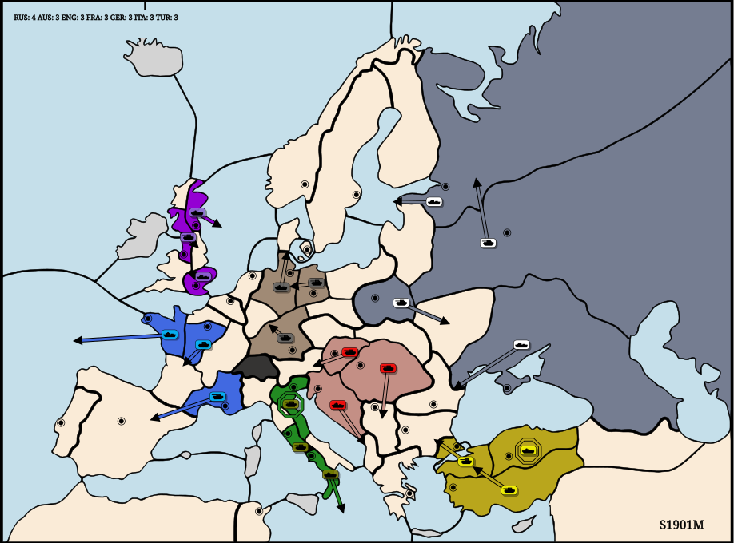
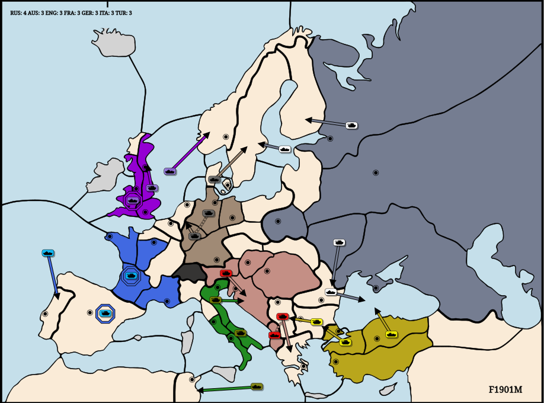
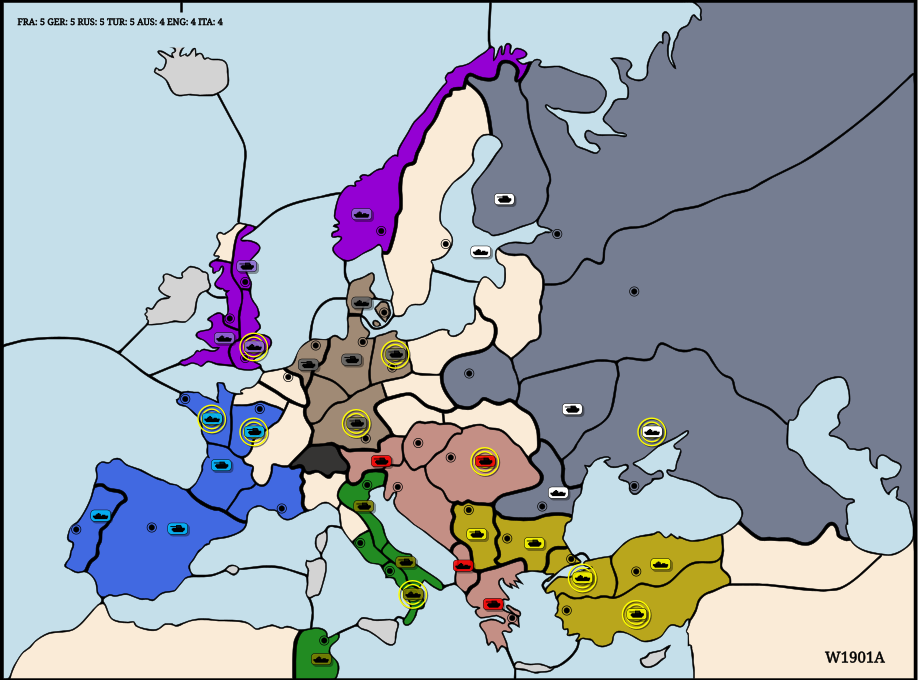
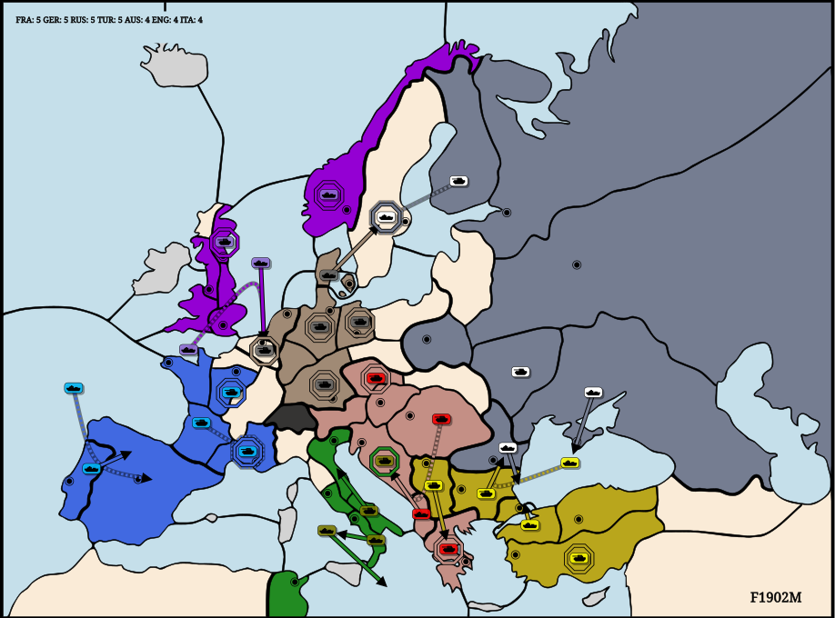
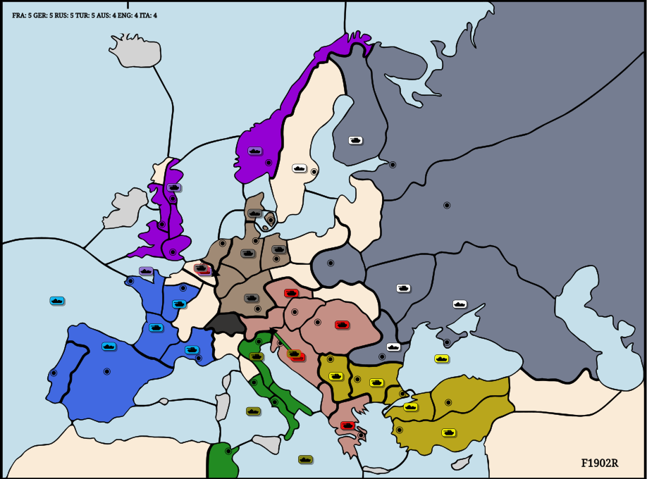
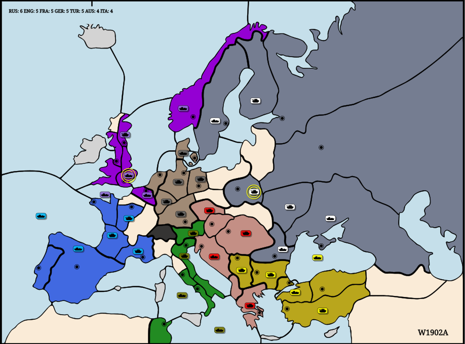

# Diplomacy A2A — Run `20260526T231112Z`

- **Model**: `claude-sonnet-4-6`
- **Years targeted**: 2
- **Started**: 2026-05-26T23:11:12+00:00
- **Ended**: 2026-05-26T23:34:21+00:00
- **Phases played**: 7
- **Tokens**: input=434371, output=51225, cache_create=14669, cache_read=243090
- **Approx cost (USD)**: $2.1994

## Personas

- **FRANCE** — A pragmatic, conservative player who prefers stable alliances and avoids unnecessary risks.
- **GERMANY** — An opportunist — seize tactical chances, willing to pivot alliances when payoffs flip.
- **ENGLAND** — Cautious and naval-focused; build a strong fleet position before committing to aggression.
- **ITALY** — Ambiguous and scheming; keep options open, prefer surprise moves over telegraphed campaigns.
- **AUSTRIA** — Defensive and central; hold the position, broker peace between feuding neighbors.
- **RUSSIA** — Expansionist on both fronts; press for territory wherever weakness appears.
- **TURKEY** — Patient and long-game; build slowly, exploit late-game momentum.

## SPRING 1901 MOVEMENT (`S1901M`)

### Dialogue

- **AUSTRIA → ITALY**: Greetings from Vienna! I'd like to propose a friendly arrangement — I have no designs on Venice or any Italian territory, and I hope we can coordinate peacefully in the Balkans. A Lepanto opening (you moving to Ionian) could be mutually beneficial, and I'd welcome your thoughts on how we divide Balkan gains.
- **AUSTRIA → RUSSIA**: Hello from Austria! I hope we can establish a non-aggression pact early — I'm not planning to move into Galicia this spring, and I'd appreciate a similar commitment from you. A stable northern border lets us both focus on expansion elsewhere.
- **AUSTRIA → TURKEY**: Greetings! I'd like to open a dialogue about the Balkans — there's room for both of us to grow without stepping on each other's toes. What are your intentions for Serbia and Romania this year?
- **ENGLAND → FRANCE**: Hello! I'd like to propose a friendly arrangement between England and France — specifically, that we respect each other's spheres and avoid conflict in the Channel early on. I'm planning a northern naval focus this year and have no intention of moving into the English Channel aggressively. What are your plans?
- **ENGLAND → GERMANY**: Greetings from England! I'm interested in coordinating our positions in the North Sea region to mutual benefit. I have no hostile intentions toward Germany and would welcome an open dialogue about our respective plans this spring. What direction are you looking to expand?
- **ENGLAND → RUSSIA**: Hello! England here — I'd like to open friendly communications early. I'm focused on the North Sea and Scandinavia this year, and I imagine we may have overlapping interests in that region. Would you be open to discussing how we might coordinate or at least avoid stepping on each other's toes?
- **FRANCE → GERMANY**: Hello! I'd like to propose a friendly opening between France and Germany. I'm planning a western/Atlantic focus and have no interest in Burgundy this spring — I hope we can agree to keep that buffer zone neutral and avoid an early conflict. What are your plans?
- **FRANCE → ENGLAND**: Greetings from France! I'd like to explore a cooperative relationship this year. I'm considering moving into the Atlantic and Mediterranean, and I think we can avoid stepping on each other's toes if we coordinate early. Are you open to discussing a non-aggression arrangement?
- **FRANCE → ITALY**: Hello! I think France and Italy have complementary interests this year — I'm focused westward and you're focused eastward. I'd like to propose we stay out of each other's way; I won't move into Piedmont if you keep your armies oriented toward Austria. Interested in a friendly understanding?
- **GERMANY → ENGLAND**: Hello! I'd like to propose a friendly start — I'll be heading toward Denmark and Holland, and I have no designs on your home centers. Happy to coordinate if you're moving into Scandinavia, as long as we don't step on each other's toes.
- **GERMANY → FRANCE**: Greetings! I'm planning to expand east and north this year, not west. I'd like to keep our border quiet — no moves into Burgundy from either side. Interested in a non-aggression pact for 1901?
- **GERMANY → RUSSIA**: Hello from Berlin! I'm curious about your intentions in the north — specifically around Sweden and the Baltic. If you're focusing south, perhaps we can avoid early friction and even find common ground.
- **GERMANY → AUSTRIA**: Greetings! I'd like to keep our relationship cooperative from the start. I have no interest in your Balkan affairs — I'll be focused north and west. Perhaps we can find ways to help each other?
- **ITALY → AUSTRIA**: Greetings from Rome! I'd like to propose a friendly arrangement — I have no interest in the Balkans or Trieste, and I'd prefer we focus our energies outward rather than against each other. Perhaps we can coordinate against Turkey or Russia? Let me know your thoughts.
- **ITALY → TURKEY**: Hello from Italy! I think we have a natural opportunity to divide the Mediterranean between us rather than clash over it. I'm curious about your plans — are you looking east or west this year?
- **ITALY → FRANCE**: Salutations! I want to reassure you that I have no aggressive designs toward France this year. I'm more interested in the eastern Mediterranean. Perhaps we can agree to stay out of each other's way and even coordinate down the road?
- **RUSSIA → AUSTRIA**: Greetings from Moscow! I propose we keep Galicia demilitarized this spring — neither of us moves there — so we can both focus on more productive fronts. I'm interested in coordinating against Turkey if you're open to it. Let me know your thoughts.
- **RUSSIA → TURKEY**: Hello from Russia! I'd like to open with a friendly proposal: let's avoid conflict in the Black Sea this spring and focus on our respective expansions elsewhere. I'm happy to discuss a non-aggression arrangement. What are your intentions for 1901?
- **RUSSIA → GERMANY**: Greetings! I think we have natural room to expand without stepping on each other — I'm focused east and south, not west. I'd appreciate knowing your intentions regarding Scandinavia and the Baltic so we can avoid any misunderstandings.
- **RUSSIA → ENGLAND**: Hello! I wanted to open communication early. I'm primarily focused on southern expansion and the Turkish question, so I don't anticipate conflict with England. I'd be curious about your plans for Scandinavia — perhaps we can carve it up without fighting.
- **TURKEY → RUSSIA**: Greetings from Constantinople! I'd like to propose we keep the Black Sea demilitarized this year — neither of us moves our fleet there. This would let us both focus on our western neighbors without worrying about our shared border. I'm open to a formal non-aggression pact if you're interested.
- **TURKEY → AUSTRIA**: Hello from Turkey! I think we have more to gain from cooperation than conflict in the early game. I'd be happy to discuss keeping the Balkans stable — perhaps you take Serbia and I take Bulgaria, and we avoid stepping on each other's toes. What do you think?
- **TURKEY → ITALY**: Greetings! I believe Turkey and Italy have natural room to cooperate — we're not in direct competition early on. I'm focused on the Balkans and Black Sea, and would welcome a friendly relationship as we both develop. Let's keep in touch.
- **AUSTRIA → RUSSIA**: Thank you for the proposal — I agree to keep Galicia demilitarized this spring, no Austrian unit will enter Galicia. I'm planning to move toward Serbia and would welcome coordination against Turkey down the line if circumstances align.
- **AUSTRIA → TURKEY**: I appreciate the cooperative tone! Your proposal sounds reasonable — Serbia for Austria, Bulgaria for Turkey works well as a starting framework. Let's keep that arrangement and avoid conflict in the Balkans early on.
- **AUSTRIA → ITALY**: Glad to hear from Rome! I confirm no Austrian moves toward Venice or Italian territory — Trieste will stay defensive. I'm focused entirely on the Balkans, and I'd welcome coordination if Turkey becomes aggressive.
- **AUSTRIA → GERMANY**: Thanks for reaching out! I'm happy to keep our relationship cooperative — I have no interest in Bohemia or German territory, and I hope you'll likewise stay clear of my Balkan sphere. Let's stay friendly.
- **ENGLAND → FRANCE**: Glad to hear we're aligned — I'll keep my fleets out of the English Channel this spring, and I hope you'll do the same. A mutual non-aggression in the Channel early on gives us both room to grow. I'm heading north toward Norway and the North Sea, so our spheres shouldn't conflict.
- **ENGLAND → GERMANY**: Thanks for the transparency — Denmark and Holland sound like natural German targets, and I won't interfere there. I'm aiming for Norway this spring, so Scandinavia can be split naturally: you take Denmark, I take Norway. Does that work for you?
- **ENGLAND → RUSSIA**: Happy to hear you're focused south — that makes coordination easier. I'd like to claim Norway this spring, and I'm open to Sweden going to Russia in due course if you come through the Gulf of Bothnia. Let's avoid a clash in Scandinavia by agreeing on that split early.
- **FRANCE → ENGLAND**: Thank you for the reassurance! I'm planning to move into the Atlantic and Spain this spring, so our interests shouldn't clash. I'm happy to confirm a mutual non-aggression arrangement — let's keep the Channel peaceful and build trust this year.
- **FRANCE → GERMANY**: Glad we're on the same page! I'll be keeping my armies out of Burgundy this spring and focusing westward. I hope we can build on this understanding as the game develops — a stable Franco-German border benefits us both.
- **FRANCE → ITALY**: Excellent — I'm glad we see eye to eye. I'll be moving toward Spain and the Atlantic, not toward Piedmont. Let's keep this friendly understanding in place and perhaps find opportunities to coordinate later in the year.
- **GERMANY → ENGLAND**: Good to hear from you! I'm planning to move my fleet to Denmark and an army to Holland — standard German opening. I have no interest in the North Sea itself, so we shouldn't conflict. Happy to discuss Scandinavia coordination once we both get established.
- **GERMANY → FRANCE**: Glad we're on the same page about Burgundy — I'll keep my army away from there entirely. My focus is Denmark and Holland, so we have no reason for early conflict. Let's keep this understanding going through 1901.
- **GERMANY → RUSSIA**: Thanks for the clarity! I'm focused on Denmark and Holland this spring — not looking to contest Sweden if you want it, and I'll stay out of the Baltic if you do too. Let's avoid any accidental friction in the north.
- **ITALY → AUSTRIA**: I'm warming to the Lepanto idea — moving toward the Ionian makes sense for both of us if we're coordinating against Turkey. Can you tell me more specifically what you're planning in the Balkans this spring? I want to make sure our moves complement each other.
- **ITALY → TURKEY**: I appreciate your friendly tone! I'm genuinely undecided on my direction this spring. Can you share any hints about where you're moving? I want to make sure we don't accidentally step on each other's toes in the eastern Mediterranean.
- **ITALY → FRANCE**: I'm glad we're on the same page — I have no intention of moving toward Piedmont this spring. My focus is eastward. Let's keep this understanding going into the fall as well.
- **RUSSIA → AUSTRIA**: I'm happy to commit to leaving Galicia open this spring — no Russian unit will move there. I'm planning to focus on Rumania and the north. I think we have real potential to coordinate against Turkey together in 1902 if you're interested.
- **RUSSIA → TURKEY**: I accept your proposal for a demilitarized Black Sea this spring — my fleet will not move there. I'm focusing on Rumania and Scandinavia this year. I hope we can build trust and perhaps coordinate against a common rival in future turns.
- **RUSSIA → GERMANY**: I'm focusing my efforts south toward Rumania and east into Scandinavia, so no conflict with Germany is in my plans. I'd appreciate if you could leave Sweden for me — I won't interfere with your Scandinavian ambitions beyond that.
- **RUSSIA → ENGLAND**: I'm planning to move into the Gulf of Bothnia and aim for Sweden — I think that's a natural Russian interest. If you focus on Norway, we can split Scandinavia cleanly without fighting. Happy to coordinate further.
- **TURKEY → RUSSIA**: Thank you for your response! I'm genuinely interested in a stable relationship. I'm considering my fleet movements carefully — can you tell me where your F SEV is heading this spring? That would help me plan accordingly and keep things cooperative between us.
- **TURKEY → AUSTRIA**: I think we have a solid foundation for cooperation. My plan is to move into Bulgaria this spring — Serbia is yours if you want it. Let's coordinate so we don't accidentally clash, and perhaps we can discuss a longer-term arrangement about Romania as well.
- **TURKEY → ITALY**: Good to hear from you! I'm focused entirely on the Balkans and eastern Mediterranean this year. I see no reason for us to conflict — let's keep this friendly relationship going and touch base after the spring moves resolve.
- **AUSTRIA → ITALY**: Our arrangement is confirmed — no Austrian moves toward Venice or Trieste, and I'm moving A BUD to Serbia this spring. I'd encourage you to move toward the Ionian as part of a Lepanto setup — we can coordinate more closely against Turkey in 1902. Looking forward to working together!
- **AUSTRIA → RUSSIA**: Confirmed: no Austrian unit will enter Galicia this spring. I'm moving toward Serbia and positioning in the Balkans. Let's revisit anti-Turkey coordination in fall — I think we can make real progress together.
- **AUSTRIA → TURKEY**: Confirmed: Serbia for Austria, Bulgaria for Turkey — let's stick to that arrangement and keep things peaceful between us this year. I'm moving A BUD to Serbia and keeping my fleet defensive. Looking forward to continued cooperation.
- **AUSTRIA → GERMANY**: Happy to confirm our friendly arrangement — I'm staying entirely focused on the Balkans and have no interest in Bohemia or German territory. I hope we can keep this good understanding going through 1901 and beyond.
- **ENGLAND → FRANCE**: We're in agreement — Channel stays peaceful this spring and we each pursue our natural spheres. Looking forward to building trust this year and potentially coordinating further down the line.
- **ENGLAND → GERMANY**: Confirmed — you take Denmark, I take Norway. Let's both get established in Scandinavia and keep the North Sea stable between us.
- **ENGLAND → RUSSIA**: Confirmed — I'll move on Norway, you take Sweden via the Gulf of Bothnia. Clean split, no conflict. Let's keep this coordination going as the game develops.
- **GERMANY → ENGLAND**: We're all set — I'll take Denmark this spring and stay out of Norway. Looking forward to a productive 1901 for both of us. Let's keep this channel open.
- **GERMANY → FRANCE**: Confirming our agreement — Burgundy stays neutral and I'm heading north and east. Good luck in the west, and let's keep our border quiet all year.
- **GERMANY → RUSSIA**: Confirming I won't contest Sweden — Denmark is my target this spring. Let's keep the north peaceful and focus on our respective expansions.
- **GERMANY → AUSTRIA**: Wishing you a strong 1901 in the Balkans — I'll be entirely focused north and west, no interference from me.
- **ITALY → AUSTRIA**: I'm committed to a friendly relationship this spring — no moves toward Trieste, I promise. I'm orienting eastward, and I hope we can coordinate against Turkey in the fall. Looking forward to seeing how the board develops.
- **ITALY → TURKEY**: I want to keep our relationship warm heading into the moves. I'm not targeting you directly this spring — let's see how the board shapes up and find opportunities to coordinate rather than clash.
- **ITALY → FRANCE**: Confirmed — I'm staying out of Piedmont entirely this spring. My focus is the eastern Mediterranean. Let's keep this understanding solid through the fall as well.
- **RUSSIA → TURKEY**: My F SEV is heading to Rumania this spring — not the Black Sea, as agreed. I'm keeping my word on our non-aggression arrangement and hope you'll do the same. Looking forward to building trust this year.
- **RUSSIA → AUSTRIA**: Confirming: no Russian unit is moving to Galicia this spring. I'm sending my army toward Ukraine and fleet toward Rumania — purely focused on Turkish pressure and northern expansion. I hope we can coordinate more closely in 1902.
- **RUSSIA → ENGLAND**: Confirming our arrangement — I'm moving F STP/SC to the Gulf of Bothnia, aiming for Sweden in the fall. Norway is yours. Let's keep Scandinavia split cleanly and avoid any friction.
- **TURKEY → RUSSIA**: Thank you for the agreement — I'm holding to our arrangement and keeping things cooperative this spring. I look forward to comparing notes after the moves resolve and discussing coordination going forward.
- **TURKEY → AUSTRIA**: We're in agreement — Bulgaria for me, Serbia for you. Let's make sure our moves don't interfere and touch base after spring to discuss Romania and longer-term cooperation.
- **TURKEY → ITALY**: Friendly greetings as we head into the first moves! I see no conflict between us this year — let's stay in touch and perhaps find ways to coordinate in future turns.

### AUSTRIA
Orders: `A BUD - SER` · `A VIE - TYR` · `F TRI - ALB`

Reasoning

> Looking at the board, my diplomatic groundwork is solid:
> - Russia committed to leaving Galicia open
> - Turkey agreed to Serbia/Bulgaria split
> - Italy confirmed no moves toward Trieste
> - Germany staying focused north/west
>
> My strategy: Move A BUD to Serbia (as agreed with Turkey), push A VIE toward Galicia to threaten but I committed not to enter... actually I committed not to enter Galicia, so I should move VIE toward Trieste or Tyrolia instead. Moving VIE to Tyrolia gives flexibility for 1902 (can go to Munich, Venice, or back). Moving F TRI to Albania positions me to contest Greece in fall.
>
> The classic Austrian opening is:
> - A BUD - SER (take Serbia in fall)
> - A VIE - TYR (flexible position)
> - F TRI - ALB (set up for Greece)
>
> This is the "Hedgehog" or standard Austrian opening. Albania positions the fleet to move to Greece in fall, Serbia gives a supply center, and Tyrolia keeps options open without threatening anyone I've made deals with.

### ENGLAND
Orders: `F EDI - NTH` · `F LON - WAL` · `A LVP - YOR`

Reasoning

> Looking at the situation: I have solid agreements with France (Channel peace), Germany (Denmark/Norway split), and Russia (Scandinavia split). My goal this spring is to secure Norway and establish a strong North Sea position.
>
> The classic English opening for this is:
> - F EDI → NTH (North Sea, key naval hub)
> - F LON → NTH... but that would bounce with EDI. Better: F LON → ENG or stay to support.
>
> Actually, the best opening is:
> - F EDI → NTH (control the North Sea)
> - F LON → NTH would bounce, so F LON → ENG is tempting but I promised France I'd stay out of the Channel. I'll keep that promise and hold or go to WAL.
> - A LVP → YOR (moving the army toward the coast for future flexibility)
>
> Wait — to get to Norway, I need F NTH → NOR in Fall. So F EDI → NTH is essential. F LON can go to ENG (but I promised not to be aggressive there) or WAL, or support. Since France is moving to MAO and SPA, ENG might be empty and safe, but I promised Channel peace. I'll honor that and send F LON → NTH... no, that bounces with EDI.
>
> Best plan: F EDI → NTH, F LON → ENG (it's tactically sound and France is moving away), A LVP → YOR. But I promised France... I'll honor the deal and send F LON → WAL or hold. Actually F LON → ENG is low-risk since France confirmed they're going Atlantic. I'll go WAL to be safe and honor the agreement fully.
>
> - F EDI → NTH
> - F LON → WAL  
> - A LVP → YOR

### FRANCE
Orders: `F BRE - MAO` · `A MAR - SPA` · `A PAR - GAS`

Reasoning

> Looking at the board, I have solid non-aggression agreements with England, Germany, and Italy. My strategic priority is to expand westward into Spain and the Atlantic while keeping my eastern borders secure.
>
> The natural French opening is:
> - F BRE → MAO: Get into the Mid-Atlantic Ocean to contest the western sea lanes and support a move into Spain next fall
> - A MAR → SPA: Capture Spain (a neutral supply center) in spring, setting up for a build
> - A PAR → BUR: This is tempting but I've agreed to keep Burgundy neutral with Germany. Instead, I should move PAR to GAS to support the western push, or hold.
>
> Actually, the classic French opening is F BRE → MAO, A MAR → SPA, A PAR → BUR — but I've explicitly promised Germany I won't move into Burgundy. Keeping that promise maintains trust and Germany is a valuable neighbor. I'll move PAR to GAS instead to support the Atlantic/Spain push, or simply hold PAR as a defensive anchor.
>
> Given my conservative, stable-alliance persona, I'll honor my commitments: no Burgundy, no English Channel. I'll push west toward Spain and the Atlantic.

### GERMANY
Orders: `F KIE - DEN` · `A MUN - RUH` · `A BER - KIE`

Reasoning

> Looking at my position, my goals are clear: grab Denmark with my fleet, move an army toward Holland (via Ruhr or directly), and keep Munich safe while positioning for growth.
>
> Standard German opening: F KIE - DEN, A MUN - RUH (to set up HOL next fall), A BER - KIE (to reposition for future builds). Wait — actually A BER - KIE doesn't help much since I want KIE free for the fleet. Let me think more carefully.
>
> Best standard opening:
> - F KIE - DEN (grab the supply center)
> - A MUN - RUH (position for Holland)
> - A BER - KIE (repositions army, but KIE is vacated by fleet so this is fine — army moves into KIE)
>
> Actually the classic German opening is F KIE - DEN, A MUN - RUH, A BER - KIE. This gives me DEN in fall, and then F DEN - SWE or similar, while A RUH - HOL and A KIE supports or moves.
>
> Alternatively: F KIE - DEN, A MUN - BUR... but I promised not to go to BUR.
>
> F KIE - DEN, A MUN - RUH, A BER - KIE is solid. Gets me positioned for HOL and DEN as supply centers.

### ITALY
Orders: `F NAP - ION` · `A ROM - APU` · `A VEN H`

Reasoning

> Looking at the board, I need to decide on my opening. The classic options for Italy are:
>
> 1. **Lepanto** (F NAP - ION, A ROM - APU, A VEN H) — sets up a strong anti-Turkey play with Austria
> 2. **Aggressive north** (A VEN - TYR, A ROM - VEN or TUS) — pressures Austria/Germany
> 3. **Hedged/flexible** — move toward Ionian while keeping options open
>
> Austria has confirmed a friendly arrangement and is moving A BUD to Serbia. Turkey seems friendly but that's typical opening diplomacy. France has agreed to stay out of Piedmont.
>
> The Lepanto is the strongest strategic opening for Italy — it puts pressure on Turkey in 1902 and gains Tunis in 1901. With Austria moving to Serbia (and likely Rumania), we can coordinate against Turkey effectively.
>
> However, I want to keep some ambiguity. Moving F NAP - ION and A ROM - APU sets up Tunis grab perfectly. For Venice, I should hold or move to Tyrolia to keep Austria honest — but Austria confirmed Trieste stays defensive, so I can safely advance.
>
> Best play: Classic Lepanto setup — F NAP - ION (heading toward Tunis/eastern Med), A ROM - APU (to convoy or support), A VEN H (keeping Venice secure, not telegraphing aggression to Austria).
>
> This gains Tunis in Fall 1901, positions for Lepanto in 1902, and honors all my diplomatic commitments.

### RUSSIA
Orders: `F STP/SC - BOT` · `A WAR - UKR` · `F SEV - RUM` · `A MOS - STP`

Reasoning

> Looking at my position and the agreements I've made:
>
> - **F STP/SC → BOT**: Agreed with England to take Sweden via Gulf of Bothnia. This is the natural path.
> - **A WAR → UKR**: Moving toward Ukraine sets up pressure on Rumania and Turkey's flank in fall.
> - **F SEV → RUM**: Grabbing Rumania is a key early gain — I promised Turkey I'd go to RUM not BLA, and this is consistent with that.
> - **A MOS → STP**: Moving army to STP frees up Moscow and positions me to support the northern fleet or move toward Scandinavia later. Actually, better to support WAR moving to UKR or move MOS to SEV... Let me reconsider.
>
> Actually the best moves:
> - **F STP/SC → BOT**: Heading for Sweden in fall.
> - **A WAR → UKR**: Expanding south, sets up Rumania support.
> - **F SEV → RUM**: Taking Rumania as planned.
> - **A MOS → STP**: Replaces fleet in STP so I can build there, or supports northern operations. Actually MOS → UKR support isn't needed. MOS → STP gives me a northern army for future use and frees MOS for a build. But I already have STP occupied by fleet moving out... MOS → STP works fine since fleet is leaving.
>
> This gives me potentially 3 new supply centers (RUM, SWE in fall, possibly staying in UKR area).

### TURKEY
Orders: `F ANK H` · `A CON - BUL` · `A SMY - CON`

Reasoning

> Looking at the position: I have agreements with Russia (Black Sea demilitarized), Austria (Bulgaria for me, Serbia for them), and a friendly relationship with Italy. My classic opening is the "Turkish Juggernaut" setup or a solid defensive/expansionary opening.
>
> The standard strong Turkish opening is:
> - F ANK - BLA (Black Sea fleet for future leverage)
> - A CON - BUL (take Bulgaria this fall)
> - A SMY - CON (reposition army)
>
> However, I agreed with Russia to keep the Black Sea demilitarized. If I move F ANK to BLA and Russia's F SEV goes to RUM (as they said), I'd be breaking my word. This could damage trust early. But the Black Sea is strategically vital for Turkey's long-term position.
>
> On the other hand, if Russia is genuinely going to RUM, taking BLA unopposed is very tempting and gives me a massive positional advantage. Russia can't contest it this turn.
>
> Given my persona of "patient, long-game," I should weigh reputation vs. tactical gain. Breaking the agreement in turn 1 would make Russia immediately hostile and potentially push them toward Austria against me. 
>
> I'll honor the agreement this spring — F ANK stays out of BLA. This builds trust with Russia for now. I'll move A CON to BUL and A SMY to CON (standard repositioning), and keep F ANK in a support role or move to ARM to pressure Russia's Caucasus flank... Actually, ARM is also aggressive toward Russia. Let me just move F ANK to CON or hold, with A CON to BUL and A SMY to CON.
>
> Wait — if A CON moves to BUL and A SMY moves to CON, that's clean. F ANK can move to CON but that conflicts. F ANK - BLA breaks the deal. F ANK H or F ANK - ARM. ARM doesn't threaten Russia directly this turn.
>
> Best safe opening honoring agreements: F ANK H, A CON - BUL, A SMY - CON. This gets me Bulgaria in fall and repositions forces.

## FALL 1901 MOVEMENT (`F1901M`)

### Dialogue

- **AUSTRIA → ITALY**: Fall is here — I'm planning to take Greece with A SER supported by F ALB. I'd appreciate knowing your intentions with F ION so we don't accidentally clash in the Aegean. Are you still oriented eastward against Turkey?
- **AUSTRIA → RUSSIA**: Romania looks like it's yours this fall — I have no units positioned to contest it. I'm focused on Greece. Let's touch base about 1902 coordination against Turkey once we see how the board settles.
- **AUSTRIA → TURKEY**: I'm moving on Greece as we discussed — Bulgaria is yours. Let's make sure our units don't accidentally conflict. I hope we can keep this cooperative arrangement going into 1902.
- **ENGLAND → RUSSIA**: Norway is looking ripe for the taking this fall — I'll be moving F NTH there as agreed. Hoping your move toward Sweden goes smoothly too. Let's check in after the fall builds and discuss how we approach 1902 together.
- **ENGLAND → GERMANY**: Fall 1901 looking good — I'll be taking Norway with F NTH. Hoping your Danish position is secure. I'd like to discuss coordination in 1902, particularly around Belgium and the broader western picture.
- **ENGLAND → FRANCE**: Checking in as we head into fall — our Channel arrangement has held nicely. I'm moving north toward Norway and staying out of your way. Hope Spain goes smoothly for you; let's keep building this trust into 1902.
- **FRANCE → ENGLAND**: Fall is going well — I'm planning to consolidate in Iberia and the Atlantic. I'd like to maintain our non-aggression understanding through the fall and into 1902. Are you still focused on Norway and the North Sea?
- **FRANCE → GERMANY**: Hope your moves toward Denmark and Holland are going smoothly! I'm consolidating in Iberia this fall — no interest in Burgundy or your sphere. Let's keep our border quiet through the fall as well.
- **FRANCE → ITALY**: Hope your eastern moves are working out! I'm focused on Portugal and Iberia this fall, staying well clear of your territory. Let's keep our friendly understanding in place — I think we can both grow without stepping on each other.
- **GERMANY → ENGLAND**: Fall is here — I'm moving to take Holland with my army from Ruhr, and I'd like to take Sweden with my fleet from Denmark. No conflict with you expected. Can you confirm you're not moving into Holland or the Skagerrak area?
- **GERMANY → FRANCE**: Still holding to our agreement — my focus this fall is Holland and Sweden, nowhere near Burgundy. Hope your western campaign is going well. Let's keep the border quiet.
- **GERMANY → RUSSIA**: I'm moving my fleet from Denmark to Sweden this fall — I believe we agreed you'd leave Sweden for me in exchange for me staying out of the Baltic. Please confirm you're not contesting Sweden.
- **GERMANY → AUSTRIA**: Hope the Balkans are going well for you! I'm taking Holland and Sweden this fall — purely northern expansion, no interference in your sphere.
- **ITALY → AUSTRIA**: The spring moves look promising for both of us — you've secured Serbia, which is excellent. I'm planning to move toward Tunis and Greece this fall to grab supply centers. Can we agree that Greece is mine to take, while you focus on Bulgaria or Rumania? I want to make sure we don't accidentally conflict in the Balkans.
- **ITALY → TURKEY**: I hope the spring treated you well! I want to be transparent — I'm moving toward Tunis and possibly Greece this fall, purely for supply center growth. I have no hostile intentions toward Turkey proper, and I'd welcome your thoughts on how we divide the eastern Mediterranean going forward.
- **ITALY → FRANCE**: Hope the spring went well for you! I'm focused on grabbing Tunis and possibly Greece this fall — purely eastern expansion. Our friendly understanding remains solid, and I see no reason for conflict between us anytime soon.
- **RUSSIA → TURKEY**: I want to be transparent: I'm considering my Fall moves carefully and hope we can maintain our cooperative arrangement. I'm planning to keep F RUM in a defensive posture — can you confirm your fleet and army intentions for Fall so we can avoid any accidental clash?
- **RUSSIA → AUSTRIA**: Fall is here and I'm moving to consolidate Rumania. I think we should discuss coordination against Turkey in 1902 — I'd welcome your thoughts on a joint push into the Balkans. Are you moving A SER to BUL this fall?
- **RUSSIA → ENGLAND**: Confirming I'm going for Sweden this fall via F BOT. Hope Norway is going smoothly for you — let's keep our Scandinavian arrangement intact and discuss further coordination as the game develops.
- **TURKEY → RUSSIA**: Hello again! Spring went smoothly — I kept to our arrangement as promised. Now that you're in Romania, I'd like to discuss the fall: I'm planning to take Greece with my army from Bulgaria, and I hope we can continue our peaceful coexistence. Can we discuss a longer-term non-aggression arrangement for 1902?
- **TURKEY → AUSTRIA**: Spring went well for both of us! I'm planning to move into Greece this fall — that keeps me out of your way in Serbia. I hope we can continue coordinating and perhaps discuss Romania's future together, since Russia now has a fleet there.
- **TURKEY → ITALY**: Good to check in after spring! I'm heading toward Greece this fall. I'd be interested in discussing how we might coordinate in the Mediterranean going forward — there may be opportunities for mutual benefit.
- **AUSTRIA → ITALY**: I'm moving to secure Greece this fall with A SER supported by F ALB — I hope you understand this is my primary objective and I'm not contesting any Italian territory. I'm also moving A TYR toward Trieste to hold that Austrian home center safely — purely defensive, not a threat to Venice. Let's keep our cooperation solid heading into 1902.
- **AUSTRIA → TURKEY**: I'm committed to taking Greece this fall — my A SER with F ALB support should secure it. I understand you may also be eyeing Greece, but I hope we can accept this outcome and coordinate elsewhere; Bulgaria is solidly yours and we can discuss Romania together in 1902.
- **AUSTRIA → RUSSIA**: Romania looks like it's yours this fall without contest from me — I'm focused entirely on Greece. I look forward to coordinating against Turkey in 1902 once we both have our new centers secured.
- **ENGLAND → RUSSIA**: Everything looks aligned for this fall — Norway for me, Sweden for you. After we both build, I'd love to discuss 1902 strategy, particularly around Scandinavia's stability and what we do next.
- **ENGLAND → GERMANY**: Looks like a clean fall for both of us — Norway for me, Holland secured for you. I'd like to open talks about Belgium in 1902; there may be a way to coordinate that benefits us both without stepping on each other.
- **ENGLAND → FRANCE**: Still holding to our arrangement — I'm heading north and staying out of your way. Once we're both settled after fall builds, I'd welcome a conversation about longer-term coordination in 1902.
- **FRANCE → ENGLAND**: Things are going well — I'm moving to secure Portugal this fall and consolidating in Iberia. Our non-aggression understanding has been solid and I'd like to extend it into 1902. Are you planning to build a fleet in London or Edinburgh this winter?
- **FRANCE → GERMANY**: Still holding to our agreement — my focus is purely Iberia and the Atlantic this fall, nowhere near Burgundy. I hope your Denmark and Holland moves are going smoothly. Let's keep this stable border going into 1902.
- **FRANCE → ITALY**: I'm pushing into Portugal this fall and staying well clear of your sphere. Our friendly understanding remains solid on my end. Let's both grow without conflict and perhaps find coordination opportunities in 1902.
- **GERMANY → ENGLAND**: All looking good from my end — I'll be taking Holland with my army from Ruhr, and Sweden with my fleet from Denmark. No conflict with you expected in Norway. Let's compare notes after Fall and discuss 1902 coordination.
- **GERMANY → RUSSIA**: Just confirming my fleet is moving from Denmark to Sweden this fall — I trust you're not contesting it as we discussed. Happy to keep our northern arrangement stable into 1902 and find ways to cooperate further.
- **GERMANY → FRANCE**: Everything still on track — I'm moving on Holland and Sweden, nowhere near your territory. Burgundy stays quiet. Hope your Iberian consolidation goes well and we can keep this friendly arrangement into 1902.
- **ITALY → AUSTRIA**: Heads up — Turkey told me directly they're heading for Greece this fall. That puts your A SER plan in direct conflict with them. I'm moving F ION toward Tunis to secure that center for myself, so the Aegean is yours to manage. Let's compare notes after the dust settles.
- **ITALY → TURKEY**: I want to be honest with you — Austria is planning to take Greece with SER supported by ALB. That puts you in direct conflict with them, not me. I'm focused on Tunis this fall, so I'm staying out of the Greece dispute entirely. Perhaps we can coordinate against Austria in 1902?
- **RUSSIA → GERMANY**: I've reconsidered our arrangement on Sweden — I need to move F BOT there this fall to secure it as a supply center. I hope this doesn't damage our relationship; I'm happy to cooperate elsewhere and have no designs on your core territories.
- **RUSSIA → TURKEY**: I'm planning to move F RUM into the Black Sea this fall for strategic positioning — I want to be transparent about this rather than surprise you. This isn't an attack on your home centers; I'm focused on RUM with my army and see the Black Sea as a natural Russian sphere. Can we discuss a longer-term arrangement?
- **RUSSIA → AUSTRIA**: I'm moving A UKR to RUM to secure that center, and I'd welcome your thoughts on coordinating against Turkey in 1902. If you're taking BUL, we could plan a joint squeeze. Let me know what you're thinking.
- **TURKEY → RUSSIA**: Everything looks good on my end — I'm moving into Greece this fall and keeping things quiet on our shared border. I plan to move F ANK to BLA to secure that sea lane, which I hope you're comfortable with given our non-aggression arrangement. I see no reason for conflict between us going into 1902 — let's discuss longer-term coordination.
- **TURKEY → AUSTRIA**: Confirming my plans: A BUL to Greece this fall, leaving Serbia entirely to you. I hope we can continue this smooth cooperation into 1902 — perhaps we can discuss how to handle Romania together, given Russia's fleet there.
- **TURKEY → ITALY**: I'm heading to Greece this fall with my BUL army — I wanted to be transparent so we don't collide. If you're moving toward Greece too, we should coordinate to avoid a bounce that benefits neither of us.
- **AUSTRIA → ITALY**: Final confirmation: I'm taking Greece this fall with A SER supported by F ALB — please stay clear of the Aegean. I'm also moving A TYR to Trieste to hold my home center, which is purely defensive and no threat to you. Looking forward to coordinating in 1902.
- **AUSTRIA → TURKEY**: I'm committed to taking Greece this fall — I understand we may conflict there, but I hope you'll redirect A BUL elsewhere (perhaps supporting CON or preparing for Romania). After this fall, I want to resume our cooperation and coordinate against Russia's growing presence in Romania.
- **AUSTRIA → RUSSIA**: Romania is yours without contest — I'm fully focused on Greece. I look forward to coordinating against Turkey in 1902 once we've both consolidated our new centers.
- **ENGLAND → RUSSIA**: All set for this fall — Norway for me, Sweden for you. Looking forward to comparing notes after the builds and planning 1902 together.
- **ENGLAND → GERMANY**: Confirmed on our respective moves — Norway and Holland secured for us both. Let's talk Belgium coordination in 1902; I think there's a deal to be made that suits us both.
- **ENGLAND → FRANCE**: Still honoring our arrangement — I'm heading north and staying out of your way. After the fall builds, I'd welcome a deeper conversation about 1902 and how we can keep things stable between us.
- **FRANCE → ENGLAND**: Everything remains solid on my end — I'm consolidating in Iberia and Portugal this fall, well clear of your sphere. I look forward to comparing notes after the builds and discussing 1902 coordination.
- **FRANCE → GERMANY**: Our border arrangement has worked perfectly this year — thank you for holding to it. I'm staying in Iberia and the Atlantic, and I hope we can formalize this stable relationship into 1902.
- **FRANCE → ITALY**: Our friendly understanding has held well through 1901. I'm securing Portugal and Spain this fall, and I remain committed to staying out of your sphere. Let's keep building on this into 1902.
- **ITALY → AUSTRIA**: Good luck in Greece — I hear Turkey is heading there too, so it may be a bounce. I'm moving F ION to Tunis to lock in that center. Heads up: I'm making a move toward Trieste this fall — not as a hostile act, but I want to be honest rather than surprise you. I'd welcome a quick arrangement to keep our relationship intact going into 1902.
- **ITALY → TURKEY**: The Greece situation looks like it'll be a bounce between you and Austria — which actually benefits both of us by keeping the other power weak. I'm grabbing Tunis this fall and staying out of the Aegean entirely. Let's talk seriously about coordinating against Austria in 1902.
- **ITALY → FRANCE**: Everything is going smoothly on my end — grabbing Tunis this fall and staying well clear of your sphere. Our friendly understanding remains solid, and I look forward to finding coordination opportunities in 1902.
- **RUSSIA → AUSTRIA**: I'm securing Romania this fall and moving F RUM to the Black Sea to check Turkish expansion — I think this sets us up well for a joint anti-Turkey push in 1902. Look forward to coordinating once we see the builds.
- **RUSSIA → TURKEY**: I've decided I need to contest the Black Sea this fall — I hope you understand this is strategic positioning, not aggression against your home centers. I remain open to a longer-term arrangement in 1902, but I can't leave that sea lane uncontested.
- **RUSSIA → ENGLAND**: Our Scandinavian arrangement holds — F BOT is heading to Sweden as planned. Best of luck in Norway; let's compare notes after builds and discuss 1902.
- **RUSSIA → GERMANY**: I understand this disrupts our arrangement, but Sweden is essential for my position — I hope we can find other areas to cooperate in 1902 and keep things from escalating.
- **TURKEY → AUSTRIA**: I've reconsidered Greece — it's yours this fall. I'm moving A BUL to Serbia instead, since your army will vacate it moving to Greece. I hope you're comfortable with this arrangement — Serbia gives me a needed supply center and keeps us from colliding. Let's discuss 1902 coordination after the dust settles.
- **TURKEY → RUSSIA**: I'm going to move F ANK to BLA this fall as I mentioned — I hope we can accept a shared presence or discuss it calmly afterward. I see this as a natural Turkish sphere and not a hostile act toward Russia. Let's keep our broader non-aggression arrangement intact regardless of how this resolves.
- **TURKEY → ITALY**: Thanks for the heads-up about Austria and Greece — I've adjusted my plans accordingly. I'm not contesting Greece this fall. Let's definitely talk in 1902 about coordinating against Austria if they get too strong.

### AUSTRIA
Orders: `A SER - GRE` · `F ALB S A SER - GRE` · `A TYR - TRI`

Reasoning

> Looking at the board situation:
>
> - Turkey has revealed they're moving A BUL to Serbia (vacated by my A SER moving to Greece). This is a threat — Turkey would take Serbia, a key Balkan province, without a supply center gain for me there. But more importantly, I need to secure Greece as a supply center this fall.
> - Italy warned me they're moving toward Trieste. I need A TYR to hold/defend Trieste.
> - Russia is securing Romania uncontested.
> - Turkey's A BUL moving to Serbia means my A SER - GRE won't be contested by Bulgaria (BUL is vacating). Turkey's A CON might be heading somewhere else. F ANK is likely going to Black Sea or staying.
>
> Key decisions:
> 1. **A SER - GRE**: Take Greece as my supply center gain. With F ALB supporting, this is strength 2 vs whatever Turkey sends. Turkey said A BUL goes to Serbia (not Greece), and A CON likely stays or goes to Smyrna. So Greece should be uncontested or lightly contested.
> 2. **F ALB S A SER - GRE**: Support the Greece move — this gives me strength 2.
> 3. **A TYR - TRI**: Italy warned they're moving toward Trieste. I must defend Trieste. A TYR moving to TRI with strength 1 — if Italy's A VEN moves to TRI, it's a bounce (1v1). This is the right defensive move.
>
> This gives me Greece (+1 SC), holds Trieste defensively, and leaves me at 4 SCs going into 1902.

### ENGLAND
Orders: `F NTH - NWY` · `A YOR - EDI` · `F WAL H`

Reasoning

> Looking at the board, my goals for Fall 1901 are clear: take Norway with F NTH (as agreed with Russia and Germany), move A YOR to Edinburgh to free up positions, and keep F WAL in a defensive/flexible position. Norway is an uncontested move — Russia is heading for Sweden, Germany for Holland, and France for Portugal/Spain. No conflicts expected.
>
> The key question is what to do with A YOR and F WAL. A YOR can move to Edinburgh to consolidate my home position, or I could convoy it somewhere. Moving A YOR to Edinburgh makes sense to free up the army for a potential London build or future continental move. F WAL can hold or move to IRI/ENG — holding is safest given France is in MAO and I want to maintain trust.

### FRANCE
Orders: `F MAO - POR` · `A SPA H` · `A GAS H`

Reasoning

> Looking at the board position, my units are well-placed for a strong fall:
> - F MAO can take Portugal (a supply center)
> - A SPA can hold or support
> - A GAS can move to support or consolidate
>
> The priority is to capture Portugal this fall to grow to 4 supply centers. I should move F MAO to Portugal, have A SPA support or hold, and use A GAS to either support or move toward Marseille (which I already control). Actually, the cleanest play is F MAO → POR, A SPA holds, and A GAS holds or moves to reinforce. Since I already have MAR as a home center, I don't need to move there. Let me secure Portugal cleanly.
>
> Best orders:
> - F MAO - POR (take Portugal supply center)
> - A SPA H (hold Spain, which becomes a supply center I control)
> - A GAS H (hold Gascony, consolidate position)
>
> This gives me Portugal as a new supply center, bringing me to 4 centers, allowing a build in winter. Spain was occupied in spring so I should control it at end of fall.

### GERMANY
Orders: `F DEN - SWE` · `A KIE S A RUH - HOL` · `A RUH - HOL`

Reasoning

> Looking at the board: Russia has broken our agreement on Sweden, with F BOT positioned to move there. My fleet in DEN can contest Sweden or let Russia take it. If I move F DEN - SWE and Russia moves F BOT - SWE, we bounce and neither gets it — which is better than letting Russia have it for free.
>
> For Holland: A RUH - HOL is my key move to gain a supply center. I need A KIE to support it or move elsewhere. The safest play is A KIE S A RUH - HOL to ensure Holland is secured (strength 2 vs any solo attacker).
>
> For Sweden: Russia betrayed our deal. I should contest it — F DEN - SWE. Even if we bounce, Russia doesn't gain Sweden and I've signaled I won't be pushed around. If Russia's fleet isn't actually moving there (bluffing?), I take it.
>
> The key question: do I support Holland with KIE or try to also move KIE somewhere useful? Holland is more certain with support. Let me secure Holland (guaranteed +1 SC) and contest Sweden (possible +1 SC or at worst a bounce).
>
> Plan:
> - F DEN - SWE (contest Russia's betrayal)
> - A KIE S A RUH - HOL (ensure Holland with strength 2)
> - A RUH - HOL (take Holland)
>
> This gives me Holland for certain (+1 SC to 4 centers) and possibly Sweden (+1 more to 5).

### ITALY
Orders: `A VEN - TRI` · `F ION - TUN`
Invalid (filtered): `A APU S A VEN - TRI`

Reasoning

> Looking at the board, I need to decide my Fall 1901 moves carefully. My units are at VEN, ION, and APU.
>
> Key considerations:
> - I told Austria I'm moving toward Trieste (VEN - TRI), which was a heads-up I gave them
> - Austria has A TYR which could contest TRI or threaten VEN
> - Turkey has backed off Greece, Austria is trying to take Greece with SER+ALB support
> - I want to grab Tunis (a guaranteed supply center via ION - TUN)
> - Greece looks contested between Austria (SER supported by ALB) vs nobody now that Turkey backed off - but Austria's support is strong
> - I should grab TRI if possible - Austria's A TYR is moving to TRI per their message, so there'd be a bounce unless I support
> - Actually Austria said A TYR is moving to Trieste "defensively" - if both VEN and TYR move to TRI, they bounce each other
>
> Best play:
> - F ION - TUN (grab Tunis, guaranteed center)
> - A VEN - TRI (contest Trieste; if Austria's TYR is going there too, we bounce - but if TYR isn't going there, I take it)
> - A APU S A VEN (support Venice moving to Trieste, giving me strength 2 vs Austria's TYR at strength 1)
>
> Wait - Austria said A TYR is moving to TRI. If I do VEN-TRI supported by APU, that's strength 2, while TYR-TRI is strength 1. I would take Trieste! That's a great outcome.

### RUSSIA
Orders: `F BOT - SWE` · `A UKR - RUM` · `F RUM - BLA` · `A STP - FIN`

Reasoning

> Looking at the board situation:
>
> **Key decisions:**
> 1. **Sweden (F BOT)**: I told Germany I'm taking Sweden. F BOT → SWE is essential for a build.
> 2. **Romania (A UKR)**: I need to secure Romania as a supply center. A UKR → RUM is the move.
> 3. **Black Sea (F RUM)**: I announced I'm contesting the Black Sea. Turkey's F ANK is also heading there. If we both move in, we bounce — but that's fine, it denies Turkey the Black Sea. F RUM → BLA is the play.
> 4. **A STP**: With F BOT going to Sweden, A STP should move to Norway or hold. Norway is England's target (F NTH → NWY). I could try A STP → NWY but that would clash with England and damage that relationship. Better to move A STP → FIN to position for future builds or hold.
>
> Actually, let me reconsider A STP. If I move A STP → NWY, I'd be stealing Norway from England — damaging that alliance. Better to move A STP → FIN, which is a safe positioning move and keeps England friendly.
>
> **Plan:**
> - F BOT → SWE (secure supply center)
> - A UKR → RUM (secure supply center)  
> - F RUM → BLA (contest Black Sea, deny Turkey)
> - A STP → FIN (positioning, keep England friendly)
>
> This gives me 6 supply centers after fall (MOS, SEV, STP, WAR, RUM, SWE) = 2 builds. Excellent position.

### TURKEY
Orders: `F ANK - BLA` · `A BUL - SER` · `A CON - BUL`

Reasoning

> Looking at the current situation:
>
> **Key considerations:**
> - Austria has A SER + F ALB to take Greece (2 units vs my 1 if I go to Greece = I'd bounce or lose)
> - I told Austria I'd take Serbia instead (vacated by A SER moving to Greece) — this is actually a great move, netting me a supply center
> - Russia announced F RUM moving to BLA, I announced F ANK moving to BLA — these will bounce, which is actually fine for me (keeps Russia out of BLA)
> - The BLA contest: if we both move there, we bounce. That's acceptable — Russia doesn't get BLA, I don't get it either, but I'm safe
> - A BUL to SER: Serbia is vacated as Austria moves A SER to Greece. This gets me a 4th supply center!
> - A CON should support or hold — I'll have it support A BUL's move to SER to be safe, or just hold
>
> Actually, let me reconsider: A BUL - SER should work uncontested since Austria is moving A SER away to Greece. A CON can hold or support. F ANK - BLA will bounce with F RUM - BLA, leaving both in place.
>
> The plan:
> - F ANK - BLA (bounces Russia, keeps Black Sea contested but safe)
> - A BUL - SER (gains supply center, uncontested)
> - A CON - BUL (moves into Bulgaria to hold it, or supports BUL)
>
> Wait — if A BUL moves to SER, I should move A CON to BUL to consolidate, or just hold CON. BUL is already mine (not a new SC gain since I started in BUL... actually BUL is a supply center I don't own yet — I need to be there in fall to claim it). I need A BUL to stay in BUL OR move somewhere and have another unit cover it... Actually BUL is already occupied by me in fall so I claim it. If A BUL moves to SER, I claim SER. BUL would be unoccupied — I lose the claim on BUL unless I move another unit there.
>
> Best plan: A BUL - SER (claim SER), A CON - BUL (claim BUL), F ANK - BLA (contest Black Sea). This gives me 5 supply centers (ANK, CON, SMY, BUL, SER) — excellent!

## WINTER 1901 ADJUSTMENTS (`W1901A`)

### AUSTRIA
Orders: `A BUD B`

Reasoning

> Looking at the board: Austria has 4 supply centers (BUD, TRI, VIE, GRE) and 3 units (A TYR, F ALB, A GRE), so I can build 1 unit. 
>
> My units are in TYR, ALB, and GRE. My home centers BUD, TRI, and VIE are all unoccupied. I need to think about what build makes the most sense strategically.
>
> Key considerations:
> - Turkey has taken SER and BUL (5 centers), which is concerning — they're growing fast
> - Russia has RUM and is also at 5 centers
> - I'm in GRE with F ALB nearby — I need to consolidate in the Balkans
> - Italy warned me they were moving toward Trieste, and A TYR is positioned to defend it
> - I need an army in BUD or VIE to project force into the Balkans (toward BUL, RUM) and defend against Turkey in SER
>
> The most useful build is an army in BUD — it can move toward RUM, BUL, or SER, giving me flexibility in the Balkans. VIE is also viable but BUD is more forward-positioned. I'll build A BUD since that's the most strategically valuable location for Balkan operations.

### ENGLAND
Orders: `F LON B` · `WAIVE`

Reasoning

> Looking at my position: I have 4 supply centers (EDI, LON, LVP, NWY) and 3 units, so I can build 1 unit. I need to decide where and what to build.
>
> My strategic situation:
> - I'm naval-focused and need to project power
> - France has 5 centers and is growing fast — they're the biggest threat to me long-term
> - Germany also has 5 centers and is strong
> - I need fleet presence in the North Sea and Atlantic to remain relevant
> - F WAL is well-positioned but I need more naval coverage
> - Building F LON gives me a fleet that can move to NTH or ENG, which is crucial for controlling the Channel and North Sea
> - Building F LVP gives me an Atlantic/Irish Sea presence
> - Building an army is less useful given my naval persona and island position
>
> F LON is the best build — it gives me immediate access to the North Sea (NTH) and English Channel (ENG), which are the critical strategic waterways. This lets me project power toward Belgium, the Channel, and back up my Norwegian position. It also signals to France that I'm watching the Channel, which maintains deterrence.

### FRANCE
Orders: `F BRE B` · `A PAR B`

Reasoning

> Looking at my position: I have 5 supply centers (BRE, MAR, PAR, POR, SPA) and 3 units, so I can build 2 new units.
>
> My current units are A SPA, A GAS, F POR — all in the west/Iberia area. I need to think about what builds serve my long-term strategy best.
>
> **Strategic considerations:**
> - I have a stable border with Germany and England, so I don't need to rush armies toward those fronts.
> - My Atlantic position is good with F POR, but I have no fleet in BRE — a key naval position for both Atlantic and Channel coverage.
> - Building F BRE gives me strong Atlantic presence and flexibility (can threaten England if needed, or project south).
> - Building A PAR gives me a central army that can flex toward Germany, support Burgundy, or push into Spain/Italy.
> - Building A MAR is also useful for the Italian/Mediterranean front.
>
> The most valuable builds: **F BRE** (Atlantic/Channel flexibility — essential naval position) and **A PAR** (central reserve army). This gives me a strong balanced force heading into 1902.

### GERMANY
Orders: `A BER B` · `A MUN B`

Reasoning

> Looking at my position: I have 5 supply centers (BER, KIE, MUN, DEN, HOL) and 3 units (F DEN, A KIE, A HOL), so I can build 2 units. I have build slots at BER and MUN.
>
> Russia backstabbed me on Sweden — I need to account for that. France is at 5 SCs and growing. England is at 4. I need to build aggressively to stay competitive.
>
> Strategic considerations:
> - I need an army in MUN to protect my southern flank and potentially threaten France or Austria
> - BER: I could build an army (flexible, can go east or south) or a fleet (useful in Baltic against Russia, but I already have F DEN)
> - Given Russia took Sweden instead of me, I should consider building in the Baltic direction, but an army in BER is more flexible and can threaten Russia via Silesia/Prussia or support western moves
> - France is strong at 5 SCs — I should be cautious there but not necessarily hostile yet
> - An army in BER gives me eastern flexibility against Russia
> - A fleet in BER could go to Baltic and pressure Russia, but F DEN already covers that area
>
> I'll build A BER (flexible eastern unit) and A MUN (southern/western flexibility). Two armies gives me maximum land flexibility.

### ITALY
Orders: `F NAP B`

Reasoning

> Looking at the position: I have 4 supply centers (NAP, ROM, VEN, TUN) and 3 units (A VEN, A APU, F TUN), so I get to build 1 new unit.
>
> The key question is what to build and where. My strategic situation:
> - Austria took Greece (4 SCs), which is good for them but not alarming yet
> - Turkey has 5 SCs (ANK, CON, SMY, BUL, SER) — quite strong
> - France has 5 SCs — also strong
> - I have 4 SCs and need to grow
>
> For the build location, I can build at NAP or ROM (both are home centers and unoccupied).
>
> For unit type:
> - A fleet at NAP would give me naval power in the Tyrrhenian/Ionian area, useful for Mediterranean expansion
> - An army at NAP or ROM would give me land options — potentially toward Austria (Trieste) or supporting eastern moves
> - A fleet at ROM (Tyrrhenian) could also work
>
> Given my ambiguous, scheming persona and the need to keep options open:
> - F NAP gives me a fleet that can threaten Tunisia area, go to Ionian, or work in the western Med
> - A ROM gives me an army that could threaten Austria via Tyrolia/Venice area or support eastern moves
>
> Turkey is strong with 5 centers. Austria has 4. I should be thinking about how to grow — either into Austria (Trieste, Vienna) or into the eastern Med (Aegean, eventually Turkish centers).
>
> A fleet at NAP is very flexible — it can move to ION, TYS, or support various operations. Given my naval position with F TUN already, another fleet would give me strong Mediterranean presence.
>
> I'll build F NAP to give me naval flexibility in the eastern Mediterranean and keep pressure options open against both Austria and Turkey.

### RUSSIA
Orders: `F SEV B`

Reasoning

> Looking at my position: I have 5 supply centers (MOS, SEV, STP, WAR, RUM) and currently 4 units (A UKR, F RUM, F BOT, A FIN). I need to build 1 unit to match my supply center count.
>
> My strategic priorities:
> - I want to pressure Turkey in 1902, so a fleet in the south would be useful
> - F RUM is already in position in the Black Sea area
> - I need to think about where to build: SEV fleet would give me Black Sea pressure capability, or I could build an army for land operations
>
> Given my expansionist goals on both fronts:
> - A build at SEV (fleet) would give me Black Sea dominance and pressure on Turkey
> - A build at MOS or WAR (army) would help with land operations toward Austria or Turkey via the Balkans
>
> Since Turkey has F ANK in BLA (or heading there), a fleet at SEV would be powerful to contest the Black Sea and threaten Turkish home centers. This is the most strategically valuable build.

### TURKEY
Orders: `F CON B` · `A SMY B`

Reasoning

> Looking at my position: I have 5 supply centers (ANK, CON, SMY, BUL, SER) and started with 3 units, so I can build 2 new units. I need to decide where to build.
>
> My strategic situation:
> - Russia contested the Black Sea (F RUM is in Romania, and they tried to move into BLA)
> - Austria took Greece and is growing strong
> - Italy is growing with Tunis
> - I need to build strength for the long game
>
> For builds, I have options at CON and SMY. I should build:
> 1. **F CON** - A fleet at Constantinople gives me Black Sea presence and naval power. This is critical given Russia's fleet in Romania and their contest of the Black Sea.
> 2. **A SMY** - An army at Smyrna gives me flexibility to push into the Balkans or support operations.
>
> A fleet at CON is essential for contesting the Black Sea and projecting power in the eastern Mediterranean. An army at SMY gives me land-based expansion options toward the Caucasus or Balkans.

## SPRING 1902 MOVEMENT (`S1902M`)

### Dialogue

- **AUSTRIA → RUSSIA**: Now that we've both consolidated — you have Romania, I have Greece — I think it's time to seriously coordinate against Turkey. Turkey now holds both Serbia and Bulgaria, which is dangerous for both of us. I'd like to propose we jointly squeeze Turkey: I can push from Greece toward Bulgaria while you press from Romania. What are your thoughts on a joint move this spring?
- **AUSTRIA → TURKEY**: I'm concerned about your position with both Serbia and Bulgaria — that's a lot of strength pointed at my center in Greece. I want to keep our cooperation alive, but I need assurances that you're not planning to move on Greece or Trieste this spring. Can we agree on a non-aggression arrangement while we both focus on Russia's growing fleet presence in the Black Sea?
- **AUSTRIA → ITALY**: I want to keep our relationship solid — I have no designs on Venice or Italian territory, and I hope Trieste remains understood as Austrian. I'm focused on coordinating against Turkey's growing Balkan presence this spring. Can we agree on mutual non-aggression so we can both expand safely?
- **ENGLAND → FRANCE**: Spring 1902 — I want to keep our non-aggression going, but I need to be honest: France at 5 centers is starting to look like a long-term concern for me. I'm not moving against you this spring, but I'd welcome a conversation about how we manage our respective growth trajectories. What are your intentions in the Atlantic and north this year?
- **ENGLAND → GERMANY**: Spring 1902 — let's talk coordination. I'm holding Norway and want to consolidate my North Sea position. Germany at 5 centers is strong; I think we have shared interests in keeping France from dominating the west. Are you open to discussing a joint approach to Belgium or the Channel area?
- **ENGLAND → RUSSIA**: Spring 1902 — hoping our Scandinavian arrangement stays solid. I'm keeping Norway and consolidating. Are you planning to push Sweden this spring, and how do you see the broader situation developing? I'd like to keep our northern understanding intact.
- **FRANCE → ENGLAND**: Hope the fall builds went well! I'm now at 5 centers and feeling well-positioned in Iberia and the Atlantic. I'd like to continue our non-aggression arrangement and perhaps discuss how we can coordinate in 1902 — are you still focused on Scandinavia and the North Sea?
- **FRANCE → GERMANY**: We've had a great first year respecting each other's borders — thank you for that. I'd like to discuss 1902 coordination: I'm thinking about expanding eastward or southward and would value knowing your plans. Are you open to a deeper alliance this year?
- **FRANCE → ITALY**: Our friendly understanding has held perfectly through 1901 — I appreciate that. I'm curious about your plans for 1902: are you pushing further east, or do you have designs on Austria? I'd like to find ways we can coordinate rather than compete.
- **GERMANY → ENGLAND**: Russia stabbed me on Sweden last fall — I'm not pleased about that. I'd like to discuss coordinating in 1902: Belgium is an obvious target for one of us, and I think we can find an arrangement that works. What are your thoughts on the western picture?
- **GERMANY → FRANCE**: Thanks for a stable 1901 — I'd like to keep our border quiet in 1902 as well. I'm focused on dealing with Russia's betrayal in the north and have no interest in moving west. Can we confirm a continued non-aggression arrangement?
- **GERMANY → RUSSIA**: You broke our agreement on Sweden — that's a serious breach of trust. I'll need some reassurance about your intentions going forward before I can consider any cooperation. What exactly are you planning in 1902?
- **ITALY → AUSTRIA**: I notice A TYR is sitting right next to Venice — I need some reassurance about your intentions there. I'm open to continued cooperation, but I need clarity: are you planning to move into Venice or Trieste? Let's discuss how we divide gains in 1902 so we don't end up in conflict.
- **ITALY → TURKEY**: Austria is sitting on Greece and pressing into the Balkans with strong position — I think this is the year we coordinate seriously against them. I'm considering a push toward Trieste; if you can press from the east, we could squeeze Austria from both sides. What are your thoughts?
- **ITALY → FRANCE**: France is looking very strong in Iberia — congratulations! I'm focused on the Adriatic and eastern Mediterranean this year. Any chance you'd be interested in coordinating to check German or Austrian expansion? I want to make sure neither of us gets squeezed.
- **RUSSIA → AUSTRIA**: It's time to press Turkey hard — they have 5 centers and are growing dangerous. I'm planning to push F SEV into the Black Sea and F RUM toward BUL/EC this spring; if you can support from GRE or push A BUL, we can crack Turkey's Balkan position together. Can we coordinate a joint attack this phase?
- **RUSSIA → TURKEY**: I want to be direct: the Black Sea is a Russian strategic necessity and I intend to move there this spring. I'd rather we negotiate a broader arrangement than end up in a prolonged war — perhaps we can agree on spheres of influence that leave you the eastern Med while I secure the Black Sea and Balkans.
- **RUSSIA → ENGLAND**: Scandinavia looks stable — I'm focused south against Turkey this year and have no designs on Norway or your position. Let's keep our northern arrangement intact and perhaps coordinate if Germany overreaches.
- **RUSSIA → GERMANY**: I see you have a strong position in the north. I'm focused entirely on the Turkish front this year — no threat from me in the Baltic or Scandinavia. Let's keep things calm between us.
- **TURKEY → AUSTRIA**: Congratulations on Greece — our arrangement worked out well for both of us. Now I'm concerned about Russia's growing naval presence: F RUM, F SEV, and F BOT is a lot of fleet power. Would you be open to coordinating against Russia in 1902? I think we can push them back together.
- **TURKEY → ITALY**: Good results in 1901 for both of us! I'm increasingly worried about Russia's fleet buildup — three fleets is dangerous for the whole south. Would you be interested in coordinating with me against Russia in 1902? There may be good opportunities for both of us.
- **TURKEY → RUSSIA**: I hope we can continue our non-aggression arrangement into 1902. I'm planning to consolidate my current positions this spring — no moves toward Romania or the Black Sea unless you push first. Let's discuss how we can keep our border stable.
- **AUSTRIA → RUSSIA**: I'm fully on board for a joint push against Turkey this spring. My plan: A GRE moves to BUL while F ALB supports, giving us a strong two-front squeeze if you press from RUM. Please confirm you're moving F RUM toward BUL/EC so we can coordinate the attack precisely.
- **AUSTRIA → ITALY**: I want to be completely transparent: A TYR is staying defensive and will not move to Venice — I'm focused entirely on the Turkish threat in the Balkans. I'd welcome a formal non-aggression agreement so we can both expand safely in 1902.
- **AUSTRIA → TURKEY**: I'm genuinely worried about your combined Serbia+Bulgaria position threatening Greece — I need to know your Spring intentions before I can commit to any arrangement. If you're willing to hold Serbia and Bulgaria defensively this spring, I'll hold Greece and we can discuss a genuine anti-Russia alliance; otherwise I'll have no choice but to act defensively.
- **ENGLAND → FRANCE**: I appreciate the continued non-aggression, and I want to keep it that way. That said, your fleet in Brest is a natural concern for me — can you give me any assurance about its intended direction? If it's heading south or west, I'm fully reassured; if it's eyeing the Channel, we should talk.
- **ENGLAND → GERMANY**: Russia stabbing you on Sweden is exactly the kind of opportunism that makes this game dangerous for both of us. I'm interested in a genuine western alliance — if you can help me secure the North Sea and Channel position, I'd support German interests in Belgium. Let's talk specifics.
- **ENGLAND → RUSSIA**: Glad we're still aligned in the north — your focus south makes sense given the Turkish situation. I'll hold Norway and consolidate; no moves toward Sweden from me. Let me know if you need any northern support as you press Turkey.
- **FRANCE → ENGLAND**: I understand your concern — five centers can look threatening, but my focus remains on consolidating Iberia and the Atlantic, not pushing into your sphere. I have no designs on the Channel or northern waters, and I'd prefer we keep our non-aggression arrangement intact. What would make you feel more comfortable about our respective trajectories?
- **FRANCE → GERMANY**: Confirmed — I'm happy to continue our non-aggression arrangement through 1902. I'm focused on Iberia and possibly looking south or east, nowhere near your territory. If Russia is giving you trouble in the north, I'm sympathetic and open to discussing how we might coordinate.
- **FRANCE → ITALY**: I appreciate the kind words and I share your concern about being squeezed. I'm open to coordination — Austria's growth in the Balkans worries me, and a Franco-Italian understanding could be valuable. What did you have in mind specifically?
- **GERMANY → ENGLAND**: Russia's betrayal on Sweden changes my calculus — I'd like to coordinate more actively now. If you support me into Belgium or stay out of it, I can take it and we split the gains against France later. What's your read on the western situation?
- **GERMANY → FRANCE**: I'm still committed to our quiet border — my focus this spring is entirely on the Russian situation in the north. No moves toward Burgundy from me. Let's keep this stable arrangement going.
- **GERMANY → RUSSIA**: You took Sweden despite our agreement — I'm not forgetting that. I'd strongly advise you to consider how this affects your western flank, because I have options. What can you offer to restore some trust?
- **ITALY → AUSTRIA**: I appreciate the reassurance, but A TYR sitting next to Venice makes it very hard to trust mutual non-aggression — I need you to move it away from my border to demonstrate good faith. If you can commit A TYR to move toward Bohemia or somewhere away from Venice, I'm happy to confirm non-aggression and even support your moves against Turkey.
- **ITALY → TURKEY**: Russia is a concern, but Austria is my more immediate problem — A TYR is threatening Venice and I may need to respond. If you're pressing from the Balkans against Austria this spring, I could coordinate from the west; between us we could really squeeze them. What are you planning in the Balkans this season?
- **ITALY → FRANCE**: I'm watching Austria carefully — A TYR is uncomfortably close to Venice and I may need to make a defensive or preemptive move there. If Austria becomes a shared problem, I'd love to discuss coordination. For now I'm keeping my options open in the Adriatic and eastern Med.
- **RUSSIA → AUSTRIA**: I'm moving F SEV into the Black Sea and F RUM toward BUL/EC this spring — if you can push A GRE toward BUL or support my fleet into BUL/EC, we can crack Turkey's Balkan line together. This is the moment to act before Turkey consolidates further. Can you confirm your moves so we can coordinate precisely?
- **RUSSIA → ENGLAND**: I'm fully committed to the Turkish front this year — no Russian moves toward Norway or your position. Sweden is mine but I have no further northern ambitions; let's keep our arrangement solid and stay in touch about Germany's growing strength.
- **RUSSIA → GERMANY**: I understand the frustration over Sweden, and I won't pretend that was clean dealing. I'm entirely focused on Turkey this year and pose no threat to you — I'd welcome a chance to rebuild trust and potentially coordinate if France or England becomes a problem for either of us.
- **RUSSIA → TURKEY**: I've made my intentions clear — I'm moving into the Black Sea this spring. Rather than a prolonged conflict, I'd propose we discuss a ceasefire line after this phase resolves: you keep your Anatolian home centers and the eastern Med, I secure the Black Sea and Balkans. Let's talk after orders resolve.
- **TURKEY → AUSTRIA**: Russia's fleet in RUM combined with F SEV is the real threat to both of us — I propose we both focus northward this spring. I have no designs on Greece; my Serbia army can support your Balkan position while I handle the Black Sea situation. Can we formalize a non-aggression pact through 1902?
- **TURKEY → ITALY**: I agree Austria is getting strong, but Russia's three fleets worry me more immediately — if I'm tied down fighting Russia, I can't press Austria effectively. Let's both hold our positions this spring and coordinate a joint move against Austria in Fall 1902 once I've secured my eastern flank. Can you commit to that timeline?
- **TURKEY → RUSSIA**: I'm genuinely concerned that your stated intention to move into the Black Sea breaks our non-aggression arrangement. If you enter BLA, I'll have no choice but to treat that as hostile and respond accordingly — which benefits neither of us. Can we agree on a buffer: you keep F RUM, I keep F ANK, and neither enters the Black Sea this spring?
- **AUSTRIA → RUSSIA**: Final confirmation: I'm moving A GRE - BUL supported by F ALB this spring, coordinating with your F RUM push into BUL/EC. Let's crack Turkey's Balkan position together — this is the right moment. Hold firm and we'll split the gains.
- **AUSTRIA → ITALY**: Final answer: A TYR is moving to BOH this spring, away from Venice — that's my demonstration of good faith. I'm focused entirely on Turkey in the Balkans. Non-aggression confirmed from my side; I hope you'll reciprocate and we can both grow safely.
- **AUSTRIA → TURKEY**: I've decided to coordinate with Russia against your Balkan position — Serbia and Bulgaria together is simply too threatening to Austria's survival. This isn't personal, it's strategic necessity. If you want to negotiate a ceasefire after this spring, I'm open to it.
- **ENGLAND → FRANCE**: I'm reassured by your focus on Iberia — let's keep our non-aggression intact through spring 1902. I'm consolidating in the North Sea and have no designs on your Atlantic position. We're good.
- **ENGLAND → GERMANY**: I'm moving to strengthen my North Sea position this spring — that's the foundation for any western coordination. Let's stay in close contact; Belgium is a conversation worth having once I'm better positioned.
- **ENGLAND → RUSSIA**: Confirmed — I'm holding Norway and consolidating, no moves toward Sweden. Your southern focus makes sense; let's keep our northern understanding solid and check in after the spring results.
- **FRANCE → ENGLAND**: Final confirmation before orders: F BRE is heading to MAO (south/west), not toward the Channel — you have my word. I'm focused entirely on Iberia and the Atlantic this spring, and our non-aggression arrangement remains fully intact on my end. I hope we can build on this stable relationship into the fall.
- **FRANCE → GERMANY**: Confirming our non-aggression for Spring 1902 — I'm moving entirely within my western sphere and have no interest in Burgundy or your territory. Good luck dealing with the Russian situation; I hope it resolves in your favor.
- **FRANCE → ITALY**: I think we should both watch Austria carefully — A TYR is a real threat to you and I'd support coordination to check Austrian expansion. I'm consolidating in Iberia this spring, but I'm open to discussing a more formal arrangement for the fall if you're interested.
- **GERMANY → ENGLAND**: I'm moving into Belgium this spring — please don't contest it. In return, I'll support your North Sea position and we can coordinate against France later if needed. Let's lock this in as a clear division of gains.
- **GERMANY → FRANCE**: Just confirming — no moves toward Burgundy or any French territory from me this spring. I'm focused north and east. Our border stays quiet.
- **GERMANY → RUSSIA**: I'm watching your fleet movements carefully. If you're truly focused on Turkey, stay out of the Baltic and we can rebuild trust. Any move toward my position will be met with a strong response.
- **ITALY → AUSTRIA**: I've heard your reassurances and I want to believe them, but I simply cannot ignore A TYR's position — I'm taking defensive precautions this spring. I hope we can reset our relationship in the fall once positions are clearer.
- **ITALY → TURKEY**: I understand your concern about Russia, but I can't wait on Austria — I'm making a move this spring that should open things up. Let's coordinate properly in Fall 1902 once we both see how the board reshapes.
- **ITALY → FRANCE**: I'm moving against Austria this spring — taking an opportunistic shot at Trieste while their attention is on Turkey. If this works, it reshapes the board significantly; I'd welcome closer Franco-Italian coordination going forward.
- **RUSSIA → AUSTRIA**: Confirmed — F SEV moves to BLA and F RUM moves to BUL/EC this spring. Please push A GRE to BUL with F ALB support so we crack Turkey's Balkan line simultaneously. This is the moment; let's commit.
- **RUSSIA → ENGLAND**: All quiet in the north from my end — fully committed to the Turkish front. Sweden is secured and I have no further northern ambitions. Let's stay in touch about Germany's growing position.
- **RUSSIA → TURKEY**: I'm moving into the Black Sea this spring — this is a strategic necessity, not a desire for total war. After orders resolve, I'm genuinely open to a negotiated settlement that leaves you your Anatolian core. Let's talk then.
- **TURKEY → AUSTRIA**: I'm holding Serbia and Bulgaria defensively this spring — no moves toward Greece or Trieste, I promise. Russia is the urgent threat: F RUM plus F SEV is pointed at both of us. Let's formalize our non-aggression and discuss coordinating against Russia in Fall 1902.
- **TURKEY → ITALY**: Agreed on the timeline — let's both consolidate this spring and hit Austria hard in Fall 1902. I'll be dealing with the Russian fleet threat in the east, so I need this spring to secure my flank. Count on me for a coordinated push in the fall.
- **TURKEY → RUSSIA**: I'm asking one final time: please don't enter the Black Sea this spring. If you do, I will be forced to respond with everything I have, and that benefits Austria and Germany far more than either of us. A stable border between us is worth more than a sea province.

### AUSTRIA
Orders: `A GRE - BUL` · `F ALB - ION` · `A TYR - BOH` · `A BUD H`

Reasoning

> Looking at the board: I've committed to Russia to push A GRE - BUL supported by F ALB, coordinating with Russia's F RUM - BUL/EC. This is a strong two-front attack on Turkey's Bulgaria. Turkey has A SER and A BUL - if Russia and I both hit BUL simultaneously, Turkey can't support both. Russia confirmed F RUM - BUL/EC and F SEV - BLA.
>
> For A TYR: I promised Italy I'd move to BOH to demonstrate good faith and get away from Venice. This also positions me better for central defense.
>
> For A BUD: I should support the attack or hold defensively. With Turkey's A SER potentially threatening, I'll have A BUD support A GRE - BUL or hold. Actually, A BUD can't directly support A GRE - BUL (not adjacent). I could have A BUD - SER to take that center if Turkey moves A SER away, or A BUD H to defend. Turkey said they're holding defensively, so A SER stays in Serbia. If I move A BUD - SER, it would bounce with A SER. Better to have A BUD hold or support something useful.
>
> Actually, let me reconsider: A BUD S A GRE - BUL? No, that's not in the legal orders. A BUD - SER could be useful if Turkey moves A SER elsewhere, but Turkey said holding. A BUD H seems safest to protect the home center.
>
> Key orders:
> - A GRE - BUL (attack Turkey's Bulgaria with Russia's support from RUM)
> - F ALB S A GRE - BUL (support the attack... wait, is that in the list? Yes: `F ALB S A BUL - GRE` is there but not `F ALB S A GRE - BUL`... let me check. The legal options for ALB include `F ALB S A GRE` (support hold) but NOT support A GRE - BUL. Hmm. F ALB - ION or F ALB H or F ALB S A GRE. I'll have F ALB S A GRE to support Greece defensively, or F ALB - ION to gain sea position.
>
> Since I can't support A GRE - BUL from ALB directly, A GRE attacking BUL alone (strength 1) vs Turkey's A BUL (strength 1 if unsupported) - it would bounce unless Russia's fleet supports. Russia's F RUM - BUL/EC gives strength 1 from sea, and my A GRE - BUL gives strength 1 from land - two units attacking BUL, so Turkey's A BUL gets dislodged if unsupported.
>
> F ALB - ION would be good for future positioning. Or F ALB S A GRE to defend Greece.
>
> I'll go: A GRE - BUL, F ALB - ION (expand sea presence), A TYR - BOH (as promised to Italy), A BUD H (defend home).

### ENGLAND
Orders: `F LON - NTH` · `F WAL - ENG` · `F NWY H` · `A EDI H`

Reasoning

> Looking at the board: I have F WAL, F NWY, A EDI, F LON. My goals are to consolidate the North Sea position and maintain my defensive posture while keeping options open.
>
> Key considerations:
> - France says F BRE is going to MAO (south), so the Channel should be safe for now
> - Germany is moving into Belgium — I shouldn't contest that, and I want to move F LON into NTH to establish North Sea dominance
> - F NWY should hold or support to maintain Scandinavia
> - F WAL can move to ENG or IRI to expand my fleet presence
> - A EDI should hold or support
>
> My priority: Get F LON into NTH (North Sea) — this is the key naval move for England. F WAL can move to ENG to further expand. F NWY holds. A EDI holds.
>
> If F LON moves to NTH, that's a strong central position. F WAL to ENG gives me two fleets in the channel area. This is solid naval consolidation without aggression toward anyone.

### FRANCE
Orders: `F BRE - MAO` · `F POR H` · `A SPA - MAR` · `A GAS S A SPA - MAR` · `A PAR H`

Reasoning

> Looking at the board, I'm in a strong position with 5 centers. My priorities this spring:
>
> 1. **F BRE → MAO**: I promised England this explicitly, and it keeps my word while advancing into the Atlantic — a key strategic position.
> 2. **F POR → MAO or support**: With F BRE going to MAO, I should support or move POR to consolidate the Atlantic. Actually, having two fleets in MAO would be redundant — F POR should hold or move to SPA/SC to free up SPA.
> 3. **A SPA → MAR**: Expanding toward Marseille... wait, I already control MAR. Let me think about where to push.
>
> Actually, looking at my position: I control SPA, GAS, POR, BRE, PAR. My units are A SPA, A GAS, F POR, F BRE, A PAR.
>
> Key moves:
> - **F BRE → MAO**: As promised to England, moves south into Atlantic
> - **F POR → MAO**: Could bounce with F BRE — better to have F POR hold or support
> - **A SPA → MAR**: Wait, I already have MAR as a supply center but no unit there. Moving A SPA to MAR makes sense to defend it.
> - **A GAS**: Could push toward BUR or hold
> - **A PAR**: Hold or support
>
> Best plan: F BRE → MAO, F POR supports or holds, A SPA → MAR (consolidate south), A GAS holds/supports, A PAR holds. This is conservative and builds the Atlantic position without overextending.

### GERMANY
Orders: `A HOL - BEL` · `F DEN - SWE` · `A BER H` · `A MUN H`
Invalid (filtered): `A KIE S A HOL - BEL`

Reasoning

> Looking at the board, I have 5 units and 5 supply centers. Key considerations:
>
> 1. **Belgium** - I told England I'm moving into Belgium, but I don't have a unit positioned to take it this spring. HOL can move to BEL, but I need to be careful England doesn't contest it.
>
> 2. **Sweden** - Russia took it from me. I could try to pressure Russia, but my units aren't well-positioned for that right now.
>
> 3. **France** - France has 5 centers and is growing. I should consider whether to start pressuring them, but I've been promising non-aggression.
>
> 4. **Consolidation** - My position is solid at 5 centers. I should expand where I can.
>
> Looking at my options:
> - **HOL → BEL**: Takes Belgium, gaining a 6th supply center. England might contest but I told them I'm going there.
> - **MUN → BUR**: Could threaten France, but I promised not to. Also might get me BUR which leads to more.
> - **F DEN**: Could move to SWE to contest Russia, but Russia has F BOT there now likely. Or NTH to pressure England.
> - **KIE**: Can support various moves or push somewhere.
> - **BER**: Support or move.
>
> Best plan: Move HOL→BEL for a new supply center. Support it from KIE. Keep DEN defensively or move toward Sweden. MUN can push toward BUR to threaten France or stay defensive. BER holds or supports.
>
> Actually, let me go for BEL with HOL, and try BUR with MUN to pressure France (breaking my promise but gaining leverage). That's risky diplomatically. Better to stay cautious with France and focus on BEL + possibly SWE pressure.
>
> Plan: HOL→BEL, DEN→SWE (contest Russia), MUN holds/supports, KIE supports, BER supports.

### ITALY
Orders: `A VEN - TRI` · `A APU S A VEN` · `F NAP - ION` · `F TUN - TYS`

Reasoning

> Looking at the board, I need to decide whether to push against Austria or consolidate. Austria claimed A TYR is moving to BOH, which would be excellent for me. If true, I should capitalize by moving toward Trieste. If false, I need to defend Venice.
>
> Key considerations:
> - Austria has A TYR, F ALB, A GRE, A BUD — they're spread across the Balkans
> - If A TYR moves to BOH as claimed, VEN can safely move to TRI
> - Turkey is dealing with Russia and won't be pressing Austria hard this spring
> - My fleets (TUN, NAP) should be positioning for the Ionian/eastern Med
> - I told France I'm moving against Austria — I should follow through if the opportunity is real
>
> The best play: Move A VEN toward TRI (opportunistic grab if A TYR vacates), have A APU support VEN, and use my fleets to get into the Ionian Sea to project power eastward.
>
> If A TYR didn't move to BOH, VEN - TRI bounces or fails, but I lose nothing critical. If it did move, I take Trieste which is a massive gain.
>
> For fleets: F NAP - ION and F TUN - ION would let me dominate the Ionian, but I can only have one fleet there. F NAP - ION is the key move; F TUN can move to TYS or hold.
>
> Actually, F NAP - ION and F TUN - TYS gives me good positioning. Or F TUN - ION and F NAP supports. Let me go with F NAP - ION to get into the Ionian Sea, and F TUN - TYS to threaten the western Med.
>
> For the army move: A VEN - TRI, A APU S A VEN - TRI... wait, APU can't support VEN - TRI directly. Let me check the legal orders. A APU S A VEN is available, but not S A VEN - TRI specifically. A VEN - TRI with A APU S A VEN (hold support won't help a move). 
>
> Looking at legal orders: A APU S A TYR - VEN is there but that's Austrian. A APU S A VEN is a hold support. The best I can do is A VEN - TRI unsupported, and use APU defensively.

### RUSSIA
Orders: `F SEV - BLA` · `F RUM - BUL/EC` · `A UKR - RUM` · `F BOT - SWE` · `A FIN S F BOT - SWE`

Reasoning

> Looking at the board: I have 5 centers (MOS, SEV, STP, WAR, RUM) and 5 units. Turkey has 5 centers and is dangerous. Austria and I have coordinated to crack Turkey's Balkan position - Austria pushes A GRE - BUL with F ALB support, while I push F RUM - BUL/EC and F SEV - BLA.
>
> Key decisions:
> - **F SEV - BLA**: Essential. Turkey's fleet at ANK threatens the Black Sea. I need to contest it.
> - **F RUM - BUL/EC**: Coordinated with Austria's A GRE - BUL push. Even if Austria bounces BUL, my fleet move to BUL/EC is still valuable positioning.
> - **A UKR**: Should support F RUM to ensure it holds or moves safely, or I can push it toward RUM for backup. Actually, since F RUM is moving, I should support F SEV or hold UKR defensively. UKR - GAL is an option to pressure Austria/Turkey border, but I don't want to alarm Austria. UKR H or UKR S F RUM seems best. Actually F RUM is moving so I can't support it holding. Let me support F SEV - BLA from UKR? No, UKR doesn't border BLA. I'll hold UKR or move it to RUM (but RUM is occupied by my fleet which is moving out). UKR - RUM makes sense to occupy the vacated space and secure the center.
> - **F BOT - SWE**: I need to grab Sweden as a supply center this spring. F BOT - SWE is the move.
> - **A FIN**: Support F BOT - SWE to ensure it succeeds against any German contest.
>
> Wait - Germany has F DEN which could contest SWE. F BOT - SWE with A FIN support should beat any German attempt.
>
> Final plan:
> - F SEV - BLA
> - F RUM - BUL/EC  
> - A UKR - RUM (occupy vacated center)
> - F BOT - SWE
> - A FIN S F BOT - SWE

### TURKEY
Orders: `F ANK - BLA` · `F CON S F ANK - BLA` · `A BUL S A SER` · `A SER H` · `A SMY H`

Reasoning

> Looking at the board situation: Russia has declared it will move into the Black Sea, Austria has declared it will coordinate with Russia against me, and Italy is making its own moves against Austria. This is a complex situation.
>
> My key concerns:
> 1. Russia's F SEV or F RUM will try to enter BLA - I need to contest or block this
> 2. Austria has declared coordination with Russia against my Balkan position (SER + BUL)
> 3. I have 5 units and need to defend while positioning for growth
>
> My units: F ANK, A SER, A BUL, F CON, A SMY
>
> Russia's F SEV can move to BLA, and F RUM can move to BLA as well. If I move F ANK to BLA and F CON to BLA, only one can succeed - but I should try to get one fleet into BLA to contest Russia.
>
> F ANK → BLA (contest the Black Sea - critical)
> F CON → BLA would bounce with F ANK, so better to support or move elsewhere
>
> Actually, F CON can support F ANK into BLA, giving me strength 2 vs Russia's strength 1 (if only one Russian fleet tries).
>
> If Russia sends both F SEV and F RUM to BLA, that's strength 2 vs my strength 2 (F ANK supported by F CON) - a bounce. But at least Russia doesn't get it.
>
> For the Balkans: Austria declared coordination with Russia against me. I should hold SER and BUL defensively, potentially supporting each other.
>
> A SER H (hold Serbia)
> A BUL H or A BUL S A SER
>
> A SMY - ARM could threaten Russia's flank, but SMY is better as a reserve. A SMY H for safety.
>
> Let me plan:
> - F ANK - BLA (contest Black Sea)
> - F CON S F ANK - BLA (support the move with strength 2)
> - A BUL S A SER (mutual defense)
> - A SER H (hold)
> - A SMY H (hold)
>
> This gives me a strong defensive posture while contesting the Black Sea.

## FALL 1902 MOVEMENT (`F1902M`)

### Dialogue

- **AUSTRIA → ITALY**: I see your army is in Trieste — this is deeply alarming and I must ask you to withdraw immediately. Trieste is an Austrian home center and holding it crosses a line that will force me to treat Italy as a full enemy; I'd much rather we resolve this diplomatically and return to cooperation. Please confirm you'll vacate Trieste this fall and I'll consider the matter closed.
- **AUSTRIA → RUSSIA**: Italy has moved into Trieste — I must retake my home center this fall, which means redirecting forces away from our joint push on Bulgaria. I still want to coordinate against Turkey, but I need your help: can you press BUL from RUM while I deal with the Italian threat? Let's discuss how to keep our alliance intact despite this complication.
- **AUSTRIA → TURKEY**: With Italy occupying Trieste, I'm forced to defend my home territory this fall rather than press Bulgaria. I'm open to a temporary ceasefire — if you hold your current positions, I'll focus entirely on ejecting Italy, and we can return to broader negotiations once my home is secure. This could work to both our advantages.
- **ENGLAND → FRANCE**: Fall 1902 — I want to be direct with you: Germany at 5 centers with Belgium is a growing threat to both of us. I'm considering moving F NTH into Belgium this fall; if you could support or at least not interfere, we both gain from checking German expansion. What's your read on this?
- **ENGLAND → GERMANY**: Fall 1902 — I want to keep our coordination intact. I'm consolidating my North Sea position and have no designs on Belgium this fall; I'd rather we focus on managing France's Atlantic strength together. Let's stay in close contact.
- **ENGLAND → RUSSIA**: Fall 1902 — all quiet from me in the north. I'm focused on consolidating my position and have no moves toward Sweden or Finland. How is the southern campaign going against Turkey?
- **FRANCE → ENGLAND**: Fall 1902 — I want to confirm our non-aggression remains intact. My fleet is in MAO and POR, focused on the Atlantic and Iberia, not the Channel. I'd like to discuss whether we can find common cause against Germany, who now has 5 centers and Belgium — that's a significant position worth watching.
- **FRANCE → GERMANY**: Checking in for Fall 1902 — I remain committed to our non-aggression arrangement and have no designs on your territory. I'm curious about your plans: Belgium is a valuable center and I'd like to understand your intentions there and in Burgundy so we can keep our border stable.
- **FRANCE → ITALY**: Hope the Austria move is going well! I'm consolidating in Iberia this fall and watching the board carefully. If you're making gains against Austria, a Franco-Italian coordination could become very valuable — I'm open to discussing a more formal arrangement for 1902 and beyond.
- **GERMANY → ENGLAND**: Russia has Sweden and I want it back — can you support F DEN - SWE with F NWY this fall? In return, I'll support your position in the North Sea and we can discuss Belgium arrangements that work for both of us. This is a key moment to push back on Russia together.
- **GERMANY → RUSSIA**: You have Sweden and I want it. I'm willing to negotiate — if you vacate Sweden peacefully and let me take it, I'll stay entirely out of the Baltic and we can focus our respective energies elsewhere. Otherwise I'll be pushing hard with English support this fall.
- **GERMANY → FRANCE**: Still committed to our quiet border — no moves from me toward Burgundy or any French territory this fall. I'm entirely focused on the Russian situation in the north. Hope we can keep this stable arrangement going.
- **ITALY → AUSTRIA**: I want to be straightforward — I'm holding Trieste and I intend to keep it. I have no further ambitions against Austria if you accept the new reality; I'd rather we reach a stable arrangement than continue fighting. If you're willing to focus your energy on Turkey and Russia, I'll support you diplomatically.
- **ITALY → TURKEY**: Fall 1902 is here — Austria is weakened with me in Trieste. Now is the perfect time to coordinate our joint squeeze: I'll press from the west while you push from the Balkans. What are your specific plans for BUD or GRE this fall?
- **ITALY → FRANCE**: I've taken Trieste and Austria is on the back foot — the board is shifting nicely. I want to make sure we stay coordinated; I have no designs on your sphere and I hope you feel the same. Let's keep our friendly understanding solid as we both continue to grow.
- **RUSSIA → AUSTRIA**: Fall is the moment to finish what we started — I'm pressing F RUM toward BUL/EC and F SEV to contest the Black Sea. If you can push A GRE toward BUL or hold A SER to cut Turkish support, we can break Turkey's Balkan line this turn. Please confirm your moves so we don't waste this opportunity.
- **RUSSIA → TURKEY**: I'm continuing to press in the Black Sea and Balkans — this is strategic positioning, not a desire to eliminate you. If you want to avoid further losses, I'd propose we discuss a ceasefire line after this fall resolves: you keep your Anatolian home centers while I secure the Black Sea and northern Balkans.
- **RUSSIA → ENGLAND**: I remain fully focused on the Turkish front and have no designs on your northern position. Sweden is mine and I'm content there — let's keep our arrangement solid and watch Germany's growing strength together.
- **RUSSIA → GERMANY**: I'm entirely focused on Turkey this year and pose zero threat to your position. Let's keep things calm between us — I have no Baltic ambitions while I'm fighting in the south.
- **TURKEY → RUSSIA**: After last spring's tensions, I think we need to talk seriously about the Black Sea and Romania. I'm willing to accept a negotiated boundary — you keep what you have in the north, I keep my Anatolian core — but F RUM sitting on my doorstep is genuinely threatening. Can we discuss a mutual withdrawal or a clear sphere of influence before orders are due?
- **TURKEY → AUSTRIA**: Austria, I'm surprised you declared coordination with Russia against me — Russia is the power with five centers and three fleets, not me. I've held Serbia and Bulgaria defensively all spring as promised. I think we're both making a mistake if we let Russia dominate the Balkans; I'd rather coordinate with you against them than fight each other.
- **TURKEY → ITALY**: The board is shaping up well for a joint push against Austria this fall — I think the timing is right. What are your specific plans, and where can I best support your effort while also managing the Russian threat on my eastern flank?
- **AUSTRIA → RUSSIA**: I'm moving to retake Trieste this fall — F ALB to TRI supported by A BUD. I still want to coordinate against Turkey, but I need to secure my home center first. Can you press BUL from RUM to keep Turkey's units occupied and unable to support Italy in Trieste?
- **AUSTRIA → TURKEY**: I need to warn you: if you support Italy in Trieste, you'll make a permanent enemy of Austria and drive me fully into Russia's arms. I'd rather negotiate a genuine ceasefire with you — hold your current positions and don't interfere in Trieste, and I'll seriously consider pivoting against Russia in 1903.
- **AUSTRIA → ITALY**: Trieste is my home center and I cannot accept its loss — I'm moving to retake it this fall with full force. If you withdraw voluntarily, I'll consider the matter closed and we can return to cooperation; if you hold, this becomes a long war that hurts us both while Turkey and Russia grow unchecked.
- **ENGLAND → FRANCE**: I've been watching Germany carefully and I think the time is right to act — I'm planning to move on Belgium this fall. I don't need active support from you, but I'd ask you not to interfere and perhaps keep Germany's attention divided. This benefits us both by checking their growth.
- **ENGLAND → GERMANY**: I want to be straight with you: I'm consolidating my North Sea position this fall and not moving on Belgium — I think that's still the right call for our arrangement. Let's keep our coordination intact and talk about next steps after the fall results.
- **ENGLAND → RUSSIA**: Still holding steady in the north — no moves toward Sweden from me. I'm focused on consolidating my position. Keep me posted on how the Turkish campaign is going; I'm watching Germany's growth with concern as well.
- **FRANCE → ENGLAND**: I've thought carefully about your proposal — Germany at 5 centers with Belgium is a genuine concern and I'm inclined to support checking their expansion. If you move F NTH into Belgium, I can support that effort or at minimum stay completely out of your way. Let's coordinate this fall to keep Germany from running away with the game.
- **FRANCE → GERMANY**: I want to reassure you that our border arrangement remains intact on my end — I have no moves planned toward your territory this fall. I'm watching the broader board and I think we both benefit from keeping our quiet understanding in place. What's your read on the situation in the north?
- **FRANCE → ITALY**: Congratulations on Trieste — that's a significant gain! I'm consolidating in Iberia this fall and watching Germany's position carefully. If you're continuing to press Austria, I think our interests remain complementary and I'd welcome closer coordination going into 1903.
- **GERMANY → ENGLAND**: I'm pushing F DEN - SWE this fall and need your support from NWY to make it stick — Russia won't give it up without a fight. In return, I'll support your North Sea position and we can discuss carving up the western picture together. Can you confirm F NWY S F DEN - SWE?
- **GERMANY → RUSSIA**: Last chance to avoid a direct confrontation — vacate Sweden peacefully and I'll stay out of the Baltic entirely. If you hold, I'm coming with English support and this escalates badly for your northern flank while you're fighting Turkey.
- **GERMANY → FRANCE**: Still committed to our quiet border — nothing moving west from me this fall. I'm entirely focused on the Swedish situation with Russia. Let's keep our arrangement stable.
- **ITALY → TURKEY**: Fall is here and Austria is exposed — I'm holding Trieste and can push further west into Austria's heartland. If you press A SER toward BUD or A BUL toward GRE, we can split Austria's attention and finish them off. What's your specific plan this fall?
- **ITALY → AUSTRIA**: I'm open to a ceasefire if you're willing to accept the new reality — I hold Trieste and that won't change, but I have no interest in destroying Austria entirely. If you focus your energy on Turkey and Russia, I'll hold my current position and not push further. Let's talk seriously about whether this arrangement can work.
- **ITALY → FRANCE**: Austria is on the back foot with me in Trieste — the board is shifting and I think this is a great moment for us to deepen our coordination. I have no designs on your sphere and I hope you feel the same; let's make sure we're both positioned well as the dust settles.
- **RUSSIA → AUSTRIA**: Italy's move into Trieste is a real problem for you, but don't let it derail our anti-Turkey push entirely — if you can hold A GRE in place or support my F RUM into BUL/EC, we can still crack Turkey's Balkan line this fall. I'm committing F RUM to BUL/EC and F SEV to contest BLA; even a holding action from you helps. Let's not let Turkey breathe.
- **RUSSIA → TURKEY**: I'm pressing forward this fall — F RUM to BUL/EC and F SEV toward BLA. This isn't about eliminating you; it's about establishing a stable boundary on my terms. After this fall resolves, I'm genuinely open to a negotiated settlement where you retain your Anatolian core — but I need the Black Sea and northern Balkans.
- **RUSSIA → ENGLAND**: All quiet from me in the north — Sweden is secured and I have zero Baltic ambitions while I'm fighting Turkey. Germany is the one to watch; their 5 centers and growing army are a bigger long-term threat to you than anything I'm doing. Let's keep our northern understanding solid.
- **RUSSIA → GERMANY**: I'm entirely consumed by the Turkish war this fall — no moves anywhere near your position. I hope we can keep things calm between us and perhaps find common ground once my southern front stabilizes.
- **TURKEY → ITALY**: I'm ready to coordinate against Austria this fall — I'll be pressing from the Balkans while you push from Trieste. Let's make sure our moves complement each other; can you tell me specifically where you're moving so I can maximize the pressure?
- **TURKEY → RUSSIA**: Russia, I'm going to be direct: F RUM on my doorstep is unacceptable, and I intend to push back this fall. If you withdraw F RUM to a non-threatening position, I'll stand down — otherwise I have no choice but to contest it.
- **TURKEY → AUSTRIA**: Austria, I know you're under pressure from Italy in Trieste — I'm genuinely open to coordinating against Russia this fall, who is the bigger long-term threat to both of us. If you can hold Italy in the west, I can press Russia from the south and we both benefit.
- **AUSTRIA → RUSSIA**: Final confirmation: I'm moving F ALB to TRI supported by A BUD to retake my home center — I cannot let Italy hold Trieste. A GRE will hold in place. Please press F RUM toward BUL/EC to keep Turkey occupied and unable to interfere; this is the move that keeps our alliance intact even as I deal with the Italian threat.
- **AUSTRIA → TURKEY**: I'm fully committed to retaking Trieste from Italy this fall — that's my entire focus. I have no units moving against Bulgaria or Serbia. If you hold your current positions and don't interfere in Trieste, I'll be ready to discuss a genuine anti-Russia arrangement in 1903; Russia's five centers and growing fleet is the real threat to both of us.
- **AUSTRIA → ITALY**: This is my final offer: withdraw from Trieste voluntarily and I'll accept a ceasefire and return to cooperation — we can both focus on the real threats. If you hold, I'm moving F ALB to TRI supported by A BUD and this becomes a prolonged war that weakens us both while Russia and Turkey grow unchecked.
- **ENGLAND → FRANCE**: Final confirmation — I'm moving F NTH into Belgium this fall. I'm not asking you to actively support it, just stay out of the way as you've promised. This is the right moment to check Germany before they run away with the game. Thank you for the coordination.
- **ENGLAND → GERMANY**: I want to be straight with you one final time: I'm consolidating my North Sea position this fall and not moving on Belgium. Our coordination remains my priority and I hope we can build on it after the fall results.
- **ENGLAND → RUSSIA**: All quiet from me in the north — holding Norway and consolidating. Keep pressing Turkey; a German-dominated west is the bigger long-term threat to us both. Stay in touch.
- **FRANCE → ENGLAND**: Final confirmation before orders: I'm holding my Iberian position and staying completely out of your way as you move on Belgium — I wish you success in that effort. Germany at 5 centers is a genuine concern and I'm glad we're aligned on checking their expansion. Our non-aggression remains fully intact and I look forward to coordinating more closely in 1903.
- **FRANCE → GERMANY**: I want to reassure you one final time before orders: I have no moves planned toward your territory this fall, and our border arrangement remains fully intact on my end. I'm focused entirely on consolidating in Iberia and the Atlantic. I hope things resolve well for you in the north.
- **FRANCE → ITALY**: Glad we're aligned — I'm consolidating in Iberia this fall and watching the broader board carefully. If you continue pressing Austria, I think our interests remain complementary and I'd welcome a more formal coordination arrangement in 1903. Let's both stay focused on our respective spheres and grow without conflict.
- **GERMANY → ENGLAND**: Final round — I need a firm answer: will you support F DEN - SWE with F NWY this fall? If yes, we split the north and coordinate against France later. If not, I'll adjust my orders accordingly — but I'd rather we move together on this.
- **GERMANY → FRANCE**: Confirming our arrangement holds — nothing moving from me toward Burgundy or any French territory this fall. I'm entirely focused on the Swedish situation. Let's keep our border quiet and stable.
- **GERMANY → RUSSIA**: Last call: vacate Sweden peacefully and I stay out of the Baltic entirely — we can both focus our energy elsewhere. If you hold, I push hard this fall and your northern flank bleeds while you're fighting Turkey.
- **RUSSIA → AUSTRIA**: Italy in Trieste is serious, but don't let Turkey breathe — even holding A GRE in place helps me by preventing Turkish support into BUL/EC. I'm committing F RUM to BUL/EC this fall; please do what you can to support or at least not interfere. After we both stabilize, we can squeeze Turkey together in 1903.
- **RUSSIA → ENGLAND**: Germany is bluffing about having your support against Sweden — I hope you haven't promised them anything. I'm holding Sweden with Finnish support and am entirely focused on Turkey. Let's keep our northern understanding solid; Germany is the long-term threat to both of us.
- **RUSSIA → TURKEY**: I'm committing to my southern push this fall — F RUM to BUL/EC, F SEV contesting BLA. After this resolves, I'm genuinely open to a negotiated line: you keep ANK, SMY, CON, and the eastern Med, I secure the Black Sea and Balkans. A prolonged war helps only Austria and Germany.
- **TURKEY → RUSSIA**: This is my final position: if F RUM enters BUL or F SEV enters BLA, I will treat it as full war and coordinate with whoever opposes you. I'm defending my core this fall — the choice of whether we go to war is entirely yours.
- **TURKEY → ITALY**: I'm pressing A SER toward GRE this fall to take a supply center from Austria while you hold Trieste — this should split Austria's attention perfectly. Let's both gain centers this fall and finish Austria in 1903.
- **TURKEY → AUSTRIA**: Austria, I have no choice but to press for Greece this fall — you understand the strategic reality. But my real enemy is Russia, and once this center question is settled, I want to work with you against them in 1903.

### AUSTRIA
Orders: `F ALB - TRI` · `A BUD S F ALB - TRI` · `A GRE H` · `A BOH H`

Reasoning

> Looking at the current situation:
>
> **Key facts:**
> - Italy holds Trieste (A TRI) - my home center that must be retaken
> - Turkey has A SER and A BUL threatening my position
> - Russia has F RUM (now possibly BUL/EC after spring) and F SEV/BLA
> - My units: F ALB, A GRE, A BUD, A BOH
>
> **What happened in Spring 1902:**
> - I moved A GRE - BUL (coordinated with Russia's F RUM - BUL/EC)
> - But Turkey has A BUL still listed, so the A GRE - BUL likely bounced with F RUM - BUL/EC, or Turkey held BUL
> - Italy moved A TRI (they're in Trieste now)
> - A BOH moved from TYR to BOH
>
> **Current priorities:**
> 1. Retake Trieste - I need F ALB - TRI supported by A BUD
> 2. A GRE should hold or support to prevent Turkey from taking it
> 3. A BOH can support defensive positions
>
> **The plan:**
> - F ALB - TRI (attack Trieste)
> - A BUD S F ALB - TRI (support the attack)
> - A GRE H (hold Greece, it's a supply center I need)
> - A BOH H (hold defensively, protect VIE/BUD)
>
> Turkey has A BUL which could move to GRE. A GRE holding with no support is risky. But I have no other units to support it. A BUD supporting F ALB - TRI is critical. A BOH could support A BUD but BUD doesn't need support if it's just supporting.
>
> Actually: F ALB - TRI needs A BUD support. A GRE H. A BOH H. This seems right.

### ENGLAND
Orders: `F NTH - BEL` · `F ENG S F NTH - BEL` · `F NWY H` · `A EDI H`

Reasoning

> Looking at the board, I need to decide on my Fall 1902 orders. Here's my assessment:
>
> **Situation:**
> - Germany has 5 centers (BER, KIE, MUN, DEN, HOL) with A BEL and strong army presence — they're a growing threat
> - France has 5 centers and has been cooperative, promising to stay out of my way
> - Russia has 5 centers and is focused on Turkey
> - I have 4 centers and need to grow
>
> **Key decision: Move on Belgium?**
> - F NTH can move to BEL (Germany controls it but has A BEL there)
> - Germany's A BEL is not supported, so F NTH - BEL would succeed if uncontested
> - France has promised not to interfere and even expressed support for checking Germany
> - Germany has been trying to get me to support DEN - SWE, which would antagonize Russia
> - Taking Belgium gives me a 5th center and checks German dominance
>
> **My plan:**
> - F NTH - BEL: Take Belgium from Germany (uncontested move, Germany's army is there but can't defend against a fleet without support)
> - Wait — A BEL is Germany's unit IN Belgium. F NTH moving to BEL would bounce with A BEL unless A BEL is ordered elsewhere. Germany likely keeps A BEL in place or moves it. If A BEL holds, F NTH - BEL fails without support.
> - I need support. F ENG could support F NTH - BEL.
> - F NWY: Hold or move to support position. Keep Norway secure.
> - A EDI: Hold or move to YOR to get closer to London/continent.
>
> **Final orders:**
> - F NTH - BEL (attack Germany's A BEL)
> - F ENG S F NTH - BEL (support the attack, giving me 2 vs Germany's 1)
> - F NWY H (hold Norway, don't antagonize Russia)
> - A EDI H (consolidate)
>
> This gives me a 2-strength attack on Belgium vs Germany's undefended A BEL (1 strength). Belgium falls, I gain a center, and Germany is checked.

### FRANCE
Orders: `A GAS S A MAR` · `A PAR H` · `A MAR H` · `F MAO S F POR - SPA/NC` · `F POR - SPA/NC`

Reasoning

> Looking at the board: I have 5 centers (BRE, MAR, PAR, POR, SPA) and my units are well-positioned. Germany has 5 centers with Belgium being a contested point — England is moving F NTH into Belgium. I should stay out of that conflict and consolidate my position.
>
> My priorities:
> 1. Hold my existing centers securely
> 2. Stay out of England-Germany conflict over Belgium
> 3. Don't overextend — my position in Iberia is solid
>
> Key considerations:
> - A GAS should hold or support — it's in a good defensive position
> - F MAO and F POR are securing Iberia — SPA is already mine, so I should think about whether to move or hold
> - A PAR and A MAR should hold/support
>
> Since SPA is already my supply center and POR is occupied by my fleet, I want to make sure I don't lose any centers. My armies in PAR and MAR should hold defensively. GAS can support MAR or hold. The fleets in MAO and POR are securing the Atlantic position.
>
> I'll have F MAO support F POR to hold, and keep armies defensive. Actually, SPA is mine but not occupied — I should make sure nothing can take it. F POR can move to SPA/NC to occupy it, and F MAO can support. A GAS supports A PAR.

### GERMANY
Orders: `F DEN - SWE` · `A KIE H` · `A BER H` · `A MUN H` · `A BEL H`

Reasoning

> Looking at the board: I have 5 units (F DEN, A KIE, A BER, A MUN, A BEL) and 5 supply centers (BER, KIE, MUN, DEN, HOL). BEL is occupied but not yet mine as a supply center — I need to hold it through Fall to gain it. Sweden (SWE) is held by Russia's F SWE, and I want it back.
>
> Key considerations:
> - **Belgium**: I'm currently occupying BEL with A BEL. I need to hold it through Fall to capture it as a supply center. I should keep A BEL there or use it carefully.
> - **Sweden**: Russia has F SWE. I asked England to support F DEN - SWE with F NWY, but England never confirmed. Without English support, F DEN - SWE vs F SWE is a bounce (1v1). It's risky but worth attempting — if England does support, I get SWE; if not, I bounce but don't lose DEN.
> - **Defensive posture**: Russia claims to be focused on Turkey. Austria has A BOH which could threaten MUN, but seems unlikely to attack. I should keep MUN defended.
> - **France**: Keeping the border quiet. No aggressive moves west.
>
> My plan:
> - F DEN - SWE (attempt to take Sweden, hoping for English support)
> - A KIE H (hold to defend KIE/support DEN)
> - A BER H (defend BER, backup for DEN)
> - A MUN H (hold MUN, defend against any Austrian surprise)
> - A BEL H (hold Belgium to secure the supply center)
>
> Actually, I should consider supporting F DEN - SWE from somewhere. A KIE can't support a fleet move to SWE. A BER can't either. Only F DEN itself is moving. I'll just attempt the move and hold everything else defensively.

### ITALY
Orders: `A TRI H` · `A APU - VEN` · `F TYS - ION` · `F NAP - TYS`

Reasoning

> Looking at the board: I hold Trieste (A TRI) with Austria threatening to retake it (F ALB + A BUD). Turkey says they're pushing A SER toward GRE. My units are A APU, F NAP, A TRI, F TYS.
>
> Austria's threat: F ALB → TRI supported by A BUD. That's 2 strength vs my A TRI alone = 1. I'll be dislodged unless I get support. I could try to get Turkey's A SER to support TRI, but they're going for GRE. I could support myself with A APU → TRI... wait, APU can't support TRI directly from APU (APU is not adjacent to TRI). Let me check - APU options include `A APU S A TRI - VEN` but not supporting TRI hold.
>
> Actually, looking at my legal orders, I don't see an option to support A TRI H from APU. So A TRI is likely to be dislodged by Austria (F ALB + A BUD = 2 vs 1).
>
> Given that, I should think about what to do:
> - If A TRI gets dislodged, I need a retreat plan (VEN or somewhere)
> - F TYS could move to ION to position for future eastern moves
> - F NAP could move to ION or TYS
> - A APU could move to VEN or ROM
>
> Actually, the smarter play: if I'm going to lose TRI anyway, I should maximize gains elsewhere. Let me move aggressively:
> - F TYS → ION (opens eastern options)
> - F NAP → ION... wait, can't both go to ION
> - A APU → VEN (grab Venice while Austria is distracted!)
> - A TRI H (hold as long as possible, retreat to VEN if dislodged - but APU moving to VEN conflicts)
>
> Better plan:
> - A TRI H (hold, accept likely dislodgment, retreat to VEN)
> - A APU → ROM (consolidate)
> - F TYS → ION (eastern positioning)
> - F NAP → TYS (keep naval flexibility)
>
> Wait - if A APU → VEN, and A TRI gets dislodged and retreats to VEN, that's a conflict. So A APU → ROM is safer.
>
> Actually the most aggressive option: A APU → VEN to grab that supply center while Austria is focused on TRI. Then A TRI H (gets dislodged, retreats to... TYR or somewhere).

### RUSSIA
Orders: `A FIN S F SWE` · `F RUM - BUL/EC` · `F SEV - BLA` · `F SWE H`
Invalid (filtered): `A UKR S F RUM - BUL/EC`

Reasoning

> Looking at the board situation:
>
> **Northern flank:** Germany is threatening Sweden, but I have A FIN available to support F SWE. England claims no moves toward Sweden. I should support F SWE with A FIN to hold it securely.
>
> **Southern front:** This is the critical theater. I have F RUM and F SEV positioned for the push against Turkey. Turkey holds BUL and BLA with F CON and F BLA. 
>
> Key considerations:
> - F RUM → BUL/EC: This attacks Bulgaria from the east coast. Turkey's F BLA and A BUL are the defenders. If F BLA is contesting SEV or moving elsewhere, F RUM might succeed.
> - F SEV → BLA: Turkey's F BLA will likely contest this or move. If Turkey's F BLA moves to SEV, we bounce. If it stays in BLA, we bounce with F SEV.
> - A UKR: Can support F RUM into somewhere, or support F SEV, or move to RUM to free up options.
>
> The best play:
> - F RUM → BUL/EC (attacking Turkey's center)
> - F SEV → BLA (contesting Black Sea)
> - A UKR → S F RUM (giving F RUM strength 2 to potentially overcome Turkish defense)
> - A FIN → S F SWE (protecting Sweden from Germany)
> - F SWE → H or stay
>
> Wait - A UKR supporting F RUM into BUL/EC gives strength 2. Turkey's A BUL defending gets strength 1 unless supported. Turkey's F CON could support A BUL, making it strength 2 - a bounce. But if Austria's A GRE cuts BUL or F CON is occupied, we get through.
>
> Austria said A GRE holds. F CON might support A BUL. So F RUM → BUL/EC with A UKR support = strength 2 vs A BUL + F CON support = strength 2 → bounce. But it's worth trying.
>
> For F SEV → BLA: Turkey's F BLA will likely try to hold or move to SEV. If F BLA moves to SEV, F SEV bounces with F BLA. If F BLA holds BLA, F SEV needs support - F RUM could support but it's moving.
>
> Best configuration: F RUM → BUL/EC (supported by A UKR), F SEV → BLA (unsupported but worth trying), A FIN supports F SWE.

### TURKEY
Orders: `A SER - GRE` · `A BUL - RUM` · `F BLA S A BUL - RUM` · `F CON - BUL/EC` · `A SMY H`

Reasoning

> Looking at the board, I need to assess my situation carefully.
>
> **Current state:**
> - I have 5 centers: ANK, CON, SMY, BUL, SER
> - Russia has F RUM and F SEV threatening me from the north, and declared intent to push F RUM to BUL/EC and F SEV toward BLA
> - Austria is weakened by Italy in Trieste, focused on retaking it
> - Italy is pressing Austria from the west
>
> **Key threats:**
> - Russia's F RUM threatening BUL, F SEV threatening BLA
> - My F BLA needs to contest Russia's moves
>
> **Strategic thinking:**
> - Russia declared they're moving F RUM → BUL/EC and F SEV → BLA. I need to defend.
> - F BLA should contest BLA by supporting itself or moving. If F SEV moves to BLA and F BLA stays, they bounce. But if Russia supports F SEV into BLA, I lose it.
> - I should try to take GRE from Austria (Austria is focused on Trieste). A SER → GRE gives me a 6th center.
> - A BUL needs to defend against F RUM → BUL. I should support A BUL with something, or move A BUL to RUM to contest it.
> - F CON can support A BUL or move to BLA area.
>
> **Best plan:**
> - A SER → GRE (take a center from Austria while they're distracted)
> - A BUL → RUM (attack Russia's fleet, gaining a center if successful - F RUM can't hold against A BUL unless supported)
> - F BLA → SEV (pressure Russia's home center, cuts support)
> - F CON → BUL/EC or support A BUL
> - A SMY → ANK or hold
>
> Wait - if A BUL → RUM and F BLA → SEV, Russia's F RUM moving to BUL/EC bounces with nobody there. F SEV moving to BLA bounces with F BLA gone. This is aggressive but risky.
>
> Actually: F BLA → SEV attacks F SEV if it's still there. F RUM → BUL/EC would succeed if A BUL leaves. Let me reconsider.
>
> Better: A BUL supports F BLA or holds. F BLA → SEV. F CON → BUL/EC to cover BUL if A BUL moves. A SER → GRE.
>
> Let me go: A SER → GRE, A BUL → RUM (via convoy or direct - BUL to RUM is adjacent), F BLA support A BUL → RUM, F CON → BUL/EC (to fill if A BUL succeeds), A SMY H.
>
> If A BUL → RUM with F BLA support (strength 2) vs F RUM holding (strength 1) → A BUL dislodges F RUM! Then F CON → BUL/EC fills BUL. A SER → GRE gains a center. Net: gain RUM and GRE, lose nothing.

## FALL 1902 RETREATS (`F1902R`)

### GERMANY
Orders: `A BEL R RUH`

Reasoning

> Looking at the retreat phase, I have one unit that needs to retreat: A BEL (which was apparently dislodged in the Fall 1902 movement).
>
> Let me think about where to retreat. The options are:
> - `A BEL R PIC` — retreat to Picardy (French territory, could be aggressive/provocative toward France)
> - `A BEL R BUR` — retreat to Burgundy (French sphere, very provocative)
> - `A BEL R RUH` — retreat to Ruhr (safe German territory, keeps the unit)
> - `A BEL D` — disband the unit
> - `A BEL R HOL` — retreat to Holland (my own supply center, safe)
>
> Belgium was taken this fall (it's one of my 5 supply centers: BER, KIE, MUN, DEN, HOL). Wait — looking at my supply centers: BER, KIE, MUN, DEN, HOL. Belgium is NOT in my supply centers, so I didn't successfully take it. The unit in BEL was dislodged.
>
> The best retreat is to HOL (my own supply center, safe position) or RUH (keeps the unit in a useful central position). HOL is already listed as one of my supply centers and has A KIE nearby... actually looking at unit positions, I have A KIE and F DEN and A BER and A MUN. HOL is empty, so I can retreat there.
>
> RUH is also a solid option — keeps the army in a central position for future operations without crowding HOL.
>
> I'll retreat to RUH as it's a strong central position that gives me flexibility for Spring 1903, keeping pressure options open toward France or Belgium.

### ITALY
Orders: `A TRI R TYR`

Reasoning

> Looking at the retreat phase, I need to check what happened. Austria had A TRI (they were in Trieste), and it seems Austria's unit in Trieste was dislodged — likely by my forces moving into Trieste. The legal orders show options for A TRI, which is Austria's dislodged unit, not mine.
>
> Wait — I need to re-read. The legal orders section says "Your legal orders this phase" and lists options for TRI. But looking at unit positions, Italy has A VEN, F TYS, F ION. Austria has A GRE, A BUD, A BOH, F TRI.
>
> Hmm, but the legal orders show options for A TRI with retreat options. This is confusing — it says "Your legal orders" but Austria has F TRI in the current positions... 
>
> Actually, looking more carefully: the current unit positions show Austria with F TRI, but the retreat options show A TRI for Italy. This suggests that during F1902M, Italy's army moved into Trieste and dislodged Austria's unit there, but the position display may reflect pre-retreat state, or there's an A TRI that belongs to Italy that was dislodged in turn.
>
> Wait — Italy's listed units are A VEN, F TYS, F ION. There's no A TRI listed for Italy. But the legal orders are for Italy and reference A TRI. This must mean Italy successfully moved into Trieste but then got dislodged by Austria's counterattack (F ALB to TRI supported by A BUD as Austria threatened). So Italy's A TRI was dislodged and needs to retreat.
>
> Given the options: retreat to TYR or VIE (both Austrian territory) or disband. TYR keeps the army alive and in a useful position. VIE would be aggressive but risky. TYR seems the best option to preserve the unit for future pressure on Austria.

## WINTER 1902 ADJUSTMENTS (`W1902A`)

### ENGLAND
Orders: `F LON B`

Reasoning

> Looking at the current situation: I have 5 supply centers (EDI, LON, LVP, NWY, BEL) and 4 units (F NWY, A EDI, F ENG, F BEL). I need to build 1 unit to match my supply center count.
>
> My strategic situation calls for naval strength. France has F MAO and F SPA/NC — a significant Atlantic presence. Germany is strong on land with 5 centers. I need to maintain naval dominance in the North Sea and Channel area. Building a fleet in London makes the most sense — it strengthens my naval position in the Channel/North Sea area, which is critical for both defending against France and projecting power toward Germany. London is well-positioned for Channel operations.

### RUSSIA
Orders: `A WAR B`

Reasoning

> Looking at my position: I have 6 supply centers (MOS, SEV, STP, WAR, RUM, SWE) and 5 units (A UKR, F RUM, A FIN, F SEV, F SWE). I need to build 1 unit to match my center count.
>
> My strategic priorities:
> - I'm pressing Turkey hard in the south (F RUM at BUL/EC, F SEV contesting BLA)
> - I need to strengthen my northern position against potential German pressure on Sweden
> - A build in WAR would give me a strong army to push south or defend west
> - A build in STP could be a fleet (useful for Baltic pressure or northern consolidation) or army
> - A build in MOS gives me a central reserve
>
> Given that I'm fighting Turkey in the south and need to watch Germany in the west, an army in WAR is excellent — it can support either front. Alternatively, an army in MOS gives me a central reserve. A fleet at STP/NC would threaten Scandinavia (Norway) but that's not my current priority. A fleet at STP/SC would be useful for Baltic operations or supporting Sweden.
>
> I'll build an army in WAR to strengthen my western/southern flexibility. This gives me a unit that can push toward GAL, support Ukraine, or eventually threaten the Balkans.

## Final state

| Power | Centers | # |
|---|---|---|
| RUSSIA | MOS, SEV, STP, WAR, RUM, SWE | 6 |
| ENGLAND | EDI, LON, LVP, NWY, BEL | 5 |
| FRANCE | BRE, MAR, PAR, POR, SPA | 5 |
| GERMANY | BER, KIE, MUN, DEN, HOL | 5 |
| TURKEY | ANK, CON, SMY, BUL, SER | 5 |
| AUSTRIA | BUD, TRI, VIE, GRE | 4 |
| ITALY | NAP, ROM, VEN, TUN | 4 |

