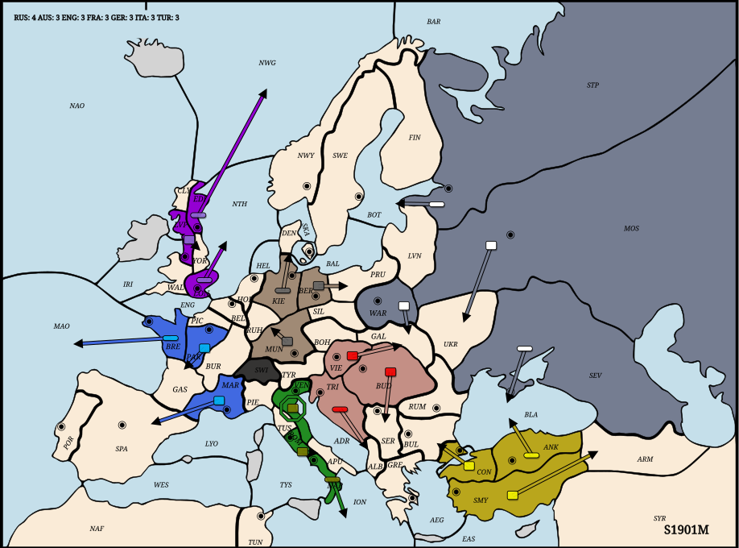
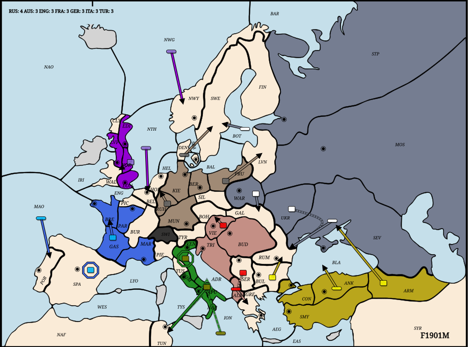
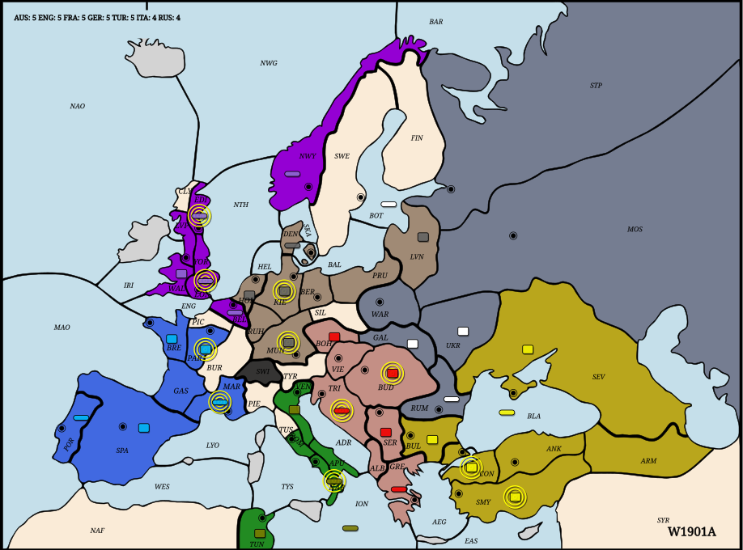
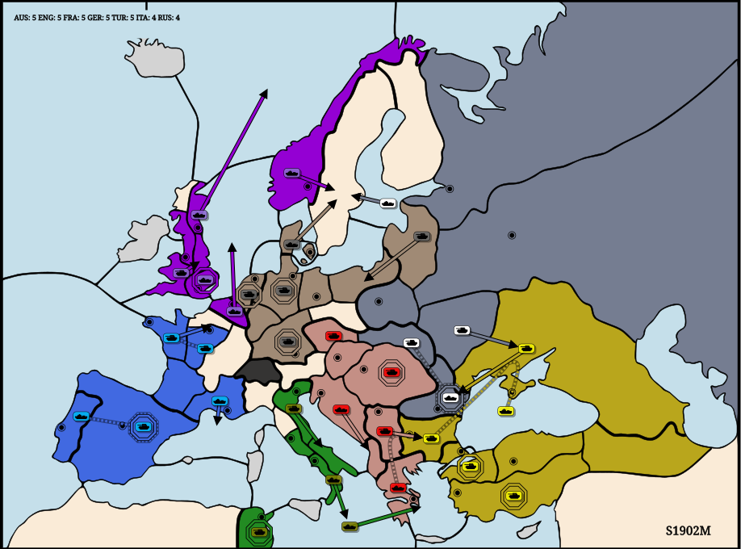
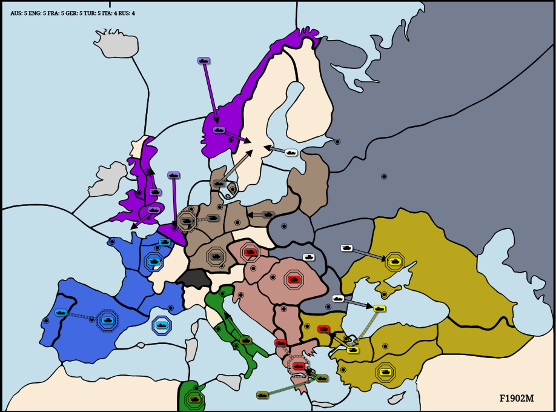

# Diplomacy A2A — Run `20260527T133022Z`

- **Model**: `claude-sonnet-4-6`
- **Years targeted**: 2
- **Started**: 2026-05-27T13:30:22+00:00
- **Ended**: 2026-05-27T13:53:32+00:00
- **Phases played**: 6
- **Tokens**: input=448397, output=50265, cache_create=14669, cache_read=234705
- **Approx cost (USD)**: $2.2246

## Personas

- **FRANCE** — A pragmatic, conservative player who prefers stable alliances and avoids unnecessary risks.
- **GERMANY** — An opportunist — seize tactical chances, willing to pivot alliances when payoffs flip.
- **ENGLAND** — Cautious and naval-focused; build a strong fleet position before committing to aggression.
- **ITALY** — Ambiguous and scheming; keep options open, prefer surprise moves over telegraphed campaigns.
- **AUSTRIA** — Defensive and central; hold the position, broker peace between feuding neighbors.
- **RUSSIA** — Expansionist on both fronts; press for territory wherever weakness appears.
- **TURKEY** — Patient and long-game; build slowly, exploit late-game momentum.

## SPRING 1901 MOVEMENT (`S1901M`)

### What happened

- **AUSTRIA**: A BUD → SER; A VIE → GAL (bounced); F TRI → ALB
- **ENGLAND**: F EDI → NWG; F LON → NTH; A LVP → YOR
- **FRANCE**: F BRE → MAO; A MAR → SPA; A PAR → GAS
- **GERMANY**: F KIE → DEN; A MUN → RUH; A BER → PRU
- **ITALY**: F NAP → ION; A ROM → APU; A VEN holds
- **RUSSIA**: F SEV → BLA (bounced); F STP/SC → BOT; A WAR → GAL (bounced); A MOS → UKR
- **TURKEY**: F ANK → BLA (bounced); A CON → BUL; A SMY → ARM

### Dialogue

- **AUSTRIA → ITALY**: Hello from Vienna! I'd like to propose a friendly opening — I have no intention of moving on Venice, and I hope we can keep Trieste peaceful between us. A Lepanto-style cooperation against Turkey could benefit us both. What are your thoughts?
- **AUSTRIA → RUSSIA**: Greetings from Austria. I want to signal peaceful intentions — I'm not planning to move into Galicia this spring, and I hope we can coordinate in the Balkans rather than compete. Can we discuss a working arrangement?
- **AUSTRIA → TURKEY**: Hello from Vienna. I think Austria and Turkey have more to gain from a stable Balkans than from fighting over it early. I'm open to discussing how we divide influence in the region — Serbia and Romania don't have to be contested between us.
- **AUSTRIA → GERMANY**: Friendly greetings from Austria! I see no reason for conflict between us — I'll be focused on the Balkans and southeastern Europe. I hope we can maintain good relations and perhaps coordinate if opportunities arise.
- **ENGLAND → FRANCE**: Greetings from London! I'd like to propose a peaceful opening between us — no fleets into the English Channel from either side in Spring 1901. A stable western front benefits us both while we look for opportunities elsewhere.
- **ENGLAND → GERMANY**: Hello from England. I'm hoping we can coordinate peacefully in the north — I have no designs on Scandinavia that would threaten you, and I'd welcome a friendly relationship. What are your plans for the opening?
- **ENGLAND → RUSSIA**: Greetings! I'm planning a standard naval opening and would appreciate knowing your intentions in Scandinavia. Perhaps we can avoid stepping on each other's toes up north?
- **FRANCE → ENGLAND**: I'd like to propose a friendly opening between us — I have no designs on the English Channel this spring and would prefer we focus our energies elsewhere. Can we agree to stay out of each other's way for now?
- **FRANCE → GERMANY**: I want to flag that I'm planning a westward opening and would appreciate if you keep your army out of Burgundy this spring. In return, I'm happy to coordinate on matters of mutual interest — perhaps against a common rival.
- **FRANCE → ITALY**: I'm planning to move toward Spain and Iberia this year, so I'll be staying well clear of your sphere. I hope we can maintain friendly relations and perhaps coordinate if opportunities arise.
- **GERMANY → ENGLAND**: Greetings from Berlin! I'd love to coordinate early — I'm thinking of moving my fleet toward Denmark or Holland. If we can avoid stepping on each other's toes in the North Sea area, we might both profit handsomely. What are your plans for the opening?
- **GERMANY → FRANCE**: Hello from Germany! I want to signal peaceful intentions on the Burgundy border — I have no plans to move into BUR this spring. I'd rather focus eastward and hope we can maintain an open western front. Interested in a non-aggression understanding?
- **GERMANY → RUSSIA**: Greetings! I want to open a line of communication early. I have no aggressive intentions toward you in Silesia or Prussia — I'm focused on western and northern expansion. Would you be open to a mutual understanding about our shared border?
- **ITALY → AUSTRIA**: Greetings from Rome! I'd like to propose a friendly arrangement — I have no designs on Trieste or the Balkans, and I hope we can coordinate against Turkey together. A Juggernaut (Russia-Turkey alliance) would threaten us both. What are your thoughts on a joint Lepanto?
- **ITALY → TURKEY**: Hello neighbor! I hope we can keep things peaceful between us this opening year. I have no immediate aggressive intentions toward you — there's plenty of room for both of us to grow without conflict.
- **ITALY → FRANCE**: Salutations from Italy! I'm focused entirely eastward this year and have no interest in Marseille or Piedmont. I hope we can maintain a friendly western border so we can both pursue our respective ambitions.
- **RUSSIA → TURKEY**: Greetings! I'd like to propose we avoid an early conflict — the Black Sea is a flashpoint and I'd rather we both focus expansion elsewhere in 1901. Would you be open to a non-aggression understanding, perhaps with me taking Rumania and you focusing on the Mediterranean?
- **RUSSIA → AUSTRIA**: Hello! I think we can avoid stepping on each other's toes early on. I'm planning to focus north and on Rumania — I have no designs on Galicia if you leave Ukraine and Warsaw alone. Interested in a mutual non-aggression pact?
- **RUSSIA → ENGLAND**: Greetings from St. Petersburg! I'm focused southward and eastward in 1901 — no designs on Scandinavia if you're heading that way. Perhaps we can coordinate to keep Germany in check?
- **RUSSIA → GERMANY**: Hello! I think we both benefit from stable borders early on. I'm not planning any moves into Silesia or Prussia — happy to discuss how we can both expand without conflict.
- **TURKEY → RUSSIA**: Greetings from Constantinople! I'd like to propose a friendly arrangement — I have no interest in conflicting with Russia in the early game. I'm planning to focus on the Balkans and Mediterranean, and I'd be happy to leave the Black Sea uncontested if we can agree to stay out of each other's way. Let me know your thoughts.
- **TURKEY → AUSTRIA**: Hello from Turkey! I think we could have a productive relationship this year. I'm planning to move into Bulgaria and focus westward — I have no desire to threaten your Balkan position if we can find a way to coordinate. What are your intentions for the opening?
- **TURKEY → ITALY**: Greetings! I think Turkey and Italy have natural interests that don't conflict early on. I'll be focused on Bulgaria and the Balkans while you work the western Mediterranean — perhaps we can find common cause against a shared rival down the line.
- **AUSTRIA → ITALY**: Excellent — I'm fully on board with a Lepanto approach. I'll keep Trieste peaceful and focus on the Balkans and supporting a push against Turkey. Let's stay in close contact about timing and coordination.
- **AUSTRIA → RUSSIA**: Thank you for the non-aggression offer — I'm happy to accept. I won't move into Galicia this spring, and I hope we can coordinate in the Balkans. Romania is yours to take; Serbia is my natural first step.
- **AUSTRIA → TURKEY**: I appreciate the diplomatic tone. I'll be moving toward Serbia as my natural first step — I hope we can keep the Balkans stable and find a division that works for both of us rather than fighting over every center.
- **ENGLAND → FRANCE**: Glad we're aligned on the Channel — I'll keep my fleets away from ENG this spring if you do the same. I think we can both find growth elsewhere without conflict. Looking forward to a stable western relationship.
- **ENGLAND → GERMANY**: Thanks for the openness! I'm planning to move into the North Sea, so I'd ask you keep your fleet out of NTH — Denmark is a natural target for you and I won't interfere there. If we respect each other's spheres, we can both expand comfortably.
- **ENGLAND → RUSSIA**: Thank you — I'm glad we're not in conflict over Scandinavia. I'll be taking NOR and SWE as my natural targets, and I'd welcome coordination to keep Germany from dominating the north. Let's stay in touch.
- **FRANCE → ENGLAND**: Excellent — I'm glad we're aligned. I'll be keeping my fleet out of the English Channel this spring and focusing on the Atlantic/Iberia. I think an Anglo-French understanding could be very valuable going forward.
- **FRANCE → GERMANY**: I appreciate the assurance on Burgundy — I'll be moving my army toward Gascony and Spain, so we shouldn't be crossing paths. A stable Franco-German border benefits us both; I'm open to deeper coordination if opportunities arise.
- **FRANCE → ITALY**: Good to hear we're on the same page. I'll be moving toward Spain and the Atlantic, well away from your sphere. Let's keep this friendly arrangement going — a stable western Mediterranean suits us both.
- **GERMANY → ENGLAND**: I'm planning F KIE to DEN this spring, leaving HOL open — if you want to grab NWY, we'd neatly divide Scandinavia without conflict. I think a solid Anglo-German understanding early on is very valuable for both of us. Can we agree to keep the North Sea friendly?
- **GERMANY → RUSSIA**: Thanks for the reassurance — I'll keep A BER out of Silesia this spring as a show of good faith. I'm focused northward (Denmark) and westward this year. Let's keep our border calm and perhaps find ways to coordinate against mutual threats later.
- **GERMANY → FRANCE**: I'm honoring our understanding — A MUN will not move to BUR this spring. I'd like to build on this into a longer-term non-aggression pact. Perhaps we can even find a common rival to work against together?
- **ITALY → AUSTRIA**: A Lepanto sounds excellent — I'm fully on board. My plan is F NAP to ION, A ROM to APU for the classic setup, and A VEN can hold or support your Balkan moves as needed. I'll stay out of Trieste entirely. Let's coordinate our timing for the push against Turkey in Fall.
- **ITALY → TURKEY**: I appreciate your friendly tone, and I want to reassure you that I'm focused on the western Mediterranean this year. I hope we can keep our relationship warm — there's no need for conflict between us in these early turns.
- **ITALY → FRANCE**: Thanks for the reassurance about staying west — I feel the same way. I'm moving eastward entirely this year, so our borders should remain completely quiet. Let's check in again after Spring resolves.
- **RUSSIA → TURKEY**: Excellent — I'm glad we're aligned. I plan to move into Rumania this spring and won't contest the Black Sea if you stay out of it as well. Let's both focus on expanding elsewhere and revisit coordination in Fall 1901.
- **RUSSIA → AUSTRIA**: I appreciate the good faith signal. I want to be transparent: I'm planning to move into Rumania via the Black Sea, and I may move toward Galicia as well — not to threaten you, but to secure a neutral center. If you're not moving there either, perhaps we can agree to divide the Balkans sensibly.
- **RUSSIA → ENGLAND**: Sounds good — I'm heading north via the Gulf of Bothnia toward Sweden, so we may be in the same waters. I'd propose you take Norway and I take Sweden, keeping us both happy and Germany contained between us.
- **RUSSIA → GERMANY**: Glad we're on the same page. I'm moving toward Galicia and Rumania this spring, not toward your borders — you have nothing to fear from me in Silesia or Prussia.
- **TURKEY → RUSSIA**: Thank you for the kind proposal — I'm inclined to agree. I'm planning to focus on Bulgaria this spring and have no aggressive intentions toward the Black Sea region. A stable northern border would benefit us both as we expand elsewhere.
- **TURKEY → AUSTRIA**: Good to hear from Vienna! I'm planning A CON - BUL this spring, which should be uncontested. I'd suggest we think about how to divide the Balkans amicably — perhaps you take Serbia and we coordinate on Romania later? I see no reason for us to clash early.
- **TURKEY → ITALY**: Glad we're on the same page! I'll be moving toward Bulgaria and potentially the eastern Mediterranean over time. If you're heading toward Tunis and the west, we should have no friction — and perhaps room to cooperate against a common rival in the future.
- **ENGLAND → FRANCE**: We're aligned — I'm keeping out of ENG this spring and moving my fleets north toward Norway. I think this Anglo-French understanding is a strong foundation. Let's stay in close contact as the game develops.
- **ENGLAND → GERMANY**: Agreed — you take Denmark, I'll take Norway. I'm moving F EDI to NWG and F LON to NTH, so we'll both be well-positioned. Let's keep this understanding solid going forward.
- **ENGLAND → RUSSIA**: Confirmed — you take Sweden, I take Norway. I'm moving F EDI to NWG for Norway and keeping the North Sea covered. This division suits us both perfectly and keeps Germany boxed in.
- **GERMANY → ENGLAND**: We're aligned — F KIE heads to DEN this spring, leaving you room in the north. I look forward to a productive Anglo-German partnership as we both expand. Let's stay in close contact after the moves resolve.
- **GERMANY → FRANCE**: I want to confirm our understanding holds — I'm keeping MUN away from BUR this spring as promised. I hope this builds the foundation for a longer-term arrangement between us.
- **GERMANY → RUSSIA**: Just confirming our border stays quiet this spring — I'm focused northward on Denmark. Looking forward to coordinating further once we see how the board develops.
- **ITALY → AUSTRIA**: All confirmed on my end — F NAP to ION, A ROM to APU, and A VEN holds to cover Trieste if needed. Let's keep Trieste completely quiet and focus our energy on Turkey together. Looking forward to coordinating the Fall push.
- **ITALY → TURKEY**: Just wanted to close out our pre-Spring talks on a friendly note — I'm keeping things calm on my end and moving carefully. I hope we can continue building trust as the year progresses.
- **RUSSIA → AUSTRIA**: We're in agreement — I'll move into Rumania and won't threaten Galicia this spring. Serbia is yours; let's coordinate in Fall 1901 on how to divide the Balkans further. Looking forward to a productive partnership.
- **RUSSIA → TURKEY**: Confirmed — I'm moving F SEV into the Black Sea toward Rumania, and I'll respect your space in the Balkans. Bulgaria is yours this spring; let's both expand and compare notes in Fall 1901.
- **RUSSIA → ENGLAND**: Final confirmation — I'm heading toward Sweden via the Gulf of Bothnia, you take Norway. Let's keep Germany boxed in from north and east. Good luck this spring.
- **RUSSIA → GERMANY**: All clear on our borders — I'm moving south and east, not toward you. Let's both have a strong 1901 and stay in touch.
- **TURKEY → RUSSIA**: We're in agreement — I'm moving to Bulgaria this spring and will leave the Black Sea alone. Let's both expand peacefully and compare notes in Fall 1901. I look forward to a productive relationship.
- **TURKEY → AUSTRIA**: Confirmed — I'm moving A CON to Bulgaria this spring, leaving Serbia entirely to you. I hope we can maintain this cooperative approach through the year and discuss Romania coordination in the fall.
- **TURKEY → ITALY**: All looks good from my end — I'm heading toward Bulgaria and the eastern Mediterranean, you take the west. Let's keep in touch as the board develops; there may be good opportunities for us to coordinate against a stronger power.

### AUSTRIA
Orders: `A BUD - SER` · `A VIE - GAL` · `F TRI - ALB`

Reasoning

> Looking at the situation:
>
> - Italy is doing the classic Lepanto setup (F NAP-ION, A ROM-APU, A VEN holds) — friendly and non-threatening to Trieste
> - Russia says they won't go to Galicia but mentioned they "may move toward Galicia" — slightly concerning but they confirmed non-aggression
> - Turkey is moving to Bulgaria, leaving Serbia to me — good
>
> My goals this spring:
> 1. Take Serbia with A BUD - SER (uncontested, Turkey confirmed they're going to Bulgaria)
> 2. Move A VIE - GAL to secure Galicia before Russia can change their mind — Russia said they "may move toward Galicia" which is a red flag, and securing GAL is strategically important
> 3. F TRI - ALB to position for Lepanto and potentially move toward Greece in Fall
>
> The risk with VIE-GAL: Russia said they won't go there this spring, so it should be safe. It also gives me a strong defensive position. The alternative (VIE-TYR) is less useful given Italy is friendly.
>
> For Trieste, moving F TRI - ALB opens up the Adriatic and supports the Lepanto while not threatening Italy.

### ENGLAND
Orders: `F EDI - NWG` · `F LON - NTH` · `A LVP - YOR`

Reasoning

> Looking at the position: I've agreed with France to stay out of the English Channel, with Germany to let them take Denmark while I take Norway, and with Russia to divide Scandinavia (me Norway, them Sweden). My persona is cautious and naval-focused.
>
> The standard strong English opening is F EDI → NWG (to take Norway in Fall), F LON → NTH (to dominate the North Sea), and A LVP → YOR or WAL (to position the army). 
>
> - F EDI - NWG: sets up NOR grab in Fall
> - F LON - NTH: controls the North Sea, supports future moves
> - A LVP - YOR: moves army south/east for flexibility, or WAL for a future convoy
>
> I'll move A LVP to YOR to keep options open (can move to LON area or support fleet operations). This is the classic English opening.

### FRANCE
Orders: `F BRE - MAO` · `A MAR - SPA` · `A PAR - GAS`

Reasoning

> Looking at the situation: Germany has confirmed they won't move to Burgundy, England is staying out of the Channel, and Italy is moving east. This is a clean opening for France to expand toward Iberia (Spain and Portugal) which are the natural French supply centers to grab in 1901.
>
> The classic French opening is to move toward Spain via Gascony, get the fleet into the Mid-Atlantic to threaten Portugal, and keep Paris flexible. With Germany promising to stay out of Burgundy, I could move A PAR to Burgundy as a forward position, but given my conservative persona and the good diplomatic relations I've built, I'll focus on the safe Iberian grab.
>
> Best plan:
> - F BRE → MAO (Mid-Atlantic Ocean) — positions fleet to take Portugal in Fall
> - A MAR → SPA (Spain) — takes a supply center
> - A PAR → GAS (Gascony) — supports the Iberian push and keeps options open
>
> This gives me a strong position to take both Spain and Portugal in Fall 1901, potentially reaching 5 supply centers. It's safe, doesn't threaten Germany or England, and follows through on my stated intentions.

### GERMANY
Orders: `F KIE - DEN` · `A MUN - RUH` · `A BER - PRU`

Reasoning

> Looking at the board, my strategy is clear:
>
> - **F KIE → DEN**: Grab Denmark, a neutral supply center. Agreed with England who takes Norway.
> - **A MUN → BUR**: Wait — I promised France I wouldn't go to BUR. But actually, let me reconsider. France said they're moving toward Gascony/Spain, so BUR might be empty and tempting. However, breaking this early promise could poison the Franco-German relationship for the whole game. Better to honor it and keep France friendly while I secure DEN.
> - **A MUN → RUH** or hold: RUH is a stepping stone toward HOL or BEL. Moving there keeps pressure westward without breaking promises.
> - **A BER → KIE** or **A BER → SIL**: With F KIE leaving, BER could cover KIE, but that's wasteful. SIL is a useful forward position toward eastern neutrals (WAR, BOH) and I promised Russia I'd stay out — but SIL isn't Prussia or Silesia... actually I said I'd keep A BER out of Silesia. Let me honor that and go to **A BER → PRU** instead — that's a safe forward move toward Sweden/Baltic area.
>
> Actually, best plan:
> - F KIE → DEN (take the center)
> - A MUN → RUH (position for HOL or BEL next turn)
> - A BER → PRU (forward position, not threatening Russia in SIL)
>
> Wait — A MUN → BUR is very tempting if France vacates it. But I promised. Let me stay trustworthy this round and go RUH, which still positions me for HOL next fall.

### ITALY
Orders: `F NAP - ION` · `A ROM - APU` · `A VEN H`

Reasoning

> Looking at the board, the classic Lepanto opening is well-suited here. I've committed to Austria that I'll run F NAP → ION, A ROM → APU, A VEN holds. This is the standard Lepanto setup and keeps my word to Austria while positioning for a strong Fall push toward Turkey. Turkey thinks I'm heading west, which is a useful deception — I've been deliberately vague with them. A VEN holding also reassures Austria about Trieste.
>
> The key moves:
> - F NAP → ION: Opens the eastern Mediterranean, crucial for Lepanto
> - A ROM → APU: Positions to convoy or support ION operations
> - A VEN H: Holds to reassure Austria, covers Trieste diplomatically

### RUSSIA
Orders: `F SEV - BLA` · `F STP/SC - BOT` · `A WAR - GAL` · `A MOS - UKR`

Reasoning

> Looking at the board, my goals for Spring 1901 are clear:
>
> 1. **F SEV → BLA**: Move into the Black Sea to position for Rumania in Fall 1901. Turkey agreed to stay out of BLA, so this should be uncontested.
> 2. **F STP/SC → BOT**: Move into the Gulf of Bothnia to position for Sweden in Fall 1901, as agreed with England.
> 3. **A WAR → GAL**: Push into Galicia — Austria said they won't move there, so I can take it unopposed and threaten multiple Balkan centers.
> 4. **A MOS → UKR**: Move into Ukraine to support future moves toward Rumania or Sevastopol, and to expand my footprint.
>
> This gives me strong positioning: BLA sets up RUM, BOT sets up SWE, GAL threatens BUD/RUM/SER, and UKR supports the southern front. I'll have excellent leverage for Fall 1901 with potential for 3 new supply centers (RUM, SWE, and possibly one more).

### TURKEY
Orders: `F ANK - BLA` · `A CON - BUL` · `A SMY - ARM`

Reasoning

> Looking at the board, my key decisions are:
>
> 1. **A CON - BUL**: Standard opening, grabs a neutral supply center uncontested. I've confirmed this with Austria and Russia.
> 2. **F ANK - BLA**: This is the key decision. Russia said they're moving F SEV into the Black Sea. If I move into BLA and they do too, we bounce — which actually isn't terrible (prevents Russia from having BLA). If I trust Russia and stay out, I lose tempo. The Black Sea is strategically vital for Turkey's long-term position. Taking it early limits Russian southern expansion significantly. Even if Russia is annoyed, the bounce is better than letting them have it for free.
> 3. **A SMY - ARM**: This gives me a second neutral (Armenia) and puts pressure on the Caucasus region, giving me flexibility.
>
> Actually, reconsidering: Russia explicitly said they're moving F SEV - BLA (toward Rumania via BLA). If I move F ANK - BLA and they do too, we bounce and neither gets it — Russia can't take Rumania via BLA either. That's actually quite disruptive to Russia's plans. But I promised not to contest BLA...
>
> The classic Turkish opening is F ANK - BLA, A CON - BUL, A SMY - ARM. The Black Sea is too valuable to give up. Even if Russia is annoyed, having BLA gives Turkey enormous flexibility. The bounce scenario (if Russia tries) is fine too.
>
> I'll go with the classic aggressive Turkish opening: BLA, BUL, ARM.

## FALL 1901 MOVEMENT (`F1901M`)

### What happened

- **AUSTRIA**: F ALB → GRE; A SER supports F ALB → GRE; A VIE → BOH
- **ENGLAND**: F NWG → NWY; F NTH → BEL; A YOR → WAL
- **FRANCE**: F MAO → POR; A SPA holds; A GAS → BRE
- **GERMANY**: F DEN → SWE (bounced); A RUH → HOL; A PRU → LVN
- **ITALY**: A VEN holds; F ION convoys A APU → TUN; A APU → TUN VIA
- **RUSSIA**: F BOT → SWE (bounced); F SEV → RUM; A UKR supports F SEV → RUM; A WAR → GAL
- **TURKEY**: F ANK → BLA; A BUL → RUM (bounced); A ARM → SEV

### Dialogue

- **AUSTRIA → ITALY**: I'm planning to take Greece this fall with F ALB - GRE supported by A SER. I'd ask that you keep Trieste quiet — A VEN hold or support would be appreciated. Let's confirm our coordination is still on track for the Lepanto push.
- **AUSTRIA → TURKEY**: I want to be transparent: I'm planning to move F ALB to Greece this fall, supported by A SER. I hope you'll focus A BUL toward Romania rather than Greece so we avoid a clash — that way we both gain a center this fall.
- **AUSTRIA → RUSSIA**: I'm moving to secure Greece this fall and will push A VIE toward Galicia to keep our border stable. I hope Romania goes smoothly for you — let's keep our non-aggression pact firm and discuss further Balkan coordination.
- **ENGLAND → GERMANY**: Fall 1901 — I'm moving F NWG into Norway as planned. I'd like to also grab Belgium or Holland as a third center. Can you support my move into Belgium, or are you heading there yourself? Let's coordinate so we don't bounce each other.
- **ENGLAND → RUSSIA**: Confirming our arrangement — F NWG takes Norway this fall. Hope your push into Sweden is going smoothly. Let's keep talking about containing Germany as we both consolidate our gains.
- **ENGLAND → FRANCE**: Hope spring went well for you! I'm securing Norway this fall. I notice you're in MAO and GAS — any plans for the Iberian peninsula? I want to make sure we stay coordinated and don't find ourselves in unexpected conflict.
- **FRANCE → ENGLAND**: Fall 1901 looks promising for both of us — I'm planning to secure Portugal and consolidate in Spain, staying well clear of your sphere. I hope you're making gains in Norway and Scandinavia. Let's keep our western understanding intact and perhaps discuss longer-term coordination.
- **FRANCE → GERMANY**: I'm focused on locking down Iberia this fall — Portugal and Spain are my targets, nothing that affects you. I'd like to continue our non-aggression understanding into 1902 and beyond; a stable Franco-German border frees us both to pursue growth elsewhere. Are you making progress in the north and east?
- **FRANCE → ITALY**: I'm consolidating in Iberia this fall — Portugal is my main target. I'm curious how your eastern campaign is going and whether we might find common ground in the Mediterranean going forward. Let's stay in touch.
- **GERMANY → ENGLAND**: Great opening for both of us! I'm planning to take SWE with my fleet and HOL with my army this fall — that leaves NWY free for you to grab. If you support me into HOL from NTH, we both come out of 1901 with 5 centers combined and in excellent shape. Sound good?
- **GERMANY → FRANCE**: We've both had a clean opening — I'm staying well clear of BUR and heading north/east. I'd love to formalize a non-aggression pact on the BUR frontier so we can both focus on our natural expansion zones without worrying about each other.
- **GERMANY → RUSSIA**: Hope your fall moves go well! I'm focused on SWE and HOL this fall — nothing threatening toward your borders. Let's keep our understanding intact and talk about longer-term coordination once we see how 1901 shakes out.
- **ITALY → AUSTRIA**: Great work getting SER and ALB! For Fall, I'm planning to move F ION to GRE and A APU to TUN via convoy — the classic Lepanto setup. I'd ask that you keep F ALB out of GRE so we don't bounce each other. Can you support my move into GRE instead, or at minimum hold ALB? Let's make sure we coordinate so neither of us wastes a move.
- **ITALY → TURKEY**: I want to be transparent with you — I'm going to take Tunis this fall, which is my natural expansion. I'm not moving aggressively toward your centers. I hope we can keep things calm between us and perhaps find common cause against whoever emerges strongest on the board.
- **ITALY → FRANCE**: Hope your Iberian campaign is going well! Just checking in — I'm heading toward Tunis and the eastern Mediterranean this fall, completely away from your sphere. Let's keep our friendly arrangement going into 1902.
- **RUSSIA → TURKEY**: Fall 1901 is here — I'm planning to move F SEV into Rumania and would appreciate your continued cooperation. I hope you're not moving F ANK into the Black Sea, as that would create an unwanted conflict between us. Let's both secure our gains and continue our peaceful arrangement.
- **RUSSIA → AUSTRIA**: Fall 1901 looks good for both of us — I'm taking Rumania and moving A WAR toward Galicia to secure that neutral. I want to be transparent: I need Galicia as a buffer, not a threat to you. Can we agree I take Galicia and we coordinate on the Balkans going forward?
- **RUSSIA → ENGLAND**: Confirming I'm heading F BOT to Sweden this fall as agreed. Hope your Norway move goes smoothly — let's keep our northern arrangement solid and compare notes on Germany's position after the fall builds.
- **TURKEY → RUSSIA**: Fall 1901 is here and I'm thinking about next steps. I'd like to move into Romania from Bulgaria — would you be willing to let me take it uncontested, perhaps in exchange for my support elsewhere? I want to keep our relationship productive and avoid a bounce that benefits neither of us.
- **TURKEY → AUSTRIA**: The spring went well from both our perspectives — you have Serbia, I have Bulgaria. I'm planning to move toward Romania this fall; I hope we can avoid a clash there and perhaps even coordinate. What are your fall intentions?
- **TURKEY → ITALY**: Hope your spring went as planned! I'm looking at Greece and Romania as my fall targets. If you're moving your ION fleet toward Greece, let me know — I'd rather we coordinate than bounce each other.
- **AUSTRIA → ITALY**: I want to be honest with you — I have F ALB positioned to take Greece this fall with support from A SER, giving me strength 2. If you send F ION to Greece, we'll bounce and neither of us gains. I'd strongly suggest redirecting F ION to ADR or holding, and we can coordinate Greece for you in 1902 once I've built. Our long-term partnership is more valuable than a bounce.
- **AUSTRIA → RUSSIA**: I hear your request on Galicia — I'm moving A VIE toward BOH or GAL this fall to stabilize our border. Let's confirm: you take Romania, I take Greece, and we keep the non-aggression pact firm. I'd welcome continued coordination on the Balkans going forward.
- **AUSTRIA → TURKEY**: I see you're heading toward Romania — that's fine by me, though Russia may contest it. I'm focused on Greece this fall. Let's make sure we don't trip over each other and can discuss further Balkan arrangements once the dust settles.
- **ENGLAND → GERMANY**: Confirming F NWG → Norway this fall, so Norway is secured for England. I'm planning to move F NTH into Belgium as my third center — you mentioned Holland for yourself, so we shouldn't bounce. Let's both come out of 1901 with 4 centers and a strong partnership heading into 1902.
- **ENGLAND → FRANCE**: Fall is going smoothly — I'm taking Norway and Belgium as my two new centers, staying well north and east of your sphere. Our western understanding is holding perfectly and I see no reason to change that. Let's compare notes after the builds and think about 1902 coordination.
- **ENGLAND → RUSSIA**: All on track — F NWG moves to Norway as agreed, you take Sweden. After builds I'll have 4 centers and a strong fleet position in the north. Let's keep Germany boxed in and discuss how we handle the Scandinavian balance going into 1902.
- **FRANCE → ENGLAND**: Everything is on track from my end — I'm moving to secure Portugal this fall and consolidating in Spain. I see you're heading to Norway, which is great. Our western understanding is holding perfectly, and I look forward to deeper coordination in 1902.
- **FRANCE → GERMANY**: Glad we're maintaining our understanding — I'm locking down Portugal and Spain this fall, nothing that touches your sphere. A stable Franco-German frontier is genuinely valuable to me, and I'd like to formalize that as we head into 1902. Let's talk about longer-term coordination next year.
- **FRANCE → ITALY**: My Iberian consolidation is going smoothly — Portugal is my target this fall, well away from your eastern operations. I'm glad we've kept things friendly and I'd like to explore Mediterranean coordination in 1902, particularly if either of us faces pressure from Austria or Turkey.
- **GERMANY → ENGLAND**: Just confirming our coordination — I'm taking SWE with my fleet from DEN, and I'd like to grab HOL with A RUH this fall. If you support me into HOL from NTH, we both benefit: you get NWY cleanly and I get HOL, no bounce. Can you confirm you'll support A RUH - HOL rather than contesting it?
- **GERMANY → FRANCE**: Fall looks clean between us — I'm heading north to SWE and HOL, nowhere near your territory. The Franco-German border stays quiet, and I hope we can make that a permanent arrangement heading into 1902.
- **GERMANY → RUSSIA**: Hope your fall moves go smoothly — I'm pushing north toward SWE and HOL, nothing directed at you. Let's keep our understanding solid and look for ways to cooperate in 1902.
- **ITALY → AUSTRIA**: I've reconsidered my Fall plans — I'll be convoying A APU to Tunis and keeping F ION in support rather than competing for Greece. Please go ahead with your ALB-GRE move; I won't be in your way. Let's keep building toward the Lepanto together in 1902.
- **ITALY → TURKEY**: Just a heads up — I'm heading to Tunis this fall, not Greece, so there's no risk of us bouncing in the Aegean. I hope we can continue our calm relationship; I'd rather we find common ground than get into an early conflict.
- **RUSSIA → TURKEY**: I appreciate your proposal, but I must be direct: I'm moving into Romania this fall — it's essential for my position. I hope you understand and we can find other ways to cooperate. I'm happy to support you elsewhere in the Balkans if we can maintain our peaceful relationship.
- **RUSSIA → AUSTRIA**: I want to be transparent — I'm moving F SEV into Romania this fall and supporting with A UKR. I'm also considering A WAR toward Galicia, but only as a buffer, not a threat. If you're moving VIE to Galicia as well, we may bounce — can we coordinate to avoid that?
- **RUSSIA → ENGLAND**: Confirming F BOT is heading to Sweden this fall as agreed. Hope your Norway move goes smoothly — looking forward to comparing notes after the builds and discussing how to manage Germany's growth.
- **TURKEY → RUSSIA**: I'm planning to move A BUL to Romania this fall — I think it's the natural expansion for me from Bulgaria. If you move F SEV there too, we both lose a build. I'd suggest you use SEV to secure the Black Sea or support me instead, and we can coordinate on dividing the Balkans going forward. Let's not waste both our moves on a bounce.
- **TURKEY → AUSTRIA**: I've heard your plan for Greece — I won't be moving to Greece this fall, so your path should be clear there. I'm targeting Romania from Bulgaria instead. I hope we can maintain the cooperative spirit and discuss further coordination in 1902.
- **AUSTRIA → ITALY**: We're all set — I'm moving F ALB to Greece with A SER support, and I appreciate you clearing the path. Let's build toward a strong 1902 Lepanto together. Looking forward to coordinating our next moves once we both have our new builds.
- **AUSTRIA → RUSSIA**: We're aligned — you take Romania, I take Greece, and our non-aggression holds firm. I'm moving A VIE to BOH this fall to keep our border stable and avoid any Galicia confusion. Let's talk Balkan coordination in 1902.
- **AUSTRIA → TURKEY**: Thank you for the cooperative approach — I'm moving to Greece and you to Romania, so we should both gain this fall without stepping on each other. I'd like to discuss how we can continue to coordinate in 1902 and keep the Balkans stable between us.
- **FRANCE → ENGLAND**: All is well on my end — I'm locking down Portugal this fall and Spain is secure. Our western understanding remains solid and I look forward to building on it in 1902. Good luck in Norway and Belgium!
- **FRANCE → GERMANY**: Franco-German frontier stays quiet from my side — I'm focused entirely on Iberia this fall. I'd like to formalize our non-aggression arrangement as we head into 1902 and perhaps discuss coordination against powers that threaten us both. Looking forward to comparing notes after the builds.
- **FRANCE → ITALY**: Iberian consolidation is the focus for me this fall — Portugal is my target and I'm well clear of your sphere. I'm genuinely interested in Mediterranean coordination in 1902, especially if Austria or Turkey become aggressive. Let's stay in close contact.
- **GERMANY → ENGLAND**: Locking in our deal — F DEN → SWE, A RUH → HOL, you take NWY and BEL. No overlap, no bounce, we both come out of 1901 with 4 centers and a strong partnership. Looking forward to coordinating in 1902!
- **GERMANY → FRANCE**: All quiet on our frontier — I'm heading north and east, nowhere near you. Let's make the Franco-German non-aggression pact official heading into 1902 and both focus our energy outward.
- **GERMANY → RUSSIA**: Hope your fall goes well — I'm grabbing SWE and HOL, nothing directed at your borders. Let's stay in touch after the dust settles and look for coordination opportunities in 1902.
- **RUSSIA → TURKEY**: I understand your desire for Romania, but my fleet is already positioned at Sevastopol and I'm committed to taking it this fall — it's essential for my security. I hope we can remain on good terms; Bulgaria is a strong base for you and we can coordinate on future Balkan moves together.
- **RUSSIA → AUSTRIA**: Final confirmation: I'm taking Romania with F SEV supported by A UKR, and moving A WAR to Galicia. I hope you're heading to Greece or Bohemia rather than Galicia — a bounce there helps neither of us. Let's lock in our non-aggression and divide the Balkans sensibly.
- **RUSSIA → ENGLAND**: Confirming F BOT → Sweden as agreed — our northern arrangement is solid. Looking forward to comparing builds after fall and coordinating on Germany's position in 1902.

### AUSTRIA
Orders: `F ALB - GRE` · `A SER S F ALB - GRE` · `A VIE - BOH`

Reasoning

> Looking at the situation: Italy has confirmed they won't contest Greece (redirecting to Tunis convoy), Turkey confirmed they won't go to Greece, and Russia is taking Romania. My plan is clear: F ALB - GRE supported by A SER gives me strength 2, which should be uncontested. I'll move A VIE to BOH to avoid bouncing with Russia in Galicia (Russia confirmed A WAR - GAL) and to expand my position northward. This gives me 4 supply centers after fall (BUD, TRI, VIE, GRE) and a build.

### ENGLAND
Orders: `F NWG - NWY` · `F NTH - BEL` · `A YOR - WAL`

Reasoning

> Looking at the position: I have F NWG in position to take Norway, and F NTH can grab Belgium. Germany wants me to support A RUH into Holland, but I've already told Germany I'm taking Belgium myself (and Germany seemed to accept this in the final message, mentioning "you take NWY and BEL"). Russia is taking Sweden with F BOT.
>
> Key decisions:
> - F NWG → NWY: Straightforward, uncontested Norway grab.
> - F NTH → BEL: Belgium is my third center. Germany mentioned HOL for themselves, so we shouldn't bounce. However, if Germany tries NTH or BEL themselves there could be conflict. Germany has A RUH → HOL and F DEN → SWE planned, so BEL should be open.
> - A YOR: No attack target needed. I should move it to support the fleet or position for 1902. Moving to London or Wales makes sense for positioning. Actually, YOR → LON frees up Yorkshire and puts the army in a better position. Or I could hold. Let me move to WAL to be ready to build in LON next winter.
>
> Wait - I need to think about builds. If I take NWY and BEL, I'll have 5 supply centers and can build 2 units in Winter 1901. I want to build in EDI and LON (both home centers). A YOR → WAL or A YOR → LON would free up LON... but actually YOR is not LON, so LON is already free for a build. EDI is also free. So I can build 2 units regardless of where YOR goes.
>
> Moving A YOR to WAL positions it for Ireland or to support future moves. Or I could move it to LON for a more central position. Let me go with A YOR → WAL for flexibility.

### FRANCE
Orders: `F MAO - POR` · `A SPA H` · `A GAS - BRE`

Reasoning

> Looking at the board, my position is strong. I have F MAO, A SPA, and A GAS well-positioned to grab Portugal and consolidate Iberia. The key moves are:
>
> - F MAO → POR (grab Portugal as a new supply center)
> - A SPA → hold or support (Spain is already secured)
> - A GAS → support or consolidate
>
> The optimal play is to take Portugal with the fleet, support Spain's hold with GAS, keeping everything clean and non-threatening to neighbors. I could also push A SPA to POR with F MAO supporting, but the fleet moving directly to POR is simpler and equally effective.
>
> Best orders: F MAO → POR, A SPA holds (or moves to MAR to threaten/take it, but MAR is already mine — wait, MAR is my home center, not currently occupied by my unit). Actually A SPA could move to MAR to "reoccupy" it — but MAR is already a French supply center and doesn't need a unit there to count. What matters is occupying neutral/enemy centers.
>
> Portugal is the key gain. I'll take POR with F MAO, hold A SPA to secure Spain, and move A GAS to BUR... no, that would alarm Germany. Better to have A GAS support A SPA or just hold. Actually A GAS → BRE would reoccupy my home center (BRE is mine but unoccupied — the fleet left). That's safe and consolidating.

### GERMANY
Orders: `F DEN - SWE` · `A RUH - HOL` · `A PRU - LVN`

Reasoning

> Looking at the board: I have F DEN, A PRU, A RUH. My agreed plan with England is F DEN → SWE, A RUH → HOL, and England takes NWY and BEL. This gives me 5 centers (BER, KIE, MUN, SWE, HOL) after Fall 1901 — an excellent position.
>
> For A PRU: I should move toward LVN to pressure Russia and potentially grab a center in 1902, or I could move to BER/SIL. Since I'm already getting 2 new centers (SWE and HOL), I don't need PRU to grab anything this fall. Moving A PRU → LVN puts pressure on Russia and positions me well for 1902. However, Russia has A WAR there — actually WAR is in Warsaw, not LVN. LVN is empty! Moving A PRU → LVN is a free grab of a non-supply-center province that positions me near STP and MOS for 1902 leverage. It also signals to Russia that I'm expanding east, which could be useful pressure or could alarm them. Given I want to keep Russia friendly for now, maybe I should just hold or move to SIL. Actually, LVN is not a supply center so it's just positioning. Moving there puts me adjacent to STP which is threatening. Let me move to SIL instead — it's more central and less alarming to Russia while still being a good position.
>
> Actually, A PRU → LVN is a strong move. Russia has F BOT and A WAR — they can't contest LVN this fall. It opens up pressure on STP in 1902. I'll do it.

### ITALY
Orders: `A VEN H` · `F ION C A APU - TUN` · `A APU - TUN VIA`

Reasoning

> Looking at the board, I need to secure Tunis this fall to grow to 4 supply centers. The key question is what to do with my three units:
>
> - **F ION**: Can convoy A APU to Tunis, or move to GRE, TUN directly, or elsewhere
> - **A APU**: Can be convoyed to Tunis (best expansion target), or move to GRE via convoy
> - **A VEN**: Should hold or make a useful move; I promised Austria I'd keep Trieste quiet
>
> I've committed to Austria that I'll let them take Greece (F ALB → GRE supported by A SER), and I've told Turkey I'm heading to Tunis. The convoy A APU → TUN via F ION is the cleanest move — it gets me a new supply center and sets up a strong 1902 position in the Mediterranean.
>
> For A VEN, I could move to TRI (betraying Austria) or TYR (aggressive toward Austria/Germany), but that would break my alliance with Austria which I want to maintain for the Lepanto. Better to hold or move toward TUS/PIE for future flexibility. A VEN → APU would be redundant. Let me move A VEN to TUS — it's a non-threatening move that positions me for future options without alarming Austria.
>
> Actually, holding VEN is safer and keeps my word. Austria wants VEN to hold or support. I'll hold VEN.

### RUSSIA
Orders: `F BOT - SWE` · `F SEV - RUM` · `A UKR S F SEV - RUM` · `A WAR - GAL`

Reasoning

> Looking at the board:
>
> - **Romania**: I want F SEV → RUM, supported by A UKR. Turkey's A BUL may try to take it too, so the support is essential.
> - **Sweden**: F BOT → SWE as agreed with England. This gets me a 5th center.
> - **Galicia**: Austria confirmed they're going to BOH, not GAL. A WAR → GAL gets me a 6th center and a strong buffer position.
> - **F SEV**: Move to RUM with support from UKR.
>
> This gives me: MOS, SEV, STP, WAR (existing) + RUM, SWE, GAL = 7 supply centers after fall, which is an excellent position.
>
> Let me verify the orders:
> - F BOT → SWE ✓
> - F SEV → RUM ✓  
> - A UKR S F SEV → RUM ✓
> - A WAR → GAL ✓

### TURKEY
Orders: `F ANK - BLA` · `A BUL - RUM` · `A ARM - SEV`

Reasoning

> Looking at the board: Russia is committed to taking Romania with F SEV, and I have A BUL. If I move A BUL - RUM and Russia moves F SEV - RUM, we bounce and neither gets the build. Austria is taking Greece with F ALB + A SER support. 
>
> My best play: Let Russia bounce themselves if they insist, but actually I should consider whether to take Greece instead or support Austria. Austria told me to leave Greece alone and I agreed. 
>
> The real question: fight Russia for Romania (likely bounce), or take Greece (which Austria is taking with support, so I'd lose there too), or find another angle.
>
> If I move A BUL - RUM and Russia moves F SEV - RUM, we bounce — both lose builds. But Russia has 4 SCs already and is strong. If I take Greece instead, Austria has SER supporting ALB to GRE, so I'd bounce Austria there too.
>
> Best option: Move A BUL - RUM and hope Russia doesn't (or bounce them, denying them the build). Meanwhile, I can move F ANK - BLA to finally secure the Black Sea, and A ARM - SEV to pressure Russia from the east (though that's risky). 
>
> Actually, A ARM - SEV is a bold move — it threatens Russia's home center. F ANK - BLA secures the sea. A BUL - RUM contests Romania. This puts real pressure on Russia and gives me potential builds from BLA-adjacent positioning.
>
> Let me go: F ANK - BLA, A BUL - RUM, A ARM - SEV. This is aggressive but positions Turkey well for 1902.

## WINTER 1901 ADJUSTMENTS (`W1901A`)

### What happened

- **AUSTRIA**: builds A BUD; builds F TRI
- **ENGLAND**: builds F EDI; builds F LON; waives a build
- **FRANCE**: builds A PAR; builds F MAR
- **GERMANY**: builds A MUN; builds A KIE; waives a build
- **ITALY**: builds F NAP
- **TURKEY**: builds A CON; builds A SMY

### AUSTRIA
Orders: `A BUD B` · `F TRI B`

Reasoning

> Looking at my position: I have 5 supply centers (BUD, TRI, VIE, GRE, SER) and 3 units (A SER, A BOH, F GRE), so I can build 2 units. I should build in BUD and one of TRI or VIE.
>
> Strategic considerations:
> - I want to build an army in BUD to support Balkan operations and potentially threaten Romania or defend against Turkey/Russia
> - I want a fleet in TRI to project naval power into the Adriatic and support future Lepanto operations with Italy
> - Russia has A GAL on my doorstep — I need to be careful about the eastern front
> - Turkey has grown to 5 centers and has A BUL, F BLA, A SEV — a powerful position
>
> Building F TRI gives me Adriatic presence for the Lepanto and keeps Italy happy. Building A BUD gives me a strong army presence in the Balkans. This is the optimal combination.

### ENGLAND
Orders: `F EDI B` · `F LON B` · `WAIVE`

Reasoning

> I have 5 supply centers (EDI, LON, LVP, BEL, NWY) and 3 units, so I can build 2 new units. My persona is cautious and naval-focused. I should build fleets to strengthen my naval position. F LON and F EDI are the natural choices — F LON gives me presence in the North Sea/Channel area, and F EDI gives me another northern fleet. F LVP could also be useful for Atlantic operations, but F LON and F EDI cover the most critical areas first.
>
> Actually, let me think: I have builds at EDI, LON, and LVP (all unoccupied home centers). I need 2 builds. F LON is excellent for North Sea/Channel. F EDI supports northern operations. F LVP would give Atlantic reach. Given my naval-focused persona, I'll build F LON and F EDI to maximize fleet strength in the north and keep pressure options open against both France and Germany.

### FRANCE
Orders: `A PAR B` · `F MAR B`

Reasoning

> Looking at the board, France has 5 supply centers (BRE, MAR, PAR, POR, SPA) and 3 units, so I can build 2 new units. My legal options are builds in MAR and PAR.
>
> For PAR: Building an army makes sense — A PAR B gives me a central unit that can move east or south as needed.
>
> For MAR: I need to think about whether to build an army or fleet. Given my current position:
> - I have A SPA, F POR, A BRE already
> - The western Mediterranean is relatively quiet with Italy focused east
> - A fleet in MAR would give me Mediterranean presence and could threaten Italy or support Iberian operations
> - An army in MAR would give me more land flexibility toward Italy or potentially BUR/PIE
>
> Given my conservative, pragmatic approach and the stable Franco-German relationship, I don't need to threaten Germany. Italy is friendly but I should maintain leverage in the Mediterranean. A fleet in MAR gives me naval flexibility and a credible Mediterranean presence without being overtly aggressive. It also signals to England that I'm not building naval forces in the north (which keeps our relationship warm).

### GERMANY
Orders: `A MUN B` · `A KIE B` · `WAIVE`

Reasoning

> Looking at the position: I have 5 supply centers (BER, KIE, MUN, DEN, HOL) and 3 units (F DEN, A LVN, A HOL), so I can build 2 units.
>
> Key considerations:
> - I need to build strategically for 1902. My units are spread: F DEN in Scandinavia, A LVN dangerously far east (near Russia), A HOL in the west.
> - A LVN is exposed — it could be a target for Russia or England in 1902. I need forces to support or replace it.
> - Building an army in MUN gives me flexibility for BUR or BOH pressure.
> - Building in KIE gives me a unit that can support DEN or move to HOL/BEL area, or head north.
> - Building in BER gives me a unit to support A LVN or move east.
>
> The best builds:
> - **A MUN**: Flexible army for central Europe, can threaten BUR, BOH, or support eastern moves.
> - **A KIE** or **F KIE**: KIE army can go to DEN, HOL, RUH; a fleet could go to DEN or HOL. Given I already have F DEN, another fleet might be redundant. A KIE gives land flexibility.
>
> Actually, with A LVN being exposed and potentially valuable (it's in Russian territory, threatening STP or WAR), I should build in BER to support it or threaten eastward. But MUN is also critical for central flexibility.
>
> I'll build A MUN and A KIE — two armies giving me maximum flexibility for 1902 land operations.

### ITALY
Orders: `F NAP B`

Reasoning

> Looking at the position: I have 4 supply centers (NAP, ROM, VEN, TUN) and 3 units (A VEN, F ION, A TUN), so I get to build 1 unit.
>
> The key question is what to build. My strategic situation:
> - I'm positioned in the eastern Mediterranean with F ION and A TUN
> - Austria has 5 centers and is growing fast — I need to watch them
> - Turkey has 5 centers and A SEV threatens to grow further
> - I want to pursue a Lepanto against Turkey, which means I need more naval power in the east
>
> Building F NAP would give me a second fleet in the Tyrrhenian/Ionian area, strengthening my Mediterranean position and enabling a real Lepanto push. Building A ROM or A NAP would be more useful for land defense or threatening Austria/Turkey overland.
>
> Given that my Lepanto strategy requires naval power and F ION is already committed in the east, F NAP is the strongest build — it can move to TYS or ION next year and support operations against Turkey or defend against Austria.

### TURKEY
Orders: `A CON B` · `A SMY B`

Reasoning

> Looking at the position: Turkey has 5 supply centers (ANK, CON, SMY, SEV, BUL) and 3 units, so I can build 2 units.
>
> **Strategic assessment:**
> - I seized Sevastopol with A ARM → SEV, which is excellent — it's a home center for Russia and a key strategic position
> - Russia has F RUM, which threatens my A BUL and blocks Romanian expansion
> - Austria has F GRE, A SER, A BOH — strong Balkan position
> - I need to decide: build armies or fleets?
>
> **Build decisions:**
> - A SEV is already holding Sevastopol. I need to consolidate the Black Sea position and push into Romania/Balkans
> - Building F ANK makes sense — it can move into the Black Sea or support operations, and gives me naval presence. Actually F BLA already controls the Black Sea
> - Building A CON gives me a land army to push through the Balkans
> - Building A SMY gives another army for flexibility
>
> With F BLA already in the Black Sea and A SEV in Sevastopol, I have good northern positioning. I should build two armies to push westward through the Balkans and threaten Romania. A CON and A SMY give me two more armies to maneuver. Alternatively, F ANK could eventually threaten the eastern Mediterranean.
>
> I'll build A CON (to push into the Balkans/support BUL) and A SMY (flexible army for future use). These armies can support each other and push toward Romania and beyond.

## SPRING 1902 MOVEMENT (`S1902M`)

### What happened

- **AUSTRIA**: A SER → BUL; F GRE supports A SER → BUL; A BUD holds; F TRI → ALB
- **ENGLAND**: F NWY → SWE (bounced); F BEL → NTH; F EDI → NWG; F LON holds; A WAL → YOR
- **FRANCE**: A BRE → PIC; A PAR supports A BRE → PIC; A SPA holds; F POR supports A SPA; F MAR → LYO
- **GERMANY**: F DEN → SWE (bounced); A LVN → PRU; A HOL holds; A MUN holds; A KIE holds
- **ITALY**: F ION → AEG; F NAP → ION; A TUN holds; A VEN → APU
- **RUSSIA**: F BOT → SWE (bounced); A GAL supports F RUM; F RUM holds; A UKR → SEV (bounced)
- **TURKEY**: A SEV → RUM (bounced); F BLA supports A SEV → RUM; A BUL supports A SEV → RUM (support cut); A CON holds; A SMY holds  [dislodged: A BUL]

### Dialogue

- **AUSTRIA → RUSSIA**: I notice A GAL is now on my doorstep — I want to keep our non-aggression pact intact, but I need reassurance that you won't push further into my territory. Can we agree that GAL stays as a buffer and you don't move on Vienna or Budapest? I'm happy to discuss Balkan coordination going forward.
- **AUSTRIA → ITALY**: Spring 1902 is here — I'd like to continue our Lepanto coordination. I'm thinking about pushing toward Bulgaria or Romania to grow, and I'd welcome your fleet moving into the Adriatic or eastern Mediterranean to pressure Turkey. What are your plans for this season?
- **AUSTRIA → TURKEY**: I want to keep our working relationship intact — I hope we can find a way to divide the Balkans that doesn't require us to fight. I'm concerned about the size of your army in the south; can we discuss where each of us is heading this spring so we avoid an unnecessary clash?
- **ENGLAND → GERMANY**: Strong builds for both of us! I notice you have A LVN pushing east — are you planning to press into Russia, or is that a defensive position? I want to make sure we're coordinated in the north so our fleets don't create friction around Denmark and the North Sea.
- **ENGLAND → FRANCE**: We're both at 5 centers and in good shape — I'd like to keep our western understanding solid through 1902. I'm focused on Scandinavia and possibly pushing into the Baltic; no designs on your sphere at all.
- **ENGLAND → RUSSIA**: Germany has A LVN on your doorstep — that looks threatening. I'm willing to coordinate pressure on Germany from the north if you're feeling squeezed. Let me know how you see 1902 shaping up.
- **FRANCE → ENGLAND**: Our western understanding has served us both well — I'm planning to consolidate my Iberian position this spring and have no designs on your sphere. I'm curious about your plans for 1902: are you looking to press further into Scandinavia or the continent? I'd like to ensure we stay coordinated.
- **FRANCE → GERMANY**: Our Franco-German frontier has been admirably quiet and I want to keep it that way. I'm consolidating in Iberia this spring — no moves toward BUR or your territory. I'm curious whether you see Russia or England as the bigger long-term threat, as I'd like to think about coordination beyond just non-aggression.
- **FRANCE → ITALY**: Happy to report our friendly arrangement is holding perfectly. I'm consolidating in Iberia this spring and remain interested in Mediterranean coordination — particularly given Turkey's strong position with 5 centers. Are you thinking about how to address the Turkish threat in the east?
- **GERMANY → RUSSIA**: We've had a stable border so far, and I'd like to keep it that way — but I need SWE this spring to grow, and F BOT is blocking me. Can we agree that F BOT stands down from SWE so I can take it cleanly? In return, A LVN can pull back to PRU and I'll leave your northern territories alone. Let's find an arrangement that works for both of us.
- **GERMANY → ENGLAND**: Strong position for both of us heading into 1902! I'm eyeing SWE this spring and want to keep our northern coordination going — are you willing to support F DEN into SWE, or at least stay out of that contest? I'd like to discuss how we divide Scandinavia cleanly between us.
- **GERMANY → FRANCE**: Our non-aggression pact has served us both well — I'm staying away from BUR and focusing north and east. I'd like to formalize this arrangement for 1902 and perhaps discuss longer-term coordination against powers that are growing too fast. Who worries you most right now?
- **ITALY → AUSTRIA**: Congratulations on Greece — well executed! Now that we both have our builds, let's discuss the next phase of our Lepanto. I'm thinking F ION could move toward AEG or EAS to threaten Turkey's home centers, while you push from the north. What's your plan for your new units?
- **ITALY → TURKEY**: I want to be upfront with you — Austria is at 5 supply centers and growing fast, which threatens both of us. I'm not looking for a fight with Turkey; I'd rather we find a way to coordinate against the real threat on the board. What are your thoughts on the current situation?
- **ITALY → FRANCE**: Checking in as promised! I'm at 4 SCs and need to expand east — Austria and Turkey are both at 5 and growing. I'm curious whether you see Austria as a long-term concern, and whether there's any coordination we might pursue in 1902.
- **RUSSIA → AUSTRIA**: Turkey now has A SEV, F BLA, and A BUL all threatening the Balkans — this is a serious threat to both of us. I propose we coordinate: I'll push against Turkey from RUM and UKR, and if you can press from GRE or SER toward BUL, we can squeeze them together. What are your intentions this spring?
- **RUSSIA → TURKEY**: You've taken Sevastopol — that's a direct threat to my core, and I cannot ignore it. I'm willing to negotiate a settlement: if you pull A SEV back to ARM and agree to a Black Sea non-aggression pact, I'll consider a cooperative arrangement. Otherwise I have no choice but to push back hard.
- **RUSSIA → GERMANY**: I notice A LVN is sitting on my doorstep — I'd appreciate knowing your intentions there. I have no aggressive plans toward you, but I need assurance that LVN won't push toward WAR or MOS. Let's clarify our borders before things escalate.
- **RUSSIA → ENGLAND**: Germany has A LVN deep in my territory — are you in a position to pressure them from the north? If we coordinate, we can keep Germany from dominating both the north and east simultaneously.
- **TURKEY → RUSSIA**: I think it's time we discuss the Balkans honestly — I have A SEV and A BUL positioned near Romania, and I'd like to take it this spring. I'm willing to support your other positions if you step back from RUM gracefully; a contested Romania helps neither of us. Can we find an arrangement that works?
- **TURKEY → AUSTRIA**: I'd like to coordinate closely in 1902 — I'm eyeing Romania and would appreciate your support or at least neutrality there. In exchange, I'm happy to support your position in the Balkans and work against Russia together. What are your plans this spring?
- **TURKEY → ITALY**: Hope things are going well in the west! I'm focused on Romania and the northern front this spring — no moves toward Greece or the Aegean from me. Are you interested in any coordination against a common rival?
- **AUSTRIA → RUSSIA**: I appreciate the coordination proposal — Turkey's position is indeed concerning. I'm prepared to push toward Bulgaria from Greece and Serbia this spring if you can confirm A GAL will not advance on Vienna or Budapest. Can we formalize: you hold or support defensively in GAL while I press Turkey from the south, and we reconvene in Fall about Romania?
- **AUSTRIA → ITALY**: I'm planning to push A SER toward Bulgaria this spring, supported by F GRE — this is the moment to squeeze Turkey. If you can move F ION toward AEG to threaten Turkey's flanks or support my Greece position, we create real pressure together. Let's coordinate our moves precisely before orders are due.
- **AUSTRIA → TURKEY**: I want to be honest with you — Bulgaria is a natural target for me given my position in Greece and Serbia, and I think conflict between us is likely unless we find an arrangement. If you're willing to move A BUL away from my border (toward Romania perhaps), I'd be open to a genuine non-aggression agreement and could support your position elsewhere.
- **ENGLAND → GERMANY**: I'm not in a position to actively support F DEN into SWE this spring — I need my fleets covering the North Sea and my home waters as I consolidate. I'm happy to stay out of Sweden's contest for now, but I want to ensure we're not drifting toward conflict in the NTH area. Let's confirm we respect each other's naval spheres.
- **ENGLAND → RUSSIA**: I'm sympathetic to your situation with A LVN — Germany's eastern push looks aggressive. I'm maneuvering my fleets to increase pressure on Germany from the north and west this spring. Let's stay in close coordination; if Germany overextends, we should both be ready to act.
- **ENGLAND → FRANCE**: All good on my end — I'm focused northward and have no interest in your sphere. I'd gently flag that Germany is building strength on both the east and north simultaneously; it may be worth both of us keeping an eye on that trajectory as 1902 develops.
- **FRANCE → ENGLAND**: Our arrangement is working perfectly — I'm staying focused on Iberia and have no designs on your sphere. I'm watching Germany's rapid expansion with some interest; five centers and armies pushing into Russia could make them a dominant force. Worth keeping an eye on together?
- **FRANCE → GERMANY**: The Franco-German frontier remains my top priority to keep stable — I'm fully committed to that. To answer your question honestly: Turkey's aggressive opening worries me most in the short term, but a Germany that dominates Scandinavia and Russia would be the long-term concern for everyone. I'd rather see us both grow at a measured pace and coordinate against overextended powers.
- **FRANCE → ITALY**: Turkey's position is genuinely concerning — five centers and armies in Sevastopol and the Black Sea gives them a strong eastern platform. I'd strongly encourage you to think about coordinating with Austria against Turkey rather than fighting each other, as a Turkish solo would be very hard to stop. I'm happy to support that diplomatically from the west if it helps.
- **GERMANY → ENGLAND**: I'm planning F DEN → SWE this spring — I'd appreciate your support or at least neutrality there. In return, I'm happy to coordinate against whoever is threatening your position most; Turkey and Russia are both at 5 centers and growing fast. Let's keep our partnership strong and divide the north cleanly.
- **GERMANY → RUSSIA**: I hear your concern about LVN — I'm willing to pull A LVN back to PRU this spring as a gesture of good faith, provided F BOT doesn't contest SWE. I need SWE to grow, and I'd rather we cooperate than collide. Can you confirm BOT stays out of SWE and we keep our border calm?
- **GERMANY → FRANCE**: Turkey is sitting at 5 centers with a strong army stack — they're the fastest-growing power right now and worth watching. I'm staying focused north and east, so our frontier stays quiet. Let's keep our non-aggression firm and think about whether there's a power we should both be pressuring.
- **ITALY → AUSTRIA**: I'm planning to move F ION toward AEG to put pressure on Turkey from the south — this fits our Lepanto plan. I'd ask that you focus your new units northward toward Russia or Bulgaria rather than deeper into Greece, so we don't crowd each other in the eastern Med.
- **ITALY → TURKEY**: I've been thinking carefully about the situation — Austria at 5 centers with fleets in both the Adriatic and Aegean is a genuine threat to both of us. I'm open to a real conversation about coordinating against Austria rather than fighting each other. What if I hold back from the Aegean and we find a way to work together instead?
- **ITALY → FRANCE**: Austria's position is becoming concerning — 5 centers, units in BOH threatening Germany, and a fleet already in Greece. I'm considering whether to continue the Lepanto or redirect my forces. Are you in any position to put pressure on Austria from the west, or is that too far from your current position?
- **RUSSIA → AUSTRIA**: Turkey is the immediate threat to both of us — A SEV, F BLA, and A BUL form a dangerous combination. I will hold F RUM firmly and push A UKR toward SEV; if you can move F GRE toward BUL/SC or support from SER, we can crack Turkey's position together. I have no intention of moving on VIE or BUD — GAL is purely defensive. Can we confirm this joint anti-Turkey push?
- **RUSSIA → ENGLAND**: Germany's A LVN is a direct threat to Warsaw and Moscow — I need you to pressure Germany from the north this spring. If you move against DEN or pressure from NWY, I can hold my eastern front against Turkey. Let's coordinate: you squeeze Germany, I hold the east, and we compare notes after spring.
- **RUSSIA → GERMANY**: I understand your desire for Sweden, but A LVN sitting next to Warsaw is the more pressing concern for me. If you move A LVN back to PRU this spring as a good-faith gesture, I'll consider standing F BOT down from Sweden — but I need that reassurance first. What can you offer concretely?
- **RUSSIA → TURKEY**: Sevastopol is a red line for me — I will not accept your army there without a fight. I'm offering one last chance: pull A SEV back to ARM and we negotiate a stable border. If you press forward, I will dedicate all available forces to pushing you back, and I've already secured Austrian cooperation to do so.
- **TURKEY → RUSSIA**: I hear your concern about Sevastopol, but the reality is that I'm in a strong position to take Romania this spring — A SEV and A BUL are both positioned there. I'd rather we negotiate a clean handoff: you keep Ukraine and Moscow secure, I take Romania, and we stabilize the front. Fighting me here will only exhaust you while Austria and Germany grow unchecked.
- **TURKEY → AUSTRIA**: I'm planning to move A SEV or A BUL into Romania this spring — I'd like your support or at least neutrality on that move. In return, I'm happy to hold A BUL in place defensively and coordinate against Russia together going forward. A stable Austro-Turkish front benefits us both while the west sorts itself out.
- **TURKEY → ITALY**: You're right that Austria at 5 centers is the board's emerging threat — I'm keeping a close eye on that too. I'm focused on Romania this spring and not moving toward Greece, so we should have no friction. Once I secure Romania, I'd be open to discussing how we can work together to check Austrian growth.
- **AUSTRIA → RUSSIA**: We have a deal — I'll push A SER toward Bulgaria supported by F GRE this spring, squeezing Turkey from the south. I'm counting on A GAL to hold defensively and not advance on Vienna or Budapest; if you honor that, we can build a strong anti-Turkey front together. Let's confirm: joint pressure on Turkey this spring, then discuss Romania division in Fall.
- **AUSTRIA → ITALY**: Confirmed — I'm moving A SER to Bulgaria supported by F GRE, and your F ION to AEG fits perfectly to pressure Turkey's flank. Let's execute this coordinated push and crack Turkey's position together this spring.
- **AUSTRIA → TURKEY**: I have to be honest — your position with A SEV, F BLA, and A BUL is too threatening for me to ignore, and I'm moving to address it this spring. If you want to avoid a prolonged conflict, consider pulling back A BUL or redirecting toward Romania; otherwise we'll be at war.
- **ENGLAND → GERMANY**: I'm keeping my fleets in a defensive posture this spring — no moves against you, and I expect the same courtesy in return. Let's confirm we're not contesting the same spaces: I'll stay out of DEN and SWE if you stay out of NTH and BEL.
- **ENGLAND → RUSSIA**: I'm positioning my fleets to increase pressure on Germany from the north this spring — watch for movement around Norway and the North Sea. I can't promise an immediate attack, but I'm aligning myself against German overexpansion. Stay firm in the east and let's compare notes after spring moves.
- **ENGLAND → FRANCE**: Germany at 5 centers with armies in LVN and HOL is the clearest long-term threat on the board — I think we should both be thinking about how to coordinate against that trajectory. Nothing dramatic this spring, but let's stay in close contact and be ready to act together if Germany keeps growing.
- **FRANCE → ENGLAND**: Our arrangement continues to serve us both well — I'm staying in Iberia and have no moves toward your sphere this spring. I think we should seriously discuss coordinating against Germany's expansion; they're at 5 centers with armies pushing into Russia and Scandinavia, and that trajectory concerns me. Let's compare notes after spring resolves.
- **FRANCE → GERMANY**: I'm fully committed to our non-aggression — no moves toward BUR or your territory this spring, and I expect the same in return. I agree Turkey is the short-term concern, but I'd like to think about how we coordinate longer-term so neither of us ends up isolated. Let's stay in close contact after spring resolves.
- **FRANCE → ITALY**: I hear your concern about Austria, but I think Turkey is the more urgent threat — their army in Sevastopol and fleet in the Black Sea give them a very strong platform. I'd encourage you to prioritize the Turkish threat first and perhaps coordinate with Austria rather than against them; I'll support that arrangement diplomatically from my end.
- **GERMANY → RUSSIA**: I'm moving A LVN → PRU this spring as promised — that's my concrete good-faith gesture. In return, I'm counting on F BOT to stand clear of SWE so F DEN can take it cleanly; this deal benefits us both and sets up genuine cooperation in 1902. Let's lock this in and keep our border stable.
- **GERMANY → ENGLAND**: I'm taking SWE with F DEN this spring and pulling A LVN back to PRU — no pressure on Russia's north. Our partnership stays strong; I'm happy to coordinate against whoever threatens you most, whether that's France's naval buildup or Turkey's eastern surge.
- **GERMANY → FRANCE**: Our frontier stays completely quiet from my side — I'm moving north and east, nowhere near BUR. Turkey at 5 centers with a strong army stack is the real concern for both of us; let's keep our non-aggression firm and stay in close touch as the board develops.
- **ITALY → AUSTRIA**: All confirmed — F ION moves to AEG this spring to pressure Turkey from the south, exactly as we planned. Let's make sure your BUL push and my AEG move are coordinated so we create maximum pressure on Turkey together. This is the moment to act.
- **ITALY → TURKEY**: I've decided to move F ION to AEG this spring — I want to be honest with you rather than surprise you. If you're willing to make a concrete proposal for coordinating against Austria, I'm genuinely open to it, but I need something specific before orders are due.
- **ITALY → FRANCE**: I'm going ahead with the Lepanto this spring — moving F ION to AEG to pressure Turkey. If Austria grows too large, I may need your help checking them from the west, so please keep that option in mind as you consolidate Iberia.
- **RUSSIA → AUSTRIA**: We are aligned — I will hold F RUM firmly and push A UKR toward SEV this spring. I confirm A GAL stays purely defensive and will not move on VIE or BUD. Please move F GRE toward BUL/SC or have A SER support pressure on BUL — together we can break Turkey's position. Let's finalize this now.
- **RUSSIA → GERMANY**: Final offer: if A LVN retreats to PRU this spring, I will stand F BOT down from SWE and let you take it uncontested. I need that good-faith move — A LVN on my doorstep is unacceptable. Confirm and we have a deal; otherwise I have to assume hostile intent.
- **RUSSIA → TURKEY**: This is your final chance — pull A SEV back to ARM now or I commit everything to pushing you out. Austria is coordinating with me against your position, and I have the forces to make this very costly for you. A negotiated border is still possible, but only if you act now.
- **RUSSIA → ENGLAND**: Germany has not yet confirmed A LVN will retreat — please apply pressure from NWY or DEN this spring to keep them honest. I'm holding the eastern front against Turkey; if you squeeze Germany from the north, we both benefit. Let's make sure Germany can't grow unchecked.
- **TURKEY → AUSTRIA**: I'm moving A BUL toward Romania this spring with fleet support — I'm not threatening your Greek or Serbian positions at all. Please stay neutral on Romania; in return I'll support your Balkan consolidation and we can coordinate against Russia going forward.
- **TURKEY → RUSSIA**: This is my final offer: I'm taking Romania this spring with sufficient force to succeed. Accept the loss gracefully and let's stabilize at that border — fighting me here while Austria grows will only hurt you more. I have no designs on Moscow or Ukraine.
- **TURKEY → ITALY**: Agreed that Austria is the board threat — once I secure Romania this spring, I'll be in a much better position to coordinate with you. Let's stay in close contact and find the right moment to act together against Austrian expansion.

### AUSTRIA
Orders: `A SER - BUL` · `F GRE S A SER - BUL` · `A BUD H` · `F TRI - ALB`
Illegal (dropped): `A BOH S A BUD`

Reasoning

> Looking at the board, my key decisions are:
>
> 1. **Push on Bulgaria**: Russia and Italy are both coordinating with me against Turkey. A SER → BUL supported by F GRE is the natural move — strength 2 should take Bulgaria if Turkey moves A BUL away (toward Romania as they claim).
>
> 2. **Protect Vienna/BOH**: Russia has A GAL on my doorstep. Russia promised A GAL stays defensive, but I need to be cautious. A BOH can support A BUD defensively or hold firm.
>
> 3. **F TRI**: I can move it toward ALB or ADR to build pressure or keep it defensive. Given Italy has F ION moving to AEG, ALB is open. Moving F TRI to ALB positions me well for future moves.
>
> 4. **A BUD**: Should hold or support defensively given A GAL is adjacent.
>
> My plan:
> - A SER → BUL (attack Turkey's key position)
> - F GRE supports A SER → BUL (strength 2)
> - A BOH → supports A BUD defensively against GAL threat, or holds
> - A BUD → holds/supports
> - F TRI → ALB (positioning for future moves)
>
> If Turkey indeed moved A BUL to Romania, I take Bulgaria. If not, I bounce them with strength 2.
>
> For A BOH: supporting A BUD against GAL is prudent since Russia has A GAL. I'll have A BOH support A BUD hold, and A BUD hold — this gives BUD strength 2 if Russia tries anything.

### ENGLAND
Orders: `F NWY - SWE` · `F BEL - NTH` · `F EDI - NWG` · `F LON H` · `A WAL - YOR`

Reasoning

> Looking at the board, I need to decide what to do with my 5 units (F NWY, F BEL, A WAL, F EDI, F LON).
>
> **Strategic assessment:**
> - Germany has A LVN threatening Russia, F DEN likely heading to SWE, A HOL, A MUN, A KIE — they're well-positioned and growing
> - France is at 5 centers but contained in Iberia — not an immediate threat
> - Russia is squeezed between Germany (A LVN) and Turkey (A SEV, F BLA)
> - I have 5 fleets/armies and need to think about where to grow next
>
> **Key considerations:**
> - Germany told me A LVN is pulling back to PRU — if true, that reduces tension with Russia
> - I've been signaling to Russia that I'll pressure Germany from the north
> - Sweden is contested (Germany wants F DEN → SWE, Russia has F BOT nearby)
> - I could move F NWY → SWE to contest Sweden — this would help Russia and hurt Germany, consistent with my messaging
> - F BEL is well-positioned; I could push toward HOL or hold
> - I need to protect my home centers (F EDI, F LON covering home waters)
> - A WAL is a land army with limited utility — moving to YOR keeps it mobile
>
> **Plan:**
> - F NWY → SWE: Contest Sweden, deny Germany the center, help Russia, consistent with my anti-Germany messaging
> - F BEL → HOL: Try to take Holland from Germany — this is aggressive but Germany is overextended
> - F EDI → NTH: Cover the North Sea, position for future moves
> - F LON → ENG: Secure English Channel, defensive posture
> - A WAL → YOR: Keep army mobile
>
> Wait — if I push F BEL → HOL and F NWY → SWE simultaneously, that's a significant anti-Germany move. Germany has A HOL there, so I'd need support to take it. F BEL alone won't dislodge A HOL without support. Better to hold BEL or move to NTH.
>
> Revised plan:
> - F NWY → SWE (contest Sweden, deny Germany)
> - F BEL → NTH (strengthen North Sea position)
> - F EDI → NWG (or hold, or support)
> - F LON → support or hold
> - A WAL → YOR
>
> Actually, let me think about F BEL → NTH vs F EDI → NTH — I don't want to bounce myself. I'll send F BEL → NTH and F EDI → NWG to maintain northern coverage. F LON can hold or move to ENG for Channel security.

### FRANCE
Orders: `A BRE - PIC` · `A PAR S A BRE - PIC` · `A SPA H` · `F POR S A SPA` · `F MAR - LYO`

Reasoning

> Looking at the board, France is in a strong position with 5 centers and a consolidated Iberian position. My units are well-placed: A SPA, F POR, A BRE, A PAR, F MAR. 
>
> My strategic priorities this spring:
> 1. **Consolidate and hold Iberia** — Spain and Portugal are secure, no threats there.
> 2. **Expand carefully** — I need to grow to 18, so I should be looking for opportunities. The obvious next target is either pushing north toward BEL/PIC or southeast into the Mediterranean.
> 3. **Maintain the Franco-German non-aggression** — BUR stays quiet from my side.
> 4. **Watch England** — They're at 5 centers and England's message flagging Germany is interesting, but England itself could threaten me via BEL or the Channel.
>
> The best expansion opportunity right now is **pushing A BRE → PIC** to set up a future move on BEL, while keeping PAR as support. England has BEL but their armies are in WAL — they can't easily defend BEL from PIC. However, I need to be careful not to antagonize England prematurely.
>
> Alternatively, I could push **A PAR → BUR** to position for future moves, but that risks signaling aggression to Germany.
>
> The safest growth path: Move A BRE → PIC (positioning for BEL), A PAR supports or moves to GAS to free up southern movement, F MAR → LYO to enter the Mediterranean and eventually threaten Italy or support operations.
>
> Actually, the most conservative consolidating move: hold positions and reposition F MAR → LYO for Mediterranean presence, move A BRE → PIC to threaten BEL next fall, and keep PAR supporting BRE.

### GERMANY
Orders: `F DEN - SWE` · `A LVN - PRU` · `A HOL H` · `A MUN H` · `A KIE H`

Reasoning

> Looking at the board, I have a clear deal with Russia: A LVN → PRU in exchange for F BOT standing down from SWE, letting F DEN take it uncontested. This is a good trade — SWE gives me a 6th center and I can always push back east later. England has confirmed they'll stay out of DEN/SWE. France is quiet on my western border.
>
> My priorities:
> 1. F DEN → SWE (take the center, Russia agreed to stand down)
> 2. A LVN → PRU (honor the deal with Russia, keep the border calm)
> 3. A HOL — hold or support, keep it secure
> 4. A MUN — defensive/flexible position
> 5. A KIE — support or hold
>
> With 5 units, I want to consolidate my position. HOL is secure, I should hold it. MUN should be safe. KIE can support DEN into SWE as backup in case Russia doesn't honor the deal (but F BOT → SWE would bounce with F DEN → SWE anyway, so the support from KIE isn't needed for that). Actually, let me think about whether to support F DEN into SWE — A LVN can support F DEN into SWE, but I promised to move A LVN → PRU. If I break that deal, Russia will be hostile. Better to honor it and trust the arrangement.
>
> A KIE and A MUN should hold defensively or make useful moves. A MUN could push toward BOH or SIL to probe east, but that might alarm Austria or Russia. Better to hold steady this spring and consolidate.

### ITALY
Orders: `F ION - AEG` · `F NAP - ION` · `A TUN H` · `A VEN - APU`

Reasoning

> Looking at the board, I need to decide on my Spring 1902 moves. I've told Austria I'm moving F ION to AEG, and I've been somewhat ambiguous with Turkey. Let me think through this:
>
> **Situation:**
> - I have 4 SCs (NAP, ROM, VEN, TUN) and need to grow
> - Austria has 5 SCs and is pushing into Bulgaria with A SER supported by F GRE
> - Turkey has 5 SCs with A SEV threatening the north and F BLA controlling the Black Sea
> - My units: A VEN, F ION, A TUN, F NAP
>
> **Options:**
> 1. Move F ION → AEG as promised to Austria - this puts pressure on Turkey and continues the Lepanto
> 2. Hold or redirect - but I've committed to Austria and confirmed multiple times
>
> **Key considerations:**
> - Moving F ION → AEG threatens Turkey's home centers (SMY, CON) and supports the Lepanto plan
> - A TUN can hold or move toward NAF or attempt a convoy back
> - A VEN should stay put or push toward TYR/TRI to grab a center
> - F NAP can move to TYS or support
>
> The Lepanto plan makes sense right now. Austria is a concern long-term, but Turkey at 5 centers with strong eastern position is also dangerous. I should follow through on my commitment to Austria while positioning for future flexibility.
>
> For A TUN - holding is safe, or moving toward NAF keeps options open but doesn't help much. A VEN → TRI would be aggressive toward Austria but I've promised peace there. A VEN → TYR could threaten Munich eventually.
>
> I'll move F ION → AEG (as promised), F NAP → ION (to maintain naval presence), A TUN → H, A VEN → APU (positioning for future convoy or flexibility). Actually A VEN → TRI would be a surprise stab but too early and risky. Let me keep A VEN holding or moving toward TYR for future options.
>
> Best plan: F ION → AEG, F NAP → ION, A TUN H, A VEN → APU (to have army near coast for convoy options later).

### RUSSIA
Orders: `F BOT - SWE` · `A GAL S F RUM` · `F RUM H` · `A UKR - SEV`

Reasoning

> Looking at the board: Turkey has A SEV threatening to take RUM, A BUL also positioned toward RUM, and F BLA providing naval support. This is a serious multi-front Turkish threat. I have F RUM which I need to hold, and A UKR which can push toward SEV. Austria has agreed to press BUL from GRE/SER. Germany claims A LVN is retreating to PRU (good faith gesture), so my northern flank is somewhat safer. F BOT can take SWE if Germany is indeed pulling back, giving me a 5th center.
>
> Key decisions:
> 1. **F RUM**: Hold and support with A UKR, or attack BLA? Turkey has A SEV + A BUL threatening RUM. I need to defend RUM. If I support F RUM with A UKR (A UKR S F RUM), RUM holds against Turkish pressure. But Turkey said they're moving both A SEV and A BUL to RUM - that's 2 units vs my 1 fleet. I need A UKR to support F RUM to survive.
> 2. **A UKR**: Support F RUM to hold it against the Turkish double-attack (A SEV + A BUL both threatening RUM). This is critical.
> 3. **A GAL**: Hold defensively as promised to Austria, or push somewhere? I could support F RUM from GAL (A GAL S F RUM), giving RUM 2 supports and making it nearly impregnable. That's very strong defense.
> 4. **F BOT**: Take SWE - Germany claims they're pulling LVN to PRU, so SWE should be open. F BOT → SWE gives me a 5th center.
>
> If Turkey sends A SEV → RUM and A BUL → RUM, that's 2 attacks. With A UKR S F RUM and A GAL S F RUM, RUM has strength 3 and both Turkish attacks fail. That's the safest play.
>
> But wait - can I also threaten SEV? A UKR → SEV would attack Turkish A SEV if it moves to RUM (cutting support or bouncing). If A SEV moves to RUM, UKR → SEV would succeed! But then RUM is undefended... unless A GAL S F RUM.
>
> Strategy: A UKR → SEV (if SEV is vacated by Turkey moving to RUM, I take SEV!), A GAL S F RUM (defends RUM with support), F BOT → SWE (5th center), F RUM holds.
>
> If Turkey's A SEV stays in SEV, A UKR → SEV bounces but RUM still has A GAL support. If A SEV moves to RUM, A UKR takes SEV and A GAL supports F RUM against A BUL alone (RUM holds with support 2 vs 1).
>
> This is the aggressive play that could win SEV while defending RUM.

### TURKEY
Orders: `A SEV - RUM` · `F BLA S A SEV - RUM` · `A BUL S A SEV - RUM` · `A CON H` · `A SMY H`

Reasoning

> Looking at the board, I have 5 units and need to make the most of this spring. My key objectives:
>
> 1. **Take Romania** - I have A SEV and A BUL both positioned to push into RUM. Russia has F RUM there. I need to attack with force to dislodge it.
> 2. **Protect my gains** - F BLA can support the attack on Romania or provide convoy options.
> 3. **Secure Sevastopol** - A SEV is there and can push toward RUM.
>
> The best play: Attack Romania from both A SEV and A BUL simultaneously, with F BLA supporting one of them. Russia's F RUM has no support (A UKR is in Ukraine, A GAL is Austrian). If I hit RUM with 2 strength (A SEV + F BLA support, A BUL also attacking), I should dislodge F RUM.
>
> - `A SEV - RUM` supported by `F BLA S A SEV - RUM` = strength 2 against F RUM
> - `A BUL - RUM` = additional attacker at strength 1 (but this creates a bounce between my own units if both try RUM... wait, no - if A SEV is supported into RUM at strength 2 and A BUL also moves to RUM at strength 1, A BUL will bounce with A SEV? No - A BUL attacking the same province as a supported A SEV: the supported unit wins, A BUL bounces back to BUL)
>
> Better: Send A BUL to support A SEV into RUM for strength 3, while A SEV moves. That's overwhelming.
>
> - `A SEV - RUM` 
> - `A BUL S A SEV - RUM` = total strength 2... wait, A BUL supporting makes it strength 2 total (SEV + BUL support). F BLA supporting makes it 3.
> - `F BLA S A SEV - RUM`
> - `A BUL S A SEV - RUM` — strength 3 vs F RUM alone = dislodge
>
> Then A CON and A SMY can hold or make useful moves. A SMY could push toward ARM or hold. A CON holds to protect Constantinople.

## FALL 1902 MOVEMENT (`F1902M`)

### What happened

- **AUSTRIA**: A BUL → CON (bounced); F ALB supports F GRE; A BUD holds; A BOH holds
- **ENGLAND**: F NWY → SWE (bounced); F NTH → BEL (bounced); F NWG → NWY (bounced); F LON → ENG; A YOR → EDI
- **FRANCE**: A PIC → BEL (bounced); A PAR holds; F POR supports A SPA; A SPA holds; F LYO holds
- **GERMANY**: F DEN → SWE (bounced); A HOL holds; A KIE supports A HOL; A MUN holds; A PRU → BER
- **ITALY**: F AEG → GRE (bounced); F ION supports F AEG → GRE; A APU → VEN; A TUN holds
- **RUSSIA**: F BOT → SWE (bounced); F RUM → BLA (bounced); A UKR → SEV (bounced)
- **TURKEY**: A CON → BUL (bounced); F BLA supports A CON → BUL (support cut); A SEV holds; A SMY holds

### Dialogue

- **AUSTRIA → RUSSIA**: Fall 1902 is here — I'm holding Bulgaria and looking to press further against Turkey. I need A GAL to stay defensive; any move toward Vienna or Budapest would force me to divert units and weaken our joint anti-Turkey effort. Can we confirm: GAL holds, and we discuss Romania division — I won't contest it if you support my push toward Constantinople?
- **AUSTRIA → ITALY**: Excellent spring results — Bulgaria is mine and your AEG fleet is well-placed. This fall I'm thinking A BUL toward CON and F GRE supporting, with your F AEG threatening from the south. Can you confirm F AEG holds or supports my CON push? Let's keep squeezing Turkey together.
- **AUSTRIA → TURKEY**: You've lost Bulgaria and your position is under pressure from multiple sides. I'm willing to discuss terms — if you pull A SEV back to a neutral stance and agree to hold CON, I could consider a ceasefire rather than pushing all the way to Constantinople this fall. Otherwise I have no choice but to continue the pressure.
- **ENGLAND → FRANCE**: Germany is about to hit 6 centers with SWE — that's the clearest growth threat on the board right now. I'm planning to press hard against Germany this fall from the north; if you can apply pressure from the west (HOL or BEL), we can squeeze them simultaneously. Are you willing to coordinate a joint move against Germany this fall?
- **ENGLAND → RUSSIA**: Germany's fleet just took SWE, putting them at 6 centers — we need to act now before they consolidate further. I'm planning to move aggressively against DEN and the German position this fall from NWY and NTH. Can you support pressure from the east or threaten PRU? Let's coordinate timing so Germany can't hold both fronts.
- **ENGLAND → GERMANY**: I want to keep our understanding intact, but I'm concerned about the board balance — you're about to hit 6 centers with SWE and that's drawing attention from multiple powers. I'm not planning any aggressive moves against you this fall, but I'd ask you to consider holding your position rather than pushing further, so we can maintain the partnership without others targeting us both.
- **FRANCE → ENGLAND**: I'm holding my Iberian position solidly this fall and have no designs on your sphere. I wanted to flag that Belgium is an interesting question — I'm not planning to contest it, but I'd like to discuss how we think about the North Sea balance going into 1903. Germany's army in HOL is worth watching together.
- **FRANCE → GERMANY**: Our frontier remains completely stable from my side — I'm consolidating in Iberia and have no moves toward BUR or your territory. I'd like to think ahead about 1903 coordination; with England growing naval strength and Russia under pressure, we should discuss where each of us naturally expands next.
- **FRANCE → ITALY**: I'm watching the board carefully this fall — Austria taking BUL is a significant gain and puts them at 5 centers with momentum. How is your Lepanto going? I'm interested in whether you think Austria or Turkey poses the bigger threat right now, as that shapes how I think about Mediterranean coordination.
- **GERMANY → RUSSIA**: The SWE situation last spring was frustrating for both of us — I'd like to finally resolve it this fall. If F BOT supports F DEN into SWE, I take it cleanly and you get a favor owed; England's F NWY is the main obstacle and we should deny them that foothold together. In return, I'm happy to support your position in the east — what do you need?
- **GERMANY → ENGLAND**: I want to keep our northern arrangement cooperative, but SWE needs to be resolved — I'm moving F DEN there this fall and hoping we don't collide. Can we agree that NWY stays yours and SWE stays mine, with no interference from your fleets? A clear division benefits us both far more than a messy contest.
- **GERMANY → FRANCE**: The frontier stays completely quiet from my side this fall — I'm focused on SWE and consolidating the north. England is quietly building a very strong naval position with 5 units; that's worth thinking about for both of us. Are you open to discussing longer-term coordination against an overpowering naval force?
- **ITALY → AUSTRIA**: Austria, I want to keep our partnership strong — but I'm concerned that you now hold BUL, GRE, and ALB, which gives you a commanding position in the Balkans that could become hard for everyone to check. I need to see some growth myself this fall or I'll be forced to reconsider our arrangement. Can we discuss how I get a supply center out of this coordination?
- **ITALY → TURKEY**: Turkey, Austria now controls BUL and has fleets in GRE and ALB — they are the dominant power on the board and a genuine threat to both of us. I'm open to a real pivot: if you can work with me to pressure Austria from the south, I think we can both recover and grow. What specifically are you proposing for Fall?
- **ITALY → FRANCE**: France, Austria is now at 5 centers with A BUL, F GRE, F ALB — they're becoming the runaway leader and I'm stuck at 4 with no clear path to growth through Turkey. I'm seriously reconsidering the Lepanto. Are you in a position to pressure Austria from the west, perhaps through Tyrolia or Bohemia, to give me room to maneuver in the east?
- **RUSSIA → AUSTRIA**: Turkey's A SEV is sitting on my supply center and F BLA supports them — I need to retake Sevastopol this fall. If you can support pressure on Turkey from BUL or hold A BUL firmly, it helps me focus my attack. Can we confirm you're not moving A BUL toward RUM, so I can commit F RUM to supporting my push on SEV?
- **RUSSIA → TURKEY**: You hold Sevastopol and I intend to take it back this fall — but I'd rather negotiate than fight a prolonged war. If you pull A SEV back to ARM and we agree on a stable border, I'll accept the current situation and we can both focus on other threats. Otherwise I'm committing everything to retaking SEV.
- **RUSSIA → GERMANY**: A PRU is still sitting close to my territory — I need to know your intentions for fall. I'm focused on the south against Turkey; if you're not threatening WAR or LVN, let's confirm our border is stable so neither of us is distracted.
- **TURKEY → AUSTRIA**: Austria moving into Bulgaria is a serious provocation — that's my supply center and I will be moving to retake it this fall with force. If you withdraw A BUL or redirect it elsewhere, I'm open to a genuine non-aggression agreement and cooperation against Russia; otherwise we're at war and I'll make sure it's costly for you.
- **TURKEY → RUSSIA**: Austria just seized Bulgaria from me, which changes everything. I'm now focused on retaking BUL rather than pressing RUM — if you're willing to hold F RUM in place and not threaten SEV, I'll leave Romania to you for now and we can both focus on checking Austrian expansion.
- **TURKEY → ITALY**: Austria just took Bulgaria from me with your fleet in the Aegean threatening my flank — this is the moment to act together. I'm moving to retake BUL this fall; if you can support or at least stay neutral, we can check Austrian growth before it gets out of hand. What are your fall intentions?
- **AUSTRIA → RUSSIA**: I'm committed to our anti-Turkey coordination — A BUL will press toward CON this fall with F GRE supporting, which opens up the Black Sea for you. I only ask that A GAL holds defensively; any move on Vienna or Budapest forces me to abandon the Turkish front entirely, which helps neither of us. Let's finish Turkey together and then discuss a fair division of the spoils.
- **AUSTRIA → ITALY**: I hear your concern about my Balkan position — let me be direct: I need you pushing F AEG toward CON or threatening Turkey's home centers this fall, which is where you grow, not by contesting my centers. If you support my CON push or threaten ANK, we both gain supply centers from Turkey rather than fighting each other. Let's stay coordinated and both come out of Fall 1902 stronger.
- **AUSTRIA → TURKEY**: Your position is critical — BUL is gone, and I have forces at GRE and ALB as well. I'm genuinely offering you a last chance: if you agree to hold CON and pull A SEV back, I will halt my advance and we can discuss a ceasefire that leaves you with ANK, CON, SMY. Otherwise I push for CON this fall and you risk losing everything.
- **ENGLAND → FRANCE**: Germany is at 5 centers and will hit 6 with Sweden — this is the moment to act. I'm planning to take DEN and SWE from the north this fall; if you can press HOL from BEL or threaten from the west, we can cap Germany before they consolidate. Are you ready to coordinate a simultaneous squeeze?
- **ENGLAND → RUSSIA**: I'm moving aggressively against Germany this fall — targeting DEN and SWE from NWY and NTH. Germany can't hold both fronts if you press PRU or threaten from the east simultaneously. Let's confirm timing: I hit from the north, you push from the east, and we split the gains.
- **ENGLAND → GERMANY**: I want to be direct: the board balance requires that Germany not reach 6 centers. I'm not willing to let SWE fall to you unchallenged — I have the naval position to contest it. If you're willing to hold at 5 and discuss a genuine partnership, I'm listening; otherwise I have to act in my own interest.
- **FRANCE → ENGLAND**: I have to be honest with you — Belgium is sitting unoccupied and I need to grow, so I'm considering moving A PIC to BEL this fall. I want to be transparent rather than blindside you, and I'd genuinely prefer this doesn't damage our broader understanding. If you're planning to retake it in 1903 I won't contest that, and our western arrangement can remain intact.
- **FRANCE → GERMANY**: Our frontier stays completely quiet from my side this fall — I have no moves toward BUR or your territory. I'm watching England's naval buildup carefully and agree it's a long-term concern; let's stay in close contact and think about how we coordinate if England pushes too hard onto the continent.
- **FRANCE → ITALY**: Austria at 5 centers with momentum is genuinely concerning — I'm watching that trajectory carefully. I'm not in a position to pressure Austria from the west this fall, but if they continue to grow unchecked I'd be willing to discuss a more active response in 1903. Keep me informed on how the eastern situation develops.
- **GERMANY → RUSSIA**: This is the fall we finally resolve SWE — if F BOT supports F DEN into SWE, we beat England's F NWY cleanly and I get my sixth center. I kept A PRU from pushing toward WAR as promised; now I need your support in SWE to make this partnership real. Let's do this together — you get a grateful Germany on your western flank while you handle Turkey in the south.
- **GERMANY → ENGLAND**: I want to keep our partnership intact, but SWE has to be mine — I'm moving F DEN there this fall and I'd ask you to keep F NWY out of the contest. You have BEL, NWY, and a dominant naval position; Sweden doesn't add as much for you as it does for me. Let's divide the north cleanly: SWE for Germany, NWY for England, and we stay coordinated against common threats.
- **GERMANY → FRANCE**: England now has five units and is well-positioned to dominate the seas — that's the strategic concern I keep coming back to. I'm consolidating in the north this fall; if you're thinking about 1903 expansion, it might be worth considering whether a coordinated approach to England's naval power makes sense for both of us.
- **ITALY → TURKEY**: I've been thinking hard and I believe this is the moment to act against Austria — they are about to take Constantinople and will be unstoppable at 6 centers. I'm considering moving F AEG toward GRE to take it from Austria; if you can push A BUL toward GRE or CON to create pressure, we can crack Austria's Balkan position together. Can you confirm what you're ordering this fall?
- **ITALY → AUSTRIA**: I want to keep our partnership alive, but I need to be honest — you're at 5 centers and I'm stuck at 4 with no growth path. If I don't get something out of this Lepanto soon, I'll be forced to look elsewhere. Can you offer me a concrete center — perhaps you support my move into SMY, or we agree I take CON after you take it? I need a deal, not just promises.
- **ITALY → FRANCE**: Austria is about to push into CON this fall, which would put them at 6 centers — that's a serious runaway threat. I'm considering a pivot against Austria rather than continuing the Lepanto. Are you in any position to pressure Austria from the west this fall, perhaps through Tyrolia or Bohemia?
- **RUSSIA → TURKEY**: Austria just took Bulgaria from you — your position is significantly weakened, and continuing to hold Sevastopol against me while Austria presses from the south is not sustainable. Return A SEV to ARM and I'll actively support you in retaking BUL from Austria; together we can check Austrian expansion which threatens us both far more than a stable Russo-Turkish border.
- **RUSSIA → AUSTRIA**: I'm committed to pressing Turkey hard this fall — F RUM will move aggressively and A UKR pushes toward SEV. I confirm A GAL stays defensive. However, I need to know: are you planning to move A BUL toward RUM? I need F RUM free to attack, not defend against your units.
- **RUSSIA → GERMANY**: A PRU on my doorstep remains a concern — I need confirmation you're moving it west or south this fall, not toward WAR. I'm fully committed to fighting Turkey in the south and can't afford a two-front problem. Clarify your intentions and we can keep our border stable.
- **TURKEY → ITALY**: Austria has BUL, GRE, ALB, and is clearly the dominant southern power threatening both of us — this is the moment to act together. I'm moving to retake BUL this fall with A CON and F BLA support; if you can move F AEG to support or attack BUL from the south, we can strip Austria of that center and start rolling back their position. I'll hold SMY defensively and won't threaten your Aegean fleets — this is a genuine offer of coordination, not a trick.
- **TURKEY → AUSTRIA**: I'm going to retake Bulgaria this fall — it's my supply center and I have the forces to do it. If you withdraw A BUL voluntarily and we agree on a genuine border, I'm willing to stop there and focus my energy on Russia instead; otherwise this becomes a prolonged war that exhausts us both while England and Germany grow in the west.
- **TURKEY → RUSSIA**: Austria is now at 5 centers with BUL, GRE, and ALB — they are the real threat to both of us, not me. I'm committing this fall to retaking BUL; if you can hold F RUM in place and not press SEV, we can both focus on checking Austrian expansion rather than fighting each other. A stable Turco-Russian front against Austria benefits us both far more than a war that only helps Vienna.
- **AUSTRIA → RUSSIA**: Final confirmation: A GAL must hold — any move on Vienna or Budapest ends our cooperation and I pivot all forces northward. I'm pushing A BUL toward CON this fall with F GRE support, which opens the Black Sea theater for you. Honor our agreement and we both come out of Fall 1902 stronger.
- **AUSTRIA → ITALY**: This is the moment — I'm pushing A BUL to CON supported by F GRE, and I need your F AEG to support that move or threaten ANK to keep Turkey's forces split. You get your growth by taking SMY or helping finish Turkey, not by contesting my centers. Let's close this deal now.
- **AUSTRIA → TURKEY**: Your position is untenable — BUL is gone and I'm pushing toward CON this fall. Your only path to survival is to redirect A SEV against Russia and let me take CON, after which I'll halt and we discuss terms. Fighting on all fronts simultaneously ends your game.
- **ENGLAND → FRANCE**: I need to be direct: BEL is my supply center and I will be moving a fleet there this fall to hold it — please don't walk into a conflict that damages our western understanding. I'd strongly prefer we keep our arrangement intact and focus our joint pressure on Germany instead. If you move A PIC to BEL, we bounce and both lose tempo; if you redirect to HOL, you gain a center AND we both weaken Germany simultaneously.
- **ENGLAND → GERMANY**: I'm moving against your position this fall — I want to be honest rather than blindside you. The board balance simply doesn't allow Germany to reach 6 centers unchallenged; I have to act in my own interest. If you want to discuss terms for a ceasefire in 1903, I'm open to it after this fall resolves.
- **ENGLAND → RUSSIA**: I'm moving aggressively against Germany this fall from NWY and NTH — please press PRU or threaten from the east simultaneously so Germany can't concentrate. This is the moment; let's act together and cap Germany before they consolidate at 6.
- **FRANCE → ENGLAND**: I'm moving A PIC to BEL this fall — as I flagged earlier, I need to grow and this is the natural move. I want to be clear this is not directed against you and our western understanding remains fully intact; I have no designs on your home centers or naval position. I'd welcome a conversation about how we manage the north together in 1903.
- **FRANCE → GERMANY**: Our frontier stays completely quiet from my side — no moves toward BUR or any German territory. I'm focused on consolidating and want to make sure we stay coordinated as England continues to build naval strength in the north.
- **FRANCE → ITALY**: Austria at 5 centers with strong momentum is the clearest threat on the board right now — I think you're right to be concerned. I'm not in a position to pressure Austria from the west this fall, but I'm watching closely and would be open to a more coordinated response in 1903 if they continue to grow.
- **GERMANY → RUSSIA**: This is the moment — F BOT supports F DEN into SWE and we beat England's F NWY cleanly. I kept my word and moved A LVN back to PRU; now I need your support to make this partnership real. A grateful Germany with 6 centers on your western flank while you handle Turkey is exactly the position you want. Let's lock this in.
- **GERMANY → ENGLAND**: I'm moving F DEN into SWE this fall — I've earned it and it's my natural sphere. I'm not threatening your home centers or NWY, and I'd rather we maintain our partnership than escalate into a costly northern war. Let's agree: SWE for Germany, NWY for England, and we both focus outward.
- **GERMANY → FRANCE**: Our frontier stays completely quiet from my side — I'm focused entirely on securing SWE this fall. England's naval posture is increasingly aggressive and worth watching closely; if they push onto the continent, we should be ready to coordinate. Let's stay in close contact after this fall resolves.
- **ITALY → TURKEY**: I'm committing to action against Austria this fall — I'm moving F AEG to GRE to take it from Austria while you retake BUL. This should strip Austria of two centers in one move and halt their momentum. Let's execute this together and then discuss how we divide the Balkans going forward.
- **ITALY → AUSTRIA**: I want to keep our options open this fall — I'm holding F AEG in a support position and keeping A APU flexible. I hope we can continue coordinating, but I need to see a concrete path to growth for Italy or I'll be forced to reconsider our arrangement.
- **ITALY → FRANCE**: I'm making a move against Austria this fall — their 5-center position is becoming untenable and I think this is the right moment to act. If you can find any way to pressure Austria from the west in 1903, even just a feint toward Tyrolia or Bohemia, it would greatly help contain them.
- **RUSSIA → AUSTRIA**: Final coordination: I'm attacking SEV with A UKR supported by A GAL, and sending F RUM to cut BLA's support. This should retake SEV cleanly. Please hold BUL firmly — your position there is critical to our joint front against Turkey.
- **RUSSIA → TURKEY**: This is the moment — I'm taking SEV back this fall with coordinated force. If you want any deal, pull A SEV to ARM now and I will halt my advance; otherwise this ends badly for you while Austria consolidates your former centers.
- **RUSSIA → ENGLAND**: Germany has A PRU still threatening my north — please pressure DEN or PRU from NWY or NTH this fall to keep them honest. I'm fully committed to the southern front but need you to hold Germany in check.
- **TURKEY → ITALY**: I'm committing A CON to BUL with F BLA support this fall — two strength on BUL. If you can move F AEG to support A CON - BUL or attack GRE to cut Austrian support, we can take BUL together and start rolling back Austria's position. This is the moment — Austria at 5 centers with GRE, ALB, and BUL is the board's biggest threat and we must act now.
- **TURKEY → RUSSIA**: I'm focused entirely on retaking BUL this fall and not pressing SEV — please hold F RUM in place and don't advance on SEV, as that would only help Austria consolidate. If we both check Austrian expansion now, we can negotiate a stable border afterward; Austria winning the Balkans outright is the worst outcome for both of us.
- **TURKEY → AUSTRIA**: I'm retaking Bulgaria this fall — that's my center and I have the strength to do it. If you withdraw A BUL voluntarily, I'll stop there and we can negotiate a genuine ceasefire; if you hold, this becomes a prolonged war that exhausts us both while England and Germany grow unchecked in the west.

### AUSTRIA
Orders: `A BUL - CON` · `F ALB S F GRE` · `A BUD H` · `A BOH H`
Illegal (dropped): `F GRE S A BUL - CON`

Reasoning

> Looking at the position: I have A BUL, F GRE, A BUD, A BOH, F ALB. Turkey wants BUL back, Russia wants SEV back and has confirmed GAL defensive. Italy is lurking with F AEG and F ION nearby.
>
> Key considerations:
> - Turkey threatened to retake BUL with force. They have A SEV, F BLA, A CON, A SMY. F BLA could support A CON - BUL or A SEV - BUL. I need to defend BUL or attack CON.
> - If I push A BUL - CON, Turkey may bounce me or retake BUL if CON doesn't fall. But CON is undefended if A CON moves to BUL.
> - Russia confirmed A GAL defensive, attacking SEV with A UKR + A GAL support, F RUM attacking BLA. If F RUM attacks F BLA, that cuts BLA's support for any Turkish move into BUL.
> - If Russia successfully cuts F BLA's support and attacks SEV, Turkey is under serious pressure.
> - My best move: A BUL - CON (attack Turkey's home center), F GRE supports A BUL - CON. This is aggressive and gains a 6th center if it works. F ALB can support F GRE or move to ADR.
> - Risk: If A CON holds and F BLA supports, A BUL - CON bounces and BUL is undefended if A SEV attacks. But Russia's F RUM should cut F BLA.
> - A BOH: Russia confirmed GAL defensive, so I can hold BOH or move it. BOH - GAL would be aggressive against Russia - bad idea. BOH H is safe.
> - A BUD: Can support A BUL - RUM or hold. Since I'm going for CON, BUD holds.
>
> Plan: A BUL - CON, F GRE S A BUL - CON, F ALB S F GRE (defensive), A BUD H, A BOH H.
>
> This maximizes pressure on Turkey. If Russia cuts F BLA as promised, CON should fall.

### ENGLAND
Orders: `F NWY - SWE` · `F NTH - BEL` · `F NWG - NWY` · `F LON - ENG` · `A YOR - EDI`

Reasoning

> Looking at the board: Germany is at 5 centers and will take SWE to reach 6 if unchallenged. France is moving into BEL (my supply center), which I warned against. I need to defend BEL while also pressing Germany.
>
> My key decisions:
> 1. **BEL**: France is walking into my center. F NTH should move to BEL to defend/retake it, or I can try to hold it. Actually, BEL is not currently occupied by me — France has A PIC moving there. I need F NTH to move to BEL to contest it (we'd bounce, preventing France from taking it).
> 2. **DEN**: I can try to take DEN with F NWY → SKA or directly. F NWY → SWE would contest Germany's SWE grab. Actually F NWY → SWE would bounce Germany's F DEN → SWE attempt.
> 3. **NWG**: Can support NWY or move toward BAR/STP.
> 4. **LON**: Support NTH or hold.
> 5. **YOR**: Move toward EDI or WAL.
>
> Best plan:
> - F NTH → BEL: Contest France taking my center (bounce them)
> - F NWY → SWE: Bounce Germany's fleet taking SWE (Germany has F DEN → SWE)
> - F NWG → NWY: Move into Norway to keep it covered after NWY fleet moves
> - F LON → ENG: Start positioning toward the continent
> - A YOR → EDI: Consolidate home position
>
> Wait — if F NWY → SWE and F NTH → BEL, I lose Norway (unoccupied) and NWG moves to NWY to cover. F LON can support or move. Let me think about this more carefully.
>
> Actually: F NWG → NWY covers Norway after F NWY moves out. F NTH → BEL contests France. F NWY → SWE bounces Germany. F LON → ENG positions for future moves. A YOR → EDI strengthens home.
>
> This gives me: bounce France in BEL (they don't take it), bounce Germany in SWE (they don't take it), and I reposition fleets. I end fall with same 5 centers but deny Germany and France gains.

### FRANCE
Orders: `A PIC - BEL` · `A PAR H` · `F POR S A SPA` · `A SPA H` · `F LYO H`

Reasoning

> Looking at the board, I need to decide on my Fall 1902 moves carefully.
>
> **Situation assessment:**
> - I'm at 5 centers (BRE, MAR, PAR, POR, SPA) with units at SPA, POR, PAR, PIC, LYO
> - Belgium is unoccupied and I've told England I'm taking it — this is my best growth opportunity
> - England has F NTH which could contest BEL, but I've been transparent about my intentions
> - Germany is at 5 centers, England at 5 — neither is a runaway threat yet
> - Austria at 5 with BUL momentum is concerning but distant from me
> - My western flank is secure; I need to grow to stay competitive
>
> **Key decisions:**
> 1. **A PIC → BEL**: I've committed to this publicly. England has F NTH which could move to BEL, but they also have F NWY, F NWG, F LON, A YOR — they're spread thin. Even if we bounce, I lose nothing and signal resolve.
> 2. **A PAR**: Should support A PIC → BEL to give it strength-2, making it much harder to stop.
> 3. **A SPA**: Hold to keep Iberia secure.
> 4. **F POR**: Support A SPA to keep Iberia locked down.
> 5. **F LYO**: Hold or move — I'll hold to keep the Mediterranean position stable.
>
> Supporting A PIC → BEL with A PAR is the key move. If England's F NTH moves to BEL, the supported attack (strength 2) beats an unsupported fleet (strength 1). This is the right play.

### GERMANY
Orders: `F DEN - SWE` · `A HOL H` · `A KIE S A HOL` · `A MUN H` · `A PRU - BER`

Reasoning

> Looking at the board: England has declared it's moving against me this fall, and has F NWY which can contest SWE. Russia has F BOT which could support me into SWE. I moved A LVN → PRU as promised to Russia, so I've held up my end of the deal.
>
> Key considerations:
> - England declared hostile intent, so I need to assume F NWY → SWE to block/contest
> - If Russia supports F BOT → SWE, that gives Russia 2 strength vs England's 1, and I have F DEN → SWE with 1 strength (or supported). Actually F BOT supporting F DEN → SWE gives me 2 strength, beating England's F NWY alone.
> - I should push F DEN → SWE with Russia's support
> - England has F NTH which could threaten HOL or DEN. F BEL → NTH was last spring move, so England has F NTH now.
> - England could move F NTH → DEN or F NTH → HOL
> - I need to defend HOL and DEN while pushing for SWE
>
> My units: F DEN, A HOL, A MUN, A KIE, A PRU
>
> Strategic plan:
> - F DEN → SWE (hoping Russia's F BOT supports)
> - A HOL H (defend against potential English move)
> - A KIE S A HOL (defend HOL against F NTH attack)
> - A MUN H (central defense)
> - A PRU → BER or H (consolidate, no eastern push)
>
> England might move F NTH → HOL or F NWY → SWE. If F NTH → HOL, I need A KIE to support HOL. If F NWY → SWE, I need Russia's support.
>
> A PRU → BER makes sense to consolidate my home center control.

### ITALY
Orders: `F AEG - GRE` · `F ION S F AEG - GRE` · `A APU - VEN` · `A TUN H`

Reasoning

> Looking at the board situation:
>
> - I have 4 units: A TUN, A APU, F AEG, F ION
> - Austria has 5 centers (BUD, TRI, VIE, GRE, SER) and holds BUL with A BUL, plus F GRE and F ALB
> - Turkey has A CON + F BLA pushing on BUL, A SEV, A SMY
> - I'm stuck at 4 centers with no obvious growth path
>
> Key considerations:
> 1. I committed to Turkey that I'd move F AEG to GRE to take it from Austria
> 2. Austria wants me to support their CON push
> 3. Turkey is moving A CON - BUL with F BLA support (strength 2 on BUL)
> 4. Austria has A BUL which may try to hold or move to CON
>
> If I move F AEG to GRE: I take GRE from Austria (going to 5 centers), Turkey retakes BUL (going to 6 centers). Austria drops to 4. This helps Turkey a lot though.
>
> If I support Austria's CON push: Turkey takes BUL back, Austria takes CON. Austria goes to 6, Turkey drops to 4. That's bad for me.
>
> If I move F AEG to GRE and Turkey takes BUL, Turkey goes from 5 to 6 centers (gaining BUL back) and I go to 5. Turkey becomes the threat.
>
> Actually, the best move for me is opportunistic: F AEG → GRE gives me a free supply center. Turkey retaking BUL is likely regardless. I should grab GRE while I can.
>
> For A APU - I could move toward VEN or ROM, but those are my own centers. I could try to convoy somewhere useful. A APU → VEN would be aggressive toward Austria but risky. Let me keep A APU flexible or move toward something useful.
>
> F ION should support F AEG → GRE to ensure success against any Austrian support of GRE.
>
> A TUN holds.

### RUSSIA
Orders: `F BOT - SWE` · `F RUM - BLA` · `A UKR - SEV`
Illegal (dropped): `A GAL S A UKR - SEV`

Reasoning

> Looking at the current position:
>
> **Key situation analysis:**
> - Turkey holds SEV (my supply center) with A SEV supported by F BLA
> - I have F RUM and A UKR positioned to attack SEV
> - A GAL can support the attack
> - Austria holds BUL and is pressing Turkey from the south - this is helpful
> - Germany has A PRU but moved back from LVN as promised
> - England is pressuring Germany from the north
>
> **Plan:**
> - Attack SEV: A UKR → SEV, supported by A GAL (or F RUM)
> - F RUM → BLA to cut Turkey's support (F BLA supports A SEV, so I need to cut that)
> - If F RUM moves to BLA, it cuts F BLA's support for A SEV
> - Then A UKR → SEV with A GAL S A UKR → SEV gives me 2 strength vs Turkey's 1 (unsupported)
> - F BOT → SWE to grab a neutral supply center - Sweden is available and I can take it
>
> This is the key calculation: F RUM - BLA cuts F BLA's support, A UKR - SEV supported by A GAL takes SEV with 2 vs 1. I also grab SWE with F BOT for a 5th center.

### TURKEY
Orders: `A CON - BUL` · `F BLA S A CON - BUL` · `A SEV H` · `A SMY H`

Reasoning

> Looking at the current situation:
>
> **Assessment:**
> - Austria has A BUL (my center!), F GRE, A BUD, F ALB - they're at 5 centers and threatening
> - Italy has F AEG and F ION - Italy has agreed to move F AEG toward GRE to take it from Austria
> - Russia has F RUM, A GAL, A UKR - they're threatening SEV
> - I have F BLA, A SEV, A CON, A SMY - 5 centers (ANK, CON, SMY, SEV, BUL)
>
> **Key considerations:**
> - I must retake BUL - it's my center and Austria at 6 would be dangerous
> - Italy said they're moving F AEG to GRE - if true, Austria's F GRE can't support A BUL
> - My best play: A CON - BUL with F BLA support = 2 strength on BUL
> - Austria's A BUL has F GRE potentially supporting it (1 support = 2 strength) - but if Italy takes GRE, that support is cut!
> - A SEV is threatened by Russia's F RUM potentially moving to SEV... but F RUM can't move to SEV directly (RUM is adjacent to SEV). Actually F RUM - SEV is possible. A GAL could support.
> - I should hold A SEV to defend or move it to help retake BUL
> - A SEV - BUL VIA would require a convoy through BLA, which is possible
> - Better: A CON - BUL supported by F BLA, and A SEV holds defensively against Russia
>
> **Plan:**
> - A CON - BUL (attack Austria's BUL)
> - F BLA S A CON - BUL (support the attack, 2 strength)
> - A SEV H (defend against Russia)
> - A SMY H (hold defensively)
>
> If Italy moves F AEG to GRE, Austria's support for BUL is cut, and my 2-strength attack succeeds against Austria's unsupported 1-strength defense.

## WINTER 1902 ADJUSTMENTS (`W1902A`)

### What happened

- **AUSTRIA**: builds A VIE

### AUSTRIA
Orders: `A VIE B`

Reasoning

> Looking at the current situation: Austria has 6 supply centers (BUD, TRI, VIE, GRE, SER, BUL) and 5 units (A BOH, F GRE, A BUD, A BUL, F ALB). With 6 centers and 5 units, I can build 1 new unit.
>
> The build options are in TRI or VIE. I need to think about what's most useful:
>
> - My current vulnerabilities: Italy has F AEG and F ION threatening from the south, and Russia has A GAL on my border. Turkey is still active with forces at CON, SEV, BLA, SMY.
> - I need to push toward Constantinople and also defend against potential Italian or Russian aggression.
> - Building A VIE would help defend against Russia (A GAL threat) or push westward.
> - Building F TRI would give me another fleet to project naval power in the Adriatic/Mediterranean.
> - Building A TRI would give me a land unit for defense or offense.
>
> Given that Italy has F AEG and F ION in threatening positions, and Russia has A GAL, I think building A VIE makes sense to shore up my northern/western flank. Alternatively, F TRI could help in the Adriatic to counter Italian naval presence.
>
> Actually, with A BOH already covering the north and Russia's A GAL being a concern, A VIE provides a solid defensive buffer. But F TRI could threaten Italy and give me more flexibility in the Adriatic/Mediterranean theater.
>
> I'll build A VIE to reinforce my northern defense against Russia and keep options open for pushing toward Warsaw or defending Budapest.

## Final state

| Power | Centers | # |
|---|---|---|
| AUSTRIA | BUD, TRI, VIE, GRE, SER, BUL | 6 |
| ENGLAND | EDI, LON, LVP, BEL, NWY | 5 |
| FRANCE | BRE, MAR, PAR, POR, SPA | 5 |
| GERMANY | BER, KIE, MUN, DEN, HOL | 5 |
| ITALY | NAP, ROM, VEN, TUN | 4 |
| RUSSIA | MOS, STP, WAR, RUM | 4 |
| TURKEY | ANK, CON, SMY, SEV | 4 |

