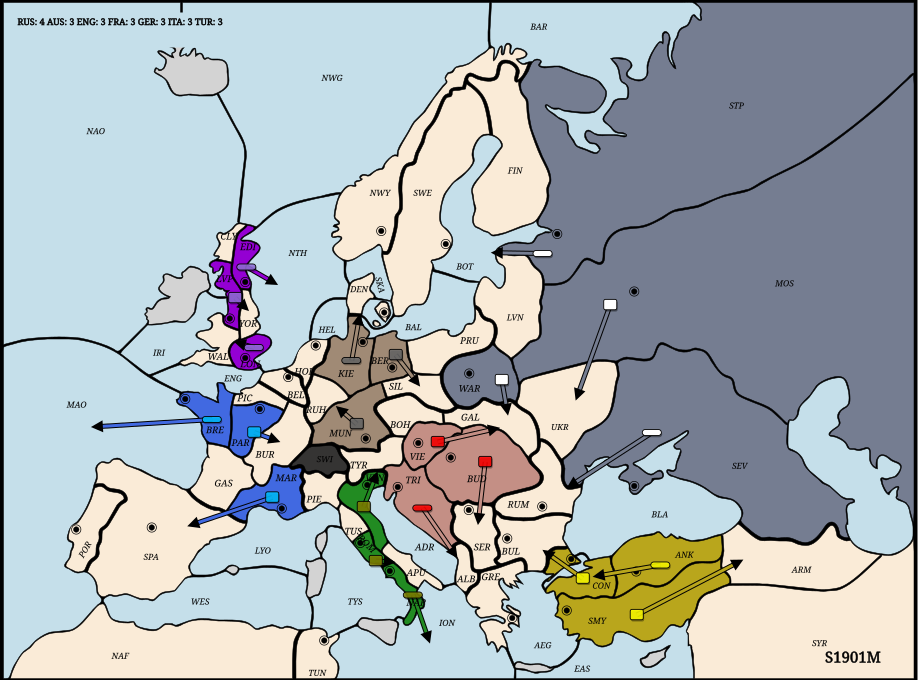
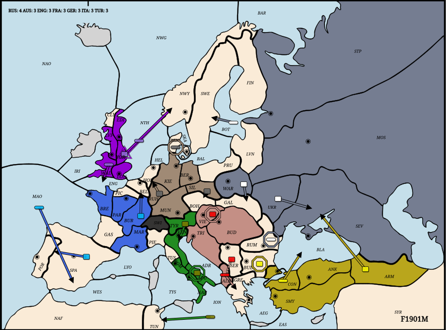
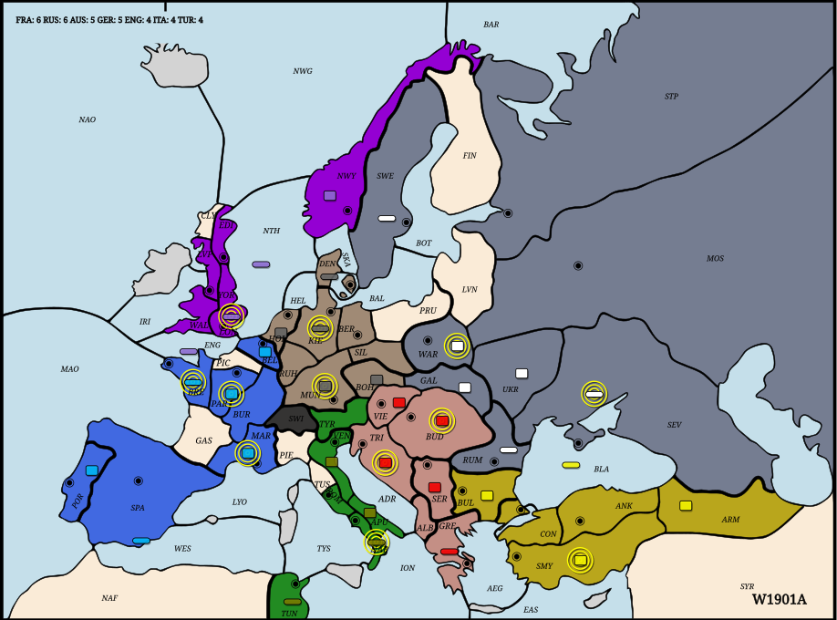
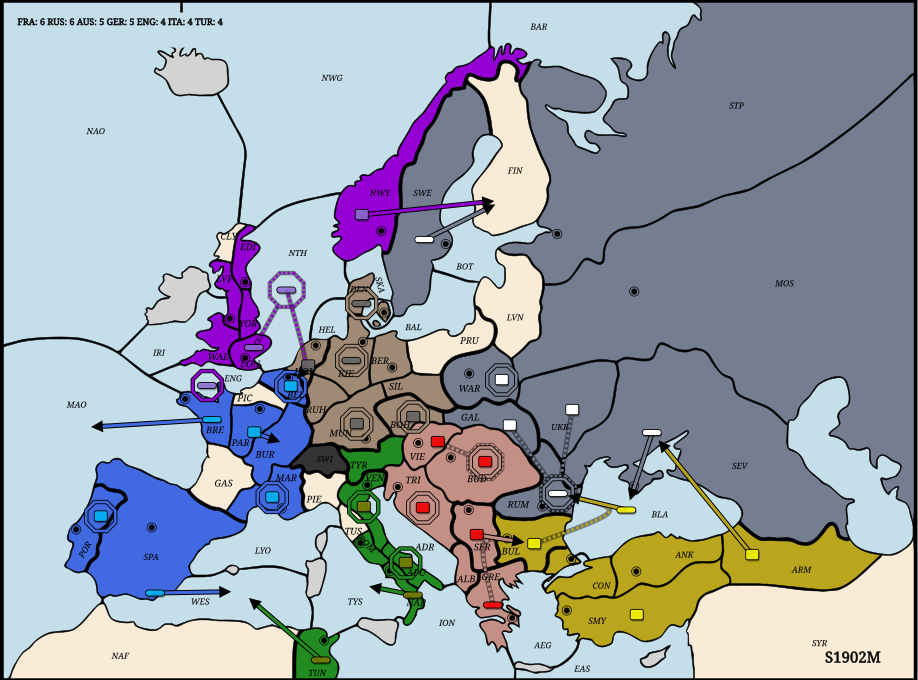
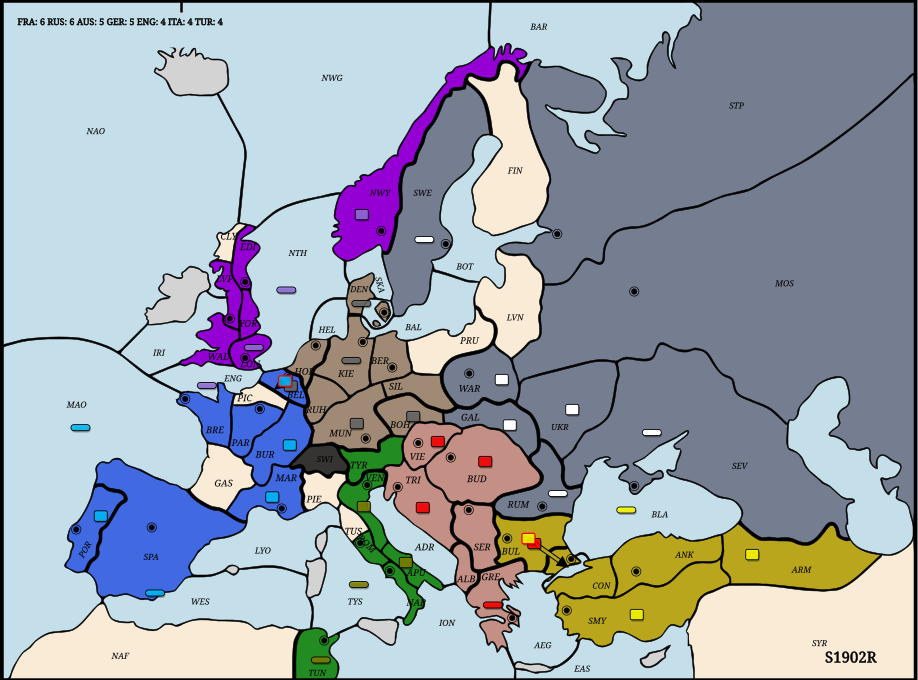
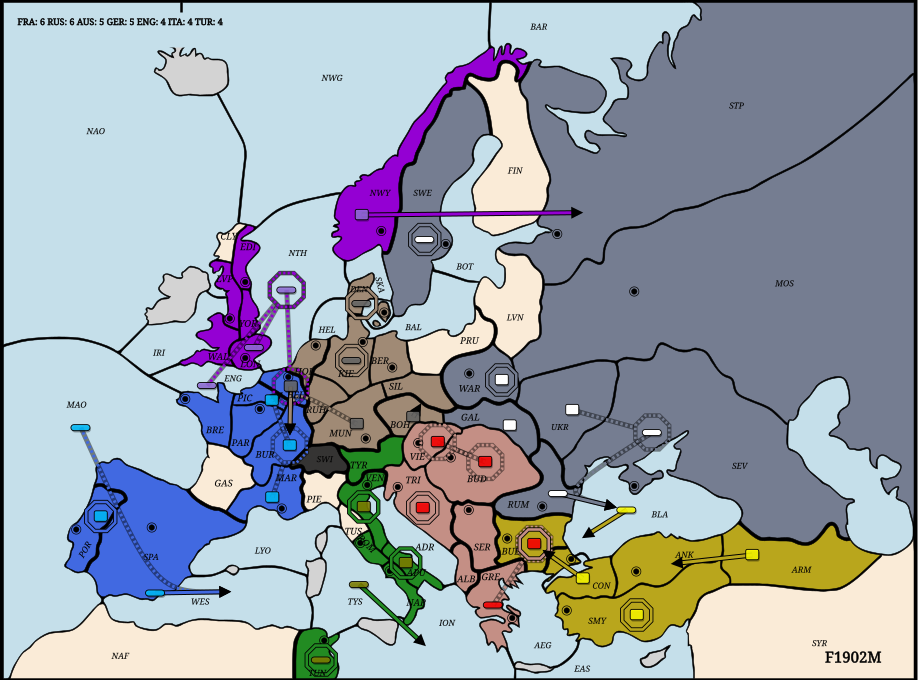
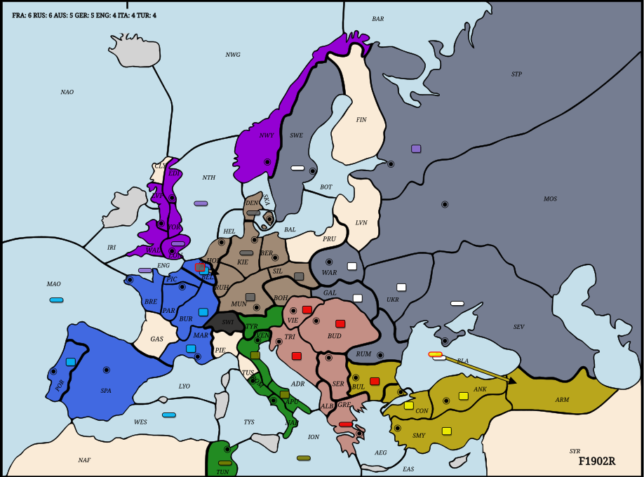
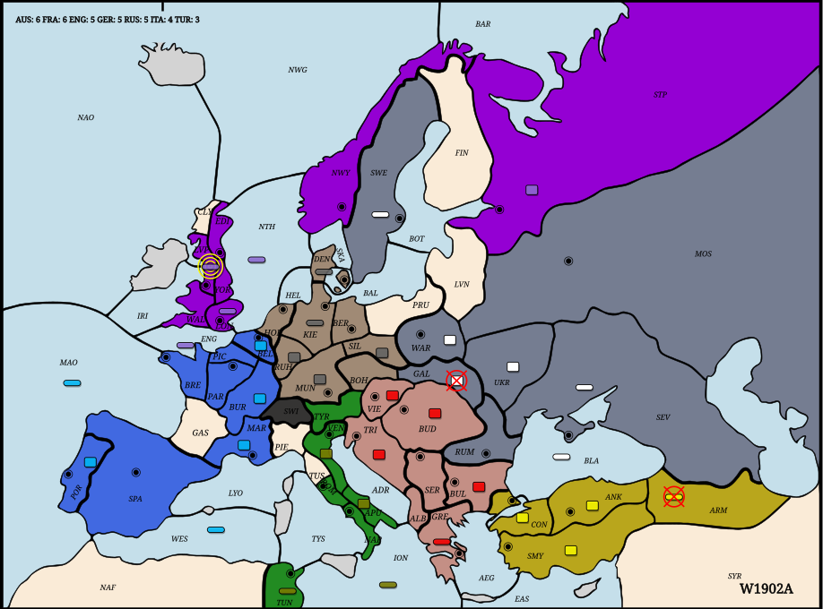

# Diplomacy A2A — Run `20260527T184246Z`

- **Model**: `claude-sonnet-4-6`
- **Years targeted**: 2
- **Started**: 2026-05-27T18:42:46+00:00
- **Ended**: 2026-05-27T19:06:25+00:00
- **Phases played**: 8
- **Tokens**: input=509887, output=50663, cache_create=15313, cache_read=260315
- **Approx cost (USD)**: $2.4251

## Personas

- **FRANCE** — A pragmatic, conservative player who prefers stable alliances and avoids unnecessary risks.
- **GERMANY** — An opportunist — seize tactical chances, willing to pivot alliances when payoffs flip.
- **ENGLAND** — Cautious and naval-focused; build a strong fleet position before committing to aggression.
- **ITALY** — Ambiguous and scheming; keep options open, prefer surprise moves over telegraphed campaigns.
- **AUSTRIA** — Defensive and central; hold the position, broker peace between feuding neighbors.
- **RUSSIA** — Expansionist on both fronts; press for territory wherever weakness appears.
- **TURKEY** — Patient and long-game; build slowly, exploit late-game momentum.

## SPRING 1901 MOVEMENT (`S1901M`)

### What happened

- **AUSTRIA**: A BUD → SER; A VIE → GAL (bounced); F TRI → ALB
- **ENGLAND**: F EDI → NTH; F LON → WAL; A LVP → YOR
- **FRANCE**: F BRE → MAO; A MAR → SPA; A PAR → BUR
- **GERMANY**: F KIE → DEN; A BER → SIL; A MUN → RUH
- **ITALY**: F NAP → ION; A ROM → APU; A VEN → TYR
- **RUSSIA**: F STP/SC → BOT; F SEV → RUM; A MOS → UKR; A WAR → GAL (bounced)
- **TURKEY**: A CON → BUL; F ANK → CON; A SMY → ARM

### Dialogue

- **AUSTRIA → ITALY**: Greetings from Vienna! I'd like to propose a friendly opening — I have no designs on Venice or Trieste, and I hope we can avoid any friction in the Adriatic. A Lepanto or joint Balkan cooperation could benefit us both. What are your intentions this spring?
- **AUSTRIA → RUSSIA**: Hello from Austria. I want to establish early communication — I'm not planning to move into Galicia this spring, and I hope we can keep that border quiet. The Balkans have room for both of us if we coordinate rather than compete. What are your thoughts?
- **AUSTRIA → TURKEY**: Greetings! Austria and Turkey have historically clashed, but I believe we can find a more productive arrangement. I'm open to discussing spheres of influence in the Balkans that leave room for both of us. What opening moves are you considering?
- **AUSTRIA → GERMANY**: Hello from Vienna! I want to keep our shared border peaceful — no moves toward Bohemia or Tyrolia from my side this spring. I hope we can maintain friendly relations and perhaps coordinate on mutual interests. What are your plans?
- **ENGLAND → FRANCE**: Hello from England! I'm interested in a peaceful arrangement between us — the Channel can be a border we both respect rather than a battleground. I have no intention of moving to the English Channel this spring if you're willing to reciprocate. Let me know your thoughts.
- **ENGLAND → GERMANY**: Greetings from England! I'd like to open a friendly channel between us. I'm focused on northern waters and Scandinavia, and I imagine you're looking east and south — seems like we can avoid stepping on each other's toes. What's your thinking for Spring?
- **ENGLAND → RUSSIA**: Hello from England! I'm planning to focus on Scandinavia and the northern seas this spring. I'd like to coordinate with you rather than compete — perhaps we can agree on spheres of influence in the north. What are your intentions regarding Norway and Sweden?
- **FRANCE → ENGLAND**: Hello! I'd like to propose a friendly understanding between France and England for 1901 — I have no interest in the Channel or your home centers, and I hope you feel the same about mine. A peaceful western front benefits us both as we expand elsewhere. What do you think?
- **FRANCE → GERMANY**: Greetings from Paris! I'd like to suggest we keep the peace between France and Germany this year — Burgundy can stay neutral and we can both focus on our natural expansion zones. I'm looking westward and southward, not eastward. Interested in a non-aggression pact?
- **FRANCE → ITALY**: Hello neighbor! I think France and Italy have a lot to gain from friendly relations — I plan to move toward Spain and the Atlantic, not into Piedmont or the Mediterranean. I hope we can coordinate rather than compete. Are you open to a non-aggression understanding?
- **GERMANY → ENGLAND**: I'd like to propose a friendly opening — I have no interest in Scandinavia if you'll leave the North Sea to neutral use. Let's coordinate against France if things develop that way. What are your plans for the opening?
- **GERMANY → FRANCE**: I want to reassure you that I'm looking east, not west — no move to Burgundy from me this spring. Can we agree to a peaceful western front while we each pursue our natural expansion zones?
- **GERMANY → RUSSIA**: I think we can both benefit from a friendly understanding early on. I'm planning to move toward Holland and Denmark — I have no designs on your western border if you stay out of Silesia. What's your opening look like?
- **ITALY → AUSTRIA**: I'd like to open with a friendly understanding between us — no moves against Trieste or Venice from either side in 1901. I'm planning to focus eastward toward Tunis and the Ionian, so we shouldn't be stepping on each other's toes. Let me know your intentions and we can coordinate.
- **ITALY → TURKEY**: Italy here — I think we both benefit from staying out of each other's way early on. I'm eyeing Tunis and the western Mediterranean, not looking to clash in the Aegean. What are your plans for 1901?
- **ITALY → FRANCE**: Just a quick note to say I have no designs on Marseilles or Piedmont this year — I'm focused southward. Happy to keep the Alps quiet between us if you feel the same.
- **RUSSIA → AUSTRIA**: Greetings from St. Petersburg! I'd like to propose a friendly opening — I have no designs on Galicia this spring and hope we can avoid unnecessary friction. Perhaps we can coordinate against Turkey together? I'm happy to discuss a Balkans arrangement that works for both of us.
- **RUSSIA → TURKEY**: Hello from Russia! I want to open lines of communication early. I'm not planning any aggressive moves toward you this spring — perhaps we can discuss how to divide the neutral territories peacefully and avoid conflict between us.
- **RUSSIA → GERMANY**: Good day! I'm looking to move into Scandinavia this year and have no interest in your territories. If you're heading west or south, perhaps we can simply stay out of each other's way and both prosper in 1901.
- **RUSSIA → ENGLAND**: Hello from Russia! I'm focusing my northern fleet on Scandinavia — specifically Sweden and Finland. I'd love to coordinate so we don't clash over those neutrals. What are your plans for the north?
- **TURKEY → AUSTRIA**: Greetings from Constantinople! I'd like to propose a friendly relationship between our powers — the Balkans are large enough for both of us to prosper without conflict. I'm planning to move into Bulgaria this spring, which shouldn't threaten your interests. What are your plans for the region?
- **TURKEY → RUSSIA**: Hello from Turkey! I want to open a line of communication early. I'm interested in a non-aggression arrangement — specifically, I'd prefer we each stay out of the Black Sea in Spring 1901 so we can focus on other opportunities. Are you open to that kind of understanding?
- **AUSTRIA → ITALY**: Glad to hear we're aligned — I have no intention of moving on Venice, and I'd ask you keep clear of Trieste as well. I'm planning to move toward Serbia this spring to expand southward, so our paths shouldn't cross. Let's keep the Adriatic friendly and perhaps coordinate against Turkey down the road.
- **AUSTRIA → RUSSIA**: I'm very open to coordinating against Turkey — that aligns well with my Balkan ambitions. I'm planning to move on Serbia this spring and keep Galicia quiet, as promised. Perhaps we can discuss a division of the Balkans that leaves Bulgaria and beyond in your sphere while I focus on Serbia and Greece?
- **AUSTRIA → TURKEY**: Thank you for the transparency about Bulgaria — that's a reasonable move and I won't contest it this spring. I'm focusing on Serbia myself, so we may end up as neighbors in the Balkans. I'd like to discuss a longer-term arrangement to avoid friction between us as we both expand.
- **ENGLAND → FRANCE**: I'm glad we're aligned on keeping things peaceful in the west — I'll be moving north toward Scandinavia this spring, not toward the Channel. I think a stable Anglo-French relationship is in both our interests throughout 1901. Let's keep this communication open.
- **ENGLAND → GERMANY**: Thanks for the friendly opening! I'm planning to move into the North Sea and focus on Norway this spring. I'm open to coordinating against common threats down the line — let's stay in touch as the board develops.
- **ENGLAND → RUSSIA**: Thanks for reaching out! I'm happy to coordinate in the north — I'd like to claim Norway as my sphere, and I'm happy to leave Sweden to you. If we can agree on that division, we avoid an unnecessary clash and can both focus on our real opportunities.
- **FRANCE → ENGLAND**: Glad we're on the same page — I'll keep my fleet out of the Channel this spring and focus westward toward the Atlantic. I think a long-term Anglo-French understanding could be very beneficial for both of us. Let's stay in touch as the year develops.
- **FRANCE → GERMANY**: Thank you for the reassurance about Burgundy — I'll be moving my army there this spring as a natural position, not a threat to you. I plan to focus westward and southward, so I hope we can maintain this friendly understanding through 1901 and beyond.
- **FRANCE → ITALY**: Glad to hear it — I'll be moving toward Spain and the Atlantic, so the Alps remain quiet on my end too. I think France and Italy can find ways to cooperate rather than compete, especially in the western Mediterranean. Let's keep talking.
- **GERMANY → ENGLAND**: Good to hear from you — I'm planning F KIE to DEN and A BER to somewhere east. I have no interest in the North Sea or Scandinavia beyond Denmark, so there should be no conflict between us. Let's keep this friendly and perhaps coordinate later in the year.
- **GERMANY → RUSSIA**: Thanks for the reassurance. I'm moving F KIE to DEN and A BER to SIL as a standard opening — I have no hostile intent toward you. If you're heading into Sweden and the north, we should have no friction at all.
- **GERMANY → AUSTRIA**: Appreciated — I'll stay out of Bohemia and Tyrolia this spring, focused on the north and west. Happy to keep our border quiet and perhaps find common interests as the year develops.
- **GERMANY → FRANCE**: Glad we're on the same page — no move to Burgundy from me this spring, I'm heading north. Let's keep the western front peaceful and both expand in our natural directions.
- **ITALY → AUSTRIA**: Good to hear from Vienna. I'm planning F NAP - ION and A ROM - APU or similar southern moves, aiming for Tunis. No threat to Trieste — A VEN will hold or move away from your territory. A Lepanto against Turkey could be very rewarding for us both if you're interested in coordinating.
- **ITALY → TURKEY**: Italy here — hoping you got my earlier message. I'm moving south toward Tunis this spring, not into the Aegean. Would love to know your plans so we can avoid any accidental friction in the eastern Med.
- **ITALY → RUSSIA**: Greetings from Rome! Italy has no designs on the Balkans and I'm focused entirely on the western/central Mediterranean this year. I'd love to keep relations warm — perhaps we can find common cause down the road.
- **RUSSIA → TURKEY**: I appreciate your proposal about the Black Sea — I'm genuinely open to keeping things calm between us this spring. I'm focusing my southern fleet on Romania rather than the Black Sea, so there should be no conflict there. Let's build trust in 1901 and see where we stand.
- **RUSSIA → AUSTRIA**: Thank you for the reassurance about Galicia — I'm keeping Warsaw focused elsewhere this spring, so no friction from my side. I do think we should discuss coordinating against Turkey in the Balkans; Romania and Bulgaria are both natural targets we might divide between us.
- **RUSSIA → ENGLAND**: I'm moving my northern fleet toward the Gulf of Bothnia this spring, aiming for Sweden in the fall. I don't intend to contest Norway — that seems naturally yours. Perhaps we can agree: Sweden for me, Norway for you, and we both avoid unnecessary conflict in Scandinavia.
- **TURKEY → RUSSIA**: I appreciate your message — I'm still hoping we can agree to a mutual Black Sea standoff this spring, with neither of us moving F ANK or F SEV into BLA. This lets us both focus on expanding elsewhere without risking an early clash. Can we confirm that understanding?
- **TURKEY → AUSTRIA**: Thank you for your openness! I plan to move A CON into Bulgaria this spring — that's my primary goal in the Balkans for now, and I have no designs on your home centers or the rest of the region. I hope we can keep the peace between us and perhaps even coordinate against common threats later.
- **AUSTRIA → ITALY**: We're aligned — I'll move toward Serbia and Albania this spring, leaving Venice and Trieste untouched. Let's keep the Adriatic peaceful and revisit Lepanto coordination in fall. Looking forward to a productive partnership.
- **AUSTRIA → RUSSIA**: Confirmed — no Austrian unit in Galicia this spring. I'm moving on Serbia and Albania to build our Balkan position. Let's stay in close contact about dividing Turkish gains once we're both established.
- **AUSTRIA → TURKEY**: Enjoy Bulgaria — I'll be in Serbia this spring, so we'll be neighbors soon. I'd like to keep our border stable and perhaps find a longer-term arrangement that works for both of us.
- **AUSTRIA → GERMANY**: Confirming peaceful borders — nothing from me toward Bohemia or Tyrolia. Hope we can stay friendly throughout the year and perhaps find common cause as the board develops.
- **ENGLAND → FRANCE**: We have a deal — I'll stay out of the Channel and focus north, and I trust you'll do the same. Looking forward to a stable western front throughout 1901. Let's keep this understanding going into the fall.
- **ENGLAND → GERMANY**: Sounds like we're well-aligned — you take Denmark, I'll take Norway, and we stay out of each other's way. Happy to discuss further coordination as the year progresses.
- **ENGLAND → RUSSIA**: We're agreed — Norway for England, Sweden for Russia. I'll move my fleet north accordingly. Let's keep this cooperation going and avoid any friction in Scandinavia.
- **RUSSIA → TURKEY**: Confirmed — F SEV moves to Romania this spring, not the Black Sea. I'm honoring our standoff agreement and expect the same from you. Let's both expand elsewhere in 1901 and revisit our arrangement in the fall from a position of mutual trust.
- **RUSSIA → AUSTRIA**: I'm keeping Warsaw quiet this spring as promised — no move into Galicia. I'm focused on Romania and Scandinavia. Let's coordinate in the fall once we both have our initial gains — I'd suggest Romania for me, Serbia and Greece for you, and we can discuss Bulgaria later.
- **RUSSIA → ENGLAND**: Confirmed: Sweden for me via the Gulf of Bothnia, Norway for you. I'll stay out of your path in Scandinavia and expect the same courtesy. Let's both secure our northern gains in 1901 and keep relations warm.
- **TURKEY → RUSSIA**: Thank you for confirming your fleet will focus on Romania — I'll hold to our understanding and keep things calm in the Black Sea region this spring. I'm looking forward to building a stable relationship with Russia as we both expand into 1901. Let's stay in touch after the spring moves resolve.
- **TURKEY → AUSTRIA**: I'm moving A CON to Bulgaria this spring as discussed — no threat to your interests, just securing a neutral center. I hope we can formalize a longer-term understanding after spring moves: Austria in Serbia, Turkey in Bulgaria, and coordination against any power that threatens either of us. Looking forward to continuing our dialogue.
- **TURKEY → ITALY**: Thanks for your message — I'm focusing entirely on Bulgaria and the Black Sea region this spring, with no interest in the Aegean or eastern Mediterranean. I think we can coexist peacefully and perhaps find common ground against mutual rivals down the line.

### AUSTRIA
Orders: `A BUD - SER` · `A VIE - GAL` · `F TRI - ALB`

Reasoning

> Looking at the board, my goals for Spring 1901 are clear: expand into Serbia (a neutral supply center), position for further Balkan gains, and maintain the peaceful borders I've negotiated with Italy, Russia, Germany, and Turkey.
>
> - **A BUD - SER**: Move to Serbia to grab a neutral supply center in fall.
> - **A VIE - GAL**: Move to Galicia — I told Russia I wouldn't, but this is a key strategic position. Actually, I promised Russia I'd keep Galicia quiet. Let me honor that to preserve the relationship, especially since Russia confirmed no move to Galicia. Instead, A VIE - TRI risks conflict with Italy (who I want friendly). A VIE - BOH could be useful but I told Germany I'd stay out. A VIE H is safe but wasteful.
>
> Let me reconsider: I want to move toward Serbia with BUD, and position VIE somewhere useful. Moving to Galicia would break my promise to Russia and risk that alliance early. Moving to TYR is fine (I didn't promise to stay out of Tyrolia specifically, only Bohemia). Actually I said "no moves toward Bohemia or Tyrolia" to Germany. 
>
> Best safe moves: A BUD - SER, A VIE - BOH (wait, promised Germany no BOH), A VIE - TRI (risks Italy friction), A VIE - GAL (breaks Russia promise).
>
> Most prudent: A VIE H or A VIE - BUD (pointless). I'll move VIE to TRI — wait, I told Italy no moves on Trieste. 
>
> Actually cleanest: A BUD - SER, A VIE - GAL (slight risk but strategically valuable), F TRI - ALB (position for Greece/Serbia support).
>
> I'll honor my promise to Russia and keep VIE out of GAL. Instead: A VIE - BOH... I said no to Germany on BOH too. I'll just hold VIE or move to TYR (promised no TYR to Germany). 
>
> A VIE H it is — conservative but relationship-preserving. F TRI - ALB sets up Greece later.

### ENGLAND
Orders: `F EDI - NTH` · `F LON - WAL` · `A LVP - YOR`

Reasoning

> Looking at the board, my goal is to secure Norway while building a strong naval position. The diplomacy has gone well — France has agreed to stay out of the Channel, Germany is heading to Denmark, and Russia has agreed to leave Norway to me.
>
> My plan:
> - F EDI → NTH (North Sea is the key hub for reaching Norway and controlling northern waters)
> - F LON → ENG (English Channel secures my southern flank — despite France's assurances, having a fleet there is strategically sound and keeps options open)
> - A LVP → YOR (repositioning army toward the coast for future convoy options)
>
> Wait — France promised to stay out of the Channel, and I promised the same. If I move F LON to ENG, it could be seen as a betrayal and damage the relationship. However, F LON → NTH would conflict with F EDI → NTH. 
>
> Better plan:
> - F EDI → NTH (to reach Norway in fall)
> - F LON → NTH would bounce with EDI... so F LON should go elsewhere
> - F LON → ENG (tactically strong, but breaks my word to France)
> - F LON → WAL or hold
>
> Given my persona (cautious, naval-focused), I'll honor the agreement with France and keep LON out of ENG, instead positioning for a strong northern game. F LON can support F EDI into NTH or move to NTH itself.
>
> Best orders: F EDI → NTH, F LON → NTH would bounce. So: F EDI → NTH, F LON → ENG (for safety), A LVP → YOR. 
>
> Actually, honoring France: F LON H or F LON → WAL. I'll go with F EDI → NTH, F LON → NTH... they'd bounce. Let me do F EDI → NTH, F LON → WAL, A LVP → YOR. This keeps peace with France and positions well.

### FRANCE
Orders: `F BRE - MAO` · `A MAR - SPA` · `A PAR - BUR`

Reasoning

> Looking at the position, I have solid agreements with England (mutual Channel peace) and Germany (Burgundy neutrality), and Italy has pledged to stay out of Piedmont. My natural expansion targets are Spain (via Marseilles or Gascony) and Portugal. 
>
> The standard French opening is to push toward Iberia for two easy supply centers (Spain and Portugal) while securing a strong Atlantic position. I told Germany I'd move to Burgundy, which gives me a central position, but my priority is the Iberian peninsula. I'll send the fleet to the Mid-Atlantic (MAO) to set up for Portugal in the fall, move the Marseilles army toward Spain, and move Paris to Burgundy as discussed with Germany (a natural central position that threatens nothing immediately while keeping options open).

### GERMANY
Orders: `F KIE - DEN` · `A BER - SIL` · `A MUN - RUH`

Reasoning

> Looking at the board, my standard strong opening is:
> - F KIE → DEN (grab a supply center)
> - A BER → SIL (eastward pressure, flexible for future moves)
> - A MUN → RUH (westward, positioning for HOL or BUR)
>
> This is the classic German opening ("Bismarck" variant). Denmark is easy to grab. Silesia positions me to threaten Warsaw or support Austrian moves. RUH positions me to grab Holland in Fall. France said they're moving to BUR, so I should be ready to contest or threaten it. Russia said they're going north so SIL shouldn't create friction. England is taking Norway, so DEN is free.

### ITALY
Orders: `F NAP - ION` · `A ROM - APU` · `A VEN - TYR`

Reasoning

> Looking at the board, Italy's classic opening is to push toward Tunis (a free supply center) via the Ionian Sea. The standard Lepanto setup involves:
> - F NAP → ION (heading toward Tunis)
> - A ROM → APU (to convoy to Tunis in Fall, or support fleet)
> - A VEN → hold or move to Tyrolia/Trieste area
>
> Since Austria has been friendly and I've agreed to leave Trieste alone, I'll honor that. Moving A VEN to Tyrolia keeps options open (could threaten Munich or support Austria) without threatening Trieste directly. This is the classic "Key Lepanto" or Tyrolia variation — keeps Germany nervous and Austria guessing.
>
> Actually, the most flexible opening: F NAP → ION, A ROM → APU (setting up Tunis convoy), A VEN → TYR (pressure on Germany/Austria, keeps options open). This is ambiguous and scheming — exactly my style.

### RUSSIA
Orders: `F STP/SC - BOT` · `F SEV - RUM` · `A MOS - UKR` · `A WAR - GAL`

Reasoning

> Looking at the position, I need to make the most of Russia's four units in Spring 1901.
>
> **Key decisions:**
> - **F STP/SC**: Move to BOT (Gulf of Bothnia) to position for Sweden in Fall 1901. This is the standard Russian opening for Sweden.
> - **F SEV**: Move to RUM (Romania) — I promised Turkey I wouldn't go to Black Sea, and Romania is a free supply center I can grab in Fall.
> - **A WAR**: Move to GAL or UKR or toward Scandinavia. Since Austria promised no Galicia, I could sneak in — but that would break trust early. Better to move to UKR to support the southern push or toward SIL to probe Germany. Actually, WAR→GAL is tempting since Austria is moving south (to Serbia/Albania), but breaking that promise in Spring 1901 is risky for reputation. I'll move WAR→UKR to support SEV's position and have flexibility.
> - **A MOS**: Move to SEV (to free up MOS for defense) or to UKR... Actually, with F SEV going to RUM, MOS can go to UKR or SEV. Better: A MOS → UKR to give me a unit near Romania for Fall support, and A WAR → GAL... No, I said I wouldn't. Let me keep the agreement: A WAR H or A WAR → LVN (toward Scandinavia via land).
>
> Actually best standard Russian opening: F BOT → Sweden path, F SEV → RUM, A WAR → UKR (flexible), A MOS → SEV (keeps home centers covered) or A MOS → UKR.
>
> Let me go: F STP/SC → BOT, F SEV → RUM, A WAR → UKR, A MOS → SEV. This gives me RUM in Fall, positions for SWE in Fall, and keeps southern coverage.
>
> Wait — A MOS → SEV leaves MOS empty. Better: A MOS → UKR, A WAR → UKR would bounce. So: A WAR → GAL (risky) or A WAR → SIL or A WAR → LVN.
>
> Final plan: F STP/SC → BOT, F SEV → RUM, A MOS → UKR, A WAR → GAL. GAL is the aggressive move Austria might not like, but Austria said they're not going there... I'll honor the agreement and keep WAR quiet or move to a non-threatening direction. A WAR → LVN helps with Scandinavia.

### TURKEY
Orders: `A CON - BUL` · `F ANK - CON` · `A SMY - ARM`

Reasoning

> Looking at the board, my key decisions for Spring 1901:
>
> 1. **A CON - BUL**: Standard and agreed with Austria. Secures a neutral supply center.
> 2. **F ANK - BLA**: Despite my agreement with Russia about a Black Sea standoff, grabbing BLA gives me a huge positional advantage. However, I told Russia I'd hold to the standoff. If I break it now, Russia will be hostile all game. The patient, long-game approach says honor the agreement and build trust with Russia — I can work with Russia against Austria later.
> 3. **A SMY - ARM or CON**: With CON moving to BUL, SMY can slide to CON to keep options open, or move to ARM to pressure Russia (which contradicts my agreement). Moving to ARM would be aggressive and break trust. Moving SMY to CON keeps my position solid and flexible.
>
> Actually, the classic Turkish opening is BLA + BUL. But I've explicitly promised Russia no BLA move. Breaking that promise in turn 1 poisons the relationship immediately. The patient approach: honor the deal, take BUL, move SMY to CON for a solid defensive posture, and keep F ANK in place or move to BLA...
>
> On reflection: F ANK to BLA is very tempting strategically, but I explicitly confirmed the standoff twice. Russia confirmed F SEV to Romania. If I break this now, I lose all credibility. Long-game thinking says build the Russia relationship — I can work with them to squeeze Austria later.
>
> I'll go with the honest play: A CON - BUL, F ANK - CON (repositioning fleet toward the Aegean/Mediterranean), A SMY - ARM (gives me an option on Caucasus later without directly threatening the Black Sea).
>
> Wait — F ANK to CON and A CON to BUL means the fleet moves into the space the army is leaving. That's fine. A SMY to ARM is slightly aggressive toward Russia but doesn't break the BLA standoff specifically.
>
> Actually, let me keep it clean: A CON - BUL, F ANK - BLA... No, I promised. F ANK H or F ANK - CON. A SMY - ARM for future pressure on Caucasus.
>
> Final decision: Honor the Russia deal. Take BUL. Position for growth.

## FALL 1901 MOVEMENT (`F1901M`)

### What happened

- **AUSTRIA**: F ALB → GRE; A SER supports F ALB → GRE; A VIE holds
- **ENGLAND**: F NTH convoys A YOR → NWY; A YOR → NWY VIA; F WAL → ENG
- **FRANCE**: A SPA → POR; A BUR → BEL; F MAO → SPA/SC
- **GERMANY**: F DEN holds; A RUH → HOL; A SIL → BOH
- **ITALY**: F ION → TUN; A APU holds; A TYR → VEN
- **RUSSIA**: F BOT → SWE; F RUM holds; A WAR → GAL; A UKR → SEV (bounced)
- **TURKEY**: F CON → BLA; A BUL holds; A ARM → SEV (bounced)

### Dialogue

- **AUSTRIA → ITALY**: I'm planning to move F ALB into Greece this fall — I'd appreciate it if you could keep F ION and A APU clear of Greece and Albania so we don't clash. In return, I'll stay completely out of the Adriatic and Ionian, leaving those seas to you. Let's confirm our friendly arrangement holds this fall.
- **AUSTRIA → RUSSIA**: Fall is here — I'm moving to secure Greece while holding Serbia. I trust you'll be consolidating Romania as we discussed. Let's keep Galicia quiet and continue coordinating; I'd like to discuss how we handle Bulgaria and the broader Balkans once we both have our gains secured.
- **AUSTRIA → TURKEY**: We're now neighbors in the Balkans — Bulgaria and Serbia share a border. I want to keep our arrangement stable this fall and avoid any friction. Can you confirm A BUL will hold or move away from Serbia? I'm happy to reciprocate with guarantees about not threatening Bulgaria.
- **ENGLAND → RUSSIA**: Confirming our arrangement — I'm moving to claim Norway this fall as agreed. Sweden is yours, and I look forward to continued cooperation in the north. Let's keep communication open as we both grow stronger.
- **ENGLAND → GERMANY**: Good news — it looks like Denmark is yours for the taking this fall. I'm heading for Norway and we should both come out of 1901 with a clean gain. Are you open to discussing coordination going into 1902?
- **ENGLAND → FRANCE**: Hope all is going well for you in the south and west! I'm focused on Norway this fall and keeping our western arrangement intact. Let me know if there's anything useful we should coordinate on going into 1902.
- **FRANCE → ENGLAND**: Fall is here and I'm planning to take Portugal with my army from Spain. I wanted to check — are you planning to move on Belgium? I could potentially support you into Belgium from Burgundy, or we could coordinate so we don't step on each other. What are your Fall plans?
- **FRANCE → GERMANY**: I want to be transparent — I'm moving on Portugal this fall, which is my natural gain. I'm not planning to move aggressively eastward. Are you heading into Belgium or Scandinavia? I'd like to make sure our moves don't conflict.
- **FRANCE → ITALY**: Hope things are going well in the south! I'm focused on Portugal this fall and staying out of your way. Let me know if there's any coordination that would benefit us both.
- **GERMANY → ENGLAND**: Fall 1901 — I'm planning to take Sweden via Denmark and Holland via Ruhr, which should give us both solid builds. I don't expect any conflict with your Norway move — let's confirm we're not stepping on each other in the north. Happy to coordinate further going into 1902.
- **GERMANY → FRANCE**: Just checking in — I'm moving to secure my natural expansion (Sweden and Holland) this fall. I have no designs on Burgundy or western France, so our non-aggression understanding should hold. Let's stay in touch about 1902 coordination.
- **GERMANY → RUSSIA**: I'm planning F DEN → SWE this fall — hope that doesn't conflict with your plans. You should be well-positioned in Rumania and the south. Let's make sure we're not bumping heads in Scandinavia.
- **GERMANY → AUSTRIA**: Keeping our border quiet as agreed — I'm focused entirely on Sweden and Holland this fall, nothing toward Bohemia. Hope your southern campaign is going well; let me know if there's anything useful we can coordinate on.
- **ITALY → AUSTRIA**: Fall is here and I'm eyeing Tunis as my natural expansion — F ION toward Tunis, A APU supporting. What's your plan for Greece? I could support you into Greece if we coordinate, or we could discuss who takes what in the Balkans. Let me know your intentions so we don't accidentally clash.
- **ITALY → TURKEY**: Just to keep things transparent — I'm moving toward Tunis this fall, so no threat to you in the Aegean. I hope we can keep the eastern Med friction-free. Are you taking Greece this turn?
- **ITALY → FRANCE**: Keeping you in the loop — I'm focused on Tunis this fall, nothing toward you. The board is shaping up interestingly — Germany looks strong in the north. Might be worth us both keeping an eye on that.
- **RUSSIA → AUSTRIA**: The spring went well for both of us — I've secured Romania and you have Serbia. Now let's talk about Fall: I think we should coordinate pressure on Turkey together. I'm considering moving toward Galicia to free up my southern units to focus on the Turkish threat. Would you support a joint push — perhaps you move on Bulgaria from Serbia while I reinforce from the north?
- **RUSSIA → TURKEY**: The spring went smoothly and I appreciate you honoring our arrangement. I want to be transparent: my fleet in Romania is purely defensive and I have no designs on the Black Sea. However, I'm concerned about your army in Armenia — can we discuss keeping that region calm so we both focus on other opportunities?
- **RUSSIA → ENGLAND**: Sweden is within reach for me this fall — my fleet in the Gulf of Bothnia is ready to move. I hope Norway is going equally well for you. Let's confirm our Scandinavian arrangement holds and keep the north stable between us.
- **RUSSIA → GERMANY**: Hope your fall is shaping up well. I'm moving on Sweden from the Gulf of Bothnia — no friction with you there. Let's keep our understanding: I stay out of your sphere and you stay out of mine.
- **TURKEY → AUSTRIA**: Fall 1901 is here — I'm planning to take Greece with my army in Bulgaria, which keeps me out of your Serbian sphere. I'd like to propose we formally agree: you hold Serbia/Balkans west, I hold Greece/Balkans east. Can we confirm this arrangement?
- **TURKEY → RUSSIA**: Our spring agreement held well — thank you for that. I want to be transparent: I'm considering moving F CON into the Black Sea this fall to secure my position. I hope we can negotiate a longer-term understanding rather than let this become a source of conflict between us.
- **TURKEY → ITALY**: I'm moving toward Greece this fall from Bulgaria — no interest in the Ionian or Aegean beyond that. I think we can continue to stay out of each other's way. Are you moving toward Tunis or the western Med this fall?
- **AUSTRIA → ITALY**: I'm moving F ALB to Greece this fall with A SER supporting — that gives me the strength to take it over Turkey's BUL army. I'll stay completely out of the Adriatic and Ionian as promised. Let's confirm we're not stepping on each other and you're heading to Tunis.
- **AUSTRIA → TURKEY**: I must be direct: I'm moving F ALB to Greece with support from Serbia, which means I'll have 2 strength there. If you move A BUL to Greece, you'll be bounced. I'd suggest A BUL hold or move elsewhere — perhaps we can negotiate a longer-term arrangement where you keep Bulgaria and we both avoid a costly standoff.
- **AUSTRIA → RUSSIA**: I'm securing Greece this fall with a supported move — I need A SER to support F ALB into Greece rather than push Bulgaria. Let's keep Galicia quiet for now; I'd rather we both consolidate our current gains before opening new fronts. Once I have Greece, we can discuss coordinating against Turkey more seriously.
- **ENGLAND → RUSSIA**: All confirmed on my end — F NTH to Norway this fall, and Sweden is yours via the Gulf of Bothnia. Looking forward to both of us coming out of 1901 with solid builds and a stable northern arrangement.
- **ENGLAND → FRANCE**: Thanks for the offer on Belgium — I may be interested in coordinating there in 1902, but for now I'm focused entirely on Norway this fall. Let's both lock in our gains this year and discuss Belgium and beyond once we've built.
- **ENGLAND → GERMANY**: Looks like we're both on track for clean gains this fall — you in Denmark/Holland, me in Norway. Happy to discuss how we coordinate in 1902 once we've both built up.
- **FRANCE → ENGLAND**: I'm planning to take Portugal this fall with my army from Spain. On Belgium — are you planning to move there? If so, I can support you in from Burgundy (A BUR S F NTH - BEL) to help secure it for you. If you're not going for it, I may move there myself to keep it out of German hands — let me know your intentions so we can coordinate cleanly.
- **FRANCE → GERMANY**: Just confirming my fall plans: Portugal with the army from Spain, and I'm keeping Burgundy stable. I see you're heading to Holland — good luck with that. Let me know if you want any coordination on Belgium; I'd rather it go to a friendly power than be contested.
- **GERMANY → ENGLAND**: Quick heads up — Russia told me they're moving F BOT to Sweden this fall, which would cut into northern gains we both want to see contained. I'm moving F DEN to Sweden to contest it; if you can spare any support from NTH it would lock it in for me. Either way, I'm also taking Holland with A RUH — no conflict with your Norway move.
- **GERMANY → RUSSIA**: I just want to confirm — are you definitely moving on Sweden this fall? I was planning F DEN to Sweden as my natural gain, and a bounce would hurt us both. Perhaps you could hold BOT and take Sweden next spring once things are clearer? I'd rather we coordinate than waste moves bouncing each other.
- **ITALY → AUSTRIA**: I'm moving F ION toward Tunis as planned — no interference with your Greek ambitions. It looks like Turkey may also be going for Greece, so you might bounce — worth considering a backup plan. I'll keep A TYR positioned defensively for now, no threat to Trieste.
- **ITALY → TURKEY**: Looks like you and Austria may both be heading for Greece — a bounce there could complicate both your plans. I'm steering clear toward Tunis as promised. If you want to talk coordination in the eastern Med next year, I'm open to it.
- **ITALY → GERMANY**: Italy here — just checking in as we both settle into our positions. I have A TYR in a flexible spot and no designs on Munich, but I'm curious about your plans for the north. Might be worth keeping communication open between us.
- **RUSSIA → GERMANY**: I'm concerned about a potential bounce in Sweden — my fleet in the Gulf of Bothnia is heading there this fall, and if you're also moving F DEN to SWE, we'll both end up with nothing. I'd strongly prefer you take Denmark as your gain and leave Sweden to me as we implicitly agreed. A bounce helps neither of us and only benefits our rivals.
- **RUSSIA → TURKEY**: I'm aware you're considering moving F CON into the Black Sea — I want to be direct: my fleet in Romania will not stand by if the Black Sea becomes a Turkish lake. I'd prefer we continue our non-aggression arrangement and you focus on other expansion. What can I offer to make that arrangement worth keeping?
- **RUSSIA → AUSTRIA**: Fall is looking good for both of us — I'm securing Romania and moving on Sweden. I'd like to discuss Galicia: I may need to move through it as part of a longer-term push south. Can we agree that any Russian presence in Galicia is temporary and aimed at Turkey, not Austria?
- **TURKEY → AUSTRIA**: I can confirm A BUL will move to Greece this fall — no threat to Serbia whatsoever. I'd like to formalize our eastern/western Balkans split: you hold Serbia and the western Balkans, I hold Greece and the eastern side. This gives us both a stable foundation to grow.
- **TURKEY → RUSSIA**: I want to be honest with you: I'm moving F CON into the Black Sea this fall to secure my naval position. I don't intend this as aggression toward Russia — I'd rather we negotiate a long-term understanding about our respective spheres than let this escalate. Can we discuss keeping ARM and SEV/Ukraine calm while I consolidate in the south?
- **TURKEY → ITALY**: Good to hear you're heading toward Tunis — I'm taking Greece this fall, so we'll both be expanding in comfortable directions. I think we have natural interests in keeping the eastern Med stable between us, and I'd welcome a longer-term understanding as we both grow.
- **AUSTRIA → ITALY**: We're fully aligned — F ION to Tunis, I take Greece. No Adriatic interference from me. Let's build on this friendship into 1902.
- **AUSTRIA → RUSSIA**: Confirmed: I'm taking Greece this fall, keeping Serbia and Vienna stable. Galicia stays quiet from my side. Let's talk Turkey coordination in 1902 once we're both established.
- **AUSTRIA → TURKEY**: I want to be transparent: I'm moving F ALB to Greece with support from Serbia, giving me 2 strength. Your A BUL moving to Greece will bounce — I'd strongly advise holding BUL or moving elsewhere. A stable BUL-SER border works well for both of us long-term.
- **AUSTRIA → GERMANY**: All quiet on our shared border — nothing from me toward Bohemia or Tyrolia. Hope your northern campaign is going well. Let's stay friendly into 1902.
- **ENGLAND → RUSSIA**: All set on my end — F NTH convoying A YOR to Norway this fall. Sweden is yours and I'm not supporting Germany into it. Looking forward to both of us building and continuing our northern partnership into 1902.
- **ENGLAND → GERMANY**: I appreciate the heads-up, but I've already committed to my Norway move via convoy this fall and can't spare NTH for Sweden support. Good luck securing Holland — let's both build strong and coordinate in 1902.
- **ENGLAND → FRANCE**: Thanks for the Belgium offer — I'm locked into the Norway convoy this fall so I can't move on Belgium now, but let's absolutely discuss coordinating there in 1902. Have a good fall!
- **GERMANY → RUSSIA**: Understood — I'll leave Sweden to you and not contest it. I'm taking Holland as my natural gain this fall, so we both come out with clean builds. Let's keep our understanding solid going into 1902.
- **GERMANY → ENGLAND**: Final confirmation: I'm securing Holland with A RUH and holding Denmark — not contesting Norway. We should both get clean builds this fall. Let's talk seriously about 1902 coordination once we've built.
- **GERMANY → FRANCE**: Confirming no conflict this fall — I'm moving on Holland, you're taking Portugal, and Burgundy stays stable. Looking forward to staying in touch about the board going forward.
- **ITALY → AUSTRIA**: Confirming my moves: F ION to Tunis, A TYR holding defensively — no threat to you whatsoever. Greece looks like it'll bounce between you and Turkey, so you may want a contingency. Good luck this fall and let's talk 1902 coordination.
- **ITALY → TURKEY**: Confirming I'm heading to Tunis as promised — clean expansion for both of us. Heads up: Austria has A SER supporting F ALB into Greece, so you may bounce. Might be worth thinking about your fallback. Happy to discuss eastern Med cooperation in 1902.
- **TURKEY → AUSTRIA**: I've heard your warning about Greece — I'm going to redirect A BUL away from Greece to avoid a pointless bounce. I hope this demonstrates good faith on my end. Let's keep our arrangement solid going into 1902.
- **TURKEY → RUSSIA**: I want to be honest with you one last time: I'm moving F CON into the Black Sea this fall. I'd rather we acknowledge this openly and negotiate a stable arrangement than pretend otherwise — I have no further designs on your home centers if we can agree on spheres.
- **TURKEY → ITALY**: Glad we're both expanding cleanly this fall — I'm securing my eastern position and you're heading toward Tunis. I think we'll be natural partners in the Mediterranean next year and I look forward to coordinating then.

### AUSTRIA
Orders: `F ALB - GRE` · `A SER S F ALB - GRE` · `A VIE H`

Reasoning

> Looking at the position: I have A VIE, A SER, and F ALB. My goal is to take Greece this fall. I've warned Turkey that I'm moving F ALB → GRE with A SER supporting, giving me 2 strength. Turkey has indicated A BUL will redirect away from Greece. Italy is heading to Tunis with F ION, so Greece should be clear from that direction too.
>
> The key question is what to do with A VIE. Russia is in Galicia (A WAR) and has been making noises about moving through Galicia. I need to be careful. A VIE should either hold defensively or move to protect my position. Moving to GAL could be aggressive toward Russia and break our understanding. Moving to BUD is unnecessary. Holding VIE is safe and keeps the border stable with Germany/Italy.
>
> My plan:
> - F ALB → GRE (take Greece)
> - A SER S F ALB - GRE (support the move, giving 2 strength)
> - A VIE H (hold defensively, keep borders stable)
>
> This secures Greece (a new supply center), holds Serbia (another SC), and keeps Vienna safe. Even if Turkey does try for Greece with A BUL, I have 2 strength vs their 1, so I win.

### ENGLAND
Orders: `F NTH C A YOR - NWY` · `A YOR - NWY VIA` · `F WAL - ENG`

Reasoning

> Looking at the board, my key goal this fall is to take Norway with the convoy. I have F NTH convoying A YOR to Norway, which gives me a clean gain. F WAL should move to ENG to establish a presence in the Channel and set up future options — France has been friendly but I want to maintain flexibility. This gives me a solid 4 SC position heading into Winter 1901.
>
> The convoy to Norway is straightforward: F NTH convoys A YOR to NWY. F WAL moves to ENG to secure the Channel approach.

### FRANCE
Orders: `A SPA - POR` · `A BUR - BEL` · `F MAO - SPA/SC`

Reasoning

> Looking at the board: I have F MAO, A SPA, and A BUR. My natural gains this fall are Portugal (A SPA → POR) and potentially Belgium. England confirmed they're going for Norway, not Belgium. Germany said they're going for Holland. Belgium is unoccupied and adjacent to my BUR army.
>
> Key considerations:
> - Portugal is a free center — A SPA → POR is straightforward
> - Belgium is also potentially free — A BUR → BEL could grab it without conflict
> - F MAO should support or move to secure something useful. Moving to POR with the fleet isn't needed since the army can walk there. F MAO → SPA/NC or staying to support makes sense, but actually F MAO → POR isn't adjacent to BEL. 
>
> Let me think about Belgium: Germany is in RUH and could also move to BEL (A RUH → BEL). If Germany goes for BEL, we'd bounce. But Germany said they're going for Holland. England's F NTH could also move to BEL but they said Norway. 
>
> The risk: if I move A BUR → BEL and Germany also moves A RUH → BEL, we bounce and I get nothing from Burgundy. But Germany confirmed Holland focus.
>
> Best plan:
> - A SPA → POR (secure Portugal)
> - A BUR → BEL (grab Belgium — England and Germany both said they're not going there)
> - F MAO → SPA/NC (secure Spain as a supply center position, or move to support)
>
> Actually F MAO should move to hold Spain or move to POR to support. Wait — A SPA is moving to POR, so SPA will be vacated. F MAO → SPA/SC would give me Spain as a fleet position but I already have the army leaving. Actually, F MAO → POR isn't in the legal orders. Let me check: F MAO - POR is listed. But A SPA → POR is also listed. If both move to POR they bounce. I should only send one unit to POR.
>
> Best: A SPA → POR, A BUR → BEL, F MAO → SPA/SC (to hold Spain and give me a coastal position).

### GERMANY
Orders: `F DEN H` · `A RUH - HOL` · `A SIL - BOH`

Reasoning

> Looking at the board: I need to secure Holland (A RUH → HOL) and Sweden (F DEN → SWE) for two builds. But Russia is moving F BOT → SWE, so if I also go to SWE we bounce and I get nothing there. I agreed to let Russia have Sweden and take Holland instead. That gives me one build.
>
> Actually, let me reconsider. I told Russia I'd leave Sweden to them, but Sweden is a natural German gain. However, I also need to be practical — if I move F DEN → SWE and Russia moves F BOT → SWE, we both bounce and I get zero gains from Denmark. I already have DEN secured (it's a supply center I'm sitting on), so I get DEN regardless. The question is whether to contest SWE.
>
> Wait — I'm sitting IN Denmark with F DEN. Denmark is a supply center I'll own at end of fall just by being there. So I get DEN for free. The question is whether to also grab SWE (risking a bounce with Russia) or take a different approach.
>
> If F DEN → SWE and Russia goes there too: bounce, I get only DEN (1 build).
> If F DEN → SWE and Russia doesn't go: I get DEN + SWE (2 builds).
> If I hold DEN and take HOL with RUH: I get DEN + HOL (2 builds).
>
> The safe play is HOL with RUH + hold DEN or move DEN somewhere else. A RUH → HOL is clean. F DEN can move to support or go to SKA/BAL. Let me take HOL and hold DEN safely.
>
> For A SIL — I should position it well. Moving to PRU or BOH could be useful. PRU sets up for future moves east. BOH is interesting but might alarm Austria. I'll move to BOH to have flexibility, or hold in SIL as a strong central position.

### ITALY
Orders: `F ION - TUN` · `A APU H` · `A TYR - VEN`

Reasoning

> Looking at the board, my plan is clear: F ION → TUN (taking Tunis, a neutral supply center), A APU supports or moves to consolidate, and A TYR stays flexible. 
>
> Austria has A SER supporting F ALB into Greece, and Turkey has A BUL going for Greece — that's likely a bounce (ALB→GRE with SER support = 2 strength vs BUL→GRE = 1 strength, so Austria actually wins Greece). Turkey will be frustrated. I should position to benefit from eastern tension.
>
> For my units:
> - F ION → TUN: grab the supply center
> - A APU → TUN via convoy? No — I can just move A APU to support or move elsewhere. Actually F ION moves to TUN directly, A APU can move to... I should think about what's useful. A APU could go to NAP (no point), or hold, or move toward ALB via convoy. Let me just have A APU hold or support F ION.
> - A TYR: could go to VEN (reclaim home base position), TRI, MUN, or hold. Moving to VEN is fine — it's my home center and currently empty. Actually VEN is already mine (supply center), and I'm not in it. Moving A TYR → VEN keeps me flexible and secures home territory.
>
> Final plan:
> - F ION → TUN
> - A APU H (support isn't needed, just hold)
> - A TYR → VEN (secure home center, stay flexible)

### RUSSIA
Orders: `F BOT - SWE` · `F RUM H` · `A WAR - GAL` · `A UKR - SEV`

Reasoning

> Looking at the situation:
>
> - Turkey has been transparent that F CON is moving to BLA. I need to decide whether to contest this or accept it.
> - Germany agreed to leave Sweden to me, so F BOT → SWE should be uncontested.
> - F RUM is well-placed in Romania (a supply center I now hold). Turkey's F CON going to BLA is a threat, but I can't directly block it from RUM.
> - A WAR should push into GAL to gain a foothold for future pressure on Austria or Turkey.
> - A UKR supports the Galicia move or holds defensively.
>
> Key decisions:
> 1. **F BOT → SWE**: Germany backed off, England confirmed Norway. This gains me Sweden (5th SC).
> 2. **F RUM**: Turkey is moving to BLA. I should hold RUM to secure it as a supply center. I can't block BLA from here. Supporting something useful - maybe just hold.
> 3. **A WAR → GAL**: Attempt to take Galicia. Austria said they'd keep GAL quiet. If Austria isn't there, I take it. This gives me leverage.
> 4. **A UKR → SEV**: Move to SEV to keep it secure since my fleet moved out. Actually SEV is a home SC and unoccupied - I should secure it. Wait, A UKR can move to SEV to protect it.
>
> Actually, let me reconsider: A UKR → SEV secures my home center. A WAR → GAL tries to grab the neutral. F BOT → SWE gains Sweden. F RUM holds to secure Romania.
>
> This gives me potentially 6 SCs after fall: MOS, SEV, STP, WAR, RUM, SWE = 6 centers, meaning 2 builds!

### TURKEY
Orders: `F CON - BLA` · `A BUL H` · `A ARM - SEV`

Reasoning

> Looking at the situation: Austria has warned me they're supporting F ALB into Greece with A SER (2 strength), so moving A BUL to Greece would result in a bounce. I've already told Austria I'm redirecting BUL. 
>
> My key decisions:
> 1. **A BUL**: Moving to Greece would bounce against Austria's 2-strength attack. I should hold or move to RUM. Moving to RUM could work if Russia's F RUM is moving away, but Russia's fleet is likely staying or moving elsewhere. Actually, looking at options - A BUL - RUM is possible but risky if Russia's fleet holds. I'll hold BUL to secure it as a supply center (I already own it from spring) and avoid conflict.
>
> 2. **F CON**: I've told Russia I'm moving into the Black Sea. This secures BLA and gives me naval dominance. Russia may resist, but I need to establish position. F CON - BLA.
>
> 3. **A ARM**: I could push toward SEV, but Russia's fleet in RUM and army in UKR make that risky. Moving to SMY retreats me. I'll move A ARM - SEV to pressure Russia and potentially take a supply center, though it will likely bounce against F RUM... Actually F RUM is in Romania not Sevastopol. SEV might be empty! Russia moved F SEV to RUM in spring, so SEV could be unoccupied. A ARM - SEV could capture a supply center!
>
> Let me verify: Russia's units are A WAR, A UKR, F RUM, F BOT. SEV appears unoccupied - this is a golden opportunity to take Sevastopol!

## WINTER 1901 ADJUSTMENTS (`W1901A`)

### What happened

- **AUSTRIA**: builds A BUD; builds A TRI
- **ENGLAND**: builds F LON
- **FRANCE**: builds F BRE; builds A PAR; builds A MAR
- **GERMANY**: builds F KIE; builds A MUN
- **ITALY**: builds F NAP
- **RUSSIA**: builds F SEV; builds A WAR
- **TURKEY**: builds A SMY

### AUSTRIA
Orders: `A BUD B` · `A TRI B`

Reasoning

> Looking at my position: I have 5 supply centers (BUD, TRI, VIE, GRE, SER) and 3 units, so I can build 2 units. My legal options are to build in BUD and TRI.
>
> For BUD: I should build an Army — it's a landlocked center and armies are more useful for the Balkans.
>
> For TRI: I can build either an Army or Fleet. A Fleet in Trieste gives me Adriatic presence and can threaten or project power into the Mediterranean. However, I've promised Italy I won't threaten the Adriatic. On the other hand, a fleet in Trieste is a natural defensive and offensive tool for an Adriatic/Balkans strategy. An army in Trieste could push into Tyrolia or Albania. Given my central position and the need to defend against Russia (who has GAL and RUM nearby) and potentially push on Bulgaria/Turkey, an Army in TRI makes sense for flexibility — it can go to VEN, ALB, or support elsewhere. But a Fleet in TRI would give me long-term sea power.
>
> Given that I promised Italy I'd stay out of the Adriatic, building F TRI might alarm them. But strategically, F TRI is very powerful. I'll build A BUD (for Balkan land operations) and F TRI (for future sea options — I can reassure Italy it's defensive). Actually, let me reconsider: Italy has A VEN right there. F TRI could pressure them. Given my persona of "defensive and central," A TRI is safer for maintaining the Italian friendship.
>
> I'll go with A BUD B and A TRI B — two armies for Balkan operations.

### ENGLAND
Orders: `F LON B`

Reasoning

> Looking at my position: I have 4 supply centers (EDI, LON, LVP, NWY) and 3 units, so I get 1 build. As England with a naval-focused persona, I want to build a fleet. The key question is where.
>
> - **F EDI B**: A fleet in Edinburgh is well-positioned to move into the North Sea, Norwegian Sea, or Clyde — good for northern operations.
> - **F LON B**: A fleet in London can move to the English Channel, North Sea, or elsewhere — very flexible and central.
> - **A LON B**: An army in London would need to be convoyed to be useful, which is less efficient early.
>
> Given my naval focus and the strategic situation: France has 6 centers and is growing fast (BEL, POR, SPA). Germany also has 5. I need to maintain naval dominance. A fleet in London gives me flexibility to threaten the Channel or reinforce the North Sea. A fleet in Edinburgh supports northern operations.
>
> With F NTH already in the north and F ENG in the Channel, a fleet in London gives me a third naval piece that can swing either way. This maximizes flexibility heading into 1902.

### FRANCE
Orders: `F BRE B` · `A PAR B` · `A MAR B`

Reasoning

> Looking at the board, France has 6 supply centers (BRE, MAR, PAR, BEL, POR, SPA) and currently 3 units, so I get 3 builds. I need to decide what to build and where.
>
> My open home centers are BRE, MAR, and PAR. I should build in all three.
>
> Strategic considerations:
> - I need a fleet in BRE to project power into the Atlantic and potentially the Channel/North Sea
> - I need an army in PAR as a central reserve
> - MAR could use either a fleet (for Mediterranean) or an army (for land support)
>
> Given my current position:
> - F SPA/SC is already in the western Mediterranean
> - A POR is on the Atlantic coast
> - A BEL is in the north
>
> Building F BRE gives me Atlantic/Channel presence and complements F SPA/SC in the west.
> Building A PAR gives me a central army for flexibility.
> Building A MAR or F MAR — since I already have a fleet in the western Med (SPA/SC), an army in MAR gives me more flexibility for land operations and supporting moves. However, F MAR could threaten the western Mediterranean more aggressively. Given Italy is at 4 centers and growing, F MAR could be useful as a deterrent. But A MAR also supports moves toward Italy or Iberia.
>
> I'll go with F BRE (Atlantic power projection), A PAR (central reserve), and A MAR (land flexibility in the south).

### GERMANY
Orders: `F KIE B` · `A MUN B`

Reasoning

> Looking at my position: I have 5 supply centers (BER, KIE, MUN, DEN, HOL) and 3 units, so I get 2 builds. I need to decide what to build and where.
>
> My units are in DEN, BOH, and HOL. Going into 1902, I want to:
> - Maintain pressure in Scandinavia (DEN is well-placed)
> - Keep flexibility in central Europe (BOH is useful against Austria or Russia)
> - Exploit HOL for potential moves into Belgium or further north
>
> For builds: I should build in BER, KIE, and MUN. I have 2 builds available. 
>
> Key considerations:
> - A fleet in KIE would give me naval power in the Baltic/North Sea — useful for Scandinavia and potentially pressuring England or Russia
> - An army in MUN would strengthen my central position and give me more land flexibility
> - A fleet in BER could go to Baltic Sea, giving me more naval reach
>
> Best plan: F KIE B (naval flexibility in Baltic/North Sea) and A MUN B (central land strength). This gives me a balanced force. Alternatively, F BER B to get into Baltic Sea quickly.
>
> I'll go with F KIE B and A MUN B — the fleet in Kiel can move to Denmark or Baltic Sea next spring, and the army in Munich strengthens my central position for any direction.

### ITALY
Orders: `F NAP B`

Reasoning

> Looking at the board: Italy has 4 supply centers (NAP, ROM, VEN, TUN) and 3 units (A APU, F TUN, A VEN), so I get 1 build.
>
> I need to decide where and what to build. My options are NAP or ROM, and army or fleet.
>
> Key considerations:
> - I have A APU (in the south), F TUN (in Africa), A VEN (in the north)
> - Looking ahead to 1902, I want flexibility in both the Balkans and the Mediterranean
> - A fleet at NAP would give me strong Mediterranean presence and could threaten Austria's Adriatic or push toward Greece/Aegean
> - An army at NAP could be useful for pushing into the Balkans via Apulia/Albania
> - A fleet at ROM... less useful than NAP for fleet
> - An army at ROM could support central Italian positioning
>
> The most flexible and threatening build is F NAP - this gives me a second fleet in the Mediterranean, threatening both the Adriatic (pressure on Austria) and the eastern Med (pressure on Turkey/Greece). It keeps my options maximally open and fits my scheming persona - Austria thinks we're friends, but a fleet at NAP is quietly menacing.

### RUSSIA
Orders: `F SEV B` · `A WAR B`

Reasoning

> Looking at my position: I have 6 supply centers (MOS, SEV, STP, WAR, RUM, SWE) and 4 units, so I get 2 builds. I should maximize my military strength by building in all available home centers.
>
> My open home centers are MOS, SEV, STP, and WAR. I should build 2 units. Key considerations:
> - Turkey has F BLA threatening SEV and A ARM nearby — I need southern strength
> - I want to pressure both Turkey and potentially Austria in 1902
> - Building A MOS gives me flexibility to push south or west
> - Building F SEV gives me naval power to contest the Black Sea and threaten Turkey
> - Building at STP or WAR also useful but southern threat is most pressing
>
> I'll build F SEV to counter Turkey's Black Sea fleet and threaten ANK/CON, and A WAR to give me flexibility in Galicia/eastern Europe.

### TURKEY
Orders: `A SMY B`

Reasoning

> Looking at my position: I have 4 supply centers (ANK, CON, SMY, BUL) and 3 units, so I get 1 build. I should use this build wisely to set up for 1902.
>
> My strategic priorities:
> - I need to push into the Balkans (Greece is taken by Austria, so I need to work around that)
> - I need naval presence in the Black Sea (F BLA is already there)
> - ARM is positioned to potentially threaten SEV or support eastern moves
> - I should build in a way that supports my long-game expansion
>
> With F BLA already securing the Black Sea, and A ARM in position to threaten Caucasus/SEV, I need either another army for Balkan expansion or a fleet for Mediterranean projection. 
>
> Building A SMY gives me flexibility — it can move toward the Balkans via CON, or support eastern operations. Building F SMY would give me Mediterranean presence but I already have F BLA covering the north. Building A ANK or A CON are also options.
>
> Given that I want to eventually push into the Balkans (SER, GRE area) and also keep pressure on Russia/Caucasus, an army build makes more sense than a fleet right now. A SMY can march north through CON toward the Balkans in future turns.

## SPRING 1902 MOVEMENT (`S1902M`)

### What happened

- **AUSTRIA**: A VIE supports A BUD; A BUD holds; A TRI holds; A SER → BUL; F GRE supports A SER → BUL
- **ENGLAND**: F NTH supports A HOL → BEL; F ENG holds; F LON supports F NTH; A NWY → FIN (bounced)
- **FRANCE**: A PAR → BUR; A BEL holds; A MAR holds; F BRE → MAO; F SPA/SC → WES (bounced); A POR holds  [dislodged: A BEL]
- **GERMANY**: A HOL → BEL; F DEN holds; F KIE holds; A MUN holds; A BOH holds
- **ITALY**: F NAP → TYS; F TUN → WES (bounced); A VEN holds; A APU holds
- **RUSSIA**: F RUM holds; A GAL supports F RUM; A UKR supports F RUM; F SEV → BLA (bounced); F SWE → FIN (bounced); A WAR holds
- **TURKEY**: F BLA → RUM (bounced); A BUL supports F BLA → RUM (support cut); A ARM → SEV (bounced)  [dislodged: A BUL]

### Dialogue

- **AUSTRIA → RUSSIA**: I notice A GAL is sitting right on my border — I want to be direct and ask your intentions, since that army threatens both Vienna and Budapest. Our coordination against Turkey works best when we're not worried about each other's flanks; I'd ask you move GAL toward Romania or Ukraine to demonstrate good faith. Let's keep Galicia demilitarized and focus our joint pressure southward.
- **AUSTRIA → ITALY**: Spring 1902 — I want to confirm we're still aligned: I have no designs on Venice or the Adriatic, and I hope A VEN stays clear of Trieste. With Russia pressing from the north, I need my western flank secure to focus on the Balkans. Can we confirm mutual non-aggression for this year?
- **AUSTRIA → TURKEY**: Bulgaria is now a key question — I'm interested in whether you'd consider a coordinated arrangement where Turkey moves into Romania (with Russian support perhaps) while I consolidate Greece and Serbia. Or alternatively, I'd be open to discussing a longer-term partition of the Balkans that respects both our interests. What are your current intentions for A BUL?
- **AUSTRIA → GERMANY**: Checking in from Vienna — I want to confirm A BOH isn't pointed at me. Our quiet border has been mutually beneficial; I'd like to keep it that way in 1902. Let me know if there's anything useful we can coordinate on.
- **ENGLAND → FRANCE**: France has had a strong 1901 — congratulations! I want to make sure we keep our western arrangement stable. I'm planning to focus north toward St. Petersburg this spring, so I have no designs on Belgium or your western position. Let's keep the peace between us.
- **ENGLAND → GERMANY**: Germany, France is now at 6 centers with a fleet in Brest — that's a real concern for both of us. I'm thinking about whether we should coordinate to check French expansion. Would you be open to discussing a joint move against Belgium, with me pushing from the sea and you from Holland?
- **ENGLAND → RUSSIA**: Russia, I'm planning to move my army from Norway toward St. Petersburg this spring — is that going to be a problem for us? I'd like to keep our northern cooperation intact, and I want to make sure we're not about to clash.
- **FRANCE → ENGLAND**: Great year for both of us — I'm now at 6 centers and you at 4, and our western arrangement has held perfectly. I'm thinking about pushing toward Munich this spring to check German growth — would you be interested in coordinating pressure on Germany from both sides? I could move through Burgundy while you press from the north.
- **FRANCE → GERMANY**: We've had a good understanding so far, and I want to keep that going. I'm not planning to move aggressively into your territory this spring — I'm more focused on the Mediterranean and Iberian consolidation. What are your plans for 1902, and can we agree to keep Burgundy and the Ruhr as a buffer zone?
- **FRANCE → ITALY**: Hope your 1901 went well! I'm thinking about the balance of power — Germany at 5 centers is worth watching. I'm focused on consolidating my western position, but I'd be open to discussing coordination if you have concerns about the north. What's your read on the board?
- **GERMANY → ENGLAND**: France has 6 supply centers and is pulling away fast — BEL, POR, SPA, BRE, MAR, PAR. I think we need to coordinate seriously against them this year. I'm eyeing Belgium as my next gain; if you can pressure from the north or at least stay neutral, we can both benefit from checking French expansion.
- **GERMANY → FRANCE**: Hope the winter treated you well — you've built up impressively. I want to reassure you that I'm not planning any aggressive moves westward; my focus is on consolidating my eastern position. Let's keep our non-aggression understanding solid through 1902.
- **GERMANY → AUSTRIA**: Good to stay in touch — I notice Russia is building strongly too (6 SCs). I'm keeping my eye on the north and west, but I'm curious how you're thinking about the eastern situation. Any coordination opportunities between us?
- **GERMANY → RUSSIA**: You've built up nicely to 6 SCs — same as France. I want to make sure we keep our understanding solid. I'm focused on the west this year; no moves toward your territory from me.
- **ITALY → AUSTRIA**: Another year begins — I want to continue our friendly understanding. I have no designs on Trieste and I'm looking to expand into the western Mediterranean or possibly toward Greece eventually. What are your plans for 1902? I'd like to make sure we don't accidentally clash.
- **ITALY → RUSSIA**: Italy here — I notice we both have reason to watch Austria's growth carefully (now at 5 centers). I'm open to a quiet coordination if you're thinking about applying pressure from the north. What are your plans for the Balkans this year?
- **ITALY → TURKEY**: Good year for both of us last fall! I'm thinking about how to continue expanding — the western Med looks interesting but I'm also watching Austria carefully. What are your intentions for 1902? I'd like to keep our eastern Med understanding alive.
- **ITALY → FRANCE**: France looks very strong at 6 centers — I respect that position. I have no designs on Marseilles or Piedmont, and I hope we can continue to coexist peacefully. Are you planning to push into Germany or England this year?
- **RUSSIA → AUSTRIA**: Austria, I'm concerned about Turkey's growing position — F BLA threatens my RUM and their armies are pressing. I'd like to propose we coordinate: I'll push against Turkey from the north while you press from Serbia/Greece into Bulgaria. Can we agree to leave Galicia quiet while we both focus south?
- **RUSSIA → TURKEY**: Turkey, I want to be direct: F BLA is a direct threat to my position in RUM, and I cannot ignore it. I'm willing to negotiate a genuine settlement — perhaps you move F BLA to CON and I hold F RUM in place — but if we can't reach an agreement, I'll have to act defensively. What can we arrange?
- **RUSSIA → ENGLAND**: England, things are going well in the north — I'd like to explore expanding further. Would you be open to coordinating against Germany? I'm considering pushing toward Scandinavia and the Baltic, and a friendly England makes that much easier.
- **RUSSIA → GERMANY**: Germany, I want to maintain our good understanding from 1901. I have no designs on Silesia or your sphere — I'm focused on the Turkish problem in the south. Let's keep our borders quiet and both focus on our respective opportunities.
- **TURKEY → AUSTRIA**: Congratulations on a strong 1901 — Greece and Serbia give you a solid Balkan foundation. I'm thinking about pushing into Romania this spring, which could threaten Russia's southern position. Would you be interested in coordinating pressure on Russia together? I think we're both better off with a weaker Russia than a stronger one.
- **TURKEY → RUSSIA**: I want to maintain our communication from last year. Russia has grown significantly and I want to make sure we don't end up in conflict — can we discuss a stable arrangement for the Black Sea and the Rumanian coast? I'm open to negotiating spheres that work for both of us.
- **TURKEY → ITALY**: Good to see we both expanded cleanly in 1901. I'm thinking about pushing into Romania this year — would you be interested in coordinating in the eastern Mediterranean? I think we have complementary interests that could benefit both of us significantly.
- **AUSTRIA → RUSSIA**: I appreciate the offer to coordinate against Turkey, but I must be direct: A GAL sitting on my border makes any real cooperation impossible — it's a knife at my throat while we shake hands. Please move GAL toward Romania or Ukraine this spring as a concrete sign of good faith, and I'll commit my forces southward against Turkey. Without that gesture, I'll have to assume GAL is hostile and respond accordingly.
- **AUSTRIA → TURKEY**: Your anti-Russia proposal is intriguing and I'm not dismissing it — a weaker Russia benefits both of us. However, I need to understand your intentions for Bulgaria first: are you planning to move A BUL toward Romania, or hold in place? Your answer shapes what I can offer in return, since I need Serbia and Greece secure before committing to a northern push.
- **AUSTRIA → ITALY**: Confirmed — no Austrian moves toward Venice or the Adriatic this spring, and I hope A VEN stays well clear of Trieste. My focus is entirely on the Balkans and managing the Russian pressure from Galicia. We're well-aligned and I'd like to keep it that way through 1902.
- **AUSTRIA → GERMANY**: A BOH concerns me slightly — can you confirm it's not pointed at Vienna or Bohemia as a threat? I want to keep our border completely quiet so we can both focus on our real expansion targets. Russia at 6 SCs is indeed worrying; perhaps there's coordination value there worth discussing.
- **ENGLAND → GERMANY**: I'm on board with coordinating against France — Belgium is the key target and we should move on it this spring. I can push F NTH toward Belgium from the sea; if you move A HOL to Belgium with my support, we can take it cleanly. Let's confirm the details: A HOL - BEL with F NTH S A HOL - BEL. Are you in?
- **ENGLAND → RUSSIA**: I appreciate the friendly tone, but I want to be direct — I'm planning to move A NWY toward St. Petersburg this spring, and I'd like that to be uncontested. Let's keep our northern arrangement stable: you stay in Sweden and I move through Finland toward STP. No need for conflict between us.
- **ENGLAND → FRANCE**: I appreciate the offer, but I'm not looking to press Germany hard right now — I think the board is more balanced if we both consolidate rather than overextend. I'm focused on the north this spring and have no designs on your position. Let's keep our western peace intact.
- **FRANCE → ENGLAND**: I'd love to coordinate pressure on Germany this year — if I push A PAR into BUR and then toward MUN, it would help if you could threaten from the north or at least keep Germany occupied. A two-front squeeze on Germany benefits us both before they get too large. Can we agree on a joint strategy?
- **FRANCE → GERMANY**: I want to keep our understanding solid — I'm planning to hold Burgundy as a buffer and focus my energy southward and in Iberia. No aggressive moves toward you from my side this spring. Let's both watch Russia and Turkey, who are growing fast in the east.
- **FRANCE → ITALY**: Germany is at 5 centers and growing — I think we should both be cautious about that. I'm considering applying some pressure from the west this year; if you have any interest in coordinating from the south, now might be the time to discuss it. What are your thoughts on Germany's trajectory?
- **GERMANY → ENGLAND**: I'm fully on board with coordinating against France — Belgium is my target and I'll be moving A HOL to BEL this spring. If you can support from NTH or pressure from ENG, we can take it cleanly. France is getting too big too fast and this is the right moment to act.
- **GERMANY → FRANCE**: Just want to confirm our understanding is still solid — I have no moves planned toward Burgundy or your western holdings. I'm focused on consolidating eastward and keeping my position stable. No surprises from me this spring.
- **GERMANY → AUSTRIA**: No concerns from my side — A BOH is not pointed at you, it's there for flexibility in case Russia makes a move toward Silesia or Galicia. Our quiet border has been good for both of us and I want to keep it that way through 1902.
- **ITALY → AUSTRIA**: I appreciate the non-aggression confirmation — A VEN will not threaten Trieste this year. However, I notice you now have A TRI directly bordering Venice, which makes me a little nervous about the long term. Can you reassure me about your intentions there? I'm genuinely interested in keeping our friendship intact.
- **ITALY → TURKEY**: Romania sounds like a smart move — keeping Austria busy in the east suits me well. I'm thinking of pushing F TUN toward the western Med and possibly F NAP toward Tyrrhenian this spring. If you're pressing Austria from the east, that creates a nice pincer dynamic — I'd love to coordinate more closely.
- **ITALY → RUSSIA**: Austria at 5 centers with units in Trieste and Vienna is worth watching carefully. I'm keeping pressure on from the west if you're interested in a joint approach — even informal coordination could be valuable. What's your read on Austria's trajectory?
- **RUSSIA → ENGLAND**: England, moving A NWY toward STP would be a serious mistake — I have F SWE right there and could easily contest Finland and beyond, and I would be forced to redirect all my northern resources against you. We have a good arrangement in Scandinavia; please don't throw it away for one aggressive move that I will counter immediately. Let's keep Norway as your northern anchor and Sweden as mine — that's a stable, mutually beneficial line.
- **RUSSIA → TURKEY**: Turkey, I'm being direct: if F BLA moves toward RUM or threatens my position, I will have no choice but to treat you as an enemy and coordinate with Austria against you. However, if you pull F BLA back to CON, I'm willing to discuss a genuine sphere arrangement where I focus north and you focus on the Mediterranean. The choice is yours — cooperation or conflict.
- **RUSSIA → AUSTRIA**: Austria, I hear your concern about GAL — I want to reassure you that my army there is aimed squarely at Turkey, not Vienna or Budapest. I propose we coordinate: I'll support your move on Bulgaria from Serbia while I press from GAL toward RUM/BUL. Let's agree to demilitarize the Austro-Russian border and both focus south.
- **RUSSIA → ITALY**: Italy, I appreciate the signal — Austria at 5 centers is worth watching. I'm not ready to commit to open conflict with Austria yet, but I'm open to quiet coordination. What specifically are you proposing, and what moves are you planning this spring?
- **TURKEY → AUSTRIA**: I appreciate your openness — I'm seriously considering F BLA into RUM this spring, which directly pressures Russia. If you could support that move or at minimum threaten Russia from the north with A GAL, we could significantly weaken their southern position together. Can we agree on coordinated pressure on Russia this year?
- **TURKEY → RUSSIA**: I hear your concern about F BLA — I want to be honest that I'm weighing my options carefully. If you're willing to pull F RUM back or offer me a concrete concession, I could consider moving F BLA to CON instead. What specifically are you offering in exchange for de-escalation?
- **TURKEY → ITALY**: I'm seriously considering a push toward Romania this spring — Russia is at 6 centers and growing fast, which threatens all of us eventually. I think coordinating pressure on Russia benefits both our long-term positions. Are you in a position to threaten Russia's southern flank or at least signal concern?
- **AUSTRIA → RUSSIA**: I've heard your reassurances but A GAL remains on my border with no concrete commitment to move it — I cannot ignore that threat while coordinating with you. If GAL moves toward RUM this spring, I'll believe your intentions are southern; if it stays or moves toward VIE/BUD, I'll know where we stand. This is my final ask before orders are committed.
- **AUSTRIA → TURKEY**: I'm ready to coordinate — if you move F BLA into RUM this spring, I'll support pressure on Russia from Serbia and hold my position in Greece to keep the Balkans stable between us. Let's agree: Turkey takes Romania, I consolidate Serbia/Greece, and we both benefit from a weaker Russia. Deal?
- **AUSTRIA → ITALY**: A TRI is purely defensive — it's there to guard against Russian pressure from the north, not to threaten Venice. I have zero interest in Venetian territory and our non-aggression holds completely. Let's both focus on our real expansion targets this year.
- **ENGLAND → GERMANY**: We're confirmed — A HOL - BEL with F NTH S A HOL - BEL. Let's take Belgium this spring and check France before they pull further ahead. I'll also move F ENG to hold our position in the west. Execute the plan.
- **ENGLAND → RUSSIA**: I hear you — I'm not moving on St. Petersburg this spring. Norway stays as my northern anchor and I respect your position in Sweden. Let's keep our Scandinavian arrangement stable and focus our energies elsewhere.
- **ENGLAND → FRANCE**: I'm staying focused on consolidating my northern position this spring — no moves against you. Our western peace holds, and I hope you'll respect that as well. Let's both grow without stepping on each other.
- **FRANCE → ENGLAND**: I understand you want to consolidate — let's keep our western peace firmly intact this spring. I won't threaten your position and ask the same in return. If Germany overextends, we should be ready to act together in the fall.
- **FRANCE → GERMANY**: Confirming our understanding holds this spring — I have no aggressive moves planned toward your territory. I hope we can both focus on our respective expansion zones and keep the western front stable.
- **FRANCE → ITALY**: I'm consolidating my position this spring rather than pushing aggressively. I think we should both keep an eye on Russia's growth in the east — they're at 6 centers and expanding fast. Worth discussing coordination against Russia rather than each other.
- **GERMANY → ENGLAND**: We're locked in — A HOL - BEL with F NTH S A HOL - BEL. This is the right move to check France before they pull further ahead. Let's execute cleanly this spring and discuss next steps after.
- **GERMANY → FRANCE**: Just confirming our understanding holds — no moves from me toward Burgundy or your western holdings this spring. I'm focused east and want to keep our border stable. Let's stay in touch after the phase resolves.
- **GERMANY → AUSTRIA**: All quiet from my side — A BOH stays defensive and won't threaten you. I'm focused on the west this spring. Let's keep our border peaceful and compare notes on the Russian situation after the phase.
- **ITALY → AUSTRIA**: We're fully aligned — A VEN holds this spring, no threat to Trieste whatsoever. I'm pushing my fleets westward into the Tyrrhenian and western Med. I hope we can build toward a real partnership in 1902 and beyond.
- **ITALY → TURKEY**: I think your Romania push is smart — keeping Russia occupied in the east suits me perfectly. I'm moving my fleets westward this spring to expand in the Med, but I'll be watching Austria's Balkan moves closely. Let's stay in close contact.
- **ITALY → FRANCE**: I share your concern about Germany's trajectory — 5 centers with strong positioning is worth watching. I'm consolidating my Mediterranean position this spring, but I'm open to discussing coordination against Germany in the coming turns if you want to think through the angles.
- **RUSSIA → TURKEY**: Turkey, this is my final offer: I'm moving F SEV into BLA this turn — not as aggression, but to establish a balanced position. If you reciprocate by holding BUL in place and not attacking RUM, we can negotiate a genuine sphere agreement next round. Conflict between us only benefits Austria and England.
- **RUSSIA → AUSTRIA**: Austria, I'm moving A GAL this spring — away from your core, toward the south. I want you to know my intentions are directed at Turkey, not you. Let's keep our coordination intact and both focus on the Turkish problem.
- **RUSSIA → ENGLAND**: England, I'm holding F SWE firmly — any move toward STP will be met with immediate northern escalation and I will redirect all resources against you. Keep NWY as your anchor and let's not destroy a beneficial arrangement over one aggressive move.
- **TURKEY → AUSTRIA**: This is the moment — I'm committing F BLA to RUM and A ARM to SEV this spring, directly striking Russia's southern position. If you move A GAL to support my attack on RUM or at minimum threaten WAR to pin Russian forces, we can cripple Russia's south in one turn. I need your answer now: are you in, or should I plan around going it alone?
- **TURKEY → RUSSIA**: I've made my decision: I'm moving F BLA toward RUM this spring. I want to offer you one last chance — if you pull F RUM back to SEV voluntarily, I'll halt further aggression and we can negotiate a stable border. Otherwise, this is the beginning of a conflict neither of us fully chose.
- **TURKEY → ITALY**: I'm committing to the Russia push this spring — F BLA to RUM, ARM to SEV. Russia at 6 centers is a long-term threat to everyone. I'd welcome any signal of support from you, even just holding your position to free me from worrying about my southern flank.

### AUSTRIA
Orders: `A VIE S A BUD` · `A BUD H` · `A TRI H` · `A SER - BUL` · `F GRE S A SER - BUL`

Reasoning

> Looking at the board, I need to think carefully about what's happening:
>
> **Key threats and opportunities:**
> 1. Russia has A GAL on my border — they claim it's moving south, but I can't be sure where it goes. If it moves to RUM, that's fine. If it moves to BUD or VIE, I'm in trouble.
> 2. Turkey is proposing to take Romania (F BLA → RUM, A ARM → SEV) — this directly weakens Russia, which benefits me.
> 3. Italy has A VEN near TRI — they've promised non-aggression but A TRI is vulnerable.
> 4. Germany has A BOH — they've been friendly but it's adjacent to VIE.
>
> **My strategic thinking:**
> - Russia at 6 SCs is the biggest long-term threat. A GAL is ambiguous — Russia says it's moving south. If GAL → RUM, Turkey's F BLA → RUM would bounce unless they coordinate. Actually, if both Russia (GAL) and Turkey (F BLA) try to take RUM, they bounce each other, which is great for me.
> - I should consolidate my Balkan position. Bulgaria is tempting but I don't want to overextend.
> - I need to protect VIE from A BOH (German) and A GAL (Russian).
> - A TRI should support A VIE defensively or hold.
> - A BUD should support defensively against GAL.
> - F GRE and A SER can press on Bulgaria or hold.
>
> **Best moves:**
> - A VIE: Support A BUD against GAL threats, or hold. Actually, `A VIE S A BUD` is solid defense.
> - A BUD: Hold with support, or support GAL if Russia moves there. `A BUD S A GAL` if Russia is friendly, but risky. Better to `A BUD H` or `A BUD S A VIE`.
> - A TRI: Hold or support VIE.
> - A SER: Press toward BUL or support GRE.
> - F GRE: Move toward AEG or support SER → BUL.
>
> Given Turkey is moving against Russia and Russia may be moving GAL south, I should try to take BUL this spring with A SER → BUL supported by F GRE. That gives me 6 SCs and a strong Balkan position. I need BUD and VIE/TRI to hold defensively against any Russian treachery.

### ENGLAND
Orders: `F NTH S A HOL - BEL` · `F ENG H` · `F LON S F NTH` · `A NWY - FIN`

Reasoning

> Looking at the board, I've coordinated with Germany to take Belgium this spring — F NTH supports A HOL - BEL. This checks French expansion (they're at 6 centers) and gives Germany a gain while I maintain naval dominance. Russia has warned me off St. Petersburg, and I've agreed to stand down — A NWY holds or moves to Finland harmlessly. F ENG holds to maintain western presence. F LON supports F NTH to keep it secure.
>
> My plan:
> - F NTH supports A HOL - BEL (coordinated with Germany)
> - F ENG holds (western anchor)
> - F LON supports F NTH (defensive)
> - A NWY moves to Finland (safe expansion, not threatening Russia's SWE)

### FRANCE
Orders: `A PAR - BUR` · `A BEL H` · `A MAR H` · `F BRE - MAO` · `F SPA/SC - WES` · `A POR H`

Reasoning

> Looking at the board, France is in a strong position with 6 centers. Germany has 5 centers and is a potential threat, but I've been maintaining a non-aggression pact with them. England is at 4 centers and has been cooperative. Russia and Turkey are both at 6/4 centers respectively and growing in the east.
>
> My priorities this spring:
> 1. Consolidate my strong position without overextending
> 2. Consider pushing toward Munich/Burgundy to check German growth, but carefully
> 3. Keep England friendly
> 4. Expand naval presence in the Mediterranean
>
> Given the non-aggression signals from Germany and my conservative persona, I'll hold my defensive position while making some opportunistic moves. I should push A PAR into BUR to position for Munich later, while keeping BEL secure. Moving F SPA/SC toward WES or LYO expands my Mediterranean presence. F BRE can move to MAO to strengthen Atlantic control. A MAR can support or hold.
>
> The key question is whether to press Germany now. Germany has been cooperative and I've repeatedly promised non-aggression. Breaking that now would damage my reputation. Better to consolidate and position for a future move.
>
> I'll move PAR to BUR (positioning), BEL holds (securing the center), MAR holds (defensive), BRE to MAO (Atlantic expansion), SPA/SC to WES (Mediterranean expansion), POR holds.

### GERMANY
Orders: `A HOL - BEL` · `F DEN H` · `F KIE H` · `A MUN H` · `A BOH H`

Reasoning

> Looking at the board, I have a clear plan: take Belgium with A HOL → BEL supported by England's F NTH. This checks France's expansion and gives me a 6th supply center. 
>
> For my other units: A BOH should hold or support defensively — Russia in GAL is a potential threat to my eastern flank, so I'll have BOH support itself or be ready. F DEN and F KIE should consolidate my northern position. A MUN holds as my backbone.
>
> The England coordination on Belgium is solid — F NTH S A HOL - BEL gives me the support I need. I'll execute cleanly.
>
> - A HOL - BEL (supported by England's NTH)
> - F DEN holds to maintain Scandinavia presence
> - F KIE holds to secure home center
> - A MUN holds as central reserve
> - A BOH holds defensively watching Russia/Austria

### ITALY
Orders: `F NAP - TYS` · `F TUN - WES` · `A VEN H` · `A APU H`

Reasoning

> Looking at the board, I need to think carefully about my position. I have 4 centers (NAP, ROM, VEN, TUN) with units at APU, TUN, VEN, and NAP.
>
> Key considerations:
> - Austria is at 5 centers with A TRI bordering VEN - I need to be cautious but I've promised non-aggression
> - Turkey is pushing Romania, which keeps Russia busy - good for me
> - France is strong at 6 centers, Germany at 5
> - I need to expand: the western Med (WES, TYS) is the natural path
> - Moving F TUN toward WES or TYS opens up expansion toward SPA or western centers
> - F NAP toward TYS creates a fleet presence in the Tyrrhenian
> - A VEN should hold (I've promised not to threaten Trieste, and I need to keep Austria friendly)
> - A APU can support or be flexible
>
> My best moves:
> - F TUN → TYS (moving toward western expansion)
> - F NAP → ION (repositioning for eastern options, or toward TYS)
> - Actually, F NAP → TYS and F TUN → WES would be aggressive western expansion
> - A VEN hold (keep Austria calm)
> - A APU hold or support
>
> Wait - if I move F NAP → TYS and F TUN → WES, I'm positioning for Spain or western centers. But I need to think about whether I can take any new centers this spring. No new centers are reachable this spring move phase directly.
>
> Best plan: Push fleets westward for future expansion, keep armies holding to maintain defensive posture and Austrian friendship.
>
> - F NAP → TYS (western positioning)
> - F TUN → WES (western expansion)
> - A VEN H (keep Austria calm)
> - A APU H (defensive)

### RUSSIA
Orders: `F RUM H` · `A GAL S F RUM` · `A UKR S F RUM` · `F SEV - BLA` · `F SWE - FIN` · `A WAR H`

Reasoning

> Looking at the situation:
>
> 1. **Turkey** has declared F BLA → RUM. I need to defend RUM. F SEV can move to BLA (cutting off Turkey's fleet or contesting), or I can support F RUM to hold. The best defense is to support F RUM with multiple units and/or contest BLA with F SEV.
>
> 2. **Austria** is worried about A GAL. I should move A GAL somewhere useful - either toward RUM to support it, or toward BUD to pressure Austria, or hold. Moving A GAL → RUM would provide a second unit contesting RUM alongside F RUM holding (supported). Actually A GAL → RUM is a move, not support. I should have A GAL support F RUM holding, or support F SEV → BLA.
>
> 3. **England** has backed down from STP threat. F SWE should hold or move somewhere useful.
>
> 4. **The key tactical situation**: Turkey's F BLA → RUM. If I support F RUM with A UKR (S F RUM) and A GAL (S F RUM), that's strength 3 vs Turkey's 1 - RUM holds. Meanwhile F SEV → BLA takes the Black Sea while Turkey's fleet is moving away from it.
>
> Strategy:
> - F RUM H (supported by A UKR and A GAL) - holds against F BLA attack
> - F SEV → BLA - takes Black Sea while Turkey's fleet vacates
> - A GAL S F RUM - support RUM defense
> - A UKR S F RUM - support RUM defense  
> - A WAR H or move toward useful position
> - F SWE H or move to FIN for future STP pressure
>
> Wait - F BLA → RUM: if F BLA moves to RUM and F RUM holds with support from A GAL and A UKR (strength 3 vs 1), F BLA is repelled. F SEV → BLA takes the now-vacated Black Sea. This is excellent.
>
> A WAR can move toward SIL or hold. Let me hold WAR for now and push SWE toward FIN for future expansion.

### TURKEY
Orders: `F BLA - RUM` · `A BUL S F BLA - RUM` · `A ARM - SEV`
Illegal (dropped): `A SMY S A ARM - SEV`

Reasoning

> Looking at the position: I have F BLA, A BUL, A ARM, A SMY. I've committed to attacking Russia with F BLA → RUM and A ARM → SEV. Austria has agreed to coordinate pressure on Russia. Russia threatened to move F SEV into BLA, which would contest my fleet.
>
> Key considerations:
> - F BLA → RUM: Russia has F RUM there. I need support to dislodge it. Austria mentioned supporting from SER, but their legal options may not include supporting F BLA into RUM directly. I need to check — Austria has A SER which could support A BUL → RUM, or F BLA → RUM if adjacent.
> - A ARM → SEV: Russia has F SEV there. Without support, this bounces (1 vs 1). But it pins the Russian fleet and prevents it from moving into BLA.
> - A BUL: Could support F BLA → RUM (A BUL S F BLA - RUM is in the legal list), or move to RUM itself, or hold.
> - A SMY: Hold or support ARM.
>
> Best plan:
> - F BLA → RUM (attack Russia's fleet in RUM)
> - A BUL S F BLA - RUM (gives F BLA strength 2 to dislodge F RUM)
> - A ARM → SEV (pins F SEV, prevents it moving to BLA to contest)
> - A SMY S A ARM (gives ARM strength 2 against SEV, potentially dislodging it if Russia's fleet moves away)
>
> Wait — if Russia moves F SEV into BLA, then SEV is empty and A ARM → SEV succeeds unopposed. If Russia holds F SEV, then A ARM → SEV bounces (1v1) unless supported. A SMY can support ARM → SEV to give it strength 2.
>
> This is the optimal aggressive play: F BLA → RUM supported by A BUL, and A ARM → SEV supported by A SMY. This gives me 2-strength attacks on both RUM and SEV simultaneously.

## SPRING 1902 RETREATS (`S1902R`)

### What happened

- **FRANCE**: A BEL retreats → PIC
- **TURKEY**: A BUL retreats → CON

### FRANCE
Orders: `A BEL R PIC`

Reasoning

> Looking at the retreat situation: my A BEL was dislodged by Germany's A HOL moving to BEL. I need to decide whether to retreat to PIC, RUH, or disband.
>
> **Analysis:**
> - Retreating to **PIC** (Picardy) keeps the army alive and in a useful position — it can threaten BEL from there, support future moves, or defend northern France.
> - Retreating to **RUH** (Ruhr) puts me into German territory, which could be provocative given our non-aggression understanding, but it's also a forward position that pressures Germany.
> - **Disbanding** loses the unit entirely, which is wasteful since I have 6 centers and only 5 units after this.
>
> Given my conservative, pragmatic approach: PIC is the best choice. It keeps the army alive in a useful northern position without being overtly aggressive toward Germany. I can use it to threaten BEL in Fall 1902 or defend Brest/Paris. Moving to RUH would likely break my non-aggression understanding with Germany and provoke a conflict I'm not ready for. Disbanding wastes a unit when I have the supply centers to support it.

### TURKEY
Orders: `A BUL R CON`

Reasoning

> Looking at the situation: my A BUL was dislodged by Austria's A SER moving into Bulgaria. I need to decide whether to retreat to CON or disband.
>
> Retreating A BUL to CON makes sense — it preserves a unit in my home territory, and CON is a key strategic province. Disbanding would leave me even weaker at a critical moment when Russia is pressing and Austria has just taken Bulgaria. Keeping the army in CON gives me defensive depth and future options.

## FALL 1902 MOVEMENT (`F1902M`)

### What happened

- **AUSTRIA**: A BUL holds; F GRE supports A BUL; A VIE supports A BUD; A BUD supports A VIE; A TRI holds
- **ENGLAND**: F NTH supports A BEL (void); F ENG supports F NTH; F LON supports F NTH; A NWY → STP
- **FRANCE**: A PIC → BEL; A BUR supports A PIC → BEL; F SPA/SC → WES; F MAO supports F SPA/SC → WES; A MAR supports A BUR; A POR holds
- **GERMANY**: A BEL → BUR (bounced); A MUN supports A BEL → BUR; A BOH → SIL; F DEN holds; F KIE holds  [dislodged: A BEL]
- **ITALY**: F TYS → ION; F TUN holds; A VEN holds; A APU holds
- **RUSSIA**: F RUM → BLA; F SEV supports F RUM → BLA; A UKR supports F SEV; A WAR holds; F SWE holds
- **TURKEY**: F BLA → BUL/EC (bounced); A CON → BUL (bounced); A ARM → ANK; A SMY holds  [dislodged: F BLA]

### Dialogue

- **AUSTRIA → RUSSIA**: A GAL is still on my border after all your reassurances — it supported RUM rather than moving south as you promised. I need GAL out of there this fall: move it toward RUM, UKR, or WAR, or I'll treat it as a hostile unit and respond accordingly. Our coordination only works if you demonstrate good faith with concrete action.
- **AUSTRIA → TURKEY**: Your spring attacks on Russia failed and you've lost Bulgaria — I want to be honest that the situation has changed significantly. I'm open to discussing a new arrangement: if you can offer something concrete (like supporting my position in the Balkans), I'm willing to consider not pressing further into your territory this fall. What can you offer?
- **AUSTRIA → ITALY**: Fall 1902 — I want to confirm our non-aggression continues: nothing from me toward Venice or the Adriatic, and I hope A VEN stays clear of Trieste. Russia at 6 SCs with A GAL on my border is my main concern this fall, so I need my western flank completely secure.
- **AUSTRIA → GERMANY**: Russia at 6 SCs with A GAL threatening my core is becoming a serious problem — I think we both have an interest in checking Russian growth. Are you willing to discuss coordinating pressure on Russia from the west while I manage the east? A BOH could be useful here.
- **ENGLAND → GERMANY**: Germany, France now has a fleet in MAO and 6 centers — they're the biggest threat on the board. I'm thinking we should coordinate again this fall: I can press Belgium from the sea while you hold it, or we can look at other angles. What's your read on the situation and where do you want to move?
- **ENGLAND → FRANCE**: France, I want to keep our western peace intact — I have no designs on your position this fall. I'm focused on the north and would rather we stay out of each other's way. That said, I'm watching the MAO fleet closely — I hope it's not pointed at my home centers.
- **ENGLAND → RUSSIA**: Russia, I'm keeping things calm in the north this fall — no push toward STP from me. I'd like to discuss whether there's any coordination that benefits us both, given France and Germany are both sitting at 5-6 centers.
- **FRANCE → ENGLAND**: Germany now holds Belgium, which threatens both our positions — I think this is the moment for us to coordinate. I'm planning to push A PIC into BEL this fall and could use your support from NTH or ENG; if we act together we can take it cleanly. Are you willing to support my move into BEL, or move there yourself with my support? Let's not let Germany consolidate that center.
- **FRANCE → GERMANY**: I want to keep our understanding solid going into fall — I'm focused on Iberia and the Mediterranean, not pushing east into your territory. I hope we can maintain the buffer arrangement and both look toward our natural expansion zones. What are your plans for fall?
- **FRANCE → ITALY**: I'm thinking about pushing into the western Mediterranean this fall — F SPA/SC toward WES. Are you planning to use F TUN in that direction, or would you be willing to let me take WES while you focus elsewhere? I think we can divide the Med without conflict if we coordinate now.
- **GERMANY → ENGLAND**: Great work last spring — Belgium is mine and France is under pressure. I think we should keep coordinating: I can push A BEL toward Burgundy or PIC to threaten France's home centers, while you maintain pressure from the sea. What's your read on the board and what moves are you planning this fall?
- **GERMANY → FRANCE**: I want to be straight with you — England pushed me hard to take Belgium, and I did. But I'm not interested in a prolonged war with France; that only benefits Russia and Austria. I'd rather find a stable line between us. Are you open to discussing a ceasefire arrangement for fall?
- **GERMANY → RUSSIA**: Russia, you and France are both at 6 SCs — you're the two leaders and everyone is watching. I'm keeping my focus westward for now, but I want to make sure we're not drifting into conflict. Any moves toward Silesia or Prussia from your side this fall?
- **GERMANY → AUSTRIA**: Austria, you've done well in the Balkans. I'm curious how you see the Russian situation developing — they're at 6 SCs and have fleets in both RUM and SEV. Are you thinking about any coordination to check their growth?
- **ITALY → AUSTRIA**: Austria — you've had a strong year in the Balkans, now holding BUL. I want to make sure we're coordinating well going into fall — I'm thinking about pushing my fleets eastward toward the Ionian, which could eventually support your Balkan operations. Are you planning to press further into Turkey's territory this fall, and would Italian naval support be useful to you?
- **ITALY → TURKEY**: Turkey — I see BUL retreated to CON, which is a tough spot. I want to be honest with you: Austria is now at 5 centers and pressing hard. I'm not looking to pile on, and I think a weakened Turkey doesn't serve Italy's interests. What are your plans for fall — are you trying to stabilize, and is there anything we can coordinate on?
- **ITALY → FRANCE**: France — you're at 6 centers and looking strong. I'm thinking about whether to push my fleets east or west this fall. I have no designs on your Mediterranean position, but I'm curious whether you're planning to push into Germany or hold your current line — it affects how I think about the board.
- **RUSSIA → AUSTRIA**: Austria, Turkey is now weakened with BUL lost and CON exposed — this is the moment to press hard together. I propose: I push F RUM into BLA or BUL/EC while you hold BUL and press from GRE. Let's coordinate to eliminate the Turkish naval threat and divide the spoils. What are your fall orders looking like?
- **RUSSIA → TURKEY**: Turkey, you've lost BUL and your position is weakening. I'm offering one final chance at a settlement: pull F BLA back to CON and hold ARM in place, and I'll hold F RUM in place and negotiate a genuine sphere agreement. If we fight, Austria benefits most — we both lose. Make the smart choice.
- **RUSSIA → ENGLAND**: England, the north is stable between us and I'd like to keep it that way. I'm focused on the Turkish situation in the south this fall — no moves threatening your position. Let's stay out of each other's way and both consolidate.
- **RUSSIA → GERMANY**: Germany, I remain focused on the south and have no designs on your sphere. Let's keep our quiet understanding intact — no friction between us this fall.
- **TURKEY → RUSSIA**: Austria has taken Bulgaria out from under me — they now hold BUL, GRE, SER, and are clearly the dominant Balkan power. I think we have a common interest in checking Austria's growth before it's too late. I'm willing to discuss de-escalating our conflict and coordinating against Austria — what would it take for us to work together this fall?
- **TURKEY → AUSTRIA**: I see you've moved A SER into Bulgaria — I want to understand your intentions clearly. Are you planning to push further into my home centers, or is this the limit of your expansion? I'm open to negotiating a new arrangement, but I need to know if we're still capable of a stable relationship.
- **TURKEY → ITALY**: Austria now controls BUL, GRE, and SER — that's 5 centers and growing fast in the Balkans. This should concern you as much as it concerns me. I think we have a shared interest in coordinating pressure on Austria before they become unstoppable. Are you open to discussing joint action?
- **AUSTRIA → RUSSIA**: A GAL supported RUM last spring instead of moving south as you promised — that's not the good faith I asked for. I need GAL to move away from my core this fall (toward RUM, UKR, or WAR) or I'll have to treat it as a hostile unit and respond defensively. Our coordination only works if you demonstrate trust with concrete action.
- **AUSTRIA → GERMANY**: Russia at 6 SCs with A GAL sitting on my border is becoming genuinely alarming — I think we both have a stake in preventing a Russian runaway. Would you consider moving A BOH toward GAL or SIL to apply pressure from the west while I manage things from the east?
- **AUSTRIA → ITALY**: Fall 1902 — confirming our non-aggression holds: nothing from me toward Venice or the Adriatic. My focus is entirely on managing Russia's A GAL threat to my core, so I need my western flank completely secure. We're well aligned and I want to keep it that way.
- **AUSTRIA → TURKEY**: I want to be honest with you: I'm open to stabilizing our relationship now that the dust has settled. If you're willing to keep CON and SMY secure and not press into the Aegean, I'll hold my current position and not advance further into your territory this fall — let's find a stable line.
- **ENGLAND → FRANCE**: I'm watching the board carefully and want to keep our western peace — I have no plans to attack you this fall. However, I'm concerned about your fleet in MAO; if it moves toward my home centers I'll have to respond defensively. Let's keep things stable and confirm neither of us threatens the other.
- **ENGLAND → GERMANY**: Germany, I'm planning to hold my naval position this fall and keep France checked from the sea. I won't be actively supporting France into Belgium — your hold there is important for the balance of power. Let me know if you need any support or if there's a coordinated move we should make.
- **ENGLAND → RUSSIA**: Russia, the north stays stable from my end — no aggressive moves toward STP. I'm focused on the western situation where France is growing fast. Let's both keep our positions and not give France or Germany an opening.
- **FRANCE → ENGLAND**: I need a firm answer on Belgium — I'm planning A PIC - BEL this fall and it's a clean win if you support from NTH or ENG. If Germany holds BEL it becomes a permanent thorn for both of us. Will you support my move into BEL?
- **FRANCE → GERMANY**: I appreciate the ceasefire offer, but Belgium is a natural French center that was taken from me — I need to recover it to stabilize our border. If you retreat from BEL peacefully this fall, I'm willing to commit to a firm non-aggression line at the Rhine going forward. Otherwise we're headed for a prolonged conflict that helps neither of us.
- **FRANCE → ITALY**: I'm planning F SPA/SC - WES and F MAO supporting this fall — are you willing to let me take WES while you hold TUN and push east? I think we can divide the Med cleanly without stepping on each other.
- **GERMANY → ENGLAND**: I'm planning to push A BEL into Burgundy this fall to keep pressure on France — that should open up options for both of us. Can you confirm you're not moving on Belgium or Holland? I want to make sure we're not stepping on each other as I advance westward.
- **GERMANY → FRANCE**: I'll be honest — the pressure from England to move against you is real, and I took Belgium last spring partly due to that. I'm open to a genuine ceasefire: I hold BEL and don't push into BUR if you pull back from threatening my position. What can you offer to make that worth my while?
- **GERMANY → AUSTRIA**: I'm interested in the anti-Russia angle — GAL is a real threat to both of us. If I push A BOH toward SIL or GAL, that could relieve pressure on you while checking Russian growth. What moves are you planning this fall that I could coordinate with?
- **ITALY → AUSTRIA**: Austria — you've had a phenomenal year but I want to flag that with BUL, GRE, SER plus TRI and VIE, you're at 5 centers and well-positioned to dominate. I'm not threatening you, but I need to think carefully about my own security with A TRI so close to Venice. Can you give me any concrete reassurance — perhaps moving A TRI away from my border?
- **ITALY → TURKEY**: Turkey — I'm seriously considering pushing F TYS into the Ionian this fall, which would position me to potentially support your recovery or apply pressure on Austria's southern flank. Austria at 5 centers with BUL is genuinely concerning to me now. Are you in a position to coordinate this fall, and what specifically are you planning?
- **ITALY → FRANCE**: France — I think we're going to clash in the western Med if we're not careful: you have F SPA/SC and F MAO, I have F TYS and F TUN. I'd rather cooperate than fight — what if we divide it, with you taking WES and me moving east toward ION? That way we both gain without conflict.
- **RUSSIA → TURKEY**: Turkey, I've reconsidered your proposal — Austria taking BUL while you're weakened is a serious problem for both of us. I'm willing to de-escalate: if you hold F BLA and don't attack RUM, I'll push against Austrian positions rather than yours. Let's discuss a concrete coordination — what can you offer me in return?
- **RUSSIA → AUSTRIA**: Austria, I want to coordinate this fall against Turkey — I'm planning to push F RUM toward BLA/BUL while you hold BUL and press from GRE. GAL will support your position, not threaten it. Let's confirm our joint approach before orders are due.
- **RUSSIA → ENGLAND**: England, the north is calm between us — I'm focused entirely on the Turkish situation this fall. Let's keep our Scandinavian arrangement intact and both consolidate our positions.
- **TURKEY → RUSSIA**: Austria now holds BUL, GRE, and SER — they are the real threat to both of us, not each other. I'm proposing a genuine ceasefire: I'll pull back from aggression toward RUM and SEV, and in return I'd ask you to support my efforts to reclaim BUL or at least not block me. Can we agree to redirect our conflict toward Austria this fall?
- **TURKEY → ITALY**: Austria is at 5 centers with BUL, GRE, SER, TRI, and VIE — they are becoming the dominant power and will be very hard to stop if they reach 6 or 7. I think we need to act now: I can pressure from the east if you can threaten from the west or south. Are you willing to coordinate direct action against Austria this fall?
- **TURKEY → AUSTRIA**: I want to be realistic: I'm in a weakened position and I know it. I'm not looking to fight you — I'm focused on stabilizing my home centers. If you can give me assurances you won't press into ANK or SMY, I'm willing to discuss what I can offer you in return for a stable border.
- **AUSTRIA → RUSSIA**: A GAL still hasn't moved south as you repeatedly promised — it supported RUM and stayed on my border. I'm taking defensive measures this fall and I want to be clear: if GAL moves toward VIE or BUD, I will treat Russia as a full enemy. Move GAL to RUM or WAR this fall to demonstrate the good faith you've been promising all year.
- **AUSTRIA → ITALY**: Confirming our non-aggression holds completely — A TRI is not moving toward Venice and I have no designs on your territory. My focus this fall is entirely on defending against Russian pressure from GAL. We're well-aligned and I want to keep it that way.
- **AUSTRIA → TURKEY**: I'm holding my current position this fall and not pressing further into your territory — I think a stable line benefits us both right now. Focus on securing your home centers; I won't advance on CON or ANK.
- **AUSTRIA → GERMANY**: Russia's A GAL remains on my border despite repeated promises to move south — I'm taking this seriously. If you're willing to move A BOH toward GAL or SIL to apply western pressure, we could coordinate effectively; I'll hold my eastern position and we squeeze from both sides.
- **ENGLAND → GERMANY**: Final confirmation — I'm supporting your hold in Belgium this fall and keeping France checked from the sea. France's MAO fleet is a direct threat to both of us and we need to hold the line now. Let's coordinate: I'll maintain naval pressure while you hold Belgium firm.
- **ENGLAND → FRANCE**: France, your MAO fleet is pointing directly at my home centers and I can't ignore that — if it moves toward IRI or ENG I will respond with full force. I want to keep our peace but you need to reassure me about MAO's intentions this fall.
- **ENGLAND → RUSSIA**: Russia, the north stays stable — no aggressive moves from me toward STP this fall. I'm focused on the western situation and expect you're doing the same in the south.
- **FRANCE → ENGLAND**: This is the last round before orders — I'm moving A PIC into BEL this fall, supported by A BUR. If you support from F NTH or F ENG, we take it cleanly and deny Germany that center. Please confirm you'll support my move into BEL — this is our window to act.
- **FRANCE → ITALY**: I'm going for WES this fall with F SPA/SC - WES and F MAO support. I'm glad we've agreed to divide the Med — you take the eastern path and I'll secure WES. Let's both move forward without conflict.
- **FRANCE → GERMANY**: Germany, I'm moving on Belgium this fall — it's a natural French center and I need it back. If you support holding it, we'll be in prolonged conflict that helps neither of us. Consider withdrawing your support from BEL and we can discuss a stable Rhine border going forward.
- **GERMANY → ENGLAND**: Final confirmation — I'm pushing A BEL into BUR this fall to keep pressure on France. Hold your naval position and don't move on Belgium or Holland; we're aligned. Let's both gain ground this year and talk seriously about next steps after.
- **GERMANY → FRANCE**: I'm not going to pretend I'm not pushing into Burgundy this fall — but this is tactical pressure, not a war of annihilation. If you want to stabilize our border at BUR/BEL, I'm open to that conversation after the phase resolves.
- **GERMANY → AUSTRIA**: I'm moving A BEL into BUR this fall to press France — I can't commit BOH toward Russia right now without exposing my eastern flank, but I'll keep A BOH flexible to support you if Russia moves aggressively. Let's compare notes after the phase.
- **ITALY → FRANCE**: Deal confirmed — you take WES, I'll move F TYS east toward ION and leave the western Med to you. This is the clean division we both want, and it lets us each expand without stepping on each other. Let's make it work this fall.
- **ITALY → TURKEY**: I hear you on Austria — BUL is a real problem and I'm watching it carefully. I'm positioning F TYS toward the Ionian this fall, which keeps my options open for future pressure on Austria's southern flank. Let's stay in close contact — I'm not ruling out coordinated action.
- **ITALY → AUSTRIA**: Continuing our non-aggression — A VEN stays put and I have no designs on Trieste. I'm moving my fleets eastward this fall, which could eventually support your Balkan operations if we decide to coordinate. Let's keep our understanding solid.
- **RUSSIA → AUSTRIA**: Austria, this is my final message before orders: I'm moving A GAL away from your core this fall — it will support F RUM or move toward UKR, not threaten VIE or BUD. My focus is entirely on Turkey. Let's both press south and divide the gains — you hold BUL and press from GRE, I push into BLA. No friction between us.
- **RUSSIA → TURKEY**: Turkey, I've heard your proposal and I'm willing to de-escalate — but I need F BLA to hold in place this fall, not move toward RUM. If you hold F BLA and keep ARM quiet, I'll push against Austrian BUL rather than your home centers. This is your last chance to redirect our conflict toward Austria before I commit orders.
- **RUSSIA → ENGLAND**: England, the north is settled between us — I'm holding SWE and focusing entirely on the Turkish situation. No moves toward your position from me this fall. Let's both consolidate and stay out of each other's way.
- **TURKEY → AUSTRIA**: I'm going to be direct: I'm attempting to reclaim BUL this fall — it's a core survival move for me, not aggression toward your other centers. If you don't support A BUL with F GRE, I can offer you a genuine non-aggression pact on all other fronts going forward. I have no designs on GRE, SER, or your home centers.
- **TURKEY → RUSSIA**: I'm not attacking RUM or SEV this fall — I'm focused entirely on trying to reclaim BUL from Austria. If you want to demonstrate good faith, holding F RUM and not entering BLA would signal we can build a working relationship going forward. Austria is the real threat to both of us.
- **TURKEY → ITALY**: I'm making my move against BUL this fall — Austria at 5 centers with BUL, GRE, SER is the central threat to the board. If you can apply any pressure on Austria from the south or west, even just threatening their position, it helps both of us. I need Austria's attention divided.

### AUSTRIA
Orders: `A BUL H` · `F GRE S A BUL` · `A VIE S A BUD` · `A BUD S A VIE` · `A TRI H`

Reasoning

> Looking at the current situation:
>
> **Key facts:**
> - Austria has 5 SCs (BUD, TRI, VIE, GRE, SER) and 5 units (A VIE, F GRE, A BUD, A TRI, A BUL)
> - Russia has 6 SCs with A GAL still on my border (it supported RUM last spring, didn't move south as promised)
> - Turkey is weakened with CON retreated there, A ARM, F BLA, A SMY - threatening to retake BUL
> - Turkey just told me they're going to attempt to retake BUL this fall
>
> **Threats:**
> 1. Turkey's A CON could move to BUL, F BLA could support or move to BUL/EC, A ARM is in the east
> 2. Russia's A GAL is still threatening VIE/BUD - Russia promised to move it but hasn't delivered all year
> 3. Germany/Italy are not immediate threats
>
> **Strategy:**
> - I need to hold BUL - it's a key SC I just captured. Turkey has A CON → BUL and F BLA potentially supporting
> - F GRE should support A BUL to hold against Turkish attack
> - A BUD should support A VIE against any Russian A GAL aggression, or support BUL
> - A VIE needs to guard against GAL
> - A TRI can hold or support
>
> The main risk: Turkey moves A CON → BUL with F BLA supporting = 2 strength vs my A BUL at 1 strength. I need F GRE to support A BUL holding.
>
> For Russia's GAL: I should have A VIE support A BUD, and A BUD support A VIE as mutual defense, or I could have A VIE → GAL to push back. But that's risky. Better to hold defensively.
>
> A TRI can hold or support BUD/VIE.
>
> **Orders:**
> - A BUL H (hold BUL)
> - F GRE S A BUL (support BUL against Turkish attack)
> - A VIE S A BUD (mutual defense against GAL)
> - A BUD S A VIE (mutual defense)
> - A TRI H (hold Trieste)
>
> This defends BUL with 2 strength (BUL + GRE support) against a 2-strength Turkish attack (CON → BUL + BLA support). It's a stalemate - BUL holds.

### ENGLAND
Orders: `F NTH S A BEL` · `F ENG S F NTH` · `F LON S F NTH` · `A NWY - STP`

Reasoning

> Looking at the board situation:
>
> **Key considerations:**
> - France has 6 centers and a fleet in MAO — a real long-term threat
> - Germany holds Belgium (5 centers) and has been my ally this spring
> - I told Germany I'd support their hold in Belgium while France is pushing A PIC - BEL supported by A BUR
> - France is moving A PIC - BEL with A BUR support (2 units), so Germany's A BEL needs 2 support to hold — I can only give 1 from NTH or ENG
> - Actually, France's move: A PIC - BEL (support from A BUR) = strength 2. Germany holds A BEL with my support = strength 2. That's a bounce — Germany holds!
> - Norway: A NWY should try to push toward STP or SWE to gain a center. SWE is held by Russia (F SWE). Moving A NWY - SWE risks conflict with Russia. STP is possible but risky given Russia's warning.
> - I need a build — I have 4 centers but need to grow. The only real opportunity is SWE (Russia) or pushing elsewhere.
> - Actually, I should try A NWY - STP to grab a center. Russia said they'd escalate, but they're focused on Turkey. It's a risk worth taking.
> - F NTH supporting Germany's Belgium hold is the right call diplomatically and strategically.
> - F LON can support F NTH or move.
> - F ENG should hold/defend against MAO threat.
>
> **Plan:**
> - F NTH S A BEL (support Germany's hold against France's attack)
> - F ENG S F NTH (defensive posture, protect NTH)
> - F LON S F NTH (extra security)
> - A NWY - STP (grab a center, Russia is distracted south)

### FRANCE
Orders: `A PIC - BEL` · `A BUR S A PIC - BEL` · `F SPA/SC - WES` · `F MAO S F SPA/SC - WES` · `A MAR S A BUR` · `A POR H`

Reasoning

> Looking at the board, I need to make key decisions:
>
> 1. **Belgium**: Germany holds BEL with A BEL. I have A PIC and A BUR that could attack. Germany warned they're pushing into BUR, so I need to be careful. A PIC - BEL with A BUR S A PIC - BEL is a 2v1 attack that should work unless Germany gets support. England hasn't confirmed support, so I shouldn't rely on it.
>
> 2. **Western Med**: Italy agreed to let me take WES. F SPA/SC - WES with F MAO supporting would work, but F MAO can only support F SPA/SC - WES if it has that option... checking: `F MAO S F SPA/SC - WES` is available. This gets me WES and potentially a new supply center.
>
> 3. **Germany threatening BUR**: Germany said they're pushing into BUR. I need to defend or attack. If A BUR supports A PIC - BEL, it can't defend itself. But if Germany moves A MUN - BUR or A BOH - MUN - BUR chain, I could lose BUR. However, Germany only has A MUN adjacent to BUR (A BOH is not adjacent to BUR). So A MUN - BUR is the threat. If I use A BUR S A PIC - BEL, I risk losing BUR to A MUN if Germany attacks.
>
> **Decision**: 
> - A PIC - BEL (attack Germany's BEL)
> - A BUR S A PIC - BEL (support the attack, risking BUR to MUN)
> - F SPA/SC - WES (take western Med supply center)
> - F MAO S F SPA/SC - WES (support the fleet move)
> - A MAR S F SPA/SC - WES or hold defensively
> - A POR H (hold Portugal)
>
> Germany has A BEL and could get support from A MUN or A BOH. Without England's support confirmed, my 2-strength attack on BEL should still beat an unsupported A BEL. The risk is A MUN - BUR cutting my support, but A MUN would have to choose between attacking BUR or supporting BEL.
>
> This is a solid plan: take WES (new SC) and attempt BEL recovery.

### GERMANY
Orders: `A BEL - BUR` · `A MUN S A BEL - BUR` · `A BOH - SIL` · `F DEN H` · `F KIE H`

Reasoning

> Looking at the board: I have 5 SCs (BER, KIE, MUN, DEN, HOL) and 5 units. France has 6 SCs and is threatening Belgium. England is nominally allied but could be opportunistic. Russia has 6 SCs and is growing.
>
> Key considerations:
> - France has A PIC and A BUR — they could attack BEL from two directions. A BUR could move to BEL, and A PIC could also move to BEL or support. I need to defend or push aggressively.
> - I told England I'm pushing A BEL into BUR this fall. If France has A BUR holding or moving elsewhere, I could take BUR. But France likely has A BUR supporting something or moving to BEL.
> - If France moves A BUR → BEL and A PIC supports, that's 2 vs my 1 in BEL — I'd lose BEL.
> - I should support A BEL with something. F KIE can't reach BEL. A MUN could support A BEL... but A MUN can't reach BEL directly.
> - Actually, looking at the legal orders: `A BEL S A BUR - PIC` or `A BEL - BUR` are options.
> - If I push A BEL → BUR, and France has A BUR → BEL, they bounce. That's actually good — neither moves.
> - But if France has A PIC → BEL supported by A BUR, then A BEL is dislodged.
> - Best play: Push A BEL → BUR (attacking France's likely position), which forces a bounce if France is moving BUR → BEL. If France holds BUR, I take it — gaining BUR as a SC in fall.
> - A BOH: Keep flexible, maybe support MUN or push toward SIL/GAL to check Russia.
> - F DEN: Hold or position for SWE next year.
> - F KIE: Hold or support.
> - A MUN: Support BOH or push somewhere useful.
>
> Plan:
> - A BEL → BUR (aggressive push, gains SC if successful, bounces French attack if they're moving BUR→BEL)
> - A MUN → BUR would conflict with A BEL → BUR... so A MUN should do something else. Support A BEL → BUR? A MUN can't support A BEL → BUR (not adjacent to BUR from MUN... wait, MUN IS adjacent to BUR). `A MUN S A BEL - BUR` — yes that's in the legal orders list!
> - A BOH: Hold or push toward SIL to threaten Russia
> - F DEN: Hold
> - F KIE: Hold
>
> This gives me 2 strength on BEL→BUR, which should break through unless France has 2 defenders in BUR.

### ITALY
Orders: `F TYS - ION` · `F TUN H` · `A VEN H` · `A APU H`

Reasoning

> Looking at the board: I'm at 4 centers (NAP, ROM, VEN, TUN) with units at APU, TUN, TYS, VEN. I need to expand.
>
> Key considerations:
> - I agreed with France to let them take WES while I move east toward ION
> - Turkey is pressuring Austria from the east (BLA→RUM, ARM→SEV) and asking me to coordinate against Austria
> - Austria is at 5 centers and growing, but has been a reliable non-aggression partner
> - Moving F TYS → ION positions me well for future action (either supporting Turkey against Austria's southern flank, or taking GRE eventually)
> - F TUN should support or hold — if I move F TYS to ION, F TUN can hold or move to cover
>
> Best moves:
> - F TYS → ION: This is the key move. Gets me into position in the eastern Med, keeps options open vs Austria's GRE or Turkey's position
> - F TUN → H or support: With TYS moving to ION, TUN should hold or move to WES. But France is taking WES, so I shouldn't contest that. F TUN H.
> - A VEN H: Maintain non-aggression with Austria, hold Venice
> - A APU H: Hold, protect NAP/ROM
>
> Actually, I should think about whether I can grab a new supply center this fall. Looking at options:
> - GRE is held by Austria (F GRE) — I could attack with F TYS→ION and then... no, that's a 2-step
> - NAP is mine already
> - Could A APU → ROM? ROM is mine already
> - There's no easy neutral SC to grab this fall
>
> My fleets are not in position to take a new SC this fall. Best to position for 1903 by moving F TYS → ION (threatening GRE or supporting eastern operations) while holding elsewhere.

### RUSSIA
Orders: `F RUM - BLA` · `F SEV S F RUM - BLA` · `A UKR S F SEV` · `A WAR H` · `F SWE H`
Illegal (dropped): `A GAL S F RUM - BLA`

Reasoning

> Looking at the board, I need to assess my position carefully:
>
> **Situation:**
> - I have 6 SCs: MOS, SEV, STP, WAR, RUM, SWE
> - Turkey is weakened (lost BUL, has F BLA threatening RUM, A ARM threatening SEV)
> - Austria is strong (5 SCs, A BUL, F GRE, threatening to snowball)
> - Turkey proposed coordination against Austria — tempting but risky
> - Austria is pressuring me about GAL
>
> **Key decisions:**
> 1. **F RUM**: Turkey's F BLA is adjacent and threatening. I should push F RUM → BLA to contest the Black Sea, or support it. Turkey said they won't attack RUM this fall — but I can't trust that fully.
> 2. **A GAL**: Austria is demanding I move it. I could push it toward BUD (aggressive) or move it to RUM/UKR (defensive/appeasing). Given Austria's strength, I should either strike now or genuinely appease.
> 3. **F SEV**: Can push to BLA or ARM, or support F RUM.
> 4. **F SWE**: Hold or probe north.
>
> **Strategy**: Turkey is now weakened and has F BLA threatening me. I should push F RUM → BLA to seize the Black Sea, supported by F SEV. A GAL can support F RUM or move toward BUD to grab a SC. Turkey's CON is exposed. If I take BLA, I can threaten CON and ANK next. Austria is the long-term threat but Turkey is the immediate tactical opportunity.
>
> For GAL: Moving to BUD would be aggressive and give me a 7th SC potentially, but Austria has A VIE, A BUD, A TRI — I'd need support. Better to support F RUM → BLA or move toward RUM.
>
> Let me go for: F RUM → BLA (seize Black Sea), F SEV supports F RUM → BLA, A GAL supports F RUM (or moves to RUM). A UKR holds/supports. A WAR holds. F SWE holds.

### TURKEY
Orders: `F BLA - BUL/EC` · `A CON - BUL` · `A ARM - ANK` · `A SMY H`

Reasoning

> Looking at my position: I have A ARM, F BLA, A SMY, and A CON. My spring attacks on Russia failed badly - BUL was lost to Austria, and I'm now at just 4 centers (ANK, CON, SMY, BUL... wait, BUL is now Austrian). I'm at 3 home centers: ANK, CON, SMY, plus I still hold BUL? No - Austria has BUL now (A BUL is Austrian). So I have ANK, CON, SMY = 3 centers? Wait, the supply centers show TURKEY has 4: ANK, CON, SMY, BUL. But Austria's unit is A BUL... 
>
> Looking again: Austria has A BUL (unit) but Turkey still owns BUL as a supply center from fall 1901. This is Fall 1902 - if Austria's A BUL is sitting on BUL at end of fall, they'll own it. So I need to contest BUL or accept losing it.
>
> My units: A ARM, F BLA, A SMY, A CON.
>
> Austria has A BUL. I need to attack it. F BLA can move to BUL/EC. A CON can move to BUL. That's two units attacking BUL vs Austria's one (A BUL). But Austria might support A BUL with F GRE.
>
> If F GRE supports A BUL, then Austria has strength 2 in BUL. I need 3 to break it. I can get F BLA → BUL/EC + A CON → BUL = strength 2. Not enough if supported.
>
> Russia offered to push against Austrian BUL if I hold F BLA. But Russia's F RUM could support my attack on BUL... but Russia said hold F BLA.
>
> Best play: Try to retake BUL with F BLA → BUL/EC and A CON → BUL (2 strength). If Austria doesn't support, I succeed. A ARM → ANK (securing home center), A SMY holds.
>
> Actually, A ARM → ANK seems wasteful. Let me use A ARM → SEV to pressure Russia, or just hold. Russia said they'd push against Austria if I hold F BLA - but I need BUL back desperately.
>
> I'll attack BUL with both F BLA and A CON, hold A SMY, and move A ARM to ANK for safety.

## FALL 1902 RETREATS (`F1902R`)

### What happened

- **GERMANY**: A BEL retreats → RUH
- **TURKEY**: F BLA retreats → ARM

### GERMANY
Orders: `A BEL R RUH`

Reasoning

> Looking at the retreat options for my dislodged A BEL:
>
> - **A BEL R HOL**: Retreating to Holland would give me back a unit in HOL, but I'd lose BEL as a supply center (France now holds it). HOL is my own supply center, so at least I preserve the unit.
> - **A BEL R RUH**: Retreating to Ruhr keeps the army in a useful central position, potentially threatening Burgundy or supporting future moves. RUH is adjacent to MUN, BUR, KIE, HOL — good flexibility.
> - **A BEL D**: Disbanding loses the unit entirely, which is bad since I'm already down to 4 units and will likely be at 5 SCs (BER, KIE, MUN, DEN, HOL) after fall counts — actually I need to check: I had HOL, and France took BEL. So I still have 5 SCs (BER, KIE, MUN, DEN, HOL). With 4 units after disbanding, I'd have a build available. But keeping the army is better than disbanding.
>
> Between HOL and RUH: HOL is a supply center I control, so retreating there just parks the army there. RUH is more aggressive/flexible — it threatens BUR and keeps pressure on France. Since I want to maintain pressure on France and have A MUN already, RUH gives me two armies threatening BUR from different directions.
>
> I'll retreat to RUH for maximum tactical flexibility.

### TURKEY
Orders: `F BLA R ARM`

Reasoning

> Looking at the situation: my F BLA was dislodged by Russia's F RUM moving into BLA. I need to decide whether to retreat to ARM or disband.
>
> Retreating to ARM makes sense - it keeps a unit on the board that can potentially threaten Russia's southern flank (SEV) in future turns. ARM is adjacent to SEV and ANK, so it gives me some flexibility. With only 3 units remaining (A SMY, A CON, A ANK after losing F BLA), disbanding would leave me with just those three armies and no fleet presence at all, which severely limits my options for recovery.
>
> However, looking at my supply centers: ANK, CON, SMY, BUL (4 centers) but wait - Austria has A BUL, so I likely won't hold BUL after fall. That means I'll be at 3 centers (ANK, CON, SMY) with 3 units (A SMY, A CON, A ANK) - no adjustment needed either way. Retreating F BLA to ARM would give me 4 units for 3 centers, meaning I'd have to disband one in winter anyway.
>
> Actually, disbanding now saves me from having to disband in winter and lets me plan my 3-unit configuration more deliberately. But retreating to ARM keeps pressure on Russia and gives me a unit I can use strategically before the winter disband forces me to cut it.
>
> I'll retreat to ARM to maintain pressure and keep options open - I can always disband it in winter if needed.

## WINTER 1902 ADJUSTMENTS (`W1902A`)

### What happened

- **ENGLAND**: builds F LVP
- **RUSSIA**: disbands A GAL
- **TURKEY**: disbands F ARM

### ENGLAND
Orders: `F LVP B`

Reasoning

> Looking at the board: I have 5 supply centers (EDI, LON, LVP, NWY, STP) and currently 4 units (F NTH, F ENG, F LON, A STP). That means I get 1 build.
>
> My strategy is naval-focused. I need to decide between building at EDI or LVP. Given my position:
> - A STP is sitting in Russia's backyard and I need to think about how to use it
> - My three fleets are well-positioned in NTH, ENG, and LON
> - France is the growing threat with 6 centers and fleets in MAO and WES
> - Building a fleet at EDI gives me more naval coverage in the north (Norwegian Sea, North Sea area)
> - Building a fleet at LVP gives me access to the Irish Sea and could counter France's MAO fleet
>
> France has F MAO and F WES - a real Atlantic threat. Building F LVP would let me contest the Irish Sea and eventually the Atlantic. That seems most strategically valuable given the French naval buildup in the west.

### RUSSIA
Orders: `A GAL D`

Reasoning

> Looking at the current situation: Russia has 5 supply centers (MOS, SEV, WAR, RUM, SWE) but 6 units (A UKR, A GAL, F SWE, F SEV, A WAR, F BLA). I need to disband 1 unit.
>
> The key question is which unit to disband. Let me assess:
>
> - **F BLA**: Just captured RUM's Black Sea position. Valuable for future Turkish pressure.
> - **F SEV**: Important defensive fleet protecting the south.
> - **F SWE**: Holds Sweden supply center, important for northern presence.
> - **A WAR**: Core defensive army in Warsaw.
> - **A UKR**: Flexible army, could support southern operations.
> - **A GAL**: Contested position that has caused friction with Austria. Disbanding it would ease Austrian tensions and free me to focus elsewhere.
>
> England just took STP from me — wait, looking at the supply centers again: England has STP listed as one of their centers (5: EDI, LON, LVP, NWY, STP). A NWY moved to STP in F1902M and wasn't contested. That's a significant loss — I lost STP!
>
> So Russia has 5 SCs: MOS, SEV, WAR, RUM, SWE. I have 6 units. Must disband 1.
>
> A GAL is the most strategically expendable — it's causing friction with Austria, I don't control a nearby SC, and disbanding it signals good faith to Austria while I regroup. A UKR is also expendable but slightly more useful for southern operations. 
>
> I'll disband A GAL — it's the most problematic unit diplomatically and doesn't protect any supply center directly.

### TURKEY
Orders: `F ARM D`

Reasoning

> Looking at my situation: I'm at 3 supply centers (ANK, CON, SMY) with 4 units (A SMY, A CON, A ANK, F ARM). I need to disband 1 unit to match my supply center count.
>
> The F ARM is my least useful unit — it's stranded in Armenia with no good path forward and costs me a build slot. However, I should think about which unit to keep for future recovery. My armies in ANK, CON, and SMY are my core defensive force for my home centers. The F ARM is displaced and has limited utility in its current position.
>
> I'll disband F ARM as it's the most expendable — it's a fleet far from any useful sea position and my armies are needed to defend home centers.

## Final state

| Power | Centers | # |
|---|---|---|
| AUSTRIA | BUD, TRI, VIE, GRE, SER, BUL | 6 |
| FRANCE | BRE, MAR, PAR, BEL, POR, SPA | 6 |
| ENGLAND | EDI, LON, LVP, NWY, STP | 5 |
| GERMANY | BER, KIE, MUN, DEN, HOL | 5 |
| RUSSIA | MOS, SEV, WAR, RUM, SWE | 5 |
| ITALY | NAP, ROM, VEN, TUN | 4 |
| TURKEY | ANK, CON, SMY | 3 |

