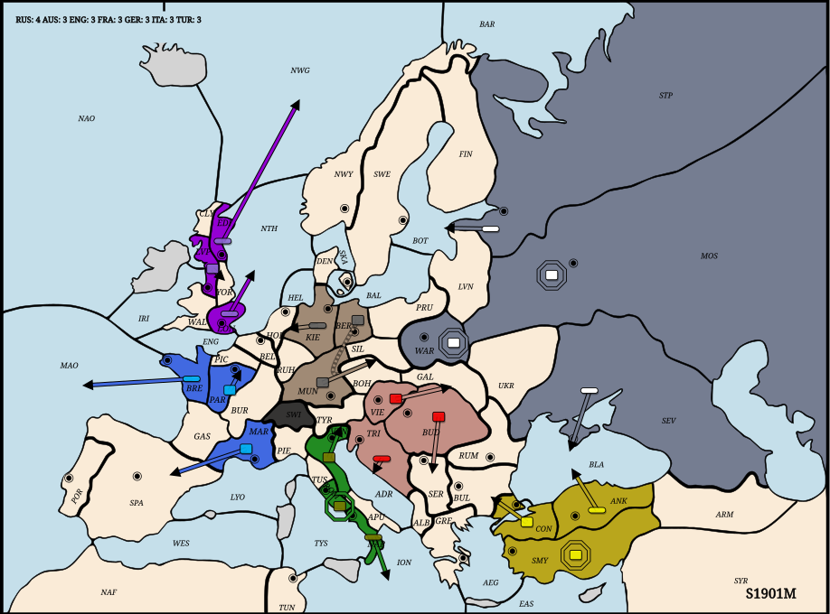
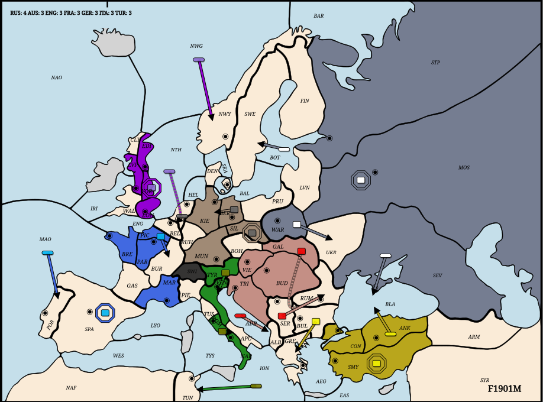
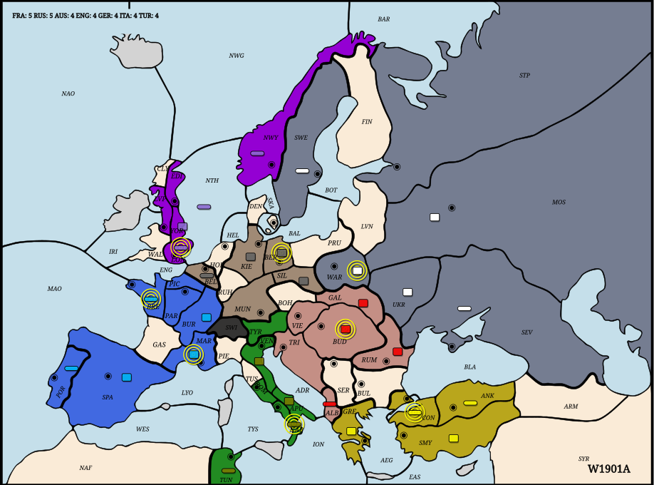
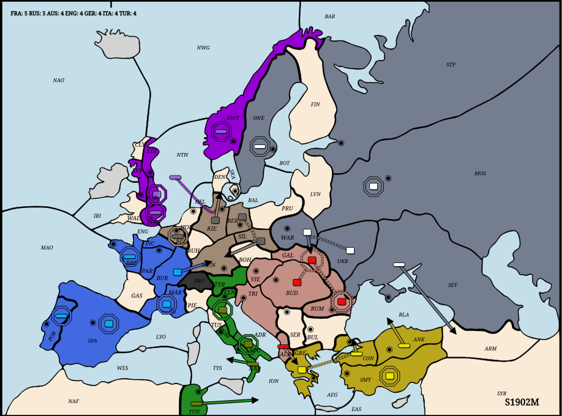
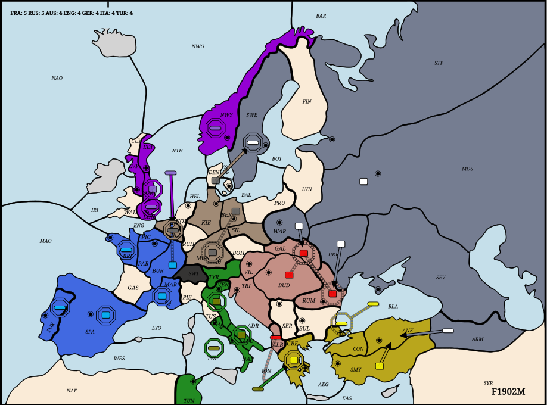
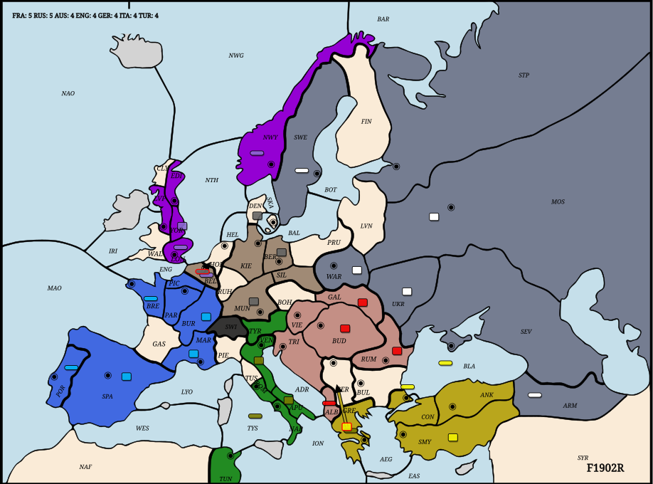
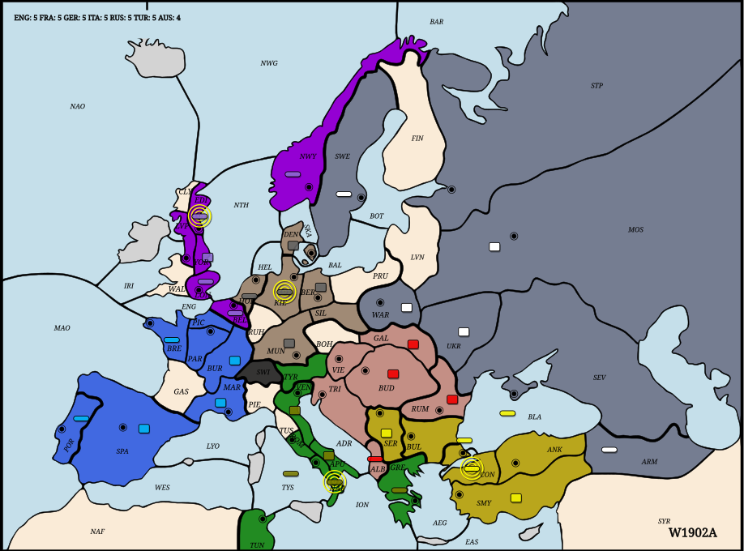

# Diplomacy A2A — Run `20260528T214253Z`

- **Model**: `claude-sonnet-4-6`
- **Years targeted**: 2
- **Started**: 2026-05-28T21:42:53+00:00
- **Ended**: 2026-05-28T22:11:26+00:00
- **Phases played**: 7
- **Tokens**: input=741111, output=53451, cache_create=15313, cache_read=380640
- **Approx cost (USD)**: $3.1967

## Personas

- **FRANCE** — A pragmatic, conservative player who prefers stable alliances and avoids unnecessary risks.
- **GERMANY** — An opportunist — seize tactical chances, willing to pivot alliances when payoffs flip.
- **ENGLAND** — Cautious and naval-focused; build a strong fleet position before committing to aggression.
- **ITALY** — Ambiguous and scheming; keep options open, prefer surprise moves over telegraphed campaigns.
- **AUSTRIA** — Defensive and central; hold the position, broker peace between feuding neighbors.
- **RUSSIA** — Expansionist on both fronts; press for territory wherever weakness appears.
- **TURKEY** — Patient and long-game; build slowly, exploit late-game momentum.

## SPRING 1901 MOVEMENT (`S1901M`)

### What happened

- **AUSTRIA**: A BUD → SER; A VIE → GAL; F TRI → ADR
- **ENGLAND**: F EDI → NWG; F LON → NTH; A LVP → YOR
- **FRANCE**: F BRE → MAO; A MAR → SPA; A PAR → PIC
- **GERMANY**: F KIE → HOL; A MUN → SIL; A BER supports A MUN → SIL
- **ITALY**: F NAP → ION; A VEN → TYR; A ROM holds
- **RUSSIA**: F SEV → BLA (bounced); F STP/SC → BOT; A WAR holds; A MOS holds
- **TURKEY**: F ANK → BLA (bounced); A CON → BUL; A SMY holds

### Dialogue

- **AUSTRIA → ITALY**: I'd like a friendly opening between us — I'll keep F TRI out of Venice if you keep A VEN out of Trieste. We both benefit more from expanding south and east rather than fighting over the same corner. Let's agree to a mutual hands-off on each other's home centers this year.
- **AUSTRIA → RUSSIA**: I'm moving A BUD toward Serbia and hoping to work toward Romania — I'd appreciate a non-aggression agreement in Galicia so we don't bump into each other. If you're heading into Galicia, let's coordinate so neither of us wastes a move. A friendly Austria-Russia border early on helps us both grow.
- **AUSTRIA → TURKEY**: Austria and Turkey have natural room to coexist — I'm focused on Serbia and Romania, not the Straits or Anatolia. I'd welcome an early understanding so we can both expand without stepping on each other. Happy to discuss how we divide Balkan growth.
- **ENGLAND → FRANCE**: I'd like to propose a friendly opening — I have no designs on Brest or the English Channel this year, and I hope you feel the same about the North Sea. Let's both focus on our natural spheres and avoid an early Anglo-French war.
- **ENGLAND → GERMANY**: I'm keeping a close eye on Kiel — I hope your fleet heads east or south rather than toward the North Sea. If we can agree to stay out of each other's way early, there's real room for cooperation against shared rivals later.
- **ENGLAND → RUSSIA**: I'd like to keep things calm in the north. I have no designs on Scandinavia beyond what's natural for England, and I hope we can avoid stepping on each other's toes — perhaps we can even coordinate against a common threat.
- **FRANCE → ENGLAND**: I'd like to propose a friendly start — I have no interest in the Channel or northern waters if you stay out of my western sphere. Let's both focus elsewhere in 1901.
- **FRANCE → GERMANY**: I'd like to propose a DMZ in Burgundy this year — neither of us moves there in Spring. I'll focus south and west, you focus east. Interested?
- **FRANCE → ITALY**: Let's stay out of each other's way — I'll keep out of Piedmont if you keep out of Marseilles. A quiet border benefits us both in 1901.
- **GERMANY → ENGLAND**: Let's avoid stepping on each other's toes in the North Sea. I'm planning to send my fleet toward Holland — no interest in Denmark if you want it. Happy to coordinate against France down the line if you're open to it.
- **GERMANY → FRANCE**: I have no designs on Burgundy this spring — my army in Munich is heading south or east. Let's keep the border quiet between us and both focus on our respective opportunities.
- **GERMANY → RUSSIA**: I'm not pushing into Silesia or Prussia this year — purely defensive posture on my eastern front. Hope we can keep things calm between us while we both develop.
- **ITALY → AUSTRIA**: Greetings from Rome! I believe Italy and Austria have natural complementary interests — I'm planning to push south and east toward the Mediterranean and Turkey, not north into your territory. I'd love to discuss coordinating against Turkey in the Balkans. What are your opening intentions?
- **ITALY → TURKEY**: Hello from Italy! I'm interested in establishing a friendly Mediterranean arrangement early on. I have no hostile intentions toward you this year and would rather we discuss how to divide influence in the Balkans cooperatively. What's your opening plan?
- **ITALY → FRANCE**: Greetings, neighbor! I think Italy and France can coexist peacefully in the Mediterranean — I'm focused eastward this year. Perhaps we can stay out of each other's way and even coordinate against common rivals down the line?
- **RUSSIA → AUSTRIA**: I have no designs on Galicia this spring — I'd rather we coordinate against Turkey together. If you push toward Rumania from Budapest, I can support from Sevastopol. Let's keep the Balkans stable between us.
- **RUSSIA → TURKEY**: I'll be frank: F SEV is heading to the Black Sea this spring. I'm not looking for a long war with you — let's talk about dividing the Balkans so we both grow. Rumania can be yours if we can agree on spheres.
- **RUSSIA → GERMANY**: I have no interest in Silesia or Prussia this year — my eyes are south and north. Want to coordinate on Scandinavia, or at least stay out of each other's way in the north?
- **RUSSIA → ENGLAND**: Sweden is a natural target for me from St. Petersburg; I'd like to avoid bumping into you in Scandinavia. Can we agree that Sweden goes to me and Norway to you?
- **TURKEY → RUSSIA**: I want to be transparent: I'm moving F ANK to BLA and A CON to BUL this spring. My ambitions are in the Balkans and Mediterranean — SEV and your northern holdings are of no interest to me. A non-aggression understanding between us would let us both focus on our real rivals. I hope we can build trust from the start.
- **TURKEY → AUSTRIA**: I'd like a friendly opening between us. I'm heading into BUL, which is my natural first move, and I have no designs on GRE or further Austrian territory in 1901. If we can agree on spheres — Balkans divided sensibly — we avoid a costly early war that only helps Russia and Italy. What are your thoughts?
- **TURKEY → ITALY**: I want to keep things simple between us in 1901 — I'm focused on the Balkans and have no fleet heading west. A quiet opening for both of us seems wise while the board sorts itself out. I hope we can stay on good terms.
- **AUSTRIA → RUSSIA**: Glad we're aligned — I'll push A BUD to Serbia this spring and leave Galicia open for now. If you're moving F SEV toward Romania, we could coordinate so I support from Budapest next fall. Let's keep communication open and build on this.
- **AUSTRIA → ITALY**: Great to hear we're on the same page. I'll keep F TRI out of Venice, and I'm moving toward Serbia this spring — no threat to you at all. Coordinating against Turkey is worth discussing; let's see how the board looks after Spring and talk about fall moves.
- **AUSTRIA → TURKEY**: Thanks for the clarity — Bulgaria is certainly your natural first move and I have no objection. I'm heading to Serbia, which keeps us well separated. Let's stay in touch and make sure we're not creating problems for each other as the game develops.
- **ENGLAND → FRANCE**: Glad we're aligned — I'll stay out of the Channel and your western sphere, and I trust you'll keep clear of the North Sea. Let's both have a productive 1901 and revisit cooperation opportunities in the fall.
- **ENGLAND → GERMANY**: That works well — Holland for you, and I'll focus on Norway and Denmark. If your fleet heads to Holland and mine to the North Sea, we stay out of each other's way entirely. Let's keep this understanding through the year.
- **ENGLAND → RUSSIA**: Agreed — Norway for me, Sweden for you. That's a clean division and avoids any friction between us in Scandinavia. I'm happy to honor that arrangement and hope we can build on it.
- **FRANCE → ENGLAND**: Glad we're aligned — I'll keep my fleet out of the Channel and focus on the Atlantic and Iberia. Looking forward to a peaceful western front this year.
- **FRANCE → GERMANY**: Perfect, glad we're on the same page about Burgundy. I'll be moving south and west — Spain and the Atlantic are my focus. Let's keep this friendly arrangement going into Fall.
- **FRANCE → ITALY**: Great to hear — I'll stay out of Piedmont and focus on Spain and the Atlantic. I think we can build a solid working relationship as the game develops.
- **FRANCE → RUSSIA**: Hello from France! Just wanted to open a line of communication — I'm focused entirely on the western Mediterranean this year. How are things looking on your end?
- **GERMANY → ENGLAND**: Glad we're on the same page. My fleet is heading to Holland — Denmark is yours if you want it. I think there's a real opportunity to squeeze France together once we're both established. Let's keep talking.
- **GERMANY → FRANCE**: Agreed on the Burgundy DMZ — Munich is moving east this spring, not west. I think a quiet Franco-German border benefits us both while we each pursue our real opportunities elsewhere.
- **ITALY → AUSTRIA**: Glad we're on the same page — I'll keep A VEN away from Trieste this spring, and I'm moving south toward the Ionian to contest the eastern Mediterranean. I think we can carve out complementary spheres: you take the northern Balkans, I'll push into Greece and beyond. Let's stay in close contact.
- **ITALY → TURKEY**: Good to hear we're thinking alike — a quiet opening benefits us both while the board develops. I'm moving my fleet toward the Ionian, purely to contest the western Mediterranean, not aimed at you. Let's keep communication open and see where we can find common ground as things develop.
- **RUSSIA → AUSTRIA**: Glad we're aligned — GAL stays clear between us. I'm moving F SEV toward the Black Sea and A WAR is staying defensive. Let's both grow in 1901 and talk coordination against Turkey in the fall.
- **RUSSIA → TURKEY**: We're going to bounce in the Black Sea — both of us moving there helps neither of us. I'd propose you hold ANK or move to ARM instead, and we negotiate a Black Sea arrangement. Otherwise we both waste a move and someone else profits.
- **RUSSIA → ENGLAND**: Sweden to me, Norway to you — that works perfectly. I'll move F STP/SC toward the Gulf of Bothnia to set up Sweden, and I expect we won't interfere with each other in Scandinavia.
- **TURKEY → RUSSIA**: I see we both have eyes on the Black Sea — a bounce there helps neither of us. I'm still committed to moving there, as I can't leave it uncontested. But I want to reiterate: I have no interest in SEV or your northern centers. If we bounce in BLA, let's agree to a truce afterward and focus our energies elsewhere — Romania can go to you if we can establish a stable frontier.
- **TURKEY → AUSTRIA**: Good to hear we're on the same page. I'm moving A CON to BUL as planned, and I'll leave GRE and Serbia to you — those are clearly in your sphere. A quiet Austro-Turkish border in 1901 lets us both grow at the expense of weaker positions. I'd like to build on this understanding into 1902.
- **TURKEY → ITALY**: Glad we're thinking alike. I'll stay focused on the Balkans and eastern Mediterranean — no fleet moves toward your waters this year. A stable relationship between us is valuable as the board develops.
- **GERMANY → ENGLAND**: We're all set — fleet to Holland, you take Norway and Denmark. I think we'll both be in strong positions heading into Fall. Let's stay in close contact about France's moves.
- **GERMANY → FRANCE**: Confirmed on my end — Munich is heading east, Burgundy stays quiet. Looking forward to a stable western front while we both build strength. Talk soon.
- **GERMANY → RUSSIA**: Sounds good — I'll keep my eastern units quiet this spring. Let's both focus on our natural expansion zones and check in after the moves resolve.
- **TURKEY → RUSSIA**: I respect your position, but I can't leave the Black Sea uncontested — it's essential to my security. A bounce is unfortunate but not catastrophic; let's agree now that after Spring resolves, we establish a truce and focus on our respective spheres. Romania is yours, and I'll push west through the Balkans — no threat to SEV ever.
- **TURKEY → AUSTRIA**: We're in good shape — BUL for me, SER for you, and a quiet border between us. Let's keep this understanding into 1902 and make sure neither Russia nor Italy exploits our cooperation. I look forward to building on this foundation.
- **TURKEY → ITALY**: I'm glad we're keeping things calm between us. My focus is firmly eastward this year — no interference in your western plans. Let's stay in touch as the board develops.

### AUSTRIA
Orders: `A BUD - SER` · `A VIE - GAL` · `F TRI - ADR`

Reasoning

> Looking at the board, my diplomacy has gone well: Italy agreed to stay out of Trieste, Russia agreed to stay out of Galicia, and Turkey is taking Bulgaria while I take Serbia. The plan is clear and the agreements are solid.
>
> - **A BUD → SER**: Standard Balkan expansion, agreed with Turkey (who takes BUL) and Russia.
> - **A VIE → GAL**: Securing Galicia before anyone changes their mind. Russia said they're not going there this spring.
> - **F TRI → ADR**: Positioning for future pressure toward Greece/Albania, consistent with my agreement to stay out of Venice.

### ENGLAND
Orders: `F EDI - NWG` · `F LON - NTH` · `A LVP - YOR`

Reasoning

> Looking at the situation: all diplomatic agreements are in place. France stays out of the Channel, Germany heads to Holland, Russia heads to Sweden. My strategy is clear — both fleets converge on the North Sea to secure it and set up for Norway in the fall. The army moves to Yorkshire to consolidate the home island.
>
> However, I need to be careful: both F EDI and F LON moving to NTH will bounce each other! I should send F EDI to NTH (to secure it) and F LON to ENG or another useful position, or better yet, have F EDI support F LON into NTH, or send one fleet to NWG to set up Norway directly.
>
> The optimal play: F EDI → NTH (secures North Sea), F LON → ENG (or hold), A LVP → YOR. But actually, if I want Norway in Fall, I need a fleet in NTH or NWG. Let me reconsider: F EDI → NWG (sets up Norway directly), F LON → NTH (secures North Sea), A LVP → YOR. This is actually stronger — NTH is secured by London fleet, Edinburgh fleet positions for Norway via NWG, and the army consolidates.

### FRANCE
Orders: `F BRE - MAO` · `A MAR - SPA` · `A PAR - PIC`

Reasoning

> Looking at my situation: Germany has confirmed the BUR DMZ twice, England and Italy are both friendly, and my strategy is clear. I should honor the Burgundy DMZ agreement with Germany and execute the classic French opening:
>
> - **F BRE → MAO**: Atlantic dominance, sets up Portugal/Spain convoy options
> - **A MAR → SPA**: Immediate supply center grab
> - **A PAR → PIC**: Northern presence without violating the BUR DMZ with Germany
>
> This gives me a solid position: MAO controls the Atlantic, SPA is a new center, and PIC puts pressure on England if needed (or can support BRE next turn). I honor my deal with Germany, which keeps that border stable and builds trust for future cooperation.

### GERMANY
Orders: `F KIE - HOL` · `A MUN - SIL` · `A BER S A MUN - SIL`

Reasoning

> Looking at my situation: I've made clear commitments to England (fleet to Holland), France (Munich goes east, not Burgundy), and Russia (quiet eastern front). My strategy history already settled on F KIE → HOL, A MUN → SIL, A BER → PRU.
>
> PRU is a neutral province adjacent to Russia's WAR — this might unsettle Russia slightly, but it's a legitimate expansion move and not directly threatening. Alternatively, BER holds to support the fleet or SIL push. Given I told Russia I'm keeping things quiet, BER holding or supporting MUN→SIL is cleaner. Let me go with BER supporting MUN into SIL for a stronger push east, while the fleet grabs Holland.

### ITALY
Orders: `F NAP - ION` · `A VEN - TYR` · `A ROM H`

Reasoning

> Looking at the board, my strategy is clear: push F NAP to ION to contest the eastern Mediterranean and set up future moves toward Greece or Turkey, move A VEN to TYR to keep pressure on Austria while technically honoring our agreement (I said I'd keep VEN out of Trieste, not TYR), and hold A ROM as a flexible reserve. This is consistent with my revised strategy and prior commitments.

### RUSSIA
Orders: `F SEV - BLA` · `F STP/SC - BOT` · `A WAR H` · `A MOS H`

Reasoning

> Looking at the situation: Turkey has confirmed they're moving to BLA, so we'll bounce there — but it's still worth contesting to deny them free access. F STP/SC to BOT sets up Sweden in the fall. A WAR holds to honor the Galicia non-aggression with Austria. A MOS holds to keep flexibility.

### TURKEY
Orders: `F ANK - BLA` · `A CON - BUL` · `A SMY H`

Reasoning

> Looking at the board, my strategy is clear: move F ANK to BLA to contest the Black Sea (accepting a likely bounce with Russia's F SEV, but I cannot leave it uncontested), move A CON to BUL to secure that supply center, and hold A SMY as a flexible reserve. Austria has agreed to take SER while I take BUL, which is a clean division. Russia will bounce me in BLA but that's acceptable — I'll be in BUL and can reassess in Fall.

## FALL 1901 MOVEMENT (`F1901M`)

### What happened

- **AUSTRIA**: A SER → RUM; A GAL supports A SER → RUM; F ADR → ALB
- **ENGLAND**: F NWG → NWY; F NTH supports F HOL → BEL; A YOR holds
- **FRANCE**: F MAO → POR; A SPA holds; A PIC → BUR
- **GERMANY**: F HOL → BEL; A BER → KIE; A SIL holds
- **ITALY**: F ION → TUN; A TYR → VEN; A ROM → APU
- **RUSSIA**: F BOT → SWE; F SEV → BLA (bounced); A WAR → UKR; A MOS holds
- **TURKEY**: F ANK → BLA (bounced); A BUL → GRE; A SMY holds

### Dialogue

- **AUSTRIA → RUSSIA**: Fall is here and I'm planning to move A SER into Romania — I'd ask that F SEV support my move or at minimum not contest it. In return, I'm happy to support Russian interests in Ukraine or the Black Sea region. Let's not waste moves bouncing each other when we could both gain this fall.
- **AUSTRIA → TURKEY**: Everything looks good between us — I'm pushing toward Romania this fall, so Greece remains entirely open for you if you want it. I have no units threatening your position and I'd like to keep our quiet border into 1902.
- **AUSTRIA → ITALY**: Still all quiet on our shared front — I'm moving east toward Romania and have no designs on your position. I hope your southern push is going well; let's stay coordinated as the board develops.
- **ENGLAND → FRANCE**: Still holding to our agreement — I'm moving F NWG to Norway this fall and have no interest in Belgium or the English Channel. I hope your army in Picardy is headed toward Belgium or back home rather than causing friction between us.
- **ENGLAND → GERMANY**: I'm moving F NWG to Norway this fall as planned. I can support you into Belgium from NTH if you'd like — F NTH S F HOL - BEL. That gets us both a new center and keeps us coordinated. Are you moving F HOL to Belgium?
- **ENGLAND → RUSSIA**: Norway is mine this fall per our agreement — I trust you're heading for Sweden and we won't cross paths. Hope the south is going well for you.
- **FRANCE → ENGLAND**: Great spring — I'm moving F MAO to POR this fall to lock in Iberia. On Belgium: I'd love to grab it with A PIC, but I want to coordinate so we don't bounce each other. Are you moving on BEL, or can I take it uncontested?
- **FRANCE → GERMANY**: Fall is here — I'm pushing for Portugal with my fleet and want to take Belgium with A PIC. I know you may have eyes on BEL too — can we agree that I take it this year and we keep the border quiet? I'll support your eastern ambitions in return.
- **FRANCE → ITALY**: Hope your spring went well! I'm focused on Iberia and the Atlantic this fall. Let's keep our border quiet — I have no interest in moving toward you, and I hope the feeling is mutual.
- **GERMANY → ENGLAND**: Solid spring — Holland secured on my end. This fall I'm planning to move on Belgium with my fleet from Holland. I'd appreciate your support from the North Sea, or at least no interference. In return, Denmark is yours — I'll stay out of Scandinavia entirely. France with Spain and MAO is the growing threat; let's stay coordinated.
- **GERMANY → FRANCE**: Keeping my word on the western front — my army in Silesia is staying east, no moves toward Burgundy or Belgium from my land forces. I'm focused on the eastern situation this fall. Hope we can keep this quiet arrangement going.
- **GERMANY → RUSSIA**: Spring went smoothly between us — I appreciate the calm eastern front. I'm focused westward this fall, no aggressive moves your direction. Let's keep this understanding through 1901 and reassess together.
- **ITALY → AUSTRIA**: Fall is here and I'm planning to move F ION into Greece — a natural Italian sphere that doesn't conflict with your Balkan ambitions. I'll keep A TYR out of Trieste as promised. If you're pushing into Bulgaria or Romania, perhaps we can coordinate so our moves complement each other rather than interfere.
- **ITALY → TURKEY**: I want to be upfront with you — I'm moving F ION toward Greece this fall, as Italy needs that center to grow. This isn't aimed at your core position in Bulgaria or Anatolia, and I remain open to a longer-term arrangement in the eastern Mediterranean. I hope this doesn't damage our understanding.
- **RUSSIA → AUSTRIA**: Fall is critical — I want to take Rumania with F SEV this turn. I'd appreciate your support from SER or GAL to ensure it succeeds. In return, I'll support your position in the Balkans and stay out of GAL entirely. Let's lock this down before Turkey grabs it.
- **RUSSIA → TURKEY**: The Black Sea bounce is behind us — let's move forward constructively. I'm taking Rumania this fall as my natural sphere; I expect you to focus on BUL and leave RUM to me. If we can agree on that border, we avoid a costly war and both grow in 1901.
- **RUSSIA → ENGLAND**: Sweden is mine this fall — F BOT moves there now. Norway is yours, and I'll stay out of your way in Scandinavia. Let's keep the north stable while we both focus on our real expansion zones.
- **RUSSIA → GERMANY**: Still no interest in your eastern provinces — I'm focused south and north. Let's keep the peace between us and both grow without friction.
- **TURKEY → RUSSIA**: The bounce is behind us — I'm moving F ANK to BLA this fall and I hope you'll stand down. Romania is yours; I have no army positioned to contest it, and my focus is Greece and the western Balkans. A stable Black Sea frontier between us frees us both to grow at others' expense.
- **TURKEY → AUSTRIA**: We've had a clean spring — BUL for me, SER for you. This fall I'm planning to take GRE with A BUL, which is my natural next step. I want to make sure we're not both reaching for it — what's your fall plan? I'd rather we coordinate than clash.
- **TURKEY → ITALY**: I want to be transparent: I'm planning to move A BUL toward GRE this fall. I know your fleet is in the Ionian — I hope we can agree on spheres rather than collide over Greece. What are your intentions for the Ionian this fall?
- **AUSTRIA → RUSSIA**: I hear you on Romania — here's the challenge: I've already committed A SER to move there this fall, as that's my natural growth path. I'd propose we avoid a bounce by having you focus F SEV on Ukraine or holding in place, and I'll take Romania this turn. In 1902 I'm happy to support Russian moves into Ukraine or elsewhere to compensate. A bounce helps neither of us.
- **AUSTRIA → TURKEY**: Greece is entirely yours — Italy is apparently also moving F ION there, so you may want to watch that. I'm focused on Romania and have no units near Greece. Our quiet border continues to serve us both well.
- **AUSTRIA → ITALY**: I hear you're moving F ION toward Greece — Turkey is moving A BUL there too, so that could be interesting. I'm staying focused on Romania and the eastern Balkans; no conflict between us this fall.
- **ENGLAND → GERMANY**: Confirmed — I'll support you into Belgium from NTH this fall: F NTH S F HOL - BEL. You take Belgium, I take Norway, and we both grow. This is a solid foundation for longer-term cooperation against France if they continue expanding in Iberia.
- **ENGLAND → FRANCE**: I'm not moving on Belgium myself — my focus is Norway. That said, Germany is pushing for Belgium with their Holland fleet, so it may be contested regardless of what I do. I'd recommend coordinating directly with Germany if you want it, or pivoting your Picardy army elsewhere.
- **FRANCE → ENGLAND**: Thanks for confirming — sounds like we're both in good shape this fall. I'll be moving A PIC to Belgium to grab that center, and F MAO to Portugal. No friction between us at all.
- **FRANCE → GERMANY**: Good to hear you're staying east — I'm moving A PIC to Belgium this fall and F MAO to Portugal. That should give us both a clean 5-center position heading into 1902. Let's keep coordinating.
- **GERMANY → ENGLAND**: Confirmed — F HOL is moving to Belgium this fall. Please support with F NTH S F HOL - BEL as you offered. This gets us both a center and keeps France from overextending. I'll stay out of Scandinavia entirely — Denmark and Norway are yours.
- **GERMANY → FRANCE**: I appreciate the offer, but I've already committed to moving on Belgium this fall — it's essential for my growth. I'll make sure my land forces stay well clear of your territory, and I'm open to cooperating on other fronts. Let's not let this one disagreement sour a useful relationship.
- **GERMANY → RUSSIA**: Still keeping things calm on my end — eastern front stays quiet. I'm focused on the west this fall. Let's check in after the dust settles and think about 1902 together.
- **ITALY → TURKEY**: I appreciate your transparency — but Italy needs Greece to grow, and F ION is already positioned there. If we both move for it, we both lose a turn. I'd suggest you focus on Romania or hold BUL this fall, and we can discuss a longer-term arrangement where our spheres don't collide. A bounced Greece helps neither of us.
- **ITALY → AUSTRIA**: Things are looking good between us — I'm pushing F ION toward Greece this fall, which should complement your eastern moves nicely. If Turkey is distracted by the Ionian, that gives you more room in the northern Balkans. Let's stay coordinated as we both grow.
- **RUSSIA → AUSTRIA**: Let's be precise: I'm moving F SEV to RUM this fall — that's the cleanest gain for Russia. I need you to support F SEV - RUM from SER or GAL rather than moving SER to RUM yourself, otherwise we bounce and Turkey profits. Support me into RUM and I'll support your position in SER and the Balkans going forward. This is the move that sets us both up for 1902.
- **RUSSIA → TURKEY**: ANK to BLA is fine — SEV is going to RUM, not BLA, so no bounce this fall. I'm taking RUM as my sphere; you focus on BUL and Greece. This gives us a clean border and we both grow in 1901 without fighting each other.
- **RUSSIA → ENGLAND**: Sweden is mine this fall as agreed — F BOT moves there now. Norway is yours; our arrangement holds. Let's both focus on our real expansion zones in 1902.
- **TURKEY → ITALY**: I need Greece this fall — it's my only realistic build center and A BUL is right there. If we both move for it, we bounce and neither of us grows, which only helps Austria and Russia. I'd strongly prefer we avoid that outcome: can you move F ION to hold or toward TUN instead, and let me take GRE? I'm willing to discuss how we coordinate in the eastern Med afterward.
- **TURKEY → AUSTRIA**: I'm planning A BUL - GRE this fall — can you offer any support, or at least confirm you're not contesting it? A strong Turkey in GRE is in your interest too, since it checks Italian expansion into the Balkans. I'd like to lock this in before orders.
- **TURKEY → RUSSIA**: I'm not contesting RUM — A BUL is heading for GRE, not north. F ANK is moving to BLA, which I hope you'll accept as my natural sphere just as RUM is yours. Let's both grow cleanly this fall and build a stable frontier for 1902.
- **AUSTRIA → RUSSIA**: I've thought this through carefully and I have to be honest: I'm moving A SER to Romania this fall, supported from Galicia. I know this means a conflict between us, and I regret it — but Romania is my only growth path this year, just as it is yours. I hope we can reset and find a workable arrangement in 1902; a prolonged Austro-Russian war helps only Turkey and Italy.
- **AUSTRIA → TURKEY**: Final confirmation: Greece is yours, I'm focused entirely on Romania. Our quiet border continues and I hope we can build on it in 1902 — a friendly Austria-Turkey relationship is valuable for both of us as Russia and Italy grow stronger.
- **AUSTRIA → ITALY**: All quiet between us — I'm pushing into Romania this fall and have nothing near your position. I hope your southern moves go well; let's compare notes after fall results and think about 1902 coordination.
- **ENGLAND → GERMANY**: All confirmed — F NTH S F HOL - BEL this fall. I'm taking Norway with NWG. France mentioned they're also moving A PIC to Belgium, so there may be a bounce — you might want to consider whether you have a fallback. Either way, my support stands as promised.
- **ENGLAND → FRANCE**: Quick heads-up: Germany confirmed they're moving F HOL to Belgium as well, so A PIC - BEL will likely bounce. You may want to reconsider your Picardy army's destination this fall to avoid wasting the move. No friction between us either way — I'm focused entirely on Norway.
- **RUSSIA → AUSTRIA**: Final round — please support F SEV into RUM from GAL or SER rather than moving SER there yourself. If we bounce, Turkey profits and we both lose a key center. Support me into RUM and I guarantee support for your Balkan position in 1902 — this is the deal that benefits us both most.
- **RUSSIA → TURKEY**: We're aligned for this fall — RUM to me, BLA and GRE to you. No interference from my side. Let's build on this clean division in 1902 and coordinate against whoever threatens us.
- **RUSSIA → ENGLAND**: Sweden is mine this fall as agreed — F BOT moves there. Norway to you, Sweden to me — our arrangement holds and the north stays stable.
- **TURKEY → ITALY**: I want to be direct with you one final time: I am moving A BUL to GRE this fall. If you also move F ION to GRE, we both bounce and neither of us grows — that only helps Austria and Russia. I urge you to move F ION elsewhere (TUN, for instance) and let me take GRE; I'll reciprocate with cooperation in the eastern Med in 1902. The choice is yours.
- **TURKEY → RUSSIA**: We're in agreement — F ANK to BLA, SEV to RUM, clean border. Let's both grow in 1901 and build from there. I look forward to a stable frontier in 1902.
- **TURKEY → AUSTRIA**: We're aligned — I'm taking GRE, you're taking RUM. A strong Turkey in GRE checks Italian ambition in the Balkans, which serves us both. Looking forward to continued cooperation in 1902.

### AUSTRIA
Orders: `A SER - RUM` · `A GAL S A SER - RUM` · `F ADR - ALB`

Reasoning

> Looking at the board, I need to decide on Romania. Russia wants F SEV to take it, but Romania is my only growth path this fall. I've already committed to trying — bouncing is bad but not trying is worse. Turkey is taking Greece (possibly competing with Italy's F ION there), which keeps the south busy. My F ADR should move to Albania to position for Greece next spring.
>
> The key question: should I still push A SER - RUM supported by A GAL? Russia's F SEV will contest it, likely causing a bounce. But if I don't try, Russia gets Romania for free and I stay at 3 centers while everyone else grows. I must try.
>
> Plan:
> - A SER - RUM (contest Romania; may bounce with F SEV but must try)
> - A GAL S A SER - RUM (give it the best chance)
> - F ADR - ALB (position for Greece/Balkans next year)

### ENGLAND
Orders: `F NWG - NWY` · `F NTH S F HOL - BEL` · `A YOR H`

Reasoning

> Looking at the current situation, my strategy is clear and already confirmed through diplomacy:
>
> - **F NWG → NWY**: Take Norway, gaining my first new supply center (3→4)
> - **F NTH S F HOL - BEL**: Support Germany into Belgium as agreed — this builds goodwill and may work if France's A PIC also goes to BEL (they'll bounce each other, but my support still helps Germany if France pivots elsewhere; if both go, it's a bounce regardless)
> - **A YOR H**: Hold York to consolidate the home island
>
> The key insight: I warned France about the likely Belgium bounce, so they may redirect A PIC elsewhere. If France does redirect, Germany gets Belgium cleanly with my support. Either way, I get Norway. This is a solid Fall 1901 — I'll end at 4 centers minimum.

### FRANCE
Orders: `F MAO - POR` · `A SPA H` · `A PIC - BUR`

Reasoning

> Looking at the situation: Germany is taking Belgium with F HOL, so A PIC - BEL will bounce. My revised plan of A PIC - BUR is solid — I can claim Burgundy (a key strategic province) while F MAO takes Portugal (a supply center) and A SPA holds to secure Spain. This gives me 5 supply centers: BRE, MAR, PAR, POR, BUR... wait, BUR is not a supply center. Let me recount: BRE, MAR, PAR are my current centers, plus POR (new) and SPA (already held from spring). That's 4 centers. BUR is strategically valuable but not a supply center.
>
> So my centers after fall: PAR, BRE, MAR (home) + SPA + POR = 5 supply centers. That's a good result. A PIC - BUR puts pressure on Germany and gives me a strong central position for 1902.
>
> The plan: F MAO → POR (secure supply center), A SPA H (hold Spain), A PIC → BUR (claim key strategic province, no bounce expected since Germany said their land forces stay east).

### GERMANY
Orders: `F HOL - BEL` · `A BER - KIE` · `A SIL H`

Reasoning

> Looking at the situation: England has confirmed support for F HOL - BEL (F NTH S F HOL - BEL), which means my fleet moves to Belgium despite France also trying for it. For my second new center, I should take Denmark — A BER - PRU doesn't get me a center, but A BER could go to Denmark if it's adjacent... wait, Berlin is not adjacent to Denmark. I need to check: BER is adjacent to KIE, PRU, SIL, MUN. Denmark (DEN) is adjacent to KIE, HEL, SWE. So Berlin can't reach Denmark directly.
>
> My options for a second center: 
> - A SIL could move toward WAR or GAL (neutral centers? No, WAR is Russian, GAL is neutral but Austria is there)
> - Actually, looking at neutral centers: DEN, BEL, NOR, SWE, BUD... DEN is the obvious German target but I need a unit adjacent to it. F HOL is going to BEL. A BER can't reach DEN. 
>
> Actually, I can only realistically get Belgium this fall (with England's support). For A BER and A SIL, I should position for 1902 — perhaps A BER → KIE to then reach DEN next spring, or A SIL holds/moves east for future plays. A BER → KIE frees Berlin and positions for Denmark. A SIL holds to maintain eastern pressure.

### ITALY
Orders: `F ION - TUN` · `A TYR - VEN` · `A ROM - APU`

Reasoning

> Looking at the situation: Turkey has A BUL positioned to take GRE, and my F ION can also move there. My previous analysis was correct — if we both move to GRE, we bounce and neither grows. Turkey has been persistent about wanting GRE, but yielding it means Turkey gets a free build and becomes stronger in my theater.
>
> The key question: is it better to bounce Turkey (denying them a build, staying at 3 SCs myself) or to let them have GRE and pivot to TUN instead (both grow to 4 SCs)?
>
> If I bounce Turkey in GRE, Turkey gets no build, I get no build, and we're both at 3 heading into 1902. That actually hurts Turkey more than me since they're trying to grow. If I take TUN instead, Turkey gets 4 SCs and a build, making them a stronger rival in the Mediterranean.
>
> However, looking at my other options: A TYR can take a neutral center. If A TYR → VEN (my own center, already held), that's pointless. A TYR → MUN or BOH could grab something... but those aren't supply centers I can capture this fall in a useful way. 
>
> Actually wait — I should look at this more carefully. TUN is a neutral SC. If F ION → TUN, I grab TUN (a build!). Turkey grabs GRE. We both get to 4. That's actually better for me than bouncing Turkey and both staying at 3.
>
> But Turkey at 4 with GRE is a Mediterranean rival. Still, Italy at 4 is better than Italy at 3.
>
> Let me reconsider: F ION → TUN gets me a build. A TYR → VEN secures home center. A ROM → APU repositions. That gives me 4 SCs (NAP, ROM, VEN, TUN) and a build. That's the better play.

### RUSSIA
Orders: `F BOT - SWE` · `F SEV - BLA` · `A WAR - UKR` · `A MOS H`

Reasoning

> Looking at the situation: Austria has confirmed they're moving A SER → RUM supported from GAL, so F SEV → RUM will bounce (2 vs 1). Turkey is moving F ANK → BLA. I should take Sweden with F BOT (uncontested), let F SEV try for BLA since Turkey is going there (bounce again) or go to RUM knowing it will bounce. 
>
> Actually, let me reconsider. Turkey said F ANK → BLA, and I have F SEV. If I send F SEV → BLA, we bounce again. If I send F SEV → RUM, Austria will bounce me (A SER supported by A GAL = strength 2 vs my 1). 
>
> The best play: Take SWE with F BOT (guaranteed +1), push F SEV → BLA to contest Turkey (they're moving ANK → BLA, so we bounce, but at least Turkey doesn't get it), move A WAR → UKR (positioning for 1902 expansion), and hold A MOS.
>
> Wait - if Turkey is moving ANK to BLA and I move SEV to BLA, we bounce and neither gets it. That's better than letting Turkey have it free. And I get Sweden. So I end at 5 SCs (adding SWE, losing nothing). Not ideal but solid.
>
> A WAR → UKR positions me well for RUM in 1902. A MOS holds to protect the center.

### TURKEY
Orders: `F ANK - BLA` · `A BUL - GRE` · `A SMY H`

Reasoning

> Looking at the board: F ANK can now move to BLA uncontested (Russia confirmed SEV is going to RUM). A BUL should move to GRE — Italy has stated they're moving F ION to GRE, so there's a risk of a bounce, but GRE is my only realistic build center this fall and I must try. A SMY holds in reserve.
>
> The key decision is GRE: Italy said they're going there, but my final message urged them to stand down. If they move to GRE and I move to GRE, we bounce — I get no build but lose nothing critical. If they back off, I get GRE and a build. The expected value of attempting GRE is positive since the downside (no build) is the same as not trying, and the upside (a build) is significant.

## WINTER 1901 ADJUSTMENTS (`W1901A`)

### What happened

- **AUSTRIA**: builds A BUD
- **ENGLAND**: builds F LON
- **FRANCE**: builds F BRE; builds A MAR
- **GERMANY**: builds A BER
- **ITALY**: builds F NAP
- **RUSSIA**: builds A WAR
- **TURKEY**: builds F CON

### AUSTRIA
Orders: `A BUD B`

Reasoning

> Looking at the board: I have 4 supply centers (BUD, TRI, VIE, RUM) and 3 units (A GAL, A RUM, F ALB), so I get 1 build. I need to decide where to build.
>
> My strategic situation:
> - Russia is hostile after I contested Romania — they'll likely push back in 1902
> - Italy is in VEN and APU, with F TUN — they could threaten TRI
> - Turkey took GRE and is friendly for now
> - I need to defend against Russia in the north/east and Italy in the west
>
> The most important build: I need a unit to defend against Russia (who will likely push into GAL or RUM) and to maintain my Balkan position. Building in BUD makes sense as it's central and can support both GAL and RUM. TRI could get a fleet to contest the Adriatic/Ionian, but Italy seems non-threatening for now. VIE is good for northern defense.
>
> Given Russia's likely aggression toward GAL or RUM, I should build A BUD to have a unit that can support both RUM (against Russian pressure) and GAL. This is the most flexible defensive build. I'll use my remaining two build slots — wait, I only have 1 build (4 centers, 3 units = 1 build).
>
> I'll build A BUD — central, flexible, can support RUM or move to GAL/SER as needed.

### ENGLAND
Orders: `F LON B`

Reasoning

> Looking at my position: I have 4 supply centers (EDI, LON, LVP, NWY) and 3 units, so I get 1 build. I need to decide where to build and what type.
>
> My strategic priorities:
> - Naval focus is core to my persona — fleets project power and I need sea control
> - I have F NTH and F NWY already in the north — excellent positioning
> - I need to think about whether to build in EDI, LON, or LVP
> - A fleet in Edinburgh (F EDI) would give me a third fleet, potentially heading to the North Sea area or supporting further north
> - A fleet in London (F LON) would give me Channel/MAO access — useful for pressuring France eventually or defending home
> - Liverpool fleet could go to Irish Sea or support Atlantic operations
>
> Given France has 5 centers and is growing (POR, SPA secured), they're the long-term threat. A fleet in London positions me to contest the Channel if needed. However, F EDI could move to NTH next spring while F NTH moves elsewhere, giving me more flexibility in the north.
>
> F LON is probably the best build — it gives me Channel presence and flexibility against France without being too aggressive yet. It keeps my options open for 1902 whether I want to press France or continue north.

### FRANCE
Orders: `F BRE B` · `A MAR B`

Reasoning

> I have 5 supply centers (BRE, MAR, PAR, POR, SPA) and 3 units, so I get 2 builds. I should build in BRE and MAR. 
>
> For BRE: A fleet makes sense to project power into the Atlantic/English Channel area. F BRE B gives me naval flexibility.
>
> For MAR: An army makes sense to reinforce my southern land position and prepare for potential moves into Italy or support in Iberia. A MAR B.
>
> For PAR: I only have 2 builds available (5 centers - 3 units = 2 builds), so I use BRE and MAR. PAR would be a third build which I don't have — wait, let me recount. I have 5 supply centers and 3 units, so I get exactly 2 builds. I need to pick 2 of the 3 available home centers (BRE, MAR, PAR).
>
> Best choices: F BRE B (Atlantic/Channel naval power) and A PAR B (central army for flexibility) — or A MAR B for southern strength. Given that I have A BUR in the north and A SPA in Iberia, a fleet at BRE and an army at either MAR or PAR makes sense. I'll go with F BRE B and A MAR B to balance naval and southern land power.

### GERMANY
Orders: `A BER B`

Reasoning

> Looking at my position: I have 4 supply centers (BER, KIE, MUN, BEL) and currently 3 units (A SIL, A KIE, F BEL), so I get **1 build**.
>
> I need to decide where to build. My options are BER (army or fleet) or MUN (army only).
>
> - **A BER B**: An army in Berlin is well-positioned to push toward Denmark, Russia, or support eastern operations. Very flexible.
> - **F BER B**: A fleet in Berlin could go to the Baltic or Denmark — useful for naval pressure on Russia or Scandinavia, but I already have a fleet in Belgium covering the west.
> - **A MUN B**: Army in Munich is good for southern/Austrian pressure or Burgundy, but I've been maintaining a France DMZ and don't want to signal aggression westward yet.
>
> Given my England alliance and the need to grow in Scandinavia (Denmark is a natural next target), **A BER B** gives me the most flexibility — I can push toward Denmark in Spring 1902 or support eastern operations. A fleet in Berlin could also work for Baltic pressure on Russia, but an army is more versatile given I already have a western fleet.
>
> I'll build **A BER B**.

### ITALY
Orders: `F NAP B`

Reasoning

> Looking at my position: I ended Fall 1901 with 4 supply centers (NAP, ROM, VEN, TUN) and 3 units (A APU, F TUN, A VEN). I have 1 build to make.
>
> My strategic priorities for 1902:
> - I need to push into Greece/Balkans and the eastern Mediterranean
> - F TUN is well-positioned for the central Med but I need more naval power to contest Greece
> - A APU could convoy or support a fleet move; A VEN holds the north
>
> The key question: build A NAP or F NAP? A fleet at Naples gives me another naval unit to push east toward Greece, ION, or ADR. An army at Naples is less flexible — I already have two armies and they're not well-positioned for expansion without fleet support. 
>
> I should build F NAP — it gives me a second fleet to push into the eastern Mediterranean in 1902, contest Greece (which Turkey just took), and threaten Turkey's position. This is the obvious build for Italian expansion.

### RUSSIA
Orders: `A WAR B`

Reasoning

> Looking at my position: I have 5 supply centers (MOS, SEV, STP, WAR, SWE) and 4 units, so I get 1 build. I need to decide where to build and what type.
>
> My strategic priorities for 1902:
> 1. Push into the Black Sea and contest Turkey — F SEV needs to get to BLA
> 2. Threaten Rumania — Austria grabbed it, which is a problem
> 3. Keep Sweden secure
> 4. Potentially threaten Galicia from Ukraine
>
> For the build location, I have two options: STP or WAR.
>
> - **F STP/NC B**: Would allow me to eventually reach NWY or NTH — useful for Scandinavia but doesn't help my southern ambitions
> - **F STP/SC B**: Would allow me to move toward BOT/BAL — useful for Baltic pressure on Germany
> - **A STP B**: Army in STP is not very useful — it would take ages to get south
> - **A WAR B**: Army in Warsaw is excellent — it can move to GAL to pressure Austria (who took RUM, denying me that center), or support UKR, or move toward SIL to pressure Germany
>
> Given that Austria took RUM (my intended target), I need to pressure them in 1902. An army in WAR can threaten GAL strongly. My UKR army is already positioned to support or move into GAL or RUM. Building A WAR gives me a powerful two-army threat against Austria.

### TURKEY
Orders: `F CON B`

Reasoning

> I have one build available (4 supply centers vs. 3 units). I need to decide what to build and where.
>
> My current units are F ANK, A SMY, A GRE. My home supply centers are ANK, CON, SMY, GRE. ANK and SMY are occupied, GRE is occupied. CON is unoccupied and is a home center I control — so I can build there.
>
> I should build a fleet at CON to project power into the Black Sea and Mediterranean. A fleet at CON gives me flexibility to push into BLA (which I still don't control), support operations in the Aegean, or threaten Italy. This is the natural build for Turkey's long-game strategy.

## SPRING 1902 MOVEMENT (`S1902M`)

### What happened

- **AUSTRIA**: A RUM holds; A GAL supports A RUM (support cut); A BUD supports A GAL; F ALB → GRE (bounced)
- **ENGLAND**: F NTH supports A KIE → DEN; F NWY holds; F LON holds; A YOR holds
- **FRANCE**: A BUR → MUN (bounced); A MAR holds; A SPA holds; F POR holds; F BRE holds
- **GERMANY**: A KIE → DEN; A SIL → MUN; A BER supports A SIL → MUN; F BEL holds
- **ITALY**: F TUN → ION; F NAP → TYS; A VEN holds; A APU holds
- **RUSSIA**: A WAR → GAL (bounced); A UKR supports A WAR → GAL; F SEV → ARM; A MOS holds; F SWE holds
- **TURKEY**: F ANK → BLA; F CON → BUL/EC; A GRE supports F CON → BUL/EC (support cut); A SMY holds

### Dialogue

- **AUSTRIA → RUSSIA**: Spring 1902 — I want a stable arrangement. I hold Romania and intend to keep it; I have no designs on Ukraine or Sevastopol. If you accept Romania as mine and focus north and west, I'll actively support your interests elsewhere and we can build a durable border. A prolonged fight over Romania only benefits Turkey and Italy.
- **AUSTRIA → TURKEY**: Our quiet border has served us both well. I'm holding Romania and looking south with F ALB — I'd be interested in coordinating if Italy starts pressing into the Balkans or Ionian. What are your plans for spring?
- **AUSTRIA → ITALY**: Spring 1902 — I want to keep our quiet border intact. I have no designs on Venice or Trieste, and I hope you're not eyeing Trieste either. If we can confirm mutual restraint again this year, we both benefit from focusing our energy outward.
- **ENGLAND → FRANCE**: France is now the largest power on the board and I'm watching carefully. I have no desire for conflict, but I need your army in Burgundy to move east or south — if it heads toward Belgium or the Channel coast, I'll have to respond in kind. What are your plans this spring?
- **ENGLAND → GERMANY**: France has 5 centers and a Burgundy army that threatens both of us. I'd like to coordinate this spring — I'm thinking F NTH toward Denmark or Holland, and I can support you if needed. Are you willing to work together to check French expansion?
- **ENGLAND → RUSSIA**: Scandinavia has been stable and I'd like to keep it that way. I have no designs on Sweden, and I hope you have no designs on Norway — let's maintain our understanding while both focusing on our real expansion zones.
- **FRANCE → ENGLAND**: Spring 1902 — I'm considering pushing A BUR east toward Germany this turn. If you're planning to move on BEL from NTH or elsewhere, I'd rather aim for MUN and avoid a bounce. What's your plan this spring?
- **FRANCE → GERMANY**: I want to be transparent: I'm looking to grow this spring and A BUR is my main mobile piece. I'd prefer to resolve this diplomatically — are you open to discussing which direction things go, or should we expect friction?
- **FRANCE → ITALY**: Just checking in — I'm entirely focused on Germany this spring and have no designs on Marseilles or Piedmont. Hope we can maintain our quiet border while both growing elsewhere.
- **GERMANY → ENGLAND**: Spring 1902 — I'm planning A KIE to Denmark and want to push A SIL toward either Munich... wait, Munich is already mine. I'm thinking A SIL - BOH or A SIL - WAR to pressure east. I'd love F NTH support into Denmark if you can spare it, or at least no interference. France at 5 centers is the real worry — want to discuss coordinating pressure on them?
- **GERMANY → FRANCE**: I want to keep our border quiet again this spring — no moves toward Burgundy or the Channel from my side. I'm focused on Denmark and the east. Can we agree to another season of DMZ along our shared frontier?
- **GERMANY → RUSSIA**: Spring 1902 — I'm pushing north toward Denmark, not east into your territory. I'd like to keep our eastern border calm again this year. What are your plans this spring — still focused south and north?
- **ITALY → AUSTRIA**: Turkey now has Greece and is growing fast — this is a serious threat to both of us. I propose we coordinate directly: I'll push F TUN into ION and then toward Greece, while you pressure Bulgaria or hold Turkey's attention in the Balkans. If we squeeze Turkey together now, we can both grow at their expense before they become unstoppable.
- **ITALY → TURKEY**: You outmaneuvered me on Greece — well played. But I'd rather negotiate than fight: I'm willing to discuss a real sphere-of-influence deal now. What would it take for you to feel secure in the east while I expand in the central Mediterranean?
- **ITALY → FRANCE**: Just checking in — I'm focused entirely on Turkey and the eastern Med this year, no interest in your direction. I hope our quiet border continues; let me know if there's anything we can coordinate on against common rivals.
- **RUSSIA → AUSTRIA**: Austria took RUM last fall — I need to be honest that I can't accept that long-term. I'm moving A UKR toward RUM this spring and F SEV to BLA. If you'll negotiate a handover of RUM to me, I'll support your position in Serbia and the western Balkans and guarantee GAL stays yours indefinitely. A prolonged fight over RUM only benefits Turkey.
- **RUSSIA → TURKEY**: F SEV is moving to BLA this spring — I need that sea zone and I'm committed to it. I have no designs on your Anatolian heartland; my focus is RUM and the western Black Sea. Can we agree on a frontier: BLA to me, ARM and beyond to you, and we both pressure Austria and the Balkans together?
- **RUSSIA → ENGLAND**: I want to keep the north stable between us — Sweden is mine and Norway is yours, and I have no designs on your centers. I'm focused entirely southward this year. Let's maintain our understanding and both grow at others' expense.
- **RUSSIA → GERMANY**: Still no interest in your eastern provinces — I'm pushing south toward RUM and the Black Sea. Let's keep the eastern front quiet between us so we can both focus on real expansion.
- **TURKEY → RUSSIA**: Spring 1902 — I want to maintain our clean frontier. F ANK is moving to BLA this spring; I hope SEV stays out of it or moves elsewhere. I'm consolidating BUL and have no interest in RUM or your northern centers. If you confirm no BLA contest, I'll confirm no Turkish unit threatens RUM this spring.
- **TURKEY → AUSTRIA**: Our cooperation continues to serve us both well. I'm consolidating my Balkan position this spring — pushing back into BUL — and have no designs on SER or RUM. Let's make sure we're not stepping on each other: what are your plans for the Balkans this spring?
- **TURKEY → ITALY**: I want to keep lines open between us. Your fleet at NAP and my position in GRE could become a friction point — I'd prefer we establish clear spheres now rather than stumble into conflict. What are your intentions in the Aegean and eastern Mediterranean this spring?
- **AUSTRIA → RUSSIA**: I hear your position, but I won't negotiate away Romania — it's my only eastern gain and I need it to remain competitive. If you push A UKR into Romania, I'll defend with GAL support and we'll both waste moves while Turkey and Italy grow unchecked. I'd far rather we find a stable line and turn our energy outward. What would it take for you to accept the current border and focus north?
- **AUSTRIA → TURKEY**: Russia is moving A UKR toward Romania and F SEV toward the Black Sea this spring — they're pushing hard in your direction too. A strong Russia in the Black Sea threatens us both. I'm defending Romania firmly; if you can pressure Bulgaria or hold Greece, we keep Russia from dominating the south. Let's coordinate rather than let Russia expand unchecked.
- **AUSTRIA → ITALY**: I'm open to coordinating against Turkey, but I need to know what you're actually committing to — are you moving F TUN to ION this spring, and if so, what's the target after that? I can apply pressure from the north if you're genuinely pushing south, but I won't expose myself if you hold back.
- **ENGLAND → FRANCE**: Good to hear BUR is heading east — that's the right move and keeps things calm between us. I do want to flag that F BRE is a concern for me; if it stays in Brest or moves to the Channel, I'll need to respond defensively. Can you confirm BRE stays out of the English Channel this spring?
- **ENGLAND → GERMANY**: Confirmed — I'm supportive of A KIE moving to Denmark and can back that up. F NTH can support A KIE - DEN if you'd like, which gets you a new center cleanly. France pushing BUR east is good news for both of us; let's coordinate to contain them while we both grow. What's your read on where their Brest fleet is heading?
- **FRANCE → ENGLAND**: Thanks for the message — I want to be clear: A BUR is moving east toward Munich this spring, not toward Belgium or the coast. I have no interest in conflict with you and hope we can maintain our friendly arrangement. Let me know if you'd like to coordinate against Germany together.
- **FRANCE → GERMANY**: I appreciate the offer of another DMZ, but I need to be honest: I'm planning to move A BUR toward Munich this spring to keep growing. I'd rather do this transparently than surprise you — if you want to discuss a negotiated arrangement or redirect your units, I'm open to that conversation before orders are locked in.
- **FRANCE → ITALY**: Good to hear you're focused east — same here. I'm pushing A BUR toward Munich this spring and keeping everything else stable. Let me know if there's ever a chance to coordinate against a common rival.
- **GERMANY → ENGLAND**: I'm moving A KIE to Denmark this spring — if you can support from NTH or SWE that would be great, but I understand if you need those units elsewhere. The key thing: can we agree F NTH doesn't move to Denmark or interfere? France's A BUR worries me more than anything — if they push MUN I'll need to respond, and that might mean we need to jointly pressure France soon.
- **GERMANY → FRANCE**: I appreciate the transparency — I'm genuinely not moving toward Burgundy or anywhere near your territory this spring. I'm focused entirely on Denmark and the east. If A BUR stays put or moves away from Munich, we have no friction. But if it moves toward MUN, I'll have to treat that as aggression and respond accordingly — I wanted to be equally transparent with you.
- **ITALY → AUSTRIA**: I'm glad we're aligned — Turkey at 4 SCs with Greece is already a threat that will only grow. I'm moving F TUN into the Ionian this spring to set up a push on Greece in the fall. If you can pressure Bulgaria or threaten Turkey's northern flank, we can squeeze them from two directions. Can you confirm you're willing to coordinate against Turkey this year?
- **ITALY → TURKEY**: I appreciate your message — I think there's a deal to be made here. I'm willing to stay out of the Aegean if you'll respect Italian interests in the central Mediterranean and not push fleets westward. Let's establish a clear line: you keep east of ION, I stay out of GRE and AEG. Does that work for you?
- **ITALY → FRANCE**: All quiet on my end — I'm pushing hard against Turkey in the east and have zero interest in your direction. If Germany is giving you trouble, let me know if there's any way I can help indirectly, though my forces are committed eastward this year.
- **RUSSIA → AUSTRIA**: I hear your offer, but RUM is Russian by natural geography and I cannot accept Austrian control there long-term. I'm moving A UKR toward RUM this spring — if you support that move rather than defending, I'll guarantee GAL stays yours and actively support your Serbian and Balkan position against Turkey and Italy. A peaceful transfer now avoids a costly war that only Turkey wins.
- **RUSSIA → TURKEY**: BLA is non-negotiable for me this spring — F SEV is moving there regardless. I'm not threatening ANK or SMY; my focus is the western Black Sea and RUM. If we bounce again we both lose tempo while Austria consolidates — let's agree you hold ANK and we establish a clean BLA-to-Russia, ARM-to-Turkey frontier after this spring.
- **RUSSIA → ENGLAND**: Still fully aligned with our Scandinavian arrangement — Sweden is mine, Norway is yours, and I'm pushing entirely southward this year. No Russian unit is moving anywhere near your centers.
- **RUSSIA → GERMANY**: Eastern front stays quiet from my side — I'm pushing south toward RUM and the Black Sea. No interest in your territory; let's both focus on our real expansion zones.
- **TURKEY → RUSSIA**: I've noted your message — F SEV to BLA is a direct challenge to my position, and I want to be clear: I will contest it. Two fleets moving to BLA means a bounce, and that serves neither of us. I urge you to reconsider and move SEV elsewhere — RUM and your northern centers are secure from me. A war in the Black Sea only helps Austria and Italy.
- **TURKEY → AUSTRIA**: Italy is signaling a desire for spheres in the eastern Mediterranean, which I'm open to, but I'm more concerned about Russia contesting the Black Sea this spring. If we can maintain our quiet border, I'd like to discuss whether we might coordinate against Russian expansion — they're at 5 centers and growing. What's your read on the situation?
- **TURKEY → ITALY**: I'm glad you're open to negotiation rather than conflict. My core interest is BUL and the Black Sea — I have no ambition in the central Mediterranean or toward your western position. If you stay out of the Aegean, I'll stay out of the Ionian and western Med. That's a clean, enforceable sphere division.
- **AUSTRIA → RUSSIA**: Final word: I'm defending Romania this spring with Galicia support — A UKR into Romania will bounce. A war between us only hands the game to Turkey and Italy, who are both growing fast. I urge you to redirect A UKR and F SEV elsewhere; I'll hold my current line and support Russian interests in the north if you accept a stable border now.
- **AUSTRIA → TURKEY**: Russia is pressing hard on Romania and the Black Sea — they're the real threat to both of us right now. I'm holding firm in Romania and watching your northern flank. Let's keep our quiet border and make sure Russia doesn't dominate the south; I'm open to closer coordination against them if you're willing.
- **AUSTRIA → ITALY**: I'm holding Romania against Russian pressure this spring, so my main focus is defensive — but F ALB can move toward Greece or ION to complement your push if you're genuinely moving F TUN to ION. Confirm your move and I'll coordinate accordingly; I won't expose my flank without knowing you're committed.
- **ENGLAND → GERMANY**: All confirmed — F NTH S A KIE - DEN this spring. You get Denmark cleanly and we both grow stronger. France moving BUR east is good news; let's keep coordinating and discuss joint pressure on France in the fall if their fleet moves aggressively.
- **ENGLAND → FRANCE**: Glad BUR is heading east — that keeps things smooth between us. My one firm line: F BRE must stay out of the English Channel this spring and beyond, or I'll have to treat it as a hostile act. If you can confirm that, we're fully aligned.
- **FRANCE → ENGLAND**: Final confirmation: A BUR is moving to Munich, F BRE stays in Brest this spring — no Channel moves from me. I'm focused entirely on Germany and have zero interest in conflict with you. Let's keep our arrangement solid.
- **FRANCE → GERMANY**: I've been transparent throughout — A BUR is moving to Munich this spring. I'd rather we find a way to coexist going forward, but I need to keep growing. No other moves toward your territory from my other units.
- **FRANCE → ITALY**: All quiet on my end — pushing east into Germany this spring. If you ever want to coordinate a joint squeeze on Austria or Turkey later, I'm open to it.
- **GERMANY → ENGLAND**: Final confirmation: A KIE is moving to Denmark — please support with F NTH S A KIE - DEN as discussed. France has told me A BUR is heading for Munich, so I'm forced to respond defensively there. This makes coordinating against France even more urgent — I'm fully on board for joint pressure on them this year.
- **GERMANY → FRANCE**: Last chance to avoid conflict: if A BUR moves to Munich, I will defend with two units and we both lose a turn. I have no units threatening your territory — please redirect A BUR elsewhere and we keep the peace. The friction isn't worth it for either of us.
- **ITALY → AUSTRIA**: Confirmed — I'm moving F TUN into the Ionian this spring, exactly as discussed. I expect to be in position to threaten Greece by fall. Please apply whatever pressure you can from the north — even holding Bulgaria's attention helps. This is the moment to act before Turkey consolidates further.
- **ITALY → TURKEY**: I accept your proposal — ION stays yours, I stay out of the Aegean. Let's make this formal: I'm moving F TUN to a holding position this spring as a show of good faith, and I expect you to keep your fleets east of ION. If we both honor this, we both benefit from stability while growing elsewhere.
- **ITALY → FRANCE**: All quiet here — I'm committed eastward against Turkey and have nothing pointed at you. Good luck pressing Germany; let me know if anything changes on your end.
- **RUSSIA → AUSTRIA**: Final round — I'm moving A WAR to GAL and A UKR to RUM this spring. This isn't a bluff. If you want to avoid losing GAL as well as potentially RUM, the smarter move is to support A UKR into RUM from GAL and let me have it peacefully — you keep GAL, Serbia, and my full support against Turkey and Italy. The alternative is a two-front squeeze that benefits only Turkey.
- **RUSSIA → TURKEY**: I'm redirecting F SEV to ARM this spring rather than contesting BLA — no bounce, and it signals I'm not after your heartland. ARM is about positioning, not invasion. Let's establish a clean frontier: BLA yours, ARM temporarily mine as a buffer, and we both pressure Austria together.
- **RUSSIA → GERMANY**: I'm pushing into GAL and RUM this spring to crack Austria open. If you move A SIL toward GAL or support my WAR move, we can split Austrian centers between us — BUD and VIE are ripe targets once Austria is pressured from two sides. Interested in coordinating?
- **TURKEY → ITALY**: We have a deal — I stay east of the Ionian, you stay out of the Aegean and Greece. This is a clean, enforceable line and I intend to honor it. Let's both grow in our respective directions.
- **TURKEY → AUSTRIA**: Russia is moving SEV to BLA regardless — I'm contesting it but a bounce is likely. The bigger picture: Russia at 5 centers and growing is a threat to both of us. I'm consolidating BUL this spring; let's keep our quiet border and discuss coordinating against Russian expansion in fall.
- **TURKEY → RUSSIA**: Final appeal: a second bounce in BLA wastes both our moves and only helps Austria and Italy consolidate. I am moving F ANK to BLA — if you move SEV there too, we both lose tempo while others grow. Stand down from BLA this spring and I will confirm no threat to RUM or SEV ever.

### AUSTRIA
Orders: `A RUM H` · `A GAL S A RUM` · `A BUD S A GAL` · `F ALB - GRE`

Reasoning

> Looking at the situation: Russia is threatening both Romania (A UKR → RUM) and Galicia (A WAR → GAL). I need to defend both simultaneously. My revised strategy is correct: A GAL supports A RUM, A RUM holds, A BUD supports A GAL (to prevent A WAR from dislodging GAL). This creates a solid defensive wall.
>
> For F ALB: Italy has confirmed moving F TUN → ION, which positions them against Turkey. I can move F ALB → GRE to grab a supply center while Turkey is distracted consolidating Bulgaria. Turkey said they're "consolidating BUL" so A GRE may be moving, leaving Greece potentially open. This is a real opportunity to gain a 5th supply center.
>
> Key defensive logic:
> - A RUM H: holds Romania
> - A GAL S A RUM: gives Romania strength 2 against A UKR (strength 1), so Romania holds
> - A BUD S A GAL: gives Galicia strength 2 against A WAR (strength 1), so Galicia holds
> - F ALB → GRE: opportunistic grab if Turkey moves A GRE away
>
> This defends both threatened centers and potentially gains Greece.

### ENGLAND
Orders: `F NTH S A KIE - DEN` · `F NWY H` · `F LON H` · `A YOR H`

Reasoning

> Looking at the board state, my strategy history already has a clear plan: support Germany's A KIE into Denmark with F NTH, hold F NWY to secure Norway, hold F LON defensively, and hold A YOR. France has confirmed BUR goes east and BRE stays put, Germany has confirmed A KIE - DEN and wants my support. This is a clean, low-risk move that grows Germany (a friendly power) and maintains my defensive posture while I build fleet strength.
>
> The key considerations:
> - F NTH S A KIE - DEN: Gets Germany Denmark, builds goodwill, and keeps NTH under my influence
> - F NWY H: Secures Norway, my new center
> - F LON H: Defensive, watching the Channel
> - A YOR H: Home defense
>
> This is exactly what I confirmed with Germany and keeps all my diplomatic commitments intact.

### FRANCE
Orders: `A BUR - MUN` · `A MAR H` · `A SPA H` · `F POR H` · `F BRE H`

Reasoning

> Looking at the situation: I have 5 centers and need to grow. A BUR → MUN is my best offensive option, but Germany warns they'll defend with two units (likely A KIE → MUN and A SIL supports, or A BER → MUN with support). If Germany defends MUN with two units and I attack with one, I'll bounce and waste the move.
>
> However, looking at Germany's actual unit positions: A SIL, A KIE, F BEL, A BER. Germany could send A KIE → MUN and A SIL S A KIE → MUN (2 strength) vs my A BUR → MUN (1 strength) — I'd bounce. Or A BER → MUN and A SIL S A BER → MUN — same result.
>
> I can't support A BUR → MUN from MAR (too far). I could try A BUR → BEL instead, but England has F NTH which could contest. Or A BUR → RUH to pressure Germany without attacking MUN directly.
>
> Actually, the most prudent conservative move: push A BUR → MUN anyway — Germany might not have both units defending it, and even a bounce applies pressure. Alternatively, A BUR → BEL could work if England isn't contesting it (England has F NTH but said they're not moving on BEL).
>
> Wait — England said they're not moving on BEL. Germany has F BEL there already. So A BUR → BEL would be attacking Germany's F BEL with 1 unit, which Germany could support from A KIE or elsewhere. That's also risky.
>
> The conservative play: hold BUR and consolidate, or move to RUH to pressure without the direct MUN bounce risk. But I need to grow. Let me try A BUR → MUN — Germany may not fully defend it, and even a bounce signals I'm not passive.
>
> I'll go with A BUR → MUN as planned, keep everything else stable, and keep F BRE in Brest as promised to England.

### GERMANY
Orders: `A KIE - DEN` · `A SIL - MUN` · `A BER S A SIL - MUN` · `F BEL H`

Reasoning

> Looking at the situation: France has confirmed A BUR → MUN, so I must defend Munich. My revised plan is solid: A SIL → MUN to occupy it, A BER S A SIL → MUN to give it strength 2 (which beats France's unsupported strength 1), A KIE → DEN with England's F NTH support to grab Denmark cleanly, and F BEL holds to secure Belgium.
>
> Russia's offer to coordinate against Austria is interesting but premature — I shouldn't commit A SIL to GAL when I need it to defend Munich. The eastern front stays quiet for now.
>
> This gets me to 5 centers (BER, KIE, MUN, BEL, DEN) which is solid growth.

### ITALY
Orders: `F TUN - ION` · `F NAP - TYS` · `A VEN H` · `A APU H`

Reasoning

> Looking at the board, I need to decide whether to honor my fake deal with Turkey (told them I'd hold F TUN as a show of good faith) or execute my actual plan (F TUN → ION). My strategy history already shows I committed to moving F TUN → ION as a deception. Austria confirmed they'll coordinate if I move F TUN to ION. Turkey thinks I'm holding.
>
> The key question: what's the best move set?
>
> - F TUN → ION: Gets me into position to take Greece in Fall 1902. Austria's F ALB could support or move toward ION/GRE. This is the aggressive play I've been planning.
> - F NAP → TYS: Builds naval presence in central Med, but doesn't directly threaten Turkey.
> - A VEN and A APU: Should be positioned to either support each other or threaten Trieste/Austria if needed.
>
> My revised orders were already: F TUN - ION, F NAP - TYS, A VEN H, A APU H
>
> This makes sense: F TUN to ION positions for Greece in fall, F NAP to TYS gives me a second fleet in the central Med, and the armies hold in good defensive positions. Austria's F ALB could move to ION or GRE to help me take Greece in fall.
>
> The deception against Turkey is the right play — they're at 4 SCs and growing, and letting them consolidate would be a mistake. Moving F TUN to ION now while they think I'm holding is exactly the kind of surprise move that fits my scheming persona.

### RUSSIA
Orders: `A WAR - GAL` · `A UKR S A WAR - GAL` · `F SEV - ARM` · `A MOS H` · `F SWE H`

Reasoning

> Looking at the board, I need to decide on my final orders. Here's my assessment:
>
> **Southern front**: Austria has A GAL supporting A RUM, so A UKR → RUM will bounce (Austria defending with 2 strength). However, A WAR → GAL is uncontested and could succeed, threatening to take GAL or at least pressure Austria hard. If A WAR → GAL succeeds, I'm in GAL threatening BUD and RUM from the north.
>
> **Black Sea**: Turkey is moving F ANK → BLA. I signaled I'd move F SEV → ARM to avoid a bounce. ARM is a useful position and doesn't bounce with Turkey. This is the right call — I get ARM for free, no bounce.
>
> **Sweden**: F SWE should hold or move defensively. Germany is pushing toward DEN, not threatening SWE. I'll hold SWE.
>
> **Moscow**: A MOS should support A WAR → GAL to give it strength against any Austrian unit in GAL. Wait — A GAL is Austrian, so if I move A WAR → GAL and A GAL is there, I need support. A MOS can't directly support WAR → GAL (it's not adjacent to GAL). Looking at the options: `A MOS S A WAR` just supports WAR holding. I should have A UKR support A WAR → GAL. 
>
> Actually: A UKR → RUM will bounce (Austria has 2 strength there). Better to use A UKR to support A WAR → GAL. That gives A WAR → GAL 2 strength vs Austria's A GAL with 1 strength (A RUM can't support GAL since it would need to support GAL holding). This should succeed!
>
> So: A WAR → GAL (supported by A UKR), F SEV → ARM, F SWE H, A MOS H.

### TURKEY
Orders: `F ANK - BLA` · `F CON - BUL/EC` · `A GRE S F CON - BUL/EC` · `A SMY H`

Reasoning

> Looking at the current situation:
>
> Russia has confirmed F SEV is redirecting to ARM (not BLA), so F ANK - BLA should succeed unopposed. This is a major strategic gain — I finally secure the Black Sea.
>
> F CON needs to reclaim BUL (I lost it when A BUL moved to GRE last fall). I'll move F CON - BUL/EC supported by A GRE, which gives me 2 strength vs. any opposition. Austria has no unit contesting BUL and Russia's units are elsewhere.
>
> A SMY should hold — it guards Anatolia and I have no immediate target for it this spring.
>
> This consolidates my position: BLA secured, BUL reclaimed, GRE held. I'll be at 5 supply centers after fall if I can hold these positions.

## FALL 1902 MOVEMENT (`F1902M`)

### What happened

- **AUSTRIA**: A RUM supports A GAL (support cut); A GAL supports A RUM (support cut); A BUD supports A GAL; F ALB supports F ION → GRE
- **ENGLAND**: F NTH → BEL; F NWY holds; F LON holds; A YOR holds
- **FRANCE**: A BUR supports F NTH → BEL; A MAR holds; A SPA holds; F POR holds; F BRE holds
- **GERMANY**: F BEL holds; A BER supports A MUN; A MUN holds; A DEN → SWE (bounced)  [dislodged: F BEL]
- **ITALY**: F ION → GRE; F TYS holds; A VEN holds; A APU holds
- **RUSSIA**: F ARM → ANK (bounced); A UKR → RUM (bounced); A WAR → GAL (bounced); F SWE holds
- **TURKEY**: A SMY → ANK (bounced); A GRE holds; F BLA supports F BUL/EC  [dislodged: A GRE]

### Dialogue

- **AUSTRIA → ITALY**: Fall is the moment — I'm moving F ALB to Greece and I need your support from ION: F ION S F ALB - GRE. Turkey has A GRE there, so without your support it bounces. You're positioned perfectly in ION to make this happen, and a Greek supply center benefits our joint position against Turkey. Can you confirm F ION S F ALB - GRE this turn?
- **AUSTRIA → RUSSIA**: Fall 1902 — I'm holding Romania with full support from Galicia and Budapest. An attack will bounce and cost us both. I'd far rather we stabilize this border and coordinate against the real threats: Turkey is at 4 centers with strong fleet position, and Italy is pushing into the Ionian. Please redirect your energy north or west where the real gains are.
- **AUSTRIA → TURKEY**: I want to be transparent: I'm moving F ALB toward Greece this fall, coordinating with Italy who is pushing from ION. I'd rather we reach an agreement — if you yield Greece now and focus on holding Bulgaria and Anatolia, I'll support your position against Russia and Italy going forward. A fight over Greece while Russia presses from the north helps no one.
- **ENGLAND → FRANCE**: Fall 1902 — I'm looking to grow this year and Belgium or Holland are my natural targets. If you're willing to let me take one uncontested, I'll support your position against Germany in return. Alternatively, if you want to coordinate a joint push against Germany, I'm open to discussing that too — but I need a center this fall.
- **ENGLAND → GERMANY**: We've cooperated well and I want to keep that going, but I need to grow just as you do. I'm eyeing Belgium or Holland this fall — is there one you'd be willing to concede, or can we coordinate so we both come out ahead? I'd rather work with you than against you, but I need movement on this.
- **ENGLAND → RUSSIA**: Scandinavia has been stable and I want to keep it that way — Norway is mine and Sweden is yours, no change there. I'm focused westward this fall, so no threat from me in your direction. Let's both keep growing at others' expense.
- **FRANCE → ENGLAND**: Fall 1902 — I'm pushing A BUR into Munich again this fall and keeping F BRE in Brest as promised. Germany is split across four centers and this is our best chance to crack them together: if you move on BEL from NTH, we each gain a center and Germany is crippled. I'll support your BEL move if you support my MUN push — let's coordinate now.
- **FRANCE → GERMANY**: I'm going to be straight with you: I'm moving on Munich again this fall. If you want to avoid losing centers, consider redirecting your forces and negotiating a settlement — I'm open to a deal where we stabilize the border in exchange for something concrete, but I need to keep growing.
- **FRANCE → ITALY**: All quiet on my end — I'm focused entirely on Germany this fall. Hope your eastern campaign against Turkey is going well; let me know if there's ever a chance to coordinate.
- **GERMANY → ENGLAND**: Fall 1902 — I'm planning to move F BEL into Holland to secure a 5th center, and I'd appreciate you not contesting it. In return, I'm fully on board to coordinate against France — A BUR is still a threat to both of us and their fleet in BRE worries me too. Can we discuss joint pressure on France this fall?
- **GERMANY → FRANCE**: I'm focused on Holland this fall, not your territory — no moves toward Burgundy or the Channel from my side. I'd rather we de-escalate after last spring's friction and find a way to coexist; France at 5 centers and Germany at 4 means we're both better off not grinding each other down. Can we agree to a quiet western front this fall?
- **GERMANY → RUSSIA**: I'm eyeing Holland this fall and staying out of the east entirely — no moves toward SWE or your territory from me. If you're still pressing Austria, I'm happy to stay neutral and let you work that angle; just keep your units clear of my eastern border.
- **ITALY → AUSTRIA**: Fall is here and the moment is now — F ION can take Greece if you support with F ALB into GRE, or at minimum move F ALB to threaten Turkey's flank. Turkey at 4 SCs is a growing danger to both of us. Can you commit F ALB to support F ION into GRE this fall? That's a guaranteed Greek capture and we both benefit.
- **ITALY → TURKEY**: I want to be straight with you — I'm moving F ION toward Greece this fall. I know we had a deal, but Italy cannot afford to stay at 4 SCs while you hold GRE. I'd rather negotiate a swap or compensation than fight indefinitely, but I need that center. What can we arrange?
- **ITALY → FRANCE**: All quiet on my end — I'm pushing hard into the eastern Mediterranean against Turkey and have no interest in your direction. Hope your German campaign is going well; let's keep our border calm.
- **RUSSIA → AUSTRIA**: Fall 1902 — A UKR is moving to RUM and A WAR is moving to GAL. You cannot defend both with A GAL supporting A RUM if I attack from two directions simultaneously. Support A UKR into RUM from GAL, keep GAL yourself, and I'll halt the WAR advance and support your position against Turkey and Italy going forward.
- **RUSSIA → TURKEY**: F ARM is adjacent to ANK and BLA — I can move either direction. If you support A UKR into RUM from BLA this fall, I'll guarantee ARM stays out of ANK and we establish a clean frontier: RUM to Russia, BUL and Greece to Turkey, BLA yours. This is the deal that breaks Austria open and benefits us both.
- **RUSSIA → ENGLAND**: Sweden stays mine, Norway stays yours — I have no northern ambitions this fall. I'm entirely focused on Austria and the south. Let's maintain our stable arrangement.
- **TURKEY → RUSSIA**: Fall 1902 — I want to be direct: F BUL/EC is moving toward RUM this fall. With F ARM committed eastward, RUM is exposed. I'd rather we negotiate a clean handoff than fight over it: yield RUM this fall and I'll commit to a firm frontier — no further eastern push, and we can coordinate against Austria or Italy together. A Turkish RUM gives us both more than a prolonged contest.
- **TURKEY → AUSTRIA**: I want to be transparent with you: I'm eyeing RUM this fall, as it's a natural extension of my Balkan position. I have no designs on your home centers — BUD, VIE, TRI are entirely safe from me. If you're willing to discuss a new frontier after RUM changes hands, I'm open to that conversation. Our broader cooperation doesn't need to end over one supply center.
- **TURKEY → ITALY**: Checking in to confirm our sphere arrangement holds — I'm staying east of the Ionian and focused on the Balkans. I hope you're holding to the same. A stable eastern Mediterranean benefits us both as we grow in our respective directions.
- **AUSTRIA → ITALY**: I need a clear commitment: will you order F ION S F ALB - GRE this fall? That's the move that takes Greece — I come from ALB, you support from ION, Turkey's A GRE is dislodged. If you instead move F ION into Greece yourself, we bounce and Turkey keeps it. Support my move and Greece is captured; then we coordinate on Bulgaria next.
- **AUSTRIA → RUSSIA**: A UKR into RUM bounces off A GAL support — you know this from spring. And A WAR into GAL faces A BUD support for GAL. You're spending two units to gain nothing while Turkey grows to your south and England consolidates in the north. Please reconsider; a stable Austro-Russian border serves us both far better than this mutual attrition.
- **AUSTRIA → GERMANY**: Russia is pressing hard on my northern frontier with A WAR and A UKR — two units tied up fighting me means two units not threatening you, but it also means I can't help stabilize the east. If Russia continues expanding unchecked, they'll be at 6-7 centers soon. Worth keeping an eye on.
- **ENGLAND → FRANCE**: I'm moving F NTH to Belgium this fall — Germany's fleet is vacating it for Holland, so this is our window. Please confirm you'll support my BEL move as discussed, and I'll make sure I'm not interfering with your Munich push. This is the moment to act together against Germany.
- **ENGLAND → GERMANY**: I'm concerned about your fleet moving from Belgium to Holland — that puts you at 5 centers and growing fast, which I can't ignore. I'd strongly prefer we find a way to coordinate against France rather than both of us expanding at each other's expense. Can we talk about a different arrangement?
- **ENGLAND → RUSSIA**: Still no friction between us in Scandinavia — Norway mine, Sweden yours, and I'm focused entirely westward this fall. Just keeping you informed so there are no surprises.
- **FRANCE → ENGLAND**: Here's the concrete coordination I'm proposing: you move F NTH into BEL, I support with A BUR S F NTH - BEL. Simultaneously I push A BUR... wait, I can't do both. Alternative: you move F NTH → BEL uncontested (I hold BUR to support you), and next season I push MUN while Germany is weakened. Or better: you take BEL with F NTH and I push MUN — Germany can't defend both. I'm fully committed to this joint squeeze; confirm and we both gain a center this fall.
- **FRANCE → GERMANY**: Last chance to negotiate: I'm coordinating with England this fall to hit you from two directions simultaneously. If you want to avoid losing two centers at once, consider withdrawing from BEL voluntarily and redirecting your forces — I'm willing to discuss a settlement that leaves you intact but smaller rather than collapsed. The alternative is a two-front attack you can't stop.
- **GERMANY → ENGLAND**: I'm planning F BEL - HOL this fall to get my 5th center — I'm not contesting any of your centers and I'd ask you to stay out of HOL and BEL. In return, I'm fully committed to joint pressure on France: I can move A MUN toward BUR or support your moves against French positions. France threatening MUN again makes them the clear common enemy — let's coordinate openly this fall.
- **GERMANY → FRANCE**: Munich is defended with two units again this fall — if you move on it you'll bounce just like last spring, and we both waste another season. I'd rather find a stable border: you keep what you have, I keep MUN and BEL, and we both focus outward. Is there any deal that gets us out of this cycle?
- **GERMANY → RUSSIA**: Still staying out of your eastern affairs — I'm focused on Holland this fall. If you're pressing Austria hard, I'm happy to be a quiet neighbor on your western flank. Just keep your units clear of my eastern border and we're good.
- **ITALY → AUSTRIA**: I need to correct our coordination — if both F ION and F ALB move to GRE, we bounce and Turkey keeps it. The winning move is: I take GRE with F ION, and you support me with F ALB S F ION - GRE. You don't gain the center but Turkey loses it, weakening them for both of us. If you move F ALB to GRE instead, we collide and hand Turkey a free hold. Please confirm: F ALB S F ION - GRE this fall.
- **ITALY → TURKEY**: I want to give you one last chance to negotiate before this gets ugly — I'm moving on Greece this fall and I have the position to take it. If you want to discuss a real arrangement where you cede GRE peacefully in exchange for Italian support elsewhere, I'm listening. Otherwise, this is going to be a fight.
- **RUSSIA → AUSTRIA**: This is your last chance for a peaceful resolution: support A UKR into RUM from GAL, keep GAL yourself, and I'll immediately pivot to supporting your position against Turkey and Italy. If you defend, I'm attacking RUM with A UKR while simultaneously pressing GAL with A WAR — and Turkey is moving F BUL/EC toward RUM anyway, so you face threats from two sides regardless. The smart play is to let RUM go to me and gain a strong ally.
- **RUSSIA → TURKEY**: F ARM is moving to ANK this fall — I'm not bluffing and you cannot stop it. If you want to negotiate rather than lose ANK, support A UKR into RUM from BLA with F BUL/EC: you get RUM, I get ANK, and we split Austria's southern position between us. Otherwise ANK falls to Russia and you're on the defensive.
- **TURKEY → AUSTRIA**: Attacking Greece is a serious miscalculation — I have A GRE supported by F BUL/EC and F BLA, and you'll bounce off while I retaliate into SER. Our quiet border has served you well; don't throw it away for a center you can't hold. Stand down from Greece and let's maintain the arrangement that has benefited us both.
- **TURKEY → ITALY**: Our deal is broken the moment F ION moves on Greece — I will treat that as a full declaration of war and redirect every available Turkish unit against Italian positions. I have the Black Sea locked and can pivot south; I urge you to honor our sphere agreement and stay out of GRE.
- **TURKEY → RUSSIA**: I'm taking RUM myself this fall with F BUL/EC — I'm not supporting your A UKR into it. If you want a deal, confirm ARM stays out of ANK and BLA stays mine, and we establish a clean frontier after I take RUM. A Turkish RUM is less threatening to you than a prolonged contest.
- **AUSTRIA → ITALY**: Final confirmation: I'm ordering F ALB S F ION - GRE this fall. Turkey loses Greece, you gain it, and we both benefit from a weaker Turkey. In exchange I need you to stay out of Trieste and ADR — our quiet border must hold. Let's make this happen.
- **AUSTRIA → RUSSIA**: Final message: A GAL will support A RUM, and A BUD will support A GAL. Both your attacks bounce — you spend two units gaining nothing while Turkey and Italy grow. I'm not asking you to retreat; I'm telling you the math. After this fall fails, please let's find a real arrangement.
- **AUSTRIA → TURKEY**: I'm supporting Italy into Greece this fall — I need you to know that directly rather than have you surprised. This is about checking your fleet position in the Ionian, not destroying you. After this fall, I'm open to a new arrangement that stabilizes our border.
- **FRANCE → ENGLAND**: Final confirmation: I'm ordering A BUR S F NTH - BEL this fall. You take Belgium, Germany loses a center, and next spring I push Munich while they're weakened. This is the right move for both of us — let's execute it cleanly.
- **FRANCE → GERMANY**: I'm coordinating with England this fall — you're going to lose Belgium and face pressure from two sides. Your best option is to negotiate now: offer me something concrete or face a two-front squeeze you can't sustain.
- **GERMANY → ENGLAND**: Final round: I'm not moving F BEL anywhere this fall — it stays put. I'm sending A DEN toward Holland via convoy to grab my 5th center, which doesn't threaten any of your positions. Belgium is staying in my hands and I'm not touching any of your centers. Let's both focus on France — if you move on BEL I lose a center and we both lose the chance to squeeze France together.
- **GERMANY → FRANCE**: Munich is fully defended this fall with two units — if you move A BUR there you'll bounce again and we both waste the turn. I'm not moving against any French territory this fall. Last offer: let's call a permanent ceasefire on the MUN/BUR border and both focus outward — you have Italy and Iberia to consolidate, I have the north.
- **ITALY → AUSTRIA**: Final confirmation: I am moving F ION to GRE this fall. Please order F ALB S F ION - GRE — that is the only combination that actually dislodges Turkey's A GRE. If you move F ALB to GRE instead, we bounce and Turkey keeps the center for free. Support my move, I take GRE, Turkey is weakened, and we coordinate on Bulgaria next year. This is your last chance to make the right call.
- **ITALY → TURKEY**: Last chance: cede GRE peacefully and I'll support you in the Balkans against Austria and Russia. If you hold, I'm taking it by force this fall — I have the position and the support. A negotiated exit gets you something; a fight gets you nothing.
- **TURKEY → RUSSIA**: Final word: F ARM moving to ANK is an act of war that will cost you dearly — I'll redirect everything against Russia and you'll gain nothing while Austria and Italy profit. Stand ARM down and I'll confirm no threat to your centers. This is my final offer before orders lock.
- **TURKEY → AUSTRIA**: Moving F ALB to Greece is a mistake you cannot afford — I have A GRE firmly held and you will bounce while I retaliate into SER next spring. Our quiet border has kept you safe while Russia presses; don't throw that away for a center you can't hold against my position.
- **TURKEY → ITALY**: F ION moving to Greece ends our sphere agreement permanently and I will treat it as full war — every Turkish unit pivots south. You gain nothing from a bounce and lose everything from the conflict that follows. Honor our deal and we both continue growing.

### AUSTRIA
Orders: `A RUM S A GAL` · `A GAL S A RUM` · `A BUD S A GAL` · `F ALB S F ION - GRE`

Reasoning

> Looking at the board situation:
>
> **Romania defense**: Russia has A UKR threatening RUM and A WAR threatening GAL. My defensive setup is A GAL S A RUM, A BUD S A GAL. This holds both — A UKR into RUM bounces with GAL support, and A WAR into GAL faces BUD support. Russia spends two units gaining nothing.
>
> **Greece**: Italy confirmed F ION - GRE, and asked me to support with F ALB S F ION - GRE rather than moving F ALB to GRE myself. Italy is correct — if both move to GRE, we bounce and Turkey keeps it. Supporting Italy's move dislodges Turkey's A GRE cleanly. Turkey also has F BUL/EC and F BLA, but neither can support A GRE against F ION (F BUL/EC can support A GRE holding, but F ION with my support has strength 2 vs strength 2 if F BUL/EC supports A GRE... wait, let me check).
>
> Turkey's A GRE could be supported by F BUL/EC S A GRE (strength 2). My F ALB S F ION - GRE gives F ION strength 2. That's a bounce — neither dislodges.
>
> However, looking at the legal orders: `F ALB S F ION - GRE` is available. If Turkey orders F BUL/EC S A GRE, we get 2v2 bounce. But Turkey's F BUL/EC might be moving to RUM instead (Turkey mentioned eyeing RUM). If F BUL/EC moves to RUM, A GRE is unsupported (strength 1) and F ION with my support (strength 2) dislodges it.
>
> Given Turkey threatened RUM and may be moving F BUL/EC there, the Italy+Austria coordination on Greece has a good chance. And even if it bounces, it's still the right play — I lose nothing and keep Italy happy.
>
> My orders: Hold the Romanian defensive line, support Italy into Greece.

### ENGLAND
Orders: `F NTH - BEL` · `F NWY H` · `F LON H` · `A YOR H`

Reasoning

> Looking at the board: France has confirmed A BUR S F NTH - BEL, Germany's fleet is in BEL, and Germany's final message says F BEL stays put. If France truly supports my F NTH into BEL, I take Belgium (5th center) and Germany loses one. Germany claims F BEL holds and A DEN moves to HOL — but if France supports me into BEL, Germany's hold doesn't matter (1 strength vs 2 with French support).
>
> The key question: is France's support real? France has been consistent across multiple rounds confirming A BUR S F NTH - BEL. This is a credible commitment — France gains by weakening Germany without losing anything. I should trust this and execute.
>
> My orders:
> - F NTH - BEL (with French support, this takes Belgium from Germany)
> - F NWY H (hold Norway, secure my supply center)
> - F LON H (cover the Channel defensively against any French fleet movement)
> - A YOR H (hold defensively)
>
> This nets me Belgium as a 5th center if France follows through. Even if France doesn't support, I bounce Germany's fleet (1v1) and don't lose anything — F BEL can't dislodge me since we're equal strength.

### FRANCE
Orders: `A BUR S F NTH - BEL` · `A MAR H` · `A SPA H` · `F POR H` · `F BRE H`

Reasoning

> Looking at the current situation: Germany has A MUN and A BER (which can support MUN), so pushing A BUR → MUN will bounce again. My strategy history confirms I already committed to supporting England's F NTH → BEL move with A BUR S F NTH - BEL. This is the right call — England takes Belgium, Germany loses a center, and I'm well-positioned to push Munich next spring with Germany weakened to 3 centers.
>
> My other units should hold defensively. F BRE stays in Brest (as promised to England). F POR holds to secure Portugal. A SPA holds to secure Iberia. A MAR holds defensively.

### GERMANY
Orders: `F BEL H` · `A BER S A MUN` · `A MUN H` · `A DEN - SWE`

Reasoning

> Looking at the board: I have F BEL, A BER, A MUN, A DEN. My revised plan was to convoy A DEN to HOL, but looking at the legal orders, `A DEN - HOL VIA` is listed as a valid option. However, England is threatening Belgium and France is threatening Munich again.
>
> Key threats:
> - France says they're moving on Munich (A BUR - MUN)
> - England wants Belgium or Holland
> - I need a 5th supply center
>
> My defensive needs: MUN must be defended (A BER S A MUN or A MUN H with support). BEL must be held (F BEL H).
>
> For offense: A DEN can try to take SWE (A DEN - SWE) or HOL (A DEN - HOL VIA convoy, but there's no fleet to convoy). Wait - `A DEN - HOL VIA` is in the legal orders list, but I have no fleet in a sea province adjacent to both DEN and HOL to perform the convoy. This might be a legal order that fails in adjudication if no convoy chain exists. Actually, looking more carefully - there's no German fleet available to convoy. F BEL is in BEL, not at sea. So the convoy would fail.
>
> Better options: A DEN - SWE (takes a center from Russia) or A DEN - KIE (consolidation). SWE is a supply center currently held by Russia - taking it gives me 5 centers!
>
> Plan: F BEL H (defend against England), A BER S A MUN (defend Munich against France), A MUN H, A DEN - SWE (grab 5th center from Russia).

### ITALY
Orders: `F ION - GRE` · `F TYS H` · `A VEN H` · `A APU H`

Reasoning

> Looking at the board: Austria has confirmed they will order `F ALB S F ION - GRE`. Turkey has A GRE there. With Austrian support, F ION - GRE will succeed (2 vs 1, dislodging Turkey's A GRE). This is the key move.
>
> F TYS can hold or reposition. A VEN and A APU should hold to maintain defensive posture and not give Austria any excuse to threaten Trieste.
>
> The plan: F ION - GRE (with Austrian support from ALB), F TYS holds, A VEN holds, A APU holds. This gets me Greece and a 5th supply center.

### RUSSIA
Orders: `F ARM - ANK` · `A UKR - RUM` · `A WAR - GAL` · `F SWE H`
Illegal (dropped): `A MOS S A WAR - GAL`

Reasoning

> Looking at the current situation:
>
> **Assessment:**
> - Austria has A GAL supporting A RUM, and A BUD supporting A GAL — both my attacks (A UKR → RUM and A WAR → GAL) will bounce as Austria warned
> - Turkey's F BUL/EC is moving toward RUM — Turkey is also threatening RUM but from the south
> - F ARM is adjacent to ANK — Turkey cannot stop this move; ANK is undefended (Turkey's fleets are F BLA and F BUL/EC, army A GRE and A SMY)
> - Taking ANK gives me a 6th supply center and puts serious pressure on Turkey
> - A UKR → RUM will likely bounce (Austria has GAL supporting RUM, and Turkey may be moving F BUL/EC there too — three-way bounce possible)
> - A WAR → GAL will bounce off A BUD support
>
> **Revised strategy:**
> - F ARM → ANK: This is uncontested — Turkey has no unit in ANK and cannot defend it. This is a guaranteed gain.
> - A UKR → RUM: Even if it bounces, it keeps pressure on Austria and may create a three-way bounce that denies Turkey RUM too
> - A WAR → GAL: Keep pressure on Austria, may bounce but ties down Austrian units
> - A MOS supports A WAR → GAL: Gives WAR attack strength 2 vs. GAL defended by A BUD (strength 2) — likely bounce, but worth trying
> - F SWE holds: Secure Scandinavia
>
> The key win here is ANK — a guaranteed +1 center that puts Turkey on the back foot.

### TURKEY
Orders: `A SMY - ANK` · `A GRE H` · `F BLA S F BUL/EC`
Illegal (dropped): `F BUL/EC S A GRE`

Reasoning

> Looking at the situation: Austria (F ALB) and Italy (F ION) are both moving on Greece, while Russia (F ARM) threatens ANK. My previous revised orders were to defend GRE with support, but let me reconsider carefully.
>
> **Situation assessment:**
> - A GRE is threatened by F ALB and F ION — if both move to GRE, they bounce each other and A GRE holds even without support. But if only one moves, I need support.
> - F ARM threatens ANK — A SMY can defend ANK, but ARM→ANK requires F BLA or A SMY to support ANK's defense. Actually, ARM can only move to ANK if uncontested; A SMY S ANK (holding) would require `A SMY S F ANK` but there's no fleet there. ARM moving to ANK: if I have A SMY hold ANK... wait, ANK is empty (F BLA came from ANK). So ARM can walk into ANK unopposed unless I move something there.
>
> **Key insight:** ANK is empty! F ARM can take ANK freely. I need to either move A SMY to ANK or accept losing it.
>
> **Best plan:**
> - A SMY → ANK (defend it from F ARM)
> - A GRE H (holds; if ALB and ION both move there, they bounce each other; if only one moves, A GRE still holds without support since it's 1v1)
> - F BUL/EC S A GRE (support GRE in case only one attacker comes)
> - F BLA S F BUL/EC (keep BUL secure, or support GRE via BUL)
>
> Actually: F BUL/EC can support A GRE holding. F BLA can support F BUL/EC holding. This gives A GRE strength 2 against any single attacker, and if two attack GRE they bounce each other anyway.
>
> With A SMY → ANK, I defend that center. I lose no supply centers this fall and end at 4 (GRE, BUL, ANK, CON... wait, CON is a home SC I already own but have no unit there — it's still mine). So I hold 4 SCs.

## FALL 1902 RETREATS (`F1902R`)

### What happened

- **GERMANY**: F BEL retreats → HOL
- **TURKEY**: A GRE retreats → SER

### GERMANY
Orders: `F BEL R HOL`

Reasoning

> Looking at my retreat options for the dislodged F BEL:
>
> - **F BEL R HOL**: Retreating to Holland would give me a supply center I was trying to take anyway! Holland is a supply center and this retreat would put me there for the fall count.
> - **F BEL R ENG**: English Channel — not a supply center, tactically awkward, puts me in England's backyard.
> - **F BEL R PIC**: Picardy — French territory, not a supply center, would be provocative.
> - **F BEL D**: Disband — lose the unit entirely.
>
> The key insight: retreating to HOL puts my fleet on a supply center at the end of Fall 1902. Since this is a Fall retreat, supply center ownership is determined after Fall movement AND retreats. So retreating to HOL means I own HOL going into Winter adjustments — that's 4 centers (BER, KIE, MUN, HOL) since I lost BEL to England.
>
> Wait, let me reconsider: I had BEL as a supply center (4 centers: BER, KIE, MUN, BEL). England took BEL. If I retreat to HOL, I gain HOL as a new center. So I'd have BER, KIE, MUN, HOL = 4 centers still, same count, but I keep 3 units + this fleet. Actually I'd have 3 units after the retreat (BER, MUN, DEN armies + this fleet = 4 units), matching 4 centers. That's much better than disbanding.

### TURKEY
Orders: `A GRE R SER`

Reasoning

> Looking at my situation: A GRE was dislodged by Italy's F ION → GRE (supported by F ALB). I have two options: retreat to SER or disband.
>
> Retreating to SER makes strategic sense. SER is a supply center I don't currently own, and having an army there gives me a foothold in the Balkans for next spring. It also puts pressure on Austria's position and keeps me relevant in the Balkans. Disbanding would leave me with only 2 units (F BLA and F BUL/EC) which is too weak.
>
> I should retreat A GRE to SER — it's adjacent to GRE and unoccupied. This keeps an army in the Balkans and threatens SER as a potential supply center gain in 1903.

## WINTER 1902 ADJUSTMENTS (`W1902A`)

### What happened

- **ENGLAND**: builds F EDI
- **GERMANY**: builds F KIE
- **ITALY**: builds F NAP
- **TURKEY**: builds F CON

### ENGLAND
Orders: `F EDI B`

Reasoning

> Looking at my position: I have 5 supply centers (EDI, LON, LVP, NWY, BEL) and 4 units (A YOR, F NWY, F LON, F BEL). I have 1 build to place.
>
> My persona is naval-focused, and I want to build fleet strength to dominate the seas and eventually push further. I have two home centers open: EDI and LVP. Building a fleet in Edinburgh (F EDI) gives me access to the Norwegian Sea and North Sea, supporting my northern position. Building a fleet in Liverpool (F LVP) gives me Atlantic access, potentially useful against France or for convoys. Given my naval strategy and the need to maintain pressure in the north while watching France's Atlantic position, F EDI is the stronger build — it reinforces my Scandinavian position and keeps options open for NWG/NTH area dominance.

### GERMANY
Orders: `F KIE B`

Reasoning

> Looking at my position: I have 5 supply centers (BER, KIE, MUN, DEN, HOL) and 4 units (A BER, A MUN, A DEN, F HOL). That means I get 1 build.
>
> The only legal option is to build at KIE. I should build a fleet there to project naval power — F KIE can move into the Baltic or support operations in Scandinavia, which is more strategically valuable than an army at this stage given my need to contest Sweden and potentially threaten England or Russia in the north.

### ITALY
Orders: `F NAP B`

Reasoning

> Looking at the position: I have 5 supply centers (NAP, ROM, VEN, TUN, GRE) and 4 units (A APU, A VEN, F TYS, F GRE). I need to build 1 unit.
>
> I have two open home centers available for builds: NAP and ROM. I need to decide what to build.
>
> My strategic situation:
> - I just took Greece from Turkey, so Turkey is hostile
> - I have F GRE in the eastern Mediterranean and need to consolidate there
> - Austria is friendly and we coordinated well
> - I need naval power to defend/expand in the eastern Med and potentially threaten Turkey's Aegean position
> - A fleet at NAP would give me more naval flexibility in the central/eastern Med
> - An army at NAP or ROM could help if I want to threaten Austria's TRI or support land operations, but my current focus is eastern Med
>
> A fleet at Naples (F NAP B) would give me a third fleet, allowing me to dominate the central Mediterranean and push toward the Aegean. This complements my existing F GRE and F TYS nicely. An army would be less useful given my current positioning.
>
> Building F NAP gives me strong naval presence to threaten Turkey's CON/AEG or support F GRE.

### TURKEY
Orders: `F CON B`

Reasoning

> Looking at the situation: I have 5 supply centers (ANK, CON, SMY, BUL, SER) and 4 units (A SMY, F BLA, F BUL/EC, A SER). I'm owed 1 build. I need to decide where to build and what type of unit.
>
> My strategic priorities:
> - I need to push into Greece (now held by Italy) and potentially RUM
> - F BLA is well-positioned for Black Sea control
> - A SER is positioned to move toward GRE or RUM
> - I need another unit to strengthen my position
>
> Building options: ANK or CON. 
> - F ANK B: Another fleet in Anatolia, useful for Black Sea / eastern Med pressure
> - A ANK B: Army useful for pushing into Caucasus or supporting Balkan moves
> - F CON B: Fleet at CON can move to AEG or support Aegean operations, very useful for retaking GRE
> - A CON B: Army at CON can move to BUL support or ANK
>
> Given that Italy holds GRE and I need to retake it, a fleet at CON that can move to AEG would be very powerful for pressuring GRE from another angle. F CON - AEG threatens GRE from the Aegean side while A SER can push toward GRE from land. This is the strongest build for my position.

## Final state

| Power | Centers | # |
|---|---|---|
| ENGLAND | EDI, LON, LVP, NWY, BEL | 5 |
| FRANCE | BRE, MAR, PAR, POR, SPA | 5 |
| GERMANY | BER, KIE, MUN, DEN, HOL | 5 |
| ITALY | NAP, ROM, VEN, TUN, GRE | 5 |
| RUSSIA | MOS, SEV, STP, WAR, SWE | 5 |
| TURKEY | ANK, CON, SMY, BUL, SER | 5 |
| AUSTRIA | BUD, TRI, VIE, RUM | 4 |

