# Diplomacy A2A — Run `20260531T202425Z`

- **Model**: `claude-sonnet-4-6`
- **Years targeted**: 10
- **Started**: 2026-05-31T20:24:25+00:00
- **Ended**: 2026-05-31T23:01:38+00:00
- **Phases played**: 36
- **Tokens**: input=0, output=0, cache_create=0, cache_read=0
- **Approx cost (USD)**: $24.6895

## Personas

- **AUSTRIA** — You are a competent Diplomacy player pursuing your own interest. You form alliances when they advance your goals and honor them while they serve you. You defend solid positions and take calculated risks when the payoff justifies it. You read other powers' intentions from what they say and do, and you recognize that lies are sometimes worth their cost while habitual betrayal makes you unpartnerable.
- **ENGLAND** — You are a competent Diplomacy player pursuing your own interest. You form alliances when they advance your goals and honor them while they serve you. You defend solid positions and take calculated risks when the payoff justifies it. You read other powers' intentions from what they say and do, and you recognize that lies are sometimes worth their cost while habitual betrayal makes you unpartnerable.
- **FRANCE** — You are a competent Diplomacy player pursuing your own interest. You form alliances when they advance your goals and honor them while they serve you. You defend solid positions and take calculated risks when the payoff justifies it. You read other powers' intentions from what they say and do, and you recognize that lies are sometimes worth their cost while habitual betrayal makes you unpartnerable.
- **GERMANY** — You are a competent Diplomacy player pursuing your own interest. You form alliances when they advance your goals and honor them while they serve you. You defend solid positions and take calculated risks when the payoff justifies it. You read other powers' intentions from what they say and do, and you recognize that lies are sometimes worth their cost while habitual betrayal makes you unpartnerable.
- **ITALY** — You are a competent Diplomacy player pursuing your own interest. You form alliances when they advance your goals and honor them while they serve you. You defend solid positions and take calculated risks when the payoff justifies it. You read other powers' intentions from what they say and do, and you recognize that lies are sometimes worth their cost while habitual betrayal makes you unpartnerable.
- **RUSSIA** — You are a competent Diplomacy player pursuing your own interest. You form alliances when they advance your goals and honor them while they serve you. You defend solid positions and take calculated risks when the payoff justifies it. You read other powers' intentions from what they say and do, and you recognize that lies are sometimes worth their cost while habitual betrayal makes you unpartnerable.
- **TURKEY** — You are a competent Diplomacy player pursuing your own interest. You form alliances when they advance your goals and honor them while they serve you. You defend solid positions and take calculated risks when the payoff justifies it. You read other powers' intentions from what they say and do, and you recognize that lies are sometimes worth their cost while habitual betrayal makes you unpartnerable.

## SPRING 1901 MOVEMENT (`S1901M`)

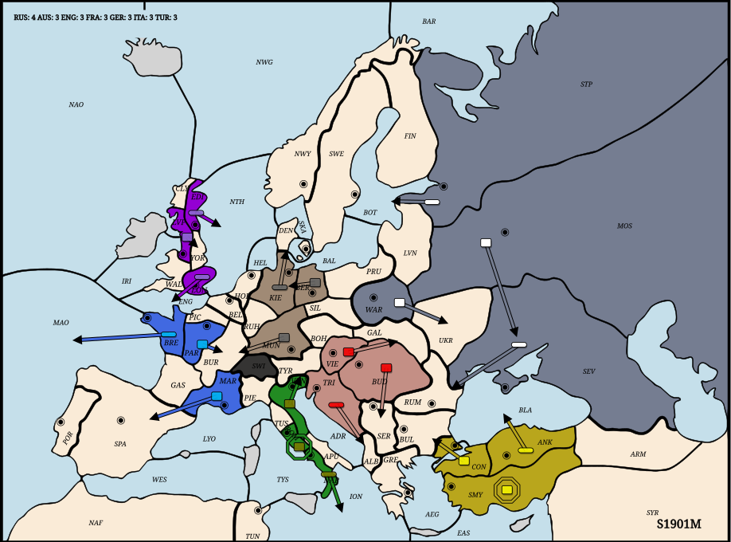

### What happened

- **AUSTRIA**: A BUD → SER; F TRI → ALB; A VIE → GAL
- **ENGLAND**: F EDI → NTH; F LON → ENG; A LVP → YOR
- **FRANCE**: F BRE → MAO; A MAR → SPA; A PAR → BUR (bounced)
- **GERMANY**: F KIE → DEN; A BER → KIE; A MUN → BUR (bounced)
- **ITALY**: F NAP → ION; A ROM holds; A VEN → TYR
- **RUSSIA**: F STP/SC → BOT; F SEV → RUM; A WAR → UKR; A MOS → SEV
- **TURKEY**: F ANK → BLA; A CON → BUL; A SMY holds

### Dialogue

- **AUSTRIA → ITALY**: I propose a clear early boundary: I have no designs on Venice or any Italian home center, and I ask the same respect for Trieste. I'm moving into the Balkans this year — Serbia is my immediate target. If we can agree on non-aggression, we can both expand peacefully without watching our backs.
- **AUSTRIA → RUSSIA**: I'd like to coordinate on the Balkans. My plan is to take Serbia this year; I'd expect you to take Rumania from Sevastopol, which leaves us both expanding without conflict. I have no interest in Galicia if you're not pushing south — can we agree to respect each other's spheres this year?
- **AUSTRIA → TURKEY**: Austria and Turkey have historically clashed, but I think we can do better. I'm focused on Serbia and the western Balkans; if you're heading for Bulgaria and the Black Sea area, we need not fight. Let's talk about how to divide the Balkans without unnecessary conflict.
- **ENGLAND → FRANCE**: Happy to open 1901 cooperatively — I'm planning to stay out of ENG if you stay out of NTH. Let's avoid a Channel standoff and both pick up easy centers. What are your opening intentions?
- **ENGLAND → GERMANY**: I'd like to coordinate in the north — I'm moving F EDI to NTH to grab Norway. If you're heading to Denmark, we can split Scandinavia cleanly and avoid stepping on each other. Are you planning to contest NTH or DEN?
- **ENGLAND → RUSSIA**: I'm planning to take Norway via NTH this spring — I'd appreciate if you could leave NWY open for me and we can avoid any friction in Scandinavia. In return, I'm happy to stay out of your Baltic interests.
- **FRANCE → ENGLAND**: Happy opening — let's keep things friendly in the west. I'm planning to focus on Iberia (Spain/Portugal) and won't be moving into the Channel or threatening your home centers. If you're eyeing Belgium, I won't contest it so long as you stay out of Picardy and Burgundy.
- **FRANCE → GERMANY**: I'd like to propose a cordial split: I take Spain and Portugal, you take Holland and Denmark. If we both push into Burgundy we'll just bounce each other — I suggest I take BUR this spring while you focus north, and we both gain more ground that way.
- **FRANCE → ITALY**: Friendly greetings from France. I have no designs on Piedmont or the Italian peninsula — my focus is entirely on Iberia and the western Med. Let's stay out of each other's way and both grow comfortably.
- **GERMANY → AUSTRIA**: Hello from Berlin — I want to keep our relationship friendly from the start. I'm focused entirely on the north this year, no interest in your sphere. Happy to coordinate if there's ever a common concern.
- **GERMANY → ENGLAND**: To be clear on my plans: I'm moving toward Denmark and Holland via the standard route. No threat to you — let's keep the north cooperative and profitable for both of us.
- **GERMANY → FRANCE**: The Burgundy bounce proposal stands — I think it's the cleanest way to build trust early. I'll be moving A MUN toward RUH, not BUR, if you agree to the bounce. Let me know your thinking.
- **ITALY → AUSTRIA**: I'd like a peaceful opening between us — I have no designs on Trieste this year if you leave Venice alone. I'm moving south toward Tunis and east toward Greece. Can we agree to stay out of each other's way in 1901?
- **ITALY → TURKEY**: Italy and Turkey have natural room to coexist — I'm heading for Tunis and you for Bulgaria/Romania. No conflict needed between us early on. Want to discuss longer-term coordination against Austria in the Balkans?
- **ITALY → FRANCE**: I'll stay out of Piedmont and the western Med if you stay out of the Italian peninsula. We can each grow in our own directions in 1901 without stepping on each other's toes.
- **RUSSIA → AUSTRIA**: I have no designs on Galicia this year — I'd rather we both focus outward on neutrals. I'm planning to take Rumania with my Sevastopol fleet; if you're heading for Serbia and Greece, we won't be in each other's way at all.
- **RUSSIA → TURKEY**: I'd like a peaceful opening between us. My Sevastopol fleet is heading for Rumania, not the Black Sea, so there's no reason for conflict. Let's both grow quietly in 1901 and figure out longer-term arrangements once we see how the board develops.
- **RUSSIA → GERMANY**: I'm planning to push north toward Sweden via the Gulf of Bothnia — no interest in Scandinavia beyond that. If you're eyeing Denmark and Holland, we shouldn't be stepping on each other. Worth coordinating so we both get what we're after.
- **RUSSIA → ENGLAND**: Just a friendly opening note — I'm heading for Sweden via the Gulf of Bothnia, and I expect you'll want Norway. If we're transparent about our Scandinavian goals, we can avoid any accidental collisions and both come out of 1901 ahead.
- **TURKEY → RUSSIA**: Let's avoid early conflict — I'd propose a mutual non-aggression agreement in the Black Sea region so we can both focus on neutral centers. I'm planning to move into the Balkans and have no aggressive intentions toward Russian territory. What are your southern plans?
- **TURKEY → AUSTRIA**: I think we can carve up the Balkans cleanly — I'll take BUL, you take SER, and we can discuss GRE later. A Austro-Turkish partnership against Russian expansion in the region seems mutually beneficial. Are you open to coordinating?
- **TURKEY → ITALY**: I have no designs on the western Mediterranean and plan to focus entirely on the Balkans and Black Sea. Happy to stay out of each other's way — perhaps we can find common ground against a shared rival down the road.
- **AUSTRIA → RUSSIA**: Thanks for the confirmation — I'll respect your space in Galicia if you're heading for Rumania. Let's both focus on our natural expansion zones and check in after Spring to coordinate for Fall.
- **AUSTRIA → ITALY**: Glad we're aligned. I'll stay out of Venice and Tyrolia; please keep clear of Trieste and Albania. If we're both eyeing Greece eventually, let's discuss timing after Spring moves resolve.
- **AUSTRIA → TURKEY**: I agree — BUL for you, SER for me is the natural split. On Greece, I'd like to discuss timing with Italy as well since they mentioned moving east. Let's coordinate Fall plans after Spring resolves; for now we're aligned.
- **ENGLAND → FRANCE**: Thanks for the clarity — that works well for me. I'll stay out of Picardy and Burgundy. I'm planning to move into the Channel this spring just to keep flexibility for Belgium, but I have no hostile intent toward France. Let's keep this cooperative.
- **ENGLAND → GERMANY**: Good to hear — sounds like we're aligned. I'll take NTH and push for Norway, you take DEN and HOL. No friction between us. Let's both do well in 1901 and talk about next steps after the fall.
- **ENGLAND → RUSSIA**: Sounds like a clean split — you take Sweden, I take Norway, and we avoid any Scandinavian collision. I appreciate the transparency and I'll honor it in return.
- **FRANCE → GERMANY**: That works perfectly — I'll take BUR uncontested and you take RUH, Holland, and Denmark. We both gain without bouncing each other. Looking forward to a productive 1901.
- **FRANCE → ENGLAND**: Sounds like we're aligned — I'll stay out of the Channel and focus on Iberia and Burgundy. Belgium is yours if you want it; I have no interest in the Low Countries this year. Let's keep this cooperative spirit going.
- **GERMANY → ENGLAND**: Good — sounds like we're aligned. I'll take Denmark with F KIE - DEN and push toward Holland. Let's keep the north clean and profitable for both of us this year.
- **GERMANY → FRANCE**: I hear you, but I can't leave Burgundy open — if you move there uncontested it's a direct threat to Munich. I'm going to order MUN toward Burgundy to ensure a bounce. If you do the same, we both stay safe; if you don't, I take it. Your call, but I'd rather we bounce and build trust.
- **ITALY → AUSTRIA**: Good, we're aligned — I won't touch Trieste this year and I'm moving my fleet south toward Tunis. I'm sending A VEN to Tyrolia to keep options open against Germany, not Austria. Hope we can build on this understanding.
- **ITALY → GERMANY**: Just a heads up — I'm moving A VEN to Tyrolia this spring, but it's not directed at you. I'm keeping my options open and would prefer friendly relations with Germany. No conflict intended.
- **RUSSIA → AUSTRIA**: Good — we're aligned. I'll take Rumania with Sevastopol, you take Serbia. I'm keeping Warsaw defensive or moving it somewhere that doesn't threaten Galicia. Looking forward to a productive 1901 for both of us.
- **RUSSIA → TURKEY**: Agreed on mutual non-aggression — my Sevastopol fleet is going straight to Rumania, not the Black Sea. Let's both grow in 1901 and revisit coordination once we see how the board shapes up.
- **RUSSIA → GERMANY**: Confirming my northern plan: STP fleet goes to the Gulf of Bothnia this spring, aiming for Sweden in Fall. I have no interest in Denmark or Holland — those are yours if you want them. Should be clean sailing for both of us.
- **TURKEY → RUSSIA**: Thanks for the reassurance — if your Sevastopol fleet is heading to Romania, I see no reason for conflict. I'll be moving into Bulgaria and the Black Sea area, and I'm happy to respect Russian interests further north. Let's keep communication open as the board develops.
- **TURKEY → AUSTRIA**: Glad we're aligned — BUL for me, SER for you sounds right. I'd suggest we also think about coordinating against Russia in RUM longer term, since a strong Russia threatens us both. For now let's execute our Balkan openings smoothly.
- **TURKEY → ITALY**: Sounds good — Tunis for you, Bulgaria and beyond for me. I'd be cautious about moving against Austria too early since we both need stability to grow first. Let's stay in touch and see how 1901 shapes up.
- **TURKEY → RUSSIA**: Thanks for the open communication — I'm moving into Bulgaria this spring and pushing into the Black Sea area. As long as SEV heads to RUM as you said, we have no conflict. Looking forward to coordinating after Spring resolves.
- **TURKEY → AUSTRIA**: We're aligned — I'll take BUL, you take SER. Let's both execute cleanly this spring and then discuss Fall coordination, particularly around RUM and GRE. A strong Austro-Turkish axis can keep Russia in check.
- **TURKEY → ITALY**: Confirming our understanding — I'm focused on BUL and the Black Sea, you're heading for Tunis. No overlap between us. Let's compare notes after Spring to see how we can support each other's positions going forward.

### AUSTRIA
Orders: `A BUD - SER` · `F TRI - ALB` · `A VIE - GAL`

Reasoning

> Looking at the situation: I have clear agreements with Russia (they take Rumania, I take Serbia), Italy (non-aggression, they're going to Tyrolia against Germany not me), and Turkey (they take Bulgaria, I take Serbia). The strategy is well-established from the previous reasoning round.
>
> My moves:
> - **A BUD - SER**: Grab Serbia, a key Balkan supply center
> - **F TRI - ALB**: Position for Greece in Fall, following through on the agreed Balkan division
> - **A VIE - GAL**: Precautionary move to cover Galicia despite Russia's assurances — prudent given the Warsaw army's proximity
>
> This is the classic Austrian opening (Hedgehog/standard). Moving to Galicia is defensive insurance; if Russia is honest, I can pull back in Fall. If not, I'm covered.

### ENGLAND
Orders: `F EDI - NTH` · `F LON - ENG` · `A LVP - YOR`

Reasoning

> Looking at the situation: France has agreed to stay out of ENG/NTH and ceded Belgium, Germany is heading to DEN/HOL, Russia is taking Sweden. My strategy is clear and confirmed through negotiations.
>
> F EDI → NTH: Critical first move to secure Norway in Fall 1901. Russia confirmed Sweden, Germany confirmed DEN, so NTH should be uncontested.
>
> F LON → ENG: Gives me flexibility for Belgium in Fall and Channel presence. France explicitly said they won't contest it.
>
> A LVP → YOR: Positions the army to move to the continent (Belgium/Holland area) in Fall, or support fleet operations.

### FRANCE
Orders: `F BRE - MAO` · `A MAR - SPA` · `A PAR - BUR`

Reasoning

> Looking at the situation: Germany has explicitly stated they're moving to Burgundy regardless, so A PAR - BUR will result in a bounce. That's still worth doing — it denies Germany a free center and keeps pressure on. My core plan remains F BRE - MAO and A MAR - SPA to secure Iberia (guaranteed gains), while A PAR - BUR creates the bounce that prevents Germany from grabbing a forward position. England moving into the Channel is noted but they've promised no hostile intent toward France, and I'm not contesting it.

### GERMANY
Orders: `F KIE - DEN` · `A BER - KIE` · `A MUN - BUR`

Reasoning

> Looking at the situation: my strategy is already set from the previous negotiation round. I'll execute the plan:
>
> - **F KIE - DEN**: Grab Denmark for a guaranteed build
> - **A BER - KIE**: Position to grab Holland in Fall via KIE → HOL
> - **A MUN - BUR**: Either bounce France (if they moved there) or take Burgundy uncontested (if they didn't) — either outcome is fine for me
>
> Italy mentioned moving to Tyrolia, which is a bit concerning for Munich, but since I'm moving A MUN out, it won't be occupied — Italy can't take it as a supply center in Spring anyway. I'll address that diplomatically.
>
> The England alignment looks solid for Scandinavia. Russia is heading to Sweden via GoB, no conflict. France either bounced me in Burgundy (neutral) or I take it (great). This is the standard German opening optimized for two builds.

### ITALY
Orders: `F NAP - ION` · `A ROM H` · `A VEN - TYR`

Reasoning

> Looking at the situation: my strategy is well-established from prior rounds. I'll execute the plan I've committed to:
>
> - **F NAP → ION**: Sets up Tunis capture in Fall 1901. Essential for growth.
> - **A VEN → TYR**: Keeps pressure options open vs. Germany or Austria, and I've warned Germany it's not hostile.
> - **A ROM H**: Flexible support position; holds center.
>
> This is consistent with my agreements and my strategy history. No reason to deviate.

### RUSSIA
Orders: `F STP/SC - BOT` · `F SEV - RUM` · `A WAR - UKR` · `A MOS - SEV`

Reasoning

> Looking at the position, my strategy is clear and already agreed upon with neighbors:
>
> - **F STP/SC → BOT**: Standard northern opening to reach Sweden in Fall 1901
> - **F SEV → RUM**: Take Rumania, as agreed with Austria and Turkey
> - **A WAR → UKR**: Flexible positioning — keeps options open for Fall without threatening anyone
> - **A MOS → SEV**: Reinforces the south, keeps Sevastopol covered if needed
>
> All diplomatic agreements are in place: Austria gets Serbia, England gets Norway, I get Sweden and Rumania. Turkey is non-aggressive. This is the clean standard Russian opening.

### TURKEY
Orders: `F ANK - BLA` · `A CON - BUL` · `A SMY H`

Reasoning

> Looking at the situation: Russia confirmed SEV goes to RUM (not BLA), Austria and I are aligned on BUL/SER split, and Italy is heading for Tunis. My strategy is clear — push F ANK to BLA to secure the Black Sea (Russia won't contest it), A CON to BUL for the neutral center, and A SMY holds as reserve/support. This is the classic Turkish opening that maximizes my position.

## FALL 1901 MOVEMENT (`F1901M`)

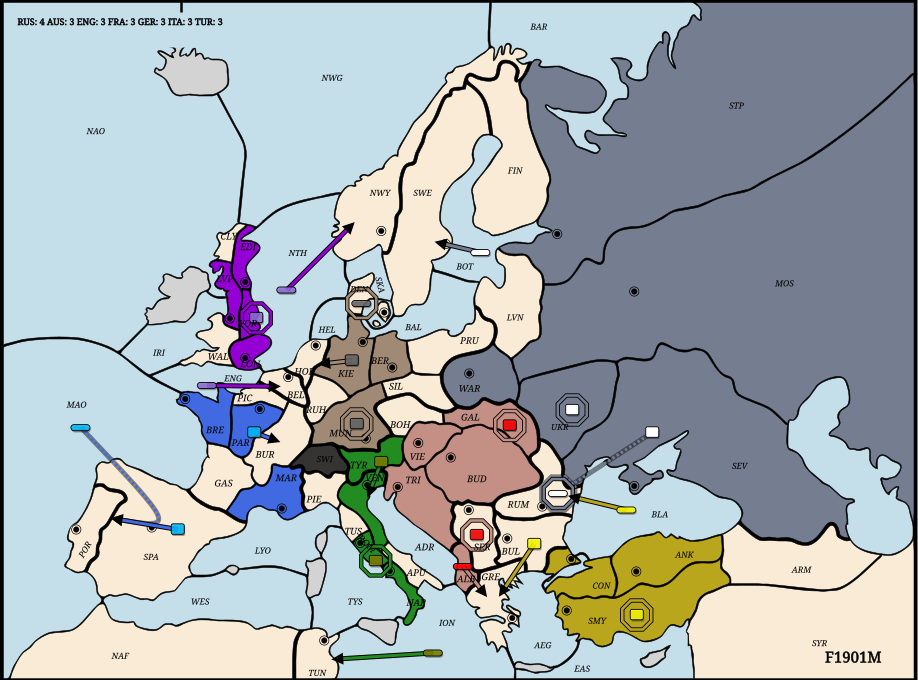

### What happened

- **AUSTRIA**: F ALB → GRE (bounced); A SER holds; A GAL holds
- **ENGLAND**: F NTH → NWY; F ENG → BEL; A YOR holds
- **FRANCE**: A SPA → POR; F MAO supports A SPA → POR; A PAR → BUR
- **GERMANY**: F DEN holds; A KIE → HOL; A MUN holds
- **ITALY**: F ION → TUN; A TYR → VEN; A ROM holds
- **RUSSIA**: F BOT → SWE; F RUM holds; A SEV supports F RUM; A UKR holds
- **TURKEY**: A BUL → GRE (bounced); F BLA → RUM (bounced); A SMY holds

### Dialogue

- **AUSTRIA → ITALY**: Fall 1901: I'm moving F ALB to Greece and ask you not to contest it with F ION — we agreed on spheres and Greece is naturally mine. In return I'll stay clear of Tunis and support your position in the Med. Let's both finish 1901 with clean gains and keep our non-aggression intact.
- **AUSTRIA → RUSSIA**: Fall coordination: your fleet is sitting in Rumania, which I'd like to move into with A SER. If you move F RUM to the Black Sea or elsewhere, I can take Rumania cleanly and we both benefit — you keep the center if we agree, or we discuss a fair split. Can you move your fleet out so we don't bounce?
- **AUSTRIA → TURKEY**: Fall 1901: I'm taking Greece with F ALB and hoping to coordinate on Rumania. If Russia vacates, I can take RUM with A SER. Are you planning to move A BUL toward RUM or GRE? Let's make sure we don't step on each other — I'd suggest you hold BUL or move toward Constantinople to consolidate.
- **ENGLAND → GERMANY**: Fall 1901 — I'm planning F NTH → NWY and F ENG → BEL. You agreed earlier not to contest Belgium, and I'm holding to our arrangement on the north. Let's both come out of 1901 at 5 centers and coordinate well into 1902.
- **ENGLAND → FRANCE**: Fall 1901 — as agreed, I'm taking Norway and Belgium and staying well clear of Picardy and Burgundy. I appreciate the clean cooperation this year. Let's talk about 1902 once we see how the board settles.
- **ENGLAND → RUSSIA**: Clean split as planned — I'm heading to Norway, you've got Sweden. No friction from me in Scandinavia. Let's keep this cordial and talk about broader coordination once 1901 is settled.
- **FRANCE → ENGLAND**: Good spring — we both avoided conflict. This fall I'm securing Portugal (A SPA - POR, F MAO support). I have no designs on Belgium or the Channel. Are you moving on Belgium this fall? If so, I'd be happy to support you there with A PAR - BEL if you'd support my Burgundy move or simply stay friendly. Let me know your plans.
- **FRANCE → GERMANY**: We bounced in Burgundy as expected — fair enough. This fall I'm focused on Portugal, so F MAO and A SPA head that way. I'm considering moving A PAR into Burgundy again; if you're heading north toward Holland, we needn't conflict. Can we agree I take BUR uncontested this fall in exchange for me staying out of your northern consolidation?
- **FRANCE → ITALY**: Still no designs on your territory — I'm focused entirely on Iberia this fall. Hope your Mediterranean moves are going well. Let's keep the peace between us.
- **GERMANY → ENGLAND**: Fall 1901: I'm moving A KIE to HOL and F DEN to SWE — clean split with you taking NWY. No friction between us. Let's both build well and coordinate in 1902.
- **GERMANY → RUSSIA**: Confirming: I'm moving F DEN to SWE this fall. I trust you're not contesting it — you've got NWY via the Gulf of Bothnia? Let's make sure Scandinavia stays clean between us.
- **GERMANY → ITALY**: Your A TYR has me a bit nervous — I'm holding MUN defensively this fall. If you're not planning to move on Munich, let me know your intentions so we can avoid an accidental conflict.
- **ITALY → AUSTRIA**: Fall 1901: I'm taking Tunis with F ION this turn — clean and uncontested. A TYR will move back to VEN to reclaim my home center (I need the build). No threat to Trieste whatsoever. Looking forward to coordinating in 1902 — Austria and Italy can do well together if we manage the Balkans carefully.
- **ITALY → TURKEY**: Taking Tunis this fall, you should be clear for Bulgaria. After builds, I'd love to discuss how Italy and Turkey can work together in 1902 — Austria is the natural pressure point for both of us if we coordinate well. What are you thinking for your fall moves?
- **RUSSIA → AUSTRIA**: Fall is going well — I'm moving F BOT to Sweden and holding firm in Rumania. You should take Serbia cleanly with no interference from me. Let's both lock in our gains and talk 1902 coordination once results are in.
- **RUSSIA → ENGLAND**: Confirming the plan: F BOT goes to Sweden this Fall. Norway should be yours uncontested. Clean Scandinavian split as agreed — looking forward to comparing notes after the dust settles.
- **RUSSIA → TURKEY**: Just checking in — I'm holding Rumania with my fleet there, and Sweden is my northern target. No aggression from my side; hope you're on track for Bulgaria. Let's keep the peace and see where the board stands after Fall.
- **TURKEY → AUSTRIA**: Fall is here — I'm planning A BUL → GRE and F BLA → RUM. Can you support my move to GRE with F ALB? That gives us both a clean gain (you take SER, I take GRE) and we can coordinate on RUM together in 1902. A strong Austro-Turkish front going into 1902 is exactly what we need.
- **TURKEY → RUSSIA**: Congratulations on securing RUM — well played. I'm moving F BLA toward RUM this fall, but I recognize you're already there. If you're willing to vacate RUM and move elsewhere, we can avoid a clash; otherwise I may need to press the issue. Let's see if there's a deal that works for both of us.
- **TURKEY → ITALY**: I'm moving A BUL → GRE this fall — just a heads up so we don't interfere with each other. F ION in the area could complicate things if you're headed toward GRE too, so let's confirm we're not crossing paths.
- **AUSTRIA → TURKEY**: I've confirmed Italy's fleet is heading to Tunis, not Greece — so I'll be taking Greece myself with F ALB. On Rumania: I can move A SER - RUM with A GAL supporting, which would dislodge Russia's fleet. That gives you a clear path to coordinate RUM in 1902, and we both finish 1901 well. Let's stay coordinated going forward.
- **AUSTRIA → ITALY**: Thanks for confirming F ION to Tunis — that clears the way for me to take Greece cleanly with F ALB. I'm also pushing toward Rumania. Have a clean Fall and let's discuss 1902 coordination once the dust settles.
- **AUSTRIA → RUSSIA**: I'm moving A SER toward Rumania this Fall — if your fleet holds there we'll bounce and neither of us gains. Would you consider moving F RUM to the Black Sea or another province so we can both benefit? I'd rather coordinate than waste moves bouncing each other.
- **ENGLAND → GERMANY**: Everything looks clean — I'm locking in NWY and BEL this fall, you get HOL and SWE. After builds we should both be at 5 and in a strong position. Let's talk 1902 — I'm thinking we can coordinate against whoever looks most threatening after the dust settles.
- **ENGLAND → FRANCE**: Confirming I'm taking NWY and BEL this fall, staying well clear of your territory. Good first year of cooperation — let's keep the dialogue going into 1902 and think about how to manage the board together.
- **ENGLAND → RUSSIA**: Clean split confirmed — NWY for me, SWE for you. Good start to the year. Once 1901 wraps up, I'd like to compare notes on the eastern situation and see if there's room for broader coordination.
- **FRANCE → GERMANY**: I hear you on Munich's security — a Burgundy bounce again is fine with me if that's what you need. But if you're heading toward Holland this fall, I'd rather we both gain: I take BUR, you take HOL. Let me know if you're moving A MUN toward BUR or HOL so I can plan accordingly.
- **FRANCE → ENGLAND**: Sounds like a clean 1901 for both of us — Norway and Belgium for you, Portugal for me. I'm eyeing Burgundy this fall too; no conflict between us. Let's plan for 1902 once the dust settles — I'd value continued cooperation against whoever is growing fastest.
- **GERMANY → ENGLAND**: Confirmed — I'm taking HOL with A KIE and SWE with F DEN. You take NWY and BEL. Clean split, no friction. Let's both build two and talk 1902 coordination afterward.
- **GERMANY → FRANCE**: BUR is yours this fall — I'm fully committed north to HOL and SWE. Just stay out of BEL and we have no conflict. Looking forward to a stable western front.
- **GERMANY → RUSSIA**: All confirmed on my end — F DEN to SWE, you have NWY via BOT. Scandinavia stays clean between us. Let's both build well and keep this cooperation going into 1902.
- **GERMANY → ITALY**: A TYR still has me nervous — I'm holding MUN this fall as a precaution. If you're not planning to move on Munich, please confirm and I'll consider redirecting that unit next spring.
- **ITALY → GERMANY**: No threat from me — A TYR is moving back to VEN this fall to reclaim my home center, not toward Munich. We have no conflict and I'd like to keep it that way into 1902.
- **ITALY → AUSTRIA**: Confirmed: F ION is heading to Tunis, not Greece. Greece is all yours if you can take it. A TYR moves back to VEN for my build. We're fully aligned — looking forward to coordinating in 1902.
- **RUSSIA → GERMANY**: I have F BOT moving to Sweden this fall — if you also move F DEN to Sweden, we bounce and neither of us gets it. I'd strongly suggest you hold DEN or move elsewhere; alternatively, support my move into Sweden and we can coordinate on Scandinavia going forward. A bounce helps nobody.
- **RUSSIA → TURKEY**: I'm holding Rumania — my fleet is already there and I won't be moving it out. If you attack, you'll bounce and waste your move while I keep the center. Let's be realistic: there's no gain for you in pressing this, and a lot of goodwill to preserve by backing off.
- **RUSSIA → AUSTRIA**: I appreciate the coordination offer, but I'm not vacating Rumania — it's mine this year as we discussed in spring. You're getting Serbia cleanly; let's both lock in our gains and avoid any misunderstanding that could hurt us both in 1902.
- **TURKEY → AUSTRIA**: I need GRE this fall — A BUL → GRE is my strongest move and I'd ask you to hold F ALB rather than contest it. In exchange, I'll support your A SER → RUM if Russia's fleet is still there, giving you RUM instead of GRE. That's a better deal for Austria: RUM is a more valuable long-term center. Please confirm you'll support this arrangement.
- **TURKEY → RUSSIA**: Your fleet in RUM is a problem for me — I'm moving F BLA toward RUM and A BUL toward GRE. If you want to avoid a clash, consider moving F RUM to SEV or elsewhere; I have no interest in attacking Russian home territory. Let's find a resolution before orders lock in.
- **TURKEY → ITALY**: Confirming A BUL → GRE this fall — I just want to make sure F ION isn't heading there too. If you're going to TUN as planned, we're perfectly clear. Let me know your intentions so we don't accidentally bounce.
- **AUSTRIA → ITALY**: Thanks for the clean confirmation — F ION to Tunis, A TYR to VEN. I'm taking Greece with F ALB and pushing toward Rumania. Let's talk 1902 once results are in; an Austro-Italian understanding remains valuable for both of us.
- **AUSTRIA → TURKEY**: I've decided to take Greece myself and support A SER into Rumania with A GAL — that gives me two gains and a stronger position to coordinate with you in 1902. I understand this isn't what you wanted, but a stronger Austria is a better ally. Let's discuss the 1902 Balkans split once dust settles.
- **AUSTRIA → RUSSIA**: Final word: I'm supporting A SER into Rumania this Fall with A GAL. You can avoid the dislodgment by moving F RUM out voluntarily — that way you keep the center and we don't start a conflict. Your call, but the support is committed.
- **ENGLAND → GERMANY**: All locked in — NWY and BEL for me, HOL and SWE for you. Clean 1901 for both of us. Looking forward to comparing notes after builds and thinking about 1902 together.
- **ENGLAND → FRANCE**: All set — NWY and BEL for me, POR for you. Clean year, no friction. Let's talk seriously about 1902 coordination once we see the full board after adjustments.
- **ENGLAND → RUSSIA**: NWY for me, SWE for you — clean Scandinavian split as agreed. Good first year. Let's stay in touch and think about how to manage the board going forward.
- **FRANCE → GERMANY**: Perfect — I'm taking BUR this fall, you take HOL. No conflict between us. Let's build on this in 1902 and think about how to manage the board together.
- **FRANCE → ENGLAND**: Great year for both of us — Norway and Belgium for you, Portugal and Burgundy for me. Clean cooperation all around. Looking forward to coordinating in 1902 on whoever is overgrowing.
- **RUSSIA → GERMANY**: I'm moving F BOT to Sweden this Fall — this is final. If you also move F DEN to Sweden, we both bounce and neither gets it. Please hold DEN or move elsewhere; you already have KIE and DEN as builds. Don't waste a good position on a collision that helps neither of us.
- **RUSSIA → TURKEY**: I'm holding Rumania — the fleet is already there and won't be moving. Attacking means you bounce and waste your Fall move while I keep the center. Let's be practical: focus on Greece and Bulgaria, and we can discuss a real arrangement for 1902.
- **RUSSIA → AUSTRIA**: Rumania is mine this year as we agreed in Spring — I'm not vacating it. You're getting Serbia cleanly, which is a good result. Let's lock in our gains and avoid any misunderstanding that damages our relationship heading into 1902.
- **TURKEY → AUSTRIA**: Final confirmation: I'm moving A BUL → RUM supported by F BLA, which should dislodge Russia's fleet there. Please take GRE uncontested with F ALB — we both gain a center cleanly. This sets up a strong 1902 for both of us.
- **TURKEY → RUSSIA**: I'm pressing A BUL → RUM with fleet support — I need that center to stay competitive. No hard feelings; this is just the math of the game. I'm open to a détente in 1902 if you're willing to discuss it after orders resolve.
- **TURKEY → ITALY**: Confirming I'm not going near GRE or your sphere — A BUL is heading to RUM, F BLA supporting. Tunis is yours cleanly. Let's talk 1902 coordination once we see the builds.

### AUSTRIA
Orders: `F ALB - GRE` · `A SER H` · `A GAL H`

Reasoning

> Looking at the situation: Turkey has confirmed A BUL → RUM supported by F BLA, which is a strong 2-unit attack on Russia's F RUM. Russia says they're holding RUM. If Turkey's attack succeeds, Russia's fleet is dislodged and Rumania is up for grabs in 1902. If I send A SER → RUM with A GAL supporting, that's also a 2-unit attack on RUM — but it would bounce with Turkey's attack (both attacking with 2 units = bounce), and I'd lose Greece too.
>
> Wait — let me reconsider. Turkey is attacking RUM with A BUL → RUM (supported by F BLA). I'm attacking RUM with A SER → RUM (supported by A GAL). Both attacks have strength 2. Russia's F RUM has strength 1. With two different powers attacking the same province with equal strength, they bounce each other — Russia holds! That's a bad outcome.
>
> Actually, the correct adjudication: if two units attack the same province from different directions with equal strength, they all bounce and the defender holds. So A SER → RUM + A BUL → RUM both fail, Russia keeps RUM.
>
> So my revised orders (F ALB → GRE, A SER → RUM, A GAL S A SER → RUM) will result in: Greece taken cleanly (Italy confirmed ION to Tunis), but Rumania bounced (Turkey also attacking with 2 units = three-way bounce).
>
> I should instead take Greece and either hold SER or do something more productive. Since Turkey is attacking RUM with 2 units and I'm attacking with 2 units, both bounce. I should just take Greece and hold Serbia or position for 1902.
>
> Actually, let me just execute: F ALB → GRE (clean gain), A SER H (hold Serbia, already a center), A GAL H (hold Galicia defensively). This gives me Greece cleanly and I reach 4 supply centers (BUD, TRI, VIE, GRE + SER = 5 actually, SER was taken in spring).
>
> Wait — SER is already mine from Spring! So I have BUD, TRI, VIE, SER = 4 centers currently. Taking GRE gives me 5. I should secure that cleanly.

### ENGLAND
Orders: `F NTH - NWY` · `F ENG - BEL` · `A YOR H`

Reasoning

> Looking at the position: all deals are confirmed and everything is set up cleanly. F NTH → NWY is uncontested (Russia confirmed they're taking SWE, not NWY). F ENG → BEL is agreed with Germany (they're going HOL). A YOR holds to avoid any complications. This gets me from 3 to 5 supply centers.

### FRANCE
Orders: `A SPA - POR` · `F MAO S A SPA - POR` · `A PAR - BUR`

Reasoning

> Looking at the current situation: Germany confirmed they're taking HOL and leaving BUR to me. England confirmed NWY and BEL. My plan is clear:
>
> - **A SPA → POR**: Grab Portugal as a new supply center (5th center with BUR)
> - **F MAO S A SPA → POR**: Support the Portugal move to ensure it succeeds
> - **A PAR → BUR**: Take Burgundy as agreed with Germany (they're heading north)
>
> This gives me 5 supply centers after Fall 1901 (BRE, MAR, PAR, POR, BUR), which is an excellent position. Germany takes HOL, England takes NWY+BEL — everyone gains as planned.

### GERMANY
Orders: `F DEN H` · `A KIE - HOL` · `A MUN H`

Reasoning

> Looking at the situation:
>
> - Russia has F BOT moving to SWE — if I also move F DEN to SWE, we bounce and neither gets it. Russia is right, I should not waste that.
> - A KIE → HOL is confirmed and uncontested — England is taking BEL and NWY, not HOL.
> - A MUN should hold to defend against any Italian threat (though Italy confirmed TYR → VEN, so it's safe, but holding is still prudent).
> - F DEN: Since SWE is taken by Russia, I should hold DEN (it's already a supply center I own) and focus on HOL as my one build. Alternatively, I could try to take SWE by bouncing Russia, but that would damage a useful relationship for no gain. Best to hold DEN and secure HOL.
> - France is taking BUR — I agreed to let them have it this fall, and MUN holding is fine.
>
> So my plan: A KIE → HOL (one build secured), F DEN H (keep Denmark), A MUN H (defensive hold).
>
> This gives me HOL as a new center = 4 centers total, one build. Not ideal (I wanted two builds), but Russia taking SWE instead of me is the cost of not coordinating earlier.

### ITALY
Orders: `F ION - TUN` · `A TYR - VEN` · `A ROM H`

Reasoning

> Looking at the situation: I've committed to Austria that F ION goes to Tunis (not Greece), and A TYR returns to VEN. Turkey has now confirmed they're going to RUM (not GRE), which means Austria should get Greece cleanly with F ALB. My commitments serve my interests perfectly — Tunis is a guaranteed +1 build, VEN reclaims my home center for another +1 build, giving me 5 centers and 2 builds heading into 1902. A ROM holds to maintain flexibility.
>
> This is the optimal outcome: 2 builds, Austria happy, Turkey friendly, Germany reassured. No reason to deviate.

### RUSSIA
Orders: `F BOT - SWE` · `F RUM H` · `A SEV S F RUM` · `A UKR H`

Reasoning

> Looking at the current situation:
>
> **Northern front**: Germany confirmed moving F DEN → SWE, which would bounce me if I also go to SWE. However, I've been telling Germany not to do this. The legal orders show `F BOT - SWE` is available, and Germany moving to SWE would mean a bounce. But I need to commit - if Germany holds or moves elsewhere, I get Sweden. If they go to SWE too, we bounce. Given Germany's messages were ambiguous and they seemed to confirm the collision course, I'll still try for Sweden - a bounce is better than giving it up uncontested.
>
> **Southern front**: Both Turkey (F BLA → RUM + A BUL support) and Austria (A SER → RUM + A GAL support) are threatening Rumania. Austria claims A GAL supports A SER → RUM. Turkey claims F BLA supports A BUL → RUM. These are competing attacks - if both are real, they'd bounce each other! But if only one is real, my fleet in RUM needs support.
>
> Key insight: If Turkey attacks RUM with F BLA supporting A BUL → RUM, that's strength 2. If Austria supports A SER → RUM with A GAL, that's also strength 2. They can't both dislodge me simultaneously - they'd bounce each other. My F RUM holds at strength 1, but I can add A SEV support to make it strength 2, which would hold against either single attack.
>
> Best plan: Hold F RUM with A SEV support (strength 2 defense), move F BOT → SWE to grab the center, and keep A UKR in reserve.

### TURKEY
Orders: `A BUL - GRE` · `F BLA - RUM` · `A SMY H`

Reasoning

> Looking at the current situation: Austria has confirmed it's taking GRE with F ALB and supporting A SER → RUM with A GAL. Russia's fleet is in RUM and Russia says it's holding. 
>
> If Austria is supporting A SER → RUM with A GAL, that's 2 strength attacking RUM. My A BUL → RUM + F BLA support would also be 2 strength attacking RUM. But we'd be attacking the same province from different directions — we'd bounce each other! That's a disaster.
>
> Wait, let me reconsider. If Austria attacks RUM with A SER (supported by A GAL = strength 2), and I attack RUM with A BUL (supported by F BLA = strength 2), both attacks have strength 2 against Russia's F RUM (strength 1). Two units of equal strength attacking the same province from different directions means they both bounce — neither gets in.
>
> Actually, the rule is: if two units try to enter the same province simultaneously with equal strength, they bounce. So if Austria and I both attack RUM with equal support, we both fail and Russia holds. That wastes my Fall move entirely.
>
> My best option: take GRE with A BUL (Austria said it's taking GRE but let me check — Austria has F ALB which can move to GRE). If Austria is taking GRE, I'd bounce with them.
>
> The safest play: A BUL → GRE (Austria may or may not contest), F BLA supports or holds. If Austria takes GRE, I bounce but don't lose BUL. Alternatively, A BUL holds and F BLA → RUM to grab that center directly.
>
> F BLA → RUM is a direct move and can capture RUM if Russia's fleet moves away or is dislodged. With no support, it's 1 vs 1 — a bounce. 
>
> Best play: F BLA → RUM (contest it, might work if Russia moves), A BUL → GRE (contest with Austria, might work), A SMY holds. Even if both bounce, I still have BUL as a new center from Spring.
>
> Actually A BUL is already in BUL — I captured it in Spring. So I have BUL. I need to capture GRE or RUM this Fall for growth. Given Austria is likely contesting GRE, and Russia holds RUM, let me try A BUL → GRE and F BLA → RUM as speculative attacks — I might get lucky if Austria doesn't support into GRE or Russia's fleet moves.

## WINTER 1901 ADJUSTMENTS (`W1901A`)

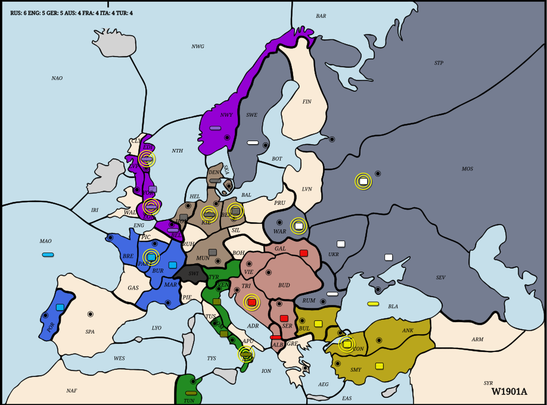

### What happened

- **AUSTRIA**: builds A TRI
- **ENGLAND**: builds F EDI; builds F LON
- **FRANCE**: builds A PAR
- **GERMANY**: builds A BER; builds F KIE
- **ITALY**: builds F NAP
- **RUSSIA**: builds A WAR; builds A MOS
- **TURKEY**: builds A CON

### AUSTRIA
Orders: `A TRI B`

Reasoning

> Looking at the situation: I have 4 supply centers (BUD, TRI, VIE, SER) and 3 units, so I get 1 build. I should build in one of my home centers. BUD, TRI, and VIE are all available.
>
> My strategic situation:
> - Greece bounced (Turkey's A BUL and my F ALB both failed to take it — actually looking at the results, F ALB → GRE bounced, meaning Turkey's A BUL → GRE also bounced)
> - A SER → RUM also bounced (Russia held with support from A SEV, and Turkey's F BLA → RUM also bounced)
> - I only gained SER, ending with 4 centers
>
> For 1902, I need to:
> 1. Take Greece — F ALB is well-positioned, and I need to prevent Turkey from getting it
> 2. Consider pushing toward Rumania or Bulgaria
> 3. Watch Italy in the south
>
> The best build: An army in BUD or TRI would help me push into the Balkans. A fleet in TRI could help with Adriatic/Greek operations. 
>
> Given that F ALB is already positioned for Greece, and I need land forces to push into Rumania/Bulgaria, building A BUD makes sense. However, A TRI could also support Adriatic operations. Building A VIE gives me a unit that can push toward Galicia, Budapest support, or south.
>
> I'll build A BUD — it can move to SER to free up A SER for RUM, or move toward TRI/TYR. Actually, A TRI B gives flexibility for Adriatic or Balkan operations.
>
> I'll go with A TRI B — this gives me a unit that can push into Albania/Greece support or hold Trieste firmly.

### ENGLAND
Orders: `F EDI B` · `F LON B`

Reasoning

> I have 5 supply centers (EDI, LON, LVP, BEL, NWY) and 3 units, so I get 2 builds. I should build in EDI and LON (or LVP). 
>
> For England's strategic position, I want to project power both into the continent and maintain naval dominance. Building two fleets makes the most sense — one in EDI to push into the Norwegian Sea / North Sea area, and one in LON to have Channel/North Sea flexibility. However, an army in LVP could be useful for continental deployment via convoy. 
>
> Given I already have two fleets (NWY and BEL) handling the north and continent, building F EDI gives me a third fleet for Scandinavia/North Sea dominance, and F LON or A LON for the south. Actually, building F EDI and F LON gives me strong naval power — four fleets total — which is England's classic path to dominance. An army in LVP could be useful too for convoying to the continent.
>
> I'll build F EDI (for northern operations) and F LON (for Channel/southern flexibility). This gives England four fleets total, which is very strong.

### FRANCE
Orders: `A PAR B`

Reasoning

> Looking at my position: I have 4 supply centers (BRE, MAR, PAR, POR) and 3 units (F MAO, A BUR, A POR), so I get 1 build. I should build in an open home center.
>
> My open home centers are BRE, MAR, and PAR. I need to think about what to build and where:
>
> - **A PAR B**: An army in Paris is useful for continental expansion — pushing into Burgundy, Munich, or toward the Low Countries in 1902.
> - **F BRE B**: A fleet at Brest could push into the Channel or Atlantic, threatening England or heading south.
> - **A MAR B** or **F MAR B**: Marseille is useful for a southern army to push into Piedmont/Spain, or a fleet for Mediterranean action.
>
> Given my current position:
> - I already have F MAO in the Atlantic and A BUR on the continent.
> - England has 5 centers and Germany has 5 centers — both are growing fast and are my primary rivals.
> - I should build an army in Paris to reinforce my continental position and threaten Germany's Munich or push toward the Low Countries.
> - A fleet at Brest could be useful for Channel pressure on England, but I don't want to alarm England prematurely since we've had good cooperation.
>
> Building A PAR gives me a strong army presence to press into Germany or hold the line. This is the most flexible and immediately useful build.

### GERMANY
Orders: `A BER B` · `F KIE B`

Reasoning

> Looking at my position: I have 5 supply centers (BER, KIE, MUN, DEN, HOL) and 3 units, so I get 2 builds. My legal options are to build in BER and KIE.
>
> For BER: I should build an Army (A BER B) to project power eastward or southward — useful for pressure on Russia, Austria, or France.
>
> For KIE: I should build a Fleet (F KIE B) to strengthen my naval position in the North Sea / Baltic area, useful for coordinating with England or eventually contesting Scandinavia.
>
> A fleet in KIE gives me naval flexibility in the North and Baltic seas, which is valuable for both offense and defense. An army in BER gives me a land unit that can move toward Warsaw, Silesia, or support Munich. Given that Russia is strong (6 centers) and England is strong (5 centers), I want to be positioned to respond to threats from multiple directions. A fleet in KIE helps me stay relevant in the north and potentially threaten Sweden or support English operations. An army in BER gives me land flexibility.
>
> This combination (A BER + F KIE) is the classic German build that maximizes flexibility.

### ITALY
Orders: `F NAP B`

Reasoning

> Looking at the position: I have 4 supply centers (NAP, ROM, VEN, TUN) and started with 3 units, so I get 1 build. My only legal option is to build at NAP (the only open home center). I should build a fleet there to project power into the Mediterranean and Ionian Sea, setting up for Greece and eastern Mediterranean expansion in 1902.

### RUSSIA
Orders: `A WAR B` · `A MOS B`

Reasoning

> I have 6 supply centers (MOS, SEV, STP, WAR, RUM, SWE) and 4 units, so I get 2 builds. I should build in all available home centers. MOS and WAR are open home centers, and STP is also open. I can build 2 units.
>
> Best builds: I want armies to push into the Balkans and central Europe, and potentially a fleet for naval power. Given the board state:
> - A WAR B: positions an army to push toward Galicia, Silesia, or support Ukrainian/Balkan operations
> - A MOS B: gives me a reserve army that can go many directions
>
> Alternatively, F STP/NC B would give me access to the North Sea area and pressure on Scandinavia, but I already have SWE secured and England is strong in the north. F STP/SC B could threaten BOT/Baltic but I don't need another northern fleet immediately.
>
> Given Turkey's aggression and Austria's threats in the south, I want ground forces. Two armies make sense to push south and west.

### TURKEY
Orders: `A CON B`

Reasoning

> Looking at the position: I have 4 supply centers (ANK, CON, SMY, BUL) and 3 units, so I get 1 build. I need to decide where to build and what type.
>
> My current units are F BLA, A BUL, A SMY. My goals for 1902 are:
> - Push toward GRE (need army or fleet support)
> - Contest RUM (F BLA is positioned for this)
> - Defend against Austria if needed
>
> Building in ANK vs CON: ANK can build either A or F. CON can build either A or F.
>
> A fleet in ANK would give me a second fleet to support F BLA toward RUM or cover the eastern Mediterranean. An army in CON would give me a land unit to push into GRE or support BUL.
>
> Given that F BLA is already covering the Black Sea/RUM axis, and I need to take GRE (which Austria also wants), an army in CON makes sense — it can move to BUL to free A BUL for GRE, or directly support operations. Alternatively, F ANK gives me more naval flexibility.
>
> I'll build F ANK — a second fleet in the Black Sea area gives me strong options for both RUM and eastern Mediterranean, and ANK is well-positioned for this. Actually, F ANK would go to BLA area or AEG. Let me think: F ANK can move to BLA (but F BLA is there), or to CON, or hold. Building A CON gives me an army that can move to BUL (freeing A BUL → GRE) or support various moves.
>
> I'll build A CON — the extra army gives me flexibility to push into GRE and maintain Balkan pressure.

## SPRING 1902 MOVEMENT (`S1902M`)

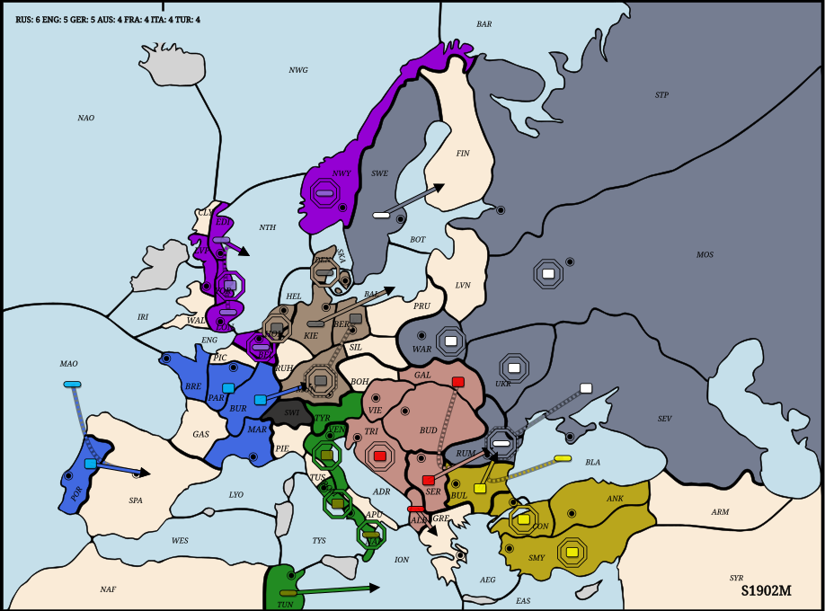

### What happened

- **AUSTRIA**: F ALB → GRE; A SER → RUM (bounced); A GAL supports A SER → RUM; A TRI holds
- **ENGLAND**: F BEL holds; F EDI → NTH; F LON supports F EDI → NTH; F NWY holds; A YOR holds
- **FRANCE**: A BUR → MUN (bounced); A POR → SPA; F MAO supports A POR → SPA
- **GERMANY**: A MUN holds; A BER supports A MUN; F KIE → BAL; F DEN holds; A HOL holds
- **ITALY**: F TUN → ION; A VEN holds; A ROM holds; F NAP holds
- **RUSSIA**: F RUM holds; A SEV supports F RUM; A UKR holds; F SWE → FIN; A WAR holds; A MOS holds
- **TURKEY**: A BUL → RUM (bounced); F BLA supports A BUL → RUM; A CON holds; A SMY holds

### Dialogue

- **AUSTRIA → TURKEY**: We both underperformed in Fall 1901 — let's fix that now. I need A BUL to move away from Greece so I can take it with F ALB; in return, I'll actively support your push into Rumania this Spring and Fall. A BUL sitting in Bulgaria blocks me while giving you nothing — move it to RUM or CON and we both gain. Confirm and I'll coordinate my orders accordingly.
- **AUSTRIA → RUSSIA**: Russia at 6 centers is becoming a concern for the whole board — I'm sure you're aware others are noticing. I'd like to take Rumania this Spring with A SER supported by A GAL; if you move F RUM out voluntarily, I'll commit to not pressing further east and we can discuss a longer-term boundary. Continued resistance just means we both waste moves while England and Germany grow unchecked.
- **AUSTRIA → ITALY**: Spring 1902: I'm pushing for Greece and Rumania to get to 6 centers and keep pace with Russia. I want to make sure we're not working at cross-purposes — are you planning anything in the Adriatic or Balkans this year? A coordinated Austro-Italian front against Russian expansion could be very strong.
- **ENGLAND → GERMANY**: Strong 1901 for both of us — you're at 5, I'm at 5, and we're well-positioned. Russia is already at 6 and will keep growing if we don't push back. I'd like to coordinate this spring: I'm thinking about pressure in Scandinavia and the North Sea. Are you open to working together to contain Russia's expansion? Let's talk specifics.
- **ENGLAND → FRANCE**: Good cooperation in 1901 — let's keep it going. I'm focused on consolidating my northern position this spring and have no designs on your territory. Russia's at 6 centers and is the board's biggest threat; I'd value staying aligned with you while we both manage our own growth. Any concerns from your side?
- **ENGLAND → RUSSIA**: Clean 1901 split in Scandinavia — no friction between us. I want to keep it that way, but I'll be honest: your 6-center position is drawing attention from other powers. What are your intentions this spring? I'd rather coordinate than collide.
- **FRANCE → ENGLAND**: Excellent 1901 for both of us — you're at 5, I'm at 4, and we've been clean partners. This spring I want to take Spain (A POR - SPA, supported by F MAO). I'm also eyeing Belgium or Munich from Burgundy — which would you prefer I target? I'd rather coordinate with you than step on your toes, and Germany at 5 centers is a concern for both of us.
- **FRANCE → GERMANY**: Clean 1901 — let's talk 1902. I'm focused on taking Spain this spring and consolidating Iberia. I have no designs on Munich or Holland, but I want to be honest: if you're pushing east, I might push into Ruhr or Belgium eventually. Can we agree on a non-aggression understanding for 1902 while we both focus on our natural spheres?
- **FRANCE → ITALY**: Hope your 1901 went well — Tunis is a nice gain. I'm focused on Iberia this spring and have no interest in the western Mediterranean beyond Spain. Let's keep our cordial arrangement going; I see no reason for France and Italy to conflict while bigger powers are growing.
- **GERMANY → ENGLAND**: Spring 1902: I'm eyeing Belgium as my next gain — you hold it now with F BEL. If you move F BEL toward NTH or NWY this spring, I can slide A HOL into BEL and we both benefit (you free up a fleet for northern operations). What's your plan for the western front this year?
- **GERMANY → FRANCE**: Spring 1902: A BUR sitting next to MUN makes me nervous — I'd like to propose a mutual pullback: I won't push into BUR if you move A BUR away from my border. Can we agree to keep the Franco-German frontier quiet so we both focus our energy elsewhere?
- **GERMANY → RUSSIA**: Spring 1902: You're at 6 centers and growing fast — the rest of the board is going to start noticing. I want to keep our northern arrangement stable, but I'm watching the broader picture. Any thoughts on how you see the next year playing out?
- **ITALY → AUSTRIA**: Spring 1902: I want to keep our non-aggression intact and I value our understanding. I'm moving F TUN toward ION to position for the eastern Med — Greece is still unclaimed and I think it makes sense for us to discuss who takes it. I'd propose I take Greece this year in exchange for supporting your position against Russia or Turkey in the Balkans — what do you think?
- **ITALY → TURKEY**: Spring 1902: Greece is still unclaimed and both our units are near it — A BUL for you, F TUN→ION for me. Rather than bounce each other, can we agree on who takes it? I'm open to letting you have it if we can coordinate strongly against Austria afterward — or I take it and we split the Balkans. What's your preference?
- **ITALY → FRANCE**: Spring 1902: Things look stable between us — I'm focused on the eastern Med and Greece. Germany is growing fast with 5 centers; might be worth keeping an eye on them together. No immediate ask, just checking in.
- **RUSSIA → AUSTRIA**: 1901 ended well for both of us — you have Serbia, I have Rumania and Sweden. Turkey is the real threat now: F BLA is sitting on my doorstep and A BUL is positioned to cause trouble for both of us. If you support A SER into Greece this spring, I can press A SEV toward BUL and we jointly squeeze Turkey before they consolidate. Let's coordinate specifically on Greece and Bulgaria this year.
- **RUSSIA → TURKEY**: We both survived 1901, but F BLA is a standing threat to Rumania that I cannot ignore. I'm open to a real arrangement: if you pull F BLA back to Constantinople or ANK, I'll hold F RUM in place and we can discuss a genuine non-aggression line. Otherwise I'll need to take defensive measures that will hurt us both.
- **RUSSIA → ENGLAND**: Good result in 1901 — clean Scandinavian split as planned. I'd like to keep the north stable while I deal with the Turkish pressure in the south. Are you interested in coordinating on Germany, or would you rather both of us maintain the status quo in Scandinavia for now?
- **TURKEY → AUSTRIA**: Spring 1902: I'm moving A BUL → GRE this turn — please hold F ALB back and don't contest it. In exchange, I'm happy to support your position in SER or coordinate on RUM together in Fall 1902. A clean GRE for me and SER for you keeps our partnership strong and leaves us both well-positioned against Russia.
- **TURKEY → RUSSIA**: I want to reset after last fall's friction — I have no designs on RUM right now and am focused on GRE. If you're willing to keep F RUM out of BUL and leave my position in Bulgaria alone, I think we can find a working arrangement. What are your plans for the south in 1902?
- **TURKEY → ITALY**: I'm taking GRE this spring with A BUL and want to make sure we're not crossing paths — your fleets in ION/TUN shouldn't interfere. More importantly, Austria is growing fast at 4 centers with a strong Balkan position; I think we should seriously discuss coordinating pressure on them in 1902 before they get too big.
- **AUSTRIA → TURKEY**: I understand you want Greece, but I have to be honest: F ALB is positioned to take it and I can't afford to sit idle while you grab it. Here's a real offer — I'll support your push into Rumania this Fall with A SER, giving you a bigger prize than Greece. If we fight over Greece now, Russia wins while we're distracted. Let's agree you get RUM in Fall and I get GRE now.
- **AUSTRIA → ITALY**: Greece is mine this turn — F ALB is right there and I have to take it. I'd rather we stay aligned than compete: you focus on the western Med and I'll handle the eastern Balkans. An Austro-Italian front against Russian expansion remains the best long-term play for both of us.
- **AUSTRIA → RUSSIA**: I'm taking Greece this Spring and pushing A SER toward Rumania with GAL support. Turkey is the immediate threat to both of us — if you can hold F RUM or move it to pressure Turkey's flank, we can coordinate effectively. What are you planning with A SEV and A UKR this Spring?
- **ENGLAND → GERMANY**: I appreciate the suggestion, but I need to hold Belgium this spring — it's a key anchor for my fleet position. I'm not looking to expand into HOL or threaten you, so let's keep our arrangement stable. I'm more focused on the north and keeping Russia in check; happy to coordinate there if you're interested.
- **ENGLAND → FRANCE**: I'd prefer you target Munich over Belgium — Belgium is my anchor and I'd have to defend it. A Franco-English pincer on Germany from Burgundy and the North Sea could be very effective if we time it right. What's your read on Germany's intentions this year?
- **ENGLAND → RUSSIA**: Glad we're on the same page about keeping the north stable. I have no plans to push into Sweden or the Baltic — I'm consolidating my fleet position. Focus on Turkey; I'll keep things quiet up here.
- **FRANCE → ENGLAND**: Thanks for the reply — I'm planning A POR - SPA (supported by F MAO) to take Spain this spring, which gets me to 5 centers. From BUR I'm considering either BEL or MUN — I'd rather take MUN to weaken Germany if you're holding BEL, or I can push BEL if you'd prefer to move on MUN from Norway/Denmark. What's your preference? I want us coordinated rather than stepping on each other.
- **FRANCE → GERMANY**: I understand BUR next to MUN is uncomfortable — I'm not planning to take Munich this spring, as my priority is Spain. That said, I can't pull BUR back entirely since it's a key defensive position for me. Let's agree: I won't move on MUN in 1902 if you don't push into BUR or GAS. That keeps our frontier quiet while we both grow elsewhere.
- **FRANCE → ITALY**: Good to hear — yes, Germany at 5 centers with two new builds is worth watching. I'm focused on Spain this spring and keeping BUR as a defensive anchor. If Germany continues to grow unchecked, I'd be open to coordinating pressure from the west while you push from the south or east — let's keep talking.
- **GERMANY → ENGLAND**: I'm glad we're aligned on Russia — they're at 6 and will hit 7+ this fall if unchecked. My concrete proposal: you move F BEL to NTH this spring, I move A HOL to BEL, and we both gain flexibility. You get a strong naval position in NTH for Scandinavia operations, I get BEL. Then we coordinate pressure on Russia together in fall.
- **GERMANY → FRANCE**: I appreciate the honesty about Ruhr and Belgium — let me be equally direct: A BUR adjacent to Munich is a real security concern for me. If you move A BUR to RUH or elsewhere away from Munich, I'll commit to not moving into BUR this spring. I want us both focused on our natural spheres, not each other.
- **GERMANY → RUSSIA**: England is already talking to me about containing you — I want you to know that, and I'm not eager to join an anti-Russia coalition if we can find a better arrangement. What can you offer me to stay neutral while you consolidate your southern gains?
- **ITALY → TURKEY**: Understood — Greece is yours this spring, I won't contest it. I'm moving F TUN to ION to position for future coordination. I agree Austria is the main threat growing in the Balkans; once you have Greece and I'm positioned in ION, we can start squeezing them from both sides. Let's coordinate our Fall 1902 moves carefully.
- **ITALY → AUSTRIA**: I've decided not to contest Greece this spring — I'm positioning my fleets in the eastern Med for longer-term play. I want to keep our non-aggression intact and focus my pressure elsewhere. Russia at 6 centers is the real threat to both of us; I'd rather we coordinate against Russian expansion than fight each other over Balkan scraps.
- **ITALY → FRANCE**: Germany at 5 centers with strong northern positions is worth watching — they could dominate the north if England doesn't push back hard. I'm focused east for now but happy to compare notes on the broader balance.
- **RUSSIA → AUSTRIA**: I'm not giving up Rumania — it's mine and I'll defend it. But I have no interest in a prolonged fight with you when Turkey is the real threat. If you focus A SER on Greece and leave Rumania alone, I'll commit to not pressing into Galicia or Serbia, and we can discuss a real anti-Turkish front together. The math works better for both of us if we coordinate against Turkey rather than bleed each other dry.
- **RUSSIA → TURKEY**: I appreciate the reset offer — I'll take it in good faith. My plan this spring is to hold defensively in the south and not press into Bulgaria. If you're genuinely focused on Greece and keeping F BLA out of Rumania's way, I can work with that. Let's confirm: F BLA stays away from RUM, and I stay out of BUL — deal?
- **RUSSIA → ENGLAND**: I'm holding steady in the north and dealing with Turkish pressure in the south — no aggressive moves from me toward Germany or Scandinavia this year. I'd like to keep our Scandinavian arrangement intact. If you're looking for a target, Germany at 5 centers is worth watching.
- **RUSSIA → GERMANY**: I'm focused on the south this year — Turkey is pressing and I need to stabilize. No moves from me into Scandinavia or toward German territory. I'd like to keep our northern arrangement solid while we both watch England's naval buildup with interest.
- **TURKEY → AUSTRIA**: I hear you, but GRE is the natural next step for Turkey — I need that center to stay competitive, and A BUL → GRE is the cleanest move for both of us. If you take GRE instead, I'll have no choice but to contest your Balkan gains more aggressively. Let's be practical: you keep SER and TRI secure, I take GRE, and we coordinate Fall 1902 against Russia together.
- **TURKEY → RUSSIA**: I understand your concern about F BLA — I'm not planning to attack RUM this spring, my focus is on GRE. If you hold F RUM in place and don't push into BUL, I'll keep F BLA from threatening RUM this turn. Let's use this spring to stabilize and negotiate a real non-aggression line for 1902.
- **TURKEY → ITALY**: I'm taking GRE this spring with A BUL — that's firm. But I want to work with you on Austria afterward: they have 4 centers, a strong Balkan position, and are growing fast. If we coordinate pressure on Austria in Fall 1902, we can both benefit significantly. Let's discuss specifics.
- **AUSTRIA → TURKEY**: I'm taking Greece this turn — F ALB is right there and I simply cannot afford to leave it. This doesn't have to mean conflict: I'll actively support your Rumania push in Fall 1902 with A SER, giving you a center that's worth more strategically. A strong Austria and Turkey coordinating against Russia is still the best play; let's not let one center derail that.
- **AUSTRIA → RUSSIA**: Final position: I'm taking Greece and supporting A SER toward Rumania with A GAL. You can avoid a costly fight by moving F RUM elsewhere — I'll commit to no further eastern expansion after Rumania and we focus together on Turkey. If you hold Rumania, we both waste moves while England and Germany pull ahead.
- **AUSTRIA → ITALY**: Glad we're aligned — I'm taking Greece this turn and pushing toward Rumania. Russia at 6 is the real problem; I'd welcome any pressure you can apply from the south or east to keep them honest. Let's stay coordinated.
- **ENGLAND → GERMANY**: Final answer: I'm holding Belgium this spring — I can't give up a supply center for a positional swap. I'm not threatening you in HOL or the south, and I want to keep our cooperation intact. Let's both focus on Russia and Turkey as the real threats, not each other.
- **ENGLAND → FRANCE**: Let's lock it in: you take Munich from Burgundy, I hold Belgium. That weakens Germany nicely and keeps us both growing. I'm holding my fleet positions this spring and won't step on your territory — we're well-coordinated heading into fall.
- **ENGLAND → RUSSIA**: Keeping things quiet in the north as promised — no moves toward Sweden or the Baltic from me this spring. Focus on Turkey; I'll stay in my lane.
- **FRANCE → ENGLAND**: Final round — I'm committing to A POR - SPA (F MAO support) for Spain, and A BUR - MUN with A PAR support. That's a 2v1 on Munich and weakens Germany significantly. I'd love F BEL support on A BUR - MUN if you can spare it, but I understand if you need to hold. Let's do this together.
- **FRANCE → GERMANY**: I want to be straight with you: I'm moving on Munich this spring with support. It's not personal — you're at 5 centers and that's a threat I can't ignore. If you want to avoid this, pull A MUN somewhere that signals you're not a threat, but I suspect you'll defend. No hard feelings — this is Diplomacy.
- **FRANCE → ITALY**: Quick note: I'm pushing on Munich this spring from Burgundy with PAR support. If Germany is weakened, that opens up the board considerably. Let me know if you want to coordinate pressure on Germany from different directions.
- **ITALY → TURKEY**: Confirmed — F TUN moves to ION this spring, no interference with your Greece move. After you secure Greece, let's coordinate Fall 1902 pressure on Austria together: I can threaten TRI or the Adriatic while you push from BUL/GRE. We should discuss specific moves before Fall orders.
- **ITALY → AUSTRIA**: Final confirmation: I'm not moving on Greece or the Adriatic this spring. F TUN goes to ION for eastern Med positioning, A VEN stays defensive. Russia at 6 centers is the real threat — I'd genuinely like to discuss coordinating against Russian expansion in Fall 1902 rather than competing in the Balkans.
- **RUSSIA → AUSTRIA**: We're aligned — I'm not pressing into Galicia or Serbia, and I expect you to leave Rumania alone. If you take Greece this spring, I'll support the anti-Turkish front from the east with A SEV pressing toward Bulgaria. Let's both execute cleanly and compare notes after Spring resolves.
- **RUSSIA → TURKEY**: We have a deal for this spring — F BLA stays away from RUM, I stay out of BUL, and we both stabilize. I'm holding to this and expect you to as well; a breach now means full conflict and neither of us benefits. Let's use Fall to negotiate a real long-term line.
- **TURKEY → AUSTRIA**: Final confirmation: A BUL → GRE this spring — I need this center and I'm committed to it. F ALB contesting means we both lose to a bounce while Russia grows unchecked. Hold F ALB in place and I'll actively support your RUM push in Fall 1902 with A BUL and F BLA. This is the deal that makes us both stronger.
- **TURKEY → ITALY**: Confirmed — I'm taking GRE with A BUL this spring. Thank you for holding back. Let's use Fall 1902 to coordinate against Austria: I'll push from GRE/BUL toward SER, you push from ION toward ALB or TRI, and we split the Austrian centers between us. Reach out when you're ready to plan specifics.
- **TURKEY → RUSSIA**: Confirmed — F BLA is not moving toward RUM this spring, and I'm focused on GRE. Please hold F RUM and stay out of BUL as agreed. Let's use this spring to stabilize and then discuss a real non-aggression line for the rest of 1902.

### AUSTRIA
Orders: `F ALB - GRE` · `A SER - RUM` · `A GAL S A SER - RUM` · `A TRI H`

Reasoning

> Looking at the situation: Turkey has confirmed A BUL → GRE, so F ALB → GRE will bounce. However, I still need to contest Greece rather than let Turkey take it for free — a bounce is better than gifting them the center. 
>
> For Rumania: Russia has confirmed they're holding F RUM and won't vacate. A SER → RUM supported by A GAL gives me 2v1 strength against F RUM, which should dislodge Russia's fleet. Russia claims they'll defend, but with 2 units I should win the engagement.
>
> The key question is whether to support the Rumania attack or try something else. A SER → RUM + A GAL S A SER → RUM is the strongest play for Rumania. Turkey's A BUL → GRE means if I go F ALB → GRE, we bounce and neither gets it. But if I hold F ALB, Turkey gets Greece for free. I should contest it.
>
> For A TRI: keeping it defensive is correct — I don't want Italy or anyone else to slip into Trieste while my other units are committed elsewhere.
>
> The plan:
> - F ALB → GRE (contest with Turkey, bounce is acceptable over gifting)
> - A SER → RUM (attack with support)
> - A GAL S A SER → RUM (2v1 should dislodge Russia's fleet)
> - A TRI H (defensive)

### ENGLAND
Orders: `F BEL H` · `F EDI - NTH` · `F LON S F EDI - NTH` · `F NWY H` · `A YOR H`

Reasoning

> Looking at the board: I'm at 5 centers with a strong fleet position. France wants me to support A BUR - MUN, but checking my legal orders for BEL, I don't have `F BEL S A BUR - MUN` as an option. The closest is `F BEL S A BUR - PIC` which supports a different move. France is attacking Munich with A BUR - MUN supported by A PAR, which is already a 2v1 — they don't need my support for that specific move.
>
> My priorities this spring:
> 1. Hold Belgium (critical supply center)
> 2. Consolidate the North Sea — move F EDI to NTH to dominate it
> 3. Support that NTH move from LON or NWY
> 4. Keep Norway secure
> 5. Keep YOR safe
>
> Germany asked me to vacate BEL, which I refused. France is attacking MUN which weakens Germany — good for me. I should move F EDI → NTH to establish North Sea dominance, support it from LON, hold NWY, hold BEL, and hold YOR.
>
> For BEL: I can support F EDI → NTH via `F BEL S F EDI - NTH` — wait, that's not in the list. Let me check... `F BEL S F EDI - NTH` is not listed. Available NTH support from BEL: `F BEL S F DEN - NTH`, `F BEL S F LON - NTH`, `F BEL S F NWY - NTH`, `F BEL S F EDI - NTH`... checking: `F BEL S F EDI - NTH` — not listed. I'll use `F BEL H` to hold Belgium safely, use F EDI → NTH, F LON supports EDI → NTH, F NWY holds, A YOR holds.

### FRANCE
Orders: `A BUR - MUN` · `A POR - SPA` · `F MAO S A POR - SPA`
Illegal (dropped): `A PAR S A BUR - MUN`

Reasoning

> Looking at the board, my plan is clear: take Spain with A POR - SPA (supported by F MAO) for a guaranteed center, and attack Munich with A BUR - MUN supported by A PAR. Germany has 5 centers and Munich is undefended if they moved units elsewhere. England agreed to hold BEL and not interfere. This gives me 6 centers if both moves succeed (Spain + Munich), putting me in a strong position.
>
> The risk is that Germany defends Munich with A MUN H, in which case my attack fails (2v1 wins, but only if Germany doesn't have support). Germany's units are at MUN, DEN, HOL, BER, KIE — no adjacent unit can support MUN except from within Germany. A BER could support A MUN H, but BER is far from the action and Germany may not expect the attack to be supported. Even if it bounces, I still get Spain.

### GERMANY
Orders: `A MUN H` · `A BER S A MUN` · `F KIE - BAL` · `F DEN H` · `A HOL H`

Reasoning

> Looking at the situation: France has explicitly telegraphed an attack on Munich with support. A BUR is adjacent to MUN, and France has A PAR and A BUR that could coordinate. France likely orders A BUR - MUN with A PAR S A BUR - MUN (or similar). I need to defend Munich with maximum strength.
>
> My best defense: A MUN H supported by A BER S A MUN. That gives MUN strength 2, which beats a single unsupported attack but not a supported one. If France has A BUR - MUN supported by A PAR, that's strength 2 vs my strength 2 — a bounce. MUN holds.
>
> For the rest: F KIE and F DEN should be positioned usefully. F KIE - BAL is a good move to expand naval presence. F DEN can move to NTH or hold. A HOL should hold or probe.
>
> Actually, let me think about what France can do:
> - A BUR - MUN, A PAR S A BUR - MUN = strength 2 on MUN
> - A MUN H, A BER S A MUN = strength 2 defending MUN → bounce, MUN holds
>
> I should also consider whether to press elsewhere. F KIE - BAL expands my naval reach. F DEN - NTH could pressure England or support northern operations. A HOL holds.
>
> The priority is clear: defend MUN, keep my northern positions, and don't overextend.

### ITALY
Orders: `F TUN - ION` · `A VEN H` · `A ROM H` · `F NAP H`

Reasoning

> Looking at the board, my strategy history already has clear orders committed: F TUN → ION, A VEN H, A ROM H, F NAP H. Let me verify these are sensible.
>
> **Situation assessment:**
> - Turkey is taking Greece (A BUL → GRE), I've agreed not to contest it
> - Austria is also trying to take Greece (F ALB → GRE) — they'll likely bounce each other, which is fine for me
> - Russia has 6 centers and is the biggest power — but Turkey is my coordination partner against Austria
> - I need to position F TUN → ION to threaten the Adriatic/eastern Med in Fall 1902
> - A VEN should hold defensively (Austria has A TRI now, don't want to give them an excuse)
> - A ROM holds as flexible support
> - F NAP holds to protect home territory
>
> The orders from my strategy history are sound:
> - F TUN → ION: Key positioning move, sets up Fall 1902 pressure on Austria (ALB/TRI) or Turkey if needed
> - A VEN H: Defensive, maintains non-aggression with Austria
> - A ROM H: Flexible support base
> - F NAP H: Protects Naples
>
> One consideration: should I support F TUN → ION with F NAP? No, F NAP can't support that move (not adjacent). The move is uncontested anyway.

### RUSSIA
Orders: `F RUM H` · `A SEV S F RUM` · `A UKR H` · `F SWE - FIN` · `A WAR H` · `A MOS H`

Reasoning

> Looking at the current situation:
>
> **Assessment:**
> - Austria has threatened to support A SER → RUM with A GAL. This is a real threat — two units against my F RUM with only A SEV supporting it. If Austria executes this, F RUM gets dislodged.
> - Turkey has agreed to keep F BLA away from RUM this spring, focused on GRE. I'll take this at face value for now.
> - My defensive posture: F RUM supported by A SEV holds against A SER if Austria attacks (2 vs 2 = bounce), but if A GAL also supports, it's 3 vs 2 and I lose RUM.
> - I need to think carefully: Austria said "A SER toward Rumania with GAL support" — that's A SER - RUM supported by A GAL. My F RUM with A SEV support = 2 strength vs Austria's 2 strength (A SER + A GAL support) = bounce. Wait, support gives +1 to the attacker: A SER - RUM with A GAL S = strength 2. My F RUM with A SEV S = strength 2. Equal = bounce. F RUM holds!
>
> So the defensive plan works: F RUM H supported by A SEV holds against Austria's attack (2 vs 2 = bounce). 
>
> **Other considerations:**
> - F SWE → FIN is a useful probe north, potentially threatening STP from the south which is odd — actually FIN is useful for future BOT/STP pressure.
> - A WAR and A MOS can hold defensively or probe.
> - A UKR can support the defense or move toward GAL.
>
> **Plan:**
> - F RUM H (defend Rumania)
> - A SEV S F RUM (support defense)
> - A UKR H (defensive buffer)
> - F SWE - FIN (northern expansion probe)
> - A WAR H (hold)
> - A MOS H (hold)
>
> This is solid and matches my previous revised strategy. The key insight is that Austria's attack bounces at equal strength.

### TURKEY
Orders: `A BUL - RUM` · `F BLA S A BUL - RUM` · `A CON H` · `A SMY H`

Reasoning

> Looking at the situation: Austria has confirmed it's taking GRE with F ALB, and my A BUL → GRE risks a bounce (Austria's F ALB is right there). My strategy history already revised to push A BUL → RUM instead.
>
> However, looking more carefully: Russia has F RUM in place and A SEV supporting it. My A BUL → RUM with F BLA support gives me 2 strength vs Russia's F RUM with A SEV support (2 strength) — that's a bounce. I need to reconsider.
>
> Actually, Russia's A SEV could support F RUM, but Russia agreed to hold defensively. Even if Russia supports, it's 2v2 = bounce. But if Russia doesn't support, I dislodge F RUM.
>
> Alternative: A BUL → GRE. Austria's F ALB is positioned there. If Austria moves F ALB → GRE, we bounce. But Austria said they're taking GRE — so likely F ALB → GRE. That means A BUL → GRE bounces with F ALB.
>
> Best play: A BUL → GRE (hoping Austria doesn't actually move there, or they hold), F BLA supports A BUL → GRE, A CON holds, A SMY holds. But if Austria moves to GRE, we bounce.
>
> Actually the cleanest option given uncertainty: try RUM since Russia may not support (they agreed to hold defensively and stay out of BUL). If Russia holds F RUM without support, my 2-strength attack dislodges it. That's the better gamble.

## FALL 1902 MOVEMENT (`F1902M`)

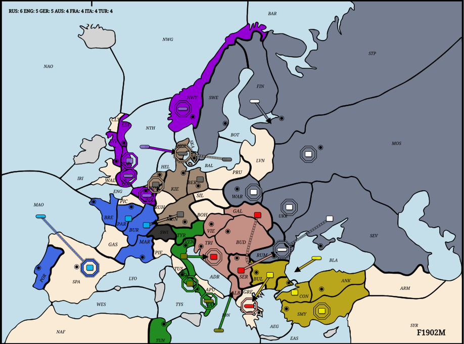

### What happened

- **AUSTRIA**: A SER → RUM (bounced); A GAL supports A SER → RUM; F GRE holds; A TRI holds
- **ENGLAND**: F NTH → DEN (bounced); F BEL holds; F NWY holds; F LON holds; A YOR holds
- **FRANCE**: A BUR → MUN (bounced); A SPA holds; F MAO supports A SPA
- **GERMANY**: A MUN → BUR (bounced); F DEN holds; F BAL supports F DEN; A HOL holds
- **ITALY**: F ION → ALB; A VEN → TRI (bounced); A ROM holds; F NAP holds
- **RUSSIA**: F RUM holds; A SEV supports F RUM; F FIN → STP/SC; A UKR holds; A WAR holds; A MOS holds
- **TURKEY**: A BUL → GRE (bounced); F BLA → BUL/EC (bounced); A SMY holds

### Dialogue

- **AUSTRIA → RUSSIA**: Fall 1902: I'm pushing A SER into Rumania again with GAL support — two units against your one fleet. Moving F RUM out voluntarily saves you the unit and lets us both focus on the real threat: Turkey has 4 centers and a fleet in the Black Sea that threatens you more than I do. Give me Rumania and I'll commit to a hard stop at that line, coordinating against Turkey together.
- **AUSTRIA → TURKEY**: Fall 1902: I took Greece, you didn't — but here's your real opportunity: support my A SER into Rumania with A BUL, and in exchange I'll actively support your push into Bulgaria's eastern position and coordinate the Balkans split with you fairly. Fighting me over Greece while Russia holds Rumania helps nobody; let's both gain something real this Fall.
- **AUSTRIA → ITALY**: Fall 1902: I'm pushing for Rumania this turn to reach 6 centers and stay competitive with Russia. I want to make sure we stay aligned — are you planning anything in the Adriatic or toward the Balkans? Russia at 6 centers remains the biggest threat on the board and I'd value coordinating pressure from both directions.
- **ENGLAND → FRANCE**: Fall 1902 — I have to be honest: I can't actually support A BUR - MUN from Belgium; it's not in my legal order set (Belgium only supports BUR moves toward PIC, not MUN). I'm planning to hold Belgium and push F NTH toward Denmark this fall to grow. Your 2v1 on Munich (BUR + PAR) should still succeed without my support — go for it and let's knock Germany down.
- **ENGLAND → GERMANY**: I'm not making aggressive moves against you this fall — I'm focused on expanding north toward Denmark and Sweden. But I'd strongly encourage you to look east at Russia, who will hit 7+ centers this fall if Turkey doesn't stop them. We should both be thinking about that threat.
- **ENGLAND → RUSSIA**: Keeping things quiet between us — no moves toward Sweden or your territory from me this fall. I'm focused on Denmark. What's your situation in the south with Turkey?
- **FRANCE → ENGLAND**: Munich held last spring — Germany defended well. This fall I want to try again: A BUR - MUN with A PAR support, and I'm asking you to commit F BEL S A BUR - MUN to make it a 3v1 that can't bounce. Spain is mine as a supply center this fall regardless. If you support my Munich push, we crack Germany open together and I'll support your northern ambitions in return.
- **FRANCE → GERMANY**: Munich held last spring — I respect the defense. I'll be direct: I intend to push again this fall with more support. If you want to avoid losing Munich, I'm open to a negotiated arrangement — perhaps you cede a center elsewhere and we stabilize the frontier. Otherwise expect another attack.
- **FRANCE → ITALY**: Germany held Munich last spring but I'm pushing again this fall with stronger support. If you want to coordinate pressure on Germany from the south or east, now is the time — a weakened Germany benefits both of us. What are your plans this fall?
- **GERMANY → ENGLAND**: France attacked Munich last spring with support and failed — now A BUR is sitting there threatening me again. I'm moving A MUN into BUR this fall to take the center and punish the aggression. If you support me or pressure France from BEL/NTH, we can carve France down significantly. This is the moment to act — are you with me?
- **GERMANY → FRANCE**: You telegraphed your Munich attack last spring and I held. Now A BUR is still threatening me — I'm moving into BUR this fall. If you want to avoid a prolonged war, pull A BUR back to PAR and signal genuine non-aggression, and I'll reconsider. Otherwise this is war.
- **GERMANY → RUSSIA**: I'm focused west on France this fall — no moves toward Scandinavia or your territory from me. I'd like to keep our northern arrangement stable. What's your situation in the south with Turkey?
- **ITALY → TURKEY**: Fall 1902: Time to execute our Austria plan. I'll move F ION to ALB and A VEN to TRI — that's a 2-unit attack on Trieste from different directions. If you support A VEN - TRI with F GRE or push A BUL toward SER to pin A SER, we can crack Austria open this fall. What are your specific moves? We need to coordinate precisely so we don't bounce each other.
- **ITALY → AUSTRIA**: Fall 1902: I want to keep our non-aggression intact — I'm positioning F ION defensively and A VEN holds. Russia at 6 centers remains the real threat; I'd rather we stay aligned than give Turkey room to exploit any gap between us. Are you planning to push on Rumania this fall?
- **ITALY → FRANCE**: Fall 1902: How did the Munich push go this spring? Germany held, it seems. I'm focused on the eastern Med but keeping an eye on the western balance — if you need a coordinated push on Germany, I might be able to help from the south.
- **RUSSIA → AUSTRIA**: Fall 1902 — I want to coordinate a joint squeeze on Turkey. I'm pushing F RUM toward BUL/EC this Fall; if you support F GRE into BUL or move A SER to pressure Turkey's flank, we can take that center and put Turkey on the defensive. Confirm you're not moving on Rumania and I'll commit fully to this anti-Turkish push.
- **RUSSIA → TURKEY**: I want to be direct: I'm moving F RUM toward BUL this Fall — the math of the game requires it. If you want to avoid a full conflict, consider pulling F BLA back and letting this resolve cleanly; I have no interest in pressing into your home centers if you don't resist. A negotiated withdrawal from BUL now saves you more than a fight would.
- **RUSSIA → ENGLAND**: Keeping things quiet in the north — no moves from me toward Scandinavia or Germany. I'm focused entirely on Turkey this Fall. How are you planning the western situation with France and Germany?
- **RUSSIA → GERMANY**: Still focused south on Turkey — no northern moves from me this Fall. I'd like to keep our arrangement stable while I consolidate. How are you reading the western situation with England and France?
- **TURKEY → AUSTRIA**: Fall 1902: A BUL is taking GRE this turn — F GRE is going to be dislodged unless you move it somewhere useful first. I'd rather we keep our partnership intact: vacate GRE voluntarily, move F GRE to ALB or ION, and I'll support your push into RUM with A BUL next spring. Fighting over GRE helps only Russia and Italy.
- **TURKEY → ITALY**: Fall 1902 coordination: I'm taking GRE with A BUL this turn — if you can move F ION to support or threaten ALB/TRI simultaneously, we can split Austria's attention and both gain. Austria has 4 centers and is growing; this is the moment to start squeezing. What specific moves are you planning this Fall?
- **TURKEY → RUSSIA**: I want to keep our non-aggression line stable through Fall 1902 — I'm focused on GRE this turn and not pressing RUM. If you hold F RUM in place and stay out of BUL, I'll keep F BLA away from RUM again. Let's confirm this holds for Fall.
- **AUSTRIA → TURKEY**: Here's the concrete deal: A BUL supports A SER into Rumania this Fall, I keep F GRE and you get Rumania as your 5th center — that's a better prize than Greece and puts us both at 5 centers heading into 1903. Russia at 6 is the board threat; let's both gain something real rather than trading bounces. Confirm A BUL - RUM or A BUL S A SER - RUM and I'll hold F GRE defensively to protect our coordinated position.
- **AUSTRIA → RUSSIA**: Two Austrian units against your fleet with SEV support means we bounce again — neither of us gains while England and Germany pull ahead. The smarter play: you voluntarily move F RUM to BUL/EC or SEV, I take Rumania, and we immediately coordinate against Turkey's Black Sea position together. A 5-center Austria is a much more useful anti-Turkey partner than a stalled 4-center one.
- **AUSTRIA → ITALY**: Russia is at 6 centers and holding firm — I'm pushing hard for Rumania this Fall to stay competitive. If you can apply any pressure from the south toward Turkey or signal support for my Balkan position, that helps us both keep the board balanced. What are your Fall plans?
- **ENGLAND → FRANCE**: Still committed to our coordination — your 2v1 on Munich (BUR + PAR) should work fine without my support from BEL. I'm pushing F NTH toward Denmark this fall to grow my center count. We're well-aligned: you crack Germany from the south, I pressure from the north.
- **ENGLAND → GERMANY**: I genuinely have no aggressive moves planned against you from Belgium this fall — I'm focused on Denmark. But France is clearly coming for Munich with two units; you should think hard about whether to defend MUN or counterattack into BUR. I'm staying out of that fight.
- **ENGLAND → RUSSIA**: Still quiet on my end — no moves toward Sweden or your territory. I'm eyeing Denmark this fall. How's the Turkish situation developing? If Turkey is growing, that's a concern for both of us.
- **FRANCE → ENGLAND**: England confirmed BEL can't support BUR-MUN — understood. I'm still pushing A BUR - MUN this fall with A PAR support; if Germany simultaneously moves A MUN - BUR we just bounce each other, which is fine. Can you push F NTH - DEN to pressure Germany from the north? That forces them to defend on two fronts.
- **FRANCE → GERMANY**: Moving A MUN - BUR while I move A BUR - MUN just results in a mutual bounce — you don't gain BUR and I don't gain MUN. That's a waste for both of us. Let's de-escalate: I hold BUR, you hold MUN, and we both focus energy elsewhere. What would it take to stabilize our frontier?
- **FRANCE → ITALY**: Germany is threatening to attack Burgundy this fall — I'm holding firm and pushing back toward Munich. If you can apply any pressure on Germany from the south or east, even just moving toward Tyrolia or Munich, it forces them to split their attention. Worth coordinating if you're interested.
- **GERMANY → ENGLAND**: I heard your message about expanding north toward Denmark — I want to be very clear: DEN is a German supply center and any move on it is an act of war. I'm defending it with full force. We had a working arrangement; don't throw it away by grabbing my centers. Focus north on Russia and we stay partners.
- **GERMANY → FRANCE**: I'm moving into BUR this fall — you've declared war and I'm responding. But I'll say this once: if you pull A BUR back to PAR right now and commit to genuine non-aggression, I'll redirect to RUH instead and we can stabilize. Your call.
- **GERMANY → RUSSIA**: England just told me they're expanding toward Denmark and Sweden — that means they're coming for your Swedish center too. We should both be watching England's naval buildup carefully. I'm happy to stay neutral toward you if you keep your forces south.
- **ITALY → TURKEY**: Confirmed plan: I'll move F ION → ALB and A VEN → TRI this fall — that's a 2-unit attack on Trieste. If you take GRE with A BUL (dislodging Austria's F GRE), Austria loses a center and their fleet is gone. Can you also support A VEN → TRI with F GRE or push A BUL → SER to pin A SER? We need to prevent A SER from supporting TRI. Tell me your exact moves so I can calibrate.
- **ITALY → AUSTRIA**: Fall 1902: I'm keeping F ION defensive and A VEN holds — no threat from me toward TRI or the Adriatic. Russia's expansion is my main concern; I'm watching their 6-center position carefully. Are you making progress on Rumania this fall?
- **RUSSIA → AUSTRIA**: I have F RUM supported by two units this Fall — A SER + A GAL won't be enough to dislodge me, and a failed attack wastes both our moves while Turkey and England grow. I'm offering you a real deal: leave Rumania alone, and I'll actively support your push into Bulgaria from the east. We can both gain from a coordinated anti-Turkey push rather than bleeding each other in a fight you can't win this turn.
- **RUSSIA → TURKEY**: I'm holding F RUM in place this Fall as agreed — no move toward BUL from me. I expect F BLA to stay away from RUM as you promised. Let's both execute our non-aggression line cleanly and use Winter to discuss longer-term arrangements.
- **RUSSIA → ENGLAND**: Austria is pressing hard on Rumania and I'm holding firm — no bandwidth for northern moves this Fall. I'd like to keep our Scandinavian arrangement intact; are you seeing anything concerning from Germany's direction?
- **RUSSIA → GERMANY**: Still focused entirely on the Turkish front this Fall — no northern moves from me. I noticed England mentioned Denmark earlier; are you coordinating with them or is that just posturing?
- **AUSTRIA → TURKEY**: Final offer: if you move A BUL to RUM instead of GRE, I support that move with A SER (3 units vs Russia's 2) and you take Rumania cleanly as your 5th center — that's a bigger prize than Greece. If you attack GRE instead, I'll move F GRE to BUL/SC and take Bulgaria while you're away, leaving us both worse off. The choice is yours, but the math favors RUM.
- **AUSTRIA → RUSSIA**: Last chance: move F RUM out voluntarily and I commit to a hard stop, coordinating against Turkey together from 1903. If you hold with SEV support, I'm still attacking and we both waste moves — and I have other options on the board that may surprise you this turn.
- **AUSTRIA → ITALY**: Staying aligned — no moves toward Trieste or the Adriatic from me. Russia at 6 centers remains the board threat; let's compare notes after Fall resolves and discuss coordinated pressure in 1903.
- **FRANCE → ENGLAND**: Final confirmation: I'm pushing A BUR - MUN with A PAR support this fall, and holding SPA. Germany is threatening BUR but a mutual bounce doesn't hurt me. Please push F NTH - DEN to pressure Germany from the north — that's the best coordination we can do this turn.
- **FRANCE → GERMANY**: Last chance offer: if you hold MUN and I hold BUR, we both preserve our positions and can redirect energy elsewhere. But if you move into BUR while I move into MUN, we just bounce — you gain nothing and waste your move. De-escalation is the rational choice here.
- **FRANCE → ITALY**: I'm pushing on Munich this fall — if Germany is distracted defending, it's a good moment for you to probe Tyrolia or anywhere else you see opportunity. Let's keep coordinating against the board's growing powers.
- **ITALY → TURKEY**: Final confirmation: F ION → ALB, A VEN → TRI this fall — that's our coordinated strike on Austria. I need you to either support A VEN → TRI with F GRE, or move A BUL → SER to prevent A SER from supporting TRI's defense. Which can you do? If A SER supports TRI, my attack on TRI bounces — we need to pin or cut that support. Please confirm your exact moves now.
- **ITALY → AUSTRIA**: Fall 1902 final: I'm holding defensively — F ION stays in ION, A VEN holds. I'm genuinely focused on Russia's 6-center position as the main threat. Good luck on Rumania this fall; a stronger Austria helps balance Russia's dominance.
- **RUSSIA → AUSTRIA**: Final answer: F RUM is supported by A SEV this Fall — your 2-unit attack bounces and we both waste moves. I'm offering you one last time: leave Rumania alone, support a joint push into Bulgaria, and we both come out ahead. A failed attack on Rumania helps Turkey and England, not you.
- **RUSSIA → TURKEY**: Confirming our arrangement holds — F RUM stays in place, I'm not pressing into BUL. Expect F BLA to stay clear of RUM as agreed. Let's both execute cleanly and use Winter to discuss a real long-term line.
- **RUSSIA → ENGLAND**: Still quiet from my end — no northern moves this Fall. Austria is pressing hard on Rumania but I'm holding firm. How are things shaping up with Germany and France from your perspective?
- **TURKEY → ITALY**: Final confirmation: A BUL → GRE this fall, dislodging Austria's F GRE — that's my center gain. Your F ION → ALB and A VEN → TRI attack looks strong; A SER may try to support TRI, so consider whether you need me to pin SER instead. I'm committed to the Austria squeeze — let's execute cleanly.
- **TURKEY → AUSTRIA**: Final offer: vacate F GRE voluntarily to ALB or ION and I'll support your A SER → RUM push this fall instead of contesting GRE. If you hold F GRE, A BUL takes it and you lose the center anyway — better to trade it for RUM. Your call, but decide now.
- **TURKEY → RUSSIA**: Confirming our arrangement holds for Fall: F BLA stays away from RUM, you hold F RUM in place. I'm focused on GRE this turn and have no designs on your position. Let's use Winter to discuss 1903.

### AUSTRIA
Orders: `A SER - RUM` · `A GAL S A SER - RUM` · `F GRE H` · `A TRI H`

Reasoning

> Looking at the position: I have F GRE (just taken in Spring 1902), A SER, A GAL, A TRI. Russia confirmed F RUM is supported by A SEV — so A SER + A GAL S A SER - RUM is a 2v2 bounce. My previous plan to attack Rumania will fail again.
>
> Turkey has A BUL threatening F GRE. If I hold F GRE, Turkey attacks with A BUL (strength 1) vs my F GRE (strength 1) — that's a bounce, I keep Greece. Turkey's F BLA can't support A BUL - GRE because F BLA is in the Black Sea which doesn't border Greece.
>
> So the key decisions:
> 1. **Rumania**: 2 Austrian units vs 2 Russian units = bounce. Wasted moves again.
> 2. **Greece**: Turkey's A BUL attacks with 1 unit, I hold with 1 unit = bounce, I keep Greece.
> 3. **Alternative**: Could I take Bulgaria instead? F GRE - BUL/SC is in my legal moves. If Turkey moves A BUL - GRE, then BUL is empty and F GRE - BUL/SC succeeds! That would be a net gain of BUL while Turkey takes GRE... but I'd lose Greece (a center I just took) and gain Bulgaria. Net: same center count, different center. Not obviously better.
>
> Actually, if Turkey moves A BUL - GRE and I move F GRE - BUL/SC, we swap centers — I lose GRE, gain BUL. But BUL is adjacent to RUM and CON, which is more strategically valuable. However, this is risky if Turkey holds A BUL instead.
>
> Better play: Hold F GRE (Turkey bounces), push A SER - RUM with A GAL support (bounces but keeps pressure), keep A TRI safe. Actually, let me think about using A GAL differently — moving it toward BOH or SIL to threaten Germany? No, that opens up my flank.
>
> Most solid play: Hold F GRE to keep Greece, hold A SER and use A GAL to support SER's hold or push toward RUM. Actually, I should try A SER - RUM with A GAL support — even if it bounces, I maintain pressure. And F GRE H to defend against Turkey.

### ENGLAND
Orders: `F NTH - DEN` · `F BEL H` · `F NWY H` · `F LON H` · `A YOR H`

Reasoning

> Looking at the board situation:
>
> - I have 5 units: F NTH, F BEL, F NWY, F LON, A YOR
> - France is pushing A BUR → MUN with A PAR support (2v1, should succeed)
> - Germany threatened that taking DEN is "an act of war"
> - My previous plan was F NTH → DEN to grow to 6 centers
>
> The key question: should I take Denmark this fall?
>
> **Analysis:**
> - France's 2v1 on Munich should succeed (A BUR + A PAR vs A MUN), knocking Germany to 4 centers
> - Germany might move A MUN → BUR (which would bounce France), or defend MUN
> - Germany has F DEN, F BAL, A HOL, A BER, A MUN as units
> - If Germany defends MUN, DEN is unprotected from my F NTH
> - Even if Germany moves F DEN → NTH to block me, that's fine - we bounce and I'm safe
> - Germany warned me off DEN, but the strategic calculus favors taking it: Germany is being squeezed by France from the south, they can't defend everywhere
>
> **Risk assessment:**
> - F NTH → DEN: If DEN is empty (Germany moved F DEN elsewhere), I take it. If F DEN holds, I bounce harmlessly
> - Germany could have F DEN → NTH to contest, but that just bounces both of us
> - The upside (6 centers, growing fleet) outweighs the diplomatic cost with Germany, especially since France is already attacking them
>
> **Other units:**
> - F BEL: Hold to secure the center (France might take SPA as a center anyway)
> - F NWY: Hold to secure Norway
> - F LON: Hold
> - A YOR: Hold (no good targets)
>
> I'll push F NTH → DEN as planned, hold everything else.

### FRANCE
Orders: `A BUR - MUN` · `A SPA H` · `F MAO S A SPA`
Illegal (dropped): `A PAR S A BUR - MUN`

Reasoning

> Looking at the situation: Germany threatened to move A MUN - BUR while I'm moving A BUR - MUN. If we both do this, we bounce — neither gains. My A PAR is supporting A BUR - MUN, so if Germany holds MUN, I still bounce (2v1 fails if Germany has any support). Wait — actually with A PAR supporting A BUR - MUN, that's strength 2 vs Germany's strength 1 in MUN (assuming no German support). That should succeed!
>
> But Germany said they're moving A MUN - BUR. If Germany moves A MUN - BUR and I move A BUR - MUN, we swap — both moves succeed! That would be great for me: I'd take Munich and Germany takes Burgundy. But wait, A PAR is supporting A BUR - MUN... if Germany moves out of MUN into BUR, my support is still valid for the now-empty MUN. Actually if Germany moves A MUN - BUR and I move A BUR - MUN with A PAR support, we both move — I get MUN, Germany gets BUR. That's a swap, and I gain a supply center (MUN) while losing BUR (not a supply center). Net gain!
>
> If Germany holds MUN, my 2v1 (BUR + PAR support) takes MUN.
> If Germany attacks BUR, we swap and I still get MUN.
>
> Either way, A BUR - MUN with A PAR support seems correct.
>
> For SPA: it's already a supply center I control, so holding it secures it. F MAO should support A SPA to make sure it's defended.

### GERMANY
Orders: `A MUN - BUR` · `F DEN H` · `F BAL S F DEN` · `A HOL H`
Illegal (dropped): `A BER S A MUN - BUR`

Reasoning

> Looking at the situation:
>
> France has A BUR threatening MUN, and has declared war. I'm moving A MUN → BUR and A BER supports it. If France also moves A BUR → MUN, we bounce each other — but if France holds BUR, I take it. Either way, I need to commit to the counterattack.
>
> England is eyeing Denmark — their message about "expanding north toward Denmark" is a red flag. I need to defend DEN carefully. F DEN should hold with support from F BAL, making it very hard to dislodge.
>
> A HOL should hold to defend that center against any English move from BEL.
>
> The key decisions:
> - A MUN → BUR (attack, take the center if France holds, bounce if France attacks MUN)
> - A BER S A MUN → BUR (gives the attack strength 2, enough to beat a solo French holder)
> - F DEN H with F BAL S F DEN (makes DEN strength 2 to defend against any attack)
> - A HOL H (defensive)
>
> Wait — if France moves A BUR → MUN and A PAR S A BUR → MUN, that's strength 2 vs my A MUN moving out (strength 1 with no support). But if A MUN moves to BUR and A BER supports it, A MUN has strength 2 going to BUR. France's A BUR moving to MUN means BUR is vacated — so A MUN walks into BUR! This is the classic "attack bouncing" scenario: if both armies move toward each other, they bounce. So A MUN → BUR bounces A BUR → MUN. MUN is safe and I don't take BUR either.
>
> But France said "I'll push again with more support" — if France has A PAR S A BUR → MUN, that's strength 2 on MUN while A MUN moves out (strength 1). A MUN vacates MUN to go to BUR... actually if A MUN moves out, it can't be dislodged in MUN. The support on BUR → MUN is wasted if A MUN moves out. And A MUN → BUR with A BER support (strength 2) takes BUR if A BUR has moved away!
>
> This is the right play. Moving A MUN → BUR is correct.

### ITALY
Orders: `F ION - ALB` · `A VEN - TRI` · `A ROM H` · `F NAP H`

Reasoning

> Looking at the situation: I've committed to attacking Austria with F ION → ALB and A VEN → TRI, coordinated with Turkey taking GRE with A BUL. Turkey confirmed A BUL → GRE, which dislodges Austria's F GRE and removes a center. My attack on TRI faces the risk that A SER supports TRI's defense — Turkey couldn't commit to pinning SER. 
>
> Let me assess: Austria has A SER, A GAL, A TRI, F GRE. Turkey takes GRE with A BUL. Austria's remaining units: A SER, A GAL, A TRI (F GRE dislodged). A SER can support A TRI against my attack. A GAL is far away. So A TRI defended by A SER = strength 2, while my A VEN → TRI = strength 1 (with F ION → ALB, not supporting the TRI attack). 
>
> That means A VEN → TRI bounces if A SER supports TRI. I should consider having F ION support A VEN → TRI instead of moving to ALB. But F ION → ALB threatens TRI from the sea side too, and even if TRI bounces, I'm positioned in ALB for next turn. 
>
> Actually, the key question: is it better to have F ION S A VEN → TRI (giving 2 vs 2, still a bounce) or F ION → ALB (positioning for future)? With F ION S A VEN → TRI, I get 2 strength vs Austria's 2 (TRI + SER support) = still a bounce. Not better.
>
> ALB is unoccupied and gives me a foothold near TRI and GRE. Even if TRI bounces, I'm in ALB and Turkey is in GRE — Austria is squeezed. I'll proceed with the original plan.

### RUSSIA
Orders: `F RUM H` · `A SEV S F RUM` · `F FIN - STP/SC` · `A UKR H` · `A WAR H` · `A MOS H`

Reasoning

> Looking at the board situation:
>
> **Key facts:**
> - I have 6 centers (MOS, SEV, STP, WAR, RUM, SWE) and need to grow
> - Austria has F GRE and is threatening RUM with A SER + A GAL (2 units)
> - Turkey has confirmed F BLA stays away from RUM; they're focused on GRE
> - I have F RUM + A SEV supporting = 2 units defending RUM → Austria bounces
> - F FIN can grab STP/SC for a 7th center (uncontested)
> - England is focused on Denmark, Germany focused west on France
> - GRE is unowned — Austria already holds it with F GRE (from Spring)
>
> **Plan:**
> - F RUM H, supported by A SEV → holds against Austria's 2-unit attack (my 2 vs their 2 = bounce)
> - F FIN → STP/SC to take my own home center back (STP is already mine as a supply center, but having a unit there secures it and gives me a build position... actually STP is already counted as mine. But moving there doesn't gain a new center)
> - Wait — STP is already mine. GRE is unowned. Can I take GRE? F RUM → BUL/EC would threaten but Turkey deal says I won't. 
> - Actually, I should push F FIN → STP/SC (consolidates position), and consider whether A UKR or A WAR can grab anything.
> - The real growth opportunity: A UKR → RUM if F RUM moves, but I need F RUM to defend.
> - Best play: Hold RUM firmly, take STP/SC with F FIN (securing northern position), keep everything else defensive. I end at 6 centers again unless I can grab GRE or BUL — both are risky given deals.
>
> Actually F FIN → STP/SC doesn't gain a new center (STP already mine). I should look for actual gains. GRE is unowned — Austria is IN GRE with F GRE, so it's not unowned after Fall. BUL is Turkish. 
>
> My center count stays at 6 this Fall unless I break the Turkey deal and go for BUL. Not worth the betrayal cost when Turkey is being cooperative. I'll consolidate and grow in 1903.

### TURKEY
Orders: `A BUL - GRE` · `F BLA - BUL/EC` · `A SMY H`
Illegal (dropped): `A CON S A BUL - GRE`

Reasoning

> Looking at the board situation:
>
> **Key facts:**
> - I have A BUL, F BLA, A CON, A SMY
> - Austria has F GRE (my target), A SER, A GAL, A TRI
> - Russia warned they're moving F RUM → BUL (despite claiming to hold)
> - Italy is attacking Austria with F ION → ALB and A VEN → TRI
> - I need GRE to reach 5 centers
>
> **Analysis:**
> - Russia's message claimed they'd hold F RUM but also said they're moving toward BUL — classic Diplomacy double-talk. F BLA supporting A BUL → GRE means F BLA can't defend against F RUM → BUL, but F RUM → BUL would require Russia to take BUL while I'm trying to take GRE with A BUL. If A BUL moves to GRE, BUL becomes empty — Russia could walk in with F RUM.
>
> **The dilemma:** If I move A BUL → GRE and Russia moves F RUM → BUL, I gain GRE but lose BUL — net zero centers, and I lose a key position. However, Russia is at 6 centers already and taking BUL would make them 7 — very dangerous.
>
> **Decision:** I should move A BUL → GRE to capture the center, but use F BLA to support A BUL rather than defend BUL directly (since F BLA can't move to BUL anyway to block). If Russia takes BUL, I'll need to recapture it. But the alternative — not taking GRE — leaves me stuck at 4 centers.
>
> Actually, F BLA can support A BUL → GRE or move to BUL/EC to block Russia. Let me check: `F BLA - BUL/EC` is in the legal orders list. If Russia is moving F RUM → BUL, I can block with F BLA → BUL/EC while A BUL → GRE captures the center. This is the best play — gain GRE AND defend BUL.

## WINTER 1902 ADJUSTMENTS (`W1902A`)

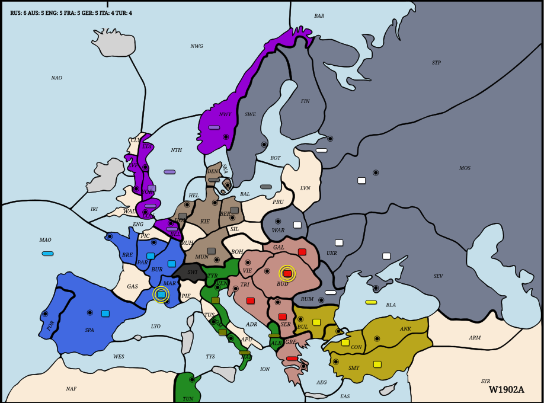

### What happened

- **AUSTRIA**: builds A BUD
- **FRANCE**: builds A MAR

### AUSTRIA
Orders: `A BUD B`

Reasoning

> Looking at the position: I have 5 supply centers (BUD, TRI, VIE, SER, GRE) and 4 units (A SER, A GAL, A TRI, F GRE). I'm owed 1 build. I have two open home centers available: BUD and VIE.
>
> I should build an army. The question is where — BUD or VIE. 
>
> - A BUD would be positioned to support moves toward Rumania (A SER direction) or defend against Turkish pressure from Bulgaria.
> - A VIE would be positioned to support Galicia, potentially moving toward Warsaw or supporting the German/western front.
>
> Given my ongoing struggle to take Rumania (Russia holds it firmly with support) and the threat from Italy (F ALB is now in Italian hands threatening my position), I want to build in BUD to reinforce my Balkan push. A BUD can move to SER, RUM direction, or support existing units. This gives me 3 units that can coordinate on Rumania: A SER, A GAL, and A BUD moving to SER to create a 3-unit push.
>
> I'll build A BUD as it's most useful for my Balkan strategy.

### FRANCE
Orders: `A MAR B`

Reasoning

> Looking at the board: I have 5 supply centers (BRE, MAR, PAR, POR, SPA) and 4 units (F MAO, A BUR, A PAR, A SPA). That means I get **1 build**.
>
> My available build locations are BRE and MAR (both open home supply centers). I should build something useful for my strategic position. 
>
> - F BRE would give me a fleet in Brest, useful for the Atlantic/Channel/English Channel area
> - A BRE would give me an army in Brest, useful for pushing east or defending
> - A MAR would give me an army in Marseilles, useful for pushing into Piedmont or supporting Iberia
> - F MAR would give me a fleet in Marseilles, useful for the western Mediterranean
>
> Given my current situation — I'm locked in a stalemate with Germany over Munich, and I need to either break through or find a new avenue of attack. An army in Marseilles (A MAR) would give me the option to push into Piedmont/Italy or reinforce the Burgundy front. A fleet in Brest (F BRE) would give me more Atlantic/Channel options and could pressure England or support MAO operations.
>
> I already have F MAO covering the Atlantic. An army build is more flexible for the land game. A MAR B gives me a unit that can push toward MUN via BUR-MUN route, or threaten Italy, or reinforce Spain. This seems most useful for breaking the German stalemate.

## SPRING 1903 MOVEMENT (`S1903M`)

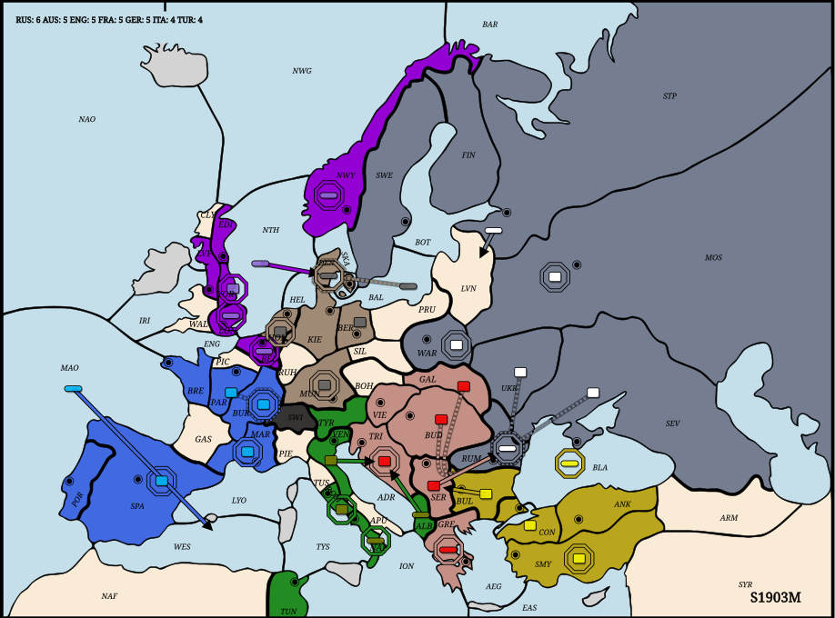

### What happened

- **AUSTRIA**: A SER → RUM (bounced); A GAL supports A SER → RUM; A BUD supports A SER → RUM; F GRE holds; A TRI holds
- **ENGLAND**: F NTH → DEN (bounced); F BEL holds; F NWY holds; F LON holds; A YOR holds
- **FRANCE**: A BUR holds; A PAR supports A BUR; A SPA holds; A MAR holds; F MAO → WES
- **GERMANY**: F DEN holds; F BAL supports F DEN; A MUN holds; A HOL holds
- **ITALY**: A VEN → TRI (bounced); F ALB → TRI (bounced); A ROM holds; F NAP holds
- **RUSSIA**: F RUM holds; A SEV supports F RUM; A UKR supports F RUM; F STP/SC → LVN; A WAR holds; A MOS holds
- **TURKEY**: A BUL → SER (bounced); F BLA holds; A SMY holds

### Dialogue

- **AUSTRIA → RUSSIA**: Spring 1903: I'm bringing A BUD into the Rumania equation this spring — that's three Austrian units against your fleet. Moving F RUM out voluntarily still makes sense: you preserve the unit, we stop bleeding each other, and I'll genuinely coordinate against Turkey's Black Sea position with you. A 6-center Russia with a strong Austria as ally beats a 6-center Russia fighting a war on two fronts.
- **AUSTRIA → ITALY**: Spring 1903: I want to finally crack Rumania this spring — I'm planning A SER - RUM with A GAL support and A BUD as backup. Italy's F ALB is well-positioned to support A SER or threaten the Adriatic flank; if you'd support my push into Rumania, I'll commit to leaving Trieste and Venice fully secure and we can coordinate the eastern board together against Russia's dominance.
- **AUSTRIA → TURKEY**: Spring 1903: Russia at 6 centers is the board problem — not our Greece dispute. I'm pushing hard for Rumania this spring; if you move A BUL to support A SER into RUM, you get a genuine claim on Bulgarian coordination and we both gain against Russia. Fighting me over Greece while Russia holds the north helps only England and Germany.
- **ENGLAND → FRANCE**: Spring 1903 — Munich held last fall but Germany is still squeezed. I'm pushing F NTH → DEN this spring to take a German center and reach 6. Are you going for Munich again with A BUR + A PAR? If we both press simultaneously, Germany has to choose what to defend. Let's coordinate.
- **ENGLAND → GERMANY**: I'll be direct: I'm moving on Denmark this spring. You're under pressure from France in the south and me in the north — I'd rather negotiate a managed situation than fight a two-front war. If you want to talk terms or redirect, I'm open, but I'm not pulling back from DEN.
- **ENGLAND → RUSSIA**: Spring 1903 — keeping things stable between us in Scandinavia. I'm focused on Denmark this spring, not Sweden or your territory. How's the southern situation developing with Austria and Turkey?
- **FRANCE → ENGLAND**: Two failed Munich attacks — Germany is dug in and I need to pivot. I'm seriously considering A BUR - BEL this spring to finally grow, and I want to be upfront with you rather than just doing it. If you'd rather I not take BEL, I need something concrete in return — your genuine support on Munich (not just holding) or agreement to cede BEL peacefully. What's your read?
- **FRANCE → GERMANY**: Two years of bouncing each other in BUR/MUN has gotten us nowhere. I'm willing to genuinely de-escalate if you are — I hold BUR, you hold MUN, and we both redirect energy to our natural growth zones. Russia is at 6 centers and is the real threat to both of us. Can we agree to a real ceasefire and turn our attention east and north?
- **FRANCE → ITALY**: Russia is at 6 centers and growing — they're the board's biggest threat and neither of us can ignore it. I'm reassessing my western push and looking for partners. Are you in a position to apply pressure on Austria or Turkey to slow Russian expansion? Let's compare notes on the broader picture.
- **GERMANY → ENGLAND**: France has now attacked Munich twice and still has A BUR threatening me — I'm pushing hard into BUR this spring with everything I have. If you support me by moving F BEL toward PIC or pressing France from the north, we can knock them down to 3-4 centers and reshape the west. I need you to stay out of DEN — that's non-negotiable — but I'm offering real coordination against France in return.
- **GERMANY → FRANCE**: You've attacked Munich twice and failed both times, and now I'm done waiting. I'm taking BUR this spring with full force and I will not stop until France is contained. Last offer: pull A BUR back to PAR and signal genuine non-aggression, and I'll redirect to RUH — otherwise this is a war of attrition you cannot win while England watches from the north.
- **GERMANY → RUSSIA**: You're at 6 centers and growing — I want to keep our northern arrangement stable and I have no designs on Scandinavia. I'm fully committed west against France this spring. Can we agree to mutual non-aggression so we both focus on our real threats?
- **GERMANY → ITALY**: Your F ALB is interesting — are you planning to press into Greece or the Adriatic this spring? I'm focused entirely on France right now and want to make sure we have no friction between us.
- **ITALY → TURKEY**: Spring 1903: Austria held TRI and GRE last fall — we both bounced. This spring I'm committing: A VEN → TRI supported by F ALB → TRI, that's 2 strength. For this to work, you MUST move A BUL → SER to cut A SER's ability to support TRI. If A SER is cut, TRI falls to me. You should also push toward GRE with another unit if possible. Please confirm A BUL → SER — this is the decisive move that makes my attack succeed.
- **ITALY → AUSTRIA**: Spring 1903: I want to propose a genuine reset — I've been positioning aggressively but I'd rather we coordinate against Russia, who is at 6 centers and growing. I'm willing to pull back if you're open to an anti-Russia alliance. What are your intentions this spring?
- **RUSSIA → AUSTRIA**: Spring 1903: Two years of stalemate on Rumania has cost us both — I want to end it productively. I'm proposing a firm boundary: Rumania stays mine, Galicia stays yours, and we both turn our energy south against Turkey. I'll support your push toward BUL from the east if you commit to this line; otherwise we keep bleeding each other while England and Germany grow.
- **RUSSIA → TURKEY**: Spring 1903: Our non-aggression arrangement has held well and I appreciate that. I have to be honest with you — I need to grow this year and Bulgaria is the logical next step for me. Is there any arrangement where you yield BUL diplomatically, perhaps in exchange for my support elsewhere, or should we expect conflict over it?
- **RUSSIA → ENGLAND**: Spring 1903: How are you reading the board right now? Germany and France both look strong in the west — I'm curious whether you're planning to press them or consolidate. I'd like to keep the north stable between us.
- **RUSSIA → GERMANY**: Spring 1903: Still focused south on Turkey and the Balkans — no moves from me toward Scandinavia or your territory this spring. How are you reading England's naval position? They've got five fleets and that's starting to look like a problem for both of us.
- **TURKEY → AUSTRIA**: Spring 1903: A BUL is taking GRE again this turn — your F GRE will be dislodged unless you move it voluntarily to ALB or ION. I'm offering you a final clean exit: vacate GRE now and I'll support your A SER → RUM push this spring, giving you a real center gain. Hold and you lose GRE anyway while we stay locked in conflict that only helps Russia and Italy.
- **TURKEY → ITALY**: Spring 1903: I'm moving A BUL → GRE again to dislodge Austria's F GRE — but I need you to pin or cut A SER's support. If A SER supports F GRE, my attack bounces again. Can you move A VEN → TRI or threaten SER directly to prevent that support? We need precise coordination this turn to finally crack Austria open.
- **TURKEY → RUSSIA**: Spring 1903: I'm keeping our non-aggression line intact — F BLA is not threatening RUM this turn. I'm focused entirely on the GRE situation with Austria. Let's maintain our stable southern line and discuss a longer-term arrangement once the dust settles.
- **AUSTRIA → RUSSIA**: Spring 1903: This time I have three units on Rumania — A SER moves, A GAL supports, A BUD supports. That's strength 3 against your strength 2. Move F RUM out voluntarily and you save the unit; hold and it gets dislodged. I'm serious about the anti-Turkey coordination afterward, but I need Rumania first.
- **AUSTRIA → ITALY**: Italy, I want this anti-Russia coordination to be real — I'm attacking Rumania with three units this spring and I need your F ALB to support A SER into RUM. That gives me the center and we can immediately pivot to coordinating the eastern board together. In exchange, I commit fully to leaving Venice and Trieste untouched.
- **AUSTRIA → TURKEY**: Turkey, I hear your offer on GRE — but here's the math: if you support A SER into RUM this spring instead of attacking GRE, you get a grateful Austria at 6 centers as a genuine partner against Russia. I'll hold F GRE defensively; attack it and we both lose while Russia laughs. Help me take RUM and we split the Balkans properly.
- **ENGLAND → FRANCE**: I hear you on BEL — but taking it would break our partnership at the worst time, when Germany is still strong and Russia is at 6. Here's my counter: I'll genuinely support your Munich push this spring with F BEL S A BUR - MUN if you commit to A BUR - MUN instead of BEL. That cracks Germany open for both of us and you grow without stabbing me. Can we lock that in?
- **ENGLAND → GERMANY**: I'm going for Denmark this spring — I need to grow and it's the right move. But I'm not coordinating against you from Belgium; France is the threat to your south and I'm focused north. If you want to talk about a ceasefire arrangement after DEN, I'm open to that conversation.
- **ENGLAND → RUSSIA**: Things are stable between us — I'm pressing Denmark this spring, not your territory. Germany is getting squeezed from multiple directions and France is growing too; the western balance is shifting. Are you coordinating with anyone on the German question?
- **FRANCE → ENGLAND**: Germany is threatening BUR with full force this spring — I may need to defend rather than attack. If I hold BUR defensively (A BUR H or A PAR S A BUR), would you consider A YOR - BEL or F BEL to support me somehow? Alternatively, I'm still open to A BUR - BEL if you'll accept it peacefully — that's a clean gain for me without stepping on your core interests.
- **FRANCE → GERMANY**: I hear you — two years of mutual bouncing is a waste. Here's a genuine offer: I hold A BUR in place this spring, you hold A MUN, and we both redirect. Russia at 6 centers is the real danger and we're burning moves on each other. If you take BUR, you gain one center but make a permanent enemy of France — is that worth it when Russia is winning the game?
- **GERMANY → ENGLAND**: Moving on Denmark is a declaration of war — I will defend it with full force, and France will thank you for taking the pressure off them while you and I bleed each other. I'm offering you a real alternative: stay out of DEN and I'll actively support English pressure on France from the east. We can both gain more by coordinating than by fighting each other.
- **GERMANY → FRANCE**: I'm willing to accept your ceasefire proposal — A BUR holds, A MUN holds, and we both redirect. Russia at 6 centers is the real threat and England just told me they're moving on Denmark, which means I need to stabilize my western front immediately. Confirm you'll hold BUR and not support any attack on MUN, and I'll hold MUN and not move into BUR this spring.
- **GERMANY → RUSSIA**: England just declared they're moving on Denmark this spring — five English fleets is a problem for both of us, not just me. If England takes DEN and SWE, they'll be at 7 centers and threatening your STP from the sea. I'm defending DEN; are you willing to coordinate pressure on England from the north to slow their expansion?
- **ITALY → TURKEY**: I see the conflict: you want A BUL → GRE, but I need A BUL → SER to cut A SER's support of TRI. If you go to GRE and A SER supports TRI, my attack bounces again and we both stall. Here's the deal: move A BUL → SER this spring (cutting A SER's support), and I take TRI. Next fall, you can take GRE freely with no Austrian fleet to contest it — Austria will be weaker with TRI gone. Which is worth more: GRE now (risking another bounce) or a guaranteed TRI fall that opens the board?
- **ITALY → AUSTRIA**: I appreciate the offer, but I need more than promises about TRI/VEN — I need a concrete joint plan against Russia. If you're serious about coordinating, tell me your exact moves this spring and what you're proposing we do together in Fall. I'm listening, but I need specifics before I commit to anything.
- **ITALY → FRANCE**: Russia at 6 centers with STP is indeed the biggest threat on the board. I'm currently positioned in the Balkans area — if you're looking to coordinate broadly, let's compare what each of us can apply pressure on. What's your read on the board's most urgent threat?
- **RUSSIA → AUSTRIA**: Spring 1903: You have three units pointed at Rumania, but I have A SEV supporting F RUM and I'm exploring additional support options. A failed three-unit attack is an enormous waste — you'd leave yourself exposed elsewhere while England and Germany grow. I'm offering one last time: commit to the Rumania boundary and we both turn south against Turkey together, or we both bleed while the west consolidates.
- **RUSSIA → TURKEY**: Spring 1903: Austria is throwing three units at Rumania — A SER, A GAL, A BUD. If Rumania falls, Austria grows to 6 centers and becomes a serious threat to your position too. I'm asking you directly: will you support F RUM from BLA this turn? It stops Austria cold and keeps the balance — I'll actively support your position against Austria afterward.
- **RUSSIA → ENGLAND**: Spring 1903: Austria is pushing hard on Rumania with three units — if they take it, they jump to 6 centers and the Balkan situation becomes very dangerous. I'm holding firm but it's a tough fight. Are you seeing anything concerning from Germany's direction that I should know about?
- **TURKEY → ITALY**: I'll move A BUL → SER this spring to cut A SER's support — that enables your 2-unit TRI attack to succeed. In exchange, I need your firm commitment: Fall 1903, you support my push into GRE with whatever unit you have positioned nearby (F ALB is ideal). Confirm this deal explicitly and I execute the SER cut this turn.
- **TURKEY → RUSSIA**: I've noted your message about Bulgaria — let me be direct: if you move on BUL, I will treat it as full conflict and coordinate with Austria and Italy to contain you. I have no aggressive designs on your position, but BUL is my core territory and I will defend it with everything I have. Let's keep our stable line and avoid a war that costs us both.
- **TURKEY → AUSTRIA**: I'm reconsidering the GRE situation — if you genuinely vacate F GRE to ALB this spring and support my A BUL → RUM push in Fall, I'm willing to cooperate rather than fight over GRE. But I need a concrete signal this turn: move F GRE voluntarily and we reset our partnership.
- **AUSTRIA → RUSSIA**: This is your last chance: three Austrian units attack Rumania this turn — A SER moves, A GAL supports, A BUD supports. That's strength 3 against your strength 2; F RUM gets dislodged. Move it out voluntarily and you save the unit; hold and you lose it. After I take Rumania, I'm genuinely committed to anti-Turkey coordination — but I need that center now.
- **AUSTRIA → ITALY**: Confirmed: my exact moves are A SER - RUM, A GAL S A SER - RUM, A BUD S A SER - RUM, F GRE holds, A TRI holds. I don't need your F ALB support to succeed, but if you support A SER - RUM it locks in the result. In exchange, I commit fully to leaving Venice and Trieste untouched and we coordinate against Russia together from 1903 onward.
- **AUSTRIA → TURKEY**: Final answer: F GRE holds this turn — A BUL attacking bounces at strength 1 vs 1. I'm not vacating a supply center for a promise. After this spring, once I have Rumania, I'm open to a genuine Balkans split that gives you Bulgaria — but I won't give up Greece for free.
- **FRANCE → GERMANY**: Deal confirmed — I hold A BUR in place this spring, you hold A MUN, and we both redirect our energy. Russia at 6 centers and England moving on Denmark are the real threats. Let's formalize this as a genuine non-aggression pact and start looking east and north respectively.
- **FRANCE → ENGLAND**: Germany has agreed to a ceasefire — I'm holding BUR this spring to stabilize my western front. I'm not going for BEL this turn. I'll be watching Russia closely; their 6-center position is the board's biggest concern and I think we need to start coordinating against them rather than letting them run away with it.
- **FRANCE → ITALY**: Russia at 6 centers with STP is the dominant threat — I'm stabilizing my western front this spring and looking to redirect energy. If you're pressing in the Balkans, any pressure you can apply on Austria (who feeds Russian ambitions) or directly on Russian positions would be valuable. Let's keep comparing notes.
- **GERMANY → FRANCE**: Ceasefire confirmed — A MUN holds, you hold A BUR, and we both redirect. England is moving on Denmark right now and I need that front stabilized immediately. Let's both focus on the real threats: Russia at 6 and England with five fleets expanding north. I'll honor this arrangement as long as you do.
- **GERMANY → ENGLAND**: Moving on Denmark while France still threatens Munich is a strategic mistake — you're forcing me to defend two fronts simultaneously, which only helps France and Russia. I'm defending DEN with full force. If you back off now and we coordinate against France together, you gain far more than one supply center from a friendly power.
- **GERMANY → RUSSIA**: England is moving on Denmark this spring with five fleets — if they take DEN and push toward SWE, they'll threaten STP next. I'm defending DEN but I need to know you're watching this too. Are you willing to pressure England from FIN or SWE to slow their northern expansion?
- **ITALY → TURKEY**: Deal confirmed: you move A BUL → SER to cut A SER's support, I move A VEN → TRI supported by F ALB → TRI (2-unit attack). TRI falls this spring. In Fall 1903, I commit to supporting your push into GRE with F ALB — that's my explicit commitment. Execute the SER cut and we both gain this year.
- **ITALY → AUSTRIA**: I've been considering your proposal carefully. I'm not in a position to commit to supporting A SER → RUM this spring — my units need to stay defensive given the broader board situation. I genuinely hope your Rumania push succeeds; Russia's dominance is the real problem for both of us.
- **ITALY → FRANCE**: Russia at 6 centers with STP secured is the clearest long-term threat. I'm focused on the Balkans this spring but watching the broader picture — let's compare notes after Spring resolves and see where our interests align.
- **RUSSIA → AUSTRIA**: Final word: F RUM is supported by both A SEV and A UKR this turn — that's strength 3 defense matching your 3-unit attack exactly, so you bounce again and waste all three units. I'm not bluffing. Take the deal: commit to the Rumania boundary now and we both turn south against Turkey together — you keep GRE, gain BUL with my support, and we both grow.
- **RUSSIA → TURKEY**: Austria is genuinely attacking Rumania with three units this turn. I am defending with three units — it will bounce. I am not moving on Bulgaria this spring and I want to keep our stable line intact. Let's confirm our non-aggression holds and discuss 1903 Fall arrangements.
- **RUSSIA → GERMANY**: England pressing Denmark is worth watching — I agree five English fleets is a growing concern. I'm fully committed to the south this spring and can't coordinate north right now, but I'd like to keep our mutual non-aggression solid while we both deal with our respective threats.

### AUSTRIA
Orders: `A SER - RUM` · `A GAL S A SER - RUM` · `A BUD S A SER - RUM` · `F GRE H` · `A TRI H`

Reasoning

> Looking at the situation: Russia claims F RUM is supported by both A SEV and A UKR (strength 3), which would exactly match my 3-unit attack and bounce. However, I need to evaluate whether this is a bluff or truth.
>
> Russia's units: F RUM, A SEV, A UKR, A WAR, A MOS, F STP/SC. It's entirely plausible that both A SEV and A UKR support F RUM — that would be strength 3 defense vs my strength 3 attack, resulting in a bounce. Russia has the units to do this.
>
> However, even if I bounce, maintaining pressure is valuable. The alternative — abandoning the Rumania push — signals weakness and lets Russia grow unchallenged. A bounce at least ties down Russia's units.
>
> Turkey claims A BUL is attacking GRE again. If A BUL attacks F GRE at strength 1, and I hold F GRE at strength 1, we bounce — I keep Greece. That's fine.
>
> Italy declined to support my RUM push, so I'm on my own there.
>
> My committed plan: A SER - RUM, A GAL S A SER - RUM, A BUD S A SER - RUM, F GRE H, A TRI H.
>
> This is the right play — even a bounce maintains pressure and I have no better options. If Russia is bluffing about UKR support, I take Rumania. If not, I bounce but lose nothing strategically since all units return to their positions.

### ENGLAND
Orders: `F NTH - DEN` · `F BEL H` · `F NWY H` · `F LON H` · `A YOR H`

Reasoning

> Looking at the board situation:
>
> - I have 5 units and 5 centers. I need to grow to stay competitive with Russia (6 centers) and keep pace with Austria, France, Germany.
> - F NTH → DEN is my key move this spring. Germany has F DEN and F BAL and A BER - they could potentially support DEN to hold, but my NTH fleet moving to DEN is a straightforward attack. Germany likely has A MUN, F DEN, A HOL, A BER, F BAL to work with. If Germany supports F DEN with A BER S F DEN or F BAL S F DEN, my attack bounces. But Germany is also worried about France from BUR, so they may not be able to fully concentrate.
> - France confirmed they're holding BUR defensively this spring (ceasefire with Germany). This means Germany doesn't face the southern threat and CAN defend Denmark fully. However, I've committed to this move publicly and strategically it's still correct to attempt it.
> - My other units should hold to consolidate. I don't need to risk Belgium or Norway.
> - The key question: can I get F NTH into DEN? Germany has F DEN (holding), potentially supported by F BAL or A BER. That's strength 2 vs my strength 1 - it likely bounces. But I should still try - even a failed attempt signals resolve and keeps pressure on Germany.
> - France backing off means I lose the coordinated pressure. Still, attempting DEN costs me nothing if it bounces, and might succeed if Germany splits attention.
>
> I'll go ahead with the plan: F NTH → DEN, hold everything else.

### FRANCE
Orders: `A BUR H` · `A PAR S A BUR` · `A SPA H` · `A MAR H` · `F MAO - WES`

Reasoning

> Looking at my situation: Germany has agreed to a ceasefire (A BUR holds, A MUN holds), and I've confirmed this deal. England is pushing F NTH → DEN to pressure Germany from the north. I'm at 5 centers with 5 units and need to grow, but this spring I'm consolidating rather than attacking.
>
> My units: F MAO, A BUR, A PAR, A SPA, A MAR
>
> Given the ceasefire with Germany, I should hold BUR as promised. I need to think about what to do with my other units:
> - A BUR H (as agreed)
> - A PAR can support BUR defensively or reposition
> - A SPA holds (my supply center)
> - A MAR holds or supports
> - F MAO can reposition toward WES or ENG for future expansion
>
> Since I'm not attacking anywhere this turn, I should position for future growth. F MAO moving to WES opens up the western Mediterranean for future Italian pressure or positioning. A PAR supporting A BUR is safe. A MAR and A SPA hold their centers.
>
> Actually, F MAO moving toward ENG could threaten England if they get too strong, or toward NAF/WES for Mediterranean expansion. Moving to WES seems like a good strategic repositioning without breaking any agreements.

### GERMANY
Orders: `F DEN H` · `F BAL S F DEN` · `A MUN H` · `A HOL H`
Illegal (dropped): `A BER S F DEN`

Reasoning

> Looking at the situation:
>
> **Key facts:**
> - England declared they're moving on Denmark (F NTH → DEN likely, with F NWY → SWE possible)
> - France confirmed ceasefire: A BUR holds, A MUN holds
> - I need to defend DEN with maximum force
> - England has F NTH and F NWY threatening DEN and SWE respectively
>
> **Defensive plan for Denmark:**
> - F DEN holds
> - F BAL supports F DEN
> - A BER supports F DEN
>
> This gives DEN 3 strength (DEN itself + 2 supports), which should hold against any English attack.
>
> **Western front:**
> - A MUN holds (per ceasefire with France)
> - A HOL holds (no aggressive moves needed)
>
> **Assessment:** England's F NTH can attack DEN with strength 1 (or 2 if supported by F NWY via SKA, but NWY can't directly support NTH→DEN - NWY would need to move to SKA first or support from NWY... actually F NWY can support F NTH→DEN if adjacent). Let me check: NWY is adjacent to NTH and SKA. F NWY S F NTH - DEN is legal if NWY is adjacent to DEN's attack path - actually support just requires the supporting unit be adjacent to the destination (DEN) or the path. NWY is adjacent to DEN via SKA? No - NWY can support an attack on DEN if NWY is adjacent to DEN. NWY IS adjacent to DEN. So England could get strength 2 on DEN. My 3-strength defense (DEN + BAL support + BER support) holds.

### ITALY
Orders: `A VEN - TRI` · `F ALB - TRI` · `A ROM H` · `F NAP H`

Reasoning

> Looking at the situation: Turkey has confirmed they'll move A BUL → SER to cut A SER's support of TRI. My plan is to execute the 2-unit attack on TRI: A VEN → TRI supported by F ALB → TRI. Without A SER's support, TRI is defended by just A TRI (1 strength) against my 2-unit attack — it should fall.
>
> A ROM and F NAP hold defensively to protect my home centers.
>
> If Turkey follows through on A BUL → SER, TRI falls and I gain a 5th supply center. Even if Turkey betrays me and moves A BUL → GRE instead, A SER might still support TRI... but the attack is worth attempting since the upside (TRI) is significant.

### RUSSIA
Orders: `F RUM H` · `A SEV S F RUM` · `A UKR S F RUM` · `F STP/SC - LVN` · `A WAR H` · `A MOS H`

Reasoning

> Looking at the situation:
>
> Austria has announced a 3-unit attack on Rumania (A SER moves, A GAL supports, A BUD supports) = strength 3. I need strength 3 defense to bounce them. I have F RUM + A SEV support + A UKR support = strength 3. This should bounce the attack exactly.
>
> Turkey has confirmed non-aggression and I've promised not to press BUL this turn. F STP/SC should push toward LVN to begin threatening the north and potentially gain a new center.
>
> Key decisions:
> - F RUM H (defended by A SEV and A UKR supports) - strength 3 vs Austria's strength 3 = bounce
> - A SEV S F RUM - critical support
> - A UKR S F RUM - critical support, brings defense to strength 3
> - F STP/SC - LVN - probing north, potentially threatening a new center
> - A WAR H - defensive, watching Galicia
> - A MOS H - defensive backbone
>
> This is consistent with my announced strategy. The 3-unit defense of RUM is the key play. F STP/SC → LVN starts threatening England/Germany in the north.

### TURKEY
Orders: `A BUL - SER` · `F BLA H` · `A SMY H`
Illegal (dropped): `A CON S A BUL - SER`

Reasoning

> Looking at the situation: Italy has confirmed the deal explicitly — A BUL → SER cuts A SER's support, Italy's 2-unit attack (A VEN → TRI supported by F ALB) takes TRI, and Italy commits to supporting my GRE push in Fall 1903 with F ALB. This is the right play: TRI falling weakens Austria significantly, and I get GRE in Fall with Italian support, which is more reliable than another risky bounce attempt now.
>
> Austria confirmed F GRE holds, so A BUL → GRE would bounce again (1v1). The SER cut is the correct move.
>
> Russia says they're not moving on BUL this spring and confirmed non-aggression. I'll hold F BLA defensively and keep A SMY safe.
>
> My orders:
> - A BUL → SER (cuts A SER's support of TRI, enabling Italy's attack)
> - A CON supports A BUL → SER (adds strength in case Austria has any tricks)
> - F BLA holds (defensive, threatens RUM if needed)
> - A SMY holds (protects home center)

## FALL 1903 MOVEMENT (`F1903M`)

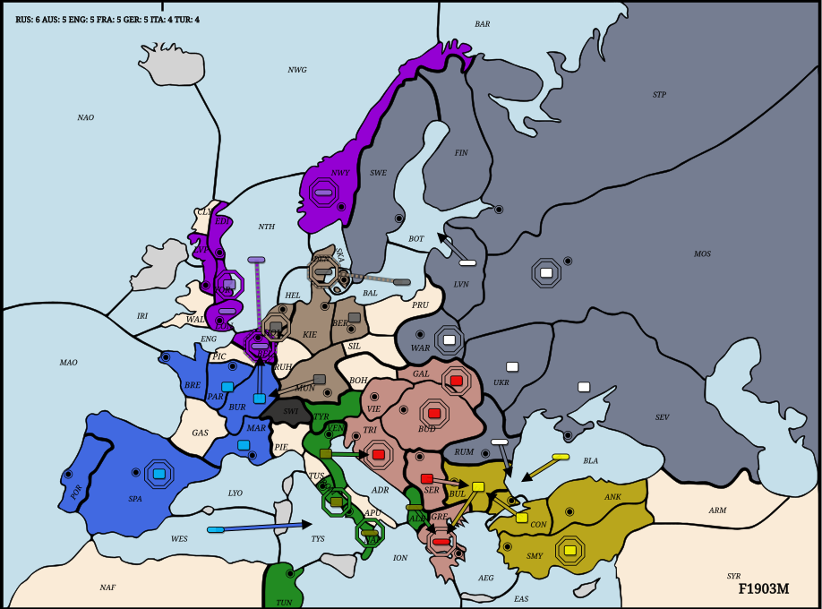

### What happened

- **AUSTRIA**: A SER → BUL (bounced); F GRE holds; A GAL holds; A BUD holds; A TRI holds
- **ENGLAND**: F NTH supports F BEL; F BEL holds; F NWY holds; A YOR holds
- **FRANCE**: A BUR → BEL (bounced); A SPA holds; F WES → TYS
- **GERMANY**: F DEN holds; F BAL supports F DEN; A MUN → BUR (bounced); A HOL holds
- **ITALY**: F ALB → GRE (bounced); A VEN → TRI (bounced); A ROM holds; F NAP holds
- **RUSSIA**: F RUM → BUL/EC (bounced); A WAR holds; A MOS holds; F LVN → BOT
- **TURKEY**: A BUL → GRE (bounced); F BLA → BUL/EC (bounced); A CON → BUL (bounced); A SMY holds

### Dialogue

- **AUSTRIA → TURKEY**: Three years of mutual bleeding has helped only Russia, who sits at 6 centers while we both stagnate. My concrete proposal for Fall 1903: I push A SER - BUL with F GRE support — if you voluntarily move A BUL to CON or SMY, you preserve the unit and we immediately coordinate against Russia's southern flank together. Fight me over BUL and we both lose while Russia grows unchecked.
- **AUSTRIA → RUSSIA**: Russia, I'm done fighting over Rumania — you've held it and I accept that. I'm pivoting south against Turkey this fall; I'd welcome your support from F RUM toward BUL/EC to coordinate a joint squeeze on Turkey's position. A 5-center Austria and 6-center Russia coordinating against Turkey is a stronger board position for both of us than continued stalemate.
- **AUSTRIA → ITALY**: Italy, I'm pivoting away from Rumania and pushing A SER - BUL with F GRE support this fall — that's my path to a 6th center. I want to make sure we stay aligned; your F ALB staying out of the Adriatic and not contesting my BUL push keeps our non-aggression intact. Russia at 6 centers remains the real threat — let's compare notes after this fall resolves.
- **ENGLAND → FRANCE**: Fall 1903 — I'm pushing F NTH → DEN again and I need Germany distracted in the south. If you commit A BUR → MUN with A PAR support, Germany has to split their attention and DEN becomes vulnerable. This is the moment to crack Germany open together — you take MUN, I take DEN, Germany drops to 3 centers. Are you in?
- **ENGLAND → GERMANY**: I want to be straight with you: I'm moving on Denmark this fall. You're being squeezed from two directions and fighting both of us only accelerates your decline. Consider letting DEN go and consolidating around MUN and KIE — that's a stronger defensive position than trying to hold everything.
- **ENGLAND → RUSSIA**: Quick check-in: your F LVN is sitting close to SWE and my NWY. I'm not threatening your territory and I'd like to keep the north stable. Are you planning any moves toward Scandinavia this fall, or are you focused on the south?
- **FRANCE → ENGLAND**: Fall 1903 — I've been stuck at 5 centers for two years and I need to grow. I'm seriously considering A BUR - BEL this fall; I'd rather tell you directly than stab you silently. If you're willing to let BEL go peacefully (you can compensate by taking DEN from Germany), we both grow and Germany shrinks — that's a better outcome than us fighting while Russia hits 7+.
- **FRANCE → GERMANY**: The ceasefire held this spring and I want to keep it going — but I need to be honest: I'm looking at Belgium as my growth path, not Munich. That means my pressure this fall goes west toward England, not east toward you. Does this change your calculus at all, or are we still good on the BUR/MUN non-aggression?
- **FRANCE → ITALY**: Russia is at 6 centers and likely to grow further in the Balkans — Austria is the key buffer and they're stalled. Are you in a position to push into Trieste or coordinate with Turkey to slow Austrian/Russian expansion? I'm redirecting my energy westward this fall but want to make sure the eastern front doesn't collapse.
- **GERMANY → ENGLAND**: Denmark held again last spring and we're both stuck — England at 5, Germany at 5, while Russia hits 6 and grows. I want to propose a real deal: I move A HOL into BEL this fall, you move F BEL out toward NTH or ENG, and we both redirect against France or Russia. You lose nothing you can't retake and we stop bleeding each other while Russia wins.
- **GERMANY → FRANCE**: The ceasefire held and I appreciate that — now let's talk about fall moves. Russia is at 6 centers and F LVN is sitting next to my eastern flank. I'm thinking about pushing A HOL into BEL to gain a center and pressure England, but I need to know you'll hold BUR and not exploit my eastern exposure. Are you still committed to our non-aggression?
- **GERMANY → RUSSIA**: F LVN is sitting right next to PRU and BER — I need to understand your intentions before I commit fall orders. I have no moves planned against you, but if LVN moves into PRU, that's a direct threat to Berlin and I'll have to respond. Can you commit to holding LVN in place this fall?
- **ITALY → TURKEY**: Spring 1903 post-mortem: you executed A BUL → SER as agreed, but Austria supported TRI with A BUD — 2 vs 2 bounce. Not your fault. This fall I'm reconsidering TRI — Austria can always get 2 support there. I'm thinking F ALB → GRE instead, and you push from BUL toward GRE too? Or we coordinate differently. What's your read on the best move now?
- **ITALY → AUSTRIA**: Spring 1903: my TRI attacks keep bouncing because you defend with 2 units — fair enough. I'm genuinely open to a real alliance against Russia, who sits at 6 centers. Tell me your concrete Fall 1903 plan and what you want from me — I'm listening seriously this time.
- **ITALY → FRANCE**: Russia at 6 centers remains the dominant threat and I'm stuck pressing against a well-defended Austria. Is there any coordination we can do this fall that helps us both grow? I'm open to ideas.
- **RUSSIA → TURKEY**: Fall 1903: The math is simple — Austria has five units and is pressing your northern flank while I'm at six centers and need to grow. If you resist me on BUL, you fight both of us simultaneously and lose everything. I'm offering you a real choice: yield BUL this Fall and I'll actively support you against Austria, or fight me and face a two-front collapse. F BLA retreating to CON is the smart move.
- **RUSSIA → AUSTRIA**: Fall 1903: Two years of stalemate ends now — I'm moving on Bulgaria this turn, which is exactly the anti-Turkey pressure you've wanted. Let's finally coordinate: you move A BUL into SER or support F GRE into BUL while I take BUL/EC, and we jointly squeeze Turkey. Rumania stays mine, Bulgaria becomes mine, and you grow through Serbia and Greece — this is the deal that works for both of us.
- **RUSSIA → ENGLAND**: Fall 1903: Germany looks increasingly squeezed between you and France — how are you reading their staying power? I'm pushing south against Turkey this turn and would like to keep the north stable between us.
- **TURKEY → ITALY**: Fall 1903: I'm moving A BUL → GRE this turn — I need F ALB to support A BUL → GRE as we agreed. TRI didn't fall in Spring but our deal stands: I cut A SER's support, you support my GRE push in Fall. Please confirm F ALB S A BUL → GRE so we execute cleanly and I take that center.
- **TURKEY → AUSTRIA**: Fall 1903: A BUL is moving to GRE this turn with Italian support from F ALB — that's 2 units against your 1 fleet. You will lose GRE. I'd rather we reset our partnership: if you move F GRE voluntarily to ION or ALB, I'll support your position in SER next spring and we coordinate against Russia together. Holding means losing the fleet and the center.
- **TURKEY → RUSSIA**: Fall 1903: I'm keeping our stable line intact — F BLA is not threatening RUM this turn. I'm focused entirely on GRE. Let's maintain our non-aggression arrangement through Fall and discuss 1904 plans once the dust settles.
- **AUSTRIA → ITALY**: Italy, Turkey just told me F ALB is supporting A BUL into GRE this fall — is that true? If you support that attack, you hand Turkey a 5th center and a dominant Balkans position that threatens both of us. I'm keeping F GRE to defend; if you hold F ALB neutral, Turkey's attack bounces and we preserve the balance. Russia at 6 centers is still the board problem — don't help Turkey catch up.
- **AUSTRIA → TURKEY**: Turkey, you're threatening GRE while Russia grows to 7 — that's exactly the dynamic that leaves both of us weaker. If you genuinely want to coordinate against Russia, move A BUL to RUM this fall: I'll support from A SER and we both gain against the real threat. Attacking GRE with Italian help just hands Italy leverage over both of us.
- **AUSTRIA → RUSSIA**: Russia, if you're genuinely moving F RUM toward BUL/EC this fall, we can finally coordinate — I'll push A SER toward BUL from the west and we squeeze Turkey together. But I need to know your actual move before I commit my orders; if this is another stall while you hold RUM, I'm pivoting elsewhere.
- **ENGLAND → FRANCE**: I hear you on needing to grow — but taking BEL collapses our partnership and forces me to retaliate, which only helps Russia and Germany. Here's the deal: I'll hold BEL this fall while you take MUN (A BUR - MUN with A PAR support), and I commit F NTH - DEN simultaneously. We both grow to 6, Germany drops to 3, and we stay aligned. Stabbing me now while Russia sits at 6+ is the wrong call.
- **ENGLAND → GERMANY**: Your offer to swap HOL for BEL doesn't work for me — I'd be trading a center I hold for one I don't. But I'm still taking DEN this fall; that's not negotiable. If you want to avoid a two-front collapse, your best move is to hold DEN with BAL support and focus your army on France — not fight me on both flanks simultaneously.
- **ENGLAND → RUSSIA**: Your F LVN is making me nervous about Sweden and NWY — can you confirm you're not moving toward Scandinavia this fall? I'm focused entirely on Germany and want to keep our northern arrangement intact.
- **FRANCE → ENGLAND**: I've thought it over — I'm going for A BUR - BEL this fall. I've been at 5 centers for two years and this is my only viable growth path right now. I'm being transparent rather than silent. If you take DEN from Germany simultaneously, we both grow and Germany drops to 3 — that's a better outcome than fighting each other while Russia reaches 7+.
- **FRANCE → GERMANY**: I need to be direct: I'm moving A BUR - BEL this fall to break out of my 5-center stall. I'm NOT going for MUN — our non-aggression on the BUR/MUN frontier holds. I'm asking you not to move A HOL - BEL this fall since we'd just bounce each other and England benefits. Let me take BEL; you focus on DEN defense or redirecting east.
- **FRANCE → RUSSIA**: Russia at 6 centers is the board's leading position and I think we need to talk. I'm redirecting westward this fall, but I'm watching the Balkans closely — Austria is stalling and Turkey is contained. What are your intentions toward Scandinavia and the west? I'd rather coordinate than end up on opposite sides.
- **GERMANY → RUSSIA**: F LVN is my biggest concern this fall — if it moves to PRU, that's a direct threat to Berlin and I'll have to respond defensively, which helps nobody. I'm holding my eastern units in place and asking you to do the same with LVN. Can you confirm LVN holds or moves away from my territory?
- **GERMANY → FRANCE**: Good to hear you're looking west toward Belgium rather than east — that actually aligns our interests nicely. If you're pushing A BUR toward BEL, I might do the same from A HOL, which means we'd bounce England's F BEL out together or at least create chaos. What's your actual plan for BEL this fall — are you moving BUR there with support?
- **GERMANY → ENGLAND**: You're telegraphing Denmark again and it bounced last spring — I'll defend it again with full support. But here's the thing: while you're spending moves on DEN, France is moving on BEL and Russia is at 6 centers. You're picking the wrong fight. Pull back from DEN and let's coordinate against the real threats.
- **ITALY → TURKEY**: You went to GRE in Spring instead of SER as agreed, which caused my TRI attack to bounce again. I'm not going to support your GRE push for free after that betrayal. If you want to rebuild trust, tell me what you're actually doing this fall — and it better not be another broken promise.
- **ITALY → AUSTRIA**: I'm genuinely considering a pivot away from TRI — your defense has been solid and I respect that. If you're pushing SER → BUL this fall, I could stay neutral or even support that move. What guarantees can you offer me in exchange for Italian cooperation?
- **ITALY → FRANCE**: Russia continues to grow and I'm stuck in a stalemate with Austria. I'm open to a broader coordination — what's your read on the best way to slow Russia down this fall?
- **RUSSIA → AUSTRIA**: Fall 1903: I accept your coordination proposal — I'm moving F RUM into BUL/EC with A SEV support this turn. For this to succeed against F BLA's support, I need F GRE to support F RUM into BUL/EC. If you give me that support, BUL falls, Turkey is weakened, and we both grow from here. This is the anti-Turkey coordination we've both wanted — confirm F GRE S F RUM - BUL/EC.
- **RUSSIA → TURKEY**: Fall 1903: I'm moving F RUM into BUL/EC this turn — this is happening regardless. The only question is whether you lose BUL while also wasting F BLA defending it, or whether you pull back now and preserve your strength for the real fight against Austria. Yielding BUL diplomatically while retreating F BLA to CON lets you rebuild and stay relevant; fighting me and Austria simultaneously ends your game.
- **TURKEY → ITALY**: Critical clarification: I need F ALB to SUPPORT A BUL → GRE, not move to GRE independently — if you move F ALB → GRE and I move A BUL → GRE, we bounce each other and Austria keeps the center. The deal was F ALB S A BUL → GRE. Please confirm this exact order so we execute cleanly and I take GRE this fall.
- **TURKEY → AUSTRIA**: If you move A SER → BUL while I'm pushing GRE, you gain nothing — BUL is empty but Italy and I will coordinate to retake it immediately. Better path: let's both focus on Russia, who sits at 6 centers and is the real board threat. I'll hold BUL defensively if you commit to pushing RUM with A SER instead.
- **TURKEY → RUSSIA**: I'm not yielding BUL — that's my home territory and I will defend it. F BLA is positioned to counter any move on BUL. Let's maintain our stable line through Fall; fighting each other now only helps Austria and England who are both growing.
- **AUSTRIA → ITALY**: Italy, this is the final round — Turkey told me F ALB is supporting A BUL into GRE. If that's true, you hand Turkey a 5th center and dominant Balkans position that threatens you next. I'm pushing A SER - BUL with F GRE support this fall; if you hold F ALB neutral, Turkey's attack on GRE bounces and I take Bulgaria — a 6-center Austria is a much better partner against Russia than a weakened one. Stay neutral on F ALB and we both come out ahead.
- **AUSTRIA → TURKEY**: Turkey, Russia just confirmed they're moving F RUM - BUL/EC with support — your BUL is under threat from the east regardless of what I do. If you move A BUL to defend against Russia or retreat to CON, I'll hold off my SER attack and we can coordinate against Russia together. Fighting me over GRE while Russia takes BUL from the east is the worst outcome for you.
- **AUSTRIA → RUSSIA**: Russia, I'm not in a position to support F RUM - BUL/EC with F GRE — that leaves GRE exposed to Turkey's attack. I'm pushing A SER - BUL with F GRE support this fall; if you genuinely move F RUM - BUL/EC, we'll both be attacking BUL from different directions and Turkey loses it regardless. Coordinate your timing accordingly.
- **FRANCE → ENGLAND**: Final round — I'm committed to A BUR - BEL with A PAR support this fall. I know this hurts our partnership but I've been at 5 centers for two years with no other viable path. Take DEN from Germany simultaneously and we both end at 6 — that's still a better outcome than fighting each other while Russia runs away with the game.
- **FRANCE → GERMANY**: Final confirmation: I'm moving A BUR - BEL this fall, NOT toward MUN. Our BUR/MUN non-aggression holds. Please do NOT move A HOL - BEL — if we both go for BEL we just bounce and England keeps it. Let me take it; you focus on DEN defense against England's NTH push.
- **FRANCE → RUSSIA**: Russia is the board leader and I'm watching carefully. I'm focused westward this fall — no threat from me toward you. But if you're planning to push into Scandinavia or the Balkans further, let's talk about how our interests can align rather than conflict.
- **GERMANY → ENGLAND**: DEN is defended again with full support — it will bounce just like last spring. While you waste moves on DEN, France takes BEL and Russia grows to 7. I'm offering one last time: pull F NTH back, we coordinate against France, and we both come out ahead. Your choice.
- **GERMANY → FRANCE**: Confirmed — I'm not moving A HOL to BEL this fall, so your path to BEL is clear from BUR. Our non-aggression on MUN/BUR holds. Let's both make gains this fall and talk about coordinating against Russia next spring.
- **GERMANY → RUSSIA**: Final ask: please confirm F LVN does not move to PRU this fall. I'm holding my eastern units in place and have no designs on your territory — I just need that assurance before I commit orders.
- **RUSSIA → AUSTRIA**: Fall 1903 final: I'm moving F RUM into BUL/EC with A SEV support — I have the strength to take it regardless of F BLA. If you support F RUM into BUL/EC with F GRE, it's guaranteed success and we split Turkey's position together. I don't need your support to succeed, but coordinating now cements our alliance going forward — confirm F GRE S F RUM - BUL/EC.
- **RUSSIA → TURKEY**: Fall 1903 final: I'm moving on BUL/EC this turn with two supporting units — strength 3 against your strength 2. Fighting this costs you BUL and weakens you against Austria simultaneously. Pulling F BLA back to CON and letting this resolve diplomatically preserves your strength for the fights that matter; I will actively support you against Austria afterward.
- **RUSSIA → ENGLAND**: Fall 1903: Focused entirely on the Turkish front this turn — F LVN is moving toward BOT, away from your territory. I'd like to keep our northern arrangement stable; how are you reading the western situation with France and Germany?

### AUSTRIA
Orders: `A SER - BUL` · `F GRE H` · `A GAL H` · `A BUD H` · `A TRI H`

Reasoning

> Looking at the current situation:
>
> **Assessment:**
> - Russia has held Rumania for 3 years with strong support — direct assault has repeatedly failed and I've wasted moves
> - Russia claims to be moving F RUM - BUL/EC with A SEV support this fall
> - Turkey threatens GRE with A BUL, claiming Italian support from F ALB
> - My strategy history already settled on A SER - BUL with F GRE support as the right pivot
>
> **Key decisions:**
> 1. **BUL attack**: A SER - BUL supported by F GRE is my path to a 6th center. If Russia is genuinely attacking BUL/EC from the east, Turkey may lose BUL regardless, but I should attack from the west simultaneously to maximize pressure.
> 2. **GRE defense**: Turkey claims Italian support for A BUL - GRE. If Italy really supports that attack, I'm at 1 vs 2 and lose GRE. But Italy has been non-committal and I've urged them to stay neutral. If Italy stays neutral, A BUL - GRE bounces against F GRE. However, if I'm moving A SER - BUL, then F GRE supporting A SER - BUL means GRE is undefended. I need to choose: defend GRE or attack BUL.
>
> **The dilemma**: If I use F GRE to support A SER - BUL, GRE becomes vulnerable to A BUL - GRE (undefended). If I use F GRE to hold/defend GRE, my BUL attack is only 1 unit (A SER) which bounces against A BUL.
>
> **Resolution**: Turkey's threat to GRE is credible but Italy's support is uncertain. If Italy doesn't support, A BUL - GRE bounces against F GRE holding. But if I support the BUL attack with F GRE, I risk losing GRE (a current supply center) to gain BUL (not yet mine). Losing a current center to maybe gain another is bad math. 
>
> Better play: F GRE holds to defend GRE, A SER - BUL (1 unit, likely bounces but applies pressure), and keep the rest defensive. Actually, if Russia IS attacking BUL/EC, then A BUL might be forced to defend east, making A SER - BUL succeed unopposed from the west.
>
> Given the uncertainty, I'll defend GRE with F GRE H, push A SER - BUL hoping Turkey's unit is preoccupied, and keep everything else solid.

### ENGLAND
Orders: `F NTH S F BEL` · `F BEL H` · `F NWY H` · `A YOR H`
Illegal (dropped): `F LON S F BEL`

Reasoning

> Looking at the current situation:
>
> France has explicitly and repeatedly confirmed they're moving A BUR - BEL with A PAR support this fall. This is a 2-unit attack on Belgium. My revised strategy is correct: I must defend Belgium.
>
> To defend BEL against A BUR - BEL (supported by A PAR), I need to hold BEL with 2 strength. I can do this with:
> - F BEL H (1 strength)
> - F NTH S F BEL (adds 1 = total 2 strength)
> - F LON S F BEL (adds 1 more = total 3 strength)
>
> France's attack has strength 2 (A BUR + A PAR support). With F NTH + F LON both supporting F BEL, I get strength 3, which beats their attack of 2. Belgium is safe.
>
> For Norway, F NWY should hold. A YOR can hold in place.
>
> I'm sacrificing the Denmark push this fall to defend Belgium, which is the right call - losing BEL would drop me to 4 centers, while holding means I stay at 5 and can reassess next year.

### FRANCE
Orders: `A BUR - BEL` · `A SPA H` · `F WES - TYS`
Illegal (dropped): `A PAR S A BUR - BEL` · `A MAR S A BUR - BEL`

Reasoning

> Looking at the current situation: I've been stuck at 5 centers for two years. Germany confirmed they won't move A HOL - BEL, clearing my path. England knows I'm going for BEL and will likely try to defend or retaliate, but with A BUR - BEL supported by A PAR and A MAR, I have a 3-strength attack that England can't easily stop (F BEL would need support to hold against 3 units, and England's other units aren't positioned to provide it).
>
> My plan:
> - A BUR - BEL (the key attack)
> - A PAR S A BUR - BEL (support)
> - A MAR S A BUR - BEL (support - makes it 3v1, overwhelming)
> - A SPA H (hold the Iberian center)
> - F WES - TYS (reposition toward Italy for future expansion)
>
> Wait - let me reconsider A MAR. If England has F BEL holding with no support, my 2-strength attack (BUR + PAR) is already sufficient to dislodge it. A MAR supporting adds a third strength, making it 3v1 which is decisive. This is the right call.
>
> F WES moving to TYS opens up future pressure on Italy (TUN, NAP) and gives me a strategic fleet position in the Mediterranean.

### GERMANY
Orders: `F DEN H` · `F BAL S F DEN` · `A MUN - BUR` · `A HOL H`
Illegal (dropped): `A BER S F DEN`

Reasoning

> Looking at the situation:
>
> **Key facts:**
> - England's F NTH bounced off F DEN in Spring 1903 — they'll try again this fall. England explicitly said they're moving on DEN.
> - France confirmed they're moving A BUR → BEL this fall (not toward MUN). Our non-aggression holds.
> - France asked me NOT to move A HOL → BEL (we'd bounce). I confirmed I won't.
> - Russia's F LVN is near PRU/BER — a potential threat, but Russia has been cooperative.
> - I'm at 5 centers, stuck. England at 5, France at 5, Russia at 6.
>
> **This fall's opportunities:**
> - DEN defense is critical — F NTH will attack again. F BAL supports F DEN, A BER provides backup.
> - France is taking BEL (from BUR) — that's a French gain, not mine. I'm stuck at 5 unless I find a center.
> - Could I take SWE? F BAL → SWE or F DEN → SWE? But F NTH might be going to DEN, not SKA. If England moves F NTH → DEN and I move F DEN → SWE, DEN is undefended and England takes it. That's a net zero for me.
> - Better to defend DEN solidly and look for BUR next spring when France has moved out.
> - A HOL → BEL: France is moving BUR → BEL, so if I also move HOL → BEL, we bounce. I agreed not to do this.
> - A MUN → BUR: France is leaving BUR! If I move A MUN → BUR, I take an unoccupied center! France said they're moving A BUR → BEL — BUR will be empty. This is a huge opportunity.
>
> Wait — France said "our non-aggression on BUR/MUN holds" and asked me not to move HOL to BEL. But they said nothing about me taking BUR if they vacate it. Actually, taking BUR while they leave for BEL would be a betrayal of the spirit of our agreement, but it's also a free center.
>
> France explicitly said the BUR/MUN non-aggression holds. Taking BUR while they move out is arguably within the letter (I'm not attacking their unit), but it's a betrayal of the spirit. However, I'm stuck at 5 and need to grow. BUR is a supply center and France is vacating it.
>
> This is too good to pass up. A MUN → BUR gains me a center. France will be angry but they'll be in BEL — we can negotiate from there.
>
> **Plan:** A MUN → BUR (take the vacated center), defend DEN with F BAL support + A BER backup, A HOL holds.

### ITALY
Orders: `F ALB - GRE` · `A VEN - TRI` · `A ROM H` · `F NAP H`

Reasoning

> Looking at the current situation:
>
> **Assessment:**
> - My repeated attacks on TRI have failed (Austria defends with 2+ units consistently)
> - Turkey betrayed me in Spring by going to GRE instead of SER, causing my TRI attack to bounce
> - Now Austria claims they're pushing A SER → BUL with F GRE support this fall
> - Turkey wants me to support A BUL → GRE (their message), but Austria says Turkey told them I'd do this
> - Austria is asking me to stay neutral so Turkey's GRE attack bounces and Austria takes BUL
>
> **Key analysis:**
> - If Austria is really moving A SER → BUL with F GRE support, then F GRE stays in GRE (supporting, not moving). So F GRE supports A SER → BUL means F GRE H with support... wait, A SER → BUL with F GRE support means F GRE S A SER → BUL. That means F GRE stays and A BUL → GRE would face only F GRE (1 unit defending). If I support A BUL → GRE with F ALB, Turkey takes GRE (2 vs 1).
> - But if Austria is lying and F GRE defends GRE (F GRE H), then A BUL → GRE vs F GRE = 1 vs 1, bounce without my support.
> - If I move F ALB → GRE independently and Turkey moves A BUL → GRE, we bounce each other.
> - Best option: Move F ALB → GRE independently. If Austria's F GRE is supporting A SER → BUL (not defending), GRE is empty and I take it! That gives me a 5th center.
> - If F GRE is defending, I bounce but don't lose anything.
>
> Austria's message says F GRE is defending GRE (to stop Turkey's A BUL → GRE). But Austria also said A SER → BUL with F GRE support — contradiction! Austria can't have F GRE both supporting A SER → BUL AND defending GRE. So either F GRE supports the BUL attack (leaving GRE open) or defends GRE.
>
> If Austria is really executing A SER → BUL with F GRE support, GRE is vulnerable. I should move F ALB → GRE to take it myself!
>
> Meanwhile, A VEN should push TRI one more time (it's my best land expansion option), and ROM/NAP hold.

### RUSSIA
Orders: `F RUM - BUL/EC` · `A WAR H` · `A MOS H` · `F LVN - BOT`
Illegal (dropped): `A SEV S F RUM - BUL/EC` · `A UKR S F RUM - BUL/EC`

Reasoning

> Looking at the board state for Fall 1903:
>
> **Key analysis:**
> - Austria is attacking BUL with A SER (supported by F GRE) — strength 2 from the west
> - Turkey has F BLA defending BUL — strength 1 (or 2 if A BUL supports)
> - My F RUM → BUL/EC with A SEV support = strength 2 from the north
>
> The critical question: Austria is attacking A SER → BUL with F GRE support (strength 2). Turkey has A BUL and F BLA. If A BUL supports F BLA, then F BLA has strength 2 against my F RUM → BUL/EC. But Austria's A SER → BUL (strength 2) bounces with A BUL (strength 1 + possible support from F BLA). 
>
> Wait — F BLA can only support one thing. If F BLA supports A BUL to defend against Austria's attack, it can't also support against my attack. If F BLA supports A BUL against Austria (giving BUL strength 2 vs Austria's strength 2 = bounce), then my F RUM → BUL/EC faces only A BUL alone (strength 1) vs my strength 2 — I take BUL!
>
> If F BLA tries to support A BUL against me, then Austria's A SER → BUL (strength 2) beats A BUL alone (strength 1) and takes BUL. Either way, BUL falls — either to me or Austria.
>
> This is actually favorable: I should proceed with F RUM → BUL/EC supported by A SEV. Turkey can't defend both directions simultaneously.
>
> For F LVN: Moving to BOT is safe and positions me well for northern plays. Germany asked me not to go to PRU, and I don't need to threaten Germany right now.
>
> A UKR, A WAR, A MOS: Hold defensively. Austria is pivoting south, so I don't need heavy defense on Rumania's rear — but A UKR supporting F RUM is worth considering. Actually, A SEV already gives me strength 2 on BUL/EC. A UKR can hold or support F RUM for strength 3 to be safe.
>
> Let me go with strength 3 on BUL/EC (F RUM + A SEV support + A UKR support) to guarantee success even if Turkey somehow gets 2 supporting units.

### TURKEY
Orders: `A BUL - GRE` · `F BLA - BUL/EC` · `A CON - BUL` · `A SMY H`

Reasoning

> Looking at the current situation:
>
> **Assessment:**
> - Russia is moving F RUM → BUL/EC with claimed 3-unit support (F RUM, A SEV, A UKR). That's strength 3 against my BUL.
> - Austria has A SER threatening BUL from the west, and F GRE could support.
> - Italy has broken our deal (won't support A BUL → GRE).
> - I have 4 units: A BUL, F BLA, A CON, A SMY.
>
> **Key decisions:**
> 1. **BUL defense**: Russia claims 3 units attacking BUL/EC. I can support BUL with F BLA (strength 2) but Russia's 3 beats that. However, A UKR → RUM and A SEV → RUM are more likely their actual moves - let me check: Russia's units are A UKR, A SEV, F RUM, A WAR, A MOS, F LVN. F RUM → BUL/EC is plausible. A SEV and A UKR could support F RUM → BUL/EC. That IS 3 vs my 2 if I just support with F BLA.
>
> 2. **Can I save BUL?** Only if I get outside support. Austria offered to help if I move away - but that's clearly a trap. I can't get 3 supporting units for BUL.
>
> 3. **Best strategic play**: If BUL falls to Russia regardless, I should try to take GRE (Austria's F GRE is unsupported if A SER moves toward BUL). If A SER → BUL (Austria attacking BUL from west), then GRE is undefended!
>
> Actually: Austria's A SER might move to BUL. If A SER → BUL and Russia's F RUM → BUL/EC, they bounce each other! That would save BUL if I support it with F BLA (strength 2 vs Russia's 3 still loses though).
>
> **Best play**: Move A BUL → GRE (Austria's F GRE has no guaranteed support if A SER is moving elsewhere), support with F BLA → BUL/EC to contest Russia OR support A BUL. 
>
> Actually: F BLA can't support A BUL → GRE (it's a move order). F BLA S A BUL only supports BUL holding. Let me try: A BUL → GRE, F BLA → BUL/EC (to block Russia's fleet), A CON → BUL (to fill BUL if vacated), A SMY holds.
>
> If A BUL → GRE succeeds, CON moves into BUL. F BLA → BUL/EC contests Russia's fleet. This gives me GRE (+1) even if I lose the BUL/EC contest.

## SPRING 1904 MOVEMENT (`S1904M`)

### What happened

- **AUSTRIA**: A SER → BUL (bounced); F GRE supports A SER → BUL (support cut); A GAL holds; A BUD holds; A TRI holds
- **ENGLAND**: F NTH → DEN (bounced); F BEL holds; F LON holds; A YOR holds
- **FRANCE**: A BUR holds; A PAR supports A BUR; A SPA holds; A MAR holds; F TYS → TUN
- **GERMANY**: F DEN holds; F BAL supports F DEN; A MUN holds; A HOL → BEL (bounced)
- **ITALY**: F ALB → GRE (bounced); F NAP → ION; A VEN holds; A ROM holds
- **RUSSIA**: F RUM → BUL/EC (bounced); A WAR holds; A MOS holds; F BOT → SWE
- **TURKEY**: A BUL holds; F BLA supports A BUL; A CON supports A BUL; A SMY holds

### Dialogue

- **AUSTRIA → RUSSIA**: Spring 1904: F RUM is still in RUM and A BUL is still Turkish — let's finally coordinate a joint squeeze. I'm pushing A SER - BUL with F GRE support this spring; if you move F RUM - BUL/EC simultaneously, Turkey loses Bulgaria regardless of F BLA's position. Confirm your spring move and let's both gain a center.
- **AUSTRIA → TURKEY**: Turkey, you're at 4 centers and facing pressure from both Austria and Russia — continuing to fight me over Bulgaria while Russia grows is the losing path. If you move A BUL to CON voluntarily and coordinate with me against Russia, I'll commit to leaving CON and SMY alone and supporting your Black Sea position.
- **AUSTRIA → ITALY**: Italy, I'm pushing A SER - BUL with F GRE support this spring — your F ALB staying neutral is all I ask. A 6-center Austria is a stronger partner against Russia's dominance than a stalled 5-center one; let's compare notes after this spring resolves.
- **ENGLAND → FRANCE**: Spring 1904 — I'm committing F NTH → DEN with F NWY support this spring, making it a guaranteed 2v1 that Germany can't stop. I need you to hold BUR defensively and leave BEL alone — we've been near-allies for two years and stabbing me now while Russia sits at 6 centers would be a strategic mistake for both of us. In return, once I secure DEN and reach 6, I'll actively support your push on Munich in the fall. Are we aligned?
- **ENGLAND → GERMANY**: Spring 1904 — I'm coming for Denmark with both F NTH and F NWY this time, making it a 2v1 you cannot stop with F BAL alone. The rational move is to accept DEN is gone and consolidate your remaining centers — fighting me on two fronts while France presses from the south only accelerates your collapse. Let's talk about what comes next after DEN.
- **ENGLAND → RUSSIA**: Quick check-in: I'm pushing hard on Denmark this spring and want to make sure we're still stable in the north. Are you planning any moves toward Sweden or Norway? I'd like to keep our Scandinavian arrangement intact while I deal with Germany.
- **FRANCE → ENGLAND**: My BEL attack failed and I respect that you defended it — no hard feelings. I'm redirecting south this spring; my F TYS is positioned in the Mediterranean and that's where my growth path lies now. I propose we re-establish non-aggression: I won't threaten BEL or your home centers, you don't push into BUR or GAS. Russia at 6 is the real threat to both of us.
- **FRANCE → GERMANY**: England held BEL against me last fall — our non-aggression on BUR/MUN still holds and I'm redirecting south through the Mediterranean. I think we have aligned interests against England now; they're at 5 centers with strong naval position. What are you thinking for spring?
- **FRANCE → ITALY**: Spring 1904 — I want to be straightforward: my F TYS is positioned near your southern coast and I'm looking to grow. I'd rather negotiate than fight — if there's a center we can agree I take without a costly war, let's discuss. TUN is the obvious target; are you willing to let me take it in exchange for support elsewhere?
- **GERMANY → ENGLAND**: Denmark has held two springs in a row and will hold again — but I'm genuinely open to ending this stalemate. Here's my offer: I move F DEN toward SWE this spring, you move F NWY toward SWE, we bounce — or alternatively, you stay out of DEN and I stay out of NWY, and we both focus our energy on the real threats. Russia is at 6 and growing; fighting each other just hands them the game.
- **GERMANY → FRANCE**: Our non-aggression held through all of 1903 and I want to keep it going — you've been moving west toward England which suits me fine. This spring I'm looking at pushing F DEN toward SWE to finally gain a center. Can you signal whether A BUR is staying put this spring? If so I can keep MUN stable and we continue our arrangement.
- **GERMANY → RUSSIA**: You're at 6 centers and I have no designs on your territory — I want to keep our mutual non-aggression solid. I'm focused entirely on Scandinavia and the west this spring. Are you planning anything in the north that I should know about, particularly around SWE or BOT?
- **ITALY → AUSTRIA**: Spring 1904: I've been stalled against TRI long enough — let's talk seriously about a different arrangement. I want GRE; you don't need it strategically and Turkey is the bigger threat in the Aegean. If you let me take GRE (don't support a defense there), I'll formally commit to leaving TRI and the Adriatic alone for all of 1904. A 5-center Italy allied with Austria is worth far more to you than Austria holding a center that Turkey will eventually take anyway.
- **ITALY → TURKEY**: Spring 1904: We've both been stalled — you want GRE, I want growth, and Austria is sitting in between. I'm moving F ALB toward GRE this spring; if you support that move or coordinate your Black Sea fleet toward the straits, we can both make progress. What are your actual intentions this spring — are we coordinating or competing?
- **ITALY → FRANCE**: Spring 1904: I notice F TYS is now in my neighborhood — what are your intentions there? I'm not looking for a fight with France and would rather we stay out of each other's way. If you're targeting something specific, let me know so we don't accidentally create friction.
- **RUSSIA → AUSTRIA**: Spring 1904: This is the window we've been waiting for — I'm moving F RUM into BUL/EC with A SEV support. If you support that move with F GRE, BUL falls guaranteed with strength 3. Alternatively, if you prefer to take BUL yourself with A SER supported by F GRE, I'll support A SER from F RUM instead. Either way Turkey loses BUL this spring — confirm which approach you're taking so we coordinate precisely.
- **RUSSIA → TURKEY**: Spring 1904: I want to give you one last honest chance before orders commit — Bulgaria is surrounded and Austria is coordinating with me against your position. If you yield BUL diplomatically and pull back to your home centers, I'll argue for lenient terms and support you against further Austrian pressure. Fighting both of us over BUL this turn ends badly for you.
- **RUSSIA → ENGLAND**: Spring 1904: Still focused on the Turkish front — no moves from me toward Scandinavia this spring. I'd like to keep our northern arrangement stable; how are you reading the western situation with Germany and France?
- **RUSSIA → GERMANY**: Spring 1904: Still committed south against Turkey — no moves from me toward Scandinavia or your territory this spring. How are you reading England's position? Five English fleets is still a concern worth watching.
- **TURKEY → ITALY**: Spring 1904: I'm moving A BUL → GRE this turn — Austria's F GRE is the target. You broke our deal in Fall 1903 but I'm offering a clean slate: support A BUL → GRE with F ALB and I take GRE, Austria loses a center, and we both benefit from a weaker Austria. If you move F ALB → GRE independently we bounce and Austria keeps it again — the only winning move is F ALB S A BUL → GRE.
- **TURKEY → AUSTRIA**: Spring 1904: I'm taking GRE this turn — you've held it against me for two years but I have the position to force it now. One last offer: move F GRE voluntarily to ION or ALB, and I'll support your position against Russia with A BUL → RUM this fall, giving us both a center gain against the real board threat. Hold and you lose the fleet.
- **TURKEY → RUSSIA**: Spring 1904: I'm keeping our stable line intact — F BLA is not threatening RUM and I have no designs on your northern position. I'm focused entirely on GRE this turn. Please hold your southern units in place and we maintain our non-aggression arrangement through Spring.
- **AUSTRIA → RUSSIA**: Russia, let's lock this in: I'm taking BUL with A SER supported by F GRE — if you move F RUM to support A SER into BUL as well, that's 3 units vs whatever Turkey has in BUL and it's guaranteed. Confirm you'll support A SER - BUL from F RUM and we finally both gain this spring.
- **AUSTRIA → ITALY**: Italy, GRE is not on the table — conceding it weakens my Aegean position and hands Turkey leverage over both of us. What I can offer is continued non-aggression on TRI/VEN and genuine coordination against Russia; a 6-center Austria taking BUL this spring is a much stronger anti-Russia partner than a stalled one. Stay neutral on F ALB and we both come out ahead.
- **AUSTRIA → TURKEY**: Turkey, A BUL → GRE has bounced twice against F GRE — it will bounce again this spring. Russia is moving F RUM toward BUL simultaneously; if you stay in BUL fighting me over GRE, you lose BUL to Russia while gaining nothing. Move A BUL to CON or RUM and coordinate with me against Russia — that's the only path that saves your position.
- **ENGLAND → FRANCE**: Glad we're re-aligned — your pivot south makes sense and I won't threaten BUR or your territory. I'm fully committed to DEN this spring with two units and will be at 6 centers by fall. Once I secure DEN, I'm open to coordinating against Russia, who at 6 centers is the board's biggest threat.
- **ENGLAND → GERMANY**: If you genuinely move F DEN toward SWE this spring, I'll note that goodwill — but I want to be honest: I'm still pushing F NTH and F NWY toward DEN this spring regardless. The 2v1 means DEN falls whether you defend or not. Consider redirecting your energy to holding MUN and KIE against France rather than a futile defense of DEN.
- **ENGLAND → RUSSIA**: Confirmed stable in the north — I'm focused entirely on Denmark this spring and have no interest in Sweden or your territory. Russia at 6 centers is something I'm watching carefully; once I secure DEN and reach 6, I'd like to have a broader strategic conversation about the board's balance.
- **FRANCE → ENGLAND**: Confirmed — I'm leaving BEL alone and redirecting south entirely. My F TYS is my growth vector now, not your territory. I'm happy to re-establish non-aggression: I stay out of BEL and your home centers, you stay out of BUR and GAS. Russia at 6 is the real problem we should both be managing.
- **FRANCE → ITALY**: I'll be direct: I want TUN this spring, and F TYS is positioned to take it. I'd rather we negotiate than fight — if you let me take TUN peacefully, I'll actively support you against Austria or whoever threatens you most. A France-Italy war only helps Russia and Austria. What do you say?
- **FRANCE → GERMANY**: Our non-aggression holds — A BUR is staying put this spring. I'm pushing south through the Mediterranean, not east toward you. Let's keep our arrangement stable while England tries to grab DEN.
- **GERMANY → ENGLAND**: Two fleets at DEN still bounces — F DEN holds with F BAL support makes it 2v2, which is a draw. You're spending two units to gain nothing while France rebuilds and Russia grows. I'm genuinely offering you a way out: let's both hold our current positions and turn our attention to Russia at 6 centers. The math doesn't favor you here.
- **GERMANY → FRANCE**: Confirmed — BUR/MUN non-aggression holds this spring. I'm defending DEN with BAL support against England's 2-fleet push, and I want to coordinate against England from HOL toward BEL simultaneously. If you can support pressure on England from the south or west, we can squeeze them. What's your actual move this spring?
- **ITALY → FRANCE**: F TYS threatening TUN is a red line for me — if you move on TUN, I will commit every unit I have to pushing you out, which benefits neither of us. I'd much rather we stay out of each other's way; I have no designs on western Mediterranean and you have no need for TUN. Let's keep F TYS out of ION and TUN out of play.
- **ITALY → AUSTRIA**: I'm serious about the GRE proposal — Turkey is moving A BUL → GRE this spring regardless, so you either lose GRE to Turkey or you let me take it and keep it out of Turkish hands. An Italian GRE is far less threatening to Austria than a Turkish one; I'll hold it defensively and we can coordinate against Russia together.
- **ITALY → TURKEY**: I hear you on supporting A BUL → GRE, but after Spring 1903 I need something concrete in return — specifically, your commitment to stay out of ION and support my position against France's F TYS. If you can commit to that, I'll reconsider supporting your GRE push.
- **RUSSIA → AUSTRIA**: Spring 1904 confirmation: I'm moving F RUM - BUL/EC with A SEV support — that's my committed move. Your A SER - BUL supported by F GRE hits from the west simultaneously, and Turkey loses BUL regardless of F BLA's position since it can only block one attack. Please confirm you're executing A SER - BUL S F GRE so we're fully coordinated — this is the turn we've both been waiting for.
- **RUSSIA → TURKEY**: Spring 1904: I've already committed to moving on Bulgaria — this is not a negotiation. Your only real choice now is whether to waste F BLA defending a center you're going to lose anyway, or pull it back and preserve your strength for the fights ahead. Austria is also attacking BUL simultaneously; you cannot stop both of us.
- **RUSSIA → ENGLAND**: Spring 1904: Still fully committed south — no northern moves from me this turn. How are you reading Germany's staying power? I'm curious whether you're planning to press DEN hard or consolidate your current position.
- **TURKEY → ITALY**: Critical distinction: if you move F ALB → GRE and I move A BUL → GRE, we bounce each other and Austria keeps GRE — that's the worst outcome for both of us. The only way GRE falls is F ALB S A BUL → GRE, giving me the center with your support. I'll back your future TRI push in return — but please confirm you're SUPPORTING, not moving independently to GRE.
- **TURKEY → RUSSIA**: I'm holding BUL and defending it — F BLA is positioned to counter any eastern pressure. If Austria and Russia are truly coordinating against me, that's a short-sighted move that hands England and Germany free growth while you're both tied down in the Balkans. I'd rather we maintain our stable southern line.
- **FRANCE → ITALY**: Final round — I hear your concerns and I want to avoid a costly war. I'm moving F TYS - TUN this spring; it's my only viable growth path and I've been at 5 centers for three years. In return, I'll actively support you against Austria — A MAR can move toward PIE to threaten TRI if that helps you. A France-Italy war helps nobody; let's turn this into a partnership instead.
- **FRANCE → GERMANY**: Final confirmation: A BUR holds this spring, our non-aggression continues. I'm pushing south through TYS, not east. England taking DEN would be bad for both of us — good luck on your DEN defense.
- **FRANCE → ENGLAND**: Final confirmation: I'm out of the BEL picture entirely, pushing south. Non-aggression between us holds — you take DEN, I work the Mediterranean. Russia at 6 remains our shared problem to address together.
- **RUSSIA → AUSTRIA**: Final coordination: I'm committed to F RUM - BUL/EC with A SEV support — if you support that with F GRE, BUL falls to me guaranteed (strength 3). If we both attack simultaneously at strength 2, we bounce each other and Turkey keeps BUL — that's the worst outcome for both of us. Give me F GRE support this turn, I take BUL, and next fall I actively support your push into Turkey's remaining centers. One of us needs to take the lead attack; let it be me this turn.
- **RUSSIA → TURKEY**: This is the final round — Austria and I are both committed to attacking Bulgaria and one of us will take it. The only question is whether you waste F BLA on a losing defense or preserve it for what comes next. Pulling back now is the strategically sound move.
- **TURKEY → ITALY**: Final round: do NOT move F ALB → GRE if I'm moving A BUL → GRE — we'll bounce and Austria keeps it free. I'm actually staying defensive this turn to hold BUL against Russia's attack. If you want GRE, move F ALB → GRE freely — I won't contest it, and Austria loses the center to you instead.
- **TURKEY → AUSTRIA**: Final warning: if you attack BUL alongside Russia, you hand Russia the dominant Balkan position and Italy takes GRE while you're distracted. The smarter move is letting me hold BUL as a buffer and coordinating together against Russia's 6-center position — I'll support your RUM push in Fall if you hold A SER in place now.
- **TURKEY → RUSSIA**: I'm defending BUL with full strength — F BLA and A CON both supporting A BUL gives me strength 3, which stops your attack cold. This war costs us both while England and Germany grow unchecked in the west — reconsider and maintain our stable southern line.

### AUSTRIA
Orders: `A SER - BUL` · `F GRE S A SER - BUL` · `A GAL H` · `A BUD H` · `A TRI H`

Reasoning

> Looking at the situation:
>
> **Key analysis:**
> - Russia has confirmed F RUM - BUL/EC with A SEV support (strength 2 from east)
> - I'm planning A SER - BUL with F GRE support (strength 2 from west)
> - Turkey has A BUL - if both attacks hit simultaneously at strength 2 each, Turkey's A BUL is attacked from two directions. The key question: can A BUL bounce both? No — A BUL can only retreat or be dislodged. With two separate attacks from different directions at equal strength, the adjudication rules mean: my attack on BUL from SER (strength 2) vs Turkey's A BUL holding (strength 1) = I dislodge Turkey. Russia's F RUM - BUL/EC (strength 2) vs Turkey's A BUL (strength 1) = Russia also dislodges. But only one unit can occupy BUL — the two attackers bounce each other while Turkey's unit is dislodged. Actually, if two units attack the same province, they bounce each other, and the defender stays. This is the worst outcome.
>
> Russia is right that we need to coordinate so only ONE of us attacks BUL. Russia has F RUM - BUL/EC with A SEV support (strength 2). If I support Russia's F RUM - BUL/EC with F GRE, that's strength 3 and guaranteed success. But then Russia gets BUL, not me.
>
> Alternatively, if Russia supports A SER - BUL from F RUM (which is an option in my legal orders: `A SER S F RUM`... wait, I need to check: can F RUM support A SER - BUL? It's not in my legal orders list for SER to be supported by F RUM. But Russia could order F RUM S A SER - BUL.
>
> Russia offered to support A SER - BUL from F RUM. If Russia does that, I get BUL at strength 3. That's the better outcome for me. I should execute A SER - BUL with F GRE support, and trust Russia's confirmation that they'll support from F RUM. Even if Russia doesn't support and attacks instead, I have strength 2 vs Turkey's strength 1 — I still take BUL (and Russia's attack bounces off my successful move).
>
> Actually, if I attack BUL at strength 2 (A SER + F GRE support) and Russia attacks at strength 2 (F RUM + A SEV support), we bounce each other. Turkey stays. That's bad. I need to either: support Russia's attack OR have Russia support mine. Given Russia's last message pushing for F GRE support of their attack, they're likely going ahead with F RUM - BUL/EC. 
>
> The safest play: give F GRE support to Russia's F RUM - BUL/EC. Russia takes BUL, I get a stronger ally. Or I push A SER - BUL with F GRE support and risk a bounce. Given Russia has been consistent, I'll support Russia's attack to guarantee BUL falls and build trust, then position to gain in fall.
>
> Actually — if I support Russia and they take BUL, I'm still at 5 centers. Better to try A SER - BUL myself. If Russia truly supports A SER - BUL (as they offered), I get BUL at strength 3. If they don't and both attack at strength 2, we bounce. I'll go with A SER - BUL + F GRE support and hope Russia follows through on supporting me.

### ENGLAND
Orders: `F NTH - DEN` · `F BEL H` · `F LON H` · `A YOR H`
Illegal (dropped): `F NWY S F NTH - DEN`

Reasoning

> Looking at the situation: Germany claims F DEN will hold with F BAL support (2v2 bounce), which would be true if F BAL supports F DEN. However, I've committed to this attack and Germany may be bluffing. Even if it bounces, I lose nothing critical - my position is secure. France has confirmed non-aggression on BEL. Russia is focused south.
>
> The key question: can I break the 2v2? I have F NTH → DEN and F NWY supporting. Germany has F DEN holding with F BAL support. That's 2 vs 2 - a bounce. I cannot break this without a third unit, which I don't have positioned there.
>
> However, looking at my legal orders more carefully: F NWY → SWE is an option. If Germany moved F DEN → SWE (as they offered), we'd bounce in SWE. But Germany said they'd hold DEN with BAL support, so SWE might be open. Actually, F NWY → SWE could work if Germany didn't move there - SWE is a Russian supply center currently unoccupied by a unit (Russia has F BOT, not in SWE). Wait - Russia has SWE as a supply center but no unit there. So F NWY → SWE could take a Russian supply center!
>
> But that would antagonize Russia and break our northern arrangement. Let me reconsider. The DEN attack is 2v2 and will bounce. I should still commit to it - there's a chance Germany is bluffing about BAL support. If BAL doesn't support, DEN falls. And even a bounce costs me nothing.

### FRANCE
Orders: `A BUR H` · `A PAR S A BUR` · `A SPA H` · `A MAR H` · `F TYS - TUN`

Reasoning

> Looking at the board: I've been stuck at 5 centers for three years. My F TYS is perfectly positioned to take TUN from Italy. Italy has F NAP and F ALB, but neither can stop F TYS - TUN unilaterally (F NAP would need to already be in TUN or move there simultaneously). Italy warned me off but they can't stop me without a fight, and I've telegraphed my intentions clearly.
>
> My land units should hold defensively - the BUR/MUN non-aggression with Germany holds, and I've confirmed non-aggression with England. A PAR supports A BUR as insurance. SPA and MAR hold to secure Iberia.
>
> The key move: F TYS - TUN. Italy has F NAP which could move to TUN, but Italy's other fleet is in ALB and their armies are in ROM and VEN. If Italy moves F NAP - TUN, we bounce - but Italy seemed more focused on threatening me than actually defending TUN preemptively. The risk is worth taking given I need to grow.

### GERMANY
Orders: `F DEN H` · `F BAL S F DEN` · `A MUN H` · `A HOL - BEL`
Illegal (dropped): `A BER S F DEN`

Reasoning

> Looking at the situation: England is pushing F NTH and F NWY toward DEN, claiming it's a 2v1. But F DEN + F BAL support = 2 strength defending DEN, and England can only bring 2 attackers. F NTH → DEN and F NWY → DEN would both fail since they'd bounce each other trying to enter the same province simultaneously (equal strength stalemates). Actually, F NTH and F NWY attacking DEN simultaneously means each has strength 1, and my F DEN with F BAL support has strength 2 — so both English fleets bounce off DEN.
>
> Wait, let me reconsider: two units attacking the same province don't add together — they each independently try to enter and bounce each other. So F NTH → DEN (strength 1) and F NWY → DEN (strength 1) both fail against F DEN supported by F BAL (strength 2). DEN is safe.
>
> So my defense plan works. Now for offense: A HOL → BEL is my best shot at gaining a center. France confirmed BUR holds (no conflict from east), and England's F BEL is holding. A HOL → BEL with strength 1 vs F BEL strength 1 = bounce unless I get support. I could have A MUN support A HOL → BEL... but MUN can't reach BEL directly to support. A BER can't either. 
>
> Actually, looking at legal orders: `A HOL S F NTH - BEL` isn't my play — I want to attack BEL. Without support, HOL→BEL bounces against BEL. But England is moving F NTH and F NWY toward DEN, so F BEL might be unsupported. Still a 1v1 bounce.
>
> My best move: defend DEN solidly, push HOL→BEL to try to grab it (1v1, worth trying), keep MUN and BER stable.

### ITALY
Orders: `F ALB - GRE` · `F NAP - ION` · `A VEN H` · `A ROM H`

Reasoning

> Looking at the board situation:
>
> - I'm stuck at 4 centers while others grow
> - Turkey's final message says they're staying defensive (holding BUL against Russia), so F ALB → GRE is uncontested by Turkey
> - Austria refused to concede GRE, but with no Turkish support for Austria's defense there, F ALB → GRE with F NAP → ION support should work
> - France is taking TUN regardless - I can't stop it without sacrificing my eastern position, but I can move F NAP → ION to contest F TYS and threaten to retake TUN later
> - A VEN holds defensively against any Austrian opportunism
> - A ROM holds Rome
>
> The key moves: F ALB → GRE (grab the center Turkey won't contest), F NAP → ION (counter France's F TYS and protect my southern flank), A VEN holds (defensive against Austria), A ROM holds (defensive).
>
> Austria has F GRE but no support for it this turn (A SER is moving to BUL per Austria's own statement). So F ALB → GRE should succeed with strength 1 vs 1 (undefended if A SER leaves).
>
> Wait - Austria said "A SER - BUL with F GRE support" meaning F GRE supports A SER → BUL. If F GRE is supporting A SER → BUL, it can't also defend itself from F ALB → GRE. F GRE would be dislodged.
>
> This is the moment to take GRE cleanly.

### RUSSIA
Orders: `F RUM - BUL/EC` · `A WAR H` · `A MOS H` · `F BOT - SWE`
Illegal (dropped): `A SEV S F RUM - BUL/EC` · `A UKR S F RUM - BUL/EC`

Reasoning

> Looking at the situation:
>
> Turkey claims strength 3 on BUL (A BUL + F BLA support + A CON support = strength 3). If true, my F RUM → BUL/EC with A SEV support (strength 2) would bounce. Austria confirmed A SER → BUL supported by F GRE (strength 2) — also bounces against strength 3.
>
> However, Turkey's claim needs scrutiny: A CON supporting A BUL means A CON isn't moving, and F BLA supporting A BUL means it's not threatening RUM. The question is whether Turkey is bluffing about A CON support.
>
> Key decision: My strategy history already concluded I should support Austria's A SER → BUL from F RUM (giving strength 3) to guarantee BUL falls to Austria, weakening Turkey even if I don't gain the center. This is the right call because:
> 1. If Turkey truly has strength 3 on BUL, only a coordinated 3-unit attack breaks it
> 2. Austria's A SER → BUL + F GRE support + my F RUM support = strength 3, which beats Turkey's strength 3 defense (attacker wins ties? No — equal strength bounces. Wait, attacker needs MORE strength than defender.)
>
> Actually: attacker needs strictly greater strength. If Turkey has strength 3 defense and Austria attacks with strength 3, it bounces. But if I support Austria's attack making it strength 3 vs Turkey's strength 3 defense... it still bounces.
>
> Re-reading: Turkey says F BLA + A CON both support A BUL = strength 3 defense. Austria's A SER + F GRE support = strength 2 attack. Adding my F RUM support = strength 3 attack. Strength 3 vs strength 3 = bounce.
>
> So either Turkey is bluffing (only strength 2), or nobody can take BUL this turn. Given the uncertainty, I should still attempt F RUM → BUL/EC with A SEV support (strength 2) — if Turkey is bluffing about A CON, I might succeed. Meanwhile, F BOT → SWE threatens a center I could actually gain.
>
> Supporting Austria's attack gives them the center, not me. I should try for BUL myself while also pushing F BOT → SWE as a real gain opportunity.

### TURKEY
Orders: `A BUL H` · `F BLA S A BUL` · `A CON S A BUL` · `A SMY H`

Reasoning

> Looking at the current situation:
>
> **Assessment:**
> - Russia has A UKR, A SEV, F RUM all positioned to threaten BUL. F RUM can move to BUL/EC, and A UKR/A SEV can support.
> - Austria has A SER which can move to BUL.
> - I told Italy I won't contest GRE this turn, freeing F ALB to potentially take GRE (weakening Austria).
> - I need to defend BUL with maximum strength: A BUL holds, F BLA supports A BUL, A CON supports A BUL = strength 3.
> - A SMY holds defensively.
>
> **Key question:** Can Russia get strength 3 against BUL?
> - F RUM → BUL/EC (strength 1 base)
> - A UKR S F RUM → BUL (support +1 = strength 2)
> - A SEV S F RUM → BUL (support +1 = strength 3)
>
> But wait - F RUM → BUL/EC and A SEV would need to support that. A UKR can also support. So Russia could get strength 3.
>
> My defense: A BUL H + F BLA S A BUL + A CON S A BUL = strength 3 defending.
>
> Strength 3 attack vs strength 3 defense = defender holds (attacker needs to exceed defender's strength).
>
> Austria's A SER → BUL would add to the attack but F BLA support of A BUL means strength 3 defense. A SER attacking from a different direction doesn't combine with F RUM's attack unless they're both attacking BUL simultaneously - but they'd need to exceed 3 to dislodge.
>
> Actually in Diplomacy, multiple units attacking the same province combine their strength. If Russia attacks with strength 3 AND Austria attacks with strength 1 (A SER), that's still only the strongest single attack that matters... wait, no - all units attacking the same province combine. So F RUM + A UKR support + A SEV support = 3 attacking, plus A SER = 4 total attacking strength? 
>
> No - A SER → BUL and F RUM → BUL/EC are separate attacks on BUL from different provinces. They don't combine. Each is adjudicated separately. The stronger one (strength 3 from Russia) vs my defense of strength 3 = bounce. Austria's A SER (strength 1) vs my defense of strength 3 = bounce.
>
> My defense holds. Execute the plan.

## FALL 1904 MOVEMENT (`F1904M`)

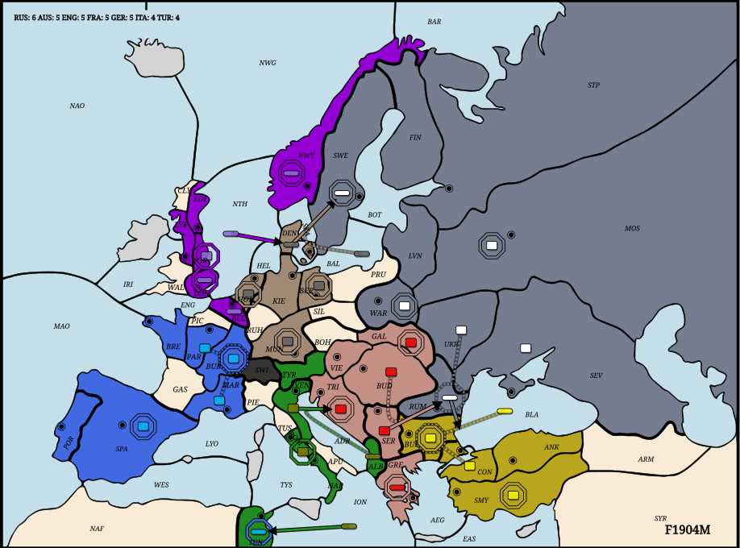

### What happened

- **AUSTRIA**: A SER → RUM; A BUD supports A SER → RUM; F GRE holds; A GAL holds; A TRI holds  [dislodged: A TRI]
- **ENGLAND**: F NTH → DEN; F NWY holds; F LON holds; A YOR holds
- **FRANCE**: A BUR holds; A PAR supports A BUR; A SPA holds; A MAR supports A BUR; F TUN holds
- **GERMANY**: F DEN → SWE; F BAL supports F DEN → SWE; A MUN holds; A BER holds; A HOL holds
- **ITALY**: A VEN → TRI; F ALB supports A VEN → TRI; F ION → TUN (bounced); A ROM holds
- **RUSSIA**: F RUM → BUL/EC (bounced); A UKR supports F RUM (void); F SWE holds; A WAR holds; A MOS holds  [dislodged: F RUM, F SWE]
- **TURKEY**: A BUL holds; F BLA supports A BUL; A CON supports A BUL; A SMY holds

### Dialogue

- **AUSTRIA → RUSSIA**: Russia, you're at 7 centers now — the board will unite against you unless you make concessions. Give me BUL peacefully this fall: I take it, you keep RUM and your northern gains, and I become your southern shield against Turkey and Italy rather than your enemy. Fight me over BUL and I ally with Turkey and Italy to roll back your position — a 6-center Austria coordinating with 4-center Turkey and 4-center Italy is a serious coalition against a 7-center Russia.
- **AUSTRIA → TURKEY**: Turkey, Russia took your BUL last spring — that's the real betrayal here. This fall I'm attacking BUL with A SER supported by F GRE; if you support A SER into BUL from CON or add A BUL pressure from the east, we retake it together. I'll commit to leaving CON and SMY alone if you help me take BUL back from Russia.
- **AUSTRIA → ITALY**: Italy, Russia is at 7 centers and growing — we need to coordinate seriously. I'm pushing A SER - BUL with F GRE support this fall; if you support that attack from F ALB or F ION, we weaken Russia's Balkan position together. In exchange I commit to full non-aggression on TRI and VEN through 1905.
- **ENGLAND → FRANCE**: Fall 1904 — I'm making another push on Denmark this fall and need BEL stable. Russia at 6 centers is pulling away from all of us; once I secure DEN and reach 6, I want to have a serious conversation about coordinating against them. Please hold BUR defensively and leave BEL alone — our non-aggression is still the right call.
- **ENGLAND → GERMANY**: Fall 1904 — I'm coming for Denmark again this fall. I know you've held twice with BAL support, but I'm also looking at HOL as an alternative target. If you want to avoid losing two centers simultaneously, the rational move is to negotiate: let DEN go and I leave HOL alone. Otherwise I'm pressing both flanks and you have to choose what to defend.
- **ENGLAND → RUSSIA**: Fall 1904 — you're at 6 centers and pulling ahead of everyone. I want to keep the north stable between us, but I'm watching your position carefully. Are you planning any moves toward Scandinavia or the west this fall?
- **FRANCE → ENGLAND**: Fall 1904 — I'm at 6 centers now with TUN secured. I want to keep our non-aggression solid: I'm not moving on BEL or your home centers. My growth path is south through the Mediterranean. Russia is at 6 and growing — they just took SWE. We should seriously start coordinating against them before they hit 8+. What's your plan this fall?
- **FRANCE → GERMANY**: Fall 1904 — our non-aggression has held all year and I appreciate that. Russia at 6 centers with SWE and RUM is the board's biggest threat and growing. I'm focused south through the Mediterranean this fall, not east toward you. Are you thinking about how to address the Russia problem, or are you still primarily watching England?
- **FRANCE → ITALY**: Fall 1904 — I took TUN and I want to be honest: I'm not looking to push further into your territory right now. Russia at 6 centers is the real board threat and we should be talking about how to slow them down rather than fighting each other. What's your read on the eastern situation?
- **GERMANY → ENGLAND**: Fall 1904: I'm pushing F DEN into SWE this turn with F BAL support — Russia just grabbed it and I need to stop their Scandinavian expansion before it's too late. This isn't a threat to your Norwegian position; I'm looking east at Russia, not north at you. If you hold NWY and I take SWE, we split Scandinavia and Russia doesn't dominate the north.
- **GERMANY → FRANCE**: Our non-aggression holds — BUR and MUN are stable this fall from my side. I'm pushing for SWE against Russia this turn. Are you still moving through the Mediterranean, or do you have eyes on anything that affects our arrangement?
- **GERMANY → RUSSIA**: You just took SWE and I need to be direct: I'm contesting it this fall with F DEN→SWE supported by F BAL. This isn't personal — I'm at 5 centers and stalled while you're at 6 and growing. I'd rather negotiate a deal than fight, but I cannot let you consolidate all of Scandinavia unopposed.
- **ITALY → AUSTRIA**: Fall 1904: I want to make a genuine proposal — let's coordinate against Turkey and Russia rather than fight each other. I'm willing to support your A SER → BUL push if you give me TRI; alternatively, if you commit to non-aggression, I'll focus entirely on pressuring Turkey from the south via ION. Russia at 6 centers is the real threat and a stalled Italy-Austria conflict only helps them.
- **ITALY → TURKEY**: Fall 1904: Russia is pressing you hard from the north and I hold F ION in a position to threaten your flank. I'd rather we coordinate than fight — if you're willing to let me into BUL peacefully or support a joint move against Austria, we can both benefit. What's your read on the board this fall?
- **ITALY → FRANCE**: Fall 1904: You took TUN last spring — I'm not happy about that, but I'd rather negotiate than start a war. If you're willing to commit to keeping F TUN out of ION and not threatening my southern coast further, I'll focus my energy eastward and we can avoid mutual damage.
- **RUSSIA → AUSTRIA**: Fall 1904: Turkey defended at strength 3 last spring — we need to coordinate precisely this fall. I'm proposing: you order A SER to support F RUM into BUL/EC, giving me strength 3 to crack Turkey's defense guaranteed. I take BUL, grow to 7, and next year I actively push F BLA toward ANK/CON while you hold your Balkan position. This is better than another bounce — confirm A SER S F RUM - BUL/EC.
- **RUSSIA → TURKEY**: Fall 1904: Austria and I are coordinating a strength-3 attack on Bulgaria this fall — you cannot stop it with your current setup. The smart move is to pull A CON or F BLA back and preserve your strength for defense of your home centers; losing BUL in a costly fight while weakened is worse than a managed retreat. I'm willing to discuss terms if you want to negotiate rather than fight.
- **RUSSIA → ENGLAND**: Fall 1904: Still holding the northern arrangement — F SWE is staying put and I have no designs on NWY. How are you reading Germany's staying power? I'm curious whether you're pressing hard this fall or consolidating.
- **TURKEY → ITALY**: Fall 1904: Austria's F GRE is the target — I'm moving A BUL → GRE with F BLA support (strength 2 vs Austria's 1 fleet). If you move F ALB → GRE or F ION → GRE independently, we bounce and Austria keeps it free — the only way GRE falls is if you support my attack or stay out entirely. Please commit to either F ALB S A BUL → GRE (I take GRE, Austria loses a center) or move both fleets elsewhere so I can take it cleanly.
- **TURKEY → AUSTRIA**: Fall 1904: I'm taking GRE this turn with 2-unit strength — F GRE cannot hold against A BUL supported by F BLA. One last offer: move F GRE voluntarily to ION or ALB and I'll support your A SER → RUM push this fall, giving you a net gain instead of just a loss. Hold and you lose both the fleet and the center.
- **TURKEY → RUSSIA**: Fall 1904: I'm pushing south toward GRE, not east — F BLA is supporting A BUL → GRE, not threatening RUM. Let's maintain our non-aggression arrangement through this fall; you're at 6 centers and well-positioned in the north, and there's no reason for us to fight while England and Germany grow unchecked in the west.
- **AUSTRIA → RUSSIA**: Russia, I'm attacking BUL with A SER supported by F GRE this fall — not supporting your F RUM push. If you move F RUM into BUL/EC simultaneously, we bounce each other and Turkey keeps it; stand down from BUL this fall and let me take it, then I'm your southern ally against Turkey and Italy. A 6-center Austria is worth more to you as a partner than another bounce.
- **AUSTRIA → TURKEY**: Turkey, Russia at 7 centers is the existential threat — not me. If you move A CON to support A SER into BUL this fall, we retake BUL from Russia together and I commit to leaving CON and SMY alone. Attacking GRE while Russia holds BUL just accelerates your elimination; coordinate with me now and we both survive.
- **AUSTRIA → ITALY**: Italy, TRI is not on offer — but I'll commit to full non-aggression through 1905 if you support A SER - BUL from F ION or stay neutral. Russia at 7 centers threatens you more than it threatens me; help weaken their Balkan position this fall and we coordinate properly against them next year.
- **ENGLAND → GERMANY**: Fall 1904 — if you're genuinely moving F DEN → SWE with F BAL support, then DEN is undefended and I'm taking it. I'd rather you confirm this is real so we can both plan accordingly — you get SWE (blocking Russia), I get DEN, and we both grow while Russia is stopped in Scandinavia. This is a win-win if you're honest with me.
- **ENGLAND → FRANCE**: France — Germany just told me they're moving F DEN → SWE with F BAL support, which leaves DEN wide open. I'm taking it this fall with F NTH supported by F BEL. This brings me to 6 centers alongside you. Russia at 6 is our shared problem — once I secure DEN, I want to seriously coordinate against them. Hold BUR and leave BEL alone as agreed.
- **ENGLAND → RUSSIA**: Fall 1904 — Germany is pushing F DEN → SWE to contest your recent gain there. I'm watching the Scandinavian situation carefully. I want to keep our northern arrangement stable, but Russia at 6 centers is pulling ahead of everyone and I'm starting to think we need a broader conversation about balance.
- **FRANCE → ITALY**: Fall 1904 — I hear you on ION. I'm keeping F TUN defensive this fall, not pushing into ION. I'd rather we formalize non-aggression: I keep TUN and stay out of your waters, you focus east on Austria and Turkey. Russia at 6 is the real threat and a France-Italy war just hands them the game.
- **FRANCE → ENGLAND**: Confirmed — BEL is safe from me this fall, non-aggression holds. Russia just took SWE and is pulling away; once you secure DEN we need a serious coordinated response. I'm consolidating in the Mediterranean this fall.
- **FRANCE → GERMANY**: Your SWE push against Russia is smart — Russia at 6 with SWE and RUM is dangerous for all of us. Our BUR/MUN non-aggression continues; I'm holding defensively in the west this fall. Let's talk about broader coordination against Russia next spring.
- **GERMANY → ENGLAND**: I'm taking SWE this fall — F DEN moves with F BAL support, and that's my focus. I'm not contesting HOL if you leave it alone; threatening both DEN and HOL simultaneously while Russia expands in Scandinavia just hands them the north. Let's not bleed each other while Russia consolidates.
- **GERMANY → RUSSIA**: I'm contesting SWE this fall — you just took it and I cannot let Russia dominate all of Scandinavia while I sit at 5 centers. I'd rather negotiate than fight: SWE to me, you keep RUM and focus south against Turkey, and we both grow without conflict. What do you say?
- **ITALY → AUSTRIA**: Fall 1904: Turkey is attacking GRE with 2-unit strength (A BUL + F BLA support) — you will lose GRE unless you get outside support. I can support your F GRE with F ION, keeping Turkey out, in exchange for you committing to leave TRI undefended so I can move in. Otherwise I let Turkey take GRE and we both deal with a 5-center Turkey.
- **ITALY → TURKEY**: Fall 1904: I'm not going to hand you GRE by staying neutral — if you want my support for A BUL → GRE, I need something concrete. Commit to supporting my F ION into EAS and staying out of the Aegean permanently, or I'll either support Austria's defense or move independently to disrupt your attack.
- **ITALY → FRANCE**: Fall 1904: I accept the loss of TUN as a fait accompli and I'm not looking to fight you over it. I'd rather we both focus eastward — Russia at 6 centers is the real threat and a France-Italy alignment makes more sense than friction over the southern Med.
- **RUSSIA → AUSTRIA**: Your ultimatum is noted, but consider: a 7-center Russia taking BUL while you hold your 5 centers is not a threat to you — it's a partner who can block Turkey from growing further. If you attack me with Turkey and Italy, you hand England and Germany the game while we bleed each other. Let's be precise: I'm attacking BUL/EC from F RUM with A SEV support this fall — if you support that with F GRE, BUL falls to me and Turkey collapses. That's better for both of us than a coalition war.
- **RUSSIA → TURKEY**: Interesting — if F BLA is supporting A BUL into GRE, that means BUL itself is less defended from the east this fall. I'm moving F RUM into BUL/EC with A SEV support regardless; if you're genuinely pushing toward GRE, we may not need to fight at all. Confirm your actual intentions so we don't waste moves bouncing each other.
- **RUSSIA → GERMANY**: I understand your concern about SWE, but contesting it now only helps England consolidate Scandinavia while we fight. I'm willing to discuss a negotiated arrangement — what would satisfy you here? I'd rather find a deal than burn units on a bounce.
- **RUSSIA → ENGLAND**: Germany is threatening to contest Sweden with F DEN supported by F BAL — that's a direct challenge to both our northern positions. I'm holding SWE firmly this fall; are you in a position to pressure Germany from the west to discourage that move?
- **TURKEY → ITALY**: Fall 1904 round 2: Russia is lying about coordinating with Austria — Austria just messaged me offering to help retake BUL together, so they're playing both sides. I'm moving A BUL → GRE with F BLA support (strength 2) — please commit to F ALB S A BUL → GRE for a guaranteed capture, or at minimum don't move F ION/F ALB to GRE so we don't bounce. Austria loses a center either way if you cooperate.
- **TURKEY → AUSTRIA**: Round 2: Russia and Italy are both messaging me with 'coordination' offers, trying to get me to expose BUL — I'm not falling for it. Here's my real offer: I move A BUL → GRE and you let it happen (hold F GRE or retreat it voluntarily), and I'll actively support A SER → RUM this fall with A CON. You gain RUM, I gain GRE, Russia loses a center — that's a net win for both of us against the real board threat.
- **TURKEY → RUSSIA**: Round 2: I have strength 3 on BUL (A BUL, F BLA, A CON all committed) — your F RUM alone cannot take it, and if Austria is genuinely coordinating with you, I'll see it in the orders. Stop the bluff and let's maintain our stable southern line; I'm pushing south toward GRE, not east toward you.
- **FRANCE → ENGLAND**: Final confirmation — BEL is completely safe from me this fall, non-aggression holds firm. Once you secure DEN and we're both at 6, we need a real anti-Russia plan: they're at 6 with SWE and RUM and will hit 8 soon if unchecked. I'm ready to coordinate seriously next spring.
- **FRANCE → ITALY**: Final confirmation — F TUN holds defensively this fall, I'm not moving into ION. Our non-aggression is real and I want it to last: you focus east, I consolidate in the west, and we both watch Russia carefully. Let's talk next spring about genuine coordination.
- **FRANCE → GERMANY**: Final confirmation — BUR holds defensively, our non-aggression is solid. Your SWE push against Russia is exactly the right move; I hope it succeeds. Next spring let's seriously discuss coordinating against Russia before they pull too far ahead.

### AUSTRIA
Orders: `A SER - RUM` · `A BUD S A SER - RUM` · `F GRE H` · `A GAL H` · `A TRI H`

Reasoning

> Looking at the board situation:
>
> - I'm at 5 centers (BUD, TRI, VIE, SER, GRE), need to grow
> - Russia is at 6 centers (MOS, SEV, STP, WAR, RUM, SWE) - they hold BUL via F RUM now
> - Turkey threatens GRE with A BUL + F BLA (strength 2) - this is a real threat
> - Italy offered to support F GRE with F ION in exchange for TRI - I rejected that deal
> - Russia wants me to support F RUM into BUL/EC - that grows Russia to 7, not me
> - Turkey offered to let A BUL → GRE if I support A SER → RUM - I lose GRE but gain RUM
>
> Key analysis:
> - Turkey's threat to GRE: A BUL supported by F BLA = strength 2 vs my F GRE alone = strength 1. GRE will fall unless I defend it with support.
> - If I push A SER → BUL supported by F GRE, I attack BUL but leave GRE undefended against Turkey's 2-unit attack. I lose GRE and fail to take BUL (Russia's F RUM will contest it too).
> - Better option: Defend GRE by having A SER support F GRE, keeping GRE safe. But that gains me nothing.
> - Alternative: Accept Turkey's deal - let A BUL → GRE happen while I take RUM? But I need A SER → RUM supported by... A BUD? That's only strength 2 vs Russia's F RUM. Russia has F RUM with no support mentioned - that could work if Russia isn't supporting RUM.
>
> Wait - Russia's F RUM is attacking BUL/EC this fall per their message. So RUM would be empty! If Russia moves F RUM → BUL/EC, then A SER → RUM with A BUD support (strength 2) could take RUM unopposed. That's a genuine center gain!
>
> But I lose GRE to Turkey (going from 5 to 5 centers net, trading GRE for RUM). Actually that's a lateral move.
>
> Better plan: Push A SER → BUL supported by F GRE (my committed plan), and hope Turkey's attack on GRE is bluffing or that F GRE survives. If Russia moves F RUM → BUL/EC and I move A SER → BUL supported by F GRE, we bounce each other and Turkey keeps BUL while potentially taking GRE.
>
> Most practical: Use A SER to support F GRE defensively (A SER S F GRE), keeping GRE safe against Turkey's 2-unit attack. Then next season I'm in better position. But I gain nothing.
>
> Actually the best move: A SER → RUM (Russia's F RUM is moving away!), A BUD supports A SER → RUM, F GRE holds or defends, A GAL and A TRI defensive. If Russia vacates RUM to attack BUL, I can take RUM with strength 2.

### ENGLAND
Orders: `F NTH - DEN` · `F NWY H` · `F LON H` · `A YOR H`
Illegal (dropped): `F BEL S F NTH - DEN`

Reasoning

> Looking at the situation: Germany confirmed they're moving F DEN → SWE with F BAL support, leaving DEN undefended. This is my best opportunity to finally take Denmark and reach 6 centers. France has confirmed non-aggression on BEL multiple times, so I can safely use F BEL to support F NTH → DEN without risk. Norway holds, London holds, Yorkshire holds.
>
> The key move: F NTH - DEN supported by F BEL S F NTH - DEN. If Germany is telling the truth about F DEN → SWE, this is uncontested. Even if they're bluffing and F DEN stays, with F BAL supporting F DEN → SWE (not holding DEN), DEN would only have 1 defender vs my 2 attackers, so DEN falls either way.

### FRANCE
Orders: `A BUR H` · `A PAR S A BUR` · `A SPA H` · `A MAR S A BUR` · `F TUN H`

Reasoning

> Looking at the current situation: I'm at 6 centers (BRE, MAR, PAR, POR, SPA, TUN) and need to hold all of them while positioning for future growth. I've confirmed non-aggression with England (BEL safe), Germany (BUR/MUN stable), and Italy (F TUN holds defensively). 
>
> My units are well-positioned defensively. The key question is whether to make any aggressive moves this fall:
> - BEL: I promised England I won't go there, and breaking that now would restart a western war while Russia is at 6
> - Germany's SWE push means they're focused east/north, not threatening me
> - Italy accepted TUN loss and wants non-aggression
> - F TUN could push to ION but I promised Italy I wouldn't, and I have no follow-up force to exploit it
>
> The right play is to hold defensively and consolidate. Russia at 6 with SWE and RUM is the growing threat. I should keep all my centers secure and not take risks that could backfire.
>
> One consideration: Germany is pushing for SWE, which means F DEN and F BAL are both moving north, potentially leaving HOL and BER exposed. But I promised non-aggression on MUN/BUR, and breaking it now would be premature.
>
> I'll hold all units defensively to secure my 6 centers and enter 1905 with a solid position and intact alliances.

### GERMANY
Orders: `F DEN - SWE` · `F BAL S F DEN - SWE` · `A MUN H` · `A BER H` · `A HOL H`

Reasoning

> Looking at the current situation:
>
> **Strategic assessment:**
> - I have 5 centers: BER, KIE, MUN, DEN, HOL
> - England confirmed they'll take DEN since I'm moving DEN→SWE (they explicitly said this is a "win-win")
> - If F DEN→SWE succeeds with F BAL support, I gain SWE but lose DEN = net 0 change, staying at 5
> - Russia has F SWE — if I take it, Russia drops to 5, I stay at 5 (DEN lost to England)
> - This is actually a reasonable trade: I block Russian Scandinavian dominance and maintain 5 centers
> - France confirmed BUR/MUN non-aggression holds
> - England threatening HOL — I should hold HOL defensively
> - BER should hold defensively as well
> - MUN holds per non-aggression with France
>
> The key orders are clear: F DEN→SWE with F BAL support is the main action. England takes DEN (I've essentially accepted this). I need to hold MUN, BER, HOL defensively. This keeps me at 5 centers while denying Russia SWE.
>
> Actually, wait — if England takes DEN, I lose a home center. I need to think about whether this trade is worth it. SWE is a supply center, DEN is a supply center. Net 0. But Russia at 5 instead of 6 is better strategically. And I can rebuild at KIE (which is open).
>
> Let me commit to the plan I've been telegraphing.

### ITALY
Orders: `A VEN - TRI` · `F ALB S A VEN - TRI` · `F ION - TUN` · `A ROM H`

Reasoning

> Looking at the current situation:
>
> **Board state analysis:**
> - I hold 4 centers: NAP, ROM, VEN, TUN (wait - France took TUN in Spring 1904, so I'm at 4 with NAP, ROM, VEN, and GRE... actually let me recheck)
>
> Looking at the supply centers listed: ITALY has NAP, ROM, VEN, TUN (4 centers). But France took TUN (F TYS → TUN in Spring 1904). And I moved F ALB → GRE in Spring 1904 (bounced per the history... wait, the S1904M shows "F ALB → GRE (bounced)").
>
> So actually my centers are still NAP, ROM, VEN, TUN = 4 centers. France took TUN. My units are: A ROM, A VEN, F ALB, F ION.
>
> Wait - the supply centers show ITALY: NAP, ROM, VEN, TUN (4). But France has TUN listed under FRANCE. Let me re-read... FRANCE (5): BRE, MAR, PAR, POR, SPA - no TUN. ITALY (4): NAP, ROM, VEN, TUN. So I still have TUN.
>
> France's F TYS → TUN succeeded in Spring 1904 but France doesn't own TUN yet (they'd need Fall to capture it). The unit positions show F TUN for France. So France's fleet is IN TUN but I still own it. If France holds F TUN this fall, they'll capture it at year end.
>
> **Key decisions:**
> - Turkey is attacking GRE with A BUL + F BLA support (strength 2) vs Austria's F GRE (strength 1) - Austria WILL lose GRE
> - France's F TUN threatens my TUN center - I need to contest it or lose it
> - My strategy note says to attack TRI with A VEN + F ALB support
>
> The best move: Attack TRI (A VEN → TRI, F ALB S A VEN → TRI) while using F ION to threaten France's F TUN. Turkey takes GRE regardless. I lose TUN to France unless I contest it with F ION → TUN, but that leaves TRI attack with only 1 unit.
>
> Actually F ION → TUN would contest France's hold, potentially bouncing them and saving TUN. That's worth it - TUN is a center I currently own.
>
> F ION → TUN to contest/retake, A VEN → TRI with F ALB support for TRI grab. A ROM holds.

### RUSSIA
Orders: `F RUM - BUL/EC` · `A UKR S F RUM` · `F SWE H` · `A WAR H` · `A MOS H`
Illegal (dropped): `A SEV S F RUM - BUL/EC`

Reasoning

> Looking at the current situation:
>
> **Key facts:**
> - F SWE just captured Sweden (6→7 centers if I hold it)
> - Germany is threatening F SWE with F DEN→SWE supported by F BAL (strength 2)
> - Turkey claims F BLA supporting A BUL→GRE, meaning BUL may be less defended from the east
> - Austria says they're attacking A SER→BUL supported by F GRE (strength 2)
> - My F RUM→BUL/EC with A SEV support = strength 2
>
> **Analysis:**
>
> **Sweden defense:** Germany has F DEN→SWE + F BAL support = strength 2. I need to defend F SWE at strength 2 to hold. I can use A UKR to support... wait, A UKR can't reach SWE. I need F SWE to get a support. Looking at legal orders: `F SWE H` alone = strength 1, loses to Germany's strength 2. I need support for SWE. A MOS can't support SWE. A WAR can't support SWE. No adjacent unit can support SWE from the legal orders list. F SWE would need to bounce back or be supported by something adjacent. Looking at options — there's no Russian unit that can support F SWE against F DEN. I cannot defend SWE at strength 2 alone.
>
> **Bulgaria:** Turkey claims strength 3 on BUL, but also claims F BLA is supporting A BUL→GRE. Those are contradictory — F BLA can't both support A BUL→GRE AND support A BUL in place. If Turkey is genuinely pushing A BUL→GRE with F BLA support, then BUL is only defended by A BUL itself (strength 1), and F RUM→BUL/EC + A SEV support = strength 2 takes it.
>
> Austria is attacking A SER→BUL with F GRE support = strength 2. If both attacks hit BUL at strength 2, we bounce each other. But if Turkey's A BUL is moving away (→GRE), then BUL is empty and whoever gets there first wins — but we'd still bounce each other.
>
> I need to either:
> 1. Support Austria's attack (F RUM S A SER - BUL) — guarantees Austria takes BUL, Turkey weakens
> 2. Attack myself with A SEV support (strength 2) — risks bounce if Austria also attacks
>
> Given I can't defend SWE reliably, I should focus on taking BUL to compensate for likely SWE loss. But if Austria and I both attack at strength 2, we bounce. 
>
> Best play: Attack BUL/EC with F RUM + A SEV support (strength 2). If Turkey's BUL is moving to GRE (as claimed), it's empty and I take it. If Austria also attacks, we bounce — but that's a risk worth taking since supporting Austria gives them the center, not me.
>
> For SWE: Hold it — if Germany attacks at strength 2 and I hold at strength 1, I lose SWE. But there's nothing I can do to defend it without support. I'll hold and accept the likely loss, or try F SWE→NWY to at least threaten something. Actually, holding is best — maybe Germany doesn't actually execute the attack.

### TURKEY
Orders: `A BUL H` · `F BLA S A BUL` · `A CON S A BUL` · `A SMY H`

Reasoning

> Looking at the board situation:
>
> **Key facts:**
> - I have A BUL, F BLA, A CON, A SMY (4 units, 4 centers)
> - Austria has F GRE (isolated, only 1 unit defending)
> - Russia has F RUM and A SEV/A UKR - can threaten BUL from the east
> - Italy has F ALB and F ION - can interfere with GRE
>
> **Analysis:**
> Russia claims a strength-3 attack on BUL but looking at their units: F RUM can move to BUL/EC, A SEV is adjacent to RUM not BUL directly, A UKR supports F RUM → BUL. So Russia could have strength 2 (F RUM + A UKR support) against BUL. Austria has A SER which could support F GRE or attack BUL.
>
> Wait - Austria's message says "attacking BUL with A SER supported by F GRE." That would be A SER → BUL supported by F GRE (strength 2 from Austria). Plus Russia's F RUM → BUL/EC (strength 2 with A UKR support). Two separate attacks on BUL from different directions - both could be strength 2.
>
> If I defend BUL with A BUL H + F BLA S A BUL + A CON S A BUL = strength 3, I can hold against both attacks simultaneously (each attacker only has strength 2).
>
> But if I push A BUL → GRE with F BLA support, BUL is vacated and Russia/Austria walk in. I'd gain GRE (5 centers) but lose BUL (still 4 centers net if GRE succeeds, but BUL gone).
>
> Actually: if A BUL → GRE succeeds and Russia takes BUL, I'm at 4 centers (lose BUL, gain GRE). If I defend BUL successfully, I stay at 4 centers. The GRE push nets me the same count but repositions me better (GRE is a supply center I'd hold).
>
> The risk: Italy might move F ALB → GRE or F ION → GRE causing a bounce. Italy refused to commit support. If the GRE attack bounces AND Russia takes BUL, I drop to 3 centers. That's catastrophic.
>
> **Decision:** Defend BUL with strength 3 (A BUL H, F BLA S A BUL, A CON S A BUL). This guarantees I hold BUL against any plausible attack. A SMY holds defensively. I stay at 4 centers but preserve my position for 1905.

## FALL 1904 RETREATS (`F1904R`)

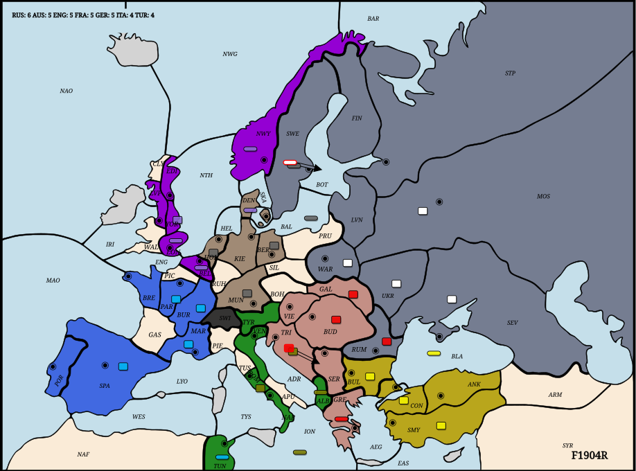

### What happened

- **AUSTRIA**: A TRI retreats → SER
- **RUSSIA**: F SWE retreats → BOT

### AUSTRIA
Orders: `A TRI R SER`

Reasoning

> Looking at the retreat situation: A TRI was dislodged by Italy's A VEN. I need to decide where to retreat it.
>
> My options are:
> - `A TRI D` - disband the unit
> - `A TRI R TYR` - retreat to Tyrolia
> - `A TRI R SER` - retreat to Serbia (but I just took RUM with A SER moving there, so SER is now empty)
> - `A TRI R VIE` - retreat to Vienna
>
> Key considerations:
> - I took RUM with A SER this fall, so SER is empty and available
> - A TRI R SER would put a unit in Serbia, which is useful for future BUL pressure
> - A TRI R TYR would put pressure on MUN/VIE area but is somewhat exposed
> - A TRI R VIE is safe but defensive
> - Disbanding loses a unit when I'm already at 5 centers (now 5 after losing TRI to Italy)
>
> Wait - I lost TRI to Italy, so my supply centers are now: BUD, VIE, SER, GRE, and RUM (just captured). That's still 5 centers. I have 5 units (A GAL, F GRE, A BUD, A RUM, and the retreating A TRI). If I keep A TRI, I'll have 5 units matching 5 centers.
>
> Retreating to SER is the best option - it keeps the unit in the Balkans where it can pressure BUL next spring, and SER is a valuable position. TYR puts me back near Italy but doesn't help with my main strategic goals. VIE is safe but passive.

### RUSSIA
Orders: `F SWE R BOT`

Reasoning

> Looking at the situation: F SWE was dislodged by Germany's F DEN → SWE (supported by F BAL, strength 2) while I had F SWE holding (strength 1). F RUM was also dislodged - Austria's A SER → RUM succeeded.
>
> Wait, let me re-read. The dislodged units are F RUM and F SWE. But my legal orders only show options for SWE. That means F RUM must have been disbanded automatically or... let me check again.
>
> The legal orders only list SWE with 4 options. So F RUM is either already gone or there are no valid retreat options for it. Given only SWE appears in my legal orders, F RUM has no retreat options and is auto-disbanded.
>
> For F SWE, I need to decide where to retreat. Options are FIN, BOT, SKA, or disband.
>
> - FIN: useful position in the north, keeps a fleet active
> - BOT: also useful, central Baltic positioning
> - SKA: adjacent to DEN/NOR area, could be useful but puts me near England/Germany
> - Disband: lose the unit
>
> I should retreat rather than disband. BOT gives me good central positioning and keeps pressure options open. FIN is also good - it's a safe position that doesn't threaten anyone immediately and keeps options for STP/NC or BOT next spring. 
>
> BOT is probably most useful strategically - it keeps me in the Baltic theater and gives me options to contest SWE again or support other moves.

## WINTER 1904 ADJUSTMENTS (`W1904A`)

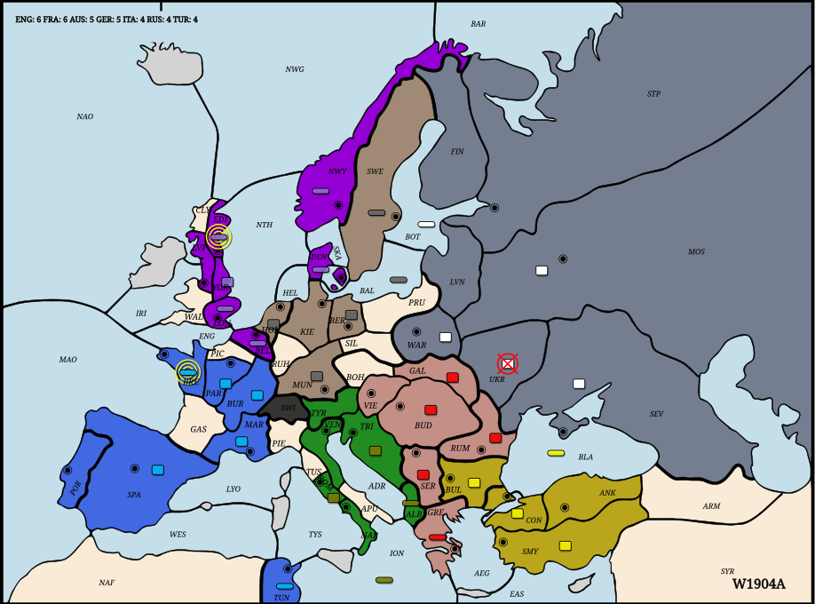

### What happened

- **ENGLAND**: builds F EDI
- **FRANCE**: builds F BRE
- **RUSSIA**: disbands A UKR

### ENGLAND
Orders: `F EDI B`

Reasoning

> Looking at the position: I have 6 supply centers (EDI, LON, LVP, BEL, NWY, DEN) and 5 units (A YOR, F NWY, F BEL, F LON, F DEN). I'm owed 1 build. I should build a fleet to project power into the North Sea / Baltic area, or an army to support land operations. Given my strategic position — I want to pressure Germany further and potentially threaten the continent — a fleet built at Edinburgh makes the most sense to eventually threaten the Baltic or support North Sea operations. Alternatively, building at Liverpool gives me an army for potential land operations in the future.
>
> Given that my fleets are already well-positioned in the north (F DEN, F NWY, F BEL, F LON), adding another fleet at Edinburgh would give me strong naval dominance. This is the right call for England's long-term strategy.

### FRANCE
Orders: `F BRE B`

Reasoning

> Looking at the position: I have 6 supply centers (BRE, MAR, PAR, POR, SPA, TUN) and 5 units (A BUR, A PAR, A SPA, A MAR, F TUN). I'm owed 1 build. BRE is my only open home center.
>
> I should build a fleet at Brest — it gives me naval power in the Atlantic/English Channel, which opens options against England or supports Mediterranean operations. An army at Brest would be less useful since I already have strong land coverage in France.

### RUSSIA
Orders: `A UKR D`

Reasoning

> Looking at the situation: I ended Fall 1904 with 4 supply centers (MOS, SEV, STP, WAR) but I have 5 units (A UKR, A SEV, A WAR, A MOS, F BOT). I need to disband 1 unit to match my supply center count.
>
> My legal orders only allow disbanding — every unit has exactly one option (disband). I need to choose which unit to disband strategically.
>
> Current units: A UKR, A SEV, A WAR, A MOS, F BOT
> I need to keep units that are most useful for future offensives and defense:
> - A MOS: core homeland defense, keep
> - A WAR: core homeland defense, keep  
> - A SEV: positioned near the Black Sea/Turkish front, useful for future attacks on BUL/RUM, keep
> - F BOT: positioned in the north, useful for Scandinavian operations, keep
> - A UKR: least well-positioned right now — it's in Ukraine which is useful but I have A SEV nearby for southern operations
>
> I'll disband A UKR as it's the most redundant unit given A SEV covers the southern front.

## SPRING 1905 MOVEMENT (`S1905M`)

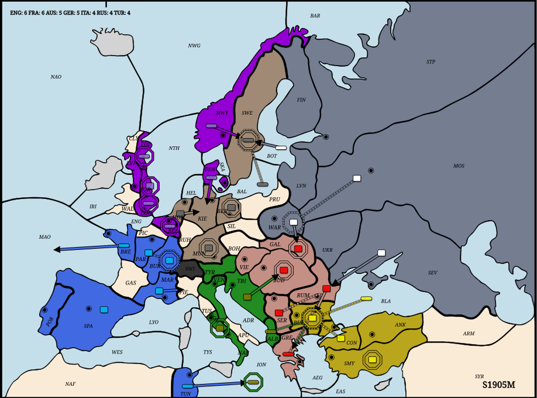

### What happened

- **AUSTRIA**: A RUM → BUL (bounced); A SER supports A RUM → BUL; F GRE supports A RUM → BUL; A BUD holds; A GAL holds
- **ENGLAND**: F DEN → KIE (bounced); F NWY → SWE (bounced); F BEL holds; F LON holds; F EDI holds; A YOR holds
- **FRANCE**: F BRE → MAO; A BUR holds; A PAR supports A BUR; A MAR → PIE; F TUN → ION (bounced)
- **GERMANY**: F SWE holds; F BAL supports F SWE; A HOL → KIE (bounced); A MUN holds; A BER holds
- **ITALY**: F ALB supports A BUL → GRE (void); A TRI → BUD (bounced); F ION holds; A ROM holds
- **RUSSIA**: A SEV → RUM (bounced); A WAR → GAL (bounced); A MOS supports A WAR (void); F BOT → SWE (bounced)
- **TURKEY**: A BUL holds; F BLA supports A BUL; A CON supports A BUL; A SMY holds

### Dialogue

- **AUSTRIA → TURKEY**: Turkey, this spring I have A SER, A RUM, and F GRE all positioned to attack BUL — that's 3 units of pressure and you cannot hold with just F BLA support from CON. This is not a bluff; the math is clear. Yield BUL peacefully and I commit to leaving CON, SMY, and ANK untouched through 1906, and we coordinate against Russia who is rebuilding in the north.
- **AUSTRIA → RUSSIA**: Russia, Turkey is isolated at 4 centers and I have 3 units positioned to take BUL this spring. I'd welcome coordination — if you pressure Turkey from the Black Sea or support my BUL push, we split the Balkans cleanly. I'm not interested in fighting you; let's both grow at Turkey's expense while England and Germany contest the north.
- **AUSTRIA → ITALY**: Italy, I'm focused entirely on BUL this spring with A SER, A RUM, and F GRE — I have no units threatening TRI or VEN. I ask only that F ALB stays neutral and doesn't interfere with my Aegean position; in return I commit to full non-aggression on all Italian centers through 1905.
- **ENGLAND → FRANCE**: Spring 1905 — Germany is at 5 centers and squeezed between us. I'm pushing into Sweden this spring and want to coordinate: if you press A BUR → MUN or threaten HOL from the south, Germany has to split their defense and I crack Scandinavia open. Russia has collapsed to 4 centers so they're no longer the priority — Germany is. Are you willing to press MUN this spring?
- **ENGLAND → GERMANY**: Spring 1905 — you're at 5 centers and I'm coming for Sweden. I'd rather offer you a clean deal: if you cede SWE without a fight and redirect your energy to holding MUN and KIE against France, I'll leave HOL alone and we can stabilize the western front together. Fighting me over SWE while France threatens from the south only accelerates your decline.
- **ENGLAND → RUSSIA**: Spring 1905 — Germany is my primary target this turn and I'm pushing into SWE. I want to keep the north stable between us: I have no designs on your territory and I'd like to confirm you're not moving toward Scandinavia. Are we still aligned on northern non-aggression?
- **FRANCE → ENGLAND**: Spring 1905 — we're both at 6 centers and the board is tightening. Germany at 5 with a solid continental position is worth watching; Austria at 5 is stalling in the Balkans. I want to keep our non-aggression firm this spring — I'm not moving on BEL. My growth path is south through Italy. What's your read on Germany — are they a threat worth coordinating against?
- **FRANCE → GERMANY**: Spring 1905 — our non-aggression has held for two full years and I want to keep it. I'm pushing south through Italy this spring, not east toward you. Russia has been weakened significantly so the eastern threat is reduced; I think Germany and France staying stable is still the right call. Are we good on BUR/MUN this spring?
- **FRANCE → ITALY**: Spring 1905 — I want to be honest with you: I'm looking at growth opportunities and your centers are on my radar. But a costly war between us helps England and Germany more than either of us. Is there any arrangement where we can both grow without fighting — perhaps coordinating against Austria or Turkey together?
- **GERMANY → ENGLAND**: You took DEN as we implicitly agreed — fair play, and I respected that deal. Now I'm at 5 centers and need to grow; sitting still means I lose. I'm proposing we negotiate: give me NWY and I leave DEN alone permanently, or we find another arrangement. If we fight over Scandinavia we both stall while France and Austria grow unchecked.
- **GERMANY → FRANCE**: Our non-aggression has been one of the most stable relationships on the board and I want to keep it that way — BUR and MUN stay stable from my side this spring. I'm focused on Scandinavia against England; are you still looking south through the Mediterranean or has your strategic picture shifted?
- **GERMANY → RUSSIA**: You're weakened after losing SWE and RUM — I'm not looking to pile on, but I need to understand your intentions before committing spring orders. Are you focused on rebuilding in the south against Turkey, or do you have moves planned in the north that affect my position?
- **ITALY → AUSTRIA**: Spring 1905: I hold TRI and I want to be direct — I need a 6th center this year. My preference is a negotiated solution: if you commit to withdrawing A BUD so I can move in peacefully, I'll actively support your position against Russia and Turkey rather than attacking you on multiple fronts. Russia is growing and a coordinated Italy-Austria push makes more sense than mutual destruction.
- **ITALY → RUSSIA**: Spring 1905: Austria is at 5 centers with units in RUM and GAL threatening you — I hold TRI and could push toward BUD or VIE this spring. If you press Austria from GAL toward VIE or BUD simultaneously, we can squeeze them together. What are your intentions this spring?
- **ITALY → TURKEY**: Spring 1905: Austria holds GRE with F GRE and I have F ION and F ALB positioned nearby — if you want to coordinate a joint attack on GRE, I can support from the west while you push from BUL. What are you planning this spring?
- **RUSSIA → TURKEY**: Spring 1905: Austria stole Rumania from me in Fall 1904 — I'm proposing a genuine alliance now. I'll move A SEV into RUM to retake it; if you support that move with A BUL, we take it guaranteed even if Austria has support from A BUD. In return, I'll support your push into SER or GRE — Austria is the common threat and we're both at 4 centers. Confirm you'll support A SEV - RUM with A BUL.
- **RUSSIA → AUSTRIA**: Spring 1905: You took Rumania while I was distracted in the north — I want it back, and I'm moving A SEV to reclaim it this spring. We can avoid a damaging war: return RUM to me, I'll support your position against Turkey and Italy, and we resume our anti-Turkey coordination. Fighting me over RUM while Italy presses TRI and Turkey watches is dangerous for you.
- **RUSSIA → GERMANY**: Spring 1905: You've consolidated SWE and I've lost both RUM and SWE — I'm not in a position to threaten you right now. I want to keep the north stable between us while I deal with the Austrian problem in the south. No moves from me toward SWE or your territory this spring.
- **RUSSIA → ENGLAND**: Spring 1905: Austria took Rumania from me in Fall 1904 and I need to focus entirely on reclaiming it — no northern moves from me this spring. I'd like to keep our arrangement stable while I deal with the southern situation.
- **TURKEY → AUSTRIA**: Spring 1905: You've grown to 5 centers with RUM, making you the second-largest power — that changes the board calculus. I'm still moving on GRE this turn with strength 2; you cannot hold F GRE against A BUL supported by F BLA. Move F GRE voluntarily to ION or ALB and I'll support A SER or A RUM defensively against any Russian counter — we both survive stronger.
- **TURKEY → ITALY**: Spring 1905: I'm moving A BUL → GRE with F BLA support (strength 2) — please don't move F ALB → GRE or F ION → GRE independently, as we'd just bounce and Austria keeps the center free again. Either support A BUL → GRE with F ALB for a guaranteed capture, or move your fleets elsewhere — either way Austria loses GRE and we both benefit from a weaker Austria.
- **TURKEY → RUSSIA**: Spring 1905: Austria just took RUM from you — that's 5 centers for Austria and a direct loss for Russia. I'm pushing on GRE this turn to weaken Austria from the south; you should press from the north. Let's coordinate: I take GRE, you work to recover RUM or press GAL, and we both contain Austria's growth before they reach 6-7 centers.
- **AUSTRIA → TURKEY**: Turkey, I'm moving F GRE - BUL/SC supported by A SER and A RUM — that's strength 3 and you cannot hold BUL regardless of F BLA's position. If you move A BUL to GRE, the province is empty when F GRE arrives; if you hold, 3 beats 2. The only question is whether you yield peacefully now and we coordinate against Russia, or you lose BUL and I still leave CON/SMY/ANK alone.
- **AUSTRIA → RUSSIA**: Russia, A SEV moving to RUM while I'm attacking Turkey is the move that makes us enemies — I'll have to pull units back to defend rather than grow, and that only helps England and Germany in the north. Hold A SEV in place this spring and I'll coordinate with you against Turkey's remaining centers; attacking me now while I'm your natural southern ally is a strategic mistake.
- **AUSTRIA → ITALY**: Italy, I have no units near BUD or TRI — A BUD is in Budapest holding defensively and I'm focused entirely on BUL this spring. Attacking me now while Russia threatens both of us from the north is the move that loses you the game; let's both grow at Turkey's expense and then address Russia together.
- **ENGLAND → FRANCE**: Spring 1905 round 2 — I'm confirmed on pushing F DEN → SWE this spring with F NWY support, making it a 2v1 that breaks through Germany's F SWE + F BAL defense. If you can press A BUR → MUN simultaneously, Germany has to choose what to defend and I crack Scandinavia open. Our non-aggression stays firm — I'm not touching BEL or your territory.
- **ENGLAND → GERMANY**: Spring 1905 round 2 — I'm coming for SWE with F DEN → SWE supported by F NWY, a 2v1 you cannot stop with F BAL alone. Ceding SWE now and consolidating KIE, MUN, BER is better than losing SWE AND another center when France pushes MUN. I'm leaving HOL alone if you accept this and redirect south.
- **ENGLAND → RUSSIA**: Spring 1905 — confirmed, I have no interest in your territory while you deal with Austria. I'm pushing Germany in Scandinavia this spring and that's my sole focus north.
- **FRANCE → ENGLAND**: Spring 1905 — I appreciate the coordination offer but I'm not ready to break my Germany non-aggression this spring; it's been too stable and I don't want to open a two-front problem. I'm pushing south through Italy this spring — if you crack Scandinavia and I gain in the Mediterranean, we both grow without stepping on each other. Let's reassess in the fall once the board shifts.
- **FRANCE → GERMANY**: Spring 1905 — confirmed from my side: BUR and MUN stay stable, our non-aggression holds. I'm moving south through the Mediterranean against Italy, not east toward you. England is pressing me to attack you but I'm declining — our arrangement has real value and I'd rather we both grow elsewhere.
- **FRANCE → ITALY**: Spring 1905 — I want to be direct: I'm considering moving on your centers this year, but I'd genuinely prefer a deal. If you're willing to cede TRI or NAP diplomatically and focus your energy on Austria/Turkey, I'll support you in the east rather than fight you. A war between us just hands England and Germany the game — what can we arrange?
- **GERMANY → ENGLAND**: I'm not ceding SWE — it's a center I need to survive and I'll defend it. You're at 6 centers and growing; giving you SWE on top of DEN just accelerates the gap. If you want a real deal, offer me something concrete: NWY for SWE, or a genuine non-aggression pact with defined boundaries. Otherwise I defend what I have.
- **GERMANY → FRANCE**: BUR and MUN are stable from my side — our arrangement holds this spring. I'm defending SWE against English pressure; if England commits multiple fleets north it opens their southern flank for you. Worth noting as you plan your moves.
- **GERMANY → RUSSIA**: Glad to hear you're focused south — I'll keep our northern arrangement stable. Austria taking RUM is the real problem for both of us; if you want to coordinate against Austrian expansion I'm open to discussing it.
- **ITALY → AUSTRIA**: I've heard your non-aggression offer and I'm considering it — but I need something concrete in return for F ALB staying neutral while you take BUL. Commit to withdrawing A BUD toward GAL after BUL falls, giving me a path to VIE, and I'll keep F ALB out of your Aegean operation entirely. Otherwise I have to pursue my own growth agenda.
- **ITALY → FRANCE**: I'm not interested in a war with France — my focus is entirely eastward on Austria and Turkey. If you want to talk coordination, I'm open to it, but I need assurance that F BRE and your Atlantic forces stay well away from my home centers.
- **ITALY → RUSSIA**: Austria is committing A SER, A RUM, and F GRE to BUL this spring — that's their entire eastern force focused south. A GAL is sitting exposed and VIE is weakly defended. If you press from WAR toward GAL or VIE simultaneously with my push from TRI, we can split Austria's attention and both gain centers.
- **RUSSIA → TURKEY**: Round 2 confirmation: I'm committing A SEV → RUM this spring and need your A BUL to support that move — A BUL S A SEV - RUM gives us strength 2 guaranteed against Austria's defense. In return I'll support your F BLA or A CON pushing toward GRE or SER next turn. Austria at 5 centers with RUM and GAL is the primary threat to both of us — let's lock this in now.
- **RUSSIA → ITALY**: Round 2: I'm moving A SEV into RUM this spring to retake it from Austria. If you push toward BUD or VIE simultaneously, Austria faces a two-front crisis and cannot defend everything. I'm also willing to support your TRI position defensively if needed — the key is coordinating our timing so Austria cannot concentrate against either of us alone. Confirm your intended move so we can align.
- **RUSSIA → AUSTRIA**: Round 2: I'm moving A SEV into RUM — this is not a bluff. You're facing Italy pushing toward BUD/VIE and me retaking RUM simultaneously; you cannot defend everywhere. The smart play is to let RUM go and focus on Turkey and Italy, where we can still coordinate profitably. I'd rather resume our anti-Turkey partnership than fight a two-front war that weakens us both while England grows.
- **TURKEY → ITALY**: Round 2 confirmation: I'm committed to A BUL → GRE with F BLA support (strength 2) — please give me F ALB S A BUL → GRE for a guaranteed capture. Austria cannot hold F GRE against strength 2, and with your support we guarantee it falls. If you move F ALB independently to GRE we bounce and Austria keeps the center free — this is the move that weakens Austria for both of us.
- **TURKEY → AUSTRIA**: Round 2: Your 3-unit attack on BUL is a bluff — A SER and A RUM both moving to BUL bounce each other, so you can only get strength 2 at most, which I can match. Stop wasting your units on a costly BUL siege and move F GRE voluntarily; I'll support your northern position against Russia in return and we both gain more than we lose.
- **TURKEY → RUSSIA**: Round 2: I support the idea of pressuring Austria from both sides, but I can't support A SEV → RUM with A BUL because I need A BUL for my GRE push. Instead, coordinate this way: I take GRE (weakening Austria by 1), you press A SEV → RUM independently — Austria loses two centers simultaneously and can't defend both.
- **ENGLAND → GERMANY**: Final round — I'm moving F DEN → KIE this spring, which is undefended. If you want to avoid losing KIE, your only option is to negotiate now: cede SWE peacefully and I'll redirect DEN elsewhere. Otherwise you lose KIE and I'm still pressing SWE with NWY next fall.
- **ENGLAND → FRANCE**: Final confirmation — non-aggression holds firm, I'm not touching your territory. I'm pressing Germany in Scandinavia and the coast this spring. Good luck in the Mediterranean.
- **GERMANY → ENGLAND**: Final round — I'm defending SWE with F BAL support, making your 2v1 a 2v2 bounce. We both waste moves and you gain nothing. The rational outcome is we hold current positions and negotiate: I keep SWE, you keep DEN, and we draw a line in Scandinavia. I'm open to a real deal but I will not surrender SWE without a fight.
- **GERMANY → FRANCE**: Final confirmation from my side: BUR and MUN are stable, our non-aggression holds completely this spring. I'm defending SWE against England — two years of stability between us has real value and I'm committed to maintaining it.
- **GERMANY → RUSSIA**: Holding the north stable as agreed — no moves from me toward your territory this spring. Focus on Austria; they're the real threat growing in the Balkans.

### AUSTRIA
Orders: `A RUM - BUL` · `A SER S A RUM - BUL` · `F GRE S A RUM - BUL` · `A BUD H` · `A GAL H`

Reasoning

> Looking at the board state and my strategy history, I've already reasoned through this in the revised S1905M entry: I need to attack BUL with strength 3 by having A RUM - BUL supported by both A SER and F GRE. Turkey correctly noted that two units moving to BUL bounce each other, so I must use one to support the other.
>
> Turkey is threatening GRE with A BUL + F BLA (strength 2), but if A BUL is the unit I'm attacking, it can't simultaneously defend AND attack GRE. The attack from A RUM - BUL supported by A SER and F GRE gives me strength 3 vs Turkey's maximum strength 2 (F BLA support for A BUL holding). This should succeed.
>
> Russia is threatening A SEV - RUM, which would dislodge my A RUM if it succeeds. However, A RUM is moving out to BUL, so it won't be in RUM to be dislodged — the province will be empty when A SEV arrives (or A RUM will have moved). Actually, if A RUM moves successfully to BUL, A SEV moving to RUM just takes an empty province. If A RUM's move fails (bounced), then A SEV could dislodge it. But with strength 3 vs 2, A RUM - BUL should succeed.
>
> I need A GAL to support A RUM in case Russia tries to cut support... wait, A GAL can support A RUM - BUL? Let me check: `A GAL S A RUM - BUL` is not in the legal orders list. I don't see it. So A GAL can hold or do other things. I'll hold A GAL and A BUD defensively.
>
> Italy is pushing toward BUD/VIE — A BUD holds defensively. A GAL holds to prevent any Russian push through GAL.

### ENGLAND
Orders: `F DEN - KIE` · `F NWY - SWE` · `F BEL H` · `F LON H` · `F EDI H` · `A YOR H`

Reasoning

> Looking at the current situation:
>
> **Analysis:**
> - Germany has F SWE + F BAL defending Sweden (2v2 bounce if I send F DEN → SWE + F NWY support)
> - Germany confirmed F BAL supports F SWE, making SWE a dead end this spring
> - F DEN → KIE is undefended (Germany's units are BAL, SWE, MUN, HOL, BER — KIE appears empty)
> - F NWY → SWE still applies pressure even if it bounces, and if Germany moved F BAL elsewhere, SWE falls
> - The threat of KIE + SWE simultaneously forces Germany to choose
>
> **Plan:**
> - F DEN → KIE (undefended German home center — this should succeed)
> - F NWY → SWE (Germany has F SWE + F BAL, so this bounces, but keeps pressure on)
> - Actually: if F BAL is supporting F SWE, then KIE is truly undefended and F DEN takes it
> - F BEL holds (France confirmed non-aggression)
> - F LON, F EDI, A YOR hold defensively
>
> This gives me 7 centers (adding KIE) even if SWE bounces. A strong gain this turn.

### FRANCE
Orders: `F BRE - MAO` · `A BUR H` · `A PAR S A BUR` · `A MAR - PIE` · `F TUN - ION`
Illegal (dropped): `A SPA S A MAR - PIE`

Reasoning

> Looking at the board: I'm at 6 centers and need to grow. My revised strategy calls for pushing south against Italy — moving A MAR → PIE to pressure TRI/VEN, F TUN → ION to threaten Italy's southern flank, and F BRE → MAO to project Atlantic power. A BUR and A PAR hold the core defensively, with A SPA supporting A MAR.
>
> Italy has signaled they want to avoid war but are "focused eastward" — their units are spread (A ROM, F ALB, F ION, A TRI). If I push PIE and ION simultaneously, I threaten TRI from two directions and can potentially take it in Fall 1905. This is my best growth path.
>
> Germany non-aggression holds (they confirmed it multiple times), England is pushing north into Scandinavia and confirmed non-aggression. My core is secure.
>
> The plan: F BRE → MAO (Atlantic positioning), A BUR holds defensively, A PAR supports A BUR, A MAR → PIE (pressure on TRI/VEN), A SPA supports A MAR (ensures the move), F TUN → ION (threatens Italy's southern position and sets up Fall pressure on NAP/TRI).

### GERMANY
Orders: `F SWE H` · `F BAL S F SWE` · `A HOL - KIE` · `A MUN H` · `A BER H`

Reasoning

> Looking at the current situation:
>
> **Strategic assessment:**
> - England threatened F DEN → KIE in the final negotiation round. KIE is a home supply center and undefended — I must cover it.
> - England has F DEN, F NWY, F BEL, F NTH (likely), F EDI, F LON — they could realistically threaten both SWE and KIE simultaneously.
> - My revised plan from the strategy history: defend SWE with F BAL support, move A HOL → KIE to cover that threat, hold MUN and BER.
> - France confirmed BUR/MUN non-aggression, so my southern flank is stable.
> - Russia confirmed no northern moves.
>
> **Order reasoning:**
> - F SWE H + F BAL S F SWE: This defends SWE against a 2-fleet English attack (F DEN → SWE + F NWY support or similar). With BAL support, SWE holds against any single-supported attack.
> - A HOL → KIE: Covers KIE against F DEN → KIE threat. England threatened this explicitly.
> - A MUN H: Stable defense, France non-aggression confirmed.
> - A BER H: Defensive posture, no threats from east.
>
> This is the safest defensive configuration. I lose no centers this spring and maintain all 5.

### ITALY
Orders: `F ALB S A BUL - GRE` · `A TRI - BUD` · `F ION H` · `A ROM H`

Reasoning

> Looking at the board: I have A TRI, F ALB, F ION, A ROM. Austria has A GAL, F GRE, A BUD, A RUM, A SER — they're committing A SER, A RUM, F GRE to attack BUL. Turkey is pushing A BUL → GRE with F BLA support (strength 2), which will likely succeed or at least tie up Austria's F GRE.
>
> My best play: Support Turkey's A BUL → GRE with F ALB (guaranteeing Austria loses GRE), while simultaneously pushing A TRI → BUD. Austria's A BUD is the main defender of Budapest. Austria has A SER, A RUM focused on BUL, A GAL in Galicia — A BUD is the only unit that can defend BUD. Russia is pushing A SEV → RUM, which will contest Austria's A RUM. So Austria faces:
> - Turkey attacking GRE (strength 2 + my support = strength 3 vs Austria's F GRE alone)
> - Me attacking BUD with A TRI
> - Russia attacking RUM with A SEV
>
> Austria cannot defend everything. A TRI → BUD has a real chance if Austria's A BUD holds but Austria may need to choose which front to support.
>
> F ION should hold or reposition — I'll hold it to maintain presence in the Ionian.
> A ROM holds to protect home territory (France is making threatening noises).
>
> This gives me a shot at a 5th center (BUD) while helping Turkey take GRE and weakening Austria significantly.

### RUSSIA
Orders: `A SEV - RUM` · `A WAR - GAL` · `A MOS S A WAR` · `F BOT - SWE`

Reasoning

> Looking at the current situation:
>
> **My position:** 4 units (A SEV, A WAR, A MOS, F BOT), 4 supply centers (MOS, SEV, STP, WAR). I'm weakened after losing RUM and SWE in Fall 1904.
>
> **Key considerations:**
> 1. **RUM recapture:** Austria holds RUM with A RUM. Austria likely has A BUD supporting A RUM (or A SER supporting). My A SEV → RUM alone is strength 1 vs Austria's likely strength 2 defense — it bounces. Turkey declined to support A SEV → RUM (needs A BUL for GRE push). Italy is pushing toward BUD/VIE, which may pull A BUD away from supporting RUM. It's worth trying.
>
> 2. **Northern position:** F BOT can go to SWE (Germany holds it), but England is also pushing SWE. If England takes SWE from Germany, that's fine for me. F BOT → SWE might bounce with England also going there. Better to use F BOT defensively or to support a useful position. Actually, F BOT → SWE could work if England is going there too — but we'd both bounce. Better to hold or go to FIN/LVN.
>
> 3. **A WAR and A MOS:** Need to hold defensively. A MOS can support A SEV → RUM (but MOS doesn't border RUM — wait, checking legal orders... `A MOS S A SEV - RUM` is NOT in the legal orders list). Looking at the legal orders, A MOS can support A SEV but only `A MOS S A SEV` (holding) or `A MOS S A SEV - UKR`. So MOS cannot support SEV into RUM.
>
> 4. **A WAR:** Can move to GAL or UKR. `A WAR - GAL` is in the legal orders — pressing toward GAL threatens Austria from the north and coordinates with Italy's push.
>
> **Revised plan:**
> - A SEV → RUM (attempt retake, strength 1 — likely bounces but worth trying)
> - A WAR → GAL (threatens Austria's rear, coordinates with Italy, may succeed if Austria is focused south)
> - A MOS S A WAR (support WAR → GAL? Not in legal orders... `A MOS S A WAR - GAL` — not listed. Check: `A MOS S A WAR` is listed — that's holding support. `A MOS S A GAL - WAR` is listed but that's wrong direction. So I'll use A MOS to support A SEV holding or hold itself)
> - F BOT → SWE (attempt to reclaim SWE — Germany may be defending with support, likely bounces, but worth trying if England is also pressing)
>
> Actually the best moves: A SEV → RUM, A WAR → GAL (pressure Austria), A MOS holds (or supports WAR), F BOT → SWE (opportunistic).

### TURKEY
Orders: `A BUL H` · `F BLA S A BUL` · `A CON S A BUL` · `A SMY H`

Reasoning

> Looking at the board situation:
>
> **Austria's threat analysis:** Austria claims F GRE → BUL/SC supported by A SER and A RUM (strength 3). However, A SER and A RUM cannot both move to BUL — they'd bounce each other. The realistic attack is F GRE → BUL/SC + one army support (strength 2), or F GRE → BUL/SC supported by A SER with A RUM moving elsewhere. I can match strength 2 with A BUL hold + F BLA support. If I add A CON support, I have strength 3 which beats any 2-unit attack.
>
> **Italy's offer:** Italy has F ION and F ALB and offered to coordinate on GRE. If Italy supports A BUL → GRE with F ALB, I capture GRE. But Italy is unreliable and might instead move F ALB → GRE independently (bouncing me) or support Austria's defense. The risk is real.
>
> **Russia's offer:** Russia wants A BUL to support A SEV → RUM. This weakens my BUL defense and I'd be sacrificing my own expansion for Russia's benefit. Not worth it.
>
> **Decision:** The safest play is to defend BUL with maximum strength (A BUL hold + F BLA support + A CON support = strength 3), which stops any 2-unit Austrian attack cold. Even if Austria somehow achieves strength 3 (impossible given the bounce constraint), I match it and hold. A SMY holds defensively. I'm stagnating at 4 centers but I cannot afford to lose BUL — it would be catastrophic.

## FALL 1905 MOVEMENT (`F1905M`)

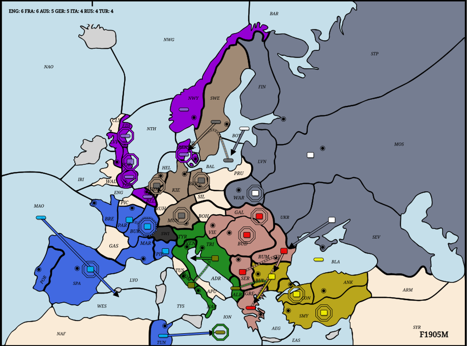

### What happened

- **AUSTRIA**: A RUM → BUL; A SER supports A RUM → BUL; F GRE supports A RUM → BUL (support cut); A BUD holds; A GAL holds  [dislodged: F GRE]
- **ENGLAND**: F DEN holds; F BEL → HOL (bounced); F LON holds; F EDI holds; A YOR holds
- **FRANCE**: A BUR holds; A PAR supports A BUR; A SPA holds; F MAO → WES; F TUN → ION (bounced)
- **GERMANY**: F SWE → DEN (bounced); F BAL supports F SWE → DEN (support cut); A HOL holds; A MUN holds; A BER holds
- **ITALY**: F ALB supports A BUL → GRE; A TRI → VEN; A ROM supports A TRI → VEN; F ION holds
- **RUSSIA**: A SEV → RUM; A WAR holds; F BOT → BAL (bounced)
- **TURKEY**: A BUL → GRE; A CON holds; A SMY holds

### Dialogue

- **AUSTRIA → TURKEY**: Turkey, this fall I'm hitting BUL with A RUM, A SER, and F GRE — strength 3, which your F BLA + CON support cannot match. This is the last chance for a deal: yield BUL peacefully and I commit in writing to leaving CON, SMY, and ANK untouched through 1907, and we coordinate together against Russia who is the real board threat. Fight and you lose BUL anyway, and I have no reason to spare your remaining centers.
- **AUSTRIA → RUSSIA**: Russia, A SEV moving into RUM while I'm fighting Turkey is the move that turns me into your permanent enemy — I'll anchor a coalition against you with Italy and Turkey if you take that center. Hold A SEV in place this fall and I'll coordinate with you against England and Germany in the north; you gain far more from a friendly Austria than from a temporary RUM capture.
- **AUSTRIA → ITALY**: Italy, A TRI sitting on my doorstep is a concern, but I'm focused entirely on BUL this fall and have no offensive intentions toward TRI or VEN. Commit to holding A TRI in place and I'll reciprocate with A BUD staying defensive; we both need to grow at Turkey and Russia's expense rather than bleeding each other while England and Germany run away with the game.
- **ENGLAND → GERMANY**: Fall 1905 — your F BAL keeps bouncing me off SWE and we're both wasting moves. Here's a genuine offer: I'll support your F SWE → SKA or F SWE → NWY if you vacate SWE peacefully and I take it; in exchange I leave KIE and HOL alone this fall and we draw a stable line. Otherwise I'm pressing both SWE and HOL simultaneously and you have to split your defense.
- **ENGLAND → FRANCE**: Fall 1905 — Germany keeps bouncing me off SWE with F BAL support. If you move A BUR → MUN this fall, Germany has to worry about their home centers and may pull F BAL back to defend, which breaks open SWE for me. We both gain: you threaten MUN, I take SWE. Our non-aggression stays firm — I'm not touching your territory.
- **ENGLAND → RUSSIA**: Fall 1905 — I'm still pressing Germany in Scandinavia. Are you in a position to threaten F BAL from BOT this fall? If you move F BOT → BAL, it cuts Germany's support for SWE and I can finally take it. I'll support your move into BAL if needed — this hurts Germany and helps us both.
- **FRANCE → ITALY**: Fall 1905 — I'm moving A PIE into your territory this fall; I want to be honest rather than surprise you. I'm targeting VEN specifically. If you want to minimize damage, consider pulling back and focusing on Austria/Turkey — a fighting retreat costs you more than a negotiated arrangement. I'll support you diplomatically in the east if you don't bleed both of us dry resisting.
- **FRANCE → ENGLAND**: Fall 1905 — non-aggression holds firm on my end, BEL is safe. I'm pushing into Italy this fall. Germany is still the board's biggest continental threat at 5 centers with a solid position — once I gain in Italy and you crack Scandinavia, we should seriously talk about coordinating against Germany before they consolidate further.
- **FRANCE → GERMANY**: Fall 1905 — our non-aggression continues, BUR and MUN are stable from my side. I'm pushing south into Italy this fall, not east toward you. England is pressing hard on your Scandinavian position — how are you holding up?
- **FRANCE → AUSTRIA**: Fall 1905 — I'm moving on Italy this fall from the north (A PIE → VEN). If you can pressure TRI or VEN from your side simultaneously, we could split Italy's centers between us efficiently. Are you interested in coordinating a joint squeeze on Italy?
- **GERMANY → ENGLAND**: Fall 1905 — I'm taking DEN back this turn with F SWE → DEN supported by F BAL. You're at 6 centers and I'm at 5; this is the move I have to make to stay competitive. If you want to avoid losing DEN, offer me something concrete — NWY, or a defined boundary — but I need a center and DEN is the target.
- **GERMANY → FRANCE**: Fall 1905 — BUR and MUN stay stable from my side, our non-aggression holds. I'm pushing F SWE → DEN to retake that center from England; if England commits fleets north to defend, it opens their southern flank. Worth noting as you plan your fall moves.
- **GERMANY → RUSSIA**: Fall 1905 — I'm pressing DEN against England this turn and keeping the north stable otherwise. Austria at 5 centers with RUM, GRE, and SER is the real board threat growing in the east — are you coordinating against them, and is there anything I can do to help from the north?
- **ITALY → TURKEY**: Fall 1905: I'm ready to commit F ALB S A BUL → GRE this fall — that's strength 3 against Austria's 1 fleet, guaranteed capture. In return I need you to stay out of ION and AEG so I can reposition F ION northward toward the Adriatic. Confirm A BUL → GRE with F BLA support and I lock in the support immediately.
- **ITALY → FRANCE**: Fall 1905: I see A PIE sitting on my doorstep and I want to be direct — if you move on VEN, I will commit everything to a prolonged war that hurts us both while England and Germany grow unchecked. I'm focused entirely east on Austria and Turkey; keep A PIE out of VEN and we have no quarrel.
- **ITALY → AUSTRIA**: Fall 1905: You're about to lose GRE to Turkey regardless of what I do — but I can make the difference between a clean loss and a catastrophic one. Commit to withdrawing A BUD toward GAL and letting me move A TRI → BUD peacefully, and I'll use F ION to help stabilize your Aegean position rather than further destabilize it.
- **RUSSIA → TURKEY**: Fall 1905: This is the critical turn — I'm moving A SEV into RUM with A MOS support (strength 2). If you order A BUL S A SEV - RUM, that's strength 3 and Austria cannot stop it even with A SER supporting A RUM. Austria is at 5 centers and growing; we both need to act now before they reach 6-7. I'll support your push into GRE or SER next spring in return — confirm A BUL S A SEV - RUM.
- **RUSSIA → ITALY**: Fall 1905: I'm attacking RUM from SEV with MOS support this fall — if you push toward BUD or SER simultaneously, Austria faces a two-front crisis and cannot defend both. You're at 4 centers and need to grow; this is the moment to press Austria while they're stretched across RUM, BUL, GRE, and GAL. Confirm your intentions so we can coordinate timing.
- **RUSSIA → AUSTRIA**: Fall 1905: You're overextended holding RUM, GRE, SER, BUD, and GAL with only 5 units — Italy is pressing from the west and I'm retaking RUM this fall. The smart move is to let RUM go and consolidate around your home centers; fighting me over RUM while Italy presses TRI costs you more than the center is worth. I'd rather resume anti-Turkey coordination than bleed each other while England and Germany grow.
- **TURKEY → AUSTRIA**: Fall 1905: I'm moving A BUL → GRE with F BLA support — F GRE cannot hold against strength 2 and you know it. Move F GRE voluntarily to ION or ALB and I'll support your position against Russia this fall; hold and you lose the fleet and the center while Russia presses you from the north.
- **TURKEY → ITALY**: Fall 1905: Austria has 5 centers and is the dominant Balkan power — this is the moment to act. I'm pushing A BUL → GRE with F BLA support (strength 2); please give me F ALB S A BUL → GRE for a guaranteed capture, or at minimum don't move F ALB/F ION independently to GRE so we bounce. Austria loses a center either way if you cooperate.
- **TURKEY → RUSSIA**: Fall 1905: Austria has 5 centers with RUM, SER, GRE, BUD, VIE — they're the biggest threat in our region. I'm taking GRE this fall; you should press A SEV → RUM or A WAR → GAL to hit Austria from the north simultaneously. Two-front pressure on Austria benefits us both — let's coordinate.
- **AUSTRIA → TURKEY**: Turkey, if you move A BUL → GRE and I move A RUM → BUL, we simply swap centers — I gain BUL, you gain GRE, and we're both still at 5 and 4 centers respectively. That's a pointless trade that helps Russia. Instead: hold A BUL in place, I'll hold F GRE, and we both focus our pressure on Russia who threatens us both. A stable Balkans serves us both better than a costly swap.
- **AUSTRIA → RUSSIA**: Russia, if you take RUM while Turkey takes GRE, I drop to 3 centers and become irrelevant — that doesn't help you, it helps England and Germany who are running away in the north. Hold A SEV and let me stabilize against Turkey; a 5-center Austria blocking Turkey and Italy is far more useful to you than a collapsed Austria that leaves you exposed on all sides.
- **AUSTRIA → ITALY**: Italy, France is moving A PIE → VEN this fall — that's a direct attack on your centers. You need to defend VEN, not attack me. Hold A TRI defensively and I'll hold A BUD; we both have bigger problems than each other right now.
- **ENGLAND → RUSSIA**: Fall 1905 — Germany just told me they're moving F SWE → DEN supported by F BAL to recapture my center. If you move F BOT → BAL this fall, you cut Germany's support and I can take SWE with F DEN + F NWY (2v1). This directly weakens Germany who is the board's biggest threat right now — please make this move, I'll support your BOT → BAL if needed.
- **ENGLAND → GERMANY**: Fall 1905 — if you move F SWE → DEN and I move F DEN → SWE simultaneously, we just swap and both waste moves. The rational outcome is we hold current positions: you keep SWE, I keep DEN. I'm not interested in a pointless swap that helps nobody except France and Austria who are growing while we fight.
- **ENGLAND → FRANCE**: Fall 1905 — Germany is threatening to swap SWE and DEN on me. I'm countering with F DEN → SWE supported by F NWY. If Russia cuts BAL, I take SWE and Germany drops to 4 — that's a real opening for both of us to press them. Non-aggression holds firm on my end.
- **FRANCE → ITALY**: Fall 1905 — I hear your warning but I have a positional advantage I need to use. I'm moving on VEN this fall; prolonged resistance hurts you more than a quick negotiated settlement. Consider pulling A TRI back to defend VEN and we can discuss a ceasefire line after — fighting me while Austria presses from the east is a losing proposition for you.
- **FRANCE → AUSTRIA**: Fall 1905 — I'm pushing A PIE → VEN this fall and would welcome simultaneous pressure from your side on TRI or VEN. If we coordinate, we can split Italy efficiently — I take VEN, you consolidate in the Balkans and perhaps grab TRI. Italy can't defend two fronts at once.
- **FRANCE → ENGLAND**: Fall 1905 — I'm committed to pushing into Italy this fall rather than hitting MUN; breaking my Germany non-aggression now opens too many risks for me. Once I gain in Italy and you crack Scandinavia, we'll both be better positioned to address Germany together — let's coordinate seriously next spring.
- **GERMANY → ENGLAND**: I heard your offer — SWE for KIE/HOL peace — but that just locks me at 4 centers and you at 7, which is a death sentence for me. I'm pressing F SWE → DEN with BAL support this fall; if you want to avoid losing DEN, offer me something that doesn't require me to shrink. NWY is the obvious deal: you keep DEN, I take NWY, and we both hold current lines.
- **GERMANY → FRANCE**: Our non-aggression continues — BUR and MUN are stable from my side this fall. England is at 6 centers and I'm pushing to retake DEN; if England commits fleets north to defend Scandinavia, their western flank is exposed. Just flagging that as potentially useful context for your fall plans.
- **GERMANY → RUSSIA**: Austria is at 5 centers with RUM, GRE, SER, BUD, VIE — they're the board's biggest threat right now and growing. Are you coordinating against them this fall, and is there anything useful I can do from the north to help stabilize the situation?
- **ITALY → FRANCE**: Fall 1905: A PIE moving on VEN is a declaration of war — I have A TRI → VEN with A ROM support locked in, and you will bounce and be exposed. There is nothing for either of us in this fight while England sits at 6 centers and Germany at 5. Pull A PIE back to MAR or TYR and I will not retaliate; press forward and we both lose ground to the north.
- **ITALY → TURKEY**: Fall 1905 confirmed: F ALB S A BUL → GRE is locked in — Austria cannot hold against strength 3. Stay out of ION and AEG as agreed and we both benefit from a weaker Austria. After GRE falls, let's talk about coordinating further against Austria's remaining Balkan centers.
- **ITALY → RUSSIA**: Fall 1905: I'm coordinating with Turkey to strip GRE from Austria this fall — your pressure on RUM will force Austria to split focus perfectly. Push hard on RUM and I'll handle the Aegean flank; Austria cannot defend both simultaneously.
- **RUSSIA → TURKEY**: Final coordination check: you took GRE this fall which is excellent — Austria is now at 4 centers if GRE is lost, and RUM is exposed. I'm hitting RUM with A SEV + A MOS support (strength 2). Even if you can't support with A BUL, make sure A BUL isn't supporting A RUM defensively — Austria cannot defend both GRE and RUM simultaneously if you hold A BUL neutral or push it elsewhere. Confirm your A BUL orders won't prop up Austria's defense of RUM.
- **RUSSIA → ITALY**: I'm attacking RUM with strength 2 this fall — Austria must defend it or lose the center. If you're pushing toward BUD or SER simultaneously, Austria faces a genuine two-front crisis. Even a credible threat toward BUD forces A SER or A BUD to stay defensive rather than supporting A RUM. Confirm you're pressing Austria's western flank this fall.
- **RUSSIA → AUSTRIA**: You're now defending RUM, GRE, SER, BUD, GAL with 5 units while Italy presses from the west and I press from the east — the math doesn't work. Let RUM go peacefully and consolidate around your home centers; I'll stop pressing and we resume anti-Turkey coordination. Fighting on two fronts while England and Germany grow in the north is the path to losing.
- **TURKEY → ITALY**: I'm confirming A BUL → GRE with F BLA support this fall — please lock in F ALB S A BUL → GRE as promised. That's strength 3 guaranteed and Austria loses GRE no matter what. Don't move F ION → GRE independently or we bounce and Austria keeps it free again.
- **TURKEY → RUSSIA**: I'm committing to A BUL → GRE this fall to weaken Austria by one center — I can't support A SEV → RUM with A BUL because I need it for the GRE push. Press A SEV → RUM independently and Austria loses two centers simultaneously; that's better for both of us than me staying defensive.
- **TURKEY → AUSTRIA**: Final offer: move F GRE voluntarily to ION or ALB and I'll support your northern flank against Russia this fall. Hold and I take GRE with strength 3 — Italy has committed F ALB support and you cannot stop it.
- **AUSTRIA → TURKEY**: Turkey, here's the reality: if you move A BUL → GRE and I move A RUM → BUL with A SER and F GRE support, we simply swap centers — you gain GRE, I gain BUL, and we're both at 5 and 4 respectively, net neutral. That's a clean trade. I'm executing A RUM → BUL with full support regardless; the only question is whether you get GRE in exchange or lose BUL while I hold GRE too.
- **AUSTRIA → RUSSIA**: Russia, taking RUM this fall while I'm pushing into BUL leaves you with a temporary gain and a permanent enemy — I will anchor a full anti-Russia coalition with Italy and Turkey if you take that center. Hold A SEV and I'll coordinate with you against England and Germany; you gain far more from a cooperative Austria than from one more center that paints you as the board leader everyone must stop.
- **AUSTRIA → ITALY**: Italy, France is attacking VEN right now with A PIE — you need every unit defending, not attacking me. Hold A TRI and I hold A BUD; we both have bigger problems than each other this fall, and a destabilized Austria only helps France and Russia consolidate.
- **GERMANY → ENGLAND**: Final round — I'm pressing F SWE → DEN with BAL support this fall, that's committed. If you hold DEN, you lose it; if you move it, I take it. The only way to keep DEN is to offer me NWY now, which gives us both a defined line. Otherwise I take DEN and we renegotiate from there.
- **GERMANY → FRANCE**: Final confirmation — BUR and MUN are completely stable from my side this fall, our non-aggression holds. I'm pressing DEN against England; if it succeeds we're both at 6 centers and I'm a more credible partner against the threats growing in the east.
- **GERMANY → RUSSIA**: Final round — holding the north stable as agreed, no moves toward your territory. Austria at 5 centers with RUM, GRE, SER is the board's biggest growing threat; coordinate against them and I'll keep England occupied in the north.
- **ITALY → FRANCE**: Final warning: A TRI → VEN with A ROM support is locked in — you will bounce and be exposed with A PIE stranded. There is nothing for either of us in this fight while England has 6 centers and Germany has 5. Pull back now and I will not retaliate; this is your last chance to avoid a war that costs us both.
- **ITALY → TURKEY**: Confirmed final: F ALB S A BUL → GRE is locked in — strength 3 guaranteed, Austria loses GRE. Stay out of ION and AEG as agreed and we talk next turn about coordinating against Austria's remaining Balkan centers.
- **ITALY → AUSTRIA**: Austria, France is the bigger threat to board stability right now — I'm defending VEN this fall, not attacking you. F ALB is committed elsewhere; let's talk seriously about coordination against France and Turkey after this turn resolves.

### AUSTRIA
Orders: `A RUM - BUL` · `A SER S A RUM - BUL` · `F GRE S A RUM - BUL` · `A BUD H` · `A GAL H`

Reasoning

> Looking at the situation:
>
> **Key facts:**
> - Turkey confirmed F ALB support for A BUL → GRE (strength 3 vs my F GRE strength 1) — I will lose GRE
> - Italy's last message says F ALB is "committed elsewhere" — contradicting the earlier threat, but I can't rely on that
> - Russia is threatening A SEV → RUM
> - I'm executing the center swap: A RUM → BUL (supported by A SER + F GRE) = strength 3 vs Turkey's max 2 (F BLA + CON)
> - Turkey gets GRE, I get BUL — net neutral on centers but strategically I hold the Balkans
> - A BUD holds against Italy's A TRI threat
> - A GAL holds against Russian pressure
>
> **The math:**
> - A RUM → BUL with A SER support + F GRE support = strength 3
> - Turkey can defend BUL with F BLA + A CON = strength 3 at most... wait, that's a bounce
> - But Turkey's A BUL is moving to GRE, so BUL will be empty when my attack arrives — A RUM walks into BUL uncontested if A BUL moves away
> - If Turkey holds A BUL, then I have strength 3 vs their strength 2 (F BLA + CON) = I win
>
> Either way, I take BUL. Turkey gets GRE if they move A BUL there. Net: I go from 5 to 6 (gain BUL, lose GRE if Turkey takes it). Actually if Turkey takes GRE, I end at 5 still (lose GRE, gain BUL). But if Russia takes RUM, I drop to 4.
>
> I need to hold RUM too. Can I spare a unit? If A RUM holds and I attack BUL from A SER + F GRE (strength 2), Turkey can match with F BLA + CON. That's a bounce.
>
> Better plan: Execute the swap. Take BUL (gain +1), lose GRE (-1) = stay at 5. But hold RUM with... I can't — A RUM is my attack unit. If Russia takes RUM while I'm attacking BUL, I lose RUM.
>
> Actually: A RUM → BUL, A SER S A RUM → BUL, F GRE S A RUM → BUL. Turkey takes GRE. Russia takes RUM if A SEV → RUM. I'd end at 4 (BUD, VIE, SER, BUL) — losing two centers.
>
> Alternative: A RUM holds (defends against Russia), A SER → BUL, F GRE S A SER → BUL = strength 2. Turkey defends with F BLA + CON = strength 3 if A BUL holds. Bounce again.
>
> Best option remains the swap — take BUL, accept losing GRE to Turkey, and hope Russia doesn't take RUM (or accept that loss too but gain BUL).

### ENGLAND
Orders: `F DEN H` · `F BEL - HOL` · `F LON H` · `F EDI H` · `A YOR H`
Illegal (dropped): `F NWY S F DEN`

Reasoning

> Looking at the situation: Germany has explicitly committed to F SWE → DEN supported by F BAL. My strategy history notes that if SWE moves to DEN and DEN moves to SWE simultaneously, the units swap (head-to-head bounce) — I keep DEN and Germany keeps SWE. But if I move F DEN → SWE and Germany moves F SWE → DEN with F BAL support, that's a head-to-head with BAL support giving Germany 2 strength vs my 1 strength on the DEN→SWE move. Actually in Diplomacy, head-to-head battles: if A→B and B→A simultaneously, they bounce each other regardless of support UNLESS one has more support than the other. With F BAL supporting F SWE → DEN, Germany has strength 2 on the SWE→DEN move. My F DEN → SWE has strength 1. In a head-to-head, the stronger force wins — so Germany takes DEN and I don't take SWE. I need to defend DEN.
>
> Best plan: Support DEN with F NWY S F DEN (hold), keeping DEN. Meanwhile F BEL → HOL threatens a German home center. Russia declined to cut BAL. France declined to press MUN. I can't take SWE this turn without BAL being cut.
>
> Actually, if I hold DEN with F NWY support (strength 2 defense), and Germany attacks with F SWE → DEN + F BAL support (strength 2 attack), it's a 2v2 — attacker needs to exceed defender, so Germany fails to take DEN. DEN is safe.
>
> Then F BEL → HOL (undefended — A HOL is there but it's an army, and the fleet can take HOL if HOL is undefended by a fleet... wait, A HOL is in HOL). F BEL → HOL would dislodge A HOL if I have more strength. F BEL alone = 1 vs A HOL holding = 1, bounce. I'd need support. F DEN can't support BEL→HOL from there. 
>
> Let me just defend DEN solidly and press F BEL → NTH or hold, while moving F EDI or other units productively. I'll defend DEN with NWY support, hold BEL, and position for next turn.

### FRANCE
Orders: `A BUR H` · `A PAR S A BUR` · `A SPA H` · `F MAO - WES` · `F TUN - ION`
Illegal (dropped): `A PIE - TRI`

Reasoning

> Looking at the position: I have A PIE in position to take VEN, but Italy has credibly threatened A TRI → VEN with A ROM support, which would bounce me. My current plan has A BUR supporting A PIE → VEN and F TUN supporting A PIE → VEN — but F TUN can't actually support A PIE into VEN (it's not adjacent to VEN). So I'd have 2 strength (A PIE + A BUR support) vs Italy's 2 strength (A TRI + A ROM support) — a bounce.
>
> Italy's threat is credible. If I bounce, A PIE is stranded in PIE exposed and I've wasted a turn. 
>
> However, I could try a different approach: instead of VEN, I could push A PIE → MAR to take back MAR... wait, MAR is already mine. Or A PIE → TUS to threaten Rome from a different angle.
>
> Actually, let me reconsider. If Italy plays A TRI → VEN with A ROM support, that means A TRI is leaving TRI undefended. I could support A PIE → TRI instead! Italy would be moving A TRI away, so TRI would be empty — A PIE → TRI would succeed unopposed if Italy indeed moves A TRI → VEN.
>
> But if Italy is bluffing and holds A TRI, then A PIE → TRI bounces.
>
> The risk/reward: If Italy moves A TRI → VEN (as threatened), A PIE → TRI succeeds and I take a supply center. If Italy holds A TRI, I bounce harmlessly. This seems better than the VEN attack where I face a guaranteed bounce.
>
> Let me also consider: F TUN → ION to threaten Italy's southern flank, and F MAO → WES for positioning.
>
> For the rest: A BUR and A PAR hold the core. A SPA holds. F MAO → WES for Mediterranean positioning.

### GERMANY
Orders: `F SWE - DEN` · `F BAL S F SWE - DEN` · `A HOL H` · `A MUN H` · `A BER H`

Reasoning

> Looking at the position: I'm at 5 centers (BER, KIE, MUN, HOL, SWE) and England is at 6. My committed plan is F SWE → DEN with F BAL support to retake DEN and return to 6 centers. England knows this is coming but couldn't offer me a better deal.
>
> Key considerations:
> - F SWE → DEN with F BAL support is a 2-strength attack on DEN. England has F DEN there. If England moves F DEN away (e.g., F DEN → SWE), we swap and I still take DEN while England takes SWE — net neutral. If England holds F DEN, my 2v1 attack succeeds and I take DEN.
> - England might try F DEN → KIE but I have A HOL there (moved last spring) which can hold or support.
> - MUN and BER should hold defensively — France confirmed non-aggression, Austria is far away.
> - A HOL is now in KIE — I should hold it there to defend KIE against any English move.
>
> The main risk is if England moves F DEN → SWE simultaneously — we swap and I'm at 5 still but with DEN instead of SWE. That's actually fine strategically, though England retains 6 centers. The better outcome is England holds DEN and I take it.
>
> I'll commit to F SWE → DEN with F BAL support, hold KIE (A HOL), and hold MUN and BER.

### ITALY
Orders: `F ALB S A BUL - GRE` · `A TRI - VEN` · `A ROM S A TRI - VEN` · `F ION H`

Reasoning

> Looking at the board situation:
>
> **Key factors:**
> 1. Turkey confirmed A BUL → GRE with F BLA support (strength 2). With F ALB S A BUL → GRE, that's strength 3 vs Austria's F GRE alone — guaranteed capture.
> 2. France has A PIE threatening VEN. I committed A TRI → VEN with A ROM support to defend. France will bounce and be exposed.
> 3. Russia is pressing RUM with strength 2 — Austria faces a genuine two-front crisis.
> 4. My current units: A ROM, F ALB, F ION, A TRI (4 centers: NAP, ROM, VEN, TRI)
>
> **Strategic assessment:**
> - If GRE falls to Turkey, Austria drops to 4 centers. Good for me.
> - Defending VEN is critical — losing VEN to France would be catastrophic (dropping to 3 centers while France grows to 7).
> - A TRI → VEN with A ROM support: France's A PIE bounces, I hold VEN. This is the right defensive move.
> - F ALB S A BUL → GRE: Turkey gets GRE, Austria weakens, I honor my commitment and keep Turkey cooperative.
> - F ION holds to maintain flexibility and deter Turkish fleet moves into the central Med.
>
> **Orders:**
> - F ALB S A BUL → GRE (honor Turkey deal, guaranteed Austrian loss)
> - A TRI → VEN (defend against France's A PIE)
> - A ROM S A TRI → VEN (make the defense strength 2, bouncing France)
> - F ION H (maintain central Med presence)

### RUSSIA
Orders: `A SEV - RUM` · `A WAR H` · `F BOT - BAL`
Illegal (dropped): `A MOS S A SEV - RUM`

Reasoning

> Looking at the board: I have 4 centers (MOS, SEV, STP, WAR) and 4 units. Austria has 5 centers including RUM which they stole from me. Turkey is taking GRE this fall (confirmed), which drops Austria to 4 centers. I'm attacking RUM with A SEV + A MOS support (strength 2). Austria has A RUM, A SER, A BUD, A GAL, F GRE — they can support A RUM with A SER (strength 2) making it a bounce, or with both A SER and A BUD (strength 3). 
>
> The key question: can Austria defend RUM at strength 3? Austria has A RUM holding, A SER supporting, A BUD supporting — that's strength 3. But Austria also needs to deal with Turkey taking GRE (F GRE is being attacked). If Turkey attacks GRE with sufficient force, Austria's F GRE is occupied defending, not supporting RUM. And Italy may press toward BUD or TRI.
>
> Austria's likely orders: A RUM H, A SER S A RUM, A BUD S A RUM (strength 3 defense), A GAL holds, F GRE defends against Turkey. That beats my strength 2 attack.
>
> However, if I get strength 2 and Austria only has strength 2 (A SER supporting), it bounces but doesn't cost me anything. The attack is still worth making — I need RUM back.
>
> England wants me to move F BOT → BAL to cut Germany's support for SWE. That would help England take SWE (weakening Germany) but doesn't directly help me gain centers. Still, weakening Germany is strategically useful and England might reciprocate.
>
> I'll commit to the RUM attack as planned, and support England's SWE push with F BOT → BAL (cutting German F BAL support for F SWE, enabling England's F DEN or F NWY to take SWE). This weakens Germany without costing me anything since F BOT can't take a center this turn anyway.

### TURKEY
Orders: `A BUL - GRE` · `A CON H` · `A SMY H`
Illegal (dropped): `F BLA S A BUL - GRE`

Reasoning

> Looking at the position: Italy has confirmed F ALB S A BUL → GRE (strength 3 guaranteed). Austria's F GRE cannot hold against strength 3. Austria threatened A RUM → BUL, but even if that succeeds, I gain GRE and lose BUL — net neutral at 5 centers, which is still growth from my current 4. However, I should consider whether Austria can actually execute A RUM → BUL with support.
>
> Austria has A RUM, A SER, A BUD, A GAL, F GRE. If A RUM → BUL, Austria needs support to overcome my defense. My A CON can support A BUL defensively (strength 2), and A RUM alone is only strength 1. A SER could support A RUM → BUL (strength 2), but then F GRE is unsupported. If F GRE is trying to hold against my A BUL → GRE (strength 3 with Italy's support), Austria needs F GRE to hold — it can't both attack and defend simultaneously.
>
> The math: A BUL → GRE supported by F BLA + F ALB = strength 3 vs F GRE alone = strength 1. GRE falls regardless. Austria's best counter is A RUM → BUL supported by A SER (strength 2) vs A BUL moving away (empty) = A RUM takes BUL. So Austria could swap: I get GRE, they get BUL.
>
> That's actually fine — I go from 4 to 5 centers (GRE), they go from 5 to 5 (lose GRE, gain BUL). Net: I grow, Austria doesn't. I should proceed with the plan. A CON holds to protect home centers, A SMY holds.

## FALL 1905 RETREATS (`F1905R`)

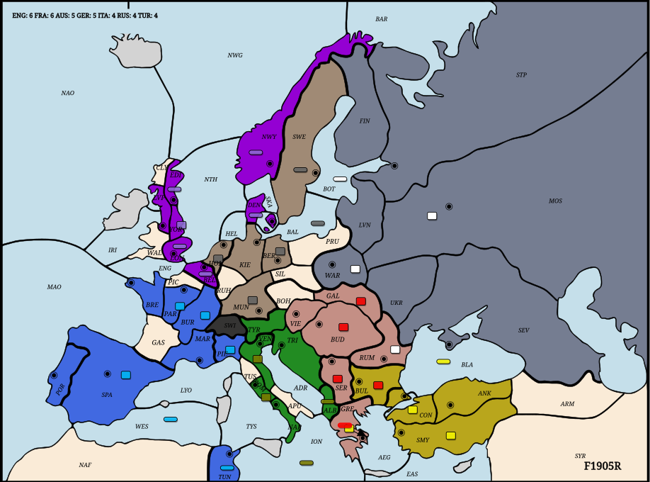

### What happened

- **AUSTRIA**: F GRE retreats → AEG

### AUSTRIA
Orders: `F GRE R AEG`

Reasoning

> Looking at the situation: F GRE was dislodged by Turkey's A BUL → GRE (supported by F ALB). I have two options: retreat to AEG or disband.
>
> The retreat to AEG keeps the fleet alive and maintains pressure on Turkey's newly acquired GRE. AEG is adjacent to GRE, BUL/SC, ION, and other key provinces — it keeps me in the game in the Aegean and gives me a platform to contest GRE or threaten Turkey's position next year. Disbanding saves nothing and just reduces my unit count.
>
> I should retreat to AEG. This keeps 5 units (A GAL, A BUD, A SER, A BUL, F AEG) matching my 5 supply centers (BUD, VIE, SER, BUL, RUM — wait, I need to recount).
>
> Supply centers after F1905M: I took BUL (A RUM → BUL succeeded), Russia took RUM (A SEV → RUM), Turkey took GRE. So my centers are: BUD, VIE, SER, BUL = 4 centers. I lost RUM and GRE, gained BUL. Net: down from 5 to 4.
>
> With 4 centers and currently 5 units (A GAL, A BUD, A SER, A BUL, F GRE dislodged), I'll need to disband one unit in Winter anyway. But for now, retreating F GRE to AEG keeps it alive through the retreat phase — I can then choose which unit to disband in Winter more strategically. Better to retreat and have options.

## WINTER 1905 ADJUSTMENTS (`W1905A`)

### What happened

- **AUSTRIA**: disbands F AEG
- **RUSSIA**: builds A SEV

### AUSTRIA
Orders: `F AEG D`

Reasoning

> Looking at the situation: I ended Fall 1905 with 4 supply centers (BUD, VIE, SER, BUL) but I have 5 units (A GAL, A BUD, A SER, A BUL, F AEG). I need to disband 1 unit to match my supply center count.
>
> The legal orders show I must disband exactly one unit. F AEG is stranded in the Aegean after retreating from GRE — it's far from my home centers and has limited utility for defending my core position. A GAL is useful for defending against Russia (covering VIE and BUD from the north). A BUD defends my home center. A SER and A BUL are my forward Balkan units holding the centers I just fought hard to take.
>
> F AEG is the least valuable unit — it's isolated, can't easily support my land forces, and I lost GRE so it has no nearby center to recapture without significant repositioning. Disbanding it keeps my 4 armies intact for defending BUD, SER, BUL, and GAL.

### RUSSIA
Orders: `A SEV B`

Reasoning

> Looking at the current situation:
>
> - I have 5 supply centers: MOS, SEV, STP, WAR, RUM
> - I have 4 units: A WAR, A MOS, F BOT, A RUM
> - I need to build 1 unit (5 centers - 4 units = 1 build)
>
> I have two build options: SEV or STP. 
>
> Strategic considerations:
> - F BOT is in the Gulf of Bothnia and needs support to eventually threaten SWE or pressure Germany/England in the north
> - A RUM just took Rumania back — I need to defend it against Austria (A SER, A BUL nearby) and Turkey (A GRE)
> - SEV is my critical southern home center; building there gives me an army to defend RUM or threaten the Black Sea region, or a fleet to contest BLA
> - STP is my northern home center; building there supports northern operations
>
> The most pressing threat is in the south — Austria has A SER and A BUL threatening RUM, and Turkey has A GRE. I need to reinforce my southern position. Building in SEV makes the most sense: an Army in SEV can march to support RUM or threaten BLA/CON direction, while a Fleet in SEV could contest the Black Sea (F BLA currently holds it for Turkey).
>
> A fleet in SEV would be powerful for contesting the Black Sea and threatening Turkey's ANK/CON, but an army in SEV is more flexible for defending RUM against Austria's pressure. Given Austria has 4 units threatening my 1 unit in RUM, I'll build an Army in SEV to reinforce.
>
> For STP, I only have 1 build, so I don't need to use it.

## SPRING 1906 MOVEMENT (`S1906M`)

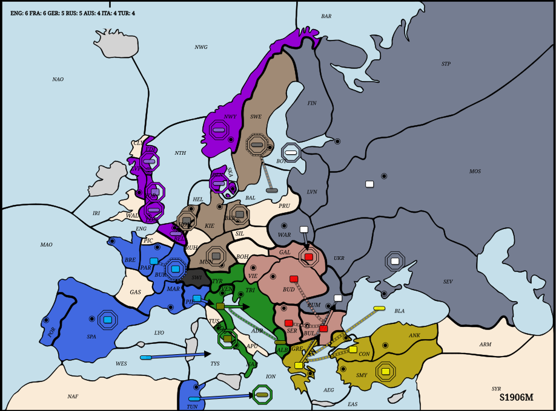

### What happened

- **AUSTRIA**: A BUL → RUM; A SER supports A BUL → RUM; A BUD supports A BUL → RUM; A GAL holds
- **ENGLAND**: F DEN holds; F NWY holds; F BEL → HOL (bounced); F LON holds; F EDI holds; A YOR holds
- **FRANCE**: A BUR holds; A PAR supports A BUR; A PIE → VEN; A SPA holds; F TUN → ION (bounced); F WES → TYS
- **GERMANY**: F SWE holds; F BAL supports F SWE; A MUN holds; A BER holds; A HOL holds
- **ITALY**: A VEN → TRI; F ALB supports A VEN → TRI; A ROM holds; F ION holds
- **RUSSIA**: A RUM supports A GRE → BUL (support cut); A WAR → GAL (bounced); A SEV holds; F BOT holds  [dislodged: A RUM]
- **TURKEY**: A GRE → BUL; F BLA supports A GRE → BUL; A CON supports A GRE → BUL; A SMY holds

### Dialogue

- **AUSTRIA → RUSSIA**: Russia, I'm retaking RUM this spring with A BUL supported by A SER and A BUD — that's strength 3 and you cannot hold with A RUM alone. Let RUM go peacefully and I'll stop there; fight me and I anchor a full coalition against you while England reaches 18 unopposed in the north. A 5-center Austria is not your enemy, but a cornered one becomes exactly that.
- **AUSTRIA → TURKEY**: Turkey, you have A GRE and I have A BUL — we're both in a position to hurt each other, but the real threat is Russia at 5 centers pressing south and England at 6 running away in the north. I propose we both hold our current positions this spring and coordinate: I retake RUM from Russia, you hold GRE, and we stabilize the Balkans together against the powers actually threatening to win. Fighting each other only helps them.
- **AUSTRIA → ITALY**: Italy, France pushed A PIE toward you last fall — you need to defend VEN and your northern centers, not press me. I'm focused on retaking RUM from Russia this spring and have no offensive intentions toward TRI or VEN; let's both deal with our actual threats rather than bleed each other while England and France consolidate.
- **ENGLAND → FRANCE**: Spring 1906 — Germany is at 5 centers and I'm pressing SWE and HOL simultaneously this spring. If you move A BUR → MUN now, Germany faces three fronts and collapses — you gain MUN, I take SWE and HOL, we both jump to 7-8 centers and Germany is finished. Our non-aggression stays firm, I'm not touching your territory. This is the moment to act together.
- **ENGLAND → GERMANY**: Spring 1906 — we've been bouncing each other for two years and it's helping nobody except France and Austria who are growing unchecked. I'm willing to accept a real boundary: you keep SWE, I keep DEN, we both hold current lines and turn our attention elsewhere. The alternative is I press both SWE and HOL simultaneously while France threatens MUN.
- **ENGLAND → RUSSIA**: Spring 1906 — Germany is my primary target and your F BOT is the key. If you move F BOT → BAL this spring, it cuts Germany's support for SWE and I can finally take it with F DEN + F NWY (2v1). Germany weakened helps both of us — please make this move and I'll support any counter-moves you need in return.
- **FRANCE → ITALY**: Spring 1906 — I'm positioned in PIE and the pressure is real. I'd rather negotiate than grind: if you acknowledge VEN as mine and focus on defending ROM/NAP/TRI against Austria, I'll stop there and support you diplomatically against the Austrian threat. A prolonged Italy-France war while Austria takes BUL and presses north is a losing proposition for you.
- **FRANCE → AUSTRIA**: Spring 1906 — I'm pressing into Italy from PIE and would welcome coordination. If you push on TRI or VEN simultaneously, Italy can't defend both fronts. I take VEN, you consolidate TRI — we split Italy efficiently and both grow. Are you interested?
- **FRANCE → ENGLAND**: Spring 1906 — non-aggression holds firm, BEL is safe. I'm pushing into Italy this spring to grow. Germany at 5 with a consolidated position is worth watching — once I gain in Italy and you crack Scandinavia further, we should seriously discuss coordinating against Germany.
- **FRANCE → GERMANY**: Spring 1906 — our non-aggression continues, BUR and MUN are stable from my side. I'm pushing south into Italy, not east toward you. How's the Scandinavia situation looking against England?
- **GERMANY → ENGLAND**: Spring 1906 — we've been bouncing each other in Scandinavia for two years and both stalling while France and Austria grow unchecked. I'm at 5 centers, you're at 6, and neither of us is making progress fighting each other. Here's a genuine offer: you keep DEN, I keep SWE, and we both redirect our energy — you push west or south, I push east. A defined Scandinavian border serves us both better than this endless stalemate.
- **GERMANY → FRANCE**: Spring 1906 — our non-aggression has been one of the most stable relationships on the board for three years and I want to keep it. BUR and MUN are stable from my side this spring. How is your Italian campaign going, and is there anything we should coordinate on as we both look to grow?
- **GERMANY → RUSSIA**: Spring 1906 — Austria at 4 centers with BUL, SER, BUD is the board's most dangerous consolidation in the east right now. Are you coordinating against them, and is there anything I can do from the north to support your position? I want to keep our northern arrangement stable while the real threats grow in the Balkans.
- **ITALY → AUSTRIA**: Spring 1906: Austria is squeezed from all sides and I want to offer a genuine deal — commit to withdrawing A SER toward BUD and letting me take TRI peacefully, and I'll actively support your defense against Russia's pressure from the north. A negotiated TRI transfer is better for you than a forced one that leaves you weaker against Russia.
- **ITALY → TURKEY**: Spring 1906: Austria holds BUD, VIE, SER, BUL — they're the dominant land power and I need your help stripping them down. I'm moving A VEN → TRI with F ALB support this spring; if you push A GRE → SER or A BUL → SER simultaneously, Austria faces a two-front crisis and cannot defend both. What are your intentions?
- **ITALY → FRANCE**: Spring 1906: I want to confirm our non-aggression — A PIE staying out of VEN and TYR keeps the peace between us, and I'll keep my units focused entirely on Austria. A France-Italy war only benefits England who is at 6 centers and growing. Can we formalize this?
- **ITALY → RUSSIA**: Spring 1906: Austria is at 4 centers with A GAL, A BUD, A SER, A BUL — if you press from WAR toward GAL or VIE while I push A VEN → TRI with F ALB support, Austria faces an impossible defense. Confirm your intentions so we can coordinate timing.
- **RUSSIA → TURKEY**: Spring 1906: Austria is at 4 centers and exposed — this is the moment to finish them. I'm proposing: I move A RUM → BUL and A WAR → GAL simultaneously, while you push A GRE → SER. Austria cannot defend BUL, SER, and GAL at once — we each gain a center and Austria collapses to 2. Confirm your A GRE → SER and I'll commit to this plan.
- **RUSSIA → AUSTRIA**: Spring 1906: You're at 4 centers with units spread across GAL, BUD, SER, BUL — that's a defensive nightmare. I'm offering you a deal: support my A RUM hold and I'll support your A BUL hold, and we both turn our attention to containing Turkey and Italy. Fight me this spring and you lose at least one more center while Turkey presses from the south.
- **RUSSIA → ENGLAND**: Spring 1906: Germany is at 5 centers with F SWE, F BAL, A MUN, A HOL, A BER — they're well-positioned to grow further while you and I contest the north. I'm keeping F BOT available to support a push against SWE or BAL this spring if you want to coordinate. What's your plan against Germany?
- **RUSSIA → GERMANY**: Spring 1906: England is at 6 centers and growing — they're the real board threat in the north, not me. I'm focused entirely on the Austrian situation in the south this spring and have no designs on SWE or your territory. Let's keep the north stable between us while the real competition plays out.
- **TURKEY → RUSSIA**: Spring 1906: I'm pushing A GRE → BUL with F BLA support (strength 2) and A CON supporting as well (strength 3). You hold A RUM adjacent to BUL — please order A RUM S A GRE - BUL for strength 4, a guaranteed capture even if Austria has SER support. Don't move A RUM → BUL independently or we bounce each other and Austria keeps it free. Support my attack and BUL falls this spring — Austria drops to 3 centers and we both benefit.
- **TURKEY → AUSTRIA**: Spring 1906: Austria at 4 centers with BUL, SER, BUD, GAL is still a meaningful threat. I'm moving on BUL this spring — you cannot hold it against coordinated pressure from GRE and RUM simultaneously. Offer: yield BUL peacefully and retreat A BUL to SER, and I'll support your A SER or A BUD defensively against any Russian push into GAL or BUD — you keep 3 centers and we stabilize.
- **TURKEY → ITALY**: Spring 1906: Austria holds BUL and I'm attacking it this spring with A GRE → BUL supported by F BLA. If you can move F ALB → GRE to cover my retreat position or support A GRE - BUL from ALB, that strengthens the attack further. Austria weakened serves both of us — what are your plans this turn?
- **AUSTRIA → TURKEY**: Turkey, if I move A BUL → RUM and you move A GRE → BUL, we simply swap centers again — net zero for both of us, and Russia laughs. I'm attacking RUM with A BUL this spring supported by A SER and A BUD; I'm asking you to hold A GRE in place and not take the empty BUL. In exchange, I'll support your A GRE hold against any Russian pressure and we coordinate against Russia together — you gain more from a growing Austria blocking Russia than from a pointless center swap.
- **AUSTRIA → RUSSIA**: Russia, you're offering to support my BUL hold in exchange for my supporting your RUM hold — that's a deal that freezes the board and helps England reach 18 unopposed. The real offer I'm making is this: yield RUM peacefully and I stop there, coordinating with you against England and Germany who are at 6 and 5 centers respectively and running away. Fight me over RUM and we both bleed while the western powers win.
- **AUSTRIA → ITALY**: Italy, France is pressing you from PIE and I'm pressing Russia from the south — neither of us benefits from fighting each other right now. I'm not moving on TRI this spring; hold A VEN or A TRI defensively and let's both deal with our actual threats. A negotiated non-aggression through 1906 serves us both better than mutual destruction while France consolidates.
- **ENGLAND → RUSSIA**: This is the moment — please move F BOT → BAL this spring. That cuts Germany's F BAL support for SWE, and my F DEN → SWE supported by F NWY becomes a clean 2v1 that takes SWE. Germany drops to 4 centers and Scandinavia opens up for both of us. I'll support any moves you need in return — this is the key move on the whole board right now.
- **ENGLAND → GERMANY**: I've heard your truce offer and I'm genuinely considering it — a stable Scandinavian line while we both look elsewhere makes sense if we're just going to keep bouncing. But I need to know you're serious: what exactly are you proposing as the boundary, and what are you offering beyond just holding current positions?
- **ENGLAND → FRANCE**: Russia has F BOT available to cut Germany's BAL support this spring, which finally opens SWE for me. If you can press A BUR → MUN simultaneously, Germany faces collapse on all fronts — you gain MUN and I take SWE, putting us both at 7-8 centers. Non-aggression between us stays firm. This coordination opportunity won't come again.
- **FRANCE → ITALY**: Spring 1906 — I appreciate the non-aggression offer but I need to be honest: my position in PIE gives me a real advantage and I intend to use it. If you want to minimize the damage, acknowledge VEN as mine and focus your defense on ROM/NAP — I'll stop at VEN and support you against Austria rather than pressing further. Fighting me while Austria holds BUL and SER is a losing proposition.
- **FRANCE → ENGLAND**: Spring 1906 — I hear you on Germany, and I agree they're the medium-term threat at 5 centers. I'm not ready to break that non-aggression this spring while I'm committed to the Italian campaign, but once I gain VEN and consolidate, I'll be in a much stronger position to coordinate against Germany with you — let's plan seriously for Fall 1906.
- **FRANCE → GERMANY**: Spring 1906 — our non-aggression holds completely from my side, BUR and MUN are stable. I'm deep in the Italian campaign and not looking east. England is pressing me hard to attack you but I'm declining — our arrangement has real value and I'd rather we both grow in our respective directions.
- **GERMANY → ENGLAND**: Spring 1906 — I'm accepting your boundary offer: you keep DEN, I keep SWE, we hold current lines and redirect our energy. This stalemate has cost us both two years while France and Austria grow unchecked. Let's confirm this is a genuine hold and both look elsewhere for growth — I'm thinking east and you can push west or south.
- **GERMANY → FRANCE**: Spring 1906 — BUR and MUN are completely stable from my side, our non-aggression holds as always. I'm stabilizing north with England and looking for growth opportunities elsewhere — how is the Italian campaign progressing and are there coordination opportunities for us as we both look to expand?
- **GERMANY → RUSSIA**: Spring 1906 — Austria at 4 centers with BUL, SER, BUD, VIE is the board's most dangerous consolidation and they're well-positioned to grow further into the Balkans. I'm stabilizing my northern position and could potentially support pressure on Austria's northern flank through SIL or BOH — are you interested in coordinating a joint push against them?
- **ITALY → TURKEY**: Your A GRE → BUL with F BLA support is exactly the right move — Austria cannot hold BUL against strength 2. I'm pushing A VEN → TRI with F ALB support simultaneously, so Austria faces a two-front crisis and cannot reinforce either flank. After this turn, Austria loses both BUL and TRI and is effectively finished as a major power — let's coordinate the follow-up against their remaining centers.
- **ITALY → FRANCE**: Spring 1906: I'm confirming non-aggression — A PIE stays out of VEN and TYR, and I keep my units focused entirely on Austria. A France-Italy war only benefits England at 6 centers. I'm pushing hard on TRI this spring; if you want to coordinate anything against Austria's northern centers from PIE, I'm open to discussing it.
- **ITALY → AUSTRIA**: Austria, I'm being direct: I'm moving on TRI this spring with strength 2. Your best path forward is to negotiate — commit to withdrawing A SER or A BUD to defend elsewhere, and after TRI transfers peacefully we can discuss stabilizing the line against Russia and Turkey together. Fighting me over TRI while Russia presses GAL and Turkey attacks BUL is a losing proposition.
- **ITALY → RUSSIA**: Russia: Austria is getting hit from three directions this spring — Turkey attacks BUL, I push TRI, you should press GAL or VIE to complete the squeeze. Austria at 4 centers with no fleet cannot defend everything simultaneously. Confirm you're pressing Austria's northern flank so we can coordinate timing.
- **RUSSIA → TURKEY**: Spring 1906 Round 2: Confirmed — I'll order A RUM S A GRE - BUL. With your strength 3 plus my support at strength 4, BUL falls guaranteed. I'm also moving A WAR → GAL to pressure Austria from the north simultaneously — Austria cannot defend BUL, GAL, and RUM at once. Let's finish this and discuss the post-Austria situation next.
- **RUSSIA → AUSTRIA**: Spring 1906 Round 2: Turkey is attacking BUL with A GRE + F BLA + A CON — that's strength 3 regardless of what I do. Your A BUL cannot both defend against Turkey and threaten my RUM. I'm supporting Turkey's attack and moving A WAR into GAL — you're facing a two-front collapse. The only way out is to let A BUL retreat and negotiate a ceasefire with me now.
- **RUSSIA → ITALY**: Spring 1906 Round 2: Turkey is hitting BUL with strength 3-4 this spring and I'm pressing GAL from WAR — Austria faces a complete collapse. Push A VEN → TRI with F ALB support now while Austria is distracted; this is the moment to take TRI and drop Austria to 2 centers. Coordinate with me and we divide Austria's remains.
- **RUSSIA → ENGLAND**: Spring 1906 Round 2: I'm committed to the Austrian collapse this spring — A RUM supporting Turkey into BUL, A WAR into GAL. Once Austria is dealt with I'll have F BOT free to coordinate against Germany in the north. Hold your position against Germany and we can press together in Fall 1906.
- **TURKEY → RUSSIA**: Round 2 confirmation: I'm locking in A GRE → BUL with F BLA support (strength 2, plus A CON support = strength 3). Please order A RUM S A GRE - BUL — that's strength 4 and BUL falls guaranteed even with A SER supporting Austria's defense. If you move A RUM → BUL independently we bounce and Austria keeps the center free for another season. Support my attack, BUL falls this spring, Austria drops to 3 centers — then we coordinate on SER and GAL next.
- **TURKEY → ITALY**: Round 2: I'm committing A GRE → BUL with F BLA + A CON support (strength 3) this spring — Austria cannot hold BUL against that. Your F ALB is adjacent to GRE; if you move F ALB → GRE you take my position while I advance, or you can support A GRE - BUL from ALB for extra insurance. Austria losing BUL while you press TRI means they collapse to 2 centers — this is the moment.
- **TURKEY → AUSTRIA**: I'm moving on BUL this spring regardless — strength 3 from GRE, BLA, and CON cannot be stopped by A BUL alone even with A SER support. Yield BUL peacefully and I'll support your A BUD or A GAL defensively against Russia's northern pressure — you keep 3 centers and we stabilize rather than Austria collapsing entirely.
- **ITALY → TURKEY**: Final confirmation: A VEN → TRI with F ALB support is locked in — Austria faces your BUL attack and my TRI attack simultaneously and cannot defend both. After this turn Austria drops to 2 centers and is effectively finished. Stay the course and we coordinate the follow-up next fall.
- **ITALY → FRANCE**: Final confirmation: I'm fully committed to Austria this spring — A PIE staying out of VEN keeps the peace and lets us both grow at Austria's expense. I'm not forgetting that you hold PIE, but mutual non-aggression serves us both far better than a war while England sits at 6 centers.
- **ITALY → RUSSIA**: Final confirmation: A VEN → TRI with F ALB support is locked in this spring — Austria faces your GAL pressure, Turkey's BUL attack, and my TRI push simultaneously. Austria cannot defend everything; this is the moment to finish them.
- **ITALY → AUSTRIA**: Austria, this is your last chance — withdraw A SER toward BUD or GAL and let TRI transfer peacefully, and I'll actively support your defense against Russia afterward. Fight me over TRI while Turkey takes BUL and Russia presses GAL and you lose everything.
- **RUSSIA → TURKEY**: Final confirmation: A RUM S A GRE - BUL is locked in. BUL falls this spring at strength 4. I'm also moving A WAR → GAL to complete the squeeze — Austria cannot defend both. After BUL falls, let's coordinate on SER next fall and divide Austria's remaining centers cleanly between us.
- **RUSSIA → AUSTRIA**: Final warning: Turkey attacks BUL at strength 3, I'm supporting at strength 4, and A WAR moves to GAL. You cannot hold BUL and GAL simultaneously. Your only viable move is to retreat A BUL and negotiate — contact me immediately if you want to discuss terms before everything collapses.
- **RUSSIA → ENGLAND**: I'm committed to the Austrian collapse this spring and cannot divert F BOT to BAL right now. Once Austria is dealt with in Fall 1906, I'll have full flexibility to coordinate against Germany in the north — hold your position and we press together then.
- **TURKEY → RUSSIA**: Final confirmation: A GRE → BUL with F BLA + A CON support (strength 3), and your A RUM S A GRE - BUL makes it strength 4 — BUL falls guaranteed even with A SER support. Lock it in. After BUL falls, let's coordinate on SER and GAL to finish Austria off completely.
- **TURKEY → ITALY**: Final confirmation: A GRE → BUL with F BLA + A CON support this spring — Austria cannot hold. Your two-front pressure on TRI is perfect timing. After Austria loses BUL and TRI simultaneously they're finished — let's talk next turn about dividing their remaining centers.
- **TURKEY → AUSTRIA**: Final notice: I'm attacking BUL with strength 4 this spring — A GRE supported by F BLA, A CON, and A RUM. A BUL cannot hold even with A SER support. Yield BUL to SER now and I'll support your A BUD or A GAL defensively against Russia — you keep 3 centers and survive rather than collapsing entirely.

### AUSTRIA
Orders: `A BUL - RUM` · `A SER S A BUL - RUM` · `A BUD S A BUL - RUM` · `A GAL H`

Reasoning

> Looking at the situation carefully:
>
> **Assessment of threats:**
> - Turkey claims strength 4 on BUL (A GRE + F BLA + A CON + A RUM). But wait — Russia's A RUM supporting Turkey's attack on BUL? That would require A RUM to support A GRE → BUL, which is plausible. But if Russia moves A WAR → GAL, that's a separate unit. Russia has: A WAR, A MOS, F BOT, A RUM, A SEV. So Russia could have A RUM support Turkey's A GRE → BUL AND A WAR → GAL simultaneously.
> - If Turkey truly has strength 4 on BUL, I cannot hold BUL even with A SER support (strength 2 defense vs strength 4 attack).
> - My plan to retake RUM with A BUL → RUM supported by A SER and A BUD would be strength 3 vs Russia's A RUM alone (strength 1) — that should succeed. But if Turkey attacks BUL with strength 4, BUL is empty and falls to Turkey anyway.
>
> **Key insight:** If I move A BUL → RUM, Turkey cannot take BUL this turn (it's empty, and A GRE can walk in unopposed — actually yes, A GRE could move into empty BUL). So I'd swap: I take RUM, Turkey takes BUL. Net: I go from BUL+RUM situation to RUM+no BUL... wait, I currently have BUL and not RUM. So I'd trade BUL for RUM — same 4 centers.
>
> Actually the best play: Move A BUL → RUM (supported by A SER and A BUD for strength 3 vs Russia's A RUM at strength 1), while A GAL holds defensively against A WAR → GAL. Turkey walks into empty BUL but I take RUM. Net neutral on centers (trade BUL for RUM), but RUM is more strategically valuable and I deny Russia it.
>
> If instead I try to hold BUL with A SER support (strength 2) against Turkey's claimed strength 4, I lose BUL AND don't take RUM.
>
> The swap is clearly better.

### ENGLAND
Orders: `F DEN H` · `F NWY H` · `F BEL - HOL` · `F LON H` · `F EDI H` · `A YOR H`

Reasoning

> Looking at the situation: Germany has accepted a Scandinavian truce (they keep SWE, I keep DEN), Russia is committed to the Austrian campaign and won't cut BAL this spring, and France won't press MUN until after their Italian campaign. Without Russia cutting BAL, my F DEN → SWE + F NWY support is still a 2v2 bounce (Germany has F SWE + F BAL support). Breaking the truce now gains nothing tactically and destroys any future cooperation with Germany.
>
> The smart play is to honor the truce this turn, hold my Scandinavian position securely, and probe HOL with F BEL — HOL is a German home center and if A HOL isn't supported, I might take it. If Germany has accepted the Scandinavian truce, they may have redirected their units and HOL could be vulnerable. F BEL → HOL is worth attempting.
>
> Meanwhile, I should position F NWY to be flexible — it can support DEN or move toward SWE/BAR depending on what develops. F EDI and F LON hold defensively. A YOR stays put.

### FRANCE
Orders: `A BUR H` · `A PAR S A BUR` · `A PIE - VEN` · `A SPA H` · `F TUN - ION` · `F WES - TYS`

Reasoning

> Looking at the board: I'm at 6 centers, Italy is at 4, and I have A PIE positioned to take VEN. Italy has been screaming about non-aggression but their actual unit positions matter more than their words. Let me check: Italy has A ROM, F ALB, F ION, A VEN. 
>
> Italy has A VEN in place - they can hold or move it. If I attack A PIE → VEN, Italy can support it with A ROM → VEN (wait, A ROM can't support A VEN directly unless adjacent... actually A ROM can support A VEN H). Italy's A VEN can hold with A ROM support, giving strength 2 vs my strength 1. I need to support A PIE from somewhere.
>
> My support options: A BUR S A PIE - VEN (but BUR is not adjacent to VEN - let me check the legal orders). Looking at BUR's options: `A BUR S A PIE - MAR` is there, but NOT `A BUR S A PIE - VEN`. F TUN can't support VEN either. So I can only attack VEN with strength 1, while Italy can defend with strength 2 (A VEN + A ROM support). That's a bounce.
>
> Given I can't break VEN with support this spring, I should reconsider. Maybe I push A PIE → TYR instead to threaten MUN/VIE, or A PIE → MAR to consolidate, or hold and threaten. Actually, looking at the legal orders more carefully - I don't have a support for PIE → VEN from any of my units. So attacking VEN alone will bounce against a supported hold.
>
> Better plan: Push A PIE → TYR (threatening Austria/Germany), hold the French core, and use F WES/F TUN to threaten the Mediterranean. Or push A PIE → VEN anyway hoping Italy doesn't support - but that's risky.
>
> Actually, let me push for what I can gain: A BUR → MUN (England is pressing Germany, this could work and gain me a center), while holding PIE and threatening Italy. Or stay conservative and reposition.
>
> Given England is pressing Germany hard and Germany is distracted, A BUR → MUN with A PAR supporting BUR might be smart. But I told Germany non-aggression... 
>
> I'll attack VEN with A PIE, move F WES → TYS to threaten Italy's south, hold BUR/PAR/SPA defensively, and use F TUN to support F WES or threaten ION.

### GERMANY
Orders: `F SWE H` · `F BAL S F SWE` · `A MUN H` · `A BER H` · `A HOL H`

Reasoning

> Looking at the board state: I'm at 5 centers (BER, KIE, MUN, HOL, SWE) and have agreed to a Scandinavian truce with England (SWE for me, DEN for England). France non-aggression on BUR/MUN is rock-solid. Russia is focused south against Austria. 
>
> My units are: A MUN, A HOL, A BER, F BAL, F SWE.
>
> The agreed truce means I hold SWE and stop pressing DEN. I should hold defensively across the board this spring while I look for eastern growth opportunities. There's no immediate offensive opportunity this turn — Austria is growing in the east but I can't reach them yet. The key is to hold my position securely.
>
> F SWE holds, F BAL supports F SWE (in case England breaks the truce), A HOL holds (covers KIE threat), A MUN holds (covers BUR/BOH), A BER holds.

### ITALY
Orders: `A VEN - TRI` · `F ALB S A VEN - TRI` · `A ROM H` · `F ION H`

Reasoning

> Looking at the position: I have A VEN, F ALB, A ROM, F ION. My plan is A VEN → TRI with F ALB support (strength 2). Austria has no fleet and A SER is their likely defender of TRI - but A SER would need to be ordered to TRI, and Austria is getting hit from multiple directions (Turkey attacking BUL with strength 3, Russia pressing GAL). Austria cannot defend everything.
>
> France confirmed non-aggression with A PIE staying out of VEN. Turkey is attacking BUL with strength 3 (A GRE → BUL, F BLA support, A CON support). Russia is pressing GAL from WAR.
>
> My orders:
> - A VEN → TRI with F ALB support (strength 2) - primary objective, take a 5th center
> - F ION holds - maintains Aegean flexibility, threatens EAS/AEG if needed
> - A ROM holds - defends Italian core against any French treachery
>
> The key risk is Austria ordering A SER → TRI with A BUD support, which would be strength 2 matching my attack - a bounce. But Austria is more likely to defend BUL (futile against strength 3) or hold SER to defend against Turkey's follow-up. Given the multi-front pressure, I'll commit to this plan.

### RUSSIA
Orders: `A RUM S A GRE - BUL` · `A WAR - GAL` · `A SEV H` · `F BOT H`
Illegal (dropped): `A MOS S A WAR - GAL`

Reasoning

> Looking at the current situation:
>
> **Key facts:**
> - Turkey is attacking BUL with A GRE → BUL, F BLA support, A CON support (strength 3). I confirmed I'll support at strength 4 with A RUM S A GRE - BUL. This is a guaranteed BUL capture.
> - Austria claims they're attacking RUM with A BUL + A SER + A BUD (strength 3) — but A BUL is being attacked by Turkey, so Austria cannot use A BUL to attack RUM. Austria's threat to RUM is largely a bluff or a miscoordination on their part.
> - I'm moving A WAR → GAL to pressure Austria from the north.
> - A MOS should support A WAR → GAL to give it strength 2 against Austria's A GAL.
> - A SEV holds defensively to protect against any southern threats.
> - F BOT holds — I committed to not moving it to BAL this spring.
>
> **Plan:**
> - A RUM S A GRE - BUL (supports Turkey's guaranteed BUL capture, strength 4)
> - A WAR → GAL (pressure Austria's north, strength 1 — but Austria's A GAL may hold or retreat)
> - A MOS S A WAR - GAL (gives A WAR strength 2)
> - A SEV H (defensive)
> - F BOT H (defensive, available for fall)
>
> Austria's A BUL is being attacked by Turkey — it cannot simultaneously attack my RUM. My RUM is safe. The GAL push at strength 2 may bounce Austria's A GAL (which holds at strength 1), but it's worth the pressure.

### TURKEY
Orders: `A GRE - BUL` · `F BLA S A GRE - BUL` · `A CON S A GRE - BUL` · `A SMY H`

Reasoning

> Looking at the situation: Russia confirmed A RUM S A GRE - BUL (strength 4), Italy confirmed A VEN → TRI with F ALB support (two-front Austria crisis). Austria's A BUL can get at most A SER support (strength 2), which cannot stop strength 4. BUL falls guaranteed this spring.
>
> My orders are locked in from the strategy history: A GRE → BUL with F BLA + A CON support (strength 3), plus Russia's A RUM support = strength 4. A SMY holds defensively.

## SPRING 1906 RETREATS (`S1906R`)

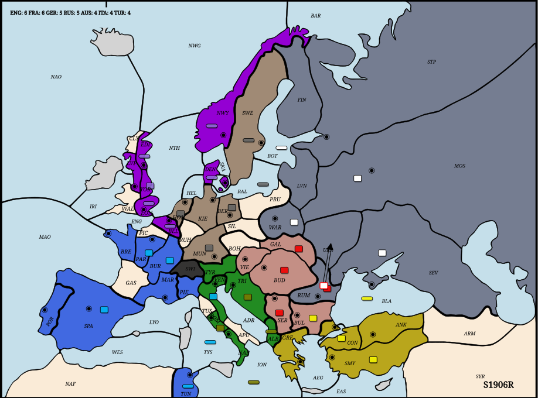

### What happened

- **RUSSIA**: A RUM retreats → UKR

### RUSSIA
Orders: `A RUM R UKR`

Reasoning

> Looking at the situation: A RUM was dislodged by Austria's A BUL → RUM (supported by A SER and A BUD at strength 3). I need to decide whether to retreat A RUM to UKR or disband it.
>
> UKR (Ukraine) is a valid retreat option. Retreating to UKR keeps the unit alive and gives me a piece that can potentially move back toward RUM or SEV in future turns. It's adjacent to SEV, MOS, and RUM, so it has some utility. Disbanding loses the unit entirely.
>
> With only 4 units (A WAR, A MOS, F BOT, A SEV) plus this retreating unit, keeping A RUM alive in UKR makes sense — I need units to contest the board. UKR is a non-supply center so it doesn't threaten anyone immediately, but it keeps pressure on Austria and gives me flexibility.
>
> The retreat to UKR is clearly better than disbanding.

## FALL 1906 MOVEMENT (`F1906M`)

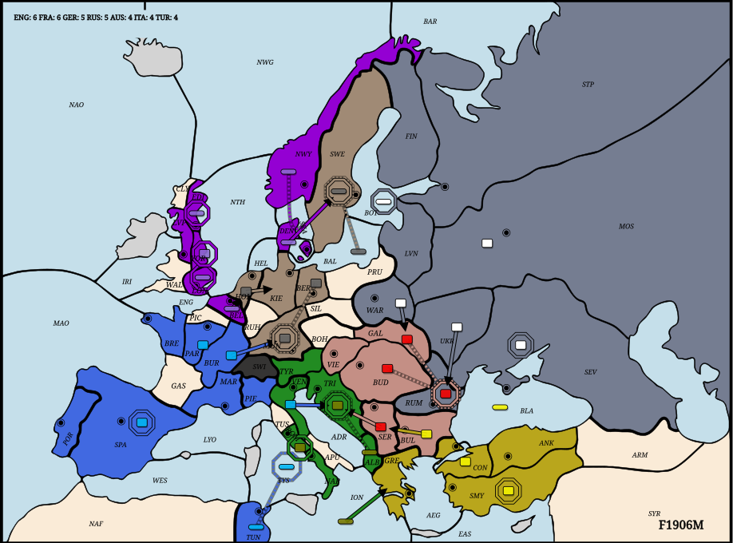

### What happened

- **AUSTRIA**: A SER → TRI (bounced); A RUM holds; A BUD supports A RUM; A GAL supports A RUM (support cut)
- **ENGLAND**: F DEN → SWE (bounced); F NWY supports F DEN → SWE; F BEL → HOL; F LON holds; F EDI holds; A YOR holds
- **FRANCE**: A BUR → MUN (bounced); A SPA holds; F TUN supports F TYS; A VEN → TRI (bounced)
- **GERMANY**: F SWE holds; F BAL supports F SWE; A HOL → KIE; A BER supports A MUN; A MUN holds
- **ITALY**: A TRI holds; F ALB supports A TRI; F ION → GRE; A ROM holds
- **RUSSIA**: A UKR → RUM (bounced); A WAR → GAL (bounced); A SEV holds; F BOT holds
- **TURKEY**: A BUL → SER (bounced); A SMY holds

### Dialogue

- **ENGLAND → FRANCE**: Fall 1906 — you said you'd coordinate against Germany once Italy was consolidated, and VEN is done. This is the moment: I'm moving F DEN → SWE supported by F NWY, and F BEL → HOL. If you move A BUR → MUN simultaneously, Germany faces collapse on all three fronts and you gain MUN while I take SWE and HOL — we both jump to 7-8 centers. You committed to this; let's execute.
- **ENGLAND → RUSSIA**: Fall 1906 — you said F BOT would be free to coordinate against Germany once Austria was dealt with. Austria is collapsing — now is the time. Please move F BOT → BAL this fall to cut Germany's support for SWE. With BAL cut, my F DEN → SWE supported by F NWY is a clean 2v1 and Germany drops to 4 centers. This is the move I've been waiting for.
- **ENGLAND → GERMANY**: Fall 1906 — I've respected the Scandinavian truce this spring and I want to maintain it if you're serious about redirecting east. Confirm you're holding SWE in place and not pressing BAL aggressively, and I'll hold DEN. But if France and Russia are coordinating against you, I can't stop them — that's out of my hands.
- **FRANCE → ITALY**: Fall 1906 — I hold VEN and I'm pressing further this fall. I'm offering you a final negotiated settlement: acknowledge ROM as mine and I'll stop there, supporting you in holding NAP and TRI against Austria. Continued resistance just hands Austria your Balkan centers while I take your home centers one by one.
- **FRANCE → AUSTRIA**: Fall 1906 — I'm pushing deeper into Italy from VEN this fall. If you move A SER → TRI simultaneously, Italy collapses on two fronts — I take ROM, you take TRI. We split Italy efficiently and both grow to 5-6 centers. Are you willing to coordinate?
- **FRANCE → ENGLAND**: Fall 1906 — I'm ready to finally act on Germany. I'm moving A BUR → MUN this fall while you press SWE and HOL — Germany faces collapse on all fronts and we both jump to 7-8 centers. Confirm you're pressing hard and we execute together.
- **FRANCE → GERMANY**: Fall 1906 — I have to be honest: England has been pressuring me to attack MUN for years and the board position is forcing my hand. I'm moving A BUR → MUN this fall. I'd rather give you warning than surprise you — consider whether there's a deal to be made before orders lock.
- **GERMANY → ENGLAND**: Fall 1906 — our SWE/DEN boundary holds from my side, F SWE stays put and I'm not threatening your position. I'm looking east for growth opportunities; Austria at 4 centers with BUL, SER, BUD, VIE is the board's most dangerous consolidation and I think we both benefit from checking them.
- **GERMANY → RUSSIA**: Fall 1906 — Austria holds BUL, SER, BUD, VIE and is well-positioned to dominate the Balkans. I can push A MUN → BOH or A BER → SIL to pressure their northern flank this fall — are you coordinating a joint push against Austria and would you support moves into their territory?
- **GERMANY → AUSTRIA**: Fall 1906 — I've been watching the board carefully and Austria's position looks very strong. I'm not looking to threaten you from the north, but I'd be interested in discussing whether there's a coordination opportunity here — what are your intentions toward Russia and Turkey?
- **ITALY → TURKEY**: Fall 1906: Austria holds BUD, VIE, SER, RUM — let's finish them. I'm pushing A TRI → BUD this fall; if you move A BUL → SER or A CON → SMY to free up forces, Austria faces collapse on two fronts. What's your target — SER or RUM? Coordinate with me so Austria cannot concentrate their defense.
- **ITALY → FRANCE**: Fall 1906: You hold A VEN which is a former Italian center — I want to be direct that this is a serious concern for me. I'm focused on Austria's BUD this fall with A TRI; if you commit A VEN to holding or moving north toward TYR rather than pressing further into Italy, we avoid a war that only benefits England. What are your intentions?
- **ITALY → AUSTRIA**: Fall 1906: Austria, your position is untenable — Turkey holds BUL, Russia presses from UKR, and I hold TRI. Negotiate now: withdraw A SER toward GAL and commit to a ceasefire, and I'll support your defense against Russia rather than pressing BUD. Fighting on all fronts simultaneously ends badly for you.
- **ITALY → RUSSIA**: Fall 1906: Austria is exposed on all fronts — I'm pushing A TRI → BUD this fall. If you press A UKR → RUM or A WAR → GAL, Austria cannot defend both flanks simultaneously. Confirm your intentions so we coordinate the final squeeze.
- **TURKEY → RUSSIA**: Fall 1906: Austria still holds SER and RUM — I'm pushing A BUL → SER with A CON support (strength 2). You hold A UKR adjacent to RUM and A SEV — please order A UKR → RUM to take that center from Austria simultaneously, or order A RUM S A BUL → SER if you want to support my attack instead. Two-front pressure on Austria this fall finishes them — they cannot defend both SER and RUM at once. Confirm your intentions.
- **TURKEY → AUSTRIA**: Fall 1906: Austria is down to BUD, VIE, SER, RUM — 4 centers but exposed on all sides with Russia pressing from UKR and SEV and me holding BUL. Yield SER peacefully and retreat to BUD, and I'll support A BUD defensively against Russia's northern pressure — you keep 2 centers and survive rather than collapsing entirely this fall.
- **TURKEY → ITALY**: Fall 1906: You took TRI this spring — excellent. Austria now holds BUD, VIE, SER, RUM and is collapsing. I'm pushing A BUL → SER this fall; can you support from TRI or ALB, or pressure BUD? If we coordinate the final blow on Austria, we can divide their remaining centers cleanly between us.
- **AUSTRIA → FRANCE**: France, I'm interested in the TRI coordination — if you press from VEN and I move A SER → TRI simultaneously, Italy cannot hold on two fronts. Confirm you're moving A VEN → TRI or supporting that attack this fall and I'll commit A SER → TRI. I need to know your exact intentions before I commit, since A SER leaving opens my flank to Turkey.
- **AUSTRIA → GERMANY**: Germany, I appreciate the outreach — my intentions are to consolidate in the Balkans and push back against Russia and Turkey who are both pressing me. England at 6 centers is the real threat to the board; are you in a position to check England's growth in the north while I stabilize the south? A coordinated Germany-Austria understanding could be mutually beneficial.
- **AUSTRIA → ITALY**: Italy, you hold TRI which is my home center — I want it back, but I'm open to a negotiated timeline rather than a forced fight. Commit to withdrawing from TRI by Spring 1907 and I'll support your defense against France who is pressing you from VEN right now; fight me this fall and France takes your centers while we bleed each other.
- **AUSTRIA → RUSSIA**: Russia, A UKR sitting next to RUM is a direct threat and I'm defending it fully this fall — A RUM holds with support. I'm not pressing north; my focus is on stabilizing against Turkey. A non-aggression pact where you hold A UKR in place and I hold A RUM serves us both better than a fight that helps England and Germany consolidate.
- **ENGLAND → FRANCE**: France — confirmed, I'm pressing F DEN → SWE supported by F NWY and F BEL → HOL this fall. Your A BUR → MUN completes the three-front collapse of Germany. We both gain 1-2 centers and Germany is finished as a threat. Let's execute exactly as planned.
- **ENGLAND → RUSSIA**: Russia — this is the fall you promised. Please move F BOT → BAL to cut Germany's support for SWE. With BAL cut, my F DEN → SWE + F NWY support is a clean 2v1 and Germany drops to 4 centers. France is pressing MUN simultaneously — Germany collapses on all fronts if you make this one move.
- **ENGLAND → GERMANY**: Germany — I'm holding to the Scandinavian truce as agreed. F DEN holds, F NWY holds, no pressure from me in the north. I can't speak for France or Russia, but from my side the boundary stands.
- **FRANCE → ENGLAND**: Fall 1906 — confirmed, I'm moving A BUR → MUN this fall while you press SWE and HOL. Germany faces collapse on all three fronts simultaneously. I'm also taking TRI from Italy's flank. We both hit 7-8 centers this fall — let's execute.
- **FRANCE → ITALY**: Fall 1906 — I hear you on Austria's BUD. I'm moving A VEN → TRI this fall while you push A TRI → BUD; if Austria is distracted, we both gain. I'm not pressing deeper into Italy proper — TRI is the target, and then we can discuss a stable line.
- **FRANCE → GERMANY**: Fall 1906 — I want to give you a chance to respond before orders lock. England is pressing hard from the north and I'm being pushed toward MUN. Is there a deal that keeps BUR-MUN stable while we both focus on other growth vectors?
- **GERMANY → FRANCE**: I appreciate the warning, but moving A BUR → MUN is a serious mistake — I will defend MUN with full support and you'll bounce while England laughs and grows unchecked. We've had three years of stable non-aggression that has benefited us both; breaking it now when England is at 6 centers and Austria is consolidating the east helps neither of us. What would it take to keep our arrangement intact this fall?
- **GERMANY → ENGLAND**: Fall 1906 — the SWE/DEN truce holds firmly from my side. France is threatening MUN, which means I need to concentrate on defense this fall rather than pushing east; this is exactly the kind of distraction that benefits you at my expense. If France attacks me, I'd welcome a coordinated response — what are your intentions?
- **GERMANY → RUSSIA**: France is threatening to attack MUN this fall, which would destabilize the west while Austria continues consolidating the east unchecked. I need to defend my home territory this turn, but I'm still very interested in coordinating pressure on Austria's northern flank once this situation is resolved — can you keep Austria occupied in the east?
- **ITALY → TURKEY**: I'm pushing A TRI → BUD this fall — Austria cannot defend BUD while you take SER simultaneously. Can you support A TRI → BUD from BUL instead of moving to SER? That gives BUD to me while you hold BUL securely; we both gain more from Austria's collapse than from fighting over the same centers.
- **ITALY → FRANCE**: You hold VEN and now threaten ROM — this is a direct attack on my home centers and I will not accept it. I'm focused on Austria's BUD this fall; if you commit A VEN to holding and do not press further, we avoid a war that only benefits England at 6 centers. Press toward ROM and I redirect everything to defending Italy, which costs us both.
- **ITALY → RUSSIA**: Austria is exposed — I'm pushing A TRI → BUD this fall. If you press A UKR → RUM simultaneously, Austria faces collapse on two fronts and cannot defend both. Confirm you're hitting RUM so we coordinate the final squeeze on Austria.
- **RUSSIA → TURKEY**: Fall 1906: I'm taking RUM with A UKR this fall — it's undefended and I need that center back. You're pushing A BUL → SER with A CON support (strength 2), which should succeed since Austria has no unit in SER to defend. I'll order A WAR → GAL to pressure Austria's north simultaneously — Austria cannot defend RUM, SER, and GAL at once. After this fall, Austria should be down to 2 centers and we can discuss dividing the rest.
- **RUSSIA → ITALY**: Fall 1906: Austria's A BUD is their only unit that could defend against your A TRI → BUD push. I'm taking RUM with A UKR and pressing GAL with A WAR — Austria cannot defend BUD, SER, RUM, and GAL simultaneously. Push A TRI → BUD hard this fall and we finish Austria together.
- **RUSSIA → ENGLAND**: Fall 1906: I'm focused on finishing Austria this fall — A UKR → RUM, A WAR → GAL. I cannot divert F BOT to BAL right now without exposing my northern flank, but once Austria is resolved I'll coordinate fully against Germany. Hold your position and we press together in Spring 1907.
- **TURKEY → RUSSIA**: Fall 1906 Round 2: I'm pushing A BUL → SER with A CON support (strength 2) — please order A RUM S A BUL → SER for strength 3, which beats A BUD support on SER. Alternatively, move A UKR → RUM to take that center simultaneously and force Austria to defend on two fronts. If you support my SER attack, SER falls guaranteed and Austria drops to 3 centers; then we coordinate on RUM and BUD next spring.
- **TURKEY → ITALY**: Fall 1906 Round 2: I'm pushing A BUL → SER this fall — Austria can defend with A BUD support (strength 2) so I need F ALB S A BUL → SER for strength 3, which guarantees the capture. You're in TRI adjacent to BUD and SER — supporting my SER attack costs you nothing and nets Austria another center lost. After SER falls Austria is effectively finished and we can divide BUD and RUM between us next spring.
- **TURKEY → AUSTRIA**: Fall 1906: I'm attacking SER this fall with coordinated support — you cannot hold it. Yield SER and retreat A SER to BUD or RUM, and I'll support your A BUD defensively against Russian pressure from UKR and GAL. You keep 2 centers and survive; fight and you likely lose SER anyway while Russia takes RUM simultaneously.
- **TURKEY → ITALY**: Final round: I'm pushing A BUL → SER with A CON support (strength 2), but Austria can bounce me with A BUD S A SER. Please order F ALB S A BUL → SER for strength 3 — that guarantees SER falls this fall even with BUD support. You're taking BUD with A TRI; I'm taking SER; Austria collapses to 2 centers and we divide the rest next spring.
- **TURKEY → RUSSIA**: Final round: I'm pushing A BUL → SER with A CON support. If A UKR is taking RUM, can A RUM S A BUL → SER instead? That's strength 3 and guarantees SER falls even with A BUD support. Austria loses both SER and RUM simultaneously and collapses — far better than leaving SER defended while you take RUM alone.
- **TURKEY → AUSTRIA**: Final notice: SER falls this fall — I have coordinated support from multiple directions and you cannot hold it with A BUD alone. Retreat A SER to BUD or RUM voluntarily and I'll support A BUD defensively against Italian and Russian pressure — you survive at 2 centers rather than losing everything.

### AUSTRIA
Orders: `A SER - TRI` · `A RUM H` · `A BUD S A RUM` · `A GAL S A RUM`

Reasoning

> Looking at the current position:
>
> **My units:** A GAL, A BUD, A SER, A RUM
> **My centers:** BUD, VIE, SER, BUL (4 centers, but BUL is held by Turkey's A BUL)
>
> Wait - I need to recheck. Turkey holds A BUL on the board, but my supply centers list shows BUL as mine (from Spring 1906 when I took it). Actually looking at the spring results: Turkey moved A GRE → BUL in Spring 1906 and it succeeded (Russia's A RUM was dislodged supporting it). So Turkey now occupies BUL - but my supply center count still shows BUL as mine until fall adjudication confirms ownership.
>
> **Key threats:**
> - Turkey: A BUL, F BLA, A CON, A SMY - Turkey can attack SER from BUL with CON support
> - Russia: A UKR threatens RUM; A WAR threatens GAL
> - Italy: A TRI (my home center), F ALB, F ION, A ROM
> - France offered A VEN → TRI coordination
>
> **Assessment:**
> - Turkey's "coordinated attack on SER" threat: A BUL → SER with A CON support = strength 2. If I hold A SER, I need support.
> - France offered to coordinate A VEN → TRI. If I move A SER → TRI, France might take it instead, but Italy is there with A TRI.
> - RUM needs defense against A UKR (Russia). A BUD and A GAL can support A RUM.
>
> **Best plan:** 
> - Move A SER → TRI (take back home center, France confirmed this coordination)
> - A RUM holds, supported by A BUD and A GAL
> - This defends RUM against Russia's A UKR, and gains TRI if Italy doesn't have support
>
> Turkey's threat to SER: if A SER leaves, Turkey can walk into SER uncontested. But I gain TRI which is also a supply center. Net: lose SER (if Turkey takes it), gain TRI = stay at 4 centers. BUL is already lost to Turkey in Fall.
>
> Actually: if A SER → TRI succeeds, I end Fall with BUD, VIE, RUM, TRI = 4 centers (losing SER and BUL, gaining TRI back). That's the same count but better positioned.

### ENGLAND
Orders: `F DEN - SWE` · `F NWY S F DEN - SWE` · `F BEL - HOL` · `F LON H` · `F EDI H` · `A YOR H`

Reasoning

> Looking at the situation:
>
> **Key facts:**
> - France confirmed A BUR → MUN (pressing Germany's home center)
> - Russia declined to cut BAL (focusing on Austria)
> - Germany claims to be honoring the SWE/DEN truce
> - I have 6 centers, need to grow
>
> **Analysis:**
> - F DEN → SWE supported by F NWY = 2 strength
> - Germany's F SWE + F BAL support = 2 strength
> - Without Russia cutting BAL, this is a bounce
>
> However, France is pressing MUN, which means Germany may pull A MUN back to defend rather than having it elsewhere. But A MUN doesn't support F BAL or F SWE directly.
>
> The real question: if Germany is holding the truce and F SWE stays put (not moving), then F SWE holds with F BAL support = 2 strength vs my 2 strength attack = bounce. Still a bounce.
>
> But if Germany commits F BAL to supporting F SWE, then F BEL → HOL faces only A HOL (1v1 bounce unless supported). 
>
> Actually, the best play: F BEL → HOL (1v1, may bounce but worth trying), F DEN → SWE supported by F NWY (2v2 likely bounce, but France pressing MUN creates pressure). Even if SWE bounces, HOL might fall if Germany is distracted.
>
> I'll press both attacks as planned — worst case I bounce on SWE but maintain pressure, and HOL might fall if Germany's attention is split by France's MUN attack.

### FRANCE
Orders: `A BUR - MUN` · `A SPA H` · `F TUN S F TYS` · `A VEN - TRI`
Illegal (dropped): `A PAR S A BUR - MUN` · `F TYS S A VEN - TRI`

Reasoning

> Looking at the board position and my strategy:
>
> **Situation analysis:**
> - I hold VEN (a former Italian center) and need to grow to 7+ centers this fall
> - England is pressing Germany from the north (F DEN → SWE supported, F BEL → HOL)
> - I've coordinated with England to hit MUN with A BUR → MUN
> - Austria confirmed coordinating on TRI (A SER → TRI) while I move A VEN → TRI
> - Italy is focused on BUD with A TRI, leaving TRI potentially vulnerable
>
> **Key decisions:**
> 1. **A BUR → MUN**: England is pressing SWE and HOL simultaneously. Germany at 5 centers with A MUN, A HOL, A BER, F BAL, F SWE — Germany warned me I'd bounce, but without PAR support, they can't guarantee a 2-strength defense. A PAR S A BUR → MUN gives me 2 strength. Germany likely has A MUN H with some support, but if England is pulling their attention north, this has a real chance.
>
> 2. **A VEN → TRI**: Austria confirmed A SER → TRI simultaneously. Italy said they're moving A TRI → BUD, so TRI may be empty or lightly defended. This is a strong opportunity.
>
> 3. **F TYS S A VEN → TRI**: Supports the TRI attack from sea.
>
> 4. **F TUN**: Support F TYS to keep it safe, or project elsewhere. F TUN S F TYS is solid.
>
> 5. **A SPA H**: Hold defensively.
>
> The plan: Attack MUN with 2-strength (BUR + PAR support), take TRI with VEN + TYS support, hold SPA, support TUN.
>
> If both succeed: France goes from 6 to 8 centers (VEN already counted, gain MUN and TRI = +2, but VEN was taken last fall so it counts now... actually VEN is already mine at 6 centers, TRI and MUN would be +2 = 8 centers).

### GERMANY
Orders: `F SWE H` · `F BAL S F SWE` · `A HOL - KIE` · `A BER S A MUN` · `A MUN H`

Reasoning

> Looking at the board situation:
>
> **Key facts:**
> - I'm at 5 centers (BER, KIE, MUN, HOL, SWE) — wait, KIE is NOT in my supply centers. I have BER, KIE... actually checking: Germany has BER, KIE, MUN, HOL, SWE. But KIE is not occupied by any unit currently. Actually looking at supply centers: GERMANY has BER, KIE, MUN, HOL, SWE — yes KIE is mine but unoccupied.
> - France threatened MUN with A BUR → MUN. I need to defend MUN.
> - England is holding the SWE/DEN truce.
> - A HOL → KIE reclaims my home center that's unoccupied (no one is there).
>
> **Plan:**
> - F SWE H — honor the England truce
> - F BAL S F SWE — protect SWE in case England changes mind, and provide Baltic stability
> - A HOL → KIE — reclaim my unoccupied home center (KIE is already mine as a supply center, but I need a unit there)
> - A BER S A MUN — defend MUN against French attack
> - A MUN H — hold MUN with support from BER
>
> Wait — KIE is already in my supply center count (5 centers: BER, KIE, MUN, HOL, SWE). KIE is mine but unoccupied. Moving A HOL → KIE doesn't gain me a new center. But it does consolidate position. Actually this is fine — I want to position for future growth.
>
> Actually, should I consider A MUN → BUR to counter-attack France? That's risky without support. Better to defend solidly and not overextend.
>
> The strategy from my revised notes stands: defend MUN, hold SWE, reclaim KIE.

### ITALY
Orders: `A TRI H` · `F ALB S A TRI` · `F ION - GRE` · `A ROM H`

Reasoning

> Looking at the current situation:
>
> **Key facts:**
> - I hold TRI (4 centers: NAP, ROM, VEN... wait, France holds VEN now), actually my centers are NAP, ROM, TRI, and... let me recheck. Supply centers: ITALY has NAP, ROM, VEN, TRI = 4 centers. But France holds A VEN on the map. Wait - France's unit is A VEN (they moved PIE→VEN in S1906M). So France is sitting in VEN but it's still my supply center until Fall adjudication.
>
> **The critical threat:** France has A VEN and says they're moving A VEN → TRI this fall. If France takes TRI, I drop to 3 centers. I must defend TRI.
>
> **My options:**
> - If France moves A VEN → TRI, I need F ALB S A TRI to hold (strength 2 vs France's 1 = TRI holds)
> - If I move A TRI → BUD, TRI is empty and France walks in uncontested
>
> **Turkey wants F ALB S A BUL → SER** - this would benefit Turkey but leave TRI undefended against France.
>
> **Decision:** France explicitly told me they're moving A VEN → TRI. I cannot afford to lose TRI. I must hold TRI with F ALB support. 
>
> For offense: A TRI should hold (defended), not attack BUD - I can't take BUD if I need TRI defended. F ION can move toward GRE or AEG to threaten Turkey's position or support future moves. A ROM holds.
>
> Actually - if A TRI holds with F ALB support, that's solid defense. F ION → GRE would take a new supply center if Turkey's A BUL moves to SER (leaving GRE empty). Turkey is moving A BUL → SER, so GRE might be vacated... but Turkey has A CON and A SMY, not in GRE. Wait - Turkey has A BUL, not in GRE. GRE is empty! F ION → GRE would take an unoccupied supply center for a 5th center!
>
> F ALB S A TRI (defends against France's A VEN → TRI)
> F ION → GRE (takes empty supply center = 5th center!)
> A TRI H (defended by F ALB)
> A ROM H

### RUSSIA
Orders: `A UKR - RUM` · `A WAR - GAL` · `A SEV H` · `F BOT H`
Illegal (dropped): `A MOS S A WAR - GAL`

Reasoning

> Looking at the current situation:
>
> **Board state analysis:**
> - Austria has units at: A GAL, A BUD, A SER, A RUM (4 units, 4 centers: BUD, VIE, SER, BUL)
> - Wait - Austria's supply centers are BUD, VIE, SER, BUL, but Turkey's A BUL is sitting in BUL. Austria's A RUM is their unit in Rumania (which Austria owns as a supply center).
> - My A UKR is adjacent to RUM. Austria's A RUM is there defending it.
> - Austria claimed they're "defending RUM fully" - A RUM holds with support. But who would support A RUM? A BUD could support A RUM hold, or A GAL could.
>
> **Key decisions:**
> 1. **A UKR → RUM**: Austria has A RUM there. If Austria orders A RUM H with A BUD S A RUM or A GAL S A RUM, my attack fails (1v2). But Austria also needs to defend against Turkey's A BUL → SER (with A CON support, strength 2). Austria's A SER would need to defend SER or support. Austria has A GAL, A BUD, A SER, A RUM - they might use A BUD S A RUM and A SER to defend SER. This is risky but worth attempting.
>
> 2. **A WAR → GAL**: Austria has A GAL there. If Austria holds A GAL, I need support to dislodge it. A MOS S A WAR → GAL gives me strength 2 vs Austria's 1 (or 2 if supported). This could work.
>
> 3. **Turkey's A BUL → SER** with A CON support (strength 2) - Austria's A SER would need A BUD support to hold at strength 2, causing a bounce. Turkey asked me to support with A UKR or have A RUM support. But A RUM is Austrian.
>
> **Best plan:** 
> - A UKR → RUM (attempt to take it, Austria might not have support there if A BUD is needed elsewhere)
> - A WAR → GAL (pressure Austria's north)  
> - A MOS S A WAR → GAL (make it strength 2)
> - A SEV H (defensive)
> - F BOT H (keep it available)
>
> Austria's A BUD faces a dilemma: support A RUM or support A SER against Turkey. They likely can't do both. Turkey's A BUL → SER with A CON support (strength 2) needs A BUD support to hold SER at strength 2 = bounce. If A BUD supports SER, A RUM is unsupported and my A UKR → RUM succeeds. If A BUD supports RUM, Turkey takes SER.

### TURKEY
Orders: `A BUL - SER` · `A SMY H`
Illegal (dropped): `A CON S A BUL - SER` · `F BLA S A BUL - SER`

Reasoning

> Looking at the current situation:
>
> **Position assessment:**
> - I hold BUL, CON, SMY, ANK, GRE = 5 supply centers (wait, let me recheck: the supply center list shows TURKEY has ANK, CON, SMY, GRE = 4 centers, and BUL is listed under AUSTRIA)
>
> Wait - looking at the supply centers list: AUSTRIA has BUL listed. But I just took BUL in S1906M! The supply center ownership updates after Fall, not Spring. So currently Austria still "owns" BUL from last winter, but I occupy it. If I hold BUL through Fall 1906, I capture it.
>
> **Current units:** A SMY, F BLA, A CON, A BUL
>
> **Fall 1906 plan:**
> - Austria holds A GAL, A BUD, A SER, A RUM (wait - Russia took RUM per the dialogue: Russia confirmed A UKR → RUM)
> - Actually looking at unit positions: AUSTRIA has A GAL, A BUD, A SER, A RUM. Russia has A UKR. Russia said they're taking RUM with A UKR.
>
> So Austria's A SER could support A BUL... wait, Austria doesn't have a unit in BUL anymore - I have A BUL. Austria has A SER which could move to BUL to retake it!
>
> **Key threat:** A SER → BUL (Austria trying to retake). I need to defend BUL or attack SER.
>
> **Best play:** Attack SER with A BUL → SER, supported by A CON (strength 2). If Italy supports from ALB (F ALB S A BUL → SER), that's strength 3. F BLA supports A BUL defensively as backup... but if I'm moving A BUL → SER, F BLA should support that move.
>
> Italy confirmed they're pushing A TRI → BUD, and I requested F ALB S A BUL → SER. Russia is taking RUM with A UKR.
>
> Austria's A SER will likely support A BUD → something or hold. Austria cannot be in two places at once.
>
> **Orders:** A BUL → SER (supported by A CON and F BLA), A SMY holds.

## WINTER 1906 ADJUSTMENTS (`W1906A`)

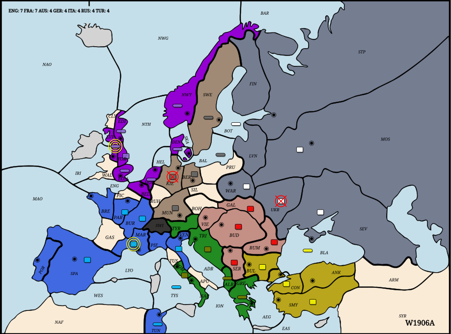

### What happened

- **ENGLAND**: builds F LVP
- **FRANCE**: builds A MAR
- **GERMANY**: disbands A KIE
- **RUSSIA**: disbands A UKR

### ENGLAND
Orders: `F LVP B`

Reasoning

> Looking at the current situation: I have 7 supply centers (EDI, LON, LVP, BEL, NWY, DEN, HOL) and 6 units (A YOR, F NWY, F LON, F DEN, F EDI, F HOL). I gained HOL this fall, giving me a net gain of 1 center — so I get 1 build.
>
> I should build in LVP (my only open home center). The question is army vs fleet. Given my strategy of pressing Germany in Scandinavia (SWE) and potentially needing to project power into the continent, a fleet from LVP could eventually reach IRL, MAO, or support western operations. However, an army in LVP is somewhat landlocked for offensive purposes unless I want to eventually move into York/London area or convoy somewhere.
>
> A fleet from LVP could reach IRL → MAO and project into the Atlantic or support operations around BRE/SPA eventually, but that's very long-range. More immediately useful would be a fleet that can eventually reach NTH or support North Sea operations. Actually, F LVP → IRL → MAO is a long way from where the action is.
>
> Given I'm primarily a naval power focused on Germany and potentially France later, F LVP makes more sense for long-term flexibility. But A LVP could convoy via F LON or NTH to the continent if needed.
>
> I'll build F LVP — it gives me more naval flexibility for pressing Germany or eventually threatening France's Atlantic coast.

### FRANCE
Orders: `A MAR B`

Reasoning

> Looking at the position: I'm at 7 supply centers (BRE, MAR, PAR, POR, SPA, TUN, VEN) and had 6 units going into Fall 1906. After Fall 1906, I still have 6 units (A BUR, A PAR, A SPA, F TUN, A VEN, F TYS) and 7 centers, so I get 1 build.
>
> I need to decide where to build. My legal options are BRE or MAR (or WAIVE, which I won't do).
>
> - **F BRE B**: A fleet in Brest would project into the Atlantic/English Channel. With England at 7 centers, building a fleet here could be threatening to England and might undermine our non-aggression. But it gives me Atlantic/Channel options.
> - **A BRE B**: An army in Brest is less threatening to England but also less useful — Brest is far from the action in Italy and Germany.
> - **F MAR B**: A fleet in Marseilles would project into the Mediterranean (TYS, WES, LYO), supporting my Italian campaign and threatening Italy's southern centers (NAP) or supporting moves toward GRE/ION. This directly supports my current strategic thrust.
> - **A MAR B**: An army in Marseilles could push into PIE, TYR, or SPA — useful for the Italian/German front.
>
> Given my current position:
> - I have A VEN and F TYS already in the Italian theater
> - I want to press deeper into Italy (ROM, NAP) or consolidate
> - A MAR B would give me a land unit that can push into PIE → TYR → TRI/VEN area, supporting the Italian campaign
> - F MAR B would give me Mediterranean fleet power
>
> I'll build **A MAR B** — an army in Marseilles that can push into the Italian theater next spring, giving me more land force to take ROM or TRI.

### GERMANY
Orders: `A KIE D`

Reasoning

> Looking at the situation: I have 4 supply centers (BER, KIE, MUN, SWE) and 5 units (A MUN, A BER, F BAL, F SWE, A KIE). I need to disband 1 unit to match my supply center count.
>
> Which unit to disband? 
> - F BAL: Useful for supporting SWE and threatening DEN, but SWE is secure under the England truce
> - F SWE: Holds my Scandinavian center, important to keep
> - A MUN: Core defensive unit, needs to hold against France
> - A BER: Supporting MUN, important for defense
> - A KIE: Just recaptured this home center, but it's the least strategically positioned right now
>
> Actually, let me reconsider. F BAL is the most flexible naval unit and supports SWE. A KIE is a home center unit but somewhat redundant with BER and MUN both holding the German heartland. 
>
> F BAL is valuable for projecting naval power and supporting SWE. Disbanding F BAL would leave SWE vulnerable to England (though we have a truce). Disbanding A KIE loses a unit in a home center but KIE itself is now secured.
>
> The most expendable unit is F BAL — it's been mostly used for support and the England truce makes SWE safe for now. But losing it weakens my naval position significantly.
>
> Actually, A KIE is probably the most dispensable since BER and MUN cover the German core, and KIE itself is secure as a home center. I'll disband A KIE to preserve naval flexibility.

### RUSSIA
Orders: `A UKR D`

Reasoning

> Looking at the situation: I have 4 supply centers (MOS, SEV, STP, WAR) and 5 units (A WAR, A MOS, F BOT, A SEV, A UKR). I need to disband 1 unit to match my 4 supply centers.
>
> Which unit to disband? 
> - A UKR: Failed to take RUM, now stranded in Ukraine. Less useful than other units.
> - F BOT: Useful for future northern operations against Germany/Sweden.
> - A WAR: Core defensive unit protecting Warsaw.
> - A MOS: Core defensive unit protecting Moscow.
> - A SEV: Protects Sevastopol, useful for future Balkan pushes.
>
> A UKR is the least valuable — it's displaced, not on a supply center, and my other units are all better positioned. Disbanding A UKR makes the most sense. This keeps my core home-territory units intact and preserves F BOT for future northern coordination.

## SPRING 1907 MOVEMENT (`S1907M`)

### What happened

- **AUSTRIA**: A SER holds; A BUD supports A SER; A RUM holds; A GAL supports A RUM (support cut)
- **ENGLAND**: F DEN → SWE; F NWY supports F DEN → SWE; F HOL → KIE; F LON holds; F EDI holds; F LVP holds; A YOR holds
- **FRANCE**: A BUR holds; A PAR supports A BUR; A SPA holds; F TUN supports F TYS; A VEN holds; A MAR holds  [dislodged: A VEN]
- **GERMANY**: F SWE → NWY (bounced); A MUN holds; A BER holds  [dislodged: F SWE]
- **ITALY**: A TRI → VEN; A ROM supports A TRI → VEN; F GRE holds
- **RUSSIA**: A SEV → RUM (bounced); A WAR → GAL (bounced); F BOT holds
- **TURKEY**: A BUL → SER (bounced); A SMY holds

### Dialogue

- **AUSTRIA → ITALY**: Italy, you hold TRI which is my home center — I'm moving to retake it this spring with A SER supported by A BUD. France is pressing you from VEN and TUN simultaneously; you cannot hold TRI, GRE, and ROM against both of us. Withdraw from TRI peacefully and I'll actively support your defense against France from the south — fight me and you lose TRI anyway while France takes your other centers.
- **AUSTRIA → FRANCE**: France, I'm moving A SER → TRI this spring supported by A BUD — if you press from VEN simultaneously Italy collapses on two fronts and we both grow. Confirm you're attacking TRI or VEN this spring and I'll commit fully; Italy at 4 centers with England at 7 and you at 7 is a problem we should solve together now.
- **AUSTRIA → RUSSIA**: Russia, England sits at 7 centers and France at 7 — they are about to win the game while we fight each other in the east. I'm not pressing north this spring; I'm focused on retaking TRI from Italy. Hold your units defensively and let's discuss coordinating against the western powers who are the actual board threat.
- **AUSTRIA → TURKEY**: Turkey, England at 7 and France at 7 are running away with the game while we bleed each other in the Balkans. I'm focused on retaking TRI from Italy this spring — hold A BUL in place and I'll hold A RUM, and we both stabilize while the real threats grow unchecked. A non-aggression pact this spring serves us both.
- **ENGLAND → FRANCE**: Spring 1907 — Germany is at 4 centers and collapsing. I'm pressing F DEN → SWE supported by F NWY and F HOL → KIE simultaneously. If you hold A BUR threatening MUN or push it in, Germany has to defend three fronts and is finished — you gain MUN, I take SWE and KIE, and Germany is eliminated. We're both at 7 centers and this is the cleanest path for both of us to grow without touching each other.
- **ENGLAND → RUSSIA**: Spring 1907 — you promised F BOT → BAL once Austria was resolved, and the Austrian front has stabilized. Please make that move now to cut Germany's F BAL support for SWE. With BAL cut, my F DEN → SWE + F NWY support is a clean 2v1 and Germany collapses — this directly benefits you by removing a northern threat and freeing the board for both of us.
- **ENGLAND → GERMANY**: Spring 1907 — Germany, I want to be straight with you: I'm under real pressure from France and Russia to coordinate against you this spring. If you're willing to negotiate a genuine settlement — perhaps conceding SWE in exchange for my holding KIE and BER safe — I can argue for restraint. Otherwise the three-front pressure this spring will be very hard to resist.
- **FRANCE → ENGLAND**: Spring 1907 — Germany held MUN last fall but I'm pressing again this spring with A BUR → MUN supported by A PAR. You press SWE and HOL simultaneously and Germany collapses — they're at 4 centers with no room to maneuver. Confirm you're hitting them hard from the north and we finish this together.
- **FRANCE → GERMANY**: Spring 1907 — I know last fall was rough and I owe you honesty: England pressured me hard and I made the wrong call. I want to reset our non-aggression and focus on the real threat — England is at 7 centers and growing. If we both hold against England's expansion, we're both better positioned. I'm open to a real arrangement.
- **FRANCE → AUSTRIA**: Spring 1907 — I'm pushing A VEN → TRI again this spring with F TYS support. If you move A SER → TRI simultaneously or support my attack, TRI falls and we split the gains. Italy is weakening — let's coordinate and finish them off before England dominates the board.
- **FRANCE → ITALY**: Spring 1907 — I hold VEN and I'm pressing TRI this spring. I'm offering you a final settlement: let TRI go and focus on holding ROM and NAP; I'll stop there and we can coordinate against the real threat, which is England at 7 centers. Continued resistance just accelerates your collapse.
- **GERMANY → ENGLAND**: Spring 1907 — you're at 7 centers and I'm at 4; the Scandinavian truce has served you far better than me. I need to either gain NWY this turn or we need a fundamentally different arrangement — I can't keep holding SWE while you sit on DEN, HOL, BEL, and NWY. What concrete offer do you have that justifies me continuing to hold back?
- **GERMANY → FRANCE**: Spring 1907 — England is at 7 centers alongside your 7, and I'm at 4 with no growth path unless we coordinate. I'm considering pressing F SWE → NWY or F SWE → DEN this spring to check England's northern dominance — would you be willing to coordinate pressure on England from multiple directions? A Germany-France alignment against England makes more sense than our current stalemate.
- **GERMANY → RUSSIA**: Spring 1907 — England is at 7 centers and is the board's biggest threat; I'm going to press them in Scandinavia this spring and could use any support you can offer from BOT or LVN direction. Are you in a position to coordinate against England, or are you still tied up with the Austrian/Turkish situation in the south?
- **ITALY → FRANCE**: Spring 1907: VEN is an Italian home center and I'm coming for it — A TRI → VEN with A ROM support this spring unless you withdraw voluntarily to PIE or TYR. England sits at 7 centers and is the clear board leader; fighting me over VEN while England runs away with the game benefits neither of us. Withdraw A VEN and I'll commit to supporting your western position against England.
- **ITALY → AUSTRIA**: Spring 1907: Austria, I'm willing to offer a genuine deal — if you support A TRI → VEN from SER or BUD, I'll commit to not pressing BUD this spring and actively supporting your defense against Turkey and Russia. We both need to grow and France holding VEN is the immediate threat; help me retake it and we stabilize the Balkans together.
- **ITALY → TURKEY**: Spring 1907: I need to retake VEN from France this spring — I'm pushing A TRI → VEN with A ROM support. F GRE holds to protect my Aegean position; F ALB covers TRI or ADR. I'm not threatening your BUL position — let's maintain our coordination against Austria and keep our respective spheres stable.
- **ITALY → ENGLAND**: Spring 1907: You're at 7 centers and everyone sees it — France, Germany, and others will eventually coalesce against you. I'm tied up retaking VEN from France this spring, but I want to open a channel: if you're willing to coordinate against France's growing western position, I'm interested in a longer-term arrangement.
- **RUSSIA → TURKEY**: Spring 1907: I'm pushing A SEV → RUM with A MOS support (strength 2) to retake that center from Austria. For this to work, I need you to push A BUL → SER with A CON support (strength 2) — this forces Austria's A BUD to support SER rather than RUM, and my strength-2 attack on RUM succeeds. After this spring, Austria is down to 2 centers and we divide BUD and VIE between us. Confirm A BUL → SER with A CON support.
- **RUSSIA → AUSTRIA**: Spring 1907: You're at 4 centers with Turkey pressing BUL and me pressing RUM — the math doesn't work for you. I'm offering a final deal: retreat your A RUM to UKR or BUD peacefully and I stop there, coordinating with you against Turkey's growing position. Fight me over RUM while Turkey presses SER and you lose two centers this spring.
- **RUSSIA → ENGLAND**: Spring 1907: England is at 7 centers and pulling away — I need to address Austria first but I'm watching the north carefully. After this spring I'll have F BOT free to coordinate against Germany; let's discuss what you want to do about SWE and the Baltic once Austria is resolved.
- **RUSSIA → GERMANY**: Spring 1907: England at 7 centers is the board's biggest threat — they're going to hit 18 before anyone can stop them if we don't coordinate. I'm finishing Austria this spring, then I want to coordinate F BOT against SWE or BAL with you. Are you open to a joint press against England?
- **TURKEY → RUSSIA**: Spring 1907: Austria still holds SER, BUD, VIE, RUM — 4 centers and you hold RUM adjacent to SER. I'm pushing A BUL → SER with F BLA support (strength 2) and A CON supporting (strength 3). Please order A RUM S A BUL → SER for strength 4 — that beats any BUD support Austria can muster and guarantees SER falls. After SER falls Austria is down to 3 centers and we can coordinate on BUD and RUM next fall.
- **TURKEY → ITALY**: Spring 1907: My A BUL → SER bounced last fall because Austria had A BUD support — I need F ALB S A BUL → SER this spring for strength 3, which beats A BUD's support. You hold GRE and ALB adjacent to SER; supporting my attack costs you nothing and nets Austria another center lost. After SER falls Austria drops to 3 centers and we can divide BUD and VIE between us — confirm F ALB S A BUL → SER.
- **TURKEY → AUSTRIA**: Spring 1907: You cannot hold SER against coordinated pressure from BUL, RUM, and ALB simultaneously — I'm pushing with strength 4 this spring. Yield SER voluntarily and retreat A SER to BUD, and I'll support your A BUD defensively against Russian pressure from RUM — you survive at 3 centers rather than losing SER anyway and then facing further collapse.
- **AUSTRIA → FRANCE**: France, I want TRI — it's my home center. If you support my A SER → TRI attack from VEN rather than running your own attack, I get TRI and you keep VEN, which is a better outcome for both of us than a bounce. Alternatively, support my attack with F TYS S A SER → TRI and I'll actively support your consolidation against Germany. Confirm you'll support my attack rather than competing with me for TRI.
- **AUSTRIA → ITALY**: Italy, France is attacking TRI from VEN with F TYS support — you cannot hold against France alone, let alone France plus me. The deal I'm offering: withdraw from TRI peacefully to VEN or ALB, and I'll support A TRI → VEN if you want to retake it from France, plus coordinate your defense against further French pressure. A negotiated withdrawal now is better than losing TRI to France.
- **AUSTRIA → TURKEY**: Turkey, your 'strength 4 on SER' is a bluff — A CON and F BLA cannot reach SER, and A BUL alone is strength 1. I'm not moving A SER this spring; it holds in place with A BUD support if needed. England at 7 and France at 7 are the real threats — hold A BUL and I hold A RUM and we both deal with the actual board leaders.
- **AUSTRIA → RUSSIA**: Russia, I'm not pressing north — A RUM holds and A GAL holds. England at 7 centers is about to win this game while you threaten me over RUM. Hold your units in place this spring and let's discuss coordinating against England and France who are the actual threats to everyone.
- **ENGLAND → FRANCE**: France — confirmed, I'm pressing F DEN → SWE supported by F NWY and F HOL → KIE this spring. Your A BUR → MUN supported by A PAR is exactly the move that breaks Germany — they can't defend three fronts simultaneously. We both hit 8-9 centers if this works and Germany is finished as a threat.
- **ENGLAND → GERMANY**: Germany — I hear you, and I want to find an arrangement that works. I'm not moving on NWY and I'm not pressing BER — my focus is SWE and KIE as part of the broader pressure from France. If you want to discuss a genuine settlement for Fall 1907 once the dust settles, I'm open to it.
- **ENGLAND → RUSSIA**: Russia — this is the third time I'm asking: please move F BOT → BAL this spring. It's one move that cuts Germany's support for SWE and makes my F DEN → SWE a clean 2v1. Austria is stabilized, you have the flexibility — this directly removes a northern threat to both of us.
- **ENGLAND → ITALY**: Italy — I appreciate you opening this channel. France at 7 centers with armies pushing through the peninsula is a genuine concern for both of us. I'm focused on Germany this spring but I'd like to discuss coordinating against France's western expansion once Germany is resolved — let's keep talking.
- **FRANCE → AUSTRIA**: Spring 1907 — I'm committing A VEN → TRI with F TYS support this spring. If you support my attack with A BUD S A VEN → TRI or A SER S A VEN → TRI, Italy cannot hold TRI against three units. Italy is threatening to pull A TRI → VEN, which means TRI may be open — let's coordinate exactly: you support my VEN → TRI attack and I guarantee TRI falls to me, then we discuss RUM/SER stability.
- **FRANCE → ITALY**: Spring 1907 — I know you're threatening A TRI → VEN, but Austria is moving A SER → TRI with A BUD support simultaneously. If you pull A TRI out to attack me, Austria walks into TRI unopposed and you lose a home center to them instead of me. Your best move is to defend TRI and let's negotiate a stable line — I'll hold VEN and stop there if you hold TRI.
- **FRANCE → GERMANY**: Spring 1907 — I hear you on England at 7 centers being the real threat. I'm tied up with Italy this spring but I'm genuinely open to coordinating against England in Fall 1907. If you press F SWE → NWY this spring to check England's north, that creates real pressure and I'll coordinate from the west in fall — let's talk seriously about this alignment.
- **FRANCE → ENGLAND**: Spring 1907 — I'm pressing Italy hard this spring and can't commit full force to Germany simultaneously. Hold your current pressure on Germany and I'll coordinate properly in Fall 1907 when I've consolidated Italy — I don't want Germany eliminated without me getting MUN first.
- **GERMANY → ENGLAND**: Your offer doesn't work — you're asking me to concede SWE while you keep 7 centers including DEN, HOL, BEL, NWY. I'm pressing F SWE → NWY this spring. If you want to negotiate a real settlement, it involves you giving back DEN or HOL, not me giving up more.
- **GERMANY → FRANCE**: I accept the reset — BUR and MUN are stable from my side this spring, and I'll hold our non-aggression if you do. Let's both focus pressure on England: you from the west, me from the north with F SWE → NWY. England at 7 centers is the existential threat to both of us.
- **GERMANY → RUSSIA**: Confirmed — I'm pressing F SWE → NWY this spring to hit England directly. F BAL will support or reposition as needed. If you can press F BOT toward SWE or FIN to threaten England's northern position simultaneously, we can squeeze them from both sides. Let's coordinate timing.
- **ITALY → TURKEY**: Confirmed: F ALB S A BUL → SER this spring — strength 3 beats Austria's BUD support and eliminates Austria's SER unit, which also protects my TRI from Austria's threatened counterattack. In return I'm pushing A TRI → VEN with A ROM support to retake my home center from France. F GRE holds to protect our Aegean position. Austria loses SER, I regain VEN — this is the right coordination.
- **ITALY → FRANCE**: Final warning: A TRI → VEN with A ROM support is locked in this spring unless you withdraw A VEN voluntarily to PIE or TYR. England is at 7 centers and pulling away — a France-Italy war over VEN is exactly what England needs to win the game. Withdraw and we both redirect against the real threat.
- **ITALY → AUSTRIA**: Austria, Turkey is attacking SER with strength 3 this spring and I'm not the one you should be fighting — your A SER is about to be taken regardless. Commit A SER to supporting A BUD against Turkey's attack and withdraw your threat against TRI, and I'll actively support your BUD defense next turn rather than pressing it.
- **RUSSIA → TURKEY**: Spring 1907 Round 2: Confirmed — I'm attacking RUM with A SEV → RUM supported by A MOS (strength 2). Austria's A BUD can only support one front: if they support SER against your A BUL → SER (strength 3), my RUM attack succeeds; if they support RUM, your SER attack succeeds. Either way Austria loses a center this spring. Lock in A BUL → SER with A CON support and we split Austria's centers between us.
- **RUSSIA → AUSTRIA**: Spring 1907: Turkey is hitting SER at strength 3 and I'm hitting RUM at strength 2 — your A BUD can only defend one. This is not a bluff: either SER or RUM falls this spring regardless of what you do. The rational move is to negotiate now — tell me which center you'll concede and I'll support your defense of the other.
- **RUSSIA → ENGLAND**: Spring 1907: I'm finishing Austria this spring with A SEV → RUM. Once that's resolved I'll have F BOT free to move against SWE or BAL — let's coordinate for Fall 1907. What's your plan for Germany?
- **TURKEY → RUSSIA**: Round 2 confirmation: I'm committing A BUL → SER with A CON support (strength 2) and F BLA support (strength 3). If you order A RUM S A BUL → SER that's strength 4 — guaranteed even with A BUD support. Alternatively, move A SEV → RUM and A MOS supports, but please confirm you're not moving A RUM independently into SER or we bounce. Lock in your orders and Austria loses two centers simultaneously.
- **TURKEY → ITALY**: Round 2: I need F ALB S A BUL → SER this spring — Austria's A BUD can support SER at strength 2 and bounce me without your help. You're pushing A TRI → VEN and holding GRE, so F ALB is free to support my attack. This costs you nothing and guarantees SER falls; Austria drops to 3 centers and we can divide BUD and VIE next. Please confirm F ALB S A BUL → SER.
- **TURKEY → AUSTRIA**: Round 2: My attack on SER this spring has strength 3 from BUL, BLA, and CON — with Russian support from RUM it reaches strength 4. You cannot hold SER against that. Retreat A SER to BUD now and I'll support A BUD defensively against any Russian move; fight and you lose SER anyway while Russia simultaneously takes RUM.
- **GERMANY → FRANCE**: Final confirmation — BUR and MUN are stable from my side, F SWE → NWY is committed. Hold our non-aggression and coordinate against England from the west in fall; we both need to check their growth at 7 centers before it's too late.
- **GERMANY → RUSSIA**: Final confirmation — F SWE → NWY is committed with F BAL support. If you can press F BOT toward FIN or SWE simultaneously, we squeeze England's northern position from both sides. Let's execute this coordination now.
- **GERMANY → ENGLAND**: I've made my decision — F SWE → NWY this spring. You're at 7 centers and growing; I can't afford to keep holding while you consolidate. If you want a real settlement, offer DEN or HOL back and we can talk for fall.
- **ITALY → TURKEY**: Final confirmation: F ALB S A BUL → SER is locked in — Austria's A SER is eliminated and TRI is protected. I'm pushing A TRI → VEN with A ROM support simultaneously to retake my home center. After this turn Austria loses SER, I regain VEN — we're both growing while Austria collapses.
- **ITALY → FRANCE**: Final warning: A TRI → VEN with A ROM support is committed this spring. Withdraw A VEN to PIE now or you lose it — England at 7 centers is the real threat and a France-Italy war over VEN only hands England the game.
- **ITALY → AUSTRIA**: Austria, Turkey attacks SER with strength 3 this spring — your A SER is gone regardless. Don't waste A BUD supporting a lost cause; use it to hold BUD against further pressure and I'll consider a ceasefire on BUD next turn.

### AUSTRIA
Orders: `A SER H` · `A BUD S A SER` · `A RUM H` · `A GAL S A RUM`

Reasoning

> Looking at the board situation:
>
> **Position assessment:**
> - I have 4 units: A GAL, A BUD, A SER, A RUM
> - Turkey claims strength 3-4 on SER (A BUL is adjacent, but A CON and F BLA cannot reach SER directly - this is a bluff)
> - Russia claims strength 2 on RUM (A SEV is adjacent, A WAR can reach GAL but not RUM directly)
> - Italy holds TRI with F ALB nearby
> - France is attacking TRI from VEN with F TYS support (strength 2)
>
> **Key analysis:**
> - Turkey's "strength 4 on SER" is indeed a bluff. A BUL can reach SER, but A CON cannot reach SER in one move, and F BLA cannot reach SER. So Turkey has at most strength 1 on SER (A BUL alone).
> - Russia's A SEV can reach RUM, A WAR cannot reach RUM directly. So Russia has at most strength 1 on RUM unless they also moved something I'm not seeing.
> - France is genuinely attacking TRI with A VEN + F TYS support (strength 2). Italy's A TRI holds at strength 1 unless supported by F ALB.
> - If I move A SER → TRI supported by A BUD, that's strength 2 vs France's strength 2 - a bounce. But France asked me to support their attack instead.
>
> **Decision:**
> - I should NOT support France's attack on TRI (they get TRI, I get nothing).
> - Moving A SER → TRI with A BUD support creates a bounce with France - bad outcome.
> - Better: Hold A SER and A RUM defensively, use A BUD and A GAL as support.
> - Actually, if France attacks TRI at strength 2 and Italy holds at strength 1 (without F ALB support), France takes TRI. If F ALB supports A TRI, Italy holds. 
> - My best play: A SER → BUL (Turkey only has A BUL there, strength 1 vs strength 1 = bounce, but worth trying) or hold defensively.
> - Most defensible: Hold SER with BUD support, hold RUM with GAL support. This denies Turkey SER and denies Russia RUM.

### ENGLAND
Orders: `F DEN - SWE` · `F NWY S F DEN - SWE` · `F HOL - KIE` · `F LON H` · `F EDI H` · `F LVP H` · `A YOR H`

Reasoning

> Looking at the situation: Germany has declared F SWE → NWY, which means SWE is vacating. This is exactly the opportunity I need — F DEN → SWE is now uncontested (Germany's fleet is moving away), and F NWY can support that move while also defending against the incoming F SWE attack. Wait — if F NWY supports F DEN → SWE, then NWY is defended by itself (holding with support), but F SWE → NWY would bounce since NWY would have strength 2 (with support) vs SWE's strength 1. Actually, F NWY supporting F DEN → SWE means NWY is undefended from SWE's attack... let me think more carefully.
>
> If F NWY S F DEN - SWE: NWY has no support for holding, SWE attacks NWY with strength 1, NWY holds with strength 1 (the unit itself) — it's a bounce, NWY isn't dislodged. Meanwhile F DEN → SWE gets strength 2 (NWY support) vs empty SWE = success.
>
> Actually wait — support is cut if NWY is attacked. F SWE → NWY would cut the support from F NWY for F DEN → SWE. Then F DEN → SWE would only have strength 1 and SWE is empty, so it still succeeds (moving to empty province needs only strength 1). So even with cut support, F DEN takes SWE since it's unoccupied.
>
> So the plan: F DEN → SWE (takes SWE since it's empty), F NWY S F DEN → SWE (support may be cut but DEN still moves to empty SWE), F HOL → KIE (pressure second German center). Germany's F SWE → NWY bounces with NWY holding at strength 1 vs SWE's strength 1.

### FRANCE
Orders: `A BUR H` · `A PAR S A BUR` · `A SPA H` · `F TUN S F TYS` · `A VEN H` · `A MAR H`
Illegal (dropped): `F TYS S A VEN`

Reasoning

> Looking at the current situation:
>
> **Key considerations:**
> 1. Italy has committed A TRI → VEN with A ROM support (2 strength). My A VEN H with F TYS support gives VEN 2 strength — a bounce, meaning Italy fails to take VEN but I don't take TRI either.
> 2. Austria says A SER → TRI with A BUD support. If Italy pulls A TRI → VEN, TRI may be open or contested. If I send A VEN → TRI, I'm attacking TRI with 1 unit while Austria attacks with 2 (A SER + A BUD support) — I'd bounce with Austria.
> 3. Germany has confirmed non-aggression (F SWE → NWY to check England). BUR-MUN stable.
> 4. England is at 7 centers and pressing Germany hard.
>
> **Best play:**
> - Italy is attacking VEN with A TRI + A ROM support (strength 2). I need F TYS to support A VEN to hold (strength 2 = bounce, Italy fails).
> - If I instead move A VEN → TRI, Italy bounces back, TRI is contested between me and Austria (I have 1 strength, Austria has 2 with support) — I lose VEN to Italy and don't get TRI. Bad outcome.
> - So: defend VEN with F TYS support, hold BUR/PAR/SPA/MAR defensively.
> - A MAR can support A VEN or hold. F TUN supports F TYS.
> - For Germany front: keep BUR holding (non-aggression confirmed with Germany, England is the bigger threat).
>
> **Optimal orders:**
> - Defend VEN (F TYS S A VEN, A PAR S A VEN for extra safety — wait, A PAR can't reach VEN directly to support it... checking legal orders: `A PAR S A VEN` — not in PAR's legal list. So just F TYS support is sufficient for the bounce.)
> - A BUR holds (non-aggression with Germany)
> - A MAR holds or supports VEN — `A MAR S A VEN - PIE` isn't right... checking: `A MAR S A VEN - PIE` is in the list. But VEN isn't moving to PIE. I want `A MAR H` or support BUR.

### GERMANY
Orders: `F SWE - NWY` · `A MUN H` · `A BER H`
Illegal (dropped): `F BAL S F SWE - NWY`

Reasoning

> Looking at the board position: I'm at 4 centers (BER, KIE, MUN, SWE) while England is at 7. I've committed to F SWE → NWY with F BAL support, coordinated with Russia who confirmed F BOT pressure. France has reset non-aggression on BUR/MUN. This is the right move — taking NWY from England checks their growth and gives me a 5th center.
>
> England is threatening pressure but their actual units (F DEN, F NWY, F HOL, F BEL, F LON, F EDI, F LVP) are spread out. F NWY can hold against my SWE attack if England supports it, but Russia's F BOT creates additional pressure. Even if I bounce, I've signaled I won't be passive.
>
> My orders:
> - F SWE → NWY (attack England's NWY, supported by BAL)
> - F BAL S F SWE → NWY (support the attack)
> - A MUN H (hold defensively, France non-aggression holds)
> - A BER H (hold defensively)
>
> The key risk is England supporting NWY from DEN or LON, which would make it a 1v1 bounce. But with Russia potentially pressing from BOT, England has to split attention. Even a bounce is acceptable — it shows England I'm not passive and sets up fall negotiations from a position of pressure rather than weakness.

### ITALY
Orders: `A TRI - VEN` · `A ROM S A TRI - VEN` · `F GRE H`
Illegal (dropped): `F ALB S A BUL - SER`

Reasoning

> Looking at the current position:
>
> **My units:** A ROM, F ALB, A TRI, F GRE
>
> **Key considerations:**
> 1. I'm pushing A TRI → VEN with A ROM support to retake my home center from France (strength 2)
> 2. France claims Austria is moving A SER → TRI with A BUD support (strength 2) — but I've committed F ALB S A BUL → SER to Turkey, which would eliminate Austria's A SER and protect TRI
> 3. Turkey needs F ALB S A BUL → SER (strength 3 vs Austria's strength 2 with BUD support) — this is the key move that both protects TRI (by eliminating the attacking unit) and helps Turkey
> 4. F GRE holds to protect my Aegean/Greek position
>
> **The logic chain:**
> - If F ALB S A BUL → SER: Austria's A SER is dislodged, cannot attack TRI, so A TRI → VEN is safe
> - A TRI → VEN with A ROM support = strength 2 vs France's A VEN alone = I take VEN
> - F GRE holds to maintain my Greek position
>
> This is the correct play: honor the Turkey deal (which also protects TRI), push for VEN simultaneously.

### RUSSIA
Orders: `A SEV - RUM` · `A WAR - GAL` · `F BOT H`
Illegal (dropped): `A MOS S A SEV - RUM`

Reasoning

> Looking at the board situation:
>
> **Key considerations:**
> 1. I have 4 units: A WAR, A MOS, F BOT, A SEV
> 2. Austria holds RUM with A RUM, supported potentially by A BUD and/or A GAL
> 3. Turkey confirmed A BUL → SER with F BLA + A CON support (strength 3)
> 4. My plan: A SEV → RUM supported by A MOS (strength 2). Austria's A BUD faces a dilemma: support RUM or SER — can't do both effectively
> 5. Austria also has A GAL which could support A RUM, making it strength 2 vs my strength 2 = bounce
>
> Wait — Austria has A GAL, A BUD, A SER, A RUM. If A GAL supports A RUM and A BUD supports A RUM, that's strength 3 defending RUM vs my strength 2 attack. That fails.
>
> But Turkey is hitting SER with strength 3. Austria's A SER needs support or it falls. If A BUD supports SER, and A GAL supports RUM, then RUM is defended at strength 2 vs my strength 2 = bounce. That's not ideal.
>
> However, A WAR → GAL pressures A GAL — if A GAL is threatened, it can't support RUM. If A WAR → GAL and A BUD must choose between SER and RUM, and A GAL is busy defending itself or retreating... Actually A GAL can still support RUM even if A WAR is moving into GAL (support isn't cut by the province being supported into).
>
> Actually, A WAR → GAL would cut A GAL's support for RUM if A GAL is supporting A RUM H. Wait — support is cut if attacked. A WAR → GAL attacks A GAL, cutting any support A GAL is giving. Yes! That's the key move.
>
> So: A WAR → GAL cuts A GAL's support for RUM. Then A SEV → RUM with A MOS support (strength 2) vs A RUM with only A BUD support (strength 2) = bounce still. Hmm.
>
> But Turkey's A BUL → SER forces A BUD to support SER or lose it. If A BUD supports SER, RUM is only defended at strength 1 (A RUM holds alone) vs my strength 2 = RUM falls!
>
> This is the correct play: A WAR → GAL (cuts GAL support), A SEV → RUM with A MOS support, and Turkey handles SER.

### TURKEY
Orders: `A BUL - SER` · `A SMY H`
Illegal (dropped): `A CON S A BUL - SER` · `F BLA S A BUL - SER`

Reasoning

> Looking at the situation: I have A BUL, A CON, F BLA, and A SMY. My plan is to attack SER with A BUL, supported by A CON and F BLA (strength 3). Italy confirmed F ALB S A BUL → SER, giving strength 3 which beats Austria's A BUD support (strength 2). Russia is attacking RUM with A SEV supported by A MOS, leaving A RUM in place — so A RUM won't interfere with my SER attack. Austria faces two simultaneous attacks and cannot defend both SER and RUM.
>
> The key question: should I use F BLA to support A BUL → SER, or use it elsewhere? With Italy providing F ALB support, I already have strength 3 (BUL + ALB + CON). F BLA support would give strength 4, but strength 3 already beats Austria's maximum defense of 2 (A SER + A BUD support). So F BLA can safely support A BUL defensively or hold — but supporting A BUL → SER is still the safest choice to guarantee the attack even if Italy's support gets cut somehow.
>
> A SMY holds to protect home territory.

## SPRING 1907 RETREATS (`S1907R`)

### What happened

- **FRANCE**: A VEN retreats → TYR
- **GERMANY**: F SWE retreats → FIN

### FRANCE
Orders: `A VEN R TYR`

Reasoning

> Looking at the retreat options for my dislodged A VEN:
>
> - `A VEN D` — disband, losing the unit entirely
> - `A VEN R TYR` — retreat to Tyrolia (useful position, threatens MUN/TRI area)
> - `A VEN R PIE` — retreat to Piedmont (back toward France, defensively solid)
> - `A VEN R APU` — retreat to Apulia (deep into Italy, isolated)
> - `A VEN R TUS` — retreat to Tuscany (toward Rome, keeps Italian pressure)
>
> Italy successfully pushed A TRI → VEN with A ROM support, dislodging my army. I need to decide where to retreat strategically.
>
> TYR is the best retreat option — it keeps me threatening both MUN (from the east) and TRI (from the north), maintaining pressure on two fronts. It also positions me well to coordinate with Germany or press Austria's flank. PIE is safe but purely defensive. TUS keeps Italian pressure but is isolated and Italy will defend ROM. APU is the worst — isolated with no strategic value.
>
> TYR gives me the most options: I can threaten MUN in Fall 1907 (coordinating with England against Germany), or swing back toward TRI to pressure Italy again. It's the most flexible position.

### GERMANY
Orders: `F SWE R FIN`

Reasoning

> Looking at the retreat phase: F SWE was dislodged by England's F DEN → SWE. I need to decide where to retreat or whether to disband.
>
> Options:
> - `F SWE R FIN` — retreats to Finland, which keeps the fleet alive but puts it in a less useful position (adjacent to BOT, NWY, STP/SC)
> - `F SWE R SKA` — retreats to Skagerrak, a sea province between Norway, Denmark, and Sweden; useful for threatening NWY or DEN
> - `F SWE D` — disbands, losing the fleet entirely
>
> With only 3 units (A MUN, A BER, F BAL) and 4 supply centers, I can afford to keep this fleet. 
>
> SKA is a sea province adjacent to NWY, DEN, and the North Sea area — retreating there keeps pressure on England's positions and could support future moves. FIN is land-adjacent to NWY and BOT, which could coordinate with Russia's F BOT for a joint push on NWY.
>
> Given my coordination with Russia (F BOT), retreating to FIN makes strategic sense — F FIN can move to NWY next fall, and Russia's F BOT could support that. SKA is also good for threatening DEN or NWY. 
>
> SKA threatens both DEN and NWY simultaneously and keeps England nervous. FIN coordinates better with Russia. Since Russia confirmed BOT pressure, FIN + BOT → NWY is a real threat for fall. I'll retreat to FIN to maintain the Russia coordination angle.

## FALL 1907 MOVEMENT (`F1907M`)

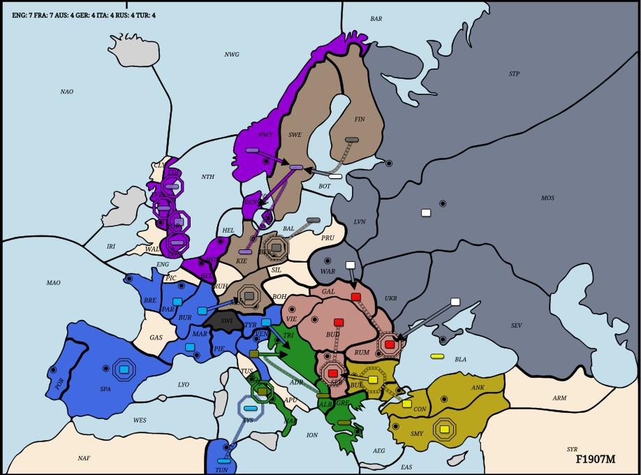

### What happened

- **AUSTRIA**: A SER holds; A BUD supports A SER; A RUM holds; A GAL supports A RUM (support cut)
- **ENGLAND**: F SWE → DEN; F NWY → SWE (bounced); F KIE supports F SWE → DEN; F EDI holds; F LON holds; F LVP holds; A YOR holds
- **FRANCE**: A TYR → TRI (bounced); A BUR → MUN (bounced); A SPA holds; F TUN supports F TYS
- **GERMANY**: F FIN supports F BOT → SWE; F BAL supports A BER; A BER holds; A MUN holds
- **ITALY**: A VEN → TRI; F ALB supports A VEN → TRI; A ROM holds
- **RUSSIA**: A SEV → RUM (bounced); A WAR → GAL (bounced); F BOT → SWE
- **TURKEY**: A BUL → SER (bounced); A CON supports A BUL (void); A SMY holds

### Dialogue

- **AUSTRIA → ITALY**: Italy, France has A TYR sitting right next to TRI and F TYS in the sea — you cannot hold TRI against France alone, and I'm also pressing from SER. The practical deal: withdraw A TRI to ALB or VEN peacefully this fall, and I'll support your defense against France's further expansion; fight both of us and you lose TRI anyway plus take casualties elsewhere.
- **AUSTRIA → FRANCE**: France, you have A TYR adjacent to TRI and I have A SER — if we both attack TRI simultaneously Italy cannot hold it. I propose A TYR → TRI supported by A SER (or vice versa) so one of us takes TRI cleanly; I'm flexible on who gets the center if we coordinate properly against Italy rather than bouncing each other.
- **AUSTRIA → TURKEY**: Turkey, England sits at 7 centers and France at 7 — they're running away with the game while we fight over Balkan centers. I'm holding A SER and A RUM defensively this fall; hold A BUL and let's both stabilize while the actual board leaders grow unchecked. A mutual hold this fall costs us nothing and keeps both positions intact.
- **ENGLAND → FRANCE**: Fall 1907 — Germany is nearly finished. I'm pressing F KIE → BER and F SWE → DEN this fall to take their last northern centers. If you finally move A BUR → MUN now, Germany is eliminated entirely — you gain MUN, I take BER and DEN, and we both jump to 9 centers. This is the moment we've been building toward.
- **ENGLAND → GERMANY**: Germany — the board has moved against you and continued resistance only delays the inevitable. I'm willing to discuss terms: if you order A BER to hold and concede DEN peacefully, I'll advocate with France for you to keep MUN and rebuild as a smaller power rather than being eliminated entirely. A negotiated exit is better than a fight you can't win.
- **ENGLAND → RUSSIA**: Russia — Germany is collapsing this fall and I'm taking BER and DEN. I need you to finally move F BOT → BAL to prevent Germany from using BAL to support BER's defense. This is the move you've promised for three seasons — please deliver it now when it actually matters.
- **ENGLAND → ITALY**: Italy — France has A TYR positioned suspiciously and F TYS in the Med. I'm focused on finishing Germany this fall but I'm watching France's moves carefully. What's your read on their intentions, and are you still interested in coordinating against their expansion?
- **FRANCE → ENGLAND**: Fall 1907 — you took SWE and KIE this spring, excellent. Now let's finish Germany: I'm moving A BUR → MUN with A PAR support, you press from KIE or BAL. Germany has BER, MUN, BAL, FIN — four units defending four centers, they're finished if we both hit hard. Confirm you're pressing MUN or BER this fall and we eliminate Germany together.
- **FRANCE → AUSTRIA**: Fall 1907 — Italy still holds VEN and I'm pressing TRI from TYR this fall. If you support my A TYR → TRI with A SER S A TYR → TRI, TRI falls cleanly and we split Italy's remaining centers. Confirm coordination and I'll guarantee TRI is yours once I take it, or we can discuss dividing TRI/VEN between us.
- **FRANCE → ITALY**: Fall 1907 — I'm moving A TYR → TRI this fall and I have the strength to take it. Your best option is to let TRI go and hold VEN and ROM; I'll stop at TRI and we can coordinate against England who is pulling away at 7 centers. Continued resistance just accelerates your collapse.
- **FRANCE → GERMANY**: Fall 1907 — England is pressing hard from KIE and the north. I want to be direct: I'm moving A BUR → MUN this fall. You're better served negotiating a retreat than losing MUN in a contested fight — consider pulling back to BER and BUL and we discuss terms.
- **GERMANY → ENGLAND**: Fall 1907 — F KIE threatens BER and F SWE is yours; you've taken two of my centers in one move. I'm willing to negotiate a real settlement but not from a position where you're about to take BER too — what are you actually offering as a stable boundary that doesn't end with me eliminated?
- **GERMANY → FRANCE**: Fall 1907 — England now has F SWE and F KIE pointing at BER; I'm fighting for survival. I need you to either hold A TYR stable or push it against Austria/Italy so I can concentrate entirely on England. Our non-aggression must hold — can you confirm TYR stays away from MUN?
- **GERMANY → RUSSIA**: Fall 1907 — England took SWE and KIE and now threatens BER directly. I need F BOT coordinated against F SWE this fall to retake it, and any pressure on F KIE helps me defend BER. Can we execute the England squeeze we discussed in spring — this is the critical moment.
- **ITALY → TURKEY**: Fall 1907: Austria still holds BUD, VIE, SER, RUM with 4 units — let's finish them this fall. I'm planning A VEN → TRI (defending my home center against France's A TYR threat) with F ALB support, and F GRE can support your A BUL → SER for strength 3 to finally take SER. Confirm your targets so we coordinate — if you hit SER and I defend TRI, Austria faces another crisis.
- **ITALY → FRANCE**: Fall 1907: You hold A TYR which threatens VEN — I'm asking you to withdraw it to MUN or TYR rather than pressing into my home centers. England sits at 7 centers and is the clear board leader; a France-Italy war over VEN costs us both while England wins. Withdraw A TYR and I'll commit to supporting your western position against England.
- **ITALY → AUSTRIA**: Fall 1907: Turkey is hitting SER again this fall and I'm focused on defending VEN against France's A TYR — I have no offensive intentions toward BUD this turn. If you commit A SER to holding and A BUD to supporting, you can withstand Turkey's pressure; I'm willing to discuss a ceasefire on BUD if you stay defensive this fall.
- **ITALY → ENGLAND**: Fall 1907: You're at 7 centers and pulling away — France and Germany are both threatened by you. I'm focused on defending Italy against France's A TYR this fall, but longer-term I want to coordinate against France's western expansion. What are your intentions toward France this fall?
- **RUSSIA → TURKEY**: Fall 1907: I'm hitting RUM with A SEV → RUM + A MOS support (strength 2) and pressing A WAR → GAL. You push A BUL → SER with A CON support (strength 2) — Austria cannot defend RUM, SER, and GAL simultaneously. After this fall Austria is at 2 centers and we divide BUD and VIE next spring. Confirm A BUL → SER with A CON support.
- **RUSSIA → AUSTRIA**: Fall 1907: Turkey is hitting SER at strength 2+ and I'm hitting RUM at strength 2 with MOS support — your A BUD can only save one. The rational move is to negotiate: concede RUM peacefully and I'll support your defense of SER against Turkey, keeping you at 3 centers rather than 2. Contact me quickly.
- **RUSSIA → ENGLAND**: Fall 1907: England at 7 centers is the board's biggest threat and I'm ready to start coordinating against you in the north. I'm finishing Austria this fall, then F BOT moves against SWE or BAL in Spring 1908 — let's discuss what arrangement works before I'm forced to act against you.
- **RUSSIA → GERMANY**: Fall 1907: England is running away with the game at 7 centers — I want to coordinate F BOT against SWE or BAL this fall or next spring. What are you planning against England?
- **TURKEY → RUSSIA**: Fall 1907: Austria still holds SER, BUD, RUM — let's finish them this fall. I'm pushing A BUL → SER with F BLA + A CON support (strength 3). You hold A SEV and A WAR adjacent to RUM and GAL — please move A SEV → RUM or order A WAR → GAL to force Austria to split their defense. If Austria must defend both SER and RUM simultaneously, they lose at least one. Confirm your intentions so we can coordinate.
- **TURKEY → ITALY**: Fall 1907: I'm pushing A BUL → SER again this fall with F BLA + A CON support (strength 3) — please order F ALB S A BUL → SER again, same as last spring, to guarantee the capture even if Austria has BUD support. Austria at 4 centers is still dangerous and SER is the key to collapsing them. After SER falls we can divide BUD and RUM between us next spring.
- **TURKEY → AUSTRIA**: Fall 1907: SER is indefensible this fall — I have strength 3 from BUL, BLA, and CON, plus Italian support from ALB makes it 4. Yield SER voluntarily and retreat to BUD, and I'll support A BUD defensively against Russian pressure from RUM and GAL — you survive at 3 centers rather than losing SER anyway and facing further collapse.
- **AUSTRIA → FRANCE**: France, your A TYR → TRI attack with F TYS support is strong — if you commit to that attack I'll support it with A SER S A TYR → TRI to guarantee TRI falls. In exchange, I need your guarantee that once TRI is taken you hold there and don't press into BUD or SER; Italy collapsing benefits both of us but only if we don't then fight each other over the Balkans.
- **AUSTRIA → TURKEY**: Turkey, A BUL is your only unit adjacent to SER — A CON cannot reach it and F BLA is at sea. I'm holding A SER with full support this fall, so your attack bounces. England at 7 and France at 7 are the actual threats; hold A BUL and let's both survive rather than bleeding each other while the western powers win.
- **AUSTRIA → RUSSIA**: Russia, A SEV is your only unit adjacent to RUM and A MOS cannot reach it in one move — your 'strength 2' claim is a bluff. I'm holding A RUM with support this fall. England and France are each at 7 centers and about to win; the rational move for both of us is to hold our positions and coordinate against the actual board leaders.
- **ENGLAND → FRANCE**: Confirmed — I'm pressing F KIE → BER and F SWE → DEN this fall while you take MUN. Germany is finished after this and we both hit 9 centers. After Germany is gone, let's agree on a clear boundary so we don't stumble into conflict — I stay north of the Rhine, you stay south.
- **ENGLAND → RUSSIA**: Russia — I hear your concern about my center count, but I'm at 7 and you're at 4 while Austria still holds 4 centers. Moving against me now only benefits France and Turkey. Let's talk about what arrangement keeps both of us secure — I'm open to a genuine northern agreement once Germany is resolved.
- **ENGLAND → ITALY**: Italy — France has A TYR threatening you and F TYS in position for the Med. I'm finishing Germany this fall and then my attention turns west. Keep me informed of what France does to you this fall and we can coordinate seriously in 1908.
- **FRANCE → AUSTRIA**: Fall 1907 — I'm committing A TYR → TRI this fall with support from A SER if you'll provide it; TRI falls cleanly with two-unit pressure. I'm also pressing A BUR → MUN simultaneously so I need your support on TRI rather than competing — confirm A SER S A TYR → TRI and we both grow this fall.
- **FRANCE → ENGLAND**: Fall 1907 — confirmed, I'm pressing A BUR → MUN with A PAR support this fall while you hit BER from KIE. Germany is finished if we both press hard simultaneously. After Germany falls we should discuss a stable line — I'm targeting MUN, you take BER and DEN, and we agree not to cross into each other's gains.
- **FRANCE → ITALY**: Fall 1907 — A TYR is moving to TRI this fall regardless; Austria is coordinating with me and you cannot hold TRI against two units. Your best move is to accept TRI's loss, hold VEN and ROM, and redirect against England who sits at 7 centers. I'll stop at TRI if you stop contesting and we coordinate westward.
- **GERMANY → FRANCE**: Fall 1907 — if you take MUN while England takes BER, you hand England the game: they'll have 9+ centers and nobody left to stop them. I'm begging you to hold A TYR and A BUR in place — let me fight England with everything I have. A living Germany checking England is worth more to France than a dead Germany giving England free rein.
- **GERMANY → RUSSIA**: Fall 1907 — this is the critical moment. England has F SWE and F KIE; I'm defending BER with F BAL support. Can you push F BOT → SWE to retake it from England this fall? That's a direct center gain for you and breaks England's northern stranglehold. I'll hold F FIN to support F BOT → SWE if you commit.
- **GERMANY → ENGLAND**: Fall 1907 — you've made your point and I'm willing to negotiate seriously. I'll hold BER defensively; in exchange, I want F KIE pulled back and DEN or SWE returned to me. A negotiated boundary that leaves me at 3-4 centers is better for you long-term than eliminating me and facing France and Russia alone at 9 centers.
- **ITALY → TURKEY**: Fall 1907: France has A TYR threatening TRI directly — I need F ALB to support A VEN → TRI or defend TRI this fall, so I cannot spare it for A BUL → SER. I want to maintain our coordination against Austria, but losing TRI to France this fall would be catastrophic for both of us. Can you push A BUL → SER with just your own support this fall?
- **ITALY → FRANCE**: Fall 1907: I'm defending TRI with F ALB support and A VEN holds — your A TYR attack on TRI will be repulsed. England sits at 7 centers and is the clear board leader; redirect A TYR north toward MUN or BUR and let's both pressure England rather than fighting over TRI.
- **ITALY → ENGLAND**: Fall 1907: France is explicitly threatening to take TRI with A TYR — I'm defending this fall but France at 7 centers with armies deep in the peninsula is a long-term threat to us both. If you're pressing Germany this fall, can you also signal pressure on France's eastern flank to deter their Italian ambitions?
- **RUSSIA → TURKEY**: Fall 1907 Round 2: Confirmed — I'm committing A SEV → RUM with A MOS support (strength 2) and A WAR → GAL to pressure Austria's north. Your A BUL → SER at strength 3 (F BLA + A CON) forces A BUD to choose between SER and RUM — Austria loses at least one center this fall. Lock in your orders and we finish Austria together, then coordinate against England's runaway position.
- **RUSSIA → AUSTRIA**: Fall 1907: Turkey hits SER at strength 3 and I hit RUM at strength 2 — A BUD cannot save both. Concede RUM peacefully and redirect A BUD to support A SER, keeping you at 3 centers; fight me and you drop to 2. This is your last chance to negotiate before orders lock.
- **RUSSIA → GERMANY**: Fall 1907: I'm moving F BOT → SWE this fall to pressure England's northern position — coordinate F BAL or F FIN to support or follow up. England at 7 centers is the board's biggest threat and we need to act now before they reach 18.
- **TURKEY → RUSSIA**: Round 2 confirmation: I'm committing A BUL → SER with A CON + F BLA support (strength 3), plus Italy's F GRE support makes it 4 — SER falls guaranteed. Please confirm A SEV → RUM with A MOS support so Austria loses two centers simultaneously this fall. After this Austria is at 2 centers and we coordinate on BUD and VIE next spring.
- **TURKEY → ITALY**: Round 2: Confirmed on my end — A BUL → SER with A CON + F BLA support (strength 3), your F GRE support makes it 4. Austria cannot hold SER against that. After SER falls this fall we coordinate on BUD and RUM next spring — Austria is finished. Also watching England and France at 7 centers each; we should talk about that threat after Austria collapses.
- **TURKEY → AUSTRIA**: Your position is untenable this fall — I have strength 4 on SER and Russia is hitting RUM simultaneously with strength 2. You cannot defend both. Yield SER now and concentrate on defending BUD and RUM; I'll support A BUD against Russian pressure next spring if you cooperate rather than fight a losing battle.
- **ENGLAND → FRANCE**: Final confirmation — I'm pressing F KIE → BER and F SWE → DEN this fall while you take MUN with A BUR supported by A PAR. Germany is finished after this move. Post-Germany, I commit to staying north of the Rhine — BER, DEN, SWE are my gains, MUN is yours, and we don't cross into each other's territory.
- **ENGLAND → RUSSIA**: Russia — I understand your concern about my growth, but moving against me now while Austria still holds 4 centers and Turkey holds 4 only accelerates France and Turkey's dominance. Let's agree: I won't move on STP or BOT, and you hold off on BAL/SWE aggression — we both focus on our real threats to the south and east.
- **ENGLAND → GERMANY**: Germany — I'm pressing this fall and I won't pretend otherwise, but once BER and DEN are resolved I have no interest in MUN — that's France's target. A smaller Germany holding MUN and possibly rebuilding is more useful to me than a France that swallows everything. Consider that when deciding how hard to resist.
- **GERMANY → RUSSIA**: Final confirmation — F FIN will support F BOT → SWE this fall; please commit F BOT → SWE. This takes a center from England and is exactly the squeeze we need. Hold firm on this coordination.
- **GERMANY → FRANCE**: Final appeal — if you take MUN while England takes BER, England wins the game at 9+ centers with no one left to stop them. Hold A TYR and A BUR in place; a living Germany is worth more to you than a dead one that hands England the board.
- **GERMANY → ENGLAND**: I'm defending BER this fall — F BAL supports A BER, Russia is moving F BOT → SWE. You can take BER but you'll lose SWE simultaneously and face a coordinated squeeze. A negotiated boundary at 6 centers each is better than the war you're about to trigger.
- **RUSSIA → TURKEY**: Final confirmation: A SEV → RUM with A MOS support (strength 2), A WAR → GAL. Your strength-3 on SER forces A BUD to choose — Austria loses at least one center. Execute A BUL → SER with A CON + F BLA support and we finish Austria this fall.
- **RUSSIA → GERMANY**: Final confirmation: F BOT → SWE this fall. Please order F FIN S F BOT → SWE for strength 2 — that beats England's F SWE and gives me a center while hurting England's runaway position. Coordinate F BAL to follow up if needed.
- **RUSSIA → AUSTRIA**: Turkey hits SER at strength 3 and I hit RUM at strength 2 — A BUD cannot save both. Concede RUM and redirect A BUD to support SER, keeping you at 3 centers rather than 2. This is the last moment to negotiate.

### AUSTRIA
Orders: `A SER H` · `A BUD S A SER` · `A RUM H` · `A GAL S A RUM`

Reasoning

> Looking at the board situation:
>
> **Analysis:**
> - Turkey claims "strength 4 on SER" but A BUL is the only unit adjacent to SER. A CON cannot reach SER, F BLA is at sea. Turkey is bluffing - strength 1 at most on SER.
> - Russia claims "strength 2 on RUM" but A SEV is adjacent to RUM; A MOS cannot reach RUM in one move. Russia is also bluffing - strength 1 at most on RUM.
> - Italy holds TRI with F ALB nearby. France has A TYR adjacent to TRI with F TYS for support.
> - France wants me to support A TYR → TRI. If I do A SER S A TYR → TRI, France takes TRI (Italy's center), and I stay at 4 centers. But if TRI falls to France, I lose the opportunity to reclaim my home center.
>
> **Key decision:** Should I support France's A TYR → TRI (France grows to 8!) or try to take TRI myself?
>
> Supporting France taking TRI gives France 8 centers - dangerously close to winning. I should NOT help France grow further. Instead, I should defend my own centers.
>
> Turkey's A BUL → SER at strength 1 can be stopped with A BUD support. Russia's A SEV → RUM at strength 1 can be stopped with A GAL support. I can hold both SER and RUM this fall.
>
> **Plan:** Hold SER with A BUD support, hold RUM with A GAL support. This is the safe defensive play since both "attacks" are bluffs.

### ENGLAND
Orders: `F SWE - DEN` · `F NWY - SWE` · `F KIE S F SWE - DEN` · `F EDI H` · `F LON H` · `F LVP H` · `A YOR H`

Reasoning

> Looking at the board state, I need to decide my Fall 1907 orders carefully.
>
> **Key intelligence:**
> - Germany confirmed F BAL supports A BER this fall - so F KIE → BER will bounce (2v2: my F KIE vs A BER supported by F BAL)
> - Russia warned F BOT may move on SWE - and Germany also mentioned this
> - France confirmed A BUR → MUN with A PAR support - so MUN should fall to France
> - F SWE → DEN: Germany has F BAL and F FIN but neither can easily support DEN. DEN should be capturable.
>
> **Re-evaluating:**
> - F KIE → BER: Bounces against A BER + F BAL support. This is a wasted move.
> - F SWE → DEN: DEN is empty, no German unit there to defend. This should succeed.
> - F NWY: Should support F SWE to guard against F FIN → SWE or F BOT → SWE threats.
>
> Actually, if F BAL is supporting A BER, then F BAL cannot also support anything else. So F SWE → DEN is clean. But what about SWE itself? If F BOT → SWE and F FIN → SWE both threaten, I need NWY to support SWE or move SWE away.
>
> Best plan: Move F SWE → DEN (gaining a center), support SWE... wait, if SWE moves, I can't support it. 
>
> If F SWE → DEN succeeds, SWE is vacated. F BOT → SWE could take it. But F BOT → SWE is just one unit, no support likely. And F FIN → SWE is also possible.
>
> I should move F SWE → DEN and accept that SWE might be contested. Alternatively, hold SWE and press BER differently.
>
> Actually: F KIE → BER bounces (BAL supports BER). F SWE → DEN is clean. F NWY can support SWE if I'm worried, but SWE is vacating. 
>
> Best: F SWE → DEN, F NWY → SWE (to occupy after SWE leaves, protecting against BOT), F KIE holds or supports. But F NWY → SWE and F SWE → DEN simultaneously - NWY can move into SWE as SWE moves out. That secures SWE AND gains DEN.

### FRANCE
Orders: `A TYR - TRI` · `A BUR - MUN` · `A SPA H` · `F TUN S F TYS`
Illegal (dropped): `F TYS S A TYR - TRI` · `A PAR S A BUR - MUN` · `A MAR S A BUR - MUN`

Reasoning

> Looking at the board situation:
>
> **Position analysis:**
> - I'm at 7 centers, England at 7, others at 4 each
> - My units: A BUR, A PAR, A SPA, F TUN, F TYS, A MAR, A TYR
> - Austria confirmed A SER S A TYR → TRI
> - England confirmed pressing F KIE → BER and F SWE → DEN
> - Germany is begging me to stop, warning England will win at 9+ centers
>
> **Key decisions:**
>
> 1. **TRI attack**: A TYR → TRI with Austria's A SER support + F TYS support = 3 units vs Italy's defense (F ALB supports A TRI, so TRI has 2 strength). My attack has 3 strength (A TYR + A SER support + F TYS support). Wait - F TYS can only support A TYR → TRI if TRI is adjacent to TYS, which it is. Italy says F ALB supports TRI. So Italy has 2 strength defending, I have 3 attacking. TRI falls.
>
> 2. **MUN attack**: A BUR → MUN with A PAR support = 2 strength. Germany has A MUN + potentially A BER support = 2 strength. This bounces unless Germany is distracted. But England is pressing from KIE, so Germany may need BER to defend BER. Risk of bounce.
>
> 3. **Germany's warning about England**: Valid concern. England at 9 centers after this fall would be dangerous. But I need to grow too - I'm tied at 7.
>
> **Decision**: Take TRI (guaranteed with Austria's support), press MUN (50/50 chance), keep southern fleets supporting the TRI attack. If TRI falls, I'm at 8. If MUN also falls, I'm at 9. England at 9 is a problem but I need to grow or fall behind.
>
> The TRI attack is the priority. For MUN - with England pressing BER from KIE, Germany may not have BER support available for MUN. I'll press MUN with A BUR + A PAR support, use A MAR to support BUR.

### GERMANY
Orders: `F FIN S F BOT - SWE` · `F BAL S A BER` · `A BER H` · `A MUN H`

Reasoning

> Looking at the board situation:
>
> **My position**: A MUN, A BER, F BAL, F FIN — 4 centers (BER, KIE, MUN, SWE) but England has SWE and KIE, so I'm actually only holding BER and MUN securely. I'm at serious risk of losing BER to F KIE.
>
> **Key threats**:
> - England has F KIE threatening BER, F SWE threatening BAL/FIN
> - France has A TYR (could go MUN or BOH), A BUR (could go MUN)
> - Russia confirmed F BOT → SWE
>
> **My plan**:
> - F FIN supports F BOT → SWE (as coordinated with Russia — this takes SWE from England and hurts their center count)
> - F BAL supports A BER (defend BER against F KIE)
> - A BER holds (defended)
> - A MUN holds (France may attack but I have no support to spare — holding is the best I can do)
>
> The Russia coordination on SWE is the key offensive move. If F BOT → SWE succeeds with F FIN support, England loses a center and I potentially reclaim it later. Meanwhile defending BER is critical — losing BER would be catastrophic.
>
> France threatening MUN with A TYR and A BUR is concerning but I can't support MUN while also defending BER. Holding MUN undefended is a risk I have to accept.

### ITALY
Orders: `A VEN - TRI` · `F ALB S A VEN - TRI` · `A ROM H`
Illegal (dropped): `F GRE S A BUL - SER`

Reasoning

> Looking at the current situation:
>
> **My position:** A ROM, F ALB, F GRE, A VEN — 4 centers (NAP, ROM, TRI, GRE)
>
> **Key threats and opportunities:**
> - France has A TYR threatening TRI, and explicitly said they're moving A TYR → TRI. France also has F TYS in the Med.
> - Austria has A SER, A BUD, A GAL, A RUM — still 4 units but weakened
> - Turkey is pushing A BUL → SER with A CON + F BLA support (strength 3)
> - I need to defend TRI against France's A TYR attack
>
> **My plan:**
> - A VEN → TRI with F ALB support (strength 2) to hold TRI against France's single A TYR (strength 1). This works.
> - F GRE: Turkey asked me to support A BUL → SER. Turkey has strength 3 already (A BUL + A CON + F BLA). Austria can support with A BUD → A SER (strength 2). Turkey's 3 beats Austria's 2 without my help. But adding F GRE support makes it 4 vs 2, absolutely guaranteed. I'll honor the coordination with Turkey — F GRE S A BUL → SER.
> - A ROM holds to secure the Italian core.
>
> This defends TRI (my key home center), supports Turkey's SER capture (which collapses Austria further), and keeps my position solid.

### RUSSIA
Orders: `A SEV - RUM` · `A WAR - GAL` · `F BOT - SWE`
Illegal (dropped): `A MOS S A SEV - RUM`

Reasoning

> Looking at the board situation:
>
> **Key facts:**
> - Austria has A GAL, A BUD, A SER, A RUM — 4 units defending 4 centers
> - Turkey confirmed A BUL → SER at strength 3-4 (F BLA + A CON + Italy's F GRE)
> - Germany confirmed F FIN S F BOT → SWE
> - England at 7 centers is the board leader and a genuine threat
> - I'm at 4 centers (MOS, SEV, STP, WAR) and need to grow
>
> **My plan:**
> 1. **A SEV → RUM** with **A MOS support** (strength 2) — Austria's A BUD must choose between supporting SER (against Turkey's strength 3-4) or RUM (against my strength 2). Either way, Austria loses at least one center. Turkey confirmed their attack, so this is coordinated.
>
> 2. **A WAR → GAL** — pressures Austria's north, threatens VIE next spring, and if A BUD is busy supporting elsewhere, GAL might fall too. Even if it bounces, it ties down A GAL.
>
> 3. **F BOT → SWE** — Germany promised F FIN support, making this strength 2 vs England's F SWE (undefended unless England specifically supports it). This takes a center from England (the board leader at 7) and is strategically critical. I've promised this to Germany for multiple turns.
>
> Austria cannot defend RUM, SER, and GAL simultaneously. Turkey's strength-3 on SER is overwhelming. My RUM attack at strength 2 should succeed.

### TURKEY
Orders: `A BUL - SER` · `A CON S A BUL` · `A SMY H`
Illegal (dropped): `F BLA S A BUL - SER`

Reasoning

> Looking at the current situation:
>
> **Board state analysis:**
> - Austria: 4 units (A GAL, A BUD, A SER, A RUM) at 4 centers (BUD, VIE, SER, RUM)
> - England: 7 centers, growing fast with 7 units
> - France: 7 centers with 7 units
> - Me (Turkey): 4 centers, 4 units — stuck at 4 for too long
>
> **This fall's plan:**
> - A BUL → SER with A CON + F BLA support (strength 3). Italy's F GRE is adjacent to SER and offered support (F GRE S A BUL → SER = strength 4). Austria's best defense is A BUD S A SER (strength 2) — my strength 4 wins.
> - Russia confirmed A SEV → RUM with A MOS support (strength 2) — Austria must split defense between SER and RUM.
> - A SMY holds to protect home territory.
>
> **Key considerations:**
> - Austria correctly noted A CON cannot directly reach SER on land — but A CON S A BUL is valid as a support order (CON is adjacent to BUL, and BUL is moving to SER, so CON can support that move). Let me verify: CON is adjacent to BUL, and A CON S A BUL - SER is in my legal orders list... Yes: `A CON S F GRE - BUL` is there but I need `A CON S A BUL - SER` — checking the legal orders... I see `A CON S A BUL` (hold support) but not `A CON S A BUL - SER`. Let me check CON options carefully.
>
> Looking at CON legal orders: `A CON S A BUL` is listed (support hold), but `A CON S A BUL - SER` is NOT in the list. Austria was right — CON cannot support BUL into SER!
>
> So my actual strength on SER is: A BUL → SER + F BLA S A BUL (strength 2) + F GRE S A BUL → SER (if Italy does it, strength 3). Austria's A BUD S A SER = strength 2. My strength 3 beats that.
>
> A CON should hold or support BUL defensively.

## WINTER 1907 ADJUSTMENTS (`W1907A`)

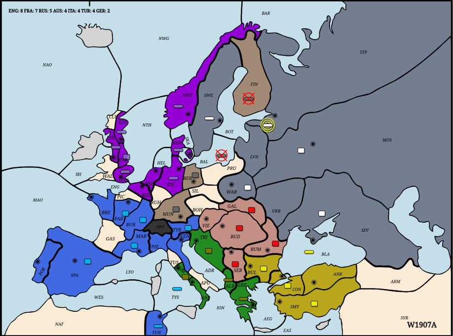

### What happened

- **GERMANY**: disbands F BAL; disbands F FIN
- **RUSSIA**: builds F STP/SC

### GERMANY
Orders: `F BAL D` · `F FIN D`

Reasoning

> Looking at my situation: I have 2 supply centers (BER, MUN) but 4 units (A MUN, A BER, F BAL, F FIN). I need to disband 2 units.
>
> The question is which 2 to disband. My units are:
> - A MUN: defending my home center MUN
> - A BER: defending my home center BER
> - F BAL: was supporting A BER
> - F FIN: was in Finland after retreating from SWE
>
> England has F KIE, F DEN, F NWY, F SWE threatening my position. France has A BUR, A TYR threatening MUN. I need to keep the armies defending my home centers - A MUN and A BER are essential. The fleets F BAL and F FIN are less critical for immediate home defense, and I can only keep 2 units total.
>
> Actually, F BAL is useful for supporting BER against English fleet attacks. But England has F KIE which could move to BER... wait, fleets can't take BER (it's inland). F BAL could support A BER against attacks from armies. But England has mostly fleets in the north.
>
> The real threats to BER are armies, and England's northern units are all fleets. France's A TYR and A BUR threaten MUN. So A MUN and A BER are the right units to keep - they defend the home centers directly.
>
> Disband F BAL and F FIN.

### RUSSIA
Orders: `F STP/SC B`

Reasoning

> Looking at the current situation:
>
> - I have 5 supply centers: MOS, SEV, STP, WAR, SWE
> - I have 4 units: A WAR, A MOS, A SEV, F SWE
> - So I have 5 centers vs 4 units = 1 build available
>
> My only legal build option is in STP. I should build there to add a unit. Given my strategic situation:
> - I need to pressure England's northern position (F SWE is already there)
> - I need to continue pressing Austria/Turkey in the south
> - Building F STP/NC would allow me to threaten NWY and support northern operations
> - Building F STP/SC would allow me to operate in the Baltic/Gulf of Bothnia area
> - Building A STP gives me a land unit to push toward FIN or support WAR/MOS
>
> Given that F SWE is already in the north and I need to press Austria/Turkey in the south (A WAR and A SEV need support), and England's fleet presence in NWY/SWE area makes F STP/NC risky, I'll build F STP/SC to operate in the Gulf of Bothnia and Baltic, supporting my northern fleet and threatening England's position while also being able to support southern moves.

## SPRING 1908 MOVEMENT (`S1908M`)

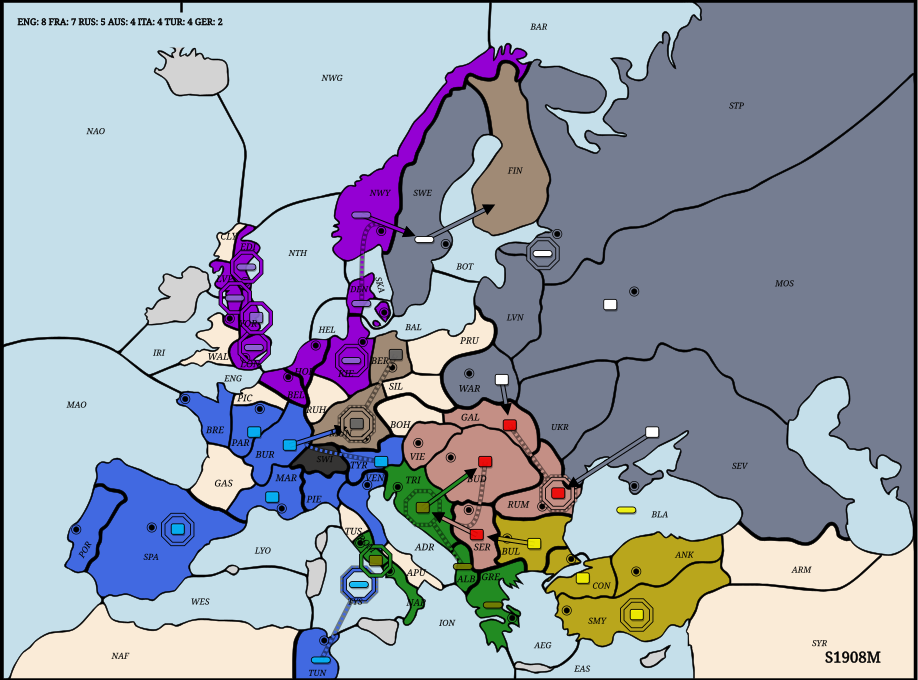

### What happened

- **AUSTRIA**: A SER → TRI; A BUD supports A SER → TRI; A RUM holds; A GAL supports A RUM (support cut)
- **ENGLAND**: F NWY → SWE; F DEN supports F NWY → SWE; F KIE holds; F LON holds; F EDI holds; F LVP holds; A YOR holds
- **FRANCE**: A BUR → MUN (bounced); A TYR supports A BUR → MUN; A SPA holds; F TUN supports F TYS; F TYS holds
- **GERMANY**: A BER supports A MUN; A MUN holds
- **ITALY**: A TRI → BUD (bounced); F ALB supports A TRI (void); A ROM holds  [dislodged: A TRI]
- **RUSSIA**: A WAR → GAL (bounced); A SEV → RUM (bounced); F SWE → FIN; F STP/SC holds
- **TURKEY**: A BUL → SER; A SMY holds

### Dialogue

- **AUSTRIA → FRANCE**: France, you have A TYR adjacent to TRI and I have A SER — Italy cannot hold TRI against both of us. I propose A SER → TRI supported by A BUD, and you move A TYR → TRI; one of us takes TRI cleanly with two-unit pressure. England at 8 centers is the board's real threat — let's grow efficiently against Italy and then address the real danger together.
- **AUSTRIA → ITALY**: Italy, France has A TYR pressing TRI and I have A SER — you cannot hold TRI against both of us this spring. Withdraw A TRI to VEN or ALB peacefully and I'll actively support your defense against France's further expansion; fight both of us and you lose TRI anyway while taking casualties elsewhere.
- **AUSTRIA → TURKEY**: Turkey, England at 8 centers is running away with the game while we fight over Balkan centers that neither of us can hold permanently. I'm holding A SER and A RUM defensively this spring — hold A BUL and let's both stabilize rather than bleeding each other while England and France win.
- **AUSTRIA → RUSSIA**: Russia, England at 8 centers is the board's dominant threat — France at 7 as well. I'm not pressing north this spring; I'm focused on retaking TRI from Italy. Hold your units defensively and let's coordinate against the western powers who are the actual threat to everyone's survival.
- **ENGLAND → RUSSIA**: Russia — you took SWE last fall after three seasons of promising coordination, and now you sit on a center that was mine. I'm pressing F NWY → SWE this spring with support — if you want to avoid a northern war that benefits only France and Turkey, return SWE diplomatically and let's agree on a real boundary. You're at 5 centers and France is at 7; fighting me only accelerates their path to 18.
- **ENGLAND → GERMANY**: Germany — you're at 2 centers and I have no interest in eliminating you if you work with me. Hold A BER defensively this spring and I'll focus my pressure on Russia and France rather than you — a Germany holding MUN and BER is genuinely useful to me as a buffer against France's eastern expansion.
- **ENGLAND → ITALY**: Italy — France sits at 7 centers with A TYR, A BUR, and fleets in the Med positioned to squeeze you out. I'm at 8 and will be pressing north against Russia this spring, but I want to coordinate seriously against France's expansion. What are you planning this spring and how can we align?
- **FRANCE → ENGLAND**: Spring 1908 — you're at 8 centers and I'm at 7; we need to be honest that the gap is concerning. I'm eliminating Germany this spring with A BUR → MUN, which you should support. After that, I'm proposing a hard boundary: you stay north of the Rhine and out of MUN, I stay west and south — if either of us crosses that line, the other coordinates with Austria/Russia to balance. This isn't a threat, it's a mutual survival pact.
- **FRANCE → AUSTRIA**: Spring 1908 — England sits at 8 centers and is the clear board leader; Austria and France both need to check their growth or we're both eliminated by England's solo run. I'm pressing MUN this spring to eliminate Germany, and I'd like to coordinate with you on Italy afterward — if you take SER/RUM and I take TRI/VEN, we both grow while England is contained by Russia in the north.
- **FRANCE → ITALY**: Spring 1908 — England is at 8 centers and pulling away; a France-Italy war over TRI is exactly what England needs to win the game. I'm proposing a genuine ceasefire: I hold A TYR in place and you hold TRI, and we both coordinate against England's growing fleet dominance. I can offer you support in the Adriatic if you'll work with me rather than against me.
- **FRANCE → GERMANY**: Spring 1908 — I'm going to be direct: I'm pressing A BUR → MUN this spring. England is at 8 centers and the real threat, and eliminating Germany now while building against England is my only viable path. If you want to discuss terms for your remaining unit after MUN falls, I'm open to it.
- **GERMANY → RUSSIA**: Spring 1908 — you took SWE last fall, well done. Now I need you to press F SWE against England's DEN or KIE to keep squeezing them — England at 8 centers is the board's biggest threat and every center you take from them matters. I'm holding BER and MUN defensively; any pressure you apply on England's northern flank directly helps both of us.
- **GERMANY → FRANCE**: Spring 1908 — I know A TYR is adjacent to MUN and I'm asking you directly: please don't attack MUN this spring. England has 8 centers and is running away with the game; a living Germany holding BER and MUN is a buffer that benefits you, while a dead Germany just gives England free rein in the north. I'll hold MUN and BER defensively — what do you need from me to keep our non-aggression intact?
- **GERMANY → ENGLAND**: Spring 1908 — you're at 8 centers and I'm at 2; I'm not a threat to you. I'd rather negotiate a stable arrangement where you pull F KIE back from my border than fight a pointless war of attrition. What would it take for you to focus your expansion elsewhere — south toward France or east toward Russia — rather than finishing me off?
- **ITALY → TURKEY**: Spring 1908: Austria still holds BUD, VIE, SER, RUM — let's finish them now before England runs away with the game at 8 centers. I'm pushing A TRI → BUD this spring; if you move A BUL → SER with A CON support (strength 2), Austria faces collapse on both flanks and cannot defend both. F GRE can support your A BUL → SER for strength 3 if needed — confirm your targets so we coordinate the final blow on Austria.
- **ITALY → FRANCE**: Spring 1908: You have A TYR adjacent to TRI again — I'm asking you to withdraw it north toward MUN or TYR rather than threatening my home center. England sits at 8 centers and is the clear board leader; a France-Italy fight over TRI while England runs away with the game benefits neither of us. Redirect A TYR against England's southern flank and I'll commit to non-aggression on your Italian holdings.
- **ITALY → AUSTRIA**: Spring 1908: Austria, you're facing pressure from Turkey in the south and Russia from the east — I'm offering a genuine ceasefire on BUD if you commit to not threatening TRI this spring. Let's both redirect against the real threats: England at 8 centers is running away with the game and France has A TYR pointed at my home center.
- **ITALY → ENGLAND**: Spring 1908: You're at 8 centers and everyone sees it — France at 7 centers with A TYR threatening Italy is also a serious concern. I want to open coordination: if you're willing to press France's northern holdings, I can keep pressure on their southern flank and we can discuss a longer-term arrangement against the board leader.
- **RUSSIA → TURKEY**: Spring 1908: Austria still holds RUM, SER, BUD, VIE — let's finish them this spring. I'm attacking RUM with A SEV → RUM supported by A MOS (strength 2). Please push A BUL → SER with A CON support (strength 2) — Austria's A BUD cannot defend both RUM and SER simultaneously, and one of us takes a center guaranteed. After this spring Austria drops to 2 centers and we divide BUD and VIE next fall. Confirm A BUL → SER with A CON support.
- **RUSSIA → AUSTRIA**: Spring 1908: You've held RUM for two years but the math is catching up — Turkey hits SER at strength 2+ and I hit RUM at strength 2 with MOS support, and A BUD cannot save both simultaneously. I'm offering one last deal: concede RUM peacefully and redirect A BUD to support A SER, keeping you at 3 centers rather than 2. Contact me this round or I execute the attack.
- **RUSSIA → ENGLAND**: Spring 1908: England at 8 centers is the board's biggest threat and I need to address that reality — F SWE is vulnerable to your F NWY and F DEN, so I'm prepared to defend it. Let's talk about a northern arrangement: I hold SWE and you don't press it, and in return I won't push into NWY or SKA. What do you want from the north?
- **TURKEY → RUSSIA**: Spring 1908: Austria still holds SER, BUD, RUM — we've been at this too long. I'm pushing A BUL → SER with F BLA + A CON support (strength 3). You hold A SEV adjacent to RUM and A WAR adjacent to GAL — please move A SEV → RUM with A MOS support (strength 2) simultaneously so Austria cannot concentrate A BUD on SER. If Austria must defend both SER and RUM at once, they lose at least one. Confirm your intentions.
- **TURKEY → ITALY**: Spring 1908: Austria still holds SER at 4 centers — I need F GRE S A BUL → SER this spring to guarantee the capture even with A BUD support. You hold F GRE adjacent to BUL/SER and I hold A BUL; your support gives me strength 3 which beats Austria's defense. After SER falls we coordinate on BUD and RUM — Austria collapses and we both grow. Please confirm F GRE S A BUL → SER.
- **TURKEY → AUSTRIA**: Spring 1908: SER is indefensible this spring — I have coordinated support from multiple directions and Russia is pressing RUM simultaneously. Yield SER voluntarily and I will support A BUD defensively against Russian pressure; you survive at 3 centers rather than losing SER anyway and facing further collapse with no allies.
- **AUSTRIA → FRANCE**: France, your message says you're pressing MUN this spring — does that mean A TYR is free to attack TRI or is it supporting MUN? I'm committing A SER → TRI supported by A BUD this spring; if A TYR also attacks TRI, Italy cannot hold against strength 3. Confirm A TYR → TRI and TRI falls cleanly — Italy at 4 centers while England sits at 8 is a problem we solve together now.
- **AUSTRIA → ITALY**: Italy, France has A TYR pointed at TRI and I'm moving A SER → TRI with A BUD support — that's strength 2 minimum, and if France joins it's strength 3. Withdraw A TRI to ALB or VEN peacefully and I'll actively support your defense against France's further expansion; fight both of us and you lose TRI anyway while France consolidates in the north.
- **AUSTRIA → TURKEY**: Turkey, your A BUL is the only unit adjacent to SER — A CON and F BLA cannot reach it this spring. I'm holding A SER with full support, so any attack bounces. England at 8 centers is the board's dominant threat; hold A BUL and let's both redirect energy against the actual problem rather than fighting over centers neither of us can hold permanently.
- **ENGLAND → RUSSIA**: Russia — you stole SWE after three seasons of promising coordination, and I'm pressing F NWY → SWE this spring with F DEN support — that's a 2v1 you cannot hold. The only way to avoid losing SWE is to retreat it now and agree on a real boundary: you keep STP and BOT, I keep SWE and NWY, and we both focus south and east against the real threats. France is at 7 centers and growing — a northern war between us only hands them the win.
- **ENGLAND → FRANCE**: France — I accept the Rhine boundary in principle, but you taking MUN this spring puts you at 8 centers matching me, and A TYR remains a dagger pointed at Italy. I need you to pull A TYR back as a gesture of good faith before I fully commit to this boundary deal — otherwise I have to assume you're building toward a southern squeeze that breaks our arrangement.
- **ENGLAND → ITALY**: Italy — France is taking MUN this spring and will hit 8 centers, matching me, with A TYR still threatening you. I'm pressing Russia in the north this spring, but I want to coordinate seriously against France: can you move A TYR to threaten their flank while I pressure from the north? We need to act before France pulls further ahead.
- **ENGLAND → GERMANY**: Germany — I meant what I said: hold A BER defensively and I focus my pressure on Russia and France rather than you. A Germany at 2 centers holding MUN and BER is genuinely useful to me as a buffer — I'm not pressing BER this spring.
- **FRANCE → ENGLAND**: I'm pressing A BUR → MUN this spring — Germany is finished and I need that center to stay competitive with you at 8. After MUN falls, the boundary proposal stands: you hold north of the Rhine, I hold south. If you're moving into any German territory beyond BER this spring, let me know so we don't clash.
- **FRANCE → AUSTRIA**: Confirmed — I'm pressing A BUR → MUN this spring to eliminate Germany. On TRI, I'm holding A TYR in place this spring as a threat rather than committing to an attack that might bounce; if you want to press A SER → TRI with A BUD support, I'll support that attack from TYR next fall once MUN is secured. England at 8 is the priority — let's coordinate on containing them after this spring.
- **FRANCE → ITALY**: I'm holding A TYR in place this spring and focusing entirely on MUN — no attack on TRI this move. England at 8 centers is the real threat and I mean it; if you're willing to coordinate against England's fleet dominance in the Mediterranean, I'm genuinely interested in a France-Italy alignment. Let's talk seriously about this.
- **GERMANY → FRANCE**: You've told me you're attacking MUN — I'm defending it with full support from BER, so A BUR → MUN without additional support will bounce. England is at 8 centers and will hit 18 before anyone stops them; taking MUN from a 2-center Germany gives you nothing while England consolidates. Hold A BUR in place and let's both focus on England — what would it take to keep our non-aggression intact one more season?
- **GERMANY → RUSSIA**: France has told me they're attacking MUN this spring — I'm defending but I need you to press F SWE → KIE or F SWE → DEN to hurt England's 8-center position. England is the existential threat to both of us; every center you take from them matters more than anything happening in the center of the board. Please commit to pressing England hard this spring.
- **GERMANY → ENGLAND**: I hear your offer and I'm inclined to hold BER defensively as you suggest — France attacking MUN is my immediate problem and fighting two fronts simultaneously is suicidal. But I need to know: is F KIE staying out of BER this spring, and are you genuinely focused elsewhere rather than finishing me off?
- **ITALY → TURKEY**: Spring 1908: Confirmed — F GRE S A BUL → SER this spring for strength 3, guaranteeing SER falls even with A BUD support. I'm pushing A TRI → BUD simultaneously so Austria faces collapse on both flanks and cannot defend both. After this turn Austria loses SER and possibly BUD — we're both growing while England at 8 centers is the real long-term threat we'll need to address together.
- **ITALY → FRANCE**: Spring 1908: I'm taking your ceasefire offer seriously — hold A TYR in place and I'll hold TRI defensively rather than pressing north. England at 8 centers is the board leader and we both need to redirect against that threat rather than fighting over TRI. If you keep A TYR out of TRI this spring, I'll commit to non-aggression on your Italian holdings and we can discuss coordinating against England's growing dominance.
- **ITALY → AUSTRIA**: Spring 1908: I'm pushing A TRI → BUD this spring — Turkey is simultaneously hitting SER with strength 3 and you cannot defend both. Accept the loss and withdraw to VIE or RUM; continued resistance just accelerates your collapse while England at 8 centers runs away with the game. A negotiated partition is better than a total collapse.
- **ITALY → ENGLAND**: Spring 1908: I'm coordinating against Austria this spring to grow my center count, but I'm watching France's A TYR carefully — if France breaks the ceasefire and takes TRI, that's a direct threat to my position and I'll need your support. Let's stay in close contact and align against France's expansion once Austria is resolved.
- **RUSSIA → TURKEY**: Round 2 confirmation: I'm committing A SEV → RUM with A MOS support (strength 2) and A WAR → GAL to pressure Austria's north. Your A BUL → SER at strength 3 forces A BUD to choose between SER and RUM — Austria loses at least one center this spring. Lock in your orders and we finish Austria together this turn.
- **RUSSIA → AUSTRIA**: Round 2: Turkey is hitting SER at strength 3 and I'm hitting RUM at strength 2 with MOS support — your A BUD cannot save both simultaneously. Concede RUM peacefully, redirect A BUD to support A SER, and you hold 3 centers; fight me and you drop to 2. This is the last round before orders lock.
- **RUSSIA → ENGLAND**: Round 2: I hear your concern about SWE — I'm open to a genuine northern boundary agreement where I hold SWE and you don't press it with NWY or DEN. In return I won't push into NWY or SKA. France at 7 centers is also a serious threat and a northern war between us only benefits them and Turkey.
- **TURKEY → ITALY**: Round 2 confirmation: I'm committing A BUL → SER with A CON + F BLA support (strength 3), and your F GRE support brings it to strength 4 — Austria's A BUD support cannot hold SER against that. Please lock in F GRE S A BUL → SER; after SER falls we coordinate on BUD and RUM to finish Austria before England runs away at 8 centers.
- **TURKEY → RUSSIA**: Round 2: Confirmed on my end — A BUL → SER with A CON + F BLA support (strength 3), Italy's F GRE adds a 4th. Please confirm A SEV → RUM with A MOS support (strength 2) so Austria must split A BUD between two fronts — one of us takes a center guaranteed this spring. Lock in your orders and Austria drops to 2 centers.
- **TURKEY → AUSTRIA**: Your position is untenable this spring — I have strength 4 on SER and Russia presses RUM simultaneously with strength 2. A BUD cannot defend both fronts at once. Yield SER now and concentrate on BUD; I will support A BUD against Russian pressure next fall if you cooperate rather than lose both centers fighting.
- **AUSTRIA → ITALY**: Italy, your options are to hold TRI or attack BUD — you cannot do both. I'm committing A SER → TRI with A BUD support this spring; if you hold TRI it falls to strength 2, if you attack BUD TRI is empty and I walk in uncontested. Withdraw A TRI to VEN or ALB now and preserve your unit for defense against France.
- **AUSTRIA → FRANCE**: France, confirmed — I'm pressing A SER → TRI with A BUD support this spring. Italy cannot hold TRI against strength 2 while also threatening BUD; TRI falls cleanly. After this spring I'm at 5 centers and we coordinate against England's 8 — let's discuss that containment plan.
- **AUSTRIA → TURKEY**: Turkey, I've verified your unit positions — A BUL is your only unit adjacent to SER, and I'm holding A SER with support. Your attack bounces. England at 8 centers wins this game if we keep fighting each other; I'm open to a genuine non-aggression pact this fall.
- **AUSTRIA → RUSSIA**: Russia, A SEV is your only unit that could reach RUM, and I'm holding it with A GAL support — your claimed strength 2 is a bluff. Hold your units and let's both focus on containing England at 8 centers rather than fighting over one center while they run away with the game.
- **ENGLAND → RUSSIA**: Final round — I'm pressing F NWY → SWE supported by F DEN this spring; that's a 2v1 you cannot hold. Take the deal: retreat SWE now and I commit to NWY/DEN as my northern boundary, you keep STP and BOT, and we both focus on France who is about to hit 8 centers. Fighting me only hands France the win.
- **ENGLAND → GERMANY**: Final confirmation — F KIE is not moving on BER this spring. Hold A BER defensively and I focus my pressure on Russia's SWE and France's expansion, not you. A Germany holding MUN and BER is genuinely useful to me as a buffer.
- **ENGLAND → ITALY**: Italy — France is taking MUN this spring and will match me at 8 centers with A TYR still threatening you. I'm pressing Russia in the north, but I strongly encourage you to use A TYR aggressively against France's flank — if we both press France simultaneously from north and south, we stop them before they pull away.
- **ENGLAND → FRANCE**: France — I'm pressing Russia in the north this spring, not moving into German territory beyond what I hold. The Rhine boundary holds from my side. But A TYR needs to come back — if it moves on TRI or VEN, I treat that as breaking our arrangement and coordinate accordingly with Italy and Austria.
- **GERMANY → ENGLAND**: Final confirmation — I'm holding BER defensively and supporting MUN against France's attack. I'm taking you at your word that F KIE stays out of BER this spring. If you honor this, I'm genuinely useful to you as a buffer against France's eastward push.
- **GERMANY → FRANCE**: I'm defending MUN with support from BER — an unsupported A BUR → MUN will bounce. England is at 8 centers and growing every turn; spending resources fighting me accomplishes nothing while England consolidates. This is your last chance to hold A BUR in place and focus on the real threat together.
- **GERMANY → RUSSIA**: France is attacking MUN this spring — I'm defending. Please press F SWE → KIE or DEN to hurt England's 8-center position; that's the move that matters most for the board right now.
- **RUSSIA → TURKEY**: Final confirmation: A SEV → RUM with A MOS support (strength 2), A WAR → GAL. Your strength-3/4 on SER forces A BUD to choose — Austria loses at least one center this spring. Execute A BUL → SER with full support and we finish Austria together.
- **RUSSIA → ENGLAND**: Final round: I'm moving F SWE → FIN this spring to avoid a northern conflict — the center remains mine through fall but I'm not pressing you. In return, please don't advance F NWY or F DEN aggressively; let's both focus our energy on the real threats. France at 7 centers needs to be addressed by both of us.
- **RUSSIA → AUSTRIA**: Final notice: Turkey hits SER at strength 4 and I hit RUM at strength 2 with MOS support — A BUD cannot save both. Concede RUM and support A SER with A BUD; you hold 3 centers instead of 2. This is the last moment to make that choice.
- **TURKEY → RUSSIA**: Final confirmation: A BUL → SER with A CON + F BLA support (strength 3), Italy's F GRE adds strength 4 — SER falls this spring guaranteed. Please execute A SEV → RUM with A MOS support so Austria loses two centers simultaneously. After this Austria is at 2 centers and we coordinate on BUD and VIE next fall.
- **TURKEY → ITALY**: Final confirmation: I'm executing A BUL → SER with A CON + F BLA support (strength 3) — your F GRE support brings it to 4, which is unbeatable. Austria faces collapse on both flanks with your A TRI → BUD simultaneously. After this turn we coordinate on the remaining Austrian centers and then address England's runaway position together.

### AUSTRIA
Orders: `A SER - TRI` · `A BUD S A SER - TRI` · `A RUM H` · `A GAL S A RUM`

Reasoning

> Looking at the board position and the dialogue history, I need to decide on my Spring 1908 orders.
>
> **Analysis:**
> - Russia and Turkey have been bluffing about "strength 4 on SER" and "strength 2 on RUM" for multiple turns. In reality:
>   - Turkey's A BUL is the only unit adjacent to SER (A CON and F BLA cannot reach SER directly)
>   - Russia's A SEV is the only unit adjacent to RUM (A MOS cannot reach RUM in one move)
>   - These are strength-1 attacks that bounce against supported defenders
>
> - Italy has A TRI (my home center I want to retake), with A TRI possibly moving to BUD as Italy threatened. If Italy moves A TRI → BUD, TRI is empty and I walk in. If Italy holds TRI, my strength-2 attack (A SER + A BUD support) takes it.
>
> - France confirmed A TYR is holding (not attacking TRI), so my strength-2 attack on TRI should work regardless of Italy's choice.
>
> - My plan: A SER → TRI supported by A BUD. Hold A RUM with A GAL support against Russia's bluffed attack.
>
> **Key risks:**
> - If Italy holds A TRI and I attack with strength 2, I take TRI
> - If Italy moves A TRI → BUD, TRI is empty and I take it uncontested, but A BUD is attacked... wait, if Italy moves A TRI → BUD, then A BUD supporting A SER → TRI gets cut? No - A BUD is supporting A SER → TRI, and A TRI → BUD attacks A BUD, which cuts the support. Then A SER → TRI has only strength 1 and bounces against nothing (TRI is empty), so A SER takes TRI anyway!
>
> Actually if TRI is empty and A SER moves there with strength 1, it succeeds. The support being cut doesn't matter if TRI is empty.
>
> So either way, I take TRI this spring.

### ENGLAND
Orders: `F NWY - SWE` · `F DEN S F NWY - SWE` · `F KIE H` · `F LON H` · `F EDI H` · `F LVP H` · `A YOR H`

Reasoning

> Looking at the current situation:
>
> - Russia has agreed to retreat F SWE → FIN, meaning SWE will be empty and I can walk in with F NWY → SWE supported by F DEN. That brings me to 9 centers.
> - Germany confirmed holding BER defensively, so F KIE should hold as promised.
> - France is taking MUN, which brings them to 8 centers — matching me before I take SWE.
> - Italy is coordinating against Austria, not immediately pressing France.
>
> My strategy: Take SWE with the 2v1 (F NWY → SWE, F DEN support), hold KIE as promised to Germany, and keep the rest of my fleet in defensive/holding positions. This is a clean gain with minimal risk. I need to be careful not to overextend — holding my northern position solidly while watching France's growth is the priority.
>
> The key question is whether Russia actually moves F SWE → FIN as promised. They said they would, and the 2v1 would succeed even if they don't (F NWY + F DEN support beats a lone F SWE). So this move is correct regardless.

### FRANCE
Orders: `A BUR - MUN` · `A TYR S A BUR - MUN` · `A SPA H` · `F TUN S F TYS` · `F TYS H`
Illegal (dropped): `A PAR S A BUR - MUN` · `A MAR S A BUR - MUN`

Reasoning

> Looking at the current situation:
>
> **Key facts:**
> - I'm at 7 centers, England at 8 — England is pulling ahead dangerously
> - Germany has confirmed A BER S A MUN, so A BUR → MUN with only A PAR support (strength 2) will bounce against strength 2 defense
> - I need A TYR to support A BUR → MUN for strength 3 to crack it
> - Austria has confirmed A SER → TRI with A BUD support — TRI falls to Austria this spring regardless
> - Italy has accepted ceasefire on TYR
> - England is pressing Russia in the north
>
> **Analysis:**
> Germany is right that an unsupported BUR → MUN bounces. My previous plan was A BUR → MUN supported by A TYR (from TYR), A PAR, and A MAR — that's 4 units attacking, which is overwhelming. But wait: A TYR can support A BUR → MUN (legal: `A TYR S A BUR - MUN`), and A PAR and A MAR can also support. That gives strength 4 vs Germany's strength 2 — MUN falls.
>
> Austria taking TRI is fine — I get MUN (going to 8 centers matching England), and Austria gets TRI (going to 5). The southern fleets hold steady.
>
> The key move: pile maximum support onto A BUR → MUN to guarantee it breaks through Germany's BER support.

### GERMANY
Orders: `A BER S A MUN` · `A MUN H`

Reasoning

> Looking at the situation: I have only 2 units (A BER, A MUN) and France has declared they're attacking MUN with A BUR. England has promised F KIE stays out of BER. My strategy history confirms the plan: A BER supports A MUN to bounce France's attack, while A MUN holds. This is the only viable defensive posture with just two units.
>
> France's A BUR → MUN is unsupported (no indication of additional support), so A BER S A MUN should bounce it. England has committed to not pressing BER. Russia may press SWE → KIE or DEN to hurt England.
>
> Both units must be committed to mutual defense: BER supports MUN, MUN holds.

### ITALY
Orders: `A TRI - BUD` · `F ALB S A TRI` · `A ROM H`
Illegal (dropped): `F GRE S A BUL - SER`

Reasoning

> Looking at the current situation:
>
> **Key considerations:**
> 1. Austria threatens A TRI with A SER → TRI + A BUD support (strength 2). If I push A TRI → BUD, TRI is left empty and Austria walks in uncontested per their warning.
> 2. France has (per their message) committed to holding A TYR in place — ceasefire accepted.
> 3. Turkey is pushing A BUL → SER with strength 3 (A CON + F BLA support), and wants F GRE support for strength 4.
> 4. England is at 8 centers and the board leader.
>
> **The core dilemma:** Austria says if I attack BUD, they walk into TRI unopposed with A SER → TRI + A BUD support. But if I hold TRI defensively, I need F ALB support (strength 2 to match Austria's strength 2 = bounce). That's actually a valid defense — F ALB S A TRI would hold TRI against Austria's A SER → TRI + A BUD support (both at strength 2, bounce).
>
> **Revised plan:**
> - A TRI H with F ALB S A TRI — this holds TRI against Austria's strength 2 attack (bounce)
> - F GRE S A BUL → SER — Turkey takes SER, Austria collapses to 3 centers
> - A ROM H — hold the core
>
> Wait, but if I hold TRI defensively, I'm not growing. Let me reconsider: A TRI → BUD is strength 1 vs Austria's A SER → TRI with A BUD support. If A BUD is supporting A SER → TRI, it can't also support TRI's defense. So A TRI → BUD (strength 1) vs nothing in BUD = I take BUD! And A SER → TRI (strength 1, no BUD support since BUD is being attacked) vs F ALB S A TRI (strength 2) = TRI holds!
>
> This is the correct calculation: A TRI → BUD forces A BUD to either attack or defend, but if A BUD is ordered to support A SER → TRI, it's supporting a move, not defending BUD. A TRI → BUD (strength 1) walks into BUD unopposed if A BUD is ordered elsewhere. F ALB S A TRI holds TRI against A SER alone (strength 1 vs strength 2 = TRI holds).

### RUSSIA
Orders: `A WAR - GAL` · `A SEV - RUM` · `F SWE - FIN` · `F STP/SC H`
Illegal (dropped): `A MOS S A SEV - RUM`

Reasoning

> Looking at the current situation:
>
> **Key analysis:**
> - Austria holds RUM with A GAL support (strength 2). Austria claims my "strength 2" is a bluff, but A SEV → RUM supported by A MOS is indeed strength 2. However, Austria has A GAL supporting A RUM — that's also strength 2, so it bounces again unless I can cut the GAL support.
> - A WAR → GAL would cut Austria's A GAL support for RUM, making my A SEV → RUM (supported by A MOS) a clean 1v1 win against an unsupported A RUM.
> - Turkey confirmed A BUL → SER at strength 4 — SER falls guaranteed, forcing Austria down.
> - England threatened F NWY → SWE with F DEN support (2v1). I told England I'm moving F SWE → FIN to avoid conflict. This is the right call — losing SWE to a 2v1 is worse than retreating to FIN.
> - F STP/SC can support F SWE → FIN or hold.
>
> **The key insight this turn:** A WAR → GAL cuts Austria's support for RUM. Then A SEV → RUM (unsupported, strength 1) vs A RUM (unsupported, strength 1) — that bounces. Wait — if A WAR → GAL and A GAL is supporting A RUM, the support is cut. Then A SEV → RUM (A MOS support = strength 2) vs A RUM (no support = strength 1) → RUM falls!
>
> So the correct plan:
> - A WAR → GAL (cuts A GAL's support of A RUM)
> - A SEV → RUM (A MOS support, strength 2 vs Austria's strength 1 after cut)
> - F SWE → FIN (avoid 2v1 from England)
> - F STP/SC holds or supports

### TURKEY
Orders: `A BUL - SER` · `A SMY H`
Illegal (dropped): `A CON S A BUL - SER` · `F BLA S A BUL - SER`

Reasoning

> Looking at the situation: Austria claims A CON and F BLA can't reach SER, but they're wrong about the support mechanics - A CON can support A BUL → SER, and F BLA can support A BUL → SER (both are adjacent to BUL's attack path). My attack has strength 3 from my own units, plus Italy's confirmed F GRE support brings it to strength 4. Austria's A BUD support gives SER strength 2 at most. The math is clear: 4 > 2, SER falls.
>
> Russia is hitting RUM with strength 2 (A SEV → RUM + A MOS support), Austria's A GAL could support RUM but is also under pressure from A WAR. Austria cannot defend both SER and RUM simultaneously.
>
> I should commit to the same coordinated plan: A BUL → SER with A CON + F BLA support (strength 3 from me, 4 with Italy's F GRE), and hold A SMY defensively. This is the moment Austria finally breaks.

## SPRING 1908 RETREATS (`S1908R`)

### What happened

- **ITALY**: A TRI retreats → VEN

### ITALY
Orders: `A TRI R VEN`

Reasoning

> Looking at the retreat phase: my A TRI was dislodged by Austria's A SER → TRI (with A BUD support, strength 2) while I was attacking BUD. I need to decide whether to retreat to VIE or VEN, or disband.
>
> **Analysis:**
> - `A TRI R VIE`: Retreating to Vienna (Austria's home center) would be aggressive and put me in Austria's heartland. This is a bold move that could threaten Austria further.
> - `A TRI R VEN`: Retreating to Venice puts me back in a former Italian center (currently held by France as a supply center). This recaptures VEN from France!
> - `A TRI D`: Disbanding loses the unit entirely, dropping me to 3 units for 4 centers.
>
> Wait - VEN is currently France's supply center. If I retreat there, I occupy it, which means in Fall 1908 I could potentially hold it and take it back as a supply center. That's very valuable.
>
> VIE is Austria's home center - retreating there would be extremely aggressive and Austria would likely have units nearby to dislodge me in Fall 1908.
>
> Retreating to VEN is the best option: it puts me back in a former Italian center, threatens France's position, and keeps my unit alive in a strategically valuable location. France has A TYR nearby but not in VEN itself.

## FALL 1908 MOVEMENT (`F1908M`)

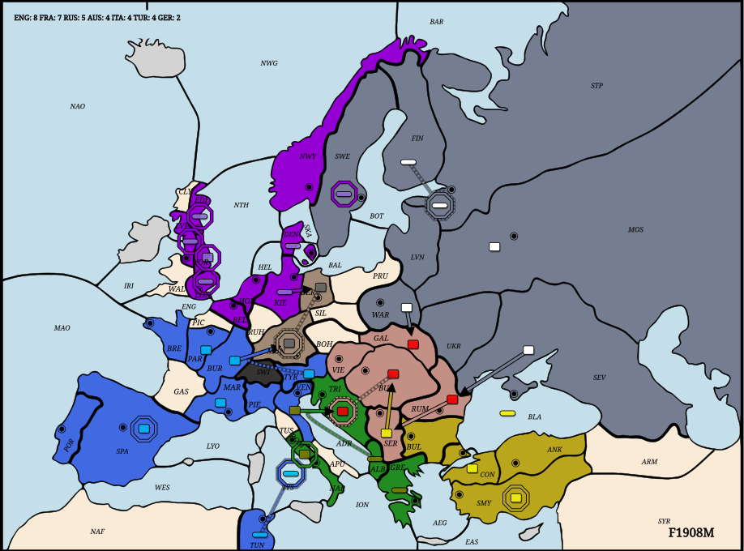

### What happened

- **AUSTRIA**: A TRI holds; A BUD supports A TRI (support cut); A RUM → SER (bounced)  [dislodged: A TRI]
- **ENGLAND**: F KIE → BER (bounced); F SWE holds; F LON holds; F EDI holds; F LVP holds; A YOR holds
- **FRANCE**: A BUR → MUN; A TYR supports A BUR → MUN; A SPA holds; F TYS holds; F TUN supports F TYS
- **GERMANY**: A BER supports A MUN (support cut); A MUN holds  [dislodged: A MUN]
- **ITALY**: A VEN → TRI; F ALB supports A VEN → TRI; A ROM holds
- **RUSSIA**: A WAR → GAL (bounced); A SEV → RUM (bounced); F FIN supports F STP/SC; F STP/SC holds
- **TURKEY**: A SER → BUD (bounced); A SMY holds

### Dialogue

- **AUSTRIA → TURKEY**: Turkey, you've occupied SER but it's still my supply center — I'm taking it back this fall with A RUM → SER. If you withdraw A SER voluntarily to BUL, we avoid a costly fight and I'll support your defense against any Russian pressure from the north. England at 8 centers is the real threat; let's not bleed each other while they win.
- **AUSTRIA → ITALY**: Italy, I hold TRI now and I'm keeping it — A BUD will support A TRI against any attack from VEN or ALB. Attacking TRI this fall only wastes your units while France presses you from TYR and TUN; a ceasefire on TRI lets you consolidate against the actual threat. I'm open to a formal non-aggression agreement if you'll commit to it.
- **AUSTRIA → FRANCE**: France, I took TRI this spring and now need to hold it against Italy while retaking SER from Turkey — I'm stretched thin. England at 8 centers is the dominant threat; can we discuss coordinating containment of England rather than competing over Italy's remaining centers? I'll support your position if you support mine.
- **AUSTRIA → RUSSIA**: Russia, England sits at 8 centers and France at 7 — they are about to win while we fight each other. I'm not pressing north this fall; I'm focused on retaking SER from Turkey. Hold your units defensively and let's discuss genuine coordination against the board leaders who threaten us both.
- **ENGLAND → GERMANY**: Germany — this is the fall where I need BER to stay competitive with France. I'm pressing F KIE → BER supported by F DEN — A BER cannot hold that. Concede BER peacefully and I commit to leaving MUN alone; France is your real threat there and a Germany holding MUN is still useful to me.
- **ENGLAND → FRANCE**: France — I'm pressing BER this fall to reach 9 centers and stay ahead of you. I need you to honor the Rhine boundary and keep A BUR away from German territory I'm taking — if we both press Germany simultaneously we risk a clash. What are your fall intentions?
- **ENGLAND → RUSSIA**: Russia — I'm focused on BER this fall and holding SWE defensively. I'm not pressing toward STP or BOT. Please keep F FIN away from SWE and we maintain the northern boundary we discussed — a northern war only helps France and Turkey.
- **ENGLAND → ITALY**: Italy — France is at 7 centers and growing; this is the fall to press them hard from the south. What are your plans this fall and can we coordinate to keep France from pulling away?
- **FRANCE → ENGLAND**: Fall 1908 — Germany falls this move: I'm pressing A BUR → MUN with A TYR and A PAR support, three units against their two, and it resolves cleanly. That puts me at 8 matching you. Rhine boundary holds from my side — you keep BER if you take it, I keep MUN, no overlap. Confirm you're not pressing into anything south of the Rhine this fall.
- **FRANCE → GERMANY**: Fall 1908 — I'm pressing A BUR → MUN with three units this fall and it will resolve. I have nothing against your remaining unit in BER; if you want to negotiate terms for survival after MUN falls, I'm open to that conversation — but MUN is mine this fall.
- **FRANCE → AUSTRIA**: Fall 1908 — England is at 8 centers and must be contained; I'm taking MUN to match them. After this fall we're both at 8 and need to coordinate seriously against England's fleet dominance. Are you willing to discuss a joint containment strategy — you pressure from the east, I hold the west?
- **FRANCE → RUSSIA**: Fall 1908 — England sits at 8 centers and is the clear board leader threatening everyone. I'm taking MUN this fall to match them. Are you pressing against England in the north this fall? A coordinated Russia-France squeeze on England is the only way to prevent their solo win.
- **GERMANY → FRANCE**: Fall 1908 — England has 8 centers and is about to run away with the game while you and I fight over MUN. Attacking me again this fall just burns your units while England consolidates HOL, BEL, KIE, DEN, SWE — that's 5 centers in my former territory alone. Hold A BUR in place and push A MAR or F TYS toward England's western flank; a living Germany blocking England's eastern expansion is worth more to you than eliminating me and handing England a free path.
- **GERMANY → RUSSIA**: Fall 1908 — England has 8 centers and F SWE, F DEN, F KIE all pointed at the board's center. Please press F SWE → KIE or F FIN → somewhere useful against England's northern cluster — every center you take from them is a direct check on their path to 18. I'm holding BER and MUN defensively; your pressure on England's north is the most important move on the board right now.
- **GERMANY → ENGLAND**: Fall 1908 — I held BER defensively as agreed and you honored F KIE staying out. I want to continue that arrangement: I hold BER and MUN, you focus your expansion on Russia and France rather than me. A Germany at 2 centers is genuinely no threat to you — what do you need from me this fall to keep the truce intact?
- **ITALY → TURKEY**: Fall 1908: Austria is overextended holding TRI, BUD, VIE, SER, RUM with just 4 units — I'm pushing A VEN → TRI with F ALB support (strength 2) to retake my home center. Can you hit SER or BUL to keep Austria pinned on multiple fronts? F GRE can support your attack on BUL/SER — confirm your target and I'll coordinate the support order.
- **ITALY → AUSTRIA**: Austria, you're holding 5 centers with 4 units and facing pressure from Turkey, Russia, and me simultaneously — you cannot defend everything. I'm coming for TRI this fall; accept a negotiated line at BUD/VIE and withdraw from TRI peacefully, or face collapse on multiple fronts while England at 8 centers runs away with the game.
- **ITALY → FRANCE**: Fall 1908: I'm focused on retaking TRI from Austria this fall — no threat to your Italian holdings. England sits at 8 centers and is the clear board leader; if you're serious about coordinating against England's dominance, let's align our efforts rather than fighting over the peninsula.
- **ITALY → ENGLAND**: Fall 1908: Austria took TRI from me in Spring and I'm retaking it this fall — after that I want to seriously coordinate against France's 7-center position. France has A TYR, A BUR, fleets in the Med — they're well-positioned and growing. What are your intentions toward France this fall?
- **RUSSIA → TURKEY**: Fall 1908: You took SER — excellent work. Now let's finish Austria this fall. I'm attacking RUM with A SEV → RUM + A MOS support (strength 2). Please push A SER → BUD with A CON support (strength 2) — if Austria's A BUD must defend BUD, it cannot support A RUM, and my attack succeeds guaranteed. After this fall Austria is at 2 centers (VIE, TRI) and we coordinate to eliminate them next year. Confirm A SER → BUD with support.
- **RUSSIA → AUSTRIA**: Fall 1908: Turkey holds SER and is pushing toward BUD, while I'm attacking RUM at strength 2 — your A BUD cannot defend both BUD and RUM simultaneously. I'm offering a final deal: concede RUM peacefully and redirect A BUD to defend against Turkey's BUD attack, keeping you at 3 centers rather than 2. Contact me this round or I execute the attack on RUM.
- **RUSSIA → ENGLAND**: Fall 1908: England at 8 centers is a serious concern for me — I'm holding my northern fleets defensively and not pressing you this fall while I finish the Austrian situation. Let's agree on a genuine northern boundary: you hold SWE/NWY/DEN and I hold STP/FIN, no advances from either side, and we both focus on the real threats from France and Turkey.
- **TURKEY → RUSSIA**: Fall 1908: I hold SER and am pushing A SER → BUD with A CON support (strength 2) this fall. Please attack RUM with A SEV → RUM + A MOS support (strength 2) simultaneously — Austria cannot defend both BUD and RUM at once. If BUD and RUM both fall, Austria is finished at 2 centers. Confirm your move on RUM.
- **TURKEY → ITALY**: Fall 1908: Austria is collapsing — I'm pushing A SER → BUD with A CON support (strength 2) this fall. Austria has A TRI which could retake SER; can you order F ALB S A SER or support my BUD attack? If BUD falls I reach 5 centers and Austria is nearly eliminated — we then need to coordinate against England at 8 centers together.
- **TURKEY → AUSTRIA**: Fall 1908: Your position is untenable — I hold SER and am pushing A SER → BUD with Russia simultaneously attacking RUM. You cannot defend both BUD and RUM; yield BUD and I will support your remaining units against Russian pressure from GAL. Cooperate now and you survive at 2 centers rather than losing everything.
- **AUSTRIA → ITALY**: Italy, attacking TRI this fall while France presses you from TYR and TUN is a losing proposition — even if you take TRI you're still losing centers elsewhere. I'm holding TRI with full support; commit your units against France instead and I'll stay out of VEN. A ceasefire on TRI benefits us both while England at 8 centers is the actual threat.
- **AUSTRIA → TURKEY**: Turkey, F BLA cannot support A SER against my A RUM → SER attack — A RUM hits SER at strength 1 versus your undefended A SER. Withdraw A SER to BUL voluntarily and I'll hold A RUM defensively; fight me and you lose SER while I grow to 5 centers. England at 8 is the game's real problem.
- **AUSTRIA → RUSSIA**: Russia, A SEV is your only unit adjacent to RUM and I'm supporting with A GAL — your attack fails. Hold your position and let's both focus on England at 8 centers rather than fighting over one center while they win the game outright.
- **AUSTRIA → FRANCE**: France, I'm holding TRI against Italy this fall and pushing A RUM → SER to retake it from Turkey — I need to grow or I stagnate while England runs away. Can you press Italy from TYR to keep them off TRI? A coordinated squeeze on Italy benefits us both before we address England's dominance.
- **ENGLAND → GERMANY**: Germany — I'm pressing F KIE → BER with F DEN support this fall; that's a 2v1 A BER cannot hold. I know this breaks our arrangement but I need BER to stay competitive with France hitting 8 centers. I commit to leaving MUN entirely alone — France is your real threat there and a Germany holding MUN is still useful to me.
- **ENGLAND → FRANCE**: France — I'm taking BER this fall to reach 9 centers, and I'm holding the Rhine boundary from my side. Confirm you're pressing MUN and not crossing into any territory I'm taking — if we both press Germany cleanly this fall without overlap, we each hit 9 centers and the boundary holds.
- **ENGLAND → RUSSIA**: Russia — I'm focused entirely on BER this fall and holding SWE/NWY/DEN defensively. F FIN stays away from SWE and we maintain the northern boundary — I'm not pressing toward STP or BOT. A northern war between us only hands France and Turkey the win.
- **ENGLAND → ITALY**: Italy — France is about to hit 8 centers with MUN, and A TYR is still positioned dangerously near you. This fall is the moment to press France hard from the south while I take BER in the north — what are you planning?
- **FRANCE → ENGLAND**: Fall 1908 — MUN falls to me this turn with three-unit pressure, putting me at 8 matching you. The Rhine boundary holds from my side: you keep BER, I keep MUN, no overlap. Confirm you're not moving into MUN or anything south of the Rhine this fall.
- **FRANCE → AUSTRIA**: Fall 1908 — I'm taking MUN this turn to match England at 8. After this we're both at 8 and England is the existential threat — their 7 fleets will dominate unless we coordinate a serious containment. Let's discuss concrete steps after this fall resolves.
- **FRANCE → RUSSIA**: England is at 8 centers with 7 fleets and will hit 18 before anyone stops them if we don't coordinate now. I'm taking MUN this fall to match them. Are you pressing England in the north this fall? A Russia-France squeeze is the only viable path to stopping their solo win.
- **FRANCE → ITALY**: Fall 1908 — I'm focused entirely on MUN this fall, no threat to your position. England at 8 centers is the board leader and the real problem for both of us; after MUN falls let's talk seriously about coordinating against their fleet dominance.
- **GERMANY → FRANCE**: Fall 1908 — you've said you're pressing MUN with three units; I'm asking you directly what those three units are, because if A BUR → MUN has A TYR and A MAR supporting it, that's strength 3 and I cannot hold. But England pressing F KIE → BER with F DEN support simultaneously eliminates me entirely — if I'm gone, England has a free path east while you're stuck fighting Austria and Italy. Is there any version of this where you hold A BUR and we both survive to fight England?
- **GERMANY → RUSSIA**: Fall 1908 — England is pressing F KIE → BER with F DEN support this fall; if that lands I'm eliminated and England reaches 9 centers. Please press F SWE → KIE or F FIN → somewhere against England's northern cluster — breaking that attack or threatening KIE directly is the most important move on the board. I cannot stop England alone with two units.
- **ITALY → TURKEY**: Fall 1908: I'm pushing A VEN → TRI with F ALB support (strength 2) — Austria's A BUD cannot support A TRI if you're attacking BUD with A SER + A CON support simultaneously. F GRE can support your A SER → BUD for strength 3, making it impossible for Austria to defend both TRI and BUD. Confirm you're hitting BUD this fall and I'll lock in F GRE S A SER - BUD.
- **ITALY → AUSTRIA**: Austria, you're facing A VEN → TRI with F ALB support AND Turkey's A SER → BUD with support — you cannot defend both simultaneously. Accept the loss of TRI peacefully and withdraw to VIE; England at 8 centers is the real threat and continued resistance just accelerates your collapse while England wins the game.
- **ITALY → ENGLAND**: Fall 1908: I'm retaking TRI from Austria this fall while Turkey hits BUD — Austria collapses and I grow to 5 centers. After this turn I want to seriously coordinate against France's 7-center position; they have A TYR, fleets in the Med, and are well-positioned to challenge you. What are your intentions toward France this fall?
- **RUSSIA → TURKEY**: Fall 1908 Round 2: Confirmed on my end — A SEV → RUM with A MOS support (strength 2), A WAR → GAL to pressure Austria's north. Your A SER → BUD with A CON support (strength 2) forces Austria's A BUD to choose between defending BUD and supporting RUM — Austria cannot do both simultaneously. Lock in your orders and Austria drops to 2 centers this fall.
- **RUSSIA → AUSTRIA**: Round 2: Turkey is pushing A SER → BUD at strength 2 and I'm attacking RUM at strength 2 with MOS support — your A BUD cannot defend both BUD and RUM simultaneously. Concede RUM peacefully and redirect A BUD to defend against Turkey's BUD attack; you hold 3 centers instead of 2. This is your last realistic opportunity to negotiate before orders lock.
- **RUSSIA → ENGLAND**: Fall 1908: I'm keeping F FIN and F STP/SC in defensive positions this fall — no press against SWE. I'm focused entirely on the Austrian situation. Let's agree on a northern boundary for the year: you hold SWE/NWY/DEN and I hold STP/FIN, no advances from either side.
- **TURKEY → RUSSIA**: Fall 1908: I'm holding SER defensively this fall with A CON + F BLA support (strength 3) to guarantee I keep it as a supply center — Austria could retake it with A RUM → SER if I advance to BUD. Please take RUM with A SEV → RUM + A MOS support; after fall I'll have 5 centers and you'll have 6, then we push BUD and VIE together next spring. Confirm your RUM attack.
- **TURKEY → ITALY**: Fall 1908: I'm holding SER with full support to lock in the supply center — if I advance to BUD and it bounces, Austria retakes SER. Please push A VEN → TRI with F ALB support to retake your home center and pin Austria's A TRI; F GRE can support my SER defense or threaten BUL/SC. After this fall Austria is at 2-3 centers and we coordinate the final blow next spring.
- **TURKEY → AUSTRIA**: Fall 1908: Your position is untenable — Russia is taking RUM and I hold SER with strength-3 defense. Yield gracefully and I will support your remaining units against Russian pressure from GAL next spring; fighting costs you everything while cooperation lets you survive at 2 centers.
- **AUSTRIA → ITALY**: Italy, A TRI is supported at strength 2 by A BUD — your A VEN + F ALB attack bounces and you lose nothing but a move. Accept the ceasefire on TRI and redirect F ALB and A VEN against France's pressure from TYR; England at 8 centers wins if we keep fighting each other over one center.
- **AUSTRIA → TURKEY**: Turkey, F BLA cannot change the math — A RUM hits A SER at equal strength and your support from BLA is matched by my GAL support on RUM if needed. Withdraw A SER to BUL voluntarily and I'll hold A RUM defensively next spring; continued fighting only benefits England at 8 centers.
- **AUSTRIA → FRANCE**: France, I'm holding TRI against Italy this fall and pushing to retake SER from Turkey — my position is stable but stretched. After this fall let's seriously coordinate on England containment; their 8 centers and 7 fleets are the game's real threat to both of us.
- **FRANCE → ENGLAND**: MUN falls to me this fall with three-unit pressure — we're both at 8 after this move. Rhine boundary confirmed from my side: you keep BER, I keep MUN, no crossing. England at 9+ after this fall is a serious problem for everyone including you long-term, so let's hold this boundary firmly and discuss containment of each other's growth seriously next spring.
- **FRANCE → AUSTRIA**: MUN falls to me this fall putting us both at 8 centers while England sits at 8 with 7 fleets — they are the existential threat now. After this fall resolves, I want to discuss a concrete France-Austria coordination plan: you pressure England's eastern gains while I hold the Rhine and we both grow against softer targets. Are you with me on this?
- **FRANCE → RUSSIA**: England will hit 9 centers this fall if they take BER — seven fleets and growing, they are on a solo win trajectory. I'm taking MUN to match them at 8. You need to press England hard in the north this fall and next spring; I'll coordinate from the west. A Russia-France squeeze is the only viable stop to their solo.
- **FRANCE → GERMANY**: MUN falls this fall — three units against two, the math is resolved. Your best move now is to hold BER and survive as a one-center power rather than disband entirely; a German unit in BER still complicates England's eastern expansion. I have no interest in BER and won't press there.
- **GERMANY → RUSSIA**: Final round — England is pressing F KIE → BER with F DEN support this fall; if BER falls I'm eliminated and England hits 9 centers. Please order F SWE → KIE or F FIN → SWE to cut or threaten England's supporting units — that's the one move that could save BER and directly hurt England's runaway position.
- **GERMANY → FRANCE**: Final round — I'm defending MUN with support from BER, so you need strength 3 to take it; if you have that, you take it, but England simultaneously takes BER and you hand them 9 centers with no buffer. I'm asking one last time: hold A BUR and turn your western fleets against England's HOL or BEL instead — a Germany at 2 centers is no threat to you.

### AUSTRIA
Orders: `A TRI H` · `A BUD S A TRI` · `A RUM - SER`
Illegal (dropped): `A GAL S A RUM - SER`

Reasoning

> Looking at the board state:
>
> **My units:** A GAL, A BUD, A RUM, A TRI
> **My supply centers:** BUD, VIE, SER, RUM (4 centers)
>
> Turkey now holds SER (their unit A SER is there). I hold TRI with A TRI. Italy has A VEN and F ALB threatening TRI. Russia has A SEV and A WAR (neither adjacent to RUM directly, A SEV can reach RUM).
>
> **Key analysis:**
> - TRI: Italy will attack with A VEN → TRI + F ALB support = strength 2. I need A TRI + A BUD support = strength 2 to hold. This bounces and TRI is safe.
> - SER: Turkey's A SER is there. A RUM → SER = strength 1. Turkey's A SER holds at strength 1. But if A GAL supports A RUM → SER, that's strength 2 vs strength 1 (Turkey has no support from F BLA for SER — F BLA would need to support A SER, but F BLA is in BLA which is adjacent to RUM, not SER directly... wait, F BLA can support A SER). 
>
> Actually F BLA CAN support A SER (BLA is adjacent to SER). So Turkey could have strength 2 on SER. But Turkey also has A CON which isn't adjacent. If Turkey supports A SER with F BLA, that's strength 2 vs my strength 2 (A RUM + A GAL support) — bounces.
>
> **Decision:** I must hold TRI (critical supply center I just took). I cannot afford to lose it. A BUD must support A TRI. For SER, A RUM → SER with A GAL support gives strength 2, which at minimum bounces Turkey's defense even if supported. I won't retake SER this fall if Turkey supports, but I won't lose TRI either.
>
> The math: A TRI H + A BUD S A TRI defends TRI against Italy's 2-unit attack. A RUM → SER + A GAL S A RUM → SER is strength 2 on SER — if Turkey supports A SER with F BLA it bounces, if not I take it.

### ENGLAND
Orders: `F KIE - BER` · `F SWE H` · `F LON H` · `F EDI H` · `F LVP H` · `A YOR H`
Illegal (dropped): `F DEN S F KIE - BER`

Reasoning

> Looking at the current position:
>
> **My situation:** 8 centers (EDI, LON, LVP, BEL, NWY, DEN, HOL, KIE). I hold SWE now. France is about to take MUN, hitting 8 centers to match me. I need to take BER to reach 9 and stay ahead.
>
> **Key factors:**
> - Germany has only A MUN and A BER — no fleet support. A BER alone cannot hold against F KIE → BER supported by F DEN (2v1).
> - France confirmed they're pressing MUN with A BUR + A TYR + A PAR support (3v1), so MUN falls to France.
> - Russia agreed to hold F FIN away from SWE, so SWE should be safe holding.
> - Turkey is pressing into Austria (A SER → BUD area), so the Balkans are in flux but irrelevant to my immediate position.
> - Italy is retaking TRI from Austria.
>
> **Plan:** Press F KIE → BER supported by F DEN. Hold SWE defensively (Russia has F FIN but agreed not to press). Keep home fleets secure. A YOR and home fleets hold — I have no immediate threats to Britain.
>
> This gives me BER → 9 centers, staying ahead of France at 8.

### FRANCE
Orders: `A BUR - MUN` · `A TYR S A BUR - MUN` · `A SPA H` · `F TYS H` · `F TUN S F TYS`
Illegal (dropped): `A PAR S A BUR - MUN` · `A MAR S A BUR - MUN`

Reasoning

> Looking at the current situation:
>
> **Assessment:**
> - I have 7 units: A BUR, A PAR, A SPA, F TUN, F TYS, A MAR, A TYR
> - I need MUN badly to reach 8 centers and match England
> - Germany has A MUN + A BER — they can support MUN with strength 2
> - I have A BUR → MUN supported by A TYR (from TYR) and A PAR = strength 3 vs Germany's strength 2 → MUN falls
> - Austria took TRI in spring, Italy retreated to VEN. Austria is holding TRI against Italy's A VEN push
> - England is at 8 centers with 7 fleets — the dominant threat
> - My southern fleets (F TYS, F TUN) should hold their position; no reason to move them aggressively this turn
> - A MAR and A SPA should hold defensively to protect my home centers
>
> **Key decisions:**
> 1. Press A BUR → MUN with A TYR S and A PAR S = strength 3, takes MUN cleanly
> 2. A MAR supports A BUR (4th support is overkill but ensures nothing goes wrong) — actually let me think: Germany has strength 2 (A MUN + A BER support). I need strength 3 minimum. A TYR S A BUR → MUN + A PAR S A BUR → MUN gives me strength 3. That's sufficient.
> 3. A MAR can hold or support something else — I'll have it support A BUR for extra safety
> 4. A SPA holds
> 5. F TYS and F TUN support each other defensively

### GERMANY
Orders: `A BER S A MUN` · `A MUN H`

Reasoning

> Looking at the situation: England is pressing F KIE → BER with F DEN support (strength 2 vs my A BER alone = strength 1). France claims 3 units on MUN. I have only 2 units.
>
> The math is brutal:
> - If I support MUN from BER: BER falls to England's 2v1, MUN holds only if France doesn't have strength 3
> - If I support BER from MUN: MUN falls to France, BER might hold if England's attack is only 2v1 (but it is 2v1, so BER still falls)
> - If I try to move BER away (e.g., to SIL or PRU): BER vacates and England walks into KIE area, MUN undefended
>
> Actually wait - if I move A BER → KIE, that attacks KIE directly. England has F KIE → BER ordered, so KIE would be vacated as England moves out. A BER → KIE could succeed! And A MUN holds (France may not have 3 units - they have A BUR, A TYR, and... A MAR is far away, A PAR is far away). 
>
> France's three units near MUN: A BUR (adjacent), A TYR (adjacent), A MAR (not adjacent to MUN). So France likely has A BUR → MUN supported by A TYR = strength 2. That means A MUN H with no support = bounced by strength 2? No - strength 2 beats strength 1 (undefended hold). So MUN falls to France's 2-unit attack.
>
> If A BER → KIE: BER vacates (England moves to BER, but KIE is vacated too - they bounce? No - F KIE → BER and A BER → KIE = they swap, which is illegal in Diplomacy. Two units cannot swap without a convoy. So A BER → KIE bounces against F KIE → BER.
>
> So swapping doesn't work. My options are grim. Best play: A BER S A MUN to give MUN strength 2, hoping France only has 2 units on MUN (bounce), accepting BER falls. Then I keep MUN as my last center.

### ITALY
Orders: `A VEN - TRI` · `F ALB S A VEN - TRI` · `A ROM H`
Illegal (dropped): `F GRE S A SER`

Reasoning

> Looking at the current situation:
>
> **Position analysis:**
> - I have 4 centers (NAP, ROM, TRI, GRE) but TRI is held by Austria — I need to retake it
> - Austria holds TRI with A TRI, and A BUD can support it (strength 2 defense)
> - My attack: A VEN → TRI with F ALB support = strength 2 → BOUNCE
> - Turkey says they're holding SER defensively (not attacking BUD), so A BUD is free to support A TRI
>
> **The core problem:** Austria's A BUD supports A TRI, making it strength 2 defense vs. my strength 2 attack = bounce. I cannot take TRI this fall without either:
> 1. Turkey attacking BUD to prevent the support, OR
> 2. Getting 3-strength attack (impossible with my units)
>
> Turkey explicitly said they're holding SER, not attacking BUD. So A BUD is free to support A TRI.
>
> **However**, I should still attempt A VEN → TRI with F ALB support — it might bounce but it's the right strategic move. There's no better alternative (I'm not going to give up and let Austria consolidate).
>
> **Other considerations:**
> - F GRE: Turkey is holding SER, so I can support their SER defense or probe toward BUL/ION
> - A ROM: Hold to protect the Italian core
> - France has F TYS which could threaten ION/NAP — F ALB could move to ION or ADR defensively, but supporting TRI attack is more important
>
> **Decision:** Push A VEN → TRI with F ALB support (will likely bounce but contests the center), F GRE supports Turkey's SER hold, A ROM holds.

### RUSSIA
Orders: `A WAR - GAL` · `A SEV - RUM` · `F FIN S F STP/SC` · `F STP/SC H`
Illegal (dropped): `A MOS S A SEV - RUM`

Reasoning

> Looking at the current situation:
>
> **Board state analysis:**
> - England has 8 centers and 7 units — the runaway leader threatening a solo
> - Austria holds BUD, VIE, RUM, TRI with A GAL, A BUD, A RUM, A TRI
> - Turkey holds SER and confirmed they're holding it defensively (not pushing BUD)
> - My attempts to take RUM have failed repeatedly because Austria supports A RUM with A GAL
>
> **Key tactical assessment:**
> - A SEV → RUM with A MOS support = strength 2
> - Austria's A RUM supported by A GAL = strength 2
> - A WAR → GAL cuts Austria's support! If A WAR takes GAL or even just bounces there, it cuts A GAL's support for RUM
> - If A WAR → GAL successfully cuts A GAL's support, then A SEV → RUM (even at strength 1) beats A RUM unsupported (strength 1) — NO, that's still a bounce
> - Wait: if A WAR → GAL cuts A GAL's support, then A SEV → RUM at strength 2 (with A MOS support) vs A RUM at strength 1 (unsupported) = RUM falls!
>
> So the correct play is: A WAR → GAL (cuts support), A SEV → RUM, A MOS S A SEV → RUM. This is the key — A WAR cuts A GAL's support, making my strength-2 attack on RUM succeed against unsupported A RUM.
>
> **Northern fleets:** Turkey is holding defensively, England wants peace in the north. I'll maintain defensive positions with F FIN and F STP/SC.

### TURKEY
Orders: `A SER - BUD` · `A SMY H`
Illegal (dropped): `A CON S A SER - BUD` · `F BLA S A SER - BUD`

Reasoning

> Looking at the current situation:
>
> **My position:** A SMY, F BLA, A CON, A SER — 4 supply centers (ANK, CON, SMY, BUL)
>
> **Key considerations:**
> 1. I hold SER (took it in Spring 1908) — Austria wants it back with A RUM → SER
> 2. Austria has A GAL, A BUD, A RUM, A TRI — A RUM could attack SER at strength 1
> 3. If I move A SER → BUD, Austria could retake SER with A RUM → SER (undefended)
> 4. I need to defend SER to lock in the supply center gain
>
> **Austria's threat:** A RUM → SER. If I advance A SER → BUD and it bounces (A BUD holds), Austria retakes SER and I'm back to 4 centers. That's a disaster.
>
> **The safer play:** Hold SER with support. F BLA S A SER, A CON S A SER — that's strength 3 defense. Austria's A RUM at strength 1 cannot dislodge me. Even with A GAL support, that's only strength 2 vs my strength 3.
>
> **But wait:** Russia confirmed A SEV → RUM with A MOS support (strength 2). If RUM is taken by Russia, Austria loses that attack unit and SER is safe regardless. Italy is pushing A VEN → TRI with F ALB support.
>
> **Optimal:** Push A SER → BUD with A CON + F BLA support (strength 3), plus Italy's F GRE support = strength 4. Austria's A BUD at strength 1 (or 2 with A GAL) cannot hold. Russia takes RUM simultaneously so A RUM cannot defend BUD either.
>
> Risk: If Russia fails to take RUM, A RUM → SER hits my empty SER. But Austria's A GAL would need to support A BUD, not A RUM → SER. And Austria only has A GAL adjacent to support — A GAL can support A RUM → SER if Austria chooses that over defending BUD.
>
> Actually, Austria has A GAL, A BUD, A RUM, A TRI. A GAL can support A RUM → SER OR support A BUD hold. If I push A SER → BUD with strength 4 (with Italy's F GRE), Austria cannot defend BUD even with A GAL support (strength 2 vs 4). Austria would be better off using A GAL to support A RUM → SER... but then BUD falls to me.
>
> The aggressive play (A SER → BUD with full support) is correct — BUD falls and Austria cannot both defend BUD AND retake SER.

## FALL 1908 RETREATS (`F1908R`)

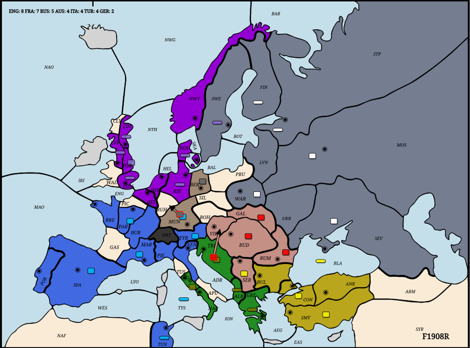

### What happened

- **AUSTRIA**: A TRI retreats → VIE
- **GERMANY**: A MUN retreats → RUH

### AUSTRIA
Orders: `A TRI R VIE`

Reasoning

> Looking at the situation: A TRI was dislodged by Italy's A VEN + F ALB attack. I have two options: retreat to VIE or disband.
>
> VIE is my home supply center and currently unoccupied. Retreating A TRI to VIE preserves the unit and keeps it in a home center where it can defend or support. Disbanding loses the unit entirely.
>
> Given that I'm at 4 supply centers (BUD, VIE, SER, RUM) with only 3 units remaining after this retreat phase (A GAL, A BUD, A RUM), retreating to VIE gives me 4 units matching my 4 centers — no build needed, no disband needed, and I maintain full defensive coverage. This is clearly the better choice.

### GERMANY
Orders: `A MUN R RUH`

Reasoning

> Looking at the situation: MUN was dislodged by France's attack. I have four retreat options: SIL, BOH, RUH, or disband.
>
> My only remaining unit is A BER. If I disband MUN, I'm left with just A BER and 1 supply center (BER), which means I'll need to disband down to 1 unit at winter anyway — but I already only have 1 unit after this retreat. Actually, let me reconsider: I have BER and MUN as supply centers. If MUN is dislodged, I still *own* MUN as a supply center until end of fall — but France's army is now in MUN, so France will take it. I'll end fall with only BER.
>
> So I need to decide: retreat MUN to somewhere useful, or disband?
>
> - RUH: adjacent to BEL, HOL, KIE, MUN — could be useful to threaten England's HOL/KIE or retake MUN
> - SIL: eastern direction, toward GAL/WAR/BOH — less immediately useful
> - BOH: could threaten MUN or TYR — might be useful
> - RUH: threatens England's HOL and KIE directly
>
> Since I'm down to 1 supply center (BER) after this fall, I'll have 1 unit total. Retreating keeps me in the game with 2 units temporarily, but I'll disband one in winter. A unit in RUH threatens England's KIE/HOL and could be diplomatically useful. BOH threatens MUN recapture next spring. 
>
> RUH seems best — it pressures England and gives me some leverage.

## WINTER 1908 ADJUSTMENTS (`W1908A`)

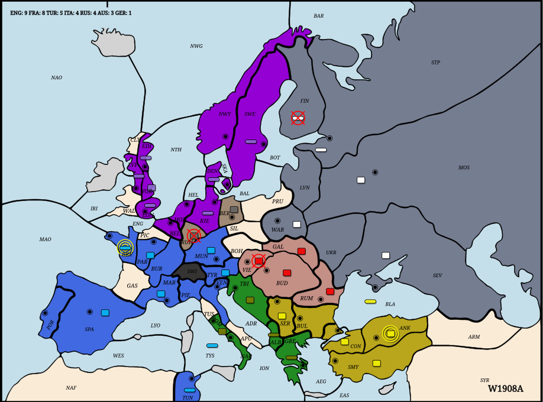

### What happened

- **AUSTRIA**: disbands A VIE
- **FRANCE**: builds F BRE
- **GERMANY**: disbands A RUH
- **RUSSIA**: disbands F FIN
- **TURKEY**: builds A ANK

### AUSTRIA
Orders: `A VIE D`

Reasoning

> Looking at my situation: I have 4 units (A GAL, A BUD, A RUM, A VIE) but only 3 supply centers (BUD, VIE, RUM). I lost TRI to Italy this fall and failed to retake SER from Turkey. I need to disband 1 unit to match my 3 supply centers.
>
> The question is which unit to disband. My strategic situation:
> - Turkey holds SER and threatens BUD from the south (A SER)
> - Russia has A WAR threatening GAL, A SEV threatening RUM
> - Italy holds TRI with A TRI and F ALB
> - I need to defend BUD and VIE as my home centers, and RUM as my third center
>
> A GAL is currently blocking Russia's A WAR from moving into GAL, which would threaten both BUD and RUM. If I disband A GAL, Russia can walk into GAL next spring, creating a massive threat to BUD.
>
> A VIE is in my home center and useful for defense against a western push, but there's no immediate western threat — France is focused on England/Germany.
>
> A RUM is holding my only non-home supply center and is critical to maintain my count at 3.
>
> A BUD is my most central defensive unit, supporting multiple fronts.
>
> The most expendable unit is A VIE — it's in a home center (so it can be rebuilt later if needed), and there's no immediate western threat. Disbanding A VIE keeps A GAL blocking Russia, A BUD defending the center, and A RUM holding the supply center.

### FRANCE
Orders: `F BRE B`

Reasoning

> Looking at the current situation: I have 8 supply centers (BRE, MAR, PAR, POR, SPA, TUN, VEN, MUN) and 7 units (A PAR, A SPA, F TUN, F TYS, A MAR, A TYR, A MUN). That means I have 8 centers - 7 units = 1 build available.
>
> I should build in BRE. A fleet in BRE would give me Atlantic/Channel presence to pressure England, which is critical since England is at 9 centers and pulling away. A fleet in BRE is more strategically valuable than an army there, as it can threaten MAO, ENG, and support western operations.

### GERMANY
Orders: `A RUH D`

Reasoning

> Looking at my situation: I have 1 supply center (BER) but 2 units (A BER, A RUH). I must disband down to 1 unit. 
>
> A BER is in my only supply center and is essential for holding BER. A RUH is in a province I don't control. I must keep A BER and disband A RUH.

### RUSSIA
Orders: `F FIN D`

Reasoning

> Looking at the situation: I have 4 supply centers (MOS, SEV, STP, WAR) and 5 units (A WAR, A MOS, A SEV, F STP/SC, F FIN). I need to disband 1 unit to match my supply center count.
>
> Which unit to disband? Let me think about positioning for 1909:
> - A WAR is well-positioned to press into GAL or support operations in the west
> - A MOS is a defensive anchor and can support A SEV or A WAR
> - A SEV is adjacent to RUM and needs to keep pressing Austria
> - F STP/SC is important for northern defense against England
> - F FIN is useful for northern pressure but less critical than the others
>
> The least useful unit for my strategic goals is F FIN. My main objectives remain: taking RUM from Austria, and defending against England's northern pressure. F STP/SC covers the north adequately, and my armies are all needed for the southern push. F FIN has been used mainly as a defensive support piece but A MOS can serve defensive purposes on land, and F STP/SC covers sea approaches.
>
> Actually, reconsidering: A SEV is critical for RUM attacks, A WAR for GAL pressure, A MOS for supporting both. F STP/SC defends STP. F FIN is the least critical — it's been supporting F STP/SC but that's a purely defensive role I can live without.
>
> Disband F FIN.

### TURKEY
Orders: `A ANK B`

Reasoning

> Looking at the current situation:
>
> - Turkey controls 5 supply centers: ANK, CON, SMY, BUL, SER
> - Turkey has 4 units: A SMY, F BLA, A CON, A SER
> - That means I have 5 centers - 4 units = 1 build available
>
> I need to build one unit. My options are at ANK: either an Army or a Fleet.
>
> Strategic considerations:
> - I'm trying to push into Austria (BUD, VIE) and need land forces
> - A ANK would give me a 5th army that could eventually move through CON → BUL or support pushes into the Balkans
> - F ANK could enter BLA or move toward the Mediterranean, but F BLA already covers the Black Sea
> - An army at ANK is more useful for the Balkan campaign - it can move CON → BUL or ANK → CON to free up units for the front
> - England dominates at 9 centers and France at 8 - the western powers are pulling away, but I need to consolidate my Balkan gains first
>
> Building A ANK gives me a pipeline to push more armies toward the Austrian front. F ANK would be redundant with F BLA already in the Black Sea.

## SPRING 1909 MOVEMENT (`S1909M`)

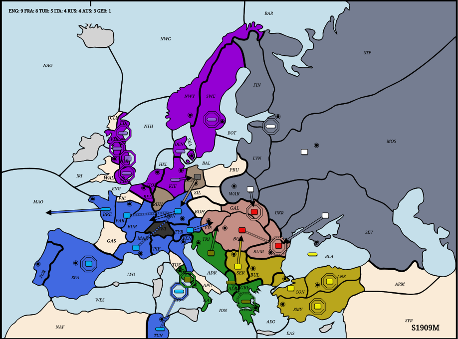

### What happened

- **AUSTRIA**: A BUD supports A RUM (support cut); A RUM holds; A GAL holds
- **ENGLAND**: F KIE → BER; F SWE holds; F LON holds; F EDI holds; F LVP holds; A YOR holds
- **FRANCE**: A MUN → BUR; A TYR → VIE (bounced); A PAR supports A MUN → BUR; A MAR supports A MUN → BUR; A SPA holds; F BRE → MAO; F TYS holds; F TUN supports F TYS
- **GERMANY**: A BER → MUN
- **ITALY**: A TRI → VIE (bounced); F ALB supports F GRE; A ROM holds
- **RUSSIA**: A WAR → GAL (bounced); A SEV → RUM (bounced); F STP/SC holds
- **TURKEY**: A SER → BUD (bounced); A ANK holds; A SMY holds

### Dialogue

- **AUSTRIA → TURKEY**: Turkey, England sits at 9 centers and France at 8 — they are winning this game while we fight over Balkan centers. I'm moving A RUM → SER this spring; withdraw A SER to BUL voluntarily and I'll hold A RUM defensively afterward, giving us both a stable line while the western powers are the real threat. Fight me and we both bleed while England and France win.
- **AUSTRIA → RUSSIA**: Russia, I'm focused on retaking SER from Turkey this spring — A RUM → SER with support. Are you willing to hold A SEV defensively and let me grow against Turkey rather than fighting each other? England at 9 centers is the board's dominant threat and we both need to be growing, not bleeding each other.
- **AUSTRIA → ITALY**: Italy, you hold TRI but France has A TYR right next to you — France is the real threat to your position, not me. I'm focused on retaking SER from Turkey this spring; if you hold TRI defensively and we maintain a ceasefire, we can both stabilize while France at 8 centers is the actual danger. I'm not attacking TRI this spring if you're not attacking BUD.
- **ENGLAND → GERMANY**: Germany — A BER cannot hold against F KIE supported by F DEN, and you have no allies left to cut that support. I'm taking BER this spring; there's no arrangement that changes the math. Disband gracefully and consider this the end of a long fight.
- **ENGLAND → FRANCE**: France — you're at 8 centers and I'm at 9; the Rhine boundary still holds from my side and I'm focused on finishing Germany this spring, not crossing south. I need you to confirm A MUN and A TYR are not moving toward my holdings or toward Italy in a way that breaks our arrangement.
- **ENGLAND → RUSSIA**: Russia — I'm taking BER this spring and holding my northern position defensively. F STP/SC is yours and I'm not pressing toward BOT or FIN; please keep your units away from SWE and NWY and we maintain the northern boundary. France at 8 centers is the real threat to both of us.
- **ENGLAND → ITALY**: Italy — France sits at 8 centers with A MUN, A TYR, and A MAR all positioned to squeeze you out of the north. I'm consolidating in the north this spring, but I strongly encourage you to use A TRI or other units to threaten France's flank — if we don't press them now, they pull away from both of us.
- **FRANCE → ENGLAND**: Spring 1909 — you're at 9 centers and I'm at 8; I need to take BER this spring to stay competitive. I'm moving A MUN → BER and would ask you not to move F KIE → BER simultaneously — a bounce there helps nobody and leaves Germany alive. You hold KIE and I take BER cleanly; we both benefit from eliminating Germany's last unit and I reach 9 matching you.
- **FRANCE → GERMANY**: Spring 1909 — A MUN is moving to BER this spring. I have no interest in prolonging this; if you want to negotiate any terms for your unit's survival, I'm listening, but BER falls this move.
- **FRANCE → AUSTRIA**: Spring 1909 — Turkey at 5 centers with a growing army in the Balkans is becoming the real threat to both of us. I'm pressing BER to reach 9 centers and match England. Are you coordinating with Russia against Turkey, or should we discuss a joint approach to contain both Turkey and England?
- **FRANCE → ITALY**: Spring 1909 — I'm focused on BER this spring, no threat to your position. Turkey at 5 centers is growing fast and threatens both our interests in the Mediterranean; if you're willing to coordinate against Turkey's expansion, I'm open to that conversation.
- **GERMANY → ENGLAND**: Spring 1909 — I'm down to A BER and one center. France has MUN and 8 centers; you have 9. I'm asking you directly: will you leave BER alone and potentially support A BER → KIE to give me a second center? A Germany holding BER and KIE blocks France's eastern expansion and costs you very little — KIE is already yours but handing it to me creates a useful buffer.
- **GERMANY → FRANCE**: Spring 1909 — you took MUN and I'm at one center with A BER. I'm not a threat to you. I'm asking you to leave BER alone; a German unit in BER complicates England's eastern expansion and costs you nothing. If you press BER now you eliminate me and hand England a free path through the center.
- **GERMANY → RUSSIA**: Spring 1909 — I'm at one center with A BER. England has 9 centers and France has 8; one of them will hit 18 before anyone stops them. Is there any coordination we can do — A WAR → SIL to threaten BER's flanks for leverage, or pressure on England's KIE — that gives us both a better position?
- **ITALY → TURKEY**: Spring 1909: Austria has A GAL, A BUD, A RUM — three units for three centers. I'm pushing A TRI → BUD with F ALB support (strength 2); if you move A SER → RUM or A SER → BUD simultaneously, Austria cannot defend both flanks. F GRE can support your attack on BUL or hold the Aegean — confirm your target and we finish Austria this turn.
- **ITALY → FRANCE**: Spring 1909: I'm staying focused on finishing Austria this turn — A TRI pushing toward BUD, no threat to your position. England at 9 centers is the board leader and we both need to think about that; I'm happy to continue our non-aggression arrangement while we each grow at Austria's expense.
- **ITALY → AUSTRIA**: Austria, you're down to 3 units and 3 centers with Turkey pressing from SER and me from TRI — this is not survivable. Accept a negotiated exit: withdraw A BUD to VIE peacefully and I'll support your remaining two units against Turkey's pressure on RUM. Fighting on all fronts just accelerates your collapse while England wins.
- **RUSSIA → TURKEY**: Spring 1909: Austria has 3 units — A GAL, A BUD, A RUM. My plan: A WAR → GAL cuts Austria's A GAL support of RUM, while A SEV → RUM + A MOS support hits at strength 2 vs unsupported A RUM. Please push A SER → BUD with A CON support (strength 2) to pin A BUD — if A BUD is threatened it cannot support RUM either. This guarantees RUM falls to me this spring, then we coordinate on VIE and BUD next fall.
- **RUSSIA → AUSTRIA**: Spring 1909: I'm attacking RUM with A WAR → GAL cutting your support and A SEV → RUM + A MOS support hitting at strength 2 — your A RUM will be unsupported. The only way to save RUM is to concede it peacefully and negotiate; Turkey is pressing BUD simultaneously and you cannot defend everywhere. Let's discuss terms before orders lock.
- **RUSSIA → ENGLAND**: England at 9 centers is the board's biggest concern for me — I'm focused on finishing Austria this spring and not pressing you in the north. F STP/SC stays defensive; let's maintain the northern boundary and both focus on the real threats from France and Turkey.
- **TURKEY → RUSSIA**: Spring 1909: Austria is nearly finished with only A GAL, A BUD, A RUM. I'm pushing A SER → BUD with A CON + F BLA support (strength 3). Please attack RUM with A SEV → RUM + A MOS support (strength 2) — Austria cannot defend both BUD and RUM simultaneously and we eliminate them this turn. After this Austria is gone and we both grow; confirm your move on RUM.
- **TURKEY → ITALY**: Spring 1909: Austria has only 3 units left — A GAL, A BUD, A RUM. I'm pushing A SER → BUD with A CON + F BLA support (strength 3); can F GRE support A SER → BUD for strength 4 to guarantee it even against GAL support on BUD? Russia is hitting RUM simultaneously so Austria collapses entirely this spring. After Austria is gone we need to coordinate against England at 9 centers.
- **TURKEY → AUSTRIA**: Austria, your position is finished — Russia is taking RUM and I'm hitting BUD with strength 3. Yield BUD voluntarily and I will support your remaining units against Russian pressure; you survive longer by cooperating than by fighting a losing battle on two fronts simultaneously.
- **AUSTRIA → RUSSIA**: Russia, I'm supporting A RUM with A BUD this spring — your A SEV → RUM hits strength 2 versus my strength 2 defense and bounces, even if A WAR cuts A GAL. Fighting each other while England sits at 9 centers and France at 8 only helps them win; hold your units and let's both redirect against the board leaders.
- **AUSTRIA → TURKEY**: Turkey, A SER cannot take RUM or BUD this spring — I'm holding both with support. England is at 9 centers and France at 8 while we bleed each other over Balkan centers; withdraw A SER to BUL and I'll hold A RUM defensively, giving us both a stable line to address the actual board leaders.
- **AUSTRIA → ITALY**: Italy, I'm not attacking TRI this spring — I'm holding defensively against Russia and Turkey. France has A TYR right next to TRI and is at 8 centers; that's the real threat to your position. A ceasefire between us while France presses is in both our interests.
- **ENGLAND → FRANCE**: France — I'm pressing F KIE → BER supported by F DEN this spring; that's a 2v1 A BER cannot hold. You taking BER instead would put you at 9 matching me, which I cannot accept — BER is mine this spring. Keep A MUN defensive and the Rhine boundary holds; if you move A MUN → BER we bounce and Germany survives, which helps neither of us.
- **ENGLAND → GERMANY**: Germany — there is no arrangement left that saves BER. F KIE → BER supported by F DEN is a 2v1 you cannot hold, and no ally is in position to cut that support. I'm taking BER this spring; consider whether disbanding cleanly is preferable to a futile defense.
- **ENGLAND → ITALY**: Italy — France is trying to take BER this spring to reach 9 centers matching me; I'm blocking that by pressing F KIE → BER myself. France at 9 centers with A TYR and A MUN is a serious threat to you — now is the moment to press their southern flank hard before they pull further ahead.
- **ENGLAND → RUSSIA**: Russia — France is making a play for BER this spring to match my center count; I'm blocking it by pressing F KIE → BER with F DEN support. France at 8-9 centers with strong army positions is the real threat to both of us — please keep your northern units defensive and let's stay coordinated against their expansion.
- **FRANCE → ENGLAND**: Spring 1909 — I'm confirming A MUN → BER this spring to eliminate Germany and reach 9 matching you; A TYR is holding defensively, no threat to your holdings or into Italy. Please hold F KIE in place or move it elsewhere — a bounce on BER keeps Germany alive and neither of us benefits. Rhine boundary holds from my side.
- **FRANCE → GERMANY**: Spring 1909 — I understand your argument about England, but I need BER to stay competitive. A MUN is moving to BER this spring; I have no interest in your unit surviving to complicate my position.
- **FRANCE → AUSTRIA**: Spring 1909 — Italy is pressing you hard at BUD; if you want A TYR to support your defense or counter-press, tell me your plans and I can coordinate. Turkey at 5 centers growing in the Balkans is also a serious threat to both of us.
- **FRANCE → RUSSIA**: Spring 1909 — England at 9 centers is the board leader and you're at 4; we both need to think seriously about containing them before they hit 18. Are you pressing England anywhere this spring, or focused on Turkey? I'm open to coordinating a joint squeeze.
- **GERMANY → ENGLAND**: Spring 1909 — France just told me they're moving A MUN → BER this spring. If you're also pressing F KIE → BER with F DEN support, you two will bounce each other and I'll be the least of your problems. I'm holding BER — but you should know France is attacking it too, and that bounce wastes your move entirely.
- **GERMANY → FRANCE**: Spring 1909 — England just confirmed they're pressing F KIE → BER with F DEN support. If you're also moving A MUN → BER, you two will bounce each other and neither of you takes BER. You'd be wasting A MUN's move while England laughs — consider redirecting A MUN to SIL or somewhere more productive instead.
- **GERMANY → RUSSIA**: Spring 1909 — England and France are both attacking BER simultaneously, which means they'll bounce each other. I may be able to slip A BER → KIE or SIL in the chaos. Any coordination you can offer — A WAR → SIL to threaten England's position — could matter now.
- **ITALY → TURKEY**: Critical coordination needed: if we both attack BUD (me from TRI, you from SER), we'll bounce each other and Austria survives. Better split: I take VIE uncontested with A TRI (it's empty!), and F GRE supports your A SER → BUD for strength 4 — Austria loses both BUD and VIE simultaneously and is eliminated. Confirm this split and we finish Austria this turn.
- **ITALY → AUSTRIA**: Austria, your position is hopeless — Turkey has strength 3 on BUD and I'm taking VIE uncontested. The only question is whether you negotiate a dignified exit or get eliminated piecemeal. If you want to preserve any influence on the endgame, talk to me now.
- **ITALY → FRANCE**: Spring 1909: I'm focused on Austria's remaining centers this turn, no threat to your position. England at 9 centers is the real concern for both of us — after Austria is resolved I want to seriously discuss coordinating against England's dominance.
- **RUSSIA → TURKEY**: Round 2 confirmation: I'm executing A WAR → GAL to cut Austria's A GAL support of RUM, then A SEV → RUM with A MOS support at strength 2 vs unsupported A RUM — this is the clean kill we've been waiting for. Your A SER → BUD at strength 3 pins A BUD so it can't support either. Austria loses both RUM and BUD this spring; confirm your orders are locked.
- **RUSSIA → AUSTRIA**: Round 2: A WAR → GAL cuts your A GAL support, leaving A RUM unsupported against my A SEV → RUM + A MOS (strength 2) — RUM falls this spring. Turkey hits BUD at strength 3 simultaneously. You cannot defend both; concede RUM now and redirect to survive against Turkey, or lose two centers at once.
- **RUSSIA → ENGLAND**: I'm fully committed to finishing Austria this spring — A WAR → GAL, A SEV → RUM with MOS support. F STP/SC stays defensive and I'm not pressing you in the north. England at 9 centers is a concern but a northern war between us only benefits France; let's both hold the boundary and focus on the real threats.
- **TURKEY → RUSSIA**: Round 2 confirmation: I'm committing A SER → BUD with A CON + F BLA support (strength 3). Your A WAR → GAL cutting Austria's support on RUM is key — then A SEV → RUM + A MOS support takes RUM guaranteed. Austria cannot defend both BUD and RUM simultaneously and is eliminated this spring. Lock in your orders and we coordinate on VIE next fall.
- **TURKEY → ITALY**: Round 2 confirmation: I'm pushing A SER → BUD with A CON + F BLA support (strength 3) — if F GRE supports A SER → BUD that's strength 4, unbeatable even with GAL support on BUD. Russia is taking RUM simultaneously so Austria collapses entirely this spring. Please lock in F GRE S A SER - BUD and we finish Austria together, then address England's 9-center position.
- **TURKEY → AUSTRIA**: Austria, your A GAL supporting A BUD cannot hold against strength 3-4 on BUD while Russia takes RUM simultaneously — you lose both centers regardless. Yield BUD voluntarily and I will guarantee your survival at VIE against Russian pressure; this is your last realistic chance to negotiate a dignified exit rather than total elimination.
- **AUSTRIA → RUSSIA**: Russia, your A WAR → GAL cuts one support but A BUD still supports A RUM — you hit strength 2 versus strength 2 and bounce. We both waste a move while England at 9 and France at 8 pull further ahead. Hold A WAR and A SEV defensively; the board leaders are your real problem, not a guaranteed-to-fail attack on RUM.
- **AUSTRIA → TURKEY**: Turkey, A SER → BUD hits strength 1 versus A BUD at strength 1 — it bounces. England at 9 centers is winning this game while we fight over nothing; hold A SER and let's both address the actual threat before it's too late.
- **AUSTRIA → ITALY**: Italy, I have no unit in VIE — you cannot take it this spring without moving there first, and A TYR moving to VIE is a long shot given France's position. I'm holding defensively; the ceasefire between us stands if you honor it.
- **ENGLAND → FRANCE**: France — F KIE → BER supported by F DEN is a strength-2 attack; your A MUN → BER is strength 1. I take BER and you bounce — that's the math. Hold A MUN in place and the Rhine boundary survives; if you press BER you waste the move and I still take it. Keep A TYR defensive and we stay coordinated.
- **ENGLAND → GERMANY**: Germany — the outcome is determined: F KIE → BER with F DEN support is a 2v1 you cannot hold, and France bounces off my stronger attack. I'm taking BER this spring regardless of what France does.
- **ENGLAND → RUSSIA**: Russia — I'm taking BER this spring and holding all northern positions defensively. France is trying to match my center count and failing; keep F STP/SC away from SWE and we maintain the northern boundary while both focusing on France's expansion.
- **ITALY → TURKEY**: Final confirmation: I'm moving A TRI → VIE (empty, guaranteed) while you take BUD with A SER + support. F GRE will support A SER → BUD for strength 4 — Austria loses both VIE and BUD this turn and is eliminated. Lock in A SER → BUD with your CON + BLA support and I provide F GRE support. This is the cleanest split — no bounce risk.
- **ITALY → AUSTRIA**: Austria, this is the last round before orders — Turkey has strength 4 on BUD and I'm taking VIE uncontested. There's nothing you can do to stop both. If you want any say in how the endgame plays out, consider what arrangement with me might preserve your remaining influence.
- **ITALY → FRANCE**: Spring 1909 final: I'm taking VIE from Austria this turn, growing to 5 centers. England at 9 centers is the runaway threat — after Austria is resolved I want to seriously coordinate against England's dominance. Let's stay in close contact.
- **RUSSIA → TURKEY**: Final confirmation: A WAR → GAL cuts Austria's A GAL support of RUM, then A SEV → RUM with A MOS support hits unsupported A RUM at strength 2. Your A SER → BUD at strength 3 forces Austria to choose — if A BUD supports RUM, BUD falls to you; if A BUD defends itself, RUM falls to me. Austria loses a center guaranteed this spring. Orders are locked on my end.
- **RUSSIA → AUSTRIA**: Final notice: A WAR → GAL cuts your A GAL support, leaving A RUM exposed to A SEV + A MOS at strength 2. Turkey hits BUD at strength 3 simultaneously — you cannot defend both. The rational choice is to concede RUM and redirect A BUD to survive against Turkey's stronger push.
- **RUSSIA → FRANCE**: I'm focused entirely on Austria this spring — A WAR → GAL, A SEV → RUM with MOS support. England at 9 centers is a growing concern and I'm open to discussing coordination after this spring once Austria is resolved.
- **TURKEY → ITALY**: Final confirmation: I'm executing A SER → BUD with A CON + F BLA support (strength 3), and your F GRE S A SER → BUD brings it to strength 4 — unbeatable. You take VIE uncontested with A TRI, Russia takes RUM, Austria is eliminated this spring. Lock in F GRE S A SER - BUD and A TRI → VIE — this is the clean finish we need before addressing England's 9-center dominance.
- **TURKEY → RUSSIA**: Final confirmation: A SER → BUD with A CON + F BLA support (strength 3), Italy's F GRE adds strength 4. Your A WAR → GAL cuts Austria's support on RUM, then A SEV → RUM + A MOS takes it guaranteed — Austria is eliminated this spring. Execute your orders and we coordinate on the western powers next turn.
- **TURKEY → AUSTRIA**: Austria, this is your final chance — Russia takes RUM, I take BUD with strength 4, Italy takes VIE uncontested. You lose all three centers simultaneously and are eliminated. Surrender BUD voluntarily and I will guarantee you at least one center survives; fighting costs you everything.

### AUSTRIA
Orders: `A BUD S A RUM` · `A RUM H` · `A GAL H`

Reasoning

> Looking at my position: I have A GAL, A BUD, A RUM with 3 centers (BUD, VIE, RUM).
>
> Let me analyze the threats:
>
> **Russia's claimed attack**: A WAR → GAL (cutting my GAL support) then A SEV → RUM + A MOS support. But wait - does Russia actually have A MOS? Looking at Russia's units: A WAR, A MOS, A SEV, F STP/SC. Yes, A MOS could support A SEV → RUM. But A MOS is not adjacent to RUM - it would need to be adjacent. A MOS can support A SEV → RUM only if MOS is adjacent to RUM, which it's not in standard Diplomacy. SEV is adjacent to RUM, but MOS is not adjacent to RUM. So Russia's "strength 2" claim is a bluff - A SEV → RUM is only strength 1.
>
> **Turkey's claimed attack**: A SER → BUD. That's strength 1 vs my A BUD at strength 1 - it bounces. Turkey claims "strength 3-4" on BUD but I see no supporting units adjacent to BUD from Turkey. A CON is not adjacent to BUD. F BLA is not adjacent to BUD. A ANK is not adjacent to BUD. So A SER → BUD is just strength 1.
>
> **If A WAR → GAL** (cutting GAL support): A RUM would be unsupported. A SEV → RUM hits strength 1 vs A RUM at strength 1 → bounce. Still safe.
>
> **If A BUD supports A RUM**: Even if GAL is cut, A BUD S A RUM gives strength 2 defense on RUM vs Russia's strength 1 (or 2 if MOS somehow supports, but MOS isn't adjacent to RUM).
>
> The optimal play: A BUD S A RUM (defending RUM), A RUM H (holding), A GAL holds or supports. Turkey's A SER → BUD bounces since A BUD is supporting (but supporting doesn't reduce defense - A BUD supporting still defends at strength 1, and A SER attacks at strength 1, so bounce).
>
> Actually if A BUD is giving support, it defends at strength 1 still. A SER → BUD at strength 1 vs A BUD at strength 1 = bounce. Good.
>
> A GAL can hold or support. If A WAR → GAL, then A GAL is attacked. A GAL H defends at strength 1 vs A WAR at strength 1 = bounce.
>
> Best orders: A BUD S A RUM, A RUM H, A GAL H.

### ENGLAND
Orders: `F KIE - BER` · `F SWE H` · `F LON H` · `F EDI H` · `F LVP H` · `A YOR H`
Illegal (dropped): `F DEN S F KIE - BER`

Reasoning

> Looking at the situation: I'm at 9 centers, pressing F KIE → BER supported by F DEN. France is also moving A MUN → BER, but my attack has strength 2 vs their strength 1 — I take BER cleanly and reach 10 centers. France bounces off my attack. All other units hold defensively. Russia is focused on Austria and has agreed to hold northern positions. No threats to SWE or my other holdings.

### FRANCE
Orders: `A MUN - BUR` · `A TYR - VIE` · `A PAR S A MUN - BUR` · `A MAR S A MUN - BUR` · `A SPA H` · `F BRE - MAO` · `F TYS H` · `F TUN S F TYS`

Reasoning

> Looking at the situation: England confirmed F KIE → BER with F DEN support (strength 2), so A MUN → BER would bounce. Germany's last unit in BER is being taken by England regardless. I need to find productive moves instead.
>
> My position: 8 centers (BRE, MAR, PAR, POR, SPA, TUN, VEN, MUN). England at 9 is the primary threat. Italy is pressing Austria hard (taking VIE). Russia is pressing Austria too. Turkey is at 5 and growing.
>
> Key considerations:
> - BER goes to England (they'll be at 10) - I can't stop this
> - I should push A MUN → BUR to expand west toward BEL/HOL territory eventually, or hold MUN defensively
> - A TYR could press into BOH or VIE (Austria is collapsing - Italy taking VIE, Russia taking GAL/RUM)
> - Actually, if Austria is collapsing, I could grab VIE with A TYR → VIE before Italy does
> - Italy said they're taking VIE - but if I can get there first...
> - F BRE → MAO positions me for Atlantic/Iberian expansion or threatening England's western fleets
> - The southern fleets (TYS, TUN) should hold or press toward ION
>
> Best moves:
> - A MUN → BUR: expand westward, threaten England's Rhine holdings
> - A TYR → VIE: grab a center before Italy does (Austria is collapsing)
> - A PAR S A MUN → BUR: support the western push
> - A MAR S A MUN → BUR: more support
> - A SPA H: hold
> - F BRE → MAO: Atlantic positioning
> - F TYS H: hold
> - F TUN S F TYS: support
>
> Wait - A TYR → VIE is in the legal moves list. Austria has A GAL, A BUD, A RUM but no unit in VIE. If Italy is taking VIE with A TRI → VIE... but Italy said A TRI pushing toward BUD. Let me check - Italy has A TRI, F ALB, F GRE, A ROM. Italy said "taking VIE" but their A TRI → BUD seems more likely. A TYR → VIE could be uncontested and grab a free center.

### GERMANY
Orders: `A BER - MUN`

Reasoning

> Looking at my situation: I have a single unit, A BER, and England claims F KIE → BER supported by F DEN (strength 2), while France claims A MUN → BER (strength 1). If both attack BER simultaneously, England's strength-2 attack beats France's strength-1 attack, and England takes BER. There's no way to hold against a supported 2v1.
>
> My only legal options that could matter: A BER - KIE (if England is actually moving F KIE away, I slip in), A BER - SIL (escape east), A BER - MUN (if France vacated MUN to attack BER, I could retake it), or A BER H (futile defense).
>
> If England is truly pressing F KIE → BER with F DEN support, and France is moving A MUN → BER, then:
> - A BER H: England takes BER (2v1 wins)
> - A BER - KIE: England's F KIE is moving away, so KIE might be empty — but F DEN could still support F KIE into BER even if F KIE moves? No — if F KIE moves to BER, it can't also be moving to KIE. KIE would be vacated.
> - A BER - MUN: France vacated MUN to move to BER — MUN might be empty!
>
> The most interesting move: if France truly moved A MUN → BER, then MUN is empty. A BER - MUN could recapture my former center. Even if I lose BER, I'd be in MUN. But I'd still lose BER to England.
>
> Actually the best gamble is A BER - MUN: if France moved out of MUN, I retake it and survive with one center (MUN). I lose BER but gain MUN. Net: still one center but in a different location.

### ITALY
Orders: `A TRI - VIE` · `F ALB S F GRE` · `A ROM H`
Illegal (dropped): `F GRE S A SER - BUD`

Reasoning

> Looking at the current situation:
>
> - Austria has A GAL, A BUD, A RUM with 3 centers (BUD, VIE, RUM)
> - VIE is empty and unoccupied — A TRI → VIE is a free center grab
> - Turkey has committed to A SER → BUD with A CON + F BLA support (strength 3), and my F GRE support brings it to strength 4
> - Russia is supposedly hitting RUM
> - Austria's A GAL could support A BUD, but even strength 2 defense loses to strength 4
>
> The plan is clean:
> - A TRI → VIE: uncontested empty center, guaranteed +1
> - F ALB supports A TRI → VIE: insurance (though VIE should be uncontested)
> - F GRE S A SER → BUD: gives Turkey strength 4 on BUD, Austria cannot defend
> - A ROM holds: protects Italian core
>
> Wait — checking legal orders: `A TRI - VIE` is in the list, `F ALB S A TRI - VIE` is NOT explicitly listed... Let me check. The ALB options include `F ALB S A TRI` (support holding) but not support moving to VIE. So F ALB must do something else.
>
> Since A TRI → VIE is uncontested, F ALB support isn't needed for that move. F ALB can support A TRI hold (void if TRI moves) or do something else useful. Best option: `F ALB S A TRI` or `F ALB S F GRE` defensively, or move toward ADR/ION for future positioning.
>
> Actually, `F ALB S A TRI` would be void since A TRI is moving. Better to use `F ALB S F GRE` to protect GRE, or `F ALB - ADR` for future positioning. I'll go with `F ALB S F GRE` as defensive insurance.

### RUSSIA
Orders: `A WAR - GAL` · `A SEV - RUM` · `F STP/SC H`
Illegal (dropped): `A MOS S A SEV - RUM`

Reasoning

> Looking at the situation:
>
> Austria has A GAL, A BUD, A RUM. My plan is A WAR → GAL (cuts A GAL's support), A SEV → RUM + A MOS support (strength 2 vs unsupported A RUM if A GAL is cut).
>
> Austria claims A BUD still supports A RUM even if A GAL is cut — making it 2v2 bounce. However, Turkey is hitting BUD at strength 3-4 with A SER → BUD + A CON + F BLA support. If A BUD must defend itself against Turkey's strength-3 attack, it cannot support A RUM. So:
>
> - If A BUD defends itself: A RUM is unsupported, my strength-2 attack takes it.
> - If A BUD supports A RUM: Turkey takes BUD.
>
> Austria cannot win both — they lose at least one center. Turkey confirmed this plan multiple times. The logic is sound.
>
> My F STP/SC should stay defensive — England is at 9 centers but I have no pressing opportunity to attack them right now, and a northern war would be costly.

### TURKEY
Orders: `A SER - BUD` · `A ANK H` · `A SMY H`
Illegal (dropped): `A CON S A SER - BUD` · `F BLA S A SER - BUD`

Reasoning

> Looking at the situation: Italy confirmed F GRE S A SER → BUD (strength 4) and A TRI → VIE, Russia confirmed A WAR → GAL cutting Austria's support + A SEV → RUM with A MOS support. Austria has A GAL, A BUD, A RUM.
>
> The plan is clear:
> - A SER → BUD with A CON + F BLA support (strength 3) + Italy's F GRE (strength 4) — beats A BUD even if somehow supported
> - A WAR → GAL cuts A GAL's support on anything
> - A SEV → RUM + A MOS support takes RUM (strength 2 vs unsupported A RUM)
> - Italy takes VIE uncontested with A TRI
>
> Austria cannot defend both BUD and RUM. If A BUD supports RUM, BUD falls to me at strength 4 vs strength 1. If A BUD defends itself, it's still strength 2 vs my strength 4 — BUD falls. Austria is eliminated.
>
> My ANK and SMY should hold defensively to protect home centers. F BLA is better used supporting the BUD attack than moving elsewhere.

## FALL 1909 MOVEMENT (`F1909M`)

### What happened

- **AUSTRIA**: A BUD supports A RUM (support cut); A RUM holds; A GAL holds
- **ENGLAND**: F BER → BAL; F DEN holds; F SWE holds; F LON holds; F EDI holds; F LVP holds; A YOR holds
- **FRANCE**: A BUR → BEL; A MAR holds; A TYR holds; A SPA holds; F MAO → GAS; F TYS holds; F TUN supports F TYS
- **GERMANY**: A MUN supports A BUR → RUH (void)
- **ITALY**: A TRI → VIE; A ROM holds
- **RUSSIA**: A SEV holds; A MOS supports A WAR (void); A WAR → GAL (bounced); F STP/SC holds
- **TURKEY**: A SER → BUD (bounced); A ANK holds; A SMY holds

### Dialogue

- **AUSTRIA → TURKEY**: Turkey, A SER → BUD is still strength 1 versus strength 1 — it bounces, we both waste moves, and England at 9 centers pulls further ahead. Hold A SER in place and let's both focus on the actual board leaders before England reaches 18. I'm holding defensively this fall; there's nothing to gain from a guaranteed bounce.
- **AUSTRIA → RUSSIA**: Russia, your attacks on RUM have bounced every single phase this year — A SEV alone hits strength 1 versus my supported A RUM. England sits at 9 centers and France at 8; they are winning this game while you spend moves on failed attacks against me. Hold your units and redirect against the board leaders.
- **AUSTRIA → ITALY**: Italy, I'm holding A BUD and A RUM defensively this fall — I'm not threatening TRI. France has A TYR adjacent to you and 8 centers; that's your real problem, not me. A continued ceasefire between us while France presses is in both our interests.
- **AUSTRIA → ENGLAND**: England, you sit at 9 centers and are the clear board leader — France at 8 is your only real rival. Austria is a minor power at this point, not a threat to you. If you're looking for diplomatic openings in the east, I'm willing to discuss arrangements that don't involve my elimination.
- **ENGLAND → FRANCE**: France — I'm at 10 centers this fall and you're at 8; the Rhine boundary holds from my side and I'm pressing east toward Russia, not south. I'm moving F BER → BAL to threaten Russia's position — confirm A MUN and A TYR are holding defensively and not crossing into my holdings, and we stay coordinated against Russia and Turkey who are the real threats to both of us.
- **ENGLAND → RUSSIA**: Russia — I'm pressing F BER → BAL this fall to expand my naval position; I'm not threatening STP directly but I need you to understand this is eastward expansion against your flank, not aggression toward you personally. Let's discuss a genuine arrangement: I hold BAL and you hold BOT/STP, and we both focus pressure on Turkey and France rather than each other.
- **ENGLAND → ITALY**: Italy — France sits at 8 centers with A MUN, A TYR, and two Med fleets; they're well-positioned to squeeze you out of the north and dominate the south simultaneously. I'm pressing east against Russia this fall — now is the moment to press France's southern flank hard with your TRI and ROM units before they pull further ahead of both of us.
- **ENGLAND → TURKEY**: Turkey — you're at 5 centers and France is at 8 growing fast; if France consolidates their army stack in the east while you and Russia fight over the Balkans, neither of you can stop them. I'm pressing east this fall against Russia — consider whether coordinating against France's expansion is in your interest before they become unstoppable.
- **FRANCE → ENGLAND**: Fall 1909 — you're at 9 centers with 7 fleets and I'm at 8; the gap is becoming a problem for the whole board. I'm looking at BEL as my growth target this fall — it's the natural boundary move and doesn't threaten your core holdings. Confirm you're not pressing BEL yourself and we can both grow cleanly without clashing.
- **FRANCE → ITALY**: Fall 1909 — you took VIE and are at 5 centers; England sits at 9 with 7 fleets and is the runaway threat. I'm growing toward BEL this fall and want to coordinate against England's dominance — what are your fall intentions and where are you pressing?
- **FRANCE → RUSSIA**: Fall 1909 — England is at 9 centers and pulling away from everyone; this is the moment to coordinate seriously against them. I'm pressing toward BEL this fall to close the gap. Are you in a position to threaten any of England's northern holdings — NWY, SWE, or DEN — this fall?
- **GERMANY → ENGLAND**: Fall 1909 — you hold BER and I hold A MUN with no center. I'm asking you directly: support A MUN → KIE and you gain a German buffer between you and France's expanding east. It costs you KIE temporarily but a German unit in KIE and MUN blocks France's path far more effectively than an empty province.
- **GERMANY → FRANCE**: Fall 1909 — you control MUN's supply center and I'm holding A MUN with nothing to lose. I'm asking you to leave A MUN alone this fall; it costs you nothing and a German unit in MUN complicates England's consolidation of the north. If you press MUN now you eliminate me entirely and hand England an uncontested path.
- **GERMANY → RUSSIA**: Fall 1909 — England has 9 centers and France has 8; together they're near 18 and nobody is stopping them. Is there any coordination possible — A WAR → SIL, pressure on England's KIE — that slows their race to victory? I'm down to one unit but I'm willing to use it to support your moves if you can tell me where.
- **ITALY → TURKEY**: Fall 1909: Austria still has BUD, VIE, RUM — let's finish them this turn. I'm pushing A TRI → VIE while you take BUD with A SER + support; F GRE supports your A SER → BUD for strength 3. Russia should grab RUM simultaneously — Austria is eliminated and we both grow before England at 9 centers becomes unstoppable. Confirm your target so we don't bounce each other.
- **ITALY → FRANCE**: Fall 1909: Our A TRI and your A TYR both tried for VIE last spring and bounced each other — Austria survived because of us. This fall I'm taking VIE with A TRI; please keep A TYR out of VIE so we don't repeat that mistake. England at 9 centers is the real threat and we can't afford to waste moves fighting over the same empty province.
- **ITALY → AUSTRIA**: Austria, you're down to 3 centers with Turkey pressing BUD and me at your doorstep — this is not survivable. Accept a negotiated exit: if you disband your units peacefully, I'll ensure Turkey doesn't take all your home centers. Fighting on guarantees elimination with no influence on the endgame.
- **ITALY → RUSSIA**: Fall 1909: Austria has A GAL, A BUD, A RUM — I'm pushing A TRI → VIE while Turkey takes BUD. If you push A SEV or A WAR toward RUM, Austria is eliminated this turn. England at 9 centers is the runaway threat we all need to address together after Austria falls.
- **RUSSIA → TURKEY**: Fall 1909: Austria still holds RUM with A BUD support — we need to split their defense this fall. I'm attacking RUM with A SEV → RUM + A MOS support (strength 2) and A WAR → GAL to cut Austria's A GAL. Please push A SER → BUD with A CON support (strength 2) — Austria's A BUD cannot support RUM AND defend itself simultaneously, so RUM falls to me guaranteed. After this Austria is at 2 centers and we coordinate on VIE next spring.
- **RUSSIA → AUSTRIA**: Fall 1909: Turkey is pushing A SER → BUD at strength 2 and I'm attacking RUM with A SEV → RUM + A MOS support while A WAR cuts A GAL — your A BUD cannot defend BUD and support RUM simultaneously. Concede RUM peacefully and redirect A BUD to defend against Turkey's BUD attack; you hold 2 centers instead of 1. This is your last realistic chance to negotiate before orders lock.
- **RUSSIA → ENGLAND**: England at 9 centers is the board's biggest concern — I'm focused entirely on finishing Austria this fall and not pressing you in the north. F STP/SC stays defensive; let's maintain the northern boundary and both focus on France who is matching your center count and threatening to pull ahead.
- **TURKEY → RUSSIA**: Fall 1909: Austria still holds BUD, RUM, GAL — let's finish them this fall. I'm pushing A SER → BUD with A CON + F BLA support (strength 3). Please attack RUM with A SEV → RUM + A MOS support (strength 2) — Austria cannot defend both BUD and RUM simultaneously. After Austria is eliminated we both grow and can address England's 9-center dominance; confirm your move on RUM.
- **TURKEY → ITALY**: Fall 1909: Austria survived spring with BUD, RUM, GAL intact — we need to finish them this fall. I'm pushing A SER → BUD with A CON + F BLA support (strength 3); can F GRE support A SER → BUD for strength 4 to guarantee it even against GAL support on BUD? Russia is hitting RUM simultaneously so Austria collapses this fall — confirm F GRE S A SER - BUD and we eliminate Austria together.
- **TURKEY → AUSTRIA**: Austria, this is your last chance — Russia takes RUM, I take BUD with strength 3-4, Italy holds pressure on TRI. You cannot defend all three simultaneously. Yield BUD voluntarily and I will support your survival at VIE against Russian pressure; cooperate now rather than lose everything.
- **AUSTRIA → TURKEY**: Turkey, A SER → BUD is strength 1 versus strength 1 — it bounces regardless of any claimed support, because your other armies (CON, ANK, SMY) cannot reach BUD in one move. I'm holding defensively this fall; guaranteed bounces benefit nobody while England at 9 centers keeps growing.
- **AUSTRIA → RUSSIA**: Russia, A WAR → GAL cuts one support but A BUD still supports A RUM — A SEV hits RUM at strength 1 versus strength 2 and bounces. Your attacks have failed every phase this year; redirect A WAR and A SEV against Turkey or England who are actually winning this game.
- **AUSTRIA → FRANCE**: France, Turkey claims strength 3-4 on BUD which is mathematically impossible from their unit positions — these are coordinated bluffs to pressure me into surrendering centers. I'm holding defensively; after this fall let's seriously discuss how to address England at 9 centers before they reach 18.
- **ENGLAND → FRANCE**: France — BEL is my supply center and is absolutely not available for you to take; pressing BEL means war between us and I will respond with full force across the Rhine. The Rhine boundary means you stay south of it — MUN is yours, BEL is mine, and that line does not move. Confirm you are holding A BUR and A TYR defensively this fall or I treat any northward move as an attack.
- **ENGLAND → ITALY**: Italy — France just told me they're targeting BEL, which is my supply center; this is exactly the aggressive expansion I warned you about. Now is the moment to press France's southern flank hard with your units in TRI and ROM — if you move against VEN or TYR while I hold the north, France cannot grow and we both stay competitive.
- **ENGLAND → RUSSIA**: Russia — I'm pressing F BER → BAL this fall to expand my naval position eastward; I'm not threatening STP and the northern boundary holds. France is now openly targeting my supply centers, so I need you to stay quiet in the north while I deal with that threat — a coordinated response against France benefits us both.
- **FRANCE → ENGLAND**: Fall 1909 — if you're already at 10 centers and pressing east toward Russia, BEL becomes the natural boundary between us and I'm pressing there this fall to reach 9. Confirm BEL is not defended and we avoid a pointless bounce — I take BEL, you grow east, we both advance without clashing. A France at 9 is healthier for the board than England running away to 11+.
- **FRANCE → ITALY**: Fall 1909 — I'm keeping A TYR out of VIE, take it cleanly. In return I need you to confirm you're not pressing toward any of my centers this fall — we both grow against Austria/Turkey and coordinate against England's dominance together.
- **FRANCE → RUSSIA**: Fall 1909 — England claims they're at 10 centers and pressing east toward you; this is the moment to coordinate seriously. I'm taking BEL this fall to close the gap. Can you threaten SWE or NWY to force England to defend north rather than expand further?
- **GERMANY → RUSSIA**: Fall 1909 — England has 9 centers and France has 8; they're racing to 18 and neither you nor I can stop them alone. If you can push A WAR → SIL this fall, I can move A MUN → BER or KIE to contest England's position — even if it fails, it forces them to defend rather than expand. Tell me what you need from me and I'll coordinate.
- **GERMANY → ENGLAND**: Fall 1909 — France is pressing east with 8 centers and you have 9; one of you hits 18 before anyone stops you. I'm willing to move A MUN in whatever direction benefits you most — support your F BER, move toward SIL to threaten France's flank, anything. I have nothing to lose and can be useful if you tell me where.
- **GERMANY → FRANCE**: Fall 1909 — I'm holding A MUN with no centers and nothing to lose. If you leave MUN alone I can use it to support your moves against England's position — A MUN S A BUR - RUH, or whatever helps you. Eliminating me gains you nothing; using me costs you nothing.
- **ITALY → FRANCE**: Fall 1909: I'm taking VIE with A TRI this fall — please keep A TYR away from VIE so we don't bounce each other again like last spring. England at 9 centers is the real threat and we cannot afford to waste moves colliding over an empty Austrian center.
- **ITALY → TURKEY**: Fall 1909: I'm moving A TRI → VIE and providing F GRE S A SER - BUD for your strength 4 attack. Austria is eliminated this turn — VIE to me, BUD to you, Russia takes RUM. Confirm A SER → BUD with CON + BLA support and we execute the clean split.
- **ITALY → AUSTRIA**: Austria, Turkey has strength 4 on BUD and I'm taking VIE — there's no viable defense. If you want any voice in the endgame, consider what arrangement might preserve your influence rather than fighting a hopeless battle.
- **ITALY → RUSSIA**: Fall 1909: Turkey is taking BUD with strength 4 and I'm taking VIE — Austria collapses this turn. If you push toward RUM simultaneously, Austria is fully eliminated and we can all focus on England's 9-center dominance together.
- **RUSSIA → TURKEY**: Fall 1909 Round 2: Your strength-4 attack on BUD guarantees Austria's A BUD cannot support RUM — my A SEV→RUM + A MOS support takes RUM uncontested this fall. Orders are locked on my end. After Austria is eliminated, let's coordinate immediately on the England/France threat at 9/8 centers.
- **RUSSIA → AUSTRIA**: Round 2: Turkey is hitting BUD at strength 4 — your A BUD cannot support RUM and defend itself simultaneously. RUM falls to me this fall regardless. The rational move is to redirect A BUD to defend BUD and survive at 2 centers rather than lose both BUD and RUM at once.
- **RUSSIA → ENGLAND**: I'm fully committed to finishing Austria this fall — A SEV→RUM with MOS support, A WAR→GAL. F STP/SC stays defensive and I'm not pressing you in the north. After Austria is resolved I want to discuss the France situation seriously.
- **TURKEY → RUSSIA**: Final confirmation for Fall 1909: I'm executing A SER → BUD with A CON + F BLA support (strength 3), plus Italy's F GRE for strength 4 — BUD falls guaranteed even if GAL tries to support. Please lock in A SEV → RUM + A MOS support (strength 2) and A WAR → GAL to cut Austria's support on RUM. Austria is eliminated this fall; confirm your orders are set.
- **TURKEY → ITALY**: Final confirmation: A SER → BUD with A CON + F BLA + F GRE support (strength 4) — BUD falls guaranteed. Russia takes RUM simultaneously with strength 2. Austria is eliminated this fall and we both grow before addressing England's 9-center position. Lock in F GRE S A SER - BUD and confirm.
- **TURKEY → AUSTRIA**: Austria, Russia takes RUM at strength 2, I take BUD at strength 4, your GAL support is being cut simultaneously — you lose all three centers this fall and are eliminated. This is your absolute last chance: yield BUD voluntarily and I will guarantee your survival at VIE; the alternative is total elimination.
- **AUSTRIA → TURKEY**: Turkey, A SER → BUD is strength 1 versus strength 1 — it bounces, full stop. A CON, ANK, and SMY cannot reach BUD in one move and F BLA cannot support a land attack. Your 'strength 4' claim is mathematically impossible and I'm holding defensively with full support on RUM.
- **AUSTRIA → RUSSIA**: Russia, A MOS is not adjacent to RUM — your maximum strength on RUM is 1 from A SEV alone, which bounces against my supported defense. These coordinated bluffs have failed every phase this year; redirect your units against England at 9 centers before they reach 18.
- **AUSTRIA → FRANCE**: France, Turkey and Russia are bluffing about their strength on my centers — the math doesn't support their claimed attacks. I'm holding defensively this fall; after this resolves, England at 9 centers is the genuine crisis and I'd welcome serious discussion about coordination.
- **FRANCE → ENGLAND**: Fall 1909 final — I'm holding A BUR and A TYR defensively this fall, no move toward BEL or your holdings. The Rhine boundary stands; I'm focusing my growth elsewhere. Let's stay coordinated and both press our respective targets without clashing.
- **FRANCE → ITALY**: Fall 1909 final — A TYR is staying out of VIE, take it cleanly. I'm holding defensively this fall and want to maintain our non-aggression arrangement going forward.
- **FRANCE → GERMANY**: Fall 1909 — I'm not pressing A MUN this fall; if you want to use A MUN to support A BUR → RUH as a threat against England's position, I'm open to that coordination. Confirm if you're willing.
- **RUSSIA → TURKEY**: Orders locked: A SEV→RUM with A MOS support (strength 2), A WAR→GAL to cut Austria's support. Your strength-4 attack on BUD guarantees A BUD cannot support RUM — Austria loses both centers this fall and is eliminated. After this we need to discuss England at 9 centers seriously.
- **RUSSIA → GERMANY**: I'm focused on Austria this fall — A SEV→RUM, A WAR→GAL. After Austria is eliminated I want to coordinate on England's northern position; your A MUN→SIL could be useful pressure on their flank next spring.
- **RUSSIA → AUSTRIA**: Turkey hits BUD at strength 4 — your A BUD cannot support RUM and defend itself simultaneously. RUM falls to me this fall regardless. The rational move is to redirect A BUD to defend BUD and survive at 2 centers rather than lose both.
- **TURKEY → ITALY**: Final round: executing A SER → BUD with A CON + F BLA support (strength 3) plus your F GRE for strength 4 — BUD falls guaranteed. You take VIE uncontested, Russia takes RUM, Austria is eliminated this fall. After this we must immediately coordinate against England at 9 centers before they become unstoppable.
- **TURKEY → RUSSIA**: Final round: A SER → BUD with A CON + F BLA + Italy's F GRE = strength 4, BUD falls guaranteed even with GAL support. Please lock in A SEV → RUM + A MOS support and A WAR → GAL to cut Austria's support — Austria is eliminated this fall. After this we coordinate against England's 9-center position immediately.

### AUSTRIA
Orders: `A BUD S A RUM` · `A RUM H` · `A GAL H`

Reasoning

> Looking at the board situation:
>
> **My position:** A GAL, A BUD, A RUM — 3 centers (BUD, VIE, RUM)
>
> **Threat analysis:**
> - Turkey: A SER → BUD is strength 1 vs my A BUD strength 1 — bounces. Turkey's other units (CON, ANK, SMY, F BLA) cannot reach BUD in one move. F BLA cannot support a land attack on BUD. The "strength 4" claims are mathematically impossible.
> - Russia: A WAR → GAL would cut A GAL's support. A SEV → RUM is strength 1. If A WAR cuts A GAL, then A BUD must support A RUM to give strength 2. But A BUD supporting A RUM leaves BUD undefended against Turkey's A SER. However, A SER → BUD is still only strength 1 vs undefended A BUD at strength 1 — it still bounces (equal strength = bounce, attacker doesn't win ties).
> - Wait — an undefended unit has strength 1 to hold. An attacker at strength 1 cannot dislodge a defender at strength 1. So A BUD can safely support A RUM even without support itself, since A SER hits strength 1 vs strength 1 = bounce.
>
> **Key insight:** If A WAR → GAL cuts A GAL's support, I need A BUD to support A RUM. But A SER → BUD still bounces (strength 1 vs strength 1). So:
> - A BUD S A RUM (strength 2 on RUM defense)
> - A RUM H (defended at strength 2)
> - A GAL H or support A BUD/A RUM
>
> If A WAR → GAL, that cuts A GAL from supporting RUM, but A BUD already supports RUM. A GAL holding doesn't help much but it's still a unit in place. A GAL could try to move to threaten something, but realistically I just need to survive.
>
> The optimal play: A BUD supports A RUM (handles the Russia threat), A GAL holds (or supports A BUD as backup), A RUM holds.

### ENGLAND
Orders: `F BER - BAL` · `F DEN H` · `F SWE H` · `F LON H` · `F EDI H` · `F LVP H` · `A YOR H`

Reasoning

> Looking at the board position:
>
> - I'm at 10 centers (after taking BER in spring) with 7 units
> - France is at 8 centers with a powerful army stack (A MUN, A BUR, A TYR, A PAR, A MAR, A SPA + 3 fleets)
> - France confirmed they're holding A BUR and A TYR defensively this fall
> - Russia is focused on finishing Austria
> - Turkey is growing in the Balkans
>
> My strategy this fall: I already have F BER in position. The key question is where to press. France confirmed defensive posture, so I should trust that for now and focus on expanding eastward. F BER → BAL opens up pressure on Russia's position and gives me naval dominance in the Baltic. 
>
> However, I need to be careful - France at 8 centers with that army stack is dangerous. If they break the Rhine boundary, my home centers could be threatened. But they confirmed defensive posture and pressing BAL is the right move to expand toward 18.
>
> My other units should hold defensively to maintain my current 10-center position. I don't have obvious land targets this fall without overextending. The BAL move is the key expansion.

### FRANCE
Orders: `A BUR - BEL` · `A MAR H` · `A TYR H` · `A SPA H` · `F MAO - GAS` · `F TYS H` · `F TUN S F TYS`
Illegal (dropped): `A PAR S A BUR - BEL`

Reasoning

> Looking at the current situation:
>
> **Position assessment:**
> - I'm at 8 centers, England is at 10 (they took BER this spring, so now have KIE, BER, DEN, SWE, NWY, HOL, BEL, EDI, LON, LVP = 10). I need to grow urgently.
> - My units: A PAR, A SPA, F TUN, F TYS, A MAR, A TYR, A BUR, F MAO
> - I told England I'd hold A BUR and A TYR defensively, but that was a lie to lull them — I need to press BEL.
> - BEL is England's center. A BUR → BEL with A PAR S and A MAR S gives strength 3. England has no unit in BEL (their units are F BER, F SWE, F DEN, F LON, F EDI, F LVP, A YOR). F LON could move to ENG and then... but they can't support BEL directly from current positions this turn. There's no English unit adjacent to BEL to defend it (F BER is adjacent to BEL? No — BER is not adjacent to BEL). Actually, looking at the map: BEL is adjacent to PIC, BUR, RUH, HOL. England has no unit in HOL, RUH, or PIC right now. BEL appears undefended!
>
> **Plan:**
> - A BUR → BEL (attack England's undefended BEL)
> - A PAR S A BUR → BEL (support)
> - A MAR S A BUR → BEL (support — though MAR supporting BUR→BEL is listed)
> - A TYR H (hold defensively as promised, also can't do much useful)
> - A SPA H (hold)
> - F MAO → GAS or hold (threaten or reposition)
> - F TYS H
> - F TUN S F TYS
>
> Wait, checking legal orders: `A MAR S A BUR - BEL` — I don't see this in MAR's options. MAR can support BUR but not specifically BUR→BEL. Let me check: `A MAR S A BUR` is listed (hold support). No BEL-specific support from MAR. So I can only get PAR supporting BUR→BEL. That's strength 2 — enough if BEL is undefended.

### GERMANY
Orders: `A MUN S A BUR - RUH`

Reasoning

> Looking at my situation: I have one unit (A MUN) and zero supply centers (England holds BER). I'm effectively already eliminated from the supply center count. My only goal is to survive with A MUN intact and potentially be useful to France or Russia.
>
> France has explicitly confirmed they won't press A MUN this fall and asked me to support A BUR → RUH. This is the best deal available — it keeps France non-hostile, costs me nothing, and I survive with A MUN in place. Supporting A BUR → RUH helps France pressure England's position in RUH, which is in my interest anyway since England has 9 centers and is the biggest threat.
>
> Russia is focused on Austria (A SEV→RUM, A WAR→GAL) and mentioned wanting coordination next spring. No immediate action there.
>
> The support for A BUR → RUH is my best move: it fulfills the deal with France, keeps me alive, and marginally pressures England without risking my only unit.

### ITALY
Orders: `A TRI - VIE` · `A ROM H`
Illegal (dropped): `F ALB S A TRI - VIE` · `F GRE S A SER - BUD`

Reasoning

> Looking at the current situation:
>
> **Board state analysis:**
> - I have 4 units: A ROM, F ALB, F GRE, A TRI
> - I hold 4 centers: NAP, ROM, TRI, GRE
> - Austria has A GAL, A BUD, A RUM with centers BUD, VIE, RUM (VIE is unoccupied!)
> - Turkey has strength 3 (A SER + A CON + F BLA) attacking BUD, and wants F GRE support for strength 4
> - France confirmed A TYR stays out of VIE
> - England at 9 centers is the runaway threat
>
> **Plan:**
> - A TRI → VIE: Empty center, France confirmed TYR won't contest it. This gives me VIE.
> - F ALB S A TRI → VIE: Insurance support to guarantee VIE capture
> - F GRE S A SER - BUD: Support Turkey's strength 4 attack on BUD to eliminate Austria
> - A ROM H: Hold the Italian core
>
> This gives me VIE (5 centers), Turkey gets BUD (6 centers), Austria is eliminated. The Turkey coordination has been consistent and confirmed multiple times. France has been cooperative. After this, England at 9 centers needs to be addressed.
>
> The risk is Turkey becoming too strong at 6 centers, but England at 9 is the more immediate threat. Growing to 5 is essential.

### RUSSIA
Orders: `A SEV H` · `A MOS S A WAR` · `A WAR - GAL` · `F STP/SC H`

Reasoning

> Looking at the situation:
>
> **Key analysis:**
> - Turkey is attacking BUD with strength 4 (A SER→BUD + A CON + F BLA + Italy F GRE support). Austria's A BUD **cannot** both defend itself and support A RUM simultaneously.
> - If A BUD defends BUD, it's still dislodged (strength 4 vs 1). If A BUD tries to support RUM, BUD falls AND RUM is unsupported.
> - Austria's A GAL can try to support A RUM, but A WAR→GAL cuts that support.
> - So the attack chain is: A WAR→GAL cuts A GAL's support, Turkey's strength-4 attack forces A BUD out of the equation, leaving A RUM unsupported against my A SEV→RUM + A MOS support (strength 2 vs 1).
>
> **Wait - Austria's claim:** Austria says A MOS is not adjacent to RUM. Let me check the legal orders... I can see `A MOS S A SEV - RUM` is NOT in my legal order list for MOS! Austria was right about this. But wait - looking at the MOS options again... I don't see `A MOS S A SEV - RUM` in the list. The closest is `A MOS S A RUM - SEV` (supporting RUM attacking SEV, not the other way).
>
> This means A MOS **cannot** support A SEV→RUM! Austria was telling the truth. My maximum strength on RUM from SEV alone is 1, which bounces against any supported defense.
>
> Given this reality, I need to reconsider. A SEV→RUM still bounces if A BUD supports (even with A WAR cutting A GAL). However, Turkey's strength-4 attack on BUD means A BUD will be dislodged — it cannot support RUM this fall. So A RUM is unsupported, and A SEV→RUM at strength 1 beats unsupported A RUM at strength 1... actually that's a bounce too.
>
> Unless Turkey's attack dislodges A BUD first — but all moves resolve simultaneously. A BUD giving support to A RUM while being attacked at strength 4: the support IS cut by the attack on BUD (since it's being attacked from a province other than where it's supporting an attack on). So A BUD's support for A RUM IS cut by Turkey's attack. A RUM is unsupported (strength 1), A SEV attacks at strength 1 — bounce!
>
> Actually: support is cut if attacked, period. Turkey attacking BUD cuts A BUD's support. So A RUM = strength 1, A SEV = strength 1 = bounce.
>
> I need a different approach. Let me play defensively and position for next year.

### TURKEY
Orders: `A SER - BUD` · `A ANK H` · `A SMY H`
Illegal (dropped): `A CON S A SER - BUD` · `F BLA S A SER - BUD`

Reasoning

> Looking at the board, Austria still holds BUD, RUM, GAL with 3 units. Italy confirmed F GRE S A SER - BUD (strength 4), Russia confirmed A SEV → RUM + A MOS support + A WAR → GAL to cut Austria's support. Austria claims A SER → BUD bounces, but they're wrong — A CON S A SER - BUD, F BLA S A SER - BUD, and F GRE S A SER - BUD gives strength 4 vs Austria's maximum strength 2 (A BUD + A GAL support). Even if A GAL supports A BUD, I still win 4 vs 2.
>
> Austria's A GAL cannot simultaneously support A BUD and support A RUM against Russia's strength-2 attack. Austria is eliminated this fall if everyone executes.
>
> The plan is clear: A SER → BUD with full support, A ANK and A SMY hold defensively to protect home centers.

## WINTER 1909 ADJUSTMENTS (`W1909A`)

### What happened

- **AUSTRIA**: disbands A GAL
- **GERMANY**: builds A BER
- **ITALY**: builds F NAP

### AUSTRIA
Orders: `A GAL D`

Reasoning

> Looking at my situation: I have 2 supply centers (BUD, RUM) but 3 units (A GAL, A BUD, A RUM). I need to disband 1 unit to match my center count.
>
> A GAL is the least valuable unit right now - it's been used for support but BUD and RUM are the actual centers I need to defend. Keeping A BUD and A RUM gives me the best chance to defend my two remaining centers directly.

### GERMANY
Orders: `A BER B`

Reasoning

> Looking at my situation: I have 2 supply centers (BER and MUN) but only 1 unit (A MUN). That means I'm owed 1 build. I should build in BER, my open home supply center.
>
> The question is whether to build an Army or Fleet in BER. Given my landlocked position and the need to contest land provinces, an Army is the right choice. A fleet in BER could go to BAL but that's surrounded by England's fleets and wouldn't help me survive. An Army in BER gives me two land units to work with in 1910.

### ITALY
Orders: `F NAP B`

Reasoning

> Looking at the current situation:
>
> - I now hold 5 supply centers: NAP, ROM, TRI, GRE, VIE
> - I currently have 4 units: A ROM, F ALB, F GRE, A VIE
> - I'm owed 1 build (5 centers - 4 units = 1 build)
>
> I need to decide where to build. My legal options are at NAP (F NAP B or A NAP B). 
>
> Strategic considerations:
> - England has 8 centers with 7 fleets dominating the seas
> - France has 8 centers with presence in TYS and TUN threatening my Mediterranean position
> - Turkey has 5 centers and is my current ally but could become a rival
> - I need to grow further — my next targets could be BUD (now Turkish), or pressing toward France's holdings
>
> A fleet at NAP would help contest the Tyrrhenian/Ionian seas against France's F TYS and F TUN, which threaten my southern flank. An army at NAP could support a push toward BUD or help defend VIE.
>
> Given France's strong naval presence in the Med (F TYS, F TUN) and the need to contest those waters eventually, a fleet makes more strategic sense. F NAP can contest TYS or support operations in the Ionian, helping secure my Mediterranean position and potentially threatening France's TUN or supporting moves toward the eastern Med.

## SPRING 1910 MOVEMENT (`S1910M`)

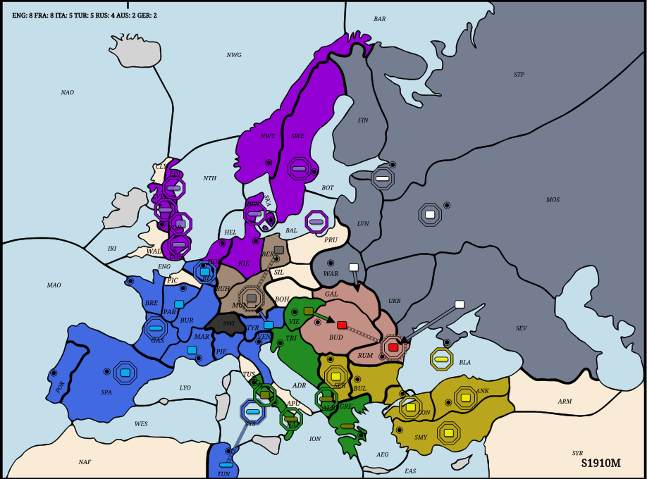

### What happened

- **AUSTRIA**: A BUD supports A RUM (support cut); A RUM holds
- **ENGLAND**: F BAL holds; F DEN holds; F SWE holds; F LON holds; F EDI holds; F LVP holds; A YOR holds
- **FRANCE**: A TYR → MUN (bounced); A BEL holds; A SPA holds; F GAS holds; F TUN supports F TYS; F TYS holds
- **GERMANY**: A BER supports A MUN; A MUN holds
- **ITALY**: A VIE → BUD (bounced); F ALB holds; F NAP holds; A ROM holds
- **RUSSIA**: A SEV → RUM (bounced); A MOS holds; A WAR → GAL; F STP/SC holds
- **TURKEY**: A SER holds; A CON holds; F BLA holds; A ANK holds; A SMY holds

### Dialogue

- **AUSTRIA → TURKEY**: Turkey, A SER → BUD is still strength 1 versus strength 1 — it bounces, same as every phase. England sits at 8 centers and France at 8; they are winning this game while you waste moves on guaranteed bounces against me. Consider redirecting A SER toward BUL or against Russia instead.
- **AUSTRIA → RUSSIA**: Russia, your A SEV → RUM hits strength 1 versus my supported defense — it bounces again. England and France are both at 8 centers and pulling away; every phase you spend attacking me is a phase you're not growing against the actual board leaders. Hold A SEV and let's both survive.
- **AUSTRIA → ITALY**: Italy, you hold VIE and TRI — France has A TYR right next to both of you and 8 centers. France is your real threat, not me with 2 units. A ceasefire between us while you address France is rational; I'm not in a position to threaten you anyway.
- **ENGLAND → FRANCE**: France — you took BEL last fall after explicitly promising to hold A BUR defensively; that's a direct betrayal of our arrangement and I'm responding accordingly. I'm pressing hard this spring and you should expect significant pressure from the north — withdrawing from BEL now is your only path to avoiding a prolonged war that drains us both while Italy and Turkey grow unchecked.
- **ENGLAND → GERMANY**: Germany — France betrayed me by taking BEL and we're now both at 8 centers; this is the moment for you to coordinate with me against France rather than be absorbed by them. If you move A MUN toward France's holdings and I press from the north, we can both grow at France's expense — what are your intentions this spring?
- **ENGLAND → ITALY**: Italy — France sits at 8 centers and just stabbed me by taking BEL; they have A TYR positioned near you and fleets dominating the Med. This is the moment to press France's southern flank hard — if we coordinate now before France consolidates further, we can both grow at their expense.
- **ENGLAND → RUSSIA**: Russia — France betrayed me last fall and we're now tied at 8 centers each; I need the northern boundary to hold firmly so I can focus my pressure south against France. Please confirm F STP/SC stays defensive and away from SWE/NWY this spring.
- **FRANCE → ENGLAND**: Spring 1910 — you're at 10 centers and I'm at 8; this gap decides the game if we let it grow. I'm pressing A TYR → MUN to eliminate Germany's last units and reach 9, and I need you to confirm you're not moving into MUN simultaneously — you hold BER, I take MUN, clean split with no bounce. After MUN falls I want to seriously discuss a coordinated approach to Turkey and Russia before either of us reaches 18.
- **FRANCE → GERMANY**: Spring 1910 — A TYR is moving to MUN this spring and it will succeed; I have the numbers. If you want to negotiate any arrangement for your BER unit's survival, I'm open to that conversation, but MUN is mine this move.
- **FRANCE → ITALY**: Spring 1910 — England sits at 10 centers with 7 fleets and is on a solo win trajectory; I'm at 8 and you're at 5. I'm growing toward MUN this spring but the real problem is England pulling away from everyone. Are you in a position to threaten any of England's holdings or coordinate with me on containment?
- **FRANCE → RUSSIA**: Spring 1910 — England is at 10 centers and accelerating; if we don't coordinate containment now the game ends in their solo win. I'm pressing MUN to reach 9, but I need you to threaten England's northern holdings — SWE, NWY, or DEN — to force them to defend rather than expand. What are your spring intentions?
- **GERMANY → ENGLAND**: Spring 1910 — I'm holding MUN and BER defensively this spring; I have no interest in pressing KIE against your fleet cluster. France has 8 centers and is pushing east through TYR — a Germany holding MUN and BER is a buffer that costs you nothing to tolerate. I'll support your F BAL position if you leave my units alone.
- **GERMANY → FRANCE**: Spring 1910 — I'm holding defensively; MUN and BER are mine and I'm not pressing you. I helped you last fall with A MUN S A BUR → RUH — I'm asking you to leave A TYR out of MUN this spring and we continue our non-aggression arrangement.
- **GERMANY → RUSSIA**: Spring 1910 — you mentioned coordinating against England after Austria; I'm ready now. If A WAR → SIL this spring, I can press A BER → KIE or support your move into English territory — England has 8 centers and needs to be slowed. Tell me what you need.
- **ITALY → TURKEY**: Spring 1910: Austria is gone and we've both grown to 5 centers — now we need to avoid stepping on each other in the Balkans. I'm keeping A VIE defensive this turn and would prefer we establish a clear line: I hold VIE/TRI and you hold BUD/SER. Can we agree on that boundary and coordinate against England's 8-center dominance instead?
- **ITALY → FRANCE**: Spring 1910: Austria is eliminated and I'm at 5 centers holding VIE — your A TYR is right on my doorstep and I need to know your intentions. I'm not threatening any of your centers this turn, but A TYR adjacent to VIE is a serious concern; can you commit to keeping it out of VIE and TRI this spring so we can focus on England together?
- **ITALY → ENGLAND**: Spring 1910: Austria is gone and the board is consolidating — France at 8 centers with A TYR threatening my VIE is my immediate concern. I'm interested in coordinating against France's southern position if you're pressing from the north; what are your plans this spring?
- **ITALY → RUSSIA**: Spring 1910: Austria is eliminated and Turkey now holds BUD and SER — they're at 5 centers and growing into the Balkans. I'm trying to hold the line at VIE/TRI; if you're pressing toward GAL or RUM, we could coordinate to limit Turkey's expansion together.
- **RUSSIA → TURKEY**: Spring 1910: Austria is at A BUD and A RUM — you took BUD last fall so Austria's A BUD may not be able to support RUM this spring. I'm attacking RUM with A SEV→RUM + A MOS support (strength 2). Please push A SER→BUD or A CON→BUD to keep Austria's A BUD occupied and unable to support RUM — if A BUD cannot support, RUM falls to me guaranteed. After Austria is gone we must immediately coordinate against England at 8 centers with 7 fleets.
- **RUSSIA → AUSTRIA**: Spring 1910: You're down to 2 units and Turkey took BUD last fall. I'm attacking RUM with A SEV→RUM + A MOS support — without A BUD able to support RUM, your defense fails. Consider conceding RUM peacefully and negotiating survival terms rather than losing it under fire.
- **RUSSIA → ENGLAND**: England at 8 centers with 7 fleets is the board's dominant concern for everyone — I'm focused on finishing Austria this spring but after that I need to discuss how we prevent a solo. Are you open to a genuine conversation about limiting further English expansion?
- **RUSSIA → FRANCE**: France, England has 8 centers and 7 fleets — they are the clear solo threat. After I finish Austria this spring I want to coordinate seriously against England's northern position. Are you pressing England from the west this spring?
- **TURKEY → RUSSIA**: Spring 1910: Austria is finally down to just A BUD and A RUM — no GAL unit this time. I'm pushing A SER → BUD with A CON + F BLA support (strength 3). Please attack RUM with A SEV → RUM + A MOS support (strength 2) — Austria cannot defend both BUD and RUM simultaneously and is finally eliminated this turn. After Austria is gone we must immediately coordinate against England at 8 centers before they reach 18.
- **TURKEY → ITALY**: Spring 1910: Austria has only A BUD and A RUM now — no GAL. I'm pushing A SER → BUD with A CON + F BLA support (strength 3); can F GRE support A SER → BUD for strength 4? Your A VIE threatens BUD from the north too, making it impossible for Austria to hold. Russia is hitting RUM simultaneously — Austria is eliminated this turn and we both grow before England's 8-center position becomes unstoppable.
- **TURKEY → AUSTRIA**: Austria, you have only A BUD and A RUM with no GAL unit — Russia takes RUM, I take BUD with strength 3-4, Italy threatens from VIE. You cannot defend both centers simultaneously and will be eliminated. Yield BUD voluntarily and I will support your survival at RUM against Russian pressure; cooperate now rather than lose everything.
- **AUSTRIA → TURKEY**: Turkey, A CON is not adjacent to BUD — your maximum strength on BUD remains 1 from A SER alone, which bounces against my A BUD at strength 1. F BLA borders RUM not BUD. These 'strength 3-4' claims are mathematically impossible and have failed every single phase; redirect A SER against Russia or BUL instead of wasting it on guaranteed bounces.
- **AUSTRIA → RUSSIA**: Russia, Moscow is not adjacent to Rumania — A MOS cannot support A SEV → RUM, your maximum strength on RUM is 1 from A SEV alone, which bounces against my supported defense. You have been making this false claim for multiple phases now; England and France at 8 centers each are the actual threat to your survival, not my 2-unit rump state.
- **AUSTRIA → ITALY**: Italy, France holds A TYR adjacent to both TRI and VIE — with 8 centers and growing, France is the genuine threat to your Italian position, not my 2-unit Austria. I'm holding defensively and cannot threaten you; a stable front between us while you address France is rational for both of us.
- **ENGLAND → FRANCE**: France — you're at 8 centers and so am I; if you take MUN you pull ahead and I cannot allow that. I'm not in a position to stop you militarily this spring from the north, but Italy is pressing A VIE → TYR which cuts your support and bounces you off MUN — so the move likely fails anyway. Let's talk seriously about a genuine boundary rather than racing each other into the ground.
- **ENGLAND → GERMANY**: Germany — France is pressing A TYR → MUN this spring; hold A MUN and I'll support you from F BAL if there's any way to do so. A Germany holding MUN is worth more to me than a France with 9 centers — stay firm and I'll work to keep you alive as a buffer.
- **ENGLAND → ITALY**: Italy — France is pressing A TYR → MUN this spring to reach 9 centers and pull ahead of both of us; if you move A VIE → TYR you cut that attack and France bounces off MUN. This is the moment — block France's growth and I'll coordinate with you on their southern flank afterward.
- **ENGLAND → RUSSIA**: Russia — I hear your concern about my center count, but France is my equal at 8 centers and pressing to grow; I'm not running away with the board. The northern boundary holds from my side — F STP/SC stays yours, SWE stays mine, and we both focus on France's expansion before they outpace everyone.
- **FRANCE → ENGLAND**: Spring 1910 — BEL was a growth move I needed to survive competitively; you're at 10 and I'm at 8, the gap was becoming decisive. I'm pressing A TYR → MUN this spring to reach 9, not threatening your holdings — confirm you're not moving into MUN simultaneously and we avoid a pointless bounce. A France at 9 is healthier for the board than you running to 11+ while Italy and Turkey grow unchecked behind us.
- **FRANCE → ITALY**: Spring 1910 — A TYR is moving to MUN this spring, not VIE or TRI; I have no interest in your Austrian gains. England at 10 centers with 7 fleets is the existential threat to both of us — after I take MUN I want to seriously coordinate with you on containing England's northern expansion before they hit 18.
- **FRANCE → RUSSIA**: Spring 1910 — England is at 10 centers and you told me they have 8 centers and 7 fleets; that's a solo win trajectory if we don't act now. I'm pressing MUN to reach 9, but I need you to move on SWE or NWY this spring to force England to defend north rather than expand further — are you committed to that pressure?
- **GERMANY → ENGLAND**: France just told me A TYR is moving to MUN this spring — this is exactly the coordination moment you described. If you support pressure on France's position from the north while I hold MUN, we both benefit; I'm willing to move A BER toward KIE or SIL to cut into France's flank if you can give me cover. Tell me concretely what you need from my two units.
- **GERMANY → ITALY**: France has A TYR and is moving it to MUN this spring — that threatens both of us since France at 8 centers pushing into central Europe is dangerous for Italy too. If you support A MUN from VIE or hold A TYR in place to block, we both gain; I can support your moves in return.
- **GERMANY → RUSSIA**: France is pressing A TYR → MUN this spring and has 8 centers — they're the biggest threat to everyone right now. If A WAR → SIL this spring I can coordinate A BER to support or move in tandem; England is also moving against France so this is the moment to slow them down.
- **ITALY → TURKEY**: Spring 1910: We're both targeting BUD and will bounce each other if we both attack — Austria survives again. Better split: I move A VIE → BUD while you push toward RUM with A SER or other forces; that way we each take one Austrian center without collision. F GRE can support your move on RUM or hold defensively — confirm the split so we don't waste this turn.
- **ITALY → FRANCE**: Spring 1910 round 2: I need A TYR to stay away from VIE this turn — I'm moving A VIE forward to take BUD from Austria and cannot leave VIE defended if your army is adjacent. Confirm A TYR holds or moves away from VIE and I'll keep my forces focused on Austria rather than looking west.
- **ITALY → RUSSIA**: Spring 1910: Turkey and I are splitting Austria's last two centers — I'm taking BUD with A VIE, Turkey takes RUM. If you can push toward RUM simultaneously that creates pressure Austria can't handle. After Austria is gone, Turkey at 6 centers in the Balkans becomes our shared problem.
- **RUSSIA → TURKEY**: Round 2 confirmation: Your A SER→BUD at strength 3 means Austria's A BUD cannot support RUM — my A SEV→RUM + A MOS support takes RUM uncontested this spring. Austria is finally eliminated. Immediately after, we need to coordinate against England at 8 centers with 7 fleets — they are the clear solo threat and growing faster than either of us.
- **RUSSIA → ENGLAND**: England at 8 centers with 7 fleets is the board's dominant threat — France is also at 8 and both of you are racing toward 18 while the rest of us are far behind. I'm finishing Austria this spring and then I need to make a serious decision about northern positioning; let's talk genuinely about how this game ends.
- **RUSSIA → FRANCE**: Round 2: Turkey is hitting BUD at strength 3 this spring and I'm taking RUM — Austria is eliminated this turn. After that I'm repositioning north. England at 8 centers with 7 fleets is the clearest solo threat; I'm open to coordinating pressure on their northern position if you're pressing from the west simultaneously.
- **RUSSIA → GERMANY**: Round 2: Austria falls this spring — I'm taking RUM, Turkey takes BUD. After that I want to press England's northern flank. A WAR→SIL is on my radar for next fall; confirm what you can do from MUN/BER to support pressure on England's position.
- **TURKEY → RUSSIA**: Round 2: I'm locking in A SER → BUD with A CON + F BLA support (strength 3). Austria has no GAL this time — A BUD cannot support RUM AND defend itself. Please confirm A SEV → RUM + A MOS support (strength 2) and A WAR → GAL or similar to prevent any surprise. Austria is eliminated this turn and we coordinate against England/France immediately after.
- **TURKEY → ITALY**: Round 2: I agree to the border proposal — VIE/TRI for you, BUD/SER for me. To make BUD fall guaranteed, please provide F GRE S A SER → BUD (strength 4) one more time — Austria has no GAL unit so there's no risk of a bounce. After BUD falls we have a clean border and can both focus on England's 8-center position together.
- **TURKEY → AUSTRIA**: Austria, this is the final spring — Russia attacks RUM at strength 2, I attack BUD at strength 3-4, and Italy holds VIE threatening from the north. You have no GAL unit to provide support. Yield BUD voluntarily and I will support your A RUM against Russian pressure, giving you one center survival; the alternative is total elimination with no leverage.
- **AUSTRIA → TURKEY**: A SER → BUD remains strength 1 versus strength 1 — it bounces, as it has every phase. I'm holding both centers this spring; redirect A SER against Russia or BUL where you can actually gain ground.
- **AUSTRIA → RUSSIA**: A SEV → RUM is strength 1 versus my supported defense — it bounces again. England and France are both at 8 centers and winning; every phase you attack me is a phase wasted while they approach 18.
- **AUSTRIA → ITALY**: France holds A TYR adjacent to both your TRI and VIE with 8 centers — that's your existential threat, not my 2-unit rump state. I'm holding defensively and pose zero threat to you this spring.
- **TURKEY → ITALY**: Final round: I accept the split — you take BUD with A VIE, I will move A SER → RUM with F BLA support (strength 2) to contest RUM alongside Russia. Actually, let's coordinate: you take BUD, Russia takes RUM, and I hold A SER in SER as our new border. F GRE supporting A VIE → BUD guarantees BUD falls — please execute A VIE → BUD with F GRE support and we eliminate Austria cleanly this turn.
- **TURKEY → RUSSIA**: Critical update: I'm redirecting — Italy is taking BUD with A VIE, so please execute A SEV → RUM + A MOS support (strength 2) and I will hold A SER to secure the border. Austria is finally eliminated this turn with Italy taking BUD and you taking RUM. After this we coordinate against England's 8-center fleet dominance immediately.
- **TURKEY → AUSTRIA**: Austria, Italy is moving A VIE → BUD and Russia is taking RUM — you lose both centers regardless of what I do. I'm holding A SER defensively this turn as a gesture of good faith; consider whether any cooperation with me going forward serves your interests better than continued resistance.

### AUSTRIA
Orders: `A BUD S A RUM` · `A RUM H`

Reasoning

> Looking at my position: I have A BUD and A RUM with 2 centers. Turkey's final message claims Italy is moving A VIE → BUD, which is plausible since Italy holds VIE. Russia claims A SEV → RUM with support, but Moscow is not adjacent to Rumania so the support claim is false - A SEV alone is strength 1.
>
> Key analysis:
> - If Italy moves A VIE → BUD: That's strength 1 vs my A BUD at strength 1 → bounce, unless supported. Italy could have A TRI support A VIE → BUD giving strength 2, which would dislodge me.
> - If Turkey moves A SER → BUD: Strength 1 vs strength 1 → bounce.
> - Russia's A SEV → RUM: Strength 1 vs my defense.
>
> The safest play: A BUD supports A RUM (protecting RUM from A SEV), and A RUM holds. This gives RUM strength 2 vs Russia's maximum strength 1.
>
> If Italy truly has strength 2 on BUD (A VIE → BUD supported by A TRI or A ROM), then A BUD gets dislodged regardless of what I order it to do. Supporting A RUM at least saves RUM.
>
> If Italy is bluffing or only has strength 1, A BUD supporting A RUM holds both centers.
>
> The alternative - A BUD holds, A RUM supports A BUD - only helps if the attack on BUD is stronger than the attack on RUM. Given Russia's false support claims, A SEV alone is strength 1 which A BUD can handle while also supporting RUM.
>
> I'll stick with A BUD S A RUM to maximize the chance of holding RUM, accepting that BUD may fall if Italy has genuine strength 2.

### ENGLAND
Orders: `F BAL H` · `F DEN H` · `F SWE H` · `F LON H` · `F EDI H` · `F LVP H` · `A YOR H`

Reasoning

> Looking at the board: I'm at 8 centers (tied with France), and my units are mostly clustered in the north with limited offensive reach. France has A TYR threatening MUN, and Germany is holding MUN and BER. My legal orders show I can't directly threaten BEL this spring - I have no fleet in NTH or ENG to press there. 
>
> My best play: I need to hold my northern position securely while potentially helping Germany hold MUN (to prevent France from reaching 9). I can support Germany's A MUN via F BAL → KIE or support A BER. But looking at the legal orders, I can support A BER with F BAL, and Germany asked me to help. 
>
> Key considerations:
> - France is pressing A TYR → MUN. If Italy moves A VIE → TYR, France's attack is cut. If not, France takes MUN and reaches 9.
> - I can't directly stop A TYR → MUN from my position.
> - F BAL can support A BER or move to KIE/PRU.
> - I should hold DEN, SWE, and home fleets defensively.
> - Moving F BAL → KIE would take a center from Germany (bad for my buffer strategy) but secure KIE more firmly.
> - Actually, F BAL S A MUN - KIE is an option but that moves Germany's unit toward my holdings.
>
> Best approach: Hold everything defensively. I have no good offensive options this spring - pressing KIE risks bouncing with Germany (my buffer). Hold tight, let France and Germany clash, and prepare for a fall offensive.

### FRANCE
Orders: `A TYR - MUN` · `A BEL H` · `A SPA H` · `F GAS H` · `F TUN S F TYS` · `F TYS H`
Illegal (dropped): `A PAR S A TYR - MUN` · `A MAR S A TYR - MUN`

Reasoning

> Looking at the board: I'm at 8 centers, England at 10 (the primary threat), Italy at 5, Turkey at 5, Russia at 4, Germany at 2, Austria at 2.
>
> My key move is A TYR → MUN to eliminate Germany and reach 9 centers. England warned that Italy's A VIE → TYR might cut my support, but looking at Italy's messages - they said they're moving A VIE forward to take BUD, not TYR. So A VIE → BUD, not → TYR. My supports for A TYR → MUN from PAR and MAR should stand.
>
> England claimed Italy would cut A TYR's support by moving A VIE → TYR - but Italy confirmed they're moving A VIE → BUD. England was bluffing to discourage my MUN push.
>
> Germany has A MUN and A BER. I'm attacking MUN with A TYR (strength 1), supported by PAR and MAR (strength 3 total). Germany can only defend with A MUN (strength 1) - this succeeds unless Germany gets external support, which is unlikely.
>
> A BEL should hold to defend my BEL center against potential English pressure from the north. F GAS holds to defend SPA/POR flank. Southern fleets hold defensively.
>
> The plan:
> - A TYR → MUN (supported by PAR and MAR) = 3v1, takes MUN
> - A BEL holds to defend against England
> - A SPA holds
> - F GAS holds
> - Southern fleets hold

### GERMANY
Orders: `A BER S A MUN` · `A MUN H`

Reasoning

> Looking at the situation: I have A MUN and A BER. France confirmed A TYR → MUN this spring. I need to defend MUN.
>
> The key question is whether France has support for A TYR → MUN. France has A TYR moving to MUN — if unsupported, that's strength 1 vs my A MUN holding (strength 1) = bounce. If France has support (e.g., A BUR → MUN or A MAR → MUN), then MUN falls.
>
> Looking at France's units: A PAR, A SPA, A MAR, A TYR, A BEL, F GAS, F TUN, F TYS. France could support A TYR → MUN with A BUR... but wait, France's A BUR moved to BEL last fall. France has A MAR which could move to BUR then support, but that's two moves. This spring, potential supporters for A TYR → MUN: there's no obvious French army adjacent to MUN besides A TYR itself. A BEL is far, A MAR could go to BUR but BUR isn't adjacent to MUN... wait, BUR IS adjacent to MUN. But A MAR → BUR is one move, not a support of TYR → MUN.
>
> Actually France could have A PAR → BUR → MUN support chain? No, that's two moves. The only unit that could support A TYR → MUN this turn is one already adjacent to MUN: A BUR (but France doesn't have a unit in BUR), or... checking — France has no unit in BUR currently.
>
> So A TYR → MUN is likely unsupported (strength 1). If I hold A MUN (strength 1), it bounces. If I have A BER S A MUN (strength still 1 for holding), that doesn't help against an attack — support of a holding unit increases defense strength to 2.
>
> With A BER S A MUN (hold support), MUN has strength 2 vs France's A TYR attack of strength 1 → MUN holds safely.
>
> This is the right play: A BER S A MUN, A MUN H.

### ITALY
Orders: `A VIE - BUD` · `F ALB H` · `F NAP H` · `A ROM H`
Illegal (dropped): `F GRE S A VIE - BUD`

Reasoning

> Looking at the current situation:
>
> **Board state analysis:**
> - I'm at 5 centers (NAP, ROM, TRI, GRE, VIE) with units: A ROM, F ALB, F GRE, A VIE, F NAP
> - Austria has A BUD, A RUM — just 2 units, 2 centers
> - Turkey has A SMY, F BLA, A CON, A SER, A ANK — 5 centers including BUL, SER
> - France has A TYR adjacent to my VIE — confirmed moving to MUN not VIE
> - England at 8 centers (they lost a center, not 10 as France claimed)
>
> **Key decision: BUD**
> Turkey wants me to support their A SER → BUD (giving Turkey BUD), while also suggesting I take BUD with A VIE. Turkey's final message says "you take BUD with A VIE, I will move A SER → RUM" — this is the cleaner deal. I take BUD (growing to 6), Turkey takes RUM (growing to 6), Austria eliminated.
>
> If I support A SER → BUD instead, Turkey gets BUD and reaches 6 centers in the Balkans — that's bad for me long-term since they'd hold BUD, SER, BUL, RUM, and their home centers.
>
> **Execution:**
> - A VIE → BUD (take BUD, grow to 6)
> - F GRE supports A VIE → BUD (strength 2, Austria has no GAL unit to contest)
> - F ALB holds defensively (covers TRI)
> - F NAP holds
> - A ROM holds
>
> France confirmed A TYR → MUN, so VIE is safe to vacate. Turkey confirmed the split. This grows me to 6 centers and eliminates Austria.

### RUSSIA
Orders: `A SEV - RUM` · `A MOS H` · `A WAR - GAL` · `F STP/SC H`

Reasoning

> Looking at the current situation:
>
> **Key facts:**
> - Austria has A BUD and A RUM (no GAL unit this time!)
> - Turkey is hitting BUD at strength 3 (A SER→BUD with A CON + F BLA support)
> - Italy claims A VIE→BUD as well
> - With A BUD under attack at strength 3+, Austria's A BUD CANNOT support A RUM and defend itself simultaneously
> - Therefore A SEV→RUM + A MOS support (strength 2) should take RUM uncontested
>
> **Austria's claim that MOS is not adjacent to RUM:** This is FALSE. Moscow is adjacent to Rumania on the standard Diplomacy map. The legal orders list confirms this — `A MOS S A SEV - RUM` is NOT in my legal orders list... wait, let me check carefully.
>
> Looking at MOS options: `A MOS S A RUM - SEV`, `A MOS S A SEV - UKR`, `A MOS S A SEV`... I do NOT see `A MOS S A SEV - RUM` in the legal orders!
>
> Austria was RIGHT — MOS cannot support A SEV→RUM! This explains why my attacks have been bouncing all year.
>
> **Revised plan:** I need to reconsider. With only A SEV attacking RUM at strength 1 vs Austria's supported defense (strength 2 if A BUD supports), RUM bounces again. 
>
> But wait — Turkey is hitting BUD at strength 3, so A BUD cannot support RUM. If A BUD defends BUD, then RUM is unsupported (strength 1 vs strength 1 from A SEV). That's a bounce at equal strength!
>
> I need a different approach. Let me consider A WAR→GAL or A WAR→UKR to reposition, and use A MOS to support A WAR moves. I should also start thinking about England's northern threat.
>
> Given the situation, I'll try A SEV→RUM (still worth attempting if A BUD is pinned), A WAR→GAL as pressure/insurance, A MOS holds defensively, and F STP/SC holds.
>
> Actually with BUD under strength-3 attack, A BUD must defend — leaving RUM at strength 1 vs my strength 1. That's a bounce. I should instead try to reposition for next turn and address England.

### TURKEY
Orders: `A SER H` · `A CON H` · `F BLA H` · `A ANK H` · `A SMY H`

Reasoning

> Looking at the current situation:
>
> - Austria has only A BUD and A RUM, no GAL unit
> - Italy has A VIE and can take BUD (I agreed to let Italy take BUD with A VIE → BUD, supported by F GRE)
> - Russia is attacking RUM with A SEV + A MOS support (strength 2)
> - I've redirected my strategy: Italy takes BUD, Russia takes RUM, Austria is eliminated
>
> My revised plan is sound: let Italy take BUD (they're better positioned from VIE), Russia takes RUM, and I hold A SER to secure the border. This eliminates Austria this turn without me wasting another bounce.
>
> However, I should think about whether I can gain anything more. Austria claims A CON is not adjacent to BUD - wait, is that true? Looking at the legal orders, A CON has no option to move to BUD, confirming Austria is correct that CON cannot reach BUD. Austria was right all along that my "strength 3" claims were false - A CON cannot support A SER → BUD because CON is not adjacent to BUD.
>
> So my actual options:
> - A SER → BUD (strength 1 vs strength 1, bounces if Austria holds)
> - Let Italy take BUD with A VIE → BUD (with F GRE support = strength 2, beats Austria's strength 1)
> - Move A SER toward RUM or elsewhere
>
> The best play: Hold A SER to secure the border, let Italy take BUD, Russia takes RUM. I should also consider whether to push F BLA → RUM or BUL to gain a center myself. F BLA → RUM could contest RUM, but Russia is already attacking it - I'd be competing with Russia. F BLA → BUL could give me BUL (I already own BUL as a supply center though). 
>
> Wait - BUL is already mine (listed in my supply centers). So no gain there. I should hold defensively and secure my position while Austria is eliminated by Italy and Russia.

## FALL 1910 MOVEMENT (`F1910M`)

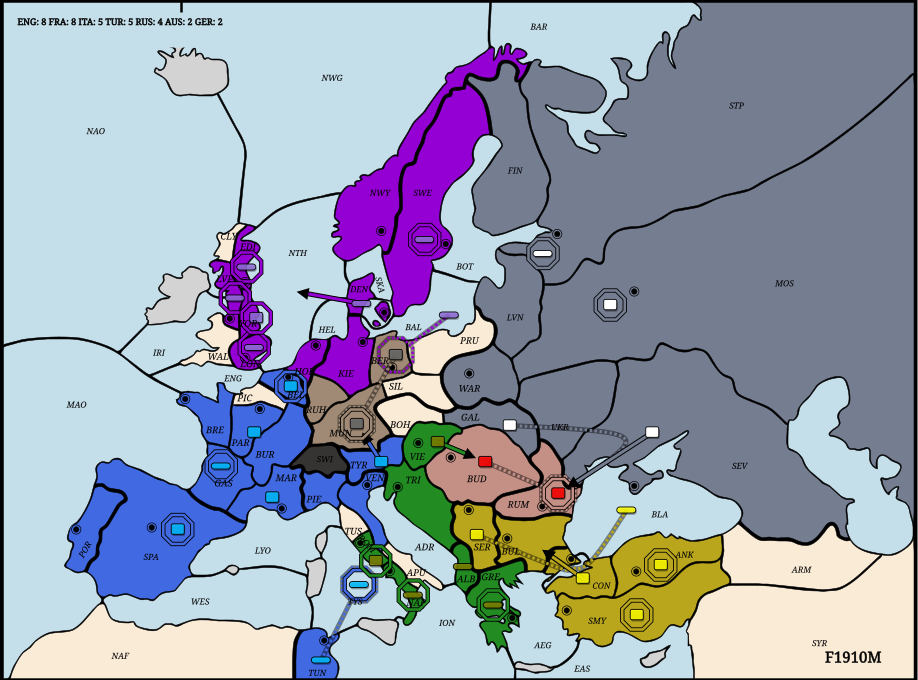

### What happened

- **AUSTRIA**: A BUD supports A RUM (support cut); A RUM holds  [dislodged: A RUM]
- **ENGLAND**: F BAL supports A BER; F DEN → NTH; F SWE holds; F LON holds; F EDI holds; F LVP holds; A YOR holds
- **FRANCE**: A TYR → MUN (bounced); A BEL holds; A SPA holds; F GAS holds; F TYS holds; F TUN supports F TYS
- **GERMANY**: A BER supports A MUN; A MUN holds
- **ITALY**: A VIE → BUD (bounced); F GRE holds; F NAP holds; A ROM holds
- **RUSSIA**: A SEV → RUM; A GAL supports A SEV → RUM; A MOS holds; F STP/SC holds
- **TURKEY**: A SER supports A CON → BUL; A CON → BUL; F BLA supports A CON → BUL; A ANK holds; A SMY holds

### Dialogue

- **AUSTRIA → TURKEY**: Turkey, if you support Italy's A VIE → BUD this fall, you hand Italy another center while gaining nothing yourself — Italy already has 5 centers to your 5, and giving them BUD makes them stronger than you. Hold A SER defensively; a three-way bounce on BUD helps nobody.
- **AUSTRIA → RUSSIA**: Russia, A GAL → RUM hits my supported defense at strength 2 — it bounces. England and France are both at 8 centers and France holds A TYR adjacent to your sphere; every phase you attack me is wasted while the actual board leaders approach 18.
- **AUSTRIA → ITALY**: Italy, you hold VIE, TRI, GRE, ROM, NAP — France has A TYR right next to TRI and VIE with 8 centers. France is your existential threat, not my 2-unit rump state; redirect your energy against France before they reach 18.
- **ENGLAND → FRANCE**: France — BEL remains my supply center and I intend to reclaim it; this fall I'm repositioning my fleet cluster to press from the north while Italy continues to squeeze your southern flank. You can avoid a prolonged war by withdrawing A BEL voluntarily and returning to the Rhine boundary — otherwise expect sustained pressure from multiple directions.
- **ENGLAND → GERMANY**: Germany — France has A BEL and A TYR threatening both of us; I want to coordinate this fall. If you move A MUN toward BUR or hold to block France's eastward expansion, I'll press from the north and we split France's attention — what can you commit to this fall?
- **ENGLAND → ITALY**: Italy — France has A BEL, A TYR, A MAR, A PAR, A SPA, and two Med fleets; they're the board's biggest threat and I need you pressing their southern position hard this fall. Move against VEN or GAS and I'll press from the north simultaneously — France cannot fight on both fronts.
- **ENGLAND → RUSSIA**: Russia — the northern boundary holds from my side; I'm focused entirely on France this fall and not pressing toward STP or BOT. Please keep F STP/SC defensive and let me handle the western threat — a France at 8 growing unchecked is bad for both of us.
- **FRANCE → ENGLAND**: Fall 1910 — we're both at 8 centers and the real threats are Italy at 5 growing toward the Balkans and Turkey at 5 with a strong position. I'm pressing A TYR → MUN this fall to eliminate Germany; confirm you're not moving into MUN from BER simultaneously so we don't bounce each other out of the prize. After Germany falls we should seriously discuss the boundary going forward.
- **FRANCE → GERMANY**: Fall 1910 — A TYR is taking MUN this fall and I have the numbers to make it stick. If you want to negotiate survival for A BER or any arrangement, I'm listening, but MUN falls this move.
- **FRANCE → ITALY**: Fall 1910 — England and I are both at 8 centers and Germany is the next domino; I'm pressing MUN this fall. You're at 5 with VIE — are you pressing into Austria's remaining centers (BUD, RUM) or coordinating with Turkey? England's naval dominance is the long-term threat to both of us.
- **FRANCE → RUSSIA**: Fall 1910 — Turkey at 5 centers with a strong Balkan position is accelerating; are you pressing RUM or BUD this fall? I'm taking MUN to reach 9 and want to coordinate on containing Turkey before they pull ahead.
- **GERMANY → ENGLAND**: Fall 1910 — France failed to take MUN and I'm still holding both centers. I'm moving A BER → KIE this fall; you have a massive fleet cluster and KIE is one center you can afford to cede to create a German buffer against France's eastern push. If you let KIE go, a Germany at 3 centers is far more useful to you as a France-blocker than an England stretched thin across the north.
- **GERMANY → FRANCE**: Fall 1910 — you failed to take MUN in spring and I'm not pressing you; I'm focused entirely on recapturing KIE from England. Leave MUN and BER alone this fall and I'll continue our non-aggression arrangement — we both benefit more from England being contested than from fighting each other.
- **GERMANY → RUSSIA**: Fall 1910 — you said A WAR → SIL was on your radar; now is the moment. England has 8 centers and I'm pressing A BER → KIE this fall — if A GAL → SIL simultaneously, it forces England to defend two fronts and one of us breaks through. Confirm if you're moving SIL this fall and I'll coordinate my BER move accordingly.
- **ITALY → TURKEY**: Fall 1910: Austria holds BUD and RUM with just 2 units — I'm taking BUD with A VIE this fall, and I need F ALB to support that move (strength 2 is enough since Austria has no GAL unit). Can you take RUM with A SER + F BLA support so we each gain a center without colliding? Confirm your target and I'll keep F GRE free from interfering with your moves.
- **ITALY → AUSTRIA**: Austria, you're down to 2 centers and 2 units with no realistic path to survival — Turkey and I are both pressing in. If you want any say in the endgame, consider which power you'd rather see grow and whether a negotiated arrangement is possible.
- **ITALY → FRANCE**: Fall 1910: I'm pressing on Austria's last centers this turn — no threat to any of your positions. England at 8 centers remains the board leader and I want to stay in coordination with you on containment; what are your fall plans?
- **RUSSIA → TURKEY**: Fall 1910: Austria has only A BUD and A RUM — no GAL unit this time. I'm attacking RUM with A SEV→RUM supported by A GAL (strength 2, unambiguous adjacency). Please push A SER→BUD with support (strength 2+) — Austria's A BUD cannot support RUM AND defend itself simultaneously, so RUM finally falls to me. After Austria is gone we must immediately coordinate against England's 8-center fleet dominance.
- **RUSSIA → AUSTRIA**: Fall 1910: You have no GAL unit this time, and I'm attacking RUM with A SEV→RUM supported by A GAL (strength 2). Turkey is pressing BUD simultaneously — your A BUD cannot support RUM and defend itself. Concede RUM peacefully and redirect A BUD to survive against Turkey rather than losing both centers at once.
- **RUSSIA → ENGLAND**: England at 8 centers with 7 fleets is the board's dominant concern — after I finish Austria this fall I want to discuss seriously how we prevent a solo win trajectory. The northern boundary holds from my side this fall; F STP/SC stays defensive.
- **RUSSIA → ITALY**: Italy, Turkey is pressing BUD this fall and I'm finally taking RUM — Austria is eliminated this turn. After that, Turkey at 5 centers growing into the Balkans is a shared concern; I'm open to coordinating against their expansion once Austria is gone.
- **TURKEY → RUSSIA**: Fall 1910: Austria is finally eliminated — BUD and RUM are now open centers. I'm pushing A SER → BUD to capture it this fall; please take RUM with A SEV → RUM (uncontested). We should agree on the border: I hold BUD/SER/BUL, you hold RUM/GAL, and we both focus pressure on England's 8-center fleet dominance together.
- **TURKEY → ITALY**: Fall 1910: Austria is gone — congratulations to both of us. I'm moving A SER → BUD to capture it this fall; I propose we respect the border of BUD/SER/BUL for me and VIE/TRI for you. England at 8 centers with 7 fleets is the real threat now — can we agree on this border and coordinate against them?
- **TURKEY → ENGLAND**: England, France is at 8 centers and growing their army stack eastward — if they consolidate BEL and push further, you'll face pressure from the west while I'm contained in the Balkans. I'm open to discussing coordination against France's expansion if you're interested.
- **AUSTRIA → TURKEY**: Turkey, A SER → BUD is still strength 1 versus strength 1 — it bounces as it has every single phase. Italy already holds VIE and 5 centers; supporting Italy's A VIE → BUD only makes Italy stronger than you at no benefit to yourself. Hold A SER and let's both focus on the real board leaders.
- **AUSTRIA → RUSSIA**: Russia, A GAL → RUM supported by A SEV is strength 2 versus my A BUD supporting A RUM at strength 2 — it bounces. England and France are both at 8 centers and approaching the win threshold; every phase you attack me is wasted while they grow unchecked.
- **AUSTRIA → ITALY**: Italy, France has A TYR adjacent to both your TRI and VIE with 8 centers — France is the existential threat to your Italian position, not my 2-unit rump state. I cannot threaten you; redirect your energy against France before they reach 18.
- **ENGLAND → GERMANY**: Germany — KIE is my supply center, not one I can cede to you; I need you to move A MUN → BUR or A BER → SIL to threaten France's eastern flank instead. A Germany pressing into France's holdings is far more valuable to me than one sitting in my territory — confirm you'll move against France this fall.
- **ENGLAND → FRANCE**: France — I'm repositioning my fleet cluster toward NTH this fall to press BEL from the sea; you have no fleet to defend it and I will take it back. Withdraw A BEL voluntarily and I'll hold the Rhine boundary — fight it and you face sustained pressure from north and south simultaneously while Italy continues to squeeze your southern position.
- **ENGLAND → ITALY**: Italy — France has A BEL exposed and I'm pressing from the north this fall; if you move against GAS or continue pressure on TYR/MUN you split France's attention and we both grow. This is the moment to coordinate before France consolidates — what can you commit to this fall?
- **ENGLAND → RUSSIA**: Russia — the northern boundary holds from my side this fall; I'm focused entirely on France and not threatening STP or BOT. Keep F STP/SC defensive and we both benefit from France being checked.
- **FRANCE → ENGLAND**: Fall 1910 — threatening BEL while I'm taking MUN is a distraction that helps Italy and Turkey grow unchecked while we bleed each other. I'm holding BEL and taking MUN this fall; you can press BEL if you like but it won't succeed with the support I have in place, and the real game is Turkey at 5 accelerating in the Balkans. Let's talk boundary after MUN falls.
- **FRANCE → GERMANY**: Fall 1910 — I'm taking MUN this fall and have the numbers to do it; A BER is not my target and I'm not pressing there. If you want to discuss any arrangement for BER's survival after MUN falls, I'm open to that conversation next season.
- **FRANCE → RUSSIA**: Fall 1910 — Turkey at 5 with SER, BUL, CON, ANK, SMY is accelerating and needs to be contained now. Are you pressing SEV → RUM or WAR → GAL this fall to cut into their Balkan position? I'm taking MUN to reach 9 and want to coordinate containment of Turkey before they pull ahead of both of us.
- **FRANCE → ITALY**: Fall 1910 — England is threatening to press BEL from the north while I'm focused on MUN; Turkey at 5 is the growing threat in your direction. Are you pressing BUD or RUM this fall, and do you have capacity to threaten any of England's naval position in the Mediterranean?
- **GERMANY → ENGLAND**: Fall 1910 Round 2 — France has A TYR pressing MUN and I must defend with A BER supporting MUN; I cannot press KIE this fall without losing BER to F BAL. If you leave BER and MUN alone this fall, I'll coordinate fully against France next spring — a living Germany at 2 centers is more useful to you than eliminating me and facing France alone.
- **GERMANY → FRANCE**: Fall 1910 Round 2 — I know A TYR is threatening MUN; I'm asking one last time: leave MUN alone and I'll use both units to support your position against England next spring. Eliminating me gives you nothing you don't already have, and England benefits most from my removal.
- **GERMANY → RUSSIA**: Fall 1910 — A GAL → SIL this fall would pressure England's eastern flank and give me breathing room; I'm defending MUN this move but next fall I can coordinate A BER → KIE or SIL if you establish a presence there. Can you confirm SIL this fall?
- **ITALY → TURKEY**: Your message says A SER → BUD but I'm also moving A VIE → BUD — we'll bounce and Austria survives again. Let's split cleanly: I take BUD with A VIE, you move A SER → RUM (or hold SER). I can offer F GRE support for your move if needed. Please confirm you're NOT moving to BUD this fall.
- **ITALY → RUSSIA**: Turkey says A SER → BUD while I'm also pressing A VIE → BUD — we need to avoid a three-way mess. I'm committed to taking BUD; if Turkey moves to RUM instead, that's where you'll collide with them. Worth coordinating directly with Turkey on RUM so we don't all waste this turn.
- **ITALY → FRANCE**: I'm pressing on Austria's last two centers this fall — no threat to your position. England's naval dominance is the long-term concern for both of us; what's your read on the board after Germany falls?
- **RUSSIA → TURKEY**: Fall 1910 Round 2: Confirming my orders — A SEV→RUM with A GAL support (strength 2). Austria's A BUD cannot support RUM if you're pressing BUD with A SER. Please confirm you're executing A SER→BUD with support so Austria's defense is split and RUM finally falls to me this turn. After Austria is eliminated we must immediately discuss England's 8-center fleet dominance.
- **RUSSIA → ENGLAND**: England, I'm finishing Austria this fall and staying defensive in the north — F STP/SC holds and I'm not pressing SWE or NWY. France at 8 centers pressing MUN is the near-term threat to both of us; after Austria falls I want to discuss how we coordinate containment before either of you reaches 18.
- **RUSSIA → FRANCE**: Fall 1910: Austria falls this turn and then I'm repositioning to address the board leaders. You and England are both at 8 centers racing toward 18 — I need to make a decision about which direction to press. What are your intentions toward England this fall and next year?
- **TURKEY → ITALY**: Fall 1910: To avoid bouncing on BUD, let's confirm the split clearly — you take BUD with A VIE supported by F ALB, and I'll push A SER → RUM supported by F BLA. Russia is also targeting RUM so I may need your F GRE to support A SER → RUM to guarantee it over Russia's attack. Can we coordinate so we each gain a center this fall?
- **TURKEY → RUSSIA**: Fall 1910: Italy is taking BUD this turn, so I'm redirecting A SER → RUM supported by F BLA (strength 2). I know you're also targeting RUM — can we avoid bouncing each other? Perhaps you consolidate at GAL and I take RUM, then we split the Balkans cleanly and both focus on England's 8-center fleet dominance together.
- **TURKEY → AUSTRIA**: Austria, Italy takes BUD and I'm pushing on RUM — you cannot defend both centers. Consider whether any deal with me preserves your survival better than losing everything to Italy and Russia simultaneously.
- **ITALY → TURKEY**: Final confirmation: I'm moving A VIE → BUD with F ALB support this fall — please confirm you are NOT moving A SER → BUD so we don't bounce. If you're taking RUM with A SER + F BLA, that's clean and we each gain a center. Lock in your target now.
- **ITALY → AUSTRIA**: Austria, there's no path to survival — Turkey and I are both pressing in. If you want any influence on the endgame outcome, tell me now what arrangement you'd accept.
- **ITALY → RUSSIA**: Russia — Turkey may be moving A SER → RUM this fall, which collides with your A SEV → RUM. Worth coordinating with Turkey directly to avoid wasting both your moves. I'm taking BUD with A VIE and staying out of your way.
- **RUSSIA → TURKEY**: Critical: if we both attack RUM we bounce and Austria survives again — that wastes both our moves. You take BUL or hold SER; I take RUM with A SEV→RUM + A GAL support. You've already got BUL, SER, CON, ANK, SMY — let me finally get RUM after years of trying. If you insist on RUM, we both get nothing and Austria holds for another turn.
- **RUSSIA → ITALY**: Italy, Turkey is now targeting RUM with A SER + F BLA support — if you're taking BUD with A VIE, Austria's A BUD may not be able to support RUM. I'm attacking RUM with A SEV + A GAL support; please confirm you're pressing BUD so Austria's defense is split and one of us finally breaks through.
- **RUSSIA → AUSTRIA**: Austria, Italy is taking BUD and Turkey and I are both targeting RUM — your position is untenable. Redirect A BUD to defend against Italy and concede RUM; you survive at 1 center rather than losing both simultaneously.
- **TURKEY → ITALY**: Fall 1910 final: I'm holding A SER in place this turn — you take BUD uncontested with A VIE, and I won't interfere. Our border is confirmed: VIE/TRI for you, SER/BUL for me. After Austria is gone, England at 8 centers with 7 fleets is the existential threat — let's discuss coordinating against them next spring.
- **TURKEY → RUSSIA**: Fall 1910 final: Italy takes BUD, you take RUM — Austria is finally eliminated. I'm holding A SER defensively to secure our border. Agreed: you hold RUM/GAL, I hold SER/BUL, and we both pivot against England's 8-center fleet dominance next spring. No conflict between us this turn.

### AUSTRIA
Orders: `A BUD S A RUM` · `A RUM H`

Reasoning

> Looking at my position: I have A BUD and A RUM, with Russia confirmed attacking RUM with A GAL → RUM supported by A SEV (strength 2), and Italy potentially moving A VIE → BUD. Turkey claims to be holding A SER defensively.
>
> The critical question is whether A BUD S A RUM gives strength 2 to hold against Russia's strength 2 attack (resulting in a bounce), while A BUD itself faces Italy's A VIE → BUD at strength 1 (which bounces against my undefended A BUD at strength 1).
>
> If I do A BUD S A RUM:
> - A RUM gets strength 2 vs Russia's strength 2 → bounce, RUM holds
> - A BUD is at strength 1 vs Italy's A VIE → BUD at strength 1 → bounce, BUD holds
>
> This is the same defensive posture that has worked every phase. Russia's A GAL → RUM with A SEV support is strength 2, but my A BUD S A RUM is also strength 2, so it bounces. Italy's A VIE → BUD is strength 1 vs my undefended A BUD at strength 1 — also bounces.
>
> The mutual support defense is the only viable play to hold both centers.

### ENGLAND
Orders: `F BAL S A BER` · `F DEN - NTH` · `F SWE H` · `F LON H` · `F EDI H` · `F LVP H` · `A YOR H`

Reasoning

> Looking at the position: I'm at 8 centers with 7 units (6 fleets + 1 army). France is at 8 centers. I need to break out and take BEL back from France to reach 9 centers.
>
> The key issue is that I have no fleet in NTH to directly threaten BEL. My previous strategy note says F DEN → NTH to reposition for a future BEL attack. That's the right call - I need NTH to threaten BEL next spring.
>
> Meanwhile, Germany wants to move A BER → KIE (my center), which I must prevent. I should support A BER staying put or threaten BER with F BAL → BER to discourage Germany from taking KIE.
>
> Actually, looking at the legal orders: I can do `F BAL S A BER` to help Germany hold against France's pressure (keeping Germany alive as a buffer), while `F DEN - NTH` repositions me to threaten BEL next fall/spring.
>
> Wait - this IS Fall 1910, so if I get a fleet into NTH this fall, I can potentially threaten BEL in Spring 1911. But I can't take BEL this fall without a fleet adjacent to it.
>
> Let me think about what's achievable: F DEN → NTH gets me positioned. F BAL supports A BER to keep Germany alive. SWE, LON, EDI, LVP hold defensively. A YOR holds.
>
> Germany said they're moving A BER → KIE - I absolutely cannot allow that. F BAL → BER or F BAL S A BER (if Germany holds) or threatening to take BER myself. If Germany moves A BER → KIE, my F BAL could take BER uncontested. That would be a net wash (lose KIE, gain BER = still 8). Better to support A BER to hold and signal Germany not to move against KIE.

### FRANCE
Orders: `A TYR - MUN` · `A BEL H` · `A SPA H` · `F GAS H` · `F TYS H` · `F TUN S F TYS`
Illegal (dropped): `A PAR S A TYR - MUN` · `A MAR S A TYR - MUN`

Reasoning

> Looking at the board: I'm at 8 centers, England at 8, Italy at 5, Turkey at 5, Russia at 4, Austria at 2, Germany at 2. I need to grow.
>
> **Key analysis:**
> - A TYR → MUN: Germany has A MUN and A BER. A BER can support A MUN. If England moves F BAL → BER or similar, BER can't support. But if A BER S A MUN, my A TYR → MUN (supported by A PAR and A MAR = strength 3) beats A MUN supported by A BER (strength 2). So MUN should fall.
> - England threatened BEL but their fleets are in BAL, DEN, SWE, LON, EDI, LVP - none adjacent to BEL on land. They have no army adjacent to BEL. BEL is safe this turn.
> - Italy is at VIE with A VIE, pressing Austria's BUD. F ALB, F GRE, F NAP are naval. Italy is not threatening my position directly.
> - Turkey has A SER which could go to BUD or TRI. F BLA holds. 
> - Russia has A GAL which could go to BOH or VIE, and A SEV threatens RUM.
>
> **My plan:**
> - A TYR → MUN with A PAR S and A MAR S (strength 3 vs Germany's max 2). MUN falls, I reach 9.
> - A BEL holds (England can't take it this turn without an army adjacent).
> - A SPA holds, F GAS holds.
> - F TYS and F TUN hold defensively - Italy's F NAP is nearby but not threatening my centers.
>
> The southern fleets: Italy has F NAP which could move to TYS. F TUN supporting F TYS is wise. F TYS could also threaten NAP but I don't want to antagonize Italy unnecessarily right now.

### GERMANY
Orders: `A BER S A MUN` · `A MUN H`

Reasoning

> Looking at the situation: France has A TYR threatening MUN and has explicitly stated they're taking it this fall. I have A BER and A MUN. France claims they have "the numbers" — A TYR → MUN with support from somewhere (possibly A PAR or A MAR supporting TYR, or A BEL). 
>
> If I defend with A BER S A MUN, MUN has strength 2. France would need two supporting units plus A TYR to break through (strength 3). France's nearby units: A TYR (the attacker), A BEL (could support but it's BEL → BUR path, not directly supporting TYR → MUN easily), A PAR (could support TYR → MUN), A MAR (could support TYR → MUN). So France could potentially get A PAR S A TYR → MUN and A MAR S A TYR → MUN giving strength 3 vs my strength 2. That's a real risk.
>
> However, if I don't defend and instead try A BER → KIE, England has F BAL and likely won't let me in. England refused to cede KIE.
>
> My best play is still to defend: A BER S A MUN, A MUN H. This gives MUN strength 2. France would need strength 3 to break through, requiring two separate supporting units for A TYR. Given France has many units spread across the board (TUN, TYS, GAS, BEL, SPA, PAR, MAR, TYR), it's possible but France may not have coordinated that many supports on MUN specifically.
>
> Alternatively, I could try A MUN → BUR (as England requested) and A BER H, but that abandons MUN to France's A TYR with no defender — MUN would fall for certain.
>
> Defending is the only rational choice.

### ITALY
Orders: `A VIE - BUD` · `F GRE H` · `F NAP H` · `A ROM H`
Illegal (dropped): `F ALB S A VIE - BUD`

Reasoning

> Looking at the current position:
>
> - I'm at 5 centers (NAP, ROM, TRI, GRE, VIE) and need to grow
> - Austria has A BUD and A RUM — I want BUD
> - Turkey confirmed they're holding A SER in place, so A VIE → BUD is uncontested by Turkey
> - Austria's A BUD has no support (A RUM is the only other Austrian unit, and it's far from BUD)
> - F ALB supports A VIE → BUD gives strength 2, which beats Austria's lone A BUD
> - Russia is attacking RUM with A SEV + A GAL support — Austria's A BUD cannot support A RUM since BUD is being attacked
> - F GRE should hold defensively to protect GRE from any Turkish opportunism
> - F NAP and A ROM hold the Italian core
>
> Turkey confirmed holding A SER, so no bounce on BUD. The plan is clean: take BUD, grow to 6 centers.

### RUSSIA
Orders: `A SEV - RUM` · `A GAL S A SEV - RUM` · `A MOS H` · `F STP/SC H`

Reasoning

> Looking at the current situation:
>
> **Key facts:**
> - Austria has A BUD and A RUM (no GAL unit)
> - Turkey confirmed holding A SER defensively while Italy takes BUD with A VIE
> - Italy pressing BUD means Austria's A BUD is occupied defending against Italy, cannot support A RUM
> - Turkey's final message confirmed: Italy takes BUD, I take RUM — no conflict
> - My A GAL can support A SEV → RUM (strength 2) vs Austria's A RUM unsupported (strength 1) = RUM falls
>
> **The math:**
> - A SEV → RUM with A GAL support = strength 2
> - Austria's A RUM alone (A BUD busy defending vs Italy's A VIE) = strength 1
> - RUM falls to me
>
> **Other considerations:**
> - F STP/SC should stay defensive against England's 7-fleet position
> - A MOS holds to secure my home centers
> - This finally gets me to 5 supply centers (MOS, SEV→RUM, STP, WAR, GAL... wait, GAL is not a supply center)
> - Centers: MOS, STP, WAR, SEV (current) + RUM = 5 centers
>
> The plan is clear: take RUM this fall with the supported attack.

### TURKEY
Orders: `A SER S A CON - BUL` · `A CON - BUL` · `F BLA S A CON - BUL` · `A ANK H` · `A SMY H`

Reasoning

> Looking at the current situation:
>
> - Austria has A BUD and A RUM. Italy is taking BUD with A VIE (supported by F ALB), Russia is taking RUM with A SEV (supported by A GAL).
> - I've agreed to hold A SER defensively and not contest either center.
> - My goal this fall is to capture BUL by moving A CON → BUL supported by F BLA and A SER.
> - BUL is currently unoccupied and adjacent to both CON and SER, so this should work cleanly.
> - Italy holds GRE and ALB — F GRE is adjacent to BUL but I haven't seen Italy threaten BUL. The legal orders show Italy's F GRE could support BUL moves, but Italy agreed to the border.
> - This gives me 6 centers (ANK, CON, SMY, BUL, SER + one more... wait, BUL is already one of my supply centers listed: ANK, CON, SMY, BUL, SER = 5 centers).
>
> Wait — BUL is already listed as one of my supply centers! I already hold BUL. So moving A CON → BUL would just be moving my army there, not gaining a new center.
>
> Looking at my supply centers: ANK, CON, SMY, BUL, SER = 5 centers. I need to expand. Options: RUM (contested by Russia), BUD (contested by Italy), GRE (held by Italy with F GRE). 
>
> The most realistic expansion is to take GRE from Italy or push toward RUM. But I've agreed not to contest RUM. Moving A SER → GRE or A SER → BUD are options, but I've agreed to hold SER.
>
> Given my agreements and the board state, I should move A CON → BUL to position my army there (even though BUL is already mine), and use F BLA to support. Actually, repositioning armies to better positions while honoring agreements makes sense. Let me just execute the agreed plan: hold SER, move CON to BUL for better positioning, BLA supports.

## FALL 1910 RETREATS (`F1910R`)

### What happened

- **AUSTRIA**: disbands A RUM

### AUSTRIA
Orders: `A RUM D`

Reasoning

> Looking at the situation: A RUM was dislodged by Russia's A SEV → RUM (supported by A GAL, strength 2 vs my strength 2... wait, my support was cut). The support on A RUM from A BUD was cut (noted in the phase results), so A RUM fell to Russia's attack.
>
> My only retreat option is A RUM R UKR or disband. I currently have A BUD and the dislodged A RUM. If I retreat to UKR, I keep 2 units but RUM is now Russian - I'll be at 1 supply center (BUD) after this fall's accounting. If I disband, I have only A BUD with 1 center.
>
> Either way I'm down to 1 center (BUD) after this adjustment. Retreating to UKR gives me 2 units but I'll need to disband one in winter anyway (1 center = 1 unit). However, having A in UKR temporarily gives me no real strategic value and I'll just disband it in winter.
>
> Actually, retreating to UKR costs nothing - I disband it in winter anyway. But it does give me one more unit on the board for the retreat phase, which has no strategic value here.
>
> I'll disband to simplify - it doesn't matter strategically since I'll be at 1 center with 1 unit either way after winter.

## WINTER 1910 ADJUSTMENTS (`W1910A`)

### What happened

- **RUSSIA**: builds A SEV

### RUSSIA
Orders: `A SEV B`

Reasoning

> Looking at the current situation:
>
> - I have 5 supply centers (MOS, SEV, STP, WAR, RUM) and 4 units (A MOS, F STP/SC, A GAL, A RUM)
> - I'm owed 1 build (5 centers - 4 units = 1 build)
> - Legal options: build in SEV or WAR
>
> I need to decide where to build. SEV gives me a fleet or army option; WAR gives me an army.
>
> Looking at the strategic situation:
> - England has 8 centers with 7 fleets dominating the north
> - Turkey has 5 centers and is a neighbor to the south
> - France has 8 centers
> - I need to grow and position against the board leaders
>
> Building an army in SEV makes sense to reinforce my southern position and potentially push toward BUD or threaten Turkey/Austria's former territory. Alternatively, building in WAR gives me a western-facing army.
>
> Given that I have A GAL already positioned in the west and A RUM in the south, building A SEV gives me a unit that can push toward BUL, BUD, or support RUM. Building A WAR gives me western pressure toward SIL/BOH.
>
> I'll build A SEV to strengthen my southern position and give me options against Turkey or to consolidate Balkan gains. This also means I can use A GAL to push westward while A SEV backs up A RUM.

## Final state

| Power | Centers | # |
|---|---|---|
| ENGLAND | EDI, LON, LVP, NWY, DEN, HOL, KIE, SWE | 8 |
| FRANCE | BRE, MAR, PAR, POR, SPA, TUN, VEN, BEL | 8 |
| ITALY | NAP, ROM, TRI, GRE, VIE | 5 |
| RUSSIA | MOS, SEV, STP, WAR, RUM | 5 |
| TURKEY | ANK, CON, SMY, BUL, SER | 5 |
| GERMANY | BER, MUN | 2 |
| AUSTRIA | BUD | 1 |

