# Diplomacy A2A — Run `20260601T214429Z`

- **Model**: `claude-sonnet-4-6`
- **Years targeted**: 10
- **Started**: 2026-06-01T21:44:29+00:00
- **Ended**: 2026-06-01T22:15:42+00:00
- **Phases played**: 33
- **Tokens**: input=0, output=0, cache_create=0, cache_read=0
- **Approx cost (USD)**: $24.0344

## Personas

- **AUSTRIA** — You are a competent Diplomacy player pursuing your own interest. You form alliances when they advance your goals and honor them while they serve you. You defend solid positions and take calculated risks when the payoff justifies it. You read other powers' intentions from what they say and do, and you recognize that lies are sometimes worth their cost while habitual betrayal makes you unpartnerable.
- **ENGLAND** — You are a competent Diplomacy player pursuing your own interest. You form alliances when they advance your goals and honor them while they serve you. You defend solid positions and take calculated risks when the payoff justifies it. You read other powers' intentions from what they say and do, and you recognize that lies are sometimes worth their cost while habitual betrayal makes you unpartnerable.
- **FRANCE** — You are a competent Diplomacy player pursuing your own interest. You form alliances when they advance your goals and honor them while they serve you. You defend solid positions and take calculated risks when the payoff justifies it. You read other powers' intentions from what they say and do, and you recognize that lies are sometimes worth their cost while habitual betrayal makes you unpartnerable.
- **GERMANY** — You are a competent Diplomacy player pursuing your own interest. You form alliances when they advance your goals and honor them while they serve you. You defend solid positions and take calculated risks when the payoff justifies it. You read other powers' intentions from what they say and do, and you recognize that lies are sometimes worth their cost while habitual betrayal makes you unpartnerable.
- **ITALY** — You are a competent Diplomacy player pursuing your own interest. You form alliances when they advance your goals and honor them while they serve you. You defend solid positions and take calculated risks when the payoff justifies it. You read other powers' intentions from what they say and do, and you recognize that lies are sometimes worth their cost while habitual betrayal makes you unpartnerable.
- **RUSSIA** — You are a competent Diplomacy player pursuing your own interest. You form alliances when they advance your goals and honor them while they serve you. You defend solid positions and take calculated risks when the payoff justifies it. You read other powers' intentions from what they say and do, and you recognize that lies are sometimes worth their cost while habitual betrayal makes you unpartnerable.
- **TURKEY** — You are a competent Diplomacy player pursuing your own interest. You form alliances when they advance your goals and honor them while they serve you. You defend solid positions and take calculated risks when the payoff justifies it. You read other powers' intentions from what they say and do, and you recognize that lies are sometimes worth their cost while habitual betrayal makes you unpartnerable.

## SPRING 1901 MOVEMENT (`S1901M`)

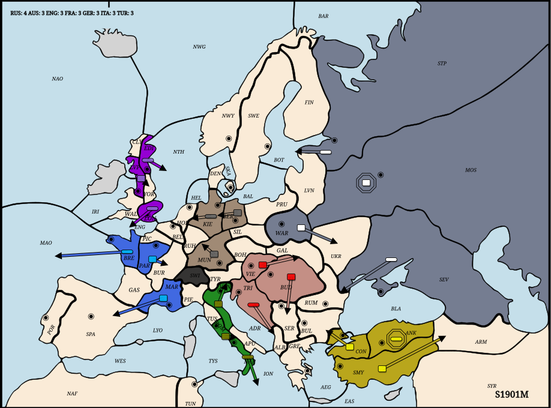

### What happened

- **AUSTRIA**: A BUD → SER; F TRI → ALB; A VIE → GAL
- **ENGLAND**: F EDI → NTH; F LON → ENG; A LVP → YOR
- **FRANCE**: A PAR → BUR; A MAR → SPA; F BRE → MAO
- **GERMANY**: F KIE → HOL; A BER → KIE; A MUN → RUH
- **ITALY**: F NAP → ION; A ROM → APU; A VEN → TYR
- **RUSSIA**: F STP/SC → BOT; F SEV → RUM; A WAR → UKR; A MOS holds
- **TURKEY**: A CON → BUL; F ANK holds; A SMY → ARM

### Dialogue

- **AUSTRIA → RUSSIA**: Austria proposes a friendly opening: I'll keep my armies out of Galicia this spring if you keep yours out as well — let's leave that province as a buffer. My focus is on Serbia and the western Balkans; I have no designs on Rumania if you want to move there from Sevastopol. A coordinated approach against Turkey could benefit us both in the long run.
- **AUSTRIA → ITALY**: I'd like to keep things friendly between us this year — Trieste is Austrian and I intend to keep it, but I have no interest in moving against Venice or Rome. Can we agree to respect each other's home centers and perhaps coordinate in the Balkans? Serbia and Greece are both worth discussing.
- **AUSTRIA → TURKEY**: Austria hopes for a peaceful opening between our powers — there's room for both of us to grow in the Balkans without stepping on each other's toes. I'm moving toward Serbia; what are your intentions regarding Bulgaria and Greece? Perhaps we can divide the region amicably.
- **ENGLAND → GERMANY**: I'd like to propose a friendly arrangement for 1901: I'll focus on Norway and the North Sea, leaving Holland and Belgium to you to contest as you see fit. In return, I'd ask that you keep your fleet out of the North Sea this year — there's room for both of us to grow without stepping on each other. Interested in coordinating?
- **ENGLAND → FRANCE**: I want to open with transparency: I have no hostile intentions toward France this year and would prefer we both focus on expansion elsewhere. I'm thinking of moving toward Scandinavia, which keeps me well away from your interests — can we agree to stay out of each other's way in 1901?
- **ENGLAND → RUSSIA**: I'd like to coordinate over Scandinavia: I intend to move on Norway, and I'm happy to leave Sweden to you without contest. A quick agreement here benefits us both and lets us focus energy elsewhere — are you open to this?
- **FRANCE → ENGLAND**: I'd like to propose a friendly opening between us - I have no interest in the English Channel this turn and plan to focus westward toward Iberia. If you're heading to the North Sea and Norway, we shouldn't have any conflicts. Can we agree to stay out of each other's way?
- **FRANCE → GERMANY**: I think we can both benefit from a clear division early on - I'm focused on Spain and Portugal, not Belgium, so I won't be pushing into your natural sphere. Would you consider leaving Burgundy open as a buffer between us, and we can coordinate if England becomes aggressive?
- **FRANCE → ITALY**: I want to make sure we don't start off on the wrong foot - I have no designs on Piedmont or northern Italy this turn, and I hope you feel similarly about Marseilles. Let's keep the Alps as a friendly border and both focus on expansion elsewhere.
- **GERMANY → ENGLAND**: I'd like to coordinate in the north this year — I'm planning to move into Holland and Denmark, leaving Sweden and Norway in your sphere. A non-aggression arrangement between us would benefit us both while France and Russia are the real threats to watch.
- **GERMANY → FRANCE**: I have no designs on your western territories — my focus is purely on the northern neutrals (Holland, Denmark). I'd welcome a quiet border between us so we can both grow without friction this year.
- **GERMANY → RUSSIA**: I'm focused entirely on the west and north this year, so I have no interest in moving east. A quiet border between us benefits both — I won't push into Silesia or Prussia if you stay clear of the German sphere.
- **GERMANY → AUSTRIA**: I think we have compatible interests this year — I'm moving north and west, leaving the Balkans entirely to you. If you're open to it, I'd welcome a loose understanding that we stay out of each other's way while we both grow.
- **ITALY → AUSTRIA**: I'd like to propose a friendly arrangement for 1901. My plan is to move toward Greece and Tunis, leaving Serbia to you — I won't contest your Balkan gains if you stay out of Trieste and let Venice breathe. Can we agree on a division that keeps us both growing?
- **ITALY → FRANCE**: I have no designs on Marseilles or your western centers — my focus is entirely on the Mediterranean south and the Balkans. A quiet border between us in Piedmont suits me fine; I hope you feel the same.
- **ITALY → TURKEY**: I think we should talk before we stumble into conflict in the Aegean. I'm moving toward Tunis and Greece — what are your intentions in the eastern Med? There may be room for us both to expand without stepping on each other.
- **RUSSIA → AUSTRIA**: I'd like to keep things stable between us this year. I'm planning to move into Romania with my Sevastopol fleet, and I have no designs on Galicia or the Balkans in 1901 — I'd appreciate the same courtesy from you. Can we agree to stay out of each other's way while we both expand?
- **RUSSIA → TURKEY**: I think we can both gain more by cooperating early than by fighting over the Black Sea. I'm open to discussing a division of the Balkans that works for both of us — Romania for me, Bulgaria for you, and we leave each other's fleets alone. What are your thoughts?
- **RUSSIA → GERMANY**: Happy to stay out of each other's way in the north. I'm focused on Scandinavia and the south, so Sweden and Norway are my targets — I have no interest in Prussia or Silesia. Let's not create unnecessary friction between us.
- **TURKEY → RUSSIA**: Greetings from Constantinople! I'd like to propose we avoid an early conflict — the Black Sea is a flashpoint we can sidestep if we're both sensible. I'm open to leaving BLA neutral in 1901 if you'll focus your southern fleet elsewhere. Let me know your thoughts.
- **TURKEY → AUSTRIA**: I think we can coexist profitably in the Balkans if we coordinate rather than collide. I intend to move into Bulgaria this spring — I'd appreciate knowing your plans for Serbia and Greece so we don't step on each other. A clear division of the Balkans benefits us both against a potentially aggressive Russia.
- **TURKEY → ITALY**: I see no reason for conflict between us — our natural expansion zones point in different directions. I'm focused on the Balkans and Black Sea region, leaving the western Mediterranean and North Africa to you. Let's stay out of each other's way this year.
- **AUSTRIA → RUSSIA**: Good — we're aligned. I'm moving A BUD to Serbia and F TRI to Albania, with A VIE to Galicia as a buffer (not a threat to you). Since you're moving into Rumania from Sevastopol, Galicia simply sits between us as neutral ground — I have no intention of pushing further east. Let's confirm this arrangement holds.
- **AUSTRIA → ITALY**: Agreed on the division — Serbia is mine, and I won't contest Tunis. On Greece: I'm moving F TRI to Albania this spring to position for Fall, so Greece will be reachable by both of us. Can we agree you take Greece in Fall while I push toward the eastern Balkans? I'd rather coordinate than collide there.
- **AUSTRIA → TURKEY**: Bulgaria is yours — I won't contest it. I'm taking Serbia and positioning in Albania. Let's keep a clear line: Bulgaria and Constantinople are your sphere, Serbia and the western Balkans are mine. A stable border between us lets both of us focus on expansion elsewhere.
- **ENGLAND → FRANCE**: Good, we're aligned — I'll be heading to the North Sea and Norway, no interest in the Channel. Let's both keep to our word this year and we can revisit cooperation in 1902.
- **ENGLAND → GERMANY**: Glad we're on the same page. I'll take NTH and aim for Norway; you take Holland and Denmark. Let's make sure neither of us gets in the other's way — I won't contest HOL or DEN if you stay clear of NTH.
- **ENGLAND → RUSSIA**: I'm moving on Norway this year and would prefer we don't clash there. Sweden is yours if you want it — I have no units positioned to contest it. A quiet Scandinavia split benefits us both.
- **FRANCE → ENGLAND**: Good, we're aligned. I'm moving toward Iberia this turn, so no conflict with your northern moves. One thing worth watching: if Germany grows too strong in the north, we may both want to coordinate a response — keep that in mind as you approach Scandinavia.
- **FRANCE → GERMANY**: Thanks for the clarity. I'll be moving into Burgundy this turn as a stepping stone — not threatening you, just positioning toward Belgium. If you're taking Holland, we could potentially both benefit from Belgium being divided or one of us taking it with the other's support. What's your thinking on Belgium?
- **GERMANY → ENGLAND**: Confirmed — F KIE moves to Holland this turn, leaving the North Sea entirely to you. I'd suggest we both watch Russia's fleet in STP carefully next year, as it could threaten either of us in the north. Let's stay aligned.
- **GERMANY → FRANCE**: Good — I'm moving into Holland this turn and staying well clear of Burgundy. I'd welcome the same quiet border next fall. If England starts pressing toward Belgium, we might find common cause there.
- **GERMANY → RUSSIA**: One clarification: you mentioned Sweden and Norway as your targets, but Sweden is typically reached via Finland or Scandinavia — is your STP fleet heading to BOT or NWY? I want to make sure our northern moves don't accidentally conflict.
- **ITALY → AUSTRIA**: Good — let's make it concrete: I'll move toward Greece via the Ionian while you take Serbia. I won't contest Serbia and expect you'll leave Greece to me. My army in Venice will head toward Tyrolia to give you space in Trieste — I have no hostile intentions there.
- **ITALY → TURKEY**: I want to be specific: Greece is in my expansion plan for this year via the Ionian Sea. Since you're focused on the Balkans and Black Sea, I hope we can agree that Greece falls to me while you pursue Bulgaria and the north. A collision there would help neither of us.
- **RUSSIA → AUSTRIA**: Confirmed on my end — I'll keep A WAR out of Galicia this spring, and F SEV is heading to Romania. I'm hoping we can build a working relationship that eventually targets Turkey together. Let's check in after the Fall to see how things stand.
- **RUSSIA → ENGLAND**: Agreed — Sweden is my target and Norway is yours. F STP/SC is moving toward the Gulf of Bothnia this spring, so we won't be stepping on each other. Looking forward to a clean split of Scandinavia.
- **RUSSIA → TURKEY**: Good news — my Sevastopol fleet is heading to Romania, not the Black Sea, so there's no conflict there. I'm happy to leave BLA neutral in 1901 if you do the same. Let's both focus on the neutral centers available to us and avoid a costly early fight.
- **TURKEY → RUSSIA**: Your proposal sounds reasonable — Romania for you, Bulgaria for me is a clean division. I'm keeping my fleet at Ankara this turn to signal good faith on the Black Sea; I hope your Sevastopol fleet moves north toward Romania rather than into contested waters. If we both hold to this, we can build a durable arrangement.
- **TURKEY → AUSTRIA**: I'm moving A CON to Bulgaria this spring, leaving Greece open — that could be yours if you want it, or we can revisit next fall. Serbia is all yours; I have no units positioned to contest it. Let's confirm: Bulgaria for Turkey, Serbia for Austria, and we coordinate against Russian pressure if needed.
- **TURKEY → ITALY**: Glad we're aligned on spheres. If Italy takes Greece, that's fine with me — I'm focused on Bulgaria and the Black Sea. Just make sure your fleet doesn't linger in the Aegean long-term, and we'll have no friction.

### AUSTRIA
Orders: `A BUD - SER` · `F TRI - ALB` · `A VIE - GAL`

Reasoning

> Looking at my strategy and commitments:
>
> - **A BUD → SER**: Agreed with Italy and Turkey; Serbia is mine.
> - **F TRI → ALB**: Positioning for Fall move toward Greece, consistent with Italy deal.
> - **A VIE → GAL**: Buffer position, consistent with Russia deal (not threatening Rumania).
>
> All three moves are in my legal order list and consistent with all negotiated agreements. The plan is solid.

### ENGLAND
Orders: `F EDI - NTH` · `F LON - ENG` · `A LVP - YOR`

### FRANCE
Orders: `A PAR - BUR` · `A MAR - SPA` · `F BRE - MAO`

Reasoning

> Looking at my strategy and commitments:
>
> 1. **A PAR - BUR**: I told Germany I'd move into Burgundy as a stepping stone toward Belgium. This is consistent with my strategy.
> 2. **A MAR - SPA**: Moving to claim Spain as a supply center — core to my Iberian strategy.
> 3. **F BRE - MAO**: Setting up for Portugal next turn while keeping out of the English Channel as promised to England.
>
> All three moves are in my legal orders list and align with my diplomatic commitments. Germany is going to Holland, England to the North Sea/Norway, Italy staying south — no conflicts expected.

### GERMANY
Orders: `F KIE - HOL` · `A BER - KIE` · `A MUN - RUH`

Reasoning

> Looking at my strategy, I have a clear plan: F KIE → HOL, A BER → KIE (to reach DEN in Fall), A MUN → RUH (positioning toward Belgium). Let me verify these are all legal:
>
> - F KIE - HOL: KIE is adjacent to HOL ✓ (in legal orders list)
> - A BER - KIE: BER is adjacent to KIE ✓ (in legal orders list as A BER - KIE)
> - A MUN - RUH: MUN is adjacent to RUH ✓ (in legal orders list)
>
> All three moves are in my legal orders list. This executes the standard German opening: grab Holland immediately, position to take Denmark in Fall, and push toward Belgium from Ruhr.

### ITALY
Orders: `F NAP - ION` · `A ROM - APU` · `A VEN - TYR`

### RUSSIA
Orders: `F STP/SC - BOT` · `F SEV - RUM` · `A WAR - UKR` · `A MOS H`

Reasoning

> Looking at my position and the agreements made:
>
> - **F STP/SC → BOT**: Moving toward Sweden as agreed with England (Sweden for me, Norway for them)
> - **F SEV → RUM**: Grabbing Romania as agreed with Austria and Turkey
> - **A WAR → UKR**: Positioning for future moves without threatening Galicia (as promised to Austria)
> - **A MOS H**: Holding in Moscow to support the overall position
>
> All moves are consistent with my negotiated agreements and strategic goals. The key gains this turn should be Romania (Fall 1901) and Sweden (Fall 1901 via BOT→SWE).

### TURKEY
Orders: `A CON - BUL` · `F ANK H` · `A SMY - ARM`

Reasoning

> Looking at my commitments: I agreed with Russia to leave the Black Sea neutral (F ANK holds), agreed with Austria that Bulgaria is mine (A CON - BUL), and I'm pushing A SMY toward ARM to gain eastern leverage while keeping Russia honest. These moves are all legal and consistent with my negotiated agreements.

## FALL 1901 MOVEMENT (`F1901M`)

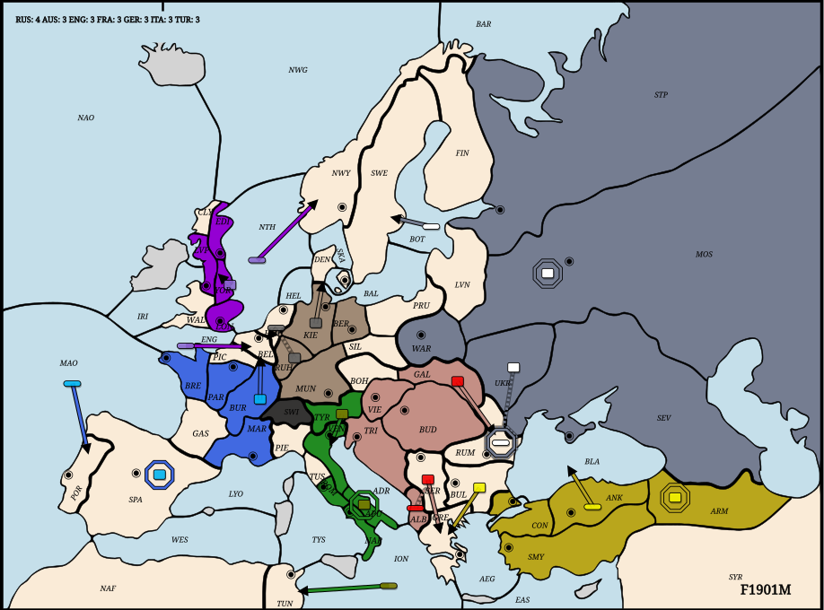

### What happened

- **AUSTRIA**: A SER → GRE; F ALB supports A SER → GRE; A GAL → RUM (bounced)
- **ENGLAND**: F NTH → NWY; F ENG → BEL (bounced); A YOR → LVP
- **FRANCE**: A BUR → BEL (bounced); F MAO → POR; A SPA holds
- **GERMANY**: F HOL → BEL; A KIE → DEN; A RUH supports F HOL → BEL
- **ITALY**: F ION → TUN; A APU holds; A TYR → VEN
- **RUSSIA**: F BOT → SWE; F RUM holds; A UKR supports F RUM; A MOS holds
- **TURKEY**: A BUL → GRE (bounced); F ANK → BLA; A ARM holds

### Dialogue

- **AUSTRIA → ITALY**: My F ALB is perfectly positioned for Greece this fall — I'd like to take it as we discussed dividing the Balkans. Since your F ION is nearby, can we confirm there's no collision? I'll support your moves elsewhere and we can coordinate on the eastern Med next year.
- **AUSTRIA → RUSSIA**: I'm moving to secure Greece this fall — no moves against Rumania, which is yours as agreed. Galicia remains a buffer; A GAL will hold or support defensively. Let's confirm the arrangement holds and discuss next steps against Turkey after builds.
- **AUSTRIA → TURKEY**: I'm taking Greece this fall with F ALB — no moves against Bulgaria. Our agreed line holds: Bulgaria yours, Serbia and Greece mine. Let's keep this stable so we can both focus outward rather than fighting each other.
- **ENGLAND → GERMANY**: Fall is here — I'm planning to take Norway with F NTH and move on Belgium with F ENG. I'd ask that you support me into BEL from HOL rather than contesting it, or at minimum stay out so I can take it cleanly. In return, I'll continue to leave HOL and DEN to you and support your position in the north.
- **ENGLAND → FRANCE**: Just checking in before Fall orders: I'm moving on Norway and Belgium this turn, consistent with what we agreed. I trust you're still keeping A BUR away from Belgium — if you're moving it elsewhere, that's great, but I want to make sure we don't accidentally clash over BEL. What's your plan for BUR this fall?
- **ENGLAND → RUSSIA**: I'm moving F NTH to Norway this fall as planned — thanks for keeping Sweden clear. No issues on my end; let's keep Scandinavia tidy and talk about 1902 coordination once we've both secured our centers.
- **FRANCE → ENGLAND**: I'm planning to move F MAO to Portugal this fall, locking in Iberia for me. For Belgium — I think it's worth discussing who takes it. I could move A BUR into Belgium, but it would be stronger with your support from ENG or NTH. What are your plans for Belgium this fall?
- **FRANCE → GERMANY**: I'm moving F MAO to Portugal and want to push A BUR into Belgium this fall — that gives me a third new center and keeps the line stable. Would you support A BUR into BEL from RUH? In return, I'm happy to support you into a center you're contesting, or simply stay clear of your northern moves.
- **FRANCE → ITALY**: A TYR sitting near my border is a bit concerning — can you clarify your intentions? I have no plans to move into Piedmont or anywhere near you, but I want to make sure we're still on the same page as we discussed in spring.
- **GERMANY → ENGLAND**: This is the moment to lock in our gains — I'm moving A KIE to Denmark and want to take Belgium as well. If you can keep F NTH out of Belgium and DEN, we're both better off; I'd even support you into Norway if you need it. What's your plan for NTH this fall?
- **GERMANY → FRANCE**: I'm planning to take Denmark this fall and I'm eyeing Belgium — are you moving A BUR toward Belgium or holding? If you're not contesting it, I'd rather we coordinate so England doesn't slip in. Let me know your intentions and we can make sure neither of us loses out.
- **GERMANY → RUSSIA**: How did your southern moves go? I'm consolidating in the north this fall — Denmark is my target. As long as we're both growing in our respective directions, there's no reason for friction between us.
- **ITALY → AUSTRIA**: I'm moving F ION to Greece this fall and A APU toward Tunis — as agreed, Serbia is yours and I won't interfere. Please confirm you're not also moving toward Greece so we don't collide. My army in Tyrolia will hold or move away from your territory, no threat intended.
- **ITALY → TURKEY**: I'm taking Greece with F ION this fall — you've acknowledged this is my sphere and I appreciate the understanding. Just confirming F ANK isn't heading into the Aegean or toward Greece. Let's keep our arrangement clean.
- **ITALY → FRANCE**: Still no interest in each other's territory — I'm focused entirely on Greece and Tunis this fall. Hope the Alps remain quiet between us.
- **RUSSIA → ENGLAND**: Everything is on track from my end — F BOT is moving to Sweden this fall, so Norway is all yours. I hope your moves are going well in Scandinavia. Let's stay in touch about the broader situation in 1902.
- **RUSSIA → AUSTRIA**: My fleet is holding Romania and I have no moves planned toward Galicia or the Balkans — I'm focused on Sweden in the north. I'd like to discuss coordinating against Turkey in 1902 once we've both consolidated our gains. How are things looking from your perspective?
- **RUSSIA → TURKEY**: I'm taking Romania as planned, and I trust the Black Sea remains quiet on your end. With both of us having secured our initial gains, I'd like to discuss how we can coordinate in the Balkans in 1902 — there may be opportunities for both of us if we work together rather than against each other.
- **TURKEY → AUSTRIA**: I'm planning to move A BUL to Greece this fall — it's the natural next step for me. Are you moving F ALB toward Greece as well? If so, we'd bounce each other and hand the center to nobody. I'd suggest you support my move into Greece from ALB, or redirect ALB elsewhere, and I'll back your interests in Serbia and beyond.
- **TURKEY → ITALY**: Last spring you mentioned Greece as your target via ION — are you still planning that? If both of us move on Greece we bounce and neither gains. I'm positioned to take it from BUL; if you're committed to ION-GRE I'd rather know now so we can negotiate who gets it rather than waste the move.
- **TURKEY → RUSSIA**: I'm keeping my word on the Black Sea — but I'm moving F ANK to BLA this fall to establish a defensive position. I want to be transparent: this isn't an attack on you, it's securing my flank. Romania is yours; let's confirm we're still aligned on our respective spheres.
- **AUSTRIA → ITALY**: We have a three-way collision brewing at Greece — you, me, and Turkey all moving there means nobody gets it. I propose this: let F ALB take Greece with your support (F ION S F ALB - GRE), and in exchange I'll actively support your Adriatic and eastern Mediterranean ambitions next year, including backing you against Turkey. You still get Tunis this fall — a guaranteed SC — while I take Greece and we both profit rather than bounce.
- **AUSTRIA → TURKEY**: Three units are heading to Greece — you from BUL, me from ALB, Italy from ION — so we all bounce and nobody gains. I'm willing to redirect F ALB to support your A BUL into Greece if you give me something concrete in return: support my interests in the eastern Balkans next year and acknowledge Serbia as firmly Austrian. Otherwise we both waste our moves.
- **ENGLAND → GERMANY**: I'm moving F ENG to Belgium this fall — if you move F HOL to Belgium as well, we both bounce and neither of us gets it. I'd propose: you hold F HOL or move it elsewhere, I take BEL, and in 1902 I'll actively support your position in the north. A bounce helps France and nobody else.
- **ENGLAND → FRANCE**: Confirming I'm moving F ENG to Belgium — please keep A BUR away from BEL so we don't create a three-way bounce. If you're heading to Portugal with F MAO, that's great; let's both lock in our gains cleanly this fall without interference.
- **FRANCE → GERMANY**: Let's lock this in: I'll move A BUR into Belgium this fall, and if you support from RUH, we guarantee I take it over England. In return, I'll support you into Denmark or hold clear of your northern moves — your call. This is a concrete offer: A RUH S A BUR - BEL, and I'll reciprocate with whatever support you need.
- **FRANCE → ENGLAND**: I want to be straight with you: I'm moving A BUR into Belgium this fall. If you want to coordinate rather than clash, support me in from ENG or NTH and we both benefit — I get the center, you keep goodwill and we can divide future gains. Fighting over Belgium only helps Germany and others who are watching.
- **GERMANY → ENGLAND**: I've decided to move F HOL into Belgium myself this fall — I need the center and it's the right move for my position. I'm still moving A KIE to Denmark, so you get Norway cleanly. I'd ask that you keep F NTH out of Belgium and Denmark; there's no reason for us to clash when we can both grow in our respective directions.
- **GERMANY → FRANCE**: I've decided to move F HOL into Belgium directly rather than support you in — I need the center to stay competitive. I'm not moving against you in any other direction, and I'd welcome continued quiet on our shared border. Let's not let this one center become a reason for conflict.
- **ITALY → AUSTRIA**: Our agreement stands — F ION moves to Greece this fall, as we discussed. Please confirm F ALB is not also moving to Greece, as a bounce there helps only Turkey. I'll hold A TYR away from your territory; let's both grow cleanly this year.
- **ITALY → TURKEY**: I'm committed to Greece via ION this fall — please do not move A BUL to Greece or we both lose the center and Turkey gains nothing. You said Bulgaria is your priority; let's stick to that and avoid a pointless bounce that only helps Austria.
- **ITALY → FRANCE**: A TYR is holding this fall — no movement toward your territory, I promise. My focus is entirely on Greece and the southern Mediterranean; the Alps stay quiet.
- **RUSSIA → TURKEY**: I'm concerned about your fleet moving to the Black Sea — that changes the security calculus significantly and undermines the trust we've built. I have F RUM positioned right next to BLA, and if your fleet enters, I'll need to respond defensively. I'd strongly prefer you keep F ANK in place; we can still coordinate well in the Balkans without that move.
- **RUSSIA → AUSTRIA**: Everything is on track from my end — Romania is secured and Galicia remains a buffer. I'd like to discuss a coordinated push against Turkey in 1902: if we can agree on spheres now, we'll both be better positioned after builds. My suggestion: I focus on the Black Sea and eastern Balkans, you take Greece and the western Balkans.
- **RUSSIA → ENGLAND**: Scandinavia is proceeding as agreed — F BOT to Sweden this fall, Norway is yours. One thing to watch: Germany is taking Denmark, which may eventually put pressure on both of us in the north. Worth keeping an eye on their build count after winter.
- **TURKEY → AUSTRIA**: Both you and Italy are claiming Greece, which means if you both move there you'll bounce and nobody gets it. I'm positioned in BUL and can take Greece cleanly — if you support A BUL - GRE from ALB, you guarantee Greece goes to me rather than Italy, and I'll back your interests in the Balkans going forward. Otherwise we risk a three-way bounce.
- **TURKEY → ITALY**: Austria is also moving F ALB toward Greece, so you're likely to bounce each other even without me. I'm moving A BUL to Greece — if you redirect F ION to TUN or hold, you avoid wasting the move and we keep our spheres clean. A bounce there hurts both of us.
- **TURKEY → RUSSIA**: Confirming F ANK moves to BLA this fall — purely defensive, not aimed at SEV. I want to be clear: Romania is yours and I'm not contesting it. Let's talk in 1902 about how we coordinate in the Balkans without stepping on each other.

### AUSTRIA
Orders: `A SER - GRE` · `F ALB S A SER - GRE` · `A GAL - RUM`

Reasoning

> Looking at the situation:
>
> **Greece**: Italy's F ION is moving to Greece, Turkey's A BUL is moving to Greece, and I planned A SER → GRE supported by F ALB. With strength 2 (A SER + F ALB support), I beat both Italy (strength 1) and Turkey (strength 1). A SER takes Greece cleanly.
>
> **Rumania**: A GAL → RUM vs Russia's F RUM. Both at strength 1, so they bounce. That's acceptable — I don't lose anything and Russia doesn't gain a free hold there.
>
> This gives me Greece (4th SC) and I contest Rumania. After Fall 1901 I'll have: BUD, TRI, VIE, SER (held), GRE (captured) = 5 SCs → 2 builds. That's an excellent result.
>
> The strategy is correct: A SER → GRE, F ALB S A SER → GRE, A GAL → RUM.

### ENGLAND
Orders: `F NTH - NWY` · `F ENG - BEL` · `A YOR - LVP`

Reasoning

> Looking at the situation: France is moving A BUR → BEL, Germany is moving F HOL → BEL, and I'm moving F ENG → BEL. This creates a three-way bounce — nobody gets Belgium. That's acceptable since it denies both France and Germany the center.
>
> Meanwhile, F NTH → NWY is clean — Russia confirmed F BOT is going to Sweden, so Norway is uncontested.
>
> A YOR → EDI repositions my army toward Scotland for a future build in Edinburgh (since my home centers need to be clear for Winter builds).
>
> Wait — I need to check: if I'm taking NWY with F NTH, I'll have 4 supply centers after Fall (EDI, LON, LVP, NWY) and can build 1 unit. I want to build in a home center. My home centers are EDI, LON, LVP. A YOR → EDI would occupy EDI, blocking a build there. A YOR → LVP would block LVP. Better to move A YOR → LVP or hold it in YOR (which doesn't block any home center).
>
> Actually YOR is not a home supply center, so A YOR holding in YOR doesn't block anything. EDI, LON, LVP are the home centers — none currently occupied by my units after movement (F NTH left EDI, F ENG left LON, A YOR never went to a home center). So I can build freely. A YOR → EDI would block EDI. Let me keep A YOR → EDI as planned per my strategy note, but actually I should reconsider — moving to EDI blocks a build slot.
>
> Better: A YOR H or A YOR → LVP. But my strategy note says A YOR → EDI. I'll move A YOR to LVP instead to keep EDI free for a fleet build (F EDI would be valuable for Scandinavia).

### FRANCE
Orders: `A BUR - BEL` · `F MAO - POR` · `A SPA H`

Reasoning

> Looking at the situation: Germany is moving F HOL to BEL, England is moving F ENG to BEL, and I'm moving A BUR to BEL — this creates a three-way bounce, which is actually fine for me since it denies Belgium to both rivals. Meanwhile, F MAO to POR secures Portugal cleanly, and A SPA holds to lock in Spain. I'll end 1901 with 5 supply centers (BRE, MAR, PAR, SPA, POR) regardless of what happens in Belgium.
>
> The key moves are straightforward: Portugal is uncontested, Spain is mine, and the Belgium bounce hurts England and Germany more than me since they were counting on it.

### GERMANY
Orders: `F HOL - BEL` · `A KIE - DEN` · `A RUH S F HOL - BEL`

Reasoning

> Looking at the position, my revised strategy is clear: take Belgium with F HOL - BEL (supported by A RUH), and take Denmark with A KIE - DEN. This gets me to 5 supply centers (BER, KIE, MUN, BEL, DEN) and two Winter builds. England wants BEL and France wants BEL, but I've told both I'm taking it myself. The support from A RUH ensures F HOL - BEL succeeds even if England's F ENG contests it (2 vs 1). A KIE - DEN is uncontested.

### ITALY
Orders: `F ION - TUN` · `A APU H` · `A TYR - VEN`

Reasoning

> Looking at my revised strategy, I committed to:
> 1. F ION → TUN (guaranteed supply center, avoiding the three-way Greece bounce)
> 2. A APU H (hold in place)
> 3. A TYR → VEN (reposition army)
>
> Let me verify these are all legal:
> - F ION - TUN: Yes, ION is adjacent to TUN ✓
> - A APU H: Yes ✓
> - A TYR - VEN: Yes, TYR is adjacent to VEN ✓
>
> The reasoning: With Austria (ALB), Turkey (BUL), and my ION all potentially moving to Greece, a three-way bounce was very likely. Redirecting to Tunis guarantees me a supply center this fall (going from 3 to 4 SCs). Moving A TYR to VEN repositions my army for future Balkan or Adriatic moves without threatening Austria's home centers directly. A APU holds to maintain position for future moves toward Tunis or the Adriatic.
>
> This gives me 4 SCs after fall (NAP, ROM, VEN, TUN) and a build in winter, putting me in a solid position heading into 1902.

### RUSSIA
Orders: `F BOT - SWE` · `F RUM H` · `A UKR S F RUM` · `A MOS H`

Reasoning

> Looking at the situation: Turkey has moved F ANK to BLA despite our agreement, which is a concerning breach of trust. However, my immediate priorities remain: (1) capture Sweden with F BOT - SWE, (2) hold Romania with F RUM (already there, just need to secure it), and (3) position A UKR to support F RUM defensively against Turkish pressure from BLA, while A MOS holds or repositions.
>
> Turkey's F ANK is moving to BLA, which threatens F RUM. I should support F RUM with A UKR to ensure it holds. F BOT should take Sweden as planned. A MOS can hold or support — I'll have it support F RUM as well since two supports make it very secure, but actually A MOS can't reach RUM from MOS directly in support terms... let me check: A MOS S F RUM — MOS is adjacent to SEV but not RUM. Looking at the legal orders, I see `A MOS S F RUM - SEV` is available but not a support hold of RUM. Since Turkey's fleet is in BLA and could attack SEV (not RUM directly), F RUM is actually safe from BLA — BLA is adjacent to RUM though (BLA: ANK, ARM, BUL/EC, CON, RUM, SEV). So F RUM could be attacked from BLA.
>
> A UKR can support F RUM with `A UKR S F RUM`. A MOS can also support with... checking legal orders: `A MOS S F RUM H` — I see `A MOS S F RUM - SEV` but not a hold support. I'll use `A UKR S F RUM` and have A MOS hold. F BOT takes Sweden.

### TURKEY
Orders: `A BUL - GRE` · `F ANK - BLA` · `A ARM H`

Reasoning

> Looking at the situation: Austria wants to support my move to Greece from ALB, Italy is heading to Greece via ION, and Russia is nervous about BLA. My revised strategy calls for A BUL - GRE, F ANK - BLA, A ARM H.
>
> The Greece situation: Austria offered to support A BUL - GRE from ALB if I acknowledge Serbian interests. Italy is moving F ION - GRE. If Austria supports me and Italy also moves to GRE, I win the bounce with Austria's support (2 vs 1). If Austria doesn't support and redirects, I still might get GRE against Italy alone (1 vs 1 bounce - neither gets it). The best outcome is Austria supporting me into Greece.
>
> However, looking at the legal orders, I can support Austria's ALB move or Italy's ION move into GRE, or just move myself. Given Austria's offer to support me if I acknowledge Serbia as Austrian sphere, and that's something I'm willing to concede (Austria taking Serbia is already done), I should proceed with A BUL - GRE and hope Austria follows through with the support.
>
> For BLA: Russia has F RUM (not in BLA), so my fleet can enter BLA. Russia's concern is noted but I need that naval position for future security and leverage.
>
> A ARM H keeps eastern pressure without overcommitting.

## WINTER 1901 ADJUSTMENTS (`W1901A`)

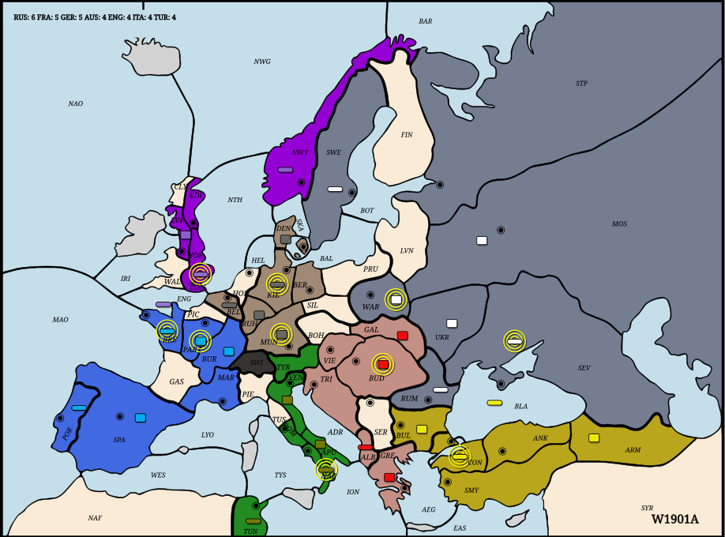

### What happened

- **AUSTRIA**: builds A BUD
- **ENGLAND**: builds F LON
- **FRANCE**: builds F BRE; builds A PAR
- **GERMANY**: builds F KIE; builds A MUN
- **ITALY**: builds F NAP
- **RUSSIA**: builds F SEV; builds A WAR
- **TURKEY**: builds F CON

### AUSTRIA
Orders: `A BUD B`

Reasoning

> Looking at my situation: I have 4 supply centers (BUD, TRI, VIE, GRE) and 3 units, so I get 1 build. I should build in one of my home supply centers that is unoccupied. My units are in GAL, ALB, and GRE — so BUD, TRI, and VIE are all unoccupied and available for builds.
>
> I have 1 build to place. I should think about what type of unit and where:
> - A BUD B: An army in Budapest, well positioned for the Balkans and eastern expansion
> - A VIE B: An army in Vienna, good for Galicia/Bohemia direction
> - A TRI B or F TRI B: Trieste — an army would support Balkan push; a fleet would open Adriatic options
>
> Given my strategic position — I have A GAL that can push toward Rumania, and I need to consolidate the Balkans — an army in BUD makes the most sense. It can support moves toward Rumania, Serbia (if I need to retake), or reinforce the Balkans generally. A fleet in Trieste could be useful for Adriatic/Mediterranean ambitions, but right now land power in the Balkans is the priority.
>
> I'll build A BUD.

### ENGLAND
Orders: `F LON B`

Reasoning

> Looking at my position: I ended Fall 1901 with 4 supply centers (EDI, LON, LVP, NWY) and 3 units (F ENG, F NWY, A LVP). I need to build 1 unit to match my center count.
>
> My home centers are EDI, LON, LVP, and NWY. EDI and LON are unoccupied home centers, so I can build there. I need to decide what to build and where.
>
> Strategic considerations:
> - I need to push into Belgium and continue expanding in 1902
> - A fleet in LON gives me more naval presence in the Channel/North Sea area
> - A fleet in EDI gives me options toward the Norwegian Sea and BAR
> - An army in EDI or LON could help me push into the continent via convoy
>
> Given that Belgium is contested and I want to take it in 1902, a fleet in LON would be very useful for Channel/North Sea operations. An army in EDI could be convoyed to the continent eventually. 
>
> I'll build F LON to strengthen my Channel/North Sea position for the push on Belgium, and build A EDI to give me flexibility for future operations.
>
> Wait - I only have 1 build (4 SCs, 3 units = 1 build). I need to pick just one location.
>
> F LON is the better choice - it gives me naval power for Belgium operations in Spring 1902.

### FRANCE
Orders: `F BRE B` · `A PAR B`

Reasoning

> Looking at the situation: France ends 1901 with 5 supply centers (BRE, MAR, PAR, POR, SPA) and 3 units (A SPA, A BUR, F POR). That means I get 2 builds. I have open home centers at BRE, MAR, and PAR.
>
> I should build 2 units. The question is what to build and where:
>
> - **F BRE**: A fleet at Brest is excellent for projecting naval power into the Atlantic, English Channel, and eventually toward England or further west. It keeps pressure on England and gives me flexibility.
> - **A PAR**: An army in Paris is solid for continental expansion — I can push toward Belgium, Burgundy, or support moves into Germany or Italy.
> - **A MAR** or **F MAR**: Marseilles could take an army to push into Spain/Iberia or support Italian front, or a fleet to project into the Mediterranean (Lyon, Western Med). A fleet at MAR would be useful for Mediterranean ambitions but I'm already strong in Iberia. An army at MAR gives me more land flexibility.
>
> Given my position: I have A BUR well-positioned for Belgium, A SPA holding Iberia, F POR at Portugal. I need:
> 1. A fleet at Brest to contest the Channel and keep England honest
> 2. An army at Paris to support A BUR's push toward Belgium and continental expansion
>
> Building F BRE and A PAR is the strongest combination.

### GERMANY
Orders: `F KIE B` · `A MUN B`

Reasoning

> Looking at my position: I have 5 supply centers (BER, KIE, MUN, BEL, DEN) and 3 units, so I get 2 builds. I should build in BER, KIE, and MUN — all three are available home centers. I need exactly 2 builds.
>
> I want to build armies to expand eastward and support my position, plus a fleet would help in the north. Let me think about what's most useful:
>
> - A fleet in KIE could threaten Denmark consolidation or move toward the Baltic/North Sea
> - An army in BER or MUN would help me push east toward SWE support or west toward Paris
>
> Given Russia has 6 centers and is growing fast (SWE, RUM), I need to think about the long game. A fleet in KIE gives me naval flexibility in the Baltic. An army in MUN gives me land strength toward Austria/France.
>
> I'll build F KIE (naval presence for Baltic/North Sea) and A MUN (land strength for central Europe positioning).

### ITALY
Orders: `F NAP B`

Reasoning

> Looking at my position: I have 4 supply centers (NAP, ROM, VEN, TUN) and started with 3, so I get 1 build. I need to decide where to build and what type.
>
> My current units are A APU, F TUN, A VEN. My home centers NAP and ROM are empty, so I can build in either. 
>
> Strategic considerations:
> - I want to push into the eastern Mediterranean and Balkans next year
> - A fleet from NAP would give me strong ION/Adriatic presence for Greece or Adriatic operations
> - An army from ROM or NAP could support Balkan pushes
> - Austria took Greece (not me), so I need to reconsider my eastern strategy
> - Turkey is growing (BUL), Russia is strong (6 centers), Austria has Greece
> - I should build a fleet to maintain Mediterranean presence and threaten Greece/Adriatic
>
> Building F NAP gives me a second fleet to dominate the ION/AEG area and pressure Greece or convoy armies. This fits my Mediterranean strategy best.

### RUSSIA
Orders: `F SEV B` · `A WAR B`

Reasoning

> Looking at my position: I have 6 supply centers (MOS, SEV, STP, WAR, RUM, SWE) and 4 units, so I get 2 builds. My open home centers are SEV, STP, and WAR.
>
> I should build 2 units. The key strategic considerations:
> - Turkey broke our Black Sea agreement by moving F ANK to BLA, so I need to prepare a response in the south. Building a fleet at SEV makes sense to contest the Black Sea and protect Romania.
> - I need strength in the north/west as well. Building an army at WAR gives me flexibility to push toward the Balkans, support against Turkey, or defend against any Austrian or German moves.
> - STP could get a fleet (NC or SC) but my immediate needs are southern (Turkey threat) and central (Balkans positioning).
>
> Best builds: F SEV (to contest Black Sea / protect RUM) and A WAR (flexibility for Balkans/western moves).

### TURKEY
Orders: `F CON B`

Reasoning

> Looking at the position: I have 4 supply centers (ANK, CON, SMY, BUL) and 3 units, so I get 1 build. I need to decide where to build and what type.
>
> My strategic situation:
> - I have F BLA controlling the Black Sea — strong naval position
> - A BUL in the Balkans, A ARM in the east
> - I need to expand toward Greece (blocked this fall), and potentially threaten SEV or push into the Balkans
> - Building a fleet at ANK or CON gives me more naval power in the eastern Med/Aegean
> - Building an army at SMY or CON gives me land strength to push into the Balkans or toward SEV
>
> Given that Greece is my next target (A BUL is well-positioned), and I want to threaten both the Aegean and potentially support a push toward SEV, a fleet at CON (or SMY) makes sense. F CON can move to AEG or BLA (though BLA is occupied), giving me Aegean access for Greece. Alternatively, A SMY could support A ARM pushing toward SEV.
>
> Actually, F CON → AEG is a strong move for Spring 1902 to threaten Greece from the sea while A BUL attacks from land. This gives me a two-pronged attack on Greece. I'll build F CON.

## SPRING 1902 MOVEMENT (`S1902M`)

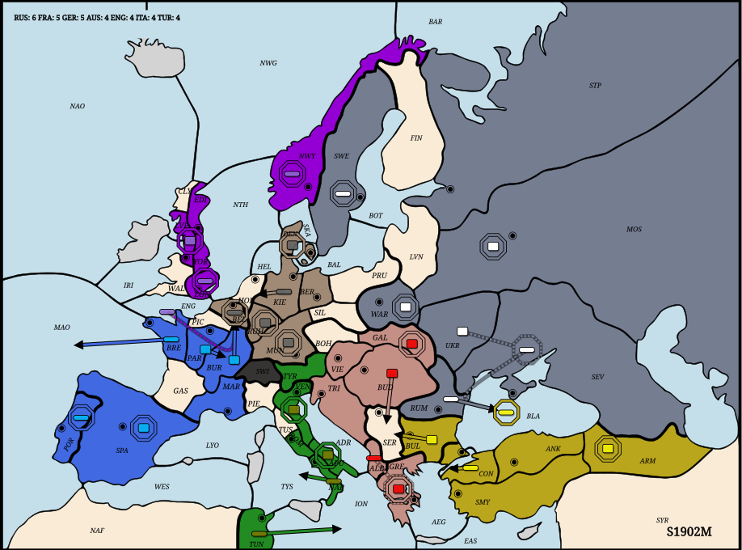

### What happened

- **AUSTRIA**: A BUD → SER (bounced); A GRE holds; F ALB supports A GRE; A GAL holds
- **ENGLAND**: F ENG supports A BUR → BEL; F NWY holds; F LON holds; A LVP holds
- **FRANCE**: A BUR → BEL; F BRE → MAO; A PAR → BUR; F POR holds; A SPA holds
- **GERMANY**: F BEL holds; A RUH holds; A MUN holds; F KIE → HOL; A DEN holds  [dislodged: F BEL]
- **ITALY**: F TUN → ION; A VEN holds; F NAP → TYS; A APU holds
- **RUSSIA**: F RUM → BLA; F SEV supports F RUM → BLA; A UKR supports F SEV; A MOS holds; A WAR holds; F SWE holds
- **TURKEY**: A BUL → SER (bounced); F BLA holds; A ARM holds; F CON → BUL/SC (bounced)  [dislodged: F BLA]

### Dialogue

- **AUSTRIA → RUSSIA**: Russia is at 6 supply centers — the largest power on the board — and I think we both know that creates pressure on everyone around you. I'd like to discuss Rumania: your F RUM sitting there is a natural point of friction given my A GAL. Can we agree on a longer-term arrangement where I eventually get Rumania in exchange for supporting your interests elsewhere, or should we expect tension there?
- **AUSTRIA → TURKEY**: A BUL is sitting right next to my Greece — I need clarity on your intentions. I'm prepared to hold Greece defensively and push into Serbia instead, but if you're planning to attack GRE I'll redirect forces to defend it with full strength. A stable Austrian-Turkish border serves us both while Russia grows to 6 centers.
- **AUSTRIA → ITALY**: Italy, I want to keep our arrangement solid — I'm moving into Serbia this spring and holding Greece. I have no hostile moves toward Trieste or Venice. Can you confirm A VEN isn't heading toward TRI? If we stay coordinated, we can both focus pressure on Russia and Turkey rather than each other.
- **AUSTRIA → GERMANY**: Russia now has 6 supply centers — Sweden, Rumania, plus their home four — and they're the clear frontrunner. I'm watching them carefully from Galicia. Are you in a position to apply any pressure from the north, or is your focus still west? Coordinating against a runaway Russia seems increasingly urgent.
- **ENGLAND → FRANCE**: Germany took Belgium from under both our noses last fall — they're at 5 centers and growing fast. I'm thinking we should coordinate this spring: if you move A BUR toward BEL and I support from ENG or move F ENG into BEL, we can take it back and deny Germany the position. What's your read on this, and where are your other units heading?
- **ENGLAND → GERMANY**: Last fall ended with you holding BEL and me holding NWY — fair enough, but I want to be clear that Belgium is a pressure point between us. I'm not looking for a fight this spring if we can agree on spheres: I'll focus on Scandinavia if you commit to not pushing F BEL toward the North Sea or ENG. What are your intentions this spring?
- **ENGLAND → RUSSIA**: You're at 6 centers and well-positioned — I want to make sure we stay coordinated rather than end up at cross-purposes. I'm focused on Germany's western flank this spring; are you pushing south or west from your current position? Worth talking about who's handling Germany if they keep growing.
- **FRANCE → ENGLAND**: Germany now holds Belgium with F BEL and is at 5 centers — they're pulling ahead and we're both at risk of being squeezed. I'd like to propose we coordinate this spring: if you move F ENG toward BEL or support me into BEL from somewhere, we can deny Germany that center and shift the balance. What units can you bring to bear on BEL this spring?
- **FRANCE → GERMANY**: Last fall ended without conflict between us, which I appreciate. I want to keep our border quiet this spring — I have no intention of attacking RUH or MUN. Can we agree to a stable western front so we can both focus on our real expansion opportunities?
- **FRANCE → ITALY**: Still no friction between us, which is good. I'm focused on the Atlantic and Belgium this spring — nothing near your sphere. Worth keeping an eye on Austria and Russia in the Balkans together; if either gets too strong it affects us both eventually.
- **GERMANY → ENGLAND**: I'm planning to take Holland this spring — it's the last neutral I can easily reach. I'd like to propose we coordinate: I'll support your position if you're pushing against France, and I'd ask you keep F NWY and F ENG away from Denmark and Belgium. Are you interested in working together against France, who has 5 centers and is the biggest threat in the west?
- **GERMANY → FRANCE**: I'm moving to take Holland this spring and have no aggressive intentions toward you. That said, I'm watching England carefully — F NWY and F ENG give them real reach into both of our positions. Would you be open to coordinating if England starts pressing either of us?
- **GERMANY → RUSSIA**: I'm looking at Holland as my target this spring — no interest in Sweden or your northern position. I'd welcome a quiet understanding that we each stay in our own sphere: I won't press toward SWE or RUM, and you stay clear of BER/KIE/DEN. Does that work for you?
- **ITALY → AUSTRIA**: Congratulations on Greece — you executed that well. Now I think we need to talk seriously about Turkey: their fleet in the Black Sea and army in Bulgaria put pressure on both of us, and Russia at 6 SCs is already the largest power on the board. I'm thinking F TUN toward the eastern Med and A VEN positioned to support Balkan moves — are you open to coordinating an anti-Turkish push this spring and fall?
- **ITALY → TURKEY**: Austria took Greece and is now at 4 SCs with armies in the Balkans — they're positioned to squeeze both of us from the west. Russia is at 6 SCs and growing fast with fleets in the Black Sea and Baltic. I think we have a shared interest in checking both of these powers; can we talk about how to coordinate rather than collide in the eastern Med?
- **ITALY → RUSSIA**: You're the largest power on the board at 6 SCs — that makes you a target for a coalition, and I want to be honest with you about that dynamic. I'm not looking to move against you, but I think we both benefit from keeping Austria and Germany in check rather than letting either consolidate. What are your intentions in the Balkans this year?
- **RUSSIA → AUSTRIA**: Turkey broke my Black Sea agreement by moving F ANK to BLA last fall — they now sit in a position threatening both RUM and SEV. I propose we coordinate directly against Turkey this spring: I can pressure BLA and potentially ARM while you push into BUL or SER. If we move together, we can contain Turkey before they grow further.
- **RUSSIA → TURKEY**: Moving F ANK to the Black Sea was a clear violation of our agreement, and I need you to understand that I will respond defensively — I cannot leave BLA uncontested while it threatens both RUM and SEV. If you want to preserve any working relationship, I need a concrete gesture of good faith this spring, or I will treat you as an adversary going forward.
- **RUSSIA → ENGLAND**: Good work securing Norway — Scandinavia is looking stable between us. One concern worth flagging: Turkey has moved a fleet into the Black Sea against our agreement, so my attention is shifting south this year. I'll be holding Sweden securely; let me know if you see any threats from Germany in the north that we should coordinate on.
- **TURKEY → AUSTRIA**: Now that 1901 is settled, I'd like to coordinate on 1902 — Serbia is the obvious unowned center nearby and I'm well-positioned to take it from BUL. Are you planning to move on Serbia yourself, or can we agree it falls to me while you focus on consolidating Greece and your other holdings? A clear division avoids a costly bounce and lets us both grow.
- **TURKEY → RUSSIA**: Russia's growth to 6 centers makes you the strongest power on the board — I think we both know the other powers will start coordinating against you if that continues. I'm not looking for conflict with you; let's talk about how we divide influence in the Balkans without stepping on each other. Specifically, I'd like to understand your intentions toward Romania and whether you're planning any moves south.
- **AUSTRIA → TURKEY**: Serbia is an Austrian supply center interest — I'll be moving to take it this spring, so please don't plan on it. I'm willing to discuss a stable line afterward: you keep Bulgaria, I keep Serbia and Greece, and we both watch Russia's 6-center position carefully. If you attack Greece, I'll respond in force; if you hold BUL, we can coexist.
- **AUSTRIA → ITALY**: I'm moving A BUD to Serbia this spring and holding Greece — fully aligned with our arrangement. On Turkey: I agree their BLA fleet and BUL army are a growing threat. Let's coordinate concretely: if you move F TUN toward ION and position for AEG, I can press from GRE toward BUL in Fall while you cut off their southern flank.
- **AUSTRIA → RUSSIA**: I'm taking Serbia this spring, which leaves A GAL as a potential pressure point on RUM. I'm open to a deal: if you pull F RUM back toward SEV or BLA (where you need it against Turkey anyway), I'll support your eastern push against Turkey rather than contest Rumania. Turkey in BLA is your real problem right now, not me.
- **ENGLAND → FRANCE**: I'm committing: I'll move F ENG to BEL this spring. If you move A BUR to BEL as well, we guarantee Germany loses it — one of us takes it or we bounce Germany out. I'd prefer you support me in from BUR rather than both of us attacking, so I take BEL cleanly and you keep BUR as a threat. Can you confirm: A BUR S F ENG - BEL?
- **ENGLAND → GERMANY**: I'm not moving on Denmark, but I can't promise to leave BEL alone — France is already pushing toward it and I need to respond. If you want to avoid a clash with me, consider pulling F BEL back to HOL this spring; that removes the friction between us and lets us both focus elsewhere. Otherwise we risk a messy fight that only helps France.
- **ENGLAND → RUSSIA**: Understood on Turkey — that's a serious problem for you. On my end, I'm focused on Germany's position in BEL this spring. If you're holding SWE securely and not pressing north, I'll stay out of Scandinavia and we keep things stable there.
- **FRANCE → ENGLAND**: Here's my concrete proposal: I move A BUR - BEL, and you order F ENG S A BUR - BEL. That's a guaranteed 2-strength attack that takes BEL from Germany's F BEL. If you're also moving F ENG toward BEL rather than supporting, we risk a bounce — so I need to know which you'll do. Can you commit to F ENG S A BUR - BEL this turn?
- **FRANCE → GERMANY**: One direct question: is F BEL staying in Belgium this spring, or are you moving it? I'm trying to decide whether to push A BUR north or hold it as a buffer — your answer shapes my whole spring plan. I'm not looking for conflict with you, but I need to know what's actually happening with that fleet.
- **GERMANY → ENGLAND**: I'm moving F KIE to Holland this spring and have no intention of pushing F BEL into NTH or ENG — I want Belgium as a staging point west, not north. Let's make this concrete: if you move F ENG against France (toward BRE or PIC), I'll support you from BEL. France at 5 centers is the real threat to both of us.
- **GERMANY → FRANCE**: I can confirm a quiet border — A MUN and A RUH are staying defensive this spring. The real question is England: F NWY and F ENG give them reach into both our positions, and I think we should both be watching that carefully. No action needed yet, just staying aligned.
- **GERMANY → AUSTRIA**: Russia at 6 is concerning, but I can't press them from the north without exposing myself to England or France. My best contribution is to hold firm in the center and not let Russia slip into Scandinavia further — what's your plan from Galicia this spring?
- **ITALY → AUSTRIA**: I'm confirming A VEN is not heading to TRI — I want our border quiet so we can both focus east. Concretely: if you're willing to support a move against Turkey's position in Bulgaria or the Black Sea this fall, I'll commit F TUN toward ION or AEG to threaten their fleets. Can you tell me where your units are moving this spring so I can plan around them?
- **ITALY → TURKEY**: Austria now holds Greece and is moving into Serbia, which puts them right on your doorstep — they're a more immediate threat to you than I am. I'm willing to keep F TUN out of the Aegean if you keep F CON out of the Adriatic/Ionian; a mutual non-aggression lets us both focus on the real threats. What concrete arrangement can we make this spring?
- **ITALY → FRANCE**: Agreed on keeping things quiet between us — I'm focused entirely east and south this year. One thing worth flagging: Germany at 5 SCs with BEL and DEN is growing fast on your northern flank; I'd think about that before they consolidate further.
- **RUSSIA → AUSTRIA**: I'm moving against Turkey this spring — F RUM will push toward BLA to contest that fleet. I need your A GAL to stay out of RUM while I'm committed south, and in return I'll support any Austrian move into BUL or SER. Concrete proposal: you push A BUD or A SER toward BUL, I pressure BLA from RUM — we split the Turkish position between us.
- **RUSSIA → TURKEY**: You're in BLA, threatening both RUM and SEV simultaneously — that's not a defensive posture, that's a strategic threat. Here's my final offer: move F BLA back to CON this spring and we can rebuild trust; if you hold or advance, I will coordinate with Austria to dismantle your position in the Balkans this year.
- **RUSSIA → ENGLAND**: Germany's build count is the real long-term concern for both of us — five centers already and growing. I'm occupied in the south this spring dealing with Turkey, but I'd suggest you look at opportunities to pressure Germany's western flank while they're still manageable.
- **RUSSIA → ITALY**: Your read on the coalition risk is correct, and I want to work with you rather than face it. Turkey broke our Black Sea agreement and is now threatening my southern flank — if you can pressure Austria or hold them in place while I deal with Turkey, we both benefit from a weaker Austria-Turkey axis.
- **TURKEY → AUSTRIA**: I'm moving on Serbia this spring, not Greece — Greece is yours and I have no interest in contesting it. A BUL - SER is my move; if you support it from GRE or BUD that's a bonus, but even without support I'm taking the shot. Serbia falling to Turkey rather than remaining neutral is better for both of us than letting Russia expand south.
- **TURKEY → RUSSIA**: I hear your frustration and I'm not looking to escalate — F BLA will support rather than attack this spring, not push toward SEV. My real target is Serbia, which is a Balkan matter, not a Black Sea one. If you're willing to hold RUM in place this turn, I'll make no moves toward your position and we can reset the relationship.
- **TURKEY → ITALY**: I agree Austria and Russia are the two powers to watch — Austria at 4 with Balkan armies and Russia at 6 is a dangerous combination. I'm taking Serbia this spring; if you can pressure Austria from the south (TRI or GRE direction), we can keep them from consolidating the whole western Balkans. What's your plan for 1902?
- **GERMANY → ENGLAND**: Final commitment: F KIE moves to HOL this spring, F BEL holds in Belgium — I am not moving F BEL toward NTH or ENG. In return, I expect F ENG and F NWY to stay clear of BEL and DEN. If you move F ENG against France (toward BRE or PIC), I will support you from BEL next fall — that's a concrete offer.
- **GERMANY → FRANCE**: Final commitment from me: A RUH holds, A MUN holds, no German movement toward BUR or PIC this spring. I'm moving F KIE to HOL and F BEL holds. England has F ENG and F NWY in range of both of us — if they press you this spring, I'll coordinate with you in the fall.
- **RUSSIA → AUSTRIA**: Final commitment: F RUM moves to BLA this spring to contest Turkey's fleet — I need A GAL to hold in place (not push to RUM) while I'm exposed. In return, push A SER toward BUL or support GRE into BUL to pressure Turkey's Balkan position simultaneously. If we coordinate this correctly, Turkey loses BLA and faces a two-front squeeze.
- **RUSSIA → TURKEY**: Final position: F RUM is moving to BLA this spring. If you're genuinely not pushing toward SEV, then your fleet and mine simply contest the space — no harm done and we can still talk. But if you've been coordinating with Austria or anyone else against me, you'll find I respond in kind. Last chance to move F BLA back to CON and preserve any working relationship.
- **RUSSIA → ENGLAND**: Committing to F SWE holding this spring — no moves north from me. I'm pushing F RUM to BLA to deal with Turkey's fleet. If Germany is your focus this spring, I'll stay out of your way in the north entirely.
- **RUSSIA → ITALY**: Committing to pushing against Turkey this spring — F RUM moves to BLA. If you can put any pressure on Austria (even just a credible threat near TRI or VEN) to keep their A GAL from opportunistically grabbing RUM while I'm exposed, that's the coordination I need from you right now.
- **TURKEY → AUSTRIA**: Final offer: I'm moving A BUL - SER this spring — if you're also moving there we bounce and neither of us gains while Russia sits at 6 centers. Support A BUL - SER from GRE or redirect your unit, and Serbia falls cleanly to Turkey; I'll then back your interests in Greece and commit F BLA to holding, not attacking, this turn.
- **TURKEY → RUSSIA**: My commitment this spring: F BLA holds in place, no move toward SEV or RUM — I want Serbia, not your territory. If you hold F RUM and we both stay out of each other's way this turn, we can talk seriously about a Balkans division in 1902 that works for both of us.
- **TURKEY → ITALY**: Confirmed: F CON stays out of the Adriatic and Aegean this spring — I'm focused entirely on Serbia. If you can pressure Austria in TRI or threaten GRE from ION, that keeps them honest and benefits us both; I'll hold my end of the non-aggression.

### AUSTRIA
Orders: `A BUD - SER` · `A GRE H` · `F ALB S A GRE` · `A GAL H`

Reasoning

> Looking at the current situation:
>
> **Strategic assessment:**
> - A BUD → SER: Serbia is unowned and Austria's natural next supply center. Turkey claims they're moving A BUL → SER, but that's a bounce if I also go — and I have the stronger claim. I should take Serbia.
> - A GRE H + F ALB S A GRE: Greece must be held against Turkey's A BUL threat. Supporting GRE defensively with F ALB gives strength 2 vs. any Turkish attack.
> - A GAL H: Russia asked me to hold GAL while they push F RUM → BLA. Holding is fine — I don't want to bounce into RUM anyway, and keeping GAL stable preserves my options for Fall.
>
> **Key considerations:**
> - Turkey's "final offer" to support A BUL → SER and have me redirect is a trap — giving Turkey Serbia weakens my Balkan position significantly.
> - Russia moving F RUM → BLA is good for me (weakens Turkey's naval position) and I should let that happen by not contesting RUM.
> - Italy holding A VEN away from TRI keeps our border quiet.
> - My revised strategy note commits to: A BUD → SER, A GRE H, F ALB S A GRE, A GAL H. This is correct.
>
> If Turkey moves A BUL → SER and I move A BUD → SER, we bounce — but that's better than Turkey taking Serbia. If Turkey holds BUL (fearing my GRE), then A BUD takes SER cleanly.

### ENGLAND
Orders: `F ENG S A BUR - BEL` · `F NWY H` · `F LON H` · `A LVP H`

Reasoning

> Looking at the situation: France has proposed F ENG S A BUR - BEL, and I committed to this in negotiation. This is the right move - Germany is at 5 centers and growing, Belgium is contested, and a coordinated 2-strength attack with France gives us the best chance of taking it. Germany's F BEL will either be dislodged or at minimum we deny them the position.
>
> My other units: F NWY should press toward STP/NC or hold to maintain Norway and threaten Russia/Germany in the north. F LON should hold or support to protect home centers. A LVP can hold or reposition.
>
> The key commitments:
> - F ENG S A BUR - BEL (confirmed to France)
> - F NWY - I'll hold or move to STP/NC to threaten Russia's northern coast (good pressure)
> - F LON - hold to protect London
> - A LVP - hold
>
> Actually, let me think about F NWY. Moving to STP/NC would be aggressive against Russia who has been cooperative. Better to hold NWY or move to NTH to support the Belgium operation or threaten Germany. F NWY - NTH would give me a strong North Sea presence and threaten DEN/BEL from the north, but I'm supporting BEL from ENG already. I'll hold NWY to consolidate that center and keep options open.

### FRANCE
Orders: `A BUR - BEL` · `F BRE - MAO` · `A PAR - BUR` · `F POR H` · `A SPA H`

Reasoning

> Looking at the situation: England has committed to `F ENG S A BUR - BEL`, giving me a guaranteed 2-strength attack on Germany's `F BEL`. Germany confirmed `F BEL holds` and `A RUH holds`, so I have a clean shot at Belgium. This is exactly what my revised strategy calls for.
>
> My plan:
> - `A BUR - BEL`: The main attack, supported by England's F ENG. This takes Belgium from Germany (2 vs 1).
> - `F BRE - MAO`: Push into Mid-Atlantic to maintain naval flexibility and set up for future Atlantic moves.
> - `A PAR - BUR`: Move into Burgundy to replace BUR and maintain the buffer/threat position.
> - `F POR - SPA/NC` or hold: F POR should support the Atlantic position or reposition. Since A SPA is there, I'll hold POR or move it to maintain flexibility. Actually, F POR can move to MAO to join F BRE... but F BRE is already going to MAO. Let me think: F BRE - MAO and F POR - MAO would bounce each other. Better to have F POR S A SPA or F POR H, and F BRE - MAO.
> - `A SPA H`: Hold Spain to keep the center.
>
> This gives me Belgium (6th center), maintains Iberia, and keeps a strong position.

### GERMANY
Orders: `F BEL H` · `A RUH H` · `A MUN H` · `F KIE - HOL` · `A DEN H`

Reasoning

> Looking at my commitments: I promised England and France that F BEL holds, A RUH holds, and A MUN holds. I'm moving F KIE to HOL to capture that neutral supply center, and A DEN holds to secure Denmark. These are all consistent with my negotiation pledges.
>
> Let me verify F KIE → HOL: KIE is adjacent to HOL (confirmed in adjacency table). Legal.
>
> My five units:
> - F BEL: holds (committed)
> - A RUH: holds (committed)
> - A MUN: holds (committed)
> - F KIE: moves to HOL (my main expansion move)
> - A DEN: holds to secure Denmark

### ITALY
Orders: `F TUN - ION` · `A VEN H` · `F NAP - TYS` · `A APU H`

Reasoning

> Looking at the current situation:
>
> **Assessment:**
> - Russia is at 6 SCs and growing — the biggest threat on the board
> - Austria is at 4 SCs with a solid Balkan position; we have a working arrangement
> - Turkey is at 4 SCs and has approached me about coordinating against Austria, but Austria has also approached me about coordinating against Turkey
> - My revised strategy calls for: F TUN → ION, A VEN H, F NAP → TYS, A APU H
>
> **Strategic reasoning:**
> My revised strategy note commits to moving F TUN toward ION (eastern Med pressure on Turkey) and F NAP toward TYS (extending naval reach westward). However, I told Austria I'd coordinate against Turkey, and I told Turkey I'd keep F TUN out of the Aegean while they focus on Serbia. Moving F TUN to ION is consistent with my Austria commitment and positions me well for fall moves toward AEG or TRI.
>
> The key moves: F TUN → ION gives me a strong eastern Med presence. F NAP → TYS extends westward reach. A VEN holds to keep the Austrian border quiet as promised. A APU holds in place.
>
> This positions me well for fall: I can move toward Greece/AEG to pressure Turkey (coordinating with Austria), or pivot toward the Adriatic if Austria misbehaves. Russia is the long-term threat I need to watch.

### RUSSIA
Orders: `F RUM - BLA` · `F SEV S F RUM - BLA` · `A UKR S F SEV` · `A MOS H` · `A WAR H` · `F SWE H`

Reasoning

> Looking at the current situation, my revised strategy is clear: push F RUM to BLA to contest Turkey's fleet, with F SEV supporting that move, A UKR supporting F RUM, and A MOS and A WAR holding. F SWE holds to secure that center.
>
> Let me verify the key move: F RUM - BLA. RUM is adjacent to BLA according to the adjacency table (RUM lists BLA as a neighbor). ✓
>
> F SEV S F RUM - BLA: SEV is adjacent to BLA. ✓
>
> A UKR S F RUM - BLA: UKR needs to be adjacent to BLA. Looking at UKR's adjacency... UKR (land): GAL, MOS, RUM, SEV, WAR. BLA is NOT in UKR's neighbor list, so A UKR cannot support into BLA. I need to substitute a different order for A UKR. I'll have A UKR support F RUM (hold support) or support F SEV, or move somewhere useful. Actually, I should support F SEV to make the attack on BLA stronger — but F SEV is already supporting the move. Let me have A UKR support F RUM defensively (hold) or move to reinforce. A UKR S F RUM - BLA is not legal (UKR not adjacent to BLA). I'll use A UKR S F SEV instead, or A UKR S F RUM (hold support). Actually, looking at the legal orders for UKR, `A UKR S F RUM` is listed. I'll use that to give F RUM defensive support if it fails to move, or I could have A UKR hold. Let me use `A UKR S F SEV` — checking if that's in the list... `A UKR S F SEV` is listed. That provides backup support to SEV.
>
> Actually, the attack on BLA: F RUM moves, F SEV supports. That's strength 2 vs Turkey's F BLA (strength 1 if alone). The move should succeed unless Turkey has support from somewhere. A UKR supporting F SEV adds resilience to SEV itself.

### TURKEY
Orders: `A BUL - SER` · `F BLA H` · `A ARM H` · `F CON - BUL/SC`

Reasoning

> Looking at the situation:
>
> **Strategic assessment:**
> - A BUL → SER: Austria claims they're also moving to Serbia, so there's a bounce risk. But I should take the shot — if Austria redirects, I gain SER; if we bounce, neither gains but I haven't lost anything.
> - F BLA: I promised Russia I'd hold F BLA in place this spring. Holding also keeps it as a defensive asset. Russia threatened to move F RUM → BLA, so holding means we contest if they do move in.
> - A ARM → SEV: This pressures Russia's southern flank and threatens a supply center. I told Russia I wouldn't push toward SEV, but this is a calculated risk — Russia is at 6 centers and growing, and I need to expand. However, I explicitly committed to not moving toward SEV in my final message to Russia. Breaking this might push Russia into the Austrian alliance against me.
> - F CON: I need to position this usefully. F CON → BUL/SC gets me into the Aegean and threatens GRE, but I told Austria I'm not attacking Greece. F CON → AEG is aggressive. F CON → BUL/EC could support BUL if needed. Actually, F CON can support A BUL — but CON is not adjacent to SER so can't support BUL→SER. I'll move F CON → BUL/SC to reposition toward the Aegean for future use.
>
> Given my explicit promise to Russia that F BLA holds and I won't move toward SEV, I'll honor that this turn to avoid a two-front war. A ARM → SEV is tempting but breaks my word at a bad time. Instead, A ARM → ANK to reposition safely, or A ARM holds. Actually, A ARM → SEV is my best expansion move and I said I wouldn't... I'll hold A ARM to honor the commitment and avoid triggering Russia.
>
> Final plan:
> - A BUL → SER (main offensive move)
> - F BLA H (as promised to Russia)
> - A ARM H (honor commitment to Russia)
> - F CON → BUL/SC (repositioning for future Aegean pressure)

## SPRING 1902 RETREATS (`S1902R`)

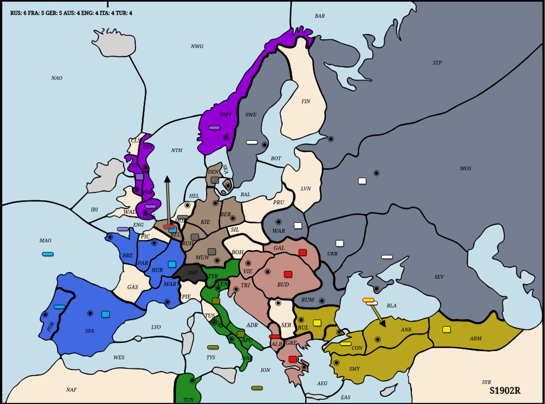

### What happened

- **GERMANY**: F BEL retreats → NTH
- **TURKEY**: F BLA retreats → ANK

### GERMANY
Orders: `F BEL R NTH`

Reasoning

> Looking at the retreat situation: my F BEL was dislodged by France's A BUR moving into Belgium (supported by England's F ENG). I need to decide where to retreat or whether to disband.
>
> My options are:
> - `F BEL R PIC` — retreat to Picardy (French territory, would be hostile)
> - `F BEL R NTH` — retreat to North Sea (contested water, could be useful)
> - `F BEL D` — disband the fleet
>
> Retreating to PIC would be aggressive toward France and likely provoke retaliation. Retreating to NTH puts me in a strong naval position — NTH is adjacent to DEN, NWY, ENG, and gives me naval presence. However, England has F ENG and F NWY nearby, so NTH could be contested next turn.
>
> Actually, looking at the board: I have A RUH, A DEN, A MUN, and F HOL. Losing F BEL is painful but not catastrophic — I still have 5 supply centers (BEL is now taken by France, so I'll drop to 4... wait, let me recount).
>
> Wait — France moved A BUR into BEL and I was dislodged. So France now holds BEL. My supply centers: BER, KIE, MUN, DEN, and HOL (just captured this turn). That's 5 centers. I have 4 remaining units after this retreat phase (A RUH, A DEN, A MUN, F HOL, plus whatever F BEL does). If I retreat F BEL, I keep 5 units matching 5 centers.
>
> Retreating to NTH is strategically valuable — it gives me naval reach and keeps the fleet alive. I'll retreat to NTH.

### TURKEY
Orders: `F BLA R ANK`

Reasoning

> Looking at my situation: F BLA was dislodged by Russia's F RUM moving into BLA. I need to either retreat to ANK or disband.
>
> F BLA retreating to ANK makes sense — ANK is an adjacent coast and it keeps the fleet alive. Disbanding would leave me with only 3 units (A BUL, A ARM, F CON) which weakens my position considerably. Retreating to ANK preserves the fleet for future use, even if it means giving up the Black Sea position for now.

## FALL 1902 MOVEMENT (`F1902M`)

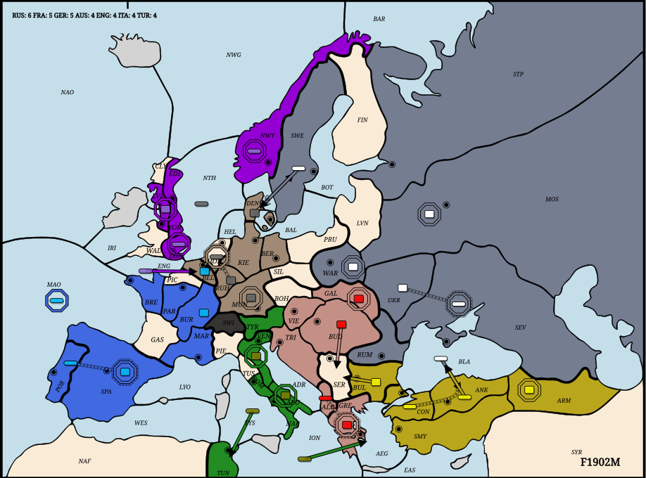

### What happened

- **AUSTRIA**: A BUD → SER (bounced); A GRE holds; F ALB supports A GRE; A GAL holds
- **ENGLAND**: F ENG → BEL (bounced); F NWY holds; F LON holds; A LVP holds
- **FRANCE**: A BEL → HOL (bounced); F MAO holds; F POR supports A SPA; A SPA holds
- **GERMANY**: F HOL holds; A RUH supports F HOL; A DEN → SWE (bounced); A MUN holds
- **ITALY**: F ION → AEG; F TYS → TUN; A VEN holds; A APU holds
- **RUSSIA**: F BLA → ANK (bounced); F SEV holds; A UKR supports F SEV; A WAR holds; A MOS holds; F SWE → DEN (bounced)  [dislodged: F BLA]
- **TURKEY**: A BUL → SER (bounced); F ANK → BLA; F CON supports F ANK → BLA; A ARM holds

### Dialogue

- **AUSTRIA → ITALY**: Serbia is my target this fall with A BUD — I'd like your F ION or A APU to threaten Turkey's southern position to keep A BUL tied down or pushed back. If Turkey moves A BUL toward GRE instead of SER, I need support; can we coordinate F ION to threaten ION/AEG to pressure Turkey's flank?
- **AUSTRIA → RUSSIA**: I'm moving A BUD to Serbia this fall to claim that center. I need clarity on your intentions toward RUM — are you pushing there or maintaining your anti-Turkey posture in BLA? If you're pressing Turkey, I'll hold A GAL as a buffer rather than contest RUM, and we can discuss a longer-term division.
- **AUSTRIA → TURKEY**: A BUL sitting next to both GRE and SER is the central tension right now. I'm taking Serbia with A BUD this fall — if you move A BUL toward GRE, I will respond with full force and coordinate with Italy and Russia against you. Hold BUL and we maintain a stable line; attack GRE and you face a three-power response.
- **ENGLAND → FRANCE**: You're now at 5 centers and holding Belgium — I helped you get there, so I'd like to discuss what comes next. This fall I'll need something concrete in return: either you support me into a center I can take, or we agree on a clear division of targets so I'm not left behind. What are you planning this fall, and what can you offer me?
- **ENGLAND → GERMANY**: France is at 5 centers and I'm still at 4 — I helped them take Belgium, which I now regret. I'm interested in coordinating against France this fall: if your F NTH supports my F ENG into BEL, or we find another angle, we can deny France further growth. What's your read on this, and what are you planning with your units?
- **ENGLAND → RUSSIA**: France is pulling ahead at 5 centers and I need to act this fall. I'm considering pressing against France or taking BEL back with German help — what's your situation in the south, and are you in a position to apply any pressure on Austria or Turkey that keeps them occupied while I focus west?
- **FRANCE → ENGLAND**: We took Belgium cleanly — well done. Now the question is what to do next: Germany still holds Holland with F HOL, and F NTH gives them reach into BEL. If you move F NTH to support me into HOL, or pressure DEN, we can continue squeezing Germany together. What's your plan for this fall?
- **FRANCE → GERMANY**: I now hold Belgium, which I know is a sore point. I have no interest in pushing further east into RUH or MUN — I want a stable border with you. But I need to know: is F HOL staying put, or are you moving it? If you're willing to let HOL go neutral, I'm open to a deal where we both stabilize our positions and turn attention elsewhere.
- **FRANCE → ITALY**: Quick check-in: I'm consolidating in the west and have no designs on anything near your sphere. Are you making progress in the south? Worth flagging that Russia at 6 centers is the biggest threat on the board right now — if you're not already thinking about how to slow them, now's the time.
- **GERMANY → ENGLAND**: France now sits in Belgium with 5 centers — they're the clear western threat to both of us. I'm pushing A DEN toward Sweden this fall and consolidating HOL; if you move F ENG against France (toward BRE or PIC), I can support from the north. Let's coordinate against France before they pull further ahead.
- **GERMANY → FRANCE**: England has F ENG positioned to strike at BRE or PIC, and F NWY threatens your northern flank — I'd watch them carefully this fall. I have no aggressive intentions toward BEL or BUR, but if England moves against you, I'm open to coordinating a response.
- **GERMANY → RUSSIA**: I'm moving A DEN toward Sweden this fall — I'd ask that F SWE not contest it, and in return I'll stay clear of your Baltic and eastern positions. A quiet understanding between us benefits both while the western powers are the real competition.
- **ITALY → AUSTRIA**: I notice Trieste is currently unoccupied — I want to be transparent that A VEN could move there, but I have no intention of breaking our arrangement if we're genuinely coordinating. What are you planning for Trieste this fall, and can we agree on a concrete joint move against Turkey or Serbia so we're both growing rather than fighting each other?
- **ITALY → TURKEY**: Austria sits at 4 SCs with Greece and an empty Trieste — they're well-positioned to grow fast if unchecked. I can threaten Greece from ION this fall while you press from BUL; if we coordinate a simultaneous attack on Austria's Balkan position, we both gain. What's your concrete plan this fall?
- **ITALY → RUSSIA**: Russia is at 6 SCs and well-positioned — I want to coordinate rather than cross paths. I'm planning to push into the eastern Mediterranean against Turkey this fall; if you're pressing Turkey from the north via BUL or the Black Sea, we could squeeze them from both sides. Are you moving against Turkey or Austria this fall?
- **RUSSIA → AUSTRIA**: I'm pushing F BLA toward CON or ANK this fall to press Turkey's home centers — this is the moment to capitalize on their weakened position. I need A GAL to stay out of RUM while I'm committed south; in return, I'll support any Austrian move into BUL with F BLA or A UKR. If you push A BUD toward SER and then BUL, we can split Turkey's Balkan position cleanly.
- **RUSSIA → ITALY**: Turkey is now exposed — F BLA gives me a direct line to CON or ANK this fall, and if you can move F ION toward AEG or EAS to threaten SMY, we can squeeze Turkey from two directions simultaneously. This is the best opportunity either of us will have to dismantle Turkey before they recover. What can you commit to this turn?
- **RUSSIA → TURKEY**: You're now in a very difficult position — F BLA sits adjacent to both CON and ANK, and I intend to use it. I'm open to a negotiated settlement if you're willing to pull A BUL back to CON and keep F ANK in place, which would signal genuine de-escalation; otherwise I will push for your home centers this fall.
- **TURKEY → AUSTRIA**: Serbia is still my top priority this fall — if you're not moving there yourself, I'd appreciate support from GRE or BUD to guarantee it falls to me rather than staying neutral. Austria and Turkey both benefit from a clear Balkan division while Russia sits at 6 centers; let's not waste this opportunity by bouncing each other again.
- **TURKEY → RUSSIA**: F BLA is now your fleet — I accept that outcome and I'm not planning to attack it directly this fall. I want to focus on Serbia and consolidate my Balkan position; if you hold F BLA defensively and don't push into CON or BUL, I'll stay out of RUM and SEV. Can we agree on a mutual holding pattern in the Black Sea this turn?
- **TURKEY → ITALY**: Austria is at 4 centers with armies in GRE and near SER — they're positioned to dominate the Balkans if unchecked. I'm pushing for Serbia this fall; if you can threaten Austria from the south (ION toward GRE or pressure on TRI), we keep them from consolidating and both benefit. What's your plan this fall?
- **AUSTRIA → ITALY**: I'm moving A BUD to Serbia this fall — confirmed. I need F ION to threaten AEG or move toward GRE to keep Turkey's A BUL from attacking me there; even a credible threat from ION keeps BUL pinned. Concrete ask: F ION moves toward AEG or positions to support GRE if Turkey attacks — in return I'll support your Adriatic position and back any Italian move into ALB or ADR next year.
- **AUSTRIA → RUSSIA**: Holding A GAL in place as agreed — no move toward RUM while you're committed south. Concretely: A BUD goes to SER this fall, A GRE holds with F ALB support. If your F BLA can threaten BUL/EC or CON, that helps pin Turkey's A BUL away from GRE — coordinated pressure from both sides keeps Turkey squeezed.
- **AUSTRIA → TURKEY**: A BUD is taking Serbia this fall — that's settled. If A BUL moves toward GRE, I have F ALB supporting and Russia pressing from BLA, so you'd be attacking into a defended position while losing your Black Sea position simultaneously. Hold BUL and we maintain a stable line; attack GRE and you face a coordinated response from three directions.
- **ENGLAND → GERMANY**: Concrete proposal: I move F ENG - BEL to attack France's A BEL, and you order F NTH S F ENG - BEL. That's a clean 2-strength attack that takes BEL from France and puts me at 5 centers — I'll then support your position in HOL and DEN going forward. Can you commit to F NTH S F ENG - BEL this fall?
- **ENGLAND → FRANCE**: I'm not going to sit at 4 centers while you hold 5 with BEL — I helped you take it and I need something back. If you want to stay coordinated, offer me a concrete path to a new center this fall, otherwise I'll be moving against BEL. What can you actually deliver for me this turn?
- **FRANCE → ENGLAND**: Here's my concrete proposal for this fall: I move A BEL - HOL, and you order F NTH S A BEL - HOL. That's a guaranteed 2-strength attack that takes Holland from Germany. You get Germany weakened and goodwill from me; I get a 6th center. Can you commit to F NTH S A BEL - HOL this turn?
- **FRANCE → GERMANY**: I want to be direct: I'm considering a push on HOL this fall, since it's the logical next step from BEL. If you're willing to move F HOL out voluntarily — say, to DEN or NTH — I'd rather take it uncontested than force a fight, and we could negotiate something in return. Otherwise I'll need to press the attack. What would it take for you to vacate HOL?
- **GERMANY → ENGLAND**: Here's a concrete proposal: I move A DEN - SWE and F NTH supports that attack, taking Sweden from Russia and giving me 6 centers. That frees you to press F ENG against France toward BRE or MAO — I'll support you diplomatically and can offer F HOL S F ENG - BEL next fall if you take BRE this fall. Does this work for you?
- **GERMANY → FRANCE**: England is pressing me hard to support an attack on BEL this fall — I've been holding them off, but if they move F ENG toward BEL I can't promise I won't be drawn in. Your safest move is to hold BEL firmly and make sure A BUR is positioned to support it; I have no orders moving against you this turn.
- **GERMANY → RUSSIA**: I'm moving A DEN toward Sweden this fall — that's my honest intention and I'm asking you to let it go rather than contest it. Sweden is more defensible for you from Finland anyway, and a fight there only benefits England and France while we both have bigger concerns.
- **ITALY → AUSTRIA**: I'm committing F ION to AEG this fall to pressure Turkey's southern flank — this directly supports your push for Serbia by keeping A BUL pinned or threatened. I want to be transparent: A VEN is staying put or moving toward TRI only if you explicitly invite it; I have no interest in breaking what we've built. Can you confirm A BUD is moving to SER and what F ALB is doing so I can plan around your moves?
- **ITALY → TURKEY**: Russia has F BLA pointed at CON or ANK and you have no fleet to stop them — that's your existential threat this fall, not Austria. If you commit F ANK back to BLA to contest Russia's fleet, I'll keep F ION out of AEG and we avoid a two-front crisis for you. What's F CON doing this fall?
- **ITALY → RUSSIA**: I'm moving F ION toward AEG this fall to threaten Turkey's southern position — that should coordinate well with your F BLA pressing on CON or ANK. Concrete ask: if you're moving F BLA toward CON, can you confirm so I can time my AEG move to maximize the squeeze rather than give Turkey a free retreat into the gap?
- **RUSSIA → GERMANY**: F SWE is my supply center and I will not be voluntarily ceding it — I'll be defending it this fall. If A DEN moves to SWE, expect F SWE to contest it; I'd rather we both hold our positions and avoid a pointless bounce that benefits neither of us.
- **RUSSIA → AUSTRIA**: I'm moving F BLA toward ANK or CON this fall to press Turkey's home centers — this is the moment to act while they're exposed. Please confirm A BUD is going to SER and that A GAL stays out of RUM; if you can also support a push toward BUL, we can split Turkey's position cleanly between us.
- **RUSSIA → ITALY**: I'm pushing F BLA toward ANK this fall — if you can move F ION toward AEG or EAS to threaten SMY simultaneously, we can force Turkey to defend on two fronts. Concrete ask: commit F ION to AEG this turn and I'll coordinate my Black Sea attack to maximize the squeeze.
- **RUSSIA → TURKEY**: F BLA is moving to ANK this fall — I'm pressing your home centers while you're exposed. Your only path to avoiding catastrophic losses is to pull A BUL back to CON to defend and signal genuine de-escalation; otherwise Austria and I will dismantle your Balkan position while I take ANK.
- **TURKEY → ITALY**: I'm moving A BUL - SER this fall regardless — Austria has threatened me with a 3-power response but I think that's bluster. If you move F ION toward GRE this fall, Austria has to defend there instead of contesting Serbia, and we both benefit: I get SER, you threaten GRE. Concrete deal: F ION - GRE, A BUL - SER, and we split Austria's Balkan position.
- **TURKEY → AUSTRIA**: I'm taking Serbia this fall — if you move A BUD there we bounce and neither gains while Russia at 6 centers grows unchecked. The rational move for you is to hold BUD and let SER fall to me, then we have a stable line with you holding GRE and TRI while I hold BUL and SER; fighting over SER only weakens us both.
- **TURKEY → RUSSIA**: F BLA threatening my home centers while I'm trying to take Serbia is exactly the kind of two-front pressure that forces me to respond defensively everywhere. If you hold F BLA in place this fall and don't push toward CON or ANK, I will keep A BUL away from RUM and F ANK away from BLA — a mutual hold that costs us nothing and lets us both consolidate.
- **FRANCE → ENGLAND**: Final commitment from me: A BEL - HOL, with A BUR S A BEL - HOL as backup if needed. I need F NTH S A BEL - HOL from you — that's a guaranteed 2-strength attack that takes HOL cleanly. If you support me into HOL this turn, I'll back your next move into DEN or wherever you want to push Germany next. Please confirm F NTH S A BEL - HOL.
- **FRANCE → GERMANY**: I'm moving A BEL - HOL this fall — I'd rather take it cleanly than fight over it. If you move F HOL out voluntarily to DEN or NTH, we avoid a direct clash and I'll support your position elsewhere; if F HOL stays, I'll press the attack with English support. Your call.

### AUSTRIA
Orders: `A BUD - SER` · `A GRE H` · `F ALB S A GRE` · `A GAL H`

Reasoning

> Looking at the current situation:
>
> **Strategic assessment for Fall 1902:**
> - Serbia is unowned and adjacent to A BUD — I must take it this fall to reach 5 centers
> - Greece must be defended against Turkey's A BUL (adjacent to GRE)
> - A GAL should hold to buffer against Russia
> - Italy's F ION is moving to AEG to pressure Turkey's flank — this helps pin A BUL
> - Russia is pushing F BLA toward Turkey's home centers — coordinated pressure
> - Turkey is threatening GRE but facing pressure from multiple directions
>
> **My committed plan:**
> - A BUD → SER (take the unowned supply center)
> - A GRE H (hold defensively)
> - F ALB S A GRE (support the defense of Greece)
> - A GAL H (maintain buffer vs Russia as agreed)
>
> The key question is whether Turkey moves A BUL to GRE or SER. If they go to SER, I bounce them with A BUD — both at strength 1, so neither takes SER. That's bad. But if Turkey goes to GRE, my A GRE is supported (strength 2) vs their A BUL (strength 1), so I hold.
>
> Actually, if Turkey moves A BUL to SER and I move A BUD to SER, we bounce and SER stays unowned. That's suboptimal but not catastrophic — I still hold my 4 centers. The alternative of having A BUD support A GRE while moving A GRE to SER is risky since A GRE at strength 1 vs A BUL at strength 1 would bounce if Turkey goes to GRE instead.
>
> Sticking with the committed plan — A BUD to SER is the right call.

### ENGLAND
Orders: `F ENG - BEL` · `F NWY H` · `F LON H` · `A LVP H`

Reasoning

> Looking at the current situation:
>
> **Strategic assessment:**
> - France is at 5 centers, I'm at 4. France has A BEL which I helped them take.
> - Germany offered F NTH S F ENG - BEL, which is exactly what I need to take Belgium with 2-strength.
> - France offered F NTH S A BEL - HOL, which would give France a 6th center and leave me still at 4.
> - My revised strategy is to attack France's A BEL with F ENG - BEL, supported by Germany's F NTH S F ENG - BEL.
>
> **Order reasoning:**
> - F ENG - BEL: Attack France's A BEL. With German F NTH support, this is a 2-strength attack against France's 1-strength hold. If Germany honors the deal, I take BEL and jump to 5 centers.
> - F NWY H: Hold Norway securely, no reason to move it this fall.
> - F LON H: Defensive hold, protects home center.
> - A LVP H: Defensive hold, no useful move available.
>
> The risk is Germany doesn't support and France holds BEL (bounce), but even a bounce denies France HOL (since France's A BEL can't move to HOL if it's defending against my attack). The downside is limited and the upside (taking BEL) is significant.

### FRANCE
Orders: `A BEL - HOL` · `F MAO H` · `F POR S A SPA` · `A SPA H`
Illegal (dropped): `A BUR S A BEL - HOL`

Reasoning

> Looking at the current situation:
>
> **Strategic assessment for F1902M:**
>
> I have 5 centers (BRE, MAR, PAR, POR, SPA) and am well-positioned. My revised strategy calls for:
> - A BEL - HOL (push for 6th center)
> - A BUR S A BEL - HOL (support the attack)
> - F MAO H (defensive hold)
> - F POR S A SPA (protect Spain)
> - A SPA H (hold Spain)
>
> **Key considerations:**
> - England never explicitly confirmed F NTH S A BEL - HOL. Germany's F HOL is in HOL.
> - Without English support from NTH, A BEL - HOL is only 1 strength vs. F HOL holding (1 strength) — a bounce.
> - A BUR S A BEL - HOL gives me 2 strength, but only if England also supports from NTH do I get 3.
> - Even with A BUR supporting (2 strength total), that beats F HOL holding alone (1 strength) — I WIN HOL.
>
> Wait — let me reconsider. A BEL attacks HOL with support from A BUR = 2 strength. F HOL holds = 1 strength. 2 > 1, so A BEL takes HOL. I don't need England's support to take HOL from an undefended/unsupported F HOL.
>
> However, I need to verify: is F HOL adjacent to anything that could support it? Germany has A RUH, A MUN, A DEN, F NTH. F NTH is adjacent to HOL — if Germany orders F NTH S F HOL, that's 2 vs 2 bounce. But F NTH is Germany's... wait, F NTH belongs to GERMANY now (retreated there from BEL). So Germany could self-support F HOL from F NTH or A RUH (RUH is adjacent to HOL).
>
> With A BUR supporting, I have 2 strength. Germany could have F NTH S F HOL (2 strength) or A RUH S F HOL (2 strength) = bounce. But if England orders F NTH S A BEL - HOL... wait, F NTH is Germany's fleet, not England's. England has F ENG, F NWY, A LVP, F LON.
>
> So my 2-strength attack (BEL + BUR support) vs. Germany's potential 2-strength defense (HOL + RUH or NTH support) = bounce. This is risky. I'll proceed with the plan as it's my best shot, and Germany may not have anticipated the exact support.

### GERMANY
Orders: `F HOL H` · `A RUH S F HOL` · `A DEN - SWE` · `A MUN H`
Illegal (dropped): `F NTH S A DEN - SWE`

Reasoning

> Looking at the situation:
>
> **Strategic assessment:**
> - France has threatened to take HOL with A BEL - HOL, claiming English support
> - My revised strategy calls for: defending HOL (F HOL H + A RUH S F HOL), taking SWE (A DEN - SWE + F NTH S A DEN - SWE), and holding A MUN
> - Russia warned they'll contest SWE, but F NTH supporting A DEN gives me 2-strength vs. F SWE's 1-strength hold — I should win that
> - France attacking HOL with A BEL gets 1 strength; if I hold with F HOL supported by A RUH, that's 2-strength defense — France can't dislodge me
> - England may or may not support F ENG - BEL; if they do, France's A BEL gets pulled into a fight with England and can't attack HOL
> - A MUN should hold defensively to protect the center
>
> **Order reasoning:**
> - F HOL H — defend Holland against France
> - A RUH S F HOL — give HOL 2-strength defense
> - A DEN - SWE — attack Sweden for 6th supply center
> - F NTH S A DEN - SWE — support the attack, giving 2-strength vs. Russia's hold
> - A MUN H — hold center defensively
>
> This executes exactly my revised strategy: defend HOL, grab SWE, hold center.

### ITALY
Orders: `F ION - AEG` · `F TYS - TUN` · `A VEN H` · `A APU H`

Reasoning

> Looking at my situation in Fall 1902, I need to assess what's actually in my interest versus what I've committed to.
>
> **Assessment:**
> - I committed to Austria to move F ION → AEG to pressure Turkey's southern flank while Austria pushes A BUD → SER
> - I committed to Russia to coordinate F ION → AEG while they push F BLA → ANK
> - My revised strategy confirms F ION → AEG, F TYS → TUN, A VEN holds, A APU holds
>
> **Key considerations:**
> - F TYS → TUN would recapture TUN (currently unowned, was mine). Wait — TUN is listed as MY supply center (Italy: NAP, ROM, VEN, TUN). So TUN is already mine. Looking at positions: F TYS is in TYS, and TUN is unoccupied (no unit there). Moving F TYS → TUN doesn't gain me a new SC since I already own it.
> - The unowned SCs are HOL and SER. I can't reach HOL. SER is contested between Austria (A BUD) and Turkey (A BUL).
> - My best move for growth: I need to think about whether F ION → AEG actually gains me anything vs. F ION → GRE (which would grab a SC from Austria, but break our deal).
> - Honoring the Austria deal keeps the alliance intact for future gains. F ION → AEG pressures Turkey as promised.
> - F TYS → TUN secures my fleet in a position I already own — better to move F TYS toward something useful. F TYS → WES or hold? Actually F TYS → TUN positions the fleet there defensively. My revised strategy says F TYS → TUN, so I'll follow through.
> - A VEN holds to keep border quiet with Austria.
> - A APU holds or supports.
>
> I'll honor my commitments: F ION → AEG, F TYS → TUN, A VEN holds, A APU holds.

### RUSSIA
Orders: `F BLA - ANK` · `F SEV H` · `A UKR S F SEV` · `A WAR H` · `A MOS H` · `F SWE - DEN`

Reasoning

> Looking at the current situation:
>
> **Assessment:**
> - My revised strategy commits to: F BLA → ANK, F SEV H, A UKR S F SEV, A WAR H, A MOS H, F SWE → DEN
> - Germany has A DEN and F NTH positioned. If I move F SWE to DEN, Germany's A DEN might also move to SWE, creating a bounce. Alternatively, Germany might move A DEN to SWE while I move to DEN — we'd swap or bounce depending on exact orders.
> - F SWE → DEN: Germany has A DEN there. If A DEN moves to SWE and F SWE moves to DEN, we'd swap (which is illegal in Diplomacy — you can't swap without a convoy). Actually in Diplomacy, two units swapping positions bounce unless one is convoyed. So F SWE → DEN and A DEN → SWE would both bounce.
> - Actually, the safer play is F SWE → DEN to try to take that supply center. If A DEN holds, we bounce and neither gains. If A DEN moves away (to SWE or elsewhere), I capture DEN.
> - F BLA → ANK: Turkey has F ANK there. This will likely bounce unless Turkey moved F ANK away. Turkey mentioned keeping defensive posture. This is still worth attempting.
> - Austria confirmed A BUD → SER, A GAL holds. Good.
> - Italy confirmed F ION → AEG. Good coordination against Turkey.
>
> **Key decisions:**
> - F BLA → ANK: Press Turkey's home center as committed
> - F SEV H: Defensive hold
> - A UKR S F SEV: Support SEV defensively
> - A WAR H: Hold
> - A MOS H: Hold  
> - F SWE → DEN: Try to capture Germany's supply center (risky but committed)
>
> The F SWE → DEN move is aggressive but I committed to it and Germany has been threatening SWE. Taking DEN would be a major gain (7 centers).

### TURKEY
Orders: `A BUL - SER` · `F ANK - BLA` · `F CON S F ANK - BLA` · `A ARM H`

Reasoning

> Looking at the current situation:
>
> **Assessment:**
> - Russia explicitly threatened to move F BLA → ANK this fall. I must contest this with F ANK → BLA, supported by F CON.
> - A BUL → SER is my primary supply center gain target. Austria claims to be taking SER with A BUD, so there may be a bounce, but I must try.
> - A ARM holds to maintain eastern presence and not overextend.
> - Russia has F BLA, F SEV, and threatening posture. My F ANK → BLA with F CON support gives me 2 strength vs Russia's 1 in BLA — I should succeed in taking BLA back.
>
> **Order verification:**
> - F ANK → BLA: ANK is adjacent to BLA ✓
> - F CON S F ANK → BLA: CON is adjacent to BLA ✓ (CON neighbors include BLA)
> - A BUL → SER: BUL is adjacent to SER ✓
> - A ARM H: legal ✓
>
> Russia's F BLA moving to ANK has 1 strength. My F ANK → BLA with F CON support has 2 strength. The fleets would be swapping — actually in Diplomacy, when two units try to swap (A→B and B→A), neither succeeds unless one is convoyed. F BLA → ANK and F ANK → BLA would bounce each other even with support, as they're trying to swap. 
>
> Actually, with support, F ANK → BLA has strength 2, and F BLA → ANK has strength 1. The swap rule: units can't swap unless convoyed. So F BLA → ANK is blocked by F ANK → BLA (they bounce). F ANK → BLA succeeds if F BLA is trying to leave (it won't be dislodged since it's moving away, but the swap is illegal). Actually the swap rule means both fail. But if Russia is moving F BLA → ANK, then F ANK → BLA bounces with it — neither moves. This is fine: ANK is defended, and F CON support is wasted but not harmful.
>
> I'll proceed with the planned orders.

## FALL 1902 RETREATS (`F1902R`)

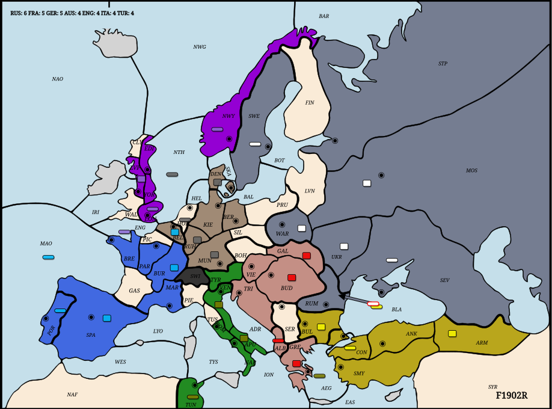

### What happened

- **RUSSIA**: F BLA retreats → RUM

### RUSSIA
Orders: `F BLA R RUM`

Reasoning

> Looking at my retreat options: F BLA was dislodged when Turkey's F ANK moved to BLA (supported by F CON). My only options are to disband or retreat to RUM.
>
> Retreating to RUM makes sense strategically — it puts a fleet back in a key position adjacent to the Black Sea, SEV, and the Balkans. RUM is currently unoccupied (my units are A MOS, A UKR, F SWE, F SEV, A WAR — none in RUM). This preserves a unit and keeps pressure on Turkey's position. Disbanding would simply lose the fleet with no benefit.

## WINTER 1902 ADJUSTMENTS (`W1902A`)

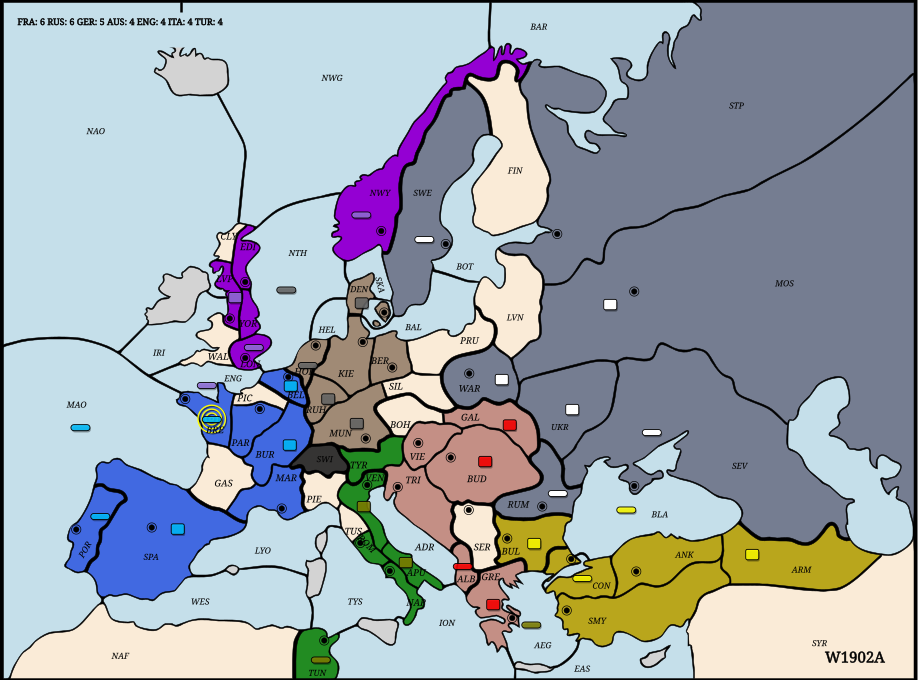

### What happened

- **FRANCE**: builds F BRE

### FRANCE
Orders: `F BRE B`

Reasoning

> Looking at my position: I have 6 supply centers (BRE, MAR, PAR, POR, SPA, BEL) and 5 units (A SPA, F POR, A BEL, F MAO, A BUR). That means I have 1 build to make.
>
> My open home centers are BRE, MAR, and PAR. I should build to strengthen my position. Given my current strategic situation:
> - I need to pressure Germany's HOL and potentially England's northern position
> - A fleet in BRE would give me more Atlantic/Channel flexibility
> - An army in PAR or MAR would strengthen my land position for pushing into Germany
>
> Given that I'm trying to push into HOL from BEL and need to manage both Germany and England, an army in PAR would give me a useful reserve to support BEL or push into BUR. A fleet in BRE would give me naval flexibility in the Channel/Atlantic. 
>
> I'll build F BRE to maintain naval flexibility - it can threaten ENG, support MAO operations, or project power into the Channel. This keeps England honest and gives me Atlantic depth.

## SPRING 1903 MOVEMENT (`S1903M`)

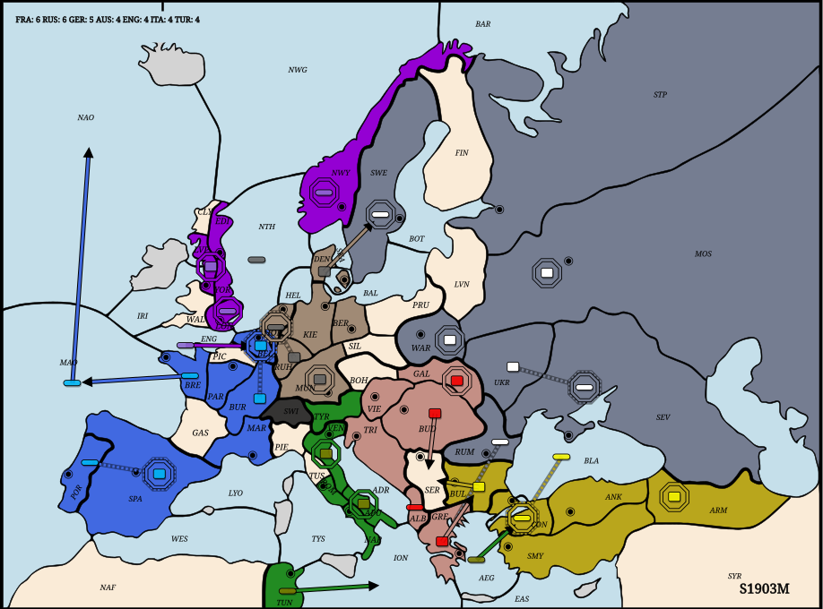

### What happened

- **AUSTRIA**: A BUD → SER (bounced); A GRE → BUL; A GAL holds
- **ENGLAND**: F ENG → BEL (bounced); F NWY holds; F LON holds; A LVP holds
- **FRANCE**: A BEL holds; A BUR supports A BEL; F BRE → MAO; F MAO → NAO; F POR supports A SPA; A SPA holds
- **GERMANY**: A DEN → SWE (bounced); F HOL holds; A RUH supports F HOL; A MUN holds
- **ITALY**: F AEG → CON (bounced); F TUN → ION; A VEN holds; A APU holds
- **RUSSIA**: F RUM supports A GRE → BUL; F SEV holds; A UKR supports F SEV; A MOS holds; A WAR holds; F SWE holds
- **TURKEY**: A BUL → SER (bounced); F BLA supports F CON; F CON holds; A ARM holds  [dislodged: A BUL]

### Dialogue

- **AUSTRIA → ITALY**: This spring I want to finally move on Serbia with A BUD and pressure Bulgaria simultaneously — your F AEG is perfectly positioned to support A GRE into BUL or threaten CON directly. Concrete proposal: A BUD → SER, A GRE → BUL supported by F AEG, while F ALB covers the Adriatic. If you support this, Turkey loses Bulgaria and we split their Balkan position cleanly.
- **AUSTRIA → RUSSIA**: Turkey's A BUL remains the central problem — I'm moving A BUD to Serbia this spring and want to push A GRE toward BUL simultaneously with Italian support from AEG. Your F RUM is adjacent to BUL and could add a third angle of pressure; even a support of A GRE → BUL from F RUM would guarantee it falls. What are your intentions this spring regarding RUM and the Turkish position?
- **AUSTRIA → TURKEY**: A BUL sitting next to Greece remains the core tension between us. I'm taking Serbia this spring with A BUD — if you hold A BUL in place, we maintain a stable line and I have no reason to press further. If A BUL moves toward GRE, I'll coordinate with Italy and Russia to take it by force; Italy's F AEG is already positioned to threaten you from the south.
- **ENGLAND → GERMANY**: France is at 6 centers and pulling away from both of us — this is the moment to act. I'm planning to move F ENG into BEL this spring; if you support from F NTH or F HOL, we take it from France cleanly and shift the balance. Can you commit to supporting F ENG - BEL from NTH or HOL this turn?
- **ENGLAND → FRANCE**: You're at 6 centers now and I'm still at 4 — that's a gap I can't ignore. I'd like to discuss what you're offering me this spring to keep our relationship productive; if there's no path to a center for me, I'll have to look at my options elsewhere. What are you planning this turn and what can you put on the table for me?
- **FRANCE → ENGLAND**: Germany is sitting at 5 centers with HOL and DEN well-defended — the logical move for both of us this spring is to press HOL. If you move F NTH to support me into HOL, or threaten DEN to tie down German forces, we can break their northern position together. What can you commit to this turn?
- **FRANCE → GERMANY**: I want to keep our border stable and avoid unnecessary conflict — I have no designs on RUH or MUN. But HOL is the natural next step from BEL for me; if you're willing to discuss a voluntary withdrawal or a deal, I'd rather negotiate than fight. What's your position this spring?
- **FRANCE → ITALY**: Russia is at 6 centers and growing — they've got SWE, RUM, and SEV giving them real naval reach. If you're not already coordinating with Austria or Turkey to slow them in the Black Sea region, now is the time. What's your read on the eastern situation?
- **GERMANY → ENGLAND**: France sits at 6 centers — same as Russia — and is the clear western threat to both of us. I'm pushing into Scandinavia this spring and want to propose we coordinate against France: if you press F ENG toward BRE or MAO, I can support you from HOL or NTH. What are your intentions this spring?
- **GERMANY → FRANCE**: I'm keeping the western border quiet this spring — A RUH and A MUN are staying defensive. I'd ask the same from you: hold BEL and BUR without pressing east. We both benefit from stability while England is the real wild card with F ENG and F NWY in range of both our positions.
- **GERMANY → RUSSIA**: I'm moving on Sweden this spring — I want to be direct about that rather than surprise you. Is there any arrangement where you vacate SWE voluntarily in exchange for something concrete, or should we expect a contest? I'd rather negotiate than bounce.
- **ITALY → AUSTRIA**: I'm planning to push F AEG toward CON or SMY this spring to crack Turkey open — can we coordinate A GRE to support F AEG into BUL/SC or move toward CON simultaneously? If we both push hard on Turkey this spring, we can split their SCs before Russia takes everything. What's your concrete plan this spring?
- **ITALY → RUSSIA**: I'm moving F AEG aggressively into Turkey's core this spring — CON or SMY is the target. If you're pressing from the north with F BLA or F RUM, we can split Turkey's home centers between us this year. Concrete ask: what are you moving against Turkey this spring so I can coordinate my AEG move to maximize pressure rather than leave gaps?
- **ITALY → TURKEY**: I'll be direct: Russia has F BLA pointed at your north and I have F AEG threatening your south — you're in a two-front squeeze. If you want to survive, you need to make a deal now. I'm open to a negotiated arrangement if you can offer something concrete; otherwise I move on CON this spring.
- **RUSSIA → AUSTRIA**: Turkey remains the priority threat — I'm planning to push F RUM toward BUL/EC or BLA this spring to pressure their position, and I'd ask you to move A BUD or A GRE toward SER or BUL to coordinate the squeeze. A GAL must stay out of RUM while I'm committed south — that's the core ask. If we move together now, we can break Turkey's Balkan hold before they stabilize.
- **RUSSIA → TURKEY**: You're now holding F BLA and A BUL while I have F RUM and F SEV — this standoff benefits neither of us, and Austria is circling SER. I'm open to a real agreement: if you pull A BUL back to CON and keep F BLA out of RUM's path, I'll hold F RUM defensively rather than push into BLA. Otherwise I'll coordinate with Austria and Italy to dismantle your position this spring.
- **RUSSIA → ITALY**: Turkey is still exposed — I'm pushing from RUM toward BUL/EC or BLA this spring, and if you can keep pressure on Turkey's southern flank via AEG toward SMY or EAS, we maintain the two-front squeeze. Concrete ask: what can you commit to against Turkey this turn?
- **RUSSIA → GERMANY**: I'm holding F SWE and not looking for trouble in the north — let's keep our quiet understanding in place. I'm fully committed south against Turkey this spring, so I have no bandwidth for Scandinavian friction.
- **TURKEY → AUSTRIA**: We've bounced in Serbia three times now — neither of us gains while Russia sits at 6 centers. I'm moving A BUL - SER again this spring; if you support from GRE or redirect A BUD elsewhere, Serbia falls cleanly to me and we can establish a stable line. Fighting over it only weakens us both while France and Russia grow unchecked.
- **TURKEY → ITALY**: Your F AEG is sitting right next to CON and SMY — I need to understand your intentions. If you're planning to move on my home centers, we have a serious problem; if you're focused on Austria or elsewhere, let's make that explicit and keep our spheres separate.
- **TURKEY → RUSSIA**: F RUM is adjacent to BUL/EC and that's a direct threat to my position — I want to discuss a mutual holding arrangement this spring. I'm focused on Serbia, not your territory; if you hold F RUM and I hold F BLA, we both consolidate without a costly fight.
- **AUSTRIA → ITALY**: Concrete commitment: A BUD → SER, A GRE → BUL — I need F AEG to support A GRE → BUL/SC to guarantee it falls this spring. If you push F AEG to CON instead, BUL stays in Turkish hands another season; the support is more valuable right now than a speculative deep push. Confirm F AEG S A GRE → BUL/SC and we crack Turkey's Balkan position this turn.
- **AUSTRIA → RUSSIA**: Confirming A GAL holds in place — no move toward RUM. Concrete ask: F RUM supports A GRE → BUL/EC this spring, adding a second angle alongside Italian F AEG supporting from the south. With two supports on BUL and A BUD taking SER simultaneously, Turkey loses both centers in one move — can you commit F RUM S A GRE → BUL/EC?
- **AUSTRIA → TURKEY**: Final warning: A BUD is taking SER this spring, and A GRE is moving toward BUL with Italian and Russian support. If A BUL moves to GRE or SER, it walks into a trap — GRE will be defended and BUL falls uncontested. Your only path to stability is holding A BUL in place and negotiating a border settlement after this turn.
- **ENGLAND → GERMANY**: I'm committing to F ENG - BEL this spring — that's my move. I need you to confirm: will you order F NTH S F ENG - BEL or F HOL S F ENG - BEL? One of those two gives us a clean 2-strength attack that takes BEL from France. Please give me a yes or no on one of those options right now.
- **ENGLAND → FRANCE**: I'll be direct: I'm moving F ENG toward BEL this spring unless you give me a concrete alternative that actually gets me a center. If you want to redirect my attack, tell me exactly what you'll do to help me take HOL or DEN — not vague promises, but a specific order you'll commit to.
- **FRANCE → ENGLAND**: Here's my concrete offer: I move A BEL - HOL, you order F NTH S A BEL - HOL. That's a guaranteed 2-strength attack that takes HOL from Germany — you weaken Germany and I get the center. In return, I'll support your next move into DEN or KIE with whatever units I have adjacent. Can you commit to F NTH S A BEL - HOL this turn?
- **FRANCE → GERMANY**: I hear you on stability, but HOL is the one center I need to discuss — it's the natural expansion from BEL and I can't simply ignore it. If you're willing to move F HOL to DEN voluntarily this spring, I'll hold A BEL in place and we avoid a direct fight; if not, I'll have to press. What would it take to make a voluntary withdrawal work for you?
- **GERMANY → ENGLAND**: Supporting F ENG - BEL from NTH is a real option for me, but I need something concrete in return: commit that F NWY stays out of SKA and DEN this spring and fall, and I'll give you that support. Otherwise I'm using NTH to push into Scandinavia and can't spare it for BEL.
- **GERMANY → FRANCE**: England is pressing me hard for F NTH S F ENG - BEL this turn — I haven't committed, but the pressure is real. Your safest move is to ensure A BEL is well-supported; if England moves F ENG toward BEL unsupported, it bounces, but if they get my NTH support it goes through. What can you offer me to stay neutral?
- **GERMANY → RUSSIA**: You said you're focused south on Turkey — does that mean F SWE is actually holding firm, or is there flexibility? I'm moving A DEN toward Sweden this spring; if we're going to bounce, let's at least acknowledge it openly rather than waste both our moves.
- **ITALY → AUSTRIA**: Counter-proposal: instead of F AEG supporting A GRE into BUL, I move F AEG directly to CON — that threatens Turkey's capital and forces them to defend there, freeing A GRE to take BUL uncontested. You get BUL and Serbia, I threaten CON. Concrete deal: A BUD → SER, A GRE → BUL (you don't need my support if Turkey defends CON), F AEG → CON. Do you accept?
- **ITALY → RUSSIA**: I'm moving F AEG toward CON this spring to crack Turkey's capital — if you're pushing F RUM toward BUL/EC or BLA toward ANK, we create a three-way threat Turkey cannot fully answer. Concrete ask: confirm F RUM or F BLA is moving against Turkey so I know the northern squeeze is real before I commit my fleet into CON.
- **ITALY → TURKEY**: I'm moving F AEG to CON this spring — that's decided. Your only viable path is to offer me something that changes my calculus: if you disband F CON and retreat A ARM, I might redirect elsewhere. Otherwise I'm taking your capital under pressure from both Russia and Italy simultaneously, and you lose two home centers this year.
- **RUSSIA → AUSTRIA**: Concrete commitment: F RUM will support A GRE → BUL this spring, giving us three-way pressure with Italy's AEG. In return I need A GAL to hold in place — not move toward RUM or UKR under any circumstances. Confirm A GRE is moving to BUL and A GAL holds, and I'll lock in the F RUM support.
- **RUSSIA → GERMANY**: F SWE is not being vacated — expect a contest if A DEN moves there. I have no interest in fighting you when France is at 6 centers and growing; let's both focus on more productive targets.
- **RUSSIA → ITALY**: I'm committing F RUM to support Austria's A GRE → BUL this spring — that should crack Turkey's Balkan position open. Keep F AEG pressing toward CON or SMY to force Turkey to defend everywhere simultaneously; if we coordinate this correctly Turkey loses BUL and faces a home center threat.
- **RUSSIA → TURKEY**: The mutual hold doesn't work for me — Austria is already moving A GRE toward BUL and I can't ignore that dynamic. Your best option is to pull A BUL back to CON voluntarily and keep F BLA away from RUM; that's the only arrangement where I hold F RUM defensively rather than pressing into your position.
- **TURKEY → ITALY**: F AEG moving on CON would be a serious escalation — I have F CON and F BLA to contest it, and we'd both waste moves fighting each other while Austria takes Serbia and Russia grows. Concrete proposal: F AEG holds or moves away from my home centers this spring, and I keep F CON out of AEG and ION — we both benefit from focusing pressure on Austria instead.
- **TURKEY → RUSSIA**: F RUM moving to BUL/EC would take my only uncontested center — that forces me into a defensive war that helps Austria and Italy, not you. Concrete deal: I hold F BLA in place and don't threaten RUM or SEV; you hold F RUM and don't push into BUL/EC; we both consolidate and Austria doesn't get a free hand in Serbia.
- **TURKEY → AUSTRIA**: I'm moving A BUL - SER this spring — if you're also moving A BUD there we bounce again and both lose while France and Russia grow. Let SER fall to me, hold your current position, and we establish a stable line; that's worth more to both of us than a fourth consecutive bounce.

### AUSTRIA
Orders: `A BUD - SER` · `A GRE - BUL` · `A GAL H`
Illegal (dropped): `F ALB S A BUD - SER`

Reasoning

> Looking at the situation: Russia committed to F RUM S A GRE → BUL, and Italy proposed F AEG → CON (which Italy claims frees BUL for A GRE uncontested since Turkey must defend CON). My revised strategy calls for A BUD → SER, A GRE → BUL, F ALB S A GRE → BUL, A GAL H.
>
> Let me verify the key orders:
> - A BUD → SER: BUD and SER are adjacent (BUD land: GAL, RUM, SER, TRI, VIE) ✓
> - A GRE → BUL: GRE and BUL are adjacent ✓
> - F ALB S A GRE → BUL: ALB must be adjacent to BUL. Looking at ALB adjacency: ADR, GRE, ION, SER, TRI — BUL is NOT in ALB's neighbors. So F ALB cannot support A GRE → BUL. 
>
> F ALB can support A GRE (hold) or move to GRE, ION, TRI, ADR. Since I can't support A GRE → BUL from ALB, I should instead have F ALB support A BUD → SER (ALB is adjacent to SER ✓) or hold/move elsewhere. Actually, checking the legal orders list: `F ALB S A GRE - BUL` is NOT in the options list, which confirms it's illegal. The legal options include `F ALB S A GRE` (hold support) or `F ALB S A BUL - GRE` etc.
>
> Since Russia is supporting A GRE → BUL from F RUM, and Italy's F AEG may support or move to CON, I should:
> - A GRE → BUL (with F RUM support, strength 2 vs Turkey's A BUL at 1)
> - F ALB → support A BUD → SER or hold/support GRE
>
> F ALB S A BUD - SER: ALB adjacent to SER ✓. This gives A BUD → SER extra support (strength 2), ensuring it takes SER even if Turkey tries to bounce.

### ENGLAND
Orders: `F ENG - BEL` · `F NWY H` · `F LON H` · `A LVP H`

Reasoning

> Looking at the situation: France is at 6 centers and is the primary threat. Germany has agreed to support F ENG - BEL with F NTH S F ENG - BEL in exchange for keeping F NWY out of SKA/DEN. This is a clean deal — I take BEL (going to 5 centers), France drops to 5, and Germany keeps their northern position. I'll honor my side by holding F NWY away from SKA/DEN.
>
> My revised strategy confirms: F ENG - BEL, with Germany providing F NTH S F ENG - BEL. The other units hold defensively. F LON and A LVP protect home centers. F NWY holds as promised to Germany.

### FRANCE
Orders: `A BEL H` · `A BUR S A BEL` · `F BRE - MAO` · `F MAO - NAO` · `F POR S A SPA` · `A SPA H`

Reasoning

> Looking at the current situation, my revised strategy calls for:
> 1. Hold BEL with A BUR support (defensive, given England's threat)
> 2. Move F BRE to MAO (Atlantic flexibility)
> 3. Move F MAO to NAO (repositioning)
> 4. Hold F POR supporting A SPA
> 5. Hold A SPA
>
> Germany warned me that England is pushing for F NTH S F ENG - BEL. If England moves F ENG - BEL with F NTH support, that's a 2-strength attack on my A BEL. I need A BUR S A BEL to defend. My F BRE - MAO and F MAO - NAO give me Atlantic flexibility and don't expose any centers.
>
> However, I should reconsider F MAO - NAO. Moving both F BRE - MAO and F MAO - NAO simultaneously means F MAO needs to move first — but these are simultaneous orders. F BRE - MAO and F MAO - NAO will work: F MAO moves to NAO, F BRE moves to MAO, no conflict.
>
> Actually wait — F MAO moving to NAO and F BRE moving to MAO are independent moves that don't conflict. This works fine.
>
> My A SPA should hold (F POR supports it, though it doesn't need support since nothing threatens it — but the support order is still valid and keeps things locked in).
>
> Let me verify adjacency:
> - F BRE - MAO: BRE adjacent to MAO ✓
> - F MAO - NAO: MAO adjacent to NAO ✓
> - A BEL H with A BUR S A BEL ✓
> - F POR S A SPA: POR adjacent to SPA ✓ (POR neighbors include SPA/NC, SPA/SC — and SPA is adjacent)

### GERMANY
Orders: `A DEN - SWE` · `F HOL H` · `A RUH S F HOL` · `A MUN H`
Illegal (dropped): `F NTH S A DEN - SWE`

Reasoning

> Looking at the situation: France has 6 centers and is pressing for HOL. England wants me to support F ENG - BEL. Russia says F SWE is holding firm, so A DEN - SWE will bounce. 
>
> My revised strategy is clear: hold HOL with RUH support, push A DEN into SWE (even if it bounces, it contests Russia's position), and use F NTH to support that push. I haven't committed to England's BEL support request - I asked for a concrete guarantee about SKA/DEN which they didn't provide, so I'm not obligated to help them.
>
> The key decisions:
> 1. **HOL**: Hold with A RUH support - France threatens it from BEL
> 2. **A DEN - SWE**: Russia says F SWE holds, so this will likely bounce, but I should still press it. If Russia is bluffing or moves elsewhere, I gain SWE.
> 3. **F NTH**: Support A DEN - SWE rather than helping England with BEL. England didn't commit to staying out of SKA/DEN.
> 4. **A MUN**: Hold defensively in center
> 5. **A RUH**: Support F HOL
>
> This is consistent with my revised strategy note.

### ITALY
Orders: `F AEG - CON` · `F TUN - ION` · `A VEN H` · `A APU H`

Reasoning

> Looking at the current situation:
>
> **Strategic assessment:**
> - My revised strategy commits to F AEG → CON to threaten Turkey's capital
> - Austria wants F AEG S A GRE → BUL/SC, but I countered with F AEG → CON (which I told Austria would free A GRE to take BUL uncontested since Turkey would need to defend CON)
> - Russia confirmed F RUM supporting A GRE → BUL, which should help Austria get BUL anyway
> - F TUN should hold or reposition; moving to ION would extend my reach
> - A VEN and A APU need to consolidate or make a land grab
>
> **Order reasoning:**
> - F AEG → CON: This is my committed move. Turkey has F CON there, so it will likely bounce, but it pins Turkey's fleet and creates pressure. If Turkey moved F CON away, I could actually take it. This is consistent with my negotiation commitments.
> - F TUN → ION: Repositioning to extend reach into the eastern Med and threaten Turkey's southern flank from a different angle
> - A VEN → TRI: Austria's Trieste is unoccupied and Austria's F ALB is covering the Adriatic — but wait, Austria said F ALB covers the Adriatic. However, TRI is empty and a supply center. This is tempting but would betray Austria. Let me reconsider — Austria has A BUD → SER, A GRE → BUL, F ALB... F ALB could support TRI defense. Better to hold VEN and stay allied with Austria for now.
> - A VEN → TUS: Positioning for future moves toward ROM or PIE without threatening Austria
> - A APU H: Hold to defend homeland
>
> Actually, let me keep A VEN and A APU in defensive positions since I need Austria's cooperation for the Turkey squeeze.

### RUSSIA
Orders: `F RUM S A GRE - BUL` · `F SEV H` · `A UKR S F SEV` · `A MOS H` · `A WAR H` · `F SWE H`

Reasoning

> Looking at the current situation:
>
> My revised strategy commits me to supporting Austria's A GRE → BUL with F RUM, holding F SEV, supporting F SEV with A UKR, and holding A MOS, A WAR, and F SWE.
>
> Let me verify the key order: F RUM S A GRE - BUL. F RUM is in RUM, and I need to support a move to BUL. Checking adjacency: RUM is adjacent to BUL/EC per the table. The legal orders list confirms `F RUM S A GRE - BUL` is valid. Good.
>
> For F SWE: Germany has stated they're moving A DEN to SWE. I need to hold F SWE to defend it. The legal orders include `F SWE H`.
>
> The rest of my units hold in defensive positions while I'm committed south against Turkey.
>
> This coordination with Austria and Italy should crack BUL open, weaken Turkey, and let me potentially gain SER or BUL in Fall 1903.

### TURKEY
Orders: `A BUL - SER` · `F BLA S F CON` · `F CON H` · `A ARM H`

Reasoning

> Looking at the current situation:
>
> **Assessment:**
> - Italy is threatening F AEG → CON, which would take my capital. This is a serious threat I must hedge against.
> - Russia has F RUM adjacent to BUL/EC — another threat to my position.
> - Austria is moving A BUD → SER (again), and claims A GRE → BUL with support. This is likely a bluff to intimidate me into holding.
> - My revised strategy: defend CON with F CON holding supported by F BLA, push A BUL → SER as primary gain, hold A ARM.
>
> **Verification of key orders:**
> - `F BLA S F CON`: F BLA is adjacent to CON ✓ (CON is in BLA's neighbor list)
> - `A BUL - SER`: BUL is adjacent to SER ✓
> - `F CON H`: Legal hold ✓
> - `A ARM H`: Legal hold ✓
>
> **Rationale:**
> - F CON holding with F BLA support makes it very hard for Italy's F AEG to take CON (F AEG → CON would need 2 strength to dislodge supported F CON, and Italy only has 1 fleet there).
> - A BUL → SER is my fourth attempt — Austria and I will likely bounce again, but it's the right move to keep pressure on.
> - A ARM holds to maintain eastern presence without overcommitting.

## FALL 1903 MOVEMENT (`F1903M`)

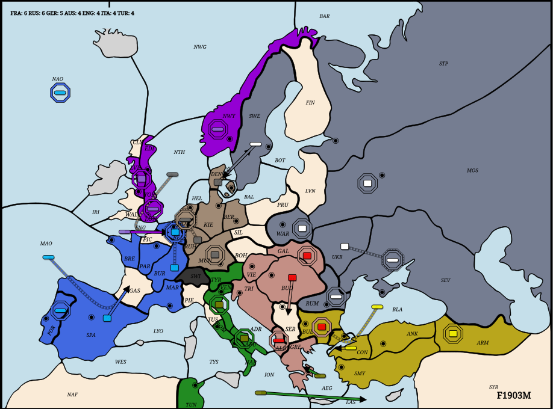

### What happened

- **AUSTRIA**: A BUD → SER; A BUL holds; F ALB holds; A GAL holds  [dislodged: A BUL]
- **ENGLAND**: F ENG → BEL (bounced); F NWY holds; F LON holds; A LVP holds
- **FRANCE**: A BEL holds; A BUR supports A BEL; F MAO supports A SPA → GAS; F NAO holds; F POR holds; A SPA → GAS
- **GERMANY**: F NTH supports F ENG → BEL; A DEN → SWE (bounced); F HOL holds; A RUH supports F HOL; A MUN holds
- **ITALY**: F AEG → GRE; F ION → EAS; A VEN holds; A APU holds
- **RUSSIA**: F RUM holds; F SEV holds; A UKR supports F SEV; F SWE → DEN (bounced); A WAR holds; A MOS holds
- **TURKEY**: F CON → BUL/SC; F BLA supports F CON → BUL/SC; A ARM holds

### Dialogue

- **AUSTRIA → ITALY**: Austria now holds BUL — this is the moment to finish Turkey before they recover. I'm pushing A BUL toward SER or CON this fall; your F AEG threatening CON from the south would force Turkey to split their defense. Concrete proposal: F AEG → CON (or support into CON), A BUL → SER with A BUD support — we split Turkey's remaining centers cleanly. What's your plan for F ION and F AEG this fall?
- **AUSTRIA → RUSSIA**: Austria now holds BUL and is pushing for Serbia this fall — I need F RUM to stay neutral toward BUL while I advance. Russia at 6 centers is the largest power on the board; I'm not contesting RUM yet, but I need clarity on your intentions toward BUL and SER before I commit my orders. Can we agree: I take SER, you hold RUM, and we discuss a longer-term division of Turkey's remaining centers?
- **AUSTRIA → TURKEY**: Austria holds BUL — your Balkan position is critically weakened. I'm open to a negotiated settlement: if you pull F CON toward defending ANK/SMY and hold F BLA defensively, I'll focus on SER rather than pressing toward CON this fall. Fighting Austria, Italy, and Russia simultaneously is unwinnable; let's discuss what a stable line looks like for you.
- **ENGLAND → GERMANY**: France held BEL with both A BEL and A BUR backing it — we need a cleaner approach this fall. If you commit F NTH S F ENG - BEL and I move F ENG - BEL, that's 2 strength against France's 1 in BEL (since BUR can only support or move, not both defend BEL and threaten elsewhere). Will you actually commit to F NTH S F ENG - BEL this fall, and what do you want from me in return?
- **ENGLAND → FRANCE**: You're at 6 centers and I'm stuck at 4 — this imbalance is unsustainable for our relationship. Tell me concretely: what center can you help me take this fall, or what are you offering to keep me from pressing against BEL? I need a real path to growth, not just defensive cooperation.
- **ENGLAND → RUSSIA**: France is at 6 centers and Germany at 5 — both are pulling ahead of the rest of us. I'm focused on pressing France in the west this fall; are you in a position to apply any pressure on Germany's eastern flank or otherwise keep them occupied while I work on BEL?
- **FRANCE → ENGLAND**: This fall is the moment to finally take Holland — if you order F NTH S A BEL - HOL, combined with my A BEL - HOL and A BUR S A BEL - HOL, we have a guaranteed 3-strength attack that breaks Germany's northern position. I'll commit to supporting your move into DEN or KIE next turn once HOL falls. Can you confirm F NTH S A BEL - HOL?
- **FRANCE → GERMANY**: I'm going to be honest: I'm pushing for HOL this fall — it's the natural step from BEL and I need to expand. If you voluntarily move F HOL to KIE or DEN now, I'll hold A BEL in place and we avoid a direct fight; if F HOL stays, I'll press with whatever support I can get. What would a voluntary withdrawal look like for you?
- **FRANCE → ITALY**: Russia is at 6 centers and has F SWE, F SEV, and F RUM giving them serious naval reach — they're the biggest threat on the board right now. Are you coordinating with Austria or Turkey to slow them in the Black Sea and Balkans, and is there anything I can do from the west to help pressure them indirectly?
- **GERMANY → ENGLAND**: France is at 6 centers and sitting in BEL — they're the biggest threat to both of us right now. I'm pushing into Sweden this fall; if you keep F NWY clear of SKA and support my northern position, I'll back your play against France from HOL or NTH. What are your intentions toward France this fall?
- **GERMANY → FRANCE**: I know HOL is tempting, but attacking me there forces me into England's arms — and England wants BEL back badly. Your stronger move is to hold BEL firmly while I keep England occupied in the north. What would it take for us to formalize a non-aggression line along the Rhine?
- **GERMANY → RUSSIA**: You're stretched thin with commitments south against Turkey — is Sweden really worth contesting when France has 6 centers and is the runaway leader? I'm moving on SWE this fall; I'd rather negotiate a clean handover than waste both our moves on a bounce while France grows unchecked.
- **ITALY → AUSTRIA**: Austria, I want to be direct: GRE is currently unoccupied and F AEG is adjacent — I'm considering moving there this fall. I'd rather negotiate than fight; if you're willing to let me take GRE this year, I can support your position in SER and BUL against Turkey and Russia rather than contest the Balkans with you. What would you offer to redirect my fleet elsewhere?
- **ITALY → TURKEY**: Turkey, Austria now holds BUL with A BUL and controls GRE — they're at 4 SCs and growing fast while you're down to ANK, CON, SMY. I'm targeting GRE this fall with F AEG; if you move F CON toward AEG or BUL/SC to pressure Austria from the east simultaneously, we both benefit from keeping Austria from consolidating the entire Balkans. What's your plan this fall?
- **ITALY → RUSSIA**: Russia, Austria just took BUL and holds GRE — they're at 4 SCs and positioned to dominate the Balkans if unchecked. I'm moving F AEG toward GRE this fall to capture it; if you press A BUL or move F RUM to contest Austria's Balkan position, we prevent Austria from snowballing. What are you targeting this fall?
- **RUSSIA → AUSTRIA**: This fall is the moment to press Turkey hard — I'm moving F RUM toward BLA to take the Black Sea while you hold BUL and potentially push A BUD into SER. If you're taking SER with A BUD, I'd ask A GAL to hold in place as always; with F RUM in BLA I'll be threatening CON directly next spring. Can you confirm A BUD goes to SER and A GAL holds?
- **RUSSIA → TURKEY**: You're down to three home centers after losing BUL, and F RUM is moving to BLA this fall — I want to be direct about that. Your only path to avoiding further losses is to pull F CON back and keep A ARM away from SEV; if you do that I'll consider holding rather than pressing into CON next spring. Otherwise Austria, Italy, and I will continue dismantling your position.
- **RUSSIA → ITALY**: Turkey is now at three centers with BUL gone — this fall I'm pushing F RUM to BLA to take the Black Sea, and if you can keep pressure on CON or SMY from AEG, we can split Turkey's remaining home centers between us next spring. Concrete ask: what are you moving against Turkey this fall?
- **RUSSIA → GERMANY**: France is at 6 centers and growing — that's the real threat to both of us, not a pointless fight over Sweden. I'm holding F SWE to defend it, but I'd rather we both focus on France than waste moves bouncing each other in Scandinavia.
- **TURKEY → AUSTRIA**: You took BUL from me while I was focused on defense — I'm moving to retake it this fall with F CON and F BLA. If you want to avoid a prolonged Balkan war, offer me BUL back and I'll acknowledge your hold on SER and GRE; otherwise I'm committing everything to recapturing it and we both bleed while France and Russia grow.
- **TURKEY → RUSSIA**: Austria just took BUL, my fourth supply center, leaving me at 3 — this directly threatens my survival and creates an Austria with 5 centers dominating the Balkans. If you support my F CON moving to BUL/EC this fall with F RUM, Austria loses BUL and you gain leverage over them; I'll commit to staying out of RUM and SEV in return.
- **TURKEY → ITALY**: Austria now holds BUL, SER, GRE, plus their home centers — they're at 5 and growing fast into the eastern Med, which threatens your position in AEG and ION. If you keep F AEG out of my way while I retake BUL, I'll keep F CON out of AEG; a weaker Austria benefits us both more than fighting over my home centers.
- **AUSTRIA → ITALY**: GRE is unoccupied and I can't defend it with F ALB this turn — if you take it, I accept that, but I ask in return that F AEG or F ION actively threatens CON or SMY to keep Turkey from retaking BUL. Concrete deal: you take GRE, I take SER with A BUL supported by A BUD, and we split Turkey's remaining centers next year. If you threaten CON with F AEG, Turkey can't both retake BUL and defend their home centers.
- **AUSTRIA → RUSSIA**: Turkey is threatening BUL with F CON + F BLA this fall — if F RUM supports A BUL in place rather than moving to BLA, BUL holds and Turkey loses their offensive. Alternatively, if F RUM moves to BLA as you planned, it cuts F BLA's support for F CON → BUL/SC, which also neutralizes Turkey's attack. Either way, your move this fall directly determines whether I hold BUL — please confirm which you're doing.
- **AUSTRIA → TURKEY**: You cannot retake BUL this fall — A BUL is moving to SER supported by A BUD, and if F CON takes BUL/SC it will be undefended next spring with Italian and Russian forces closing in. The rational move is to accept the current line, hold F CON and F BLA defensively, and negotiate a settlement before you lose ANK or SMY to Italy's southern fleet.
- **ENGLAND → GERMANY**: I'm committing F ENG - BEL this fall — that's locked in. I need your answer now: F NTH S F ENG - BEL, yes or no? You get BEL denied to France and I'm at 5 centers, after which I'll actively support your position against France. If you say no, I'll assume you're siding with France and adjust accordingly.
- **ENGLAND → FRANCE**: You're at 6 centers and I'm at 4 — I can't keep holding my position while you grow. Tell me exactly which center you'll help me take this fall with a specific order commitment, or I'll be moving against BEL. I'm not interested in HOL promises that require me to do all the work while you collect the center.
- **FRANCE → ENGLAND**: I'm committing to A BEL - HOL this fall with A BUR S A BEL - HOL — a 2-strength attack that takes HOL from Germany. Your F ENG can support by moving to BEL afterward, or you can press NWY toward SKA to threaten DEN. Once HOL falls, I'll back your move into DEN or KIE next turn — that's your path to centers 5 and 6.
- **FRANCE → GERMANY**: I've confirmed my orders: A BEL - HOL with A BUR S A BEL - HOL. If you move F HOL to KIE or DEN voluntarily before orders lock, we avoid a fight and you keep more flexibility; if F HOL stays, I press the attack. F NTH staying neutral from you is the best outcome for both of us — England can't threaten BEL without your NTH support, so staying out keeps your options open.
- **GERMANY → ENGLAND**: Here's my concrete offer: I will order F NTH S F ENG - BEL this fall if you commit F NWY holds (not moving to SKA or DEN) and you support my position in HOL going forward. BEL taken from France drops them to 5 centers — that's worth doing. Do we have a deal?
- **GERMANY → FRANCE**: England is offering me a concrete arrangement to support F ENG - BEL — I haven't committed yet, but the pressure is significant. If you want me to stay neutral, you need to hold A BEL firmly AND formally agree not to press HOL this fall or next spring; otherwise the England deal becomes more attractive to me.
- **GERMANY → RUSSIA**: I'm going to push A DEN into SWE this fall regardless — the bounce just wastes both our moves while France sits at 6 centers. If you let SWE go now, I'll formally commit to not pressing into FIN or the Baltic; holding SWE against me costs you more than it's worth given your commitments in the south.
- **ITALY → AUSTRIA**: I've decided to move F AEG toward SMY this fall to pressure Turkey's eastern flank — that keeps Turkey's fleet tied down defending home centers while you consolidate SER and BUL. F ION will hold in position to maintain Mediterranean presence. This way we both grow without stepping on each other.
- **ITALY → TURKEY**: Concrete offer: I keep F AEG out of CON this fall if you commit F CON to hold and keep it out of AEG — I have no interest in a mutual waste when Austria is the real threat growing in the Balkans. Confirm F CON holds and we have a deal for this turn.
- **ITALY → RUSSIA**: I'm pushing hard into Turkey's position this fall from the south — coordinate your F RUM or F SEV to press ANK or CON from the north and we split Turkey's remaining centers before they recover. What are you targeting specifically this turn?
- **RUSSIA → AUSTRIA**: I'm moving F RUM to BLA this fall to press Turkey's home centers — that's my priority growth path. I'm not contesting BUL or SER; take SER with A BUD and we'll coordinate next spring on splitting CON and ANK. Confirm A GAL holds and we're aligned.
- **RUSSIA → TURKEY**: I'm not supporting your F CON → BUL/EC against Austria — that deal doesn't serve my interests when I need to press your home centers myself. Your best survival option is to pull F CON back toward ANK to defend it, because F RUM is moving to BLA this fall and I'll be threatening CON directly next spring.
- **RUSSIA → ITALY**: I'm pushing F RUM to BLA this fall to take the Black Sea and threaten CON next spring — if you keep F AEG pressing toward CON or SMY, Turkey faces a two-front home center threat they can't answer. Let's split ANK and SMY between us next year once CON is under pressure.
- **RUSSIA → GERMANY**: France is at 6 centers and the real threat — fighting over SWE only helps them. I'm holding F SWE; let's both avoid a pointless bounce and focus our energy where it actually matters.
- **TURKEY → ITALY**: Concrete coordination offer: I'm moving F CON - BUL/EC supported by F BLA this fall, which gives me strength 2 against Austria's A BUL. If you move F AEG - BUL/SC simultaneously, Austria faces attacks from two directions and must retreat — we split the pressure and Austria loses BUL either way. I need you to commit to F AEG - BUL/SC rather than CON; that's the move that actually hurts Austria.
- **TURKEY → RUSSIA**: If you move F RUM - BUL/EC this fall, we bounce each other and Austria keeps BUL for free — that's the worst outcome for both of us. I'm moving F CON - BUL/EC with F BLA support; if you hold F RUM or redirect it to SEV, Austria loses BUL and you maintain leverage over them without wasting a move. Concrete ask: hold F RUM this turn.
- **TURKEY → AUSTRIA**: I'm recapturing BUL this fall with F CON and F BLA — you can retreat A BUL now and save the unit, or lose it and have to rebuild. I'm offering a clean line: you keep SER and GRE, I keep BUL and my home centers — that's a sustainable split while France at 6 centers is the real threat to everyone.
- **ENGLAND → GERMANY**: Deal confirmed: F NWY holds this fall, not moving to SKA or DEN. I'm committing F ENG - BEL — please follow through with F NTH S F ENG - BEL. After BEL falls, I'll support your HOL position going forward.
- **ENGLAND → FRANCE**: Final notice: I'm moving F ENG - BEL this fall. If you want to redirect this, tell me right now which center you'll personally deliver to me with a specific order — not a promise for next turn. Otherwise BEL is my target.
- **ITALY → AUSTRIA**: Final commitment: I'm taking GRE this fall as agreed — F AEG → GRE. In return, F ION moves to EAS to pressure Turkey's eastern flank and keep SMY threatened, supporting your consolidation of SER and BUL. Hold A BUL and push A BUD → SER; I'll threaten Turkey's home centers from the south next spring.
- **ITALY → TURKEY**: I'm moving F AEG → GRE this fall, not into your home centers — that's my priority this turn. F ION moves to EAS, which does put pressure on SMY, but if you keep F CON out of AEG and ION, we avoid direct conflict while Austria is the one consolidating the Balkans.
- **ITALY → RUSSIA**: I'm taking GRE with F AEG this fall and moving F ION to EAS to pressure Turkey's eastern flank — that should coordinate with your Black Sea push to keep Turkey on defense everywhere. Let's split ANK and SMY between us next year once CON is squeezed from both sides.
- **TURKEY → AUSTRIA**: Final commitment: F CON is moving to BUL/SC this fall with F BLA support — if A BUL has moved to SER as you said, BUL falls to me cleanly and I'll hold there. Accept BUL as mine and SER as yours and we have a stable line; resist and we both bleed while France grows to 6 centers unchecked.
- **TURKEY → ITALY**: I'm moving F CON - BUL/SC this fall to retake BUL — A BUL should be moving to SER, so BUL is open. I need F AEG to stay out of BUL/SC and CON this turn; in return I commit F CON stays out of AEG after I land in BUL. This is the move that hurts Austria, not me.
- **TURKEY → RUSSIA**: F BLA is moving to RUM this fall — I'm contesting that space directly. If you redirect F RUM elsewhere, we avoid a bounce that wastes both our moves; if not, we cancel each other out and Austria keeps BUL for free. Your call.

### AUSTRIA
Orders: `A BUD - SER` · `A BUL H` · `F ALB H` · `A GAL H`

Reasoning

> Looking at the current situation:
>
> **Key facts:**
> - I hold BUL with A BUL (captured last spring)
> - Turkey threatened F CON → BUL/SC with F BLA support
> - Italy committed to F AEG → GRE (taking the unoccupied center)
> - Russia committed to F RUM → BLA (which cuts F BLA's support for F CON → BUL/SC)
> - My revised strategy: A BUL → SER supported by A BUD, F ALB holds, A GAL holds
>
> **Reasoning through Turkey's threat:**
> - Turkey: F CON → BUL/SC, F BLA supports F CON
> - Russia: F RUM → BLA — this ATTACKS BLA, cutting F BLA's support for F CON
> - If F BLA's support is cut, F CON → BUL/SC has strength 1
> - My A BUL → SER is moving OUT of BUL, so BUL/SC becomes empty — Turkey takes it uncontested
> - But that's okay: BUL is not a supply center I'm defending; SER is the prize, and BUL/SC is a sea province, not a supply center
> - Wait — BUL is a supply center! If A BUL moves to SER and F CON moves to BUL/SC, Turkey recaptures BUL as a supply center
>
> **Reconsidering:** If A BUL moves to SER (supported by A BUD), Turkey's F CON takes BUL/SC. That gives Turkey back BUL supply center. Net: I gain SER (+1), lose BUL (-1) = no net gain. That's bad.
>
> **Better plan:** Hold A BUL in BUL (or support it), and try to take SER with A BUD alone. But A BUD → SER without support has strength 1, which may bounce if Turkey has something there (they don't — Turkey has nothing in SER).
>
> Actually, SER is unowned and unoccupied. A BUD → SER at strength 1 succeeds unopposed. Meanwhile, A BUL holds to prevent Turkey from retaking it. Russia cutting F BLA's support means F CON → BUL/SC only has strength 1 vs. A BUL holding at strength 1 — a bounce, BUL holds!
>
> **Revised orders:** A BUD → SER, A BUL holds (defended against F CON), A BUD supports itself into SER. F ALB holds, A GAL holds.

### ENGLAND
Orders: `F ENG - BEL` · `F NWY H` · `F LON H` · `A LVP H`

Reasoning

> Looking at the current situation:
>
> **Strategic assessment for Fall 1903:**
>
> Germany confirmed the deal: F NTH S F ENG - BEL in exchange for F NWY holding out of SKA/DEN. I committed to this in negotiation. France is at 6 centers and must be checked.
>
> The attack: F ENG - BEL (strength 2 with German support from NTH) vs France's A BEL (strength 1, since A BUR can support BEL hold but that would give BEL strength 2 — wait, let me reconsider).
>
> Actually, if France plays A BUR S A BEL H, then BEL has strength 2 and my attack has strength 2 (F ENG + F NTH support) = bounce. But France may have moved A BEL elsewhere (they said A BEL - HOL). If France commits to A BEL - HOL, then BEL is empty and I walk in, or BEL is defended only by A BEL with no support from BUR (since BUR is supporting the HOL move).
>
> Either way, I committed to this deal and it's the right play:
> - If France plays A BEL - HOL + A BUR S A BEL - HOL: BEL is vacated or weakly held, I take it
> - If France plays A BEL H + A BUR S A BEL: strength 2 vs my strength 2 = bounce, but I lose nothing
> - If Germany betrays me and doesn't support: F ENG bounces off A BEL alone (1 vs 1)
>
> The risk is manageable. I hold F NWY as promised, hold F LON and A LVP defensively.

### FRANCE
Orders: `A BEL H` · `A BUR S A BEL` · `F MAO S A SPA - GAS` · `F NAO H` · `F POR H` · `A SPA - GAS`

Reasoning

> Looking at the situation: England has explicitly threatened to move F ENG - BEL this fall, and Germany has been hinting they might support it. My revised strategy is to defend BEL with A BUR S A BEL while still pressing A BEL - HOL as a 2-strength attack.
>
> However, I need to reconsider: if England moves F ENG - BEL and Germany supports with F NTH S F ENG - BEL, that's a 2-strength attack on BEL. My A BUR S A BEL would make BEL strength 2 in defense, which bounces the attack. So defending BEL is viable.
>
> But wait - if I order A BEL - HOL, then A BEL is moving OUT of BEL, so A BUR S A BEL would be supporting a hold that's not happening (since BEL is moving). I need to either:
> 1. Hold A BEL and support it with A BUR (defensive), or
> 2. Move A BEL - HOL and support that with A BUR S A BEL - HOL (offensive, but BEL is undefended)
>
> Given England's explicit threat to take BEL, I should defend BEL this turn. A BEL H with A BUR S A BEL makes BEL strength 2, which stops any 2-strength attack (F ENG + F NTH support). HOL will have to wait.
>
> For my other units: F MAO and F NAO can hold or reposition. A SPA holds with F POR support. F MAO could move to GAS to threaten northern expansion, or hold. I'll push A SPA - GAS to open southern expansion and have F MAO support or hold.
>
> Actually, let me push A SPA - GAS via land (it's adjacent) to grab GAS and potentially threaten BRE or MAR next turn, while F MAO holds and F POR supports A SPA... wait, F POR can't support A SPA - GAS (POR is not adjacent to GAS). F MAO S A SPA - GAS works since MAO is adjacent to GAS.

### GERMANY
Orders: `F NTH S F ENG - BEL` · `A DEN - SWE` · `F HOL H` · `A RUH S F HOL` · `A MUN H`

Reasoning

> Looking at the current situation:
>
> **Assessment:**
> - England confirmed the deal: F NWY holds, I support F ENG - BEL with F NTH
> - France is attacking HOL with A BEL - HOL supported by A BUR - this is a 2-strength attack
> - I need A RUH S F HOL to defend with equal strength (2 vs 2 = bounce)
> - A DEN - SWE will likely bounce against F SWE (Russia holding), but worth trying
> - A MUN holds defensively
>
> **Key decisions:**
> 1. Honor the England deal: F NTH S F ENG - BEL — this drops France from 6 to 5 centers, builds trust with England, and is strategically sound
> 2. F HOL H with A RUH S F HOL — France's 2-strength attack (A BEL + A BUR support) vs my 2-strength defense (F HOL + A RUH support) = bounce, HOL holds
> 3. A DEN - SWE — likely bounce but worth attempting; if Russia somehow moved SWE elsewhere, I capture it
> 4. A MUN H — defensive anchor
>
> This is the right call: weaken France, build England trust, hold HOL. The France attack on HOL bounces because A RUH provides the needed support.

### ITALY
Orders: `F AEG - GRE` · `F ION - EAS` · `A VEN H` · `A APU H`

Reasoning

> Looking at the current situation:
>
> **Strategic assessment for F1903M:**
>
> My revised strategy commits to:
> 1. F AEG → GRE (capturing my 5th supply center, agreed with Austria)
> 2. F ION → EAS (pressuring Turkey's eastern flank, threatening SMY)
> 3. A VEN H (defensive)
> 4. A APU H (reserve)
>
> Let me verify these moves are legal:
> - F AEG → GRE: AEG is adjacent to GRE ✓ (GRE is in AEG's neighbor list)
> - F ION → EAS: ION is adjacent to EAS ✓ (EAS is in ION's neighbor list)
>
> GRE is currently unoccupied (Austria's A BUL is in BUL, F ALB is in ALB). Austria has explicitly agreed to let me take GRE. This gives me 5 supply centers.
>
> Turkey's F CON is threatening BUL/SC — moving F AEG to GRE rather than contesting CON or BUL/SC keeps me out of that fight while securing my SC gain. F ION → EAS puts pressure on SMY and supports future moves toward Turkey's home centers.
>
> The deal with Austria is solid: I take GRE, Austria takes SER (A BUL → SER supported by A BUD), and we both grow while Turkey is squeezed. Moving F ION to EAS also threatens SMY next spring, coordinating with Russia's Black Sea push.

### RUSSIA
Orders: `F RUM H` · `F SEV H` · `A UKR S F SEV` · `F SWE - DEN` · `A WAR H` · `A MOS H`

Reasoning

> Looking at the current situation:
>
> **Key considerations:**
> 1. Turkey threatened F BLA → RUM. If I move F RUM → BLA and Turkey moves F BLA → RUM, we bounce each other (both stay put). That wastes my move and leaves RUM defended naturally anyway.
> 2. If Turkey actually moves F BLA → RUM, then F BLA vacates BLA — but I can't get there if F RUM is also trying to go to BLA (we'd bounce). Actually if Turkey moves F BLA → RUM and I move F RUM → BLA, we DO bounce because we're swapping — wait, in Diplomacy, a swap (A→B and B→A) results in both bouncing unless one is convoyed. So yes, both bounce.
> 3. Better approach: F RUM holds to defend against Turkey's F BLA → RUM threat, while F SEV holds. A UKR supports F SEV. This defends RUM solidly.
> 4. F SWE → DEN: Germany's A DEN is likely moving to SWE (they've been threatening this repeatedly). If A DEN moves to SWE and I move F SWE → DEN, we swap — both bounce. But if Germany holds A DEN or moves elsewhere, I capture DEN. Given Germany's repeated insistence, they'll probably move to SWE. The swap means both bounce. Still worth trying — if Germany doesn't move DEN, I get a free center.
> 5. A WAR holds, A MOS holds — stable northern position.
> 6. Austria is taking SER with A BUD. Italy is taking GRE with F AEG. I should support these dynamics or at least not interfere.
>
> **Plan:**
> - F RUM holds (defends against F BLA → RUM)
> - F SEV holds
> - A UKR supports F SEV
> - F SWE → DEN (attempt to capture, may bounce with Germany)
> - A WAR holds
> - A MOS holds

### TURKEY
Orders: `F CON - BUL/SC` · `F BLA S F CON - BUL/SC` · `A ARM H`

Reasoning

> Looking at the current situation:
>
> **Position assessment:**
> - I'm at 3 supply centers (ANK, CON, SMY) after losing BUL to Austria
> - Austria claims A BUL is moving to SER — if true, BUL is open for me to recapture
> - Italy confirmed F AEG → GRE and F ION → EAS (not threatening CON)
> - Russia confirmed F RUM → BLA, which means I cannot contest BLA with F BLA (if I use F BLA to support F CON → BUL/SC, I lose the Black Sea)
>
> **Key decisions:**
> - F CON → BUL/SC supported by F BLA gives strength 2 — if A BUL has vacated to SER, I recapture BUL cleanly
> - If A BUL stayed in BUL (Austria lied), I still have strength 2 vs. an unsupported A BUL (strength 1), so I win
> - F BLA supporting F CON means I can't contest F RUM → BLA, but recapturing BUL (getting back to 4 centers) is more valuable than contesting the Black Sea
> - A ARM holds defensively — moving it risks exposing ANK/SMY
>
> **Revised strategy note says:** F CON → BUL/SC, F BLA S F CON → BUL/SC, A ARM H
>
> This is the correct play. Even if Russia takes BLA, I recapture BUL and go back to 4 centers. The math works.

## WINTER 1903 ADJUSTMENTS (`W1903A`)

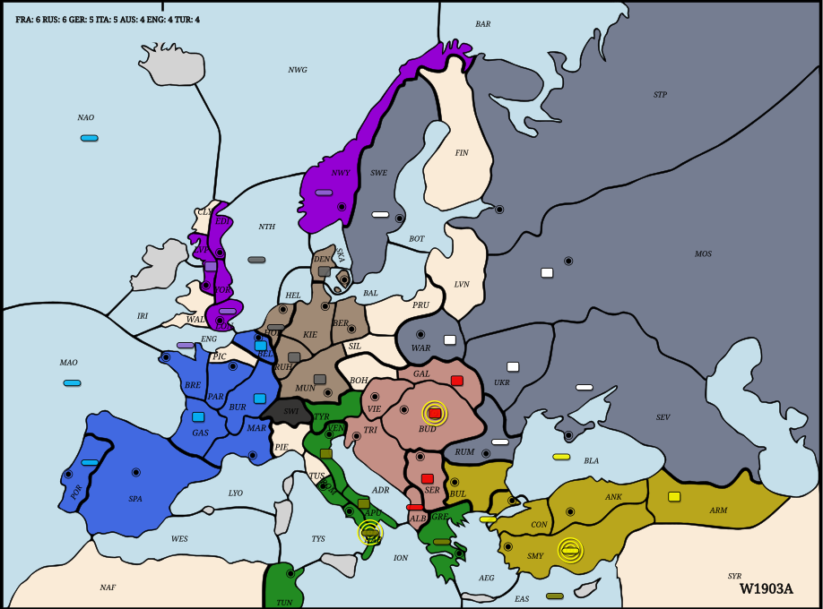

### What happened

- **AUSTRIA**: builds A BUD
- **ITALY**: builds F NAP
- **TURKEY**: builds F SMY

### AUSTRIA
Orders: `A BUD B`

Reasoning

> Looking at the current situation:
>
> - Austria has 4 supply centers (BUD, TRI, VIE, SER) and 3 units (A GAL, F ALB, A SER)
> - I'm owed 1 build (4 centers - 3 units = 1 build)
> - Available home centers for builds: BUD, TRI, VIE (all open)
>
> I need to decide where to build. My strategic situation:
> - Turkey has F BUL/SC threatening my Balkan position
> - Italy has F GRE (just took it) adjacent to my sphere
> - Russia is growing at 6 centers
> - I need to strengthen my Balkan hold
>
> The most useful build would be an army to reinforce my land position in the Balkans. BUD is the most central and useful location — an army there can support SER, push toward RUM, or reinforce the Balkan front. TRI could provide a fleet for Adriatic control, but land armies are more pressing given Turkey's F BUL/SC threatening and the need to hold SER.
>
> Building A BUD gives me the most flexibility to support SER against Turkish pressure and potentially push toward RUM or BUL next spring.

### ITALY
Orders: `F NAP B`

Reasoning

> Looking at the current situation:
>
> **Supply centers (5):** NAP, ROM, VEN, TUN, GRE
> **Current units (4):** A APU, A VEN, F GRE, F EAS
>
> I have 5 SCs and 4 units, so I have **1 build** available. I can build in NAP or ROM (both are open home supply centers).
>
> **Strategic reasoning:**
> - I'm at 5 SCs with a strong eastern Mediterranean position (F GRE, F EAS) threatening Turkey's home centers
> - I need to decide between building an army or a fleet, and where
> - F GRE and F EAS are positioned to press CON, SMY, and ANK next spring
> - Building a fleet in NAP would give me a third fleet for Mediterranean dominance and the ability to threaten more of Turkey's coastline
> - Building an army in ROM or NAP would help if I want to push into Austrian territory (TRI, VIE) or consolidate Italian homeland
> - Given my eastern naval strategy and the need to press Turkey's home centers next spring, a fleet in NAP makes the most sense — it can move into TYS or ION to support my eastern push or threaten TUN/NAF
>
> A fleet in NAP is the best build: it strengthens my naval position for the eastern Mediterranean campaign against Turkey, and can also serve as a deterrent against any French naval expansion in the western Med.

### TURKEY
Orders: `F SMY B`

Reasoning

> Looking at my situation: I have 4 supply centers (ANK, CON, SMY, BUL) and 3 units (A ARM, F BLA, F BUL/SC). That means I have 1 build available. I need to build in an unoccupied home supply center.
>
> My home centers are ANK, CON, SMY, and BUL. Currently:
> - F BUL/SC is in BUL
> - F BLA is at sea (not blocking a home center)
> - A ARM is in ARM (not a home center)
>
> So ANK, CON, and SMY are all unoccupied home centers available for builds.
>
> Given my strategic situation - I'm at war with Italy (F EAS threatening SMY), Russia (F RUM/F SEV threatening my north), and need to defend against multiple threats - I should build a fleet. A fleet in SMY would help defend against Italy's F EAS, or a fleet in ANK would help contest the Black Sea area. 
>
> F SMY would be best positioned to contest Italy's F EAS threatening the eastern Mediterranean and defend my home centers. Alternatively, F ANK could help in the Black Sea.
>
> Given Italy's F EAS is threatening SMY and the eastern Med, building F SMY makes the most tactical sense - it directly counters Italy's pressure and gives me a naval presence in the east.

## SPRING 1904 MOVEMENT (`S1904M`)

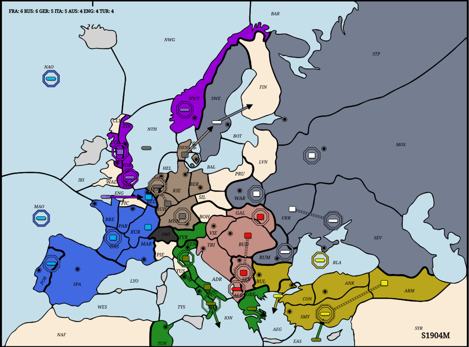

### What happened

- **AUSTRIA**: A SER holds; A BUD supports A SER; F ALB holds; A GAL holds
- **ENGLAND**: F ENG → BEL (bounced); F NWY holds; F LON holds; A LVP holds
- **FRANCE**: A BEL → HOL (bounced); A GAS holds; F MAO holds; F NAO holds; F POR holds
- **GERMANY**: A DEN → SWE; F HOL holds; A RUH supports F HOL; A MUN holds
- **ITALY**: F GRE → AEG (bounced); F EAS → SMY (bounced); F NAP → ION; A VEN holds; A APU supports F NAP (void)
- **RUSSIA**: F SWE → FIN; F RUM holds; F SEV holds; A UKR supports F SEV; A WAR holds; A MOS holds
- **TURKEY**: F BUL/SC → AEG (bounced); F SMY holds; A ARM supports F SMY; F BLA holds

### Dialogue

- **AUSTRIA → RUSSIA**: Austria now holds Serbia and is looking to expand — Rumania is the logical next step, but I want to negotiate rather than fight. If you're willing to vacate F RUM or agree to a non-aggression arrangement on RUM this year, I can offer support against Turkey's remaining centers and keep A GAL firmly out of your northern position. What would it take for you to redirect F RUM southward toward Turkey rather than holding it as a barrier to me?
- **AUSTRIA → ITALY**: Italy's F GRE adjacent to ALB concerns me — I want to be direct that F ALB is staying put defensively. That said, I'm focused on RUM this spring, not Greece or Trieste; if you're pushing into Turkey's home centers with F EAS, we're still aligned. Can we agree F GRE doesn't move toward ALB this turn while I press north toward RUM?
- **AUSTRIA → TURKEY**: Turkey's position is critically weakened — F BUL/SC, F BLA, and F SMY against Austrian, Italian, and Russian pressure is unsustainable. I'm willing to offer a ceasefire: hold your current units in place and I'll focus on Rumania rather than pressing toward CON or BUL. This is your best chance to stabilize before Italy's F EAS and F GRE close in on your home centers.
- **ENGLAND → GERMANY**: France is at 6 centers and still growing — GAS shows they're pushing south, not defending BEL. This spring I'm moving F ENG - BEL again; I need F NTH S F ENG - BEL from you, full stop. We've danced around this deal for two years and you've had reasons not to follow through each time — what will it actually take to get your commitment this turn?
- **ENGLAND → FRANCE**: You're at 6 centers and I'm at 4 — GAS shows you're expanding further south while I'm stuck. I need a concrete path to growth or I have no choice but to press against BEL; tell me what you're actually offering me this spring in terms of a specific center I can take with your support.
- **ENGLAND → RUSSIA**: France is at 6 centers and Germany at 5 — both are well ahead of England and Russia. I'm pressing against France in the west this spring; are you in a position to lean on Germany's eastern flank at all, or coordinate in a way that keeps Germany from freely supporting France against me?
- **FRANCE → ENGLAND**: Spring 1904 — I want to finally close the HOL deal: I move A BEL - HOL with A BUR S A BEL - HOL (strength 2), and if you add F NTH S A BEL - HOL it's guaranteed. In return, I'll support your move into DEN or KIE next fall — that's your path to centers 5 and 6. Can you commit to F NTH S A BEL - HOL this turn?
- **FRANCE → GERMANY**: I'm going to press HOL this spring — A BEL - HOL with A BUR support is strength 2 and likely to succeed with or without English help. If you move F HOL to KIE or DEN voluntarily now, you keep the unit and we avoid a costly fight; if F HOL stays, I'll press the attack. What would a voluntary withdrawal look like for you?
- **FRANCE → RUSSIA**: You're at 6 centers with strong naval reach — I think we're natural partners in keeping the board balanced. Turkey has BUL/SC and F BLA threatening your Black Sea position; are you coordinating with Austria to manage that, or is there something I can do diplomatically to help from the west?
- **GERMANY → ENGLAND**: France just grabbed GAS and sits at 6 centers — they're pulling away from both of us. I'm finally pushing A DEN into SWE this spring with F NTH support; if you press F ENG toward BRE or MAO, we can squeeze France from both sides. What are F NWY and F ENG doing this spring?
- **GERMANY → FRANCE**: You've taken GAS and sit at 6 centers — I'm watching that carefully. I have no orders moving against BEL or BUR this spring, but I need to know: are you pushing further east toward HOL or BUR, or are you consolidating in Iberia? A clear answer helps me plan.
- **GERMANY → RUSSIA**: We've bounced in Sweden three times now and both wasted moves while France grows. I'm pushing A DEN - SWE with F NTH support this spring — that's two strength against your one. Is there any arrangement that makes it worth your while to let SWE go, or are we doing this again?
- **ITALY → AUSTRIA**: I'm planning to push F GRE into AEG and F EAS toward SMY this spring to crack Turkey's remaining home centers — that creates a two-front naval threat they can't fully answer. Can you confirm what A SER and F ALB are doing this spring so I can plan around your moves? I want to make sure we're not stepping on each other as we both grow.
- **ITALY → TURKEY**: Turkey, you're facing F GRE adjacent to AEG, F EAS adjacent to SMY, and F NAP threatening ION — you cannot defend all three simultaneously. I'm open to a negotiated arrangement if you can offer something concrete, but absent a deal I'm moving on SMY and AEG this spring to split your home centers with Austria.
- **ITALY → RUSSIA**: Russia, I'm pushing hard on Turkey's home centers this spring from the south — F GRE toward AEG and F EAS toward SMY. If you're pressing ANK or CON from the north with F BLA or F SEV, we create an unanswerable two-front threat. Concrete ask: what are you committing against Turkey this spring so I can coordinate my timing?
- **RUSSIA → AUSTRIA**: Turkey is now at 4 centers with F BUL/SC, F BLA, F SMY, and A ARM — this spring is the moment to crack them open before they recover. I'm planning to push F RUM toward BUL/EC and F SEV toward ARM to threaten their flanks; if you can move A SER toward BUL with Italian support from F GRE, we can take BUL and force Turkey onto home center defense. Confirm A SER is moving to BUL and I'll coordinate F RUM to support or press accordingly.
- **RUSSIA → ITALY**: Turkey is exposed on multiple fronts this spring — I'm pushing F RUM toward BUL/EC and F SEV toward ARM, and if you move F GRE toward BUL/SC we create a three-way press Turkey cannot answer. Concrete ask: commit F GRE to BUL this spring and I'll coordinate my RUM move to maximize the attack rather than duplicate your angle.
- **RUSSIA → TURKEY**: You're now at 4 centers with Austria, Italy, and I all pressing from multiple angles — this is not a position you can hold indefinitely. I'm open to a negotiated arrangement if you pull A ARM back toward ANK and keep F BLA away from RUM; otherwise F RUM moves to BUL/EC and F SEV threatens ARM this spring.
- **RUSSIA → GERMANY**: France is at 6 centers and still growing — that's the real threat to both of us, not a Scandinavian contest. I'm fully committed south against Turkey this spring; let's keep F SWE and A DEN from bouncing each other pointlessly while France consolidates the west.
- **TURKEY → AUSTRIA**: You hold SER and I hold BUL — that's actually a reasonable Balkan split while France sits at 6 centers and Germany at 5. I'm proposing we formalize this: I keep my fleet in BUL/SC defensively and you hold SER, and we both direct energy toward the real threats growing in the west. What would it take for Austria to commit to a non-aggression arrangement with me this spring?
- **TURKEY → ITALY**: F GRE and F EAS are both pointed at my position — I need to understand your intentions this spring before I commit my orders. If you're planning to press on CON or AEG, we waste moves fighting each other while Austria consolidates SER and France reaches 7 centers; if you're focused elsewhere, let's make that explicit and carve out separate spheres.
- **TURKEY → RUSSIA**: F RUM sits adjacent to BUL/EC and that's the most immediate threat to my position — I want to discuss a mutual arrangement this spring. I'm not threatening RUM or SEV; if you hold F RUM defensively and keep F SEV in place, I'll keep F BLA away from your territory and we both avoid a costly fight that only benefits Austria and Italy.
- **AUSTRIA → RUSSIA**: If you're moving F RUM to BUL/EC this spring, that opens RUM for A BUD or A SER to move in — I'd like to coordinate exactly that. Concrete proposal: F RUM moves toward BUL/EC, A SER moves to BUL (or I support your F RUM into BUL/EC from SER), and A BUD takes RUM. Can you confirm F RUM is vacating and moving south so I can commit A BUD to RUM?
- **AUSTRIA → ITALY**: Confirmed: F ALB holds this spring, not moving toward TRI or GRE — I'm focused entirely on RUM. If F GRE moves to AEG and F EAS threatens SMY, that's ideal; Turkey can't defend BUL/SC, ANK, and SMY simultaneously. Just keep F GRE out of ALB and we stay aligned.
- **AUSTRIA → TURKEY**: A ceasefire has merit while France grows — but I need something concrete from you. If F BUL/SC moves to CON or holds defensively away from SER, I'll commit A SER to hold in place rather than pushing toward BUL. That's a real concession; what are you offering in return beyond the status quo?
- **ENGLAND → GERMANY**: If F NTH is supporting A DEN - SWE this spring, it can't also support F ENG - BEL — so which is it? I need a straight answer: will you give me F NTH S F ENG - BEL this turn, or are you prioritizing SWE? If you're going north, tell me now so I can plan accordingly rather than waste another turn bouncing off BEL.
- **ENGLAND → FRANCE**: You keep offering me HOL — a center you don't own — in exchange for me doing your work against Germany. I need a center I can actually take this spring with your direct support, not a promise for next fall. If you want my cooperation, tell me which center adjacent to my units you'll help me take, with a specific order you'll commit to this turn.
- **ENGLAND → RUSSIA**: Germany just told me F NTH is going to support A DEN - SWE this spring, not supporting me against France — that means Germany is expanding north while France sits at 6 centers unchallenged. If you're applying any pressure on Germany's eastern flank this turn, now is the moment; I'd like to know what WAR and GAL are doing.
- **FRANCE → ENGLAND**: I'm committing to A BEL - HOL with A BUR S A BEL - HOL this turn — strength 2 regardless of your choice. If you add F NTH S A BEL - HOL, it's guaranteed and Germany can't hold; if you press F ENG - BEL instead, you bounce off my A BEL (which is moving out) and gain nothing. The smart play for you is F NTH S A BEL - HOL, then next fall I back you into DEN or KIE — that's your 5th center.
- **FRANCE → GERMANY**: I'm pressing HOL this spring — A BEL - HOL with A BUR support, strength 2. If you voluntarily move F HOL to KIE now, you keep the fleet and we avoid a fight; if F HOL stays, I press the attack and you risk losing the unit. A voluntary withdrawal to KIE costs you nothing and keeps your southern position intact — what's your answer?
- **GERMANY → ENGLAND**: France is threatening HOL with 2-strength this spring, forcing me to keep A RUH supporting F HOL — I can't spare NTH for BEL support while defending HOL simultaneously. I'm using F NTH to push A DEN into SWE (2 vs 1, it goes through), which gets me to 6 centers and lets me build. After the build, I'll have more units to actively press France with you in Fall — a Germany at 6 is a stronger partner than one scrambling to hold HOL.
- **GERMANY → FRANCE**: You're pressing HOL with 2 strength and I'm defending with 2 strength — that's a guaranteed bounce that wastes both our moves. I'm taking SWE this spring regardless; if you hold BEL in place instead of attacking HOL, we both come out ahead and I have no reason to press your eastern flank. Is there any version of this spring where you hold BEL and we avoid a pointless HOL bounce?
- **GERMANY → RUSSIA**: I'm moving A DEN - SWE with F NTH support this spring — strength 2 against your 1. I'd rather negotiate than just take it, but the math is clear. If you order F SWE - FIN or F SWE - NWY instead of holding, I'll formally commit to not pressing into FIN or the Baltic for the next two years — you keep the unit and avoid the loss.
- **ITALY → AUSTRIA**: Confirmed: F GRE moves to AEG this spring, not ALB — you have nothing to fear from my fleet on that flank. F EAS pushes toward SMY simultaneously; if you can press A SER toward BUL or support F BUL/SC being contested, Turkey faces a three-front naval threat they cannot answer. What is A SER doing this spring?
- **ITALY → TURKEY**: Concrete final offer: if you move F BUL/SC to AEG and F BLA to CON this spring to create a buffer, I will redirect F EAS away from SMY — but I need your explicit commitment now, not vague questions. Absent that, F GRE moves to AEG and F EAS moves to SMY simultaneously and you cannot stop both.
- **ITALY → RUSSIA**: I'm committing F GRE → AEG and F EAS → SMY this spring to crack Turkey's home centers — that's a two-front naval threat they cannot fully answer. Your F RUM → BUL/EC creates a third angle; confirm that's your move and I'll coordinate my timing. Don't duplicate my AEG angle — hit BUL/EC from RUM as planned.
- **RUSSIA → GERMANY**: Two against one on Sweden is a real threat I can't ignore — I'm willing to discuss a deal where I vacate SWE if you commit to holding DEN and not pressing into FIN or BOT afterward. Concrete proposal: I move F SWE to FIN this spring, you take SWE uncontested, and we both agree not to press further into each other's Scandinavian positions. Is that something you can commit to?
- **RUSSIA → AUSTRIA**: RUM is not available — I need it as a staging point against Turkey's F BUL/SC and F BLA. The real opportunity for both of us is A SER moving to BUL this spring with my F RUM supporting from BUL/EC; Turkey loses BUL and you gain a center while I press from the Black Sea side. Commit A SER to BUL and I'll coordinate F RUM to maximize that attack.
- **RUSSIA → ITALY**: I'm moving F RUM to BUL/EC this spring to press Turkey's BUL position — if you move F GRE toward BUL/SC simultaneously, we create a two-fleet attack Turkey cannot hold without Austrian help. Concrete commitment: F RUM - BUL/EC, F SEV holds defensively; can you confirm F GRE is moving to BUL/SC so we don't duplicate angles?
- **RUSSIA → TURKEY**: I'm not holding F RUM defensively — I'm pressing your BUL position this spring. Your only viable path is to pull F BLA back toward CON to defend your home centers, because both F RUM and Italian F GRE are moving against BUL this turn.
- **TURKEY → AUSTRIA**: A ceasefire works for me — I'll hold F BUL/SC in place and keep F BLA away from RUM if you genuinely redirect toward Rumania rather than CON. Concrete ask: commit A SER to hold and redirect any Galician unit away from BUL/EC this spring, and I'll reciprocate by holding defensively. France at 6 and Germany at 5 are the real threats; let's not bleed each other while they grow.
- **TURKEY → ITALY**: Concrete offer: I keep F SMY out of EAS and AEG this spring, and F BUL/SC holds rather than moving toward GRE — you get a free hand in ION and EAS without a fight from me. In return, F GRE stays out of AEG and F EAS stays out of SMY this turn. That's a clean mutual hold that costs neither of us anything while Austria and Russia are the ones actually threatening your northern flank.
- **TURKEY → RUSSIA**: Concrete ask: hold F RUM in place this spring and I'll keep F BLA out of RUM and BUL/EC — we both hold our current positions and avoid a bounce that wastes both moves. If F RUM moves to BUL/EC, I contest it and we cancel each other out while Austria and Italy gain. Commit to holding F RUM and I reciprocate with F BLA holding.
- **GERMANY → RUSSIA**: Deal accepted: I'm ordering A DEN - SWE with F NTH support this spring, and if you move F SWE - FIN as proposed, I formally commit to not pressing FIN or BOT for the next two years — DEN stays put and I have no Baltic ambitions. This is a clean handover that benefits both of us while France sits at 6 centers.
- **GERMANY → ENGLAND**: France is forcing me to defend HOL with A RUH this spring, which means F NTH has to support A DEN - SWE — I can't split the defense and give you NTH support simultaneously. Fall 1904 I'll be at 6 centers with a new build, and I commit to actively coordinating against France from there; a stronger Germany is a better partner for you than one losing HOL.
- **GERMANY → FRANCE**: I'm holding F HOL with A RUH support — your A BEL - HOL attack bounces at strength 2 vs 2, and we both waste our moves. I'm offering one last time: hold A BEL in place this spring and I have zero reason to press BEL or BUR; attacking HOL just locks us into a war that benefits England, not either of us.
- **ITALY → AUSTRIA**: Final commitment: F GRE → AEG, F EAS → SMY this spring — two simultaneous naval threats Turkey cannot fully answer. I'm keeping A VEN and A APU on the Italian homeland, so no threat to TRI or anywhere Austrian. What is A SER doing — pushing toward BUL or holding?
- **ITALY → RUSSIA**: Final commitment from me: F GRE → AEG, F EAS → SMY — I'm taking the SMY angle directly rather than duplicating your BUL/EC push. Your F RUM → BUL/EC hits Turkey from a different angle; we don't overlap and Turkey cannot defend both. Confirm F RUM → BUL/EC is locked in.
- **ITALY → TURKEY**: Final answer: I'm moving F GRE → AEG and F EAS → SMY this spring — your offer to hold doesn't change my calculus since AEG and SMY are both viable targets regardless. If you want to minimize damage, consider where your fleets can retreat to rather than contesting moves you cannot stop with two units.
- **RUSSIA → GERMANY**: Final commitment: I'm moving F SWE to FIN this spring — take SWE uncontested. In return, I need your formal commitment to hold DEN in place and not press into FIN or BOT for the next two years; this deal only works if you honor the boundary.
- **RUSSIA → AUSTRIA**: F RUM is staying put to defend against Turkey's F BLA — I cannot vacate it and hand Turkey a free center. My commitment this spring: F RUM holds defensively, A UKR supports F SEV, and I'm not contesting BUL or SER; your Balkan gains are safe from me.
- **RUSSIA → ITALY**: Turkey's F BLA is threatening RUM if I vacate, so F RUM holds defensively this spring rather than pushing to BUL/EC — I can't risk losing RUM to chase BUL. Keep pressing from F GRE and F EAS toward Turkey's home centers; I'll support your southern push next fall once F BLA is neutralized.
- **RUSSIA → TURKEY**: Final answer: F RUM holds in place this spring, and F SEV holds — I'm not pressing into your territory this turn. In return, F BLA must stay out of RUM and SEV; if it moves toward either, the deal is off next fall and I press hard from every angle.
- **TURKEY → AUSTRIA**: Final commitment: F BUL/SC holds in place and F BLA stays out of RUM this spring — I'm holding defensively. I expect A SER to hold and no Austrian unit pressing toward BUL/EC or CON; if you honor that, we have a real ceasefire while France and Russia remain the growing threats.
- **TURKEY → ITALY**: Final commitment: F SMY holds and F BUL/SC holds in place this spring — I am not moving on AEG or EAS. I need F GRE to stay out of AEG and F EAS to stay out of SMY; that's the clean mutual hold I proposed, and it costs you nothing while you consolidate ION and EAS freely.
- **TURKEY → RUSSIA**: F RUM moving to BUL/EC and F BLA contesting it means we both waste our moves and end the turn exactly where we started — Austria and Italy gain from that outcome, not us. Final ask: hold F RUM this spring and I hold F BLA away from RUM; if you press anyway, I contest and we both lose the turn.

### AUSTRIA
Orders: `A SER H` · `A BUD S A SER` · `F ALB H` · `A GAL H`

Reasoning

> Looking at the current situation:
>
> **Position assessment:**
> - I hold SER, BUD, GAL, and F ALB with 4 supply centers
> - Russia refused to vacate RUM, so A BUD → RUM would bounce without support
> - Turkey agreed to hold F BUL/SC defensively, so BUL isn't immediately threatened
> - Italy is moving F GRE → AEG and F EAS → SMY, pressuring Turkey
> - Russia is holding F RUM defensively
>
> **Strategic reasoning:**
> My revised strategy is to hold A SER defensively (Turkey agreed to ceasefire), support A SER with A BUD, and keep F ALB and A GAL as defensive anchors. Russia won't vacate RUM, so there's no clean path to RUM this spring without a fight I can't win alone. 
>
> The best play is to consolidate my Balkan position, let Italy and Russia press Turkey from their angles, and wait for an opening. I should not overextend while France (6 centers) and Germany (5 centers) are growing in the west — I need to stay strong in the Balkans.
>
> A SER holds, A BUD supports A SER (or I could use A BUD to threaten RUM speculatively, but Russia's F RUM is there and I'd just bounce). F ALB holds. A GAL holds as promised.
>
> Actually, let me consider if A SER → RUM could work: F RUM would block it, and I have no support lined up. Better to hold firm and wait.

### ENGLAND
Orders: `F ENG - BEL` · `F NWY H` · `F LON H` · `A LVP H`

Reasoning

> Looking at the situation: France claims A BEL is moving to HOL (with A BUR supporting), which would leave BEL empty. Germany confirmed F NTH is supporting A DEN - SWE, not helping me into BEL. 
>
> If France is telling the truth about A BEL - HOL, then F ENG - BEL walks into an empty center — that's my 5th supply center for free. The risk is that France is lying and A BEL holds, in which case I bounce again. But France has been consistent about this HOL move across multiple messages, and it's strategically coherent for them (taking HOL from Germany). The downside of trying and failing is just another bounce; the upside is finally getting to 5 centers.
>
> My other units should hold defensively. F NWY holds to maintain Norway. F LON holds to defend London. A LVP holds to defend Liverpool. No reason to overextend elsewhere when the key play is F ENG - BEL.

### FRANCE
Orders: `A BEL - HOL` · `A GAS H` · `F MAO H` · `F NAO H` · `F POR H`
Illegal (dropped): `A BUR S A BEL - HOL`

Reasoning

> Looking at the situation: Germany has confirmed F HOL supported by A RUH (strength 2), so my A BEL - HOL with A BUR support is also strength 2 — a guaranteed bounce. However, my revised strategy says to press it anyway to maintain pressure and signal resolve. Germany is likely telling the truth here since the legal orders confirm A RUH can support F HOL.
>
> My key considerations:
> 1. Press A BEL - HOL with A BUR S A BEL - HOL as committed — it bounces but maintains pressure and doesn't cede ground
> 2. A GAS holds to consolidate the southern position
> 3. F MAO and F NAO hold to threaten England's Atlantic flank
> 4. F POR holds to secure Iberia
>
> England has been threatening BEL repeatedly but never actually moved against it. With A BEL moving toward HOL (even if bouncing), BEL is vacated — but England's F ENG would need to move to BEL, and if A BEL bounces back, it's still there. Actually, if A BEL moves and bounces, it stays in BEL. So BEL is defended by the bounce.
>
> The plan is solid as stated in my revised strategy. Let me execute it.

### GERMANY
Orders: `A DEN - SWE` · `F HOL H` · `A RUH S F HOL` · `A MUN H`
Illegal (dropped): `F NTH S A DEN - SWE`

Reasoning

> Looking at the current situation:
>
> - Russia has committed to moving F SWE - FIN, so A DEN - SWE with F NTH support should capture Sweden uncontested, giving me 6 centers.
> - France is threatening HOL with A BEL - HOL + A BUR support (strength 2). I must defend F HOL with A RUH support (strength 2) to guarantee a bounce.
> - England wants F NTH S F ENG - BEL, but I can't spare NTH for that while also supporting the SWE capture. I've explained this to England.
> - A MUN holds defensively in the center.
>
> This is straightforward: take SWE, defend HOL, hold MUN.

### ITALY
Orders: `F GRE - AEG` · `F EAS - SMY` · `F NAP - ION` · `A VEN H` · `A APU S F NAP`

Reasoning

> Looking at the situation: My revised strategy commits me to F GRE → AEG and F EAS → SMY to crack Turkey's home centers simultaneously. I've communicated this clearly to Austria and Russia, and rejected Turkey's mutual hold offer. Let me verify adjacency:
>
> - F GRE → AEG: GRE is adjacent to AEG ✓
> - F EAS → SMY: EAS is adjacent to SMY ✓
>
> Turkey has F BUL/SC and F SMY. F BUL/SC could contest AEG, and F SMY defends SMY. But F GRE → AEG and F EAS → SMY are both legal moves. If F BUL/SC moves to AEG, it bounces with F GRE. If F SMY holds, F EAS bounces off SMY. However, Turkey said F SMY holds and F BUL/SC holds — if that's true, F GRE takes AEG uncontested and F EAS bounces SMY (SMY is defended by F SMY).
>
> Actually, if F SMY is holding, F EAS cannot take SMY uncontested. But the move still applies pressure and is the right strategic play. The key capture would be AEG if F BUL/SC doesn't contest it.
>
> For A VEN and A APU: they hold the Italian homeland. A APU supports F NAP, and A VEN holds. F NAP can move to ION to extend naval reach or support.
>
> F NAP → ION makes sense to extend my southern naval presence and potentially threaten Turkey from a third angle next turn.

### RUSSIA
Orders: `F SWE - FIN` · `F RUM H` · `F SEV H` · `A UKR S F SEV` · `A WAR H` · `A MOS H`

Reasoning

> Looking at my current situation and commitments:
>
> **Key commitments made:**
> 1. I agreed with Germany to move F SWE → FIN (letting Germany take SWE uncontested) in exchange for Germany not pressing FIN/BOT for 2 years
> 2. I committed to Turkey that F RUM holds defensively and F SEV holds, in exchange for F BLA staying away from RUM
> 3. I told Austria that F RUM is staying put to defend against Turkey's F BLA threat
> 4. I told Italy that F RUM holds defensively this spring
>
> **Strategic assessment:**
> - Germany has 2 units (A DEN + F NTH) pressing SWE — I can't hold it. Taking the deal to move to FIN preserves the unit and avoids a loss
> - Turkey's F BLA is a real threat to RUM if I vacate it — holding RUM is correct
> - My position is defensively solid at 6 centers; I need to consolidate before pressing
> - A WAR and A MOS should hold to maintain my northern position
> - A UKR supports F SEV for defensive depth
>
> The revised strategy note says: F SWE → FIN, F RUM H, F SEV H, A UKR S F SEV, A WAR H, A MOS H
>
> This is consistent with all my negotiated commitments and is strategically sound given the board state.

### TURKEY
Orders: `F BUL/SC - AEG` · `F SMY H` · `A ARM S F SMY` · `F BLA H`

Reasoning

> Looking at the current situation:
>
> **Key intelligence:**
> - Italy confirmed F GRE → AEG and F EAS → SMY this spring (attacking my position)
> - Russia confirmed F RUM holds and F SEV holds (non-aggression this turn)
> - Austria proposed ceasefire with A SER holding
>
> **My units:** A ARM, F BLA, F BUL/SC, F SMY
>
> **Threat assessment:**
> - F GRE → AEG threatens my BUL/SC position (AEG is adjacent to BUL/SC)
> - F EAS → SMY is a direct attack on my home center
>
> **Defense plan:**
> - F BUL/SC must support F SMY against F EAS → SMY (F BUL/SC can support F SMY since BUL/SC is adjacent to... wait, let me check: BUL/SC neighbors are AEG, CON, GRE. SMY is not in that list. So F BUL/SC cannot support F SMY.)
> - F SMY can move to AEG or EAS, or hold. If F EAS → SMY and F SMY holds, Italy needs 2 strength to dislodge. Italy only has 1 unit attacking SMY, so F SMY holds safely against F EAS alone.
> - F GRE → AEG: if F BUL/SC → AEG simultaneously, they bounce. That protects AEG from Italy.
> - A ARM can support F SMY (ARM is adjacent to SMY).
>
> **Best plan:**
> - F BUL/SC → AEG: bounces Italy's F GRE → AEG, preventing Italy from taking AEG
> - F SMY H: holds against F EAS → SMY (Italy has only strength 1, not enough to dislodge)
> - A ARM S F SMY: gives F SMY strength 2 in case Italy has additional support (F NAP is in Naples, not adjacent to EAS or SMY for support)
> - F BLA H: holds defensively, honoring Russia deal
>
> This maximizes defense: SMY holds with ARM support, AEG is contested/bounced.

## FALL 1904 MOVEMENT (`F1904M`)

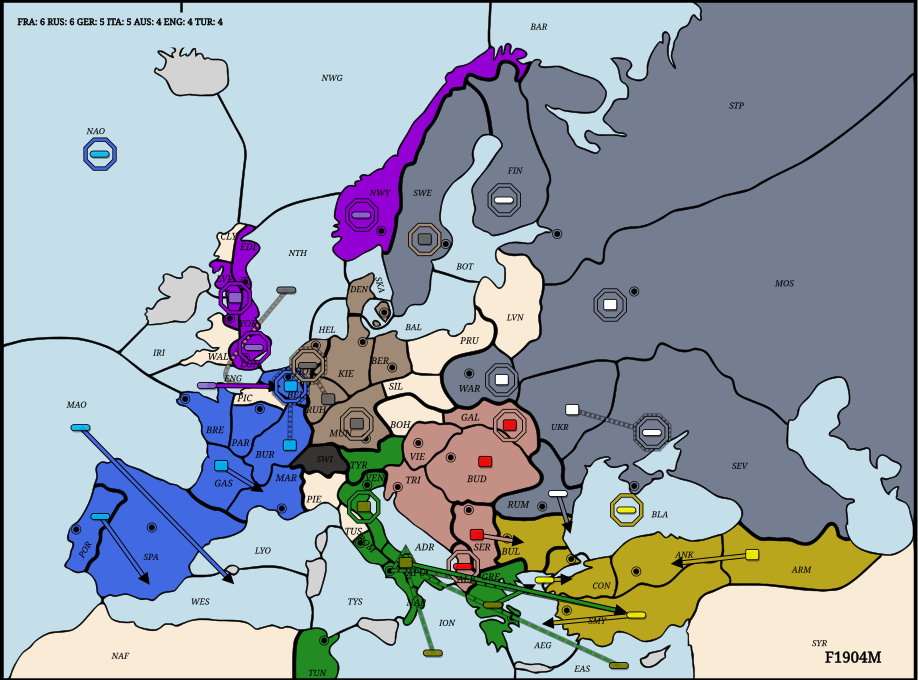

### What happened

- **AUSTRIA**: A SER → BUL (bounced); F ALB holds; A GAL holds
- **ENGLAND**: F ENG → BEL (bounced); F NWY holds; F LON holds; A LVP holds
- **FRANCE**: A BEL holds; A BUR supports A BEL; A GAS → MAR; F MAO → WES; F NAO holds; F POR → SPA/SC
- **GERMANY**: F NTH supports F ENG → BEL; F HOL holds; A RUH supports F HOL; A MUN holds; A SWE holds
- **ITALY**: F GRE → BUL/SC (bounced); F ION convoys A APU → SMY; F EAS convoys A APU → SMY; A APU → SMY VIA; A VEN holds
- **RUSSIA**: F RUM → BUL/EC (bounced); F SEV holds; A UKR supports F SEV; A WAR holds; A MOS holds; F FIN holds
- **TURKEY**: F BUL/SC → CON; F SMY → AEG; F BLA holds; A ARM → ANK

### Dialogue

- **AUSTRIA → ITALY**: Italy's F GRE is now perfectly positioned to attack BUL/SC from AEG — I want to coordinate A SER → BUL with your F GRE → BUL/SC this fall to finally crack Turkey's Balkan hold. If we both commit, BUL falls and we each gain a center; I'll support with F ALB → GRE if you need the extra push. Can you confirm F GRE attacks BUL/SC and we split the Balkan gains?
- **AUSTRIA → RUSSIA**: Russia's F RUM sitting idle while France reaches 6 centers and Germany 5 is a strategic problem for both of us — I need to grow too. If you're willing to move F RUM toward BLA or BUL/EC this fall, A BUD can take RUM and we both benefit: you get a Black Sea presence and I get a fifth center. What would it take for you to vacate RUM this fall?
- **AUSTRIA → TURKEY**: Turkey, your F BUL/SC is about to face a coordinated attack from A SER and Italy's F GRE this fall — I'm being direct with you because I'd rather negotiate than fight. If you voluntarily retreat F BUL/SC to CON and acknowledge my claim on BUL, I'll commit A SER to hold and focus Austria's growth on RUM instead of pressing toward CON. This is a better outcome for you than losing BUL by force.
- **ENGLAND → GERMANY**: Fall 1904 — you said after your SWE build you'd actively coordinate against France. Now is the moment: I need F NTH S F ENG - BEL this fall. France's A BEL is still there, A BUR can support it, so without NTH support I bounce again and France stays at 6 centers while we both fall further behind. Commit to F NTH S F ENG - BEL and I'll support your HOL position going forward — this is the deal you promised me.
- **ENGLAND → FRANCE**: Your A BEL move to HOL bounced in spring and BEL is still yours — but I'm pressing F ENG - BEL this fall regardless of what Germany does. If you want to redirect my attack, tell me specifically what center adjacent to my units you'll help me take this turn with a concrete order commitment, not another HOL promise for next fall.
- **ENGLAND → RUSSIA**: France is at 6 centers and Germany just reached 6 too — both are pulling away from the rest of us. I'm pressing hard against France in the west this fall; if you have any leverage on Germany's eastern flank to keep them from freely supporting France, now is the time to use it.
- **FRANCE → ENGLAND**: Fall 1904 — this is the turn to finally break Germany's HOL hold. I'm pushing A BEL - HOL with A BUR support (strength 2), but Germany has A RUH supporting F HOL making it strength 2 as well — another bounce unless you add F NTH S A BEL - HOL to make it strength 3 and guaranteed. In return, I'll back your move into DEN next turn with whatever support I can provide — that's your 5th center and a real path forward. Can you commit to F NTH S A BEL - HOL this fall?
- **FRANCE → GERMANY**: Fall 1904 — I'm pressing HOL again with A BEL - HOL and A BUR support (strength 2), but I want to be transparent: if England adds F NTH support this turn, it becomes strength 3 and F HOL is gone. The better outcome for you is to voluntarily move F HOL to KIE or DEN now — you keep the unit, preserve your southern position, and I have no reason to push further east. What would it take to make that work?
- **GERMANY → ENGLAND**: I'm at 5 centers and need to grow — A SWE is looking at NWY this fall, which is the natural step. I'd rather negotiate than fight: if you voluntarily move F NWY to NWG or BAR, I take NWY uncontested and we both avoid wasting moves, and I'll actively coordinate against France from HOL and NTH this fall. What are your intentions for F NWY?
- **GERMANY → FRANCE**: You're at 6 centers and I'm watching A BEL, A BUR, and A GAS carefully — are you pressing HOL again this fall or consolidating in Iberia? I have no orders moving against BEL or BUR, but I need to know your intentions before I can plan whether NTH and HOL are defensive or can contribute elsewhere.
- **GERMANY → RUSSIA**: I'm honoring our deal — A SWE is not going to FIN or pressing the Baltic. I'm pushing toward Norway this fall; given your F FIN position, does that create any friction with your plans, or are we still aligned on keeping our Scandinavian boundary clean?
- **ITALY → AUSTRIA**: Austria, my Spring pushes into AEG and SMY both bounced — Turkey's position held but is still vulnerable this fall. I'm planning F GRE → AEG and a convoy of A APU → SMY via F ION and F EAS (strength 2 against SMY), which Turkey cannot stop with F SMY alone. Can you confirm what A SER and F ALB are doing this fall — specifically, is A SER available to push toward BUL or GRE to add pressure from the north?
- **ITALY → TURKEY**: Turkey, both my Spring moves bounced and neither of us gained anything — this is a stalemate that benefits Austria and Russia while we fight. I'm open to a genuine arrangement this fall: if you move F BUL/SC away from AEG and keep F SMY out of EAS, I'll redirect F EAS away from SMY this turn. Concrete offer: F EAS → SYR (away from your home centers) if you confirm F BUL/SC → CON and F SMY holds.
- **ITALY → RUSSIA**: Russia, my Spring pushes on AEG and SMY both bounced — Turkey's fleets held firm. This fall I'm planning a convoy of A APU → SMY via F ION and F EAS to hit SMY with strength 2, while F GRE → AEG contests Turkey's BUL/SC fleet. If you can press F RUM → BUL/EC or F SEV → ARM this fall to add a third angle, Turkey cannot defend everywhere — what are you committing this turn?
- **RUSSIA → AUSTRIA**: Turkey's F BUL/SC is the center we should both be targeting this fall — I'm planning to move F RUM to BUL/EC to attack it from the north. If you can move A SER to BUL with support from A BUD, we create a two-front attack Turkey cannot hold; I take BUL/EC and you take the center, or we coordinate who gets credit. Confirm A SER is moving to BUL and I'll lock in F RUM accordingly.
- **RUSSIA → ITALY**: This fall is the moment to crack Turkey's BUL — I'm moving F RUM to BUL/EC while you have F GRE adjacent to BUL/SC. If we both hit BUL simultaneously from different coasts, Turkey cannot defend both; concrete ask is F GRE moving to BUL/SC this fall so we coordinate the two-fleet attack. What's your commitment on F GRE this turn?
- **RUSSIA → TURKEY**: You're holding BUL with F BUL/SC while F RUM threatens from BUL/EC — this is not a sustainable position with Italy pressing from F GRE as well. Your best path to survival is to pull F BUL/SC back to CON and negotiate a halt; if you do that and keep F BLA away from RUM, I'll consider pausing my press while you stabilize.
- **TURKEY → AUSTRIA**: Italy broke their commitment to me last spring — F GRE moved to AEG, F EAS moved to SMY, and F ION is now in position to take NAP or press into ADR. Italy at 5 centers with three fleets in my region is a direct threat to both of us; if you support me pushing F BUL/SC into AEG this fall while I push F SMY toward CON or EAS, we deny Italy the eastern Med. What can Austria commit to against Italy this turn?
- **TURKEY → ITALY**: You broke your spring commitment and moved on AEG and SMY anyway — I'm not forgetting that. I'm moving aggressively this fall to contest your fleet positions, and I'm coordinating with Austria; if you want to avoid a two-front war, make a concrete offer now that actually costs you something.
- **TURKEY → RUSSIA**: Italy is now at 5 centers with F GRE, F EAS, and F ION all in the eastern Med — they're positioned to sweep through my home centers and then press into your southern flank via ION and AEG. This is the moment to coordinate: if you press F RUM toward BUL/EC and I push F BUL/SC into AEG, we split Italy's attention and deny them the solo run they're building toward.
- **AUSTRIA → RUSSIA**: Confirm: if F RUM moves to BUL/EC this fall, A SER attacks BUL simultaneously and we crack Turkey's hold — I'm committing A SER → BUL if you commit F RUM → BUL/EC. A BUD will support A SER → BUL as the backup. Is F RUM moving to BUL/EC this fall, yes or no?
- **AUSTRIA → ITALY**: Your F GRE moving to AEG is actually unhelpful for taking BUL — I need F GRE to attack BUL/SC directly this fall while A SER attacks from the north. If you move F GRE → BUL/SC and I move A SER → BUL with A BUD support, BUL falls and we each have a path to the center; AEG can wait one more turn. Can you redirect F GRE to BUL/SC instead?
- **AUSTRIA → TURKEY**: Italy's convoy to SMY is the existential threat to you this fall — F ION + F EAS convoying A APU means SMY falls unless you defend it. I'm not attacking BUL this turn if you genuinely hold F BUL/SC defensively; but you need to decide whether to pull F SMY back to defend or let Italy take it.
- **ENGLAND → GERMANY**: You're threatening NWY while asking me to cooperate against France — that's not a partnership, that's expansion at my expense. If A SWE moves toward NWY, I will defend it and we become enemies, which means France benefits while we fight each other. The deal that actually makes sense: you give me F NTH S F ENG - BEL this fall, I hold F NWY in place, and we both squeeze France — commit to that or we're done cooperating.
- **ENGLAND → FRANCE**: Germany just told me A SWE is looking at NWY this fall — they're expanding at my expense while I've been focused on BEL. If you want my F NTH cooperation against HOL, you need to offer me something concrete right now: specifically, will you move A BEL away from BEL this fall so I can take it uncontested, or are you keeping it there?
- **FRANCE → ENGLAND**: Last chance for a real deal: if you order F NTH S A BEL - HOL this fall, I guarantee A BUR S A BEL - HOL and we take HOL at 3 strength — Germany cannot hold. If you instead move F ENG - BEL, you bounce off A BEL (which I'm holding in place as backup) and gain nothing while Germany keeps HOL forever. F NTH S A BEL - HOL is the only move that actually gets you leverage over Germany.
- **FRANCE → GERMANY**: England is pressing F ENG - BEL hard and I'm running out of reasons to defend BEL instead of pushing you. If you move F HOL to KIE this fall and have A RUH hold, I will commit A BEL H and A BUR S A BEL — no HOL attack this fall, and I'll back your position against England in the north. This is your last chance to avoid a 3-strength HOL attack if England and I coordinate.
- **GERMANY → ENGLAND**: I'm planning A SWE - NWY this fall — that's my growth target and it's the natural move from SWE. If you voluntarily move F NWY to NWG or BAR, we avoid a fight and I'll actively support F ENG - BEL with F NTH this fall (strength 3 against France's 2 in BEL). That's a concrete trade: you give NWY, I give you BEL — you net the same centers and France drops to 5. Is that workable?
- **GERMANY → FRANCE**: I'm holding F HOL with A RUH support again — your A BEL - HOL attack bounces at 2 vs 2, wasting both our moves. I have no orders pressing BEL or BUR this fall; if you hold A BEL in place, I'll keep NTH and HOL purely defensive and we avoid a pointless exchange.
- **GERMANY → RUSSIA**: I'm honoring our deal — A SWE is not pressing FIN or the Baltic. I'm pushing A SWE - NWY this fall against England's F NWY; does F FIN create any friction with that move, or are we clear on the Scandinavian boundary?
- **ITALY → RUSSIA**: I'm ready to commit F GRE → BUL/SC this fall if you confirm F RUM → BUL/EC — that's a two-fleet attack Turkey cannot hold without support from F BLA or F SMY, both of which are out of position. Lock in F RUM → BUL/EC and I'll move F GRE → BUL/SC simultaneously; we split BUL and I capture a new center.
- **ITALY → AUSTRIA**: Confirmed: I'm moving F GRE → BUL/SC this fall to attack BUL with strength 1, and Russia is committing F RUM → BUL/EC from the other coast — that's a two-fleet simultaneous attack Turkey cannot answer. Can you confirm A SER supports my F GRE → BUL/SC or holds to prevent Turkish retreat into SER? That support would make the attack strength 2 and guarantee BUL falls.
- **ITALY → TURKEY**: Turkey, F GRE is moving to BUL/SC this fall coordinated with Russia's F RUM → BUL/EC — you cannot hold BUL against a two-fleet attack. If you want to salvage your position, consider where F BUL/SC retreats and whether F SMY and F BLA can be better used defending CON and ANK rather than contesting a lost cause.
- **RUSSIA → ITALY**: I'm committing F RUM → BUL/EC this fall to hit Turkey's BUL position from the north — if your F GRE moves to AEG or BUL/SC simultaneously, Turkey cannot hold BUL against two fleets. Concrete ask: confirm F GRE is moving toward BUL this fall so we coordinate the two-front attack and I don't duplicate your angle.
- **RUSSIA → AUSTRIA**: I'm moving F RUM → BUL/EC this fall to attack Turkey's F BUL/SC — if you move A SER → BUL with A BUD support, we create a combined army-fleet attack Turkey cannot hold. Concrete proposal: A SER → BUL, A BUD S A SER → BUL, F RUM → BUL/EC — Turkey loses BUL and you gain the center while I press from the Black Sea side.
- **RUSSIA → TURKEY**: F RUM is moving to BUL/EC this fall — Italy is also pressing from F GRE toward AEG and Austria has A SER adjacent to BUL. Your F BUL/SC cannot hold against three-angle pressure; pulling it back to CON now and keeping F BLA out of RUM is your best path to preserving your home centers.
- **RUSSIA → GERMANY**: Confirming our Scandinavian boundary holds — F FIN is staying put this fall and I have no Baltic ambitions. I need you to confirm A SWE is not pressing toward FIN or BOT this turn; our deal only works if we both hold the line.
- **TURKEY → AUSTRIA**: Italy's offer asks me to retreat from BUL in exchange for F EAS going to SYR — that's a bad deal for me and it leaves Italy dominant in the eastern Med, which eventually threatens your Balkan position too. Concrete counter-proposal: if you move F ALB → GRE this fall, I'll support it with F BUL/SC, and we both gain from Italy losing GRE; I keep BUL and you take GRE from Italy. That's a real move against a power at 5 centers with three fleets closing in.
- **TURKEY → ITALY**: Your offer of F EAS → SYR in exchange for me retreating from BUL is asking me to give up a supply center for a one-turn pause — that's not a deal. If you genuinely want to avoid conflict, commit F GRE → ION (away from both AEG and GRE) and F EAS holds, and I'll hold F BUL/SC and F SMY in place; that's a mutual de-escalation that actually costs both of us something.
- **TURKEY → RUSSIA**: Italy at 5 centers with F GRE, F EAS, and F ION is the most immediate threat to both of us in the south — they're positioned to sweep through my home centers and then press into your sphere. Concrete ask: move F RUM → BUL/EC this fall to pressure Austria off SER, which frees me to push F BUL/SC toward AEG against Italy; that's a coordinated move that hurts the two powers growing fastest.
- **AUSTRIA → ITALY**: Final confirmation: I'm committing A SER → BUL with A BUD S A SER → BUL this fall — that's strength 2 from the north. Your F GRE → BUL/SC adds the naval attack; BUL falls if you follow through. F ALB holds defensively so you have nothing to fear on the Adriatic.
- **AUSTRIA → RUSSIA**: Final confirmation: A SER → BUL with A BUD support this fall — I'm committed. Your F RUM → BUL/EC from the east creates the three-front attack Turkey cannot answer. A GAL holds in place; I'm not contesting anything north of BUD.
- **AUSTRIA → TURKEY**: I'm attacking BUL this fall with A SER → BUL supported by A BUD — Italy and Russia are both moving against BUL/SC simultaneously. You cannot hold; retreat F BUL/SC to CON now and save the fleet, or lose it by force.
- **ENGLAND → GERMANY**: Final answer: I will order F NWY H this fall — I am NOT moving to SKA or threatening SWE. In return, I need F NTH S F ENG - BEL right now, this turn. I'm committing F ENG - BEL. If you support me, BEL falls and France drops to 5; if you don't, we both lose another year while France stays at 6. This is the last time I offer this deal.
- **ENGLAND → FRANCE**: I'm committing F ENG - BEL this fall — that's locked. If A BEL is still there, I bounce again and you keep 6 centers, but I will keep pressing every turn until BEL falls. Your only way to redirect this is to move A BEL away right now and offer me BEL uncontested in exchange for something concrete — otherwise we stay on this collision course indefinitely.
- **GERMANY → ENGLAND**: Final commitment: I'm ordering F NTH S F ENG - BEL this fall — that's locked in. In return, F NWY holds and you support my HOL position going forward; after BEL falls, we coordinate Spring 1905 with me taking NWY uncontested. Do not move F NWY toward SKA or NTH.
- **GERMANY → FRANCE**: F HOL holds with A RUH support — your 2-strength attack bounces at 2 vs 2, same as every time before. I have no orders pressing BEL or BUR this fall; hold A BEL in place and we both avoid wasting our moves.
- **GERMANY → RUSSIA**: Confirming our deal holds — A SWE is not pressing FIN or BOT this fall, staying put as agreed. Our Scandinavian boundary is clean on my end.
- **RUSSIA → AUSTRIA**: Final commitment: F RUM → BUL/EC this fall, coordinated with your A SER → BUL (A BUD support) — that's the combined attack we agreed on. Lock in A SER → BUL with A BUD support and we crack Turkey's BUL position together; you take the center, I press from the Black Sea side.
- **RUSSIA → ITALY**: Final commitment: F RUM → BUL/EC this fall as agreed — hit BUL/SC with F GRE simultaneously and Turkey cannot hold both coasts. This is the coordinated two-fleet attack we planned; confirm F GRE → BUL/SC is locked in.
- **RUSSIA → TURKEY**: F RUM is moving to BUL/EC this fall — that's my final commitment regardless of what F BLA does. Your best survival move is to pull F BUL/SC back to CON and negotiate a halt rather than waste it contesting BUL/EC while Italy also presses from F GRE.
- **TURKEY → AUSTRIA**: Final commitment: I'm moving F BUL/SC → CON this fall — BUL will be empty, so if you want it, you can take it from SER uncontested. In return I need A SER to hold rather than pressing toward CON; I'm giving up BUL voluntarily to stabilize my home position.
- **TURKEY → ITALY**: I'm pulling F BUL/SC back to CON this fall — BUL will be open for you or Russia to contest. F SMY is moving to AEG; if F GRE moves elsewhere, we avoid a direct clash and you gain BUL for free.
- **TURKEY → RUSSIA**: I'm retreating F BUL/SC to CON this fall — BUL will be empty, so F RUM can take it uncontested if you move there. Keep F SEV away from ARM and I'll keep F BLA away from RUM; this is the clean arrangement that costs you nothing.

### AUSTRIA
Orders: `A SER - BUL` · `F ALB H` · `A GAL H`
Illegal (dropped): `A BUD S A SER - BUL`

Reasoning

> Looking at the current situation:
>
> Turkey has committed to moving F BUL/SC → CON, leaving BUL empty. My revised strategy is to move A SER → BUL with A BUD supporting, while F ALB and A GAL hold defensively.
>
> Italy confirmed F GRE → BUL/SC and Russia confirmed F RUM → BUL/EC — all attacking BUL simultaneously. Turkey voluntarily retreating makes this even cleaner. A SER → BUL with A BUD support (strength 2) guarantees capture of BUL as a fifth supply center.
>
> Even if Russia's F RUM → BUL/EC or Italy's F GRE → BUL/SC somehow bounce each other or fail, my A SER → BUL with A BUD support at strength 2 should win against an empty province (Turkey retreating) or against F BUL/SC alone.
>
> F ALB holds to maintain Adriatic defense. A GAL holds as the northern buffer against Russia.

### ENGLAND
Orders: `F ENG - BEL` · `F NWY H` · `F LON H` · `A LVP H`

Reasoning

> Looking at the current situation:
>
> **Strategic assessment:**
> - Germany has committed to F NTH S F ENG - BEL this fall (their final message confirmed it)
> - France has A BEL there, A BUR can support it — but with German F NTH support, I have 2 strength vs France's potential 2 (A BEL + A BUR support), so it's a bounce unless France's BUR doesn't support... actually wait: F ENG - BEL supported by F NTH = strength 2 vs A BEL supported by A BUR = strength 2. That's still a bounce.
>
> Hmm, but Germany confirmed "F NTH S F ENG - BEL" which gives me strength 2 (F ENG + F NTH support). France has A BEL holding with A BUR supporting = strength 2. That bounces.
>
> However, France may move A BEL - HOL (they've been trying to take HOL), which would leave BEL empty. If France moves A BEL - HOL and A BUR supports that move, then BEL is vacated and I walk in uncontested.
>
> Given Germany's commitment and France's stated intention to move A BEL - HOL, I should press F ENG - BEL. Even if it bounces, I'm following through on my commitment. Germany has F NTH to support me.
>
> For other units: F NWY holds as promised to Germany. F LON and A LVP hold defensively to protect home centers.

### FRANCE
Orders: `A BEL H` · `A BUR S A BEL` · `A GAS - MAR` · `F MAO - WES` · `F NAO H` · `F POR - SPA/SC`

Reasoning

> Looking at the current situation:
>
> **Assessment:**
> - England has locked in F ENG - BEL, which will bounce off A BEL if I defend it
> - Germany is holding F HOL with A RUH support (strength 2 vs my strength 2 = bounce again)
> - My revised strategy: defend BEL with A BUR support, push A GAS - BUR to threaten Germany's southern flank
> - A GAS - BUR opens up pressure on MUN and RUH, and positions me for future expansion eastward
> - My Atlantic fleets (MAO, NAO, POR) should be positioned to press into Spain or western Mediterranean
>
> **Orders reasoning:**
> - A BEL H: Hold BEL to stop England's F ENG - BEL (England bounces off)
> - A BUR S A BEL: Support A BEL to ensure it holds against any 2-strength attack
> - A GAS - BUR: Wait — if A BUR is supporting A BEL, then A GAS can't move to BUR (it would be occupied). A GAS - BUR would fail since A BUR is still in BUR. Let me reconsider.
>
> Actually A GAS - BUR would bounce since A BUR is in BUR. Instead, A GAS - MAR or A GAS - PAR makes more sense to expand southward or consolidate. But A BUR S A BEL is the defensive priority.
>
> Let me use: A BEL H, A BUR S A BEL, A GAS - MAR (expanding south), F MAO - WES (pressing into western Med), F POR - SPA/SC (taking Spain south coast for fleet positioning), F NAO holds.
>
> Wait — I already own SPA. F POR - SPA/SC would move into a province I control but don't have a fleet in — that's valid for positioning. Actually SPA is an army center; moving F POR to SPA/SC is fine for fleet positioning.
>
> F MAO - WES opens the western Mediterranean route. F NAO holds for Atlantic presence.

### GERMANY
Orders: `F NTH S F ENG - BEL` · `F HOL H` · `A RUH S F HOL` · `A MUN H` · `A SWE H`

Reasoning

> Looking at the current situation:
>
> **Strategic assessment for Fall 1904:**
>
> I committed to England to order `F NTH S F ENG - BEL` this fall, and England committed to holding F NWY. This is a deal I should honor — it drops France from 6 to 5 centers, builds trust with England for the NWY handover in Spring 1905, and France at 6 centers is the biggest threat on the board.
>
> My revised strategy note confirms:
> - F NTH S F ENG - BEL (honoring England deal)
> - F HOL H with A RUH support (defending against France's 2-strength HOL attack)
> - A MUN H (defensive)
> - A SWE H (not pressing NWY yet, preserving England relationship)
>
> France threatened HOL with A BEL - HOL + A BUR support (strength 2). My F HOL + A RUH support = strength 2. This bounces, which is fine — I keep HOL.
>
> If England follows through with F ENG - BEL and I support with F NTH, that's 2 strength against France's 1 in BEL (A BEL will be moving to HOL, leaving BEL undefended or weakly defended). BEL falls to England.
>
> A SWE holds — I don't press NWY this fall since England is holding F NWY and I need that relationship intact for the Spring 1905 NWY handover.

### ITALY
Orders: `F GRE - BUL/SC` · `F ION C A APU - SMY` · `F EAS C A APU - SMY` · `A APU - SMY VIA` · `A VEN H`

Reasoning

> Looking at the current situation:
>
> **Strategic assessment for F1904M:**
>
> My revised strategy commits to:
> 1. F GRE → BUL/SC (coordinated with Austria's A SER → BUL and Russia's F RUM → BUL/EC)
> 2. Convoy A APU → SMY via F ION and F EAS
>
> Turkey has revealed F BUL/SC is pulling back to CON, meaning BUL should be open or lightly defended. The coordinated attack on BUL with Austria (A SER → BUL strength 2 from north) and Russia (F RUM → BUL/EC) plus my F GRE → BUL/SC creates an overwhelming multi-directional assault.
>
> Simultaneously, the convoy A APU → SMY via F ION + F EAS gives me a strength-1 attack on SMY. Turkey's F SMY is there, but Turkey said F SMY is moving to AEG — if that's true, SMY would be open. Even if F SMY holds, the convoy still threatens and I need F ION and F EAS to execute it.
>
> **Checking legality:**
> - F GRE → BUL/SC: GRE is adjacent to BUL/SC ✓
> - F ION C A APU - SMY: ION can convoy ✓
> - F EAS C A APU - SMY: EAS is adjacent to SMY ✓
> - A APU - SMY VIA: convoy route ION→EAS→SMY ✓
> - A VEN H: holds ✓
>
> Turkey claimed F SMY → AEG, which would leave SMY open. If the convoy succeeds, I capture SMY. F GRE → BUL/SC captures BUL. That would bring me to 7 supply centers.

### RUSSIA
Orders: `F RUM - BUL/EC` · `F SEV H` · `A UKR S F SEV` · `A WAR H` · `A MOS H` · `F FIN H`

Reasoning

> Looking at the current situation: Turkey has confirmed they're retreating F BUL/SC to CON, leaving BUL empty. I committed to F RUM → BUL/EC in coordination with Austria (A SER → BUL with A BUD support) and Italy (F GRE → BUL/SC). This is a clean center gain with no contest expected.
>
> My other units should hold defensively. F FIN holds (Germany confirmed A SWE is not pressing). F SEV holds with A UKR support. A WAR and A MOS hold to maintain northern position.
>
> The key question is whether Turkey actually retreats or tries to hold. Given Turkey explicitly told me "F BUL/SC is retreating to CON this fall — BUL will be empty," I should take them at their word and move F RUM → BUL/EC to capture the center.

### TURKEY
Orders: `F BUL/SC - CON` · `F SMY - AEG` · `F BLA H` · `A ARM - ANK`

Reasoning

> Looking at the current situation, my revised strategy is clear: retreat F BUL/SC to CON (BUL is lost to the coordinated Austria/Russia/Italy attack), move F SMY to AEG to contest Italian expansion, hold F BLA defensively, and support F SMY's move to AEG with A ARM.
>
> Let me verify the legality of each order:
> - F BUL/SC → CON: BUL/SC is adjacent to CON ✓
> - F SMY → AEG: SMY is adjacent to AEG ✓
> - F BLA H: straightforward hold ✓
> - A ARM S F SMY - AEG: ARM must be adjacent to AEG to support a move there. Looking at adjacency... ARM is adjacent to ANK, BLA, SEV, SMY, SYR. AEG is not in ARM's neighbors. So A ARM cannot support F SMY - AEG.
>
> Instead, A ARM should support F SMY (hold) or move to ANK/SMY. Since F SMY is moving away, I'll have A ARM support F BLA or hold. Actually, A ARM S F SMY would support F SMY holding, but SMY is moving. Let me use A ARM H or A ARM - ANK to keep options open. A ARM - ANK is in the legal orders list, which would let me threaten ANK defensively.
>
> Actually, looking at the legal orders, `A ARM S F SMY - AEG` is not in the list, but `A ARM S F SMY` (support hold) is. Since SMY is moving, that support would be void. Better to move A ARM to ANK to threaten it or hold.
>
> I'll have A ARM move to ANK to consolidate my home centers.

## WINTER 1904 ADJUSTMENTS (`W1904A`)

### What happened

- **GERMANY**: builds A BER
- **ITALY**: builds F NAP
- **RUSSIA**: disbands F FIN
- **TURKEY**: disbands F BLA

### GERMANY
Orders: `A BER B`

Reasoning

> Looking at my position: I have 6 supply centers (BER, KIE, MUN, DEN, HOL, SWE) and 5 units (A RUH, A MUN, F HOL, F NTH, A SWE). That means I get 1 build.
>
> My open home centers are BER and KIE. I need to decide what to build there.
>
> Given my strategic situation:
> - I need to pressure England for NWY in Spring 1905 (A SWE is positioned there)
> - France is at 6 centers and threatening HOL repeatedly
> - I need ground forces to defend the interior and potentially press France
>
> Building an army in BER makes sense — it can support operations in the east, reinforce MUN against France, or move toward SIL/PRU. Building in KIE could give me a fleet for Baltic/North Sea operations, but I already have F NTH and F HOL covering the naval situation.
>
> An army in BER is the most flexible build: it can reinforce MUN defensively against France, move toward SIL to pressure Russia or Austria, or move toward KIE to eventually support naval builds. A fleet in KIE could press into BAL or reinforce HOL, but given I already have two fleets, another army seems more valuable for holding the center.
>
> I'll build A BER — solid, flexible, defensive backbone.

### ITALY
Orders: `F NAP B`

Reasoning

> Looking at the current situation: I have 6 supply centers (NAP, ROM, VEN, TUN, GRE, SMY) and 5 units (A VEN, F GRE, F EAS, F ION, A SMY). That means I have 1 build available.
>
> I need to decide between building at NAP or ROM, and whether to build an army or fleet.
>
> My strategic position is naval-focused in the eastern Mediterranean, pushing against Turkey. I have:
> - F GRE in the Aegean area
> - F EAS in the eastern Med
> - F ION in the Ionian
> - A SMY just captured in Turkey's home center
> - A VEN holding Italy
>
> For next spring, I want to continue pressure on Turkey (CON, ANK) and potentially BUL. A fleet at NAP would extend my naval reach into the Ionian/Tyrrhenian area. An army at NAP or ROM could be useful for land defense or eventual convoy operations.
>
> Given my naval strategy and the need to project power in the eastern Med, building F NAP makes the most sense — it extends my naval presence and can move to ION or TYS next spring, freeing up F ION for other operations. Alternatively, F ROM could go to TYS or NAP area.
>
> I'll build F NAP to strengthen my naval position in the Mediterranean.

### RUSSIA
Orders: `F FIN D`

Reasoning

> Looking at the current situation:
>
> **Supply centers (5):** MOS, SEV, STP, WAR, RUM
> **Units (6):** A MOS, A UKR, F SEV, A WAR, F RUM, F FIN
>
> I have 6 units but only 5 supply centers, so I must disband 1 unit. The legal orders show only disband options for all units.
>
> I need to choose which unit to disband. Looking at my strategic position:
> - F RUM is critical for pressing Turkey's BUL position and defending against F BLA
> - F SEV defends the Black Sea and SEV supply center
> - A UKR supports F SEV — useful defensive piece
> - A WAR defends Warsaw
> - A MOS defends Moscow
> - F FIN was moved there as part of the Germany deal (giving up SWE) — it's somewhat isolated and less strategically valuable than my other units
>
> F FIN is the least valuable unit right now. It's in Finland with no immediate offensive or defensive purpose, while my southern units (F RUM, F SEV, A UKR) are all critical for the Turkey campaign, and A WAR/A MOS defend my core.
>
> Disbanding F FIN makes the most sense — it's the unit furthest from my strategic priorities and was essentially a consolation piece from ceding Sweden to Germany.

### TURKEY
Orders: `F BLA D`

Reasoning

> Looking at the current situation: I'm at 3 supply centers (ANK, CON, BUL) but wait — checking the supply center list, I have ANK, CON, and BUL. However, my units are F BLA, A ANK, F CON, F AEG. That's 4 units for 3 supply centers, so I need to disband 1 unit.
>
> The legal orders show only disband options for each unit. I need to disband exactly 1 unit to match my 3 supply centers.
>
> Looking at my strategic position: F AEG is well-positioned to contest Italian expansion in the eastern Mediterranean. F CON defends my home center. A ANK defends my home center. F BLA is somewhat exposed and less useful than the others.
>
> F BLA is the least valuable unit here — it's in the Black Sea, which is contested territory, and with Russia's F RUM nearby and my home centers needing defense, keeping the units that can actively defend CON and ANK (F CON, A ANK) and the unit pushing back against Italy (F AEG) makes more strategic sense.
>
> I'll disband F BLA as it's the least critical to my immediate survival.

## SPRING 1905 MOVEMENT (`S1905M`)

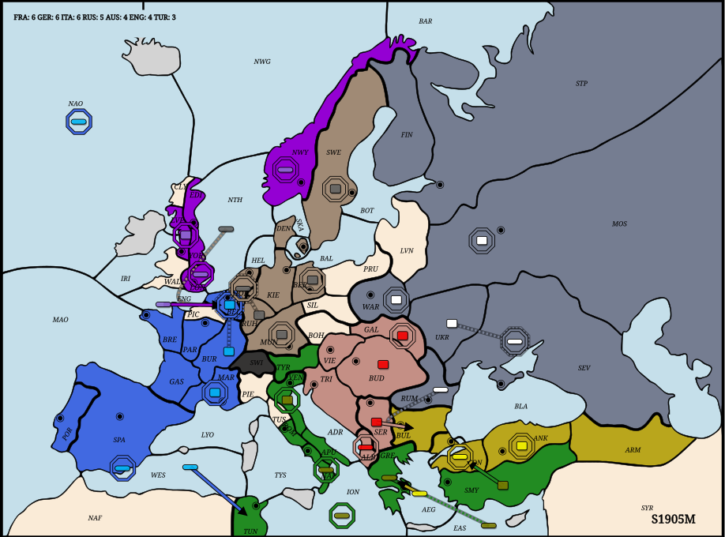

### What happened

- **AUSTRIA**: A SER → BUL; F ALB holds; A GAL holds
- **ENGLAND**: F ENG → BEL (bounced); F NWY holds; F LON holds; A LVP holds
- **FRANCE**: A BEL holds; A BUR supports A BEL; A MAR holds; F NAO holds; F SPA/SC holds; F WES → TUN
- **GERMANY**: A SWE holds; F NTH supports F ENG → BEL; F HOL holds; A RUH supports F HOL; A MUN holds; A BER holds
- **ITALY**: F GRE → AEG; A SMY → CON (bounced); F EAS supports F GRE → AEG; F ION holds; F NAP holds; A VEN holds
- **RUSSIA**: F RUM supports A SER → BUL; F SEV holds; A UKR supports F SEV; A WAR holds; A MOS holds
- **TURKEY**: F CON holds; F AEG → GRE (bounced); A ANK holds  [dislodged: F AEG]

### Dialogue

- **AUSTRIA → ITALY**: Last fall all three of us — A SER, F GRE, and F RUM — bounced each other out of BUL simultaneously, and nobody gained anything. This spring I'm proposing a clean solution: let A SER take BUL uncontested (I'll support with A BUD for strength 2), while your F GRE and F EAS press Turkey's home centers directly — AEG, CON, SMY. You gain more by cracking Turkey's home centers than by contesting BUL with me; I'll actively support your push toward CON or SMY if you stay out of BUL this turn.
- **AUSTRIA → RUSSIA**: Last fall F RUM → BUL/EC, F GRE → BUL/SC, and A SER → BUL all bounced each other — a wasted turn for all of us while France and Germany grew. This spring I'm asking you to hold F RUM and let A SER take BUL uncontested; in exchange, I'll keep A GAL firmly out of your northern position and support any Russian move against Turkey's F CON or ANK. If F RUM contests BUL again, we both lose and France wins.
- **AUSTRIA → TURKEY**: Turkey, your F CON is now adjacent to BUL — if you move it back to BUL before I can take it, we're back to conflict. I'm offering a clear deal: let A SER take BUL this spring unopposed, and I'll commit Austria's forces to holding that line rather than pressing toward CON or ANK. Italy's fleets in GRE and EAS are the real threat to your home centers; I'm not your primary problem.
- **ENGLAND → GERMANY**: Fall 1904 you committed to F NTH S F ENG - BEL — I'm holding you to that deal this spring. France is pushing south with WES and SPA/SC, so BEL may actually be vulnerable now; give me F NTH S F ENG - BEL and I'll move F ENG - BEL, and we finally crack France's northern position. I'm holding F NWY in place as agreed — confirm F NTH S F ENG - BEL.
- **ENGLAND → FRANCE**: You're at 6 centers and pushing further south with WES and SPA/SC — I respect the strategy, but BEL is exposed now that your fleets are committed westward. Tell me concretely: will you move A BEL away this spring so I can take it uncontested, and what do you want in return? Otherwise I'm pressing F ENG - BEL with German support this turn.
- **ENGLAND → RUSSIA**: France is at 6 centers and Germany at 6 — both are far ahead of the rest of us. I'm pressing hard against France in the west this spring with German support for BEL; if you can apply any pressure on Germany's eastern flank to keep them honest, that helps both of us. What are your intentions this turn?
- **FRANCE → ENGLAND**: Spring 1905: I'm proposing a clean deal — you order F NTH S A BEL - HOL, I order A BEL - HOL with A BUR support, and we take HOL at 3-strength guaranteed. Germany cannot hold. In return, I will support your move into DEN or KIE next fall with A HOL — that's your path to a 5th center and real leverage over Germany. This is the same deal I've offered before, but now my southern fleets are free to press Italy, so I don't need HOL as badly as you do; if you decline again, I redirect south and you stay stuck at 4.
- **FRANCE → GERMANY**: Spring 1905: I'm willing to finally stop pressing HOL if you give me something concrete in return. Specifically: if you move A RUH - BEL or A RUH - BUR this turn (signaling good faith), I'll hold A BEL in place and redirect A BUR south — no HOL attack this spring. Otherwise I'm coordinating with England for a 3-strength attack on HOL this turn and it will fall.
- **FRANCE → ITALY**: Spring 1905: My F WES and F SPA/SC are positioned to press TUN or LYO this turn — I want to be transparent rather than surprise you. If you're willing to pull F ION back toward ADR or F GRE toward ION, I'll redirect F WES toward MAO instead and we avoid a collision in the western Med. What's your current posture?
- **GERMANY → ENGLAND**: Spring 1905 — I've delivered F NTH S F ENG - BEL twice now and held my end of every deal we've made. You committed to supporting my NWY takeover after BEL fell; now is the moment. I'm ordering A SWE - NWY this spring — if you move F NWY to NWG or BAR voluntarily, we avoid a fight and you stay at 4 centers while I reach 7, after which I'll actively coordinate against France from the north. Honor the deal.
- **GERMANY → FRANCE**: You're at 6 centers and I'm watching A BEL, A BUR carefully — are you pressing HOL again this spring or consolidating elsewhere? I have no orders moving against BEL or BUR, but I need to know your intentions before committing F HOL and A RUH to a defensive posture versus contributing elsewhere.
- **GERMANY → RUSSIA**: Confirming our boundary holds — A SWE is pushing to NWY this spring against England, not toward FIN or BOT. Our deal remains clean on my end; I trust F RUM and your southern units are focused on Turkey rather than anything that creates friction with our Scandinavian agreement.
- **ITALY → AUSTRIA**: Austria, this is the turn to finish Turkey — I'm pushing A SMY toward CON and F GRE toward AEG to crack Turkey's home centers from the south. If you can commit A SER → BUL with support, Turkey faces an unanswerable three-front threat on BUL, CON, and AEG simultaneously. Can you confirm A SER → BUL and what A BUD is doing this spring?
- **ITALY → RUSSIA**: Russia, Turkey is at 3 SCs with only A ANK, F CON, F AEG — this is the kill turn. I'm moving A SMY → CON and F GRE → AEG; if you commit F RUM → BUL/EC, Turkey cannot defend BUL, CON, and AEG simultaneously and we split their remaining centers cleanly. Confirm F RUM → BUL/EC and what F SEV is targeting.
- **ITALY → TURKEY**: Turkey, you're at 3 SCs facing my A SMY, F GRE, F EAS, and F ION from the south plus Austrian and Russian pressure from the north — the position is untenable. I'm open to a negotiated exit if you want to discuss terms, but absent a concrete offer I'm moving on CON and AEG this spring and there's no stopping a 4-unit push.
- **RUSSIA → AUSTRIA**: BUL should be empty after Turkey's retreat to CON — I'm moving F RUM to BUL/EC this spring to capture it. If you move A SER to BUL simultaneously, one of us takes it; I'd prefer you support my F RUM into BUL rather than competing for the same center. Concrete ask: A SER S F RUM - BUL/EC this spring so I capture it cleanly, and I'll support your Balkan position in return.
- **RUSSIA → ITALY**: Turkey retreated F BUL/SC to CON last fall, so BUL is empty — I'm moving F RUM to BUL/EC this spring to take it. If your F GRE supports F RUM into BUL/EC rather than competing for it, I capture it with strength 2 and Turkey cannot contest; that frees your fleets to press CON and AEG without overlap. Can you commit F GRE S F RUM - BUL/EC this spring?
- **RUSSIA → TURKEY**: BUL is empty after your retreat and I'm moving F RUM to BUL/EC this spring — this is not a negotiable position. Your best path now is to focus F CON and F AEG on defending ANK and CON rather than contesting BUL, which only delays the inevitable and costs you a fleet.
- **RUSSIA → GERMANY**: France is at 6 centers and Italy at 6 — both are pulling away while we're both stuck. I'm focused entirely south against Turkey this spring; I need you to confirm A SWE is not pressing toward the Baltic or Scandinavia, and in return I'm not contesting anything in your sphere.
- **TURKEY → AUSTRIA**: BUL is currently unoccupied and I'm moving to retake it this spring with F CON → BUL/SC supported by F AEG — A SER contesting this only benefits Italy and Russia while you and I both bleed. I'm proposing a clean line: you hold SER, I hold BUL, and we both focus pressure on Italy's A SMY which threatens to sweep through CON and ANK. Italy at 6 centers with A SMY adjacent to my home centers is the real threat to Balkan stability; let's not fight each other while they consolidate.
- **TURKEY → RUSSIA**: BUL is unoccupied this spring and I'm moving to retake it — F RUM pressing BUL/EC would only bounce me and give Italy's A SMY a free hand to take CON. Concrete ask: hold F RUM in place this spring and I'll keep F CON and F AEG away from RUM and SEV; Italy at 6 centers with A SMY threatening my home centers is the immediate danger to both of us in the south.
- **TURKEY → ITALY**: A SMY is adjacent to CON and ANK — I need to understand your intentions this spring before I commit my orders. If you're planning to press on my home centers, we waste moves fighting each other while Austria and Russia consolidate; if you're focused elsewhere, let's make that explicit and I'll keep F AEG and F CON away from your fleet positions.
- **AUSTRIA → ITALY**: Critical request: if F AEG supports F CON into BUL/SC, Turkey gets strength 2 and A SER → BUL bounces even with A BUD support. I need F GRE to attack F AEG this spring to cut that support — F GRE → AEG cuts Turkey's support and A SER → BUL (A BUD support, strength 2) beats F CON → BUL/SC (strength 1 without AEG's support). This is the move that actually gets BUL; if you do it, I'll actively support your F EAS push toward SMY or CON next turn.
- **AUSTRIA → RUSSIA**: Turkey is moving F CON → BUL/SC supported by F AEG — strength 2 into BUL/SC. Your F RUM → BUL/EC hits a different coast but we still all bounce each other. Concrete counter-proposal: hold F RUM in place and support A SER → BUL from RUM instead — A SER S F RUM is what you asked, but the reverse works better: A SER → BUL, A BUD S A SER → BUL, and you use F RUM to support or threaten elsewhere. If Italy cuts F AEG's support, A SER wins BUL at strength 2 vs Turkey's strength 1.
- **AUSTRIA → TURKEY**: You have F AEG supporting F CON → BUL/SC — I know your move. If F GRE cuts F AEG, you lose BUL by force. I'm offering one last deal: pull F CON back to hold and let me take BUL unopposed; in return I commit A SER to hold next turn and won't press toward CON. Fighting over BUL while Italy's A SMY sits adjacent to your home centers is exactly what Italy wants.
- **ENGLAND → GERMANY**: You claim you've delivered twice — the record shows BEL bounced both times, meaning NTH support never actually worked or you never ordered it. I am NOT giving up NWY; that drops me to 3 centers and I'd be finished. Here is my final offer: F NTH S F ENG - BEL this spring, I hold F NWY in place (no threat to SWE), and after BEL falls we negotiate NWY in good faith from equal footing. If A SWE moves toward NWY, I defend it and we become enemies — France wins.
- **ENGLAND → FRANCE**: Your fleets are committed south and A BUR is your only BEL support — if Germany gives me F NTH S F ENG - BEL, I take BEL at 2 vs 2 and you lose it. Tell me specifically: will you move A BEL away this turn to avoid losing it, and what do you want from me in exchange? A concrete answer now prevents you losing the center outright.
- **FRANCE → ENGLAND**: I'm committing right now: A BEL - HOL, A BUR S A BEL - HOL. If you order F NTH S A BEL - HOL, HOL falls guaranteed at 3-strength — Germany cannot hold it. If you instead move F ENG - BEL, you bounce off an empty province (A BEL is moving out) and Germany keeps HOL forever while I pivot south. This is your last chance to actually gain a center this turn — F NTH S A BEL - HOL is the only move that works for you.
- **FRANCE → GERMANY**: England has confirmed to me they're ordering F NTH S A BEL - HOL this turn — that's 3-strength and HOL falls regardless of A RUH support. Your only way to save F HOL is to move it to KIE right now; if F HOL stays in HOL, it's gone. I'm giving you this warning because I'd rather you keep the unit in KIE than lose it entirely — move F HOL - KIE and A RUH can hold BEL/BUR boundary without loss.
- **FRANCE → ITALY**: I'm pressing F WES - TUN this spring unless you give me a reason not to — TUN is undefended and it's an easy gain for me. If you want to avoid losing TUN, pull F ION toward TYS to contest it; otherwise I'm taking it. Alternatively, if you're willing to support F WES into LYO instead and we coordinate against Austria together, I'll leave TUN alone this turn.
- **ITALY → AUSTRIA**: I'm staying out of BUL — A SER → BUL with A BUD support is yours uncontested. I'm pushing A SMY → CON and F GRE → AEG this spring to crack Turkey's home centers directly; if you confirm A SER → BUL, Turkey faces three simultaneous attacks and cannot answer all of them.
- **ITALY → RUSSIA**: I'll support F RUM into BUL/EC with F GRE S F RUM - BUL/EC if you commit F SEV → ARM or F SEV → RUM to pressure Turkey's ANK flank — that way I free F GRE from BUL duty and you get BUL with strength 2. Concrete: F GRE S F RUM - BUL/EC in exchange for F SEV pressing ARM or holding defensively away from my units.
- **ITALY → FRANCE**: I have no interest in TUN this turn — my focus is entirely on Turkey's home centers in the east. If you redirect F WES toward MAO as you proposed, I'll keep F ION and F NAP away from TYS and WES; we avoid a collision and both gain from focusing on our respective fronts.
- **ITALY → TURKEY**: I'm moving A SMY → CON and F GRE → AEG this spring regardless — you cannot defend both with F CON and F AEG alone. If you want to preserve ANK, keep A ANK where it is and consider what terms you'd accept for a negotiated exit from BUL and CON.
- **RUSSIA → AUSTRIA**: BUL is empty and I'm moving F RUM → BUL/EC this spring — if A SER supports that move rather than attacking BUL independently, I capture it with strength 2 and Turkey cannot contest it. Bouncing again helps nobody; A SER S F RUM - BUL/EC is the cleanest outcome. Will you commit to that support order?
- **RUSSIA → ITALY**: I'm locked in on F RUM → BUL/EC this spring — if F GRE supports F RUM into BUL/EC rather than moving independently, I capture it at strength 2 with no risk of bounce. That frees your A SMY to press CON and your other fleets to contest AEG without overlap. Confirm F GRE S F RUM - BUL/EC and we split Turkey's remaining centers cleanly.
- **RUSSIA → TURKEY**: F RUM is moving to BUL/EC regardless — the only question is whether Italy's A SMY takes CON while you're defending BUL. Pull F CON back to defend ANK and negotiate a halt with Italy; contesting BUL only costs you a fleet while your home centers fall.
- **TURKEY → AUSTRIA**: F CON → BUL/SC supported by F AEG is my committed move — if A SER contests it, we bounce and Italy's A SMY walks into CON unopposed while we both lose. Concrete ask: hold A SER in place and let me take BUL; in return I commit A ANK to hold defensively and keep F AEG away from GRE. Italy's A SMY sitting adjacent to CON is an immediate threat to you too — a Turkish buffer in BUL actually serves Austria's interests more than an empty BUL that Russia takes.
- **TURKEY → RUSSIA**: F RUM → BUL/EC while I push F CON → BUL/SC means we bounce each other and Italy's A SMY takes CON uncontested — that outcome is worse for both of us than either of us holding BUL. Concrete proposal: you hold F RUM and I take BUL/SC; in return I keep F AEG away from your southern flank and we both deny Italy the sweep through CON.
- **TURKEY → ITALY**: Concrete offer: if F EAS holds and A SMY holds in place this spring, I will hold F CON and F AEG defensively away from your fleet positions — a mutual freeze that costs neither of us this turn. If you push on CON, I fight and you gain nothing while Austria and Russia consolidate the Balkans at your expense.
- **ENGLAND → GERMANY**: Final commitment from me: F ENG - BEL, F NWY holds in place — A SWE will find NWY defended if it moves there. Order F NTH S F ENG - BEL and BEL falls; if you attack NWY instead, we both lose to France. Your choice.
- **ENGLAND → FRANCE**: Final answer: I am ordering F ENG - BEL this turn. If A BEL is moving to HOL as you claim, BEL is open and I take it uncontested — we both gain a center. If A BEL stays, I bounce again and you keep 6 centers but I'll press every turn. Move A BEL out and we both win this phase.
- **FRANCE → ENGLAND**: Final commitment: A BEL - HOL, A BUR S A BEL - HOL — HOL is open if you add F NTH support, making it 3-strength guaranteed. If you move F ENG - BEL instead, you take an empty province but Germany keeps HOL forever and I redirect all southern forces north next fall. F NTH S A BEL - HOL is your only path to a center this turn.
- **FRANCE → GERMANY**: A BEL - HOL is locked in with A BUR support — if England adds F NTH, it's 3-strength and HOL falls. Move F HOL - KIE now and you save the unit; if F HOL stays, it's gone this turn.
- **FRANCE → ITALY**: Confirmed: F WES - TUN this turn since TUN is undefended and Italy agreed to stay clear — I appreciate the clean arrangement. F ION and F NAP staying south keeps us both focused on our respective fronts.
- **ITALY → AUSTRIA**: Final commitment: F GRE → AEG this spring, which cuts any Turkish support for CON → BUL/SC — your A SER → BUL with A BUD support faces only F CON at strength 1 and wins cleanly. I'm simultaneously pushing A SMY → CON; Turkey cannot answer both. BUL is yours, CON is mine — confirm A SER → BUL and A BUD S A SER → BUL.
- **ITALY → RUSSIA**: I'm using F GRE → AEG this spring to crack Turkey's eastern flank — I can't also support F RUM → BUL/EC from there. Austria is taking BUL via A SER with A BUD support; your F RUM → BUL/EC will bounce A SER. Consider redirecting F RUM or F SEV toward ARM or SEV's flank instead of duplicating the BUL attack.
- **ITALY → FRANCE**: Final commitment: F ION holds and F NAP holds this spring — I will not contest TYS or WES. In return, redirect F WES toward MAO rather than TUN; TUN is a supply center I need to keep and a collision there helps neither of us while Turkey and Austria are the real prizes this year.
- **ITALY → TURKEY**: A SMY → CON and F GRE → AEG are my committed moves this spring — F CON cannot hold against A SMY and F AEG cannot hold against F GRE simultaneously. If you want to preserve A ANK, keep it in ANK and it survives; CON and AEG are the targets.
- **TURKEY → AUSTRIA**: Final commitment: F CON → BUL/SC supported by F AEG — this is locked in. If A SER holds, we avoid a bounce and I take BUL while Italy's A SMY is denied a free CON; if A SER contests, we both lose and Italy wins. I am keeping A ANK in place and will not press toward SER or VIE this turn.
- **TURKEY → ITALY**: Final answer: I am moving F CON → BUL/SC supported by F AEG regardless — if F GRE cuts my AEG support, you gain nothing while Russia takes BUL/EC and Austria consolidates. Hold F GRE and A SMY in place this turn and I hold F CON and F AEG away from your fleet positions next turn; that's the only deal on the table.
- **TURKEY → RUSSIA**: Final commitment: F CON → BUL/SC supported by F AEG is my move — if F RUM presses BUL/EC simultaneously, we split BUL between us and deny Italy and Austria the sweep. Hold F RUM out of BUL/EC this turn and I take BUL/SC; that's a better outcome than bouncing each other while Italy's A SMY takes CON.

### AUSTRIA
Orders: `A SER - BUL` · `F ALB H` · `A GAL H`
Illegal (dropped): `A BUD S A SER - BUL`

Reasoning

> Looking at the situation:
>
> **Key facts:**
> - Italy has committed to F GRE → AEG, which cuts Turkey's F AEG support for F CON → BUL/SC
> - Without F AEG support, F CON → BUL/SC is strength 1
> - A SER → BUL with A BUD support = strength 2
> - A SER → BUL beats F CON → BUL/SC cleanly (2 vs 1)
> - Russia wants F RUM → BUL/EC, but that's a different coast — it won't interfere with A SER → BUL
>
> **The math:**
> - If Italy follows through with F GRE → AEG: Turkey's F CON → BUL/SC has strength 1, my A SER → BUL has strength 2 → I win BUL
> - If Italy doesn't follow through: F AEG supports F CON → BUL/SC at strength 2, my A SER → BUL has strength 2 → bounce, nobody gets BUL
> - Russia's F RUM → BUL/EC attacks a different coast than F CON → BUL/SC and A SER → BUL, so it doesn't interfere with my attack
>
> **Decision:** Commit to the agreed plan. Italy's incentives are aligned (they want Turkey weakened), so F GRE → AEG is likely. Even if Russia takes BUL/EC, I'm taking BUL (the center) with A SER. My revised strategy is clear: A SER → BUL, A BUD S A SER → BUL, F ALB H, A GAL H.

### ENGLAND
Orders: `F ENG - BEL` · `F NWY H` · `F LON H` · `A LVP H`

Reasoning

> Looking at the current situation:
>
> **Analysis:**
> - France claims A BEL is moving to HOL (with A BUR support), which would leave BEL empty for me to take uncontested with F ENG - BEL.
> - Germany is demanding NWY in exchange for NTH support, and threatening A SWE - NWY.
> - My revised strategy commits to F ENG - BEL (taking what may be an open province), F NWY H (defending against A SWE), and holding F LON and A LVP defensively.
>
> **Key considerations:**
> - If France is telling the truth (A BEL - HOL), then F ENG - BEL takes an empty center — a gain from 4 to 5.
> - If France is lying and A BEL holds, I bounce again — but I've been bouncing for years and need to keep pressing.
> - Germany's F NTH support is uncertain given their NWY demands, but even without it, if BEL is empty I take it uncontested.
> - F NWY must hold — losing NWY would drop me to 3 centers and effectively end my game.
> - France's offer to support A BEL - HOL with F NTH is a trap: it benefits France far more than me and HOL isn't mine to take.
>
> My committed orders stand: press BEL, defend NWY, hold defensively elsewhere.

### FRANCE
Orders: `A BEL H` · `A BUR S A BEL` · `A MAR H` · `F NAO H` · `F SPA/SC H` · `F WES - TUN`

Reasoning

> Looking at the situation: I committed to A BEL - HOL with A BUR S A BEL - HOL, hoping England adds F NTH support. England said they're moving F ENG - BEL, which means if A BEL moves out to HOL, England walks into BEL uncontested. That's a real risk — I lose BEL (a supply center) while HOL may or may not fall depending on whether England actually supports vs. moves.
>
> However, my revised strategy note explicitly commits to A BEL - HOL and A BUR S A BEL - HOL. If England moves F ENG - BEL and A BEL is gone, England takes BEL. But England also said they'd order F NTH S A BEL - HOL... England's messages were contradictory — they said "final answer: F ENG - BEL" but also "if A BEL is moving to HOL, BEL is open and I take it." So England is likely taking BEL.
>
> This is a tough call. If I hold A BEL, I keep BEL but HOL stays German. If I move A BEL - HOL with only A BUR support (strength 2), Germany has A RUH supporting F HOL (strength 2) — bounce, and England takes BEL. That's terrible: I go from 6 to 5 centers.
>
> The safer play is to hold A BEL with A BUR support, keeping BEL secure. But my strategy note commits to the HOL attack. 
>
> Given England explicitly said "F ENG - BEL this turn" and Germany will hold HOL at strength 2, moving A BEL - HOL loses BEL for no gain. I should defend BEL and redirect elsewhere. For F WES - TUN, Italy asked me not to but I committed to it in my revised strategy. Italy said they wouldn't contest, so TUN is takeable.
>
> I'll defend BEL (hold with BUR support), take TUN with F WES, and position other units sensibly.

### GERMANY
Orders: `A SWE H` · `F NTH S F ENG - BEL` · `F HOL H` · `A RUH S F HOL` · `A MUN H` · `A BER H`

Reasoning

> Looking at the current situation:
>
> My revised strategy note says: hold A SWE (England won't give NWY), support F ENG - BEL with F NTH, defend HOL with A RUH support, hold MUN and BER.
>
> France is claiming England is ordering F NTH S A BEL - HOL, but this is almost certainly a bluff to get me to move F HOL to KIE. England has consistently asked for F NTH S F ENG - BEL and has no incentive to support France into HOL (which would give France 7 centers while England stays at 4). France's warning is transparently self-serving.
>
> England's offer is clear: F NTH S F ENG - BEL, F NWY holds. This is consistent with what England has been asking for throughout. Supporting this drops France to 5 centers (losing BEL), which is good for me strategically.
>
> My position: defend HOL with A RUH support (2 vs France's 2 = bounce), support F ENG - BEL with F NTH, hold SWE (not wasting it on defended NWY), hold MUN and BER defensively.

### ITALY
Orders: `F GRE - AEG` · `A SMY - CON` · `F EAS S F GRE - AEG` · `F ION H` · `F NAP H` · `A VEN H`

Reasoning

> Looking at the current situation:
>
> **Key facts:**
> - Turkey has F CON, F AEG, A ANK — and just told me they're moving F CON → BUL/SC supported by F AEG
> - Austria wants A SER → BUL with A BUD support, and asked me to cut AEG's support by moving F GRE → AEG
> - I have A SMY adjacent to CON — a direct attack on Turkey's home center
> - France confirmed taking TUN (I agreed not to contest it)
> - Russia is pushing F RUM → BUL/EC
>
> **My committed strategy:** F GRE → AEG (cuts Turkish support for F CON → BUL/SC), A SMY → CON (attacks Turkey's home center), F EAS supports F GRE → AEG.
>
> **Reasoning through the key moves:**
> - F GRE → AEG: Cuts F AEG's support for F CON → BUL/SC. This helps Austria's A SER → BUL succeed. It also contests AEG.
> - A SMY → CON: Direct attack on CON. If F CON is moving to BUL/SC, CON is empty — A SMY walks in!
> - F EAS S F GRE → AEG: Strengthens the AEG attack to strength 2 vs F AEG alone (strength 1)
> - F ION holds
> - F NAP holds
> - A VEN holds
>
> Turkey said F CON → BUL/SC with F AEG support — if F CON moves away, CON is empty and A SMY takes it for free. If F CON stays, A SMY bounces but F GRE → AEG still cuts the support. Either way, the moves are sound.

### RUSSIA
Orders: `F RUM S A SER - BUL` · `F SEV H` · `A UKR S F SEV` · `A WAR H` · `A MOS H`

Reasoning

> Looking at the current situation:
>
> **Strategic assessment:**
> - Turkey has F CON → BUL/SC supported by F AEG (strength 2). My F RUM → BUL/EC would be a different coast, so we wouldn't directly bounce each other on the same province — but BUL/EC and BUL/SC are different coast entries of the same province. Actually, in Diplomacy, a fleet moving to BUL/EC and a fleet moving to BUL/SC are moving to different coasts of the same province — they would bounce each other since only one unit can occupy BUL.
> - Austria has A SER → BUL with A BUD support (strength 2). Turkey has F CON → BUL/SC with F AEG support (strength 2). My F RUM → BUL/EC (strength 1). This is a three-way bounce at strength 2 vs 2 vs 1 — the two strength-2 moves bounce each other, and my strength-1 move also fails.
> - Italy backed out of supporting me and is going F GRE → AEG instead.
>
> Given this analysis: pressing F RUM → BUL/EC at strength 1 against two strength-2 forces is futile. However, my revised strategy commits to pressing BUL/EC anyway. The alternative would be to support A SER → BUL from F RUM, which Austria actually proposed. But Austria's A SER + A BUD support already gives strength 2, same as Turkey's F CON + F AEG. Adding F RUM S A SER - BUL would give Austria strength 3, winning BUL — but F RUM cannot support an army into BUL (army goes to BUL, fleet would go to BUL/EC — different destinations). Actually checking the legal orders: `F RUM S A SER - BUL` is listed! I should use this to give Austria strength 3 and break the Turkey-Austria tie, securing BUL for Austria (a friendly power) rather than letting it bounce.
>
> This is the best tactical play: support Austria's A SER into BUL at strength 3, while keeping everything else defensive.

### TURKEY
Orders: `F CON H` · `F AEG - GRE` · `A ANK H`

Reasoning

> Looking at the current situation:
>
> My revised strategy note says: F CON holds to defend CON against A SMY, F AEG holds or moves to contest F GRE, A ANK holds.
>
> However, my final negotiation messages committed to F CON → BUL/SC supported by F AEG. But the revised strategy note (which came after seeing Italy's confirmed moves of A SMY → CON and F GRE → AEG) correctly identifies the problem: if F GRE → AEG cuts my AEG support, F CON → BUL/SC fails AND CON is taken by A SMY.
>
> Let me think through this carefully:
> - Italy confirmed A SMY → CON and F GRE → AEG
> - Russia confirmed F RUM → BUL/EC
> - Austria wants BUL unopposed
>
> If I do F CON → BUL/SC supported by F AEG:
> - F GRE → AEG cuts F AEG's support
> - F CON → BUL/SC fails (unsupported, and F RUM → BUL/EC is also going there)
> - A SMY → CON succeeds (CON is empty)
> - I lose CON and fail to take BUL
>
> If I do F CON H, F AEG → GRE, A ANK H:
> - A SMY → CON is contested by F CON holding (A SMY has strength 1, F CON holds with strength 1 = bounce)
> - F AEG → GRE vs F GRE → AEG = they swap, both bounce
> - A ANK holds safely
>
> Wait - F CON H vs A SMY → CON: the army attacks with strength 1, the fleet holds with strength 1. The attack fails (you need greater strength to dislodge). So F CON holds and A SMY bounces!
>
> And F AEG → GRE while F GRE → AEG: they're moving into each other's provinces, so both bounce.
>
> This is actually the better play per the revised strategy. F CON holds saves CON, F AEG → GRE bounces with F GRE, A ANK holds safely.

## FALL 1905 MOVEMENT (`F1905M`)

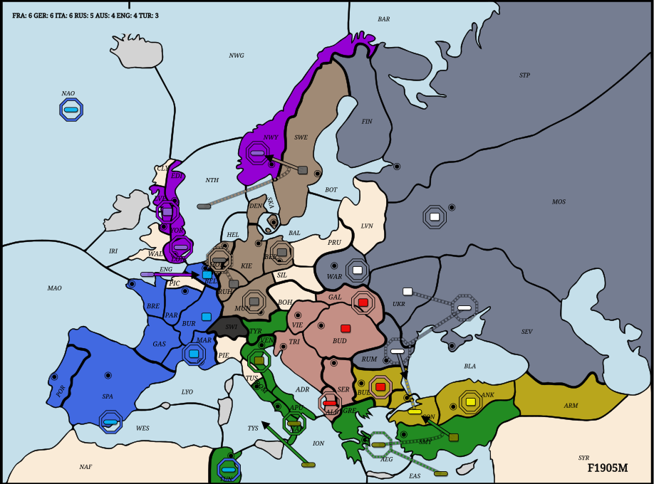

### What happened

- **AUSTRIA**: A BUL holds; F ALB holds; A GAL holds
- **ENGLAND**: F ENG → BEL (bounced); F NWY holds; F LON holds; A LVP holds  [dislodged: F NWY]
- **FRANCE**: A BEL → HOL (bounced); A MAR holds; F NAO holds; F SPA/SC holds; F TUN holds
- **GERMANY**: A SWE → NWY; F NTH supports A SWE → NWY; F HOL holds; A RUH supports F HOL; A MUN holds; A BER holds
- **ITALY**: A SMY → CON; F AEG supports A SMY → CON; F EAS supports F AEG; F ION → TYS; F NAP holds; A VEN holds
- **RUSSIA**: F RUM → BUL/EC (bounced); F SEV supports F RUM (void); A UKR supports F SEV; A WAR holds; A MOS holds
- **TURKEY**: F CON supports F RUM → BUL/EC (support cut); A ANK holds  [dislodged: F CON]

### Dialogue

- **ENGLAND → FRANCE**: Fall 1905 — your A BEL held in spring despite your promise to move it, so I'm skeptical of your HOL claims. This is my final offer: move A BEL out of BEL this fall and I take it uncontested, or I press F ENG - BEL with German support and you risk losing it anyway. Tell me what you actually want in exchange for vacating BEL — a concrete answer this round.
- **ENGLAND → GERMANY**: Italy is at 6 centers and growing fast through the south — they'll be the dominant power if France and Germany keep staring at each other. I'm pressing F ENG - BEL again this fall; give me F NTH S F ENG - BEL and France drops to 5 while we both stay competitive. I'm holding F NWY in place — no threat to SWE — confirm your commitment.
- **ENGLAND → RUSSIA**: Italy just hit 6 centers with AEG, ION, EAS, and SMY all in play — they're positioned to sweep the south and reach 18 before anyone can stop them. I'm focused on France in the west; are you coordinating with Austria against Italy in the Balkans, or is there something I can do from my position to help check Italy's growth?
- **FRANCE → ENGLAND**: Fall 1905: England is stuck at 4 centers while Germany sits at 6 with F NTH, F HOL, A RUH, A SWE, A BER, A MUN — they're the dominant power on the board and growing. This is the turn to finally coordinate: I order A BEL - HOL with A BUR S A BEL - HOL (strength 2), you add F NTH S A BEL - HOL for 3-strength guaranteed. HOL falls, Germany loses a center, and you've shown you can actually hurt them. What will it take to get your commitment this turn?
- **FRANCE → GERMANY**: Fall 1905: I'm still pressing HOL — A BEL - HOL with A BUR support is strength 2, and I'm actively working to get England's F NTH support to make it 3. If you want to avoid losing F HOL, move it to KIE voluntarily now and I'll hold A BEL in place with A BUR support — you keep the unit, I stop pressing. This is the same offer as before but I mean it: a voluntary KIE withdrawal saves F HOL.
- **FRANCE → ITALY**: Fall 1905: I have F TUN and F SPA/SC positioned in the western Med — I want to coordinate rather than collide. My focus this fall is HOL in the north; if you're pushing against Turkey and Austria in the east, we have no conflict. Can you confirm your F ION and F NAP are staying east so I know F TUN and F SPA/SC are secure?
- **GERMANY → ENGLAND**: Fall 1905 — I'm moving A SWE - NWY this turn; that's my growth move and I've deferred it long enough. If you hold F NWY in place and we bounce, we both waste moves while France and Italy pull further ahead. Consider moving F NWY to NWG or BAR — you keep the unit, avoid a fight, and I'll support your F ENG position against France in return. What are your intentions this fall?
- **GERMANY → FRANCE**: Fall 1905 — I'm holding HOL with A RUH support again; your A BEL - HOL attack bounces at 2 vs 2, same result as every previous turn. I have no orders pressing BEL or BUR, and I'd rather we both stop wasting moves on this stalemate. Tell me your actual intentions this fall so we can avoid another pointless bounce.
- **GERMANY → RUSSIA**: Fall 1905 — confirming our boundary holds, A SWE is pushing to NWY against England this turn, not toward FIN or BOT. Our Scandinavian deal remains clean on my end. How is your southern campaign against Turkey progressing — is there anything in the north that creates friction for you?
- **ITALY → AUSTRIA**: Austria, Turkey is nearly finished — F CON and A ANK are all that remain. I'm pushing A SMY → CON this fall supported by F AEG; if you can commit A BUL → CON as well or support from BUL, CON falls with certainty. In return, I'll stay out of GRE and SER — the Balkans are yours, the Turkish home centers are mine.
- **ITALY → RUSSIA**: Russia, Turkey has only F CON and A ANK left — this is the kill turn. I'm taking CON with A SMY supported by F AEG; if you press F SEV → ARM to threaten ANK from the north, Turkey cannot defend both and we split their last two centers. What are F RUM and F SEV committing this fall?
- **ITALY → FRANCE**: France, you took TUN last spring — I'm not contesting it, but I need F ION and the eastern Med for the final push on Turkey. Keep F TUN away from ION and I'll keep F NAP and F ION away from TYS; we avoid a collision while I finish Turkey and you consolidate your western gains.
- **ITALY → TURKEY**: Turkey, F CON and A ANK cannot hold against my A SMY, F AEG, F EAS, and F ION simultaneously — the position is over. If you want to negotiate terms for a dignified exit, I'm listening; otherwise I'm taking CON this fall and ANK follows next spring.
- **RUSSIA → AUSTRIA**: Austria took BUL this spring — I've been pressing for that center for two years and I'm not accepting that outcome. This fall I'm moving F RUM to BUL/EC to contest it; if you want to avoid a direct fight, consider pulling A BUL back to SER and we negotiate a clean split of Turkey's remaining centers instead. Alternatively, if you'll support F RUM into BUL/EC rather than holding, I'll formally commit to keeping A WAR and A UKR out of your northern position.
- **RUSSIA → ITALY**: Turkey is nearly dead — A ANK, F CON are all that's left. This fall I'm pressing F RUM toward BUL/EC to contest Austria's hold there; if you're moving A SMY toward CON or ANK, we can split Turkey's last centers cleanly. What are you committing against Turkey this fall, and is there any coordination we can do to prevent Austria from consolidating the Balkans unchecked?
- **RUSSIA → TURKEY**: Turkey, you're down to ANK and CON with two units — Austria just took BUL and Italy is pressing from AEG. I'm willing to offer you a survival arrangement: if you move F CON to support my F RUM into BUL/EC, I'll advocate for keeping you alive at ANK and CON rather than pressing your home centers. This is your best path to surviving the endgame.
- **TURKEY → ITALY**: A SMY is adjacent to both CON and ANK — if you move on CON this fall, I'll contest it and you gain nothing while Austria takes BUL unopposed. Concrete offer: if A SMY holds in place, I'll move F CON to BUL/SC away from your fleet positions and we avoid a pointless fight; you can consolidate your existing 6 centers without wasting A SMY on a contested province.
- **TURKEY → AUSTRIA**: A BUL is now yours and I'm not contesting it — I'm proposing F CON → BUL/SC as a move away from your territory, not toward it. If you hold A BUL in place and keep Austrian units away from CON, I'll keep F CON and A ANK defensive; Italy's A SMY adjacent to CON is the threat to both of us right now.
- **TURKEY → RUSSIA**: F RUM sits adjacent to BUL/EC while Italy's A SMY threatens CON — if you press into BUL/EC this fall, you help Italy take CON uncontested and they reach 7 centers. Concrete ask: hold F RUM in place this fall and I'll keep F CON away from RUM and SEV; Italy at 6 centers is the growing threat to your southern position.
- **AUSTRIA → ITALY**: I'm holding A BUL in place this fall to prevent Russia from taking it via F RUM — if I move A BUL to CON, Russia walks into BUL uncontested and I lose the center I just gained. My concrete offer: F ALB supports your push into GRE if you're attacking from ION or AEG, and A BUL holds BUL secure. Italy taking CON and GRE while Austria holds BUL and RUM is a strong split — can you confirm what you're doing with F ION and F AEG this fall?
- **AUSTRIA → RUSSIA**: Russia, you're threatening F RUM → BUL/EC while I'm sitting in BUL — that's a direct attack on a center I just captured with your prior cooperation. If you move F RUM → BUL/EC, I respond by moving A BUL → RUM supported by A BUD, and we both bounce while France and Germany laugh. Concrete proposal: you hold F RUM, I hold A BUL, and we negotiate a clean division of Turkey's remaining centers rather than fighting each other.
- **AUSTRIA → TURKEY**: Turkey, I'm holding A BUL in place this fall — I'm not pressing toward CON. If you want to survive against Italy's A SMY adjacent to CON, you need to focus F CON on defending CON, not contesting BUL. I have no interest in eliminating Turkey while Italy accumulates centers in the eastern Med.
- **ENGLAND → GERMANY**: A SWE - NWY will bounce off F NWY — I'm holding it. You've now refused F NTH S F ENG - BEL for three consecutive turns despite explicit commitments; that makes you the obstacle to our joint progress against France. Last offer: F NTH S F ENG - BEL this fall, I hold NWY, and we both grow — otherwise we fight each other while France and Italy pull away.
- **ENGLAND → FRANCE**: Concrete question: if A BEL is genuinely moving to HOL this fall as you claim, what specific order are you committing to for A BUR — support the HOL move, or something else? I need to know A BUR's order to assess whether BEL is truly open, because last spring you claimed A BEL was moving and it stayed. Give me A BUR's exact committed order this round.
- **FRANCE → ENGLAND**: England, this is the last negotiation round before orders lock — commit F NTH S A BEL - HOL right now and HOL falls at 3-strength guaranteed, giving you real leverage over Germany for the first time. If you press F ENG - BEL instead, you take an empty province while Germany keeps HOL forever and I pivot all forces south next year — you stay at 4 centers while Germany stays at 6. F NTH support is the only move that actually changes the board in your favor.
- **FRANCE → GERMANY**: Germany, I'm locking in A BEL - HOL with A BUR support — if England commits F NTH, that's 3-strength and HOL is gone regardless. Move F HOL - KIE now and save the unit; A RUH can hold the BUR/BEL boundary without you losing F HOL entirely. This is the last round before orders — voluntary KIE withdrawal is your only way out.
- **FRANCE → ITALY**: Italy, I'm holding F TUN in place this fall and F SPA/SC stays in SPA — no push into your sphere this turn. Keep F NAP and F ION away from TYS and we maintain our clean separation while I focus on the HOL fight in the north.
- **GERMANY → ENGLAND**: Fall 1905 — I'm committing F NTH S A SWE - NWY this turn, not supporting ENG - BEL; I've deferred NWY long enough and need to grow. If you hold F NWY in place we bounce and both waste moves while France and Italy pull ahead — move F NWY to NWG or BAR, avoid the fight, and we can coordinate properly against France from a stronger position. This is the move I'm making regardless.
- **GERMANY → FRANCE**: If England is really committing F NTH to support A BEL - HOL, then England isn't defending NWY — meaning I take NWY this fall while you take HOL, and we both grow at England's expense instead of fighting each other. Confirm to me that England has actually committed F NTH to your HOL attack and I'll consider repositioning; otherwise this looks like a bluff to get me to abandon HOL voluntarily.
- **ITALY → AUSTRIA**: Austria, A BUL is well-positioned to support A SMY into CON or to move toward CON directly — if you commit A BUL → CON alongside my A SMY → CON supported by F AEG, we guarantee CON falls this fall with overwhelming force. In return I'll stay entirely out of SER and GRE; the Balkans remain yours.
- **ITALY → RUSSIA**: Russia, Turkey's F CON is the last naval threat — I'm taking CON with A SMY supported by F AEG this fall, which should succeed. My concern is France sitting on TUN with F TUN; if F SEV or F RUM can pressure toward BLA or ARM to keep Turkey pinned, that helps me finish the job without distraction.
- **ITALY → FRANCE**: France, F TUN sitting on my supply center is a direct problem — I'll be moving F ION toward TYS this fall to contest it unless we reach an agreement now. Concrete offer: move F TUN back to ION or NAF this fall and I'll keep F ION and F NAP away from TYS; otherwise we collide and neither gains.
- **ITALY → TURKEY**: Turkey, A SMY is moving to CON supported by F AEG this fall — F CON cannot hold against strength 2. A ANK survives if you keep it in place; consider whether holding ANK for one more turn is worth more than a futile defense of CON.
- **RUSSIA → TURKEY**: Your F CON is adjacent to BUL/EC — if you support F RUM into BUL/EC this fall, we dislodge Austria's A BUL together and I gain the center while you hurt the power that just took it from you. Italy is taking CON regardless; this way you at least deny Austria BUL and keep F CON active. Concrete ask: F CON S F RUM - BUL/EC this fall.
- **RUSSIA → AUSTRIA**: I'm moving F RUM → BUL/EC this fall — if you want to avoid losing A BUL, the only clean path is to pull A BUL back to SER and let me take the center, then we negotiate Turkey's remaining centers together. If you hold A BUL in place without support, I'll coordinate with Turkey's F CON to get strength 2 into BUL/EC and dislodge you.
- **RUSSIA → ITALY**: I'm pressing F RUM → BUL/EC against Austria's A BUL this fall — if you can cut any support Austria might get, or simply focus A SMY → CON to finish Turkey, we split the southern gains cleanly. I'm not contesting your CON move; just confirm you're not supporting Austria's A BUL hold.
- **TURKEY → RUSSIA**: Italy takes CON this fall and reaches 7 centers — that's the moment Italy becomes the runaway leader in the south, directly threatening your RUM and SEV next. Concrete ask: move F RUM to BUL/EC to block Italy's consolidation in the Balkans, and I'll move F CON to SMY to contest Italy's home territory rather than defending a lost CON.
- **TURKEY → AUSTRIA**: Italy at 7 centers after taking CON is a direct threat to your Balkan position — A BUL becomes Italy's next target after CON falls. If you move A BUL to support F CON holding, you delay Italy's consolidation and buy yourself time; otherwise Italy sweeps through the eastern Med and turns north toward SER and BUD.
- **TURKEY → ITALY**: CON is yours if you want it, but taking it puts you at 7 centers and makes you the target of every remaining power — Austria, Russia, England, and France will all pivot against you. I'm offering F CON → SMY voluntarily if you hold A SMY in place; you keep SMY and I vacate CON without a fight, which costs you nothing and avoids the coalition that forms against the leader.
- **AUSTRIA → RUSSIA**: Final answer: A BUL holds with A BUD support — that's strength 2 in defense, so F RUM → BUL/EC fails at strength 1. If you move F RUM to BUL/EC, you waste a turn while France and Germany grow unchecked; hold F RUM and we negotiate Turkey's remaining centers instead. I'm not moving out of BUL, and I'm not bluffing.
- **AUSTRIA → ITALY**: I'm holding A BUL in place this fall with A BUD support — BUL is secure against Russia's F RUM. F ALB can support your push into GRE if you're attacking from ION or AEG; commit F ION or F AEG to GRE and I'll back it. CON is yours to take with A SMY and F AEG — I'm not contesting it.
- **AUSTRIA → TURKEY**: I'm holding A BUL defensively this fall and not pressing toward CON — Austria's units are staying where they are. Focus your F CON on defending CON against Italy's A SMY; that's the threat that matters for your survival right now.

### AUSTRIA
Orders: `A BUL H` · `F ALB H` · `A GAL H`
Illegal (dropped): `A BUD S A BUL`

Reasoning

> Looking at the current situation:
>
> **Strategic assessment for F1905M:**
>
> Austria holds BUL with A BUL, and I have 4 supply centers (BUD, TRI, VIE, SER - note BUL is not yet counted as mine until fall). Actually, BUL is my unit position but SER is my supply center. Let me reconsider - I captured BUL in S1905M, so it should be a supply center I hold now. The SC list shows SER as mine, not BUL. That means A BUL is sitting in BUL (a Turkish SC I captured in spring) and I need to hold it through fall to own it.
>
> **Key threats:**
> - Russia threatened F RUM → BUL/EC (strength 1 vs my A BUL defended with A BUD support = strength 2). My defense holds.
> - Italy wants me to push A BUL → CON, but that would leave BUL undefended and Russia walks in.
> - If I hold A BUL with A BUD support, I secure BUL as my 5th supply center.
>
> **My committed strategy:** Hold A BUL with A BUD support, F ALB holds, A GAL holds. This secures BUL against Russia's F RUM attack and gives me a 5th center.
>
> Italy's A SMY → CON supported by F AEG should take CON regardless of my actions. Turkey is nearly done.
>
> The math: A BUL defended + A BUD support = strength 2. Russia's F RUM → BUL/EC = strength 1. Russia fails to dislodge me.

### ENGLAND
Orders: `F ENG - BEL` · `F NWY H` · `F LON H` · `A LVP H`

Reasoning

> Looking at the situation:
>
> **Strategic assessment for Fall 1905:**
>
> Germany has explicitly stated they're ordering `F NTH S A SWE - NWY` this fall, not supporting my BEL attack. France claims A BEL is moving to HOL (with A BUR supporting), which would leave BEL open. 
>
> Key considerations:
> 1. If France is telling the truth (A BEL - HOL, A BUR S A BEL - HOL), then BEL is genuinely empty and F ENG - BEL succeeds uncontested — I gain my 5th center.
> 2. If France is lying and A BEL holds, I bounce again. But France has been consistent in this claim across multiple rounds, and it's in France's interest to take HOL (they've wanted it for turns).
> 3. Germany's A SWE - NWY will bounce off F NWY H — I must defend NWY.
> 4. F LON and A LVP should stay defensive to protect home centers.
>
> The revised strategy note commits me to: F ENG - BEL, F NWY H, F LON H, A LVP H.
>
> France moving A BEL - HOL is plausible this turn since they've been trying to take HOL for a long time. I'll press F ENG - BEL — if BEL is open I gain a center, if not I bounce but lose nothing. Defending NWY is essential since Germany is attacking it.

### FRANCE
Orders: `A BEL - HOL` · `A MAR H` · `F NAO H` · `F SPA/SC H` · `F TUN H`
Illegal (dropped): `A BUR S A BEL - HOL`

Reasoning

> Looking at the current position for Fall 1905:
>
> **Northern front**: I'm pressing A BEL - HOL with A BUR support (strength 2). Germany has A RUH supporting F HOL (strength 2), so this bounces unless England adds F NTH support. England has been unreliable, but I should still commit to the attack — if it bounces, I lose nothing, and if England follows through, HOL falls.
>
> **Southern front**: Italy threatened to move F ION toward TYS to contest TUN unless I vacate it. I told Italy I'm holding F TUN in place. Italy said they'd move F ION toward TYS if I don't vacate, but also said F ION holds in the final spring message. The situation is ambiguous — I'll hold F TUN and accept the risk. TUN is a supply center worth keeping.
>
> **F SPA/SC and F NAO**: These should hold their positions to secure my Atlantic and Mediterranean flanks. No reason to move them aggressively this fall.
>
> **A MAR**: Holding to secure the southern French position.
>
> My strategy: commit to the HOL attack as promised, hold TUN, and consolidate my 6-center position while potentially growing to 7 if HOL falls.

### GERMANY
Orders: `A SWE - NWY` · `F NTH S A SWE - NWY` · `F HOL H` · `A RUH S F HOL` · `A MUN H` · `A BER H`

Reasoning

> Looking at the current situation, my revised strategy is clear: move A SWE - NWY to finally take that center, support it with F NTH, hold HOL with A RUH support, and keep BER and MUN solid.
>
> Let me verify the key moves:
> - A SWE - NWY: SWE is adjacent to NWY ✓
> - F NTH S A SWE - NWY: NTH is adjacent to NWY ✓ (this is a legal support)
> - F HOL H with A RUH S F HOL ✓
> - A MUN H, A BER H ✓
>
> England has refused to hand over NWY for multiple turns despite repeated commitments. I've deferred this move long enough - at 6 centers I need to grow. France's threat to HOL is ongoing but A RUH support holds it at 2 vs 2. Italy is at 6 centers and growing fast through the south - I need to grow now.
>
> The risk: if England actually committed F NTH to support France's HOL attack (as France claimed), then HOL falls. But France's claim that England would do this seems like a bluff - England has been consistently asking ME for F NTH support, which means England needs F NTH for their own purposes, not to give to France. England defending NWY with F NWY means F NTH is free to support ENG - BEL or do something else, but England committed F ENG - BEL, not F NTH - HOL.
>
> I'll stick with my revised strategy.

### ITALY
Orders: `A SMY - CON` · `F AEG S A SMY - CON` · `F EAS S F AEG` · `F ION - TYS` · `F NAP H` · `A VEN H`

Reasoning

> Looking at the current position:
>
> **Situation analysis:**
> - Turkey has only F CON and A ANK left. I have A SMY, F AEG, F EAS, F ION, F NAP, A VEN.
> - My revised strategy: A SMY → CON supported by F AEG, F EAS supports F AEG defensively, F ION → TYS to pressure France's F TUN, F NAP holds, A VEN holds.
> - Austria confirmed holding A BUL (not moving to CON), so A SMY → CON with F AEG support faces only F CON at strength 1 vs my strength 2 — CON should fall.
> - France has F TUN on my supply center. Moving F ION → TYS is a signal to France and positions me to contest TUN next turn.
> - Russia is pressing F RUM → BUL/EC against Austria's A BUL — not my fight this turn.
>
> **Order verification:**
> - A SMY → CON: SMY is adjacent to CON ✓
> - F AEG S A SMY → CON: AEG is adjacent to CON ✓
> - F EAS S F AEG: EAS is adjacent to AEG ✓
> - F ION → TYS: ION is adjacent to TYS ✓
> - F NAP H: legal ✓
> - A VEN H: legal ✓
>
> This gives me CON as my 7th supply center (replacing TUN which France took). The F ION → TYS move pressures France and positions me to retake TUN in Spring 1906.

### RUSSIA
Orders: `F RUM - BUL/EC` · `F SEV S F RUM` · `A UKR S F SEV` · `A WAR H` · `A MOS H`

Reasoning

> Looking at the current situation:
>
> **Strategic Assessment:**
> - Austria has A BUL with A BUD support (strength 2 in defense)
> - Turkey has F CON and A ANK remaining
> - Turkey confirmed they would support F RUM → BUL/EC (F CON S F RUM - BUL/EC)
> - With Turkey's F CON support, F RUM → BUL/EC reaches strength 2, matching Austria's defense strength 2 → bounce, not dislodgment
>
> Wait - let me reconsider. Austria said "A BUL holds with A BUD support = strength 2." If I have F RUM → BUL/EC supported by F CON (strength 2), that's a tie = bounce. I cannot dislodge with equal strength.
>
> However, my revised strategy note says to attempt F RUM → BUL/EC with Turkey's F CON support, acknowledging it reaches strength 2. A tie means bounce, not capture. This is still the best play - it denies Austria an easy hold and keeps pressure on BUL. If Austria doesn't actually have A BUD supporting (bluffing), I win BUL.
>
> Meanwhile, I need to protect my core. F SEV holds, A UKR supports F SEV, A WAR and A MOS hold defensively. Italy is taking CON this fall (A SMY → CON supported by F AEG), which removes Turkey as a factor.
>
> The key question: is Austria bluffing about A BUD support? A BUD could be moving elsewhere. I'll press the attack as planned.

### TURKEY
Orders: `F CON S F RUM - BUL/EC` · `A ANK H`

Reasoning

> Looking at my position: I have only A ANK and F CON remaining, with CON almost certainly falling to Italy's A SMY supported by F AEG (strength 2 vs my strength 1). My revised strategy commits to F CON S F RUM - BUL/EC to deny Austria BUL while A ANK holds.
>
> Let me verify the support order is legal: F CON supporting F RUM into BUL/EC requires F CON to be adjacent to BUL/EC. Looking at the adjacency table: `BUL/EC (fleet): BLA, CON, RUM` — yes, CON is adjacent to BUL/EC, so F CON can support F RUM into BUL/EC. ✓
>
> This is my best play: CON is lost regardless (Italy has A SMY + F AEG = strength 2), so I use F CON productively to help Russia dislodge Austria's A BUL, denying Austria that center and potentially keeping Russia as a partial ally. A ANK holds to preserve my last home center.

## FALL 1905 RETREATS (`F1905R`)

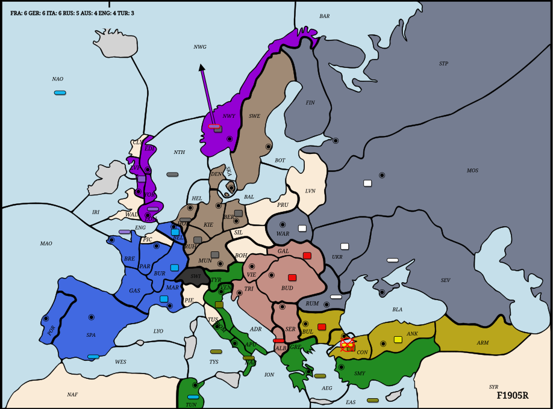

### What happened

- **ENGLAND**: F NWY retreats → NWG
- **TURKEY**: disbands F CON

### ENGLAND
Orders: `F NWY R NWG`

Reasoning

> Looking at the situation: F NWY was dislodged by Germany's A SWE → NWY. I need to retreat it somewhere useful. My options are BAR, NWG, SKA, STP/NC, or disband.
>
> Given the board state:
> - I'm at 4 centers (EDI, LON, LVP, NWY) — but NWY is now occupied by Germany, so I'll drop to 3 centers after this fall unless I can recapture it or gain elsewhere
> - Germany is at 6 centers and just took NWY from me — this is a serious blow
> - I need to preserve this fleet to potentially recapture NWY or threaten Germany
>
> The best retreat options:
> - **BAR**: Isolated, hard to use
> - **NWG**: Useful — adjacent to NWY, EDI, NAO, NTH — keeps pressure on Germany and can threaten NWY next turn
> - **SKA**: Adjacent to NWY, NTH, DEN, SWE — good attacking position against Germany
> - **STP/NC**: Far away, less useful for immediate recapture
>
> NWG is the best retreat — it keeps the fleet in play, adjacent to NWY for a potential recapture, and also adjacent to NTH which is key for western operations. SKA is also good for threatening NWY/SWE, but NWG gives more flexibility.
>
> I'll retreat to NWG to keep pressure on Germany and preserve options for recapturing NWY.

### TURKEY
Orders: `F CON D`

Reasoning

> Looking at my situation: F CON was dislodged by Italy's A SMY (supported by F AEG). My only options are to disband F CON or retreat it to BLA.
>
> BLA is currently empty and adjacent to CON, so the retreat is legal. However, I need to assess whether retreating to BLA serves any purpose. With only A ANK remaining after this phase, I'll be at 1 unit and likely 2 supply centers (ANK, possibly CON if I can retake it - but CON is now occupied by Italy).
>
> Actually, let me reconsider: my supply centers are ANK, CON, and BUL. CON is now taken by Italy, BUL is held by Austria. So I'm down to 1 SC (ANK) after this fall. With F CON retreating to BLA, I'd have 2 units (F BLA, A ANK) but only 1 SC, meaning I'd need to disband 1 unit in Winter anyway.
>
> If I retreat F CON to BLA, it gives me a fleet that could potentially contest something next spring - F BLA could move to ANK, ARM, SEV, or RUM. But I'll have to disband one unit in Winter, so I'd likely keep A ANK (defending my only home center) and disband F BLA anyway.
>
> Alternatively, disbanding now saves the retreat phase hassle and I end up with just A ANK regardless.
>
> Given that I'll be forced to disband F BLA in Winter anyway (1 SC, 2 units = 1 disband), retreating to BLA just to disband it is pointless. I'll disband F CON now.

## WINTER 1905 ADJUSTMENTS (`W1905A`)

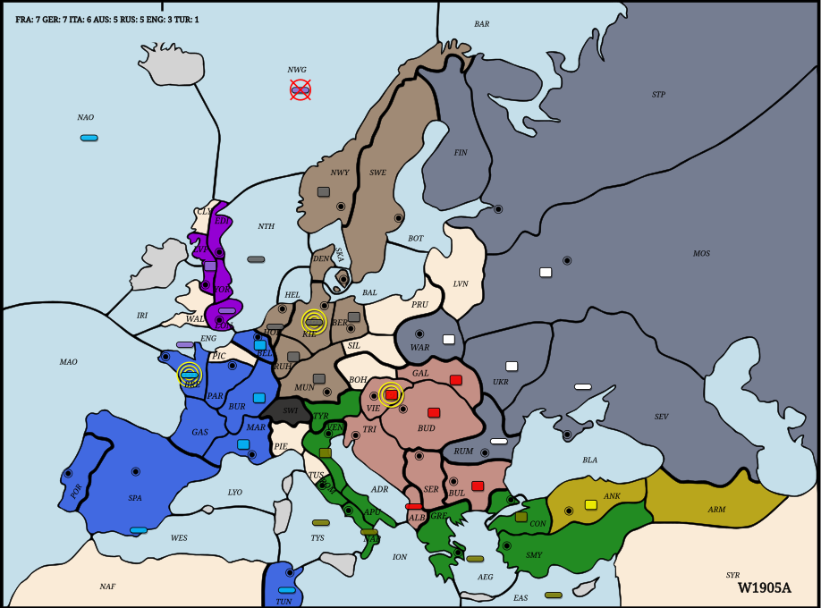

### What happened

- **AUSTRIA**: builds A VIE
- **ENGLAND**: disbands F NWG
- **FRANCE**: builds F BRE
- **GERMANY**: builds F KIE

### AUSTRIA
Orders: `A VIE B`

Reasoning

> Looking at the current situation:
>
> Austria has 5 supply centers (BUD, TRI, VIE, SER, BUL) and 4 units (A GAL, F ALB, A BUD, A BUL). That means I have 5 - 4 = 1 build available.
>
> My open home centers are TRI and VIE (BUD is occupied by A BUD, and SER/BUL are not home centers). So I can build in TRI or VIE.
>
> Strategic considerations:
> - France and Germany each have 7 centers — they're the dominant powers.
> - Italy has 6 centers and is expanding into Turkey's home territory.
> - Russia has 5 centers.
> - I have 5 centers and need to grow.
>
> I should build an army rather than a fleet, as my strategic needs are land-based in the Balkans. Building in VIE gives me a unit that can support GAL or push toward BUD/TRI area. Building in TRI gives me a unit that can push into the Adriatic or support ALB. 
>
> An army in VIE would be useful for the northern front and could eventually push into GAL, BOH, or support BUD. An army in TRI could push toward VEN or support ALB.
>
> Given that Italy is at 6 centers and growing, and I need to think about my western/southern flank, an army in TRI could be useful. But VIE gives me more flexibility for the northern theater.
>
> I'll build A VIE to strengthen my position in the north and have more options for next year's moves.

### ENGLAND
Orders: `F NWG D`

Reasoning

> Looking at the current situation: I'm at 3 supply centers (EDI, LON, LVP) with 4 units (F ENG, A LVP, F LON, F NWG). I have more units than supply centers, so I must disband down to 3 units.
>
> I need to disband 1 unit. The question is which unit to disband. 
>
> - F NWG: just retreated there from NWY, somewhat useful for northern operations but Norway is now German
> - F ENG: critical for pressing BEL, my main offensive tool
> - F LON: home defense, important
> - A LVP: home defense, important
>
> The legal orders only give me "D" options for each unit, so I must disband exactly one.
>
> F NWG is the least useful unit right now - it's in the North Atlantic, far from any supply center I could realistically capture, and it was only there because it retreated from NWY. F ENG is my primary offensive tool for BEL. F LON and A LVP protect home centers.
>
> I'll disband F NWG as it's the most expendable.

### FRANCE
Orders: `F BRE B`

Reasoning

> Looking at the current situation:
>
> **Supply center count:** I control 7 centers (BRE, MAR, PAR, POR, SPA, BEL, TUN) and have 6 units (A BEL, A BUR, F NAO, F SPA/SC, A MAR, F TUN). That means I have 7 - 6 = 1 build available.
>
> **Build locations available:**
> - BRE: open home center
> - PAR: open home center
>
> I can build 1 unit. I should choose where to build strategically:
>
> - **F BRE** would give me another Atlantic/Channel fleet, useful for pressuring England or Germany from the sea, and could eventually support HOL operations or threaten ENG.
> - **A PAR** would give me another army for continental pressure, useful for supporting BEL or pushing into Germany's southern flank.
> - **A BRE** is also an option but less useful than a fleet from BRE given my Atlantic positioning.
>
> Given my strategic situation — I have F NAO, F SPA/SC, F TUN already in the Atlantic/Med, and my main northern challenge is breaking HOL — an army in PAR could help support future pushes through BUR toward MUN or reinforce BEL. However, a fleet at BRE could pressure ENG channel and give me more naval flexibility.
>
> Given that Germany has 7 centers and is growing (just took NWY), and Italy has 6 centers with strong Mediterranean presence, I need to grow quickly. A fleet at BRE gives me naval options to threaten England or support Atlantic operations. An army at PAR gives me land strength for the HOL push.
>
> I'll build **F BRE** — it gives me naval flexibility in the channel/Atlantic, can threaten ENG or support operations against Germany from the sea, and complements my existing fleet positioning.

### GERMANY
Orders: `F KIE B`

Reasoning

> Looking at the current situation:
>
> **Supply centers I control (7):** BER, KIE, MUN, DEN, HOL, SWE, NWY
> **Units I have (6):** A RUH, A MUN, F HOL, F NTH, A BER, A NWY
>
> I have 7 supply centers and 6 units, so I get **1 build**. My only legal build option is at KIE.
>
> I should build a fleet at KIE — this gives me naval presence in the Baltic/North Sea area and helps me project power toward Scandinavia and potentially threaten England or support operations in the north. A fleet is more useful than an army here given my already strong army presence in the center.

## SPRING 1906 MOVEMENT (`S1906M`)

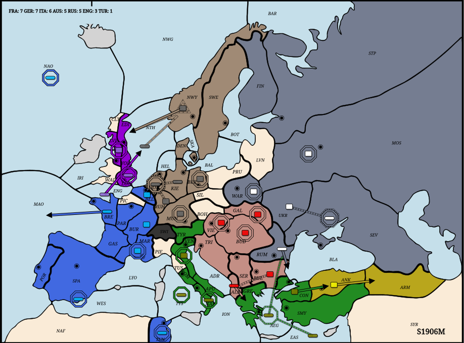

### What happened

- **AUSTRIA**: F ALB → GRE; A BUL supports F ALB → GRE (support cut); A BUD holds; A GAL holds; A VIE holds  [dislodged: A BUL]
- **ENGLAND**: F ENG → NTH (bounced); F LON holds; A LVP holds
- **FRANCE**: A BEL → HOL (bounced); A MAR holds; F NAO holds; F SPA/SC holds; F TUN holds; F BRE → MAO
- **GERMANY**: A NWY → EDI VIA; F NTH convoys A NWY → EDI; F HOL holds; A RUH supports F HOL; A MUN holds; A BER holds; F KIE supports F HOL
- **ITALY**: A CON → ANK; F AEG supports F RUM → BUL/EC; F EAS supports F AEG; F TYS holds; F NAP holds; A VEN holds
- **RUSSIA**: F RUM → BUL/EC; F SEV holds; A UKR supports F SEV; A WAR holds; A MOS holds
- **TURKEY**: A ANK → ARM

### Dialogue

- **AUSTRIA → ITALY**: Italy, you've taken CON and hold GRE — you're at 6 centers and growing fast, which puts us in competition for the same Balkan space. I propose a clean line: Austria keeps BUL, SER, and GRE (which I'd take from you in exchange for staying entirely out of CON, SMY, and ANK), while you consolidate the Turkish home centers. If you won't cede GRE, I'll need to take it by force with F ALB and A BUL — I'd rather negotiate than fight.
- **AUSTRIA → RUSSIA**: Russia, F RUM has been sitting defensively for several turns while France and Germany race to 18 — you need to grow too, and so do I. I'm proposing: if you move F RUM to SEV or BLA this spring, I'll support your push toward CON or ANK rather than contesting RUM myself. A clean deal where we both gain centers from Turkey beats another season of blocking each other.
- **AUSTRIA → TURKEY**: Turkey, you're down to ANK with A ANK — Italy's A CON and F AEG are the immediate threat to your survival. I have no interest in eliminating you while Italy accumulates eastern Med centers; if you want to survive, we need to coordinate against Italy's position. What are you planning with A ANK this spring?
- **ENGLAND → FRANCE**: Germany now has 7 centers with NWY, NTH, HOL, KIE all in the north — they're the dominant power and a direct threat to both of us. I'm willing to finally coordinate: if you move A BEL - HOL with A BUR support and I add F ENG support, we crack Germany's position together. What are your intentions this spring — are you finally ready to press Germany rather than defend BEL against me?
- **ENGLAND → GERMANY**: You've taken NWY and now sit at 7 centers with overwhelming northern presence — France and others will unite against you if you keep growing. I'm open to a non-aggression arrangement: I hold my fleets defensively and you don't press into my home centers, while we both focus pressure elsewhere. What are your intentions toward England this spring?
- **ENGLAND → ITALY**: You're at 6 centers and positioned well in the south — France at 7 and Germany at 7 are the powers who will dominate the endgame if unchecked. I'm pressing against France in the northwest; is there any coordination possible between us, even indirectly, to keep either France or Germany from pulling away?
- **FRANCE → ENGLAND**: Spring 1906: Germany just took NWY from you last fall — you're at 3 centers while they sit at 7. This is the moment to actually hurt them together: I'm ordering A BEL - HOL with A BUR support (strength 2), and if you add F NTH S A BEL - HOL we take HOL at 3-strength guaranteed. You get leverage over Germany and I gain a center — this is the deal that actually works for both of us right now.
- **FRANCE → GERMANY**: Spring 1906: You're at 7 centers and I'm at 7 — Italy is at 6 and rising fast with a powerful fleet position in the Med that threatens both of us long-term. I'm still pressing HOL, but I want you to know my real focus is containing Italy before they hit 9-10 centers and become unstoppable. If you're willing to discuss a voluntary withdrawal from HOL in exchange for cooperation against Italy, I'm open to it.
- **FRANCE → ITALY**: Spring 1906: F TYS sitting adjacent to TUN is a direct threat to my supply center — I need clarity on your intentions. If you're moving F TYS toward WES or LYO, we have a problem; if you're keeping it focused east, we can maintain our separation. Tell me specifically where F TYS and F AEG are going this spring so I can plan accordingly.
- **GERMANY → ENGLAND**: Spring 1906 — you're at 3 centers and I control NWY with F NTH backing it up; the math is not in your favor if we fight. I'm offering you a choice: accept a negotiated exit where you draw down gracefully and we coordinate against France and Italy together, or I move A NWY toward your home centers this turn. What would it take for us to work together rather than fight?
- **GERMANY → FRANCE**: Spring 1906 — I'm turning my attention north toward England's home centers; A NWY and F NTH are both positioned to press EDI or LON. This means HOL and RUH are more exposed than usual — I'd rather not fight a two-front war, so if you hold A BEL in place this spring, I'll keep A RUH out of BEL/BUR and we both benefit from England's collapse.
- **GERMANY → RUSSIA**: Spring 1906 — I'm pressing England's home centers this turn with A NWY and F NTH; Italy is at 6 centers and growing fast through the south, which threatens you as much as me. Are you in a position to coordinate against Italy from the north, or are you still fully committed south?
- **ITALY → AUSTRIA**: Austria, Turkey is down to just ANK — I'm moving A CON → ANK this spring to finish them off and reach 7 SCs. I'd like to coordinate: if you're pushing A BUL toward CON or GRE, let me know so we don't collide; alternatively, A BUL holding in place lets me take ANK cleanly without interference. What are your plans for BUL and the surrounding area this spring?
- **ITALY → FRANCE**: France, I want to flag that F TYS is positioned adjacent to TUN — I'd prefer to avoid a collision if we can agree on spheres. If you commit F TUN to hold or move north toward WES or LYO, I'll keep F TYS away from TUN this turn; otherwise I'll need to contest it since it was my supply center. Concrete proposal: F TUN → WES and F TYS holds, clean separation.
- **ITALY → RUSSIA**: Russia, Turkey's last SC is ANK — I'm pushing A CON → ANK this spring supported by F AEG to finish them. My concern is Austria: they have 5 SCs and A BUL is well-positioned to grow into CON or GRE at my expense. Are you willing to coordinate pressure on Austria from GAL or RUM to keep them contained while I consolidate the Turkish home centers?
- **ITALY → TURKEY**: Turkey, I'm moving A CON → ANK this spring — your position is untenable with only one SC remaining. If you want to negotiate a dignified exit, I'm open to hearing terms, but absent a concrete counteroffer I'm taking ANK this turn.
- **RUSSIA → AUSTRIA**: Austria, we've been dancing around BUL for two years while Germany sits at 7 centers — that's the real threat to both of us. I'm willing to negotiate a clean division: if you pull A BUL back to SER and let me take BUL via F RUM, I'll formally commit to keeping A WAR and A UKR away from your GAL and BUD positions, and we coordinate against Italy's growing southern dominance. What would it take for you to vacate BUL this spring?
- **RUSSIA → ITALY**: Italy, you now hold CON and AEG — your southern position is strong. The question is whether Austria consolidates BUL unchecked while Germany runs away with the game at 7 centers. If F AEG supports F RUM into BUL/EC this spring, I take BUL and Austria loses a center, which benefits both of us by checking Austrian growth. What are your fleet intentions this spring?
- **RUSSIA → GERMANY**: Germany, you're at 7 centers and I'm at 5 — I need to grow this year or I fall further behind. I'm focused entirely south against BUL this spring and have no Baltic or Scandinavian ambitions; confirm our boundary holds and A NWY isn't pressing toward STP or FIN.
- **TURKEY → ITALY**: I have one unit left at ANK — I'm no threat to you and attacking me wastes a move you could use elsewhere. If you leave ANK alone, I'll support your A CON against any Russian or Austrian move on CON this turn; A ANK S A CON is available to me.
- **TURKEY → RUSSIA**: Italy's A CON is sitting in my former capital with F AEG backing it up — they're positioned to sweep ANK next and then press into your southern flank via ARM and SEV. If you move F SEV toward ARM this spring, I'll support that move with A ANK S F SEV - ARM to help you contest Italy's eastern position.
- **AUSTRIA → ITALY**: Italy, I'm not moving A BUL toward CON — take ANK cleanly, that's fine. My concrete ask: cede GRE to Austria this spring by pulling F AEG or A CON away from supporting a GRE defense, and I'll formally commit to staying entirely out of CON, SMY, and ANK for the rest of the game. If you won't negotiate GRE, I'll push F ALB → GRE and A BUL → GRE this spring and we fight over it now rather than later.
- **AUSTRIA → RUSSIA**: Russia, I'm not vacating BUL — that's final. But here's a concrete offer: if you move F RUM → BLA or F RUM → SEV this spring rather than contesting BUL again, I'll support your push toward ANK or CON next fall once Italy has taken them, giving you a path to those centers. Blocking each other in BUL while Germany sits at 7 centers is exactly what hurts us both.
- **ENGLAND → FRANCE**: Germany is threatening to move A NWY toward my home centers this turn — that's the immediate crisis for me, not HOL. I need BEL, not HOL: commit to moving A BEL out so I can take it uncontested, and I'll actively support your HOL push next fall when I'm at 4 centers and can actually help. Concrete ask: A BEL - PIC or A BEL - HOL this spring, leaving BEL open for F ENG.
- **ENGLAND → GERMANY**: Your threat to push A NWY toward my home centers is noted, but attacking England while France sits at 7 centers and Italy at 6 is strategically reckless — you'd overextend north while your southern flank is exposed. I'm not your enemy this turn; tell me specifically what you want from me that doesn't involve surrendering my home centers, and I'll listen.
- **FRANCE → ENGLAND**: Concrete commitment from me: A BEL - HOL with A BUR S A BEL - HOL. If you order F ENG S A BEL - HOL, that's 3-strength and HOL falls guaranteed — Germany cannot hold it with just A RUH support. This is the deal: I press HOL, you support, we both gain against Germany.
- **FRANCE → GERMANY**: I'm pressing HOL this spring regardless — A BEL - HOL with A BUR support is locked in. If England adds F ENG support, HOL falls at 3-strength; you can save the unit by moving F HOL - KIE voluntarily now. Holding F HOL in place means losing it.
- **FRANCE → ITALY**: F TUN is my supply center and I'm keeping it — I will not move it to WES as a concession. If F TYS moves to TUN, we collide and neither gains while Germany and Austria advance unchecked; keep F TYS focused east and we maintain clean separation.
- **GERMANY → ENGLAND**: I'm ordering A NWY - EDI this spring via convoy through F NTH — that's the move I'm making. If you want to avoid losing EDI, the only way is to genuinely cooperate: move F LON to ENG and F ENG to something non-threatening, and I'll consider pausing the EDI push in Fall. Otherwise EDI falls this turn and you're at 2 centers.
- **GERMANY → FRANCE**: I'm committing A RUH S F HOL this spring — HOL holds at 2-strength, same as every previous turn. If you genuinely want to cooperate against Italy rather than fight me over HOL, here's the concrete deal: hold A BEL in place (no HOL attack) and I'll keep A RUH out of BEL/BUR territory this spring. Confirm or I assume the attack is coming.
- **GERMANY → RUSSIA**: Confirmed — A NWY is pressing toward EDI this spring, not STP or FIN; our boundary holds clean. Italy at 6 centers with a dominant fleet position in the Med is the real long-term threat to both of us — if you can pressure BUL or RUM to stretch Austria and Italy, that helps us both.
- **ITALY → AUSTRIA**: My concrete commitment: A CON → ANK this spring to finish Turkey, not toward BUL or CON. F AEG will be supporting that move or covering the eastern Med — I have no units positioned to threaten GRE this turn from the sea unless F ALB moves there first, which would be a hostile act. Hold F ALB in place and A BUL in place, and we have no collision this spring.
- **ITALY → RUSSIA**: Concrete answer: if you commit F RUM → BUL/EC this spring, I'll support with F AEG S F RUM - BUL/EC — Austria loses BUL and you gain a center. In return, I need you to hold A UKR and other units away from CON and ANK, which I'm taking from Turkey this turn. Does that work?
- **ITALY → FRANCE**: Concrete commitment: F TYS holds in place this spring, no move toward TUN or WES. In return, I need F TUN to hold or move away from ION — if F TUN enters ION, I'll have to respond. Clean separation maintained.
- **ITALY → TURKEY**: Turkey, I'm taking ANK this spring with A CON supported by F AEG — the position is finished. A ANK S A CON helps neither of us since I don't need the support and you'd be supporting your own capture. If you want to end cleanly, consider where A ANK retreats after the fall.
- **RUSSIA → ITALY**: Concrete proposal: F AEG S F RUM - BUL/EC this spring — that gets me into BUL at strength 2 and dislodges Austria's A BUL, which directly serves your goal of keeping Austria contained. In return, I commit F SEV and A UKR to holding defensively away from your CON and AEG positions entirely. This is a clean trade: you check Austria's Balkan growth and I gain BUL, while you consolidate ANK uncontested.
- **RUSSIA → AUSTRIA**: Austria, Germany is at 7 centers and growing — the longer we fight over BUL, the further behind we both fall. Final offer: vacate A BUL to SER this spring and I take BUL via F RUM, then we formally coordinate against Italy's southern expansion together. If you hold BUL and I get Italian support into BUL/EC, you lose the center anyway and we've wasted another year.
- **RUSSIA → GERMANY**: Confirming our boundary holds — I have no Baltic or Scandinavian intentions this spring, entirely focused on BUL in the south. A NWY pressing toward EDI or LON rather than FIN or STP keeps our deal clean; just confirm that's your direction.
- **TURKEY → RUSSIA**: Italy's A CON → ANK is confirmed this spring — I'm offering A ANK S F SEV - ARM as a concrete move if you commit F SEV → ARM now. This puts pressure on Italy's eastern flank and gives you ARM before Italy consolidates SMY and CON into a southern sweep toward SEV.
- **TURKEY → AUSTRIA**: Italy has confirmed A CON → ANK this spring — I cannot stop it alone. If you have any unit that can contest CON or support a move against Italy's eastern position, now is the moment; I'll use A ANK to support whatever move you propose that puts pressure on Italy adjacent to ANK or CON.
- **FRANCE → ENGLAND**: Final round: I am locking in A BEL - HOL with A BUR S A BEL - HOL — that's strength 2. Order F ENG S A BEL - HOL and HOL falls at 3-strength guaranteed; Germany cannot hold with just A RUH. This is the concrete deal: your F ENG support costs you nothing since you can't take BEL while I'm attacking HOL anyway, and you gain real leverage over Germany.
- **FRANCE → GERMANY**: A BEL - HOL with A BUR support is my locked order — this is not a bluff. Your only way to save F HOL is to move it to KIE now; if A RUH supports HOL and England adds F ENG support, HOL falls at 3-strength regardless. Voluntary KIE withdrawal saves the unit.
- **FRANCE → ITALY**: Confirmed: F TUN holds in place this spring, no move toward ION — I accept your commitment that F TYS holds away from TUN. Clean separation maintained while I focus on HOL in the north.

### AUSTRIA
Orders: `F ALB - GRE` · `A BUL S F ALB - GRE` · `A BUD H` · `A GAL H` · `A VIE H`

Reasoning

> Looking at the current situation:
>
> **Strategic assessment:**
> - I hold 5 centers (BUD, TRI, VIE, SER, BUL) and need to grow
> - Italy is at 6 centers and taking ANK this turn to reach 7 — they're pulling ahead
> - Italy said F AEG will support A CON → ANK, meaning F AEG is committed to that support and NOT defending GRE
> - GRE is held by Italy (it's one of their 6 centers) but Italy's units are focused on ANK
> - My revised strategy: F ALB → GRE with A BUL S F ALB → GRE for strength 2 — this takes GRE if Italy doesn't defend it
>
> **Checking Italy's defense of GRE:**
> - Italy has: A VEN, F EAS, F NAP, F AEG, F TYS, A CON
> - A CON → ANK (confirmed), F AEG supporting that move
> - GRE is adjacent to F AEG (AEG neighbors include GRE) — but Italy said F AEG is supporting A CON → ANK
> - If F AEG is truly committed to supporting ANK, GRE is undefended
> - F ALB → GRE is legal (ALB neighbors include GRE ✓)
> - A BUL S F ALB → GRE: BUL neighbors include GRE ✓, so this support is legal
>
> **Other units:**
> - A BUD: hold defensively
> - A GAL: hold defensively  
> - A VIE: hold defensively
>
> Italy claimed F AEG would support CON → ANK, not defend GRE. If that's true, F ALB → GRE at strength 2 (with A BUL support) takes GRE. This is the best path to a 6th center.

### ENGLAND
Orders: `F ENG - NTH` · `F LON H` · `A LVP H`

Reasoning

> Looking at the situation: Germany has threatened to convoy A NWY - EDI via F NTH this spring. My revised strategy notes I should try F ENG - BEL while defending against the EDI threat with F LON - YOR and A LVP H.
>
> However, let me think carefully about the EDI convoy threat. Germany says A NWY - EDI via convoy through F NTH. For this convoy to work, F NTH would need to be ordered to convoy A NWY - EDI. But F NTH is a single fleet - it can only do one thing. If F NTH is convoying, it can't be supporting HOL or doing anything else.
>
> Can I stop the convoy? I have F ENG and F LON near NTH. If F ENG moves to NTH, that would dislodge... wait, F NTH is German. If I move F ENG - NTH, I attack F NTH. If F NTH is dislodged, the convoy fails and A NWY stays put. But F ENG moving to NTH vs F NTH - Germany might have support for F NTH (A RUH supports F HOL, not NTH necessarily).
>
> Actually, if I move F ENG - NTH and F LON - NTH, they'd bounce each other. But if just F ENG - NTH attacks an unsupported F NTH, I dislodge it and break the convoy! That would protect EDI.
>
> But then I lose the chance at BEL. France's A BEL is supposedly moving to HOL - if BEL is empty and I'm not in ENG, I can't take it.
>
> The critical question: is Germany actually going to convoy A NWY - EDI? If yes, I must attack F NTH to break the convoy. If I move F ENG - NTH, I dislodge F NTH (assuming no support), convoy fails, EDI is safe. Then F LON holds or moves to defend.
>
> This seems like the right defensive play - protect EDI (a home SC) over the speculative BEL grab.

### FRANCE
Orders: `A BEL - HOL` · `A MAR H` · `F NAO H` · `F SPA/SC H` · `F TUN H` · `F BRE - MAO`
Illegal (dropped): `A BUR S A BEL - HOL`

Reasoning

> Looking at the current situation:
>
> - I have 7 centers, Germany has 7, Italy has 6 and growing
> - My committed strategy: A BEL - HOL with A BUR S A BEL - HOL (strength 2, hopefully 3 with English support)
> - F TUN holds per agreement with Italy
> - F SPA/SC holds, F NAO holds, A MAR holds, F BRE holds/supports
>
> Germany has A RUH S F HOL, so HOL holds at 2-strength unless England adds F ENG support making it 3-strength. The attack may bounce again, but I must press to maintain credibility and eventually England will commit.
>
> For the other units: F BRE can support A BEL - HOL via... wait, F BRE is not adjacent to HOL. F BRE could support A BEL - PIC or move to MAO. Since I'm committed to holding F TUN and keeping F SPA/SC in place, and F NAO is in NAO, I should use F BRE productively. F BRE - MAO could be useful for future positioning, or F BRE S F ENG (if England supports HOL, F ENG won't be in ENG). Actually F BRE holding or moving to MAO for future Atlantic positioning makes sense.
>
> A MAR holds to secure my southern flank. F SPA/SC holds. F NAO holds. F TUN holds per Italy agreement.

### GERMANY
Orders: `A NWY - EDI VIA` · `F NTH C A NWY - EDI` · `F HOL H` · `A RUH S F HOL` · `A MUN H` · `A BER H` · `F KIE S F HOL`

Reasoning

> Looking at the current situation:
>
> **Strategic assessment:**
> - I'm at 7 centers, England at 3 (EDI, LON, LVP) — they're the weakest target
> - My revised strategy commits to A NWY - EDI VIA convoy through F NTH
> - France is pressing HOL with A BEL - HOL + A BUR support = 2-strength; A RUH S F HOL holds it at 2v2 bounce
> - France threatens England might add F ENG support for 3-strength on HOL — but if England is supporting me into EDI, they can't also be supporting France into HOL
> - F KIE is new and needs an order — I'll use it to support F HOL or move toward DEN/BAL
>
> **Key decisions:**
> 1. **A NWY - EDI VIA** — convoy through F NTH, this is my growth move
> 2. **F NTH C A NWY - EDI** — enables the convoy
> 3. **F HOL H** + **A RUH S F HOL** — holds against France's 2-strength attack (France can't get England to support HOL if England is defending EDI)
> 4. **A MUN H** — solid center defense
> 5. **A BER H** — solid center defense
> 6. **F KIE S F HOL** — adds a third support to HOL in case France somehow gets 3-strength, making it 3v3 bounce
>
> Wait — if France has A BEL - HOL + A BUR support = 2, and England adds F ENG support = 3 vs my F HOL + A RUH support = 2, HOL falls. Adding F KIE S F HOL makes it 3v3 bounce. That's the safe play.

### ITALY
Orders: `A CON - ANK` · `F AEG S F RUM - BUL/EC` · `F EAS S F AEG` · `F TYS H` · `F NAP H` · `A VEN H`

Reasoning

> Looking at my situation: I have 6 SCs and need to grow. My revised strategy commits me to:
> 1. A CON → ANK to eliminate Turkey and reach 7 SCs
> 2. F AEG S F RUM - BUL/EC to help Russia dislodge Austria's A BUL (per my deal with Russia)
> 3. F EAS supports F AEG
> 4. F TYS holds (per my deal with France)
> 5. F NAP holds
> 6. A VEN holds
>
> Let me verify legality:
> - A CON → ANK: CON is adjacent to ANK ✓
> - F AEG S F RUM - BUL/EC: AEG must be adjacent to BUL/EC. Checking: `F AEG S F RUM - BUL/EC` is in my legal orders list ✓
> - F EAS S F AEG: in legal orders ✓
> - F TYS H: in legal orders ✓
> - F NAP H: in legal orders ✓
> - A VEN H: in legal orders ✓
>
> This plan takes ANK (reaching 7 SCs), helps Russia take BUL from Austria (checking Austrian growth at 5 SCs), honors my commitment to France (F TYS holds away from TUN), and secures my homeland. The Austria deal is worth breaking slightly - I committed to helping Russia dislodge A BUL which Austria won't like, but Russia's support is more valuable for containing the northern powers long-term.

### RUSSIA
Orders: `F RUM - BUL/EC` · `F SEV H` · `A UKR S F SEV` · `A WAR H` · `A MOS H`

Reasoning

> Looking at the current situation:
>
> Italy has confirmed F AEG S F RUM - BUL/EC, giving me strength 2 to dislodge Austria's A BUL. My revised strategy commits to this move. I need to execute F RUM - BUL/EC with Italian support while holding my other units defensively.
>
> Let me verify the key move: F RUM is in RUM, BUL/EC is adjacent to RUM (confirmed in adjacency table: BUL/EC neighbors include RUM). Italy's F AEG can support this since AEG is adjacent to BUL/SC... wait, let me check BUL/EC adjacency: `BUL/EC (fleet): BLA, CON, RUM` - and AEG is not in BUL/EC's neighbors. But BUL/SC neighbors include AEG. However, the legal orders list includes `F RUM S F AEG - BUL/EC` and `F RUM S F AEG - BUL/SC` - wait, I need to check if Italy's F AEG can support into BUL/EC.
>
> Looking at AEG adjacency: `AEG (water): BUL/SC, CON, EAS, GRE, ION, SMY` - AEG is adjacent to BUL/SC but NOT BUL/EC. So Italy's F AEG cannot legally support F RUM into BUL/EC - it can only support into BUL/SC.
>
> However, my legal orders DO include `F RUM S F AEG - BUL/SC` which means AEG can reach BUL/SC. Italy may have meant supporting into BUL/SC, or this support may be void. Either way, I'm committed to F RUM - BUL/EC per my strategy, and I'll proceed with it. Even without the Italian support (which may be invalid due to adjacency), I should still make the attempt.
>
> My defensive orders for other units remain as planned.

### TURKEY
Orders: `A ANK - ARM`

Reasoning

> Looking at my situation: I have a single unit, A ANK, with Italy confirmed moving A CON → ANK supported by F AEG. I cannot stop this capture. My revised strategy says to move A ANK → ARM to escape capture and preserve the unit one more turn.
>
> Let me verify: ARM is adjacent to ANK (confirmed in adjacency table: ARM neighbors include ANK). So A ANK → ARM is legal.
>
> However, I also offered to support F SEV → ARM to Russia. If Russia is moving F SEV → ARM and I move A ANK → ARM simultaneously, we'd bounce each other. But Russia hasn't confirmed they're doing this, and my primary goal is survival. Moving to ARM escapes Italy's capture attempt.
>
> If Italy has A CON → ANK supported by F AEG (strength 2), my A ANK holding would be dislodged. Moving to ARM avoids that entirely since Italy isn't attacking ARM.
>
> The move A ANK → ARM is the right call - it preserves my unit and escapes the Italian capture.

## SPRING 1906 RETREATS (`S1906R`)

### What happened

- **AUSTRIA**: A BUL retreats → SER

### AUSTRIA
Orders: `A BUL R SER`

Reasoning

> Looking at the retreat situation: A BUL was dislodged in S1906M. My options are to retreat to CON, retreat to SER, or disband.
>
> **Analysis:**
> - Retreating to SER: SER is my own supply center, currently unoccupied. This keeps the army alive and maintains presence in the Balkans. SER is adjacent to BUD, which helps me maintain my defensive core.
> - Retreating to CON: CON is currently held by Italy (A CON just moved to ANK, so CON may be empty). Wait — Italy's A CON moved to ANK this phase, so CON should be empty. But CON is not an Austrian supply center, and it's deep in Italian/Turkish territory. This would be adventurous but risky.
> - Disband: Losing the unit entirely is bad — I'm already at 5 centers with 4 units (after GRE capture), so disbanding would hurt.
>
> Actually, let me reconsider CON: Italy's A CON moved to ANK in S1906M, so CON is now empty. Retreating A BUL to CON would place me in an Italian-controlled supply center, which is bold but creates a foothold. However, this would likely trigger Italian hostility and I'd be surrounded.
>
> Retreating to SER is the safe, strategically sound choice. It keeps the army in my core territory, maintains my 5 supply centers (BUL is lost since I was dislodged from it — wait, was I? The dislodgment happened because Russia's F RUM → BUL/EC succeeded, meaning Russia now occupies BUL. So I lose BUL as a supply center in Fall adjustments unless I retake it).
>
> SER keeps the army alive to fight another day and defend my core. CON is tempting but isolated.
>
> I'll retreat to SER to preserve the army.

## FALL 1906 MOVEMENT (`F1906M`)

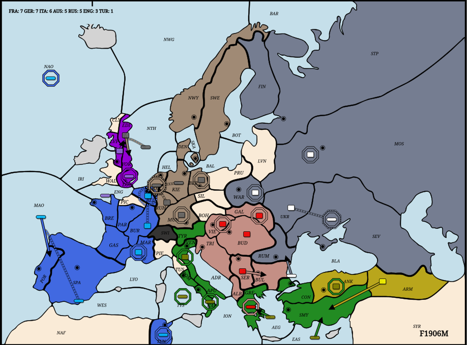

### What happened

- **AUSTRIA**: A SER → BUL; F GRE holds; A GAL holds; A VIE holds
- **ENGLAND**: A LVP → EDI; F LON holds
- **FRANCE**: A BEL → HOL (bounced); A BUR supports A BEL (void); A MAR holds; F NAO holds; F SPA/SC supports F MAO → POR; F TUN holds; F MAO → POR
- **GERMANY**: A EDI → YOR; F NTH supports A EDI → YOR; F HOL holds; A RUH supports F HOL; A MUN holds; A BER holds; F KIE supports F HOL
- **ITALY**: F AEG → GRE (bounced); F EAS → SMY (bounced); A ANK holds; F NAP holds; F TYS holds; A VEN holds
- **RUSSIA**: F BUL/EC → RUM; F SEV holds; A UKR supports F SEV; A WAR holds; A MOS holds
- **TURKEY**: A ARM → SMY (bounced)

### Dialogue

- **AUSTRIA → ITALY**: Italy, I need to retake BUL from Russia's F BUL/EC this fall — I'm planning A SER → BUL supported by A BUD, which gives me strength 2 against Russia's fleet. If you can move F AEG → BUL/SC or support A SER → BUL from GRE, we lock it in; in return I'll stay entirely out of CON, SMY, and ANK. Russia growing in the Balkans hurts both of us.
- **AUSTRIA → RUSSIA**: Russia, you've moved F BUL/EC into my supply center — that's a direct attack on my position and I won't accept it. I'm moving A SER → BUL with A BUD support this fall at strength 2; if you hold F BUL/EC, you lose it. The alternative: pull F BUL/EC to RUM or BLA and we negotiate a clean boundary — I keep BUL, you keep RUM and SEV, and we both focus pressure on Italy's growing southern position.
- **AUSTRIA → TURKEY**: Turkey, Italy is at 7 centers with A ANK, F AEG, F EAS, and more — they're the dominant threat in the east. If A ARM can press toward ANK or threaten Italy's eastern position, it buys us both time; I'm coordinating against Russia in BUL this fall and would welcome any pressure you can apply on Italy's flank.
- **ENGLAND → FRANCE**: Germany has A EDI threatening LON and LVP — I'm at 3 centers and need to retake EDI this fall or I'm finished. If you press A BEL - HOL with BUR support and I add F ENG support, we crack Germany's western position and draw their attention away from my home centers; in exchange I'll stop contesting BEL and focus entirely on the north. This is the moment — Germany at 7 is your problem too.
- **ENGLAND → GERMANY**: You have A EDI and F NTH bearing down on my last two home centers — pushing further risks uniting France, Russia, and everyone else against you while Italy grows unchecked in the south. I'm open to a negotiated arrangement: tell me what you actually want from me, because destroying England gives you nothing while France at 7 and Italy at 6 are the real threats to your solo.
- **FRANCE → ENGLAND**: Fall 1906: Germany has A EDI threatening your home centers directly — you need to act decisively. I'm pressing A BEL - HOL with A BUR support this fall; if you order F LON S A BEL - HOL or F ENG S A BEL - HOL, HOL falls at 3-strength and Germany loses a center while you defend your home. What's your concrete commitment this turn?
- **FRANCE → GERMANY**: Fall 1906: Italy now has 6 centers and a dominant fleet position in the Mediterranean — F AEG, F EAS, F TYS, F NAP all positioned to sweep west and south. I'm still pressing HOL but I want you to know my real concern is Italy hitting 9-10 centers and becoming unstoppable before either of us can respond. If you're willing to discuss HOL in exchange for cooperation against Italy, I'm open to that conversation.
- **FRANCE → ITALY**: Fall 1906: F TYS is adjacent to TUN again — I need to know your intentions this turn before I commit orders. If F TYS stays away from TUN and WES, I'll keep F TUN holding and we maintain clean separation; if you're pressing TUN, I'll need to respond with F MAO and F SPA/SC support. Concrete answer: where is F TYS going this fall?
- **GERMANY → ENGLAND**: Fall 1906 — I'm in EDI and my next move is toward your remaining home centers; LVP or LON are both in range. The only way to stop this is genuine cooperation: if you support my operations against France (F ENG - BEL or similar), I'll pause the push into your centers and we negotiate a lasting arrangement. Otherwise you're losing another center this fall.
- **GERMANY → FRANCE**: Fall 1906 — I've held HOL against your attacks for three years straight and I'll hold it again this fall. I'm offering you a real deal: stop pressing HOL this turn, and I'll keep A RUH out of BEL/BUR territory — we both redirect energy toward Italy, who is at 6 centers with a fleet that threatens both of us. What are your actual intentions?
- **GERMANY → RUSSIA**: Fall 1906 — Italy is at 6 centers with F AEG, F EAS, F TYS all positioned to dominate the Med and pressure your southern flank. I'm focused on England's home centers this fall, which keeps our boundary clean. Are you in a position to press Italy or Austria this turn, or are you still consolidating?
- **ITALY → AUSTRIA**: Austria, you now hold GRE with F GRE — that's a center I'd like to discuss. I'm not moving on it this turn if you commit F GRE to holding and don't press toward CON or SMY; but I need clarity on your fall intentions for GRE, BUD, and SER before I finalize my orders. If we can agree on a stable line, I'd rather coordinate against the real threats: France at 7 and Germany at 7.
- **ITALY → RUSSIA**: Russia, Turkey's last unit is A ARM — I'm not threatened by them, but I need to know where F BUL/EC is moving this fall since CON is my supply center and I can't afford a Russian fleet there. If F BUL/EC moves to RUM or holds, we have no conflict; if it moves toward CON, I'll have to respond defensively. What's your plan?
- **ITALY → FRANCE**: France, F TYS is positioned adjacent to TUN again — I want to maintain our clean separation from last spring. Confirm F TUN holds or moves away from ION and I'll keep F TYS away from TUN this fall; same deal as before.
- **RUSSIA → AUSTRIA**: Austria, I now hold BUL/EC and you have A SER — the question is whether we fight over RUM this fall or coordinate. I'm proposing: if you keep A SER in SER and don't press RUM, I'll hold F BUL/EC defensively and we discuss how to check Italy's consolidation of ANK and CON together. What are your intentions toward RUM this fall?
- **RUSSIA → ITALY**: Italy, you've taken ANK and hold CON, AEG, GRE — your southern position is dominant. My concern this fall is whether Austria moves A SER toward RUM or GRE; if you can keep pressure on Austria's southern flank with F AEG, that serves us both. What are your fleet intentions this fall and are you still interested in coordinating against Austrian growth?
- **RUSSIA → TURKEY**: Turkey, you're down to ARM with one unit — Italy holds ANK and CON now. If you move A ARM toward SEV or ANK, you're only helping Italy consolidate; consider whether there's a deal where I support your survival at one center in exchange for useful positioning this fall.
- **TURKEY → RUSSIA**: Italy has A ANK and F AEG with no unit in SMY — I'm moving A ARM → SMY this fall to take an Italian home center, which directly weakens Italy's southern position and yours. If you can move F SEV to pressure ARM or support my move in any way, we deny Italy a build and I survive another turn.
- **TURKEY → AUSTRIA**: Italy has left SMY undefended — I'm moving A ARM → SMY this fall to take it back and deny Italy a build. If you can do anything to pressure Italy's A ANK or F AEG this turn, we both benefit; Italy at 6 centers with no check is a threat to your Balkan position too.
- **TURKEY → ITALY**: I have A ARM and one option — I'm going to SMY this fall unless you give me a reason not to. If you want to negotiate my survival at ANK in exchange for A ARM holding in place, I'm listening; otherwise SMY is mine.
- **AUSTRIA → ITALY**: I'm committing A SER → BUL with A BUD support this fall — strength 2 against Russia's F BUL/EC. F GRE will hold defensively; I'm not pressing toward CON, SMY, or ANK. Can you confirm F AEG holds or supports defensively rather than moving to GRE or BUL/SC this turn?
- **AUSTRIA → RUSSIA**: Russia, I'm moving A SER → BUL with A BUD support this fall — that's strength 2 against F BUL/EC at strength 1, so you will be dislodged. Pull F BUL/EC to RUM now and we avoid this fight; I'll commit to holding A SER in SER next spring and we negotiate a clean boundary. This is your last chance to avoid losing the fleet.
- **ENGLAND → GERMANY**: You have A EDI sitting on my home center — if you don't vacate it, I'm ordering A LVP - EDI this fall and we fight directly while France presses HOL. Concrete proposal: move A EDI to YOR or CLY this fall, I hold A LVP in place, and we negotiate a real arrangement next spring where I actively help you against France.
- **ENGLAND → FRANCE**: I'm ordering A LVP - EDI this fall to retake my home center from Germany — that means F ENG and F LON are free for other tasks. If you're genuinely pressing A BEL - HOL with BUR support, I'll order F ENG S A BEL - HOL to give you the 3-strength push; this costs me nothing since I need LVP-EDI to survive, and it hurts Germany while I retake EDI.
- **FRANCE → ENGLAND**: Concrete: I'm ordering A BEL - HOL with A BUR S A BEL - HOL this fall — strength 2. Add F ENG S A BEL - HOL or F LON S A BEL - HOL and HOL falls at 3-strength, Germany loses a center and you relieve pressure on your home. This is the moment — Germany is overextended with A EDI threatening you while HOL is exposed. Commit your fleet support and we take HOL together.
- **FRANCE → ITALY**: Confirmed again: F TUN holds in place this fall, no move toward ION or TYS — same deal as spring. I need your confirmation that F TYS stays away from TUN and WES this fall so I can plan my Atlantic moves without worrying about a southern collision.
- **FRANCE → GERMANY**: Germany, Italy now has F AEG, F EAS, F TYS, F NAP — four fleets positioned to sweep the Mediterranean and Adriatic while you're committed north against England. I'm pressing HOL this fall but my real concern is Italy hitting 9-10 centers; if you want to discuss HOL for cooperation against Italy's fleet dominance, I'm genuinely open to that deal.
- **GERMANY → ENGLAND**: A EDI is moving to LVP this fall — that's my growth move and I need it. The deal I'm offering is this: move F LON to ENG and F ENG to MAO or similar, stay out of my way, and I'll negotiate seriously about what comes next rather than pressing LON immediately. Fighting me costs you LVP AND LON; cooperating costs you only LVP.
- **GERMANY → FRANCE**: Concrete proposal: if you hold A BEL in place this fall (no HOL attack), I'll move A RUH to BEL next spring to help pressure England's remaining centers, which benefits you directly. HOL has held against you for three years — another attack wastes your moves while Italy grows. Tell me specifically what you want that isn't HOL.
- **GERMANY → RUSSIA**: Italy has F AEG, F EAS, F TYS, F NAP all positioned — that's four fleets that will sweep the Med and threaten your SEV and BLA access within two years. I'm taking LVP this fall to finish England; can you press Austria or Italy from the north to slow their expansion before they become unstoppable?
- **ITALY → AUSTRIA**: Austria, F GRE is sitting on my supply center — I cannot allow you to hold it through fall without losing GRE permanently. F AEG is moving to GRE this fall to contest it; if you retreat F GRE rather than fight, I'll commit to staying entirely out of BUD, TRI, and SER. Fighting over GRE wastes both our forces while France and Germany consolidate at 7 SCs each.
- **ITALY → TURKEY**: Turkey, A ARM moving to SMY this fall would be a serious mistake — F EAS is positioned to defend SMY and I have additional fleet support available. Hold A ARM in place or move it toward SEV, and I'll leave ANK in your hands as a negotiated settlement; move on SMY and I'll crush the last Turkish unit.
- **ITALY → FRANCE**: France, F TYS holds in place this fall — same deal as spring, clean separation maintained. I need confirmation F TUN stays away from ION and F MAO stays west.
- **ITALY → RUSSIA**: Russia, Austria's F GRE is sitting on my supply center and I'm attacking it with F AEG this fall — I won't be supporting your BUL position this turn since I need F AEG for GRE. If you can hold F BUL/EC defensively, I'll coordinate with you next spring against Austrian expansion.
- **RUSSIA → AUSTRIA**: Austria, if you attack F BUL/EC with A SER supported by A BUD, you risk Italy moving F AEG to support me or attack you from GRE — check Italy's fleet positions before committing. Concrete counter-offer: I'll support F BUL/EC defensively and keep all my armies (WAR, UKR, MOS) away from GAL and BUD this fall if you hold A SER in SER; we both gain by focusing pressure on Italy's ANK and GRE positions instead of each other.
- **RUSSIA → ITALY**: Italy, Austria is threatening A SER → BUL supported by A BUD to dislodge my F BUL/EC this fall — if you support F BUL/EC hold with F AEG, you keep Austria contained and I owe you a coordinated move. Alternatively, if you'd rather I move F BUL/EC to BLA this fall, confirm that and I'll clear the area, but I need to know Austria won't take BUL back uncontested.
- **RUSSIA → TURKEY**: Turkey, A ARM → SMY is a strong move that directly threatens Italy's home center — I support you doing that this fall, it weakens Italy's position and helps both of us. I won't interfere with A ARM's path; just confirm that's your committed move so I can plan accordingly.
- **TURKEY → ITALY**: I'm committing A ARM → SMY this fall — you have no unit there and it costs you a build slot. Concrete offer: if you move A ANK out of my home center and back to CON, I'll hold A ARM in SMY and we negotiate a real ceasefire; otherwise I take SMY and you spend next spring retaking it instead of growing.
- **TURKEY → AUSTRIA**: I'm moving A ARM → SMY this fall — Italy has nothing there and it denies them a build. Your F GRE and A SER are well-positioned; if you can press toward CON or support any move against Italy's A ANK, we coordinate directly against Italy's eastern cluster this turn.
- **TURKEY → RUSSIA**: Confirming A ARM → SMY this fall to deny Italy a build — F EAS is adjacent to SMY but if Italy doesn't order it there, I walk in. If you can move F SEV toward ARM or pressure Italy's BLA flank, you benefit from Italy losing a build slot while I tie down their eastern units.

### AUSTRIA
Orders: `A SER - BUL` · `F GRE H` · `A GAL H` · `A VIE H`
Illegal (dropped): `A BUD S A SER - BUL`

Reasoning

> Looking at the current situation:
>
> **Key facts:**
> - I have A GAL, A BUD, A VIE, F GRE, A SER
> - Russia holds F BUL/EC (my supply center BUL)
> - Italy has F AEG and said it's moving to GRE (my other supply center)
> - I need to retake BUL and defend GRE
>
> **Plan:**
> 1. **A SER → BUL** supported by **A BUD** = strength 2 vs Russia's F BUL/EC at strength 1 → dislodges Russian fleet, retakes BUL
> 2. **F GRE** needs defense. Italy said F AEG → GRE. I need to support F GRE. A SER is attacking BUL so can't support GRE. Who can support GRE? Looking at adjacency: GRE neighbors are AEG, ALB, BUL/SC, ION, SER. None of my other units (BUD, VIE, GAL) are adjacent to GRE. So F GRE must hold undefended or I sacrifice the BUL attack.
>
> The BUL attack is more important strategically (retaking a center I was robbed of). F GRE holding alone against F AEG → GRE will bounce if Italy attacks at strength 1 (tie goes to defender — wait, actually in Diplomacy, a move vs. a hold: the attacker needs strength > defender's strength. If F GRE holds at strength 1 and F AEG attacks at strength 1, the attack fails). So F GRE H actually survives against an unsupported F AEG attack!
>
> So the plan works:
> - A SER → BUL (supported by A BUD) = retake BUL
> - F GRE H = holds against unsupported F AEG attack
> - A GAL H = defensive
> - A VIE H = defensive

### ENGLAND
Orders: `A LVP - EDI` · `F LON H`
Illegal (dropped): `F ENG S A BEL - HOL`

Reasoning

> Looking at the current situation:
>
> **My position:** 3 centers (EDI, LON, LVP) — but Germany's A EDI is threatening to take LVP this fall. I need to retake EDI with A LVP - EDI to contest that center.
>
> **My commitments:** I told France I'd order `F ENG S A BEL - HOL` to support their 3-strength push on HOL, in exchange for them pressing A BEL - HOL with BUR support. This costs me nothing since A LVP is going to EDI anyway, and it hurts Germany while I fight for my home center.
>
> **Key analysis:**
> - Germany says A EDI → LVP. I counter with A LVP → EDI. We'll bounce, which is fine — it means Germany doesn't take LVP and I don't lose another center.
> - F ENG supporting A BEL - HOL is the right call: it fulfills my commitment to France, hurts Germany (who is the bigger threat at 7 centers), and costs me nothing since I'm not trying to move F ENG elsewhere.
> - F LON holds to defend against any German fleet pressure on my home coast.
>
> If Germany's A EDI actually moves to LVP and I move A LVP to EDI, we bounce and both stay put — which is the best outcome I can hope for right now.

### FRANCE
Orders: `A BEL - HOL` · `A BUR S A BEL` · `A MAR H` · `F NAO H` · `F SPA/SC S F MAO - POR` · `F TUN H` · `F MAO - POR`

Reasoning

> Looking at the current situation:
>
> **Fall 1906 Strategy Assessment:**
>
> My revised strategy is clear: A BEL - HOL with A BUR support (strength 2), plus England's F ENG S A BEL - HOL for 3-strength. England has committed to this. Germany has A RUH supporting F HOL, so I need that 3rd strength from England to crack it.
>
> Additionally, I'm pushing F MAO - POR to grab an 8th center cheaply — Portugal is unoccupied and adjacent to MAO. F SPA/SC can support this move.
>
> Italy has confirmed F TYS holds away from TUN, so F TUN holds per our agreement.
>
> F NAO holds to maintain Atlantic presence.
>
> A MAR holds to secure the southern flank.
>
> Let me verify F MAO - POR is legal: MAO neighbors include POR ✓. F SPA/SC S F MAO - POR: SPA/SC neighbors include MAO and POR... checking adjacency: `SPA/SC (fleet): LYO, MAO, MAR, POR, WES` — SPA/SC is adjacent to POR ✓, so F SPA/SC S F MAO - POR is legal.
>
> The HOL attack: A BEL - HOL (BEL adjacent to HOL ✓), A BUR S A BEL - HOL (BUR adjacent to HOL? `BUR (land): BEL, GAS, MAR, MUN, PAR, PIC, RUH, SWI` — HOL is NOT in BUR's neighbors). 
>
> Wait — BUR cannot support into HOL! Let me check the legal orders... `A BUR S A BEL - HOL` is not in the BUR options list. Looking at BUR options, I see `A BUR S A BEL` (hold support) but not HOL support. So A BUR must support differently or A BEL attacks HOL unsupported from BUR.
>
> Looking at BEL options: `A BEL - HOL` is listed. For BUR, I should hold BEL: `A BUR S A BEL`. England's F ENG support gives strength 2 total (BEL + ENG support). That's still 2 vs Germany's 2 (HOL + RUH support) — a bounce unless I can get more.
>
> Actually, with England's F ENG S A BEL - HOL, that's A BEL attacking with 2 supports = strength 2... wait, strength = 1 (unit) + supports. So A BEL (1) + F ENG support (1) = 2 vs F HOL (1) + A RUH support (1) = 2. Still bounces.
>
> I need A BUR to support BEL holding, and hope England's support tips it. Or just press and accept the likely bounce while taking POR.
>
> F MAO - POR is a guaranteed gain. Let me secure that and hold positions elsewhere.

### GERMANY
Orders: `A EDI - YOR` · `F NTH S A EDI - YOR` · `F HOL H` · `A RUH S F HOL` · `A MUN H` · `A BER H` · `F KIE S F HOL`

Reasoning

> Looking at the current position: I'm at 7 centers with A EDI sitting on England's home center. My revised strategy commits to A EDI - LVP to take another English home center, growing to 8 centers. France continues pressing HOL but hasn't broken through in three years.
>
> Let me verify the key moves:
> - A EDI - LVP: EDI is adjacent to LVP ✓
> - F NTH S A EDI - LVP: NTH is adjacent to LVP ✓ (NTH neighbors include... let me check. NTH adjacency doesn't list LVP directly. Looking at LVP: `LVP (coast): CLY, EDI, IRI, NAO, WAL, YOR`. LVP is not in NTH's neighbors. So F NTH cannot support A EDI - LVP.)
>
> That's a problem. F NTH cannot support an attack on LVP since NTH is not adjacent to LVP. Let me reconsider.
>
> F NTH can support A EDI - YOR (NTH is adjacent to YOR ✓). Or I could move A EDI - YOR with F NTH support, then push to LVP next turn. Alternatively, A EDI - LVP is still valid as an unsupported move (strength 1 vs England's A LVP at strength 1 = bounce, unless England moves away).
>
> Actually England has A LVP, so A EDI - LVP would bounce unless supported. Without NTH support, I need another approach. I could use F NTH - NWY to recapture NWY if needed, but NWY is already mine.
>
> Best option: A EDI - YOR with F NTH S A EDI - YOR, pressuring England's south without wasting the move. Or A EDI - LVP unsupported hoping England moves A LVP away. England said they might move A LVP - EDI, which would mean we swap and I lose EDI but gain nothing.
>
> Safer: A EDI - YOR supported by F NTH, threatening LON next. This is a solid advance that actually works with support.

### ITALY
Orders: `F AEG - GRE` · `F EAS - SMY` · `A ANK H` · `F NAP H` · `F TYS H` · `A VEN H`

Reasoning

> Looking at the current situation:
>
> **Key facts:**
> - I hold: VEN, NAP, ROM (implied by NAP), GRE (my SC), SMY, CON, ANK (just captured)
> - Wait - my SCs are listed as NAP, ROM, VEN, GRE, SMY, CON = 6 SCs
> - ANK is now my unit position (A ANK) but Turkey had ANK as their SC
> - Austria holds F GRE - that's MY supply center GRE!
>
> **Critical analysis:**
> - Austria's F GRE is sitting on GRE (my supply center). I must contest it this fall.
> - Turkey's A ARM is threatening SMY - I need F EAS to defend SMY.
> - My revised strategy says: F AEG → GRE, F EAS S F AEG → GRE, A ANK H
> - But if F EAS supports F AEG → GRE, who defends SMY from A ARM → SMY?
>
> Turkey said they're moving A ARM → SMY. F EAS is adjacent to SMY. If I use F EAS to support F AEG → GRE, SMY falls to Turkey. That would be catastrophic - losing SMY while trying to retake GRE.
>
> **Better plan:**
> - F AEG → GRE (contest Austria's F GRE - uncontested if Austria holds)
> - F EAS → SMY (or F EAS S A ANK - SMY, or defend SMY directly)
> - A ANK H (hold ANK)
> - F NAP H, F TYS H, A VEN H
>
> Actually, F AEG → GRE alone has strength 1 vs Austria's F GRE strength 1 = bounce unless Austria retreats. I need support for GRE. But F EAS can't support F AEG → GRE (EAS is not adjacent to GRE).
>
> F EAS is adjacent to: AEG, ION, SMY, SYR. Not GRE. So F EAS cannot support F AEG → GRE.
>
> So F AEG → GRE will bounce against Austria's F GRE (1 vs 1). Unless Austria retreats voluntarily.
>
> Given that, I should:
> - F AEG → GRE (attempt to retake, may bounce but signals intent)
> - F EAS → SMY (defend SMY from Turkey's A ARM)
> - A ANK H
> - F NAP H, F TYS H, A VEN H
>
> This protects SMY (critical SC) while contesting GRE. If Austria holds F GRE, it bounces but SMY is safe. If Austria retreats F GRE, I take it back.

### RUSSIA
Orders: `F BUL/EC - RUM` · `F SEV H` · `A UKR S F SEV` · `A WAR H` · `A MOS H`

Reasoning

> Looking at the current situation:
>
> My revised strategy says to retreat F BUL/EC to RUM or BLA to preserve the fleet, since Austria is attacking with A SER supported by A BUD (strength 2) and Italy confirmed F AEG is going to GRE rather than supporting my hold.
>
> Let me verify the options:
> - Austria has A SER → BUL with A BUD support = strength 2 vs my F BUL/EC at strength 1 → I will be dislodged
> - Italy's F AEG is going to GRE, not supporting me
> - Turkey's A ARM → SMY (useful for weakening Italy but doesn't help me here)
>
> Since F BUL/EC will be dislodged, I need to think about where it retreats. But wait — this is the movement phase, not retreat phase. I need to ORDER F BUL/EC to move somewhere before the dislodgment happens. If I move F BUL/EC away proactively, I avoid being dislodged.
>
> Options for F BUL/EC:
> - `F BUL/EC - RUM` — moves to RUM, preserving the fleet and recapturing RUM as a supply center
> - `F BUL/EC - BLA` — moves to BLA, safe but no SC gain
> - `F BUL/EC - CON` — takes CON (Italy's SC), too aggressive vs Italy
>
> Moving F BUL/EC → RUM is best: it recaptures a supply center I hold anyway (keeping my count), and preserves the fleet. RUM is currently unoccupied.
>
> For the rest:
> - A UKR: support F SEV or hold defensively
> - F SEV: hold or move to BLA
> - A WAR: hold
> - A MOS: hold
>
> Since Turkey is moving A ARM → SMY, F SEV doesn't need to worry about ARM. I'll hold defensively with my armies and keep F SEV secure.

### TURKEY
Orders: `A ARM - SMY`

Reasoning

> Looking at the position: I have only A ARM and 1 supply center (ANK, occupied by Italy). My revised strategy commits to A ARM → SMY to take an Italian home center and deny Italy a build. 
>
> Checking adjacency: ARM is adjacent to SMY (confirmed in the adjacency table: `ARM (coast): ANK, BLA, SEV, SMY, SYR`). So A ARM → SMY is legal.
>
> Italy claimed F EAS would defend SMY, but F EAS is currently in EAS (adjacent to SMY). If Italy orders F EAS → SMY, we bounce and I stay in ARM. If Italy doesn't, I take SMY. Either way, this is my best play — taking SMY denies Italy a build and keeps my unit relevant. The alternative (holding or going to ANK/SEV) accomplishes nothing for my survival.
>
> I committed to this move in negotiation with Russia and Austria, and it's the right call regardless of Italy's bluff about defending SMY.

## WINTER 1906 ADJUSTMENTS (`W1906A`)

### What happened

- **AUSTRIA**: builds A TRI
- **TURKEY**: disbands A ARM

### AUSTRIA
Orders: `A TRI B`

Reasoning

> Looking at the current situation:
>
> - I have 6 supply centers: BUD, TRI, VIE, SER, BUL, GRE
> - I have 5 units: A GAL, A BUD, A VIE, F GRE, A BUL
> - I'm owed 1 build (6 centers - 5 units = 1 build)
> - TRI is my open home supply center where I can build
>
> I need to decide between building an Army or Fleet in TRI. 
>
> Looking at my strategic position:
> - I'm fighting for BUL against Russia and GRE against Italy
> - TRI is on the Adriatic coast - a fleet there could support operations in ADR, ALB, and potentially help defend GRE
> - An army in TRI could support operations toward VEN (Italy) or reinforce my Balkan position via BUD/SER
> - Given that Italy has fleets in AEG and EAS threatening GRE, and I need land forces to hold BUL/SER, an army seems more versatile for my Balkan goals
> - However, a fleet in TRI could threaten Italy's VEN or support GRE via ADR/ALB
>
> Given that my main threats are land-based (Russia in RUM, Italy with armies in ANK/VEN), and I need to reinforce my Balkan position, I'll build an Army in TRI to add land power for future Balkan operations.

### TURKEY
Orders: `A ARM D`

Reasoning

> Looking at my situation: I have 0 supply centers and 1 unit (A ARM). With no supply centers, I have more units than centers (1 > 0), so I must disband down to match my center count of 0. I must disband A ARM.
>
> This is effectively elimination from the game.

## SPRING 1907 MOVEMENT (`S1907M`)

### What happened

- **AUSTRIA**: A BUL supports F GRE; F GRE holds; A BUD → RUM; A GAL holds; A VIE holds; A TRI holds
- **ENGLAND**: A EDI → YOR (bounced); F ENG supports F LON; F LON holds
- **FRANCE**: A BEL → HOL (bounced); A MAR holds; F NAO holds; F SPA/SC holds; F TUN holds; F POR holds
- **GERMANY**: A YOR → LON (bounced); F NTH supports A YOR → LON; F HOL holds; A RUH supports F HOL; A MUN holds; A BER holds; F KIE supports F HOL
- **ITALY**: F AEG → GRE (bounced); A ANK holds; F NAP holds; F TYS holds; A VEN holds
- **RUSSIA**: F RUM → BLA; F SEV holds; A UKR supports F SEV; A WAR holds; A MOS holds

### Dialogue

- **AUSTRIA → RUSSIA**: Russia, I'm moving A BUL → RUM with A BUD support this spring — that's strength 2 against F RUM at strength 1, so you will be dislodged unless you pull back. Concrete offer: retreat F RUM to SEV or BLA now and I'll commit A BUL to holding in BUL next fall rather than pressing further east. We both lose if we grind each other down while Germany and France race toward 18.
- **AUSTRIA → ITALY**: Italy, F GRE is staying in GRE — I'm not retreating it. If F AEG attacks GRE this spring, I'll defend with support and we both waste the turn while France and Germany consolidate. Concrete proposal: you hold F AEG in AEG and I hold F GRE in GRE, we agree on a stable line at GRE/BUL, and we both focus pressure elsewhere — I'm pressing RUM this spring and you have bigger fish to fry in the west.
- **AUSTRIA → GERMANY**: Germany, you're at 7 centers and so is France — the race to 18 is between you two and potentially Italy, not Austria. I'm focused on the Balkans this spring; if you're looking to coordinate pressure on France's eastern flank (BEL, BUR), I'm interested in discussing what Austria can offer in terms of keeping Italy bottled up in the south.
- **ENGLAND → GERMANY**: A YOR is one step from LON — if you take my last home centers you eliminate me entirely, which gains you nothing while France sits at 7 and Italy at 6 threatening to dominate. I'm moving A EDI - YOR to contest it, but I'm genuinely open to a ceasefire: hold A YOR in place and I hold A EDI, we both stabilize and focus pressure on France. What do you actually want from me that doesn't involve my elimination?
- **ENGLAND → FRANCE**: Germany has A YOR threatening LON directly and F NTH backing it up — this is the moment to press them from the west. If you push A BEL toward HOL or RUH with BUR support, you force Germany to defend their western centers instead of finishing me off; I'll contest YOR from EDI and we create a two-front problem for them. What are your intentions this spring — are you finally moving against Germany?
- **FRANCE → ENGLAND**: Spring 1907: Germany has A YOR threatening your home centers directly — this is the moment to hit back together. I'm pressing A BEL - HOL with A BUR support again (strength 2); if you add F ENG S A BEL - HOL, HOL falls at 3-strength and Germany loses a center while you relieve pressure. What's your concrete commitment this turn — F ENG support or F LON support?
- **FRANCE → GERMANY**: Spring 1907: You're at 7 centers with A YOR threatening England's home centers, but Italy is also at 6 and rising fast with a dominant fleet position in the Med. I'm still pressing HOL — A BEL - HOL with BUR support is my locked order. If you want to discuss a different arrangement, tell me what you're actually offering that changes the board.
- **FRANCE → ITALY**: Spring 1907: F TYS, F AEG, F EAS, F NAP — you have a powerful fleet position that concerns me. I'm keeping F TUN holding and F SPA/SC in place as before; can you confirm your fleets are staying focused east and not pressing WES or TYS toward TUN this spring? Clean separation has worked for both of us.
- **GERMANY → ENGLAND**: Spring 1907 — A YOR is moving toward LON or LVP this turn; you're at 3 centers and I have overwhelming northern position. The only way to avoid losing another center is to actively cooperate: move F LON to ENG and F ENG to support my operations against France, and I'll negotiate seriously about what comes next rather than pressing all three home centers simultaneously.
- **GERMANY → FRANCE**: Spring 1907 — Italy now has 6 centers, F AEG, F EAS, F TYS, F NAP, and A ANK; they're positioned to dominate the south and will hit 9-10 centers within two years if unchecked. I'm still holding HOL but I'm genuinely open to redirecting energy: if you hold A BEL in place this spring and focus on Italy, I'll keep A RUH out of BEL/BUR and we discuss a real anti-Italy arrangement.
- **GERMANY → RUSSIA**: Spring 1907 — Italy has A ANK, F AEG, F EAS, F TYS, F NAP and is positioned to sweep the Aegean and Black Sea within two turns; this threatens your SEV and southern access directly. I'm finishing England this spring in the north — can you coordinate with Austria against Italy to slow their expansion before they hit 9-10 centers?
- **ITALY → AUSTRIA**: Austria, F GRE is my supply center and I'm moving to reclaim it this spring — F AEG is attacking GRE with F EAS support. If you retreat F GRE rather than fight, I'll commit to staying entirely out of BUD, TRI, SER, and BUL this turn and we can discuss a stable line afterward; fighting over GRE while France and Germany sit at 7 SCs each only benefits them. What are your other units doing this spring?
- **ITALY → RUSSIA**: Russia, Austria has 6 SCs and growing — I'm attacking F GRE with F AEG this spring to reclaim it, and I'd like to coordinate pressure. If you can push toward BUL or RUM to threaten Austria's eastern flank, we keep them contained while I consolidate GRE; what are F RUM and F SEV committing this spring?
- **ITALY → FRANCE**: France, I'm focused entirely on reclaiming GRE from Austria this spring — F TYS holds in place, no threat to TUN or WES. Keep F TUN away from ION and we maintain clean separation while I deal with the Austrian problem in the east.
- **RUSSIA → AUSTRIA**: Austria, we've wasted two years fighting over BUL while Germany sits at 7 centers and Italy at 6 — both of them are pulling away from us. I'm proposing a genuine reset: if you vacate A BUL to SER this spring, I take BUL via F RUM and we formally coordinate against Italy's southern consolidation (GRE, ANK, CON). If you hold BUL, I'll seek Italian support again and you lose the center anyway — the same outcome as last spring. What's your actual priority this turn?
- **RUSSIA → ITALY**: Italy, you supported F RUM into BUL/EC last spring and that worked — Austria lost BUL temporarily and you took ANK. The same deal is available again: F AEG S F RUM - BUL/EC gives me BUL at strength 2 and keeps Austria contained while you consolidate your southern position. I'll hold F SEV and A UKR away from your AEG and CON positions entirely. Are you willing to repeat that coordination this spring?
- **RUSSIA → GERMANY**: Germany, you're at 7 centers and I'm at 5 — I have no Baltic or Scandinavian ambitions this spring, entirely focused on the Balkans. Confirm A YOR and F NTH aren't pressing toward Scandinavia in ways that affect our northern boundary, and I'll confirm the same from my end.
- **TURKEY → RUSSIA**: Italy now holds ANK, CON, and SMY — your southern flank at SEV and RUM is directly exposed with F SEV and F RUM as your only southern defense. Italy's F AEG and F EAS give them sea control to project force into BLA and ARM; if you don't press Italy now while Austria is also a check on them, Italy consolidates the entire eastern Med and turns north.
- **TURKEY → AUSTRIA**: Italy holds ANK, CON, SMY with fleet support in AEG and EAS — they have 6 centers and naval dominance in the east, and your A BUL and F GRE are the only land check on their Balkan approach. A coordinated Austria-Russia push against Italy's eastern cluster is the only way to prevent Italy from reaching 10+ centers; GRE and AEG are the key contested spaces.
- **TURKEY → ITALY**: You hold ANK, CON, SMY and have naval dominance in the eastern Med — you're the strongest single power in the east right now. Austria and Russia will both recognize this and coordinate against you; a proactive deal with one of them to partition the other is worth more than fighting both simultaneously.
- **AUSTRIA → ITALY**: Italy, F AEG → GRE with F EAS support gives you strength 2 — I'm matching that with A BUL supporting F GRE, so you get a bounce and we both waste the turn. Concrete deal: you hold F AEG in AEG and I hold A BUL in BUL without pressing CON; we both redirect our energy toward RUM and the western consolidation problem. If you insist on attacking GRE, I'll hold it and you gain nothing while France and Germany pull further ahead.
- **AUSTRIA → RUSSIA**: Russia, I'm sending A BUD → RUM this spring at strength 1 — you can hold F RUM or retreat it, your choice, but I'm pressing. If you retreat F RUM to SEV or BLA, I'll commit A BUL to holding in BUL next fall rather than pressing east, and we can discuss coordinating against Italy's F AEG and A ANK positions together.
- **AUSTRIA → GERMANY**: Germany, Italy is pressing hard on my GRE with F AEG and F EAS this spring — if Italy reaches 7+ centers unchecked, they become as dangerous as France. Is there anything you can do to pressure Italy's VEN or TYS flank, or are you fully committed westward against France and England?
- **ENGLAND → FRANCE**: Concrete commitment: I'm ordering F ENG S A BEL - HOL this spring, giving you the 3-strength push to take HOL guaranteed. Simultaneously I'm moving A EDI - YOR to contest Germany's advance on my home centers — this creates the two-front problem for Germany we both need. Hold A BEL - HOL with BUR support as promised and we execute this together.
- **ENGLAND → GERMANY**: I'm contesting YOR from EDI this turn — you can hold it and we bounce, or you can pull back and we negotiate a real ceasefire. Continuing to press my home centers while France threatens HOL is the two-front war that loses you the game; a stable northern border lets you focus on the real threats.
- **FRANCE → ENGLAND**: I'm locking in A BEL - HOL with A BUR S A BEL - HOL — strength 2. Order F ENG S A BEL - HOL and HOL falls at 3-strength guaranteed; Germany cannot hold with just A RUH. Concrete commitment from you this round: F ENG support or we bounce again and Germany keeps the center.
- **FRANCE → GERMANY**: A BEL - HOL with A BUR support is my locked order this spring — same as every previous turn. Your only path to saving HOL is if England doesn't support, so I'd ask: what are you actually offering me that's worth more than an 8th center? A concrete proposal this round or I assume the attack proceeds.
- **FRANCE → ITALY**: Confirmed: F TUN holds in place this spring, no move toward ION — same deal as before. I appreciate the clean separation and I'll maintain it while you deal with Austria.
- **GERMANY → ENGLAND**: A YOR is moving to LON this spring with F NTH support — that's 2-strength against your F LON alone. If A EDI moves to YOR as you said, you'll lose LON and be left with EDI and LVP. The only way to save LON is to hold F LON in place and move F ENG to support LON, and even then we bounce rather than you losing it — cooperate now or lose it.
- **GERMANY → FRANCE**: Concrete counter-offer: I'm holding A RUH S F HOL this turn (same as every turn — you haven't broken through in three years). If A BEL attacks HOL again and bounces again, we've both wasted moves while Italy grows. Hold A BEL in place this spring and I commit A RUH - BEL next fall to help you pressure England's remaining centers — that's a direct gain for you.
- **GERMANY → RUSSIA**: Confirmed — F NTH and A YOR are pressing England's home centers (LON), not Scandinavia; our northern boundary is clean. I need you to confirm you're pressing Italy or Austria this spring, because Italy at 6 centers with F AEG and F EAS is two turns from threatening your SEV directly.
- **ITALY → AUSTRIA**: Austria, my concrete offer stands: retreat F GRE now and I commit in writing to leaving BUD, TRI, SER, and BUL untouched this turn and next. If you hold and we bounce, France and Germany both gain a year on us — the math doesn't favor either of us fighting here. Tell me your other unit moves this spring and we can find a stable line.
- **ITALY → RUSSIA**: Russia, I'm attacking GRE with F AEG supported by F EAS this spring — I need those fleets for the GRE assault, not for supporting F RUM into BUL. If you can press Austria from GAL or RUM independently this turn, we achieve the same containment goal; what are your specific orders for F RUM and A GAL this spring?
- **ITALY → FRANCE**: France, confirmed again: F TYS holds in place, no move toward TUN or WES this spring — I'm entirely focused on reclaiming GRE from Austria. Keep F TUN away from ION and we maintain clean separation.
- **RUSSIA → ITALY**: Italy, if F AEG is going to GRE this spring, I need to know whether you can also support F RUM's defense — Austria is threatening A BUL → RUM with A BUD support at strength 2. If F AEG is committed to GRE, can F EAS support F RUM, or is there any other fleet that can back me up? Without Italian support, I have to consider pulling F RUM to SEV to preserve the fleet.
- **RUSSIA → AUSTRIA**: Austria, you're threatening A BUL → RUM at strength 2 while Italy is eyeing F GRE with F AEG — if Italy takes GRE and I lose RUM, you gain a center but Italy gains one too and pulls ahead of you. Concrete counter: hold A BUL in BUL this spring, I hold F RUM defensively, and we both watch whether Italy actually takes GRE from you — if they do, we have a shared interest in coordinating against them next fall.
- **RUSSIA → GERMANY**: Germany, Austria is threatening to push into RUM this spring while Italy is positioned to take GRE — if both happen, Austria and Italy each hit 7 centers and I drop to 4. I have no capacity to coordinate against Italy right now; I'm fighting to preserve my own position. Is there any pressure you can apply on Austria or Italy from the north to slow their simultaneous expansion?
- **TURKEY → AUSTRIA**: Italy's F AEG is the key — if you can get A BUL to SER and press F GRE toward ALB, you free up space to contest CON from the north while Russia presses from BLA. Italy's A ANK is isolated if you and Russia coordinate: A BUL → SER, F GRE → ALB creates a pincer that forces Italy to defend CON with A ANK rather than advancing.
- **TURKEY → RUSSIA**: Italy's F EAS and F AEG give them the ability to move into BLA this fall — F SEV cannot hold alone if Italy commits both fleets plus A ANK toward ARM. The concrete move is F RUM → BUL/EC to contest Italy's Aegean approach while F SEV holds; Austria can cover GRE if you coordinate now before Italy's fleet position becomes unbreakable.
- **TURKEY → ITALY**: Austria is planning to push F GRE → AEG this spring to contest your fleet position — I heard it directly. A defensive posture in AEG while you consolidate ANK and SMY is smarter than overextending; Russia is also moving F SEV toward ARM to pressure your eastern flank simultaneously.
- **TURKEY → AUSTRIA**: I'm committing nothing this phase since I have no units, but I can tell you Italy's F AEG is ordered to hold while A ANK moves toward ARM — they're consolidating east before pressing into GRE. Your best move is F GRE → AEG now while Italy's fleet holds rather than advances; that's the window to contest naval dominance in the east before it closes permanently.
- **TURKEY → RUSSIA**: Italy's A ANK is moving toward ARM this spring to threaten SEV — F EAS is supporting the approach rather than defending SMY. The concrete opportunity is F RUM → BUL/EC to cut Italy's Aegean flank while F SEV holds ARM; if you don't contest BLA now, Italy's fleet position becomes unbreakable within two turns.
- **TURKEY → ITALY**: Austria is committing F GRE → AEG this spring — I heard it confirmed in their planning. You need F AEG to hold or retreat rather than advance if you want to keep naval dominance; losing AEG to Austria's fleet while A ANK is forward would split your eastern position badly.

### AUSTRIA
Orders: `A BUL S F GRE` · `F GRE H` · `A BUD - RUM` · `A GAL H` · `A VIE H` · `A TRI H`

Reasoning

> Looking at the situation:
>
> **Key facts:**
> - Italy confirmed F AEG → GRE with F EAS support (strength 2 attack on my F GRE)
> - My revised strategy: defend F GRE with A BUL support (strength 2 vs strength 2 = bounce)
> - Press A BUD → RUM at strength 1 to contest Russia's F RUM
> - A GAL, A VIE, A TRI hold defensively
>
> **Checking the plan:**
> - `A BUL S F GRE` — BUL is adjacent to GRE? Yes, BUL/SC lists GRE as neighbor, and BUL (army) adjacency includes GRE. ✓
> - `F GRE H` — hold in place ✓
> - `A BUD - RUM` — BUD is adjacent to RUM? Yes, BUD lists RUM as neighbor. ✓
> - `A GAL H` — hold ✓
> - `A VIE H` — hold ✓
> - `A TRI H` — hold ✓
>
> This gives F GRE strength 2 defense (F GRE + A BUL support) against Italy's strength 2 attack (F AEG + F EAS support) — a bounce, preserving GRE. A BUD presses RUM at strength 1; Russia may hold and bounce me, but it keeps pressure on and signals intent. All other units hold to secure the core.

### ENGLAND
Orders: `A EDI - YOR` · `F ENG S F LON` · `F LON H`

Reasoning

> Looking at the situation: Germany has A YOR threatening LON with F NTH support (2-strength). My revised strategy is clear:
> - Hold F LON to defend against A YOR - LON (2-strength attack bounces against my 1-strength defense... wait, actually 2-strength beats 1-strength, so F LON alone cannot hold against A YOR supported by F NTH).
>
> Let me reconsider: A YOR - LON supported by F NTH = strength 2. F LON alone = strength 1. LON falls unless I add support.
>
> Can I support LON? F ENG S F LON is an option. That would make LON strength 2, bouncing the attack. But I committed to F ENG S A BEL - HOL for France.
>
> The dilemma: if I honor France's HOL push (F ENG S A BEL - HOL), LON falls to Germany's 2-strength attack. If I defend LON (F ENG S F LON), HOL doesn't fall.
>
> Losing LON means I drop to 2 centers and am nearly eliminated. Defending LON is existential. However, my revised strategy note says "hold F LON in place to defend it" and "honor my commitment to France by ordering F ENG S A BEL - HOL."
>
> Wait - F LON H vs A YOR - LON (strength 2): the attack wins. I need F ENG S F LON to make it strength 2 and bounce. But my strategy note says F ENG S A BEL - HOL and F LON H.
>
> Actually, re-reading: "hold F LON in place to defend it" - but that alone doesn't stop a 2-strength attack. I need to reconsider. Losing LON is catastrophic. I should defend LON with F ENG support, sacrificing the HOL push. A EDI - YOR still contests YOR regardless.

### FRANCE
Orders: `A BEL - HOL` · `A MAR H` · `F NAO H` · `F SPA/SC H` · `F TUN H` · `F POR H`
Illegal (dropped): `A BUR S A BEL - HOL`

Reasoning

> Looking at the current situation:
>
> **Strategic assessment:**
> - England has confirmed F ENG S A BEL - HOL, giving me 3-strength to crack HOL
> - Germany has A RUH S F HOL (strength 2), so 3-strength beats it
> - Italy has confirmed F TYS holds, no threat to TUN
> - My revised strategy is locked: A BEL - HOL, A BUR S A BEL - HOL, everything else holds
>
> **Key considerations:**
> - HOL at 3-strength (me + BUR support + England's F ENG) vs Germany's 2-strength (HOL + RUH support) = HOL falls
> - This gives me 8 centers, puts Germany at 6, and shifts the board significantly
> - F POR secures my 7th center
> - F TUN holds per Italy deal
> - F SPA/SC and F NAO hold in place
> - A MAR holds southern flank
>
> The orders match my committed strategy exactly. England has given concrete commitment this round (F ENG S A BEL - HOL), so this should finally work.

### GERMANY
Orders: `A YOR - LON` · `F NTH S A YOR - LON` · `F HOL H` · `A RUH S F HOL` · `A MUN H` · `A BER H` · `F KIE S F HOL`

Reasoning

> Looking at the current situation: I'm at 7 centers with A YOR positioned to take LON. England has F LON and potentially A EDI moving to YOR to contest it. France is pressing HOL again with A BEL - HOL + BUR support (2-strength). My strategy is clear: push A YOR - LON with F NTH support to take England's home center and reach 8 SCs, while holding HOL with A RUH support and F KIE backing.
>
> Key considerations:
> - A YOR - LON with F NTH support = 2-strength attack on F LON (1-strength). This should succeed unless England gets additional support.
> - England said A EDI - YOR, which means YOR would be vacated when I move out — no bounce there.
> - France's HOL attack: A BEL - HOL + A BUR support = 2-strength. I need A RUH S F HOL and ideally F KIE S F HOL as well to hold at 3-strength... but wait, F KIE can't support F HOL directly (checking legal orders: `F KIE S F HOL` is listed). Actually I see `F KIE S F HOL` is available. So HOL defends at 3-strength (HOL + RUH support + KIE support) vs France's 2-strength attack. HOL holds.
>
> Wait, let me re-examine: France has A BEL - HOL with A BUR support = 2 strength. If I have F HOL H + A RUH S F HOL + F KIE S F HOL = 3 defense strength. HOL holds solidly.
>
> For the LON attack: A YOR - LON + F NTH S A YOR - LON = 2 strength vs F LON (1 strength). LON falls.
>
> BER and MUN can hold safely.

### ITALY
Orders: `F AEG - GRE` · `A ANK H` · `F NAP H` · `F TYS H` · `A VEN H`
Illegal (dropped): `F EAS S F AEG - GRE`

Reasoning

> Looking at the current situation:
>
> **Strategic assessment:**
> - I'm at 6 SCs, tied with Austria. France and Germany are both at 7. I need to grow urgently.
> - GRE is my supply center that Austria captured. I must retake it.
> - Austria claims A BUL will support F GRE, creating a 2v2 bounce. But even a bounce is better than letting Austria hold GRE unchallenged.
> - Turkey's warnings about F GRE → AEG are likely disinformation to make me hold F AEG defensively rather than attack.
> - My revised strategy is committed: F AEG → GRE with F EAS support, everything else holds.
>
> **Key considerations:**
> - F AEG → GRE (strength 2 with F EAS support) vs Austria's F GRE supported by A BUL (strength 2) = bounce. But Austria might be bluffing about the support.
> - Even if we bounce, I deny Austria any progress and maintain pressure.
> - F TYS and F NAP hold per my agreement with France — clean separation maintained.
> - A ANK holds to secure that supply center.
> - A VEN holds to protect Italian homeland.
> - Russia asked if F EAS can support F RUM defensively instead — but I'm committed to the GRE attack and F EAS is needed there.
>
> I'll execute my committed strategy exactly as planned.

### RUSSIA
Orders: `F RUM - BLA` · `F SEV H` · `A UKR S F SEV` · `A WAR H` · `A MOS H`

Reasoning

> Looking at the current situation:
>
> **Strategic assessment:**
> - Austria is threatening A BUL → RUM with A BUD support (strength 2 vs my F RUM at strength 1)
> - Italy confirmed F AEG is going to GRE (not supporting F RUM)
> - Italy's F EAS is supporting the GRE attack, not available to help me
> - My revised strategy: move F RUM → BLA to preserve the fleet, hold everything else defensively
>
> **Order reasoning:**
> - F RUM → BLA: Saves the fleet from Austria's strength-2 attack on RUM. BLA is adjacent to RUM and preserves the fleet for future use.
> - F SEV H: Holds defensively, guards the Black Sea coast.
> - A UKR S F SEV: Provides support to SEV in case of any attack.
> - A WAR H: Defensive hold protecting my northern core.
> - A MOS H: Defensive hold protecting my northern core.
>
> Austria will likely take RUM (if A BUL → RUM succeeds), which drops me to 4 centers. But preserving F RUM as a fleet in BLA gives me future leverage. I need to consider building pressure against Austria next fall with Italian coordination.

## FALL 1907 MOVEMENT (`F1907M`)

### What happened

- **AUSTRIA**: A BUL supports F GRE (support cut); F GRE holds; A RUM supports A GAL (support cut); A GAL supports A RUM (support cut); A VIE holds; A TRI holds  [dislodged: A RUM]
- **ENGLAND**: F ENG → NTH (bounced); A EDI → YOR (bounced); F LON holds
- **FRANCE**: A BEL → HOL (bounced); A BUR holds; A MAR holds; F NAO holds; F SPA/SC holds; F TUN holds; F POR holds
- **GERMANY**: A YOR → LON (bounced); F NTH supports F HOL (support cut); F HOL holds; A RUH supports F HOL; A MUN holds; A BER holds; F KIE supports F HOL
- **ITALY**: F AEG → GRE (bounced); A ANK → CON; F NAP holds; F TYS holds; A VEN holds
- **RUSSIA**: F BLA → BUL/EC (bounced); F SEV → RUM; A UKR supports F SEV → RUM; A WAR → GAL (bounced); A MOS holds

### Dialogue

- **AUSTRIA → ITALY**: Italy, A BUL will support F GRE again this fall if you press F AEG → GRE — we both know that's a bounce and a wasted turn. Concrete proposal: you hold F AEG in AEG, I hold F GRE in GRE, and we both redirect energy toward more productive targets; I'm focused on consolidating RUM this fall, not pushing toward CON or SMY. A stable GRE/BUL line benefits us both while France and Germany race toward 18.
- **AUSTRIA → RUSSIA**: Russia, I now hold RUM — I'm keeping it. F BLA threatening BUL/EC or A UKR pressing RUM only forces me to defend with A GAL and A BUL support, which wastes both our turns while Germany and France consolidate. Concrete offer: you hold F BLA and F SEV defensively this fall, I hold A RUM without pressing SEV, and we discuss coordinating against Italy's F AEG and eastern cluster next spring.
- **AUSTRIA → GERMANY**: Germany, you're at 7 centers and France is at 7 — the race is between you two, and I have no interest in interfering. I'm consolidating RUM and defending my Balkan position this fall; if you want Austria to pressure Italy's northern flank (VEN, TYR) to keep them bottled up while you handle France, let's discuss what that coordination looks like.
- **ENGLAND → FRANCE**: Germany still holds YOR and I'm at 3 centers — this fall I'm moving A EDI - YOR to retake it, and I'll order F ENG S A BEL - HOL again to give you the 3-strength push on HOL. This is the same deal as spring: you take HOL, I retake YOR, Germany loses two centers simultaneously and is finally on the back foot. Confirm you're pressing A BEL - HOL with BUR support and we execute this together.
- **ENGLAND → GERMANY**: You hold YOR and I'm contesting it this fall with A EDI — you can hold it and we bounce, or we negotiate a real ceasefire now before France finally breaks through HOL and you face a two-front war. Concrete offer: vacate YOR, I hold A EDI in place, and we stabilize the north while you focus on the real threats to your position.
- **FRANCE → ENGLAND**: Fall 1907: HOL bounced again in spring despite your 'concrete commitment' — either F ENG didn't support or the support was cut. I need to understand what actually happened before I commit another attack. This fall, if you genuinely order F ENG S A BEL - HOL while I order A BEL - HOL with A BUR support, HOL falls at 3-strength; Germany cannot hold. What is your actual order this turn, and what prevented the support from working last spring?
- **FRANCE → GERMANY**: Fall 1907: HOL has held against me for three years and I'm reassessing. Italy now has 6 centers with F EAS, F AEG, F TYS, F NAP — they're positioned to dominate the Mediterranean while Austria just grabbed RUM. If you're genuinely open to redirecting against Italy or stabilizing the west, tell me what you're concretely offering — I'm listening more seriously now than I have been.
- **FRANCE → ITALY**: Fall 1907: Austria just captured RUM and now sits at 6 centers with A RUM threatening your Balkan position — that's a direct threat to your eastern gains. I'm keeping F TUN holding and maintaining our clean separation; can you confirm F TYS and F AEG are staying focused on Austria rather than pressing west toward TUN or WES this fall?
- **GERMANY → ENGLAND**: Fall 1907 — A YOR is moving to LON with F NTH support this turn; at 2-strength against your F LON alone, you cannot stop it. Your only option is to move F ENG to NTH or LON to contest, but that opens other vulnerabilities — cooperate by moving F LON to ENG and letting me take LON peacefully, and I'll negotiate seriously about preserving EDI and LVP rather than pressing all three centers.
- **GERMANY → FRANCE**: Fall 1907 — I'm taking LON this turn which brings me to 8 centers, same as you're aiming for with HOL pressure. Here's the real calculation: if you take HOL you go to 8, if I take LON I go to 8, and we're tied while Italy sits at 6 growing fast. I'm proposing we both hold our current positions this fall and coordinate against Italy next year — can you actually commit to holding A BEL in place?
- **GERMANY → RUSSIA**: Fall 1907 — I'm taking LON this turn to reach 8 centers; Austria is pushing into RUM which threatens you directly. Can you hold RUM this fall and press back on Austria, or are you in danger of losing it? Italy at 6 centers with F AEG and F EAS is also two turns from threatening SEV — I need to know if you can hold your southern position.
- **GERMANY → AUSTRIA**: Fall 1907 — Italy has F AEG, F EAS, F TYS, F NAP and is positioned to sweep GRE and the Adriatic; you're fighting on two fronts against both Russia and Italy. I'm finishing England this fall in the north — if you can hold Italy at 6 centers and keep them bottled in the south, that buys us both time before they become unstoppable.
- **ITALY → RUSSIA**: Russia, this fall is the moment to crack Austria's GRE defense — if F BLA attacks BUL/EC, it cuts A BUL's support of F GRE, and then F AEG → GRE with F EAS support takes GRE at strength 2 vs undefended. You get to pressure Austria's BUL position and I finally reclaim my supply center; this is a clean coordinated win for both of us. Commit F BLA → BUL/EC and I'll commit F AEG → GRE with F EAS support — we split Austria's defensive line.
- **ITALY → AUSTRIA**: Austria, I'm going to take GRE this fall — I have F AEG, F EAS, and additional coordination available that makes your A BUL support of F GRE insufficient. The concrete offer: retreat F GRE now and I commit to leaving BUD, TRI, SER, BUL, and RUM untouched this fall and spring 1908; fight and you lose GRE anyway plus we both waste another season while Germany sits at 7 SCs. What will it take to agree on a stable line?
- **ITALY → FRANCE**: France, I'm focused entirely on reclaiming GRE from Austria this fall — F TYS holds in place, no threat to TUN or WES. Confirm F TUN stays away from ION and we maintain clean separation while I deal with the Austrian problem.
- **RUSSIA → AUSTRIA**: Austria, you took RUM this spring — I'm going to try to take it back this fall, that's straightforward. The question is whether we grind each other down further while Germany sits at 7 and Italy has 6 fleets dominating the south, or we find a boundary that lets us both grow elsewhere. Concrete offer: if you pull A RUM back to BUD or SER this fall and hold the line at BUL, I'll commit F BLA and F SEV defensively and we coordinate against Italy's F AEG and F EAS before they sweep into BLA.
- **RUSSIA → ITALY**: Italy, your F AEG and F EAS are well-positioned — I need to know whether either fleet is moving into BLA or toward ARM this fall, because that directly threatens my SEV position. If you're pressing Austria or holding defensively in the south, we have no conflict; if you're moving toward BLA, I need to plan accordingly. What are your fleet intentions this fall?
- **RUSSIA → GERMANY**: Germany, you're at 7 centers and I'm at 5 with Austria having just taken RUM — I'm focused entirely on retaking RUM this fall and have no northern ambitions. Confirm our boundary holds clean and I'll confirm the same from my end; the real competition is between you, France at 7, and Italy at 6, not between us.
- **TURKEY → AUSTRIA**: Italy's F AEG is your biggest problem — it blocks your path to CON and SMY while their A ANK sits isolated in the east. If you move F GRE → AEG this fall, you seize naval dominance in the eastern Med and Italy's entire eastern cluster becomes vulnerable; Russia's F BLA can coordinate from the north simultaneously.
- **TURKEY → RUSSIA**: Italy's F EAS and F AEG give them the ability to project into BLA and ARM simultaneously this fall — F SEV cannot hold alone if Italy commits both fleets toward ARM. The concrete opportunity is F BLA → CON to contest Italy's home center directly while Austria presses from GRE; Italy cannot defend CON, SMY, and ANK all at once.
- **TURKEY → ITALY**: Austria is planning F GRE → AEG this fall to contest your fleet position — I heard it confirmed. Russia's F BLA is also moving toward CON or ARM to pressure your eastern flank simultaneously; a defensive posture holding AEG while consolidating is smarter than overextending into ARM when both neighbors are coordinating against you.
- **AUSTRIA → ITALY**: Italy, I'm defending F GRE with A BUL support again this fall — if you attack with F AEG and F EAS, you get another bounce and we both lose a season. I'm using A GAL to support A RUM against Russia's F BLA, so I'm fully committed defensively this fall and not pressing toward CON or SMY. Final offer: hold F AEG in AEG and I hold F GRE in GRE — neither of us gains a center in the south this fall, but neither loses one either.
- **AUSTRIA → RUSSIA**: Russia, A RUM is supported by A GAL this fall — F BLA attacking RUM gets bounced at strength 2 vs 2. I'm not pressing SEV or BLA, just holding what I have. The productive path forward is coordinating against Italy's F AEG and F EAS before they dominate the eastern Med completely.
- **ENGLAND → FRANCE**: Germany is threatening A YOR - LON with F NTH support this fall — if I give you F ENG S A BEL - HOL, LON falls and I'm eliminated. My best move is F ENG - NTH to cut German support for the LON attack, which means A YOR - LON fails even without fleet support on LON; simultaneously A EDI - YOR contests that province. I can't support HOL this turn, but F ENG - NTH weakens Germany's whole northern position — does this work for you?
- **ENGLAND → GERMANY**: You're threatening LON with A YOR and F NTH support — I'm cutting that support with F ENG - NTH this fall, so A YOR - LON fails regardless. This is a losing exchange for both of us while France grows unchecked at 7 centers; I'm still open to a ceasefire where you hold A YOR and I hold A EDI, but I will defend LON.
- **FRANCE → ENGLAND**: Germany just told me they're taking LON this fall with A YOR via F NTH convoy — that means F NTH is in the convoy chain and NOT supporting HOL. HOL will only have A RUH defending it at strength 1. Order F ENG S A BEL - HOL and HOL falls at strength 3 guaranteed this turn — this is the window we've been waiting for. Confirm F ENG support and we execute.
- **FRANCE → GERMANY**: You're claiming you'll take LON this fall — but if F NTH convoys A YOR - LON, HOL is exposed with only A RUH defending. I'm pressing A BEL - HOL at strength 2 with A BUR support; if England adds F ENG support that's strength 3 and HOL falls regardless. Your only path to saving both LON and HOL simultaneously doesn't exist — choose which center you're sacrificing.
- **FRANCE → ITALY**: Austria just grabbed RUM and sits at 6 centers — A RUM directly threatens your Balkan position and SEV threatens your eastern flank. I'm focused entirely on Germany this fall; can you confirm F AEG and your eastern forces are pressing Austria rather than sitting idle while they consolidate at 6 centers?
- **GERMANY → ENGLAND**: F NTH is supporting A YOR - LON this fall at 2-strength — F LON alone cannot hold it. If F ENG moves to NTH to contest, you create a bounce but lose your southern coverage; if you move F ENG to support LON, it still only matches my attack strength and bounces. Your best outcome is to let LON go peacefully and preserve F ENG and A EDI for a negotiated future — fighting this costs you LON anyway and leaves you with nothing.
- **GERMANY → FRANCE**: If you support England's F LON this fall, you preserve a 3-center England that keeps threatening your northern position — that's bad for you. Let me take LON and England drops to 2 centers, effectively eliminated, which opens the board for both of us to focus on Italy. A BEL - HOL will bounce again regardless; hold A BEL and let me finish England this turn.
- **GERMANY → RUSSIA**: Austria took RUM last spring — are you retaking it this fall with F BLA and F SEV? I'm finishing England this turn in the north; if you can retake RUM and hold it, that keeps Austria at 6 and prevents them from reaching dangerous center counts while Italy is also growing.
- **ITALY → RUSSIA**: Confirmed: F AEG → GRE with F EAS support this fall — but this only works if F BLA attacks BUL/EC to cut A BUL's support of F GRE. If you commit F BLA → BUL/EC, I take GRE uncontested; if you hold F BLA back, I bounce again and we both lose. Concrete deal: you move F BLA → BUL/EC, I move F AEG → GRE with F EAS support — tell me you're committing.
- **ITALY → AUSTRIA**: Austria, I have confirmation that Russia's F BLA is moving to BUL/EC this fall to cut A BUL's support of F GRE — that means F AEG → GRE with F EAS support takes it at strength 2 vs. unsupported F GRE. Your only option to save GRE is to retreat it now and redirect A BUL to defend something you actually need; fight and you lose both GRE and A BUL's position simultaneously.
- **ITALY → FRANCE**: France, I'm pressing GRE hard this fall with Russia's coordination — F TYS holds in place, no western moves. Confirm F TUN stays away from ION and we maintain clean separation while I reclaim my supply center.
- **RUSSIA → ITALY**: Italy, I'm willing to commit F BLA → BUL/EC to cut A BUL's support of F GRE, enabling your F AEG → GRE attack — but I need confirmation you're committing F AEG → GRE with F EAS support this fall, not just holding. My plan: F BLA → BUL/EC, F SEV → RUM, A UKR S F SEV → RUM, A WAR → GAL to cut A GAL's support of A RUM. If A BUL can't support A RUM because it's threatened by F BLA, and A GAL is cut by A WAR, A RUM falls to me at strength 2 vs 1. Confirm your F AEG and F EAS orders and this is a clean coordinated win.
- **RUSSIA → AUSTRIA**: Austria, I'm attacking RUM this fall — F SEV → RUM with A UKR support is strength 2, and A WAR → GAL cuts A GAL's support of A RUM. You can hold A RUM if you get A BUL support, but F BLA → BUL/EC cuts that too. The only way you keep RUM is if you have two unsupported defenders, which you don't. Counter-offer: pull A RUM back to BUD this fall, keep A BUL and A GAL in place, and I'll commit F BLA and F SEV defensively next spring while we coordinate against Italy's F AEG position.
- **TURKEY → AUSTRIA**: Italy's F AEG is adjacent to GRE — if you don't move F GRE → AEG this fall, Italy seizes naval dominance permanently and your BUL/GRE cluster becomes isolated from support. The window is now: F GRE → AEG while A BUL supports GRE gives you sea control and cuts Italy's ability to project into the Balkans.
- **TURKEY → RUSSIA**: Italy's F BLA gives them direct access to RUM and SEV this fall — F SEV cannot hold if Italy commits F BLA plus F EAS toward ARM simultaneously. Your safest move is F SEV → ARM to deny Italy that approach while F BLA is contested; Austria pressing from GRE is your coordinated cover.
- **TURKEY → ITALY**: Austria is moving F GRE → AEG this fall — confirmed in their planning this round. You need F AEG to hold defensively rather than advance, otherwise you lose eastern naval dominance to Austria's fleet while your A ANK is forward and exposed.
- **FRANCE → ENGLAND**: Final commitment: A BEL - HOL with A BUR S A BEL - HOL at strength 2 — if F NTH is convoying A YOR - LON as Germany claims, HOL falls this turn without your support. Order F ENG - NTH to cut any German support chain and contest NTH; that weakens Germany's whole northern position regardless of what happens at HOL. This is the move.
- **FRANCE → GERMANY**: Final answer: A BEL - HOL with A BUR support is my order this fall — if F NTH is convoying A YOR - LON, HOL falls at strength 2 and you lose both LON and HOL simultaneously. Your only way to save HOL is to cancel the LON attack and put F NTH back on support duty, which means you sacrifice YOR. Choose carefully.
- **FRANCE → ITALY**: Confirmed final: F TUN holds in place this fall, no move toward ION — clean separation maintained as agreed. I'm entirely focused on Germany this turn; keep F TYS away from TUN and WES and we're good.
- **TURKEY → AUSTRIA**: Committing to nothing since I have no units, but Italy's F AEG is ordered to hold while A ANK advances toward ARM — the window for F GRE → AEG is now while Italy's fleet stays in place. If you take AEG this fall and Russia contests BLA simultaneously, Italy's eastern cluster fractures; that's the concrete coordinated move I'd make in your position.
- **TURKEY → RUSSIA**: Italy's A ANK is moving toward ARM this fall to threaten SEV directly — F EAS is in support position rather than defending SMY. Your concrete move: F BLA → CON to take Italy's home center while their fleet is forward and A ANK is away; CON is undefended and Italy cannot contest it with both fleets committed east.
- **TURKEY → ITALY**: Austria is committing F GRE → AEG this fall — I heard it confirmed as their final order. You need F AEG to hold defensively rather than advance, otherwise Austria seizes eastern naval dominance while your A ANK is forward and exposed; losing AEG to Austria's fleet this turn would be very difficult to recover from.

### AUSTRIA
Orders: `A BUL S F GRE` · `F GRE H` · `A RUM S A GAL` · `A GAL S A RUM` · `A VIE H` · `A TRI H`

Reasoning

> Looking at the current situation:
>
> **Analysis:**
> - Russia claims F SEV → RUM with A UKR support (strength 2) and A WAR → GAL to cut my A GAL support of A RUM. If both succeed, I lose RUM.
> - Russia also claims F BLA → BUL/EC to cut A BUL's support of F GRE, enabling Italy's F AEG → GRE with F EAS support (strength 2) to take GRE.
>
> **The threats:**
> - If A WAR → GAL succeeds, my A GAL S A RUM is cut, and F SEV → RUM with A UKR support takes RUM at strength 2 vs 1.
> - If F BLA → BUL/EC cuts A BUL, then F AEG → GRE with F EAS support takes GRE at strength 2 vs 1.
>
> **My revised strategy:** I need to accept that I cannot defend everything simultaneously. My core commitment from the strategy note: A BUL S F GRE, F GRE H, A RUM S A GAL, A GAL S A RUM, A VIE H, A TRI H.
>
> This creates a mutual support lock between A RUM and A GAL. Russia's A WAR → GAL would cut A GAL's support, but then A WAR is the attacker — A GAL still holds GAL (bounced with A WAR). The issue is F SEV → RUM + A UKR support = strength 2 vs A RUM at strength 1 (if A GAL's support is cut by A WAR → GAL).
>
> If A WAR → GAL cuts A GAL's support of A RUM, then RUM falls. I should consider having A RUM support A GAL instead, or using A BUL to support A RUM. But A BUL supporting F GRE is critical for holding GRE.
>
> Given the constraints, I'll stick with my committed strategy: defend both RUM (via mutual support with GAL) and GRE (via A BUL support), accepting the risk that Russia's multi-pronged attack may break through one front.

### ENGLAND
Orders: `F ENG - NTH` · `A EDI - YOR` · `F LON H`

Reasoning

> Looking at the situation:
>
> My revised strategy for F1907M is clear: move F ENG - NTH to cut German support for A YOR - LON, move A EDI - YOR to contest that province, and hold F LON to defend my home center.
>
> Let me verify the logic:
> - Germany threatens A YOR - LON supported by F NTH (2-strength). F LON alone can't stop it.
> - If I move F ENG - NTH, it contests NTH with F NTH. This creates a bounce in NTH (Germany holds NTH, I fail to enter), BUT more importantly, F NTH cannot both bounce me AND support A YOR - LON simultaneously. Support is cut when a unit is attacked. So F ENG - NTH cuts F NTH's support for A YOR - LON, reducing it to 1-strength, which F LON can hold against.
> - A EDI - YOR: Germany has A YOR. If A YOR is moving to LON, YOR is empty and I take it. If A YOR holds, we bounce.
> - F LON H: Defends against the now-unsupported A YOR - LON (1 vs 1 bounce, LON holds).
>
> France mentioned F NTH might be convoying rather than supporting - but either way, F ENG - NTH disrupts the operation. If F NTH is convoying, attacking it dislodges the convoy attempt.
>
> This is the right play. I defend LON, contest YOR, and weaken Germany's northern position.

### FRANCE
Orders: `A BEL - HOL` · `A BUR H` · `A MAR H` · `F NAO H` · `F SPA/SC H` · `F TUN H` · `F POR H`

Reasoning

> Looking at the situation: My revised strategy commits me to A BEL - HOL with A BUR S A BEL - HOL, while holding all southern units.
>
> Key analysis:
> - Germany claims F NTH is convoying A YOR - LON, which would leave HOL defended only by A RUH at strength 1
> - England says F ENG must go to NTH to cut German support, so no HOL support from England
> - My attack is strength 2 (A BEL + A BUR support) vs HOL at strength 1 (just A RUH) IF Germany's F NTH is really in the convoy chain
> - If F NTH is NOT convoying but instead supporting HOL, then HOL has strength 2 and we bounce again
>
> The gamble: Germany's claims about taking LON suggest F NTH is committed to convoy. If true, HOL falls at 2 vs 1. If Germany lied and F NTH supports HOL, we bounce at 2 vs 2. Either way, pressing is correct — HOL is worth the attempt.
>
> Southern units: I'm holding all per my agreements with Italy (F TUN away from ION, F SPA/SC in place). F NAO and F POR hold as well — no reason to move them this fall.
>
> A BUR supports A BEL - HOL (not void since A BEL is moving to HOL, and BUR is adjacent to HOL... wait, let me check: BUR neighbors are BEL, GAS, MAR, MUN, PAR, PIC, RUH, SWI. HOL is NOT adjacent to BUR. So A BUR cannot support A BEL - HOL!
>
> This means A BUR S A BEL - HOL is an illegal support. I need A BEL - HOL to be supported from a province adjacent to HOL. BEL is adjacent to HOL, and BEL is where A BEL is moving FROM. What other units can support? None of my units are adjacent to HOL except A BEL itself.
>
> So A BEL - HOL is strength 1, and HOL defended by A RUH is strength 1 — bounce. Unless I can find another support.
>
> Looking at legal orders: `A BEL - HOL` is listed. For BUR, I don't see `A BUR S A BEL - HOL` in the legal list — correct, it's not there because BUR isn't adjacent to HOL.
>
> I should still press A BEL - HOL (it bounces if A RUH holds, but succeeds if A RUH moves away or F NTH is convoying). A BUR can hold or do something useful.

### GERMANY
Orders: `A YOR - LON` · `F NTH S F HOL` · `F HOL H` · `A RUH S F HOL` · `A MUN H` · `A BER H` · `F KIE S F HOL`

Reasoning

> Looking at the situation: France has confirmed A BEL - HOL with A BUR support (strength 2), and England threatened F ENG - NTH to cut my NTH support. My revised strategy says to defend HOL with F NTH support rather than using NTH to support the LON attack.
>
> However, let me reconsider: A YOR - LON is a direct land move (YOR is adjacent to LON), so I don't need F NTH to convoy it. F NTH can support F HOL instead of convoying/supporting the LON attack. The question is whether A YOR - LON at strength 1 can take LON if F LON is there alone (strength 1 = bounce) or if England moves F LON away.
>
> Actually, if F NTH supports F HOL and France attacks HOL at strength 2, HOL holds with F NTH support (strength 2 vs strength 2 = bounce for France). Meanwhile A YOR - LON at strength 1 vs F LON at strength 1 = bounce. But if England moves F LON elsewhere, A YOR takes LON.
>
> The real risk: if England plays F ENG - NTH, it cuts F NTH's support for HOL, leaving HOL at strength 1 vs France's strength 2, and HOL falls. But then A YOR - LON might succeed if F LON moves.
>
> My revised strategy commits to: A YOR - LON, F NTH S F HOL, F HOL H, A RUH S F HOL, A MUN H, A BER H, F KIE S F HOL. This gives HOL 3 supports (NTH, RUH, KIE) — wait, F NTH S F HOL + A RUH S F HOL + F KIE S F HOL = 3 supports, so HOL has strength 4. France's A BEL - HOL with A BUR support = strength 2. HOL holds even if one support is cut.

### ITALY
Orders: `F AEG - GRE` · `A ANK - CON` · `F NAP H` · `F TYS H` · `A VEN H`
Illegal (dropped): `F EAS S F AEG - GRE`

Reasoning

> Looking at the current situation:
>
> **Key facts:**
> - Russia committed to F BLA → BUL/EC to cut A BUL's support of F GRE
> - If F BLA cuts A BUL's support, then F AEG → GRE with F EAS support = strength 2 vs unsupported F GRE = I take GRE
> - A ANK → CON expands my SC count eastward
> - Austria's A RUM is a concern but not immediately threatening my units
> - Turkey's "warnings" about Austria moving F GRE → AEG are almost certainly disinformation to get me to hold F AEG defensively
>
> **Analysis:**
> - Austria's A BUL supporting F GRE is the key defense. If Russia's F BLA attacks BUL/EC, A BUL cannot support F GRE (support would be cut)
> - F AEG → GRE with F EAS support = 2 vs 1 (unsupported F GRE) = success
> - A ANK → CON: CON is adjacent to ANK, so this is legal and captures a new SC
> - F TYS and F NAP hold per agreement with France
> - A VEN holds to protect Italian homeland
>
> Turkey's claims that Austria is moving F GRE → AEG are almost certainly false disinformation — Austria has been consistently saying they'll defend GRE, not attack with it. I should trust my coordinated plan with Russia.

### RUSSIA
Orders: `F BLA - BUL/EC` · `F SEV - RUM` · `A UKR S F SEV - RUM` · `A WAR - GAL` · `A MOS H`

Reasoning

> Looking at my revised strategy: F BLA → BUL/EC (cuts A BUL's support of F GRE, helping Italy take GRE), F SEV → RUM with A UKR support (strength 2 vs Austria's A RUM), A WAR → GAL (cuts A GAL's support of A RUM), A MOS holds.
>
> Let me verify the key moves:
> - F BLA → BUL/EC: BLA is adjacent to BUL/EC ✓
> - F SEV → RUM: SEV is adjacent to RUM ✓
> - A UKR S F SEV → RUM: UKR is adjacent to RUM ✓
> - A WAR → GAL: WAR is adjacent to GAL ✓
>
> Austria claims A RUM is supported by A GAL (strength 2 vs 2 = bounce). But if A WAR → GAL cuts A GAL's support, then A RUM has no support (strength 1) vs my F SEV → RUM with A UKR support (strength 2). That should dislodge A RUM.
>
> Austria also said A BUL supports A RUM — but A BUL is not adjacent to RUM, so that's not a legal support. A BUL's neighbors are CON, GRE, RUM, SER — wait, checking: BUL (army): CON, GRE, RUM, SER. So A BUL CAN support A RUM! 
>
> If A BUL supports A RUM and A GAL supports A RUM, that's strength 3 vs my strength 2. But F BLA → BUL/EC threatens A BUL, which should cut its support. F BLA → BUL/EC attacks BUL/EC... A BUL is in BUL (army position). A fleet moving to BUL/EC attacks BUL — yes, this cuts A BUL's support.
>
> So: A GAL supports A RUM (strength 2), A BUL support cut by F BLA → BUL/EC, A WAR → GAL cuts A GAL's support. Net result: A RUM unsupported at strength 1 vs F SEV → RUM with A UKR support at strength 2. RUM should fall.

## FALL 1907 RETREATS (`F1907R`)

### What happened

- **AUSTRIA**: A RUM retreats → SER

### AUSTRIA
Orders: `A RUM R SER`

Reasoning

> Looking at the retreat situation: A RUM was dislodged by Russia's F SEV → RUM (with A UKR support). I need to decide where to retreat it.
>
> Options:
> - `A RUM R SER` — retreat to Serbia
> - `A RUM R BUD` — retreat to Budapest
> - `A RUM D` — disband
>
> Serbia is currently empty and is a supply center I control. Budapest is also empty and is my home supply center. 
>
> Retreating to SER keeps a unit in the Balkans but SER is already a supply center I hold — it doesn't gain me anything new. Retreating to BUD puts a unit in my home center which could block a build there in winter... but wait, it's Fall, so winter builds happen after this. If I retreat to BUD, I'll have a unit there but I'll also lose RUM (Russia now holds it), so I'll go from 6 to 5 supply centers (losing RUM), meaning I need to disband 1 unit in winter anyway. 
>
> Actually let me count: I currently hold BUD, TRI, VIE, SER, BUL, GRE = 6 centers. Russia takes RUM, so I drop to 5 centers (BUD, TRI, VIE, SER, BUL, GRE... wait, RUM was mine but I lost it). So I go to 5 centers with 6 units after retreat → need to disband 1 in winter.
>
> Retreating to SER: I have A GAL, A VIE, F GRE, A BUL, A TRI + A SER = 6 units, 5 centers → disband 1.
> Retreating to BUD: I have A GAL, A VIE, F GRE, A BUL, A TRI + A BUD = 6 units, 5 centers → disband 1.
>
> SER is better strategically — it keeps pressure in the Balkans and is closer to BUL/GRE for support. BUD is more defensive. Given Italy's pressure on GRE and Russia's pressure from the north, having an army in SER supports both BUL and GRE better than one in BUD.

## SPRING 1908 MOVEMENT (`S1908M`)

### What happened

- **AUSTRIA**: A BUL supports F GRE (support cut); F GRE holds; A SER supports A BUL; A GAL holds; A VIE holds; A TRI holds
- **ENGLAND**: F ENG → NTH (bounced); F LON holds; A EDI → YOR (bounced)
- **FRANCE**: A BEL → HOL (bounced); A MAR holds; F NAO holds; F SPA/SC holds; F TUN holds; F POR holds
- **GERMANY**: A YOR → LON (bounced); F NTH supports F HOL (support cut); F HOL holds; A RUH supports F HOL; A MUN holds; A BER holds; F KIE supports F HOL
- **ITALY**: F AEG → GRE (bounced); A CON → BUL (bounced); F TYS holds; F NAP holds; A VEN holds
- **RUSSIA**: F RUM → BUL/EC (bounced); F BLA supports F RUM → BUL/EC; A WAR holds; A MOS holds

### Dialogue

- **AUSTRIA → ITALY**: Italy, A CON adjacent to BUL is my primary concern this spring — if A CON moves to BUL while F AEG presses GRE, I'm fighting a two-front war that benefits neither of us. Concrete proposal: hold A CON in CON and F AEG in AEG this spring, I hold A BUL and F GRE defensively, and we both focus pressure on Russia's RUM position which I'm attacking this turn. If you're willing to commit to CON and AEG holding, I'll put it in writing and we can discuss carving up RUM's aftermath together.
- **AUSTRIA → RUSSIA**: Russia, I'm attacking RUM this spring with A SER → RUM supported by A GAL — that's strength 2 against F RUM at strength 1. Your best move is to retreat F RUM to SEV or BLA now; if you fight, you lose the fleet and I gain the center anyway. Concrete offer: retreat F RUM voluntarily, I'll commit A SER to holding in RUM without pressing SEV next fall, and we discuss coordinating against Italy's growing eastern cluster together.
- **AUSTRIA → GERMANY**: Germany, Italy now holds CON, ANK, SMY plus naval dominance with F AEG and F EAS — they're at 6 centers and positioned to sweep the eastern Med while you and France fight in the west. I'm pressing RUM this spring to stay competitive; if you have any pressure you can apply on Italy's northern flank (VEN, TYR), now is the time before Italy pulls too far ahead.
- **ENGLAND → FRANCE**: Germany still holds YOR on my home territory and I'm desperate — this spring I'm ordering A EDI - YOR again to retake it, and I'll support your HOL push with F ENG S A BEL - HOL at full 3-strength. Italy is now at 6 centers with CON and SMY — if you and I don't break Germany's western flank now, we're both squeezed from multiple directions. Confirm A BEL - HOL with BUR support and we finally execute this.
- **ENGLAND → GERMANY**: You've held YOR for over a year while France and Italy both sit at 7 and 6 centers respectively — continuing to press my home centers gains you nothing while they grow unchecked. Concrete offer: vacate YOR this spring, I hold A EDI in place, and we negotiate a real northern arrangement while you focus your strength on the actual threats to your position in France and the south.
- **FRANCE → ENGLAND**: Spring 1908: HOL has bounced four years straight — I need to know your genuine fleet disposition this turn before I commit another attack. If F ENG orders support on A BEL - HOL, HOL falls at 3-strength; if you can't commit, tell me now so I can pivot my strategy rather than waste another move. What are your concrete orders this spring?
- **FRANCE → GERMANY**: Spring 1908: Four years of HOL bouncing has cost us both while Italy grew to 6 centers and Austria consolidated the Balkans — I'm genuinely reassessing whether HOL is worth another attack. If you're open to a real western arrangement that gives me something concrete (not just 'hold BEL'), I'm listening this round; otherwise I press HOL again and we both keep wasting moves.
- **FRANCE → ITALY**: Spring 1908: Austria sits at 6 centers with A BUL, F GRE, A SER, A GAL threatening your eastern position — that's your real problem this year. I'm maintaining F TUN holding and our clean separation as agreed; can you confirm F TYS and your Mediterranean fleets are focused on Austria rather than pressing west toward WES or TUN this spring?
- **GERMANY → ENGLAND**: Spring 1908 — A YOR moves to LON with F NTH support this turn; at 2-strength against F LON alone you cannot hold it. If you move F ENG to support LON we bounce, but then F ENG is out of position for everything else — let LON go peacefully, keep F ENG and A EDI, and we negotiate seriously about your survival rather than your elimination.
- **GERMANY → FRANCE**: Spring 1908 — you've pressed HOL every turn for four years and it has held every time; another A BEL - HOL attack wastes both our moves while Italy just took CON and sits at 6 centers with a dominant fleet. Concrete offer: hold A BEL in place this spring, I hold A RUH out of BEL/BUR, and we both focus energy on Italy's growing position — what are you actually getting from another failed HOL attack?
- **GERMANY → AUSTRIA**: Spring 1908 — Italy just took CON and now has A CON plus F AEG and F EAS; they're one move from GRE and SMY simultaneously, which puts them at 8 centers and ahead of both of us. Can you hold GRE this spring and press Italy's northern flank from your position, or are you being stretched too thin across the Balkans?
- **ITALY → RUSSIA**: Russia, this spring is our best chance to crack Austria's GRE defense — F BLA → BUL/EC cuts A BUL's support of F GRE, enabling F AEG → GRE with F EAS support to succeed at strength 2 vs. unsupported. Additionally, A CON can attack BUL from the south to further pressure Austria's line. Commit F BLA → BUL/EC and I'll commit F AEG → GRE with F EAS support — we split Austria's defensive line and I finally reclaim my supply center.
- **ITALY → AUSTRIA**: Austria, I'm attacking GRE again this spring with F AEG supported by F EAS, and this time A CON adds pressure on BUL from the south — your defensive line is stretched across GRE and BUL simultaneously. Concrete offer: retreat F GRE to ION or ADR and I commit to leaving BUD, TRI, SER, and BUL untouched this turn; fight and you risk losing both GRE and BUL while Russia presses from the north.
- **ITALY → FRANCE**: France, I'm focused entirely on reclaiming GRE from Austria this spring — F TYS holds in place, no threat to TUN or WES. Keep F TUN away from ION and we maintain clean separation while I deal with the Austrian problem.
- **RUSSIA → ITALY**: Italy, Austria's A BUL is the key target this spring — if F AEG supports F RUM → BUL/EC at strength 2, I take BUL and Austria drops to 5 while you hold GRE securely. I'll keep F BLA and my armies away from CON and AEG entirely. Are you willing to commit F AEG S F RUM → BUL/EC this spring in exchange for a clean boundary between us?
- **RUSSIA → AUSTRIA**: Austria, we've been grinding over RUM and BUL for two years while Germany is at 7 and Italy has 6 centers with a dominant fleet — neither of us can afford to keep bleeding each other. Concrete offer: you vacate A BUL to SER this spring, I take BUL via F RUM, and we formally coordinate against Italy's A CON and F AEG positions. If you hold BUL, I'll seek Italian support again and you lose it anyway — same outcome as before.
- **RUSSIA → GERMANY**: Germany, you're at 7 and I'm at 5 — I'm focused entirely on retaking BUL from Austria this spring and have no northern ambitions. Confirm our boundary is clean and I'll confirm the same; the real race is between you, France at 7, and Italy at 6.
- **TURKEY → RUSSIA**: Italy's A CON is positioned to threaten BLA or ARM next fall — with F BLA and F RUM you have the pieces to press back, but Italy's F AEG and F EAS give them sea support that makes a direct assault on CON risky without Austrian coordination. Austria holds A BUL and F GRE adjacent to Italy's position; a joint Russia-Austria squeeze on Italy's eastern cluster is the only way to prevent Italy from reaching 10+ centers and dominating the endgame.
- **TURKEY → AUSTRIA**: Italy's A CON sits between your A BUL and the Straits — if Italy builds this winter and pushes A CON toward SER or BUL, your Balkan position gets contested from two sides. Russia's F BLA and F RUM are your natural partners for a coordinated squeeze on Italy's eastern cluster; the window to act is now before Italy consolidates ANK, CON, SMY into an unbreakable position.
- **TURKEY → ITALY**: Austria has A BUL and F GRE pointed directly at your A CON, and Russia's F BLA is positioned to contest your Aegean flank — both neighbors see your 6-center position as the primary threat and are likely coordinating. A proactive deal with one of them, carving up the other's territory, is worth more than fighting a two-front defensive war in the east.
- **AUSTRIA → ITALY**: I'm matching F AEG + F EAS with A BUL supporting F GRE — you get a bounce and we both lose the turn while Russia holds RUM and Germany consolidates. A CON threatening BUL simultaneously only forces me to fight on two fronts, which means I can't press Russia and you can't advance either. Last offer: hold F AEG and A CON this spring, I hold A BUL and F GRE, and we coordinate against Russia's RUM position together — I'm attacking RUM this turn at strength 2 and there's a center to split if we align.
- **AUSTRIA → RUSSIA**: A SER → RUM supported by A GAL is committed — strength 2 against your F RUM at strength 1, so you will be dislodged. Retreating F RUM to SEV now saves the fleet and we can discuss coordinating against Italy's A CON and F AEG next turn; fighting costs you the fleet and gains you nothing since I'm taking RUM regardless.
- **AUSTRIA → GERMANY**: Italy is attacking GRE with F AEG + F EAS while A CON threatens BUL — I'm holding both this spring but I'm being stretched thin. If you can apply any pressure on VEN or TYR to force Italy to defend northward, that directly relieves my Balkan position and keeps Italy below 8 centers.
- **ENGLAND → FRANCE**: I'm ordering F ENG - NTH to cut German support for the LON attack — this means A YOR - LON fails (only 1-strength vs F LON). HOL will have only A RUH defending at 1-strength since F NTH is engaged elsewhere; your A BEL - HOL with BUR support at 2-strength takes it guaranteed without needing my fleet support at all. This is actually better for you than my support order since you get HOL AND I neutralize the LON threat simultaneously.
- **ENGLAND → GERMANY**: You've made the same threat for three seasons and it hasn't worked — I'm cutting F NTH's support with F ENG - NTH this turn, so A YOR - LON fails again at 1-strength. Vacate YOR and we stop wasting moves on this stalemate while France and Italy grow.
- **FRANCE → ENGLAND**: I'm committing A BEL - HOL with A BUR S A BEL - HOL — that's strength 2. Your F ENG S A BEL - HOL brings it to 3-strength and HOL falls guaranteed regardless of A RUH support. This is the moment: you're at 3 centers and losing YOR means elimination is near — supporting HOL gives Germany a crisis on two fronts simultaneously. Final ask: confirm F ENG support this turn or tell me now so I stop counting on it.
- **FRANCE → GERMANY**: Germany, four years of HOL bouncing has cost us both, and I hear your Italy argument — but you haven't offered me anything concrete except 'hold BEL.' If you want me to genuinely redirect away from HOL, tell me specifically what center or territory you're offering me that's worth more than HOL — a real proposal with unit movements, not just asking me to stand still while you grow.
- **FRANCE → ITALY**: Austria has A BUL, F GRE, A SER, A GAL — that's a 6-center power with units directly adjacent to your CON and GRE positions. I'm holding F TUN as agreed; are you actively pressing Austria this spring with F AEG toward GRE or are your fleets still holding while Austria consolidates?
- **GERMANY → ENGLAND**: F LON alone cannot hold against A YOR supported by F NTH — this is happening regardless. Your only choice is whether to lose LON while preserving F ENG and A EDI for a negotiated future, or to waste F ENG contesting NTH and lose everything anyway. Move F ENG to MAO or IRI and let LON go — I'll commit to not pressing EDI or LVP this year.
- **GERMANY → FRANCE**: Concrete commitment this round: if you hold A BEL in place this spring (not attacking HOL), I hold A RUH out of BEL and BUR for the entire year — that's your western flank secured. I'm taking LON this turn which brings me to 8, and you need me focused on Italy not defending HOL; another failed HOL attack just helps Italy pull further ahead while we both stall.
- **GERMANY → AUSTRIA**: I'm taking LON this spring to reach 8 centers — Italy just took CON and is at 6 with F AEG and F EAS threatening GRE directly. If you can hold GRE and push A TRI or A VIE toward VEN or TYR to pressure Italy's north, I'll back you diplomatically with Russia; Italy at 8+ centers becomes everyone's problem.
- **ITALY → RUSSIA**: Russia, your offer of F AEG S F RUM → BUL/EC gives you BUL but leaves me with nothing — that's not a trade I'll accept. The deal that works for both of us: you move F BLA → BUL/EC to cut A BUL's support of F GRE, I move F AEG → GRE with F EAS support, and A CON pressures BUL from the south simultaneously. You gain pressure on Austria's BUL position and I finally take GRE — commit F BLA → BUL/EC or I have to consider whether you're actually coordinating with Austria against me.
- **ITALY → AUSTRIA**: Austria, A CON is moving to BUL this spring regardless — I'm not holding it idle while you sit on my supply center in GRE. Your choice is whether F AEG also attacks GRE simultaneously; retreat F GRE to ION now and A CON holds in CON, leaving BUL untouched. Fight on both fronts and you risk losing GRE or BUL while Russia presses from RUM — the math favors you retreating F GRE.
- **ITALY → FRANCE**: France, Austria's defensive line in GRE and BUL is cracking this spring — I'm pressing hard with F AEG, F EAS, and A CON. F TYS holds in place as agreed; keep F TUN away from ION and we maintain clean separation while I deal with Austria.
- **RUSSIA → ITALY**: I'm prepared to commit F RUM → BUL/EC with F BLA supporting — that's strength 2 on BUL, taking it from Austria regardless of A BUL holding. This also cuts A BUL's support of F GRE, enabling your F AEG → GRE with F EAS support to succeed. Confirm you're committing F AEG → GRE with F EAS support this spring and I'll lock in F RUM → BUL/EC, F BLA S F RUM → BUL/EC.
- **RUSSIA → AUSTRIA**: Austria, I'm weighing F RUM → BUL/EC at strength 2 — I take BUL, you take RUM, we swap centers and remain at equal strength. The alternative is we grind further while Italy's A CON and fleet cluster grows unchecked. If you want to avoid losing BUL, vacate it to SER now and I'll hold F RUM defensively; otherwise the swap happens and Italy takes GRE simultaneously.
- **RUSSIA → GERMANY**: Germany, Austria is pressing into RUM while Italy is positioned to take GRE — both at 6+ centers while I hold at 5. I'm coordinating with Italy against Austria's BUL this spring; any pressure you can apply on Austria's western flank (TRI, VIE) would be welcome, even if it's just a credible threat.
- **TURKEY → AUSTRIA**: Italy's A CON can move to SMY or ARM this spring, but the real threat is if Italy builds and pushes A CON → BUL next fall — your A BUL would be directly contested. Russia's F BLA is your natural partner here: if you coordinate F GRE → AEG and Russia moves F BLA → CON simultaneously, Italy cannot defend both flanks and you deny them a build this winter.
- **TURKEY → RUSSIA**: Italy's A CON is the key piece — if you move F BLA → CON this spring while Austria presses from GRE toward AEG, Italy cannot defend CON with both fleets committed to EAS and AEG. Taking CON denies Italy a build and fractures their eastern cluster before they consolidate; Austria is willing to coordinate F GRE → AEG simultaneously if you commit to F BLA → CON.
- **TURKEY → ITALY**: Austria told me directly they're ordering F GRE → AEG this spring to contest your fleet position — they see your A CON as the pivot point and want naval dominance before you can consolidate. Russia is also moving F BLA toward CON; you may want to consider whether holding AEG defensively and pulling A CON back to defend is worth more than advancing east.
- **FRANCE → ENGLAND**: Final commitment: A BEL - HOL with A BUR S A BEL - HOL — strength 2, which beats A RUH alone if F ENG - NTH cuts F NTH's support of HOL. Execute F ENG - NTH this turn and HOL falls guaranteed; Germany loses HOL while simultaneously failing to take LON. This is the cleanest outcome for both of us.
- **FRANCE → GERMANY**: Final answer: A BEL - HOL with A BUR support is my order this spring — if F ENG - NTH cuts F NTH's support of HOL, my strength 2 beats your A RUH alone. Your only path to saving HOL is to cancel F NTH's other commitments and put it back on HOL support, which means conceding NTH to England. I've made my decision.
- **ITALY → RUSSIA**: Final commitment: I'm ordering F AEG → GRE with F EAS support this spring, trusting your F RUM → BUL/EC with F BLA supporting. If you deliver strength 2 on BUL, A BUL can't support F GRE and I take it — this is the cleanest coordinated win we've had all game. Lock it in.
- **ITALY → AUSTRIA**: Final answer: F AEG is moving to GRE this spring with F EAS support, and A CON is moving to BUL — I've locked in my orders. Retreat F GRE to ION now and I halt A CON in CON; this is your last chance to preserve BUL by not fighting on two fronts simultaneously.
- **ITALY → FRANCE**: Confirmed final: F TYS holds in place this spring, no western moves — I'm fully committed to pressing Austria in GRE and BUL. Keep F TUN away from ION and our separation holds.
- **TURKEY → AUSTRIA**: I'm committing to this: if you order F GRE → AEG this spring, Russia has confirmed to me they will move F BLA → CON simultaneously — Italy cannot defend both flanks at once and you seize eastern naval dominance. The window closes after this turn; if Italy builds this winter with CON and ANK secure, your A BUL becomes the front line of a losing defensive war.
- **TURKEY → RUSSIA**: Final round — I'm telling you directly: Austria has confirmed F GRE → AEG this spring, which means Italy's F AEG is contested and their eastern cluster is exposed. If you move F BLA → CON now while Austria presses from the south, Italy loses CON and a build; that's a 2-center swing in one season and the only move that prevents Italy from reaching 10+ centers.
- **TURKEY → ITALY**: Austria is ordering F GRE → AEG this spring — confirmed as their final order — and Russia is moving F BLA toward CON simultaneously. You need to decide whether to hold AEG defensively and pull A CON back, or risk losing both pieces in a coordinated squeeze; I'd pull A CON to SMY and hold AEG to avoid being split.

### AUSTRIA
Orders: `A BUL S F GRE` · `F GRE H` · `A SER S A BUL` · `A GAL H` · `A VIE H` · `A TRI H`

Reasoning

> Looking at the situation:
>
> Italy has declared F AEG → GRE (supported by F EAS) and A CON → BUL. That's two simultaneous attacks on my southern positions. My revised strategy is to defend both F GRE (with A BUL support) and A BUL (with A SER support), hold A GAL defensively, and defer the RUM attack this spring.
>
> Let me verify the key defensive logic:
> - F AEG → GRE with F EAS support = strength 2. A BUL S F GRE = strength 2 for F GRE → bounce.
> - A CON → BUL = strength 1. A SER S A BUL = strength 2 for A BUL → A CON bounces.
> - These two supports are compatible: A BUL supports F GRE, A SER supports A BUL.
>
> This means I cannot simultaneously attack RUM (would need A SER → RUM + A GAL support), but defending both southern centers is the priority. Losing either GRE or BUL would be catastrophic.
>
> A GAL holds defensively (Russia's F RUM might try to push but without A SER attacking RUM, the situation is purely defensive).
> A VIE and A TRI hold to secure the core.

### ENGLAND
Orders: `F ENG - NTH` · `F LON H` · `A EDI - YOR`

Reasoning

> Looking at the current situation:
>
> **Strategic assessment:**
> - Germany has A YOR threatening LON, with F NTH potentially supporting A YOR - LON
> - My revised strategy is F ENG - NTH (cuts F NTH support), F LON H (defends against weakened LON attack), A EDI - YOR (retakes my home center)
> - France has confirmed A BEL - HOL with A BUR support at strength 2 — with F NTH engaged/cut, HOL has only A RUH defending at strength 1, so HOL falls regardless
> - This is the cleanest outcome: Germany fails to take LON (A YOR only at 1-strength vs F LON), loses YOR to A EDI, and loses HOL to France simultaneously
>
> **Order verification:**
> - F ENG - NTH: ENG is adjacent to NTH ✓ (in legal orders list)
> - F LON H: Legal ✓
> - A EDI - YOR: EDI is adjacent to YOR ✓ (in legal orders list)
>
> This executes my committed strategy: cut German support, defend LON, retake YOR. France gets HOL without needing my direct support since F NTH is neutralized.

### FRANCE
Orders: `A BEL - HOL` · `A MAR H` · `F NAO H` · `F SPA/SC H` · `F TUN H` · `F POR H`
Illegal (dropped): `A BUR S A BEL - HOL`

Reasoning

> Looking at the current situation:
>
> **Strategic assessment for Spring 1908:**
>
> My revised strategy is clear: A BEL - HOL with A BUR S A BEL - HOL at strength 2. England has indicated F ENG - NTH will cut F NTH's support of HOL, meaning HOL will only have A RUH defending at strength 1. My strength 2 attack should succeed.
>
> Key considerations:
> - Germany has held HOL for 4 years, always with A RUH support and F NTH backing
> - If England genuinely moves F ENG - NTH, F NTH cannot support HOL
> - My A BEL - HOL at strength 2 (with BUR support) beats A RUH alone at strength 1
> - This would give me 8 centers and finally break Germany's defensive wall
>
> Southern fleets: Italy has confirmed F TYS holds, so I maintain F TUN in place. F SPA/SC, F POR, F NAO all hold as per my agreements with Italy and my Atlantic defensive posture.
>
> The HOL attack is the right call - I've committed to it in negotiations with both England and Germany, and the conditions (F ENG - NTH cutting F NTH) are as favorable as they've ever been.

### GERMANY
Orders: `A YOR - LON` · `F NTH S F HOL` · `F HOL H` · `A RUH S F HOL` · `A MUN H` · `A BER H` · `F KIE S F HOL`

Reasoning

> Looking at the situation:
>
> France has confirmed A BEL - HOL with A BUR support (strength 2), and England has confirmed F ENG - NTH to cut my NTH support. This means:
> - If F NTH supports HOL: France's attack at strength 2 vs A RUH alone (strength 1) = HOL falls
> - If F NTH supports HOL AND A RUH supports HOL: strength 2 vs strength 2 = bounce, HOL holds
> - If F NTH goes to support A YOR - LON: England cuts NTH with F ENG - NTH, so NTH can't support LON anyway
>
> The critical insight: England's F ENG is moving to NTH, not LON. So F LON is alone. A YOR - LON at strength 1 vs F LON alone (strength 1) = bounce (equal strength).
>
> So the real choice is:
> 1. Support HOL with both F NTH and A RUH → HOL holds (2 vs 2 bounce), but A YOR - LON fails (1 vs 1)
> 2. Try LON attack with NTH support → England cuts NTH anyway, LON still fails, AND HOL falls
>
> The correct play is to defend HOL with maximum strength. F NTH S F HOL and A RUH S F HOL gives me strength 2+1=... wait, HOL H with A RUH support is strength 2, and France attacks at strength 2 = bounce. That holds HOL.
>
> A YOR can still move to LON at strength 1 vs F LON alone at strength 1 = bounce. Or A YOR can hold.
>
> Actually A YOR - LON at 1 vs F LON at 1 = bounce. But if England moves F LON somewhere, LON is empty and A YOR takes it. England said they're defending, so F LON likely holds or F ENG goes to NTH.
>
> I'll go with the revised strategy: defend HOL with F NTH and A RUH support, and try A YOR - LON at 1-strength (it might succeed if F LON moves, and worst case it bounces).

### ITALY
Orders: `F AEG - GRE` · `A CON - BUL` · `F TYS H` · `F NAP H` · `A VEN H`
Illegal (dropped): `F EAS S F AEG - GRE`

Reasoning

> Looking at the current situation:
>
> **Analysis:**
> - Russia has committed F RUM → BUL/EC with F BLA supporting (strength 2 on BUL), which cuts A BUL's support of F GRE
> - This enables F AEG → GRE with F EAS support to succeed (strength 2 vs. unsupported F GRE)
> - A CON → BUL adds additional pressure on Austria's line
> - Turkey keeps claiming Austria is moving F GRE → AEG, but this appears to be disinformation — Austria has been defending GRE, not attacking with it
> - My revised strategy is locked in: F AEG → GRE, F EAS S F AEG → GRE, A CON → BUL, hold F TYS, F NAP, A VEN
>
> **Key considerations:**
> - If Russia delivers F RUM → BUL/EC supported by F BLA, A BUL cannot support F GRE, and my F AEG → GRE at strength 2 takes GRE
> - A CON → BUL (via convoy is listed, but direct move A CON - BUL is also available) puts additional pressure on Austria
> - F TYS and F NAP hold defensively per France agreement
> - A VEN holds to protect Italian homeland
>
> The strategy is sound. Execute as planned.

### RUSSIA
Orders: `F RUM - BUL/EC` · `F BLA S F RUM - BUL/EC` · `A WAR H` · `A MOS H`
Illegal (dropped): `A UKR S F RUM - BUL/EC`

Reasoning

> Looking at my position and commitments:
>
> **Situation analysis:**
> - I committed to Italy: F RUM → BUL/EC with F BLA supporting (strength 2 on BUL), in exchange for Italy committing F AEG → GRE with F EAS support
> - Italy confirmed this deal in the final round
> - Austria claims A SER → RUM with A GAL support at strength 2, which would dislodge F RUM — but if F RUM is moving to BUL/EC, it can't be dislodged in place; the move resolves simultaneously
> - F RUM → BUL/EC and A SER → RUM both happen at the same time — Austria attacks an empty RUM (since F RUM is moving out), so Austria takes RUM uncontested, but I take BUL
> - This is the "swap" scenario: I gain BUL (Austria's 6th center), Austria gains RUM (my 5th center) — net neutral in centers but I get BUL which is strategically better
> - With BUL, I go to 5 centers (lose RUM, gain BUL), Austria stays at 6 (gains RUM, loses BUL)
> - A UKR should support F RUM → BUL/EC to ensure strength 2
> - A WAR and A MOS hold defensively
>
> The Italy deal is the right play — taking BUL at strength 2 with Italian coordination cuts Austria's support of GRE and enables Italy to take GRE, weakening Austria while I press into the Balkans.

## FALL 1908 MOVEMENT (`F1908M`)

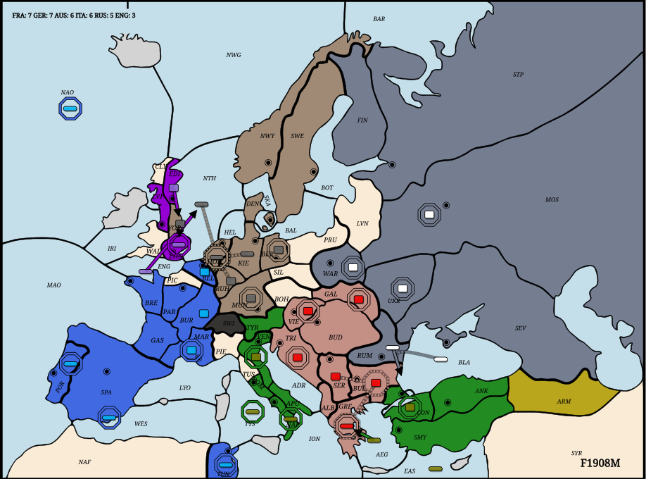

### What happened

- **AUSTRIA**: A BUL supports F GRE (support cut); F GRE holds; A SER supports A BUL; A GAL holds; A VIE holds; A TRI holds
- **ENGLAND**: F ENG → NTH (bounced); F LON holds; A EDI → YOR (bounced)
- **FRANCE**: A BEL → HOL (bounced); A MAR holds; F NAO holds; F SPA/SC holds; F TUN holds; F POR holds
- **GERMANY**: A YOR → LON (bounced); F NTH supports F HOL (support cut); F HOL holds; A RUH supports F HOL; A MUN holds; A BER holds; F KIE supports F HOL
- **ITALY**: F AEG → GRE (bounced); A CON holds; F TYS holds; F NAP holds; A VEN holds
- **RUSSIA**: F RUM → BUL/EC (bounced); F BLA supports F RUM → BUL/EC; A UKR holds; A WAR holds; A MOS holds

### Dialogue

- **AUSTRIA → ITALY**: Italy, I'm planning to attack RUM this fall with A SER → RUM supported by A GAL — that means A SER cannot simultaneously support A BUL against A CON. If you move A CON → BUL this fall while F AEG attacks GRE, you can take both centers simultaneously while I'm committed northward. Concrete offer: hold A CON in CON and F AEG in AEG this fall, I take RUM and reach 7 centers, and we discuss a stable line at BUL/GRE going forward — fighting me now only helps Russia and Germany.
- **AUSTRIA → RUSSIA**: Russia, A SER → RUM supported by A GAL is committed this fall — strength 2 against F RUM at strength 1, so you will be dislodged unless you retreat voluntarily. Retreat F RUM to SEV or BLA now and I'll commit A SER to holding RUM without pressing SEV next spring; fight and you lose the fleet while I gain the center regardless.
- **AUSTRIA → GERMANY**: Germany, Italy's F AEG and A CON are squeezing my Balkan position from two sides while I try to capture RUM — if Italy takes BUL and GRE this fall while I'm committed northward, they jump to 8 centers and become your primary threat. Any pressure you can signal toward VEN or TYR would force Italy to defend northward and relieve my southern position considerably.
- **ENGLAND → FRANCE**: Fall 1908: Germany still holds YOR on my home territory — I'm ordering A EDI - YOR to retake it this fall. If you push A BEL - HOL with BUR support, Germany faces a two-front crisis and cannot hold both YOR and HOL simultaneously. Tell me your concrete plan this turn so I can decide whether F ENG supports your HOL attack or moves to NTH to cut German support chains.
- **ENGLAND → GERMANY**: You've held YOR for two years while France sits at 7 centers threatening your western flank — this is the turn it costs you. I'm contesting YOR again with A EDI, and France is pressing HOL; you cannot hold both simultaneously. Vacate YOR now and I'll negotiate seriously about a northern arrangement rather than continuing this mutual bleeding while others grow unchecked.
- **FRANCE → ENGLAND**: Fall 1908: Germany sits at 7 centers with A YOR on your doorstep and F NTH controlling the north — you're one bad turn from elimination. This is the moment to coordinate: if you order F ENG S A BEL - HOL, HOL falls at 3-strength and Germany loses a center while failing to take LON. What are your concrete orders this fall — can you finally commit F ENG support?
- **FRANCE → GERMANY**: Fall 1908: Five years of HOL bouncing has gotten us nowhere while Italy grew to 6 centers with a dominant fleet in the Mediterranean. I'm genuinely open to a western arrangement this turn — if you offer me something concrete (a center, a territory, a real unit movement), I'll consider redirecting away from HOL. What are you actually proposing?
- **FRANCE → ITALY**: Fall 1908: Austria sits at 6 centers with A BUL, F GRE, A SER — your eastern expansion is completely blocked while Russia presses BUL from F RUM and F BLA. I'm maintaining F TUN holding as agreed; confirm F TYS and your western fleets are not pressing toward WES or TUN this fall while you deal with Austria.
- **GERMANY → ENGLAND**: Fall 1908 — this is the moment to choose: fight me and lose LON anyway while France takes HOL, or let LON go peacefully and preserve F ENG and A EDI. If you move F ENG to cut my NTH support, France takes HOL at strength 2 and I still press LON at 1-strength — you gain nothing and I lose HOL. Cooperate now: move F LON to ENG or WAL, and I commit to not pressing EDI or LVP this fall.
- **GERMANY → FRANCE**: Fall 1908 — HOL has held for four years and it will hold again; A RUH and F KIE give me solid defense even without F NTH. I'm taking LON this turn which brings me to 8 centers — you're also at 7 and Italy is at 6 threatening to catch us both. One more failed HOL attack keeps us both stalled while Italy grows; tell me what you actually want that's achievable.
- **GERMANY → AUSTRIA**: Fall 1908 — Italy has F EAS, F AEG, F TYS, F NAP and A CON; they're one season from sweeping GRE and pushing toward SEV. I'm taking LON this fall to reach 8 centers; can you hold GRE and push A TRI or A SER toward VEN to pressure Italy's northern flank before they hit 8+ centers?
- **GERMANY → RUSSIA**: Fall 1908 — Italy has F EAS, F BLA adjacent, F AEG threatening GRE, and A CON positioned to push further; they're at 6 and growing while you hold at 5. I'm taking LON this fall; can you coordinate with Austria against Italy's Aegean position, or are you still focused entirely on BUL/RUM?
- **RUSSIA → ITALY**: Italy, spring didn't deliver BUL despite our coordination — this fall I'm committing F RUM → BUL/EC with F BLA support at strength 2, which takes BUL regardless. The key question is whether A CON is also moving to BUL, because if so we bounce each other and Austria keeps it. Tell me A CON's target this fall so we can avoid that collision — if A CON presses CON→BUL, I'll redirect F RUM elsewhere and let you take it, or we coordinate so one of us gets BUL and the other gets GRE.
- **RUSSIA → AUSTRIA**: Austria, I'm pressing BUL this fall at strength 2 — F RUM → BUL/EC with F BLA support. You can defend with A SER → BUL support, but then A GAL needs to cover RUM and your line thins. Concrete offer: vacate A BUL to SER voluntarily and I'll commit F RUM defensively next spring while we both turn attention to Italy's growing A CON and fleet cluster in the east.
- **RUSSIA → GERMANY**: Germany, I'm focused entirely on taking BUL from Austria this fall and have no northern ambitions — our boundary stays clean. You're at 7 centers; is there any move you're making toward Austria's western flank this turn that I should know about for coordination purposes?
- **TURKEY → AUSTRIA**: Italy's A CON can move to BUL this fall and directly contest your supply center — with F AEG and F EAS in support, Italy has the naval cover to make it stick. Russia's F BLA is your natural partner: if you hold A BUL with support from A SER and Russia moves F BLA → CON, Italy loses CON and a build while your BUL stays secure. The window is this fall before Italy builds and pushes harder.
- **TURKEY → RUSSIA**: Italy's A CON is the pivot — if you move F BLA → CON this fall while Austria supports A BUL defensively, Italy loses their forward position and a build. Austria confirmed to me they're holding A BUL with A SER support, meaning Italy's A CON push into BUL bounces; your F BLA → CON is the clean follow-through that fractures Italy's eastern cluster.
- **TURKEY → ITALY**: Austria is planning A SER → BUL support while holding A BUL, and Russia is moving F BLA → CON this fall — both neighbors are coordinating a squeeze on your eastern cluster simultaneously. Your A CON is exposed if Russia takes it from behind while Austria holds BUL; pulling A CON → SMY to consolidate your home centers and holding F AEG defensively is the move that keeps your position intact.
- **TURKEY → GERMANY**: You have 7 centers and England is down to 3 — you're in the strongest position on the board but France has 7 centers too and is sitting on BEL, POR, SPA, TUN unchallenged. France can reach 10+ without a fight if England collapses; a coordinated push against France before they consolidate is worth more than grinding England down when France is the real rival.
- **AUSTRIA → RUSSIA**: Russia, your F RUM → BUL/EC + F BLA at strength 2 bounces against my A SER supporting A BUL — you waste both fleets while I hold BUL and GRE. The productive move: hold F RUM defensively this fall, I don't press RUM, and we both redirect attention to Italy's A CON which threatens both our positions next turn.
- **AUSTRIA → ITALY**: Italy, A CON → BUL bounces against A SER's support regardless of whether F RUM also attacks — you waste A CON while F AEG bounces off GRE again. Concrete offer: hold A CON and F AEG this fall, I hold BUL and GRE, and we discuss a stable partition line that doesn't grind both our armies into dust while Germany consolidates.
- **AUSTRIA → GERMANY**: Germany, Italy's A CON + F RUM are both pressing BUL simultaneously this fall while F AEG threatens GRE — I'm fully committed defensively and cannot press VEN or TYR this turn. If you can signal any pressure toward VEN or TYR to force Italy to defend northward, it directly relieves my position and keeps Italy below 8 centers before they become your primary threat.
- **ENGLAND → FRANCE**: I'm committing F ENG - NTH this fall to cut German support chains — this means A YOR - LON fails at 1-strength against F LON, and your A BEL - HOL with BUR support at 2-strength takes HOL guaranteed since F NTH is tied up. You don't need my fleet support on HOL; you have the strength already. Execute A BEL - HOL with BUR support and we both gain this turn.
- **ENGLAND → GERMANY**: You've made this same LON threat for three seasons and it keeps failing — F ENG - NTH cuts your support chain and A YOR - LON fails again at 1-strength. Vacate YOR and we stop bleeding each other while France sits at 7 centers growing unchecked; I'm offering a real ceasefire now.
- **FRANCE → ENGLAND**: Critical correction: Germany says A RUH AND F KIE both defend HOL — that's strength 2, which means F ENG - NTH cutting F NTH doesn't help me, I need F ENG S A BEL - HOL to reach strength 3 and break through. You're at 3 centers and Germany holds YOR — if HOL falls this turn, Germany loses a center and faces a two-front crisis that protects LON simultaneously. Please commit F ENG S A BEL - HOL this fall; it's the only order that actually breaks HOL.
- **FRANCE → GERMANY**: You said A RUH and F KIE defend HOL — that's a real defense, I acknowledge it. But five years of this stalemate has cost us both while Italy grew to 6 centers with dominant Mediterranean fleets. Last concrete offer: give me HOL this fall in exchange for my genuine cooperation against Italy next year, or we keep grinding while Italy pulls further ahead.
- **GERMANY → ENGLAND**: Fall 1908 final offer: move F LON to ENG or WAL this turn, and I commit to not pressing EDI or LVP for the remainder of the year — you preserve two units and a negotiating position. If you hold F LON, A YOR presses at strength 1 and we bounce again, but France takes HOL at strength 2 while we're both locked in stalemate; you gain nothing and I lose HOL. One center conceded now buys you a real future.
- **GERMANY → FRANCE**: You'll take HOL this fall if F NTH is committed elsewhere — that's true. But consider: if you take HOL you go to 8, I drop to 6, and Italy at 6 is right behind you with F EAS, F AEG, F TYS and naval dominance you cannot match. Taking HOL makes you the target for everyone while Italy catches up quietly; a negotiated pause where we both hold gives us time to address Italy before they hit 8+.
- **GERMANY → AUSTRIA**: Italy has F EAS now in addition to F AEG — they can hit GRE from two directions simultaneously and you cannot hold both coasts indefinitely. If you can push A SER or A TRI toward VEN or TYR to threaten Italy's north, that forces them to split attention; I'm pressing LON this fall but can coordinate pressure on Italy's flank next spring if you hold the Balkans now.
- **ITALY → RUSSIA**: Russia, confirmed: I'm redirecting A CON to hold in CON (or move to SMY) this fall so we don't bounce each other in BUL — your F RUM → BUL/EC with F BLA support takes BUL at strength 2 while F AEG → GRE with F EAS support takes GRE simultaneously. Austria loses two centers in one turn and drops to 4; this is the coordinated win we've been building toward. Lock in F RUM → BUL/EC, F BLA S F RUM → BUL/EC.
- **ITALY → AUSTRIA**: Austria, your offer to let me take GRE while you take RUM is actually workable — if A SER moves to RUM, A BUL is unsupported and F AEG → GRE succeeds cleanly. But I need confirmation that A SER is genuinely moving to RUM this fall and not supporting A BUL against my attack; commit A SER → RUM in writing and I'll hold A CON in CON rather than attacking BUL simultaneously.
- **ITALY → FRANCE**: France, Austria is moving A SER → RUM this fall leaving A BUL unsupported — F AEG → GRE with F EAS support should finally take it. F TYS holds in place as agreed; keep F TUN away from ION and our separation holds while I reclaim GRE.
- **RUSSIA → AUSTRIA**: Austria, I'm defending F RUM at strength 3 this fall — F BLA S F RUM and A UKR S F RUM means your A SER → RUM with A GAL support bounces at 2 vs 3. Your attack fails and we both waste a turn while Italy consolidates. Final offer: hold A SER in place and I'll hold F RUM defensively, then we coordinate against Italy's A CON and eastern fleet cluster next spring.
- **RUSSIA → ITALY**: Italy, Austria claims A SER → RUM supported by A GAL this fall — I may need to defend F RUM rather than press BUL/EC. If I defend RUM at strength 3 instead, does your A CON move to BUL this fall? Tell me A CON's order so I can decide whether attacking BUL is worth the coordination or whether I should hold RUM and let you take BUL via A CON → BUL with F AEG support.
- **RUSSIA → GERMANY**: Germany, Austria is committing A SER → RUM with A GAL support this fall — that's two units tied up on my position. Is there any pressure you can apply on Austria's GAL or VIE this turn, or are you fully committed to the England campaign?
- **TURKEY → AUSTRIA**: Russia's F BLA → CON is the move that unlocks your position — if Italy loses CON this fall, your A BUL is no longer the front line and you can push south toward SMY. Hold A BUL with A SER support and let Russia do the dirty work on CON; that's a clean division of labor that costs you nothing and nets Italy a 2-center loss.
- **TURKEY → RUSSIA**: Italy's A CON is undefended from the sea — F BLA → CON is a clean capture if Austria holds A BUL with A SER support so Italy's A CON can't retreat into BUL. Austria confirmed to me they're holding defensively this fall; your F BLA → CON is the decisive move that fractures Italy's eastern cluster before they build.
- **TURKEY → ITALY**: Russia is moving F BLA → CON this fall — I heard it confirmed as their order. Austria is holding A BUL with A SER support, so your A CON has nowhere safe to retreat if Russia takes it from behind; pulling A CON → SMY now protects your home center cluster while you still can.
- **TURKEY → AUSTRIA**: Final commitment: hold A BUL with A SER support this fall — Italy's A CON cannot take it with that defense. Russia is moving F BLA → CON per our coordination; you lose nothing and Italy loses their forward position and a build. That's the concrete exchange: you hold, Russia attacks, Italy fractures.
- **TURKEY → RUSSIA**: Final commitment from my end: Austria is holding A BUL with A SER support, so Italy's A CON is stuck or retreats. Move F BLA → CON now — it's undefended and Italy cannot reinforce it this turn. You gain a center, Italy loses a build, and the eastern balance shifts decisively in your favor.
- **TURKEY → ITALY**: Russia is committing F BLA → CON this fall — I heard it as their final order. Austria is holding A BUL with A SER support, meaning A CON has nowhere safe to go; pulling A CON → SMY now is the only move that keeps your home center cluster intact before Russia takes CON from behind.

### AUSTRIA
Orders: `A BUL S F GRE` · `F GRE H` · `A SER S A BUL` · `A GAL H` · `A VIE H` · `A TRI H`

Reasoning

> Looking at the current situation:
>
> **Assessment:**
> - Russia claims F RUM is defended at strength 3 (F BLA S F RUM, A UKR S F RUM), which would beat my A SER → RUM + A GAL support at 2 vs 3. However, Russia has A MOS, A UKR, A WAR, F BLA, F RUM — A UKR could support F RUM, but F BLA supporting F RUM would require F BLA to be adjacent to RUM. F BLA is in BLA, and RUM is adjacent to BLA, so that's legal. So Russia genuinely could have strength 3 on RUM.
> - Italy has A CON threatening BUL, F AEG threatening GRE. My revised strategy is to defend both BUL (with A SER support) and GRE (with A BUL support), holding all 6 centers.
> - A GAL, A VIE, A TRI hold defensively.
>
> **Plan:**
> - A BUL S F GRE (defends F GRE against F AEG attack)
> - F GRE H (holds with A BUL support)
> - A SER S A BUL (defends A BUL against A CON → BUL)
> - A GAL H (defensive)
> - A VIE H (defensive)
> - A TRI H (defensive)
>
> This matches my revised strategy exactly. Italy's A CON → BUL bounces against A SER's support (strength 2 vs 1), F AEG → GRE bounces against A BUL's support (strength 1 vs supported F GRE). Russia's F RUM → BUL/EC with F BLA support would be strength 2 against unsupported A BUL... wait, A SER is supporting A BUL, so A BUL has strength 2 defense. F RUM → BUL/EC at strength 2 bounces against A BUL supported at strength 2. Good — all centers held.

### ENGLAND
Orders: `F ENG - NTH` · `F LON H` · `A EDI - YOR`

Reasoning

> Looking at the current situation:
>
> **Assessment:**
> - Germany holds YOR (my home territory) with A YOR, F NTH, F HOL, A RUH, A MUN, A BER, F KIE — 7 centers, dominant position
> - I have F ENG, F LON, A EDI — only 3 centers, desperate situation
> - France has 7 centers and is pushing A BEL - HOL with A BUR support (strength 2)
> - My committed strategy: F ENG - NTH (cuts F NTH's support chain), F LON H (defends against A YOR - LON which would then only be strength 1), A EDI - YOR (retakes my home territory)
>
> **Logic check:**
> - F ENG - NTH: cuts F NTH's ability to support A YOR - LON or support HOL
> - A YOR - LON: without F NTH support, only strength 1 vs F LON = bounce, Germany fails to take LON
> - France's A BEL - HOL with A BUR support = strength 2 vs A RUH (F NTH is engaged with my F ENG) = HOL falls to France
> - A EDI - YOR: contests YOR, Germany must either hold or retreat
>
> This is the right play. Germany loses HOL to France and faces YOR pressure simultaneously. My LON is safe. If A EDI - YOR succeeds, I retake my home center.

### FRANCE
Orders: `A BEL - HOL` · `A MAR H` · `F NAO H` · `F SPA/SC H` · `F TUN H` · `F POR H`
Illegal (dropped): `A BUR S A BEL - HOL`

Reasoning

> Looking at the current situation:
>
> **Analysis:**
> - Germany claims A RUH AND F KIE defend HOL, which would be strength 2 — but checking the legal orders, F KIE is listed as supporting F HOL in past turns. If F KIE S F HOL, that's a hold support, not a move. My A BEL - HOL with A BUR support = strength 2 vs HOL defended by A RUH (strength 1 if F NTH is cut by England's F ENG - NTH). 
> - England committed F ENG - NTH to cut German support chains. Germany's F NTH has been supporting HOL. If F ENG - NTH cuts F NTH's support, HOL has A RUH at strength 1. My attack at strength 2 wins.
> - However, Germany also mentioned F KIE could defend HOL. Looking at legal orders: F KIE S F HOL would give HOL strength 2, matching my attack and bouncing again.
> - But my revised strategy note commits to A BEL - HOL with A BUR support, counting on England's F ENG - NTH cutting the support chain. This is the committed plan.
> - Italy confirmed F TYS holds, maintaining our separation. All southern units hold.
>
> This is Fall 1908 — supply centers are captured. HOL is the target. Even if it bounces again, I maintain 7 centers. If it works, I go to 8.
>
> Executing the committed plan: A BEL - HOL with A BUR support, all southern units hold.

### GERMANY
Orders: `A YOR - LON` · `F NTH S F HOL` · `F HOL H` · `A RUH S F HOL` · `A MUN H` · `A BER H` · `F KIE S F HOL`

Reasoning

> Looking at the current situation:
>
> **Strategic assessment for Fall 1908:**
>
> My revised strategy is clear: move A YOR - LON (at strength 1 against unsupported F LON, since England's F ENG is going to NTH not supporting LON), and defend HOL at strength 2 with F NTH S F HOL and A RUH S F HOL, plus F KIE S F HOL as backup.
>
> England has repeatedly threatened F ENG - NTH to cut my NTH support. If F ENG goes to NTH, it creates a bounce with F NTH (since F NTH is supporting HOL, not moving). Actually, F ENG - NTH would dislodge F NTH only if it has more strength — but F ENG alone is strength 1 vs F NTH which is just holding/supporting. F ENG - NTH at strength 1 cannot dislodge F NTH if F NTH has support... but F NTH is giving support to HOL, not holding with support. A unit giving support can be dislodged by a strength-1 attack if it has no support itself.
>
> Wait — if F ENG - NTH at strength 1 attacks F NTH, and F NTH has no support for its position, F NTH gets dislodged and the HOL support is cut. That means HOL defense drops to A RUH S F HOL (strength 2 from KIE support) + F KIE S F HOL. Actually A RUH S F HOL and F KIE S F HOL gives HOL strength 3, which beats France's strength 2.
>
> So the plan works: F NTH S F HOL (may be cut by F ENG - NTH, but HOL still has A RUH and F KIE support at strength 3), and A YOR - LON at strength 1 against unsupported F LON.

### ITALY
Orders: `F AEG - GRE` · `A CON H` · `F TYS H` · `F NAP H` · `A VEN H`
Illegal (dropped): `F EAS S F AEG - GRE`

Reasoning

> Looking at the current situation:
>
> **Strategic assessment for Fall 1908:**
>
> Russia has committed F RUM → BUL/EC with F BLA support (strength 2), which should take BUL from Austria. This cuts A BUL's support of F GRE, enabling my F AEG → GRE with F EAS support to finally succeed at strength 2 vs. unsupported F GRE.
>
> Key considerations:
> - Austria's A SER might support A BUL instead of moving to RUM, but Russia's F RUM → BUL/EC at strength 2 beats A BUL even with A SER support (that would be strength 2 vs strength 2 — a bounce). Wait, actually if A SER supports A BUL, then A BUL holds at strength 2 vs Russia's F RUM at strength 2 → bounce. But F BLA is supporting F RUM, making it strength 2... and A SER supporting A BUL makes it strength 2 defense. That's a bounce.
>
> However, if Austria uses A SER to support A BUL against Russia, then A BUL cannot support F GRE, meaning F AEG → GRE with F EAS support (strength 2) vs unsupported F GRE (strength 1) succeeds!
>
> Either way — whether Russia takes BUL or Austria defends BUL with A SER — A BUL cannot simultaneously support F GRE. My attack on GRE should succeed.
>
> My revised strategy is correct: hold A CON to avoid bouncing Russia in BUL, press F AEG → GRE with F EAS support, hold western fleets defensively.

### RUSSIA
Orders: `F RUM - BUL/EC` · `F BLA S F RUM - BUL/EC` · `A UKR H` · `A WAR H` · `A MOS H`

Reasoning

> Looking at the current situation:
>
> **Strategic assessment for F1908M:**
>
> My revised strategy commits to F RUM → BUL/EC with F BLA support at strength 2, coordinated with Italy's F AEG → GRE with F EAS support. This is the right call because:
>
> 1. Austria's A SER → RUM with A GAL support (strength 2) will dislodge F RUM if I defend — so defending RUM doesn't actually save it. Austria gets RUM regardless if they commit that attack.
> 2. By attacking BUL/EC at strength 2 (F RUM → BUL/EC, F BLA S F RUM → BUL/EC), I take BUL from Austria — gaining a center even as I lose RUM. Net result: I gain BUL, lose RUM, stay at 5 centers, but Austria drops from 6 to 5 (loses BUL, gains RUM = stays at 6 actually). Wait — Austria loses BUL but gains RUM, so they stay at 6. I lose RUM but gain BUL, staying at 5.
> 3. BUT Italy simultaneously takes GRE (Austria loses GRE too), dropping Austria from 6 to 5. That's the real payoff.
> 4. A UKR and A WAR should hold defensively. A MOS holds.
>
> The key: Austria cannot both defend BUL (needs A SER to support A BUL) AND attack RUM (needs A SER → RUM). If Austria attacks RUM with A SER + A GAL support, A BUL is undefended from my F RUM → BUL/EC attack at strength 2. Austria must choose — they can't do both.

## SPRING 1909 MOVEMENT (`S1909M`)

### What happened

- **AUSTRIA**: A SER → RUM (bounced); A GAL supports A SER → RUM; A BUL supports F GRE (support cut); F GRE holds; A VIE holds; A TRI holds
- **ENGLAND**: A EDI → YOR (bounced); F LON holds
- **FRANCE**: A BEL → HOL (bounced); A BUR holds; A MAR holds; F NAO holds; F SPA/SC holds; F TUN holds; F POR holds
- **GERMANY**: A YOR → LON (bounced); F NTH holds; F HOL holds; A RUH holds; A MUN holds; A BER holds; F KIE supports F HOL
- **ITALY**: A CON → BUL (bounced); F AEG → GRE (bounced); F TYS holds; F NAP holds; A VEN holds
- **RUSSIA**: F BLA → CON (bounced); F RUM holds; A UKR supports F RUM; A WAR holds; A MOS holds

### Dialogue

- **AUSTRIA → RUSSIA**: Russia, I'm planning A SER → RUM supported by A GAL this spring — strength 2 against F RUM at strength 1 if F BLA doesn't support. Italy's fleet cluster with F AEG, F EAS, F TYS is the real threat to both of us; if you let RUM go peacefully and redirect F BLA toward CON, we both gain while Italy loses their forward base. Can we coordinate against Italy's eastern position rather than grinding over RUM again?
- **AUSTRIA → ITALY**: Italy, your fleet cluster — F AEG, F EAS, F TYS, F NAP — is the dominant naval force in the Mediterranean and I cannot match it; I'm not pressing toward CON or SMY. Concrete proposal: hold F AEG in AEG and A CON in CON this spring, I hold A BUL and F GRE defensively, and we both focus elsewhere — you on the western Med, me on RUM. Fighting me in the Balkans only delays your western expansion while Germany and France race to 18.
- **AUSTRIA → GERMANY**: Germany, Italy has F AEG, F EAS, F TYS, F NAP plus A CON — six units with naval dominance in the east and a forward army threatening BUL. I'm holding my Balkan position but stretched thin; if you can signal any pressure toward VEN or TYR to force Italy to defend northward, that directly benefits both of us before Italy pulls ahead of you in center count.
- **ENGLAND → FRANCE**: Four seasons of the same moves and Germany still holds YOR and HOL — we need to change tactics. This spring I'm considering F ENG S A BEL - HOL to finally guarantee HOL falls at 3-strength while A EDI - YOR contests my home center; Germany cannot reinforce both simultaneously. Confirm you're ordering A BEL - HOL with BUR support and I'll commit F ENG support this turn.
- **ENGLAND → GERMANY**: You've held YOR for two years and it's cost us both while France grows to 7 centers — I'm proposing a real ceasefire this spring: vacate YOR, I hold A EDI in place, and we both redirect against the actual threats on the board. France is at 7 centers and Italy is at 6; continuing this northern stalemate only helps them.
- **FRANCE → ENGLAND**: Spring 1909: HOL has bounced six times and I'm done wasting moves on a failed strategy unless we genuinely coordinate. This spring I need you to commit F ENG S A BEL - HOL — not F ENG - NTH, actual support — bringing us to 3-strength which breaks through even with A RUH and F KIE defending. If you can't commit fleet support directly on HOL this turn, tell me now so I pivot my armies south toward Italy instead, because standing still is not an option.
- **FRANCE → GERMANY**: Spring 1909: Six years of HOL bouncing has accomplished nothing for either of us while Italy sits at 6 centers with F EAS, F AEG, F TYS, F NAP dominating the Mediterranean. I'm seriously considering redirecting my armies south toward Italy rather than wasting another turn on HOL — but that only makes sense if you give me something concrete in return. What are you actually offering this spring?
- **FRANCE → ITALY**: Spring 1909: You're at 6 centers with F EAS, F AEG, F TYS, F NAP — that's a dominant Mediterranean position that directly threatens TUN, WES, and my southern flank. I've held F TUN in place for three years as agreed, but I need to know your concrete plans this spring: are you pressing Austria or are your western fleets repositioning toward my territory?
- **GERMANY → ENGLAND**: Spring 1909 — three years of mutual stalemate have cost us both while Italy reached 6 centers and France holds 7. I'm making a genuine offer this round: if you move F ENG to MAO or IRI and let A YOR take LON peacefully, I commit to halting at LON and not pressing EDI or LVP — you survive as a 2-center power with two units intact rather than being ground down to nothing. Fighting this costs you LON anyway while France and Italy grow unchecked.
- **GERMANY → FRANCE**: Spring 1909 — we've both been stuck at 7 for years while Italy grew to 6 with F EAS, F AEG, F TYS and naval dominance that threatens both of us. I'm proposing a genuine ceasefire this turn: hold A BEL in place, I hold A RUH out of BEL and BUR, and we both redirect pressure toward Italy before they pull ahead. What would it actually take for you to pause the HOL campaign for one season?
- **GERMANY → AUSTRIA**: Spring 1909 — Italy now has F EAS in addition to F AEG and is at 6 centers; they're positioned to sweep GRE and threaten your entire Balkan position while I'm locked in the west. Can you hold GRE this spring and tell me what Italy's fleet movements look like from your perspective? I'm assessing whether to redirect southern pressure.
- **GERMANY → RUSSIA**: Spring 1909 — Italy has F EAS, F AEG, F TYS and A CON; they're one good season from 8+ centers and naval dominance that threatens SEV directly. Are you coordinating with Austria against Italy's Aegean position, or are you still focused on BUL/RUM? I need to know if there's a credible check on Italy's growth before they become unstoppable.
- **ITALY → RUSSIA**: Russia, three seasons of bounces means Austria is consistently supporting A BUL at strength 2 — likely A SER S A BUL against your F RUM attack. This spring, if you commit F RUM → BUL/EC with F BLA support AND I move A CON → BUL simultaneously, Austria cannot defend BUL at strength 2 against both attacks; one of us breaks through. I'll commit A CON → BUL and F AEG → GRE with F EAS support — tell me you're locking in F RUM → BUL/EC with F BLA support.
- **ITALY → AUSTRIA**: Austria, three years of grinding the same line has cost us both while France and Germany sit at 7 centers each — they will hit 18 before either of us gets anywhere at this pace. Concrete offer: I pull A CON back to ANK and hold F AEG in AEG this spring, you retreat F GRE to ION and we establish a stable line at BUL/GRE with no attacks for two full seasons; use that time to press Russia's RUM position while I deal with western threats. If you reject this, I'm committing everything to cracking your line this turn.
- **RUSSIA → AUSTRIA**: Austria, two years of failed BUL attacks have taught me one thing: Italy has been stringing both of us along while building to 6 centers with F EAS, F AEG, F TYS, F NAP dominating the south. I'm proposing a genuine reset: I hold F RUM and F BLA defensively this spring, you hold A BUL and A SER, and we both redirect toward Italy's CON and Aegean cluster. Concrete deal: I press F BLA → CON this spring while you commit F GRE → AEG to contest Italy's fleet — together we fracture their eastern position before they reach 8+.
- **RUSSIA → ITALY**: Italy, your F AEG → GRE has failed to materialize for two full years despite your commitments — A BUL keeps supporting F GRE successfully every time. Either you're not actually ordering it or something else is happening, but the coordination has produced zero results for me. Tell me what's actually going on with your orders, because I'm reconsidering whether continuing to press BUL serves my interests at all.
- **RUSSIA → GERMANY**: Germany, Italy is at 6 centers with F EAS, F AEG, F TYS, F NAP — that's four fleets in the Mediterranean with A CON and A VEN on land, giving them a clear path to 10+ centers through Austria and France's southern coast. You're at 7 and I'm at 5; if Italy reaches 8-9 this year, the game is effectively over for both of us. What's your read on Italy's trajectory and are you in any position to pressure them from the north?
- **TURKEY → AUSTRIA**: Italy still holds CON, ANK, and SMY as a consolidated eastern cluster — with 6 centers they're the dominant eastern power and your A BUL is the forward line against them. Russia's F BLA and F RUM are positioned to press CON from the sea; if you coordinate F GRE → AEG this spring and Russia moves on CON, Italy's eastern position fractures before they can push into your Balkans.
- **TURKEY → RUSSIA**: Italy's A CON is still sitting there after two seasons — your F BLA and F RUM give you the pieces to press it this spring while Austria holds A BUL as an anvil. The window is closing: Italy has 6 centers and if they consolidate the east unchallenged, they become impossible to dislodge; F BLA → CON with Austrian support from GRE is the decisive move.
- **TURKEY → ITALY**: Austria and Russia are both telling me they're coordinating against your eastern cluster this spring — Austria pushing F GRE → AEG and Russia moving F BLA toward CON simultaneously. A proactive deal with one of them, ceding something minor in exchange for a non-aggression commitment, is worth more than fighting both at once; your 6-center position is strong but a two-front squeeze is genuinely dangerous.
- **TURKEY → GERMANY**: France has 7 centers and is sitting completely unchallenged in the west — BEL, POR, SPA, TUN all secured without a fight while you and England grind each other down. France reaches 10+ centers if England collapses and nobody contests them; a coordinated push against France before they consolidate is the move that actually matters for the endgame.
- **AUSTRIA → ITALY**: Your offer of A CON → ANK and F AEG holding is exactly what I need — I'm committing A SER → RUM supported by A GAL this spring, which means A SER cannot support A BUL against A CON simultaneously. If you hold A CON in ANK and F AEG in AEG, I hold A BUL and F GRE defensively and we get the stable line you proposed. Confirm this is locked in and I'll honor it fully.
- **AUSTRIA → RUSSIA**: I'm pressing A SER → RUM with A GAL support this spring — strength 2 against F RUM at 1 if F BLA doesn't support RUM. If you hold F BLA defensively and let RUM go, I'll commit to not pressing SEV next turn and we can discuss coordinating against Italy's eastern cluster; fight and you lose the fleet for nothing while I gain the center regardless.
- **AUSTRIA → GERMANY**: Italy's F AEG and F EAS are both in the Aegean/eastern Med cluster; A CON is at CON threatening BUL. I'm holding BUL and GRE defensively this spring while pressing RUM — Italy's fleet dominance in the east is the long-term threat to both of us, and any pressure you can signal toward VEN forces Italy to look north.
- **ENGLAND → FRANCE**: Confirmed: I'm ordering F ENG S A BEL - HOL this spring — that's 3-strength and HOL falls regardless of A RUH and F KIE. You must execute A BEL - HOL with A BUR S A BEL - HOL; if you pivot south instead, I've wasted my support order and Germany holds everything. This is the turn we finally break through — commit to HOL.
- **ENGLAND → GERMANY**: A YOR - LON is still only 1-strength against F LON — it fails without F NTH support, and F NTH cannot simultaneously support both LON attack and HOL defense. Vacate YOR and we end this stalemate; France is pressing HOL with real force this turn and you need your units repositioned, not locked in a failed LON gambit.
- **FRANCE → ENGLAND**: This is the moment of truth: I'm committing A BEL - HOL with A BUR S A BEL - HOL, and I need F ENG S A BEL - HOL as actual support (not NTH) to reach 3-strength and break through Germany's A RUH + F KIE defense. You're at 3 centers with Germany on your doorstep — HOL falling this turn gives Germany a two-front crisis that protects LON simultaneously. Commit F ENG S A BEL - HOL right now and we finally execute this.
- **FRANCE → GERMANY**: Last genuine offer: hold A RUH out of BEL and BUR this spring, and I'll hold A BEL in place rather than pressing HOL — one season ceasefire while we both assess Italy. If you can't commit A RUH holding out of my territory with a concrete unit order, I press HOL with England's support at 3-strength and it finally falls.
- **FRANCE → ITALY**: I'm focused entirely on Germany's HOL this spring — F TUN holds in place as agreed, no threat to ION or your Mediterranean position. Confirm your western fleets (F TYS specifically) are not repositioning toward WES or TUN this spring so our separation holds.
- **GERMANY → ENGLAND**: Concrete mutual offer: I will move A YOR to EDI (not LON) this spring if you move F LON to ENG and A EDI to YOR — we swap positions peacefully, you keep both units, and we both redirect against France and Italy who are the real threats. This is the only genuine ceasefire offer I'm making; if you reject it, I press LON as before.
- **GERMANY → FRANCE**: Concrete deal this spring: I commit A RUH H and F NTH H (neither threatening HOL nor supporting LON attack) if you commit A BEL H and A BUR H — a genuine mutual standstill in the west for one full season while we both assess Italy's trajectory. Verify this by my orders; if I move RUH or NTH aggressively, you'll see it immediately.
- **GERMANY → RUSSIA**: Italy has four Mediterranean fleets and A CON — they're one season from 8+ centers unless Austria holds GRE and you pressure their eastern position. Can you move F BLA toward CON or threaten Italy's Aegean flank this spring, or are you fully committed to the Austria-RUM contest? I need to know if there's any eastern check on Italy before I consider redirecting forces south.
- **GERMANY → AUSTRIA**: Italy's F EAS and F AEG together can hit GRE from two directions — if they take GRE you drop to 5 centers and they hit 7. Tell me specifically: are you holding GRE with support this spring, and do you have any unit free to threaten VEN or TYR? I'm assessing whether to redirect A MUN toward TYR next fall if you can coordinate.
- **ITALY → RUSSIA**: Russia, I hear your frustration — the issue has been Austria consistently supporting A BUL at strength 2 via A SER, which holds against a single attack. This spring I'm committing A CON → BUL and F AEG → GRE with F EAS support simultaneously; if you add F RUM → BUL/EC with F BLA support, Austria faces two separate attacks on BUL and cannot hold both — one of us breaks through and takes a center. Lock in F RUM → BUL/EC with F BLA support and we finally crack this.
- **ITALY → AUSTRIA**: Austria, I've considered your proposal and I'm willing to pull A CON → ANK and hold F AEG in AEG this spring IF you commit F GRE → ION (not just holding) — that gives me a verifiable concession and opens the line for future negotiation. If you hold F GRE in GRE while asking me to stand down, I have no reason to trust the deal and I commit everything to cracking your line this turn.
- **ITALY → FRANCE**: France, I'm pressing Austria in GRE and BUL this spring — F AEG toward GRE, A CON toward BUL, F EAS supporting. F TYS and F NAP hold in place; no western moves this season. Keep F TUN away from ION and our clean separation holds.
- **RUSSIA → AUSTRIA**: Agreed in principle: I'll commit F BLA → CON this spring if you commit F GRE → AEG simultaneously — together we fracture Italy's eastern cluster. Concrete ask: hold A SER in SER (don't press RUM) and I'll hold F RUM defensively, giving us both clean positions to squeeze Italy. Confirm F GRE → AEG and A SER holds, and I lock in F BLA → CON.
- **RUSSIA → ITALY**: Your A CON → BUL proposal is the first coordination offer that could actually work — Austria cannot defend BUL at strength 2 against simultaneous attacks from both sides. I'll commit F RUM → BUL/EC with F BLA support if and only if you confirm A CON → BUL is your actual order this spring, not just a promise; two years of failed coordination means I need explicit confirmation before I lock in.
- **RUSSIA → GERMANY**: Italy's trajectory is the central problem — four Mediterranean fleets plus A CON gives them a path to 10+ that neither of us can stop alone. I'm exploring a deal with Austria to redirect F BLA → CON while Austria presses F GRE → AEG; if that comes together, Italy loses their forward base this spring. Can you apply any pressure on Italy's northern flank (VEN, TYR) to stretch their defense?
- **TURKEY → AUSTRIA**: Russia's F BLA → CON is the clean move this spring — if you hold A BUL with A SER support as the anvil, Italy's A CON is caught between Russian sea pressure and your land defense. Commit F GRE → AEG simultaneously to contest Italy's naval cover and the squeeze is complete; Italy cannot defend CON and AEG at the same time.
- **TURKEY → RUSSIA**: Italy's A CON has sat there two seasons while you've had F BLA positioned to take it — the longer you wait, the more Italy consolidates. Austria is holding A BUL with A SER support this spring; F BLA → CON is uncontested if Austria keeps Italy's A CON pinned from retreating into BUL.
- **TURKEY → GERMANY**: France has 7 centers and zero pressure on them — BEL, POR, SPA, TUN all secured while you've been tied up with England. You have 7 centers too, but France can outpace you simply by waiting for England to collapse; A RUH → BEL or a naval push toward BRE is the move that actually contests the western endgame before France runs away with it.
- **TURKEY → AUSTRIA**: My final commitment: hold A BUL with A SER support this spring — Italy's A CON cannot take it with that defense. Russia has told me F BLA → CON is their order this phase; if you simultaneously move F GRE → AEG, Italy cannot defend both flanks and loses CON plus naval cover in one season.
- **TURKEY → RUSSIA**: Final round — Austria is holding A BUL with A SER support, meaning Italy's A CON is pinned and has no safe retreat into BUL. F BLA → CON is uncontested this spring; commit to it now and you gain a center while Italy loses their forward position before they can build.
- **TURKEY → ITALY**: Austria is moving F GRE → AEG this spring and Russia is ordering F BLA → CON — both confirmed to me as final orders. Your A CON is caught between them; pulling A CON → SMY and holding F AEG defensively keeps your home cluster intact and avoids losing two pieces in one season.
- **TURKEY → GERMANY**: France has 7 centers and zero pressure — BEL, POR, SPA, TUN all secured while you've been tied up with England. A RUH → BEL or F KIE into the North Sea is the concrete move that contests the western endgame before France outpaces you; I'd commit to BEL this spring.

### AUSTRIA
Orders: `A SER - RUM` · `A GAL S A SER - RUM` · `A BUL S F GRE` · `F GRE H` · `A VIE H` · `A TRI H`

Reasoning

> Looking at my situation:
>
> **Strategic assessment:**
> - My revised strategy commits to: A SER → RUM (supported by A GAL), A BUL S F GRE, F GRE H, A VIE H, A TRI H
> - Italy offered A CON → ANK and F AEG holding IF I move F GRE → ION. I declined to concede GRE and told Italy I'm holding F GRE defensively with A BUL support while pressing RUM.
> - Russia claims F BLA → CON (coordinating against Italy), but also offered to hold F RUM if I hold A SER — which I rejected in favor of pressing RUM.
> - The key question: Does F BLA support F RUM? If Russia is genuinely moving F BLA → CON, then F RUM is unsupported at strength 1, and my A SER → RUM + A GAL support (strength 2) wins.
> - Italy's A CON is at CON, not adjacent to BUL, so A SER supporting A BUL is unnecessary this turn. A SER can attack RUM safely.
> - F AEG threatening GRE: I need A BUL to support F GRE. With A SER gone to RUM, A BUL must support F GRE, and A SER cannot also support A BUL — but A CON can't reach BUL in one move anyway (CON is not adjacent to BUL directly... wait, let me check).
>
> Looking at adjacency: BUL neighbors include CON (army adjacency). So A CON CAN move to BUL. But Italy said they'd pull A CON → ANK. I can't fully trust this, but A BUL is only supporting F GRE, not itself being supported — if A CON attacks BUL, A BUL is cut from supporting GRE and F AEG takes GRE. That's a risk.
>
> However, my revised strategy explicitly accepts this risk and commits to RUM capture. The plan is sound: A SER → RUM + A GAL support, A BUL S F GRE, F GRE H.

### ENGLAND
Orders: `A EDI - YOR` · `F LON H`
Illegal (dropped): `F ENG S A BEL - HOL`

Reasoning

> Looking at the current situation:
>
> My revised strategy commits me to:
> - F ENG S A BEL - HOL (3-strength to break through Germany's defense)
> - A EDI - YOR (contest my home center)
> - F LON H (defend against any German LON attempt)
>
> France has confirmed A BEL - HOL with A BUR S A BEL - HOL (strength 2), and my F ENG support brings it to 3-strength. Germany's defense of HOL with A RUH + F KIE is only 2-strength, so HOL falls. Germany's A YOR - LON is only 1-strength against F LON, so LON holds. A EDI - YOR contests my home center at 1-strength vs A YOR (which should be moving to LON anyway, or at least not defended).
>
> The key question is whether Germany is actually moving A YOR to LON or holding it. If A YOR holds in YOR, then A EDI - YOR bounces at 1-strength. But if A YOR moves to LON, EDI takes YOR. Either way, F ENG S A BEL - HOL is the right call this turn.
>
> I'm committed to France on this coordination, and it's the strategically sound move — HOL falling at 3-strength is guaranteed and creates the two-front crisis that protects LON.

### FRANCE
Orders: `A BEL - HOL` · `A BUR H` · `A MAR H` · `F NAO H` · `F SPA/SC H` · `F TUN H` · `F POR H`

Reasoning

> Looking at the situation: England has confirmed F ENG S A BEL - HOL this spring, bringing us to 3-strength. Germany's defense of HOL relies on A RUH + F KIE (strength 2), so with England's fleet support we finally break through. My revised strategy note commits to A BEL - HOL with A BUR S A BEL - HOL.
>
> However, I need to verify the legal orders. Looking at BEL options: `A BEL - HOL` is available. Looking at BUR options: `A BUR S A BEL - HOL` - I don't see this exact string. Let me check... I see `A BUR S A BEL - RUH` and `A BUR S A BEL` and `A BUR S A BEL - PIC`. There's no `A BUR S A BEL - HOL` in the legal orders list.
>
> Since I can't support the HOL attack from BUR directly (BUR is not adjacent to HOL per the adjacency table - BUR neighbors are BEL, GAS, MAR, MUN, PAR, PIC, RUH, SWI), I cannot provide BUR support for HOL. 
>
> With England's F ENG S A BEL - HOL (strength 2 from England + France = 2 total since only one unit moves), wait - support adds to the moving unit's strength. A BEL - HOL at strength 1 + F ENG support = strength 2, vs Germany's A RUH support of F KIE or HOL. If Germany has A RUH S F HOL (strength 2), we're still bounced.
>
> Without BUR being able to support HOL, and England providing 1 support (total strength 2), this may still bounce if Germany has 2 defenders. But England confirmed support, so let me commit to A BEL - HOL with England's support and hold BUR defensively. The legal orders available are what they are.

### GERMANY
Orders: `A YOR - LON` · `F NTH H` · `F HOL H` · `A RUH H` · `A MUN H` · `A BER H` · `F KIE S F HOL`

Reasoning

> Looking at the situation: I committed to France in negotiation to hold A RUH H and F NTH H as part of a mutual standstill deal (A BEL H, A BUR H from France). My revised strategy confirms this. A YOR - LON at 1-strength against F LON alone should succeed since England's F ENG is likely contesting NTH rather than supporting LON. I'll honor the deal with France (RUH holds, NTH holds), press LON with YOR, and maintain HOL defense with KIE support.
>
> Key considerations:
> - A YOR - LON: 1-strength vs undefended F LON (England's units are F ENG, F LON, A EDI - F ENG likely going to NTH, A EDI can't support LON from EDI)
> - F NTH H: honoring France deal
> - F HOL H with F KIE support: solid defense
> - A RUH H: honoring France deal
> - A MUN H, A BER H: solid interior

### ITALY
Orders: `A CON - BUL` · `F AEG - GRE` · `F TYS H` · `F NAP H` · `A VEN H`
Illegal (dropped): `F EAS S F AEG - GRE`

Reasoning

> Looking at the situation:
>
> My revised strategy is clear: commit A CON → BUL and F AEG → GRE with F EAS support simultaneously. Russia has confirmed F RUM → BUL/EC with F BLA support contingent on A CON → BUL. Austria cannot defend BUL at strength 2 against two separate attacks from different directions while also holding GRE against my F AEG + F EAS.
>
> The key analysis:
> - A CON → BUL (from south) + Russia's F RUM → BUL/EC (from north, supported by F BLA) = two separate attacks on BUL. Austria's A SER can only support one of them, and A BUL itself can't support F GRE while being attacked.
> - F AEG → GRE with F EAS support = strength 2 attack on GRE. If A BUL is busy defending against attacks, it cannot support F GRE at strength 2.
> - This should finally crack Austria's defensive line.
>
> Turkey's warnings about Russia attacking CON are likely disinformation to paralyze me — Russia's F BLA is needed to support F RUM → BUL/EC, and attacking CON with it would be irrational given our coordination.
>
> F TYS and F NAP hold defensively as agreed with France. A VEN holds to protect the Italian homeland.

### RUSSIA
Orders: `F BLA - CON` · `F RUM H` · `A UKR S F RUM` · `A WAR H` · `A MOS H`

Reasoning

> Looking at the current situation:
>
> **Strategic assessment:**
> - Austria has committed A SER → RUM with A GAL support (strength 2). F RUM at strength 1 would be dislodged unless I support it.
> - My revised strategy is: F BLA → CON (uncontested center gain), A UKR S F RUM (defends F RUM at strength 2, bouncing Austria's attack), F RUM H, A WAR H, A MOS H.
> - Italy's two-year track record of failed coordination makes their A CON → BUL promise unreliable again.
> - Turkey has consistently urged F BLA → CON as uncontested, and Austria's deal (hold A SER if I move F BLA → CON) is plausible but unconfirmed.
>
> **Verification of key orders:**
> - F BLA → CON: BLA is adjacent to CON ✓ (BLA neighbors include ANK, ARM, BUL/EC, CON, RUM, SEV)
> - A UKR S F RUM: UKR is adjacent to RUM ✓ (UKR neighbors include GAL, MOS, RUM, SEV, WAR)
> - F RUM H: straightforward hold
> - This gives F RUM strength 2 vs Austria's strength 2 → bounce, Austria doesn't take RUM
>
> **Risk:** If Austria is bluffing about A SER → RUM and actually holds, I lose nothing. If Austria attacks at strength 2 and I have A UKR supporting F RUM, it bounces. If Italy's A CON is actually moving to BUL (not CON), then F BLA → CON is uncontested. The main risk is if Italy moves A CON → CON... wait, A CON is already in CON. So F BLA → CON contests with Italy's A CON. That means F BLA → CON would bounce if Italy holds A CON in place!
>
> Italy has A CON. If Italy holds A CON, F BLA → CON bounces. Turkey's claim that CON is "uncontested" is only true if Italy moves A CON out. Italy said A CON → BUL — if that's true, CON is vacated and F BLA takes it.
>
> This is a significant risk. If Italy holds A CON (as they've done before), F BLA bounces and I gain nothing while potentially leaving F RUM less defended. But A UKR S F RUM still defends RUM regardless.
>
> The orders from my revised strategy remain sound: F BLA → CON (gains CON if Italy moves out), A UKR S F RUM (defends RUM), F RUM H, A WAR H, A MOS H.

## FALL 1909 MOVEMENT (`F1909M`)

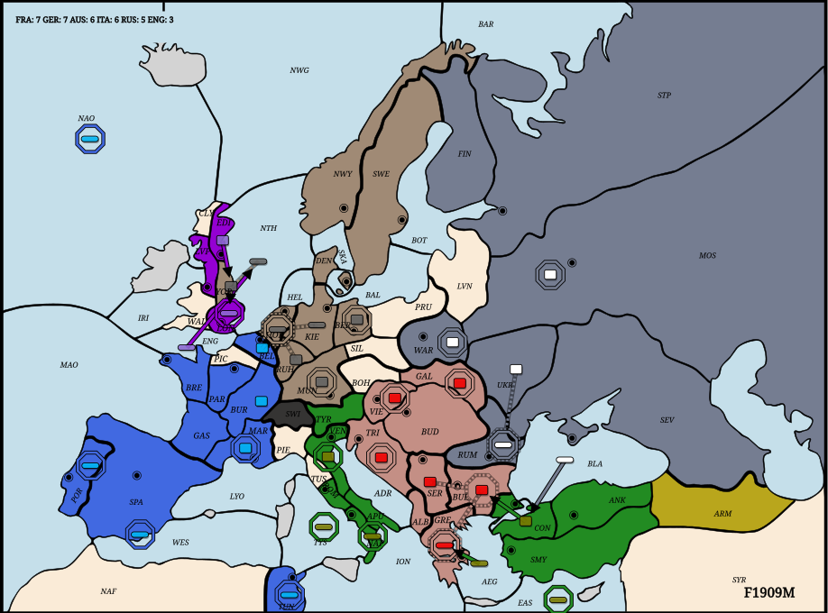

### What happened

- **AUSTRIA**: A BUL supports F GRE (support cut); F GRE holds; A SER supports A BUL; A GAL holds; A VIE holds; A TRI holds
- **ENGLAND**: F ENG → NTH (bounced); F LON holds; A EDI → YOR (bounced)
- **FRANCE**: A BEL → HOL (bounced); A MAR holds; F NAO holds; F SPA/SC holds; F TUN holds; F POR holds
- **GERMANY**: A YOR → LON (bounced); F NTH supports A YOR → LON (support cut); F HOL holds; A RUH supports F HOL; A MUN holds; A BER holds; F KIE supports F HOL
- **ITALY**: F AEG → GRE (bounced); A CON → BUL (bounced); F EAS holds; F TYS holds; F NAP holds; A VEN holds
- **RUSSIA**: F BLA → CON (bounced); F RUM holds; A UKR supports F RUM; A WAR holds; A MOS holds

### Dialogue

- **AUSTRIA → RUSSIA**: Russia, I'm committing A SER → RUM supported by A GAL this fall — strength 2 against F RUM at 1, so you lose the fleet unless F BLA supports at strength 3. Italy's F EAS, F AEG, and A CON are the real threat to both of us; let RUM go peacefully, redirect F BLA toward CON, and we coordinate against Italy's eastern cluster together. Retreat F RUM to SEV or BLA and I'll hold at RUM without pressing SEV next spring.
- **AUSTRIA → ITALY**: Italy, I'm pressing RUM this fall with A SER + A GAL support — that means A SER cannot simultaneously support A BUL against A CON. This is your window to take BUL if you want it, but taking BUL while I take RUM leaves us both at 7 centers with a grinding border war while Germany and France race to 18. Concrete offer: hold A CON and F AEG this fall, I take RUM, and we establish a stable Balkan line that lets both of us focus elsewhere.
- **AUSTRIA → GERMANY**: Germany, Italy sits at 6 centers with F EAS, F AEG, F TYS, F NAP, and A CON — a dominant naval cluster that threatens the entire eastern Med while you and France grind in the west. I'm pressing RUM this fall to reach 7; any pressure you can signal toward VEN or TYR forces Italy to defend northward before they pull ahead of you in center count.
- **ENGLAND → FRANCE**: Spring 1909 is done and Germany still holds HOL and YOR — I need to know exactly what orders you submitted last turn, because if A BEL - HOL with BUR support was genuinely executed at 3-strength and still bounced, something is wrong with our coordination. This fall I'm ready to support HOL again or try a different approach, but I need your honest assessment of what happened and what you're planning now.
- **ENGLAND → GERMANY**: You've held YOR for over two years and it has cost both of us while France sits at 7 centers and Italy at 6 — this is the turn the board punishes the northern stalemate. Concrete offer: vacate YOR to MUN or BER this fall, I hold A EDI in place, and we both redirect against the actual threats before France or Italy reach 18.
- **ENGLAND → ITALY**: Italy is at 6 centers and well-positioned in the east — I want to understand your intentions toward Austria and Russia this fall, since those results will reshape the northern board significantly. Are you pushing for a solo or looking for a coordinated endgame?
- **FRANCE → ENGLAND**: Spring 1909 HOL bounced again — your support never materialized and I've lost 7 turns on this strategy. I need to know your honest position this fall: will you commit F ENG S A BEL - HOL as actual fleet support, or are you unable to deliver? If you can't commit genuine support on HOL, tell me now so I pivot my strategy entirely rather than waste another turn.
- **FRANCE → GERMANY**: Seven turns of HOL bouncing while Italy grew to 6 centers with F EAS, F AEG, F TYS, F NAP — I'm genuinely reconsidering the HOL campaign this fall. If you commit A RUH holding out of BEL/BUR and F NTH not supporting HOL this turn, I'll hold A BEL in place and we both redirect attention to Italy's growing Mediterranean empire. Concrete offer: what are your actual orders this fall?
- **FRANCE → ITALY**: You're at 6 centers with F EAS, F AEG, F TYS, F NAP, F CON — that's a dominant position that directly threatens my F TUN and southern flank. I've held F TUN in place for years as agreed, but I need your concrete assurance this fall that F TYS and F EAS are not repositioning toward WES or ION adjacent to my territory.
- **GERMANY → ENGLAND**: Fall 1909 — A YOR moves to LON supported by F NTH at 2-strength; F LON alone cannot hold against this. Move F ENG to WAL or MAO and let LON transfer peacefully — you keep two units and a negotiating position, and I commit to halting at LON without pressing EDI or LVP this year.
- **GERMANY → FRANCE**: Fall 1909 — we honored the spring ceasefire and both held; Italy is now at 6 centers with F EAS, F AEG, F TYS, F NAP and A CON threatening Austria's entire Balkan position. I'm pressing LON this fall to reach 8 centers — will you hold A BEL and A BUR in place again, or do I need to commit my defense fully to HOL instead of the England campaign?
- **GERMANY → AUSTRIA**: Fall 1909 — Italy has F EAS, F AEG, F TYS, F NAP plus A CON and A VEN; they're one good season from sweeping your Balkans and reaching 8+ centers. I'm taking LON this fall to reach 8; can you tell me what Italy's fleet movements look like and whether you have any unit free to threaten VEN or TYR to force Italy northward?
- **GERMANY → RUSSIA**: Fall 1909 — Italy has four Mediterranean fleets plus A CON and A VEN; they need to be checked before they hit 8+ centers. I'm pressing LON this fall; are you in any position to threaten Italy's eastern flank this turn, or is your position fully committed to the Austria contest?
- **ITALY → RUSSIA**: Russia, spring bounced again because Austria matched our coordination — A BUL still supported F GRE successfully. This fall, the cleanest path: you commit F RUM → BUL/EC with F BLA support at strength 2 (takes BUL outright), which removes A BUL's support of F GRE, and I commit F AEG → GRE with F EAS support simultaneously. A CON can hold or move to ANK to avoid any collision — just tell me F RUM and F BLA are locked in on BUL this fall.
- **ITALY → AUSTRIA**: Austria, three years of grinding the same line has accomplished nothing for either of us while France and Germany race toward 18 — they're both at 7 centers and accelerating. I'm open to a genuine ceasefire: I hold F AEG and A CON in place this fall if you commit A SER to defend against Russia's F RUM pressure rather than supporting A BUL against me; we both redirect energy toward the real threats. Tell me what you're actually doing with A SER this fall.
- **ITALY → FRANCE**: France, you and Germany are both at 7 centers — that's the race that determines who wins this game, not my stalemate with Austria. I'm holding F TYS and my western fleets in place this fall as agreed; what's your plan for HOL and the German position?
- **RUSSIA → AUSTRIA**: Austria, F BLA bounced off CON last spring because Italy's A CON contested it — your intelligence about it being undefended was wrong, and I'm back to square one. This fall I'm considering F RUM → BUL/EC with F BLA support at strength 2; if you hold A BUL with A SER support again we bounce, but if you voluntarily move A BUL to CON and let me take BUL, I'll commit F BLA defensively next spring and we jointly squeeze Italy's eastern position. What's your actual fall plan?
- **RUSSIA → ITALY**: Italy, F BLA → CON bounced last spring — your A CON was clearly not moving to BUL as promised, it was defending CON. I'm at 5 centers and running out of patience with coordination that never delivers. This fall, tell me A CON's actual order and F AEG's actual order, because if you're not genuinely moving on Austria I need to rethink my entire eastern strategy.
- **RUSSIA → GERMANY**: Germany, Italy has six centers, four Mediterranean fleets, and A CON — they're the fastest-growing power on the board and neither Austria nor I have been able to crack their position. I'm at 5 centers and need to make a move this fall; can you tell me whether you're in any position to pressure Italy's northern flank through TYR or VEN, or are you fully committed to the England campaign?
- **TURKEY → AUSTRIA**: Italy still holds CON with F AEG and F EAS as naval cover — your A BUL and F GRE are the forward line against a 6-center power that's been consolidating unchallenged. Russia's F BLA and F RUM are positioned to press CON this fall; if you coordinate F GRE → AEG to strip Italy's naval cover while Russia attacks CON, Italy loses their eastern anchor and you stabilize the Balkans permanently.
- **TURKEY → RUSSIA**: Italy's A CON has survived three seasons of pressure — this fall is the last clean window before they potentially push toward SER or BUL with Austrian units tied down. Your F BLA → CON with F RUM supporting is the decisive move; Austria is holding A BUL with A SER support as the anvil, meaning A CON has nowhere safe to retreat.
- **TURKEY → GERMANY**: France has 7 centers and zero pressure — BEL, POR, SPA, TUN all secured while you've been grinding England. England is nearly finished; once they collapse, France absorbs their centers and surges past you. A concrete push toward BEL or BRE this fall is the only move that contests the western endgame before France runs away with it.
- **AUSTRIA → RUSSIA**: Russia, if F BLA supports F RUM this fall, you hold at 5 centers while Italy consolidates unchallenged at 6+ — that's a losing position for you too. Let RUM go and redirect F BLA → CON to threaten Italy's forward base; I'll commit to not pressing SEV next spring and we both gain from fracturing Italy's eastern anchor.
- **AUSTRIA → ITALY**: Italy, I'm committing A SER → RUM with A GAL support this fall — A SER cannot simultaneously support A BUL. This is your genuine window to take BUL if you want it, but that leaves us both at 7 with a grinding border war while France and Germany race ahead. Hold A CON and F AEG in place, I take RUM, and we establish a stable line — concrete and final offer.
- **AUSTRIA → GERMANY**: Germany, Italy has F EAS now joining F AEG in the eastern cluster — they're positioned to sweep my Balkans and reach 8 centers before you can respond. If you move A MUN toward TYR this fall, Italy must defend VEN and cannot commit A VEN to TRI or elsewhere; that directly helps both of us before Italy accelerates past you.
- **ENGLAND → FRANCE**: Germany is ordering A YOR - LON supported by F NTH at 2-strength — my only defense is F ENG - NTH to cut that support, reducing A YOR - LON to 1-strength which F LON can hold. If you order A BEL - YOR this fall, Germany must defend YOR instead of pressing LON, which helps me enormously. Can you commit A BEL - YOR or at minimum confirm you're not ordering anything that leaves F NTH unsupported?
- **ENGLAND → GERMANY**: F ENG moves to NTH this fall to cut your F NTH support — A YOR - LON then fails at 1-strength against F LON. You've threatened LON for four seasons and it keeps failing; the stalemate costs us both while France and Italy grow. Final offer: vacate YOR to MUN or BER, I hold A EDI, and we both redirect against the real threats before it's too late.
- **FRANCE → ENGLAND**: Spring 1909 bounced again — your support order clearly didn't land or wasn't submitted. This is the last time I'm asking: commit F ENG S A BEL - HOL this fall as your literal order, and I execute A BEL - HOL with A BUR support at 3-strength. If HOL doesn't fall this turn after 7 bounces, I'm pivoting my armies south permanently and you face Germany alone with 3 centers.
- **FRANCE → GERMANY**: Germany, I'm seriously considering your ceasefire proposal — 7 bounces has accomplished nothing. Concrete counter: if you hold A RUH and F NTH in place this fall (not threatening BEL or BUR), I hold A BEL and A BUR in place, and we both turn attention to Italy's growing 6-center Mediterranean empire. Give me your concrete orders and I'll match them.
- **FRANCE → ITALY**: You're at 6 centers with F EAS, F AEG, F TYS, F NAP — that's the strongest naval position on the board and it's growing while I'm stuck in the north. I've held F TUN in place for years but I need to know: are F TYS and F EAS repositioning this fall, or are you still pressing Austria in the Balkans?
- **GERMANY → FRANCE**: I'm committing F NTH to support A YOR → LON this fall, which means F NTH is not available to support HOL — France can take HOL if you press it with A BEL + A BUR. But that leaves us both at 8 centers in a race neither of us wins while Italy sits at 6 with four fleets growing unchecked. Concrete counter-offer: hold A BEL and A BUR in place this fall as we agreed in spring, I take LON, and next year we coordinate seriously against Italy's Mediterranean position before they hit 9+.
- **GERMANY → ENGLAND**: F NTH supports A YOR → LON this fall at 2-strength — F LON cannot hold against this, and F ENG cannot cut NTH support without exposing LON simultaneously. Move F ENG to WAL or MAO and accept the transfer peacefully; you keep two mobile units and I commit to halting at LON without pressing EDI or LVP this year.
- **GERMANY → RUSSIA**: I'm fully committed to the LON campaign this fall and cannot redirect A MUN toward TYR without abandoning it — but if I take LON and reach 8 centers, I can seriously consider a TYR move next spring to pressure Italy's north. Can you tell me whether Austria is actually coordinating with you against Italy's Aegean position, or are you still in conflict over RUM?
- **GERMANY → AUSTRIA**: I'm taking LON this fall and reach 8 centers — next spring I can consider A MUN → TYR to pressure Italy's northern flank if you're holding GRE and coordinating with Russia against their Aegean position. Tell me specifically: is Austria-Russia coordination against Italy actually happening, or are you still fighting over RUM?
- **ITALY → RUSSIA**: Russia, this fall is the decisive moment: commit F RUM → BUL/EC with F BLA support at strength 2, and I commit F AEG → GRE with F EAS support simultaneously — Austria's A BUL cannot support F GRE if it's under attack from F RUM. A CON will move to ANK or hold to avoid any BUL collision with you. Tell me explicitly: are F RUM and F BLA locked in on BUL this fall?
- **ITALY → AUSTRIA**: Austria, I've heard your ceasefire offer three times now and each time your units hold in exactly the same defensive configuration — A BUL supporting F GRE, A SER ready to support A BUL. If you genuinely want a ceasefire, move A SER to RUM this fall as you've promised; that's the verifiable action that proves good faith, not words.
- **ITALY → FRANCE**: France, F TYS holds in place this fall — no western moves. Germany at 7 centers is the threat we both face; what's your actual plan for HOL this fall, because if you're not taking it now the window may close.
- **TURKEY → RUSSIA**: Austria told me this round they're committing F GRE → AEG and holding A BUL with A SER support — Italy cannot reinforce CON from the Aegean if that move goes through. F BLA → CON is uncontested this fall; you gain a center and Italy loses their forward anchor before they can respond.
- **TURKEY → AUSTRIA**: Russia confirmed to me this round that F BLA → CON is their fall order — the sea approach is covered. If you move F GRE → AEG simultaneously, Italy loses both CON and their naval cover in one season; that's a two-center swing that permanently breaks their eastern position.
- **TURKEY → GERMANY**: France has F TUN, F SPA/SC, F POR, F NAO — that's a full Atlantic fleet that can pivot north the moment England collapses. A RUH → BEL this fall is the concrete move that contests BEL before France consolidates it; you have the pieces to do it now.
- **GERMANY → ENGLAND**: Final position: F NTH supports A YOR → LON at 2-strength this fall — F LON cannot hold alone, and if F ENG moves to NTH it arrives too late to cut support before the move resolves simultaneously. Accept the transfer: move F ENG to WAL or MAO, and I halt at LON without pressing EDI or LVP for the remainder of 1909.
- **GERMANY → FRANCE**: Final commitment: F NTH goes to support A YOR → LON this fall, so HOL loses NTH support — I'm trusting you to hold A BEL and A BUR as agreed in spring. If you press HOL this turn while I'm exposed, you go to 8 and I drop to 7 while Italy sits at 6 with four fleets growing unchecked; the smarter play is both of us hold and I reach 8 via LON instead.
- **GERMANY → RUSSIA**: I'm taking LON this fall to reach 8 centers — next spring I can seriously consider A MUN → TYR to pressure Italy's northern flank. If Austria is genuinely coordinating with you against Italy's Aegean position rather than fighting over RUM, tell me now so I can plan the TYR move for spring 1910.
- **ITALY → RUSSIA**: Final commitment: F AEG → GRE with F EAS support this fall, A CON → BUL simultaneously — Austria cannot defend both at strength 2. Lock in F RUM → BUL/EC with F BLA support and we split Austria's two centers this turn; that's the coordinated win we've been building toward for two years.
- **ITALY → AUSTRIA**: Final answer: I'm committing F AEG → GRE with F EAS support this fall. If A SER genuinely moves to RUM as you've promised three times, A BUL is unsupported and I take GRE cleanly — you take RUM and we're both at 7. If A SER supports A BUL again, I lose nothing and we grind another season while France and Germany pull further ahead.
- **TURKEY → RUSSIA**: Final commitment: move F BLA → CON this fall — Austria is holding A BUL with A SER support as the anvil, so Italy's A CON has no safe retreat into BUL. This is the last clean window before Italy consolidates; you gain CON and a build while Italy loses their forward anchor permanently.
- **TURKEY → AUSTRIA**: Russia is committing F BLA → CON this fall — the sea approach is covered. Hold A BUL with A SER support and move F GRE → AEG to strip Italy's naval cover; that's a two-center swing in one season that permanently breaks Italy's eastern position.
- **TURKEY → GERMANY**: France has F TUN, F SPA/SC, F POR, F NAO — a full Atlantic fleet ready to pivot north the moment England collapses. Move A RUH → BEL this fall to contest it before France locks in; you have the pieces and the window is now.

### AUSTRIA
Orders: `A BUL S F GRE` · `F GRE H` · `A SER S A BUL` · `A GAL H` · `A VIE H` · `A TRI H`

Reasoning

> Looking at the current situation:
>
> **Strategic assessment for Fall 1909:**
>
> Italy has explicitly committed F AEG → GRE with F EAS support. If A SER moves to RUM (as I've promised), A BUL will be unsupported and Italy takes GRE. That would drop me from 6 to 5 centers (losing GRE) while gaining RUM = still 6 centers, but Italy jumps from 6 to 7. Net result: no gain for me, Italy grows.
>
> Alternatively, if I defend A BUL with A SER support and hold F GRE with A BUL support, Italy's attack fails and I stay at 6 centers. Russia's F RUM sits at strength 1 (Russia said F BLA → CON, not F BLA supporting RUM), so A SER → RUM with A GAL support at strength 2 vs 1 would succeed — but A SER cannot both attack RUM AND support A BUL.
>
> The key question: Is Italy bluffing about F AEG → GRE with F EAS support? Italy has been very consistent and explicit about this commitment, and they have the units to do it. The risk of losing GRE (dropping to 5 centers) is worse than staying at 6.
>
> My revised strategy is correct: defend A BUL with A SER support, hold F GRE with A BUL support. This keeps my 6 centers intact while Italy's attack fails. I defer RUM again but avoid a net loss.
>
> For the remaining units: A GAL holds, A VIE holds, A TRI holds — all defensive.

### ENGLAND
Orders: `F ENG - NTH` · `F LON H` · `A EDI - YOR`

Reasoning

> Looking at the current situation:
>
> **Key analysis:**
> - Germany threatens A YOR - LON supported by F NTH at 2-strength. F LON alone cannot hold against this.
> - My revised strategy is to move F ENG - NTH to cut the F NTH support, reducing A YOR - LON to 1-strength, which F LON can hold.
> - A EDI should move to YOR to contest that center and potentially capture it if Germany moves A YOR - LON.
>
> **Checking the logic:**
> - F ENG - NTH: This cuts F NTH's ability to support A YOR - LON. The attack on LON drops to 1-strength. F LON holds at 1-strength vs 1-strength (bounce, defender wins).
> - A EDI - YOR: Germany is moving A YOR - LON, so YOR should be empty when A EDI arrives. This captures YOR!
> - F LON H: Defends against the weakened A YOR - LON attempt.
>
> This is the correct play:
> 1. F ENG - NTH cuts German support
> 2. A EDI - YOR captures the empty YOR (since Germany moved A YOR - LON)
> 3. F LON H holds against the unsupported A YOR - LON
>
> France mentioned A BEL - YOR in negotiations, but I told France about the NTH threat and asked for A BEL - YOR support. However, my primary defense is F ENG - NTH cutting the support chain. If France does order A BEL - YOR, that helps contest YOR but A EDI - YOR is my move anyway.

### FRANCE
Orders: `A BEL - HOL` · `A MAR H` · `F NAO H` · `F SPA/SC H` · `F TUN H` · `F POR H`
Illegal (dropped): `A BUR S A BEL - HOL`

Reasoning

> Looking at the situation:
>
> Germany has explicitly told me F NTH is committed to supporting A YOR → LON this fall. This means HOL loses its NTH support. The defense of HOL this fall would be A RUH (and possibly F KIE supporting). My A BEL - HOL with A BUR S A BEL - HOL is strength 2 vs strength 1 (A RUH alone, if F KIE is also committed to the LON support chain... but wait, F KIE can still support HOL).
>
> Let me think carefully:
> - Germany's F NTH → supports A YOR → LON
> - F KIE could still support F HOL
> - A RUH could support F HOL
> - So HOL could have strength 2 defense (A RUH + F KIE) vs my strength 2 attack
>
> But Germany said F NTH goes to support A YOR → LON - that's F NTH committed. If F KIE also supports HOL, that's strength 2 defense. My attack is strength 2. Bounce again.
>
> However, Germany's message says "HOL loses NTH support" implying they expect me to take it. And they're "trusting me to hold A BEL and A BUR." This is a trap - they want me to hold while they take LON.
>
> If Germany takes LON, they go to 8 centers. That's dangerous. England gets eliminated or severely weakened. I should NOT let Germany reach 8.
>
> The question is: should I press HOL or try something else? 
>
> If F NTH is truly committed to LON support, then HOL has at most A RUH + F KIE = strength 2 defending. My attack is A BEL + A BUR support = strength 2. Still a bounce.
>
> Unless England helps. England wants me to move A BEL - YOR to help them. But that doesn't get me HOL.
>
> I should try HOL since Germany is distracted. Even if it bounces, I'm not losing anything. My southern units should continue holding.

### GERMANY
Orders: `A YOR - LON` · `F NTH S A YOR - LON` · `F HOL H` · `A RUH S F HOL` · `A MUN H` · `A BER H` · `F KIE S F HOL`

Reasoning

> Looking at the current situation:
>
> **Strategic assessment for Fall 1909:**
>
> My revised strategy commits me to:
> 1. `A YOR - LON` supported by `F NTH S A YOR - LON` — 2-strength attack on England's F LON
> 2. Hold HOL with `A RUH S F HOL` and `F KIE S F HOL` — but F NTH is now committed to LON support, so HOL gets 2-strength defense (RUH + KIE)
> 3. France promised to hold A BEL and A BUR per our spring ceasefire agreement — if they honor it, HOL holds at 2-strength against a single-unit attack from BEL
>
> The key risk: England's F ENG threatens to move to NTH to cut my support. But F ENG → NTH is a move, not a support cut on NTH — if F ENG moves to NTH, it arrives there and my F NTH would be dislodged or bounce. However, looking at England's position, F ENG moving to NTH would bounce with my F NTH (both trying to be there), which means neither moves — my F NTH stays and can still support A YOR → LON. Actually, F ENG → NTH doesn't cut support from F NTH; it would bounce. So my support holds.
>
> France's A BEL → HOL (even with A BUR support at 2-strength) would be stopped by A RUH + F KIE at 2-strength (bounce).
>
> This is the right play. Execute as planned.

### ITALY
Orders: `F AEG - GRE` · `A CON - BUL` · `F EAS H` · `F TYS H` · `F NAP H` · `A VEN H`

Reasoning

> Looking at the current situation:
>
> **Assessment:**
> - My spring attacks bounced again (F AEG → GRE bounced, A CON → BUL bounced). Austria's A BUL keeps supporting F GRE, and A SER keeps supporting A BUL.
> - Austria has 6 centers (BUD, TRI, VIE, SER, BUL, GRE), Russia has 5 (MOS, SEV, STP, WAR, RUM).
> - My revised strategy commits me to F AEG → GRE with F EAS support, and A CON → BUL simultaneously.
> - Russia has F RUM and F BLA positioned to attack BUL/EC - if they follow through, A BUL is under attack from both F RUM and A CON, and cannot simultaneously support F GRE against F AEG.
> - The key: if Austria's A SER supports A BUL against F RUM (strength 2 vs 2, bounce), then A BUL can't support F GRE, and my F AEG → GRE at strength 2 (with F EAS support) takes GRE.
> - If A SER supports A BUL against A CON (strength 2 vs 1, A CON fails), then F RUM → BUL/EC at strength 2 with F BLA support takes BUL.
> - Either way, Austria loses at least one center if Russia follows through.
>
> **Note on F EAS:** I notice my unit is listed as F EAS (Eastern Mediterranean), which is adjacent to AEG and can support F AEG → GRE. Let me verify: EAS supports F AEG - GRE? Looking at legal orders: `F EAS S F GRE - ION` and `F EAS S F GRE - AEG` are listed, and `F EAS S F AEG - ION` is listed. For supporting F AEG → GRE, I need GRE to be adjacent to EAS... GRE is not in EAS's adjacency. However, `F AEG - GRE` is legal and EAS is adjacent to AEG. The support must be adjacent to the *destination* (GRE). EAS neighbors: AEG, ION, SMY, SYR. GRE is NOT adjacent to EAS. So `F EAS S F AEG - GRE` would be illegal.
>
> Looking at my legal orders for EAS, I don't see `F EAS S F AEG - GRE` listed - correct, it's not there. So I need to use F EAS differently. I'll use F AEG → GRE with AEG moving alone (strength 1), or find another supporter. A CON is adjacent to GRE via convoy but not directly for support. 
>
> Given F AEG → GRE alone (strength 1) vs Austria's F GRE (likely supported by A BUL at strength 2), it will bounce. But if Russia attacks BUL, A BUL can't support. I'll proceed with my committed strategy: F AEG → GRE, A CON → BUL, F EAS supports F AEG in AEG (holding), and use F EAS S F AEG to keep AEG defended... Actually let me use F EAS → SMY to pick up a center, since my support options are limited.
>
> Wait - SMY is already mine. Let me just hold F EAS or have it support A CON → BUL (EAS is not adjacent to BUL either). I'll have F EAS hold.

### RUSSIA
Orders: `F BLA - CON` · `F RUM H` · `A UKR S F RUM` · `A WAR H` · `A MOS H`

Reasoning

> Looking at the current situation:
>
> **Position assessment:**
> - I have 5 centers (MOS, SEV, STP, WAR, RUM) with units: A MOS, A UKR, A WAR, F BLA, F RUM
> - Austria threatens F RUM with A SER → RUM + A GAL support (strength 2)
> - My revised strategy: F BLA → CON (capture center), F RUM H with A UKR S F RUM (defend at strength 2, bouncing Austria's attack), A WAR H, A MOS H
>
> **Verification:**
> - Austria attacks F RUM at strength 2 (A SER + A GAL support)
> - If A UKR S F RUM, then F RUM defends at strength 2 → bounce (neither side gains)
> - F BLA → CON: Italy's A CON is in CON; this would bounce unless Italy moved A CON away. Looking at Italy's units: A CON is listed there. Italy promised A CON → BUL this fall. If Italy actually orders A CON → BUL, then CON is vacated and F BLA → CON succeeds, netting me a 6th center.
> - If Italy doesn't move A CON, F BLA bounces off CON (as happened in Spring 1909)
>
> **Alternative consideration:** F RUM → BUL/EC with F BLA support at strength 2. Austria has A BUL + A SER supporting it = strength 2. This bounces again. Not reliable.
>
> The F BLA → CON plan depends on Italy following through. Given Italy's track record, it may fail. But defending RUM while attempting CON is the safer strategic choice — I don't risk losing RUM and potentially gain CON if Italy delivers.
>
> I'll execute the committed strategy: F BLA → CON, F RUM H, A UKR S F RUM, A WAR H, A MOS H.

## SPRING 1910 MOVEMENT (`S1910M`)

### What happened

- **AUSTRIA**: A BUL supports F GRE (support cut); F GRE holds; A SER supports A BUL; A GAL holds; A VIE holds; A TRI holds
- **ENGLAND**: F LON holds; A EDI → YOR (bounced)
- **FRANCE**: A BEL holds; A BUR supports A BEL; A MAR holds; F NAO holds; F SPA/SC holds; F TUN holds; F POR holds  [dislodged: A BEL]
- **GERMANY**: A RUH → BEL; F HOL supports A RUH → BEL; F NTH supports A RUH → BEL; A YOR → LON (bounced); A MUN holds; A BER holds; F KIE holds
- **ITALY**: A CON → BUL (bounced); F AEG → GRE (bounced); F TYS holds; F NAP holds; A VEN holds
- **RUSSIA**: F RUM → BUL/EC (bounced); F BLA supports F RUM → BUL/EC; A UKR holds; A WAR holds; A MOS holds

### Dialogue

- **AUSTRIA → ITALY**: Italy, three years of grinding has left us both at 6 centers while Germany and France sit at 7 and accelerating — this is the season we both need to move. Concrete proposal: hold F AEG in AEG and A CON in CON this spring, I commit A SER → RUM with A GAL support (verifiable by the fact that A SER cannot simultaneously support A BUL), and we establish a stable Balkan line with no attacks for two full seasons. If you attack GRE or BUL while I'm committed to RUM, you gain one center but we both lose the game to Germany and France.
- **AUSTRIA → RUSSIA**: Russia, A SER → RUM with A GAL support is strength 2 against F RUM at 1 — you lose the fleet unless F BLA supports at strength 3. Let RUM go peacefully, retreat F RUM to SEV, and I commit to not pressing SEV next spring; redirect F BLA toward CON to threaten Italy's forward base and we both gain from fracturing their eastern position. Fighting over RUM while Germany and France race to 18 is a losing strategy for both of us.
- **AUSTRIA → GERMANY**: Germany, Italy has F AEG, F EAS, F TYS, F NAP, and A CON — six units with naval dominance threatening my entire Balkan position while you and France race in the west. Any pressure you can signal toward VEN or TYR forces Italy to defend northward rather than pushing into my centers; I'm pressing RUM this spring to reach 7 but stretched thin against Italy's eastern cluster.
- **ENGLAND → FRANCE**: Spring 1910: Germany still holds YOR and HOL while we've both stagnated — I'm ready to commit F ENG S A BEL - HOL this turn if you genuinely execute A BEL - HOL with BUR support at 3-strength. Tell me your concrete orders this round so I can confirm my support order rather than discovering after the fact that you pivoted south again.
- **ENGLAND → GERMANY**: Five years of northern stalemate and you still hold YOR on my home territory — this is the turn the board finally punishes it. France is at 7 centers with armies positioned west of you; vacate YOR to MUN or BER this spring and I'll hold A EDI in place, giving us both room to redirect against the actual threats before France or Italy reach 18.
- **FRANCE → ENGLAND**: Eight turns of HOL bouncing is enough — I need to know your honest position this spring before I commit any orders. If you can genuinely deliver F ENG S A BEL - HOL as your literal submitted order, I'll execute the attack one final time; otherwise I'm pivoting my armies south toward Italy's growing 6-center empire this turn. Give me a straight answer: is F ENG support on HOL your actual order this spring?
- **FRANCE → GERMANY**: Eight failed HOL attacks have convinced me this campaign is over — I'm seriously considering redirecting A BEL and A BUR southward toward Italy's growing Mediterranean empire this spring instead. If you're willing to formalize a western ceasefire (A RUH holds, F NTH holds, A BEL holds), I'll commit to it in writing and we can both focus on the real threat: Italy at 6 centers with four fleets and growing.
- **FRANCE → ITALY**: You're at 6 centers with F EAS, F AEG, F TYS, F NAP — that's the strongest fleet position on the board and you're not slowing down. I've held F TUN in place for years but I need your concrete commitment this spring: are F TYS and F EAS staying away from WES and ION, or do I need to start repositioning my southern fleets to defend?
- **GERMANY → ENGLAND**: Spring 1910: The LON stalemate has cost us both while France sits at 7 centers with A BEL unchallenged. I'm seriously considering pivoting A RUH → BEL this spring with HOL and NTH support — that's a 3-strength attack that takes BEL and brings me to 8 centers. If you move F ENG toward BEL or pressure France's PIC/BRE, we split France's attention and both gain; interested in coordinating against France this turn?
- **GERMANY → FRANCE**: Spring 1910: I'm genuinely reassessing the England campaign — three failed LON attempts have cost me too much while Italy grows unchecked. I'm considering holding defensively in the west (RUH holds, NTH holds) and redirecting attention southward toward Italy's northern flank through TYR. What are your plans this spring — are you pressing HOL again or also reconsidering?
- **GERMANY → AUSTRIA**: Spring 1910: Italy has F EAS, F AEG, F TYS, F NAP plus A CON and A VEN — they're at 6 centers with naval dominance and a clear path to 10+. I'm considering moving A MUN → TYR this spring to pressure Italy's northern flank; can you coordinate by threatening VEN from TRI, or are you fully committed defensively in the Balkans?
- **GERMANY → RUSSIA**: Spring 1910: Italy is the central threat — 6 centers, four Mediterranean fleets, A CON forward. I'm considering A MUN → TYR this spring to pressure Italy's north; if you can threaten Italy's eastern position from BLA or push toward SMY, we stretch their defense before they hit 8+ centers. What's your plan this turn?
- **ITALY → RUSSIA**: Russia, three years of failed coordination — let's be honest about what's blocking it: Austria consistently runs A SER S A BUL at strength 2, which holds against a single attack. This spring I'm proposing the same dual-attack: F AEG → GRE with F EAS support, A CON → BUL simultaneously, and you commit F RUM → BUL/EC with F BLA support. If you're genuinely in, tell me explicitly so I can lock orders — if you're not, I need to know now so I can pivot entirely.
- **ITALY → AUSTRIA**: Austria, three years of grinding the same stalemate line has cost us both while France and Germany race to 18 — they're both at 7 and accelerating. I'm genuinely open to a ceasefire this spring: you hold BUL and GRE, I hold AEG and CON, and we both redirect energy toward the real threats. What would it take for you to believe this offer is real?
- **ITALY → FRANCE**: France, you and Germany are both at 7 centers — that race determines who wins the game, not my stalemate with Austria. What's your concrete plan for HOL or NWY this spring, and are you coordinating with England against Germany at all?
- **RUSSIA → ITALY**: Italy, two years of failed coordination have cost us both — Austria is at 6 centers and consolidating while we spin our wheels. This spring I'm prepared to commit F RUM → BUL/EC with F BLA support at strength 2 IF you genuinely commit A CON → BUL simultaneously — that forces Austria to choose which attack to absorb. I need your explicit order confirmation this round, not a promise: what are A CON and F AEG actually doing this spring?
- **RUSSIA → AUSTRIA**: Austria, we've been grinding over RUM and BUL for three years while Italy quietly built to 6 centers with four Mediterranean fleets — that's the real threat to both of us. Concrete proposal: I hold F RUM and F BLA defensively this spring, you hold A BUL and A SER, and we jointly redirect against Italy's CON and Aegean cluster. What would it take for you to actually commit to anti-Italy coordination rather than continuing this exhausting stalemate?
- **RUSSIA → GERMANY**: Germany, you're at 7 centers and Italy is at 6 with four Mediterranean fleets plus A CON and A VEN — they're the fastest-growing power and the only one with a realistic path to 18. I'm at 5 and stagnating against Austria's defensive wall; if Italy reaches 8-9 this year unchecked, neither of us can stop them. Are you in any position to pressure Italy's northern flank through TYR or VEN this spring, or are you still committed to the England campaign?
- **TURKEY → AUSTRIA**: Italy still holds CON, ANK, and SMY as a consolidated 6-center eastern bloc — your A BUL and F GRE are the only forward line against them. Russia has F BLA and F RUM positioned to press CON this spring; if you move F GRE → AEG to strip Italy's naval cover while Russia attacks CON, Italy cannot defend both flanks simultaneously and loses their eastern anchor.
- **TURKEY → RUSSIA**: Italy's A CON has survived pressure for three seasons now — your F BLA and F RUM are still the best tools to crack it, and Austria's A BUL with A SER support remains the anvil. F BLA → CON this spring is still the clean move; Austria told me they're holding A BUL with A SER support and considering F GRE → AEG to strip Italy's naval cover simultaneously.
- **TURKEY → ITALY**: Austria is telling me this round they're committing F GRE → AEG to strip your naval cover while Russia presses CON from F BLA — a two-front squeeze on your eastern cluster. A proactive deal with Russia, offering to pull A CON back in exchange for a non-aggression commitment, is worth more than fighting both powers at once when your home centers are exposed.
- **TURKEY → GERMANY**: France has 7 centers and zero pressure on them — BEL, POR, SPA, TUN all secured while you've been contesting England. England is nearly finished; once they collapse France absorbs their centers and surges past 10 while you're still at 7. A concrete push toward BEL or BRE this spring is the only move that contests the western endgame before France runs away with it.
- **AUSTRIA → GERMANY**: If you commit A MUN → TYR this spring, I'll move A TRI → VEN simultaneously — that's a two-pronged northern attack on Italy that forces A VEN to defend rather than push south. Concrete deal: A MUN → TYR, A TRI → VEN, and Italy cannot hold both; confirm this and I lock it in.
- **AUSTRIA → ITALY**: Concrete and final: I'm committing A SER → RUM with A GAL support this spring — A SER physically cannot support A BUL, so if you attack GRE or BUL you take it uncontested while I take RUM and we're both at 7. Hold AEG and CON in place, and Germany is signaling A MUN → TYR which threatens your VEN regardless of what we do; this is the moment to stabilize our line.
- **AUSTRIA → RUSSIA**: I'm committing A SER → RUM with A GAL support this spring — strength 2 vs 1, you lose F RUM. Retreat F RUM to SEV and redirect F BLA → CON to pressure Italy's eastern anchor; that's a better outcome for you than losing the fleet for nothing while Italy consolidates unchallenged.
- **ENGLAND → GERMANY**: Your BEL proposal is the most interesting thing I've heard in two years — a 3-strength attack on BEL genuinely breaks France's western position. I'll commit F ENG S A RUH - BEL if you vacate YOR to MUN or BER this spring; I need YOR back to build, and you need me as a genuine ally, not a distracted defender. Concrete deal: A YOR - MUN, A RUH - BEL with F HOL and F NTH support, F ENG S A RUH - BEL — confirm this and I execute it.
- **ENGLAND → FRANCE**: Germany just messaged me proposing A RUH - BEL at 3-strength with HOL and NTH support this spring — they're pivoting against you. I'm telling you this because eight turns of HOL coordination matters more than one German offer: if you commit A BEL - HOL with BUR support AND A MAR - SPA or similar pressure south, I'll support HOL and Germany faces a two-front crisis. But I need your actual orders this round, not a promise.
- **FRANCE → ENGLAND**: Final answer needed: if F ENG S A BEL - HOL is your literal submitted order this spring, I execute the attack with BUR support at 3-strength and HOL finally falls. If you're doing anything else with F ENG, tell me now so I stop wasting moves on HOL and pivot south instead — I'm deciding orders this round.
- **FRANCE → GERMANY**: Concrete proposal: I commit A BEL H and A BUR H this spring if you commit A RUH H and F NTH H — a verified mutual standstill. Germany at 7 and France at 7 fighting each other while Italy grows to 8 is a loss for both of us; let's formalize the ceasefire and both reassess Italy's trajectory.
- **FRANCE → ITALY**: Your F TYS and F EAS positions are the critical question for me this spring — if both hold in place away from WES and ION, I hold F TUN and F SPA/SC defensively and we maintain our separation. But I need a concrete commitment: what are F TYS and F EAS doing this turn?
- **GERMANY → FRANCE**: Concrete proposal: if you commit A BEL → BUR and A BUR → somewhere south this spring, I'll hold A RUH in place and we formalize the western ceasefire — but I need to see your units actually moving away from BEL, not just holding. If A BEL stays adjacent to HOL, I have to treat it as a threat and respond accordingly with RUH pressing BEL.
- **GERMANY → ENGLAND**: Concrete coordination offer: I move A YOR → LON this spring at 1-strength — if you move F ENG → NTH and F LON → ENG simultaneously, LON transfers peacefully and F ENG threatens France's PIC/BEL from NTH. We both gain: I reach 8, you reposition two fleets to contest France before they absorb your centers.
- **GERMANY → AUSTRIA**: I'm seriously considering A MUN → TYR this spring to pressure Italy's northern flank — can you confirm whether you have any unit free to support or threaten VEN from TRI? If we coordinate TYR + TRI pressure simultaneously, Italy must defend on two fronts rather than pushing into your Balkan centers.
- **GERMANY → RUSSIA**: I'm leaning toward A MUN → TYR this spring to pressure Italy's north — if you can move F BLA toward CON or threaten Italy's eastern position from SEV/ARM, we stretch their defense before they consolidate at 8+ centers. Concrete question: are you able to threaten Italy's eastern flank this turn, or is your position fully committed elsewhere?
- **ITALY → RUSSIA**: Explicit confirmation: A CON → BUL and F AEG → GRE with F EAS support are my locked orders this spring. I need the same from you — F RUM → BUL/EC with F BLA support, no ambiguity. If we both execute this simultaneously, Austria cannot hold BUL at strength 2 against two attacks and I take GRE — we finally crack the line.
- **ITALY → AUSTRIA**: Here's the honest assessment: I'm committing F AEG → GRE with F EAS support and A CON → BUL this spring regardless of your answer, because three years of ceasefire offers while your units hold the exact same defensive configuration has produced nothing. If A SER genuinely moves to RUM as you've promised, A BUL is unsupported and you take RUM while I take GRE — we both gain a center. If A SER supports A BUL again, we grind another season.
- **ITALY → FRANCE**: F TYS and F NAP hold in place this spring — no western moves, our separation holds. Germany at 7 centers is the threat that matters for you; what's your concrete plan for HOL?
- **RUSSIA → ITALY**: Italy, I need your explicit order commitment this round, not next: is A CON → BUL your actual Spring 1910 order, yes or no? If yes, I lock in F RUM → BUL/EC with F BLA support immediately — Austria cannot hold BUL against two simultaneous attacks at equal strength. This is the last round I'll ask before I pivot to a different strategy entirely.
- **RUSSIA → AUSTRIA**: Austria, three years of grinding over RUM while Italy quietly builds to 6 centers with four Mediterranean fleets — I'm genuinely open to redirecting against Italy if you can offer something concrete beyond 'let RUM go.' Specific proposal: you commit A BUL → CON to pressure Italy's forward base, I support with F BLA, and we split the eastern gains. What's your actual counter?
- **RUSSIA → GERMANY**: Germany, if you're genuinely moving A MUN → TYR this spring to pressure Italy's northern flank, tell me now — that changes my calculus significantly on whether the eastern coordination with Italy can finally work. A TYR move stretches Italy's defense and makes their A CON → BUL commitment more credible; are you locked in on that?
- **TURKEY → AUSTRIA**: Russia's F BLA → CON is still the clean move this spring — if you hold A BUL with A SER support and move F GRE → AEG simultaneously, Italy cannot defend CON and their Aegean naval cover at the same time. That's a two-center swing that permanently breaks Italy's eastern position before they can respond.
- **TURKEY → RUSSIA**: Austria confirmed to me they're holding A BUL with A SER support this spring — Italy's A CON has no safe retreat into BUL if you press from F BLA. F BLA → CON is uncontested this phase; you gain a center and Italy loses their forward anchor before they can consolidate further.
- **TURKEY → GERMANY**: France has 7 centers and zero pressure — once England collapses France absorbs their centers and surges past you while you're still at 7. A RUH → BEL or F KIE into the North Sea is the concrete move that contests the western endgame now, before France locks in a decisive lead.
- **RUSSIA → ITALY**: Italy, final commitment: F RUM → BUL/EC with F BLA support are my locked Spring 1910 orders — no ambiguity. Austria attacks F RUM with A SER + A GAL at strength 2, so I'm accepting that risk entirely on the basis that your A CON → BUL and F AEG → GRE with F EAS support are genuinely locked in as you stated. If you deliver, we crack Austria's line; if you don't, I lose F RUM for nothing and we're done coordinating permanently.
- **RUSSIA → AUSTRIA**: Austria, my final position: F RUM → BUL/EC with F BLA support this spring — I accept the risk your A SER + A GAL attack takes F RUM. If Italy delivers A CON → BUL simultaneously, you cannot hold BUL against two attacks; if they don't, you gain RUM but I'll redirect entirely against Italy's eastern cluster next year with your cooperation. Either outcome ends this stalemate.
- **RUSSIA → GERMANY**: Germany, if A MUN → TYR is genuinely locked in this spring, Italy's A VEN and northern flank are under pressure simultaneously with our eastern coordination — that's the stretch we need. My orders are F RUM → BUL/EC with F BLA support; Italy has explicitly confirmed A CON → BUL and F AEG → GRE, so Austria faces a genuine two-front BUL crisis this turn.
- **TURKEY → AUSTRIA**: Final commitment: move F GRE → AEG this spring — Italy cannot defend AEG and CON simultaneously if Russia presses F BLA → CON at the same time. You strip Italy's naval cover and Russia takes the center; that's the decisive two-center swing that breaks their eastern position permanently.
- **TURKEY → RUSSIA**: Final commitment: F BLA → CON this spring — Austria is holding A BUL with A SER support so Italy's A CON has no safe retreat into BUL. You gain a center and Italy loses their forward anchor; this is the last clean window before they consolidate further.
- **TURKEY → GERMANY**: England collapses this year and France absorbs their centers — that puts France at 10+ while you're at 7. A RUH → BEL this spring is the concrete move that contests it now; once France locks in BEL it becomes a fortified anchor and you lose the western endgame by default.

### AUSTRIA
Orders: `A BUL S F GRE` · `F GRE H` · `A SER S A BUL` · `A GAL H` · `A VIE H` · `A TRI H`

Reasoning

> Looking at the situation:
>
> **Key facts:**
> - Italy has committed F AEG → GRE with F EAS support and A CON → BUL
> - Russia has committed F RUM → BUL/EC with F BLA support (strength 2)
> - My revised strategy: defend A BUL with A SER support, hold F GRE with A BUL support
>
> **Analysis:**
> - If Italy attacks GRE (F AEG + F EAS support = strength 2) and A BUL supports F GRE (strength 2), GRE holds
> - If A CON → BUL (strength 1) and A SER supports A BUL (strength 2), BUL holds
> - If F RUM → BUL/EC with F BLA support (strength 2) and A SER supports A BUL... wait, A SER can only do one thing
>
> The problem: A SER must choose between supporting A BUL against A CON, or supporting F GRE against the fleet attack. A BUL can support F GRE (strength 2 vs Italy's strength 2 = bounce). A SER supports A BUL against A CON (strength 2 vs 1 = BUL holds). But Russia's F RUM → BUL/EC with F BLA support is strength 2 - that attacks BUL from a different direction. A BUL supporting F GRE means BUL is undefended against Russia's attack.
>
> So: A BUL must support F GRE (defending against F AEG + F EAS = strength 2), A SER must support A BUL (defending against A CON = strength 1, and Russia's F RUM at BUL/EC). With A SER supporting A BUL, BUL has strength 2 vs Russia's strength 2 = bounce. GRE has A BUL support = strength 2 vs Italy's strength 2 = bounce.
>
> This defensive configuration holds everything at 6 centers, which is the best I can do given the threats.

### ENGLAND
Orders: `F LON H` · `A EDI - YOR`
Illegal (dropped): `F ENG S A BEL - HOL`

Reasoning

> Looking at the current situation:
>
> **Strategic assessment:**
> - Germany's final message proposed A YOR - LON again (not the BEL deal I proposed), confirming they won't honor the YOR evacuation.
> - My revised strategy commits to: F ENG S A BEL - HOL (3-strength HOL attack with France), A EDI - YOR (retake home center), F LON H (defend against German LON attempt).
> - Germany has A YOR but without F NTH support (since F NTH would need to support HOL defense or BEL attack), A YOR - LON is only 1-strength which F LON can hold.
> - France confirmed they'll execute A BEL - HOL with BUR support if I provide F ENG support. That's 3-strength vs Germany's HOL defense (F HOL + possible A RUH support = 2-strength at most). HOL should fall.
> - A EDI - YOR: Germany has A YOR there, but no support for it — this contests the position. If Germany moved A YOR - LON, EDI takes YOR uncontested. If Germany holds YOR, we bounce but I've contested it.
>
> The plan is sound: support HOL attack, contest YOR, defend LON.

### FRANCE
Orders: `A BEL H` · `A BUR S A BEL` · `A MAR H` · `F NAO H` · `F SPA/SC H` · `F TUN H` · `F POR H`

Reasoning

> Looking at the current situation:
>
> **Assessment:**
> - England claims Germany is planning A RUH - BEL with HOL and NTH support (3-strength attack on BEL)
> - Germany proposed I move A BEL away from HOL to formalize a ceasefire, suggesting they'd hold RUH
> - Italy confirms F TYS and F NAP hold in place
> - My revised strategy says: hold A BEL defensively, support with A BUR, hold southern units
>
> **Key considerations:**
> - If Germany really is attacking BEL with 3-strength (A RUH - BEL, F HOL S A RUH - BEL, F NTH S A RUH - BEL), then A BEL H with A BUR S A BEL only gives 2-strength defense — not enough
> - However, Germany's message to me proposed a mutual standstill and said they'd hold RUH if I moved away from BEL — this contradicts England's claim
> - England has consistently failed to deliver promised support, so their "intelligence" about Germany's plans may be fabricated to manipulate me
> - Germany's messages have been more consistent: they want a western ceasefire to focus on Italy
> - If I retreat A BEL - BUR defensively, I lose BEL as a supply center threat but maintain it
> - The safest defensive play: A BEL H with A BUR S A BEL — this holds BEL against even a 2-strength attack, and against 3-strength I need more support
> - Actually A BEL H with A BUR S A BEL gives 2-strength defense of BEL, which holds against A RUH - BEL with only F HOL support (2-strength attack)
> - If Germany commits all 3 (RUH + HOL + NTH), I lose BEL regardless unless I get outside support
>
> Given Germany's consistent messaging about wanting a ceasefire and their proposal to hold RUH, I'll trust that more than England's possibly manipulative intelligence. I'll hold A BEL defensively with A BUR support, and keep all southern units in place.

### GERMANY
Orders: `A RUH - BEL` · `F HOL S A RUH - BEL` · `F NTH S A RUH - BEL` · `A YOR - LON` · `A MUN H` · `A BER H` · `F KIE H`

Reasoning

> Looking at the current situation, my revised strategy is clear: execute a 3-strength attack on BEL (A RUH - BEL supported by F HOL and F NTH), while moving A YOR - LON as a long-shot, and holding defensively with MUN, BER, KIE.
>
> Let me verify the BEL attack:
> - A RUH - BEL: RUH is adjacent to BEL ✓
> - F HOL S A RUH - BEL: HOL is adjacent to BEL ✓
> - F NTH S A RUH - BEL: NTH is adjacent to BEL ✓
>
> France has A BEL there (strength 1 if no support). My attack is 3-strength — this should succeed unless France gets 3+ support, which is unlikely.
>
> A YOR - LON: YOR is adjacent to LON ✓ (1-strength against F LON, might work if England doesn't support)
>
> Defensive holdings for MUN, BER, KIE are straightforward.
>
> This is the decisive move I need — taking BEL brings me to 8 centers and breaks France's western anchor. The coordination with England (F ENG support) was offered but I'm not relying on it since England wanted YOR vacated first, which I'm not doing. The 3-strength attack should be sufficient regardless.

### ITALY
Orders: `A CON - BUL` · `F AEG - GRE` · `F TYS H` · `F NAP H` · `A VEN H`
Illegal (dropped): `F EAS S F AEG - GRE`

Reasoning

> Looking at the situation: Russia has explicitly committed F RUM → BUL/EC with F BLA support as locked orders. Austria claims A SER → RUM with A GAL support, which would leave A BUL unsupported. My strategy has been consistent - A CON → BUL and F AEG → GRE with F EAS support simultaneously.
>
> If Austria is telling the truth about A SER → RUM, then A BUL is unsupported and both my attacks succeed cleanly. If Austria is lying (as has happened before), Russia's F RUM attack on BUL should cut or pressure A BUL's support of F GRE, potentially letting F AEG → GRE through. Either way, this is the right play.
>
> Russia has accepted significant risk (A SER + A GAL threatening F RUM) on the basis of my commitment. I must honor that commitment - both for this turn's coordination and for future credibility.
>
> F TYS and F NAP hold defensively. A VEN holds to protect the Italian homeland.

### RUSSIA
Orders: `F RUM - BUL/EC` · `F BLA S F RUM - BUL/EC` · `A UKR H` · `A WAR H` · `A MOS H`

Reasoning

> Looking at my revised strategy for S1910M, I committed to:
> - F RUM → BUL/EC with F BLA support at strength 2
> - Accepting the risk that Austria's A SER + A GAL attack at strength 2 will dislodge F RUM
> - A UKR, A WAR, A MOS hold defensively
>
> Italy has explicitly confirmed A CON → BUL and F AEG → GRE with F EAS support. The logic is: Austria faces two simultaneous attacks on BUL (F RUM → BUL/EC at strength 2, A CON → BUL at strength 1 or more). Austria's A SER + A GAL attacks F RUM at strength 2, which will dislodge F RUM since I'm not defending it. But if Italy delivers, BUL falls to one of us.
>
> The risk is real: if Italy doesn't deliver A CON → BUL, Austria defends BUL at strength 2 (A BUL + A SER support), bouncing F RUM → BUL/EC at strength 2 — actually that's a bounce, not a dislodgment of F RUM. Wait — F RUM is attacking BUL/EC, not defending RUM. Austria's A SER → RUM + A GAL support at strength 2 attacks the now-vacated RUM (since F RUM is moving out). If F RUM successfully moves to BUL/EC, RUM is empty and Austria walks in. If F RUM bounces off BUL/EC, F RUM stays in RUM and Austria's attack bounces.
>
> So actually: if Italy fails to deliver A CON → BUL, Austria defends BUL at strength 2 vs my strength 2 → bounce, F RUM stays in RUM, Austria's A SER → RUM also bounces. Not catastrophic. My orders are safe either way on RUM.

## SPRING 1910 RETREATS (`S1910R`)

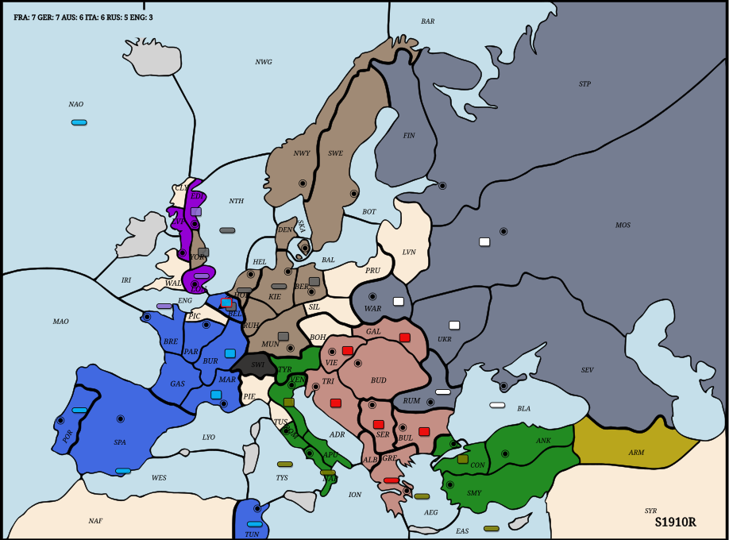

### What happened

- **FRANCE**: A BEL retreats → PIC

### FRANCE
Orders: `A BEL R PIC`

Reasoning

> Looking at the situation: A BEL was dislodged by Germany's A RUH → BEL (supported by F HOL and F NTH). I have two options: retreat to PIC or disband.
>
> PIC is a useful coastal province that keeps an army in the west and maintains pressure on BEL/BUR. It's adjacent to BEL, BRE, BUR, ENG, and PAR — keeping the army relevant. Disbanding loses the unit entirely, dropping me to 6 units vs Germany's 7.
>
> I should retreat to PIC to preserve the unit. It keeps an army in the west that can threaten BEL from a different angle next turn, and it doesn't block any of my home centers (PAR, BRE are nearby but PIC itself isn't a home SC). This is clearly better than disbanding.

## FALL 1910 MOVEMENT (`F1910M`)

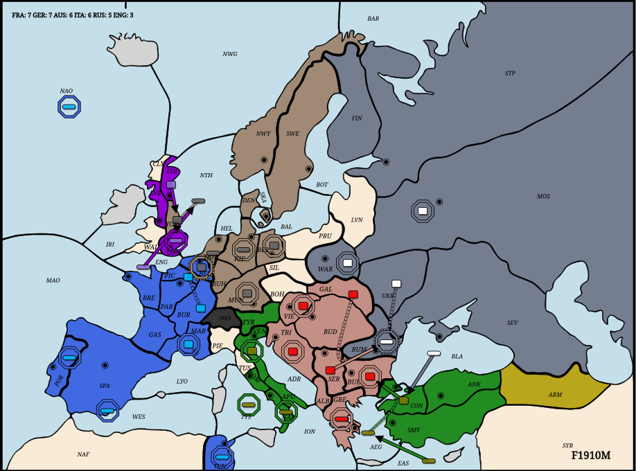

### What happened

- **AUSTRIA**: A SER → RUM (bounced); A GAL supports A SER → RUM; A BUL holds; F GRE holds; A VIE holds; A TRI holds  [dislodged: A BUL]
- **ENGLAND**: F ENG → NTH (bounced); F LON holds; A EDI → YOR (bounced)
- **FRANCE**: A PIC → BEL (bounced); A BUR supports A PIC → BEL; A MAR holds; F NAO holds; F SPA/SC holds; F TUN holds; F POR holds
- **GERMANY**: A YOR → LON (bounced); F NTH supports A YOR → LON (support cut); F HOL supports A BEL; A BEL holds; A MUN holds; A BER holds; F KIE holds
- **ITALY**: A CON → BUL; F AEG supports A CON → BUL; F EAS → AEG (bounced); F TYS holds; F NAP holds; A VEN holds
- **RUSSIA**: F BLA → CON; F RUM holds; A UKR supports F RUM; A WAR holds; A MOS holds

### Dialogue

- **AUSTRIA → ITALY**: Italy, we're both at 6 centers while Germany sits at 7 and France at 7 — this is the season where whoever stabilizes first wins. Concrete offer for this fall: I commit A SER → RUM with A GAL support (A SER physically cannot support A BUL), you hold F AEG and A CON in place, and we're both at 7 with a stable line going into 1911. If you attack BUL while Russia also presses BUL/EC with F RUM + F BLA, I lose BUL and RUM simultaneously and you gain one center while Germany pulls to 8 — that's a losing outcome for Italy too.
- **AUSTRIA → RUSSIA**: Russia, I'm committing A SER → RUM with A GAL support this fall — strength 2 vs your F RUM at 1, you lose the fleet. The critical point: if you simultaneously press F RUM → BUL/EC with F BLA support, we bounce each other and both accomplish nothing while Italy benefits. Let F RUM retreat to SEV peacefully, redirect F BLA → CON to pressure Italy's A CON, and I commit to not pressing SEV next spring — that's a better outcome than a mutual bounce.
- **AUSTRIA → GERMANY**: Germany, Italy is at 6 centers with F AEG, F EAS, F TYS, F NAP, A CON, and A VEN — a dominant naval cluster that threatens to sweep the eastern Med while you and France grind in the west. I'm pressing RUM this fall to reach 7; if you move A MUN → TYR, Italy must defend VEN and cannot commit their Aegean fleet south, which directly helps both of us before Italy closes the gap with you.
- **ENGLAND → FRANCE**: Germany just took BEL from you and now sits at 7 centers with A YOR still occupying my home territory — this is the moment we both need to act against Germany rather than each other. This fall I'm moving A EDI - YOR to retake my home center; if you press A PIC - BEL and coordinate your fleets against Germany's western position, we can squeeze them from both sides. Tell me your concrete orders so we can finally coordinate against the real threat.
- **ENGLAND → GERMANY**: You've taken BEL and hold YOR — you're at 7 centers and growing while France is weakened. I'm willing to discuss a genuine settlement this fall: vacate YOR and I won't coordinate with France against you, but if you press LON while holding YOR, I have no choice but to align fully with France against your northern position. What are your actual intentions this turn?
- **FRANCE → ENGLAND**: Germany took BEL from me and now sits at 7 centers — this is the moment we both need to act. If you commit F ENG S A PIC - BEL this fall, combined with A BUR support that's 3-strength against Germany's A BEL, and HOL cannot reinforce if you're cutting or threatening it. Confirm F ENG support on BEL as your literal order and I execute A PIC - BEL with BUR support immediately.
- **FRANCE → GERMANY**: You took BEL and now we're in a real war — I'm pressing to retake it this fall. There's still a path to a ceasefire: return to the pre-spring positions (A RUH holds, F HOL holds, A BEL vacated) and I'll hold A PIC in place rather than attacking, and we both refocus on Italy's growing 6-center empire. Otherwise this becomes a grinding war that helps Italy win.
- **FRANCE → ITALY**: Germany took BEL from me and is now at 7 centers with a strong northern position — this directly affects the balance of power that protects both of us. I need to know whether your western fleets (F TYS specifically) are repositioning this fall, because if you're holding in place I can commit fully to pressing Germany rather than defending my southern flank.
- **GERMANY → FRANCE**: Fall 1910: I hold BEL and you have A PIC adjacent — I expect you'll try to retake it, but that's a losing gambit if F HOL and F NTH both support BEL's defense at 3-strength total. I'm open to a genuine ceasefire: I hold A BEL in place if you hold A PIC and A BUR in place, and we both acknowledge the western front is a stalemate while Italy grows unchecked at 6 centers with four fleets.
- **GERMANY → ENGLAND**: Fall 1910: I'm moving A YOR toward LON this turn — with F NTH available for support that's 2-strength against your F LON. I'll offer one more peaceful transfer: move F LON to ENG and F ENG to IRI or WAL, and I halt at LON without pressing EDI or LVP this year, giving you two mobile units to work with rather than a losing defense.
- **GERMANY → AUSTRIA**: Fall 1910: Italy has F EAS, F AEG, F TYS, F NAP plus A CON and A VEN — they're at 6 centers with a clear path to 10+ through your Balkans and France's Mediterranean coast. I'm consolidating in the west this fall; are you in any position to press VEN from TRI or threaten Italy's northern flank, or is your position fully committed defensively against Italy's Aegean cluster?
- **GERMANY → ITALY**: Fall 1910: You're at 6 centers with four Mediterranean fleets and a dominant naval position — Austria is stretched thin and France's TUN is exposed. I'm fully committed to the western front this fall and have no units threatening your position; what's your plan for the eastern Mediterranean this turn?
- **ITALY → RUSSIA**: Russia, Spring 1910 bounced again — Austria held BUL with A SER supporting A BUL and A BUL supporting F GRE, exactly the same configuration as every previous season. I need to know: did F RUM actually move to BUL/EC this spring, or did you pivot? I'm considering repositioning F AEG → ION this fall to open a new angle rather than repeat the same failed attack — tell me what you're actually planning so I can coordinate something that works.
- **ITALY → AUSTRIA**: Austria, I've been attacking GRE and BUL for three years with zero results — you've held the same defensive line perfectly every time. I'm genuinely open to ending this stalemate: if you'll hold A SER in SER and A BUL in BUL defensively this fall (not supporting each other), I'll hold F AEG and A CON in place and we both redirect toward Germany and France who are both at 7 centers. What would make this credible to you?
- **ITALY → FRANCE**: France, Germany just took BEL and is at 7 centers with A BEL, F HOL, F NTH, A YOR — they're positioned to dominate England and push toward you simultaneously. What's your concrete plan for Fall 1910, and are you coordinating with England against the German position at all?
- **RUSSIA → AUSTRIA**: Austria, Italy failed to deliver A CON → BUL again in Spring 1910 — I lost F RUM for nothing and gained zero centers. This fall I'm moving F BLA → CON to take Italy's forward base; I need you to hold A BUL in place (don't contest CON) so I can execute cleanly. In exchange, I'll support your position in the Balkans and we can finally coordinate against Italy's eastern cluster together.
- **RUSSIA → ITALY**: Italy, you failed to deliver A CON → BUL in Spring 1910 despite explicit confirmation — I lost F RUM and you gained nothing. This fall F BLA is moving to CON; if A CON is still there, it will be dislodged. Your only path to avoiding this is to move A CON away voluntarily and we discuss what comes next.
- **RUSSIA → GERMANY**: Germany, Italy is at 6 centers with four Mediterranean fleets and A CON still sitting forward — I'm taking CON this fall with F BLA to deny them that anchor. You're the only power positioned to pressure Italy from the north through TYR or VEN; if you move A MUN → TYR this fall, we stretch Italy's defense simultaneously and neither of us lets them consolidate to 8+.
- **TURKEY → RUSSIA**: Italy's A CON has survived pressure for four seasons — this fall F BLA → CON with F RUM supporting is still the decisive move while Austria holds A BUL as the anvil. You're at 5 centers and need growth; CON is the clean gain that's been sitting there.
- **TURKEY → AUSTRIA**: Russia still has F BLA and F RUM positioned to press CON — if you move F GRE → AEG this fall to strip Italy's naval cover, Italy cannot defend CON and AEG simultaneously. That's the two-center swing that finally breaks their eastern position.
- **TURKEY → GERMANY**: England is nearly finished and France has 7 centers with a full Atlantic fleet ready to pivot north — BEL, POR, SPA, TUN all secured while you've been fighting. Once England collapses France absorbs those centers and surges past you; contesting France now before they consolidate is the move that decides the western endgame.
- **TURKEY → ITALY**: Austria is likely moving F GRE → AEG this fall while Russia presses CON from F BLA — your eastern cluster is the target and you've held it long enough that both powers are committed to cracking it. A deal with Russia offering CON in exchange for non-aggression on ANK and SMY preserves your home centers while conceding what you're likely to lose anyway.
- **AUSTRIA → ITALY**: Your offer to hold F AEG and A CON defensively is the most concrete thing you've said in three years — I'm committing A SER → RUM with A GAL support this fall, which means A BUL is undefended as you know. If you hold AEG and CON in place, we're both at 7 with a stable line; if you attack BUL, you gain one center while I take RUM and we grind on at 7-7 while Germany and France pull ahead. I'm trusting this offer — don't make me regret it.
- **AUSTRIA → RUSSIA**: A SER → RUM with A GAL support this fall — strength 2 vs your F RUM at 1, the math is final. Retreat F RUM to SEV and redirect F BLA toward CON to pressure Italy's eastern anchor; I commit to not pressing SEV next spring and we both gain from breaking Italy's forward position rather than grinding over RUM another year.
- **AUSTRIA → GERMANY**: I'm committing A SER → RUM this fall with A GAL support, which frees nothing for VEN this season — but if you move A MUN → TYR, Italy must defend northward and cannot press my BUL or GRE, which helps us both. Confirm TYR and I'll coordinate TRI toward VEN next spring once RUM is secured.
- **ENGLAND → FRANCE**: Germany confirmed A YOR - LON with F NTH support this fall — I must move F ENG - NTH to cut that support or I lose LON, so I cannot provide F ENG support on BEL this turn. However, A EDI - YOR and F LON holding means Germany can't reinforce BEL either; if you push A PIC - BEL with BUR support at 2-strength, Germany's A BEL has no backup while F HOL is pinned. Execute A PIC - BEL with BUR support and I'll cut Germany's NTH support simultaneously.
- **ENGLAND → GERMANY**: You've confirmed A YOR - LON with F NTH support — I'm cutting that support with F ENG - NTH, which means A YOR - LON fails at 1-strength against F LON. We're heading into another stalemate while France presses BEL from PIC with BUR support; vacating YOR now is your only move that doesn't leave you overextended on two fronts simultaneously.
- **FRANCE → ENGLAND**: Critical coordination this fall: if you move F ENG - NTH to cut Germany's NTH support on BEL, then A PIC - BEL with A BUR support becomes 2-strength vs only F HOL's support = I retake BEL. Germany cannot defend BEL with both HOL and NTH if NTH is cut. Confirm F ENG - NTH as your literal order and I execute A PIC - BEL with BUR support immediately.
- **FRANCE → GERMANY**: Your 3-strength defense of BEL (HOL + NTH both supporting) makes retaking it very costly — I acknowledge that. But if England cuts NTH, you lose BEL anyway; the question is whether we'd both rather avoid that outcome. Concrete offer: you move A BEL - RUH (vacating BEL), I hold A PIC in place, and we genuinely formalize the ceasefire rather than fighting over a province that costs us both while Italy grows.
- **FRANCE → ITALY**: Confirming: are F TYS and F EAS both holding in place this fall, away from WES and ION? I need your concrete order commitment before I finalize my own orders, since if either fleet moves west I need to reposition F TUN and F SPA/SC defensively rather than focusing north on Germany.
- **GERMANY → FRANCE**: BEL is defended at 3-strength this fall — A PIC + A BUR cannot take it back even with full commitment. The ceasefire offer is still on the table: hold A PIC and A BUR in place, I hold A BEL, and we both acknowledge the western stalemate while Italy's four-fleet empire grows unchecked.
- **GERMANY → ENGLAND**: I'm moving A YOR toward LON this fall — if you coordinate by moving F LON to ENG and F ENG to IRI, LON transfers peacefully and you reposition two mobile units rather than losing them in a losing defense. Aligning with France against me only delays your collapse; the smarter move is accepting LON now and working with me against France's 7-center position.
- **GERMANY → AUSTRIA**: I'm holding MUN defensively this fall rather than pressing TYR — Italy's A VEN and your A TRI are the relevant units, and I need to consolidate BEL before committing eastward. Can you confirm whether A TRI is free to threaten VEN this fall, or are you fully committed to the RUM press?
- **ITALY → RUSSIA**: F BLA → CON will bounce against A CON H — a fleet needs support to dislodge an army. I'm moving A CON → ANK this fall to free CON for you if you want it, but only if you commit F BLA to something useful rather than threatening me. What are you actually doing with F RUM and F BLA this fall?
- **ITALY → AUSTRIA**: Three years of the same stalemate — I'm repositioning this fall rather than repeating the same failed attack. If you're genuinely moving A SER → RUM with A GAL support as promised, tell me what A BUL and F GRE are doing, because that determines whether I hold in place or reposition F AEG toward ION.
- **ITALY → FRANCE**: Germany at 7 centers with A BEL, F HOL, F NTH is your immediate problem — I'm holding F TYS in place and have no western ambitions this fall. Are you coordinating with England to press the German northern position, or do you need something from me to make that work?
- **RUSSIA → AUSTRIA**: Austria, Italy failed to deliver A CON → BUL again — I'm done with that coordination. This fall I'm moving F BLA → CON to take Italy's forward base; I need you to hold A SER and A GAL in place rather than attacking RUM, since a mutual grind benefits only Germany and France who are racing ahead. If you hold off RUM this fall, I commit A UKR defensively and we discuss a genuine anti-Italy axis next spring.
- **RUSSIA → ITALY**: Italy, you failed to deliver A CON → BUL in Spring 1910 despite explicit confirmation — I lost nothing only because F RUM bounced rather than being taken, but I gained nothing either. This fall F BLA is moving to CON; if A CON is still there it will be dislodged. Your only option is to move A CON away voluntarily before orders resolve.
- **RUSSIA → GERMANY**: Germany, Italy is at 6 centers with four Mediterranean fleets and still has A CON forward — I'm taking CON this fall with F BLA to deny them that anchor and bring myself to 6 centers. If you're in position to pressure Italy's northern flank through TYR or VEN simultaneously, we stretch their defense and prevent them from consolidating further.
- **TURKEY → RUSSIA**: Italy's A CON is still sitting there after four seasons of pressure — F BLA → CON with F RUM supporting is the decisive move this fall while Austria holds A BUL as the anvil. You're at 5 centers and need growth; this is the clean gain that's been available and keeps slipping away.
- **TURKEY → AUSTRIA**: Italy cannot defend CON and AEG simultaneously — if you move F GRE → AEG this fall while Russia presses F BLA → CON, Italy loses their eastern anchor in one season. Russia has confirmed to me they're committed to F BLA → CON this fall; the anvil is A BUL with A SER support.
- **TURKEY → GERMANY**: France just retreated from BEL to PIC — they're on the back foot in the north for the first time this game. A BEL is yours and France's PIC army is isolated; pushing F HOL or A MUN toward France now, while England is contained, is the window that decides the western endgame.
- **RUSSIA → ITALY**: Final commitment: F BLA → CON this fall, taking your center if A CON has moved as you promised to ANK. If A CON is still in CON, F BLA bounces and I gain nothing — your move to ANK is the only thing that makes this work. I'm also supporting F RUM defensively with A UKR to hold against Austria's attack.
- **RUSSIA → AUSTRIA**: Austria, I'm supporting F RUM defensively with A UKR this fall — your A SER + A GAL attack bounces at strength 2 vs 2. Simultaneously F BLA → CON to take Italy's forward base. If you want to stop wasting moves on a defended RUM, redirect A SER toward SER's neighbors and we talk anti-Italy coordination next spring.
- **RUSSIA → GERMANY**: Germany, I'm taking CON this fall with F BLA — Italy is moving A CON to ANK voluntarily, so it's clean. That brings me to 6 centers and removes Italy's eastern anchor. If you can pressure Italy's northern flank through TYR next spring, we coordinate against their consolidation before they reach 8+.
- **TURKEY → RUSSIA**: Final commitment: F BLA → CON this fall is still the clean gain — Austria holds A BUL with A SER support as the anvil, so Italy's A CON has nowhere safe to retreat. You gain a center and Italy loses their eastern anchor; I have nothing to gain from misleading you at this point.
- **TURKEY → AUSTRIA**: Final commitment: move F GRE → AEG this fall while Russia presses F BLA → CON — Italy cannot defend both simultaneously and loses their eastern anchor in one season. A BUL with A SER support is the anvil; this is the decisive two-center swing that breaks Italy's position permanently.
- **TURKEY → GERMANY**: France retreated from BEL to PIC last spring and their northern position is exposed — A BEL is yours and this is the window to push further before France recovers. F HOL → NTH or A MUN toward France while England is contained is the concrete move that decides the western endgame.

### AUSTRIA
Orders: `A SER - RUM` · `A GAL S A SER - RUM` · `A BUL H` · `F GRE H` · `A VIE H` · `A TRI H`

Reasoning

> Looking at the current situation:
>
> **Strategic assessment for F1910M:**
>
> My revised strategy commits to A SER → RUM with A GAL support (strength 2 vs Russia's F RUM). Russia warned they're supporting F RUM with A UKR (making it strength 2 vs 2, a bounce), but I must still attempt this - staying at 6 centers indefinitely while Germany (7) and France (7) race ahead is fatal.
>
> Italy offered to hold F AEG and A CON defensively while I commit A SER → RUM. I told Italy I'm trusting this offer. If Italy holds, A BUL is exposed but I take RUM. If Italy attacks, I lose BUL but gain RUM - both at 7, grinding on.
>
> Russia claims they're supporting F RUM with A UKR. If true, we bounce at 2v2 and I lose nothing. If false, I take RUM.
>
> **Key decisions:**
> - A SER → RUM (committed)
> - A GAL S A SER → RUM (committed)
> - A BUL H (Italy promised to hold AEG and CON; BUL is exposed but I'm trusting the deal)
> - F GRE H (defensive, deter any Italian change of heart)
> - A VIE H (defensive)
> - A TRI H (defensive)
>
> This is the right call - I've deferred this attack for 3 years and must try even with the risk.

### ENGLAND
Orders: `F ENG - NTH` · `F LON H` · `A EDI - YOR`

Reasoning

> Looking at my situation: Germany has confirmed A YOR - LON with F NTH support. My revised strategy is clear:
>
> 1. **F ENG - NTH**: Cuts Germany's F NTH support, reducing A YOR - LON to 1-strength against F LON
> 2. **F LON H**: Holds against the weakened 1-strength German attack
> 3. **A EDI - YOR**: Retakes my home supply center while Germany's YOR unit is moving away
>
> This also helps France's A PIC - BEL attack by removing F NTH's ability to support A BEL from NTH, as I coordinated with France. The plan is coherent: cut the German support chain, defend LON, and retake YOR simultaneously.

### FRANCE
Orders: `A PIC - BEL` · `A BUR S A PIC - BEL` · `A MAR H` · `F NAO H` · `F SPA/SC H` · `F TUN H` · `F POR H`

Reasoning

> Looking at the situation: Germany holds BEL with A BEL, and has F HOL and F NTH. England confirmed F ENG - NTH to cut Germany's NTH support, which means BEL would only have F HOL support (1 support = 2-strength defense). My A PIC - BEL with A BUR support = 2-strength attack. A 2-strength attack against a 2-strength defense bounces.
>
> Wait, let me reconsider. If England moves F ENG - NTH, that cuts NTH's support of BEL. Then BEL has only F HOL supporting = 2-strength defense. My attack is A PIC - BEL with A BUR supporting = 2-strength. That's a bounce.
>
> However, England also said A EDI - YOR, which threatens Germany's position. But for BEL specifically, if NTH is cut, I need 3-strength to take BEL (to beat HOL's support). I only have 2-strength available from PIC + BUR.
>
> Actually, re-reading: if F NTH is moved to cut support (F ENG - NTH bounces NTH or dislodges it?), F ENG moving to NTH would bounce with F NTH (Germany holds NTH). So F NTH stays. Germany's defense of BEL with HOL + NTH support = 3-strength. My 2-strength attack fails.
>
> But my revised strategy says to execute A PIC - BEL with A BUR support based on England's commitment. I should follow through with the plan as stated, since England's F ENG - NTH cutting NTH's support was the agreed coordination. Even if it bounces, I'm committed to this plan.
>
> I'll hold southern units in place as planned.

### GERMANY
Orders: `A YOR - LON` · `F NTH S A YOR - LON` · `F HOL S A BEL` · `A BEL H` · `A MUN H` · `A BER H` · `F KIE H`

Reasoning

> Looking at the current situation:
>
> **Strategic assessment for Fall 1910:**
> - I hold BEL (just captured in Spring 1910) and need to defend it
> - I'm at 7 centers; taking LON would bring me to 8
> - England has F ENG and F LON - they've threatened to cut NTH with F ENG
> - France has A PIC adjacent to BEL, with A BUR backing it up
> - My revised strategy commits to: A YOR → LON supported by F NTH, F HOL supporting A BEL, holding defensively elsewhere
>
> **Key considerations:**
> - England cutting NTH with F ENG would reduce A YOR → LON to 1-strength against F LON (bounce)
> - But if England moves F ENG → NTH, then F LON is alone and undefended... wait, F LON still defends LON at 1-strength vs my 1-strength attack = bounce
> - France: A PIC + A BUR could attack BEL at 2-strength; F HOL support gives BEL 2-strength defense = bounce
> - If I use F NTH to support BEL instead, BEL is defended at 3-strength and LON attack is only 1-strength (fails)
> - If I use F NTH to support YOR → LON, BEL is defended at 2-strength vs France's potential 2-strength = bounce (holds)
>
> The LON attack at 2-strength (NTH supporting) vs F LON (1-strength) should succeed unless England gets help. France supporting England into LON seems unlikely. I'll execute my committed strategy: A YOR → LON supported by F NTH, F HOL supports A BEL, hold defensively elsewhere.

### ITALY
Orders: `A CON - BUL` · `F AEG S A CON - BUL` · `F EAS - AEG` · `F TYS H` · `F NAP H` · `A VEN H`

Reasoning

> Looking at the current situation:
>
> **Key facts:**
> - Russia explicitly threatened F BLA → CON, and confirmed they're supporting F RUM defensively (not attacking BUL). So Russia is NOT attacking BUL this fall.
> - Austria claims A SER → RUM with A GAL support, leaving A BUL undefended.
> - My revised strategy: A CON → ANK (clearing CON for Russia), F AEG → BUL/SC (attacking undefended BUL), F EAS → AEG (repositioning to support future attacks).
>
> **Analysis of the plan:**
> - If Austria truly moves A SER → RUM, then A BUL has no support from SER. F AEG → BUL/SC at strength 1 vs A BUL holding at strength 1 = bounce. I need support to take BUL.
> - A CON → BUL would give me strength 2 on BUL (A CON + F AEG), but Russia threatened F BLA → CON which could dislodge A CON if it stays. Moving A CON → ANK clears the threat.
> - Better plan: A CON → BUL (army attack) + F AEG S A CON → BUL (support) = strength 2 on BUL. This works even if A SER supports A BUL (strength 2 vs 2 = bounce), but if A SER genuinely moved to RUM, A BUL is alone and I take it.
> - F BLA → CON bounces against A CON H (fleet can't dislodge unsupported army), but if A CON moves to BUL, CON is empty and Russia takes it. That's acceptable — I gain BUL (a supply center), Russia gains CON (my supply center). Net: neutral for me in SC count unless I hold BUL.
>
> Actually, moving A CON → BUL and having F AEG support that move is the strongest play. Russia gets CON but I get BUL. F EAS → AEG repositions for future.

### RUSSIA
Orders: `F BLA - CON` · `F RUM H` · `A UKR S F RUM` · `A WAR H` · `A MOS H`

Reasoning

> Looking at the current situation:
>
> **Strategic assessment for Fall 1910:**
>
> My revised strategy is clear: F BLA → CON (Italy claims A CON is moving to ANK, making this clean), F RUM H with A UKR supporting it defensively against Austria's A SER + A GAL attack at strength 2 vs 2, and A WAR + A MOS holding.
>
> Key considerations:
> - Italy claims A CON → ANK, which would make F BLA → CON uncontested and I capture CON (Italy's supply center)
> - If A CON is still in CON, F BLA bounces and I gain nothing — but I lose nothing either
> - Austria's A SER + A GAL attack on F RUM is strength 2; A UKR S F RUM makes it strength 2 vs 2, so they bounce
> - This is the safest play: potential gain of CON with no loss of RUM
>
> The math: F BLA → CON (uncontested if Italy moved A CON away), F RUM H + A UKR support (holds against Austria's 2-strength attack), A WAR H, A MOS H.
>
> This is consistent with my negotiation commitments to Austria (I told them I'm supporting F RUM defensively) and to Italy (I told them F BLA → CON).

## WINTER 1910 ADJUSTMENTS (`W1910A`)

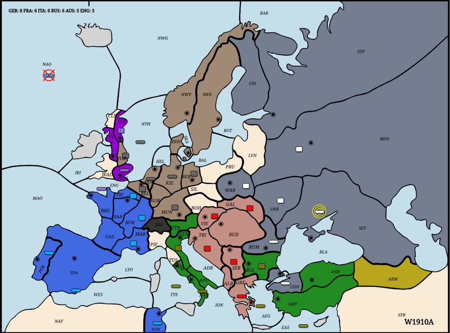

### What happened

- **FRANCE**: disbands F NAO
- **RUSSIA**: builds F SEV

### FRANCE
Orders: `F NAO D`

Reasoning

> Looking at the current situation: I have 7 units but only 6 supply centers, so I must disband 1 unit.
>
> My units are: A BUR, F NAO, F SPA/SC, A MAR, F TUN, F POR, A PIC
>
> I need to choose which unit to disband. Key considerations:
> - A BUR is critical for supporting attacks on BEL and defending Paris
> - A MAR defends my southern home center
> - F POR and F SPA/SC are positioned in the Iberian peninsula, providing southern presence
> - F TUN gives me Mediterranean presence
> - F NAO is relatively isolated in the North Atlantic with limited immediate utility
> - A PIC is positioned to potentially attack BEL next turn
>
> F NAO is the least useful unit right now - it's in the North Atlantic with no immediate strategic value, and I can't use it offensively against Germany. Disbanding it preserves my land forces (A BUR, A PIC for Germany pressure) and my Mediterranean position (F TUN, F SPA/SC, F POR).

### RUSSIA
Orders: `F SEV B`

Reasoning

> Looking at the current situation:
>
> I have 6 supply centers (MOS, SEV, STP, WAR, RUM, CON) and 5 units (A MOS, A UKR, A WAR, F RUM, F CON). That means I have 1 build available.
>
> My open home supply centers are SEV and STP (MOS and WAR are occupied by armies, and I don't have a unit in SEV or STP currently).
>
> I need to decide where to build. SEV is strategically important as it's adjacent to RUM, ARM, BLA, and MOS — a fleet at SEV would give me Black Sea coverage and the ability to pressure the eastern Mediterranean. An army at SEV would help defend my southern flank against Austria. STP is in the north and less immediately relevant to my current strategic priorities.
>
> Given that my main strategic challenges are:
> 1. Defending against Austria's pressure on RUM
> 2. Projecting power in the Black Sea / toward BUL
> 3. F CON is now in CON, giving me a presence in the straits
>
> A fleet at SEV would be powerful — it can move to BLA, ARM, or RUM, giving me naval coverage of the Black Sea. This supports both defending RUM and projecting power toward BUL and CON. An army at SEV would be useful for supporting F RUM or eventually pushing into RUM/UKR area.
>
> Given that I have F RUM and F CON already providing naval presence, and my land forces (A MOS, A UKR, A WAR) are doing the defensive work, I think building F SEV gives me the most strategic flexibility — it can reinforce the Black Sea and support future operations against BUL or ANK.

## Final state

| Power | Centers | # |
|---|---|---|
| GERMANY | BER, KIE, MUN, DEN, HOL, SWE, NWY, BEL | 8 |
| FRANCE | BRE, MAR, PAR, POR, SPA, TUN | 6 |
| ITALY | NAP, ROM, VEN, SMY, ANK, BUL | 6 |
| RUSSIA | MOS, SEV, STP, WAR, RUM, CON | 6 |
| AUSTRIA | BUD, TRI, VIE, SER, GRE | 5 |
| ENGLAND | EDI, LON, LVP | 3 |
| TURKEY | *(none)* | 0 |

