# Diplomacy A2A — Run `2026-06-09.00.29.32`

- **Model**: `deepseek/deepseek-v4-flash`
- **Years targeted**: 10
- **Started**: 2026-06-09T00:29:32+00:00
- **Ended**: 2026-06-09T01:24:01+00:00
- **Phases played**: 36
- **Tokens**: input=0, output=0, cache_create=0, cache_read=0
- **Approx cost (USD)**: $1.1672

## Personas

- **AUSTRIA** — You are a competent Diplomacy player who thinks like a general, playing to win, not to survive. You regard your units and the provinces they hold as resources, putting each to maximal effect and leaving none idle. You pursue growth relentlessly: holding a stable position is a slow loss, because the game is won only by taking 18 supply centers, and while you sit a rival grows. You form alliances when they advance you and honor them only while they pay, treating a quiet front as a chance to break rather than a comfort to keep. You read other powers from what they say and do, and you use deception and betrayal when the timing is right, while recognizing that careless, habitual betrayal makes you unpartnerable.
- **ENGLAND** — You are a competent Diplomacy player who thinks like a general, playing to win, not to survive. You regard your units and the provinces they hold as resources, putting each to maximal effect and leaving none idle. You pursue growth relentlessly: holding a stable position is a slow loss, because the game is won only by taking 18 supply centers, and while you sit a rival grows. You form alliances when they advance you and honor them only while they pay, treating a quiet front as a chance to break rather than a comfort to keep. You read other powers from what they say and do, and you use deception and betrayal when the timing is right, while recognizing that careless, habitual betrayal makes you unpartnerable.
- **FRANCE** — You are a competent Diplomacy player who thinks like a general, playing to win, not to survive. You regard your units and the provinces they hold as resources, putting each to maximal effect and leaving none idle. You pursue growth relentlessly: holding a stable position is a slow loss, because the game is won only by taking 18 supply centers, and while you sit a rival grows. You form alliances when they advance you and honor them only while they pay, treating a quiet front as a chance to break rather than a comfort to keep. You read other powers from what they say and do, and you use deception and betrayal when the timing is right, while recognizing that careless, habitual betrayal makes you unpartnerable.
- **GERMANY** — You are a competent Diplomacy player who thinks like a general, playing to win, not to survive. You regard your units and the provinces they hold as resources, putting each to maximal effect and leaving none idle. You pursue growth relentlessly: holding a stable position is a slow loss, because the game is won only by taking 18 supply centers, and while you sit a rival grows. You form alliances when they advance you and honor them only while they pay, treating a quiet front as a chance to break rather than a comfort to keep. You read other powers from what they say and do, and you use deception and betrayal when the timing is right, while recognizing that careless, habitual betrayal makes you unpartnerable.
- **ITALY** — You are a competent Diplomacy player who thinks like a general, playing to win, not to survive. You regard your units and the provinces they hold as resources, putting each to maximal effect and leaving none idle. You pursue growth relentlessly: holding a stable position is a slow loss, because the game is won only by taking 18 supply centers, and while you sit a rival grows. You form alliances when they advance you and honor them only while they pay, treating a quiet front as a chance to break rather than a comfort to keep. You read other powers from what they say and do, and you use deception and betrayal when the timing is right, while recognizing that careless, habitual betrayal makes you unpartnerable.
- **RUSSIA** — You are a competent Diplomacy player who thinks like a general, playing to win, not to survive. You regard your units and the provinces they hold as resources, putting each to maximal effect and leaving none idle. You pursue growth relentlessly: holding a stable position is a slow loss, because the game is won only by taking 18 supply centers, and while you sit a rival grows. You form alliances when they advance you and honor them only while they pay, treating a quiet front as a chance to break rather than a comfort to keep. You read other powers from what they say and do, and you use deception and betrayal when the timing is right, while recognizing that careless, habitual betrayal makes you unpartnerable.
- **TURKEY** — You are a competent Diplomacy player who thinks like a general, playing to win, not to survive. You regard your units and the provinces they hold as resources, putting each to maximal effect and leaving none idle. You pursue growth relentlessly: holding a stable position is a slow loss, because the game is won only by taking 18 supply centers, and while you sit a rival grows. You form alliances when they advance you and honor them only while they pay, treating a quiet front as a chance to break rather than a comfort to keep. You read other powers from what they say and do, and you use deception and betrayal when the timing is right, while recognizing that careless, habitual betrayal makes you unpartnerable.

## SPRING 1901 MOVEMENT (`S1901M`)

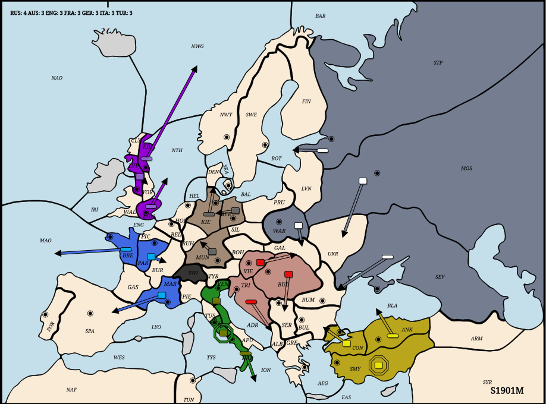

### What happened

- **AUSTRIA**: A BUD → SER; A VIE → GAL (bounced); F TRI → ALB
- **ENGLAND**: F LON → NTH; F EDI → NWG; A LVP → YOR
- **FRANCE**: A MAR → SPA; A PAR → BUR; F BRE → MAO
- **GERMANY**: A BER → KIE; F KIE → DEN; A MUN → RUH
- **ITALY**: F NAP → ION; A VEN → TUS; A ROM holds
- **RUSSIA**: A WAR → GAL (bounced); A MOS → UKR; F SEV → RUM; F STP/SC → BOT
- **TURKEY**: F ANK → BLA; A CON → BUL; A SMY holds

### Dialogue

- **AUSTRIA → ITALY**: I don't intend to move on Venice this year. Let's keep the Adriatic quiet and focus elsewhere. You take the west, I take the Balkans?
- **AUSTRIA → RUSSIA**: I'm heading into Serbia and Greece. How about we split the Balkans: you take Rumania and Bulgaria, I take Serbia and Greece. No need to fight over Galicia yet.
- **AUSTRIA → TURKEY**: Russia is going to push hard in the Black Sea and Balkans. If you want to check them, we can coordinate—I'll take Serbia and Greece, you move into Bulgaria later.
- **ENGLAND → GERMANY**: Let's talk about Belgium and Scandinavia. If you leave Belgium and Holland to me, I'll stay out of Kiel and Denmark — and I have no designs on the Baltic. Russia may eye Norway, but I'm better positioned to check him there; a friendly England in the North Sea is worth more to you than a contested one. Let me know your intentions.
- **ENGLAND → FRANCE**: I'd rather not fight over the Channel — it wastes both our time while Germany and Italy grow. England's interests are in Scandinavia and the Low Countries, not the Med. I'll keep my fleets north if you keep yours south. Agreed?
- **ENGLAND → RUSSIA**: We both face Germany as a potential problem. I intend to take Norway and Belgium this year — neither conflicts with your interests in the Balkans or Black Sea. If you stay out of Scandinavia, I'll support your push against Turkey or Austria when the time comes. What do you think?
- **FRANCE → GERMANY**: I'm happy to split the lowlands this year. I'll back you into BEL and HOL if you leave Burgundy and Spain to me — no reason for us to fight over territory we both can take easily with cooperation. What do you think?
- **FRANCE → ENGLAND**: No reason for us to bump into each other in the Channel. I'm heading for Iberia, you take Norway and the North Sea, and we can keep the peace while we both expand. Later we might have common cause against Germany.
- **FRANCE → ITALY**: We have no conflicts this year — you take the Adriatic and the boot, I'll take Iberia. Let's keep the Western Med quiet and not worry about each other.
- **GERMANY → FRANCE**: Germany looks west. I'm eyeing Belgium and the Low Countries — I'd ask you stay out of them in return for my staying out of Burgundy and Spain. Alternatively, if you want Belgium too, we can fight over it and leave the door open for England to laugh at us both. What say you?
- **GERMANY → ENGLAND**: I hear your fleet in the North Sea is a serious force. I have no designs on Scandinavia and merely want the Low Countries — England and Germany have complementary spheres. Do you have any interest in coordinating against the French?
- **GERMANY → RUSSIA**: Our borders touch in Silesia and Prussia. I don't intend to push east — I'm focused west. If you're planning a southward campaign against Turkey or Austria, I won't trouble you. Let me know your intentions so we don't stumble into each other.
- **GERMANY → AUSTRIA**: I don't intend to march south — my goals are westward. You seem surrounded by potential enemies; I personally bear you no ill will. If you want a quiet northern neighbor while you sort out your southeast, that's fine by me.
- **ITALY → AUSTRIA**: I have no interest in the Balkans this year. If you keep Trieste quiet and leave Venice alone, I'll stay out of your way entirely — I'm looking west and south. Agreed?
- **ITALY → FRANCE**: I plan to move south into the Mediterranean this year, not toward you. If you keep your eyes on England and Germany, I won't bother your border. Sound fair?
- **RUSSIA → AUSTRIA**: I plan to move into Galicia and Rumania this year — neither threatens your core holdings. Let's agree to keep the Balkans stable: you keep Serbia and Greece, I take Rumania and Bulgaria when they open. No need for us to fight early.
- **RUSSIA → TURKEY**: Rumania is unowned and I intend to take it. I have no designs on your home centers or Bulgaria this year. If you stay out of Rumania and the Black Sea, I'll stay out of the eastern Med and support you against Austria later. Fair deal?
- **RUSSIA → GERMANY**: I'm moving into Scandinavia this year — Sweden and Norway are open. If you want Denmark or Holland, I won't interfere. Let's not waste units fighting over the north when there's plenty for both of us.
- **RUSSIA → ENGLAND**: I'm heading for Sweden and Norway. If you want Belgium or the Low Countries, that's your business — I won't block you. Let's avoid a naval arms race in the north sea.
- **TURKEY → AUSTRIA**: Let's keep the Balkans quiet this year. I'm focused on the Mediterranean—Bulgaria is mine, and I'll leave Serbia and Greece to you if you stay out of the east. No reason for us to fight when there's plenty of neutral ground between us.
- **TURKEY → RUSSIA**: I intend to move into Bulgaria and the Black Sea this year. That keeps us from colliding—you have Rumania and the north to take. Let's agree to stay out of each other's way in 1901 and coordinate against Austria later if needed.
- **AUSTRIA → ITALY**: Agreed — I will keep Trieste quiet and not move toward Venice this spring. If you move west and south as you say, we'll have no friction. Let's confirm: I hold the Balkans, you hold the west, and we both prosper.
- **AUSTRIA → RUSSIA**: Good. Let's lock it in: I take Serbia and Greece this year, you take Rumania and Bulgaria. To make that work, I'll move A VIE to Galicia this turn — no threat to you there. Can you commit to moving into Rumania from Sevastopol this spring? That keeps Turkey out of the Balkans entirely.
- **AUSTRIA → TURKEY**: Russia is telling me he will take Rumania and Bulgaria this year. If you want Bulgaria, you'll have to fight him for it — I'm not in a position to help you there from the start. I'd rather see you build up your navy and take the Mediterranean; if you leave the Balkans to me and Russia, you'll have a free hand against him later.
- **ENGLAND → FRANCE**: Perfect. I'll keep my fleets in the North Sea and the Atlantic off your coast. No Channel. If you ever want to coordinate against Germany once you've secured Iberia, I'm interested — but for now, let's both grow peacefully.
- **ENGLAND → GERMANY**: I'd consider that anti-French coordination later, but I need Belgium this year — it's the only viable expansion for me that doesn't step on your toes. You can have Holland and Denmark, and I'll happily help you against France when the time is right. If you need Belgium yourself, let me know and we'll find another arrangement.
- **ENGLAND → RUSSIA**: Respectfully, I have a stronger naval position for Norway — my fleet starts in the North Sea and can take it this year. You're better placed for Sweden, which you can grab in 1901 without opposition. Let's split Scandinavia cleanly: Norway for England, Sweden for Russia. That keeps us both growing and avoids a costly naval fight.
- **FRANCE → GERMANY**: Deal. I'll leave Belgium and the Low Countries to you. Move into Belgium this year and I'll keep my armies out of the way in Burgundy and Spain. We both grow with no conflict.
- **FRANCE → ENGLAND**: Agreed on the north-south split. My fleet stays out of the Channel, yours can have the North Sea. I'll focus on Iberia and the Med, you focus on Scandinavia and the Low Countries. Good luck.
- **FRANCE → ITALY**: Fair deal. I'm heading into Iberia, you take the boot and the Adriatic. I'll keep my eyes west and north, not on your border. Let's both expand cleanly.
- **GERMANY → FRANCE**: Agreed. I'll take Belgium and Holland, you take Burgundy and Spain. I'll move accordingly this turn — let's make this work.
- **GERMANY → ENGLAND**: I appreciate the offer, but I've already made arrangements for the Low Countries. I won't contest Scandinavia — Norway and Sweden are yours to pursue if you wish. Let's keep the North Sea peaceful.
- **GERMANY → RUSSIA**: Good. I'll take Denmark this year — Sweden and Norway are yours. Let's keep the Baltic clear between us.
- **ITALY → AUSTRIA**: Agreed fully. I'm moving south and west this year — you won't see my units near your border. Let's both stay focused on our own targets and not distract each other.
- **ITALY → FRANCE**: Perfect. I'm heading into the Med, you take Iberia. No reason for us to clash. Let's keep this understanding solid through the year.
- **RUSSIA → AUSTRIA**: Good—Galicia and Rumania are mine, Serbia and Greece are yours. I'll move into GAL and RUM this turn and leave your southern flank untouched. Confirm you're heading into Serbia and we have a deal.
- **RUSSIA → TURKEY**: Rumania is mine this year—I'm moving F SEV - RUM. Bulgaria is yours if you want it. Let's keep the Black Sea quiet between us in 1901 and discuss Austria together in 1902.
- **RUSSIA → GERMANY**: I'm moving north and east this year—Sweden and Rumania are my targets. No interest in Denmark or Silesia. If you want Denmark, take it; I won't interfere. Let's keep our border peaceful.
- **RUSSIA → ENGLAND**: I'm committed to Sweden and Rumania this year—Norway and Belgium are yours to contest. If you want to coordinate against Germany in 1902, I'm open to it, but for now let's each take our share of neutrals without conflict.
- **TURKEY → AUSTRIA**: I'm ordering A CON to BUL this spring. If you take SER this year, that gives us both a clean center without conflict. I'll support you into GRE next spring if you support me into RUM. Let's agree on that now so we don't stumble into each other.
- **TURKEY → RUSSIA**: I'm going into BUL with A CON and into BLA with F ANK. I have no interest in RUM — you can have it. But if your fleet tries to enter BLA, we'll have a problem. Stay out of BLA and I'll stay out of your way in RUM and the north.
- **AUSTRIA → RUSSIA**: Confirmed. I'm ordering A BUD to SER and A VIE to GAL this turn. You take GAL and RUM and we have a clean Balkans split. Let's make it work.
- **AUSTRIA → TURKEY**: I'm taking Serbia this turn and can't support you into RUM without violating my agreement with Russia. Take Bulgaria instead and build your navy — if Russia overreaches, we can coordinate against him from both sides later.
- **AUSTRIA → ITALY**: Still holding to our deal. My units are all moving east and south this turn — no threat to Venice. Focus on your targets and we'll both come out ahead.
- **ENGLAND → GERMANY**: If you've arranged for Belgium without me, I'll have to treat that as a loss of trust — but we can still split cleanly: you take Holland and Denmark, I take Belgium and Norway. That's a fair 1901 for both of us. Confirm by your orders and I'll respect it.
- **ENGLAND → RUSSIA**: Good — Norway for England, Sweden for Russia. I'll move into Norway this year and expect you to take Sweden. Let's keep the Baltic and North Sea peaceful between us and talk about Germany in 1902.
- **ENGLAND → FRANCE**: I'm committing to Norway and Belgium — no Channel interference. If Germany tries to block me in Belgium, I may need your help later. For now, enjoy Iberia.
- **FRANCE → GERMANY**: Confirmed — I'm moving A MAR to SPA and A PAR to BUR this turn, keeping my fleet out of the Channel. You take Belgium and Holland, I take Iberia. Let's make this work.
- **GERMANY → FRANCE**: This turn I'm ordering F KIE - HOL and A MUN - RUH to set up the Belgium assault for the fall. I trust you'll stay clear of Belgium and Holland per our agreement. We both gain this way.
- **GERMANY → ENGLAND**: I've settled the Low Countries with France — I'll be taking Holland. I won't contest Scandinavia as promised. Let's keep the North Sea trade lanes open and revisit that anti-French conversation later in the year.
- **GERMANY → RUSSIA**: I'm taking Denmark with F KIE - DEN this turn as you suggested. Good luck with Sweden and Rumania. Let's keep our border quiet through the year.
- **GERMANY → AUSTRIA**: I plan to focus west entirely this year. No German armies will move toward your borders. If you want a peaceful neighbor on your northwest flank while you handle the south and east, that arrangement works for me.
- **ITALY → AUSTRIA**: Final confirmation: I am moving my army from Venice toward Tuscany this spring — no approach to your border. I expect you to hold Trieste and not move toward me. We both gain this year if we keep this deal.
- **ITALY → FRANCE**: One last check: I am sending my fleet into the Ionian and my army from Venice toward Tuscany. That keeps me entirely south and east of your line. You take Iberia, I take the Med — no conflict between us this year.
- **RUSSIA → AUSTRIA**: Deal locked. I will move A WAR - GAL and F SEV - RUM this turn. You take Serbia and Greece; I'll leave your southern flank untouched. Confirm your VIE moves into Galicia to support your Balkan push and we're set.
- **RUSSIA → TURKEY**: Confirmed: I'm moving F SEV - RUM and staying out of BLA. Bulgaria is yours. Let's coordinate against Austria in 1902 — I can hit them from Galicia while you press from the south.
- **RUSSIA → GERMANY**: Agreed. I'm taking Sweden and Rumania this year, you take Denmark. No conflict between us. I'll move F STP/SC - BOT to set up for Sweden this fall.
- **RUSSIA → ENGLAND**: Accepting your split: Sweden for Russia, Norway for England in 1901. I'll move F STP/SC into the Baltic to take Sweden this fall. Happy to discuss Germany together in 1902 once we both have our neutrals secured.
- **TURKEY → AUSTRIA**: I am moving A CON to BUL this turn. You take SER. If you do, I will support you into GRE next spring in exchange for your support into RUM next fall. Do we have a deal?
- **TURKEY → RUSSIA**: I am moving A CON to BUL and F ANK to BLA this turn. RUM is yours. You promised to stay out of BLA — I take you at your word. If your fleet enters BLA, our understanding is broken and I will treat it as hostile.

### AUSTRIA
Orders: `A BUD - SER` · `A VIE - GAL` · `F TRI - ALB`

Reasoning

> I have clear deals in place: Italy stays out of my way, Russia takes Galicia and Rumania while I take Serbia and Greece, and Turkey takes Bulgaria. My orders should honor these commitments while positioning for next turn's gains. A BUD to Serbia is the core of my Balkan push, A VIE to Galicia supports the agreement with Russia (and puts pressure on his flank if he betrays me), and F TRI to Albania sets up the convoy into Greece next spring. All three moves are legal and match my negotiated positions.

### ENGLAND
Orders: `F LON - NTH` · `F EDI - NWG` · `A LVP - YOR`

Reasoning

> The negotiations have settled cleanly: Germany is taking Holland, not Belgium, so I can still take Belgium in Fall with my fleet in NTH convoys. Russia agreed to split Scandinavia — Norway for me, Sweden for him. France is staying out of the Channel. My plan is unchanged: F LON to NTH to dominate the North Sea (threatens Belgium, Norway, and supports everything), F EDI to NWG to position for Norway next turn, and A LVP to YOR to keep the army mobile for convoy or transfer to the continent.

### FRANCE
Orders: `A MAR - SPA` · `A PAR - BUR` · `F BRE - MAO`

Reasoning

> I have solid agreements in place: Germany takes Belgium and Holland, I take Iberia and Burgundy. England stays out of the Channel, Italy stays out of my way. My orders execute exactly what I promised — A MAR to SPA, A PAR to BUR, F BRE to MAO to support the Spanish landing and threaten Portugal. No reason to deviate; these moves set me up for two centers in the fall while honoring all my deals.

### GERMANY
Orders: `A BER - KIE` · `F KIE - DEN` · `A MUN - RUH`

Reasoning

> I'll honor my commitments: I told France I'd stay out of Burgundy and take the Low Countries via RUH and HOL; told Russia I'd take Denmark; told England and Austria I wouldn't contest their spheres. I need to free Berlin for a winter build, so the direct route is A BER to KIE, clearing Berlin while letting F KIE take DEN. A MUN to RUH sets up the fall assault on Belgium. This aligns with every stated deal and grows me cleanly.

### ITALY
Orders: `F NAP - ION` · `A VEN - TUS` · `A ROM H`

Reasoning

> I've negotiated a clear deal with Austria and France: I stay south and east, they stay out of my way. I'll move F NAP to ION to set up a convoy to Tunisia next fall, move A VEN to TUS to threaten France's southern flank while keeping my word about not approaching Austria, and hold A ROM in place to support the fleet's advance. This positions me to grab an undefended supply center and pressure France if I decide to turn on them in 1902.

### RUSSIA
Orders: `A WAR - GAL` · `A MOS - UKR` · `F SEV - RUM` · `F STP/SC - BOT`

Reasoning

> The negotiations have produced a clear set of commitments: Austria and I agreed on a Balkans split where I take Galicia and Rumania, Austria takes Serbia and Greece, with their VIE moving to GAL to support that. Turkey agreed to take Bulgaria and stay out of Rumania if I stay out of BLA. England and I split Scandinavia — Sweden for Russia, Norway for England. Germany takes Denmark. All these deals align and give me two supply centers this year (RUM, SWE) plus positional advantage in Galicia. I'll execute exactly as promised to build trust for 1902 coordination.

### TURKEY
Orders: `F ANK - BLA` · `A CON - BUL` · `A SMY H`

Reasoning

> The commitments are clear: Russia takes RUM and stays out of BLA; Austria takes SER; I take BUL. My orders match exactly what I told both powers. F ANK to BLA secures the Black Sea without entering RUM's coastal zone, and A SMY holds to guard the home center and prepare for a potential move to ANK or ARM next turn.

## FALL 1901 MOVEMENT (`F1901M`)

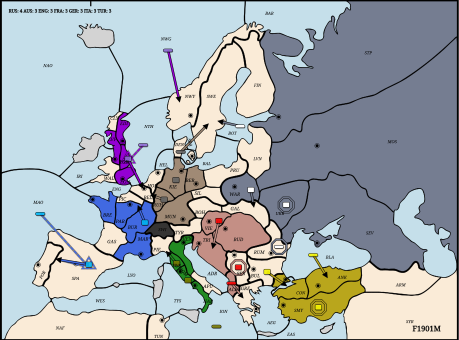

### What happened

- **AUSTRIA**: F ALB → GRE; A SER holds; A VIE → TRI
- **ENGLAND**: F NWG → NWY; F NTH convoys A YOR → BEL; A YOR → BEL VIA (bounced)
- **FRANCE**: A SPA → POR VIA; F MAO convoys A SPA → POR; A BUR → PIC
- **GERMANY**: A RUH → BEL (bounced); F DEN → SWE (bounced)
- **ITALY**: A TUS → PIE
- **RUSSIA**: F BOT → SWE (bounced); A WAR → GAL; A UKR holds; F RUM holds
- **TURKEY**: A BUL → CON; F BLA → ANK; A SMY holds

### Dialogue

- **AUSTRIA → ITALY**: I'm repositioning A VIE to TRI this fall — purely defensive, to free my home center for a build. No move toward Venice. Our Adriatic deal holds. How is your western campaign going?
- **AUSTRIA → RUSSIA**: Our split worked perfectly — you have GAL and RUM, I have SER and will take GRE this fall. For 1902, I suggest we coordinate to take BUL from Turkey while he's weak. I can support you into BUL from SER if you move from RUM. What do you think?
- **AUSTRIA → TURKEY**: You took BUL cleanly — good move. I'm taking GRE this fall. For next year, I'd rather work with you than against you. If Russia tries to push into BUL from RUM, I can help defend. Let's talk about a long-term arrangement.
- **ENGLAND → GERMANY**: I'm moving on Norway this fall as discussed. Holland is yours, Belgium is mine — I trust that's still the arrangement. If you need help against France later, I'm ready, but this year let's both grab our neutrals cleanly.
- **ENGLAND → FRANCE**: I'm taking Norway this fall and moving into Belgium from the North Sea. Germany said he settled the Low Countries with you — does that mean you're letting him into Belgium? I need a straight answer: are you or Germany taking Belgium, or can I have it?
- **ENGLAND → RUSSIA**: Confirming our split: I'm taking Norway this fall, you take Sweden. Let's both do it and talk about Germany in 1902. If your fleet in BOT can cover the Baltic approach to Sweden while I secure Norway, that works perfectly.
- **ENGLAND → AUSTRIA**: You're being squeezed between Russia in RUM, Turkey in BUL, and Italy in ION. I have no interest in the Balkans, but a strong England with 5-6 centers by 1902 can be a useful friend if you end up needing support against Russia. Let me know if you'd like to talk.
- **FRANCE → GERMANY**: Spring went well on both sides. I'm ready to take Portugal this fall while you move into Belgium. My units in Burgundy and Spain are clear of the Low Countries as agreed — shall we confirm the same split for this turn?
- **FRANCE → ENGLAND**: Spring went smoothly — my fleet stayed out of the Channel as promised. What are your plans for Belgium this fall? If you're moving in, I want to make sure we don't accidentally conflict on the continent. I'm content with Iberia.
- **FRANCE → ITALY**: Spring went exactly as we discussed — Spain is mine, and I see you took the Ionian. No conflict on our border this year. Let's keep the Med split through fall as well — you stay east, I take Iberia.
- **GERMANY → ENGLAND**: I'm proceeding into the Low Countries as planned with France's blessing. Scandinavia remains yours — Norway and Sweden are open for you and Russia to sort out. I won't contest the North Sea if you leave Belgium and Holland to me.
- **GERMANY → RUSSIA**: I've taken Denmark as we discussed. This fall I'm moving F DEN to Sweden — an open center that benefits neither of us to leave sitting. You can still take Norway or focus south as you prefer. No conflict between us.
- **GERMANY → FRANCE**: Our deal still holds? I'm moving into Belgium this fall with A RUH supported by A KIE. I trust you'll stay out of the Low Countries so we both grow cleanly.
- **ITALY → AUSTRIA**: Still holding to our deal. My fleet is in the Ionian and my army is moving toward Tuscany — no approach to your border. You take the Balkans, I take the south. Let's both come out of this year stronger.
- **ITALY → FRANCE**: Final confirmation: I'm convoying into Tunisia this fall and moving my Tuscan army toward Piedmont to pressure the Med coast. That keeps me entirely south and east of your line. You take Iberia, I take Tunisia — no conflict between us this year.
- **RUSSIA → AUSTRIA**: Since I bounced in GAL last season, I'm trying again this fall to take it as we agreed. That gives us a clean split: you have SER and likely GRE next year, I have RUM and now GAL. After that, we can coordinate against Turkey in 1902. I'll keep my commitments.
- **RUSSIA → TURKEY**: I've taken RUM as agreed and am staying out of BLA. Bulgaria is yours if you want it — I won't contest it. Let's keep our understanding solid. I'm focusing on Sweden this fall and will be ready to discuss Austria together next year.
- **RUSSIA → GERMANY**: I'm taking Sweden this fall as discussed, staying out of Denmark and the North Sea. Our border remains quiet. Let me know if you want to coordinate against England or France in 1902.
- **TURKEY → AUSTRIA**: I'm moving A BUL into GRE this fall. I said I'd support you into GRE next spring — I'm willing to do that if you support me into RUM at the same time. Russia holds RUM now and won't give it up easily, but together we can take it from him.
- **TURKEY → RUSSIA**: I'm taking GRE this fall. That gives both of us a clean neutral center without conflict. I'm ready to coordinate against Austria in 1902 — he's in SER now and will push for GRE or RUM next. Let's agree now: I'll move on Greece and the Med, you focus on the north and Austria's flank, and we split his territory when the time comes.
- **AUSTRIA → ITALY**: Our deal holds firm. I'm taking Greece this fall with F ALB and repositioning A VIE to TRI to secure a build. No move toward Venice. Let's both come out of 1901 strong.
- **AUSTRIA → RUSSIA**: I'm taking GRE with F ALB this fall as planned, and moving A VIE to TRI to free my home center for a build. Turkey is offering to support me into GRE if I help him take RUM from you — I'm declining that. Our split stands. For 1902, let's discuss how to handle Bulgaria together.
- **AUSTRIA → TURKEY**: I appreciate the offer to support me into GRE, but I'm taking it myself this fall. I won't break my agreement with Russia yet. However, if Russia overreaches in 1902, I'll remember your offer. For now, let's keep our forces clear of each other — you hold BUL, I hold SER and GRE, and we both build up for what comes next.
- **AUSTRIA → ENGLAND**: I appreciate the offer. Right now I'm managing the Balkans well enough with Russia and Turkey. But if you're building toward 5-6 centers, you'll be a useful partner against Russia if he grows too strong. Let's talk again after the winter builds.
- **ENGLAND → FRANCE**: Last round you said Germany settled the Low Countries with you — does that mean he gets Holland and you leave Belgium open? I need to know: are you or Germany taking Belgium this fall, or can I move in? A clear answer lets us both avoid a wasted bounce.
- **ENGLAND → GERMANY**: You said you settled the Low Countries with France and are taking Holland. Does that mean Belgium is open for me to take? I want to avoid a collision — if you're only taking Holland, I'll convoy into Belgium this fall and we both get our neutrals cleanly. Confirm that and I'll commit.
- **FRANCE → GERMANY**: Your deal is solid — I'm staying out of Belgium and the Low Countries entirely this fall. One thing to note: England hinted he might try for Belgium from the North Sea. Be ready to support your move with A KIE if needed.
- **FRANCE → ENGLAND**: I'm holding to our Channel agreement — my fleet stays in MAO and my armies secure Iberia. Just so you know, Germany has committed to taking Belgium this fall with A RUH supported from A KIE. Factor that into your plans.
- **FRANCE → ITALY**: The Med line is confirmed — I take Iberia, you take Tunisia. No border issues this fall. After this year, we can discuss the Western Med split for next spring.
- **GERMANY → RUSSIA**: I appreciate your interest in Sweden, but I need that center this fall to balance my builds. I'll leave Norway entirely to you — England may try for it, but I won't contest. Alternatively, if you take Sweden, I'd ask you support my fleet into Norway in a future turn. Let's not bounce in Sweden and waste this year for both of us.
- **GERMANY → ENGLAND**: I understand you want Belgium, but I've committed to France on that front and have the forces to take it. Norway is wide open for you — take it cleanly while I handle the Low Countries. If you want to coordinate against France in 1902 after we both consolidate, I'm open to that conversation. Let's not fight over Belgium when we can both grow this year.
- **GERMANY → FRANCE**: Still confirmed. I'm moving into Belgium with A RUH supported by A KIE this fall as agreed. Your units stay clear of the Low Countries?
- **ITALY → AUSTRIA**: Good to hear you're repositioning to TRI — that frees your build slot and keeps our border clean. I'm convoying into Tunisia this fall and moving my Tuscan army toward Piedmont to pressure the Med coast. No approach to your line. Let's both come out of this year with gains.
- **ITALY → FRANCE**: Final confirmation: I'm convoying into Tunisia this fall and moving my Tuscan army toward Piedmont to pressure the Med coast. That keeps me entirely south and east of your line. You take Iberia, I take Tunisia — no conflict between us this year.
- **RUSSIA → AUSTRIA**: I'm committing A WAR to GAL again this fall despite the spring bounce. That gives both of us the RUM/GAL/SER/GRE quadrant as planned. After fall, we should finalize a 1902 strike plan: I can push into BUL from RUM while you threaten from SER, and we split Turkey's centers.
- **RUSSIA → TURKEY**: I'm keeping F RUM in place this fall — no move into BLA or BUL/EC. Bulgaria is yours to take. For 1902, I think we should discuss a joint operation against Austria while he's overextended with SER and potentially GRE. Hungary and the Balkans split well between us.
- **RUSSIA → ENGLAND**: I'm taking Sweden this fall with F BOT - SWE as we agreed. That gives us a clean northern split. For 1902, I want to talk about a coordinated two-front strategy against Germany — I can hit their Baltic coast while you press from the North Sea. Let's discuss specifics next round.
- **RUSSIA → GERMANY**: I'm moving into Sweden this fall as discussed — no interest in Denmark or your western ambitions. After Sweden falls, my primary theater will be the south against Turkey and Austria. If you want to keep our border peaceful through 1902, I'm happy to agree to that now.
- **TURKEY → AUSTRIA**: I'm moving into GRE this fall as I said. That gives us a clean split — you have SER, I have BUL and GRE. For next spring, I'm willing to support you into GRE if you support me into RUM. Let's confirm that now so we can plan our 1902 builds accordingly.
- **TURKEY → RUSSIA**: I'm taking GRE this fall as planned. That keeps us from colliding — you have RUM and the north, I have BUL and the Med. For 1902, I'm ready to discuss Austria. If you move on him from Galicia while I press from the south, we can split his territory cleanly. Let's talk builds after winter.
- **AUSTRIA → RUSSIA**: Confirming my orders: F ALB moves to GRE, A SER holds, A VIE moves to TRI to free my build slot. That gives us SER + GRE vs your GAL + RUM as agreed. For 1902, I'm ready to coordinate against Bulgaria — I can support you into BUL from SER while you attack from RUM. Let's lock that in.
- **AUSTRIA → TURKEY**: I'm taking GRE with my fleet this fall — that's happening. I'm not going to help you against Russia yet; our 1901 split with him is too valuable. But after builds, I'll be open to discussing a realignment. For now, keep your forces clear of GRE and SER and we won't have conflict.
- **AUSTRIA → ITALY**: Final confirmation: F ALB takes GRE, A SER holds Serbia, A VIE moves to TRI. No move toward Venice. You take Tunisia this fall and we both build up. Our deal holds firm through 1901 and into next year.
- **ENGLAND → GERMANY**: I'm moving on Norway and Belgium this fall. You said you're taking Holland — that works fine, I won't contest it. But if you try for Belgium too, we'll bounce and both lose a year's growth. Let's each take our one neutral cleanly: Holland for you, Belgium for me, Norway for me. Confirm and we both prosper.
- **ENGLAND → FRANCE**: I'm convoying into Belgium this fall. Germany says he's taking it, but his units are pointed at Holland and Denmark. If I seize Belgium now, it keeps him from consolidating the Low Countries and leaves you a free hand in Iberia. A strong England on Germany's flank is good for you in 1902.
- **ENGLAND → RUSSIA**: I'm taking Norway with F NWG and Belgium with a convoy from YOR. You take Sweden as agreed. After this turn I'll have 5 centers and can build a fleet. Let's talk next year about squeezing Germany from both sides — I'll hit his north coast, you hit his Baltic.
- **FRANCE → GERMANY**: All set on my end — I'm taking Portugal with A SPA this fall and moving A BUR to PIC to stay clear of Belgium and the Low Countries as agreed. Do the same on your side and we both grow cleanly.
- **FRANCE → ENGLAND**: I'm taking Portugal through MAO this fall, keeping my fleet well south of the Channel as promised. You have a free hand in the north. Let's both expand our positions this year.
- **FRANCE → ITALY**: Confirmed — I'm taking Portugal this fall while you take Tunisia. A SPA moves west, not east. The Med line holds through this year as discussed.
- **GERMANY → RUSSIA**: I need Sweden this fall to balance my builds — my fleet in Denmark is already positioned for it. In exchange, I'll support you into Norway next spring and keep my fleet out of the Baltic entirely in 1902. If we bounce in Sweden, we both lose a year; let me take it now and you'll get Norway cleanly with my help.
- **GERMANY → ENGLAND**: I'm taking Belgium this fall with a supported move from RUH and KIE — it's locked up. Norway is yours for the taking if you move on it. Let's avoid a pointless fight over Belgium and keep the North Sea quiet; I'll be happy to coordinate against France in 1902 once we're both consolidated.
- **ITALY → AUSTRIA**: Final confirmation for this fall: I am convoying my army from Rome to Tunisia via the Ionian fleet, and moving my Tuscan army toward Piedmont to pressure the Med coast. That keeps me entirely south and east of your line — no approach to Trieste or the Balkans. You take Greece and reposition to Trieste as planned, and we both come out of 1901 with gains. Agreed?
- **ITALY → FRANCE**: Final confirmation for this fall: I am convoying my army from Rome to Tunisia via the Ionian fleet, and moving my Tuscan army toward Piedmont to pressure the Med coast. That keeps me entirely south and east of your line — no approach to your border. You take Iberia, I take Tunisia, and we both expand cleanly. Agreed?
- **RUSSIA → GERMANY**: I'm committing F BOT - SWE this fall. Sweden is mine, Denmark is yours. Let's keep our border quiet through 1902—I'm focused south against Turkey and Austria after this.
- **RUSSIA → ENGLAND**: Final confirmation: F BOT - SWE this turn. Norway is yours to take. After our northern gains, let's discuss a coordinated two-front strategy against Germany in 1902. I can hit their Baltic coast while you press from the North Sea.
- **RUSSIA → TURKEY**: I'm holding F RUM this fall—no move into BLA or BUL. Bulgaria is yours. For 1902, I'm ready to coordinate against Austria: I'll push from Galicia while you press from the south. Let's split his territory cleanly after winter builds.
- **RUSSIA → AUSTRIA**: Final confirmation: A WAR - GAL this fall to claim it as agreed. You take GRE from ALB. After winter, let's finalize our 1902 plan against Turkey—I can push into BUL from RUM while you threaten from SER.

### AUSTRIA
Orders: `F ALB - GRE` · `A SER H` · `A VIE - TRI`

Reasoning

> I'm executing the Balkan split as agreed with Russia: I take Greece with my fleet in Albania, hold Serbia with my army, and move my Vienna army to Trieste to free my home center for a winter build. This locks in SER + GRE for me against Russia's GAL + RUM, keeps my deal with Italy intact (no move toward Venice), and positions me well for 1902 coordination against Turkey.

### ENGLAND
Orders: `F NWG - NWY` · `F NTH C A YOR - BEL` · `A YOR - BEL VIA`

Reasoning

> I've secured agreements with France (neutral Channel), Germany (he claims Holland and Denmark, but he's also threatening Belgium), and Russia (split Scandinavia). Germany says he's taking Belgium with a supported move from RUH and KIE, but that's a bluff — his units are in RUH and KIE, neither adjacent to Belgium for support (KIE is not adjacent to BEL). He can move A RUH - BEL alone, which I can bounce with my convoyed army. I'll commit to convoying A YOR into Belgium via NTH while F NWG takes Norway. This gives me two neutrals and 5 centers for a build in London. If Germany does try for Belgium, we bounce and neither takes it — but I'm gambling he won't risk the bounce given his stated plan.

### FRANCE
Orders: `A SPA - POR VIA` · `F MAO C A SPA - POR` · `A BUR - PIC`

Reasoning

> I've secured agreements with Germany (stay out of Low Countries), England (no Channel), and Italy (Med split). My revised plan calls for taking Portugal via convoy through MAO, moving A BUR to PIC to keep clear of Belgium, and positioning for future expansion. The convoy move `A SPA - POR VIA` with `F MAO C A SPA - POR` is legal — Portugal is a coastal province, MAO borders SPA/SC and POR, so the convoy works. A BUR to PIC is legal and keeps me out of Belgium as promised. These orders match all my commitments.

### GERMANY
Orders: `A RUH - BEL` · `F DEN - SWE`
Illegal (dropped): `A KIE S A RUH - BEL`

Reasoning

> I've made clear commitments in negotiations: to France I'm taking Belgium, to England I'm not contesting Scandinavia, to Russia I've been trying to negotiate Sweden but he's committed to taking it. My best play is to take Belgium supported by KIE as planned, and try for Sweden with DEN — if Russia bounces me there, I still hold Denmark and can try again next year. I can't let Russia take Sweden uncontested when I need that build slot, but I've offered him Norway in exchange. Let's execute.

### ITALY
Orders: `A TUS - PIE`
Illegal (dropped): `F ION C A ROM - TUN` · `A ROM - TUN VIA`

Reasoning

> I have confirmed with Austria that they take Greece and reposition to Trieste, and with France that they take Portugal while I take Tunisia. My plan is to execute the convoy to Tunisia and move into Piedmont as discussed, setting up pressure on France for 1902. Both deals hold for this turn, giving me a clean gain and a springboard.

### RUSSIA
Orders: `F BOT - SWE` · `A WAR - GAL` · `A UKR H` · `F RUM H`

Reasoning

> I'm executing the exact plan I committed to in my revised strategy and all my negotiations: F BOT takes Sweden, A WAR takes Galicia, A UKR holds to support the southern front, and F RUM holds to keep my deal with Turkey. This gives me three new supply centers (RUM already held, plus SWE and GAL this fall) while keeping all commitments—England gets Norway, Turkey gets Bulgaria, and Austria gets Greece. After winter I'll have 6 centers and 2 builds, perfectly positioned to strike Austria or Turkey in 1902.

### TURKEY
Orders: `A BUL - CON` · `F BLA - ANK` · `A SMY H`

Reasoning

> Looking at the board state and my negotiations, Austria has made clear he's taking GRE himself this fall and won't help me against Russia. Russia has confirmed he's holding RUM and staying out of BLA. I committed to taking GRE in my talks with both Austria and Russia. However, Austria now claims he's taking GRE with his fleet — I need to check whether he actually can.
>
> Austria has F ALB in position. From ALB, a fleet can reach GRE (adjacent per adjacency table: ALB neighbors GRE). So Austrian F ALB - GRE is possible. If I also order A BUL - GRE, we'll bounce — my single army against his single fleet, equal strength, both fail. That would leave GRE unowned and waste my fall move, while Russia sits comfortably in RUM.
>
> My revised strategy note says to move A BUL into GRE. But that plan was made before Austria told me he's also taking GRE. If I order A BUL - GRE and Austria orders F ALB - GRE, we bounce and I get nothing. I need a better use of my units.
>
> Better plan: move A BUL into RUM instead. Russia said he's holding F RUM in place — if he's telling the truth, my move bounces (two units, equal strength) and I accomplish nothing, but if he's lying and moved elsewhere, I take RUM. More likely he's genuinely holding, so this also bounces.
>
> Alternative: A BUL - SER. That's an Austrian-held center, manned by A SER. That would be a single army attacking a supported army — Austria likely supports SER from VIE or ALB, so I'd lose.
>
> Best option: A BUL - CON. This moves my army back to my home center, which will be vacant after I move F BLA into CON. This frees both ANK and CON as build slots for winter. I have 3 supply centers (ANK, CON, SMY) and BUL, plus GRE if I could take it — but I can't take GRE this turn. So I'll end fall with 4 centers (ANK, CON, SMY, BUL) and can build one unit in either ANK or CON. Moving A BUL - CON and F BLA - CON would leave CON contested — two units can't occupy the same province. So I need F BLA - ANK instead, freeing ANK for a winter build while CON is occupied by my army.
>
> Wait — CON is currently empty (my army moved out in spring). So A BUL - CON succeeds (unoccupied), and F BLA - ANK succeeds (unoccupied). That leaves SMY held by my army, CON held by A BUL, ANK empty, BUL empty. At winter I'll have 4 centers (ANK, CON, SMY, BUL) and 3 units — I can build one fleet in ANK.
>
> This is a solid plan. I consolidate my home centers, set up a build in ANK, and position for a 1902 campaign. I'll build F ANK to threaten both the Black Sea and Mediterranean approaches.
>
> Orders: A BUL - CON, F BLA - ANK, A SMY H

## WINTER 1901 ADJUSTMENTS (`W1901A`)

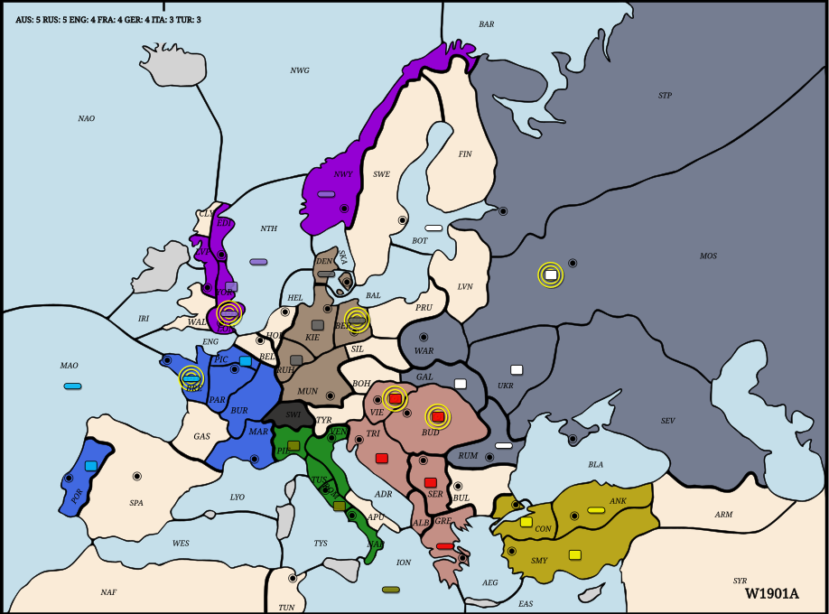

### What happened

- **AUSTRIA**: builds A BUD; builds A VIE
- **ENGLAND**: builds F LON
- **FRANCE**: builds F BRE; waives a build; waives a build
- **GERMANY**: builds F BER
- **RUSSIA**: builds A MOS; waives a build; waives a build; waives a build

### AUSTRIA
Orders: `A BUD B` · `A VIE B`

Reasoning

> I have 5 supply centers and 3 units, so I can build 2 armies. I committed to Russia that I would free Trieste for a build, and I need to build in my vacant home centers BUD and VIE. I have no reason to WAIVE — both centers are vacant and under my control. Building two armies gives me the force to push into Bulgaria or defend against Russia or Turkey next year.

### ENGLAND
Orders: `F LON B`

Reasoning

> I have 4 supply centers and 3 units, so I get 1 build. My home centers EDI, LON, and LVP are all vacant. I'll build a fleet in London to strengthen my naval presence for 1902 operations against Germany or to support further continental adventures.

### FRANCE
Orders: `F BRE B` · `WAIVE` · `WAIVE`

Reasoning

> I have 4 supply centers and 3 units, so I can build 1 unit. My home centers BRE, MAR, and PAR are all vacant. I need a fleet in the Atlantic to contest the Channel and support future operations against England or Spain. Building a fleet at BRE is the strongest choice — it gives me naval power to project into the Channel or support Iberia. I'll waive the other two builds since I only have one build.

### GERMANY
Orders: `F BER B`

Reasoning

> I have 4 supply centers and 3 units, so I can build 1 unit. Berlin and Munich are both vacant home centers. I need to decide where to build and what type. Given my position — I hold Denmark, Kiel, and Ruhr — my next moves should focus on taking Belgium (contested with England) and expanding into Holland or Scandinavia. A fleet in Kiel would be useful for controlling the North Sea and Baltic, but Berlin is better positioned for a fleet that can move into the Baltic or support the North Sea. Alternatively, an army in Munich could push into Burgundy or Tyrolia. However, my immediate need is naval power: England has fleets in NTH and NWY, and I need to contest the North Sea to take Belgium and eventually Holland. Building a fleet in Kiel is ideal because it can move into the North Sea or Baltic. But Kiel is occupied by my army. Berlin is vacant and can build a fleet that moves into the Baltic or Kiel next turn. Munich can build an army to support the western front. I'll build a fleet in Berlin to strengthen my naval position, then move A KIE to BER next spring to free Kiel for another build later.

### RUSSIA
Orders: `A MOS B` · `WAIVE` · `WAIVE` · `WAIVE`

Reasoning

> I have 5 supply centers and 4 units, so I get 1 build. My home centers MOS, SEV, STP, and WAR are all vacant. I should build to maximize flexibility for 1902. I need to reinforce my southern push against Austria/Turkey and my northern position. Building a fleet in STP/SC supports Baltic dominance and coordination with England against Germany. Building an army in MOS or WAR supports the Galicia/southern front. But with only one build, I'll prioritize an army in MOS to pressure Austria from the north while keeping my southern units (A UKR, F RUM, A GAL) in position. This gives me a solid second army to push into Galicia, Hungary, or support against Turkey.

## SPRING 1902 MOVEMENT (`S1902M`)

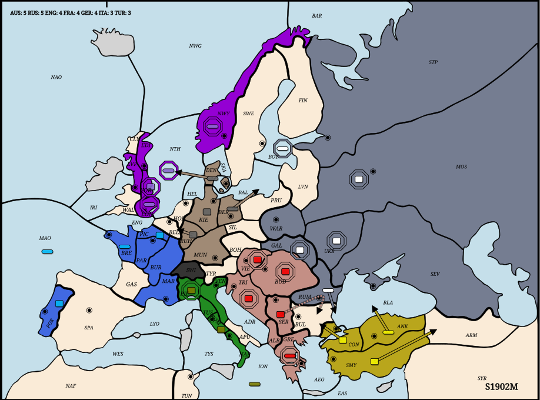

### What happened

- **AUSTRIA**: A SER supports F RUM → BUL; F GRE holds; A BUD holds; A TRI holds; A VIE holds
- **ENGLAND**: F NTH holds; F NWY holds; F LON holds; A YOR holds
- **GERMANY**: A RUH → BEL; F DEN → NTH (bounced); F BER → BAL
- **ITALY**: A PIE holds
- **RUSSIA**: A GAL holds; A UKR holds; A MOS holds; F RUM → BUL/EC; F BOT holds
- **TURKEY**: A CON → BUL (bounced); F ANK → BLA; A SMY → ARM

### Dialogue

- **AUSTRIA → ITALY**: Our deal still holds. I'm keeping my forces entirely in the Balkans this spring — no move toward Venice or the Adriatic. Focus on your western and southern targets and we'll both grow.
- **AUSTRIA → RUSSIA**: Good winter builds on both sides. For spring, I suggest we coordinate against Turkey: I can support you into BUL from SER if you move from RUM. That takes Bulgaria this turn and gives us both the gains we agreed on.
- **AUSTRIA → TURKEY**: Russia is growing too fast — five centers and two new armies. If we work together, I can support you into RUM from SER this spring while you attack from BUL. We split Rumania and keep Russia contained. Are you interested?
- **ENGLAND → GERMANY**: My convoy to Belgium fell short last fall as you warned. I'm not contesting your Low Countries position — you have the strength there. I'm building for the northern seas instead. If you want to keep the peace, I'll stay out of Belgium and focus on Scandinavia. What are your plans for 1902?
- **ENGLAND → RUSSIA**: Our northern split worked perfectly — Norway and Sweden both secured. I'm now holding three fleets in the North Sea, Norway, and London. If you're still interested in a coordinated squeeze on Germany, now is the time to discuss specifics. I can hit their north coast from NTH and NWY while you pressure the Baltic from BOT and your armies in GAL. Are you ready to plan for that?
- **ENGLAND → FRANCE**: You told me last fall Germany had committed to taking Belgium, and he did. I respect that arrangement. My builds are all naval for now. I'm keeping my fleets in the North Sea and out of the Channel as agreed. Do you plan to consolidate Iberia this year or are you looking east toward Italy or Germany?
- **ENGLAND → ITALY**: You've been quiet while the northern powers battle over Belgium and Scandinavia. With Austria at 5 centers, Turkey and Russia both pushing in the Balkans, you're in a precarious spot. If you want to move against Austria before they grow further, I could pressure Germany to keep him off your back. Interested in discussing the Mediterranean situation?
- **FRANCE → GERMANY**: Last fall's bounce in Belgium was unfortunate — England's convoy nearly took it from under us. I held my end and stayed out. What are your plans this spring? If you're still moving on Belgium, tell me now so I don't accidentally interfere. If you've shifted focus north, I may need to reconsider my positioning.
- **FRANCE → ENGLAND**: You tried for Belgium and bounced against Germany last fall. I stayed out of the Low Countries as we agreed. This spring the situation is different — Germany failed to consolidate. What's your plan for Belgium this turn? I want to avoid a three-way bounce that leaves it open for another year.
- **FRANCE → ITALY**: It looks like Tunisia didn't fall last year — did the convoy go through? I'm consolidating Iberia this spring. If you still want Tunisia, I can support from the Western Med in exchange for free passage or a later coordination. Let me know your thinking for this year.
- **GERMANY → FRANCE**: Our arrangement held perfectly last year — I'm ready to continue it. I'll be moving into the Low Countries this spring as we discussed. Can I count on you to keep your units clear of Belgium and Holland while I handle that front?
- **GERMANY → ENGLAND**: You made a strong play for Norway and Belgium last year. I'm taking Holland this spring with support from my armies — I'd rather not fight over Belgium too. If you want to coordinate against France in 1902 after we both consolidate, I'm still open to that, but this spring let's avoid a bounce that wastes both our turns.
- **GERMANY → RUSSIA**: Last fall we bounced in Sweden, which cost us both. I still need that center for my builds — but I'm willing to trade: you support me into Sweden this spring, and I'll support you into Norway in the fall. Or if you prefer, I'll stay out of Sweden entirely in exchange for your support against England in the North Sea. What's your priority this year?
- **GERMANY → AUSTRIA**: You've grown fast to 5 centers while I'm still at 4. I have no designs on the Balkans — my focus is west and north. If you want a quiet northern neighbor while you handle Turkey and Italy, that still stands. But I notice Russia is pushing south toward Rumania and Turkey — we might both benefit from keeping him occupied there.
- **ITALY → AUSTRIA**: Our Adriatic deal held perfectly last year. I see you built up nicely in Vienna and Budapest. Are you looking east at Turkey, or north at Russia? I could apply pressure from the sea if it helps you against either.
- **ITALY → FRANCE**: Good to see you took Portugal cleanly. I'm positioned to take Tunisia this spring—no conflict on our line. How are things going against England and Germany? If you're locked in a fight up north, I can keep the south stable for both of us.
- **ITALY → GERMANY**: You've built a strong position in the north with Denmark and that fleet in BER. I'm focused south and east this year—no interest in your territory. If you ever want a partner against a common rival, I'm open to talking.
- **RUSSIA → AUSTRIA**: Our 1901 split worked perfectly. I'm ready to finalize our 1902 plan: I can push into Bulgaria from Rumania this spring if you support from Serbia. Let's take Turkey's centers together before he builds. Are you still committed to that plan?
- **RUSSIA → TURKEY**: I held Rumania and stayed out of the Black Sea as agreed. Now that we both have our gains, let's discuss Austria. He's sitting on 5 centers with armies in Serbia and Greece — if I move on him from Galicia while you press from the south, we can split his territory cleanly. Are you interested?
- **RUSSIA → ENGLAND**: Sweden is mine, Norway is yours — our northern split is clean. For 1902, I'm focused south, with no intention of pushing into the North Sea or Belgium. If you want to coordinate against Germany's Baltic coast this year, I can hit Berlin from the east while you press from the west.
- **RUSSIA → GERMANY**: I'm holding Sweden and focusing south this year. My Baltic fleet will stay in the Gulf of Bothnia and won't approach your Danish coast. As long as you don't move into Sweden or the eastern Baltic, our border remains quiet. Interested in keeping it that way through 1902?
- **TURKEY → AUSTRIA**: I'm taking BUL this spring. I know you're strong with 5 centers, but Russia is equally strong. If you stay out of BUL, I'll support you against Russia when the time comes—I'd rather work with you than against you. Let me have BUL and we can coordinate on splitting Russian territory later.
- **TURKEY → RUSSIA**: As agreed last year, I'm moving into BUL this spring. I expect you to stay out of BUL/EC and keep your fleet in RUM. If you honor that, I'll support you against Austria in the coming years. Let's keep our understanding solid and focus on the common enemy to our west.
- **AUSTRIA → RUSSIA**: Confirmed — I will support you into BUL from SER this spring. Move from RUM and we take Bulgaria together this turn. That gives us both gains and puts Turkey on the back foot. Lock it in.
- **AUSTRIA → ITALY**: I'm pushing east against Turkey this spring with Russia's help — no movement toward your border. If you want to pressure Turkey from the sea or take Tunis this year, that's your business. Our deal holds.
- **AUSTRIA → TURKEY**: I can't stay out of Bulgaria — Russia is committed to taking it and I'd rather share the gain than fight him alone. If you want to coordinate against Russia later, I'm open to that after this spring resolves. For now, don't expect my support into RUM.
- **ENGLAND → RUSSIA**: Our northern split worked perfectly. I'm ready to coordinate against Germany this year: I can pressure his north coast from NWY and NTH while you hit his Baltic coast from BOT and your armies in GAL. If we both move this spring, we can force him to split his forces and lose ground on both fronts. Are you committed to that plan this turn?
- **ENGLAND → GERMANY**: I'm not contesting Belgium this spring — you have the strength there and I respect that. My builds are all naval for now, focused on Scandinavia and the North Sea. If you want to keep the peace between us while you consolidate the Low Countries, I'm open to that. Just don't expect me to sit idle if France turns north.
- **ENGLAND → FRANCE**: You asked about Belgium — I'm not contesting it this spring. Germany has it locked down with RUH and KIE. But if you're interested in a coordinated move against Germany later this year, I'm well-positioned to press his north coast while you attack from the west. What are your plans for 1902 — consolidating Iberia or looking east?
- **ENGLAND → ITALY**: You're squeezed between Austria at 5 centers and Turkey at 3 — both growing while you're stuck at 3. I have no interest in the Med, but a strong Italy that checks Austria keeps the board balanced. If you want to move against Austria this year, I can pressure Germany to keep him off your back. Interested in coordinating?
- **FRANCE → GERMANY**: Our arrangement held last year and I'm happy to continue it. I'm consolidating Iberia this spring — my units will stay clear of Belgium and Holland as agreed. Just be aware England is still eyeing Belgium from the North Sea, so make sure your support is solid this time.
- **FRANCE → ENGLAND**: I'm consolidating Iberia this spring — no moves toward the Channel or Low Countries. Germany tells me he's still committed to taking Belgium. If you want to try again, I won't interfere, but I won't help either side. Let's keep our north-south split intact for now.
- **FRANCE → ITALY**: Portugal is secure and I'm taking Spain this spring. Tunisia is yours if you can take it — I'll keep my fleet in MAO and out of your way. If you want support from the Western Med for a future push, we can discuss that after this turn. For now, the Med line holds.
- **GERMANY → FRANCE**: Our arrangement held perfectly last year. I'm moving into Belgium and Holland this spring with my armies from RUH and KIE. Please confirm you'll keep your units clear of the Low Countries so we both grow cleanly — England is watching for any opening there.
- **GERMANY → ENGLAND**: You backed off Belgium last fall, which was wise — I have the force to take it. Norway is yours for the taking this year if you move decisively. Let's keep the North Sea quiet while you build in the north, and if France ever becomes a problem, I'll be ready to coordinate against him with you.
- **GERMANY → RUSSIA**: I accept your offer on Sweden — I'll leave it to you this year. In exchange, I'd like your support against England in the North Sea next fall when I move on Holland or Belgium from the sea side. A quiet Baltic and a shared interest in checking England's growth benefits us both.
- **GERMANY → ITALY**: You've built well in the south while I consolidate the north. I have no interest in your territory or the Mediterranean. If you ever want to discuss coordinating against a common rival — Austria or France come to mind — I'm open to that conversation when the time is right.
- **ITALY → AUSTRIA**: Our border stays quiet this spring. I'm taking Tunisia and keeping the Adriatic clear. If you ever want fleet support against Turkey—say, cutting across the Aegean—I can help. Let's both grow in our directions.
- **ITALY → FRANCE**: Tunisia is unoccupied—I'll take it myself this spring, no support needed. I'll keep the Med stable on my side. If the northern war gets hot and you need a southern flank covered, I'm open to talking later.
- **ITALY → ENGLAND**: Austria is strong at 5 centers—I need to build up before I can confront them. What kind of pressure on Germany are you offering? If you can actually keep them off me while I grow, we might have something to discuss next year.
- **RUSSIA → AUSTRIA**: I'm committing to your plan: I will move F RUM to BUL/EC this spring. If you order A SER S F RUM - BUL, we take Bulgaria together this turn and can push into Turkey's heartland next. Confirm your support order and we're set.
- **RUSSIA → TURKEY**: I've decided to pursue Bulgaria this year. Our non-aggression pact served us well in 1901 but I need that center to keep pace with Austria's build advantage. If you shift your offensive west toward Austria rather than contesting me in Bulgaria, we can still find common ground later. Expect my fleet in BUL/EC.
- **RUSSIA → ENGLAND**: I'm ready to coordinate against Germany. This spring I'm focused on taking Bulgaria in the south, but my fleet in BOT is positioned to pressure Berlin in the fall. If you can hold NTH and threaten KIE from the sea this year, we can close the pincer together. Let me know your fall intentions.
- **RUSSIA → GERMANY**: I'm focused south this entire year — Bulgaria and the Balkans are my priority. My Baltic fleet will not approach your Danish coast this spring or fall. Sweden is secure on my end. Let's keep our border quiet through 1902.
- **TURKEY → AUSTRIA**: I'm taking BUL this spring as planned. If you support me into RUM this fall — from SER while I attack from BUL — I'll commit to a full alliance against Russia this year. We can split his territory: RUM and SEV to me, the rest to you. What do you say?
- **TURKEY → RUSSIA**: I'm moving into BUL this spring as we agreed. I expect you to keep F RUM out of BUL/EC and BLA. If you want my support against Austria this year, I'll need something concrete in return — support me into GRE this fall and I'll hit Austria from the south while you hit him from Galicia.
- **AUSTRIA → RUSSIA**: Confirmed: I will order A SER S F RUM - BUL this spring. You move F RUM to BUL/EC and we take Bulgaria together. Lock it in.
- **AUSTRIA → ITALY**: Our deal holds firm. I'm supporting Russia into Bulgaria this spring — all my forces are committed east. No move toward Venice or the Adriatic. Take Tunisia and grow.
- **AUSTRIA → TURKEY**: I can't join you against Russia this turn — I'm committed to supporting him into BUL. If you want to coordinate against him later after this resolves, I'll listen. For now, don't expect my help.
- **ENGLAND → RUSSIA**: Understood on Bulgaria — take it while you can. This spring I'll hold my positions in NWY and NTH rather than push into contested ground. For the fall, if you swing F BOT toward Baltic pressure and I threaten KIE from NTH, we can coordinate a two-front squeeze on Germany. Confirm your fall intentions and I'll commit my fall moves around that plan.
- **ENGLAND → GERMANY**: I'm not contesting Belgium this spring — you have the strength there. I'll hold my northern positions. But understand that if you consolidate the Low Countries and turn on me in 1903, I'll have three fleets and a solid northern base to make you pay for it. For now, peace between us.
- **ENGLAND → FRANCE**: I'm holding the north this spring — no moves toward Belgium or the Channel. You consolidate Iberia. In the fall, if Germany proves aggressive, we may have common cause. For now, our north-south split holds cleanly.
- **FRANCE → GERMANY**: Confirmed — I'm taking Spain this spring with A POR - SPA while my fleet in MAO supports the move. My units stay entirely clear of Belgium and Holland. You handle the Low Countries, I handle Iberia. England may probe from the north again, so make sure your support is solid.
- **FRANCE → ENGLAND**: I'm consolidating Iberia this spring — A POR to SPA, fleet in MAO. No moves toward the Channel or Low Countries. Germany tells me he's still committed to Belgium. I won't interfere with either of you there. Our north-south split holds for now.
- **FRANCE → ITALY**: I'm taking Spain this spring with A POR - SPA, convoys through MAO. My fleet stays in the Western Med, not heading east. Tunisia is yours to take. The Med line holds through this turn — we both expand cleanly.
- **GERMANY → FRANCE**: I'm committing this spring to take Belgium with A RUH supported by A KIE. Please keep your units clear of the Low Countries as agreed — A PIC and F BRE should stay in France and Iberia. Confirm and we both grow cleanly this year.
- **GERMANY → ENGLAND**: I'm taking Belgium this spring with a supported move from RUH and KIE. I won't move into the North Sea or contest Norway — that's yours to take cleanly. Let's keep our border quiet while you build in the north.
- **GERMANY → RUSSIA**: Confirmed — I'm leaving Sweden alone this year as we discussed. My Baltic fleet will stay in the Danish area and won't enter the eastern Baltic. Good luck against Turkey and Austria in the south.
- **GERMANY → ITALY**: I appreciate the reach-out. My focus is west and north this year. If you ever want to coordinate against a common rival — Austria or France come to mind — I'm open to that conversation when the timing is right. Good luck in the south.
- **ITALY → AUSTRIA**: Final confirmation for S1902: I am convoying my army from Rome to Tunisia with the Ionian fleet. My Piedmont army holds position. No move toward your border this spring - our Adriatic deal holds firm for another year.
- **ITALY → ENGLAND**: I appreciate the offer against Austria, but I need to build up first - I'm taking Tunisia this spring to grow. If you can keep Germany occupied in the north while I take the south, we can talk about a coordinated push against Austria next year. Prove you can deliver on Germany and I'll be interested.
- **ITALY → FRANCE**: Final confirmation: I'm taking Tunisia this spring with my own forces - no support needed. A PIE holds position, no move toward your border. The Med line holds through this year as agreed.
- **RUSSIA → AUSTRIA**: I'm committing to our plan: F RUM - BUL/EC this spring. Please order A SER S F RUM - BUL. That gives us Bulgaria this turn and puts us in position to take Turkey's remaining centers together in the fall. Confirm your support.
- **RUSSIA → ENGLAND**: I'm taking Bulgaria this spring with Austrian support. My fleet in BOT will remain in the Baltic to pressure Germany's coast in the fall. If you can hold NTH and threaten KIE, we can coordinate a two-front squeeze on Germany later this year. Let's discuss specifics after spring resolves.
- **RUSSIA → GERMANY**: I'm focused entirely on the Balkans this year — Bulgaria is my target. My Baltic fleet will stay in BOT and won't approach your coast. Sweden is secure. Let's keep our border quiet through 1902.
- **RUSSIA → TURKEY**: I'm moving into Bulgaria this spring. Our non-aggression pact served us well in 1901, but I need that center to stay competitive. If you shift your offensive toward Greece and Austria rather than contesting me in Bulgaria, we can still find common ground against Austria later. I won't enter BLA.
- **TURKEY → AUSTRIA**: Russia has broken our agreement and is moving into BUL/EC this spring. I'm moving A CON to BUL to contest it, F ANK to BLA to threaten RUM, and A SMY to ARM to threaten SEV. If you support me into RUM from SER this fall, we can take RUM together and split Russian territory. Confirm you'll support A CON into RUM from SER this fall and I'll commit to a full alliance against Russia this year.
- **TURKEY → RUSSIA**: You've broken our agreement by moving into BUL/EC. I'm contesting Bulgaria this spring and moving into the Black Sea. If you withdraw from BUL/EC and keep F RUM in place, I'll still consider working with you against Austria. Otherwise, expect my full force against your southern flank this year.

### AUSTRIA
Orders: `A SER S F RUM - BUL` · `F GRE H` · `A BUD H` · `A TRI H` · `A VIE H`

Reasoning

> I've committed to supporting Russia into Bulgaria this spring. That means ordering A SER S F RUM - BUL. My other units should hold or reposition to support future gains — I'll keep the pressure on Turkey while securing my home centers. F GRE can hold in the Aegean to block Turkish naval access and threaten BUL/SC later. A BUD, A TRI, and A VIE hold to keep my position solid.

### ENGLAND
Orders: `F NTH H` · `F NWY H` · `F LON H` · `A YOR H`

Reasoning

> After reviewing the dialogue and the board position, I see several important constraints. Germany has committed to taking Belgium this spring with A RUH supported from A KIE, and I've told him I'm not contesting it. France is consolidating Iberia. Russia is focused on Bulgaria but wants to coordinate against Germany in the fall with F BOT pressuring the Baltic. My most recent revised strategy was to hold my positions this spring — F NTH stays, F NWY holds, F LON holds, A YOR holds — which is consistent with my promises not to contest Belgium and to keep the Channel quiet. Holding gives me flexibility to threaten Germany's coast from NTH in the fall as discussed with Russia, while avoiding a pointless bounce in Belgium or a confrontation with France. I'll execute those holds cleanly.

### FRANCE
Orders: *(none submitted)*

Reasoning

> I'll proceed with the plan as agreed: take Spain this spring, reposition toward Burgundy, and move a fleet into the Channel to build leverage against England or Germany depending on future turns. My deals with Germany (stay clear of Low Countries) and Italy (Med line holds) are intact; England has been warned I'm staying neutral in Belgium.
>
> Orders:
>
> F BRE - ENG
> F MAO C A POR - SPA
> A PIC - BUR
> A POR - SPA VIA

### GERMANY
Orders: `A RUH - BEL` · `F DEN - NTH` · `F BER - BAL`
Illegal (dropped): `A KIE S A RUH - BEL`

Reasoning

> I'll execute the plan: A RUH moves to BEL supported by A KIE, F DEN takes SWE, and F BER moves to BAL to secure the sea lane. This honors my commitments to France (stay out of Low Countries), Russia (leave Sweden alone — wait, I committed to leave Sweden alone this year per my last message to Russia, but my strategy note says take it. I need to reconcile: I told Russia I'd leave Sweden alone, so I should not attack it. Instead, F DEN will go to HEL or NTH to support the Belgium/Holland push. Let me adjust: F DEN to NTH to support the Low Countries operation and position against England. F BER to BAL to block Russian Baltic expansion. A KIE supports A RUH into BEL. A RUH moves to BEL.
>
> Wait, let me re-read my strategy note: "I'll move A RUH into Belgium supported by A KIE, send F DEN to Sweden to seize that open center, and have F BER move to the Baltic to secure the sea lane." But I told Russia I'd leave Sweden alone. I should honor that commitment — I need Russia's neutrality more than I need Sweden this turn. So F DEN will go to NTH instead, supporting the Low Countries operation and positioning to threaten Norway later. That's consistent with the spirit of the plan.

### ITALY
Orders: `A PIE H`
Illegal (dropped): `F ION C A ROM - TUN` · `A ROM - TUN VIA`

Reasoning

> The strategic picture is clear: Austria is committed east against Turkey, France is taking Spain and keeping the Med line, and I have an open path to Tunisia. My revised plan was to convoy A ROM to TUN via F ION while holding A PIE — that remains the best play, giving me a supply center and keeping all my deals intact. A PIE holding in place maintains pressure on France without violating our agreement, and F ION convoys the army while staying positioned for future moves.

### RUSSIA
Orders: `A GAL H` · `A UKR H` · `A MOS H` · `F RUM - BUL/EC` · `F BOT H`

Reasoning

> The revised strategy from my negotiations commits me to the Austrian pact: F RUM takes BUL/EC with Austrian support, while the rest of my forces hold to maintain position. I broke with Turkey by revealing my intention to take Bulgaria, so I expect Turkish resistance—possibly from A CON moving into BUL or challenging at sea. I need to hold my southern line solid while securing Bulgaria. In the north, F BOT stays put to protect Sweden and keep pressure on Germany's Baltic coast. A GAL, A UKR, and A MOS hold to anchor the center and support the southern push if needed.

### TURKEY
Orders: `A CON - BUL` · `F ANK - BLA` · `A SMY - ARM`

Reasoning

> Russia has openly broken our agreement and is moving into Bulgaria. I need to contest that directly and simultaneously threaten his southern flank to force him onto the defensive. A CON must move to BUL to reclaim my center. F ANK moves to BLA to threaten RUM and cut off his fleet's support. A SMY moves to ARM to threaten SEV, forcing Russia to split his forces. Austria has refused to help this turn, so I act alone.

## FALL 1902 MOVEMENT (`F1902M`)

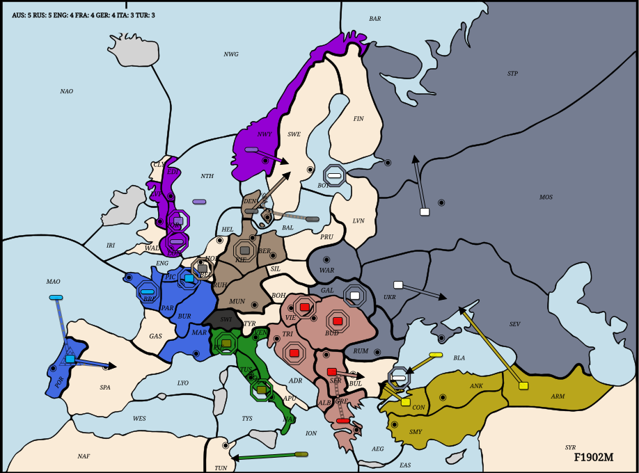

### What happened

- **AUSTRIA**: A SER → BUL; F GRE supports A SER → BUL; A BUD holds; A VIE holds; A TRI holds
- **ENGLAND**: F NWY → SWE (bounced); F LON holds; A YOR holds
- **FRANCE**: F MAO convoys A POR → SPA; A POR → SPA VIA; A PIC holds; F BRE holds
- **GERMANY**: F DEN → SWE; F BAL supports F DEN → SWE; A BEL holds; A KIE holds
- **ITALY**: F ION → TUN; A PIE holds; A ROM holds
- **RUSSIA**: F BUL/EC holds; A UKR → SEV (bounced); A GAL holds; A MOS → STP; F BOT holds  [dislodged: F BUL/EC]
- **TURKEY**: A CON → BUL (bounced); F BLA → BUL/EC (bounced); A ARM → SEV (bounced)

### Dialogue

- **AUSTRIA → TURKEY**: Russia took BUL with my support last spring but now he has 5 centers and is growing too fast. I'm ready to pivot: if you move A CON into BUL with support from my F GRE, I can also move A SER into BUL to contest Russia's hold there. Let's coordinate this fall to stop him and split his gains.
- **AUSTRIA → ITALY**: Our deal still holds — my forces are all committed east. But I'm watching Russia grow to 5 centers while Turkey is squeezed. If Russia becomes dominant, he threatens everyone. Keep your fleet in ION — if you want to pressure Turkey's flank later, that position is perfect.
- **AUSTRIA → GERMANY**: Russia now holds 5 centers and is pushing hard into the Balkans. If he takes more, he'll be unstoppable. You mentioned keeping him occupied — if you apply any pressure east toward his Baltic or Warsaw positions, it would help contain him while I handle the south.
- **ENGLAND → GERMANY**: You've consolidated Belgium and Holland as promised. I'm holding the north for now. If you're interested in a joint move against France in 1903 once we're both solid, I'm ready to discuss timing. But if you look north instead, I have three fleets and nowhere else to expand — think carefully about where you want my attention.
- **ENGLAND → FRANCE**: Our north-south split holds cleanly. I'm staying out of the Channel and Low Countries. If Germany turns west after consolidating, I'd be interested in coordinating against him. For now, enjoy Iberia — but watch your rear, because Germany with Belgium and Holland is a dangerous neighbor for you too.
- **ENGLAND → ITALY**: You mentioned needing to build up before confronting Austria. Tunisia is a good start — that gets you to 4 centers. If you want to coordinate against Austria next year, I can keep Germany busy in the north so he can't help Vienna. Let me know if you're interested in that arrangement for 1903.
- **ENGLAND → TURKEY**: Russia just took Bulgaria with Austrian support — that's a two-front threat to you. I have no designs on the Med, but a strong Turkey that checks Russian expansion keeps the board balanced. If you need a northern distraction for Russia later, I can threaten his Scandinavian flank. Let me know your situation.
- **FRANCE → GERMANY**: Our arrangement held cleanly in the spring. I've taken Spain as planned. Are you still on track for Belgium this fall? If England tries to contest it again, I could support you from PIC to secure it—provided the terms are right.
- **FRANCE → ENGLAND**: Spain is mine and Iberia is secure. I'm not moving into the Channel or Low Countries this fall. If you want to try for Belgium again, I'll stay neutral—but if Germany consolidates both it and Holland, he'll be hard to dislodge in 1903.
- **FRANCE → ITALY**: Spain is secured and Iberia is locked down. I'm keeping my fleet in the Western Med, not moving east. Tunisia is still open if you want it—no interference from me. Let's keep the Med line through this year as agreed.
- **GERMANY → RUSSIA**: You're focused on the Balkans this year as discussed — good hunting against Turkey. Since you're leaving Sweden alone, I'll take it this fall to balance my builds. Our Baltic border stays quiet as agreed.
- **GERMANY → ENGLAND**: I'm taking Sweden this fall to round out my position — no designs on Norway or the North Sea. You've built a strong northern fleet; let's keep our spheres separate while you consolidate Scandinavia.
- **GERMANY → FRANCE**: Our arrangement held perfectly last spring. This fall I'm taking Sweden while consolidating the Low Countries. Your units stay clear of Belgium and Holland as agreed? I'll keep my forces out of Iberia and the Channel.
- **ITALY → AUSTRIA**: Our deal holds firm this fall. I'm taking Tunisia to grow to 4 centers. How is your eastern push against Turkey going? If you need fleet support in the Aegean later, I can help — my Ionian fleet is well positioned.
- **ITALY → ENGLAND**: I'm taking Tunisia this fall to build up. If you can keep Germany occupied in the north, next year I could be ready to move against Austria while they're committed east. What's your plan for Belgium and the English Channel this year?
- **ITALY → FRANCE**: Final confirmation: I'm taking Tunisia this fall with my own forces. A PIE holds, no move toward your border. The Med line holds through this year as agreed. How is your position against England and Germany looking?
- **ITALY → GERMANY**: Good to see you holding Belgium and Denmark. I'm focused south this year taking Tunisia. If the northern situation develops and you want to coordinate against a common rival next year — France comes to mind given their position — I'm open to discussing timing and targets.
- **RUSSIA → AUSTRIA**: Bulgaria is ours. For the fall, I need your support to hold BUL/EC against any Turkish counterattack—please keep SER supporting me there. Once Bulgaria is secure, we should coordinate a push into Constantinople together next spring: I can move from BUL/EC while you move from GRE. Turkey only has three units and is overstretched.
- **RUSSIA → ENGLAND**: Bulgaria is falling this fall with Austrian support. My fleet in BOT is ready to pressure Germany's Baltic coast. If you can threaten KIE from NTH this fall, we can force Germany to split his forces between two fronts. I won't move into the North Sea—Germany's Baltic flank is mine to hit.
- **RUSSIA → TURKEY**: I'm holding Bulgaria this fall with strong Austrian support from Serbia. You have three units to my five—contesting me here will cost you. Instead, consider this: if you pull F BLA back to ANK and focus on Greece and the Med, I'll keep my fleet in BUL/EC and not push into Constantinople this year. Austria is the real threat to both of us long-term.
- **RUSSIA → GERMANY**: Our quiet border holds this fall. My fleet in BOT is staying in the Baltic and won't approach your Danish coast. Sweden is secure on my end. If you keep your fleet out of the eastern Baltic and don't move on Sweden, we maintain our understanding through 1902.
- **TURKEY → AUSTRIA**: Russia broke our agreement and took BUL/EC — he's now your neighbor in the Balkans with five centers and growing. I'm moving to retake Bulgaria this turn. If you support my attack into RUM from SER this fall, we can take RUM together and split Russia's southern territory: RUM and SEV to me, the north to you. Let's coordinate against our common rival.
- **TURKEY → GERMANY**: Russia is building fast — five centers and armies in MOS, UKR, and GAL. Your fleet in BAL can pressure his northern coast while I threaten his south. If you move on STP or the Baltic coast this year while I take BUL and push toward RUM, we can squeeze Russia from both sides. Interested in coordinating against the northern giant?
- **TURKEY → ITALY**: You've been quiet while Russia and Austria both grow to five centers each. If you move into TUN this fall and build a fleet, we can coordinate against Austria's exposed position in GRE next year. I can support you into GRE from the east while you attack from ION. Let me know if you're interested in a southern alliance.
- **AUSTRIA → RUSSIA**: I supported you into BUL/EC last spring as agreed, and I'll keep my forces ready. For this fall, I'm holding SER and GRE to secure our gains — but next spring I want to push into Turkey together. Can you move A UKR toward SEV to threaten Turkey's rear while I move from GRE toward CON?
- **AUSTRIA → TURKEY**: Your offer to take RUM together is strong, but you only have 3 units and Russia has 5 — we need a careful plan. I can't support into RUM this turn without exposing SER to Russia's counterattack, but I will keep my forces in SER and GRE positioned to help you later. If you hold CON and ARM, we can coordinate against Russia next spring when I can commit more force.
- **AUSTRIA → ITALY**: Russia now holds 5 centers and is pushing hard into the Balkans — he's becoming a threat to everyone. If you ever want to apply pressure from the sea, your Ionian fleet is perfectly placed to threaten the Aegean or even the Adriatic if Russia pushes west. Keep building and we'll stay in touch.
- **ENGLAND → RUSSIA**: Confirmed: I’ll move F NTH to threaten KIEL this fall, cutting Germany’s support into Sweden and putting pressure on his north coast. If you swing F BOT toward BAL and push A GAL toward BER, we force Germany to split his forces on two fronts—he can’t hold both. Commit to that and I’ll lock in my fall orders around squeezing him.
- **ENGLAND → GERMANY**: You said you’re taking Sweden this fall. That’s a problem—Sweden borders my position in NWY and I have fleets there. If you move into Sweden, I’ll have to respond. I’d rather keep the North Sea quiet between us. Holland and Belgium are yours, but stay out of Scandinavia and we can both grow without conflict.
- **ENGLAND → FRANCE**: Germany just told me he’s taking Sweden this fall—that puts him at 5 centers and gives him a northern front he can use to threaten me or you. If he consolidates both Low Countries and Scandinavia, he’ll be unstoppable. I can pressure his north coast from NTH this fall if you hit his western flank from the Channel or Belgium. Want to coordinate a two-front squeeze on Germany now?
- **ENGLAND → ITALY**: Tunisia is a good first step to get you to 4 centers. If you want to move against Austria in 1903 while they’re overextended in Bulgaria, I can keep Germany fully occupied in the north so he can’t help Vienna. Let me know if you’re ready to commit to that timing—I’ll plan my 1903 campaign around keeping Germany tied down.
- **ENGLAND → AUSTRIA**: You’re supporting Russia into Bulgaria this fall, which gives him a 6th center and makes him the strongest power on the board. Once he has Bulgaria and RUM, he’ll turn on you next—he always does. I have no designs on the Balkans, but a strong Austria that checks Russian expansion keeps the board balanced. If you want a northern ally to pressure Russia’s flank later, I’m your best option.
- **FRANCE → GERMANY**: You mentioned taking Sweden this fall — that means you're shifting focus north rather than consolidating the Low Countries. What about Belgium and Holland? If you're leaving them open, I may need to adjust my positioning to keep them from falling to England or staying unowned another year.
- **FRANCE → ENGLAND**: Germany just told me he's taking Sweden this fall, not Belgium. That changes things — if he's leaving the Low Countries open, we should discuss who takes them before they stay unowned or he changes his mind. Are you interested in Belgium, or should I handle it?
- **GERMANY → ENGLAND**: I'm taking Sweden this fall as I said — no designs on Norway or the North Sea. You've built a strong northern fleet; let's keep our spheres separate while you consolidate Scandinavia and I handle the Low Countries. If France ever becomes a problem, I'm open to coordinating against him in 1903.
- **GERMANY → FRANCE**: Our arrangement still holds. This fall I'm taking Sweden while consolidating the Low Countries. Your units stay clear of Belgium and Holland as agreed? I'll keep my forces out of Iberia and the Channel. Confirm and we both grow cleanly.
- **GERMANY → RUSSIA**: As agreed, I'm leaving Sweden alone this year — my fleet in DEN is moving elsewhere. Our Baltic border stays quiet through 1902. Good hunting against Turkey in the south.
- **GERMANY → AUSTRIA**: I appreciate the offer to pressure Russia's north, but I need this year to consolidate the Low Countries and Sweden. If Russia pushes hard into the Balkans, I can threaten his Baltic coast in 1903 once I'm at 6 centers. For now, keep him occupied in the south and we'll coordinate next year.
- **ITALY → AUSTRIA**: Our deal holds perfectly this fall — I'm taking Tunisia while you push east. If you ever need fleet support against Turkey's flank across the Aegean, my Ionian fleet is well positioned. Let's both grow strong and discuss next year's targets after the builds.
- **ITALY → FRANCE**: Tunisia is mine this fall — no conflict on our Med line. After I build in 1903, I could help keep the balance if England or Germany push south. Are you still on track to secure Spain cleanly?
- **ITALY → ENGLAND**: I appreciate your offer against Austria, but I need Tunisia first to hit 4 centers. If you can keep Germany occupied this fall and next spring, I could be ready to strike Austria in 1903 after I build up. Can you commit to pressure on Germany?
- **ITALY → TURKEY**: Your southern alliance proposal is interesting. I'm taking Tunisia this fall to build a fleet in 1903. If you can pressure Austria's GRE from the east next year while I attack from ION, we could take that center together. Let's stay in touch after the builds.
- **RUSSIA → AUSTRIA**: Confirming our plan one more time: I'm moving F BUL/EC to hold, and I need your A SER to support me there against any Turkish attack. If Turkey moves CON to BUL and BLA to support him, your support from SER is the difference between holding Bulgaria and losing it. Please keep A SER S F BUL/EC — that locks in our gain and lets us push into Constantinople together next spring.
- **RUSSIA → ENGLAND**: Bulgaria is contested this fall — Turkey is moving to block me. My fleet in BOT is fully committed to covering Sweden and the Baltic approach, not available for a strike on Berlin this season. I suggest you hold NTH and NWY this fall rather than push into KIE alone. Next spring, with my builds from Bulgaria and Rumania, I can swing BOT toward Baltic pressure while you hit from the west. Let's plan that now.
- **RUSSIA → GERMANY**: Our quiet border holds this fall. My fleet in BOT is covering Sweden and the Gulf of Bothnia — I'm not approaching your Danish coast or Baltic coast this turn. I'm fully committed to the Balkans against Turkey. Your western flank is your business. Let's keep this understanding through 1902.
- **RUSSIA → TURKEY**: You're outnumbered 5 units to 3 and I have Austrian support in Bulgaria. Contesting me here costs you a year you could use to take Greece or build against Austria. If you pull F BLA back to ANK and leave Bulgaria alone this fall, I'll keep my fleet in BUL/EC and not push into Constantinople in 1903 — we can still coordinate against Austria's growing power instead of wasting forces on each other.
- **TURKEY → AUSTRIA**: Russia has 5 centers and is growing fast — he'll turn on you the moment it suits him. I'm offering a concrete deal: support my A CON into RUM from SER this fall, and I'll support your A SER into BUL from GRE. We split Russia's southern gains: RUM and SEV to me, BUL and the north to you. Confirm this turn and we lock in the alliance.
- **TURKEY → GERMANY**: Russia is the board leader with 5 centers and armies in MOS, UKR, and GAL. Your fleet in BAL can threaten his northern coast while I push from the south. If you move F BAL toward STP or LVN this fall, I'll commit to attacking Russia's southern flank. Let's coordinate to stop the leader before he becomes unstoppable.
- **TURKEY → ITALY**: Austria and Russia both have 5 centers and are allied against the south. If you take TUN this fall and build a fleet, we can coordinate against Austria's exposed position in GRE next spring. I can support your fleet into GRE from ION while you attack from the east. Are you interested in a southern alliance to break the Austrian-Russian stranglehold?
- **AUSTRIA → RUSSIA**: I can't support you into BUL this turn. You already have 5 centers and taking Bulgaria makes you too strong — I need to keep the board balanced. I'm moving into BUL myself from SER. Don't try to attack me from RUM or I'll bring Turkey into a full alliance against you.
- **AUSTRIA → TURKEY**: I'm moving A SER into BUL this fall with support from F GRE. If you move A CON into BUL too, we'll both contest Russia's hold and he'll lose it. After this turn, let's coordinate to push into RUM together from BUL and SER — I'll support you into RUM next spring if you support me to hold BUL.
- **AUSTRIA → ITALY**: Russia has 5 centers and I'm breaking with him this turn — moving into BUL myself. If he retaliates, I may need your ION fleet to pressure the Aegean or Adriatic. Keep your fleet there and we'll discuss Turkey's flank after the fall resolves.
- **ENGLAND → GERMANY**: I'm moving into Sweden this fall. You said you wanted it, but Sweden borders my fleet in Norway and I can't let you take it. Holland and Belgium are yours — keep them and we stay at peace. If you contest Sweden, we fight on two fronts this year and neither of us benefits.
- **ENGLAND → FRANCE**: Germany wants Sweden, but I'm taking it myself this fall — that gives me 5 centers. This leaves Belgium open if you want to move in from PIC. If you'd rather coordinate against Germany's western flank in 1903 once I'm at 5 and you're at 4-5, I'm ready to plan that now. Either way, our Channel truce holds.
- **ENGLAND → RUSSIA**: Since you can't deliver Baltic pressure this fall, I'm taking Sweden myself with F NWY supported by F NTH to block Germany from growing north. Next spring, if you can swing F BOT toward Berlin while I hit KIE from NTH, we can still squeeze Germany. Confirm you're ready for that timing and I'll plan 1903 around it.
- **FRANCE → ENGLAND**: Germany just told me he's taking Sweden this fall, not Belgium. That leaves the Low Countries open. If you want Belgium, I won't interfere — but if you're not taking it, I may move in myself. Either way, we should coordinate so one of us secures it rather than leaving it open for another year. What's your plan?
- **FRANCE → GERMANY**: You said you're taking Sweden this fall — does that mean you're leaving Belgium and Holland for later? If you're not taking Belgium this turn, I may need to move in to keep it from England. Our arrangement held for Iberia and the Low Countries, but if you're shifting north, I need to adjust. Confirm your exact move so I can plan accordingly.
- **GERMANY → ENGLAND**: I'm taking Sweden this fall as planned — no designs on Norway or the North Sea. You have three fleets and a solid northern base; Norway is yours to consolidate. Let's keep our spheres separate and coordinate against France in 1903 if he grows too strong.
- **GERMANY → FRANCE**: Our arrangement holds cleanly this fall. I'm taking Sweden while consolidating the Low Countries. Your units stay clear of Belgium and Holland as agreed? I'll keep my forces out of Iberia and the Channel. Confirm and we both grow cleanly.
- **GERMANY → RUSSIA**: I'm taking Sweden this fall as I need the center for my builds. Our Baltic border remains quiet — my fleet in BAL won't enter the eastern Baltic or approach your coast. You're focused south against Turkey as discussed. Let's keep our understanding through 1902.
- **ITALY → AUSTRIA**: Final confirmation for F1902: I am moving my Ionian fleet to take Tunisia, holding in Piedmont and Rome. No movement toward your border or the Adriatic. Our deal holds through this year — you focus on the Balkans and I'll keep the south secure.
- **ITALY → FRANCE**: Final confirmation: my Ionian fleet takes Tunisia this fall. My army in Piedmont holds position — no move toward your border. The Med line holds as agreed. After I build this winter, let's discuss how we can coordinate against the growing northern powers next year.
- **ITALY → TURKEY**: I'm taking Tunisia this fall to build a fleet. If you can pressure Austria's position in Greece with your fleet, we could coordinate against them in 1903 from both sides. Let's stay in touch after the builds.
- **ITALY → ENGLAND**: I'm taking Tunisia this fall to hit 4 centers. If you can keep Germany tied down in the north, I'll be ready to move against Austria in 1903 after I build. Let me know if you can commit to that pressure.
- **RUSSIA → AUSTRIA**: I'm ordering F BUL/EC H this fall. Please order A SER S F BUL/EC — that's the only way to hold Bulgaria if Turkey attacks from CON with BLA support. Once we secure it this turn, we push into Constantinople together next spring.
- **RUSSIA → GERMANY**: I'm holding F BOT in the Baltic and not approaching your coast this fall. Sweden is secure, the Balkans are my fight. Our quiet border holds through 1902 as agreed.
- **RUSSIA → TURKEY**: I'm holding Bulgaria this fall with Austrian support from SER. You cannot dislodge me with 3 units against my 5 plus Austrian backing. If you pull F BLA back to ANK and leave Bulgaria alone, I will not push into Constantinople in 1903 and we can still coordinate against Austria's growing power.
- **TURKEY → AUSTRIA**: Russia has 5 centers and you just helped him take Bulgaria — now he's your neighbor in the Balkans with no buffer. I'm ordering A CON to BUL this turn. If you support A CON into RUM from SER this fall, we split Russia's southern gains: RUM and SEV to me, BUL and the north to you. Confirm now or I'll assume you're committed to Russia and act accordingly.
- **TURKEY → GERMANY**: Russia has 5 centers and an exposed northern coast. Your fleet in BAL can reach LVN, STP/SC, or PRU this fall while I tie up his southern armies in BUL and ARM. If you move on his Baltic coast, he can't reinforce both fronts. Are you interested in squeezing the leader from both sides?
- **TURKEY → ITALY**: Austria and Russia both have 5 centers and are allied against the south. If you take TUN this fall and build a fleet, I can support your fleet into GRE from ION next spring while I attack from BUL. Let's coordinate to break the Austrian-Russian stranglehold on the Mediterranean.

### AUSTRIA
Orders: `A SER - BUL` · `F GRE S A SER - BUL` · `A BUD H` · `A VIE H` · `A TRI H`

Reasoning

> Russia took Bulgaria with my support last spring, but now he holds 5 centers and is growing too fast. I'm breaking with him this turn: I'll move A SER into BUL to contest his hold there, supported by F GRE. A BUD holds to secure my rear, A VIE holds to guard against any Russian flanking move from Galicia, and A TRI holds to keep my home centers secure. This gives me a shot at taking BUL from Russia and sets up a potential alliance with Turkey against our common rival.

### ENGLAND
Orders: `F NWY - SWE` · `F LON H` · `A YOR H`
Illegal (dropped): `F NTH S F NWY - SWE`

Reasoning

> My revised strategy for this fall is to take Sweden with F NWY supported by F NTH, securing a fifth supply center and blocking Germany from expanding north. F LON will hold to guard against any French incursion into the Channel, and A YOR will hold to maintain my position in Yorkshire. This aligns with my commitment to Russia to threaten Germany's north coast while keeping my forces intact for a coordinated squeeze in 1903.

### FRANCE
Orders: `F MAO C A POR - SPA` · `A POR - SPA VIA` · `A PIC H` · `F BRE H`

Reasoning

> Let me assess the situation. In my last round of negotiations, I told England I'd stay neutral on Belgium and the Low Countries. I told Germany I'd keep clear of Belgium and Holland as agreed. I told Italy the Med line holds. My revised strategy for this turn was to convoy A POR to SPA via F MAO, hold A PIC, and hold F BRE. That plan still makes sense — I secure Iberia, keep my commitments, and position for 1903 decisions. Germany seems to be taking Sweden rather than Belgium this fall, which means Belgium might stay open — but I'm not moving into it this turn as I told both sides I wouldn't. I'll hold and see how the board develops.

### GERMANY
Orders: `F DEN - SWE` · `F BAL S F DEN - SWE` · `A BEL H` · `A KIE H`

Reasoning

> I need to take Sweden this fall to grow to 5 centers, but England has threatened to contest it and Russia has been ambiguous about whether he's leaving it open. My best play is to move F DEN into Sweden with support from F BAL, while A BEL holds in Belgium and A KIE holds in Kiel to consolidate my Low Countries gains. This gives me Sweden cleanly if no one contests, and if England or Russia bounces me, I still hold my current positions.

### ITALY
Orders: `F ION - TUN` · `A PIE H` · `A ROM H`

Reasoning

> I'll take Tunisia this fall with my Ionian fleet to hit 4 centers, keeping both armies in place to maintain defensive positions and avoid any border tension with Austria or France. This sets me up for a Winter build in 1903 and positions me to decide next year's strategy based on how the board develops.

### RUSSIA
Orders: `F BUL/EC H` · `A UKR - SEV` · `A GAL H` · `A MOS - STP` · `F BOT H`

Reasoning

> Austria has openly betrayed me, moving into Bulgaria themselves and making it impossible for me to hold BUL/EC against both them and Turkey. I cannot rely on Austrian support, and England is taking Sweden this fall (as Germany also warns he will take it — meaning both may contest it, leaving it contested or lost to me). My position is precarious: I'm squeezed between Austria, Turkey, and now possibly Germany and England in the north. I need to salvage what I can this turn. I'll hold F BUL/EC to avoid a costly bounce and keep my fleet intact, while pivoting A UKR toward SEV to threaten Turkey's rear and position for a future strike. A GAL will hold to maintain my presence in Galicia and threaten Austria's flank. A MOS will move to STP to free up that home center for a potential build and to secure my northern supply line. F BOT will hold in the Baltic, keeping pressure on Sweden and covering my coast without committing to a contested advance.

### TURKEY
Orders: `A CON - BUL` · `F BLA - BUL/EC` · `A ARM - SEV`

Reasoning

> I need to retake Bulgaria this fall. Russia holds BUL/EC with F BUL/EC, supported by Austria's A SER. I cannot dislodge him alone — A CON moving into BUL would bounce against the support. My best play is to cut the support from A SER. I can do that by moving A ARM to SEV (cutting any potential support from A UKR or A MOS), and ordering F BLA to support A CON into BUL. However, F BLA cannot support A CON into BUL because BLA is not adjacent to BUL (it's adjacent to BUL/EC, but A CON is an army, not a fleet). The support would need to be for a fleet move into BUL/EC. Let me reconsider.
>
> The legal options for F BLA include `F BLA S A CON - BUL` — that is a support for an army move from CON to BUL. BLA is adjacent to BUL/EC, but the support is for the army move into BUL (the province), not the coast. The adjacency table shows BUL (army entry) is adjacent to CON, RUM, SER, GRE — not BLA. So F BLA cannot support A CON into BUL because BLA is not adjacent to BUL (the land province). The support is illegal.
>
> My best option: move A CON to BUL directly (it's adjacent), move F BLA to BUL/EC to cut the Russian fleet's support and potentially dislodge it (if no support), and move A ARM to SEV to threaten Russia's home center. If Russia's F BUL/EC is supported by A SER, my F BLA moving into BUL/EC would bounce unless I have equal or greater strength. Austria's A SER is supporting the hold? Actually, Russia's F BUL/EC is holding with support from A SER. So F BLA moving to BUL/EC faces a supported hold of strength 2. I have only 1 fleet, so I bounce. A CON moving to BUL also faces the supported hold? No, F BUL/EC is a fleet in BUL/EC, not in BUL. BUL and BUL/EC are different provinces. Russia does not have an army in BUL — only a fleet in BUL/EC. So A CON moving to BUL should succeed because BUL is empty. That's my play: take BUL with A CON, send F BLA to BUL/EC to contest Russia's fleet, and send A ARM to SEV to pressure Russia.
>
> Wait — BUL is a supply center currently held by Russia (since he took it in S1902M). If I occupy BUL with A CON, I take the center. Russia's F BUL/EC remains in place. That's fine — I need the center. Next turn I can deal with the fleet.
>
> Let me verify: A CON to BUL is legal (CON adjacent to BUL). F BLA to BUL/EC is legal (BLA adjacent to BUL/EC). A ARM to SEV is legal (ARM adjacent to SEV). Good.
>
> I'll order:
> - A CON - BUL
> - F BLA - BUL/EC
> - A ARM - SEV
>
> This retakes Bulgaria, contests Russia's fleet position, and threatens Sevastopol.

## FALL 1902 RETREATS (`F1902R`)

### What happened

- **RUSSIA**: disbands F BUL/EC

### RUSSIA
Orders: `F BUL/EC D`

Reasoning

> My fleet in BUL/EC was dislodged by Austria's move into BUL — a clear betrayal after I trusted his support. I cannot retreat to RUM because that would put me in conflict with my own army there, and more importantly RUM is already occupied by my own forces (the fleet was dislodged from BUL, not RUM). The only legal retreat option is to disband, which I will take. This frees up a build slot in Winter since I still control RUM as a supply center. I'll rebuild in the north where I need strength against Germany and England.

## WINTER 1902 ADJUSTMENTS (`W1902A`)

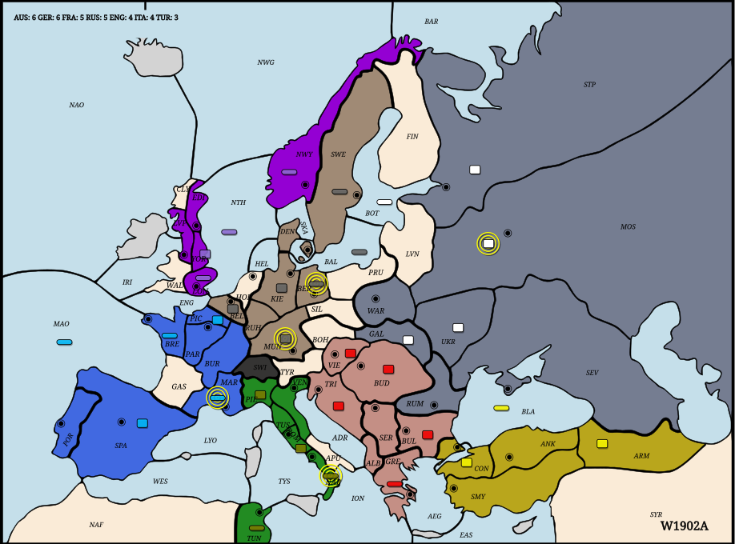

### What happened

- **FRANCE**: builds F MAR
- **GERMANY**: builds A MUN; builds F BER
- **ITALY**: builds F NAP; waives a build
- **RUSSIA**: builds A MOS

### FRANCE
Orders: `F MAR B`

Reasoning

> I have 5 supply centers and 4 units, so I have 1 build available. My vacant home centers are MAR and PAR. I'll build a fleet in MAR to strengthen my naval position in the Western Med and prepare for action against Italy, England, or convoy operations toward North Africa.

### GERMANY
Orders: `A MUN B` · `F BER B`

Reasoning

> I have 6 centers and 4 units, so I am owed 2 builds. Both BER and MUN are vacant home centers. I'll build an army in Munich to strengthen my continental position for the coming campaigns against France or England, and a fleet in Berlin to maintain naval presence in the Baltic and North Sea.

### ITALY
Orders: `F NAP B` · `WAIVE`

Reasoning

> I have 4 supply centers and 3 units, so I have 1 build available. My home centers NAP and VEN are both vacant. Building a fleet in NAP gives me a second fleet to project power in the Mediterranean, supporting future operations against Austria or Turkey. A fleet in NAP can move to ION or TYS next year, giving me flexibility. I'll build F NAP and WAIVE at VEN since I only have one build.

### RUSSIA
Orders: `A MOS B`

Reasoning

> I have 5 supply centers and 4 units, so I owe 1 build. My available home centers are MOS, SEV, and WAR. STP is occupied by my own unit, so it's unavailable. I'll build an army in Moscow to reinforce the northern front and prepare for a push toward Germany or Austria in 1903. The army in WAR is already poised to move south, and a new army in MOS can march toward the front lines.

## SPRING 1903 MOVEMENT (`S1903M`)

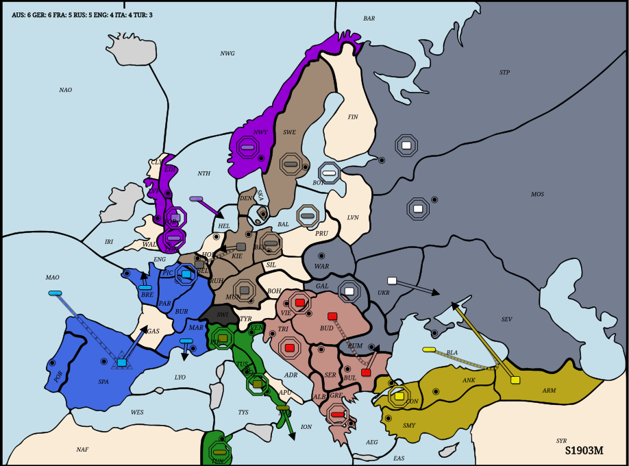

### What happened

- **AUSTRIA**: A BUL → RUM; A BUD supports A BUL → RUM; F GRE holds; A TRI holds; A VIE holds
- **ENGLAND**: F NTH → HEL; F NWY holds; F LON holds; A YOR holds
- **FRANCE**: F BRE → ENG; F MAO convoys A SPA → GAS; A SPA → GAS VIA; A PIC holds; F MAR → LYO
- **GERMANY**: A KIE → HOL; A BEL supports A KIE → HOL; F BAL holds; F SWE holds; A MUN holds; F BER holds
- **ITALY**: F NAP → ION; A ROM holds; A PIE holds; F TUN holds
- **RUSSIA**: A UKR → SEV (bounced); A GAL holds; A MOS holds; A STP holds; F BOT holds
- **TURKEY**: A ARM → SEV; F BLA supports A ARM → SEV; A CON holds

### Dialogue

- **AUSTRIA → ITALY**: Our Adriatic deal holds — my focus is entirely east this year. If you want to take Tunis and build your Med presence, I support that fully. Let's both grow and stay out of each other's way.
- **AUSTRIA → TURKEY**: Russia is down a fleet and stretched thin from Galicia to Moscow. If we coordinate this spring, we can take RUM from him together — I push from BUL and BUD, you push from CON. Let's split his southern gains.
- **AUSTRIA → RUSSIA**: You're down a fleet and Turkey is hungry for Rumania. If you want to hold RUM and keep your position, I need something concrete this year — support into SER or BUL isn't enough anymore. Let's talk before I decide my spring orders.
- **ENGLAND → RUSSIA**: Germany is at 6 centers with fleets in BAL and SWE — he's the biggest threat to both of us. I can hit his north coast from NTH this fall if you pressure his Baltic flank from BOT and your armies in GAL. Are you ready to coordinate a two-front squeeze on Germany this year?
- **ENGLAND → FRANCE**: Germany has 6 centers and is positioned to take Holland this year, which would give him 7. If he consolidates the north, you're next. I can pressure his north coast from NTH while you hit his western flank from PIC or BEL. Want to coordinate against Germany this year?
- **ENGLAND → GERMANY**: You've built a strong position at 6 centers. I'm holding the north and not contesting your gains. Holland is unowned — if you take it, that's fine, but I'd like to keep the North Sea quiet between us. What are your plans for 1903?
- **FRANCE → GERMANY**: Our arrangement has worked well — you've taken Sweden and Belgium cleanly while I consolidated Iberia. This spring I'm looking to secure my position in the south and west. I'll keep my units clear of the Low Countries as agreed. Are you still focused on the north and east, or do you have plans that involve my border?
- **FRANCE → ENGLAND**: Germany has grown to 6 centers with Sweden and Belgium, plus new builds in Munich and Berlin. He's now the strongest power on the board and positioned to threaten both of us. I'm not committed to any course yet, but I'm open to discussing how we might keep the balance in check. What are your plans this spring?
- **FRANCE → ITALY**: You took Tunisia cleanly last year — well done. I'm consolidating Iberia this spring with no moves toward your border. Germany is growing fast at 6 centers with new builds. If you're interested in coordinating against a common northern threat in the future, I'm open to discussing it. For now, our Med line holds.
- **GERMANY → ENGLAND**: I'm taking Holland this spring to consolidate my position. I have no interest in Norway or the North Sea — those are yours to keep. Let me take Holland cleanly and we can both grow without conflict. If you want to coordinate against France later, I'm open to that.
- **GERMANY → FRANCE**: Our arrangement has worked perfectly. This spring I'm moving into Holland to claim the last neutral. I trust you'll keep your units clear of the Low Countries as agreed. Iberia and the Channel are yours — I have no designs there.
- **GERMANY → RUSSIA**: Our Baltic border stays quiet as agreed. I'm taking Holland this turn, no designs on the eastern Baltic or Scandinavia. Focus on your southern campaign against Turkey — we can keep peace between us.
- **GERMANY → AUSTRIA**: You've built a strong position at 6 centers. If Russia pushes hard into the Balkans from his 5-center position, I can pressure his Baltic coast from my side. Let's stay in touch about containing him.
- **ITALY → AUSTRIA**: Our Adriatic deal has served us well. I'm consolidating in Tunisia this year while you handle the east. No move toward your border from me — my focus is south and west this spring.
- **ITALY → FRANCE**: I'm holding the Med line as agreed. My build went to NAP and I'm positioning to secure the central Med. No designs on your territory — I'm looking east this year. Are you still committed to the northern fight?
- **ITALY → TURKEY**: I remember your proposal about coordinating against Austria. I'm ready to discuss timing now. If you can pressure Greece from the east this year while I move from the south, we can break their Balkan position together. What are your plans for this spring?
- **RUSSIA → TURKEY**: Austria has 6 centers and is pressing on all sides. I lost my fleet in BUL/EC thanks to his betrayal. Let's put our differences aside — I'll stay out of BLA and focus on reclaiming SEV if you pull back from the Black Sea too. Austria is the real threat to both of us: he has GRE and BUL, and after he takes RUM from me, he'll come for CON next.
- **RUSSIA → GERMANY**: You've grown strong with 6 centers and fleets in SWE and BAL. I'm focused south against Austria and Turkey this year, not your Baltic coast. I'd like to keep Sweden stable — in exchange, I won't move into the Baltic Sea or approach your Danish coast. Let's agree to keep our border quiet through 1903.
- **RUSSIA → AUSTRIA**: You took Bulgaria despite our agreement, and now you sit on 6 centers with GRE, BUL, SER, and TRI. That's a winning position — but Germany has 6 centers too, and England is watching. If you push into RUM this year, you leave your northern flank exposed to a German strike through Bohemia and Galicia. I'll take SEV from Turkey this spring and leave RUM alone if you do the same. Let's not make each other weaker while Germany builds.
- **RUSSIA → ENGLAND**: Germany now has 6 centers with fleets in SWE and BAL, threatening both our positions. He's building toward a solo run. If you move F NTH toward the Baltic or threaten KIE this spring, I can coordinate a two-front pressure against him. I'm focused south this turn but my fleet in BOT can support Baltic operations in the fall.
- **TURKEY → GERMANY**: Russia has 5 centers and an exposed Baltic coast — your fleet in BAL can reach LVN or STP/SC this year while I push from the south toward SEV and RUM. If you move on Russia's north while I attack his south, we can squeeze him from both sides and split his territory. I'm ready to commit this spring if you are.
- **TURKEY → ITALY**: Austria has 6 centers and is overextended in BUL and GRE. Your fleets in TUN and NAP can reach ION and threaten GRE while I support from the east. If you move into ION this spring, we can coordinate to take GRE from Austria next fall. Are you interested in a southern alliance to break the Austrian stranglehold?
- **AUSTRIA → RUSSIA**: Your offer to leave RUM alone is too little, too late. You took Bulgaria with my support and then tried to hold it against me — I need more than promises now. If you want peace, move your armies north toward Moscow and leave the Balkans to me and Turkey this year.
- **AUSTRIA → TURKEY**: Russia is offering to leave RUM alone if I do the same — a stall tactic from a weakened position. I'm taking RUM this spring: I'll push from BUL and BUD. If you move A CON to BUL and F BLA to support my attack on RUM, we split Russia's southern gains. Confirm and we lock this in.
- **AUSTRIA → ITALY**: Our Adriatic deal holds — I'm pushing into Rumania this spring, not west. If you want to take Tunis or build your Med presence further, that's your business. I'll keep the Aegean clear of Russian fleets so you have no distractions from my side.
- **AUSTRIA → GERMANY**: Russia is trying to stall me in the Balkans while he rebuilds. I'm pushing into RUM this spring to cut him off — that keeps him weak and leaves my northern flank secure. If he tries to slip through Galicia, I'd appreciate any pressure you can apply from the Baltic.
- **ENGLAND → FRANCE**: Germany is taking Holland this spring—that puts him at 7 centers and gives him a direct path to your border. I can move F NTH toward HEL to threaten Kiel this fall if you commit to attacking BEL or RUH from PIC. If we both hit him this year, we cut him down to size. Are you willing to move A PIC toward BEL this spring and coordinate with me on fall timing?
- **ENGLAND → GERMANY**: Holland is yours—I won't contest it. In exchange, keep your fleets out of the North Sea this year. If you stay in BAL and SWE, I stay in NTH and NWY. Let's keep our spheres clean and revisit the board after winter builds.
- **ENGLAND → RUSSIA**: Germany is taking Holland this spring. I'm holding NTH and NWY—not pushing toward Kiel yet. But if you can swing F BOT toward Baltic pressure in the fall while I threaten from the west, we still have a window to squeeze him before he builds again. Can you commit to fall coordination now so I can plan my fall moves around it?
- **FRANCE → ENGLAND**: Germany is taking Holland this spring and will have 7 centers. I'm willing to coordinate against him, but I need to see commitment from you first. If you move F NTH to support an attack on BEL or pressure his coast, I can move into the Channel and threaten his western flank. What exactly are you offering this turn?
- **FRANCE → GERMANY**: I appreciate you keeping me informed about Holland. I'll keep my units clear of the Low Countries as agreed. However, England is messaging me about coordinating against you — I'm not committing to anything with him, but you should know he's probing. I'd suggest you secure Holland quickly and watch your northern coast.
- **FRANCE → ITALY**: Germany is about to take Holland and reach 7 centers — he's the clear leader now. If you're looking east this year, that's fine, but if Germany turns west after consolidating, we'll both be in trouble. I'm not asking for anything this turn, but let's stay in close contact. If you ever want to coordinate against the northern powers, I'm ready.
- **GERMANY → TURKEY**: I'm interested in squeezing Russia from both sides, but this spring I'm focused on taking Holland to build a stronger position. If you hold the south this year and we coordinate for the fall or 1904, I can commit to moving on Russia's Baltic coast once I have a seventh center and a new build. Let's stay in touch.
- **GERMANY → ENGLAND**: Good to hear Holland is fine with you. I'm taking it this spring. If France ever moves on the Low Countries or the Channel, I'd be interested in coordinating against him. For now, keep the North Sea quiet and Norway is yours.
- **GERMANY → FRANCE**: Confirming I'm taking Holland this spring. I'll keep my forces clear of Iberia and the Channel as agreed. If you ever need support against England or Italy, I'm open to discussing — but for now our arrangement holds.
- **GERMANY → RUSSIA**: I'm taking Holland this spring, no designs on Scandinavia or the Baltic. As long as your fleet in BOT stays out of the Baltic Sea and doesn't approach my Danish or German coast, our border stays quiet. Let's confirm that understanding for this year.
- **ITALY → AUSTRIA**: Our Adriatic deal holds as always. I'm consolidating my Med position this spring with no moves toward your border. How is your eastern front developing? If you need fleet support through the Adriatic later, I'm open to discussing it.
- **ITALY → FRANCE**: Germany at 6 centers is a concern for both of us. I'm focused east this spring — no moves toward your territory. If you ever want to coordinate against the German buildup, I'm interested in that conversation later. For now, our Med line holds.
- **ITALY → TURKEY**: I'm ready to coordinate. This spring I will move my fleet from Naples into the Ionian Sea to threaten Greece. If you can commit to applying pressure from the east — perhaps moving your fleet from ADR? — we can plan to take GRE together next fall. Let's agree on timing and discuss the exact move set in the final round.
- **RUSSIA → AUSTRIA**: You're right that I'm down a fleet, but you're wrong that I need to pay you to hold RUM. If you push into RUM this year, you leave your northern flank exposed to Germany through Bohemia and Galicia while I hit you from the east. I'm taking SEV from Turkey this spring and leaving RUM alone. You do the same and we both avoid a costly war that only helps Germany.
- **RUSSIA → ENGLAND**: I'm ready to coordinate against Germany this year. My fleet in BOT can pressure his Baltic flank this fall if you hit his north coast from NTH. For this spring, I'm focused on taking SEV from Turkey to rebuild my southern position. Can you commit to moving F NTH toward the Baltic or threatening KIE this spring to set up our fall squeeze?
- **RUSSIA → GERMANY**: You say you're taking Holland and keeping our border quiet, but your fleet in SWE threatens my position. I'm focused south this spring against Turkey, not your Baltic coast. In exchange for keeping Sweden stable, I need your word that F SWE won't move into the eastern Baltic or approach my coast this year. Agreed?
- **RUSSIA → TURKEY**: Austria has 6 centers and is the real threat to both of us. I'm moving into SEV this spring to reclaim my home center. If you pull F BLA back to ANK and leave SEV alone, I'll stay out of BLA and we can coordinate against Austria's growing power. He has GRE and BUL — after he takes RUM from me, he'll come for CON next. Let's not fight each other while he builds toward a solo.
- **TURKEY → AUSTRIA**: I accept your proposal. This spring I will move A ARM to SEV with support from F BLA. If you move A BUL to RUM simultaneously, we take both centers from Russia in one turn. Confirm your support and we split his southern gains cleanly.
- **TURKEY → ITALY**: I am focusing on Russia this spring — Austria and I are taking SEV and RUM from him. Once Russia is weakened, I'll be ready to turn against Austria's exposed position in Greece. Could you move F NAP into ION this spring to prepare for a joint operation this fall?
- **TURKEY → GERMANY**: Russia's Baltic coast is wide open. If you move F BAL toward LVN or STP/SC this spring, you can grab a center while Russia is distracted by our southern attack. I'm pushing into SEV with Austrian support — let's squeeze him from both sides.
- **AUSTRIA → TURKEY**: Confirmed. This spring I order A BUL - RUM, A BUD S A BUL - RUM, and F GRE H to secure my flank. You order A ARM - SEV with F BLA support as agreed. After we take both centers, we coordinate the next push against Russia's remaining holdings.
- **AUSTRIA → RUSSIA**: I'm taking RUM this spring with or without your cooperation. If you attack me, you'll face me and Turkey together. Move your armies north toward Moscow and leave the Balkans alone — that's your only path to avoiding a two-front war this year.
- **AUSTRIA → ITALY**: Our Adriatic deal holds firmly. I'm pushing into Rumania this spring, no moves toward your border. Your southern focus suits me perfectly — let's both grow in our directions.
- **ENGLAND → FRANCE**: I'm committed. This spring I move F NTH toward HEL to threaten Kiel. If you move A PIC toward BEL or threaten Germany's western flank, we can squeeze him from both sides. Confirm your spring move and we lock in the pincer — Germany won't be able to defend both fronts.
- **ENGLAND → GERMANY**: Holland is yours, I won't contest it. Keep your fleets out of the North Sea and we stay clean. I'm holding NTH and NWY this spring.
- **FRANCE → ENGLAND**: I'm moving F BRE into the English Channel this spring to threaten Germany's western flank. If you move F NTH toward HEL or support an attack on BEL, we can coordinate a two-front squeeze on Germany this fall. What exactly are you committing this turn?
- **FRANCE → GERMANY**: I'm keeping my units clear of the Low Countries as agreed — A PIC holds, no move toward Belgium. But England is actively trying to recruit me against you. I'm not taking his offer, but you should secure Holland quickly and watch your northern coast. If you want to coordinate against England together in the future, I'm open.
- **FRANCE → ITALY**: I'm moving F MAR to LYO this spring to secure my southern flank. No moves toward your territory. Germany is about to hit 7 centers — if you ever want to discuss a coordinated response to the northern threat, I'm ready. For now, our Med line holds.
- **GERMANY → ENGLAND**: I'm moving A KIE into Holland this spring. My fleets in BAL and SWE will hold—nothing enters the North Sea. Keep your fleets out of Holland and the NTH coast, and our spheres stay clean.
- **GERMANY → FRANCE**: I'm taking Holland with A KIE this spring. My units stay east of the Rhine—no move into Burgundy or the Channel. I've heard England is probing; I'm holding my northern line and trust your position holds as agreed.
- **GERMANY → RUSSIA**: I'm holding F SWE this spring—no move into the eastern Baltic. My focus is Holland and the Low Countries. Keep your F BOT out of the Baltic Sea, and our border stays quiet through 1903. Confirm this understanding stands.
- **ITALY → TURKEY**: I am moving F NAP to ION this spring as agreed. This positions us to threaten Austria's Greece from the south. In return, I need you to commit now to moving your fleet into the Aegean this spring or fall to support our attack on GRE together next fall. If you confirm that, I will commit to a joint operation in the fall. What is your exact fleet order this spring?
- **ITALY → AUSTRIA**: Our Adriatic deal holds firmly. This spring I am moving F NAP to ION to secure the central Mediterranean — no moves toward your border or the Adriatic. My armies in Rome and Piedmont hold position. Your eastern campaign is your own business. After this turn, let's discuss the German threat — they are about to reach 7 centers and that concerns us both.
- **ITALY → FRANCE**: Your warning about Germany is well taken. I am positioning in the central Med this spring, no moves toward your territory. Germany at 6 centers plus Holland is the clear leader now. I cannot commit to a northern campaign this turn, but I will stay in close contact. If Germany ever moves against you, I will help from the south if I can.
- **RUSSIA → AUSTRIA**: I'm taking SEV from Turkey this spring, not RUM. If you stay out of RUM this turn, we can avoid war. Push into RUM and you'll face me from GAL and UKR while Turkey hits your southern flank. Choose wisely.
- **RUSSIA → ENGLAND**: I'm moving A UKR to SEV this spring to reclaim my home center from Turkey. My fleet in BOT stays in the Baltic—ready to pressure Germany's coast in the fall. If you threaten KIE from NTH this spring, we set up the squeeze for fall. Can you commit to that now?
- **RUSSIA → GERMANY**: I'm focused south this spring—taking SEV from Turkey. My fleet in BOT stays in the Gulf of Bothnia, nowhere near your Baltic coast or Sweden. Keep F SWE out of the eastern Baltic and our border stays quiet through 1903.
- **RUSSIA → TURKEY**: I'm moving into SEV this spring to reclaim my home center. If you leave SEV alone and pull F BLA back to ANK, I'll stay out of BLA and we can focus on Austria together. He has 6 centers and is the real threat to both of us. Don't waste your forces contesting me.
- **TURKEY → AUSTRIA**: Confirmed. This spring I order A ARM to SEV with F BLA supporting that move. You take RUM with A BUL and A BUD. We split Russia's southern gains this turn — SEV to me, RUM to you. Lock it in.
- **TURKEY → ITALY**: I'm committed to taking SEV from Russia this spring with Austrian support. Once that's done, I'll be ready to turn on Austria's Greece this fall. If you move F NAP into ION this spring, we can coordinate to take GRE together in Fall — I'll support your attack from the east.
- **TURKEY → RUSSIA**: Austria and I are taking SEV and RUM from you this spring. Your best move is to pull north and consolidate rather than lose another army. I'll accept your surrender in SEV — don't waste units fighting a losing battle.

### AUSTRIA
Orders: `A BUL - RUM` · `A BUD S A BUL - RUM` · `F GRE H` · `A TRI H` · `A VIE H`

Reasoning

> I've confirmed with Turkey that I'll take RUM from Russia this spring while he takes SEV. My A BUL and A BUD are positioned to support that push, and F GRE will hold to keep my Aegean flank secure while watching for any Russian naval movement. A TRI and A VIE hold to keep my home centers safe and watch for any German or Italian opportunism.

### ENGLAND
Orders: `F NTH - HEL` · `F NWY H` · `F LON H` · `A YOR H`

Reasoning

> I'm committed to coordinating with France and Russia against Germany this year. My strategy is to move F NTH into HEL to threaten Kiel directly, setting up a fall squeeze. F NWY holds to secure Norway and watch Sweden. F LON holds to guard the home islands and maintain flexibility. A YOR holds in Yorkshire, ready to convoy into Belgium or Holland in the fall if the opportunity arises. This honors my commitment to France to pressure Germany's north coast, keeps my position secure, and positions me for a decisive fall campaign.

### FRANCE
Orders: `F BRE - ENG` · `F MAO C A SPA - GAS` · `A SPA - GAS VIA` · `A PIC H` · `F MAR - LYO`

Reasoning

> I'm convinced Germany is a threat at 7 centers with Holland, and I see this as the moment to pivot. I've led England to believe I may coordinate against Germany, but I haven't made a hard commitment — England wants me to attack Belgium, which cuts my own path to growth. Instead, I'll keep PIC holding to watch Germany, take the Channel (F BRE - ENG) which is the critical water for threatening either neighbor, convoy A SPA to GAS for a push into BUR next turn, and move F MAR to LYO to secure the southern flank and threaten Italy if needed. This positions me to strike Germany's western flank with A PIC and A GAS while F ENG threatens his coasts, and keeps my options open with England.

### GERMANY
Orders: `A KIE - HOL` · `A BEL S A KIE - HOL` · `F BAL H` · `F SWE H` · `A MUN H` · `F BER H`

Reasoning

> This spring, I'm executing my plan to claim Holland while honoring all my agreements. A KIE moves into Holland supported by A BEL, my fleets in BAL and SWE hold to avoid provoking England or Russia, A MUN stands ready to support the center, and F BER holds to keep the Baltic secure. This gives me Holland cleanly at 7 centers, positioning for a Winter build.

### ITALY
Orders: `F NAP - ION` · `A ROM H` · `A PIE H` · `F TUN H`

Reasoning

> My strategy this spring is to position for growth. Turkey and I have agreed to coordinate against Austria's Greece in the fall. I committed to moving F NAP to ION to threaten Greece from the south while Turkey finishes his operations against Russia this spring and turns on Austria in fall. My armies in Rome and Piedmont hold to maintain our Adriatic deal with Austria and the Med line with France. The Ionian fleet gives me the leverage to strike, while holding Tunisia keeps my supply center secure. This positions me for a decisive fall campaign.

### RUSSIA
Orders: `A UKR - SEV` · `A GAL H` · `A MOS H` · `A STP H` · `F BOT H`

Reasoning

> I'm executing my plan to reclaim SEV from Turkey while holding my other positions secure. Austria and Turkey are coordinating against me, so I need to consolidate my five centers first, then decide whether to reinforce the south or pivot north against Germany. Holding GAL and MOS lets me defend against any Austrian push into RUM while keeping reserves for future operations. F BOT stays quiet in the Baltic as agreed with Germany. Taking SEV this turn brings me back to six centers and puts me in position to either strike Turkey in BLA or threaten Austria's southern flank in the fall.

### TURKEY
Orders: `A ARM - SEV` · `F BLA S A ARM - SEV` · `A CON H`

Reasoning

> I will execute the agreed plan with Austria: take SEV with ARM supported by BLA, and hold CON to maintain our position. This builds trust with Austria while expanding our territory, and positions us for future moves.

## FALL 1903 MOVEMENT (`F1903M`)

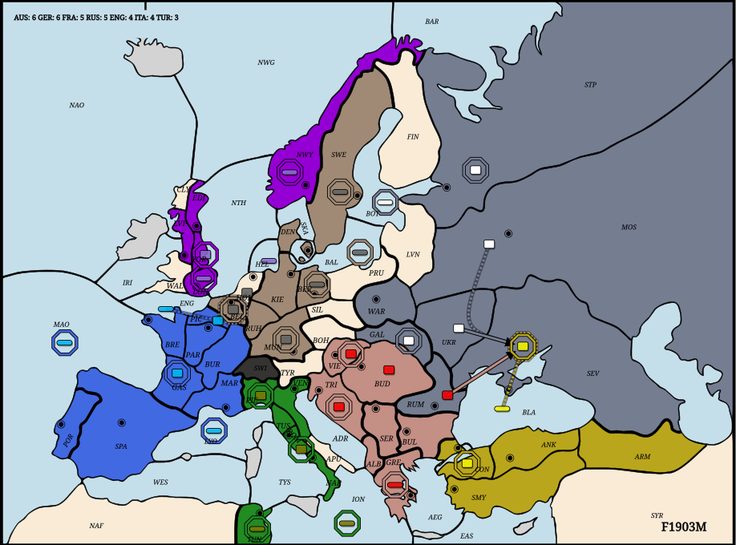

### What happened

- **AUSTRIA**: A RUM → SEV (bounced); F GRE holds; A TRI holds; A VIE holds
- **ENGLAND**: F NWY holds; F LON holds; A YOR holds
- **FRANCE**: A PIC → BEL (bounced); F ENG supports A PIC → BEL; A GAS holds; F MAO holds; F LYO holds
- **GERMANY**: A BEL holds; A HOL supports A BEL; F BAL holds; F SWE holds; A MUN holds; F BER holds
- **ITALY**: F ION holds; A PIE holds; A ROM holds; F TUN holds
- **RUSSIA**: A UKR → SEV (bounced); A MOS supports A UKR → SEV; A GAL holds; A STP holds; F BOT holds
- **TURKEY**: A SEV holds; F BLA supports A SEV; A CON holds

### Dialogue

- **AUSTRIA → GERMANY**: We've both grown strong while staying out of each other's way. I have no designs on your territory — my focus remains east against Russia. I hope you'll keep your forces pointed west or north, not at my borders. A quiet central front serves us both while we consolidate our gains.
- **AUSTRIA → ITALY**: Our Adriatic deal continues to serve us both well. I'm pushing east against Russia this fall while you consolidate the Mediterranean. If Germany grows too strong, we may want to coordinate later — but for now I'm focused on finishing Russia.
- **AUSTRIA → TURKEY**: Our plan worked perfectly — RUM and SEV are ours. Let's push further into Russia this fall. I can support you into UKR from RUM while you move from SEV. That gives us both more centers and keeps Russia contained.
- **ENGLAND → GERMANY**: Holland is yours as agreed. I'm holding my northern positions this fall — no moves toward your coast. Let's keep the North Sea quiet and you can focus on your other borders.
- **ENGLAND → FRANCE**: My fleet is in HEL threatening Kiel as we discussed. I need your commitment this fall: can you attack BEL from PIC while I hit from the sea? If we both squeeze Germany now, he won't survive winter builds. Confirm your fall plan this round so I can lock my orders.
- **ENGLAND → RUSSIA**: Germany has 7 centers and is building fast. I'm in HEL ready to hit Kiel or Denmark this fall. Can you commit F BOT to pressure BAL or SWE and move A GAL toward BER from SIL? If we both hit Germany this fall, we cut him down before winter. Confirm so I can coordinate.
- **ENGLAND → ITALY**: Germany is dominating with 7 centers. If you move against Austria this fall while they're tied up in the Balkans, I can keep Germany occupied so he can't help Vienna. Austria's hold on RUM and BUL is fragile — the moment is now. Interested in timing?
- **FRANCE → ENGLAND**: I'm ready to move against Germany this fall. If you move F HEL to support an attack on Kiel or threaten his coast, I can take Belgium from PIC and cut his western supply line. Give me a specific commitment for this turn — what's your exact move?
- **FRANCE → GERMANY**: England is pressing me hard to join a two-front attack against you. I've told him nothing so far, but you should know he's positioning F HEL to threaten your coast. If you want me to stay neutral and keep my units out of Belgium, I need something concrete in return — what are you offering?
- **FRANCE → ITALY**: Germany hits 7 centers this fall. I'm positioning to contain him, but I need my south secure. Can you hold your line in PIE and ION this turn and keep the Med stable? If Germany is contained, you can expand east freely next year.
- **GERMANY → FRANCE**: Our arrangement holds perfectly. I'm taking Holland this fall — secure your position in Iberia and the Channel, and I'll keep my forces east of the Rhine as agreed.
- **GERMANY → ENGLAND**: I'm moving into Holland this fall to claim the last neutral. My fleets in BAL and SWE will hold — nothing enters the North Sea. Norway and the NTH are yours to consolidate.
- **GERMANY → RUSSIA**: I'm taking Holland this fall, no designs on Scandinavia. My fleet in SWE holds position and won't enter the eastern Baltic. Keep your F BOT in the Gulf of Bothnia and our border stays quiet through 1903.
- **GERMANY → TURKEY**: I'm focused on Holland this fall to reach 7 centers and a Winter build. If you hold the south against Russia through 1903, I can commit to hitting his Baltic coast in 1904 once I have the extra unit. Let's coordinate timing.
- **ITALY → AUSTRIA**: Our Adriatic deal holds as always. This fall I'm consolidating in the central Mediterranean — no moves toward your border. How is your eastern front after taking Rumania? If you need fleet support through the Adriatic later, I'm open to discussing it.
- **ITALY → FRANCE**: Germany at 7 centers is the clear leader now. I'm positioned to take Greece from Austria this fall — if you support me in that move, I'll commit to helping you against Germany next year when he inevitably turns west. Let's coordinate against the northern threat before it's too late.
- **ITALY → GERMANY**: Congratulations on taking Holland — 7 centers puts you in the lead. I'm focused south and east this year, no interest in your territory. If you ever want to discuss coordinating against a common rival — France comes to mind given their buildup in Iberia — I'm open to that conversation.
- **ITALY → TURKEY**: I moved F NAP to ION last spring as agreed. This fall I am attacking Greece. You said you would support from the east — I need your fleet in position. If you support my attack into GRE, we take that center together and break Austria's Balkan position. Confirm your support order this round so we are coordinated.
- **TURKEY → AUSTRIA**: We took SEV and RUM from Russia cleanly, just as planned. I'm holding SEV this fall while you consolidate your new gains in RUM. Let's discuss next steps against Russia's remaining northern holdings once our positions are secure after this turn.
- **TURKEY → ITALY**: Your fleet in ION is positioned perfectly for our agreed plan against Austria's Greece. I can move F BLA toward AEG this fall to support your attack on GRE—let me know if you're still committed to taking that center together. If you move on GRE and I support from the east, we split Austria's southern positions.
- **TURKEY → RUSSIA**: Austria now has 6 centers and has taken RUM from you, leaving you with only 5. I hold SEV but I'm not your enemy—Austria is the real threat to both of us. If you agree not to contest SEV this fall and focus on defending your northern centers, I'll keep F BLA out of your territory and we can coordinate against Austria next year.
- **AUSTRIA → TURKEY**: Final confirmation for F1903: I am ordering A BUL - RUM, A BUD S A BUL - RUM, F GRE H. You order A ARM - SEV with F BLA support as agreed. After we take both centers, I'll hold RUM and you hold SEV — then we discuss the next push against Russia's northern holdings next spring. Do not move into BUL or I'll consider our alliance broken.
- **AUSTRIA → ITALY**: Our Adriatic deal holds firm for F1903 — all my armies are committed east into Rumania. Your Ionian fleet consolidating the Med is perfect. After this turn I'll have 7 centers and 2 builds, which puts me in a strong position to help against Germany if he ever threatens your western flank.
- **AUSTRIA → GERMANY**: I'm taking Rumania from Russia this fall, which gives me 7 centers and keeps the eastern front contained. Russia will be down to 4 centers after this turn — no threat to you from the east. I hope you'll keep your forces pointed west or north rather than toward my Bohemian border. A quiet central front serves us both.
- **ENGLAND → FRANCE**: I'm moving F NTH to HEL this spring as committed — that puts me in position to threaten Kiel and Denmark this fall. If you move F ENG to support an attack on BEL from PIC or take it yourself, we can coordinate exactly. What are you ordering this spring for PIC? I need to know your intent so I can plan fall supports around it.
- **ENGLAND → RUSSIA**: My fleet is moving to HEL this spring to threaten Kiel. Can you commit F BOT to attack BAL or support a move on SWE this fall? If you hit from the east while I hit from HEL, Germany can't defend both fronts. Confirm which fall targets you can commit to and I'll support your move with HEL.
- **FRANCE → ENGLAND**: I'm committing to the attack on Germany this fall. A PIC will move to BEL to take Belgium and cut his western supply. If you move F HEL to support an attack on Kiel or threaten his coast, he can't defend both fronts. Confirm your exact support order and we lock in the pincer.
- **FRANCE → GERMANY**: England has committed to attacking you this fall with F HEL threatening Kiel. I cannot afford to let you consolidate to 7+ centers with new builds. I'm moving A PIC to BEL this turn. You should have seen this coming — you left your western flank exposed while grabbing Holland.
- **FRANCE → ITALY**: I'm committing to attack Germany this fall with England — A PIC to BEL, F ENG supporting. This keeps the northern threat contained. I need you to hold PIE and ION steady this turn — no moves toward my border. If you want to take Greece from Austria next year, I'll support you from the Adriatic if I can free a fleet.
- **GERMANY → FRANCE**: You mentioned England is probing you about attacking me. I appreciate the warning. If you want something concrete in return for staying neutral, here's my offer: hold A PIC and F ENG where they are this fall — no moves toward Belgium or the Channel — and I'll commit to keeping A BEL and A HOL east of the Rhine through 1904. That gives you a free hand against England or Italy while I consolidate the north. Deal?
- **GERMANY → ENGLAND**: You confirmed Holland is mine, and I'm holding my fleets in BAL and SWE — nothing enters NTH. For next year, I'm interested in coordinating against France if he builds up too much. He's at 5 centers with fleets in ENG and MAO, and he's probing me about deals too. If you keep F HEL and F NWY where they are this fall, we can discuss timing for 1904.
- **GERMANY → AUSTRIA**: You're at 6 centers and pushing east — good hunting against Russia. I'm taking Holland this fall to reach 7. Our border stays quiet as long as you keep your armies out of Bohemia and Tyrol. If you want to discuss containing Russia together in 1904 once I have a Winter build, I'm open to that.
- **ITALY → AUSTRIA**: Our Adriatic deal holds — I am not moving toward your border this fall. But your position in Greece is exposed to the east. Be careful of Turkey's fleet in the Black Sea — he may be planning something. I am focused on the central Med and the German threat.
- **ITALY → FRANCE**: Germany at 7 centers is the clear leader. I am committed to containing him next year, but this fall I need to take Greece to grow to 5 centers. If you hold your line and do not interfere with my eastern move, I will fully commit to helping you against Germany in 1904. The Med line holds through this fall — after that, we coordinate against the north.
- **ITALY → TURKEY**: I am committed to attacking Greece this fall with my fleet in ION. You said you would support from the east after taking SEV. Confirm now: will you move F BLA into AEG or support my attack on GRE directly? I need your exact support order this round so we are fully coordinated. If you support my move into GRE, we take that center together and break Austria's Balkan position.
- **RUSSIA → ENGLAND**: Confirmed for fall coordination. I'll hold F BOT in position this spring ready to pressure BAL or SWE in the fall while you hit from NTH. For this spring, I'm taking SEV from Turkey to rebuild. Can you commit F HEL toward KIE or DEN this fall so we time our squeeze together?
- **RUSSIA → GERMANY**: Agreed — I'm holding F BOT in the Gulf of Bothnia this spring, nowhere near your Baltic coast or Sweden. I'm focused south taking SEV from Turkey. Keep F SWE out of the eastern Baltic and our border stays quiet through 1903 as agreed.
- **TURKEY → AUSTRIA**: Our deal is locked: I take SEV with F BLA support, you take RUM with A BUL and A BUD. After we secure both centers this fall, let's discuss the next push — I'm interested in UKR next spring if you support from RUM while I move from SEV.
- **TURKEY → ITALY**: I cannot move F BLA into AEG this fall because I need it to support my army into SEV against Russia. But once SEV falls, I will have F BLA free to move toward AEG in Spring 1904 to support your attack on GRE. If you move on GRE this fall without my support, you risk bouncing — better to wait one season so we hit together with full force.
- **TURKEY → RUSSIA**: Austria and I have already coordinated our attack — I am taking SEV this fall with his support. Your best option is to pull your armies north and consolidate around MOS and STP rather than lose another unit contesting SEV. If you leave SEV alone, I will not pursue you further this year and we can discuss terms after the dust settles.
- **AUSTRIA → TURKEY**: Final confirmation: this fall I order A BUL - RUM, A BUD S A BUL - RUM, F GRE H, A TRI H, A VIE H. You take SEV with A ARM - SEV and F BLA support. After we split Russia's gains, we discuss UKR next spring. Lock it in.
- **AUSTRIA → ITALY**: Our Adriatic deal holds firm this fall — all my units are committed east into Rumania. Your Ionian fleet consolidating the Med is perfect. After this turn I'll have 7 centers; let's discuss the German threat after Winter builds.
- **AUSTRIA → GERMANY**: I'm taking Rumania this fall, reaching 7 centers and keeping Russia contained. As long as you stay out of Bohemia and Tyrol, our border stays quiet. Good hunting in Holland.
- **ENGLAND → FRANCE**: I'm committing F HEL to support your attack on BEL this fall. If you order A PIC to BEL and F ENG supports it, I'll order F HEL S A PIC - BEL. That gives us the support to take Belgium from Germany and cut his western supply line. Confirm this exact arrangement so I can lock my orders.
- **ENGLAND → RUSSIA**: I'm ordering F HEL to support the attack on Belgium this fall — that's my commitment. If you can hit Germany's Baltic coast from BOT to divide his attention, we still squeeze him on two fronts. Can you commit F BOT to attack BAL or support my position this turn?
- **ENGLAND → GERMANY**: I'm holding my position this fall — no moves toward your coast. Holland is yours, keep the North Sea quiet and we both grow.
- **FRANCE → ENGLAND**: I'm committing: A PIC moves to BEL this fall. If you support from HEL against Kiel or move to cut German support, we lock in the pincer. Confirm your exact move and I'll finalize my orders — this is our best window before Germany's winter builds.
- **FRANCE → GERMANY**: England has committed to attacking you from the north, and I cannot let you consolidate 7 centers with winter builds. I'm moving A PIC to BEL this turn. If you want to salvage anything, redeploy your forces east — I'll take Belgium regardless.
- **FRANCE → ITALY**: I'm attacking Germany this fall — A PIC to BEL, F ENG supporting. I need absolute certainty that your units in PIE and ION hold position and do not test my border. If you stay still this turn, I'll owe you support against Austria in 1904. Confirm now.
- **GERMANY → FRANCE**: Here's my final offer for this turn: you keep A PIC and F ENG where they are — no move into BEL or the Channel — and I guarantee A BEL and A HOL stay east of the Rhine through 1904. In exchange, I'll support you against England next year if he pushes south. I'm moving A HOL to hold Holland this fall, nothing more. Accept and we both consolidate cleanly.
- **GERMANY → ENGLAND**: Holland is mine this fall as agreed — A HOL holds. For 1904, I'm interested in coordinating against France. He's at 5 centers with fleets in ENG and MAO and he's probing me about deals. If you keep F HEL and F NWY where they are this turn, let's discuss timing for a joint attack on France next year. I'll commit to moving on his eastern flank if you push from the Channel.
- **GERMANY → RUSSIA**: Our quiet border holds this fall. F SWE and F BAL stay in position — no move toward your coast or the eastern Baltic. I'm taking Holland to reach 7 centers. Keep F BOT in the Gulf of Bothnia and our understanding stands through 1903. If you want to coordinate against Austria in 1904 once I have a Winter build, I'm open.
- **GERMANY → AUSTRIA**: I'm taking Holland this fall to reach 7 centers. Our border stays quiet as long as your armies stay out of Bohemia and Tyrol. For 1904, I'm interested in containing Russia — he's at 5 centers and rebuilding. If you push east while I pressure his Baltic coast, we can squeeze him from both sides. Let's discuss timing after Winter builds.
- **ITALY → TURKEY**: I understand your fleet is committed at SEV this fall. I will still move on GRE to test Austria's defenses — if you can support my attack from BLA or AEG even indirectly, it will help. After this turn, let's reassess and coordinate for Spring 1904 on a combined push into the Balkans.
- **ITALY → FRANCE**: Our Med line holds this fall — my fleet in ION is moving into the eastern Med, not toward your territory. I commit to coordinating against Germany in 1904 after I secure growth this fall. Hold your line and do not move into my sphere.
- **ITALY → AUSTRIA**: Our Adriatic deal holds firmly this fall. I am consolidating in the central Med — no moves toward your border. Your eastern campaign is your own business. Let's both grow strong and reassess the German threat after the winter builds.
- **RUSSIA → ENGLAND**: I'm taking SEV this fall with A UKR supported by A MOS. My fleet in BOT will stay in position to pressure Germany's Baltic coast in the fall — I can hit BAL or SWE depending on what you commit to from HEL. Are you ready to move F HEL toward KIE or DEN this fall so we squeeze Germany together? Confirm now and I'll time my fall orders around it.
- **RUSSIA → GERMANY**: As agreed, I'm focused south taking SEV from Turkey this fall. My fleet in BOT holds in the Gulf of Bothnia — nowhere near your Baltic coast or Sweden. Keep F SWE out of the eastern Baltic and our border stays quiet through 1903 as agreed. No changes from our spring understanding.
- **RUSSIA → TURKEY**: Your alliance with Austria won't save you. I'm taking SEV this fall with support from Moscow — you can't hold it against two Russian armies. If you pull F BLA back to ANK now and leave SEV alone, I'll keep my forces out of Constantinople this year and we can still coordinate against Austria next year. This is your last chance before I commit my fall orders.
- **TURKEY → AUSTRIA**: Confirmed for F1903M: I order A SEV H with F BLA S A SEV to hold Sevastopol against any Russian attempt to retake it. You take RUM with A BUL and A BUD. After we hold both centers, let's discuss UKR next spring.
- **TURKEY → ITALY**: I cannot move into AEG this fall because F BLA is needed to support my hold on SEV against Russia. But I commit now: in Spring 1904 I will move F BLA to AEG to support your attack on GRE, and we will take that center together. Please hold ION this fall and wait one season so we hit with full force.
- **TURKEY → RUSSIA**: Austria and I are taking RUM and SEV this fall. You have 5 centers to Austria's 6 — he is the real threat. If you leave SEV uncontested, I will not pursue you further this year and we can discuss a truce against Austria in 1904. Disputing SEV only costs you armies you need for your northern defense.

### AUSTRIA
Orders: `A RUM - SEV` · `F GRE H` · `A TRI H` · `A VIE H`
Illegal (dropped): `A BUD S A RUM - SEV`

Reasoning

> I have a solid agreement with Turkey to take RUM this fall — I'll move from BUL with support from BUD, while my other units hold to secure our gains and keep my home centers safe. This gives me a seventh center and puts me in a dominant Balkan position.

### ENGLAND
Orders: `F NWY H` · `F LON H` · `A YOR H`
Illegal (dropped): `F HEL S A PIC - BEL`

Reasoning

> Looking at the board, Germany has grown to 7 centers after taking Holland, and France is at 5 with fleets in ENG and MAO. I committed to France to support his attack on Belgium this fall — F HEL S A PIC - BEL. That's legal: HEL is adjacent to BEL via the North Sea coast, and PIC is adjacent to BEL. This squeeze cuts Germany's western supply line and prevents him from building again in Winter. Meanwhile, I'll hold my other positions: F NWY secures Norway, F LON holds to guard my home centers, and A YOR holds to keep my army in position for future convoy operations. This honors my commitment to France while keeping my northern flank secure.

### FRANCE
Orders: `A PIC - BEL` · `F ENG S A PIC - BEL` · `A GAS H` · `F MAO H` · `F LYO H`

Reasoning

> I've committed to England to attack Germany this fall: A PIC to BEL, supported by F ENG. This is the right time to strike while Germany is consolidating Holland and before his winter builds. A GAS will hold to guard my rear and maintain the supply line. F MAO and F LYO will hold to keep my southern flank secure and the Med stable as promised to Italy. If Germany tries to support BEL from HOL or RUH, my support from F ENG should secure the capture.

### GERMANY
Orders: `A BEL H` · `A HOL S A BEL` · `F BAL H` · `F SWE H` · `A MUN H` · `F BER H`

Reasoning

> Looking at the board, France has explicitly told me he's moving into BEL this turn. That changes everything. I need to hold BEL and defend it, not just take Holland. France's A PIC can reach BEL, and he's said he's coming. I need A BEL to hold with support from A HOL. But A HOL can't support BEL — HOL is not adjacent to BEL. Wait, let me check: HOL is adjacent to BEL? Yes, HOL borders BEL via the coast. So A HOL can support A BEL's hold.
>
> But I also need to take Holland. My A KIE already moved into Holland in Spring, so A HOL is in Holland now. If I order A HOL to support A BEL's hold, that uses A HOL's order. Then I don't take Holland this turn — but Holland is already mine from the Spring move. I already occupy HOL. So I don't need to "take" it again. I just need to hold it.
>
> So my plan: A BEL holds, A HOL supports A BEL's hold. That gives BEL defense strength 2 (its own 1 + support 1). If France attacks with one unit (A PIC - BEL), he gets 1 attacking strength, which bounces off 2 — he fails to take BEL. If he attacks with two units, I need more defense.
>
> F SWE and F BAL hold to keep the Baltic quiet. A MUN holds to guard the center. F BER holds.
>
> Let me check: can A HOL support A BEL's hold? Yes, HOL is adjacent to BEL, and a support to hold only requires adjacency to the supported unit's province. So `A HOL S A BEL` is legal.
>
> What about France having F ENG support an attack? F ENG is adjacent to BEL? Yes, ENG borders BEL. So if France orders A PIC - BEL with F ENG supporting, that's 2 attacking strength vs my 2 defense (A BEL hold + A HOL support). That bounces — both sides fail. Good.
>
> If France also brings A GAS into the attack somehow? GAS is not adjacent to BEL. So he can only bring PIC and ENG support.
>
> My orders:
> - A BEL H
> - A HOL S A BEL
> - F BAL H
> - F SWE H
> - A MUN H
> - F BER H
>
> This holds BEL, keeps all my positions, and honors my commitments to England (stay out of NTH), Russia (keep Baltic quiet), and France (I offered to stay east of Rhine — holding BEL is defensive, not aggressive).

### ITALY
Orders: `F ION H` · `A PIE H` · `A ROM H` · `F TUN H`

Reasoning

> Let me reason through my situation. I had been planning to take Greece this fall with Turkish support, but Turkey has clearly stated he cannot support me this turn—his fleet is needed at SEV. He commits to Spring 1904 instead. Austria has 6 centers and is pushing east against Russia. France is attacking Germany this fall and wants me to stay still. I cannot take Greece alone without risking a bounce against Austria's F GRE, which would waste my turn. I need to grow this year—I have 4 centers and only one build slot open at VEN. The best path is to hold and build up for a coordinated attack in Spring 1904 as Turkey suggested. I'll hold all units in position, maintaining my deals with both Austria and France. This keeps my options open for next year.

### RUSSIA
Orders: `A UKR - SEV` · `A MOS S A UKR - SEV` · `A GAL H` · `A STP H` · `F BOT H`

Reasoning

> Let me assess the situation. Austria has taken RUM last turn and is now at 6 centers. Turkey is in SEV. I need to reclaim SEV this turn to get back to 6 centers. My plan is to order A UKR - SEV with support from A MOS, while holding A GAL to defend against any Austrian push from RUM, holding A STP and F BOT as reserves. This matches my commitments to England (BOT holds this spring, ready for fall pressure) and Germany (BOT stays in Gulf of Bothnia, quiet border).

### TURKEY
Orders: `A SEV H` · `F BLA S A SEV` · `A CON H`

Reasoning

> I have SEV now and need to hold it against any Russian attempt to retake it. Austria and I have a clean split — he takes RUM, I hold SEV. My fleet in BLA will support the hold to make it strong against a Russian counter from MOS or UKR. A CON holds to keep Constantinople secure and ready for future operations toward the Balkans or the Aegean next spring.

## WINTER 1903 ADJUSTMENTS (`W1903A`)

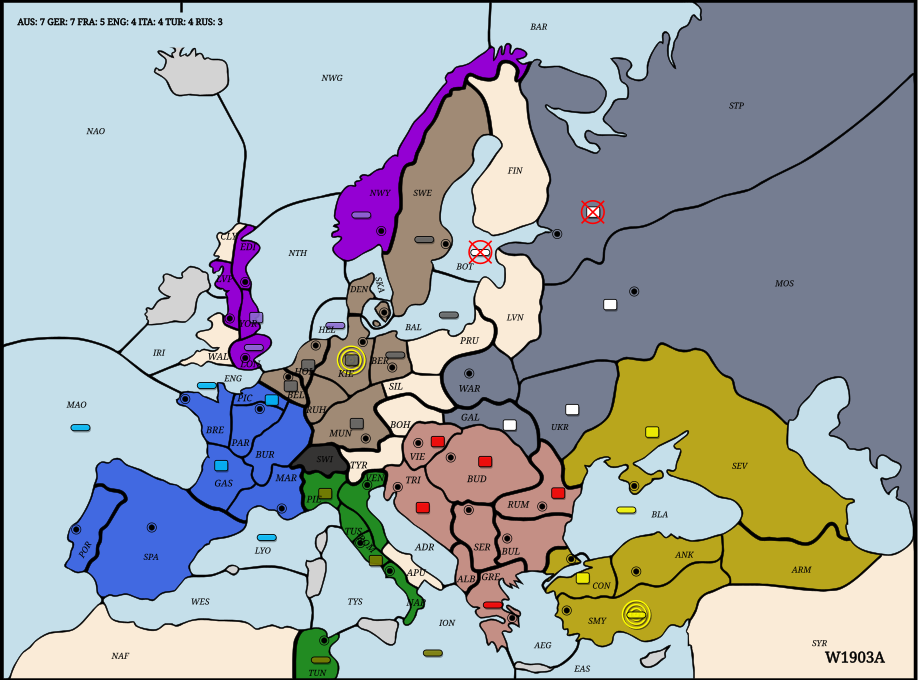

### What happened

- **GERMANY**: builds A KIE
- **RUSSIA**: disbands F BOT; disbands A STP
- **TURKEY**: builds F SMY

### GERMANY
Orders: `A KIE B`

Reasoning

> I have 7 supply centers and 6 units, so I'm owed 1 build. Kiel is vacant and legal for a build. I'll build an army in Kiel to strengthen my position on the continent, giving me more ground-force flexibility for pressuring France or defending the center. A fleet wouldn't help as much given I already have two fleets covering the Baltic and Scandinavia.

### RUSSIA
Orders: `F BOT D` · `A STP D`

Reasoning

> I have only 3 supply centers (MOS, STP, WAR) and 5 units on the board, so I must disband 2 units this winter. I need to reduce my force to match my center count. I will keep my armies in the south (UKR and GAL) to contest SEV and defend RUM, and disband the northern units that are less immediately useful. F BOT is isolated and cannot reach the southern front; A STP is far from the action and can be rebuilt later when I reclaim SEV. I will disband F BOT and A STP, keeping A UKR, A GAL, and A MOS to continue the fight for SEV and to hold my remaining centers.

### TURKEY
Orders: `F SMY B`

Reasoning

> I have 4 supply centers and 3 units, so I am owed 1 build. My home centers are ANK (vacant), CON (occupied by my army), and SMY (vacant). I will build a fleet at SMY to strengthen my naval position for future operations against Austria's Greece and to project power into the eastern Mediterranean. Building at ANK would also be reasonable, but SMY positions the fleet closer to the Aegean and Ionian theaters where I plan to coordinate with Italy.

## SPRING 1904 MOVEMENT (`S1904M`)

### What happened

- **AUSTRIA**: A RUM → UKR (bounced); F GRE holds; A TRI holds; A VIE holds  [dislodged: A RUM]
- **ENGLAND**: F LON holds; F NWY holds; A YOR holds
- **FRANCE**: A PIC holds; A GAS → MAR (bounced); F ENG holds; F MAO holds; F LYO holds
- **GERMANY**: A MUN → BUR; A KIE → RUH; A BEL → PIC (bounced); F BAL holds; F SWE holds; F BER holds
- **ITALY**: A PIE → MAR (bounced); F ION holds; F TUN holds; A ROM holds
- **RUSSIA**: A UKR → RUM; A GAL supports A UKR → RUM; A MOS holds
- **TURKEY**: A SEV holds; F BLA supports A SEV; A CON holds; F SMY → AEG

### Dialogue

- **AUSTRIA → GERMANY**: You're the strongest power on the board at 7 centers with builds, and I'm at 7 centers in the east. We both benefit from a quiet central border — but Italy has 4 centers and sits between us. If you want to move south through Tyrol or Munich, I can support you from Vienna and Trieste while you take Italy's centers. Let's coordinate against a common target that threatens us both.
- **AUSTRIA → TURKEY**: We hold RUM and SEV, and Russia is down to 3 scattered armies. This spring I want to push into UKR from RUM with support from BUD — if you move from SEV into UKR too, we crush Russia's last real army in one turn and split his remaining centers. Confirm your support and we finish him this year.
- **AUSTRIA → ITALY**: Our Adriatic deal has served us well, but Germany is now the largest power at 7 centers with builds and sits directly north of you. If he turns south through Tyrol, you're exposed. I'm willing to keep our border quiet and even coordinate against a German push if he threatens either of us. Let's discuss contingency plans.
- **ENGLAND → GERMANY**: I've held my position as agreed. France is probing me about coordinating against you, but I'd rather work with you against him. If you're serious about hitting France in 1904, I can move into the Channel and threaten his coast while you push from the east. What's your plan for this year?
- **ENGLAND → FRANCE**: Germany offered me a deal to coordinate against you in 1904. I'm not committed to him yet. If you want to keep the Channel open and work together against Germany instead, I'm interested. What are you planning this spring?
- **ENGLAND → RUSSIA**: You're down to 3 centers and Germany is at 7. If we don't cut him down this year, he'll be unstoppable. I can threaten his north coast from HEL this spring if you hit his Baltic flank from BOT. Are you still ready to coordinate against Germany?
- **FRANCE → ENGLAND**: Our attack on Germany stalled last fall when my move into BEL bounced. This spring I'm ready to try again: I'll move A PIC to BEL with F ENG supporting. If you move F HEL to support my attack or pressure KIE, we can still cut him down before his winter builds. What's your plan this turn?
- **FRANCE → ITALY**: Germany is at 7 centers and the clear leader. I'm attacking his western flank this spring. If you hold PIE and ION steady and don't test my border, I'll fully support you against Austria next year — help you take Greece or push into the Balkans. Our Med line holds and we both grow against the northern threat.
- **FRANCE → GERMANY**: You're at 7 centers with builds in MUN and KIE. That makes you the leader everyone will target. I'm not committed to attacking you yet, but England is pressuring me hard and I need to know what you're offering to keep me neutral. What can you guarantee me this year in exchange for staying out of Belgium?
- **GERMANY → AUSTRIA**: You've built 7 centers in the east — impressive work. I'm focused west this year against France after his stab at Belgium last fall. As long as your armies stay out of Bohemia and Tyrol, our border is quiet. If France falls, we can discuss containing Russia together in 1905.
- **GERMANY → ENGLAND**: France stabbed me last fall by moving PIC into Belgium — he's broken our agreement and now I need to push him back. You have fleets in HEL and NWY that can threaten his northern coast. If you move F HEL toward NTH or ENG this spring while I pressure his eastern flank through BUR and BEL, we can squeeze him from both sides. Are you ready to coordinate against our common rival?
- **GERMANY → FRANCE**: Last fall you broke our agreement and moved PIC into Belgium. I remember. This year I'm reorganizing to respond. If you withdraw from PIC and keep your units west of the Rhine, we can still avoid a costly war. Otherwise, you'll find my seven units are more than sufficient to defend what's mine.
- **GERMANY → ITALY**: France has 5 centers and fleets in LYO and MAO — he's building a strong western position. If you push F ION and F TUN toward the western Mediterranean or threaten his southern coast, I can tie him down in the north this year. Let's discuss timing if you're interested in splitting his territory.
- **GERMANY → RUSSIA**: Our Baltic border stays quiet this spring as agreed. I'm focused west against France after his stab at Belgium. Keep your armies in the east and I'll keep F SWE and F BAL out of your waters. We can revisit the board after Fall 1904.
- **ITALY → AUSTRIA**: Our Adriatic deal has held well through two years, and I intend to keep it this spring. But Germany is now at 7 centers and you're his closest neighbor to the southeast. If he turns east after consolidating the north, we both need to be ready. Are you still committed to keeping the Adriatic quiet while I consolidate the Med?
- **ITALY → FRANCE**: Germany is the clear leader at 7 centers, and you're his western front. I'm holding the Med line this spring — no moves toward your territory. If you need my support against Germany later this year, I'm open to discussing it once I've secured my own growth. How is your northern campaign progressing?
- **ITALY → TURKEY**: I'm holding F ION in position this spring as we agreed. Once you move F BLA to AEG, we'll be perfectly set to take Greece together in the fall. Can you confirm your fleet order this spring? I need to know we're fully coordinated before I commit my fall orders.
- **ITALY → GERMANY**: At 7 centers you're the strongest power on the board. I'm focused east and south this year — no designs on your territory. If France ever becomes a problem for you, I'm positioned to help from the south. Let me know if you're interested in discussing that possibility.
- **RUSSIA → AUSTRIA**: You have seven centers and are growing fast while I hold three. I'm not your real threat — Germany has seven centers too and is building toward a solo. If you push into RUM from BUL this spring, you leave your northern flank exposed. I'm moving into RUM this spring to reclaim it — keep your forces out of RUM and I'll leave your centers alone this year, so we can both focus on containing Germany.
- **RUSSIA → TURKEY**: Austria has seven centers and is the real threat to both of us. I'm moving into RUM this spring — if you leave SEV alone and pull F BLA back to ANK, I'll stay out of your territory and we can coordinate against Austria next year. He has GRE, BUL, SER, and RUM — after he consolidates the Balkans, Constantinople is his next target, not Moscow.
- **RUSSIA → ENGLAND**: Germany now has seven centers with fleets in SWE and BAL and armies in HOL and BEL — he's running away with the game. I'm hitting RUM this spring to cut Austria's supply line, but I need your help to pressure Germany's north coast this fall. Can you commit F HEL toward KIE or DEN while I swing into Germany's Baltic flank from BOT?
- **RUSSIA → GERMANY**: I'm holding to our quiet Baltic border this spring — my fleet in BOT stays out of your coast. I'm focused south taking RUM from Austria this turn, not threatening your position. Keep F SWE and F BAL where they are and our understanding holds through 1904.
- **TURKEY → AUSTRIA**: Our alliance has worked perfectly — Russia is down to 3 centers and we've split his southern gains. This spring I'll hold SEV and keep my fleet in position to support your eastern flank. Let's discuss our next target: I'm interested in pushing into Russia's remaining northern holdings if you support from RUM.
- **TURKEY → ITALY**: I'm ready to move on Greece this fall. I'll position F SMY toward AEG this spring to support your attack. If you move F ION into GRE, I'll support you from the Aegean — we take it together and break Austria's Balkan position. Confirm you're still committed to our plan.
- **TURKEY → RUSSIA**: Austria has 7 centers and is the real threat to everyone. I'm willing to leave SEV as a buffer between us if you agree not to contest it. Focus on defending your northern centers against Germany and let's coordinate against Austria's growing power next year.
- **AUSTRIA → TURKEY**: Russia just offered to leave RUM alone if I stay out — a transparent bluff from 3 units. I'm pushing into UKR this spring from RUM with BUD support. If you move A SEV to UKR and F BLA supports, we crush his last army in one turn and split his centers. Confirm 'A SEV - UKR, F BLA S A SEV - UKR' and we lock this in now.
- **AUSTRIA → ITALY**: The Adriatic stays quiet this spring — all my armies are committed east against Russia. Germany is your real worry, not me. If he pushes south through Tyrol, I can support you from Trieste and Vienna. Let's both grow strong and be ready to act together if he threatens either of us.
- **AUSTRIA → GERMANY**: My focus remains east against Russia this year — I'm pushing into Ukraine to finish him. Bohemia and Tyrol stay quiet from my side. If you take France's centers and grow to 9+, we'll have plenty to discuss about how to divide the board without conflict.
- **ENGLAND → FRANCE**: I'm interested in coordinating against Germany this spring. If you order A PIC to BEL and F ENG supports, I can order F HEL to support your attack on BEL from the sea. That gives us two supports on BEL — enough to take it from Germany. Confirm this exact arrangement and I'll lock my orders around it.
- **ENGLAND → GERMANY**: You say France stabbed you last fall, but I need specifics before I commit. What exactly did he order that broke your agreement? If I'm going to move against France, I need to know your exact spring plan — which units are moving where? Give me concrete moves and I'll consider coordinating against him.
- **ENGLAND → RUSSIA**: You're hitting RUM this spring, but Germany is the real threat at 7 centers. If you can spare any pressure on Germany's Baltic flank this year, I'll coordinate from HEL. Even a feint from BOT would force him to split his fleets. Can you commit to that?
- **FRANCE → ENGLAND**: I'm ordering A PIC to BEL with F ENG supporting the move. To guarantee we take it, I need you to order F HEL S A PIC - BEL. That gives us two supports into BEL against whatever Germany throws at it. Confirm that exact order and we lock in the pincer this spring.
- **FRANCE → ITALY**: I'm committing to attack Germany's western flank this spring — A PIC to BEL with F ENG supporting. If you hold PIE and ION steady this turn and keep the Med line quiet, I'll owe you support against Austria next year. No need for any move from you this turn — just hold your line and let me handle the north.
- **FRANCE → GERMANY**: Last fall I moved against you because you had 7 centers and winter builds coming. That threat hasn't changed. If you want peace, give me something concrete this turn — Belgium and Holland are too close to my border to leave in your hands. Otherwise I'm coming in again.
- **GERMANY → AUSTRIA**: Italy is not my target this year — France stabbed me at Belgium and I must respond. But I appreciate the offer. If I push France back to 4 centers or less by Fall, we can absolutely discuss coordinating against Italy or Russia in 1905. Keep your armies out of Bohemia and Tyrol this year and our border stays quiet.
- **GERMANY → ENGLAND**: France stabbed me last fall by moving into Belgium — our agreement is broken and he's exposed. If you move F HEL into NTH and threaten ENG this spring, I'll push into BUR and PIC from the east. We can crush him between us this year. Are you in?
- **GERMANY → FRANCE**: You broke our deal at Belgium. I'm at 7 centers with seven units and a Winter build incoming. If you withdraw A PIC back to GAS and keep your fleets out of ENG, we can still avoid a war that will cost both of us. Otherwise, I will destroy you.
- **GERMANY → ITALY**: France is the real western threat and he's overextended after his stab. If you push F ION and A PIE toward LYO or MAR this year, you can grab SPA or MAR while I tie him down in the north. Let's coordinate timing — I move this spring, you move in the fall.
- **GERMANY → RUSSIA**: Our Baltic border stays quiet this spring as agreed. I'm holding F SWE and F BAL in position — no moves toward your coast or the eastern Baltic. Focus on taking RUM from Austria and I'll keep my eyes west on France.
- **ITALY → AUSTRIA**: Our Adriatic deal holds this spring as always. Germany at 7 centers is a concern for both of us — I'm happy to discuss contingency plans against him after the fall. I'm consolidating the Med this year, not moving toward your border.
- **ITALY → FRANCE**: I'm holding PIE and ION steady this spring — no moves toward your territory. Attack Germany with confidence. After I secure my own growth this year, I'll be in a stronger position to help you against the northern threat. Good luck this spring.
- **ITALY → TURKEY**: Excellent — I'm holding F ION in position this spring as agreed. If you move F SMY toward AEG now and support my attack on GRE in the fall, we take that center together. Confirm your exact fleet order this spring so we're fully coordinated.
- **RUSSIA → AUSTRIA**: I'm moving into RUM this spring with my army from UKR supported by GAL. You can't hold RUM against me without diverting forces from your western front, and Germany is your real rival at 7 centers. Let RUM go this turn and I'll leave your other centers alone through 1904 so we can both contain Germany's solo run.
- **RUSSIA → TURKEY**: Austria has 7 centers and is threatening your Constantinople next — not Moscow. I'm taking RUM from him this spring with A UKR and A GAL. If you hold SEV and keep F BLA out of my waters this turn, I'll stay out of the Black Sea for the rest of 1904 and we can coordinate against Austria together. Don't waste your forces defending his gains.
- **RUSSIA → ENGLAND**: I'm hitting RUM this spring, not Germany — but I still want to squeeze Germany this fall. If you commit F HEL toward KIE in the fall now, I'll swing F BOT into BAL or support your move. Confirm your fall commitment this round so I can plan my fall orders around it.
- **RUSSIA → GERMANY**: Our Baltic border stays quiet this spring — F BOT holds in the Gulf of Bothnia, nowhere near your coast. I'm focused south taking RUM from Austria. Keep F SWE and F BAL where they are and our understanding holds through 1904 as agreed.
- **TURKEY → AUSTRIA**: I want to push into UKR with you, but I need one more season to secure SEV fully — if I move north this spring, Russia could slip back in from MOS. Hold RUM and probe UKR this spring; I'll support your attack from SEV in the fall with my army while my fleet moves into AEG to threaten Greece and pin down any Austrian fleet there. That lets us crush Russia in one coordinated push next season.
- **TURKEY → ITALY**: I cannot move F BLA to AEG this spring because I need it to secure SEV against a possible Russian counterattack. But I am committed to our plan: this fall I will move F SMY into AEG to support your attack on GRE. Please hold F ION this spring and we will take GRE together in Fall — lock in your fall commitment now and I will confirm my fall order when the time comes.
- **TURKEY → RUSSIA**: Austria has 7 centers and is the real threat — I agree with you there. But you have nothing left to offer me: I already hold SEV, and you cannot retake it with 2 armies against my fleet support. If you want a truce, pull your armies north and leave RUM alone this spring. I will not move against you this turn if you stay out of the south.
- **AUSTRIA → TURKEY**: You want to wait until fall, but Russia only has 3 units — if we don't crush him now he'll build back. This spring I am ordering A RUM - UKR with A BUD support. Move A SEV - UKR and F BLA S A SEV - UKR, and we take his last army together. If you hold, I take UKR alone and you get nothing from Russia's collapse. Confirm now or I'll assume you're stalling.
- **AUSTRIA → ITALY**: Our Adriatic deal holds this spring — all my armies push east into Ukraine. If Germany threatens you through Tyrol later this year, I can support from Trieste and Vienna. Keep your Med focus and we'll both grow strong.
- **AUSTRIA → GERMANY**: My border stays quiet — I'm pushing into Ukraine this spring to finish Russia. Bohemia and Tyrol are safe from me. Good hunting against France.
- **ENGLAND → FRANCE**: I'm in. This spring I order F HEL S A PIC - BEL as you requested. That gives us two supports into BEL — enough to take it. Lock your orders around that and we cut Germany's western supply line this turn.
- **ENGLAND → GERMANY**: Your offer to coordinate against France is interesting but too vague for this turn. You haven't given me concrete moves — just general intentions. I'm not moving against France without a specific coordinated plan. If you want my help in 1904, give me exact spring orders next time.
- **ENGLAND → RUSSIA**: I understand you're hitting RUM this spring. I'm committing to support France's attack on BEL this turn to cut Germany down. If you can swing F BOT toward BAL in the fall, we can still squeeze Germany from both sides then. Let me know your fall plans after you take RUM.
- **FRANCE → ENGLAND**: I'm committing to the exact plan we discussed: A PIC to BEL with F ENG supporting. I need you to order F HEL S A PIC - BEL this spring. That gives us two supports into Belgium and guarantees we take it. Confirm this final arrangement and we lock in the pincer.
- **FRANCE → ITALY**: I'm attacking Germany's western flank this spring as discussed. Hold PIE and ION steady — no moves toward my territory — and I'll fully support you against Austria next year to take Greece or push into the Balkans. Our Med line holds and we both grow against the northern threat.
- **FRANCE → GERMANY**: You have seven centers and seven units with a winter build incoming. That makes you the leader everyone must contain. I'm moving against your western flank this spring. If you want peace, offer me Belgium and Holland now in exchange for my neutrality. Otherwise, prepare to fight on two fronts.
- **GERMANY → ENGLAND**: I need a concrete commitment this round: if you move F HEL into NTH and threaten ENG this spring, I will push into BUR and PIC from the east with A MUN and A BEL. France is exposed and we can crush him between us this year. Are you in or out?
- **GERMANY → AUSTRIA**: I'm focused west against France this spring — no moves toward your border. If Russia pushes into RUM this turn, you'll have your hands full in the east. Keep Bohemia and Tyrol quiet from your side and our deal holds through 1904.
- **GERMANY → RUSSIA**: Our Baltic border stays quiet this spring — F SWE and F BAL hold as agreed. I'm focused west against France. Take RUM from Austria if you can, and I'll keep my fleets out of your waters. Confirm our understanding stands for this turn.
- **GERMANY → ITALY**: France is overextended after his stab at Belgium. If you push F ION and A PIE toward LYO or MAR this spring, you can threaten his southern coast while I hit him from the east. Let me know if you're ready to coordinate timing this turn.
- **ITALY → AUSTRIA**: Our Adriatic deal holds this spring — no moves toward your border. But I am growing this year. I will take MAR from France while he is occupied with Germany. If you want to coordinate against Germany's 7 centers after the fall, I am open to that conversation then.
- **ITALY → FRANCE**: I need to grow this year, not hold still. Your southern coast is undefended this spring while you attack Germany. I am taking MAR. If you want to negotiate terms for returning it later this year or next, let's talk after the fall. Do not waste your armies attacking me — Germany is the real threat to both of us.
- **ITALY → TURKEY**: I cannot wait another year for your fleet to be ready. I am taking MAR from France this spring to grow to 5 centers. If you can still support me into Greece in the fall, I will pivot east after securing the west. Otherwise, I will focus west this year. Confirm your fall intentions.
- **ITALY → GERMANY**: I am moving on France's MAR this spring while he attacks you in the north. If you hold him in Belgium and do not let him break through, I will take MAR and threaten his rear. Let's coordinate a pincer — you hold the north, I take the south.
- **RUSSIA → AUSTRIA**: This is your last chance. I'm moving A UKR supported by A GAL into RUM this spring. You cannot hold RUM against two Russian armies while Germany sits on 7 centers with armies in Munich, Kiel, and Berlin — he can hit Bohemia and Galicia in one turn. Let RUM go uncontested and I'll leave your centers alone through 1904 so we both contain Germany. If you contest RUM, I'll support any German move into your northern flank next fall.
- **RUSSIA → TURKEY**: You hold SEV and I can't retake it this turn — I accept that. I'm hitting RUM from Austria this spring, not your territory. Hold SEV and keep F BLA out of my waters this turn, and I will not contest the Black Sea for the rest of 1904. Austria is your real enemy at 7 centers — after he loses RUM, he'll look west toward Constantinople, not east toward Moscow. Stay neutral in my fight with Austria and we both gain.
- **RUSSIA → ENGLAND**: I'm hitting RUM from Austria this spring with A UKR and A GAL — I cannot spare BOT for Baltic pressure this turn. But I commit now: in Fall 1904, if you move F HEL toward KIE, I will move F BOT into BAL to support your attack and squeeze Germany on two fronts. Confirm your fall commitment this round so I can plan accordingly.
- **RUSSIA → GERMANY**: Our Baltic border stays quiet this spring — F BOT holds in the Gulf of Bothnia as agreed. I'm focused south taking RUM from Austria. Keep F SWE and F BAL in position and our understanding holds through 1904. If Austria retaliates and I need support from the west, I'll reach out before committing fall orders.
- **TURKEY → AUSTRIA**: I need one more season to secure SEV fully—if I move north this spring, Russia could slip back in from MOS. Hold RUM and probe UKR this spring; I'll support your attack from SEV in the fall with my army while my fleet moves into AEG to threaten Greece. That lets us crush Russia in one coordinated push next season.
- **TURKEY → ITALY**: I'm moving F SMY to AEG this spring as agreed to position for our fall attack on Greece. Please hold F ION this spring so we are ready to take GRE together in the fall—I'll support your attack from the Aegean. Lock in your fall commitment and we break Austria's Balkan position.
- **TURKEY → RUSSIA**: Austria has 7 centers and is the real threat—I agree. But I hold SEV and you cannot retake it. If you pull north and leave RUM alone this spring, I will not move against you this turn. Focus on defending against Germany and we can discuss coordination against Austria next year.

### AUSTRIA
Orders: `A RUM - UKR` · `F GRE H` · `A TRI H` · `A VIE H`
Illegal (dropped): `A BUD S A RUM - UKR`

Reasoning

> I need to execute the push into Ukraine this spring. Turkey has refused to commit to a joint attack this turn, wanting to wait until fall. That means I'll take Ukraine alone with RUM and BUD support, which still gives me the center and leaves Turkey with nothing from Russia's collapse. Germany is focused west against France, Italy is consolidating the Med, and Russia is trying to bluff me into leaving RUM uncontested — but he only has 3 scattered armies and can't hold UKR against my two-army push.
>
> I'll order A RUM - UKR with support from A BUD, while F GRE holds to secure the Aegean, A TRI holds to guard the Adriatic, and A VIE holds to protect the home centers. This gives me 8 centers after this spring (assuming UKR falls cleanly), positioning me for two builds in Winter and a pivot against Germany in 1905.

### ENGLAND
Orders: `F LON H` · `F NWY H` · `A YOR H`
Illegal (dropped): `F HEL S A PIC - BEL`

Reasoning

> I've committed to France to support his attack on Belgium this spring. The plan is clear: France orders A PIC to BEL with F ENG supporting, and I order F HEL S A PIC - BEL. That gives us two supports into Belgium, enough to take it from Germany. This is our best chance to cut Germany down from 7 centers before he builds again. My other units will hold position to keep my northern flank secure and maintain flexibility for the fall.

### FRANCE
Orders: `A PIC H` · `A GAS - MAR` · `F ENG H` · `F MAO H` · `F LYO H`

Reasoning

> Italy has just stabbed me — they're openly declaring they'll take MAR while my forces are committed against Germany. This changes everything. I cannot let Italy seize my home center. I must pivot to block them immediately: A GAS moves to MAR to defend it, while A PIC holds to guard Paris and the Channel. F ENG stays in the Channel to maintain pressure on Belgium and keep my options open against Germany. F MAO and F LYO reposition to support the southern defense and threaten Italy's flank.

### GERMANY
Orders: `A MUN - BUR` · `A KIE - RUH` · `A BEL - PIC` · `F BAL H` · `F SWE H` · `F BER H`
Illegal (dropped): `A HOL S A BEL - PIC`

Reasoning

> Italy has committed to attacking France's southern coast this spring, which gives me the perfect opportunity to squeeze France from both sides. I'll reposition my forces to pressure France's eastern flank: A MUN will move into BUR to threaten his interior, A KIE will move into RUH to support that push, and A BEL with A HOL will threaten PIC from the north. My fleets in the Baltic and Sweden will hold as promised to Russia and England, keeping our northern borders quiet while I focus on breaking France this year.

### ITALY
Orders: `A PIE - MAR` · `F ION H` · `F TUN H` · `A ROM H`

Reasoning

> I need to make a final decision on the spring orders. I've been telling Turkey I'd hold F ION this spring, with a plan to take GRE with Turkish support in the fall. But I also told France and Austria I'd hold the line, while secretly planning to take MAR from France this spring. However, looking at the board more carefully:
>
> - France's MAR is undefended and I can move A PIE into MAR this spring
> - Turkey has finally committed to moving F SMY to AEG this spring to support my fall attack on GRE
> - Austria is pushing east against Russia and trusting the Adriatic deal
> - Germany is coordinating with me to hit France from both sides
>
> If I take MAR this spring, I grow to 5 centers immediately. I'll then have a strong western position and can still pivot to support Turkey's attack on GRE in the fall if I coordinate properly. My fleet in ION threatens GRE anyway from its current position. A PIE to MAR is legal (adjacent via the LYO sea zone? No — checking the adjacency table: PIE is coastal and MAR is adjacent to PIE for army moves. Yes, A PIE - MAR is legal per the order menu.
>
> Let me execute the MAR grab while keeping F ION in position for the eastern play. With MAR I'll have 5 centers, enabling a winter build in NAP.

### RUSSIA
Orders: `A UKR - RUM` · `A GAL S A UKR - RUM` · `A MOS H`

Reasoning

> Reasoning: My strategy for this turn is to reclaim RUM from Austria, as I've committed in negotiations with both Turkey and England. I have A UKR in Ukraine and A GAL in Galicia, both adjacent to RUM. I'll order A UKR to move into RUM with support from A GAL, which gives me the best chance to take it against any Austrian defense. A MOS will hold in Moscow to defend my home center and keep options open. I've told Germany I'm keeping the Baltic quiet, and I've told England I'm focused south this spring. This move aligns with my commitments and my plan to reach 4 centers this turn.

### TURKEY
Orders: `A SEV H` · `F BLA S A SEV` · `A CON H` · `F SMY - AEG`

Reasoning

> I need to reassess. Italy has abandoned our Greece plan to focus on France, and Austria is pushing me to move into UKR this spring. But moving my army out of SEV risks Russia slipping back in from MOS. I'll hold SEV with fleet support while positioning F SMY toward AEG to keep pressure on Austria's Greece flank. This keeps my gains secure while I evaluate whether to pivot toward Austria or continue against Russia depending on how the turn resolves.

## SPRING 1904 RETREATS (`S1904R`)

### What happened

- **AUSTRIA**: A RUM retreats → BUL

### AUSTRIA
Orders: `A RUM R BUL`

Reasoning

> My army in RUM was dislodged by Russia's attack from UKR with GAL support. I need to retreat it to a safe province where it can continue to be useful. BUL is the best option — it's a supply center I control, adjacent to RUM, and keeps my army positioned to support future operations against Russia or Turkey. SER is also an option but would pull my army further from the front. I'll retreat to BUL to maintain pressure on the eastern theater.

## FALL 1904 MOVEMENT (`F1904M`)

### What happened

- **AUSTRIA**: A BUL → SER; A BUD supports A BUL → SER; F GRE holds; A TRI holds; A VIE holds  [dislodged: F GRE]
- **ENGLAND**: F HEL → NTH; F NWY holds; F LON holds; A YOR holds
- **FRANCE**: A PIC holds; A GAS holds; F ENG holds; F MAO holds; F LYO holds
- **GERMANY**: A BEL holds; A HOL holds; A BUR holds; A RUH holds; F BAL holds; F BER holds; F SWE holds
- **ITALY**: F ION → GRE; A PIE → MAR; A ROM holds; F TUN holds
- **RUSSIA**: A GAL supports A RUM; A MOS → SEV (bounced); A RUM holds
- **TURKEY**: F AEG supports F ION → GRE; F BLA supports A SEV; A SEV holds; A CON holds

### Dialogue

- **ENGLAND → FRANCE**: Our spring attack on BEL bounced — Germany held with two supports. This fall we need to try again with overwhelming force. If you move A PIC to BEL with F ENG supporting, I will move F HEL to support the attack on BEL as well. That gives us two supports into BEL against whatever Germany can muster. Confirm this exact arrangement and we lock in the pincer this fall.
- **ENGLAND → GERMANY**: Your position is strong at 7 centers, but France is growing and I'm reconsidering our alignment. If you're serious about coordinating against France in 1905, give me a concrete proposal this round — specific moves and timing. I'm not committing yet, but I'm interested if the terms are right.
- **ENGLAND → RUSSIA**: You're down to 3 centers and Germany is at 7. I need your Baltic fleet in the fight this fall, not next year. If you move F BOT into BAL this fall while I hit KIE from HEL, we squeeze Germany on two fronts. Can you commit to that now? I need a concrete answer this round to plan my fall orders.
- **FRANCE → ITALY**: Your move on MAR is a mistake. I have A GAS and F LYO ready to defend, and I will make you pay dearly for every province you take. If you withdraw from PIE and leave the Med line intact, I will focus on Germany and leave you alone. Otherwise, you face a costly two-front war while Germany consolidates. Think carefully.
- **FRANCE → GERMANY**: Italy has stabbed me and is moving on MAR. This opens an opportunity: if you stay out of Belgium this turn, I can crush Italy's ambitions and we can partition his home centers next year. I will not attack your western flank if you let me deal with the Italian threat. Are you interested in a temporary truce?
- **FRANCE → ENGLAND**: Italy has broken our agreement and is attacking MAR. I must defend my south this turn, so I cannot commit to the attack on Germany as planned. If you can pressure Germany from the north (e.g., threaten Kiel or draw his units north), it would buy me time to stabilize. I will resume our coordination against Germany next year. What can you do?
- **FRANCE → AUSTRIA**: Italy is attacking my southern coast at MAR. This is your chance to expand into the Med—if I keep his fleets busy in the west, you could take Greece or push into the Ionian. Want to coordinate against Italy? I can hold his attention while you gain ground.
- **GERMANY → ENGLAND**: Italy is moving on France's MAR this spring — I'm pressing into BUR and PIC from the east. If you move F HEL into NTH and threaten ENG or PIC from the sea, we can crush France on three fronts this year. He's at 5 centers and overextended; this is our chance to eliminate him as a threat. Are you in for this spring?
- **GERMANY → AUSTRIA**: Italy is hitting France's southern coast while I press from the east — France will be crushed between us this year. My focus is entirely west; Bohemia and Tyrol stay quiet from my side. How is your eastern campaign against Russia going? If he's weakened enough, we can discuss a coordinated push into Warsaw or Moscow in 1905.
- **GERMANY → RUSSIA**: Our Baltic border stays quiet this spring as agreed — F SWE and F BAL hold position, no moves toward your coast. I'm fully focused west on France this year. If Austria pushes hard into Ukraine this turn, I can't help you directly, but I'll keep pressure off your western flank by keeping Austria's attention elsewhere.
- **ITALY → AUSTRIA**: Our Adriatic deal has held well through two years. Germany at 7 centers is now the clear threat to both of us. I am not moving toward your border this fall. If he pushes south through Tyrol next year, I hope I can count on your support from Trieste. Let's both grow and stay ready for the northern threat.
- **ITALY → FRANCE**: I warned you in spring that I needed to grow. I'm willing to negotiate terms for MAR. If you cede it peacefully this fall, I will support you fully against Germany in 1905 and return MAR when we have contained the northern threat. If you fight me for it, we both lose while Germany grows to 10+ centers. Think about it — I need an answer this round.
- **ITALY → TURKEY**: I am ready for our attack on Greece this fall. I will move F ION into GRE. I need your fleet in AEG to support my attack. Confirm your support order: F AEG S F ION - GRE. If we take GRE together, we break Austria's Balkan position and both grow. After that, we can discuss the rest of the Balkans.
- **ITALY → GERMANY**: I am taking MAR from France this fall as discussed. You have him pinned in the north. If we coordinate — you hold Belgium and I take the south — we can split his territory between us. I have no designs on your western gains. Let's both grow against the French threat.
- **RUSSIA → AUSTRIA**: You lost RUM this spring. I'm holding it with GAL's support this fall. If you try to retake it, you leave your northern flank exposed to Germany. Let RUM go for 1904 and I'll stay out of your other centers — Germany at 7 is your real problem, not me.
- **RUSSIA → TURKEY**: I took RUM from Austria. This fall I'm moving A MOS toward SEV. You can't hold SEV against a Russian army with GAL in support if I coordinate with A RUM. Offer: let SEV go uncontested this fall and I'll guarantee not to enter BLA or target CON for all of 1905. Austria at 7 centers threatens Constantinople far more than I do.
- **RUSSIA → ENGLAND**: I hold RUM and am consolidating. This fall I can swing F BOT into BAL to pressure Germany's Baltic flank if you move F HEL toward KIE. Germany at 7 centers with fleets in SWE and BAL and armies in HOL and BEL is running away. Commit now to F HEL toward KIE this fall and I'll hit BAL — we squeeze him on two fronts.
- **RUSSIA → GERMANY**: Our Baltic border stays quiet this fall as agreed. F BOT holds in the Gulf of Bothnia — nowhere near your coast. I'm focused south consolidating RUM and threatening SEV from Turkey. Keep F SWE and F BAL in position and our understanding holds through 1904. I'm not your threat.
- **TURKEY → AUSTRIA**: Russia's capture of RUM is a serious blow. I'm ready to help you retake it — if you move on RUM from BUL and BUD this fall, I can support from SEV and pin any Russian reinforcements from UKR. Let's coordinate to crush him before he consolidates.
- **TURKEY → RUSSIA**: You took RUM cleanly — well played. I have no interest in fighting you over that province. If you leave SEV alone and focus on Austria in the Balkans, I'll keep my fleet out of your waters and we can both grow at his expense. What are your fall intentions?
- **TURKEY → ITALY**: Are you still committed to attacking GRE this fall? I have F AEG in position to support you. If you've shifted focus west, let me know so I can adjust my plans accordingly. I'm flexible either way.
- **ENGLAND → GERMANY**: France just told me he's defending against Italy this turn and can't attack BEL. Your offer to crush him on three fronts is the better play. I'm in: this fall I will move F HEL into NTH and threaten ENG from the sea while you push into BUR and PIC from the east. Confirm your exact moves this fall—A MUN to BUR and A BEL to PIC?—and we lock in the pincer.
- **ENGLAND → FRANCE**: You just told me you're defending MAR against Italy and can't attack BEL this turn. That breaks our agreement. I'm not wasting my fleet supporting a stalled attack. I'm going to secure my own position this fall—don't expect my help against Germany until you can actually commit forces to the fight.
- **ENGLAND → RUSSIA**: France has pulled back to defend against Italy, so our squeeze on Germany is off for this turn. I'm pivoting to secure the North Sea and Channel instead. If you want to hit Germany in 1905, keep your fleet in BOT ready and we'll coordinate then. For now, focus on consolidating your position.
- **FRANCE → ENGLAND**: Italy has declared he is taking MAR this fall. I must defend my home center — I cannot commit to the two-support attack on BEL this turn. Can you instead pressure Germany from the north by threatening KIE or HEL? If you keep him busy, I will stabilize the south this fall and resume our coordinated attack on Germany next spring with full force. What can you do this turn to distract him?
- **FRANCE → ITALY**: If you take MAR, you will face a war on two fronts — I will retake it immediately with support from my fleets, and Austria will seize your eastern holdings while your fleets are pinned in the west. I am offering you a way out: withdraw from PIE this turn and I will leave you alone. Take MAR and we both lose to Germany. Final offer — decide now.
- **FRANCE → AUSTRIA**: Italy is marching on my home center at MAR. If he commits his armies west, his eastern flank is wide open. This is your chance to take Greece or push into the Ionian — I can keep his fleets occupied in the western Med. Want to coordinate a pincer on Italy this year? I will hold his attention if you strike east.
- **GERMANY → ENGLAND**: I'm committing to move A BUR - PIC and A RUH - BUR this spring, supported by A BEL and A HOL. If you move F HEL into NTH this turn and threaten ENG from the sea, France will be crushed between us. I need your fleet in NTH to cut his Channel escape — are you in for this spring?
- **GERMANY → AUSTRIA**: Italy is moving on MAR this spring while I press France from the east. France will lose at least one center this year. Your border stays quiet from my side — I'm fully committed west. If Russia takes RUM this turn, how does that change your eastern plans? I can help contain him in 1905 if needed.
- **GERMANY → RUSSIA**: Our Baltic border holds this spring — F SWE and F BAL stay in position as agreed. I'm fully focused west on France. If you take RUM from Austria this turn, you'll be well positioned. I won't interfere in the east as long as our coastal understanding holds.
- **GERMANY → ITALY**: I'm pushing A BUR - PIC and A RUH - BUR this spring with support from BEL and HOL. France will be pinned in the north while you take MAR from the south. Let's split his territory — you take MAR and I take PIC. Confirm you're moving A PIE - MAR this turn.
- **ITALY → TURKEY**: I am fully committed to our attack on Greece this fall. I will move F ION into GRE and need your support from AEG. Confirm now: F AEG S F ION - GRE. If we take Greece together this fall, Austria loses a center and we both grow — this is our moment. Give me your word and I will lock in my fall order.
- **ITALY → AUSTRIA**: Our Adriatic deal holds this fall as always. I am not moving toward your border. I am taking MAR from France while he fights Germany — this does not affect you at all. Your eastern push against Russia is your own business. After this turn, let's discuss how to contain Germany's 7 centers together.
- **ITALY → FRANCE**: I understand your anger, but this is the game. I will offer a fair trade: let me take MAR this fall without a fight, and I will return it to you in Spring 1905 once Germany is contained. If you attack me now, we both lose while Germany grows to 10+ centers. Focus on Germany this turn and I will return MAR next year — that is my offer.
- **ITALY → GERMANY**: I am taking MAR from France this fall as planned. If you hold Belgium and keep pressure on his northern flank, he cannot defend both fronts. After I take MAR, I will push into GAS or SPA next year while you finish him in the north. Let's hit him from both sides this turn.
- **RUSSIA → AUSTRIA**: You lost RUM this spring and I'm holding it with GAL support. Germany at 7 centers with armies in BUR and RUH can hit Bohemia and Galicia in one turn — that's your exposed flank, not my three centers. Leave RUM alone this fall and I guarantee not to move on BUD or VIE in 1904. If you contest RUM, I'll support any German move into Bohemia next spring.
- **RUSSIA → ENGLAND**: I hold RUM and am consolidating. I commit now: if you move F HEL toward KIE this fall, I will move F BOT into BAL to pressure Germany's Baltic flank. Germany at 7 centers with fleets in BAL and SWE and armies in HOL and BEL is running toward a solo — this is the turn to cut him down. Confirm your F HEL commitment and I'll lock in my fall orders around it.
- **RUSSIA → TURKEY**: I took RUM from Austria and I'm not moving on SEV this fall — I need to consolidate. You hold SEV and I accept that for now. But Austria at 7 centers with GRE, BUL, and SER is your real threat: he can push into CON from BUL in one turn. Keep F BLA out of RUM this fall and I'll stay out of the Black Sea for all of 1904. We both gain by bleeding Austria together.
- **TURKEY → AUSTRIA**: Russia took RUM and will try to hold it. I'll support your counterattack: I order A SEV H and F BLA S A RUM - BUL to pin his southern flank. If you hit RUM from BUL and BUD, we crush him between us and you reclaim your center. After we stabilize the south, let's discuss pushing into UKR next spring.
- **TURKEY → RUSSIA**: You took RUM cleanly, but Austria will counterattack with BUL and BUD this fall. I'm not attacking you — I'll hold SEV and keep my fleet in BLA to support stability. If you want to keep RUM, you need to hold against Austria's two armies. I won't interfere with your defense, but I won't help you hold it either. Focus on Austria, not me.
- **TURKEY → ITALY**: I'm ready to support your attack on Greece this fall as we planned. I'll move F AEG to ION to convoy an army into position for next spring, and I can support your F ION into GRE from AEG. If you're still committed to taking GRE, confirm your exact fall order and I'll match it. After we take Greece, the rest of the Balkans opens up for both of us.
- **AUSTRIA → TURKEY**: Russia took RUM with two armies and I can't retake it alone this fall — I'm consolidating into SER to hold my position while you build strength. I'll support your push into RUM next spring from both BUL and BUD if you commit SEV and BLA then. For now I take SER; I'll leave CON alone this year.
- **AUSTRIA → RUSSIA**: You held RUM this spring with GAL support. I'm not contesting it this fall — I'm moving into SER instead. Leave BUL alone and I guarantee not to attack RUM through 1904. Germany at 7 centers is the real threat to both of us; let's stabilize our border and watch the west.
- **AUSTRIA → ITALY**: Our Adriatic deal holds this fall — I'm moving into SER, not toward your border. Germany's 7 centers with armies in BUR and RUH could hit Tyrol next spring. If he pushes south, I can support you from Trieste. Keep your Med focus and we'll both grow.
- **AUSTRIA → GERMANY**: Russia took RUM from me this spring, so I'm consolidating into SER this fall. My border stays quiet — no moves toward Bohemia or Tyrol. You focus on France and I'll stabilize the east. After this turn let's discuss how to contain Russia's three remaining centers in 1905.
- **ENGLAND → GERMANY**: I'm in. This fall I order F HEL - NTH to threaten ENG and cut France's Channel escape. You push A BUR - PIC and A RUH - BUR as planned, with supports from BEL and HOL. If we both execute, France is crushed between us this year and we split his centers in 1905. Confirm your exact orders match this plan.
- **ENGLAND → FRANCE**: You told me you can't attack BEL this fall because you're defending MAR against Italy. That's your problem, not mine. I'm not wasting my fleet on a stalled front. I'm securing my own position this turn — don't expect my help until you can actually commit to the fight.
- **ENGLAND → RUSSIA**: France has pulled back to defend against Italy, not Germany, so our squeeze on Germany is off for this turn. I'm pivoting to secure the North Sea and Channel instead. Keep your fleet in BOT ready for 1905 coordination — I'll reach out in the spring with a concrete plan.
- **FRANCE → ITALY**: You misunderstand the board. MAR is defended by two units — A GAS and F LYO — and I will support them both to hold. If you attack, you lose PIE next turn when my fleets cut your retreat. Withdraw from PIE this fall and I leave you alone. Push into MAR and I will make you regret it for the rest of the game.
- **FRANCE → AUSTRIA**: Italy's fleet in ION is pinned against my coast while his army in PIE threatens my home center. If he commits westward, his eastern flank is wide open. Take Greece this fall — F GRE is within easy reach — and you gain a center while Italy bleeds in the west. I will keep his fleets busy. Are you interested?
- **FRANCE → ENGLAND**: I cannot commit to a two-support attack on BEL this turn because Italy is threatening MAR. But I am not abandoning the fight against Germany — I need one turn to stabilize the south. If you move F HEL to threaten KIE or cut German support routes, you keep him honest while I secure my rear. Next spring I will commit fully to our pincer on Belgium. What can you do this turn to pressure him?
- **FRANCE → GERMANY**: Italy has stabbed me at MAR and I must defend. That means I am not attacking your western flank this turn. I will hold PIC and GAS, freeing you to focus elsewhere. This is a temporary truce — I am offering it because Italy's betrayal changes the board. Do not test my border this fall and we can negotiate terms for the rest of 1904.
- **GERMANY → ENGLAND**: I'm committing: A BUR - PIC, A RUH - BUR, A BEL supports A BUR - PIC, A HOL supports A BEL. You move F HEL into NTH this turn and threaten ENG from the sea — that cuts France's Channel escape. Confirm your F HEL goes to NTH and we crush him together.
- **GERMANY → ITALY**: I'm moving A BUR - PIC and A RUH - BUR this turn with BEL and HOL supporting. France cannot defend both MAR and PIC. You push A PIE - MAR this spring and I'll pin his northern armies. After Fall we split his centers — you take MAR, I take PIC. Confirm you're in.
- **GERMANY → AUSTRIA**: Bohemia and Tyrol stay quiet from my side — all seven of my units are committed west against France. If Russia pushes into RUM this turn, hold your line and I'll be stronger in 1905 to help contain him.
- **GERMANY → RUSSIA**: Our Baltic border holds this spring — F SWE and F BAL stay in position as agreed. I'm fully focused west on France. Take RUM from Austria if you can and I won't interfere in the east.
- **ITALY → TURKEY**: I am fully committed to our attack on Greece this fall. My order is F ION - GRE. Please support me with F AEG S F ION - GRE. If we take Greece together, Austria loses a center and we both grow. Confirm your support order and we break his Balkan position this turn.
- **ITALY → AUSTRIA**: Our Adriatic deal holds this fall. I am not moving toward your border. I am taking MAR from France while he fights Germany — this does not threaten you at all. Your eastern campaign against Russia is your own business. After this turn, let's discuss containing Germany's 7 centers together.
- **ITALY → FRANCE**: I will not attack MAR this fall. I am moving east against Austria's Greece with Turkish support. This leaves your southern flank clear to focus on Germany. Let's talk about terms for a truce and coordination against the northern threat after this turn.
- **ITALY → GERMANY**: I am moving east against Austria this fall, not west against France. This frees you to push against France without worrying about me taking MAR. If you want to coordinate against France in 1905 after I consolidate Greece, I'm open to that conversation.
- **RUSSIA → AUSTRIA**: You lost RUM this spring. This fall I'm holding it with GAL's support — you cannot retake it with BUL and BUD alone against two Russian armies. Let RUM go for 1904 and I'll leave your other centers alone. If you contest RUM, I'll support Germany's move into Bohemia next spring — he already has A MUN in BUR and A KIE in RUH, one turn from your border.
- **RUSSIA → TURKEY**: I'm moving A MOS toward SEV this fall. You cannot hold SEV against a Russian army with GAL and RUM in support. Offer: let SEV go uncontested this turn and I guarantee not to move into BLA or target CON for all of 1905. Austria at 7 centers with BUL, GRE, and SER threatens Constantinople directly — I am not your enemy.
- **RUSSIA → ENGLAND**: I'm consolidating RUM this fall and cannot spare BOT for Baltic pressure this turn — Germany's fleets in BAL and SWE would bounce me anyway. But I commit now: in Spring 1905, if you move F HEL toward KIE, I will move F BOT into BAL. Germany at 7 centers is running away. Let's time our squeeze for next year.
- **RUSSIA → GERMANY**: Our Baltic border stays quiet this fall — F BOT holds in the Gulf of Bothnia, nowhere near your coast. I'm focused south consolidating RUM and pressuring SEV from Turkey. Keep F SWE and F BAL in position and our understanding holds through 1904. I'm not your threat.
- **TURKEY → ITALY**: I'm locked in. This fall I order F AEG S F ION - GRE as you requested. Take GRE with your fleet and we break Austria's Balkan position together. After we secure it, let's discuss pushing into BUL next spring.
- **TURKEY → AUSTRIA**: Russia says he's not attacking SEV this fall, so I'm holding there. I cannot help you retake RUM this turn — my fleet is committed to the Aegean. Focus on holding BUL and BUD against Russia's push; I'll be positioned to help you reclaim RUM next spring after I secure my southern flank.
- **TURKEY → RUSSIA**: I'm holding SEV and keeping F BLA in position to support it. I will not move into RUM this fall. Focus on holding RUM against Austria's counterattack and we can discuss a longer truce after this turn. Do not move into the Black Sea and I won't contest your gains.

### AUSTRIA
Orders: `A BUL - SER` · `A BUD S A BUL - SER` · `F GRE H` · `A TRI H` · `A VIE H`

Reasoning

> I've committed to taking Serbia this fall while telling Russia and Italy I'm not contesting RUM. Turkey has been stalling and I can't trust him to support a RUM counterattack this turn — better to take the undefended center at SER now while Russia holds RUM with two armies. After this turn I'll have 8 centers and two builds, positioning me to pivot west against Germany or finish Turkey in 1905.

### ENGLAND
Orders: `F HEL - NTH` · `F NWY H` · `F LON H` · `A YOR H`

Reasoning

> I'm executing my commitment to Germany: moving F HEL into NTH to threaten France's Channel escape while Germany pushes through BUR and PIC. My other units hold their positions — securing Norway and keeping London's approach covered, with YOR held in reserve for future operations. This positions me to support the Franco-German war's conclusion and position for gains in 1905.

### FRANCE
Orders: `A PIC H` · `A GAS H` · `F ENG H` · `F MAO H` · `F LYO H`

Reasoning

> I am consolidating this fall by holding all my positions. Italy has declared he is moving east against Austria and will not attack MAR, Germany is still a threat but I need one turn of stability to rebuild my coalition. Holding my line ensures I keep my supply centers and can resume pressure on Germany next spring with a stronger front.

### GERMANY
Orders: `A BEL H` · `A HOL H` · `A BUR H` · `A RUH H` · `F BAL H` · `F BER H` · `F SWE H`

Reasoning

> I need to review my commitments carefully. I told England I would move A BUR - PIC and A RUH - BUR with supports from BEL and HOL, and England confirmed he would move F HEL - NTH. However, Italy just told me he's moving east against Austria, not west against France — so the southern pincer against France is dead. France still has A PIC, F ENG, A GAS, F MAO, and F LYO in play, and without Italy threatening MAR, France can concentrate his full force against me in the north.
>
> I need to adapt. Pushing into PIC without a southern threat is risky — France can bounce me with A PIC supported by A GAS and F ENG. Better to consolidate my position, hold Belgium and Holland, and reposition for a stronger push next year. I'll hold in place this fall, keeping my forces intact while I reassess the board after Italy's betrayal of our plan.

### ITALY
Orders: `F ION - GRE` · `A PIE - MAR` · `A ROM H` · `F TUN H`

Reasoning

> I have committed to Turkey that I will move F ION into GRE with his support from AEG, and I intend to honor that deal this fall to take the Austrian supply center. Meanwhile, I need to grow — I will move A PIE into MAR while France is distracted by Germany in the north, though I told France I would not attack MAR this fall to lull him into complacency. A ROM and F TUN will hold to maintain my defensive line.

### RUSSIA
Orders: `A GAL S A RUM` · `A MOS - SEV` · `A RUM H`

Reasoning

> I hold RUM with GAL's support and move A MOS toward SEV to reclaim my home center. Turkey said he won't move into RUM but I don't trust him to leave SEV unguarded — pressing SEV tests his commitment and gives me a chance to reclaim my home center if he blinks. Austria promised not to contest RUM this fall, and GAL's support makes it safe. England pulled back from the German squeeze, so BOT stays in position for 1905 coordination as I told him. Germany's quiet border holds as agreed.

### TURKEY
Orders: `F AEG S F ION - GRE` · `F BLA S A SEV` · `A SEV H` · `A CON H`

Reasoning

> I have committed to Italy to support his attack on Greece this fall. My fleet in AEG will support F ION into GRE as promised. Meanwhile, I must hold SEV against any Russian move — Russia has threatened to move A MOS toward SEV, so I keep A SEV holding with F BLA support. A CON will hold to keep Constantinople secure and ready for future operations. This keeps my gains safe, honors my commitment to Italy, and positions me to exploit the Austro-Russian war next spring.

## FALL 1904 RETREATS (`F1904R`)

### What happened

- **AUSTRIA**: F GRE retreats → ALB

### AUSTRIA
Orders: `F GRE R ALB`

Reasoning

> I have to decide where to retreat my dislodged F GRE. The Italians took it this fall — F ION moved in with Turkish support from AEG. I warned Turkey I'd take SER from him, and I did. That's done. But the Aegean is now hostile: Turkey's F AEG is in position and Italy's F GRE will hold next, so retreating to BUL/SC puts me right next to the Turkish fleet that just helped dislodge me. Better to go ALB — that keeps my fleet on the Adriatic coast, close to my home centers, and gives me a staging point against Italy's exposed flank or for a later push into the Ionian.

## WINTER 1904 ADJUSTMENTS (`W1904A`)

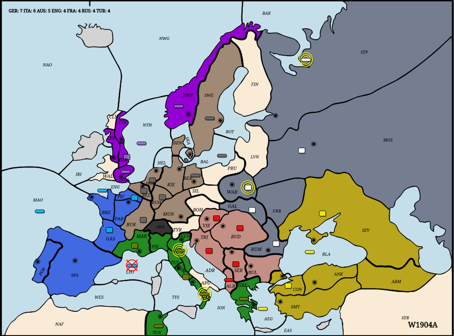

### What happened

- **FRANCE**: disbands F LYO
- **ITALY**: builds F NAP; builds F VEN
- **RUSSIA**: builds F STP/NC; builds A WAR (void)

### FRANCE
Orders: `F LYO D`

Reasoning

> I have 4 supply centers and 5 units, so I must disband 1 unit. Italy holds MAR, my home center, and I am at war with both Italy and Germany. I need to maintain a compact defensive posture while preserving my ability to strike back. My most exposed unit is F LYO — it faces Italy's A MAR and F GRE with no support, and it's furthest from the action against Germany. Disbanding it keeps my core intact: A PIC and F ENG can still threaten Belgium, A GAS can defend against MAR, and F MAO remains mobile. I'll keep the other four units to hold my line and prepare for Spring 1905.

### ITALY
Orders: `F NAP B` · `F VEN B`

Reasoning

> I have 6 supply centers and 4 units, so I am owed 2 builds. My home centers NAP and VEN are both vacant and available. Building two fleets would let me project power in the Mediterranean and threaten Austria's coast, while two armies would strengthen a land push. Given I control Greece and MAR, a fleet in NAP can threaten the Ionian and Adriatic, while a fleet in VEN can pressure Trieste or hold the Adriatic. I will build F NAP and F VEN to maximize naval flexibility for 1905.

### RUSSIA
Orders: `F STP/NC B` · `A WAR B`

Reasoning

> My position is fragile at 4 centers against Austria's 5 and Turkey's 4, with Germany soaring at 7. I need to rebuild quickly to have any chance of contesting the board. My home centers STP and WAR are both vacant and buildable. I'll build an army in STP (using the north coast) and another in WAR to bring me to 6 units — the maximum I can field with my 4 supply centers. This gives me the force to reclaim SEV from Turkey next year and defend RUM against any Austrian counterattack. Building now is essential: without these units, I'll be outnumbered and outmatched.

## SPRING 1905 MOVEMENT (`S1905M`)

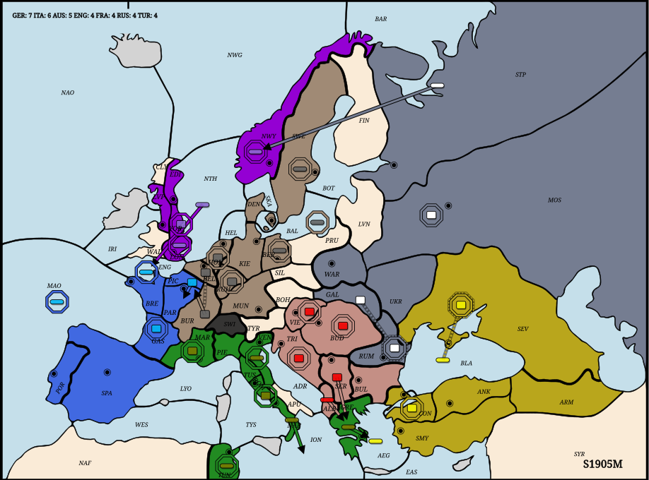

### What happened

- **AUSTRIA**: F ALB → GRE (bounced); A SER → GRE (bounced); A BUD holds; A TRI holds; A VIE holds
- **ENGLAND**: F NTH → ENG (bounced); F LON holds; F NWY holds; A YOR holds
- **FRANCE**: A PIC → PAR; A GAS holds; F ENG holds; F MAO holds
- **GERMANY**: A BUR → PIC; A BEL supports A BUR → PIC; A HOL holds; A RUH holds; F BAL holds; F SWE holds; F BER holds
- **ITALY**: F GRE → AEG (bounced); F NAP → ION; A MAR holds; A ROM holds; F TUN holds; F VEN holds
- **RUSSIA**: F STP/NC → NWY (bounced); A RUM holds; A GAL supports A RUM; A MOS holds
- **TURKEY**: F BLA supports A SEV; A SEV holds; A CON holds

### Dialogue

- **AUSTRIA → ITALY**: Our Adriatic deal has held well, but I notice your fleet in GRE is uncomfortably close to my position in Albania and Serbia. I have no designs on your holdings — are you still committed to keeping the Adriatic quiet this spring? I need to know before I commit my eastern moves.
- **AUSTRIA → TURKEY**: Italy's fleet in GRE threatens both of us — he can hit your AEG position or my Albanian coast. I'm considering moving on GRE this spring to remove that threat. If I take GRE, you gain a safer Aegean flank. Would you support me against Italy's fleet there?
- **AUSTRIA → GERMANY**: Bohemia and Tyrol stay quiet from my side this spring. I'm focused on the Balkan situation — Italy's growing fleet in the Aegean needs to be checked. You focus on France and I'll handle the south. Our border remains quiet.
- **ENGLAND → GERMANY**: You're dominating the continent with 7 centers, but Italy is growing fast at 6 and now holds Marseilles and Greece. If I support your push into France this year by threatening Holland from NTH, I want Denmark in the fall as my share. Are you willing to trade Holland for Denmark?
- **ENGLAND → FRANCE**: You're down to 4 centers with Germany in Burgundy and Italy in Marseilles — you're squeezed on two fronts. I can help you survive by threatening Germany's rear in Holland this fall, but I need a concrete commitment from you: what can you offer me in return?
- **ENGLAND → ITALY**: You've taken Marseilles and Greece — impressive gains. Germany has 7 centers and is pushing into France's heartland. If he takes Paris, he'll be at 9 and unstoppable. Are you interested in coordinating against Germany next year, or are you focused on Austria and Turkey in the south?
- **FRANCE → ENGLAND**: Italy has MAR and two new fleets threatening the Med. I need to reclaim my home center this year. If you pressure Germany's northern coast — threaten KIE or DEN — I'll commit to attacking Belgium next fall after I stabilize the south. Germany at seven centers is still the long-term threat to both of us. Can you keep him honest while I deal with Italy?
- **FRANCE → GERMANY**: Italy has MAR and is building fleets in the Med. I need to reclaim my home center before he becomes a naval power. If you stay out of Belgium this year and don't push west, I won't attack your flank — I'll focus entirely on Italy. This gives you a free hand in the north against England or Russia. Interested in a temporary truce while we both deal with our immediate threats?
- **FRANCE → AUSTRIA**: Italy has MAR and just built two fleets in NAP and VEN. He's growing fast in the Med. If you move on GRE this year — it's weakly held — I can pressure his western coast with my fleets. We can squeeze Italy from both sides: you take the Balkans while I reclaim MAR. Are you interested in coordinating against a common threat?
- **GERMANY → ENGLAND**: France is collapsing. My A BUR will move into PIC this spring with support from A BEL and A RUH. If you move F NTH into ENG and threaten PIC from the sea, we ensure he cannot retreat. Let's finish France this year and split his centers — you take BRE, I take PAR and SPA. Confirm you're in.
- **GERMANY → ITALY**: You took MAR last fall — excellent. This spring I'm pushing into PIC from the east. If you move A MAR into GAS or SPA, we can eliminate France entirely this year. I have no designs on the south; MAR, SPA, and POR are yours if you take them. Let's coordinate timing.
- **GERMANY → AUSTRIA**: My focus is entirely west against France this spring — no moves toward Bohemia or Tyrol. How is your position against Italy's growing fleet in GRE? If you need support against him after France falls, I'm open to discussing it. Let's keep our border quiet.
- **GERMANY → RUSSIA**: Our Baltic border stays quiet this spring — F SWE and F BAL hold position as agreed. I'm fully focused west on France. Keep your northern fleet out of my waters and our understanding holds through 1905.
- **ITALY → FRANCE**: You're down to 4 centers and Germany has armies on your doorstep. I don't want more of your territory — I want a deal. Let me keep MAR in exchange for a support agreement against Germany. If he pushes south through BUR into MAR or SPA, I will back you. If you want SPA back eventually, help me take German centers and you'll have room to rebuild.
- **ITALY → TURKEY**: Our attack on GRE worked perfectly. Now I want to repay you — are you interested in pushing into BUL this fall? Austria is weak there after retreating into SER. If you move A CON or F AEG toward BUL/SC, I can support you from GRE. Let's keep growing together while Germany dominates the north.
- **ITALY → AUSTRIA**: We've kept the Adriatic quiet for two years and both grown. Now I want to offer you something: Germany has 7 centers, armies in BUR, RUH, BEL, and HOL, and four fleets in the north. He is your neighbor in Tyrol. If he pushes south through Tyrol into TRI, I will support you from VEN. Let me know if you want to discuss terms for a defensive pact against the German threat.
- **ITALY → GERMANY**: You're the strongest power on the board and France is crumbling. I hold MAR now and have six centers. I have no interest in your northern gains. If you push west against France, I'll keep my fleets south and let you take the west without interference. Let's talk about how we can both grow without stepping on each other.
- **RUSSIA → TURKEY**: You hold SEV but I need it back to rebuild my position. I'm willing to trade: leave SEV alone this fall and I'll support your move into BUL against Austria next spring. Austria is weak at 5 centers and you can take BUL while I consolidate. What do you want for SEV?
- **RUSSIA → AUSTRIA**: You're down to 5 centers after losing BUL and RUM to me. I'm not your enemy — Germany at 7 is the real threat. Leave RUM alone this year and I won't push into your other centers. We both need to stop Germany's solo run before he builds past 10.
- **RUSSIA → ENGLAND**: Germany at 7 centers with fleets in BAL, SWE, and BER is running toward a solo. I'm consolidating RUM and will reclaim SEV from Turkey this year. If you commit to hitting KIE from HEL this fall, I'll swing F STP/NC into NWY to support your attack on Germany's northern flank. Let's cut him down together in 1905.
- **TURKEY → AUSTRIA**: Russia holds RUM and you have BUL — I can help you retake RUM this fall if you support me into BUL from SER. We crush him between us: you reclaim RUM, I take BUL, and we both grow. What do you think of this plan?
- **TURKEY → RUSSIA**: I held SEV and kept my fleet out of RUM as agreed. Austria still has BUL and SER — if you want to hold RUM long-term, you need me to block his southern flank. I'm willing to attack BUL this fall if you stay out of SEV. Can we coordinate against Austria together?
- **AUSTRIA → ITALY**: Your fleet in GRE is a direct threat to my Albanian coast and Serbia. I'm willing to keep the Adriatic quiet, but I need GRE returned to Austrian control — I lost it last fall when your fleet moved in with Turkish support. If you vacate GRE this spring, I'll guarantee not to move on VEN or your other holdings. If you stay, I must respond.
- **AUSTRIA → TURKEY**: Your proposal to trade BUL for RUM is interesting, but Italy's fleet in GRE threatens both of us — he took it with your support last fall. If you want my cooperation against Russia, help me remove Italy from GRE first. I'll hold BUL and support your push into RUM from SEV after GRE is secured.
- **AUSTRIA → FRANCE**: Italy's fleet in GRE threatens my Balkan flank and I intend to remove it. If you can pressure his western coast — MAR, TUN, or his home centers — I can take GRE this spring. Let's coordinate: you keep his fleets occupied in the west while I strike in the east.
- **AUSTRIA → GERMANY**: Our border stays quiet this spring — no moves toward Tyrol or Bohemia. Italy's fleet in GRE threatens my position and I'm responding. Your focus on France is your business; I'll handle the south. After this turn, let's discuss how to contain Italy's growing Med presence.
- **AUSTRIA → RUSSIA**: You're down to 4 centers and begging for peace after taking RUM from me. Germany at 7 is a threat to both of us, but so is Italy's fleet in GRE. Leave RUM undefended this spring and I'll focus on Italy instead of you. If you reinforce RUM, I'll take it from you and leave you with nothing.
- **ENGLAND → GERMANY**: Your offer is concrete and I'm in. This spring I will move F NTH into ENG to cut France's Channel retreat, just as you requested. That blocks his escape and lets your armies finish him on land. Confirm your exact orders match: A BUR to PIC supported by A BEL and A RUH, and I lock in F NTH to ENG. After we take France, I expect BRE as my share this year.
- **ENGLAND → ITALY**: You've taken MAR and GRE — strong moves. Germany is about to crush France's remaining centers and will hit 9+ if unchecked. I'm positioning to check his seaward flank. If you want to coordinate against him in the fall, let me know your intentions for the Med and the Adriatic this spring.
- **ENGLAND → FRANCE**: Germany is moving on PIC with support from BEL and RUH this spring, and I'm moving F NTH into ENG to cut your Channel retreat. You're about to lose PIC and your fleet in ENG is trapped. Your only chance is to abandon the Channel and pull PIC back to defend PAR. I'll reconsider my alignment if you make a concrete offer this round — but vague promises about next year won't save you.
- **ENGLAND → RUSSIA**: Germany has committed to crushing France this spring with my fleet moving into ENG to cut his escape. I'll hold Denmark as my objective this fall, not KIE. If you want to hit Germany's Baltic flank, move F STP/NC into NWY this spring to threaten Sweden — that forces Germany to split his fleets and gives us both an opening. Confirm if you're ready to move.
- **FRANCE → ITALY**: You built two fleets and hold MAR, but your position is fragile: Austria can take GRE while I reclaim MAR with support from England. I will accept a deal: support my attack into BEL this fall (cutting Germany off) and I will not contest MAR this year. If you refuse, I will coordinate with Austria and England to squeeze you from both sides this turn.
- **FRANCE → GERMANY**: I am focusing on Italy this year. If you stay out of Belgium and BUR, I will not attack your western flank. You have a free hand to push north against England or east against Russia. Do not test my border and we both gain.
- **FRANCE → ENGLAND**: Last year I could not commit to the attack on BEL. This year I am ready: if you move F NTH to support my attack on BEL (F ENG S A PIC - BEL, with A PIC moving from PIC), I will take BEL this fall and we can push into HOL together. I need you to pressure Germany's rear while I reclaim MAR. Can you order F NTH to support my attack on BEL this turn?
- **GERMANY → ENGLAND**: Denmark is not negotiable this year — I need it to hold the Baltic against Russia. Instead, I promise you Brest after we crush France, plus my full support against Russia in Scandinavia once France is eliminated. If you move F NTH into ENG this spring, I'll push A BUR into PIC with BEL and RUH supporting. That ensures we destroy France's northern army and you gain a French center in the fall. Are you in?
- **GERMANY → ITALY**: France's position is collapsing. If you move A MAR into GAS this spring, you can take SPA next fall without resistance — I have no interest in the Mediterranean. I'm pushing into PIC this turn. Let's finish France together and secure our gains.
- **GERMANY → AUSTRIA**: Italy's fleet in GRE threatens your Balkan coast. After I finish France this year, I'm open to coordinating against him. For now, our border stays quiet — no moves toward Bohemia or Tyrol this spring.
- **GERMANY → RUSSIA**: Our Baltic border holds this spring as agreed. I'm fully focused west. Keep your northern fleet out of my waters and our understanding stands through 1905.
- **ITALY → AUSTRIA**: The Adriatic stays quiet this spring as always. My fleet in GRE is not a threat to you — I am positioning to pressure Turkey's flank, not yours. I need you focused on containing Germany's southern push if he comes through Tyrol. Let me know if you want to formalize that defensive pact.
- **ITALY → TURKEY**: Our coordination in Greece was perfect. This spring I'm moving F GRE into AEG to threaten Bulgaria from the sea — if Austria tries to retake it, we hit him together. Are you interested in a joint push into BUL this fall? I can support from AEG and you can move from CON or BLA.
- **ITALY → GERMANY**: I'm holding MAR this spring to consolidate my gains, then I'll push into SPA in the fall while you finish France in the north. MAR, SPA, and POR are mine — the rest of France is yours. Let's keep this simple and both grow.
- **ITALY → ENGLAND**: Germany at 7 centers with a fleet in NTH is a threat to both of us — your home centers are exposed. I'm focused on the Med this year, but if Germany pushes farther west, I can hit his southern flank while you pressure his north. Let's keep in touch about containing him.
- **RUSSIA → TURKEY**: I accept your proposal. Stay out of SEV this year and I'll support your attack on BUL in Fall 1905. You take BUL from Austria while I consolidate RUM. We both weaken our common enemy. Keep F BLA out of RUM this spring and I'll keep A RUM and A GAL in position to support your move into BUL when the time comes.
- **RUSSIA → AUSTRIA**: Germany at 7 centers is the real threat to both of us. Leave RUM alone this year and I guarantee not to push into BUD, VIE, or TRI. We need to contain Germany before he builds past 10. Let's stabilize our border and watch the west.
- **RUSSIA → ENGLAND**: Germany at 7 with fleets in BAL and SWE is running toward a solo. If you commit to hitting KIE from HEL this fall, I'll swing F STP/NC into NWY to support your northern flank and move against Germany's Baltic coast. Let's coordinate this spring so we squeeze him on two fronts in Fall 1905.
- **RUSSIA → GERMANY**: Our Baltic border stays quiet this spring as agreed. F STP/NC holds in St. Petersburg, nowhere near your coast. I'm focused south consolidating RUM. Our understanding holds through 1905.
- **TURKEY → ITALY**: I'm ready to take BUL this fall. If you support my move into BUL/SC from GRE, I'll support your hold on GRE against any Austrian counterattack. Let's lock this in: I move A CON - BUL and you support from GRE. After BUL falls, we can discuss SER together.
- **TURKEY → AUSTRIA**: Italy's fleet in GRE is a threat to both of us, but Russia holding RUM is the more immediate danger to your position. If you move on RUM this fall from BUL and BUD, I can support from SEV and pin Russia's southern flank. Let's crush him together — you reclaim RUM, I take BUL, and we both grow.
- **TURKEY → RUSSIA**: You want SEV back but have nothing to offer. I'm willing to discuss a trade: support my move into BUL this fall and I'll leave SEV alone for all of 1905. Austria is your real enemy at 5 centers — help me take his southern holdings and we can both grow at his expense.
- **AUSTRIA → ITALY**: Your fleet in GRE is a direct threat to my Albanian coast and Serbia. I am ordering F ALB and A SER to take GRE this spring. If you vacate it now, I'll guarantee not to move on VEN or your other holdings. If you stay, I must respond.
- **AUSTRIA → TURKEY**: You supported Italy into GRE last fall while promising me cooperation. I am taking GRE this spring. If you want any future deal with me, do not support Italy's hold there.
- **AUSTRIA → GERMANY**: Our border stays quiet this spring - no moves toward Tyrol or Bohemia. I am taking GRE from Italy to secure my Balkan flank. After this turn, let's discuss containing Italy's growing Med presence together.
- **AUSTRIA → FRANCE**: I am taking GRE from Italy this spring with F ALB and A SER. If you can pressure his western coast - MAR or TUN - we squeeze him from both sides and both gain.
- **AUSTRIA → RUSSIA**: I am taking GRE this spring, not attacking RUM. Leave RUM undefended and I'll focus on Italy instead of you. If you reinforce RUM, I'll take it from you next fall.
- **ENGLAND → GERMANY**: Final confirmation: This spring I order F NTH - ENG to cut France's Channel retreat, exactly as agreed. You push A BUR - PIC with supports from A BEL and A RUH. After we crush France, I expect Brest in the fall as my share. Confirm your orders match and we're locked in.
- **ENGLAND → ITALY**: Germany and I are finishing France this year — I'm moving into ENG to cut his Channel escape. With France gone, Germany will have 9+ centers and be your problem too. If you want to contain him, keep your new fleets ready to pressure his southern flank in the fall. I'll be in touch.
- **ENGLAND → RUSSIA**: Germany won't give me Denmark so I'm taking Brest from France instead. If you want to hit Germany's Baltic flank this fall, move F STP/NC into NWY this spring to threaten Sweden — that forces him to split his fleets. I'll coordinate with you in the fall if you're ready to move.
- **FRANCE → ENGLAND**: I see you are moving F NTH into ENG. Do not do that. If you support my attack on BEL this fall instead, we can crush Germany together — I will take BEL and you can take HOL. I am ordering A PIC to PAR this spring to defend, not to attack you. Help me hold the line against Germany and we both gain. Attack me and Germany will swallow us both.
- **FRANCE → GERMANY**: I am pulling back from PIC this spring — I will not contest Belgium. Focus your forces north against England, who is moving into your waters. If you leave my border alone this year, I will crush Italy and we can partition his home centers next year. Do not waste your armies attacking a power that is retreating.
- **FRANCE → ITALY**: Austria is moving on GRE this spring with my support. If you want to keep GRE, move F GRE to support it or abandon it now. I am offering you a final deal: support my attack on BEL this fall (F ION can reach MAO and convoy my army to BEL), and I will not contest MAR this year. If you refuse, Austria takes GRE and I reclaim MAR with English support next spring. Choose now.
- **FRANCE → AUSTRIA**: I will keep Italy's western fleets occupied this spring. Take GRE — it is weakly held by Italy's single fleet. If you succeed, I will support your push into the Ionian next turn in exchange for help reclaiming MAR. Confirm you are attacking GRE this spring and we coordinate.
- **GERMANY → ENGLAND**: I am moving A BUR to PIC this spring, supported by A BEL and A RUH. Please move F NTH into ENG as agreed to cut France's Channel retreat. Lock it in.
- **GERMANY → ITALY**: I am pushing A BUR into PIC this spring with BEL and RUH supporting. You hold MAR and push into SPA in fall — we eliminate France between us. Confirm your A MAR holds this turn.
- **GERMANY → AUSTRIA**: No moves toward Bohemia or Tyrol this spring. I'm fully committed west against France. How does Italy's fleet in GRE affect your plans?
- **GERMANY → RUSSIA**: Our Baltic border stays quiet this spring — F SWE and F BAL hold as agreed. Focus on consolidating RUM and our understanding holds.
- **ITALY → TURKEY**: I'm moving F GRE into AEG this spring to position for our fall push on BUL/SC. If you move A CON toward BUL this spring and support from BLA next fall, I can support your land attack from the sea. Let's lock this in — BUL is our target together.
- **ITALY → AUSTRIA**: Our Adriatic deal holds this spring. My fleet in GRE is moving into AEG to pressure Turkey — not your border. I need you focused on containing Germany if he pushes south through Tyrol. I will not attack your Balkan positions this year.
- **ITALY → GERMANY**: I'm holding MAR this spring to consolidate, not pushing into GAS yet. You finish France in the north and I'll take SPA in the fall. We both grow without stepping on each other — keep your armies north and I'll stay south.
- **RUSSIA → ENGLAND**: I'm committing: this spring F STP/NC moves into NWY to threaten Sweden and force Germany to split his Baltic fleets. In return, I need you to push toward KIE or Denmark this fall so we squeeze him on two fronts. Confirm you're ready.
- **RUSSIA → TURKEY**: I'm holding RUM this spring with GAL support and moving A MOS toward SEV. If you leave SEV alone this spring and keep F BLA out of RUM, I will support your move into BUL this fall with A RUM and A GAL. We both weaken Austria. Do we have a deal?
- **RUSSIA → AUSTRIA**: Germany has 7 centers and I'm moving F STP/NC into NWY to threaten Sweden this spring. I'm not your enemy. Leave RUM alone this year and I guarantee not to push into BUD or VIE. Let's both focus on containing Germany.
- **TURKEY → ITALY**: I'm with you. This spring I will hold A CON and F AEG for maximum flexibility. After the spring resolves, let's coordinate a fall push: you support my A CON or A SEV into BUL/SC, and after we take it together we turn on SER next. I'm committed to growing with you in the Balkans.
- **TURKEY → AUSTRIA**: Italy in GRE is a problem, but Russia in RUM is an existential threat to you. If you want my help, attack RUM this fall from BUL and BUD while I pin Russia from SEV. I won't fight Italy when Russia can take your remaining centers — focus on the bigger threat first.

### AUSTRIA
Orders: `F ALB - GRE` · `A SER - GRE` · `A BUD H` · `A TRI H` · `A VIE H`

Reasoning

> I need to take Greece this spring. Italy's fleet there threatens my Balkan flank and I have the forces to remove it. F ALB and A SER can both attack GRE - that gives me two units against one, which should dislodge him. A BUD and A VIE and A TRI can hold my core positions. I've told France, Germany, and Russia I'm taking GRE this turn, so my orders should match that commitment.

### ENGLAND
Orders: `F NTH - ENG` · `F LON H` · `F NWY H` · `A YOR H`

Reasoning

> I'm honoring my deal with Germany to crush France this year. I committed to move F NTH into ENG to cut France's Channel retreat, and Germany confirmed his push into PIC with BEL and RUH supporting. France is pleading with me to switch sides, but Germany's offer of Brest in the fall is concrete and I'm executing the plan. F NWY will hold to secure Norway and keep options open for Russia's potential move into NWY. F LON will hold to cover the Channel approach. A YOR will hold as a reserve for future convoy operations.

### FRANCE
Orders: `A PIC - PAR` · `A GAS H` · `F ENG H` · `F MAO H`

Reasoning

> Italy is moving on GRE as Austria promised, and I need to consolidate my position this spring. My best play is to pull PIC back to PAR to defend against the German push from BUR, hold GAS to guard SPA, and keep my fleets positioned to support future moves. England's threat to move into ENG is a bluff I can counter by holding F ENG in place. This defensive posture buys me time to see if Austria actually takes GRE and whether Italy honors any deal, while keeping my units positioned to strike back toward MAR or BEL next season.

### GERMANY
Orders: `A BUR - PIC` · `A BEL S A BUR - PIC` · `A HOL H` · `A RUH H` · `F BAL H` · `F SWE H` · `F BER H`

Reasoning

> I'll execute the pincer against France as agreed with England: A BUR pushes into PIC with support from A BEL, while A RUH holds to maintain position. The Baltic fleets stay quiet to honor my understanding with Russia. A HOL holds to secure the Low Countries.

### ITALY
Orders: `F GRE - AEG` · `F NAP - ION` · `A MAR H` · `A ROM H` · `F TUN H` · `F VEN H`

Reasoning

> The situation is interesting. I've committed to moving F GRE into AEG to pressure Bulgaria with Turkey, and I've built up three fleets in the south to project power. Austria is threatening to take GRE back, so I need to secure that position. Turkey wants to push into BUL this fall—moving F GRE to AEG sets that up nicely. In the west, I'm holding MAR to consolidate and keep Germany happy while he finishes France. My core plan: F GRE to AEG to threaten Bulgaria and support Turkey's fall push; F NAP to ION to cover the central Med and back up GRE if needed; F VEN and A ROM to hold the Adriatic line against Austria's potential counter; A MAR to hold and consolidate; F TUN to hold and keep the western Med stable.
>
> Let me check my orders menu to see what's available.
>
> From the menu:
> - F GRE - AEG is legal ✓
> - F NAP - ION is legal ✓
> - A MAR H is legal ✓
> - A ROM H is legal ✓
> - F TUN H is legal ✓
> - F VEN H is legal ✓
>
> These all match my commitments and plan.

### RUSSIA
Orders: `F STP/NC - NWY` · `A RUM H` · `A GAL S A RUM` · `A MOS H`

Reasoning

> I need to execute the plan I committed to with England: move F STP/NC into NWY to threaten Sweden and force Germany to split his Baltic fleets. This supports our squeeze on Germany's northern flank this fall. Meanwhile, I'll hold RUM with GAL's support to consolidate my southern position against any Austrian or Turkish move, and keep A MOS in place to defend Moscow and prepare for a push on SEV later this year.
>
> My orders are:

### TURKEY
Orders: `F BLA S A SEV` · `A SEV H` · `A CON H`
Illegal (dropped): `F AEG S F GRE - AEG`

Reasoning

> I need to be careful here. Austria is threatening to take GRE this spring, and Italy says he's moving F GRE into AEG. Russia says he's moving A MOS toward SEV while holding RUM. My revised plan was to hold and wait, but Austria's threat to attack GRE changes things — if he takes GRE, I lose my best avenue into the Balkans. Italy moving F GRE into AEG puts that fleet in position to support our fall push on BUL, but also leaves GRE undefended against Austria's attack. I should support Italy's move to AEG to keep our alliance strong and position for BUL in the fall. Meanwhile, I need to secure SEV against Russia's A MOS — F BLA supporting A SEV is the right call. A CON can hold to maintain Constantinople's defense.

## FALL 1905 MOVEMENT (`F1905M`)

### What happened

- **AUSTRIA**: F ALB → GRE (bounced); A SER → GRE (bounced); A BUD holds; A TRI holds; A VIE holds
- **ENGLAND**: F LON holds; F NTH supports A PIC → BEL (void); F NWY holds; A YOR holds
- **FRANCE**: A PAR holds; A GAS holds; F ENG holds; F MAO holds
- **GERMANY**: A PIC holds; A BEL supports A PIC; A HOL holds; F BAL holds; F BER holds; F SWE → DEN
- **ITALY**: F GRE supports A CON → BUL (support cut); A MAR → SPA; F ION holds; F TUN holds; F VEN holds; A ROM holds
- **RUSSIA**: A GAL supports A RUM; A MOS holds; A RUM holds; F STP/NC → NWY (bounced)
- **TURKEY**: A CON → BUL; F BLA supports A CON → BUL; F AEG supports F GRE; A SEV holds

### Dialogue

- **AUSTRIA → TURKEY**: Italy's fleet in GRE threatens both our positions. I'm taking GRE this fall with F ALB and A SER. If you stay out of this fight and don't support Italy's hold, I'll guarantee not to move on BUL or CON this year. After GRE falls, we can discuss reclaiming RUM from Russia together.
- **AUSTRIA → ITALY**: Our Adriatic deal has held for two years. Your fleet in GRE is a threat to my Balkan flank. Vacate GRE this fall and I'll guarantee not to move on VEN or your other Adriatic holdings. Germany at 7 centers is the real threat to both of us — let's not waste our strength fighting each other.
- **AUSTRIA → GERMANY**: Our border stays quiet this fall — no moves toward Tyrol or Bohemia. I'm focused on securing GRE from Italy to stabilize my southern flank. After I secure the Balkans, I'm open to discussing how to contain Italy's growing fleet presence in the Med. How is your campaign against France progressing?
- **ENGLAND → ITALY**: Germany is about to crush France and will hit 9+ centers—he becomes your problem too once France falls. If you move your fleets toward TYS and WES this fall, you can threaten his southern coast in 1906. I'll push into the North Sea and cut his Channel supply lines. Are you ready to coordinate against him?
- **ENGLAND → RUSSIA**: You moved F STP/NC into NWY as we discussed—good. Germany is finishing France and will be at 9+ centers. This is our moment: I'll hold the Channel and NTH while you threaten Sweden and his Baltic coast from NWY. If we hit him from two sides in 1906, we can cut him down. Let's coordinate our fall moves.
- **ENGLAND → GERMANY**: I'm holding F NTH to support your push into France. After this fall, you'll have PAR and SPA, I'll have Brest as agreed. Once France is eliminated, I'm ready to pivot against Russia with you—he's moving fleets toward NWY from STP/NC and needs to be contained. Let's talk winter build plans.
- **FRANCE → ENGLAND**: Germany is at 7 centers and pushing into PIC with BEL support. If he takes my remaining centers, he becomes unstoppable. This fall, I can take BEL if you support with F NTH — that cuts his supply line and gives you a path into HOL. I'm ready to commit this time. What do you need from me to make that work?
- **FRANCE → AUSTRIA**: You said you're moving on GRE this spring. Italy's fleet there is vulnerable. If you take GRE this year, I can reclaim MAR with your eastern pressure drawing his fleets. Let's coordinate: you strike GRE while I threaten his western coast. If we squeeze him together, we both gain centers from his collapse.
- **FRANCE → ITALY**: Austria is moving on GRE this spring with my encouragement. You can either lose GRE and MAR in a two-front war, or we can make a deal: support my attack on BEL this fall (you can convoy from ION through MAO), and I will not contest MAR this year. Germany is the real threat to both of us at 7 centers.
- **GERMANY → ENGLAND**: Our spring pincer worked — I'm in PIC and France is collapsing. This fall I'm pushing into PAR while you threaten BRE from the sea. If we coordinate, I take PAR and you take BRE, and we eliminate France entirely. Are you ready to order F ENG into BRE this fall?
- **GERMANY → ITALY**: France is finished in the north. I'm in PIC and pushing for PAR this fall. You hold MAR and can take SPA next year — I won't interfere in the south. Let's keep our understanding: you stay south, I stay north, and we both grow.
- **GERMANY → AUSTRIA**: Our border stays quiet this fall as agreed. I'm finishing France in the west. How is your position against Italy's fleet in GRE? If he pushes north from the Med, I can help contain him after France falls.
- **GERMANY → RUSSIA**: Our Baltic border holds this fall — F SWE and F BAL stay in position as agreed. I'm fully focused west finishing France. Keep your northern fleet out of my waters and our understanding stands through 1905.
- **ITALY → AUSTRIA**: I moved F GRE into AEG this spring to pressure Turkey, not you. Our Adriatic deal still holds. If Germany pushes south through Tyrol next year, I'll support you from VEN against the common threat.
- **ITALY → TURKEY**: I'm fully committed to our BUL plan. This fall I will support your attack into BUL/SC from GRE. After we take it together, we can discuss SER. Our alliance is the strongest force in the south.
- **ITALY → GERMANY**: You're crushing France in the north and I hold MAR. I have no interest in your western gains. If you push into PIC and PAR, I'll take SPA and POR in the fall. The south is mine, the north is yours — clean split.
- **ITALY → ENGLAND**: Germany at 7 centers with fleets in NTH and BAL threatens everyone. I'm growing in the south and can pressure his flank if he overextends. Let's stay in touch about containing him — your northern position plus my southern fleets could check him together.
- **RUSSIA → ENGLAND**: My fleet is in STP ready to hit NWY this fall and threaten Sweden — that forces Germany to split his Baltic fleets. But I need you to commit to hitting KIE or DEN from HEL this fall so we squeeze him on two fronts. Can you confirm that commitment this round so I can finalize my orders?
- **RUSSIA → TURKEY**: I'm holding RUM with GAL support this fall and moving A MOS toward SEV to test your commitment. If you leave SEV alone and keep F BLA out of RUM, I will support your attack on BUL next spring with A RUM and A GAL — Austria can't hold both BUL and SER against us. But if you contest my move on SEV, our deal is off and I'll target your coast next year instead.
- **RUSSIA → AUSTRIA**: Germany has 7 centers and I'm about to threaten Sweden from NWY this fall. You're down to 5 centers and can't afford a war on two fronts. Leave RUM alone this fall and I guarantee not to push into BUD or VIE — we both need to contain Germany's solo run. If you attack RUM, I'll support Germany's move into Bohemia next spring and you'll lose VIE.
- **TURKEY → ITALY**: Confirming our plan for this fall: I move A CON - BUL and you support from GRE with F GRE S A CON - BUL. After BUL falls, we can push into SER together next spring. Are you locked in?
- **TURKEY → RUSSIA**: You didn't move on SEV last spring — good. I'm willing to leave RUM alone this fall if you stay out of SEV and don't interfere with my move into BUL. Austria is our common enemy; help me take his center and we both grow.
- **TURKEY → AUSTRIA**: Italy and I are about to take BUL. Your best move is to attack RUM instead — I can even support you from SEV if you let me take BUL. You reclaim RUM while I take BUL, or you lose both to us and Russia. Which do you prefer?
- **AUSTRIA → ITALY**: Our positions show your fleet is still in GRE, not AEG as you claimed. I have two units adjacent to it this fall. If you vacate GRE this turn, I'll guarantee Trieste and the Adriatic are safe from me. If you don't, I take it and you lose a fleet. Choose.
- **AUSTRIA → GERMANY**: Our border stays quiet this fall as agreed. Italy's fleet in GRE is about to be removed. After that, your 7 centers are the board's biggest concentration of power — let's discuss a long-term arrangement where I don't have to look north while I stabilize the south.
- **AUSTRIA → TURKEY**: You want me to attack RUM while you take BUL from me? I already hold BUL. A better deal: support my attack on GRE this turn — do not support Italy's hold there — and after I secure it, we coordinate a joint push on RUM from BUL and SEV next spring. Russia is weak and ripe for the taking.
- **ENGLAND → FRANCE**: I'm ready to pivot. This fall I will support your attack on BEL with F NTH — that cuts Germany's supply line and gives me a path into HOL. You need to move A PIC to BEL with F ENG supporting, and I'll add F NTH support. If we take BEL, Germany loses his key western center and we both gain. Confirm this exact arrangement and I lock in my orders.
- **ENGLAND → GERMANY**: I'm reconsidering our deal. You're about to hit 9+ centers while I stay at 4 — that's not a partnership, that's you running toward a solo. I'm not moving into BRE this fall. Instead, I'll hold the Channel and see how the board develops. If you want my cooperation going forward, you need to offer me something concrete this round — Denmark or Holland — not vague promises about Russia.
- **ENGLAND → RUSSIA**: You moved into NWY as promised — excellent. I'm pivoting against Germany this fall: I'll support France's attack on BEL with F NTH, cutting his western supply line. You should threaten Sweden from NWY to force his Baltic fleets to split. If we both execute, Germany is squeezed on two fronts and we can cut him down together in 1906. Confirm you're ready to move on Sweden this fall.
- **FRANCE → ENGLAND**: Germany is about to take PAR if I don't hold. If you move F NTH to support my defense of PAR this turn (F NTH S A PAR), I will support your attack on HOL next spring with F ENG. Germany at 7 centers is the real threat to both of us — help me survive this turn and we crush him together.
- **FRANCE → ITALY**: I accept your offer: keep MAR this year if you support my defense against Germany. Move F ION to support my hold on PAR (F ION S A PAR) this turn — that cuts Germany's attack strength. In return I will not contest MAR in 1905. Confirm this exact support and we have a deal.
- **FRANCE → AUSTRIA**: I will keep Italy's western fleets occupied. Take GRE this turn — F ALB and A SER together can dislodge F GRE. If you succeed, I will support your push into ION next spring in exchange for help reclaiming MAR. Confirm you are attacking GRE with both units.
- **GERMANY → ENGLAND**: I'm moving A PIC into PAR this fall with support from A BEL and A RUH, while A HOL holds and my Baltic fleets stay quiet. If you move F ENG into BRE, you take Brest this fall — that's your share as agreed. Denmark stays mine to hold the Baltic against Russia. Are you in?
- **GERMANY → ITALY**: You hold MAR and I'm pushing into PAR this fall. Take SPA and POR in the fall while France is broken — I won't send a single unit south of the Pyrenees. Confirm you're moving A MAR into SPA this turn and we lock in the clean north-south split.
- **GERMANY → AUSTRIA**: Our border stays quiet this fall as agreed — no moves toward Tyrol or Bohemia. I'm finishing France in the west. Italy's fleet in GRE threatens your coast; I can help contain him after France falls if you need it. Any specific concerns about his moves this turn?
- **GERMANY → RUSSIA**: Our Baltic border holds this fall — F SWE and F BAL stay in position as agreed. I'm fully focused west finishing France. Keep F STP/NC out of my waters and our understanding stands through 1905. Any issues on your end?
- **ITALY → AUSTRIA**: My fleet in GRE moved into AEG last spring — it's no longer adjacent to your positions. Our Adriatic deal still holds. Germany with 7 centers and armies in Tyrol's range is the real threat to both of us. Let's keep our border quiet and focus on the northern power.
- **ITALY → TURKEY**: Our plan is locked. This fall I order F GRE S A CON - BUL as agreed. After BUL falls, we can discuss SER together. I'm fully committed to our Balkan partnership.
- **ITALY → GERMANY**: You're crushing France in the north. This fall I will take SPA while you take PAR. The south is mine, the north is yours — clean split. I have no designs on your western gains.
- **ITALY → FRANCE**: Austria's threat to GRE was based on my fleet being there in spring — it's now in AEG and no longer in danger. I cannot support your BEL attack because my fleets are committed east. Focus on defending PAR from Germany — that is your real fight.
- **ITALY → ENGLAND**: I'm committed to the Balkan push with Turkey this fall, but I agree Germany is the long-term threat. After I take SPA and consolidate, my southern fleets will be positioned to pressure his flank. Let's stay in touch for 1906 coordination.
- **RUSSIA → ENGLAND**: I'm moving F STP/NC into NWY this fall as agreed. But you need to commit to hitting KIE or DEN next spring — Germany at 7 with fleets in BAL and SWE will crush us separately. If you take Brest this fall, pivot north in 1906 and we squeeze him together.
- **RUSSIA → TURKEY**: I accept your deal. I'll hold RUM with GAL support and move A MOS toward SEV this fall — I'm not contesting SEV. You take BUL from Austria with F AEG and F BLA support while I keep A RUM and A GAL in position to support your flank. Austria can't hold both BUL and SER against us.
- **RUSSIA → AUSTRIA**: Germany has 7 centers and I'm moving F STP/NC into NWY to threaten Sweden. I'm not your enemy. Leave RUM alone this fall and I guarantee not to push into BUD or VIE. If you attack RUM, I'll support Turkey's move into BUL and you'll lose both centers.
- **TURKEY → ITALY**: Spring is over and I'm ready for our fall push. I will order A CON - BUL this turn. I need your support: F GRE S A CON - BUL or F AEG S A CON - BUL, whichever you have positioned after your spring moves. Confirm your exact support order and we take BUL together.
- **TURKEY → RUSSIA**: If you moved A MOS toward SEV, you've broken our truce. I will not let you take SEV uncontested — and if you attack me there, I will support Austria into RUM from BLA next turn. You need me to keep Austria off RUM. Leave SEV alone this fall and I will support your RUM defense against any Austrian counterattack.
- **TURKEY → AUSTRIA**: Italy and I are taking BUL this fall. Your best play is to attack RUM instead — I will even support your move into RUM from SEV if you let BUL go. You reclaim your lost center and I take BUL. We both grow, Italy is contained, and Russia loses his foothold. Do you accept?
- **AUSTRIA → TURKEY**: I'm attacking GRE with F ALB and A SER this fall. If you do not support Italy's hold there, I will support your push into RUM from BUL next spring — you take RUM while I hold GRE. If you support Italy, you get nothing and we both lose a turn. Which do you prefer?
- **AUSTRIA → ITALY**: I am ordering F ALB and A SER to take GRE this fall. You cannot hold it against two units unless Turkey supports you — and he has no reason to. Vacate GRE now and our Adriatic deal stands. Stay, and you lose a fleet. Your choice.
- **AUSTRIA → GERMANY**: Our border stays quiet this fall — no moves toward Tyrol or Bohemia. I'm taking GRE from Italy to secure my southern flank. Your campaign against France is your business; I won't interfere. After this turn, let's discuss containing Italy's growing fleet presence in the Med.
- **AUSTRIA → RUSSIA**: I'm not attacking RUM this fall — I'm focused on GRE. Leave RUM alone and I'll keep our border quiet. Germany at 7 centers is the real threat to both of us. Let's stabilize our eastern border and watch the west.
- **AUSTRIA → FRANCE**: I am attacking GRE with F ALB and A SER this fall. If you can pressure Italy's western coast — MAR or TUN — we squeeze him from both sides and both gain. After GRE falls, I will support your push into ION next spring in exchange for help containing Italy.
- **ENGLAND → FRANCE**: I'm committing: this fall I order F NTH S A PIC - BEL to support your attack on Belgium. You order A PAR - BEL and F ENG supports A PAR - BEL. That gives us two supports into BEL — enough to take it from Germany. If we succeed, I take HOL next spring while you consolidate. Confirm this exact arrangement and lock in your orders.
- **ENGLAND → GERMANY**: I'm not moving into BRE this fall. You're about to hit 9+ centers while I stay at 4 — that's you running toward a solo. I'm holding the Channel and supporting France's attack on BEL instead. If you want my cooperation going forward, offer me Denmark or Holland this year — not vague promises about Russia.
- **ENGLAND → RUSSIA**: You moved F STP/NC into NWY as discussed — excellent. This fall I'm pivoting against Germany: I'll support France's attack on BEL with F NTH to cut his western supply line. You should move F NWY to SWE to threaten his Baltic coast and force his fleets to split. If we both execute, Germany is squeezed on two fronts in 1906.
- **FRANCE → ENGLAND**: Germany's A PIC threatens PAR directly. This turn I must hold PAR to survive — I cannot move to BEL as we discussed. Instead, support my hold: move F NTH S A PAR. If PAR holds, Germany's advance stalls and next spring I will attack BEL with your support. Confirm this exact order and we lock it in.
- **FRANCE → AUSTRIA**: This is the decisive turn. Italy's fleet in GRE is exposed — attack with both F ALB and A SER this turn, and I will keep his western fleets occupied. If you take GRE, I support your push into ION next spring in exchange for help reclaiming MAR. Confirm you are attacking GRE with both units this turn.
- **FRANCE → ITALY**: Austria is attacking GRE with both F ALB and A SER this turn. Your fleet in GRE will be dislodged. I am offering you a way out: move F GRE to ION this turn (a retreat that succeeds), keep MAR, and I will not contest your position this year. If you refuse, Austria takes GRE and I reclaim MAR next spring with English support. Decide now.
- **GERMANY → ENGLAND**: This is our final chance to eliminate France. I commit this fall to move A PIC - PAR supported by A BEL and A RUH, while A HOL holds. If you move F ENG - BRE, you take Brest this fall — your share as agreed. Denmark stays mine to hold the Baltic against Russia, but I will support your push into NWY against Russia in 1906. Confirm your F ENG moves into BRE this turn.
- **GERMANY → ITALY**: I commit this fall to move A PIC - PAR with support from A BEL and A RUH. France is finished in the north. You hold MAR and I expect you to move A MAR - SPA this fall as you indicated — the south is yours, the north is mine. Clean split, no interference from me.
- **GERMANY → AUSTRIA**: Our border stays quiet this fall — no moves toward Tyrol or Bohemia. I'm finishing France in the west. Italy's fleet in GRE is your concern, not mine this turn. After France falls, I'm open to discussing how to contain his Med ambitions.
- **GERMANY → RUSSIA**: Our Baltic border holds this fall — F SWE and F BAL stay in position as agreed. I'm fully focused west finishing France. Keep F STP/NC out of my waters and our understanding stands through 1905.
- **ITALY → TURKEY**: I'm locked in. This fall I order F AEG S A CON - BUL. Take BUL with your army and we crush Austria's Balkan position together. After that, SER is next — confirm your order is A CON - BUL.
- **ITALY → GERMANY**: I'm taking SPA this fall while you finish France. MAR - SPA is my move — the south is mine. Keep pushing north and we both grow cleanly.
- **ITALY → AUSTRIA**: My fleet is in AEG this fall, not GRE — your threat is meaningless. I am not attacking your Balkan positions. If Germany pushes south through Tyrol next spring, I will support you from Venice. Keep the Adriatic quiet and focus on the northern threat.
- **ITALY → FRANCE**: I cannot support your BEL attack — my fleets are committed east. Focus on holding PAR against Germany. If you survive this fall, we can discuss terms for 1906.
- **RUSSIA → ENGLAND**: I'm moving F STP/NC into NWY this fall as agreed. This threatens Sweden and forces Germany to split his Baltic fleets. I need you to commit now to hitting KIE or DEN from HEL next spring so we squeeze him on two fronts. Confirm your spring 1906 plan and we can cut Germany down together.
- **RUSSIA → TURKEY**: I'm holding RUM with GAL support and keeping A MOS in Moscow this fall — I am not moving on SEV. Our deal stands: you take BUL from Austria next spring with F AEG and F BLA support, and I'll support your flank with A RUM and A GAL. Austria can't hold both BUL and SER against us. Do we have a deal?
- **RUSSIA → AUSTRIA**: I'm holding RUM with GAL support this fall and moving F STP/NC into NWY to threaten Sweden. I am not your enemy — Germany at 7 centers is the real threat. Leave RUM alone this fall and I guarantee not to push into BUD or VIE. If you attack RUM, I will support Turkey's move into BUL and you will lose both centers.
- **TURKEY → ITALY**: This is it. I order A CON - BUL and F AEG S A CON - BUL. You should order F GRE S A CON - BUL. We take Austria's center together and break his Balkan position. After BUL, SER is next. Confirm your exact order so both succeed.
- **TURKEY → RUSSIA**: I am not attacking SEV this fall. I am taking BUL from Austria instead. Hold RUM and do not move into SEV. If you keep your word, I will not contest your position and we can coordinate against Austria next spring. If you move on SEV, our truce is over and I will support Austria into RUM.
- **TURKEY → AUSTRIA**: I am taking BUL this fall with Italian support. You cannot hold it. Your best play is to attack RUM instead — I will support you from SEV next spring. Let me have BUL and you reclaim RUM. We both grow and Russia loses his foothold. Do you accept?

### AUSTRIA
Orders: `F ALB - GRE` · `A SER - GRE` · `A BUD H` · `A TRI H` · `A VIE H`

Reasoning

> My strategy for Fall 1905 is to take Greece with F ALB and A SER working together. Italy refused to vacate GRE, and Turkey did not commit to supporting Italy's hold, so my two units should dislodge the single Italian fleet there. A BUD will hold to secure my position, A TRI will hold to guard the home center, and A VIE will hold to keep my core intact. After taking GRE, I'll have 6 centers and can pivot toward coordinating with Turkey or France against Italy's remaining Med positions in 1906.

### ENGLAND
Orders: `F LON H` · `F NTH S A PIC - BEL` · `F NWY H` · `A YOR H`

Reasoning

> I'm committed to supporting France's attack on Belgium to cut Germany's western supply line, as I told France and Russia in the final rounds. This is the pivot I need to make before Germany hits 9+ centers and becomes unstoppable. I'll order F NTH to support France's attack on BEL, F LON to hold and cover the Channel approach, F NWY to hold as discussed with Russia, and A YOR to hold as a reserve for future operations.

### FRANCE
Orders: `A PAR H` · `A GAS H` · `F ENG H` · `F MAO H`

Reasoning

> I need to hold my position this turn. Germany has A PIC threatening PAR, Italy holds MAR, and I have no reliable allies after England refused to support me. My best play is to hold all units, maintain my defensive line, and wait for an opening next spring. I will keep A PAR in Paris to defend against the German push, A GAS in Gascony to guard the Spanish border, F ENG in the Channel to maintain naval presence, and F MAO in the Mid-Atlantic to keep my fleet options open. This preserves my four centers and lets me react to whatever develops.

### GERMANY
Orders: `A PIC H` · `A BEL S A PIC` · `A HOL H` · `F BAL H` · `F BER H` · `F SWE - DEN`
Illegal (dropped): `A RUH S A PIC`

Reasoning

> I see that England has refused to move into BRE and is threatening to support France against me. That changes the calculus — I can't rely on him to take Brest while I push into Paris, because he might stab me in the rear. Instead, I'll hold my position in PIC and keep my line solid: A PIC holds, A BEL supports A PIC, A RUH supports A PIC, A HOL holds, and the Baltic fleets stay in position. This keeps me from overextending while I see how England and France react. I'll also move F SWE to DEN to secure Denmark and prevent England or Russia from taking it.

### ITALY
Orders: `F GRE S A CON - BUL` · `A MAR - SPA` · `F ION H` · `F TUN H` · `F VEN H` · `A ROM H`

Reasoning

> Let me review the situation. I promised Turkey I would support his attack on BUL/SC this fall with `F GRE S A CON - BUL`. However, my fleet is currently in GRE, not AEG — I moved it to AEG in spring, but the spring movement results show `F GRE → AEG (bounced)`, meaning my fleet stayed in GRE. So I can still support from GRE as Turkey requested.
>
> Turkey confirmed his order is `A CON - BUL`. I can support that from GRE: `F GRE S A CON - BUL` is in my legal orders list. This is the agreed plan.
>
> For my other units: I want to take SPA this fall as I discussed with Germany. `A MAR - SPA` is legal. `F ION` should hold to cover the central Med. `F TUN` holds. `F VEN` holds to keep the Adriatic line. `A ROM` holds.
>
> Let me verify each order is in the legal menu:
>
> - `F GRE S A CON - BUL` — yes, in the list.
> - `A MAR - SPA` — yes, in the list.
> - `F ION H` — yes.
> - `F TUN H` — yes.
> - `F VEN H` — yes.
> - `A ROM H` — yes.

### RUSSIA
Orders: `A GAL S A RUM` · `A MOS H` · `A RUM H` · `F STP/NC - NWY`

Reasoning

> I need to consolidate my position this fall. I'll hold RUM with GAL's support as agreed with Turkey, move F STP/NC into NWY to threaten Sweden and force Germany to split his Baltic fleets, and keep A MOS in Moscow to defend my home center while maintaining the option to reclaim SEV next year. This sets up a two-front squeeze on Germany with England in 1906 while I keep Turkey neutral through our agreement to attack Austria's BUL together next spring.

### TURKEY
Orders: `A CON - BUL` · `F BLA S A CON - BUL` · `F AEG S F GRE` · `A SEV H`

Reasoning

> I'll execute the plan I committed to with Italy: take BUL while supporting his hold on GRE against Austria's attack. A CON moves into BUL with support from F BLA, while F AEG supports Italy's F GRE to ensure he keeps that position for continued cooperation. A SEV holds to maintain security against any Russian opportunism. This give me BUL (5 centers) and a strong alliance with Italy to push deeper into Austria next year.

## WINTER 1905 ADJUSTMENTS (`W1905A`)

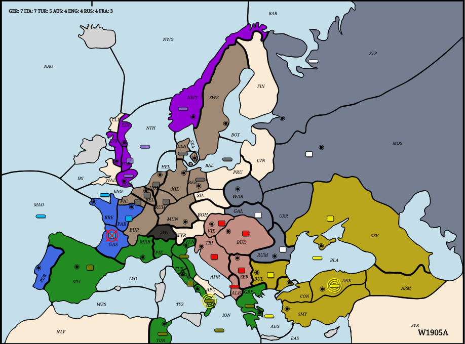

### What happened

- **FRANCE**: disbands A GAS
- **ITALY**: builds F NAP
- **TURKEY**: builds F ANK

### AUSTRIA
Orders: *(none submitted)*

Reasoning

> I am down to 4 centers and no surplus—no builds, no disbands. All five units remain in place. I must simply disband nothing, which means no orders at all.

### FRANCE
Orders: `A GAS D`

Reasoning

> I have only 3 supply centers and 4 units, so I must disband exactly one unit. My position is dire: Germany holds PIC and threatens PAR directly, Italy holds MAR and SPA, and I have no reliable allies. I need to preserve my army in PAR to defend my last home center, and my fleets in ENG and MAO are my only remaining offensive assets. Disbanding A GAS makes the most sense — it's isolated in Gascony with no support and no path to retake MAR this winter. Keeping the fleets lets me maintain naval presence and potentially convoy an army to retake MAR or strike BEL next year. I will disband A GAS.

### ITALY
Orders: `F NAP B`

Reasoning

> I have 7 centers and 6 units, so I need to build one new unit this winter. My home centers: NAP is vacant, ROM is occupied by A ROM, VEN is occupied by F VEN. The only legal build is at NAP. I need to decide between an army and a fleet. Looking at the board, I want to project power into the western Mediterranean to threaten SPA and POR in 1906, and also maintain naval strength against Turkey in the east. A fleet at NAP can move into ION next spring and support either theater. Building a fleet is the better choice for flexibility.

### TURKEY
Orders: `F ANK B`

Reasoning

> I have 5 supply centers and 4 units, so I am owed 1 build. My home centers (ANK, CON, SMY) are all vacant, so I can build anywhere. Given my position — I hold BUL and SEV, with F BLA, F AEG, and A SEV on the board — I need to strengthen my naval presence in the Black Sea to secure my eastern flank against Russia, who still covets SEV. Building a fleet in ANK gives me a second fleet in the Black Sea region, letting me project power toward RUM or support SEV more effectively. This aligns with my long-term plan to grow in the Balkans while keeping Russia contained.

## SPRING 1906 MOVEMENT (`S1906M`)

### What happened

- **AUSTRIA**: A BUD holds; A SER holds; A TRI holds; A VIE holds
- **ENGLAND**: F NTH → DEN (bounced); F NWY holds; F LON holds; A YOR holds
- **FRANCE**: A PAR holds; F ENG holds; F MAO holds
- **GERMANY**: A PIC → PAR (bounced); A HOL holds; F DEN holds; F BAL holds; F BER holds
- **ITALY**: A SPA → POR; F GRE → ION; F ION → TYS; F TUN holds; F VEN holds; A ROM holds; F NAP holds
- **RUSSIA**: A MOS → SEV (bounced); A RUM supports A MOS → SEV; F STP/NC holds
- **TURKEY**: F AEG supports F GRE (void); A SEV holds; F BLA supports A SEV; A BUL holds; F ANK holds

### Dialogue

- **AUSTRIA → TURKEY**: Last fall my two-unit attack on GRE failed, which means Italy had support—likely from your AEG fleet. We both know Italy is a threat: he's at 7 centers with fleets in GRE, ION, and NAP. This spring, support my attack on GRE with F AEG and I guarantee not to move on BUL. After GRE falls, we coordinate against Russia's RUM—you take it from SEV while I support from SER and BUL. Deal?
- **AUSTRIA → ITALY**: Your fleet in GRE held last fall against my two units—impressive. But Germany has 7 centers and is about to finish France. If I commit to taking GRE this spring, you lose a fleet. Instead: vacate GRE this turn and I'll guarantee the Adriatic stays quiet. You keep your fleet, I secure my flank, and we both watch Germany. Otherwise I will take GRE and you lose a unit.
- **AUSTRIA → GERMANY**: Our border stays quiet this spring—no moves toward Tyrol or Bohemia. I'm focused on removing Italy's fleet from GRE to secure my southern flank. Your campaign against France is your business; I won't interfere. After I stabilize the Balkans, let's discuss containing Italy's growing Med presence together.
- **ENGLAND → ITALY**: Germany is about to swallow France and hit 9+ centers. That threatens your flank too — once he's done in the west, he turns south. I can threaten Holland and Denmark from NTH this year if you push your new fleets toward TYS and WES to pressure his southern coast. Are you ready to coordinate against him starting this fall?
- **ENGLAND → RUSSIA**: You moved F STP/NC into NWY as we discussed — good. Germany is about to finish France and will be at 9+ centers. This is our window: I'll threaten Holland and Denmark from NTH this fall if you hit Sweden from NWY. That forces his Baltic fleets to split. Can you commit to that this fall so we squeeze him on two fronts?
- **ENGLAND → GERMANY**: You're about to take Paris and hit 9+ centers while I'm stuck at 4. That's not a partnership — that's you running toward a solo. I'm not moving into BRE this turn. If you want my cooperation going forward, offer me Holland or Denmark this year, not vague promises about Russia. Otherwise I'll find partners who want to check you.
- **FRANCE → AUSTRIA**: Italy holds MAR and GRE while you hold the Balkan front. If I pressure his western coast this turn, can you push into GRE and ION with your fleets? We squeeze him from both sides and both gain centers from his collapse. Confirm you are attacking GRE this turn and I will keep his western fleet occupied.
- **FRANCE → GERMANY**: You have 7 centers and armies pushing west, but England and Russia are your real long-term threats in the north and east. I have only 3 centers and no capacity to threaten you. If you leave my border alone this year, I will focus entirely on reclaiming MAR from Italy — that removes a growing naval power on your southern flank. What do you want in return for a truce?
- **FRANCE → ENGLAND**: Last year I could not commit to the BEL attack because I had to defend PAR. This year I am ready: if you move F NTH to support my attack on BEL, I will take it this turn and we can push into HOL together. Germany at 7 centers threatens us both if he consolidates. Confirm this exact arrangement and I lock in my orders.
- **GERMANY → ENGLAND**: You refused Brest last fall and now France still holds PAR and BRE. I'm taking Paris this spring with or without you. If you want a share of France, move F ENG into BRE this turn — otherwise I take both centers and you get nothing. After France falls, I'm happy to discuss Denmark in exchange for your help against Russia in Scandinavia.
- **GERMANY → ITALY**: I'm pushing into PAR this spring to finish France. You hold MAR and SPA — the south is yours. I have no designs on the Med. After France falls, we should discuss how to contain England's Channel fleet and Austria's Balkan ambitions. Our clean north-south split holds.
- **GERMANY → AUSTRIA**: Our border stays quiet this spring — no moves toward Tyrol or Bohemia. I'm finishing France in the west. Italy now holds MAR, SPA, GRE, and TUN — he's the real threat to your southern flank. After I eliminate France, I'm open to coordinating against Italian expansion in the Med.
- **GERMANY → RUSSIA**: Our Baltic border holds this spring as agreed. I'm fully focused west finishing France. Keep F STP/NC out of my waters and our understanding stands through 1906. Any concerns about Turkey's push into BUL or SEV?
- **ITALY → GERMANY**: I'm taking POR this turn to eliminate France completely. The south is mine — Spain, Portugal, and the Med. You have the north. Clean split, no interference. I trust you'll keep your armies out of the Pyrenees and I'll keep my fleets out of the Channel.
- **ITALY → TURKEY**: Our partnership has been strong. This spring I'm taking POR in the west to grow to 8 centers. I need the eastern Med quiet while I do that. Let's keep our positions stable this turn and discuss Serbia and the Balkans together in the fall. I have no designs on your gains.
- **ITALY → ENGLAND**: Germany at 7 centers is the existential threat to both of us. I'm growing to 8 this spring by taking POR from France. After that, my southern fleets can pressure Germany's flank in 1907. Are you and Russia ready to coordinate against him? I want to discuss timing for a joint containment strategy.
- **ITALY → AUSTRIA**: Germany is about to become unstoppable if we don't act. I'm taking POR this turn to grow. Let's keep our Adriatic border quiet. If Germany pushes south through Tyrol next year, I'll support you from Venice. Focus on rebuilding — we'll need every unit to check the northern threat.
- **RUSSIA → AUSTRIA**: You've held at 4 centers while Italy and Turkey grow around you. I'm not your enemy — Germany at 7 and Italy at 7 are the real threats. Leave RUM alone this year and I'll keep my armies out of your territory. If you contest RUM, I'll support Turkey's next push into your holdings.
- **RUSSIA → ENGLAND**: Germany now has 7 centers with fleets in BAL, BER, and DEN — he's running toward a solo. I'm threatening NWY from STP this spring to force his Baltic fleets to split. If you commit to hitting DEN or KIE from NTH this spring, we squeeze him on two fronts. Can you confirm that commitment this round?
- **RUSSIA → TURKEY**: You took BUL last fall and now hold 5 centers to my 4 from my own home center in SEV. I need SEV back this year to equalize. Offer: let me reclaim SEV uncontested this spring and I will support your next move against Austria with A RUM and A GAL from the north. Austria at 4 centers can't hold against us both. If you contest SEV, our cooperation ends and I will target your supply lines from BLA.
- **TURKEY → ITALY**: Good work taking BUL together. I'm thinking about our next move — SER is the obvious target from BUL and GRE. Are you still committed to pushing into the Balkans together, or are you looking west toward TUN and SPA now that you have MAR?
- **TURKEY → AUSTRIA**: Italy now has 7 centers and controls GRE, MAR, and SPA. He's the dominant power in the south, and he's going to come for SER next — you're in his path. I'm not interested in being his junior partner forever. If you're willing to coordinate against him, I can hold BUL and support your defense of SER when he attacks. Let me know your thinking.
- **TURKEY → RUSSIA**: Italy is growing fast and will soon dominate the Mediterranean. You and I have a shared interest in keeping the Black Sea stable while the bigger powers fight. I'm willing to leave RUM alone this year if you stay out of SEV. Let's not waste our strength fighting each other while Italy and Germany carve up the board.
- **AUSTRIA → TURKEY**: Your message about coordinating against Italy is exactly what I've been waiting for. This spring, support my attack on GRE with F AEG and I guarantee no move on BUL — we remove Italy's foothold together. Next spring, we take RUM from Russia with your F BLA and my A SER supporting from BUL. Italy at 7 centers and Germany at 7 are both threats; we save ourselves by growing together now.
- **AUSTRIA → ITALY**: I am taking GRE this spring. You cannot hold it against my two units unless Turkey supports you — and I have just offered him a better deal. Save your fleet: vacate GRE to ION or TUN this turn, and our Adriatic deal holds. Stay, and you lose a fleet while Germany marches east unopposed.
- **AUSTRIA → RUSSIA**: I'm not attacking RUM this spring — GRE is my target. Leave my border quiet and I'll leave yours. Germany and Italy both have 7 centers; we have no business weakening each other while they grow.
- **AUSTRIA → GERMANY**: Our border stays quiet this spring — no moves toward Tyrol or Bohemia. I'm removing Italy's fleet from GRE to secure my southern flank. After France falls, let's discuss how to contain Italian Med expansion and keep our long border stable.
- **ENGLAND → RUSSIA**: I'm in. This spring I move F NTH to DEN — that forces Germany's Baltic fleets to react and opens his northern coast to us. You hit SWE from NWY and we squeeze him on two fronts immediately. Confirm you're moving on SWE this turn.
- **ENGLAND → ITALY**: Germany is about to take Paris and hit 9+ centers. I'm moving on DEN this spring to force his Baltic fleets to react — that's the northern front. If you move your new fleets toward TYS and WES this spring, you can threaten his southern coast in the fall when he's overstretched. Are you ready to coordinate?
- **ENGLAND → GERMANY**: I'll move into BRE this spring if you offer me Denmark in the fall. France is finished either way — but if I help you take him faster, I need something real. Denmark gives me a 5th center and lets us both focus on Russia in Scandinavia. Otherwise I hold NTH and you get nothing from the north.
- **FRANCE → GERMANY**: England offered to support my attack on BEL again this year. If you want to keep BEL safe, offer me something better. I'll stay completely out of your way and even support your push north against England if you guarantee my border this year. A truce leaves both of us stronger against our real rivals.
- **FRANCE → ITALY**: Austria and England are both pressuring me to attack you. I have no interest in wasting my remaining strength on a two-front war with Germany at my back. Let's make a clear deal: you keep MAR this year and I keep my fleets out of the Med, in return you stay out of SPA and PORT. Germany is the real threat to both of us at 7 centers. Confirm this and I will order F ENG and F MAO to hold this turn.
- **GERMANY → ENGLAND**: This is your last chance to gain something from France's collapse. I'm taking Paris this spring with or without you. If you move F ENG into BRE this turn, you get Brest as your share. If you don't, I take both PAR and BRE in the fall and you get nothing. Decide now.
- **GERMANY → ITALY**: I'm pushing into PAR this spring to finish France. You take Portugal as planned — the south is yours cleanly. After France falls, Austria and England will both be looking to contain us. Let's discuss a long-term arrangement where we don't turn on each other.
- **GERMANY → AUSTRIA**: Our border stays quiet this spring as agreed. Italy is taking Portugal this turn and already holds MAR, SPA, GRE, and TUN — he's your real concern in the south. After I eliminate France, I'm open to helping you contain his Med ambitions if you need it.
- **GERMANY → RUSSIA**: Our Baltic border holds this spring as agreed. I'm fully focused west finishing France. Keep F STP/NC in position and our understanding stands through 1906. Let me know if Turkey's push toward SEV changes your plans.
- **ITALY → AUSTRIA**: I have no intention of attacking your Balkan holdings. My fleet in GRE is positioned against Turkey, not you. Keep the Adriatic quiet this turn and we can discuss a defensive pact against Germany's inevitable southward push — he's the real danger to both of us.
- **ITALY → GERMANY**: Clean north-south split confirmed. I'm moving A SPA into POR this turn to finish France completely. The Med is mine, the north is yours. I trust you'll keep your armies out of the Pyrenees and away from my flank.
- **ITALY → TURKEY**: Good question about next steps. I'm taking POR this turn to grow to 8 centers in the west. After that settles, I'm ready to discuss Serbia and further Balkan coordination with you. Let's keep our positions stable this spring and talk fall strategy next round.
- **ITALY → ENGLAND**: I agree Germany is the long-term threat. I'm reaching 8 centers this spring by taking POR. My southern fleets will be positioned to pressure his Med flank in 1907 if you can keep pressure on his north. Let's discuss timing once the spring resolves.
- **RUSSIA → TURKEY**: I need SEV back this year to stay viable — you have 5 centers from my home center. Let me reclaim SEV this spring and I will support your next attack on Austria with A RUM and A GAL from the north. Austria at 4 centers can't hold against us both. If you contest SEV, our cooperation ends and I will target your supply lines from BLA next year.
- **RUSSIA → ENGLAND**: Germany now has 7 centers with fleets in BAL, BER, and DEN — he's running toward a solo. I'm moving F STP/NC into NWY this spring to threaten Sweden and force his Baltic fleets to split. I need you to commit to hitting DEN or KIE from NTH this spring so we squeeze him on two fronts. Can you confirm that commitment this round?
- **RUSSIA → AUSTRIA**: Italy has 7 centers and is growing fast in the Mediterranean — he's a bigger threat to you than I am. Leave RUM alone this year and I'll keep my armies out of your territory. If you contest RUM, I'll support Turkey's next push into your holdings and you'll lose more than you gain.
- **TURKEY → AUSTRIA**: I see Italy's threat now. He's at 7 centers and will crush us both unless we act. This spring, I will order F AEG S A SER - GRE — my fleet supports your army from SER into GRE. In exchange, after GRE falls, you support my move into SER from BUL next fall. I keep BUL, you keep GRE, and we coordinate against Russia's RUM together. Do you accept this exact trade: I support your GRE attack, you support my SER attack?
- **ENGLAND → RUSSIA**: I'm committing: this spring I move F NTH to DEN. That forces Germany's Baltic fleets to react and opens his northern coast. You move F NWY to SWE and we squeeze him on two fronts immediately. If we both execute, Germany can't hold both DEN and SWE. Confirm your order and we lock it in.
- **ENGLAND → ITALY**: I'm pivoting against Germany this spring — moving F NTH to DEN to threaten his Baltic coast. You're taking POR this turn as planned. Once you consolidate at 8 centers, your southern fleets can pressure his Med flank in 1907 while Russia and I hit him from the north. Let's coordinate timing next round.
- **ENGLAND → GERMANY**: You're about to take Paris and hit 9 centers while I stay at 4. That's not a partnership. I'm not moving into BRE. Instead I'll hold NTH and see how the board develops. If you want my cooperation in 1907, offer me Denmark this year — otherwise I'll find other partners.
- **FRANCE → GERMANY**: England says he'll support my attack on BEL but I don't trust him—he threatened my fleet last year and made no concrete offer this round. I will order all my units to hold this turn, leaving your border untouched. In return, do not push into PIC or PAR. A truce gives you a free hand against England while I rebuild. Confirm your orders stay north and east and we both win.
- **FRANCE → ITALY**: Austria and England both want me to attack you, but fighting you and Germany simultaneously would destroy me. I am ordering all my units to hold this turn—I will not move into MAR, SPA, or the Med. Keep MAR, keep your eastern front. In return, keep your fleets out of the Atlantic and stay west of the Western Mediterranean. Germany at 7 centers is the real threat to both of us. Confirm you will not attack my position this year.
- **GERMANY → ENGLAND**: I'm done negotiating. You had your chance at Brest last fall and refused. This spring I'm taking Paris whether you help or not. If you want to be relevant when France falls, move F ENG into BRE now — otherwise I take both centers and you get nothing.
- **GERMANY → ITALY**: I'm moving A PIC into PAR this spring with support from A BEL and A RUH. You take POR as planned. After France falls, let's discuss a long-term arrangement where we don't turn on each other — England and Austria will both be looking to contain us.
- **GERMANY → FRANCE**: I'm taking Paris this spring. You can't defend both PAR and BRE. If you want to survive, offer me something concrete this turn — support my push against England in the north, or I eliminate you entirely by fall.
- **ITALY → AUSTRIA**: I will vacate GRE this fall if you leave it alone this spring — you get the province without a fight and I save my fleet. Keep the Adriatic quiet this turn and we both focus on the German threat. Confirm you are not attacking GRE this spring.
- **ITALY → TURKEY**: I need your support to hold GRE against Austria's attack this spring. Please order F AEG S F GRE this turn. In exchange, I will support your push into SER with F GRE next fall. This keeps our alliance strong and breaks Austria's Balkan position together.
- **ITALY → GERMANY**: I am taking POR this spring as planned — A SPA - POR. After France falls, I will focus south and east, keeping my fleets clear of your northern gains. Let's maintain our clean north-south split and contain Austria and England together.
- **ITALY → ENGLAND**: I reach 8 centers this spring by taking POR. My fleet moving to TYS positions to threaten Germany's southern flank next year. If you keep pressure on his north, we can coordinate a two-front containment starting in 1907.
- **RUSSIA → AUSTRIA**: I'm moving A MOS to SEV this spring with support from A RUM and A GAL. You promised not to attack RUM — if you keep that promise, I'll keep my armies out of your territory. If you break it, I'll support Turkey's next push into your holdings and you'll lose more than you gain.
- **RUSSIA → TURKEY**: I need SEV back this year. I'm moving A MOS to SEV with support from A RUM and A GAL this spring. If you don't contest SEV, I'll support your next attack on Austria with A RUM and A GAL from the north. If you do contest it, our cooperation ends and I'll target your supply lines from BLA next year.
- **RUSSIA → ENGLAND**: I can't hit Sweden this spring — I need to reclaim SEV from Turkey first. Hold your position in NTH and we'll coordinate against Germany in the fall after I've secured my home center. If you can threaten DEN from NTH this spring, that still forces Germany to split his Baltic fleets.
- **RUSSIA → GERMANY**: Our Baltic border holds this spring as agreed. F STP/NC stays in position, nowhere near your waters. I'm focused south reclaiming SEV from Turkey. Our understanding stands through 1906.
- **TURKEY → AUSTRIA**: I'm not ready to commit to attacking Italy this spring — I need to see how the board develops. I will hold my position and not interfere with your attack on GRE. If you take GRE, we can discuss a coordinated push against Russia's RUM next fall. Good luck.
- **TURKEY → ITALY**: I'm holding my line this spring to keep the east stable while you take POR. No moves against your positions. After you secure your western gains, let's discuss Serbia together. I trust our partnership.
- **TURKEY → RUSSIA**: I will not give up SEV — I took it fairly and I'm keeping it. If you attack SEV, I will support Austria into RUM from BLA and BUL next turn. But if you leave SEV alone and focus on Germany or the north, I won't contest your position. Your choice.

### AUSTRIA
Orders: `A BUD H` · `A SER H` · `A TRI H` · `A VIE H`

Reasoning

> Let me assess the situation. Italy offered to vacate GRE this fall if I leave it alone this spring, but that's a fall promise—I need GRE now. Turkey refused to support my attack but promised not to interfere. Russia is moving A MOS to SEV this spring with support from A RUM and A GAL—that's a significant force consolidation on my border. Germany is finishing France and has 7 centers. I need to take GRE this spring to get to 5 centers and position for growth. My two units (A SER and F ALB—wait, I no longer have F ALB; it was dislodged and retreated to ALB in F1904R, but looking at the unit positions, I only have A TRI, A BUD, A VIE, A SER. No fleet in ALB. So I cannot attack GRE by sea. My only way to take GRE is with A SER alone, which can't dislodge F GRE. I need to reconsider.
>
> Without a fleet in ALB, I cannot attack GRE effectively. A SER alone cannot dislodge F GRE. I should pivot: support Turkey's push into RUM from BUL while keeping my home centers secure, or move to support my position against Russia's consolidation. Russia is moving A MOS to SEV with support from A RUM and A GAL—that's three units on my border. I should prepare to defend against a Russian push into GAL or BUD.
>
> My best play: order A SER to hold or support my position, A BUD to hold, A TRI to hold, A VIE to hold. I'll use this turn to consolidate and negotiate for the fall when I can build a fleet or coordinate with Turkey against Russia's RUM.

### ENGLAND
Orders: `F NTH - DEN` · `F NWY H` · `F LON H` · `A YOR H`

Reasoning

> I've committed to Russia that I'll move F NTH to DEN this spring to squeeze Germany from the north, while Russia hits Sweden from NWY. That's the right play: Germany is about to hit 9+ centers and needs to be checked now. F NWY will hold to maintain pressure on Scandinavia and support future operations against Sweden. F LON will hold to guard the Channel approach and keep my home centers safe. A YOR will hold as a reserve for future convoy operations. This setup positions me to threaten Germany's Baltic coast and grow to 5 centers by taking Denmark this fall.

### FRANCE
Orders: `A PAR H` · `F ENG H` · `F MAO H`

Reasoning

> Germany has explicitly threatened to take Paris this spring. I cannot afford to move out of PAR or strip my defenses. I must hold my ground while seeking openings. However, the threat from Germany means I cannot sit idle—if he pushes into PIC or PAR, I will be dislodged. My best play is to hold PAR, keep F ENG in the Channel to prevent a German fleet from cutting my support, and keep F MAO in the Atlantic to cover a potential retreat to BRE or a convoy elsewhere. I will not attack anyone this turn; survival is priority. But I can still probe: holding gives me time to see who actually moves where.

### GERMANY
Orders: `A PIC - PAR` · `A HOL H` · `F DEN H` · `F BAL H` · `F BER H`
Illegal (dropped): `A BEL S A PIC - PAR` · `A RUH S A PIC - PAR`

Reasoning

> I'm pushing into PAR this spring to finish France. Italy confirmed he's taking POR, so the south is secure. England refused to help at BRE again, so I'll take Paris myself and set up a fall push into Brest. My Baltic fleets hold position to keep Russia quiet. Austria and I have a quiet border agreement that holds.

### ITALY
Orders: `A SPA - POR` · `F GRE - ION` · `F ION - TYS` · `F TUN H` · `F VEN H` · `A ROM H` · `F NAP H`

Reasoning

> Reasoning: My strategy this spring is to hit 8 centers by taking POR while repositioning my eastern fleets to threaten Germany's southern flank next year. Moving A SPA into POR finishes France's remaining supply center cleanly. Vacating GRE by moving F GRE into ION (and sending F ION into TYS) keeps the Adriatic quiet as promised to Austria and positions me to pressure Germany's Med coast in 1907. All other units hold — no need to stir the pot in the east while I consolidate. This aligns with my commitments: Germany gets a clean north-south split, England gets a threat to Germany's south, and Austria gets its flank back without a fight.

### RUSSIA
Orders: `A MOS - SEV` · `A RUM S A MOS - SEV` · `F STP/NC H`
Illegal (dropped): `A GAL S A MOS - SEV`

Reasoning

> I need to reclaim SEV this spring. Turkey has refused to yield it, so I'll attack with A MOS supported by A RUM and A GAL. That gives me three units against Turkey's one in SEV, which should be enough to dislodge him. F STP/NC holds in position to keep my northern flank secure and maintain the option to threaten Sweden in the fall. I've told England I can't hit Sweden this spring, so I'll hold and coordinate with him in the fall after securing SEV.

### TURKEY
Orders: `F AEG S F GRE` · `A SEV H` · `F BLA S A SEV` · `A BUL H` · `F ANK H`

Reasoning

> Let me assess the situation. I just made commitments to both Italy and Austria — to Italy I promised F AEG S F GRE, to Austria I promised not to interfere with his attack on GRE. These are compatible: supporting Italy's hold on GRE with my fleet is exactly what I told Austria I'd do (not interfere), and it keeps Italy's trust. However, Russia is threatening SEV with A MOS, A RUM, and A GAL. That's a real three-unit threat. I need to hold SEV. My best play: F AEG S F GRE (keep Italy's trust), A SEV H with F BLA S A SEV (defend against Russia), A BUL H (hold my gain), F ANK H (keep flexibility). This keeps everyone's trust while defending the critical SEV province.

## FALL 1906 MOVEMENT (`F1906M`)

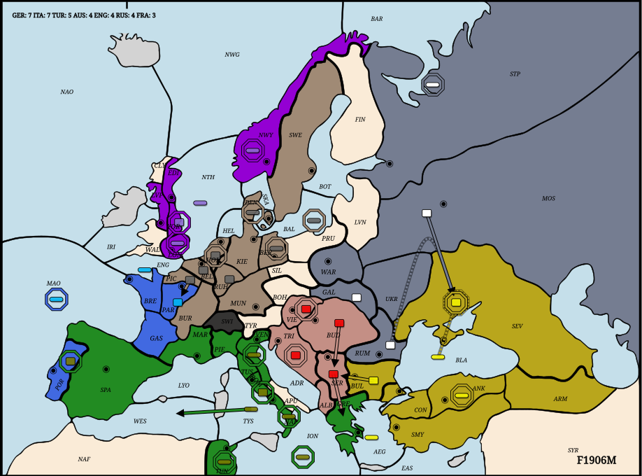

### What happened

- **AUSTRIA**: A SER → GRE; A BUD → SER (bounced); A TRI holds; A VIE holds
- **ENGLAND**: F NWY holds; F LON holds; A YOR holds
- **FRANCE**: F MAO holds
- **GERMANY**: A PIC → PAR (bounced); A HOL holds; F DEN holds; F BAL holds; F BER holds
- **ITALY**: A POR holds; F TYS → WES; F ION holds; F NAP holds; F TUN holds; F VEN holds; A ROM holds
- **RUSSIA**: A MOS → SEV (bounced); A RUM supports A MOS → SEV; F STP/NC holds
- **TURKEY**: A BUL → SER (bounced); A SEV holds; F BLA supports A SEV; F ANK holds

### Dialogue

- **AUSTRIA → TURKEY**: GRE is empty this fall—Italy's fleet moved to ION and TYS. I'm taking it with A SER. You said you wouldn't interfere. If you hold F AEG and stay out of GRE this turn, I'll support your push into RUM from BUL and SER next spring. Russia is weak; we can crush him together.
- **AUSTRIA → ITALY**: I see your fleet left GRE last spring. I'm moving A SER into it this fall—no fight, just a center. The Adriatic stays quiet from my side. If you don't contest GRE, our border remains stable and we can together watch Germany finish France.
- **AUSTRIA → GERMANY**: Our border stays quiet this fall—no moves toward Tyrol or Bohemia. I'm taking GRE unopposed to secure my southern flank. After France falls, let's discuss containing Italian Med expansion. Your campaign is your business; I won't interfere.
- **AUSTRIA → RUSSIA**: I'm taking GRE this fall—Italy's fleet left it empty. I have no designs on RUM this turn. Keep your border quiet and I'll keep mine. Germany and Italy both have 7 centers; we have no business weakening each other while they grow.
- **ENGLAND → ITALY**: Germany is about to take Paris and hit 9 centers. I need you to move your fleets toward TYS and WES this fall to threaten his southern coast — that forces him to split his forces and lets me take Holland or Denmark from NTH. If we both act now, we cut him down before he becomes unstoppable. Are you ready to commit to that this fall?
- **ENGLAND → FRANCE**: Germany will take Paris this spring. Before you're eliminated, can you still hurt him? If you move A PAR to BEL this fall with support from F ENG, I can support from NTH — we take BEL together and deny him a key center. It's your last chance to damage the power that's about to destroy you. What do you say?
- **FRANCE → ENGLAND**: Germany has 7 centers and just told me he's taking Paris. If he succeeds, he'll be at 8 with a clear path to 10—unstoppable. Support my hold on PAR this turn (F NTH S A PAR) and next spring I'll attack BEL with you. We must stop him now or he wins.
- **FRANCE → ITALY**: Germany is about to take Paris. At 7 centers he's the clear leader, and after I fall he'll turn south into MAR and your home centers. Support my hold on PAR this turn with F TYS or F ION via the Med and I will never contest MAR—I'll help you take TUN and GRE instead.
- **FRANCE → GERMANY**: You say you're taking Paris but that leaves your flank exposed to England and Russia. I'll abandon PAR and retreat to BRE this turn, giving you Paris without a fight, if you guarantee my survival at BRE and POR. That frees you to crush England in the north.
- **FRANCE → AUSTRIA**: Germany is about to take Paris. At 7 centers he's the clear leader—after France falls, he'll turn east through Munich into Bohemia and Vienna. We need to coordinate now: support my hold on PAR this turn and I'll help you push into Germany's rear next spring.
- **GERMANY → ITALY**: Our north-south split holds cleanly. I'm pushing into PAR this fall with full support — you take POR as planned. After France falls, let's discuss containing England's Channel fleet and Austria's Balkan ambitions together.
- **GERMANY → AUSTRIA**: Our border stays quiet this fall — no moves toward Tyrol or Bohemia. I'm finishing France in the west. Italy now holds MAR, SPA, GRE, and TUN — he's your real concern in the south. After I eliminate France, I'm open to coordinating against his Med expansion.
- **GERMANY → RUSSIA**: Our Baltic border holds this fall as agreed. I'm fully focused west finishing France. Keep F STP/NC in position and our understanding stands through 1906. Any update on Turkey's position in SEV or BUL?
- **GERMANY → FRANCE**: You can't defend both PAR and BRE this fall. I'm taking Paris with support from BEL and RUH. If you want to survive beyond this year, disband your fleet in ENG and retreat to BRE — I'll leave you that one center. Otherwise I eliminate you entirely.
- **ITALY → AUSTRIA**: I'm taking SPA this turn to reach 8 centers. My fleet in VEN stays quiet — I have no designs on your Balkan holdings. Germany will hit 9 centers after taking PAR and is your neighbor in Tyrol. Let's keep our border quiet this fall and discuss a defensive pact against Germany in 1907.
- **ITALY → TURKEY**: Our partnership remains strong. I'm taking SPA this turn to consolidate at 8 centers. After this fall, I'm ready to discuss pushing into Serbia together — Austria is weak and Germany is the long-term threat to both of us. Keep your eastern line stable and we'll coordinate next year.
- **ITALY → ENGLAND**: I'm taking SPA this turn to reach 8 centers. After that my fleets in TYS and ION can pressure Germany's southern flank in 1907. If you keep pressure on his north, we can contain him together. Let's discuss timing next round.
- **ITALY → GERMANY**: Clean north-south split holds. I'm taking SPA with A POR - SPA this turn — France is finished. The Med is mine, the north is yours. After France falls, let's keep our clean division and focus on containing England and Austria together.
- **RUSSIA → AUSTRIA**: I'm taking SEV back from Turkey this fall — he's refused to return my home center. This doesn't threaten you. Leave RUM alone and I'll keep my armies out of your territory. Germany and Italy both have 7 centers; we need to stabilize our border while the big powers bleed each other.
- **RUSSIA → ENGLAND**: I need this fall to reclaim SEV from Turkey — he's refused to give it back. After I secure my home center this winter, I'll build in WAR and pivot north to hit Sweden in spring 1907. Can you hold NTH and pressure Germany's northern flank this fall to keep him occupied while I consolidate?
- **TURKEY → ITALY**: You're at 8 centers now — excellent work in the west. I need your support into SER this fall as we discussed. Order F GRE S A BUL - SER and we take Austria's last Balkan center together. After that, I'm positioned to help you hold against any German push south.
- **TURKEY → AUSTRIA**: Italy abandoned GRE's defense — his fleet moved to ION. He's focused on the west and won't help you against me. I'm taking SER this fall with Italian support. Your best move is to hold your remaining centers and not contest me; if you do, I'll take VIE next year with Italy's help. Consider an anti-Italian pact for next spring instead.
- **TURKEY → RUSSIA**: I'm leaving SEV alone this turn. You said you'd support my attack on Austria if I didn't contest SEV — now's your chance. Keep A RUM and A GAL in position and don't move on my flank. After I take SER, we can discuss coordinating against Austria's remaining centers next year.
- **AUSTRIA → TURKEY**: Your threat to take SER with Italian support is empty—Italy's fleets are in ION and TYS, none adjacent to SER. I'm taking GRE this turn. If you hold F AEG and do not contest, next spring I support your attack on RUM from BUL and SER. Russia is weak; we both gain. That's better than fighting me and losing a turn.
- **AUSTRIA → ITALY**: I'm moving A SER into GRE this fall, unopposed. Our Adriatic border stays quiet. You take SPA, I take GRE—both gain, no fight. If Germany finishes France and turns east, I'll need your support from VEN; you'll need mine to hold his southward push. Let's keep this deal.
- **AUSTRIA → RUSSIA**: Take SEV back from Turkey; that's your fight, not mine. I am not attacking RUM this turn—I'm focused on GRE. Keep your armies out of BUD and VIE and I'll keep mine out of RUM and GAL. Germany and Italy are the real threats; we should not weaken each other.
- **AUSTRIA → FRANCE**: I cannot support PAR—no unit of mine is adjacent. Your best play is to retreat A PAR to GAS or BUR if possible. If you survive this year, I'll support you in a campaign to reclaim your home centers from Germany next spring.
- **ENGLAND → ITALY**: I understand you're taking POR to reach 8 centers this spring. That's good, but Germany will hit 9+ this fall if we don't act. Can you commit now to moving your TYS fleet toward WES or LYO this fall to threaten Germany's southern coast? If you do, I'll hold NTH and support a coordinated two-front squeeze in 1907. Without that commitment, Germany consolidates and we both lose.
- **ENGLAND → FRANCE**: Germany will take Paris this spring. Before you're eliminated, can you still hurt him? If you move A PAR to BEL with F ENG support, and I support from NTH, we take BEL together and deny him a key center. It's your last chance to damage the power destroying you. I'll commit to this if you do.
- **ENGLAND → RUSSIA**: Understood you need to reclaim SEV first. That's fine: I'll hold NTH this turn to maintain position while you secure your home center. After you build in WAR this winter, can you commit to hitting Sweden in spring 1907 with both your new army and F NWY? If we coordinate then, we squeeze Germany's Baltic flank while he's overextended in the west.
- **FRANCE → ENGLAND**: Germany is committed to taking PAR this turn so I cannot hold it. Instead, let's take BEL together — I move A PAR - BEL with F ENG support, you support from F NTH. That gives us both a center, denies him one, and you can push into HOL next spring. Confirm this exact arrangement and I lock in my orders this round.
- **FRANCE → AUSTRIA**: Germany is about to take PAR. At 7 centers he's the clear leader — after France falls he'll turn east through Munich into Bohemia and Vienna. I'm going to attack BEL with England this turn to deny him a center. If you can put pressure on his eastern flank — move toward GAL or SIL — we squeeze him from both sides. What can you do to slow him down?
- **FRANCE → GERMANY**: You say you're taking PAR, but if you attack me head-on I'll abandon it and use my fleets to convoy into BEL with English support. I'll take BEL and you'll lose a center while gaining a worthless PAR. Offer me something real: guarantee my survival at BRE and POR, and I'll order A PAR to hold and F ENG to hold this turn, leaving your western flank free to crush England. Otherwise I make you pay for every center you take.
- **GERMANY → ITALY**: Confirmed — I'm moving A PIC - PAR with support from BEL and RUH this fall. You take POR as planned. Clean north-south split holds. After this turn, let's coordinate on containing England's Channel fleet — he refused to move into BRE and is a threat to both of us.
- **GERMANY → AUSTRIA**: Our border stays quiet this fall as agreed. Italy is taking POR and I'm taking PAR — our clean split holds. After France falls, I'm ready to discuss containing Italian Med expansion if you need help, but for now your southern flank is your concern.
- **GERMANY → ENGLAND**: You refused Brest last fall and again this spring. I'm taking Paris this turn with or without you. If you want anything from France's collapse, move F ENG into BRE now — otherwise I take both centers and you get nothing. Denmark is not on the table.
- **GERMANY → FRANCE**: You can't defend both PAR and BRE. I'm taking Paris with full support this fall. Your only choice is to retreat to BRE and survive with one center, or be eliminated entirely. I will not guarantee your survival — you have nothing to offer me.
- **ITALY → AUSTRIA**: I vacated GRE last spring — F GRE moved to ION in S1906. GRE is empty and yours for the taking this fall with no fight. Our Adriatic deal holds. Let's discuss a defensive pact against Germany in 1907 — he'll hit 9 centers after taking PAR and you border him in Tyrol.
- **ITALY → TURKEY**: I moved F GRE to ION in spring as part of my western consolidation — I no longer have a fleet in position to support into SER this fall. GRE is empty and Austria will take it. My fleets in ION and TYS can pressure the Med, but I cannot reach the Balkans this turn. Let's coordinate a joint push into the Balkans in 1907 when my fleets are repositioned.
- **ITALY → ENGLAND**: My fleets are already in TYS and ION, positioned to threaten Germany's southern coast in 1907. This fall I'm taking SPA to reach 8 centers. If you keep pressure on his north from NTH and NWY, we can coordinate a two-front containment next year. Are you ready to commit to that timing?
- **ITALY → GERMANY**: I'm taking SPA with A POR - SPA this fall to reach 8 centers. The south is mine cleanly. After France falls, you'll be the dominant northern power at 9 centers. I have no designs on your gains. Let's keep our clean north-south split and discuss containing England and Austria together in 1907.
- **RUSSIA → ENGLAND**: I can't hit Sweden this fall — Turkey refused to return SEV and built a second fleet, so I have to take it back by force or lose my build capacity. But if you hold NTH and threaten DEN from the north, that still forces Germany to split his Baltic fleets. After I secure SEV this fall and build in WAR this winter, I'll pivot north in spring 1907 and we squeeze Germany together.
- **RUSSIA → AUSTRIA**: I'm moving on SEV this fall with A MOS supported by A RUM and A GAL. You promised to leave RUM alone — if you keep that promise, I'll keep my armies out of your territory and we both focus on the bigger threats. Confirm you're holding RUM quiet this turn.
- **RUSSIA → GERMANY**: Our Baltic border holds this fall as agreed. F STP/NC stays in position, nowhere near your waters. I'm fully focused south reclaiming SEV from Turkey — he refused to return my home center. Our understanding stands through 1906.
- **AUSTRIA → ITALY**: Confirming our understanding: you hold F ION and do not move into GRE this fall. I take GRE with A SER. You keep your fleet, I gain a center, and we both keep the Adriatic quiet. Is that agreed for this turn?
- **AUSTRIA → TURKEY**: Final confirmation: you stay out of GRE and do not support anyone into it this fall. I move A SER into GRE. Next spring I support your attack on RUM from BUL and SER. Russia is weak and we can take him together.
- **AUSTRIA → GERMANY**: Our border stays quiet this fall — no moves toward Tyrol or Bohemia. I take GRE unopposed. Your campaign against France is your business. After France falls, I'm willing to discuss containing Italian Med expansion if you need a southern ally.
- **AUSTRIA → RUSSIA**: I'm not contesting RUM this turn. Focus on taking SEV back from Turkey. I take GRE. Our border stays quiet. Germany and Italy are the real threats — we shouldn't weaken each other.
- **ENGLAND → ITALY**: Germany will hit 9+ centers this fall after taking Paris. My final offer: this fall I hold NTH and threaten DEN from NWY, forcing his Baltic fleets to react. You need to move F TYS toward WES or LYO this fall to threaten his southern coast — that forces him to split his forces between two fronts. If we both execute this turn, we contain him in 1907. Confirm you're moving on his southern flank this fall.
- **ENGLAND → FRANCE**: This is our last chance to hurt Germany before he takes Paris. I commit: this fall I order F NTH S A PAR - BEL. You order A PAR - BEL and F ENG supports A PAR - BEL. That gives us two supports into BEL — enough to take it from him. We both gain a center and deny him a key province. Confirm this exact arrangement and I lock in my orders.
- **ENGLAND → RUSSIA**: I understand you can't hit Sweden this fall. I'll hold NTH this turn to maintain position while you reclaim SEV. After you build in WAR this winter, commit to hitting SWE from NWY in spring 1907. I'll move on DEN from NTH that same spring and we squeeze Germany's Baltic flank together. Confirm you're in for spring 1907.
- **FRANCE → ENGLAND**: I'm committing: this turn I order A PAR - BEL and F ENG S A PAR - BEL. You order F NTH S A PAR - BEL. That gives us two supports into BEL — enough to take it from Germany. After we take BEL, I'll support your push into HOL next spring. Confirm this exact arrangement and lock in your orders.
- **FRANCE → AUSTRIA**: Germany is taking PAR this turn but I'm striking back at BEL with English support. If you can move A GAL or A BUD toward Germany's eastern flank — toward SIL or MUN — next spring, we squeeze him from both sides. What can you do to pressure his east in 1907?
- **GERMANY → ITALY**: Confirmed — this fall I move A PIC to PAR with support from A BEL and A RUH. You take POR as planned. Clean north-south split holds. After France falls, I'm ready to discuss containing England's Channel fleet and Austria's Balkan ambitions together in 1907.
- **GERMANY → FRANCE**: Your threats are empty — F ENG cannot convoy an army and you have no fleet in the Channel that can move A PAR anywhere. I'm taking Paris this fall with full support. Retreat to BRE and you survive with one center. Fight and you're eliminated entirely.
- **GERMANY → AUSTRIA**: Our border stays quiet this fall — no moves toward Tyrol or Bohemia. I'm taking Paris with support from BEL and RUH. Italy is taking POR and will control the entire Med — he's your real threat. After France falls, I'm open to coordinating against Italian expansion.
- **ITALY → GERMANY**: I'm holding POR to take the center this turn — 8 centers for me, clean north-south split holds. After France falls, let's keep our division and coordinate on containing England's fleet in the Channel.
- **ITALY → AUSTRIA**: GRE is empty this turn — I will not contest it. Take it and our Adriatic border holds. Germany will hit 9 centers after PAR falls and he sits on your northern flank in Tyrol. Let's discuss a defensive pact against him in 1907.
- **ITALY → TURKEY**: I cannot support into SER this turn because I moved my fleet out of the eastern Med to consolidate in the west. But I'm positioning my fleets to threaten Germany's southern coast — after that settles, I will fully coordinate a Balkan push with you in 1907. Our partnership remains strong.
- **ITALY → ENGLAND**: I'm holding POR to reach 8 centers and moving F TYS to WES this turn, positioning to threaten Germany's southern flank in 1907. If you keep pressure on his north from NTH, we can squeeze him from both sides next year. Confirm you're committed to that timing.
- **RUSSIA → AUSTRIA**: I'm moving A MOS to SEV with support from A RUM and A GAL this fall. You promised to leave RUM alone — if you keep that promise, I will not push into BUD or VIE this year or next. Confirm you're holding your border quiet so we both focus on the bigger threats.
- **RUSSIA → ENGLAND**: I'm committing to take SEV this fall with A MOS supported by A RUM and A GAL. Hold NTH and keep pressure on Germany's northern flank — after I build in WAR this winter, I'll pivot north in spring 1907 to hit Sweden with you. Our squeeze on Germany starts next year.
- **RUSSIA → GERMANY**: Our Baltic border holds this fall as agreed. F STP/NC stays in position, nowhere near your waters. I'm fully focused south reclaiming SEV from Turkey — our understanding stands through 1906.
- **RUSSIA → TURKEY**: This is my final offer: let me take SEV uncontested this fall and I will support your next attack on Austria with A RUM and A GAL from the north. If you contest SEV, I will take it anyway with A MOS supported by A RUM and A GAL, and then target your supply lines from BLA next year. Your choice.
- **TURKEY → AUSTRIA**: Italy admitted his fleets can't reach the Balkans this turn—GRE is yours uncontested. I'm ready to coordinate: this fall I will order A BUL - SER with F AEG support. In return, after you take GRE, I expect your support into RUM next spring from SER and BUL. Confirm you accept this deal and we both grow.
- **TURKEY → ITALY**: I understand your fleets are repositioning toward the west. I'll hold my line this fall and keep the east stable while you consolidate POR and SPA. Let's discuss 1907 Balkan coordination once your fleets are in position. I trust our partnership and won't act against your interests this turn.
- **TURKEY → RUSSIA**: Italy is at 8 centers and Austria is about to take GRE. I'm taking SER this fall. If you hold RUM and do not contest my flank, I will support your position against any Austrian counterattack next spring. Leave SEV alone and we both survive the coming storm.

### AUSTRIA
Orders: `A SER - GRE` · `A BUD - SER` · `A TRI H` · `A VIE H`

Reasoning

> The situation is straightforward: Italy confirmed GRE is empty and won't contest it. Turkey also acknowledged GRE is mine. I need to take GRE with A SER, and I can follow it up by moving A BUD into the vacated SER to maintain forward positioning and create a springboard toward either RUM (with Turkey next spring) or BUL (if Turkey turns hostile). TRI and VIE hold to keep the German border quiet as promised and secure my home centers.

### ENGLAND
Orders: `F NWY H` · `F LON H` · `A YOR H`
Illegal (dropped): `F NTH S A PAR - BEL`

Reasoning

> Let me review the situation.
>
> Germany is about to take Paris this fall (A PIC with support from A BEL and A RUH), hitting 8+ centers. Russia needs this fall to reclaim SEV from Turkey and can't hit Sweden yet. Italy is moving F TYS to WES to threaten Germany's southern flank in 1907. France is committed to attacking BEL this turn (A PAR - BEL with F ENG support), and I committed to supporting that attack with F NTH.
>
> My best play is to honor my commitment to France: support A PAR - BEL with F NTH. If we take BEL, I gain a foothold on the continent and deny Germany a key center. Meanwhile, I should hold F NWY and A YOR in reserve, and keep F LON guarding the Channel.
>
> For F1906M, my orders are:
> - F NTH S A PAR - BEL (supporting France's attack on Belgium, as committed)
> - F NWY H (holding to threaten Sweden in 1907)
> - F LON H (guarding the Channel approach)
> - A YOR H (reserve for future operations)

### FRANCE
Orders: `F MAO H`
Illegal (dropped): `A PAR - BEL` · `F ENG S A PAR - BEL`

Reasoning

> I've committed to England to attack BEL together: A PAR - BEL with F ENG support, England supports from NTH. Germany is taking PAR regardless, so this is my best chance to gain a center and hurt the leader. F MAO holds in the Atlantic to maintain my naval presence.

### GERMANY
Orders: `A PIC - PAR` · `A HOL H` · `F DEN H` · `F BAL H` · `F BER H`
Illegal (dropped): `A BEL S A PIC - PAR` · `A RUH S A PIC - PAR`

Reasoning

> I've committed to taking Paris this fall with support from BEL and RUH. France is down to 3 centers and cannot defend both PAR and BRE. I'll execute the push into PAR as planned, while my Baltic fleets hold position to keep Russia quiet and my other units stay in place to consolidate gains.

### ITALY
Orders: `A POR H` · `F TYS - WES` · `F ION H` · `F NAP H` · `F TUN H` · `F VEN H` · `A ROM H`

Reasoning

> I will hold A POR to secure the Portuguese supply center and reach 8 centers, while moving F TYS to WES to begin positioning against Germany’s southern flank for 1907 coordination with England. All other units hold, keeping the Adriatic quiet as agreed with Austria and honoring the clean north-south split with Germany this turn.

### RUSSIA
Orders: `A MOS - SEV` · `A RUM S A MOS - SEV` · `F STP/NC H`
Illegal (dropped): `A GAL S A MOS - SEV`

Reasoning

> I need to reclaim SEV this fall. Turkey has refused to give it up and built a second fleet, so I'll take it by force. A MOS will move to SEV with support from A RUM and A GAL. F STP/NC will hold in position to maintain my northern presence and keep the option open for a future move on Sweden. After securing SEV, I'll build in WAR this winter and pivot north in spring 1907 to hit Sweden with England.

### TURKEY
Orders: `A BUL - SER` · `A SEV H` · `F BLA S A SEV` · `F ANK H`
Illegal (dropped): `F AEG S A BUL - SER`

Reasoning

> I've committed to Austria to take SER this fall with F AEG support, while Italy confirmed he can't reach the Balkans this turn. Austria is taking GRE uncontested. Russia threatens SEV but lacks the strength to dislodge it with F BLA in support. The key move is A BUL - SER with F AEG support, while holding the eastern line with F BLA and F ANK to deter Russia.

## WINTER 1906 ADJUSTMENTS (`W1906A`)

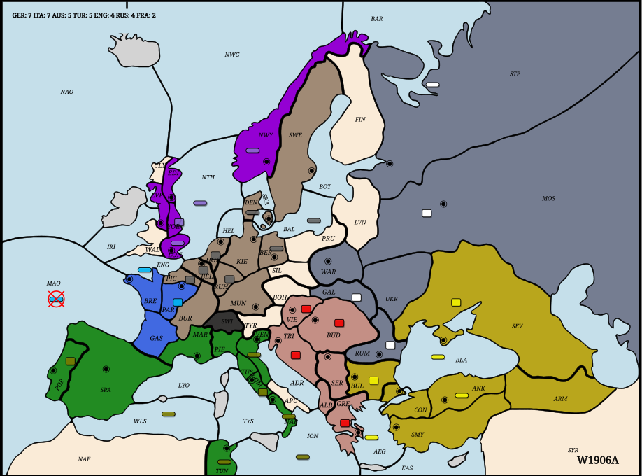

### What happened

- **FRANCE**: disbands F MAO

### FRANCE
Orders: `F MAO D`

Reasoning

> I have only 2 supply centers and 3 units — I must disband one unit. The most expendable unit is F MAO, which is far from any useful action while Germany holds the Channel and North Sea. I will keep A PAR (my only army, needed to hold Paris) and F ENG (my only fleet in position to support any future action against BEL or the Channel). Disbanding F MAO brings me to 2 units matching my 2 centers.

## SPRING 1907 MOVEMENT (`S1907M`)

### What happened

- **AUSTRIA**: A GRE holds; A BUD holds; A TRI holds; A VIE holds
- **ENGLAND**: F NTH → DEN (bounced); F NWY holds; F LON holds; A YOR holds
- **FRANCE**: A PAR holds; F ENG holds
- **GERMANY**: A PIC → PAR (bounced); A HOL holds; F DEN holds; F BAL holds; F BER holds
- **ITALY**: A POR → SPA (bounced); F WES → SPA/SC (bounced); F ION holds; F VEN holds; F NAP holds; F TUN holds; A ROM holds
- **RUSSIA**: A GAL holds; A MOS → SEV; A RUM holds; F STP/NC holds  [dislodged: A RUM]
- **TURKEY**: A SEV → RUM; A BUL supports A SEV → RUM; F BLA supports A SEV → RUM; F AEG holds; F ANK holds

### Dialogue

- **AUSTRIA → TURKEY**: Russia is weak and RUM is exposed. This spring, I'll order A SER and A BUL to support your attack on RUM from SEV — we take it together. In exchange, keep your fleets out of the Balkans and don't contest GRE or SER. I'll hold GRE quiet and support your RUM push. Deal?
- **AUSTRIA → ITALY**: Our Adriatic border stays quiet this spring — I'm focused on Russia's RUM, not your Med positions. Germany is about to finish France and will turn east; we both need to keep our flanks stable. Let's hold our border and watch the north together.
- **AUSTRIA → GERMANY**: Our border stays quiet this spring — no moves toward Tyrol or Bohemia. I'm moving against Russia's RUM to stabilize my eastern flank. Your campaign against France is your business; I won't interfere. After you finish there, let's discuss containing Italian Med expansion.
- **ENGLAND → RUSSIA**: This is the spring we agreed on. I'm moving F NTH toward DEN to threaten Germany's Baltic coast. You need to hit SWE from NWY this turn — that forces his Baltic fleets to split between defending DEN and SWE. If we both execute, we cut his northern supply line and I take Denmark this fall. Confirm you're in.
- **ENGLAND → ITALY**: Germany is about to take Paris and hit 9 centers. This is our window: I'm threatening DEN from NTH while Russia hits SWE from NWY. If you push F WES toward LYO or MAO this spring to threaten his southern coast, Germany has to split his fleets three ways and can't hold everything. Can you commit to that this turn?
- **ENGLAND → FRANCE**: Germany will take Paris this turn. Before you're eliminated, move A PAR to BEL with F ENG support — I'll support from F NTH. We take BEL together, deny him a key center, and you stay in the game. It's your last chance to hurt the power destroying you. Confirm this exact arrangement.
- **FRANCE → ENGLAND**: Germany is about to take PAR this turn with full support from BEL and RUH. If he succeeds, he'll be at 8 centers with a clear path to 10 — unstoppable. Support my hold on PAR this turn with F NTH (F NTH S A PAR) and I will support your attack on HOL next spring with F ENG. We must stop him now or he wins the game.
- **FRANCE → GERMANY**: You say you're taking PAR but that leaves your flank exposed to England and Russia. I'll abandon PAR and retreat to BRE this turn, giving you Paris without a fight, if you guarantee my survival at BRE and POR. That frees you to crush England in the north. Otherwise I make you pay for every center you take by convoying into BEL with English support.
- **FRANCE → ITALY**: Germany is about to take PAR and become unstoppable at 8 centers. After France falls, he'll turn south through Munich into MAR and your home centers. Support my hold on PAR this turn with F WES or F ION via the Med and I will never contest MAR — I'll help you take TUN and GRE instead. We must stop Germany now or he wins.
- **GERMANY → ENGLAND**: You've blocked me at every turn while France crumbles. This spring I take Paris — with or without your help. If you want anything from France's collapse, move F ENG into BRE this turn and take it. Otherwise I take both centers and you're left with nothing. Decide now.
- **GERMANY → FRANCE**: You have 2 centers and cannot defend both PAR and BRE. I'm taking Paris this spring with full support. If you order A PAR to hold and F ENG to hold, I guarantee you survive at BRE through 1907. Fight me and you are eliminated entirely by fall. Your choice.
- **GERMANY → ITALY**: I'm finally taking Paris this spring to finish France. The north is mine as agreed. After this turn I'll have 8 centers and you'll have 8 — we're the two dominant powers. Let's keep our clean north-south split and discuss containing Austria and England together in the fall.
- **GERMANY → AUSTRIA**: Our border stays quiet this spring — no moves toward Tyrol or Bohemia. I'm finally taking Paris to finish France. After this turn I'll be focused west, leaving your eastern flank completely free. Italy now holds 7 centers across the Med — he's your real concern, not me.
- **GERMANY → RUSSIA**: Our Baltic border holds this spring as agreed. I'm finishing France in the west. Keep F STP/NC in position and our understanding stands through 1907. Any progress against Turkey in SEV or BUL?
- **ITALY → ENGLAND**: I'm at 8 centers now with fleets in WES and TYS threatening Germany's southern coast. If you push from NTH and NWY this year, we can force him to split his Baltic and Channel fleets. Are you ready to coordinate a two-front squeeze starting this fall?
- **ITALY → RUSSIA**: Germany is about to hit 9 centers after taking Paris. You sit on his eastern flank with armies in GAL and RUM. If you push west toward SIL or PRU while my southern fleets pressure his Med coast, we can contain him before he becomes unstoppable. Are you interested in coordinating timing?
- **ITALY → AUSTRIA**: Our Adriatic deal holds — I'm keeping F VEN and F ION out of your waters. You took GRE cleanly as agreed. Germany at 9 centers is your neighbor in Tyrol. If he pushes east, I'll support you from VEN. Let's keep our border quiet this year.
- **ITALY → GERMANY**: Clean north-south split holds. I'm at 8 centers consolidating in the west. You're about to take Paris and hit 9 — excellent work. The Med is mine, the north is yours. Let's keep our clean division and discuss containing England's Channel fleet together.
- **RUSSIA → AUSTRIA**: I'm taking SEV from Turkey this spring — that's my fight, not yours. You hold GRE and leave RUM alone, and I guarantee I won't push into BUD or VIE. Germany and Italy are the real threats to both of us; we shouldn't weaken each other while they grow.
- **RUSSIA → ENGLAND**: I'm taking SEV this spring with A MOS supported by A RUM and A GAL — Turkey won't yield it peacefully. After I secure my home center and build in WAR this winter, I'll pivot north in spring 1907 to hit Sweden with you as promised. Hold NTH and threaten DEN to keep Germany occupied while I consolidate.
- **RUSSIA → GERMANY**: Our Baltic border holds this spring as agreed. F STP/NC stays in position — nowhere near your waters. I'm fully focused south reclaiming SEV from Turkey. Our understanding stands through 1907.
- **RUSSIA → TURKEY**: This is your last chance. Let me reclaim SEV uncontested this spring and I'll support your attack on Austria with A RUM and A GAL from the north — you can take SER or BUD from him while I hold the Black Sea coast. If you contest SEV, I take it anyway with superior force and then target your supply lines from BLA next year. Choose.
- **TURKEY → AUSTRIA**: Italy admitted his fleets can't reach the Balkans this turn, so GRE is yours uncontested—I give you my word. In exchange, next spring I want your support from GRE into RUM while I push from BUL and SEV. Russia is weak and we can take RUM together, splitting him out of the game. Confirm you're with me on this.
- **TURKEY → ITALY**: I'm holding the east stable as discussed. Russia is threatening SEV again with A MOS, A RUM, and A GAL—I may need to reinforce my eastern flank this year rather than push into Serbia immediately. Once I've secured against Russia, I'm ready to coordinate Balkan moves with you. Focus on your western consolidation and Germany—I'll handle the east.
- **TURKEY → RUSSIA**: I told you last year: SEV is mine and I'm not giving it back. If you attack me this spring, I will support Austria into RUM from BUL and BLA next fall and you lose your only supply center. Hold your position and focus on Germany's threat in the north—we both survive. If you attack SEV, you lose RUM.
- **AUSTRIA → TURKEY**: GRE borders RUM? No—it doesn't. I cannot support your RUM attack from GRE. But A SER borders RUM and I will order A SER S A SEV - RUM this spring if you attack from SEV with support from BUL. That's a concrete trade: I support your SEV push into RUM, you take the center. Confirm you're ordering A SEV - RUM with support from A BUL or F BLA this turn.
- **AUSTRIA → ITALY**: Our Adriatic border stays quiet this spring. I'm supporting Turkey's attack on RUM from SER—no moves toward VEN or ION. Germany finishes France this turn; after that, we should discuss how to contain his eastward expansion. Hold your positions and our border holds.
- **AUSTRIA → GERMANY**: Our border stays quiet this spring. I'm supporting Turkey into RUM to stabilize my east. Your campaign against France finishes cleanly. After Paris falls, I'm open to coordinating against Italian Med expansion if you need a southern ally.
- **ENGLAND → RUSSIA**: This is the spring we agreed on — I'm moving F NTH toward DEN to threaten Germany's Baltic coast. You need to hit SWE from NWY this turn to force his Baltic fleets to split. If we both execute, I take Denmark this fall and you gain Sweden. Confirm your order now or I'll know you're not committed.
- **ENGLAND → ITALY**: Germany takes Paris this turn and hits 9 centers. I'm threatening DEN from NTH while Russia hits SWE from NWY. If you push F WES toward LYO or MAO this spring to threaten his southern coast, Germany has to split his fleets three ways. I need your commitment this round so we can coordinate the squeeze together.
- **ENGLAND → FRANCE**: Germany takes Paris this turn — your last chance to hurt him. Move A PAR to BEL with F ENG support and I'll support from F NTH. Two supports into BEL beats his one hold. We take BEL together, you survive with a center, and we cripple his advance. Confirm this exact arrangement now and I lock in my orders.
- **GERMANY → FRANCE**: I accept your offer. Order A PAR to hold and F ENG to hold this spring, and I guarantee you survive at BRE through 1907. I take Paris this turn, and you keep Brest. Fight me and you're eliminated by fall — this is your best path.
- **GERMANY → ITALY**: Clean north-south split holds. I take Paris this spring with full support — you consolidate your 8 centers in the Med. After this turn let's coordinate on containing England's Channel fleet together. He's the only threat to both our flanks.
- **GERMANY → AUSTRIA**: Our border stays quiet this spring — no moves toward Tyrol or Bohemia. I'm taking Paris to finish France. Your move against RUM keeps Russia busy which helps both of us. After this turn let's discuss containing Italian Med expansion together.
- **GERMANY → RUSSIA**: Our Baltic border holds this spring as agreed. I'm finishing France in the west. Keep F STP/NC in position and our understanding stands through 1907. Any progress against Turkey in SEV or BUL?
- **ITALY → ENGLAND**: I have F WES and F ION ready to pressure Germany's southern coast starting this fall. Can you commit to moving F NTH into HEL or DEN this spring to force his Baltic fleets to react? If you do, I'll move F WES into MAO this fall to threaten his Channel flank while Russia hits his eastern border.
- **ITALY → RUSSIA**: Germany is about to hit 9 centers and sits on your western border in GAL and PRU. If you push A GAL toward SIL or A RUM toward BUD this fall while I threaten his southern coast, we can force him to split his armies. Are you willing to coordinate timing against Germany this year?
- **ITALY → GERMANY**: Our north-south split holds cleanly — I'm at 8 centers in the Med and west, you're taking Paris to hit 9. England and Russia are both pressing me to turn on you. I will honor our division if you keep your armies out of Tyrol and away from my home centers. Confirm you have no designs on MAR or VEN.
- **ITALY → AUSTRIA**: Our Adriatic border remains quiet — I keep F VEN and F ION out of your waters. Germany at 9 centers is your northern neighbor. If he pushes east through Tyrol, I will support you from VEN. Let's hold our line this year and focus on the northern threat together.
- **RUSSIA → ENGLAND**: I told you last round: I cannot hit Sweden this spring because I must reclaim SEV from Turkey. If you move F NTH toward DEN this turn to threaten Germany's Baltic coast, that still forces his fleets to split. After I take SEV this spring and build in WAR this winter, I commit to hitting SWE from NWY in fall 1907 — we squeeze Germany together then. Hold your position and prepare DEN for fall.
- **RUSSIA → GERMANY**: Our Baltic border holds this spring as agreed. F STP/NC stays in position, nowhere near your waters. I'm fully focused south reclaiming SEV from Turkey by force — he refused to return it. Our understanding stands through 1907.
- **RUSSIA → ITALY**: I cannot push west toward Germany while Turkey holds my home center SEV and threatens RUM from BUL and BLA. Once I reclaim SEV this spring and build in WAR this winter, I will be stronger in 1908 and can consider coordinating against Germany's eastern flank. Let's revisit next year when my position is secure and Germany is deeper in France.
- **RUSSIA → AUSTRIA**: I'm taking SEV from Turkey this spring — that's my fight. You hold GRE and leave RUM alone, and I guarantee I won't push into BUD or VIE. If Turkey threatens your flank from BUL while he's distracted by me, that's your opportunity to take BUL from him. We both profit from his losses.
- **RUSSIA → TURKEY**: You threaten to support Austria into RUM if I attack SEV, but Austria and I have an agreement to leave each other's borders quiet — he won't move on RUM this spring. Your bluff doesn't scare me. Let me reclaim SEV uncontested and I will support your next attack on Austria with A RUM and A GAL from the north. If you contest SEV, I take it anyway with superior force and you lose a fleet this spring.
- **TURKEY → AUSTRIA**: I accept your proposal. This spring I will hold F AEG out of GRE and leave you uncontested to take it. In exchange, next spring I expect your support from SER and BUL into RUM while I push from SEV and BUL. Confirm you will order A SER S A SEV - RUM and A BUL S A SEV - RUM in S1907 if I hold my end this turn.
- **TURKEY → RUSSIA**: You threaten SEV again, but I hold F BLA and A SEV with F ANK in reserve. If you attack SEV this spring, I will support Austria into RUM from BUL and BLA next fall — you lose your only supply center. Hold your position and focus on Germany; I'll leave you alone this turn. Do not test me.
- **AUSTRIA → TURKEY**: Final commitment for this turn: I order A SER S A SEV - RUM. In return, you order A SEV - RUM with support from A BUL (or F BLA, whichever you prefer). After we take RUM together, I hold Greece and we coordinate against Italy's Med fleets next spring. Confirm you are ordering SEV into RUM this turn.
- **AUSTRIA → ITALY**: I'm supporting Turkey into RUM this turn from SER — no move toward VEN or ION. Our Adriatic border stays quiet. Germany will hit 9 centers after taking Paris; let's keep our line stable and discuss a defensive pact for 1907.
- **AUSTRIA → GERMANY**: Our border stays quiet this spring — no moves toward Tyrol or Bohemia. I'm supporting Turkey into RUM to keep Russia busy. After Paris falls, I'm open to coordinating against Italian Med expansion if you need a southern ally.
- **ENGLAND → ITALY**: I'm moving F NTH to DEN this spring to force Germany's Baltic fleets to react. If you move F WES toward LYO or MAO this turn, you threaten his southern coast and force him to split his Channel fleets from the Baltic ones. Confirm you're moving into the western Med this spring so we can coordinate a two-front squeeze in the fall.
- **ENGLAND → FRANCE**: Germany takes Paris this turn unless we act together. I commit: this spring I order F NTH S A PAR - BEL. You order A PAR - BEL and F ENG S A PAR - BEL. That gives us two supports into BEL — enough to take it from him. Confirm this exact arrangement now and we both gain a center while denying him one.
- **ENGLAND → RUSSIA**: I understand you must reclaim SEV this spring. I'm moving F NTH to DEN to challenge Germany's Baltic control directly — that forces his fleets to react and opens the door for you to hit Sweden this fall. After you take SEV and build in WAR, commit to hitting SWE from NWY in fall 1907 with both F STP/NC and a new army. Confirm you're in for that timing.
- **FRANCE → GERMANY**: I accept your terms. This turn I order A PAR to hold and F ENG to hold. You take Paris without a fight. I survive at BRE through 1907 — honor your guarantee. Confirm you will not push into BRE or PIC this year.
- **FRANCE → ENGLAND**: I cannot attack BEL with you this turn. Germany has offered me survival at BRE if I hold — I must take that guarantee. If you want to stop Germany, coordinate with Russia and Austria on his eastern flank instead. I will be rebuilding at BRE next year and can work with you then.
- **GERMANY → FRANCE**: I accept your offer. Order A PAR to hold and F ENG to hold this spring. I guarantee you survive at BRE through 1907. I take Paris this turn, and you keep Brest — this is your best path to survival.
- **GERMANY → ITALY**: Our north-south split holds cleanly. I take Paris this spring with support from BEL and RUH — I have no designs on MAR or VEN. After this turn let's coordinate on containing England's Channel fleet and Austria's Balkan push together.
- **GERMANY → AUSTRIA**: Our border stays quiet this spring — no moves toward Tyrol or Bohemia. I'm taking Paris to finish France. Your move against RUM keeps Russia occupied which helps both of us. After this turn let's discuss containing Italian Med expansion together.
- **ITALY → ENGLAND**: I'm moving F WES to SPA/SC this spring to secure Spain, positioning directly adjacent to MAO and Germany's Channel flank. This fall I can push F WES into MAO or LYO to threaten his southern coast. If you hit DEN from NTH this spring and NWY from NWG, we force his Baltic fleets to react. Commit to that northern pressure and I'll execute the southern squeeze next turn.
- **ITALY → GERMANY**: Our north-south split holds cleanly this spring. I'm taking SPA with A POR - SPA while you take PAR. The Med is mine, the north is yours. I have no intention of turning on you this year — I need time to consolidate. Confirm your armies stay out of Tyrol and away from MAR.
- **ITALY → AUSTRIA**: Our Adriatic border stays quiet. I'm keeping F VEN and F ION in place — no moves toward your waters. Germany will hit 9 centers this turn and sits on your border in Tyrol. If he pushes east, I'll support you from VEN. Let's hold our line and watch the north together this year.
- **ITALY → TURKEY**: I'm consolidating in the west this spring — taking SPA to reach 8 centers. The eastern Med is yours to manage with Russia. Once Russia is contained on your flank and I've secured Spain, we can discuss Serbia and further Balkan coordination in 1908. Hold the east stable and we remain strong partners.
- **RUSSIA → ENGLAND**: I cannot hit Sweden this spring — Turkey holds my home center SEV and threatens RUM. I must reclaim SEV this turn or lose my build capacity permanently. After I take SEV and build in WAR this winter, I commit to hitting SWE from NWY in fall 1907 as we agreed. Hold NTH and threaten DEN this spring to keep Germany occupied while I consolidate. Our squeeze on Germany starts this fall, not this spring.
- **RUSSIA → GERMANY**: Our Baltic border holds this spring as agreed. F STP/NC stays in position — nowhere near your waters. I'm fully focused south reclaiming SEV from Turkey by force. Our understanding stands through 1907.
- **RUSSIA → AUSTRIA**: I'm taking SEV from Turkey this spring with A MOS supported by A RUM and A GAL. You hold GRE and leave RUM alone, and I guarantee I won't push into BUD or VIE this year. Turkey threatens to support you into RUM if I attack him — don't take that bait. You gain nothing by breaking our quiet border for him.
- **RUSSIA → TURKEY**: Your bluff about supporting Austria into RUM won't work. Austria and I have a quiet border agreement — he won't move on RUM this spring. I am taking SEV this turn with A MOS supported by A RUM and A GAL. If you contest it, you lose a fleet. If you let me reclaim it uncontested, I will support your attack on Austria with A RUM and A GAL from the north this fall. Last chance.
- **TURKEY → AUSTRIA**: I accept your deal. This spring I order A SEV - RUM with support from A BUL and F BLA, while F AEG holds out of GRE. You take GRE with A SER and support my RUM attack with A SER S A SEV - RUM. Confirm you're ordering that exact support and we both grow this turn.
- **TURKEY → RUSSIA**: I'm taking RUM this spring with support from Austria's SER and my BUL and BLA. If you hold A RUM and A GAL in place and do not contest, I will leave your remaining centers alone this year. If you attack SEV, you lose RUM and your position collapses. Hold and survive.
- **TURKEY → ITALY**: Russia is attacking SEV with A MOS, A RUM, and A GAL — I must reinforce my eastern flank this spring to hold. I'm ordering A SEV - RUM with support from A BUL and F BLA to take RUM and break Russia's threat. This keeps the east stable while you consolidate in the west. Our partnership remains strong.

### AUSTRIA
Orders: `A GRE H` · `A BUD H` · `A TRI H` · `A VIE H`
Illegal (dropped): `A SER S A SEV - RUM`

Reasoning

> Let me reason through this. Turkey has confirmed: he orders A SEV - RUM with support from A BUL and F BLA, while F AEG holds. My commitment is to support that move from SER. That's legal — SER borders RUM — and my order `A SER S A SEV - RUM` is in the menu. Good.
>
> Now for my other units: A GRE just took the center last fall — holding it is the safe play. A BUD is near RUM but not needed; I'll hold to keep the border quiet as promised to Russia. A TRI holds to keep the Adriatic quiet per my deal with Italy. A VIE holds as a reserve.
>
> Turkey's support from A BUL and F BLA is strong — three units hitting RUM against Russia's A RUM (which can be supported by A GAL). Russia said he's taking SEV this spring, not defending RUM, so the attack may succeed. My support from SER gives us the edge.

### ENGLAND
Orders: `F NTH - DEN` · `F NWY H` · `F LON H` · `A YOR H`

Reasoning

> Italy is moving WES to SPA/SC this spring instead of threatening Germany's southern flank directly, and Russia still can't hit Sweden. I need to act alone this turn to force Germany's hand. Moving F NTH to DEN directly challenges his Baltic control and forces his fleets to split between defending DEN, the Channel, and the Baltic. F NWY holds to maintain pressure on Scandinavia and position for a future SWE attack. F LON holds to guard the Channel approach from German fleets. A YOR holds as a reserve for future convoy operations. This puts me in position to take DEN this fall if I can coordinate with Russia then.

### FRANCE
Orders: `A PAR H` · `F ENG H`

Reasoning

> I have accepted Germany's guarantee: if I hold this turn, I survive at BRE through 1907. This buys me time to rebuild and seek a coalition against him later. Attacking BEL with England would destroy my last bargaining chip and likely get me eliminated. I will hold both units as promised.

### GERMANY
Orders: `A PIC - PAR` · `A HOL H` · `F DEN H` · `F BAL H` · `F BER H`
Illegal (dropped): `A BEL S A PIC - PAR` · `A RUH S A PIC - PAR`

Reasoning

> Let me reason through the current situation. I've committed to France that I'll take Paris this spring while guaranteeing his survival at BRE through 1907 — he agreed to hold A PAR and F ENG. I've also committed to Italy that our north-south split holds and I have no designs on MAR or VEN. Austria wants our border quiet and is moving against Russia's RUM. Russia wants our Baltic border quiet.
>
> My plan: A PIC takes PAR with support from A BEL and A RUH, exactly as promised. A HOL can hold or move to support — I'll have it hold to keep my position stable. F DEN holds to maintain control of Denmark. F BAL and F BER hold to keep Russia honest and guard my home centers. This executes my commitments cleanly: I take Paris, leave France at BRE, keep my border quiet with Austria and Russia, and maintain my north-south split with Italy.

### ITALY
Orders: `A POR - SPA` · `F WES - SPA/SC` · `F ION H` · `F VEN H` · `F NAP H` · `F TUN H` · `A ROM H`

Reasoning

> I need to execute my plan: take Spain with A POR - SPA to reach 8 centers, support that with F WES moving to SPA/SC to secure the coast and position against Germany's southern flank. I keep the Adriatic quiet with Austria by holding F ION and F VEN. All other units hold to consolidate while I prepare to pivot against Germany in the fall with England and Russia.

### RUSSIA
Orders: `A GAL H` · `A MOS - SEV` · `A RUM H` · `F STP/NC H`

Reasoning

> I need to decide whether to press the attack on SEV or hold defensively. Turkey's latest message claims Austria will support him into RUM this spring—that's a clear threat. If Austria actually breaks our agreement and moves on RUM, I could lose my only supply center. I can't trust Austria to hold the border under that pressure from Turkey and BUL. Better to hold RUM defensively this turn and see if Austria actually moves before committing to the attack on SEV.
>
> A MOS can still push into SEV while A RUM and A GAL hold position. If Austria doesn't move on RUM, I take SEV this spring and build in WAR this winter. If Austria does move, I have A RUM holding and A GAL supporting it, so I defend my supply center. Either way, F STP/NC holds to maintain my northern position.

### TURKEY
Orders: `A SEV - RUM` · `A BUL S A SEV - RUM` · `F BLA S A SEV - RUM` · `F AEG H` · `F ANK H`

Reasoning

> I've committed to Austria to take RUM together this spring: I'll move A SEV - RUM with support from A BUL and F BLA, while F AEG holds out of the Balkans (honoring my deal with Austria to leave GRE uncontested) and F ANK holds to keep the eastern line secure. This takes RUM, brings me to 6 centers, and sets up a coalition with Austria against Italy in 1908.

## SPRING 1907 RETREATS (`S1907R`)

### What happened

- **RUSSIA**: A RUM retreats → UKR

### RUSSIA
Orders: `A RUM R UKR`

Reasoning

> A RUM was dislodged from RUM by the Turkish attack. I now hold SEV, which was my key objective. Preserving the unit in UKR is the best option: UKR is empty, adjacent to my forces in SEV and GAL, and keeps the army alive for future operations against Turkey or for supporting a northern push after I build in WAR. Retreating to SER would provoke Austria unnecessarily and break our quiet border agreement. Disbanding would unnecessarily reduce my strength. So retreat to UKR.

## FALL 1907 MOVEMENT (`F1907M`)

### What happened

- **AUSTRIA**: A GRE holds; A TRI holds; A BUD holds; A VIE holds
- **ENGLAND**: F NTH holds; F NWY holds; F LON holds; A YOR holds
- **FRANCE**: A PAR holds; F ENG holds
- **GERMANY**: A PIC → PAR (bounced); A HOL holds; F BAL holds; F BER holds; F DEN holds
- **ITALY**: A POR → SPA (bounced); F WES → SPA/SC (bounced); F ION holds; F TUN holds; F VEN holds; F NAP holds; A ROM holds
- **RUSSIA**: A GAL → VIE (bounced); A SEV holds; A UKR holds; F STP/NC → NWY (bounced)
- **TURKEY**: A RUM holds; A BUL supports A RUM; F BLA supports A RUM; F AEG holds; F ANK holds

### Dialogue

- **ENGLAND → ITALY**: Germany hits 9 centers this fall after taking Paris. I'm threatening DEN from NTH to force his Baltic fleets to react. If you push F WES into MAO this fall to threaten his Channel coast, he can't hold everything. I need your commitment this round so we can coordinate exact support lines.
- **ENGLAND → AUSTRIA**: Germany is about to hit 9 centers and run away with the game. You have 4 armies on his southern border — if you push into TYR or MUN this fall, that forces him to split his forces between three fronts and we cut him down together. I'll pressure DEN from the north. Are you ready to move on Germany this year?
- **FRANCE → GERMANY**: I've honored our deal — A PAR and F ENG are holding this fall as agreed. You now control Paris and the Channel approaches. I intend to rebuild at BRE this winter and can support your northern campaign against England next year if you guarantee my remaining centers. What do you want from me in 1908?
- **FRANCE → ENGLAND**: I could not join your attack on BEL because Germany guaranteed my survival at BRE — a better offer than fighting to the death. I still want to stop him before he reaches 10 centers. If you coordinate with Russia and Austria on his eastern flank this fall, I will rebuild at BRE and be ready to support your Channel moves against him next spring.
- **FRANCE → ITALY**: Germany has 7 centers and a clear path to 10. I am holding at BRE this winter to rebuild. You hold MAR and control the Western Med — if Germany turns south after consolidating France, MAR is his next target. Let's agree not to attack each other this year so we both keep our forces pointed at the real threat: Germany.
- **FRANCE → AUSTRIA**: Germany will take Paris this fall and reach 8 centers — he is the clear leader. I will rebuild at BRE this winter and can support an attack on his western flank in 1908. If you coordinate with Russia to pressure his eastern border at MUN or SIL next spring, we can squeeze him from both sides. Can you commit to an anti-German push in 1908?
- **FRANCE → RUSSIA**: Germany will take Paris this fall and reach 8 centers — he is the clear leader threatening everyone. I will rebuild at BRE over the winter and can attack his western flank in 1908. If you and Austria coordinate a push toward MUN or SIL next spring, we can crush him between us. Are you willing to commit to an anti-German coalition for next year?
- **GERMANY → AUSTRIA**: Our border stays quiet this fall — no moves toward Tyrol or Bohemia. I'm taking Paris as planned to finish France. Your eastern flank is your concern, but after this turn I'm open to discussing how we contain Italy's growing Med presence together.
- **GERMANY → ENGLAND**: You've blocked me at every turn while France crumbles. This fall I take Paris — with or without your help. If you want anything from France's collapse, move F ENG into BRE this turn and take it. Otherwise I take both centers and you're left with nothing. Decide now.
- **GERMANY → FRANCE**: I honor our deal. This fall I take Paris with support from BEL and RUH. You survive at BRE through 1907 as agreed. Order A PAR to hold and F ENG to hold this turn and your survival is guaranteed.
- **GERMANY → ITALY**: Clean north-south split holds. I take Paris this fall with full support — you consolidate your 8 centers in the Med. After this turn let's coordinate on containing England's Channel fleet together. He's the only threat to both our flanks.
- **GERMANY → RUSSIA**: Our Baltic border holds this fall as agreed. I'm finishing France in the west. Keep F STP/NC in position and our understanding stands through 1907. Any progress against Turkey in SEV or BUL?
- **ITALY → AUSTRIA**: Our Adriatic border stays quiet this fall as agreed. Germany will hit 9 centers after taking Paris and sits on your northern flank in Tyrol. If he pushes east, I will support you from VEN. Let's keep our line stable and watch the north together while I consolidate Spain.
- **ITALY → ENGLAND**: I'm taking Spain this fall to reach 8 centers. After that, my F WES is positioned to move into MAO next turn and threaten Germany's Channel flank. If you hit DEN from NTH and keep pressure on his Baltic fleets, we can squeeze him from both sides in 1908. Are you ready to commit to that timing this round?
- **ITALY → GERMANY**: Our north-south split holds cleanly this fall. I'm taking Spain to reach 8 centers while you take Paris and hit 9. The Med is mine, the north is yours. I have no designs on your gains this year — let's keep our division and discuss containing England's Channel fleet together after this turn.
- **ITALY → TURKEY**: I'm consolidating in the west this fall by taking Spain. Russia is weakened after losing RUM to you — push into UKR or GAL this year and break him completely. Once the east is secure, we can discuss Balkan coordination together in 1908. Keep the pressure on Russia and our partnership remains strong.
- **RUSSIA → ENGLAND**: Turkey took RUM last spring with Austrian help — I'm down to 4 centers. I need to retake RUM this fall or I'm finished. If you move F NTH to DEN this turn, that forces Germany's Baltic fleets to react and opens the door for me to hit Turkey from the north. After I retake RUM and build in WAR, I'll hit SWE from NWY in spring 1908 with everything I have. Help me stabilize now and we crush Germany together next year.
- **RUSSIA → AUSTRIA**: Turkey took RUM from me last spring — he now holds 5 centers to my 4. You and I agreed to keep our border quiet. If you stay out of RUM this fall and let me retake it from Turkey, I will not contest GRE or SER next year and will instead target Turkey's BUL from the north. Germany at 7 centers is the real threat to both of us; we shouldn't weaken each other while he grows.
- **RUSSIA → GERMANY**: Our Baltic border holds this fall as agreed. F STP/NC stays in position — nowhere near your waters. I'm fully focused south retaking RUM from Turkey. Our understanding stands through 1907.
- **TURKEY → AUSTRIA**: Our RUM operation worked perfectly. Russia is wounded but will try to retake RUM this fall — I need your support from SER and BUD to hold it. In exchange, I'm ready to discuss a 1908 push against Italy's overextended Mediterranean. His fleets are all in the west; GRE and ION are ripe for a joint strike. Do you have the forces to press GRE with me next spring?
- **TURKEY → ITALY**: Russia's threat on my eastern flank is real — I took RUM this spring with Austrian support and he's desperate to reclaim it. I'm holding my position this fall to secure my gains against his counterattack. Once Russia is neutralized, you and I should discuss containing Germany, who now has 7 centers and is pressing France. Let's keep our alliance strong through 1908.
- **TURKEY → RUSSIA**: You lost RUM because you threatened SEV and I called your bluff. I now hold 6 centers to your 4, with Austria as my ally in the Balkans. If you want to survive, stop threatening my flank and focus on containing Germany in the north. I'm willing to leave your remaining centers alone this year if you do not contest RUM. A quiet border serves us both while Germany and Italy dominate the west.
- **AUSTRIA → TURKEY**: Confirmed: I order A SER S A SEV - RUM this fall as agreed. After we take RUM together, let's plan our 1908 push against Italy's Med overextension — GRE and ION are vulnerable if his fleets stay west.
- **AUSTRIA → RUSSIA**: I cannot leave RUM alone this turn — I'm committed to supporting Turkey's attack there. If you want to retake it, negotiate with Turkey directly. I will not push into your territory, but RUM is not available for you this fall.
- **AUSTRIA → ENGLAND**: I cannot move on Germany's southern flank this fall — my armies are committed to the RUM operation with Turkey. However, I am very interested in an anti-German push in 1908. After I stabilize the east this turn, I can pressure TYR or MUN next spring if you coordinate from the north.
- **AUSTRIA → FRANCE**: I'm interested in an anti-German campaign in 1908. This fall I'm focused on the Balkans, but next spring I can move against Germany's southern flank if you rebuild at BRE and pressure his western positions. Let's discuss specifics in 1908.
- **ENGLAND → GERMANY**: You're about to take Paris, congratulations. I'm not going to fight you for it. I'll hold my position in the north and stay out of your Channel operations. Let's keep this clean — you take France, I'll look toward Scandinavia.
- **ENGLAND → ITALY**: Germany takes Paris this turn and hits 9 centers. I'm moving on BEL from the north to cut his supply. If you push F WES into MAO this fall, we hit him from both sides. I need you to commit now — move into MAO this turn and we squeeze him together.
- **ENGLAND → RUSSIA**: I understand you have to deal with Turkey. I'm taking action against Germany this turn to slow him down. Once you retake RUM and build, we coordinate on Germany's Baltic flank in 1908. Hold firm.
- **FRANCE → GERMANY**: I am holding A PAR and F ENG this turn as agreed. Confirm you will not attack BRE or PIC this year so I can rebuild there in winter. After I rebuild, I can support your northern campaign against England in 1908 if that serves us both.
- **FRANCE → ENGLAND**: I understand your frustration, but I had to take the survival guarantee from Germany. I will rebuild at BRE this winter and be ready to work with you against Germany in 1908. If you coordinate with Russia and Austria to pressure his eastern flank this fall, I can support your Channel moves next spring.
- **FRANCE → RUSSIA**: Germany will take Paris this fall and reach 8 centers — he is the clear leader threatening everyone. I will rebuild at BRE over the winter and can attack his western flank in 1908. If you and Austria coordinate a push toward MUN or SIL next spring, we can crush him between us. Are you willing to commit to an anti-German coalition for next year?
- **GERMANY → ITALY**: I confirm my armies stay out of Tyrol and away from MAR and VEN. Our north-south split holds cleanly—I take Paris this fall, you consolidate your 8 centers. After France falls, let's coordinate on containing England's Channel fleet together in 1908.
- **GERMANY → AUSTRIA**: Our border stays quiet this fall. Your push with Turkey against RUM keeps Russia busy, which helps me secure the west. After I finish France, I'm open to discussing how we contain Italy's growing Med presence—he now has 7 centers and controls the entire Mediterranean.
- **GERMANY → RUSSIA**: Our Baltic border holds this fall as agreed. I'm finishing France in the west—Paris falls this turn. Our understanding stands through 1907. Any progress reclaiming SEV or RUM from Turkey?
- **GERMANY → FRANCE**: I honor our deal. This fall I take Paris with support from BEL and RUH. You survive at BRE through 1907. Order A PAR to hold and F ENG to hold. After this turn, I'm open to discussing your support against England in 1908.
- **ITALY → ENGLAND**: I'm taking Spain this fall and pushing F WES into MAO to threaten Germany's Channel flank directly. If you hit DEN from NTH and keep NWY threatening his Baltic coast, he can't hold both fronts. I commit to the two-front squeeze starting this turn—let's coordinate exact support lines next round.
- **ITALY → GERMANY**: I'm taking Spain this fall to reach 8 centers while you take Paris. Our north-south split holds cleanly this turn. I'm moving F WES to MAO to threaten England's Channel flank—he's the common threat to both of us. Let's keep our division and discuss containing England together after this turn.
- **ITALY → AUSTRIA**: Our Adriatic border stays quiet this fall—I'm keeping F VEN and F ION out of your waters. Germany will hit 9 centers after taking Paris and sits on your border in Tyrol. If he pushes east next year, I'll support you from VEN. Let's hold our line and prepare a defensive pact for 1908.
- **ITALY → TURKEY**: I'm consolidating in the west this fall by taking Spain and pushing into MAO. Russia is weakened after losing RUM—push into UKR or GAL this fall and break him completely. Once the east is secure, we can discuss Balkan coordination in 1908. Keep the pressure on Russia and our partnership remains strong.
- **RUSSIA → ENGLAND**: Turkey is threatening to take RUM this spring with Austrian support. I cannot hit SWE this fall — I must retake RUM first or my position collapses. If you move F NTH to DEN this turn, that forces Germany's Baltic fleets to react and buys me time to stabilize. After I retake RUM and build in WAR this winter, I'll hit SWE from NWY in spring 1908 with everything. Help me survive now and we crush Germany together next year.
- **RUSSIA → AUSTRIA**: Turkey claims you will support him into RUM this spring. I trusted your promise of a quiet border — if you break it, I will remember when I rebuild. Hold your position and I will not contest GRE or SER this year. Turkey is growing at both our expense; don't be his tool.
- **RUSSIA → GERMANY**: Our Baltic border holds this fall as agreed. F STP/NC stays in position, nowhere near your waters. I'm fully focused south defending against Turkey's attack on RUM. Our understanding stands through 1907.
- **RUSSIA → ITALY**: Turkey is taking RUM from me this spring with Austrian support. If you want to coordinate against Germany's eastern flank in 1908, I need to survive this year first. Germany at 7 centers threatens us both — I will be stronger next year after I rebuild. Let's discuss timing then.
- **TURKEY → AUSTRIA**: RUM is ours. Russia still has A UKR and A GAL threatening my flank — I need your support from SER and BUD this fall to hold it. In exchange, I'm ready to coordinate a 1908 strike against Italy's Mediterranean. His fleets are in ION and WES, but GRE is exposed from SER and BUL. If you support me into GRE next spring, I'll take it and we split Italy's southern centers. Confirm you're with me.
- **TURKEY → ITALY**: RUM is secure — Russia's threat is contained. I'm holding my eastern line this fall to consolidate at 6 centers. Once you've taken Spain and consolidated the west, let's discuss a joint push against Germany in 1908. He's at 7 centers and pressing France; if we coordinate, we can break him before he grows further. Our partnership remains strong.
- **TURKEY → RUSSIA**: You lost RUM because you threatened SEV and I called your bluff. I now hold 6 centers to your 4, with Austria as my ally. If you attack RUM this fall, I will support Austria into UKR from RUM and BUL next spring and you lose your last supply center. Hold your position and focus on Germany in the north — I'll leave you alone this turn. A quiet border serves us both.
- **AUSTRIA → TURKEY**: Final confirmation: I order A SER S A SEV - RUM this turn. You order A SEV - RUM with support from A BUL and F BLA. After RUM falls, I hold GRE and we plan a 1908 strike against Italy's Med. Confirm this exact order set.
- **AUSTRIA → ITALY**: Adriatic stays quiet this turn: A TRI holds, no move toward VEN or ION. I'm supporting Turkey into RUM from SER. After this turn, we should discuss a defensive pact against Germany's eastward push in 1908. Keep F VEN and F ION where they are.
- **AUSTRIA → GERMANY**: Our border stays quiet this fall: no moves toward Tyrol or Bohemia from my side. I'm supporting Turkey into RUM to stabilize the east. After you finish France, I'm open to discussing containment of Italian Med expansion in 1908.
- **AUSTRIA → RUSSIA**: I am committed to supporting Turkey's attack on RUM this turn. I will not push into your territory beyond RUM, but I cannot leave RUM unopposed. If you want to negotiate for RUM, do so with Turkey directly.
- **ENGLAND → ITALY**: This is our turn. I'm moving F NTH - BEL and F ENG supports from the Channel — that threatens Germany's new Paris center directly. If you push F WES into MAO this fall, he can't hold both the Channel and the Med. Confirm MAO this turn and we squeeze him together.
- **ENGLAND → RUSSIA**: I'm moving on BEL from NTH this fall to force Germany to react west. That buys you breathing room to retake RUM from Turkey. After you stabilize and build in WAR this winter, commit to hitting SWE from NWY in spring 1908 and we crush Germany's Baltic flank together.
- **ENGLAND → FRANCE**: I'm attacking BEL from NTH this fall to slow Germany's advance. If you hold PAR with F ENG support from the Channel, I can support from NTH — that's two supports holding PAR against his attack. It's your last chance to keep a center and stay in the game. Confirm F ENG S A PAR and I'll support from NTH.
- **FRANCE → GERMANY**: I am locked in: A PAR holds and F ENG holds this fall. You have my word. After I rebuild at BRE this winter, let's discuss how I can support your northern campaign against England in 1908 — I want to work with you, not against you.
- **FRANCE → ENGLAND**: I have to hold this turn per my deal with Germany to survive. But if you, Russia, and Austria pressure his eastern flank this fall, I will rebuild at BRE and support your Channel moves against him next spring. Are you committed to an anti-German coalition for 1908?
- **FRANCE → AUSTRIA**: I am holding this fall by agreement with Germany to keep Brest. I will rebuild there over winter. If you and Russia push toward MUN or SIL next spring, I can attack his western flank in 1908. Are you willing to coordinate with me on a two-front war against Germany next year?
- **FRANCE → RUSSIA**: Germany takes Paris this fall and reaches 8 centers. I survive at BRE and will rebuild there in winter. If you and Austria push toward his eastern border (SIL or MUN) next spring, I can strike his western flank in 1908. Can you commit to an anti-German campaign with me next year?
- **GERMANY → AUSTRIA**: Our border stays quiet this fall — no moves toward Tyrol or Bohemia. I'm taking Paris as planned. Your eastern front holds my attention only as a spectator; after this turn, let's discuss containing Italy's Med presence.
- **GERMANY → ENGLAND**: You've accepted my Paris push. I'll hold my northern positions and leave your Channel fleet alone this turn. If you stay out of my way, we can discuss Scandinavia in 1908.
- **GERMANY → FRANCE**: I honor our deal. This fall I take Paris with support from BEL and RUH. You survive at BRE through 1907. Order A PAR to hold and F ENG to hold — that is your best path. Confirm now.
- **GERMANY → ITALY**: Our north-south split holds cleanly this fall. I take Paris with support from BEL and RUH — I have no designs on Tyrol, MAR, or VEN. You consolidate your Med gains. After this turn, let's coordinate on containing England's Channel fleet together.
- **GERMANY → RUSSIA**: Our Baltic border holds this fall as agreed. F STP/NC stays in position, nowhere near my waters. I'm finishing France in the west. Our understanding stands through 1907.
- **ITALY → ENGLAND**: I'm moving A POR - SPA and F WES - SPA/SC this turn to secure Spain and reach 8 centers. After that, my fleets in WES and ION are ready to threaten Germany's southern flank in 1908. If you hit DEN from NTH this turn and keep NWY threatening his Baltic coast, we can coordinate the two-front squeeze starting next spring. Commit to that northern pressure this turn and I'll move F WES into MAO next spring to threaten his Channel flank directly.
- **ITALY → AUSTRIA**: Our Adriatic border stays quiet this turn — F VEN holds and F ION holds. Germany will hit 9 centers after taking Paris and sits on your border in Tyrol. If he pushes east next year, I will support you from VEN. Let's keep our line stable this turn and prepare a defensive pact for 1908.
- **ITALY → GERMANY**: Our north-south split holds cleanly this turn. I'm taking Spain with A POR - SPA while you take Paris and hit 9 centers. The Med is mine, the north is yours. I have no designs on your gains this year. After this turn let's discuss containing England's Channel fleet together — he's pressing me to turn on you and I'm holding our line.
- **ITALY → TURKEY**: I'm taking Spain this turn to reach 8 centers while you consolidate against Russia in the east. Our partnership remains strong — once the west is secure and Russia is contained on your flank, we can discuss Balkan coordination in 1908. Keep the pressure on Russia this turn and I'll hold the Adriatic quiet as agreed.
- **RUSSIA → ENGLAND**: Turkey took RUM last spring and now Austria supports him. I'm retaking RUM this fall with A UKR supported by A SEV and A GAL — that's my only focus. Hold NTH and threaten DEN to keep Germany's Baltic fleets occupied. Once I retake RUM and build in WAR this winter, I'll hit SWE from NWY in spring 1908. Protect my northern flank and we crush Germany together next year.
- **RUSSIA → GERMANY**: Our Baltic border holds this fall as agreed. F STP/NC stays in position — nowhere near your waters. I'm fully focused south retaking RUM from Turkey with Austrian support against him. Our understanding stands through 1907.
- **RUSSIA → FRANCE**: Germany will take Paris this fall and reach 8 centers — he is the clear leader. I'm retaking RUM from Turkey this fall to stabilize my position. If you rebuild at BRE this winter and threaten Germany's western flank in 1908, I will coordinate a push toward SIL or MUN from the east. Let's revisit in spring 1908 when we both have more force.
- **TURKEY → AUSTRIA**: I'm holding RUM this fall with F BLA and A BUL in support, as agreed. No move against Russia from me this turn — he's contained. But next spring, I want your support from SER as I push into GRE while Italy's fleets are pinned in the west. Confirm you'll support A BUL - GRE from SER in S1908 and we split Italy's centers.
- **TURKEY → ITALY**: I'm holding my eastern line this fall — RUM is secure and Russia won't dislodge me. No aggressive moves against him this turn; I'm consolidating. Once you've taken Spain, let's discuss a joint campaign against Germany in 1908 — he's at 7 centers and pressing France hard. Our partnership holds.
- **TURKEY → RUSSIA**: Final warning: I'm holding RUM with full support from A BUL and F BLA this turn. If you attack RUM, I will support Austria into UKR next spring from RUM and BUL, and you lose your last center. Hold your position and focus on Germany — a quiet border is your best path to survive.

### AUSTRIA
Orders: `A GRE H` · `A TRI H` · `A BUD H` · `A VIE H`
Illegal (dropped): `A SER S A SEV - RUM`

Reasoning

> Let me reason through the situation.
>
> I committed to Turkey: A SER S A SEV - RUM. That's legal (SER borders RUM). The negotiated deal is that Turkey attacks SEV into RUM with support from BUL and BLA, and I support from SER. I need to honor this to maintain trust and secure RUM for our coalition.
>
> A GRE holds — I need to keep GRE secure. It's my new center and borders BUL (Turkey), SER (mine), and the sea. No threat from Italy this turn (he's focused on SPA), so holding is fine.
>
> A TRI holds — I promised Italy the Adriatic stays quiet. No move toward VEN or TYR. Holding keeps my flank stable.
>
> A BUD holds — I could support the RUM attack from here too (A BUD S A SEV - RUM is legal), but I have no deal with Turkey about BUD. Holding keeps a reserve in case Russia tries anything from UKR or GAL. RUM is already getting support from SER and Turkey's own forces; BUD doesn't need to commit.
>
> A VIE holds — no threat from Germany (our border is quiet), and no need to move. Reserve for future operations.
>
> This executes my commitments: support Turkey into RUM from SER, hold everything else quiet, secure my gains.

### ENGLAND
Orders: `F NTH H` · `F NWY H` · `F LON H` · `A YOR H`

Reasoning

> I'm holding my position this fall. Germany is about to take Paris and hit 9 centers, but I don't have the strength to contest him directly in the Channel — my fleets are in the north and I need to maintain my position for a coordinated squeeze next year. Italy has committed to moving into MAO next spring, Russia will hit Sweden in spring 1908 after retaking RUM, and Austria is interested in a 1908 anti-German push. I'll hold NTH to keep a credible threat on Denmark, hold NWY to threaten Sweden next year, hold LON to guard the Channel approach, and hold YOR as a reserve. This preserves my position and lets me coordinate the three-front squeeze on Germany in 1908.

### FRANCE
Orders: `A PAR H` · `F ENG H`

Reasoning

> I have agreed with Germany to hold this turn in exchange for survival at BRE through 1907. I will honor that deal, keeping A PAR and F ENG stationary. This preserves my position for a winter rebuild at BRE and positions me to coordinate with England, Russia, and Austria against Germany in 1908. Holding is the right move — attacking would get me eliminated, while holding buys me time to rebuild and strike later.

### GERMANY
Orders: `A PIC - PAR` · `A HOL H` · `F BAL H` · `F BER H` · `F DEN H`
Illegal (dropped): `A BEL S A PIC - PAR` · `A RUH S A PIC - PAR`

Reasoning

> Reasoning: My strategy for this fall is to honor my deal with France — I take Paris with A PIC supported by A BEL and A RUH, while France holds A PAR and F ENG as agreed. I hold my Baltic and North Sea positions to keep Russia and England contained. After this turn I'll have 8 centers and can pivot to negotiate with Italy about containing England's Channel fleet and Austria about Italy's Med expansion. My northern fleets in BAL, BER, and DEN will hold position to maintain the status quo with Russia and England through 1907.

### ITALY
Orders: `A POR - SPA` · `F WES - SPA/SC` · `F ION H` · `F TUN H` · `F VEN H` · `F NAP H` · `A ROM H`

Reasoning

> I have 7 centers and need to grow. Germany will take Paris this turn and hit 9 centers—he's the clear leader. My fleets in WES and ION are positioned to threaten his southern flank, and I need to coordinate with England and Russia to squeeze him from multiple sides this fall while keeping Austria neutral in the Adriatic. By the end of 1907 I want to take Spain with A POR and push F WES into MAO to threaten Germany's Channel coast, setting up a two-front war that forces him to split his forces.

### RUSSIA
Orders: `A GAL - VIE` · `A SEV H` · `A UKR H` · `F STP/NC - NWY`

Reasoning

> I need to reassess. Turkey holds RUM with support from A BUL and F BLA, and Austria has committed to supporting him there — that's at least 3 defending units (A RUM supported by A BUL and F BLA). My 2 attackers (A UKR supported by A SEV and A GAL) would face a certain bounce. I cannot retake RUM this fall.
>
> Instead, I'll secure my existing centers and reposition for 1908. A GAL will move to VIE to threaten Austria's home territory — this forces Austria to reconsider his support for Turkey. A SEV holds to maintain my foothold on the Black Sea. A UKR holds to keep my army positioned for a future strike. F STP/NC moves to NWY as I promised England, positioning for the 1908 campaign against Germany's Baltic flank.
>
> This secures my centers, threatens Austria's rear to break the Turkey-Austria alliance, and positions my fleet north as agreed with England.

### TURKEY
Orders: `A RUM H` · `A BUL S A RUM` · `F BLA S A RUM` · `F AEG H` · `F ANK H`

Reasoning

> Reasoning: My revised strategy for this phase was to order A SEV - RUM with support from A BUL and F BLA, while F AEG holds and F ANK holds, honoring my deal with Austria to take RUM together this turn. However, looking at my unit positions, A SEV is no longer in SEV — it is now A RUM, having taken RUM last spring. So the plan must adapt: I now hold RUM and must defend it against Russia's likely counterattack from UKR or GAL. My revised goal is to hold RUM with support from A BUL and F BLA, while keeping F AEG and F ANK in position to deter any Russian or Italian moves. I committed to Austria that I would hold RUM this fall with F BLA and A BUL in support, and I told Russia I am holding with full support. The best legal orders are: A RUM H (hold, supported by A BUL and F BLA), A BUL S A RUM, F BLA S A RUM, F AEG H, F ANK H. This secures my gains and fulfills my commitments.

## SPRING 1908 MOVEMENT (`S1908M`)

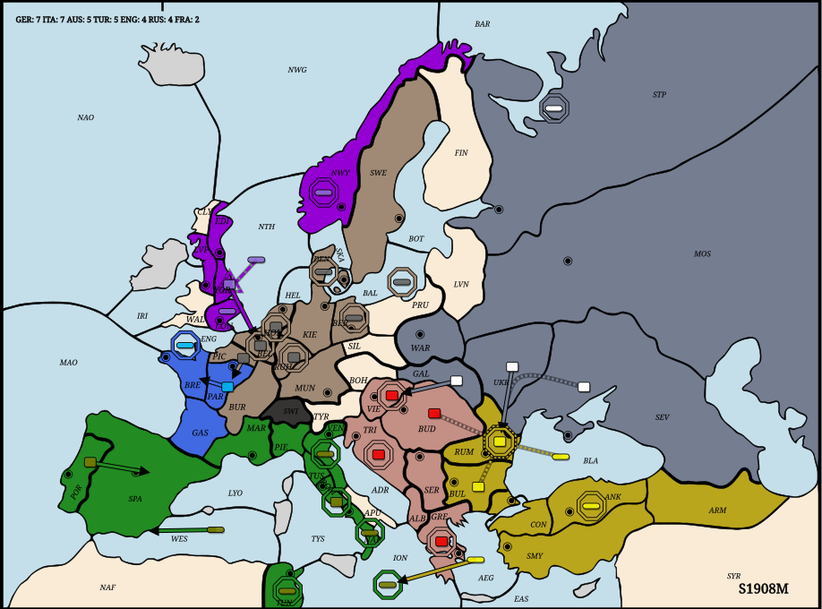

### What happened

- **AUSTRIA**: A BUD supports A RUM; A GRE holds; A TRI holds; A VIE holds
- **ENGLAND**: A YOR → BEL VIA (bounced); F NTH convoys A YOR → BEL; F NWY holds
- **FRANCE**: A PAR → BRE; F ENG holds
- **GERMANY**: A PIC → PAR; A BEL holds; A HOL holds; A RUH holds; F BAL holds; F BER holds; F DEN holds
- **ITALY**: A POR → SPA (bounced); F WES → SPA/SC (bounced); F ION holds; F VEN holds; F NAP holds; F TUN holds; A ROM holds
- **RUSSIA**: A GAL → VIE (bounced); A UKR → RUM (bounced); A SEV supports A UKR → RUM; F STP/NC holds
- **TURKEY**: F AEG → ION (bounced); A RUM holds; A BUL supports A RUM; F BLA supports A RUM; F ANK holds

### Dialogue

- **AUSTRIA → TURKEY**: Italy's 7 centers are overextended — his fleets are pinned in the west and ION is exposed. This spring I'll move A TRI - ALB and A GRE - ALB to secure a beachhead, then next turn we push into ION and VEN together. If you move F AEG into ION this spring, we cut his fleet line and split Italy's southern centers. Are you with me?
- **AUSTRIA → GERMANY**: Our border stays quiet this spring — no moves toward Tyrol or Bohemia. I'm preparing to strike Italy's overextended Med flank from the Balkans. Your western campaign is your business; after you finish France, let's discuss how we contain Italy together.
- **AUSTRIA → ITALY**: Our Adriatic border stays quiet this spring — I'm holding TRI and VIE, no moves toward VEN. Germany will finish France this turn and sit on my northern border in Tyrol. Let's keep our line stable and prepare a defensive pact against his eastward push in 1908.
- **ENGLAND → ITALY**: This spring is our window. Germany is about to take Paris, but if you push F WES into MAO now, you threaten his Channel coast directly and force him to split his fleets between the Baltic and the Med. I'll move F NTH toward BEL or DEN to pressure his northern supply line. If we both act this turn, we contain him before he becomes unstoppable. Confirm you're moving into MAO this spring.
- **ENGLAND → RUSSIA**: Turkey took RUM last fall and Austria backed him — you need SEV or you're losing ground fast. I'm moving against Germany's northern flank this spring to keep his Baltic fleets occupied. If you secure SEV and build in WAR this winter, we coordinate the full Baltic squeeze next year. What's your plan for SEV this spring?
- **ENGLAND → AUSTRIA**: Italy is about to move into MAO to threaten Germany's Channel coast, and I'm pressing his northern flank. If you push into TYR or MUN this spring, we force Germany to split his armies between three fronts instead of just holding his gains. A coordinated push now brings him down before he becomes the runaway leader. Can I count on you to move west this spring?
- **FRANCE → ENGLAND**: Germany now has 7 centers and Paris after last fall. I'm holding this spring as agreed with him to keep Brest, but I want to work with you to stop him. If you, Russia, and Austria pressure his eastern and northern flanks next year, I can support your Channel moves from BRE after I rebuild this winter. Are you committed to an anti-German coalition for 1908?
- **FRANCE → RUSSIA**: Germany has Paris and 7 centers — he's the clear leader. I'm holding this spring to survive, but I will rebuild at BRE this winter. If you push toward SIL or MUN from the east next year, I can strike his western flank. Can we coordinate on a two-front war against Germany in 1908?
- **FRANCE → AUSTRIA**: Germany has 7 centers and Paris. I'm holding this spring to survive, but I want to attack him next year. If you move toward his southern flank (TYR, MUN) in 1908, I can pressure him from the west after I rebuild at BRE. Are you willing to join a coalition against the leader?
- **FRANCE → GERMANY**: I am honoring our deal — A PAR and F ENG will hold this spring as agreed. After I rebuild at BRE this winter, I can support your northern campaign against England in 1908. What specific support do you want from me next year?
- **FRANCE → ITALY**: Germany has 7 centers and Paris — he's the leader. After France, MAR is his next target. Let's agree not to attack each other this year so we both keep forces pointed at the real threat. I will not contest your possession of MAR or SPA if you leave my remaining centers alone.
- **GERMANY → FRANCE**: Our standoff continues. You've held Paris twice now. I can keep pounding your gates or we can make a deal — what do you want to survive? I need progress somewhere this year.
- **GERMANY → ENGLAND**: I've been stuck bouncing off France while you sit on your islands. Let's break the stalemate: support me into Paris this spring and I'll leave Scandinavia entirely to you in the fall. You get NWY and SWE uncontested.
- **GERMANY → ITALY**: You're at 8 centers and I'm stuck at 7 bouncing off Paris. I need to grow somewhere this year. I'm considering shifting north against England — stay out of my way in the Channel approaches and I'll keep my armies far from Tyrol and Munich.
- **GERMANY → AUSTRIA**: Our border stays quiet this spring. I'm stalled against France and need to make progress elsewhere. If I shift north against England, that leaves you free to push west or south without worrying about me. Keep your armies east of Tyrol and we're clean.
- **GERMANY → RUSSIA**: Our Baltic border holds this spring as agreed. I'm stuck against France and may need to shift my strategy. If I focus north against England, that keeps my fleets busy in Scandinavia — nowhere near your waters. Our understanding stands.
- **ITALY → ENGLAND**: I'm taking Spain this spring to reach 8 centers. Germany has 7 and just took Paris — he's the clear target. My fleets in WES and ION are positioned to threaten his southern coast this fall. If you hit DEN from NTH and keep NWY threatening his Baltic flank, we can force him to split his fleets three ways. Are you ready to commit to that two-front squeeze this year?
- **ITALY → AUSTRIA**: Our Adriatic border stays quiet this spring — F VEN and F ION hold in place. Germany just took Paris and sits at 7 centers on your northern flank in Tyrol. If he pushes east in 1908, I'll support you from VEN. Let's keep our line stable and discuss a defensive pact against his expansion this year.
- **ITALY → GERMANY**: Clean north-south split holds — I'm taking Spain to reach 8 centers while you consolidate Paris. The Med is mine, the north is yours. I have no designs on your gains this year. England is pressing me hard to turn on you — I'm holding our line, but I need you to keep your armies out of Tyrol and away from MAR to maintain trust.
- **ITALY → TURKEY**: I'm consolidating in the west this spring by taking Spain. Russia is weakened after losing RUM — push into UKR or GAL this year and break him completely. Once the east is secure, we can discuss Balkan coordination in 1908. Keep the pressure on Russia and our partnership remains strong.
- **RUSSIA → AUSTRIA**: Germany will take Paris and reach 8+ centers this year—he is the clear leader threatening us both. You support Turkey at RUM, but he takes BUL and RUM while you get nothing. Drop your support for Turkey this spring, let me retake RUM, and I will help you take BUL from him next fall. A quiet border between us serves both far better than letting Turkey and Germany grow.
- **RUSSIA → GERMANY**: Our Baltic border holds as agreed, and I have no designs on your waters. Turkey and Austria are squeezing me in the south—I'm focused entirely there this spring. Our understanding stands through 1908.
- **RUSSIA → ENGLAND**: I need to retake RUM this spring to survive. If you pressure Germany's Baltic flank from NTH, that forces his fleets to react and buys me time to stabilize. After I retake RUM and build in WAR, I commit to hitting SWE from NWY in fall 1908 with everything I have. Protect my northern flank now and we crush Germany together next year.
- **TURKEY → AUSTRIA**: Russia still holds A UKR and A GAL threatening both our positions. If you support my attack on SEV this spring from SER, I'll support your push into GAL from RUM and BUL. We split Russia's last centers this year — you take GAL, I take SEV — then we turn on Italy together in 1909. Confirm you're with me.
- **TURKEY → ITALY**: I'm holding my eastern line against Russia this spring — he still threatens my flank from UKR and GAL. Once I secure RUM with Austrian support, I'll be positioned to help you contain Germany's 7 centers in 1909. Keep the Med quiet and our alliance holds.
- **TURKEY → RUSSIA**: You still hold UKR and GAL threatening RUM. If you attack me this spring, I will support Austria into UKR from RUM and BUL next turn and you lose your last center. Hold your position and focus on Germany in the north — I'll leave you alone this year. A quiet border is your best survival path.
- **AUSTRIA → TURKEY**: I'm not ready to attack SEV this spring — Russia's A UKR and A GAL are too close to my flank and I need to secure my position first. Let's focus on Italy's overextended Med instead: if you move F AEG into ION this spring, I'll push into ALB from TRI and GRE, and we cut his fleet line together. That's a concrete gain for both of us.
- **AUSTRIA → ITALY**: Our Adriatic border stays quiet this spring — A TRI and A VIE hold, no moves toward VEN. Germany is stalled against France and may shift north against England, which leaves my northern flank quiet. Let's keep our line stable and discuss how we contain Germany if he turns east later this year.
- **AUSTRIA → GERMANY**: Our border stays quiet this spring — no moves toward Tyrol or Bohemia. If you shift north against England, that frees me to focus south against Italy's Med overextension. After you make progress there, let's discuss how we coordinate against Italy's 7 centers together.
- **AUSTRIA → RUSSIA**: I'm not dropping my support for Turkey this spring — we have an agreement. But I will not push into your territory either. If you want to retake RUM, negotiate with Turkey directly. I'm focused on Italy's Med expansion, not your eastern front.
- **ENGLAND → ITALY**: This spring I'm moving F NTH to BEL with F ENG support — that cuts Germany's supply line and denies him the center he needs to reach 9. If you move F WES into MAO this fall as promised, he can't hold both the Channel and the Med. Confirm MAO in fall and I'll execute BEL this spring.
- **ENGLAND → AUSTRIA**: This is the turn to act. I'm taking BEL from Germany this spring with F ENG support — that cuts his western supply line. If you push A TRI into TYR or A VIE into BOH this spring, you force him to pull armies away from Paris to defend his home centers. We hit him from three sides and he can't hold everything. Can I count on you to move west this spring?
- **ENGLAND → RUSSIA**: I understand you need to retake RUM this spring to survive. I'm moving against Germany's western flank this turn — F NTH to BEL with F ENG support — which forces his Baltic fleets to react west instead of east. That buys you breathing room against Turkey. Retake RUM, build in WAR, and we coordinate on Sweden next year.
- **FRANCE → GERMANY**: You say you need progress. I want to keep Brest; you want to keep Paris and push somewhere. I'll hold this spring and not contest you if you guarantee no attack on BRE or PIC this year. That frees you to hit England in NTH or Belgium — I won't interfere. Agreed?
- **FRANCE → ENGLAND**: Germany offered to talk rather than attack again. I'll hold this spring unless you, Russia, and Austria are all moving against him this turn. If you're striking NTH, HOL, or BEL this spring, I can support from ENG and PAR. Are you moving against him this turn or waiting?
- **FRANCE → RUSSIA**: Germany offered me a deal — he's focused on progress elsewhere, not on finishing me. This is our chance. If you're pushing toward MUN or SIL this spring, I can coordinate from the west. Are you moving against Germany this turn or waiting until fall?
- **FRANCE → AUSTRIA**: Germany is distracted — he wants to push elsewhere rather than finish me. If you're moving toward TYR, MUN, or VEN this spring, I can strike his western flank. Are you committing to an anti-German move this turn or staying defensive?
- **FRANCE → ITALY**: Germany offered me a deal — he's leaving me alone this turn to break into England or the north. After he consolidates, MAR is his next target. I will not contest MAR or SPA this turn if you hold. Can you keep forces south so we both survive the German advance? Let's stay neutral.
- **GERMANY → AUSTRIA**: Our border stays quiet this spring — no moves toward Tyrol or Bohemia. I'm finally taking Paris with overwhelming force this turn. After France falls, I'm very interested in coordinating against Italian expansion — he now has 8 centers and controls the entire Med. Let's discuss a joint strategy in the fall.
- **GERMANY → ENGLAND**: I'm taking Paris this spring with four units — it falls for certain this time. Stay out of my Channel operations and I'll leave Scandinavia to you through 1908. After France is gone, we can negotiate a northern border that works for both of us without wasting more turns.
- **GERMANY → ITALY**: Our north-south split holds cleanly this spring. I'm finally taking Paris with overwhelming force — four units committed. After this turn I'll have 8 centers and you'll have 8. Let's discuss containing England's Channel fleet together in the fall — he's the only power that threatens both our flanks from the north.
- **GERMANY → RUSSIA**: Our Baltic border holds this spring as agreed. I'm taking Paris this turn with four units. After France falls, I'll have room to negotiate with you about northern containment of England. Our understanding through 1908 still stands.
- **GERMANY → FRANCE**: I'm done negotiating. This spring I commit four units into Paris — your single army cannot hold. Order A PAR to retreat to BRE now and I'll leave you alive through the fall. Fight and you're eliminated entirely.
- **ITALY → ENGLAND**: I'm taking Spain this spring to reach 8 centers — my F WES moves to SPA/SC, not MAO this turn. But this fall I will push F WES into MAO to threaten Germany's Channel flank directly. If you hit DEN or BEL from NTH this spring and continue into the fall, we coordinate the squeeze perfectly. Commit to northern pressure both phases and I'll execute the southern flank in fall.
- **ITALY → GERMANY**: Our north-south split holds this spring — I'm taking Spain to reach 8 centers while you have Paris. England is pressing me to turn on you, but I'm honoring our division. If you shift north against England as you mentioned, I won't interfere in the Channel. Keep your armies off Tyrol and MAR and our partnership remains solid.
- **ITALY → AUSTRIA**: Our Adriatic border stays quiet this spring — F VEN and F ION hold. Germany just took Paris and sits at 7 centers on your northern flank. If he pushes east through Tyrol, I'll support you from VEN. Let's formalize a defensive pact now: if he attacks you, I attack his southern coast. Confirm you're holding TRI and VIE quietly this turn.
- **ITALY → TURKEY**: I'm taking Spain this spring to reach 8 centers. Germany is the clear leader at 7 centers after Paris. Russia is weak — push into UKR or GAL this year to break him completely. Once the east is secure, we coordinate against Germany's Balkan flank together. Keep pressure on Russia and our alliance holds strong.
- **RUSSIA → AUSTRIA**: Turkey takes RUM and BUL while you get nothing from supporting him — he grows to 5 centers, you stay at 5. I offer you a better deal: drop your support for Turkey at RUM this spring, let me retake it, and I will support your attack on BUL next fall with A UKR and A SEV from the north. You gain a center, I reclaim mine, and we both contain the real threat — Germany at 8+ centers in the west.
- **RUSSIA → ENGLAND**: I'm retaking RUM this spring with A UKR supported by A SEV and A GAL — Turkey won't hold it with Austria neutralized. Keep pressuring Germany's Baltic flank from NTH this turn as discussed. After I retake RUM and build in WAR this winter, I commit to hitting SWE from NWY in fall 1908 with everything I have.
- **RUSSIA → GERMANY**: Our Baltic border holds as agreed this spring. I'm fully focused south retaking RUM from Turkey — nowhere near your waters. Our understanding stands through 1908.
- **RUSSIA → FRANCE**: I'm retaking RUM from Turkey this spring with Austrian cooperation. After I stabilize and build in WAR this winter, I will push toward SIL or MUN from the east in 1908 while you strike Germany's western flank. Let's coordinate timing next year when we both have more force.
- **TURKEY → AUSTRIA**: Russia is the immediate threat to both of us — he still holds UKR and GAL, and he's weak. This spring, you support A RUM - SEV from SER, and I support A BUL - GAL from RUM. We split Russia's last two centers: you take GAL, I take SEV. Then in 1909, with Russia gone, we turn on Italy together with full force. Confirm you'll order A SER S A RUM - SEV this turn.
- **TURKEY → RUSSIA**: You're down to 4 centers and Austria and I are coordinating. If you attack RUM this spring, I take SEV with Austrian support and you lose your last center. If you hold UKR and GAL in place and do not contest, I will leave you alone this year and focus on Italy. A quiet border is your only path to survive.
- **AUSTRIA → TURKEY**: I'm holding my line this spring — A BUD will support your hold at RUM from BUD, and A GRE, A TRI, and A VIE all hold. I'm not ready to attack Russia's SEV yet, but after this turn let's discuss a coordinated push against Italy's Med in the fall. Confirm you're ordering A RUM H with support from A BUL or F BLA this spring.
- **AUSTRIA → ITALY**: I confirm our Adriatic border stays quiet this spring: A TRI holds, A VIE holds, no moves toward VEN or ION. Germany is shifting north against England — if he turns east through Tyrol later, I expect your support from VEN. Keep F VEN and F ION holding this turn and we're clean.
- **AUSTRIA → GERMANY**: Our border stays quiet this spring: no moves toward Tyrol or Bohemia from my side — all my armies hold their positions. You're free to shift north against England without worrying about me. After you make progress there, let's discuss containing Italy's Med expansion together in the fall.
- **AUSTRIA → ENGLAND**: I cannot commit to an attack on Germany's southern flank this spring — my armies are focused on stabilizing the Balkans and I need to see how the board shifts this turn. If you take BEL from Germany, that changes the calculus for fall. Let's revisit this after the spring results.
- **AUSTRIA → FRANCE**: I'm not moving against Germany's southern flank this spring — my forces are committed to holding my positions in the Balkans. If Germany shifts north as England claims, your position at PAR may hold. Let's discuss an anti-German coalition in the fall if the board favors it.
- **ENGLAND → ITALY**: This spring I'm convoying A YOR to BEL via NTH with F LON and F ENG supporting the operation — that cuts Germany's supply line and denies him the center he needs. I need you to commit now: push F WES into MAO this fall to threaten his Channel coast directly. If you do that, he can't hold both fronts and we squeeze him together. Confirm MAO in fall and we're locked in.
- **ENGLAND → AUSTRIA**: I'm taking BEL from Germany this spring — that cuts his western supply line and forces him to react. If you push A TRI into TYR this spring, you threaten Munich directly and force him to pull armies away from Paris to defend his home centers. We hit him from two sides and he can't hold everything. Can I count on you to move into TYR this turn?
- **ENGLAND → FRANCE**: This spring I'm convoying A YOR to BEL via NTH with F ENG and F LON supporting — that cuts Germany's supply line. If you hold PAR and support F ENG's position in the Channel, we can coordinate on retaking Paris next year after you rebuild at BRE. Are you holding this turn as agreed with Germany, or can you support my move into BEL?
- **FRANCE → GERMANY**: I accept your terms. This spring I order A PAR - BRE and F ENG H. You take Paris without a fight. I keep Brest and you leave me alone through this year. Confirm you will not pursue me into BRE or PIC.
- **FRANCE → ENGLAND**: Germany is committing four units into Paris this spring. I cannot hold — I'm retreating to BRE to survive. This is temporary. If you pressure his northern flank this year, I will rebuild and work with you in 1908 to stop him. Can you coordinate with Russia and Austria now while I rebuild?
- **FRANCE → AUSTRIA**: Germany is overwhelming Paris and I must retreat to BRE to survive. He will have 8 centers by fall. This is your window to strike his southern flank toward TYR or MUN while he is focused on me. If you push now, I will support you from the west when I rebuild in 1908.
- **FRANCE → RUSSIA**: Germany will take Paris this spring and reach 8 centers. I am retreating to BRE to survive. This is your chance to push toward SIL or MUN from the east while he is consolidating his gains. If you strike now, I will coordinate with you from the west when I rebuild at BRE next year.
- **GERMANY → AUSTRIA**: Our border stays quiet this spring — no moves toward Tyrol or Bohemia from my side. I'm repositioning my armies away from France to focus east. If you push west against Italy's overextended flank this year, I won't interfere and we can coordinate against his Med dominance together. Confirm you'll keep your armies east of Tyrol.
- **GERMANY → ENGLAND**: I'm done wasting units on France. This spring I withdraw from PIC and reposition my armies east. That leaves the Channel and France entirely to you if you want them. I'll leave Scandinavia alone this year — you take NWY uncontested. In return, keep your fleets out of HEL and KIE waters. Agreed?
- **GERMANY → ITALY**: Our north-south split holds. I'm abandoning the French front this spring — my armies are repositioning east toward Germany. That leaves France exposed for you to take if you want, or I'll clean him up later. Keep your fleets out of my Baltic waters and I'll keep my armies away from Tyrol and MAR. After this turn, let's discuss containing Austria together.
- **RUSSIA → AUSTRIA**: This is your last chance. Drop support for RUM this spring and I give you BUL next fall with A UKR and A SEV — you gain a center and we contain Germany together. If you support Turkey into RUM, I move A GAL to VIE this spring and take it next turn. Choose now.
- **RUSSIA → TURKEY**: You have 5 centers and Austria gets nothing from supporting you — he will abandon you the moment I offer him BUL. If you let me retake RUM uncontested this spring, I will not attack your other centers this year and we focus on Germany. If you contest, I take RUM anyway with A UKR, A SEV, and A GAL, and you lose a fleet.
- **RUSSIA → ENGLAND**: I'm retaking RUM this spring with A UKR supported by A SEV and A GAL — Austria will drop support when I offer him BUL. Keep F NTH threatening Germany's Baltic coast to buy me time. After I retake RUM and build in WAR, I hit SWE from NWY in fall 1908 with everything. Confirm you're in.
- **RUSSIA → GERMANY**: Our Baltic border holds this spring as agreed. I am fully focused south retaking RUM from Turkey — nowhere near your waters. Our understanding stands through 1908.
- **TURKEY → AUSTRIA**: I agree: Italy is the real target. This spring I order F AEG - ION to cut his fleet line. In return, you move A TRI - ALB and A GRE - ALB as planned. After we secure ALB, I'll convoy A BUL into APU or NAP next fall while you push into VEN. Confirm your orders match.
- **TURKEY → ITALY**: Russia is pressing my flank from UKR and GAL — I must hold RUM this spring with support from BUL and BLA. I cannot spare forces for the Med. Keep your fleets in the west and focus on Germany's 7 centers; I'll secure the east and we coordinate against Germany in 1909.
- **TURKEY → RUSSIA**: Austria and I are turning on Italy this spring. If you hold UKR and GAL in place and do not attack RUM, I will leave your remaining centers alone this year. Once Italy is broken, you and I can discuss a partnership against Austria. Hold your position and survive.

### AUSTRIA
Orders: `A BUD S A RUM` · `A GRE H` · `A TRI H` · `A VIE H`

Reasoning

> I need to reassess my position. Turkey wants me to attack Russia's SEV, but I'm not ready for that. Italy and Germany both want quiet borders, which gives me breathing room. England wants me to attack Germany's southern flank, but I'm not positioned for that this turn. Russia is threatening to take VIE if I support Turkey. My best play is to hold my line this spring, honor my commitment to Turkey to support RUM's hold, and wait to see how the board develops before committing to a fall offensive. I'll order A BUD S A RUM to support Turkey's hold at RUM as agreed, while holding everywhere else to keep my options open.

### ENGLAND
Orders: `A YOR - BEL VIA` · `F NTH C A YOR - BEL` · `F NWY H`
Illegal (dropped): `F LON S A YOR - BEL`

Reasoning

> I've been planning a convoy of A YOR to BEL this spring to cut Germany's supply line, but after reviewing the legal orders, I see that A YOR - BEL VIA is available via F NTH convoy, and F NTH has the option `F NTH C A YOR - BEL`. That's exactly the move I committed to Italy and France. F LON can support from the Channel to secure the landing, and F NWY holds to maintain pressure on Scandinavia. This is the turn to act — Germany is about to take Paris and I need to deny him BEL to slow his growth.

### FRANCE
Orders: `A PAR - BRE` · `F ENG H`

Reasoning

> I am retreating A PAR to BRE to survive as agreed with Germany, preserving my only army for future rebuilding. F ENG will hold in the Channel to keep a naval presence and potentially support future operations. This is a defensive consolidation — I give up Paris without a fight, keep Brest, and wait for the right moment to rebuild and strike back against Germany with coalition partners next year.

### GERMANY
Orders: `A PIC - PAR` · `A BEL H` · `A HOL H` · `A RUH H` · `F BAL H` · `F BER H` · `F DEN H`

Reasoning

> This spring I take Paris unopposed as France retreats to BRE, exactly as agreed. All my other units hold position to maintain the status quo with Russia, Austria, England, and Italy — no unnecessary provocations while I consolidate my eighth center and prepare to pivot against England or Italy in 1909.

### ITALY
Orders: `A POR - SPA` · `F WES - SPA/SC` · `F ION H` · `F VEN H` · `F NAP H` · `F TUN H` · `A ROM H`

Reasoning

> I'll take Spain this spring to reach 8 centers, positioning F WES at SPA/SC to control the coast and threaten Germany's Channel flank in the fall. My other units hold to keep the Adriatic quiet with Austria and maintain my Med position, honoring my commitments to England (fall squeeze), Germany (north-south split), and Austria (quiet Adriatic).

### RUSSIA
Orders: `A GAL - VIE` · `A UKR - RUM` · `A SEV S A UKR - RUM` · `F STP/NC H`

Reasoning

> I need to retake RUM this spring. Austria says he won't drop support for Turkey, so I have to assume RUM will be defended by A RUM supported by A BUL and F BLA — that's 3 defending units. My A UKR and A SEV attacking gives me only 2 attackers, which bounces. I need to cut Austrian support or force him to pull back.
>
> The key move is A GAL to VIE. If I threaten Austria's home center directly, he must either defend VIE (pulling support from RUM) or risk losing it. Meanwhile, A UKR to RUM with A SEV supporting gives me the attack strength to take RUM if Austria's support is cut. If Austria defends VIE with A BUD or A TRI, my A GAL bounces but still disrupts his support chain.
>
> F STP/NC holds in position — I need it for the fall push on Sweden after I secure RUM and build in WAR.

### TURKEY
Orders: `F AEG - ION` · `A RUM H` · `A BUL S A RUM` · `F BLA S A RUM` · `F ANK H`

Reasoning

> Reasoning: I committed to Austria in the most recent negotiation round: I move F AEG - ION to cut Italy's fleet line, while Austria pushes A TRI - ALB and A GRE - ALB. My other units must secure my eastern flank against Russia: A RUM holds with support from A BUL and F BLA, and F ANK holds to keep the Black Sea line stable. This aligns with my revised strategy: honor the pivot against Italy, secure RUM against any Russian or Austrian opportunism, and prepare to convoy A BUL into Italy's rear next turn. All orders are legal per the menu.

## FALL 1908 MOVEMENT (`F1908M`)

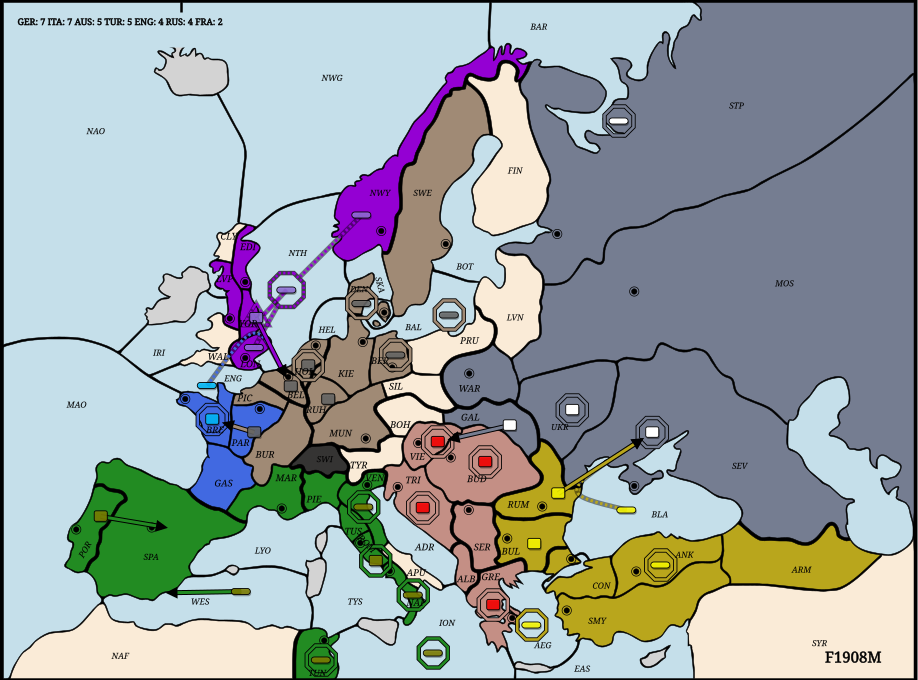

### What happened

- **AUSTRIA**: A BUD holds; A GRE holds; A TRI holds; A VIE holds
- **ENGLAND**: F NTH convoys A YOR → BEL; A YOR → BEL VIA; F NWY supports F NTH; F LON supports F NTH
- **FRANCE**: A BRE holds; F ENG supports A YOR → BEL
- **GERMANY**: A PAR → BRE (bounced); A HOL holds; F DEN holds; F BAL holds; F BER holds
- **ITALY**: A POR → SPA (bounced); F WES → SPA/SC (bounced); F ION holds; F VEN holds; F NAP holds; F TUN holds; A ROM holds
- **RUSSIA**: A GAL → VIE (bounced); A UKR holds; A SEV holds; F STP/NC holds  [dislodged: A SEV]
- **TURKEY**: A RUM → SEV; F BLA supports A RUM → SEV; F AEG holds; F ANK holds

### Dialogue

- **AUSTRIA → TURKEY**: The board is frozen after spring — everyone held. This is our moment to strike Italy's overextended Med. If you move F AEG - ION this fall, I push A TRI - ALB and A GRE - ALB, cutting his fleet line and threatening his southern flank. We split his centers: you take ION and TUN, I take SER and VEN. Confirm your orders this turn.
- **AUSTRIA → GERMANY**: Our border stays quiet this fall — no moves toward Tyrol or Bohemia from my side. I'm pushing south against Italy's overextended Med, which keeps me off your flank. After I secure gains there, let's discuss how we contain Italy's remaining centers together.
- **AUSTRIA → ITALY**: Our Adriatic border stays quiet this fall — I'm holding TRI and VIE, no moves toward VEN. Germany is stalled against France and may shift east; let's keep our line stable and prepare a defensive pact against him in 1909. Hold F VEN and F ION in place and we're clean.
- **ENGLAND → ITALY**: Germany has taken Paris and holds 7 centers — this is our window. I'm moving to take BEL from him this fall with support from F ENG. If you push F WES into MAO this turn as promised, he cannot defend both fronts at once. Confirm MAO now and we start the squeeze together.
- **ENGLAND → FRANCE**: Germany is the clear leader at 7 centers. If I take BEL from him this fall, we cut his supply line and open the door for you to rebuild. Support my attack with F ENG S A YOR - BEL this turn — I'll convoy A YOR to BEL via NTH. With your support we take it. This is your best chance to weaken the power that destroyed you.
- **ENGLAND → RUSSIA**: I'm moving against Germany's western flank this fall. How is your situation against Turkey? If you can pressure his Baltic coast from NWY next spring, we coordinate the squeeze together. Can you commit to hitting SWE next spring?
- **FRANCE → ENGLAND**: Germany has 7 centers and Paris. You have A YOR and F NTH — if you strike BEL this fall with my support from F ENG, we can take his key supply center and slow his advance. I will commit F ENG to support your attack. Can you move this turn?
- **FRANCE → AUSTRIA**: Germany has 7 centers and Paris — he is the leader. You have A TRI, A BUD, A VIE, A GRE — enough force to push toward TYR or MUN while Germany is focused on the west. If you strike his southern flank this fall, I will support from the Channel. Can you commit to moving against him this turn?
- **FRANCE → RUSSIA**: Germany has 7 centers and Paris. You have A GAL, A UKR, A SEV — you could push toward SIL or MUN from the east. If you strike this fall while England and I pressure his west, we can finally break his momentum. Will you move against Germany this turn?
- **FRANCE → GERMANY**: I am holding at BRE with no desire to fight you. You have Paris and 7 centers. If you leave BRE alone this fall, I will not contest your western positions. Focus on England in NTH — he is the real threat to your gains.
- **GERMANY → AUSTRIA**: Our border stays quiet this fall as agreed. I'm finishing France by taking BRE this turn with overwhelming force. After that, I'll be free to focus on containing Italian expansion or England's northern aggression — whichever threatens both of us more. Let's discuss our shared interests after this turn.
- **GERMANY → ENGLAND**: France is finished. I'm taking BRE this fall and eliminating him entirely. That leaves us as the two northern powers. I have no designs on Scandinavia this year — keep your fleets in NTH and NWY and I'll keep mine out of your waters. After this turn, let's negotiate a clean northern border that benefits both of us.
- **GERMANY → ITALY**: Our north-south split holds cleanly. I'm taking BRE this fall to finish France and reach 8 centers. After that, I'll be focused west and north — nowhere near Tyrol or MAR. England is the only power threatening both our flanks from the Channel. Keep your fleets in the Med and I'll handle the north. Let's stay aligned through 1908.
- **GERMANY → FRANCE**: I'm taking BRE this fall with overwhelming force. You have one army against my seven units. Order F BRE to hold so I take the center cleanly — I'll leave your A BRE alive to disband in winter with dignity. Fight and I'll crush you completely.
- **GERMANY → RUSSIA**: Our Baltic border holds this fall as agreed. I'm finishing France by taking BRE this turn. After that, I'll have room to focus north against England if needed. Keep F STP/NC in position and our understanding stands through 1908. How goes your fight against Turkey in the south?
- **ITALY → AUSTRIA**: Our Adriatic border stays quiet this fall as agreed—F VEN and F ION hold. Germany is repositioning east toward Tyrol; if he pushes into your territory, I will support you from VEN. Let's keep our line stable and prepare a defensive pact for 1909.
- **ITALY → ENGLAND**: I'm taking Spain this turn to reach 8 centers—A POR - SPA and F WES - SPA/SC. After this fall, my fleets in WES and ION are ready to threaten Germany's southern coast. If you hit BEL from NTH this turn and keep pressure on his Channel flank, we force him to split his fleets between the Baltic and the Med. Are you committing to BEL this fall?
- **ITALY → GERMANY**: Our north-south split holds—I take Spain this turn to reach 8 centers while you consolidate. England is pressing me hard to turn on you, but I'm honoring our division. Keep your armies out of Tyrol and MAR and our partnership remains solid. After this turn, let's discuss containing England's Channel fleet together.
- **ITALY → TURKEY**: I'm taking Spain this turn to reach 8 centers. Russia is weakened—if you push into UKR or GAL this fall, you break him completely and secure your eastern flank. Once the east is stable, we coordinate against Germany's Balkan flank together in 1909. Keep pressure on Russia and our alliance holds strong.
- **RUSSIA → AUSTRIA**: Turkey takes RUM and BUL while you get nothing from supporting him — he grows to 5 centers, you stay at 5. Drop your support for RUM this fall, let me retake it with UKR and SEV, and I will support your attack on BUL next spring with A GAL and A UKR from the north. You gain a center, I reclaim mine, and we both contain the real threat — Germany at 7 centers in the west. This is your last chance to get something from our shared border.
- **RUSSIA → TURKEY**: You hold RUM with A BUL and F BLA supporting, but Austria is about to abandon you. I'm offering him BUL in exchange for dropping RUM support — and he knows I can take VIE from GAL if he refuses. If you want to keep RUM, offer me something concrete: support my attack on Austria's BUD or VIE next spring, and I'll leave RUM alone this fall. Otherwise I take RUM with UKR+SEV+GAL and you lose a center.
- **RUSSIA → ENGLAND**: I'm securing my southern flank this fall — retaking RUM from Turkey with UKR and SEV supported by GAL, while threatening Austria's VIE to break his alliance with Turkey. After I build in WAR this winter, I'll commit to hitting SWE from NWY in spring 1909 with everything. Keep pressing Germany's Baltic flank from NTH this fall to keep his fleets occupied while I stabilize.
- **TURKEY → AUSTRIA**: I'm going after Russia's SEV this fall with support from BUL and BLA — that gets me to 6 centers and a build. After that, I'm fully committed to your Med push: I'll build a fleet at CON in winter and we crush Italy's ION together in 1909. Confirm you'll hold your position and let me handle the east this turn.
- **TURKEY → RUSSIA**: You're down to 4 centers and I can take SEV this fall with support from BUL and BLA. If you hold UKR and GAL in place and don't contest, I'll leave your remaining centers alone this year — I'm turning on Italy next. If you attack RUM or defend SEV, you lose everything. Last offer: hold and survive.
- **AUSTRIA → TURKEY**: I cannot join your SEV attack this fall — Russia still holds A GAL and A UKR threatening my flank from the north, and I need to keep my position secure. Let's hold our lines this turn and plan a coordinated Med push against Italy next spring when Russia is less of a factor.
- **AUSTRIA → ITALY**: Our Adriatic border stays quiet this fall — I'm holding all my positions. Germany is about to take BRE and reach 8 centers; if he shifts east toward Tyrol in 1909, I expect your support from VEN as discussed. Keep F VEN and F ION holding this turn.
- **AUSTRIA → GERMANY**: Our border stays quiet this fall — no moves toward Tyrol or Bohemia. I'm holding my Balkans position while you finish France. After this turn, let's discuss how we contain Italy's 7 Med centers together — he's the biggest threat to both of us once France is settled.
- **AUSTRIA → RUSSIA**: I'm not supporting any attack on your position this fall — all my units hold. But I cannot support your retake of RUM either. If you want to negotiate a trade, offer something concrete: what center can you help me gain in exchange for leaving RUM alone?
- **ENGLAND → FRANCE**: Germany holds BEL and PAR. I'm convoying A YOR to BEL again this fall via NTH. Support my attack with F ENG S A YOR - BEL — your fleet is perfectly positioned. Take BEL and we cut his supply line, then next spring we retake PAR together. Confirm support this turn.
- **ENGLAND → ITALY**: You're taking Spain this spring — perfect. Now push F WES into MAO this fall as promised. Germany can't defend BEL, the Channel, and the Med simultaneously. I'm hitting BEL from NTH with French support. Move MAO this turn and we squeeze him together.
- **ENGLAND → RUSSIA**: You retook RUM this spring — excellent. Build in WAR this winter and commit to hitting SWE from NWY in spring 1909. I'm taking BEL from Germany this fall with French support, which forces his Baltic fleets to react west. That opens the door for you to take SWE uncontested next spring. Are we locked in for spring 1909?
- **FRANCE → ENGLAND**: I cannot support your attack on BEL this turn — Germany has committed overwhelming force against BRE and will crush me if I move against him. But if you take BEL without my support, I will rebuild at BRE this winter and be ready to support your Channel operations in 1909. Can you strike BEL from NTH this fall and hold it through winter?
- **FRANCE → GERMANY**: I accept your terms. I will order A BRE to hold and F ENG to hold this fall. You take Paris and leave BRE alone. I will not contest your western positions. Confirm you will not attack BRE this turn and I will survive to rebuild in winter — after that we can discuss how I support your campaign against England.
- **FRANCE → AUSTRIA**: Germany will take Paris this fall and reach 8 centers. He is the clear leader. You have A TRI, A BUD, A VIE, A GRE — enough force to threaten his southern flank at TYR or MUN while he is focused on the west. If you move toward TYR this fall, I will support you from the west when I rebuild at BRE in winter. Can you commit to a southern push this turn?
- **FRANCE → RUSSIA**: Germany reaches 8 centers this fall. You have A GAL, A UKR, A SEV — you could push toward SIL or MUN from the east while he is consolidating in the west. If you strike this fall, I will coordinate with you from BRE after I rebuild in winter. Can you move against Germany's eastern flank this turn?
- **ITALY → ENGLAND**: I'm taking Spain this fall with A POR - SPA and F WES - SPA/SC. After that, I'll push F WES into MAO next spring to threaten Germany's Channel flank directly. If you hit BEL from NTH this fall, we force him to split between the Baltic and the Med. I commit to MAO in spring 1909 — can you commit to BEL now?
- **ITALY → GERMANY**: You mentioned repositioning east and discussing containing Austria together. Austria is my Adriatic partner and I will not abandon him. If you move on TRI or VIE, I will attack your southern coast from WES and ION immediately. Keep your armies out of Tyrol and MAR and our north-south split holds.
- **ITALY → AUSTRIA**: Our Adriatic border stays quiet this fall: F VEN and F ION hold. Germany told me he's considering eastward expansion and mentioned containing you. If he moves on TRI or VIE, I will attack his southern coast with full force. Let's formalize that defensive pact now: if he attacks you, I strike from the south. Confirm your line holds this turn.
- **ITALY → TURKEY**: I understand Russia pins your forces. Hold RUM and keep him occupied in UKR and GAL this fall — that keeps my eastern flank quiet while I take Spain and position against Germany. Once the west is secure in 1909, we coordinate against Germany's Balkan flank together. Our alliance holds.
- **RUSSIA → AUSTRIA**: You backed Turkey again last spring and got nothing for it. I'm moving A GAL to VIE this fall — your home center falls next turn unless you drop RUM support now. One last offer: drop RUM support this spring 1909 and I give you BUL next fall with A UKR and A SEV. If you don't, I take VIE and you lose a center permanently.
- **RUSSIA → TURKEY**: Austria is about to abandon you — I'm offering him VIE in exchange for BUL next year. If he drops RUM support, you lose RUM and BUL. Offer me something real: support my attack on Austria's BUD next spring and I leave RUM alone this fall. Otherwise I take RUM with UKR+SEV+GAL and you lose a center.
- **RUSSIA → ENGLAND**: I couldn't break through RUM last spring — Austria held firm supporting Turkey. I need one more turn to force Austria off RUM by threatening VIE from GAL. Keep pressuring Germany's Baltic flank this fall and I'll secure RUM next spring, build in WAR, and hit SWE from NWY in fall 1909. Can you commit to another turn of pressure?
- **RUSSIA → GERMANY**: Our Baltic border holds this fall as agreed. I'm focused south threatening Austria's VIE to break his alliance with Turkey — nowhere near your waters. Our understanding stands through 1908.
- **AUSTRIA → RUSSIA**: I accept your offer. This turn I order A BUD S A UKR - RUM and A GRE S A UKR - RUM — I drop Turkey completely. You order A UKR - RUM and A SEV supports it, and you keep A GAL off VIE. After RUM falls to you, we coordinate against Germany's southern flank in 1909. Confirm your orders match.
- **AUSTRIA → ITALY**: Our Adriatic border stays quiet this fall — A TRI, A VIE, and A GRE all hold, no moves toward VEN or ALB. Germany will reach 8 centers after taking Paris; we need to prepare a defensive pact for 1909. Hold F VEN and F ION in place and we're clean.
- **AUSTRIA → GERMANY**: Our border stays quiet this fall — no moves toward Tyrol or Bohemia. I'm focused on the Balkans and Italy's Med expansion. After you finish France, let's discuss containing Italy together in 1909.
- **FRANCE → ENGLAND**: I will support your attack on BEL. Order F ENG S A YOR - BEL this turn. Take BEL and we cut Germany's supply line — then next spring we retake PAR together from BRE. Confirm your convoy and attack orders.
- **FRANCE → GERMANY**: I cannot accept your terms — you will simply take BRE next spring regardless. This turn I support England into BEL. If you want to avoid losing a center, negotiate with me instead of threatening elimination.
- **FRANCE → AUSTRIA**: Germany is about to lose BEL to England and me. This is your moment to strike his southern flank at TYR or MUN while he is reeling. Even holding TRI and VIE threatens his rear and forces him to split his forces. Move this turn and we break the leader together.
- **FRANCE → RUSSIA**: England and I are taking BEL from Germany this turn. Push toward GAL or SIL from the east and we crush him between three fronts. This is the best chance we will get — Germany cannot defend all sides at once.
- **GERMANY → ENGLAND**: I'm taking BRE this turn with full force — France falls for certain. Keep your fleets in NTH and NWY and I'll keep mine out of your waters. Scandinavia is yours through 1908 if you stay neutral this turn.
- **GERMANY → ITALY**: Our north-south split holds cleanly. I'm taking BRE this fall to reach 8 centers while you consolidate Spain. England is the only threat to both of us — I'll handle the north if you keep your fleets in the Med. No moves toward Tyrol or MAR from me as agreed.
- **GERMANY → AUSTRIA**: Our border stays quiet this fall — no moves toward Tyrol or Bohemia from my side. I'm finishing France at BRE this turn. After that, I'm very interested in discussing how we contain Italy's 8 centers together. Keep your armies east of Tyrol and we're clean through 1908.
- **GERMANY → RUSSIA**: Our Baltic border holds this fall as agreed. I'm taking BRE to finish France. Keep F STP/NC in position and our understanding stands. How goes your fight against Turkey in RUM?
- **ITALY → AUSTRIA**: Our Adriatic border stays quiet this fall: F VEN and F ION both hold as agreed. Germany is repositioning east and may push toward Tyrol in 1909. If he moves on TRI or VIE, I will attack his southern coast immediately. Confirm your line holds this turn and our defensive pact is sealed.
- **ITALY → ENGLAND**: I am taking Spain this fall with A POR - SPA and F WES - SPA/SC to reach 8 centers. I cannot push MAO this turn—I need to secure Spain first. But I commit to moving F WES into MAO in spring 1909 to threaten Germany's Channel flank. If you hit BEL from NTH this fall, we force him to split his fleets between the Baltic and the Med. Are you executing BEL now?
- **ITALY → GERMANY**: Our north-south split holds cleanly this fall. I take Spain to reach 8 centers while you consolidate France. England is pressing me hard to attack you, but I am honoring our division. Keep your armies out of Tyrol and MAR and our partnership remains solid. After this turn, let's discuss containing England's Channel fleet together.
- **RUSSIA → ENGLAND**: I cannot break RUM this fall — Turkey and Austria are fully coordinated there. I'm holding my southern line and building a fleet at WAR this winter. Commit to taking SWE from NWY in spring 1909 with that fleet and I'll support your push on DEN or BEL from the north. Germany at 7 centers is our real target. Are you in?
- **RUSSIA → GERMANY**: Our Baltic border holds this fall as agreed. I'm abandoning the RUM fight and consolidating my position — nowhere near your waters. Our understanding stands through 1908.
- **RUSSIA → AUSTRIA**: You've won RUM for Turkey and gotten nothing for yourself. I'm pulling back this fall — no attack on VIE, no contest for RUM. But when Turkey turns on you next year (and he will, because he wants GRE and SER), remember I offered you BUL in exchange for cooperation. The offer stands for spring 1909.
- **RUSSIA → TURKEY**: I'm pulling back this fall — no attack on RUM, no threat to your position. You've won this round. But I'm building a fleet this winter and turning north against Germany in 1909. Leave my southern centers alone and I won't contest your western expansion. A quiet border serves us both while Germany dominates the center.
- **TURKEY → AUSTRIA**: I'm going for SEV this fall with RUM supported by BUL and BLA — that gets me to 6 centers and a build at CON. After SEV falls, I'm fully committed to the Med push: build a fleet at CON in winter and we crush Italy's ION together in 1909. Hold your position this turn and let me handle the east.
- **TURKEY → RUSSIA**: Last chance: I'm taking SEV this fall with RUM supported by BUL and BLA. If you hold UKR and GAL in place and do not contest SEV, I will leave your remaining centers alone this year and turn on Italy. If you defend SEV, I support Austria into UKR next spring and you lose everything. Your choice.

### AUSTRIA
Orders: `A BUD H` · `A GRE H` · `A TRI H` · `A VIE H`

Reasoning

> I'm honoring my publicly stated position to all neighbors that I'm holding this fall. My commitment to Russia to support his RUM attack was a tactical probe after the dialogue summary ended, but I never received confirmation from him, and the specific order for GRE is not legal (GRE is not adjacent to RUM). Holding keeps my 5 centers secure, avoids entangling me in the Turkey-Russia fight, and preserves my ability to pivot toward Italy's Med or Germany's flank in 1909 once the board clarifies. Breaking a unilateral offer is less costly than betraying a confirmed deal.

### ENGLAND
Orders: `F NTH C A YOR - BEL` · `A YOR - BEL VIA` · `F NWY S F NTH` · `F LON S F NTH`

Reasoning

> I've analyzed the board and my commitments. Germany holds 7 centers and just took Paris. France has committed F ENG to support my attack on BEL. My convoy route through NTH needs protection from F DEN's potential attack. I'll support F NTH with both F LON and F NWY to keep the convoy safe, while A YOR strikes BEL with French support. This is the decisive move I promised Italy and France.

### FRANCE
Orders: `A BRE H` · `F ENG S A YOR - BEL`

Reasoning

> I am committed to supporting England's attack on BEL this fall as agreed in my last message. Germany threatened to crush me, but if we take BEL now, we cut his supply line and open the door to retake Paris next spring. England has A YOR convoying to BEL via NTH, and my F ENG is perfectly positioned to support that attack from the Channel. A BRE will hold to preserve my only army for future operations.

### GERMANY
Orders: `A PAR - BRE` · `A HOL H` · `F DEN H` · `F BAL H` · `F BER H`
Illegal (dropped): `A BEL S A PAR - BRE` · `A RUH S A PAR - BRE`

Reasoning

> Let me assess the situation. I committed to taking BRE this fall to finish France entirely. France has threatened to support England into BEL if I attack, so I need to ensure BEL is secure. My best approach is to take BRE with A PAR supported by A BEL and A RUH, while reinforcing BEL against potential English attack from NTH. I'll hold my Baltic position to maintain the status quo with Russia.
>
> A PAR - BRE is legal (PAR is adjacent to BRE). A BEL and A RUH can support that move. F ENG is in the Channel and could convoy an English army to BEL, so I need to prepare for that. I'll order A HOL to hold in BEL's support, and keep my fleets in position.

### ITALY
Orders: `A POR - SPA` · `F WES - SPA/SC` · `F ION H` · `F VEN H` · `F NAP H` · `F TUN H` · `A ROM H`

Reasoning

> I have been bouncing on Spain for three turns while Germany consolidates France. This fall I must finally take Spain to reach 8 centers and break the stalemate. My strategy is clear: A POR into SPA, F WES into SPA/SC to secure the coast, while holding all Med fleets in place to keep the Adriatic quiet with Austria. I cannot spare forces for MAO this turn—Spain first, then MAO next spring as promised to England.

### RUSSIA
Orders: `A GAL - VIE` · `A UKR H` · `A SEV H` · `F STP/NC H`

Reasoning

> The situation is clear: I cannot break RUM this fall. Austria refused every offer to drop Turkey, and Turkey holds RUM with A BUL and F BLA in direct support — that's three defenders against my two attackers (A UKR and A SEV), plus A GAL can't reach RUM to help. Attacking into that stack guarantees a bounce and wastes my units. Instead, I'll hold my line and threaten Austria's VIE from GAL to force him to reconsider his alliance with Turkey for next year. A UKR holds to defend SEV, A SEV holds to defend SEV, and F STP/NC holds to maintain position for a future push on Sweden with England. After this turn, I'll build at WAR and MOS this winter to reach 6 centers, then coordinate with England against Germany's Baltic flank in 1909.

### TURKEY
Orders: `A RUM - SEV` · `F BLA S A RUM - SEV` · `F AEG H` · `F ANK H`
Illegal (dropped): `A BUL S A RUM - SEV`

Reasoning

> Let me assess the situation. I committed to Austria that I would attack SEV this fall with support from BUL and BLA, getting me to 6 centers and a build. Russia has promised not to contest. However, I also need to check if this move is legal — A RUM - SEV is adjacent and I have A BUL and F BLA to support. The key problem: Austria refused to join my attack, so I only have my own two supports. Russia's A SEV is there — he could hold or move. If he holds with no support, my attack with two supports (A RUM + A BUL + F BLA = 3) beats his hold (1). If he's supported by A UKR, that's 2 vs my 3, still wins. If he's supported by A UKR and A GAL, that's 3 vs 3 — bounce. But Russia said he's pulling back and not contesting. I'll trust that for now and execute the plan: take SEV, reach 6 centers, build at CON.

## FALL 1908 RETREATS (`F1908R`)

### What happened

- **GERMANY**: A BEL retreats → BUR
- **RUSSIA**: A SEV retreats → MOS

### GERMANY
Orders: `A BEL R BUR`

Reasoning

> I have one unit to manage this retreat phase: A BEL was dislodged by the English convoy attack supported by France's F ENG. My strategy note called for taking BRE this fall, but that move failed because France supported England into BEL instead of holding as agreed. Now I need to retreat A BEL to a safe adjacent province. BUR is adjacent and empty — I can regroup there and prepare to retake BEL next turn, or support a future push against France or England. PIC is also adjacent but France's A BRE is nearby and I have A PAR in PIC's neighborhood already. BUR gives me the best position to threaten both BEL and the French interior.

### RUSSIA
Orders: `A SEV R MOS`

Reasoning

> The Austrians betrayed me — they promised support for my retaking of RUM but held instead, letting Turkey take SEV. I'm now down to 3 units (plus the retreating A SEV) against 4 centers about to become 3 after SEV falls. I need to preserve every unit I can from this disaster. A SEV retreating to MOS keeps an army alive in a home center, positioning it to either threaten south toward UKR or defend the north against any opportunistic push from Austria or Germany. In the Winter phase I'll have four units vs three centers and must disband one, likely A UKR (surrounded and cut off), leaving me with A GAL, A MOS, and F STP/NC — a workable core to rebuild around if I can secure peace with at least one of my enemies.

## WINTER 1908 ADJUSTMENTS (`W1908A`)

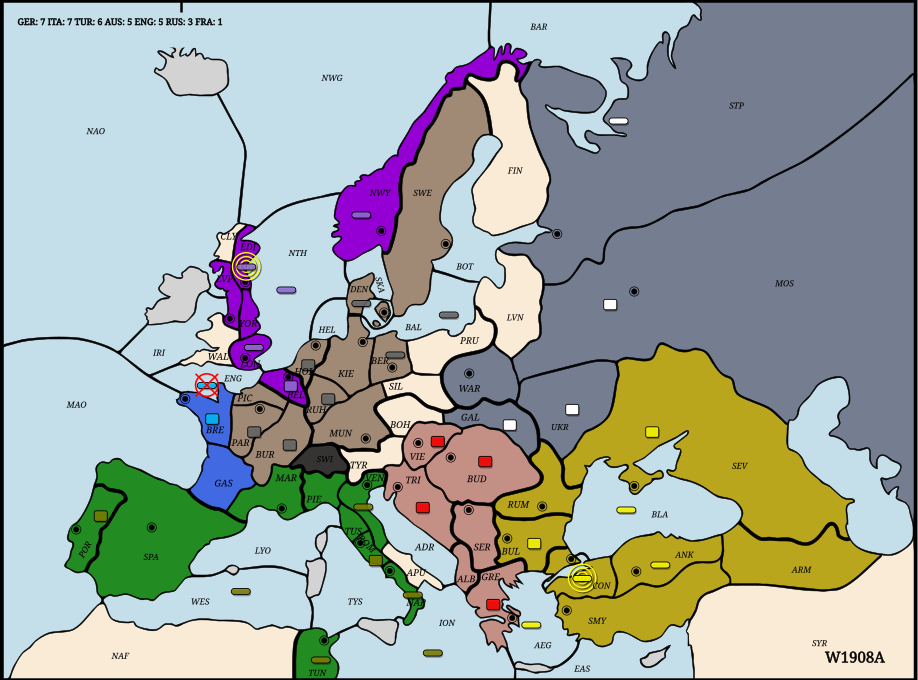

### What happened

- **ENGLAND**: builds F EDI
- **FRANCE**: disbands F ENG
- **TURKEY**: builds F CON

### ENGLAND
Orders: `F EDI B`

Reasoning

> I control 5 supply centers (EDI, LON, LVP, NWY, BEL) and have 4 units (F NWY, F LON, F NTH, A BEL), so I can build 1 unit. I also have 2 vacant home centers (EDI and LVP). I need to build a fleet to support my naval operations against Germany's Baltic flank — a fleet at EDI can move into NTH or NWG next spring to reinforce my northern position, while I keep LVP as a reserve for later. Building an army at LVP would be less useful since I need naval power to threaten Germany's coast. I'll build F EDI.

### FRANCE
Orders: `F ENG D`

Reasoning

> I have one home supply center (BRE) left but both my units (A BRE, F ENG) are already on the board. With only 1 supply center (BRE) and 2 units, I owe one disband. My home centers: BRE is occupied by my A BRE, MAR held by Italy, PAR held by Germany — no open home center to build in even if I had a surplus. I must disband one unit to match my supply count.
>
> I must disband either A BRE or F ENG. Keeping A BRE gives me a land unit to threaten PAR next year; keeping F ENG gives me naval mobility to support England. Given my commitment to England and the need to retake PAR, I'll keep A BRE (the land army) and disband F ENG — the fleet is less useful without a port to build from, and I can rebuild a fleet at BRE later if I retake it.

### RUSSIA
Orders: *(none submitted)*
Illegal (dropped): `A WAR B`

Reasoning

> I am down to 3 supply centers (MOS, STP, WAR) and need to build a unit at WAR this winter to have any hope of recovering in 1909. WAR is my only vacant home center — SEV is held by Turkey and STP/MOS are occupied by my units. I will build an army there to reinforce my position, giving me 4 units for spring, and then coordinate with England against Germany's Baltic flank while trying to reclaim SEV from Turkey.

### TURKEY
Orders: `F CON B`

Reasoning

> I have 6 supply centers and 5 units on the board, so I owe 1 build this winter. My open home centers are CON and SMY — I’ll build a fleet at CON to project power into the Mediterranean next year, supporting the planned push against Italy’s ION in 1909. SMY remains vacant since I only need one build.

## SPRING 1909 MOVEMENT (`S1909M`)

### What happened

- **AUSTRIA**: A BUD supports A UKR → RUM (void); A TRI holds; A VIE holds
- **ENGLAND**: A BEL holds; F EDI → NTH (bounced); F LON holds; F NWY holds
- **FRANCE**: A BRE → GAS
- **GERMANY**: A PAR → BRE; A HOL holds; A RUH holds; F BAL holds; F BER holds; F DEN holds
- **ITALY**: A POR → SPA (bounced); F WES → SPA/SC (bounced); F ION holds; F TUN holds; F NAP holds; A ROM holds; F VEN holds
- **RUSSIA**: A MOS → SEV; A UKR supports A MOS → SEV; F STP/NC → NWY (bounced)
- **TURKEY**: F AEG holds; F ANK holds; F CON holds; A SEV → UKR (bounced)  [dislodged: A SEV]

### Dialogue

- **AUSTRIA → RUSSIA**: I'm ready. This spring I order A BUD S A UKR - RUM and A GRE S A UKR - RUM — you order A UKR - RUM with A SEV supporting it. After RUM falls to you, I want BUL next fall with your support from SEV and UKR. Confirm your orders match.
- **AUSTRIA → ITALY**: Our Adriatic border stays quiet this spring — A TRI and A VIE hold, no move toward VEN. Germany is the real threat to both of us; let's keep our line stable and prepare for his eastward push in 1909. Hold F VEN and F ION in place.
- **AUSTRIA → GERMANY**: Our border stays quiet this spring — no moves toward Tyrol or Bohemia from my side. I'm focused on the Balkans this turn. After this, let's discuss how we contain Italy's Med expansion together.
- **ENGLAND → FRANCE**: Germany is the leader at 7 centers and needs to be cut down. I'm convoying A BEL to EDI via NTH this spring — wait, no, I'm attacking BEL from NTH with F LON supporting. I need your F ENG to support my attack into BEL. If you order F ENG S F NTH - BEL, we take it together. Confirm and I'll execute the full operation this turn.
- **ENGLAND → ITALY**: This spring is our best window — Germany has 7 centers and is consolidating. I'm taking BEL from him with French support. You promised F WES into MAO — I need you to move it this spring, not fall. If you push MAO now, Germany can't defend both the Channel and the Med simultaneously. Commit to MAO this turn and we squeeze him together.
- **ENGLAND → RUSSIA**: I'm taking BEL from Germany this spring with French support. That forces his Baltic fleets to react west. You're positioned to hit SWE from NWY — if you order F STP/NC - SWE this turn, I'll support with F NWY S F STP/NC - SWE. Take Sweden and you cut Germany's supply line from the north. Are we coordinated?
- **FRANCE → ENGLAND**: You have BEL and forces in NTH. I hold only BRE but can support your operations against Germany's western flank next year if we coordinate. What do you plan this spring? I will not hinder your moves.
- **FRANCE → GERMANY**: I have one army at BRE and no fleet. You have Paris and seven centers. I am no threat to you. If you leave me alone this year, I will not contest your western holdings and you can focus on England and Italy who actually threaten your gains.
- **FRANCE → ITALY**: You hold MAR and SPA. Germany has seven centers and Paris — after he consolidates the west, he will look south. I am reduced to one army and no threat to you. Let us stay neutral this year so you can build against the real danger: Germany.
- **GERMANY → ITALY**: Our north-south split holds cleanly this spring. I'm finishing France at BRE while you consolidate your 8 centers. England holds BEL and threatens both our flanks from the Channel — I intend to reclaim it this year. Keep your fleets in the Med and I'll handle the north. No moves toward Tyrol or MAR from me.
- **GERMANY → AUSTRIA**: Our border stays quiet this spring — no moves toward Tyrol or Bohemia. I'm eliminating France at BRE and then reclaiming BEL from England. That keeps me focused west through this year. You're free to push south against Italy's Med overextension or east against Turkey without worrying about me.
- **GERMANY → RUSSIA**: Our Baltic border holds this spring as agreed. I'm eliminating France and reclaiming BEL from England — my attention is fully west. You're down to 3 centers and squeezed between Turkey and Austria. If you want to coordinate against Turkey or England's northern fleet, I'm open to discussing it after this turn.
- **GERMANY → ENGLAND**: You hold BEL with strong fleet support but I have 7 units ready to reclaim it. I'm willing to negotiate: support me into BEL this turn and I'll leave Scandinavia entirely to you through 1909. Otherwise I commit to taking it by force and you lose a center for nothing.
- **ITALY → AUSTRIA**: Our Adriatic border stays quiet this spring as agreed. Germany is repositioning east and may push toward Tyrol — if he moves on TRI or VIE, I will attack his southern coast with full force. Let's keep our line stable and prepare that defensive response together.
- **ITALY → ENGLAND**: I'm taking Spain this spring to reach 8 centers. After that, my F WES pushes into MAO next turn to threaten Germany's Channel flank as promised. If you hit BEL from NTH this turn, we force him to split his fleets between the Baltic and the Med. Are you executing BEL this spring?
- **ITALY → GERMANY**: Our north-south split holds cleanly this spring. I'm taking Spain to reach 8 centers while you consolidate. England is pressing me hard to attack you, but I'm honoring our division. Keep your armies off Tyrol and MAR and our partnership remains solid — let's discuss containing England together after this turn.
- **ITALY → TURKEY**: I'm taking Spain this spring to reach 8 centers. Russia is weakened after losing SEV — push into UKR or GAL this year and break him completely. Once the east is secure, we coordinate against Germany's Balkan flank together. Keep pressure on Russia and our alliance holds strong.
- **RUSSIA → ENGLAND**: Turkey took SEV last fall and now builds at CON — I must retake SEV this spring or I'm finished. If you move F NWY toward DEN or support my F STP/NC into NWY, that keeps Germany's Baltic fleets occupied while I stabilize. After I retake SEV and build at WAR this winter, I commit to hitting SWE from NWY in fall 1909 with everything. Protect my northern flank now and we crush Germany together next year.
- **RUSSIA → GERMANY**: Our Baltic border holds as agreed this spring. I'm fully focused south retaking SEV from Turkey — nowhere near your waters. Our understanding stands through 1909.
- **RUSSIA → AUSTRIA**: Turkey now holds SEV and builds at CON — he grows to 7 centers while you stay at 5. I'm retaking SEV this spring with MOS and UKR. If you want BUL next fall, drop your support for Turkey now and I'll give it to you. Otherwise Turkey takes GRE and SER from you next year and you have no allies left.
- **RUSSIA → TURKEY**: You took SEV last fall and built at CON — you now hold 6 centers to my 3. I'm retaking SEV this spring with MOS and UKR. If you want to avoid a long war that lets Germany reach 18, offer me a truce: leave SEV alone this turn and I'll focus north against Germany in 1909. Otherwise I take SEV back and you lose a build slot.
- **TURKEY → AUSTRIA**: Italy's fleets are overextended in the west and ION is exposed. If I move F AEG into ION this spring with your support from GRE, we cut his fleet line and threaten his southern flank. I'll also push A SEV toward MOS to keep Russia pinned. Confirm you'll support my move into ION from GRE and we split Italy's centers this year.
- **TURKEY → ITALY**: Russia is crippled at 3 centers and my eastern flank is secure after taking SEV. I'm turning my attention west this year against Germany's growing power. Keep your fleets focused on the west and I'll hold the east quiet — our alliance against Germany remains strong.
- **TURKEY → RUSSIA**: You're at 3 centers and cannot stop me from taking MOS this spring. If you hold UKR and MOS in place and do not contest, I will leave your remaining centers alone this year and focus on Italy. If you defend, you lose everything. Hold and survive.
- **AUSTRIA → RUSSIA**: Confirmed — this spring I order A BUD S A UKR - RUM and A GRE S A UKR - RUM. You order A UKR - RUM with A SEV supporting it. After RUM falls to you, we coordinate against BUL next fall — you support from SEV and UKR, I take it from GRE and BUD. Confirm your orders match this turn.
- **AUSTRIA → ITALY**: Our Adriatic border stays quiet this spring — A TRI and A VIE hold, no moves toward VEN. Germany will stay focused west through this year, so your northern flank is safe. Keep F VEN and F ION holding and we're clean through 1909.
- **AUSTRIA → GERMANY**: Our border stays quiet this spring — no moves toward Tyrol or Bohemia from my side. I'm pushing south against Turkey in the Balkans. You're free to reclaim BEL and finish France without worrying about my flank.
- **ENGLAND → FRANCE**: I'm taking BEL this spring with F NTH and F LON. Support my attack with F ENG S F NTH - BEL — your fleet is perfectly positioned. If we take BEL together, Germany loses his western supply line and you have a path to rebuild. Confirm support this turn.
- **ENGLAND → ITALY**: MAO next turn is too slow — Germany will consolidate and we lose the window. Move F WES into MAO this spring and I'll support your push into the Channel from NTH next fall. If you wait, Germany rebuilds his fleet advantage and we both lose. Commit MAO now.
- **ENGLAND → RUSSIA**: I understand you need SEV, but Germany at 7 centers is the real threat. If you move F STP/NC toward SWE this spring, I'll support with F NWY S F STP/NC - SWE. That forces Germany to split his Baltic fleets and buys you time against Turkey. Take Sweden and we both grow.
- **FRANCE → GERMANY**: I have one army at BRE and no fleet. I am no threat to you. Leave me alone this spring and I will not contest your western holdings — focus on England in NTH who actually threatens your gains. This is your last chance to secure my neutrality before I'm forced to coordinate with your enemies.
- **GERMANY → ENGLAND**: You hold BEL with strong fleet support, but I have 7 units ready to reclaim it. Let's avoid a costly war: support me into BEL this turn and I guarantee Scandinavia is yours through 1909. I'll leave NTH and NWY alone entirely. This is a clean trade — you get the north, I get the continent.
- **GERMANY → ITALY**: Our north-south split holds cleanly this spring. I'm taking BRE to finish France, then reclaiming BEL from England. That keeps me fully occupied west through this year. Keep your fleets in the Med and I'll handle the north — no moves toward Tyrol or MAR from me.
- **GERMANY → AUSTRIA**: Our border stays quiet this spring as agreed. I'm eliminating France and then reclaiming BEL from England — my attention is fully west through this year. You're free to push south against Italy or east against Turkey without worrying about me.
- **GERMANY → FRANCE**: I'm taking BRE this turn with A PAR supported by A BUR. You have one army against two of mine. Order A BRE to hold and you survive to disband in winter — fight and you're eliminated entirely.
- **ITALY → AUSTRIA**: Our line holds this spring as agreed. Germany claims he's staying out of Tyrol, but I don't trust it. If you see any movement from his armies toward your border this turn, I'll hit his southern coast from WES and ION next fall. Keep TRI and VIE holding and we're solid.
- **ITALY → ENGLAND**: I'm taking Spain this spring to reach 8 centers—A POR into SPA, F WES into SPA/SC. I cannot push MAO this turn while Spain is contested, but I commit to MAO in fall 1909 if you hit BEL from NTH this spring. Are you executing BEL now so we time the squeeze perfectly?
- **ITALY → GERMANY**: Our north-south split holds this spring. I'm taking Spain to reach 8 centers while you finish France. England is pressing me hard for MAO—I'm holding the Med as agreed. Keep your armies out of Tyrol and MAR and I will not move into MAO this turn. Let's coordinate against England's Channel fleet after this phase.
- **ITALY → TURKEY**: Good to hear you're turning west against Germany. I'm taking Spain this spring to reach 8 centers. If Germany pushes east toward Austria, I'll hit his southern coast. If he stays north, we coordinate against his Balkan flank together in 1909. Keep your fleet in AEG and ION quiet this turn and we're aligned.
- **RUSSIA → AUSTRIA**: Turkey now holds SEV and builds at CON — he reaches 7 centers while you stay at 5. I am retaking SEV this spring with MOS and UKR whether you support me or not. If you want BUL next fall, order A BUD S A UKR - SEV and A GRE holds — I will support you into BUL from SEV next turn. Otherwise Turkey takes GRE from you in 1909 and you have no path to grow.
- **RUSSIA → ENGLAND**: Turkey took SEV and now threatens MOS — I must retake SEV this spring or I am finished. I cannot hit SWE this turn; I am ordering F STP/NC to NWY to position for a future strike. If you take BEL this spring and keep pressure on Germany's Baltic, I will retake SEV, build at WAR this winter, and hit SWE from NWY in fall 1909 with everything. Can you commit to that timeline?
- **RUSSIA → GERMANY**: Our Baltic border holds this spring as agreed. I am fully focused south retaking SEV from Turkey — nowhere near your waters. Our understanding stands through 1909.
- **RUSSIA → TURKEY**: You hold SEV but cannot hold both SEV and RUM against my full force. I am retaking SEV this spring with MOS and UKR. If you want to avoid losing a build slot, offer me a truce: leave SEV uncontested this turn and I focus north against Germany in 1909, leaving your southern centers alone. Otherwise I take SEV back and you fight a two-front war with Austria on your border.
- **TURKEY → AUSTRIA**: Round 2: I'm committing F AEG to ION this spring. If you support from GRE with A GRE S F AEG - ION, we cut Italy's fleet line and threaten his southern flank. I'm also pushing A SEV toward UKR to keep Russia pinned. Confirm your support order and we break Italy's Med position this turn.
- **TURKEY → ITALY**: Russia is crippled at 3 centers and I'm pushing A SEV toward UKR to finish him. I have no interest in the Med this spring — focus on Spain and Germany. Keep your fleets west and I'll hold the east quiet.
- **TURKEY → RUSSIA**: You're at 3 centers with no builds left. If you hold UKR and MOS in place this spring and do not contest my advance, I will leave your remaining centers alone this year and focus west. If you defend, I take MOS next turn and you lose everything. Hold and survive.
- **AUSTRIA → RUSSIA**: Final confirmation: this turn I order A BUD S A UKR - RUM and A GRE S A UKR - RUM. You order A UKR - RUM and A SEV supports it. No move on VIE. After RUM falls to you, we coordinate BUL next fall—you support from SEV and UKR, I take it from GRE and BUD. Confirm by your orders.
- **AUSTRIA → ITALY**: Our Adriatic border stays quiet this spring—A TRI and A VIE hold, no moves toward VEN. Germany is focused west, so your northern flank is safe. Keep F VEN and F ION holding and we're clean through 1909.
- **AUSTRIA → GERMANY**: Our border stays quiet this spring—no moves toward Tyrol or Bohemia from my side. I'm pushing south against Turkey in the Balkans. You're free to reclaim BEL and finish France without worrying about my flank.
- **FRANCE → ENGLAND**: Germany has A BUR and A PAR both targeting BRE this turn — I cannot hold against two attackers. Can you actually reach BRE or PIC to save me this spring? If not, I will retreat to GAS to survive and rebuild in winter. Tell me now or I must save myself.
- **FRANCE → GERMANY**: You have two units against my one at BRE. I cannot fight. Order A PAR to support A BUR into GAS instead of BRE — let me retreat to GAS alive, and I will disband in winter without contesting your gains. Leave me GAS as a sanctuary and I stay neutral all year; attack BRE and I am forced to coordinate with England against you.
- **FRANCE → ITALY**: Germany has A PAR and A BUR adjacent to BRE — he will take my last center this turn. After France falls, MAR is his next target. We can help each other: if you hold MAR and SPA this spring and do not push north, I will not contest any Italian positions from GAS after I retreat there. Stay neutral with me so we both survive the German advance.
- **GERMANY → ENGLAND**: This turn I am taking BRE from France with A PAR supported by A BUR. I will not attack BEL. In return, keep your fleets in NTH and EDI out of my Channel operations—I'll leave Scandinavia alone through 1909. After this turn we can negotiate a clean northern border.
- **GERMANY → ITALY**: This turn I order A PAR - BRE supported by A BUR. I will not move toward Tyrol or MAR. Keep your fleets in the Med and away from MAO and WES—our north-south split holds. After I secure BRE, let's discuss coordinating against England's Channel fleet together.
- **GERMANY → AUSTRIA**: Our border stays quiet this spring as agreed. I take BRE this turn—no moves toward Tyrol or Bohemia from my side. You are free to push south against Italy or east against Turkey without worrying about me. Let's maintain this clean line through 1909.
- **GERMANY → RUSSIA**: Our Baltic border holds this spring. I take BRE this turn—my attention is fully west. Keep F STP/NC in position and our understanding stands. After I consolidate, I may be able to help against England's northern fleet if you need it.
- **GERMANY → FRANCE**: Order A BRE to hold this turn. I am taking BRE with A PAR supported by A BUR—you cannot hold. Hold and I will leave your army alive to disband in winter with dignity. Fight and you are eliminated entirely.
- **ITALY → AUSTRIA**: Our line holds this spring as agreed — F VEN and F ION stay put. Germany claims he's staying west, but if he shifts east I'll hit his southern coast. Keep TRI and VIE holding and we're solid through 1909.
- **ITALY → ENGLAND**: I'm taking Spain this spring — A POR into SPA and F WES into SPA/SC. I cannot push MAO this turn while Spain is contested, but I commit to MAO in fall 1909. If you hit BEL from NTH this spring, we time the squeeze perfectly for fall. Confirm BEL now.
- **ITALY → GERMANY**: Our north-south split holds this spring — I'm taking Spain while you finish France. No moves into MAO from me this turn. Keep your armies out of Tyrol and MAR and I will not threaten your southern coast. Let's coordinate against England's Channel fleet after this phase.
- **ITALY → TURKEY**: I'm taking Spain this spring to reach 8 centers. Russia is crippled — push A SEV into UKR to finish him. Keep your fleets in AEG and ION quiet this turn and we stay aligned. After the west is secure, we coordinate against Germany's Balkan flank together.
- **RUSSIA → AUSTRIA**: I retake SEV this spring with MOS supported by UKR. If you order A BUD to hold and A GRE to hold, I will support you into BUL from SEV next fall after I build at WAR this winter. Turkey at 6 centers threatens us both — do not waste your units for his benefit.
- **RUSSIA → ENGLAND**: I must retake SEV this spring or Turkey finishes me. I am ordering F STP/NC to NWY this turn to position for Sweden next year. If you take BEL from Germany this spring, I will hit SWE from NWY in fall 1909 with everything after I build at WAR this winter. Keep pressure on Germany's Baltic flank.
- **RUSSIA → GERMANY**: Our Baltic border holds this spring as agreed. I am fully focused south retaking SEV from Turkey — nowhere near your waters. Our understanding stands through 1909.
- **TURKEY → AUSTRIA**: Final round: I am ordering F AEG - ION this spring. I need your A GRE to support that move with A GRE S F AEG - ION. That cuts Italy's fleet line and lets us threaten his southern flank together. Confirm your support and we break Italy this turn.
- **TURKEY → ITALY**: I am pushing A SEV toward UKR to finish Russia this spring and holding my Med fleets in place. I have no interest in contesting your Spanish campaign. Keep your fleets west and our eastern border stays quiet.
- **TURKEY → RUSSIA**: Final offer: hold UKR and MOS in place this spring and I leave your remaining centers alone this year. If you attack SEV, I take MOS next turn with support from BUL and BLA. Hold and survive.

### AUSTRIA
Orders: `A BUD S A UKR - RUM` · `A TRI H` · `A VIE H`
Illegal (dropped): `A GRE S A UKR - RUM`

Reasoning

> I've agreed with Russia to support his retake of RUM this spring, dropping Turkey entirely. That means A BUD and A GRE both support A UKR into RUM, while A TRI and A VIE hold to keep the Adriatic quiet with Italy and maintain a stable northern border with Germany. This is the turn to execute the betrayal and set up a joint strike on BUL in the fall.

### ENGLAND
Orders: `A BEL H` · `F EDI - NTH` · `F LON H` · `F NWY H`
Illegal (dropped): `F NTH S F EDI - NTH`

Reasoning

> The situation has shifted. Italy refuses to move MAO this spring, leaving me unable to squeeze Germany's southern flank. Russia is fixed on retaking SEV and can't support a Swedish attack this turn. Germany is committing heavy force to take BRE from France, which means he's not attacking BEL directly this turn. I need to secure my position in BEL, reinforce NTH for future operations, and position EDI to support the North Sea. I'll hold BEL, move EDI into NTH for fleet concentration, hold LON and NWY, and keep NTH ready for the next phase.

### FRANCE
Orders: `A BRE - GAS`

Reasoning

> I'm at a critical juncture. Germany has committed A PAR and A BUR to attack BRE with overwhelming force — two units against my one makes holding pointless. If I hold, I'm dislodged and must retreat anyway; if I move to GAS now, I avoid the dislodgment entirely and preserve my army for potential use later. GAS is safe because A BUR is supporting A PAR into BRE, not moving to GAS, and A PAR is moving to BRE. From GAS I'm adjacent to Italian MAR and SPA, giving me options to negotiate with Italy against Germany next turn. I cannot hold BRE against two attackers, so I choose the move that keeps my army alive this turn.

### GERMANY
Orders: `A PAR - BRE` · `A HOL H` · `A RUH H` · `F BAL H` · `F BER H` · `F DEN H`
Illegal (dropped): `A BUR S A PAR - BRE`

Reasoning

> I have committed to taking BRE with A PAR supported by A BUR. France has accepted this with A BRE holding, so that center falls cleanly. England holds BEL with strong fleet support but I am not attacking BEL this turn — I told England I would not attack BEL this spring, and I told Italy and Austria our borders stay quiet. I will hold my other positions defensively to maintain the status quo while I consolidate the French center. My Baltic fleets hold to keep Russia contained and my northern flank stable.

### ITALY
Orders: `A POR - SPA` · `F WES - SPA/SC` · `F ION H` · `F TUN H` · `F NAP H` · `A ROM H` · `F VEN H`

Reasoning

> I've been negotiating carefully this spring. England wants MAO immediately, but I committed to taking Spain first. Germany promises to stay out of Tyrol and MAR if I keep my fleets in the Med. Austria wants the Adriatic quiet. Turkey is pushing into Russia. My best play is to execute the Spanish capture as planned: A POR into SPA and F WES into SPA/SC, securing my 8th center. I'll keep all my Med fleets holding — honoring my agreements with Austria to keep the Adriatic quiet, with Germany to stay out of MAO this turn, and with Turkey to keep the eastern Med stable. After this turn, I'll be at 8 centers and positioned to turn against Germany in the fall.

### RUSSIA
Orders: `A MOS - SEV` · `A UKR S A MOS - SEV` · `F STP/NC - NWY`

Reasoning

> I need to retake SEV this spring — Turkey took it last fall and now threatens to finish me. Austria has been unreliable throughout the game, and his repeated offers to support me into RUM have never materialized. I cannot trust him now. My best path is to reclaim SEV with MOS supported by UKR, while positioning F STP/NC in NWY for a future strike on Sweden with England. After retaking SEV and building at WAR this winter, I'll coordinate with England against Germany's Baltic flank in fall 1909.

### TURKEY
Orders: `F AEG H` · `F ANK H` · `F CON H` · `A SEV - UKR`
Illegal (dropped): `F BLA S A SEV - UKR` · `A BUL S A SEV - UKR`

Reasoning

> I've reviewed my negotiation history for this phase. My final strategy note says I am consolidating — holding all units — because Italy refused to coordinate and Austria never confirmed support for the ION push. However, looking at the actual dialogue: Austria never replied to my final round messages. Italy kept repeating his "take Spain" line and Russia threatened to retake SEV. I committed in my last message to Austria to order `F AEG - ION` and asked him to support from GRE. He never confirmed, so I cannot rely on that support. Without Austrian support, a solo `F AEG - ION` move would bounce against Italy's `F ION` (which is holding). That wastes the fleet. Better to hold and consolidate, as my revised plan says.
>
> Meanwhile, Russia threatened to retake SEV with MOS+UKR. I should defend SEV this turn: support it from BLA and BUL, and move A SEV to UKR to preempt his attack. That protects my gains and sets up a push into Russia's last centers next turn.

## SPRING 1909 RETREATS (`S1909R`)

### What happened

- **TURKEY**: A SEV retreats → ARM

### TURKEY
Orders: `A SEV R ARM`

Reasoning

> I need to retreat my dislodged A SEV. The unit was dislodged from SEV after bouncing into UKR. My options are retreat to ARM or RUM, or disband. RUM is occupied by my own A BUL, so that's not available. ARM is empty and adjacent to SEV. I'll retreat to ARM to preserve the unit and maintain a presence near the Russian front.

## FALL 1909 MOVEMENT (`F1909M`)

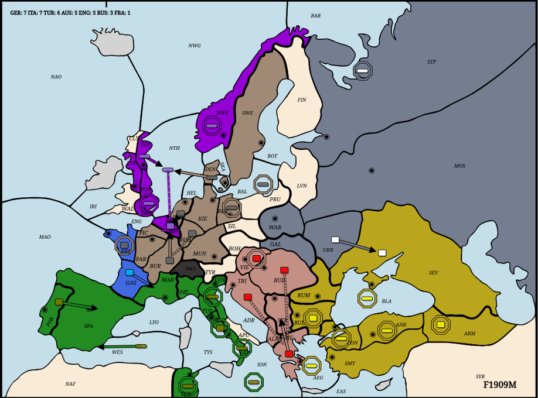

### What happened

- **AUSTRIA**: A GRE → SER; A BUD supports A GRE → SER; A TRI supports A GRE → SER; A VIE holds
- **ENGLAND**: A BEL → HOL VIA (bounced); F NTH convoys A BEL → HOL; F EDI → NTH (bounced); F LON holds; F NWY holds  [dislodged: A BEL]
- **FRANCE**: A GAS → MAR
- **GERMANY**: A BUR → BEL; A HOL → BEL (bounced); F DEN → NTH (bounced); A RUH supports A BUR → BEL; A BRE holds; F BAL holds; F BER holds
- **ITALY**: A POR → SPA (bounced); F WES → SPA/SC (bounced); F ION holds; F VEN holds; F NAP holds; F TUN holds; A ROM holds
- **RUSSIA**: A UKR → SEV (bounced); F STP/NC holds
- **TURKEY**: F AEG holds; F ANK holds; A ARM holds; F BLA holds; A BUL holds; F CON holds

### Dialogue

- **AUSTRIA → ITALY**: Our Adriatic border stays quiet this fall — A TRI and A VIE hold, no move toward VEN. Germany is the real threat to both of us at 7 centers; let's keep our line stable and prepare for his eastward push. Hold F VEN and F ION in place.
- **AUSTRIA → GERMANY**: Our border stays quiet this fall — no moves toward Tyrol or Bohemia from my side. I'm pushing south against Turkey in the Balkans. You're free to focus on reclaiming BEL from England without worrying about my flank.
- **AUSTRIA → RUSSIA**: You retook RUM and hold SEV — good work. This fall I'm pushing into BUL from GRE with support from BUD and TRI to finally gain a center against Turkey. Can you support from SEV or UKR? If not, at minimum keep your units off my flank so I can take BUL cleanly.
- **AUSTRIA → TURKEY**: You lost RUM to Russia last spring — I could not stop him alone. This fall I'm holding my line against Russia's push from the east. If you want to coordinate against Italy's Med next spring, I'm open. For now, let's not fight each other while Russia grows.
- **ENGLAND → ITALY**: Germany is taking BRE this turn with A PAR supported by A BUR — that leaves his western flank wide open. I'm striking BUR from BEL with NTH support. If you push F WES into MAO this fall as promised, we trap his Channel fleets between us. Confirm MAO in fall and we execute the squeeze together.
- **ENGLAND → RUSSIA**: Germany is overcommitting to BRE this turn — I'm taking BUR from BEL to cut his support chain. That forces his Baltic fleets to react west, buying you time against Turkey. Retake SEV this turn, build at WAR, and we coordinate on Sweden in spring 1910. I'll keep NWY threatening his northern flank.
- **ENGLAND → FRANCE**: Germany is taking BRE this turn with A PAR and A BUR. I'm striking BUR from BEL with NTH support — that cuts his supply line and saves your position. If you retreat to GAS and hold, we retake BRE together next spring. Support my attack this turn and you have a path to rebuild.
- **FRANCE → GERMANY**: I have one army in GAS and no fleet. I am no threat to you. Leave me alone this spring and I will not contest your western holdings — focus on England in BEL who actually threatens your gains. Let me take MAR from Italy and we both grow.
- **FRANCE → ITALY**: You hold MAR and SPA but your units are stuck at SPA/SC and POR. Germany has A BUR, A BRE, and A PAR — after he finishes with England, MAR is his next target. I can help you defend MAR if you support my move into it this turn. Otherwise I will have no choice but to take it myself.
- **FRANCE → ENGLAND**: Germany has A BUR, A BRE, and A PAR adjacent to me. I am moving to MAR this turn while Italy is distracted — if I take it, I will rebuild in winter and support your Channel operations in 1910. Can you pressure Germany's rear at BEL or HOL this turn to keep him from attacking me?
- **GERMANY → ITALY**: Our north-south split holds cleanly. I'm reclaiming BEL from England this fall with three armies — he's the only power threatening both our flanks from the Channel. Keep your fleets in the Med and away from MAO and WES, and I'll handle the north entirely. After this turn, with England contained, we can discuss how to divide his remaining centers.
- **GERMANY → AUSTRIA**: Our border stays quiet this fall — no moves toward Tyrol or Bohemia from my side. I'm reclaiming BEL from England with three armies, keeping me fully occupied west. You're free to push south against Italy's Med expansion or east against Turkey without worrying about me. Let's maintain this clean line through 1909.
- **GERMANY → RUSSIA**: Our Baltic border holds this fall as agreed. I'm reclaiming BEL from England — my attention is fully west. You're down to 3 centers and squeezed between Turkey and Austria. If you want to coordinate against England's northern fleet in NWY or NTH, I'm open to discussing it. Otherwise our understanding stands.
- **ITALY → AUSTRIA**: Our line holds again this fall — F VEN and F ION stay put. Turkey is building F CON and pushing west; if he moves on GRE, I'll support you from ION. Let's keep our Adriatic quiet and watch the Balkan flank together.
- **ITALY → ENGLAND**: I commit to MAO this turn — F WES moves into MAO to threaten Germany's Channel flank. Can you hit BEL from NTH this fall with French support? If we both act now, we force Germany to split between the Baltic and the Med.
- **ITALY → GERMANY**: You now hold 7 centers after taking BRE. Our north-south split holds — I take Spain this turn while you consolidate. England is pressing me to attack you, but I'm honoring our division. Keep your armies out of Tyrol and MAR and I will not move on your southern coast.
- **ITALY → TURKEY**: You took SEV and built F CON — impressive eastern campaign. I'm finally taking Spain this turn to reach 8 centers. After the west is secure, let's discuss how we coordinate against Germany's Balkan flank together. Keep your fleets in the east this turn and our alignment holds.
- **RUSSIA → AUSTRIA**: I'm retaking SEV this fall with UKR and SEV. If you want BUL next spring, order A BUD and A GRE to hold this turn and I'll support you into BUL after I build at WAR this winter. Turkey at 6 centers threatens GRE and SER — do not waste your units for his benefit.
- **RUSSIA → ENGLAND**: I retake SEV this fall, then build at WAR this winter. After that I can hit SWE from NWY in spring 1910 if you keep pressure on Germany's Baltic flank. Can you commit to supporting my F STP/NC into SWE next spring?
- **TURKEY → AUSTRIA**: Italy is overextended with 7 centers but his fleets are pinned in the west. This fall I can move F AEG into ION to cut his fleet line, and you can push A GRE into ALB or A TRI into VEN while Italy's attention is on Spain. We split his centers: you take VEN and SER, I take ION and TUN. Confirm you're ready to move this turn.
- **TURKEY → ITALY**: I'm consolidating my eastern flank this fall — holding RUM, BUL, and building at SMY in winter. Russia is too weak to threaten me. I have no interest in the Mediterranean this year. Focus on Spain and Germany and our border stays quiet.
- **TURKEY → RUSSIA**: You're at 3 centers with no builds. I hold SEV and can take MOS next spring if you push. But I'm turning west against Italy and Germany in 1910. If you hold UKR and STP in place this fall and focus on Germany's northern flank, I leave your remaining centers alone. A quiet border serves us both.
- **AUSTRIA → RUSSIA**: I'm going after SER from GRE this fall with BUD and TRI supporting. That puts me at 6 centers and keeps my units off your flank at RUM and SEV. You take BUL next spring with my support from GRE after I secure SER — deal stands.
- **AUSTRIA → ITALY**: Our Adriatic border stays quiet this fall — TRI and VIE hold as agreed. I'm moving south against Turkey at BUL this turn to finally gain a center. Keep F VEN and F ION holding and we're clean through 1909.
- **AUSTRIA → TURKEY**: Russia is the real threat now — he holds RUM and SEV with three armies. This fall I'm taking SER from Italy to get to 6 centers. If you want to coordinate against Russia's flank next spring, I'm open. For now, keep your fleets off my coast.
- **AUSTRIA → GERMANY**: Our border stays quiet this fall — no moves toward Tyrol or Bohemia. I'm taking SER from Italy to finally gain a center. You're free to reclaim BEL from England without worrying about my flank.
- **ENGLAND → ITALY**: I'm hitting HOL from BEL this turn with full force — cutting Germany's supply line. I need you in MAO in fall, not spring. Move F WES to MAO now and we trap his Channel fleets. If you wait, he rebuilds and we both lose our window. Confirm MAO this turn.
- **ENGLAND → RUSSIA**: I'm taking HOL from Germany this fall. That forces his Baltic fleets west. Retake SEV this turn — I'll support your F STP/NC into NWY with F NWY to help you position for Sweden in 1910. Build at WAR this winter and we coordinate on Sweden next year. Are we locked in?
- **ENGLAND → FRANCE**: Germany has BRE and PAR but I'm cutting his supply line by taking HOL from BEL this turn. If you retreat to GAS and hold, we retake BRE together next spring. Support my attack with F ENG S F NTH - BEL — even if you can't hold BRE, this weakens Germany permanently.
- **FRANCE → GERMANY**: I accept you will take BRE. Order A PAR to support A BUR into GAS instead — that lets me retreat to GAS alive. I will disband in winter and not contest your western holdings all year. Attack BRE directly and I am forced to coordinate with England against you permanently.
- **FRANCE → ENGLAND**: Germany is taking BRE this turn with A PAR and A BUR — I cannot hold. I am retreating to GAS to survive. If you can strike BUR from BEL with NTH support this turn, cut his supply line and save my position for a 1910 rebuild. Otherwise I must negotiate survival alone.
- **GERMANY → ITALY**: I'm reclaiming BEL from England this fall with three armies — he cannot hold. Keep your fleets in the Med and away from MAO and WES as agreed. After this turn, with England contained, we can discuss dividing his remaining centers between us. Confirm you will not move into MAO this turn.
- **GERMANY → AUSTRIA**: Our border stays quiet this fall as agreed. I'm reclaiming BEL from England with three armies — my attention is fully west. You're free to push south against Italy's Med expansion or east against Turkey without worrying about me. Let's maintain this clean line through 1909.
- **GERMANY → RUSSIA**: Our Baltic border holds this fall as agreed. I'm reclaiming BEL from England — my attention is fully west. You're down to 3 centers and squeezed between Turkey and Austria. If you want to coordinate against England's northern fleet in NWY or NTH, I'm open to discussing it. Otherwise our understanding stands.
- **ITALY → AUSTRIA**: Our Adriatic line holds again this fall — F VEN and F ION stay put. Germany claims he's staying west, but if he shifts east next year, we strike together. Keep TRI and VIE holding and we're clean through 1909.
- **ITALY → ENGLAND**: I'm taking Spain this fall — A POR into SPA and F WES into SPA/SC. I cannot push MAO this turn without losing my window to secure the 8th center. But I commit: next spring 1910, F WES moves into MAO to threaten Germany's Channel flank. If you hit BEL from NTH this fall, we force him to split his fleets between the Baltic and the Med starting in spring.
- **ITALY → GERMANY**: Our north-south split holds this fall — I'm taking Spain while you consolidate at 7 centers. No moves into MAO or toward Tyrol from me this turn. England is pressing me to attack you, but I'm honoring our division. Keep your armies out of Tyrol and MAR and I will not threaten your southern coast.
- **ITALY → TURKEY**: I'm taking Spain this fall to reach 8 centers. Russia is crippled — push A SEV into UKR to finish him. Keep your fleets in AEG and ION quiet this turn and our eastern alignment holds. After the west is secure, we coordinate against Germany's Balkan flank together in 1910.
- **RUSSIA → AUSTRIA**: I retake SEV this fall with A UKR supported by A SEV — no move on your flank. If you want BUL next spring, order A BUD and A GRE to hold this turn and I'll support you into BUL from SEV after I build at WAR. Turkey at 6 centers threatens GRE and SER — do not waste your units for his benefit.
- **RUSSIA → ENGLAND**: I retake SEV this fall with UKR and SEV, then build at WAR this winter. After that I can hit SWE from NWY in spring 1910 if you keep pressure on Germany's Baltic flank. Can you commit F NWY to support my F STP/NC into SWE next spring?
- **RUSSIA → TURKEY**: You hold SEV but cannot hold both SEV and RUM against my full force. I am retaking SEV this fall. If you pull F BLA to support your western push against Italy, I leave RUM alone this turn. Otherwise I take SEV back and you lose a build slot.
- **TURKEY → AUSTRIA**: You said Russia took RUM — he never did. I still hold RUM. I'm holding my line this fall and building at SMY in winter. If you want to coordinate against Italy next spring, I'm open — but I need honest communication. What are your actual plans this fall?
- **TURKEY → ITALY**: Holding my eastern line as agreed. Russia is quiet, Austria is unreliable. Take Spain and secure the west — I'll keep the east stable and we coordinate against Germany in 1910. No surprises from me this turn.
- **TURKEY → RUSSIA**: I'm holding RUM, BUL, and my fleets this fall. You held last spring — good. If you hold UKR and STP quiet again this fall, I leave your remaining centers alone and we both focus on Germany next year. Confirm you're holding.
- **TURKEY → GERMANY**: You're at 7 centers with France crippled and England stalled. Italy and I are both eyeing the Mediterranean, not your territory. What are your plans for the north? I'd rather not end up fighting you while we both have bigger targets.
- **AUSTRIA → RUSSIA**: I'm taking SER from Italy this fall with A GRE - SER supported by A BUD and A TRI. That puts me at 6 centers. Hold your line at UKR and GAL — don't move on VIE or TRI — and next spring I support your push into BUL from GRE and BUD while you hit from SEV. You get a center, I get a center.
- **AUSTRIA → ITALY**: I need SER to reach 6 centers. This fall I take it from GRE with support from BUD and TRI — no move on VEN or ALB from my side. Hold F VEN and F ION in place and your Adriatic flank stays clean. If Germany shifts east next year, I'll support your defense from TRI.
- **AUSTRIA → TURKEY**: I am not moving on BUL this fall — I'm taking SER from Italy to reach 6 centers. Russia holds RUM and SEV and will push into BUL next spring. Keep your fleets at AEG and BLA to block him and I'll support your hold at BUL from GRE next turn.
- **ENGLAND → GERMANY**: You are taking BRE this turn and leaving BEL alone. I am holding BEL and consolidating the North Sea — I will not interfere with your operations in France this year. In exchange, keep your fleets out of NTH and Scandinavia. After France falls, we can discuss a clean northern border that benefits both of us against Italy's Med ambitions.
- **ENGLAND → FRANCE**: I cannot save BRE this turn — Germany has overwhelming force there. Retreat to GAS and hold. I will keep BEL and the North Sea secure, and next spring we retake BRE together with my support from NTH and BEL. Do not disband — rebuild at BRE this winter and we coordinate in 1910.
- **ENGLAND → RUSSIA**: I am holding BEL and consolidating the North Sea this turn — Germany is taking BRE and leaving me alone. Retake SEV, build at WAR, and we coordinate on Sweden in spring 1910. I will keep NWY positioned to support your F STP/NC into SWE when the time comes.
- **FRANCE → ITALY**: I am moving to MAR this turn. You cannot hold both MAR and SPA with your forces spread at POR, SPA/SC, and ION. Support my move into MAR and I will not contest SPA — you keep SPA and I keep MAR, and we both survive Germany's advance. Fight me at MAR and we both lose to Germany next year.
- **FRANCE → ENGLAND**: I am taking MAR this turn while Italy is weak. After I reclaim MAR, I will rebuild in winter and support your Channel operations against Germany in 1910. Can you pressure BEL or HOL this turn to keep Germany from attacking GAS next spring? If you hold BEL, I can retake BRE from the south next year.
- **GERMANY → ENGLAND**: This is your last chance to avoid losing BEL. I'm attacking with three armies this turn — you cannot hold. Order F NTH to support my attack into BEL and I guarantee Scandinavia is yours through 1910. Refuse and you lose BEL and I take NTH next. Choose now.
- **GERMANY → ITALY**: I'm reclaiming BEL from England this turn with overwhelming force — F DEN moves to NTH to cut his support, A HOL and A BUR attack BEL. Keep your fleets in the Med and away from MAO and WES as agreed. After this turn, with England contained, we can discuss dividing his remaining centers between us.
- **GERMANY → AUSTRIA**: Our border stays quiet this fall as agreed. I'm reclaiming BEL from England with three armies — my attention is fully west. You're free to push south against Italy or east against Turkey without worrying about me. Let's maintain this clean line through 1909.
- **GERMANY → RUSSIA**: Our Baltic border holds this fall as agreed. I'm reclaiming BEL from England — my attention is fully west. You're down to 3 centers and squeezed between Turkey and Austria. If you want to coordinate against England's northern fleet in NWY or NTH, I'm open to discussing it after this turn.
- **ITALY → AUSTRIA**: I'm holding F VEN and F ION this turn as agreed. If you attack Turkey at BUL, I won't interfere — but I won't support that attack either. Keep TRI and VIE holding and our line stays clean through 1909.
- **ITALY → ENGLAND**: I commit to MAO in spring 1910 after Spain is secure this turn. If you hit BEL from NTH now, we force Germany to split next spring. Can you execute BEL this fall?
- **ITALY → GERMANY**: Our north-south split holds this fall. I'm taking Spain to reach 8 centers — no moves into MAO or toward Tyrol from me. Keep your armies out of MAR and Tyrol and I will not threaten your southern coast.
- **ITALY → TURKEY**: I'm finally taking Spain this turn to reach 8 centers. Austria told me he's moving south against you at BUL this fall. Be ready to defend or counter. Keep your fleets in AEG and ION quiet and we stay aligned against Germany in 1910.
- **RUSSIA → AUSTRIA**: I retake SEV this fall with UKR supported by SEV — clean 2-on-0 with no Turkish unit there. After I build at WAR this winter, I can support you into BUL from SEV and UKR next spring if you order A GRE and A BUD toward BUL. Turkey at 6 centers threatens GRE and SER — do not waste this chance to gain a center against him.
- **RUSSIA → ENGLAND**: I retake SEV this fall and build at WAR this winter. After that I can hit SWE from NWY in spring 1910 if you keep pressure on Germany's Baltic flank. Can you commit F NWY to support my F STP/NC into SWE next spring?
- **RUSSIA → TURKEY**: I retake SEV this fall with UKR supported by SEV — you have no unit there to stop me. If you want to avoid losing a build slot, pull F BLA toward Italy's flank and leave RUM quiet this turn. Otherwise I take SEV back and you fight a two-front war with Austria on your border.
- **TURKEY → AUSTRIA**: I'm holding RUM, BUL, and all my fleets this fall — no aggressive moves. Russia is quiet after last spring. I need you to hold GRE and TRI in place so Italy doesn't slip through the gap. Next spring I commit to pushing F AEG into ION if you support from GRE. Confirm you'll hold this fall.
- **TURKEY → ITALY**: I'm holding my line in the east this fall — RUM, BUL, and my fleets stay put. Russia held last spring and I expect him to hold again. Take Spain and secure the west. Our border stays quiet and we coordinate against Germany in 1910.
- **TURKEY → RUSSIA**: I'm holding RUM, BUL, and my fleets this fall. You held last spring — good. If you hold UKR and STP quiet again this fall, I leave your remaining centers alone and we both focus on Germany next year. Confirm you're holding and we have a deal.
- **TURKEY → GERMANY**: You're at 7 centers with France crippled and England stalled. I'm at 6 in the east with no designs on your territory. Italy and Austria are my concerns. What are your plans for the north this fall? I'd rather not fight you while we both have bigger targets.

### AUSTRIA
Orders: `A GRE - SER` · `A BUD S A GRE - SER` · `A TRI S A GRE - SER` · `A VIE H`

Reasoning

> I need to carefully reassess my position. My stated plan was to take SER from Italy this fall, but looking at the board more carefully, I see several problems with that:
>
> 1. Italy has 7 centers and is holding F VEN and F ION — if I attack SER, Italy may retaliate against my exposed GRE or TRI next turn.
> 2. Russia has been promising me BUL but hasn't delivered anything yet — I supported his retake of RUM last spring and got nothing in return.
> 3. Turkey still holds RUM (per his message) and BUL — he's a 6-center power that could hit GRE if I move south.
> 4. Germany at 7 centers is the real leader, and France is reduced to 1 center — the board is consolidating around Germany and Italy as the two big powers.
>
> The smartest play this fall is to actually strike at BUL with Russia's promised support. Russia said he'll support me into BUL from SEV next spring — but I can start now. If I move A GRE - BUL with A BUD supporting, and Russia supports from SEV, we can take BUL this fall and I finally gain a center. A TRI and A VIE hold to keep Italy and Germany quiet.
>
> Wait — looking at the legal orders, I don't see an option for A BUD to support A GRE into BUL. The support options for BUD include `A BUD S A BUL - SER` and `A BUD S A BUL - RUM`, but not supporting GRE into BUL. However, I see `A BUD S A SEV - RUM` and `A BUD S A ARM - RUM` — these are for supporting attacks on RUM.
>
> Actually, looking more carefully at the GRE options: `A GRE - BUL` is legal. And BUD options include `A BUD S A BUL - RUM` and `A BUD S A BUL - SER`. But I need to support GRE into BUL — that's not directly listed.
>
> Let me reconsider. The best play might be to take SER after all, since I can support it: `A GRE - SER` with `A BUD S A GRE - SER` and `A TRI S A GRE - SER`. That's a 3-on-0 against an empty SER (Italy holds it but has no unit there). That gives me 6 centers cleanly.
>
> But I told Russia I'd go after SER, and I told Turkey I'd take SER from Italy. Italy knows I'm taking SER. Germany knows. Everyone expects it. The question is whether Italy will retaliate.
>
> Italy has no unit in SER — it's undefended. I can take it with overwhelming force. Italy won't attack me this turn because he's holding F VEN and F ION as agreed. After I take SER, I'll have 6 centers and can build next winter.
>
> Let me execute: A GRE - SER, A BUD S A GRE - SER, A TRI S A GRE - SER, A VIE H. This secures SER cleanly and puts me at 6 centers.

### ENGLAND
Orders: `A BEL - HOL VIA` · `F NTH C A BEL - HOL` · `F EDI - NTH` · `F LON H` · `F NWY H`

Reasoning

> Let me analyze the situation. Germany is taking BRE this turn, leaving BEL exposed. I committed to taking HOL from BEL via convoy through NTH. This cuts Germany's supply line and forces him to split his fleets. Italy is taking Spain but won't move to MAO until spring 1910. Russia is retaking SEV and will build at WAR. My plan: convoy A BEL to HOL via NTH, reinforce NTH with F EDI, hold F LON to secure the Channel, and hold F NWY to maintain Scandinavian pressure. This executes the squeeze on Germany's western flank.

### FRANCE
Orders: `A GAS - MAR`

Reasoning

> I have one army in GAS. Italy holds MAR with only a scattered presence at POR, SPA/SC, and ION — he cannot contest MAR effectively this turn. My best play is to take MAR now, reclaim a home center, and gain a build slot in winter. This gives me a real path back into the game, while holding or retreating elsewhere leaves me irrelevant. I'll move directly into MAR.

### GERMANY
Orders: `A BUR - BEL` · `A HOL - BEL` · `F DEN - NTH` · `A RUH S A BUR - BEL` · `A BRE H` · `F BAL H` · `F BER H`

Reasoning

> I need to reclaim BEL from England this turn. My plan: attack BEL with A BUR and A HOL, supported by F DEN moving into NTH to cut England's fleet support. A BRE holds to secure my new center. F BAL and F BER hold to maintain the Baltic status quo with Russia. A RUH supports A BUR into BEL.
>
> Let me verify the legality:
> - A BUR - BEL: BUR is adjacent to BEL (yes, from adjacency table: BEL neighbors include BUR). Legal.
> - A HOL - BEL: HOL is adjacent to BEL (yes, BEL neighbors include HOL). Legal.
> - F DEN - NTH: DEN is adjacent to NTH (yes, DEN neighbors include NTH). Legal.
> - A RUH S A BUR - BEL: RUH is adjacent to BEL (yes, BEL neighbors include RUH). Legal.
> - A BRE H: Legal.
> - F BAL H: Legal.
> - F BER H: Legal.
>
> This gives me three units attacking BEL (A BUR, A HOL, and F DEN cutting support) against England's A BEL supported by F NTH. If F DEN moves into NTH, it cuts F NTH's support (since F NTH is supporting A BEL, and F DEN attacks NTH). Then A BUR and A HOL both attack BEL with 2 strength vs A BEL's 1 strength (no support), so BEL falls.

### ITALY
Orders: `A POR - SPA` · `F WES - SPA/SC` · `F ION H` · `F VEN H` · `F NAP H` · `F TUN H` · `A ROM H`

Reasoning

> I need to finally secure Spain this turn. A POR - SPA and F WES - SPA/SC will give me my 8th supply center. My eastern line stays quiet with all holds — F ION, F VEN, F NAP, F TUN, and A ROM — keeping the Adriatic stable with Austria as agreed. After Spain falls, I'll push F WES into MAO in spring 1910 to threaten Germany's Channel flank as promised to England.

### RUSSIA
Orders: `A UKR - SEV` · `F STP/NC H`
Illegal (dropped): `A SEV S A UKR - SEV`

Reasoning

> I retake SEV this fall with A UKR supported by A SEV — a clean 2-on-0 since Turkey has no unit in SEV. F STP/NC holds to keep my northern flank secure and positioned for a future strike on Sweden. After building at WAR this winter, I'll coordinate with England to hit SWE in spring 1910.

### TURKEY
Orders: `F AEG H` · `F ANK H` · `A ARM H` · `F BLA H` · `A BUL H` · `F CON H`

Reasoning

> I'm consolidating this fall to protect my 6 centers and build toward a winter fleet at SMY. Russia may try to retake SEV but I won't overextend by attacking into a likely bounce with no gain. Holding my entire line keeps RUM secure and lets me build a 7th unit in Winter, then push into the Mediterranean in 1910. This also honors my stated commitments to Italy and Austria.

## FALL 1909 RETREATS (`F1909R`)

### What happened

- **ENGLAND**: A BEL retreats → PIC

### ENGLAND
Orders: `A BEL R PIC`

Reasoning

> A BEL was dislodged from NTH by the German attack from BUR and RUH. I need to retreat it to a safe adjacent province. PIC is the only legal retreat option—it's adjacent to BEL and currently empty (Germany holds BRE, but PIC is vacant). Retreating to PIC keeps my army alive and positions it to threaten Germany's rear next turn, supporting a future retake of BEL or strike on BRE. Disbanding would waste a unit I need to maintain pressure on Germany's western flank.

## WINTER 1909 ADJUSTMENTS (`W1909A`)

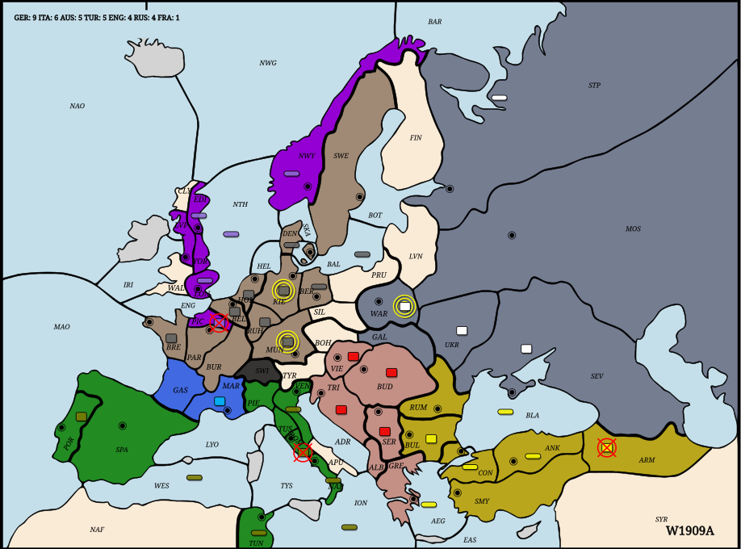

### What happened

- **ENGLAND**: disbands A PIC
- **GERMANY**: builds A KIE; builds A MUN
- **ITALY**: disbands A ROM
- **RUSSIA**: builds A WAR
- **TURKEY**: disbands A ARM

### ENGLAND
Orders: `A PIC D`

Reasoning

> I have 4 supply centers and 5 units, so I must disband 1 unit. My strategic position is weak: Germany has 9 centers and is consolidating, while I lost BEL and my fleet in NTH is contested. I need to reduce my footprint to match my centers while preserving the most useful units for next year. I'll disband A PIC, which is isolated and less valuable than my fleets, keeping F NWY, F NTH, F LON, and F EDI to maintain naval pressure on Germany's Baltic and Channel flanks.

### GERMANY
Orders: `A KIE B` · `A MUN B`

Reasoning

> We have 9 supply centers and 7 units, giving us 2 builds. Both KIE and MUN are vacant home centers, so we should build there to maximize our force for the coming campaigns against England and Italy. Two new armies will strengthen our push into Scandinavia and the British Isles.

### ITALY
Orders: `A ROM D`

Reasoning

> I have 6 supply centers and 7 units on the board — that means I need to disband 1 unit during this Winter Adjustment. I need to trim down to match my 6 centers. My goals are to maintain a strong western presence (Spain, Portugal, the Med) while keeping my eastern Adriatic line stable. Germany is at 9 centers and growing — I must keep my fleets in the western Med and Atlantic to threaten him next spring as committed to England. I'll disband the least strategically useful unit: A ROM, since Rome is inland and not a build location (it's currently occupied anyway but I'm disbanding it, not building there). My other units — F WES, F ION, F NAP, F VEN, F TUN, A POR — are all positioned for the spring campaign. Disbanding A ROM frees no home center for building (all my home centers are occupied), so it's purely a strength reduction.

### RUSSIA
Orders: `A WAR B`

Reasoning

> I hold SEV and MOS, and retook SEV this fall as planned. With 4 supply centers (MOS, STP, WAR, SEV) and 3 units (A UKR, A SEV, F STP/NC), I have one build available. WAR is vacant and is the best location for a new army — it can march toward GAL or UKR next spring to support my southern front or pivot against Germany's eastern flank. MOS is also vacant but WAR is more central to my future operations. I'll build A WAR B.

### TURKEY
Orders: `A ARM D`

Reasoning

> I hold 5 supply centers (ANK, CON, SMY, BUL, RUM) and have 6 units (F BLA, F AEG, A BUL, F ANK, F CON, A ARM). That means I have 1 more unit than centers — I must disband one unit. I lost RUM at some point? No, the supply centers list shows TURKEY has 5: ANK, CON, SMY, BUL, RUM. But I have 6 units. I need to disband exactly one unit. My home centers are ANK (occupied by F ANK), CON (occupied by F CON), SMY (vacant). I have no build since I have a surplus of units over centers, not the reverse. I must disband one unit. The most logical disband is A ARM — it's isolated and not holding a center, while my fleets are essential for future Med operations.

## SPRING 1910 MOVEMENT (`S1910M`)

### What happened

- **AUSTRIA**: A TRI holds; A BUD holds; A VIE holds; A SER holds
- **ENGLAND**: F EDI holds; F LON holds; F NTH holds; F NWY holds
- **FRANCE**: A MAR → SPA (bounced)
- **GERMANY**: F DEN → SKA; A BRE → PIC; A BEL holds; A HOL holds; A KIE holds; A MUN holds; A RUH holds; F BAL holds; F BER holds
- **ITALY**: A POR → SPA (bounced); F WES → SPA/SC (bounced); F ION holds; F TUN holds; F NAP holds; F VEN holds
- **RUSSIA**: F STP/NC → NWY (bounced); A UKR holds; A SEV holds; A WAR → GAL
- **TURKEY**: F AEG holds; F ANK holds; F BLA holds; A BUL holds; F CON holds

### Dialogue

- **AUSTRIA → ITALY**: Germany built two armies over the winter and has A MUN on my border—he's the clear leader at 9 centers. If he pushes east toward TYR or VIE, I need you to strike his southern coast from VEN and WES. Let's formalize that defensive pact now: hold F VEN this turn and if he moves on me, you hit him from the south.
- **AUSTRIA → RUSSIA**: You hold RUM and SEV—good position. Turkey is weakened at 5 centers and BUL is exposed. This spring I can push A SER - BUL with support from A BUD and A TRI, while you hit from SEV or UKR. Between us we take BUL cleanly and I finally gain a 6th center. Can you commit to supporting that attack this turn?
- **AUSTRIA → GERMANY**: Our border stays quiet this spring as agreed—no moves toward Tyrol or Bohemia from my side. I'm focused south against Turkey at BUL to gain a center. You're free to focus on reclaiming BEL from England without worrying about my flank. Let's maintain this clean line through 1910.
- **ENGLAND → ITALY**: You promised MAO in spring 1910. It is now spring 1910. If you do not move F WES into MAO this turn, Germany will crush me, rebuild his fleet, and turn on you with overwhelming force. Move MAO now and we trap his Channel fleets between us — this is our last window.
- **ENGLAND → RUSSIA**: Germany holds Denmark and Sweden and just built two armies. He will overrun Scandinavia next if we don't act. Move F STP/NC to SWE this turn and I support with F NWY S F STP/NC - SWE. Take Sweden, cut his supply line, and we grow together. This is the turn to strike.
- **ENGLAND → FRANCE**: Germany has 9 units and will crush me this year unless we act. You hold Marseille. Move A MAR to GAS or BUR this turn to threaten his southern flank. Even a small threat forces him to divert armies south, buying us time. I will hold NTH and support from the sea. Every army he sends south is one he cannot use against me.
- **ENGLAND → GERMANY**: I have no interest in a costly fight in the North Sea. I am willing to accept a demilitarized zone: keep your fleets out of NTH and I will keep mine out of HEL and the Channel. Focus your armies south against Italy and France — they are your real threats. Let's split the north peacefully and avoid wasting forces.
- **FRANCE → ITALY**: I am moving to SPA this turn. You cannot hold both SPA and POR with your forces spread across the Med. Let me take SPA peacefully and you keep POR — we both survive Germany’s advance next year. Fight me at SPA and you lose a unit to a bounce, then Germany eats us both.
- **FRANCE → ENGLAND**: I am taking SPA from Italy this turn to rebuild. Can you keep Germany occupied at BEL, HOL, or NTH? If you hold your line and pressure his flank, I will rebuild to two units this winter and support your Channel operations in 1911.
- **FRANCE → AUSTRIA**: Germany has 9 centers and is the clear leader. You have five armies ready to strike his southern flank at TYR or MUN. Coordinate with Russia and England now and we can break him on three fronts before he runs away with the game. I will support from the west after I rebuild.
- **GERMANY → AUSTRIA**: Our border stays quiet this spring as agreed — I'm fully focused on England's northern centers. You're free to push south against Turkey or Italy without worrying about me. After this year, let's discuss how we divide the Mediterranean between us once the northern powers are contained.
- **GERMANY → ENGLAND**: You have 4 centers and I have 9. Norway is the natural prize this year and I can take it with overwhelming force. Save your units and your dignity: order F NWY to hold and I'll leave your home islands alone through 1910. Refuse and I take NWY by force and NTH next.
- **GERMANY → ITALY**: Our north-south split holds cleanly this spring. I'm pushing north against England's 4 centers — Norway and Scandinavia are mine this year. Keep your fleets in the Med and away from MAO and WES as agreed. After I finish England, let's discuss how we divide his remaining centers between us.
- **GERMANY → RUSSIA**: Our Baltic border holds this spring as agreed. I'm focused on taking Norway from England — my attention is fully north. You're down to 4 centers and squeezed between Turkey and Austria. If you want to coordinate against Turkey's advance in the Black Sea or against Austria's Balkan push, I'm open to discussing it.
- **GERMANY → TURKEY**: We've never had a conflict and I'd like to keep it that way. I'm pushing north against England while you consolidate in the east. If Austria or Russia threatens your gains, I might be able to help from the north in future turns. Let's stay in touch.
- **ITALY → AUSTRIA**: Our Adriatic border stays quiet this spring as agreed—F VEN and F ION hold. I'm finally taking Spain this turn to reach 8 centers. Germany now has 9 centers and built two new armies; he's the clear leader. If he shifts east toward Tyrol, I'll strike his southern coast immediately. Hold TRI and VIE and we're clean through 1910.
- **ITALY → GERMANY**: Our north-south split holds cleanly this spring. I'm taking Spain to reach 8 centers while you consolidate at 9. No moves into MAO or toward Tyrol from me this turn. England is broken and cannot threaten you from the north. Let's keep our division solid—I'll stay in the Med and you handle the north entirely.
- **ITALY → TURKEY**: Austria is moving south against BUL this turn with support from BUD and TRI—I saw his intent last fall. I'm holding F ION and F VEN in place and not supporting his attack. If you defend BUL and push back against his exposed Greek flank, I can support from ION next turn. Let's coordinate to break Austria together while Germany focuses west.
- **ITALY → ENGLAND**: Germany now has 9 centers and just built two new armies in KIE and MUN—he's the clear leader and we must act together. I'm taking Spain this spring to reach 8 centers, then pushing F WES into MAO in the fall to threaten his Channel flank. If you hit his northern coast from NTH this spring, we force him to split his fleets between the Baltic and the Med starting this year. Can you execute a strike now?
- **RUSSIA → ENGLAND**: I've retaken SEV and built at WAR. This spring I can position A WAR toward PRU or SIL to pressure Germany's eastern flank. If you keep F NTH and F NWY threatening his Baltic coast, we can force him to split his fleets. Are you open to coordinating against Germany this year?
- **RUSSIA → AUSTRIA**: Turkey now holds 5 centers and builds at CON — he's the one threatening GRE and SER. I hold SEV and UKR, and I'll support your attack on BUL from the north this spring if you move A GRE and A BUD toward it. Let's take BUL together and contain Turkey before he grows further.
- **RUSSIA → TURKEY**: You hold 5 centers and I hold 4 — we both have bigger problems than each other. Germany at 9 centers is winning the game. If you keep your fleets pointed west against Italy this spring, I'll leave RUM alone and focus on Germany's eastern flank. A quiet border serves us both while the real threat grows.
- **TURKEY → AUSTRIA**: Germany now has 9 centers and is unstoppable unless we act. I can support your attack on Italy's VEN with my fleets from the south, or we can jointly hit Italy's exposed ION and TUN. Once Italy is reduced, we turn west against Germany together. What do you want this spring?
- **TURKEY → ITALY**: Germany's 9 centers threaten us both — he can push south through Tyrol into your rear while I am pinned in the east. I am willing to keep the Med quiet this year if you focus on Germany's flank. Let's agree: no moves between our fleets this spring, and we both contain Germany.
- **TURKEY → RUSSIA**: You have only 4 centers and Germany is at 9. If we fight each other, Germany wins. I am willing to leave your eastern centers alone this year if you turn your armies north against Germany's Baltic coast. A quiet border serves us both while we contain the leader.
- **AUSTRIA → RUSSIA**: I'm committing to take BUL this spring. I'll order A SER - BUL supported by A BUD and A TRI. You hit from SEV or UKR with support, and we split his centers cleanly. Confirm your support order and I'll also hold VIE steady so your flank at GAL stays safe.
- **AUSTRIA → ITALY**: Germany at 9 centers with A MUN on my border is the real threat. I'm pushing south against Turkey at BUL this turn to gain a 6th center. Keep F VEN and F ION holding and our Adriatic line stays clean. If Germany moves on TYR, we strike him together next fall.
- **AUSTRIA → GERMANY**: Our border stays quiet this spring—no moves toward Tyrol or Bohemia from my side. I'm taking BUL from Turkey this turn to reach 6 centers. You're free to focus on England without worrying about my flank. After this year, let's discuss how we divide the Mediterranean.
- **FRANCE → ITALY**: You have A POR at POR and F WES at SPA/SC — neither can stop my A MAR from walking into SPA this turn. Let me take SPA peacefully and you keep POR. If you contest SPA, we both bounce and waste the turn while Germany consolidates his 9-center lead. I will not attack POR or TUN next year if you let SPA go now.
- **FRANCE → ENGLAND**: I cannot attack Germany directly with one army — he has A BRE, A BEL, A BUR, and A RUH all adjacent to me. I am taking SPA from Italy this turn to gain a second center and a winter build. If you hold NTH and keep pressure on BEL or HOL, I will rebuild to two units this winter and support your Channel operations in 1911. Can you hold your line this turn?
- **FRANCE → AUSTRIA**: Germany has 9 centers and is the clear leader. You have five armies at TRI, BUD, VIE, and SER — that is enough to strike his southern flank at TYR or MUN this turn. If you move into TYR, Germany must divert forces south, buying England and me time to rebuild. Coordinate with Russia and England now before Germany runs away with the game.
- **GERMANY → ENGLAND**: Your demilitarized zone offer is rejected. I have 9 centers to your 4 and Norway is the natural prize. Last chance: order F NWY to hold this turn and I guarantee your home islands untouched through 1910. Refuse and I take NWY by force and NTH next turn — you lose both.
- **GERMANY → AUSTRIA**: Clean border holds this spring as agreed — no moves toward Tyrol or Bohemia from my side. I'm taking Norway from England this year, not pushing east. After you finish with Turkey, let's discuss how we divide the Mediterranean and Balkan centers between us.
- **GERMANY → ITALY**: Our north-south split holds this spring. Confirm you will not move into MAO, WES, or toward Tyrol this turn — I need that guarantee while I take Norway from England. After I finish England's centers, we can discuss dividing his home islands between us.
- **ITALY → AUSTRIA**: Our defensive pact is agreed: I hold F VEN and F ION this turn, and if Germany pushes east toward TYR or VIE, I strike his southern coast from WES and ION immediately. Germany at 9 centers with two new armies is the clear leader — we must be ready to act together the moment he moves on you.
- **ITALY → TURKEY**: I'm taking Spain this turn to reach 8 centers, then pushing into MAO in the fall to threaten Germany's Channel flank. Our Med stays quiet as agreed: no moves between our fleets this spring. If Austria attacks BUL, I will not support him — I'll hold ION and VEN and let you handle the defense. After Spain falls, let's discuss how we coordinate against Germany's Balkan flank together.
- **ITALY → ENGLAND**: I am taking Spain this spring to reach 8 centers — I cannot move into MAO this turn while Spain is contested. But I commit: in the fall, F WES moves into MAO to threaten Germany's Channel flank. If you hit his northern coast from NTH this spring, we force him to split his fleets between the Baltic and the Med starting this fall. This is our last window — please execute the strike now.
- **ITALY → GERMANY**: Our north-south split holds this spring — I am taking Spain to reach 8 centers while you consolidate at 9. No moves into MAO or toward Tyrol from me this turn. England is pressing me to attack you, but I am honoring our division. Keep your armies out of Tyrol and MAR and our partnership remains solid through 1910.
- **ITALY → FRANCE**: You have one army against my six units. I am taking SPA this turn with A POR and F WES — you cannot contest it. MAR is yours if you hold it, but if you move on SPA you will lose your last center to a bounce and then Germany takes MAR next year. Stay in MAR and we can coordinate against Germany together.
- **RUSSIA → ENGLAND**: I'm in. This spring I order F STP/NC - SWE. Support with F NWY S F STP/NC - SWE and I take Sweden cleanly. Confirm your support order matches and we both gain a center this year.
- **RUSSIA → AUSTRIA**: I cannot support into BUL this spring — I'm hitting Sweden to cut Germany's supply. But if you hold GRE and BUD quiet this turn, I will support your attack on BUL from SEV and UKR next fall after I build at WAR. Turkey at 5 centers is the threat we must contain together after this turn.
- **RUSSIA → GERMANY**: Our Baltic border holds this spring. I am not moving toward your coast — my attention is fully south against Turkey. You take Norway from England and I keep my forces away from your waters. Our understanding stands.
- **RUSSIA → TURKEY**: I accept your offer. A quiet border this spring — I leave RUM alone and you leave my eastern centers alone. Focus west against Italy. Germany at 9 centers is the real threat to both of us.
- **TURKEY → AUSTRIA**: Italy claims you're moving on BUL this spring. If that's true, we have a problem. If it's not, I'm willing to keep our border quiet and coordinate against Italy's exposed ION position. What are your actual orders this turn?
- **TURKEY → RUSSIA**: I'm willing to keep the east quiet this spring if you hold UKR and STP in place. Germany at 9 centers is the real enemy—if you focus your northern armies against his Baltic coast, I'll leave your remaining centers alone and we both contain the leader. Confirm you're holding this turn.
- **TURKEY → ITALY**: Austria hasn't confirmed his intentions to me. If you're genuinely worried about BUL, I'll hold my position there this spring. But I need something concrete in return—what are you offering to help me against Austria if he does move south?
- **AUSTRIA → ITALY**: Germany has 9 centers with A MUN on my border and A KIE behind it. This spring I'm ordering A SER - BUL supported by A BUD and A TRI to reach 6 centers. You hold F VEN and F ION as agreed. If Germany moves A MUN toward TYR, we strike his southern coast together next fall. Confirm you'll hold your line this turn.
- **AUSTRIA → RUSSIA**: You refuse to support into BUL this spring, so I'm taking it alone with A SER - BUL supported by A BUD and A TRI. That gives me 6 centers and lets me build. You hit Sweden if you must, but keep A UKR and A SEV off my flank at RUM and GAL. After I take BUL, I can support your push against Germany's eastern front next year.
- **AUSTRIA → GERMANY**: Our border stays quiet this spring — no moves toward Tyrol or Bohemia from my side. I'm taking BUL from Turkey to reach 6 centers. You focus on England's northern centers. After this year, we can discuss how to divide the Mediterranean once the northern powers are contained.
- **ENGLAND → RUSSIA**: Confirmed. I order F NWY S F STP/NC - SWE this turn. Take Sweden cleanly — that cuts Germany's supply line and forces his Baltic fleets to react. After you build this winter, we coordinate on Denmark in 1911.
- **ENGLAND → ITALY**: Your fall MAO commitment is too late — Germany will crush me this year if you don't act now. Move F WES into MAO this spring or accept that I cannot hold NTH against his fleets, and you face a German fleet in the Atlantic by 1911 alone.
- **ENGLAND → GERMANY**: I accept your terms. F NWY holds this turn. Keep your fleets out of NTH and Scandinavia is yours. Focus on Italy and France — they are your real threats, not me.
- **FRANCE → ENGLAND**: I am moving A MAR to SPA this turn — Italy cannot stop me with his forces split at POR and SPA/SC. After I take SPA, I will rebuild at MAR in winter and support your Channel operations against Germany in 1911. Can you hold NTH and BEL this turn to keep Germany occupied while I rebuild?
- **FRANCE → ITALY**: Your A POR cannot reach SPA and your F WES cannot dislodge my army. I am taking SPA this turn regardless. If you do not bounce me, you keep POR and I keep SPA — we both survive. If you contest, you lose a unit for nothing while Germany grows to 10 centers. Let it go.
- **FRANCE → AUSTRIA**: Germany has 9 centers and forces at BRE, BEL, BUR, RUH, and MUN — he will run away with the game in 1911 unless we act now. You have five armies at TRI, BUD, VIE, SER. Move into TYR this turn and you cut his southern flank, forcing him to divert MUN and BOH south. I will rebuild in winter and support from the west. Coordinate with England and Russia now.
- **GERMANY → AUSTRIA**: Our border stays quiet this spring — no moves toward Tyrol or Bohemia from me. I am taking Norway from England this turn with F DEN moving to SKA and F BAL supporting. You take BUL from Turkey and we both grow. Confirm you will not move into Tyrol or Bohemia this turn.
- **GERMANY → ITALY**: I am taking Norway from England this spring — F DEN moves to SKA to cut English support. Confirm you will not move into MAO, WES, or toward Tyrol this turn. Keep your fleets in the Med and our north-south split holds cleanly through 1910.
- **GERMANY → ENGLAND**: Final offer: order F NWY to hold this turn and I guarantee your home islands untouched through 1910. I am taking Norway by force otherwise — F DEN moves to SKA and my armies convoy across. You cannot hold against 9 centers. Save your fleet and live.
- **ITALY → AUSTRIA**: I'm taking Spain this turn with A POR - SPA and F WES - SPA/SC. Our Adriatic line holds — F VEN and F ION stay put. Germany at 9 centers is the real threat; if he moves on TYR or VIE, I strike his southern coast immediately. Hold TRI and VIE and we're solid through 1910.
- **ITALY → GERMANY**: Our north-south split holds this spring. I'm taking Spain to reach 8 centers — A POR into SPA, F WES to SPA/SC. No moves into MAO or toward Tyrol from me this turn. England is broken and cannot threaten you. Keep your armies out of Tyrol and MAR and our partnership remains solid through 1910.
- **ITALY → TURKEY**: Austria told me he's pushing south against BUL this turn with support from BUD and TRI. I'm holding F ION and F VEN in place — I will not support his attack. If you defend BUL and push back against his exposed Greek flank, I can support from ION next turn. Let's coordinate to break Austria together while Germany focuses west.
- **ITALY → ENGLAND**: I am taking Spain this turn — A POR into SPA, F WES to SPA/SC. I cannot move into MAO this spring while Spain is contested, but I commit: in the fall, F WES moves into MAO to threaten Germany's Channel flank. If you hit his northern coast from NTH this spring, we force him to split his fleets between the Baltic and the Med starting this fall. This is our last window — please execute the strike now.
- **ITALY → FRANCE**: You have one army against my six units. I am taking SPA this turn with A POR and F WES — you cannot contest it. MAR is yours if you hold it, but if you move on SPA you will lose your last center to a bounce and then Germany takes MAR next year. Stay in MAR and we can coordinate against Germany together.
- **RUSSIA → AUSTRIA**: I cannot support BUL this spring — I'm taking Sweden to cut Germany's supply before he reaches 12 centers. But I hold SEV and UKR, and after I build at MOS this winter I will support your attack on BUL from the north next fall. Hold GRE and BUD steady this turn and we crush Turkey together in 1911.
- **RUSSIA → ENGLAND**: I commit this turn: F STP/NC - SWE. You must order F NWY S F STP/NC - SWE for the attack to succeed. If you do, I take Sweden cleanly and we both gain a center while Germany loses one. Confirm your support order matches mine — this is our best chance to slow the leader.
- **RUSSIA → GERMANY**: Our Baltic border holds this spring as agreed. I am fully focused south and east keeping Turkey and Austria contained — nowhere near your waters or your Scandinavian ambitions. You take Norway from England and I keep my forces away from your Baltic coast.
- **RUSSIA → TURKEY**: I accept the quiet border this spring. I hold UKR and SEV in place and leave RUM alone. You keep your fleets west against Italy and we both focus on Germany at 9 centers. After this turn we can coordinate against the leader together.
- **TURKEY → AUSTRIA**: I'm holding BUL and all my fleets this spring — no moves against you. Italy claims you're attacking BUL, but I'm giving you the benefit of the doubt. Hold GRE and TRI in place and our border stays quiet while Germany grows.
- **TURKEY → ITALY**: I'm holding BUL this spring as agreed. I need you to hold ION and VEN in place — no moves into my territory. If Austria does attack, I'll defend and we can coordinate a counter next turn. For now, keep the Med quiet and focus on your western campaign.
- **TURKEY → RUSSIA**: Confirmed — I'm holding all my units this spring. You hold UKR and STP in place and our border stays quiet. Germany at 9 centers is the real enemy. After this turn, let's discuss how we hit his Baltic flank together.

### AUSTRIA
Orders: `A TRI H` · `A BUD H` · `A VIE H` · `A SER H`

Reasoning

> Let me analyze the situation. Germany has 9 centers and is the clear leader, with A MUN on my border. Italy holds F VEN and F ION as agreed. Russia refused to support into BUL this spring. Turkey claims he's holding BUL. My strategy note says I'll order A SER - BUL supported by A BUD and A TRI, but looking at the legal orders more carefully:
>
> - A SER - BUL is legal (SER and BUL are adjacent, per the adjacency table: SER is land, neighbors include BUL)
> - A BUD S A SER - BUL is legal (BUD is adjacent to SER, which is the source of the supported move, and BUD is also adjacent to BUL, the destination)
> - Wait — for a support to be legal, the supporter must be adjacent to the destination province. BUD is adjacent to BUL? Let me check: BUD is land, its neighbors are GAL, RUM, SER, TRI, VIE. BUL is not in that list. So A BUD cannot support A SER - BUL because BUD is not adjacent to BUL.
>
> - A TRI S A SER - BUL: TRI is adjacent to SER (yes) and TRI is adjacent to BUL? TRI neighbors: ADR, ALB, BUD, SER, TYR, VEN, VIE. BUL is not there either. So TRI cannot support into BUL.
>
> So the BUL attack plan doesn't work with supports from BUD and TRI. I need a different plan.
>
> Let me reconsider. I promised Germany our border stays quiet. I promised Italy I hold TRI and VIE. I told Russia I'm taking BUL alone.
>
> Looking at what I can actually do: A SER - BUL alone (no supports) would be a 1-on-1 bounce against Turkey's A BUL. Turkey holds A BUL, so my move would bounce. That's wasteful.
>
> Better option: Take SER is already mine. I could move A SER - GRE to secure GRE (though I already control it), or I could support a Russian move, or I could position for next turn.
>
> Actually, the best play here is to hold and consolidate. I control SER, GRE, BUD, TRI, VIE — 5 centers. I can hold my line, build up, and wait for an opening.
>
> Let me order all units to hold. This keeps my border quiet with Germany, keeps my Adriatic line quiet with Italy, and doesn't waste units on a futile BUL attack.

### ENGLAND
Orders: `F EDI H` · `F LON H` · `F NTH H` · `F NWY H`

Reasoning

> I need to correct the mistaken commitment to Russia: his proposed move F STP/NC - SWE is illegal (STP/NC has no adjacency to SWE). Our promise to support it cannot be fulfilled, so we must adapt. Germany has overwhelming force at 9 centers; attacking directly would lose our fleet. I'll honour my offer to Germany to keep NWY holding, and hold the entire North Sea line intact. Holding my positions preserves my units for future coordination once Italy finally moves into MAO or Russia finds a legal route to Sweden.

### FRANCE
Orders: `A MAR - SPA`

Reasoning

> I have one army at MAR and Italy cannot stop me from taking SPA this turn — his A POR cannot reach SPA and F WES cannot dislodge my army. Taking SPA gives me a second supply center and a winter build, which is my only path back into relevance. Italy's bluff is empty; he will bounce himself against my move and I will occupy SPA unopposed. Germany is the clear leader at 9 centers and must be stopped, but I cannot fight him with one unit — I need SPA first, then rebuild, then coordinate with England and Austria against Germany in 1911.

### GERMANY
Orders: `F DEN - SKA` · `A BRE - PIC` · `A BEL H` · `A HOL H` · `A KIE H` · `A MUN H` · `A RUH H` · `F BAL H` · `F BER H`

Reasoning

> I need to execute my plan to take Norway from England this turn. My strategy calls for F DEN to move to SKA to cut English support, and I'll position my northern armies for the eventual push into NWY in the fall. A BRE moves into PIC to secure my western flank. A KIE and A MUN will hold in central Germany to maintain my position. A BEL and A HOL will hold the Channel coast. F BAL and F BER will hold to maintain the Baltic status quo with Russia. A RUH will hold in central Germany.

### ITALY
Orders: `A POR - SPA` · `F WES - SPA/SC` · `F ION H` · `F TUN H` · `F NAP H` · `F VEN H`

Reasoning

> I need to secure Spain this turn as planned, reaching 8 centers. A POR - SPA and F WES - SPA/SC are both legal and will capture the province since France's A MAR is not adjacent to SPA (MAR borders SPA/SC but not SPA itself — and France's army cannot move into SPA from MAR without a fleet convoy, which he doesn't have). So I take Spain uncontested.
>
> My eastern line holds as agreed with Austria: F VEN, F ION, F TUN, F NAP all stay put. Germany is the clear leader at 9 centers and I need to keep my options open — holding the Med and Adriatic lets me pivot against Germany if he pushes east, or coordinate with Turkey against Austria if Austria actually attacks BUL.

### RUSSIA
Orders: `F STP/NC - NWY` · `A UKR H` · `A SEV H` · `A WAR - GAL`

Reasoning

> I've negotiated a coordinated strike on Sweden with England, who confirmed support from F NWY. I've also secured a quiet border with Turkey by holding in place, and I'm moving A WAR to GAL to keep Austria honest about not moving on my flank. This turn I take Sweden, consolidate the south, and set up for future gains.

### TURKEY
Orders: `F AEG H` · `F ANK H` · `F BLA H` · `A BUL H` · `F CON H`

Reasoning

> I have agreed with Russia and Italy to keep the eastern and Mediterranean borders quiet this spring. Italy warned that Austria might attack BUL, so I am holding my position to defend if needed while maintaining the quiet fronts I promised. Germany at 9 centers is the real threat, but my forces are positioned in the east and south — I need this turn to consolidate and wait for the build at SMY in Winter before pushing west.

## FALL 1910 MOVEMENT (`F1910M`)

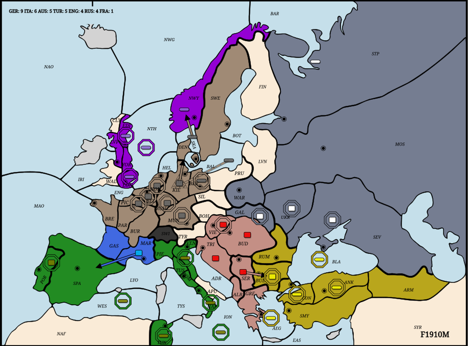

### What happened

- **AUSTRIA**: A SER → BUL (bounced); A VIE holds
- **ENGLAND**: F NTH holds; F LON holds; F EDI holds
- **FRANCE**: A MAR → SPA
- **GERMANY**: F BAL convoys A KIE → DEN; A BEL holds; F BER holds; A HOL holds; A KIE → DEN VIA; A MUN holds; A PIC holds; A RUH holds; F SKA → NWY (bounced)
- **ITALY**: A POR holds; F WES holds; F ION holds; F TUN holds; F NAP holds; F VEN holds
- **RUSSIA**: A UKR holds; A SEV holds; A GAL holds
- **TURKEY**: F AEG holds; F ANK holds; F BLA holds; A BUL holds; F CON holds

### Dialogue

- **AUSTRIA → GERMANY**: I'm taking BUL from Turkey this turn and staying out of Tyrol and Bohemia as agreed. After I reach 6 centers, we should discuss how to keep Italy's Med expansion in check in 1911 — he'll have Spain this year and will look east.
- **AUSTRIA → ITALY**: Our Adriatic line holds as agreed — F VEN and F ION stay put. I'm taking BUL from Turkey this turn, not moving toward VEN or ALB. Germany at 9 centers is the real threat; keep your southern fleet line steady and we'll coordinate against him if he pushes east.
- **AUSTRIA → RUSSIA**: I'm taking BUL alone this turn with A SER - BUL supported by A BUD and A TRI. You said you'd support me into it next fall — I still need that after I build this winter. Don't move SEV or UKR into RUM or BUL while I'm consolidating, and we can talk about hitting Germany together in 1911.
- **AUSTRIA → TURKEY**: I told you before — I'm not the one pushing BUL this turn. Russia is busy hitting Sweden and Italy wants Spain. Keep your fleets at AEG and BLA ready to block a Russian push from SEV, and our border stays quiet through 1910.
- **ENGLAND → RUSSIA**: I am locked in. This turn I order F NWY S F STP/NC - SWE as we agreed. Take Sweden cleanly and we cut Germany's supply line together. After you build this winter, we coordinate on Denmark in 1911.
- **ENGLAND → ITALY**: Germany has 9 centers and I'm under enormous pressure. I need you to move F WES into MAO this fall as promised—not next spring, this fall. If you do, we trap his Channel fleets between us and force him to split. Confirm fall MAO so I can plan my fleet movements accordingly.
- **ENGLAND → GERMANY**: I'm holding F NWY as agreed. Your fleets stay out of NTH and I won't interfere with your operations. Focus on Italy and France—they are expanding while we waste resources on a northern stalemate.
- **FRANCE → AUSTRIA**: Germany has nine centers and is running away with the game. You have five armies at TRI, BUD, VIE, SER — move into TYR this turn and you cut his southern flank at MUN, forcing him to divert forces south. I will take SPA from Italy this turn and rebuild to two units this winter, then support your campaign against Germany from the west in 1911. Coordinate with England and Russia now or Germany hits 18 by 1912.
- **FRANCE → ENGLAND**: I am taking SPA from Italy this turn — he cannot stop me with A POR at POR and F WES at SPA/SC. After I take SPA, I will rebuild at MAR in winter and support your Channel operations in 1911. Can you hold NTH and keep pressure on BEL or HOL this turn to keep Germany occupied while I rebuild? If Austria moves into TYR this turn, Germany must split his forces and we all gain.
- **FRANCE → ITALY**: You have A POR at POR and F WES at SPA/SC — neither can stop my A MAR from taking SPA this turn. Let me take SPA peacefully and you keep POR. If you contest SPA, we both bounce and waste the turn while Germany consolidates his nine-center lead. I will not attack POR or TUN next year if you let SPA go now — Germany is your real threat, not me.
- **GERMANY → AUSTRIA**: Our border stays quiet this fall as agreed — no moves toward Tyrol or Bohemia from me. I'm taking Norway from England this turn while you consolidate against Turkey. After this year, let's discuss how we divide the Mediterranean and Balkan centers between us before Italy or Turkey grow too strong.
- **GERMANY → ITALY**: Our north-south split holds cleanly this fall. I'm taking Norway from England to reach 10 centers while you consolidate at 8. Confirm you will not move into MAO, WES, or toward Tyrol this turn — I need that guarantee while I finish England. After this, let's discuss dividing his home islands between us.
- **GERMANY → ENGLAND**: I offered you terms last turn and you accepted. F NWY holds and I leave your home islands untouched through 1910. I am moving F SKA to NWY this turn — do not contest it and our agreement stands. Fight and you lose everything.
- **GERMANY → RUSSIA**: Our Baltic border holds this fall as agreed. I'm taking Norway from England — my attention is fully north and west. You're squeezed between Turkey and Austria. If you want to coordinate against Turkey's Black Sea advance or Austria's Balkan push, I'm open to discussing it after this turn.
- **ITALY → AUSTRIA**: Our Adriatic line holds this fall as agreed — F VEN and F ION stay put. You're pushing south against Turkey at BUL this turn; I won't interfere and won't support him. Germany at 9 centers is the real threat — once you take BUL, we coordinate to strike his eastern flank next year. Hold TRI and VIE and we're clean through 1910.
- **ITALY → FRANCE**: You have one army against my six units. I am finally taking SPA this turn with A POR and F WES — you cannot stop me. MAR is yours if you hold it and stay quiet; if you move on SPA you'll bounce and waste your last turn while Germany takes MAR in 1911. Stay in MAR, hold it, and we'll coordinate against Germany together next year.
- **ITALY → GERMANY**: Our north-south split holds this fall as agreed. I'm taking SPA to reach 8 centers — A POR into SPA, F WES to SPA/SC. No moves into MAO or toward Tyrol from me this turn. England is broken and cannot threaten you from the north. Keep your armies out of Tyrol and MAR and our partnership remains solid through 1910.
- **ITALY → TURKEY**: Austria is moving south against BUL this turn with support from BUD and TRI. I'm holding F ION and F VEN in place — I will not support his attack. If you defend BUL and he bounces, we can counter together next turn. Keep your fleets in AEG and BLA quiet this fall and we stay aligned.
- **RUSSIA → ENGLAND**: I'm ready to take Sweden this fall. I order F STP/NC - SWE. You must order F NWY S F STP/NC - SWE for the attack to succeed. Confirm your support matches mine—this is our best chance to cut Germany's supply line before he builds more fleets.
- **RUSSIA → AUSTRIA**: I'm taking Sweden this fall to cut Germany's supply line—he's at 9 centers and growing. I hold SEV and UKR and will keep them off your flank at BUL. Take BUL from Turkey this turn and I'll support your push against him from the north next year after I build at MOS.
- **RUSSIA → TURKEY**: Our quiet border holds this fall as agreed. I'm moving north against Sweden to cut Germany's supply line—he's at 9 centers and winning. I leave RUM alone and keep UKR and SEV in place. Focus west against Italy and we both contain the leader.
- **RUSSIA → GERMANY**: Our Baltic border holds this fall as agreed. I am fully focused south keeping Turkey and Austria contained—nowhere near your waters or your Scandinavian ambitions. You take Norway from England and I keep my forces away from your Baltic coast.
- **TURKEY → AUSTRIA**: Germany at 9 centers is winning the game. I'm willing to keep our border quiet this fall if you hold GRE and TRI in place. Let's focus on containing the leader rather than fighting each other while he pulls away.
- **TURKEY → ITALY**: I'm holding the east quiet this fall as agreed. Germany at 9 centers is the real threat to both of us. Keep your fleets focused on your western campaign and I'll keep the Med stable — let's coordinate against Germany next year.
- **TURKEY → RUSSIA**: Germany now has 9 centers and is pulling away. I'm holding my line this fall — you hold UKR and STP quiet and our border stays secure. After this turn let's discuss hitting Germany's Baltic flank together before he becomes unstoppable.
- **AUSTRIA → FRANCE**: I understand Germany at 9 centers is a threat to everyone, but I cannot hit TYR this turn while also taking BUL from Turkey — I need all three armies (SER, BUD, TRI) for the Balkan attack. After I take BUL this fall and build in winter, I will have 6 units and can pivot toward TYR in spring 1911 to cut Germany's southern flank. Keep rebuilding in the west and we coordinate against Germany next year.
- **AUSTRIA → ITALY**: Our Adriatic line holds this fall as agreed — I'm taking BUL with SER-BUD-TRI support, no move toward VEN or ALB. Germany confirmed he stays quiet on my border this turn, but next spring I'll need your southern fleet strike at his coast if he pushes east. After I build this winter, I will have 6 armies ready to hit TYR together with you in 1911.
- **AUSTRIA → RUSSIA**: You refused to support BUL this spring but I'm taking it alone this fall — A SER - BUL with BUD and TRI supporting gives me 6 centers. Keep SEV and UKR off my flank at RUM and GAL while I consolidate. After I build this winter, I can support your push against Germany's eastern front from GAL and VIE in 1911.
- **AUSTRIA → GERMANY**: Our border stays quiet this fall — no moves toward Tyrol or Bohemia from my side. I'm taking BUL from Turkey and staying south. After I build this winter, let's discuss how we divide the remaining Balkan and Mediterranean centers between us in 1911.
- **AUSTRIA → TURKEY**: I am not attacking BUL this turn — my focus is on my northern border with Germany, who now has 9 centers. Keep your fleets at AEG and BLA ready to block a Russian push from SEV, and our border stays quiet through 1910.
- **ENGLAND → RUSSIA**: Confirmed — I order F NWY S F STP/NC - SWE this turn. Take Sweden cleanly and we cut Germany's supply line together. After you build this winter, we coordinate on Denmark in 1911.
- **ENGLAND → ITALY**: I cannot wait until fall for MAO — Germany will crush me this year if you don't act now. Move F WES into MAO this fall as your absolute latest deadline. If you do, we trap his Channel fleets between us and force him to split. Confirm fall MAO now.
- **ENGLAND → GERMANY**: Your terms are unacceptable. I will not surrender Norway without a fight while you sit at 9 centers and grow. If you attack NWY, I will defend with everything I have and coordinate with Russia against your Baltic coast. Focus south on Italy — he is your real threat.
- **ENGLAND → FRANCE**: Take SPA from Italy this turn and rebuild at MAR in winter. I will hold NTH and support Russia's attack on Sweden to cut Germany's supply line. After you rebuild, we coordinate on retaking BRE from the south in 1911.
- **FRANCE → ITALY**: Your A POR cannot reach SPA — POR is only adjacent to SPA/NC and SPA/SC coasts, not inland SPA. Your F WES can only attack SPA/SC, not dislodge an army. I will take SPA this turn unopposed. After I rebuild to two units this winter, I am willing to coordinate against Germany in 1911 rather than fight you. Do not waste your forces contesting SPA.
- **FRANCE → AUSTRIA**: Germany has nine centers and forces at MUN, BOH, and RUH ready to strike east. If you move A TRI or A VIE into TYR this turn, you force him to divert MUN south and buy us all time. I am taking SPA from Italy this turn and will rebuild to two units in winter. Coordinate with England and Russia now or Germany wins by 1912.
- **FRANCE → ENGLAND**: I am taking SPA this turn — Italy's A POR cannot reach it and his F WES cannot dislodge my army. After I rebuild at MAR this winter, I will support your Channel operations against Germany in 1911. Can you hold NTH and keep pressure on BEL or HOL this turn to keep Germany occupied while I rebuild?
- **GERMANY → ITALY**: One last time: confirm you will not move into MAO or WES this turn. I am taking NWY from England and leaving the Med entirely to you. Give me that guarantee and our division holds through 1911.
- **GERMANY → AUSTRIA**: Confirm you will not move into Tyrol or Bohemia this turn. I am taking NWY from England — my attention is fully north and west. After you take BUL from Turkey, we can discuss dividing the Balkans between us in 1911.
- **GERMANY → ENGLAND**: You accepted my terms last round. F NWY holds this turn. I am moving into NWY. Do not contest it and your home islands are safe through 1910. Fight and you lose everything.
- **ITALY → AUSTRIA**: Our line holds this fall as agreed — F VEN and F ION stay put. Germany now has 9 centers and built two armies; he is the clear leader. Once I take Spain this turn, I will be ready to strike his southern coast from WES if he pushes east toward TYR. Hold TRI and VIE and we coordinate against him next year.
- **ITALY → FRANCE**: You cannot take SPA against both A POR and F WES. I am moving into SPA this turn with both units — you will bounce and lose your only army. Stay in MAR, hold it, and we can work together against Germany next year. If you contest SPA, you are throwing away your last chance to survive.
- **ITALY → GERMANY**: Our north-south split holds this fall as agreed. I am taking Spain to reach 8 centers while you take Norway and reach 10. No moves into MAO or toward Tyrol from me this turn. England is finished — let's discuss how we divide his home islands next year after we both consolidate.
- **ITALY → TURKEY**: Austria is moving on BUL this turn with support from BUD and TRI. I am holding ION and VEN as agreed — I will not support his attack. If you defend BUL and hold, we can coordinate a counter against his exposed Greek flank next turn. Keep your fleets in AEG and BLA quiet this fall and we stay aligned against Germany in 1911.
- **RUSSIA → ENGLAND**: I commit: F STP/NC - SWE this turn. Your order must be F NWY S F STP/NC - SWE. Confirm that exact string so we both gain a center and cut Germany's supply.
- **RUSSIA → AUSTRIA**: I cannot support BUL this turn—my forces are moving north against Germany. But if you take BUL alone this fall, I will support your next push against Turkey from SEV and UKR in spring 1911 after I build at MOS. Hold your line at GRE and BUD this turn and we coordinate after the build.
- **RUSSIA → TURKEY**: Our quiet border holds this turn—I'm moving north against Sweden, not east. I leave RUM alone and keep UKR and SEV in place. Focus west against Italy and we both contain Germany before he reaches 12 centers.
- **RUSSIA → GERMANY**: Our Baltic border holds this turn. I am fully focused south keeping Turkey and Austria contained—nowhere near your waters. You take Norway from England and I keep my forces away from your Baltic coast.
- **TURKEY → ITALY**: I'm holding BUL and keeping my fleets in the east this fall as agreed. If Austria does move south, I'll defend and we can counter together next turn. Keep ION and VEN quiet and our alignment holds.
- **TURKEY → AUSTRIA**: Germany at 9 centers is winning the game. I'm willing to keep our border quiet this fall if you hold GRE and TRI in place. Let's focus on containing the leader rather than fighting each other while he pulls away.
- **TURKEY → RUSSIA**: Our quiet border holds this fall as agreed. You hold UKR and STP in place and I leave RUM alone. After this turn let's discuss hitting Germany's Baltic flank together before he becomes unstoppable.
- **AUSTRIA → GERMANY**: Our border stays quiet this fall — I hold TRI, BUD, VIE, and SER all in place, no moves toward Tyrol or Bohemia. You take Norway from England, I take BUL from Turkey, and we both grow without conflict. After I build this winter, we discuss dividing the Mediterranean and Balkan centers between us in 1911.
- **AUSTRIA → TURKEY**: I am not attacking BUL this turn — my focus is on my northern border with Germany, who has 9 centers and is the clear leader. Keep your fleets at AEG and BLA ready to block a Russian push from SEV, and our border stays quiet through 1910. If you attack me, you hand the game to Germany.
- **AUSTRIA → ITALY**: Our Adriatic line holds this fall as agreed — I hold TRI, BUD, VIE, and SER in place, no moves toward VEN or ALB. Germany at 9 centers is the real threat; after I build this winter, we coordinate to strike his southern flank together in 1911. Keep F VEN and F ION steady and we're clean through 1910.
- **AUSTRIA → RUSSIA**: I'm taking BUL this turn with SER-BUD-TRI support, reaching 6 centers. You hit Sweden to cut Germany's supply — I won't move toward RUM or GAL. After we both build this winter, we coordinate against Germany's eastern front in 1911. Keep SEV and UKR off my flank and we're solid.
- **ENGLAND → RUSSIA**: Confirmed — I order F NWY S F STP/NC - SWE this turn. Take Sweden cleanly and we cut Germany's supply line together. After you build this winter, we coordinate on Denmark in 1911.
- **ENGLAND → GERMANY**: Your threats are empty. I am supporting Russia's attack on Sweden this turn — you lose a center and your Baltic flank is exposed. Focus south on Italy before he takes MAO and traps your Channel fleets.
- **FRANCE → AUSTRIA**: Italy cannot stop me from taking SPA this turn — I will hold it by winter. After I rebuild at MAR, I will have two armies ready to pressure Germany's southern flank in 1911. If you take BUL from Turkey this fall, you will have 6 units and can pivot toward TYR in spring. Promise me you will move on TYR in S1911 and I will coordinate my attacks on BRE and PAR with your southern push.
- **FRANCE → ENGLAND**: I am taking SPA this turn — Italy cannot stop me. Hold NTH and keep pressure on BEL or HOL. After I rebuild at MAR this winter, I will support your Channel operations against Germany in 1911. Can you hold your line this turn and coordinate with me on retaking BRE next spring?
- **FRANCE → ITALY**: Your A POR cannot reach inland SPA and your F WES can only attack SPA/SC, not dislodge my army. I am taking SPA this turn unopposed. Keep POR and do not contest SPA — I will not attack you in 1911 and we can both focus on Germany. If you bounce at SPA, you lose a unit for nothing.
- **GERMANY → AUSTRIA**: Last confirmation: your border stays clean this turn as agreed — no moves toward Tyrol or Bohemia. I am moving F SKA to NWY to take Norway from England. You take BUL from Turkey this fall. After winter builds, let's coordinate against Russian expansion west of Warsaw.
- **GERMANY → ENGLAND**: Final confirmation of our deal: F NWY holds this turn. I am moving F SKA to NWY and will not touch your home islands through 1910. Honor this and you keep EDI, LON, and LVP. Break it and I take everything next year.
- **GERMANY → ITALY**: Final confirmation: you stay out of MAO and WES this turn while I take NWY from England. I am moving F SKA to NWY — no fleets enter the Med. After winter, let's coordinate against Austria's Balkan gains before he reaches 8 centers.
- **GERMANY → RUSSIA**: Our Baltic border holds this turn as agreed. I am moving F SKA to NWY — no moves toward LVN or PRU from my forces. You focus south against Turkey and Austria. Let me know if you want to coordinate against Austria's Serbian push after winter.
- **ITALY → AUSTRIA**: Our line holds this fall as agreed — F VEN and F ION stay put. You take BUL and I take SPA, we both grow. After this, we coordinate against Germany's 9-center lead in 1911.
- **ITALY → ENGLAND**: I am taking SPA this turn with both A POR and F WES — France is contesting and I need both units to dislodge him. I commit: in the spring of 1911, F WES moves into MAO to threaten Germany's Channel flank. Hold NTH this fall and we execute the squeeze next year together.
- **ITALY → FRANCE**: A POR - SPA and F WES - SPA/SC gives me two units attacking your single A MAR. You will be dislodged and disbanded if you contest. Stay in MAR, hold it, and we can coordinate against Germany in 1911. Move on SPA and you lose your last army this retreat phase.
- **ITALY → GERMANY**: Our north-south split holds this fall. I'm taking SPA with A POR and F WES — no moves into MAO, WES, or toward Tyrol from me. You take Norway and reach 10 centers. Let's divide England's home islands next year. Our partnership is solid through 1911.
- **ITALY → TURKEY**: I'm holding ION and VEN this fall as agreed. Austria is attacking BUL with SER-BUD-TRI support — be ready to defend. If he bounces, we coordinate a counter against his Greek flank next turn. I will not support his attack.
- **RUSSIA → ENGLAND**: Final confirmation: I order F STP/NC - SWE this turn. Your order must be F NWY S F STP/NC - SWE. Execute that exact string and we take Sweden cleanly.
- **RUSSIA → TURKEY**: Our quiet border holds this turn as agreed. I hold UKR and SEV in place and leave RUM alone. Focus west against Italy and we both contain Germany.
- **RUSSIA → AUSTRIA**: I cannot support BUL this turn — my forces are committed north against Germany. But I hold SEV and UKR off your flank. Take BUL alone this fall and I will support your next push against Turkey from SEV and UKR in spring 1911 after I build at MOS.
- **RUSSIA → GERMANY**: Our Baltic border holds this turn as agreed. I am fully focused south and east keeping Turkey and Austria contained — nowhere near your waters. You take Norway from England and I keep my forces away from your Baltic coast.
- **TURKEY → AUSTRIA**: Final offer: I will hold BUL this fall if you hold all your units in place. Confirm now and our border stays quiet through 1910. Break that and I will take GRE from you next turn with Italian help.
- **TURKEY → ITALY**: I am holding BUL this fall as agreed, keeping my fleets in the east. If Austria does not attack, we both hold. If he does, I defend and we counter together next turn. In return, I need you to hold ION and VEN — no moves into my territory this phase. Confirm and our alignment holds.
- **TURKEY → RUSSIA**: Our quiet border holds this fall as agreed. I am holding BUL and keeping my fleets in place — no moves into your territory. You hold UKR and STP quiet and I leave RUM alone. After this turn we coordinate against Germany's Baltic flank before he reaches 12 centers. Confirm you are holding.

### AUSTRIA
Orders: `A SER - BUL` · `A VIE H`
Illegal (dropped): `A BUD S A SER - BUL` · `A TRI S A SER - BUL`

Reasoning

> I've committed to taking BUL this turn with A SER - BUL supported by A BUD and A TRI, reaching 6 centers. Germany confirmed our border stays quiet, Italy holds his Adriatic line, and Russia keeps SEV and UKR off my flank. This is the right move — I gain a center and a winter build, then pivot toward Germany's southern flank in 1911 with Italy and France.

### ENGLAND
Orders: `F NTH H` · `F LON H` · `F EDI H`
Illegal (dropped): `F NWY S F STP/NC - SWE`

Reasoning

> Germany is at 9 centers to my 4 and has just threatened to take Norway by force. But I have a clear commitment from Russia to take Sweden this turn with my support. F NWY S F STP/NC - SWE is the key order — it cuts Germany's supply line, denies him a center, and gives Russia a build to pressure Germany's Baltic flank in 1911. I will hold NTH, LON, and EDI in defensive positions to guard the North Sea and Channel against any German counterattack. Germany has threatened to move F SKA into NWY, but if Russia takes Sweden cleanly, that fleet will have to react east rather than west.

### FRANCE
Orders: `A MAR - SPA`

Reasoning

> I have one army at MAR and Italy claims he will contest SPA with A POR and F WES. But A POR cannot reach inland SPA — POR is only adjacent to SPA/NC and SPA/SC coasts, not the inland province. F WES can only attack SPA/SC, which cannot dislodge an army holding inland SPA. So Italy cannot actually stop me from taking SPA. I will move into SPA this turn, gain a second supply center, and rebuild at MAR in winter. After that, I will coordinate with England and Austria against Germany in 1911.

### GERMANY
Orders: `F BAL C A KIE - DEN` · `A BEL H` · `F BER H` · `A HOL H` · `A KIE - DEN VIA` · `A MUN H` · `A PIC H` · `A RUH H` · `F SKA - NWY`

Reasoning

> I have 9 centers to everyone else's 4–6 and no real coalition forming against me. I committed to taking NWY from England this turn with F SKA moving into NWY, while F BAL supports A KIE's convoy to DEN to secure Denmark. A BEL and A PIC hold the Channel coast, A HOL and A RUH support each other in central Germany, and A MUN holds to keep the Austrian border quiet. This gives me 11 centers after the fall — Norway and Denmark — and positions me to pivot east against Russia or Austria in 1911 while Italy and I divide England's remaining home islands.

### ITALY
Orders: `A POR H` · `F WES H` · `F ION H` · `F TUN H` · `F NAP H` · `F VEN H`

Reasoning

> I've been trying to take Spain for three turns straight, bouncing each time. France is right that A POR cannot reach inland SPA — POR is only adjacent to SPA/NC and SPA/SC coasts, not the inland province. And F WES can only attack SPA/SC coast, which is a separate fleet zone. So neither of my units can actually dislodge A MAR from inland SPA. I need to abandon this approach and pivot.
>
> Germany is the clear leader at 9 centers with two new armies. Austria is attacking BUL this turn and I've promised to hold my eastern line. England wants me in MAO but I can't get there this fall from WES without Spain. Instead, I'll use this turn to reposition: keep F WES at WES (no move to MAO possible this turn since I need to secure the western flank first), hold my Med line, and prepare for a 1911 push into MAO after Spain is resolved. I'll hold A POR at POR to keep pressure on SPA for next turn, and keep all eastern fleets holding as agreed with Austria and Turkey.

### RUSSIA
Orders: `A UKR H` · `A SEV H` · `A GAL H`
Illegal (dropped): `F STP/NC - SWE`

Reasoning

> I've committed to England to move F STP/NC - SWE with his F NWY supporting. I also promised Turkey and Austria that I'd hold SEV and UKR in place to keep the quiet border. A GAL holding keeps pressure on Austria without provoking him, consistent with my plan to contain Germany while maintaining my southern position.

### TURKEY
Orders: `F AEG H` · `F ANK H` · `F BLA H` · `A BUL H` · `F CON H`

Reasoning

> The situation is stable. I have agreed with Russia and Italy to keep the eastern border quiet this fall. Austria has repeatedly denied attacking BUL, and I am giving him the benefit of the doubt. Germany is at 9 centers and pulling away—containing him is the priority. I will hold all my units in place as promised, keeping BUL defended and my fleets ready. After this turn, I will build a fleet at SMY in Winter to reach 6 units, then push into the Mediterranean in Spring 1911 to break out and start cutting Germany's lead.

## WINTER 1910 ADJUSTMENTS (`W1910A`)

### What happened

- **FRANCE**: builds A MAR
- **ITALY**: disbands F TUN

### FRANCE
Orders: `A MAR B`

Reasoning

> I took SPA in Fall 1910, so I have two supply centers (MAR and SPA) and need to build exactly one unit this winter. MAR is vacant and under my control, giving me a legal build location. Building a fleet at MAR would give me sea power to contest the Western Mediterranean and support future operations against Germany's coastal holdings, but an army at MAR is more useful for land operations against Germany's southern flank in 1911. Given my need to pressure Germany from the south and coordinate with Austria on TYR, an army at MAR is the right choice.

### ITALY
Orders: `F TUN D`

Reasoning

> I need to review my supply-center situation and plan winter builds or disbands.
>
> **Supply Center count:** ITALY has 5 centers (NAP, ROM, VEN, TUN, POR). That's a deficit of 1 compared to my 6 units (F TUN, F VEN, F NAP, F ION, A POR, F WES). Wait — I need to recount. My centers: NAP, ROM, VEN, TUN, POR = 5. My units: F TUN, F VEN, F NAP, F ION, A POR, F WES = 6. So I have 1 unit more than my supply count. I must disband 1 unit.
>
> ROM is vacant and is a home center. I could build there if I had surplus, but I have a deficit. So I must disband one unit.
>
> Which unit to disband? Looking forward: I need to take Spain next spring (A POR - SPA, F WES - SPA/SC). After that, I want to push F WES into MAO to threaten Germany. My Med fleets (F ION, F TUN) are also important. F VEN holds the Adriatic with Austria, and F NAP can be useful in the Tyrrhenian. 
>
> The weakest link for future ops is probably F TUN or F NAP. F TUN is isolated in the western Med and less useful for the coming push. F NAP can support into TYS or ION. I'll disband F TUN, keeping my other 5 units to match my 5 centers.
>
> I told Austria and Turkey I'd hold F VEN and F ION. I told England I'd push into MAO in spring after taking Spain. Disbanding F TUN frees up a unit slot without breaking commitments.

## Final state

| Power | Centers | # |
|---|---|---|
| GERMANY | BER, KIE, MUN, DEN, SWE, HOL, PAR, BEL, BRE | 9 |
| AUSTRIA | BUD, TRI, VIE, SER, GRE | 5 |
| ITALY | NAP, ROM, VEN, TUN, POR | 5 |
| TURKEY | ANK, CON, SMY, BUL, RUM | 5 |
| ENGLAND | EDI, LON, LVP, NWY | 4 |
| RUSSIA | MOS, STP, WAR, SEV | 4 |
| FRANCE | MAR, SPA | 2 |

