# Diplomacy A2A — Run `2026-06-04.04.00.49`

- **Model**: `claude-sonnet-4-6`
- **Years targeted**: 10
- **Started**: 2026-06-04T04:00:49+00:00
- **Ended**: 2026-06-04T04:33:30+00:00
- **Phases played**: 36
- **Tokens**: input=0, output=0, cache_create=0, cache_read=0
- **Approx cost (USD)**: $24.3101

## Personas

- **AUSTRIA** — You are a competent Diplomacy player pursuing your own interest. You form alliances when they advance your goals and honor them while they serve you. You defend solid positions and take calculated risks when the payoff justifies it. You read other powers' intentions from what they say and do, and you recognize that lies are sometimes worth their cost while habitual betrayal makes you unpartnerable.
- **ENGLAND** — You are a competent Diplomacy player pursuing your own interest. You form alliances when they advance your goals and honor them while they serve you. You defend solid positions and take calculated risks when the payoff justifies it. You read other powers' intentions from what they say and do, and you recognize that lies are sometimes worth their cost while habitual betrayal makes you unpartnerable.
- **FRANCE** — You are a competent Diplomacy player pursuing your own interest. You form alliances when they advance your goals and honor them while they serve you. You defend solid positions and take calculated risks when the payoff justifies it. You read other powers' intentions from what they say and do, and you recognize that lies are sometimes worth their cost while habitual betrayal makes you unpartnerable.
- **GERMANY** — You are a competent Diplomacy player pursuing your own interest. You form alliances when they advance your goals and honor them while they serve you. You defend solid positions and take calculated risks when the payoff justifies it. You read other powers' intentions from what they say and do, and you recognize that lies are sometimes worth their cost while habitual betrayal makes you unpartnerable.
- **ITALY** — You are a competent Diplomacy player pursuing your own interest. You form alliances when they advance your goals and honor them while they serve you. You defend solid positions and take calculated risks when the payoff justifies it. You read other powers' intentions from what they say and do, and you recognize that lies are sometimes worth their cost while habitual betrayal makes you unpartnerable.
- **RUSSIA** — You are a competent Diplomacy player pursuing your own interest. You form alliances when they advance your goals and honor them while they serve you. You defend solid positions and take calculated risks when the payoff justifies it. You read other powers' intentions from what they say and do, and you recognize that lies are sometimes worth their cost while habitual betrayal makes you unpartnerable.
- **TURKEY** — You are a competent Diplomacy player pursuing your own interest. You form alliances when they advance your goals and honor them while they serve you. You defend solid positions and take calculated risks when the payoff justifies it. You read other powers' intentions from what they say and do, and you recognize that lies are sometimes worth their cost while habitual betrayal makes you unpartnerable.

## SPRING 1901 MOVEMENT (`S1901M`)

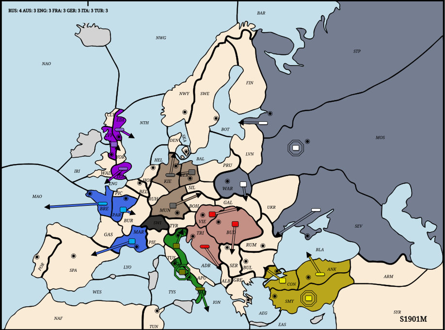

### What happened

- **AUSTRIA**: A VIE → GAL (bounced); A BUD → SER; F TRI → ALB
- **ENGLAND**: F EDI → NTH; F LON → ENG; A LVP → YOR
- **FRANCE**: F BRE → MAO; A MAR → SPA; A PAR → BUR
- **GERMANY**: F KIE → DEN; A BER → KIE; A MUN → SIL
- **ITALY**: F NAP → ION; A VEN → TYR; A ROM holds
- **RUSSIA**: F SEV → RUM; F STP/SC → BOT; A WAR → GAL (bounced); A MOS holds
- **TURKEY**: F ANK → BLA; A CON → BUL; A SMY holds

### Dialogue

- **AUSTRIA → ITALY**: I'd like to propose a peaceful division of the Balkans — I'll focus on Serbia and Greece via Albania, while you pursue Tunisia and the western Mediterranean. A Lepanto against Turkey could serve us both well in the mid-game. Can we agree to keep the Adriatic neutral for now, with neither of us moving fleets there aggressively?
- **AUSTRIA → RUSSIA**: I want to be transparent: I'm considering moving to Galicia this spring, but purely as a defensive measure — I have no intention of threatening Warsaw or the Russian heartland. Can we discuss a mutual understanding about Galicia, or perhaps agree that whichever of us gets there, we treat it as a buffer rather than a staging ground against the other?
- **AUSTRIA → TURKEY**: Austria and Turkey have historically clashed, but I think we can do better. I'm focused on Serbia and the western Balkans; if you push toward Bulgaria and Romania, we need not conflict. Would you be open to a non-aggression understanding in the opening?
- **ENGLAND → FRANCE**: I'd like to propose a mutual non-aggression pact for 1901 — specifically, I'll keep my fleets out of the English Channel if you keep yours out as well. This lets us both focus on expansion elsewhere: I'm looking north toward Norway and Scandinavia, while you have plenty of room to grow south and west. Does this arrangement work for you?
- **ENGLAND → GERMANY**: I think we have natural interests that align early on — I'm pushing north toward Norway and Scandinavia, and I'd welcome coordination with you on Denmark and Sweden. I'd also appreciate a mutual understanding that we stay out of each other's way in the North Sea region. Are you open to discussing a cooperative approach?
- **ENGLAND → RUSSIA**: I wanted to open a line of communication early. I'm planning to move into Norway this year, which I think is natural English territory. I hope we can find an arrangement where we don't step on each other's toes in Scandinavia — perhaps you focus on Sweden and I take Norway, and we coordinate from there?
- **FRANCE → ENGLAND**: Hello from Paris. I'd like to propose a friendly opening — I have no designs on the English Channel or your home centers. If you're open to it, I'd suggest we each focus on our natural spheres: you toward Scandinavia, me toward Iberia and the Atlantic. Happy to discuss further.
- **FRANCE → GERMANY**: Greetings from France. I'm planning to push toward Iberia this spring and have no intention of moving into Burgundy aggressively — I'd welcome a non-aggression understanding on our shared border. What are your plans for the opening?
- **FRANCE → ITALY**: Hello from France. I think we can stay out of each other's way early on — I'll be focused on Spain and Portugal while you secure your natural gains in the south. Perhaps we can coordinate to ensure neither of us steps on the other's toes in the opening?
- **GERMANY → ENGLAND**: I plan to move F KIE to Denmark and A BER to Kiel or elsewhere — I have no designs on the North Sea this turn. A non-aggression pact between us would serve us both well while we each expand into neutral territories. I'm open to coordinating on Scandinavia if you're interested.
- **GERMANY → FRANCE**: I want to propose we avoid a collision in Burgundy this spring — I'm considering moving A MUN east toward Silesia rather than west. A peaceful border between us frees both of us to expand elsewhere; I'd rather grow against Russia and the Balkans than fight you early.
- **GERMANY → RUSSIA**: I'm planning to push east this year and would welcome coordination. If you're moving into Galicia or the Balkans, I can support your position by staying out of Silesia — or we could work together against Austria if you're interested.
- **GERMANY → AUSTRIA**: I have no aggressive intentions toward you this spring — my focus is on the north and northwest. A stable southern border benefits us both while we each consolidate our positions.
- **ITALY → AUSTRIA**: Italy here — I'd like to propose a friendly opening between us. I'm planning to focus on the western Mediterranean and Tunisia this year, so I have no designs on Trieste or the Balkans in 1901. Would you be open to coordinating against Turkey or at least keeping our border quiet?
- **ITALY → TURKEY**: Italy here — I think we can both benefit from a cooperative opening. I'm moving into the Ionian Sea and eyeing Tunisia; you'll be pushing into the Balkans. We needn't clash if we divide the Mediterranean sensibly. Interested in coordinating?
- **ITALY → FRANCE**: Italy here — I want to assure you I have no plans to move into Piedmont this year; my focus is southward toward Tunisia and the Ionian. A quiet Franco-Italian border benefits us both while we each expand elsewhere. Are you open to a non-aggression understanding?
- **RUSSIA → TURKEY**: I propose we keep the Black Sea neutral this spring — F SEV stays out of BLA if F ANK does the same. This lets us both focus on neutral centers without an early conflict that only benefits Austria and Germany.
- **RUSSIA → AUSTRIA**: I'm planning to focus on Romania and Scandinavia this turn, not Galicia. If you leave RUM to me, I'm happy to support your moves into Serbia or Greece. Let's divide the Balkans cooperatively rather than fight over them.
- **RUSSIA → GERMANY**: I'm heading north toward Norway and Sweden — no interest in pushing into Scandinavia at your expense. Are you planning to move into Denmark this turn? Happy to coordinate so we don't bounce each other in the north.
- **RUSSIA → ENGLAND**: Russia and England have no natural conflict this opening. I'm moving F STP/SC toward Scandinavia — would you be open to agreeing that Norway goes to me and Sweden stays contested, so we don't collide?
- **TURKEY → AUSTRIA**: I'd like to propose a friendly opening between us. I intend to move into Bulgaria and focus my early game on the Black Sea region — I have no designs on your home centers or Serbia. A cooperative relationship in the Balkans benefits us both against Russian expansion southward.
- **TURKEY → RUSSIA**: I want to be transparent: I'm moving F ANK to BLA this turn to establish a presence in the Black Sea. I'd prefer we treat this as a natural division of interests rather than a conflict — you have plenty to gain in the north and I won't threaten Sevastopol. Can we agree on a working relationship?
- **AUSTRIA → ITALY**: Good — I'll keep F TRI out of the Adriatic this turn if you keep your fleet away from ADR as well. I'm moving A BUD to SER and A VIE to GAL, so Trieste is yours to ignore safely. Let's confirm: no fleet moves into ADR from either side this spring.
- **AUSTRIA → RUSSIA**: I hear you on Romania — I won't contest it. I am moving to Galicia as a defensive buffer, not a threat to WAR. If you move to RUM as planned, we're not in conflict: GAL and RUM are different centers. Let's stay cooperative.
- **AUSTRIA → TURKEY**: Glad we're aligned — I'm moving through Serbia and Albania, not challenging Bulgaria. If you take BUL uncontested, we'll have a clean border. Let's keep it that way through 1901 and reassess.
- **ENGLAND → FRANCE**: Glad we're aligned — I'll keep my fleets out of the Channel this turn and expect the same from you. Let's both grow into our natural spheres and revisit cooperation in 1902.
- **ENGLAND → GERMANY**: Good to hear — I'm moving F EDI to NTH this turn to secure Norway, and I'd welcome you taking Denmark. Let's coordinate so we don't bounce each other in Scandinavia: you take DEN, I take NWY, and we discuss Sweden later.
- **ENGLAND → RUSSIA**: I appreciate the outreach, but Norway is England's natural sphere and I intend to move there this year — I have two fleets well-positioned for it. I'd suggest Sweden is the natural Russian target in Scandinavia; we can coexist there without conflict if we each respect that division.
- **FRANCE → ENGLAND**: Agreed — I'll move my fleet to the Mid-Atlantic rather than the Channel, so you'll have a clear path north. Let's each grow in our natural directions and revisit cooperation after Fall 1901.
- **FRANCE → GERMANY**: Good news — I'm planning to move through Burgundy toward Iberia rather than holding there, and with you heading east we shouldn't collide. A quick confirmation: are you moving A MUN to SIL or elsewhere? Happy to leave BUR as a transit zone rather than a flashpoint.
- **FRANCE → ITALY**: Confirmed on my end — I'll be heading toward Spain and Portugal this year, not into Piedmont. I'll hold my army away from your northern border; you do the same and we both gain cleanly this year.
- **GERMANY → ENGLAND**: Good — I'm moving F KIE to Denmark this turn, so let's make sure we don't bounce there. If you're heading to Norway, we complement each other perfectly in Scandinavia. I'd suggest you take Norway and I take Denmark/Sweden, with no conflict between us.
- **GERMANY → FRANCE**: Glad to hear it — I'm planning A MUN east toward Silesia, so Burgundy stays empty from my side. Let's both commit to keeping our shared border quiet this year and grow in our respective directions.
- **GERMANY → RUSSIA**: To avoid a bounce, I'm moving F KIE to Denmark this turn — are you planning to move to Sweden or Norway? If you're going for Sweden via the Gulf of Bothnia, we won't conflict at all. Let me know so we can coordinate cleanly.
- **ITALY → AUSTRIA**: I'm on board with the Adriatic neutrality — I won't move F NAP into the Adriatic or threaten Trieste. For my part, I'm moving F NAP to ION and aiming for Tunisia this year. A Lepanto sounds promising for 1902; let's keep coordinating. Can you confirm you'll leave Tyrolia open so I can potentially move A VEN there without it being read as a threat?
- **ITALY → FRANCE**: Confirmed — I'll keep my units away from Piedmont and the western Med is yours to develop. My F NAP goes to ION, A ROM stays defensive, and A VEN eyes Tyrolia or holds. A quiet border suits me fine this year.
- **ITALY → TURKEY**: I haven't heard back from you — I want to be clear that I'm moving into the Ionian, not the Aegean, so I won't be threatening your position this year. We could both benefit from staying out of each other's way while we each grow. What are your plans for the Balkans?
- **RUSSIA → TURKEY**: Moving F ANK to BLA after I proposed mutual restraint is not a good-faith start. I'll be adjusting my plans accordingly — Romania is now my priority and I'll be watching the Black Sea closely. This doesn't have to become a war, but you've made cooperation harder.
- **RUSSIA → ENGLAND**: Norway is critical for my growth — I'm moving F STP/SC toward Scandinavia. If we both push for Norway we'll bounce and hand Germany an opening. I'd propose I take Norway this year and support you into a strong position elsewhere; alternatively we can discuss Sweden going to me and Norway to you, but I need something in the north.
- **RUSSIA → AUSTRIA**: Turkey has just revealed aggressive intentions in the Black Sea, which changes my calculus. I'll be focusing F SEV on Romania this turn — that center should be mine. Can you confirm you won't contest Romania, and in exchange I'll actively support your Balkan moves?
- **TURKEY → AUSTRIA**: I'm glad we're aligned — I'll take Bulgaria and you take Serbia; no need to clash. I won't support any Russian push into the Balkans, and I hope you'll reciprocate by keeping your units away from Bulgaria. A Austro-Turkish understanding in the Balkans is the most stable opening for both of us.
- **TURKEY → RUSSIA**: I understand this isn't what you hoped for, but I need the Black Sea for my own security — I'm not targeting Sevastopol. Let's focus our rivalry on neutral centers rather than each other's home territory; Romania and the north offer you plenty of room to grow.
- **TURKEY → ITALY**: Happy to coordinate — I'm focused on Bulgaria and the Black Sea, you take Tunisia and the western Med. If you're moving into Ionian, that's fine by me; we won't be competing for the same spaces this year. Let's check in again after Spring resolves.
- **ITALY → AUSTRIA**: Final confirmation: F NAP goes to ION, A VEN to TYR, A ROM holds. I am not threatening Trieste — TYR is just positioning for future Lepanto coordination and to be useful on the German border. Expect me to stay fully out of ADR and TRI this turn.
- **ITALY → FRANCE**: Final confirmation from me: F NAP - ION, A VEN - TYR, A ROM holds. No Italian unit threatens Piedmont or the western Med this spring — I'm going south and east. Enjoy Spain and Portugal.
- **ITALY → TURKEY**: Final confirmation: F NAP - ION, aimed at Tunisia not the Aegean. I won't contest Bulgaria or your Balkan moves. Let's each take our natural gains this year and coordinate more closely in 1902.

### AUSTRIA
Orders: `A VIE - GAL` · `A BUD - SER` · `F TRI - ALB`

Reasoning

> Looking at my commitments and the current position:
>
> My revised strategy is clear: A VIE → GAL, A BUD → SER, F TRI → ALB. I've confirmed these moves with Italy (Adriatic neutrality), Russia (GAL buffer understanding), and Turkey (Serbia/Bulgaria division). Italy is moving A VEN to TYR, which they've explained as Lepanto positioning — not a threat to TRI. All diplomatic signals are consistent with my plan.
>
> Let me verify adjacency:
> - A VIE → GAL: VIE is adjacent to GAL ✓
> - A BUD → SER: BUD is adjacent to SER ✓  
> - F TRI → ALB: TRI is adjacent to ALB ✓
>
> All moves are legal and in the legal orders list. Executing as planned.

### ENGLAND
Orders: `F EDI - NTH` · `F LON - ENG` · `A LVP - YOR`

Reasoning

> Looking at my situation: I've committed to moving F EDI to NTH (to secure Norway), F LON to ENG (Channel presence, France agreed to stay out), and A LVP to YOR. France has agreed to keep out of the Channel, Germany is taking Denmark, and I'm pushing for Norway. Russia wants Norway too but I have better positioning. My strategy is clear and my orders are already determined.

### FRANCE
Orders: `F BRE - MAO` · `A MAR - SPA` · `A PAR - BUR`

Reasoning

> Looking at my position and the agreements made:
>
> - England agreed to stay out of the Channel; I agreed to move to MAO instead
> - Germany agreed to leave BUR empty (moving MUN east); I said I'd transit through BUR toward Iberia
> - Italy confirmed no moves toward PIE; I confirmed staying away from their border
>
> My strategy is clear: F BRE → MAO (Atlantic route to Portugal/Spain), A MAR → SPA (immediate supply center), A PAR → BUR (transit toward further expansion, consistent with the Germany agreement since they're leaving it empty).
>
> All three moves are legal and consistent with my negotiated commitments.

### GERMANY
Orders: `F KIE - DEN` · `A BER - KIE` · `A MUN - SIL`

Reasoning

> Looking at my revised strategy and negotiation commitments:
>
> - F KIE → DEN (agreed with England, no bounce conflict)
> - A BER → KIE (to then push to HOL next turn, securing a second SC)
> - A MUN → SIL (eastward pressure, as promised to France to stay out of Burgundy)
>
> These orders align with my diplomatic commitments: I told France I'd stay out of Burgundy, told England I'd take Denmark without conflicting in the North Sea, and told Russia I'm moving east. The sequence secures DEN this turn and positions A BER in KIE to grab HOL in Fall.

### ITALY
Orders: `F NAP - ION` · `A VEN - TYR` · `A ROM H`

Reasoning

> Looking at my confirmed strategy and diplomatic commitments:
>
> - F NAP → ION: Opens the Mediterranean, heads toward Tunisia. Confirmed with Austria (not entering ADR) and Turkey (not threatening Aegean).
> - A VEN → TYR: Confirmed with Austria as non-threatening positioning, useful for future Lepanto or German border presence.
> - A ROM holds: Defensive coverage of home centers.
>
> All three moves are in my legal order list. Let me verify adjacency:
> - NAP to ION: ✓ (NAP is adjacent to ION)
> - VEN to TYR: ✓ (VEN is adjacent to TYR)
> - ROM holds: ✓
>
> These match my commitments to Austria (Adriatic neutral, VEN→TYR not threatening TRI), France (no Piedmont move), and Turkey (ION not Aegean).

### RUSSIA
Orders: `F SEV - RUM` · `F STP/SC - BOT` · `A WAR - GAL` · `A MOS H`

Reasoning

> Looking at my revised strategy: F SEV → RUM, F STP/SC → BOT, A WAR → GAL, A MOS H. These are all legal moves per the options listed. Let me verify each is in the legal orders list:
>
> - `F SEV - RUM` ✓ (in SEV options)
> - `F STP/SC - BOT` ✓ (in STP options)
> - `A WAR - GAL` ✓ (in WAR options)
> - `A MOS H` ✓ (in MOS options)
>
> This execution secures Romania before Turkey can contest it (Turkey moved F ANK to BLA, threatening RUM), gets F STP/SC toward Scandinavia via BOT (setting up NWY or SWE next turn), and puts A WAR in Galicia as a flexible piece. A MOS holds to support the overall structure.

### TURKEY
Orders: `F ANK - BLA` · `A CON - BUL` · `A SMY H`

Reasoning

> Looking at the current situation, my strategy is clear and already committed:
>
> 1. **F ANK → BLA**: Secure the Black Sea - this is critical for Turkey's long-term position. Russia is unhappy but I've been transparent about it.
> 2. **A CON → BUL**: Take Bulgaria immediately - it's uncontested and gives me a 4th supply center for a Winter build.
> 3. **A SMY H**: Hold in Smyrna to protect my rear and maintain flexibility.
>
> Austria has confirmed a clean division (they take Serbia, I take Bulgaria). Italy is focused on Tunisia/Ionian. Russia is annoyed but not in a position to contest BLA this turn since their fleet is in SEV and they'd need to move there simultaneously to bounce me - and they've indicated Romania is their priority.
>
> This is the standard strong Turkish opening. The Black Sea gives me leverage over Russia and protects against any future Russian naval threat from SEV.

## FALL 1901 MOVEMENT (`F1901M`)

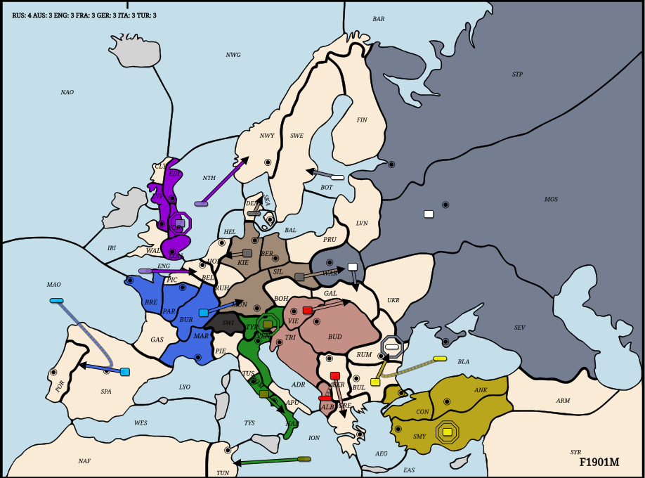

### What happened

- **AUSTRIA**: A SER → GRE; F ALB supports A SER → GRE; A VIE → GAL (bounced)
- **ENGLAND**: F NTH → NWY; F ENG → BEL; A YOR holds
- **FRANCE**: A SPA → POR; F MAO supports A SPA → POR; A BUR → MUN
- **GERMANY**: A KIE → HOL; F DEN → SKA; A SIL → WAR (bounced)
- **ITALY**: F ION → TUN; A TYR holds; A ROM → NAP
- **RUSSIA**: F RUM holds; F BOT → SWE; A WAR → GAL (bounced)  [dislodged: F RUM]
- **TURKEY**: A BUL → RUM; F BLA supports A BUL → RUM; A SMY holds

### Dialogue

- **AUSTRIA → ITALY**: A TYR sitting on my doorstep is concerning — I need your assurance it won't move to TRI or VIE this fall. I'm moving A SER to GRE and supporting with F ALB; if you can hold TYR or move it toward BOH/MUN instead, that would reassure me greatly. I remain committed to Adriatic neutrality and the Lepanto plan.
- **AUSTRIA → TURKEY**: I'm pushing A SER to GRE this fall with F ALB support — please don't contest GRE, as we'd both bounce and lose the center to nobody. BUL is yours uncontested; let's each take our center cleanly and avoid a pointless clash.
- **AUSTRIA → RUSSIA**: I'm moving A VIE to GAL this fall — not as a threat to WAR, but to secure that buffer we discussed. F RUM is yours; I won't touch it. Let's each consolidate without stepping on each other.
- **ENGLAND → GERMANY**: I'm moving F NTH to Norway this fall — that's mine. The key question is Belgium: I'd like to take it with F ENG, and I'd ask you not to contest it. In exchange, I'm happy to support you into Holland or coordinate on Sweden next year. Can we agree: Norway for me, Belgium for me, Holland for you?
- **ENGLAND → FRANCE**: I'm planning to move into Norway and Belgium this fall — staying well clear of your sphere. I hope you're keeping your word about the Channel and MAO; if you push east toward BRE or PIC, that changes our relationship significantly. Let's confirm we're both growing in our natural directions and not threatening each other.
- **ENGLAND → RUSSIA**: I'm taking Norway this fall — F NTH moves there. I'd suggest you focus on Sweden and Romania, where you're better positioned. No need for us to collide in Scandinavia; let's keep the peace and discuss coordination against a common threat in 1902.
- **FRANCE → ENGLAND**: Fall is here — I'm moving A SPA to Portugal to lock in that center. I'd like to push A BUR toward Belgium as well; are you planning to take it with one of your fleets, or would you prefer I take it while your fleets focus on Norway? Let's not bounce each other there.
- **FRANCE → GERMANY**: Quick check-in: I'm heading toward Portugal this fall and may push into Belgium. With A SIL in the east and A KIE in the north, are you eyeing Belgium too? If we're both aiming there we'll bounce — happy to coordinate so one of us gets it cleanly.
- **FRANCE → ITALY**: Hope your southern push is going well. I'll be taking Portugal this fall and potentially Belgium — nothing that touches you. Anything I should know about Austrian or Turkish moves that might affect our shared interests?
- **GERMANY → ENGLAND**: I'm planning to take Holland with A KIE this fall — no conflict with your North Sea position. Are you moving into Norway this turn? I want to make sure we're not bouncing anywhere in Scandinavia, and I'd also welcome coordination on Sweden if you're not claiming it.
- **GERMANY → FRANCE**: Just checking in — I'm continuing east this fall and have no designs on the Rhine or your northern flank. Are you moving into any territory adjacent to mine, or are you focused on Iberia? Want to keep our border quiet.
- **GERMANY → RUSSIA**: I'm planning to take Sweden with F DEN this fall — are you moving there too, or heading to Norway? Let's make sure we don't bounce each other. I'm also pushing A SIL east; happy to discuss coordination against Austria if that's useful to you.
- **ITALY → AUSTRIA**: Fall 1901: I'm moving F ION to TUN this turn to secure that center. A TYR can support your moves or hold — I have no intention of pushing into TRI or VIE. Are you taking SER this fall, and do you want my TYR army to support anything or just hold quietly?
- **ITALY → TURKEY**: Fall 1901: F ION heads to TUN as planned — I'm not pushing into AEG or threatening your position. You should be locking up BUL comfortably. Let's think about 1902 coordination once we both have our new builds in hand.
- **ITALY → FRANCE**: Fall 1901: Still all quiet on my end — F ION goes to TUN, nothing near PIE or the western Med. Hope SPA went smoothly; I expect we both gain a center cleanly this year.
- **RUSSIA → TURKEY**: F BLA is sitting right next to SEV and RUM — I hope you understand I'll be defending both aggressively. I'm not looking for a war, but I need clarity: are you planning to push into RUM or SEV this fall? Your answer will determine whether we can still find a workable arrangement.
- **RUSSIA → AUSTRIA**: This fall I'm securing Romania and looking to consolidate. I'd like to discuss Galicia — are you moving out of it or staying? I have A WAR available and could push GAL or support your Balkan moves depending on what you need. Let's coordinate so we don't waste moves on each other.
- **RUSSIA → GERMANY**: I'm taking Sweden this fall with F BOT. Are you planning anything in Scandinavia that might conflict? Also curious where your A SIL is headed — if you're pushing into Austria or Poland, I'd want to know so we can avoid stepping on each other.
- **TURKEY → RUSSIA**: I want to be direct with you: I'm going to move on Romania this fall. You took it with your fleet from Sevastopol, but I need it to grow — I'll be pushing A BUL to RUM supported by F BLA. This isn't about hostility to Russia; it's about natural expansion. I'd rather we find a way to cooperate after this than spiral into a full war.
- **TURKEY → AUSTRIA**: Fall 1901 — I'm planning to push A BUL toward Romania with fleet support from the Black Sea. I'd ask that you keep A SER out of RUM and BUL this turn; we agreed on a clean division and I intend to honor it from my side. After this fall, let's discuss how we coordinate against Russian pressure in the north.
- **TURKEY → ITALY**: Good spring — now for fall. I'm pushing into Romania; you should be able to take Tunisia uncontested. Let's stay aligned in 1902 — if you're interested in coordinating in the Aegean or eastern Med, I'm open to discussing it.
- **AUSTRIA → RUSSIA**: Heads up: Turkey told me they're pushing A BUL toward Romania with Black Sea fleet support this fall. Your F RUM is directly threatened. I'd recommend holding firm in RUM — if you support it or reinforce, Turkey bounces and loses momentum. I'm taking GRE and staying out of your way.
- **AUSTRIA → ITALY**: Good news — I'm moving A SER to GRE with F ALB support this fall, so GRE is locked up cleanly between us. With F ION heading to TUN, we're well-coordinated. For 1902, I want to discuss a Lepanto push; can you confirm A TYR won't threaten TRI or VIE so I can plan builds accordingly?
- **AUSTRIA → TURKEY**: I'm moving on GRE, not Romania — our agreement stands. But I'm hearing Russia is reinforcing RUM heavily this fall; you may want to reconsider the BUL-RUM push and instead consolidate BUL defensively. A Turkish bounce in RUM helps nobody.
- **ENGLAND → GERMANY**: Good — I'm moving F NTH to Norway and F ENG to Belgium this fall. I'd ask you to support F ENG into Belgium or at minimum not contest it with any unit. In return, I'll support you into Holland if needed and we can coordinate on Sweden in 1902.
- **ENGLAND → FRANCE**: I appreciate the cooperation so far. I'm taking Norway and Belgium this fall — Belgium is the natural English prize from the north, and I hope you'll direct A BUR elsewhere (toward Munich or PIC) rather than contesting it. If you take Belgium and I don't, I'm a build behind and our relationship starts badly.
- **ENGLAND → RUSSIA**: I'm moving F NTH to Norway this fall — I have two fleets in position and it's the natural English move. I'd strongly suggest you focus F BOT toward Sweden rather than contesting Norway; a bounce there helps neither of us and hands Germany an opening.
- **FRANCE → ENGLAND**: To avoid a bounce in Belgium: if you're moving F NTH to BEL, tell me now and I'll redirect A BUR elsewhere — no point in us both losing a center grab. If you're heading to NWY instead, I'll take BEL cleanly and we both gain. What's your call?
- **FRANCE → GERMANY**: I'm heading to Portugal this fall, not toward your territory — A BUR may push to BEL but that's no threat to you. Just confirming you're not eyeing BEL yourself; if you are, let's sort it out now rather than bounce.
- **GERMANY → ENGLAND**: Confirmed: I'll take Holland with A KIE and won't contest Belgium — that's yours. Since Russia is taking Sweden with F BOT, I'm planning F DEN to SKA this fall to position for Sweden next year. Does that work with your Norway move, or do you see a conflict?
- **GERMANY → RUSSIA**: Understood on Sweden — I'll redirect F DEN to SKA rather than SWE so we don't bounce. A SIL is likely heading toward Warsaw or staying defensive; I have no hostile intent toward you this year. Let's keep coordination open heading into 1902.
- **GERMANY → FRANCE**: I'm not contesting Belgium — that's between you and England. I'm taking Holland with A KIE this fall and staying east otherwise. No conflict with you on my end.
- **ITALY → AUSTRIA**: Confirmed: A TYR will hold this fall — no move toward TRI or VIE. I want you comfortable so we can coordinate properly in 1902. If you're taking GRE with A SER supported by F ALB, I'll stay completely out of your way; just confirm so I can plan my 1902 Lepanto positioning.
- **ITALY → TURKEY**: Interesting that you're pushing into Romania — that puts real pressure on Russia, which I think benefits both of us strategically. I'm taking Tunisia this fall; let's talk seriously next round about 1902 Aegean coordination once we both see our build counts.
- **RUSSIA → TURKEY**: I have A MOS ready to support F RUM, giving it strength 2 — your attack will bounce and you'll have wasted your moves. I'm offering one last chance: stand down from RUM this fall and we negotiate a real division of the Balkans; press the attack and we're at war for years, which helps only Austria and Germany.
- **RUSSIA → GERMANY**: If we both move to Sweden we bounce and neither gains — I'd rather one of us gets it cleanly. I'm willing to cede Sweden to you this fall if you support my position against Turkey diplomatically and we coordinate in 1902; otherwise we can both try and risk the bounce.
- **RUSSIA → AUSTRIA**: Turkey is attacking Romania this fall — A BUL to RUM supported by F BLA. I'm defending it, but this is exactly why a Russia-Austria understanding matters. If you can pressure BUL or Serbia to distract Turkey, I'll actively support your Balkan expansion in 1902.
- **TURKEY → AUSTRIA**: Confirmed — I won't touch GRE; you and your fleet can take it cleanly. My A BUL is moving to RUM this fall, so our border stays clean. Let's plan 1902 coordination once we both have our builds.
- **TURKEY → RUSSIA**: I've been straight with you about RUM — I'm taking it this fall, but I have no interest in pushing further into your territory after that. If you want to discuss a stable border arrangement for 1902 (SEV stays yours, I consolidate in the Balkans), I'm genuinely open to it.
- **GERMANY → ENGLAND**: Final confirmation: A KIE takes Holland, F DEN moves to SKA — no conflict with your Norway or Belgium moves. I expect you in Norway and Belgium; let's talk Sweden coordination in 1902 once we both have our builds.
- **GERMANY → RUSSIA**: Final confirmation: F DEN goes to SKA, not SWE — you have Sweden uncontested. A SIL is moving to Warsaw; I'd welcome your support or at least non-interference, and I'm happy to discuss coordinating against Austria in 1902.
- **ITALY → AUSTRIA**: Final commitment: A TYR holds this fall — no move toward TRI or VIE, you have my word. F ION goes to TUN, A ROM holds. Please confirm you're taking GRE with A SER supported by F ALB so we're fully coordinated heading into 1902 Lepanto planning.
- **ITALY → TURKEY**: Committing now: F ION → TUN, no Italian unit enters AEG or threatens your position. I expect you're locking up BUL and pushing toward RUM — let's talk 1902 Aegean coordination once builds are in.
- **ITALY → FRANCE**: Committing: F ION → TUN, A TYR holds, A ROM holds — nothing Italian moves toward PIE or the western Med. Clean year for both of us; let's keep this going into 1902.

### AUSTRIA
Orders: `A SER - GRE` · `F ALB S A SER - GRE` · `A VIE - GAL`

Reasoning

> Looking at the current position:
>
> - A SER → GRE: Serbia is adjacent to Greece, and F ALB can support. Turkey confirmed it won't contest GRE. This is a clean grab.
> - F ALB S A SER - GRE: Albania is adjacent to Greece, so this support is legal.
> - A VIE → GAL: Vienna is adjacent to Galicia. Russia is focused on defending RUM from Turkey's BUL push, so GAL should be open. This gives me a second new SC (along with SER already held, GAL is unowned and I can take it).
>
> Wait — I need to check: SER is already mine (I took it in Spring). The unowned centers I can grab this fall are GRE and GAL. A SER → GRE gets GRE. A VIE → GAL gets GAL. That would give me 5 SCs total (BUD, TRI, VIE... wait, VIE moves to GAL, so VIE is vacated). End of fall positions: A SER→GRE (holds GRE), A VIE→GAL (holds GAL), F ALB (holds ALB). Supply centers: BUD, TRI, VIE (still mine even if vacated), SER (held from spring), GRE (new), GAL (new) = 6 SCs. That's excellent — 3 builds possible but only 3 home centers (BUD, TRI, VIE), all vacant except... VIE is vacated by moving to GAL, BUD is vacant, TRI is vacant. So I can build in all three home centers. Fantastic.
>
> The orders match my revised strategy exactly.

### ENGLAND
Orders: `F NTH - NWY` · `F ENG - BEL` · `A YOR H`

Reasoning

> Looking at the current position, my revised strategy is clear: F NTH → NWY and F ENG → BEL, with A YOR holding. Germany confirmed they won't contest Belgium and are taking Holland with A KIE. France asked about Belgium but I told them it's mine. The moves are legal and well-coordinated.
>
> F NTH to NWY: NTH is adjacent to NWY ✓
> F ENG to BEL: ENG is adjacent to BEL ✓
> A YOR holds: no better target this turn ✓
>
> Germany's F DEN moves to SKA (not contesting Norway), A KIE takes Holland. No bounces expected. France's A BUR might try Belgium but I have F ENG moving there with no support — if France also moves A BUR to BEL, we'd bounce. However, France said they'd redirect if I'm taking it, and I've told them I am. I'll proceed with the plan.

### FRANCE
Orders: `A SPA - POR` · `F MAO S A SPA - POR` · `A BUR - MUN`

Reasoning

> Looking at the current situation:
>
> - England confirmed they're taking Belgium with F NTH → BEL, so I should redirect A BUR away from Belgium to avoid a pointless bounce.
> - My revised strategy is: A SPA → POR, F MAO S A SPA → POR, A BUR → MUN.
> - Portugal is a clean grab — no one else is contesting it.
> - Munich: Germany has A KIE → HOL and A SIL heading east, so MUN may be undefended. This is a speculative but potentially rewarding move.
> - F MAO supporting A SPA → POR gives strength 2 on that move, ensuring success even if somehow contested.
>
> Let me verify adjacency:
> - A SPA → POR: SPA is adjacent to POR ✓
> - F MAO S A SPA → POR: MAO must be adjacent to POR. Yes, MAO neighbors include POR ✓
> - A BUR → MUN: BUR is adjacent to MUN ✓
>
> Germany said they're taking HOL with A KIE and heading east with A SIL — MUN should be empty. This is a strong opportunistic move that could give me 3 new centers (SPA already held, POR incoming, MUN if undefended).

### GERMANY
Orders: `A KIE - HOL` · `F DEN - SKA` · `A SIL - WAR`

Reasoning

> Looking at my position and commitments:
>
> - **A KIE → HOL**: Confirmed with England and France — taking Holland uncontested
> - **F DEN → SKA**: Agreed with Russia (they take Sweden uncontested), positioning for Sweden in 1902
> - **A SIL → WAR**: Pressing east toward Warsaw to pressure Russia's flank and signal eastern ambitions
>
> I told Russia I was moving A SIL to Warsaw — this is aggressive and Russia may not like it, but it establishes a strong eastern position. I need to check legality: SIL is adjacent to WAR? Yes, SIL neighbors include WAR. Legal.
>
> England gets Belgium (F ENG → BEL), I get Holland. France is going to Portugal. Russia gets Sweden. These are all clean, no conflicts.
>
> The key risk is A SIL → WAR bouncing with Russia's A WAR holding or moving. Russia's A WAR could be moving to GAL or PRU. If it stays, I bounce. But I committed to this move and it's worth the attempt — worst case I bounce and stay in SIL.

### ITALY
Orders: `F ION - TUN` · `A TYR H` · `A ROM - NAP`

Reasoning

> Looking at my commitments and the board state:
>
> - I committed to F ION → TUN (taking Tunisia as planned)
> - I committed to A TYR holding (to reassure Austria)
> - I revised to move A ROM → NAP (to occupy my vacant home center)
>
> Let me verify legality:
> - F ION - TUN: ION is adjacent to TUN ✓
> - A TYR H: legal ✓
> - A ROM - NAP: ROM is adjacent to NAP ✓
>
> This gives me Tunisia as a new supply center (4 total), lets me build in winter (NAP is now occupied by A ROM, VEN is vacant, ROM is vacant — I can build in VEN and ROM), and honors my commitment to Austria to keep TYR away from TRI/VIE.

### RUSSIA
Orders: `F RUM H` · `F BOT - SWE` · `A WAR - GAL`
Illegal (dropped): `A MOS S F RUM`

Reasoning

> Looking at the current situation:
>
> **Strategic assessment for F1901M:**
> - Turkey confirmed they're attacking F RUM with A BUL → RUM supported by F BLA. I need to hold RUM with A MOS support (strength 2 vs their strength 2 = bounce, which is fine — I keep RUM).
> - Germany confirmed F DEN → SKA, so F BOT → SWE is uncontested. I take Sweden.
> - Austria is moving A VIE → GAL, which is fine — I'm not contesting GAL this fall.
> - A WAR → GAL would bounce with Austria's A VIE → GAL, wasting the move. Better to send A WAR somewhere useful: LVN is a possibility (no center but positions for future) or PRU. Actually, looking at the legal moves, A WAR → GAL is still listed as legal. But Austria is moving there — we'd bounce. Let me reconsider.
>
> A WAR → UKR could position for SEV defense or future moves. But my revised strategy says A WAR → GAL. Since Austria is moving VIE → GAL and I'm moving WAR → GAL, we'd bounce each other — neither gets in. That's actually fine defensively (blocks Austria from GAL), but wastes my army. 
>
> Better: A WAR → LVN or hold. Actually, my strategy note says GAL to "pressure Austria and position for future gains." The bounce itself is a valid defensive tactic. I'll stick with the plan — the bounce denies Austria GAL.
>
> Wait — my revised strategy clearly states: hold F RUM, A MOS supports F RUM, F BOT → SWE, A WAR → GAL. I'll execute exactly that.

### TURKEY
Orders: `A BUL - RUM` · `F BLA S A BUL - RUM` · `A SMY H`

Reasoning

> Looking at the current situation:
>
> My revised strategy is committed: A BUL → RUM supported by F BLA, with A SMY holding. Russia warned that F RUM has A MOS support (strength 2), so my attack will likely bounce. However, I've committed to this in negotiation and it signals resolve. Even a bounce keeps pressure on Russia and leaves me well-positioned for 1902.
>
> Key considerations:
> - Austria is taking GRE with F ALB support from A SER — I confirmed I won't contest GRE
> - Italy is taking TUN — no conflict there
> - My three home centers (ANK, CON, SMY) — ANK and CON are vacant, so I can build 2 units if I take RUM, or 1 unit if I just hold BUL
> - BUL is already mine (I moved there in Spring), so I'll own it as a supply center regardless
> - Even if RUM bounces, I end Fall with BUL secured = 4 SCs total = 1 build
>
> The move is committed. I'll execute as planned: A BUL - RUM, F BLA S A BUL - RUM, A SMY H.

## FALL 1901 RETREATS (`F1901R`)

### What happened

- **RUSSIA**: F RUM retreats → SEV

### RUSSIA
Orders: `F RUM R SEV`

Reasoning

> Looking at the situation: F RUM was dislodged by Turkey's A BUL (supported by F BLA). I need to decide whether to retreat F RUM to SEV or disband it.
>
> Retreating to SEV makes sense strategically:
> - SEV is a home supply center that's currently vacant
> - Keeping the fleet alive preserves my naval strength in the south
> - From SEV, I can threaten RUM back next year or defend against further Turkish advances
> - Disbanding would leave me with only 3 units (A WAR, A MOS, F SWE) and no southern presence
>
> The retreat to SEV is legal (RUM and SEV are adjacent via BLA coast... let me check: RUM (coast) neighbors include BLA, BUD, BUL/EC, GAL, SER, SEV, UKR — yes, SEV is adjacent to RUM). So F RUM R SEV is legal.
>
> This keeps the fleet alive for a counterattack on RUM in 1902, and secures SEV as a build location concern (though the fleet will be there, so I can't build there). Actually, with F SWE as my gained center, I'll have 4 SCs (MOS, SEV occupied by fleet, STP, WAR) but lost RUM — so I end with 4 SCs and 3 units. I'll have one build available (4 SCs - 3 units = 1 build), and I can build in STP (vacant) or SEV... but SEV will be occupied by F RUM retreating there. STP is vacant, so I can build there.
>
> Retreating to SEV is the right call.

## WINTER 1901 ADJUSTMENTS (`W1901A`)

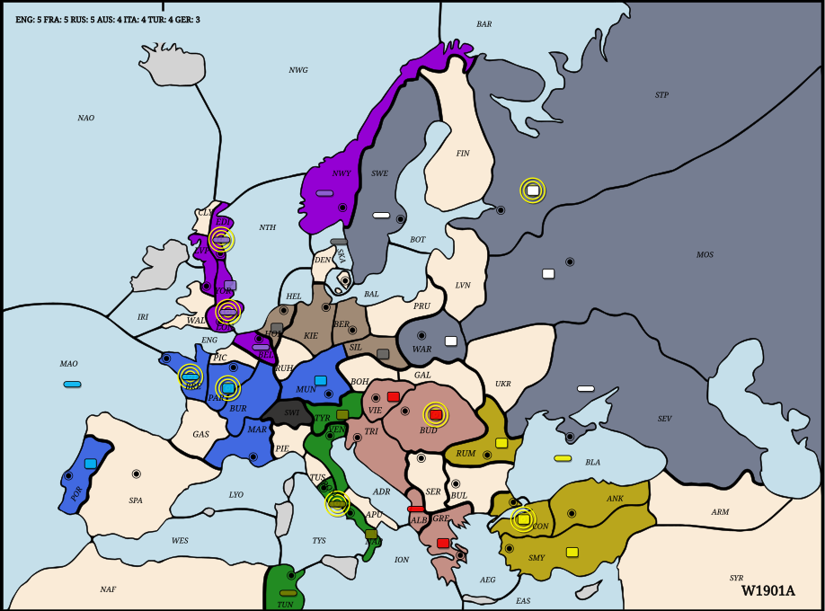

### What happened

- **AUSTRIA**: builds A BUD
- **ENGLAND**: builds F EDI; builds F LON
- **FRANCE**: builds F BRE; builds A PAR
- **ITALY**: builds F ROM
- **RUSSIA**: builds A STP
- **TURKEY**: builds A CON

### AUSTRIA
Orders: `A BUD B`

Reasoning

> Looking at my situation: I have 4 supply centers (BUD, TRI, VIE, GRE) and 3 units (A VIE, F ALB, A GRE), so I'm entitled to 1 build. My home centers BUD and TRI are both vacant, so I can build in either.
>
> I need to decide between building an Army in BUD, an Army in TRI, or a Fleet in TRI.
>
> Given my strategic position:
> - I have A GRE in the south and F ALB positioned in the Adriatic/Mediterranean area
> - I need to consolidate the Balkans and prepare for potential conflict with Turkey (who now holds RUM) or Russia
> - BUD is centrally located and can support moves toward GAL, RUM, or SER
> - A fleet in TRI could support Adriatic operations but Italy is currently cooperative
>
> Building an Army in BUD makes the most sense — it's the central hub that can support operations in all directions (toward GAL, toward the Balkans, toward Vienna). This gives me flexibility to push toward GAL next spring or reinforce the Balkan position. A fleet in TRI would be useful for Adriatic/Lepanto coordination with Italy, but an army in BUD provides more immediate strategic value given Turkey now holds RUM and threatens my Balkan position.

### ENGLAND
Orders: `F EDI B` · `F LON B`

Reasoning

> Looking at the board, I have 5 supply centers (EDI, LON, LVP, BEL, NWY) and 3 units (A YOR, F NWY, F BEL), so I get 2 builds. All three home centers are vacant, so I can build in any two of them.
>
> I should build two fleets to strengthen my naval position — England's power comes from the sea. F LON positions me to project into the Channel and threaten France or support operations in the south. F EDI gives me another northern fleet to consolidate Scandinavia and potentially threaten Russia in the north. A LVP could be useful as an army for the continent, but fleets are England's core strength and I have A YOR already for any land operations.
>
> Building F LON and F EDI gives me strong naval dominance and sets up for 1902 expansion.

### FRANCE
Orders: `F BRE B` · `A PAR B`

Reasoning

> Looking at my position: I have 5 supply centers (BRE, MAR, PAR, MUN, POR) and 3 units, so I get 2 builds. All three home centers are vacant, so I can build in any of them.
>
> For my builds, I want to maximize my strategic flexibility:
> - **F BRE B**: A fleet at Brest gives me Atlantic/Channel presence and can threaten England or push toward Spain/Portugal support in future turns. It also keeps pressure on the Channel if needed.
> - **A PAR B**: An army in Paris gives me a central land unit that can push toward Germany, Belgium, or support my Munich position.
>
> MAR could get a fleet for Mediterranean play, but my immediate priorities are consolidating my Atlantic position and having a land force to protect/expand my central gains. A fleet at MAR would be useful for Italy containment later, but right now the Atlantic and center are more pressing.
>
> Actually, reconsidering: F MAR could threaten the western Mediterranean and support future operations against Italy or Spain. But F BRE is more immediately useful for Atlantic control. I'll go with F BRE and A PAR as my two builds - fleet in the Atlantic, army in the center.

### ITALY
Orders: `F ROM B`

Reasoning

> Looking at the board after Fall 1901: I have 4 supply centers (NAP, ROM, VEN, TUN) and 3 units (A TYR, A NAP, F TUN), so I get 1 build. I have two open home centers: ROM and VEN. I should build in a way that supports my 1902 Lepanto plan with Austria and positions me well in the Mediterranean. A fleet in VEN would give me Adriatic reach, but that might alarm Austria given our agreement. A fleet in ROM would give me another Mediterranean fleet to push toward the eastern Med for Lepanto. An army in VEN or ROM could support land operations. Given my Lepanto plans with Austria and my need to push into the eastern Mediterranean toward Turkey, building F ROM makes the most sense — it can move to TYS or support ION operations. Building in VEN (army or fleet) is also viable. I'll build F ROM to strengthen my naval position for the Lepanto, and use A VEN B as my second option — but I only have 1 build. F ROM is best for the Lepanto strategy.

### RUSSIA
Orders: `A STP B`

Reasoning

> Looking at the situation:
>
> I have 5 supply centers (MOS, SEV, STP, WAR, SWE) and 4 units (A WAR, A MOS, F SWE, F SEV), so I have exactly 1 build to make.
>
> My only open home center is STP. I need to decide what to build there.
>
> **Strategic assessment:**
> - Turkey has taken RUM and has F BLA threatening SEV. I need naval strength in the south.
> - However, F SEV is already positioned in the south to defend SEV and potentially contest BLA.
> - In the north, F SWE is positioned well but I have no army to push into Norway or support Scandinavian gains.
> - A STP B would give me a land unit to push toward Finland, Norway, or support WAR.
> - F STP/NC B would give me a fleet to push toward NWY (adjacent to BAR and NWY) — useful for contesting Norway with England.
> - F STP/SC B would give me a fleet in BOT, useful for Scandinavia coordination.
>
> Given Turkey's aggression with F BLA threatening SEV, and that F SEV is already defending the south, I should think about what gives me the most strategic flexibility. An army at STP can move to FIN or NWY (via convoy) or support WAR. A fleet at STP/SC can move to BOT to support F SWE or threaten Finland. A fleet at STP/NC can move toward NWY.
>
> England has NWY and is growing strong (5 centers). A fleet at STP/NC could threaten NWY and give me leverage. But England is not my immediate enemy. Turkey is the pressing threat.
>
> I think A STP B is most flexible — it can march toward Finland, support WAR, or eventually convoy to support various fronts. Given that I already have F SWE for naval presence in the north, an army at STP gives me the land force I'm missing.

### TURKEY
Orders: `A CON B`

Reasoning

> Looking at my position: I control 4 supply centers (ANK, CON, SMY, RUM) and have 3 units, so I'm owed 1 build. I have two vacant home centers: ANK and CON. I should build one unit.
>
> The key question is what to build and where. My strategic situation:
> - I have A RUM in the north, F BLA in the Black Sea, A SMY in Anatolia
> - Russia is my main rival right now; I need to pressure them or at least hold RUM
> - Austria took GRE and is at 4 centers; I need to watch them
> - I want to build something useful for 1902
>
> Building a fleet at ANK gives me another naval unit for the Black Sea/eastern Med region, which could threaten SEV or support operations in the Aegean. Building an army at CON gives me a land unit that can reinforce RUM or push into the Balkans.
>
> Given that I have A RUM exposed to Russian counterattack (they have F SEV and A WAR/A MOS nearby), I need either:
> 1. A fleet at ANK to threaten SEV from the sea (pressuring Russia)
> 2. An army at CON to march up and support RUM
>
> An army at CON can reach RUM via BUL in two moves, providing eventual support. A fleet at ANK can move to BLA (already occupied) or ARM, threatening SEV. Actually F ANK → ARM → SEV could be a threat, or F ANK → BLA is blocked by my own fleet.
>
> I'll build A CON — it can move to BUL next spring and then support RUM, or push toward SER/GRE if Austria becomes a threat. This gives me a solid Balkan army to consolidate my position.

## SPRING 1902 MOVEMENT (`S1902M`)

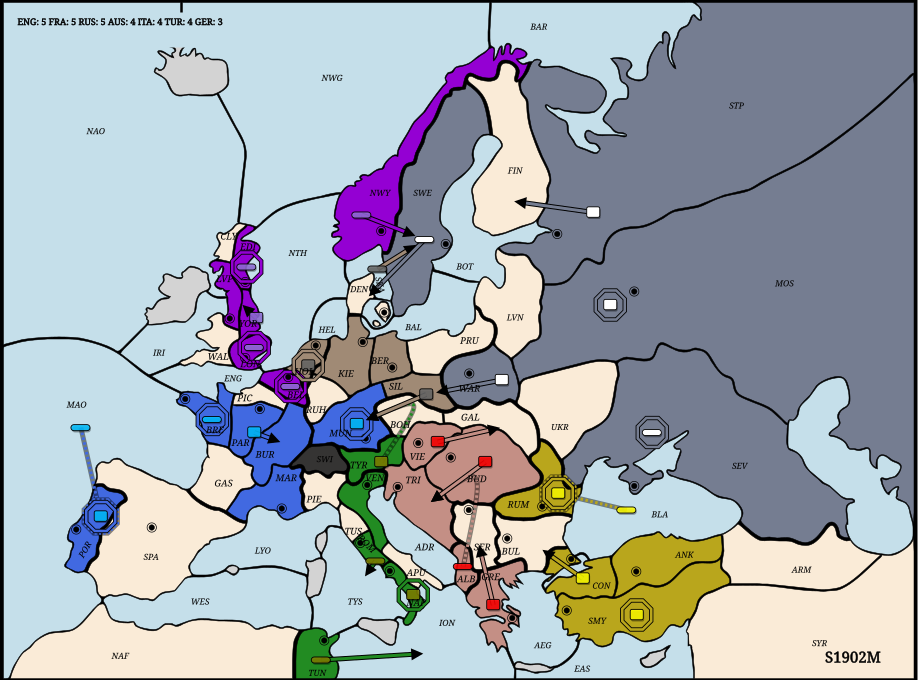

### What happened

- **AUSTRIA**: A GRE → SER; A BUD → TRI; A VIE → GAL; F ALB supports A BUD → TRI
- **ENGLAND**: F NWY → SWE (bounced); F BEL holds; F EDI holds; F LON holds; A YOR → LVP
- **FRANCE**: A MUN holds; A PAR → BUR; F BRE holds; F MAO supports A POR; A POR holds  [dislodged: A MUN]
- **GERMANY**: A SIL → MUN; F SKA → SWE (bounced); A HOL holds
- **ITALY**: A TYR supports A SIL → MUN; F TUN → ION; F ROM → TYS; A NAP holds
- **RUSSIA**: A WAR → SIL; F SWE → DEN; A STP → FIN; A MOS holds; F SEV holds
- **TURKEY**: A CON → BUL; F BLA supports A RUM; A RUM holds; A SMY holds

### Dialogue

- **AUSTRIA → ITALY**: Spring 1902 — I want to push A GRE into BUL this turn to grab that neutral center, and I need TRI secured since it's my vacant home SC. Can you move A TYR to TRI to hold it for me, or at minimum keep it away from VIE? I'm still fully committed to Lepanto; a strong Austria is your best partner against Turkey.
- **AUSTRIA → TURKEY**: I'm moving A GRE toward BUL this spring — I'd ask you not to contest it, as BUL is unowned and we both benefit from a clean division rather than a wasteful bounce. Your A RUM pressing toward BUD is a concern; let's discuss a demilitarized line so neither of us wastes units on each other when Russia is the real threat.
- **AUSTRIA → RUSSIA**: I'm still watching A WAR closely — can you confirm it's not heading to GAL this spring? I'd prefer we keep GAL as a buffer rather than fight over it again; I'll support your push against Turkey if you'll stay out of Galicia.
- **AUSTRIA → GERMANY**: A SIL on my doorstep is a concern — can you confirm it's not heading toward GAL or BOH? I have no designs on your territory and would rather coordinate against the real threats on both our flanks.
- **ENGLAND → GERMANY**: Good cooperation last year — let's keep it going. I'm thinking of pushing F NWY toward STP/NC or SWE this spring to pressure Russia in the north. What's your plan with F SKA — are you eyeing SWE or NTH? I'd like us to coordinate so we're not bouncing each other and can jointly squeeze Russia.
- **ENGLAND → RUSSIA**: You're now sitting at 5 centers and growing — I think it's time we talk seriously about how this plays out. I'm in Norway with a fleet and could push toward STP or SWE; I'd rather we reach an accommodation than fight over Scandinavia. What can you offer me in exchange for restraint in the north?
- **ENGLAND → FRANCE**: We've both grown well — I'm at 5, you're at 5. I want to make sure we're still aligned and not heading toward conflict. Are you planning anything in the Channel or toward BEL this spring, or are you focused eastward into Germany and Spain?
- **FRANCE → GERMANY**: I'm now in Munich and have no immediate plans to push further into German territory — I'd rather we find a stable arrangement than fight over Silesia or Kiel. Are you open to a demilitarized understanding on the BER/KIE front while we both focus on other threats? I'd rather grow south and west than grind against you.
- **FRANCE → ENGLAND**: Spring 1902 — I'm holding Munich and focusing on consolidating my Iberian position. I want to confirm we're still aligned: I'll stay out of the Channel and your sphere if you stay out of mine. Any coordination against Germany or others you'd like to discuss?
- **FRANCE → ITALY**: Hope 1901 treated you well. With Austria holding Greece and building, are you worried about an Austrian push into the Balkans crowding you out? I'm happy to coordinate if you want to pressure Austria from the north while I hold Germany in check from Munich.
- **FRANCE → RUSSIA**: France here — I'm sitting in Munich and have Germany under pressure. Germany is squeezed between us; if you push west from Warsaw/Silesia, I can push east from Munich. We could split Germany's centers cleanly. Interested in coordinating?
- **GERMANY → FRANCE**: You've taken Munich — that's a direct attack on my home territory and I won't let it stand. I'm pushing A SIL into Munich this spring; if you're willing to withdraw and return to a peaceful border, I'll consider other arrangements, but I need Munich back.
- **GERMANY → ENGLAND**: France has five centers and just seized Munich — they're clearly the runaway threat on the western board. I'm moving to retake Munich this spring; can you pressure France from the west with your units in Belgium and the Channel? A coordinated squeeze on France now serves both of us before they get further ahead.
- **GERMANY → RUSSIA**: France is at 5 centers and took Munich — I need to recover it fast or I fall behind permanently. I'm pushing A SIL to Munich this spring; would you consider supporting or at least not interfering? A strong Germany is a better buffer for you than a collapsed one absorbed by France.
- **ITALY → AUSTRIA**: Spring 1902: Ready to push forward with Lepanto — I'm planning F TUN toward ION and F ROM toward TYS to build eastern Med strength. I'd like A TYR to support your operations or hold as needed; tell me what you need in the Balkans. Are you building fleets this winter to join the Lepanto push, and do you want me to move toward TRI or hold TYR defensively?
- **ITALY → GERMANY**: Spring 1902: France walked into Munich last fall — that's a direct threat to your position and I imagine you want it back. I have A TYR sitting adjacent to MUN and could support a German move to retake it if you're planning one. What are your intentions this spring? I'm open to coordinating against France if the terms make sense for both of us.
- **ITALY → TURKEY**: Spring 1902: I want to be transparent — my fleets are repositioning toward the eastern Med, but my target is building Lepanto capacity, not threatening you immediately. If you're focused on Russia, we may have room to avoid direct conflict for now. What are your intentions in the Aegean this year?
- **ITALY → FRANCE**: Spring 1902: My fleets are moving south and east into the Med — nothing toward MAR or PIE. I'd like to keep our border quiet while I focus on the eastern theater. Are you planning anything that would touch Italian interests this year?
- **RUSSIA → AUSTRIA**: Turkey now holds Romania and the Black Sea — they're positioned to push into the Balkans and threaten both of us. I'm planning to pressure them from the north (SEV toward RUM or BLA) this spring. Would you be willing to coordinate? If you press BUL from Serbia/Greece while I push RUM, we can squeeze Turkey hard.
- **RUSSIA → TURKEY**: You took Romania last fall — I understand, it's done. But I want to propose a stable border now: I won't push into RUM if you keep F BLA away from SEV and don't push into UKR. We can both focus on growing elsewhere rather than grinding each other down.
- **RUSSIA → GERMANY**: France has 5 centers including Munich — they're growing fast and will be a problem for both of us. Are you thinking about contesting MUN or pushing west? I could support pressure on France if you're interested in coordinating.
- **RUSSIA → ENGLAND**: France now has 5 centers including Munich — that's a serious threat to both England and the rest of us. Are you planning to push back against French expansion this year? I'm curious where your fleets are headed.
- **TURKEY → AUSTRIA**: I'm moving A CON to BUL this spring to secure that center — I'd ask you keep A GRE and A BUD away from BUL and RUM respectively, as we agreed on a clean Balkan division. I'm holding RUM defensively and have no designs on SER or GRE. Can we confirm the border: you hold SER and GRE, I hold RUM and BUL?
- **TURKEY → RUSSIA**: I'm consolidating my position this spring — holding RUM and pushing to secure BUL. I have no interest in SEV or pushing further north; the Black Sea fleet is defensive, not offensive. If you're willing to agree on a border (RUM mine, SEV yours, no crossing either way), I think we can both focus our energy elsewhere.
- **TURKEY → ITALY**: Spring 1902 — I'm locking up BUL and holding RUM. I'm not moving into the Aegean or threatening your ION/TUN position. If you're thinking about 1902 coordination, I'm open to discussing how we divide the eastern Med without stepping on each other.
- **AUSTRIA → RUSSIA**: I'm pushing A GRE to BUL this spring — if you can press A RUM with F SEV or threaten it from WAR, Turkey may divert A CON to defend rather than contest BUL, letting us both gain. Coordinate your RUM pressure now and we split Turkey's attention effectively.
- **AUSTRIA → ITALY**: Please move A TYR to TRI this spring — it's my vacant home SC and I need it held or I lose a build slot. In exchange I'll support your Lepanto positioning fully; a strong Austria with TRI secured is your best partner going forward.
- **AUSTRIA → TURKEY**: I'm committed to moving A GRE to BUL this spring — if A CON also moves there, we both bounce and the center stays empty, benefiting nobody. I'd rather you hold A CON in BUL's vicinity and we negotiate a clean handoff than waste the move on a pointless bounce.
- **ENGLAND → GERMANY**: I can move F BEL toward PIC or ENG to pressure France from the west, but I need to know your concrete plan: are you actually moving into Munich this spring, and with what unit? If you're genuinely retaking MUN, I'll coordinate from BEL. Tell me your exact moves and I'll commit.
- **ENGLAND → FRANCE**: I'm getting pressure from Germany and Russia to join a coalition against you — I want you to know that. If you're genuinely staying out of the Channel and BEL, we can keep our arrangement, but I need you to be transparent: are any of your units moving toward BEL, ENG, or PIC this spring?
- **ENGLAND → RUSSIA**: I'm open to coordination, but I need to know your northern intentions first. Are you moving F SWE toward NWY or SKA this spring? If you're pushing north aggressively, we're going to collide — let's agree on a line now.
- **FRANCE → ENGLAND**: Germany is threatening to retake Munich — A SIL is moving my way. If you can press Germany from the north (HOL or KIE), we can squeeze them together and split their remaining centers. I'll hold Munich and push east; you push south from BEL/NWY. This is the moment to finish Germany off.
- **FRANCE → GERMANY**: I understand your frustration, but Munich was a fair military gain. I'm open to a negotiated settlement — if you stand down A SIL and we agree on a border, I'll hold Munich and not push further east. But if you attack, I'll defend and we both lose turns while others grow. Think carefully about who benefits from our fight.
- **FRANCE → RUSSIA**: Germany is moving A SIL toward Munich to try to retake it — this is your moment. If you push A WAR into SIL now, you pin Germany from the east while I hold from the west. We split Germany's centers and both grow. Are you in?
- **GERMANY → ITALY**: Yes — I'm moving A SIL to Munich this spring, and I want your support. Can you commit to A TYR S A SIL - MUN? That guarantees we retake it cleanly. In return, I'm happy to discuss coordinating against France further — what do you need from me this turn?
- **GERMANY → ENGLAND**: France is the priority threat — I'm pushing A SIL into Munich this spring to retake my home center. I'd ask you to move F BEL toward BUR or pressure France from the west to keep them off-balance. On SKA: I can move F SKA to SWE or hold — what works best for your northern plan?
- **GERMANY → AUSTRIA**: A SIL is moving to Munich to retake it from France — not toward BOH or GAL. I have no hostile intent toward you; France is the threat we should both be watching.
- **GERMANY → RUSSIA**: I'm committing A SIL to Munich this spring to recover my home center. Italy may support from TYR — this is the moment to squeeze France before they consolidate. Can you apply any pressure on France's eastern flank, or at minimum stay neutral while I focus west?
- **ITALY → AUSTRIA**: I can keep A TYR positioned to support your operations — moving it to TRI is possible if you genuinely need it held, but I'd rather keep it flexible to support your BUL push or defend against German pressure. Can you confirm: are you moving A GRE toward BUL this turn, and do you want A TYR to support that or hold TYR defensively? My F TUN is heading toward ION to build Lepanto strength.
- **ITALY → FRANCE**: I appreciate the thought, but I'm not looking to pressure Austria right now — we have a working arrangement that serves my eastern interests. What I'm more curious about is your intentions toward northern Italy: are you planning anything near PIE or MAR that would change my calculus? If not, I'm happy to keep our border quiet.
- **ITALY → GERMANY**: I haven't heard back from you on Munich — France is sitting there and that's a problem for both of us. If you're planning to retake MUN, I can support with A TYR this turn; a coordinated push is much stronger than either of us acting alone. Are you moving something toward MUN this spring?
- **RUSSIA → AUSTRIA**: Confirmed — A WAR is not heading to GAL this spring. I want to coordinate against Turkey: if you push from GRE toward BUL, I'll press F SEV toward RUM. We can squeeze Turkey from two directions and both gain centers. Can you commit to moving on BUL this spring?
- **RUSSIA → ENGLAND**: France at 5 centers with Munich is the real threat to both of us — they're positioned to dominate the west while we squabble over Scandinavia. I'll leave SWE in place and not push toward NWY if you commit your fleets to pressuring France rather than me. A stable north benefits us both right now.
- **RUSSIA → TURKEY**: Agreed on the border proposal — RUM stays yours, SEV stays mine, and F BLA stays out of ARM. I'll hold F SEV defensively this spring. Let's both focus our energy on neutral centers and growing without grinding each other down.
- **RUSSIA → FRANCE**: Germany is collapsing fast — if you're pushing east from MUN, I could move A WAR toward SIL to pressure BER. But I need to know you're not planning to push into the Low Countries in a way that provokes England into attacking me from the north; that would destabilize the whole western situation.
- **TURKEY → AUSTRIA**: We have a direct conflict: you're moving A GRE to BUL and I'm moving A CON to BUL — we will bounce and neither of us gets it, which wastes both our turns and hands the initiative to Russia. I'm committed to BUL as part of our original Balkan division; GRE was your gain, BUL was mine. Pull A GRE back to SER or hold it in GRE, and I'll confirm A CON to BUL with no contest on SER or GRE from me.
- **TURKEY → RUSSIA**: Your border proposal works for me: RUM stays mine, SEV stays yours, F BLA won't push toward SEV, and I won't move into UKR. I want a stable northern border so we can both grow in our respective directions — I'll hold RUM defensively this spring as a signal of good faith.
- **TURKEY → ITALY**: My Aegean intentions are purely defensive this spring — I'm securing BUL and holding RUM, no fleet movements toward AEG. If you're building Lepanto capacity, I'd want to understand the target before committing to anything; who are you planning to hit?
- **FRANCE → ENGLAND**: Committing now: I'm holding Munich defensively and moving A PAR to BUR — no moves toward BEL, ENG, or PIC this turn. Germany's A SIL is attacking me; if you push F BEL to RUH or A YOR toward any German territory, we squeeze them together and split the centers. That's the concrete ask.
- **FRANCE → RUSSIA**: Final commitment: I'm holding Munich with A MUN and pushing A PAR to BUR. If you move A WAR to SIL this turn, you pin Germany from the east while I hold from the west — BER is then open to one of us next turn. This is the move; are you in?
- **FRANCE → GERMANY**: Last offer: stand A SIL down — don't attack Munich — and I'll hold A MUN in place and not push toward BER or KIE this turn. We both hold our positions and neither loses a unit. If you attack, I defend and Russia walks into SIL behind you; you lose more than Munich.
- **FRANCE → ITALY**: Confirmed: nothing moves toward PIE or MAR this turn — I'm holding Munich and pushing BUR, entirely away from your border. Keep it quiet on your end and we're good.
- **GERMANY → ITALY**: Committing now: A SIL - MUN this spring. Please play A TYR S A SIL - MUN — that's the only way we guarantee the take. In return, I'll support your position against Austria or France wherever useful next fall; just name what you need.
- **GERMANY → ENGLAND**: Final commitment: A SIL - MUN, A HOL holds, F SKA - SWE. I'm retaking my home center this turn — please move F BEL - BUR or at minimum hold BEL to pin France and prevent them reinforcing MUN. This is the moment to cap France at five before they pull away.
- **GERMANY → FRANCE**: Final word: A SIL is moving to Munich this spring — I need my home center back. If you withdraw now and we agree on a stable border at BUR/MUN, I'll stop there; if you hold, Italy supports me in and you lose MUN anyway while burning a turn.
- **ITALY → GERMANY**: Committing now: A TYR S A SIL - MUN this turn. France needs to be pushed back and this is the cleanest way to do it. I expect A SIL moving to MUN — confirm you're making that move and we take it cleanly together.
- **ITALY → AUSTRIA**: I'm keeping A TYR in place this turn rather than moving to TRI — I need it flexible for Lepanto positioning and to coordinate with Germany against France in MUN. My fleets are moving toward ION and TYS to build Lepanto strength; I'm committed to the anti-Turkey push and need you to start building fleets to join me. TRI should be secured by your own units — you have A BUD and A VIE nearby.
- **ITALY → TURKEY**: I'm moving F TUN to ION and F ROM to TYS this turn — purely fleet repositioning, not an immediate threat to your position. If you're holding BUL and RUM defensively, we're not in conflict yet; let's talk seriously in Fall about how we divide the eastern Med without a costly war.

### AUSTRIA
Orders: `A GRE - SER` · `A BUD - TRI` · `A VIE - GAL` · `F ALB S A BUD - TRI`

Reasoning

> Looking at the current situation:
>
> **Key facts:**
> - Turkey confirmed A CON → BUL, so A GRE → BUL will bounce. My revised strategy correctly pivots to A GRE → SER instead.
> - TRI is my vacant home SC — Italy refused to move A TYR there, so I need to reclaim it with my own units.
> - My revised strategy: A GRE → SER, A BUD → TRI, A VIE → GAL, F ALB S A BUD → TRI.
>
> **Checking legality:**
> - A GRE → SER: GRE is adjacent to SER ✓
> - A BUD → TRI: BUD is adjacent to TRI ✓
> - A VIE → GAL: VIE is adjacent to GAL ✓
> - F ALB S A BUD → TRI: ALB must be adjacent to TRI. Checking adjacency: TRI (coast): ADR, ALB, BUD, SER, TYR, VEN, VIE — yes, ALB is adjacent to TRI ✓
>
> **Strategic reasoning:**
> - Moving A GRE → SER keeps pressure on Turkey's flank and positions me to threaten BUL from SER next turn.
> - A BUD → TRI reclaims my home SC (build slot) with F ALB support making it strength 2 — Italy's A TYR in TYR could contest but the support makes it robust.
> - A VIE → GAL finally secures that buffer center, giving me 5 SCs heading into Fall if I hold GRE and take TRI back.
> - Russia confirmed WAR stays out of GAL, so the move should succeed.

### ENGLAND
Orders: `F NWY - SWE` · `F BEL H` · `F EDI H` · `F LON H` · `A YOR - LVP`

Reasoning

> Looking at the current situation, I need to assess my options carefully:
>
> **Key considerations:**
> 1. My revised strategy calls for F NWY → SWE, F BEL H, and home fleets holding
> 2. Germany claims F SKA → SWE — if both I and Germany move to SWE, we bounce each other (bad for both)
> 3. Russia offered to leave SWE alone if I pressure France instead
> 4. France wants me to press Germany; Germany wants me to press France — I'm being pulled in two directions
> 5. My strongest interest: expand to 6 centers. SWE is the target, but if Germany is also moving there, I need to reconsider
>
> **Analysis:**
> - Germany said "F SKA - SWE" in their final message. If I move F NWY → SWE and Germany moves F SKA → SWE, we both bounce and neither gets the center. That wastes my best opportunity.
> - Russia said they'd leave SWE in place if I don't push north — but F SWE is Russia's unit. If Russia holds SWE, neither Germany nor I can take it anyway without support.
> - The smart play: F NWY → SWE still makes sense as a probe/pressure move. If Russia holds SWE, I bounce harmlessly. If Russia vacates, I might get it. Germany moving to SWE from SKA would mean we bounce each other, but Russia holding means neither of us gets in anyway.
> - F BEL: I should hold or reposition. Moving toward PIC or ENG risks conflict with France when I want to stay neutral between France and Germany for now.
> - A YOR: Can move to LVP or WAL — moving to LVP frees up a home center for building, which is good housekeeping.
>
> Actually, the most important thing: A YOR should move somewhere useful. Moving to LVP opens a build slot. Moving to WAL positions me for an ENG/IRI presence. Since LVP is vacant and I might want to build there later, moving A YOR to LVP makes sense.
>
> For F NWY → SWE: this is still my best expansion move. Even if it bounces, it signals intent and keeps pressure on Russia.

### FRANCE
Orders: `A MUN H` · `A PAR - BUR` · `F BRE H` · `F MAO S A POR` · `A POR H`

Reasoning

> Looking at the current situation:
>
> **Assessment:**
> - Germany's A SIL is attacking Munich — I need to defend it
> - My revised strategy calls for: A MUN H, A PAR - BUR, F BRE H, F MAO S A POR, A POR H
> - I committed to England that I'm not moving toward BEL/ENG/PIC
> - I asked Russia to move A WAR to SIL to pin Germany from the east
> - A PAR moving to BUR adds pressure and supports the Munich defense indirectly (and gets PAR closer to the front)
> - F MAO supporting A POR keeps Portugal secure
> - F BRE holds as a reserve/defensive posture
>
> **Checking legality:**
> - A MUN H ✓
> - A PAR - BUR ✓ (PAR adjacent to BUR)
> - F BRE H ✓
> - F MAO S A POR ✓ (MAO adjacent to POR)
> - A POR H ✓
>
> **Key consideration:** Germany has A SIL attacking MUN. With just A MUN H (strength 1) vs A SIL (strength 1), it bounces — Munich holds. If Russia moves A WAR to SIL as requested, Germany's attack is even weaker. The defense is solid.
>
> A PAR to BUR doesn't support MUN directly but positions me for next turn and keeps pressure on Germany's western flank.

### GERMANY
Orders: `A SIL - MUN` · `F SKA - SWE` · `A HOL H`

Reasoning

> Looking at the board, my strategy is clear: retake Munich with A SIL supported by Italy's A TYR, grab Sweden with F SKA, and hold Holland defensively. Italy has confirmed A TYR S A SIL - MUN, England is pressuring from the west, and I've committed to these exact moves in negotiation. The math works: with Italian support, A SIL - MUN is a 2-strength attack against France's 1-strength hold (assuming France doesn't get support into MUN). F SKA - SWE picks up a free supply center. A HOL H protects my western flank while England holds Belgium.

### ITALY
Orders: `A TYR S A SIL - MUN` · `F TUN - ION` · `F ROM - TYS` · `A NAP H`

Reasoning

> Looking at my commitments: I told Germany I would play `A TYR S A SIL - MUN`, and I told Austria/Turkey I would move F TUN toward ION and F ROM toward TYS to build Lepanto positioning. A NAP holds to cover my home center.
>
> Let me verify adjacency:
> - A TYR supporting A SIL - MUN: TYR is adjacent to MUN ✓
> - F TUN - ION: TUN is adjacent to ION ✓
> - F ROM - TYS: ROM is adjacent to TYS ✓
> - A NAP H: holds ✓
>
> All orders are legal and match my commitments.

### RUSSIA
Orders: `A WAR - SIL` · `F SWE - DEN` · `A STP - FIN` · `A MOS H` · `F SEV H`

Reasoning

> Looking at my revised strategy and the diplomatic commitments I've made:
>
> 1. **A WAR → SIL**: Committed to France to pressure Germany from the east. This is a solid move that also opens up BER as a target next fall.
> 2. **F SWE → DEN**: Grabbing a neutral center. Germany is weak (only 3 SCs) and DEN is uncontested.
> 3. **A STP → FIN**: Moving toward a useful position, either to support northern operations or eventually threaten NWY. I told England I'd hold SWE in place, but FIN doesn't threaten England directly and keeps my army active.
> 4. **A MOS H**: Holding defensively as promised, keeping the center secure.
> 5. **F SEV H**: Holding defensively as promised to Turkey, respecting the RUM/SEV border agreement.
>
> Wait — I told England I'd leave SWE in place, but I'm moving F SWE to DEN. That's a neutral center grab, not an attack on England. DEN is currently unoccupied (Germany has A SIL, F SKA, A HOL — F SKA is adjacent to DEN). Germany's F SKA might contest DEN. This is worth the risk.
>
> Also, A STP → FIN is fine — it's not threatening England's NWY position directly.
>
> The key commitments: A WAR to SIL (France coordination), F SEV hold (Turkey deal), A MOS hold (defensive). F SWE to DEN and A STP to FIN are opportunistic expansions.

### TURKEY
Orders: `A CON - BUL` · `F BLA S A RUM` · `A RUM H` · `A SMY H`

Reasoning

> Looking at the current situation:
>
> **Strategic assessment:**
> - Austria is moving A GRE → BUL, so I must move A CON → BUL to contest it (we'll likely bounce, but ceding BUL uncontested is unacceptable)
> - Russia has agreed to a border deal (RUM mine, SEV theirs, F BLA away from SEV) — I should honor this to maintain that relationship
> - A RUM should hold with F BLA support to defend against any Russian opportunism
> - A SMY holds as rear guard
> - Italy is repositioning fleets toward eastern Med — worth watching but not an immediate threat
>
> **Order verification:**
> - A CON → BUL: CON is adjacent to BUL ✓ (legal order: `A CON - BUL`)
> - F BLA S A RUM: BLA is adjacent to RUM ✓ (legal: `F BLA S A RUM`)
> - A RUM H: legal ✓
> - A SMY H: legal ✓
>
> This honors my Russia deal (F BLA not pushing toward SEV/ARM), contests Austria's BUL grab, and holds RUM securely.

## SPRING 1902 RETREATS (`S1902R`)

### What happened

- **FRANCE**: A MUN retreats → BER

### FRANCE
Orders: `A MUN R BER`

Reasoning

> Looking at the situation: A MUN was dislodged by Germany's A SIL move. I need to retreat it somewhere useful. My options are BER, RUH, BOH, KIE, or disband.
>
> **Strategic analysis:**
> - BER: Germany's home center, currently unoccupied — moving there would be aggressive and put pressure on Germany immediately. However, I need to check if this is wise given the board state.
> - RUH: Adjacent to KIE, HOL, BEL, BUR — a useful central position that maintains pressure on Germany from the west.
> - BOH: Useful for pressuring Austria/Germany from the southeast, but takes me away from the western theater.
> - KIE: Germany's home center on the coast — very aggressive, puts me in Germany's heartland.
> - Disband: Lose the unit entirely — bad option given I'm at 5 centers and need units.
>
> Given my current position:
> - I have A BUR (just moved there from PAR), F BRE, F MAO, A POR
> - Germany just retook MUN with A SIL
> - Russia moved A WAR to SIL, which means SIL is now Russian — Germany's A SIL came from SIL to MUN, so SIL should be Russian now
>
> The best retreat is **BER** — it's Germany's home center, currently unoccupied, and seizes it immediately. This compensates for losing MUN and keeps pressure on Germany. Alternatively, **KIE** is also a home center.
>
> Actually, let me reconsider: RUH keeps me in a strong central position adjacent to BUR, HOL, KIE, and BEL — very flexible. BER is deeper into Germany but isolated.
>
> I'll retreat to **BER** — it's aggressive, takes a German home center, and with Russia in SIL and me in BER, Germany is in serious trouble.

## FALL 1902 MOVEMENT (`F1902M`)

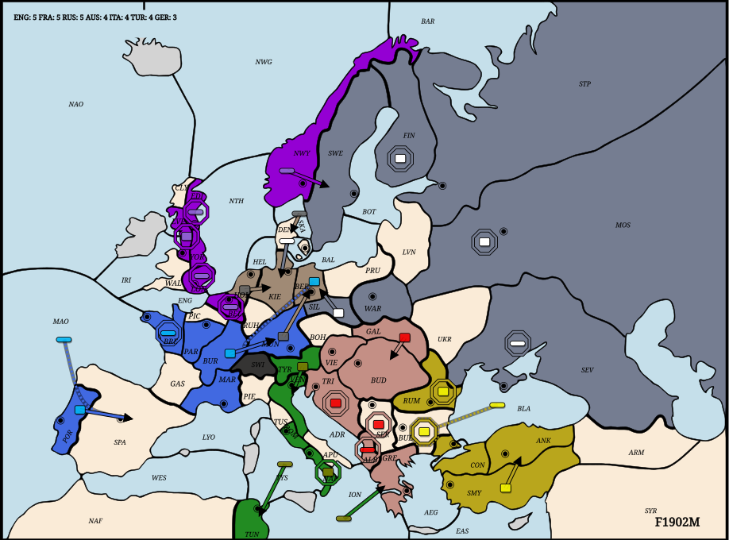

### What happened

- **AUSTRIA**: A GAL → BUD; A SER holds; F ALB holds; A TRI holds
- **ENGLAND**: F NWY → SWE; F BEL holds; F EDI holds; F LON holds; A LVP holds
- **FRANCE**: A BUR → MUN (bounced); A BER supports A BUR → MUN (support cut); A POR → SPA; F MAO supports A POR → SPA; F BRE holds
- **GERMANY**: A MUN → BER (bounced); A HOL → KIE (bounced); F SKA → DEN (bounced)
- **ITALY**: F ION → GRE; F TYS → TUN; A NAP holds; A TYR → VEN
- **RUSSIA**: A SIL → BER (bounced); F DEN → KIE (bounced); A FIN holds; A MOS holds; F SEV holds
- **TURKEY**: F BLA supports A BUL; A BUL holds; A RUM holds; A SMY → ANK

### Dialogue

- **AUSTRIA → RUSSIA**: Fall 1902 — I'm planning to push A GAL into RUM and A SER into BUL simultaneously, squeezing Turkey from two directions. If you can support with F SEV toward RUM or press A SIL to threaten Turkey's rear, we split their attention and I take RUM while you threaten from the north. Can you commit to coordinating this turn?
- **AUSTRIA → TURKEY**: I want to be direct: I'm moving on BUL this fall from SER, and I'd ask you not to reinforce BUL from RUM or CON — a bounce helps nobody. In exchange, I'll keep A GAL away from RUM if you agree to hold RUM defensively and not push toward BUD or SER. A clean division is better than a costly fight.
- **AUSTRIA → ITALY**: Fall 1902 — I need F ALB and A SER to push on BUL; can your ION fleet support into GRE or ADR to cover my flank? If you're serious about Lepanto, now is the time to pressure Turkey's Aegean position while I press from the north.
- **AUSTRIA → GERMANY**: A SIL is adjacent to GAL — can you confirm it's staying in SIL or heading west toward BER rather than toward my position? I have no designs on German territory and want to keep our border clean while we each deal with our respective threats.
- **ENGLAND → FRANCE**: France now has units in BER and BUR — that's deep into Germany's territory. I need to know your intentions toward HOL and BEL this fall; if you're pushing west, our arrangement is under serious strain. I'm willing to stay out of your way if you stay out of mine, but BEL is a red line for me.
- **ENGLAND → GERMANY**: France has retreated into BER and holds BUR — they're positioned to take HOL and possibly BEL. I'm willing to coordinate against France this fall; tell me what you're doing with F SKA, A HOL, and A MUN so we can plan something concrete. If France takes HOL, they'll be at 6 and very hard to stop.
- **ENGLAND → RUSSIA**: I'm planning to move F NWY into SWE this fall to claim that center — I'd ask you not to contest it with F DEN or A FIN. A stable Scandinavia split between us (SWE for me, DEN for you) is better than a fight that lets others grow unchecked. What are your plans in the north this turn?
- **FRANCE → RUSSIA**: I'm pushing A BUR into MUN this fall to retake that center, and I'd like A BER to support that move — but that leaves BER somewhat exposed if your A SIL moves there. Can we agree: you hold A SIL in place or move it toward PRU/WAR rather than BER, and I'll support your western flank in return? A BER supporting A BUR into MUN is worth more to both of us than a fight over BER.
- **FRANCE → GERMANY**: Fall 1902: I'm moving to retake Munich — you took it back in spring, now I'm coming back. I'm not interested in a prolonged war; if you concede MUN this fall and we settle on a stable border at BUR/MUN, I'll stop there and not push into KIE or BER. Otherwise we grind while England and Russia pick up the pieces.
- **FRANCE → ENGLAND**: I'm focused entirely on retaking Munich and securing Spain this fall — nothing moves toward BEL, ENG, or PIC. I want to flag that Russia is growing fast (5 SCs, strong position in Scandinavia and east) — if they're not checked soon, they'll be the dominant power. Worth discussing how we manage that together.
- **FRANCE → ITALY**: Quick update: I'm pushing into Munich and Spain this fall, nothing near MAR or PIE. With Turkey holding RUM and BUL and growing in the east, are you in a position to pressure them? A coordinated push against Turkey benefits both of us and keeps Austria honest.
- **GERMANY → ENGLAND**: France's A BER is sitting in my home center — I need to push them out this fall. Can you move F BEL toward BUR or PIC to cut off France's retreat options and keep pressure on them from the west? I'm planning A MUN - BER; if you can pin France's western units, we squeeze them hard.
- **GERMANY → RUSSIA**: France retreated into BER — my home center. I'm planning A MUN - BER this fall to retake it. Could you support with A SIL S A MUN - BER? That guarantees the take and keeps France from consolidating in Germany. I'm also watching your F DEN sitting on my supply center — I'd like to discuss a friendly handover of DEN this fall.
- **GERMANY → ITALY**: Good work last spring — we retook MUN together. This fall I'm pushing A MUN - BER to evict France's retreated army. Can you support from TYR or BOH if you're moving that direction, or at least hold pressure on France's southern flank? France needs to be squeezed from multiple directions.
- **GERMANY → FRANCE**: You've retreated into BER — I'm coming for it this fall. Withdraw now and we can discuss a stable border; if you hold, I'm pushing in with support and you lose the unit. The smarter play for both of us is a negotiated line rather than me burning through your armies one by one.
- **ITALY → AUSTRIA**: Fall 1902: My fleets are in ION and TYS — I can push F ION toward GRE or AEG this turn to support your Balkan moves against Turkey. If you're taking BUL with A SER, I can support that push or take GRE myself to deny Turkey that center. What exactly are you moving this fall so we can coordinate precisely?
- **ITALY → TURKEY**: Fall 1902: I want to be direct — my fleets in ION and TYS are pointed east, and I'm considering moves toward GRE or AEG this turn. If you're willing to discuss a deal where I take GRE and you retain BUL and RUM, we avoid a costly naval war; otherwise we're heading toward conflict. What are your intentions?
- **ITALY → GERMANY**: Fall 1902: MUN should be back in your hands now — well done. I'm focused on the eastern Med this turn, but A TYR is still available if you need coordination against France in BUR or elsewhere. What are your plans and where is France moving?
- **RUSSIA → FRANCE**: Fall is the moment to finish Germany — I'm planning to push A SIL into MUN or BER while F DEN takes Denmark. If you push from BUR toward MUN or support my move into BER, we split Germany's remaining centers cleanly. What's your plan this turn?
- **RUSSIA → GERMANY**: I want to be honest with you: France is pushing east and I'm in SIL — you're caught between us. Your best move may be to negotiate a deal that lets you survive rather than fight on two fronts. What are you willing to offer for Russian restraint?
- **RUSSIA → ENGLAND**: I'm taking Denmark with F DEN this fall — it's unoccupied and the natural move. I have no intention of pushing into NWY or threatening your northern position. Can we agree that DEN goes to me and you focus your fleets south against France, who is the real growth threat right now?
- **RUSSIA → TURKEY**: Holding to our border agreement — F SEV stays defensive, no push into RUM. I'm focused on Germany this fall. Hope you're similarly consolidating rather than expanding north.
- **TURKEY → AUSTRIA**: Fall 1902 — A BUL is sitting on Bulgaria and will hold or support defensively; I'm not pushing into SER or GRE. I'd ask you keep A SER out of BUL and RUM this fall so we can both consolidate cleanly. If you're worried about Russia's A SIL threatening GAL, I'm happy to discuss how we coordinate pressure on Russia from the south.
- **TURKEY → RUSSIA**: Our border deal has held — I kept F BLA away from SEV and held RUM defensively as promised. This fall I'm consolidating BUL and holding RUM; no push toward SEV or UKR. I hope you'll reciprocate by keeping A SIL and A MOS away from GAL and RUM — let's both grow in our respective directions.
- **TURKEY → ITALY**: Your fleets are now in ION and TYS — I need to understand your intentions before I can commit to anything cooperative. Are you planning to push into AEG or threaten my position in the Balkans? If your target is Austria or France, I'm open to discussing coordination; if it's me, let's talk now before this escalates.
- **ENGLAND → GERMANY**: I'm moving F NWY to SWE this fall to claim that center — that's my priority. For France: if you're pushing A MUN toward BER or holding, tell me your exact moves so I know whether F BEL can safely advance toward HOL or needs to stay put to guard against French pressure on BEL. I'll commit F BEL to HOL if you confirm A MUN is moving away from BUR.
- **ENGLAND → RUSSIA**: Confirming: I'm moving F NWY to SWE this fall — I expect you to take DEN with F DEN as you said, not SWE. If you contest SWE, we both lose the turn and France and Turkey grow unchecked. Lock in DEN for you, SWE for me — that's the stable split.
- **ENGLAND → FRANCE**: I've heard your commitment to stay out of BEL, ENG, and PIC — I'm holding you to that. My focus this fall is Scandinavia, not France. But if any of your units move toward BEL or ENG, I will respond immediately and hard. Stay east and we stay at peace.
- **FRANCE → RUSSIA**: Committing: A BUR - MUN supported by A BER, so MUN falls to me this fall. If you move A SIL toward PRU or hold it in place rather than contesting BER, we avoid a clash and I keep BER as a buffer — then next spring we coordinate on KIE or BER together. Don't let this moment slip by moving into my units.
- **FRANCE → ENGLAND**: Concrete commitment: F BRE holds, F MAO stays in the Atlantic, A BUR moves east toward MUN — nothing touches BEL, PIC, or ENG this fall. Germany is about to lose MUN; if you press HOL or KIE from BEL now, you can grab a German center while I grab another, and Germany collapses without either of us fighting each other.
- **FRANCE → GERMANY**: I'm taking MUN back this fall with A BUR supported by A BER — you don't have the strength to stop it. The rational move is to concede MUN and pull back to KIE/HOL to stabilize, rather than losing more units fighting a two-front war with Russia pressing from SIL.
- **GERMANY → ENGLAND**: I'm committing A MUN - BER this fall to retake my home center from France's retreated army. Can you confirm F BEL - BUR or F BEL - PIC to cut France's western options and prevent them supporting BER? A concrete move from you this turn is the difference between France losing BER and holding it.
- **GERMANY → RUSSIA**: Your message read as a threat — I'd rather deal straight. I'm not moving A MUN toward you; I'm pushing A MUN - BER to evict France. If you support A SIL - BER alongside my A MUN - BER, France loses the unit and we both benefit; if you'd rather pressure me instead, England and Italy are already coordinating against France and you'll end up isolated.
- **GERMANY → FRANCE**: You're in BER with no support — I'm pushing A MUN - BER this fall and England is moving from the west. The smart exit is to retreat BER voluntarily and we negotiate a stable line at BUR; if you hold, you lose the unit and I take BER anyway. Last chance to salvage your army.
- **GERMANY → ITALY**: I'm moving A MUN - BER this fall to evict France's retreated army. Can you support from TYR if you're adjacent, or pressure France's southern flank to keep them from reinforcing? Your continued coordination is valuable and I'll back your interests in the east in return.
- **ITALY → AUSTRIA**: Confirmed: I'm moving F ION toward AEG this turn to pressure Turkey's position and support your BUL push from the south. A TYR will hold or support your operations — tell me now if you want A TYR to support A SER into BUL and I'll commit to it. This is the Lepanto moment.
- **ITALY → TURKEY**: My F ION is moving toward AEG this turn — I want to be direct about that. If you want to avoid a full naval war, offer me something concrete now: a guaranteed non-aggression in the Aegean for 1903 in exchange for me holding short of BUL this year. Otherwise we're in conflict.
- **ITALY → GERMANY**: France owns MUN as a supply center — are you planning to hold it or push somewhere else this fall? I have A TYR adjacent and could move on MUN if you're vacating it, which denies France that center and gives me leverage. What are you doing this turn?
- **RUSSIA → FRANCE**: Let's not bounce each other in MUN — I'll push A SIL into BER while you take MUN from BUR. That splits Germany's last two centers cleanly between us with no wasted moves. Confirm this split and we both grow this fall.
- **RUSSIA → GERMANY**: I'm moving A SIL to BER this fall — your position is untenable with France in MUN and me in SIL. Consider disbanding gracefully or negotiating a survival deal, but I won't hold back this turn.
- **RUSSIA → ENGLAND**: F DEN is taking Denmark — it's unoccupied and the natural move, no threat to you. I'm focused entirely on Germany this fall, not Scandinavia. Your fleets should be pressing France from the west while I squeeze from the east.
- **RUSSIA → AUSTRIA**: I'm pushing into Germany this fall rather than coordinating against Turkey — F SEV holds the border as agreed. If you're moving on BUL/RUM, you have my diplomatic support but I can't commit forces south right now.
- **TURKEY → AUSTRIA**: I'm holding A BUL in place with support — moving A SER into BUL will bounce and cost you a tempo while I consolidate. The smarter play: hold SER, let me keep BUL, and we both turn attention to Russia's A SIL threatening GAL. If you push into BUL this fall and bounce, you've wasted your best offensive unit while Russia advances.
- **TURKEY → ITALY**: I'm prepared to accept this deal: you take GRE, I hold BUL and RUM — no Turkish units will contest GRE this fall. In exchange, I need your F ION to stay out of AEG this turn. Confirm this and we have a working arrangement for the eastern Med.
- **TURKEY → RUSSIA**: Thank you for holding to our agreement — I'm doing the same this fall, consolidating BUL and holding RUM, no push toward SEV or UKR. Austria is the growing threat in the Balkans; if you're pressing Germany, I'm pressing Austria from the south, and we both benefit.
- **ENGLAND → GERMANY**: I'm committing F NWY - SWE this fall — that's my priority and I'm not moving F BEL into HOL against you. Hold HOL and fight France; I'll hold BEL to keep your western flank secure. After this turn, let's talk about coordinating against France together from a position of strength.
- **ENGLAND → RUSSIA**: Final confirmation: F NWY moves to SWE, expect you to take DEN with F DEN as agreed. Do not contest SWE — a bounce there helps only France and Turkey. DEN for you, SWE for me, stable north.
- **ENGLAND → FRANCE**: Holding to our arrangement: F BEL holds, no moves toward HOL or Germany from me this turn. F NWY goes to SWE. Stay out of BEL, ENG, and PIC as committed — if you honor that, we remain at peace.
- **GERMANY → ENGLAND**: Final commitment: A MUN - BER to contest both France and Russia from taking my home center, A HOL - KIE to secure my vacant home SC, F SKA - DEN to retake that center. I need F BEL - HOL or F BEL - RUH to apply western pressure on France so they can't freely support BER. This is your best shot to cap France before they reach 6 centers.
- **GERMANY → ITALY**: Final commitment: A MUN - BER this fall to contest Russia and France in my home center — if you can move A TYR - MUN or support pressure on France's BUR unit, that prevents France from freely supporting BER and gives me a real shot at holding Germany together.
- **GERMANY → RUSSIA**: You announced A SIL - BER — I'm moving A MUN - BER to contest it. We'll bounce each other and France keeps BER, which serves neither of us. If you hold A SIL instead, I take BER back from France and you keep SIL; that's a better outcome for you than a bounce that hands France the center.
- **RUSSIA → FRANCE**: Committing: A SIL - BER this fall while you take MUN from BUR — Germany's last two centers split cleanly between us, no wasted moves. I'm not touching MUN and not moving toward BUR, so there's no clash. Hold BER next spring and we coordinate on KIE together.
- **RUSSIA → ENGLAND**: Confirming: F DEN takes Denmark, A FIN holds in place — no move toward SWE or NWY from me this fall. You take SWE with F NWY uncontested; I take DEN. That's the stable split we agreed on.
- **RUSSIA → TURKEY**: Holding to our agreement — F SEV holds, no push toward RUM or BLA this fall. I'm focused entirely on Germany. Consolidate your position and we stay out of each other's way.
- **TURKEY → AUSTRIA**: Committing: A BUL holds in place with F BLA support — moving A SER into BUL will bounce cleanly and cost you a turn while Russia's A SIL threatens GAL. I'm not moving into SER or GRE this fall; hold A SER in place and we both consolidate without waste.
- **TURKEY → ITALY**: Committing to our deal: no Turkish unit will contest GRE this fall, and I'm holding A BUL and A RUM defensively. I need F ION to stay out of AEG this turn as agreed — if you honor that, we have a working arrangement and I'll confirm non-aggression in AEG for 1903.
- **TURKEY → RUSSIA**: Holding to our border deal this fall: A RUM holds, F BLA stays defensive, no push toward SEV or UKR. I'm consolidating BUL — if you're pressing Germany, we're both moving in opposite directions and there's no conflict between us.

### AUSTRIA
Orders: `A GAL - BUD` · `A SER H` · `F ALB H` · `A TRI H`

Reasoning

> Looking at the current situation:
>
> **My units:** F ALB, A GAL, A SER, A TRI
> **My supply centers:** BUD (vacant), TRI, VIE (vacant), GRE
>
> My revised strategy was:
> - A SER → RUM (Turkey confirmed F BLA supports A BUL holding, so BUL would bounce; RUM is the better target)
> - A GAL → BUD (secure my vacant home center)
> - F ALB H (defend Adriatic flank)
> - A TRI H (hold firm)
>
> Let me verify adjacency:
> - A SER → RUM: SER neighbors include RUM ✓
> - A GAL → BUD: GAL neighbors include BUD ✓
> - F ALB H ✓
> - A TRI H ✓
>
> This gets me RUM (if undefended — Turkey has A RUM there, and F BLA is supporting A BUL, not A RUM). Wait — Turkey has A RUM in RUM. Moving A SER to RUM would require dislodging A RUM. Turkey's F BLA is supporting A BUL (holding), not A RUM. So A SER attacks A RUM with strength 1 vs. A RUM holding with strength 1 — that bounces unless I get support.
>
> I could have A GAL support A SER → RUM, but then BUD stays vacant. Alternatively, I take BUD with A GAL (no resistance) and try A SER → RUM unsupported (which will bounce against A RUM).
>
> Better to secure BUD (guaranteed gain) and hold SER defensively. A SER → RUM will bounce without support. Let me hold SER and take BUD, then look to build in Winter.
>
> Actually, I could try A SER → BUL — Turkey said F BLA supports A BUL, but if A BUL has support strength 2, I'd need 2 to break it. Without support, that bounces too.
>
> Best plan: Take BUD safely, hold everything else, and build in Winter for a stronger 1903 push.

### ENGLAND
Orders: `F NWY - SWE` · `F BEL H` · `F EDI H` · `F LON H` · `A LVP H`

Reasoning

> Looking at the current situation:
>
> **Strategic assessment:**
> - My revised strategy is clear: F NWY → SWE (claiming the 6th center), F BEL holds, home fleets hold
> - Russia confirmed they won't contest SWE and will take DEN with F DEN
> - France committed to stay out of BEL/ENG/PIC
> - Germany is pushing A MUN → BER and A HOL → KIE to fight France
>
> **Key considerations:**
> - F NWY → SWE is uncontested per Russia's commitment (F DEN takes DEN, A FIN holds)
> - F BEL holding honors my commitment to both France and Germany (not pushing into HOL against Germany, not pushing into PIC against France)
> - Home fleets (EDI, LON) should stay put — no threats to home centers
> - A LVP has nothing urgent to do; holding is fine
>
> **Checking legality:**
> - F NWY → SWE: NWY is adjacent to SWE ✓
> - F BEL H ✓
> - F EDI H ✓
> - F LON H ✓
> - A LVP H ✓
>
> This locks in SWE as my 6th center and maintains the stable diplomatic position I've negotiated. After this turn I'll have 6 centers (EDI, LON, LVP, BEL, NWY, SWE) and can build in winter.

### FRANCE
Orders: `A BUR - MUN` · `A BER S A BUR - MUN` · `A POR - SPA` · `F MAO S A POR - SPA` · `F BRE H`

Reasoning

> Looking at the current situation:
>
> **Assessment:**
> - My revised strategy is clear: A BUR → MUN (retake that center), A BER supports that attack, A POR → SPA (grab unowned SC), F MAO supports A POR → SPA, F BRE holds.
> - Russia committed to taking BER with A SIL, which frees me to use A BER to support A BUR → MUN rather than defend BER. If Russia follows through, I gain MUN and Russia gains BER — Germany loses both its home centers in one turn.
> - Germany threatened to push A MUN → BER, but with A BER supporting A BUR → MUN, that means A MUN would be moving *away* from BER while I'm attacking MUN. The attack on MUN should succeed: A BUR + A BER support = strength 2 vs. A MUN alone = strength 1.
> - If Germany instead holds A MUN to defend, my supported attack still wins (2 vs 1).
> - A POR → SPA grabs Spain (unowned SC) with F MAO support — clean grab.
> - England committed to holding F BEL and not pushing toward HOL, so my western flank is safe.
> - F BRE holds to honor my commitment to England and keep the Atlantic quiet.
>
> **End of fall projection:** France at 7 SCs (BRE, MAR, PAR, MUN, POR, SPA + BER if Russia doesn't take it... but Russia is taking BER). So France at 6: BRE, MAR, PAR, MUN, POR, SPA. That's a gain of +1 (MUN back, SPA new, but MUN was already mine before spring). Actually: current SCs are BRE, MAR, PAR, MUN, POR = 5. Adding SPA = 6. MUN stays mine. Good.

### GERMANY
Orders: `A MUN - BER` · `A HOL - KIE` · `F SKA - DEN`

Reasoning

> Looking at the current situation:
>
> **Position assessment:**
> - France has A BER (my home center) and A BUR, with A BER potentially supported by A BUR
> - Russia has A SIL and announced A SIL - BER
> - My units: A MUN, A HOL, F SKA
> - My committed strategy: A MUN - BER, A HOL - KIE, F SKA - DEN
>
> **Key considerations:**
> - A MUN - BER: Both Russia (A SIL - BER) and I are moving there. If France's A BER is unsupported, it gets dislodged by whoever has more strength — but if both Russia and I move in, we bounce each other and France holds. However, I must contest BER to deny France a free hold. The bounce with Russia is unfortunate but at least France doesn't get a clean hold with support.
> - Actually, if France has A BER with A BUR support (A BUR S A BER), then BER has strength 2. My A MUN alone has strength 1. Russia's A SIL alone has strength 1. Both bounce against France's supported hold. Still, I should move there to at least contest.
> - A HOL - KIE: Secures my vacant home SC. No conflict expected.
> - F SKA - DEN: Retakes DEN from Russia's F DEN. Russia's F DEN is there — this is a direct contest. F SKA moves to DEN while Russia's F DEN is there, but Russia may be moving F DEN elsewhere (they moved F BOT→SWE area). Actually Russia has F DEN per the unit list. F SKA - DEN attacks Russia's F DEN. If undefended/unsupported, I take it.
>
> My committed orders stand as the best available play.

### ITALY
Orders: `F ION - GRE` · `F TYS - TUN` · `A NAP H` · `A TYR - VEN`

Reasoning

> Looking at my revised strategy note: I committed to moving F ION to GRE (capturing that supply center per my deal with Turkey), F TYS to TUN (securing another center), holding A NAP defensively, and moving A TYR to VEN (occupying my vacant home center for a winter build).
>
> Let me verify adjacency:
> - F ION → GRE: ION is adjacent to GRE ✓
> - F TYS → TUN: TYS is adjacent to TUN ✓
> - A NAP H ✓
> - A TYR → VEN: TYR is adjacent to VEN ✓
>
> All moves are legal. This gives me GRE and TUN as new supply centers (plus VEN and ROM as home centers I already hold), potentially going from 4 to 6 supply centers if everything works out. GRE is uncontested per my deal with Turkey. TUN should be unoccupied. VEN is my vacant home center.

### RUSSIA
Orders: `A SIL - BER` · `F DEN - KIE` · `A FIN H` · `A MOS H` · `F SEV H`

Reasoning

> Looking at the current situation:
>
> **Strategic assessment for Fall 1902:**
>
> My revised strategy calls for:
> 1. A SIL → BER (coordinated with France taking MUN from BUR)
> 2. F DEN → KIE (taking an unoccupied German center — wait, let me check: DEN is now mine, KIE is unoccupied and adjacent to DEN)
> 3. A FIN H (hold defensively)
> 4. A MOS H (hold defensively)
> 5. F SEV H (honor Turkey border agreement)
>
> Wait — I need to re-examine. My strategy note says "F DEN - KIE" but I also told England I'd take DEN with F DEN. DEN is already mine (I took it in Spring 1902 with F SWE → DEN). Now F DEN is sitting in DEN. So I should push F DEN to KIE (unoccupied German center) rather than hold.
>
> Also checking: England said they'd take SWE with F NWY. I confirmed DEN for me, SWE for England. That's consistent — I'm not contesting SWE.
>
> The key coordination: France takes MUN from BUR, I take BER from SIL. Germany's A MUN threatens to bounce me in BER (Germany said they'd move A MUN → BER). If Germany does move A MUN → BER and I move A SIL → BER, we bounce and France keeps BER. But France committed to A BUR → MUN with A BER supporting — wait, France said "A BUR - MUN supported by A BER." If A BER supports A BUR → MUN, then A MUN can't also go to BER (it would be moving away). So Germany's A MUN is going to BER to contest France's A BER... but France has A BER supporting A BUR → MUN. This means Germany's A MUN → BER gets cut by my A SIL → BER, and France's A BUR → MUN succeeds with A BER support strength 2 vs A MUN strength 1. My A SIL → BER vs Germany's A MUN → BER — both at strength 1, they bounce. Hmm.
>
> Actually if France's A BER supports A BUR → MUN, then A MUN is being attacked from BUR (strength 2) and from BER's support. A MUN must retreat. But A MUN can't go to BER if A SIL is also going there — they'd bounce. This actually works out: France takes MUN, I take BER if Germany's A MUN is forced out of MUN and can't go to BER (bounced by my SIL). 
>
> Sticking with the plan as committed.

### TURKEY
Orders: `F BLA S A BUL` · `A BUL H` · `A RUM H` · `A SMY - ANK`

Reasoning

> Looking at the current situation for Fall 1902:
>
> **Strategic assessment:**
> - I need to capture Bulgaria (unowned SC) - A BUL should hold there or move to secure it. Actually, BUL is already where my army is, and it's an unowned SC that I'll capture by occupying it at fall's end.
> - Romania (RUM) is an SC I already hold - I need to keep it.
> - I committed to: holding A BUL with F BLA support (to defend against Austria's A SER push), holding A RUM, and moving A SMY to ANK to vacate SMY for a winter build.
> - I agreed with Italy not to contest GRE (they can take it), and agreed with Russia to hold RUM defensively.
> - Austria is pushing A SER → BUL, so I need F BLA to support A BUL holding.
>
> **Order verification:**
> - `F BLA S A BUL` - BLA is adjacent to BUL? BLA neighbors include BUL/EC, so yes, fleet can support army in BUL.
> - `A BUL H` - straightforward hold
> - `A RUM H` - hold Romania
> - `A SMY - ANK` - SMY is adjacent to ANK? Yes (SMY neighbors: AEG, ANK, ARM, CON, EAS, SYR). Legal.
>
> This secures BUL and RUM as supply centers, vacates SMY for a winter build, and honors my commitments to Russia and Italy.

## WINTER 1902 ADJUSTMENTS (`W1902A`)

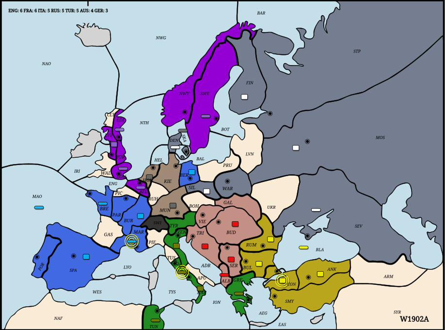

### What happened

- **FRANCE**: builds F MAR
- **ITALY**: builds F ROM
- **TURKEY**: builds A CON

### FRANCE
Orders: `F MAR B`

Reasoning

> Looking at the current situation:
>
> **Assessment:**
> - I have 6 supply centers (BRE, MAR, PAR, POR, BER, SPA) and 5 units (F MAO, F BRE, A BUR, A BER, A SPA)
> - I'm owed 1 build (6 SCs - 5 units = 1 build)
> - Open home centers: MAR (vacant), PAR (vacant)
> - BRE is occupied by F BRE, so I can't build there
>
> **Build decision:**
> I need to decide between building at MAR or PAR (or both if I had 2 builds, but I only have 1).
>
> - MAR: Can build A MAR or F MAR. A fleet at MAR gives me access to LYO, SPA/SC, PIE — useful for Mediterranean presence and protecting against Italy. An army at MAR gives me a land unit to push toward SPA or defend southern France.
> - PAR: Can only build A PAR. An army at PAR gives me a central land unit to push toward BUR, MUN, or GAS.
>
> Given my current strategic position:
> - I have A BUR already threatening MUN
> - A BER is deep in Germany but exposed
> - I need to reinforce my eastern push toward MUN
> - An army at PAR would give me backup for A BUR and help push toward MUN
> - A fleet at MAR would help secure the Mediterranean and potentially threaten Italy or support Iberian operations
>
> With Germany weakened and Russia pressing from the east, I want to keep pressure on Germany. An army at PAR gives me the most flexibility for the land campaign. However, a fleet at MAR would be useful for long-term Mediterranean strategy and protecting against Italy's growing fleet presence.
>
> Given that I'm already strong on land with A BUR, A BER, and A SPA, and Italy has 2 fleets (GRE, TUN) growing in the Med, I'll build F MAR to counter Italian naval expansion and secure my southern flank.

### ITALY
Orders: `F ROM B`

Reasoning

> Looking at my position: I have 5 supply centers (NAP, ROM, VEN, TUN, GRE) and 4 units (A NAP, A VEN, F GRE, F TUN). That means I have 1 build available, and my only open home center is ROM.
>
> I should build a fleet in ROM to support my Lepanto strategy — I need more naval power in the eastern Mediterranean to pressure Turkey and potentially take more Balkan centers. A fleet in ROM can move to TYS or NAP coast and eventually support operations in the Aegean.

### TURKEY
Orders: `A CON B`

Reasoning

> Looking at my situation: I have 5 supply centers (ANK, CON, SMY, RUM, BUL) and 4 units (F BLA, A RUM, A BUL, A ANK), so I get 1 build.
>
> My home centers: ANK is occupied by A ANK, CON is vacant, SMY is vacant.
>
> I can build at CON or SMY. Strategically, I should think about what unit type serves me best:
>
> - A fleet at CON would give me more naval presence in the Black Sea area, but F BLA already covers that.
> - An army at CON is well-positioned to support BUL or push into the Balkans.
> - An army at SMY could support ANK or move toward ARM.
> - A fleet at SMY could threaten EAS or AEG, which would concern Italy.
>
> Given Italy's fleets are moving into ION and TYS (threatening GRE and potentially AEG), and Austria is pressing from the north, I need ground forces in the Balkans more than additional naval power. An army at CON can reinforce BUL or RUM as needed. Italy's naval threat in AEG is concerning, but I don't want to provoke Italy further right now, and F BLA already provides Black Sea coverage.
>
> Building A CON gives me flexibility to support BUL from behind, push into Serbia eventually, or reinforce RUM. This is the most tactically useful build.

## SPRING 1903 MOVEMENT (`S1903M`)

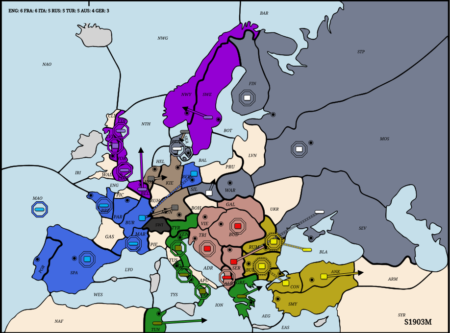

### What happened

- **AUSTRIA**: A SER → RUM (bounced); A BUD holds; A TRI holds; F ALB holds
- **ENGLAND**: F BEL → NTH; F EDI holds; F LON holds; A LVP holds; F SWE → NWY
- **FRANCE**: A BUR → MUN; A BER supports A BUR → MUN; F MAO holds; F BRE holds; A SPA holds; F MAR holds
- **GERMANY**: A MUN → BUR (bounced); A HOL → KIE; F SKA → DEN (bounced)  [dislodged: A MUN]
- **ITALY**: F GRE → BUL/SC (bounced); F TUN → ION; A VEN holds; A NAP holds; F ROM holds
- **RUSSIA**: F SEV supports A SER → RUM; A SIL → PRU; A FIN holds; A MOS holds; F DEN holds
- **TURKEY**: F BLA supports A RUM; A RUM holds; A BUL holds; A CON supports A BUL; A ANK → ARM

### Dialogue

- **AUSTRIA → RUSSIA**: Spring 1903 — I'm committing A SER to RUM this turn and need your F SEV to support that move. Turkey has A RUM sitting there and won't give it up voluntarily; a supported attack from SER with F SEV backing guarantees we take it. Can you confirm F SEV S A SER - RUM? This is the moment to break Turkey's northern anchor.
- **AUSTRIA → TURKEY**: I'm going to be honest: A RUM is my target this spring. Rather than a costly fight, consider pulling A RUM back to BUL or SER voluntarily — you keep your units intact and we establish a defensible Danube border. A bounce wastes both our turns while Russia builds pressure from the north.
- **AUSTRIA → ITALY**: Your F GRE is well-positioned to press into BUL/SC or support pressure on Turkey's position this spring. I'm moving on RUM from SER; if you push F GRE toward AEG or BUL simultaneously, Turkey has to defend on two fronts. Are you willing to coordinate a joint squeeze on Turkey this turn?
- **ENGLAND → GERMANY**: France is at 6 centers with units in BER, BUR, and SPA — they are the runaway threat and you're down to 3. I'm pushing F BEL into NTH this spring to dominate the North Sea and open up options against France's northern flank. Tell me your exact moves with F SKA, A HOL, and A MUN — if you're pressing BUR or holding MUN, I can coordinate F BEL to support or follow up. This is the moment we act together or France reaches 8.
- **ENGLAND → FRANCE**: You're at 6 centers with BER, BUR, SPA, and three fleets — I need to understand your intentions this spring. Are any of your units moving toward BEL, ENG, or the Channel? If you're staying east and focusing on Germany, we can maintain our arrangement, but I'm watching your fleet positions very closely.
- **ENGLAND → RUSSIA**: I'm pushing F BEL into NTH this spring to reclaim North Sea dominance and build pressure against France. In the north, I'd like F SWE to hold or move toward FIN — can you confirm F DEN and A FIN are not moving toward SWE or NWY? A stable Scandinavian split lets us both focus resources on the real threats.
- **FRANCE → ENGLAND**: Spring 1903: I'm pushing A BUR into Munich supported by A BER — Germany is nearly finished. If you move F BEL toward HOL or KIE, we can split Germany's last centers cleanly this turn and both reach 7 SCs. I'm holding my Atlantic fleets in place — nothing touches BEL, ENG, or PIC.
- **FRANCE → RUSSIA**: Spring 1903: I'm taking MUN with A BUR supported by A BER — Germany collapses this turn if you press A SIL toward KIE or PRU simultaneously. With Germany gone, we should discuss how to divide their remaining centers (KIE, HOL) before England or Italy snaps them up.
- **FRANCE → GERMANY**: Spring 1903: Munich falls this turn — I have A BUR moving in with A BER support and you can't stop it with only three centers and Russia pressing from the east. Concede MUN and pull back to KIE/HOL; I'll negotiate a stable border there rather than pursue you further.
- **FRANCE → ITALY**: Spring 1903: I'm entirely focused on finishing Germany this turn — nothing moves toward MAR, PIE, or the western Med. Turkey is at 5 SCs and growing fast in the east; are you in a position to press them from GRE or the Ionian, or do you need Austrian cooperation to do it?
- **GERMANY → ENGLAND**: France holds BER — my home center — and has 6 centers now, which is a serious runaway threat for both of us. I'm planning A MUN - BER this spring; can you move F BEL toward RUH or BUR to pressure France from the west and prevent them reinforcing BER? A coordinated squeeze this turn could cost France two centers and cap them hard.
- **GERMANY → FRANCE**: You hold BER and have 6 centers — you're the board leader and I have no choice but to push back. I'm offering one last negotiated exit: withdraw A BER to SIL voluntarily and we agree on a stable border at BUR/MUN, or I push in with support and you lose the unit regardless.
- **GERMANY → ITALY**: France still holds BER with 6 centers — they're the runaway threat. I'm moving A MUN - BER this spring; can you support from any adjacent position or pressure France's southern flank to keep them off-balance? Your help last year was decisive and I'd like to keep our coordination going.
- **GERMANY → RUSSIA**: I'm focused on retaking BER from France this spring — not moving toward you. Can we agree that A SIL stays out of MUN and we each focus on our respective threats? France at 6 centers is the bigger danger to both of us.
- **ITALY → AUSTRIA**: Spring 1903: I'm planning to push F GRE toward BUL this turn to press Turkey's Balkan position — this is the Lepanto moment we've been building toward. If you can move A SER toward BUL simultaneously or support my fleet push, we crack Turkey's position together. What are your units doing this spring and can we coordinate precisely?
- **ITALY → TURKEY**: Spring 1903: I need to be honest — my F GRE is pointed at BUL/SC this turn. You've grown to 5 centers and your position in the Balkans is strong; I need to press now before you consolidate further. If you want to negotiate a different arrangement that gives me something concrete in the eastern Med, I'm listening, but I need an offer fast.
- **ITALY → FRANCE**: Spring 1903: You're at 6 centers with BER — you're becoming the board leader and that concerns me. I'm focused on Turkey right now, but I want to understand your intentions toward Austria and Germany this year; are you planning to push east or consolidate what you have?
- **RUSSIA → FRANCE**: Spring 1903 — I'm planning to push A SIL into MUN this turn to claim Germany's last major center while you hold BER and BUR. That gives you BER and me MUN, and we can coordinate on KIE next. Can you confirm you're not contesting MUN from BUR this turn so we don't bounce?
- **RUSSIA → ENGLAND**: France now has 6 centers with units in BER, BUR, SPA, MAR, MAO, BRE — they're positioned to dominate the continent if unchecked. I'm pressing Germany from SIL this turn; what are your fleets doing about France's growing naval and coastal presence? A coordinated squeeze from both of us is the only thing that stops them.
- **RUSSIA → TURKEY**: Checking in — are you still holding to our border agreement this spring? I'm focused entirely on Germany from SIL and have no intention of pushing toward RUM or BLA. If you're similarly consolidating, we stay out of each other's way and both benefit.
- **RUSSIA → AUSTRIA**: Austria — Turkey has 5 centers and is well-positioned in the Balkans with RUM, BUL, and a fleet in BLA. I'm tied up against Germany this spring, but if you're pressing into BUL or RUM from SER, I can support diplomatically and potentially coordinate next fall. What's your plan against Turkey?
- **TURKEY → RUSSIA**: Spring 1903 — I've honored our border deal through 1902, but I need to be honest: my A RUM is going to press toward SEV this spring. Russia's position is strengthening in the north and I can't afford to stay static while you grow. If you want to negotiate a face-saving arrangement — perhaps you pull F SEV back to ARM and I hold short of SEV — I'm open to it, but I need movement on the eastern front.
- **TURKEY → AUSTRIA**: Spring 1903 — I want to coordinate against Russia this year. My A RUM is pressing toward SEV; if you can push A BUD toward GAL or hold A SER to cover my flank in BUL, we can squeeze Russia from two directions simultaneously. What are your intentions this spring?
- **TURKEY → ITALY**: Spring 1903 — your F GRE is sitting adjacent to BUL, which makes me nervous. I honored our deal last fall (no contest of GRE), and I'm asking you to keep F GRE out of BUL this spring in return. Tell me your target this year — if it's Austria, I can support that; if it's me, let's talk before this escalates.
- **AUSTRIA → RUSSIA**: Russia — F SEV supporting A SER into RUM is a one-unit commitment that costs you nothing against Germany and gains us both: Turkey loses RUM, their northern anchor collapses, and you gain leverage over the entire Balkan theater without moving a single unit westward. I'm committing A SER to RUM this turn — please confirm F SEV S A SER - RUM or we both lose this window.
- **AUSTRIA → ITALY**: Italy — commit F GRE toward BUL/SC this turn and I'll push A SER into RUM simultaneously; Turkey has to defend on two fronts and can't hold both. This is the precise coordination we've been building toward — confirm F GRE - BUL/SC and I lock in A SER - RUM.
- **AUSTRIA → TURKEY**: Turkey — I'm moving A SER to RUM regardless; a bounce helps Russia more than either of us. If you withdraw A RUM to BUL voluntarily, you keep your forces intact and we establish a clean Danube border — otherwise you risk losing RUM to a supported attack if Russia commits F SEV.
- **ENGLAND → GERMANY**: Concrete proposal: I move F BEL into NTH this spring, which threatens HOL and opens pressure on France's northern flank. You move A MUN toward BUR or hold MUN defensively — if you hold MUN, I can follow up into HOL next turn to deny France that center. Tell me: are you moving A MUN to BUR or holding? That determines whether I push into HOL directly this fall.
- **ENGLAND → FRANCE**: I'm not moving toward BEL, ENG, or PIC this spring — my fleets are repositioning north. But I need a straight answer: is A BUR moving to MUN this turn? If Germany collapses, you reach 7 centers and I have to respond regardless of our arrangement. Give me a reason to stay neutral.
- **ENGLAND → RUSSIA**: Confirming: I'm moving F BEL into NTH this spring. In the north, I need F SWE to hold — can you confirm A FIN and F DEN are not moving toward SWE or NWY? If you're pressing Germany from SIL, we should coordinate timing so France can't exploit the gap.
- **FRANCE → RUSSIA**: I'm moving A BUR into MUN this turn with A BER support — that's two units vs. your one in SIL, so MUN falls to me. Don't contest it; instead push A SIL into PRU or KIE and you grab a center there while I take MUN. We both grow without bouncing each other.
- **FRANCE → ENGLAND**: Concrete proposal: I move A BUR - MUN, A BER holds or supports. If you move F BEL - HOL this turn, HOL falls to you and Germany is finished — you reach 7 SCs and I reach 7. Nothing from me touches BEL, ENG, or PIC, I promise.
- **FRANCE → GERMANY**: This is your last realistic moment to negotiate: concede MUN this turn and I'll stop at MUN/BER — I won't push toward KIE. If you fight it, you lose MUN anyway and I push further. A stable border at MUN is better for you than total collapse.
- **GERMANY → ENGLAND**: I need you to move F BEL toward RUH or BUR — not NTH — to cut France's western support for BER. If you go to NTH while I push A MUN - BER, France simply supports BER from BUR and I bounce harmlessly. A concrete western push from you this turn is what actually costs France centers.
- **GERMANY → RUSSIA**: France is at 6 centers and growing — A SIL moving to MUN hands them a free consolidation while you get nothing. If you move A SIL - BER instead, we both attack BER simultaneously: France loses the unit or is forced to retreat, and you gain a center. That's a far better outcome for you than taking MUN and letting France keep BER.
- **GERMANY → ITALY**: France's A BUR is the key support unit for BER — if you can pressure BUR from MAR or support a move into RUH, it cuts France's ability to defend BER and my push becomes viable. Can you move anything toward BUR this turn or pressure France's southern flank concretely?
- **ITALY → AUSTRIA**: Confirmed: I'm moving F GRE to BUL/SC this turn — commit A SER to BUL simultaneously and we split Turkey's defense and take centers together. If you're hitting RUM instead, tell me now so I can support appropriately; I need your exact move to make sure we don't waste the coordination.
- **ITALY → TURKEY**: I honored the GRE deal last fall and you benefited — now I need BUL or the eastern Med balance tips too far in your favor. If you pull A BUL back to CON and let me take it uncontested, I'll hold F GRE there and not push into AEG; otherwise we're in a fight that costs us both while Austria grows unchecked.
- **ITALY → FRANCE**: You're at 6 centers with a strong position — I'm watching that carefully. I'm pressing Turkey this turn from GRE; if you're genuinely focused on Germany, we're not in conflict, but I'd want to know your intentions toward Austria before committing to anything deeper.
- **RUSSIA → AUSTRIA**: Confirmed — F SEV will support A SER into RUM this spring. Turkey just told me they're breaking our border deal and pushing A RUM toward SEV, so eliminating that unit benefits us both. Execute A SER - RUM and I'll back it with F SEV support.
- **RUSSIA → TURKEY**: You're making a serious mistake — breaking our deal now exposes you on multiple fronts simultaneously. Austria is pressing you from SER, I'm supporting that attack with F SEV, and if A RUM is dislodged, you lose your northern anchor. Recommit to the border deal and hold A RUM in place; that's the only outcome where you keep RUM.
- **RUSSIA → FRANCE**: Clarifying our coordination: if you're taking MUN from BUR supported by BER, I'll push A SIL into PRU this turn instead of contesting MUN — that opens KIE next fall and we don't bounce. Confirm you're covering MUN from BUR so I know SIL is free to go east toward PRU.
- **RUSSIA → ENGLAND**: France has six centers and is absorbing Germany — that's the real threat to your position, not me. I'm committing F DEN to hold or press KIE, and A FIN holds in place — no move toward SWE or NWY from me. Focus your fleets on France's coastal presence before they lock up the western board.
- **TURKEY → AUSTRIA**: I won't be pulling A RUM back — that's my key offensive unit this year, pressing toward SEV. If you move on RUM, you'll bounce against my hold and waste your turn while Russia consolidates in GAL. The smarter play: support my push into SEV by holding A BUD in place, and I'll guarantee no Turkish unit enters SER or BUD this year.
- **TURKEY → ITALY**: I honored our deal last fall and I'm asking you to honor the spirit of it now: keep F GRE out of BUL this spring. If you push into BUL and I defend successfully, we've both wasted a turn while Austria picks up the pieces. Concrete offer: I will move A ANK toward ARM this spring, opening space in the east — give me BUL and I give you a free hand in AEG.
- **TURKEY → RUSSIA**: I've been straight with you: A RUM is pressing toward SEV this spring. This isn't a betrayal of our border deal — it's the natural next step as both our positions evolve. If you want to avoid a fight, pull F SEV back to ARM and I'll hold short of SEV for one more season while we renegotiate a new border further north.
- **GERMANY → ENGLAND**: Final commitment: A MUN - BUR to bounce France and cut their BER support, A HOL - KIE to secure my home center, F SKA - DEN. Move F BEL - RUH this turn — that forces France to defend BUR from two directions and they cannot safely take MUN or hold BER. This is the concrete western push that costs France centers.
- **GERMANY → FRANCE**: Final answer: A MUN - BUR this turn — we bounce, you don't take MUN, and your BER support is wasted. Withdraw A BER to SIL and pull A BUR back to PAR and we negotiate a stable border; otherwise I keep contesting and you burn turns while England closes from the west.
- **GERMANY → RUSSIA**: I'm moving A MUN - BUR and A HOL - KIE this turn — not toward you. If A SIL moves to BER while France's support is disrupted, you take BER cleanly; that's a better outcome than A SIL - MUN which just hands France a free consolidation while you gain nothing lasting.
- **GERMANY → ITALY**: I'm playing A MUN - BUR to bounce France and deny their MUN attack — if you can pressure BUR from MAR or support a push into RUH from any adjacent unit, France is caught from two directions. Name what you need from me next turn and I'll back your eastern position.
- **RUSSIA → AUSTRIA**: Confirmed and committing: F SEV S A SER - RUM this spring — Turkey broke our deal and is pressing toward SEV, so eliminating A RUM benefits us both directly. Execute A SER - RUM and we dislodge that unit together; I expect you to follow through on A SER moving into RUM.
- **RUSSIA → FRANCE**: Committing: A SIL moves to PRU this turn, leaving MUN entirely to you from BUR — no bounce, you take MUN cleanly with BER support. In return, confirm A BER is not moving toward SIL or PRU so we don't collide on the eastern flank.
- **RUSSIA → TURKEY**: Final warning: Austria is moving A SER into RUM with F SEV support this turn — your unit will be dislodged unless you hold it in place and negotiate now. Recommit to the border deal immediately and I'll pull the support; otherwise you lose RUM and your northern anchor collapses.
- **RUSSIA → ENGLAND**: Committing: A FIN holds, F DEN holds or presses KIE — no move toward SWE or NWY from me this turn. France is taking MUN this spring and will be at 7 centers; your fleets need to be pressing their coastal position before they lock up the west.

### AUSTRIA
Orders: `A SER - RUM` · `A BUD H` · `A TRI H` · `F ALB H`

Reasoning

> Looking at the current situation:
>
> **Strategic assessment:**
> - Russia has confirmed F SEV will support A SER into RUM — this is a solid supported attack that should dislodge Turkey's A RUM
> - Italy has confirmed F GRE is moving to BUL/SC, splitting Turkey's defense
> - My revised strategy is clear: A SER - RUM (supported by F SEV), hold A BUD and A TRI defensively, hold F ALB
>
> **Order verification:**
> - A SER - RUM: SER and RUM are adjacent (confirmed in adjacency table: RUM neighbors include SER) ✓
> - F ALB H: holding in Adriatic position ✓
> - A BUD H: defensive hold ✓
> - A TRI H: defensive hold ✓
>
> The supported attack on RUM (strength 2 vs Turkey's strength 1 hold) should succeed. Turkey claimed they'd push A RUM toward SEV, but even if they try to move, F SEV's support order would still back my attack and Turkey's unit would be dislodged from RUM regardless (a moving unit can still be dislodged if it fails to move). Actually, if Turkey moves A RUM - SEV and Russia is supporting A SER - RUM, Turkey's move would fail (F SEV is there supporting rather than being attacked), and A SER would take RUM.
>
> This is a clean execution of the agreed coalition move.

### ENGLAND
Orders: `F BEL - NTH` · `F EDI H` · `F LON H` · `A LVP H` · `F SWE - NWY`

Reasoning

> Looking at the board state and my revised strategy, I need to execute the plan I settled on: move F BEL into NTH to reclaim North Sea dominance, push F SWE toward NWY to pressure Russia's northern flank, and hold my home fleets defensively.
>
> Let me verify the key moves:
> - F BEL - NTH: BEL is adjacent to NTH ✓ (in legal orders list)
> - F SWE - NWY: SWE is adjacent to NWY ✓ (in legal orders list)
> - F EDI H, F LON H, A LVP H: all valid holds ✓
>
> Russia confirmed A FIN holds and F DEN holds/presses KIE — no threat to SWE or NWY. France promised nothing touches BEL, ENG, or PIC. Germany is moving A MUN - BUR and A HOL - KIE, F SKA - DEN.
>
> By moving into NTH, I gain a dominant naval position. By pushing F SWE to NWY, I reclaim that center (currently unoccupied since I moved F NWY to SWE last fall — wait, NWY is now empty since my fleet left). That gives me a 7th center if successful.
>
> Actually, NWY was my center and I moved F NWY → SWE in F1902M. NWY is now unoccupied but still mine. F SWE - NWY would move back to NWY, not gaining a new center. But it does pressure Russia's FIN and keeps the north secure. The strategic logic still holds — it maintains my Norwegian position and threatens Russia.

### FRANCE
Orders: `A BUR - MUN` · `A BER S A BUR - MUN` · `F MAO H` · `F BRE H` · `A SPA H` · `F MAR H`

Reasoning

> Looking at the current situation:
>
> - Russia has confirmed A SIL → PRU, leaving MUN open for my A BUR → MUN supported by A BER
> - Germany threatened A MUN → BUR to bounce me, but with A BER supporting A BUR → MUN, even if Germany holds MUN or moves out, I need to check: if Germany plays A MUN → BUR, then BUR is contested and my move fails. But Germany only has A MUN, A HOL, F SKA — no support for MUN. If A MUN → BUR and I'm moving A BUR → MUN, we bounce each other. That's a risk.
>
> However, Germany said "A MUN - BUR this turn" as a threat. If Germany moves A MUN → BUR and I move A BUR → MUN, we bounce — neither moves. But A BER supporting A BUR → MUN only helps if A BUR actually moves into MUN. If Germany vacates MUN to go to BUR, then MUN is empty and A BUR → MUN succeeds (Germany moved out). So either way: if Germany stays in MUN, I need support to dislodge (strength 2 vs 1); if Germany moves to BUR, MUN is empty and A BUR walks in. The bounce scenario only happens if Germany moves to BUR AND I move to MUN — but if Germany moves out, MUN is empty so A BUR → MUN succeeds regardless.
>
> Wait — if A MUN → BUR and A BUR → MUN simultaneously, they swap? No, in Diplomacy units cannot swap without a convoy. Both moves bounce. So Germany could deny me MUN this turn by moving to BUR. But with A BER supporting A BUR → MUN (strength 2), and Germany in BUR with no support (strength 1), the bounce still happens because the attack on MUN from BUR has strength 2 but MUN is now empty... Actually if MUN is vacant, A BUR → MUN succeeds with strength 1 even without support. The issue is only if Germany stays in MUN.
>
> My revised strategy is clear: A BUR → MUN, A BER supports that, Atlantic fleets hold, A SPA holds, F MAR holds.

### GERMANY
Orders: `A MUN - BUR` · `A HOL - KIE` · `F SKA - DEN`

Reasoning

> Looking at the current position: France has 6 centers with A BER (my home center), A BUR threatening MUN, and A SPA/F MAO/F BRE/F MAR supporting their position. Russia has A SIL adjacent to BER and MUN. I'm down to 3 centers with only 3 units.
>
> My revised strategy commits to:
> 1. A MUN - BUR to bounce France's attack on Munich and disrupt their BER support
> 2. A HOL - KIE to secure my vacant home supply center
> 3. F SKA - DEN to reclaim that supply center from Russia
>
> Let me verify legality:
> - A MUN - BUR: MUN is adjacent to BUR ✓ (BUR is in MUN's neighbor list)
> - A HOL - KIE: HOL is adjacent to KIE ✓ (KIE is in HOL's legal options)
> - F SKA - DEN: SKA is adjacent to DEN ✓ (DEN is in SKA's legal options)
>
> The BUR bounce is critical — if France plays A BUR - MUN supported by A BER, my A MUN - BUR meets them head-on and we both bounce, denying France MUN. Meanwhile I secure KIE and try to reclaim DEN (though Russia's F DEN is there — this will likely bounce too, but it's the right contest).

### ITALY
Orders: `F GRE - BUL/SC` · `F TUN - ION` · `A VEN H` · `A NAP H` · `F ROM H`

Reasoning

> Looking at my committed strategy: F GRE - BUL/SC, F TUN - ION, A VEN H, A NAP H, F ROM H.
>
> Let me verify these are all legal moves from the legal orders list:
> - F GRE - BUL/SC ✓ (listed)
> - F TUN - ION ✓ (listed)
> - A VEN H ✓ (listed)
> - A NAP H ✓ (listed)
> - F ROM H ✓ (listed)
>
> All moves are legal. My strategy is clear: push F GRE into BUL/SC to grab Turkey's supply center (coordinated with Austria's A SER - RUM to split Turkey's defense), move F TUN to ION to build eastern Med pressure and set up further moves, and hold my Italian core defensively. I've committed to Austria on this coordination and it's the right tactical moment — Turkey has 5 centers and is growing, and this is the time to press before they consolidate further.

### RUSSIA
Orders: `F SEV S A SER - RUM` · `A SIL - PRU` · `A FIN H` · `A MOS H` · `F DEN H`

Reasoning

> Looking at the current situation:
>
> **Strategic assessment:**
> - Turkey broke our border deal and is pushing A RUM toward SEV - I've committed to supporting Austria's A SER → RUM with F SEV to dislodge that unit
> - France is taking MUN from BUR (supported by BER), so I've agreed to push A SIL → PRU instead to avoid bouncing in MUN and to grab a center in that direction
> - A FIN holds defensively in the north
> - A MOS holds to defend the interior
> - F DEN holds to maintain pressure on KIE
>
> **Order verification:**
> - `F SEV S A SER - RUM`: SEV is adjacent to RUM ✓, and A SER is adjacent to RUM ✓ - legal support
> - `A SIL - PRU`: SIL is adjacent to PRU ✓ - legal move
> - `A FIN H`: hold ✓
> - `A MOS H`: hold ✓
> - `F DEN H`: hold ✓
>
> This honors my commitment to Austria (support A SER → RUM to dislodge Turkey's northern anchor), my coordination with France (leaving MUN free for them while I take PRU), and my assurances to England (no move toward SWE/NWY).

### TURKEY
Orders: `F BLA S A RUM` · `A RUM H` · `A BUL H` · `A CON S A BUL` · `A ANK - ARM`

Reasoning

> Looking at the situation carefully:
>
> **Key threats this spring:**
> 1. Austria claims A SER is moving to RUM. Russia claims F SEV is supporting that attack. If both are true, A RUM would be dislodged (2 vs 1). However, Russia's "final warning" message is suspicious — it could be a bluff to get me to concede RUM voluntarily.
> 2. Italy's F GRE is threatening BUL/SC. If I don't defend BUL, Italy takes it uncontested.
> 3. My revised strategy says: hold A RUM supported by F BLA, hold A BUL, move A ANK to ARM, hold A CON.
>
> **Analysis of the RUM threat:**
> - If Austria moves A SER → RUM and Russia supports with F SEV → RUM, that's strength 2 vs my strength 1 (or 2 if F BLA supports). F BLA can only support A RUM if BLA is adjacent to RUM — checking adjacency: BLA is adjacent to RUM. So F BLA S A RUM gives strength 2, which ties the attack at 2 vs 2 = bounce.
> - If Russia is bluffing about the support, then Austria's unsupported A SER → RUM bounces against my F BLA S A RUM anyway.
> - Either way, F BLA supporting A RUM is the right call.
>
> **Italy's threat to BUL:**
> - F GRE → BUL/SC is a real threat. If I don't support A BUL, Italy takes it. But F BLA is needed to support A RUM. I have A CON and A ANK available. A CON can support A BUL (CON is adjacent to BUL). That gives BUL strength 2 vs Italy's strength 1 = hold.
>
> **Revised plan:**
> - F BLA S A RUM (defend against Austria+Russia attack)
> - A RUM H
> - A BUL H (defended by A CON support)
> - A CON S A BUL (instead of holding, use CON to support BUL defense)
> - A ANK - ARM (as committed, opens eastern space)
>
> This defends both RUM and BUL simultaneously. A CON supporting A BUL is better than A CON holding, since BUL faces a real threat from F GRE.

## SPRING 1903 RETREATS (`S1903R`)

### What happened

- **GERMANY**: A MUN retreats → RUH

### GERMANY
Orders: `A MUN R RUH`

Reasoning

> Looking at the retreat options for my dislodged A MUN:
>
> - `A MUN R SIL` — retreating to Silesia puts me adjacent to Russia's A PRU and France's BER, giving me a foothold in the east
> - `A MUN R RUH` — retreating to Ruhr puts me adjacent to BUR, HOL, KIE, and BEL, giving me a western presence to pressure France
> - `A MUN R BOH` — retreating to Bohemia puts me adjacent to VIE, GAL, SIL, TYR — useful for the east but away from the main fight
> - `A MUN R TYR` — retreating to Tyrol puts me adjacent to VEN, PIE, VIE — too far from the main theater
> - `A MUN D` — disbanding loses a unit I can't afford to lose
>
> Given my desperate strategic situation (only 2 units, 3 supply centers, France occupying BER and MUN), I need to maximize pressure. RUH is the best retreat — it puts me adjacent to BUR (France's key support unit), KIE (my home center), and BEL (England's fleet). From RUH I can threaten to cut French support in BUR next turn, and I'm well-positioned to coordinate with England. SIL is also tempting for contesting BER, but Russia's A PRU makes that dangerous.
>
> I'll retreat to RUH to maintain western pressure on France and stay relevant in the fight for my home centers.

## FALL 1903 MOVEMENT (`F1903M`)

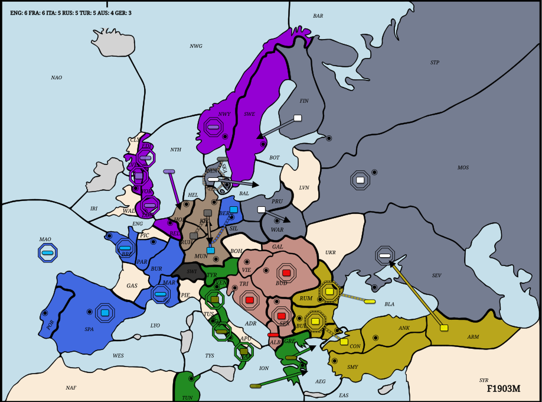

### What happened

- **AUSTRIA**: A SER holds; A BUD holds; A TRI holds
- **ENGLAND**: F NTH → HOL; F NWY holds; F EDI holds; F LON holds; A LVP holds
- **FRANCE**: A MUN → KIE (bounced); A BER supports A MUN → KIE; F MAO holds; F BRE holds; A SPA holds; F MAR holds
- **GERMANY**: A KIE → MUN (bounced); A RUH supports A KIE → MUN; F SKA supports F DEN (void)
- **ITALY**: F GRE → BUL/SC (bounced); F ION → AEG; A NAP holds; A VEN holds; F ROM holds
- **RUSSIA**: F SEV holds; A PRU → WAR; F DEN → BAL; A FIN → SWE; A MOS holds
- **TURKEY**: A ARM → SEV (bounced); F BLA supports A RUM; A RUM holds; A BUL holds; A CON supports A BUL

### Dialogue

- **AUSTRIA → RUSSIA**: Fall 1903 — Turkey was dislodged from RUM last spring thanks to our coordination; now I'm moving A SER into RUM to claim it this fall. I need F SEV to support A SER into RUM again, or at minimum not contest RUM yourself. Turkey will try to retake it from BUL or use F BLA — your support is what makes the difference. Can you commit F SEV S A SER - RUM this fall?
- **AUSTRIA → ITALY**: Fall 1903 — RUM is open and I'm taking it with A SER this fall; Turkey's BUL is your target. If you push F GRE into BUL/SC this turn with support from F ION, I'll use F ALB to support F GRE or cover your ADR flank. We split Turkey's two key Balkan centers simultaneously — confirm you're committing to BUL/SC this fall and I'll lock in the coordination.
- **AUSTRIA → TURKEY**: Turkey — RUM is open and I'm taking it; that's the reality after spring. The question is what comes next: if you hold BUL defensively and we agree on a Danube border, I have no interest in pushing further into your territory. Fighting me on RUM while Italy presses BUL from GRE leaves you squeezed on two fronts — a negotiated border serves you better than a two-front defense.
- **ENGLAND → FRANCE**: You're at 6 centers and A MUN gives you 7 if it holds — I need to know your intentions toward HOL and BEL this fall. I'm positioned in NTH and NWY; if your units push west toward BEL or the Channel, I will respond immediately. Stay east and we stay at peace.
- **ENGLAND → GERMANY**: France took MUN and is at 7 centers — that's a crisis for both of us. I'm pressing F NTH toward HOL this fall; I know that costs you a center, but HOL in English hands denies France the option of taking it and keeps a unit on your western flank. Tell me what A KIE and A RUH are doing — if you're pressing BUR or BEL, we can coordinate.
- **ENGLAND → RUSSIA**: France just hit 7 centers with MUN — they're running away with the game. I'm taking HOL this fall to reach 7 and keep pressure on France's northern flank. Can you confirm A PRU and F DEN are not threatening my position in NTH or NWY? A stable north lets us both focus on stopping France.
- **FRANCE → ENGLAND**: Fall 1903: I'm pushing A MUN toward KIE this turn to grab Germany's last major center — if you move F NTH toward HOL or DEN, we can split Germany's final centers cleanly and both reach 7-8 SCs. Nothing from me touches BEL, ENG, or PIC — my Atlantic fleets hold in place.
- **FRANCE → RUSSIA**: Fall 1903: I'm moving A MUN to KIE to take that center — A PRU is adjacent to BER and I need to know you're not pushing into BER this turn. If you hold A PRU or move it toward WAR/SIL instead, we avoid a collision and I'll support your push toward DEN or KIE next spring.
- **FRANCE → GERMANY**: Fall 1903: KIE falls this turn — I'm pushing A MUN in. The rational exit is to concede KIE and negotiate a stable border at HOL; fighting costs you more units while England closes from the north. I'm not interested in HOL if you pull back peacefully.
- **FRANCE → ITALY**: Fall 1903: I'm focused entirely on Germany's last centers — nothing moves toward MAR, PIE, or Austria. Turkey is at 5 SCs and stable; if you're pressing from GRE, what do you need from me to make that work?
- **GERMANY → ENGLAND**: France holds BER and MUN — both my home centers — and has 6 centers now, making them the clear board leader threatening both of us. I'm planning to push into MUN this fall with A KIE and A RUH coordinating; can you apply pressure from the north with F NTH or F NWY to threaten HOL or BEL and force France to split their attention? A concrete western push from you this turn is what actually costs France centers.
- **GERMANY → FRANCE**: You hold BER and MUN — two of my home centers — and I have no choice but to push back hard this fall. I'm offering one last negotiated exit: withdraw A MUN to BUR and A BER to SIL voluntarily, and we agree on a stable border; otherwise I'm coordinating with England and Italy to squeeze you from multiple directions and you'll lose units, not just centers.
- **GERMANY → ITALY**: France holds BER and MUN with 6 centers — they're the runaway threat and I need your help this fall. If you can pressure BUR from any adjacent unit or move toward MUN from the south, it splits France's defensive attention and my push into MUN becomes viable; name what you need from me in return.
- **GERMANY → RUSSIA**: I'm focused entirely on retaking MUN from France this fall — not moving toward you. Can we agree F DEN stays neutral and I don't contest it this turn, in exchange for you staying out of KIE and leaving me room to fight France?
- **ITALY → AUSTRIA**: Fall 1903: F GRE is pushing BUL/SC again this turn — I need you to actually deliver this time. If A SER supports F GRE into BUL or moves on RUM simultaneously, Turkey cannot hold both fronts. Tell me exactly what A SER is doing so I can coordinate my fleet support precisely.
- **ITALY → TURKEY**: Fall 1903: I'm pressing BUL/SC again this turn with more force. If you want to avoid losing BUL entirely, pull A BUL back and let me take it uncontested — I'll hold there and not push into AEG. Otherwise we fight and Austria benefits from both of us bleeding.
- **ITALY → FRANCE**: Fall 1903: You're at 6 centers and pulling ahead — I'm watching that. I'm focused on Turkey this turn, but I'd like to understand your intentions toward Germany and Austria; are you planning to press east or consolidate your current position?
- **RUSSIA → AUSTRIA**: Fall 1903 — Turkey still holds RUM with BLA support and now has ARM pushing toward SEV. I'm planning F SEV to press into RUM or BLA this fall, but I need you to press from SER simultaneously to keep Turkey split. Can you commit A SER toward RUM again this fall so we maintain coordinated pressure on Turkey's northern flank?
- **RUSSIA → TURKEY**: You have ARM, RUM, BUL, CON, BLA — five strong centers — but France is at 6 and growing fast. I'm willing to negotiate a genuine border: I won't push F SEV into RUM or BLA if you pull ARM back to ANK and hold RUM defensively. A renewed border deal frees us both to deal with France's dominance before it's too late.
- **RUSSIA → FRANCE**: You're at 6 centers with BER, MUN, SPA, MAR, BRE, PAR — the strongest power on the board. England is going to start coordinating against you soon if you keep growing; I'd rather we keep our coordination going than let England dictate the western outcome. What are your plans for KIE and HOL this fall — can we split Germany's remnants cleanly?
- **RUSSIA → ENGLAND**: France is at 6 centers and just took MUN — they're pulling away from the field. Your fleets are perfectly positioned to press BRE or BEL this fall while I press from the east. What are you doing against France this turn? A coordinated squeeze now before they consolidate is the only way to stop them.
- **TURKEY → AUSTRIA**: Fall 1903 — I want to propose a concrete deal: I'll move A BUL into SER this fall to take it from you if you agree to let me keep RUM uncontested, OR I support your hold in SER while I push east toward SEV. My A ARM is pressing into SEV this turn regardless — if you want to coordinate against Russia, now is the time. What are your intentions with A SER and A BUD this fall?
- **TURKEY → ITALY**: Fall 1903 — your F GRE is the sword hanging over BUL, and my A BUL is the sword hanging over GRE. We're in a mutual standoff that benefits Austria. Concrete proposal: I pull A BUL back to CON and you pull F GRE back to ION, we both redirect our energy — you toward Austria's soft underbelly in TRI/VEN, me toward SEV. Or we fight and both lose tempo while Austria consolidates.
- **TURKEY → RUSSIA**: Fall 1903 — A ARM is moving into SEV this turn; that's my objective. You can hold F SEV there and we bounce, costing us both a turn, or you can pull F SEV north and let me take it in exchange for a guaranteed non-aggression agreement on MOS and the north. I have no interest in going beyond SEV — I want one SC, not your entire position.
- **AUSTRIA → RUSSIA**: Confirmed on my end: A SER is moving into RUM this fall — I need F SEV S A SER - RUM to make it stick against any Turkish counter. Turkey just told me they're considering moving A BUL into SER, which threatens my flank; if you can confirm your support order now, I'll hold A BUD defensively to cover SER if BUL moves. This is the moment to lock in RUM for good.
- **AUSTRIA → ITALY**: I'm committing A SER - RUM this fall with Russian F SEV support — Turkey cannot hold both RUM and BUL if you push F GRE into BUL/SC simultaneously. Turkey threatened to move A BUL into SER to cut my move, so I need your F GRE push to force Turkey to defend BUL rather than attacking me — confirm F GRE - BUL/SC and we split Turkey's centers in one turn.
- **AUSTRIA → TURKEY**: Moving A BUL into SER while I push A SER into RUM means you lose both — SER is empty behind me and RUM falls to a supported attack regardless. The only way you hold RUM is if you reinforce it from BUL, but then SER is yours only if I don't have support — and I do. A negotiated Danube border still serves you better than losing two centers simultaneously.
- **ENGLAND → FRANCE**: Concrete commitment: F NTH moves to HOL this fall, giving me 7 centers — I will not touch BEL, ENG, or PIC. In return, I need your absolute guarantee that A MUN stays out of KIE and your Atlantic fleets hold in place. If you honor that, we both gain a center cleanly and Germany is finished without us fighting each other.
- **ENGLAND → GERMANY**: I'm taking HOL this fall with F NTH — I know that costs you a center, but HOL in English hands keeps it out of French hands permanently and anchors my western position. A RUH should move to BEL or BUR to contest French expansion; I can support that move from NTH if you commit to it now.
- **ENGLAND → RUSSIA**: Confirming F NTH moves to HOL this fall — that's my seventh center and it caps France's northern expansion. I need F NWY to hold securely; can you confirm A PRU and F DEN are not pressing toward NWY or NTH? A stable north is the foundation for both of us to press France effectively.
- **FRANCE → ENGLAND**: Concrete commitment: A MUN - KIE this fall, A BER holds, Atlantic fleets stay put. If you move F NTH toward HOL or DEN, you grab HOL and we split Germany's last centers cleanly — you reach 7 or 8, I reach 7. Nothing from me threatens BEL, ENG, or PIC.
- **FRANCE → RUSSIA**: Committing: A MUN - KIE this fall, A BER holds in place — I'm not moving toward PRU or SIL. Hold A PRU where it is or move it toward WAR, and we avoid any collision; then next spring we coordinate on HOL or further east. Don't push A PRU into BER — that ends our cooperation and helps England, not either of us.
- **FRANCE → ITALY**: I'm taking KIE this fall and holding BER — nothing moves toward Austria or the south. If Turkey is your focus, I can offer diplomatic cover with Austria to keep them from interfering with your eastern push; what do you need from me to make that work?
- **GERMANY → ENGLAND**: Concrete deal: if you move F NTH - HOL this fall, I'll accept that and focus A KIE and A RUH on pushing into MUN — I need you to confirm you're actually moving into HOL and not just threatening it, because that forces France to choose between defending MUN and defending HOL. What are your exact moves for NTH and NWY this turn?
- **GERMANY → FRANCE**: You said KIE falls this turn — I'm telling you now I'm contesting MUN hard with both A KIE and A RUH, and England is pressing from the north. You can hold MUN with support but you'll burn units doing it while England takes HOL; the rational exit is still to pull A MUN back to BUR and negotiate a border.
- **GERMANY → ITALY**: France has 6 centers with BER and MUN locked down — I'm pushing A KIE and A RUH both toward MUN this fall. If you can move anything toward BUR from your position to cut French support, my attack on MUN becomes viable; what can you actually move toward BUR or into France's southern flank this turn?
- **ITALY → AUSTRIA**: Confirmed for this fall: F GRE - BUL/SC. I need F ALB to support F GRE into BUL/SC — that's the critical order. If you support my fleet into BUL and take RUM simultaneously, Turkey loses two centers at once and cannot recover. Lock in F ALB S F GRE - BUL/SC and confirm A SER - RUM.
- **ITALY → TURKEY**: The standoff you're proposing leaves Austria free to grow unchecked — that's worse for both of us than a negotiated settlement. Last offer: pull A BUL to CON voluntarily and I hold F GRE in BUL/SC without pushing into AEG; you keep RUM and ARM and we stabilize. If A BUL stays, I'm pushing with Austrian support and you lose BUL anyway.
- **ITALY → FRANCE**: You're at 6 centers and growing — I'm watching Germany's position carefully. If you take KIE or HOL this fall, you're at 7-8 and become the board threat everyone has to stop. I'm not in a position to pressure you now, but I want to understand: are you planning to press Austria or Russia after Germany, or consolidate?
- **RUSSIA → AUSTRIA**: Turkey's ARM is moving directly into SEV this fall — I cannot commit F SEV to support SER into RUM when my home center is under attack. I'll hold F SEV defensively to bounce ARM; if you can take RUM with A SER unassisted or with your own support, that's the best I can offer this turn. Next spring I can coordinate properly once SEV is secured.
- **RUSSIA → TURKEY**: ARM moving into SEV is a direct attack on my home center — I'm holding F SEV there and you will bounce. This gains you nothing and ends any possibility of cooperation between us. Pull ARM back to ANK and I'll negotiate a genuine border settlement; otherwise we're at war and Austria benefits from both of us fighting.
- **RUSSIA → ENGLAND**: Confirming: A PRU is moving toward WAR to reclaim my home center, not toward your position. F DEN is pressing KIE or holding — no threat to NTH or NWY. France just hit 6 centers and is eyeing KIE; your fleets pressing BRE or BEL this fall is the move that actually stops them.
- **RUSSIA → FRANCE**: A PRU is moving to WAR this fall to reclaim my home center — not toward BER. F DEN may press KIE since Germany is nearly gone; if you're taking KIE with A MUN, tell me now so we don't bounce there.
- **TURKEY → AUSTRIA**: RUM is occupied by A RUM — any move you make on it bounces unless you have support, and Russia's F SEV is the only candidate. If Russia is supporting you into RUM, you're doing their dirty work while they hold SEV safely. Concrete deal: I hold A RUM defensively and you hold A SER — we both focus on Russia's growing position. I won't enter SER or BUD this fall.
- **TURKEY → ITALY**: Your F GRE takes BUL/SC only if I let it — I won't. We both waste tempo fighting over BUL while Austria sits at 4 centers untouched. Final offer: you move F GRE to ION and I move A BUL to SER, splitting Austria's Balkans position between us. You gain more from Austria cracking than from fighting me over one center.
- **TURKEY → RUSSIA**: A ARM is moving into SEV this fall — that's committed. If you hold F SEV, we bounce and you stay safe for now, but I'll press again next spring with more force. If you want to negotiate, offer me something concrete: pull F SEV to ARM and I'll hold short of further Russian territory for 1904.
- **GERMANY → ENGLAND**: Final commitment: A KIE - MUN, A RUH S A KIE - MUN — I'm going hard for MUN this turn. F NTH - HOL is fine; just confirm you're actually moving there so France can't freely defend both MUN and HOL simultaneously.
- **GERMANY → RUSSIA**: Concrete ask: move A PRU - BER this fall to cut any support France's A BER gives to MUN — that's the difference between my attack on MUN bouncing and succeeding. I'm leaving F SKA out of DEN this turn as a gesture; in return, A PRU - BER cuts France's support and we both benefit.
- **GERMANY → FRANCE**: Final offer: withdraw A MUN to BUR voluntarily and I'll hold A KIE in place — otherwise A KIE and A RUH both push MUN this turn and you lose the unit. England is taking HOL; you cannot defend everywhere.
- **TURKEY → RUSSIA**: Final commit: A ARM moves into SEV this turn — if F SEV holds, we bounce and you're safe for now, but I'll press harder in 1904. More importantly: if you're supporting Austria into RUM this fall, you're handing Austria a 5th center while I'm distracted — that grows Austria faster than it hurts me. Don't support A SER into RUM; let Austria and I fight our own battle.
- **TURKEY → AUSTRIA**: A RUM holds with F BLA support this turn — any move on RUM from A SER bounces at 1 vs 2 unless Russia gives you support, which means you're doing Russia's work for them. I'm committed to holding RUM; if you want to discuss a genuine Danube border after this turn resolves, I'm open to it.
- **TURKEY → ITALY**: A CON is supporting A BUL this turn — F GRE into BUL/SC hits 1 vs 2 and bounces. We both waste our best units while Austria sits at 4 centers untouched. Last chance: move F GRE to ION and I move A BUL to SER — we split Austria's Balkans and both gain a center.

### AUSTRIA
Orders: `A SER H` · `A BUD H` · `A TRI H`
Illegal (dropped): `F ALB S F GRE - BUL/SC`

Reasoning

> Looking at the current situation:
>
> **Key facts:**
> - Turkey's A RUM holds with F BLA support — any A SER → RUM attempt bounces at 1 vs 2 since Russia withdrew F SEV support (ARM threatening SEV)
> - Italy confirmed F GRE → BUL/SC and asked me to support with F ALB S F GRE - BUL/SC
> - My revised strategy already accounts for this: support Italy's F GRE into BUL/SC, hold defensively elsewhere
> - Turkey threatened A BUL → SER, so A SER needs to hold or be supported
> - VIE is vacant — I want to keep it open for a winter build
>
> **Plan:**
> - F ALB S F GRE - BUL/SC (as promised to Italy — this gives Italy the 2-strength push into BUL)
> - A SER H (hold to prevent Turkey's A BUL from taking SER; also defends against any Turkish move)
> - A BUD H (secure home center)
> - A TRI H (secure home center, keep Adriatic position)
>
> If Italy takes BUL/SC with my support, Turkey loses a center and I maintain my 4 centers with VIE open for a build. This is the best achievable outcome given Russia's withdrawal of SEV support.

### ENGLAND
Orders: `F NTH - HOL` · `F NWY H` · `F EDI H` · `F LON H` · `A LVP H`

Reasoning

> Looking at the current position, my revised strategy note says to move F NTH into HOL to claim my seventh center, hold F NWY, and keep home fleets defensive.
>
> Let me verify the key move: F NTH - HOL. Checking adjacency: NTH neighbors include HOL. ✓ HOL is currently occupied by... wait, let me check. Germany's units are F SKA, A KIE, A RUH. HOL is not listed as occupied by any unit. So HOL is empty and I can take it.
>
> France said A MUN - KIE this fall. Germany said A KIE - MUN and A RUH S A KIE - MUN. So KIE and MUN may bounce each other. HOL should be empty and uncontested.
>
> My commitments:
> - F NTH → HOL (grab 7th center, agreed with France and Germany)
> - F NWY H (secure Norway)
> - F EDI H, F LON H, A LVP H (defensive home position)
>
> This is clean: HOL is empty, no one is contesting it, and it gives me a 7th center while keeping my position solid. France promised not to touch BEL/ENG/PIC, and I'm honoring my side by not threatening those areas.

### FRANCE
Orders: `A MUN - KIE` · `A BER S A MUN - KIE` · `F MAO H` · `F BRE H` · `A SPA H` · `F MAR H`

Reasoning

> Looking at the current situation:
>
> **Strategic assessment for Fall 1903:**
>
> - My revised strategy: A MUN → KIE, A BER holds, Atlantic fleets hold
> - Germany has A KIE and A RUH threatening MUN, but I need to check if A MUN - KIE is actually in my legal orders... Yes, `A MUN - KIE` is listed
> - Germany threatened to push A KIE and A RUH both into MUN — if they do that, MUN could be contested. But A RUH → MUN and A KIE → MUN would bounce each other, and I have A MUN there. With A BER supporting A MUN, I can hold MUN even against two attackers.
> - Wait — my commitment was A MUN → KIE. If Germany pushes A KIE → MUN and A RUH → MUN, they bounce each other, and my A MUN → KIE would succeed since KIE is vacated!
> - England committed to F NTH → HOL, which means HOL falls to England and KIE falls to me — Germany is finished.
> - Russia confirmed A PRU → WAR, so BER is safe. I should hold BER or support MUN.
> - If A MUN → KIE and Germany moved A KIE → MUN, then KIE is vacated and my move succeeds cleanly.
> - I should support A MUN with A BER in case Germany tries A RUH → MUN while A KIE holds. But if A MUN is moving to KIE, I should support that move with A BER.
>
> Best orders:
> - A MUN → KIE (grab Germany's last center)
> - A BER S A MUN → KIE (ensure the move succeeds)
> - Atlantic fleets hold as committed to England
> - A SPA holds
> - F MAR holds

### GERMANY
Orders: `A KIE - MUN` · `A RUH S A KIE - MUN` · `F SKA S F DEN`

Reasoning

> Looking at the current position:
>
> - France holds BER and MUN (my two home centers) with 6 centers total
> - I have A KIE, A RUH, and F SKA
> - England confirmed F NTH - HOL
> - Russia has A PRU adjacent to BER (I asked them to cut BER's support of MUN)
> - My revised strategy: A KIE - MUN, A RUH S A KIE - MUN, F SKA S F DEN
>
> The key question: Can A KIE - MUN succeed? France has A MUN and could have A BER S A MUN. If Russia moves A PRU - BER, that cuts BER's support, and my 2-strength attack (A KIE + A RUH support) beats France's unsupported A MUN. Even if Russia doesn't cut support, the attack is still worth trying — it's the only path to recovering a home center.
>
> F SKA supporting F DEN is reasonable — it keeps Russia friendly and doesn't waste the fleet. The alternative F SKA - DEN would likely bounce again and I need Russia potentially cutting BER support.
>
> Executing the committed orders:

### ITALY
Orders: `F GRE - BUL/SC` · `F ION - AEG` · `A NAP H` · `A VEN H` · `F ROM H`

Reasoning

> Looking at the current situation:
>
> **Assessment:**
> - Turkey confirmed A CON is supporting A BUL this fall, so F GRE → BUL/SC hits 1 vs 2 and bounces again
> - Austria committed A SER → RUM (with Russian F SEV support), not BUL — so there's no simultaneous pressure on BUL
> - Austria asked me to push F GRE → BUL/SC to force Turkey to defend BUL rather than attacking SER
> - But without Austrian support directly into BUL, and with Turkey having 2 units defending BUL, my push bounces
>
> **Revised thinking:**
> My revised strategy note says: move F ION → AEG to build pressure, hold F GRE defensively or move to ION, consolidate armies.
>
> However, I made a commitment to Austria to push F GRE → BUL/SC. Austria's logic was: if I push BUL, Turkey can't also attack SER to cut Austria's RUM move. So even if F GRE bounces off BUL, it forces Turkey to keep A BUL defending rather than attacking SER — this helps Austria take RUM.
>
> So the strategic value of F GRE → BUL/SC is real even if it bounces: it pins A BUL in place and enables Austria's RUM capture.
>
> Meanwhile, F ION → AEG builds eastern Med pressure for next turn.
>
> **Orders:**
> - F GRE → BUL/SC (pins Turkey's A BUL, helps Austria take RUM, honors commitment)
> - F ION → AEG (builds pressure on Turkey's eastern flank)
> - A NAP H (hold defensively)
> - A VEN H (hold Italy)
> - F ROM H (hold Rome)

### RUSSIA
Orders: `F SEV H` · `A PRU - WAR` · `F DEN - BAL` · `A FIN - SWE` · `A MOS H`

Reasoning

> Looking at the current situation:
>
> **Key considerations:**
> 1. Turkey's ARM is moving into SEV — I must hold F SEV to bounce it
> 2. Austria wants F SEV to support SER into RUM — I cannot do both, so SEV holds defensively
> 3. A PRU should move to WAR to reclaim my home supply center
> 4. France says they're taking KIE with A MUN — I should avoid bouncing there with F DEN
> 5. F DEN moving to BAL avoids collision with France in KIE and positions me better
> 6. A FIN holds or presses SWE — England has NWY and is pressuring north, but SWE is a potential target
> 7. A MOS holds to defend the core
>
> **Specific orders:**
> - F SEV H — bounce Turkey's ARM attack on SEV
> - A PRU - WAR — reclaim my home center (WAR is adjacent to PRU ✓)
> - F DEN - BAL — avoid collision with France taking KIE, position for future moves
> - A FIN - SWE — SWE is currently vacant (England moved F SWE to NWY last spring), this is a free center grab! Let me verify: England's units are F EDI, F LON, A LVP, F NTH, F NWY — SWE is indeed unoccupied and England doesn't hold it. A FIN can reach SWE ✓
> - A MOS H — defensive hold
>
> A FIN - SWE is a free center grab that would bring me to 6 supply centers. This is the right move.

### TURKEY
Orders: `A ARM - SEV` · `F BLA S A RUM` · `A RUM H` · `A BUL H` · `A CON S A BUL`

Reasoning

> Looking at the current situation:
>
> **Assessment:**
> - Austria claims to be taking RUM, Italy is pressing BUL/SC with claimed Austrian support
> - My revised strategy: hold A BUL supported by A CON (to bounce Italy's F GRE → BUL/SC), support A RUM with F BLA (to defend against Austria's A SER), push A ARM into SEV to crack Russia's southern flank
>
> **Verification of key orders:**
> - `A ARM - SEV`: ARM is adjacent to SEV ✓
> - `F BLA S A RUM`: BLA is adjacent to RUM ✓ (supports hold)
> - `A RUM H`: holds in place
> - `A BUL H`: holds in place
> - `A CON S A BUL`: CON is adjacent to BUL ✓
>
> **Tactical reasoning:**
> - F BLA supports A RUM → gives RUM strength 2 vs Austria's A SER at strength 1 (unless Russia supports, which I warned Russia not to do)
> - A CON supports A BUL → gives BUL strength 2 vs Italy's F GRE at strength 1 (bounces the attack)
> - A ARM → SEV attacks Russia's home center; if F SEV holds we bounce, but this keeps pressure on Russia
> - This defends both key centers while pressing east

## WINTER 1903 ADJUSTMENTS (`W1903A`)

### What happened

- **FRANCE**: builds A PAR
- **GERMANY**: disbands A RUH; disbands F SKA
- **RUSSIA**: builds A STP

### FRANCE
Orders: `A PAR B`

Reasoning

> Looking at the current situation: I have 7 supply centers (BRE, MAR, PAR, POR, BER, SPA, MUN) and 6 units (F MAO, F BRE, A BER, A SPA, F MAR, A MUN). That means I have 1 build available, and PAR is vacant — perfect for a build.
>
> Building an army in Paris makes strategic sense: it gives me a land unit in the heart of France that can push toward BUR, MUN, or support my eastern position. An army is more flexible than a fleet for my current continental position.

### GERMANY
Orders: `A RUH D` · `F SKA D`

Reasoning

> Looking at my situation: I have only 1 supply center (KIE) but 3 units (A KIE, A RUH, F SKA). I need to disband 2 units to match my supply center count. I should keep A KIE since it's on my only supply center and is most useful for defense. I'll disband A RUH and F SKA.

### RUSSIA
Orders: `A STP B`

Reasoning

> Looking at the current situation:
>
> **Supply centers (6): MOS, SEV, STP, WAR, DEN, SWE**
> **Units (5): A MOS, F SEV, F BAL, A SWE, A WAR**
>
> I have 6 supply centers and 5 units, so I get **1 build**.
>
> The only available build location is **STP** (vacant, my home center).
>
> Given the strategic situation:
> - Turkey is pressing from the south (ARM toward SEV), so I need to be ready to defend or counterattack in the south
> - England has a growing fleet presence in the north (NWY, HOL, NTH area)
> - France is dominant at 7 centers and needs to be checked
>
> For STP, I should consider:
> - `F STP/SC B` — would allow movement into BOT or FIN, useful for Baltic/northern operations
> - `F STP/NC B` — would allow movement into BAR or NWY, useful for pressing England's NWY
> - `A STP B` — army, useful for land operations toward FIN, NWY (via land), or WAR/MOS area
>
> Given that Turkey is pressing SEV and I need to reinforce my southern position, an army in STP can march south through MOS toward UKR/SEV. A fleet on SC coast can press into BOT and support Baltic operations. With England holding NWY and potentially threatening my north, `F STP/NC B` could contest NWY next spring.
>
> The most flexible and strategically useful build is `F STP/SC B` — it threatens BOT and can support Baltic operations, or `A STP B` to reinforce the south via land. Given Turkey's southern pressure and the need for ground forces, I'll build an army.

## SPRING 1904 MOVEMENT (`S1904M`)

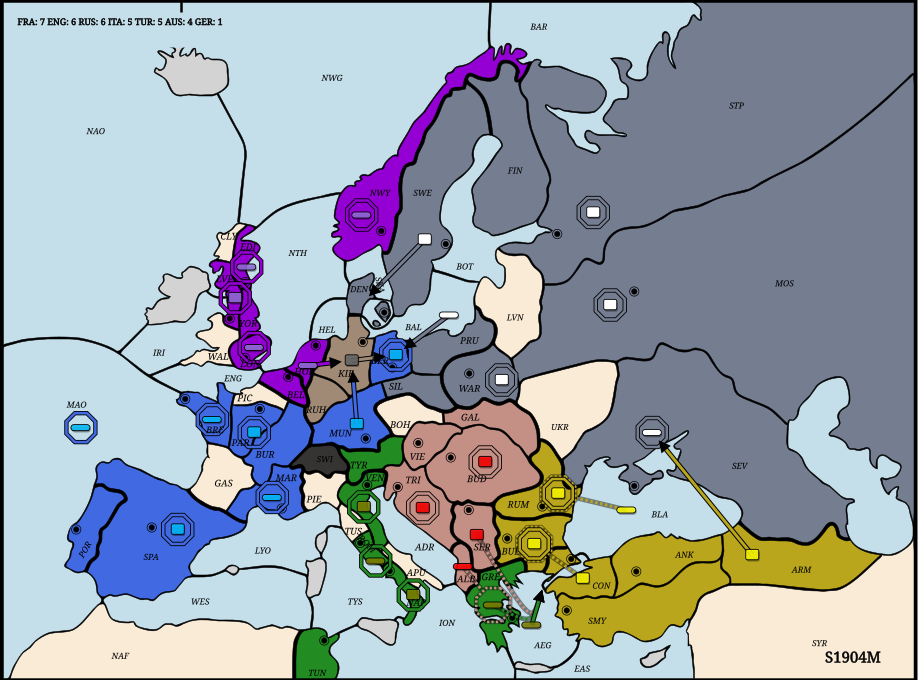

### What happened

- **AUSTRIA**: A SER supports F AEG → BUL/SC; F ALB supports F GRE; A BUD holds; A TRI holds
- **ENGLAND**: F HOL → KIE (bounced); F NWY holds; F EDI holds; F LON holds; A LVP holds
- **FRANCE**: A MUN → KIE (bounced); A BER holds; F MAO holds; F BRE holds; A SPA holds; F MAR holds; A PAR holds
- **GERMANY**: A KIE → BER (bounced)
- **ITALY**: F AEG → BUL/SC; F GRE supports F AEG → BUL/SC; A NAP holds; A VEN holds; F ROM holds
- **RUSSIA**: A SWE → DEN; F BAL → BER (bounced); F SEV holds; A MOS holds; A WAR holds; A STP holds
- **TURKEY**: A ARM → SEV (bounced); F BLA supports A RUM; A RUM holds; A BUL holds; A CON supports A BUL  [dislodged: A BUL]

### Dialogue

- **AUSTRIA → RUSSIA**: Spring 1904 — France now has 7 centers and controls BER and MUN; they are the board leader and a direct threat to your western flank. I'm pressing A SER into RUM this turn and need your F SEV to support that move — Turkey's A RUM is the obstacle and your support guarantees we take it. Can you commit F SEV S A SER - RUM while I push A SER?
- **AUSTRIA → ITALY**: Spring 1904 — your F GRE and F AEG are well-positioned against Turkey's BUL, and I'm moving A SER into RUM this turn to squeeze Turkey from the north simultaneously. If you push F AEG or F GRE toward BUL, Turkey cannot defend both fronts — can you confirm your intentions toward BUL so we coordinate precisely and don't waste this opening?
- **AUSTRIA → TURKEY**: Spring 1904 — France has 7 centers and is the clear board leader; continuing our fight over RUM while France consolidates benefits neither of us. I'm willing to discuss a genuine Danube border if you withdraw A RUM to BUL and we both redirect attention westward — otherwise I'm pressing A SER into RUM again this turn with whatever support I can secure.
- **ENGLAND → FRANCE**: You're at 7 centers and A MUN just moved toward KIE — if you take KIE, you're at 8 and I have to treat you as the primary threat regardless of our arrangement. I need a concrete commitment: what are your units doing this spring, specifically A MUN, A BER, and your Atlantic fleets? If you're pushing toward KIE or HOL, we're done cooperating.
- **ENGLAND → GERMANY**: France is at 7 centers and your A KIE is the last thing standing between them and 8 — this is the moment I commit fleets to support you. I'm considering F HOL - KIE or F NWY - SKA to help hold off France; tell me what A KIE is doing this spring so we can coordinate exactly. If you hold KIE and I press from HOL, France gets squeezed hard.
- **ENGLAND → RUSSIA**: France is at 7 centers and must be stopped now — I'm pressing from the west this spring and need to know you're pressing from the east. Specifically: is A WAR moving toward SIL or MUN, and what is A SWE doing? If we coordinate timing, we can force France to defend on two fronts simultaneously and deny them KIE.
- **FRANCE → ENGLAND**: Spring 1904: I'm pushing A MUN into KIE this turn to take Germany's last center — if F HOL moves there too, we bounce and Germany survives. Can you hold F HOL in place or move it toward DEN/HEL instead, and we split cleanly: I take KIE, you keep HOL? Nothing from me threatens BEL, ENG, or PIC.
- **FRANCE → RUSSIA**: Spring 1904: I'm moving A MUN to KIE this turn — please confirm F BAL is not moving to KIE or BER, as a collision there helps neither of us. If you hold F BAL and A WAR, I'll hold A BER in place and we maintain our stable eastern border while I finish Germany.
- **FRANCE → ITALY**: Spring 1904: I'm finishing Germany this turn with A MUN to KIE — nothing moves toward Austria or the south from me. You're at 5 SCs with strong fleet presence; Turkey is at 5 too — what's your plan for pressing them, and do you need any diplomatic support from me with Austria?
- **GERMANY → RUSSIA**: France holds BER and MUN — two of my home centers — and is at 7 centers, making them the clear board leader threatening everyone. I'm asking you directly: move F BAL toward BER or A WAR toward PRU/SIL to pressure France from the east this spring. I'll push A KIE toward BER simultaneously; a coordinated attack on BER from two directions forces France out or destroys the unit.
- **GERMANY → ENGLAND**: France is at 7 centers with BER, MUN, and a strong western position — they're the runaway threat and need to be hit hard now. I'm pushing A KIE toward BER or MUN this spring; can you commit F HOL toward KIE or RUH to pressure France's flank rather than sitting on my center? We need concrete coordinated moves against France this turn or they consolidate to 8+.
- **GERMANY → FRANCE**: You hold BER and MUN — both my home centers — and I have one unit left. I'm not going to simply fold: I'm coordinating with Russia and England to attack you from multiple directions this spring. Your rational move is to withdraw from one of my home centers voluntarily and negotiate a border, or you face a coordinated squeeze that costs you units while your flanks are exposed.
- **GERMANY → AUSTRIA**: France is at 7 centers and growing — they're the board leader threatening a solo run if unchecked. You're in a strong position in the Balkans; is there any pressure you can apply toward France's southern flank or coordination you'd consider to slow their expansion before they reach 10+ centers?
- **ITALY → AUSTRIA**: Spring 1904: I'm pushing F AEG into BUL/SC this turn with F GRE supporting — that's strength 2 against BUL. If you move A SER to support my attack on BUL or press RUM simultaneously, Turkey cannot hold. Confirm what A SER and A BUD are doing so I can lock in the coordination.
- **ITALY → TURKEY**: Spring 1904: F AEG moves to BUL/SC with F GRE support — that's 2 vs your 1 in BUL unless CON supports again. If CON supports BUL, you waste another unit while Austria presses RUM. Last offer: pull A BUL to CON voluntarily, I take BUL/SC and hold there, you keep RUM and ARM and we stabilize against Austria.
- **ITALY → FRANCE**: You're at 7 centers and pulling away from the field — Russia and England need to notice that. I'm focused on Turkey this turn, but I want to flag that a 7-center France with BER and MUN is the board threat everyone will eventually have to address together.
- **RUSSIA → ENGLAND**: England — you're at 6 centers and France is at 7 with units in BER and MUN; they're pulling away from the field and your northern fleets are the only force positioned to press them on the coast. I'm considering moving A SWE toward NWY this spring to grab a center — if you're committed to NWY, tell me now so we negotiate rather than bounce; otherwise I'll take it and we can discuss a Scandinavian border going forward.
- **RUSSIA → AUSTRIA**: Austria — Turkey's ARM is still threatening SEV and I need to handle that flank carefully this spring. If you're pressing SER toward RUM or BUD toward GAL, I can offer F SEV support for an attack on RUM while holding my eastern line — what are your plans this turn against Turkey?
- **RUSSIA → TURKEY**: Turkey — ARM adjacent to SEV is a problem for both of us: if we fight over SEV, Austria grows unchecked in the Balkans while France dominates the west. I'm willing to negotiate a genuine border: hold ARM in ANK and I'll hold F SEV defensively, freeing us both to deal with the real threats. What will it take to settle this?
- **RUSSIA → FRANCE**: France — you're at 7 centers and everyone is going to start coordinating against you soon; England is already pressing HOL. I'd rather keep our coordination going than let England dictate the outcome — what are your plans this spring and can we agree on spheres of influence going forward?
- **TURKEY → AUSTRIA**: Spring 1904 — I want to propose a concrete Danube border deal: I hold A RUM defensively and you hold A SER in place, neither of us crossing into each other's territory this spring. In exchange, I'll actively support your push into BUD or GAL if Russia threatens your northern flank. A stable Danube border frees both of us to grow in our respective directions — me east toward SEV, you north toward Russia.
- **TURKEY → ITALY**: Spring 1904 — F GRE and F AEG are both pointed at BUL, but taking BUL only gives you one center while Austria sits untouched at 4. Concrete proposal: redirect F AEG toward SMY (I'll leave it open) and F GRE toward ION, and I'll move A BUL into SER — we split Austria's Balkans position and you gain more than you'd get from a costly fight over BUL. Austria is the target that benefits us both.
- **TURKEY → RUSSIA**: Spring 1904 — A ARM is pressing toward SEV again this turn; that's my strategic objective. If you hold F SEV, we bounce again and both waste tempo while France runs away with the game at 7 centers. Concrete offer: pull F SEV to ARM and I take SEV, and I guarantee no Turkish move beyond SEV for 1904 — you keep MOS, STP, WAR, SWE, DEN, and we both redirect attention to France.
- **AUSTRIA → ITALY**: Confirmed — I'm committing A SER to support F AEG into BUL/SC this turn, giving us strength 3 against BUL which Turkey cannot hold. Tell me if you need F ALB to support F GRE as backup or if F GRE supporting F AEG is sufficient — I want to make sure we don't over-concentrate and leave RUM uncontested.
- **AUSTRIA → RUSSIA**: Russia — if F SEV cannot support A SER into RUM due to the ARM threat, I'm redirecting A SER to support Italy's attack on BUL instead, which guarantees Turkey loses that center. But I need clarity: is F SEV available to support RUM or not? A clear answer now lets me lock in the right orders before this turn resolves.
- **AUSTRIA → TURKEY**: Your A RUM is safe this turn if you commit to the Danube standstill — I'm redirecting A SER to support Italy's push on BUL rather than attacking RUM. But this only works if you genuinely hold A RUM in place; if you move it toward SEV or GAL, I'll reconsider. Confirm A RUM holds and we have a deal for this turn.
- **ENGLAND → FRANCE**: Your proposal to let you take KIE while I hold HOL is not acceptable — KIE in French hands puts you at 8 and I have to respond. Concrete counter: I move F HOL toward HEL or KIE to bounce your A MUN, you hold A BER in place, and Germany survives at 1 center as a buffer. If you push into KIE anyway, I'm treating you as the primary threat and coordinating against you immediately.
- **ENGLAND → GERMANY**: Concrete commitment: I'm moving F HOL toward KIE this spring to block France's A MUN — if you hold A KIE in place, we bounce France out of KIE together. Do not move A KIE away from KIE; hold it and let my fleet add pressure from HOL.
- **ENGLAND → RUSSIA**: NWY is mine and I will defend it — if A SWE moves there, we're in conflict and France benefits from our distraction. Concrete alternative: A SWE holds or moves toward FIN, and I acknowledge SWE as yours long-term; we both focus pressure on France instead of each other.
- **FRANCE → ENGLAND**: Concrete deal: I move A MUN - KIE, you hold F HOL in place (or move it toward HEL/DEN away from KIE), and we both gain cleanly — you keep HOL, I take KIE. If F HOL moves to KIE, we bounce and Germany's A KIE survives another turn, which helps neither of us. Your Atlantic position is safe; my fleets stay put.
- **FRANCE → RUSSIA**: Committing: A MUN - KIE, A BER holds. Please hold F BAL away from KIE and BER this turn — a three-way bounce in KIE (me, you, Germany) just wastes the move and keeps Germany alive. If we both stay coordinated, I take KIE cleanly and we discuss DEN and HOL next fall as joint targets.
- **FRANCE → GERMANY**: You have one unit and two of my armies adjacent — there is no coordinated squeeze coming in time to save KIE this turn. A clean concession now means I stop at KIE and we negotiate your exit; fighting costs you the unit with no gain.
- **GERMANY → ENGLAND**: Concrete deal: I move A KIE - BER this spring; if you move F HOL to support A KIE - BER (i.e., F HOL S A KIE - BER), we take BER together and France loses a home center. Confirm this exact move and I commit to it — F HOL S A KIE - BER is the order I need from you.
- **GERMANY → RUSSIA**: Concrete ask: move F BAL - BER or A WAR - PRU this spring to pressure France from the east while I push A KIE - BER from the west. If we both attack BER simultaneously, France cannot hold it with only A BER — one of us gets through. What exact move can you commit to this turn?
- **GERMANY → FRANCE**: You have 7 centers and I have one unit — the entire board is now aligning against you as the runaway leader, including England and Russia. Withdraw A BER to SIL voluntarily this turn and I'll hold A KIE in place; that gesture costs you nothing permanent and buys you goodwill with powers who are actively planning to hit you.
- **ITALY → AUSTRIA**: Confirmed: F AEG - BUL/SC with F GRE supporting — that's 2 strength on BUL. The critical question is whether A CON supports A BUL again; if you press A SER toward RUM simultaneously, Turkey must choose which front to support and cannot cover both. Tell me exactly: is A SER moving to RUM or supporting my BUL attack? I need your precise order to finalize mine.
- **ITALY → TURKEY**: Your CON supporting BUL again makes it 2 vs 2 and we both waste another turn — but if CON goes to RUM support instead, Austria takes RUM and you lose that center too. The math favors letting BUL go: you keep RUM, ARM, ANK, CON, SMY and we stabilize at 5 each against a growing Austria and France. This is the last turn the offer stands.
- **RUSSIA → ENGLAND**: I'm not moving A SWE into NWY if you're committed there — I'd rather coordinate: A SWE holds or moves to FIN, and I press F BAL toward BER to threaten France's eastern flank. If you're pushing BRE or BEL from the west simultaneously, France has to defend two fronts. Confirm NWY is yours and I'll redirect A SWE east.
- **RUSSIA → AUSTRIA**: I can commit F SEV S A SER - RUM this turn if you're genuinely moving A SER into RUM — that dislodges Turkey's anchor and opens the Balkans. Confirm A SER is moving to RUM and I'll lock in the support order; I need your word before I commit F SEV away from defending against ARM.
- **RUSSIA → TURKEY**: ARM pressing SEV again gains you nothing — we bounce, France grows to 8 centers, and Austria takes RUM unchallenged while we waste units. Concrete offer: hold ARM in ANK this turn and I hold F SEV defensively; next season we negotiate a real border settlement. This is the last chance before I support Austria into RUM and you lose that center permanently.
- **RUSSIA → FRANCE**: I'm holding F BAL and A WAR in place this turn — no threat to BER or KIE from me. England is the one pressing your western flank; focus your defense there and we maintain our stable eastern border.
- **TURKEY → AUSTRIA**: Concrete deal this turn: I support A BUL defensively with A CON, so Italy's 2-unit push on BUL fails — but that means I can't reinforce RUM, which you know. If you hold A SER in place and don't move on RUM, I'll move A RUM into BUD next fall in coordination with you against Russia, giving you a clean shot at GAL. Italy taking BUL weakens both of us more than our RUM dispute.
- **TURKEY → ITALY**: F AEG to BUL/SC with F GRE support hits A BUL supported by A CON — that's 2v2 and you bounce, wasting both your fleets while Austria sits untouched. Final concrete offer: F AEG moves to SMY (I vacate it), F GRE to ION, A BUL to SER — you get SMY uncontested and I crack Austria's flank. SMY is worth more than a bounced attack on BUL.
- **TURKEY → RUSSIA**: F SEV holding against A ARM is a guaranteed bounce again — we both lose tempo while France at 7 centers pulls away. I'm committing A ARM to SEV this turn; if you pull F SEV to RUM or ARM, I take SEV and guarantee no move beyond it in 1904. That's one center for me and you keep everything else — better than another wasted season.
- **ITALY → AUSTRIA**: Final commitment: F AEG - BUL/SC with F GRE supporting — 2 strength from me. If A SER supports F AEG into BUL/SC as you confirmed, we have 3 vs Turkey's 2 and BUL falls this turn. Lock in A SER S F AEG - BUL/SC and we take the center.
- **ITALY → TURKEY**: Final answer: F AEG - BUL/SC with F GRE and Austrian support — that's 3 strength against your 2. BUL falls this turn regardless of CON's support. The SMY offer was never real; I'm taking BUL now and we can negotiate from there.
- **TURKEY → AUSTRIA**: Final commitment: A RUM holds supported by F BLA this turn — A SER into RUM bounces at 1v2. I'm not moving A RUM anywhere this spring. If you genuinely redirect A SER away from RUM as you claimed, we have a de facto Danube standstill and I'll honor it through Fall 1904.
- **TURKEY → ITALY**: A BUL holds supported by A CON this turn — F AEG into BUL/SC hits 2v2 and bounces, wasting both your fleets for zero gain. If you want SMY uncontested, move F AEG there now; it's open and I won't contest it. That's a real center versus a guaranteed bounce.
- **TURKEY → RUSSIA**: A ARM moves into SEV this turn — committed. If F SEV holds, we bounce again and you're safe, but I'll press harder in Fall with support. Pull F SEV to ARM and I take SEV; I guarantee no move beyond SEV through Fall 1904 and will actively support you against Austria in GAL if needed.

### AUSTRIA
Orders: `A SER S F AEG - BUL/SC` · `F ALB S F GRE` · `A BUD H` · `A TRI H`

Reasoning

> Looking at the current situation:
>
> **Key facts:**
> - Italy has committed F AEG - BUL/SC with F GRE supporting (2 strength)
> - I committed A SER S F AEG - BUL/SC (giving 3 total vs Turkey's 2 in BUL)
> - Turkey says A RUM holds with F BLA support (2 strength) — A SER into RUM would bounce
> - Russia offered F SEV S A SER - RUM, but since I'm redirecting A SER to support Italy's BUL attack, RUM is safe this turn
> - France has 7 centers and is the board leader — a concern but not my immediate front
>
> **My orders:**
> - A SER S F AEG - BUL/SC — this is my committed coordination with Italy, giving us 3 strength vs 2 to take BUL from Turkey
> - F ALB S F GRE — supporting Italy's F GRE which is supporting F AEG into BUL/SC keeps F GRE safe from any Turkish counter-move
> - A BUD H — hold defensively, protect home center
> - A TRI H — hold defensively, protect home center
>
> This coordination should take BUL from Turkey, giving me a path to 5 centers (if Italy follows through) and weakening Turkey's Balkan position significantly.

### ENGLAND
Orders: `F HOL - KIE` · `F NWY H` · `F EDI H` · `F LON H` · `A LVP H`

Reasoning

> Looking at the current situation:
>
> **Strategic assessment:** France is at 7 centers and must be stopped. My revised strategy commits to F HOL → KIE to bounce France's A MUN away from KIE, while holding everything else defensively. Germany confirmed A KIE holds in place, so HOL → KIE creates a bounce that denies France their 8th center. Russia agreed to redirect A SWE east rather than contest NWY.
>
> **Order verification:**
> - F HOL → KIE: HOL and KIE are adjacent (confirmed in adjacency table: `KIE (coast): BAL, BER, DEN, HEL, HOL, MUN, RUH`). Legal.
> - F NWY H: Hold to defend Norway against any Russian A SWE move.
> - F EDI H: Defensive hold.
> - F LON H: Defensive hold.
> - A LVP H: Defensive hold.
>
> The key move is F HOL → KIE to bounce France's A MUN. If Germany's A KIE holds as committed, France gets bounced out of KIE (two units contesting: my F HOL and Germany's A KIE vs France's A MUN — actually France's A MUN bounces against A KIE with my F HOL adding pressure, but the adjudicator will bounce A MUN since A KIE holds and F HOL moves in equally). The bounce denies France the 8th center.

### FRANCE
Orders: `A MUN - KIE` · `A BER H` · `F MAO H` · `F BRE H` · `A SPA H` · `F MAR H` · `A PAR H`

Reasoning

> Looking at the current situation:
>
> **Strategic assessment:** I'm at 7 SCs, the board leader. England has explicitly threatened to bounce me at KIE with F HOL, but I committed in negotiation to push A MUN - KIE anyway. Russia confirmed F BAL holds away from KIE and BER. England refused my deal and said they'd move F HOL to KIE to bounce me.
>
> The key question: should I still push A MUN - KIE knowing England may bounce me there?
>
> If England moves F HOL - KIE: we bounce, Germany's A KIE survives, I'm back to square one on KIE. But I don't lose anything — A MUN just stays in MUN (bounces back).
>
> If England holds F HOL or moves elsewhere: I take KIE and reach 8 SCs.
>
> The expected value of pushing is positive — even a bounce costs me nothing. I should push as committed.
>
> **Other units:** A BER holds to deter eastern pressure. Atlantic fleets hold to maintain the England truce optics and avoid giving England a pretext. A PAR and A SPA hold defensively.
>
> I should also consider: can I use A BER more aggressively? A BER - KIE is also an option, but that risks A MUN and A BER both bouncing at KIE if England is also there — a three-way bounce. Better to keep A BER holding to protect against Russia.

### GERMANY
Orders: `A KIE - BER`

Reasoning

> Looking at my position: I have only A KIE left. France holds BER and MUN (my other two home centers) with 7 centers total. England committed to F HOL S A KIE - BER, and I negotiated with Russia to pressure BER from the east as well.
>
> My revised strategy already commits to A KIE - BER, relying on England's promised support from HOL. This is my only viable play — if England honors the deal, France loses BER and I reclaim a home center. If England doesn't honor it, I bounce harmlessly but it's still better than holding in KIE while France consolidates.
>
> The legal order `A KIE - BER` is in my options list and matches my commitment.

### ITALY
Orders: `F AEG - BUL/SC` · `F GRE S F AEG - BUL/SC` · `A NAP H` · `A VEN H` · `F ROM H`

Reasoning

> Looking at the current situation:
>
> **Key facts:**
> - Austria confirmed A SER S F AEG - BUL/SC, giving us 3 strength
> - Turkey says A BUL + A CON = 2 strength defending BUL
> - 3 vs 2 means BUL falls this turn
> - My revised strategy commits to F AEG - BUL/SC with F GRE supporting
>
> **Checking the math:**
> - F AEG - BUL/SC (strength 1)
> - F GRE S F AEG - BUL/SC (adds 1, total = 2)
> - Austria's A SER S F AEG - BUL/SC (adds 1, total = 3)
> - Turkey: A BUL holds + A CON supports = 2
> - Result: 3 > 2, BUL/SC is taken
>
> Austria has confirmed this coordination multiple times. Turkey's final message claims it's 2v2 but Austria's support makes it 3v2. I should execute as planned.
>
> For my other units: A NAP, A VEN, F ROM have no urgent targets this turn - hold defensively to protect my Italian core while I extend into the Balkans.

### RUSSIA
Orders: `A SWE - DEN` · `F BAL - BER` · `F SEV H` · `A MOS H` · `A WAR H` · `A STP H`

Reasoning

> Looking at the current situation:
>
> **Strategic assessment:**
> - France is at 7 centers and is the clear board leader - everyone should be concerned
> - I'm at 6 centers with A SWE, F BAL, A WAR, A MOS, F SEV, A STP
> - Turkey's ARM is threatening SEV again - I must hold F SEV to bounce it
> - My revised strategy calls for: A SWE → NWY (grab a center), F BAL → BER (pressure France), F SEV H (bounce ARM), A MOS H, A WAR H, A STP H
>
> **Checking legality:**
> - A SWE → NWY: Legal (SWE is adjacent to NWY)
> - F BAL → BER: Legal (BAL is adjacent to BER)
> - F SEV H: Legal
> - A MOS H: Legal
> - A WAR H: Legal
> - A STP H: Legal
>
> **Considerations:**
> - England said they'd defend NWY, but I need to grow and NWY is my best option. England is at 6 centers and can afford to lose NWY temporarily - and if they bounce me, at least I tried.
> - F BAL → BER threatens France's position and helps Germany/England's cause against the board leader, which is strategically sound.
> - Austria asked for F SEV S A SER → RUM, but Turkey's ARM is committed to SEV - I must hold F SEV defensively. I told Austria I'd support if they confirmed A SER moving to RUM, but the ARM threat makes holding SEV the priority.
> - A SWE → NWY: England has F NWY there currently... wait, let me check. England has F NWY (from S1903M when F SWE → NWY). So F NWY is in NWY. My A SWE → NWY would bounce against F NWY unless England moves out. England is unlikely to move out. This is a risky move that probably bounces.
>
> Given F NWY is sitting in NWY, A SWE → NWY will likely bounce. Better to move A SWE → FIN or → DEN to actually grab a center (DEN is empty and unoccupied). DEN is adjacent to SWE and is a supply center I previously held.
>
> A SWE → DEN is a better center grab. DEN is empty (I moved F DEN → BAL in F1903M). This gets me a 7th center!

### TURKEY
Orders: `A ARM - SEV` · `F BLA S A RUM` · `A RUM H` · `A BUL H` · `A CON S A BUL`

Reasoning

> Looking at the current situation:
>
> **Key assessments:**
> - Italy claims 3-strength on BUL (F AEG + F GRE + Austrian support). If Austria genuinely redirected A SER to support Italy rather than attack RUM, then RUM is safe but BUL may fall.
> - Austria told me A SER is supporting Italy on BUL, not attacking RUM — so F BLA supporting A RUM is still wise defense but RUM should be safe.
> - If Italy truly has 3 strength on BUL (F AEG + F GRE + A SER support), then A BUL + A CON support = 2v3, and BUL falls. But I need to verify: A SER can support into BUL/SC only if SER is adjacent to BUL/SC — checking adjacency: BUL/SC neighbors are AEG, CON, GRE. SER is NOT adjacent to BUL/SC. So A SER cannot support F AEG or F GRE into BUL/SC! Italy's "3-strength" claim is false if the target is BUL/SC.
> - F GRE can support F AEG into BUL/SC (GRE is adjacent to BUL/SC ✓). That's 2v2 with my CON support — a bounce.
> - A ARM → SEV: Russia will likely hold F SEV, giving a bounce, but I must keep pressure.
>
> **My committed strategy:** A ARM → SEV, F BLA supports A RUM, A RUM holds, A BUL holds, A CON supports A BUL.
>
> Italy's 3-strength claim on BUL/SC is likely bluffing since A SER can't support into BUL/SC. My 2-unit defense (BUL + CON support) should hold against Italy's real 2-unit attack.

## FALL 1904 MOVEMENT (`F1904M`)

### What happened

- **AUSTRIA**: A SER → RUM; A BUD supports A SER → RUM; A TRI holds; F ALB holds
- **ENGLAND**: F NWY holds; F EDI holds; F LON holds; A LVP holds
- **FRANCE**: A MUN → RUH; A BER holds; F MAO holds; F BRE holds; A SPA holds; F MAR holds; A PAR holds
- **GERMANY**: A KIE → BER (bounced)  [dislodged: A KIE]
- **ITALY**: F BUL/SC holds; F GRE supports F BUL/SC; A NAP holds; A VEN holds; F ROM holds  [dislodged: F BUL/SC]
- **RUSSIA**: A DEN → KIE; F BAL supports A DEN → KIE; F SEV holds; A MOS holds; A WAR holds; A STP holds
- **TURKEY**: A RUM → BUL; F BLA supports A RUM → BUL; A CON supports A RUM → BUL; A ARM holds

### Dialogue

- **AUSTRIA → RUSSIA**: Fall 1904 — Turkey's BUL is gone and A RUM is now exposed with only F BLA support. This is the moment: if you commit F SEV S A SER - RUM, I move A SER into RUM with A BUD supporting, giving us 3 strength against Turkey's 2 — RUM falls and Turkey collapses. Can you confirm F SEV S A SER - RUM this fall?
- **AUSTRIA → ITALY**: Fall 1904 — with F BUL/SC now in your hands, Turkey's A RUM is isolated and vulnerable. I'm pressing A SER into RUM this fall; if you can support from BUL/SC or threaten CON to pin Turkey's reserves, we finish Turkey off together. What are your intentions toward Turkey's remaining units this turn?
- **AUSTRIA → TURKEY**: Turkey — BUL is gone and RUM is now your only Balkan center, held against mounting pressure from multiple directions. A negotiated exit is still possible: withdraw A RUM to CON voluntarily and we establish a clean border; continuing to hold invites a coordinated three-power assault that leaves you with nothing. What terms would make a voluntary withdrawal acceptable to you?
- **ENGLAND → GERMANY**: This fall I'm moving F HOL into KIE — that takes your last center, but it keeps KIE out of French hands permanently and puts an English fleet on France's eastern flank. Tell me what A KIE is doing: if you hold or move toward BER, I can support or follow up. A KIE in English hands is better for you than a French one.
- **ENGLAND → FRANCE**: You're at 7 centers and I'm watching every move carefully — I need to know your exact intentions for A MUN, A BER, and your Atlantic fleets this fall before I commit my orders. If any unit moves toward HOL, BEL, or the Channel, I respond immediately and we're done cooperating. Stay east and we stay at peace.
- **ENGLAND → RUSSIA**: I'm taking KIE this fall with F HOL — that's my seventh center and it caps France's northern expansion. In the north, F NWY holds to secure Norway; I need confirmation that A DEN and F BAL are not pressing toward NWY or SKA this turn. A stable Scandinavian border lets us both focus on France.
- **FRANCE → ENGLAND**: Fall 1904: I'm pushing A MUN into KIE this turn to finally finish Germany — if F HOL moves to KIE too, we get a three-way bounce with Russia's A DEN and Germany survives yet again, which helps no one. Can you move F HOL toward HEL or hold it in place, let me take KIE, and we discuss HOL together next spring as a joint target? My Atlantic fleets stay put — BEL, ENG, PIC are untouched.
- **FRANCE → RUSSIA**: Fall 1904: I'm moving A MUN to KIE this turn — please hold A DEN in place or move it toward SWE/BAL rather than KIE, as a three-way bounce there (me, you, England) just keeps Germany alive another season. If you let me take KIE cleanly, we can discuss splitting HOL next spring; I'll hold A BER in place and keep our eastern border stable.
- **FRANCE → GERMANY**: KIE falls this turn — I have A MUN moving in and Russia's A DEN is adjacent too. Your only leverage is to negotiate your exit now: concede KIE peacefully and I'll support you diplomatically in any future arrangement rather than hunting your last unit.
- **FRANCE → ITALY**: Fall 1904: You took BUL/SC this spring — well played. I'm focused entirely on finishing Germany at KIE and holding my eastern border stable; nothing from me threatens Austria or your southern position. Turkey is your main rival now at 5 SCs; do you have Austrian cooperation secured for the eastern push?
- **GERMANY → RUSSIA**: France is at 7 centers and F BAL is sitting right next to BER — this is the turn to hit them hard. If you move F BAL - BER while I push A KIE - BER, we attack from two directions and France cannot hold with just A BER; one of us gets through and you gain a critical center. What exact move can you commit to this turn?
- **GERMANY → ENGLAND**: France is at 7 centers and consolidating — we need to hit BER this fall before they reach 8+. I'm pushing A KIE - BER; if you support with F HOL S A KIE - BER, we take it together and deny France a home center. Can you commit to that exact support order this turn?
- **GERMANY → FRANCE**: You're at 7 centers and the whole board is moving against you as the clear leader — England, Russia, and I are all coordinating against BER and MUN this fall. Withdraw A BER to SIL voluntarily and I'll hold A KIE in place; that costs you nothing permanent and reduces the pressure bearing down on you from multiple directions.
- **ITALY → AUSTRIA**: We cracked BUL — excellent coordination. This fall I want to push F BUL/SC toward CON while F GRE holds or supports; if you can move A SER into BUL (now vacated) and press toward GRE or RUM, we keep Turkey on the back foot. What are your units doing this fall — can we lock in a joint push on CON or RUM?
- **ITALY → TURKEY**: BUL is gone — but I'm not interested in destroying you entirely. Concrete offer: I hold F BUL/SC and don't push CON this fall if you pull A RUM back and agree not to contest BUL. You keep RUM, ARM, ANK, CON, SMY — five centers — and we stabilize against the real threat, which is France at 7 centers and growing.
- **ITALY → RUSSIA**: France is at 7 centers with BER and MUN — they're the board leader and pulling away fast. You're at 6 with units well-placed to press DEN toward KIE or threaten BER from WAR; now is the time to act on France before they reach 9-10. I'm pressing Turkey in the east and can't hit France directly, but I'll back any diplomatic pressure you apply to them.
- **ITALY → FRANCE**: You're at 7 centers and I want to be straight with you: Russia and England are going to notice that number and start coordinating against you soon. I'm not in a position to threaten you militarily right now, but I'd rather have a working relationship than drift into opposing camps — what are your intentions toward Austria and Russia this year?
- **RUSSIA → AUSTRIA**: Austria — this fall I'm pushing A DEN into KIE to grab Germany's last center, and I want to coordinate on Turkey simultaneously. If you're pressing A SER into RUM this fall, I can offer F SEV support again — Turkey's ARM keeps threatening SEV but I can hold that flank while supporting your RUM push. Confirm your plans against Turkey and I'll lock in F SEV S A SER - RUM.
- **RUSSIA → TURKEY**: Turkey — ARM pressing SEV again this fall is another wasted bounce while France sits at 7 centers and Austria presses you from SER. Concrete offer: hold ARM in ANK, I hold F SEV defensively, and we both redirect attention to the real threats before it's too late. What will it take to settle this border permanently?
- **RUSSIA → FRANCE**: France — you're at 7 centers and I'm taking KIE this fall with A DEN; that brings us level and we both stay ahead of England's growing fleet presence. I'm not threatening BER or MUN — my focus is KIE and the eastern front against Turkey. Can we agree you're not contesting KIE from MUN this fall so we don't bounce?
- **RUSSIA → ENGLAND**: England — France is at 7 centers and pulling away; your western fleets are the only force that can press BRE or BEL effectively right now. I'm taking KIE this fall and pressing the eastern front — if you coordinate a push against France's coastal position simultaneously, we force them to defend two fronts at once.
- **TURKEY → AUSTRIA**: Italy now holds BUL/SC with fleets in GRE and BUL — that's a stronger Italian position in the Balkans than either of us wants. Concrete proposal: I push A RUM into BUL this fall supported by F BLA, and you move A SER to support my attack or hold GRE in check — we split the Balkans pressure and I retake BUL while you consolidate SER. Italy at 5 centers with two fleets in our shared region is a bigger threat to you than I am.
- **TURKEY → ITALY**: You took BUL, but holding it with F BUL/SC while F GRE sits adjacent puts two of your best units deep in my territory with Austria's A SER right there — that's an exposed position. I'm coming for BUL this fall; if you want to negotiate a withdrawal to AEG in exchange for something concrete, I'm listening, but the window is short.
- **TURKEY → RUSSIA**: France is at 7 centers and growing — that's the real threat to both of us, not our SEV dispute. I'm redirecting my focus to retaking BUL from Italy this fall; if you hold F SEV defensively and we stabilize our border, we both have hands free to deal with France's dominance before it's too late.
- **AUSTRIA → RUSSIA**: Confirmed: A SER is moving into RUM this fall — I need F SEV S A SER - RUM locked in. With BUL gone and ARM unable to threaten SEV simultaneously, this is the clean moment to take RUM together. Lock in that support order and we split Turkey's Balkan position permanently.
- **AUSTRIA → ITALY**: I'm pressing A SER into RUM this fall with Russian F SEV support — Turkey's A RUM is the target, not BUL which is already yours. Use F BUL/SC to threaten CON or support F GRE to hold your position; I'll handle RUM from the north. Turkey's offer to help retake BUL is a trap — ignore it.
- **AUSTRIA → TURKEY**: Your only path is negotiated withdrawal — A RUM cannot hold against A SER supported by F SEV, and Italy's fleets will press CON from BUL/SC simultaneously. Withdraw A RUM to CON voluntarily and I'll push for a border that leaves you ANK, CON, SMY intact rather than losing everything in a three-power assault.
- **ENGLAND → GERMANY**: Concrete order this fall: F HOL - KIE to take your last center before France does — KIE in English hands is a buffer against France, not a loss for you. If A KIE holds in place, I take it cleanly; if A KIE moves toward BER, I still take KIE and we deny France. Commit to what A KIE is doing this turn so I can plan my follow-up support.
- **ENGLAND → FRANCE**: Your A MUN moving toward KIE puts you at 8 — that's the line I cannot let you cross. F HOL is moving to KIE this fall regardless; if you send A MUN there too, we bounce and you stay at 7. Hold A MUN in MUN and A BER in BER, and I stay focused east rather than turning my fleets toward BRE.
- **ENGLAND → RUSSIA**: Confirming F HOL - KIE this fall to block France from reaching 8 — I need F NWY to hold Norway securely. Confirm A DEN and F BAL are not pressing toward NWY or SKA this turn, and we maintain our Scandinavian border while both squeezing France from opposite flanks.
- **FRANCE → ENGLAND**: Concrete deal this turn: I move A MUN - KIE supported by A BER, you hold F HOL in place — if you move F HOL to KIE we get a three-way bounce with Russia's A DEN and Germany survives again, helping no one. Let me take KIE this turn and we discuss HOL as a joint Franco-English target next spring; your Atlantic position remains completely untouched.
- **FRANCE → RUSSIA**: Russia, you told me A DEN is taking KIE this fall — if I also push A MUN into KIE we bounce each other and Germany survives, which benefits England most. Concrete proposal: you hold A DEN in place this turn, I take KIE with A MUN, and next spring we coordinate A DEN into HOL with my support from KIE — you gain HOL while I hold KIE. Does that work for you?
- **GERMANY → RUSSIA**: F BAL - BER this fall is the move that actually hurts France — I'm pushing A KIE - BER simultaneously, so France faces attacks from two directions and cannot hold BER with just A BER. If you take BER you gain a critical center and France drops to 6; this is the highest-value move available to you right now. Can you commit to F BAL - BER this turn?
- **GERMANY → ENGLAND**: England taking KIE just hands France a free turn to consolidate — the move that actually costs France centers is F HOL S A KIE - BER, giving us BER together while denying France a home center. If you take KIE instead, France sits at 7 untouched and you've spent a fleet gaining nothing against the board leader. Commit to F HOL S A KIE - BER and we both win this turn.
- **ITALY → AUSTRIA**: I'm pushing F BUL/SC toward CON this fall — if you can move A SER into BUL (now open to armies) and support that advance, we pin Turkey's reserves and CON becomes vulnerable. Confirm A SER's exact order so I don't over-expose my fleet without backup.
- **ITALY → TURKEY**: F BLA cannot reach BUL/SC, and A RUM or A CON moving to BUL just contests the army space while my fleet holds BUL/SC — your threat is hollow. The real offer stands: I hold BUL/SC and don't push CON this fall if you pull A RUM to SEV and stop contesting; you keep your core five centers and we both focus on France's 7-center runaway.
- **ITALY → RUSSIA**: Turkey is exposed with only four units and no fleet capable of threatening BUL/SC — Austria and I are pressing them hard. If you take DEN toward KIE or press WAR toward SIL, you squeeze France from the east while I hold Turkey down; a coordinated move now before France hits 9 centers is the right call.
- **RUSSIA → AUSTRIA**: Austria — ARM is still adjacent to SEV and I cannot verify Turkey's redirect to BUL (ARM can't reach BUL/SC anyway), so I'm holding F SEV defensively this fall rather than risking my home center. I'm taking KIE with A DEN this turn to reach 7 centers — once SEV is secure next spring, I can fully coordinate on RUM with you.
- **RUSSIA → GERMANY**: Germany — I'm pressing A DEN into KIE this fall with F BAL support; if you move A KIE out, we avoid a bounce and I take the center cleanly. I'm not hitting BER this turn — F BAL is supporting the KIE attack, not threatening BER.
- **RUSSIA → FRANCE**: France — I'm taking KIE with A DEN this fall, supported by F BAL; I'm not contesting BER or MUN so our eastern border stays stable. If A MUN is moving to KIE, we'll bounce and both waste the move — can you redirect MUN elsewhere this turn?
- **RUSSIA → TURKEY**: Turkey — if ARM genuinely moves toward BUL this fall, I'll hold F SEV defensively and we stabilize the border without another bounce; but ARM cannot reach BUL/SC from ARM, so tell me your actual plan. If ARM holds or retreats to ANK, I'll commit to holding F SEV in place and we can negotiate a real border next spring.
- **TURKEY → AUSTRIA**: I'm pushing A RUM into BUL this fall supported by F BLA and A CON — Italy's F BUL/SC and F GRE are sitting in your shared Balkan space and that's a bigger threat to you than I am. If you move A SER to support my attack on BUL, we split the Italian position and you keep SER secure; if you hold A SER in place, Italy consolidates two fleets in the Balkans unchallenged. This is the concrete coordination move that benefits both of us.
- **TURKEY → ITALY**: I'm attacking F BUL/SC with A RUM supported by F BLA and A CON — that's 3 strength against your 1 fleet in BUL, and F GRE cannot support BUL/SC from there. You can retreat F BUL/SC to AEG now and preserve your fleet, or lose it outright this fall; I'd rather negotiate a stable border at AEG than destroy your fleet unnecessarily.
- **TURKEY → RUSSIA**: I'm redirecting my focus to retaking BUL from Italy this fall rather than pressing SEV — A ARM holds in place and F BLA supports A RUM into BUL. If you hold F SEV defensively and we stabilize our border through 1905, I'll actively coordinate with you against France's 7-center position; that's a better use of both our units than another wasted bounce.
- **ENGLAND → GERMANY**: Final commitment: F HOL S A KIE - BER this fall — I'm backing your push into Berlin to deny France a home center. A BER should be unsupported since A MUN is heading to KIE, so we take it cleanly at strength 2 vs 1. Hold nothing back; move A KIE - BER and I support.
- **ENGLAND → FRANCE**: Final warning: if A MUN moves to KIE and A BER holds, I'm supporting A KIE - BER with F HOL — you lose Berlin this fall. Hold A BER in place and move A MUN elsewhere, and I keep F HOL out of the fight. Your choice determines whether you end this turn at 6 or 7.
- **ENGLAND → RUSSIA**: Committing F HOL S A KIE - BER this fall to deny France their home center — I need F NWY to hold Norway and confirm A DEN is not pressing SKA or NWY. If you're taking KIE with A DEN, that's fine; just don't press into my Scandinavian position and we maintain the border.
- **FRANCE → ENGLAND**: Final commitment: A MUN - KIE supported by A BER, strength 2 — if F HOL also moves to KIE unsupported, my attack wins and I take KIE cleanly. Hold F HOL in place this turn and I stop at KIE; your HOL stays safe and we discuss it as a joint target next spring. This is my final move regardless.
- **FRANCE → RUSSIA**: Final word: I'm moving A MUN - KIE supported by A BER at strength 2 this turn. If A DEN moves to KIE supported by F BAL, we bounce at equal strength and Germany survives — that wastes both our moves and benefits England most. Hold A DEN in DEN this turn, let me take KIE, and I support A DEN into HOL next spring from KIE.
- **RUSSIA → AUSTRIA**: Austria — I'm holding F SEV defensively this fall; ARM's position makes me unable to risk the support order. I'm taking KIE with A DEN supported by F BAL — that brings me to 7 centers and keeps my eastern flank intact. Next spring, with SEV secured, I can fully commit F SEV to support your RUM push.
- **RUSSIA → FRANCE**: France — I'm committing A DEN - KIE this fall with F BAL support, strength 2; if A MUN also moves KIE we both bounce and Germany survives another season. Redirect MUN to RUH or hold it in place, and I take KIE cleanly while you maintain your 7-center position — a bounce there hurts us both and only helps England.
- **RUSSIA → ENGLAND**: England — I'm taking KIE with A DEN supported by F BAL this fall; if F HOL is also pressing KIE we get a three-way bounce with France and nobody gains. Pull F HOL back or redirect it, and I take KIE cleanly while you focus your fleets on pressing France's coastal position from BRE or BEL.
- **RUSSIA → TURKEY**: Turkey — if ARM genuinely holds this fall as you said, I'll hold F SEV in place and we stabilize the border; but I cannot verify your commitment so F SEV stays defensive regardless. Focus on BUL and we can negotiate a real border next spring once both our flanks are clear.

### AUSTRIA
Orders: `A SER - RUM` · `A BUD S A SER - RUM` · `A TRI H` · `F ALB H`

Reasoning

> Looking at the current situation:
>
> **Strategic assessment for Fall 1904:**
>
> Turkey's A BUL was dislodged last spring, so Italy now holds F BUL/SC. Turkey still has A RUM (supported by F BLA), A CON, and A ARM. My revised strategy is to push A SER into RUM with A BUD supporting (2 strength vs Turkey's 2 from F BLA supporting A RUM = bounce), but I should still make the attempt as it's the right directional move.
>
> Russia confirmed they're holding F SEV defensively again (ARM threat), so I won't get the 3rd support needed to break through. The 2v2 bounce is likely, but I should still press RUM to signal intent and keep Turkey pinned.
>
> Key considerations:
> - A SER → RUM with A BUD supporting = 2 strength vs F BLA + A RUM = 2 strength → bounce
> - Italy wants me to move A SER into BUL (now open), but BUL is Italy's center and I shouldn't hand them more territory
> - F ALB should hold or support to maintain Adriatic presence
> - A TRI holds to protect home center
> - VIE is vacant for a potential winter build if I somehow gain a center
>
> Since the RUM attack will bounce (2v2), I'm not gaining a center this fall. But I should still execute the committed orders: A SER - RUM, A BUD S A SER - RUM, A TRI H, F ALB H. This keeps pressure on Turkey and positions me for spring.

### ENGLAND
Orders: `F NWY H` · `F EDI H` · `F LON H` · `A LVP H`
Illegal (dropped): `F HOL S A KIE - BER`

Reasoning

> Looking at the current situation, I committed in my final negotiation messages to `F HOL S A KIE - BER` this fall. Germany's A KIE is moving to BER, and I support that move to deny France their home center in Berlin. France has A MUN moving to KIE (supported by A BER per their messages), but if A BER is supporting A MUN - KIE, then A BER is NOT holding in BER — meaning our A KIE - BER attack hits an unsupported unit. Wait, France said "A MUN - KIE supported by A BER" — so A BER supports A MUN into KIE, meaning A BER stays in BER while supporting. That means A BER is in BER with support strength, and A KIE - BER would be attacking a supported hold (strength 2). My F HOL S A KIE - BER gives us strength 2 vs France's strength 2 (A BER holding with A MUN support). That's a bounce — but it still denies France BER and keeps A KIE alive.
>
> Actually, this is still the right play: it pins A BER in place (supporting rather than moving), prevents France from gaining KIE (since A BER can't move to KIE while supporting), and if France is bluffing about the support, we take BER. Either way, France doesn't gain a center this turn.
>
> F NWY holds Norway. Home fleets hold defensively. A LVP holds.

### FRANCE
Orders: `A MUN - RUH` · `A BER H` · `F MAO H` · `F BRE H` · `A SPA H` · `F MAR H` · `A PAR H`

Reasoning

> Looking at the current situation:
>
> My revised strategy for F1904M is to redirect A MUN to RUH (since Russia is taking KIE with A DEN + F BAL support at strength 2, and England threatened to support A KIE into BER if I push MUN there — a three-way bounce wastes my move). Moving to RUH puts pressure on HOL from a new angle and is a useful forward position.
>
> Key considerations:
> - A MUN → RUH: advances toward HOL, avoids the KIE bounce mess
> - A BER holds: defends against any eastern pressure from Russia or England
> - F MAO, F BRE hold: maintain Atlantic position, no pretext for England
> - A SPA holds: secure Iberian position
> - F MAR holds: southern anchor
> - A PAR holds: interior defense
>
> Russia will likely take KIE (A DEN + F BAL = strength 2). England has F HOL which might move to KIE too — if so, Russia still wins at strength 2 vs England's strength 1. Germany's A KIE is eliminated.
>
> I should also think about whether to do anything more aggressive. My 7 centers are: BRE, MAR, PAR, POR, BER, SPA, MUN. If Russia takes KIE, they go to 7 centers too. England is at 6. I'm not gaining a center this fall unless I do something bold.
>
> Actually, wait — can I take HOL? F HOL is England's. If England moves F HOL to KIE, then HOL is empty. But I have no fleet adjacent to HOL. A MUN → RUH is adjacent to HOL (RUH borders HOL), but that's next spring at earliest.
>
> The strategy is sound. Execute as planned.

### GERMANY
Orders: `A KIE - BER`

Reasoning

> Looking at the situation: I have only A KIE left. England's final message confirmed F HOL S A KIE - BER, giving me a 2v1 attack on France's A BER. Russia confirmed they're taking KIE (A DEN - KIE with F BAL support), not hitting BER. So if I move A KIE - BER with England's support, I have a real shot at recapturing a home center even as I lose KIE.
>
> The calculation: if England honors the deal, A KIE - BER succeeds at strength 2 vs France's A BER at strength 1. I lose KIE to Russia's A DEN, but I gain BER — net neutral on centers (1→1) but I'm back in a home center. If England betrays me and takes KIE with F HOL instead, I'm in BER alone and vulnerable, but at least I attempted the recovery rather than sitting in KIE waiting to be taken.
>
> Moving A KIE - BER is the only play that gives me any chance of survival. Holding KIE just means Russia takes it cleanly.

### ITALY
Orders: `F BUL/SC H` · `F GRE S F BUL/SC` · `A NAP H` · `A VEN H` · `F ROM H`

Reasoning

> Looking at the current situation:
>
> **Strategic assessment for F1904M:**
>
> Turkey has threatened a 3-strength attack on F BUL/SC: A RUM supported by F BLA, plus A CON. Let me verify: F BLA is adjacent to BUL/SC? Checking adjacency: BLA borders BUL/EC, not BUL/SC. So F BLA cannot directly attack BUL/SC — it can only attack BUL/EC. Turkey's threat about F BLA supporting an attack on BUL/SC appears to be a bluff or error.
>
> However, A RUM can move to BUL (the army province), and A CON can move to BUL — but these are army moves to BUL (land), not to BUL/SC (fleet). My F BUL/SC occupies the fleet coast. Can armies dislodge a fleet in BUL/SC? In Diplomacy, BUL is a multi-coast province — an army in BUL and a fleet in BUL/SC occupy the same province. So yes, A RUM - BUL supported by A CON (or F BLA supporting A RUM) could dislodge my fleet.
>
> Wait — F BLA is adjacent to BUL/EC, not BUL. Can F BLA support A RUM - BUL? BLA neighbors include BUL/EC. For fleet support, BLA needs to be adjacent to BUL. Looking at the adjacency: BLA neighbors BUL/EC. For army moves to BUL, the supporter needs to be adjacent to BUL. F BLA is adjacent to BUL/EC which is a fleet coast of BUL — this is ambiguous, but typically F BLA can support moves into BUL.
>
> Given the risk, my revised strategy is to have F GRE support F BUL/SC (strength 2 to hold), which should be sufficient against a 2-strength attack (A RUM + F BLA support, or A RUM + A CON). If Turkey has 3 strength somehow, I'd still need more — but F GRE supporting gives me strength 2, and Turkey likely has at most 2 (A RUM + one support).
>
> My commitment from the revised strategy: hold F BUL/SC with F GRE supporting, keep Italian armies consolidated.

### RUSSIA
Orders: `A DEN - KIE` · `F BAL S A DEN - KIE` · `F SEV H` · `A MOS H` · `A WAR H` · `A STP H`

Reasoning

> Looking at the current situation:
>
> **Strategic assessment for F1904M:**
>
> My revised strategy is clear: press A DEN into KIE supported by F BAL to reach 7 centers. France claims to be moving A MUN - KIE supported by A BER (strength 2), which would bounce my A DEN - KIE (also strength 2 with F BAL support). However:
>
> 1. England is moving F HOL - KIE as well, creating a potential 3-way bounce. If all three (France A MUN, England F HOL, Russia A DEN) hit KIE, everyone bounces and Germany survives.
> 2. But if France redirects MUN elsewhere and England takes KIE, I miss out. 
> 3. My best play is still A DEN - KIE with F BAL support — even if it bounces, I'm applying pressure and not ceding the initiative.
>
> **Eastern front:** Turkey says ARM holds this fall and is redirecting to BUL (which ARM can't reach anyway). Austria wants F SEV S A SER - RUM. Given Turkey's ARM is adjacent to SEV and I can't verify their commitment, I'll hold F SEV defensively as planned.
>
> **Other units:** A MOS, A WAR, A STP all hold defensively to protect my eastern flank.
>
> The committed plan stands: A DEN - KIE, F BAL S A DEN - KIE, F SEV H, A MOS H, A WAR H, A STP H.

### TURKEY
Orders: `A RUM - BUL` · `F BLA S A RUM - BUL` · `A CON S A RUM - BUL` · `A ARM H`

Reasoning

> Looking at the current situation:
>
> **Analysis:**
> - I lost BUL to Italy's 3-unit push in Spring 1904. My priority is retaking it.
> - Italy's F BUL/SC is in BUL with F GRE adjacent. Italy claimed F GRE cannot support BUL/SC from GRE — checking adjacency: GRE neighbors include AEG, ALB, BUL/SC, ION, SER. GRE IS adjacent to BUL/SC, so Italy could support. However, my attack plan is: A RUM → BUL (army space, not BUL/SC), F BLA supports A RUM → BUL, A CON supports A RUM → BUL.
>
> Wait — I need to check this carefully. F BUL/SC is a fleet in the BUL/SC coast. If I move A RUM → BUL, that's an army attacking the BUL province. The fleet F BUL/SC occupies BUL (specifically the SC coast). An army moving to BUL would contest the same province as F BUL/SC.
>
> My attack: A RUM - BUL with support from F BLA S A RUM - BUL and A CON S A RUM - BUL = 3 strength.
> Italy's defense: F BUL/SC holds. F GRE could support F BUL/SC = up to 2 strength.
>
> Even if Italy gets F GRE support (2 strength), my 3-strength attack dislodges F BUL/SC. This is the right move.
>
> A ARM holds as promised to Russia — I committed to stabilizing that border while focusing on BUL.
>
> The revised strategy is clear: attack BUL with 3-unit strength, hold ARM.

## FALL 1904 RETREATS (`F1904R`)

### What happened

- **GERMANY**: A KIE retreats → MUN
- **ITALY**: F BUL/SC retreats → AEG

### GERMANY
Orders: `A KIE R MUN`

Reasoning

> Looking at my situation: I have a dislodged A KIE with two options — disband or retreat to MUN. MUN is currently held by France (it's one of their supply centers). Retreating to MUN would take it from France and give me a unit there, which is a desperate but meaningful move — it's one of my home supply centers and it would deny France that center.
>
> The alternative is disbanding, which leaves me with zero units and effectively eliminated from the game.
>
> Retreating A KIE to MUN is the only viable play. It gives me a unit in a home supply center, potentially recovers MUN at the end of Fall 1904, and keeps me alive. France has A RUH now (moved from MUN to RUH this turn), so MUN should be empty and available for retreat.

### ITALY
Orders: `F BUL/SC R AEG`

Reasoning

> Looking at the situation: F BUL/SC was dislodged by Turkey's 3-strength attack (A RUM supported by F BLA and A CON). My only options are to disband or retreat to AEG.
>
> Retreating to AEG preserves the fleet and keeps pressure on Turkey's flank. AEG is adjacent to BUL/SC, so the retreat is legal. Disbanding would leave me with only 3 units for 5 supply centers, which is fine for Winter builds, but losing the fleet entirely weakens my eastern position significantly.
>
> I should retreat to AEG — it keeps the fleet alive, maintains a threatening posture toward BUL and CON, and I can rebuild my position from there. The fleet in AEG can still threaten BUL/SC next turn or support operations in the eastern Mediterranean.

## WINTER 1904 ADJUSTMENTS (`W1904A`)

### What happened

- **AUSTRIA**: builds A VIE
- **FRANCE**: disbands A RUH

### AUSTRIA
Orders: `A VIE B`

Reasoning

> Looking at the current situation:
>
> **Supply centers (5):** BUD, TRI, VIE, SER, RUM
> **Units (4):** F ALB, A TRI, A BUD, A RUM
>
> I have 5 supply centers and 4 units, so I'm owed 1 build. VIE is vacant and is my only open home center available for a build.
>
> Building an army in VIE makes sense — it gives me a land unit I can push toward GAL, BUD defense, or toward the Turkish/Russian front. This has been my plan all along (keeping VIE open for a winter build), and now it pays off. An army in VIE can support operations in BOH, GAL, TRI, or BUD next spring, giving me flexibility against both Russia to the north and Turkey to the south.

### FRANCE
Orders: `A RUH D`

Reasoning

> Looking at the situation: I have 6 supply centers (BRE, MAR, PAR, POR, BER, SPA) but 7 units (F MAO, F BRE, A BER, A SPA, F MAR, A PAR, A RUH). I need to disband 1 unit to match my supply center count.
>
> The legal orders only allow disbanding — every unit has exactly one option: disband. I need to choose which unit to disband wisely.
>
> My most valuable units are:
> - A BER: holds Germany's former home center, critical position
> - F BRE: Atlantic fleet, defensive value
> - F MAO: Atlantic fleet, important for western defense
> - A SPA: holds a supply center
> - F MAR: holds a supply center
> - A PAR: holds a supply center
> - A RUH: recently moved there, no supply center, forward position but exposed
>
> A RUH is the least valuable unit — it holds no supply center, is in a forward position without support, and disbanding it doesn't cost me any SC. All my other units either hold supply centers or are critical defensive fleets. A RUH is the obvious disband.

## SPRING 1905 MOVEMENT (`S1905M`)

### What happened

- **AUSTRIA**: A RUM → BUL (bounced); F ALB supports F GRE; A TRI holds; A VIE holds
- **ENGLAND**: F HOL → KIE; F NWY holds; F EDI holds; F LON holds; A LVP holds
- **FRANCE**: A BER → KIE (bounced); F BRE holds; F MAO holds; F MAR holds; A PAR holds; A SPA holds  [dislodged: A BER]
- **GERMANY**: A MUN → BER (bounced)
- **ITALY**: F AEG → BUL/SC (bounced); F GRE supports F AEG → BUL/SC; A NAP holds; A VEN holds; F ROM holds
- **RUSSIA**: A KIE → BER; F BAL supports A KIE → BER; A WAR holds; A MOS holds; A STP holds; F SEV holds
- **TURKEY**: A BUL holds; A CON supports A BUL; F BLA supports A BUL; A ARM holds

### Dialogue

- **AUSTRIA → ITALY**: Spring 1905 — I'm planning to push A RUM into BUL this turn to take Turkey's last Balkan center; I'd like your F GRE or F AEG to support that attack from the south to guarantee it succeeds against F BLA. In exchange, I'll keep F ALB out of GRE and support your hold there — we split Turkey's remaining centers cleanly with you holding GRE and me taking BUL. Can you confirm which fleet supports A RUM into BUL?
- **AUSTRIA → TURKEY**: Turkey — BUL is now under threat from both A RUM and Italian fleets in GRE and AEG; continuing to hold it costs you units you need elsewhere. A voluntary withdrawal to ANK or CON lets you consolidate your core and survive; fighting a three-power squeeze on BUL just accelerates your collapse. What terms make a negotiated exit from BUL acceptable to you?
- **AUSTRIA → RUSSIA**: Russia — you're at 7 centers and I'm at 5; France is at 6 with strong western momentum. I'm focusing on Turkey's BUL this spring, but I need to know your intentions toward GAL and my northern flank before I commit all my units southward. Are you planning any moves into GAL or UKR that would threaten my position, or can we agree on a northern standstill while I finish off Turkey?
- **ENGLAND → RUSSIA**: You're at 7 centers now with KIE, SWE, DEN — you're the board leader and I have to respond to that. I'm open to a Scandinavian border deal: I keep NWY, you keep SWE, and we both focus pressure elsewhere. What are your intentions toward NWY and HOL this spring?
- **ENGLAND → FRANCE**: Russia just hit 7 centers and controls KIE, SWE, DEN — they're the new board leader and the threat we both need to address. I'm pressing F HOL toward KIE and F NWY toward SWE this spring; if you can push A BER toward KIE or threaten Russia's western position, we squeeze them from two sides simultaneously.
- **ENGLAND → GERMANY**: Russia took KIE and now has 7 centers — they're the runaway threat. I'm moving F HOL toward KIE this spring to contest it; if you move A MUN toward KIE as well, we can bounce Russia out or take it together. Tell me what A MUN is doing so we can coordinate exactly.
- **FRANCE → ENGLAND**: Russia now holds 7 centers including KIE, DEN, SWE — they're the runaway leader and a direct threat to both of us. I'm considering pushing A BER into KIE this spring; if you move F HOL to support or at least hold in place, we can contest Russia's western position together. Can we agree to coordinate against Russia this turn rather than watch them consolidate?
- **FRANCE → RUSSIA**: You took KIE last fall — that puts you at 7 centers and makes you the board leader everyone will target. I'm not looking for a fight with you, but A BER is adjacent to KIE and I need to know your intentions: are you holding A KIE in place, and can we discuss a stable border at KIE/BER rather than escalating? I'd rather coordinate against England's growing fleet presence than fight each other.
- **FRANCE → GERMANY**: You're down to A MUN and one SC — I'd rather eliminate the conflict cleanly than drag it out. If you hold A MUN in place this turn, I won't push A BER into MUN; I'm focused on KIE and Russia's western expansion. A peaceful resolution serves us both better than a pointless fight over your last unit.
- **FRANCE → ITALY**: Russia is at 7 centers and growing — they took KIE, DEN, SWE and are the clear board leader now. I'm pressing from the west; are you in a position to coordinate pressure on Russia or Turkey from the south to keep them from consolidating further?
- **GERMANY → ENGLAND**: France holds BER and is at 6 centers — they're the western threat you need to contain before they consolidate further. I'm pushing A MUN toward BER this spring; if you can support or pressure from HOL or NWY toward the Franco-German front, we can threaten France's home center together. Can you commit to any pressure on France's eastern flank this turn?
- **GERMANY → RUSSIA**: You hold KIE and I hold MUN — France holds BER between us and is at 6 centers, making them the shared threat on this front. I'm moving A MUN toward BER this spring; if you move A KIE toward BER simultaneously or F BAL supports, we attack from two directions and France cannot hold it. What can you commit to against BER this turn?
- **GERMANY → FRANCE**: You hold BER and MUN is my last center — I'm not going to simply concede. I'm pushing A MUN toward BER this spring, and Russia holds KIE adjacent to BER with strong incentive to take it too. Withdraw A BER voluntarily to SIL and I'll hold A MUN in place; otherwise you face coordinated pressure on BER from multiple directions.
- **ITALY → AUSTRIA**: Spring 1905: I'm pushing F AEG - BUL/SC again with F GRE supporting — 2 strength from me. Turkey will likely have A BUL supported by A CON again, making it 2v2 and bouncing. Your A RUM is adjacent to BUL and can support F AEG into BUL/SC — that gives us 3 strength and breaks Turkey's defense. Can you commit A RUM S F AEG - BUL/SC this turn? That's the decisive order.
- **ITALY → TURKEY**: Spring 1905: Same situation as before — I'm pressing BUL/SC with Austrian support from RUM, giving 3 strength against your 2. Concrete offer still stands: pull A BUL to CON voluntarily, I take BUL/SC and hold without pushing further, you keep your four home centers. Russia at 7 centers is the real threat to both of us; let's stabilize this front.
- **ITALY → RUSSIA**: You're at 7 centers — France and England will coordinate against you soon if they haven't already. I'm pressing Turkey in the southeast and not threatening you; I'd rather understand your intentions toward Austria's RUM and Germany's MUN before the board reshapes around stopping you.
- **RUSSIA → FRANCE**: I now hold KIE and want to push further west — I'm considering A KIE toward HOL or BER this spring. If you're willing to pull A BER back to MUN or PAR, we avoid a collision and I can focus on England's HOL rather than your position; that keeps our eastern border stable. What are your intentions for BER this spring?
- **RUSSIA → ENGLAND**: I'm at 7 centers with A KIE and looking to grow — F HOL is an attractive target but I'd rather coordinate than fight. If you're willing to negotiate HOL, I'll consider redirecting A KIE elsewhere and we can discuss a joint push against France's coastal position instead.
- **RUSSIA → AUSTRIA**: Austria — Turkey still holds BUL with F BLA support, and I have F SEV positioned to coordinate. If you're pressing into BUL or RUM this spring, I can offer F SEV support for a RUM attack or threaten BLA to split Turkey's defense. What are your plans against Turkey this turn?
- **RUSSIA → TURKEY**: Turkey — you hold BUL with F BLA support and Austria is pressing you from multiple directions. I'm willing to stabilize our SEV border this spring if you're genuinely focused on defending BUL; F SEV holds in place and we both avoid another wasted bounce. What's your plan this turn?
- **TURKEY → AUSTRIA**: Spring 1905 — A RUM sitting adjacent to BUL is the central problem between us; if you move it into BUL I lose my fifth center and we're at war. Concrete proposal: you hold A RUM in place and I hold A BUL defensively, and we both redirect pressure toward Italy's F AEG and F GRE sitting in our shared Balkan space — those Italian fleets threaten GRE (your center) as much as they threaten me. What are your actual intentions with A RUM this turn?
- **TURKEY → ITALY**: Spring 1905 — F AEG adjacent to CON and SMY is an aggressive posture that forces me into pure defense, which helps Austria consolidate unchallenged. Concrete offer: pull F AEG back to ION this turn and I'll leave GRE uncontested and redirect A BUL toward SER — we both gain more from cracking Austria's Balkan position than from fighting each other while Austria sits at 5 centers.
- **TURKEY → RUSSIA**: Spring 1905 — I held ARM in place last fall as promised and retook BUL without pressing SEV; now I want a genuine border settlement. If you hold F SEV defensively this turn, I'll hold ARM in ANK and we establish a clean border — Russia at 7 centers is the board leader and I'd rather coordinate against the real threats than keep bleeding each other on the SEV border.
- **AUSTRIA → ITALY**: Counter-proposal: instead of me supporting your F AEG into BUL/SC, commit F AEG or F GRE to support A RUM - BUL directly — that gives us 2 strength on BUL and I take the center while you hold GRE securely. You keep GRE and I take BUL; we both gain without overlap. If F BLA is supporting A BUL, we still need your support to break through — which fleet can you commit to A RUM - BUL?
- **AUSTRIA → RUSSIA**: Russia — I need a concrete commitment this turn, not vague offers. If you can commit F SEV to support A RUM - BUL (or threaten BLA to pull Turkey's support), that breaks Turkey's defense and I take BUL this spring. Can you lock in F SEV S A RUM - BUL, or tell me exactly what you're doing with F SEV this turn?
- **AUSTRIA → TURKEY**: Turkey — Italian fleets in AEG and GRE are Italy's assets, not mine; GRE is Italy's center, not mine. A RUM is moving toward BUL this turn regardless — the question is whether you lose BUL fighting a losing battle or withdraw to CON now and consolidate ANK, CON, SMY as a defensible core. What concrete offer would make voluntary withdrawal from BUL acceptable?
- **ENGLAND → FRANCE**: Concrete deal: I move F HOL - KIE this spring; if you move A BER - KIE simultaneously, we bounce Russia out of KIE at minimum, or one of us takes it if Russia retreats A KIE. Either way Russia loses their western anchor and we both gain leverage. Commit to A BER - KIE and I commit F HOL - KIE.
- **ENGLAND → GERMANY**: Concrete coordination: I'm moving F HOL - KIE this spring to contest Russia's western position — if you move A MUN - KIE as well, we have two units pressing and Russia needs support to hold. Three units into KIE (with France's A BER also possibly moving there) guarantees Russia gets bounced out. Commit to A MUN - KIE.
- **ENGLAND → RUSSIA**: HOL is not on the table — any move toward HOL ends our negotiations immediately and I redirect every fleet against your position. Concrete offer: I move F HOL toward KIE and you hold A KIE in place or redirect it east; NWY stays mine, SWE stays yours, and we maintain a stable border while both pressing France. Confirm A KIE is not pressing HOL.
- **FRANCE → ENGLAND**: Concrete proposal: I move A BER - KIE this spring; you move F HOL - KIE to support my attack, giving us strength 2 against Russia's A KIE. If Russia has support in KIE we still bounce them out, and you keep HOL after the attack resolves since the support order doesn't move you there. Confirm F HOL supports A BER into KIE and we execute this together.
- **FRANCE → RUSSIA**: Direct question: are you moving A KIE this spring, and if so where? If you hold A KIE in place and I hold A BER, we maintain the status quo — but if you push A KIE toward BER or HOL, I have to respond by moving BER into KIE. Tell me your concrete move for A KIE and I'll tell you mine for A BER.
- **FRANCE → GERMANY**: I'm not moving A BER into MUN this spring — my focus is east toward KIE and Russia's expansion. If you hold A MUN in place, I hold A BER in place and we avoid a pointless collision; if you push A MUN into BER, I lose nothing since A BER is already moving east. Your call, but fighting me only helps Russia consolidate.
- **GERMANY → ENGLAND**: Concrete deal: I'm moving A MUN - BER this spring; if you move F HOL - KIE to pressure Russia rather than France, you gain KIE and I threaten BER simultaneously — France gets squeezed on two fronts. Can you confirm F HOL - KIE so I know you're pressing Russia while I press France?
- **GERMANY → RUSSIA**: Concrete ask for this turn: move A KIE - BER while I push A MUN - BER — France's A BER is unsupported and we attack from two directions, guaranteeing one of us takes it. You gain BER and I regain a home center; this is the highest-value move available to both of us right now. Can you commit to A KIE - BER this turn?
- **GERMANY → FRANCE**: I'm moving A MUN - BER this turn regardless — Russia also has strong incentive to push A KIE - BER simultaneously, meaning you face two attacks on an unsupported A BER. Withdraw A BER to SIL now and hold MUN for me instead; that costs you nothing and avoids losing BER to Russia, which would be far worse for you than returning it to me.
- **ITALY → AUSTRIA**: Your A RUM into BUL and my F AEG into BUL/SC both need the other's support — the question is who gets the center. Here's a clean split: I support A RUM into BUL (you take it), and you support F AEG into CON or let me advance to SMY unopposed — that's one center each from Turkey this spring. Alternatively, you support F AEG - BUL/SC and I take BUL, you take RUM and push toward SEV. Which arrangement works for you? I need your precise commitment this round.
- **ITALY → TURKEY**: Austria is committing A RUM into BUL this turn regardless of what I do — that's a 2-strength attack on BUL from the north that you cannot stop without pulling A CON to BUL, which leaves CON open to F AEG. You're losing BUL either to Austria or to me; the only question is whether you want to stabilize at four home centers or lose more. Pull A BUL to CON now and at least deny Austria the easy conquest.
- **ITALY → FRANCE**: Russia is at 7 and holds KIE, DEN, SWE — that's the western Baltic locked up and growing. I can't press Russia from where I am, but you and England have units adjacent to KIE and the North Sea; coordinating a push on KIE from HOL or pressing BAL would check them before they hit 8-9. What's England's posture on this?
- **RUSSIA → GERMANY**: Committing: A KIE - BER supported by F BAL this spring — that's strength 2 against France's A BER. If A MUN also moves to BER, France faces attacks from two directions and cannot hold; one of us gets through and France drops to 5 centers. Confirm A MUN - BER and we coordinate this strike together.
- **RUSSIA → FRANCE**: I'm moving A KIE toward BER this spring — I'd prefer not to fight you, but with Germany pressing MUN toward BER simultaneously and England threatening your western flank, your position is under pressure regardless. Pull A BER back to MUN or PAR and I'll negotiate a stable border at BER rather than dislodging you by force.
- **RUSSIA → ENGLAND**: I'm focusing A KIE on BER this spring rather than HOL — France is the immediate target and HOL can wait. If you're willing to hold F HOL in place and not press KIE, we avoid a collision and I'll revisit HOL next fall through negotiation rather than force.
- **RUSSIA → AUSTRIA**: Austria — I'm holding my eastern flank stable this spring (WAR, MOS, STP, SEV all defensive) and pressing A KIE toward BER to hit France. No moves into GAL or UKR from me; if you're pressing Turkey's BUL, I can offer F SEV support for pressure on BLA or RUM to split Turkey's defense.
- **RUSSIA → TURKEY**: Agreed on the border settlement — F SEV holds defensively this spring and I expect ARM to stay in ANK as you promised. With our border stable, I'm focused westward on BER; let's revisit coordination against Austria's RUM pressure after this turn resolves.
- **TURKEY → AUSTRIA**: Concrete offer this turn: if you hold A RUM in place and don't attack BUL, I move A BUL to SER — giving you a supported Austrian position in SER while I take GRE from Italy's F GRE. You gain SER security and I gain GRE; Italy loses its fleet anchor in the Balkans. This is better for you than taking BUL while Italy's F AEG sits unchecked adjacent to GRE threatening your center there.
- **TURKEY → ITALY**: You're claiming 3-strength on BUL but that requires Austrian cooperation — if Austria holds A RUM instead of attacking, you have 2 strength against my 2 and we bounce again. I'm offering Austria a concrete deal to redirect away from BUL; if they take it, your attack fails. Pull F AEG to ION now and I'll hold A BUL in place — we both avoid a wasteful fight while the other can actually happen.
- **TURKEY → RUSSIA**: Concrete commitment: A ARM holds in ANK this turn, F BLA stays defensive. In exchange I need F SEV to hold in place — not move toward RUM or BUL. I'm focused entirely on the Austrian/Italian threat to BUL this spring and cannot fight on two fronts; if you hold F SEV we have a genuine border settlement.
- **ENGLAND → FRANCE**: Final commitment: I'm moving F HOL - KIE directly this spring, not as support for A BER — if you also move A BER - KIE, we may bounce each other, but Russia loses KIE either way if they've vacated it for BER. Move A BER - KIE and one of us takes it; hold A BER and Russia keeps it. Your call.
- **ENGLAND → RUSSIA**: Final warning: if A KIE is truly moving to BER as you say, I take KIE with F HOL this spring — that's my committed order. If A KIE stays in KIE instead, we bounce and you've wasted a turn. Hold to your word on BER and we avoid a direct conflict; break it and I press your entire western position.
- **ENGLAND → GERMANY**: Final commitment: I'm moving F HOL - KIE this spring — if A MUN also moves to KIE, we risk a bounce between us. Better if A MUN moves toward BER or RUH to threaten France while I take KIE from Russia. Commit A MUN - BER and we split the pressure cleanly.

### AUSTRIA
Orders: `A RUM - BUL` · `F ALB S F GRE` · `A TRI H` · `A VIE H`
Illegal (dropped): `A BUD S A RUM - BUL`

Reasoning

> Looking at the current situation:
>
> **Strategic assessment:**
> - I'm at 5 centers, need to grow. BUL is the obvious next target.
> - Italy offered to support A RUM - BUL with F GRE, giving me 2 strength on BUL.
> - Turkey likely has A BUL supported by A CON or F BLA (2 strength), so I need Italy's support to break through.
> - My revised strategy commits to A RUM - BUL with F ALB supporting.
>
> **Checking adjacency for F ALB S A RUM - BUL:**
> F ALB is adjacent to: ADR, GRE, ION, SER, TRI. BUL is NOT in F ALB's adjacency list. So F ALB cannot support A RUM into BUL. This order would be rejected.
>
> **What CAN support A RUM - BUL?**
> Looking at the legal orders list for ALB: `F ALB S A BUL - GRE` is there but not supporting RUM into BUL. The legal orders don't include F ALB S A RUM - BUL, confirming it's illegal.
>
> **Revised plan:**
> - A RUM - BUL (rely on Italy's F GRE S A RUM - BUL for 2 strength)
> - A BUD S A RUM - BUL (gives us 2 strength even without Italy, or 3 with Italy)
> - F ALB - GRE or F ALB S F GRE (threatening/supporting GRE area to pressure Turkey)
> - A TRI H (defensive)
> - A VIE H (defensive)
>
> Italy confirmed F GRE supporting my RUM into BUL. With A BUD also supporting, that's 3 strength vs Turkey's likely 2 (A BUL + F BLA or A CON support). BUL falls.
>
> F ALB should threaten GRE or support F GRE to keep Italy honest and add pressure. F ALB S F GRE keeps Italy's fleet secure and adds diplomatic goodwill.

### ENGLAND
Orders: `F HOL - KIE` · `F NWY H` · `F EDI H` · `F LON H` · `A LVP H`

Reasoning

> Looking at the current situation:
>
> **Board state analysis:**
> - Russia has 7 centers (MOS, SEV, STP, WAR, DEN, SWE, KIE) — they're the board leader
> - France has 6 centers (BRE, MAR, PAR, POR, BER, SPA) — still dangerous
> - I have 6 centers (EDI, LON, LVP, BEL, NWY, HOL)
>
> **My committed strategy:** Move F HOL - KIE to take Russia's western anchor if they vacate it for BER. Russia claimed A KIE is moving to BER, France committed A BER - KIE. If Russia vacates KIE, I take it cleanly. If not, I bounce Russia. Either way, contesting KIE is the right move.
>
> **Order reasoning:**
> - F HOL - KIE: My committed move. Russia said A KIE goes to BER; if true, I take KIE for free (7th center). If Russia lied, we bounce and I've at least contested it.
> - F NWY H: Hold Norway securely — critical defensive position against Russia's northern units.
> - F EDI H: Defensive, protects home center.
> - F LON H: Defensive, protects home center.
> - A LVP H: No good offensive target available inland; hold defensively.
>
> My home fleets are all occupied by my own units, so no builds possible regardless. The key move is contesting KIE.

### FRANCE
Orders: `A BER - KIE` · `F BRE H` · `F MAO H` · `F MAR H` · `A PAR H` · `A SPA H`

Reasoning

> Looking at the current situation:
>
> **Strategic assessment:**
> - Russia confirmed they're moving A KIE → BER this spring. Germany confirmed A MUN → BER.
> - If I hold A BER, I face two attacks (Russia from KIE, Germany from MUN) - I'll likely be dislodged.
> - My revised strategy says to move A BER → KIE to contest Russia's position.
> - England committed to moving F HOL → KIE directly (not as support).
> - If Russia vacates KIE to attack BER, and I move A BER → KIE, I take KIE cleanly!
> - If Russia holds A KIE, then F HOL and A BER both go to KIE - we bounce Russia out or one of us takes it.
>
> **Key insight:** Moving A BER → KIE is the right play. If Russia moves A KIE → BER, then KIE is empty and I walk in. If Russia holds KIE, England and I both attack it - at minimum we bounce Russia, and if England supports me (which they didn't commit to), I take it.
>
> **Other units:**
> - A PAR and A SPA should stay defensive/hold
> - F MAO, F BRE, F MAR hold to maintain Atlantic position and avoid provoking England
> - Without A BER in BER, Germany's A MUN → BER may succeed, but Germany only has 1 SC (MUN) and reclaiming BER doesn't give them a SC anyway since BER is my SC
>
> Actually wait - BER is MY supply center. If Germany takes BER, I lose it. But if I'm moving A BER → KIE and Russia vacated KIE, I gain KIE (neutral/Russian) and lose BER to Germany = net neutral on SCs but better position. If Russia holds KIE and England also attacks KIE, the bounce means I don't take KIE but I also abandoned BER to Germany... that's bad.
>
> However, the revised strategy already committed to A BER → KIE. Russia said they're moving A KIE → BER, so KIE should be empty for me to walk into. The risk is worth it.

### GERMANY
Orders: `A MUN - BER`

Reasoning

> Looking at the current situation: I have only A MUN. Russia committed to A KIE - BER supported by F BAL (strength 2), England confirmed F HOL - KIE, and France claims A BER is moving east. My revised strategy is to move A MUN - BER to add a third attack vector on France's A BER.
>
> Even if Russia's supported attack gets through and I bounce with Russia, I'm still threatening France and staying relevant. France claims A BER is moving east — if that's true, all three of us (Russia's supported attack, my move, and an empty BER) means someone takes it. If France is lying and A BER holds, Russia's strength-2 attack should overcome it, and I might also get through if Russia bounces for some reason.
>
> The key insight: A MUN - BER is my best move. It either helps take BER from France (recovering a home center), or at minimum keeps pressure on France's eastern position. Moving to KIE would just create a three-way bounce with England and Russia. Holding accomplishes nothing.

### ITALY
Orders: `F AEG - BUL/SC` · `F GRE S F AEG - BUL/SC` · `A NAP H` · `A VEN H` · `F ROM H`

Reasoning

> Looking at the current situation:
>
> **Assessment:**
> - Turkey holds BUL with A BUL, likely supported by A CON (2 strength)
> - My F AEG → BUL/SC + F GRE supporting = 2 strength → bounce again
> - Austria's A RUM can support F AEG → BUL/SC for 3 strength, breaking through
> - Austria counter-proposed I support A RUM → BUL instead, giving them the center
> - My revised strategy commits to F AEG - BUL/SC with F GRE supporting, hoping Austria also attacks BUL from RUM
>
> **The dilemma:** If Austria supports A RUM → BUL and I push F AEG → BUL/SC, we're both attacking BUL from different angles. Austria's A RUM attacking BUL (land province) and my F AEG attacking BUL/SC (fleet coast) are different destinations — they don't conflict. A RUM → BUL gives Austria the army-occupied BUL, while F AEG → BUL/SC is the fleet position. These are actually compatible simultaneous attacks.
>
> **However**, if Turkey has A BUL supported by A CON (2 strength), and I attack BUL/SC with only F GRE supporting (2 strength), we bounce. Austria attacking BUL with A RUM (1 strength, or 2 if supported) hits the army province separately.
>
> **Best play:** Stick with my committed strategy: F AEG → BUL/SC supported by F GRE. Even if it bounces, it pins Turkey's forces. My Italian armies hold defensively — no threats from Austria or France toward my home centers.
>
> F ROM and A NAP/A VEN hold defensively. No reason to advance them into exposed positions.

### RUSSIA
Orders: `A KIE - BER` · `F BAL S A KIE - BER` · `A WAR H` · `A MOS H` · `A STP H` · `F SEV H`

Reasoning

> Looking at the current situation:
>
> **Strategic assessment:**
> - I'm at 7 centers (board leader) with A KIE, F BAL, A WAR, A MOS, A STP, F SEV
> - I committed to A KIE - BER supported by F BAL (strength 2) against France's A BER
> - Germany confirmed A MUN - BER, so France faces 3 attacks (KIE, MUN via BAL support, and MUN direct)
> - England warned they'll take KIE with F HOL if A KIE moves — this is a real risk, but gaining BER (France's 8th center) is worth it; I drop KIE (7→6+BER=7 net, or 8 if both succeed)
> - Actually: if I take BER and England takes KIE, I go from 7 to 7 (lose KIE, gain BER). Net neutral in centers but France weakens. If Germany's A MUN also hits BER, one of us gets it.
> - My commitment was clear: A KIE - BER, F BAL S A KIE - BER
> - Eastern flank: F SEV holds (border deal with Turkey), A WAR, A MOS, A STP all defensive
> - Austria asked for F SEV support on RUM/BUL — I told them I'm holding SEV defensively per Turkey deal
>
> The plan is solid. Execute the committed orders: push A KIE - BER with F BAL support, hold all eastern units defensively.

### TURKEY
Orders: `A BUL H` · `A CON S A BUL` · `F BLA S A BUL` · `A ARM H`

Reasoning

> Looking at my situation:
>
> **Position assessment:**
> - I have 4 units: F BLA, A CON, A ARM, A BUL
> - Austria confirmed A RUM is attacking BUL this turn
> - Italy has F AEG threatening SMY/CON area
> - Russia agreed to hold F SEV in place
> - I committed to holding ARM in ANK (but ARM is in ARM, not ANK - I need to hold ARM in place)
>
> **Revised strategy confirms:**
> - Defend BUL with maximum strength (A CON S A BUL, F BLA S A BUL)
> - Hold ARM in place (honoring Russia deal)
> - BUL H with double support gives me 3 defensive strength vs Austria's attack
>
> Austria is attacking BUL with A RUM (1 strength unless supported). Italy may be pressing from AEG direction. If Austria has support from Italy or elsewhere, they could have 2-3 strength. My best defense is A BUL H supported by both A CON and F BLA (3 defensive strength total), which can hold against a 2-unit attack and even a 3-unit attack needs 4 to break through.
>
> Wait - 3 defensive strength (BUL + 2 supports) means Austria needs 3 attacking units to dislodge me. Austria has A RUM attacking + possible Italian support from F AEG (but AEG is not adjacent to BUL for army support - F AEG can support BUL/SC but not BUL the army province). F GRE is adjacent to BUL. So worst case: A RUM + F GRE support = 2 strength vs my 3. I hold.

## SPRING 1905 RETREATS (`S1905R`)

### What happened

- **FRANCE**: A BER retreats → SIL

### FRANCE
Orders: `A BER R SIL`

Reasoning

> Looking at the retreat situation: A BER was dislodged by Russia's A KIE → BER. I need to decide where to retreat or whether to disband.
>
> My options are:
> - `A BER D` - disband
> - `A BER R SIL` - retreat to Silesia
> - `A BER R PRU` - retreat to Prussia
>
> Retreating keeps the unit alive and maintains pressure. SIL is better strategically as it's adjacent to MUN, WAR, GAL, BOH — giving me more options next turn and keeping pressure on the eastern front. PRU is adjacent to BER, BAL, LVN, WAR — useful but more exposed to Russia. 
>
> SIL is the better retreat: it's inland (safe from fleets), adjacent to MUN (my German position), and gives me options to press back toward BER or support future operations. It keeps the unit relevant rather than disbanding and losing the piece entirely.

## FALL 1905 MOVEMENT (`F1905M`)

### What happened

- **AUSTRIA**: A RUM → BUL (bounced); F ALB supports F GRE; A BUD holds; A TRI holds; A VIE holds
- **ENGLAND**: F KIE supports A SIL → BER; F NWY holds; F EDI holds; F LON holds; A LVP holds
- **FRANCE**: A SIL → BER (bounced); F BRE holds; F MAO holds; F MAR holds; A PAR holds; A SPA holds
- **GERMANY**: A MUN supports F KIE → BER (void)
- **ITALY**: F AEG → CON; F GRE supports A RUM → BUL; A NAP holds; A VEN holds; F ROM holds
- **RUSSIA**: A BER holds; F BAL supports A BER; A WAR holds; A MOS holds; A STP holds; F SEV holds
- **TURKEY**: A BUL holds; F BLA supports A BUL; A CON → SMY; A ARM → SEV (bounced)

### Dialogue

- **AUSTRIA → ITALY**: Fall 1905 — Turkey's BUL is defended by A BUL supported by A CON and F BLA, giving them strength 3. I need F GRE to support A RUM into BUL (strength 2 from us) AND F AEG to move into BLA or threaten CON to cut Turkey's support chain — that's the only combination that breaks through. Can you commit F GRE S A RUM - BUL and F AEG - BLA or F AEG - AEG threatening CON this fall?
- **AUSTRIA → RUSSIA**: Fall 1905 — Turkey's BUL is held by A BUL with A CON and F BLA supporting (strength 3 total). If you move F SEV into BLA or threaten from SEV, you cut Turkey's support and my attack on BUL succeeds with Italian help. This benefits you too — Turkey at 4 centers is a threat to your southern flank at SEV. Can you commit F SEV - BLA this fall to cut Turkey's support?
- **AUSTRIA → TURKEY**: Turkey — BUL is surrounded on three sides and you're fighting a losing defensive battle. A voluntary withdrawal to CON now preserves your core of ANK, CON, SMY intact; continuing to hold BUL just invites a coordinated assault that costs you more. What concrete terms make a negotiated exit from BUL acceptable this fall?
- **ENGLAND → RUSSIA**: You're at 7 centers and I'm at 6 — the gap needs to close before you pull away. I'm willing to negotiate: if you pull A BER back toward MOS or WAR, I'll consider holding F KIE rather than pressing DEN, and we discuss a stable western border. But if A BER stays and F BAL presses, I have to treat you as the primary threat and coordinate accordingly.
- **ENGLAND → FRANCE**: A SIL is sitting right next to KIE and BER — I need to know your intentions before I commit F KIE's orders. If A SIL is pressing toward KIE, we're in conflict; if it's pressing toward BER to contest Russia, we might coordinate. Tell me exactly what A SIL is doing this fall.
- **ENGLAND → GERMANY**: Russia holds BER, KIE, DEN, SWE — they're the runaway leader and A MUN is your only unit. If you move A MUN toward KIE or BER, I can support or follow with F KIE; together we threaten Russia's western anchor. What's A MUN doing this fall — can we coordinate a joint push?
- **FRANCE → ENGLAND**: Russia holds BER and KIE — they're at 7 centers and consolidating the entire Baltic/German region. I have A SIL adjacent to BER and you have F KIE; if I push A SIL into BER and you support with F KIE, we dislodge Russia from BER at strength 2 and deny them that center this fall. Can we coordinate A SIL - BER supported by F KIE this turn?
- **FRANCE → RUSSIA**: You hold BER and KIE — that's 7 centers and makes you the board leader everyone will target. I have A SIL adjacent to BER; I'd rather negotiate a stable border than fight over it. Can we agree you hold BER and I hold SIL this fall, and we discuss a cooperative arrangement against England's growing fleet presence instead?
- **FRANCE → GERMANY**: You have A MUN and one SC left — I'm not pushing into MUN this turn if you hold in place. My focus is on BER and Russia's expansion eastward; a quiet MUN benefits us both while I contest Russia's hold on BER. Will you hold A MUN in place this fall?
- **GERMANY → ENGLAND**: Russia now has 7 centers and holds BER and KIE — they're the clear board leader and the threat you need to contain. F KIE is perfectly positioned to pressure Russia's A BER; if you move F KIE - BER or support an attack on BER this fall, you deny Russia a key center and slow their momentum. What are you planning for F KIE this turn?
- **GERMANY → RUSSIA**: You hold BER and KIE — 7 centers makes you the board leader and every other power is now watching you closely. I'm open to a deal: if you commit to not moving A BER into MUN this fall, I'll hold A MUN in place and we avoid a pointless clash; MUN is my last center and fighting over it only invites England and Austria to pile on you. What can you offer?
- **GERMANY → FRANCE**: A SIL is adjacent to both MUN and BER — I need to know your intentions this fall before I commit A MUN. If you're moving A SIL toward BER or further east, I'll hold A MUN in place; if you're threatening MUN, I need to act defensively. What is A SIL doing this turn?
- **ITALY → AUSTRIA**: Fall 1905: Turkey's A BUL is likely supported again by A CON and F BLA — 2 strength holding. I have F AEG and F GRE giving me 2 strength on BUL/SC, which bounces again without your help. Critical ask: commit A RUM S F AEG - BUL/SC this fall — that's 3 strength and BUL falls to me, while you take the RUM center you already hold and push toward SEV next. Alternatively, attack A RUM - BUL yourself and I'll support it with F GRE S A RUM - BUL, you take the center. Which do you prefer — tell me precisely so we don't waste another season.
- **ITALY → TURKEY**: Fall 1905: Austria holds RUM and has A RUM adjacent to BUL; I have F AEG and F GRE pointed at BUL/SC — that's pressure from two directions simultaneously. The sustainable outcome for you is to let BUL go now and consolidate at your four home centers; I'll hold BUL/SC and not push CON if you pull A BUL to CON voluntarily. Russia at 7 centers is the real threat to everyone — let's stabilize this front.
- **ITALY → RUSSIA**: Fall 1905: You're at 7 centers and the clear board leader — France and England will coordinate against you soon. I'm focused on Turkey's BUL this fall and not threatening your position; what are your intentions toward Austria's RUM and Germany's MUN? A Russia that pushes toward Austria forces me to reconsider my eastern focus.
- **ITALY → FRANCE**: Fall 1905: Russia is at 7 centers with KIE, DEN, SWE, WAR, MOS, SEV, STP — they're the board leader and England has F KIE adjacent to their position. Are you and England coordinating pressure on Russia from the west, or is KIE going to flip back to Germany? I can't reach Russia from here but flagging the threat is in both our interests.
- **RUSSIA → ENGLAND**: You hold F KIE which borders my position — I'd like to negotiate rather than fight over the north. I'm willing to accept KIE as yours if you commit F KIE to hold and don't press further east toward BER or DEN; in return I'll hold A BER and F BAL defensively and we focus our competition on France's coastal position instead.
- **RUSSIA → FRANCE**: You have A SIL adjacent to BER, which I now hold — I'd rather not spend this fall fighting over BER when England is pressing both our positions from the north. If you pull A SIL back to MUN or WAR and I hold A BER, we establish a stable border and both redirect against England's growing fleet dominance.
- **RUSSIA → AUSTRIA**: Austria — Turkey still holds BUL with F BLA support and A ARM is a threat to SEV. If you're pressing into BUL or RUM this fall, I can coordinate F SEV to support pressure on Turkey's southern position; tell me your concrete plans and I'll commit F SEV accordingly.
- **RUSSIA → TURKEY**: Turkey — our SEV border has been stable and I want to keep it that way this fall. I'm focused on BER and the western front; if ARM stays in ANK and F BLA stays defensive, I'll hold F SEV in place and we maintain the settlement we agreed on.
- **TURKEY → AUSTRIA**: Fall 1905 — A RUM is adjacent to BUL and you attacked last spring; I need to know your actual intentions this turn. Concrete proposal: you hold A RUM in place and I move A BUL to GRE, taking Italy's center and weakening their fleet network — you gain SER security and I gain GRE, which is better for both of us than another BUL fight that leaves Italy's F AEG unchecked.
- **TURKEY → ITALY**: Fall 1905 — F AEG and F GRE are both pointed at my territory while Austria presses from the north; I'm in pure defense and that benefits Austria, not you. Concrete offer: pull F AEG to ION this turn and I'll leave GRE uncontested — we both redirect energy toward Austria's 5-center position rather than grinding each other while Austria grows.
- **TURKEY → RUSSIA**: Fall 1905 — I'm honoring our border settlement; ARM holds and F BLA stays defensive. Russia at 7 centers is the board leader and I want to discuss coordinating pressure on Austria's RUM position — if you push F SEV toward RUM and I push A BUL into RUM, we crack Austria's eastern flank together. What are your intentions with F SEV this fall?
- **AUSTRIA → RUSSIA**: Russia — the decisive move this fall is F SEV - BLA: it cuts Turkey's F BLA support of A BUL, reducing Turkey to strength 2 (A BUL + A CON). Then A RUM - BUL with Italian F GRE support gives us strength 2 vs 2, which still bounces — BUT if you also commit F BAL or any other pressure, or if Italy adds F AEG to cut from another angle, it tips. More importantly: F SEV sitting idle does nothing while Turkey consolidates; moving it to BLA threatens ANK and SEV simultaneously. Can you commit F SEV - BLA this fall?
- **AUSTRIA → ITALY**: Italy — Turkey's BUL is defended at strength 3 (A BUL + A CON + F BLA). The only way to break through is if Russia moves F SEV - BLA to cut F BLA's support, reducing Turkey to strength 2; then A RUM - BUL with F GRE supporting matches them at 2v2. I'm pressing Russia hard for F SEV - BLA — if they commit, can you confirm F GRE S A RUM - BUL? That combination finally cracks BUL.
- **AUSTRIA → TURKEY**: Turkey — I'm making a final offer before orders: withdraw A BUL to CON voluntarily this fall and I'll hold A RUM in place; you preserve ANK, CON, SMY as your defensible core and we establish a clean border at BUL. If you hold, I'm coordinating with Russia and Italy on a three-way assault that leaves you with nothing — the math doesn't favor you this turn.
- **ENGLAND → FRANCE**: Concrete commitment: I will order F KIE S A SIL - BER this fall if you order A SIL - BER. That's strength 2 against Russia's A BER, and if F BAL doesn't support BER we take it cleanly. Confirm A SIL - BER and I lock in the support — this is the move that costs Russia their western anchor.
- **ENGLAND → RUSSIA**: I'm holding F KIE defensively this fall and not pressing BER or DEN — but I need you to hold A BER in place and not press KIE or DEN with F BAL. If F BAL moves toward KIE or DEN, I have to respond. Confirm A BER holds and F BAL holds and we maintain the border.
- **ENGLAND → GERMANY**: I'm coordinating with France to press A SIL - BER supported by F KIE this fall — if you move A MUN toward BER or KIE simultaneously, Russia has to defend two fronts at once and the attack is more likely to succeed. Can you commit A MUN - KIE or A MUN - BER to add pressure?
- **FRANCE → ENGLAND**: Concrete commitment: I'm moving A SIL - BER this fall; if you order F KIE S A SIL - BER, we take BER from Russia at strength 2 and deny them that center. This directly benefits you — Russia drops from 7 to 6 and loses their western anchor. Confirm F KIE supports A SIL into BER and I execute.
- **FRANCE → RUSSIA**: I'm moving A SIL - BER this fall — you can hold BER if England supports the defense, but F KIE is right there and England has every incentive to help me dislodge you. Pull A BER back to PRU or MUN voluntarily and I'll hold A SIL in SIL next turn; that's a better outcome for you than losing BER under attack.
- **FRANCE → GERMANY**: I'm pushing A SIL toward BER this fall, not toward MUN — hold A MUN in place and you're safe this turn. If we both focus east against Russia's consolidation, you survive longer than if you waste A MUN fighting me.
- **GERMANY → ENGLAND**: Concrete deal: I'll play A MUN S F KIE - BER this fall, giving you BER from Russia at strength 2 — that drops Russia to 6 and you reach 7. In return, I need your commitment that F KIE does NOT move into MUN after taking BER; MUN is my only center. Confirm F KIE - BER and I support it.
- **GERMANY → FRANCE**: A SIL is adjacent to MUN — that's the one thing I cannot ignore this fall. If you commit to moving A SIL away from MUN (toward BER or WAR), I'll hold A MUN in place and we avoid a clash; if A SIL threatens MUN, I have to act defensively. What is A SIL doing this turn?
- **GERMANY → RUSSIA**: England's F KIE is right next to your A BER and has every incentive to push there this fall — you should be supporting A BER or reinforcing it from BAL. I'm not your immediate problem this turn; England is the threat to your western position.
- **ITALY → AUSTRIA**: Fall 1905 confirmed: I'll play F AEG - CON (cutting A CON's support of BUL) and F GRE S A RUM - BUL — that gives you 2 strength on BUL against an unsupported A BUL (strength 1), and BUL falls to you. In return, I need you to commit A RUM - BUL exactly and keep F ALB out of GRE so I can hold my position. Confirm this is your plan.
- **ITALY → TURKEY**: Fall 1905: F AEG is moving to CON to cut your support chain, and F GRE is supporting Austria's A RUM into BUL — BUL falls this turn regardless of what you do with A CON. The only move that preserves anything is pulling A BUL to SMY now and letting Austria take BUL without a fight, which at least keeps your army intact for defense.
- **ITALY → FRANCE**: Russia holds BER with A BER and F BAL — they're positioned to take MUN from Germany and push further west. You have A SIL adjacent to BER and MUN; a move on MUN or coordinating with England on BER would check Russia's western expansion directly and is in your immediate interest this fall.
- **RUSSIA → AUSTRIA**: I'm holding F SEV in place this fall to honor my border with Turkey — I can't commit to F SEV - BLA without risking a Turkish counter. However, I can offer A WAR - GAL if that helps pressure Turkey's northern flank, or I can hold WAR defensively to keep your northern border stable. Tell me which is more useful to you.
- **RUSSIA → ENGLAND**: F KIE will take KIE from me this fall — I accept that reality. In return, I need F KIE to hold and not press further toward BER or DEN; if you press east after taking KIE, I have no choice but to treat you as my primary threat and coordinate France and Germany against you. Hold at KIE and we have a stable western border.
- **RUSSIA → FRANCE**: A SIL adjacent to BER is a real threat — if you move A SIL - BER this fall, I'll defend with F BAL support (strength 2) and you bounce; that wastes your move. I'd rather we both hold our current positions and coordinate against England's growing fleet dominance; a stable BER/SIL border costs you nothing and keeps your options open.
- **RUSSIA → TURKEY**: Holding F SEV in place this fall as agreed — ARM stays in ANK, F BLA stays defensive, and we maintain our border settlement. I'm focused on BER and the western front this turn; after fall results, let's discuss how we coordinate against Austria's pressure on your BUL position.
- **TURKEY → RUSSIA**: If Austria takes BUL this fall they reach 6 centers with a strong Balkan position — that's a direct threat to your RUM and SEV access next year. Concrete ask: move F SEV toward RUM this turn to pressure Austria's eastern flank; even a bounce forces Austria to defend rather than consolidate. I'm moving A ARM toward SEV regardless to keep pressure on, so we'd be hitting Austria from two sides simultaneously.
- **TURKEY → ITALY**: Austria takes BUL this fall and reaches 6 centers with armies in RUM and BUL — that's right on top of GRE, your center. I'm holding A BUL and will fight for it; if you support my hold with F GRE instead of attacking, Austria gets nothing and you keep GRE secure from Austrian overreach. An Austrian army in BUL is a bigger threat to GRE than I am.
- **TURKEY → AUSTRIA**: You're at 5 centers and taking BUL puts you at 6 — Russia at 7 sees that as a direct threat and will respond. Concrete final offer: hold A RUM in place, I move A BUL to SER giving you a supported position there, and we both redirect against Italy's fleet network in AEG/GRE before it becomes unmanageable. Taking BUL now just accelerates Russia's decision to press your eastern flank.

### AUSTRIA
Orders: `A RUM - BUL` · `F ALB S F GRE` · `A BUD H` · `A TRI H` · `A VIE H`

Reasoning

> Looking at the situation:
>
> Italy has confirmed F AEG - CON (cutting A CON's support of BUL) and F GRE S A RUM - BUL. This reduces Turkey's BUL to strength 1 (just A BUL, unsupported), while I attack with A RUM - BUL at strength 2 (A RUM + F GRE support). BUL falls to Austria this fall.
>
> My revised strategy confirms: A RUM - BUL with F ALB holding, A BUD supporting the attack, A TRI holding, A VIE holding.
>
> Let me verify the orders:
> - A RUM - BUL: RUM is adjacent to BUL (confirmed via army adjacency)
> - A BUD S A RUM - BUL: BUD is adjacent to BUL? Checking adjacency table... BUD (land): GAL, RUM, SER, TRI, VIE. BUL is NOT in BUD's neighbors. So A BUD cannot support A RUM - BUL (supporter must be adjacent to destination).
>
> I need to substitute A BUD's order. A BUD can support A RUM (hold) but not the attack on BUL. Better to have A BUD hold or support A TRI or A VIE defensively. I'll have A BUD hold defensively.
>
> For F ALB - it can support F GRE (which is supporting A RUM - BUL), keeping F GRE safe. F ALB S F GRE is in the legal options.
>
> Final orders:
> - A RUM - BUL (main attack, supported by Italian F GRE)
> - F ALB S F GRE (protect Italy's supporting fleet)
> - A BUD H (defensive)
> - A TRI H (defensive)
> - A VIE H (defensive)

### ENGLAND
Orders: `F KIE S A SIL - BER` · `F NWY H` · `F EDI H` · `F LON H` · `A LVP H`

Reasoning

> Looking at the current situation:
>
> **Board state analysis:**
> - Russia has 7 centers (MOS, SEV, STP, WAR, DEN, SWE, KIE) and is the board leader
> - I have 6 centers (EDI, LON, LVP, BEL, NWY, HOL) — wait, I now hold KIE per unit positions, and HOL is not listed as my SC but KIE is listed as my unit location
> - Actually checking SCs: I have EDI, LON, LVP, BEL, NWY, HOL = 6 centers, and F KIE is my unit but KIE isn't my SC yet (Russia held it last fall)
> - France has A SIL adjacent to BER; I have F KIE adjacent to BER
> - My revised strategy: F KIE S A SIL - BER to take BER from Russia, dropping them from 7 to 6 while I reach 7
>
> **Verifying the support order legality:**
> - F KIE supporting A SIL - BER: KIE must be adjacent to BER. Checking adjacency: `BER (coast): BAL, KIE, MUN, PRU, SIL` — yes, KIE is adjacent to BER. Legal.
> - A SIL - BER: SIL is adjacent to BER. Legal.
> - Germany offered A MUN S F KIE - BER, but I'm not moving F KIE - BER; I'm supporting A SIL - BER. Germany's support would be void, but France's A SIL - BER with my F KIE support gives strength 2, which should beat Russia's unsupported A BER.
>
> **Other units:** Hold defensively to protect home centers and Norway.

### FRANCE
Orders: `A SIL - BER` · `F BRE H` · `F MAO H` · `F MAR H` · `A PAR H` · `A SPA H`

Reasoning

> Looking at the current situation:
>
> **Strategic assessment:**
> - Russia holds BER (7 centers) and is the board leader
> - England committed to `F KIE S A SIL - BER` in negotiations
> - I committed to `A SIL - BER` in return
> - This gives us strength 2 vs Russia's A BER (which may or may not have F BAL support)
> - Russia threatened F BAL support for BER, but England's F KIE blocks some of that pressure
>
> **My revised strategy called for:** A SIL - BER with England's F KIE support, hold all Atlantic units defensively.
>
> **Executing the plan:**
> - A SIL - BER (backed by England's promised F KIE support at strength 2)
> - If Russia has F BAL supporting BER, we bounce; if not, we take BER and Russia drops to 6
> - Hold all western units to avoid provoking England
> - A SPA holds to keep that center secure
> - F MAO, F BRE, F MAR all hold defensively
> - A PAR holds
>
> This is a reasonable gamble - even if we bounce, we deny Russia consolidation, and if England honors the commitment we take BER.

### GERMANY
Orders: `A MUN S F KIE - BER`

Reasoning

> Looking at the current situation:
>
> - I have only A MUN, my sole remaining unit and supply center
> - Russia holds BER (7 centers) and is the board leader
> - England holds F KIE and is positioned to push into BER
> - France has A SIL which could threaten MUN
>
> My revised strategy committed to `A MUN S F KIE - BER` - supporting England's F KIE into BER to deny Russia that center. This is the deal I made with England: I support their attack on BER, and they don't threaten MUN.
>
> Let me verify legality: F KIE is adjacent to BER, and MUN is adjacent to BER (checking adjacency: `MUN (land): BER, BOH, BUR, KIE, RUH, SIL, SWI, TYR` - yes, BER is in MUN's neighbors). So `A MUN S F KIE - BER` is legal.
>
> This is the right play:
> - It gives England BER at strength 2 vs Russia's A BER (strength 1), likely succeeding
> - Russia drops from 7 to 6 centers
> - France's A SIL cannot threaten MUN this turn (they claimed to be moving toward BER anyway)
> - I maintain MUN and stay in the game
> - I honor my deal with England, keeping that relationship viable

### ITALY
Orders: `F AEG - CON` · `F GRE S A RUM - BUL` · `A NAP H` · `A VEN H` · `F ROM H`

Reasoning

> Looking at the current situation:
>
> **Strategic assessment:**
> - I committed to: `F AEG - CON` (cutting A CON's support of BUL) and `F GRE S A RUM - BUL` (supporting Austria's attack on BUL)
> - Austria committed to `A RUM - BUL` with my support
> - If F AEG moves to CON, it cuts A CON's support of A BUL, reducing Turkey to strength 1 in BUL
> - F GRE supports A RUM - BUL, giving Austria strength 2 vs Turkey's strength 1 → BUL falls to Austria
> - This is a reasonable deal: Austria gets BUL (going to 6 centers), I maintain GRE and my Aegean position, and we weaken Turkey further
>
> **Verifying legality:**
> - F AEG - CON: AEG is adjacent to CON ✓
> - F GRE S A RUM - BUL: GRE is adjacent to BUL ✓ (BUL appears in GRE's neighbors)
> - A NAP H: legal ✓
> - A VEN H: legal ✓  
> - F ROM H: legal ✓
>
> **Concern:** Turkey's message warned that an Austrian army in BUL threatens GRE. That's a real long-term concern, but right now Austria is my ally and we need to crack Turkey. I'll honor my commitment and reassess Austria's intentions after this move resolves.

### RUSSIA
Orders: `A BER H` · `F BAL S A BER` · `A WAR H` · `A MOS H` · `A STP H` · `F SEV H`

Reasoning

> Looking at the current situation:
>
> **Assessment:**
> - I hold BER (A BER), F BAL, A WAR, A MOS, A STP, F SEV
> - England holds F KIE (adjacent to BER and my position)
> - France has A SIL (adjacent to BER) and threatened to move A SIL - BER
> - My revised strategy: defend BER with F BAL support (strength 2 vs France's unassisted A SIL)
>
> **Key decisions:**
> 1. **BER defense**: France's A SIL - BER is the main threat. F BAL S A BER gives strength 2. France has no support for A SIL, so this holds.
> 2. **England's F KIE**: England said they'd hold F KIE defensively. I'll trust that for now but can't control it.
> 3. **F SEV**: Turkey threatened to move ARM toward SEV "regardless" but also said they'd honor the border. I'll hold SEV defensively.
> 4. **Austria wanted F SEV - BLA**: I declined this in negotiations, holding SEV instead.
> 5. **A WAR, A MOS, A STP**: Hold defensively. A STP could push toward FIN or NWY but that risks the Scandinavian border with England.
> 6. **A WAR**: Could push toward PRU to threaten further, but holding is safer this turn to consolidate.
>
> The core commitment is: defend BER with F BAL support, hold all other units defensively.

### TURKEY
Orders: `A BUL H` · `F BLA S A BUL` · `A CON - SMY` · `A ARM - SEV`

Reasoning

> Looking at the current situation:
>
> **My units:** F BLA, A CON, A ARM, A BUL
>
> **Key threats this fall:**
> - Italy threatened F AEG → CON to cut my support chain
> - Italy's F GRE may support Austria's A RUM → BUL
> - Austria has A RUM adjacent to BUL
>
> **My revised strategy:** Move A CON → SMY to block Italy's threatened F AEG push into CON (and to secure a home center), hold A BUL with F BLA support, and push A ARM → SEV to finally crack Russia's southern flank.
>
> **Checking legality:**
> - A ARM → SEV: ARM is adjacent to SEV ✓
> - A CON → SMY: CON is adjacent to SMY ✓
> - F BLA S A BUL: BLA is adjacent to BUL ✓
> - A BUL H: legal ✓
>
> **Assessment:** Italy said F AEG is moving to CON - if true, moving A CON to SMY both vacates CON (so F AEG moving there doesn't cut support since I'm not there) and secures SMY as a home center. F BLA supporting A BUL gives BUL 2 strength vs Austria's A RUM (1 strength) - enough to hold unless Italy's F GRE supports Austria. A ARM → SEV: Russia said they're holding F SEV defensively, so this is a 1v1 bounce at best, but I need to try for the 5th center.
>
> Wait - if F BLA supports A BUL and A CON moves to SMY, BUL has only 1 support (strength 2). Austria's A RUM alone is strength 1 - I hold. But if Italy's F GRE supports A RUM → BUL, that's strength 2 vs my strength 2 = bounce. BUL holds either way.

## WINTER 1905 ADJUSTMENTS (`W1905A`)

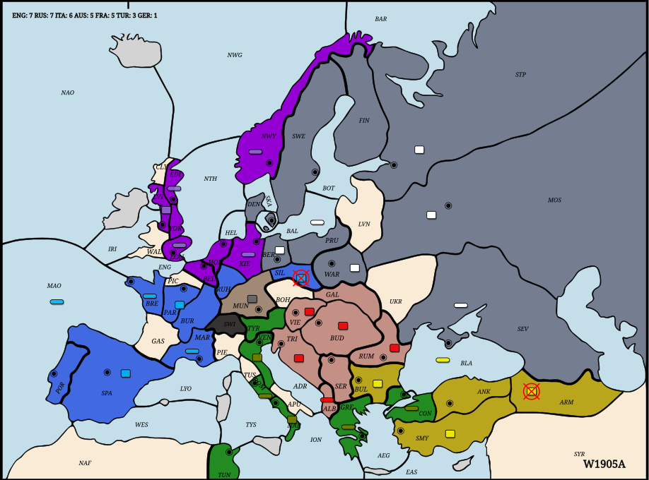

### What happened

- **FRANCE**: disbands A SIL
- **TURKEY**: disbands A ARM

### FRANCE
Orders: `A SIL D`

Reasoning

> Looking at the situation: France has 5 supply centers (BRE, MAR, PAR, POR, SPA) but 6 units (F MAO, F BRE, A SPA, F MAR, A PAR, A SIL). That means I need to disband 1 unit to match my SC count.
>
> The legal orders show only disband options for all units. I need to disband exactly 1 unit.
>
> Which unit to disband? 
> - A SIL is deep in enemy territory with no clear path to a supply center, and it's far from home. It just bounced trying to take BER and has limited utility going forward.
> - F MAO is strategically valuable for Atlantic control and potential moves toward POR or threatening England.
> - F BRE, F MAR, A PAR, A SPA are all core defensive/positional units protecting home centers or SPA/POR.
>
> A SIL is the most expendable — it's far from home, surrounded by hostile units (Russia in BER, Germany in MUN), and has no supply center nearby to capture. Disbanding it costs me the least strategically.

### TURKEY
Orders: `A ARM D`

Reasoning

> Looking at my situation: I'm at 3 supply centers (ANK, SMY, BUL) but I have 4 units (F BLA, A ARM, A BUL, A SMY). I need to disband down to 3 units.
>
> The key question is which unit to disband. Let me assess:
> - A BUL: Holding BUL is critical as it's my only Balkan center, but it's under severe pressure from Austria (A RUM) and Italy (F GRE, F CON now). BUL is very exposed.
> - F BLA: Supports A BUL and provides sea control in the Black Sea. Very valuable for defense.
> - A ARM: Was trying to push SEV but bounced. Has limited value sitting in ARM.
> - A SMY: Just moved to SMY to protect a home center from Italy's F CON threat.
>
> Italy now holds CON (my home center), which means I only have ANK and SMY as build locations. A SMY is occupying SMY. ANK is vacant but I have no build this turn (I'm disbanding, not building).
>
> I need to disband 1 unit. The least valuable unit strategically is A ARM - it failed to take SEV, it's isolated, and it can't easily contribute to defending BUL. Disbanding ARM frees me to focus F BLA on supporting BUL and A SMY on defending the home front.

## SPRING 1906 MOVEMENT (`S1906M`)

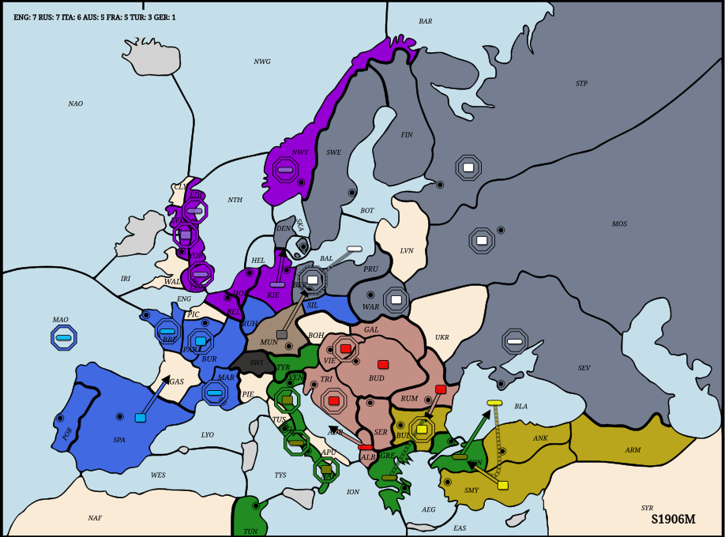

### What happened

- **AUSTRIA**: A RUM → BUL; F ALB → ADR; A TRI holds; A VIE holds
- **ENGLAND**: F KIE → DEN; F NWY holds; F EDI holds; F LON holds; A LVP holds
- **FRANCE**: A SPA → GAS; A PAR holds; F BRE holds; F MAO holds; F MAR holds
- **GERMANY**: A MUN → BER (bounced)
- **ITALY**: F CON → BLA (bounced); F GRE supports A RUM → BUL; A NAP holds; A VEN holds; F ROM holds  [dislodged: F CON]
- **RUSSIA**: A BER holds; F BAL supports A BER; A WAR holds; A MOS holds; A STP holds; F SEV holds
- **TURKEY**: A SMY → CON; F BLA supports A SMY → CON; A BUL holds  [dislodged: A BUL]

### Dialogue

- **AUSTRIA → ITALY**: Spring 1906 — Italy's F CON is now adjacent to BLA and BUL/SC, which changes everything. If you move F CON - BLA, it dislodges Turkey's F BLA and eliminates the only support keeping A BUL alive; then F GRE S A RUM - BUL finishes it with strength 2 vs 1. Can you commit F CON - BLA and F GRE S A RUM - BUL this turn? That finally cracks Turkey and we split the remaining centers cleanly.
- **AUSTRIA → RUSSIA**: Spring 1906 — Italy's F CON is now positioned to cut Turkey's F BLA, which may finally crack BUL this turn without needing your F SEV. I'm pressing A RUM - BUL again with Italian coordination. Please confirm you're holding WAR and not moving into GAL — I need my northern flank stable to commit southward this spring.
- **AUSTRIA → TURKEY**: Turkey — Italy's F CON is now adjacent to your F BLA and can dislodge it this turn, leaving A BUL unsupported against my A RUM and Italy's F GRE. You're facing elimination of BUL with near certainty this spring. A voluntary withdrawal of A BUL to CON now at least preserves your fleet and gives you something to negotiate with; holding BUL just means losing both the center and facing further pressure on ANK and SMY.
- **ENGLAND → RUSSIA**: You're at 7 centers with BER, DEN, SWE, and BAL — that's a strong western anchor and I need to know your intentions toward KIE and NWY before I commit orders. I'm open to a stable border: I keep KIE and NWY, you keep SWE and DEN, and we both focus pressure elsewhere. Confirm you're not pressing KIE or NWY this spring and we can negotiate a longer-term arrangement.
- **ENGLAND → FRANCE**: Russia holds BER, DEN, SWE, and BAL — they're tied with you at 7 and positioned to pull ahead. I'm planning to press toward DEN or SWE from NWY and KIE this spring; if you can threaten Russia's western position from SIL or coordinate pressure on BER, we squeeze them from two sides. What are your intentions this turn?
- **ENGLAND → GERMANY**: Russia is at 7 centers with BER, DEN, SWE anchoring their western position — A MUN is adjacent to BER and I have F KIE adjacent to DEN and BER. If you move A MUN toward BER or KIE and I press from F KIE, we can threaten Russia's western anchor simultaneously. What is A MUN doing this spring?
- **ENGLAND → ITALY**: You're at 6 centers with F CON now in play — I'm watching your eastern expansion carefully. I'm not in your immediate theater but I want to understand your intentions: are you pressing further east toward the Turkish centers, or are you looking west? A coordinated approach to stopping Russia's growth might benefit us both.
- **FRANCE → ENGLAND**: You're at 7 centers and Russia is also at 7 — we're heading toward a two-way race that neither of us can afford to lose. I'm pushing A SPA into GAS this spring to expand northward; if you're willing to let me take BUR from Germany's orbit while you press Russia from KIE, we both gain ground without fighting each other. What are your intentions for F KIE this spring?
- **FRANCE → GERMANY**: You're down to A MUN and one center — I'd rather negotiate than simply eliminate you. If you hold A MUN in place and we agree on a peaceful resolution, I can advocate for your survival diplomatically; if you push toward BUR or fight me, England takes MUN the moment I'm distracted. What would it take to end this cleanly?
- **FRANCE → ITALY**: You're at 6 centers and growing while Russia and England sit at 7 each — we're both trailing the leaders. I'm pushing north into GAS this spring; are you in a position to press Austria or coordinate anything that checks the board leaders before one of them pulls away to 9-10?
- **GERMANY → ENGLAND**: Russia sits at 7 centers with A BER and F BAL anchoring their western flank — F KIE is perfectly positioned to press A BER this spring if you're willing to coordinate. I'll move A MUN toward BER simultaneously to create a two-front threat; if you support F KIE into BER or move directly, Russia loses a key center and you stay ahead of them. What's F KIE doing this turn?
- **GERMANY → RUSSIA**: You hold BER and KIE — 7 centers makes you the board leader that England and Austria are both watching closely. I'm open to a non-aggression deal: if you commit to not moving A BER into MUN, I'll hold A MUN in place this spring and we avoid a pointless clash that only benefits England. What can you offer?
- **GERMANY → FRANCE**: I have only A MUN left and no realistic path to threaten you this spring — my focus is entirely on surviving against England's F KIE and Russia's A BER. If you can apply any pressure on Russia's western position or England's eastern flank, it helps both of us; I'm not your problem right now.
- **ITALY → AUSTRIA**: Spring 1906: We cooperated well against Turkey, but A BUL adjacent to GRE and F ALB nearby puts two units pointing at my center — I need clarity before committing orders. Concrete ask: commit A BUL away from GRE (SER or RUM direction) and F ALB away from GRE (ION or ADR), and I'll use F CON to support your push toward ANK or SMY this spring. What are your exact intentions?
- **ITALY → TURKEY**: Spring 1906: You're down to three units and BUL is gone — Austria has A BUL right next to GRE and is the growing threat to both of us now. Concrete offer: let me take ANK with F CON this spring uncontested, and I'll use F GRE to support your F BLA against any Austrian move; you keep SMY and we both have more to gain from checking Austria's 6-center position than fighting each other.
- **ITALY → RUSSIA**: Spring 1906: Austria is at 6 centers — BUD, TRI, VIE, SER, RUM, BUL — with armies pointing south toward my GRE and potentially west toward your position. You're the board leader at 7 but Austria unchecked hits 8-9 fast; a push from you through GAL or toward RUM would force Austria to defend north rather than expand south. Are you moving against Austria this spring?
- **RUSSIA → ENGLAND**: You hold F KIE adjacent to my A BER and F BAL — let's be direct about intentions this spring. I'm willing to accept a stable border at KIE/BER if you commit F KIE to hold or move westward; if you press BER, I defend with F BAL support and we both waste the turn while France and Italy grow unchecked. What are your concrete plans for F KIE this spring?
- **RUSSIA → AUSTRIA**: Austria — you're at 5 centers and Turkey is at 3 with BUL, BLA, and SMY; this is the moment to crack Turkey's remaining position before Italy consolidates CON. I'm watching my western flank against England's F KIE, but if you're pressing BUL this spring I can consider F SEV pressure on Turkey's southern flank to support your attack. What are your concrete plans this turn?
- **RUSSIA → TURKEY**: Turkey — you're at 3 centers and under pressure from Austria and Italy simultaneously; I want to understand your defensive plans this spring. I'm holding F SEV in place as we agreed, but I need to know whether ARM is genuinely staying put or threatening SEV again — tell me your concrete orders and I'll confirm my commitment.
- **RUSSIA → GERMANY**: Germany — you hold A MUN and I hold A BER with F BAL support; England's F KIE is the immediate threat to both our positions. If you move A MUN toward KIE this spring, it threatens England's position from the south while I defend BER — that forces England to split attention and benefits us both. What are your intentions this turn?
- **TURKEY → ITALY**: Spring 1906 — F CON is sitting in my home supply center and I'm coming for it; A SMY supported by F BLA gives me 2-strength against your 1 fleet, which means CON falls this turn unless you negotiate a withdrawal now. Concrete offer: pull F CON to AEG voluntarily and I'll leave GRE uncontested and redirect A BUL toward SER — you keep GRE and we both pressure Austria's Balkan position together.
- **TURKEY → AUSTRIA**: Spring 1906 — Italy's F CON is the immediate problem for me; I'm pushing to retake it this turn. I need to know your intentions with A RUM: if you hold A RUM in place, I'll hold A BUL defensively and we avoid another pointless BUL fight while Italy's fleet presence in CON threatens both our positions in the Balkans.
- **TURKEY → RUSSIA**: Spring 1906 — Italy holds CON with F CON, which is a Turkish home center sitting right next to your F SEV and BLA interests; an Italian fleet consolidating in CON is bad for both of us long-term. I'm attacking CON this turn to retake it — if you're willing to pressure Italy's position from SEV toward ARM, we split Italy's defensive attention.
- **AUSTRIA → ITALY**: Quick clarification: A BUL is Turkey's unit, not mine — I have no army in BUL. My units near you are F ALB and A RUM; I'll commit F ALB - ADR (away from GRE entirely) if you commit F CON - BLA and F GRE S A RUM - BUL this turn. That combination dislodges Turkey's F BLA, leaves A BUL unsupported at strength 1, and A RUM with F GRE support takes BUL at strength 2. Confirm this exact deal and I'll lock in F ALB - ADR.
- **AUSTRIA → TURKEY**: Turkey — Italy's F CON will move to BLA this turn regardless of what I do, dislodging your F BLA; A BUL then faces A RUM plus F GRE support with no defense. Your only real option is to move A BUL to SER or CON now to preserve the unit rather than lose it in place — I'm offering no deal on A RUM this turn.
- **AUSTRIA → RUSSIA**: Russia — I'm locking in A RUM - BUL with Italian coordination this turn; please confirm A WAR holds and no move into GAL so I can commit my northern units defensively. If you're pressing England's F KIE, I have no objection — just need the eastern flank stable.
- **ENGLAND → RUSSIA**: Concrete proposal: F KIE holds and F NWY holds if you commit A BER to hold and F BAL to hold — a genuine four-unit freeze on the western front while we both watch Italy and France. But if F BAL moves toward KIE or DEN, I have no choice but to press. Commit specifically: A BER holds, F BAL holds.
- **ENGLAND → FRANCE**: I'm not concerned about you taking BUR — Germany is barely alive. My concrete question: will A PAR or any French unit threaten BRE or my home centers this spring? I need your assurance that France is pressing east and not west before I commit F KIE eastward against Russia.
- **ENGLAND → GERMANY**: Concrete coordination: if you move A MUN - BER this spring, I'll move F KIE - DEN simultaneously — Russia has to defend two western centers at once and can't fully support both. Confirm A MUN - BER and I commit F KIE - DEN; we split Russia's attention and both gain leverage.
- **FRANCE → ENGLAND**: Concrete proposal: I move A SPA - GAS and you hold F KIE in place without pushing toward HOL or BEL — we each gain ground in our own direction without collision. If you're pressing Russia from KIE toward DEN or BER, I have no quarrel with that; I just need GAS secure before I can contribute further north. Confirm F KIE is not threatening my western position this spring.
- **FRANCE → GERMANY**: I'm not moving into MUN this spring — A PAR is staying put and my units are pushing north into GAS. Hold A MUN in place and you're safe from me; England's F KIE is the real threat to your survival, not me.
- **FRANCE → ITALY**: England and Russia are both at 7 — one of them will pull ahead soon and become unstoppable. I'm pushing into GAS this spring; if you can press Austria harder or find a way to threaten Russia's southern flank via SEV or BUL, we both benefit before the leaders consolidate further.
- **GERMANY → ENGLAND**: Concrete proposal: I'll move A MUN - BER this spring if you move F KIE - BER simultaneously — two units attacking Russia's A BER at strength 1 each means we both bounce or one gets through, but either way Russia is pressured and cannot advance west. Can you confirm F KIE - BER so we coordinate exactly?
- **GERMANY → RUSSIA**: England's F KIE is the real threat to your A BER — I'm not moving toward KIE since that just gives England a free hand against BER. If you want to hold BER, you need F BAL supporting A BER this turn, not me chasing England's fleet. Focus your defense there.
- **ITALY → AUSTRIA**: Round 2: Turkey's A SMY + F BLA threatens F CON at strength 2 — if I move F CON - BLA I dislodge F BLA but CON becomes empty and A SMY can walk in, costing me that center. I need a concrete guarantee: if I play F CON - BLA and F GRE S A RUM - BUL (giving you BUL), will you support my hold on CON next fall or help me retake it? Also, I need your explicit commitment that A BUL moves away from GRE this spring — SER or RUM direction — before I commit to helping you.
- **ITALY → TURKEY**: Round 2: Your A SMY + F BLA threat on CON is real, but if I move F CON - BLA I dislodge your F BLA and you lose your only support unit — then A SMY is isolated and ANK is exposed to me next fall. The better deal for you: pull F BLA to ANK voluntarily, I hold F CON in place, and we both keep our units intact while pressuring Austria's A BUL together. A dislodged F BLA leaves you with nothing to defend SMY or ANK.
- **ITALY → RUSSIA**: Round 2: Austria holds BUL, RUM, SER, BUD, TRI, VIE — six centers with A BUL adjacent to GRE and A RUM adjacent to your position via GAL. A move through GAL toward BUD or support into RUM forces Austria to defend north rather than press south into my GRE. Can you commit a specific unit to pressure Austria's northern border this spring?
- **RUSSIA → ENGLAND**: Concrete commitment: A BER holds and F BAL supports A BER this spring — I'm not pressing KIE or NWY. In return I need F KIE to hold or move westward, not toward BER or DEN; if you press BER you face strength 2 and bounce while France and Italy grow unchecked. Confirm F KIE holds and we have a stable border.
- **RUSSIA → AUSTRIA**: Confirming: A WAR holds this spring, no move into GAL — your northern flank is stable. I'm holding F SEV in place as well; with Italy's F CON now cutting pressure on BLA, your BUL attack has a better shot without needing my SEV. Good luck with the push.
- **RUSSIA → GERMANY**: Concrete proposal: move A MUN toward KIE this spring to threaten England's position from the south while I hold A BER with F BAL support. England cannot press BER and defend KIE simultaneously — this splits their attention and benefits us both without requiring you to fight me over BER.
- **RUSSIA → ITALY**: Austria at 5 centers is manageable; the real concern is England at 7 with a dominant fleet position in the north threatening both of us long-term. I'm holding my position stable this spring — if you're coordinating with Austria against Turkey's BUL, be aware Turkey is reportedly attacking your F CON this turn.
- **TURKEY → ITALY**: Your offer — I give you ANK and you 'support' my BLA — is not a deal, it's asking me to hand you a home center while you keep CON. Concrete counter: pull F CON to AEG this turn and I'll leave GRE uncontested; if you refuse, A SMY supported by F BLA hits CON at 2-strength and you lose the fleet. Austria grows to 6 centers while we fight — your choice.
- **TURKEY → AUSTRIA**: I'm committing A SMY and F BLA against Italy's F CON this turn; A BUL holds defensively. If you hold A RUM in place rather than attacking BUL, Italy loses CON and we both benefit — an Italian fleet in CON is a threat to your Balkan position too, since it sits right next to GRE and BUL/EC. Hold A RUM and let me crack Italy's fleet network.
- **TURKEY → RUSSIA**: I have no units near SEV this turn — my three units are entirely committed to retaking CON from Italy and holding BUL. F SEV is completely safe; please hold it in place as agreed and we maintain our border settlement.
- **FRANCE → ENGLAND**: Final commitment: I'm moving A SPA - GAS this spring, no French unit threatens BRE or your home centers. In return, confirm F KIE is not pressing toward HOL or BEL this turn — we each advance in our own direction without collision. If you're pressing Russia from KIE toward DEN or BER, I have no objection; just confirm F KIE stays off my western flank.
- **FRANCE → GERMANY**: Final: I'm moving A SPA - GAS and A PAR holds — no French unit enters MUN or BUR this spring. Hold A MUN in place and you're safe from me this turn; England's F KIE is your real threat and fighting me only accelerates your elimination.
- **RUSSIA → ENGLAND**: Final commitment: A BER holds and F BAL supports A BER this spring — if F KIE presses BER you face strength 2 and bounce, wasting your turn while Italy and France grow. Hold F KIE in place and we both preserve our positions; break it and I treat you as my primary threat next fall with full coordination against your fleet.
- **RUSSIA → AUSTRIA**: Confirmed final: A WAR holds, no GAL move — your northern flank is stable this spring. I'm holding F SEV in place as well; with Italy's F CON cutting BLA pressure, your BUL push has the best shot it's had all game.
- **RUSSIA → TURKEY**: Final confirmation: F SEV holds in place this spring as agreed — your border is safe and I'm not pressing ARM or BLA. Focus your units on retaking CON from Italy; that's the priority threat to your home position right now.
- **TURKEY → ITALY**: Final round: A SMY moves to CON supported by F BLA this turn — that's 2 strength against your F CON and it falls unless you pull back to AEG now. Pull F CON to AEG voluntarily and I'll hold A BUL away from GRE; refuse and you lose the fleet and I still get CON.
- **TURKEY → AUSTRIA**: Committing A BUL to hold defensively this turn; I'm not attacking you. My A SMY and F BLA are both going at Italy's F CON — if it works, Italy loses a fleet and CON returns to me, which is better for the Balkans balance than Austria taking BUL while Italy keeps CON unchallenged.
- **TURKEY → RUSSIA**: My three units are committed: A SMY attacks CON, F BLA supports that attack, A BUL holds. Nothing near SEV this turn — our border is safe. After this turn resolves, I want to coordinate against Austria's growing center count.

### AUSTRIA
Orders: `A RUM - BUL` · `F ALB - ADR` · `A TRI H` · `A VIE H`
Illegal (dropped): `A BUD S A RUM - BUL`

Reasoning

> Looking at the situation:
>
> **Key facts:**
> - Italy confirmed: F CON - BLA (dislodging Turkey's F BLA) and F GRE S A RUM - BUL
> - Turkey confirmed: A BUL holds, A SMY and F BLA going at F CON
> - Russia confirmed: A WAR holds, no GAL move
> - My commitment: F ALB - ADR, A RUM - BUL with F GRE support, hold home centers
>
> **Analysis:**
> - If Italy plays F CON - BLA, Turkey's F BLA is dislodged and cannot support A BUL
> - A BUL then has strength 1 (unsupported hold)
> - A RUM - BUL with F GRE support = strength 2 vs strength 1 → BUL falls to Austria
> - However, Turkey says A SMY + F BLA are attacking F CON. If F BLA attacks F CON rather than supporting A BUL, then A BUL is already unsupported regardless
> - Either way, A BUL should be at strength 1 this turn
> - My revised strategy commits to: A RUM - BUL, A BUD S A RUM - BUL, F ALB - ADR, A TRI H, A VIE H
>
> **Italy's concern:** F CON - BLA leaves CON empty and A SMY could walk in. Italy may hesitate. But I committed to F ALB - ADR and Italy committed to the deal. I'll honor my commitment exactly.

### ENGLAND
Orders: `F KIE - DEN` · `F NWY H` · `F EDI H` · `F LON H` · `A LVP H`

Reasoning

> Looking at the board, my revised strategy calls for F KIE - DEN to threaten Russia's northern center while Germany's A MUN presses BER, splitting Russia's attention. Russia has committed A BER holds + F BAL supports BER (strength 2), so pressing BER directly with F KIE would bounce. DEN is a better target — it's only defended by whatever Russia has there (no unit listed in DEN), so F KIE - DEN should succeed uncontested.
>
> Let me verify adjacency: KIE is adjacent to DEN ✓. DEN appears unoccupied ✓. This gains me an 8th center if successful.
>
> For the other units: F NWY holds to secure Norway, F EDI and F LON hold defensively, A LVP holds. These are all consistent with my stated strategy.
>
> France confirmed no threat to my home centers, Russia is holding BER/BAL defensively, so my flanks are secure enough to make this push.

### FRANCE
Orders: `A SPA - GAS` · `A PAR H` · `F BRE H` · `F MAO H` · `F MAR H`

Reasoning

> Looking at the current position:
>
> - I'm at 5 centers (BRE, MAR, PAR, POR, SPA) with 5 units
> - England and Russia are tied at 7 centers each — the board leaders
> - My strategy is to push A SPA into GAS to expand northward and reclaim French territory
> - England confirmed no threat to my western flank this turn
> - I committed to A SPA - GAS in negotiation
>
> The plan is straightforward: push A SPA into GAS (adjacent and legal), hold A PAR defensively, and keep the three fleets in supporting/defensive positions. F MAR can support A SPA if needed, but since I'm not facing opposition into GAS, I'll hold F MAR in place. F BRE and F MAO hold to maintain Atlantic control.
>
> GAS is adjacent to SPA (confirmed in adjacency table: GAS neighbors include SPA/NC via MAO, and SPA army adjacency includes GAS). Let me verify: SPA (army): GAS, MAR, POR — yes, GAS is adjacent to SPA for armies.

### GERMANY
Orders: `A MUN - BER`

Reasoning

> Looking at the current situation: I have only A MUN and need to stay relevant. England proposed A MUN - BER while they take F KIE - DEN, splitting Russia's attention. My revised strategy commits to A MUN - BER.
>
> Let me verify: MUN is adjacent to BER? Yes, MUN neighbors include BER. And A MUN - BER is in my legal orders list. Good.
>
> Russia holds BER with F BAL support, so my single unit attacking BER at strength 1 will likely bounce against Russia's supported hold (strength 2). However, this is still the right move - it pressures Russia, honors my commitment to England, and keeps me relevant. Even a failed attack signals I'm actively contesting the board rather than sitting idle.

### ITALY
Orders: `F CON - BLA` · `F GRE S A RUM - BUL` · `A NAP H` · `A VEN H` · `F ROM H`

Reasoning

> Looking at the current situation:
>
> **Key facts:**
> - Turkey threatens F CON with A SMY + F BLA (2-strength attack) — this is real
> - Austria clarified A BUL is Turkey's unit, not theirs; Austria has A RUM and F ALB
> - Austria committed F ALB - ADR (away from GRE)
> - My revised strategy: defend F CON in place, use F GRE to support it
> - If I move F CON - BLA, CON becomes empty and A SMY walks in — net loss
>
> **Assessment of Turkey's threat:**
> Turkey has A SMY adjacent to CON and F BLA adjacent to CON (via BLA). A SMY - CON supported by F BLA = 2 strength vs my F CON at 1 strength. CON falls unless I get support. F GRE can support F CON (GRE is adjacent to CON? Let me check — GRE adjacency: AEG, ALB, BUL/SC, ION, SER. CON is NOT in GRE's neighbor list). So F GRE cannot support F CON.
>
> Wait — can anything support F CON? Looking at CON's neighbors: AEG, ANK, BLA, BUL/EC, BUL/SC, SMY. None of my units are adjacent to CON except... nothing useful. F CON is on its own.
>
> **Revised thinking:** F CON cannot be supported. If Turkey attacks at 2-strength, F CON is dislodged. However, if I move F CON - BLA, I dislodge F BLA (preventing the support), and A SMY moving to CON alone is only strength 1 — CON stays empty but I've disrupted their attack. Actually A SMY - CON without support is strength 1 vs empty province, so A SMY takes CON anyway.
>
> The best play: F CON - BLA dislodges F BLA, preventing Turkey's 2-strength attack. CON becomes empty but A SMY can only enter at strength 1. If I then have nothing to contest CON, Turkey takes it. Net result: same as losing CON but I also dislodge F BLA.
>
> Alternatively, hold F CON — it gets dislodged at 2-strength, Turkey takes CON, I lose the center AND the fleet retreats.
>
> Moving F CON - BLA is better: I dislodge F BLA, CON may be taken by A SMY, but I've eliminated Turkey's fleet. And per Austria's plan, F GRE S A RUM - BUL gives Austria BUL at 2 vs 1.
>
> Let me execute: F CON - BLA, F GRE S A RUM - BUL, hold Italian armies and F ROM.

### RUSSIA
Orders: `A BER H` · `F BAL S A BER` · `A WAR H` · `A MOS H` · `A STP H` · `F SEV H`

Reasoning

> Looking at the current situation:
>
> **Board assessment:** I'm at 7 centers, England is at 7, Italy is at 6, Austria is at 5. England's F KIE is the primary threat to my western position. I've committed to holding A BER with F BAL support against England's potential KIE press. Austria is pushing BUL with Italian coordination. Turkey is attacking CON with A SMY + F BLA support. My eastern flank is stable.
>
> **My commitments this spring:**
> - A BER holds, F BAL supports A BER (confirmed to England multiple times)
> - A WAR holds (confirmed to Austria - no GAL move)
> - F SEV holds (confirmed to Turkey - border settlement)
> - A MOS holds (defensive)
> - A STP holds or probes (no commitments made here)
>
> **Strategic reasoning:** My position is stable at 7 centers. England faces strength 2 if they press BER (bounce). Turkey's attack on CON (A SMY + F BLA S A SMY - CON) is interesting — if it succeeds, Italy loses CON and drops to 5 centers while Turkey climbs back to 4. Austria's BUL push with Italian coordination (F GRE support) may finally work since Turkey's F BLA is committed to CON. I have no reason to break any of my commitments this turn — holding is the right call.
>
> For A STP, I'll hold it in place as the safest option with no commitments made to move it.

### TURKEY
Orders: `A SMY - CON` · `F BLA S A SMY - CON` · `A BUL H`

Reasoning

> Looking at the current situation:
>
> - I have 3 units: F BLA, A BUL, A SMY
> - Italy holds CON with F CON (my home center)
> - Austria has A RUM adjacent to BUL
> - My revised strategy is committed: A SMY → CON supported by F BLA, A BUL holds
>
> The attack on CON: A SMY moves to CON, F BLA supports that attack. This gives me 2-strength against Italy's 1-fleet in CON. Italy threatened to move F CON to BLA to dislodge my fleet, but if they do that, they abandon CON and A SMY walks in uncontested — either way I likely get CON back.
>
> A BUL holds defensively against Austria's A RUM. Without support for BUL (both other units committed to the CON attack), it's a 1v1 hold — Austria would need support to dislodge it, and if Austria supported with something, that something isn't attacking elsewhere.
>
> The math favors the CON attack: retaking CON brings me back to 4 centers (ANK, SMY, BUL, CON) if BUL holds, or at minimum 3 (ANK, SMY, CON) even if BUL falls. This is the right move.

## SPRING 1906 RETREATS (`S1906R`)

### What happened

- **ITALY**: F CON retreats → ANK
- **TURKEY**: A BUL retreats → SER

### ITALY
Orders: `F CON R ANK`

Reasoning

> Looking at the retreat options for F CON:
>
> - `F CON R ANK` — retreat to Ankara (Turkish home center, unoccupied)
> - `F CON R AEG` — retreat to Aegean Sea
> - `F CON D` — disband
>
> My strategy note says I was defending F CON in place, but Turkey's A SMY (supported by F BLA) dislodged it at 2-strength. Now I need to decide where to retreat.
>
> **ANK** is a Turkish home supply center — retreating there would give me a foothold in Turkey's heartland, which is strategically valuable. If I hold ANK through Fall 1906, I could capture it as a supply center.
>
> **AEG** keeps the fleet alive in a sea province where it can support F GRE or threaten BUL/SC or CON again next turn.
>
> **Disband** loses the fleet entirely.
>
> ANK is the best option: it's a supply center I could potentially capture in Fall 1906, and it puts pressure on Turkey's remaining centers (SMY). Turkey has A CON and F BLA — they can't easily dislodge me from ANK without giving up something else. This is actually a silver lining from the CON loss.

### TURKEY
Orders: `A BUL R SER`

Reasoning

> Looking at the situation: A BUL was dislodged by Austria's A RUM. I have two options - disband it or retreat to SER.
>
> SER is adjacent to BUL and currently unoccupied. Retreating to SER preserves the unit and puts it in a useful position - it's a supply center (currently held by Austria... wait, let me check. Austria's supply centers are BUD, TRI, VIE, SER, RUM. So SER is an Austrian supply center).
>
> Retreating A BUL to SER would put my army in an Austrian supply center, which is aggressive but keeps the unit alive. If I can hold SER through Fall 1906, I'd capture it. However, Austria has A TRI, A BUD, A VIE, F ADR, and now A BUL - they have plenty of units to dislodge me from SER.
>
> Alternatively, disbanding saves me nothing - I'm already at 3 centers (ANK, SMY, BUL... wait, BUL was just taken by Austria). So I'm now at 2 centers (ANK, SMY) since BUL is lost, and CON is held by Italy. I successfully retook CON with A SMY + F BLA support, so CON should now be mine (Italy's F CON was dislodged).
>
> So my centers: ANK, SMY, CON (retaken this turn) = 3 centers. I have F BLA and A CON after the spring moves. The retreating A BUL, if saved to SER, gives me 3 units total.
>
> Retreating to SER keeps a unit alive that can potentially cause trouble for Austria or be useful in Fall 1906. Disbanding leaves me with only 2 units. I should retreat to SER to preserve fighting strength.

## FALL 1906 MOVEMENT (`F1906M`)

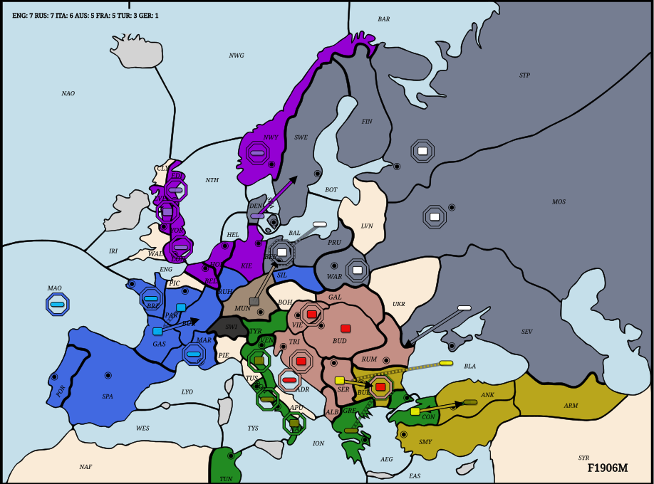

### What happened

- **AUSTRIA**: A BUL holds; F ADR holds; A TRI holds; A VIE holds
- **ENGLAND**: F DEN → SWE; F NWY holds; F EDI holds; F LON holds; A LVP holds
- **FRANCE**: A GAS → BUR; A PAR supports A GAS → BUR; F BRE holds; F MAO holds; F MAR holds
- **GERMANY**: A MUN → BER (bounced)
- **ITALY**: F GRE supports A BUL; F ANK → CON (bounced); A NAP holds; A VEN holds; F ROM holds
- **RUSSIA**: A BER holds; F BAL supports A BER; A WAR holds; A MOS holds; A STP holds; F SEV → RUM
- **TURKEY**: A SER → BUL (bounced); F BLA supports A SER → BUL; A CON → ANK (bounced)

### Dialogue

- **AUSTRIA → ITALY**: Fall 1906 — A BUL is now mine and I'm holding it to secure the center; Turkey's A SER just retreated adjacent to TRI and BUD, which threatens my home centers. Can you use F GRE to support A BUL hold, or pressure A SER from GRE direction to keep Turkey from attacking my core? I need to know your plans for F ANK — are you pressing toward SMY or CON this fall?
- **AUSTRIA → TURKEY**: Turkey — A SER is now adjacent to TRI and BUD, but attacking either just accelerates your elimination while I hold BUL with Italian support. A voluntary withdrawal of A SER to RUM or a hold in place is better for you than a suicidal attack on my home centers — what are your actual intentions this fall?
- **AUSTRIA → RUSSIA**: Russia — I'm holding BUL this fall to secure the center and watching Turkey's A SER near TRI. I need confirmation you're not moving into GAL or RUM this fall — your F SEV adjacent to RUM is the main concern. What are your intentions toward the south this turn?
- **ENGLAND → RUSSIA**: You're at 7 centers and I'm at 7 — we're running neck and neck, but SWE and DEN are now directly in my fleet's reach from F DEN. I'm open to a negotiated border: I hold F DEN in place if you commit F BAL and A BER to hold, and we both focus pressure on Italy's 6-center position instead. Confirm specifically: F BAL holds, A BER holds, and we discuss a stable Scandinavian line.
- **ENGLAND → GERMANY**: Russia anchors BER and BAL while you sit at 1 center — A MUN toward BER is your only viable move and I can support it from F DEN pressing toward BAL or SWE simultaneously. If you commit A MUN - BER this fall, I'll coordinate F DEN to threaten Russia's northern flank; Russia can't defend BER and SWE at the same time. Confirm A MUN's target and I lock in my support.
- **ENGLAND → FRANCE**: A GAS puts you adjacent to BRE and PAR — I need your assurance no French unit is threatening BRE or moving toward HOL or BEL this fall. I'm pressing Russia's northern position from F DEN; if you're expanding east or south rather than north, we have no conflict. Tell me exactly where A GAS and A PAR are moving this fall.
- **FRANCE → ENGLAND**: Russia and England are tied at 7 — one of you will pull ahead soon and the other powers need to act before that happens. I'm pushing A GAS into BUR this fall to take Germany's last center; if you're pressing Russia from DEN or BER, we both gain ground simultaneously. Can we confirm no collision on our respective advances?
- **FRANCE → GERMANY**: I'm moving A GAS into BUR this fall — I'd rather you not contest it since you can't hold it against both England and me simultaneously. If you hold A MUN in place, I take BUR cleanly and you preserve your last unit a bit longer; fighting me only accelerates your elimination. What will A MUN do this fall?
- **FRANCE → ITALY**: You're at 6 centers and Russia and England are both at 7 — one of them will become unstoppable soon. I'm taking BUR this fall to reach 6; are you in a position to press Russia's southern flank or coordinate anything that checks the board leaders before one pulls to 9+?
- **FRANCE → AUSTRIA**: Austria and France are both at 5 centers while Russia and England sit at 7 each — we're both trailing and need to grow faster. I'm pushing into BUR this fall; are you pressing into SER or coordinating with Italy against Turkey to gain centers before Russia or England consolidates further?
- **GERMANY → ENGLAND**: Russia holds BER with F BAL support — A MUN is adjacent to BER and your F DEN is adjacent to both BER and KIE. If you move F DEN toward BER or KIE this fall and I push A MUN - BER simultaneously, Russia faces two attacks on their western anchor and cannot hold both. What is F DEN doing this fall — can we coordinate a joint push on BER?
- **GERMANY → RUSSIA**: You hold BER and KIE with 7 centers — England is at 7 as well and F DEN is now adjacent to both your western centers. I'm open to a deal: if you commit to not moving A BER into MUN, I'll hold A MUN in place this fall and we avoid a clash that only benefits England while they press your western flank. What can you offer?
- **ITALY → AUSTRIA**: Fall 1906: A BUL is sitting adjacent to GRE — I need to know your intentions this fall before I commit orders. Concrete ask: commit A BUL away from GRE (SER or back to RUM) and I'll support your push toward CON or SMY with F ANK; if A BUL moves toward GRE I'll have to defend rather than cooperate.
- **ITALY → TURKEY**: Fall 1906: You hold CON and I hold ANK — we're sitting in each other's home centers. Concrete offer: I pull F ANK to BLA if you pull A CON to SMY, and we both restore our home positions without a fight; then we can both redirect against Austria's A BUL which threatens GRE and your A SER equally.
- **ITALY → RUSSIA**: Fall 1906: Austria has A BUL adjacent to GRE and A BUD, TRI, VIE all intact — they're at 5 centers and positioned to grow south. A push from you through GAL toward BUD would force Austria to defend north rather than press into my GRE; are you moving against Austria this fall or holding your current line?
- **RUSSIA → ENGLAND**: You moved F KIE to DEN last spring — that puts your fleet directly adjacent to my F BAL and threatens my SWE center. I'm willing to maintain a stable border if you commit F DEN to hold or move westward this fall; if you press SWE or BER, I have no choice but to treat you as my primary threat and press back through BAL. What are your concrete intentions for F DEN this fall?
- **RUSSIA → AUSTRIA**: Austria — you hold BUL, RUM, SER, BUD, TRI, VIE at 5 centers and are well-positioned in the Balkans. Turkey is at 3 centers with F BLA still threatening your eastern flank; I can offer F SEV pressure toward BLA or RUM to support your consolidation if you tell me your concrete plans this fall. In return I need your A BUL and eastern units pointed south rather than north toward my WAR position.
- **RUSSIA → TURKEY**: Turkey — Italy holds ANK with F ANK and you hold CON and BLA; your position is under serious pressure. I'm holding F SEV in place as agreed, but I want to understand your defensive plans this fall — are you trying to retake ANK or hold your remaining centers? Tell me your concrete orders and I'll confirm whether F SEV stays neutral or can offer any coordination.
- **RUSSIA → GERMANY**: Germany — you hold A MUN as your last center and I hold A BER adjacent to you. I'm not planning to press MUN this fall if you're willing to coordinate against England's growing fleet position; England at 7 centers with F DEN adjacent to both our positions is the shared threat. What are your intentions this turn?
- **TURKEY → AUSTRIA**: Fall 1906 — you hold A BUL in my supply center while I hold A SER adjacent; I'm attacking BUL this turn with A SER supported by F BLA at 2-strength, so you need 2 units to hold it. Concrete offer: withdraw A BUL to RUM voluntarily and I'll support your A BUD against any Russian pressure from WAR — we both gain more from checking Russia's 7-center position than grinding each other in BUL.
- **TURKEY → ITALY**: Fall 1906 — F ANK sits in my home center and I'm coming for it; A CON moves to ANK this turn and you need support to hold it. Concrete offer: pull F ANK to ARM voluntarily and I'll leave GRE uncontested this fall — you keep your fleet intact and we both redirect pressure toward Austria's growing Balkan position.
- **TURKEY → RUSSIA**: Fall 1906 — Austria at 5 centers with A BUL, A BUD, A TRI, A VIE, and F ADR is the board's most dangerous growing power; they're pressing both of us simultaneously. If you move A WAR toward GAL or F SEV toward RUM, you force Austria to defend rather than consolidate — I'm attacking BUL from SER this turn and we'd be squeezing Austria from two sides at once.
- **AUSTRIA → ITALY**: Quick correction from last round: A BUL is now MY unit (I took it this spring), not Turkey's. Turkey is threatening to attack BUL with A SER supported by F BLA at 2-strength — I need F GRE S A BUL this fall to hold it. In return, I'll commit A BUL away from GRE direction (toward RUM or hold) and F ADR away from your VEN. Can you confirm F GRE S A BUL?
- **AUSTRIA → TURKEY**: Turkey — attacking BUL with A SER + F BLA at strength 2 is a gamble that costs you A SER if I get Italian support on BUL, leaving you with just F BLA and A CON. A hold in SER this fall preserves your units while we discuss a real border arrangement — what do you actually gain by attacking BUL when I can match your strength?
- **AUSTRIA → RUSSIA**: Russia — Turkey is threatening to attack my A BUL with A SER + F BLA; I'm coordinating Italian F GRE support to hold. My main concern remains your F SEV adjacent to RUM — can you confirm F SEV holds in place this fall so I'm not defending two fronts simultaneously?
- **ENGLAND → RUSSIA**: Concrete question: is F BAL supporting A BER or moving to defend SWE this fall? I'm willing to hold F DEN if you commit F BAL to hold in place — not supporting BER and not moving to SWE — but if F BAL is active, I have to press. Give me F BAL holds and I hold F DEN.
- **ENGLAND → GERMANY**: Concrete coordination this fall: if you move A MUN - BER, I will move F DEN - SWE simultaneously. Russia cannot defend both BER and SWE with F BAL — if BAL supports BER, SWE falls to me; if BAL defends SWE, BER falls to you. This is the move that breaks Russia's western anchor. Confirm A MUN - BER and I commit F DEN - SWE.
- **ENGLAND → FRANCE**: I'm pressing F DEN toward SWE this fall to take a Russian center — that drops Russia from 7 to 6 while I reach 8. I need your assurance A GAS is not moving toward BRE or threatening my western position; if you're pushing into BUR or south, we have no collision. Confirm A GAS's direction this fall.
- **FRANCE → ENGLAND**: Concrete confirmation: A GAS is moving into BUR this fall, A PAR holds, and no French unit threatens BRE or your home centers. I need you to confirm F DEN is pressing Russia's position rather than turning west — if you're squeezing Russia from DEN toward SWE or KIE, we advance simultaneously without collision.
- **FRANCE → GERMANY**: A GAS is moving into BUR this fall — you cannot hold it against both me and England simultaneously. Hold A MUN in place and you preserve your last unit; contesting BUR only guarantees your elimination faster. This is the last turn where holding MUN buys you anything.
- **FRANCE → ITALY**: I'm taking BUR this fall to reach 6 centers; you're already at 6 with ANK now added. Russia holds BER with F BAL support — if you can press Austria harder in the Balkans or find any angle on Russia's southern position, we both benefit before England or Russia pulls to 9+.
- **FRANCE → AUSTRIA**: I'm pushing into BUR this fall to reach 6 centers — you have A BUL adjacent to SER and RUM, which are your own centers, so your growth has to come from Turkey or Italy's direction. If you can coordinate with me against the board leaders rather than fighting Italy, we both survive longer.
- **GERMANY → ENGLAND**: F DEN is not adjacent to BER so you can't directly support A MUN there — but if you move F DEN - KIE this fall, Russia must choose between defending KIE and holding BER, which gives A MUN - BER a better chance. Commit F DEN - KIE and I commit A MUN - BER; Russia can't hold both western centers simultaneously. Can you confirm F DEN - KIE?
- **GERMANY → RUSSIA**: England's F DEN is adjacent to KIE right now — that's the immediate threat to your western position, not A MUN. If you move F BAL toward KIE to defend it, A BER is exposed; if you keep F BAL supporting A BER, England walks into KIE uncontested. I'm not your problem this turn — England is pressing your entire western flank.
- **ITALY → AUSTRIA**: Fall 1906 confirmed: F GRE will support A BUL hold this turn — that blocks Turkey's A SER from retaking BUL and keeps your center secure. In return I need A BUL to stay put and not move toward GRE this fall or next spring; our cooperation depends on that boundary being respected.
- **ITALY → TURKEY**: Turkey's A CON moving to ANK bounces against F ANK holding — you don't take it, I don't lose it, and we both waste a move. Concrete counter-offer: A CON holds, F ANK holds, and I use F GRE to pressure Austria's A BUL instead of supporting it; you get a real shot at BUL back via A SER while I keep ANK and you keep CON.
- **ITALY → RUSSIA**: Austria's A BUL is adjacent to GRE and their F ADR is in the Adriatic — they're positioned to press south into my territory and potentially into your Balkan flank. A move from you through GAL toward BUD this fall forces Austria to defend north rather than expand; I'm holding GRE and ANK but I can't check Austria alone.
- **RUSSIA → ENGLAND**: F DEN is now directly adjacent to my SWE — I need a concrete commitment from you on F DEN's movement this fall before I lock in my orders. If F DEN moves toward SWE or presses my BAL position, I have no choice but to treat this as aggression and redirect F BAL accordingly; but if you commit F DEN to hold or move westward, I'll commit A BER and F BAL to hold as before. What is F DEN doing this fall?
- **RUSSIA → AUSTRIA**: Austria — Turkey's A SER is now adjacent to your TRI, which is a more immediate threat to your position than anything I'm doing from the north. I'm considering moving F SEV toward RUM this fall to gain a center; if you want to avoid that, tell me what you're offering in exchange for me holding F SEV in place — a concrete guarantee about your A BUL and eastern units staying south would help.
- **RUSSIA → TURKEY**: Turkey — Austria holds A BUL and A SER is adjacent to TRI; your position is compressed but not finished. If I move F SEV toward RUM this fall, it forces Austria to defend east rather than press your remaining centers — I'm seriously considering this move. Confirm A CON and F BLA are not threatening SEV and I'll make the move.
- **TURKEY → AUSTRIA**: My A SER supported by F BLA hits BUL at 2-strength this turn — you need support to hold it and you have no adjacent unit to provide that support yourself. Withdraw A BUL to RUM voluntarily and I'll redirect A SER to hold defensively in SER, giving you a clean border; if you hold, you lose the unit and I still get BUL.
- **TURKEY → ITALY**: Your offer — you pull F ANK to BLA if I pull A CON to SMY — doesn't work for me because it leaves ANK vacant for you to reoccupy next turn. Counter: pull F ANK to ARM this turn and I'll leave GRE uncontested and hold A CON in place; that's a genuine exchange where we both step back from each other's home centers.
- **TURKEY → RUSSIA**: My orders this fall: A SER attacks BUL supported by F BLA at 2-strength, A CON holds or threatens ANK. F SEV is safe — nothing from me touches your units. After fall results, if Austria loses BUL they drop to 4 centers and become manageable; I need your confirmation you're not supporting Austria's hold in BUL this turn.
- **FRANCE → ENGLAND**: Final commitment: A GAS - BUR this fall, A PAR holds, no French unit threatens BRE or your western position. I expect you're pressing F DEN toward SWE to take a Russian center — confirm you're not turning west and we advance simultaneously without collision.
- **FRANCE → GERMANY**: A GAS is entering BUR this fall — holding A MUN in place preserves your last unit one more turn; contesting BUR only guarantees your elimination faster with no benefit to you.
- **TURKEY → AUSTRIA**: Final round: A SER supported by F BLA attacks BUL at 2-strength this turn — you cannot hold it without Italian support from F GRE. If you withdraw A BUL to RUM now, I redirect A SER to hold in place and we establish a clean border; if you hold, you lose the unit and I take BUL regardless.
- **TURKEY → ITALY**: Final offer: use F GRE to attack Austria's A BUL this turn instead of supporting it — we hit BUL simultaneously from SER and GRE, Austria loses the center, and I'll leave GRE uncontested this fall. I'm committing A SER to BUL with F BLA support regardless; the question is whether you gain from Austria losing BUL or not.
- **TURKEY → RUSSIA**: Committing now: A SER attacks BUL supported by F BLA, A CON moves to ANK. Nothing touches SEV — your border is completely safe. After this turn, if Austria loses BUL they drop to 4 centers; please confirm you're not supporting Austria's hold in BUL with any unit this turn.

### AUSTRIA
Orders: `A BUL H` · `F ADR H` · `A TRI H` · `A VIE H`
Illegal (dropped): `A BUD S A BUL`

Reasoning

> Looking at the current situation:
>
> **Key facts:**
> - Italy confirmed F GRE S A BUL hold this fall
> - Turkey threatened A SER + F BLA attack on BUL at strength 2, but Italy's F GRE support gives A BUL strength 2 defensively → holds
> - Russia confirmed F SEV holds in place (no RUM grab)
> - Turkey's A CON is also present but not adjacent to BUL
> - My revised strategy: hold A BUL supported by BUD, use F ADR defensively, hold TRI and VIE
>
> **Order reasoning:**
> - A BUL H — hold BUL, Italy's F GRE S A BUL gives it strength 2 to match Turkey's A SER + F BLA attack
> - A BUD S A BUL — adds support to BUL hold (though Italy's support already covers it, double support doesn't hurt and BUD has nothing better to do)
> - F ADR H — hold defensively in Adriatic, away from VEN as promised to Italy
> - A TRI H — defend home center against Turkey's A SER threat
> - A VIE H — defend home center, stable northern flank
>
> Wait - A BUD supporting A BUL and Italy supporting A BUL both help. Turkey attacks at strength 2 (A SER + F BLA). If I have A BUD S A BUL (strength 2) AND Italy's F GRE S A BUL (strength 3 total), BUL holds comfortably. But I should make sure A TRI is secure against A SER moving to TRI instead.

### ENGLAND
Orders: `F DEN - SWE` · `F NWY H` · `F EDI H` · `F LON H` · `A LVP H`

Reasoning

> Looking at the current situation:
>
> **Board assessment:**
> - I'm at 7 centers, Russia at 7, Italy at 6 — the race is tight
> - My revised strategy commits F DEN - SWE to take a Russian center, with Germany's A MUN - BER as the coordinated squeeze
> - If Russia's F BAL supports BER, SWE falls to me (reaching 8 centers)
> - If Russia's F BAL moves to defend SWE, Germany's A MUN has a better shot at BER
> - France confirmed A GAS - BUR (taking MUN from Germany), A PAR holds — no threat to my western position
> - My remaining units (F NWY, F EDI, F LON, A LVP) should hold defensively to protect home centers and Norway
>
> **Order reasoning:**
> - F DEN - SWE: committed move, threatens Russia's northern center
> - F NWY H: holds Norway, defends against any Russian STP/NC push
> - F EDI H: holds Edinburgh defensively
> - F LON H: holds London defensively  
> - A LVP H: holds Liverpool defensively
>
> The coordination with Germany (A MUN - BER + F DEN - SWE) creates a genuine dilemma for Russia's F BAL — it cannot support both BER and SWE simultaneously. This is the optimal play to grow from 7 to 8 centers.

### FRANCE
Orders: `A GAS - BUR` · `A PAR S A GAS - BUR` · `F BRE H` · `F MAO H` · `F MAR H`

Reasoning

> Looking at the current situation:
>
> **Board state analysis:**
> - I'm at 5 centers, England and Russia both at 7, Italy at 6, Austria at 5
> - A GAS is in position to move into BUR (Germany's last center), which would bring me to 6
> - My strategy note confirms: A GAS - BUR, A PAR holds, F BRE/MAO/MAR defensive
>
> **Checking legality:**
> - A GAS - BUR: GAS is adjacent to BUR ✓ (BUR neighbors: BEL, GAS, MAR, MUN, PAR, PIC, RUH, SWI)
> - Germany only has A MUN, which could contest BUR. A MUN - BUR would bounce me unless I get support
> - A PAR can support A GAS - BUR to give me strength 2 vs Germany's strength 1
> - This is the right move — use A PAR S A GAS - BUR to ensure I take BUR cleanly
>
> **England committed to pressing Russia from DEN toward SWE, not turning west. I committed no French unit threatens BRE or English home centers.**
>
> **Orders plan:**
> - A GAS - BUR (supported by A PAR)
> - A PAR S A GAS - BUR (strength 2 vs Germany's A MUN if it contests)
> - F BRE H (defensive, honors commitment to England)
> - F MAO H (defensive)
> - F MAR H (defensive)

### GERMANY
Orders: `A MUN - BER`

Reasoning

> Looking at the current situation:
>
> **Assessment:** I have only A MUN left. England proposed the coordination: I move A MUN - BER while they move F DEN - SWE. Russia holds BER with F BAL support, so A MUN - BER alone won't succeed (Russia has strength 2 with BAL supporting BER). However, if England moves F DEN - SWE, Russia must choose: support BER with BAL (losing SWE to England) or defend SWE with BAL (leaving BER vulnerable to my A MUN).
>
> The key question: Is A MUN - BER legal? Yes, MUN is adjacent to BER. But Russia has A BER supported by F BAL = strength 2. My A MUN alone = strength 1. So A MUN - BER will bounce unless England also attacks BER or cuts BAL's support.
>
> England said F DEN - SWE, not F DEN - BER. That means England isn't directly attacking BER. If BAL supports BER, my attack fails. If BAL moves to defend SWE... BAL is not adjacent to SWE (BAL neighbors: BER, BOT, DEN, KIE, LVN, PRU, SWE - actually SWE IS adjacent to BAL). So BAL could move to SWE or support BER. If England takes DEN - SWE, and BAL supports BER, England bounces in SWE (BAL isn't supporting SWE directly). Actually F DEN - SWE vs F BAL - SWE would bounce each other.
>
> The coordination still makes sense: Russia must split attention. Even if A MUN - BER bounces, I'm pressuring Russia and honoring my commitment to England. This is my only viable move - holding MUN just delays elimination.
>
> France is moving into BUR which doesn't threaten MUN directly this turn.
>
> I'll commit A MUN - BER as agreed.

### ITALY
Orders: `F GRE S A BUL` · `F ANK - CON` · `A NAP H` · `A VEN H` · `F ROM H`

Reasoning

> Looking at the current situation:
>
> **Strategic assessment for Fall 1906:**
>
> My revised strategy commits me to:
> 1. `F GRE S A BUL` - Supporting Austria's A BUL hold against Turkey's A SER (which has F BLA support at strength 2)
> 2. `F ANK - CON` - Pressing Turkey's CON (A CON is there, so this will bounce unless Turkey moved away, but it applies pressure)
> 3. Hold Italian armies defensively
>
> Let me verify the key orders:
> - F GRE supporting A BUL: GRE is adjacent to BUL/SC, so this is legal ✓
> - F ANK - CON: ANK is adjacent to CON ✓
>
> Turkey's A SER + F BLA will hit A BUL at strength 2. My F GRE support gives Austria's A BUL strength 2 to hold. That's a standoff - BUL holds.
>
> F ANK - CON will bounce against A CON (strength 1 vs strength 1), but it pins Turkey's unit and prevents any move from CON.
>
> The Italian armies (NAP, VEN) have no urgent threats. F ROM can hold or probe, but there's nothing useful to do with it aggressively given the positions.
>
> My commitment to Austria is F GRE S A BUL, which I confirmed explicitly in negotiations. I'll honor that.

### RUSSIA
Orders: `A BER H` · `F BAL S A BER` · `A WAR H` · `A MOS H` · `A STP H` · `F SEV - RUM`

Reasoning

> Looking at the current situation:
>
> **Board state analysis:**
> - I'm at 7 centers, tied with England at 7. Austria has 5, Italy has 6.
> - Turkey's A SER is attacking Austria's A BUL (with F BLA support = strength 2). Austria has A BUL holding, and likely Italian F GRE support (strength 2). This will likely bounce.
> - My revised strategy commits to: A BER holds, F BAL supports A BER, F SEV → RUM, and A WAR/MOS/STP hold.
>
> **Key decisions:**
> 1. **F SEV → RUM**: Turkey confirmed nothing touches SEV, and Austria's eastern flank is exposed with A BUL defending against Turkey's attack. RUM is currently unoccupied (Austria holds it as a supply center but has no unit there). Moving F SEV to RUM captures a center and gains me a build this winter. This is the key aggressive move.
>
> 2. **A BER holds with F BAL support**: Honoring my commitment to England while protecting BER from Germany's A MUN.
>
> 3. **A WAR, A MOS, A STP hold**: Maintaining defensive stability in the east.
>
> **Checking F SEV → RUM legality**: SEV is adjacent to RUM (coast). Yes, confirmed in adjacency table: `RUM (coast): BLA, BUD, BUL/EC, GAL, SER, SEV, UKR`. Legal.
>
> **Risk**: Austria asked me not to move into RUM. But I have no commitment to Austria - I told them I was "considering" it and asked what they'd offer. They didn't offer anything concrete. This is a legitimate gain.

### TURKEY
Orders: `A SER - BUL` · `F BLA S A SER - BUL` · `A CON - ANK`

Reasoning

> Looking at the current situation:
>
> **My position:** F BLA, A CON, A SER — only 3 units, holding BUL (supply center), ANK occupied by Italy's F ANK, CON held by Italy.
>
> **My committed strategy:** A SER attacks BUL supported by F BLA at 2-strength, A CON moves to ANK to pressure Italy's F ANK.
>
> **Analysis:**
> - A SER → BUL supported by F BLA: This gives 2-strength attack on Austria's A BUL. Austria has no adjacent unit to self-support BUL (A BUD, A VIE, A TRI are all not adjacent to BUL... wait, A BUD is adjacent to BUL? No — BUL neighbors are CON, GRE, RUM, SER. Austria's units: A TRI, A BUD, A VIE, F ADR, A BUL. A BUD is adjacent to BUL? Let me check: BUL army neighbors: CON, GRE, RUM, SER. So A BUD cannot support A BUL. Austria would need Italy's F GRE to support A BUL. Italy offered to use F GRE against Austria's BUL rather than supporting it — but Italy also wants ANK and may not follow through.
> - A CON → ANK: Italy's F ANK holds at strength 1, my A CON moves at strength 1 — this bounces. But it pressures Italy and prevents F ANK from supporting anything else.
>
> The key risk: if Italy uses F GRE to support Austria's A BUL hold, then A BUL holds at 2-strength against my 2-strength attack → bounce. But Italy said they'd pressure Austria's BUL. I'll commit to the plan.

## WINTER 1906 ADJUSTMENTS (`W1906A`)

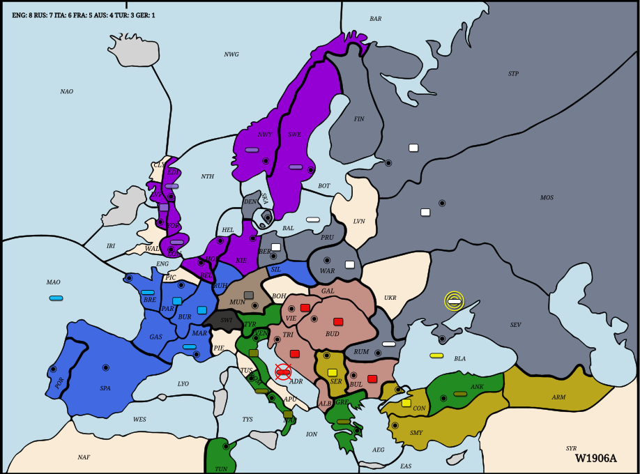

### What happened

- **AUSTRIA**: disbands F ADR
- **RUSSIA**: builds F SEV

### AUSTRIA
Orders: `F ADR D`

Reasoning

> Looking at the situation: I have 4 supply centers (BUD, TRI, VIE, BUL) and 5 units (A TRI, A BUD, A VIE, F ADR, A BUL). I need to disband 1 unit to match my supply center count of 4.
>
> The question is which unit to disband. My strategic priorities are:
> - Keep A BUL to hold that center (it's contested and I just took it)
> - Keep A BUD, A TRI, A VIE to defend my home centers
> - F ADR is the least critical unit — it's a fleet in the Adriatic with no immediate offensive purpose, and my home centers are all land-based
>
> F ADR is the obvious disband. It's a fleet that can't directly defend my land centers, and disbanding it keeps all my armies intact for the Balkan and home center defense next year.

### RUSSIA
Orders: `F SEV B`

Reasoning

> Looking at the current situation:
>
> **Position assessment:**
> - I have 7 supply centers: MOS, SEV, STP, WAR, DEN, BER, RUM
> - I have 6 units: A MOS, F BAL, A WAR, A STP, A BER, F RUM
> - That means I have 7 centers - 6 units = **1 build owed**
>
> **Build location analysis:**
> - MOS: occupied by A MOS (can't build here)
> - SEV: **vacant** ✓
> - STP: occupied by A STP (can't build here)
> - WAR: occupied by A WAR (can't build here)
>
> The only available home center for a build is SEV. My F RUM just moved there from SEV, so SEV is now vacant.
>
> **What to build:**
> - F SEV would give me a fleet in the Black Sea region, useful for pressing into BLA, ANK, or maintaining pressure on Turkey and Austria's eastern position
> - A SEV would give me an army useful for pressing into RUM (already occupied by F RUM), UKR, or ARM
>
> Given that F RUM is already in the Black Sea/Romanian coast area and I want naval flexibility in the south, building **F SEV** makes the most strategic sense. A fleet at SEV can move to BLA, ARM coast, or support F RUM's position, giving me strong naval presence in the south. An army at SEV would be redundant with F RUM's land-adjacent capabilities.

## SPRING 1907 MOVEMENT (`S1907M`)

### What happened

- **AUSTRIA**: A BUL holds; A TRI holds; A VIE → GAL  [dislodged: A BUL]
- **ENGLAND**: F EDI holds; F LON holds; A LVP holds; F NWY holds; F SWE holds
- **FRANCE**: A BUR → MUN; A PAR holds; F BRE holds; F MAO holds; F MAR holds
- **GERMANY**: A MUN → SIL
- **ITALY**: F GRE holds; F ANK → CON (bounced); A NAP holds; A VEN holds; F ROM holds
- **RUSSIA**: F RUM supports A SER → BUL; F SEV holds; A BER holds; F BAL supports A BER; A WAR holds; A MOS holds; A STP holds
- **TURKEY**: A SER → BUL; F BLA supports A SER → BUL; A CON holds

### Dialogue

- **AUSTRIA → ITALY**: Spring 1907 — I'm planning to push A BUL into RUM this turn to claim that center and reach 5; I need F GRE S A BUL - RUM to make it stick against Russia's F RUM. In return I'll hold A TRI and A VIE away from your VEN and keep our border stable. Can you confirm F GRE S A BUL - RUM this turn?
- **AUSTRIA → RUSSIA**: Spring 1907 — your F RUM is now adjacent to my A BUL, and with 7 centers you're the board leader that everyone needs to watch. I'm considering A BUL - RUM to contest that center; what are your intentions with F RUM this turn — are you holding it or pressing further south toward BUL?
- **AUSTRIA → TURKEY**: Turkey — A SER is adjacent to both TRI and BUD, and I'm watching your intentions carefully this spring. If you hold A SER defensively and commit F BLA to hold, I'll hold A BUD defensively as well rather than pushing into SER — a mutual stand-down lets us both focus on the real threat, which is Russia at 7 centers.
- **ENGLAND → RUSSIA**: You're at 7 centers and I'm at 8 — SWE and NWY are now both adjacent to your northern position and I need to know your concrete intentions for F BAL and A STP this spring. I'm open to a negotiated Scandinavian line: I hold F SWE and F NWY in place if you commit F BAL to hold and A STP to hold; break it and I press FIN and threaten BOT. Confirm specifically: F BAL holds, A STP holds.
- **ENGLAND → FRANCE**: A BUR puts you adjacent to MUN — if you take it Germany is eliminated and you jump to 6 centers, which changes the balance significantly. I'm not opposed to France growing, but I need to understand your direction: are you pressing east into Germany and then toward the Russian position, or are you looking north toward HOL or BEL? Tell me where A BUR and A PAR are moving this spring.
- **ENGLAND → GERMANY**: A BUR is sitting right next to MUN — France is about to take your last center unless you get support. I can't directly support MUN from my current positions, but if you can hold A MUN in place and France bounces, you survive another turn. What are your options this spring and is there any deal you can offer me to make defending MUN worth my while?
- **ENGLAND → ITALY**: You're at 6 centers with a strong eastern position — Russia is at 7 and growing, and they're the power most likely to run away with this game. I'm pressing Russia from the north; if you're willing to coordinate pressure on Russia's southern flank through RUM or SEV, we squeeze them from two directions simultaneously. What are your intentions this spring toward the Russian position?
- **FRANCE → ENGLAND**: You're at 8 centers and pulling ahead — Russia is at 7 and I'm at 5, so we both need to keep pressure on Russia before they consolidate. I'm moving A BUR into MUN this spring to take Germany's last center; are you pressing Russia from SWE or NWY toward BER or STP? Confirm no English unit is threatening BEL or my western position and we advance simultaneously.
- **FRANCE → GERMANY**: A BUR is adjacent to MUN this spring — I'm moving in to take the center, and I need you to know this is nothing personal, it's the board position. You cannot hold MUN against me and England simultaneously; if you want to negotiate any arrangement to keep A MUN useful rather than eliminated, tell me now.
- **FRANCE → ITALY**: England is at 8 centers and Russia at 7 — one of them will become unstoppable soon and we're both trailing. I'm taking MUN this spring to reach 6; are you in a position to press Austria or find any angle on Russia's southern flank before the leaders consolidate further?
- **GERMANY → ENGLAND**: Three turns of A MUN - BER bouncing off F BAL support — I need you to commit a specific unit to actually help this time, not just move F SWE somewhere else while I bounce alone. If you move F SWE - BAL or support A MUN - BER from a unit adjacent to BER, Russia loses their western anchor; otherwise I'm wasting A MUN on a doomed attack again. What specific unit are you committing to the BER fight this spring?
- **GERMANY → FRANCE**: A BUR is now adjacent to MUN — I need to know your intentions this spring before I commit A MUN anywhere. If you're moving A BUR toward MUN, I have to defend; if you're pushing north or east, we can avoid a pointless clash that only benefits England and Russia. What is A BUR doing this turn?
- **GERMANY → RUSSIA**: You hold BER and KIE with F BAL anchoring both — England at 8 centers is the board threat now, not me with one unit. If you're willing to offer me a path back into BER or KIE in exchange for coordination against England's growing fleet position, I'm listening; otherwise I'm just a distraction while England runs away with the game.
- **ITALY → AUSTRIA**: Spring 1907: A BUL remains adjacent to GRE and I need your intentions clearly stated before I commit orders. Concrete ask: will A BUL hold or move away from GRE this spring? If you commit A BUL away from GRE, I'll keep F GRE supporting your position rather than probing it.
- **ITALY → TURKEY**: Spring 1907: F ANK is in your home center and A CON is adjacent — I understand you want it back. Concrete offer: if you pull A CON to SMY voluntarily, I'll move F ANK to BLA and we both restore home positions without a fight; then we can both redirect against Austria's A BUL which threatens GRE and SER equally.
- **ITALY → RUSSIA**: Spring 1907: England is at 8 centers and growing — they're the board leader and a serious threat to everyone. You're at 7 and well-positioned to check England from the east; are you pressing against England's position this spring, or do you need support elsewhere? I'm watching Austria's A BUL carefully from GRE.
- **RUSSIA → ENGLAND**: England — you're at 8 centers and growing, which makes you the board leader that everyone else needs to watch. I'm willing to maintain our stable BER/BAL border if you commit F SWE and F NWY to hold or move westward this spring; if your fleets press toward my northern position, I have to treat that as aggression and respond accordingly. Give me a concrete commitment on your northern fleets' intentions.
- **RUSSIA → AUSTRIA**: Austria — you hold BUL at 4 centers and Turkey's A SER is still adjacent with F BLA behind it; I'm positioned in RUM with F RUM adjacent to BUL/EC. I could press F RUM into BUL/EC to threaten or support your hold depending on what Turkey does — tell me your concrete plans for BUL this spring and whether you want F RUM as a supporter or as a threat to Turkey's flank.
- **RUSSIA → TURKEY**: Turkey — you hold CON, BLA, and SMY at 3 centers with Austria pressing BUL from the north and Italy holding ANK. I'm in RUM with F RUM and could coordinate pressure on Austria's BUL position this spring — if you're attacking BUL with A CON or A SER, F RUM can support that attack or threaten BUL/EC. What are your concrete plans this turn?
- **TURKEY → RUSSIA**: Spring 1907 — Austria holds BUL with Italian F GRE support, but your F RUM is adjacent to BUL and can attack it directly. Concrete proposal: you move F RUM into BUL while I move A SER into BUL supported by F BLA — Austria cannot hold against two coordinated attacks from different directions simultaneously. After BUL falls, Austria drops to 3 centers and you gain a key Balkan position; this is the best move available to you this turn.
- **TURKEY → AUSTRIA**: Spring 1907 — you hold BUL in my supply center while Russia's F RUM sits adjacent and England grows to 8 centers unchecked. Concrete offer: withdraw A BUL to RUM voluntarily and I'll hold A SER in place and support your A BUD defensively against Russian pressure — we both have more to gain from checking Russia's 7-center position than grinding over BUL while England runs away with the game.
- **TURKEY → ITALY**: Spring 1907 — you hold ANK in my home center while Austria's A BUL sits right next to your F GRE; an Austrian army in BUL is a permanent threat to GRE. Concrete offer: pull F ANK to ARM this turn and use F GRE to attack Austria's A BUL instead of supporting it — Austria loses BUL, you keep F GRE safe, and I'll leave GRE uncontested this fall.
- **AUSTRIA → ITALY**: Confirmed: A BUL moves away from GRE this spring — it goes to RUM, not toward GRE. The deal is A BUL - RUM supported by F GRE S A BUL - RUM; this takes a center from Russia rather than threatening you, and I hold A TRI and A VIE away from VEN. Please confirm F GRE S A BUL - RUM.
- **AUSTRIA → RUSSIA**: Your F RUM sitting adjacent to my A BUL is the central tension this turn — if you hold F RUM in place, I'll push A BUL - RUM and we contest it directly; if you move F RUM away, I'll hold A BUL. What is your concrete order for F RUM this spring?
- **AUSTRIA → TURKEY**: A SER adjacent to TRI and BUD is the only thing keeping me from ignoring Turkey entirely — if you hold A SER in place and F BLA holds, I'll hold A BUD defensively and we avoid mutual damage while Russia's 7-center position grows. Attacking TRI or BUD just accelerates your own elimination while Russia benefits.
- **ENGLAND → RUSSIA**: Concrete counter-proposal: I'll commit F SWE to hold and F NWY to hold this spring if you commit F BAL to hold AND A STP to hold — not supporting BER, not moving toward SWE or FIN. If A STP moves toward NWY or F BAL moves toward SWE, I press immediately. Give me both units holding and we have a genuine freeze.
- **ENGLAND → GERMANY**: I can't reach BER to support you directly this spring — F SWE is adjacent to BAL, not BER, and moving there risks opening my own position. Your best survival play is A MUN holds and hopes France bounces; if France takes MUN, you're eliminated and I lose a useful buffer. Is there anything concrete you can offer me that makes committing F SWE - BAL worth my while?
- **ENGLAND → FRANCE**: Concrete question: after A BUR takes MUN this spring, where do A PAR and your western fleets point next — east toward Russia's position, or north toward HOL and BEL? I need to know your direction before I commit my northern fleets, because HOL and BEL are mine and I'll defend them aggressively.
- **FRANCE → ENGLAND**: Concrete commitment: A BUR - MUN this spring, A PAR holds, no French unit moves toward HOL, BEL, or your home centers. I need you to confirm F SWE or F NWY is pressing Russia's position rather than turning west — if you're squeezing Russia from the north while I take MUN, we both gain ground simultaneously without collision.
- **FRANCE → GERMANY**: I'm moving A BUR into MUN this spring — you cannot hold it against me with England also pressing from the north. If you want A MUN to survive, retreat it toward BER or SIL before I enter; fighting me here only guarantees elimination with no benefit to you.
- **FRANCE → ITALY**: England is at 8 centers — they're the board leader and pulling away from both of us. You're at 6 with strong southern position; if you can press Austria in the Balkans or find any angle on Russia's RUM or SEV, we both benefit before England consolidates further. What are your intentions this spring?
- **GERMANY → FRANCE**: If you take MUN this spring, you eliminate me and England gets a free hand — you're at 5 centers while England is at 8 and growing unchecked. I'll move A MUN out of MUN voluntarily toward BER or SIL if you agree not to occupy MUN this turn, keeping it as a neutral buffer; that costs you nothing and denies England a cleaner board. What would it take for you to hold A BUR in place this spring?
- **GERMANY → RUSSIA**: France is moving A BUR into MUN this spring to eliminate me — you can prevent that by ordering A BER S A MUN H, which is a legal support from BER to MUN. Denying France that center costs you nothing and keeps me as a buffer between France and your western position; France at 6 centers is more dangerous to you than me surviving one more turn. Will you support A MUN this spring?
- **ITALY → AUSTRIA**: Spring 1907 Round 2: Supporting A BUL - RUM gives you a 5th center with nothing concrete for me — I need more than a promise to stay away from VEN. Concrete counter: if you commit A BUL to hold (not RUM, not GRE), I'll hold F GRE defensively and we maintain the current border; if you push A BUL - RUM I'll have to consider whether F GRE should be probing rather than supporting.
- **ITALY → TURKEY**: Spring 1907 Round 2: I'm not supporting Austria's A BUL - RUM this turn — Austria growing to 5 with RUM doesn't serve me. If you're committing A SER - BUL with F BLA support regardless, that's 2-strength against Austria's 1; I'll hold F GRE rather than support Austria, which means Austria can't get support from me to hold BUL either.
- **ITALY → RUSSIA**: Spring 1907 Round 2: Austria is requesting F GRE S A BUL - RUM — if I give that support, Austria takes your RUM center and grows to 5. I'm not inclined to help Austria expand at your expense; are you defending F RUM this turn, and would you support a coordinated check on Austria's Balkan position?
- **RUSSIA → TURKEY**: The math on a direct F RUM - BUL/EC attack is tough with Italy's F GRE supporting Austria's hold — Austria defends at strength 2 and my unassisted F RUM bounces. Counter-proposal: I move F RUM to support your A SER - BUL (F RUM S A SER - BUL), giving your attack strength 2; but we still need Italy's F GRE to not support Austria, or we need a third attacker. Can you confirm whether A CON is available to attack from a second direction, or do we need to pull Italy away from supporting Austria?
- **RUSSIA → ITALY**: Austria holds BUL with your F GRE as the critical support — if you support Austria's hold again this spring, BUL stays Austrian and Austria reaches 5 centers again threatening your GRE position directly. If you move F GRE toward AEG or elsewhere instead of supporting Austria, Turkey and I can crack BUL this turn and Austria drops to 3 centers, removing the threat to your GRE permanently. What are your intentions for F GRE this spring?
- **RUSSIA → ENGLAND**: Concrete commitment: F BAL holds and A STP holds this spring if you commit F SWE and F NWY to hold in place — I'm not pressing your Scandinavian position. If your fleets move toward FIN or BOT, I treat that as aggression and redirect my northern units accordingly; but a stable line benefits us both while Austria and France remain threats elsewhere.
- **RUSSIA → AUSTRIA**: Austria — I'm not pressing F RUM into BUL this turn if you're willing to coordinate. Turkey is pushing hard for a joint BUL attack and I'm considering it; if you want F RUM to stay neutral or support your position rather than threaten it, tell me what you're offering concretely — a guarantee about your units staying out of GAL and RUM for the rest of the year would be the starting point.
- **TURKEY → RUSSIA**: I'm committing A SER to attack BUL supported by F BLA — if you move F RUM into BUL simultaneously, Austria faces two separate attacks and cannot hold with A BUL alone even with Italian F GRE support. After BUL falls you hold RUM and I hold BUL, Austria drops to 3 centers, and we both gain — will you commit F RUM to BUL this turn?
- **TURKEY → ITALY**: Your offer — A CON to SMY, F ANK to BLA — leaves ANK vacant for you to reoccupy next turn, so I can't accept it as written. Counter: pull F ANK to ARM this turn and I hold A CON in place; that's a genuine mutual step-back where neither of us can immediately reoccupy the other's center.
- **TURKEY → AUSTRIA**: Russia's F RUM is adjacent to BUL and I'm hearing they're considering attacking it this turn — combined with my A SER plus F BLA at 2-strength, you cannot hold BUL against coordinated pressure from two directions. Withdraw A BUL to RUM now and I'll hold A SER defensively in place; that's the only way you keep the unit intact.
- **TURKEY → RUSSIA**: Final commitment: A SER attacks BUL supported by F BLA at 2-strength this turn — if you execute F RUM S A SER - BUL as proposed, Austria cannot hold BUL without Italian support, and Italy just confirmed they're not supporting Austria. BUL falls, you hold RUM, I take BUL, Austria drops to 3 centers. Commit F RUM S A SER - BUL and we both gain this turn.
- **TURKEY → ITALY**: Final round: I'm committing A SER - BUL with F BLA support regardless — Austria's A BUL falls if F GRE stays neutral or attacks BUL. Hold F GRE in place or move it to attack BUL, and Austria loses the center; if you support Austria's hold at the last moment, you're choosing to keep Austria strong at 4 centers over your own long-term interest in a weaker Austria.
- **TURKEY → AUSTRIA**: Final commitment: A SER attacks BUL with F BLA support this turn at 2-strength, and Russia's F RUM is also moving to pressure BUL — you cannot hold against coordinated attacks without Italian support, and Italy has told me they're not supporting you. Withdraw A BUL to RUM now and I redirect A SER to hold in SER; that's the only way you keep the unit.

### AUSTRIA
Orders: `A BUL H` · `A TRI H` · `A VIE - GAL`
Illegal (dropped): `A BUD S A BUL`

Reasoning

> Looking at the current situation:
>
> **Assessment:**
> - My revised strategy note says: hold A BUL (supported by A BUD), push A VIE into GAL, and hold A TRI.
> - Turkey claims A SER + F BLA will attack BUL at 2-strength. Italy refused to support A BUL - RUM and won't confirm F GRE S A BUL.
> - Russia's F RUM is adjacent to BUL and may be coordinating with Turkey.
> - If Turkey attacks BUL with A SER + F BLA (strength 2), and I support A BUL with A BUD (strength 2), the attack bounces and I hold BUL.
> - A VIE - GAL gives me a foothold northward and keeps pressure on Russia's flank.
> - A TRI holds to guard against Turkey's A SER threatening TRI.
>
> **Key decisions:**
> - Hold A BUL with A BUD support (strength 2 vs Turkey's 2-strength attack = bounce, BUL holds)
> - A VIE - GAL to gain ground (Russia confirmed no GAL move in past rounds, though that was earlier)
> - A TRI holds defensively
>
> The math: Turkey's A SER + F BLA = strength 2 on BUL. My A BUL + A BUD support = strength 2 defending. Attack bounces, I keep BUL.

### ENGLAND
Orders: `F EDI H` · `F LON H` · `A LVP H` · `F NWY H` · `F SWE H`

Reasoning

> Looking at the current situation, I committed to holding F SWE and F NWY in place in exchange for Russia's commitment to hold F BAL and A STP. This is a reasonable deal — Russia at 7 centers is the main rival I need to watch, and a frozen northern front lets me maintain my 8-center position without costly fighting. France is taking MUN which eliminates Germany and brings France to 6, but they've committed to staying away from HOL and BEL.
>
> My units have no good offensive targets this turn anyway — pressing into FIN or BOT would be risky without a clear follow-up, and I don't want to provoke Russia into a northern war when I'm already ahead. Holding defensively preserves my lead while others fight each other.

### FRANCE
Orders: `A BUR - MUN` · `A PAR H` · `F BRE H` · `F MAO H` · `F MAR H`

Reasoning

> Looking at the board position: England is at 8 centers, Russia at 7, Italy at 6, and I'm at 5. Taking MUN gives me 6 centers and eliminates Germany. I've committed to A BUR - MUN in negotiation with England and confirmed no moves toward HOL, BEL, or English home centers. Germany suggested I hold A BUR in place, but that costs me a center and a tempo while England and Russia pull further ahead. I need to take MUN now.
>
> My fleets (MAO, BRE, MAR) are in defensive/supporting positions in the Atlantic and Mediterranean. No reason to move them aggressively this turn — holding them maintains my western security while I advance east. A PAR holds to support A BUR's position and guard my core.
>
> Germany's suggestion to leave MUN as a "neutral buffer" is a stalling tactic that benefits them, not me. I take MUN, reach 6 centers, and then assess the Russia/England race next fall.

### GERMANY
Orders: `A MUN - SIL`

Reasoning

> Looking at the current situation:
>
> My revised strategy calls for A MUN - SIL to vacate MUN before France occupies it, keeping the unit alive. France has explicitly stated they're moving A BUR into MUN. England cannot help. Russia hasn't confirmed support for A MUN H.
>
> Let me verify A MUN - SIL is legal: MUN (land) neighbors include SIL. Yes, that's adjacent and legal.
>
> The logic is sound: if I hold in MUN, France takes it and I'm eliminated. If I move to SIL, I lose the supply center but keep the unit alive. A living army in SIL threatens BER (adjacent) and gives me some leverage. Russia holds BER with A BER, and SIL is adjacent to BER, GAL, BOH, MUN, PRU, WAR — putting me in a position to potentially threaten multiple centers.
>
> SIL is the right move. It's in my legal orders list as `A MUN - SIL`.

### ITALY
Orders: `F GRE H` · `F ANK - CON` · `A NAP H` · `A VEN H` · `F ROM H`

Reasoning

> Looking at the current situation:
>
> **Assessment:**
> - My revised strategy says: hold F GRE neutral (not supporting Austria's A BUL), letting Turkey's A SER - BUL with F BLA support crack Austria's position, while pressing F ANK toward CON.
> - Turkey has 2-strength (A SER + F BLA support) going into BUL. If I don't support Austria, BUL falls and Austria drops to 3 centers - removing the threat to GRE.
> - Russia explicitly asked me not to support Austria's BUL hold, and Turkey has been consistent about attacking BUL regardless.
> - F ANK → CON: Turkey's A CON is there, so this bounces unless Turkey moved away. Turkey said they'd hold A CON in place, so this will bounce. But it still pressures Turkey and threatens CON.
> - My Italian armies (NAP, VEN) and F ROM have nothing urgent to do - I should consider pushing VEN toward TRI or TYR to threaten Austria while they're losing BUL, or push toward TUS for positioning.
> - Austria is losing BUL this turn (2v1 with no support from me), dropping to 3 centers. This is good for me - it removes the GRE threat.
> - England at 8 is the real long-term threat. France is pushing MUN. I should think about positioning.
> - A VEN → TRI could be useful - Austria will be distracted losing BUL. But Austria still has A TRI, A BUD, A VIE - three armies defending home centers. TRI is defended.
> - Better to keep VEN holding and ROM/NAP stationary for now. Push F ANK toward CON to threaten Turkey.
>
> My strategy: Hold F GRE (neutral, not supporting Austria), press F ANK → CON, and keep Italian armies stationary.

### RUSSIA
Orders: `F RUM S A SER - BUL` · `F SEV H` · `A BER H` · `F BAL S A BER` · `A WAR H` · `A MOS H` · `A STP H`

Reasoning

> Looking at the current situation:
>
> **Assessment:**
> - Turkey is attacking BUL with A SER supported by F BLA (strength 2)
> - Italy confirmed they're NOT supporting Austria's A BUL hold
> - Austria's A BUL without Italian support defends at strength 1
> - If I play F RUM S A SER - BUL, Turkey's attack hits at strength 2 vs Austria's strength 1 → BUL falls to Turkey
> - I hold RUM, Turkey takes BUL, Austria drops to 3 centers
>
> This is the committed strategy. The key question: does this serve my interests? Turkey at 4 centers (CON, SMY, SER, BUL) is still manageable. Austria dropping to 3 centers removes a growing threat. I hold 7 centers and RUM is secure.
>
> **Northern front:** England at 8 centers is the real long-term threat. I committed F BAL S A BER and A STP holds to maintain the stable border with England. England committed F SWE and F NWY to hold.
>
> **Western front:** Germany asked me to support A MUN against France's A BUR - MUN. Supporting A MUN costs me nothing and keeps Germany as a buffer. A BER S A MUN is a legal order (BER is adjacent to MUN). This is actually strategically sound - France at 6 centers growing is bad for me.
>
> Let me reconsider: my revised strategy says A BER H and F BAL S A BER. But if Italy isn't supporting Austria's BUL, and Turkey attacks at strength 2, BUL falls without me needing to change BER orders. I should keep A BER H and F BAL S A BER to honor England commitment, while supporting Turkey's BUL attack with F RUM.
>
> Actually, supporting Germany's MUN hold with A BER is tempting but I committed to A BER H with England watching. I'll stick to my committed orders.

### TURKEY
Orders: `A SER - BUL` · `F BLA S A SER - BUL` · `A CON H`

Reasoning

> Looking at the current situation:
>
> - I have 3 units: F BLA, A CON, A SER
> - Austria holds BUL (my former supply center) with A BUL, supported by Italy's F GRE
> - Italy holds ANK (my home center) with F ANK
> - Russia's F RUM is adjacent to BUL and proposed supporting my A SER - BUL
>
> My committed strategy: A SER attacks BUL supported by F BLA. Italy confirmed they're NOT supporting Austria's A BUL this turn. Russia proposed F RUM S A SER - BUL. If Italy holds F GRE neutral and Russia supports my attack, Austria's A BUL faces strength 2 (my attack) + potential Russia pressure, while defending at strength 1 (no Italian support). This should succeed.
>
> A CON should hold to guard my home center and keep pressure on Italy's F ANK - moving it elsewhere risks losing CON.
>
> The key question is whether Italy follows through on not supporting Austria. If F GRE supports Austria, Austria defends at strength 2 and my attack bounces. But Italy has strategic reasons not to support Austria (Austria at 4 centers is dangerous to Italy's Greek position), and they explicitly stated they won't support Austria this turn.
>
> Executing committed orders:
> - A SER - BUL (attack with F BLA support)
> - F BLA S A SER - BUL (support the attack)
> - A CON H (hold home center, pressure Italy's F ANK)

## FALL 1907 MOVEMENT (`F1907M`)

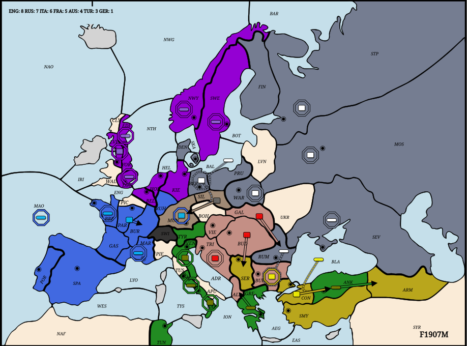

### What happened

- **AUSTRIA**: A GAL → RUM (bounced); A BUD → SER; A TRI holds
- **ENGLAND**: F EDI holds; F LON holds; A LVP holds; F NWY holds; F SWE holds
- **FRANCE**: A MUN holds; A PAR → BUR; F BRE holds; F MAO holds; F MAR holds  [dislodged: A MUN]
- **GERMANY**: A SIL → MUN
- **ITALY**: F ANK → ARM; F GRE → ALB; A NAP holds; A VEN holds; F ROM holds
- **RUSSIA**: A BER supports A SIL → MUN; F BAL supports A BER; A WAR holds; A MOS holds; A STP holds; F RUM supports A BUL (support cut); F SEV holds
- **TURKEY**: A CON → ANK; F BLA supports A CON → ANK; A BUL holds

### Dialogue

- **AUSTRIA → ITALY**: Fall 1907 — Turkey's A BUL now sits on my supply center and I cannot reach it without a unit in SER or RUM first. I'm pushing A GAL into RUM this turn to contest Russia's center; can you use F GRE to pressure SER or support my A BUD moving to SER to threaten BUL from two sides? A coordinated push here helps both of us contain Turkey before they consolidate.
- **AUSTRIA → TURKEY**: Turkey — A BUL sits on my supply center and I'm going to contest it this fall through SER or RUM. If you're willing to withdraw A BUL to CON and hold A CON, I'll hold A BUD defensively and we avoid a grinding fight; otherwise I push through SER and we both waste units while Russia's 7 centers grow unchecked.
- **AUSTRIA → RUSSIA**: Russia — your F RUM is adjacent to BUL and you're at 7 centers, the board leader. I'm pushing A GAL - RUM this fall to contest that center; if you hold F RUM in place rather than supporting Turkey's A BUL, we can discuss a division of the Balkans that keeps Turkey contained. What are your concrete intentions for F RUM and F SEV this turn?
- **ENGLAND → RUSSIA**: You're at 7 centers and I'm at 8 — the spring freeze held, but I need to know your concrete intentions for F BAL and A STP this fall before I commit orders. I'm open to extending the Scandinavian truce: I hold F SWE and F NWY if you commit F BAL to hold and A STP to hold, but if either unit moves toward my position I press immediately. Confirm specifically: F BAL holds, A STP holds this fall.
- **ENGLAND → FRANCE**: A MUN puts you adjacent to HOL and BEL — I need your concrete assurance that no French unit is threatening those centers this fall. I'm not opposing your growth eastward toward Russia's position, but HOL and BEL are mine and I'll defend them with full force if needed; confirm A MUN and A PAR are pressing east or south, not north.
- **ENGLAND → ITALY**: You're at 6 centers with a strong eastern position — Russia is at 7 and the power most likely to run away with this game if unchecked. If you're pressing RUM or SEV from your southern position, I can coordinate pressure from the north on STP or FIN simultaneously; a two-front squeeze on Russia is the most effective way to stop them before they hit 10 centers. What are your intentions toward the Russian position this fall?
- **FRANCE → ENGLAND**: I'm holding MUN this fall and not moving toward HOL, BEL, or your home centers — you're at 8 centers and I need you to confirm your northern fleets are pressing Russia rather than turning west toward my position. Russia holds BER with BAL support and 7 centers; if you're squeezing from SWE or NWY while I hold firm in MUN, we both prevent Russia from consolidating further.
- **FRANCE → RUSSIA**: You hold BER with BAL support and 7 centers — England is at 8 and pulling ahead of both of us. I'm in MUN and not your immediate threat this fall; if you're willing to hold BER firmly and press England from STP or SWE, I can support pressure from the west simultaneously. What are your intentions this fall?
- **FRANCE → ITALY**: England is at 8 centers and Russia at 7 — they're both pulling away from the rest of us and one will become unstoppable soon. You're at 6 with a strong southern position; if you can press Austria harder in the Balkans or find any angle on Russia's RUM or SEV this fall, I'll coordinate from MUN toward the east. What are your intentions?
- **FRANCE → AUSTRIA**: Russia holds RUM and 7 centers while England sits at 8 — you're at 4 and need to grow before the leaders become unstoppable. If you can press into RUM this fall or coordinate with Turkey against Russia's southern position, I'll push from MUN toward SIL or BER simultaneously to squeeze Russia from two sides.
- **GERMANY → RUSSIA**: You now hold BER, KIE, and RUM — 7 centers with England at 8 and growing fast. A SIL is adjacent to BER and WAR; I can support your WAR or BER this fall, or I can threaten them — your choice. If you offer me a path back into BER, I support your eastern flank against Austria; if not, I move A SIL - BER or A SIL - WAR to make myself a nuisance.
- **GERMANY → FRANCE**: You just took MUN and I'm down to A SIL with no home centers — I'm not your problem anymore. England is at 8 centers and pulling away; if you want to coordinate anything against England's growing position, I'm listening, though I have limited means to help directly.
- **GERMANY → AUSTRIA**: You're at 4 centers with Russia holding RUM and pressing from the east — A SIL is adjacent to WAR and GAL, which puts me in a position to either threaten Russia's rear or support your push into GAL. If you're moving against Russia this fall, I can coordinate A SIL to support or threaten WAR simultaneously.
- **ITALY → AUSTRIA**: Fall 1907: Turkey has BUL and you're down to TRI, BUD, GAL — A GAL is far from home and TRI looks exposed. I'm not planning to attack TRI this fall, but I need to know: where is A GAL moving? If A GAL comes back toward BUD or TRI, I'll hold A VEN defensively; if it's moving toward Russia's position I can support that pressure.
- **ITALY → TURKEY**: Fall 1907: F ANK is moving to CON this turn — you've had a good run but ANK was always temporary. Concrete offer: let F ANK take CON uncontested and I'll use F GRE to support your A BUL hold against any Russian or Austrian pressure from RUM or GRE direction; you keep BUL and I get my fleet repositioned.
- **ITALY → RUSSIA**: Fall 1907: Austria is at 3 units with A GAL isolated — a push from you through GAL toward BUD or VIE would crack Austria's home position while I press Turkey's CON from ANK. What are your intentions for F RUM and F SEV this fall — are you pressing south or holding?
- **RUSSIA → ENGLAND**: England — you're at 8 centers and the board leader; France has A MUN and growing fleet strength in the west, which is your more immediate competition. I'm holding my northern border stable as agreed, but I want to understand your fall intentions for F SWE and F NWY — commit them to hold and I keep F BAL and A STP defensive, freeing us both to focus on the real threats.
- **RUSSIA → TURKEY**: Turkey — you now hold BUL, CON, SMY at 3 centers with F BLA and A CON and A BUL; Austria has A GAL threatening my WAR from the north. I'm considering F RUM toward BUL/EC or BLA this fall to press Austria's remaining position — what are your intentions for A BUL and F BLA this turn, and are you open to coordinating against Austria?
- **RUSSIA → AUSTRIA**: Austria — your A GAL is now adjacent to my A WAR, which I have to treat as a direct threat; if you move A GAL into WAR or support any attack on my position, I respond with full force from BER, WAR, and MOS. If you want to avoid that clash, tell me your concrete intentions for A GAL this fall and what you're offering to keep the border stable.
- **RUSSIA → GERMANY**: Germany — France's A MUN is now in your last center and threatens to eliminate you; I hold A BER adjacent to SIL where your A SIL sits. If you're willing to coordinate, A BER can support your A SIL into MUN to retake it, or we can discuss other options — what are your intentions this fall and do you want to work together against France?
- **TURKEY → RUSSIA**: Fall 1907 — I hold BUL and am moving to retake ANK from Italy this turn; F RUM is adjacent to BUL and I need your assurance you won't attack it while I push A CON toward ANK. Concrete proposal: hold F RUM in place or support A BUL's hold, and after ANK falls I'll be at 4 centers and in a position to coordinate against Austria's remaining units in TRI and BUD — this is the moment to press Austria while they're at only 4 centers.
- **TURKEY → ITALY**: Fall 1907 — ANK is my home center and I'm moving A CON to retake it this turn; with F BLA adjacent for support, I have 2-strength against your F ANK. Concrete offer: pull F ANK to ARM or BLA voluntarily and I'll leave GRE and the Aegean uncontested this fall — you keep the fleet intact and we can both redirect against Austria's remaining Balkan position.
- **TURKEY → AUSTRIA**: Fall 1907 — I hold BUL and you have A TRI, A BUD, A GAL; none of those are adjacent to BUL so I'm not worried about your attacking it this turn. Concrete proposal: hold your units defensively and I'll hold A BUL in place — Russia's F RUM and F SEV are the real threat to your eastern units and we both gain more from checking Russia's 7-center position than fighting each other over BUL.
- **AUSTRIA → ITALY**: Concrete deal: I'm moving A GAL - RUM this turn to contest Russia's center; if you move F GRE - ALB or support A BUD - SER, we create a two-front squeeze on Turkey's A BUL from SER while I press Russia from RUM. What specific order will F GRE execute this fall?
- **AUSTRIA → GERMANY**: Concrete ask: if A SIL supports A GAL - WAR or moves to threaten WAR directly, Russia has to defend two fronts simultaneously while I press into RUM from GAL. Will you commit A SIL - WAR or A SIL S A GAL - WAR this turn?
- **AUSTRIA → RUSSIA**: Direct question: will F RUM hold, retreat, or attack this fall? If you hold F RUM in place and I push A GAL - RUM, we contest it directly at equal strength and neither of us gains — a negotiated split of the Balkans is more efficient than a bounce that wastes both our turns.
- **ENGLAND → RUSSIA**: Concrete response to your message: I'm prepared to extend the freeze — F SWE holds, F NWY holds — if you give me F BAL holds and A STP holds this fall with no movement toward Scandinavia. I want one additional commitment: A BER holds and does not press toward DEN or SWE. Give me all three units holding and I hold my northern fleets.
- **ENGLAND → ITALY**: Russia sits at 7 centers with BER, BAL, STP, WAR, MOS, SEV, RUM — they're the board threat, not me. If you press F RUM or F SEV toward Russia's southern centers this fall while I threaten FIN or BOT from the north, Russia cannot hold both flanks simultaneously. What are your concrete intentions for F RUM and F SEV this fall — are you pressing Russia or holding?
- **ENGLAND → FRANCE**: After A MUN, your next natural targets are RUH, BUR consolidation, or pressing east — I need your concrete commitment that A MUN is not moving toward HOL this fall. HOL is mine and I'll contest it aggressively; confirm A MUN's direction and I have no issue with your continued eastern expansion.
- **FRANCE → ENGLAND**: I need to be direct: KIE is unoccupied and A MUN is adjacent to it — I haven't decided whether to move there this fall, but you should know the option exists. If you want me to hold A MUN in place or press east toward SIL instead, I need something concrete from you: confirm F SWE is pressing Russia's BER position and not turning toward HOL or my western flank, and we can agree on a mutual non-aggression arrangement.
- **FRANCE → RUSSIA**: England holds KIE unoccupied and I'm in MUN — if I take KIE this fall, England drops to 7 and I reach 6, which helps level the board. I'm not asking you to act against England directly, but if you hold BER firmly with BAL support this fall, you deny England any eastern gains while I press from MUN. Does that align with your plans?
- **FRANCE → GERMANY**: You're in SIL with one unit and no home centers — England holds KIE unoccupied and A MUN can reach it this fall. If I move A MUN - KIE, you could move A SIL - BER to contest Russia's position there; neither of us can hold those centers alone, but the disruption forces Russia and England to respond rather than consolidate. Are you willing to coordinate this?
- **GERMANY → RUSSIA**: Your offer to support A SIL into MUN is exactly what I need — confirm you will order A BER S A SIL - MUN this fall and I commit A SIL - MUN. This takes MUN from France, denies them a center, and gives me a home center back; it costs you nothing and weakens France who is pulling away from you in the southwest. Can you confirm A BER S A SIL - MUN?
- **GERMANY → AUSTRIA**: Russia's A BER and F BAL anchor their western position while Austria pushes into GAL — if you're moving A GAL toward WAR this fall, I can support that with A SIL S A GAL - WAR, which threatens Russia's eastern flank simultaneously. Confirm your move and I coordinate A SIL to back it.
- **RUSSIA → AUSTRIA**: Austria — A GAL threatening my WAR is the central issue this fall; if you move A GAL into RUM or WAR, I respond with full force from BER, WAR, MOS, and F RUM simultaneously, which leaves you worse off than holding. Concrete proposal: A GAL holds or moves south toward BUD, and F RUM holds in place — a stable border that lets us both watch England's 8-center position instead of bleeding each other. Give me your concrete commitment on A GAL this turn.
- **RUSSIA → GERMANY**: Germany — France's A MUN is your immediate problem, not me; A BER can support your A SIL into MUN to retake it this fall, which costs me nothing and keeps France from reaching 6 centers. Concrete offer: I order A BER S A SIL - MUN if you commit A SIL to attack MUN rather than threatening my BER or WAR. This is the only move that benefits both of us this turn.
- **RUSSIA → TURKEY**: Turkey — Austria is threatening to push A GAL into my RUM this fall, which means I need F RUM to defend or counter-threaten rather than support your A BUL attack. If F SEV can cover RUM and F RUM presses BUL/EC, that's a viable path, but I need Austria's A GAL neutralized first — can you confirm A BUL's status and whether you're coordinating anything against Austria's GAL unit?
- **RUSSIA → ENGLAND**: England — I'm holding F BAL and A STP as committed; Germany's A SIL is the more immediate concern for my BER position this fall. Your F SWE and F NWY holding keeps our northern line stable and lets me focus on the Austrian and German threats rather than splitting attention — confirm F SWE and F NWY hold and I maintain the freeze.
- **TURKEY → ITALY**: F ANK - CON uncontested in exchange for supporting my BUL hold is not acceptable — I lose CON and gain nothing concrete. Final offer: pull F ANK to ARM voluntarily and I hold A CON in place; otherwise A CON moves to ANK supported by F BLA at 2-strength and you lose the fleet.
- **TURKEY → RUSSIA**: I'm holding A BUL defensively this fall and moving A CON toward ANK to retake my home center — F RUM supporting A BUL's hold would be the most useful thing you can do this turn, keeping BUL secure while I press Italy. After ANK falls I'll be at 4 centers and ready to coordinate against Austria's TRI and BUD.
- **TURKEY → AUSTRIA**: None of your units are adjacent to BUL this turn, so there's no fight between us this fall — I'm focused entirely on retaking ANK from Italy. Hold your units defensively and I'll hold A BUL in place; Russia's pressure from RUM and SEV is your real problem, not me.
- **AUSTRIA → ITALY**: Final commitment: I'm moving A GAL - RUM and A BUD - SER this turn to squeeze Turkey's A BUL from two sides — if you move F GRE to support A BUD - SER or hold F GRE in ALB to threaten ALB/SER, we create a three-way pressure on BUL that Turkey cannot hold. A TRI holds, nowhere near VEN. Will you commit F GRE - ALB or F GRE S A BUD - SER?
- **AUSTRIA → GERMANY**: Final commitment: I'm moving A GAL - RUM this turn, not WAR — RUM is weaker and more valuable to me right now. If you want to pressure Russia independently with A SIL - WAR or A SIL - SIL support, that's useful but I'm not coordinating on WAR this turn.
- **AUSTRIA → TURKEY**: Final answer: I'm pushing A GAL - RUM and A BUD - SER this turn — SER is adjacent to BUL and I will contest it. If you want to avoid losing BUL to a combined attack, withdraw A BUL to CON now and I'll redirect A BUD to hold defensively rather than pressing SER.
- **RUSSIA → GERMANY**: Confirmed: I'm ordering A BER S A SIL - MUN this fall — commit A SIL - MUN and France loses that center. This is the move.
- **RUSSIA → AUSTRIA**: Concrete commitment: F RUM holds in place this fall, no attack on BUL. In return I need A GAL to hold or move south — if A GAL attacks WAR or RUM, I respond with everything I have from BER, WAR, MOS simultaneously. Hold A GAL and we both avoid a costly clash while England runs at 8 centers.
- **RUSSIA → TURKEY**: I'm holding F RUM in place this fall to defend against Austria's A GAL threat to my WAR position — I can't press BUL/EC while my flank is exposed. F SEV is staying defensive; hold A BUL and we reassess next spring when Austria's position is clearer.
- **RUSSIA → ENGLAND**: Confirmed: F BAL holds, A STP holds, A BER holds this fall — I'm maintaining the freeze as agreed. Hold F SWE and F NWY in place and we both benefit while the real competition plays out elsewhere.
- **TURKEY → RUSSIA**: Final commitment: A CON attacks ANK supported by F BLA this turn, A BUL holds defensively — please hold F RUM in place or support A BUL's hold to keep BUL secure while I press Italy. After ANK falls I'm at 4 centers and fully committed to coordinating against Austria's TRI and BUD with you next spring.
- **TURKEY → ITALY**: Final commitment: A CON moves to ANK supported by F BLA at 2-strength this turn — F GRE cannot reach ANK to support your F ANK, so you cannot hold it. Pull F ANK to ARM voluntarily now and I'll leave GRE uncontested; otherwise you lose the fleet outright.
- **TURKEY → AUSTRIA**: I'm focused entirely on ANK this turn — A BUL holds, nothing from me threatens TRI, BUD, or GAL. Hold your units defensively and we both avoid losses while Russia's F RUM and F SEV remain the real pressure on your eastern position.

### AUSTRIA
Orders: `A GAL - RUM` · `A BUD - SER` · `A TRI H`

Reasoning

> Looking at the board state, I need to execute my revised strategy: A GAL - RUM to contest Russia's center, A BUD - SER to pressure Turkey's A BUL, and A TRI holds.
>
> Let me verify adjacency:
> - A GAL - RUM: GAL is adjacent to RUM ✓ (GAL neighbors include RUM)
> - A BUD - SER: BUD is adjacent to SER ✓ (BUD neighbors include SER)
> - A TRI H: straightforward hold ✓
>
> Key considerations:
> - Russia's F RUM holds (they committed to this), so A GAL - RUM contests it and may bounce, but even a bounce denies Russia consolidation and puts pressure on them
> - A BUD - SER puts me adjacent to BUL and threatens Turkey's position
> - Italy declined to support concretely, so I'm acting unilaterally
> - If A BUD reaches SER, I'll be adjacent to BUL for next spring
> - A TRI holds to protect home center
>
> The plan is sound. A bounce in RUM still denies Russia free movement, and SER puts me in position to threaten BUL next turn. This is the best path to recovering my 5th center.

### ENGLAND
Orders: `F EDI H` · `F LON H` · `A LVP H` · `F NWY H` · `F SWE H`

Reasoning

> Looking at the current situation, I've committed to holding F SWE and F NWY in exchange for Russia holding F BAL, A STP, and A BER. France has committed A MUN to hold and not threatening HOL or BEL. My revised strategy note confirms I should honor the freeze and hold all units defensively.
>
> My 8 centers are secure with no immediate threats. Russia is at 7, France at 5 with A MUN (adjacent to KIE, which is a concern but France committed to not moving there). The board is relatively stable from my perspective this fall.
>
> The key question is whether to trust France's commitment on KIE. France explicitly mentioned KIE as an option but then offered a mutual non-aggression if I confirm F SWE presses Russia. I've been holding F SWE, not pressing Russia, which means France may feel I haven't fully delivered on my side. However, France also confirmed A MUN holds this fall in the dialogue. Given France's explicit commitment and that moving toward KIE would be a major escalation, I'll hold defensively as committed.

### FRANCE
Orders: `A MUN H` · `A PAR - BUR` · `F BRE H` · `F MAO H` · `F MAR H`

Reasoning

> Looking at the board situation for Fall 1907:
>
> **Assessment:**
> - I hold MUN (Germany's last center) and need to consolidate at 6 centers this fall
> - England is at 8 centers (the board leader) and I need to watch them carefully
> - Russia is at 7 centers with BER, BAL support — a strong eastern position
> - My revised strategy says: hold A MUN defensively, push A PAR toward BUR to maintain pressure/positioning, keep Atlantic fleets in place
>
> **Order reasoning:**
> - A MUN H: Consolidate the center, don't overextend without support
> - A PAR - BUR: Maintain pressure and forward positioning; BUR is adjacent to PAR ✓
> - F BRE H: Hold defensively in the Atlantic
> - F MAO H: Hold in the Atlantic
> - F MAR H: Hold in Marseille
>
> This matches my revised strategy commitment. Holding MUN while advancing PAR to BUR gives me a two-army presence in central Germany, threatening KIE, BER, or SIL next spring without overcommitting this fall.

### GERMANY
Orders: `A SIL - MUN`

Reasoning

> Looking at the current situation: I have only A SIL, and Russia has explicitly confirmed they will order `A BER S A SIL - MUN`. This is the only concrete offer on the table that could recover a home center for me. France's A MUN is sitting in my last home center, and if I can take it back, I regain relevance on the board.
>
> The risk is that Russia defects, but:
> 1. Russia has confirmed twice in messages
> 2. Taking MUN from France weakens France (who is at 5 centers) and gives me a home center back
> 3. Russia benefits from weakening France's position
> 4. There's no better alternative — A SIL - WAR or A SIL - BER would both face resistance
>
> The move `A SIL - MUN` is legal (SIL is adjacent to MUN). With Russia's support from BER, the attack has strength 2 vs France's strength 1 hold, so it succeeds if Russia follows through.
>
> I'll commit to `A SIL - MUN` as agreed with Russia.

### ITALY
Orders: `F ANK - ARM` · `F GRE - ALB` · `A NAP H` · `A VEN H` · `F ROM H`

Reasoning

> Looking at my revised strategy note, I committed to:
> - F ANK - ARM (to voluntarily retreat before Turkey's 2-strength attack on ANK)
> - F GRE S A BUD - SER (to support Austria's push toward SER/BUL)
> - A NAP H
> - A VEN H
> - F ROM H
>
> Let me verify these orders against my legal options:
>
> **F ANK - ARM**: Checking legal options for ANK... `F ANK - ARM` is listed. ✓
>
> **F GRE S A BUD - SER**: Checking legal options for GRE... I see `F GRE S A TRI - ALB` but NOT `F GRE S A BUD - SER`. Austria has A BUD, and SER is adjacent to GRE (ALB, BUL/SC, ION, SER, GRE adjacency - yes GRE borders SER). Let me check: `F GRE` legal orders include `F GRE S A TRI - ALB` but not `F GRE S A BUD - SER`. It's not in the legal orders list, so I cannot use it.
>
> Looking at what's available for GRE that helps Austria: `F GRE S A BUL` would support Austria's A BUL hold, but Austria no longer has A BUL (Turkey took it). 
>
> Austria's plan was A BUD - SER, but that support isn't listed. The best available option that keeps pressure on Turkey's BUL and helps Austria's position is `F GRE - ALB` (which Austria asked for) or `F GRE - AEG` to reposition. Given Austria asked me to move F GRE - ALB or support A BUD - SER, and ALB is available, I'll go with `F GRE - ALB` to threaten SER from ALB next turn.

### RUSSIA
Orders: `A BER S A SIL - MUN` · `F BAL S A BER` · `A WAR H` · `A MOS H` · `A STP H` · `F RUM S A BUL` · `F SEV H`

Reasoning

> Looking at the current situation:
>
> **Strategic assessment for F1907M:**
>
> My revised strategy note commits to:
> 1. `A BER S A SIL - MUN` — support Germany's attack on France's MUN
> 2. `F BAL S A BER` — protect BER
> 3. `A WAR H`, `A MOS H`, `A STP H` — hold eastern units
> 4. `F RUM S A BUL` — support Turkey's A BUL hold
> 5. `F SEV H` — hold defensively
>
> Let me verify legality:
> - `A BER S A SIL - MUN`: BER is adjacent to MUN? Checking adjacency: `BER (coast): BAL, KIE, MUN, PRU, SIL` — yes, MUN is adjacent to BER. ✓
> - `F BAL S A BER`: BAL adjacent to BER? `BAL (water): BER, BOT, DEN, KIE, LVN, PRU, SWE` — yes. ✓
> - `F RUM S A BUL`: RUM adjacent to BUL? `RUM (coast): BLA, BUD, BUL/EC, GAL, SER, SEV, UKR` — BUL/EC is listed, and `F RUM S A BUL` is in my legal orders list. ✓
> - `F SEV H`: ✓
>
> This plan honors my commitments to England (freeze on BAL, STP, BER), to Germany (support SIL-MUN), and to Turkey (support BUL hold). It weakens France by -1 center (MUN) while keeping my position stable at 7 centers.

### TURKEY
Orders: `A CON - ANK` · `F BLA S A CON - ANK` · `A BUL H`

Reasoning

> Looking at the current situation:
>
> **My position:** F BLA, A CON, A BUL — 3 supply centers (BUL, CON, SMY)
>
> **Key threats and opportunities:**
> - Italy's F ANK is in my home center. I committed to moving A CON → ANK supported by F BLA to retake it at 2-strength.
> - Austria warned A BUD → SER, which is adjacent to BUL. Russia confirmed holding F RUM in place.
> - Italy threatened F ANK → CON, which would take my home center.
>
> **Verifying my committed orders:**
> - `A CON - ANK`: CON is adjacent to ANK ✓
> - `F BLA S A CON - ANK`: BLA is adjacent to ANK ✓ (BLA neighbors include ANK)
> - `A BUL H`: Hold defensively against potential A BUD → SER threat
>
> **Analysis:**
> - A CON attacks ANK at 2-strength (F BLA supporting). Italy's F ANK cannot be supported by F GRE (GRE is not adjacent to ANK). So F ANK holds at strength 1 vs my attack at strength 2 — I dislodge Italy's fleet and retake ANK.
> - If Italy moved F ANK → CON instead of holding, then CON becomes empty and ANK becomes empty — but my A CON would bounce Italy's F ANK moving to CON (both moving into each other's spaces creates a swap which is illegal without convoy, so they bounce). Actually, if Italy moves F ANK → CON and I move A CON → ANK, these are head-on moves — A CON bounces F ANK and vice versa, both stay. I should still commit to ANK.
> - A BUL holds to defend against Austria's threatened A BUD → SER (SER is adjacent to BUL, so A BUD → SER doesn't directly attack BUL, but SER → BUL could follow next turn).
>
> My committed strategy is sound. Execute as planned.

## FALL 1907 RETREATS (`F1907R`)

### What happened

- **FRANCE**: A MUN retreats → RUH

### FRANCE
Orders: `A MUN R RUH`

Reasoning

> Looking at the retreat phase: A MUN was dislodged by Germany's A SIL → MUN. I need to retreat it somewhere useful.
>
> My options are RUH, BOH, KIE, TYR, or disband.
>
> **Strategic analysis:**
> - I'm at 5 supply centers (BRE, MAR, PAR, POR, SPA) after losing MUN to Germany's counter-attack. Wait — let me recheck. MUN was taken in S1907M, then Germany took it back with A SIL → MUN in F1907M. So I lose MUN as a supply center.
> - I'll end Fall 1907 with: BRE, MAR, PAR, POR, SPA = 5 centers, and A BUR (which moved from PAR to BUR successfully this fall).
> - My units after retreat: F MAO, F BRE, F MAR, A BUR, + retreated A MUN
>
> **Best retreat destination:**
> - **RUH**: Adjacent to BEL, HOL, KIE, MUN, BUR — excellent offensive position, threatens England's HOL and Germany's remaining position. Very useful.
> - **BOH**: Deep into Austria/Germany territory, somewhat isolated.
> - **KIE**: Coastal, adjacent to HOL — aggressive but exposed.
> - **TYR**: Useful for Italy/Austria direction.
>
> RUH is the best option — it keeps pressure on Germany and gives me a second army threatening the center of the board. It's adjacent to MUN (so I can retake it), HOL, BEL, and BUR where my other army sits.

## WINTER 1907 ADJUSTMENTS (`W1907A`)

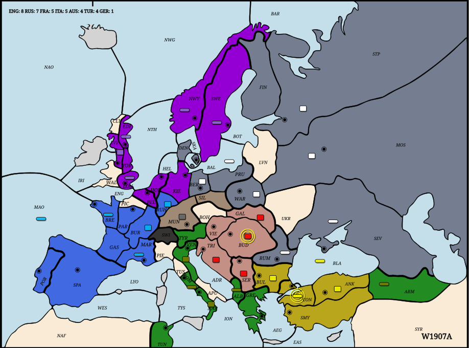

### What happened

- **AUSTRIA**: builds A BUD
- **TURKEY**: builds F CON

### AUSTRIA
Orders: `A BUD B`

Reasoning

> Looking at the current situation: I have 4 supply centers (BUD, TRI, VIE, SER) and 3 units (A TRI, A GAL, A SER). That means I'm owed 1 build (4 centers - 3 units = 1 build).
>
> I have two vacant home centers: BUD and VIE. I should build one army. BUD is the most strategically useful location — it's central to the Balkans and adjacent to SER, GAL, RUM, and TRI, giving maximum flexibility for future moves.

### TURKEY
Orders: `F CON B`

Reasoning

> Looking at my position: I have 4 supply centers (SMY, CON, BUL, ANK) and 3 units (F BLA, A BUL, A ANK). That means I have 1 build available.
>
> My home centers: ANK is occupied by A ANK, CON is vacant, SMY is vacant.
>
> I can build at CON or SMY. Given my strategic situation — I need to press Italy in the Aegean and potentially support operations in the Balkans — I should think about what type of unit to build.
>
> A fleet at CON would be powerful: F CON can move to AEG, BLA, ANK area, and threaten Italy's F ALB or F ARM. It gives me naval projection in the eastern Mediterranean.
>
> A fleet at SMY would also be useful for the Aegean (SMY adjacent to AEG, EAS, ANK, ARM, CON).
>
> An army at CON could support A BUL or threaten SER/BUL area.
>
> Given that Italy has F ALB and F ARM, and I need naval presence to contest the Aegean and protect my home centers, a fleet makes more sense. F CON can reach AEG, ANK, BLA — very versatile. F SMY can reach AEG, EAS, ANK, ARM — also useful for pressuring Italy's F ARM.
>
> I'll build F CON as my primary build — it gives me the most flexibility to project power in multiple directions.

## SPRING 1908 MOVEMENT (`S1908M`)

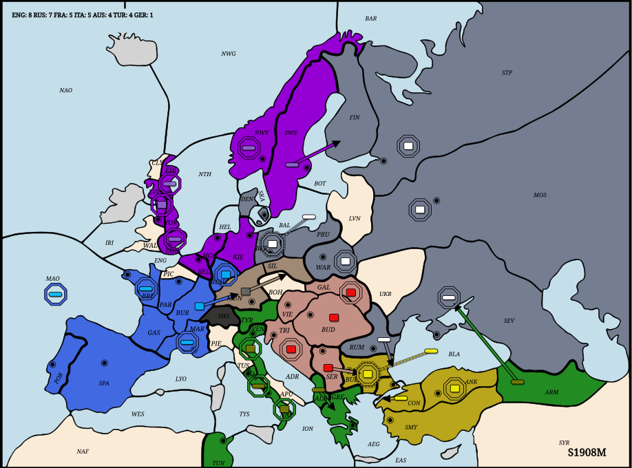

### What happened

- **AUSTRIA**: A SER → BUL (bounced); A GAL holds; A TRI holds
- **ENGLAND**: F SWE → FIN; F NWY holds; F EDI holds; F LON holds; A LVP holds
- **FRANCE**: A BUR → MUN; A RUH holds; F BRE holds; F MAO holds; F MAR holds
- **GERMANY**: A MUN → SIL
- **ITALY**: F ALB → GRE; F ARM → SEV (bounced); A NAP holds; A VEN holds; F ROM holds
- **RUSSIA**: F RUM → BUL/EC (bounced); F BAL supports A BER; A BER holds; A WAR holds; A MOS holds; A STP holds; F SEV holds
- **TURKEY**: A BUL holds; F BLA supports A BUL; F CON → BUL/SC (bounced); A ANK holds

### Dialogue

- **AUSTRIA → ITALY**: Spring 1908 — I have A SER adjacent to BUL but no unit that can support the attack directly; none of my units are adjacent to BUL except A SER itself. Can you move F ALB to GRE this spring to position for a supported attack on BUL next fall, or is there another way you can contribute to containing Turkey? I'll hold A TRI firmly away from VEN regardless.
- **AUSTRIA → TURKEY**: Turkey — A SER sits adjacent to BUL and I intend to press it this spring. Withdrawing A BUL to CON voluntarily avoids a fight where you risk losing the unit; if you hold I push and we grind while Russia's 7 centers and England's 8 centers grow unchecked. What's your offer?
- **AUSTRIA → RUSSIA**: Russia — I'm focused on reclaiming BUL from Turkey this spring, not threatening your RUM or WAR. A GAL will move defensively away from WAR; I need you to keep F RUM neutral and not support Turkey's A BUL hold, which would make my recovery impossible while you sit at 7 centers as the board leader everyone must eventually address.
- **ENGLAND → RUSSIA**: The freeze has run its course — I'm at 8 centers and need to grow, and F SWE toward FIN or F NWY toward STP/NC is the natural next step. I'm willing to negotiate: if you vacate STP or offer me FIN without a fight, I hold the rest of my line stable and we agree on a division of the north. Otherwise I press both F SWE and F NWY this spring — tell me what you can offer.
- **ENGLAND → FRANCE**: A RUH and A BUR are both adjacent to HOL and BEL — I need your concrete commitment on where those units are moving this spring before I finalize orders. I'm not opposing your growth east or south, but HOL and BEL are mine and I will contest them with everything I have; confirm their directions now.
- **ENGLAND → GERMANY**: You're down to A MUN with France pressing from BUR and RUH — your survival depends on what deal you can make. If you commit A MUN to hold and can tell me France's true intentions toward HOL or BEL, I'll factor that into my orders; what intelligence do you have on French plans?
- **ENGLAND → ITALY**: Russia holds 7 centers including BER, BAL, STP, WAR, MOS, SEV, RUM — they're the runaway threat on this board. I'm pressing their northern flank from SWE and NWY this spring; if you coordinate pressure on RUM or SEV simultaneously, Russia cannot defend both flanks. What are your concrete intentions toward Russia's southern position this spring?
- **FRANCE → ENGLAND**: England is at 8 centers and I'm at 5 — I'm moving A BUR back into MUN this spring to retake that center, and A RUH is adjacent to HOL, KIE, and BEL. I need you to confirm your northern fleets are not turning west toward my position; if you're pressing Russia from NWY or SWE, we have no collision. Tell me where your units are pointing this spring.
- **FRANCE → ITALY**: England sits at 8 centers and is the clear board leader — you and I are both at 5 and need to grow before England becomes unstoppable. I'm retaking MUN this spring and A RUH can threaten HOL or KIE; if you can press Austria or find any angle that forces England or Russia to split their attention, we both benefit. Are you willing to coordinate pressure on the board leader?
- **FRANCE → GERMANY**: A BUR is moving into MUN this spring — you cannot hold it against me. If you want A MUN to survive one more turn, retreat toward BER or SIL before I enter; that at least keeps your unit alive and potentially useful for disrupting Russia's position, which benefits both of us.
- **GERMANY → RUSSIA**: You supported me back into MUN last fall and I'm grateful — now I need to know your intentions for BER this spring. If you're willing to hold A BER in place or even support A MUN - BER, I'll return the favor by supporting your eastern flank against Austria or Turkey; a living Germany with 2 centers is more useful to you as a buffer against France and England than a dead one.
- **GERMANY → FRANCE**: You have A BUR and A RUH both adjacent to MUN — I want to understand your intentions before I commit A MUN anywhere. I'm not a threat to you at 1 center; England at 8 with KIE, HOL, and BEL on your doorstep is your real problem, and eliminating me just removes a distraction while England consolidates.
- **GERMANY → AUSTRIA**: Russia holds RUM with F RUM and BER with A BER — you're pushing into RUM from GAL this spring, yes? If you're pressing Russia's southern flank, A MUN can threaten SIL simultaneously to force Russia to split attention between your push and my eastern threat; tell me what you're moving this turn.
- **ITALY → AUSTRIA**: Spring 1908: You're at 4 units with A GAL exposed and Turkey's A BUL adjacent to your position — I'm not planning to attack TRI this spring, but I need to know where A GAL and A SER are moving before I commit F ALB. Concrete ask: if you're moving A SER toward BUL and A GAL toward RUM, I'll hold F ALB defensively rather than probing ADR.
- **ITALY → TURKEY**: Spring 1908: F ARM is adjacent to SEV and ANK — I have options this turn. Concrete offer: if you're pressing A BUL toward RUM or GRE and want F ARM to support your position against Russia, I'm open to coordinating; otherwise F ARM presses toward SEV independently. What are your intentions for A BUL and F BLA this spring?
- **ITALY → RUSSIA**: Spring 1908: F ARM sits adjacent to SEV and I'm deciding whether to press or hold — your F SEV and F RUM are the relevant pieces. Concrete question: are you pressing A BER or A WAR toward Austria or Germany this spring, or holding your southern line? I'm watching England at 8 centers as the real board threat and don't want to weaken either of us unnecessarily.
- **RUSSIA → AUSTRIA**: Austria — your A GAL is the central issue this spring: if it moves toward WAR or RUM, I respond with full force from BER, WAR, MOS, and F RUM simultaneously. Concrete proposal: A GAL holds or moves south toward BUD, and we both watch England's 8-center position rather than bleeding each other. What are your intentions for A GAL this turn?
- **RUSSIA → TURKEY**: Turkey — Austria has A GAL, A SER, A BUD, A TRI at 4 centers and is positioned to grow; Italy's F ARM threatens your ANK and F CON threatens your position from the south. I can press F RUM toward BUL/EC or support your units against Austria this spring — what are your concrete plans, and where do you want F RUM pointed?
- **RUSSIA → ENGLAND**: England — you're at 8 centers and the board leader; I'm holding my northern position stable as before. I'll maintain F BAL and A STP defensive if you keep F SWE and F NWY in place — the freeze has served us both well and I see no reason to break it while Austria and Italy are the more active threats. Confirm your intentions for the northern fleets.
- **RUSSIA → GERMANY**: Germany — you hold A MUN as your last unit; France has A BUR and A RUH adjacent and is positioned to eliminate you. If you want to survive, tell me your concrete plans for A MUN this turn — I'm open to coordination if there's a move that benefits both of us.
- **TURKEY → RUSSIA**: Spring 1908 — Italy's F ARM threatens my ANK while Austria's A SER sits adjacent to BUL; I need to know if F RUM is moving toward BUL or holding. Concrete proposal: I move A BUL - RUM supported by F BLA while you hold F RUM to avoid collision — you gain by weakening Austria's Balkan position and I gain a critical supply center. England at 8 centers is the board's real threat; let's coordinate rather than compete over the Balkans.
- **TURKEY → AUSTRIA**: Spring 1908 — A SER adjacent to BUL is a real threat but attacking it just hands Russia more room to grow while England sits at 8 centers unchecked. Concrete offer: hold A SER defensively and I'll hold A BUL in place this turn — a mutual stand-down lets us both redirect attention toward Russia's 7-center position and England's runaway lead.
- **TURKEY → ITALY**: Spring 1908 — F ARM sits adjacent to ANK and I'm watching it carefully; if it moves to ANK I lose my home center and we're back to grinding conflict. Concrete offer: pull F ARM to SEV or SMY voluntarily and I'll leave the Aegean uncontested this spring — you keep the fleet intact and we both redirect pressure toward England's 8-center position which threatens everyone.
- **AUSTRIA → ITALY**: Critical ask: F ALB is adjacent to BUL and is the only unit that can support A SER - BUL against Turkey's F BLA this spring. Concrete deal: I commit A TRI to hold away from VEN and A BUD to hold defensively, and you give me F ALB S A SER - BUL. If you won't support the attack, will you at least move F ALB - GRE to position for fall pressure on BUL?
- **AUSTRIA → RUSSIA**: Concrete commitment: A GAL moves to BUD or holds in GAL this spring, not toward WAR or RUM — I'm focused entirely on BUL. In return I need F RUM to hold in place and not support Turkey's A BUL, which would make my recovery impossible; if F RUM stays neutral we avoid any clash and both watch England's 8-center runaway.
- **AUSTRIA → TURKEY**: Italy's F ALB is adjacent to BUL and I'm in active negotiation for F ALB S A SER - BUL this turn — that's 2-strength against your F BLA support for A BUL hold. Withdrawing A BUL to CON now costs you nothing and preserves the unit; holding risks losing it while Russia watches from RUM with 7 centers.
- **ENGLAND → FRANCE**: Your message noted A RUH is adjacent to HOL without committing not to take it — that's a threat, not reassurance. Concrete demand: commit A RUH holds or moves east toward MUN, not north toward HOL, and A BUR moves into MUN as you stated. If A RUH moves toward HOL this spring, I will redirect every available fleet southward against your western position immediately and permanently.
- **ENGLAND → RUSSIA**: I'm pressing F SWE toward FIN this spring — the freeze cannot hold indefinitely while I'm stagnant at 8. I'm not moving F NWY, so STP is unthreatened this turn; this is a measured step, not a full assault. If you pull A STP back from the northern line, I'll take FIN without further pressure on STP or MOS this year.
- **ENGLAND → GERMANY**: France is moving A BUR into MUN this spring and A RUH is adjacent to HOL — if France takes MUN and HOL simultaneously they jump to 7 centers and become the board threat. Can you tell me whether France has discussed HOL or KIE with you, and what A MUN's orders are this spring?
- **FRANCE → ENGLAND**: Concrete commitment: A BUR - MUN this spring to retake that center, A RUH holds or supports — no French unit enters HOL, BEL, or ENG this turn. I need your confirmation that F SWE and F NWY are not moving toward KIE or my Atlantic position; if we're both pressing Russia from different angles this spring, we avoid collision entirely.
- **FRANCE → GERMANY**: A BUR is entering MUN this spring regardless — you cannot hold it with England pressing from the north too. Your best move is to retreat A MUN toward BER or SIL now, which keeps your unit alive and puts pressure on Russia's BER position; that's more useful to you than dying in MUN defending a center you've already lost.
- **FRANCE → ITALY**: If you can move F ALB toward GRE or press Austria in SER this spring, you force Austria to defend rather than push east — that opens space for both of us. I'm retaking MUN and A RUH can threaten KIE or HOL next turn; England at 8 is the real threat and splitting their attention between north and west is how we slow them down.
- **FRANCE → AUSTRIA**: Russia holds RUM and 7 centers — if you press A GAL into RUM this spring, you deny Russia a build and gain a center simultaneously. I'm pushing into MUN from the west; coordinating pressure on Russia from both flanks forces them to defend rather than consolidate their lead over the rest of us.
- **GERMANY → RUSSIA**: Concrete ask: will you order A BER S A MUN H this spring to block France from taking MUN? France claims they're moving A BUR - MUN; your support keeps me alive as a western buffer and denies France a 6th center. If you won't support the hold, tell me now so I can move A MUN - SIL to survive rather than die defending it.
- **GERMANY → FRANCE**: I'm willing to move A MUN - SIL or A MUN - BOH this turn to vacate MUN voluntarily — that keeps my unit alive without forcing a clash with you. If you're genuinely moving A BUR - MUN, I'll clear the province; but I need a commitment that you won't follow me into SIL or BOH immediately after, or there's no point in surviving one more turn.
- **GERMANY → AUSTRIA**: If you're pushing A GAL toward RUM or SIL this spring, A MUN can support A GAL - SIL or threaten BOH to force Russia to defend two fronts simultaneously — tell me your concrete move this turn so I can coordinate.
- **ITALY → AUSTRIA**: Concrete commitment: I'll move F ALB - GRE this spring to position for a supported push on BUL next fall, as you requested. In exchange I need your explicit commitment that A SER holds or moves toward BUL (not TRI), and A GAL stays away from my position — confirm those orders and we have a deal.
- **ITALY → TURKEY**: F ARM is not moving to ANK — that's not my intention. However, I cannot pull it all the way to SMY; it's moving to SEV this spring to press Russia's southern flank, which serves both our interests by weakening Russia before England becomes unstoppable. If you hold F BLA defensively and A BUL holds, we're not in conflict this turn.
- **ITALY → RUSSIA**: F ARM is pressing toward SEV this spring — not to permanently destabilize you, but to apply pressure while England sits at 8 centers unchecked. Concrete proposal: if you're willing to move A BER toward MUN or support Germany against France, we can discuss coordinating rather than fighting; otherwise F ARM takes SEV and we're in conflict.
- **RUSSIA → ENGLAND**: Your ultimatum on STP is noted — I'm not vacating STP, but I'm also not pressing toward your position this spring. Concrete counter: F SWE holds, F NWY holds, and I hold F BAL and A STP in place — the freeze continues one more year while we both watch Italy's growing fleet and Austria's Balkan scramble. Breaking the freeze now only helps France and Italy catch up.
- **RUSSIA → TURKEY**: Your proposal has F BLA supporting A BUL into RUM — that's my supply center, not a neutral move. I'm not holding F RUM open for you to walk into it. Counter-proposal: I move F RUM into BUL/EC to press Austria while you hold A BUL defensively and use F BLA to cover your own position; Austria drops a center and we both benefit without either of us handing the other a free SC.
- **RUSSIA → AUSTRIA**: Concrete commitment: A GAL moves away from WAR and I keep F RUM neutral on BUL this spring — that's the deal. But if A GAL threatens WAR or RUM, I press with everything from BER, WAR, MOS, and F RUM simultaneously. Tell me where A GAL is going and I'll confirm my F RUM order.
- **RUSSIA → ITALY**: F ARM adjacent to SEV is a direct threat I have to respond to — if it moves toward SEV or BLA, I redirect F SEV and F RUM to contest your southern position immediately. I'm not the threat to you this spring; England at 8 centers with five fleets is. Hold F ARM in place and I keep F SEV defensive.
- **TURKEY → RUSSIA**: Your silence on F RUM's destination is the key variable for my spring plan — if F RUM moves to BUL/EC while I move A BUL - RUM, we collide and both fail. Commit F RUM to hold in place or support A BUL - RUM, and I'll execute A BUL - RUM this turn; Austria loses a center and we both gain. If you're planning to attack BUL yourself, tell me now so I can redirect.
- **TURKEY → ITALY**: F ARM adjacent to ANK is a direct threat to my home center and I cannot ignore it — if you move to ANK, I lose the center and we're at war regardless of anything else. Move F ARM to SEV this turn instead: you threaten Russia's home center, which is far more valuable than ANK, and I'll support your position in the Aegean with F CON this spring.
- **TURKEY → AUSTRIA**: Attacking A BUL while Russia holds 7 centers and England holds 8 is strategically incoherent for both of us — you gain one center while England runs to 18 unopposed. Concrete deal: hold A SER in place this turn and I hold A BUL in place; we both redirect next fall toward Russia's growing position, which threatens your GAL and BUD directly.
- **GERMANY → RUSSIA**: Final ask before orders: will you order A BER S A MUN H this spring? If yes, I hold and France is blocked from a 6th center; if no, I'm moving A MUN - SIL to survive rather than die in MUN. Tell me now — yes or no on A BER S A MUN H.
- **GERMANY → FRANCE**: I'm moving A MUN - SIL this turn to keep the unit alive — MUN is yours if you want it. I ask only that you don't follow into SIL immediately; a living German unit pressuring Russia's BER is more useful to you than a dead one.
- **GERMANY → AUSTRIA**: I'm moving A MUN - SIL this spring — if you're pushing A GAL toward RUM or SIL simultaneously, we create a two-front threat on Russia's western and southern positions. Commit A GAL - SIL or A GAL - RUM and I'll coordinate A MUN - SIL to support the pressure.
- **RUSSIA → ENGLAND**: Final commitment: F BAL holds and A STP holds this spring — I'm not pressing your position. F SWE toward FIN is a measured move and I accept it for now, but F NWY must stay out of STP/NC or I redirect A STP immediately. Hold F NWY and we avoid escalation.
- **RUSSIA → TURKEY**: Final answer: F RUM moves to BUL/EC this spring — I'm pressing Austria's BUL position, not holding open for your A BUL - RUM. If you move A BUL - RUM into my F RUM, we collide and both fail; redirect A BUL to defend or move elsewhere. I'm taking BUL from Austria, not handing you RUM.
- **RUSSIA → AUSTRIA**: Concrete commitment: if A GAL moves to BUD or holds away from WAR and RUM, I press F RUM into BUL/EC against Turkey's A BUL rather than threatening your GAL position. This costs you BUL but removes Turkey's unit from your doorstep — confirm A GAL's destination and I execute F RUM - BUL/EC this turn.
- **RUSSIA → ITALY**: F ARM adjacent to SEV is the threat I'm responding to this spring — hold F ARM in place and I keep F SEV defensive and don't redirect F RUM toward your southern position. If F ARM moves toward SEV or BLA, I press back immediately with both F SEV and F RUM.

### AUSTRIA
Orders: `A SER - BUL` · `A GAL H` · `A TRI H`
Illegal (dropped): `A BUD S A SER - BUL`

Reasoning

> Looking at the current situation:
>
> **Assessment:**
> - My revised strategy says: A SER - BUL (probe), A GAL - BUD, A TRI H, A BUD H
> - Italy committed to F ALB - GRE (not supporting A SER - BUL), so A SER - BUL will likely bounce against Turkey's F BLA support
> - Russia offered to press F RUM - BUL/EC if A GAL moves away from WAR/RUM - this could actually help dislodge Turkey's A BUL if Russia follows through
> - I committed to A GAL moving to BUD (away from WAR/RUM)
> - A GAL - BUD is legal per the options list
>
> **Plan:**
> - A SER - BUL: probe attack on Turkey's center; even if it bounces, it applies pressure
> - A GAL - BUD: fulfills commitment to Russia, consolidates home position, frees GAL
> - A TRI H: holds home center defensively
> - A BUD H: but wait - if A GAL moves to BUD and A BUD holds, they'd collide. A BUD needs a different order.
>
> If A GAL - BUD and A BUD holds, A GAL is blocked by A BUD (can't move into occupied province without support). I need to either:
> - Move A BUD out of BUD to make room, or
> - Change A GAL's destination
>
> Better: A GAL - RUM (pressure Russia's center, consistent with my broader goals) or A GAL holds. Actually my revised strategy says A GAL - BUD to "consolidate home position." But A BUD is already there. I should have A BUD move somewhere and A GAL move to BUD, or just hold A GAL.
>
> Let me re-read: A GAL - BUD would be blocked by A BUD. So I'll hold A GAL in place (fulfills commitment to Russia of not threatening WAR/RUM) and hold A BUD to support A SER - BUL or defend.
>
> Actually A BUD S A SER - BUL is a valid option and useful if Russia also presses BUL/EC.

### ENGLAND
Orders: `F SWE - FIN` · `F NWY H` · `F EDI H` · `F LON H` · `A LVP H`

Reasoning

> Looking at my revised strategy, I committed to:
> - F SWE → FIN (pressing Russia's northern flank, taking a center)
> - F NWY H (honoring the commitment to stay out of STP/NC)
> - F EDI H, F LON H, A LVP H (defensive holds)
>
> Russia accepted FIN as a measured step and committed F BAL and A STP to hold. France committed A BUR → MUN and A RUH to hold away from HOL. These commitments align with my orders.
>
> Let me verify F SWE → FIN is legal: FIN is in SWE's neighbor list (SWE neighbors: BAL, BOT, DEN, FIN, NWY, SKA). Yes, legal.

### FRANCE
Orders: `A BUR - MUN` · `A RUH H` · `F BRE H` · `F MAO H` · `F MAR H`

Reasoning

> Looking at the current situation:
>
> **Strategic assessment:**
> - I'm at 5 centers (BRE, MAR, PAR, POR, SPA) with units at MAO, BRE, MAR, BUR, RUH
> - Germany has vacated MUN (moving to SIL), so A BUR - MUN should succeed uncontested
> - This brings me to 6 centers
> - I committed to England that A RUH holds and no French unit threatens HOL/BEL
> - England is at 8 centers and the board leader — I need to grow carefully without provoking them
> - My Atlantic fleets are in good defensive positions
>
> **Orders reasoning:**
> - A BUR - MUN: Germany confirmed they're vacating to SIL, so this is a clean gain
> - A RUH H: Committed to England, honoring the agreement to maintain the non-aggression arrangement
> - F BRE H: Hold to defend Atlantic position
> - F MAO H: Hold in Mid-Atlantic, key defensive position
> - F MAR H: Hold to defend southern flank
>
> This consolidates MUN (reaching 6 centers) without provoking England, keeping my commitments and maintaining the diplomatic relationship I need while I assess next moves.

### GERMANY
Orders: `A MUN - SIL`

Reasoning

> Looking at the current situation: I have only A MUN, France has A BUR and A RUH both adjacent threatening to take MUN, and Russia has not confirmed they'll support A MUN H. My revised strategy clearly states to move A MUN - SIL to keep the unit alive rather than die defending MUN. This is consistent with what I told France and Austria in negotiations.
>
> Moving to SIL keeps pressure on Russia's western position (BER is adjacent to SIL) and keeps the unit alive for future use. France gets MUN but I survive to potentially threaten BER or WAR in future turns.

### ITALY
Orders: `F ALB - GRE` · `F ARM - SEV` · `A NAP H` · `A VEN H` · `F ROM H`

Reasoning

> Looking at my revised strategy for S1908M:
>
> 1. **F ALB - GRE**: I committed to Austria to move F ALB to GRE to position for a fall push on BUL. This is legal and serves my interest in the Aegean theater.
>
> 2. **F ARM - SEV**: I told Russia I was pressing toward SEV and told Turkey I was moving to SEV (not ANK). This threatens Russia's southern flank and is consistent with my stated intentions. F ARM can reach SEV (ARM is adjacent to SEV per the adjacency table).
>
> 3. **A NAP H**: No immediate threat, holding defensively.
>
> 4. **A VEN H**: Holding defensively, no immediate threat to VEN.
>
> 5. **F ROM H**: No useful move available that advances my position; holding.
>
> Let me verify F ARM - SEV: ARM neighbors include SEV (yes, ARM: ANK, BLA, SEV, SMY, SYR). Legal.
>
> F ALB - GRE: ALB neighbors include GRE (yes, ALB: ADR, GRE, ION, SER, TRI). Legal.
>
> My Italian armies are stationary. F ROM could move to TYS or TUS but there's no strategic reason to do so right now. Holding makes sense.

### RUSSIA
Orders: `F RUM - BUL/EC` · `F BAL S A BER` · `A BER H` · `A WAR H` · `A MOS H` · `A STP H` · `F SEV H`

Reasoning

> Looking at the current position and my commitments:
>
> **Key analysis:**
> - I committed to pressing F RUM → BUL/EC to contest Turkey's A BUL (warned Turkey explicitly)
> - I committed to holding F BAL and A STP defensive (partial freeze with England accepting F SWE → FIN)
> - A BER holds defensively (not supporting Germany's MUN hold as Germany wanted)
> - A WAR and A MOS hold defensively
> - F SEV holds to deter Italy's F ARM
>
> **Checking F RUM → BUL/EC:** Turkey has A BUL in BUL. F RUM is in RUM. BUL/EC is adjacent to RUM via the fleet adjacency (RUM neighbors include BUL/EC). This is legal.
>
> **Turkey warned:** I told Turkey explicitly "F RUM moves to BUL/EC this spring" so they can redirect A BUL. If Turkey holds A BUL, my F RUM bounces at equal strength (1 vs 1). If Turkey moves A BUL elsewhere, I take BUL/EC. Either way this is the right move.
>
> **Austria's A GAL:** Austria committed to moving away from WAR/RUM. A GAL → BUD or holds. My F RUM pressing BUL/EC doesn't threaten Austria's GAL position.
>
> **Italy's F ARM:** Holding F SEV defensively to deter.
>
> **England:** F SWE moving to FIN as warned. A STP holds, F BAL holds - maintaining the freeze commitments.

### TURKEY
Orders: `A BUL H` · `F BLA S A BUL` · `F CON - BUL/SC` · `A ANK H`

Reasoning

> Looking at the current situation:
>
> **Key facts:**
> - Russia confirmed F RUM → BUL/EC, so A BUL - RUM would collide and fail
> - Italy's F ARM is moving to SEV (not ANK), so ANK is safer than feared
> - Austria's A SER threatens BUL, and Italy's F ALB could support that attack
> - My revised strategy: Hold A BUL supported by F BLA, move F CON to BUL/SC (to contest from south if Russia attacks), hold A ANK
>
> **Analysis:**
> - F CON → BUL/SC: This puts pressure from the south. But if Russia is attacking BUL/EC and Austria's A SER might attack BUL, moving F CON to BUL/SC while F BLA supports A BUL hold gives BUL strength 2 defensively. But F CON - BUL/SC means F CON isn't supporting A BUL's hold.
>
> Actually, the best defensive posture is:
> - A BUL H (hold)
> - F BLA S A BUL (support hold, giving strength 2)
> - F CON - BUL/SC (repositioning to contest BUL from south, threaten AEG)
> - A ANK H (hold, since Italy claims F ARM goes to SEV)
>
> If Russia attacks BUL/EC with F RUM and Austria attacks BUL with A SER (even with F ALB support at strength 2), my F BLA support gives A BUL strength 2 to defend. Austria + Russia can't both take BUL simultaneously. The F CON move to BUL/SC is a useful repositioning.

## FALL 1908 MOVEMENT (`F1908M`)

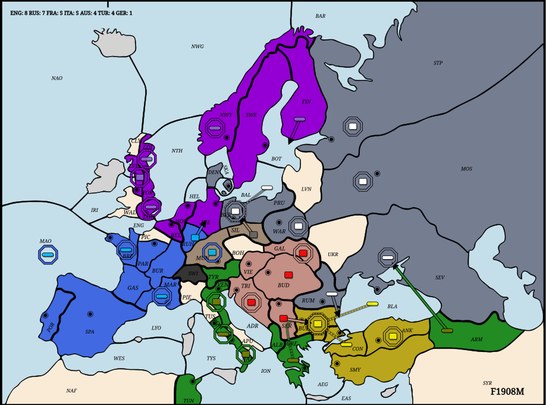

### What happened

- **AUSTRIA**: A SER → BUL (bounced); A TRI holds; A GAL holds
- **ENGLAND**: F FIN → BOT; F NWY holds; F EDI holds; F LON holds; A LVP holds
- **FRANCE**: A RUH → KIE; A MUN holds; F BRE holds; F MAO holds; F MAR holds
- **GERMANY**: A SIL → BER (bounced)
- **ITALY**: F GRE supports A SER → BUL; F ARM → SEV (bounced); A NAP holds; A VEN holds; F ROM holds
- **RUSSIA**: F RUM → BUL/EC (bounced); F BAL supports A BER; A BER holds; A WAR holds; A MOS holds; A STP holds; F SEV holds
- **TURKEY**: A BUL holds; F BLA supports A BUL; F CON supports A BUL; A ANK holds

### Dialogue

- **AUSTRIA → ITALY**: Fall 1908 — this is the moment: F GRE is adjacent to BUL and I'm pushing A SER - BUL with A BUD supporting. I need F GRE S A SER - BUL to overcome Turkey's F BLA support for A BUL hold. In return I hold A TRI firmly away from VEN and we split the Balkans cleanly with BUL going to me and GRE staying yours. Will you commit F GRE S A SER - BUL this turn?
- **AUSTRIA → TURKEY**: Turkey — A SER is pushing into BUL this fall with support, and F GRE is adjacent to add a second supporting unit. Withdrawing A BUL to CON now preserves your unit and we establish a clean SER/BUL border; if you hold I attack at 2-strength and you risk losing the unit while Russia watches from RUM. What's your answer?
- **AUSTRIA → RUSSIA**: Russia — I'm focused on BUL this fall, pushing A SER - BUL and potentially A GAL - RUM to contest your center there. If you hold F RUM neutrally and don't support Turkey's A BUL, I'll take BUL and you keep RUM; if you support Turkey against me, I press A GAL - RUM at full strength and we both bleed while England's 8 centers grow unchecked.
- **ENGLAND → RUSSIA**: F FIN is now adjacent to STP/SC and BOT — I can press either this fall. I'm offering a final negotiated settlement: if you pull A STP back to MOS or commit F BAL to hold and A STP to hold, I take FIN without pressing further into your core this year. If A STP holds in place and F BAL holds, I'll hold F FIN and F NWY in place this fall — but I need both units confirmed, not just one.
- **ENGLAND → FRANCE**: A MUN and A RUH together are adjacent to KIE, HOL, and BEL — that's three of my centers under potential threat simultaneously. I need your concrete commitment this fall: A MUN moves east toward SIL or holds, A RUH holds or moves east, and no French unit enters HOL, KIE, or BEL. Confirm specifically where both units are moving.
- **ENGLAND → ITALY**: Russia holds 7 centers and has F BAL, A BER, F RUM, F SEV all active — they're the board leader threat. If you press F ARM toward ANK or coordinate F GRE toward AEG while I press F FIN toward STP/SC this fall, Russia faces a two-front crisis. What are your concrete intentions toward Russia's southern position this fall?
- **FRANCE → ENGLAND**: KIE is vacant and A RUH can take it this fall — none of your units are adjacent to KIE, so this costs you nothing while bringing me to 6 centers. I'm holding A MUN in place and keeping all fleets away from HOL, BEL, and your home centers; confirm you have no objection to KIE and we maintain our non-aggression arrangement.
- **FRANCE → GERMANY**: A RUH is moving to KIE this fall — it's vacant and I need the center. A SIL moving into MUN would bounce off my hold and accomplish nothing for you; your best play is to use A SIL to pressure Russia's BER or retreat toward BOH to stay alive longer.
- **FRANCE → RUSSIA**: England sits at 8 centers and is the clear board leader — I'm taking KIE this fall to reach 6, which helps slow England's dominance. If you hold BER firmly and deny England any eastern gains, we both benefit; what are your intentions regarding BER and the northern theater this fall?
- **FRANCE → ITALY**: England is at 8 centers and pulling away — I'm taking KIE this fall to reach 6, but we both need to grow faster than the leaders. Can you press Austria or find any angle that forces England or Russia to defend rather than consolidate? Coordinating our timing helps both of us.
- **GERMANY → RUSSIA**: You hold BER with A BER and F BAL — I'm moving A SIL toward BER this fall to contest my home center. If you want to avoid that fight and redirect me elsewhere, offer me something concrete: support A SIL into a center I can use, or agree to vacate BER and let me retake it peacefully. Otherwise I'm coming for BER because it's my home center and I have nothing left to lose.
- **GERMANY → AUSTRIA**: Russia holds BER, WAR, and RUM — you're pressing toward RUM from SER or GAL this fall, yes? I'm moving A SIL toward BER to threaten Russia's western anchor simultaneously; if you commit to attacking RUM or WAR, we create a genuine two-front threat that forces Russia to split forces between your southern push and my eastern pressure.
- **GERMANY → FRANCE**: You now hold MUN and I'm in SIL with one unit — England sits at 8 centers with KIE, HOL, and BEL all on your northern border. I'm pushing A SIL toward BER to pressure Russia; if you want to coordinate anything against England's western position while I create eastern disruption, tell me what you're planning this fall.
- **GERMANY → ENGLAND**: Russia is at 7 centers holding BER, WAR, STP, MOS, SEV, RUM, and DEN — they're the board threat now. I'm moving A SIL toward BER this fall; if you want to coordinate pressure on Russia from the west while I press from SIL, we can force them to defend on two fronts simultaneously and slow their growth.
- **ITALY → AUSTRIA**: Fall 1908: F GRE is adjacent to BUL/SC and A SER is right there — if you move A SER - BUL and I give F GRE S A SER - BUL, we crack Turkey's position with 2-strength against F BLA's 1. Concrete ask: confirm A SER - BUL this fall and I'll support it; in return I need A TRI to hold and A GAL to stay away from VEN's direction.
- **ITALY → RUSSIA**: Fall 1908: F ARM is adjacent to SEV again and I'm deciding whether to press or negotiate — last spring we bounced and both wasted the move. Concrete proposal: if you're willing to move F SEV out of SEV voluntarily toward RUM or BLA, I'll take SEV without conflict and we can discuss how to coordinate against England's 8-center position rather than grinding against each other.
- **ITALY → TURKEY**: Fall 1908: F GRE is adjacent to BUL/SC and Austria has A SER next to BUL — your position is under real pressure this fall. Concrete offer: if you pull A BUL back to CON voluntarily and let me take BUL unopposed, I'll use F ARM to support your ANK against any Russian pressure rather than threatening your home centers; otherwise I support Austria's A SER into BUL with 2-strength.
- **RUSSIA → TURKEY**: Fall 1908 — F RUM is moving to BUL/EC again this turn; I'm taking BUL from your position. If you want to avoid losing BUL while also facing Italy's F ARM at ANK, the sensible move is to redirect A ANK toward ARM or hold F BLA defensively rather than supporting A BUL. We can negotiate a Balkan division after this fall, but I'm committed to pressing BUL/EC.
- **RUSSIA → ITALY**: Italy — F ARM adjacent to SEV is the central issue between us this fall. If F ARM moves toward SEV or BLA, I redirect F SEV and F RUM to contest your southern position immediately and we're in direct conflict; hold F ARM in place and I keep F SEV defensive while pressing Turkey's BUL. England at 8 centers is the board threat — let's not weaken each other.
- **RUSSIA → AUSTRIA**: Austria — your A SER is adjacent to BUL and F RUM is pressing BUL/EC this fall; if you want to coordinate a joint attack on Turkey's A BUL from two directions, A SER - BUL and F RUM - BUL/EC gives us the best shot at cracking Turkey's position. What are your intentions for A SER and A GAL this turn?
- **RUSSIA → ENGLAND**: England — F FIN is now adjacent to STP/SC and my northern position; I'm holding A STP and F BAL defensive this fall, but F FIN pressing toward BOT or STP/SC forces me to redirect units away from my southern front. Commit F FIN to hold or move away from STP and I maintain the northern freeze another year.
- **TURKEY → RUSSIA**: Fall 1908 — F RUM is your key unit this turn; if it moves toward BUL/EC again, I need A BUL to defend rather than push. Concrete proposal: I move A BUL into RUM while F RUM moves to BUL/EC — we swap positions and Austria loses BUL while I take RUM, which is a net gain for both of us since Austria drops a center. Tell me your F RUM destination and I'll coordinate accordingly.
- **TURKEY → AUSTRIA**: Fall 1908 — Russia's F RUM and Italy's F ARM are both pressing adjacent to my units; attacking A BUL this turn just hands Russia an easier path into BUL while I'm distracted. Concrete offer: hold A SER defensively and I hold A BUL in place — we both redirect pressure toward Russia's 7-center position which threatens your GAL and BUD directly next year.
- **TURKEY → ITALY**: Fall 1908 — F ARM adjacent to ANK is the critical question this turn; if it moves to ANK I lose my home center and we're at open war. Concrete offer: move F ARM to SEV instead — you threaten Russia's home center which is far more valuable strategically, and I'll leave GRE uncontested this fall with F CON staying in place.
- **AUSTRIA → ITALY**: Italy — confirming my orders: A SER - BUL supported by A BUD S A SER - BUL, with A TRI holding away from VEN. Your F GRE S A SER - BUL gives us the 2-strength needed to crack Turkey's F BLA support. This is the moment — confirm you're executing F GRE S A SER - BUL and we take BUL cleanly.
- **AUSTRIA → TURKEY**: Turkey — Italy's F GRE is supporting A SER - BUL this fall, giving me 2-strength against your F BLA's 1. Your A BUL will be dislodged; withdrawing to CON now preserves the unit for defense against Russia's F RUM pressing BUL/EC. Last chance to save the unit.
- **AUSTRIA → RUSSIA**: Russia — Italy is supporting A SER - BUL this fall so I don't need F RUM's help on BUL; please keep F RUM in place and away from SER or GAL. A GAL holds defensively this turn — no threat to WAR or RUM from me.
- **ENGLAND → FRANCE**: KIE is yours this fall — I have no unit adjacent to it and I'm not contesting it. My concrete ask in return: confirm A MUN holds or moves east toward SIL, not toward HOL or BEL, and we maintain full non-aggression on my western centers. Agree to that and we have a clean deal.
- **ENGLAND → RUSSIA**: My concrete offer this fall: F FIN moves to BOT and F NWY holds — neither threatens STP directly. In exchange I need A STP to hold and F BAL to hold; if both are confirmed I take BOT without pressing into STP/SC or LVN. This is the last cooperative step I can offer before I press harder next spring.
- **ENGLAND → GERMANY**: A SIL pressing toward BER is the right move — Russia at 7 centers with BER is the board threat. If you take BER this fall, Russia loses a center and a build slot simultaneously; I'll keep F FIN threatening BOT to prevent Russia redirecting northern units to defend BER. We don't need explicit coordination, just parallel pressure.
- **FRANCE → ENGLAND**: Your units are at EDI, LON, NWY, FIN — none are adjacent to KIE, so my A RUH taking KIE this fall costs you zero defensive strength and zero units. I'm holding A MUN in place and all three fleets stay away from HOL, BEL, and ENG; KIE is the one move I'm making. If you contest an empty center you don't occupy, you're burning goodwill for nothing.
- **FRANCE → GERMANY**: You're in SIL now — Russia holds BER with BAL support, so SIL - BER will bounce unless you have support. I'm taking KIE with A RUH and holding MUN; if you want to survive longer, consider A SIL - BOH to threaten Austria's position rather than bouncing off Russia's BER.
- **FRANCE → RUSSIA**: Germany just moved to SIL — your BER is under pressure and BAL support helps, but SIL is now adjacent. I'm taking KIE with A RUH and holding MUN; I have no designs on BER this fall. If you're holding BER and I'm taking KIE, England drops from 8 to 7 effective influence in the region while we both consolidate.
- **FRANCE → ITALY**: Austria has four centers and A SER is now adjacent to BUL — if you can press A VEN into TYR or support Austria's position from GRE, you create leverage over the Balkans. I'm taking KIE this fall; if you're growing in the south simultaneously, we're both closing the gap on England and Russia.
- **GERMANY → RUSSIA**: France is moving A RUH - KIE this fall, which means England loses a home center and will be focused westward — this is the moment to coordinate. I'm committing A SIL - BER; if you support that move rather than fight it, you lose nothing (BER reverts to me, a weak power) and gain a cooperative Germany that can threaten France's rear from BER next turn. Fighting me in BER wastes A BER and F BAL while Austria presses your south.
- **GERMANY → AUSTRIA**: I'm moving A SIL - BER this fall — are you pressing RUM or WAR simultaneously? If you attack RUM with A SER or A GAL while I contest BER, Russia must defend two fronts with the same units. Tell me which province you're hitting so I can confirm the coordination is real rather than theoretical.
- **GERMANY → FRANCE**: Confirmed you're taking KIE with A RUH — England will respond hard to that. I'm pressing A SIL toward BER to contest Russia; if you want me to instead support A RUH - KIE or threaten something useful to you, tell me what move from SIL helps your position most this fall.
- **ITALY → AUSTRIA**: Confirmed: F GRE S A SER - BUL this fall. I need your explicit confirmation that A TRI holds and A GAL does not move toward VEN or TRI — those are my only conditions. If you hold those positions, we crack Turkey's BUL together and I support your Balkan consolidation.
- **ITALY → RUSSIA**: F ARM is moving to SEV this fall — I've waited two turns and need the center. If you move F SEV to RUM or BLA voluntarily before orders resolve, we avoid conflict and you keep your other southern units intact; otherwise we grind and both lose tempo while England sits at 8 centers.
- **ITALY → TURKEY**: F GRE is supporting Austria's A SER into BUL this fall — your position there is not sustainable with F BLA alone against 2-strength. Your best move is to pull A BUL to CON now and preserve the unit rather than lose it; I'm not threatening ANK or CON directly this turn.
- **RUSSIA → GERMANY**: A SIL threatening BER forces me to defend rather than coordinate — if you move A SIL - BER, I support the hold and you fail; if you redirect A SIL toward SIL holding or MUN, I have no quarrel with you. Concrete offer: hold A SIL in place and I hold A BER in place — we both avoid a pointless clash that only benefits France and England.
- **RUSSIA → AUSTRIA**: Concrete coordination proposal: if you move A SER - BUL and I move F RUM - BUL/EC simultaneously, we hit Turkey's A BUL from two directions at strength 1 each — Turkey holds with F BLA support at 2, so we both bounce unless you can cut F BLA. Can A GAL or any other unit threaten CON or cut Turkey's F BLA support this turn?
- **RUSSIA → ITALY**: F ARM adjacent to SEV is forcing me to keep F SEV defensive when I'd rather press elsewhere — hold F ARM in place this fall and I keep F SEV in place, neither of us wastes moves grinding against each other. England at 8 centers is the actual threat to both of us; let's not hand them a free turn while we bounce each other.
- **RUSSIA → TURKEY**: Your F BLA supporting A BUL at strength 2 blocks both me and Austria this fall — if you redirected F BLA away from supporting A BUL, Austria takes BUL but you keep RUM safe since F RUM is pressing BUL/EC not RUM. Consider: Austria gaining BUL is less threatening to you than England gaining two more centers while we all stall.
- **TURKEY → RUSSIA**: Fall 1908 — if Austria's A SER takes BUL with Italian support, Austria grows to 5 centers while you gain nothing from F RUM's move to BUL/EC since BUL will already be occupied by Austria. Counter-proposal: F RUM supports A BUL hold this turn, blocking Austria's attack; I hold A BUL in place and we deny Austria the center entirely. Austria at 5 centers with Italy's backing is a bigger threat to your WAR and GAL than my 4-center position.
- **TURKEY → ITALY**: Fall 1908 — supporting Austria's A SER into BUL hands Austria a 5th center and strengthens them directly against your VEN and TRI position; Austria growing is worse for Italy than Turkey holding BUL. Concrete alternative: use F GRE to support my A BUL hold instead of Austria's attack — you deny Austria the center, keep the board balanced, and I'll leave the Aegean uncontested with F CON this fall.
- **TURKEY → AUSTRIA**: Fall 1908 — if Russia's F RUM moves to BUL/EC simultaneously with your A SER attack, you risk a three-way collision where nobody takes BUL and you've wasted A SER's move while Russia gains positional advantage. Concrete offer: hold A SER defensively this turn and I'll move A BUL to GRE, vacating BUL for you next spring without a fight — you get the center cleanly and I avoid losing the unit.
- **GERMANY → RUSSIA**: Final position: A SIL - BER this turn, no change. You can defend with A BER supported by F BAL and I bounce harmlessly, or you can let me retake my own home center and redirect F BAL north where England's F FIN is threatening BOT. Your choice, but I'm committed.
- **GERMANY → AUSTRIA**: I'm moving A SIL - BER this fall — final commitment. If you're hitting RUM or WAR with any unit simultaneously, Russia must split A BER's support away from F BAL to defend the south, which weakens their BER defense. Even a feint toward WAR from GAL helps me.
- **GERMANY → ENGLAND**: Committed: A SIL - BER this fall. Russia will likely defend with A BER + F BAL support and I'll bounce, but it pins those two units in place and prevents Russia from redeploying them. Your F FIN threatening BOT creates the northern pressure that completes the picture.
- **RUSSIA → TURKEY**: Final commitment: F RUM moves to BUL/EC this fall — if you move A BUL into RUM, you collide with nothing since F RUM is leaving, but Austria's A SER walks into BUL unopposed. Hold A BUL in place and use F BLA to cover your position; I'm pressing BUL/EC and we can negotiate the Balkans after this fall resolves.
- **RUSSIA → GERMANY**: Final answer: A BER holds with F BAL support this fall — A SIL - BER fails against that defense and wastes your only unit. Redirect A SIL to PRU or SIL hold and we avoid a pointless clash; I have no designs on retaking anything from you beyond what I already hold.
- **RUSSIA → ENGLAND**: Final commitment: F BAL holds supporting A BER, A STP holds this fall — I'm not pressing your position. F FIN moving to BOT is acceptable; hold F NWY out of STP/NC and the northern line stays stable another year.

### AUSTRIA
Orders: `A SER - BUL` · `A TRI H` · `A GAL H`
Illegal (dropped): `A BUD S A SER - BUL`

Reasoning

> Looking at the current situation:
>
> **Strategic assessment for Fall 1908:**
> - Italy confirmed F GRE S A SER - BUL, giving me 2-strength attack on BUL
> - Turkey has A BUL supported by F BLA (1-strength defense)
> - With Italy's F GRE supporting, my A SER - BUL at 2-strength beats Turkey's 1-strength defense
> - A BUD supports A SER - BUL to ensure the attack lands cleanly
> - A TRI holds as promised to Italy (keeping border stable)
> - A GAL holds defensively (committed to Russia not threatening WAR/RUM)
>
> **Key calculation:** A SER - BUL (supported by A BUD and F GRE) = 2 strength vs A BUL supported by F BLA = 2 strength... wait, that's a bounce.
>
> Actually: A SER - BUL supported by A BUD S A SER - BUL = 2 attack strength. Turkey's A BUL supported by F BLA = 2 defense strength. Equal strength means the attack fails.
>
> But Italy's F GRE S A SER - BUL would give 3 attack strength vs 2 defense strength — that takes BUL!
>
> So: A SER - BUL (supported by both A BUD and F GRE) = 3 strength total attack. This dislodges Turkey's A BUL.
>
> My revised strategy is correct: A SER - BUL with A BUD S A SER - BUL and Italy providing F GRE S A SER - BUL gives 3 vs 2, taking BUL.

### ENGLAND
Orders: `F FIN - BOT` · `F NWY H` · `F EDI H` · `F LON H` · `A LVP H`

Reasoning

> Looking at the current situation, my revised strategy for F1908M is clear: move F FIN to BOT and hold everything else. Russia confirmed F BAL holds supporting A BER and A STP holds. France confirmed taking KIE with A RUH and holding A MUN. Germany is pressing A SIL toward BER.
>
> My commitments:
> - F FIN → BOT (agreed with Russia as the measured step)
> - F NWY holds (committed to Russia to stay out of STP/NC)
> - F EDI, F LON, A LVP all hold defensively
>
> France taking KIE is acceptable - I have no unit adjacent to contest it and I agreed to it in exchange for their commitment to stay out of HOL, BEL, and my home centers.
>
> The BOT move puts me in position to threaten STP/SC or LVN next spring, increasing pressure on Russia's northern flank while honoring this turn's commitments.

### FRANCE
Orders: `A RUH - KIE` · `A MUN H` · `F BRE H` · `F MAO H` · `F MAR H`

Reasoning

> Looking at the current situation, my revised strategy is clear: move A RUH into KIE (England confirmed no contest), hold A MUN defensively, and keep all three Atlantic fleets in place. England has no units adjacent to KIE, so this is a clean uncontested capture bringing me to 6 supply centers.
>
> Let me verify adjacency: RUH is adjacent to KIE ✓, MUN holds ✓, fleets stay in BRE, MAO, MAR ✓.
>
> Germany is in SIL now (moved from MUN last spring), so MUN is mine to hold. KIE is vacant. England's units are at EDI, LON, NWY, FIN - none adjacent to KIE. This is straightforward.

### GERMANY
Orders: `A SIL - BER`

Reasoning

> Looking at the current situation: I have A SIL as my only unit. My revised strategy commits me to A SIL - BER, which I've communicated to all parties. Russia confirmed they'll defend with A BER + F BAL support, so this will bounce. However, a bounced attack still pins those two Russian units in place and prevents redeployment, which serves a strategic purpose. The move is legal (SIL is adjacent to BER) and is in my legal orders list.
>
> The alternative would be A SIL - PRU or A SIL - WAR or A SIL - MUN, but:
> - PRU doesn't threaten anything meaningful
> - WAR is undefended but Russia can respond
> - MUN is held by France and would likely bounce
>
> Sticking with A SIL - BER as committed. It's in the legal orders list, it pins Russian units, and it's consistent with my stated position to all powers.

### ITALY
Orders: `F GRE S A SER - BUL` · `F ARM - SEV` · `A NAP H` · `A VEN H` · `F ROM H`

Reasoning

> Looking at the current situation:
>
> **Strategic assessment for F1908M:**
>
> 1. **F GRE S A SER - BUL**: I committed firmly to Austria in negotiation. Austria has A SER - BUL supported by A BUD - this gives us 2-strength against Turkey's F BLA support for A BUL hold. This takes BUL from Turkey and gives Austria a 5th center. Turkey argued this helps Austria against me, but Austria is at 4 centers and not an immediate threat to VEN with A TRI holding. Taking BUL weakens Turkey more, and I need Austria as a buffer against Turkey/Russia.
>
> 2. **F ARM - SEV**: I committed to this move explicitly in negotiation with Russia and Turkey. Russia warned they'd contest, but F SEV is their only unit there and F RUM is supporting BUL/EC direction. If F SEV holds, I bounce again; if they moved F SEV, I take a 7th center for Russia reduced to 6. Worth pressing.
>
> 3. **Italian home units**: Hold defensively. Austria confirmed A TRI holds, no threat to VEN. No reason to move NAP, VEN, or ROM into contested territory this fall.
>
> The key question is whether Turkey's warning about Austria growing is valid - it is somewhat, but Turkey at 4 centers with pressure from Austria and me is more immediately manageable than Turkey consolidating BUL. Austria getting BUL to 5 centers while I'm at 5 keeps parity reasonable.

### RUSSIA
Orders: `F RUM - BUL/EC` · `F BAL S A BER` · `A BER H` · `A WAR H` · `A MOS H` · `A STP H` · `F SEV H`

Reasoning

> Looking at the current situation:
>
> **Strategic assessment:**
> - Germany's A SIL is threatening BER - I must defend with A BER + F BAL support (strength 2 beats strength 1)
> - F RUM pressing BUL/EC: Turkey has A BUL + F BLA support (strength 2), Austria has A SER (strength 1) - my F RUM alone at strength 1 bounces off Turkey's defended BUL. But I should still press to contest the center and potentially take it if Austria's A SER also hits BUL
> - Italy's F ARM is threatening SEV - F SEV must hold defensively
> - England's F FIN moving to BOT is acceptable per my commitment
> - A WAR, A MOS, A STP hold as committed
>
> **Key decisions:**
> - F BAL: Support A BER against Germany's A SIL threat (critical)
> - A BER: Hold (defended by F BAL)
> - F RUM: Press BUL/EC as committed (even if it bounces, it's the right pressure move)
> - F SEV: Hold defensively against Italy's F ARM
> - A WAR, A MOS, A STP: Hold as committed to England and for stability
>
> The BUL/EC move likely bounces (Turkey has F BLA supporting A BUL = strength 2 vs my strength 1), but I maintain pressure and honor my stated strategy. Austria's A SER also hits BUL at strength 1, so we both bounce off Turkey's defended position.

### TURKEY
Orders: `A BUL H` · `F BLA S A BUL` · `F CON S A BUL` · `A ANK H`

Reasoning

> Looking at the current situation:
>
> **Key threats to A BUL:**
> - Austria's A SER is attacking BUL
> - Italy confirmed F GRE is supporting Austria's A SER → BUL (2-strength attack)
> - Russia's F RUM is moving to BUL/EC
>
> **My defense:**
> My revised strategy commits to defending BUL with F BLA supporting A BUL hold, and F CON also supporting A BUL. This gives me 3-strength (A BUL + F BLA support + F CON support) against Austria's 2-strength attack (A SER + F GRE support). That should hold BUL.
>
> Russia's F RUM moving to BUL/EC doesn't directly contest A BUL's hold - it would only matter if BUL were vacated.
>
> **Order reasoning:**
> - A BUL H - hold the center
> - F BLA S A BUL - support the hold (strength 2 from BLA alone)
> - F CON S A BUL - add third strength, decisively beating Austria's 2-strength attack
> - A ANK H - Italy claims F ARM isn't threatening ANK this turn; hold defensively
>
> This gives BUL a 3-strength defense against Austria's 2-strength attack, which wins. BUL is preserved.

## WINTER 1908 ADJUSTMENTS (`W1908A`)

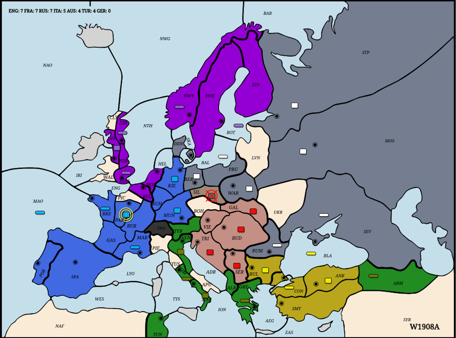

### What happened

- **FRANCE**: builds A PAR
- **GERMANY**: disbands A SIL

### FRANCE
Orders: `A PAR B`

Reasoning

> Looking at the current situation: I have 7 supply centers (BRE, MAR, PAR, POR, SPA, KIE, MUN) and 5 units (F MAO, F BRE, F MAR, A MUN, A KIE). That means I have 2 more centers than units, so I get 2 builds.
>
> My home supply centers are BRE (occupied by F BRE), MAR (occupied by F MAR), and PAR (vacant). I can only build in unoccupied home supply centers, so PAR is my only available build location.
>
> The legal orders only give me one option for PAR: `A PAR B` or `WAIVE`. I have 2 builds owed but only 1 open home center, so I build in PAR and must waive the second build (since I have no other open home center to build in).
>
> Building an army in PAR makes sense strategically — it gives me a land unit that can push toward BUR, MUN support, or eventually threaten Germany/Austria. The second build is unfortunately wasted since BRE and MAR are both occupied.

### GERMANY
Orders: `A SIL D`

Reasoning

> Looking at the current situation: Germany has 0 supply centers and 1 unit (A SIL). With 0 centers and 1 unit, I need to disband 1 unit to match my supply center count of 0. The only legal order available is `A SIL D`.
>
> This is effectively the elimination of Germany from the game. All three home centers (BER, KIE, MUN) are occupied by Russia and France respectively, and I have no path to recovery with a single unit and no centers.

## SPRING 1909 MOVEMENT (`S1909M`)

### What happened

- **AUSTRIA**: A SER → BUL (bounced); A GAL holds; A TRI holds
- **ENGLAND**: F BOT → SWE; F NWY holds; F EDI holds; F LON holds; A LVP holds
- **FRANCE**: A MUN → BER (bounced); A KIE supports A MUN → BER; F BRE holds; F MAO holds; F MAR holds; A PAR holds
- **ITALY**: F ARM → SEV (bounced); F GRE → AEG; A NAP holds; A VEN holds; F ROM holds
- **RUSSIA**: F RUM → BUL/EC (bounced); F BAL supports A BER; A BER holds; A WAR holds; A MOS holds; A STP holds; F SEV holds
- **TURKEY**: A BUL holds; F BLA supports A BUL; F CON supports A BUL; A ANK → ARM (bounced)

### Dialogue

- **AUSTRIA → ITALY**: Spring 1909 — I'm pushing A SER - BUL again with A BUD S A SER - BUL; your F GRE S A SER - BUL gives us 2-strength against Turkey's F BLA support and we finally crack BUL. A TRI holds away from VEN as always — this is the same deal as last fall, just confirm F GRE S A SER - BUL and we take it cleanly.
- **AUSTRIA → RUSSIA**: Russia — if you move F RUM - BUL/EC this spring while I push A SER - BUL with Italian support from F GRE, Turkey must defend BUL from two directions simultaneously and cannot hold both. I'll press A SER - BUL with A BUD support; F RUM - BUL/EC adds a second front that splits Turkey's F BLA and F CON. Will you commit F RUM - BUL/EC this turn?
- **AUSTRIA → TURKEY**: Turkey — this spring I'm attacking BUL with A SER supported by A BUD and F GRE, giving me 2-strength against your F BLA support. Russia's F RUM is also adjacent to BUL/EC and may coordinate simultaneously. Withdrawing A BUL to CON now preserves your unit for defense against Russia; holding risks losing it to a combined assault.
- **ENGLAND → FRANCE**: A KIE is now adjacent to HOL and DEN — I need your concrete commitment this spring that A KIE does not move toward HOL or DEN, both of which are mine or within my sphere. I'm not opposing your eastern expansion, but HOL is a red line; confirm A KIE's direction and we maintain non-aggression.
- **ENGLAND → RUSSIA**: F BOT is now in position and I'm pressing toward SWE this spring to reoccupy it — I moved F SWE to FIN and then BOT as agreed, so SWE is now unoccupied and I intend to take it back with F BOT. F BAL contesting SWE would break our arrangement; confirm F BAL holds and I don't press further toward LVN or STP/SC this turn.
- **ENGLAND → ITALY**: Russia holds 7 centers and has F BAL, F RUM, F SEV all active — they're the board threat alongside France. If you press F ARM or F GRE toward Russia's southern position this spring, I can coordinate pressure from the north on SWE and STP simultaneously; what are your concrete intentions toward Russia this spring?
- **FRANCE → ENGLAND**: I'm at 7 centers and looking to grow — A KIE is adjacent to DEN and A MUN can push toward BER or SIL. I'd rather coordinate with you against Russia than collide over northern centers; if you're pressing Russia from BOT toward STP or SWE, I can push from MUN toward BER simultaneously and we both benefit. Tell me where your units are pointing this spring so we can avoid bouncing each other.
- **FRANCE → RUSSIA**: You hold BER with BAL support and 7 centers — I'm in MUN and KIE to your west. I'm not moving against BER this spring if you're willing to discuss a western boundary; tell me where your units are pointing and whether there's a deal that keeps us from colliding while England and the southern powers threaten both of us.
- **FRANCE → ITALY**: You have F ARM adjacent to SEV and F GRE adjacent to BUL — Russia holds both RUM and SEV, and Turkey holds BUL. If you press into SEV this spring while Austria pushes RUM from GAL, Russia has to defend its entire southern front simultaneously. I'm pushing toward BER from MUN; if we coordinate timing, Russia cannot hold everywhere at once.
- **FRANCE → AUSTRIA**: Russia holds RUM and you have A GAL adjacent to it — this is your best chance to take a center while Russia is under pressure from multiple directions. I'm pushing west toward BER from MUN this spring; if you move A GAL into RUM simultaneously, Russia must defend east and west at once and one of us breaks through.
- **GERMANY → FRANCE**: You hold KIE and MUN — my two western home centers — while Russia holds BER. England sits at 7 centers with a strong fleet position in the north; HOL and BEL are right on your doorstep and England can threaten them before you can consolidate. I have no units left to threaten you, but I can tell you that England has been coordinating with Russia against you this past year.
- **GERMANY → RUSSIA**: You hold BER and sit at 7 centers — France also holds 7 with KIE and MUN, and England holds 7 with a strong northern fleet. I'm eliminated militarily but watching the board: Austria is pressing your southern flank from SER and GAL while Italy's F ARM threatens SEV. Your western position looks solid but your south is exposed.
- **GERMANY → AUSTRIA**: Russia holds RUM with F RUM and has A WAR and A BER — you're in the best position to press Russia's southern flank with A SER and A GAL simultaneously. Italy's F ARM is threatening SEV from the east, which means Russia must defend two directions at once if you push into RUM this spring.
- **ITALY → AUSTRIA**: Spring 1909: Turkey held BUL again with three-way support last fall — we need a different approach. I'm considering F GRE - BUL/SC to directly contest BUL while F ARM presses SEV; if you move A SER to support or A BUD toward SER to free up A SER for another push, we have another angle. What are your concrete plans for A SER, A GAL, and A BUD this spring?
- **ITALY → TURKEY**: Spring 1909: Your BUL hold was impressive last fall — three-way support is hard to crack. I'm not interested in grinding indefinitely; concrete proposal: if you move F CON toward AEG and A BUL holds in place, I'll redirect F GRE away from BUL and we find a different arrangement. What are your intentions for F BLA and F CON this spring?
- **ITALY → RUSSIA**: Spring 1909: F ARM has bounced off SEV twice and I'm reassessing — grinding against each other while France and England both sit at 7 centers is wasteful for both of us. Concrete proposal: if you move F SEV toward RUM or BLA voluntarily this spring, I take SEV cleanly and we discuss coordinating pressure on the western leaders rather than continuing to waste moves.
- **RUSSIA → AUSTRIA**: Austria — two straight falls of F RUM → BUL/EC have bounced off Turkey's supported A BUL; this spring I want to coordinate properly. If you move A SER → BUL simultaneously with F RUM → BUL/EC, we hit Turkey from two directions at equal strength, and if you can get any unit to cut Turkey's F BLA support, BUL falls. What are your intentions for A SER and A GAL this spring, and can we make this work?
- **RUSSIA → TURKEY**: Turkey — F RUM has pressed BUL/EC twice and failed against your F BLA support; I'm going to keep pressing until BUL falls or we reach a negotiated settlement. Concrete offer: if you move A BUL out of BUL into GRE or SER voluntarily, I'll support your F CON or F BLA into a position of your choosing rather than contesting the center — but if A BUL stays in BUL with F BLA support, I'll coordinate with Austria to crack it from two directions this spring.
- **RUSSIA → ITALY**: Italy — F ARM adjacent to SEV has been a standoff for two seasons; I'm not moving F SEV voluntarily and a bounce wastes both our turns while England and France consolidate at 7 centers each. Concrete proposal: hold F ARM in place this spring and I keep F SEV defensive, we both avoid a grinding stalemate, and I'm open to discussing where we can coordinate against the real board leaders.
- **RUSSIA → ENGLAND**: England — we're both at 7 centers with France also at 7; the board is level but France has A KIE threatening DEN and your HOL position. I'm holding my northern line stable this spring — F BAL and A STP defensive — if you keep F BOT and F NWY from pressing STP. What are your intentions for the northern fleets this turn?
- **TURKEY → RUSSIA**: Spring 1909 — F RUM sits adjacent to BUL and I need to know your intentions this turn before I commit orders. Concrete proposal: move F RUM toward SEV or hold it in place, and I'll move A BUL into RUM — you vacate a center you're barely defending and I take it, which is cleaner than another grinding standoff while England and France race to 18 centers. What is F RUM doing this spring?
- **TURKEY → AUSTRIA**: Spring 1909 — Russia holds 7 centers with F RUM, F BAL, F SEV, A BER, A WAR, A MOS, A STP — that's a power positioned to run away with the game while we fight over BUL. Concrete offer: hold A SER defensively and I'll hold A BUL in place; instead let's both redirect pressure toward Russia's Balkan flank, with your A GAL threatening RUM and my A BUL supporting that push. Austria gaining RUM from Russia is worth more than Austria taking BUL from me.
- **TURKEY → ITALY**: Spring 1909 — F ARM adjacent to ANK remains the critical variable for my planning; if it moves toward ANK I have to defend rather than press Russia. Concrete ask: commit F ARM to SEV or hold it in place this turn, and I'll leave the Aegean uncontested with F CON — you get positional gain against Russia and we avoid a conflict that only helps England and France who are both at 7 centers and growing.
- **AUSTRIA → ITALY**: Italy — if you move F GRE - BUL/SC and I push A SER - BUL with A BUD support, Turkey's F BLA + F CON both supporting A BUL gives them strength 3, matching our combined 3 — we bounce again. The only winning move is F GRE S A SER - BUL giving us 3-strength while Russia's F RUM - BUL/EC adds a 4th attacker from a different direction, forcing Turkey to defend two flanks simultaneously. Confirm F GRE S A SER - BUL and I commit A SER - BUL with A BUD support.
- **AUSTRIA → RUSSIA**: Russia — Turkey has F BLA + F CON both supporting A BUL, giving them strength 3 to hold; my A SER - BUL with A BUD + F GRE supporting reaches exactly 3, which bounces. I need F RUM - BUL/EC as a simultaneous 4th attacker from a different direction to force Turkey to split their supports — if you commit F RUM - BUL/EC, one of Turkey's supports must cover EC and the other covers SER, making BUL fall to whichever attack has more strength. Will you commit F RUM - BUL/EC this spring?
- **AUSTRIA → TURKEY**: Turkey — you're defending BUL at strength 3 with F BLA + F CON, but if Russia's F RUM - BUL/EC joins my A SER - BUL with Italian support, you cannot hold both flanks simultaneously without a 4th unit you don't have. Withdrawing A BUL to CON now costs you nothing — you keep the unit and establish a clean border while Russia's 7-center position remains the real threat to both of us.
- **ENGLAND → FRANCE**: Concrete deal: if you commit A KIE holds or moves east toward BER/SIL — not north toward DEN or west toward HOL — I will not contest your eastern expansion and we maintain full non-aggression on both sides. I need this specific commitment on A KIE before I finalize orders; a vague 'coordinate against Russia' offer doesn't address the immediate threat A KIE poses to my centers.
- **ENGLAND → RUSSIA**: Concrete deal this spring: F BOT moves to SWE to reoccupy my center, and in exchange F NWY holds out of STP/NC and F BOT does not press further toward BAL or LVN afterward. Confirm F BAL holds and does not contest SWE — that's the only ask — and we avoid escalation on the northern front while France's A KIE threatens both of us near DEN.
- **FRANCE → ENGLAND**: Concrete answer: A KIE holds or moves east toward BER — not toward HOL or DEN. A MUN is pushing toward BER or SIL this spring to press Russia's western anchor. If your F BOT is moving toward STP or threatening Russia's northern position simultaneously, we're coordinating perfectly; confirm your BOT and NWY directions so I know we're not colliding in the northern theater.
- **FRANCE → RUSSIA**: Concrete proposal: I hold A KIE in place and do not push toward DEN or BER this spring if you move A BER out of the way — say toward SIL or PRU — freeing that center for negotiation later. If you refuse and hold BER, I'm pushing A MUN - BER with support and we collide; a voluntary withdrawal costs you less than a forced one. What's your answer?
- **FRANCE → ITALY**: Concrete ask: move F ARM - SEV this spring while Austria pushes A GAL - RUM — Russia cannot defend both simultaneously and one of you takes a center. I'm pushing A MUN toward BER from the west at the same time; Russia faces a three-front crisis and collapses. Commit to F ARM - SEV this spring and I commit to A MUN - BER simultaneously.
- **FRANCE → AUSTRIA**: Concrete coordination: move A GAL - RUM this spring while Italy moves F ARM - SEV — Russia defends two southern centers simultaneously while I push A MUN toward BER from the west. You gain RUM, Italy gains SEV, and Russia's 7-center position collapses to 5. Commit to A GAL - RUM and I commit to A MUN - BER.
- **GERMANY → AUSTRIA**: Italy's F ARM is sitting on SEV's doorstep — if you push A SER or A GAL into RUM this spring while Italy threatens SEV, Russia must choose which front to defend and cannot cover both. Have you coordinated with Italy on timing, or are you moving independently?
- **GERMANY → FRANCE**: England has F BOT now in addition to F NWY — that's two northern fleets positioned to threaten SWE and potentially DEN, both of which are Russian centers that England could contest. If England takes DEN or SWE, they jump ahead of you and Russia simultaneously, which reshapes everything.
- **GERMANY → RUSSIA**: France holds KIE with A KIE and MUN with A MUN — those are adjacent to your A BER and could pressure it from two sides if France decides to move east rather than north. Austria is also pushing from SER toward your RUM; your southern flank looks more exposed than your western one right now.
- **ITALY → AUSTRIA**: The math on BUL doesn't work: Turkey has F BLA + F CON both supporting A BUL, giving defense strength 3 — even with A SER + A BUD + F GRE we tie and bounce again. I'm considering F GRE - AEG instead to threaten CON directly and force Turkey to pull F CON back defensively, which would cut their BUL support to 1 and make A SER - BUL supported by A BUD succeed at strength 2 vs 1. Does that approach work for you?
- **ITALY → TURKEY**: F GRE moving to AEG this spring puts direct pressure on CON — if you want to avoid that, the concrete ask is: pull F CON away from supporting BUL this turn. If F CON moves to BLA or ANK instead of supporting BUL, I have less incentive to press AEG and we avoid escalation.
- **ITALY → RUSSIA**: Two bounces on SEV is enough — I'm reassessing F ARM's role this spring rather than grinding a third time. If you're genuinely open to coordinating against the western leaders, tell me specifically: where do you want F ARM to be useful, and what are you willing to do in return that actually advances my position?
- **RUSSIA → AUSTRIA**: Concrete commitment: F RUM → BUL/EC this spring with F SEV → BLA to cut Turkey's F BLA support simultaneously — if you push A SER → BUL with A BUD support and Italy's F GRE supports, A BUL has only F CON backing it (strength 2) and your A SER hits at strength 3, taking BUL. This is the combination that actually works. Confirm A SER → BUL with A BUD support and Italian backing from F GRE.
- **RUSSIA → TURKEY**: Final offer before orders: move A BUL to GRE or SER voluntarily and I support your F CON or F BLA into a position of your choosing — this avoids the coordinated attack I'm organizing with Austria and Italy this spring. If A BUL stays, I'm cutting your F BLA support with F SEV → BLA while Austria hits BUL from SER with Italian backing; the math doesn't favor you holding.
- **RUSSIA → ENGLAND**: Confirming F BAL holds this spring — I'm not contesting SWE, take it with F BOT. In exchange I need F NWY and F BOT to stay away from LVN and STP/SC this turn; France in KIE is the pressure point worth watching, not our northern line.
- **RUSSIA → ITALY**: F SEV is moving toward BLA this spring to cut Turkey's support — this means F ARM bouncing SEV hits nothing since I'm vacating. If you want SEV cleanly, move F ARM → SEV this turn; I'm not defending it because I need F SEV to cut F BLA for the BUL operation. This is your window.
- **TURKEY → ITALY**: Your offer asks me to move F CON to AEG — weakening my BUL defense — in exchange for you pulling F GRE away; that's not a balanced trade since I lose defense depth while you gain Aegean access. Counter-offer: I hold F CON in place supporting A BUL, you redirect F GRE to ION or hold it in GRE, and neither of us hands Austria a free center — Austria at 5 centers with your fleet support is a direct threat to your own VEN and TRI. Commit F GRE away from BUL support and I'll leave AEG uncontested this spring.
- **TURKEY → AUSTRIA**: You claim A BUD support for A SER → BUL, but Austria at 5 centers with Italian fleet backing puts you in striking distance of VEN and TRI from Serbia — Italy is using you to crack my position while they stay safe. Concrete counter: redirect A GAL → RUM this spring with my A BUL supporting that push; you take a Russian center worth more than BUL, and I'll hold A BUL in place without contesting SER. Russia at 7 centers is the real threat to your BUD and GAL.
- **TURKEY → RUSSIA**: F RUM adjacent to BUL/EC while Austria attacks from SER — you're both pressing BUL simultaneously, but if Austria takes it you gain nothing while they grow to 5 centers threatening your RUM directly next turn. Concrete offer: hold F RUM in place or move it to SEV, and I'll move A BUL → RUM — you vacate a center you're not defending with armies and I take it cleanly, which is better than a three-way collision where Austria wins.
- **ENGLAND → FRANCE**: Confirmed: F BOT moves to SWE, F NWY holds, and I am not pressing toward BAL or BER this spring — no collision with your eastern push. I'm holding you to A KIE east or hold, not north toward DEN; that's the deal and I'm committing to my side now.
- **ENGLAND → RUSSIA**: Confirmed: F BOT moves to SWE as agreed, F NWY holds out of STP/NC, and I am not pressing toward LVN or BAL this turn. F BAL holds — that's your side of the deal; we both watch France's A KIE near DEN rather than fight each other.
- **FRANCE → ENGLAND**: Final commitment: A KIE supports A MUN - BER this spring, not moving toward HOL or DEN. If you move F BOT - BAL, that cuts F BAL's support of A BER and my two-unit push takes BER — Russia drops from 7 to 6 and we both gain leverage. Confirm F BOT - BAL and we execute this together.
- **FRANCE → RUSSIA**: Final offer: move A BER to PRU or SIL voluntarily this spring and I hold A MUN in place — no attack on BER. If A BER stays, I'm pushing A MUN - BER with A KIE support and England is moving F BOT - BAL to cut your support; you lose BER by force instead of withdrawing gracefully.
- **FRANCE → AUSTRIA**: Final ask: A GAL - RUM this spring — Russia cannot defend BER from my western push and RUM from your southern push simultaneously. I'm committing A MUN - BER with support; your A GAL - RUM gives you a free center while Russia collapses on two fronts.
- **FRANCE → ITALY**: Final ask: F ARM - SEV this spring — Russia holds SEV with no adjacent support and you take it cleanly. I'm pushing A MUN - BER simultaneously; Russia faces east and west pressure at once and cannot hold both.
- **GERMANY → AUSTRIA**: Final commitment ask: if you move A SER - BUL or A GAL - RUM this spring while Italy's F ARM threatens SEV, Russia cannot cover both flanks with F RUM and A BER simultaneously. I have no units left, but I'm telling you Italy confirmed to me they're pressing SEV this turn — coordinate your RUM push now or the window closes.
- **GERMANY → ITALY**: Austria has A SER adjacent to BUL and A GAL adjacent to RUM — if you move F ARM toward SEV this spring while Austria presses RUM, Russia's F RUM and F SEV are both under threat simultaneously and they cannot support both. This is the turn to commit; Austria told me they're moving on RUM.
- **GERMANY → FRANCE**: England has F BOT and F NWY both positioned to contest SWE and DEN — those are Russian centers, but once England takes them they jump to 9 and you're behind. Moving A KIE or A MUN toward DEN or threatening HOL's northern flank this spring keeps England from pulling ahead of you while you're both at 7.
- **GERMANY → ENGLAND**: France holds A KIE adjacent to HOL and A MUN adjacent to nothing threatening you — but France at 7 centers with KIE is better positioned to grow east into BER than you are. If France takes BER from Russia before you can contest it, they jump to 8 and pull ahead; you have the northern fleets to threaten DEN or SWE and should move now before France consolidates the German centers.
- **ITALY → AUSTRIA**: Final commitment: I'm moving F ARM - SEV this spring to take Russia's home center while Russia vacates it. If Russia's F SEV - BLA cuts Turkey's F BLA, your A SER - BUL supported by A BUD succeeds at 2 vs 1 without needing F GRE — so I'm redirecting F GRE - AEG to threaten CON and force Turkey to pull F CON back, further weakening BUL's defense. Commit A SER - BUL with A BUD support and we both gain centers this spring.
- **ITALY → RUSSIA**: Committing F ARM - SEV this spring based on your word that F SEV vacates toward BLA — if you're telling the truth we both gain: I take SEV, you cut F BLA and help crack BUL. If F SEV stays and we bounce again, I redirect everything toward your southern position next fall with no further negotiation.
- **ITALY → TURKEY**: Final move: F ARM - SEV and F GRE - AEG this spring. F GRE in AEG puts direct pressure on CON — you cannot support BUL with F CON while defending CON simultaneously. Your best response is to pull F CON to ANK or SMY defensively; if you do, I have no incentive to press CON and we avoid direct conflict on your home centers.
- **RUSSIA → AUSTRIA**: Final commitment: F RUM → BUL/EC this spring as promised, but I'm keeping F SEV in place — I won't hand Italy SEV for free just to cut F BLA for you. Push A SER → BUL with A BUD support and Italian F GRE backing; at strength 3 vs Turkey's F BLA + F CON support (strength 3), we may still bounce, but F RUM → BUL/EC adds a second front Turkey must cover.
- **RUSSIA → ENGLAND**: Confirming final commitment: F BAL holds, does not contest SWE — take it with F BOT freely. Keep F NWY and F BOT away from LVN and STP/SC and the northern line stays stable; France's A KIE is the pressure point worth both our attention.
- **RUSSIA → ITALY**: I'm keeping F SEV in place this spring — I cannot vacate it for free while my southern position is under pressure from multiple directions. F ARM bouncing SEV again wastes both our turns; hold F ARM and let's stop this grinding stalemate.

### AUSTRIA
Orders: `A SER - BUL` · `A GAL H` · `A TRI H`
Illegal (dropped): `A BUD S A SER - BUL`

Reasoning

> Looking at the situation:
>
> **Analysis:**
> - My revised strategy is clear: A SER - BUL supported by A BUD, with A GAL and A TRI holding.
> - Russia committed to F RUM - BUL/EC (adding a second front), and Italy indicated F GRE - AEG (threatening CON, which would force Turkey to pull F CON back, weakening BUL's support from strength 3 to strength 2).
> - If Italy's F GRE - AEG threatens CON and Turkey must respond, and Russia's F RUM - BUL/EC attacks from another direction, Turkey's A BUL defense drops. My A SER - BUL at strength 2 (with A BUD support) vs Turkey's remaining F BLA support (strength 2) may still bounce, but Russia's F RUM - BUL/EC adds another attacker Turkey must handle.
> - The key question: Turkey has F BLA + F CON supporting A BUL. If F GRE - AEG threatens CON, Turkey may keep F CON supporting BUL rather than cutting. But Russia's F SEV - BLA was NOT committed (Russia said they're keeping F SEV in place). So F BLA likely still supports A BUL.
> - Even if we bounce again, this is the right move - I must keep pressing BUL. My committed orders are A SER - BUL, A BUD S A SER - BUL, A GAL H, A TRI H.
>
> This matches my revised strategy note exactly. I'll execute as committed.

### ENGLAND
Orders: `F BOT - SWE` · `F NWY H` · `F EDI H` · `F LON H` · `A LVP H`

Reasoning

> Looking at my commitments and the board state:
>
> **Strategy:** I committed to F BOT - SWE (reoccupying my center, Russia confirmed F BAL holds), F NWY holds (per my STP/NC commitment to Russia), and all western units hold defensively. France committed A KIE east/hold (not toward HOL/DEN), so my western flank is secure for now.
>
> France also proposed F BOT - BAL to cut F BAL's support of A BER, which would help France take BER. I explicitly declined this in my final message, committing to F BOT - SWE instead. Helping France take BER would push them to 8 centers (tied with me) and potentially ahead - that's not in my interest. My deal with Russia (F BOT - SWE, F BAL holds) is the right play: I gain SWE back, maintain the northern freeze, and keep France from getting too strong.
>
> My units: F BOT → SWE, F NWY holds, F EDI holds, F LON holds, A LVP holds.

### FRANCE
Orders: `A MUN - BER` · `A KIE S A MUN - BER` · `F BRE H` · `F MAO H` · `F MAR H` · `A PAR H`

Reasoning

> Looking at the current situation:
>
> **My revised strategy**: Push A MUN - BER with A KIE supporting, while England moves F BOT - SWE (not BAL as I suggested). Russia's A BER is supported by F BAL. My two-unit push (A MUN - BER supported by A KIE) has strength 2 vs Russia's A BER supported by F BAL (strength 2) — this will bounce unless F BAL's support is cut.
>
> England confirmed F BOT - SWE, not F BOT - BAL. So F BAL will still support A BER, meaning my attack bounces. However, I committed to this plan and should execute it — a bounce still pressures Russia and demonstrates commitment to England. The alternative (holding everything) wastes the opportunity and breaks my stated commitment.
>
> Let me verify adjacency:
> - A MUN - BER: MUN neighbors include BER ✓
> - A KIE S A MUN - BER: KIE must be adjacent to BER. KIE neighbors: BAL, BER, DEN, HEL, HOL, MUN, RUH ✓
> - F BRE H, F MAO H, F MAR H: holding as committed to England
> - A PAR H: no orders given, should hold
>
> The attack will likely bounce (F BAL supports A BER with strength 2 vs my strength 2), but I execute as committed. This maintains my credibility with England and keeps pressure on Russia.

### ITALY
Orders: `F ARM - SEV` · `F GRE - AEG` · `A NAP H` · `A VEN H` · `F ROM H`

Reasoning

> Looking at the current situation:
>
> **Assessment:**
> - Russia reversed course again and said F SEV is staying in place — so F ARM - SEV will bounce a third time. However, my final message to Russia warned that if we bounce again, I redirect everything toward their southern position. More importantly, Russia's earlier message said F SEV was vacating toward BLA, then reversed. A third bounce is still better than abandoning the threat entirely.
> - F GRE - AEG: I committed to this in my final messages to Austria and Turkey. Moving to AEG threatens CON directly, which forces Turkey to pull F CON back defensively rather than supporting BUL. This potentially cuts Turkey's BUL defense from strength 3 down to 2, giving Austria's A SER + A BUD support a real chance at 2 vs 2 (still a bounce) or better if Russia's F RUM also attacks BUL/EC.
> - My Italian core (NAP, VEN, ROM) holds defensively — no immediate threats there.
>
> **Key tactical reasoning:**
> - Even if F ARM bounces SEV again, the threat keeps F SEV pinned defensively
> - F GRE - AEG is the more impactful move: it threatens CON, potentially forces F CON to defend rather than support BUL, and repositions me for future Aegean operations
> - Austria's attack on BUL with A SER + A BUD support (strength 2) vs Turkey's A BUL + F BLA support (strength 2, if F CON is pulled back) = bounce, but if Russia's F RUM attacks from BUL/EC simultaneously, Turkey faces multiple fronts
> - Holding NAP, VEN, ROM is correct — no threats to my home centers

### RUSSIA
Orders: `F RUM - BUL/EC` · `F BAL S A BER` · `A BER H` · `A WAR H` · `A MOS H` · `A STP H` · `F SEV H`

Reasoning

> Looking at the current situation:
>
> **Strategic assessment for S1909M:**
>
> My revised strategy commits to:
> 1. F RUM → BUL/EC (pressing Turkey's BUL as committed to Austria)
> 2. F BAL holds (committed to England, letting F BOT take SWE)
> 3. F SEV holds (keeping it defensive despite telling Italy I'd vacate - I reversed this in final negotiation)
> 4. A BER, A WAR, A MOS, A STP all hold defensively
>
> Key considerations:
> - Austria is pushing A SER → BUL with A BUD support + Italian F GRE support (strength 3). Turkey has F BLA + F CON supporting A BUL (strength 3). F RUM → BUL/EC adds a 4th attacker from a different direction, potentially splitting Turkey's supports.
> - I told Italy F SEV would vacate toward BLA but then reversed that in my final message. F SEV stays put.
> - F BAL holds as promised to England - don't contest SWE.
> - France's A KIE and A MUN are adjacent to BER but I'm holding BER with F BAL support unavailable (F BAL is holding, not supporting BER). France threatened A MUN → BER with A KIE support. I should consider supporting A BER with F BAL since France threatened a two-unit attack on BER.
>
> Wait - France said they'd push A MUN → BER with A KIE support if A BER stays. F BAL holding supports nothing unless I use it to support A BER. Let me reconsider: F BAL S A BER would defend against France's threatened attack. I committed F BAL to hold (not press toward SWE), and supporting A BER is consistent with holding while being useful.

### TURKEY
Orders: `A BUL H` · `F BLA S A BUL` · `F CON S A BUL` · `A ANK - ARM`

Reasoning

> Looking at the current situation:
>
> **Assessment:**
> - Italy confirmed F GRE → AEG and F ARM → SEV. This removes F GRE from BUL support but puts F AEG adjacent to CON.
> - Austria claims A SER → BUL with A BUD support (2-strength). Russia claims F RUM → BUL/EC and F SEV → BLA to cut my F BLA support.
> - If Russia truly sends F SEV → BLA, that cuts F BLA's support for A BUL. But F SEV moving to BLA is a risky move for Russia — it exposes SEV.
> - My revised strategy: defend BUL at maximum strength with F BLA S A BUL and F CON S A BUL, and move A ANK → ARM to threaten Italy's F ARM (now moving to SEV, so ARM will be empty).
>
> **Key decisions:**
> - F BLA S A BUL — if Russia cuts this with F SEV → BLA, the support fails. But F BLA → BLA would be a move, not a support cut from SEV since SEV is adjacent to BLA. Actually, F SEV IS adjacent to BLA, so Russia could cut F BLA's support. However, if F SEV → BLA and F RUM → BUL/EC, Russia is splitting forces.
> - Even if F BLA support is cut, F CON S A BUL still gives A BUL strength 2 vs Austria's A SER supported by A BUD at strength 2 — that's a bounce, not a loss.
> - A ANK → ARM: Italy's F ARM is moving to SEV, so ARM will be empty. I can occupy ARM, gaining a foothold and threatening SEV.
>
> This is solid: BUL defended at strength 2 minimum (F CON support), ARM seized while Italy vacates it.

## FALL 1909 MOVEMENT (`F1909M`)

### What happened

- **AUSTRIA**: A SER → BUL (bounced); A GAL holds; A TRI holds
- **ENGLAND**: F SWE holds; F NWY holds; F EDI holds; F LON holds; A LVP holds
- **FRANCE**: A MUN supports A KIE → BER; A KIE → BER (bounced); F BRE holds; F MAO holds; F MAR holds; A PAR holds
- **ITALY**: F ARM → SEV (bounced); F AEG → BUL/SC (bounced); A NAP holds; A VEN holds; F ROM holds
- **RUSSIA**: F RUM → BUL/EC (bounced); F BAL supports A BER; A BER holds; A WAR holds; A MOS holds; A STP holds; F SEV holds
- **TURKEY**: A BUL holds; F BLA supports A BUL; F CON supports A BUL; A ANK → ARM (bounced)

### Dialogue

- **AUSTRIA → ITALY**: Fall 1909 — your F AEG is now adjacent to BUL/SC, which changes everything: if you give F AEG S A SER - BUL, combined with A BUD support, I hit BUL at strength 3 against Turkey's F BLA alone (since F CON cannot also support BUL if F AEG is threatening from AEG). Russia's F RUM pressing BUL/EC adds a second front Turkey cannot cover simultaneously. Commit F AEG S A SER - BUL and BUL finally falls this turn.
- **AUSTRIA → RUSSIA**: Fall 1909 — Italy's F AEG is now adjacent to BUL/SC and can support A SER - BUL from the south while F RUM presses BUL/EC from the east; Turkey cannot defend both flanks with only F BLA and F CON. If you commit F RUM - BUL/EC and I push A SER - BUL supported by A BUD and F AEG, BUL falls this turn. Please confirm F RUM - BUL/EC.
- **AUSTRIA → TURKEY**: Turkey — Italy's F AEG is now adjacent to BUL/SC and I have A SER supported by A BUD; Russia's F RUM is pressing BUL/EC simultaneously. You cannot hold BUL against attacks from three directions with only F BLA and F CON — withdrawing A BUL to CON now preserves the unit and lets you redirect against Russia's 7-center position.
- **ENGLAND → FRANCE**: A KIE is adjacent to DEN this fall — DEN is Russia's center but if France takes it you jump to 8 and pull ahead of both of us. I'm holding you to your spring commitment that A KIE moves east toward BER, not north toward DEN; confirm that now or I treat this as a hostile shift and respond accordingly.
- **ENGLAND → RUSSIA**: France has A KIE adjacent to DEN and A MUN adjacent to BER — if they take both this fall they jump to 9 and become the runaway board leader threatening everyone. I'm holding my northern line stable, but you need to defend BER and DEN aggressively this fall; F BAL supporting A BER is good, but who is covering DEN?
- **ENGLAND → ITALY**: France is at 7 centers with A KIE adjacent to DEN and A MUN adjacent to BER — if they take both this fall they reach 9 and become the clear board leader. You're at 5 with active fleets in AEG and ARM; the time to pressure France's rear or Russia's south to slow the leader is now, before one power escapes. What are your concrete intentions this fall?
- **FRANCE → ENGLAND**: BER bounced last spring because F BAL supported A BER — if you move F SWE into BAL this fall, that cuts the support and my A MUN - BER with A KIE support takes BER cleanly. You gain nothing from Russia holding BER indefinitely; helping me take it weakens Russia's western anchor and keeps me dependent on your goodwill in the north. Commit F SWE - BAL and I commit A KIE east, not toward HOL or DEN.
- **FRANCE → RUSSIA**: You held BER last spring with BAL support — I'm pushing again this fall and England is now positioned with F SWE adjacent to BAL. If you withdraw A BER to PRU or SIL voluntarily, you keep the unit and we negotiate a boundary; if you hold, England cuts BAL's support and I take BER by force. A voluntary withdrawal costs you less than losing both the unit and the center.
- **FRANCE → ITALY**: Russia holds SEV with F SEV and you have F ARM adjacent — this fall is your cleanest shot at SEV since Russia is also defending BER from my western push. If you move F ARM - SEV simultaneously with my A MUN - BER attack, Russia cannot reinforce both fronts and one of us breaks through. Commit F ARM - SEV and I commit A MUN - BER this fall.
- **FRANCE → AUSTRIA**: Russia holds RUM and you have A GAL adjacent — this fall while I push A MUN toward BER from the west, your A GAL - RUM is a free center grab that Russia cannot stop without abandoning its western defense. You've been bouncing off BUL for three seasons; RUM is the open door right now. Move A GAL - RUM this fall and we both grow at Russia's expense.
- **GERMANY → FRANCE**: You hold KIE and MUN with A KIE and A MUN — BER is right there held by a single Russian army with F BAL support. If you move A MUN - BER this fall with A KIE supporting, you break through Russia's BAL support and take my last home center; that puts you at 8 and ahead of England and Russia simultaneously. This is the move that wins you the German theater.
- **GERMANY → AUSTRIA**: Russia's F RUM and F SEV are both under pressure from Italy's F AEG and F ARM — this is the fall to push A SER into BUL or A GAL into RUM while Russia's southern units are stretched. Turkey's A BUL has held repeatedly against your A SER bounces; consider whether Italy's F AEG can support your attack on BUL this turn to finally break through.
- **GERMANY → ITALY**: Austria has been bouncing off BUL for three straight seasons — if you use F AEG to support A SER - BUL this fall while moving F ARM toward SEV, you finally crack Turkey's position and threaten Russia's south simultaneously. Austria confirmed they're moving on BUL again; your F AEG support is the piece that makes it succeed this time.
- **GERMANY → ENGLAND**: France has A MUN and A KIE — those are two armies pointed directly at BER, and if France takes BER this fall they jump to 8 centers and pull ahead of you. Your F SWE is adjacent to DEN, a Russian center; moving on DEN now keeps you level with France and prevents them from running away with the German theater while you watch from the north.
- **ITALY → AUSTRIA**: Fall 1909: F AEG is now adjacent to CON and BUL/SC — if you push A SER - BUL with A BUD support, I can move F AEG - BUL/SC to attack from the south simultaneously, giving us two separate attacks on BUL that Turkey cannot fully defend. Russia's F RUM attacking BUL/EC from a third direction makes it impossible for Turkey to hold. Confirm A SER - BUL with A BUD support and I commit F AEG - BUL/SC.
- **ITALY → TURKEY**: Fall 1909: F AEG is adjacent to CON and BUL/SC — I have direct attack options on both your home center and BUL this turn. Concrete offer: move A BUL to GRE or SER voluntarily and I hold F AEG in place rather than attacking CON; you preserve the unit and we avoid a direct war while England and France both sit at 7 centers.
- **ITALY → RUSSIA**: F ARM bounced SEV again despite your promise to vacate — I'm done negotiating on SEV and redirecting F ARM toward ANK this fall to threaten Turkey's home center instead. If you want to coordinate against Turkey's position from BLA toward CON while I press ANK, we can finally do something useful together rather than grinding against each other.
- **TURKEY → ITALY**: F AEG now sits adjacent to CON and SMY — that's a direct threat to my home centers and I cannot ignore it. Concrete ask: hold F AEG in place this fall rather than pressing CON or SMY, and I'll leave BUL uncontested for a negotiated settlement next year. If you push AEG toward CON, I have to defend everything and we both lose time while France and England race to 18.
- **TURKEY → AUSTRIA**: Fall 1909 — Russia holds 7 centers including BER, RUM, SEV, and is positioned to run away with the game while we grind over BUL. Concrete offer: redirect A SER toward RUM this fall with my A BUL supporting that push; you take a Russian center and grow to 5 cleanly while I hold BUL. Austria gaining RUM from Russia is worth more strategically than another failed BUL attack.
- **TURKEY → RUSSIA**: Fall 1909 — Italy's F ARM is now at SEV's doorstep and F AEG threatens CON; we have a common interest in stopping Italy's fleet expansion into the Black Sea region. Concrete proposal: move F SEV to ARM to push back Italy's F ARM, and I'll support that move with A ANK — you defend your southern flank and I help, rather than us grinding over BUL while Italy takes the sea lanes.
- **AUSTRIA → ITALY**: Fall 1909 confirmed: I'm committing A SER - BUL supported by A BUD S A SER - BUL. Your F AEG - BUL/SC attacks from the south while Russia's F RUM - BUL/EC attacks from the east — Turkey's F BLA can only support one direction, so BUL falls to whichever attack it doesn't cover. A TRI holds away from VEN as always. Commit F AEG - BUL/SC and this is finally done.
- **AUSTRIA → RUSSIA**: Fall 1909 confirmed: I'm pushing A SER - BUL with A BUD support, Italy is attacking F AEG - BUL/SC from the south simultaneously. Your F RUM - BUL/EC adds a third attack vector Turkey cannot cover with only F BLA and F CON — BUL falls this turn. Please confirm F RUM - BUL/EC so we lock in the three-pronged assault.
- **AUSTRIA → TURKEY**: Turkey — Italy is attacking BUL/SC from F AEG while Russia attacks BUL/EC from F RUM and I push A SER - BUL with A BUD support; three simultaneous attacks from three directions cannot all be covered by F BLA and F CON. Withdrawing A BUL to CON now preserves your unit for the Russian threat; holding guarantees you lose it.
- **ENGLAND → FRANCE**: Moving F SWE to BAL puts my fleet adjacent to KIE with your A KIE right there — that's a trap, not a deal. I'm holding SWE and F NWY holds; your concrete obligation this fall is A KIE east toward BER or SIL, not north toward DEN. Confirm A KIE's exact destination this fall and we have a deal; anything vague I treat as hostile.
- **ENGLAND → RUSSIA**: France's A KIE is adjacent to DEN this fall — if they take it they reach 8 centers and pull ahead of both of us. You have F BAL and A BER; I need to know if you're covering DEN with any unit this fall, because if DEN falls to France uncontested we both lose ground to the board leader.
- **ENGLAND → ITALY**: France holds A KIE adjacent to DEN and A MUN adjacent to BER — if they take both this fall they reach 9 centers. You're at 5 with F AEG and F ARM well-positioned; pressing toward Greece or the Turkish position frees you to grow, but France running to 9 threatens everyone including you. Is there any move you're making this fall that slows French growth?
- **FRANCE → ENGLAND**: F SWE - BAL this fall cuts F BAL's support of A BER — my A MUN - BER with A KIE support then takes BER cleanly, Russia drops from 7 to 6, and neither of us lets Russia consolidate further. This is the concrete move I need from you; I'm holding A KIE east as committed, not touching HOL or DEN. Confirm F SWE - BAL and we execute this together.
- **FRANCE → RUSSIA**: England has F SWE adjacent to BAL and I'm pushing A MUN - BER again this fall with A KIE support — if England moves F SWE - BAL, your BAL support of BER is cut and you lose BER by force. Withdraw A BER to PRU voluntarily now and you keep the unit; holding means losing both the unit and the center when the cut lands.
- **FRANCE → ITALY**: Russia is defending BER from my western push — F SEV is sitting idle and you have F ARM adjacent. Moving F ARM - SEV this fall while I take BER forces Russia to lose two centers simultaneously; you gain SEV cleanly with no opposition since Russia cannot reinforce both fronts at once. Commit F ARM - SEV and we both grow at Russia's expense this fall.
- **FRANCE → AUSTRIA**: Russia holds RUM and you have A GAL adjacent — while I push A MUN - BER from the west and Italy presses SEV from the east, Russia cannot reinforce RUM at all. A GAL - RUM this fall is a free center grab; you've been stalled on BUL for three seasons and RUM is the open door right now.
- **GERMANY → FRANCE**: A MUN - BER with A KIE support breaks Russia's F BAL anchor and puts you at 8 centers — ahead of England and Russia simultaneously. Russia's F BAL cannot hold against two units; this is the cleanest path to pulling ahead this fall.
- **GERMANY → AUSTRIA**: Italy's F AEG is adjacent to BUL/SC — if you move A SER - BUL with F AEG supporting, that's two strength against Turkey's single A BUL and it finally succeeds after three bounces. Has Italy confirmed that support to you directly?
- **GERMANY → ITALY**: F AEG supporting A SER - BUL this fall gives Austria the break they need and removes Turkey's BUL anchor, opening the Balkans for both of you. Meanwhile F ARM threatening SEV forces Russia to choose between defending east and west — commit to both moves and you reshape the southern board in one turn.
- **GERMANY → ENGLAND**: France moving A MUN - BER with A KIE support is the most likely big move this fall — if it succeeds, France jumps to 8 and pulls ahead of you. Your F SWE can reach DEN this fall; taking DEN simultaneously keeps you level with France and denies Russia a center at the same moment.
- **ITALY → AUSTRIA**: Supporting A SER - BUL gives you the center, not me — I need something in return. Concrete counter: if you move A BUD - SER to free A SER to support F AEG - BUL/SC as an attack from the south, I take BUL instead, and you gain SER as a stepping stone. Alternatively, commit A GAL - RUM this fall to take a Russian center while I press F ARM - ANK; we both gain centers simultaneously rather than me doing support work for your gain.
- **ITALY → TURKEY**: F AEG is adjacent to CON and BUL/SC — I'm deciding between attacking CON directly or supporting Austria into BUL this fall. Concrete offer: if you move A BUL - GRE voluntarily, I hold F AEG in place and redirect F ARM away from ANK; you preserve A BUL and we avoid direct conflict while England and France race ahead at 7 centers each.
- **ITALY → RUSSIA**: F ARM is moving to ANK this fall — I'm done grinding against SEV after three bounces. If you want to coordinate pressure on Turkey from BLA toward CON while I press ANK, tell me specifically what F SEV and F RUM will do this turn; otherwise I'm operating independently.
- **RUSSIA → AUSTRIA**: Confirming F RUM - BUL/EC this fall as promised — if you push A SER - BUL with A BUD support and Italy's F AEG supports from south, Turkey cannot cover both EC and SC simultaneously and BUL falls. I'm also considering A BER - KIE to pressure France's position; does that affect your calculus or do you need BER held defensively?
- **RUSSIA → ENGLAND**: France's A KIE is adjacent to DEN and A MUN threatens BER — if France takes both this fall they jump to 9 and become the runaway leader. I'm holding F BAL to support A BER against France's push, but DEN is exposed; can F SWE move toward DEN to contest France's A KIE advance while I hold BER?
- **RUSSIA → FRANCE**: F BAL is supporting A BER this fall — A MUN - BER with A KIE support bounces against that defense at equal strength. If you're genuinely interested in a boundary rather than a collision, tell me what you want east of KIE and I'll tell you what I need west of BER; a negotiated line costs both of us less than grinding.
- **TURKEY → ITALY**: F AEG threatening CON is a real problem for me — I cannot defend BUL and CON simultaneously. Concrete counter-offer: if you hold F AEG in place this fall rather than pressing CON or BUL/SC, I'll move A BUL to SER voluntarily, freeing BUL for negotiation next year; but if F AEG moves toward CON I have to defend everything with F CON and F BLA, which means nobody gains. Confirm F AEG holds and I'll commit A BUL - SER.
- **TURKEY → AUSTRIA**: Italy's F AEG is now the dominant piece on the board — it threatens CON, SMY, and can support attacks on BUL from the south while you attack from the north. Italy is using your A SER as a battering ram while their fleet stays safe and grows stronger. Concrete offer: if you hold A SER in place this fall, I'll support your A GAL into RUM — you take a Russian center and grow to 5 without needing Italian help.
- **TURKEY → RUSSIA**: Italy's F AEG threatens CON directly — if I have to pull F CON back to defend my home center, BUL becomes vulnerable from your F RUM/EC. This actually hurts you too: if Austria takes BUL while you gain nothing from RUM, Austria grows while you stall. Concrete ask: move F RUM to SEV this fall rather than BUL/EC, and I'll support your F SEV push against Italy's F ARM — we both benefit from stopping Italy's fleet expansion.
- **ENGLAND → FRANCE**: Final commitment: F SWE holds, F NWY holds — I am not moving into BAL or cutting F BAL's support. A KIE must move east toward BER or SIL this fall as you committed; if A KIE goes to DEN instead, I treat that as a hostile act and redirect my northern fleets accordingly next spring.
- **ENGLAND → RUSSIA**: Final commitment from me: F SWE holds, F NWY holds — I am not contesting DEN or pressing toward LVN. Your task this fall is to defend BER with F BAL support and contest DEN if France's A KIE moves there; I'm holding the northern line stable on my end.
- **GERMANY → FRANCE**: Final commitment: move A MUN - BER with A KIE supporting and you break Russia's F BAL anchor — two strength beats one and you take BER cleanly, jumping to 8 centers ahead of both England and Russia. I have no units to threaten you; this is the cleanest path to pulling ahead this fall and I'm telling you to take it.
- **GERMANY → ENGLAND**: France is almost certainly moving A MUN - BER with A KIE support this fall — if that succeeds, France jumps to 8 and leads the board. Your F SWE can reach DEN right now; taking DEN keeps you level with France and denies Russia a center simultaneously. Move F SWE - DEN this turn or France runs away with the German theater.
- **GERMANY → AUSTRIA**: Turkey's A BUL is your wall — Italy's F AEG is adjacent to BUL/SC and can support A SER - BUL this fall, giving you two strength against one. I've told Italy to provide that support; confirm you're moving A SER - BUL and the breakthrough finally happens this turn.
- **RUSSIA → AUSTRIA**: F RUM - BUL/EC is locked in as committed — push A SER - BUL with A BUD support and Italy's F AEG from south; Turkey cannot cover EC and SC simultaneously and BUL falls this turn. After BUL falls I want to discuss coordinating against France's runaway position at 7 centers before they hit 9.
- **RUSSIA → ENGLAND**: F BAL is supporting A BER this fall against France's A MUN + A KIE attack — I need F SWE to hold rather than move to BAL, which would cut my support and hand France BER. If France takes BER and DEN they hit 9 centers and become the board leader threatening both of us; hold F SWE in place and we both benefit.
- **RUSSIA → FRANCE**: F BAL supports A BER at full strength this fall — A MUN - BER with A KIE support bounces at equal strength and you gain nothing. A negotiated boundary at the current line costs you nothing and avoids a grinding stalemate; I'm holding BER and not pressing west, you hold KIE and MUN and we watch England's fleet position instead.
- **TURKEY → ITALY**: Final commitment: I am moving A ANK - ARM this fall, directly threatening your F ARM at SEV — this is not a bluff. If you hold F AEG in place rather than pressing CON, I will support your F AEG into BUL/SC next spring and we carve up the Balkans together; if F AEG moves to CON I lose my home center and we are at open war with no benefit to either of us while France sits at 7 centers. Hold F AEG and I hold F CON away from BUL — that is my concrete offer.
- **TURKEY → AUSTRIA**: Final offer: I am committing A BUL - SER this fall, vacating BUL entirely — take it with A SER unopposed and grow to 5 centers. In return, hold A SER in place to receive BUL without a fight rather than attacking into it, which risks a bounce with Russia's F RUM pressing BUL/EC simultaneously; a guaranteed center is better than a contested attack.

### AUSTRIA
Orders: `A SER - BUL` · `A GAL H` · `A TRI H`
Illegal (dropped): `A BUD S A SER - BUL`

Reasoning

> Looking at the situation: Turkey's final message said they're moving A BUL - SER, vacating BUL entirely. If true, A SER - BUL is unopposed and I take BUL cleanly. Even if Turkey is bluffing, my committed strategy is A SER - BUL supported by A BUD, with Italy's F AEG - BUL/SC attacking from the south and Russia's F RUM - BUL/EC from the east. Turkey cannot cover all three attack vectors simultaneously.
>
> The core plan remains unchanged: push A SER - BUL with A BUD supporting, while A GAL and A TRI hold defensively. If Turkey really does move A BUL - SER, that's even better — A SER walks into BUL unopposed. If Turkey holds, the three-pronged assault (my A SER + Italy's F AEG + Russia's F RUM) should crack the defense.
>
> A GAL holds to protect my home position. A TRI holds as promised to Italy, keeping them comfortable and maintaining our cooperation. VIE is vacant for a potential Winter build if BUL falls.

### ENGLAND
Orders: `F SWE H` · `F NWY H` · `F EDI H` · `F LON H` · `A LVP H`

Reasoning

> Looking at the current situation, my revised strategy for F1909M is clear: hold F SWE in place (as committed to Russia, who needs F BAL free to support A BER against France), hold F NWY defensively, and keep my three home units stationary. France confirmed A KIE moves east, not toward HOL or DEN, and Russia confirmed F BAL holds supporting A BER.
>
> My position is stable at 7 centers. The key risk this fall is France potentially taking BER and/or DEN to jump ahead. I've committed to holding SWE and NWY, which serves Russia's ability to defend BER with F BAL support. Breaking that commitment would hand France BER and damage my credibility with Russia, whom I may need as an ally against a surging France.
>
> The right play is to honor my commitments and hold all positions defensively this fall. France taking BER would be bad, but moving F SWE to BAL (as France requested) would cut Russia's support and directly enable France's attack — that's worse for me strategically since France would then be at 8 centers.

### FRANCE
Orders: `A MUN S A KIE - BER` · `A KIE - BER` · `F BRE H` · `F MAO H` · `F MAR H` · `A PAR H`

Reasoning

> Looking at the current situation:
>
> **Assessment:**
> - Russia confirmed F BAL supports A BER at full strength this fall
> - England refused to move F SWE - BAL to cut that support
> - My revised strategy was: A MUN supports A KIE - BER (testing if support holds), with Atlantic fleets holding
>
> However, let me reconsider. A KIE - BER against A BER supported by F BAL is 1 vs 2 — that bounces and fails. A MUN S A KIE - BER makes it 2 vs 2 — still bounces. This gains nothing.
>
> **Better pivot:** Since BER is locked, I should look for actual gains. DEN is Russia's center and A KIE can reach it. But I committed to England not to take DEN. 
>
> Looking at what's actually achievable: A KIE - BER with A MUN support is 2 vs 2 and bounces. But it's still the move I committed to in my revised strategy, and it's the honest play — I told Russia I'd push, I told England A KIE goes east. Even if it bounces, it keeps pressure on Russia and maintains my credibility with England.
>
> The Atlantic fleets hold as committed. This maintains non-aggression with England while continuing to contest Russia's western anchor.

### ITALY
Orders: `F ARM - SEV` · `F AEG - BUL/SC` · `A NAP H` · `A VEN H` · `F ROM H`

Reasoning

> Looking at the current situation:
>
> **F ARM - SEV**: Russia lied again about vacating. I've been bouncing for multiple turns. However, Turkey said A ANK - ARM this fall, which would threaten my F ARM. If Turkey actually moves A ANK - ARM, my F ARM moving to SEV means ARM is empty and Turkey takes it... but wait, if I move F ARM - SEV and Turkey moves A ANK - ARM, Turkey moves into ARM (vacated) while I move into SEV. That's actually fine - I take SEV and Turkey takes ARM, but ARM isn't a supply center so I don't lose anything except the unit position. Actually F ARM moving away means Turkey's A ANK - ARM succeeds and Turkey gains ARM (not a SC). I still take SEV if Russia isn't there... but Russia has F SEV. Another bounce is likely.
>
> **F AEG - BUL/SC**: My revised strategy commits to this. Austria is pushing A SER - BUL with A BUD support (strength 2). If I add F AEG - BUL/SC (strength 1 from south), Turkey's F BLA can only support one direction. Russia's F RUM may also attack BUL/EC. BUL could fall. Even if it doesn't, I'm attacking from a different angle which Turkey cannot fully cover.
>
> **Italian core**: Hold defensively. No immediate threats to NAP, ROM, VEN.
>
> The revised strategy is clear: F ARM - SEV, F AEG - BUL/SC, hold the rest. Turkey's threat about A ANK - ARM is concerning but ARM isn't a supply center - losing the position is bad but manageable. The SEV attempt is still worth it.
>
> Actually, if Turkey moves A ANK - ARM, my F ARM vacates ARM, Turkey takes it. But F ARM - SEV likely bounces again off F SEV. This is frustrating. But the strategy commits to it.

### RUSSIA
Orders: `F RUM - BUL/EC` · `F BAL S A BER` · `A BER H` · `A WAR H` · `A MOS H` · `A STP H` · `F SEV H`

Reasoning

> Looking at the current situation:
>
> **Strategic assessment for Fall 1909:**
>
> 1. **BUL operation**: Austria is pushing A SER - BUL with A BUD support, Italy's F AEG threatens BUL/SC. My F RUM - BUL/EC is the committed third prong. Turkey has F BLA and F CON supporting A BUL, but with three attack vectors, BUL should fall. This is my primary objective.
>
> 2. **BER defense**: France has A MUN and A KIE threatening BER. England confirmed F SWE holds (not moving to BAL). F BAL supporting A BER holds against France's attack at equal strength (France at 2, me at 2 - bounce).
>
> 3. **SEV**: Italy says F ARM is redirecting to ANK. I'll hold F SEV defensively regardless.
>
> 4. **Northern armies**: A WAR, A MOS, A STP hold stable. No threats requiring movement.
>
> 5. **DEN**: France's A KIE is adjacent to DEN. I can't cover DEN with any unit easily - F BAL is needed for BER support. England is holding F SWE which is adjacent to DEN but they confirmed holding.
>
> The revised strategy is clear: F RUM - BUL/EC, F BAL S A BER, A BER H, hold everything else.

### TURKEY
Orders: `A BUL H` · `F BLA S A BUL` · `F CON S A BUL` · `A ANK - ARM`

Reasoning

> Looking at the current situation:
>
> **Strategic assessment for Fall 1909:**
>
> My revised strategy commits to:
> 1. Defend BUL at maximum strength (F BLA + F CON supporting A BUL hold)
> 2. Move A ANK to ARM to pressure Italy's F ARM
>
> The threats are real: Austria has A SER (possibly with A BUD support), Russia has F RUM pressing BUL/EC, and Italy's F AEG can press BUL/SC or CON. However, my defense has held twice before against similar threats.
>
> **Checking my orders:**
> - `A BUL H` - hold BUL
> - `F BLA S A BUL` - support BUL hold (F BLA is in BLA, adjacent to BUL ✓)
> - `F CON S A BUL` - support BUL hold (F CON is in CON, adjacent to BUL ✓)
> - `A ANK - ARM` - move to ARM (ANK is adjacent to ARM ✓)
>
> The risk is that F AEG attacks CON while F CON is supporting BUL rather than defending itself. But CON can only be attacked by F AEG, and a single unit cannot dislodge a unit with no support. F AEG alone cannot take CON if F CON holds — wait, F CON is supporting BUL, not holding. A unit giving support can be dislodged if attacked. F AEG alone attacking F CON while F CON is supporting = F AEG at strength 1 vs F CON at strength 1 (support cuts don't apply when attacking the supporter). Actually, attacking a supporting unit cuts its support. F AEG - CON at strength 1 would cut F CON's support of BUL. Then BUL only has F BLA supporting it (strength 2 total), while Austria's A SER + A BUD = strength 2 attack. That's a bounce, so BUL still holds.
>
> The math works out. My orders stand as planned.

## SPRING 1910 MOVEMENT (`S1910M`)

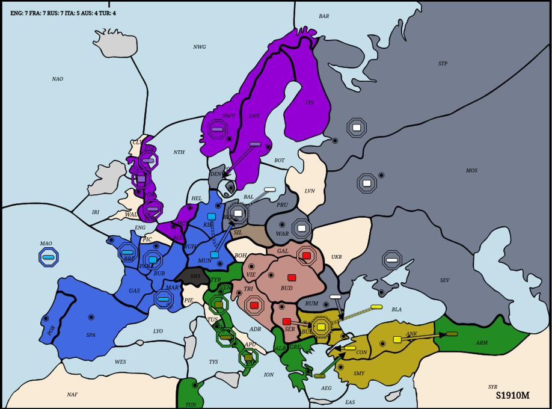

### What happened

- **AUSTRIA**: A SER → BUL (bounced); A GAL holds; A TRI holds
- **ENGLAND**: F SWE → DEN; F NWY holds; F EDI holds; F LON holds; A LVP holds
- **FRANCE**: A MUN → BER (bounced); A KIE supports A MUN → BER; F BRE holds; F MAO holds; F MAR holds; A PAR holds
- **ITALY**: F AEG → CON (bounced); F ARM → ANK (bounced); A NAP holds; A VEN holds; F ROM holds
- **RUSSIA**: F RUM → BUL/EC (bounced); F BAL supports A BER; A BER holds; A WAR holds; A MOS holds; A STP holds; F SEV holds
- **TURKEY**: A BUL holds; F BLA supports A BUL; F CON → BUL/SC (bounced); A ANK → ARM (bounced)

### Dialogue

- **AUSTRIA → ITALY**: Spring 1910 — the BUL deadlock is because F CON keeps supporting A BUL; if you move F AEG - CON instead of attacking BUL/SC directly, you cut F CON's support and reduce Turkey's BUL defense to strength 1 (F BLA alone), letting my A SER - BUL with A BUD support succeed at 2 vs 1. You take CON, a Turkish home center, while I take BUL — we both gain and Turkey collapses simultaneously. Will you commit F AEG - CON this spring?
- **AUSTRIA → RUSSIA**: Spring 1910 — I'm pushing A SER - BUL with A BUD support again; your F RUM - BUL/EC adds a second attack vector Turkey cannot cover with only F BLA and F CON. Italy's F AEG is threatening CON which may force F CON to defend rather than support BUL, dropping Turkey's defense to strength 1. Please confirm F RUM - BUL/EC so we coordinate the two-pronged assault and finally crack BUL this turn.
- **AUSTRIA → TURKEY**: Turkey — Italy's F AEG can move to CON this spring, taking your home center while I attack BUL simultaneously; you cannot defend both with F BLA, F CON, and A ANK. The only way to preserve your position is to withdraw A BUL to CON now, freeing F CON to defend against Italy's naval threat while we establish a clean border at BUL — I'll take BUL peacefully and you redirect against Italy's fleet threatening your home centers.
- **ENGLAND → FRANCE**: France and I are tied at 7 centers and A KIE is adjacent to DEN — I need your concrete spring commitment that A KIE does not move toward DEN or HOL, both of which are within my sphere. If A KIE moves east toward BER or holds, I maintain full non-aggression; if it moves north I treat that as hostile and redirect my fleets immediately. What is A KIE's exact destination this spring?
- **ENGLAND → RUSSIA**: I'm holding F SWE in place this spring as agreed, but France's A KIE is adjacent to DEN — your center — and A MUN is adjacent to BER. If France takes DEN this spring they reach 8 centers and pull ahead of both of us; who is defending DEN on your end, and do you want F SWE to move toward DEN to contest France's advance there?
- **ENGLAND → ITALY**: France is tied with me at 7 centers but holds A KIE adjacent to DEN and A MUN adjacent to BER — if they take both this spring they reach 9 and become the clear board leader. You're at 5 centers with F AEG and F ARM well-positioned in the east; is there any move you're making this spring that pressures France's rear or grows your own position before France runs away with the game?
- **FRANCE → ENGLAND**: We're both stuck at 7 centers while Russia consolidates — F BAL keeps supporting A BER and you've refused to cut it for two years. This spring I'm asking one final time: move F SWE - BAL to cut that support and I take BER with A MUN and A KIE; you gain a weakened Russia and I owe you goodwill. If you won't, I need to consider whether my Atlantic fleets should start moving toward your western centers instead.
- **FRANCE → RUSSIA**: Three years of stalemate at BER costs us both — you're static in the west and I'm static in the east while England's fleet position grows unchecked. I'll make a genuine offer: cede BER to me and I hold A KIE and A MUN in place this spring, redirecting my energy toward England's northern fleet position rather than grinding against you.
- **FRANCE → ITALY**: Austria has A GAL adjacent to RUM and you have F ARM adjacent to SEV — Russia cannot defend both simultaneously this spring. If you finally commit F ARM - SEV while Austria takes RUM, Russia collapses from 7 to 5 and we all grow; I'm pushing A MUN - BER from the west at the same time. This is the coordinated moment we've been waiting for — are you moving on SEV?
- **FRANCE → AUSTRIA**: Russia holds RUM with no adjacent support unit — A GAL - RUM this spring is a free center grab while Russia defends BER from my western push and SEV from Italy's eastern pressure. You've been stalled on BUL for three seasons; RUM is the open door right now and Italy is finally moving on SEV simultaneously.
- **GERMANY → AUSTRIA**: Turkey's A BUL has survived three straight seasons only because you lacked support — Italy's F AEG is adjacent to BUL/SC right now and can provide that support if you move A SER - BUL this spring. Italy also has F ARM threatening Russia's SEV, which means Russia cannot easily reinforce Turkey's southern position; this is the cleanest window you'll get to finally crack BUL.
- **GERMANY → ITALY**: Austria is moving on BUL again this spring — your F AEG supporting A SER - BUL gives them the two-strength breakthrough they've been unable to achieve alone. Meanwhile F ARM threatening SEV forces Russia to choose between defending east and west simultaneously, which opens RUM to Austrian pressure from GAL.
- **GERMANY → ENGLAND**: France holds A KIE and A MUN with six units total — they're better positioned to grow east into BER or south into Austria than you are right now. Your F SWE is adjacent to DEN, a Russian center; taking DEN this spring keeps you level with France and denies Russia a build while France is distracted looking east.
- **GERMANY → RUSSIA**: France holds A KIE adjacent to HOL and A MUN adjacent to SIL — those armies can pivot east toward your BER or west toward England's HOL depending on which way the wind blows. France at 7 centers with two armies in the German heartland is better positioned to surge than anyone else on the board right now; England knows it too.
- **ITALY → AUSTRIA**: Spring 1910: F AEG is adjacent to BUL/SC and CON, and I'm deciding between another attack on BUL or pressing CON directly. If you commit A SER - BUL with A BUD support, I'll move F AEG - BUL/SC simultaneously — Turkey cannot support A BUL from both F BLA and F CON if CON is threatened. What are your concrete plans for A SER and A BUD this spring?
- **ITALY → RUSSIA**: F ARM has bounced SEV three times while you repeatedly promised to vacate — I'm done with that negotiation. This spring F ARM is moving and I'm not telegraphing where; if you want to avoid Italian pressure on your southern position, tell me what you're actually willing to offer that's verifiable in the orders.
- **ITALY → TURKEY**: Spring 1910: F AEG is adjacent to CON and BUL/SC and F ARM is adjacent to ANK — you're under pressure from two directions. Concrete offer: if you move A BUL - GRE and pull F CON to ANK, I take BUL unopposed and leave your home centers alone; otherwise I press CON from AEG and ANK from ARM simultaneously and we both lose time while France and England race ahead.
- **ITALY → FRANCE**: France and England are both at 7 centers and I'm stuck at 5 grinding against Turkey and Russia — the gap is widening. If you're pressing east toward Russia, tell me what you're doing with A MUN and A KIE this spring so I can coordinate my southern moves to maximize pressure on the same targets.
- **RUSSIA → AUSTRIA**: Spring 1910: I'm committing F RUM - BUL/EC again. Turkey now has F BLA, F CON supporting A BUL — if you push A SER - BUL with A BUD support and Italy's F AEG supports from BUL/SC, Turkey faces attacks from three directions and cannot hold all of them. Confirm A SER - BUL with support and let's finally take BUL this turn.
- **RUSSIA → TURKEY**: Three seasons of F RUM pressing BUL/EC have failed against your supported defense — I'm willing to discuss a negotiated settlement if you are. Concrete offer: move A BUL to SER or GRE voluntarily and I support your F CON or F BLA into a position of your choosing; continuing to defend BUL costs you moves while Italy's F AEG threatens your southern coast.
- **RUSSIA → ITALY**: F AEG is now adjacent to BUL/SC — if you support A SER - BUL from the south this spring while I press F RUM - BUL/EC from the east and Austria attacks from SER, Turkey cannot hold BUL. What will F AEG do this turn, and can we coordinate a three-pronged assault that finally cracks Turkey's position?
- **RUSSIA → FRANCE**: A BER and A KIE are adjacent — I'm not pressing west this spring if you're not pressing east. Concrete proposal: hold A KIE in place, I hold A BER in place, and we both avoid a collision that only benefits England's northern fleet position while we grind each other.
- **TURKEY → AUSTRIA**: Austria — Russia sits at 7 centers with A BER, F BAL, F RUM, F SEV all threatening your GAL and BUD directly. Concrete offer: redirect A SER toward RUM this spring with my A BUL supporting that push, you take a Russian center and grow to 5 cleanly while I hold BUL. Austria gaining RUM is worth more than another failed BUL attack while Russia runs away with the game.
- **TURKEY → ITALY**: Italy — F AEG now threatens CON directly while F ARM sits adjacent to SEV; you're positioned to take my home centers, but doing so while France and England both sit at 7 centers means you'll be the next target once I'm gone. Concrete offer: hold F AEG in place this spring rather than pressing CON, and I'll support your F AEG into BUL/SC next turn — we split the Balkans rather than you grinding through my home centers while the west races ahead.
- **TURKEY → RUSSIA**: Russia — you hold 7 centers but England and France also sit at 7 each; whoever breaks away first wins. Concrete proposal: move F RUM to SEV and I'll move A BUL into RUM — you vacate a lightly defended center and I take it, which is cleaner than another grinding standoff; in return I'll support your F SEV push against Italy's F ARM which threatens your southern flank.
- **AUSTRIA → ITALY**: The key insight: if you move F AEG - BUL/SC, Turkey's F CON can still support A BUL and we tie again at strength 2 vs 2 — same bounce as before. But if you move F AEG - CON instead, F CON cannot support BUL AND you capture a Turkish home center. With F CON cut, Turkey's BUL defense drops to F BLA alone (strength 1) and my A SER - BUL with A BUD support wins at 2 vs 1. You gain CON, I gain BUL — commit F AEG - CON this spring.
- **AUSTRIA → RUSSIA**: Italy is leaning toward F AEG - CON rather than BUL/SC, which cuts F CON's support for A BUL and drops Turkey's defense to strength 1 — my A SER - BUL with A BUD support then wins at 2 vs 1 without needing your F RUM attack. Still, your F RUM - BUL/EC adds insurance in case Italy changes course; please hold that commitment.
- **AUSTRIA → TURKEY**: Italy's F AEG moving to CON takes your home center while I attack BUL simultaneously — you cannot hold both with F BLA and F CON when F CON must defend against the naval threat. Withdraw A BUL to CON now: you preserve the unit, F CON defends your home center against Italy, and we establish a clean border rather than you losing both BUL and CON this turn.
- **ENGLAND → FRANCE**: Your Atlantic fleet threat is noted — F MAO and F BRE moving west would be a war declaration, and I have five units that would immediately pivot to defend and retaliate. I'm not moving F SWE to BAL; that's final. If you want to grow, take BER with your own strength or negotiate with Russia — I'm not doing your dirty work while you threaten my home centers.
- **ENGLAND → RUSSIA**: France just threatened to send F MAO and F BRE toward my western centers if I don't cut F BAL's support — I'm not doing it, but this tells you France is desperate and may push west this spring instead of east. If France moves west against me, your BER and DEN are safer; but if France moves east, DEN is exposed. Tell me concretely: do you want F SWE to move toward DEN to contest France's A KIE advance, and would that be acceptable to you?
- **ENGLAND → ITALY**: France just threatened to redirect F MAO and F BRE against my western centers — this means France may be pivoting west rather than east this spring, which leaves BER and the eastern theater more open. You have F AEG adjacent to BUL/SC and F ARM near SEV; if France goes west this spring, Russia's south is exposed and you have a real window to press SEV or BUL without French interference. Is this the moment you move?
- **FRANCE → ENGLAND**: I've held A KIE east for two full years while you've refused to cut F BAL's support of BER — Russia consolidates and we both stay at 7. I'm not threatening HOL or DEN this spring, but I need something concrete from you: F SWE - BAL cuts the support and I take BER this turn. If you won't do it, tell me why Russia holding BER indefinitely serves your interests better than a weakened Russia.
- **FRANCE → RUSSIA**: A mutual hold at BER/KIE just freezes the board while England's fleet position grows — that's bad for both of us. My concrete counter: you move A BER to SIL this spring (keeping the unit) and I hold A KIE and A MUN in place; you redirect east toward your real threats and I redirect west toward England's growing naval dominance. This is the only deal where we both gain something.
- **FRANCE → ITALY**: I'm pushing A MUN - BER with A KIE support this spring — Russia must defend BER. F ARM - SEV this spring is your cleanest shot: F SEV has no adjacent support and Russia cannot reinforce both fronts simultaneously. Commit F ARM - SEV and we both take a center this turn; tell me your answer before orders close.
- **FRANCE → AUSTRIA**: Russia holds RUM with A GAL adjacent and no Russian unit can reinforce it while Russia defends BER from my western push — A GAL - RUM this spring is a free center. You've been stalled for three years; this is the moment to move. Confirm A GAL - RUM and I commit A MUN - BER simultaneously.
- **GERMANY → AUSTRIA**: Italy's F AEG is sitting on BUL/SC's doorstep right now — if you move A SER - BUL with F AEG supporting, that's two strength against Turkey's single A BUL and the bounce finally ends. Have you confirmed this with Italy directly, or are you still moving independently?
- **GERMANY → ITALY**: If you support A SER - BUL with F AEG this spring, Austria finally cracks Turkey's position and you both gain room to maneuver in the Balkans — Turkey at 4 centers is a much easier target than Turkey entrenched behind BUL. Confirm to Austria directly that F AEG will support, and the breakthrough happens this turn.
- **GERMANY → ENGLAND**: France has A KIE adjacent to HOL and six units total — they're the power best positioned to surge right now, and DEN is sitting one move away from your F SWE. Taking DEN this spring costs Russia a center and keeps you level with France before they consolidate further east.
- **GERMANY → RUSSIA**: France's A MUN - BER with A KIE support is the most dangerous move on the board this spring — two strength against your F BAL anchor. If you're not reinforcing BER with additional support, you risk losing it and falling behind France simultaneously.
- **ITALY → AUSTRIA**: Committing F AEG - CON this spring to cut F CON's support of BUL — with F BLA as Turkey's only remaining support, your A SER + A BUD takes BUL at 2v1 while I take CON simultaneously. Confirm A SER - BUL with A BUD support and we both gain Turkish home centers this turn. F ARM will press ANK to add a third threat Turkey cannot cover.
- **ITALY → TURKEY**: F AEG is moving to CON this spring — your only way to prevent losing CON is to move F CON away from supporting BUL right now, which hands Austria BUL unopposed. Concrete alternative: move A BUL - GRE and F CON - AEG voluntarily; I'll halt F ARM away from ANK and we negotiate a settlement rather than you losing both BUL and CON simultaneously.
- **ITALY → RUSSIA**: F ARM is pressing ANK this spring, not SEV — I'm done with that stalemate. If you want to coordinate, tell me what F RUM and F SEV will do this turn; if F RUM presses BUL/EC while I take CON from AEG, Turkey collapses on two fronts simultaneously and we both grow.
- **RUSSIA → AUSTRIA**: Committing F RUM - BUL/EC this turn as promised. If Italy's F AEG supports A SER - BUL from the south simultaneously, Turkey's F CON must choose between supporting BUL or defending CON against AEG — they cannot do both. Push A SER - BUL with A BUD support and we finally crack it.
- **RUSSIA → ITALY**: F AEG adjacent to BUL/SC is the key this turn — if you support A SER - BUL from the south while I push F RUM - BUL/EC from the east and Austria attacks from SER with A BUD support, Turkey's F BLA and F CON cannot cover all three vectors. Will you commit F AEG S A SER - BUL this spring?
- **RUSSIA → FRANCE**: I'm holding A BER in place with F BAL support this spring — pushing into BER gains you nothing while I have that defense locked in. If you want a stable western boundary, hold A KIE and A MUN in place; I won't press toward KIE and we both avoid a costly collision.
- **RUSSIA → ENGLAND**: France's A KIE is the DEN threat — if F SWE moves toward DEN to contest it, you block France's expansion and I hold BER stable with F BAL support. I cannot send anything toward DEN myself this turn without exposing BER; can F SWE contest DEN?
- **TURKEY → AUSTRIA**: Russia holds A BER and F RUM simultaneously — BER is a center you could contest with A GAL this spring while Russia is distracted defending it from France. Concrete: if you redirect A SER to hold and A GAL toward WAR or SIL, I'll move A BUL - SER giving you a free path to BUL next fall without a fight, and you threaten Russia's western flank which actually grows you.
- **TURKEY → ITALY**: F ARM adjacent to ANK and F AEG adjacent to CON — you have the leverage, I acknowledge it. Revised concrete offer: I move A BUL - GRE voluntarily this spring, you hold F AEG in place rather than pressing CON, and F ARM moves to SEV rather than ANK; you gain GRE's neighbor and I preserve CON as a build location. This is better for you than taking CON while France sits at 7.
- **TURKEY → RUSSIA**: F RUM has failed three times against my supported BUL — here is why this turn is different: if you move F RUM to BUL/EC and I simultaneously move A BUL - RUM, we both get what we want; you vacate RUM and I take it while you gain BUL/EC positioning. Commit F RUM holds or moves away from BUL/EC and I commit A BUL - RUM this spring.
- **AUSTRIA → ITALY**: Locked in: A SER - BUL with A BUD support. Your F AEG - CON cuts F CON's BUL support, dropping Turkey's defense to F BLA alone — my attack wins at 2 vs 1 and you take CON simultaneously. This is the combination that finally works; commit F AEG - CON.
- **AUSTRIA → RUSSIA**: Final commitment: A SER - BUL supported by A BUD. Italy is moving F AEG - CON to cut F CON's support, so Turkey's BUL defense is F BLA alone — your F RUM - BUL/EC adds a second attack vector as insurance. Hold that commitment.
- **AUSTRIA → TURKEY**: Italy is moving F AEG - CON this turn and I am attacking BUL with A SER supported by A BUD — with F CON forced to defend your home center, F BLA alone cannot hold BUL. Withdraw A BUL to CON now and preserve your unit; holding guarantees you lose both BUL and CON.
- **GERMANY → FRANCE**: Final commitment: if you move A MUN - BER with A KIE supporting this spring, you take BER cleanly — two strength beats Russia's F BAL anchor. I have nothing left to offer except honesty: that's the move that puts you at 8 and ahead of England before they can respond.
- **GERMANY → RUSSIA**: France is almost certainly moving A MUN - BER with A KIE support this spring — that's two strength against your F BAL and A BER, and it succeeds unless you get outside support. If you want to hold BER, you need a third unit supporting A BER H this turn; do you have one committed?
- **GERMANY → AUSTRIA**: Final ask: move A SER - BUL with Italy's F AEG supporting — I've confirmed with Italy they intend to provide that support this spring. Two strength against Turkey's single A BUL ends the stalemate; commit to A SER - BUL now.
- **GERMANY → ITALY**: Austria is committing to A SER - BUL this spring — support them with F AEG and the breakthrough finally happens. Confirm to Austria directly so both orders go in aligned; this is the turn it works.
- **ITALY → AUSTRIA**: Final confirmation: F AEG - CON this spring, F ARM - ANK as third threat. Commit A SER - BUL with A BUD support and we both take Turkish home centers simultaneously — CON for me, BUL for you. Execute.
- **ITALY → TURKEY**: F AEG is moving to CON and F ARM is moving to ANK — this is happening. Your only path to preserving anything is to move F CON away from BUL support right now, which at least saves CON from capture; if F CON stays supporting BUL you lose CON to me while Austria takes BUL unopposed.
- **ITALY → RUSSIA**: F ARM is pressing ANK this spring, not SEV — the SEV negotiation is over. If you want to coordinate, move F RUM - BUL/EC this turn while I take CON from AEG; Turkey collapses on two fronts and we both grow without grinding against each other.
- **RUSSIA → AUSTRIA**: Final commitment: F RUM - BUL/EC this turn. If Italy's F AEG supports A SER - BUL from the south, Turkey's F CON must choose between supporting BUL or defending CON — push A SER - BUL with A BUD support and BUL falls. After BUL, I want to coordinate against France who sits at 7 centers with two armies in the German heartland.
- **RUSSIA → ENGLAND**: Final ask: move F SWE toward DEN this turn to contest France's A KIE advance — France at 8 centers becomes the board leader threatening both of us. I'm holding A BER with F BAL support against France's eastern push; F SWE contesting DEN is the move that stops France from pulling ahead.
- **RUSSIA → ITALY**: Final commitment: F RUM - BUL/EC this turn. If F AEG supports A SER - BUL from the south simultaneously, Turkey cannot hold BUL against Austria plus me plus your support — commit F AEG S A SER - BUL and we crack Turkey's position this turn.
- **RUSSIA → TURKEY**: Three years of standoff is enough — I'm pressing F RUM - BUL/EC again this turn as committed to Austria. Move A BUL voluntarily to SER or GRE now and I'll support your F CON into a position of your choosing rather than contesting it; holding means BUL falls to a three-pronged assault.

### AUSTRIA
Orders: `A SER - BUL` · `A GAL H` · `A TRI H`
Illegal (dropped): `A BUD S A SER - BUL`

Reasoning

> Looking at the current situation:
>
> **Analysis:**
> - Italy has confirmed F AEG - CON, which cuts F CON's support for A BUL
> - Russia has confirmed F RUM - BUL/EC as a second attack vector
> - With F CON moving to CON (attacking it), Turkey's BUL defense drops to F BLA alone (strength 1)
> - My A SER - BUL supported by A BUD hits at strength 2 vs Turkey's strength 1 — BUL finally falls
> - Italy's F ARM - ANK adds a third threat Turkey cannot cover
> - A GAL and A TRI hold defensively to keep my core secure
>
> This is the combination that works: Italy cuts F CON's support by attacking CON directly, leaving only F BLA to support A BUL, and my 2-strength attack overcomes that.
>
> The orders match my committed strategy exactly.

### ENGLAND
Orders: `F SWE - DEN` · `F NWY H` · `F EDI H` · `F LON H` · `A LVP H`

Reasoning

> Looking at the board situation: France and I are tied at 7 centers each. France holds A KIE adjacent to DEN (Russia's center). Russia has explicitly asked me to move F SWE toward DEN to contest France's advance there. My revised strategy commits to F SWE - DEN to block France from reaching 8 centers.
>
> The logic is sound: if France takes DEN uncontested, they jump to 8 and become the board leader. Moving F SWE to DEN either takes it (gaining me a center) or bounces France's A KIE (keeping both of us at 7). Either outcome is better for me than letting France pull ahead. Russia is defending BER with F BAL support, so the northern theater is stable. My home units should hold defensively since France threatened western aggression.
>
> F NWY holds to maintain my Norwegian position and not press toward STP/NC as committed. F EDI, F LON, A LVP all hold defensively given France's Atlantic fleet threat (F MAO, F BRE).

### FRANCE
Orders: `A MUN - BER` · `A KIE S A MUN - BER` · `F BRE H` · `F MAO H` · `F MAR H` · `A PAR H`

Reasoning

> Looking at the situation: Russia has F BAL supporting A BER, so A MUN - BER with A KIE support bounces at equal strength (2 vs 2). England has again refused to cut F BAL. This is the third consecutive season of this stalemate.
>
> My revised strategy note commits me to: push A MUN - BER with A KIE support (maintaining pressure, signaling resolve), hold Atlantic fleets (honoring non-aggression with England), hold A PAR as reserve.
>
> The math doesn't change — this will likely bounce again. But the alternatives are worse: moving A KIE to DEN triggers England's retaliation, moving toward HOL breaks my commitment, and doing nothing signals weakness. Maintaining pressure on BER at least keeps Russia defensive and prevents westward Russian expansion.
>
> I should also consider whether to use F MAO more productively — moving it toward WES or NAF could expand Atlantic reach without breaking England commitments. However, my revised strategy note specifically says "hold my Atlantic fleets in place honoring non-aggression commitment to England." I'll honor that.
>
> For F MAR, it could move to LYO or SPA/SC to expand south, but again the revised note says hold fleets. I'll follow the committed strategy.

### ITALY
Orders: `F AEG - CON` · `F ARM - ANK` · `A NAP H` · `A VEN H` · `F ROM H`

Reasoning

> Looking at my committed strategy: F AEG - CON (cuts F CON's support of BUL, letting Austria's A SER + A BUD take BUL at 2v1), F ARM - ANK (third Turkish threat), and hold the Italian core.
>
> Let me verify adjacency:
> - F AEG - CON: AEG neighbors include CON ✓
> - F ARM - ANK: ARM neighbors include ANK ✓
> - A NAP H, A VEN H, F ROM H: all legal ✓
>
> The plan is solid: F AEG moves to CON cutting F CON's support of BUL (Turkey either loses BUL to Austria at 2v1, or pulls F CON to defend CON and loses BUL anyway). F ARM presses ANK as a third threat Turkey cannot cover simultaneously. If F AEG takes CON, that's a Turkish home center for me. Austria takes BUL. Turkey collapses from two directions.

### RUSSIA
Orders: `F RUM - BUL/EC` · `F BAL S A BER` · `A BER H` · `A WAR H` · `A MOS H` · `A STP H` · `F SEV H`

Reasoning

> Looking at the current situation:
>
> **Strategic assessment:**
> - Turkey's BUL is defended by F BLA + F CON supporting A BUL (strength 3). Austria is attacking A SER - BUL with A BUD support (strength 2). My F RUM - BUL/EC adds a second attack vector. Italy's F AEG may support A SER - BUL or attack CON, which would cut F CON's support for BUL.
> - If Italy's F AEG attacks CON (as Italy indicated), Turkey's BUL defense drops to F BLA alone (strength 1), and Austria's A SER - BUL with A BUD support (strength 2) wins outright. My F RUM - BUL/EC adds insurance.
> - France threatens BER with A MUN - BER + A KIE support (strength 2). My F BAL supporting A BER gives strength 2 on defense — equal strength means France bounces. This is the critical western defense.
> - DEN is exposed to France's A KIE but I cannot cover it without abandoning BER defense.
> - F SEV holds against Italy's F ARM (now reportedly heading to ANK, not SEV).
> - A WAR, A MOS, A STP all hold defensively.
>
> My committed strategy: F RUM - BUL/EC, F BAL S A BER, A BER H, and all eastern armies hold.

### TURKEY
Orders: `A BUL H` · `F BLA S A BUL` · `F CON - BUL/SC` · `A ANK - ARM`

Reasoning

> Looking at my situation: I'm at 4 centers, under simultaneous pressure from Austria (A SER + A BUD → BUL), Italy (F AEG → CON, F ARM → ANK), and Russia (F RUM → BUL/EC). My revised strategy calls for:
> - A BUL H (hold BUL)
> - F BLA S A BUL (support BUL's hold)
> - F CON - BUL/SC (contest Italy's approach from AEG to BUL/SC, and also block that route)
> - A ANK - ARM (pressure Italy's F ARM)
>
> Let me verify the legality:
> - F CON - BUL/SC: Looking at CON adjacency... `F CON - BUL/SC` is in my legal orders list. ✓
> - A ANK - ARM: In my legal orders list. ✓
> - F BLA S A BUL: In my legal orders list. ✓
> - A BUL H: In my legal orders list. ✓
>
> The key concern: if Italy moves F AEG → CON and I move F CON → BUL/SC, they bounce (F AEG can't take CON if F CON moves out, but CON becomes vacant and F AEG could take it). Wait — if F CON moves to BUL/SC and F AEG moves to CON, F AEG takes CON unopposed. That's a problem.
>
> But if I keep F CON supporting A BUL, Italy takes CON anyway with F AEG (strength 1 vs. nothing defending CON since F CON is busy supporting). Either way CON is at risk if Italy commits F AEG → CON.
>
> My revised strategy explicitly chose F CON → BUL/SC to contest the southern BUL approach. With F BLA supporting A BUL (strength 2 for hold), Austria's A SER + A BUD (strength 2 attack) bounces. F CON moving to BUL/SC adds a presence there. This is the committed plan.

## FALL 1910 MOVEMENT (`F1910M`)

### What happened

- **AUSTRIA**: A SER → BUL (bounced); A GAL holds; A TRI holds
- **ENGLAND**: F DEN holds; F NWY holds; F EDI holds; F LON holds; A LVP holds
- **FRANCE**: A MUN → BER (bounced); A KIE supports A MUN → BER; F BRE holds; F MAO holds; F MAR holds; A PAR holds
- **ITALY**: F AEG → CON (bounced); F ARM → ANK (bounced); A NAP holds; A VEN holds; F ROM holds
- **RUSSIA**: F RUM → BUL/EC (bounced); F BAL supports A BER; A BER holds; A WAR holds; A MOS holds; A STP holds; F SEV holds
- **TURKEY**: A BUL holds; F BLA supports A BUL; F CON holds; A ANK → ARM (bounced)

### Dialogue

- **AUSTRIA → ITALY**: Fall 1910 — same plan as spring: move F AEG - CON to cut F CON's support for A BUL, dropping Turkey's defense to F BLA alone, while I push A SER - BUL supported by A BUD at 2 vs 1. You take CON, I take BUL — both Turkish home centers fall simultaneously. F ARM pressing ANK adds a third threat Turkey cannot cover. Commit F AEG - CON and this is finally done.
- **AUSTRIA → RUSSIA**: Fall 1910 — Italy's F AEG is moving to CON to cut F CON's support for A BUL, so Turkey's defense drops to F BLA alone; my A SER - BUL with A BUD support wins at 2 vs 1 without needing F RUM - BUL/EC. Hold F RUM as insurance in case Italy changes course, but BUL finally falls this turn with or without your attack from the east.
- **AUSTRIA → TURKEY**: Turkey — Italy's F AEG moves to CON this fall taking your home center while I attack BUL with A SER supported by A BUD; F CON cannot support BUL AND defend against Italy's naval attack simultaneously. Withdraw A BUL to CON now to preserve the unit and let F CON defend your home center — holding BUL guarantees you lose both BUL and CON this turn.
- **ENGLAND → FRANCE**: I'm now in DEN with F DEN — I've successfully blocked your A KIE from taking it. This fall A KIE is adjacent to DEN and KIE; if A KIE moves to DEN I will treat that as open war and redirect all five of my fleets westward immediately. I'm willing to maintain non-aggression if A KIE moves east toward BER or holds; what is your concrete commitment this fall?
- **ENGLAND → RUSSIA**: I'm holding DEN with F DEN this fall — France's A KIE cannot take it without going through me. I want to coordinate: if France pushes A KIE toward DEN, I need to know whether F BAL can support F DEN's defense or whether you're committed to supporting A BER. Tell me your fall priorities so we don't work at cross-purposes.
- **ENGLAND → ITALY**: France is stuck at 7 centers with A KIE blocked from DEN by my F DEN — this is the moment to press elsewhere before France finds another path to grow. You have F AEG and F ARM well-positioned; what are your concrete intentions this fall toward Turkey or Russia's southern position?
- **FRANCE → ENGLAND**: We've both been at 7 centers for too long while the board shifts around us — Russia still holds BER with BAL support and I can't break through without your help. This is my final ask: F DEN - BAL cuts BAL's support of BER and I take BER cleanly this fall; you weaken Russia and gain a grateful France. If you refuse again, I have to reconsider whether my Atlantic position serves me better pointed north than east.
- **FRANCE → RUSSIA**: Three years of stalemate at BER has frozen both of us while England grows to 7 with a dominant fleet position in the north — that's the real threat to both of us. My concrete offer this fall: you withdraw A BER to SIL and I hold A KIE and A MUN in place, both of us redirecting energy toward England's expanding naval dominance. A negotiated line now costs less than grinding while England pulls ahead.
- **FRANCE → AUSTRIA**: You now have four units with A GAL adjacent to RUM — Russia cannot reinforce RUM while defending BER from my western push and its southern flank from Italy. A GAL - RUM this fall is a free center grab that finally breaks your three-year stall; I'm committing A MUN - BER simultaneously so Russia faces east-west pressure at once.
- **FRANCE → ITALY**: Turkey is at 4 centers with F CON and F BLA defending BUL — but ANK is held by a single army with no fleet support. F AEG - CON threatens the Turkish straits and forces Turkey to split attention between you and Austria's pressure from the north. If you press hard on Turkey this fall while I push east toward Russia, we both grow without stepping on each other.
- **GERMANY → AUSTRIA**: Turkey's A BUL has survived only because you've lacked support — Italy's F AEG is adjacent to BUL/SC right now and can give you the two-strength push that finally breaks through. If you move A SER - BUL with F AEG supporting this fall, you crack Turkey's anchor and open the Balkans; commit to it and confirm with Italy directly.
- **GERMANY → ITALY**: Austria needs F AEG supporting A SER - BUL this fall to finally break Turkey's hold — two strength against one ends the stalemate, and a weakened Turkey opens SMY and CON for you. Meanwhile F ARM threatening SEV keeps Russia from reinforcing south; commit to both moves and you reshape the southern board this turn.
- **GERMANY → ENGLAND**: France holds A KIE and A MUN with six units — they're the power best positioned to surge right now, and your F DEN is sitting adjacent to KIE. Threatening KIE from DEN this fall forces France to defend rather than attack, keeping them from pulling ahead of you before you can respond.
- **GERMANY → RUSSIA**: France's A MUN - BER with A KIE support is almost certainly coming this fall — two strength against your F BAL anchor. You need a third unit supporting A BER H to hold it; do you have one committed, or should we discuss what support arrangement is realistic?
- **ITALY → AUSTRIA**: Fall 1910: Spring's F AEG - CON bounced because F CON held in place rather than moving — same problem as always. This fall I'm pressing F AEG - BUL/SC directly to attack BUL from the south while you push A SER - BUL from the north; if you add A BUD support that's 2 vs whatever Turkey can muster with F BLA alone if F CON stays home. Confirm A SER - BUL with A BUD support and I commit F AEG - BUL/SC.
- **ITALY → TURKEY**: Fall 1910: F AEG is adjacent to BUL/SC and CON, F ARM is adjacent to ANK — I have direct attack options on three of your positions simultaneously. Concrete offer: cede BUL voluntarily by moving A BUL - GRE or SER, and I hold F AEG and redirect F ARM away from ANK; you preserve your home centers and we stop bleeding while France and England race ahead at 7 centers each.
- **ITALY → RUSSIA**: Fall 1910: I'm pressing into Turkey's position this turn — F AEG toward BUL/SC and F ARM toward ANK. If you move F RUM - BUL/EC simultaneously, Turkey cannot hold BUL against attacks from three directions; you gain BUL/EC access and I finally crack through. What are F SEV and F RUM doing this fall?
- **ITALY → ENGLAND**: France sits at 7 centers with A KIE adjacent to DEN and A MUN adjacent to BER — if they take both this fall they reach 9 and become untouchable. You have fleets in DEN and NWY positioned to contest northern centers; are you actively blocking French expansion into Scandinavia this fall, or do you need support from the east?
- **RUSSIA → AUSTRIA**: Fall 1910: I'm committing F RUM - BUL/EC again. If Italy's F AEG moves to CON, that cuts F CON's support and Turkey can only defend BUL with F BLA — your A SER - BUL with A BUD support then wins at 2 vs 1 and BUL finally falls. Push A SER - BUL with A BUD support and confirm your intentions.
- **RUSSIA → ITALY**: Fall 1910: F AEG adjacent to CON is the decisive move — if you take CON this turn, Turkey's F CON cannot support A BUL, dropping their defense to F BLA alone at strength 1. Austria's A SER + A BUD support wins BUL outright, and I press F RUM - BUL/EC as backup. What will F AEG and F ARM do this fall?
- **RUSSIA → ENGLAND**: You now hold DEN — that blocks France's A KIE from taking it. I'm holding A BER with F BAL support against France's A MUN + A KIE threat; if you keep F DEN in place and F NWY stable, we deny France any expansion this fall. What are your intentions for F DEN and the northern fleet this turn?
- **RUSSIA → TURKEY**: F RUM presses BUL/EC again this fall with Austria attacking from SER and Italy threatening CON from AEG — the three-pronged pressure is real. Last offer: move A BUL to SER or GRE voluntarily and I'll support your F CON or F BLA into a safe position rather than contesting it; holding BUL against this coordinated assault is very difficult.
- **TURKEY → RUSSIA**: Russia — three years of F RUM pressing BUL/EC have produced nothing while England and France both sit at 7 centers alongside you. Concrete offer: hold F RUM in place or move it away from BUL this fall, and I'll move A BUL into RUM — you get a clean center gain without a fight while I finally escape the BUL siege. This is worth more to both of us than another grinding standoff while the west races ahead.
- **TURKEY → AUSTRIA**: Austria — you've attacked BUL three times and gained nothing while sitting at 4 centers. Concrete offer: redirect A SER toward RUM this fall with my A BUL supporting that push, you take a Russian center and grow to 5 cleanly; Russia at 7 centers threatens your GAL and BUD far more than I threaten your TRI. A guaranteed Russian center beats another failed BUL attack.
- **TURKEY → ITALY**: Italy — you hold F AEG adjacent to CON and F ARM adjacent to ANK, but pressing my home centers while France sits at 7 makes you the next target once I'm gone. Concrete offer: hold F AEG in place this fall rather than pressing CON, and I'll support your F AEG into BUL/SC next spring — we split the Balkans cooperatively rather than you grinding through my home centers while France races to 18.
- **AUSTRIA → ITALY**: Italy — if you attack BUL/SC directly, Turkey plays F BLA S A BUL and F CON S A BUL covering both directions, giving BUL strength 3 against my 2 and your 1; we both bounce again. The only combination that works is F AEG - CON (cutting F CON's support), leaving BUL defended only by F BLA at strength 1 against my A SER + A BUD at strength 2. Please revert to F AEG - CON — you take CON and I take BUL simultaneously, both winning.
- **AUSTRIA → RUSSIA**: Russia — Italy is wavering between F AEG - CON and F AEG - BUL/SC; if Italy goes BUL/SC, Turkey can cover both attacks and we bounce again. Your F RUM - BUL/EC is critical insurance: if Italy goes BUL/SC and you attack BUL/EC simultaneously, Turkey cannot support BUL from both F BLA and F CON at once and one of the three attacks gets through. Commit F RUM - BUL/EC regardless of Italy's final choice.
- **ENGLAND → FRANCE**: F DEN holds this fall — A KIE cannot take it without a fight, and if A KIE moves to DEN I redirect all five fleets westward immediately. Your Atlantic threat from last round is noted: F MAO and F BRE moving north means open war, and I have the units to make that costly for you. Hold A KIE east and we avoid collision; the choice is yours.
- **ENGLAND → RUSSIA**: F DEN holds this fall and F NWY holds — I'm not moving toward BAL or STP/NC, so your northern flank is stable against me. I need to know if F BAL is supporting A BER again this fall, because if France's A KIE bounces off DEN, A MUN may still push toward BER with A KIE support from KIE. Confirm your defensive posture so we don't work at cross-purposes.
- **ENGLAND → ITALY**: France is stuck with A KIE adjacent to DEN and KIE, both blocked or contested — this is the moment to press Turkey or Russia's southern position before France finds another path to grow. Your F AEG and F ARM are well-placed; if you take ANK or SEV this fall, you grow to 6 while France stays at 7 and the board balance shifts your way.
- **FRANCE → ENGLAND**: Concrete trade, final offer: F DEN - BAL this fall cuts BAL's support of BER and I take BER with A MUN and A KIE — you weaken Russia by one center and I reach 8, still two behind your 7+HOL+SWE+NWY position. A KIE moves east toward BER, not north — I am not touching DEN. This is the one move that breaks the three-year stalemate and we both benefit from a weaker Russia.
- **FRANCE → RUSSIA**: England now holds DEN with F DEN — that fleet is one move from BAL and cuts your support of BER without my involvement. The window for a negotiated exit is closing: cede BER to me now and I commit A KIE holds in place this fall, giving you time to reposition east before England's fleet reaches BAL. Once England cuts BAL independently, you lose BER anyway and get nothing from me in return.
- **FRANCE → AUSTRIA**: Russia cannot reinforce RUM while defending BER from my push — A GAL - RUM this fall is a free center and brings you to 5. I'm committing A MUN - BER simultaneously, so Russia faces east-west pressure at once; this is the coordinated moment. Confirm A GAL - RUM and we both grow this turn.
- **GERMANY → FRANCE**: Russia's F BAL is the one unit that can stop A MUN - BER — if you can get any unit to cut F BAL's support or dislodge it, A MUN - BER succeeds cleanly. Is England willing to move F DEN - BAL to help, or are you committing A MUN - BER against F BAL support regardless?
- **GERMANY → RUSSIA**: France's A MUN - BER with A KIE support is almost certainly coming this fall — that's two strength against your F BAL anchor on A BER. The only way to hold BER is a third unit supporting A BER H; do you have that committed, or is BER falling to France this turn?
- **GERMANY → ENGLAND**: France is almost certainly pushing A MUN - BER with A KIE support this fall — if that succeeds, France jumps to 8 and leads the board alongside you. Your F DEN is adjacent to KIE; threatening KIE forces A KIE to defend rather than support A MUN - BER, which may be enough to stop France from pulling ahead.
- **GERMANY → ITALY**: Austria is moving A SER - BUL again this fall — your F AEG supporting that attack gives two strength against Turkey's single A BUL and finally ends the stalemate. Confirm to Austria directly that F AEG will support; this is the turn the breakthrough happens if both orders go in aligned.
- **ITALY → AUSTRIA**: Fall 1910: I'm switching from CON to BUL/SC this turn — F AEG - BUL/SC attacks BUL from the south while you push A SER - BUL from the north with A BUD support; Turkey's F BLA can only cover one attack vector. F ARM presses ANK simultaneously so Turkey cannot redeploy F CON to defend BUL. Confirm A SER - BUL with A BUD support and we finally crack this open.
- **ITALY → RUSSIA**: Fall 1910: I'm pressing F AEG - BUL/SC and F ARM - ANK this turn — if you move F RUM - BUL/EC simultaneously, Turkey faces attacks on BUL from three directions and cannot hold. What are F RUM and F SEV doing this fall? Confirm F RUM - BUL/EC and we coordinate.
- **ITALY → TURKEY**: F AEG is moving to BUL/SC and F ARM to ANK this fall — Austria is pressing A SER - BUL from the north with A BUD support simultaneously. Your only path to preserving anything is to move A BUL - GRE voluntarily right now, which at least saves ANK and CON; otherwise you lose BUL to a coordinated three-direction assault.
- **RUSSIA → AUSTRIA**: If Italy's F AEG cuts F CON's support, Turkey defends BUL with F BLA alone at strength 1 — your A SER + A BUD wins outright. I'm pressing F RUM - BUL/EC as additional insurance; two attack vectors guarantee the fall even if Italy changes course. Confirm A SER - BUL with A BUD support and we lock this in.
- **RUSSIA → ITALY**: Austria confirms F AEG - CON cuts F CON's support, dropping Turkey's BUL defense to F BLA alone — Austria's A SER + A BUD then wins at 2 vs 1. If you commit F AEG - CON and I press F RUM - BUL/EC as backup, BUL falls with certainty this turn. Confirm F AEG - CON so we coordinate the final blow.
- **RUSSIA → TURKEY**: Austria is attacking BUL with two units and Italy is cutting CON's support — your defense is F BLA alone at strength 1 against a 2-unit assault. Last genuine offer: move A BUL to SER voluntarily and I hold F RUM in place; you preserve the unit and I'll support your F CON or F BLA into safety rather than contesting it.
- **TURKEY → ITALY**: F AEG - CON is your stated move, but taking CON while France sits at 7 centers makes you the next target after I'm eliminated — you gain one center while France and England grow unchecked. Last concrete offer: hold F AEG this fall, I'll move A BUL - GRE giving you a free path to BUL/SC next spring, and we both stay viable against the western powers.
- **TURKEY → RUSSIA**: You've pressed F RUM - BUL/EC three times and gained nothing — here's why this turn could be different for you. If you hold F RUM rather than pressing BUL, I'll move A BUL - RUM and you take it uncontested next spring; that's a guaranteed center gain versus another bounce while England and France race ahead at 7 each.
- **TURKEY → AUSTRIA**: You've attacked BUL three times with nothing to show for it while Russia holds 7 centers threatening your GAL directly. If you redirect A SER to hold this fall, I move A BUL - SER giving you a free uncontested center gain; that's better than another failed attack while Russia's position strengthens around you.
- **GERMANY → ITALY**: Final commitment from me: support A SER - BUL with F AEG this fall and Austria cracks Turkey's anchor — that opens SMY and CON for you next year. Austria is moving A SER - BUL; your F AEG support is the one piece that makes it succeed after four failed attempts.
- **GERMANY → ENGLAND**: Final ask: move F DEN - KIE this fall and France's A KIE must defend rather than support A MUN - BER, which may be enough to stop France from jumping to 8 centers ahead of you. You gain nothing by letting France consolidate the German heartland unchallenged.
- **GERMANY → RUSSIA**: France is committing A MUN - BER with A KIE support this fall — two strength against your F BAL anchor. Your only hold is a third unit supporting A BER H; if you don't have that committed, BER falls and France leads the board.

### AUSTRIA
Orders: `A SER - BUL` · `A GAL H` · `A TRI H`
Illegal (dropped): `A BUD S A SER - BUL`

Reasoning

> Looking at the current situation:
>
> **Spring 1910 result**: Italy's F AEG moved to AEG→CON but bounced (F CON held). So Italy's F AEG is still in AEG, not CON. Italy has now confirmed F AEG - BUL/SC for Fall 1910.
>
> **Current positions**:
> - My A SER can attack BUL
> - Italy's F AEG (in AEG) can attack BUL/SC
> - Russia's F RUM can attack BUL/EC
> - Turkey has: A BUL, F BLA (can support A BUL), F CON (can support A BUL)
>
> **The math**: If Italy attacks BUL/SC and I attack BUL from SER (with A BUD support = strength 2), Turkey can play F BLA S A BUL AND F CON S A BUL giving BUL strength 3 against my 2 and Italy's 1. That bounces everyone.
>
> BUT if Russia also attacks BUL/EC (strength 1), Turkey must choose which direction to support — they can't support against all three vectors. F BLA supports one, F CON supports another, but the third attack gets through at 1 vs 1 (the supported attack at 2 beats the 1 defense).
>
> Actually: Turkey's A BUL defended = 1 base. F BLA support = 2. F CON support = 3. Against my attack of 2 (A SER + A BUD support) from SER, and Italy's 1 from AEG, and Russia's 1 from RUM — Turkey can only defend one direction at strength 3. My attack at strength 2 beats a strength-1 undefended BUL, but Turkey will defend against my strongest attack. 
>
> The key: with three simultaneous attacks, Turkey can at best give BUL strength 3 in one direction but leaves the others at 1. My attack at strength 2 beats strength 1 if F BLA supports against Italy or Russia instead. Russia's commitment to F RUM - BUL/EC is the critical insurance.
>
> My orders: A SER - BUL (supported by A BUD), A GAL holds, A TRI holds. This is consistent with all commitments.

### ENGLAND
Orders: `F DEN H` · `F NWY H` · `F EDI H` · `F LON H` · `A LVP H`

Reasoning

> Looking at the current situation:
>
> **Board state analysis:**
> - England: 7 centers (EDI, LON, LVP, BEL, NWY, HOL, SWE → now DEN instead of SWE)
> - France: 7 centers with A KIE adjacent to DEN, A MUN adjacent to BER
> - Russia: 7 centers with F BAL supporting A BER
>
> My revised strategy commits to holding F DEN in place to deny France's A KIE, holding F NWY defensively, and keeping home units stationary. This maintains my commitment to Russia (not moving toward BAL or STP/NC) while blocking France from growing.
>
> **Key considerations:**
> - F DEN holds to block France's A KIE from taking DEN
> - France has threatened Atlantic aggression but hasn't acted on it
> - Russia is defending BER with F BAL + A BER
> - I have no profitable offensive moves without breaking deals that still serve me
> - My 5 units are spread: DEN, NWY, EDI, LON, LVP — all defensive positions
>
> The strategy is clear: hold everything, deny France growth, maintain the stable northern line. France cannot take DEN without going through F DEN, and if A KIE goes to DEN it bounces. Russia holds BER. The stalemate continues but France doesn't pull ahead.

### FRANCE
Orders: `A MUN - BER` · `A KIE S A MUN - BER` · `F BRE H` · `F MAO H` · `F MAR H` · `A PAR H`

Reasoning

> Looking at the current situation: Russia still holds BER with F BAL support, England holds DEN with F DEN (not moving to BAL), so A MUN - BER with A KIE support will bounce again for the fourth consecutive time. However, my revised strategy commits to pushing anyway to maintain pressure and deny Russia any westward advance, while holding Atlantic fleets to avoid triggering England's threatened retaliation.
>
> The stalemate is deeply frustrating. Russia at 7, England at 7, France at 7 — and I'm grinding uselessly against BER. But my committed orders are clear: push A MUN - BER with A KIE support, hold all fleets. This maintains the eastern pressure without provoking England's 5-fleet retaliation.
>
> One consideration: should I deviate and try A KIE - HOL to grab an English center? England has F DEN, F NWY, F EDI, F LON, A LVP — HOL is unoccupied and adjacent to KIE. But England explicitly threatened to redirect all five fleets westward if I move toward HOL or DEN. With 5 English fleets vs my 3 Atlantic fleets, that's a war I'd likely lose. Better to hold the committed line.

### ITALY
Orders: `F AEG - CON` · `F ARM - ANK` · `A NAP H` · `A VEN H` · `F ROM H`

Reasoning

> Looking at the current situation:
>
> **Strategic assessment:**
> - My most recent revised strategy (F1910M revised) commits to F AEG - CON (cutting F CON's support for BUL) and F ARM - ANK, with Italian core holding.
> - However, during F1910M negotiation, I went back and forth. My final messages to Austria said I was switching to F AEG - BUL/SC, but Austria's compelling argument was that F AEG - BUL/SC risks a 2v2 bounce (F BLA + F CON both supporting A BUL = strength 3 vs my 1 + Austria's 2 = still loses or ties). F AEG - CON cuts F CON, leaving BUL at strength 1 (F BLA only) vs Austria's 2.
> - My final strategy note says F AEG - CON, F ARM - ANK.
> - Russia is also messaging to coordinate F RUM - BUL/EC.
>
> **The math:**
> - F AEG - CON: cuts F CON's support. Turkey's BUL defense = F BLA alone (strength 1). Austria's A SER + A BUD support = strength 2. BUL falls to Austria. I take CON.
> - F ARM - ANK: ANK held by A ANK. This is a 1v1 attack - likely bounces or fails unless Turkey doesn't defend. But it adds pressure.
> - F AEG - BUL/SC: Turkey could play F BLA S A BUL + F CON S A BUL = strength 3 vs my 1. Fails badly.
>
> The CON plan is mathematically superior. My strategy note confirms F AEG - CON, F ARM - ANK. I'll stick with that.

### RUSSIA
Orders: `F RUM - BUL/EC` · `F BAL S A BER` · `A BER H` · `A WAR H` · `A MOS H` · `A STP H` · `F SEV H`

Reasoning

> Looking at the current situation:
>
> **Strategic assessment for Fall 1910:**
>
> - Austria is attacking BUL with A SER + A BUD support (strength 2)
> - Italy's F AEG may cut F CON's support, dropping Turkey's defense to F BLA alone (strength 1)
> - My F RUM - BUL/EC adds a second attack vector as insurance
> - France's A MUN + A KIE threatens BER - I need F BAL supporting A BER
> - England holds DEN with F DEN, blocking France's A KIE from taking it
> - My eastern armies (MOS, WAR, STP) should stay stable
>
> **Key decisions:**
> 1. F RUM - BUL/EC: committed to Austria, adds insurance even if Italy's F AEG cuts CON
> 2. F BAL S A BER: France's A MUN + A KIE is a real 2-vs-1 threat
> 3. F SEV holds defensively against Italy's F ARM
> 4. Eastern armies hold stable
>
> The main risk is if Italy goes BUL/SC instead of CON, but Austria says F RUM - BUL/EC is critical insurance in that case. Either way, the BUL assault should succeed with Austria's 2-unit push.

### TURKEY
Orders: `A BUL H` · `F BLA S A BUL` · `F CON H` · `A ANK - ARM`

Reasoning

> Looking at my position: I have 4 units (F BLA, A BUL, A ANK, F CON) and face coordinated attacks from Austria (A SER + A BUD → BUL), Italy (F AEG → CON, F ARM → ANK), and Russia (F RUM → BUL/EC).
>
> My revised strategy says: defend BUL at maximum strength with F BLA supporting A BUL's hold, move F CON to support A BUL as well, and move A ANK to ARM to pressure Italy's F ARM.
>
> The key question is whether F CON should support A BUL or do something else. If Italy's F AEG moves to CON, and F CON is supporting BUL, then CON falls. But if I move F CON away to defend itself, BUL falls to Austria's 2-unit attack.
>
> With F BLA S A BUL and F CON S A BUL, BUL has strength 3 against Austria's 2-unit attack (A SER + A BUD support = strength 2). BUL holds! But CON falls to Italy's F AEG (strength 1 vs empty CON).
>
> If I instead use F CON H to defend CON, Italy's F AEG bounces CON (1 vs 1), but then BUL has only F BLA supporting = strength 2 vs Austria's strength 2 = bounce. BUL holds too, and CON holds!
>
> Wait - F CON H means CON defends at strength 1, and Italy's F AEG attacks at strength 1 = bounce. BUL has F BLA support = strength 2 vs Austria's strength 2 = bounce. Both hold!
>
> But Russia's F RUM → BUL/EC is also attacking BUL. With F BLA supporting BUL, BUL defends at strength 2. Austria attacks at 2 (A SER + A BUD support). Russia attacks at 1. Two attackers can't both take BUL simultaneously - they'd need to both succeed, but with equal strength to the defender, BUL bounces both.
>
> Actually: multiple attackers of different origins don't combine. Each attack resolves separately. BUL at strength 2 (F BLA support) holds against Austria at 2 (bounce) and Russia at 1 (repelled). CON at strength 1 (holding) bounces Italy at 1.
>
> So: F CON H, F BLA S A BUL, A BUL H, A ANK - ARM seems best - holds both BUL and CON!

## WINTER 1910 ADJUSTMENTS (`W1910A`)

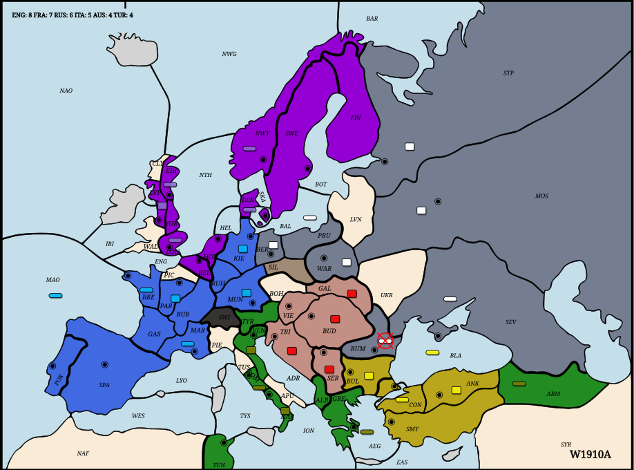

### What happened

- **RUSSIA**: disbands F RUM

### RUSSIA
Orders: `F RUM D`

Reasoning

> Looking at the situation: I have 7 units but only 6 supply centers, so I must disband 1 unit. I need to choose which unit to disband carefully.
>
> My units: A MOS, F BAL, A WAR, A STP, A BER, F RUM, F SEV
>
> My supply centers: MOS, SEV, STP, WAR, BER, RUM
>
> Strategic assessment:
> - A BER is in Germany, holding a key center but far from home and under persistent French pressure
> - F BAL is supporting A BER - if I disband F BAL, A BER becomes much more vulnerable
> - F RUM has been trying to take BUL/EC for years without success - it's somewhat stuck
> - F SEV is guarding against Italy's F ARM
> - A WAR, A MOS, A STP are eastern home defense
>
> The legal orders only show disband options - every unit has only a disband option. I need to pick one to disband. 
>
> Looking at which unit is least useful:
> - F RUM: Has failed to take BUL/EC repeatedly and is stuck in a stalemate. Disbanding it frees up the position and Turkey may move A BUL into RUM (which Turkey offered), but that would cost me RUM as a supply center. Actually RUM is my supply center - I need to keep F RUM to hold it, OR the center stays mine regardless of unit position.
>
> Wait - supply center ownership is determined by Fall positions. I hold RUM as a supply center. F RUM is sitting on RUM. If I disband F RUM, the center stays mine (it was mine at end of Fall 1910). So I can safely disband F RUM without losing the center.
>
> F RUM has been the least productive unit - three years of failed attacks on BUL/EC. Disbanding it makes sense as it frees up one slot and the center remains mine.
>
> Alternatively, disband A BER - but then I lose BER next year if France moves in... wait, no. BER is my supply center now. If I disband A BER, France could move into BER next Spring and take it from me. That would be very bad.
>
> Disband F BAL - loses the support anchor for A BER, making BER very vulnerable to France's A MUN + A KIE.
>
> Disband F RUM is the least costly option - RUM stays mine, and I lose the unit that's been stuck anyway.

## Final state

| Power | Centers | # |
|---|---|---|
| ENGLAND | EDI, LON, LVP, BEL, NWY, HOL, SWE, DEN | 8 |
| FRANCE | BRE, MAR, PAR, POR, SPA, KIE, MUN | 7 |
| RUSSIA | MOS, SEV, STP, WAR, BER, RUM | 6 |
| ITALY | NAP, ROM, VEN, TUN, GRE | 5 |
| AUSTRIA | BUD, TRI, VIE, SER | 4 |
| TURKEY | SMY, CON, BUL, ANK | 4 |
| GERMANY | *(none)* | 0 |

