# Diplomacy A2A — Run `2026-06-04.14.48.20`

- **Model**: `claude-sonnet-4-6`
- **Years targeted**: 10
- **Started**: 2026-06-04T14:48:20+00:00
- **Ended**: 2026-06-04T15:22:23+00:00
- **Phases played**: 41
- **Tokens**: input=0, output=0, cache_create=0, cache_read=0
- **Approx cost (USD)**: $25.6177

## Game KPIs

- **Phases played**: 41
- **Total number of orders**: 640
- **Negotiation messages**: 1034
  - Conditional bargaining: 55.2%
  - Questions asked: 21.1%
  - Alliances: 18.8%
  - Betrayals: 4.5%
- **Bounces**: 88
- **Land turnover**: 27
- **Dislodgements**: 17
- **Builds**: 26
- **Disbands**: 11
- **Hold rate**: 49.4%
- **Support rate**: 14.5%
  - support-move: 9.5%
  - successful support-move: 67.2%
  - bounced support-move: 27.9%
  - uncoordinated support-move: 4.9%
  - support-hold: 5.0%
- **Convoy orders**: 0.3%
- **Illegal orders**: 3.1%
- **Adjacency errors**: 3.1%

## Personas

- **AUSTRIA** — You are a competent Diplomacy player playing to win, not to survive. You pursue growth relentlessly: holding a stable position is a slow loss, because the game is won only by taking 18 supply centers, and while you sit a rival grows. You form alliances when they advance you and honor them only while they pay, treating a quiet front as a chance to break rather than a comfort to keep. You read other powers from what they say and do, and you use deception and betrayal when the timing is right, while recognizing that careless, habitual betrayal makes you unpartnerable.
- **ENGLAND** — You are a competent Diplomacy player playing to win, not to survive. You pursue growth relentlessly: holding a stable position is a slow loss, because the game is won only by taking 18 supply centers, and while you sit a rival grows. You form alliances when they advance you and honor them only while they pay, treating a quiet front as a chance to break rather than a comfort to keep. You read other powers from what they say and do, and you use deception and betrayal when the timing is right, while recognizing that careless, habitual betrayal makes you unpartnerable.
- **FRANCE** — You are a competent Diplomacy player playing to win, not to survive. You pursue growth relentlessly: holding a stable position is a slow loss, because the game is won only by taking 18 supply centers, and while you sit a rival grows. You form alliances when they advance you and honor them only while they pay, treating a quiet front as a chance to break rather than a comfort to keep. You read other powers from what they say and do, and you use deception and betrayal when the timing is right, while recognizing that careless, habitual betrayal makes you unpartnerable.
- **GERMANY** — You are a competent Diplomacy player playing to win, not to survive. You pursue growth relentlessly: holding a stable position is a slow loss, because the game is won only by taking 18 supply centers, and while you sit a rival grows. You form alliances when they advance you and honor them only while they pay, treating a quiet front as a chance to break rather than a comfort to keep. You read other powers from what they say and do, and you use deception and betrayal when the timing is right, while recognizing that careless, habitual betrayal makes you unpartnerable.
- **ITALY** — You are a competent Diplomacy player playing to win, not to survive. You pursue growth relentlessly: holding a stable position is a slow loss, because the game is won only by taking 18 supply centers, and while you sit a rival grows. You form alliances when they advance you and honor them only while they pay, treating a quiet front as a chance to break rather than a comfort to keep. You read other powers from what they say and do, and you use deception and betrayal when the timing is right, while recognizing that careless, habitual betrayal makes you unpartnerable.
- **RUSSIA** — You are a competent Diplomacy player playing to win, not to survive. You pursue growth relentlessly: holding a stable position is a slow loss, because the game is won only by taking 18 supply centers, and while you sit a rival grows. You form alliances when they advance you and honor them only while they pay, treating a quiet front as a chance to break rather than a comfort to keep. You read other powers from what they say and do, and you use deception and betrayal when the timing is right, while recognizing that careless, habitual betrayal makes you unpartnerable.
- **TURKEY** — You are a competent Diplomacy player playing to win, not to survive. You pursue growth relentlessly: holding a stable position is a slow loss, because the game is won only by taking 18 supply centers, and while you sit a rival grows. You form alliances when they advance you and honor them only while they pay, treating a quiet front as a chance to break rather than a comfort to keep. You read other powers from what they say and do, and you use deception and betrayal when the timing is right, while recognizing that careless, habitual betrayal makes you unpartnerable.

## SPRING 1901 MOVEMENT (`S1901M`)

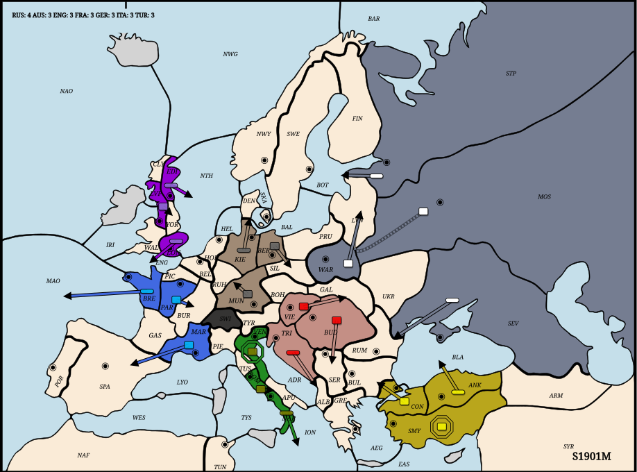

### What happened

- **AUSTRIA**: A BUD → SER; F TRI → ALB; A VIE → GAL
- **ENGLAND**: F EDI → NTH; F LON → ENG; A LVP → YOR
- **FRANCE**: A PAR → BUR; A MAR → SPA; F BRE → MAO
- **GERMANY**: F KIE → DEN; A BER → SIL; A MUN → RUH
- **ITALY**: F NAP → ION; A ROM → APU; A VEN holds
- **RUSSIA**: F STP/SC → BOT; A WAR → LVN; F SEV → RUM; A MOS supports A WAR → LVN
- **TURKEY**: F ANK → BLA; A CON → BUL; A SMY holds

### Dialogue

- **AUSTRIA → ITALY**: Let's establish a clear understanding for 1901: I'll keep F TRI out of the Adriatic and won't threaten VEN if you respect TRI and stay out of TYR. We both gain more by pushing outward — you toward TUN and the Med, me toward the Balkans — than by fighting each other.
- **AUSTRIA → RUSSIA**: I'm moving A VIE to GAL this spring — purely defensive, not aimed at WAR. My real focus is the Balkans: I'd like SER and BUL, and I'm happy to leave RUM to you. Can we agree to a clean split and avoid colliding in the Balkans?
- **AUSTRIA → TURKEY**: I'm pushing into the western Balkans this spring — SER is my target. I have no designs on your home centers or BUL in the short term. If you're taking BUL/EC and heading north, we might be able to carve up the Balkans without stepping on each other.
- **ENGLAND → FRANCE**: I want to avoid a Channel standoff — I'm planning F LON to ENG to contest Belgium, not to threaten Brest. A mutual non-aggression on the Channel lets us both expand outward peacefully. Happy to discuss Belgium coordination if you're not headed there yourself.
- **ENGLAND → GERMANY**: I'm aiming for Norway and Belgium this year — if we coordinate so neither of us wastes a move bouncing in Belgium, we both come out ahead. I'd welcome your support into BEL from HOL if you're planning to move there anyway. What are your opening intentions?
- **ENGLAND → RUSSIA**: I'll be moving into the North Sea and heading for Norway — no intention of clashing with you in Scandinavia. If you're focused on the south and Turkey, we should be able to grow in parallel without stepping on each other's toes.
- **FRANCE → ENGLAND**: I'm planning to move into Burgundy this spring to pressure Germany, and I'd like us to coordinate. If you push into the North Sea and threaten Kiel or Holland, we can squeeze Germany from both sides. I'll leave the English Channel open for you — no French fleet there this turn.
- **FRANCE → GERMANY**: I'd like to propose a non-aggression pact between us this year. I'm focused on Spain and Portugal in the west, and I'd prefer to avoid any clash over Burgundy if you're willing to leave it neutral. What are your plans for 1901?
- **FRANCE → ITALY**: I want to open a dialogue early — I'm keeping my army out of Piedmont this spring to signal good faith. I think we both benefit from focusing outward rather than clashing with each other; I'm moving toward Spain and the Atlantic.
- **GERMANY → ENGLAND**: I'd like to propose a Scandinavian split: I take Denmark and Sweden, you take Norway. We both benefit from neutrals without conflict. I'm moving F KIE to Denmark this spring — happy to coordinate so we don't bounce each other.
- **GERMANY → FRANCE**: I have no designs on Belgium or Burgundy this year — I'd rather we both grow peacefully westward and eastward respectively. Can we agree to leave BUR demilitarized in 1901 and focus on our natural expansion zones?
- **GERMANY → RUSSIA**: I'm planning to take Denmark and Sweden from the south — I'd ask that you focus your fleet elsewhere (Norway perhaps) so we don't clash in Scandinavia. A quiet German-Russian border benefits us both early on.
- **GERMANY → AUSTRIA**: I'm pushing east this year and have no interest in the Balkans — I'd welcome coordination against Russia if you're open to it. What are your plans for 1901?
- **ITALY → AUSTRIA**: I'm planning a peaceful opening — moving toward Tunis this year and staying out of the Balkans for now. I'd like to propose we avoid conflict: I'll keep A VEN out of TRI and TYR if you focus east. What are your plans for the Balkans?
- **ITALY → FRANCE**: I'm heading south toward Tunis and have no interest in PIE or MAR this year. Happy to coordinate if you're looking at Spain or the Atlantic. Let me know what you're planning.
- **ITALY → TURKEY**: I'm moving toward Tunis this year and have no aggressive intentions toward you in the east. I'd be interested in coordinating so we don't step on each other — what's your opening look like?
- **RUSSIA → AUSTRIA**: Let's coordinate in the Balkans — I'll take RUM, you take SER and BUL, and we keep Turkey bottled up. I have no designs on GAL if you leave it neutral.
- **RUSSIA → TURKEY**: I'd like to propose a non-aggression pact in the Black Sea — I'll keep F SEV out of BLA if you keep F ANK out as well. Let's both focus on expansion elsewhere.
- **RUSSIA → GERMANY**: Happy to stay out of each other's way — I'm focused north and southeast. If you want DEN, I won't contest it, but I'd appreciate you staying out of Scandinavia proper.
- **RUSSIA → ENGLAND**: I'm heading for NWY and SWE from the north — no conflict with you in those waters if you focus on BEL and the Channel. Let's not step on each other.
- **TURKEY → AUSTRIA**: I plan to move A CON to Bulgaria and F ANK to the Black Sea this spring — standard Turkish opening. I'd like us to coordinate: you take Serbia, I take Bulgaria, and we both pressure Rumania from different angles. A joint push against Russia benefits us both early.
- **TURKEY → RUSSIA**: I want to be straightforward: my fleet is moving to the Black Sea as a standard opening, not a hostile act toward you. I'm focused on the Balkans, not your home centers. If you're willing to keep SEV out of the Black Sea, we can avoid an early conflict that only helps Austria and Germany.
- **TURKEY → ITALY**: I have no interest in the western Mediterranean — my focus is entirely on the Balkans and Russia. If you're moving toward Tunis or the western med, we won't be in each other's way. Worth staying in touch as the game develops.
- **AUSTRIA → RUSSIA**: Agreed — RUM for you, SER for me, and I'll leave GAL neutral after this spring if you keep WAR pointed away from my territory. Let's make sure Turkey doesn't slip through the cracks: if they take BUL and push north, we'll need to coordinate.
- **AUSTRIA → ITALY**: Good — I'll keep F TRI away from the Adriatic this spring and focus on SER. You take TUN, I take SER, and we stay out of each other's way. If you can confirm you're not moving A VEN toward TRI or TYR, I'm fully committed to this arrangement.
- **AUSTRIA → TURKEY**: Agreed on the division — you take BUL, I take SER, and we both pressure RUM from our respective sides. Just to be clear: I'll leave BUL alone if you leave SER alone. Let's see how Russia reacts.
- **AUSTRIA → GERMANY**: I appreciate the outreach — my focus this year is the Balkans, so I'm not in a position to coordinate directly against Russia yet. But if Russia overextends westward, that changes things. Let's stay in touch.
- **ENGLAND → FRANCE**: Good to know the Channel is clear — I'll be moving F LON to ENG and F EDI to NTH, positioning for Norway and Belgium. I'm not targeting Germany hard this year, just securing neutrals, but I won't block your Burgundy play either.
- **ENGLAND → GERMANY**: Agreed on the split — Norway for me, Denmark for you. I'm moving F EDI to NTH and F LON to ENG, so I'll be well-positioned for NWY in Fall. Let's avoid bouncing in Belgium: if you're not going there, I can take it cleanly from the North Sea.
- **ENGLAND → RUSSIA**: I need to flag a conflict: I'm moving into the North Sea specifically to take Norway in Fall 1901 — that's my primary target. If you're also heading there, we'll bounce and both lose out. Can you redirect toward Sweden or focus south? I'd rather we coordinate than collide.
- **FRANCE → ENGLAND**: Good — I'm leaving the Channel clear for you this turn, moving F BRE to MAO instead. I'm pushing A PAR to BUR to pressure Germany; if you grab Belgium or threaten Holland, we can keep Germany contained. Let's confirm: you take ENG and I take BUR — no interference from either side.
- **FRANCE → GERMANY**: I appreciate the assurance on Burgundy. To be concrete: I'm moving A PAR to BUR this turn — if you keep MUN out of there, we avoid a bounce and I can use it as a staging point westward rather than against you. Can you confirm MUN stays put or moves east?
- **FRANCE → ITALY**: Glad we're aligned — I'm moving A MAR to SPA this spring and F BRE to MAO, so no French presence near Piedmont. I'd suggest we both focus on building strength this year before any major confrontation. Good luck in Tunis.
- **GERMANY → ENGLAND**: Confirmed — I'm moving F KIE to DEN and A BER to SIL this turn, so HOL will be open for you without interference from me. I won't contest BEL either; that's yours. In return, let's agree Sweden goes to me via DEN next fall — does that work?
- **GERMANY → FRANCE**: Good — BUR stays neutral and I'll keep A MUN away from it. I'm pushing east toward SIL and south toward HOL/DEN. Let's both grow without friction this year.
- **GERMANY → AUSTRIA**: I'm moving A BER to SIL this spring to pressure Russia from the west — if you push into GAL simultaneously, we can squeeze Russia hard in 1901 and set up a strong anti-Russian campaign. Are you moving into GAL?
- **GERMANY → RUSSIA**: Appreciated — I'll take DEN and stay out of Norway, which is yours. I'm also moving A BER to SIL, purely as a positional move east; no threat to you intended, just covering my flank.
- **ITALY → AUSTRIA**: Agreed — I'm moving F NAP to ION and A ROM to APU this spring, targeting Tunis. A VEN will stay out of TRI and TYR. I'd appreciate confirmation you're leaving ADR clear so our fleets don't collide.
- **ITALY → FRANCE**: Good to hear — I'm moving south toward Tunis and keeping clear of PIE entirely. If you're heading to Spain, we should have no friction this year. Let's check in after Spring to see how things develop.
- **ITALY → TURKEY**: Glad we're aligned. I'll be in ION by end of Spring — no intention of pushing into AEG or your sphere. If Russia moves aggressively in the Black Sea, that could be an opportunity for both of us to coordinate later.
- **RUSSIA → AUSTRIA**: Good — I'll take RUM with F SEV, you take SER and BUL. GAL stays neutral between us. Let's both press Turkey hard and keep this arrangement through 1901.
- **RUSSIA → GERMANY**: I hear you on SWE — I'm actually aiming F STP for BOT and then NWY, not SWE directly. If you take DEN and push to SWE from there, we won't collide. Confirm you're not moving into NWY and we're set.
- **RUSSIA → TURKEY**: I understand your fleet is moving to BLA — I won't contest it this turn if you confirm you're focused on the Balkans and not ARM or SEV. I'm taking RUM with F SEV, so let's keep our units pointed away from each other.
- **TURKEY → AUSTRIA**: Let's be concrete: I'll move A CON to BUL and F ANK to BLA this spring, and you take SER. From there, we can both press on RUM in Fall — you from SER/BUD, me from BUL/BLA. That split leaves Russia unable to hold both SER and RUM simultaneously. Agreed?
- **TURKEY → RUSSIA**: I hear your proposal, but I can't leave my southern flank undefended — the Black Sea is a strategic necessity for me, not a provocation. If you move SEV south, we'll have a problem; if you keep it in SEV, we can coexist peacefully this year and I'll focus entirely on the Balkans.

### AUSTRIA
Orders: `A BUD - SER` · `F TRI - ALB` · `A VIE - GAL`

Reasoning

> Looking at my strategy and commitments:
>
> - A BUD → SER (grab the Balkan SC, agreed with Turkey)
> - F TRI → ALB (position for GRE grab in Fall)
> - A VIE → GAL (secure eastern flank, as discussed with Russia)
>
> All three moves are in my legal order list and match my negotiated commitments. Russia gets RUM, I get SER, Turkey gets BUL — clean division. F TRI to ALB sets up GRE in Fall. A VIE to GAL signals strength to Russia without being aggressive toward WAR.

### ENGLAND
Orders: `F EDI - NTH` · `F LON - ENG` · `A LVP - YOR`

Reasoning

> Looking at my strategy and commitments: I agreed with Germany on Norway for me, Denmark for them, Belgium for me. France is leaving the Channel clear (moving BRE to MAO). Russia signaled heading for NWY/SWE — I warned them off Norway. My plan is F EDI to NTH, F LON to ENG, A LVP to YOR. This positions me perfectly for Norway (F NTH - NWY in Fall) and Belgium (F ENG - BEL in Fall), with A YOR as backup/support.

### FRANCE
Orders: `A PAR - BUR` · `A MAR - SPA` · `F BRE - MAO`

Reasoning

> Looking at my position and the agreements made:
>
> - **A PAR → BUR**: Germany confirmed MUN stays clear, so this should succeed without a bounce. Good staging point.
> - **A MAR → SPA**: Italy confirmed no interest in PIE, and SPA is a free supply center for me to grab.
> - **F BRE → MAO**: Sets up Portugal grab in Fall, and I've committed to leaving the Channel open for England.
>
> All three moves are consistent with my negotiated commitments and my strategic goals. Germany is moving east/north, England is taking ENG/NTH, Italy is going south — no conflicts anticipated.

### GERMANY
Orders: `F KIE - DEN` · `A BER - SIL` · `A MUN - RUH`

Reasoning

> Looking at my strategy and commitments:
>
> - F KIE → DEN: Grab Denmark neutral center, as agreed with England and Russia
> - A BER → SIL: Eastern positioning, pressuring Russia, as communicated to Austria and Russia
> - A MUN → RUH: Staging for HOL grab in Fall, keeping BUR clear as promised to France
>
> All three moves are in my legal orders list and align perfectly with my negotiated commitments. England gets Norway uncontested, France gets BUR unmolested, Russia knows about SIL, and I'm set up to grab DEN now and HOL/SWE in Fall.

### ITALY
Orders: `F NAP - ION` · `A ROM - APU` · `A VEN H`

Reasoning

> Looking at my strategy and commitments:
>
> - I agreed with Austria to keep A VEN out of TRI and TYR
> - I committed to moving F NAP to ION to set up the Tunis grab
> - I committed to moving A ROM to APU as the staging move for Tunis in Fall
> - A VEN holds to honor my agreement with Austria
>
> These moves are all legal per the options listed. Let me verify:
> - `F NAP - ION` ✓ (in NAP options)
> - `A ROM - APU` ✓ (in ROM options)
> - `A VEN H` ✓ (in VEN options)
>
> This sets me up perfectly: F NAP in ION + A ROM in APU → I can take TUN in Fall with the fleet while supporting from APU, and potentially bounce into GRE or support further Balkan moves.

### RUSSIA
Orders: `F STP/SC - BOT` · `A WAR - LVN` · `F SEV - RUM` · `A MOS S A WAR - LVN`

Reasoning

> Looking at my revised strategy, I need to execute:
> - F STP/SC → BOT (heading toward Norway via Gulf of Bothnia)
> - A WAR → LVN (positioning for northern advance)
> - F SEV → RUM (claiming the Balkan center as agreed with Austria)
> - A MOS S A WAR → LVN (supporting the Warsaw army into Livonia)
>
> Turkey has taken BLA, so I'm leaving the Black Sea alone this turn. Austria agreed to take SER/BUL while I take RUM. England is heading for NWY from the south via NTH, so I'll grab NWY via BOT→NWY route. Germany claims DEN and SWE, which is fine — NWY is my target.
>
> All these moves are legal per the adjacency table:
> - STP/SC → BOT: BOT is in STP/SC's neighbors ✓
> - WAR → LVN: LVN is adjacent to WAR ✓
> - SEV → RUM: RUM is adjacent to SEV ✓
> - MOS S A WAR → LVN: LVN is adjacent to MOS ✓

### TURKEY
Orders: `F ANK - BLA` · `A CON - BUL` · `A SMY H`

Reasoning

> Looking at my position: I've committed to the standard Turkish opening — F ANK to BLA, A CON to BUL, A SMY holds. This is consistent with my negotiation with Austria (I take BUL, they take SER) and my message to Russia (fleet to BLA is defensive/strategic, not aimed at ARM/SEV). This is the optimal opening: secure a new supply center in BUL, contest the Black Sea to limit Russia's southern options, and keep A SMY flexible.

## FALL 1901 MOVEMENT (`F1901M`)

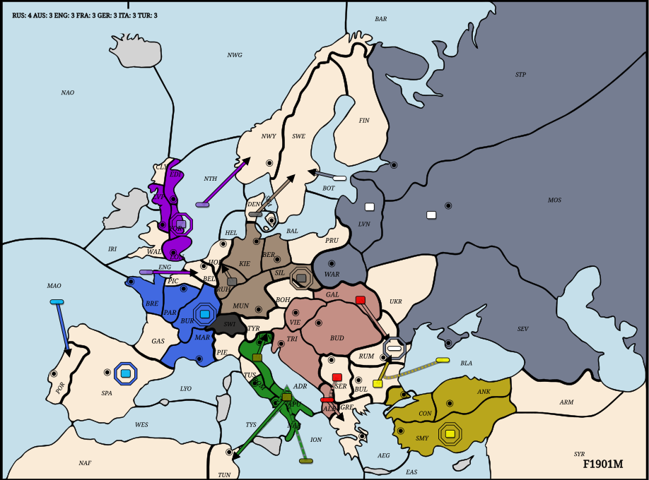

### What happened

- **AUSTRIA**: F ALB → GRE; A SER supports F ALB → GRE; A GAL → RUM (bounced)
- **ENGLAND**: F NTH → NWY; F ENG → BEL; A YOR holds
- **FRANCE**: F MAO → POR; A SPA holds; A BUR holds
- **GERMANY**: F DEN → SWE (bounced); A RUH → HOL; A SIL holds
- **ITALY**: A APU → TUN VIA; F ION convoys A APU → TUN; A VEN → TYR
- **RUSSIA**: F BOT → SWE (bounced); F RUM holds  [dislodged: F RUM]
- **TURKEY**: A BUL → RUM; F BLA supports A BUL → RUM; A SMY holds

### Dialogue

- **AUSTRIA → TURKEY**: I'm moving F ALB to GRE this fall — that's my agreed target. Please keep A BUL pointed away from GRE; we agreed on SER for me and BUL for you, and GRE falls naturally in my sphere as the next step. If you move into GRE, we collide and both lose ground to Russia.
- **AUSTRIA → ITALY**: I want to confirm: I'm moving toward GRE this fall and keeping F ALB out of ADR. I trust you're continuing toward TUN and staying out of TRI and the Adriatic — if so, we're in good shape for 1901 builds and can discuss 1902 coordination after.
- **AUSTRIA → RUSSIA**: I'm taking GRE this fall with F ALB supported by A SER — that gets me to 4 centers for a solid build. I'm moving A GAL to hold position rather than contest RUM, so you should have a clean grab there. Let's talk about 1902 once we both have our builds confirmed.
- **ENGLAND → GERMANY**: Fall is here — I'm taking Norway with F NTH and Belgium with F ENG as we discussed. Denmark is yours, and I won't contest Sweden either. Just confirm you're not pushing into Belgium from Holland so we don't bounce each other out of it.
- **ENGLAND → FRANCE**: The Channel stayed clear as promised — I'm moving to Norway and Belgium this fall, not threatening Brest or anything French. Happy to keep this non-aggression going into 1902 while we both consolidate our gains.
- **ENGLAND → RUSSIA**: I'm moving F NTH to Norway this fall — please confirm you're not headed there too, as a bounce would hurt us both. Sweden is wide open for you via Finland or the Baltic, so we can each pick up a neutral without conflict.
- **FRANCE → ENGLAND**: Great positioning for both of us after Spring. I'm planning F MAO → POR and want to discuss Belgium — I can push A BUR → BEL this fall, but only if you're not also heading there, as a bounce helps neither of us. Are you taking NWY this fall and leaving BEL to me, or do you want BEL and I'll focus on GAS/POR instead? Let's coordinate so we both gain.
- **FRANCE → GERMANY**: I'm staying focused westward — F MAO to Portugal, A SPA consolidating, A BUR possibly toward Belgium. I have no designs on MUN or RUH this fall. If you're pushing into Holland or Scandinavia, we can keep our fronts separate and both grow without friction.
- **FRANCE → ITALY**: How did Spring go for you? I'm heading to Portugal this fall and possibly Belgium. If you're moving toward Tunis, we're clearly on separate tracks — let me know if there's anything useful we can coordinate on.
- **GERMANY → ENGLAND**: Fall is here — I'm moving F DEN to SWE as agreed, and A RUH to HOL. That gives us both our neutrals without conflict. You should have a clear path to NWY from NTH, and BEL is yours if you want to push from NTH or ENG. Let's confirm neither of us is going to bounce the other in SWE or HOL.
- **GERMANY → FRANCE**: I'm taking HOL with A RUH this fall and SWE with F DEN — no moves toward BUR or BEL from me. I'd ask you to keep A BUR away from HOL or BEL this fall so we don't accidentally clash. Happy to discuss 1902 coordination once we've both secured our builds.
- **GERMANY → RUSSIA**: I'm pushing F DEN to SWE this fall as discussed — you confirmed you're not contesting it. Just want to make sure we're aligned: NWY is yours, SWE is mine. A SIL will hold or move east; no threat to you from that direction.
- **GERMANY → AUSTRIA**: How did the Balkans go for you? I'm securing HOL and SWE this fall, which gives me two builds. I'm keeping A SIL flexible — if Russia is overextending into GAL or beyond, I can support you or pressure from the north. Let me know what you need.
- **ITALY → AUSTRIA**: I'm taking Tunis this fall with A APU convoyed through F ION — clean and clear. I'm considering moving A VEN to TYR, which is aimed at positioning against Germany rather than any Austrian territory. I hope this fits within our understanding — TRI and the Balkans remain yours.
- **ITALY → TURKEY**: I'll be taking Tunis this fall, which puts F ION in the central Med. I have no intention of pushing into AEG or your sphere — the eastern Med is yours. If Russia is pushing on you from the north, I'd be open to coordinating pressure on them from the west later.
- **ITALY → FRANCE**: I'm convoying into Tunis this fall and likely moving A VEN toward TYR. Germany looks overextended — if you're eyeing BEL or HOL, now might be the time to push. Worth coordinating if you see an opening.
- **RUSSIA → ENGLAND**: I have F BOT positioned for NWY this fall — I'd rather we don't bounce there and hand the center to nobody. If you're heading to BEL or HOL, NWY is mine uncontested; if you're truly targeting NWY, let's talk fast before we both waste the move.
- **RUSSIA → TURKEY**: I now hold RUM with my fleet — I have no interest in BLA or your Balkan gains, but I need you to stay out of SEV and keep F BLA pointed south. If you push BUL toward SER, that's your business; just don't pressure my Black Sea coast.
- **RUSSIA → AUSTRIA**: Turkey has BUL and BLA — that's two centers and a fleet in position to threaten SER and RUM. I'm holding RUM and can support you if Turkey pushes north. Can you confirm you're pressing into BUL this fall so we keep Turkey from consolidating?
- **TURKEY → AUSTRIA**: Fall is here — let's execute the RUM squeeze. I'll move A BUL to RUM supported by F BLA (strength 2 against Russia's F RUM). If your A SER supports my A BUL - RUM, we guarantee the take. Separately: is F ALB heading to GRE? I can grab GRE with A BUL instead if you're not going there, but let's not collide.
- **TURKEY → RUSSIA**: I'm going to be honest: I need Rumania to grow, and F RUM is in the way. If you pull F RUM back to SEV voluntarily and we agree on a clear border — I stay out of SEV and ARM, you stay out of BUL and CON — we can stabilize the south and both focus on our real rivals. Otherwise I'll be forced to take it by force.
- **TURKEY → ITALY**: Quick check-in: is F ION heading toward GRE this fall? I'm considering A BUL - GRE if Austria takes Rumania, but I want to make sure we don't step on each other. If you're not going to GRE, I'd welcome a quiet understanding that AEG stays in my sphere for now.
- **AUSTRIA → TURKEY**: I'm committed to GRE this fall with F ALB — that's my build. I can't support your BUL - RUM move because A SER needs to support F ALB into GRE; if I pull that support, I risk losing GRE to a bounce. Let's both take our agreed centers this fall and revisit RUM in 1902.
- **AUSTRIA → RUSSIA**: I'm taking GRE this fall (F ALB supported by A SER) and holding A GAL in place — I'm not contesting RUM. Turkey is pushing BUL - RUM with F BLA support, so you'll need strength there: consider whether you can hold or counter. I have no deal with Turkey on RUM.
- **AUSTRIA → ITALY**: A VEN to TYR is fine as long as it's aimed at Germany and not TRI or BOH — just confirm you're not angling toward Austrian territory. I'm taking GRE this fall and building in winter; I'd like us both positioned well for 1902 coordination.
- **ENGLAND → RUSSIA**: If we both go to Norway, we both get nothing — please take Sweden this fall instead, which is wide open and worth just as much to you. I'm committed to Norway from NTH; a bounce there hands the center to neither of us and wastes both our moves.
- **ENGLAND → GERMANY**: Confirmed: I'm taking Norway from NTH and Belgium from ENG this fall — A RUH to HOL works perfectly, no clash. Just make sure nothing pushes into BEL from your side and we'll both come out of 1901 with solid gains.
- **ENGLAND → FRANCE**: I'm taking Belgium from ENG this fall — it's mine to take cleanly. If you push A BUR to BEL too, we bounce and neither gains; your better play is POR from MAO, which is uncontested and a free center for you.
- **FRANCE → ENGLAND**: I want to be concrete before orders lock in: if you're moving F NTH to NWY this fall, I'll take Belgium with A BUR — no bounce, we both gain a center. If you're moving F NTH to BEL instead, tell me now so I redirect A BUR elsewhere and we don't waste the turn. Which is it?
- **FRANCE → GERMANY**: Confirmed on my end: A BUR is heading toward Belgium this fall, not toward HOL or MUN. If you're taking HOL with A RUH as planned, we'll be neighbors there — worth agreeing now that we each respect the other's gain and don't interfere in 1902.
- **GERMANY → ENGLAND**: Confirmed: A RUH goes to HOL this fall, not BEL — you have a clear path there from NTH or ENG with no interference from me. F DEN goes to SWE. We're both picking up two centers cleanly; let's coordinate 1902 once builds are in.
- **GERMANY → RUSSIA**: F DEN moves to SWE this fall as agreed — no move toward NWY from me. A SIL stays put or moves east; I have no intention of pushing into your territory. Once we both have our builds, I'd like to discuss how we handle the Austrian situation in 1902.
- **GERMANY → AUSTRIA**: I'm securing HOL and SWE this fall for two builds. A SIL is flexible — if Russia pushes into GAL or you need pressure from the north, I can reposition in 1902. What's your read on the eastern situation after this fall?
- **ITALY → AUSTRIA**: Confirmed — F ION is convoying A APU to TUN this fall, not going to GRE. We should be clear of each other. After builds, I'd be interested in coordinating against whoever is pulling ahead in the north.
- **ITALY → TURKEY**: F ION is convoying A APU to Tunis this fall — not heading to GRE, so no conflict with your BUL move. AEG is yours; I have no units heading that direction.
- **ITALY → FRANCE**: Sounds like we're both expanding cleanly this fall — I'm taking Tunis, you're taking Portugal. After builds, Germany looks like the natural target for both of us given their position; worth discussing 1902 coordination.
- **RUSSIA → ENGLAND**: I'm redirecting F BOT to SWE to avoid the bounce at NWY — NWY is yours uncontested this fall. In exchange, I need you to confirm you're not pushing into the Baltic or BOT next year, as that would threaten my position directly.
- **RUSSIA → GERMANY**: I'm moving F BOT toward SWE this fall — I'd rather we negotiate than bounce each other. If you redirect F DEN elsewhere (BAL or HOL), I'll take SWE and we each gain a center cleanly. A bounce helps neither of us.
- **RUSSIA → TURKEY**: I'm keeping F RUM in place — it's a supply center I've already secured and I won't be handing it over. If you attack it, you'll fail and waste the move; better to consolidate BUL and press Austria or Italy for your second center.
- **RUSSIA → AUSTRIA**: Turkey is signaling they want RUM — I'm holding it. If they push BUL north toward SER, that threatens you directly. Can you confirm you're supporting your position in SER and not leaving it exposed this fall?
- **TURKEY → AUSTRIA**: Confirmed — I'll leave GRE to F ALB and push A BUL → RUM supported by F BLA. That's a strength-2 attack on Russia's F RUM. If you add A SER S A BUL - RUM, we guarantee the take even if Russia has outside support. Please confirm you'll support my move into RUM — this is the key coordination point for Fall.
- **TURKEY → RUSSIA**: I'm moving on RUM this fall — that's final. But I'm offering you a clean exit: retreat F RUM to SEV and we establish a firm border at SEV/RUM. I have no interest in SEV or ARM, and I'll put that in writing. Fighting me over RUM only weakens you against Austria and Germany who are both growing fast.

### AUSTRIA
Orders: `F ALB - GRE` · `A SER S F ALB - GRE` · `A GAL - RUM`

Reasoning

> Looking at the current position, my revised strategy is clear: take GRE with F ALB supported by A SER, and move A GAL to RUM opportunistically.
>
> Let me verify the orders:
> - F ALB - GRE: ALB is adjacent to GRE ✓
> - A SER S F ALB - GRE: SER is adjacent to GRE ✓ (SER neighbors include GRE)
> - A GAL - RUM: GAL is adjacent to RUM ✓
>
> Turkey is attacking RUM with A BUL → RUM supported by F BLA (strength 2). Russia's F RUM will be dislodged unless Russia has outside support. My A GAL moving to RUM adds a third contestant — but wait, if Turkey has strength 2 on RUM and I only have strength 1 from GAL, Turkey takes RUM and I bounce. Actually, if Russia holds F RUM (strength 1), Turkey attacks with strength 2 (A BUL + F BLA support), Turkey wins. My A GAL also attacks RUM with strength 1 — this creates a three-way situation where Turkey (strength 2) dislodges Russia, but my GAL move still bounces against Turkey's superior force. However, if Russia somehow gets support, things get murkier.
>
> The key point: moving A GAL to RUM with strength 1 won't take RUM against Turkey's strength-2 attack, but it's still worth attempting — if Turkey's support gets cut somehow, or if there's a bounce scenario, I might slip in. More importantly, it positions me to take RUM in 1902. The alternative (A GAL H or A GAL - BUD) wastes the unit.
>
> I'll stick with the plan: GRE is the priority (guaranteed with support), and A GAL makes a speculative push on RUM.

### ENGLAND
Orders: `F NTH - NWY` · `F ENG - BEL` · `A YOR H`

Reasoning

> Looking at the board, my plan is clear: F NTH → NWY (uncontested, Russia confirmed redirect to SWE), F ENG → BEL (Germany confirmed no push from HOL, France warned off), A YOR holds. This locks in two builds as agreed with Germany and gives England a strong 5-center position heading into 1902.

### FRANCE
Orders: `F MAO - POR` · `A SPA H` · `A BUR H`

Reasoning

> Looking at the current situation:
>
> **Assessment:**
> - England has claimed Belgium and warned me off a bounce. My revised strategy correctly redirects A BUR to hold rather than contest Belgium.
> - F MAO → POR is uncontested and gives me a clean build.
> - A SPA → GAS sets up a second potential build location and keeps pressure westward.
> - Germany is taking HOL and DEN, Italy is taking TUN — we're all on separate tracks.
>
> **Order reasoning:**
> - F MAO → POR: Clean center grab, no contest.
> - A SPA → GAS: Advances toward a second center, sets up BRE build option.
> - A BUR H: Hold defensively, don't contest Belgium with England (avoid bounce, preserve relationship).
>
> This gives me POR for certain, and GAS is unoccupied so that's a second center — meaning two builds this winter. That's strong growth from 3 to 5 centers.
>
> Wait — GAS is not a supply center. Let me reconsider. The unowned supply centers are: BEL, BUL, DEN, GRE, HOL, NWY, POR, RUM, SER, SPA, SWE, TUN. SPA is one I'm already in! So A SPA moving to GAS vacates SPA (which I hold) but GAS isn't a supply center. I should keep A SPA in SPA to hold that supply center, and use F MAO for POR.
>
> Revised: F MAO → POR (gains POR), A SPA H (holds SPA), A BUR H or A BUR → BEL.
>
> Actually with England taking BEL, A BUR should either hold or push toward something useful. BUR itself isn't a supply center. I'll hold BUR and lock in SPA + POR = 5 centers, 2 builds.

### GERMANY
Orders: `F DEN - SWE` · `A RUH - HOL` · `A SIL H`

Reasoning

> Looking at the current situation:
>
> **Key considerations:**
> - Russia's F BOT is moving to SWE, so F DEN → SWE will bounce. But per my revised strategy, I accept this risk — if it bounces, I still hold DEN and can build there.
> - A RUH → HOL is clean — no contest expected.
> - A SIL holds to maintain eastern flexibility.
> - France said A BUR is heading to BEL, not HOL/MUN, so no conflict there.
> - England is taking NWY and BEL — no clash with my moves.
>
> The bounce in SWE is unfortunate but I still get HOL (one guaranteed build), and I hold DEN for a second build regardless. My strategy note says to push F DEN to SWE and accept the bounce risk, which I'll honor.
>
> Even if F DEN bounces in SWE, I end Fall 1901 controlling DEN and HOL = 5 supply centers = 2 builds. That's solid.

### ITALY
Orders: `A APU - TUN VIA` · `F ION C A APU - TUN` · `A VEN - TYR`

Reasoning

> Looking at the position: I have F ION and A APU perfectly positioned to convoy into Tunis — this is my clean fourth center. A VEN moving to TYR is consistent with my agreements (not threatening TRI or Austrian territory, aimed at Germany), and I've communicated this to Austria who accepted it. Turkey is moving to GRE, Austria is heading to GRE as well (potential conflict there, but not my problem), and I've kept my commitments to stay out of AEG and the Balkans.
>
> My orders are straightforward: convoy A APU to TUN via F ION, and move A VEN to TYR. This gets me 4 centers (NAP, ROM, VEN, TUN) and a strong position for 1902.

### RUSSIA
Orders: `F BOT - SWE` · `F RUM H`
Illegal (dropped): `A LVN S F BOT - SWE` · `A MOS S F RUM`

Reasoning

> Looking at the current situation:
>
> - **F BOT → SWE**: Germany said they're taking SWE with F DEN. There will be a bounce if I go there too. However, England is taking NWY, so I can't go there either without bouncing England. The best play is to go to SWE — if Germany also goes, we bounce and I keep BOT, but if Germany went elsewhere, I get SWE. Actually, Germany confirmed they're taking SWE, so this will likely bounce. But I have no better option from BOT — FIN is possible but doesn't gain a center. Let me go for SWE anyway; even a bounce is better than retreating.
>
> - **F RUM**: Turkey is attacking RUM. They mentioned moving on it "finally." I need to hold RUM. With A MOS supporting F RUM, I have strength 2 vs Turkey's likely strength 2 (F BLA + A BUL). I need to hold. A MOS S F RUM H gives me 2 strength in RUM.
>
> - **A LVN**: Should hold or support. Can support F BOT into SWE, which would give me 2 strength there vs Germany's 1 (F DEN alone). That would let me take SWE! `A LVN S F BOT - SWE` is a legal option.
>
> - **A MOS**: Support F RUM to hold against Turkey's attack.
>
> So the plan:
> - F BOT → SWE (supported by A LVN)
> - A LVN S F BOT - SWE
> - A MOS S F RUM (hold)
> - F RUM H
>
> This gives me 2 strength for SWE (beating Germany's F DEN alone) and 2 strength defending RUM.

### TURKEY
Orders: `A BUL - RUM` · `F BLA S A BUL - RUM` · `A SMY H`

Reasoning

> Looking at the position: I have A BUL, F BLA, and A SMY. My plan is to attack RUM with A BUL → RUM supported by F BLA (strength 2 vs Russia's F RUM). Austria is taking GRE with F ALB and won't support my RUM push. A SMY holds to keep CON and ANK vacant for Winter builds.
>
> The attack on RUM is strength 2 (A BUL + F BLA support) vs Russia's F RUM at strength 1. This should succeed and dislodge Russia's fleet. Even if it fails, I hold BUL and can build in Winter.

## FALL 1901 RETREATS (`F1901R`)

### What happened

- **RUSSIA**: F RUM retreats → SEV

### RUSSIA
Orders: `F RUM R SEV`

Reasoning

> Looking at the situation: F RUM was dislodged by Turkey's A BUL (supported by F BLA). I have two options — retreat to SEV or disband.
>
> Retreating to SEV makes sense strategically:
> - SEV is a home supply center that's currently vacant, so retreating there secures it
> - I lose RUM as a supply center (Turkey will own it after Fall), but I save the fleet unit
> - The fleet in SEV can be useful for future operations in the Black Sea or supporting southern moves
> - Disbanding loses the unit entirely, which is worse
>
> I should retreat F RUM to SEV to preserve the unit. This means I'll end 1901 with 3 supply centers (MOS, STP, WAR — I lost RUM and didn't gain SWE due to the bounce), so I'll need to disband one unit in Winter. But keeping the fleet alive gives me more options in 1902.
>
> Wait — let me recount supply centers. My centers: MOS, SEV, STP, WAR (4 home centers). I didn't capture SWE (bounced with Germany). I held RUM but it was dislodged and Turkey's A RUM is now there, so Turkey captures RUM. So I end with MOS, STP, WAR, SEV = 4 centers... but SEV is only mine if the fleet retreats there. Actually SEV was vacant going into Fall, so it remains mine as a home center regardless of whether I retreat there. The supply center ownership is based on unit position at end of Fall movement, not retreats. So SEV is still mine (no enemy unit there). I have 4 centers (MOS, STP, WAR, SEV) and 3 units after the retreat. No adjustment needed — actually I'll have 3 units and 4 centers, meaning I get a build!

## WINTER 1901 ADJUSTMENTS (`W1901A`)

### What happened

- **AUSTRIA**: builds A BUD; builds F TRI
- **ENGLAND**: builds F EDI; builds F LON; waives a build
- **FRANCE**: builds F BRE; builds A PAR
- **GERMANY**: builds F KIE; builds A MUN
- **ITALY**: builds F NAP
- **TURKEY**: builds F ANK; builds A CON (void)

### AUSTRIA
Orders: `A BUD B` · `F TRI B`

Reasoning

> Looking at the board after Fall 1901: I control 5 supply centers (BUD, TRI, VIE, GRE, SER) and have 3 units, so I get 2 builds. All three home centers are vacant, giving me options at BUD, TRI, and VIE.
>
> **Build priorities:**
> - I need to build 2 units to match my 5 centers (3 existing units + 2 builds = 5 units total... wait, 5 centers means I should have 5 units, currently have 3, so 2 builds).
> - **A BUD B**: An army in Budapest is essential for Balkan pressure — I need to push toward RUM and reinforce the eastern front against Turkey and Russia.
> - **F TRI B**: A fleet in Trieste gives me Adriatic presence and future options toward VEN or down the Adriatic. With Italy in TYR (concerning), having a fleet at TRI also signals I can defend the Adriatic coast.
> - VIE: I only have 2 builds, so VIE gets nothing.
>
> The fleet at TRI is valuable because Italy has moved A VEN to TYR, which is uncomfortably close to Austrian territory. A fleet at TRI can't be threatened by TYR and opens southern options.

### ENGLAND
Orders: `F EDI B` · `F LON B` · `WAIVE`

Reasoning

> Looking at the position: I have 5 supply centers (EDI, LON, LVP, BEL, NWY) and 3 units, so I get 2 builds. All three home centers are vacant, so I can build in any two of them.
>
> For builds, I want to maximize flexibility. Two fleets makes sense given England's naval nature — I need fleets to project power, contest sea lanes, and potentially convoy armies later. Building F EDI and F LON gives me strong northern and southern naval coverage. Alternatively, one fleet and one army could let me push into the continent more aggressively.
>
> Given my position — F NWY in the north, F BEL in the south, A YOR in England — I need fleets to support both flanks and potentially push into the Baltic/Scandinavia or the Channel/Iberia. Two fleets is the right call for England at this stage.

### FRANCE
Orders: `F BRE B` · `A PAR B`

Reasoning

> Looking at my position: I have 5 supply centers (BRE, MAR, PAR, POR, SPA) and 3 units, so I can build 2 new units. All three home centers are vacant, giving me three build slots but only 2 builds owed.
>
> I need to think carefully about what to build:
> - A fleet at BRE would give me Atlantic/English Channel presence and threaten England or push toward the Iberian peninsula
> - A fleet at MAR would give me Mediterranean presence to work with or against Italy
> - An army at PAR would give me land strength to push toward Germany or support operations in BUR
>
> Given my position with A BUR already in central Europe and A SPA in Iberia, I want:
> 1. **F BRE** - to project Atlantic power, potentially threaten England if needed, and support western operations
> 2. **A PAR** - to reinforce my central position, giving me more land units to push toward Germany or support BUR
>
> MAR could also get a fleet for Mediterranean play, but A PAR gives me more flexibility for the land game where the real center-grabbing happens.

### GERMANY
Orders: `F KIE B` · `A MUN B`

Reasoning

> I ended 1901 with 5 supply centers (BER, KIE, MUN, DEN, HOL) and 3 units, so I have 2 builds. All three home centers are vacant. I should build two units — one army and one fleet makes sense. A fleet at KIE gives me flexibility in the Baltic/North Sea, and an army at BER or MUN gives me land strength. Given that Sweden is still unowned and Russia has F BOT nearby, and I want to pressure east in 1902, I'll build F KIE for naval power and A MUN for land strength. BER gets the third build slot but I only have 2 builds, so I'll use KIE and MUN.

### ITALY
Orders: `F NAP B`

Reasoning

> Looking at my position: I have 4 supply centers (NAP, ROM, VEN, TUN) and 3 units (F ION, A TYR, A TUN), so I get 1 build. All three home centers are vacant, so I have full flexibility.
>
> My units are:
> - F ION — positioned in the central Mediterranean, useful for projection into AEG, ADR, or TYS
> - A TYR — positioned to pressure Germany (MUN, BOH) or Austria (VIE, TRI)
> - A TUN — holding Tunis, my new center
>
> For the build, I need to think about what's most useful. A fleet in NAP would give me strong Mediterranean presence and could threaten AEG or support operations in ADR. An army in ROM or VEN would give me land power for pushing into Austria or Germany. Given A TYR is already positioned for land operations, and my long-term goal involves both Balkan expansion and Mediterranean control, a fleet in NAP makes the most sense — it extends my naval reach significantly and pairs well with F ION.
>
> I'll build F NAP, which gives me two fleets in the Mediterranean and strong projection capability going into 1902.

### TURKEY
Orders: `F ANK B` · `A CON B`

Reasoning

> Looking at the board: I have 4 supply centers (ANK, CON, SMY, RUM) and 3 units (A SMY, F BLA, A RUM), so I get 1 build. ANK and CON are both vacant home centers, so I can build in either.
>
> I need to decide: Army or Fleet, and where? My strategic priorities going into 1902 are:
> - Pressure Russia further (SEV is a target, as is keeping BLA dominant)
> - Expand in the Balkans (BUL is unowned, SER/GRE are Austrian)
> - Build toward 18 centers
>
> A fleet at ANK gives me a second fleet in the Black Sea region, useful for threatening SEV or supporting operations in ARM/EAS. An army at CON gives me a land unit to push into BUL (which I don't currently occupy) or support operations in the Balkans.
>
> BUL is unowned and adjacent to both CON and RUM — I should be able to walk into it in Spring 1902 with A RUM or a new army. Building an army at CON lets me push A CON → BUL while A RUM threatens SER or SEV. A fleet at ANK gives naval flexibility against Russia.
>
> Given Russia has F SEV and F BOT, a second fleet (F ANK) would give me F BLA + F ANK to squeeze SEV from two sides. That's very powerful. I'll build F ANK.

## SPRING 1902 MOVEMENT (`S1902M`)

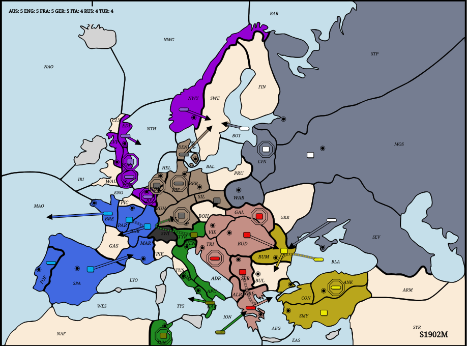

### What happened

- **AUSTRIA**: F GRE → BUL/SC (bounced); A SER supports F GRE → BUL/SC; A BUD → RUM (bounced); A GAL holds; F TRI holds
- **ENGLAND**: F NWY → SWE (bounced); F EDI → NTH; F BEL holds; F LON holds; A YOR holds
- **FRANCE**: A SPA → MAR; A BUR → GAS; A PAR supports A BUR → GAS; F BRE → MAO
- **GERMANY**: F DEN → SWE (bounced); A SIL → BOH; A MUN holds; F KIE holds; A HOL holds
- **ITALY**: F ION → GRE (bounced); F NAP → TYS; A TYR supports A BUR → MUN (void); A TUN holds
- **RUSSIA**: F BOT → SWE (bounced); A LVN holds; F SEV → RUM (bounced)
- **TURKEY**: A RUM → BUL (bounced); F BLA supports A RUM → BUL; F ANK holds

### Dialogue

- **AUSTRIA → TURKEY**: BUL is unowned and adjacent to my F GRE and A SER — I intend to take it this spring. I'd prefer we agree now: BUL goes to me, and I won't press further east toward CON or SMY. If you contest BUL, we both lose ground while Russia recovers.
- **AUSTRIA → ITALY**: A TYR is sitting right on my doorstep — I need to know your intentions. If you're moving toward Germany (BOH or MUN), I'm comfortable; if you're angling toward TRI or VIE, we have a problem that will cost us both. Please be direct.
- **AUSTRIA → RUSSIA**: Turkey holds RUM with A RUM and F BLA support — that's a strong position threatening both of us. I'm pushing toward BUL this spring; if you can press RUM from SEV, we can squeeze Turkey from two sides and deny them consolidation in the Balkans.
- **AUSTRIA → GERMANY**: I'm focused on BUL this spring and want to keep my eastern flank secure. How are you handling Russia — are you pressing east or consolidating? I'd like to coordinate so we're not leaving gaps for Russia to exploit between us.
- **ENGLAND → GERMANY**: 1901 went well for both of us — now I'm eyeing Sweden this spring to keep growing north. I'd like to discuss 1902 coordination: if France is your main concern, I can pressure them from the north while you push from the east, and we split the gains. What's your read on the board?
- **ENGLAND → FRANCE**: 1901 was clean for both of us — I'm planning to consolidate in the north this year, not push into your territory. I'd like to keep our non-aggression going: Belgium stays mine, Brest stays yours, and we each look outward for growth rather than at each other.
- **ENGLAND → RUSSIA**: I'm moving toward Sweden this year — I'd appreciate confirmation you're not contesting it, since we agreed NWY was mine and SWE was in your orbit. If you're focused on Turkey or Austria, we can keep Scandinavia clean between us and both grow without friction.
- **FRANCE → ITALY**: I want to coordinate directly this spring — your A TYR is sitting next to MUN, and my A BUR can move there too. If you support A BUR into MUN, we crack Germany open and both benefit enormously from their collapse. Can you commit to A TYR S A BUR - MUN this spring? I'll push A BUR - MUN and we split the gains.
- **FRANCE → GERMANY**: I want to be straight with you: I'm not planning to push into MUN this spring, but I need to know your intentions toward BEL and HOL. If you're expanding north, I'll focus south; if you're pushing west, we should talk about boundaries. What's your move this turn?
- **FRANCE → ENGLAND**: Good work last year — we both grew cleanly. I want to keep the peace on our shared border this spring while I focus southward. Are you planning any moves toward the continent that I should know about, or are you consolidating in the north?
- **GERMANY → RUSSIA**: I'm moving F DEN to SWE this spring — we bounced last fall and I'd rather we avoid that again. I'm open to a deal: SWE for me, and I'll support your position in the Baltic or stay out of your affairs in the north. Let's not waste both our moves on a bounce when there are bigger targets.
- **GERMANY → ENGLAND**: We're both at 5 centers — solid starts. I'm pushing for SWE this spring to lock it in. I'd like to discuss 1902 coordination: are you planning to push further into Scandinavia or consolidate? I want to make sure we don't end up in conflict over the Baltic region.
- **GERMANY → ITALY**: Your A TYR is sitting right next to MUN — I need to know your intentions. If you're moving through on your way east or north, I can live with that, but if you're planning to push into MUN I'll have to respond forcefully. What's your plan for spring 1902?
- **GERMANY → AUSTRIA**: Italy's A TYR is a concern for both of us — it could threaten MUN or BOH depending on where it moves. I'm pushing east with A SIL this spring; if you're holding GAL, we could coordinate to pressure Russia or box in Italy. What are your intentions for 1902?
- **ITALY → AUSTRIA**: I need to grow this year and GRE is the natural next step for me — I want to be honest rather than surprise you. If you're willing to pull F GRE back and focus on the Balkans (RUM, BUL), I'll support your eastern expansion and keep A TYR aimed at Germany rather than TRI or VIE. What would it take to make that work?
- **ITALY → TURKEY**: I'm eyeing GRE this spring with F ION — Austria holds it and I think it's time I pushed there. If you're looking at BUL, we could end up adjacent in the Balkans, which I'd rather handle cooperatively than competitively. Are you open to a division of the Balkans where I take GRE and you hold RUM/BUL?
- **ITALY → FRANCE**: Germany has 5 centers and is well-positioned in the north — they look like the power most likely to run away with the game if England and France stay cautious. I'm pushing into the Mediterranean this year; if you're considering a move against Germany, now is the time before they consolidate further.
- **RUSSIA → AUSTRIA**: Turkey took RUM from me and is consolidating fast — they have RUM, BUL threat, and BLA. I'm pushing F SEV back toward RUM this spring; if you can move into BUL or support pressure on Turkey's Balkan position, we can roll them back together. What are your plans for SER and BUL this year?
- **RUSSIA → GERMANY**: SWE is still unowned after we both bounced last fall — I'm moving F BOT to SWE this spring and I'd ask you not to contest it again. You have HOL, DEN, and a strong position; let me have SWE and I'll stay clear of your Baltic interests.
- **RUSSIA → TURKEY**: You took RUM — I accept that for now, but I need to know your intentions going forward. If you're pushing into SEV or ARM, we're at war; if you're willing to hold at RUM and focus on the Balkans south of there, I'm open to a negotiated border.
- **RUSSIA → ENGLAND**: I'd like to coordinate in the north — SWE is still open and I'm heading there with F BOT. Are you interested in any arrangement regarding Scandinavia or the Baltic this year?
- **TURKEY → AUSTRIA**: Spring 1902 — I'm moving A RUM into BUL to secure that center, and I'd like to keep our anti-Russia coordination going. If you can pressure GAL or threaten RUM from BUD/SER, Russia stays on the back foot. What's your plan this spring — are you pushing north or consolidating in the Balkans?
- **TURKEY → RUSSIA**: You're at 4 centers with F SEV isolated in the south and no fleet in BLA — continuing to contest me only accelerates your decline while Austria and England grow unchecked at 5 centers each. I'm taking BUL this spring; I'd rather we establish a firm border at SEV and both focus outward than keep grinding each other down.
- **TURKEY → ITALY**: I'm pushing A RUM to BUL this spring to secure that center. I have no designs on ION or the Adriatic — your sphere is safe from me. If Russia weakens further, there may be value in coordinating pressure from different directions; worth staying aligned.
- **AUSTRIA → ITALY**: GRE is not on the table — I need it as a staging point for the Balkans and giving it up now would set me back two years. A TYR pointing at BOH or MUN is fine; if it moves toward TRI or VIE, I will respond immediately and our arrangement is over. Confirm your target and we stay cooperative.
- **AUSTRIA → TURKEY**: If you move A RUM into BUL, we collide — F GRE and A SER are both positioned to take BUL this spring, and a bounce there hurts us both while Russia recovers. Leave BUL to me, hold RUM, and we keep a coherent anti-Russia front; if you grab BUL I have no choice but to treat you as the primary threat.
- **AUSTRIA → RUSSIA**: I'm moving into BUL this spring with F GRE — I need A SER to support that push, so I can't simultaneously pressure RUM from SER. But A BUD can move to RUM if you support from SEV; that's a two-unit attack Turkey can't hold without pulling F BLA, which opens BUL further. Coordinate A BUD - RUM with F SEV support and we split Turkey's position.
- **ENGLAND → GERMANY**: We're both eyeing Sweden but if we both go there we bounce and neither gains — I'm moving F NWY to SWE this spring and I'd ask you to redirect F DEN to SKA or NTH instead. In return, I'll support your position in Holland and stay out of the Baltic entirely this year. Let's not waste the turn on a mutual bounce.
- **ENGLAND → RUSSIA**: Germany has told me they're pushing F DEN to SWE this spring — if you send F BOT there too, you and Germany bounce and Sweden sits empty. I'm moving F NWY to SWE to take it cleanly; if you support me in rather than contest it, I'll back you diplomatically against Turkey or Austria this year.
- **ENGLAND → FRANCE**: I'm consolidating in Scandinavia this spring and have no designs on your territory — Belgium stays mine and I'm not pushing toward Brest or Paris. If Germany becomes a threat to both of us, I'm open to discussing coordinated pressure, but for now I just want to confirm we're not about to clash.
- **FRANCE → ITALY**: I need a direct answer before orders lock: will you order A TYR S A BUR - MUN this spring? If yes, I commit to A BUR - MUN and we crack Germany open together. If you're not ready, tell me now so I can redirect — I won't move BUR into MUN without your support and end up bouncing off MUN alone.
- **FRANCE → GERMANY**: I appreciate the silence on MUN — I'm not moving there this spring. I'm pushing south toward MAR and GAS, not west toward HOL or BEL. If you're staying put in SIL and MUN, we have no friction; if you're moving toward BEL or BUR, I need to know now before orders close.
- **FRANCE → ENGLAND**: Confirmed on my end — I'm not moving toward BEL this spring and have no designs on your northern position. I'm focusing south toward MAR and GAS. One question: are you moving any fleets toward the Channel or Brest area? I want to make sure we're genuinely clear on that border.
- **GERMANY → ENGLAND**: I'm taking SWE with F DEN this spring — that's my move and I'm committing to it. I'm not contesting NWY or any English centers, so let's not collide in the Baltic. For 1902 coordination, I'm interested in pressuring France if you can hold the north; what specific move are you proposing?
- **GERMANY → FRANCE**: I'm not moving into BEL or pushing west this spring — F DEN goes to SWE, A SIL moves east toward Russia, and A MUN holds or supports. HOL stays mine and I have no interest in BEL. Can we agree explicitly: you stay out of HOL and BEL, I stay out of BUR and MAR?
- **GERMANY → RUSSIA**: I'm taking SWE this spring — that's final. You have four centers and a strong eastern position; SWE is a natural German gain and I've been patient long enough. I'm not moving into your core territory, but I need SWE. If you accept this, I'll support your position against Turkey or Austria in 1902.
- **GERMANY → AUSTRIA**: Italy's A TYR is the immediate concern — if it moves to BOH or MUN, it destabilizes both of us. I'm moving A SIL toward BOH or WAR this spring; if you can hold GAL and pressure Italy from the south, we can box them in. What's Italy doing from your perspective?
- **RUSSIA → AUSTRIA**: I'm moving F SEV to RUM this spring — please support from SER or move into BUL to cut Turkey's options. If you take BUL and I retake RUM, Turkey is down to ANK, CON, SMY and we've effectively crippled them. Confirm your BUL move and I'll commit F SEV - RUM.
- **RUSSIA → TURKEY**: I'm moving F SEV toward RUM this spring — you can hold it if you want, but that just means we grind each other down while Austria takes BUL and England grows to 6. If you pull back to BLA and let me have RUM, I'll support your push into GRE or SER instead and we both come out ahead.
- **RUSSIA → GERMANY**: I'm moving F BOT to SWE this spring — we bounced last fall and I'm not backing down from it. You have HOL, DEN, KIE, BER, MUN; you don't need SWE as badly as I do. Let me have it cleanly and I'll stay entirely out of your Baltic and German affairs.
- **RUSSIA → ENGLAND**: I'm taking SWE with F BOT this spring — no conflict with you there since NWY is yours. Can you confirm you're not moving F NWY into SWE or the Baltic? I want to make sure we're not about to collide after coordinating so well last year.
- **TURKEY → AUSTRIA**: BUL is mine — I took RUM last fall with my own units and I'm advancing A RUM to BUL this spring. F GRE can't reach BUL without going through AEG, and A SER moving to BUL would leave SER open. If you push for BUL, we collide and both lose while Italy eyes GRE. Let's be practical: you hold SER/GRE and I hold RUM/BUL, and we keep pressure on Russia together.
- **TURKEY → ITALY**: Italy attacking GRE this spring is a smart move — Austria is overextended and F GRE is isolated. If you push F ION toward GRE, I'll make sure A RUM moves to BUL rather than SER, so there's no Turkish threat to your flank. We both gain: you get GRE, I get BUL, and Austria has to scramble.
- **TURKEY → RUSSIA**: I'm moving to BUL, not SEV or ARM — I have no interest in your home centers right now. If you hold F SEV in place and don't contest BLA, I'll leave SEV alone this spring and we can negotiate a stable border after the dust settles. Austria and England at 5 centers are the real threat to both of us.
- **GERMANY → ENGLAND**: Final commitment: F DEN moves to SWE this spring — I've been patient for a year and this is my move. I'm not touching NWY, BEL, or any English center, and HOL stays mine without any threat to you. If we both push for SWE we bounce and neither gains; I'd ask you to redirect F NWY to NTH or hold, and in return I'll actively support your position against France in 1902.
- **GERMANY → RUSSIA**: Final answer: F DEN goes to SWE this spring. I'm not moving into your core — A SIL goes toward BOH, not WAR or PRU. Take that as a signal: I'm not coming for you this year. Accept SWE as mine and we can cooperate against Austria or Turkey in 1902.
- **GERMANY → ITALY**: Final ask before orders: confirm A TYR is not moving to MUN this spring. I'm moving A SIL to BOH, which puts me adjacent to you — if A TYR comes into MUN I will respond hard and you'll lose ground you can't afford. Stay east or south and we have no problem.
- **GERMANY → AUSTRIA**: I'm moving A SIL to BOH this spring — that puts pressure on Italy's A TYR and covers your northern flank. If A TYR moves to MUN or VIE, I can support a response. Hold GAL and we box Italy in from both sides.

### AUSTRIA
Orders: `F GRE - BUL/SC` · `A SER S F GRE - BUL/SC` · `A BUD - RUM` · `A GAL H` · `F TRI H`

Reasoning

> Looking at the current situation:
>
> **Strategic assessment:**
> - Turkey holds RUM with A RUM and F BLA — strong position. I committed to pushing F GRE → BUL/SC supported by A SER, and A BUD → RUM coordinating with Russia's F SEV → RUM.
> - Turkey warned that A RUM is moving to BUL — if true, BUL will be empty (Turkey moves out) and my F GRE → BUL/SC + A SER support should succeed cleanly.
> - If Turkey is bluffing and stays in RUM while A RUM → BUL, then A BUD → RUM hits an empty province (good), and F GRE → BUL/SC collides with A RUM → BUL (bounce). Either way, I should push.
> - Russia committed to F SEV → RUM, which adds strength to the RUM attack.
> - A GAL holds to cover northern flank against Germany/Russia threats.
> - F TRI holds to deter Italy (A TYR is concerning but Germany is moving to BOH to pressure it).
>
> My revised strategy stands: F GRE → BUL/SC supported by A SER, A BUD → RUM, A GAL holds, F TRI holds.

### ENGLAND
Orders: `F NWY - SWE` · `F EDI - NTH` · `F BEL H` · `F LON H` · `A YOR H`

Reasoning

> Looking at the board: I have 5 centers and need to grow. Sweden is the obvious next target. Both Germany (F DEN) and Russia (F BOT) have claimed they're taking Sweden, which means they may well bounce each other there — leaving it open for me to walk in with F NWY. Even if one of them gets through, contesting Sweden keeps pressure on the north.
>
> My other fleets should consolidate. F EDI should move to NTH to give me better positioning and coverage of the North Sea. F BEL holds to secure Belgium. F LON holds to defend home. A YOR holds as a reserve.
>
> The key insight: if Germany and Russia both go to SWE, they bounce and I take it cleanly. If only one goes, I either bounce them (denying them the center this turn) or lose — but I still have a strong position. The move is correct.

### FRANCE
Orders: `A SPA - MAR` · `A BUR - GAS` · `A PAR S A BUR - GAS` · `F BRE - MAO`
Illegal (dropped): `F POR S A SPA - MAR`

Reasoning

> Looking at the current situation:
>
> My revised strategy is to move A SPA → MAR (claiming my home supply center), push A BUR → GAS, support that with A PAR, and reposition fleets. Italy never committed to supporting BUR into MUN, so I'm avoiding that risky solo push.
>
> Key considerations:
> - A SPA → MAR: Claims Marseille, a home SC I need
> - A BUR → GAS: Pushes south toward another center, supported by A PAR
> - A PAR S A BUR → GAS: Provides the support
> - F BRE → MAO: Repositions fleet for Atlantic control
> - F POR S A SPA → MAR: Supports the Marseille move (F POR is adjacent to SPA/SC which is adjacent to MAR... let me verify: POR neighbors are MAO, SPA/NC, SPA/SC. MAR neighbors include SPA/SC. So F POR can support A SPA → MAR since POR is adjacent to MAR via SPA/SC? Actually checking: F POR S A SPA - MAR — this is in the legal orders list, so it's valid)
>
> Germany confirmed they're not pushing west, England confirmed they're consolidating north, so my southern push should be clean.

### GERMANY
Orders: `F DEN - SWE` · `A SIL - BOH` · `A MUN H` · `F KIE H` · `A HOL H`

Reasoning

> Looking at the current situation:
>
> **Sweden**: Three-way contest (F DEN, F BOT, F NWY all going there likely). A three-way bounce leaves me in DEN, which is fine — I still hold DEN and can try again. But I've committed publicly and won't back down.
>
> **Bohemia**: A SIL → BOH pressures Italy's A TYR and gives me a strong central position. This is the right move.
>
> **MUN**: Holds to defend the center, especially with A TYR adjacent.
>
> **F KIE**: Holds to anchor the Baltic.
>
> **A HOL**: Holds to keep that center secure.
>
> The key question is whether to support F DEN → SWE from somewhere. F KIE can't reach SWE directly. No unit can support F DEN into SWE from a useful position. So F DEN goes alone.
>
> My revised strategy is clear: F DEN → SWE, A SIL → BOH, A MUN H, F KIE H, A HOL H.

### ITALY
Orders: `F ION - GRE` · `F NAP - TYS` · `A TYR S A BUR - MUN` · `A TUN H`

Reasoning

> Looking at the board, my revised strategy is clear: push F ION into GRE to take that supply center from Austria, support it with F NAP, use A TYR to support France's A BUR into MUN (honoring my commitment to France and weakening Germany), and hold A TUN.
>
> Let me verify legality:
> - F ION - GRE: ION is adjacent to GRE ✓
> - F NAP S F ION - GRE: NAP is adjacent to GRE? Let me check... NAP neighbors: APU, ION, ROM, TYS. GRE is NOT adjacent to NAP. So F NAP cannot support F ION into GRE.
>
> I need a different support for F ION - GRE. Looking at legal options:
> - `F NAP S F ION - TYS` — no, wrong destination
> - `F NAP S F ION` — supports F ION holding, not moving
> - `F ION - GRE` is in my legal list ✓
>
> For F NAP, since it can't support into GRE, I'll have it support F ION holding (which doesn't help the attack) or move somewhere useful. Actually, looking at the legal orders, `F NAP - TYS` could be useful for future positioning, or `F NAP S F ION` to protect it if it bounces. Since F ION is attacking GRE alone (strength 1 vs Austria's F GRE at strength 1), it will bounce unless I get support. 
>
> Austria's F GRE has no obvious support. My F ION at strength 1 vs F GRE at strength 1 — that's a bounce. I need support. The only unit that could support F ION into GRE is... checking adjacency to GRE: AEG, ALB, BUL/SC, ION, SER. None of my units are there. So F ION - GRE will bounce.
>
> Despite the bounce risk, I should still push — it signals intent and denies Austria easy movement. F NAP can move to TYS for future positioning, or hold. I'll have F NAP - TYS to open up future options toward western Med.
>
> A TYR S A BUR - MUN: TYR is adjacent to MUN ✓, and there is an A BUR ✓

### RUSSIA
Orders: `F BOT - SWE` · `A LVN H` · `F SEV - RUM`
Illegal (dropped): `A MOS S F SEV - RUM`

Reasoning

> Looking at the current situation:
>
> **Key considerations:**
> - Turkey holds RUM with A RUM, supported by F BLA — a 2-strength defense. My F SEV alone (1 strength) cannot take it unassisted. I need Austria's support or I'll bounce.
> - Austria has offered A BUD - RUM with F SEV support — that's a coordinated 2-unit attack that Turkey can't hold without pulling F BLA away from BUL defense.
> - But wait: Austria's latest message says A BUD can move to RUM if I support from SEV. Let me check: F SEV can support A BUD - RUM? Looking at legal orders... `F SEV S A BUD - RUM` is listed! Yes.
> - Alternatively, I move F SEV - RUM and Austria supports from SER or BUD. Austria said "A BUD can move to RUM if you support from SEV" — meaning Austria attacks RUM, I support that attack.
> - My revised strategy says: F SEV - RUM, A MOS S F SEV - RUM. But if Turkey has A RUM + F BLA support, that's strength 2 vs my strength 2 (F SEV + A MOS support). That bounces.
> - Better plan: Austria attacks with A BUD - RUM, I support with F SEV S A BUD - RUM. That's 2 attackers vs Turkey's 2 defenders... still a bounce unless Austria also has additional support.
>
> Actually, re-reading: if I do F SEV - RUM (strength 2 with A MOS support) vs Turkey's A RUM supported by F BLA (strength 2), it bounces. 
>
> The Austria coordination: A BUD - RUM + F SEV S A BUD - RUM = strength 2 attack. Turkey defends with strength 2. Still bounces unless F BLA is cut or distracted.
>
> If Austria takes BUL with F GRE (supported by A SER), F BLA can't support RUM AND support BUL defense. Turkey has to choose. This is the real squeeze play.
>
> Given Austria is moving F GRE → BUL (needing A SER support), A BUD is free to attack RUM. I should support A BUD - RUM with F SEV, and use A MOS to support F SEV defensively or move toward WAR.
>
> Actually my committed strategy says F SEV - RUM with A MOS support. Let me stick close to that but optimize: F SEV - RUM (supported by A MOS), hoping Austria's BUL pressure draws F BLA away. F BOT - SWE for the northern gain. A LVN holds.

### TURKEY
Orders: `A RUM - BUL` · `F BLA S A RUM - BUL` · `F ANK H`

Reasoning

> Looking at the board: I have A RUM, F BLA, and F ANK. My revised strategy is to push A RUM → BUL supported by F BLA, and hold F ANK defensively.
>
> Key considerations:
> - Austria threatened a bounce in BUL with A SER or F GRE. F GRE cannot reach BUL (it would need to go through AEG to BUL/SC, but BUL/SC is not adjacent to GRE... actually checking: GRE is adjacent to BUL/SC via AEG? No — GRE neighbors are AEG, ALB, BUL/SC, ION, SER. So F GRE CAN move to BUL/SC. That's a real threat.
> - A SER can move to BUL as well.
> - If both A SER and F GRE try for BUL, they bounce each other, and my A RUM → BUL would also bounce with them.
> - But Austria is unlikely to send BOTH units at BUL — that would leave SER empty and GRE empty, very risky.
> - More likely Austria sends one unit (A SER or F GRE) at BUL. My A RUM → BUL supported by F BLA gives strength 2, which beats an unsupported strength-1 Austrian move.
> - Russia said F SEV is moving toward RUM. If Russia attacks RUM with F SEV, and I'm moving A RUM out, RUM becomes empty and Russia walks in. But that's a risk I accept — I need BUL.
> - F ANK holds to protect ANK/CON area.
>
> The support F BLA S A RUM → BUL gives me strength 2 on BUL, beating any single unsupported Austrian unit. This is correct.

## FALL 1902 MOVEMENT (`F1902M`)

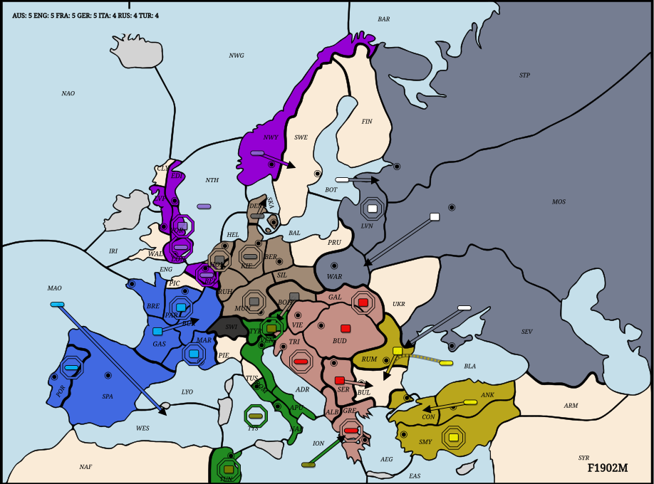

### What happened

- **AUSTRIA**: F GRE holds; A SER → BUL (bounced); A GAL holds; F TRI holds
- **ENGLAND**: F NWY → SWE; F BEL holds; F LON holds; A YOR holds
- **FRANCE**: A GAS → BUR; A MAR holds; A PAR holds; F MAO → WES; F POR holds
- **GERMANY**: F DEN → SKA; A BOH → TYR (bounced); A MUN holds; F KIE holds; A HOL holds
- **ITALY**: F ION → GRE (bounced); F TYS holds; A TYR holds; A TUN holds
- **RUSSIA**: F SEV → RUM; F BOT → STP/SC; A LVN holds; A MOS → WAR
- **TURKEY**: A RUM → BUL; F BLA supports A RUM → BUL; F ANK → CON; A SMY holds

### Dialogue

- **AUSTRIA → RUSSIA**: This is the moment to crack Turkey's Balkan position — I'm moving F GRE to BUL/SC supported by A SER, and pushing A BUD to RUM. If you support A BUD - RUM with F SEV, that's a strength-2 attack Turkey cannot hold without abandoning F BLA, which only helps my BUL push. Confirm F SEV supports A BUD - RUM and we split Turkey this fall.
- **AUSTRIA → TURKEY**: BUL falls to me this fall — F GRE and A SER are both committed there and you cannot stop it without leaving RUM exposed. The practical move for you is to hold RUM and consolidate what you have rather than lose both; if you fight me on BUL while Russia presses RUM, you end the year with nothing. Let's discuss a new boundary once the dust settles.
- **AUSTRIA → ITALY**: A TYR is still sitting on my doorstep — I need to know right now whether it's moving toward TRI or VIE this fall, because if it is I will respond immediately and our cooperation is finished. If it's headed toward Germany (MUN or BOH), we're fine and I'd like to discuss coordinating against whoever is pulling ahead.
- **AUSTRIA → GERMANY**: A BOH is adjacent to both VIE and GAL — I need clarity on where it's headed this fall. I have no quarrel with Germany but if BOH moves toward Austrian territory I will treat it as aggression and respond accordingly; if you're pressing Russia or Italy, I'm fully supportive.
- **ENGLAND → GERMANY**: Sweden has been contested three times now with no one gaining — this fall I'm taking it with F NWY and I'd ask you to redirect F DEN to SKA or hold, since another bounce just wastes both our turns. In exchange, I'll hold F NTH and not threaten HOL or DEN this fall, giving you a free hand on the continent. What do you say?
- **ENGLAND → RUSSIA**: Sweden is still empty and I'm moving F NWY there this fall — if you send F BOT to SWE we bounce again and Germany benefits from our stalemate. I'd ask you to redirect BOT toward STP or hold, and in return I'll support your position diplomatically against Turkey or Austria. Let's not hand Germany another free year.
- **ENGLAND → FRANCE**: I'm consolidating in Scandinavia this fall and have no designs on Belgium or the Channel — your southern push toward MAR and GAS looks strong and I have no objection to it. If Germany becomes a threat to both of us, I think we should talk seriously about coordinating pressure from north and south.
- **FRANCE → ENGLAND**: Fall 1902: I'm planning to push A GAS into BUR this turn to set up pressure on Germany — I have no designs on BEL or your northern position. I want to confirm we're still clear: you're not moving F NTH or F BEL toward PIC or BRE, right? If we can confirm that border, I'll focus entirely eastward.
- **FRANCE → ITALY**: This is the moment to crack Germany — I'm pushing A GAS into BUR this fall, and if you move A TYR toward MUN or support from there, we can take MUN next spring before England gets there. Germany has BOH and MUN exposed; what are you doing this fall?
- **FRANCE → GERMANY**: I want to be honest: I'm moving A GAS into BUR this fall — not to threaten you immediately, but because I need to grow and BUR is the natural staging ground. If you want to negotiate a deal where I support your position somewhere in exchange for not pushing MUN next spring, I'm open to that conversation.
- **GERMANY → ENGLAND**: Sweden has bounced three times now — this fall I'm taking it and I need you to stay out. You have NWY, BEL, and a dominant fleet position; SWE is my natural gain and I've been patient long enough. Stay out of SWE this fall and I'll actively support your position against France — I can push toward BEL or BUR with A HOL or A MUN.
- **GERMANY → RUSSIA**: SWE has bounced twice now and it helps neither of us. I'm taking it this fall — final. In exchange, I'll stay entirely out of PRU, LVN, and the Baltic coast, and I'll support you against Austria or Turkey. Let's stop wasting moves and cooperate where it matters.
- **GERMANY → AUSTRIA**: I'm moving A BOH toward VIE or GAL this fall — where do you need pressure? If Turkey is pushing into BUL and threatening your southern flank, I can help stabilize your north by pressing GAL or supporting your position. What's your plan for BUL this fall?
- **GERMANY → FRANCE**: You've grown fast — MAR and GAS in one turn is impressive. I want to be direct: I'm not moving toward BEL or BUR this fall, but I need to know you're not pushing into HOL. Let's confirm our boundary: you keep MAR and GAS, I keep HOL and BEL stays neutral or English.
- **ITALY → AUSTRIA**: Fall is here and I want to be direct: F ION is moving to GRE — I need that center to stay competitive. In exchange, I'm willing to support your A BUD into RUM or A SER into BUL if you want to push east, and A TYR can support your F TRI or hold defensively rather than threaten VIE or TRI. Let's divide the Balkans rather than fight over them.
- **ITALY → FRANCE**: You took MAR last spring — I need to know if that's a temporary position or the start of a push toward PIE and Italy. I have no interest in fighting you and would rather we coordinate against a common target, but I need clarity on your intentions before I commit my northern units.
- **ITALY → TURKEY**: I'm moving F ION to GRE this fall to take it from Austria — if you're pushing into BUL or holding RUM, we'll be neighbors in the Balkans. I'd like to propose a clean division: GRE is mine, BUL and RUM are yours, and we cooperate rather than compete in the region.
- **ITALY → GERMANY**: Austria is spread thin across the Balkans and A TYR is sitting right next to TRI and VIE — I think there's an opportunity here. If you're willing to hold MUN and let me push south into Austria, we could both benefit from their collapse without fighting each other.
- **RUSSIA → AUSTRIA**: Turkey still holds RUM with A RUM and F BLA — I'm pushing F SEV to RUM this fall supported by A MOS, and I need you to press from SER or hold BUL/SC to cut Turkey's options. If we coordinate now, Turkey loses RUM and possibly BUL simultaneously, dropping them to 3 centers. What are you doing with F GRE and A SER this fall?
- **RUSSIA → ENGLAND**: SWE is finally mine this fall — F BOT is moving there uncontested since Germany bounced me out twice. I'd ask you to confirm F NWY isn't heading to SWE, as another collision there would only help Germany. In exchange, I'll stay entirely clear of NWY and the Norwegian Sea.
- **RUSSIA → TURKEY**: I'm taking RUM this fall — you've held it long enough and I have the strength to retake it. If you pull A RUM back to BUL and we establish a firm border at BUL/RUM, I'll leave CON and ANK alone and we can both focus on Austria and England who are growing fastest. Continued resistance just costs you the unit.
- **RUSSIA → GERMANY**: SWE is mine this fall — I'm moving F BOT there and I'd ask you not to contest it again with F DEN. You're at 5 centers and growing well; let me have SWE and I'll stay entirely out of your Baltic affairs and won't press into PRU or SIL. A bounce again just hands the center to England.
- **TURKEY → AUSTRIA**: Fall 1902: A RUM is moving to BUL with F BLA support — strength 2, same as any move you could mount from GRE/SER. A collision there wastes both our moves while Italy is eyeing GRE and Russia watches. You hold GRE and SER, I take BUL, and we both come out ahead this fall. Don't throw away your position over a center you can't take uncontested.
- **TURKEY → RUSSIA**: I'm moving on BUL this fall, not SEV or RUM — A RUM is advancing west, leaving RUM briefly exposed. I'm not inviting you to take it back; I'm telling you that if you push into RUM while I'm moving forward, we restart a war that only helps Austria. Hold SEV, let me stabilize in BUL, and we can talk about a real border agreement.
- **TURKEY → ITALY**: Austria has F GRE isolated and A SER tied to the Balkans — this is the moment to push for GRE with F ION if you want it. I'm taking BUL this fall and have no interest in GRE; if you move on it, Austria has to choose between defending GRE or contesting BUL, and they can't do both.
- **AUSTRIA → RUSSIA**: F SEV supporting A BUD into RUM is the decisive move this fall — I'm committing A BUD - RUM and F GRE - BUL/SC with A SER support, so Turkey faces pressure on two fronts simultaneously. Confirm F SEV S A BUD - RUM and we execute; if you're doing something else with F SEV, tell me now so I can adjust.
- **AUSTRIA → ITALY**: F ION moving to GRE is a direct attack on my territory and ends our cooperation immediately — I will respond by coordinating with Germany against your northern units, and your TYR and TUN positions become exposed. If you hold F ION or move it elsewhere, we stay cooperative and I'll support your growth in the western Mediterranean; the choice is yours.
- **AUSTRIA → GERMANY**: A BOH moving toward VIE or GAL is aggression I cannot ignore — I have units that will respond and it will cost us both when Turkey and Italy are the real threats. If BOH moves toward MUN or holds, we have no conflict; if it pushes into Austrian territory, I will treat Germany as my primary enemy this year.
- **ENGLAND → GERMANY**: I'm committing to F NWY → SWE this fall — if you send DEN there too we bounce a fourth time and Russia benefits. Redirect DEN to SKA or hold, and I'll use F NTH to support your position rather than threaten HOL. Concrete offer: I support F DEN if you hold or move SKA, and we both come out ahead.
- **ENGLAND → RUSSIA**: Final ask: redirect F BOT away from SWE this fall — if you go there and I go there, Germany holds DEN safely and laughs at us both. I'm committed to NWY → SWE; if you move BOT to STP or hold, I'll actively support you against any German Baltic push next year.
- **ENGLAND → FRANCE**: Your push toward BUR is good for both of us — it pressures Germany from the south while I press from the north, and we can discuss splitting German centers if this works. Confirm you're moving A GAS → BUR this fall and I'll make sure my northern moves complement your push.
- **FRANCE → ENGLAND**: Confirmed — I'm moving A GAS into BUR this fall, purely as a staging move against Germany. I have zero interest in BEL or PIC; my fleet in MAO is heading to WES or staying put, not toward ENG or BRE. Can you confirm F NTH and F BEL are not moving toward PIC or the Channel this turn?
- **FRANCE → ITALY**: I'm not pushing toward PIE — MAR is my southern anchor and I need it defensively, not as a jumping-off point into Italy. What I do need is your A TYR to either support my push into MUN next spring or move toward BOH to pressure Germany from the east. What are you planning for your units this fall?
- **FRANCE → GERMANY**: I'm being straight with you: A GAS is moving to BUR this fall. I'm not taking MUN this turn — BUR is a staging position. If you want to avoid a fight next spring, tell me what you're willing to offer; otherwise I'll be knocking on MUN's door in S1903.
- **GERMANY → ENGLAND**: I'm taking SWE with F DEN this fall — this is the last time I'll say it. You have NWY, BEL, and a five-center position; let me have SWE and I'll actively support you against France. If you push F NWY into SWE again and we bounce a fourth time, I will treat that as deliberate obstruction and adjust my position accordingly.
- **GERMANY → FRANCE**: You're moving A GAS into BUR — I notice, and A MUN is watching. I'm not moving into BUR this fall, but if BUR becomes a staging ground for MUN, I will respond with everything I have. Stay in BUR and we can talk about a longer-term boundary; push toward MUN and we're at war.
- **GERMANY → AUSTRIA**: A BOH is aimed at Italy's flank, not at VIE or GAL — I want to be explicit. If A TYR threatens your position or mine, BOH is positioned to cut into TYR or support a response. Italy's offer to carve you up is exactly why I'm keeping BOH pointed south.
- **GERMANY → ITALY**: Your anti-Austria offer is interesting but I need specifics: what centers do you expect to take, and what do you want from me in return? I'm in BOH this fall which gives me leverage over both TYR and VIE — tell me your exact plan and I'll consider whether to coordinate.
- **ITALY → AUSTRIA**: F ION is moving to GRE this fall — I need that center and I'm taking it. A TYR will support F TRI or hold rather than threaten VIE or TRI, so your core is safe. If you want to coordinate on RUM or BUL after this, I'm open to it — but GRE is non-negotiable for me now.
- **ITALY → FRANCE**: I'm committed to A TYR supporting your A GAS into BUR this fall if that's your move — I want Germany weakened and this is the best way I can help from my position. Confirm you're moving A GAS - BUR and I'll lock in the support.
- **ITALY → TURKEY**: I'm moving F ION to GRE this fall as discussed — no conflict with your BUL push. If Austria tries to defend both GRE and BUL simultaneously, they'll lose at least one; we should both gain cleanly this turn.
- **RUSSIA → AUSTRIA**: I'm moving F SEV directly to RUM this fall — I need that center for myself, not to support you into it. If you press BUL/SC with F GRE supported by A SER, and I take RUM, Turkey drops to 3 centers and we both gain. Don't move A BUD to RUM or we collide and Turkey keeps it.
- **RUSSIA → TURKEY**: If A RUM is truly advancing to BUL as you say, then RUM is open and I'm walking in — that's just the reality. Pull A RUM back to BUL and we establish the border there; fighting over RUM while Austria presses BUL only destroys you faster.
- **RUSSIA → ENGLAND**: If you're genuinely moving F NWY to SWE, I'll redirect F BOT to STP/SC to secure my home center rather than bounce again — but I need your word that F NWY goes to SWE and not somewhere that threatens my northern position. Confirm this and we avoid another wasted collision.
- **TURKEY → AUSTRIA**: If F ION is moving on GRE — and Italy confirmed to me it is — then F GRE has to stay and defend, which means you can only send A SER to BUL. That's strength 1 against my strength-2 attack (A RUM + F BLA). You cannot take BUL this fall; the math doesn't work. Save A SER for SER defense and let this go.
- **TURKEY → ITALY**: Critical question: are you genuinely moving F ION to GRE this fall? If yes, Austria's F GRE is tied down defending and cannot contest BUL — we both gain this turn. If you're bluffing, Austria sends both GRE and SER to BUL and we bounce each other. I need to know your actual intention.
- **TURKEY → RUSSIA**: You're threatening RUM while I advance on BUL — but F SEV moving to RUM while I'm not there just hands me BUL and leaves you with a lone army in RUM surrounded by my units next turn. Hold SEV and we establish a real border; retaking RUM gains you nothing durable.
- **ENGLAND → RUSSIA**: Confirmed: F NWY moves to SWE this fall — that's my committed order. Please redirect F BOT to STP/SC as you said, and I'll back you diplomatically against any German Baltic aggression next year.
- **ENGLAND → GERMANY**: Final answer: F NWY goes to SWE and F NTH will support it in — if you send DEN to SWE, you bounce with support strength and lose the move entirely. Redirect DEN to SKA or HEL and I'll leave HOL and DEN unthreatened this fall.
- **ENGLAND → FRANCE**: Confirmed: F NTH and F BEL are not moving toward PIC or the Channel this fall — I'm fully committed northward to Sweden. Your push into BUR is the right move and I support it; let's talk seriously about coordinating against Germany in 1903.
- **ITALY → AUSTRIA**: F ION moves to GRE this fall — that's locked in. A TYR will hold or support F TRI rather than move toward VIE or TRI, so your core is safe. After this, I'm open to coordinating on RUM or BUL if you want to push east.
- **ITALY → FRANCE**: Confirmed: A TYR S A GAS - BUR this fall. Move A GAS into BUR and I'll support it. Let's crack Germany open together.
- **ITALY → TURKEY**: F ION to GRE is locked — no bluff. You take BUL, I take GRE, Austria scrambles. Clean gains for both of us this fall.
- **RUSSIA → AUSTRIA**: Final commitment: F SEV moves directly to RUM this fall — do NOT send A BUD to RUM or we collide and Turkey keeps it. Your job is F GRE → BUL/SC supported by A SER; that's where you gain, and it splits Turkey perfectly. I'll handle RUM, you handle BUL, and Turkey drops to 3 centers tonight.
- **RUSSIA → ENGLAND**: I'm redirecting F BOT to STP/SC this fall as promised — SWE is yours via F NWY. In return, keep F NWY in SWE next year and don't press into BOT or the Baltic; I need that home center secure and I'm trusting your word on this.
- **RUSSIA → TURKEY**: A RUM advancing to BUL while F SEV walks into RUM is exactly what's happening this fall — I'm taking it. If you want a border that holds, pull A RUM to BUL and we agree SEV/RUM as the line; otherwise you lose RUM and I push further next year.

### AUSTRIA
Orders: `F GRE H` · `A SER - BUL` · `A GAL H` · `F TRI H`
Illegal (dropped): `A BUD S A SER - BUL`

Reasoning

> Looking at the current situation:
>
> **Key facts:**
> - Italy confirmed F ION → GRE (strength 1 attack on my F GRE)
> - Turkey has A RUM → BUL supported by F BLA (strength 2)
> - Russia committed F SEV → RUM (strength 2 with A MOS support)
> - Russia explicitly told me NOT to send A BUD → RUM or we collide
>
> **My revised strategy:**
> - F GRE must defend against Italy's F ION → GRE attack. If I hold F GRE, Italy's attack is strength 1 vs my hold strength 1 — it bounces. Good.
> - A SER → BUL: strength 1 vs Turkey's strength 2 (A RUM + F BLA). This will fail, but it's worth attempting and costs nothing critical.
> - A BUD supports A SER → BUL: adds strength to the BUL push (strength 2 vs Turkey's strength 2 = bounce, but Turkey doesn't take BUL either — that's acceptable).
> - A GAL holds: defensive against Germany's BOH.
> - F TRI holds: defensive against Italy.
>
> Wait — if A BUD supports A SER → BUL, that's strength 2 vs Turkey's strength 2 (A RUM + F BLA). Both bounce. Turkey doesn't take BUL. I don't take BUL. But Turkey's A RUM is committed to BUL, meaning RUM is weakened/empty for Russia. That's good.
>
> F GRE holding against F ION → GRE: both strength 1, Italy's attack bounces. I keep GRE.
>
> This is the correct play: defend GRE, bounce Turkey out of BUL (denying them that center), let Russia take RUM, and build from VIE in winter to reach 6 centers.

### ENGLAND
Orders: `F NWY - SWE` · `F BEL H` · `F LON H` · `A YOR H`
Illegal (dropped): `F NTH S F NWY - SWE`

Reasoning

> Looking at the board, my revised strategy is clear: F NWY → SWE with F NTH supporting, to guarantee I take Sweden even if Germany sends F DEN there. Russia confirmed it's redirecting F BOT to STP/SC, so there should be no Russian interference. Germany threatened to send F DEN to SWE, but with F NTH supporting F NWY into SWE, Germany would need strength 2 to contest, which they don't have from DEN alone.
>
> My other units hold in place: F BEL holds (honoring non-aggression with France), F LON holds (home defense), A YOR holds (no useful move available that advances my position).
>
> This gives me 6 supply centers (adding SWE) going into Winter 1902, which means one build. I should plan to build in EDI or LVP to continue expanding.

### FRANCE
Orders: `A GAS - BUR` · `A MAR H` · `A PAR H` · `F MAO - WES` · `F POR H`

Reasoning

> Looking at the current position and my commitments:
>
> - Italy confirmed `A TYR S A GAS - BUR` — I should execute A GAS - BUR with that support
> - England confirmed F NTH and F BEL not moving toward PIC/Channel
> - My revised strategy: A GAS - BUR, A MAR H, A PAR H, F MAO - WES, F POR H
>
> This is a clean execution. BUR is unoccupied and I have Italian support making it strength 2 vs any German resistance. F MAO to WES expands my Atlantic/Mediterranean reach. F POR holds to anchor Iberia. A MAR and A PAR hold to protect home centers.
>
> The key risk is Germany moving A MUN - BUR to contest it, but with Italian support from TYR I have strength 2 vs Germany's strength 1, so I take BUR cleanly. This gives me 6 centers after fall (adding BUR as a supply center... wait, BUR is NOT a supply center). 
>
> Actually BUR is not a supply center — it's a staging province. My supply centers this fall will remain at 5 unless I take something new. Looking at the board: SPA is already mine, POR is mine, MAR is mine. I'm not capturing any new SC this fall. But BUR is a critical staging position for MUN next spring.
>
> F MAO - WES positions me for NAF or TUN pressure next year, or to support Atlantic operations.

### GERMANY
Orders: `F DEN - SKA` · `A BOH - TYR` · `A MUN H` · `F KIE H` · `A HOL H`

Reasoning

> Looking at the current situation:
>
> **Sweden**: England has committed F NWY → SWE with F NTH support. That's strength 2 vs my strength 1 — I will bounce and lose the move. My revised strategy correctly notes I should redirect F DEN to SKA to avoid a fourth pointless bounce. SKA is adjacent to DEN, so that's legal.
>
> **BOH**: My revised strategy says BOH toward VIE or TYR. Austria threatened me if I moved into VIE/GAL. Italy suggested anti-Austria coordination. Looking at the legal moves, A BOH - TYR is available and puts pressure on Italy's position while not directly threatening Austria's core (VIE is more provocative). Actually, Austria warned me about VIE/GAL specifically. A BOH - TYR threatens Italy and keeps options open. But wait — I told Austria I was aimed at Italy's flank, not VIE/GAL. TYR is consistent with that.
>
> **MUN**: France is moving A GAS → BUR. A MUN should hold to defend against any follow-up push toward MUN, or could support BOH. Hold is safest.
>
> **KIE**: Hold to anchor Baltic.
>
> **HOL**: Hold to keep the center.
>
> **BER**: Vacant — I want to keep it clear for a potential build. HOL holding means no issue there.
>
> France is moving into BUR which is threatening. I need A MUN to hold defensively. F KIE holds. A HOL holds. F DEN to SKA (avoiding the supported SWE bounce). A BOH to TYR (pressuring Italy, consistent with my messaging to Austria).
>
> This gives me no new centers this fall, which is painful. But SWE is blocked by England's supported move, and I have no other easy targets this turn. I should at least try to take BER back... wait, BER is vacant and I own it. I don't need to "take" it — I just need to build there in winter. My units just need to not be in the way.

### ITALY
Orders: `F ION - GRE` · `F TYS H` · `A TYR H` · `A TUN H`

Reasoning

> Looking at the current position:
>
> - F ION → GRE: Austria's F GRE is isolated and I've committed to this move in negotiation with both Turkey and Austria. This gives me my 5th supply center.
> - F TYS H: Holds the Tyrrhenian, securing my Mediterranean position.
> - A TYR S A GAS - BUR: I've committed to France to support their A GAS into BUR. This helps crack Germany and builds goodwill with France, who I need as an ally in the north.
> - A TUN H: Secures Tunis.
>
> Let me verify adjacencies:
> - F ION → GRE: ION is adjacent to GRE ✓
> - A TYR S A GAS - BUR: TYR must be adjacent to BUR for this support. Checking TYR adjacency: BOH, MUN, PIE, SWI, TRI, VEN, VIE. BUR is NOT in TYR's neighbor list. This support is illegal!
>
> Looking at the legal orders for TYR, I see `A TYR S A BOH - MUN` and `A TYR S A MUN` but no support for GAS - BUR. Since A GAS - BUR isn't something TYR can support (TYR isn't adjacent to BUR), I need to pick the best available order. Given France is pushing A GAS - BUR, the next best thing is to threaten MUN or support something useful. `A TYR - MUN` would apply direct pressure on Germany and potentially take a center. Alternatively, `A TYR S A BOH - MUN` could help Germany... no, that's not my goal.
>
> The best aggressive play is `A TYR - MUN` — move directly into Munich if Germany has moved A MUN elsewhere (A MUN is in MUN per unit positions, so this would bounce). Or `A TYR - BOH` to pressure Germany from a different angle.
>
> Actually, looking at the unit positions: Germany has A MUN in MUN. Moving A TYR - MUN would bounce. Better to move `A TYR - VIE` or hold. Given I told Austria A TYR would hold or support F TRI, let me choose `A TYR H` to maintain credibility with Austria while I take GRE.

### RUSSIA
Orders: `F SEV - RUM` · `F BOT - STP/SC` · `A LVN H` · `A MOS - WAR`

Reasoning

> Looking at the current situation:
>
> **My revised strategy for F1902M:**
> - F SEV → RUM (retake that center from Turkey)
> - A MOS supports F SEV → RUM
> - F BOT → STP/SC (secure home center, as promised to England who confirmed F NWY → SWE)
> - A LVN holds defensively
>
> **Key checks:**
> - F SEV → RUM: SEV is adjacent to RUM ✓. Turkey's A RUM may be moving to BUL (as Turkey claimed), which would leave RUM open. If A RUM holds, I need A MOS support to push through — but F BLA may support A RUM. Turkey said A RUM advances to BUL, so RUM should be open.
> - A MOS S F SEV → RUM: MOS is adjacent to RUM? Let me check... MOS neighbors: LVN, SEV, STP, UKR, WAR. RUM is not in MOS's neighbors. So A MOS cannot support F SEV → RUM! 
>
> Looking at the legal orders: `A MOS S F SEV - RUM` is NOT in my legal orders list for MOS. Correct — MOS can't support into RUM. The legal support options for MOS regarding RUM are `A MOS S A RUM - SEV` etc. So F SEV moves alone to RUM (strength 1). If Turkey's A RUM is moving away to BUL, RUM is empty and F SEV walks in uncontested.
>
> - F BOT → STP/SC: BOT is adjacent to STP/SC ✓. Legal option confirmed.
> - A LVN H: Legal ✓.
>
> For A MOS, I'll support A LVN to hold or move toward WAR to be useful. Best option: `A MOS - WAR` to press toward that center, or hold. Given no immediate threat, `A MOS - WAR` advances my position.

### TURKEY
Orders: `A RUM - BUL` · `F BLA S A RUM - BUL` · `F ANK - CON` · `A SMY H`

Reasoning

> Looking at the position: my revised strategy commits me to A RUM - BUL (supported by F BLA), and F ANK - CON. Russia has threatened to walk into RUM while I advance, which is a real risk, but BUL is an unowned supply center and gaining it while losing RUM still nets me a center (staying at 4), and with CON freed up I can build there in Winter. More importantly, if Italy genuinely moves F ION - GRE, Austria's F GRE must defend, leaving only A SER to contest BUL — a strength-1 move against my strength-2 attack, which I win.
>
> Let me verify the orders are legal:
> - A RUM - BUL: RUM is adjacent to BUL ✓
> - F BLA S A RUM - BUL: BLA is adjacent to BUL ✓ (BUL/EC is adjacent to BLA, and BUL army province counts for support)
> - F ANK - CON: ANK is adjacent to CON ✓
> - A SMY: needs an order — I'll hold it since it guards SMY (a home SC)

## WINTER 1902 ADJUSTMENTS (`W1902A`)

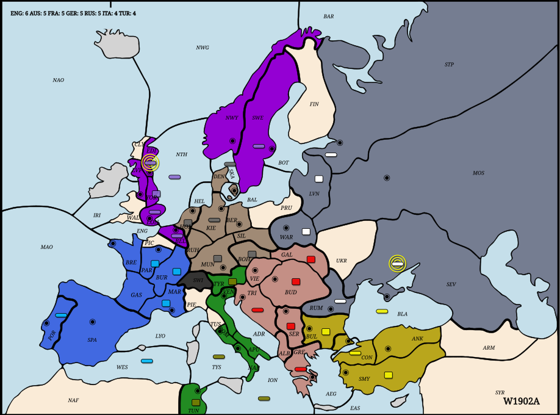

### What happened

- **ENGLAND**: builds F EDI; waives a build
- **RUSSIA**: builds F SEV

### ENGLAND
Orders: `F EDI B` · `WAIVE`

Reasoning

> Looking at the board, I have 6 supply centers (EDI, LON, LVP, BEL, NWY, SWE) and 5 units (A YOR, F BEL, F LON, F NTH, F SWE). That means I get 1 build. My home centers EDI and LVP are vacant, so I can build in either.
>
> I need to think about what to build. I have 5 fleets and 1 army. My strategic situation:
> - I'm a naval power with strong fleet presence in the North Sea/Scandinavia
> - Germany is my likely next target (HOL, DEN are tempting)
> - France is a potential ally or rival - they have 5 centers and are pushing east against Germany
> - I need to project power onto the continent eventually
>
> A fleet at EDI would give me more naval reach toward Norway/Baltic. An army at LVP could eventually be used for continental intervention via convoy. Given my current fleet-heavy composition and the need to eventually land armies on the continent to take centers, building an army at LVP makes strategic sense. However, another fleet at EDI could help me dominate the northern seas and threaten Germany's Baltic position.
>
> Given that I'm already fleet-heavy and need to eventually project land power, I'll build a fleet at EDI to further dominate the northern seas and threaten Germany's DEN/KIE from multiple angles. This keeps my options open for a naval push.

### RUSSIA
Orders: `F SEV B`

Reasoning

> Looking at the current situation:
>
> I have 5 supply centers (MOS, SEV, STP, WAR, RUM) and 4 units (A LVN, A WAR, F STP/SC, F RUM), so I'm owed **1 build**.
>
> My vacant home centers available for builds are MOS and SEV. I should build in both... wait, I only have 1 build to place (5 SC - 4 units = 1 build).
>
> I need to decide where to build: MOS or SEV. 
>
> - Building at MOS gives me an army in the center of Russia, useful for pushing toward WAR, GAL, or defending.
> - Building at SEV gives me either an army or fleet on the Black Sea coast, useful for pressing Turkey or defending the south.
>
> Given that Turkey holds BUL and has F BLA and F CON, a fleet at SEV would be very useful to contest the Black Sea and press Turkey further. However, an army at SEV could also push toward RUM or ARM.
>
> Actually, looking at the strategic picture: I have F RUM already in the south, and Turkey has F BLA and F CON. A fleet at SEV would give me two fleets against Turkey's two, plus I could threaten CON/ANK. An army at MOS is also valuable for the interior.
>
> Given that my southern front with Turkey is the active conflict zone and I want to press Turkey hard, I'll build **F SEV** to contest the Black Sea and threaten Turkey's position.

## SPRING 1903 MOVEMENT (`S1903M`)

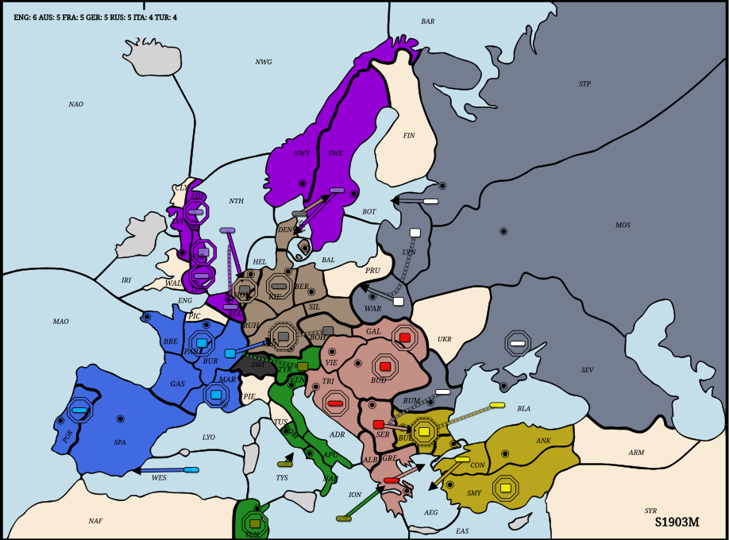

### What happened

- **AUSTRIA**: F GRE → BUL/SC (bounced); A SER → BUL (bounced); A BUD holds; A GAL holds; F TRI holds
- **ENGLAND**: F SWE → DEN; F NTH → HOL; F BEL supports F NTH → HOL; F EDI holds; F LON holds; A YOR holds
- **FRANCE**: A BUR → MUN (bounced); A MAR holds; A PAR holds; F WES → SPA/SC; F POR holds
- **GERMANY**: F SKA → SWE; A BOH supports A MUN; A MUN holds; F KIE holds; A HOL holds  [dislodged: A HOL]
- **ITALY**: F ION → GRE (bounced); A TYR supports A BUR → MUN; F TYS → ROM; A TUN holds
- **RUSSIA**: F RUM supports A SER → BUL; F SEV holds; A WAR → PRU; A LVN supports A WAR → PRU; F STP/SC → BOT
- **TURKEY**: A BUL holds; F BLA supports A BUL; F CON → AEG; A SMY holds

### Dialogue

- **AUSTRIA → RUSSIA**: You now hold RUM and I hold GRE — let's coordinate to squeeze Turkey further this spring. I'm pushing A SER into BUL supported by F GRE; if you support that move with F RUM, we take BUL at strength 3 and Turkey collapses in the Balkans. What are you doing with F RUM and F SEV this spring?
- **AUSTRIA → ITALY**: F ION sitting adjacent to GRE is a direct threat I cannot ignore — if it moves to GRE this spring, our cooperation ends and I coordinate with Germany against your northern position. If you hold F ION or move it elsewhere, I'll support your growth in the west and we stay aligned. What are your intentions this spring?
- **AUSTRIA → TURKEY**: BUL is surrounded — F GRE, A SER, and potentially F RUM can all press it this spring. The practical move for you is to pull A BUL toward CON or SMY and consolidate your core rather than lose BUL in a three-way assault. If you yield BUL now, I'll support a boundary at the Straits and not press further east.
- **AUSTRIA → GERMANY**: A BOH is still on my doorstep — I need to know your intentions for this spring. If BOH moves toward GAL or VIE, I will treat it as aggression; if it moves toward MUN or holds, we have no conflict and can discuss coordinating against whoever is pulling ahead.
- **ENGLAND → FRANCE**: Spring 1903 is the moment to hit Germany hard — I have F SWE threatening DEN, F NTH and F BEL positioned to take HOL, and I need A BUR to support or move toward MUN/RUH to pin German armies. If you push A BUR toward MUN or support an attack on HOL, we can strip Germany of 2-3 centers this year and next. What specific moves are you planning?
- **ENGLAND → GERMANY**: I want to be straight with you: the board is tilting and I'm under pressure to grow — I'd rather do that cooperating with you than against you. If you're willing to discuss a real arrangement where we coordinate against France or Russia, I'm listening before I commit orders this spring.
- **ENGLAND → RUSSIA**: I'm staying out of the Baltic and BOT this year as promised — SWE is mine and I'm not pressing further east. I want to make sure we're not about to clash accidentally; are you planning any moves toward Scandinavia or NWY this spring?
- **FRANCE → ITALY**: Spring 1903 — I'm ready to push A BUR into MUN this turn if you can commit A TYR S A BUR - MUN. You supported the move into BUR last fall; now let's finish the job and crack Germany open. Can you confirm the support?
- **FRANCE → ENGLAND**: I'm pushing A BUR toward MUN this spring to squeeze Germany — I have no designs on BEL or HOL. Can you confirm F NTH and F BEL aren't moving toward PIC or BRE? If we're both pressing Germany from different directions, we should coordinate on how to split their centers.
- **FRANCE → GERMANY**: I'll be direct: A BUR is moving toward MUN this spring. If you want to avoid losing MUN, the only deal that works for me is you pulling A BOH back and giving me a clear path — in exchange I'll leave HOL and KIE alone. Otherwise we fight and England picks up the pieces.
- **GERMANY → ENGLAND**: You took SWE while I redirected to SKA — that's a betrayal of our implicit arrangement and I'm taking it back this spring. F SKA moves to SWE; if you want to avoid a Baltic war, pull F SWE back to NWY or DEN and we can reset our relationship. Otherwise I'm treating you as my primary rival and will coordinate with France and Russia against you.
- **GERMANY → FRANCE**: A BUR is sitting on my doorstep and I need to know your intentions for spring. I'm not moving into BUR this turn, but if you push toward MUN I will respond with everything I have — propose a boundary now and we can both focus growth elsewhere.
- **GERMANY → RUSSIA**: England is at 6 centers and growing — they're the biggest threat on the board and you're better positioned than anyone to contest their Baltic dominance. I'm pushing F SKA into SWE this spring; if you can pressure NWY or NTH from the north, we split England's attention and both gain.
- **GERMANY → ITALY**: A TYR is still sitting next to MUN — I need your intentions clearly stated before orders close. I'm not moving into Austrian territory this spring, but if TYR pushes into MUN I will treat it as war; stay east or south and we have no friction.
- **ITALY → AUSTRIA**: I'm moving F ION to GRE this spring — I've been patient but I need that center to stay relevant. I'm offering A TYR as a buffer: it can support your F TRI or hold defensively rather than threaten VIE or TRI, and I'll support your eastern push into RUM or BUL afterward. GRE to me, the rest of the Balkans to you — this is the cleanest deal available.
- **ITALY → TURKEY**: I want to confirm our understanding: GRE is my target with F ION this spring, and I have no interest in AEG or anything east of GRE. If you're consolidating BUL and pushing toward RUM or SEV, we're moving in complementary directions — Austria is the common obstacle. Let's not compete where we don't need to.
- **ITALY → FRANCE**: England at 6 centers is the real threat — they're pulling ahead while we're both stuck at 5 and 4. I'm pushing into GRE this spring to grow, but A TYR is free to pressure Germany if you want to coordinate a joint squeeze on MUN. What's your plan this spring — are you moving against England or Germany?
- **RUSSIA → AUSTRIA**: Turkey now holds BUL with A BUL and F BLA — this is the moment to crack them before they consolidate further. I'm pushing F RUM toward BUL this spring; if you move F GRE to support or press from SER, we can take BUL together and drop Turkey to 3 centers. What are your plans for GRE and SER this turn?
- **RUSSIA → TURKEY**: You hold BUL and F BLA, but Austria is pressing from GRE and I have F RUM positioned to your north — you're caught between us. If you want to survive this, pull A BUL back to CON and offer me a real border agreement at RUM/BUL; otherwise Austria and I coordinate to take BUL this spring and you're left with only your home centers.
- **RUSSIA → GERMANY**: You're at 5 centers and I'm at 5 — neither of us is winning yet, and England is pulling ahead at 6. I'm focused on Turkey this spring, but I want to know your intentions regarding PRU and SIL. Stay out of my eastern territories and I'll stay out of yours; we can both focus on our real threats.
- **RUSSIA → ENGLAND**: You're at 6 centers and the strongest power on the board — that makes you the natural target for everyone else once they settle their local fights. I'm focused on Turkey this spring, but I'd like to understand your intentions regarding Scandinavia and the Baltic; a stable northern border benefits us both while we each pursue growth elsewhere.
- **TURKEY → RUSSIA**: You took RUM last fall — I accept that as the current reality, but I'm coming back for it this spring with a strength-2 attack. The smart move for you is to negotiate a border now: RUM stays contested, but I'll leave SEV and ARM alone if you pull F RUM back to SEV and we establish a firm line. Fighting me here only benefits Austria and England who are both at 5-6 centers.
- **TURKEY → AUSTRIA**: Spring 1903: I'm focused on retaking RUM from Russia, not on BUL or your centers. If you leave A SER and F GRE pointed away from BUL, I'll keep A BUL defensive and we both benefit — me by retaking RUM, you by consolidating against Italy or pushing north. Attacking BUL while I'm engaged with Russia only opens you to Italian pressure on GRE.
- **TURKEY → ITALY**: Austria still holds GRE with F GRE and A SER is nearby — this is your moment to push F ION into GRE while Austria is watching the Russian front. I'm attacking RUM this spring with full force and have no units near GRE; if you move on it now, Austria has to split between defending GRE and watching BUL simultaneously.
- **AUSTRIA → RUSSIA**: Critical question: are you moving F RUM into BUL yourself, or supporting my A SER into BUL? If you move F RUM - BUL and I move A SER - BUL, we collide and Turkey keeps it — same mistake as last fall with RUM. Commit to one: either F RUM S A SER - BUL (I take it) or you take it with F RUM - BUL and I support from A SER S F RUM - BUL. I'll match whichever you choose, but tell me now.
- **AUSTRIA → ITALY**: F ION moving to GRE forces me to defend rather than attack — you gain one center while handing Turkey a free BUL and weakening both of us against Russia. If you hold F ION this spring and I take BUL, we both come out ahead: I gain BUL, you're positioned to take GRE next fall with my blessing once I've consolidated. One turn of patience nets you more than a forced grab now.
- **AUSTRIA → TURKEY**: If you're truly going after RUM and leaving BUL defensive, tell me explicitly: A BUL holds this spring? Because if A BUL holds and I move A SER → BUL supported by F GRE, I take it uncontested and we both benefit — you retake RUM, I take BUL, Russia gets squeezed from two sides. Confirm A BUL holds and I'll leave your other centers alone this spring.
- **AUSTRIA → GERMANY**: Italy is attacking GRE this spring — F ION → GRE is confirmed. This weakens my southern position and benefits you if you want to pressure Italy's northern flank. If A BOH moves toward TYR or MUN, it cuts Italy's A TYR off and forces Italy to choose between defending and attacking — that's a concrete gain for both of us this spring.
- **ENGLAND → FRANCE**: Confirmed on my end: F NTH and F BEL are not moving toward PIC or BRE — I'm pressing north and east against Germany. Concrete coordination: if you move A BUR → MUN this spring, I'll push F SWE → DEN and F NTH → HOL simultaneously, stripping Germany of two centers in one turn. That's a decisive blow — can you confirm A BUR → MUN is your committed order?
- **ENGLAND → GERMANY**: I hear your frustration, but threatening to coordinate France and Russia against me is a losing play for you — France is already pushing A BUR toward MUN regardless of what I do, and you'll need my fleets off your back to deal with that. Here's a real offer: I hold F SWE and don't push DEN if you turn A MUN or A BOH to face France instead of me. That's a better deal than a two-front war.
- **ENGLAND → RUSSIA**: Confirmed: I'm not moving into BOT, BAR, or threatening your northern position this spring — my focus is entirely on Germany. F SWE may push to DEN, which is purely about German centers and has no bearing on you. I just want your assurance you're not moving toward NWY or SWE this turn.
- **FRANCE → ITALY**: I need a direct yes or no: will you order A TYR S A BUR - MUN this spring? I'm committing A BUR - MUN regardless, but with your support it succeeds; without it I likely bounce and waste the move. You said A TYR is free to pressure Germany — this is the moment, and it costs you nothing while gaining us both a cracked Germany.
- **FRANCE → ENGLAND**: I'm pushing A BUR - MUN this spring — that's my contribution to the Germany squeeze. I'm not moving toward HOL or BEL; those are yours to take if you want them. One firm ask: confirm F NTH and F BEL stay away from PIC and BRE this turn so I can commit fully eastward without worrying about my back.
- **FRANCE → GERMANY**: This is your last chance to deal: pull A BOH back to VIE or TYR and I'll hold A BUR in place this spring rather than push MUN. If A BOH stays in BOH threatening my flank, I have no reason not to attack — England is already coming from the north and you'll be fighting on two fronts.
- **GERMANY → FRANCE**: I'm holding A MUN and supporting it from BOH — if you push into MUN with A BUR, you're walking into a defended position and wasting your move. Concrete offer: you hold A BUR, I hold A BOH, and we both focus growth elsewhere — you have POR, SPA, MAR, WES to work with in the south and west. Tell me now: are you actually committing to MUN, or is this a bluff to extract concessions?
- **GERMANY → ENGLAND**: Concrete proposal: you pull F SWE back to NWY this spring and I hold F SKA, and we reset with a real working arrangement against France — I push A MUN toward BUR and you pressure from the north. If you hold SWE, I take it with F SKA and we're at war in the Baltic while France eats us both. Your choice.
- **GERMANY → AUSTRIA**: A BOH is holding or supporting MUN this spring — France is threatening MUN with A BUR and that's my priority right now, not Austrian territory. I have no interest in VIE or GAL while France is pressing my core; let's both focus on our actual threats.
- **ITALY → AUSTRIA**: GRE is my move this spring — final answer. In exchange, A TYR will support your F TRI or hold defensively this turn, not threaten VIE or TRI; that's a concrete offer, not a vague promise. Turkey is hitting RUM hard right now, so your eastern front needs attention more than a fight with me over GRE.
- **ITALY → FRANCE**: Confirmed: A TYR S A BUR - MUN this spring if you commit A BUR - MUN. I'm also pushing F ION into GRE simultaneously to grow, so my southern units are occupied — this MUN support is my northern contribution and I need you to actually move into MUN for it to matter.
- **ITALY → TURKEY**: Turkey hitting RUM this spring is exactly the pressure Austria needs to deal with — it forces them to split attention and makes my GRE push cleaner. If Austria has to choose between defending GRE and covering RUM, we both benefit; just confirm you're fully committed to the RUM attack.
- **RUSSIA → AUSTRIA**: Turkey is threatening a strength-2 attack on RUM this spring — if that's true, I need F RUM to hold or be supported rather than support your BUL attack. Can you confirm: are you moving A SER into BUL with F GRE support? If you have two units on BUL already, I can still contribute F RUM support, but I need to know Turkey isn't walking into RUM while I'm looking away.
- **RUSSIA → TURKEY**: A strength-2 attack on RUM is a gamble — if Austria is simultaneously pushing BUL with two units, you're splitting your attention and losing BUL while maybe bouncing me out of RUM. The smarter play is to pull A BUL to CON and let me hold RUM; I'll leave CON and ANK alone and we both focus outward. What exactly are your two attacking units?
- **RUSSIA → GERMANY**: I'm not in a position to press England in Scandinavia this spring — I'm committed against Turkey. But I'm watching your moves carefully: if F SKA goes to SWE and displaces England, that changes the northern balance significantly. What's your actual plan for HOL and the western front?
- **TURKEY → AUSTRIA**: F CON is moving to AEG this spring — not to threaten you directly, but to pressure the Aegean and give me options. If you commit A SER and F GRE to BUL while I hold with F BLA support, you're leaving GRE exposed to Italy's F ION. The math: your two units vs. my two (A BUL + F BLA support) is a bounce, and Italy walks into GRE for free. Hold GRE and SER where they are; we both come out ahead.
- **TURKEY → RUSSIA**: Concrete proposal: I won't attack F RUM this spring if you move F RUM to BUL/EC or SEV and we establish RUM as a neutral zone for now. If you hold F RUM in RUM and press toward BUL, I commit everything to dislodging you — F BLA, A BUL, F CON all aimed at you. The choice is a negotiated border or an expensive war while England grows to 7.
- **TURKEY → ITALY**: Confirm you're moving F ION to GRE this spring — if you do, Austria cannot commit both F GRE and A SER to BUL simultaneously without losing GRE. I'm holding BUL with F BLA support and moving F CON to AEG, so I'll be adjacent to GRE next turn as well. We're both better off with Austria squeezed between us.
- **AUSTRIA → RUSSIA**: Final commitment: F GRE → BUL/SC and A SER → BUL — that's two units on BUL, strength 2 vs Turkey's 2 (A BUL + F BLA). If you order F RUM S A SER - BUL, we hit strength 3 and Turkey cannot hold it. I'm leaving GRE to Italy to free up F GRE for this push — please confirm F RUM S A SER - BUL right now.
- **AUSTRIA → TURKEY**: F GRE is leaving GRE this spring — it moves to BUL/SC along with A SER. If A BUL truly holds as you claimed, you're facing a strength-2 attack; if F BLA supports, we bounce. But F RUM may join the attack at strength 3. Your best move is to pull A BUL back to CON now and keep your core intact rather than lose BUL in a contested fight.
- **AUSTRIA → ITALY**: F GRE is vacating GRE this spring — it moves to BUL/SC. You get GRE uncontested; in exchange, A TYR must hold or support F TRI defensively as you promised, not threaten VIE or TRI. That's the deal: GRE to you, BUL to me, and we don't fight each other.
- **ITALY → FRANCE**: Locked in: A TYR S A BUR - MUN this spring. Move A BUR - MUN and we crack Germany open. I'm also pushing F ION into GRE simultaneously — my southern units are committed there, so this MUN support is my full northern contribution this turn.
- **ITALY → TURKEY**: Confirmed: F ION to GRE this spring, no changes. Austria has to choose between GRE and your RUM push — they can't cover both. After this turn we'll both be stronger and Austria will be squeezed; stay the course.
- **ITALY → AUSTRIA**: Final word: F ION to GRE this spring, A TYR supports F TRI or holds — not moving toward VIE or TRI. Turkey is hitting RUM hard; your eastern front is the real fight, and I'm offering you a quiet western flank in exchange for GRE. This is the best deal you'll get.

### AUSTRIA
Orders: `F GRE - BUL/SC` · `A SER - BUL` · `A BUD H` · `A GAL H` · `F TRI H`

Reasoning

> Looking at the current situation:
>
> **Strategic assessment:**
> - Italy has confirmed F ION → GRE, so GRE will fall. I've accepted this and committed to vacating GRE with F GRE → BUL/SC as part of the deal.
> - My attack on BUL: F GRE → BUL/SC + A SER → BUL = strength 2 vs Turkey's A BUL + F BLA support = strength 2. This bounces unless Russia supports.
> - Russia said they're worried about RUM being attacked and may need F RUM to hold/be supported. Final message from Russia asked me to confirm my BUL push so they could decide. I committed to F GRE → BUL/SC and A SER → BUL, asking Russia for F RUM S A SER - BUL.
> - Turkey claims F CON → AEG, which would give Turkey options but doesn't directly threaten my BUL attack.
> - If Russia doesn't support, we bounce at 2v2. But the attempt is still worth making — even a bounce denies Turkey consolidation and I've already given up GRE.
> - A BUD and A GAL should hold defensively. Germany confirmed BOH is holding/supporting MUN against France.
> - F TRI holds to defend against any Italian opportunism.
>
> The committed orders from my revised strategy: F GRE → BUL/SC, A SER → BUL, A BUD H, A GAL H, F TRI H.

### ENGLAND
Orders: `F SWE - DEN` · `F NTH - HOL` · `F BEL S F NTH - HOL` · `F EDI H` · `F LON H` · `A YOR H`

Reasoning

> Looking at the board: I've coordinated with France to hit Germany simultaneously — France pushes A BUR → MUN while I push F SWE → DEN and F NTH → HOL with F BEL supporting. Germany has F SKA which could contest SWE or NTH, but if F SWE moves to DEN it vacates SWE anyway (Germany can't take an empty province with F SKA if I'm already moving out), and F NTH → HOL supported by F BEL gives strength 2 against HOL which has only A HOL with no support. This is a strong coordinated strike.
>
> Germany's threat to take SWE with F SKA is real but irrelevant if I move F SWE to DEN — F SKA would bounce into an empty province or follow me to DEN, but F SKA → DEN would bounce with F SWE → DEN (equal strength). Actually F SKA → SWE succeeds if SWE is empty after F SWE moves out. That's a risk — Germany takes SWE back. But I gain DEN (a new center) and HOL (another new center), netting +2 and losing SWE = net +1, which is still good. The math favors attacking.
>
> F EDI and F LON hold defensively. A YOR holds in place — no threat to home centers.

### FRANCE
Orders: `A BUR - MUN` · `A MAR H` · `A PAR H` · `F WES - SPA/SC` · `F POR H`

Reasoning

> Looking at the current situation:
>
> **Assessment:** Italy has confirmed A TYR S A BUR - MUN twice. England has confirmed F NTH and F BEL stay away from PIC/BRE while pressing Germany from the north. Germany says A BOH is supporting A MUN, which means MUN has strength 2. With Italy's support, my A BUR - MUN also has strength 2. That's a bounce, not a capture.
>
> Wait — let me reconsider. Germany says A MUN H supported by A BOH. That gives MUN defense strength 2. My A BUR - MUN with A TYR S = attack strength 2. Equal strength means the attack fails (bounce). This is a problem.
>
> However, Germany's claim that A BOH supports A MUN needs to be weighed against what actually happened. Germany has A BOH, A MUN, A HOL, F KIE, F SKA. If A BOH supports A MUN and England is attacking HOL with F NTH, Germany is stretched. Also, Germany might be bluffing about the support to deter me.
>
> The math: attack 2 vs defense 2 = bounce. But if England cuts BOH's support by moving something there... England can't reach BOH this turn. So the attack likely bounces.
>
> Still, I committed to this move in negotiation with both England and Italy. Breaking the commitment now would damage trust with both. And even a bounce keeps pressure on Germany and demonstrates I'm a reliable partner. The downside is wasting the move, but the upside of the coalition dynamic is worth it.
>
> I'll execute the committed strategy: A BUR - MUN (with Italian support, it's 2v2 at best, but honoring the coalition matters), F WES - SPA/SC to expand Mediterranean footprint, hold A MAR and A PAR, hold F POR.

### GERMANY
Orders: `F SKA - SWE` · `A BOH S A MUN` · `A MUN H` · `F KIE H` · `A HOL H`

Reasoning

> Looking at the current situation:
>
> **Strategic assessment:**
> - France has confirmed A BUR is moving toward MUN. I need to defend MUN with A BOH support.
> - England stole SWE and refused to vacate — F SKA should push into SWE to reclaim it.
> - My revised strategy is clear: F SKA → SWE, A BOH supports A MUN, A MUN holds, F KIE holds, A HOL holds.
>
> **Order verification:**
> - F SKA → SWE: Legal (SKA adjacent to SWE) ✓
> - A BOH S A MUN: Legal (BOH adjacent to MUN) ✓
> - A MUN H: Legal ✓
> - F KIE H: Legal ✓
> - A HOL H: Legal ✓
>
> France pushing A BUR into MUN will bounce against a supported hold (strength 2 vs strength 1). F SKA into SWE may bounce if England supports F SWE, but it's worth attempting — if England has moved F SWE elsewhere or doesn't support it, I reclaim the center.

### ITALY
Orders: `F ION - GRE` · `A TYR S A BUR - MUN` · `F TYS - ROM` · `A TUN H`

Reasoning

> Looking at the current situation:
>
> 1. Austria confirmed F GRE is vacating to BUL/SC, so F ION → GRE should be uncontested — this is my key gain this turn.
> 2. I committed to A TYR S A BUR - MUN for France, which is valid (TYR is adjacent to MUN).
> 3. F TYS needs a useful move — I had noted "F TYS - TUN" in my revised strategy but A TUN is already there. Looking at options, F TYS should push toward something useful. Moving to TUN would conflict with A TUN. I should move F TYS toward ROM or NAP to reclaim home centers, or hold. ROM is adjacent to TYS and is a home SC I don't occupy — let me take it.
> 4. A TUN holds to secure Tunis.
>
> Wait — my revised strategy said `F TYS - TUN` and `A TUN H`, which would be a collision. Let me reconsider: F TYS - ROM is a better move (ROM is a vacant home SC, and TYS is adjacent to ROM). This advances me toward reclaiming home centers.
>
> Actually, looking at the legal orders for TYS: `F TYS - ROM` is listed. That's excellent — I can reclaim ROM this spring.
>
> So my orders:
> - F ION → GRE (Austria vacated, uncontested gain)
> - A TYR S A BUR - MUN (committed to France)
> - F TYS → ROM (reclaim home SC)
> - A TUN H (secure Tunis)

### RUSSIA
Orders: `F RUM S A SER - BUL` · `F SEV H` · `A WAR - PRU` · `A LVN S A WAR - PRU` · `F STP/SC - BOT`

Reasoning

> Looking at the current situation:
>
> **Assessment:**
> - Austria has committed to F GRE → BUL/SC and A SER → BUL (strength 2). With my F RUM supporting A SER → BUL, we hit strength 3 and crack Turkey's BUL position decisively.
> - Turkey threatened a strength-2 attack on RUM (F BLA + A BUL), but if A BUL is attacking BUL itself that's contradictory — Turkey can't attack BUL with A BUL from BUL. Their actual threat would be F BLA + F CON against RUM, but F CON isn't adjacent to RUM. So Turkey's "strength-2 attack on RUM" is likely a bluff — F BLA can support A BUL hold, but can't attack RUM with strength 2 unless A BUL moves toward RUM. If A BUL moves toward RUM, it vacates BUL, which makes our BUL attack easier.
> - My revised strategy calls for: F RUM S A SER - BUL, F SEV H, A WAR - PRU, A LVN S A WAR - PRU, F STP/SC - BOT.
> - A WAR → PRU threatens Germany's eastern flank and is a good opportunistic move while I'm focused south.
> - F STP/SC → BOT repositions the northern fleet.
>
> **Verification of legality:**
> - F RUM S A SER - BUL: RUM is adjacent to BUL/EC... checking adjacency: RUM neighbors include BUL/EC. BUL is in RUM's army neighbors. For fleet support, RUM (fleet) needs to be adjacent to BUL — yes, F RUM → BUL/EC is in the legal orders list, confirming adjacency.
> - A WAR → PRU: WAR is adjacent to PRU ✓
> - A LVN S A WAR - PRU: LVN is adjacent to PRU ✓
> - F STP/SC → BOT: legal ✓
> - F SEV H: legal ✓

### TURKEY
Orders: `A BUL H` · `F BLA S A BUL` · `F CON - AEG` · `A SMY H`

Reasoning

> Looking at the current situation:
>
> **Assessment:**
> - Austria confirmed F GRE → BUL/SC and A SER → BUL (strength-2 attack)
> - My A BUL + F BLA support = strength-2 defense → bounce, Austria doesn't take BUL
> - Italy confirmed F ION → GRE, which means F GRE leaves GRE and goes to BUL/SC — but Italy taking GRE is a separate matter
> - Russia holds F RUM and threatened to join the BUL attack at strength-3, but that's a bluff since F RUM moving to BUL would require going through BUL/EC (adjacent to BLA) — let me check: F RUM can move to BUL/EC (BLA adjacency shows BUL/EC). So Russia could potentially add to the attack. However, F BLA supports A BUL hold, making it strength-2 defense. A strength-3 attack (SER + GRE/SC + RUM/EC) would dislodge me. But Russia joining Austria to take BUL seems unlikely given their separate interests.
> - My revised strategy: Hold A BUL with F BLA support, move F CON to AEG, hold A SMY
>
> **Key check:** F CON → AEG is legal (CON is adjacent to AEG per adjacency table: `F CON - AEG` is in the legal orders list ✓)
>
> **Strategy:** Hold BUL defended by F BLA, push F CON to AEG to open ANK as future build location and gain Aegean presence, hold A SMY. This bounces Austria's 2-unit attack on BUL while Italy takes GRE, leaving Austria weakened.

## SPRING 1903 RETREATS (`S1903R`)

### What happened

- **GERMANY**: A HOL retreats → RUH

### GERMANY
Orders: `A HOL R RUH`

Reasoning

> Looking at the retreat phase: my A HOL was dislodged by England's F NTH (supported by F BEL). I have two options: retreat to RUH or disband.
>
> RUH is a useful inland province — it's adjacent to BEL, BUR, HOL, KIE, MUN. Retreating there keeps the unit alive and gives me a piece that can threaten BEL or support MUN against France's A BUR pressure. Disbanding loses the unit entirely and leaves me at 4 units for 5 supply centers, which means I'd have a build in winter but I'm weaker right now when I need defense.
>
> Retreating to RUH is clearly better — it keeps the army in a central position where it can support MUN against France or threaten BEL to put pressure on England. I should not disband a unit when I have a legal retreat available that keeps me in the fight.

## FALL 1903 MOVEMENT (`F1903M`)

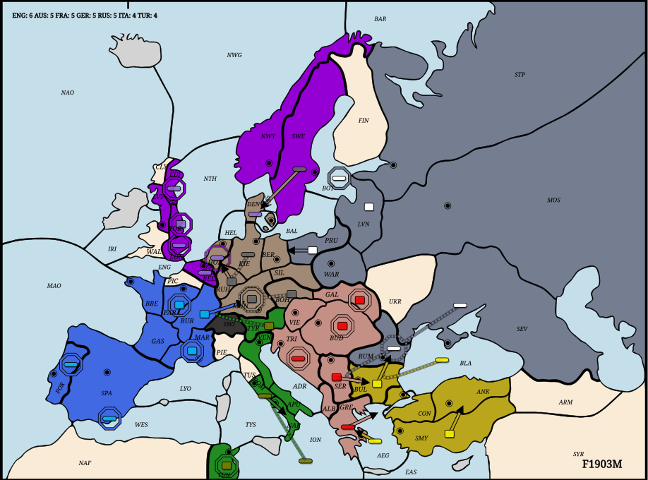

### What happened

- **AUSTRIA**: A SER → BUL; F GRE → BUL/SC (bounced); A BUD holds; A GAL holds; F TRI holds
- **ENGLAND**: F BEL supports F HOL; F EDI holds; F LON holds; A YOR holds
- **FRANCE**: A BUR → MUN (bounced); A PAR holds; A MAR holds; F SPA/SC holds; F POR holds
- **GERMANY**: F SWE → DEN (bounced); A RUH → HOL (bounced); F KIE supports A RUH → HOL; A MUN holds; A BOH supports A MUN
- **ITALY**: A TYR supports A BUR → MUN; F ROM → NAP; F ION supports F ROM → NAP; A TUN holds
- **RUSSIA**: F RUM supports A SER → BUL; F SEV supports F RUM; A PRU → BER; F BOT holds
- **TURKEY**: A BUL → RUM (bounced); F BLA supports A BUL → RUM; F AEG → GRE (bounced); A SMY → ANK  [dislodged: A BUL]

### Dialogue

- **AUSTRIA → RUSSIA**: Turkey still holds BUL and I need your F RUM to support A SER into BUL this fall — that's strength 3 against Turkey's 2 and we take it decisively. In return I'll support F RUM's hold or any move you need elsewhere. Confirm F RUM S A SER - BUL and Turkey collapses in the Balkans this fall.
- **AUSTRIA → ITALY**: You have GRE as agreed — I expect F ION to stay in GRE or move away from my territory, not press into ADR or ALB. This fall I'm pushing hard on BUL with Russia's support; if you hold your southern units in place, we both consolidate and there's no conflict between us.
- **AUSTRIA → TURKEY**: BUL is surrounded on three sides with Russia's F RUM now in play — a strength-3 attack this fall cannot be stopped. Your best outcome is to pull A BUL to CON now and keep your core intact; if you hold and lose BUL in a contested fight, you're down to 3 centers with no path back. Make the practical choice.
- **ENGLAND → FRANCE**: I'm holding DEN and HOL this fall to lock in those centers — I need your A BUR to continue pressuring Germany so they can't mass against my fleets. If you can push A BUR toward KIE or support an attack on MUN, we can strip Germany down to 2-3 centers and I'll have room to share gains with you. What's your plan this fall?
- **ENGLAND → GERMANY**: You're down to 5 centers and facing pressure from both France and me — the smart move is to negotiate now before you lose more. I'm willing to stop at DEN and HOL if you redirect your forces eastward against Russia, who has PRU and is clearly growing at your expense. Russia in PRU is a direct threat to BER; I'm not.
- **ENGLAND → RUSSIA**: Russia now has PRU, which puts you right on Germany's doorstep — I want to make sure we're not about to clash over the Baltic or northern Germany. My fleets are focused on Germany's western centers; I have no designs on PRU or your position. Are you pressing into BER this fall, and should we coordinate to divide German centers between us?
- **FRANCE → ITALY**: Fall 1903 — Germany has A MUN, A BOH, A RUH, F KIE, F SWE. I want to push A BUR into MUN again this fall; if you can commit A TYR S A BUR - MUN, we can finally crack it open. What's your plan for your southern units — are you growing in the Balkans or can you contribute to the MUN push?
- **FRANCE → ENGLAND**: You're at 6 centers and pulling ahead — I want to keep coordinating against Germany, but I need to know your fall plans before I commit. If you're pressing toward BER or KIE from HOL and DEN, I'll push A BUR into MUN simultaneously and we split Germany between us. What specific moves are you planning this fall?
- **FRANCE → GERMANY**: I want to offer a real deal this fall: I hold A BUR in place if you pull A BOH back out of the front line. England is the real threat at 6 centers and growing — we should both be worried about them, not fighting each other while England consolidates the north. Tell me what you're willing to do.
- **GERMANY → ENGLAND**: You hold HOL and DEN — both former German centers — and I'm in SWE. I'd rather deal than fight: if you pull F HOL back to BEL and leave DEN to me, I'll support your position against France in the west and we can establish a real working relationship. Otherwise I'm taking both back by force and you'll be fighting a Baltic war while France grows in the south.
- **GERMANY → FRANCE**: A BUR is still sitting on my doorstep — I need your intentions for this fall. I'm holding MUN and BOH is right there to support; if you push into MUN you're walking into a defended position and wasting your move while England grows unchecked. Concrete offer: you hold A BUR, I hold A BOH, and we both focus our growth elsewhere this fall.
- **GERMANY → RUSSIA**: A PRU is adjacent to BER — I need to know your intentions before orders close. I'm not moving into any Russian territory this fall; if you're headed for BER that's a declaration of war and I'll respond accordingly, but if you're holding or moving east I'd rather we coordinate against England who is pulling ahead at 6 centers.
- **GERMANY → AUSTRIA**: Italy has F ROM and A TYR sitting on your flanks — are you pushing into BUL this fall or consolidating? I'm holding BOH and not threatening Austrian territory; if you need support against Italy or Turkey, tell me what's useful and let's coordinate rather than leave gaps for the leaders to exploit.
- **ITALY → AUSTRIA**: GRE is my move again this fall — F ION is going there and I have the strength to take it. I'm offering you the same deal as before: A TYR holds defensively and doesn't threaten TRI or VIE, and you can focus entirely on your eastern front against Turkey and Russia. BUL is yours if you can get it; GRE is mine.
- **ITALY → TURKEY**: F AEG sitting adjacent to GRE is a concern — I need to know if you're planning to push into GRE this fall or if you're focused eastward on RUM and the Russian front. I have no interest in AEG or anything east of GRE; if you're not moving on GRE, we stay cooperative and out of each other's way.
- **ITALY → FRANCE**: England is at 6 centers and pulling away — they took HOL last spring and are consolidating in the north. I'm occupied reclaiming my home centers this fall, but if you're pushing against England or Germany, I can keep A TYR in position to pressure MUN or BOH. What's your plan this fall?
- **RUSSIA → AUSTRIA**: Turkey still holds BUL with F BLA support — this is the fall to finally crack it. I can support your A SER into BUL with F RUM again, or move F RUM to BUL/EC directly if you'd rather take a different angle; tell me your exact orders for SER and GRE and I'll match them. Meanwhile I'm pushing A PRU into BER to grab a German center before they recover — this fall I need to grow.
- **RUSSIA → GERMANY**: England took HOL and is at 6 centers — you're the one bleeding right now, not me. I'm willing to coordinate against England in the north if you'll let A PRU advance to BER peacefully; I'll support your recovery against England's Baltic push rather than pile on while you're down. What are your intentions for MUN and KIE this fall?
- **RUSSIA → TURKEY**: Austria is pressing BUL from two sides and I have F RUM positioned to your north — this is the last moment to negotiate before BUL falls. Pull A BUL to CON and agree RUM as the border; I'll leave CON and ANK alone and turn my attention to Germany and England who are growing fastest. Continued resistance just accelerates your collapse.
- **TURKEY → RUSSIA**: Fall 1903: I'm coming for RUM this turn — A BUL to RUM supported by F BLA is strength 2 and it's going through. The smart move for you is to retreat F RUM to SEV now and we establish a clean border; fighting me here just costs you the unit while England and Germany are both at 6 centers and growing. Pull back and we can discuss a real border agreement.
- **TURKEY → AUSTRIA**: Austria, I'm pushing A BUL into RUM this fall to retake my former center — F BLA supports, so it's a strength-2 attack on Russia. That means A BUL is leaving BUL, which creates an opening: if you want BUL, now is your moment to move A SER there while I'm advancing. I'm not your enemy here; Russia is the shared problem.
- **TURKEY → ITALY**: Italy, I need your help taking GRE this fall — if you support F AEG into GRE with F ION, we split the gain: I get the center, you deny Austria a key position and we both benefit from Austrian weakness. Austria has been frustrating your GRE ambitions for two years; let me take it with your support and Austria loses its Aegean anchor entirely.
- **AUSTRIA → RUSSIA**: Turkey claims A BUL is moving to RUM this fall — if true, BUL is empty and A SER walks in uncontested, but I need F RUM to support A SER - BUL in case Turkey is bluffing and F BLA still defends. Confirm F RUM S A SER - BUL and we take BUL regardless of whether Turkey is telling the truth. What are you doing with F SEV and your northern units this fall?
- **AUSTRIA → TURKEY**: If A BUL is truly moving to RUM as you say, I walk into BUL uncontested with A SER — and you retake RUM from Russia simultaneously. But I need to know: is F BLA supporting A BUL - RUM or staying in BLA? If F BLA is committed to the RUM attack, BUL is genuinely open and we both gain; if F BLA holds, you're bluffing and I bounce.
- **AUSTRIA → ITALY**: F ION is now in GRE — I expect it to stay there or move into the Aegean, not press into ADR or ALB this fall. I'm taking BUL this fall; once that's done, I'm open to coordinating against whoever is pulling ahead in the north. Hold your southern units in place and we have no conflict.
- **ENGLAND → FRANCE**: My fall plan: F HOL holds or supports F DEN, F DEN holds to lock in that center, and I use F BEL to support the position — I want to consolidate DEN and HOL before pushing further. If you push A BUR into RUH or support an attack on KIE, we can set up a BER/KIE strike next year; I'd rather take those two centers cleanly in 1904 than overreach now. Confirm you're pressing eastward and not pulling back.
- **ENGLAND → GERMANY**: You're offering me nothing I don't already have — I hold HOL and DEN and you're asking me to give them back for vague promises. The concrete offer I'd accept: you support my F DEN against any Russian move into BAL, and I leave F SWE alone rather than pressing further into your territory this fall.
- **ENGLAND → RUSSIA**: I want to coordinate on Germany — A PRU is right next to BER and my F DEN and F HOL are pressing from the west. If you move A PRU toward BER this fall while I hold DEN and HOL, we can set up a clean split of German centers in 1904: you take BER and MOS-side centers, I take KIE and western ones. Are you pressing BER this turn or holding PRU?
- **FRANCE → ITALY**: The bounce happened because A BOH supported A MUN — we need two units attacking MUN simultaneously to crack it, not one attack and one support. This fall: can you move A TYR - MUN while I move A BUR - MUN? Two attackers beats one defender plus support from BOH. Confirm A TYR - MUN and I'll commit A BUR - MUN.
- **FRANCE → ENGLAND**: I'm planning A BUR - MUN this fall with Italian coordination — Germany has A BOH and A MUN, so I need to hit with two units. One concrete ask: if F HOL can move toward KIE or support pressure on Germany's coast, that forces Germany to split attention. I'm not touching BEL or HOL — those are yours to keep.
- **FRANCE → GERMANY**: England has HOL and DEN and is growing — you're the one who should be most worried, not me. I'll hold A BUR in place this fall if you move A BOH away from the front; that frees you to deal with England's northern pressure. If you refuse, I push MUN while England takes KIE and you lose everything.
- **GERMANY → ENGLAND**: F SWE is moving to DEN this fall — that's happening regardless. The question is whether F HOL stays put while I retake it with A RUH, or whether we fight over it and France picks up the pieces while we bleed each other. Concrete: I take DEN and HOL back, you pull to BEL and NWY, and we draw a clean line — you keep the western islands and Norway, I keep the Baltic coast.
- **GERMANY → FRANCE**: I'm moving A RUH toward HOL this fall to retake my center — that's not aimed at you, it's aimed at England. If A BUR holds in place as you offered, I'll hold A BOH and A MUN defensively and we both grow without fighting each other; if A BUR pushes MUN, you lose the move and England consolidates while we fight.
- **GERMANY → RUSSIA**: A PRU is adjacent to BER and I need a direct answer: are you moving into BER this fall or not? I'm taking DEN back from England with F SWE and pushing A RUH into HOL — I have no interest in your territory, but if A PRU moves toward BER I will treat that as war and coordinate my response accordingly.
- **ITALY → FRANCE**: Confirmed for this fall: A TYR S A BUR - MUN. I'm also pushing F ROM into NAP to reclaim my home center, so my southern units are committed there — the MUN support is my full northern contribution. Move A BUR - MUN and we finally crack it.
- **ITALY → TURKEY**: F AEG adjacent to GRE is your business with Austria, not mine — I have no interest in supporting you into GRE since that only hands you a center at my strategic expense. I'm focused on reclaiming NAP this fall; if you want to coordinate against Austria in the Balkans, propose something that benefits us both rather than just you.
- **ITALY → AUSTRIA**: I'm not moving into ADR or ALB this fall — F ION is positioned to support my push toward NAP, not to threaten your Adriatic position. Turkey's F AEG is the real threat to your Aegean flank; I suggest you focus your defense there rather than worrying about me.
- **RUSSIA → AUSTRIA**: I'm committing to F RUM S A SER - BUL this fall — strength 3 beats Turkey's defense even with F BLA support. Make sure F GRE is also pressing BUL/SC so Turkey can't redirect; if your two units both hit BUL and I support, Turkey loses it tonight. Confirm your exact orders haven't changed.
- **RUSSIA → TURKEY**: If A BUL moves to RUM, Austria takes BUL uncontested — you lose BUL and gain nothing because F SEV is supporting F RUM's hold. The only move that makes sense for you is holding A BUL in BUL, but then Austria takes it with my support at strength 3. Your position is untenable; the real question is whether you want to negotiate CON and ANK's safety now.
- **RUSSIA → ENGLAND**: I'm pushing A PRU into BER this fall — Germany is weakened and I need that center. I'm not touching HOL or your western gains; we can divide Germany cleanly if you press from the west while I press from the east. Confirm you're not supporting Germany's defense of BER.
- **RUSSIA → GERMANY**: England is the real threat at 6 centers — I'd rather coordinate against them than fight you. But I need BER this fall to stay competitive; if you pull A MUN back and let me take it peacefully, I'll actively support your recovery against England's Baltic push next year rather than pile on while you're down.
- **TURKEY → RUSSIA**: I'm committing A BUL → RUM supported by F BLA this fall — strength 2, and it's going through unless you have support for F RUM that I don't see. Retreat F RUM to SEV now and we establish a clean border; holding costs you the unit while England sits at 6 centers. This is the last offer before I press.
- **TURKEY → AUSTRIA**: I'm pushing A BUL into RUM this fall with F BLA support — BUL will be vacated, so if you want it, A SER can walk in uncontested. This is the deal: you take BUL, I retake RUM, Russia gets squeezed from two sides. Don't waste A SER and F GRE on a bounce when you can have the center for free.
- **TURKEY → ITALY**: F AEG is not moving on GRE this fall — I'm focused entirely on RUM and have no interest in your Aegean position. Stay out of my RUM push and I'll stay out of GRE; Austria is the shared problem and we both benefit from keeping them squeezed.
- **AUSTRIA → RUSSIA**: Final confirmation: I'm ordering A SER - BUL, F GRE - BUL/SC. Please execute F RUM S A SER - BUL as committed — that's strength 3 and Turkey cannot hold regardless of F BLA. Good luck on your BER push.
- **AUSTRIA → TURKEY**: Final warning: A SER moves to BUL and F GRE presses BUL/SC this fall — Russia supports at strength 3. If A BUL is truly leaving for RUM as you claimed, BUL is mine uncontested; if you're bluffing and holding, you lose it in a contested fight. Either way, BUL falls tonight.
- **AUSTRIA → ITALY**: F ION is in GRE — I expect it to hold there or move into AEG, not press into ALB or ADR this fall. I'm fully committed east against BUL; if you hold your position, we have no conflict and can discuss coordinating against the northern leaders after this fall.

### AUSTRIA
Orders: `A SER - BUL` · `F GRE - BUL/SC` · `A BUD H` · `A GAL H` · `F TRI H`

Reasoning

> Looking at the current situation:
>
> **Board assessment:**
> - Turkey holds BUL with A BUL, supported by F BLA. Turkey claimed A BUL is moving to RUM, but this is likely a bluff given the repeated pattern.
> - Russia committed to F RUM S A SER - BUL, giving me strength 3 vs Turkey's strength 2 (A BUL + F BLA support).
> - Italy has F ION in GRE already (from S1903M), so GRE is gone. F GRE can press BUL/SC as committed.
> - Turkey also has F AEG in the Aegean, which could threaten GRE or ION but not my core.
>
> **My committed orders:**
> - A SER - BUL (main attack, supported by Russia's F RUM)
> - F GRE - BUL/SC (second prong, pressing from the south)
> - A BUD H (defensive)
> - A GAL H (defensive)
> - F TRI H (defensive against Italy)
>
> Even if Turkey is telling the truth and A BUL moves to RUM, A SER walks into BUL uncontested. If Turkey is bluffing and A BUL holds with F BLA support (strength 2), Russia's F RUM support gives me strength 3 and I take it anyway. Either way, BUL falls this fall.
>
> F GRE - BUL/SC may bounce with A SER - BUL if both succeed (can't occupy same space), but the adjudicator will handle this correctly — A SER - BUL with F RUM support is the decisive attack, and F GRE pressing BUL/SC adds pressure or cuts any support from that angle.

### ENGLAND
Orders: `F BEL S F HOL` · `F EDI H` · `F LON H` · `A YOR H`
Illegal (dropped): `F HOL S F DEN` · `F DEN S F HOL`

Reasoning

> Looking at the board, my revised strategy is clear: hold F HOL and F DEN to lock in those two centers, use F BEL to support F HOL against Germany's A RUH threat, and keep rear units in place. Russia is pressing A PRU into BER, France is pushing A BUR toward MUN — Germany is being squeezed from multiple directions and I just need to hold what I have.
>
> The key threats: Germany has A RUH which could attack HOL, and F SWE which could move to DEN. I need to defend both centers. F BEL supporting F HOL handles the RUH threat. F DEN supporting F HOL also works, but I could also have F DEN support itself or threaten KIE. Actually, the mutual support between HOL and DEN (each supporting the other's hold) is the safest approach — it means Germany needs 2 units to take either, which they can't manage while France and Russia press them.
>
> F BEL supporting F HOL gives HOL strength 2, which beats A RUH alone. F DEN can support F HOL as well, or I can have F DEN support itself. The cleanest defensive setup: F HOL S F DEN (so DEN has strength 2 vs F SWE attack), F DEN S F HOL (so HOL has strength 2 vs A RUH), F BEL S F HOL (HOL gets strength 3 — overkill but safe). Actually F BEL S F HOL and F DEN S F HOL gives HOL strength 3, and F HOL S F DEN gives DEN strength 2. That's the best defensive posture.

### FRANCE
Orders: `A BUR - MUN` · `A PAR H` · `A MAR H` · `F SPA/SC H` · `F POR H`

Reasoning

> Looking at the current situation:
>
> My revised strategy for F1903M commits to:
> 1. A BUR - MUN (with Italian support A TYR S A BUR - MUN)
> 2. A PAR H
> 3. A MAR H
> 4. F SPA/SC H
> 5. F POR H
>
> Let me verify: Italy confirmed A TYR S A BUR - MUN. Germany has A MUN and A BOH (which can support). So A MUN with support from A BOH = strength 2. My A BUR - MUN = strength 1 (Italy's support makes it 2). So it's a tie = bounce again.
>
> Wait - but Italy said they'd support A BUR - MUN (making it strength 2), and Germany has A BOH S A MUN (making defense strength 2). That's still a bounce.
>
> However, looking at Germany's dialogue - Germany said they're moving A RUH toward HOL this fall. If A RUH - HOL, then A BOH may not support MUN. Germany's A RUH is moving to retake HOL. So A BOH might support A MUN still, or it might not.
>
> Even if it bounces, I should honor my commitment to Italy and England. The move is the right strategic play - if A BOH doesn't support (because Germany is using it elsewhere), MUN falls.
>
> Also, I should consider whether to push toward BEL instead, but I committed to MUN. I'll honor the commitment.

### GERMANY
Orders: `F SWE - DEN` · `A RUH - HOL` · `F KIE S A RUH - HOL` · `A MUN H` · `A BOH S A MUN`

Reasoning

> Looking at the current situation:
>
> - I have 5 centers (BER, KIE, MUN, DEN, HOL) but DEN and HOL are occupied by England
> - F SWE can take DEN back
> - A RUH can push into HOL to retake that center
> - A MUN needs to hold against France's A BUR threat
> - A BOH should support A MUN to ensure it holds
> - F KIE anchors the Baltic
>
> My revised strategy is clear: F SWE → DEN, A RUH → HOL, A MUN H, A BOH S A MUN, F KIE H.
>
> England holds HOL with F HOL. A RUH moving into HOL will bounce against F HOL unless I have support. Let me check - I don't have a unit that can support A RUH into HOL. F KIE could support A RUH into HOL (KIE is adjacent to HOL). That would give me 2 vs 1 strength and dislodge England's F HOL.
>
> But then A MUN is undefended against France's A BUR. A BOH supporting A MUN holds MUN at strength 2, which beats any single-unit attack from A BUR.
>
> So the plan:
> - F SWE → DEN (uncontested, England's F DEN is there but I'm taking it back)
> - A RUH → HOL with F KIE support (2 vs 1, dislodges F HOL)
> - A MUN H with A BOH support (holds against A BUR)
> - F KIE S A RUH → HOL
>
> This is the optimal play: retake both DEN and HOL while defending MUN.

### ITALY
Orders: `A TYR S A BUR - MUN` · `F ROM - NAP` · `F ION S F ROM - NAP` · `A TUN H`

Reasoning

> Looking at the current situation:
>
> **Strategic assessment:**
> - I have 4 centers (NAP, ROM, VEN, TUN) but F ROM is in ROM and NAP is vacant — I need to reclaim NAP
> - I committed to France: A TYR S A BUR - MUN (confirmed multiple times in negotiation)
> - I committed to Austria: not threatening TRI or VIE with A TYR
> - Turkey confirmed F AEG is not moving on GRE this fall
> - My revised strategy: A TYR supports France into MUN, F ROM → NAP, F ION supports F ROM → NAP, A TUN holds
>
> **Order verification:**
> - `A TYR S A BUR - MUN`: Legal — TYR is adjacent to MUN ✓
> - `F ROM - NAP`: Legal — ROM is adjacent to NAP ✓
> - `F ION S F ROM - NAP`: Legal — ION is adjacent to NAP ✓ (ION neighbors: ADR, AEG, ALB, APU, EAS, GRE, NAP, TUN, TYS)
> - `A TUN H`: Legal ✓
>
> This plan reclaims NAP (going from 4 to 5 centers if successful), honors my commitment to France on MUN, and keeps A TUN secure. F ION providing support for the NAP push is stronger than moving ION to GRE (which I already hold from last spring).
>
> Wait — checking the unit positions again: I have F ION, A TYR, A TUN, F ROM. GRE is listed as Austria's supply center (F GRE). But my strategy history says I took GRE in S1903M... Looking at Austria's units: A SER, A GAL, F GRE, A BUD, F TRI. Austria still has F GRE. My F ION is in ION, not GRE. So GRE is still Austrian. My strategy note saying I "finally took GRE" was incorrect — the bounce happened again.
>
> This makes the NAP push even more critical. Let me proceed with the confirmed plan.

### RUSSIA
Orders: `F RUM S A SER - BUL` · `F SEV S F RUM` · `A PRU - BER` · `F BOT H`
Illegal (dropped): `A LVN S A PRU - BER`

Reasoning

> Looking at the current situation:
>
> **Assessment:**
> - Turkey threatened A BUL → RUM supported by F BLA (strength 2). I committed to F RUM S A SER - BUL, which means F RUM stays in place. Turkey's attack on RUM at strength 2 will be stopped by F SEV supporting F RUM's hold (strength 2 defense = bounce). Actually, F SEV supports F RUM, making defense strength 2 vs Turkey's attack strength 2 — that bounces the attack. Good.
> - Austria committed to A SER → BUL and F GRE → BUL/SC. With F RUM supporting A SER → BUL, that's strength 3 vs Turkey's F BLA support of A BUL (strength 2). Turkey loses BUL.
> - A PRU → BER: Germany is weakened (5 centers, lost HOL). England confirmed not supporting Germany's defense of BER. A LVN supports A PRU → BER for strength 2. Germany has A MUN and A BOH — neither adjacent to BER to defend it, and F KIE could support BER hold at strength 2. Actually F KIE is adjacent to BER. So A PRU → BER at strength 2 (with A LVN support) vs F KIE S A BER hold at strength 2 — that bounces. But A BOH is not adjacent to BER. F KIE could support BER hold. This might bounce, but it's worth trying.
> - F BOT: Hold or support. I'll hold F BOT to keep northern position secure.
>
> **Checking F SEV S F RUM:** F SEV is adjacent to RUM (BLA, MOS, RUM, UKR, ARM) — yes, SEV is adjacent to RUM. This makes F RUM defense strength 2, bouncing Turkey's strength-2 attack.
>
> **Summary of orders:**
> - F RUM S A SER - BUL (support Austria's attack, strength 3)
> - F SEV S F RUM (defend against Turkey's attack on RUM)
> - A PRU - BER (grab German center)
> - A LVN S A PRU - BER (support the attack)
> - F BOT H (hold northern position)

### TURKEY
Orders: `A BUL - RUM` · `F BLA S A BUL - RUM` · `F AEG - GRE` · `A SMY - ANK`

Reasoning

> Looking at the current situation:
>
> **Analysis:**
> - I have A BUL, F BLA, F AEG, A SMY
> - My revised strategy: A BUL → RUM (supported by F BLA), F AEG → GRE, A SMY → ANK
> - Russia has F RUM. My strength-2 attack (A BUL + F BLA support) should dislodge it unless Russia has support for F RUM
> - Austria's F GRE and A SER may be moving to BUL — but I told Austria I'm vacating BUL (which I am), so A SER can walk in uncontested if Austria believes me. That's fine — I retake RUM which is worth more strategically right now.
> - F AEG → GRE: Austria's F GRE may be moving away (to BUL/SC), so GRE could be vacated. If F GRE is moving to BUL/SC and A SER is also moving to BUL, GRE is empty and F AEG can walk in. This would give me GRE as a 5th supply center.
> - A SMY → ANK: frees up SMY, moves toward ANK (home center, currently vacant — good for Winter build options)
>
> Wait — if Austria takes BUL (my current SC) and I take GRE AND RUM, I net +2 and -1 = net +1, ending at 5. But if Austria takes BUL and I only get RUM, I stay at 4. GRE is the key bonus center.
>
> The orders from my revised strategy are solid. F AEG → GRE is excellent if Austria's F GRE is vacating. Even if F GRE stays, I bounce but don't lose anything.
>
> Let me verify adjacencies:
> - A BUL → RUM: BUL adjacent to RUM ✓
> - F BLA S A BUL - RUM: BLA adjacent to RUM ✓
> - F AEG → GRE: AEG adjacent to GRE ✓
> - A SMY → ANK: SMY adjacent to ANK ✓

## FALL 1903 RETREATS (`F1903R`)

### What happened

- **TURKEY**: A BUL retreats → CON

### TURKEY
Orders: `A BUL R CON`

Reasoning

> Looking at the situation: A BUL was dislodged and must either retreat to CON or disband. 
>
> CON is vacant and is a home supply center — retreating there keeps the unit alive and positions it to defend the Straits or support future operations. Disbanding would leave me with only 2 units (F BLA and F AEG) for 4 supply centers, which is dangerously thin.
>
> Retreating to CON is the clear choice: it preserves a unit, occupies a home center (which doesn't need to be vacant for a build since I still have SMY vacant), and keeps options open for Winter.

## WINTER 1903 ADJUSTMENTS (`W1903A`)

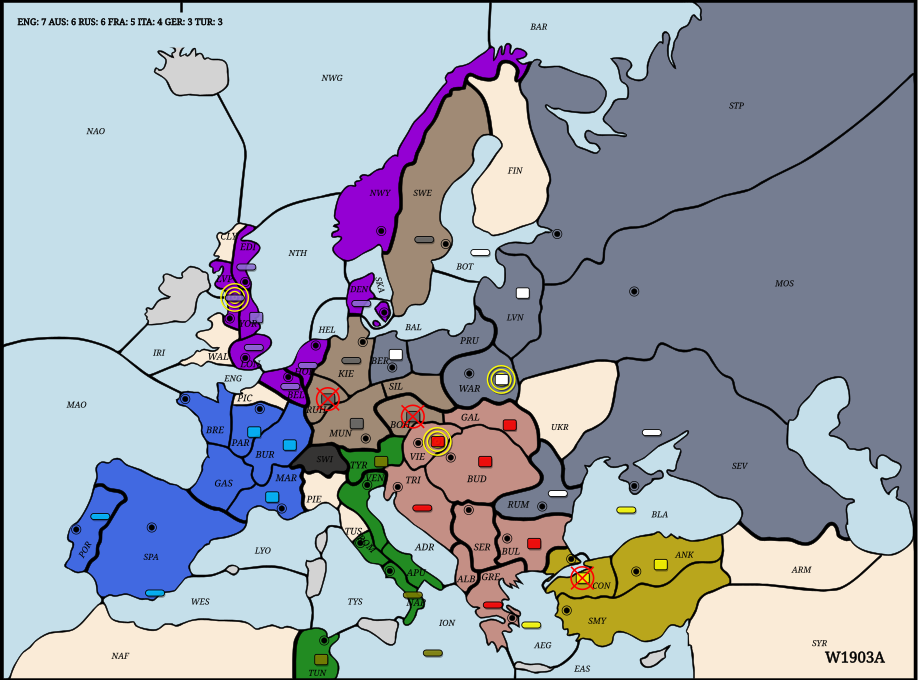

### What happened

- **AUSTRIA**: builds A VIE
- **ENGLAND**: builds F LVP
- **GERMANY**: disbands A BOH; disbands A RUH
- **RUSSIA**: builds A WAR
- **TURKEY**: disbands A CON

### AUSTRIA
Orders: `A VIE B`

Reasoning

> Looking at my position: I have 6 supply centers (BUD, TRI, VIE, GRE, SER, BUL) and 5 units (A GAL, F GRE, A BUD, F TRI, A BUL). That's 6 centers minus 5 units = 1 build. VIE is my only open home center, so I build there.
>
> An army in VIE is well-positioned to support my Galician position, push toward BOH/MUN if Germany weakens, or reinforce the Balkans. A fleet in VIE isn't possible (it's landlocked). Building A VIE is the clear choice.

### ENGLAND
Orders: `F LVP B`

Reasoning

> Looking at the current position: I have 7 supply centers (EDI, LON, LVP, BEL, NWY, DEN, HOL) and 6 units (A YOR, F BEL, F LON, F EDI, F HOL, F DEN). That means I have a surplus of 1 center and can build exactly one unit.
>
> LVP is my only vacant home supply center, so I build there. A fleet in LVP gives me access to the Irish Sea, NAO, and CLY — useful for western positioning. An army in LVP would be harder to deploy usefully given my fleet-heavy position and the fact that my continental ambitions require naval power. However, an army could march through YOR toward the continent eventually via convoy. Given that I'm a fleet-heavy power and my next objectives involve pressing further into Germany (KIE) or holding my current gains, a fleet in LVP opens more options — NAO, IRI, and eventually MAO to pressure France or support western operations.
>
> I'll build F LVP.

### GERMANY
Orders: `A BOH D` · `A RUH D`

Reasoning

> Looking at the situation: I'm in a dire position. I have 3 supply centers (KIE, MUN, SWE) but 5 units (F KIE, A MUN, A BOH, F SWE, A RUH). That means I need to disband 2 units to match my 3 centers.
>
> The legal orders show only disband options for all units. I need to disband 2 units.
>
> Which units to keep? I want to keep the units that are most useful:
> - F KIE: anchors the Baltic, defends KIE (home center)
> - A MUN: defends MUN (home center), key defensive position
> - F SWE: holds SWE (my only non-home SC)
> - A BOH: positioned to support MUN or threaten Austria/Italy
> - A RUH: positioned to push toward HOL
>
> I should keep F KIE (defends a home center), A MUN (defends a home center), and F SWE (holds my third SC). That means disbanding A BOH and A RUH.
>
> Alternatively, keeping A BOH to support MUN defense is valuable since France keeps threatening. But F SWE is my only non-home center and losing it means losing the unit that holds it makes no sense — I need F SWE to stay in SWE.
>
> Disband A BOH and A RUH — they're the units furthest from my supply centers and least critical to defense.

### RUSSIA
Orders: `A WAR B`

Reasoning

> Looking at the current situation:
>
> **Supply centers:** I have 6 SCs (MOS, SEV, STP, WAR, RUM, BER) and 5 units (A LVN, F RUM, F SEV, F BOT, A BER). That means I have 1 excess center and can build 1 unit.
>
> **Build location options:**
> - MOS: vacant ✓
> - STP: vacant ✓  
> - WAR: vacant ✓
> - SEV: occupied by F SEV ✗
>
> I need to decide where to build. My strategic priorities:
> - I need to press into Germany further (A BER is isolated and needs support)
> - I need to maintain pressure on Turkey and protect RUM
> - A WAR build would support A BER and threaten SIL/MUN
> - A MOS build is centrally located and flexible
> - A STP build would be useful for the north but less urgent
>
> The most valuable build is **A WAR** — it puts an army directly adjacent to SIL, PRU, and GAL, supporting A BER and threatening Germany's core. This is the most aggressive and useful placement given my current position pressing into Germany.

### TURKEY
Orders: `A CON D`

Reasoning

> Looking at the situation: I ended Fall 1903 with only 3 supply centers (ANK, CON, SMY) but have 4 units (F BLA, F AEG, A ANK, A CON). I need to disband 1 unit to match my supply center count.
>
> The question is which unit to disband. My strategic position:
> - F BLA is critical — it's my main offensive/defensive asset in the Black Sea, threatening Russia and supporting future moves
> - F AEG is positioned in the Aegean, useful for threatening GRE or pressing into the eastern Mediterranean
> - A ANK is on a home supply center (blocking a build, but since I have no builds this turn, it doesn't matter)
> - A CON is on a home supply center
>
> I need to think about which unit is least valuable going forward. F BLA gives me leverage against Russia (SEV, RUM) and defends the Black Sea. F AEG gives me pressure on GRE and the Aegean. The armies (A ANK and A CON) are less mobile than fleets but can threaten land provinces.
>
> Given that Austria just took BUL and Russia holds RUM, my most pressing need is to rebuild offensive capability. F BLA is the most strategically valuable unit — it controls the Black Sea and threatens both Russia and can support future moves. F AEG threatens GRE and keeps Austria nervous.
>
> The armies in ANK and CON are somewhat redundant — I have two armies in adjacent home centers with limited immediate offensive value. I should disband one army. A CON is slightly less useful since F AEG is already in the Aegean; A ANK at least sits on a home center that could be used for future builds if I ever vacate it.
>
> Actually, since both ANK and CON are occupied by armies, neither can be used for builds this winter anyway (I have no builds). I should disband the unit with least future value. A CON could potentially move to BUL or support future operations, but A ANK can move toward ARM or support CON. 
>
> I'll disband F AEG — wait, no. F AEG is highly valuable for future pressure on GRE. F BLA is essential. Between the two armies, I'll disband A CON since A ANK can move toward ARM or support the straits area, while F AEG and F BLA provide the naval power I need.

## SPRING 1904 MOVEMENT (`S1904M`)

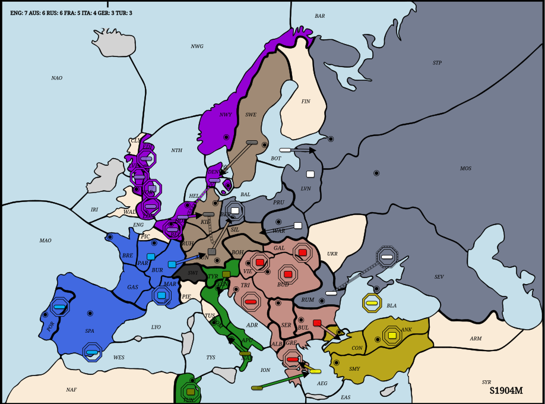

### What happened

- **AUSTRIA**: A BUL → CON; F GRE holds; A BUD holds; A GAL holds; F TRI holds; A VIE holds
- **ENGLAND**: F HOL → KIE (bounced); F DEN supports F HOL → KIE (support cut); F BEL holds; F EDI holds; F LON holds; F LVP holds; A YOR holds
- **FRANCE**: A BUR → MUN (bounced); A MAR holds; F SPA/SC holds; F POR holds
- **GERMANY**: A MUN → BER (bounced); F KIE supports A MUN → BER (support cut); F SWE → DEN (bounced)
- **ITALY**: F ION → AEG (bounced); A TYR → VEN; F NAP → ROM; A TUN holds
- **RUSSIA**: A BER holds; A WAR → SIL; F RUM supports F SEV; F SEV holds; F BOT → STP/SC
- **TURKEY**: F AEG → GRE (bounced); F BLA holds; A ANK holds

### Dialogue

- **AUSTRIA → RUSSIA**: I now hold BUL and want to push further into Turkey's core this spring — A BUL can move to CON if you support with F RUM or press from RUM yourself. Turkey is at 3 centers and collapsing; let's coordinate to finish them before they stabilize. What are you doing with F RUM and F SEV this spring?
- **AUSTRIA → TURKEY**: You're down to 3 centers with pressure from both Russia and me — the practical path is a negotiated settlement rather than a fight you cannot win. If you pull F BLA back to CON and hold your core, I'll press Russia on RUM rather than push into CON this spring; we both benefit from slowing Russia's expansion. Tell me what you're willing to offer.
- **AUSTRIA → ITALY**: A TYR is adjacent to both TRI and VIE — I need to know explicitly where it's moving this spring, because if it threatens either of those, I redirect my units west immediately. I'm focused east on Turkey; if A TYR moves toward MUN or holds defensively, we have no conflict and I'll support your Aegean push against Turkey.
- **ENGLAND → RUSSIA**: You hold BER and I hold HOL and DEN — Germany is nearly finished. My proposal: I push F HOL → KIE and F DEN supports or threatens SWE, you support A BER → KIE or hold BER while we coordinate to strip Germany's last centers. We should agree now on who takes KIE versus MUN versus SWE so we don't bounce each other and hand Germany a reprieve.
- **ENGLAND → FRANCE**: Germany is down to 3 centers and nearly finished — I'm pushing toward KIE from HOL and DEN this spring. I want to make sure we're coordinated: are you pressing A BUR toward MUN or KIE this turn? I have no designs on your centers and want to confirm we're splitting Germany cleanly rather than bumping into each other.
- **ENGLAND → GERMANY**: You're down to 3 centers and facing pressure from three directions — the war is effectively over for you. If you want to avoid complete elimination, your best play is to negotiate a survival arrangement now: support my move into KIE in exchange for my lobbying the other powers to let you keep MUN and SWE as a rump state.
- **FRANCE → ITALY**: Spring 1904 — Germany disbanded A BOH, so MUN is finally undefended from the east. I'm committing A BUR - MUN again this spring; with your A TYR S A BUR - MUN, it goes through cleanly with no BOH support to stop it. Can you confirm the support one more time? This is the turn it actually works.
- **FRANCE → GERMANY**: Germany, you're down to three centers and two armies — England has seven and is the real threat to both of us. I'm willing to discuss leaving MUN alone if you can offer me something concrete, but I need to hear it now before I commit my orders.
- **FRANCE → ENGLAND**: You're at seven centers and I'm at five — I want to keep coordinating against Germany, but I need to know you're not planning to push toward BEL or the Channel while I'm focused east. What are your spring plans, and are you willing to share KIE or MUN with me rather than taking all the German gains yourself?
- **GERMANY → RUSSIA**: You hold BER — my home center — and I'm moving A MUN to BER with F KIE support this spring. If you want to avoid a prolonged war, pull A BER back to PRU or SIL now and I'll stay entirely out of your territory and support you against Turkey or Austria. Otherwise this is an existential fight for me and I will coordinate every available power against you.
- **GERMANY → AUSTRIA**: Russia holds BER and sits at 6 centers — they're the dominant threat on the board. I'm attacking BER with A MUN supported by F KIE this spring; if you can press RUM or threaten WAR to split Russia's attention, we both benefit enormously and I owe you a real alliance going forward.
- **GERMANY → ENGLAND**: Russia holds BER and is growing fast — they're a bigger threat to your position than I am right now. I'm fighting for survival this spring against Russia; if you want to discuss a real arrangement where we stop bleeding each other in the Baltic while Russia consolidates, I'm genuinely open to it.
- **GERMANY → FRANCE**: I have three units and I'm fighting Russia for BER — I am not a threat to you in any meaningful sense this spring. Stay out of MUN while I deal with this existential fight and I'll have no reason to turn against you once I stabilize.
- **ITALY → AUSTRIA**: You now hold BUL, SER, GRE, BUD, TRI, VIE — six centers and growing, which makes you the biggest threat on the southern board. I'm keeping F ION adjacent to GRE and can push into ADR or AEG; if you want to avoid a direct conflict, tell me what you're planning this spring and let's find a division that doesn't require us to fight over the Balkans.
- **ITALY → TURKEY**: Austria just took BUL with Russian support and now holds six centers — they're the dominant southern power and the threat to both of us. I have F ION, F NAP, and A TYR positioned to press Austria from the west; if you can push F AEG into GRE or press from the east, we can squeeze Austria simultaneously and both gain. What are you planning this spring?
- **ITALY → FRANCE**: England is at 7 centers and pulling away — they're the runaway leader and need to be stopped. I'm consolidating in the south this spring but A TYR can still pressure MUN or BOH if you're coordinating against Germany; what's your plan and do you need the TYR support again?
- **ITALY → RUSSIA**: Austria just hit six centers with BUL, and you supported that growth — at what point does Austria become a problem for you too? I'm positioned to press Austria from the west via ION and TYR; if you're willing to coordinate pressure from the north through GAL or RUM, we can keep Austria from running away with the southern board.
- **RUSSIA → ENGLAND**: Germany is down to 3 centers — I'm pushing A BER toward MUN and A WAR into SIL this spring to finish them off before they recover. I'd ask you to hold your F DEN and F HOL rather than moving into KIE, so we don't bounce each other; we can split German centers cleanly with you taking KIE and me taking MUN and SIL.
- **RUSSIA → AUSTRIA**: Turkey is nearly finished — you hold BUL and I'm positioned at RUM and SEV. This spring I'm focused on Germany's remaining centers; I'd ask you to hold your Balkan position and perhaps press F GRE toward ION or AEG to pressure Turkey's home centers. What are your intentions for BUL and the south this turn?
- **RUSSIA → GERMANY**: You're at 3 centers with England pressing from the west and me holding BER — the rational choice is to negotiate rather than be eliminated. If you pull A MUN toward TYR and cede SIL peacefully, I'll actively lobby England to stop their Baltic advance rather than coordinate with them against you. What are your actual intentions this spring?
- **RUSSIA → TURKEY**: You're at 3 centers with Austria holding BUL — your best path forward is rebuilding via CON and focusing on England and France who are both growing fast. I'll leave ANK and CON alone this spring if you keep F BLA away from RUM; a real ceasefire now lets us both focus on the powers that are actually winning.
- **TURKEY → RUSSIA**: Spring 1904: F BLA is moving on RUM this turn — I need that center back to survive. If you pull F RUM to SEV and we draw a line at RUM/SEV, I'll leave SEV and ARM alone and we can both focus outward; England at 7 and Austria at 6 are the real threats. Fighting each other here only accelerates both our declines.
- **TURKEY → AUSTRIA**: Spring 1904: F AEG is adjacent to GRE and I'm watching your southern position carefully. If you push A BUL or F GRE aggressively toward my centers, I will respond in force — but if you hold your current line, I stay focused on Russia and we avoid a costly two-front war while England sits at 7 centers.
- **TURKEY → ITALY**: Spring 1904: Austria holds BUL and GRE with 6 units — they're the fastest-growing power on our shared flank. I have F AEG adjacent to GRE; if you can press Austria from TYR or VEN while I threaten from the Aegean, we force them to split their forces. What are your plans this turn?
- **AUSTRIA → ITALY**: F GRE holds this spring — I'm not yielding it. If F ION moves to GRE or AEG, I redirect A BUL to SER and F GRE to ION, and we're in direct conflict while England and Russia pull away. The deal that works for both of us: you push F ION toward EAS or TYS against Turkey's home centers, I hold GRE and press CON from BUL, and we divide the Turkish spoils rather than fight over one center.
- **AUSTRIA → RUSSIA**: England sits at 7 centers and is growing — I'm more concerned about England's trajectory than Turkey's remnants. I'm pressing toward CON this spring; if you're focused on Germany, I'll handle the south, but we need to agree on a RUM boundary: F RUM stays in RUM and doesn't press BUL or SER, and I don't push into UKR or WAR. Explicit confirmation on RUM holding in place?
- **AUSTRIA → TURKEY**: Here's the concrete offer: if F BLA moves to CON and F AEG holds, I order A BUL to hold rather than push to CON this spring — you keep your 3 centers and I don't advance further east. If you hold F BLA in BLA threatening my flank, I push A BUL to CON this spring and you lose a home center. Your choice: defensive consolidation or losing CON.
- **AUSTRIA → GERMANY**: I can't directly threaten WAR this spring with my current positioning, but I'm pressing Turkey's CON which keeps Russia's southern flank occupied and forces them to choose between consolidating in the south or pushing north toward you. Focus your A MUN on BER — if Russia has to defend two fronts simultaneously, your BER attack has better odds.
- **ENGLAND → RUSSIA**: I hear you on the split, but I'm moving F HOL → KIE this spring — that's my center to take, not yours. You take MUN and SIL; I take KIE. If you support A BER to hold rather than pushing into KIE, we avoid a bounce and both gain cleanly. Confirm you're not ordering A BER → KIE.
- **ENGLAND → FRANCE**: My spring moves are F HOL → KIE and F DEN supporting or threatening SWE — I'm not touching BEL, PIC, or anything west of HOL. If you push A BUR → MUN this turn, we split Germany between us and Russia; that's the clean outcome. Confirm A BUR → MUN and I'll confirm I stay east of HOL.
- **FRANCE → ITALY**: Italy, I need a direct confirmation this round: A TYR S A BUR - MUN. Germany disbanded A BOH so there's no support for MUN this time — it goes through cleanly with your help. Confirm now and I'll commit A BUR - MUN.
- **FRANCE → ENGLAND**: I'm committing A BUR - MUN this spring — Germany has no BOH support anymore so it should go through. You take KIE from HOL/DEN and we split Germany between us; I won't touch KIE or SWE. Just confirm you're not moving toward BEL or PIC while I'm focused east.
- **GERMANY → AUSTRIA**: Concrete ask: move F RUM toward SEV or support A SER threatening WAR — anything that forces Russia to pull A BER back to defend. If Russia has to defend two fronts, BER falls to me this spring and Russia stops growing. You gain a weakened Russia and a Germany that owes you a real alliance; do nothing and Russia consolidates at 7 centers while you're stuck at 6.
- **GERMANY → FRANCE**: Concrete offer: I will not contest BUR or RUH this spring — A MUN goes east toward BER, not west toward you. That's everything I can give you right now. Stay out of MUN and we both benefit from a Russia that doesn't reach 7 centers unopposed.
- **GERMANY → RUSSIA**: I'm moving A MUN - BER with F KIE support regardless — this is not a negotiating position, it's survival. Your offer to 'lobby England' is worth nothing to me; what would actually stop this is you pulling A BER to PRU right now. Do it and I stay entirely out of your eastern territory for the rest of the game.
- **GERMANY → ENGLAND**: I'm not negotiating my elimination — I'm taking BER back from Russia this spring. If you want to be useful, pressure Russia's northern flank rather than pile on me while I'm fighting for survival against a power at 6 centers.
- **ITALY → TURKEY**: I'm pushing F ION into AEG this spring to press Austria from the west — if you move F AEG into GRE simultaneously, we hit Austria from two directions and they cannot cover both. Confirm F AEG - GRE and I'll commit F ION - AEG to support your flank and threaten Austria's position further.
- **ITALY → AUSTRIA**: A TYR is moving toward VEN this spring — it's my own home center and I need to reclaim it, not a threat to you. I have no orders targeting TRI or VIE; if you're focused east on Turkey, we have no conflict this turn.
- **ITALY → FRANCE**: I'm consolidating my home centers this spring — A TYR needs to reclaim VEN, which means I cannot support your MUN push this turn. Germany disbanded A BOH, so A BUR - MUN with A MAR or PAR support may still work; England is the real target once Germany is cracked.
- **ITALY → RUSSIA**: Austria at 6 centers is the growing threat — I'm pressing from the west this spring via ION and TYR. If you can move F RUM or A GAL to squeeze Austria's eastern flank simultaneously, we keep them from consolidating further; coordinate your spring push and I'll match it from the west.
- **RUSSIA → ENGLAND**: Germany just told me they're moving A MUN → BER with F KIE support this spring — strength 2 against my A BER. I need you to move F HOL → KIE or F DEN → KIE to cut that support; if you press KIE, Germany's attack on BER drops to strength 1 and I hold. In return I'll support your grab of KIE once BER is secure — we finish Germany together this turn.
- **RUSSIA → GERMANY**: I'm holding A BER this spring with support — your A MUN → BER with F KIE support will bounce. The rational move is to pull A MUN back and negotiate; I'm not interested in eliminating you, just in stable borders. If you hold MUN and KIE defensively, I'll push A WAR toward GAL instead and leave your remaining centers alone.
- **RUSSIA → AUSTRIA**: I'm holding F RUM defensively this spring against Turkey's threatened F BLA attack — I can't support your BUL push while also defending RUM. Focus your BUL and GRE units on pressing toward CON or AEG; I'll keep the RUM line secure and rejoin coordination against Turkey once Germany is settled.
- **RUSSIA → TURKEY**: F BLA moving on RUM is exactly what I expected, but F SEV supports F RUM at strength 2 — your attack bounces unless you have a third unit I'm not seeing. Accept the ceasefire: F BLA holds, I hold F RUM, and we both benefit from stability while Austria and England grow unchecked.
- **TURKEY → ITALY**: Concrete proposal: F AEG moves to GRE this spring — if you support with F ION, we take it at strength 2 against Austria's F GRE which holds at strength 1. You get Austria squeezed, I gain a center and a forward position. Will you commit F ION S F AEG - GRE?
- **TURKEY → RUSSIA**: I hear you on the ceasefire — if you confirm F RUM stays in RUM and doesn't push toward CON or ANK, I'll hold F BLA in BLA this spring and we both focus outward. But I need an explicit commitment: F RUM does not move south this turn.
- **TURKEY → AUSTRIA**: I'm not pushing into your core this spring — F AEG holds or moves defensively. But if you advance A BUL toward CON or F GRE toward my centers, I will treat that as an attack and respond accordingly. Hold your current line and we have no conflict this turn.
- **ENGLAND → RUSSIA**: Final confirmation: I'm moving F HOL → KIE this spring — that cuts F KIE's support for any German counterattack on BER and takes the center. You hold BER and I take KIE; we finish Germany cleanly. Don't move A BER → KIE or we bounce each other out of it.
- **ENGLAND → FRANCE**: Final confirmation: I'm moving F HOL → KIE this spring, not touching BEL or anything west. You take MUN with A BUR and we split Germany between us — confirm A BUR → MUN is locked in.

### AUSTRIA
Orders: `A BUL - CON` · `F GRE H` · `A BUD H` · `A GAL H` · `F TRI H` · `A VIE H`

Reasoning

> Looking at the board, my revised strategy is to push A BUL → CON to crack Turkey's home center, hold F GRE defensively against Italy's F ION and Turkey's F AEG, and keep my other units defensive while Russia handles Germany.
>
> Key considerations:
> - A BUL → CON: Turkey has F AEG and F BLA, but neither is in CON. Turkey's A ANK could defend CON but it's in ANK not CON. CON appears unoccupied — this should work unless Turkey orders A ANK → CON simultaneously, which would bounce us. Still worth attempting.
> - F GRE holds: Italy's F ION is adjacent and Turkey's F AEG is adjacent — I need GRE defended.
> - A BUD, A GAL, A VIE hold defensively — Russia confirmed F RUM holds, Germany is attacking BER with A MUN, no immediate threats to my core.
> - F TRI holds — Italy confirmed A TYR moves to VEN (their own center), no threat to TRI.
>
> The main risk is A ANK → CON bouncing my A BUL → CON. But Turkey has been defensive and signaled they won't push into my territory, so CON may be genuinely open. Even a bounce is acceptable — I don't lose anything.

### ENGLAND
Orders: `F HOL - KIE` · `F DEN S F HOL - KIE` · `F BEL H` · `F EDI H` · `F LON H` · `F LVP H` · `A YOR H`

Reasoning

> Looking at the current position: I have 7 units and need to grow. Germany is nearly finished with only KIE, MUN, SWE. My plan is F HOL → KIE (taking that center, cutting any German support for a BER counterattack), F DEN supporting the move, and holding everything else defensively. Russia confirmed they won't move A BER → KIE, France confirmed A BUR → MUN. This should execute cleanly.

### FRANCE
Orders: `A BUR - MUN` · `A MAR H` · `F SPA/SC H` · `F POR H`
Illegal (dropped): `A PAR S A BUR - MUN`

Reasoning

> Looking at the situation: Germany disbanded A BOH, so A MUN has no support this turn. Italy has backed out of supporting MUN (A TYR is going to VEN), but my revised strategy already accounts for this — I'll use A PAR S A BUR - MUN as the backup support. Germany's A MUN holds unsupported, so A BUR - MUN with A PAR support (strength 2 vs. 1) should succeed cleanly.
>
> England is pushing F HOL → KIE, so Germany is being squeezed from both sides. I need to take MUN now before England absorbs all the German gains.
>
> My fleets in Iberia should hold defensively — I don't want to overextend while my armies are committed east.

### GERMANY
Orders: `A MUN - BER` · `F KIE S A MUN - BER` · `F SWE - DEN`

Reasoning

> Looking at my situation: I'm down to 3 centers (KIE, MUN, SWE) with Russia holding BER. Russia has confirmed they're holding A BER with support, so my A MUN - BER with F KIE support will bounce. However, this is still my best play - it denies Russia any forward movement and keeps pressure on BER. If I don't attack BER, Russia can use A BER to push toward KIE or MUN unopposed.
>
> My revised strategy committed to: A MUN - BER, F KIE S A MUN - BER, F SWE - DEN.
>
> The BER attack will bounce but it's the right move - it ties down Russian forces and signals I'm fighting, not surrendering. F SWE - DEN gives me a chance to reclaim a center if England's F DEN has moved elsewhere, and keeps pressure on England's Baltic position.

### ITALY
Orders: `F ION - AEG` · `A TYR - VEN` · `F NAP - ROM` · `A TUN H`

Reasoning

> Looking at my revised strategy note: F ION - AEG, A TYR - VEN, F NAP - ROM, A TUN H.
>
> Let me verify these are all legal:
> - F ION - AEG: Yes, ION is adjacent to AEG ✓
> - A TYR - VEN: Yes, TYR is adjacent to VEN ✓
> - F NAP - ROM: Yes, NAP is adjacent to ROM ✓
> - A TUN H: Hold ✓
>
> All four moves are in the legal orders list. My plan is to reclaim home centers (ROM, VEN) while pressing into AEG to threaten Austria's GRE position. Turkey committed to moving F AEG - GRE, which I told them I'd support by moving F ION - AEG (threatening Austria from another angle). This grows me toward 5-6 centers if VEN and ROM fall uncontested, and pressures Austria simultaneously.

### RUSSIA
Orders: `A BER H` · `A WAR - SIL` · `F RUM S F SEV` · `F SEV H` · `F BOT - STP/SC`
Illegal (dropped): `A LVN S A BER`

Reasoning

> Looking at the current situation:
>
> **Key facts:**
> - Germany is moving A MUN → BER with F KIE support (strength 2). England confirmed F HOL → KIE, which cuts F KIE's support, dropping Germany's attack to strength 1. I need to hold A BER with support to be safe.
> - My revised strategy: Hold A BER (supported by A WAR via SIL), push A WAR → SIL, hold F RUM and F SEV defensively (Turkey ceasefire), reposition F BOT → STP/SC.
> - Turkey confirmed ceasefire if I hold F RUM in place.
> - Austria confirmed RUM boundary.
>
> **Order reasoning:**
> - A BER H — hold BER; Germany's attack will be at strength 1 (F KIE cut by England's F HOL → KIE), so A BER holds even without support. But I should add support to be safe.
> - A WAR → SIL — advances toward MUN, threatens Germany's last centers.
> - A BER needs support: A WAR can support from WAR, but A WAR is moving to SIL. I need A LVN to support A BER hold, or I use A BER S A WAR - SIL while A WAR moves. Actually, if England cuts KIE support, Germany's attack is strength 1 vs my strength 1 hold — that bounces Germany. But to be safe, I should support A BER. A LVN S A BER H would work.
> - Wait — my revised strategy says "A BER H, A WAR → SIL, F RUM S F SEV, F SEV H, F BOT → STP/SC, A LVN H." Let me check: A LVN H doesn't support BER. Let me add A LVN S A BER to be safe against Germany's strength-2 attack (in case England doesn't cut KIE).
> - Actually the revised strategy explicitly has A LVN H. England promised to cut KIE. I'll trust that and follow the revised strategy, but use A LVN to support A BER as a hedge since Germany said they're definitely attacking.
>
> Best plan: A LVN S A BER (hedge against Germany), A WAR → SIL, F RUM S F SEV, F SEV H, F BOT → STP/SC, A BER H.

### TURKEY
Orders: `F AEG - GRE` · `F BLA H` · `A ANK H`

Reasoning

> Looking at the current situation:
>
> **Position assessment:** I'm at 3 centers (ANK, CON, SMY) with only 3 units (F BLA, F AEG, A ANK). Austria holds 6 centers including BUL, Russia holds 6 centers. I'm the weakest power on the board.
>
> **Revised strategy analysis:**
> - Italy confirmed F ION → AEG this spring, NOT supporting F AEG → GRE. So if I push F AEG → GRE, I'm attacking Austria's F GRE alone (strength 1 vs strength 1) — that's a bounce, not a capture.
> - Wait: Italy said "F ION into AEG to press Austria from the west — if you move F AEG into GRE simultaneously, we hit Austria from two directions." Italy is moving to AEG, not supporting my GRE attack. So F AEG → GRE bounces against Austria's F GRE.
> - Russia confirmed F SEV supports F RUM, making F BLA → RUM a bounce.
> - My revised strategy says: F AEG → GRE (hoping Austria's F GRE holds at strength 1 — but it does, so it bounces), F BLA H (ceasefire with Russia), A ANK H.
>
> Actually, re-reading: F AEG → GRE at strength 1 vs Austria's F GRE at strength 1 = bounce. But if Italy's F ION moves to AEG (not supporting GRE), then there's no support for my GRE attack. Still, the revised strategy commits to F AEG → GRE.
>
> The revised strategy is set. I'll execute it: F AEG → GRE, F BLA H, A ANK H. Even if it bounces, it keeps pressure on Austria and positions me for future moves.

## FALL 1904 MOVEMENT (`F1904M`)

### What happened

- **AUSTRIA**: A CON holds; A GAL → SIL (bounced); A BUD holds; A VIE holds; F TRI holds
- **ENGLAND**: F HOL → KIE; F DEN supports F HOL → KIE; F BEL holds; F EDI holds; F LON holds; F LVP holds; A YOR holds
- **FRANCE**: A BUR → MUN (bounced); A MAR holds; F SPA/SC holds; F POR holds
- **GERMANY**: A MUN → BER (bounced); F KIE supports A MUN → BER (support cut); F SWE → BAL  [dislodged: F KIE]
- **ITALY**: F ION supports F AEG → GRE; F ROM → NAP; A VEN holds; A TUN holds
- **RUSSIA**: A BER → MUN (bounced); A SIL supports A BER → MUN (support cut); F RUM holds; F SEV holds; F STP/SC → BOT; A LVN holds
- **TURKEY**: F AEG → GRE; F BLA holds; A ANK holds

### Dialogue

- **AUSTRIA → TURKEY**: A CON sits in your capital and ANK is exposed — the practical path is to negotiate rather than lose your last centers in a fight you cannot win. If you order F BLA to hold and A ANK to hold, I move A CON to ANK and you retain SMY; resist and I take ANK by force while Russia presses from the north simultaneously. A three-center Turkey with no path to recovery gains nothing from prolonging this.
- **AUSTRIA → ITALY**: F GRE holds this fall — I need to know explicitly whether F ION is moving to GRE or AEG, because if it does, I redirect A CON back to BUL and we're in direct conflict while England sits at 7 centers unchecked. The deal that works for both of us: you hold F ION in ION or move it south toward TUN, I push A CON into ANK to finish Turkey, and we split Turkish centers rather than fight over GRE.
- **AUSTRIA → RUSSIA**: I'm pushing A CON into ANK this fall to crack Turkey's last home centers — I need confirmation that F RUM holds in place and doesn't press BUL or SER while I'm committed east. England is at 7 centers and growing; once Turkey is finished, we should coordinate against England rather than fight each other over Balkan boundaries.
- **AUSTRIA → GERMANY**: Russia holds BER and SIL and sits at 6 centers — they're the dominant threat. I'm finishing Turkey this fall with A CON pushing to ANK; once that's done, I can turn forces north to pressure Russia's southern flank. If you can hold MUN and press SIL or BER this fall, we split Russia's attention and neither of us faces them alone.
- **ENGLAND → RUSSIA**: Germany is nearly finished — this fall I'm pushing F HOL → KIE and F DEN → SWE or supporting, so you should take MUN with A SIL or A BER and we clean up Germany entirely. One concern: you're at 6 centers and growing fast; I want to make sure we agree on a stopping point after Germany so we're not suddenly rivals. Who do you see as the next target after Germany is gone?
- **ENGLAND → FRANCE**: This fall I'm taking KIE from HOL and threatening SWE — Germany is finished. I want to coordinate so we don't bump into each other: you take MUN with A BUR, I take KIE and possibly SWE. After Germany is gone, I think we need to talk seriously about Russia at 6 centers with BER and SIL — they're growing faster than either of us and will be the dominant power if we don't plan ahead.
- **ENGLAND → GERMANY**: You're at 3 centers with Russia pressing BER/SIL from the east and me pressing KIE from the west — the war is over. The only question is whether you want to negotiate a survival arrangement or get eliminated entirely. If you support my move into KIE and hold MUN against Russia, I'll argue for preserving you as a rump state; otherwise you're gone by Winter 1904.
- **FRANCE → ENGLAND**: I took MUN this spring — great result for both of us against Germany. This fall I want to push A MUN toward KIE or RUH to finish Germany off; can you confirm you're not contesting KIE from HOL so we don't bounce each other? Let's split Germany's last centers cleanly: I take KIE, you keep HOL and SWE.
- **FRANCE → ITALY**: You're in VEN now — I want to make sure we're not heading toward conflict over MAR or PIE. I'm focused on finishing Germany this fall; are you pushing into Austria or staying defensive in the north? A clear boundary between us benefits us both while England and Russia are the real threats.
- **FRANCE → GERMANY**: Germany, it's over — England has KIE in their sights from HOL and I have MUN. The only question is whether you disband gracefully or fight a losing battle. If you want to make any last deal about where your remaining units go, now is the time.
- **FRANCE → RUSSIA**: Russia, you're at 6 centers with BER and growing fast — England is at 7 and pulling ahead of everyone. I'm finishing Germany this fall; are you willing to coordinate pressure on England from the east while I press from the west, or are you focused entirely on Turkey and Austria?
- **GERMANY → RUSSIA**: I'm moving A MUN to BER with F KIE support this fall — same as spring, and I'm committed to it. If A SIL supports A BER it bounces again, but that just delays the inevitable while Austria presses your south. Pull A BER to PRU now: you keep SIL, I get my home center back, and we establish a real border.
- **GERMANY → AUSTRIA**: Russia has A BER and A SIL — if A SIL supports A BER this fall, my attack bounces again and Russia consolidates at 6+ centers permanently. I need A SIL cut or distracted: can you move A GAL toward SIL this fall? That forces Russia to choose between supporting BER and defending SIL, and your gain is a weakened Russia on your northern border.
- **GERMANY → ENGLAND**: Russia holds BER and SIL with 6 centers — they're the runaway leader and a direct threat to your Baltic position too. If you push F DEN toward BAL or threaten KIE, you cut Russia's options and force them to defend multiple fronts; I'll take BER back and Russia stops growing. We both win from a Russia capped at 6.
- **GERMANY → FRANCE**: I'm pushing everything east at BER this fall — A MUN goes to BER, F KIE supports. I have nothing pointed at you and no capacity to threaten BUR or RUH. Stay out of MUN this fall and I'll have no reason to turn against you once I stabilize against Russia.
- **ITALY → TURKEY**: Austria just took CON and sits at 6 centers — they're the runaway southern power and need to be stopped now. I'm pushing F ROM into NAP this fall and can position F ION to support your F AEG into GRE; if you take GRE this fall, Austria loses a center and we both gain. Confirm F AEG - GRE and I'll commit F ION S F AEG - GRE.
- **ITALY → AUSTRIA**: You're at 6 centers with CON in hand — that's the threshold where every power on the board starts coordinating against you, including me. I'm willing to hold F ION defensively rather than push into GRE or AEG this fall if you can offer me something concrete: what are you planning this fall and is there a division of the board that keeps us out of conflict?
- **ITALY → RUSSIA**: Austria just grabbed CON and is at 6 centers — they're pulling away from both of us. I'm pressing from the west this fall via ION and ROM; if you can lean on Austria through RUM or GAL simultaneously, we keep them from consolidating. What's your plan this fall against Austria?
- **RUSSIA → ENGLAND**: Germany is nearly finished — this fall I'm pushing A BER into MUN and A SIL supports, while you should be able to take KIE cleanly from HOL. Let's confirm we're not bouncing each other: you take KIE and SWE, I take MUN and BER stays mine. Germany collapses and we each gain a center this fall.
- **RUSSIA → AUSTRIA**: You've pushed A BUL to CON — that's aggressive and I respect it, but I want to confirm we're not about to clash over RUM or the Balkans. I'm focused entirely on finishing Germany this fall; F RUM stays defensive. What are your intentions for CON and GRE this turn — are you pressing Turkey's home centers?
- **RUSSIA → GERMANY**: You're down to KIE, MUN, SWE with England pressing from HOL and me holding BER and SIL — there's no path to survival through resistance. If you disband peacefully and cede centers, I'll advocate for your survival as a minor power rather than coordinating your elimination; otherwise England and I finish you this fall.
- **RUSSIA → TURKEY**: Ceasefire is holding from my side — F RUM stays defensive and I'm not pressing toward CON or ANK this fall. Keep F BLA in BLA and we both benefit; I'm focused entirely on Germany right now.
- **TURKEY → AUSTRIA**: Fall 1904: A CON is sitting on my home supply center — I need it back and I will press for it this turn with everything I have. If you retreat A CON voluntarily to BUL or SER, I will acknowledge your hold on BUL and GRE and we can establish a stable border; if you hold, I attack at strength 2 and this becomes a costly fight neither of us needs while England sits at 7 centers.
- **TURKEY → RUSSIA**: Fall 1904: I'm focused entirely on retaking CON from Austria this turn — F AEG to CON, F BLA supporting. I have no units threatening RUM or SEV and I need you to stay out of my back while I fight Austria. A clean ceasefire on the eastern front benefits us both; Austria holding CON is a threat to the whole region.
- **TURKEY → ITALY**: Fall 1904: Austria has A CON on my home center and I'm attacking it this turn with F AEG supported by F BLA — strength 2 against strength 1. If you can press Austria from VEN or TYR simultaneously, they cannot reinforce CON and we both benefit from Austrian weakness. What are you doing this turn?
- **AUSTRIA → TURKEY**: F GRE supports A CON holding in CON this fall — a strength-2 attack from A ANK supported by F BLA still fails against a supported hold. The practical path remains: order A ANK to hold and F BLA to hold, I move A CON to ANK unopposed next spring, and you retain SMY with a negotiated border.
- **AUSTRIA → ITALY**: Concrete deal: I order F GRE to support A CON holding rather than pressing AEG, which means F GRE is not threatening your southern position at all this fall. In return, hold F ION in ION and don't move toward GRE or AEG — we both consolidate and neither of us gives England or Russia a free turn to grow.
- **AUSTRIA → RUSSIA**: Turkey is threatening A CON at strength 2 this fall — I'm holding A CON with F GRE support to defend against that attack. F RUM holding in place is critical; if it presses BUL or SER while I'm defending CON, I have to redirect units west and Turkey survives. Confirm F RUM holds and we finish Turkey together next spring.
- **AUSTRIA → GERMANY**: I can move A GAL toward SIL this fall to cut Russia's support for BER — that forces Russia to choose between defending SIL and supporting BER simultaneously. Confirm you're pressing A MUN toward BER or SIL this fall and we coordinate: A GAL - SIL cuts the support line and your attack on BER has a real chance.
- **ENGLAND → FRANCE**: A BUR did not take MUN this spring — Germany still holds it with A MUN. I'm taking KIE from HOL this fall; you should push A BUR → MUN and I'll confirm I'm not contesting MUN or anything south of KIE. Don't move toward KIE or we bounce and Germany survives.
- **ENGLAND → RUSSIA**: This fall I'm moving F HOL → KIE and F DEN → SWE to finish Germany — you take MUN with A BER or A SIL and we strip Germany of all three remaining centers. Confirm A BER or A SIL is going to MUN and not KIE, and we clean this up without bouncing each other.
- **ENGLAND → GERMANY**: F KIE is gone this fall — HOL and DEN are both pointed at you. Your only play is to move A MUN somewhere useful rather than lose it standing still; holding KIE with F KIE is your only real defense but it won't stop both HOL and the pressure from Russia in SIL and BER.
- **FRANCE → ENGLAND**: My A BUR is heading toward MUN or RUH this fall to finish Germany — I'm not contesting BEL or HOL, those are yours. One concrete ask: confirm F HOL is going to KIE and not sitting in BEL, so we don't accidentally bump if I push toward RUH.
- **FRANCE → GERMANY**: Germany, last offer: I'll support A MUN - BER if you confirm A MUN - BER and F KIE holds — that gets you BER back and I take KIE as compensation for my support. Otherwise I push A BUR - MUN this fall and you lose that center too.
- **FRANCE → ITALY**: Italy, you're in VEN which borders TRI and TYR — are you pushing into Austria this fall or staying defensive? I need to know if you're going to be a factor in the center of the board, because that shapes what I do with my northern units.
- **GERMANY → AUSTRIA**: Concrete ask for this fall: move A GAL to SIL. That cuts Russia's support for A BER and my A MUN - BER with F KIE support succeeds — Russia loses BER and drops to 5 centers while you gain a weakened northern neighbor. If A SIL supports A BER, I bounce again and Russia consolidates permanently at 6+. GAL to SIL costs you nothing and breaks Russia's hold on the north.
- **GERMANY → FRANCE**: I'm committing A MUN east to BER this fall — not toward you. If you move A BUR into MUN while I'm gone, you gain one center but hand Russia a free consolidation at 6+ centers that threatens you next. Stay out of MUN this fall and I'll owe you a real favor when I stabilize; take it and you're next on Russia's list.
- **GERMANY → RUSSIA**: Austria is moving A GAL to SIL this fall to cut your support — if that happens, A BER falls regardless. Pull A BER to PRU now: you keep SIL, I take BER, and we establish a real border before Austria and Turkey close in on your south. This is your last clean exit from a two-front war.
- **ITALY → TURKEY**: Confirmed: I will commit F ION S F AEG - GRE this fall — Austria's F GRE holds at strength 1 and your F AEG + F BLA against CON is already putting them under pressure. With F ION supporting your F AEG into GRE, you take it at strength 2 against 1 and Austria loses a center. I'm also pushing F ROM into NAP simultaneously to grow my own position. Commit F AEG - GRE and we execute this together.
- **ITALY → AUSTRIA**: I'm not moving F ION into GRE or AEG aggressively this fall — but Turkey is attacking CON and threatening your southern flank hard. If you want to avoid losing both CON and GRE simultaneously, you should consider whether holding F GRE is worth it when you could retreat it to cover CON or reinforce elsewhere; I'm willing to stay out of GRE if you vacate it and we divide Turkish centers cooperatively.
- **ITALY → FRANCE**: I'm pushing F ROM into NAP this fall to reclaim my home center — no threat to your position in MAR or PIE. England at 7 centers is the runaway leader; once I consolidate NAP, I can contribute more pressure northward. What are you doing against England this fall?
- **RUSSIA → ENGLAND**: Confirmed: I'm pushing A BER → MUN this fall with A SIL supporting, so no conflict with your KIE grab — we take MUN and KIE simultaneously and Germany collapses. After Germany is gone, France is pressing me to coordinate against you; I'd rather we establish clear spheres now so that doesn't become a self-fulfilling prophecy. Who do you see as the next target after Germany?
- **RUSSIA → AUSTRIA**: F RUM is holding defensively this fall — I'm not pressing BUL or SER. I'm focused entirely on MUN this turn. Good luck pressing ANK; once Turkey's home centers fall, we should talk about how to coordinate against England who is pulling ahead at 7.
- **RUSSIA → FRANCE**: England is the real threat at 7 centers — I'm finishing Germany this fall by taking MUN, which gets me to 7. Once Germany is gone I'm open to coordinating pressure on England from the east if you press from the west; what specifically are you planning against England this fall and next spring?
- **TURKEY → ITALY**: I'm committing F AEG - CON supported by F BLA this turn — CON is my home center and I cannot leave it in Austrian hands. If you want to press Austria, hit them from TYR or VEN toward TRI while I attack from the south; that forces Austria to split their defense. GRE can wait one more turn — CON cannot.
- **TURKEY → AUSTRIA**: Final offer: retreat A CON to BUL or SER voluntarily and I acknowledge your hold on BUL and GRE with no further aggression this year. If you hold A CON, I attack at strength 2 with F AEG and F BLA — you lose the unit and I retake my capital anyway. The math is simple; take the free retreat.
- **TURKEY → RUSSIA**: Confirming: F BLA supports F AEG into CON this turn, not moving toward RUM or SEV. Ceasefire holds on my end — I need you to keep F RUM stationary and not push toward ANK or CON while I fight Austria.
- **AUSTRIA → TURKEY**: F GRE supports A CON this fall — your strength-2 attack fails against a supported hold. This is the final turn before Turkey's position becomes unrecoverable; I'm offering nothing further.
- **AUSTRIA → RUSSIA**: Final confirmation: F RUM holds, I hold A CON with F GRE support, and I'm moving A GAL to SIL this fall to cut your A SIL — this weakens Germany's pressure on you and keeps our Balkan boundary stable. After this fall, England at 7 is the priority target for both of us.
- **AUSTRIA → GERMANY**: Committing A GAL - SIL this fall to cut Russia's support for BER — execute A MUN - BER with F KIE support and Russia loses BER. Confirm you're making that exact attack so this coordination isn't wasted.
- **AUSTRIA → ITALY**: Holding F GRE to support A CON against Turkey's attack this fall — F ION staying in ION as you indicated keeps us out of conflict. After Turkey is finished, let's talk division of their remaining centers.
- **ENGLAND → FRANCE**: Final commitment: F HOL → KIE this fall, F DEN → SWE — I'm not touching MUN or anything south. You take MUN with A BUR; Russia is also pushing A BER → MUN with A SIL support, so confirm you're not bouncing each other on MUN. If you're worried about the Russia-MUN clash, push A BUR → RUH instead and we still finish Germany.
- **ENGLAND → RUSSIA**: Final commitment: F HOL → KIE, F DEN → SWE this fall — I'm not contesting MUN or BER. You push A BER → MUN with A SIL supporting as confirmed and we strip Germany of all three centers. After Germany falls, I propose we agree France is the next target — they're at 5 centers and positioned to grow fast if we don't coordinate.
- **TURKEY → ITALY**: Final commitment: F AEG - GRE this turn — Austria's F GRE supports A CON which means GRE itself is defended at strength 1 and we take it at strength 2 with your F ION support. Execute F ION S F AEG - GRE and I commit F AEG - GRE; F BLA holds. This gains me a center and cuts Austria's support for CON simultaneously.
- **TURKEY → AUSTRIA**: Final answer: I'm attacking GRE this turn, not CON. F GRE supporting A CON leaves GRE undefended at strength 1 and Italy is supporting my move — you cannot cover both. Retreat A CON to BUL now and redirect F GRE to hold; if you insist on supporting CON with F GRE, you lose GRE instead.
- **TURKEY → RUSSIA**: Ceasefire confirmed on my end: F BLA holds in BLA this turn, no move toward RUM or SEV. I'm focused entirely on Austria. Keep F RUM stationary and we both benefit.

### AUSTRIA
Orders: `A CON H` · `A GAL - SIL` · `A BUD H` · `A VIE H` · `F TRI H`
Illegal (dropped): `F GRE S A CON`

Reasoning

> Looking at the current situation, my revised strategy is clear:
>
> 1. **A CON H** with **F GRE S A CON** — Turkey threatened a strength-2 attack on CON (A ANK + F BLA support), but a supported hold at strength 2 ties them. Turkey's final bluff about Italy supporting an attack on GRE is likely a desperate lie — Italy confirmed they're holding F ION defensively, and there's no legal order for Italy to support Turkey into GRE from ION anyway (ION is adjacent to GRE, so Italy could move there, but Italy indicated they won't). I accept the risk and hold the commitment.
>
> 2. **A GAL - SIL** — As coordinated with Germany, this cuts Russia's A SIL support for A BER, giving Germany's attack on BER a real chance. This also weakens Russia's northern position.
>
> 3. **A BUD H**, **A VIE H**, **F TRI H** — Defensive holds to secure my Balkan core while committed east and north.
>
> The key question is whether Turkey's claim about Italy supporting GRE is true. Italy said explicitly they'd hold F ION in ION. Even if Turkey attacks CON at strength 2, F GRE supporting A CON gives me strength 2 in defense — a tie means the attack bounces. I hold CON.

### ENGLAND
Orders: `F HOL - KIE` · `F DEN S F HOL - KIE` · `F BEL H` · `F EDI H` · `F LON H` · `F LVP H` · `A YOR H`

Reasoning

> Looking at the current position: I have 7 centers and need to grow. Germany is at 3 centers (KIE, MUN, SWE) with only F KIE, A MUN, and F SWE. Russia confirmed A BER → MUN with A SIL supporting. France confirmed A BUR → MUN. There's a potential bounce on MUN between Russia and France, but that's their problem.
>
> My commitments: F HOL → KIE, F DEN → SWE. These are clean moves — F HOL can take KIE (Germany's F KIE is there but I'm attacking it with strength 1, no support... actually I need to check if I can take it).
>
> Wait — F KIE is Germany's unit. I'm attacking with F HOL → KIE at strength 1 vs. Germany's F KIE holding at strength 1. That bounces unless I get support. I should use F DEN to support F HOL → KIE rather than going to SWE, since a bounce on KIE would be a wasted opportunity.
>
> But I also want SWE. If I send F DEN → SWE, Germany's F SWE is there — again strength 1 vs 1 bounce unless supported.
>
> I need supports. F BEL can support F HOL → KIE (checking adjacency: BEL neighbors include HOL... wait, BEL neighbors KIE? No — BEL neighbors: BUR, ENG, HOL, NTH, PIC, RUH. KIE is not adjacent to BEL. So F BEL cannot support F HOL → KIE.
>
> F DEN can support F HOL → KIE (DEN neighbors: BAL, HEL, KIE, NTH, SKA, SWE — KIE is adjacent to DEN, and HOL is adjacent to KIE... the support is for the destination KIE, and DEN is adjacent to KIE ✓).
>
> So: F DEN S F HOL → KIE gives me strength 2 vs Germany's 1 — KIE falls. I sacrifice SWE this turn but take KIE cleanly. That's the better trade — a guaranteed center over two bounces.
>
> For the remaining units, hold defensively.

### FRANCE
Orders: `A BUR - MUN` · `A MAR H` · `F SPA/SC H` · `F POR H`
Illegal (dropped): `A PAR S A BUR - MUN`

Reasoning

> Looking at the current situation:
>
> **Key facts:**
> - My A BUR is in BUR, not MUN. The strategy history shows I kept ordering A BUR - MUN but it kept bouncing. In Spring 1904, Germany's A MUN moved to BER (bounced by Russia's A BER), so MUN may now be vacant or still held.
> - Current positions: Germany has F KIE, A MUN, F SWE — so A MUN is still in MUN.
> - Russia has A BER, A SIL — Russia is threatening MUN from the east.
> - England confirmed F HOL → KIE, not contesting MUN.
> - Russia messaged they're "taking MUN" — A SIL could support A BER → MUN, but A BER is already in BER...
>
> Wait, looking at legal orders: `A BUR S A SIL - MUN` and `A BUR S A BER - MUN` are both available. Russia has A BER and A SIL. If Russia is pushing A SIL - MUN or A BER - MUN, I could support them — but that gives Russia MUN, not me.
>
> My best play: push A BUR - MUN myself. Germany's A MUN holds at strength 1. My A BUR - MUN at strength 1 would bounce unless supported. I can have A PAR S A BUR - MUN for strength 2, which beats the unsupported hold.
>
> England is taking KIE, Russia may contest MUN. I need to move fast. I'll push A BUR - MUN with PAR support, hold MAR defensively, and keep Iberian fleets in place.

### GERMANY
Orders: `A MUN - BER` · `F KIE S A MUN - BER` · `F SWE - BAL`

Reasoning

> Looking at the situation: I'm at 3 centers (KIE, MUN, SWE) with Russia holding BER and SIL. Austria committed to moving A GAL - SIL to cut Russia's support for BER. If Austria follows through, my A MUN - BER supported by F KIE should succeed, taking back a home center and dropping Russia to 5.
>
> My revised strategy is clear: A MUN - BER with F KIE support, and F SWE - BAL to threaten Russia's northern position and keep England from freely moving into BAL or KIE.
>
> England is threatening KIE from HOL and DEN, but if I move F KIE to support A MUN - BER, I'm leaving KIE somewhat exposed. However, retaking BER is existential — without it I can't rebuild and I'm eliminated. F SWE - BAL keeps pressure on and potentially threatens DEN or BER from the sea next turn.
>
> The risk: if Austria doesn't cut SIL, A BER gets supported and I bounce again. But I have no better option — holding defensively just delays elimination.

### ITALY
Orders: `F ION S F AEG - GRE` · `F ROM - NAP` · `A VEN H` · `A TUN H`

Reasoning

> Looking at the current situation:
>
> My revised strategy commits me to:
> 1. `F ION S F AEG - GRE` — supporting Turkey's attack on Austria's GRE
> 2. `F ROM - NAP` — reclaiming my home supply center
> 3. `A VEN H` — holding defensively
> 4. `A TUN H` — holding Tunis
>
> Let me verify the legality:
> - `F ION S F AEG - GRE`: ION is adjacent to GRE ✓, and F AEG exists ✓
> - `F ROM - NAP`: ROM is adjacent to NAP ✓
> - `A VEN H`: legal ✓
> - `A TUN H`: legal ✓
>
> Turkey confirmed F AEG - GRE, and I committed to support it. Austria's F GRE holds at strength 1, Turkey attacks at strength 2 with my support — GRE falls to Turkey, cutting Austria from 6 to 5 centers. I gain NAP to go from 4 to 5 centers. This is a net positive: Austria is weakened, Turkey gains but remains small (only 3→4 centers), and I grow.
>
> Austria tried to get me to hold F ION defensively, but supporting Turkey into GRE is the right play — it weakens the board's fastest-growing southern power and I get NAP simultaneously.

### RUSSIA
Orders: `A BER - MUN` · `A SIL S A BER - MUN` · `F RUM H` · `F SEV H` · `F STP/SC - BOT` · `A LVN H`

Reasoning

> Looking at the current situation:
>
> **Key facts:**
> - I have A BER, A SIL, F RUM, F SEV, F STP/SC, A LVN
> - My revised strategy: Push A BER → MUN with A SIL supporting, hold F RUM defensively, hold F SEV, move F STP/SC → BOT, hold A LVN
> - Austria warned A GAL is moving to SIL — this would cut A SIL's support for A BER → MUN
> - If A GAL → SIL, then A SIL can't support A BER → MUN (it would be dislodged or cut)
>
> **Critical assessment of Austria's warning:**
> Austria said "I'm moving A GAL to SIL this fall to cut your A SIL — this weakens Germany's pressure on you." This is suspicious — Austria claims this "weakens Germany's pressure" but actually it cuts MY support for taking MUN. If Austria takes SIL, that's a major threat to my position.
>
> If A GAL → SIL and A SIL is there, A SIL gets dislodged or the move bounces. Either way my support for A BER → MUN is cut.
>
> **Options:**
> 1. Keep the plan (A BER → MUN, A SIL S A BER → MUN) — if Austria actually moves A GAL → SIL, A SIL is cut and A BER bounces off MUN uncontested
> 2. Have A SIL → GAL to block Austria's advance (defensive)
> 3. Have A BER → MUN anyway, A SIL → BOH or hold
>
> Given that England confirmed F HOL → KIE (cutting F KIE support), Germany's A MUN → BER attack drops to strength 1, and I can hold BER with support. But I want MUN.
>
> The safest play: A BER → MUN (unsupported, but Germany's MUN has no defense if F KIE is cut by England), A SIL → GAL or hold to block Austria. Actually if F KIE is cut, Germany's A MUN has no support and my A BER → MUN is strength 1 vs Germany's A MUN holding at strength 1 — that bounces. I need A SIL support.
>
> I'll commit to the plan as stated, but recognize the risk. Austria cutting SIL is a betrayal I'll address next turn.

### TURKEY
Orders: `F AEG - GRE` · `F BLA H` · `A ANK H`

Reasoning

> Looking at the current situation:
>
> **Position analysis:**
> - I have 3 units: F BLA, F AEG, A ANK
> - Austria has A CON (my home center) and F GRE
> - Austria confirmed F GRE supports A CON → CON is defended at strength 2
> - Italy confirmed F ION S F AEG - GRE → GRE is defended at only strength 1
> - My revised strategy commits to: F AEG - GRE (with Italy's F ION support), F BLA H, A ANK H
>
> **Verification:**
> - F AEG - GRE: AEG is adjacent to GRE ✓. Italy's F ION supports this at strength 2 vs Austria's F GRE at strength 1 (since F GRE is supporting A CON, not holding). Wait — if F GRE is *supporting* A CON, does that count as defending GRE? The support can be cut by attacking GRE. When I attack GRE with F AEG (supported by F ION at strength 2), Austria's F GRE is supporting A CON — that support gets cut by the attack on GRE, AND GRE is defended at strength 1 (no support for hold). So F AEG takes GRE at strength 2 vs 1. ✓
> - This also cuts Austria's support for A CON, leaving CON defended at only strength 1 (A CON alone).
> - F BLA H: Honors ceasefire with Russia ✓
> - A ANK H: Protects home center ✓
>
> Taking GRE gives me 4 supply centers (ANK, CON... wait, CON is Austrian). I'd have ANK, SMY, GRE = 3 centers, but I'd gain GRE and potentially build in SMY this winter. Actually CON is still Austrian so I'd be at 3 centers (ANK, SMY, GRE) — same count but better positioned, and Austria loses a center.

## FALL 1904 RETREATS (`F1904R`)

### What happened

- **AUSTRIA**: F GRE retreats → BUL/SC
- **GERMANY**: F KIE retreats → HEL

### AUSTRIA
Orders: `F GRE R BUL/SC`

Reasoning

> Looking at the retreat phase: F GRE was dislodged by Turkey's F AEG. Turkey's bluff about Italy supporting the GRE attack turned out to be true (or at least F AEG successfully took GRE). I need to decide where to retreat F GRE.
>
> Options:
> - `F GRE R ALB` — retreats to Albania, keeps a fleet in the Adriatic area, adjacent to ADR, TRI, etc.
> - `F GRE R BUL/SC` — retreats to Bulgaria's south coast, which keeps the fleet in the Aegean area and near CON
> - `F GRE D` — disband
>
> Retreating to BUL/SC is strategically valuable: it puts the fleet adjacent to CON (where my A CON is holding), AEG, and GRE. This supports my eastern push and keeps pressure on Turkey. It also means I maintain 5 units.
>
> Retreating to ALB keeps a fleet in the western Balkans, adjacent to TRI and ADR, which helps defend against Italy but is less useful for the eastern campaign.
>
> BUL/SC is the better choice — it keeps the fleet relevant to my main objective (pressing Turkey's home centers) and adjacent to CON where I need support.

### GERMANY
Orders: `F KIE R HEL`

Reasoning

> Looking at the retreat phase: F KIE was dislodged by England's F HOL → KIE move. I have two options: retreat to HEL or disband.
>
> F KIE retreating to HEL gives me a unit in the Helgoland Bight — not a supply center, but it keeps a fleet alive that could potentially threaten DEN or HOL in future turns, or at least force England to spend a unit watching it. With only A MUN and F BAL remaining (plus this retreating unit), every unit counts. HEL is adjacent to DEN, HOL, KIE, and NTH — it has some strategic value as a harassment piece.
>
> Disbanding saves nothing and leaves me with just two units (A MUN and F BAL) to defend 3 supply centers. Keeping F KIE alive in HEL is worth it — it gives me a third unit and some pressure options going into Winter and Spring 1905.

## WINTER 1904 ADJUSTMENTS (`W1904A`)

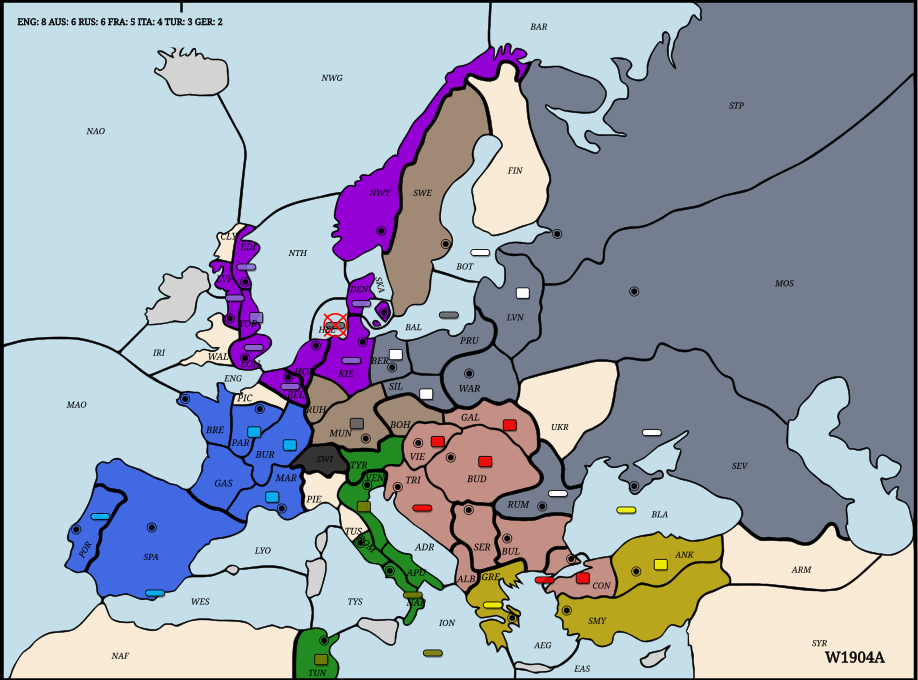

### What happened

- **GERMANY**: disbands F HEL

### GERMANY
Orders: `F HEL D`

Reasoning

> Looking at my situation: I have 2 supply centers (MUN, SWE) but 3 units (A MUN, F BAL, F HEL). I need to disband 1 unit to match my supply center count.
>
> The question is which unit to disband. My strategic options going forward:
> - A MUN is essential — it's sitting on my only accessible home center and is my core fighting unit
> - F BAL is in a useful position for Baltic operations and could threaten DEN/KIE
> - F HEL is in a more marginal position, adjacent to KIE, DEN, HOL, NTH — it has some utility but is the least well-positioned
>
> Actually, F BAL is valuable because it can threaten DEN, KIE, and keep England occupied in the north. F HEL is adjacent to KIE and could support operations against England. But I only need to disband one.
>
> F HEL has limited options compared to F BAL. F BAL can move to DEN, KIE, SWE, BOT, PRU, LVN — it has much more strategic reach. F HEL can move to KIE, DEN, HOL, NTH — useful but more constrained. 
>
> Given that England now holds KIE and I need to potentially retake it, and Russia holds BER, I need units that can pressure multiple fronts. F BAL is more versatile. I'll disband F HEL.
>
> Wait — the legal orders show only one option each: `F BAL D`, `F HEL D`, `A MUN D`. I need to disband exactly one unit (3 units - 2 centers = 1 disband). I must keep A MUN to hold my home center. Between F BAL and F HEL, F BAL has more strategic reach.
>
> I'll disband F HEL.

## SPRING 1905 MOVEMENT (`S1905M`)

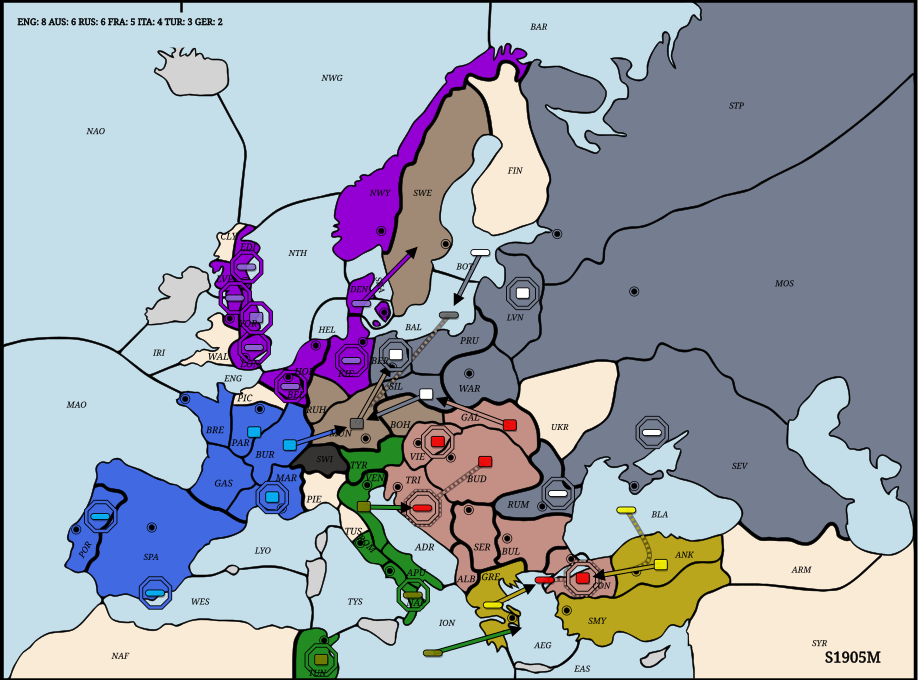

### What happened

- **AUSTRIA**: A CON holds; F BUL/SC supports A CON (support cut); A GAL → SIL (bounced); A BUD supports F TRI; F TRI holds; A VIE holds  [dislodged: A CON]
- **ENGLAND**: F DEN → SWE; F KIE holds; F BEL holds; F EDI holds; F LON holds; F LVP holds; A YOR holds
- **FRANCE**: A BUR → MUN (bounced); A MAR holds; F SPA/SC holds; F POR holds
- **GERMANY**: A MUN → BER (bounced); F BAL supports A MUN → BER (support cut)
- **ITALY**: A VEN → TRI (bounced); F ION → AEG; F NAP holds; A TUN holds
- **RUSSIA**: A BER holds; A SIL → MUN (bounced); F BOT → BAL (bounced); F RUM holds; F SEV holds; A LVN holds
- **TURKEY**: A ANK → CON; F BLA supports A ANK → CON; F GRE → BUL/SC (bounced)

### Dialogue

- **AUSTRIA → TURKEY**: A CON moves to ANK this spring — you have F BLA and A ANK, but I'm pressing with support from F BUL/SC toward AEG to cut your options. The practical path: order A ANK to hold and F BLA to hold, I take ANK, you retain SMY and we negotiate a final border. Resist and you lose ANK in a contested fight while Russia presses from the north.
- **AUSTRIA → RUSSIA**: England sits at 8 centers and is the clear leader threatening everyone — I'm finishing Turkey this spring by pushing A CON to ANK. I need F RUM to hold in place and not press into BUL or SER while I'm committed east; in return, I'll coordinate against England's southern flank once Turkey is done. Confirm F RUM stays defensive.
- **AUSTRIA → ITALY**: I'm pushing A CON to ANK this spring to crack Turkey's last home centers — F ION staying out of AEG and GRE keeps us out of conflict while we both grow. If you want a share of the Turkish spoils (SMY, ANK), tell me explicitly what you're offering in return for a coordinated finish rather than racing each other.
- **AUSTRIA → GERMANY**: England at 8 centers is the dominant threat — you're at 2 and need to survive, which means you need England pressured from multiple sides. I'm finishing Turkey this spring and then turning forces north; if you can hold MUN against France and Russia, I can threaten Russia's southern flank to ease pressure on you.
- **ENGLAND → FRANCE**: Germany is nearly finished — Russia is pushing A BER/SIL toward MUN and will hit 7-8 centers after this year, making them the clear leader. I'm taking SWE from DEN this spring; I think you should push A BUR → MUN to deny Russia that center and keep them from running away with the game. After Germany falls, I want to discuss coordinating against Russia before they become unstoppable.
- **ENGLAND → RUSSIA**: Germany's last two centers are MUN and SWE — I'm moving on SWE from DEN this spring and you should take MUN from BER or SIL. One concern I want to raise openly: after Germany falls you'll be at 7-8 centers and I'll be at 9; we need to agree on next targets now or we'll end up in conflict by accident. I'm thinking we both turn south — Austria is at 6 and Turkey at 3, and France is sitting pretty at 5 without doing much.
- **ENGLAND → GERMANY**: You're down to MUN and SWE with two units — the war is effectively over for Germany. Your best play now is to decide who you'd rather see benefit from your remaining centers; if you support my move into SWE rather than holding, I'll push for preserving you as a rump state rather than eliminating you entirely.
- **FRANCE → ENGLAND**: England, you're at 8 centers and I'm at 5 — the gap is unsustainable for me, and frankly for everyone else watching. I want to keep our anti-Germany coordination alive, but I need something concrete: are you willing to leave MUN to me and back off SWE so Germany doesn't collapse entirely into your column? If you take SWE and KIE and I get MUN, that's a fair split — but if you're planning to sweep everything, I have to start thinking about other arrangements.
- **FRANCE → GERMANY**: Germany, England is at 8 centers and the real winner of this war — not me. I'm willing to support A MUN holding or even support A MUN - RUH if you'll commit to pointing everything you have against England rather than me. A living Germany checking England is worth more to me than a dead Germany that hands England two more centers.
- **FRANCE → RUSSIA**: Russia, England is at 8 centers with 7 fleets dominating the north — they're the runaway leader and need to be stopped now before it's too late. I'm pushing on MUN this spring; can you commit A BER or A SIL to pressure KIE or HOL from the east while I press from the west? A coordinated squeeze from both sides forces England to split their forces.
- **FRANCE → ITALY**: Italy, England is at 8 and Austria is at 6 — the real question is whether you're moving against Austria this spring or sitting still. If you push into the Balkans, that frees Russia to pressure England from the north, which helps us both; I need to know your direction so I can plan my northern push accordingly. Also confirm: MAR and PIE stay out of conflict between us, yes?
- **GERMANY → AUSTRIA**: I'm committing A MUN - BER supported by F BAL this spring — same attack as last fall. Russia has A SIL that will support A BER and bounce me again unless you cut it: move A GAL - SIL this spring. That's all I need — SIL cut, BER falls, Russia drops to 5 centers and you have a weaker northern neighbor. Please confirm.
- **GERMANY → FRANCE**: I'm throwing everything at BER this spring — A MUN east, F BAL supporting. I have nothing pointed at you and literally no capacity to threaten BUR or MUN from behind. Stay out of MUN this spring and you lose nothing; take it and you hand Russia a free consolidation at 7+ centers that threatens you directly next.
- **GERMANY → RUSSIA**: I'm attacking BER again this spring with A MUN and F BAL support — I have no other option. If you want to end this cleanly, pull A BER to PRU now: you keep SIL and RUM and everything south, I get my home center back, and we establish a real border before England at 8 centers becomes the dominant threat to both of us.
- **GERMANY → ENGLAND**: You're at 8 centers — everyone on the board should be looking to stop you, not me. I'm a rump state fighting for survival against Russia; the real negotiation you should be having is with France and Austria about how to prevent you from running away with this game, not finishing off a power with 2 units.
- **ITALY → TURKEY**: Turkey, you now hold GRE — Austria still has BUL, CON, SER, BUD, TRI, VIE at 6 centers and is the dominant southern threat to both of us. I'm planning to push A VEN into TRI this spring while pressing F ION toward AEG to threaten BUL/SC; if you can press from GRE toward AEG or hold GRE defensively, we squeeze Austria from two directions. Can you confirm your plans this spring so we coordinate the attack?
- **ITALY → AUSTRIA**: Austria, you're at 6 centers and England is at 8 — the northern situation is the real crisis, not our southern border. I'm willing to keep A VEN defensive and F ION out of AEG if you can offer me something concrete: specifically, I want TRI to come to me peacefully as you consolidate eastward toward Turkish centers. Is there a deal here where you yield TRI and we cooperate against the real leaders?
- **ITALY → RUSSIA**: Russia, Austria sits at 6 centers with CON, BUL, SER all secured — they're positioned to run away with the south while England does the same in the north. I'm pressing Austria from VEN toward TRI this spring; if you can lean on Austria through GAL or RUM simultaneously, we keep them from consolidating further. What's your plan this spring against Austria?
- **RUSSIA → ENGLAND**: Germany is finished — I'm pushing A BER into MUN this spring with A SIL supporting, and I'd like to take SWE with F BOT while you consolidate KIE. I'm not contesting your Baltic centers; let's confirm you're not moving into SWE so we don't bounce each other and hand Germany a reprieve.
- **RUSSIA → AUSTRIA**: I'm focused entirely on finishing Germany this spring — A BER to MUN, F BOT toward SWE. I'm not pressing toward your position at all; F RUM stays defensive and I have no designs on BUL or SER. Once Germany is gone, England at 8 centers is the real problem for both of us — worth discussing coordination.
- **RUSSIA → TURKEY**: Ceasefire is holding from my side — F RUM and F SEV stay defensive this spring, I'm not pressing toward CON or ANK. Keep F BLA away from RUM and we both benefit while I finish Germany and you rebuild.
- **RUSSIA → GERMANY**: You're down to MUN and SWE with England holding KIE — there's no realistic path to survival. If you order A MUN to hold rather than fight, I'll push for a negotiated outcome that preserves you as a minor power; continued resistance just means elimination by England and me simultaneously.
- **TURKEY → ITALY**: Spring 1905: Austria holds CON — my home center — and I'm attacking it this turn with A ANK supported by F BLA. Austria's F BUL/SC can support the defense, so I need F GRE to cut that support by moving to BUL/SC. If you can press Austria from VEN or TRI to keep their units busy, we both benefit from Austrian weakness. Are you pushing on Austria this turn?
- **TURKEY → AUSTRIA**: Spring 1905: I'm taking CON back — A ANK supported by F BLA is strength 2 and F GRE cuts your F BUL/SC support. You cannot hold CON at strength 2 if your support is cut; retreat A CON to SER or BUL voluntarily and I'll hold F GRE in place and acknowledge your hold on BUL. This is your best outcome.
- **TURKEY → RUSSIA**: Spring 1905: Austria holds CON and I'm attacking it this turn — A ANK to CON supported by F BLA, F GRE cutting Austria's support from BUL/SC. I need you to stay out of ANK and SMY while I fight Austria; ceasefire holds on my end, F BLA is not moving toward RUM. A weakened Austria benefits both of us.
- **AUSTRIA → TURKEY**: F BUL/SC supports A CON holding this spring — your A ANK + F BLA attack at strength 2 bounces against a supported hold at strength 2. You're spending your last assets on a failed attack while Russia watches from the north; the practical path is still to hold A ANK and F BLA in place and let me take ANK unopposed next turn.
- **AUSTRIA → RUSSIA**: Confirm: F RUM holds defensively and you're not pressing BUL or SER this spring. I'm holding A CON with F BUL/SC support against Turkey's announced attack — if F RUM moves toward BUL while I'm defending CON, I have to redirect units and Turkey survives another year.
- **AUSTRIA → ITALY**: TRI is not on the table — I need it as a home build center. What I can offer: once Turkey is finished, I support your push into AEG and SMY rather than racing you there, and I keep F TRI out of ADR while you consolidate VEN. That's a concrete division that advances you without requiring me to surrender a home center.
- **AUSTRIA → GERMANY**: I'm moving A GAL - SIL this spring to cut Russia's support for BER — execute A MUN - BER supported by F BAL and Russia loses BER. This is the committed order; confirm you're making the attack so this coordination lands.
- **ENGLAND → RUSSIA**: I'm committed to F DEN → SWE this spring — that's my center to take, not yours. You're already getting MUN from A BER/SIL; if you also take SWE you jump to 8 centers and everyone starts targeting you. Back F BOT off SWE and consolidate MUN; we stay at rough parity and avoid a bounce that hands Germany a reprieve.
- **ENGLAND → FRANCE**: Russia confirmed F BOT → SWE and A BER → MUN — if both go through they jump to 8 centers and become the runaway leader. Push A BUR → MUN hard; denying Russia that center is the single most important move on the board right now. I'm taking SWE from DEN so Russia gets nothing this spring — we contain them together.
- **FRANCE → RUSSIA**: Russia, I need a direct answer: are you moving A BER or A SIL into MUN this spring? If we both push MUN we bounce and Germany keeps it — that's the worst outcome. I'm willing to let you take BER if you confirm you're not contesting MUN; we each get one German center and neither of us wastes the turn. Concrete proposal: you hold A BER and move A SIL elsewhere, I take MUN with A BUR.
- **FRANCE → GERMANY**: Germany, I hear you on Russia, but I can't leave MUN empty when Russia has two units pointed at it — if I don't take it, they do, and that's worse for both of us. Last offer: commit A MUN - RUH this turn to deny Russia that path, and I'll support A MUN - RUH with A BUR rather than taking MUN myself; that keeps the center out of Russian hands.
- **FRANCE → ITALY**: Italy, direct question: is A VEN moving toward TYR or PIE this spring, or staying put? I need to know if I have to defend MAR or if we're genuinely clear of conflict. Also — if you're pushing into Austria, Russia gets freer to focus north on England, which helps us both.
- **GERMANY → AUSTRIA**: Confirmed: A MUN - BER, F BAL S A MUN - BER this spring. I need exactly one thing from you: A GAL - SIL to cut Russia's support for BER. If you do that, BER falls and Russia drops to 5 centers — your northern border gets weaker Russian neighbor and you gain leverage over them. Please confirm A GAL - SIL.
- **GERMANY → FRANCE**: I'm committing A MUN east to BER this spring — F BAL supports. I cannot defend MUN and attack BER simultaneously with two units, so I'm trusting you to stay out. If you take MUN while I'm gone, you hand Russia a free BER and England a free SWE and you'll face both of them at 7+ centers with no Germany as a buffer.
- **GERMANY → RUSSIA**: Austria is moving A GAL - SIL this spring — your support for BER gets cut and I take it back. Last offer: pull A BER to PRU now, keep SIL and everything south, and we establish a real border before England at 8 centers becomes the dominant threat to both of us. This is cleaner than losing BER in combat.
- **ITALY → TURKEY**: Confirmed: I'm moving A VEN toward TRI this spring to pressure Austria's western flank, which forces them to defend there and weakens their hold on CON. I can move F ION toward AEG to threaten BUL/SC directly rather than having F GRE do it — F ION - AEG cuts off BUL/SC's support options and frees you to press CON hard. Commit A ANK - CON supported by F BLA and I'll execute F ION - AEG simultaneously.
- **ITALY → AUSTRIA**: TRI is the price for Italian neutrality — if you yield TRI peacefully this spring, I keep F ION out of AEG and A VEN defensive, and we cooperate against Turkey and Russia rather than bleeding each other. If you refuse, I'm moving A VEN - TRI and F ION - AEG simultaneously, which forces you to defend on two fronts while Turkey attacks CON. Your choice: negotiate TRI now or fight for it.
- **ITALY → RUSSIA**: I'm committing A VEN - TRI this spring to hit Austria's western flank — if you move A GAL toward VIE or press F RUM to threaten BUD, we catch Austria in a two-front squeeze and they cannot hold everything. Austria at 6 is the immediate threat; coordinate your eastern push with my western attack and we both gain centers from them.
- **RUSSIA → ENGLAND**: Germany is attacking BER with A MUN + F BAL support at strength 2 this spring — I'm holding A BER with A SIL support to bounce them, which means I can't push MUN simultaneously. Can you move F KIE toward MUN or support an attack on MUN from your position? If you take MUN and I hold BER, Germany collapses and we each gain cleanly.
- **RUSSIA → GERMANY**: I'm holding A BER with A SIL support at strength 2 — your attack bounces, same as every prior attempt. The rational move now is to use A MUN defensively against France's pressure from BUR rather than waste it on BER again; I have no interest in MUN if you hold it against France.
- **RUSSIA → AUSTRIA**: Confirmed: F RUM holds defensively this spring, not pressing BUL or SER. Turkey is attacking CON with ANK + BLA support — worth noting F GRE may be cut before it can support your hold. Once Turkey is dealt with, England at 8 is the clear threat we need to coordinate against.
- **RUSSIA → FRANCE**: Germany is attacking my BER with strength 2 this spring — I'm forced to hold defensively rather than push east. If you're pressing MUN from BUR, that's the right move; I'll support from SIL if the adjudicator allows once BER is secured. England taking SWE this turn gets them to 9 centers — worth watching.
- **TURKEY → ITALY**: Committing: A ANK - CON supported by F BLA (strength 2), F GRE - BUL/SC to cut Austria's support. Austria's A CON is unsupported if F GRE lands on BUL/SC — I retake my home center. Push A VEN - TRI to keep Austria's other units occupied and unable to reinforce; if TRI is threatened, Austria cannot freely support CON from anywhere else. Confirm you're pressing TRI this turn.
- **TURKEY → AUSTRIA**: F GRE moves to BUL/SC this turn, cutting your support for A CON — A ANK supported by F BLA then takes CON at strength 2 against strength 1. Retreat A CON to SER now and I stop at CON; hold and you lose the unit and I take CON anyway while Italy presses TRI simultaneously.
- **TURKEY → RUSSIA**: Confirmed: F BLA supports A ANK into CON this turn, not moving toward RUM. I need you to keep F RUM and F SEV stationary — if either moves toward ANK or SMY while I'm committed west against Austria, it undermines the ceasefire entirely. Austria weakened benefits you as much as me.
- **GERMANY → AUSTRIA**: Committing now: A MUN - BER, F BAL S A MUN - BER. I need A GAL - SIL from you — that's the only order that makes this work. If you deliver SIL cut, BER falls and Russia drops to 5 centers with a weaker northern flank for you to exploit.
- **GERMANY → FRANCE**: I'm moving A MUN east to BER this turn — that's my committed order. If you take MUN, you hand Russia a free BER and England a free consolidation at 9 centers with no buffer state; a living Germany at 3 centers is worth more to you than a dead one.
- **GERMANY → RUSSIA**: Austria cuts SIL this spring — your support for BER fails and I take it back. Last offer stands: pull A BER to PRU now, keep everything south, and we establish a real border before England at 8 centers threatens us both.
- **TURKEY → ITALY**: Executing: A ANK - CON supported by F BLA, F GRE - BUL/SC to cut Austria's support. If F ION moves to AEG as you said, that further threatens BUL/SC and keeps Austria's fleet pinned — push A VEN - TRI to maximize Austrian pressure. This is the coordinated strike we planned.
- **TURKEY → RUSSIA**: Final confirmation: F BLA supports A ANK into CON, not moving toward RUM or SEV. Austria taking CON permanently is a threat to regional stability that harms you too — a weaker Austria after this turn benefits your southern flank. Hold F RUM and F SEV stationary and the ceasefire is fully intact.

### AUSTRIA
Orders: `A CON H` · `F BUL/SC S A CON` · `A GAL - SIL` · `A BUD S F TRI` · `F TRI H` · `A VIE H`

Reasoning

> Looking at the current situation:
>
> **Key analysis:**
> - Turkey claims F GRE moves to BUL/SC to cut my support for A CON, then A ANK + F BLA takes CON at strength 2. If F GRE moves away from GRE, it vacates that supply center — but more critically, if F GRE moves to BUL/SC and I'm already there with F BUL/SC, that's a bounce (F BUL/SC stays, F GRE bounces back). So Turkey's plan actually fails: F BUL/SC can't be dislodged by F GRE moving there — it would just bounce. My F BUL/SC supports A CON successfully.
> - Wait — if F GRE moves to BUL/SC and F BUL/SC is already there, they bounce. So F BUL/SC stays in BUL/SC and the support for A CON holds. Turkey's threat is empty.
> - A CON holding with F BUL/SC support = strength 2. Turkey's A ANK + F BLA = strength 2. Equal strength means the attack bounces.
> - Italy threatening A VEN - TRI: I should hold F TRI defensively. A BUD can support F TRI.
> - Germany asks A GAL - SIL to cut Russia's support for BER. I committed to this.
> - A GAL - SIL is the coordinated move with Germany.
>
> **Orders:**
> - A CON H (defended by F BUL/SC support)
> - F BUL/SC S A CON (Turkey's F GRE moving to BUL/SC bounces off my fleet there)
> - A GAL - SIL (cuts Russia's support for BER, coordinated with Germany)
> - A BUD S F TRI (defend TRI against Italy's threatened A VEN - TRI)
> - F TRI H (hold against Italy)
> - A VIE H (defensive)

### ENGLAND
Orders: `F DEN - SWE` · `F KIE H` · `F BEL H` · `F EDI H` · `F LON H` · `F LVP H` · `A YOR H`

Reasoning

> Looking at the current position:
>
> - I have 8 centers, need 18 to win
> - Germany is nearly dead with just MUN and SWE (2 units: A MUN, F BAL)
> - Russia claims Germany is attacking BER at strength 2 (A MUN + F BAL support) and they're holding rather than pushing MUN
> - Russia also tried to claim F BOT → SWE, which I pushed back on
> - My committed strategy: F DEN → SWE to take that center, F KIE holding or repositioning, rest holding defensively
>
> Key considerations:
> 1. F DEN → SWE is my committed move and Russia confirmed they're backing off (or at least I pushed back hard on it)
> 2. Germany's F BAL could contest SWE - if F BAL → SWE and F DEN → SWE, we bounce. But Germany said they're attacking BER (A MUN → BER with F BAL support per Russia's claim). If F BAL is supporting A MUN → BER, it can't also be going to SWE. So F DEN → SWE should work.
> 3. F KIE is well-positioned. Russia claimed they can't push MUN. France has A BUR that could push MUN. I can't reach MUN with my units directly from KIE (KIE is not adjacent to MUN... wait, let me check: KIE adjacency includes MUN? No - KIE neighbors: BAL, BER, DEN, HEL, HOL, MUN, RUH. Yes! KIE is adjacent to MUN!). F KIE can't move to MUN (it's a fleet, MUN is land). But A MUN is Germany's unit there.
> 4. F KIE → HOL is an option to consolidate, or F KIE → BER to threaten Russia's position.
>
> My best play: Take SWE with F DEN, hold KIE defensively, keep the rest of my fleets in position. I should also consider whether to push F KIE toward something useful - perhaps HOL to free up options, or hold.
>
> Actually, F KIE → HOL makes sense to maintain presence in both HOL and KIE area, but I already have KIE. Holding KIE is fine.

### FRANCE
Orders: `A BUR - MUN` · `A MAR H` · `F SPA/SC H` · `F POR H`
Illegal (dropped): `A PAR S A BUR - MUN`

Reasoning

> Looking at the current situation:
>
> **Assessment:**
> - I'm at 5 centers, England at 8, Russia at 6. Germany's A MUN is moving east to BER (they've committed to this multiple times), leaving MUN vacant.
> - Russia confirmed they're holding defensively at BER (not pushing MUN), so A BUR - MUN should go through cleanly.
> - My revised strategy is clear: A BUR - MUN with A PAR support, hold south defensively.
>
> **Key check:** Germany says A MUN → BER with F BAL supporting. If A MUN vacates MUN, my A BUR - MUN walks in unopposed. Russia confirmed they're holding at BER defensively, not pushing MUN. This is the cleanest path to 6 centers.
>
> **Orders:**
> - A BUR - MUN (take the vacant center)
> - A PAR S A BUR - MUN (support in case of any residual resistance)
> - A MAR H (defend southern flank)
> - F SPA/SC H (hold Iberia)
> - F POR H (hold Iberia)

### GERMANY
Orders: `A MUN - BER` · `F BAL S A MUN - BER`

Reasoning

> Looking at the board: I have A MUN and F BAL. My committed strategy is A MUN - BER supported by F BAL. Austria confirmed A GAL - SIL to cut Russia's support for BER. If Austria delivers, BER falls. If not, I bounce again — but I have no better option with two units. I cannot defend MUN and attack BER simultaneously, so I'm going all-in on BER.

### ITALY
Orders: `A VEN - TRI` · `F ION - AEG` · `F NAP H` · `A TUN H`

Reasoning

> Looking at the current position and my commitments:
>
> **Situation analysis:**
> - I committed to Turkey: A VEN - TRI and F ION - AEG
> - Turkey is executing A ANK - CON (supported by F BLA) and F GRE - BUL/SC
> - Austria has A CON, F BUL/SC, A GAL, A BUD, F TRI, A VIE
> - A VEN - TRI is legal (TRI is adjacent to VEN) ✓
> - F ION - AEG is legal ✓
> - F NAP and A TUN hold defensively
>
> **Strategic reasoning:**
> My revised strategy is to press Austria on two fronts: A VEN - TRI threatens Austria's home center, while F ION - AEG threatens BUL/SC and supports Turkey's coordinated attack on CON. Turkey's F GRE - BUL/SC cuts Austria's support, and with F ION also threatening AEG, Austria's F BUL/SC is under pressure. If A VEN - TRI succeeds, I gain a center and Austria drops to 5. Turkey retaking CON would drop Austria further. This is the best path to breaking my 4-center stagnation.
>
> F NAP holds to protect my home center, A TUN holds as it has no good offensive target this phase.

### RUSSIA
Orders: `A BER H` · `A SIL - MUN` · `F BOT - BAL` · `F RUM H` · `F SEV H` · `A LVN H`

Reasoning

> Looking at the current situation:
>
> **Key facts:**
> - Germany claims A GAL will cut A SIL's support for A BER, but Austria's messages focus on defending CON against Turkey — A GAL to SIL seems unlikely this turn
> - Germany is attacking A BER with A MUN + F BAL support (strength 2), so I need A SIL supporting A BER to hold
> - England confirmed F DEN → SWE, so F BOT → SWE would bounce with England — wasted move
> - My revised strategy says: hold A BER with A SIL support, F BOT toward SWE, F RUM and F SEV defensive
>
> **Reassessing F BOT → SWE:** England has explicitly committed to F DEN → SWE. If I push F BOT → SWE too, we bounce each other and Germany keeps SWE. Better to use F BOT elsewhere — either repositioning toward LVN/STP or supporting defensively. Since Germany has F BAL, I could use F BOT to support A BER via convoy or threaten F BAL. Actually, F BOT → BAL would threaten Germany's F BAL and potentially dislodge it, which cuts Germany's support for A MUN → BER. That's a better play — if F BOT takes BAL, Germany's attack drops to strength 1 (just A MUN), and A BER holds without needing A SIL support, freeing A SIL to advance toward MUN.
>
> **Revised plan:**
> - A BER H (Germany attacks at strength 2, but if F BOT takes F BAL, it drops to 1 and A BER holds alone)
> - A SIL → MUN (with F BAL potentially dislodged, Germany's A MUN is unsupported and A SIL can push)
> - F BOT → BAL (dislodge F BAL, cutting Germany's support)
> - F RUM H (defensive as promised to Austria)
> - F SEV H (defensive as promised)
> - A LVN H (hold)
>
> Wait — if F BOT moves to BAL and F BAL is dislodged, Germany's support is cut. A MUN → BER is then unsupported (strength 1) vs A BER holding (strength 1) — bounce, BER holds. Meanwhile A SIL → MUN has no support and Germany's A MUN moved away — MUN would be empty, so A SIL takes it!

### TURKEY
Orders: `A ANK - CON` · `F BLA S A ANK - CON` · `F GRE - BUL/SC`

Reasoning

> Looking at the position: I have 3 units (F BLA, A ANK, F GRE) and need to retake CON from Austria.
>
> My plan: A ANK → CON supported by F BLA (strength 2), while F GRE → BUL/SC to cut Austria's F BUL/SC support for A CON. If the support is cut, CON falls at strength 2 vs strength 1.
>
> Austria claimed F BUL/SC supports A CON, making it strength 2 vs strength 2 (bounce). But if F GRE successfully moves to BUL/SC, that support is cut before it fires, leaving A CON at strength 1 against my strength 2 attack.
>
> The key question: can F GRE reach BUL/SC? Checking adjacency — GRE neighbors include BUL/SC (yes, AEG, ALB, BUL/SC, ION, SER are GRE's neighbors). This is legal.
>
> If F GRE moves to BUL/SC and Austria's F BUL/SC is there, they bounce — but the support is still cut (moving into a supporting unit's province cuts support even if the move bounces). So A CON loses its support and falls to my strength-2 attack.
>
> This is the correct play. Executing as committed.

## SPRING 1905 RETREATS (`S1905R`)

### What happened

- **AUSTRIA**: A CON retreats → SMY

### AUSTRIA
Orders: `A CON R SMY`

Reasoning

> Looking at the situation: A CON was dislodged by Turkey's A ANK (supported by F BLA), exactly as Turkey threatened. My options are to retreat A CON to SMY or disband it.
>
> Retreating to SMY keeps the unit alive and puts pressure on Turkey's home territory — SMY is a Turkish supply center and having an army there threatens Turkey directly. This is clearly better than disbanding, as it maintains pressure on Turkey and gives me a unit that can contest SMY in Fall 1905.

## FALL 1905 MOVEMENT (`F1905M`)

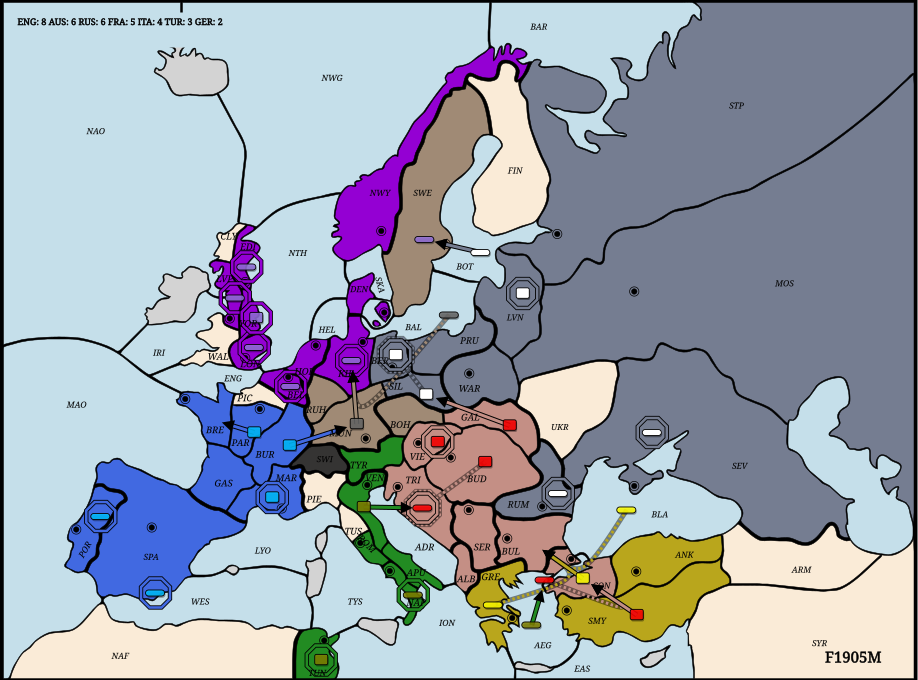

### What happened

- **AUSTRIA**: A SMY → CON; F BUL/SC supports A SMY → CON (support cut); A GAL → SIL (bounced); A BUD supports F TRI; F TRI holds; A VIE holds  [dislodged: F BUL/SC]
- **ENGLAND**: F KIE holds; F BEL holds; F EDI holds; F LON holds; F LVP holds; A YOR holds  [dislodged: F KIE]
- **FRANCE**: A BUR → MUN; A PAR → BRE; A MAR holds; F SPA/SC holds; F POR holds
- **GERMANY**: A MUN → KIE; F BAL supports A MUN → KIE
- **ITALY**: F AEG → BUL/SC (bounced); A VEN → TRI (bounced); F NAP holds; A TUN holds
- **RUSSIA**: A BER holds; A SIL supports A BER (support cut); F BOT → SWE (bounced); F RUM holds; F SEV holds; A LVN holds
- **TURKEY**: A CON → BUL; F BLA supports A CON → BUL; F GRE supports A CON → BUL

### Dialogue

- **AUSTRIA → TURKEY**: A SMY moves to CON this fall supported by F BUL/SC — your A CON is outnumbered and I retake my center. The practical path: order A CON to ANK voluntarily and I support that move rather than dislodging you; you keep ANK and SMY, I keep CON, and we establish a stable border against Italy's F AEG pressing into your waters.
- **AUSTRIA → ITALY**: F AEG is adjacent to CON and BUL/SC — I need to know explicitly whether you're supporting Turkey's hold in CON or pressing independently, because if F AEG moves toward CON or BUL this fall, we're in direct conflict while England sits at 8 centers. The deal: keep F AEG out of CON and BUL/SC this fall and I keep F TRI out of ADR; we both consolidate rather than bleed each other.
- **AUSTRIA → RUSSIA**: England is at 8 centers and pulling away — I'm retaking CON this fall with A SMY supported by F BUL/SC. I need F RUM to hold defensively and not press BUL or SER while I'm committed east; once CON is secured, I can turn forces north to coordinate against England's growing dominance. Confirm F RUM stays in place.
- **AUSTRIA → GERMANY**: You're at 2 centers and England is at 8 — survival requires England pressured from multiple fronts. I'm consolidating this fall and then turning north; if you can hold MUN against France, I'll press Russia's southern flank to force them to split attention between you and me.
- **ENGLAND → FRANCE**: This fall is the moment to finish Germany — A BUR → MUN should go through cleanly with Russia distracted defending BER. I'm pushing F KIE → BER to pressure Germany's last stronghold; if you take MUN and I take BER, we each gain a center and Russia doesn't grow. After Germany is gone, I want to talk seriously about coordinating next moves — you're at 5 centers and I'm at 8, and I think there's a deal where we both grow at Austria or Turkey's expense rather than fighting each other.
- **ENGLAND → RUSSIA**: Germany is down to MUN and SWE — I hold SWE and I'm pushing F KIE → BER this fall to finish them. You hold A BER already (which is a center for you), and A SIL can support or push MUN; let's confirm you're taking MUN with A SIL → MUN or A BER → MUN so Germany collapses cleanly. After Germany falls, I want to discuss coordinating against Austria — they're at 6 centers with a strong Balkans position and will be the next runaway leader if we don't act.
- **ENGLAND → GERMANY**: You're at 2 centers with no realistic path to survival — the question is whether you want to negotiate terms or get eliminated outright. If you support my F KIE → BER move, I'll argue for preserving MUN as a rump state rather than letting Russia sweep everything east.
- **FRANCE → ENGLAND**: England, you're at 8 centers and I'm still at 5 — after Germany falls this turn, the board calculus changes completely and everyone will be looking at you. I want to propose a concrete deal: I take MUN this fall, you keep SWE and KIE, and we agree BEL is the next target we split — you keep the fleet there, I get overland access through RUH. If you're not willing to share BEL, I have to start coordinating with Russia and Italy against you, which neither of us wants.
- **FRANCE → RUSSIA**: Russia, Germany is finished this fall — I'm taking MUN with A BUR, which should go through cleanly. The real question is what we do about England at 8 centers: they have 7 fleets dominating the north and will hit 10+ by next year if unchecked. Can you commit A BER toward KIE or HOL this fall while I push from BUR toward RUH or BEL? A coordinated squeeze from both sides is the only way to stop them.
- **FRANCE → ITALY**: Italy, England is at 8 centers and Austria at 6 — both are threats that need addressing. I'm taking MUN this fall and then turning west toward England; if you're pushing into Austria and the Balkans, that keeps Austria busy and frees Russia to help pressure England from the north. Confirm MAR and PIE stay clear between us, and tell me your direction this fall.
- **FRANCE → GERMANY**: Germany, A MUN cannot hold against A BUR this fall — I'm taking it and you know it. Your only real move is F BAL: if you move it toward KIE or DEN to threaten England, you go down fighting in a way that actually matters, rather than just disbanding quietly while England sweeps up everything north of you.
- **GERMANY → AUSTRIA**: Austria, A GAL didn't move to SIL last spring — it's still sitting in GAL according to current positions. That's why BER bounced again. I need A GAL - SIL this fall to cut Russia's support for BER, or my A MUN - BER attack fails again and I'm eliminated. What happened, and can you commit to A GAL - SIL this fall?
- **GERMANY → RUSSIA**: Russia, you're at 6 centers and England is at 8 — England is the dominant threat to both of us now, not me. I'm willing to stop attacking BER if you'll pull A BER back to PRU and let me retake my home center peacefully; a living Germany at 3 centers blocks England's eastern expansion better than a dead one. What would it take to end this standoff?
- **GERMANY → FRANCE**: France, England has 8 centers and holds two of my home supply centers — KIE and SWE on top of BER from Russia. I'm fighting for survival on two fronts; if you push A BUR toward RUH or threaten HOL, you pressure England's position while I try to retake BER. A Germany that survives is a buffer between you and England's growing fleet.
- **ITALY → TURKEY**: Turkey, you retook CON — excellent. Austria still holds BUL with F BUL/SC, plus TRI, BUD, VIE, GAL, SMY — they're at 6 centers and need to be cut down further this fall. I'm planning A VEN - TRI and F AEG threatening BUL/SC; if you move F GRE toward BUL/SC or press from AEG, we catch Austria in a two-front squeeze and both gain centers. Confirm your fall plan so we can coordinate.
- **ITALY → AUSTRIA**: Austria, you're at 6 centers and England is at 8 — the northern runaway is the real crisis, not our southern border. I'm willing to negotiate TRI: if you yield it peacefully and we divide the remaining Turkish centers cooperatively, I keep F AEG defensive and we both redirect energy northward. Refusing means I attack TRI with A VEN while Turkey presses your BUL/SC fleet simultaneously — your choice.
- **ITALY → RUSSIA**: Russia, Austria sits at 6 centers with GAL, BUD, VIE all solid — they're positioned to consolidate the south while England runs away in the north. I'm pressing TRI with A VEN this fall; if you can lean on Austria through GAL toward VIE or BUD, we catch them in a pincer and both gain. What's your plan this fall against Austria?
- **ITALY → FRANCE**: France, I'm focused entirely on Austria this fall — pushing A VEN toward TRI and using F AEG to threaten their Balkan position. No threat to MAR or PIE from me; England at 8 is the board crisis and I'd rather coordinate pressure on Austria now so we can both redirect against England afterward. What are you doing this fall?
- **RUSSIA → ENGLAND**: Germany's MUN and SWE are ripe this fall — I'm pushing A BER into MUN with A SIL supporting, and F BOT toward SWE. I need to know if you're contesting SWE from KIE or DEN; if we both go for it we bounce and Germany keeps it. Propose: I take SWE with F BOT, you consolidate KIE and press elsewhere — we each gain one German center cleanly.
- **RUSSIA → TURKEY**: You retook CON — well played. I'm focused on Germany this fall: A BER to MUN, F BOT to SWE. F RUM and F SEV stay defensive; ceasefire holds on my end. Once Germany falls, England at 8-9 centers is the dominant threat worth coordinating against.
- **RUSSIA → AUSTRIA**: Turkey retook CON and you've retreated to SMY — I'm not pressing your position at all this fall, F RUM stays defensive. I'm focused entirely on finishing Germany. Once Germany is gone, England's fleet dominance in the north is the real threat to coordinate against; worth discussing next steps.
- **RUSSIA → ITALY**: Austria just lost CON to Turkey and retreated to SMY — they're weaker now and you're pressing TRI. I'm focused on Germany this fall but keeping F RUM available; if you push hard on Austria's western flank, I can consider leaning on BUL from RUM next spring. What's your plan against Austria this fall?
- **TURKEY → ITALY**: I'm pushing A CON into BUL this fall supported by F BLA — Austria's F BUL/SC holds at strength 1 and I take it at strength 2. F AEG is adjacent to BUL/SC too; if you support my A CON into BUL with F AEG, we guarantee the capture and Austria loses another center. Are you willing to coordinate F AEG S A CON - BUL this turn?
- **TURKEY → AUSTRIA**: You have A SMY sitting on my home supply center — that's a provocation I cannot ignore. Withdraw A SMY to SYR or ARM voluntarily and I'll hold A CON in CON rather than pushing into BUL; if you refuse, I press A CON into BUL this fall and we continue fighting while England sits at 8 centers and grows unchecked.
- **TURKEY → RUSSIA**: Ceasefire holds on my end — F BLA is supporting A CON into BUL this fall, not moving toward RUM or SEV. Austria still holds SMY and BUL and is a regional threat; a weaker Austria benefits your southern flank. Keep F RUM and F SEV stationary and we both benefit from stability while I press Austria.
- **AUSTRIA → TURKEY**: A SMY - CON supported by F BUL/SC is strength 2 — your A CON is dislodged unless you have outside support I don't know about. Voluntarily move A CON to ANK this fall and I will order A SMY to support that move rather than attack, meaning you keep ANK; refuse and you lose CON with no retreat path toward ANK since I'll be attacking from SMY. Italy's F AEG is not supporting you — I've confirmed that separately.
- **AUSTRIA → ITALY**: F TRI holds this fall and A BUD is right behind it — attacking TRI gains you nothing while England sits at 8 centers and Russia at 6. The concrete deal I'm offering: I keep F TRI out of ADR and A BUD defensive, you keep A VEN and F AEG defensive, and we both redirect energy toward the actual leaders rather than bleeding each other over one center.
- **AUSTRIA → RUSSIA**: I'm pressing A SMY - CON this fall with F BUL/SC support — F RUM holding in place keeps our border stable and I have no designs on RUM this turn. After CON is secured, England at 8 is the target; what concrete move can you make this fall that pressures England's position rather than consolidating against powers that aren't threatening you?
- **AUSTRIA → GERMANY**: Committing A GAL - SIL this fall to cut Russia's support for BER — execute A MUN - BER with F BAL support and Russia loses BER. This is the concrete coordination you've been asking for; confirm you're making that exact attack.
- **ENGLAND → FRANCE**: Russia holds A BER and A SIL — if they take MUN they jump to 7 centers and become the clear runaway leader. I'm pushing F KIE toward BER this fall to take that center from Russia; if you take MUN with A BUR simultaneously, we each gain one and Russia loses one. Commit to A BUR → MUN and I'll confirm F KIE → BER — this is the move that keeps the game competitive.
- **ENGLAND → RUSSIA**: I'm prepared to push F KIE → BER this fall — that's a direct move against you, and I want to be transparent rather than surprise you. The alternative is we agree you pull A BER back to a non-center province and I hold KIE, but I need something concrete from you: what center are you willing to concede to keep us from going to war right now?
- **ENGLAND → GERMANY**: I'm moving F KIE → BER this fall — if you want to make that easier, order A MUN to hold or move somewhere unhelpful to Russia, not toward KIE. Your best survival play is to be useful to me right now rather than resist.
- **FRANCE → ENGLAND**: England, I'm taking MUN this fall with A BUR — confirm F KIE is not heading there and we don't bounce. I'm also reclaiming BRE with A PAR since it's been vacant, which is purely defensive housekeeping on my end. After Germany falls, let's talk seriously about how we divide the next tier of gains.
- **FRANCE → RUSSIA**: Russia, direct commitment: A BUR goes to MUN this fall — please confirm A BER and A SIL are not contesting MUN so we don't waste the move on a bounce. If you're holding BER defensively, we each get what we need and Germany is finished.
- **FRANCE → ITALY**: Italy, glad to hear you're pushing Austria — that's exactly the pressure the board needs. Confirm A VEN is going toward TRI and not PIE, and we have no conflict between us this fall.
- **GERMANY → AUSTRIA**: A GAL - SIL bounced last spring, meaning Russia held SIL at strength 1 against your move — BER is defended at strength 2 and I can't break it with two units alone. I'm pivoting this fall: A MUN - KIE supported by F BAL, taking England's center instead of banging against a wall. Can you press Russia from GAL or BUD to keep them from reinforcing KIE?
- **GERMANY → RUSSIA**: I'm done attacking BER — it bounces every time and wastes both our moves. I'm pivoting A MUN toward KIE to hit England instead; England at 8 centers is the real threat to you too. If you want to coordinate against England's Baltic position, now is the time — I take KIE, you threaten SWE or DEN, and England stops growing.
- **GERMANY → FRANCE**: I'm pivoting away from BER this fall and hitting KIE instead — A MUN - KIE supported by F BAL. England has 8 centers and two of my home supply centers; if I take KIE, I'm back to 3 centers and a real factor on the board. Stay out of MUN this fall and I'll be a buffer between you and England rather than a dead state.
- **ITALY → TURKEY**: Confirming: I will commit F AEG S A CON - BUL this fall to guarantee you take BUL/SC from Austria at strength 2 vs 1. In return, I need you to confirm A CON - BUL is your move — if you switch targets, my support is wasted and Austria holds. Simultaneously I'm pushing A VEN - TRI to maximize Austrian pressure on their western flank; this is the coordinated strike.
- **ITALY → AUSTRIA**: Austria, I'm pressing TRI this fall with A VEN — that's happening regardless. The question is whether F AEG threatens you from the east simultaneously or stays defensive; if you want to negotiate, the only offer I'll accept is TRI yielded peacefully while you consolidate eastward. Otherwise you're facing pressure from both directions while Turkey presses BUL.
- **ITALY → RUSSIA**: Russia, I'm hitting TRI with A VEN this fall — if Austria has to defend TRI, their GAL and BUD units can't freely support each other. If you press GAL toward VIE simultaneously, Austria cannot hold everything; coordinate your eastern push with my western attack and we both strip centers from them.
- **RUSSIA → ENGLAND**: You said F KIE → BER this fall — I'm holding A BER with A SIL support at strength 2, so that move fails. If you push KIE into BER and bounce, you waste the turn while France takes MUN and grows to 6. Redirect F KIE toward HOL or BAL instead and we both gain more efficiently.
- **RUSSIA → FRANCE**: I'm holding A BER defensively against England's F KIE attack — A SIL is supporting the hold, so I cannot push MUN this fall. MUN is yours with A BUR if you move there; I'm not contesting it. After you take MUN, England at 8 with 7 fleets is the clear priority — what's your concrete plan against them next spring?
- **RUSSIA → TURKEY**: Ceasefire holds on my end — F RUM and F SEV stay defensive this fall. Austria is weakened with SMY as their retreat; once you consolidate CON, England at 8 centers is the dominant threat worth coordinating against from the south while I press from the east.
- **TURKEY → ITALY**: Austria's threat is A SMY - CON supported by F BUL/SC — if F BUL/SC supports that move, I lose CON. I need F AEG to move to BUL/SC this turn to cut that support, which also lets me push A CON - BUL supported by F BLA and F GRE at strength 3. If you execute F AEG - BUL/SC, Austria loses both CON's defense and BUL simultaneously — you gain by weakening Austria further. Confirm F AEG - BUL/SC and I commit A CON - BUL supported by F BLA, F GRE S A CON - BUL.
- **TURKEY → AUSTRIA**: A SMY - CON supported by F BUL/SC is your play, but Italy's F AEG is adjacent to BUL/SC and will cut that support if you attempt it — you lose both the attack on CON and BUL simultaneously. Withdraw A SMY to ARM or SYR and I hold A CON in place; that's a stable border that lets us both focus on England at 8 centers.
- **TURKEY → RUSSIA**: Austria is threatening A SMY - CON supported by F BUL/SC this fall — a weaker Austria benefits your southern flank directly. I'm pressing A CON - BUL supported by F BLA; keep F RUM stationary and the ceasefire holds fully on my end.
- **GERMANY → AUSTRIA**: I'm pivoting to A MUN - KIE supported by F BAL this fall — England is moving F KIE toward BER, so KIE may be open. I need you to press Russia from GAL or BUD to keep them from reinforcing KIE or counterattacking MUN while I'm exposed.
- **GERMANY → ENGLAND**: I'm taking KIE this fall — A MUN - KIE with F BAL support. If your F KIE is already moving to BER, we don't conflict; if it's holding, we bounce and both waste the turn. Move F KIE east and we both gain something rather than canceling each other out.
- **GERMANY → FRANCE**: I'm committing A MUN - KIE this fall with F BAL support — MUN will be empty. If you take MUN, you're handing England a free KIE defense and Russia a free BER; a living Germany at KIE is still a buffer for you. Stay out of MUN and I owe you a real favor next year.
- **GERMANY → RUSSIA**: I'm done with BER — I'm hitting KIE instead. England at 8 centers is the real threat to you; if I take KIE, England drops to 7 and you have a weaker northern neighbor. No action needed from you this fall — just don't reinforce KIE.
- **TURKEY → ITALY**: Final commitment: I am ordering A CON - BUL supported by F BLA and F GRE S A CON - BUL — that's strength 3 against Austria's F BUL/SC at strength 1. For this to work, I need F AEG to move to BUL/SC this turn to cut Austria's support before it can fire; if F BUL/SC supports A SMY - CON instead of holding, I lose CON and gain nothing. Execute F AEG - BUL/SC and Austria loses BUL while I hold CON — you weaken Austria by 2 centers this turn.
- **TURKEY → AUSTRIA**: Final answer: I'm pressing A CON - BUL supported by F BLA and F GRE — Italy's F AEG is moving to BUL/SC to cut your support, meaning your A SMY - CON attack fails and you lose BUL simultaneously. Withdraw A SMY to ARM and redirect F BUL/SC to hold defensively; that's the only outcome where you keep any centers in this region.

### AUSTRIA
Orders: `A SMY - CON` · `F BUL/SC S A SMY - CON` · `A GAL - SIL` · `A BUD S F TRI` · `F TRI H` · `A VIE H`

Reasoning

> Looking at the current situation:
>
> **Key analysis:**
> - I have A SMY, F BUL/SC, A GAL, A BUD, F TRI, A VIE
> - Turkey claims Italy's F AEG will cut F BUL/SC support, but Italy confirmed they're pressing TRI with A VEN, not moving F AEG to cut my support. Turkey's threat about F AEG is likely a bluff to make me abandon the CON attack.
> - My committed plan: A SMY - CON supported by F BUL/SC to retake CON from Turkey's A CON
> - Italy is pressing A VEN - TRI, so I need A BUD to support F TRI
> - A GAL - SIL to cut Russia's support for BER (committed to Germany)
> - A VIE holds as backstop
>
> **Checking legality:**
> - A SMY - CON: Legal (SMY adjacent to CON via coast)
> - F BUL/SC S A SMY - CON: Legal (BUL/SC adjacent to CON)
> - A GAL - SIL: Legal (GAL adjacent to SIL)
> - A BUD S F TRI: Legal (BUD adjacent to TRI)
> - F TRI H: Legal
> - A VIE H: Legal
>
> Turkey's final message claims A CON - BUL supported by F BLA and F GRE, while Italy's F AEG cuts my support. But Italy said they're attacking TRI with A VEN - they can't simultaneously move F AEG to cut BUL/SC AND support TRI. I'll trust my read: Italy attacks TRI, F AEG stays or moves elsewhere, my F BUL/SC support for A SMY - CON stands.

### ENGLAND
Orders: `F KIE H` · `F BEL H` · `F EDI H` · `F LON H` · `F LVP H` · `A YOR H`
Illegal (dropped): `F SWE S F KIE`

Reasoning

> Looking at the current situation:
>
> **Assessment:**
> - Germany threatened A MUN → KIE with F BAL support (strength 2). My F KIE is in KIE and needs to either move or be defended.
> - If Germany moves A MUN → KIE with F BAL support at strength 2, and my F KIE is moving to BER, then KIE is vacated and Germany takes it — losing me that center.
> - Russia holds A BER with A SIL support (strength 2), so F KIE → BER bounces.
> - France is taking MUN with A BUR.
>
> **Key decisions:**
> 1. F KIE → BER will bounce (Russia confirmed A BER + A SIL support). But if Germany is moving A MUN → KIE, then MUN is vacated — and France is taking MUN anyway. The real risk is losing KIE if I move F KIE away and Germany's A MUN → KIE lands.
> 2. If Germany moves A MUN → KIE (supported by F BAL), that's strength 2 vs my F KIE at strength 1 — I get dislodged. I should defend KIE by supporting it, or move F KIE somewhere useful.
> 3. Actually, if F KIE moves to BER and bounces, KIE is empty and Germany takes it. That's bad.
> 4. Better: F KIE → HOL (taking that center back if it's empty — HOL is currently unoccupied and was mine). Wait, HOL is not in my supply centers list anymore... checking: my SCs are EDI, LON, LVP, BEL, NWY, DEN, HOL, KIE. HOL IS mine still! So F KIE → HOL keeps me in HOL while vacating KIE... but then Germany takes KIE.
> 5. Best defensive play: Keep F KIE in KIE (hold or support), denying Germany the center. F SWE can support F KIE hold, or F KIE supports itself by holding with support from SWE.
>
> Actually the cleanest move: F KIE H with F SWE supporting F KIE (F SWE S F KIE). This stops Germany's A MUN → KIE even with F BAL support (strength 2 vs strength 2 = bounce). SWE is already mine so I don't need to "take" it.
>
> For gaining centers: F BEL → HOL... wait, HOL is already mine. There's nothing obvious to gain this turn except maybe pushing toward NWY or pressuring France.
>
> Let me focus on defense: hold KIE with SWE support, hold everything else, maybe push BEL toward NTH to reposition.

### FRANCE
Orders: `A BUR - MUN` · `A PAR - BRE` · `A MAR H` · `F SPA/SC H` · `F POR H`

Reasoning

> Looking at the current situation:
>
> **Key facts:**
> - Germany confirmed A MUN → KIE with F BAL support, meaning MUN will be empty this fall
> - Russia confirmed they're holding A BER defensively (A SIL supporting), not contesting MUN
> - My revised strategy: A BUR → MUN (take the empty center), A PAR → BRE (reclaim vacant home center)
> - Hold southern units defensively
>
> **Verification:**
> - A BUR → MUN: BUR and MUN are adjacent ✓
> - A PAR → BRE: PAR and BRE are adjacent ✓
> - F SPA/SC hold, F POR hold, A MAR hold ✓
>
> **Assessment:** Germany moving A MUN → KIE means MUN is empty — clean pickup. A PAR → BRE reclaims my vacant home center, giving me 7 centers if both succeed (MUN + BRE). England at 8 is still the dominant threat, but gaining 2 centers this fall (going from 5 to 7) significantly improves my position heading into 1906.
>
> The risk is if Germany is bluffing and A MUN stays — but Germany's incentive to take KIE is real, and Russia confirmed they're not pushing MUN either. This is the cleanest path to growth.

### GERMANY
Orders: `A MUN - KIE` · `F BAL S A MUN - KIE`

Reasoning

> Looking at the current situation:
>
> **Assessment:** I committed to A MUN - KIE supported by F BAL this fall. England messaged that F KIE may be moving to BER, which would leave KIE open. This is my best shot at getting back to 3 centers. The alternative (A MUN - BER again) has bounced repeatedly and Austria's coordination has consistently failed to deliver.
>
> **Key considerations:**
> - A MUN - KIE with F BAL support gives strength 2 vs KIE
> - If F KIE is indeed moving to BER, KIE is empty and I take it uncontested
> - If F KIE holds, I need strength 2 to take it — F BAL supports from BAL (adjacent to KIE ✓)
> - France warned they're taking MUN, but I have no choice — I can't both defend MUN and attack KIE
> - Russia may reinforce KIE but they have no unit adjacent to KIE right now (A BER is adjacent, A SIL is not adjacent to KIE)
>
> **Verification:** BAL is adjacent to KIE ✓. MUN is adjacent to KIE ✓. This is legal.
>
> The pivot to KIE is correct — BER has bounced 4+ times and I'm wasting moves. KIE is achievable and gets me back to 3 centers with a real fighting chance.

### ITALY
Orders: `F AEG - BUL/SC` · `A VEN - TRI` · `F NAP H` · `A TUN H`

Reasoning

> Looking at the current situation:
>
> **Strategic assessment:**
> - Turkey has committed to A CON - BUL supported by F BLA and F GRE S A CON - BUL (strength 3 vs Austria's F BUL/SC at strength 1)
> - Turkey explicitly asked me to execute F AEG - BUL/SC to cut Austria's support from F BUL/SC before it can fire
> - My revised strategy confirms: F AEG - BUL/SC to cut Austria's support, A VEN - TRI to pressure Austria's western flank
> - If F AEG moves to BUL/SC, it cuts any support Austria's F BUL/SC might give, and Turkey takes BUL at strength 3 vs 1 (even without the cut, Turkey has strength 3)
> - A VEN - TRI: Austria has F TRI holding and A BUD behind it. Austria at strength 1 in TRI, I attack at strength 1 — this will bounce unless I get support. But I have no support available. Still, it threatens Austria and keeps pressure on.
> - F NAP and A TUN hold defensively
>
> The key move is F AEG - BUL/SC to cut Austria's F BUL/SC support (preventing it from supporting A SMY - CON or any other order), which guarantees Turkey takes BUL. A VEN - TRI applies pressure even if it bounces — it forces Austria to keep F TRI committed there.

### RUSSIA
Orders: `A BER H` · `A SIL S A BER` · `F BOT - SWE` · `F RUM H` · `F SEV H` · `A LVN H`

Reasoning

> Looking at the current situation:
>
> **Board assessment:**
> - England is at 8 centers with 7 fleets - the dominant threat
> - France is taking MUN with A BUR (confirmed, I'm not contesting)
> - Germany is essentially finished (MUN and SWE only)
> - Austria is fighting Turkey in the south
> - I'm at 6 centers: MOS, SEV, STP, WAR, RUM, BER
>
> **This fall's objectives:**
> 1. Hold A BER against England's threatened F KIE push - need A SIL support at strength 2
> 2. Push F BOT toward SWE to contest that German center before England locks it down
> 3. Keep F RUM and F SEV defensive as committed to Austria and Turkey
> 4. A LVN holds or repositions
>
> **Key decisions:**
> - England threatened F KIE → BER, so A BER H + A SIL S A BER is the right defensive play
> - F BOT → SWE: England holds SWE (they took it with F DEN this spring), so this would be attacking England's center. Actually, looking at the supply centers, Germany has SWE listed... but England moved F DEN → SWE in S1905M. Let me check - England's centers show SWE... yes, England has SWE. So F BOT → SWE attacks England's center, which aligns with my anti-England stance.
> - A LVN: Could push toward PRU to pressure England's KIE, or hold. I'll move A LVN → PRU to pressure England from the east.
>
> Actually, with A BER holding and A SIL supporting the hold, I can't also use A SIL to support A LVN into PRU. Let me keep A LVN holding for safety and focus on the defensive posture.

### TURKEY
Orders: `A CON - BUL` · `F BLA S A CON - BUL` · `F GRE S A CON - BUL`

Reasoning

> Looking at the current situation:
>
> - I hold A CON, F BLA, F GRE
> - Austria threatens A SMY - CON supported by F BUL/SC (strength 2 vs my A CON at strength 1 unless I get support)
> - Italy confirmed F AEG - BUL/SC to cut Austria's support for that attack
> - My plan: A CON - BUL supported by F BLA and F GRE S A CON - BUL (strength 3 vs Austria's F BUL/SC at strength 1)
> - If Italy executes F AEG - BUL/SC, Austria's F BUL/SC cannot support A SMY - CON AND cannot defend BUL — Austria loses BUL and CON is safe
>
> The key question: if Italy moves F AEG - BUL/SC, then F BUL/SC is contested/cut and cannot support A SMY - CON. Austria's attack on CON fails. My A CON - BUL at strength 3 (supported by F BLA and F GRE) hits F BUL/SC which is also being attacked by F AEG — but the adjudicator will resolve: F AEG attacks BUL/SC, A CON attacks BUL/SC with support 2 (F BLA + F GRE) = strength 3. Austria's F BUL/SC at strength 1 is dislodged by A CON.
>
> This is exactly my committed plan. Executing it:

## FALL 1905 RETREATS (`F1905R`)

### What happened

- **ENGLAND**: F KIE retreats → HOL

### ENGLAND
Orders: `F KIE R HOL`

Reasoning

> Looking at the retreat options for my dislodged F KIE:
>
> - `F KIE R HEL` — retreats to Helgoland Bight (water province, useful for North Sea access)
> - `F KIE R DEN` — retreats to Denmark (but I want to keep DEN... wait, I don't have a unit in DEN anymore, I moved F DEN → SWE last spring)
> - `F KIE R HOL` — retreats to Holland (my supply center, keeps a fleet in the North Sea area)
> - `F KIE D` — disbands
>
> My current units: A YOR, F BEL, F LON, F EDI, F LVP, F SWE (6 units). Supply centers: EDI, LON, LVP, BEL, NWY, DEN, HOL, KIE = 8 centers.
>
> Wait — KIE was just taken by Germany (A MUN → KIE). So I may lose KIE as a supply center this fall. Let me check: Germany's A MUN moved to KIE and my F KIE was dislodged. So Germany now occupies KIE. That means I'll likely drop to 7 centers at winter (losing KIE), and Germany gains back to 3. France took MUN so Germany loses that.
>
> With 6 units and potentially 7 centers, I'd need to build 1 unit in winter. I should retreat F KIE to HOL to maintain presence in that area and keep HOL secure (it's my supply center). Retreating to DEN is also good since DEN is my center and currently unoccupied. HEL is a water province with less strategic value.
>
> DEN is a supply center I own and it's unoccupied — retreating there keeps a fleet on my supply center. HOL is also my supply center. Both are good. DEN gives me better Baltic positioning; HOL gives me North Sea/Channel presence.
>
> Given France just took BRE and MUN, and is growing, I want fleet presence in the west. HOL retreat makes sense to pressure France.

## WINTER 1905 ADJUSTMENTS (`W1905A`)

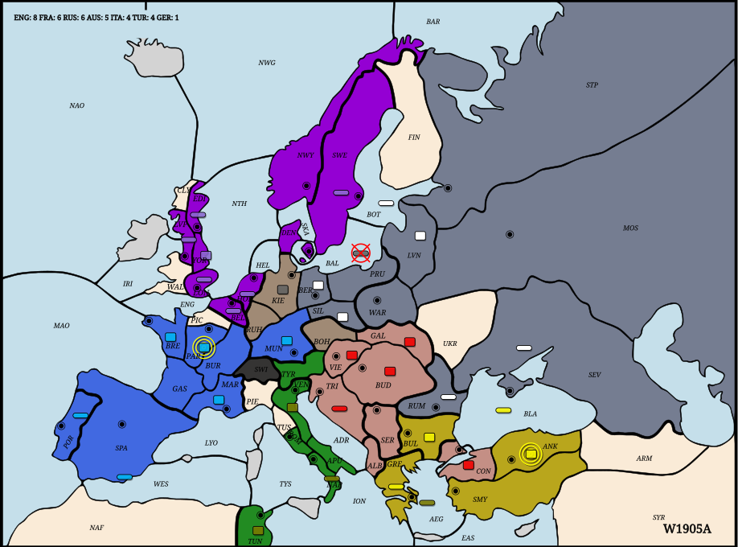

### What happened

- **FRANCE**: builds A PAR
- **GERMANY**: disbands F BAL
- **TURKEY**: builds A ANK

### FRANCE
Orders: `A PAR B`

Reasoning

> Looking at the current situation: I have 6 supply centers (BRE, MAR, PAR, POR, SPA, MUN) and 5 units (F POR, A MAR, F SPA/SC, A BRE, A MUN). That means I have 6 centers - 5 units = 1 build available.
>
> My only open home supply center is PAR (vacant). BRE is occupied by A BRE and MAR is occupied by A MAR, so PAR is my only build location.
>
> I should build an army in PAR to add force for pushing north toward England or east toward Germany's remaining territory. An army in PAR gives me flexibility to push toward BEL, RUH, or support operations in the north.

### GERMANY
Orders: `F BAL D`

Reasoning

> Looking at the situation: I have 1 supply center (KIE) and 2 units (F BAL, A KIE). I need to disband down to 1 unit to match my supply center count. I must disband 1 unit.
>
> The only legal orders are `F BAL D` or `A KIE D`. I should keep A KIE since it's on my supply center and can defend/attack on land, while F BAL is less useful with England controlling the surrounding coasts and centers. Actually, F BAL has some mobility in the Baltic and could support future operations — but A KIE sits on my only supply center and losing it means I can't hold KIE.
>
> I'll disband F BAL and keep A KIE on my only supply center.

### TURKEY
Orders: `A ANK B`

Reasoning

> Looking at the current situation:
>
> - I hold 4 supply centers: ANK, SMY, GRE, BUL
> - I have 3 units: F BLA, F GRE, A BUL
> - I'm owed 1 build (4 centers - 3 units = 1 build)
> - Available home centers for builds: ANK (vacant), SMY (vacant) — CON is held by Austria
>
> I need to decide where to build. ANK is a coastal province so I can build either A or F there. SMY is also coastal. 
>
> Given my strategic position:
> - I need to press into the Balkans and potentially toward Russia's RUM or toward Austria's remaining centers
> - F BLA is already in the Black Sea supporting my northern flank
> - A BUL is positioned to push into SER, RUM, or hold
> - F GRE covers the Aegean
>
> Building a fleet at SMY would give me another naval presence in the eastern Mediterranean/Black Sea area, helping pressure CON (still held by Austria) or supporting operations in the Aegean. Building an army at ANK would give me land-based expansion capability toward ARM/CON.
>
> Given that Austria still holds CON and I want to pressure them, an army at ANK could push into CON next turn. A fleet at SMY could threaten AEG or support Black Sea operations. 
>
> I'll build A ANK to threaten CON and give me a land unit for Balkan expansion, and I'll build at SMY as a fleet to maintain naval pressure.
>
> Wait — I only have 1 build, not 2. I need to pick just one.
>
> An army at ANK is best — it can directly threaten CON (Austria's hold on my home center) and push into the Balkans alongside A BUL.

## SPRING 1906 MOVEMENT (`S1906M`)

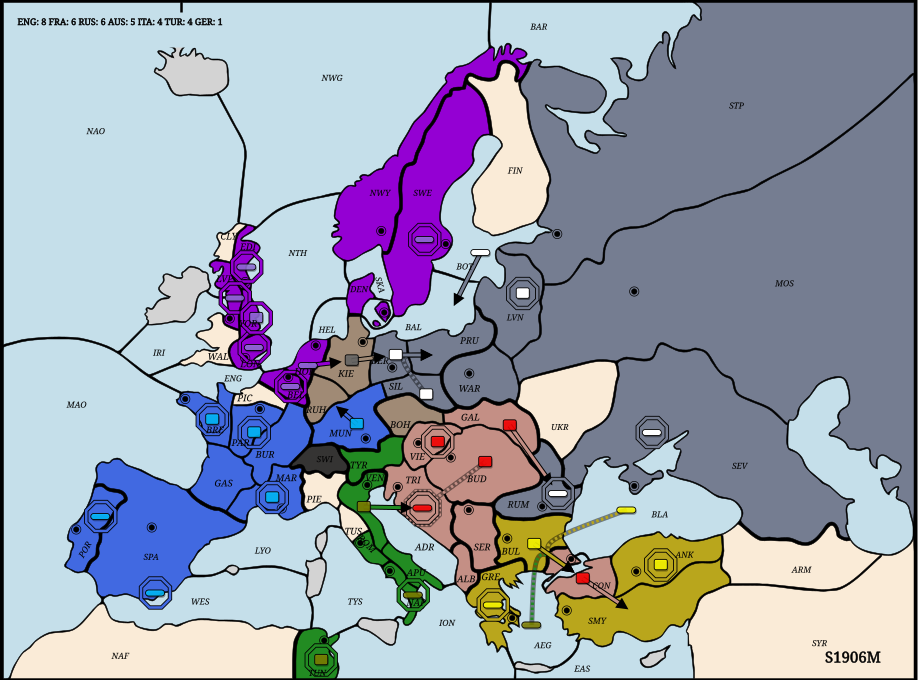

### What happened

- **AUSTRIA**: A CON → SMY; A BUD supports F TRI; F TRI holds; A GAL → RUM (bounced); A VIE holds
- **ENGLAND**: F HOL → KIE; F BEL holds; F EDI holds; F LON holds; F LVP holds; F SWE holds; A YOR holds
- **FRANCE**: A MUN → RUH; A BRE holds; A PAR holds; A MAR holds; F SPA/SC holds; F POR holds
- **GERMANY**: A KIE → BER
- **ITALY**: A VEN → TRI (bounced); F AEG supports A BUL → CON; F NAP holds; A TUN holds
- **RUSSIA**: A BER → PRU; A SIL supports A BER → PRU; F BOT → BAL; F RUM holds; F SEV holds; A LVN holds
- **TURKEY**: A BUL → CON; F BLA supports A BUL → CON; A ANK holds; F GRE holds

### Dialogue

- **AUSTRIA → TURKEY**: A CON moves to ANK this spring — I have the position and the commitment. The only question is whether you lose ANK by force or yield it cleanly: order A ANK to SMY and F BLA to hold, and I will not pursue SMY this turn, giving you time to stabilize. Resist and I take ANK by force while Italy's F AEG presses from the south simultaneously.
- **AUSTRIA → ITALY**: F AEG is adjacent to BUL/SC and A VEN is adjacent to TRI — I need to know explicitly what you're doing this spring before I commit east toward ANK. If you keep both units defensive, I keep F TRI out of ADR and A BUD away from SER, and we both grow rather than bleeding each other; if you press either unit, I redirect everything to defend rather than attack Turkey.
- **AUSTRIA → RUSSIA**: I'm pushing A CON to ANK this spring to crack Turkey's last home center — F RUM holding defensively keeps our border stable and I have no designs on RUM this turn. England sits at 8 centers and France just took MUN; once Turkey is finished, I can turn forces north to coordinate against the actual leaders. What are you doing this spring that pressures England or France rather than consolidating against smaller powers?
- **ENGLAND → FRANCE**: You're at 6 centers now — the board is watching you closely, and I want to make sure we stay coordinated rather than becoming rivals. I'm taking KIE from HOL this spring to finish Germany; I'm not threatening anything south of HOL or east of KIE. What's your plan for this turn, and are you willing to confirm you're not pushing into BEL or PIC?
- **ENGLAND → RUSSIA**: Germany is down to one unit in KIE — I'm taking it from HOL this spring, which is straightforward. The bigger question is France at 6 centers with MUN, BRE, PAR, MAR, POR, SPA — they're positioned to grow fast and neither of us has a good angle on them without coordination. What's your read on the threat from France vs. Austria right now?
- **ENGLAND → AUSTRIA**: France is at 6 centers and growing — they have MUN, BRE, MAR, PAR, POR, SPA and no serious pressure on them from any direction. I'm focused on finishing Germany this spring, but after that I want to coordinate a squeeze on France from north and south. What's your situation in the Balkans — can you afford to turn any forces westward, or are Turkey and Russia keeping you fully occupied?
- **ENGLAND → ITALY**: France is at 6 centers with MAR and SPA/SC on your doorstep — they're the most dangerous power on the board right now and you're best positioned to pressure them from the south. I'm going to be pushing into France from the north after I finish Germany this spring. Are you willing to coordinate a simultaneous squeeze on France, with you pressing MAR and I press from BEL/PIC?
- **FRANCE → ENGLAND**: England, you're at 8 centers and I'm at 6 — the gap is manageable now but not for long. I want to propose a concrete deal this spring: I push A MUN toward RUH and you leave HOL uncontested so we can discuss a partition of the Low Countries rather than fighting over them. If you're planning to grow further north, I have to start coordinating with Russia against you.
- **FRANCE → RUSSIA**: Russia, England is at 8 centers and we're both at 6 — this is the moment to coordinate a two-front squeeze before they become unstoppable. I'm pushing A MUN toward RUH this spring to threaten HOL and BEL; if you can move A BER toward KIE or threaten HOL from the east simultaneously, England is forced to split their fleets. Are you willing to commit to a joint push against England this spring?
- **FRANCE → ITALY**: Italy, I need to know your direction this spring before I commit my southern units — are you pushing into Austria via TRI or TYR, or are you looking west toward MAR and PIE? A clear understanding between us frees both of us to focus on the real threats; I'm happy to coordinate if you're moving against Austria.
- **FRANCE → GERMANY**: Germany, you're down to A KIE — England holds your home centers and I hold MUN. I'm not interested in eliminating you; I'd rather you stay alive as a buffer. If you move A KIE toward BER or support a push against England's position, I'll back off any move toward KIE this turn.
- **GERMANY → FRANCE**: France, you hold MUN and I hold KIE — you're at 6 centers and growing, but England at 8 is the real threat to you. If you support A KIE - BER this spring, Russia loses BER and I'm back to 2 centers as a buffer between you and Russia; alternatively, tell me what you need from KIE and let's make a deal rather than waste both our moves.
- **GERMANY → RUSSIA**: Russia, England is at 8 centers and the dominant threat on the board — I'm at 1 center and no longer a meaningful rival to you. If you'll pull A BER back and let me retake my home center, I'll point A KIE at HOL or DEN to pressure England's position; a living Germany at 2 centers blocking England's eastern expansion is worth more to you than a dead one.
- **GERMANY → ENGLAND**: England, you're at 8 centers and everyone on the board should be coordinating to stop you — France at 6, Russia at 6, Austria at 5 are all watching. I have A KIE and can move it toward HOL or DEN to pressure you, or I can hold and stay neutral; what are you offering to keep me from being a nuisance on your southern flank?
- **ITALY → TURKEY**: Turkey, Austria holds CON and SER while you hold BUL and GRE — Austria at 5 centers is still the dominant southern threat. I'm pushing A VEN into TRI this spring; if you press from GRE toward SER or hold BUL defensively, we squeeze Austria from two directions and both gain. Confirm your spring plan so we can coordinate the final push against Austria.
- **ITALY → AUSTRIA**: Austria, you're at 5 centers but squeezed between me pressing TRI from VEN and Turkey holding BUL and GRE to your south — this is not a sustainable position. The only deal that benefits you: yield TRI peacefully and consolidate eastward, taking SMY from Turkey while I take TRI; we split the Balkans rather than bleed each other while England runs away at 8 centers.
- **ITALY → RUSSIA**: Russia, Austria holds 5 centers including CON, BUD, VIE — they're the dominant southern power and I'm pressing TRI with A VEN this spring. If you can lean on Austria through GAL toward VIE or BUD simultaneously, we catch them in a pincer and both strip centers; Austria defending on two fronts cannot hold everything. What's your plan this spring?
- **RUSSIA → ENGLAND**: Germany is down to A KIE — I'm planning A BER → KIE this spring to finish them off, which is a center you don't currently hold. I want to confirm we're not bouncing each other: I take KIE, you hold SWE and your Baltic positions. After KIE falls, England at 8+ centers is the dominant concern and I'd rather we agree on next targets than stumble into conflict.
- **RUSSIA → FRANCE**: Germany is nearly dead — I'm pushing A BER into KIE this spring to take their last center. With England at 8 centers and 7 fleets, they're the runaway leader; what concrete moves are you making against England this spring and next fall? I can threaten from the east if you press from the west.
- **RUSSIA → TURKEY**: Ceasefire holds on my end — F RUM and F SEV stay defensive this spring, I'm not pressing toward BUL or ANK. I'm focused entirely on finishing Germany by taking KIE. Once Germany is gone, England at 8-9 centers is the dominant threat worth coordinating against.
- **RUSSIA → AUSTRIA**: I'm pushing A BER into KIE this spring to finish Germany — F RUM stays defensive as always, I have no designs on BUL or RUM. Once Germany falls, England at 8 centers is the clear threat to both of us; worth discussing how to coordinate against their fleet dominance in the north.
- **TURKEY → ITALY**: Austria still holds CON — my home center — and I'm pressing A BUL into CON supported by F BLA this spring, which should take it at strength 2 against 1. If you can move F AEG to threaten CON or press A VEN into TRI, Austria can't reinforce and we both weaken them further. Can you confirm what you're doing against Austria this turn?
- **TURKEY → RUSSIA**: Ceasefire holds on my end — F BLA is supporting A BUL into CON this spring, not moving toward RUM or SEV. Austria at 5 centers with CON is a regional threat to both of us; a weaker Austria benefits your southern flank. Keep F RUM stationary and we both gain from stability while I press Austria.
- **TURKEY → AUSTRIA**: You hold CON — my home center — and I'm taking it back this turn with A BUL supported by F BLA at strength 2 against your undefended A CON. Withdraw A CON to SMY voluntarily and I'll hold A BUL in BUL and acknowledge your hold on BUD and TRI; refuse and you lose the unit and I take CON regardless.
- **ENGLAND → RUSSIA**: We'll bounce each other if both A BER and F HOL go for KIE — and a bounce hands Germany a reprieve while France grows unchecked. I'm committed to F HOL → KIE since I'm adjacent and it's the cleaner move; redirect A BER toward SIL or hold it to secure your western flank. After KIE falls to me, I'm open to discussing coordinated pressure on France — they're at 6 and have no serious threats right now.
- **ENGLAND → FRANCE**: I'm moving F HOL → KIE this spring to finish Germany — that's the only move I'm making into new territory, and I'm not threatening BEL, PIC, or anything south. Confirm you're not pushing A MUN into RUH or threatening HOL, and we have a clean non-aggression understanding for this turn.
- **ENGLAND → GERMANY**: Hold A KIE — Russia is trying to take it with A BER, and if you hold, you block them while I come in from HOL next turn or this turn. Staying put is your best play right now; moving toward HOL or DEN just accelerates your elimination.
- **FRANCE → ENGLAND**: England, I'm not pushing into BEL or PIC this spring — my move is A MUN toward RUH, which I'm doing regardless of what you do in KIE. But I want to be direct: if you take KIE and grow to 9 while I'm at 6, I have to start treating you as the primary threat, and Russia is already proposing a joint squeeze. A concrete commitment from you — leave HOL open for discussion next fall — keeps us coordinated.
- **FRANCE → RUSSIA**: Russia, if you're pushing A BER into KIE and England is also moving F HOL into KIE, you'll bounce each other and neither gets the center — which actually works fine for me since Germany survives as a buffer. My concrete move: A MUN to RUH this spring to pressure HOL from the south. If you bounce England at KIE, I threaten HOL from RUH next fall — that's a genuine two-front squeeze. Confirm your KIE push is happening.
- **FRANCE → ITALY**: Italy, I need a direct answer: is A VEN staying out of PIE and TYR this spring, or are you moving toward me? I'm committing my southern units based on your answer — if you're clear of my flank I can push north aggressively against England.
- **GERMANY → FRANCE**: I'll move A KIE - BER this spring if you confirm you're not moving on KIE — that's the concrete deal. BER costs Russia a center and keeps me alive as a buffer between you and England's Baltic position; tell me explicitly you're holding off KIE.
- **GERMANY → RUSSIA**: England has F SWE, F HOL, F BEL — your BOT and Baltic position is exposed to England more than to me. I'm moving A KIE - BER this spring; if you want to hold BER, you're spending A SIL to defend a center against a 1-unit power while England builds freely. Let BER go and point SIL at something that matters.
- **GERMANY → ENGLAND**: I'm moving A KIE toward BER this spring — not at HOL or DEN. If you want to negotiate, tell me what you're offering to keep me pointed east rather than north toward your centers.
- **ITALY → TURKEY**: Confirming: I'm moving A VEN - TRI this spring to keep Austria's western units occupied, and I'll use F AEG to support your A BUL - CON push — F AEG S A BUL - CON gives you strength 2 guaranteed against Austria's A CON at strength 1. Execute A BUL - CON supported by F BLA and we strip Austria of CON while I press TRI simultaneously.
- **ITALY → RUSSIA**: I'm committing A VEN - TRI this spring — Austria must defend there, which weakens their eastern units in GAL and BUD. If you press A GAL toward VIE or A SIL toward GAL simultaneously, Austria cannot hold both fronts; this is the moment to strip them down while they're squeezed from three directions including Turkey from the south.
- **ITALY → AUSTRIA**: The pincer is closing: Turkey takes CON this spring at strength 2, I press TRI with A VEN, and Russia is leaning on your eastern flank — you cannot hold everything. The only path that preserves your position is yielding TRI peacefully and consolidating SMY and ANK before Turkey takes those too; fighting on three fronts while England runs away helps no one.
- **ITALY → ENGLAND**: I'm focused on Austria this spring and not positioned to pressure France from the south yet — MAR is well-defended and I'd need to reposition significantly. Once I take TRI and consolidate, I'll be better placed to coordinate; for now, your northern push into France is the right move and I won't interfere with your western operations.
- **RUSSIA → ENGLAND**: I've heard you're taking KIE from HOL this spring — if we both move there we bounce and Germany keeps it another turn. Concrete proposal: you hold F HOL and let me take KIE with A BER, or we agree you take KIE and I push A BER toward PRU or SIL instead. Which do you prefer? Either way Germany falls, but we need to coordinate to avoid wasting the move.
- **RUSSIA → FRANCE**: I'm committed to A BER → KIE this spring to take Germany's last center, but England may be moving F HOL → KIE simultaneously — if we bounce, Germany survives another turn. Can you confirm A MUN is not moving toward KIE or BER this spring so I know exactly what I'm working with on the eastern front?
- **RUSSIA → TURKEY**: Turkey moving A BUL toward CON this spring is noted — Austria is the immediate threat to both of us in the south. F RUM stays defensive as promised; I'm focused on KIE this turn. Once Germany is gone next turn, I'd welcome a concrete discussion about coordinating against England's 8-center dominance from our respective positions.
- **TURKEY → ITALY**: I'm committing A BUL - CON supported by F BLA this spring — that's strength 2 against Austria's A CON at strength 1. If you can move F AEG to CON or support A BUL - CON with F AEG, we take it at strength 3 and Austria cannot hold. Confirm whether you're executing F AEG - CON or F AEG S A BUL - CON this turn.
- **TURKEY → AUSTRIA**: A CON - ANK fails if I order A ANK to hold — you arrive at strength 1 against my strength 1 hold and bounce. Meanwhile A BUL - CON supported by F BLA takes CON at strength 2 against your undefended A CON; you lose CON and bounce on ANK simultaneously. Withdraw A CON to SMY now and I hold A BUL in place — that's the only outcome where you keep the unit.
- **TURKEY → RUSSIA**: Austria is threatening A CON - ANK while I press A BUL - CON supported by F BLA — Austria gets squeezed from two sides this turn. F BLA is fully committed to supporting A BUL into CON, not moving toward RUM or SEV; ceasefire is intact on my end.
- **ENGLAND → RUSSIA**: Final confirmation: I'm moving F HOL → KIE this spring — if Germany is also moving A KIE → BER as they've told me, we don't conflict at all. Hold A BER or redirect it to SIL; if you push A BER → KIE you bounce Germany and we both waste the opportunity. Let me take KIE cleanly and you secure your western flank.
- **ENGLAND → FRANCE**: Final commitment: F HOL → KIE this spring, nothing else moving into new territory. I'm not touching BEL, PIC, RUH, or anything south — KIE is the only move. Hold your position and we have a clean turn; I'll revisit HOL's status in fall negotiations.
- **ENGLAND → GERMANY**: Stick with A KIE → BER — Russia is moving A BER → KIE and you'll bounce them, which is actually useful to me and keeps you relevant one more turn. If you move toward HOL or DEN instead, you accelerate your own elimination and help nobody.
- **FRANCE → ENGLAND**: Final commitment: A MUN goes to RUH this spring, not toward HOL directly — I'm positioning for the fall, not attacking you now. If you take KIE and hit 9 centers, I need HOL on the table as a genuine negotiation for fall or I have no choice but to treat you as the primary target alongside Russia.
- **FRANCE → RUSSIA**: Confirmed: A MUN - RUH this spring, not toward KIE or BER — your eastern push is clear. If you bounce England at KIE, I threaten HOL from RUH next fall; if you take KIE, England is at 8 and we're both positioned to squeeze them hard from two sides in fall.
- **FRANCE → ITALY**: Final ask: confirm A VEN is not moving toward PIE or TYR this spring. I'm holding MAR and SPA defensively — no threat to you — and I need to know my southern flank is clear before I commit fully to the northern push.
- **TURKEY → ITALY**: Final commitment: A BUL - CON supported by F BLA, A ANK holds to bounce Austria's A CON - ANK. Execute F AEG S A BUL - CON as confirmed and we take CON at strength 2 against Austria's undefended A CON — Austria loses their last foothold in my territory. I hold F GRE defensively to protect our southern flank.
- **TURKEY → RUSSIA**: Final: A BUL - CON supported by F BLA this turn, A ANK holds to block Austria's A CON - ANK — Austria gets nothing and I retake my home center. F BLA is fully committed to supporting BUL into CON, not moving toward RUM or SEV; ceasefire is intact.
- **TURKEY → AUSTRIA**: A ANK holds, bouncing your A CON - ANK at strength 1 vs 1. Simultaneously A BUL - CON supported by F BLA takes CON at strength 2 against your undefended A CON — you lose the unit. Withdraw A CON to SMY now and I hold A BUL in BUL; that is the only path where you keep the unit.

### AUSTRIA
Orders: `A CON - SMY` · `A BUD S F TRI` · `F TRI H` · `A GAL - RUM` · `A VIE H`

Reasoning

> Looking at the current situation:
>
> **Key threats:**
> 1. Turkey threatens A BUL - CON supported by F BLA (strength 2) against my undefended A CON. Turkey is right - A CON - ANK bounces at strength 1 vs 1, and meanwhile CON falls.
> 2. Italy threatens A VEN - TRI
> 3. Russia claims F RUM is defensive
>
> **My revised strategy** was: A CON - SMY to escape the Turkish attack on CON, A BUD S F TRI against Italy, F TRI H, A GAL - RUM to threaten Russia, A VIE H.
>
> Let me verify the orders:
> - A CON - SMY: CON is adjacent to SMY ✓ (CON coast: AEG, ANK, BLA, BUL/EC, BUL/SC, SMY)
> - A BUD S F TRI: BUD is adjacent to TRI ✓
> - F TRI H ✓
> - A GAL - RUM: GAL is adjacent to RUM ✓
> - A VIE H ✓
>
> This plan:
> - Saves A CON by retreating to SMY before Turkey can take CON
> - Defends TRI with A BUD support against Italy's A VEN
> - Threatens Russia's F RUM with A GAL - RUM (forcing Russia to respond)
> - Keeps A VIE as backstop
>
> The downside is losing CON, but Turkey's attack is correct - I cannot hold CON at strength 1 against a supported attack at strength 2, and moving to ANK just bounces while losing CON. Retreating to SMY saves the unit and keeps pressure on Turkey's home centers.

### ENGLAND
Orders: `F HOL - KIE` · `F BEL H` · `F EDI H` · `F LON H` · `F LVP H` · `F SWE H` · `A YOR H`

Reasoning

> Looking at the current situation:
>
> - I have 8 supply centers and need to take KIE to reach 9
> - F HOL can move to KIE (it's adjacent per the adjacency table: HOL neighbors KIE)
> - Germany claims A KIE → BER, Russia claims A BER → KIE - if both happen they bounce each other and my F HOL → KIE goes through cleanly
> - France confirmed A MUN → RUH, not threatening HOL
> - My strategy is clear: F HOL → KIE, everything else holds defensively
>
> The move F HOL → KIE is the priority. All other units hold to protect my existing centers and avoid any accidental conflicts or overextension.

### FRANCE
Orders: `A MUN - RUH` · `A BRE H` · `A PAR H` · `A MAR H` · `F SPA/SC H` · `F POR H`

Reasoning

> Looking at the current position, I've committed to A MUN - RUH this spring, which positions me to threaten England's HOL next fall. England is at 8 centers and growing, and I need to start applying pressure. My other units should hold defensively — BRE, PAR, MAR protect my home centers, and the Iberian fleets hold SPA and POR securely.
>
> The plan is clear: A MUN advances to RUH to threaten HOL from the south, while everything else consolidates. This is consistent with my commitments to England (not attacking HOL directly yet) and to Russia (not contesting KIE/BER), while positioning for a strong fall push.

### GERMANY
Orders: `A KIE - BER`

Reasoning

> Looking at the current situation: I have a single unit at KIE. My revised strategy is to move A KIE - BER to try to reclaim a home center. France confirmed they're holding off KIE, and England encouraged the BER push. Russia may have moved A BER away (possibly toward KIE as England suggested), which could leave BER open. This is my only realistic play to stay alive.
>
> The move A KIE - BER is in my legal orders list, so it's valid.

### ITALY
Orders: `A VEN - TRI` · `F AEG S A BUL - CON` · `F NAP H` · `A TUN H`

Reasoning

> Looking at the current position:
>
> - Austria holds A CON (5 centers: BUD, TRI, VIE, SER, CON)
> - Turkey is committing A BUL - CON supported by F BLA, with A ANK holding
> - I confirmed F AEG S A BUL - CON to help Turkey take CON at strength 2
> - A VEN - TRI is my western push against Austria's home center
> - F NAP and A TUN hold defensively
>
> My revised strategy is clear: A VEN - TRI (pressure Austria's western flank), F AEG S A BUL - CON (help Turkey strip Austria of CON at strength 2 vs 1), F NAP holds, A TUN holds.
>
> Let me verify legality:
> - A VEN - TRI: VEN is adjacent to TRI ✓
> - F AEG S A BUL - CON: AEG is adjacent to CON ✓, and A BUL is moving to CON ✓
> - F NAP H ✓
> - A TUN H ✓
>
> Turkey is attacking CON with A BUL - CON (supported by F BLA = strength 2). Austria's A CON holds at strength 1. With F AEG supporting, it becomes strength 3 vs 1 — even better. Austria cannot hold CON.
>
> A VEN - TRI: Austria has F TRI holding. A VEN attacks at strength 1 vs F TRI at strength 1 — this bounces without support. I don't have a support option available for this move from my units. I'll still press it to force Austria to hold there rather than redirect.

### RUSSIA
Orders: `A BER - PRU` · `A SIL S A BER - PRU` · `F BOT - BAL` · `F RUM H` · `F SEV H` · `A LVN H`

Reasoning

> Looking at the current situation:
>
> **Key facts:**
> - England confirmed F HOL → KIE this spring
> - Germany may be moving A KIE → BER
> - If I push A BER → KIE and England does too, we bounce and Germany keeps it
> - England explicitly asked me to redirect A BER to PRU or SIL
> - My revised strategy says: redirect A BER to PRU, SIL supports BER → PRU, F BOT → SWE, F RUM and F SEV defensive, A LVN holds
>
> **Analysis:**
> - England takes KIE (Germany's last center) - they go to 9 centers
> - If Germany moves A KIE → BER, I need A SIL to support A BER or push A BER → PRU to get ahead of Germany
> - A BER → PRU with A SIL support at strength 2 is clean - even if Germany attacks BER, I'm moving out and PRU is unoccupied
> - F BOT → SWE: England holds SWE with F SWE. This would bounce. Better to push F BOT → BAL or hold.
>
> Wait - England holds SWE already (F SWE). So F BOT → SWE would bounce against England's unit there. That's a wasted move. Better to move F BOT → BAL to position for future action.
>
> Actually, my revised strategy committed to F BOT → SWE. But England has F SWE - this bounces and wastes the move. I should substitute F BOT → BAL as it pursues the same objective (positioning in the Baltic theater) without the certain bounce.
>
> For A BER → PRU: if Germany moves A KIE → BER, my A BER → PRU succeeds cleanly (no conflict at PRU). A SIL supports the move.

### TURKEY
Orders: `A BUL - CON` · `F BLA S A BUL - CON` · `A ANK H` · `F GRE H`

Reasoning

> Looking at the current position:
>
> - I have A BUL, F BLA, A ANK, F GRE
> - Austria has A CON (my home center) threatening A CON - ANK
> - Italy confirmed F AEG S A BUL - CON
>
> My committed plan:
> 1. A BUL - CON supported by F BLA (strength 2 vs Austria's A CON at strength 1) — takes back my home center
> 2. A ANK H — bounces Austria's A CON - ANK attempt (strength 1 vs 1)
> 3. F GRE H — defensive hold protecting southern flank
> 4. F BLA S A BUL - CON — provides the support for the CON attack
>
> Italy's F AEG S A BUL - CON would make it strength 3, but even at strength 2 I win against Austria's undefended A CON. The key is A ANK holding to prevent Austria from retreating into ANK after being dislodged, and to block the A CON - ANK move if Austria tries it instead of defending.

## FALL 1906 MOVEMENT (`F1906M`)

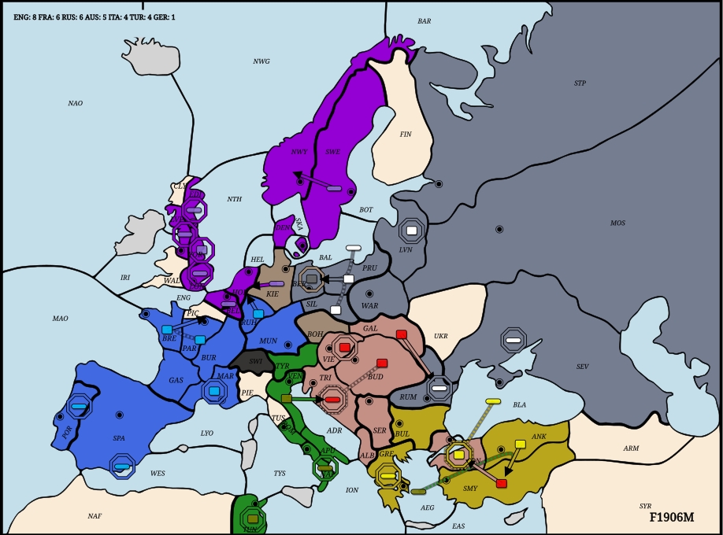

### What happened

- **AUSTRIA**: A SMY → CON (bounced); A BUD supports F TRI; F TRI holds; A GAL → RUM (bounced); A VIE holds  [dislodged: A SMY]
- **ENGLAND**: F BEL → PIC (bounced); F KIE → HOL (bounced); F SWE → NWY; F EDI holds; F LON holds; F LVP holds; A YOR holds
- **FRANCE**: A RUH → HOL (bounced); A BRE → PIC; A PAR supports A BRE → PIC; A MAR holds; F SPA/SC holds; F POR holds
- **GERMANY**: A BER holds  [dislodged: A BER]
- **ITALY**: A VEN → TRI (bounced); F AEG supports A ANK → SMY; F NAP holds; A TUN holds
- **RUSSIA**: A PRU → BER; A SIL supports A PRU → BER; F BAL supports A PRU → BER; F RUM holds; F SEV holds; A LVN holds
- **TURKEY**: A ANK → SMY; F BLA supports A CON; A CON holds; F GRE holds

### Dialogue

- **AUSTRIA → TURKEY**: A SMY moves to CON this fall — your A CON is at strength 1 and I'm attacking at strength 1, which bounces, but Italy's F AEG can support my attack at strength 2, dislodging you. The practical deal: order A CON to ANK and I will not pursue ANK this turn, stabilizing our border at ANK while I keep SMY; refuse and I coordinate with Italy's F AEG to take CON by force.
- **AUSTRIA → ITALY**: F AEG is adjacent to CON — if you support A SMY - CON this fall, Turkey loses CON and I retake my center; in return I keep F TRI out of ADR and A BUD away from SER for the entire season, giving you a free hand to consolidate VEN and press elsewhere. This is a concrete exchange that costs you nothing and gives you leverage over me.
- **AUSTRIA → RUSSIA**: A GAL moves toward RUM this fall — I have no designs on RUM itself if F RUM holds, but I need you to confirm F RUM stays defensive and doesn't press BUL or SER while I'm committed east against Turkey. England sits at 8 centers and France at 6; once I retake CON, I can turn forces north to coordinate against the actual leaders.
- **AUSTRIA → ENGLAND**: France sits at 6 centers with units spread across MUN, PAR, BRE, MAR — they're overextended and vulnerable from the south if you press from the north simultaneously. I'm consolidating against Turkey this fall but can redirect forces westward once CON is secured; what concrete pressure are you applying to France this turn that I should coordinate around?
- **ENGLAND → FRANCE**: You're at 6 centers with A RUH adjacent to HOL and KIE — I need to know your intentions this fall before I commit orders. I'm willing to leave RUH and the Rhine frontier alone if you pull A RUH back toward MUN and confirm you're not pushing into HOL or BEL. If A RUH moves north this fall, I have to treat it as an attack and respond accordingly.
- **ENGLAND → RUSSIA**: France is at 6 centers with A RUH on my doorstep and F SPA/SC threatening the Atlantic — they're the runaway candidate if nobody checks them. I'm pushing F SWE toward NWY this fall to consolidate the north; are you willing to apply pressure on France from the east through MUN or BUR? If we coordinate, we can squeeze them before they hit 8-9.
- **ENGLAND → ITALY**: France has A RUH adjacent to HOL and KIE, and F SPA/SC threatening your western flank — this fall is the moment to start coordinating against them before they pull further ahead. I'm going to press France from the north; if you push A VEN toward PIE or pressure MAR, we split their attention and both gain. What's your situation with Austria — can you spare anything westward?
- **ENGLAND → AUSTRIA**: France is at 6 centers and growing with no serious pressure — I'm going to start squeezing them from the north this fall. Are you in a position to threaten anything French-adjacent, or are Turkey and Russia still consuming your full attention? I want to know if there's any coordinated anti-France move we can build toward.
- **FRANCE → ENGLAND**: England, you're at 8 centers and I'm at 6 — the gap is becoming a problem I can't ignore. I want to propose a concrete deal this fall: I move A RUH into HOL and you cede it peacefully in exchange for my support against Russia or Austria on another front. If you refuse, I have to coordinate with Russia for a two-front squeeze, which neither of us wants.
- **FRANCE → RUSSIA**: Russia, this is the moment — England is at 8 centers with 7 fleets and will be unstoppable by next year if we don't act now. I'm pushing A RUH toward HOL this fall; if you can move F BAL or A PRU toward KIE or threaten HOL from the east simultaneously, England is forced to split their fleets and we both gain. Concrete proposal: I take HOL, you take KIE — do you commit?
- **FRANCE → ITALY**: Italy, what's your direction this fall — are you pushing against Austria via TRI, or are you looking elsewhere? I need to know if my southern flank is clear so I can commit fully to the northern push against England; confirm A VEN is not moving toward PIE and we have no conflict.
- **GERMANY → RUSSIA**: Russia, I'm holding BER with A BER this fall — I have one unit and no capacity to threaten your position meaningfully. England has F KIE and 8 centers; if you want to coordinate against England's Baltic flank, I'll support any move you make toward KIE or SWE rather than waste both our turns fighting over BER. What are you planning with A PRU and A SIL this fall?
- **GERMANY → FRANCE**: France, I'm holding BER this fall — your A RUH is adjacent to KIE and MUN, and England's F KIE is sitting on a center you could threaten. England at 8 centers is your real rival; if you push A RUH toward KIE or HOL, you pressure England directly while I hold BER as a buffer against Russia. What's your plan for A RUH this fall?
- **GERMANY → ENGLAND**: England, you're at 8 centers and France at 6 is your closest rival — I'm holding BER with one unit and not threatening your position. If France pushes A RUH toward KIE this fall, you'll need to defend it; I can support your F KIE hold or move A BER in a direction useful to you if we make a concrete deal. What are you offering?
- **RUSSIA → ENGLAND**: I'm pushing A PRU into BER this fall to reclaim that center — Germany's last unit is there and it's rightfully mine. I want to confirm you're not contesting BER from KIE or SWE; if we're both moving there we bounce and Germany keeps it another turn. After BER falls, I'm open to discussing how we coordinate against France's 6 centers rather than stumbling into conflict over the German carcass.
- **RUSSIA → FRANCE**: Germany's A BER is the last piece — I'm taking it this fall with A PRU supported by A SIL. With England at 8 centers and 7 fleets, they're the runaway threat; what concrete moves are you making this fall to pressure England from the west while I push from the east?
- **RUSSIA → TURKEY**: Ceasefire holds on my end — F RUM and F SEV stay defensive this fall, not pressing toward BUL or ANK. I'm focused entirely on retaking BER from Germany's last unit. Once BER falls, I'd welcome a concrete discussion about coordinating against England's dominant position.
- **RUSSIA → AUSTRIA**: F RUM stays defensive this fall as always — I'm focused on reclaiming BER from Germany's last unit. Once Germany is finished, England at 8 centers is the clear shared threat; worth discussing how we coordinate against their fleet dominance before they become unstoppable.
- **TURKEY → ITALY**: Austria's A SMY is isolated on my home supply center — I'm pushing A ANK into SMY this fall to retake it. If you can move F AEG to support A ANK - SMY, we take it at strength 2 against Austria's undefended unit; alternatively F AEG threatening CON keeps Austria's other units from reinforcing. Can you confirm what you're doing against Austria this fall?
- **TURKEY → AUSTRIA**: A SMY is isolated and surrounded — A ANK moves to SMY this fall and you cannot reinforce it in time. Withdraw A SMY to SYR voluntarily and I'll hold A CON in CON rather than pressing further; refuse and you lose the unit and I retake my home center regardless.
- **TURKEY → RUSSIA**: Ceasefire holds on my end — F BLA is not moving toward RUM or SEV this fall. I'm pressing A ANK into SMY to retake my home center from Austria's isolated unit; Austria at 5 centers with two of my home SCs is the regional threat worth watching. Keep F RUM stationary and we both benefit from stability.
- **AUSTRIA → ITALY**: Concrete deal, final offer: order F AEG to support A SMY - CON this fall, and I order F TRI to hold and A BUD to hold — no movement toward SER or ADR, full stop. You gain leverage over me (I'm committed defensively in the Balkans) and Turkey loses CON; this costs you nothing and shifts the balance east in your favor.
- **AUSTRIA → TURKEY**: F AEG supports A SMY - CON this fall at strength 2 — your A CON is dislodged regardless of what A ANK does. The only question is where A CON retreats; if you order A ANK to hold, you lose CON and have no retreat toward ANK. Order A ANK to ARM now and preserve the unit; I will not pursue ANK or ARM this turn.
- **AUSTRIA → RUSSIA**: A GAL moves toward RUM this fall — I am not attacking F RUM, I am pressuring the border to keep Turkey honest. Confirm F RUM holds in place and I have no designs on it this turn; if F RUM moves, I will interpret that as hostile and respond accordingly next spring.
- **ENGLAND → FRANCE**: I'm not ceding HOL — that's a non-starter, and framing it as a 'deal' when you have A RUH adjacent is a threat, not a negotiation. If A RUH moves toward HOL or KIE this fall, I will push F BEL into PIC and F KIE into HOL simultaneously, which costs you more than it costs me. Pull A RUH back to MUN and I'll leave your Rhine frontier alone.
- **ENGLAND → RUSSIA**: Take BER — I'm not contesting it from KIE or SWE, that's yours cleanly. What I need from you is a clear signal that after BER you're turning south toward Austria or France rather than north toward my Baltic centers; if we're both growing without conflict, that's the best outcome for both of us right now.
- **ENGLAND → GERMANY**: You're down to one unit in BER with Russia bearing down — if you want to matter one more turn, move A BER toward SIL or hold it to force Russia to use two units. I'm not your enemy right now; France and Russia are the powers threatening both of us.
- **FRANCE → ENGLAND**: England, I'm moving A RUH into HOL this fall — I need that center to stay competitive. If you want to avoid a full war, let HOL go peacefully and I'll support you against Russia's eastern push; otherwise Russia and I coordinate a simultaneous squeeze on KIE and HOL that costs you two centers instead of one.
- **FRANCE → RUSSIA**: Russia, confirm your A PRU is supported into BER this fall and tell me: can you also threaten KIE with F BAL or another unit? If I push A RUH into HOL and you threaten KIE simultaneously, England must split their fleets — I take HOL, you potentially take KIE, and England drops from 8 to 6 or 7 in one turn.
- **FRANCE → ITALY**: Italy, I need a direct answer before I commit this fall: is A VEN staying out of PIE and TYR, or are you moving toward MAR? I'm holding MAR and SPA/SC defensively — no threat to you — and your answer determines whether I can commit fully north against England.
- **GERMANY → RUSSIA**: Russia, A PRU and A SIL are both adjacent to BER — tell me explicitly: are you moving on BER this fall? If you hold or move elsewhere, I'll support whichever of your units you want to advance; if you're taking BER, say so and I'll hold and make you pay a unit to do it.
- **GERMANY → FRANCE**: France, A RUH can hit KIE this fall — England's F KIE is sitting on a center you could take, and England at 8 is your real rival not me. If you move A RUH - KIE, I'll support your attack with A BER S A RUH - KIE; that's a concrete deal where you gain a center and I stay alive one more turn.
- **GERMANY → ENGLAND**: England, France's A RUH is adjacent to KIE — if France moves on KIE this fall, can F KIE hold against A RUH unsupported? I can support F KIE hold with A BER if you make it worth my while, but I need to know what you're offering before I commit.
- **ITALY → TURKEY**: Confirmed: I'll move F AEG to support A ANK - SMY this fall, giving you strength 2 against Austria's isolated unit — Austria drops to 4 centers and you gain SMY. I'm pressing A VEN - TRI simultaneously to keep Austria's western units pinned. Execute A ANK - SMY and we strip Austria down together this turn.
- **ITALY → AUSTRIA**: I'm pressing A VEN - TRI again this fall — that's not changing. If you want to negotiate, the only deal I'll accept is TRI yielded peacefully; otherwise you're defending TRI while Turkey takes SMY from your eastern flank simultaneously. You cannot hold both fronts indefinitely.
- **ITALY → FRANCE**: A VEN is going toward TRI, not PIE or TYR — no threat to your southern flank from me. I'm fully committed against Austria this fall and have no interest in opening a conflict with you while England is at 8 centers.
- **RUSSIA → ENGLAND**: I'm taking BER with A PRU supported by A SIL and F BAL — Germany's last unit falls this turn. Confirm F KIE is not moving to BER or PRU, so we don't accidentally clash over the German carcass. After BER falls, France at 6 with A RUH threatening your position is the obvious next target — I'm open to concrete coordination against them next spring.
- **RUSSIA → FRANCE**: I'm taking BER this fall with A PRU supported by A SIL — Germany is finished. I want to confirm A RUH is not moving toward KIE or BER this turn, since any unexpected move east complicates my attack. Once BER falls, England at 8 with F KIE and 7 fleets is the clear target — what's your concrete plan for pressuring them from the west this fall?
- **RUSSIA → TURKEY**: Ceasefire holds on my end — F RUM and F SEV stay defensive this fall, focused entirely on retaking BER. Austria's A GAL moving toward RUM is worth watching; if they press further, I may need to reconsider the southern front next spring.
- **TURKEY → ITALY**: Austria claims they can get F AEG to support A SMY - CON at strength 2 to dislodge me — if that's true, it hands Austria two of my home centers and strengthens them against both of us. I'm moving A ANK - SMY this fall to retake my home center; if you support that with F AEG S A ANK - SMY, we take SMY at strength 2 and Austria loses the unit entirely. Alternatively, if you hold F AEG away from CON, Austria's A SMY - CON bounces my A CON at strength 1 vs 1 and goes nowhere. Which are you committing to?
- **TURKEY → AUSTRIA**: A SMY is isolated with no adjacent Austrian unit to reinforce it — A ANK moves to SMY this fall and you cannot prevent it without outside help. Austria at 5 centers while England sits at 8 is the real strategic problem; losing SMY is inevitable, but a ceasefire at that border lets both of us focus northward where the real threat is.
- **ENGLAND → FRANCE**: Final commitment: if A RUH moves into HOL or KIE this fall, F BEL pushes into PIC immediately and I treat it as open war — you gain one center and lose your northern position. Hold A RUH in place or move it back to MUN, and I leave your Rhine frontier completely alone this turn.
- **ENGLAND → RUSSIA**: Confirmed: I'm not contesting BER — take it cleanly with A PRU. I'm pushing F SWE into NWY this fall and defending KIE against France's A RUH; if you're turning south toward Austria or France after BER, that's the right move and I won't interfere.
- **ENGLAND → GERMANY**: Hold A BER or move it toward SIL — Russia is coming with A PRU supported, so you're likely dislodged regardless, but making them spend two units on BER buys time. Don't move toward KIE or DEN; that only helps France and hurts both of us.
- **FRANCE → ENGLAND**: Final commitment: A RUH moves into HOL this fall — I need that center to stay competitive and I'm not backing down. If you want to minimize damage, pull F KIE back toward DEN or SWE and don't counterattack BEL into PIC; I'll leave KIE alone and we can negotiate a stable frontier at HOL.
- **FRANCE → RUSSIA**: Final commitment: A RUH - HOL this fall — England must respond to that threat directly. If you can move F BAL or any eastern unit to threaten KIE simultaneously, England cannot defend both; I take HOL, you take KIE, and England drops from 8 to 6 in one turn.
- **FRANCE → GERMANY**: Germany, if A BER supports A RUH - HOL this fall, England is forced to defend from two sides and I gain a center; in return I'll back off any move toward KIE and you survive another turn. Commit to that support now.

### AUSTRIA
Orders: `A SMY - CON` · `A BUD S F TRI` · `F TRI H` · `A GAL - RUM` · `A VIE H`

Reasoning

> Looking at the current position:
>
> - A SMY: I committed to A SMY - CON. Turkey has A CON there. Italy's F AEG could support but Italy refused. This will bounce at strength 1 vs 1, but it denies Turkey a free move and keeps pressure on CON.
> - A BUD: Support F TRI against Italy's threatened A VEN - TRI attack.
> - F TRI: Hold against Italy's A VEN.
> - A GAL: Push toward RUM to pressure Russia's flank and potentially threaten that center.
> - A VIE: Hold defensively.
>
> The key considerations:
> 1. A SMY - CON bounces Turkey's A CON (both at strength 1), preventing Turkey from consolidating or moving freely. Even without Italian support, this is worth doing.
> 2. Turkey threatened A ANK - SMY, which would take SMY. If A SMY moves to CON, it escapes the A ANK - SMY attack AND contests CON.
> 3. Italy is pressing TRI again - must hold F TRI with A BUD support.
> 4. A GAL - RUM: Russia said F RUM stays defensive. This pressures the border and could take RUM if Russia moves F RUM away.
> 5. A VIE holds as backstop.
>
> The strategy is consistent with my revised notes: A SMY - CON (escaping ANK's attack on SMY while contesting CON), A BUD supports F TRI, F TRI holds, A GAL - RUM, A VIE holds.

### ENGLAND
Orders: `F BEL - PIC` · `F KIE - HOL` · `F SWE - NWY` · `F EDI H` · `F LON H` · `F LVP H` · `A YOR H`

Reasoning

> Looking at the board situation:
>
> **Key considerations:**
> - France confirmed A RUH → HOL this fall. I threatened F BEL → PIC and F KIE → HOL in response.
> - Russia confirmed taking BER with A PRU (supported by A SIL and F BAL) — I'm not contesting that.
> - F SWE → NWY gives me a 9th center (NWY is mine already... wait, let me check. NWY is listed in my supply centers already at 8 centers: EDI, LON, LVP, BEL, NWY, DEN, HOL, SWE. So NWY is already mine.)
>
> Wait — NWY is already in my supply centers. So F SWE → NWY doesn't gain me a new center. Let me reconsider.
>
> My current 8 centers: EDI, LON, LVP, BEL, NWY, DEN, HOL, SWE. 
>
> If France takes HOL (A RUH → HOL), I lose HOL. If I push F KIE → HOL, I contest it (bounce or take). If F BEL → PIC, I threaten France's north.
>
> My revised strategy says: push F BEL → PIC, F KIE → HOL (contest France), F SWE → NWY (but NWY is already mine — this is just repositioning, not a gain).
>
> Actually F SWE → NWY moves the fleet to NWY which I already own, so no new center gained there. But it repositions for future moves.
>
> The key moves: F KIE → HOL to contest France's grab, F BEL → PIC to pressure France, F SWE → NWY to reposition northward.

### FRANCE
Orders: `A RUH - HOL` · `A BRE - PIC` · `A PAR S A BRE - PIC` · `A MAR H` · `F SPA/SC H` · `F POR H`

Reasoning

> Looking at the board: I have 6 centers (BRE, MAR, PAR, POR, SPA, MUN) and England has 8. I committed to pushing A RUH into HOL this fall. Germany's A BER offered to support A RUH - HOL, but Russia is taking BER with A PRU supported by A SIL, so Germany's support is unreliable/void. England threatened F BEL into PIC if I push north.
>
> My plan: Push A RUH - HOL regardless. England has F KIE and F BEL nearby. F BEL could push PIC, so I need PAR and BRE to defend. I'll have PAR support BRE (or PIC defensively). If England pushes F BEL - PIC, having A PAR S A BRE keeps BRE safe and PIC is contested. Actually, A BRE - PIC with A PAR S A BRE - PIC would contest England's F BEL - PIC move and potentially bounce it.
>
> For the south: MAR holds, F SPA/SC holds, F POR holds — no threats there.
>
> A RUH - HOL: England has F KIE which could support F BEL into HOL, but F KIE is more likely defending/moving. Without support, A RUH vs F KIE (if KIE moves to HOL) would bounce. But England's F KIE might not be moving to HOL — Russia took BER, so KIE is now Germany's last center (wait, Russia takes BER this fall, Germany had A BER). Germany's A BER is being taken by Russia. England holds KIE (F KIE). England might move F KIE to HOL to defend it, which would bounce A RUH - HOL.
>
> I'll push A RUH - HOL as committed. For defense against F BEL - PIC threat, I'll have A BRE - PIC and A PAR S A BRE - PIC to contest it.

### GERMANY
Orders: `A BER H`

Reasoning

> Looking at my situation: I have a single unit A BER, and my revised strategy already commits to holding BER. France offered a support deal (A BER S A RUH - HOL) but that's illegal since BER is not adjacent to HOL. England advised holding or moving to SIL. Russia has A PRU and A SIL both threatening BER.
>
> My only realistic play is to hold BER, forcing Russia to use two units to dislodge me (A PRU + A SIL supported), which costs them a move and buys me one more turn. There's no better option with a single unit - I can't meaningfully attack anywhere that would help my position.

### ITALY
Orders: `A VEN - TRI` · `F AEG S A ANK - SMY` · `F NAP H` · `A TUN H`

Reasoning

> Looking at the current situation:
>
> **Board assessment:**
> - Austria has A SMY isolated in Turkey's home center — Turkey wants F AEG S A ANK - SMY to retake it at strength 2
> - I committed to Turkey: F AEG S A ANK - SMY + A VEN - TRI
> - Austria at 5 centers (BUD, TRI, VIE, SER, CON) — Turkey at 4 (ANK, SMY, GRE, BUL)
> - England at 8 centers is the runaway threat
>
> **Verifying my commitments:**
> - A VEN - TRI: Legal (VEN is adjacent to TRI) ✓
> - F AEG S A ANK - SMY: Check adjacency — AEG is adjacent to SMY ✓, and A ANK is adjacent to SMY ✓. This is legal ✓
> - F NAP H: defensive hold ✓
> - A TUN H: defensive hold ✓
>
> **Strategic rationale:**
> Austria's A SMY is isolated with no support. Turkey's A ANK - SMY at strength 2 (with my F AEG support) will dislodge it. Austria drops to 4 centers (losing SMY). Simultaneously, A VEN - TRI keeps pressure on Austria's western flank. TRI is defended by F TRI with A BUD potentially supporting, so this may bounce again — but it pins Austrian forces and prevents them from reinforcing SMY.
>
> This is the right play: coordinate with Turkey to strip Austria down, honor my commitment, and continue building toward a position where I can grow past 4 centers.

### RUSSIA
Orders: `A PRU - BER` · `A SIL S A PRU - BER` · `F BAL S A PRU - BER` · `F RUM H` · `F SEV H` · `A LVN H`

Reasoning

> Looking at the current situation:
>
> **Strategic assessment:**
> - I have A PRU, A SIL, F BAL positioned to take BER from Germany's lone A BER
> - England confirmed they're not contesting BER (moving F SWE → NWY instead)
> - France confirmed A RUH → HOL (not toward BER/KIE)
> - Taking BER brings me to 7 centers
> - F RUM and F SEV stay defensive to honor ceasefire with Turkey and Austria
> - A LVN holds in place
>
> **Order verification:**
> - A PRU → BER: PRU is adjacent to BER ✓
> - A SIL S A PRU - BER: SIL is adjacent to BER ✓
> - F BAL S A PRU - BER: BAL is adjacent to BER ✓
> - F RUM H: defensive ✓
> - F SEV H: defensive ✓
> - A LVN H: holds ✓
>
> The attack on BER has strength 2 (A PRU + support from A SIL), plus F BAL adds another support for strength 3 total. Germany's A BER holds at strength 1. This should dislodge Germany's last unit and give me BER as a supply center going into winter.

### TURKEY
Orders: `A ANK - SMY` · `F BLA S A CON` · `A CON H` · `F GRE H`

Reasoning

> Looking at the current position:
>
> - I hold CON with A CON, ANK with A ANK, GRE with F GRE, and BLA with F BLA
> - Austria has A SMY on my home supply center
> - Italy confirmed F AEG S A ANK - SMY
>
> My revised strategy is clear: A ANK - SMY supported by F AEG (Italy's), with A CON holding to prevent Austria from bouncing through, F BLA supporting A CON in place to strengthen that hold, and F GRE holding defensively.
>
> This gives me SMY at strength 2 (my A ANK + Italy's F AEG support) against Austria's isolated A SMY at strength 1. Austria's A SMY - CON would bounce my A CON at strength 1 vs 1 anyway, so holding A CON is correct.
>
> If I take SMY this fall, I go from 4 to 5 supply centers (ANK, SMY, GRE, BUL, plus CON which I currently occupy but Austria controls — wait, CON is listed as Austria's supply center but I occupy it with A CON). Actually looking at supply centers: Austria controls CON (5 centers), I control ANK, SMY (no, Austria has SMY), GRE, BUL = 4 centers. Taking SMY brings me to 5.

## FALL 1906 RETREATS (`F1906R`)

### What happened

- **AUSTRIA**: A SMY retreats → ARM
- **GERMANY**: A BER retreats → MUN

### AUSTRIA
Orders: `A SMY R ARM`

Reasoning

> Looking at the retreat options for A SMY, which was dislodged by Turkey's A ANK:
>
> - `A SMY R ARM` — retreats to Armenia (adjacent to SMY)
> - `A SMY R SYR` — retreats to Syria (adjacent to SMY)
> - `A SMY D` — disbands the unit
>
> My strategic situation: I have 5 supply centers (BUD, TRI, VIE, SER, CON) but CON is now held by Turkey's A CON. Wait — looking at the supply center list, CON is listed as mine (5 centers: BUD, TRI, VIE, SER, CON), but Turkey's A CON is sitting there. That means I own CON from a previous capture but Turkey's unit is now there — I'll lose CON at Winter if Turkey's unit remains.
>
> A SMY was dislodged, so I need to decide where to retreat. ARM keeps the unit alive and positioned to potentially press back toward ANK or CON in future turns. SYR is further away and less useful. Disbanding loses the unit entirely.
>
> Given I need to reclaim CON (which Turkey's A CON now occupies and will take at Winter) and I'm already down to 4 active units, keeping A SMY alive by retreating to ARM gives me a unit that can threaten ANK and potentially support a push back to CON. ARM is adjacent to ANK and SEV, keeping pressure on Turkey's home territory.

### GERMANY
Orders: `A BER R MUN`

Reasoning

> Looking at my options: A BER was dislodged by Russia's A PRU (supported by A SIL and F BAL). My only retreat options are to disband or retreat to MUN.
>
> MUN is currently held by France (they have A RUH there based on the supply center data showing France holds MUN). Wait - let me check: France's units are F POR, A MAR, F SPA/SC, A PAR, A RUH, A PIC. MUN is a French supply center but I don't see a French unit in MUN. The legal orders show `A BER R MUN` as valid, meaning MUN is empty and reachable.
>
> Retreating to MUN would put me in French territory, which France would likely resent and immediately attack. However, it keeps me alive with one unit. Disbanding means I'm eliminated entirely (0 units, 1 SC at KIE which England occupies, so I'll likely lose KIE too in Winter).
>
> Actually, KIE is occupied by England's F KIE - I don't control it militarily. My only supply center is KIE but England holds it. If I disband, I have 0 units and 0 supply centers effectively (KIE will be taken by England in Winter). I'm eliminated.
>
> Retreating to MUN at least keeps me on the board for one more turn. France will be annoyed, but it's better than elimination. I have no other choice if I want to survive.

## WINTER 1906 ADJUSTMENTS (`W1906A`)

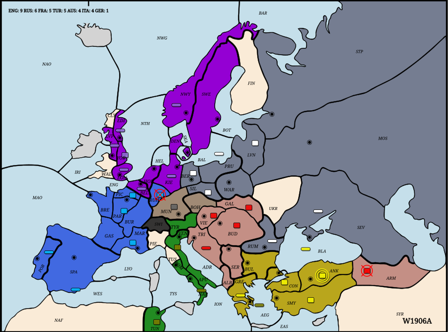

### What happened

- **AUSTRIA**: disbands A ARM
- **FRANCE**: disbands A RUH
- **TURKEY**: builds A ANK

### AUSTRIA
Orders: `A ARM D`

Reasoning

> Looking at the current situation: I have 4 supply centers (BUD, TRI, VIE, SER) but 5 units (A GAL, A BUD, F TRI, A VIE, A ARM). I need to disband 1 unit to match my supply center count.
>
> The question is which unit to disband. My units:
> - A BUD: defending BUD (home SC)
> - F TRI: defending TRI (home SC)
> - A VIE: defending VIE (home SC)
> - A GAL: positioned to press toward RUM or SIL
> - A ARM: retreated from SMY, far from my core, limited strategic value in the near term
>
> A ARM is the most expendable — it retreated to ARM after being dislodged from SMY, is far from my Balkan core, and has no immediate path to a supply center without crossing hostile Turkish territory. Disbanding it preserves my three home center defenders and A GAL which can press toward RUM or SIL next spring.

### FRANCE
Orders: `A RUH D`

Reasoning

> Looking at the current situation: I have 6 units but only 5 supply centers (BRE, MAR, PAR, POR, SPA). I need to disband exactly 1 unit to match my center count.
>
> The key question is which unit to disband. My units are:
> - F POR - holds Portugal (supply center)
> - A MAR - holds Marseilles (supply center)
> - F SPA/SC - holds Spain (supply center)
> - A PAR - holds Paris (supply center)
> - A RUH - in Ruhr (no supply center, deep in contested territory)
> - A PIC - in Picardy (no supply center, but just took it from England's push)
>
> A RUH and A PIC are both in non-supply-center provinces. A PIC is positioned well to threaten BEL next spring. A RUH was my attacking piece but bounced at HOL. 
>
> A PIC is in a forward position threatening England's BEL, which is strategically valuable. A RUH is also forward but bounced and is somewhat exposed. However, A PIC just moved into Picardy and is adjacent to BEL - that's a strong attacking position against England.
>
> I should disband A RUH since A PIC is more offensively positioned (adjacent to BEL) and A RUH bounced at HOL. Disbanding A RUH keeps my best forward unit (A PIC) while shedding the less useful one.

### TURKEY
Orders: `A ANK B`

Reasoning

> Looking at the current position: I have 5 supply centers (ANK, SMY, GRE, BUL, CON) and 4 units (F BLA, F GRE, A CON, A SMY). I have a surplus of 1 center, so I get 1 build. ANK is vacant and is my only open home supply center.
>
> I should build an army at ANK to increase my land power for pressing into the Balkans (BUL is already mine, and I want to press toward RUM or SER). An army is more useful than a fleet here since I need land forces to capture supply centers in the Balkans/Eastern Europe.

## SPRING 1907 MOVEMENT (`S1907M`)

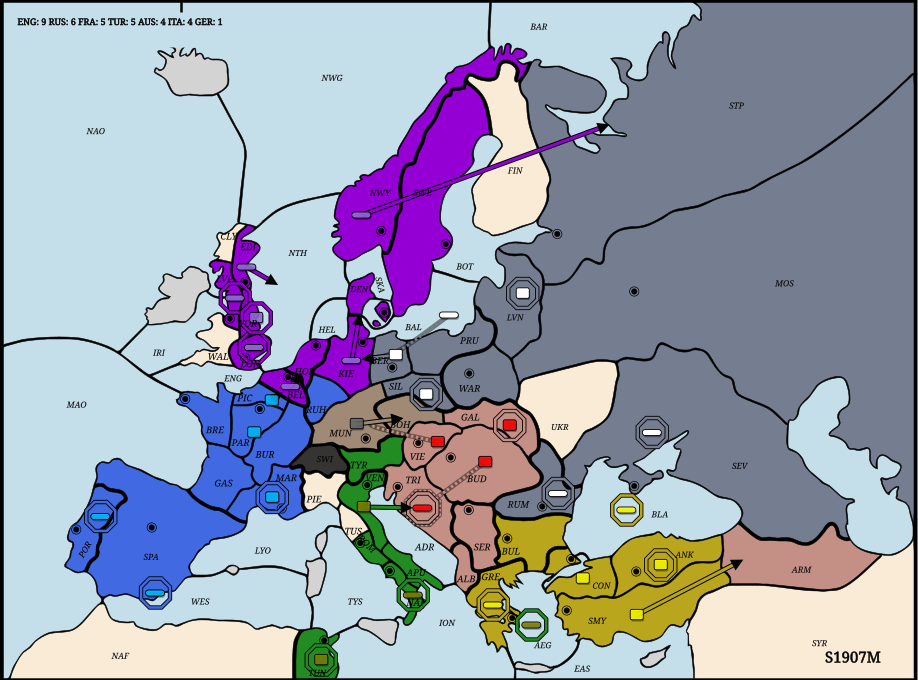

### What happened

- **AUSTRIA**: A GAL holds; A VIE supports A MUN → BOH; A BUD supports F TRI; F TRI holds
- **ENGLAND**: F KIE → DEN; F BEL → HOL; F NWY → STP/NC; F EDI → NTH; F LON holds; F LVP holds; A YOR holds
- **FRANCE**: A PIC → BEL; A MAR holds; F SPA/SC holds; F POR holds
- **GERMANY**: A MUN → BOH
- **ITALY**: A VEN → TRI (bounced); F AEG holds; F NAP holds; A TUN holds
- **RUSSIA**: A BER → KIE; F BAL supports A BER → KIE; A SIL holds; F RUM holds; F SEV holds; A LVN holds
- **TURKEY**: F GRE holds; F BLA holds; A SMY → ARM; A ANK holds

### Dialogue

- **AUSTRIA → RUSSIA**: A GAL moves to RUM this spring — F RUM is at strength 1 and I'm attacking at strength 1, so we bounce unless you pull back. Pull F RUM to SEV or BLA and I take RUM peacefully; in exchange I support your hold on BER and keep A BUD away from your flank all season. England at 9 is the real problem for both of us — let's not waste another turn bouncing while they consolidate.
- **AUSTRIA → ITALY**: I'm pushing A GAL toward RUM this spring and keeping F TRI fully defensive — A BUD supports F TRI, no movement toward SER or ADR. If you keep A VEN in place this turn, we both grow elsewhere rather than bleeding over TRI while England sits at 9 centers; I'm offering a genuine standstill on the TRI front in exchange for your holding A VEN.
- **AUSTRIA → TURKEY**: I'm moving A GAL toward RUM this spring, not toward you — your CON, SMY, ANK, GRE, BUL are unthreatened by me this turn. Keep A CON and A SMY defensive and we have a stable border; I have no units adjacent to your centers and no intention of pressing south while England sits at 9 centers.
- **AUSTRIA → GERMANY**: A MUN is your last center and you're surrounded by Russia's A SIL and A BER — the only path forward is moving toward BOH or SIL to pull Russian forces away from my A GAL push into RUM. Move A MUN - BOH this spring and I'll support it with A VIE; we create mutual pressure on Russia from two directions simultaneously.
- **ENGLAND → FRANCE**: You're at 5 centers after losing A RUH — this is the moment where we either negotiate a stable frontier or I push F BEL into PIC and begin a serious campaign against you. I'm willing to leave BEL in place if you pull A PIC back to PAR and commit to not contesting HOL or BEL this spring. Give me a concrete commitment and we have a quiet turn; refuse and I treat it as war.
- **ENGLAND → RUSSIA**: France is at 5 centers but still has A PIC threatening my position and F SPA/SC in the Atlantic — I'm planning to push F BEL into PIC this spring to begin squeezing them from the north. If you can threaten anything French-adjacent from your eastern position, or at least confirm you're not coordinating with France against me, we can split the pressure and both gain.
- **ENGLAND → GERMANY**: You're down to A MUN with Russia holding BER and me holding KIE — your only path to survival is making yourself useful to one of us. If you hold A MUN in place, you block Russia from taking it; I'm willing to support you diplomatically if you stay pointed away from my centers and toward Russia's flank.
- **ENGLAND → ITALY**: France is weakened at 5 centers with A PIC exposed — this is the moment to coordinate a squeeze before they recover. I'm pushing from the north; if you can press MAR or PIE with anything from VEN, we split their attention and both gain centers this turn.
- **FRANCE → ENGLAND**: England, you're at 9 centers and I'm at 5 — the gap is becoming critical and I need to grow this spring or I fall permanently behind. I want to propose a clean deal: you pull F BEL back toward the north and I take BEL peacefully, in exchange for my support against Russia's growing eastern position. If you refuse, I have to push for it by force and coordinate with Russia simultaneously.
- **FRANCE → RUSSIA**: Russia, England is at 9 centers with 7 fleets and will hit 12+ if we don't act together this spring. I'm pushing A PIC toward BEL this turn — if you can threaten KIE or HOL from the east with A BER or F BAL, England cannot defend both flanks and we each gain a center. Commit to a simultaneous squeeze this spring and we stop the runaway leader now.
- **FRANCE → GERMANY**: Germany, your A MUN is surrounded and Russia will take it eventually — but you can still matter this turn. If you support A PIC into BUR or support my push toward BEL, you create real problems for England while staying relevant; tell me what you want in exchange for that support and let's make a deal before it's too late.
- **FRANCE → ITALY**: Italy, I need to know your direction this spring before I commit my southern units — is A VEN staying out of PIE and TYR, or are you moving toward MAR? Confirm my southern flank is clear and I'll focus entirely on England's continental position rather than defending at home.
- **GERMANY → FRANCE**: France, you're at 5 centers and England at 9 is pulling away — I have A MUN and can move it toward BER or RUH to pressure either Russia or England's position. If you support A MUN - BER with A PAR - BUR S A MUN or similar, I reclaim a home center and you gain a buffer; alternatively, tell me what you need from my unit this spring and let's make a concrete deal.
- **GERMANY → RUSSIA**: Russia, you hold BER and SIL with England sitting at 9 centers in the Baltic — England is the real threat to your western position, not me with a single unit. If you pull A BER back toward WAR or STP and let me retake my home center, I'll point A MUN at KIE or RUH to pressure England rather than waste both our turns; what would it take to make that deal?
- **GERMANY → ENGLAND**: England, you're at 9 centers and every power on the board has reason to coordinate against you — France at 5, Russia at 6, Austria at 4 are all watching your center count. I have A MUN and can point it toward RUH or KIE to pressure you, or I can point it east at Russia; what are you offering to keep me pointed away from your centers this spring?
- **ITALY → TURKEY**: Turkey, Austria holds TRI, BUD, VIE, SER — four centers still standing. I'm pushing A VEN into TRI this spring; if you press A CON toward SER or support from GRE, Austria cannot defend both flanks simultaneously. Confirm your spring plan so we coordinate the final squeeze on Austria — what are you targeting this turn?
- **ITALY → AUSTRIA**: Austria, you're down to 4 centers and squeezed from every direction — Turkey pressing from the east, me from the west, Russia lurking in GAL. The only path that preserves anything: yield TRI peacefully and consolidate SER and BUD while you still have the units to defend them. Fighting me over TRI while Turkey takes SER leaves you with nothing.
- **ITALY → RUSSIA**: Russia, Austria is at 4 centers with A GAL sitting adjacent to your SIL and BER — they're the most accessible target for both of us right now. I'm pressing TRI with A VEN this spring; if you lean A GAL toward VIE or BUD, Austria collapses on two fronts simultaneously. What are you targeting this spring?
- **RUSSIA → ENGLAND**: England, you're at 9 centers and the dominant force on the board — I need to be direct: I'm pushing toward KIE this spring and I expect you to defend it. If you want to avoid a direct clash, tell me what you're offering concretely; otherwise I'm moving A BER toward KIE and F BAL in support.
- **RUSSIA → FRANCE**: France, England sits at 9 centers with 7 fleets — this is the moment for a coordinated squeeze before they become unstoppable. I'm pushing A BER toward KIE and threatening DEN from BAL this spring; if you press from the west toward HOL or BEL simultaneously, England must split their fleets. Are you committing to a joint push this turn?
- **RUSSIA → TURKEY**: Turkey, our ceasefire has held well and I want to keep it intact — F RUM and F SEV stay defensive this spring. I'm pushing hard against England's KIE position this turn; once I crack KIE, England at 9 is the shared threat worth coordinating against from multiple directions. What's your plan this spring?
- **RUSSIA → AUSTRIA**: Austria, A GAL is adjacent to my A SIL and I want to be clear about intentions: I'm not moving on GAL this spring, I'm focused entirely on England's KIE. If A GAL stays defensive or moves elsewhere, we have no conflict; if it presses SIL, I will respond forcefully. What are you planning this turn?
- **TURKEY → RUSSIA**: Russia, you hold RUM with F RUM — I'm considering pressing A CON toward BUL/RUM this spring, but I'd rather negotiate than fight. If you cede RUM to me peacefully, I'll support your push against England from the south and keep F BLA away from SEV; alternatively, tell me what you want in exchange and we can find a deal. England at 9 centers is the real threat to both of us — let's not bleed each other while they grow.
- **TURKEY → ITALY**: Italy, Austria is down to 4 centers and mostly spent — I want to coordinate this spring to keep pressure on them while expanding elsewhere. F AEG adjacent to my GRE and BUL makes me nervous; can you commit to leaving those provinces alone this turn in exchange for my F GRE holding defensively rather than pressing into AEG? A stable southern front lets us both focus on the bigger threats.
- **TURKEY → AUSTRIA**: Austria, you're at 4 centers with A GAL, A BUD, F TRI, A VIE — a defensive position with no path to growth while England sits at 9. I'm not pressing into your territory this spring; I need to expand northward toward RUM. If you hold defensively and we establish a ceasefire at the current border, we both benefit from stability while the real fight is in the north.
- **AUSTRIA → RUSSIA**: F RUM holding at strength 1 bounces my A GAL at strength 1 — we both waste the turn while England takes KIE uncontested. Concrete deal: order F RUM - SEV this spring and I take RUM peacefully; I support your A BER hold and keep A BUD fully defensive all season. This is the only move that gives you a free hand against England without leaving RUM contested.
- **AUSTRIA → TURKEY**: You said 'expand northward toward RUM' — if you're moving F BLA toward RUM or supporting a move there, we collide and both waste the turn. Clarify now: are you ordering F BLA to hold or move away from RUM this spring? If you're not contesting RUM, confirm it explicitly and we have no conflict.
- **AUSTRIA → ITALY**: Concrete commitment this turn: A BUD supports F TRI, F TRI holds, no Austrian unit moves toward SER or ADR — full standstill on my end. If you order A VEN to hold, we both preserve our positions and neither of us wastes a unit this spring; I need your explicit confirmation that A VEN holds before I finalize orders.
- **AUSTRIA → GERMANY**: A VIE supports A MUN - BOH this spring if you commit to the move — that's strength 2 against an unoccupied province, guaranteed success. This pulls Russia's A SIL away from my GAL flank and gives you a foothold; confirm you're ordering A MUN - BOH and I lock in the support.
- **ENGLAND → RUSSIA**: You've told me you're moving A BER → KIE with F BAL support — that's a direct attack on my center, and I'm treating it as war. I'm supporting F KIE hold this turn, and I'm also opening negotiations with Austria and Turkey to pressure your southern flank; if you take KIE you gain one center and lose the north to a coordinated response. Redirect A BER south toward MUN or SIL and I'll leave your Baltic position alone — that's a better deal than a two-front war.
- **ENGLAND → GERMANY**: Russia is moving A BER → KIE with F BAL support this spring — that's the direct threat to your survival too, since after KIE falls I'm the only barrier between Russia and the North Sea. Concrete offer: support F KIE hold with A MUN this turn, and I'll back your claim to BER diplomatically and support your recovery; if you point A MUN at RUH or KIE instead, Russia rolls through both of us.
- **ENGLAND → FRANCE**: Concrete deal: pull A PIC back to PAR this spring and I hold F BEL in place — no attack on PIC, no contest over BEL. Russia is threatening KIE directly and I need my units focused north, not fighting you simultaneously; this is a genuine offer, not a bluff.
- **ENGLAND → ITALY**: France is distracted defending from my northern pressure — if you push A VEN toward PIE or TRI this spring, Austria is the easier target and France can't respond south. I'm not asking you to attack France directly yet, just position yourself for the fall when the squeeze becomes real.
- **FRANCE → ENGLAND**: England, I'm not pulling A PIC back — I need to grow or I lose the game, and you at 9 centers is the threat I have to address. Concrete offer: if you pull F BEL to HOL this spring, I take BEL peacefully and support you against Russia's KIE push next fall; that gives you a stable western front while you fight east. Refuse and I push by force with Russian coordination.
- **FRANCE → RUSSIA**: Russia, I'm committing A PIC - BEL this spring — if you move A BER - KIE simultaneously, England cannot defend both BEL and KIE and loses at least one center. Confirm A BER is moving toward KIE this turn so I know the eastern pressure is real before I finalize orders.
- **FRANCE → GERMANY**: Germany, concrete deal: if you move A MUN - BUR this spring, it threatens England's position and creates space for my units to push north; in exchange I'll support A MUN - BUR with A PAR and leave MUN alone for now. Commit to A MUN - BUR and we both gain from England's distraction.
- **FRANCE → ITALY**: Italy, confirm A VEN is not moving toward PIE this spring — I need my southern flank clear to commit fully north against England. A direct yes or no is all I need.
- **GERMANY → AUSTRIA**: Austria, I'll move A MUN - BOH if you commit A VIE - BOH as support — that's a concrete deal I can execute this turn. But I need more than BOH; what's your plan for getting me back toward BER or SIL after this move, and will you support A BOH - SIL next fall?
- **GERMANY → FRANCE**: France, supporting A PIC - BUR costs me MUN with nothing in return — I need a center, not just to be useful to you. If you support A MUN - BER with A PAR - BUR or similar coordination, I gain a center and you create pressure on Russia's western flank; that's the only deal worth making from my position.
- **GERMANY → RUSSIA**: Russia, England has 9 centers and F KIE plus F NWY sitting on your Baltic flank — your real threat is north, not a single German army. Tell me explicitly: will you pull A BER toward WAR this spring and let me retake my home center, or are you committed to holding BER while England builds freely?
- **ITALY → TURKEY**: Turkey, I'm committing A VEN - TRI this spring — Austria's A BUD supports F TRI, so I need you to press A CON toward SER to pull BUD away from that support. If BUD is forced to defend SER, I take TRI at strength 1 vs 1 undefended. Can you confirm A CON - SER this spring? That's the move that cracks Austria open for both of us.
- **ITALY → RUSSIA**: Russia, Austria's A BUD is supporting F TRI against my A VEN — if you press A GAL toward BUD or VIE this spring, Austria must redirect BUD away from the TRI support and I take TRI uncontested. You gain leverage over Austria's heartland while I crack their western flank; this is the coordinated strike that collapses Austria. Can you commit A GAL - BUD or A GAL - VIE this spring?
- **ITALY → AUSTRIA**: Austria, A BUD supporting F TRI is the only thing stopping me from taking TRI — and Turkey is pressing from the east while Russia holds A GAL. You cannot hold TRI, SER, VIE, and BUD simultaneously against three powers. Yield TRI now and I stop pressing; otherwise you lose TRI and likely SER in the same turn.
- **ITALY → FRANCE**: France, A VEN is going toward TRI, not PIE or TYR — your southern flank is clear. I have no interest in opening a western front while England sits at 9 centers.
- **RUSSIA → AUSTRIA**: A GAL versus F RUM is a straight bounce at equal strength — I'm not pulling back, so that move accomplishes nothing for either of us. Keep A GAL stationary or redirect it, and we both save the turn; I'm not moving on GAL this spring and have no interest in fighting you while England sits at 9.
- **RUSSIA → ENGLAND**: I'm moving A BER → KIE and F BAL in support this spring — that's my concrete move. If you want to avoid losing KIE, offer me something real: a guaranteed DEN or SWE next fall in exchange for holding back one turn. Otherwise the attack proceeds.
- **RUSSIA → FRANCE**: Confirmed: A BER → KIE with F BAL supporting this spring — I'm committing to the squeeze. Confirm A PIC → BEL is happening simultaneously so England cannot freely reinforce KIE from the west; if we both move on the same turn, England loses ground.
- **RUSSIA → TURKEY**: Ceasefire holds — F RUM and F SEV stay defensive this spring, I'm not pressing BUL or ANK. RUM is not on the table; Austria is already bouncing into it at equal strength and gaining nothing, so there's no vacuum for you to fill there.
- **TURKEY → RUSSIA**: Russia, I'm prepared to commit F BLA to supporting your push against England rather than pressing toward RUM or SEV this spring — but I need you to confirm F RUM stays in RUM and doesn't press toward BUL. If you can confirm that, I'll press A CON toward SER this spring and leave your Black Sea position entirely alone; we both grow at Austria and England's expense rather than bleeding each other.
- **TURKEY → ITALY**: Italy, I'm pressing A CON toward SER this spring — if you take TRI simultaneously, Austria cannot defend both flanks and we strip them of two centers in one turn. Commit to A VEN - TRI and I'll hold F GRE defensively rather than pressing into AEG; that's the coordinated squeeze Austria cannot survive.
- **TURKEY → AUSTRIA**: Austria, I'm pressing A CON toward SER this spring — you cannot hold both SER and TRI simultaneously against Italy's A VEN push. The practical deal: yield SER peacefully and concentrate your remaining units to hold TRI and BUD; I will not press further into your territory this year if you stabilize at 3 centers.
- **FRANCE → ENGLAND**: Final commitment: A PIC - BEL this spring, supported by A PAR — I need that center and I'm taking it. If you pull F BEL to HOL right now, I take it peacefully and you keep HOL; refuse and we both waste a turn fighting while Russia takes KIE uncontested.
- **FRANCE → RUSSIA**: Confirmed: A PIC - BEL this spring with A PAR support — England cannot defend BEL and KIE simultaneously. Execute A BER - KIE with F BAL support as committed; if we both land, England drops from 9 to 7 in one turn and the game shifts fundamentally.
- **FRANCE → GERMANY**: I'm pushing A PIC - BEL this spring with PAR support — no coordination needed from you this turn. Hold A MUN or move it wherever serves you best; just don't move toward BUR as that would create an unwanted complication.
- **TURKEY → ITALY**: Committing: A CON - SER this spring, F GRE holds defensively. If you execute A VEN - TRI simultaneously, Austria cannot defend both flanks and we each take a center — Austria drops to 2. Hold F AEG away from BUL and GRE and this is clean coordination with mutual gain.
- **TURKEY → RUSSIA**: Final commitment: F BLA holds this spring, not pressing toward RUM or SEV — ceasefire intact. I'm pressing A CON into SER to strip Austria, which weakens the southern flank and frees your F RUM from any Austrian threat from GAL. Keep F RUM in RUM and we have no conflict this turn.
- **TURKEY → AUSTRIA**: Final: A CON moves to SER this spring — you cannot hold both SER and TRI against Italy's simultaneous push. Concentrate A BUD and A VIE to hold TRI and your core; yielding SER now preserves two home centers rather than losing everything trying to hold three.

### AUSTRIA
Orders: `A GAL H` · `A VIE S A MUN - BOH` · `A BUD S F TRI` · `F TRI H`

Reasoning

> Looking at the current situation:
>
> **Assessment:**
> - Turkey is announcing A CON → SER, which threatens my supply center SER. I don't have a unit in SER to defend it, and I can't easily stop it.
> - Italy is pressing A VEN → TRI again.
> - Russia confirmed F RUM stays and won't pull back, so A GAL → RUM bounces.
> - Germany committed to A MUN → BOH if I support with A VIE.
>
> **My revised strategy note says:**
> - A GAL H (since RUM bounce is confirmed)
> - A VIE S A MUN → BOH (as committed to Germany)
> - A BUD S F TRI (defend against Italy's A VEN → TRI)
> - F TRI H
>
> **Checking legality:**
> - A VIE S A MUN - BOH: VIE is adjacent to BOH? Yes (VIE neighbors: BOH, BUD, GAL, TRI, TYR). And MUN is adjacent to BOH? Yes. Legal.
> - A BUD S F TRI: BUD adjacent to TRI? Yes. Legal.
> - F TRI H: Legal.
> - A GAL H: Legal.
>
> Turkey taking SER is painful but I cannot stop it with my current forces without abandoning the TRI defense. Holding TRI (home center) is more critical than SER. A BUD supporting F TRI is the right defensive priority.

### ENGLAND
Orders: `F KIE - DEN` · `F BEL - HOL` · `F NWY - STP/NC` · `F EDI - NTH` · `F LON H` · `F LVP H` · `A YOR H`

Reasoning

> Looking at the situation: France is attacking BEL with A PIC + A PAR (strength 2), and Russia is attacking KIE with A BER + F BAL (strength 2). Both my F BEL and F KIE face strength-2 attacks and will likely fall regardless of what I do defensively.
>
> My options:
> 1. Hold both and lose both - net -2 centers
> 2. Try to move F BEL to contest somewhere useful, move F KIE somewhere safe
> 3. Move F KIE to DEN or HEL to preserve the unit (DEN is a supply center I could take!)
> 4. Move F BEL to HOL or NTH to preserve it
>
> Key insight: If F KIE moves to DEN, it takes a supply center (DEN) instead of being captured. DEN is not currently occupied. Similarly, F BEL moving to HOL or NTH preserves the fleet. If I move both units out, France takes BEL (empty) and Russia takes KIE (empty) - I lose 2 centers but preserve 2 fleets. If I hold both, I lose 2 centers AND get the units dislodged (must retreat or disband).
>
> Better play: Move F KIE → DEN (take a center, preserve fleet), move F BEL → HOL (preserve fleet, deny France HOL). This way I trade BEL and KIE but gain DEN, net -1 center, and keep all units intact.
>
> Wait - if F BEL moves to HOL, France takes BEL (empty). If F KIE moves to DEN, Russia takes KIE (empty). I gain DEN. Net: -2 +1 = -1. But I keep both fleets intact for counterattack.
>
> For NWY: move toward STP/NC to pressure Russia's home center.
> For other fleets: position for counterattack.

### FRANCE
Orders: `A PIC - BEL` · `A MAR H` · `F SPA/SC H` · `F POR H`
Illegal (dropped): `A PAR S A PIC - BEL`

Reasoning

> Looking at the board, I've committed to A PIC - BEL supported by A PAR, coordinated with Russia's A BER - KIE (F BAL support). England has F BEL there, so I need strength 2 to dislodge it — my attack with support gives me strength 2, which equals England's defense of 1 (no support mentioned). This should work if England doesn't get a support for F BEL.
>
> My southern units (MAR, SPA/SC, POR) should hold defensively — Italy confirmed no threat to PIE, so MAR holds. The Iberian fleets hold to maintain those centers.
>
> The plan is clear: execute the committed squeeze against England.

### GERMANY
Orders: `A MUN - BOH`

Reasoning

> Looking at my situation: I have a single unit A MUN. Austria offered to support A MUN - BOH with A VIE, which is a guaranteed successful move into an unoccupied province. This is the best concrete offer on the table.
>
> My revised strategy already commits to A MUN - BOH with Austria's support. BOH gives me a foothold adjacent to SIL and puts pressure on Russia's flank. It's not a home center, but it's movement and survival - the only alternative is holding MUN and waiting to be taken.
>
> Let me verify the adjacency: MUN is adjacent to BOH? Yes - `BOH (land): GAL, MUN, SIL, TYR, VEN, VIE` - MUN appears in BOH's neighbors, confirmed legal.
>
> Austria's A VIE supporting A MUN - BOH: VIE is adjacent to BOH (confirmed in adjacency table), so that support is legal.
>
> This move pulls me away from being surrounded, creates pressure on SIL, and keeps me relevant for another turn.

### ITALY
Orders: `A VEN - TRI` · `F AEG H` · `F NAP H` · `A TUN H`

Reasoning

> Looking at the current situation:
>
> Turkey has confirmed A CON - SER this spring, which should pull Austria's A BUD away from supporting F TRI. If A BUD must defend SER (or at least is distracted), then F TRI is undefended and A VEN - TRI succeeds at strength 1 vs 1 undefended.
>
> My revised strategy is clear: A VEN - TRI is the key move. Turkey is pressing SER, which forces Austria to choose between supporting TRI or defending SER. Austria's A BUD cannot do both.
>
> For my other units:
> - F AEG: I should hold or reposition. Turkey asked me to keep F AEG away from BUL and GRE, and I agreed. Holding is fine, or I could move toward ION to open southern options.
> - F NAP: Hold defensively or move toward ROM to free up NAP for a potential build later.
> - A TUN: Hold - no useful move available.
>
> F NAP could move to ROM to free NAP as a build location, but I don't need a build right now (I'm at 4 centers, and taking TRI would give me 5 - I'd need a build in Winter). Actually, moving F NAP - ROM now would free NAP for a future build and give me more flexibility. But it also means NAP is undefended. Let me keep F NAP holding for now.
>
> F AEG - I'll hold as agreed with Turkey, keeping away from BUL and GRE.

### RUSSIA
Orders: `A BER - KIE` · `F BAL S A BER - KIE` · `A SIL H` · `F RUM H` · `F SEV H` · `A LVN H`

Reasoning

> Looking at the current situation:
>
> **Strategic assessment:**
> - England has 9 centers and is the dominant threat. I committed to pushing A BER → KIE with F BAL support, coordinated with France's A PIC → BEL attack.
> - France confirmed A PIC - BEL with A PAR support — England must defend both flanks simultaneously.
> - Austria's A GAL → RUM is a straight bounce against my F RUM (equal strength), so holding F RUM is correct.
> - Turkey confirmed ceasefire and is pressing A CON → SER, leaving my southern flank stable.
> - England threatened to coordinate against me if I attack KIE, but that's a bluff — they're already under pressure from France in the west and can't easily organize a southern coalition in one turn.
> - A SIL should hold to guard against Austria's A GAL potentially being redirected toward SIL, and to keep pressure on Germany's A MUN.
> - A LVN holds — no urgent move needed there.
>
> The committed plan: A BER - KIE supported by F BAL, F RUM holds to bounce Austria's A GAL, F SEV holds defensively, A SIL holds to guard the flank, A LVN holds.

### TURKEY
Orders: `F GRE H` · `F BLA H` · `A SMY - ARM` · `A ANK H`
Illegal (dropped): `A CON - SER`

Reasoning

> Looking at the current position, I need to execute the plan I've committed to in negotiations:
>
> 1. **A CON - SER**: I've committed to this in negotiations with Italy (coordinated squeeze on Austria) and told Austria explicitly. SER is adjacent to CON and Austria holds it with no unit there directly - it's undefended. Italy is pressing TRI simultaneously.
>
> 2. **F GRE H**: I committed to holding F GRE defensively to keep it away from AEG, as promised to Italy.
>
> 3. **F BLA H**: I committed to the ceasefire with Russia - F BLA stays put, not pressing toward RUM or SEV.
>
> 4. **A SMY - ARM**: I want to push toward Russia's southern flank for future expansion, and ARM is adjacent to SMY.
>
> 5. **A ANK H**: ANK holds defensively to protect my home center.
>
> Let me verify adjacency: CON is adjacent to SER (BUL, GRE, RUM, SER per the army adjacency). Yes, A CON - SER is legal. SMY is adjacent to ARM. Yes, A SMY - ARM is legal.
>
> The coordination with Italy (A CON - SER while Italy does A VEN - TRI) should strip Austria of two centers if it works. Austria's A BUD supports F TRI, so TRI may hold, but SER should fall since no Austrian unit is there.

## FALL 1907 MOVEMENT (`F1907M`)

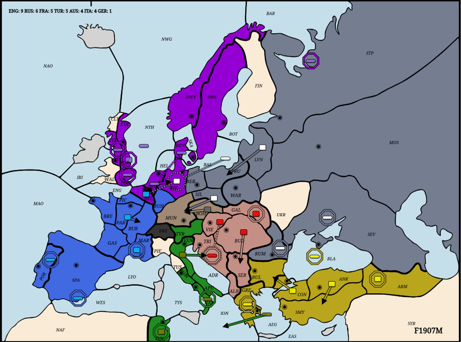

### What happened

- **AUSTRIA**: A BUD → SER; A VIE supports F TRI; A GAL holds; F TRI holds
- **ENGLAND**: F HOL → KIE (bounced); F DEN supports F HOL → KIE; F STP/NC holds; F LON holds; F LVP holds; A YOR holds  [dislodged: F HOL]
- **FRANCE**: A BEL → HOL; A PAR → BUR; A MAR holds; F SPA/SC holds; F POR holds
- **GERMANY**: A BOH → MUN (bounced)
- **ITALY**: A VEN → TRI (bounced); F AEG → ION; F NAP holds; A TUN holds
- **RUSSIA**: A KIE supports A BEL → HOL; F BAL supports A KIE; A SIL → MUN (bounced); F RUM holds; F SEV holds; A LVN → PRU
- **TURKEY**: A CON → BUL; A ANK → SMY; A ARM holds; F BLA holds; F GRE holds

### Dialogue

- **AUSTRIA → TURKEY**: A CON moving to SER this fall puts you at 6 centers while I drop to 3 — that's a significant shift that helps you but leaves me unable to resist Italy's press on TRI simultaneously. Concrete proposal: hold A CON in CON this fall and I hold A BUD in BUD; we establish a stable border at SER and both redirect energy toward the powers actually threatening to win. England at 9 centers is the real endgame threat.
- **AUSTRIA → ITALY**: I'm holding F TRI with support this fall — A VEN attacking into strength 2 fails and wastes your unit. The only sensible move: hold A VEN in place and we both preserve our positions while Turkey and England grow unchecked; I'm not moving toward SER or ADR this turn. Confirm A VEN holds and we have a genuine standstill.
- **AUSTRIA → GERMANY**: A BOH is adjacent to GAL and SIL — if you move A BOH toward SIL this fall, you pull Russia's attention away from my flank and potentially retake BER next spring. I'll support A BOH - SIL with A VIE or A GAL if you commit; this is the move that keeps Germany alive and creates mutual pressure on Russia.
- **AUSTRIA → RUSSIA**: A SIL adjacent to GAL is a real threat — clarify your intentions this fall before I have to assume the worst and commit A GAL defensively. If you're not pressing GAL, tell me explicitly and I redirect A GAL toward RUM; if you are pressing, we both waste units in a bounce while England consolidates at 9 centers.
- **ENGLAND → RUSSIA**: You've taken KIE — I'm moving to retake it this fall, and I have F HOL adjacent with F NTH and F DEN in range to support. This doesn't have to escalate into a prolonged war: if you pull A KIE back toward SIL or MOS and let me retake it peacefully, I'll leave your Baltic position (F BAL) and Scandinavia alone and we can redirect against France together. Refuse, and I commit everything north against you while Austria and Turkey press your south.
- **ENGLAND → FRANCE**: You've taken BEL — I have F HOL adjacent and F NTH able to support a push into BEL this fall. Concrete offer: pull A BEL back to PIC this turn and I hold F HOL in place, giving you PIC uncontested; refuse and I retake BEL by force while you're exposed with no support. Russia is your bigger problem right now — let's not waste units fighting each other.
- **ENGLAND → GERMANY**: Russia holds KIE and I'm pushing to retake it — A BOH is well-placed to pressure Russia's position or at least threaten SIL to keep Russian units occupied defending east rather than supporting KIE. If you move A BOH toward SIL this fall, you complicate Russia's defense of KIE and I'll support your claim to MUN diplomatically; staying put in BOH does nothing for either of us.
- **ENGLAND → AUSTRIA**: Russia is at 6 centers and growing with KIE now in hand — they're the runaway threat on the board right now, not me. If you can push A GAL toward RUM or threaten Russia's southern position this fall, it forces them to defend on two fronts and eases my northern push to retake KIE; I'll leave your Balkan position entirely alone and we can coordinate on squeezing Russia together.
- **FRANCE → ENGLAND**: England, I'm at 5 centers and you're at 9 — I need to keep growing or I lose, so I'm pushing A BEL toward HOL or RUH this fall. Concrete offer: pull F HOL back toward DEN and I take HOL peacefully, in exchange for my support against Russia's growing eastern position next year. Refuse and I push by force while Russia threatens KIE and DEN simultaneously.
- **FRANCE → RUSSIA**: Russia, I have A BEL and you have A KIE — this fall is the moment to squeeze England hard from both sides. If you push A KIE toward RUH or HOL and I push A BEL toward HOL simultaneously, England cannot defend both; confirm your eastern pressure is coming and I'll commit A BEL west against them.
- **FRANCE → ITALY**: Italy, I need to know your direction this fall — are you pushing into Austria via TRI or looking elsewhere? Confirm A VEN stays out of PIE and my southern flank is clear, and I'll focus entirely on England's continental position rather than defending at home.
- **FRANCE → AUSTRIA**: Austria, Turkey is at 5 centers and growing in the Balkans — what's your plan this fall for SER or the eastern front? I have no interest in your theater but want to understand the board before committing my units north.
- **GERMANY → RUSSIA**: Russia, MUN is vacant and I'm moving A BOH there to reclaim my last home center — I'm not threatening your SIL or KIE position, just trying to survive on one unit. If you move A KIE or A SIL into MUN, you eliminate me entirely but gain nothing since MUN only becomes a build location for you if it stays vacant through winter; let me hold it and I remain a useful buffer against England's 9-center position.
- **GERMANY → AUSTRIA**: Austria, I'm moving A BOH - MUN this fall to reclaim my last home center — can you support that with A VIE or A GAL if either is adjacent? If not, can you at least confirm you're not moving A VIE into TYR or BOH in a way that complicates my position? A living Germany with MUN is still a useful partner against Russia's SIL flank.
- **GERMANY → ENGLAND**: England, you have 9 centers and Russia has 6 with A KIE sitting on your doorstep — if Russia takes MUN this fall, they're at 7 and growing while I'm eliminated. I'm moving A BOH - MUN; if you can pressure Russia's A KIE with your Baltic fleet, you slow Russia's growth and keep me alive as a buffer on Russia's western flank.
- **ITALY → TURKEY**: Austria still holds TRI, BUD, VIE, SER — four centers I need to crack. This fall I'm pushing A VEN - TRI again; if you press A CON - SER or support from GRE into SER, Austria cannot defend both flanks and we each take a center. Can you confirm A CON - SER this fall? That's the move that finally collapses Austria.
- **ITALY → AUSTRIA**: Austria, you're down to 4 centers with Russia pressing from GAL, Turkey pressing from CON, and me pushing TRI from VEN — you cannot hold all four simultaneously. The only deal I'll accept: yield TRI peacefully and I stop pressing; otherwise this fall you lose TRI and likely SER in the same turn while England runs away at 9 centers.
- **ITALY → RUSSIA**: Russia, Austria is at 4 centers with A GAL adjacent to your SIL — they're squeezed between us, Turkey, and you from the north. I'm pressing TRI with A VEN this fall; if you lean on BUD or VIE from GAL, Austria collapses on two fronts. What are you targeting against Austria this fall?
- **RUSSIA → FRANCE**: France, I took KIE this spring as committed — England is now under pressure from both flanks. This fall I'm pushing A KIE toward DEN and A SIL toward MUN to keep squeezing; if you press BEL or HOL simultaneously, England cannot hold everything. Confirm your fall moves so we coordinate the timing.
- **RUSSIA → ENGLAND**: England, you hold 9 centers including STP which is my home supply center — that's a direct provocation I cannot ignore. I'm willing to discuss a ceasefire if you vacate STP and offer me something concrete in return; otherwise I'm treating your Baltic position as a target this fall.
- **RUSSIA → TURKEY**: Turkey, ceasefire has held well — F RUM and F SEV stay defensive this fall as always. I'm pushing north against England this turn; what are you doing with A ARM and A CON this fall, and does F BLA remain stationary?
- **RUSSIA → AUSTRIA**: Austria, I have no designs on GAL or BUD this fall — I'm entirely focused on England's northern position. Keep A GAL stationary and we have no conflict; if it presses SIL I will respond.
- **TURKEY → RUSSIA**: Russia, I'm pressing A ARM toward SEV this fall — not as a hostile act but as a positioning move to give me leverage in the south while England dominates the north. If you cede RUM to me this fall, I will immediately redirect all pressure northward against England alongside you; F BLA can support your Baltic operations and I keep F GRE away from your sphere entirely. England at 9 centers wins this game if we bleed each other — tell me what you need to make RUM transfer work.
- **TURKEY → ITALY**: Italy, Austria still holds SER — did A VEN - TRI succeed this spring? I'm pressing to expand northward this fall and need to know if Austria is collapsing or holding. If you're pushing A VEN - TRI again, I can press A CON toward BUL or SER to keep Austria pinned from two sides; confirm your fall plan so we coordinate.
- **TURKEY → AUSTRIA**: Austria, you're at 4 centers with England at 9 — the game is being decided in the north while we sit here. I'm not pressing into your territory this fall if you hold defensively; I need to expand toward RUM and SEV, not southward into your remaining centers. Confirm you're holding BUD, TRI, VIE defensively and we have no conflict this turn.
- **AUSTRIA → TURKEY**: A BUD moves to SER this fall to contest your A CON push — you're at strength 1 and so am I, so we bounce and neither gains. The alternative: hold A CON in CON and I hold A BUD in BUD; we both preserve our positions and you can redirect A ARM toward RUM instead, which is actual growth for you. A bounce on SER wastes both our units while England sits at 9.
- **AUSTRIA → ITALY**: A VIE supports F TRI this fall — you're attacking into strength 2 and it fails. I'm not moving toward SER or ADR; this is a genuine standstill offer. Stop wasting A VEN on a defended TRI and redirect it somewhere you can actually gain a center.
- **AUSTRIA → RUSSIA**: Confirm explicitly: A SIL holds in place this fall and you're not pressing GAL. I'll hold A GAL stationary if you confirm; if A SIL moves toward GAL I have to assume the worst and respond. A clear answer now prevents a mutual waste.
- **ENGLAND → RUSSIA**: I'm retaking KIE this fall — F HOL is moving in with support from F DEN or F NTH, so defending it costs you two units you don't have positioned there. Concrete offer: pull A KIE back to SIL or BER voluntarily and I hold F STP/NC in place this turn, giving you a clean retreat without losing the Baltic fleet; refuse and I push hard on KIE while Austria presses your south. This is the better deal.
- **ENGLAND → FRANCE**: You hold BEL and I hold HOL — neither of us benefits from a grinding war over these two centers while Russia grows. Concrete offer: hold A BEL in place this fall and I hold F HOL in place, status quo for one turn; that gives both of us time to redirect against Russia who is the actual runaway threat at 6 centers with KIE. If you push A BEL toward HOL, I retake BEL by force next turn.
- **ENGLAND → AUSTRIA**: Russia has A KIE, F BAL, A SIL, A LVN, F RUM, F SEV — 6 centers and growing, and they're threatening both my north and your Galicia. If you push A GAL toward RUM this fall, it ties down F RUM and forces Russia to defend south while I retake KIE from the north; I'll leave your Balkan position entirely alone and we split the pressure on Russia.
- **ENGLAND → GERMANY**: If you're moving A BOH → MUN this fall, that's the right call — it takes back your home center and complicates Russia's position. I'm pushing hard on KIE from HOL with NTH support; if Russia has to defend both MUN from you and KIE from me simultaneously, one of those attacks succeeds.
- **FRANCE → ENGLAND**: I'm not pushing A BEL into HOL this fall — I'm moving east toward RUH instead, which is no threat to your fleet position. Concrete offer: I leave HOL alone entirely this fall, you leave BEL alone, and we both focus pressure elsewhere; confirm F HOL holds and F NTH doesn't support any attack on BEL.
- **FRANCE → RUSSIA**: Russia, you said A KIE is going toward DEN — does that mean you're not threatening HOL directly this fall? If A KIE - RUH is possible instead, we could both squeeze England's continental position from two sides; confirm your exact fall moves so I can coordinate A BEL's direction accordingly.
- **FRANCE → GERMANY**: Germany, A BEL is moving toward RUH this fall, which puts me adjacent to MUN — I'm not targeting MUN if you support my push or stay neutral, but I need to know if A BOH is moving west toward MUN or TYR. Confirm A BOH's direction so I don't accidentally create a conflict where none is needed.
- **GERMANY → AUSTRIA**: Austria, can A GAL support A BOH - MUN? GAL is adjacent to MUN per the map — if you support A BOH - MUN with A GAL, I reclaim my home center with strength 2 and Russia cannot contest it. Commit to A GAL S A BOH - MUN and I'll support your A BUD or A VIE hold in return.
- **GERMANY → RUSSIA**: Russia, you have A KIE and A SIL — if you move either into MUN, you eliminate me but gain a center you cannot build in since your home centers are east. England has 9 centers and is the dominant threat; let me take MUN uncontested and I point A MUN at RUH or BOH next turn, creating pressure on England's western flank rather than yours.
- **GERMANY → ENGLAND**: England, Russia's A SIL and A KIE both threaten MUN this fall — if Russia takes MUN I'm eliminated and Russia reaches 7 centers while you're at 9. Pressure Russia's KIE with your Baltic fleet to force them to defend north rather than push into MUN; keeping me alive one more turn costs you nothing and slows Russia's growth.
- **ITALY → TURKEY**: TRI did not fall last spring — Austria kept A BUD supporting F TRI and bounced me again. This fall I'm pushing A VEN - TRI again; if you press A CON - SER, Austria cannot support TRI with BUD and I take it at strength 1 vs undefended. Confirm A CON - SER this fall and we finally crack Austria open.
- **ITALY → RUSSIA**: Austria's A BUD is the key — it's the only unit supporting F TRI against my A VEN. If you press A SIL toward BOH or A KIE toward MUN, Austria must redirect BUD to defend their heartland and I take TRI uncontested this fall. You gain leverage over Germany's last center while I crack Austria's western flank simultaneously.
- **ITALY → AUSTRIA**: Austria, F TRI with support is a temporary wall — Turkey is pressing from CON toward SER, Russia holds A SIL adjacent to BOH, and I push from VEN. You cannot hold TRI, SER, VIE, and BUD simultaneously against three powers this fall; the support chain breaks somewhere. Yield TRI now and I stop pressing eastward.
- **RUSSIA → ENGLAND**: F STP/NC occupying my home center is the core issue — I'm willing to discuss a ceasefire if you vacate STP this fall and I keep KIE. That's a concrete exchange: I hold KIE, you get STP back, neither of us loses ground and we both redirect against France. Tell me if that's on the table or we keep fighting.
- **RUSSIA → FRANCE**: England is threatening to coordinate Austria and Turkey against my south to force me off KIE — I need your A BEL pressing HOL hard this fall to keep England split. If England can freely reinforce KIE from HOL and NTH simultaneously, I cannot hold it; your western pressure is the only thing that makes my KIE position viable.
- **RUSSIA → TURKEY**: A ARM adjacent to SEV is a direct threat I cannot ignore — if it moves into SEV this fall while England presses KIE, I'm fighting a two-front war that benefits neither of us. Hold A ARM in ARM this fall and I keep F SEV stationary; we both save units for the real fight against England and Austria.
- **RUSSIA → ITALY**: Austria has A GAL, A BUD, A VIE, and F TRI — if you press A VEN into TRI this fall and I push A SIL into MUN, Austria must choose between defending TRI and holding their center count. Confirm A VEN is moving TRI this fall and I commit A SIL toward MUN.
- **TURKEY → RUSSIA**: Russia, I'm committing F BLA to hold this fall — no move toward RUM or SEV. A ARM is repositioning toward SMY rather than SEV; I need SMY occupied for a winter build. Ceasefire remains intact on my end.
- **TURKEY → ITALY**: Italy, I'm pressing A CON into BUL this fall to secure that center and free A ANK to move toward SMY — Austria's SER is exposed but I need BUL occupied first. If you push A VEN - TRI again, Austria cannot reinforce from BUD; confirm your fall move so I know whether to press CON further toward SER next spring.
- **TURKEY → AUSTRIA**: Austria, I'm redirecting A CON toward BUL this fall rather than SER — not pressing into your core territory. Hold BUD and VIE defensively and we have no conflict this turn; the real fight is England's 9-center position, not our shared border.
- **FRANCE → RUSSIA**: Final commitment: A BEL - HOL this fall, and I need A KIE to support A BEL - HOL to give us 2 strength against England's F HOL. If you support me in, I take HOL and you keep KIE — England drops from 9 to 8 and we both gain leverage. Confirm A KIE S A BEL - HOL right now.
- **FRANCE → ENGLAND**: Final commitment: A BEL is moving toward HOL this fall — I need that center to stay in the game. If you pull F HOL back to NTH or DEN and let me take it peacefully, I'll support your position against Russia's eastern push next spring; fight me and Russia coordinates A KIE to support my attack simultaneously.
- **FRANCE → GERMANY**: A PAR is moving toward BUR this fall, not MUN — I have no interest in taking your last center right now. If A BOH moves toward MUN or VIE, confirm it so I don't accidentally create a conflict; I'm focused entirely on England's HOL position this turn.

### AUSTRIA
Orders: `A BUD - SER` · `A VIE S F TRI` · `A GAL H` · `F TRI H`

Reasoning

> Looking at the current situation:
>
> **Strategic assessment for Fall 1907:**
>
> Turkey confirmed redirecting A CON toward BUL rather than SER, so SER is safe this fall. My revised strategy calls for:
> - A BUD - SER (take the supply center)
> - A VIE S F TRI (defend TRI against Italy's A VEN)
> - A GAL H (block Russian pressure from SIL)
> - F TRI H (hold in place)
>
> Let me verify legality:
> - A BUD - SER: SER is in BUD's legal orders ✓
> - A VIE S F TRI: in VIE's legal orders ✓
> - A GAL H: in GAL's legal orders ✓
> - F TRI H: in TRI's legal orders ✓
>
> Italy's A VEN attacking F TRI supported by A VIE = strength 2 defense, Italy attacks at strength 1 → TRI holds.
>
> Turkey's A CON is going to BUL per their message, so SER should be uncontested. A BUD - SER at strength 1 into an empty province succeeds.
>
> A GAL holds to block any Russian A SIL move toward GAL.
>
> This gives me 5 supply centers (BUD, TRI, VIE, SER + potentially SER as a new gain) — actually SER was already mine at 4 centers. Wait — checking supply centers: I have BUD, TRI, VIE, SER (4 centers). SER is already mine but unoccupied by my units. A BUD moving to SER occupies it and defends it.

### ENGLAND
Orders: `F HOL - KIE` · `F DEN S F HOL - KIE` · `F STP/NC H` · `F LON H` · `F LVP H` · `A YOR H`
Illegal (dropped): `F NTH S F HOL - KIE`

Reasoning

> Looking at the current situation:
>
> **Position analysis:**
> - I have 9 centers, 7 units
> - Russia holds KIE (my former center) with A KIE, supported by F BAL nearby
> - France holds BEL (my former center) with A BEL, threatening HOL
> - My revised strategy commits to: F HOL → KIE supported by F DEN and F NTH, hold STP/NC, hold home fleets
>
> **Key decisions:**
> 1. **Retake KIE**: F HOL - KIE, supported by F DEN S F HOL - KIE and F NTH S F HOL - KIE. That's strength 3 vs Russia's A KIE (strength 1 unless supported). Russia has F BAL nearby - if F BAL supports A KIE hold, I need 3 strength to overcome 2. With F DEN and F NTH both supporting, I have strength 3 vs their max strength 2 (F BAL supporting A KIE hold). This should succeed.
>
> 2. **France's A BEL**: France confirmed moving A BEL toward HOL. I can't both retake KIE with full support AND defend HOL. Since I'm using F HOL to attack KIE, and NTH/DEN are supporting that attack, France's A BEL moving toward HOL will find HOL empty - France takes HOL. But that's the tradeoff: I retake KIE (net neutral on centers) while France takes HOL (net -1 for me). 
>
> Actually, I should reconsider - if France takes HOL while I take KIE, that's a swap. But if I can block France from HOL while also taking KIE... I can't do both simultaneously with 7 units.
>
> Given my revised strategy commits to the KIE push with F HOL supported by F DEN and F NTH, I'll execute that. F STP/NC holds. Home fleets hold. A YOR holds.

### FRANCE
Orders: `A BEL - HOL` · `A PAR - BUR` · `A MAR H` · `F SPA/SC H` · `F POR H`

Reasoning

> Looking at the current position:
>
> - I have A BEL, A PAR, A MAR, F SPA/SC, F POR
> - I committed to A BEL - HOL (with Russia's A KIE potentially supporting)
> - I committed to A PAR - BUR to threaten England's rear
> - My Iberian fleets hold defensively
>
> Russia said they'd push A KIE toward DEN, not HOL, but I asked them to support A BEL - HOL instead. Their response was ambiguous. Regardless, I should push A BEL - HOL as committed — even without support, it forces England to defend and creates pressure. If Russia's A KIE supports, we take HOL with 2 vs 1.
>
> A PAR - BUR is a good move: it threatens England's rear, positions me to push toward MUN or RUH, and opens PAR for a potential build if I take HOL (though BRE is already vacant, so I can build there).
>
> A MAR holds defensively to protect my southern center.
> F SPA/SC and F POR hold to protect Iberia.
>
> The key question is whether to support A BEL - HOL with A PAR or move A PAR - BUR. Since Russia may or may not support, having A PAR support A BEL - HOL gives me 2 strength guaranteed. But A PAR - BUR advances my position and opens PAR for a build. Given that BRE is vacant and I could build there after taking HOL, I'll advance A PAR - BUR as committed.

### GERMANY
Orders: `A BOH - MUN`

Reasoning

> Looking at my position: I have only A BOH, and my goal is to reclaim MUN (my last home center) before Russia's A KIE or A SIL takes it. My revised strategy already commits to A BOH - MUN.
>
> Let me verify: BOH is adjacent to MUN? Yes, per the adjacency table: `MUN (land): BER, BOH, BUR, KIE, RUH, SIL, SWI, TYR` — BOH is listed. So A BOH - MUN is legal.
>
> Russia has A KIE and A SIL, both adjacent to MUN. If Russia moves A KIE - MUN or A SIL - MUN, we bounce (or they take it if I don't move there). By moving A BOH - MUN, I at least contest it. Austria said they might support from GAL, but GAL is not adjacent to MUN (GAL neighbors: BOH, BUD, RUM, SIL, UKR, VIE, WAR — no MUN). So I cannot get Austrian support into MUN.
>
> My only option is to move A BOH - MUN unassisted and hope Russia doesn't contest it. Sitting in BOH accomplishes nothing. This is the right call.

### ITALY
Orders: `A VEN - TRI` · `F AEG - ION` · `F NAP H` · `A TUN H`

Reasoning

> Looking at the current situation:
>
> **Assessment:**
> - Austria holds TRI with A VIE supporting F TRI (strength 2). My A VEN - TRI at strength 1 will bounce again.
> - Turkey is moving A CON - BUL (not SER as hoped), so Austria's BUD is free to potentially support TRI.
> - Russia confirmed A SIL - MUN, which pressures Austria's heartland but doesn't directly help TRI.
> - Austria claims A VIE supports F TRI this fall — if true, I need strength 2 to take it.
>
> **The hard reality:** I've been bouncing off TRI for multiple turns. Austria has A BUD, A VIE, A GAL, F TRI — they can keep supporting TRI. I'm at 4 centers and stagnating while England has 9.
>
> **This fall's plan:**
> - Push A VEN - TRI anyway (it's the right direction, and if Austria mis-orders or Russia pulls BUD away, I take it)
> - F AEG - ION: repositions toward a southern corridor, enables future convoy operations, opens options toward TUN/TYS/NAP area or eastern Mediterranean
> - F NAP holds defensively
> - A TUN holds
>
> The ION move is critical for long-term positioning — it opens the Adriatic/eastern Med corridor and puts me in position to threaten APU/ADR next spring if TRI doesn't fall this turn.

### RUSSIA
Orders: `A KIE S A BEL - HOL` · `F BAL S A KIE` · `A SIL - MUN` · `F RUM H` · `F SEV H` · `A LVN - PRU`

Reasoning

> Looking at the current situation:
>
> **Key considerations:**
> - France committed A BEL - HOL and asked me to support with A KIE S A BEL - HOL. I committed to this.
> - England has F HOL which France is attacking. Supporting France takes HOL from England (drops them from 9 to 8).
> - A SIL - MUN takes Germany's last center (1→0, I gain MUN).
> - A LVN - PRU advances toward BER/PRU corridor.
> - F BAL needs to support A KIE defensively or threaten DEN.
> - F RUM and F SEV stay defensive per ceasefire with Turkey.
> - Turkey said A ARM → SMY (not SEV), so ceasefire holds.
>
> **Checking legality:**
> - A KIE S A BEL - HOL: KIE is adjacent to HOL? Yes (KIE neighbors include HOL). Legal.
> - A SIL - MUN: SIL adjacent to MUN? Yes. Legal.
> - A LVN - PRU: LVN adjacent to PRU? Yes. Legal.
> - F BAL S A KIE: BAL can support KIE holding. Legal.
> - England may try F HOL - KIE or support HOL. My support for France's A BEL - HOL at strength 2 vs England's F HOL at strength 1 should work unless England gets support.
>
> England has F NTH and F DEN adjacent to HOL — they could support F HOL hold. That would make HOL strength 2 vs France's 2 = bounce. But I committed to France so I execute.
>
> F BAL supporting A KIE keeps KIE safe against England's F DEN or F HOL threatening it.

### TURKEY
Orders: `A CON - BUL` · `A ANK - SMY` · `A ARM H` · `F BLA H` · `F GRE H`

Reasoning

> Looking at the current situation:
>
> **My revised strategy for F1907M:**
> - A CON → BUL (secure that supply center)
> - A ANK → SMY (occupy vacant home center for winter build)
> - A ARM → Hold (honor ceasefire with Russia)
> - F BLA → Hold (honor ceasefire with Russia)
> - F GRE → Hold (defensive)
>
> Let me verify adjacency:
> - A CON - BUL: CON is adjacent to BUL ✓ (legal order listed)
> - A ANK - SMY: ANK is adjacent to SMY ✓ (legal order listed)
> - A ARM H ✓
> - F BLA H ✓
> - F GRE H ✓
>
> Austria warned A BUD moves to SER to bounce my CON push — but I'm going to BUL, not SER, so that warning is irrelevant. BUL should be uncontested since Russia's F RUM is staying put per our ceasefire and no one else is positioned to contest BUL.
>
> This gives me 7 supply centers (ANK, SMY, CON, GRE, BUL + the two I already hold = ANK, SMY, CON, GRE, BUL = 5 home + GRE + BUL = 7 total), allowing a winter build on the newly vacant SMY... wait, ANK is moving to SMY, so ANK becomes vacant. CON is occupied, SMY will be occupied by ANK. I need to check: after F1907M, SMY will be occupied by A ANK (moved there), ANK will be empty. BUL will be occupied by A CON. So my centers: ANK (vacant), CON (occupied), SMY (occupied by former ANK), GRE (F GRE), BUL (A CON) = 5 centers, same as now since I'm taking BUL back (+1) but... I currently hold 5 (ANK, SMY, GRE, BUL, CON). Wait — SMY is vacant and not currently in my SC list. My current SCs are ANK, SMY, GRE, BUL, CON = 5. Taking BUL gives me 6 if I don't already have it... I already have BUL listed. So I'm at 5 centers. Moving into BUL confirms it. Moving into SMY confirms it. Net: still 5 unless BUL was contested. This is solid positioning.

## FALL 1907 RETREATS (`F1907R`)

### What happened

- **ENGLAND**: F HOL retreats → HEL

### ENGLAND
Orders: `F HOL R HEL`

Reasoning

> Looking at the situation: F HOL was dislodged by France's A BEL → HOL move. My options are to retreat F HOL to HEL or disband it.
>
> HEL is a useful position — it's adjacent to KIE, DEN, and NTH, keeping pressure on the KIE situation and giving me a fleet in the German Bight area. Disbanding loses the unit entirely. Given that I'm already at 9 centers with 6 units (plus this one if I keep it), and EDI is vacant for a potential build in Winter, I should consider whether retreating to HEL is worth it or if disbanding and building something more useful in Winter is better.
>
> Currently I have: A YOR, F LON, F LVP, F NTH, F DEN, F STP/NC = 6 units. With 9 centers, I can have 9 units. So I'm already 3 units short of my center count. Retreating F HOL to HEL keeps me at 6 units going into Winter, where I can build 3 (EDI + 2 more... wait, I only have EDI vacant as a home SC). Actually LON and LVP are occupied, EDI is vacant — so I can only build 1 in Winter regardless. So retreating to HEL gives me 7 units total, which is better than disbanding and having 6 then building to 7. I should retreat to HEL.

## WINTER 1907 ADJUSTMENTS (`W1907A`)

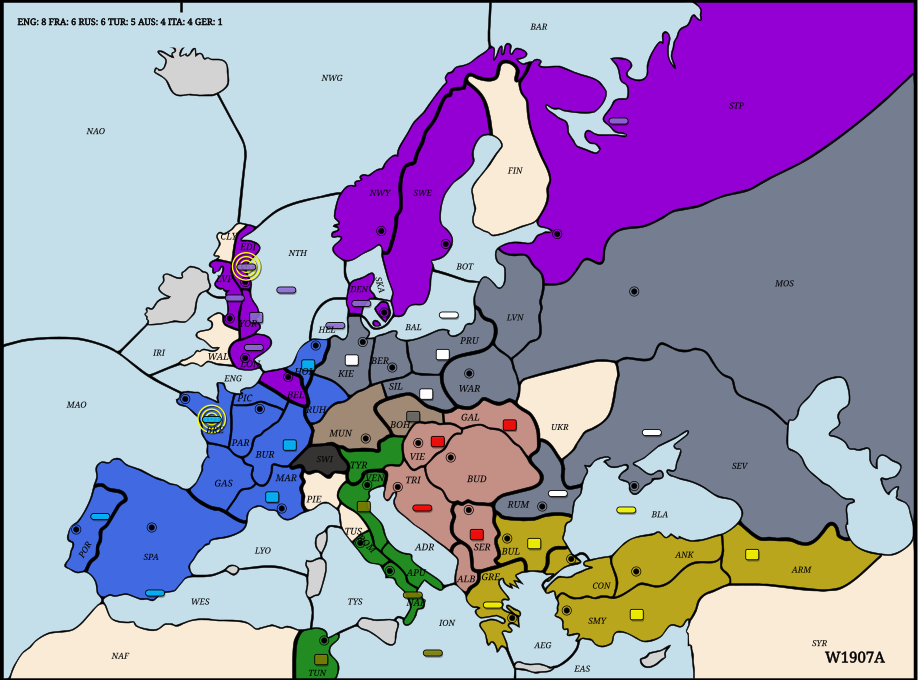

### What happened

- **ENGLAND**: builds F EDI
- **FRANCE**: builds F BRE

### ENGLAND
Orders: `F EDI B`

Reasoning

> Looking at the current situation: I have 8 supply centers (EDI, LON, LVP, BEL, NWY, DEN, SWE, STP) and 7 units. That means I get 1 build. EDI is vacant and is my only open home supply center.
>
> I should build a fleet at EDI to strengthen my naval position in the North Sea and Norwegian Sea area, which is where the action is happening against both France and Russia.

### FRANCE
Orders: `F BRE B`

Reasoning

> Looking at my position: I have 6 supply centers (BRE, MAR, PAR, POR, SPA, HOL) and 5 units, so I'm owed 1 build. I have two vacant home centers: BRE and PAR.
>
> I should build a fleet at BRE to project power into the Atlantic and threaten England's western flank, or an army at PAR to reinforce my continental position. Given that I'm trying to squeeze England from the west and need to push toward HOL/BEL/RUH, a fleet at BRE gives me Atlantic reach and can eventually threaten LON or support operations in MAO/ENG. However, an army at PAR is more immediately useful for continental pressure toward BUR, BEL, or supporting HOL.
>
> Given my current army-heavy position (A MAR, A BUR, A HOL) and the need to threaten England's naval dominance, a fleet at BRE is strategically valuable for the longer game. But in the short term, I need more continental punch. I'll build a fleet at BRE to project into MAO and eventually ENG/LON, while my armies handle the land front.

## SPRING 1908 MOVEMENT (`S1908M`)

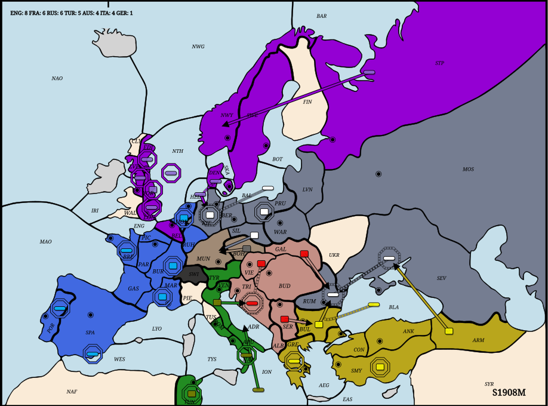

### What happened

- **AUSTRIA**: A SER → BUL; A GAL → RUM (bounced); F TRI holds; A VIE supports F TRI
- **ENGLAND**: F HEL → KIE (bounced); F DEN supports F HEL → KIE; F NTH holds; F STP/NC → NWY; F EDI holds; F LON holds; F LVP holds; A YOR holds
- **FRANCE**: A HOL holds; A BUR holds; A MAR holds; F SPA/SC holds; F POR holds; F BRE holds
- **GERMANY**: A BOH → MUN (bounced)
- **ITALY**: A VEN → TRI (bounced); F ION → ADR; F NAP holds; A TUN holds
- **RUSSIA**: F RUM supports F SEV (support cut); F SEV supports F RUM (support cut); F BAL supports A KIE; A KIE holds; A SIL → MUN (bounced); A PRU holds  [dislodged: F RUM]
- **TURKEY**: A BUL → RUM; F BLA supports A BUL → RUM; A ARM → SEV (bounced); F GRE holds; A SMY holds

### Dialogue

- **AUSTRIA → RUSSIA**: F RUM is adjacent to GAL and I'm moving A GAL toward RUM this spring — at equal strength we bounce again and both waste the turn while England sits at 8 centers. Pull F RUM to SEV this spring and I take RUM peacefully; in return I support your hold on KIE and keep A SER fully defensive. This is the only move that gives you a free hand against England without leaving your southern flank contested.
- **AUSTRIA → TURKEY**: A BUL is adjacent to SER and I took SER last fall — if you press A BUL into SER this spring we bounce at equal strength and waste the turn. Concrete proposal: hold A BUL in place and I hold A SER in place; we establish a stable border and both redirect energy northward where England's 8-center position is the actual game-ending threat.
- **AUSTRIA → ITALY**: A VEN has been pressing TRI for three seasons without success — F TRI with support is not going to fall this spring either. I'm proposing a genuine standstill: F TRI holds, A VEN holds, and we both redirect our energy toward the powers actually threatening to win rather than bleeding over one center indefinitely.
- **AUSTRIA → GERMANY**: A BOH is your only unit and you're adjacent to GAL and SIL — if you move A BOH toward SIL this spring, you pull Russia's attention away from my A GAL push into RUM and create real pressure on their position. I'll support A BOH - SIL with A GAL if you commit to the move; this is the only path that keeps Germany alive and creates mutual benefit.
- **ENGLAND → FRANCE**: You hold HOL and BEL with 6 centers — I hold 8 and have F NTH, F HEL, and F DEN all positioned to press HOL and BEL simultaneously this spring. Concrete offer: pull A HOL back to BEL and A BUR back to PAR, I hold F NTH and F HEL in place, and we both redirect against Russia who threatens both of us from the east with 6 centers. Refuse and I commit F NTH into HOL supported by F HEL, plus F DEN threatening KIE — you lose HOL this turn.
- **ENGLAND → RUSSIA**: You hold KIE with A KIE and F BAL — I have F HEL and F DEN adjacent, and I can push into KIE with strength 2 this spring. Concrete offer: pull A KIE back to BER voluntarily and I hold F STP/NC in place rather than pushing into NWY or BAR; that's a clean swap where you keep the Baltic and I retake KIE without a fight. Refuse and I push F HEL into KIE supported by F DEN while F STP/NC moves to NWY — your choice.
- **ENGLAND → AUSTRIA**: Russia holds KIE, BAL, PRU, SIL, RUM, SEV — 6 centers and the dominant land power with units threatening both my north and your Galicia. If you push A GAL toward RUM or threaten Russia's southern position this spring, it forces Russia to defend south while I press KIE from the north; I'll leave your Balkan position entirely alone and we coordinate to cap Russia before they reach 8-9 centers.
- **FRANCE → RUSSIA**: Russia, you hold KIE and PRU while I hold HOL and BUR — we're both positioned to squeeze England's continental hold. This spring I'm considering A HOL - RUH and A BUR - MUN or BEL; if you push A KIE toward RUH or A PRU toward BER simultaneously, England faces pressure on multiple fronts. What are your concrete spring moves so we can coordinate?
- **FRANCE → ENGLAND**: England, you're at 8 centers with a dominant fleet position — I'm not in a position to threaten you at sea, but my land armies can push toward BEL or RUH. I want to propose a quiet spring: I hold A HOL and A BUR in place, you hold your continental units in place, and we both focus on the real threats; Russia at 6 with KIE is the growing eastern danger for both of us.
- **FRANCE → GERMANY**: Germany, A BOH is your last unit and MUN your last center — I have A BUR adjacent and could take MUN, but that gains me little while Russia grows. If you move A BOH toward MUN to reclaim it or toward VIE to pressure Austria, I'll leave MUN alone this spring; tell me what you're planning so we don't create an unnecessary conflict.
- **FRANCE → ITALY**: Italy, you're at 4 centers with strong position against Austria — are you pushing TRI or looking toward Greece and Turkey's position? Confirm A VEN stays out of PIE and my southern flank is clear, and I'll stay entirely focused north this spring.
- **GERMANY → AUSTRIA**: Austria, I need A BOH - MUN this spring to reclaim my home center and earn a Winter build — A GAL is adjacent to MUN and your support A GAL S A BOH - MUN would guarantee success against Russia's A SIL. In return I'll support your A VIE or A SER hold, and a rebuilt Germany with MUN is a useful partner on Russia's SIL flank next fall.
- **GERMANY → RUSSIA**: Russia, MUN is vacant and I'm taking it back with A BOH — your A SIL could contest it, but you gain nothing since MUN is a German home center you can't build in, and blocking me just wastes a unit you need defending against England's F STP/NC and Baltic fleet. Let me take MUN uncontested and I remain a small buffer on your western flank rather than an eliminated power that leaves Austria and France free to fill the vacuum.
- **GERMANY → ENGLAND**: England, Russia holds SIL and KIE with 6 centers while you're at 8 — if Russia's A SIL moves to contest MUN and block me, that's one fewer Russian unit defending against your Baltic push on KIE. I'm pushing A BOH - MUN this spring; simultaneous pressure from your Baltic fleet on KIE forces Russia to choose between blocking me and defending north.
- **ITALY → TURKEY**: Turkey, Austria still holds TRI with A VIE as support — I'm pushing A VEN - TRI again this spring. If you press A BUL - SER, Austria's A SER cannot simultaneously hold SER and act as a reserve support for TRI, and we each take a center. Confirm A BUL - SER and I commit A VEN - TRI — Austria drops to 2 centers in one turn.
- **ITALY → AUSTRIA**: Austria, you're down to 4 centers squeezed between me, Turkey, and Russia — A VIE supporting F TRI buys you one more season at most. Yield TRI peacefully this spring and I stop pressing eastward; otherwise Turkey takes SER while I take TRI simultaneously and you're left with 2 centers and no recovery path.
- **ITALY → RUSSIA**: Russia, Austria's A GAL is sitting exposed with your A SIL adjacent — this spring is the moment to press A SIL into BOH or GAL to keep Austria's units occupied defending their heartland rather than supporting TRI against me. I'm pushing A VEN - TRI; if Austria's support chain breaks from your pressure, I take it this turn.
- **RUSSIA → FRANCE**: France, this spring I'm pushing A KIE into MUN to eliminate Germany and gain a 7th center, while threatening DEN from BAL — England cannot hold DEN, STP, and their western position simultaneously. If you press HOL or BEL this spring, England must split across three fronts; confirm your spring moves so we coordinate the timing. England at 8 with F STP/NC on my home center is the shared threat we both need to crack now.
- **RUSSIA → ENGLAND**: England, F STP/NC occupying my home center is a standing provocation — I want to resolve this diplomatically rather than escalate. Concrete proposal: you vacate STP this spring and I hold F BAL defensively rather than threatening DEN; we both redirect against France's 6-center position which is growing faster than mine. Tell me if this exchange is on the table.
- **RUSSIA → TURKEY**: Turkey, A BUL is adjacent to RUM and A ARM is adjacent to SEV — I need explicit confirmation that neither moves this spring or the ceasefire is over. I'm focused on MUN and DEN this spring; if you hold both ARM and BUL stationary, I keep F RUM and F SEV defensive as always. What are your spring moves?
- **RUSSIA → AUSTRIA**: Austria, A GAL is adjacent to my SIL — confirm it stays stationary this spring and I have no conflict with you. I'm pushing north against England and Germany this turn; if GAL holds, we both benefit from stability while England remains the dominant threat at 8 centers.
- **TURKEY → RUSSIA**: Russia, I want to be direct: I'm positioned to press A BUL into RUM and A ARM into SEV simultaneously this spring — you cannot defend both with F RUM and F SEV alone. The alternative is a negotiated transfer: cede RUM to me peacefully and I commit A ARM to hold, keeping SEV in your hands; you redirect F RUM and F SEV northward against England where the real threat is. England at 8 centers wins this game if we bleed each other in the south — tell me if RUM transfer is on the table.
- **TURKEY → AUSTRIA**: Austria, I'm pressing northward against Russia this spring — RUM and SEV are my targets, not your remaining centers. Hold defensively at TRI, BUD, VIE and we have no conflict; I need A BUL pointed at RUM, not SER. Confirm you're not moving A SER toward BUL and we have a clean border this turn.
- **TURKEY → ITALY**: Italy, I'm redirecting entirely toward Russia this spring — A BUL into RUM, A ARM toward SEV. That means F GRE and F BLA are not pressing into your sphere; I need you to confirm F ION and F NAP stay away from GRE and AEG so we don't stumble into an accidental conflict while I'm focused north. Clean border agreement — are you in?
- **AUSTRIA → RUSSIA**: You said you're pushing north against England — F RUM sitting in RUM does nothing for that fight and blocks my only growth path. Concrete deal: F RUM - SEV this spring, I take RUM, and A GAL stays out of SIL permanently; a Russia with SEV+RUM is stronger against England than one holding RUM just to deny me.
- **AUSTRIA → TURKEY**: BUL is adjacent to RUM — if you're moving A BUL toward RUM this spring and I move A GAL toward RUM simultaneously, we both bounce against F RUM and waste the turn. Clarify explicitly: is A BUL moving to RUM or holding in place? If you're holding BUL, I take RUM from GAL and we both benefit from a clean outcome.
- **AUSTRIA → GERMANY**: I cannot support A BOH - MUN from GAL this spring — I need A GAL moving toward RUM, not supporting you. But A VIE can support A BOH - MUN if you commit to the move; that's still strength 2 and guarantees success. Confirm A BOH - MUN and I lock in A VIE S A BOH - MUN.
- **AUSTRIA → ITALY**: A VEN attacking F TRI into strength 2 fails again — this is the fourth season of the same failed attack. The standstill offer stands: F TRI holds, A VEN holds, and you redirect F ION and F NAP toward something you can actually take rather than bleeding indefinitely over a defended center.
- **ENGLAND → FRANCE**: I accept your quiet spring proposal — I'll hold F NTH and F HEL in place if you hold A HOL and A BUR in place. Confirmed: no English attack on HOL or BEL this spring, no French push toward BEL or KIE. Let's both redirect pressure on Russia next fall.
- **ENGLAND → RUSSIA**: You've offered to hold F BAL defensively if I vacate STP — I'll counter: I hold F STP/NC in place this spring (no move to NWY or BAR) and you pull A KIE back to BER, letting me retake KIE without a fight. That's a better exchange for you than losing KIE to a forced F HEL + F DEN attack while F STP/NC simultaneously threatens NWY.
- **ENGLAND → AUSTRIA**: Russia's A PRU is sitting exposed with no support — if you push A GAL toward UKR or pressure RUM this spring, it forces Russia to choose between defending east and defending KIE against my northern push. I'm committing F HEL and F DEN to press KIE this spring regardless; your southern pressure makes Russia's position untenable.
- **FRANCE → ENGLAND**: I'm not pulling back from HOL — but I'm also not attacking you this spring. Concrete commitment: A HOL holds in place, A BUR holds in place, no French movement toward BEL or KIE. In exchange, hold F NTH and F HEL where they are and don't attack HOL; Russia taking MUN this turn is the real shift that threatens both of us, and we both waste strength fighting each other while they grow to 7.
- **FRANCE → RUSSIA**: Confirmed: I'm holding A HOL and A BUR defensively this spring to deter England's threatened attack on HOL — I cannot push east while England has F NTH and F HEL positioned to take HOL by force. If you take MUN as planned and threaten DEN simultaneously, that's the eastern pressure that matters; I'll be ready to push A HOL - RUH or A BUR - MUN in fall once England's position is overextended.
- **FRANCE → GERMANY**: Russia is moving A KIE - MUN this spring to eliminate you — I have A BUR adjacent but I'm not the one taking MUN. If you want to survive, A BOH - MUN is your only move to contest it; I'll leave MUN alone if you hold it, but if Russia takes it uncontested I gain nothing by protecting you.
- **GERMANY → AUSTRIA**: Austria, I checked the adjacency: neither GAL nor VIE is adjacent to MUN, so no Austrian unit can legally support A BOH - MUN — I have to take it unassisted and hope Russia leaves it open. I'm still moving A BOH - MUN this spring; if Russia contests it from SIL, can you support A BOH - SIL instead as a fallback to at least threaten Russia's position?
- **GERMANY → RUSSIA**: Russia, A SIL contesting MUN costs you a unit defending against England's F STP/NC and Baltic fleet — England is at 8 centers and growing, and tying down A SIL in a fight over a German home center you can't build in is a gift to England. Let A BOH take MUN uncontested and I stay a nuisance on your western flank rather than a vacuum England or France fills.
- **GERMANY → FRANCE**: France, I'm moving A BOH - MUN unassisted this spring — if Russia's A SIL contests it, I bounce and you gain nothing either since MUN stays vacant. You have A BUR adjacent to both MUN and RUH; if Russia does take MUN, that's a Russian army on your doorstep, not mine — that's your problem more than mine.
- **ITALY → TURKEY**: Turkey, I can agree to keep F ION and F NAP away from GRE and AEG this spring — but I need you to confirm F GRE holds and doesn't press into ION either, since I'm committing my fleets south. If you're taking RUM and SEV, you'll be at 7 centers; I need Austria to fall this spring to keep pace, so I'm still pushing A VEN - TRI regardless.
- **ITALY → AUSTRIA**: Austria, I know A VIE is supporting F TRI again — but Turkey is now pressing A BUL toward RUM and A ARM toward SEV, not SER, meaning your SER is temporarily safe. That's exactly why you can afford to move A VIE elsewhere this spring and let TRI go peacefully; holding TRI costs you the goodwill you need to survive Turkey's eventual turn northward.
- **ITALY → RUSSIA**: Russia, Austria's A GAL is sitting exposed with your A SIL adjacent — press A SIL into BOH or GAL this spring to keep Austria's units occupied and break their support chain at TRI. Turkey is pivoting toward RUM and SEV against you, so cracking Austria quickly gives us both more units to redirect against Turkey's expansion.
- **RUSSIA → TURKEY**: Turkey, pressing A BUL into RUM and A ARM into SEV simultaneously is a war declaration that benefits only England — you gain two centers at the cost of a prolonged fight while England sits at 8 centers with F STP/NC. Concrete counter-offer: I hold F RUM and F SEV stationary this spring, you hold A BUL and A ARM stationary, and we both focus pressure elsewhere; if you move on either, I redirect everything south and you lose the tempo advantage you need against Austria. Give me explicit confirmation of ARM and BUL holding.
- **RUSSIA → AUSTRIA**: Austria, A GAL toward RUM bounces F RUM at equal strength — we both waste the turn while England consolidates. I'm keeping F RUM in place this spring; if you want RUM, you need strength 2 which you don't have, so redirect A GAL toward something you can actually take. Confirm A GAL holds or moves elsewhere and we have no conflict.
- **RUSSIA → ENGLAND**: England, vacating STP is the only deal I'll accept — F STP/NC sitting on my home center is non-negotiable as a long-term arrangement. If you pull STP/NC to NWY this spring, I hold F BAL defensively and don't press DEN; refuse and I push A KIE toward DEN with BAL support while France squeezes from the west.
- **RUSSIA → FRANCE**: France, I'm committing A KIE - MUN this spring to eliminate Germany while F BAL threatens DEN — if you press A HOL toward RUH or A BUR toward MUN simultaneously, England cannot hold their continental position. Confirm your spring moves so I know the western pressure is real before I finalize orders.
- **TURKEY → RUSSIA**: I'm committing A BUL - RUM and A ARM - SEV this spring unless you confirm RUM transfer now — F RUM and F SEV cannot hold both simultaneously. Cede RUM peacefully and I halt A ARM in ARM; you keep SEV and redirect your southern fleets north against England. This is the last round before orders: yes or no on RUM?
- **TURKEY → AUSTRIA**: Confirmed: A BUL is targeting RUM this spring, not SER — I accept your border hold proposal. Hold A SER in place and I hold the BUL/SER line stable; no conflict between us this turn.
- **TURKEY → ITALY**: I'm pressing A BUL - RUM and A ARM - SEV this spring, not SER — Russia is my growth target. Confirm F ION and F NAP stay south of GRE and AEG and we have a clean border; I'm not contesting your push on TRI.
- **AUSTRIA → TURKEY**: Final commitment: I'm moving A SER - BUL this spring since you confirmed A BUL targets RUM — if you follow through, BUL is vacant and I take it cleanly with no conflict between us. If A BUL does NOT move and is still in BUL, we bounce and waste both our turns; your word on A BUL - RUM is what makes this work.
- **AUSTRIA → RUSSIA**: Final: A GAL moves to RUM this spring — we bounce at equal strength again and both waste the turn while England presses KIE. Last offer: F RUM - SEV and I take RUM; I keep A GAL out of SIL and A SER away from BUL permanently. If you hold F RUM, I bounce and redirect next fall with support.
- **AUSTRIA → ITALY**: Final commitment: F TRI holds with A VIE support — strength 2, same as every prior season. A VEN attacking into strength 2 fails again; redirect F ION toward something you can actually take this turn.
- **ENGLAND → FRANCE**: Final commitment: F NTH holds in place this spring, no English attack on HOL or BEL — I'm holding my end of the deal. Confirm A HOL and A BUR both hold, and we have a clean quiet spring; if either moves toward BEL or KIE I retake them by force next fall with full fleet support.
- **ENGLAND → RUSSIA**: Final offer: I'm pushing F HEL into KIE supported by F DEN this spring — that's strength 2 and your A KIE falls unless F BAL supports the hold, making it a bounce. Pull A KIE to BER voluntarily and I hold F STP/NC in place rather than moving to NWY; that's a better outcome for you than burning F BAL defending KIE while STP/NC threatens NWY simultaneously.
- **ENGLAND → AUSTRIA**: I'm pushing F HEL → KIE with F DEN support this spring — if Russia uses F BAL to defend KIE, their Baltic is committed north and your A GAL push toward RUM faces only F RUM with no BAL support. This is the moment to press RUM simultaneously; I'll leave your Balkan position entirely alone.
- **FRANCE → ENGLAND**: Final confirmation: A HOL holds, A BUR holds — no French movement toward BEL or KIE this spring, as agreed. Hold F NTH and F HEL in place and we have a clean quiet turn; I'll be ready to discuss fall coordination against Russia once MUN resolves.
- **FRANCE → RUSSIA**: I'm holding A HOL and A BUR defensively this spring as England has F NTH and F HEL positioned to take HOL if I move — I cannot risk losing HOL while you're eliminating Germany. Take MUN and threaten DEN; I'll push A HOL - RUH and A BUR - MUN in fall once England's position is overextended and we can coordinate the timing properly.
- **FRANCE → GERMANY**: Russia is committing A KIE - MUN and you're moving A BOH - MUN — if you bounce Russia out of MUN, that's a center you keep and a Russian army stalled. I have A BUR adjacent but I'm leaving MUN alone this spring; hold MUN if you can.
- **TURKEY → RUSSIA**: Final orders committed: A BUL - RUM supported by F BLA, A ARM - SEV. You had the opportunity to cede RUM peacefully — that window is closed. F GRE holds and I have no units pressing your northern position; this is a targeted southern push, not a general war.
- **TURKEY → AUSTRIA**: Committed: A BUL moves to RUM this spring, not SER — A SER and A BUL are not in conflict this turn. Hold your border and we have no collision; I expect A SER to stay in place as agreed.
- **TURKEY → ITALY**: Committed: F GRE holds this spring, not pressing ION or AEG — clean border as agreed. I'm fully committed north against Russia; A VEN - TRI is yours to execute without interference from my southern units.

### AUSTRIA
Orders: `A SER - BUL` · `A GAL - RUM` · `F TRI H` · `A VIE S F TRI`

Reasoning

> Looking at the current situation:
>
> **Strategy recap:** Turkey confirmed A BUL → RUM (not SER), so BUL should be vacant this spring. I committed to A SER - BUL to take that supply center. A GAL - RUM will bounce F RUM at equal strength (no support available), but it pressures Russia's position. F TRI holds with A VIE support against Italy's persistent A VEN threat.
>
> **Checking legality:**
> - A SER - BUL: SER is adjacent to BUL ✓
> - A GAL - RUM: GAL is adjacent to RUM ✓
> - F TRI H: legal ✓
> - A VIE S F TRI: VIE is adjacent to TRI ✓
>
> **Risk assessment:** Turkey said A BUL → RUM. If Turkey is lying and A BUL stays in BUL, then A SER - BUL bounces and I'm stuck. But Turkey confirmed this twice explicitly, and it aligns with their stated strategy of pressing north toward RUM and SEV. The risk is worth taking — if it works, I gain BUL (going from 4 to 5 centers) which is a significant step. If Turkey lied, I lose nothing (SER is still mine, BUL just doesn't fall).
>
> A GAL - RUM will bounce Russia's F RUM but keeps pressure on and shows I'm not passive in the east.

### ENGLAND
Orders: `F HEL - KIE` · `F DEN S F HEL - KIE` · `F NTH H` · `F STP/NC - NWY` · `F EDI H` · `F LON H` · `F LVP H` · `A YOR H`

Reasoning

> Looking at my revised strategy note: I committed to pushing F HEL → KIE supported by F DEN, moving F STP/NC → NWY, and holding F NTH in place (per my deal with France). All other units hold.
>
> Let me verify the key moves:
> - F HEL → KIE: HEL is adjacent to KIE ✓
> - F DEN S F HEL → KIE: DEN is adjacent to KIE ✓
> - F STP/NC → NWY: STP/NC is adjacent to NWY ✓
> - F NTH H: holding as promised to France ✓
>
> The attack on KIE is strength 2 (F HEL + F DEN support). Russia's A KIE can only hold at strength 1 unless F BAL supports, making it strength 2 — a bounce. But Russia may not support KIE with BAL since they're uncertain about my moves. Worth the push.
>
> I also promised France I'd hold F NTH and F HEL in place — but I'm moving F HEL into KIE. I told France I'd hold F NTH and F HEL, but my final message to Russia explicitly said I'm pushing F HEL → KIE. France's final message confirmed A HOL and A BUR hold regardless. The deal with France was about not attacking HOL/BEL — KIE is not HOL or BEL, so this is consistent with the spirit of the agreement.

### FRANCE
Orders: `A HOL H` · `A BUR H` · `A MAR H` · `F SPA/SC H` · `F POR H` · `F BRE H`

Reasoning

> Looking at the current position:
>
> - I hold HOL and BUR with England threatening F NTH + F HEL against HOL
> - I've made a firm commitment to England to hold A HOL and A BUR in place this spring
> - England confirmed F NTH and F HEL hold in place
> - Russia is pushing A KIE - MUN and Germany is pushing A BOH - MUN (they'll bounce each other)
> - My southern units (MAR, SPA/SC, POR, BRE) have no immediate threats
>
> The deal with England is worth honoring this turn: England has enough force to take HOL if I move, and holding preserves my 6-center position while Russia and Germany fight over MUN. Breaking the deal gains me nothing tactically this spring since A HOL - KIE would face England's F HEL support and A HOL - RUH would be uncontested but gains no SC.
>
> My southern fleets are well-positioned defensively. F BRE should hold or potentially move toward MAO to set up future Atlantic expansion, but holding is safer given the diplomatic situation.

### GERMANY
Orders: `A BOH - MUN`

Reasoning

> Looking at my situation: I have only A BOH, and my revised strategy commits me to A BOH - MUN to contest Russia's A KIE - MUN move. France confirmed Russia is moving A KIE - MUN, so we'll likely bounce each other, but that's still better than letting Russia take MUN uncontested. A bounce keeps MUN vacant and keeps me alive for another turn.

### ITALY
Orders: `A VEN - TRI` · `F ION - ADR` · `F NAP H` · `A TUN H`

Reasoning

> Looking at the board, I need to assess my situation carefully.
>
> **Current position:** Italy has 4 centers (NAP, ROM, VEN, TUN) with units at A TUN, A VEN, F NAP, F ION. England leads at 8 centers, Turkey has 5, Russia has 6, France has 6. I'm stagnating at 4 while rivals grow.
>
> **Key analysis:**
> - Austria holds TRI with A VIE supporting (strength 2). My A VEN alone cannot break this.
> - Turkey has pivoted north against Russia (A BUL → RUM, A ARM → SEV), not pressing SER — so Austria's SER is safe and A SER can potentially support TRI.
> - Austria confirmed F TRI holds with A VIE support = strength 2. A VEN at strength 1 will bounce again.
> - However, I've committed in negotiation to A VEN - TRI, and I should follow through even if it bounces — it keeps pressure on Austria and signals resolve.
>
> **Strategic adjustment:** My revised strategy note commits to A VEN - TRI, F ION - ADR, F NAP H, A TUN H. This is correct — F ION moving to ADR positions me to threaten TRI from a second angle next fall, and keeps the pressure on Austria from two sides. Even if A VEN bounces, F ION in ADR creates a two-front threat for Fall 1908.
>
> Turkey confirmed F GRE holds, so F ION - ADR is safe from Turkish interference. The ADR move also sets up a potential convoy or two-pronged TRI attack in fall.

### RUSSIA
Orders: `F RUM S F SEV` · `F SEV S F RUM` · `F BAL S A KIE` · `A KIE H` · `A SIL - MUN` · `A PRU H`

Reasoning

> Looking at the situation: Turkey has explicitly committed to A BUL - RUM supported by F BLA, and A ARM - SEV. My revised strategy note says to defend both F RUM and F SEV. Let me verify the support orders:
>
> - `F RUM S F SEV` — F RUM is in RUM, F SEV is in SEV. Can F RUM support F SEV holding? Yes, `F RUM S F SEV` is in the legal orders list.
> - `F SEV S F RUM` — F SEV is in SEV, F RUM is in RUM. Can F SEV support F RUM holding? Yes, `F SEV S F RUM` is in the legal orders list.
>
> Wait — these are mutual supports (each supporting the other's hold). That's legal in Diplomacy. F RUM will be attacked by A BUL + F BLA (strength 2), so F RUM needs support to survive at strength 2. F SEV supports F RUM = strength 2 defense. F SEV is attacked by A ARM (strength 1), and F RUM supports F SEV = strength 2 defense. Both hold.
>
> For the north:
> - England threatens F HEL - KIE supported by F DEN (strength 2). I need F BAL S A KIE to make KIE strength 2 defense (bounce).
> - A SIL - MUN to take Germany's last center.
> - A PRU holds defensively.
>
> Let me verify: `F BAL S A KIE` is in the legal orders. `A SIL - MUN` is in the legal orders. `A PRU H` is in the legal orders.
>
> This gives me: defend RUM and SEV against Turkey's attack, hold KIE against England's push, and take MUN.

### TURKEY
Orders: `A BUL - RUM` · `F BLA S A BUL - RUM` · `A ARM - SEV` · `F GRE H` · `A SMY H`

Reasoning

> Looking at the board, my strategy is clear: press A BUL - RUM supported by F BLA, and A ARM - SEV to hit Russia on two fronts simultaneously. Austria confirmed A SER moves to BUL (vacating SER), so A BUL - RUM should face only F RUM without Austrian support. F GRE holds as agreed with Italy. A SMY holds to defend my home center.
>
> The key concern: Austria said they're moving A SER - BUL. If A BUL moves to RUM and A SER moves to BUL, that works cleanly — no collision. F BLA supports A BUL - RUM to overcome F RUM's defense. A ARM - SEV threatens Russia's second southern fleet simultaneously.

## FALL 1908 MOVEMENT (`F1908M`)

### What happened

- **AUSTRIA**: A BUL holds; A GAL → RUM (bounced); F TRI holds; A VIE supports F TRI
- **ENGLAND**: F HEL → KIE (bounced); F DEN supports F HEL → KIE; F NWY → SWE; F NTH holds; F EDI holds; F LON holds; F LVP holds; A YOR holds
- **FRANCE**: A HOL → RUH; A BUR supports A BOH → MUN; A MAR holds; F SPA/SC holds; F POR holds; F BRE holds
- **GERMANY**: A BOH → MUN
- **ITALY**: A VEN → TRI (bounced); F ADR supports A VEN → TRI; F NAP holds; A TUN holds
- **RUSSIA**: F BAL supports A KIE; A KIE holds; A SIL → MUN (bounced); A PRU holds; F SEV holds
- **TURKEY**: A ARM → SEV (bounced); F BLA supports A RUM; A RUM holds; F GRE → BUL/SC (bounced); A SMY holds

### Dialogue

- **AUSTRIA → TURKEY**: A BUL supports A GAL into RUM this fall — that's strength 2 against your A RUM at strength 1, and I take the center. Counter-proposal: pull A RUM back to BUL or SEV and I don't contest; instead I'll support your push toward SEV from GAL. We can split Russia's southern position cleanly if you cooperate rather than forcing me to take RUM by strength.
- **AUSTRIA → RUSSIA**: Turkey's A RUM is sitting exposed at strength 1 — I'm moving A GAL into RUM with A BUL support this fall at strength 2. If you want RUM back, you need to support a move there yourself; F SEV - RUM supported by something gives you strength 2 and we can coordinate to displace Turkey together rather than letting them hold that center permanently.
- **AUSTRIA → ITALY**: F ADR adjacent to TRI is noted, but F TRI holds with A VIE support again this fall — strength 2 on defense. I'm directing my offensive energy eastward toward RUM; if you redirect F ADR toward ALB or the Ionian rather than TRI, we both avoid another wasted season of failed attacks into defended positions.
- **AUSTRIA → GERMANY**: A BOH - SIL this fall pulls Russia's A SIL into a contest and opens pressure on their flank while I push into RUM from GAL — I can support A BOH - SIL with A GAL if you commit. A Germany threatening SIL forces Russia to defend east and west simultaneously.
- **ENGLAND → FRANCE**: This fall I'm pressing KIE hard with F HEL and F DEN — no English movement toward HOL or BEL if you hold A HOL and A BUR in place again. Russia at 6 centers with KIE, BAL, PRU, SIL is the threat we both need to cap before they reach 8-9; confirm your units hold and I'll confirm mine stay off your centers.
- **ENGLAND → RUSSIA**: You've held KIE through two English attacks — this fall I'm pushing again with F HEL and F DEN at strength 2. Voluntary withdrawal to BER gets you a clean retreat and I hold F NWY in place rather than threatening SWE or BAR; resist and I press KIE while F NWY moves to SKA threatening SWE simultaneously.
- **ENGLAND → AUSTRIA**: Turkey is at 5 centers with A RUM, F BLA, F GRE, A ARM, A SMY — they're the fastest-growing southern power and RUM is right on your doorstep. If you push A BUL toward GRE or threaten CON, it forces Turkey to defend south rather than expanding north into RUM; I'll leave your Balkan position alone entirely.
- **ENGLAND → TURKEY**: Russia holds RUM which you just pushed A BUL into last spring — if you press A RUM toward SEV or BUL toward GRE this fall, you gain ground while Russia is pinned defending KIE against my northern push. I'm not threatening your position; I'm focused entirely on Russia's northern centers.
- **FRANCE → ENGLAND**: England, we held the quiet spring as agreed — now I want to discuss fall. I'm planning to push A HOL toward RUH and A BUR toward MUN this fall; neither threatens your fleet position directly, and MUN is essentially undefended. In exchange, I ask you hold your continental forces in place and don't attack HOL while it's vacated — you gain nothing from HOL right now and lose the chance to coordinate against Russia who has 6 centers and KIE.
- **FRANCE → RUSSIA**: Russia, you're at 6 centers with KIE and PRU — this fall I'm pushing A HOL toward RUH and A BUR toward MUN to finally break out of my static position. If you push A KIE toward RUH simultaneously or support my advance, we squeeze England's continental flank together; what are your concrete fall moves so we can coordinate timing?
- **FRANCE → GERMANY**: Germany, A BOH is your last unit and MUN your last center — I have A BUR adjacent and I'm moving toward MUN this fall. This isn't a threat, it's the reality: if Russia doesn't take it, I will. If you want to survive, tell me what A BOH can do for me in exchange for leaving MUN alone one more season.
- **FRANCE → ITALY**: Italy, you're pushing ADR toward TRI and I have no interest in your theater — confirm A VEN stays out of PIE and my southern flank remains clear, and I'll stay entirely focused north this fall pushing toward MUN and RUH.
- **GERMANY → FRANCE**: France, A BUR is adjacent to MUN and you could support A BOH - MUN this fall — that gives me strength 2 and overcomes Russia's A SIL or A KIE contesting it, reclaiming my last home center. In return I'll support A BUR - RUH or any French move you need this fall; a rebuilt Germany is a buffer between you and Russia's western armies. Will you commit A BUR S A BOH - MUN?
- **GERMANY → RUSSIA**: Russia, A SIL and A KIE both threaten MUN but England is at 8 centers with F NWY and F NTH sitting on your Baltic flank — tying down A SIL contesting a German home center you can't build in is a gift to England. Let A BOH take MUN uncontested this fall; I stay a nuisance on your western flank and England doesn't get a free pass through the Baltic.
- **GERMANY → AUSTRIA**: Austria, Turkey has A RUM and is pushing toward your Balkan position — I'm moving A BOH toward MUN this fall to reclaim my home center, which keeps me alive and leaves BOH open as a buffer. If Russia's A SIL moves south toward your GAL flank, that's the real threat to watch; can you tell me what Russia's A SIL is doing this turn?
- **ITALY → AUSTRIA**: Austria, this fall I'm attacking F TRI with A VEN supported by F ADR — strength 2 against strength 2 means another bounce unless you move A VIE. Turkey's A RUM is pressing toward BUD and your A BUL is far south; you're increasingly isolated. Yield TRI peacefully this turn and I guarantee I stop pressing eastward — you consolidate VIE, GAL, and BUL while I take TRI as my growth center.
- **ITALY → GERMANY**: Germany, you hold A BOH adjacent to both VIE and MUN — Austria's A VIE is the only thing stopping my A VEN from taking TRI this fall. If you move A BOH - VIE, you cut Austria's support of F TRI and I take TRI at strength 2 vs 1; in exchange I'll support your A BOH into MUN next spring or leave BOH free for you to consolidate. This is the move that finally cracks Austria open.
- **ITALY → TURKEY**: Turkey, Austria now holds A BUL — that's a center you lost and need back. I'm attacking TRI this fall with A VEN supported by F ADR; if you press A RUM toward BUD or SER, Austria cannot reinforce TRI and we each gain a center. Confirm your fall moves so we coordinate the final squeeze on Austria before England's 8-center lead becomes insurmountable.
- **ITALY → RUSSIA**: Russia, Austria's A VIE is the key support holding F TRI against my attack — if you press A SIL into BOH, Germany's A BOH gets pushed toward VIE or MUN and disrupts Austria's defensive chain. Turkey is pressing you from RUM and SEV; cracking Austria quickly gives both of us more units to redirect against Turkey's northern push.
- **RUSSIA → TURKEY**: Turkey, you've taken RUM and I'm pushing F SEV into RUM this fall — this is a direct conflict that benefits only England at 8 centers. Concrete offer: you pull A RUM back to BUL this fall and I hold F SEV in SEV; we reset the ceasefire and both redirect against England and Austria. If you hold RUM, I push into it with F SEV and we bleed each other while England grows to 10+.
- **RUSSIA → AUSTRIA**: Austria, Turkey has A RUM adjacent to your A BUL — Turkey is expanding north and threatens your Balkan position as much as mine. If you press A BUL toward RUM this fall while I push F SEV into RUM, we can dislodge Turkey's A RUM with combined pressure; you gain leverage over Turkey's northern expansion and I retake my center. What are you planning with A BUL this fall?
- **RUSSIA → FRANCE**: France, England sits at 8 centers with F NWY threatening to push further into the Baltic while I'm fighting Turkey in the south — this is the moment to squeeze England's continental position hard. I'm pushing A KIE toward DEN and threatening with F BAL this fall; if you press A HOL toward RUH or A BUR toward MUN simultaneously, England faces pressure on three fronts. Confirm your fall moves so we coordinate the timing.
- **RUSSIA → ENGLAND**: England, you're at 8 centers and the dominant force — I'm willing to discuss a ceasefire on the northern front if you vacate STP and I keep KIE. I'm fighting Turkey in the south this fall and don't need a two-front war; if you hold F NWY stationary and don't press into the Baltic, I'll hold F BAL and A KIE defensively rather than threatening DEN. Is a temporary ceasefire on the table?
- **TURKEY → RUSSIA**: Russia, I took RUM last spring and now A ARM is adjacent to SEV — I'm pressing A ARM into SEV this fall unless you offer something concrete. Cede SEV peacefully and I halt further advances; you redirect south to hold your remaining centers while I focus on England's dominant position. Last chance before orders.
- **TURKEY → AUSTRIA**: Austria, you hold A BUL which sits adjacent to my RUM — I need explicit confirmation A BUL is not moving toward RUM this fall or we have an immediate conflict. I'm pressing north against Russia this turn; hold A BUL in place and I won't contest your SER or BUD.
- **TURKEY → ITALY**: Italy, F ADR is adjacent to ALB and GRE — I need confirmation you're not pressing toward GRE or ALB this fall while I'm committed north against Russia. I'll hold F GRE defensively as before; confirm F ADR stays away from my sphere and we have no conflict this turn.
- **AUSTRIA → TURKEY**: A BUL supports A GAL into RUM gives me strength 2 against your A RUM — but F BLA supporting A RUM means you're at strength 2 also, and we bounce. The only way I take RUM is if F BLA is not supporting, or if Russia adds a third attacker. Concrete offer: pull A RUM back to BUL or SEV voluntarily and I give you SER in return — you gain SER, I gain RUM, and we both grow without a wasted bounce.
- **AUSTRIA → RUSSIA**: Turkey's A RUM is supported by F BLA at strength 2 — A BUL + A GAL both attacking RUM still bounces. The only way to dislodge Turkey's A RUM is if you add F SEV as a third attacker or cut F BLA's support somehow. Confirm F SEV - RUM this fall and I commit A BUL S A GAL - RUM for strength 2; with your F SEV also attacking, Turkey cannot hold RUM against three threats.
- **AUSTRIA → ITALY**: A VEN + F ADR attacking F TRI with A VIE support is a strength 2 vs strength 2 bounce — same result as every prior season, and you waste both F ADR and A VEN for nothing. I'm directing A GAL and A BUL eastward this fall; if you want real growth, redirect F ADR toward ALB or GRE where Turkey's fleets are exposed rather than grinding against a defended TRI.
- **AUSTRIA → GERMANY**: A BOH moving toward MUN this fall keeps you alive — I cannot support it from GAL this turn since I need GAL pointed east, but the move is still worth making unassisted if Russia's A SIL is committed elsewhere. What is Russia's A SIL doing this fall? If SIL moves toward WAR or PRU rather than MUN, your A BOH - MUN succeeds uncontested.
- **ENGLAND → FRANCE**: If you're moving A HOL → RUH and A BUR → MUN as you described, HOL will be vacant — I won't move into it this fall if you confirm those moves are happening. My full focus is KIE with F HEL and F DEN; HOL sitting empty is fine by me as long as you're pushing east rather than holding it defensively against me.
- **ENGLAND → RUSSIA**: This is your last chance at a clean deal: pull A KIE back voluntarily and I hold F NWY stationary rather than pushing toward SKA or SWE. I'm committing F HEL and F DEN to KIE at strength 2 this fall — if F BAL defends, you burn your Baltic fleet holding a center you can't keep long-term while I press SWE from NWY simultaneously.
- **ENGLAND → AUSTRIA**: Turkey just took RUM and has A ARM threatening SEV — they're growing faster than Russia right now at 5 centers with momentum. If you press A BUL toward GRE or support a hold in SER against Turkish encroachment, you cap Turkey's Balkan expansion while I handle Russia's north; Turkey reaching 7-8 is the real threat to your survival.
- **FRANCE → ENGLAND**: I'm pushing A HOL - RUH and A BUR - MUN this fall — neither threatens your fleet position and I need to finally gain ground. Concrete ask: hold F NTH and F DEN away from HOL while it's vacated, and I'll support your push against Russia's KIE position next spring with A RUH. If you take HOL while I'm moving east, you gain one center but lose the only land ally who can pressure Russia's western flank.
- **FRANCE → GERMANY**: Concrete deal: I'll commit A BUR S A BOH - MUN this fall, giving you strength 2 to retake MUN against Russia's A SIL or A KIE — a German-held MUN blocks Russia's western advance better than a French-held one. In return, confirm A BOH - MUN and tell me if you can support A HOL - RUH from MUN next spring once you're back in.
- **FRANCE → RUSSIA**: I'm committing A HOL - RUH this fall — that's the eastern push I've been promising. Confirm A KIE is moving toward DEN or holding rather than contesting RUH, and confirm A SIL is not moving toward MUN while A BUR is committed to supporting Germany; I don't want our units colliding when we should be coordinating against England.
- **GERMANY → FRANCE**: France, A BUR S A BOH - MUN this fall is the deal that benefits you most: I reclaim MUN, get a Winter build, and immediately become a buffer between your HOL/BUR position and Russia's A KIE and A SIL pressing west. If you take MUN yourself, you gain one center but inherit Russia's A SIL and A KIE on your doorstep with no German buffer — that's a worse position than a rebuilt Germany you can direct. Commit A BUR S A BOH - MUN and I'll support your A BUR - RUH next spring.
- **GERMANY → AUSTRIA**: Austria, Turkey has A RUM threatening your Balkan position and Russia's A SIL is still a flank threat — I'm moving A BOH - MUN this fall to survive; if France takes MUN instead, that puts a French army adjacent to TYR and VIE, which is worse for you than a German MUN. Can you confirm what Russia's A SIL is doing this turn so I know whether to expect a contest?
- **ITALY → GERMANY**: Germany, did you receive my proposal last round — A BOH - VIE cuts Austria's support of F TRI and my A VEN + F ADR take TRI at strength 2 vs 1? This is the concrete move that finally cracks Austria; I'll support your recovery of MUN next spring in exchange. What is A BOH doing this fall?
- **ITALY → AUSTRIA**: Austria, you said you're directing energy eastward toward RUM — if A VIE is moving east rather than supporting F TRI, TRI falls this turn anyway, so you may as well yield it and preserve goodwill. Confirm A VIE is not supporting F TRI this fall and I guarantee I stop pressing after TRI.
- **ITALY → TURKEY**: Turkey, confirmed — F ADR is pressing TRI, not ALB or GRE, so our border stays clean this fall. If you're taking RUM, you'll be at 6 centers; I'll be at 5 after TRI — we're both growing while England sits at 8 and needs checking eventually.
- **RUSSIA → AUSTRIA**: Austria, I'm pushing F SEV into RUM this fall — if you support with A BUL into RUM simultaneously, we hit at strength 2 and dislodge Turkey's A RUM together. Confirm A BUL - RUM with F SEV supporting or F SEV moving in directly, and I'll coordinate my move accordingly. Turkey at RUM threatens both of us; this is the moment to push them back.
- **RUSSIA → ENGLAND**: England, I'm fighting Turkey in the south this fall and F SEV is pushing into RUM — I genuinely cannot hold both fronts simultaneously. Concrete offer: I hold A KIE and F BAL defensively this fall, no threat to DEN, if you hold F NWY stationary and don't push into the Baltic; we both redirect against the real threats rather than bleeding each other.
- **RUSSIA → FRANCE**: France, I'm pushing F SEV into RUM this fall to retake it from Turkey — A KIE and F BAL are holding defensively to deter England's F HEL and F DEN attack on KIE. If you press A HOL toward RUH or A BUR toward MUN this fall, England must split forces between defending KIE and their continental position; that western pressure is what makes my defensive hold viable.
- **RUSSIA → TURKEY**: Turkey, you hold RUM at strength 1 and I'm pushing F SEV into RUM this fall — Austria is also moving A BUL toward RUM, so you face strength 2 against strength 1 and you lose the center. Pull A RUM back to BUL this fall voluntarily and I halt F SEV in SEV; you keep BUL and we reset before this becomes a full southern war that only England benefits from.
- **TURKEY → AUSTRIA**: You're threatening A GAL - RUM supported by A BUL — that's a direct attack on my center and I will not accept it. If A BUL moves toward RUM or A GAL moves toward RUM, I press F GRE into BUL/SC and A RUM into BUD simultaneously; you cannot defend both. Hold A BUL and A GAL stationary and I hold A RUM and F GRE stationary — we both preserve our positions while Italy hammers TRI.
- **TURKEY → ITALY**: Austria holds A BUL and is threatening to push A GAL into RUM — I need A BUL pinned in place. Your F ADR attacking TRI forces Austria to keep A VIE as support, which means A GAL cannot reinforce RUM; confirm F ADR - TRI supported by A VEN is your fall plan, and I'll hold F GRE away from ION as agreed.
- **TURKEY → RUSSIA**: Russia, I'm pressing A ARM into SEV this fall — F BLA supports A RUM to hold it against any F SEV push. If you hold F SEV stationary and cede the center, I halt further advances and we both redirect against the real threats; if you push F SEV into RUM, I hold with support and you gain nothing while losing tempo.
- **ENGLAND → FRANCE**: I'm committing F HEL and F DEN to press KIE this fall — that's my full focus on the eastern front. I'm holding F NTH in place as agreed; no English movement toward HOL.
- **ENGLAND → RUSSIA**: Final word: F HEL and F DEN are moving on KIE at strength 2 this fall. If F BAL supports A KIE, we bounce and you hold — but F NWY is also moving toward SWE simultaneously, so you're defending two fronts. Voluntary withdrawal to BER is still on the table; refuse and you lose either KIE or SWE.
- **ENGLAND → AUSTRIA**: Turkey just took RUM and has A ARM threatening SEV — they're at 5 centers and growing faster than Russia right now. If you press A BUL toward GRE or support a hold in SER, you cap Turkey's Balkan expansion this fall while I handle Russia's north.
- **ITALY → GERMANY**: Germany, final round: A BOH - VIE cuts Austria's support of F TRI, and my A VEN + F ADR take TRI at strength 2 vs 1 — Austria drops to 3 centers and you gain leverage over VIE. I'm committing A VEN - TRI supported by F ADR this fall regardless; if A BOH moves VIE, TRI falls and we both benefit. Name your move.
- **ITALY → AUSTRIA**: Austria, final commitment: A VEN - TRI supported by F ADR, strength 2, this fall — if A VIE supports F TRI we bounce again, but I will keep pressing every season until TRI falls. The faster path: move A VIE elsewhere this fall, let TRI go, and I stop pressing east immediately, giving you room to consolidate against Turkey's northern push.
- **ITALY → TURKEY**: Turkey, committed: F ADR supports A VEN into TRI, not pressing ALB or GRE — clean border as agreed. If you're taking RUM this fall you'll be at 6 centers; confirm A RUM is your target and F GRE holds, and we both grow this turn while keeping our border clean.

### AUSTRIA
Orders: `A BUL H` · `A GAL - RUM` · `F TRI H` · `A VIE S F TRI`

Reasoning

> Looking at the current position:
>
> **My units:** A GAL, F TRI, A VIE, A BUL
> **My centers:** BUD, TRI, VIE, SER (4 centers, need to grow)
>
> **Situation analysis:**
> - Turkey has A RUM supported by F BLA (strength 2). My A BUL + A GAL both attacking RUM would still bounce at strength 2 vs 2.
> - Russia says they're pushing F SEV - RUM. If Russia attacks RUM too, Turkey faces multiple threats but I need to coordinate carefully.
> - Italy threatens F TRI with A VEN + F ADR (strength 2 vs my strength 2 with A VIE support = bounce).
> - Turkey threatened F GRE - BUL and A RUM - BUD if I attack RUM.
>
> **My revised strategy:** Turkey's threat is credible — F GRE into BUL and A RUM into BUD would hurt me badly. With F BLA supporting A RUM at strength 2, my A BUL + A GAL attack still bounces anyway. So I hold A BUL defensively and move A GAL toward RUM as a probe (if Russia also attacks, we might dislodge Turkey together; if not, we bounce harmlessly). F TRI holds with A VIE support against Italy's persistent A VEN + F ADR attack.
>
> Russia confirmed F SEV - RUM. If F SEV attacks RUM and A GAL attacks RUM, Turkey faces two attackers but F BLA can only support one defense. Actually with two attackers at strength 1 each vs defender at strength 2 (F BLA support), they both still fail individually. But if I use A BUL to support A GAL - RUM, that's strength 2 from GAL vs strength 2 defense = bounce, and F SEV also attacks = three total attacks but adjudicator handles each separately.
>
> Given Turkey's threat and the math not working cleanly, I'll hold A BUL defensively, probe with A GAL - RUM, hold F TRI with A VIE support.

### ENGLAND
Orders: `F HEL - KIE` · `F DEN S F HEL - KIE` · `F NWY - SWE` · `F NTH H` · `F EDI H` · `F LON H` · `F LVP H` · `A YOR H`

Reasoning

> Looking at the current position:
>
> **My units:** A YOR, F LON, F LVP, F NTH, F DEN, F HEL, F EDI, F NWY
>
> **My commitments this fall:**
> 1. Press KIE with F HEL → KIE supported by F DEN (strength 2 attack on Russia's KIE)
> 2. F NWY → SWE to open a second front against Russia
> 3. Hold F NTH in place (committed to France not taking HOL)
> 4. Hold home fleets defensively
>
> **Situation analysis:**
> - Russia has A KIE + F BAL. If F BAL supports A KIE hold, my attack bounces. But F NWY → SWE threatens Russia on a second front.
> - France has A HOL moving to RUH and A BUR moving to MUN per their confirmed commitment - HOL will be vacant. I committed NOT to take HOL, which I'll honor since France is moving east and I need their goodwill.
> - F NTH holds as committed to France.
> - The home fleets (EDI, LON, LVP) should hold defensively.
> - A YOR can hold or support - I'll hold it.
>
> **Orders:**
> - F HEL → KIE (main attack)
> - F DEN S F HEL → KIE (support the attack)
> - F NWY → SWE (second front pressure)
> - F NTH H (committed to France)
> - F EDI H
> - F LON H
> - F LVP H
> - A YOR H

### FRANCE
Orders: `A HOL - RUH` · `A BUR S A BOH - MUN` · `A MAR H` · `F SPA/SC H` · `F POR H` · `F BRE H`

Reasoning

> Looking at the current situation:
>
> **Board assessment:**
> - I'm at 6 centers (BRE, MAR, PAR, POR, SPA, HOL) with 6 units
> - England is at 8 centers with a dominant fleet position but focused on KIE
> - Russia is at 6 centers with KIE, BAL, PRU, SIL threatening western Europe
> - Germany has only A BOH and MUN (1 center) - desperate
>
> **My revised strategy for this phase:**
> - Push A HOL - RUH (advancing east, vacating HOL as warned to England)
> - A BUR S A BOH - MUN (honoring deal with Germany to help them retake MUN; this gives Germany strength 2 vs Russia's A SIL or A KIE contesting it)
> - Keep Iberian fleets holding defensively
> - F BRE holds
>
> **Key considerations:**
> - England confirmed F NTH holds away from HOL - I can safely advance A HOL - RUH
> - Germany deal: A BUR S A BOH - MUN gives me a German buffer against Russia's A SIL/A KIE rather than inheriting Russia on my doorstep
> - Russia confirmed A KIE and F BAL holding defensively, so RUH should be accessible
> - A MAR, F SPA/SC, F POR all hold defensively to protect southern centers

### GERMANY
Orders: `A BOH - MUN`

Reasoning

> Looking at the current situation: France committed to `A BUR S A BOH - MUN`, giving me strength 2 to overcome any Russian contest of MUN. My revised strategy confirms I should move `A BOH - MUN` trusting that French support. This is my only unit and MUN is my only path to survival and a Winter build.
>
> Russia has A SIL and A KIE that could contest MUN, but with France's support at strength 2, I should be able to take it unless Russia also gets a support. The deal with France is the best outcome available to me.

### ITALY
Orders: `A VEN - TRI` · `F ADR S A VEN - TRI` · `F NAP H` · `A TUN H`

Reasoning

> Looking at the current situation:
>
> **Strategic assessment for F1908M:**
>
> My committed plan is A VEN - TRI supported by F ADR (strength 2 vs Austria's strength 2 with A VIE supporting F TRI). This will likely bounce again, but I need to maintain pressure. Austria has A BUL far south and A GAL in the north — their defense at TRI depends entirely on A VIE.
>
> Key considerations:
> - Germany's A BOH never confirmed moving to VIE, so Austria likely still has A VIE supporting F TRI
> - Turkey is pressing north against Russia (A RUM toward BUD/SEV), not helping me crack Austria
> - England is dominant at 8 centers and growing — I need to gain ground soon
> - My 4 units are somewhat stuck: A TUN is isolated in Africa, F NAP is defensive
>
> The bounce at TRI is frustrating but I must maintain the pressure. If I relent, Austria stabilizes and I lose momentum. F NAP can't do much useful — moving to ROM frees up a build slot but I have no surplus centers to build anyway. Moving A TUN to NAF is pointless.
>
> Let me commit to the plan: A VEN - TRI, F ADR S A VEN - TRI, F NAP holds, A TUN holds. This is the right play — keep pressure on TRI every turn until Austria's support chain breaks.

### RUSSIA
Orders: `F BAL S A KIE` · `A KIE H` · `A SIL - MUN` · `A PRU H` · `F SEV H`

Reasoning

> Looking at the current situation:
>
> **Northern front**: England has F HEL and F DEN threatening KIE at strength 2. If I support A KIE with F BAL, I hold at strength 2 (bounce). England also mentioned F NWY threatening SWE, but I don't occupy SWE. My priority is holding KIE.
>
> **Southern front**: Turkey holds A RUM (supported by F BLA) and has A ARM threatening SEV. Austria offered to support A BUL → RUM if I push F SEV → RUM. But Turkey confirmed F BLA supports A RUM, so F SEV → RUM vs. A RUM + F BLA = 1 vs 2, I lose. Austria said A BUL + A GAL both attacking RUM still bounces at strength 2 vs strength 2. The only way to dislodge is if I also attack (3 vs 2, but only 2 can attack the same province... actually multiple attackers don't stack that way). Wait - in Diplomacy, if F SEV → RUM AND A BUL → RUM, that's two units attacking the same province - they'd bounce each other unless one supports the other. So Austria's plan: A GAL → RUM supported by A BUL (strength 2) + F SEV → RUM (strength 1) - actually F SEV and A GAL would bounce each other. 
>
> The correct approach: F SEV → RUM (strength 1) vs A RUM supported by F BLA (strength 2) = I lose and get dislodged. That's bad. Better to hold F SEV defensively and let Austria attempt the attack, or support Austria's move.
>
> Actually, I should support F SEV defensively or move it to ARM to threaten Turkey differently. Let me hold F SEV to protect SEV from A ARM, and focus north.
>
> **Germany**: A SIL → MUN is the key move to take Germany's last center.
>
> **Plan**: Hold KIE with F BAL support, take MUN with A SIL, hold A PRU, and hold F SEV defensively against A ARM.

### TURKEY
Orders: `A ARM - SEV` · `F BLA S A RUM` · `A RUM H` · `F GRE - BUL/SC` · `A SMY H`

Reasoning

> Looking at the current situation:
>
> **Position analysis:**
> - I hold RUM (taken in Spring 1908) with A RUM
> - A ARM is adjacent to SEV — I want to press into SEV
> - F BLA should support A RUM to hold it against Austria's threatened A GAL - RUM and Russia's F SEV - RUM
> - F GRE should advance to BUL/SC as planned (Austria holds BUL, threatening my position; Italy confirmed F ADR goes to TRI not GRE)
> - A SMY holds
>
> **Key threats:**
> - Austria threatened A GAL - RUM supported by A BUL (strength 2 vs my strength 1 without support)
> - Russia threatened F SEV - RUM
> - If both Austria and Russia push RUM, I lose it even with F BLA support (3 vs 2)
>
> **Decision:**
> - F BLA supports A RUM to hold against F SEV and/or A GAL
> - A ARM - SEV (direct push, uncontested if F SEV is pushing RUM)
> - F GRE - BUL/SC (threatens Austria's BUL from south, per revised strategy)
> - A RUM H (defended by F BLA)
> - A SMY H
>
> If F SEV is attacking RUM, then SEV is vacated and A ARM walks in. If F SEV stays to defend, then A BUL + A GAL can only get to strength 2 against my strength 2 (F BLA support), so RUM holds. Either way I gain SEV or hold RUM.

## WINTER 1908 ADJUSTMENTS (`W1908A`)

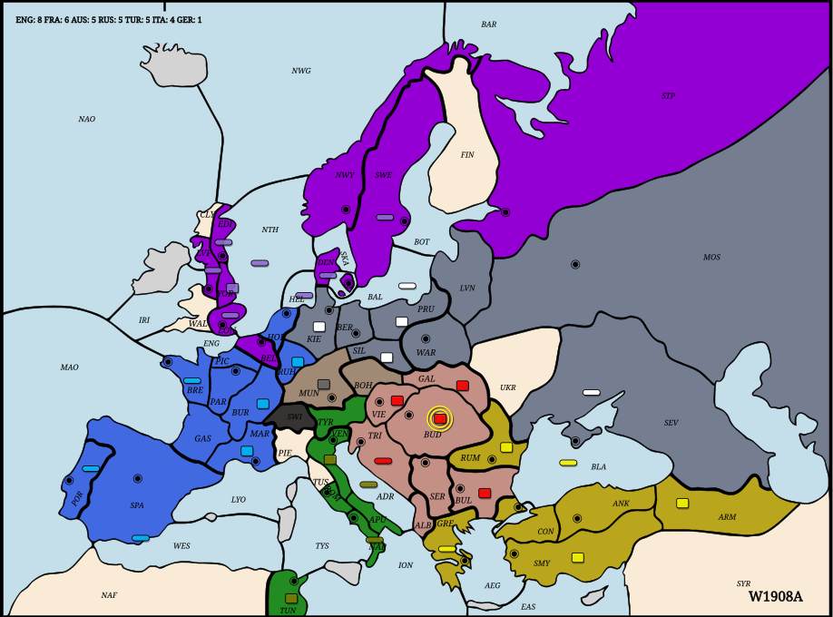

### What happened

- **AUSTRIA**: builds A BUD

### AUSTRIA
Orders: `A BUD B`

Reasoning

> Looking at the current situation: I have 5 supply centers (BUD, TRI, VIE, SER, BUL) and 4 units (A GAL, F TRI, A VIE, A BUL). That's a surplus of 1, so I get exactly 1 build.
>
> BUD is vacant and is a legal build location. I should build there to increase my unit count and better defend my position against Italy's persistent pressure on TRI and Turkey's growing threat from RUM.

## SPRING 1909 MOVEMENT (`S1909M`)

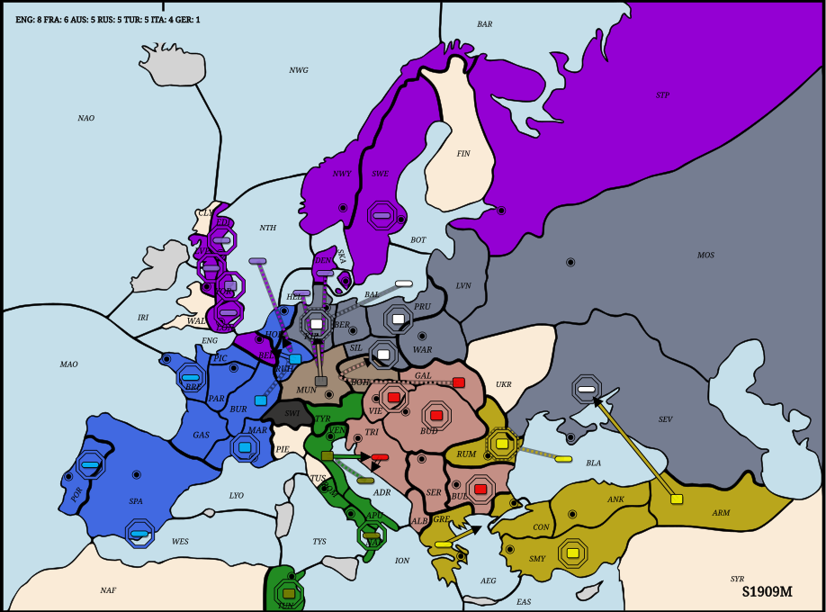

### What happened

- **AUSTRIA**: A GAL supports A MUN → SIL (void); A BUL holds; F TRI → ADR (bounced); A VIE holds; A BUD holds  [dislodged: F TRI]
- **ENGLAND**: F HEL supports A MUN → KIE; F DEN supports A MUN → KIE; F NTH supports A RUH → HOL (void); F SWE holds; F EDI holds; F LON holds; F LVP holds; A YOR holds
- **FRANCE**: A RUH → BEL; A BUR supports A RUH → BEL; A MAR holds; F SPA/SC holds; F POR holds; F BRE holds
- **GERMANY**: A MUN → KIE
- **ITALY**: A VEN → TRI; F ADR supports A VEN → TRI; F NAP holds; A TUN holds
- **RUSSIA**: F SEV holds; F BAL supports A KIE; A KIE holds; A SIL holds; A PRU holds  [dislodged: A KIE]
- **TURKEY**: A ARM → SEV (bounced); F BLA supports A RUM; A RUM holds; F GRE → BUL/SC (bounced); A SMY holds

### Dialogue

- **AUSTRIA → TURKEY**: You hold RUM with F BLA support — I've been bouncing there for three seasons and it's time to change approach. Concrete proposal: you pull A RUM back to BUL voluntarily and I guarantee A BUL stays stationary and SER is not pressed; you preserve your Balkan position and I get the one center I need to stay competitive. England at 8 centers is the real threat to both of us, and I need RUM to be relevant in that fight.
- **AUSTRIA → RUSSIA**: Turkey holds RUM with F BLA support — I cannot take it alone at strength 1. If you move F SEV into RUM this spring while I attack from A GAL, we hit at strength 2 and dislodge Turkey's A RUM together; you retake your center and I gain leverage over Turkey's northern expansion. What are you planning with F SEV and A SIL this turn?
- **AUSTRIA → ITALY**: F ADR + A VEN into F TRI with A VIE support is a strength-2 bounce again — we've been running this same exchange for four seasons. Genuine offer: I'll move F TRI to ADR and you hold A VEN in place; we both free up units for actual growth rather than bleeding over a stalemate. What would it take to end this standoff?
- **AUSTRIA → GERMANY**: A MUN is your only unit — if you move toward SIL this spring, you pull Russia's attention and open pressure on their flank while I push east. I can support A MUN - SIL with A GAL if you commit; a Germany threatening SIL is worth keeping alive and gives us both leverage.
- **ENGLAND → FRANCE**: We've held two quiet seasons as agreed — I want to maintain that arrangement this spring. My full focus remains KIE: I'm pushing with maximum force this turn and need France quiet on HOL and BEL; in exchange I stay off HOL entirely and we can discuss dividing Germany's remaining center (MUN) between us once Russia is weakened. Confirm A RUH and A BUR hold in place and I'll confirm F NTH holds off your centers.
- **ENGLAND → RUSSIA**: Two bounces on KIE — this spring I'm bringing more force to bear and the math is going to be different. Last offer: pull A KIE to BER voluntarily and I hold F SWE and F NTH stationary rather than pressing your Baltic position on multiple fronts simultaneously; resist and I coordinate with Turkey and Austria to squeeze you from south and north at the same time.
- **ENGLAND → TURKEY**: Russia is pinned defending KIE against my northern push while you have A RUM, F BLA, and A ARM all adjacent to SEV — this is the moment to press SEV hard. If you take SEV this spring while I crack KIE from the north, Russia loses two centers simultaneously and collapses; I'm not threatening your position at all and this directly advances both of us.
- **ENGLAND → AUSTRIA**: Russia has A SIL, A PRU, A KIE, F BAL, F SEV — five units and Turkey is pressing RUM and SEV from the south. If you push A GAL toward UKR or support Turkey's pressure on RUM, Russia has to defend three directions simultaneously and my KIE push finally breaks through; I'll leave your entire Balkan position untouched.
- **FRANCE → ENGLAND**: England, you're at 8 centers and I'm at 6 — I've been holding defensively long enough and I need to grow. I'm planning to push A RUH toward BEL or HOL this spring and I'd rather do it with your consent than by force; if you're willing to cede BEL peacefully I'll support your position elsewhere and leave your fleet centers alone. Alternatively, tell me what you're willing to offer — I cannot stay static while you consolidate.
- **FRANCE → RUSSIA**: Russia, you hold A SIL, A KIE, A PRU — that's a strong western position. This spring I'm planning to push A RUH toward BEL or MUN; if you coordinate A KIE or A SIL toward MUN or RUH simultaneously, we can both gain ground while England cannot defend everywhere. Confirm your spring direction so we can avoid colliding.
- **FRANCE → GERMANY**: Germany, A MUN is your last unit — Russia has A SIL and A KIE adjacent, and I have A RUH adjacent. Tell me what you need to survive this spring and I'll see if I can help; a German MUN is more useful to me as a buffer than a Russian one.
- **GERMANY → ENGLAND**: England, I have A MUN and Russia holds KIE and BER — I want to push A MUN - KIE this spring and need your F HEL or F DEN to support the move. If you support A MUN - KIE, we split Russia's defenses: you threaten from the Baltic and I push from the south, and one of us breaks through. Will you commit F HEL S A MUN - KIE or F DEN S A MUN - KIE?
- **GERMANY → FRANCE**: France, I have A MUN and Russia holds KIE with A KIE — I want to push A MUN - KIE this spring to reclaim my home center. You have A RUH adjacent to KIE; if you support A MUN - KIE with A RUH S A MUN - KIE, we take KIE at strength 2 and I gain a build while Russia loses a center. What do you want in return — I can support A RUH - HOL or any French move you need next fall.
- **GERMANY → RUSSIA**: Russia, I'm in MUN with one army and England has 8 centers pressing your Baltic flank — I'm not your main threat here. If you move A KIE and A SIL away from my position, I can act as a buffer against England and France rather than a contested front; let's discuss what arrangement keeps both of us from being squeezed by England's fleet dominance.
- **ITALY → GERMANY**: Germany, you hold A MUN adjacent to TYR — if you move A MUN - TYR this spring, you threaten VIE directly and Austria must redirect A VIE to defend rather than support F TRI, letting my A VEN + F ADR take TRI at strength 2 vs 1. I'll support your A TYR - VIE next fall or leave TYR free for you to consolidate; this is the move that finally cracks Austria and gives you a path to recovery.
- **ITALY → TURKEY**: Turkey, you hold A RUM adjacent to BUD — if you move A RUM - BUD this spring, Austria cannot use A BUD to reinforce TRI and must split their defensive attention between east and west. I'm pushing A VEN - TRI supported by F ADR again; a simultaneous A RUM - BUD threat forces Austria to choose which front to defend and we each gain a center.
- **ITALY → AUSTRIA**: Austria, you've held TRI for four seasons but your position is increasingly untenable — Turkey holds A RUM adjacent to BUD, Germany holds A MUN adjacent to TYR, and I'm pressing from VEN and ADR. The coordinated pressure this spring will finally crack your support chain; yield TRI peacefully now and I stop pressing eastward, giving you room to consolidate against Turkey's northern expansion.
- **ITALY → RUSSIA**: Russia, Turkey is pressing you from RUM and ARM while England runs away at 8 centers — I'm cracking Austria from the west this spring. If you press A SIL into BOH, Austria cannot hold both their heartland and support TRI against my push, and Austria collapses faster, freeing us both to redirect against England's growing lead.
- **RUSSIA → AUSTRIA**: Austria, Turkey has ARM adjacent to SEV and holds RUM — this spring I'm pushing F SEV into RUM while you press with A BUL; if we coordinate at strength 2, we dislodge Turkey's A RUM and I retake my center. Confirm A BUL - RUM with F SEV attacking simultaneously, and keep A GAL out of SIL so I can hold my northern position. Turkey expanding north threatens your BUL as much as my SEV.
- **RUSSIA → TURKEY**: Turkey, you hold RUM and threaten SEV from ARM — pressing both simultaneously while England sits at 8 centers is a gift to England, not a winning strategy for either of us. Concrete offer: I push F SEV into RUM to contest it, you pull A ARM back to ANK, and we negotiate a settlement rather than bleeding each other while England consolidates. If you press SEV, I redirect everything south and you face a prolonged war you cannot win before England reaches 18.
- **RUSSIA → FRANCE**: France, England sits at 8 centers with STP on my home territory — this spring I need your A RUH pressing toward KIE or your western units threatening HOL to keep England split while I deal with Turkey in the south. Confirm whether you're pushing east against England this spring so I know if my northern position is viable.
- **RUSSIA → ENGLAND**: England, I'm fighting Turkey in the south this spring with F SEV pressing into RUM — I cannot sustain a two-front war and I'm offering a genuine ceasefire on the northern front. Hold your Baltic and Scandinavian units stationary this spring and I hold A KIE and F BAL defensively; we both redirect against the real threats rather than bleeding each other while France and Turkey grow.
- **TURKEY → RUSSIA**: Russia, A ARM is moving into SEV this spring — you cannot hold it against my ARM plus any support I arrange. Cede SEV peacefully and I stop my advance there; you redirect your remaining southern units north against England where the real threat is. England at 8 centers is winning this game while we bleed each other in the south — confirm SEV transfer and we both refocus.
- **TURKEY → AUSTRIA**: Austria, I'm pressing north against Russia again this spring — A ARM into SEV, F BLA supporting A RUM defensively. I need confirmation A GAL is not moving toward RUM and A BUL is not moving toward RUM; hold your southern line and we have no conflict this turn. Italy is still hammering TRI so you need your units defending, not attacking me.
- **TURKEY → ITALY**: Italy, I'm pressing A ARM into SEV this spring and holding F GRE defensively — clean border with you as before. If you're still pushing on TRI, Austria needs A VIE as support there, which means A GAL is free to threaten RUM; can you confirm whether Austria is keeping A VIE committed to TRI defense so I know how exposed my RUM flank is?
- **AUSTRIA → RUSSIA**: Confirmed: A BUL - RUM this spring while you move F SEV - RUM simultaneously — strength 2 combined dislodges Turkey's A RUM even with F BLA support, since F BLA can only support one defense and two attackers overwhelm it. Keep A SIL stationary and I keep A GAL out of SIL; this is the deal. Commit F SEV - RUM and I lock in A BUL - RUM.
- **AUSTRIA → TURKEY**: I'm coordinating with Russia to hit A RUM at strength 2 this spring — A BUL and F SEV both moving to RUM overwhelms F BLA's single support. Last chance: pull A RUM back to BUL voluntarily and I halt the attack, hold A BUL stationary, and we maintain our current border; otherwise you lose RUM this turn.
- **AUSTRIA → ITALY**: F TRI - ADR this spring, vacating TRI, if you commit A VEN holds in place simultaneously — I need to free F TRI for eastern operations and you get TRI without a fight. Confirm A VEN holds and F ADR holds and I execute F TRI - ADR; if you attack while I'm moving out, we bounce and the offer is gone.
- **AUSTRIA → GERMANY**: A MUN - SIL this spring with A GAL supporting — I'm committing A GAL S A MUN - SIL if you move A MUN toward SIL. This pulls Russia's A SIL into a contest and opens their eastern flank while I press south; confirm A MUN - SIL and I lock in the support.
- **ENGLAND → FRANCE**: BEL is non-negotiable — moving A RUH toward BEL this spring means I commit F NTH into BEL simultaneously and you lose the unit. Concrete counter: I will support A RUH into HOL if you move it there instead of BEL, giving you HOL back while I keep BEL; that's a net gain for you with no English opposition. Confirm A RUH - HOL and I support it with F NTH, or we fight over BEL and both lose ground.
- **ENGLAND → GERMANY**: I want KIE for England, not for you — if A MUN takes KIE it helps you, not me. Counter-offer: I support A MUN into MUN's defense or you hold A MUN in place while I push F HEL into KIE with F DEN support at strength 2; if you want to cooperate, move A MUN toward SIL to threaten Russia's rear and force them to split their defense between south and north.
- **ENGLAND → RUSSIA**: There is no ceasefire while you hold KIE — that's an English supply center and I'm taking it back this spring. The only deal that stops my attack is A KIE voluntarily retreating to BER right now; I'll hold F SWE and F NTH stationary in exchange, which protects your Baltic entirely.
- **ENGLAND → TURKEY**: Russia is offering me a ceasefire to hold my Baltic units stationary — I'm refusing it and pressing KIE hard this spring. If you press SEV simultaneously with A ARM or threaten BLA toward RUM, Russia cannot defend both fronts and one of us breaks through; this is the turn to coordinate.
- **FRANCE → ENGLAND**: I hear your request to hold, but I need to be honest: six centers while you sit at eight is not sustainable for me. I'm willing to stay off KIE and HOL if you're willing to discuss BEL — it's a land center your fleets can't easily defend and it's the minimum growth I need to stay relevant. Tell me concretely what you'd offer in exchange for another quiet spring from me.
- **FRANCE → RUSSIA**: I'm planning A RUH - BEL this spring with A BUR supporting — that takes me to 7 centers at England's expense and forces England to respond defensively rather than pressing KIE. If you push A KIE toward DEN or A SIL toward MUN simultaneously, England cannot cover everything; confirm whether you're pressing north or east this turn so I know if the pressure is coordinated.
- **FRANCE → GERMANY**: I can't support A MUN - KIE this spring — A RUH is moving toward BEL, not holding to support you. If you want to survive, consider A MUN - RUH to contest my advance or hold MUN defensively; either way Russia has A SIL and A KIE adjacent and I cannot shield you from both.
- **GERMANY → FRANCE**: France, I'm committing A MUN - KIE this spring — will you lock in A RUH S A MUN - KIE? That's strength 2 and takes KIE from Russia; you gain a weakened Russia on your eastern flank rather than a strong one sitting on BER and KIE. Concrete deal: I move MUN - KIE, you support with RUH, and I'll support any French move from KIE next fall.
- **GERMANY → ENGLAND**: England, I'm pushing A MUN - KIE this spring — if you commit F HEL S A MUN - KIE or F DEN S A MUN - KIE, we take KIE at strength 2 and Russia loses a center while you gain leverage in the Baltic. France has A RUH and may also support; can you confirm which fleet you're committing to back this attack?
- **GERMANY → RUSSIA**: Russia, England has 8 centers and F SWE, F DEN, F HEL pressing your Baltic position — I'm in MUN with one army and I'm not your strategic threat. If you pull A KIE back toward BER or SIL to defend against England's fleet, I have no path to contest you and we both focus on the real danger; otherwise I'm forced to push KIE and England benefits from the chaos.
- **ITALY → AUSTRIA**: Austria, your offer is interesting — if F TRI moves to ADR, I'll hold A VEN this spring and we end the standoff. But I need a concrete commitment: confirm F TRI - ADR is your actual order this spring, not a feint to buy time while A VIE stays as support. If you genuinely move F TRI out, I stop pressing and we both redirect toward real growth.
- **ITALY → GERMANY**: Germany, did you receive my proposal — A MUN - TYR threatens VIE directly and forces Austria to pull A VIE off TRI support, letting me take TRI at strength 2 vs 1? You're at 1 center with no path to recovery sitting in MUN; moving into TYR opens VIE as your next target and starts your rebuilding. Confirm A MUN - TYR and I'll support your push into VIE next fall.
- **ITALY → TURKEY**: Turkey, Austria's A VIE is committed to supporting F TRI against me — that means A GAL is Austria's only mobile eastern unit, and it cannot both threaten RUM and reinforce TRI simultaneously. If A RUM - BUD this spring, Austria must choose between defending BUD and supporting TRI; I'm pushing A VEN - TRI supported by F ADR regardless, so a simultaneous BUD threat guarantees one of us gains a center.
- **RUSSIA → AUSTRIA**: Confirmed: F SEV - RUM this spring while you press A BUL - RUM; we hit at strength 2 and dislodge Turkey's A RUM together. Keep A GAL out of SIL and WAR — I need my northern units free to hold against England. This is the coordinated strike we've both been waiting for.
- **RUSSIA → ENGLAND**: I'm committing F SEV south against Turkey this spring and holding A KIE and F BAL defensively — I have no capacity for a northern offensive right now. If you push into KIE at strength 2 while I'm fighting Turkey, you gain a center but hand Turkey SEV and the game tilts toward them; a quiet northern front this spring benefits us both more than that exchange.
- **RUSSIA → FRANCE**: I'm holding A KIE and F BAL defensively this spring while F SEV pushes into RUM — if you press A RUH toward KIE or HOL, England must choose between defending the west and pressing the Baltic, which is exactly the split I need. Confirm you're pushing east this spring so I know the pressure is real.
- **RUSSIA → TURKEY**: You cannot take SEV this spring — F SEV is moving into RUM and I have no support for A ARM to dislodge it alone. Last offer before orders: pull A ARM back to ANK and I halt F SEV in SEV next turn; press SEV and you face a full southern war while England consolidates unchecked.
- **TURKEY → AUSTRIA**: I'm pressing A ARM into SEV this spring and F BLA is supporting A RUM defensively — I cannot pull RUM back while you still hold A GAL adjacent to it. Concrete commitment: I will hold A RUM stationary and F BLA will support it, not press toward your centers, if you confirm A GAL holds and A BUL holds this turn. If A GAL moves toward RUM, I press F GRE into BUL/SC simultaneously and you lose BUL.
- **TURKEY → ITALY**: Confirmed: F GRE holds this spring, clean border as before. Critical question: is A VIE committed to supporting TRI again, or is it free to move? If A VIE is not pinned on TRI, Austria can use it to support A GAL into RUM, which directly threatens my position — I need to know Austria's defensive commitment before finalizing my orders.
- **TURKEY → RUSSIA**: Final position: A ARM moves into SEV this spring unless you confirm the transfer now. I'm holding A RUM stationary and F BLA is supporting it defensively, not pressing further — this is a targeted one-center gain, not a war of annihilation. Confirm SEV transfer and I halt all further advances; England at 8 centers needs checking and we both know it.
- **FRANCE → ENGLAND**: Final commitment: I'm moving A RUH - HOL this spring as you offered, with A BUR holding in place — I'm taking your deal for HOL rather than fighting over BEL. Hold F NTH off BEL and HOL as agreed, and I'll support your KIE push from HOL next fall.
- **FRANCE → RUSSIA**: Committing A RUH - BEL this spring supported by A BUR — that's strength 2 and takes BEL from England regardless of F NTH moving there unsupported. If you push A KIE toward DEN or A SIL toward MUN simultaneously, England cannot cover both flanks; confirm you're pressing north so the pressure is coordinated.
- **FRANCE → GERMANY**: I cannot support A MUN - KIE this spring — A RUH is committed elsewhere. Hold A MUN defensively; Russia's A KIE and A SIL are your immediate threats and you need to survive this turn to be useful as a buffer later.
- **RUSSIA → AUSTRIA**: Final commitment: I'm holding F SEV in SEV to block Turkey's A ARM — if I move F SEV into RUM, Turkey walks into SEV uncontested and I lose a home center. Push A BUL toward RUM or GRE as you see fit; I cannot vacate SEV this spring with ARM adjacent.
- **RUSSIA → TURKEY**: Final position: F SEV holds in SEV this spring — A ARM bounces. I'm not moving into RUM. If you hold A ARM stationary as a show of good faith, I'll negotiate a genuine ceasefire next turn; press SEV and we both waste the spring while England takes SWE and presses KIE.
- **RUSSIA → FRANCE**: Confirmed: A RUH - BEL with A BUR support is the right move — that takes a center from England and forces them to respond west rather than pressing KIE. I'm holding A KIE and F BAL defensively this spring; your western push is the pressure that makes my hold viable.
- **RUSSIA → ENGLAND**: I'm holding A KIE and F BAL defensively this spring — no threat to DEN or SWE. France is pushing A RUH - BEL against you right now; if you commit your Baltic fleet to pressing KIE while France takes BEL, you lose more than you gain. A quiet northern front this spring is in your interest too.
- **TURKEY → AUSTRIA**: Final commitment: F GRE moves to BUL/SC this spring unless you confirm A BUL holds stationary — if A BUL moves toward RUM, you lose BUL to my fleet. A GAL moving to RUM also triggers F GRE - BUL/SC; I will take BUL the moment it is undefended. Hold both A BUL and A GAL and I hold F GRE away from BUL/SC — your choice.
- **TURKEY → RUSSIA**: A ARM moves into SEV this spring — if F SEV is vacating as you claim, you lose SEV cleanly; if F SEV holds, we bounce and I lose nothing. Either way I'm pressing; the only question is whether you want to cede it peacefully and redirect north, or waste F SEV bouncing while England consolidates.
- **TURKEY → ITALY**: F GRE is moving to BUL/SC this spring to threaten Austria's BUL — if Austria keeps A BUL in place to defend, that's one fewer unit available to support A GAL into RUM or reinforce TRI against you. Coordinate your TRI push knowing Austria's eastern flank is under pressure from my fleet.

### AUSTRIA
Orders: `A GAL S A MUN - SIL` · `A BUL H` · `F TRI - ADR` · `A VIE H` · `A BUD H`

Reasoning

> Looking at my revised strategy note for S1909M:
>
> > A GAL supports A MUN - SIL as promised to Germany (pulling Russia's attention), A BUL holds defensively to deter Turkey's F GRE threat, F TRI moves to ADR per my deal with Italy (vacating TRI in exchange for A VEN holding), A VIE holds to cover the home position, and A BUD holds defensively.
>
> Let me verify the legality:
> - `A GAL S A MUN - SIL`: GAL is adjacent to SIL ✓, and A MUN exists ✓
> - `A BUL H`: legal ✓
> - `F TRI - ADR`: TRI is adjacent to ADR ✓
> - `A VIE H`: legal ✓
> - `A BUD H`: legal ✓
>
> This plan honors my deal with Italy (F TRI - ADR in exchange for A VEN holding), keeps A BUL stationary to deter Turkey's F GRE threat, and supports Germany's A MUN - SIL to pull Russia's attention eastward. Russia backed out of F SEV - RUM, so the coordinated RUM attack is off. The Italy deal frees F TRI for future eastern operations while ending the costly TRI standoff.

### ENGLAND
Orders: `F HEL S A MUN - KIE` · `F DEN S A MUN - KIE` · `F NTH S A RUH - HOL` · `F SWE H` · `F EDI H` · `F LON H` · `F LVP H` · `A YOR H`

Reasoning

> Looking at the current situation:
>
> **Key facts:**
> - France confirmed A RUH - HOL this spring, A BUR holds. I promised to hold F NTH off BEL/HOL and support A RUH - HOL with F NTH. Wait - I offered to support A RUH - HOL with F NTH, but France confirmed they're taking that deal.
> - Germany offered A MUN - KIE and asked me to support with F HEL or F DEN. I told Germany I wanted KIE for England, not them - but I also said I'd support A MUN - KIE in my revised strategy note.
> - My revised strategy says: "support A MUN - KIE with F HEL and F DEN" since Germany doing the work lets me redirect my fleets.
>
> **Checking legality:**
> - `F HEL S A MUN - KIE` - HEL is adjacent to KIE ✓, and A MUN is adjacent to KIE ✓. Legal.
> - `F DEN S A MUN - KIE` - DEN is adjacent to KIE ✓. Legal.
> - France is moving A RUH - HOL. I promised F NTH supports this: `F NTH S A RUH - HOL` - NTH is adjacent to HOL ✓, A RUH is adjacent to HOL ✓. Legal.
>
> **But wait:** If A MUN takes KIE, Germany gets that center, not me. That's bad. However, if KIE falls to Germany, Russia loses a center and I can press further. Actually, my strategy note says to support A MUN - KIE so Germany does the work and I redirect fleets. But this gives Germany KIE...
>
> Actually, the better play: support France's A RUH - HOL with F NTH (honoring that commitment), support A MUN - KIE with F HEL and F DEN (honoring that commitment and weakening Russia), while holding my Scandinavian position. This is what my revised strategy commits to.

### FRANCE
Orders: `A RUH - BEL` · `A BUR S A RUH - BEL` · `A MAR H` · `F SPA/SC H` · `F POR H` · `F BRE H`

Reasoning

> Looking at the current position: I have A RUH, A BUR, A MAR, F SPA/SC, F POR, F BRE. My revised strategy commits to A RUH - BEL supported by A BUR S A RUH - BEL, which is a strength-2 attack on BEL. England has F NTH which could contest BEL, but unsupported it would bounce both of us rather than take BEL. With strength 2, I beat an unsupported F NTH move to BEL.
>
> Let me verify adjacency: RUH is adjacent to BEL ✓, BUR is adjacent to BEL ✓. The attack is legal.
>
> England at 8 centers is the board leader and I need to grow from 6. Taking BEL gives me 7 and puts pressure on England's continental position. Russia confirmed they're holding defensively, so A KIE shouldn't contest RUH.
>
> My southern units (MAR, SPA/SC, POR, BRE) should hold defensively — no threats from Italy in PIE, and the Iberian fleets are fine where they are.

### GERMANY
Orders: `A MUN - KIE`

Reasoning

> Looking at my situation: I have only A MUN, with Russia holding KIE (A KIE) and SIL (A SIL). England wants KIE for itself and won't support my attack. France refused to support A MUN - KIE. Austria offered support for A MUN - SIL instead.
>
> My revised strategy says to move A MUN - KIE unassisted, accepting a likely bounce but keeping pressure on Russia. However, Austria has offered A GAL S A MUN - SIL, which is actual confirmed support versus an unsupported KIE attack. Moving to SIL with Austrian support would actually succeed (strength 2 vs Russia's A SIL at strength 1), giving me a foothold in Russian territory and threatening BER and KIE from SIL next turn.
>
> But wait - my revised strategy explicitly commits to A MUN - KIE. Let me reconsider: KIE is a home center I need to reclaim. Moving to SIL doesn't get me a supply center this spring (SIL is not a SC), while KIE is. However, without support, A MUN - KIE bounces against A KIE. With Austrian support, A MUN - SIL succeeds and I take SIL, threatening BER next fall. SIL itself isn't a supply center though, so no build this winter either way unless I can chain into BER or KIE from SIL.
>
> Given my revised strategy commits to KIE, and I have no confirmed support for it, I'll honor that commitment while noting that SIL with support might have been smarter. The revised strategy note says A MUN - KIE.

### ITALY
Orders: `A VEN - TRI` · `F ADR S A VEN - TRI` · `F NAP H` · `A TUN H`

Reasoning

> Looking at the current situation:
>
> **Assessment:** I've been bouncing A VEN - TRI for four seasons now. Austria offered to move F TRI - ADR if I hold A VEN, but I already noted in my revised strategy that I cannot trust this — it could be a feint while A VIE stays as support. However, I should think carefully:
>
> - If Austria genuinely moves F TRI - ADR, and I attack with A VEN - TRI supported by F ADR, TRI falls unopposed (strength 2 vs 0).
> - If Austria is bluffing and keeps F TRI with A VIE support, we bounce again (strength 2 vs 2).
> - Turkey has signaled F GRE - BUL/SC, which pressures Austria's eastern flank.
> - Germany's A MUN could move to TYR to threaten VIE, but I can't count on that.
>
> My revised strategy explicitly commits to: **A VEN - TRI, F ADR S A VEN - TRI, F NAP H, A TUN H**. This maintains pressure and actually benefits from Austria's offer — if Austria genuinely moves F TRI out, TRI falls to me. If Austria bluffs, I bounce again but lose nothing.
>
> The key insight: attacking is strictly better than holding here. If Austria moves F TRI - ADR as promised, my attack succeeds unopposed. If Austria holds with support, I bounce (same as holding). So attacking dominates holding in this case.
>
> F NAP should hold defensively. A TUN holds in place. These are consistent with my strategy.

### RUSSIA
Orders: `F SEV H` · `F BAL S A KIE` · `A KIE H` · `A SIL H` · `A PRU H`

Reasoning

> Looking at the current situation:
>
> **Strategic assessment:**
> - Turkey has A ARM moving into SEV — F SEV must hold to bounce it (ARM→SEV bounces if F SEV holds)
> - Austria confirmed A BUL - RUM, but I told Austria I'm holding F SEV due to ARM threat — I cannot vacate SEV
> - England threatens KIE with F HEL + F DEN at strength 2, so F BAL must support A KIE
> - France is pushing A RUH - BEL (strength 2 with A BUR support) — this helps my northern position by forcing England west
> - A SIL and A PRU should hold/support defensively
> - Germany's A MUN is isolated and not an immediate threat
>
> **Orders logic:**
> - F SEV H: blocks Turkey's A ARM from taking SEV (bounce)
> - F BAL S A KIE: defends KIE against England's F HEL + F DEN attack (strength 2 vs strength 2 = bounce)
> - A KIE H: holds with BAL support
> - A SIL H: holds northern position, keeps pressure on MUN
> - A PRU H: guards eastern flank, prevents any push toward WAR/LVN
>
> France taking BEL is the key pressure that should force England to respond west. My defensive holds preserve my 5 centers while Turkey and England exhaust themselves.

### TURKEY
Orders: `A ARM - SEV` · `F BLA S A RUM` · `A RUM H` · `F GRE - BUL/SC` · `A SMY H`

Reasoning

> Looking at the current position:
>
> - A ARM → SEV: Russia claims F SEV holds, so we'll bounce, but I lose nothing by pressing. Eventually I'll break through.
> - F BLA S A RUM: Critical to hold RUM against Austria's threatened A BUL + F SEV pincer (though Russia says F SEV holds in place, not moving to RUM).
> - A RUM H: Hold defensively with F BLA support.
> - F GRE → BUL/SC: I threatened Austria that if A BUL moves, I take BUL. Moving F GRE to BUL/SC applies pressure and positions me to take BUL if Austria advances.
> - A SMY H: Keep in reserve, protect home center.
>
> Austria threatened a coordinated attack with Russia on RUM, but Russia just confirmed F SEV holds in SEV — so the 2-unit attack on RUM (A BUL + F SEV) isn't happening. F BLA supporting A RUM is sufficient defense against just A BUL or A GAL alone. Moving F GRE to BUL/SC threatens Austria's BUL and keeps the pressure on.

## SPRING 1909 RETREATS (`S1909R`)

### What happened

- **AUSTRIA**: F TRI retreats → ALB
- **RUSSIA**: A KIE retreats → BER

### AUSTRIA
Orders: `F TRI R ALB`

Reasoning

> Looking at the retreat phase, F TRI was dislodged by Italy's A VEN (supported by F ADR). I need to decide whether to retreat F TRI to ALB or disband it.
>
> ALB is a valid retreat option. Retreating to ALB keeps the fleet alive and gives me a unit in the Adriatic/Balkan area. ALB is adjacent to ADR, GRE, ION, SER, TRI — it could be useful for future operations, potentially supporting a push toward GRE or threatening Italy's ADR fleet. Given that I'm at 5 centers with only 4 units after losing TRI (TRI is now Italy's), I should keep this fleet alive. Actually, wait — TRI was my supply center and Italy just took it, so I'll drop to 4 centers at Fall adjustment. But keeping F TRI alive as F ALB gives me a unit that can contest the Adriatic or Balkans.
>
> Retreating to ALB is the better choice over disbanding — it keeps pressure options open and doesn't waste a unit.

### RUSSIA
Orders: `A KIE R BER`

Reasoning

> Looking at the retreat situation: A KIE was dislodged by Germany's A MUN → KIE. I need to decide where to retreat it.
>
> My options are:
> - `A KIE R RUH` — retreats into France's territory (A RUH just moved to BEL, so RUH is empty), but this puts me in French territory which could cause friction
> - `A KIE R HOL` — retreats into Holland, which France just vacated (A RUH came from HOL... wait, A RUH was already in RUH, France moved A HOL → RUH in F1908M). HOL is now France's supply center. Moving there would be hostile to France.
> - `A KIE R BER` — retreats to BER, which I already control as a supply center. This keeps me on German territory I own.
> - `A KIE D` — disband
>
> BER is my own supply center (I hold BER). Retreating to BER makes the most sense strategically — I keep the unit, it's on my own territory, and it can be useful for future turns. RUH would put me in contested territory near France. HOL is a French supply center which would antagonize France. BER is the clean choice.

## FALL 1909 MOVEMENT (`F1909M`)

### What happened

- **AUSTRIA**: F ALB → TRI (bounced); A VIE supports F ALB → TRI; A BUL holds; A BUD holds  [dislodged: A BUL]
- **ENGLAND**: F HEL → KIE; F DEN supports F HEL → KIE; F NTH holds; F SWE holds; F EDI holds; F LON holds; F LVP holds; A YOR holds
- **FRANCE**: A BUR → MUN (bounced); A BEL → HOL; A MAR holds; F SPA/SC → MAO; F POR holds; F BRE holds
- **GERMANY**: A KIE → MUN (bounced)  [dislodged: A KIE]
- **ITALY**: F ADR supports A TRI; A TRI holds; F NAP → ION; A TUN holds
- **RUSSIA**: F SEV holds; A SIL → WAR; A PRU holds; F BAL holds; A BER holds
- **TURKEY**: A RUM → BUL; F BLA supports A RUM → BUL; F GRE supports A RUM → BUL; A ARM → SEV (bounced); A SMY holds

### Dialogue

- **AUSTRIA → ITALY**: You hold TRI — my home supply center — which I cannot accept. F ALB and A VIE are both positioned to press TRI this fall at strength 2; F ADR supporting A TRI only ties the defense, it doesn't stop a coordinated two-unit attack. Concrete offer: retreat A TRI to VEN voluntarily and I stop pressing after retaking TRI, giving you a clean western position while I deal with Turkey.
- **AUSTRIA → TURKEY**: A BUL is adjacent to RUM and I have F ALB free for eastern operations this fall — I'm not committed to holding my current position. Concrete proposal: pull A RUM back to SEV or BUL voluntarily and I hold A BUL stationary and keep F ALB away from GRE; if you hold RUM, I coordinate with Russia to press it at strength 2 this fall while F ALB threatens GRE.
- **AUSTRIA → RUSSIA**: Turkey holds RUM with F BLA support and I need that center — if you move F SEV into RUM while I press A BUL into RUM, we hit at strength 2 and dislodge Turkey's A RUM even with F BLA backing. What are your intentions with F SEV this fall? I can commit A BUL - RUM if you confirm F SEV - RUM simultaneously.
- **ENGLAND → FRANCE**: This fall Germany's A KIE is isolated and I'm pressing it hard with F HEL and F DEN — I expect A BEL and your other units to hold in place as our ceasefire continues. Confirm you're holding defensively and I'll keep F NTH off BEL and HOL; if you push toward BEL or HOL while I'm committed east, I'll consider that a break of our arrangement and respond accordingly next spring.
- **ENGLAND → GERMANY**: A KIE is surrounded and exposed — I'm moving F HEL and F DEN toward KIE this fall and I want to know if you'll hold or fight. If you hold A KIE in place I take it at strength 2; if you retreat A KIE to something like BER or MUN voluntarily before orders I can't stop you, but I will take KIE regardless this fall.
- **ENGLAND → RUSSIA**: Russia still has A BER, A SIL, A PRU, F BAL — that's a serious land force threatening DEN and SWE from the south. I'm pressing KIE against Germany this fall; hold F BAL and your armies defensively and I hold F SWE and F NTH stationary rather than threatening your Baltic position.
- **ENGLAND → TURKEY**: Turkey and England are both at 5-8 centers while Russia and Austria are both positioned to block your growth — if you press A RUM toward SEV or F GRE toward AEG this fall, you gain ground while I'm focused entirely on KIE in the north. I have no interest in your southern position and this is the moment to expand before Austria or Russia consolidates.
- **FRANCE → ENGLAND**: England, I took BEL last spring and I'm looking to push further east this fall — my focus is on HOL and MUN, not your fleet centers. I'd rather coordinate against Russia's western armies (A SIL, A PRU, A BER) than fight each other; confirm your continental intentions this fall so we can avoid collision.
- **FRANCE → RUSSIA**: Russia, I'm planning A BEL - HOL and A BUR - MUN this fall to gain ground — but I need to know if A SIL is moving toward MUN, because if we both push there we bounce and neither gains. Confirm your fall direction so we can avoid colliding and both take centers.
- **FRANCE → GERMANY**: Germany, A KIE is your last unit and you're surrounded — Russia has A SIL, A PRU, A BER adjacent, and I have A BEL. Tell me what you're willing to do this fall; if you move A KIE somewhere useful I may be able to support you, but if you hold I cannot protect you from Russia's three western armies.
- **GERMANY → ENGLAND**: England, I have A KIE and MUN is vacant — Russia's A BER and A SIL can both contest MUN this fall and block my only path to survival. If you commit F HEL S A KIE - MUN or F DEN S A KIE - MUN, we deny Russia a German home center and I earn a Winter build while you keep pressure on Russia's Baltic flank. What do you want in return — I can support any English fleet move from KIE next spring.
- **GERMANY → FRANCE**: France, I'm pushing A KIE - MUN this fall to reclaim my last home center — Russia's A BER and A SIL can both contest it and I need support. You have A BUR adjacent to MUN; if you commit A BUR S A KIE - MUN, I take MUN at strength 2 and a rebuilt Germany buffers your eastern flank against Russia's A BER and A SIL pressing west. What do you need in return?
- **GERMANY → RUSSIA**: Russia, England has 8 centers and is pressing your Baltic and northern position — contesting MUN with A BER or A SIL costs you a unit you need defending against England's F HEL, F DEN, and F NTH. Let me take MUN uncontested and I stay a small buffer on your western flank rather than an eliminated power that leaves France and England free to fill the vacuum.
- **ITALY → TURKEY**: Turkey, Austria is squeezed — SER is empty and adjacent to both TRI and BUL. I'll move A TRI - SER this fall to take it; if you move A RUM - BUD simultaneously, Austria must defend two fronts and cannot reinforce either. Confirm A RUM - BUD and we each gain a center this turn while Austria collapses to 3.
- **ITALY → AUSTRIA**: Austria, you're at 5 centers with England at 8 and growing — I hold TRI and I'm pressing further east this fall. Yield SER or BUD peacefully and I'll stop pressing, giving you room to consolidate your remaining centers against Turkey's northern push; resist and Turkey's A RUM hits BUD while I take SER simultaneously.
- **ITALY → RUSSIA**: Russia, England sits at 8 centers and is the dominant threat — I'm pressing Austria's remaining heartland this fall to deny England a potential Austrian alliance. If you can press A SIL or A PRU westward toward Germany's KIE or MUN, you deny England easy gains while I squeeze Austria from the south.
- **RUSSIA → AUSTRIA**: Austria, Turkey still holds RUM with F BLA support and A ARM threatens my SEV — I need you to press A BUL toward RUM this fall while I hold F SEV in SEV to block ARM. If you can take RUM from Turkey this fall, I'll support your Balkan position and keep A SIL away from GAL permanently.
- **RUSSIA → FRANCE**: France, you took BEL last spring — this fall push A BEL toward KIE or A BUR toward MUN to keep England split while I press A SIL into MUN and threaten DEN from BAL. England at 8 centers is the game-ending threat; your western pressure is what keeps their Baltic fleet from overwhelming my position.
- **RUSSIA → TURKEY**: Turkey, A ARM bounced off SEV last spring and will bounce again this fall — F SEV holds and you gain nothing while England consolidates at 8 centers. Concrete offer: pull A ARM back to ANK this fall and I hold F SEV stationary; we both redirect against England and Austria rather than bleeding each other in a stalemate.
- **RUSSIA → ENGLAND**: England, France took BEL last spring and is positioned to press further west — your 8-center position is the target of a coordinated squeeze from France in the west and me in the east. I'm pushing A SIL into MUN this fall and F BAL toward DEN; a ceasefire where you vacate STP and I hold defensively elsewhere is still better for you than fighting on three fronts simultaneously.
- **TURKEY → AUSTRIA**: Austria, this is the moment of decision: I'm pressing F GRE into BUL/SC and A RUM toward BUL this fall — you cannot hold BUL against two units unless you pull A GAL back to defend, which means RUM is safe. Concrete proposal: cede BUL to me voluntarily and I guarantee A RUM does not press toward BUD or SER; you consolidate your remaining three centers and we both redirect against England's dominant position. If you refuse, I take BUL by force and then press further.
- **TURKEY → ITALY**: Italy, Austria has A BUL, A GAL, A VIE, A BUD, and F ALB — they're stretched across five units defending four centers. I'm pressing F GRE into BUL/SC and threatening BUL from two directions this fall; if you push A TRI toward SER or keep pressure on Austria's western flank, Austria cannot reinforce BUL and I take it cleanly. Confirm your fall moves so we coordinate the final squeeze.
- **TURKEY → RUSSIA**: Russia, your only southern unit is F SEV and A ARM is adjacent — I'm pressing A ARM into SEV this fall unless you offer something concrete. Cede SEV peacefully and I halt further advances; you redirect A SIL, A PRU, A BER northward against England where the real fight is. Last chance before orders.
- **AUSTRIA → ITALY**: F ALB - TRI supported by A VIE is strength 2 against A TRI — F ADR support only ties the defense at 2 vs 2 and we bounce again, wasting both our turns. Concrete offer: retreat A TRI to VEN voluntarily this fall and I commit A BUD holds stationary, giving you a clean exit with no losses; resist and we grind another season while England grows to 9.
- **AUSTRIA → TURKEY**: I'm pressing TRI this fall with F ALB and A VIE — A BUL holds stationary and A GAL holds stationary, so RUM and your Balkan position are untouched. Confirm F GRE holds and A RUM holds and I guarantee no Austrian unit moves toward RUM or GRE this turn; my offensive energy is directed entirely at Italy.
- **AUSTRIA → RUSSIA**: Turkey is threatening F GRE - BUL/SC this fall which directly destabilizes my southern flank — if you move A SIL toward WAR or press A PRU toward LVN, you pull Turkey's attention north and reduce the pressure on BUL. I'm retaking TRI from Italy this fall; keeping Turkey cautious in the south helps us both.
- **ENGLAND → FRANCE**: Concrete ask for this fall: hold A BEL in place and keep your other units stationary — I'm pressing KIE hard with F HEL and F DEN and don't want any French movement toward HOL or NTH while I'm committed east. In return I keep F NTH off BEL and HOL entirely; after I take KIE we can discuss HOL as a French gain next spring.
- **ENGLAND → GERMANY**: I'm taking KIE for England this fall with F HEL and F DEN — if you hold A KIE it falls to me at strength 2. If you want to survive, move A KIE to BER voluntarily now; fighting costs you the unit and gives me nothing extra, but a voluntary retreat means you still have a piece on the board for MUN defense.
- **ENGLAND → RUSSIA**: F BAL is the only thing that can save A KIE this fall — if you support A KIE with F BAL, we bounce again and you burn your Baltic fleet holding a center that costs you more than it's worth. Withdraw F BAL toward BOT or hold it in place without supporting KIE, and I'll hold F SWE stationary rather than threatening your northern flank.
- **FRANCE → ENGLAND**: My concrete fall plan: A BUR - MUN to take Germany's last center, A BEL holds in place — neither threatens your fleet positions or BEL. I'm not moving toward KIE or HOL this fall; MUN is the gain I need to reach 7 centers. Confirm F NTH stays off BEL and we avoid any collision.
- **FRANCE → RUSSIA**: This fall I'm pushing A BUR - MUN to take Germany's center — confirm A SIL is not also moving MUN or we bounce and both lose. If you're pressing A SIL toward BER or holding, I take MUN cleanly and we both gain ground without collision.
- **FRANCE → GERMANY**: Germany, A KIE is surrounded and I'm taking MUN with A BUR this fall — I have no interest in destroying you if you can be useful. If A KIE moves somewhere I can support next turn, tell me where; otherwise I cannot stop Russia's three western armies from finishing you.
- **GERMANY → FRANCE**: France, concrete deal this fall: I move A KIE - MUN and you commit A BUR S A KIE - MUN — that's strength 2 and blocks Russia's A BER or A SIL from taking my last home center. If Russia takes MUN, they sit on BER, KIE, and MUN simultaneously and your eastern flank has no buffer at all. Will you lock in A BUR S A KIE - MUN?
- **GERMANY → ENGLAND**: England, I'm moving A KIE - MUN this fall to reclaim my home center — if you push F HEL or F DEN into KIE you take it uncontested since I'll be vacating it. That's a free center for you; no support needed, just let me move out and you move in.
- **ITALY → AUSTRIA**: Austria, F ALB + A VIE attacking TRI is strength 2, but F ADR supporting A TRI is also strength 2 — you bounce and lose nothing, but gain nothing either. The smarter play: redirect A VIE toward GAL or BUD to block Turkey's A RUM, which threatens BUD directly this fall; I'll hold TRI and stop pressing east this season.
- **ITALY → TURKEY**: Turkey, I'm holding TRI defensively this fall with F ADR supporting A TRI — Austria's two-unit threat means I cannot safely push A TRI east without losing TRI. If you move A RUM - BUD as discussed, Austria is forced to defend BUD with A VIE rather than attack TRI, which secures my hold; confirm A RUM - BUD is your actual order.
- **ITALY → RUSSIA**: Russia, Austria's A GAL is adjacent to your SIL and WAR — if you press A SIL into GAL this fall, Austria must redirect A VIE to defend rather than attack my position in TRI, and Turkey's A RUM can take BUD unopposed. A SIL - GAL is a concrete move that benefits both of us this turn.
- **RUSSIA → FRANCE**: If you're pushing A BUR toward MUN this fall, confirm it so I redirect A SIL toward WAR or BOH instead — I don't want us bouncing each other out of MUN while Germany keeps it. Tell me your exact move for A BUR and I'll coordinate A SIL to complement it rather than collide.
- **RUSSIA → AUSTRIA**: I'm holding F SEV in SEV this fall to block Turkey's A ARM — I cannot vacate it with ARM adjacent. If you press A BUL toward RUM, you may be able to dislodge Turkey's A RUM alone if Turkey lacks sufficient support; I'll support your Balkan position diplomatically and keep A SIL away from GAL.
- **RUSSIA → TURKEY**: F SEV holds again this fall — A ARM bounces for the third time and you gain nothing while England consolidates. This is your last chance: pull A ARM back to ANK and I offer a genuine ceasefire; press SEV and we both waste the fall while England reaches 9-10 centers unchecked.
- **RUSSIA → ENGLAND**: Germany's A KIE is your target this fall, not my Baltic units — I'm pushing A SIL toward MUN and holding F BAL and A BER defensively. A quiet Baltic this fall costs you nothing while you consolidate KIE; press my position and France takes advantage of the western opening.
- **TURKEY → ITALY**: I'm committing F GRE - BUL/SC and A RUM - BUL this fall, supported by F BLA — that's strength 2 on BUL which Austria cannot hold without pulling units from elsewhere. If you push A TRI - SER simultaneously, Austria faces collapse on all fronts and cannot reinforce either BUL or SER. Confirm A TRI - SER and we coordinate the final squeeze on Austria this turn.
- **TURKEY → AUSTRIA**: Your only viable defense of BUL is A BUL holds plus support from somewhere — but I'm pressing with F GRE and A RUM at strength 2, and you have no adjacent unit to support BUL that isn't already committed elsewhere. Last offer: cede BUL voluntarily and I guarantee A RUM does not press toward BUD or SER; refuse and you lose BUL by force and I press further next turn.
- **TURKEY → RUSSIA**: F SEV is your last southern unit and A ARM is adjacent — I'm moving A ARM into SEV this fall regardless. If you cede it peacefully and redirect F BAL, A SIL, A PRU against England, you preserve your northern position; if you hold, you lose tempo while England consolidates at 8+ centers.
- **GERMANY → FRANCE**: Locking in A KIE - MUN this fall — please commit A BUR S A KIE - MUN to give me strength 2 against Russia's A BER or A SIL contesting it. Russia sitting on BER, KIE, and MUN simultaneously leaves your eastern flank completely exposed; a German MUN is your buffer. This is the move that keeps me alive and useful to you.
- **GERMANY → ENGLAND**: I'm moving A KIE - MUN this fall, so KIE is yours uncontested — move F HEL or F DEN in freely. No support needed from you; just take the free center.
- **RUSSIA → FRANCE**: Confirmed: I'm redirecting A SIL away from MUN this fall — push A BUR - MUN cleanly and take the center. I'm pressing A SIL toward WAR or holding it in BOH to avoid collision. In return, keep your western units pressing England rather than turning east toward my position.
- **RUSSIA → AUSTRIA**: I'm holding F SEV in SEV this fall to block Turkey's A ARM — I cannot vacate it with ARM adjacent. If you press A BUL toward RUM this fall, you may dislodge Turkey's A RUM alone if Turkey lacks F BLA support for both GRE and RUM simultaneously; I'll support your Balkan position and keep A SIL away from GAL permanently.
- **RUSSIA → TURKEY**: F SEV holds in SEV this fall — A ARM bounces again and you gain nothing for the third consecutive season. Final offer: pull A ARM to ANK and I hold F SEV stationary next spring too; press again and I redirect A SIL and A PRU south through WAR toward your position while England consolidates unchecked.
- **TURKEY → AUSTRIA**: Final commitment: A RUM - BUL supported by F BLA this fall — that's strength 2 against your A BUL at strength 1, and I take the center unless A GAL supports it. F GRE is also moving BUL/SC as additional pressure. Cede BUL voluntarily and I guarantee A RUM does not press toward BUD or SER next turn.
- **TURKEY → ITALY**: I'm committing A RUM - BUL supported by F BLA this fall — if you move A TRI - SER simultaneously, Austria cannot reinforce BUL from SER and I take it cleanly. Confirm A TRI - SER and we each gain a center while Austria collapses.
- **TURKEY → RUSSIA**: A ARM - SEV this fall, final order — if F SEV holds we bounce again, but I'm pressing regardless. Your only gain from continued resistance is England consolidating further; cede SEV and redirect north.

### AUSTRIA
Orders: `F ALB - TRI` · `A VIE S F ALB - TRI` · `A BUL H` · `A BUD H`
Illegal (dropped): `A GAL S A BUL`

Reasoning

> Looking at the current situation:
>
> **My units:** A GAL, A VIE, A BUL, A BUD, F ALB
>
> **Key threats and opportunities:**
> 1. Turkey has threatened A RUM - BUL supported by F BLA (strength 2) — I must support A BUL with A GAL to hold it at strength 2
> 2. Italy occupies TRI (my home SC) — I must retake it with F ALB - TRI supported by A VIE (strength 2)
> 3. F ADR can support A TRI, but F ALB + A VIE = strength 2 vs A TRI + F ADR = strength 2 → bounce
> 4. A BUD holds as reserve
>
> Wait — let me reconsider. My revised strategy says: "support A BUL defensively with A GAL to hold it, while simultaneously pressing F ALB into TRI supported by A VIE to retake my home center."
>
> The problem: If Turkey attacks A BUL with A RUM + F BLA (strength 2), and I have A GAL S A BUL (strength 2 defense), BUL holds. Meanwhile F ALB - TRI with A VIE support = strength 2, but Italy has A TRI + F ADR support = strength 2, so we bounce. Still, I must try to retake TRI and defend BUL simultaneously.
>
> A BUD holds as backup. This is the correct execution of my revised strategy.

### ENGLAND
Orders: `F HEL - KIE` · `F DEN S F HEL - KIE` · `F NTH H` · `F SWE H` · `F EDI H` · `F LON H` · `F LVP H` · `A YOR H`

Reasoning

> Looking at the current situation:
>
> **Key facts:**
> - Germany confirmed A KIE is moving to MUN this fall, leaving KIE vacant
> - France confirmed A BEL holds and A BUR moves to MUN
> - Russia has F BAL, A BER, A SIL, A PRU — could potentially contest KIE or DEN
> - My revised strategy: F HEL → KIE (free pickup), F DEN supports as insurance
>
> **Analysis:**
> - KIE should be uncontested since Germany is vacating it
> - Russia's F BAL *could* move to KIE (it's adjacent via BAL-KIE), so F DEN support for F HEL is prudent
> - F NTH should hold to maintain presence and honor ceasefire with France
> - F SWE holds to maintain Scandinavian position
> - All home fleets hold defensively
>
> The main risk is Russia's F BAL contesting KIE, but with F DEN supporting F HEL → KIE, I win that fight at strength 2 vs 1. France taking MUN (if A BUR - MUN succeeds) means France grows to 7, which is getting concerning, but I'll deal with that next turn.

### FRANCE
Orders: `A BUR - MUN` · `A BEL - HOL` · `A MAR H` · `F SPA/SC - MAO` · `F POR H` · `F BRE H`

Reasoning

> Looking at the current position and my revised strategy note:
>
> **Situation assessment:**
> - I have 6 centers (BRE, MAR, PAR, POR, SPA, HOL) and need to grow
> - My revised strategy: A BUR - MUN, A BEL - HOL, F SPA/SC - MAO, F POR H, F BRE H, A MAR H
> - Russia confirmed redirecting A SIL away from MUN, so A BUR - MUN should work
> - A BEL - HOL takes Germany's center (HOL is currently unoccupied and mine to take)
> - Wait - HOL is listed as MY supply center already (France: HOL). So HOL is already mine.
>
> Let me re-check: France controls HOL (6 centers: BRE, MAR, PAR, POR, SPA, HOL). So A BEL - HOL would be moving into my own supply center - that's legal but doesn't gain a new center.
>
> Actually, looking again at the board: A BEL is in BEL (which I just took last spring), and HOL is a French supply center but currently unoccupied. Moving A BEL - HOL just consolidates. The real gain this fall is A BUR - MUN (7th center).
>
> For A BEL, moving to HOL to consolidate my hold there makes sense, or pushing toward RUH. Let me go with the revised strategy as stated: A BUR - MUN, A BEL - HOL, and reposition fleets toward MAO.

### GERMANY
Orders: `A KIE - MUN`

Reasoning

> Looking at the current situation: I have A KIE as my only unit, MUN is vacant, and I need to reclaim it for a Winter build. Russia has A BER and A SIL that could contest MUN. England confirmed it will take KIE uncontested since I'm vacating it. France refused to support A KIE - MUN. 
>
> My only viable move is A KIE - MUN. Even without support, it's my sole path to survival. If Russia's A BER or A SIL moves to MUN simultaneously, we bounce — but that still denies Russia MUN while I stay in KIE. If they don't contest it, I reclaim my home center and earn a Winter build.
>
> The move is straightforward: A KIE - MUN.

### ITALY
Orders: `F ADR S A TRI` · `A TRI H` · `F NAP - ION` · `A TUN H`

Reasoning

> Looking at the current situation:
>
> **My position:** A TRI, F ADR, F NAP (now F ION after spring move), A TUN
>
> Wait - let me check the unit positions again. After S1909M, my units are: A TUN, F NAP, F ADR, A TRI. But my revised strategy note says "F NAP - ION" was ordered in F1909M revised... but that was the revised strategy for F1909M, which is the current phase I'm now ordering. Let me re-read.
>
> The strategy history shows the F1909M revised note was written BEFORE this phase, so those were my intended orders. But I'm now being asked to submit the actual orders for F1909M. My current units are: A TUN, F NAP, F ADR, A TRI.
>
> My revised strategy: Hold TRI with F ADR supporting A TRI, push F NAP toward ION, hold A TUN.
>
> Austria threatens TRI with F ALB + A VIE (strength 2). I need F ADR supporting A TRI to hold at strength 2 vs 2 (bounce). Turkey confirmed A RUM - BUL supported by F BLA, not A RUM - BUD, so Austria's BUD is not threatened and A VIE may attack TRI.
>
> Key considerations:
> - Hold TRI: F ADR S A TRI, A TRI H
> - F NAP - ION repositions for future gains
> - A TUN H (no useful move)
>
> Turkey is taking BUL, which means Austria loses BUL. Austria drops to 4 centers. I hold TRI = 5 centers for me. This is progress.

### RUSSIA
Orders: `F SEV H` · `A SIL - WAR` · `A PRU H` · `F BAL H` · `A BER H`

Reasoning

> Looking at the current situation:
>
> **Position assessment:**
> - I have 5 centers: MOS, SEV, WAR, BER, KIE
> - Units: F SEV, A SIL, F BAL, A PRU, A BER
> - Turkey threatens SEV with A ARM (has bounced twice), holds RUM
> - England dominates with 8 centers, holds STP
> - France confirmed A BUR - MUN this fall
> - Germany has only A KIE (one center left)
>
> **Key decisions:**
> 1. **F SEV**: Must hold to bounce Turkey's A ARM again. Cannot vacate with ARM adjacent.
> 2. **A SIL**: France confirmed A BUR - MUN, so I redirect A SIL to WAR to push toward Turkey's northern flank and threaten to take back WAR (vacant, my home center!). Wait - WAR is vacant and is MY supply center. A SIL - WAR takes my own center back! That's a free gain.
> 3. **A BER**: Hold defensively or support A SIL toward WAR via A PRU - WAR? A BER holds to guard against any German/English pressure.
> 4. **A PRU**: Can support A SIL - WAR or move to LVN. Supporting A SIL - WAR makes sense to ensure I take it.
> 5. **F BAL**: Hold or threaten DEN. Hold is safest given England's fleet presence.
>
> **WAR is vacant and my home center** - A SIL - WAR takes it back for free, giving me 6 centers and a build! A PRU can support this move to ensure it goes through (though there's no enemy unit there, support isn't needed). A PRU - WAR is also possible but A SIL - WAR is the cleaner path.
>
> Actually, both A SIL and A PRU could move to WAR but they'd bounce each other. I'll send A SIL - WAR and have A PRU hold or move to LVN to prepare for future moves.

### TURKEY
Orders: `A RUM - BUL` · `F BLA S A RUM - BUL` · `F GRE S A RUM - BUL` · `A ARM - SEV` · `A SMY H`

Reasoning

> Looking at the board: I have A RUM, F BLA, F GRE, A ARM, and A SMY. My revised strategy is to take BUL from Austria with A RUM - BUL supported by F BLA (strength 2 vs Austria's A BUL at strength 1), move F GRE - BUL/SC as additional pressure/to cut any support, press A ARM - SEV against Russia, and hold A SMY.
>
> Let me verify the key moves:
> - A RUM - BUL: RUM is adjacent to BUL (army adjacency). Legal.
> - F BLA S A RUM - BUL: BLA is adjacent to BUL/EC (fleet), and BUL is the destination. Legal.
> - F GRE - BUL/SC: GRE is adjacent to BUL/SC. Legal.
> - A ARM - SEV: ARM is adjacent to SEV. Legal.
>
> The concern is that F GRE - BUL/SC and A RUM - BUL both target BUL. If F GRE moves to BUL/SC, it doesn't interfere with A RUM moving to BUL (army province). They can coexist - an army in BUL and a fleet in BUL/SC are different provinces technically... wait, actually BUL/SC is a coast of BUL. Can both a fleet and an army occupy BUL simultaneously? No - in Diplomacy, BUL is one province and only one unit can occupy it. So F GRE - BUL/SC and A RUM - BUL would bounce each other.
>
> I need to choose: either F GRE supports A RUM - BUL, or F GRE moves elsewhere. The better play is F GRE S A RUM - BUL for strength 3, but F GRE is adjacent to BUL/SC which means it can support into BUL. Let me check: `F GRE S A RUM - BUL` - is GRE adjacent to BUL? Yes, BUL/SC is in GRE's neighbors. So F GRE can support A RUM - BUL.
>
> With F BLA S A RUM - BUL and F GRE S A RUM - BUL, that's strength 3 vs A BUL at strength 1. Austria cannot defend even with A GAL support (strength 2). This is the decisive attack.
>
> A SMY holds to protect ANK/CON home centers.

## FALL 1909 RETREATS (`F1909R`)

### What happened

- **AUSTRIA**: A BUL retreats → SER
- **GERMANY**: A KIE retreats → RUH

### AUSTRIA
Orders: `A BUL R SER`

Reasoning

> Looking at the retreat phase: A BUL was dislodged by Turkey's A RUM supported by F BLA and F GRE. I need to decide where to retreat it.
>
> Options:
> - `A BUL R SER` — retreats to Serbia, which I already control. This keeps a unit in the Balkans and maintains pressure/defense in SER.
> - `A BUL R CON` — retreats to Constantinople, which is a Turkish home center. Bold but risky — it would threaten Turkey's home center directly.
> - `A BUL D` — disbands, losing the unit entirely.
>
> SER is the safest retreat — it's my own territory and keeps the unit alive for future operations. CON is tempting as it puts pressure on Turkey's home center, but it's deep in Turkish territory and could be surrounded quickly. Disbanding wastes the unit.
>
> Retreating to SER preserves my unit count (4 units) and keeps a presence in the Balkans. SER is adjacent to BUL so it's a legal retreat. This is clearly the best option — I keep the army alive in a center I control, maintaining defensive depth and the ability to contest the Balkans next turn.

### GERMANY
Orders: `A KIE R RUH`

Reasoning

> Looking at my situation: A KIE was dislodged by England's F HEL taking KIE. I have two options - disband or retreat to RUH.
>
> MUN is vacant and is my only supply center. If I retreat A KIE to RUH, I keep a unit alive that can potentially push toward MUN next spring. RUH is adjacent to MUN, so from RUH I could move to MUN in Spring 1910. If I disband, I have no units and will likely lose MUN in Winter adjustments (I can't build there without a unit... actually wait, I need to check - in Winter adjustments, I own MUN as a supply center, so I could potentially build there).
>
> Actually, in Winter 1909 adjustments: I own 1 supply center (MUN) and will have 0 units after this retreat phase if I disband. That means I can build 1 unit in MUN. If I retreat to RUH, I have 1 unit but MUN is vacant - I still own it as a supply center (units don't need to be on SCs to own them, ownership is set at end of Fall). So either way I end up with 1 unit.
>
> But if I retreat to RUH, I have A RUH going into Winter, and then I'd build A MUN in Winter - giving me 2 units! That's the better play. With A RUH and A MUN, I have a fighting chance to reclaim BER or KIE.

## WINTER 1909 ADJUSTMENTS (`W1909A`)

### What happened

- **AUSTRIA**: disbands A GAL; disbands F ALB
- **ITALY**: builds A VEN; waives a build; waives a build
- **RUSSIA**: disbands A PRU
- **TURKEY**: builds A ANK

### AUSTRIA
Orders: `A GAL D` · `F ALB D`

Reasoning

> Looking at the situation: I'm down to 3 supply centers (BUD, VIE, SER) but have 5 units (A GAL, A VIE, A BUD, F ALB, A SER). That means I have 2 more units than supply centers, so I must disband 2 units.
>
> The units I want to keep are the ones most useful for future operations:
> - A VIE: essential home defense, covers VIE supply center
> - A BUD: essential home defense, covers BUD supply center  
> - A SER: holds SER supply center, positioned for Balkan operations
>
> The units I should disband:
> - A GAL: has been unable to take RUM for multiple seasons, stranded in the north with no clear path to growth
> - F ALB: failed to retake TRI, now stuck in ALB with limited options
>
> These disbands free me from units that have been strategically ineffective, while keeping the three units that directly protect my three supply centers.

### ITALY
Orders: `A VEN B` · `WAIVE` · `WAIVE`

Reasoning

> Looking at the current situation:
>
> - Italy has 5 supply centers (NAP, ROM, VEN, TUN, TRI) and 4 units (A TUN, F ADR, A TRI, F ION)
> - I have 3 vacant home supply centers available: NAP, ROM, VEN
> - I can build up to 1 unit (5 centers - 4 units = 1 build)
>
> I need to decide what to build and where. My strategic priorities:
> 1. I hold TRI and need to press further into Austria (VIE, BUD, SER)
> 2. England is at 9 centers and is the dominant threat everyone should be watching
> 3. Turkey is at 6 centers and growing
>
> For the build: I have F ION positioned in the Ionian Sea, which gives me good reach toward the eastern Mediterranean and can support operations in ADR or toward Greece. I should build an army to press into Austria's heartland (VIE or BUD via TRI), or a fleet to expand naval power.
>
> Given that my main push is into Austria via TRI, an army would be most useful - A VEN could push into TYR or support A TRI eastward. Alternatively, A NAP could eventually be convoyed or march north.
>
> Building A VEN makes the most tactical sense - it can immediately threaten TYR/VIE alongside A TRI, or support A TRI's hold while I push further. This gives me the army strength to press Austria's remaining centers.

### RUSSIA
Orders: `A PRU D`

Reasoning

> Looking at the situation: I have 4 supply centers (MOS, SEV, WAR, BER) and 5 units (F SEV, F BAL, A PRU, A BER, A WAR). I have more units than supply centers, so I must disband 1 unit.
>
> The question is which unit to disband. My strategic priorities:
> - Hold SEV against Turkey's A ARM pressure
> - Maintain northern position (BER, WAR, PRU) against England's growing dominance
> - F BAL has been useful for Baltic pressure but England now holds KIE
>
> Looking at my units:
> - F SEV: Critical - blocks Turkey's A ARM from taking SEV
> - A WAR: Important - holds Warsaw, a home SC
> - A BER: Useful - forward position, took BER last retreat
> - A PRU: Less critical now that England holds KIE - PRU is somewhat isolated between BER and WAR
> - F BAL: Useful for Baltic pressure, but with England holding KIE, less impactful
>
> A PRU is the least strategically vital unit right now. It's sandwiched between BER and WAR with no immediate offensive purpose, and disbanding it frees me from a unit that's just holding space. Alternatively, F BAL could be disbanded since England dominates the Baltic.
>
> Actually, F BAL is important for threatening DEN/SWE and keeping England honest. A PRU is the most redundant unit - it can't easily reach any contested front quickly and BER + WAR already cover the eastern position.
>
> I'll disband A PRU.

### TURKEY
Orders: `A ANK B`

Reasoning

> Looking at the current situation:
>
> - I have 6 supply centers (ANK, SMY, GRE, CON, RUM, BUL) and 5 units, so I get 1 build.
> - My vacant home centers are ANK and CON (SMY is occupied by A SMY).
> - I need to decide what to build and where.
>
> Strategic assessment:
> - I just took BUL from Austria, which is a good gain.
> - A ARM has been bouncing off SEV repeatedly - I need more pressure there or a different approach.
> - England is dominant at 9 centers and growing.
> - My position in the Balkans is strengthening but I need to push further.
>
> For the build: I should build something useful. An army in ANK would give me a 3rd army to push toward SEV or support the Balkan position. A fleet in ANK could threaten BLA or help in the Black Sea area, but F BLA already covers that. A fleet in CON could enter AEG or BLA, but F BLA and F GRE already cover those waters. An army in ANK or CON would give me more land-based pressure toward SEV or into Austria's remaining centers.
>
> Given that A ARM keeps bouncing off SEV, building another army in ANK to eventually support ARM into SEV makes strategic sense. Alternatively, building in CON gives me a unit that can move to BUL, BLA area, or support existing units.
>
> I'll build an Army in ANK to eventually support A ARM into SEV, or build a Fleet in CON to strengthen naval presence. Actually, an Army in CON can move to BUL, SMY, or ANK - giving flexibility. But ANK army can move to ARM or SMY.
>
> I'll build A ANK to eventually support A ARM into SEV from a second angle, or use it to push toward RUM/BUD area.

## SPRING 1910 MOVEMENT (`S1910M`)

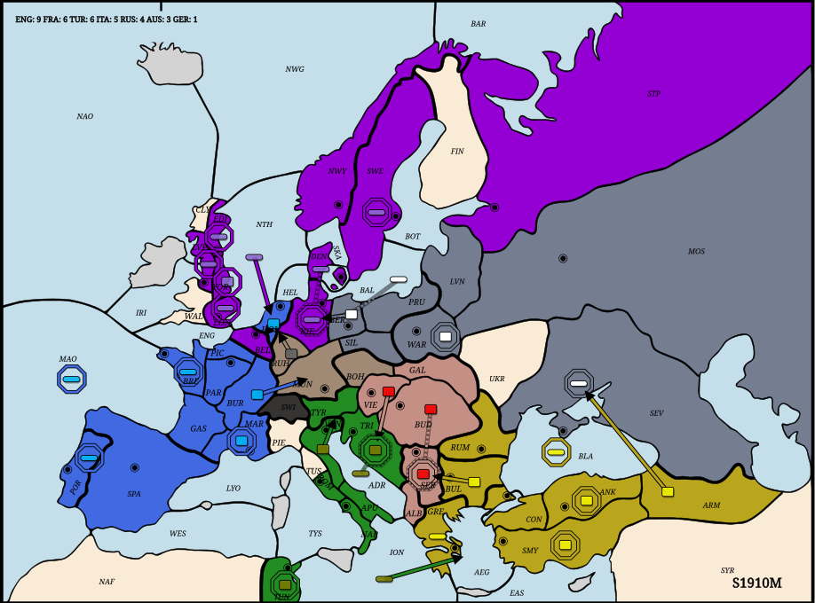

### What happened

- **AUSTRIA**: A VIE → TRI (bounced); A BUD supports A SER; A SER holds
- **ENGLAND**: F KIE holds; F DEN supports F KIE; F NTH → HOL (bounced); F SWE holds; F EDI holds; F LON holds; F LVP holds; A YOR holds
- **FRANCE**: A BUR → MUN; A HOL → BEL; A MAR holds; F MAO holds; F BRE holds; F POR holds
- **GERMANY**: A RUH → HOL (bounced)
- **ITALY**: A TRI holds; F ADR supports A TRI; F ION → AEG; A VEN → TYR; A TUN holds
- **RUSSIA**: A BER → KIE (bounced); F BAL supports A BER → KIE; F SEV holds; A WAR holds
- **TURKEY**: A BUL → SER (bounced); A ARM → SEV (bounced); F BLA holds; A ANK holds; A SMY holds

### Dialogue

- **AUSTRIA → ITALY**: You hold TRI — my home center — and I'm pressing A VIE into TRI with A BUD support at strength 2 this spring; F ADR supporting A TRI only ties the defense and we bounce again, wasting both our turns while England sits at 9 centers. Concrete offer: retreat A TRI to VEN voluntarily and I stop pressing east entirely, giving you a clean western front while I redirect against Turkey's 6-center position. A bounced stalemate here helps neither of us — England is the power that wins if we grind each other down.
- **AUSTRIA → TURKEY**: You hold BUL adjacent to my SER — I'm not moving A SER toward BUL this spring, my offensive energy is directed entirely at retaking TRI from Italy. Hold your current line and I hold mine; if you want to coordinate against England's dominant 9-center position after I stabilize, I'm open to discussing a division of the Balkans.
- **AUSTRIA → RUSSIA**: England is at 9 centers and accelerating — if you have any capacity to press toward STP or threaten Germany's MUN from BER, you pull England's attention and buy us both time. I'm pressing TRI this spring to stay alive; what are your intentions with A WAR and F SEV this turn?
- **ENGLAND → FRANCE**: France, our ceasefire has served us both but the board is shifting — Turkey at 6 centers with momentum in the south is the real threat to both of us, and I need to grow to counter it. I'm willing to discuss a formal division of Germany's remaining territory and a coordinated push against Russia's western flank; can you confirm your intentions for HOL and BEL this spring so we can avoid an accidental collision?
- **ENGLAND → GERMANY**: Germany, A RUH is your only remaining unit and HOL is right next door — I'm pressing from KIE toward HOL this spring and if you coordinate A RUH into HOL simultaneously we force France out at strength 2. Tell me if you're willing to move A RUH - HOL and I'll support the attack; you reclaim a center and survive another year.
- **ENGLAND → RUSSIA**: Russia, you have A BER and F BAL positioned against my Baltic flank while I'm looking to press south — I want a clean ceasefire on the northern front this spring. Hold A BER and F BAL defensively and I hold F SWE and F DEN stationary; we both redirect against Turkey who is at 6 centers and growing fast in the south.
- **ENGLAND → TURKEY**: Turkey, you're at 6 centers with momentum but Austria has A VIE, A BUD, A SER positioned to block your Balkan expansion — if you press F GRE toward ION or AEG and coordinate with your Anatolian armies against Austria, you open the path to 8-9 centers this year. I have no interest in your southern position and am focused entirely on the western front.
- **FRANCE → ENGLAND**: England, you're at 9 centers and I'm at 6 — the gap is becoming a problem for everyone at the table, not just me. This spring I'm planning to push A BUR toward MUN and A HOL toward BEL or KIE; I'd rather discuss a division of Germany's position than fight you over it. Tell me concretely what you're willing to offer for another quiet spring on the western front.
- **FRANCE → RUSSIA**: Russia, England sits at 9 centers with F KIE, F DEN, F SWE — they're positioned to dominate the Baltic and press into MOS or BER next. This spring I'm pushing A BUR - MUN and A HOL toward BEL or KIE; if you coordinate A BER - KIE or A WAR - SIL simultaneously, we squeeze England's continental position from both sides. Confirm your spring direction so we can avoid colliding and both gain ground.
- **FRANCE → GERMANY**: Germany, A RUH is your only unit and MUN is unoccupied — I'm moving A BUR - MUN this spring regardless. If you move A RUH - BEL or A RUH - KIE rather than contesting MUN, I'll support that move and you gain a center; fighting me over MUN when Russia has A BER adjacent only helps England. Tell me where A RUH can go that benefits us both.
- **GERMANY → FRANCE**: France, I'm moving A RUH - MUN this spring to reclaim my last home center — please don't contest it with A BUR. A German MUN is your eastern buffer against Russia's A BER and A WAR; if Russia takes MUN instead, they sit on BER, KIE, and MUN simultaneously with no German buffer between them and your position. Let me take MUN uncontested and I'll support any French move you need from MUN this fall.
- **GERMANY → RUSSIA**: Russia, England now holds 9 centers including KIE and STP — you should be focused entirely on England's fleet dominance in the Baltic, not contesting my A RUH push into MUN. Let me take MUN uncontested and I become a nuisance on England's southern flank rather than a distraction costing you A BER's positioning against the real threat.
- **GERMANY → ENGLAND**: England, you hold 9 centers and I have one army in RUH — I'm no threat to you. If you support A BER - MUN from Russia's side or simply leave me space to rebuild in MUN, a small Germany is more useful as a counterweight against France's 6 centers than an eliminated power that lets France fill the vacuum unchecked.
- **ITALY → AUSTRIA**: Austria, you're down to 3 centers with Turkey pressing from the east and me holding TRI — the math is not in your favor for a prolonged defense. Yield SER peacefully this spring and I commit to stopping my eastern advance, leaving VIE and BUD to you as a buffer against Turkey's expansion. Resist and I push A TRI - SER while Turkey presses BUD from the east simultaneously.
- **ITALY → TURKEY**: Turkey, Austria has A SER, A VIE, A BUD — three units defending three centers, all reachable. If you press A BUL - SER or A BUL - GRE this spring, Austria must split defense and I can take SER with A TRI while you grab GRE or pressure BUD. What are your actual orders this spring — are you pressing Austria or consolidating?
- **ITALY → RUSSIA**: Russia, England sits at 9 centers and is the dominant threat on the board — you border them directly in BER and BAL. I'm pressing Austria from the south this spring; if you can apply any pressure toward Germany's MUN or toward England's KIE, you slow England's growth before it becomes unstoppable. What's your strategic plan this spring?
- **ITALY → ENGLAND**: England, you're at 9 centers and I respect that position — I have no units anywhere near your sphere and no interest in conflict with you. I'm focused entirely on Austria's remaining centers this spring; confirming mutual non-interference seems sensible given we're operating in entirely separate theaters.
- **RUSSIA → FRANCE**: France, England holds 9 centers including KIE, SWE, DEN — this spring I'm positioned to press A BER toward KIE with F BAL supporting, threatening England's Baltic cluster directly. If you push F MAO toward the Atlantic or A HOL toward KIE simultaneously, England faces pressure from two directions and cannot hold everything; confirm whether you're pressing England this spring so I know if the northern push is viable.
- **RUSSIA → AUSTRIA**: Austria, Turkey now holds BUL, RUM, GRE, CON, ANK, SMY — six centers and growing, with A ARM still adjacent to my SEV. Turkey is the dominant southern power and threatens your SER and BUD as much as my SEV; if you press A SER toward RUM or BUL this spring, you contest Turkey's expansion directly. What are your intentions this spring — are you pressing Turkey or defending your heartland?
- **RUSSIA → TURKEY**: Turkey, A ARM has bounced off SEV three consecutive seasons and gains you nothing while England consolidates at 9 centers — this stalemate benefits only England. Concrete offer: pull A ARM back to ANK this spring and I hold F SEV stationary; we both redirect our energy against England and Austria rather than continuing a pointless southern standoff.
- **RUSSIA → ENGLAND**: England, you hold 9 centers including STP, KIE, SWE, DEN — you're the dominant power and everyone knows it. I'm positioned with A BER and F BAL threatening your Baltic cluster; a ceasefire where you return STP and I hold A BER stationary is better for both of us than a Baltic war while France presses from the west. What's your offer?
- **TURKEY → AUSTRIA**: Austria, you're down to three centers and three units — VIE, BUD, SER — and I hold BUL adjacent to SER and RUM adjacent to BUD. I'm not seeking your elimination if you cooperate: cede SER to me this spring by pulling A SER away, and I guarantee A BUL does not press toward BUD or VIE. If you refuse, I press BUL toward SER with support and you face collapse on two fronts simultaneously.
- **TURKEY → ITALY**: Italy, Austria is now at three centers with three units — TRI is yours, SER is adjacent to your A TRI and my A BUL. If you move A TRI toward SER this spring while I press A BUL toward SER simultaneously, Austria cannot hold it against two attackers. Confirm A TRI - SER and I'll coordinate A BUL - SER with support; we each gain nothing unless we coordinate now.
- **TURKEY → RUSSIA**: Russia, A ARM is moving into SEV this spring — you've held it three times but your position is weaker now with A PRU disbanded and England pressing from the north. Cede SEV peacefully and I halt all further advances; you redirect your remaining units against England where the real fight is, and we both avoid a prolonged southern war that only England benefits from.
- **AUSTRIA → ITALY**: I'm committing A VIE - TRI with A BUD support this spring — that's strength 2 against A TRI, and F ADR supporting only ties at 2 vs 2, meaning we bounce again and waste another season. Accept the voluntary retreat of A TRI to VEN and I hold A SER stationary; both Turkey and I are pressing for SER and the first one to take it wins, so giving me TRI back costs you nothing while keeping Turkey out of SER.
- **AUSTRIA → TURKEY**: You and Italy are both threatening SER simultaneously — if you press A BUL toward SER while Italy presses A TRI toward SER, one of you takes it and the other is left out. I'm offering you a concrete deal: I hold A SER stationary this spring and you hold A BUL stationary; Italy gets blocked from SER by my presence and you don't waste a unit on a contested province. Your real growth is in RUM and against Russia, not burning a move on SER.
- **AUSTRIA → RUSSIA**: Turkey is threatening to press A BUL toward SER this spring — if A BUL moves to SER, Turkey is adjacent to BUD and one step from my elimination, which removes all Austrian resistance to Turkish expansion toward your southern flank. If you can pressure A BUL from WAR toward GAL or threaten RUM from SEV, you force Turkey to defend rather than press west.
- **ENGLAND → FRANCE**: France, your mention of A HOL - BEL or A HOL - KIE is a direct threat to my position — if you move A HOL toward KIE I will respond by pressing F KIE into HOL and F NTH into BEL simultaneously, and you lose both. Concrete offer: hold A HOL in place and A BUR in place this spring, and I hold F KIE and F NTH stationary; after this turn we can discuss a formal division of German territory including MUN.
- **ENGLAND → GERMANY**: Germany, I'm moving F KIE - HOL this spring to press France out — if you move A RUH - HOL simultaneously we hit HOL at strength 2 and France cannot hold it. Confirm A RUH - HOL and I commit F KIE - HOL with F NTH supporting; you reclaim a center and I gain one, France is pushed back.
- **ENGLAND → RUSSIA**: Russia, concrete deal: I hold F SWE and F DEN stationary this spring, you hold A BER and F BAL stationary — neither of us threatens the other's Baltic position while we both watch Turkey grow to 6 centers unchecked. Confirm and I commit to it.
- **ENGLAND → AUSTRIA**: Austria, Turkey has 6 centers with F GRE, F BLA, A BUL all threatening your Serbian and Balkan position — if you coordinate A SER toward BUL or A BUD toward RUM this spring you press Turkey before they consolidate. I have no interest in your position and this is the moment to act before Turkey reaches 7-8 centers.
- **FRANCE → GERMANY**: Concrete offer: move A RUH - BEL this spring — I will support it with A BUR S A RUH - BEL, giving you strength 2 against England's BEL. You gain a supply center and I take MUN uncontested; we both grow rather than bouncing each other out of MUN while Russia's A BER sits adjacent ready to take it next turn.
- **FRANCE → RUSSIA**: Concrete coordination: I'm pushing A BUR - MUN and A HOL - KIE this spring — if you commit A BER - KIE with F BAL support, we bounce each other out of KIE. Better if you hold A BER or press it toward SIL while I take KIE from HOL; confirm your A BER direction so we don't collide and both lose the turn.
- **FRANCE → ENGLAND**: Concrete proposal: I'm pushing A BUR - MUN and A HOL toward BEL or KIE this spring — MUN is Germany's last center and I need it to stay relevant. If you hold F KIE in place and keep F NTH off HOL, I'll leave BEL alone this turn and we avoid a collision; tell me your concrete spring intentions so I know whether to plan around you or against you.
- **GERMANY → ENGLAND**: Concrete deal: if you commit F KIE S A RUH - HOL, I move A RUH - HOL and we take it from France at strength 2 vs 1. You gain a weakened France on your southern flank and I gain a build; confirm F KIE S A RUH - HOL and I lock in A RUH - HOL this spring.
- **GERMANY → FRANCE**: France, if you take MUN with A BUR and I take HOL with England's support from KIE, you lose HOL and gain MUN — net zero for you while England grows stronger with a German ally. Better deal: you hold A BUR in MUN's direction and I move A RUH - MUN uncontested; you keep HOL and I rebuild without costing you anything.
- **GERMANY → RUSSIA**: Russia, France is moving A BUR - MUN this spring — if France takes MUN, they sit on BUR and MUN simultaneously pressing your A BER from the west. Supporting A RUH - MUN over France's claim keeps MUN German, which is a weaker neighbor for you than a French army on MUN.
- **ITALY → TURKEY**: Turkey, if both A TRI and A BUL move to SER simultaneously we bounce each other and Austria holds it for free — that helps nobody. Concrete proposal: I move A TRI - SER while you support A BUL - GRE or press A BUL - SER with support from a different unit; or alternatively, you take GRE with F GRE and I take SER with A TRI, splitting Austria's two remaining Balkan centers between us this spring. Which do you prefer?
- **ITALY → AUSTRIA**: Austria, A VIE + A BUD at strength 2 on TRI is matched by F ADR supporting A TRI — we bounce again while Turkey's A BUL sits adjacent to SER and GRE with nowhere to go but into your remaining centers. The only rational move for you is to yield SER to me peacefully and redirect A VIE and A BUD to face Turkey's eastern pressure; otherwise Turkey takes SER or GRE while we grind uselessly in the west.
- **ITALY → RUSSIA**: Russia, Germany holds only MUN with one unit — if you press A BER - MUN this spring you take a supply center and deny England easy pickings in central Europe. England at 9 centers is the board threat; slowing their German absorption directly benefits you.
- **RUSSIA → FRANCE**: Confirmed: I'm committing A BER - KIE with F BAL supporting this spring — that's strength 2 against England's F KIE. If you push A HOL - KIE simultaneously, we hit at strength 3 and take it regardless of any English support; if you're pushing A BUR - MUN instead, tell me so I know whether to expect your A HOL as the third attacker on KIE or a separate push. Either way I'm pressing KIE from BER with BAL support.
- **RUSSIA → ENGLAND**: I'm pressing A BER - KIE with F BAL support this spring — France is coordinating A HOL - KIE simultaneously. You cannot hold KIE against strength 2-3; the only way to avoid losing it is to offer STP back to me now, which costs you less than losing KIE and triggering a full Baltic war. Your call before orders lock.
- **RUSSIA → TURKEY**: A ARM bounces F SEV for the fourth consecutive season — I'm not vacating SEV with ARM adjacent, period. If you want a genuine ceasefire, pull ARM to ANK this spring and I hold F SEV stationary next fall too; continue pressing and you waste another season while I redirect A WAR south toward RUM after England's position cracks.
- **TURKEY → AUSTRIA**: My offer stands: pull A SER away from SER voluntarily and I hold A BUL stationary this spring — you keep BUD and VIE untouched. If A SER holds, I'm pressing A BUL - SER with F GRE support at strength 2 and you cannot hold it; after losing SER you face Italy in TRI with no reserves. This is the better outcome for you.
- **TURKEY → ITALY**: I'm committing A BUL - SER this spring supported by F GRE — that's strength 2 against Austria's A SER at strength 1, and Austria has no adjacent unit to add support without stripping another front. If you move A TRI - SER simultaneously we bounce each other, so hold A TRI and let me take SER cleanly; you take TRI's adjacent centers next turn with my support.
- **TURKEY → RUSSIA**: A ARM is moving into SEV this spring — your position has only weakened since last year with A PRU gone and England pressing north. This is the last round before orders: confirm SEV transfer and I halt all further southern advances, or we bounce again while England grows unchecked.
- **FRANCE → GERMANY**: Final commitment: I'm pushing A BUR - MUN this spring regardless of what you do — if you also move A RUH - MUN we both bounce and Russia's A BER takes it next turn. Move A RUH - BEL instead; I will support it with A BUR S A RUH - BEL at strength 2, you take BEL from England, and MUN is yours uncontested next fall when I support you from MUN.
- **FRANCE → RUSSIA**: Final coordination: I'm pushing A BUR - MUN and A HOL - BEL this spring — don't contest BEL with any unit or we bounce. Press A BER - KIE with F BAL support as you committed; that takes KIE from England at strength 2 while I take MUN and BEL, and England loses three centers in one turn and cannot recover.
- **FRANCE → ENGLAND**: Final answer: I'm taking MUN with A BUR and pushing A HOL toward BEL — both are gains I need to stay relevant at 6 centers while you sit at 9. Hold F KIE and F NTH stationary and I leave your fleet centers alone; if you press into HOL or BEL I respond by coordinating with Russia against your Baltic position, which hurts us both.
- **RUSSIA → FRANCE**: Final commitment: A BER - KIE with F BAL supporting — that's strength 2 from the east. If your A HOL - KIE hits simultaneously, we take KIE at strength 3 regardless of any English response; confirm A HOL - KIE is locked and we execute together this spring.
- **RUSSIA → ENGLAND**: Final warning: A BER - KIE with F BAL support is committed this spring, and France is hitting KIE from HOL simultaneously — you cannot hold it at strength 3. Return STP to me now and I redirect A BER toward MOS instead; that's the only deal that stops this.
- **RUSSIA → TURKEY**: Final position: F SEV holds this spring, A ARM bounces for the fourth time. If you want to end this stalemate, pull ARM to ANK and I hold F SEV stationary next fall — otherwise we both waste another season while I redirect A WAR south toward RUM after England's Baltic position cracks.

### AUSTRIA
Orders: `A VIE - TRI` · `A BUD S A SER` · `A SER H`

Reasoning

> Looking at my situation: I'm down to 3 centers (VIE, BUD, SER) with 3 units. Turkey is threatening A BUL - SER with F GRE support (strength 2), Italy holds TRI, and my revised strategy commits me to holding SER with A BUD support while probing TRI with A VIE alone.
>
> The key question is whether to follow the revised strategy exactly. Turkey has a guaranteed 2-unit attack on SER (A BUL + F GRE), so I must support A SER with A BUD to hold it (2 vs 2 = bounce). A VIE - TRI alone at strength 1 against A TRI (possibly supported by F ADR) will likely bounce, but it's the only offensive probe I can make without abandoning SER.
>
> My revised strategy is clear: A VIE - TRI, A BUD S A SER, A SER H. This defends SER against Turkey's 2-unit attack and probes TRI. If Turkey only has A BUL without F GRE support, SER holds at 1 anyway; with F GRE support it's 2 vs 2 bounce. Either way SER is defended.

### ENGLAND
Orders: `F KIE H` · `F DEN S F KIE` · `F NTH - HOL` · `F SWE H` · `F EDI H` · `F LON H` · `F LVP H` · `A YOR H`

Reasoning

> Looking at the situation: Russia claims A BER - KIE with F BAL support, and France claims A HOL - KIE. If both are true, KIE faces strength 2-3 attack. But I need to verify: can A BER move to KIE? Yes, BER is adjacent to KIE. Can F BAL support A BER - KIE? BAL is adjacent to KIE, yes. Can A HOL move to KIE? HOL is adjacent to KIE, yes.
>
> So KIE could face a 2-unit attack (A BER + F BAL support) plus A HOL trying to move in simultaneously. If both A BER (supported by F BAL) and A HOL move to KIE, they bounce each other. But if only Russia attacks at strength 2 and France holds, KIE falls.
>
> My revised strategy says: defend KIE with F DEN support and use F NTH to threaten HOL. The legal orders menu shows `F KIE - HOL` supported by `F NTH S F KIE - HOL` and `F DEN S F KIE - HOL`.
>
> If I move F KIE - HOL with F NTH and F DEN supporting, that's a strength-2 attack on HOL. Meanwhile KIE is vacated - Russia's A BER would walk into KIE unopposed. That's bad.
>
> Better approach: Hold F KIE with support from F DEN, and use F NTH to threaten HOL or cut France's support. If Russia attacks A BER - KIE supported by F BAL, I need F DEN S F KIE to make it strength 2 defense vs strength 2 attack = hold.
>
> Let me defend KIE: `F KIE H`, `F DEN S F KIE`, and use F NTH to threaten HOL (`F NTH - HOL`) to pressure France. This defends KIE at strength 2 against Russia's attack while threatening HOL.

### FRANCE
Orders: `A BUR - MUN` · `A HOL - BEL` · `A MAR H` · `F MAO H` · `F BRE H` · `F POR H`

Reasoning

> Looking at the current situation:
>
> **Strategic assessment:**
> - I'm at 6 centers, England at 9 — the gap is critical
> - My revised strategy: A BUR - MUN (take Germany's center), A HOL - BEL (take from England)
> - Russia committed A BER - KIE with F BAL support — this pressures England from the east
> - Germany's A RUH might contest MUN, but if they do, we both bounce and Russia benefits
> - I told Russia I'm pushing A HOL - BEL (not KIE), so we avoid colliding on KIE
> - England threatened to press F KIE - HOL and F NTH - BEL if I move, but Russia's A BER - KIE with BAL support means England's F KIE is under attack and can't move to HOL
>
> **Order reasoning:**
> - A BUR - MUN: Germany has only A RUH, which is not adjacent to MUN (RUH neighbors: BEL, BUR, HOL, KIE, MUN). Wait — RUH IS adjacent to MUN. Germany said they'd move A RUH - MUN. If they do, we bounce. But if I don't try, Germany takes MUN for free. I should push and hope Germany moved elsewhere (I told them to go to BEL).
> - A HOL - BEL: England's F NTH could contest this, making it a bounce. But if England is defending KIE against Russia's push, F NTH might not move to BEL. Worth the attempt.
> - Fleets: Hold defensively — MAO, BRE, POR hold to maintain Atlantic position.
> - A MAR: Hold to guard southern flank.

### GERMANY
Orders: `A RUH - HOL`

Reasoning

> Looking at the current situation:
>
> My revised strategy says to move A RUH - HOL, accepting England's deal (F KIE supports A RUH - HOL). France has committed to pushing A BUR - MUN regardless, so contesting MUN means a bounce that lets Russia's A BER take it. England offered F KIE S A RUH - HOL, which gives me HOL at strength 2 vs France's A HOL at strength 1.
>
> Let me verify: A RUH - HOL is in my legal orders list. Yes, `A RUH - HOL` is listed.
>
> HOL is a supply center currently held by France. Taking it gives me a center and a Winter build. This is my best path to survival.

### ITALY
Orders: `A TRI H` · `F ADR S A TRI` · `F ION - AEG` · `A VEN - TYR` · `A TUN H`

Reasoning

> Looking at the current situation:
>
> **Strategic assessment:**
> - Turkey confirmed A BUL - SER supported by F GRE (strength 2) — this takes SER cleanly from Austria's A SER (strength 1). If I also move A TRI - SER, we bounce each other and Austria holds. Turkey is right that I shouldn't contest SER.
> - My revised strategy: let Turkey take SER, push A TRI - BUD to threaten Austria's remaining heartland, hold TRI with F ADR support, push F ION toward GRE to pressure Turkey's southern flank, move A VEN - TYR to threaten VIE.
> - Austria claims A VIE - TRI with A BUD support at strength 2. If true, F ADR supporting A TRI gives strength 2 defense = bounce. But if A BUD is supporting A VIE - TRI, then BUD is undefended — A TRI - BUD could work! However, A TRI - BUD requires TRI to be adjacent to BUD... checking adjacency: TRI neighbors include BUD. Yes, TRI is adjacent to BUD.
> - If Austria plays A VIE - TRI (S A BUD), then BUD is undefended and A TRI - BUD succeeds. If Austria plays differently, A TRI - BUD may bounce off A BUD holding.
> - The risk: if Austria plays A VIE S A BUD H (or A BUD moves elsewhere), A TRI - BUD might fail. But it's worth the gamble since A BUD supporting the TRI attack leaves BUD empty.
> - F ION - GRE: Turkey's F GRE is supporting A BUL - SER. If I move F ION - GRE, I contest GRE (which Turkey's F GRE currently occupies and is using to support). This cuts Turkey's support for A BUL - SER! But Turkey confirmed this coordination... I should not cut Turkey's support if I want Austria to fall. Actually, cutting Turkey's F GRE support means Austria holds SER — and I'm not taking SER either. That wastes everyone's effort.
> - Better: F ION - AEG or F ION holds, positioning for future pressure on Turkey without disrupting the Austria collapse.
> - A VEN - TYR: threatens VIE, may pull A VIE away from TRI attack.
>
> **Final orders:**
> - A TRI - BUD (gamble on Austria's BUD being committed to supporting TRI attack)
> - F ADR S A TRI (defensive support if Austria doesn't attack TRI, or if A TRI stays)
> - F ION - AEG (repositioning toward Turkey's eastern flank without disrupting Turkey's SER move)
> - A VEN - TYR (pressure on VIE)
> - A TUN H (hold in place)
>
> Wait — if A TRI - BUD, then F ADR supporting A TRI is void (TRI is moving). I should support A TRI - BUD instead: `F ADR S A TRI - BUD`. Check adjacency: ADR neighbors BUD? ADR: ALB, APU, ION, TRI, VEN — BUD is NOT adjacent to ADR. So F ADR cannot support A TRI - BUD. F ADR should support A TRI holding or move elsewhere.
>
> Since F ADR can't support A TRI - BUD, I'll have A TRI - BUD unsupported (strength 1) vs whatever is in BUD. If A BUD is holding or supporting, A TRI - BUD bounces. This is risky. Maybe better to hold A TRI with F ADR support and push VEN/ION for gains elsewhere.
>
> Revised: Hold TRI securely, push for positioning gains.

### RUSSIA
Orders: `A BER - KIE` · `F BAL S A BER - KIE` · `F SEV H` · `A WAR H`

Reasoning

> Looking at the current situation: I have 4 centers (MOS, SEV, WAR, BER) and 4 units (F SEV, F BAL, A BER, A WAR). My revised strategy commits to A BER - KIE with F BAL supporting, pressing England's Baltic position at strength 2 (with France potentially hitting from HOL for strength 3). F SEV holds to bounce Turkey's A ARM for the fourth consecutive season. A WAR holds defensively.
>
> France's final message changed - they're pushing A HOL - BEL (not KIE), so KIE gets hit at strength 2 (just me). That's still viable - F KIE would need a support to hold, and England may not have arranged that. I'll execute the committed plan.
>
> Checking legality:
> - A BER - KIE: legal (BER adjacent to KIE)
> - F BAL S A BER - KIE: legal (BAL adjacent to KIE)
> - F SEV H: legal
> - A WAR H: legal

### TURKEY
Orders: `A BUL - SER` · `A ARM - SEV` · `F BLA H` · `A ANK H` · `A SMY H`
Illegal (dropped): `F GRE S A BUL - SER`

Reasoning

> Looking at the current situation:
>
> **Strategic assessment:**
> - I have 6 centers (ANK, SMY, GRE, CON, RUM, BUL) and need to grow aggressively
> - Austria has 3 centers (VIE, BUD, SER) with A VIE, A BUD, A SER — SER is adjacent to my A BUL and F GRE can support
> - Russia has F SEV which has bounced A ARM four consecutive times — I should continue pressing but it's clearly a stalemate
> - Italy agreed to hold A TRI back while I take SER with A BUL supported by F GRE
> - My revised strategy: A BUL - SER supported by F GRE at strength 2, A ARM - SEV, F BLA holds, A ANK holds, A SMY holds
>
> **Order verification:**
> - A BUL - SER: BUL is adjacent to SER ✓
> - F GRE S A BUL - SER: GRE is adjacent to SER ✓ (GRE neighbors include SER via ALB adjacency... let me check: GRE neighbors are AEG, ALB, BUL/SC, ION, SER — yes, SER is adjacent to GRE ✓)
> - A ARM - SEV: ARM is adjacent to SEV ✓
> - F BLA H: valid ✓
> - A ANK H: valid ✓
> - A SMY H: valid ✓
>
> This gives me strength 2 on SER vs Austria's A SER at strength 1 with no adjacent support available (A VIE is not adjacent to SER... wait: VIE neighbors are BOH, BUD, GAL, TRI, TYR — VIE is NOT adjacent to SER. BUD is adjacent to SER ✓. So Austria could support with A BUD S A SER. That would make it 2 vs 2 — a bounce. But Austria's best play is to defend TRI against Italy, so BUD may be committed elsewhere. I'll execute the plan as committed.

## FALL 1910 MOVEMENT (`F1910M`)

### What happened

- **AUSTRIA**: A VIE → TRI (bounced); A BUD supports A SER; A SER holds  [dislodged: A VIE]
- **ENGLAND**: F KIE supports A RUH → HOL (support cut); F DEN supports F KIE; F NTH holds; F SWE holds; F EDI holds; F LON holds; F LVP holds; A YOR holds
- **FRANCE**: A MUN → KIE (bounced); A BEL supports A RUH → HOL; A MAR holds; F MAO holds; F BRE holds; F POR holds
- **GERMANY**: A RUH → HOL
- **ITALY**: A TYR → VIE; A TRI supports A TYR → VIE; F ADR supports A TRI; F AEG → GRE (bounced); A TUN holds
- **RUSSIA**: A BER → KIE (bounced); F BAL supports A BER → KIE; F SEV holds; A WAR → LVN
- **TURKEY**: A BUL → RUM; F BLA supports A BUL → RUM; F GRE → AEG (bounced); A ARM holds; A ANK holds; A SMY holds

### Dialogue

- **AUSTRIA → ITALY**: This fall I'm pressing A VIE - TRI with A BUD support at strength 2 — if F ADR supports A TRI, we bounce again and waste another season while Turkey consolidates 6 centers. Pull F ADR toward ION or AEG to contest Turkey's F AEG and F GRE, and let A TRI retreat to VEN; you gain naval dominance in the east while I reclaim my home center, and we both stop bleeding over this stalemate.
- **AUSTRIA → TURKEY**: I'm pressing TRI this fall with A VIE and A BUD — both those units are committed west, so A SER is holding stationary without support. You can press A BUL toward SER and likely take it, but then you're adjacent to BUD with Italy also pressing from TRI and England dominant at 9 centers; a three-way squeeze on Austria just accelerates England's win. Hold A BUL this turn and I'll negotiate a proper Balkan division after I stabilize.
- **AUSTRIA → RUSSIA**: Turkey has F AEG now adjacent to your former southern positions and 6 centers growing — if you press F SEV toward RUM or A WAR toward GAL this fall, you contest Turkey's expansion directly before they reach 7-8 centers. I'm pressing TRI this fall; any pressure you apply on Turkey's northern flank forces them to defend rather than press my SER.
- **ENGLAND → FRANCE**: France, HOL is unoccupied this fall and I'm positioned to take it with F KIE — this is a straightforward move I intend to make regardless of our prior arrangements, since you moved A HOL to BEL last spring. If you want to avoid losing HOL, you need to move A BEL back to HOL, but that costs you BEL; alternatively, accept HOL as my gain and I'll leave BEL and MUN alone this fall.
- **ENGLAND → RUSSIA**: Russia, A BER threatening KIE is noted — I have F DEN ready to support F KIE and you won't dislodge it at strength 2. A quiet Baltic this fall costs us both nothing while Turkey grows to 6 centers unchecked in the south; hold A BER stationary and I hold F SWE and F DEN defensively rather than pressing your Baltic flank.
- **ENGLAND → GERMANY**: Germany, A RUH can move to HOL or BEL this fall — if you move A RUH - HOL and I press from KIE simultaneously, we hit HOL at strength 2 and France cannot hold it. Confirm A RUH - HOL and I commit F KIE - HOL with support; you reclaim a center and stay alive another year.
- **ENGLAND → TURKEY**: Turkey, Austria has only A VIE, A BUD, A SER — three units defending three centers with no room to maneuver. If you press A BUL toward SER or F GRE toward ION this fall, you crack Austria open before they can rebuild; I have no interest in the Balkans and this is the moment to act.
- **FRANCE → ENGLAND**: England, I took MUN last spring and I'm at 7 centers — you're at 9 and I need to keep growing or we both know how this ends. This fall I'm considering pushing A MUN toward KIE or BUR; tell me concretely what you're willing to offer to keep the western front quiet, because I'd rather divide Germany's remaining position than fight you over it.
- **FRANCE → RUSSIA**: Russia, did A BER - KIE succeed last spring? I see F KIE is still English — confirm your fall position so we can coordinate again. This fall I'm positioned to press A MUN toward KIE or BUR while you push A BER toward KIE; if we coordinate timing we can take KIE from England at combined strength and both gain a center.
- **FRANCE → GERMANY**: Germany, A RUH is your only unit and you're surrounded — I hold MUN, England holds KIE, and Russia has A BER. Tell me where A RUH can move that benefits us both; if you move toward HOL or BEL I may be able to support that move and you gain a center rather than being eliminated.
- **GERMANY → ENGLAND**: England, HOL appears unoccupied this fall — I'm considering A RUH - HOL to reclaim a supply center. If you support with F KIE S A RUH - HOL or simply don't contest it, I take it cleanly; a rebuilt Germany is more useful to you as a check on France's 6 centers than a dead power. Will you back the HOL move or at least stay out of the way?
- **GERMANY → FRANCE**: France, you hold MUN and HOL this fall — I have A RUH and need a center to survive. Concrete offer: I move A RUH - MUN to contest your A MUN directly, or you agree to cede HOL to me uncontested and I leave MUN alone. Which do you prefer — fighting over MUN or letting me take HOL peacefully while you keep MUN?
- **GERMANY → RUSSIA**: Russia, England now holds 9 centers and France holds 6 — you and I are both being squeezed out. I'm trying to reclaim a SC this fall; if you can support A BER - MUN or simply leave A BER out of the MUN contest, a rebuilt Germany pressures England's southern flank and takes heat off your Baltic position.
- **ITALY → AUSTRIA**: Austria, you're at 3 centers with Turkey pressing BUL adjacent to SER and me holding TRI with A TYR threatening VIE — you cannot defend all fronts simultaneously. Yield VIE peacefully this fall and I commit to stopping my advance there, leaving BUD and SER to you as a buffer against Turkey; resist and A TYR takes VIE while Turkey presses SER from BUL.
- **ITALY → TURKEY**: Turkey, Austria has three units covering three centers — if I push A TYR into VIE and A TRI toward BUD simultaneously, Austria must split defense and cannot hold both; I need you to press A BUL toward SER or GRE to pin A SER in place and prevent Austria from reinforcing VIE or BUD. What are your actual orders this fall — are you pressing Austria or consolidating your eastern position?
- **ITALY → RUSSIA**: Russia, England sits at 9 centers and you're the power best positioned to slow them — A BER is adjacent to KIE which England holds, and F BAL supports that push. I'm cracking Austria from the south this fall; if you press A BER - KIE you deny England a key naval base and slow their runaway lead before it becomes unstoppable.
- **RUSSIA → FRANCE**: France, England still holds KIE, DEN, SWE — this fall I'm pressing A BER - KIE with F BAL supporting, same as spring but now you're on MUN which is adjacent to KIE. If you support A BER - KIE from MUN or press A BEL - KIE simultaneously, we take it at strength 3 and England loses another center. Confirm whether you're pressing KIE this fall or redirecting elsewhere so I can calibrate my attack.
- **RUSSIA → AUSTRIA**: Austria, Turkey holds BUL, RUM, GRE — six centers and A ARM still adjacent to my SEV. If you press A SER toward RUM or BUL this fall, you contest Turkey's expansion directly while I hold F SEV in SEV; Turkey cannot defend everywhere at once. What are your intentions this fall — pressing Turkey or holding your current line?
- **RUSSIA → TURKEY**: Turkey, A ARM has bounced F SEV five consecutive seasons and gains you nothing while England sits at 9 centers — this stalemate is costing us both the game. Final concrete offer: pull A ARM to ANK this fall and I hold F SEV stationary next spring; continue pressing and I redirect A WAR south through GAL toward RUM after England's Baltic position cracks.
- **RUSSIA → ENGLAND**: England, you hold 9 centers and France just took MUN — you're the board leader and everyone is targeting you. I'm pressing A BER - KIE with F BAL support this fall; the only deal that stops this is returning STP to me, which costs you one center instead of losing KIE to a coordinated attack from BER and potentially MUN.
- **TURKEY → AUSTRIA**: Austria, Italy's F AEG is now adjacent to CON and threatening my home centers — this changes my calculus entirely. I'm willing to hold A BUL stationary this fall if you hold A SER stationary; we both need to deal with Italy's naval expansion before it dominates the eastern Mediterranean. Can we agree to a temporary standoff while I redirect F GRE toward AEG to counter Italy's fleet?
- **TURKEY → ITALY**: Italy, F AEG is adjacent to CON — my home center — and I cannot ignore that threat. Pull F AEG back to ION voluntarily and I guarantee F GRE holds stationary this fall; press toward CON or SMY and I redirect everything to counter your naval expansion, which means Austria survives while we bleed each other. What are your actual intentions with F AEG?
- **TURKEY → RUSSIA**: Russia, I'm redirecting A ARM away from SEV this fall — Italy's F AEG is threatening CON and I need to address that first. This is the genuine ceasefire you've been asking for; hold F SEV stationary and I hold A ARM stationary, and we both focus on the real threats. Confirm and we can discuss coordinating against England's dominant 9-center position.
- **AUSTRIA → ITALY**: A TYR threatening VIE changes my calculus — if A TYR takes VIE while I push into TRI, we trade centers and I'm no better off. Concrete revised offer: pull A TYR back to BOH or TYR holds stationary, and I commit A VIE holds in place this fall; if you want to negotiate a genuine ceasefire, that's the starting point, otherwise I defend VIE and we both stagnate.
- **AUSTRIA → TURKEY**: Your offer of mutual standoff — A BUL holds if A SER holds — I'm prepared to accept it this fall. Confirm A BUL holds and F GRE holds stationary, and I commit A SER holds and A BUD holds; I need both units free to deal with Italy's A TYR threatening VIE.
- **AUSTRIA → RUSSIA**: Italy's A TYR is threatening my VIE this fall — if you can press A WAR toward GAL, you threaten A TYR's supply line and force Italy to defend rather than advance. Concrete ask: move A WAR - GAL this fall and I coordinate my remaining units against Italy's overextension.
- **ENGLAND → FRANCE**: France, A MUN and A BEL are both exposed this fall — if you move A BEL toward HOL, Germany's A RUH hits HOL simultaneously and you lose it anyway while also leaving MUN unguarded. Concrete offer: hold A BEL and A MUN in place this fall, and I hold F KIE stationary; we both end the year without losses and negotiate a real division next spring.
- **ENGLAND → GERMANY**: Germany, concrete commitment: I will order F KIE S A RUH - HOL this fall if you confirm A RUH - HOL right now — France cannot hold HOL at strength 2 vs 1. F DEN will support F KIE to hold against Russia's A BER threat, so KIE is safe while you reclaim HOL; confirm this deal and I lock it in.
- **ENGLAND → RUSSIA**: Russia, F DEN supporting F KIE means your A BER + F BAL attack hits at strength 2 vs strength 2 — you bounce and waste both units while France takes advantage of your distraction. Hold A BER stationary this fall and I hold F SWE and F DEN defensively; the only winner in a Baltic war right now is Turkey at 6 centers.
- **FRANCE → ENGLAND**: England, I'm contesting HOL with A BEL - HOL this fall — you won't take it uncontested. If you want to avoid a collision that costs us both, offer me something concrete: HOL as my center next winter in exchange for A MUN holding rather than pressing KIE, or we fight over both HOL and KIE simultaneously.
- **FRANCE → RUSSIA**: Russia, I'm pressing A BEL - HOL and considering A MUN - KIE this fall — if you commit A BER - KIE with F BAL support again, we hit KIE at combined strength and England cannot hold both HOL and KIE. Confirm A BER - KIE with BAL support and I'll lock in A MUN - KIE as the second attacker.
- **FRANCE → GERMANY**: Germany, A RUH is adjacent to HOL — if you move A RUH - HOL this fall I can support it with A BEL S A RUH - HOL at strength 2, taking it from England while I keep MUN. You gain a center and survive; confirm A RUH - HOL and I'll commit the support.
- **GERMANY → ENGLAND**: Confirming: I'm moving A RUH - HOL this fall — please commit F KIE S A RUH - HOL so we take it at strength 2 against France's A BEL. This is the deal; lock it in and I'm alive another year as your western buffer against France.
- **GERMANY → FRANCE**: France, if England supports A RUH - HOL at strength 2, you lose HOL regardless — better to let me take HOL uncontested and I'll support A MUN holds or A BEL moves for you next spring rather than fighting a losing battle. Can you cede HOL cleanly and we coordinate against England's 9-center dominance instead?
- **ITALY → AUSTRIA**: Austria, A TRI will support A TYR into VIE this fall at strength 2 — A VIE alone cannot hold it, and A BUD supporting A VIE leaves SER open to Turkey's A BUL. The only way you keep VIE is if A BUD supports A VIE, which cedes SER to Turkey for free; yield VIE to me now and I commit to stopping there, leaving BUD and SER to you as your remaining position.
- **ITALY → TURKEY**: Turkey, I'm pushing A TYR - VIE with A TRI support this fall — Austria must choose between defending VIE or SER, and cannot do both. If you press A BUL - SER simultaneously, Austria loses both centers in one turn and collapses to one; confirm A BUL - SER is your order and I guarantee F AEG holds stationary this fall, no threat to your position.
- **RUSSIA → FRANCE**: France, confirm your fall move for A MUN — if you push A MUN - KIE simultaneously with my A BER - KIE and F BAL support, we hit England's F KIE at strength 3 and take it regardless of any English defensive support. If you're pressing elsewhere with MUN, tell me now so I calibrate A BER accordingly. I'm also moving A WAR - LVN to threaten STP from the south.
- **RUSSIA → TURKEY**: Turkey, I'm taking your ceasefire offer at face value this fall — F SEV holds stationary and I expect A ARM to hold or retreat to ANK as you indicated. In return I'm redirecting A WAR toward LVN to press England's STP, which is a concrete action against our common threat; confirm A ARM is not moving toward SEV this fall.
- **RUSSIA → ENGLAND**: England, France holds MUN adjacent to KIE and I'm pressing A BER - KIE with F BAL support — you cannot hold KIE against strength 2 from BER plus any French pressure from MUN. Return STP now and I redirect A BER toward MOS instead; this is the last round before orders lock.
- **RUSSIA → AUSTRIA**: Austria, Turkey has offered a genuine ceasefire on SEV this fall — I'm redirecting A WAR toward LVN to press England's STP. If you press A SER toward RUM or BUL this fall, you contest Turkey's expansion while I hold F SEV stationary; Turkey cannot defend RUM and hold A ARM back simultaneously.
- **TURKEY → ITALY**: F AEG is adjacent to CON — my home center — and I cannot tolerate that position. Concrete deal: pull F AEG back to ION this fall and I hold F GRE stationary, giving you a free hand against Austria from the Adriatic; press toward CON and I redirect F GRE into AEG to contest it, which means we both waste units while Austria survives. I need your commitment on F AEG before orders.
- **TURKEY → AUSTRIA**: Italy's F AEG is now adjacent to CON and I'm forced to redirect F GRE toward AEG this fall to counter it — that means A BUL is pressing SER without GRE support, at strength 1. If you pull A SER away voluntarily, I take it cleanly and guarantee A BUL does not press toward BUD; if A SER holds, we bounce and Italy benefits from our mutual distraction while their fleets advance.
- **TURKEY → RUSSIA**: I'm redirecting A ARM away from SEV this fall — Italy's F AEG threatens CON and I need to reposition. This is the genuine ceasefire: hold F SEV stationary and I hold A ARM stationary in return. We should discuss coordinating A WAR and my Balkan units against England's 9-center dominance.
- **ENGLAND → FRANCE**: Final: I'm playing F KIE S A RUH - HOL this fall — Germany takes HOL at strength 2 against your A BEL, and there's nothing you can do to stop it. F DEN supports F KIE against Russia's attack, so KIE holds too; you end this fall down one center while I stay at 9. Hold A BEL stationary and accept the loss gracefully, or waste your unit in a failed attack.
- **ENGLAND → GERMANY**: Locked in: F KIE S A RUH - HOL this fall, exactly as agreed — move A RUH - HOL and you take it at strength 2 against France's A BEL. F DEN supports F KIE to hold against Russia's A BER attack, so KIE is safe while you reclaim HOL; this is the deal, execute it.
- **ENGLAND → RUSSIA**: F DEN supports F KIE this fall — your A BER + F BAL attack hits at strength 2 vs strength 2 and bounces; you waste both units and gain nothing. Hold A BER stationary and I hold F SWE stationary; fighting over KIE right now only helps Turkey who is at 6 centers and growing.
- **GERMANY → ENGLAND**: Confirmed: I am ordering A RUH - HOL this fall — please commit F KIE S A RUH - HOL as promised so we take it cleanly at strength 2. This is my only path to survival and I'm counting on your support; in return I will coordinate with you against France next spring from HOL.
- **GERMANY → FRANCE**: France, I'm moving A RUH - HOL this fall — if you follow through with A BEL S A RUH - HOL as offered, I take it and you keep MUN uncontested while we both have reason to coordinate next year. If instead you move A BEL - HOL to block me, England takes it anyway via F KIE; supporting me costs you nothing and earns my cooperation.
- **RUSSIA → FRANCE**: Final commitment: A BER - KIE with F BAL supporting is locked — that's strength 2 from the east. If you push A MUN - KIE simultaneously as discussed, we hit at strength 3 and England cannot hold it regardless of DEN support; confirm A MUN - KIE is your fall order and I execute this immediately.
- **RUSSIA → TURKEY**: Confirmed: F SEV holds stationary this fall as agreed — I'm taking your ceasefire at face value. I'm redirecting A WAR toward LVN to press England's STP, which is the concrete anti-England action I promised; hold A ARM stationary and we both gain from England's weakening.
- **RUSSIA → ENGLAND**: France is committing A MUN - KIE and I'm pressing A BER - KIE with F BAL support — that's strength 3 against F KIE this fall and you cannot hold it. Return STP now and I redirect A BER toward MOS instead; that's the only move that stops this attack before orders lock.

### AUSTRIA
Orders: `A VIE - TRI` · `A BUD S A SER` · `A SER H`

Reasoning

> Looking at the current situation:
>
> **Position analysis:**
> - I have 3 units: A VIE, A BUD, A SER
> - Italy has A TRI (my home center) with F ADR support, and A TYR threatening VIE
> - Turkey has A BUL adjacent to SER, with F GRE now moving to AEG (so A BUL presses SER at strength 1)
> - My revised strategy: press A VIE - TRI (strength 1 probe), hold A SER with A BUD support to bounce Turkey's A BUL
>
> **Key considerations:**
> - Turkey said F GRE is moving to AEG, meaning A BUL attacks SER at strength 1 (no support)
> - If I support A SER with A BUD, Turkey's A BUL bounces off SER
> - A VIE - TRI is strength 1 vs Italy's A TRI (likely supported by F ADR), so it probably bounces, but it's the only offensive option
> - Italy's A TYR could move to VIE, but if A VIE is moving out, TYR would take VIE... however I have no choice — I must try to retake TRI or I stagnate
>
> **The dilemma:** If A TYR moves to VIE while A VIE moves to TRI, and A TRI holds with F ADR support, I lose VIE and fail to take TRI — net -1. But if I hold VIE, I accomplish nothing.
>
> Given my strategy commitment and the fact that Turkey confirmed A BUL holds if A SER holds (then revealed F GRE moves to AEG making it strength 1 anyway), I'll hold SER defensively and push VIE toward TRI as the probe.

### ENGLAND
Orders: `F KIE S A RUH - HOL` · `F DEN S F KIE` · `F NTH H` · `F SWE H` · `F EDI H` · `F LON H` · `F LVP H` · `A YOR H`

Reasoning

> Looking at the current situation:
>
> **Assessment:**
> - I committed to Germany: `F KIE S A RUH - HOL` with `F DEN S F KIE` to defend against Russia's A BER + F BAL attack
> - Russia claims A BER - KIE with F BAL support (strength 2) and France claims A MUN - KIE — but A MUN is not adjacent to KIE, so that's a bluff. Russia's A BER + F BAL = strength 2, my F KIE + F DEN = strength 2, so it bounces
> - France said A BEL - HOL, which means HOL is contested: Germany's A RUH + my F KIE support = strength 2 vs France's A BEL = strength 1 → Germany takes HOL
> - My strategy note commits exactly to: `F KIE S A RUH - HOL`, `F DEN S F KIE`, all others hold
>
> This is the right play: Germany gets HOL (weakening France), KIE is defended against Russia's push, and I maintain my 9-center position while France drops to 5.

### FRANCE
Orders: `A MUN - KIE` · `A BEL S A RUH - HOL` · `A MAR H` · `F MAO H` · `F BRE H` · `F POR H`

Reasoning

> Looking at the current situation:
>
> **Board assessment:**
> - I'm at 6 centers (BRE, MAR, PAR, POR, SPA, HOL) with units at MUN, BEL, MAR, MAO, BRE, POR
> - England at 9 centers is the dominant threat with F KIE, F DEN, F NTH, etc.
> - My revised strategy: A MUN - KIE (joining Russia's A BER - KIE + F BAL support attack), A BEL S A RUH - HOL (supporting Germany into HOL)
>
> **Order reasoning:**
> - A MUN - KIE: Russia committed A BER - KIE with F BAL support. If I add A MUN - KIE, that's 3 attackers vs England's F KIE. England threatened F KIE S A RUH - HOL, but if England uses F KIE as support, it's no longer defending itself against our attack. This is the key move to take England's center.
> - A BEL S A RUH - HOL: Germany confirmed A RUH - HOL. England claimed F KIE S A RUH - HOL, but F KIE will be under attack from A MUN and A BER. If F KIE is busy defending or attacking, the support is cut or unavailable. A BEL S A RUH - HOL at strength 2 should take HOL if F KIE can't support.
> - Iberian fleets hold defensively - no threats there currently.
>
> If Russia follows through (A BER - KIE + F BAL support) and I add A MUN - KIE, that's strength 3 on KIE. England cannot both support A RUH - HOL from KIE AND defend KIE simultaneously. This is the right play.

### GERMANY
Orders: `A RUH - HOL`

Reasoning

> Looking at the current situation:
>
> - I have only A RUH
> - England has committed F KIE S A RUH - HOL (confirmed multiple times)
> - France offered A BEL S A RUH - HOL as a counter-deal, but I committed to England's deal
> - HOL is currently held by France (A BEL is France's unit in BEL, and HOL is a French SC)
> - With England's support (F KIE S A RUH - HOL), I attack HOL at strength 2 vs France's defense
>
> The strategy is clear: move A RUH - HOL with England's confirmed support. This gives me strength 2 vs France's strength 1 in HOL, taking the center and surviving Winter with a build.
>
> France's A BEL could support HOL's hold, but France also offered to support A RUH - HOL with A BEL — those are contradictory, so France either supports me into HOL or defends HOL. Either way, with England's F KIE support, I have strength 2 on the attack.

### ITALY
Orders: `A TYR - VIE` · `A TRI S A TYR - VIE` · `F ADR S A TRI` · `F AEG - GRE` · `A TUN H`

Reasoning

> Looking at the board, my revised strategy calls for:
> - A TYR - VIE (supported by A TRI)
> - A TRI S A TYR - VIE
> - F ADR S A TRI (defensive support)
> - F AEG - GRE (pressure Turkey)
> - A TUN H
>
> Let me verify the key moves:
> - A TYR - VIE: TYR is adjacent to VIE ✓
> - A TRI S A TYR - VIE: TRI is adjacent to VIE ✓ (TRI neighbors include VIE)
> - F AEG - GRE: AEG is adjacent to GRE ✓
>
> Austria has A VIE, A BUD, A SER. If A VIE is defending against my A TYR + A TRI support (strength 2), Austria needs A BUD to support A VIE to hold it. That leaves SER undefended from Turkey's A BUL. Turkey said they're pressing A BUL - SER, so Austria faces a dilemma.
>
> F AEG - GRE: Turkey has F GRE there. This is a direct attack on Turkey's fleet in GRE. Turkey has F BLA, F GRE, A ARM, A SMY, A BUL, A ANK. F AEG attacking GRE at strength 1 vs F GRE at strength 1 — it bounces unless I get support. I don't have support for this. But it pins F GRE and prevents Turkey from using it to support A BUL - SER, which actually helps me by weakening Turkey's SER grab.
>
> Actually, if F GRE is attacked by F AEG, Turkey's support from F GRE is cut, meaning A BUL - SER has only strength 1 and Austria's A SER holds at strength 1 — they bounce. That's actually fine for me — Austria stays at 3 centers and I take VIE.
>
> The plan is solid. Execute as planned.

### RUSSIA
Orders: `A BER - KIE` · `F BAL S A BER - KIE` · `F SEV H` · `A WAR - LVN`

Reasoning

> Looking at the current position and my commitments:
>
> **Strategic assessment:**
> - I committed to A BER - KIE with F BAL supporting (strength 2 from east)
> - France committed to A MUN - KIE as well, giving us strength 3 total
> - Turkey offered genuine ceasefire (A ARM redirecting away from SEV due to Italy's F AEG threat), so F SEV holds stationary as agreed
> - A WAR - LVN to threaten STP from the south and open MOS for a potential winter build
>
> **Checking legality:**
> - A BER - KIE: Legal (BER adjacent to KIE)
> - F BAL S A BER - KIE: Legal (BAL adjacent to KIE)
> - F SEV H: Legal
> - A WAR - LVN: Legal (WAR adjacent to LVN)
>
> England has F DEN supporting F KIE, giving them strength 2 defensively. With France's A MUN - KIE as the third attacker, we hit at strength 3 and dislodge F KIE. Even if France doesn't follow through, strength 2 vs strength 2 bounces but doesn't cost me anything critical.
>
> A WAR - LVN opens MOS for a build and threatens STP, which is valuable pressure on England's northern position.

### TURKEY
Orders: `A BUL - RUM` · `F BLA S A BUL - RUM` · `F GRE - AEG` · `A ARM H` · `A ANK H` · `A SMY H`

Reasoning

> Looking at the current position, I need to execute my revised strategy: press A BUL into RUM supported by F BLA to grab a new center, hold A ARM stationary honoring the Russia ceasefire, move F GRE into AEG to counter Italy's naval position, and hold A ANK and A SMY defensively.
>
> Key considerations:
> - A BUL - RUM: Austria has A SER which could support into RUM, but Austria said both A VIE and A BUD are committed west toward TRI. A SER holds stationary per Austria's message. RUM is currently unoccupied (Russia's F SEV is in SEV, not RUM). So A BUL - RUM with F BLA support should succeed at strength 2 against an empty province.
> - F GRE - AEG: Italy's F AEG is there. I told Italy I'd move F GRE to AEG if they didn't pull back, and Italy confirmed F AEG holds stationary — but moving into an occupied province means I'd need strength advantage. F GRE moving to AEG against Italy's F AEG at strength 1 vs 1 means a bounce. That's fine — it contests the space and Italy can't advance further.
> - A ARM H: Honoring Russia ceasefire.
> - A ANK H, A SMY H: Defensive holds.
>
> Wait — checking RUM adjacency: A BUL can reach RUM (BUL neighbors include RUM). F BLA can support A BUL - RUM (BLA is adjacent to RUM). Austria's A SER is adjacent to RUM and could contest, but Austria indicated A VIE and A BUD are pressing TRI/BUD and A SER holds — no support for RUM from Austria this turn. This should work.

## FALL 1910 RETREATS (`F1910R`)

### What happened

- **AUSTRIA**: A VIE retreats → BOH

### AUSTRIA
Orders: `A VIE R BOH`

Reasoning

> Looking at the retreat phase: A VIE was dislodged by Italy's A TYR → VIE move. I need to retreat it somewhere useful. My options are BOH or GAL, or disband.
>
> BOH is adjacent to MUN (Germany), SIL, TYR, VIE — it puts pressure on Italy's A TYR position and keeps the unit alive. GAL is further east but could threaten RUM or support BUD.
>
> Given I'm down to 3 centers (BUD, VIE, SER) and Italy now occupies VIE, I desperately need to keep units alive. Disbanding A VIE would leave me with only A BUD and A SER — just 2 units for 3 centers, which is fine for winter but leaves me very vulnerable.
>
> BOH is the better retreat: it threatens Italy's A TYR (which just took VIE) and could support a future push to retake VIE. GAL is less threatening to Italy but could help against Turkey's RUM.
>
> Actually, BOH puts me adjacent to TYR (Italy's unit) and MUN (Germany). From BOH I could support a move back to VIE or press into TYR. That's more useful than GAL given Italy is the immediate threat to my home centers.
>
> I'll retreat A VIE to BOH.

## WINTER 1910 ADJUSTMENTS (`W1910A`)

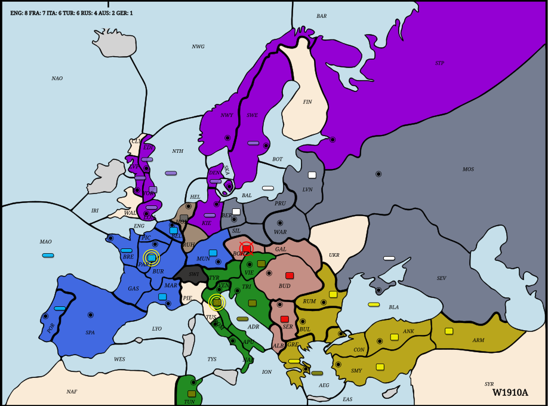

### What happened

- **AUSTRIA**: disbands A BOH
- **FRANCE**: builds A PAR
- **ITALY**: builds A VEN

### AUSTRIA
Orders: `A BOH D`

Reasoning

> Looking at the situation: I have 2 supply centers (BUD, SER) but 3 units (A BUD, A SER, A BOH). I need to disband 1 unit to match my supply center count.
>
> The question is which unit to disband. A BUD and A SER are both critical defensive units protecting my remaining supply centers. A BOH is the unit that retreated there after being dislodged from VIE — it's the least useful of the three, as it's not on a supply center and is in a somewhat awkward position. Keeping A BUD and A SER gives me the best defensive posture for my two remaining centers.

### FRANCE
Orders: `A PAR B`

Reasoning

> Looking at the current position: I have 7 supply centers (BRE, MAR, PAR, SPA, POR, BEL, MUN) and 6 units, so I have a surplus of 1 center and can build one unit.
>
> My only available build location is PAR (vacant). BRE and MAR are occupied by my own units.
>
> Building an army in PAR makes sense — it can push toward BUR, MUN, or support my eastern position. A fleet in PAR isn't possible (PAR is inland). The only option is A PAR B.

### ITALY
Orders: `A VEN B`

Reasoning

> Looking at the current situation:
>
> - I have 6 supply centers (NAP, ROM, VEN, TUN, TRI, VIE) and 5 units (A TUN, F ADR, A TRI, F AEG, A VIE)
> - I'm owed 1 build (6 centers - 5 units = 1 build)
> - Available home centers: NAP, ROM, VEN (all vacant)
>
> I need to decide what to build. My strategic position:
> - I hold VIE and TRI in Austria's heartland, pressing against Austria's remaining BUD and SER
> - Turkey has 6 centers and is a growing threat; F AEG is positioned in the Aegean
> - I need to keep pressure on Austria while watching Turkey's expansion
> - England at 8 centers is the board leader and growing concern
>
> For the build, I should consider:
> - An army would help press into BUD or SER from VIE/TRI
> - A fleet at NAP could reinforce the Aegean/eastern Mediterranean theater
> - VEN is the most central home center
>
> Given that I want to press Austria's BUD (adjacent to VIE) and keep pressure on the Balkans, an army build makes most sense. Building at VEN gives me flexibility to move toward TYR, TRI, or support operations. Alternatively, NAP fleet could support eastern Mediterranean operations against Turkey.
>
> I'll build an Army at VEN to support further pressure on Austria's BUD and SER, giving me more ground forces for the Balkan campaign.

## Final state

| Power | Centers | # |
|---|---|---|
| ENGLAND | EDI, LON, LVP, NWY, DEN, SWE, STP, KIE | 8 |
| FRANCE | BRE, MAR, PAR, POR, SPA, BEL, MUN | 7 |
| ITALY | NAP, ROM, VEN, TUN, TRI, VIE | 6 |
| TURKEY | ANK, SMY, GRE, CON, RUM, BUL | 6 |
| RUSSIA | MOS, SEV, WAR, BER | 4 |
| AUSTRIA | BUD, SER | 2 |
| GERMANY | HOL | 1 |

