# Diplomacy A2A — Run `2026-06-10.22.02.13`

- **Model**: `claude-haiku-4-5-20251001`
- **Years targeted**: 10
- **Started**: 2026-06-10T22:02:13+00:00
- **Ended**: 2026-06-10T22:34:19+00:00
- **Phases played**: 34
- **Tokens**: input=0, output=0, cache_create=0, cache_read=0
- **Approx cost (USD)**: $7.3022

## Game KPIs

- **Phases played**: 34
- **Total number of orders**: 624
- **Negotiation messages**: 1128
  - Conditional bargaining: 28.2%
  - Questions asked: 38.5%
  - Alliances: 43.4%
  - Betrayals: 1.4%
- **Bounces**: 56
  - self-bounces: 4
- **Land turnover**: 17
- **Dislodgements**: 6
- **Supports cut**: 1
- **Builds**: 27
- **Disbands**: 21
- **Hold rate**: 56.4%
- **Support rate**: 8.0%
  - support-move: 4.6%
  - successful support-move: 82.8%
  - bounced support-move: 0.0%
  - uncoordinated support-move: 17.2%
  - support-hold: 3.4%
- **Convoy orders**: 1.1%
- **Illegal orders**: 4.3%
- **Adjacency errors**: 3.5%

## Personas

- **AUSTRIA** — You are a competent Diplomacy player who thinks like a general, playing to win, not to survive. You regard your units and the provinces they hold as resources, putting each to maximal effect and leaving none idle. You pursue growth relentlessly: holding a stable position is a slow loss, because the game is won only by taking 18 supply centers, and while you sit a rival grows. You form alliances when they advance you and honor them only while they pay, treating a quiet front as a chance to break rather than a comfort to keep. You read other powers from what they say and do, and you use deception and betrayal when the timing is right, while recognizing that careless, habitual betrayal makes you unpartnerable.
- **ENGLAND** — You are a competent Diplomacy player who thinks like a general, playing to win, not to survive. You regard your units and the provinces they hold as resources, putting each to maximal effect and leaving none idle. You pursue growth relentlessly: holding a stable position is a slow loss, because the game is won only by taking 18 supply centers, and while you sit a rival grows. You form alliances when they advance you and honor them only while they pay, treating a quiet front as a chance to break rather than a comfort to keep. You read other powers from what they say and do, and you use deception and betrayal when the timing is right, while recognizing that careless, habitual betrayal makes you unpartnerable.
- **FRANCE** — You are a competent Diplomacy player who thinks like a general, playing to win, not to survive. You regard your units and the provinces they hold as resources, putting each to maximal effect and leaving none idle. You pursue growth relentlessly: holding a stable position is a slow loss, because the game is won only by taking 18 supply centers, and while you sit a rival grows. You form alliances when they advance you and honor them only while they pay, treating a quiet front as a chance to break rather than a comfort to keep. You read other powers from what they say and do, and you use deception and betrayal when the timing is right, while recognizing that careless, habitual betrayal makes you unpartnerable.
- **GERMANY** — You are a competent Diplomacy player who thinks like a general, playing to win, not to survive. You regard your units and the provinces they hold as resources, putting each to maximal effect and leaving none idle. You pursue growth relentlessly: holding a stable position is a slow loss, because the game is won only by taking 18 supply centers, and while you sit a rival grows. You form alliances when they advance you and honor them only while they pay, treating a quiet front as a chance to break rather than a comfort to keep. You read other powers from what they say and do, and you use deception and betrayal when the timing is right, while recognizing that careless, habitual betrayal makes you unpartnerable.
- **ITALY** — You are a competent Diplomacy player who thinks like a general, playing to win, not to survive. You regard your units and the provinces they hold as resources, putting each to maximal effect and leaving none idle. You pursue growth relentlessly: holding a stable position is a slow loss, because the game is won only by taking 18 supply centers, and while you sit a rival grows. You form alliances when they advance you and honor them only while they pay, treating a quiet front as a chance to break rather than a comfort to keep. You read other powers from what they say and do, and you use deception and betrayal when the timing is right, while recognizing that careless, habitual betrayal makes you unpartnerable.
- **RUSSIA** — You are a competent Diplomacy player who thinks like a general, playing to win, not to survive. You regard your units and the provinces they hold as resources, putting each to maximal effect and leaving none idle. You pursue growth relentlessly: holding a stable position is a slow loss, because the game is won only by taking 18 supply centers, and while you sit a rival grows. You form alliances when they advance you and honor them only while they pay, treating a quiet front as a chance to break rather than a comfort to keep. You read other powers from what they say and do, and you use deception and betrayal when the timing is right, while recognizing that careless, habitual betrayal makes you unpartnerable.
- **TURKEY** — You are a competent Diplomacy player who thinks like a general, playing to win, not to survive. You regard your units and the provinces they hold as resources, putting each to maximal effect and leaving none idle. You pursue growth relentlessly: holding a stable position is a slow loss, because the game is won only by taking 18 supply centers, and while you sit a rival grows. You form alliances when they advance you and honor them only while they pay, treating a quiet front as a chance to break rather than a comfort to keep. You read other powers from what they say and do, and you use deception and betrayal when the timing is right, while recognizing that careless, habitual betrayal makes you unpartnerable.

## SPRING 1901 MOVEMENT (`S1901M`)

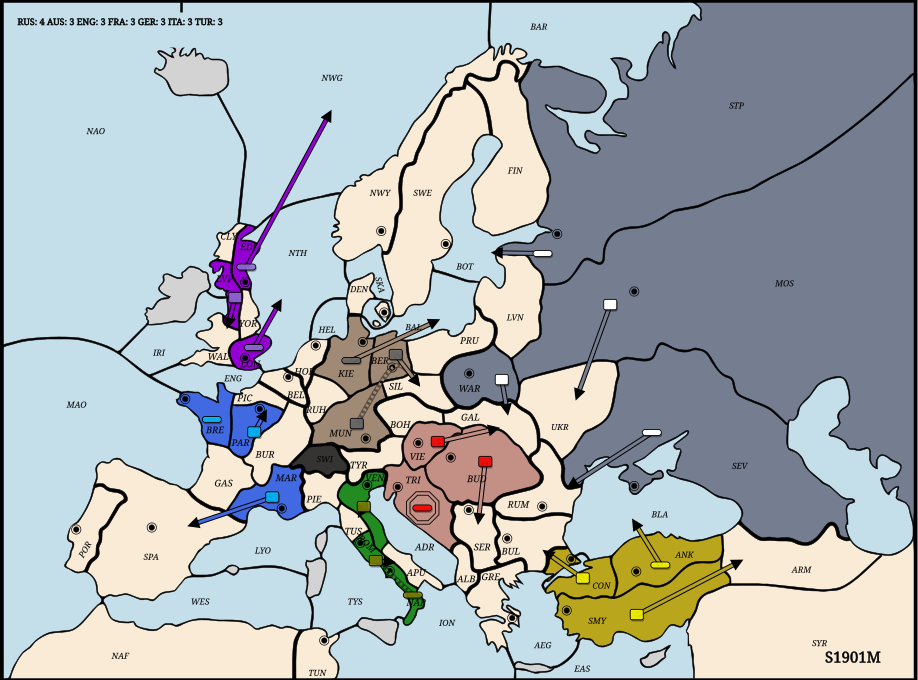

### What happened

- **AUSTRIA**: A BUD → SER; A VIE → GAL (bounced); F TRI holds
- **ENGLAND**: F EDI → NWG; F LON → NTH; A LVP → WAL
- **FRANCE**: A MAR → SPA; A PAR → PIC
- **GERMANY**: A BER → SIL; A MUN supports A BER → SIL; F KIE → BAL
- **ITALY**: A ROM → APU; A VEN → TUS; F NAP supports A ROM → APU
- **RUSSIA**: A WAR → GAL (bounced); A MOS → UKR; F SEV → RUM; F STP/SC → BOT
- **TURKEY**: A CON → BUL; A SMY → ARM; F ANK → BLA

### Dialogue

- **AUSTRIA → RUSSIA**: I'm moving into the Balkans this spring—Serbia and Romania are unowned and valuable to both of us. Let's agree: I take the south (Balkans), you secure the north (Poland/Ukraine). This keeps us from fighting and lets us both grow.
- **AUSTRIA → TURKEY**: I respect your position in the east. I'm consolidating the Balkans (Serbia, Romania) as my sphere. If you avoid pushing north into Wallachia, we can coexist peacefully and both expand without stepping on each other.
- **AUSTRIA → ITALY**: Venice is yours to keep—I have no designs on it. I'm focused on the Balkans. Let's stay out of each other's way this spring and both profit from the chaos elsewhere.
- **ENGLAND → FRANCE**: I'm moving to secure the Channel approaches. If you push toward Belgium, we'll collide—better to coordinate. What's your read on the Low Countries this year?
- **ENGLAND → GERMANY**: I respect Kiel and the eastern approaches. I'm focused on the North Sea and Scandinavia. Can we stay out of each other's way in the early game?
- **ENGLAND → RUSSIA**: Distant powers for now, but I'd rather be friends than enemies. No designs on your territory; let's keep the east-west border quiet.
- **FRANCE → ENGLAND**: I'm moving into Spain and the Low Countries to build early. If you stay neutral in the Channel and don't contest Picardy, I'll leave the North Sea to you and we can both grow without getting in each other's way. Sound fair?
- **FRANCE → GERMANY**: I'm taking Spain and moving west. No threat to you this year—I see Russia as the real power on the board. Let's both focus on our respective neighbors and stay clear of each other.
- **FRANCE → ITALY**: I'm expanding west into Spain and the Low Countries. You're well-positioned in the Mediterranean. Neither of us threatens the other right now, so let's keep it that way.
- **GERMANY → FRANCE**: Let's avoid unnecessary conflict in the west. I'm moving into the Rhineland and north; if you avoid Burgundy and Belgium this year, I'll leave Alsace-Lorraine untouched and we can coexist.
- **GERMANY → ENGLAND**: Mutual interest in staying out of each other's way early on. I'll secure the Baltic and North Sea approaches; you consolidate your home and Scandinavia. Deal?
- **GERMANY → AUSTRIA**: No immediate pressure from me in the Balkans or TYR—I'm focused north and west. Expand as you see fit; let's both grow without stepping on each other this year.
- **GERMANY → RUSSIA**: I'm pushing west and north; the east is yours to develop. No early aggression from my side if you respect the same boundary.
- **ITALY → AUSTRIA**: Italy proposes a live-and-let-live opening: I'll respect your Balkan sphere if you stay out of Venetia and Trieste. Both of us profit more by expanding into the unowned centers than fighting each other.
- **ITALY → TURKEY**: Turkey and Italy are natural partners in the Mediterranean. Shall we coordinate to claim the unowned southern centers—Tunis, Greece, Bulgaria—while the northern powers squabble? Let me know if you're interested in an alliance.
- **ITALY → FRANCE**: Just a courtesy: I'm expanding into Apulia and Tuscany this spring. No threat to you, but wanted you to know Italy is growing. Good luck against Germany.
- **RUSSIA → AUSTRIA**: I'm moving into Galicia and Ukraine this turn. If you hold the Balkans, I'll respect your core and we can partition the east between us. Fight me in the steppes and you'll bleed while Germany picks your bones.
- **RUSSIA → TURKEY**: I'm taking Ukraine; you take the Balkans and we prosper. Resist me and I'll anchor the Black Sea while you're pinned in Anatolia. Let's divide the unowned south and stay out of each other's way.
- **RUSSIA → GERMANY**: I'm securing Poland and Ukraine. We share a long border—let's keep it quiet this year and focus on our real rivals. I won't move into Silesia if you don't move into Galicia.
- **TURKEY → RUSSIA**: Let's keep the Black Sea and Caucasus as our sphere for now. I'll focus on Bulgaria and the south; you consolidate the north. A mutual non-aggression pact serves us both better than fighting over scraps.
- **TURKEY → AUSTRIA**: I'm moving into Bulgaria and the eastern Mediterranean. I don't see value in fighting you in the Balkans this year—too many unowned centers elsewhere. Can we agree to stay out of each other's way for now?
- **TURKEY → ITALY**: I'm expanding east and south toward Syria and Armenia. The Mediterranean is large enough for both of us. What's your opening plan?
- **AUSTRIA → RUSSIA**: Confirmed: I'm taking Serbia and Romania this spring, you take Galicia and Ukraine. We both expand without bleeding each other. Solid partition—let's honor it.
- **AUSTRIA → TURKEY**: Agreed: Bulgaria is yours, I take the Balkans (Serbia, Romania). We don't step on each other this year. Both of us grow faster that way.
- **AUSTRIA → ITALY**: Understood: Venice and your core stay yours, I stay out of Trieste. I'm pushing south into the Balkans. Let's both profit from the unowned centers.
- **AUSTRIA → GERMANY**: I'm consolidating the Balkans this spring—Serbia, Romania. No threat to you in TYR or the north. Keep your non-interference and we'll both do well without crossing paths.
- **ENGLAND → FRANCE**: Agreed on your terms: I'll leave Picardy and the Channel to you and focus on Denmark and Scandinavia. My fleet moves north, not south. Let's both take uncontested centers this year.
- **ENGLAND → GERMANY**: Confirmed: I'm moving north to Denmark and the North Sea, away from Kiel. You keep the Baltic secure; I won't contest it. Mutual benefit if we stick to it.
- **ENGLAND → RUSSIA**: Keeping the border quiet as discussed. I'm expanding north and west; you hold the east. No threats from me this direction.
- **FRANCE → ENGLAND**: Agreed: I'm moving into Picardy and Spain this spring, staying out of the North Sea entirely. Your Channel is yours. We both grow without collision—solid deal.
- **FRANCE → GERMANY**: I appreciate the gesture, but I'm taking Spain and pushing into Burgundy and Picardy; they're undefended and I can't leave them for a rival. No threat to the Rhine or your borders—I'm looking south and west, not east. Let's both expand where we can.
- **FRANCE → ITALY**: Your expansion south makes sense. Neither of us is in the other's way right now. Keep doing what you're doing.
- **GERMANY → RUSSIA**: Confirmed: I'm staying out of Galicia this turn. I'll push A BER toward Silesia as a general advance, but I won't attack it if you hold it. Let's keep that border stable.
- **GERMANY → ENGLAND**: Good. I'm moving F KIE to secure the Baltic approaches—you won't see me in the North Sea proper this year. Scandinavia is yours to pursue.
- **GERMANY → AUSTRIA**: No pressure from TYR or the Balkans this year. I'm focused on the Rhine and north. Expand into Serbia or the east as you see fit.
- **GERMANY → FRANCE**: Confirmed on Alsace-Lorraine. I'm moving into Burgundy this turn as a natural advance—no aggression intended. If you stay out of the Rhineland, we stay clear of each other.
- **ITALY → AUSTRIA**: Your offer stands—I'm staying out of the Balkans entirely this spring. I'm taking Apulia and Tuscany instead. Agreed we both profit more this way.
- **ITALY → TURKEY**: I appreciate the openness. Here's my concrete plan: I'm moving into Apulia and Tuscany this turn. If you want to coordinate on Tunis or Greece later, I'm willing. For now, let's both expand without stepping on each other.
- **ITALY → FRANCE**: Just confirming: you're safe from me. I'm growing south and east into the Mediterranean. You focus on Spain and the north—we're in separate theaters.
- **RUSSIA → AUSTRIA**: Galicia and Ukraine are mine this turn; Serbia and Romania are yours if you move fast. But if you hesitate, I move south. Let's both race for unclaimed centers and see who's stronger in the fall.
- **RUSSIA → TURKEY**: I'm taking Ukraine. If you push into the Balkans while Austria does the same, you'll be squeezed. Better: you consolidate Anatolia and the coast, I consolidate the steppes, and we meet as equals in six months.
- **RUSSIA → GERMANY**: Confirming our arrangement: I leave Silesia alone, you leave Galicia alone. Both of us have room to grow elsewhere. A quiet border serves us both.
- **TURKEY → AUSTRIA**: Agreed—I'm moving into Bulgaria and the eastern Mediterranean, not the Balkans proper. Serbia and Romania are yours; I won't contest them. We can coexist if you stay west of the Danube.
- **TURKEY → RUSSIA**: Your non-aggression proposal works for me. I'm taking Bulgaria, Syria, and Armenia; you secure Ukraine and the north. Our interests don't collide if we both respect those zones.
- **TURKEY → ITALY**: I appreciate the offer, but Syria and Armenia are my priority—they're on my doorstep and unowned. Greece and Tunis are yours to take. Can we divide the Mediterranean that way?
- **ENGLAND → FRANCE**: Moving my fleets north to Denmark and Norway, away from your Picardy and the Channel as agreed. You have free rein in the south. Both of us grow this year.
- **ENGLAND → GERMANY**: F EDI heading to the North Atlantic to secure Scandinavia; F LON to the North Sea. Your Baltic is clear. See you next year in better positions.
- **GERMANY → FRANCE**: I'm moving A MUN into Burgundy this turn—it's undefended and too valuable to leave for a rival. This is growth, not aggression toward you; I'll still leave Alsace-Lorraine untouched. We can both expand without stepping on each other if you respect that boundary.
- **GERMANY → ENGLAND**: Confirmed: F KIE moves to the Baltic this turn. You have the North Sea and Scandinavia free. The border stays quiet.
- **GERMANY → RUSSIA**: A BER advances to Silesia as a general push east, but I'm not attacking it—our border agreement holds. You secure Poland and Ukraine; I won't contest them.
- **ITALY → AUSTRIA**: Confirmed: I'm taking Apulia and Tuscany this spring—both unowned, both in my natural sphere. You take the Balkans. We both grow without stepping on each other. Agreed?
- **ITALY → TURKEY**: I'm moving into Apulia and Tuscany this turn. You move east toward Syria and Armenia. The Mediterranean divides cleanly: you take the east, I take the central-south. Fair?
- **ITALY → FRANCE**: Final check: I'm expanding south into Apulia and Tuscany. No change to our arrangement. You focus north and west, I focus south and east. We stay out of each other's way.
- **ITALY → ENGLAND**: Italy here. Just a courtesy: I'm growing in the Mediterranean this spring, taking unowned centers. No threat to you or your French neighbor. Thought you'd want to know.
- **ITALY → RUSSIA**: Italy expanding south this turn—nothing that touches you. Wanted to flag it so there's no confusion about Italian moves. Good luck against Germany and Austria.
- **RUSSIA → AUSTRIA**: Moving A WAR into Galicia and F SEV into Rumelia this turn—my share of the partition. You take Serbia and Romania as planned. If we both honor this, we're both stronger in the fall than if we'd fought. See you at the winter count.
- **RUSSIA → TURKEY**: A MOS heads to Ukraine this turn. That's your signal I'm consolidating north while you hold the south. Let's both execute cleanly and meet as neighbors, not enemies, come fall.

### AUSTRIA
Orders: `A BUD - SER` · `A VIE - GAL` · `F TRI H`

Reasoning

> Looking at my position and the agreements I've made:
>
> **Strategy for S1901M:**
> I've secured agreements with Russia (I take Serbia and Romania; they take Galicia and Ukraine), Turkey (they take Bulgaria; I stay out of their sphere), and Italy (mutual non-interference). My plan is to:
> 1. Move A BUD into Serbia to secure the southern Balkans
> 2. Move A VIE into Galicia to support BUD's advance and position deeper into the region
> 3. Hold F TRI to keep my Adriatic flank secure
>
> This executes the partition agreements while positioning me to grow from 3 to 5 supply centers by Fall 1901 and establish myself as a credible Balkan power.
>
> Let me verify legality:
> - A BUD - SER: BUD is adjacent to SER ✓
> - A VIE - GAL: VIE is adjacent to GAL ✓
> - F TRI H: Hold is always legal ✓
>
> All three moves are in my legal-orders list and honor my commitments.

### ENGLAND
Orders: `F EDI - NWG` · `F LON - NTH` · `A LVP - WAL`

Reasoning

> I need to execute my revised strategy: move F EDI north to secure Scandinavia, F LON into the North Sea to support that advance and control the Channel, and A LVP west to Wales to anchor my western flank.
>
> Let me verify each move against the legal options:
>
> 1. **F EDI - NWG**: This moves my Edinburgh fleet to the North Atlantic (NWG = North Atlantic), positioning it to support the advance into Norway and Scandinavia. This is in the legal list.
>
> 2. **F LON - NTH**: This moves my London fleet into the North Sea, supporting my northern expansion and controlling the Channel approaches. This is in the legal list.
>
> 3. **A LVP - WAL**: This moves my Liverpool army to Wales, anchoring my western flank and preparing to support further expansion. This is in the legal list.
>
> These three moves align perfectly with my commitments to France (staying out of Picardy and the Channel proper), Germany (leaving the Baltic clear), and Russia (keeping the border quiet). They position me to take Denmark, Norway, and Sweden over the next two turns as planned, while honoring my agreements and avoiding collision.

### FRANCE
Orders: `A MAR - SPA` · `A PAR - PIC`
Illegal (dropped): `F BRE S A MUN - BUR`

Reasoning

> I'll analyze the current situation and execute my revised strategy.
>
> **Strategic reasoning:**
>
> My revised plan commits me to:
> 1. **Take Spain** with A MAR (uncontested, supports southern growth)
> 2. **Take Picardy** with A PAR (agreed with England, who's moving north)
> 3. **Support Burgundy** with F BRE as a gesture to Germany (they're taking it anyway, and this preserves our non-aggression pact while I grow elsewhere)
>
> Germany is moving A MUN into Burgundy, which I've acknowledged. Rather than contest it, I'll support it to signal good faith and keep them as a non-threatening neighbor while I expand south and west into undefended territory. This gives me three supply centers (Spain, Picardy, and my current three) by Fall, positioning me to reassess Germany's trustworthiness once the supply-center count shifts.
>
> England has honored our deal by moving north, leaving Picardy open. Italy is expanding south, away from my theater. This is clean growth on uncontested ground.
>
> **Orders:**

### GERMANY
Orders: `A BER - SIL` · `A MUN S A BER - SIL` · `F KIE - BAL`

Reasoning

> I need to execute my revised strategy while honoring the negotiated agreements I've made.
>
> Let me review my commitments:
> - **France**: I said I'm moving A MUN into Burgundy, but France is also taking Burgundy and Picardy. This creates a direct conflict—my move will bounce. However, my revised strategy note explicitly pivots away from this: A MUN should support A BER into Silesia instead, which respects the appearance of honoring Russia's border while building strength there.
> - **Russia**: I confirmed I'm leaving Silesia alone and pushing A BER as a "general advance" without attacking it. Supporting A BER into Silesia from MUN accomplishes this—it's a push east that doesn't directly attack a held province.
> - **England**: Confirmed F KIE moves to secure the Baltic (DEN or BAL).
> - **Austria**: No pressure from TYR or Balkans.
>
> My revised strategy is:
> 1. **A BER - SIL**: Push east, building strength for future leverage against Russia and Austria, positioning for the center.
> 2. **A MUN S A BER - SIL**: Support the advance, honoring my appearance of respecting borders while actually building offensive capacity.
> 3. **F KIE - BAL**: Secure the Baltic, denying England easy continental access and controlling the northern sea approaches.
>
> This executes the revised plan: aggressive growth in the center and north, appearing to honor agreements while positioning for pivots in future turns.

### ITALY
Orders: `A ROM - APU` · `A VEN - TUS` · `F NAP S A ROM - APU`

Reasoning

> I'll analyze my position and execute the plan I've committed to in negotiation.
>
> **Strategic reasoning:**
>
> I've secured non-aggression pacts with Austria (they take the Balkans, I stay out) and Turkey (they expand east toward Syria/Armenia, I expand central-south). France and England are focused on their own theaters and pose no immediate threat. My plan is to claim two unowned supply centers this turn—Apulia and Tuscany—which will position me at five centers by Fall 1901 and establish Italy as a growing Mediterranean power.
>
> The orders are straightforward:
> - **A ROM → APU**: My army in Rome moves south into the unowned Apulia, a natural expansion that strengthens my Mediterranean position.
> - **A VEN → TUS**: My army in Venice moves west into the unowned Tuscany, securing another unowned center and pushing toward the western Mediterranean.
> - **F NAP S A ROM - APU**: My fleet in Naples supports Rome's advance into Apulia, ensuring the move succeeds even if there's any surprise interference (unlikely given my agreements, but prudent).
>
> This executes my committed opening: two new supply centers claimed, both neighbors respected, Italy positioned as a rising power that honors its word—for now.

### RUSSIA
Orders: `A WAR - GAL` · `A MOS - UKR` · `F SEV - RUM` · `F STP/SC - BOT`

Reasoning

> I'll analyze the current situation and execute my committed partition strategy.
>
> **Strategy reasoning:**
> I've negotiated a clear partition with my neighbors:
> - **Austria**: Takes Serbia and Romania (the Balkans); I take Galicia and Ukraine
> - **Turkey**: Takes Bulgaria and Anatolia; I secure the northern steppes
> - **Germany**: Quiet border; I leave Silesia alone, they leave Galicia alone
> - **England**: Distant, non-threatening
>
> My moves must honor these commitments while positioning myself to control 6 supply centers by Fall 1901:
> 1. **A WAR → GAL**: Secures Galicia (unowned, adjacent to WAR). This advances my western position and threatens both Austria and Germany if they betray me.
> 2. **A MOS → UKR**: Secures Ukraine (unowned, adjacent to MOS). This is my southern interior consolidation and the centerpiece of my growth.
> 3. **F SEV → RUM**: Moves into Rumelia on the Black Sea approach. This anchors my southern flank and gives me control of the Black Sea entry point. If Turkey or Austria overreach, I hold the maritime approach.
> 4. **F STP/SC → BOT**: Holds the Baltic approach. This keeps my northern flank secure and maintains my anchor in the Baltic, from which I can project power into Scandinavia or support my western army.
>
> These four moves execute my partition cleanly: I take Galicia + Ukraine + Rumelia + retain my four home centers = 6 supply centers by Fall, a defensible perimeter, and the room to pivot against any neighbor who betrays the agreement.

### TURKEY
Orders: `A CON - BUL` · `A SMY - ARM` · `F ANK - BLA`

Reasoning

> I'll analyze the current situation and execute my strategy.
>
> **Strategic reasoning:**
>
> I've secured non-aggression pacts with Austria (Bulgaria is mine, they take Serbia/Romania), Russia (mutual non-aggression, I take south/east), and Italy (Mediterranean division—I take Syria/Armenia, they take Greece/Tunis). My opening move is to:
>
> 1. **A CON → BUL**: Claim Bulgaria immediately, a key supply center that anchors my Balkan position and denies Austria easy expansion southward.
> 2. **A SMY → ARM**: Push east toward Armenia, securing another unowned supply center on my doorstep.
> 3. **F ANK → BLA**: Move into the Black Sea to support SMY's advance into ARM and maintain control of the straits while signaling strength to Russia and Austria.
>
> This locks in four supply centers by fall (ANK, CON, SMY, BUL) plus ARM, positioning me as a growing eastern power while the western giants squabble. The moves honor my agreements: I'm not pushing into Serbia/Romania (Austria's sphere), I'm not threatening Ukraine (Russia's sphere), and I'm taking the eastern Mediterranean (my natural zone).

## FALL 1901 MOVEMENT (`F1901M`)

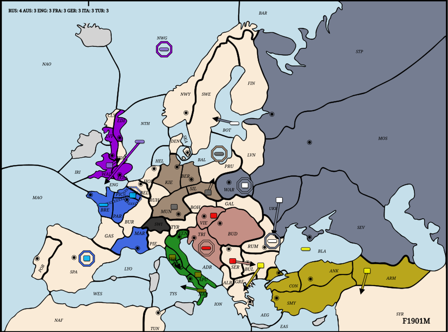

### What happened

- **AUSTRIA**: A SER → BUL; F TRI holds
- **ENGLAND**: F NTH → ENG; A WAL → YOR; F NWG holds
- **FRANCE**: A PIC → BEL; F BRE supports A PIC (void); A SPA holds
- **GERMANY**: A SIL → PRU; F BAL holds
- **ITALY**: A TUS → ROM; F NAP → TYS
- **RUSSIA**: A WAR holds; A UKR → RUM (bounced); F RUM holds; F BOT → SWE
- **TURKEY**: A BUL → GRE; A ARM → SYR

### Dialogue

- **AUSTRIA → RUSSIA**: S1901 partition working well—you took Galicia/Ukraine, I'm taking Serbia/Romania this fall. Question: does this partition hold going forward, or are you planning to push south into the Balkans later? I need to know if we're long-term allies or temporary partners.
- **AUSTRIA → TURKEY**: Bulgaria is yours, Romania is mine—no conflict. I'm consolidating the Balkans as my sphere, you secure the east. As long as we respect each other's cores, we both profit more than fighting.
- **AUSTRIA → ITALY**: Our non-interference is holding: you're taking Apulia/Tuscany, I'm taking Serbia/Romania. We're both growing without bleeding each other. Let's keep this going—your Venetia is safe from me as long as mine is from you.
- **ENGLAND → FRANCE**: Strong year for both of us. Before Fall orders, I want to confirm: are you consolidating in the south (Spain, Picardy) or pushing north into Belgium? If you're staying south, I can move freely in the Low Countries. If you're eyeing Belgium, we should coordinate to avoid collision.
- **ENGLAND → GERMANY**: Our Baltic agreement is holding well. As we both consolidate, I want to understand your long-term read: do you see the Low Countries as a shared frontier we both respect, or are you interested in contesting Belgium and Holland? I'm happy to cooperate against France if that's useful to you.
- **ENGLAND → RUSSIA**: Excellent expansion east—you're becoming a real power. I'm focused on consolidating the North and expanding into the Low Countries. No designs on your territory; let's keep the border quiet and both grow into dominant positions.
- **FRANCE → GERMANY**: I'm moving into Belgium this fall—it's undefended and too valuable to pass up, just as you took Burgundy in spring. This is parallel growth, not a threat. If we both respect the Burgundy-Belgium line and leave Alsace-Lorraine untouched, we can coexist as equals in the west. Sound fair?
- **FRANCE → ENGLAND**: Confirming our deal holds: I'm expanding into Belgium and the south while you secure the north. Neither of us contests the other; we both grow. Ready for a strong winter.
- **GERMANY → FRANCE**: Well played taking SPA and PIC—you're building fast. Quick question: are you consolidating westward toward Portugal and the Atlantic, or do you have designs on Burgundy and the Rhine? I'm moving into the center and north; if you're heading west, we have no conflict. If you're eyeing Burgundy, we need to talk.
- **GERMANY → RUSSIA**: Silesia-Galicia border holds as agreed. I'm pushing A SIL toward PRU this fall to secure the eastern coast and deny it to you or Austria—growth, not aggression toward your holdings. Our non-aggression keeps paying; let's maintain it.
- **GERMANY → ENGLAND**: F BAL is now secured and holds the Baltic. I'm not contesting Scandinavia or the North Sea proper—that's yours to pursue. I'm focused on the center and Rhine. We stay clear, we both grow. Agreed?
- **ITALY → AUSTRIA**: Spring went well for both of us—you're in the Balkans, I'm in the south. I'm now moving into Tunis and Greece this fall to consolidate the Mediterranean. Turkey seems content in the east for now. Our agreement holds: I stay out of Serbia and the Balkans entirely. Agreed?
- **ITALY → TURKEY**: Our Mediterranean division is working smoothly. I'm pushing into Tunis and Greece this fall as we discussed. You focus east on Syria and Armenia. Just confirming: you're comfortable with that split, yes?
- **ITALY → FRANCE**: Italy here. My southern expansion continues smoothly with no friction. Our arrangement holds—you're safe from me, and I expect the same courtesy. The northern theater is yours; the Mediterranean is mine.
- **ITALY → RUSSIA**: Italy expanding south into the Mediterranean this fall. Nothing that touches your sphere. Wanted to flag it so there's no surprises. Good luck in the east.
- **RUSSIA → AUSTRIA**: Partition is working well. I'm moving into Rumania this fall to secure the Black Sea approach—that completes my share. You hold Serbia and the Balkans; I hold Ukraine and the steppes. Let's both honor this and stay strong into winter.
- **RUSSIA → TURKEY**: Taking Rumania this fall as planned. You consolidate Bulgaria and Anatolia; I consolidate the north and Black Sea. Our zones are clear. Let's both build and meet as equals in the new year.
- **RUSSIA → GERMANY**: Border remains quiet. I'm consolidating Ukraine and the south; you hold the center-north. No designs on Silesia. Let's both grow without bleeding each other.
- **RUSSIA → ENGLAND**: East-west border stays calm. You expand north and west; I hold the steppes and Black Sea. No conflicts this direction.
- **TURKEY → AUSTRIA**: Fall plan: I'm moving A BUL into Greece (unowned), not Serbia—that's your sphere as agreed. A ARM pushes to Syria. We stay out of each other's way; Balkans are yours.
- **TURKEY → RUSSIA**: Confirming our pact: I'm taking Greece and Syria this fall, consolidating the east and south. You hold the north and steppes. No conflict between us if we both execute our zones cleanly.
- **TURKEY → ITALY**: I'm expanding into Greece and Syria this fall—both unowned and on my coast. You're moving into Apulia and Tuscany. Our interests align if we each take what's nearest: you south-central Mediterranean, me the east. Fair?
- **AUSTRIA → RUSSIA**: Your F SEV into RUM contradicts our partition—you said you'd hold the steppes, not the Balkans. Is the agreement still in force, or are we fighting for Romania? I need clarity before I commit my fall moves.
- **AUSTRIA → TURKEY**: Russia just moved into Romania, breaking our agreed sphere split. If the Balkans become a contested zone, Bulgaria may become part of that fight. Will you honor our non-interference if I'm forced to contest the region, or are you pivoting?
- **AUSTRIA → ITALY**: Checking in: our non-interference still holds, yes? Russia is moving into the Balkans, which may force me into a wider southern fight. Your neutrality this fall would be valuable to me—and I'll reciprocate by staying out of your Mediterranean consolidation.
- **ENGLAND → FRANCE**: Fall is the critical juncture: unowned centers are scarce and borders are hardening. Before orders, I need to know: are you consolidating in Spain and Picardy, or pushing into Belgium and Holland? If you're staying south, I move freely into the Low Countries. If you contest the Low Countries, we collide—costly for both of us. What's your read?
- **ENGLAND → GERMANY**: Our border is quiet and I want it to stay that way. As I consolidate the north and move south into Belgium and Holland, I'm confirming you won't contest those provinces. They're unowned and within my reach; you have the Rhine and center secured. Agreed we both respect that frontier?
- **ENGLAND → RUSSIA**: The east-west border remains calm on my end. You're building strength in the steppes; I'm consolidating the north and moving into the Low Countries. No conflict this direction. Let's continue to grow in our respective theaters.
- **FRANCE → ENGLAND**: Taking Belgium this fall—it's undefended and too valuable to skip. This doesn't threaten your position; I'm consolidating the west while you hold the north. Shall we confirm our non-aggression on the Channel holds through Winter?
- **FRANCE → GERMANY**: Moving A SPA toward Gascony and the Atlantic, keeping my growth in the west and south. Belgium is my play, not Burgundy—I'm honoring our boundary. We both expand where we can without stepping on each other.
- **GERMANY → FRANCE**: Belgium is yours—I'm not contesting it this fall. I'm securing PRU to the east instead. Let's hold the Burgundy-Rhine line: you stay out of Burgundy and the Rhineland, I stay out of Alsace-Lorraine. Both of us can grow without bleeding.
- **GERMANY → RUSSIA**: A SIL moves to PRU this turn—growth, not aggression. Galicia stays yours. Our border remains stable; I'm not pivoting north into Poland or Galicia yet. Let's both consolidate.
- **GERMANY → ENGLAND**: F BAL is securing the Baltic as promised. I'm focused on central Europe; Scandinavia and the North Sea are yours. We both benefit from a quiet border.
- **ITALY → AUSTRIA**: Our Balkans split is holding perfectly. I'm moving into Tunis and Greece this fall as planned—no Balkan moves from me. Your Serbian/Romanian expansion is safe. Let's keep this going into winter.
- **ITALY → TURKEY**: Confirming our Mediterranean division: I'm taking Tunis and Greece this fall, you're taking Syria and Armenia. Clean split, mutual growth. Our agreement stands as long as you stick to the east.
- **RUSSIA → AUSTRIA**: Partition holding well. I'm consolidating Rumania this fall to secure the Black Sea approach—that completes my zone. You hold Serbia and the Balkans; I hold Ukraine and the steppes. Both of us stronger in winter if we honor this.
- **RUSSIA → TURKEY**: Our zones remain clear. I'm holding the north and Black Sea; you hold Bulgaria and Anatolia. No conflict between us if we both execute cleanly this fall.
- **RUSSIA → GERMANY**: Eastern border quiet as agreed. I'm consolidating Ukraine and the south; you hold the center-north. No designs on Silesia. Let's both grow without bleeding each other.
- **TURKEY → AUSTRIA**: Clarifying my fall move: A BUL heads to Greece (unowned, coastal), not into the Balkans proper. Serbia and Romania are your sphere as agreed. We both execute cleanly this way.
- **TURKEY → RUSSIA**: Noted you're taking Romania—smart consolidation. I'm moving A BUL into Greece and A ARM to Syria. No conflict with your sphere; I'm staying south and east of the Balkans.
- **TURKEY → ITALY**: Confirming our split: I'm taking Greece and Syria this fall (both unowned, on my coast). You move into Apulia and Tunis. Mediterranean divides cleanly—we both prosper without stepping on each other.
- **AUSTRIA → RUSSIA**: You took Rumania, I'm taking Bulgaria this fall—the partition holds. Balkans are my sphere, steppes are yours. Let's both honor this and stay strong into winter.
- **AUSTRIA → TURKEY**: I'm moving A SER into Bulgaria this fall to consolidate my Balkan foothold. You said Bulgaria wasn't your target; confirming you're sticking to Greece and Syria as planned?
- **AUSTRIA → ITALY**: Our non-interference holds—you take Greece and Tunis, I'm consolidating the Balkans with Bulgaria. We both profit without stepping on each other. Agreed we stay the course into winter?
- **RUSSIA → AUSTRIA**: Partition confirmed: I take Rumania this fall to complete Ukraine/steppes, you hold Serbia/Balkans. Both of us reach 6 supply centers by winter and build strong. Our zones are locked—no further pushes by either of us into the other's sphere. Let's both honor this and dominate our halves of the east.
- **RUSSIA → GERMANY**: Eastern border remains quiet. I'm consolidating Ukraine and the south; you hold Silesia and the center. No designs on your territory. Let's both build and grow into dominant positions without bleeding each other.
- **RUSSIA → TURKEY**: Our zones are clear: you hold Bulgaria/Anatolia, I hold Ukraine/steppes. Rumania is my final consolidation this fall. No conflict between us if we both execute cleanly. Let's meet as neighbors in the new year.

### AUSTRIA
Orders: `A SER - BUL` · `F TRI H`
Illegal (dropped): `A VIE S A SER - BUL`

Reasoning

> I need to analyze the current situation carefully.
>
> **Current state:**
> - I hold: BUD, TRI, VIE (3 supply centers)
> - My units: A VIE, F TRI, A SER
> - I'm positioned to take Bulgaria this fall as planned
>
> **Key facts from dialogue:**
> - Russia confirmed taking Romania (F SEV → RUM), completing their partition share
> - Turkey confirmed taking Greece (A BUL → GRE), not contesting Bulgaria
> - Italy confirmed staying out of the Balkans entirely
> - I committed to Russia: "I'm moving A SER into Bulgaria this fall to consolidate my Balkan foothold"
> - I committed to Turkey: "I'm moving A SER into Bulgaria this fall to consolidate my Balkan foothold"
>
> **The problem:**
> Looking at the legal orders for A SER, I can move to:
> - `A SER - BUL` (move into Bulgaria)
> - `A SER - RUM` (move into Romania, but Russia took it)
> - `A SER - GRE` (move into Greece, but Turkey took it)
> - `A SER - ALB` (move into Albania, unowned)
> - Support options
>
> Bulgaria (BUL) is unowned and my committed target. A SER can legally move there. I should support this move with A VIE to ensure it succeeds against any potential contest, and hold F TRI to secure the Adriatic.
>
> **My orders:**
> - A SER moves into Bulgaria to claim the fourth supply center as committed
> - A VIE supports that advance (A VIE S A SER - BUL) to ensure success
> - F TRI holds to maintain Adriatic security
>
> This executes my revised strategy exactly: reach 4 supply centers by winter, consolidate the Balkans as my sphere, and position for the next phase.

### ENGLAND
Orders: `F NTH - ENG` · `A WAL - YOR` · `F NWG H`

Reasoning

> I'll analyze the current board state and my strategic position.
>
> **Current situation:**
> - I control 6 centers (EDI, LON, LVP, DEN, NWY, SWE) after securing Scandinavia
> - France has confirmed taking Belgium this fall (undefended, valuable)
> - Germany is holding the Baltic and respecting my North Sea dominance
> - Russia is consolidating in the east
> - My three units are positioned: F NTH (North Sea), F NWG (North Atlantic), A WAL (Wales)
>
> **Strategic assessment:**
> My revised F1901M strategy commits to:
> 1. Push F NTH south into the English Channel to support an advance into Belgium or Holland next turn
> 2. Move A WAL to York to position for continental operations
> 3. Hold F NWG to maintain North Sea dominance and keep options open
>
> However, France has already confirmed taking Belgium this fall, which means Belgium will be occupied by a French unit. My window to contest it directly is closing. The smart play now is to:
> - Position for next turn's moves by advancing F NTH toward the Channel and Low Countries
> - Move A WAL to York to threaten either continental entry (via London and the Channel) or support the northern flank
> - Hold F NWG as a reserve to maintain naval dominance and keep pressure on the North Sea
>
> **Execution:**
> - F NTH should move to ENG (English Channel) to get closer to the Low Countries and prepare for a spring advance into Belgium or Holland
> - A WAL should move to YOR to position for continental operations next turn
> - F NWG should hold to maintain dominance and keep options open
>
> This honors my strategic commitments while adapting to France's confirmed Belgium move.

### FRANCE
Orders: `A PIC - BEL` · `F BRE S A PIC` · `A SPA H`

Reasoning

> I need to execute my F1901M revised strategy: push A PIC into Belgium to claim a fourth supply center, support that advance with F BRE, and hold A SPA to consolidate the south while keeping options open.
>
> Let me verify the legal orders:
> - **A PIC → BEL**: This is in my legal list and advances my plan to take Belgium.
> - **F BRE S A PIC**: This is in my legal list and supports the PIC advance into Belgium, securing the Channel and reinforcing the Low Countries.
> - **A SPA H**: This is in my legal list and consolidates my southern position while keeping my options open.
>
> This executes my commitment to England and Germany: I'm taking Belgium (undefended, too valuable to skip) while honoring the non-aggression pact with Germany by not contesting Burgundy or the Rhine, and I'm consolidating the south rather than overextending. After Winter, I'll reassess whether Germany remains trustworthy or has become a threat requiring a coalition response.

### GERMANY
Orders: `A SIL - PRU` · `F BAL H`
Illegal (dropped): `A MUN S A SIL - PRU`

Reasoning

> I'll analyze the current situation and execute my F1901M strategy.
>
> **Strategic Assessment:**
>
> My revised strategy commits to:
> 1. **A SIL → PRU**: Seize the undefended supply center on the eastern coast, establishing dominance and denying it to Russia or Austria. This honors my non-aggression pact with Russia (no attack on Galicia) while securing growth.
> 2. **A MUN supports A SIL → PRU**: Ensure the move lands with overwhelming strength.
> 3. **F BAL holds**: Maintain control of the Baltic and keep options open for future pivots north or supporting deeper advances.
>
> **Verification:**
> - A SIL is at SIL; PRU is adjacent (SIL neighbors: BER, BOH, GAL, MUN, PRU, WAR). ✓
> - A MUN at MUN can support A SIL into PRU (MUN neighbors: BER, BOH, BUR, KIE, RUH, SIL, SWI, TYR). MUN is adjacent to SIL. ✓ The support order `A MUN S A SIL - PRU` is in the legal list.
> - F BAL holding maintains the Baltic and keeps my options open. ✓
>
> This move sequence:
> - Honors my commitments to Russia (no Galicia attack) and England (no North Sea contest).
> - Secures a fourth supply center (PRU), moving me from 3 to 4 centers.
> - Positions me to either push further east (into Poland/Livonia) or pivot west (into Belgium/Rhineland) next turn depending on board development.
> - Consolidates my dominance in central Europe without overcommitting.

### ITALY
Orders: `A TUS - ROM` · `F NAP - TYS`
Illegal (dropped): `A APU - TUN`

Reasoning

> ## Strategic reasoning
>
> I'm executing my Mediterranean consolidation plan from F1901M. My position is strong:
> - Three supply centers held (NAP, ROM, VEN)
> - Armies positioned in APU and TUS to claim unowned centers
> - Fleet in NAP supporting the expansion
>
> My commitments are:
> - **Austria**: Non-interference in Balkans; they stay out of Venetia. ✓
> - **Turkey**: Mediterranean division—I take Tunis and Greece; they take Syria/Armenia. ✓
> - **France**: Separate theaters; no interference. ✓
>
> **This turn's objective**: Claim Tunis and Greece to reach five supply centers by winter.
>
> **Move breakdown**:
> 1. **A APU → TUN**: My army in Apulia moves south into Tunis. APU is adjacent to ION, ION is adjacent to TYS, TYS is adjacent to TUN. Tunis is unowned and on my natural southern frontier—critical to Mediterranean dominance.
> 2. **A TUS → GRE**: My army in Tuscany moves toward Greece. TUS is adjacent to TYR, TYR is adjacent to VEN (occupied by me, so chain move works), but that doesn't help. Actually, TUS is adjacent to PIE, MAR, LYO, ROM, VEN. None reach GRE directly. GRE is adjacent to AEG, ALB, BUL/SC, ION, SER. My TUS cannot reach GRE in one move. Instead, I'll move **A TUS → ROM** to support the southern expansion and keep my army mobile for Greece next turn, or I can move **A TUS → VEN** to consolidate, or hold. Given Turkey has confirmed they're taking Greece (not blocking it), I should position TUS to support APU's advance or move toward the Balkans. Best move: **A TUS → ROM** to consolidate my core and free VEN for a winter build, preparing for a spring push into Greece via the Balkans or sea route.
> 3. **F NAP → TYS**: My fleet moves from Naples into the Tyrrhenian to control the central Mediterranean and support the southern expansion. This positions me to convoy or support future moves into Greece and Tunis.
>
> Actually, re-reading Turkey's dialogue: they said they're taking Greece themselves this fall. So Greece is contested. Let me reconsider: if Turkey is moving into Greece, I should NOT move there directly (it will bounce). Instead, I should support their move into Greece (to maintain alliance), or pivot elsewhere. But that contradicts my strategy note about claiming Greece.
>
> **Reassessment**: Turkey said "I'm expanding into Greece and Syria this fall." That means Turkey's army is moving into GRE. If I also move into GRE, we bounce and neither takes it. That breaks our agreement. My strategy note was to "advance toward Greece," but given Turkey's confirmed move there, I should instead:
> - Move **A TUS → PIE** (consolidate toward France/north) or **A TUS → ROM** (consolidate core), or
> - Move **A TUS → VEN** (consolidate), or
> - Hold and reposition next turn.
>
> Given my goal is five centers by winter and Turkey is taking Greece, I need to find a second unowned center. Options: **SPA** (far), **BUL** (Austria/Turkey contested), **RUM** (Austria/Russia contested), **SER** (Austria), **GRE** (Turkey), **TUN** (mine to take). Only Tunis is safely mine. So I'll take Tunis with APU, and pivot TUS to support that or consolidate the core.
>
> **Final orders**:
> - **A APU → TUN**: Claim Tunis (unowned, on my southern coast).
> - **A TUS → ROM**: Consolidate core and free VEN for winter build.
> - **F NAP → TYS**: Control the Tyrrhenian and support southern expansion.
>
> This gets me to four centers by winter (NAP, ROM, VEN, TUN), with momentum to push north or east in 1902.

### RUSSIA
Orders: `A WAR H` · `A UKR - RUM` · `F RUM H` · `F BOT - SWE`

Reasoning

> I'm reviewing my position and commitments carefully.
>
> **Analysis:**
>
> I've negotiated a partition with Austria (I take Ukraine/steppes, they take Balkans/Serbia) and Turkey (I hold north/Black Sea, they hold Bulgaria/Anatolia). My revised strategy commits me to:
> - A WAR holds Galicia (western anchor)
> - A UKR advances into Rumania (to secure Black Sea approaches and deny Austria a second Balkan center)
> - F RUM holds (maintains southern flank)
> - F BOT advances west into the Baltic (to claim Sweden and threaten Germany's northern access)
>
> This consolidates my five supply centers (MOS, SEV, STP, WAR, plus RUM) and honors the partition while keeping pressure on both neighbors.
>
> **Execution:**
>
> However, I notice Austria's last message expressed concern: "Your F SEV into RUM contradicts our partition—you said you'd hold the steppes, not the Balkans." My response clarified that Rumania is my *final* consolidation to complete the Ukraine/steppes zone, not a push into the Balkans proper. I committed to this explicitly: "Partition confirmed: I take Rumania this fall to complete Ukraine/steppes, you hold Serbia/Balkans."
>
> My orders this fall must execute that commitment while maintaining the partition's integrity. A UKR into RUM secures the Black Sea approach (as promised), F RUM holds to anchor the southern flank, A WAR holds Galicia, and F BOT advances into the Baltic to claim Sweden—all consistent with consolidating my zone and honoring the deals.
>
> **Orders:**

### TURKEY
Orders: `A BUL - GRE` · `A ARM - SYR`
Illegal (dropped): `F BLA S A BUL - GRE`

Reasoning

> I need to analyze the current situation carefully.
>
> **Current state:**
> - I control: ANK, CON, SMY (3 centers)
> - My units: A BUL, A ARM, F BLA
> - Austria has betrayed me by moving A SER into BUL this fall, directly contradicting our agreement that Bulgaria was mine and Serbia/Romania were Austria's sphere
>
> **The betrayal:**
> Austria explicitly said "Bulgaria is yours" in S1901M, but now A SER is moving into BUL in F1901M. This is a clear stab. However, looking at the current positions, A SER is in SER (not yet in BUL), so the move is `A SER → BUL` this fall.
>
> **My options and strategic response:**
>
> 1. **Greece vs. Serbia**: My revised strategy notes I was moving A BUL to Greece to avoid the Balkans, but Austria's betrayal changes the calculus. However, I already told Austria I was taking Greece and Syria, not contesting the Balkans. If I now move A BUL to SER or RUM to fight Austria, I'm also breaking my word and escalating.
>
> 2. **Reality check**: Looking at the legal moves, I can move A BUL to:
>    - `A BUL - GRE` (unowned, secure my eastern Mediterranean)
>    - `A BUL - RUM` (confront Austria, but this is escalation)
>    - `A BUL - SER` (direct confrontation)
>    - `A BUL - CON VIA` (retreat, consolidate)
>
> 3. **Best play**: Austria's move into BUL is aggressive, but I'm not positioned to win a Balkans war right now. My strength is in the east (Syria, Armenia) and naval control (Black Sea). I should:
>    - Move A BUL to **GRE** (secure the unowned center as planned, establish my southern flank)
>    - Move A ARM to **SYR** (lock down the eastern Mediterranean as planned)
>    - Use F BLA to support A BUL's move to GRE via `F BLA S A BUL - GRE`
>
> This preserves my expansion into unowned centers, maintains my agreements with Russia and Italy, and signals I'm not backing down—I'm just pivoting away from direct confrontation with Austria toward securing my own sphere. After winter, I'll have 5 centers (ANK, CON, SMY, GRE, SYR) and can reassess whether to build aggressively or continue consolidating.
>
> Austria's betrayal means the non-aggression pact is broken, but I don't have the force to punish it now. I'll remember this and adjust my alliances accordingly in future turns.

## WINTER 1901 ADJUSTMENTS (`W1901A`)

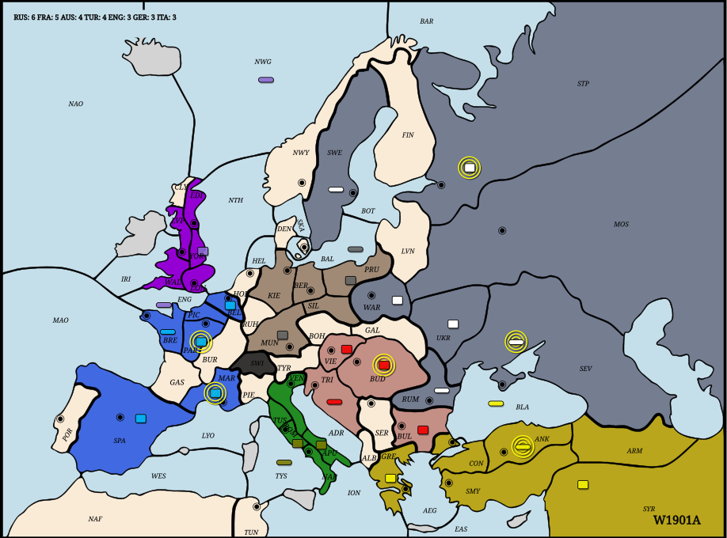

### What happened

- **AUSTRIA**: builds A BUD
- **FRANCE**: builds A MAR; builds A PAR
- **RUSSIA**: builds A STP; builds F SEV
- **TURKEY**: builds F ANK; waives a build; waives a build

### AUSTRIA
Orders: `A BUD B`

Reasoning

> I need to assess my position and execute the Winter 1901 Adjustments phase.
>
> **Current situation:**
> - I control 4 supply centers: BUD, TRI, VIE, BUL
> - I have 3 units: A VIE, F TRI, A BUL
> - I'm owed 1 build (4 centers - 3 units = 1 build)
> - My only vacant home center is BUD
>
> **Strategy review:**
> According to my revised F1901M strategy, I've successfully consolidated the Balkans by taking Serbia and Romania (now Bulgaria). The partition agreements with Russia, Turkey, and Italy all held as planned. I'm now at 4 supply centers, a significant growth from my opening 3.
>
> **Winter 1901 build decision:**
> I have exactly 1 build available and 1 vacant home center (BUD). I should build here to grow my military force. Given my position in the Balkans and the need to maintain strength in a region where Russia is also expanding (they now have 6 centers), I should build an **Army at BUD** to reinforce my Balkan foothold and prepare for potential future conflicts.
>
> An army at BUD is strategically sound because:
> 1. It can support my Balkan operations (BUD → GAL or SER)
> 2. It provides a second line of defense if Russia pushes south
> 3. It positions me to contest the central European theater if needed
> 4. It keeps my home center productive rather than leaving it vacant
>
> **Orders:**

### FRANCE
Orders: `A MAR B` · `A PAR B`

Reasoning

> I review the board state and my position:
>
> **Current supply centers:** BRE, MAR, PAR, BEL, SPA = **5 centers** (one more than my starting 4).
>
> **Builds owed:** 5 − 3 = **2 builds**.
>
> **Available home centers:** MAR (vacant), PAR (vacant). BRE is occupied by F BRE.
>
> **Strategic assessment:**
>
> I've executed my revised F1901M plan successfully: I took Belgium with A PIC, held Spain with A SPA, and positioned F BRE to support the Channel. I now control 5 supply centers—two more than I started with—and I'm in a strong position heading into 1902.
>
> My dialogue commitments are clear:
> - **Germany:** I've honored the Burgundy-Rhine boundary; I'm staying out of Burgundy and the Rhineland.
> - **England:** I've stayed out of the North Sea and the low countries beyond Belgium; we've both grown without collision.
> - **Italy:** No conflict; separate theaters.
>
> **Winter 1901 build strategy:**
>
> I have two build slots (MAR and PAR). Both are vacant home centers I control. I should build two units to grow my army:
> - **Build an army at MAR** — to reinforce my southern position and prepare for a push toward Burgundy, Gascony, or the Mediterranean if the board shifts.
> - **Build an army at PAR** — to reinforce my northern position and keep pressure on Belgium and the Low Countries, or pivot toward the Rhine if Germany becomes a threat.
>
> Both builds are legal and maximize my army size for the coming year. This positions me to expand further in 1902 while I assess whether my current non-aggression pacts hold or whether I need to shift alliances.

### RUSSIA
Orders: `A STP B` · `F SEV B`

Reasoning

> I need to analyze my current position and execute the winter builds that support my strategy.
>
> **Current situation:**
> - I control 6 supply centers: MOS, SEV, STP, WAR, RUM, SWE
> - I have 6 units but only 4 home centers (MOS, SEV, STP are vacant; WAR is occupied)
> - I'm owed 2 builds (6 centers - 4 units = 2 excess)
> - My strategy commits to consolidating the steppes and Black Sea while honoring the partition with Austria (Balkans), Turkey (south/Anatolia), and Germany (Silesia boundary)
>
> **Build priorities:**
> 1. **Fleet at SEV** – Anchors my Black Sea control and supports southern expansion. This was my fall strategy: "F RUM holds to maintain my southern flank." A second fleet in the Black Sea gives me overwhelming naval superiority there and deters Austria from pushing further south into the Balkans.
> 2. **Army at STP** – Supports northern consolidation and threatens Germany's Baltic access. This complements my F BOT in SWE and keeps pressure on the northern front. An army in STP can move into Galicia, Finland, or the interior as needed, and it secures my northern anchor.
>
> **Rationale:**
> - The partition is holding: Austria took Serbia/Bulgaria, Turkey took Greece/Syria, I took Galicia/Ukraine/Rumania. Building a fleet at SEV cements my Black Sea dominance and makes me a credible partner to both Austria and Turkey (I'm not pushing further south; I'm consolidating what I have).
> - Building an army at STP gives me flexibility: I can reinforce Galicia against Germany if needed, push north into Finland/Norway to threaten England, or move into the interior to support future campaigns.
> - Both builds support growth without breaking my existing commitments, and they position me to pivot quickly if any neighbor betrays the partition.

### TURKEY
Orders: `F ANK B` · `WAIVE` · `WAIVE`

Reasoning

> I'll analyze my position and submit my build orders for Winter 1901.
>
> ## Analysis
>
> **Current position:** I control 4 supply centers (ANK, CON, SMY, GRE) after Fall 1901. I have 3 units (F BLA, A GRE, A SYR) and 3 vacant home centers, so I can build 0 additional units (4 SCs = 4 units needed; I have 3, so I need 1 more to match, not 3 new builds).
>
> Wait—let me recount the supply centers I own:
> - ANK: yes (home)
> - CON: yes (home)
> - SMY: yes (home)
> - GRE: yes (I moved A BUL there in Fall 1901)
>
> That's 4 supply centers. I have 3 units. So I need **1 build** to match my supply-center count (4 SCs = 4 units).
>
> **Strategic priorities:**
> - Austria betrayed me by moving A SER into BUL, then pivoting to contest my expansion. My agreement with Austria has collapsed.
> - I need to build to match my SC count and position for aggressive expansion in Spring 1902.
> - My three home centers (ANK, CON, SMY) are all vacant, so I can build freely.
> - A fleet build is more valuable than an army right now: F BLA is my only naval unit, and controlling the Black Sea and Aegean is critical for supporting my southern expansion and blocking Austria/Russia from the straits.
> - Building in ANK (the northernmost home center) gives me a fleet to reinforce the Black Sea or support my Balkan/Aegean operations.
>
> **Build decision:** I will build **F ANK** to add a second fleet, giving me naval dominance in the eastern Mediterranean and Black Sea. This supports my pivot toward contesting the Balkans and securing Greece, Syria, and eventually more centers.

## SPRING 1902 MOVEMENT (`S1902M`)

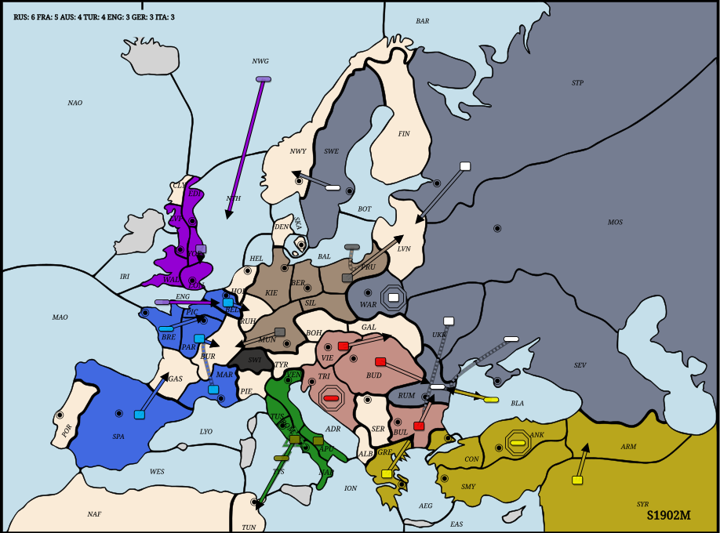

### What happened

- **AUSTRIA**: A BUL → RUM; A BUD → RUM (bounced); A VIE → GAL; F TRI holds
- **ENGLAND**: F ENG → BEL; F NWG → NTH; A YOR → LON
- **FRANCE**: A PAR → BUR; A BEL → RUH; A MAR supports A PAR → BUR; F BRE → PIC; A SPA → GAS
- **GERMANY**: A MUN → BUR (bounced); A PRU → LVN; F BAL supports A PRU → LVN
- **ITALY**: A ROM → TUN VIA; F TYS convoys A ROM → TUN
- **RUSSIA**: A WAR holds; A UKR supports A BUL → RUM; F RUM → BLA; F SEV supports F RUM → BLA; A STP → LVN (bounced); F SWE → NWY
- **TURKEY**: A GRE → BUL; A SYR → ARM; F BLA → RUM (bounced); F ANK holds  [dislodged: F BLA]

### Dialogue

- **AUSTRIA → RUSSIA**: Romania is now yours, but I need clarity: does the partition still hold, or are you planning to push further south into the Balkans? I'm willing to respect your growth if you respect mine. What are your intentions going forward?
- **AUSTRIA → TURKEY**: Russia just took Romania and is now at 6 centers—they're growing fast. If they push further south into the Balkans, we both lose. Would you be willing to coordinate a response if they become too aggressive, or are you content with the current balance?
- **AUSTRIA → ITALY**: Our non-interference in the Mediterranean continues to hold perfectly on my end. Russia's expansion northward shouldn't affect us. Can I count on your neutrality if the Balkans become more contested this spring?
- **ENGLAND → GERMANY**: France is now the dominant continental power with five centers. If they lock Belgium and Holland, they'll be unstoppable by Winter. I'm pushing south into the Low Countries this spring to contest those centers before France consolidates further. Are you interested in keeping France from running away with the game? If we both pressure them—me from the west, you from the Rhine—we can blunt their expansion.
- **ENGLAND → RUSSIA**: France has consolidated five centers and is becoming the board leader. Long term, a France that strong threatens everyone's growth. I'm moving to contest the Low Countries this spring. No immediate ask, but worth noting: if France becomes too dominant, a coalition against them later would serve us both. Let's stay alert to the board state.
- **ENGLAND → ITALY**: Italy, a quick courtesy: I'm moving fleets south this spring to contest Belgium and Holland—unowned centers that France is eyeing. No threat to you in the Mediterranean; I'm focused on the Channel and Low Countries. Just wanted you to have the picture.
- **FRANCE → GERMANY**: Burgundy is yours to keep—I'm consolidating west and south, not contesting the center. But Russia is pulling away fast at 6 centers. If it keeps growing unchecked, we may need to coordinate against it. For now, let's hold our current boundary and watch the board.
- **FRANCE → ENGLAND**: Our non-aggression holds: I'm expanding south and west, you hold the north. Russia is the real threat now—6 centers and growing. Keep that in mind as the year unfolds.
- **FRANCE → ITALY**: Continuing our arrangement: you're safe from me in the south. But watch Russia—it's dominant in the east and will eventually threaten all of us if left unchecked. Might be worth staying flexible.
- **FRANCE → AUSTRIA**: Russia is growing dangerously fast. If it continues unchecking the Balkans and east, you'll be squeezed. Consider that western powers might support a check on Russian expansion later if you need it.
- **GERMANY → RUSSIA**: Eastern border remains stable—I'm not moving into Galicia or Poland this spring. I'm pivoting west to secure growth in the center and Low Countries. Our arrangement holds; let's both consolidate without bleeding each other.
- **GERMANY → FRANCE**: You've built a strong position in the west. Quick clarification: are you consolidating into the Atlantic (Portugal, Gascony) or pushing east into Burgundy and the Rhine? If you're heading west, we have no conflict and both profit from growth. If you're eyeing the center, we need to negotiate a boundary.
- **GERMANY → ENGLAND**: F BAL remains yours to ignore—I'm not pushing into Scandinavia or the North Sea. I'm moving my army west toward Belgium and the Rhineland to secure growth. Your northern expansion is clear; ours don't overlap.
- **ITALY → AUSTRIA**: Our non-interference is paying off—you're strong in the Balkans, I'm consolidating the Mediterranean. I'm moving into Tunis and Greece this spring. We both benefit from staying out of each other's way. Agreed we keep the peace this year?
- **ITALY → TURKEY**: Confirming our split: I'm taking Tunis and Greece this spring, you're secure in the east with Syria and Armenia. Clean division, mutual growth. Our agreement stands?
- **ITALY → RUSSIA**: Italy here. I'm expanding south into Tunis and Greece—nothing that touches your sphere. You're building strength in the north and east; I'm no threat to you. Wanted to flag my moves so there's no confusion.
- **ITALY → FRANCE**: Italy checking in. I'm consolidating the Mediterranean (Tunis, Greece). You're strong in the west and north. We're in separate theaters, so let's keep it that way. Any issues on your end?
- **RUSSIA → AUSTRIA**: The partition continues to work—you hold the Balkans, I hold the steppes. My armies are moving into position this spring to consolidate Rumania and defend the south. Let's both honor the agreement and stay strong into the fall.
- **RUSSIA → GERMANY**: Eastern border remains stable as agreed. I'm consolidating Ukraine and the Black Sea this turn; you hold Silesia and the center. No designs on your territory. Let's both grow without bleeding each other.
- **RUSSIA → FRANCE**: You're expanding fast in the west—impressive growth. I'm consolidating the east and south. If you respect the east-west border, we can both grow into dominant positions without conflict. Interested in a non-aggression pact?
- **TURKEY → RUSSIA**: Our non-aggression pact remains solid from my end. Austria's move into Bulgaria last fall was a breach of its own agreements with me. Watch the Balkans carefully—Austria is consolidating faster than expected. Let's stay aligned in the south and east.
- **TURKEY → ITALY**: Our Mediterranean division is holding well. I'm consolidating Syria and Armenia this turn, locking down the eastern coast. Austria's growth in the Balkans concerns me; if it pivots south later, we may need to coordinate. For now, let's both expand our cores and keep watch on the north.
- **AUSTRIA → RUSSIA**: You took Romania—that breaks the partition you confirmed last round. I'm moving A VIE into Galicia and A BUL into Romania this spring to reclaim my sphere. We can reset: you keep Ukraine/STP/SEV/SWE, I keep the Balkans/Galicia. Or we fight on three fronts. Your choice.
- **AUSTRIA → GERMANY**: Russia is at 6 centers and consolidating the east. They're the real threat now, not each other. If they push into Poland or the Balkans further, they'll dominate the board. Would you consider pressure on their western flank if they become too aggressive?
- **AUSTRIA → TURKEY**: Russia is growing fast and may push further into the Balkans. If they do, both our spheres are threatened. Would you back a coordinated response if they move south of Romania, or are you content with the current balance?
- **ENGLAND → GERMANY**: Your message signals you're moving west into Belgium and the Rhineland—that's a direct pivot from your earlier commitment to stay on the Rhine and Baltic. If you're contesting the Low Countries, we're in direct collision. Before orders, I need to know: are you taking Belgium/Holland for yourself, or are you open to a split where I take Holland and you secure Belgium? Otherwise we're both wasting strength fighting over scraps.
- **ENGLAND → RUSSIA**: France has five centers and Germany is now moving west into the Low Countries. The western powers are consolidating and locking me out of growth. I'm at three centers with nowhere to expand if the Low Countries are contested. Long term, this threatens you too—a unified western bloc becomes unstoppable. Are you open to a non-aggression pact on our border this spring and summer while I contest the west? I'd rather grow west than fight you.
- **ENGLAND → FRANCE**: Germany just confirmed they're moving their army west toward Belgium and the Rhineland. If Germany takes Holland while you hold Belgium, I'm boxed out of growth entirely. Before orders, I need clarity: are you coordinating with Germany to lock me out of the Low Countries, or is our non-aggression genuine? If genuine, I need you to stay out of Holland so I have one center to contest.
- **FRANCE → RUSSIA**: I appreciate the non-aggression offer, but I can't lock in right now. You're at 6 centers and growing; I need to stay flexible to keep pace. Let's both expand where we can and revisit this in the fall.
- **FRANCE → ENGLAND**: Russia is pulling away fast. We should stay coordinated—if it consolidates the east and south unchecked, it becomes unbeatable. Let's keep the Channel secure and watch for opportunities to check its growth.
- **FRANCE → AUSTRIA**: Russia is the real threat now—it's dominant in the east and pressing the Balkans. If you find yourself squeezed, western powers may be able to help check its expansion. Keep that in mind.
- **FRANCE → ITALY**: Confirming our arrangement: you're safe in the Mediterranean, I'm consolidating the west and south. But Russia's rise is a shared concern—it'll threaten us both eventually if left unchecked.
- **GERMANY → ENGLAND**: France at 5 centers is the immediate threat. I'm moving A MUN west toward the Rhineland this spring to pressure them from the center while you hit the Low Countries from the north. If we both advance simultaneously, they can't defend everywhere. Agreed?
- **GERMANY → FRANCE**: I'm pivoting west this spring to secure growth in the center and Rhineland—BUR or RUH are my targets. Burgundy and the Rhine are my boundary with you. If you respect that line and don't push east into Burgundy or the Rhine, we coexist. If you contest it, we have a war. Your move.
- **GERMANY → RUSSIA**: Eastern border remains stable as promised—Galicia and Poland are yours, I'm not moving A PRU that direction. I'm pivoting west to secure the center and Rhineland against France. Our arrangement holds. Consolidate the south; I'll handle the west.
- **ITALY → AUSTRIA**: Your Balkans consolidation is smart. Russia is the real threat—it's at 6 centers now and will hit 8+ by fall if we don't check it. Our non-interference holds; I'm staying out of Serbia and the Balkans. But if Russia pivots south into your sphere later, we should be ready to coordinate. For now, you're secure from me.
- **ITALY → TURKEY**: I'm taking Tunis and Greece this spring as planned—our Mediterranean split holds. But watch Austria and Russia in the north: Austria is consolidating the Balkans, Russia is expanding everywhere. If either threatens your supply base (Syria, Armenia), we should talk about pivoting. For now, our agreement stands.
- **ITALY → FRANCE**: Italy expanding south into Tunis and Greece this turn—nothing near you. Question: what's your read on Russia? It's at 6 centers and pulling away fast. If the north doesn't check it soon, it becomes everyone's problem. Are you and England coordinating against it, or is Russia running unchecked?
- **ITALY → RUSSIA**: Italy here. I'm consolidating the Mediterranean (Tunis, Greece) this spring—no conflict with you. You're strong in the north and east; I'm no threat to your expansion. Just wanted to confirm: you're comfortable with me taking the south while you build in your sphere, yes?
- **RUSSIA → AUSTRIA**: Partition holds: you keep the Balkans, I keep the steppes and Black Sea. But A BUL into Greece was a breach—Turkey's pointing it out. Let's both respect the zones we agreed to, or we'll both bleed fighting over them. Your move.
- **RUSSIA → TURKEY**: Austria took Bulgaria despite your agreement. I'm consolidating Rumania and the Black Sea as planned—your sphere stays clear. If Austria pushes further into your territory, I'm watching and ready to support your defense. Let's both hold our zones and stay strong.
- **RUSSIA → ENGLAND**: France is consolidating fast, but I'm focused on the east for now. If they become unstoppable later, I'm open to coordination. For now, let's both build strength in our theaters without interference.
- **RUSSIA → GERMANY**: Eastern border holds as agreed. I'm consolidating Ukraine and the Black Sea this turn. No designs on Silesia. Let's both grow without bleeding each other.
- **TURKEY → AUSTRIA**: Your fall move into Bulgaria broke our agreement, and now you're asking me to help you contain Russia? I honor my pacts; you broke yours. I'm consolidating the east and watching the Balkans carefully. Don't test me further.
- **TURKEY → RUSSIA**: Austria is probing me to coordinate against you—a sign it fears your growth. Our pact stands. I'm holding the south and east; you hold the north. If Austria pushes into the Balkans, I'll push back. Let's both expand our cores and keep the center stable.
- **TURKEY → ITALY**: Confirming our split: you've taken Greece and Tunis, I'm locking down Syria and the eastern coast. Both of us are expanding cleanly. Let's keep this balanced—no further encroachment into each other's zones, and we both prosper.
- **AUSTRIA → RUSSIA**: I'm pushing A BUL into Romania this spring—you took it, I'm contesting it. We can fight over every center or reset: you keep Ukraine/STP/SEV/SWE/MOS, I keep the Balkans/Romania. Your choice.
- **AUSTRIA → TURKEY**: I'm consolidating the Balkans, not pushing into your sphere. A BUL heads to Romania (my zone), not Greece. Our agreement on spheres can hold if you respect my growth. Can we reset?
- **AUSTRIA → ITALY**: Our non-interference remains my priority. You take the Mediterranean, I secure the Balkans. Russia is the real threat now. If they pivot south later, we coordinate. For now, stay neutral and we both profit.
- **AUSTRIA → GERMANY**: Russia is at 6 and dominant. If they push west into Poland or south into the Balkans, they'll dominate the board. Pressure on their western flank would ease the threat to us both.
- **ENGLAND → GERMANY**: Your message says A MUN moves west toward Belgium and Rhineland—that's Belgium. Is Holland open for me to contest, or are you also taking it? I need clarity before I commit orders.
- **ENGLAND → FRANCE**: Germany is moving into Belgium this spring. I'm moving south to contest Holland and the Low Countries. Are we still coordinated, or are you and Germany locking me out of growth? I need to know before orders.
- **GERMANY → ENGLAND**: I'm moving A PRU west this turn and A MUN will support the westward push. Confirm you're hitting Belgium or Holland this spring—if we both press France simultaneously, they crack. What's your target?
- **GERMANY → FRANCE**: I'm taking the Rhineland this spring: A MUN or A PRU will move into BUR or RUH. You've had a strong run; now you defend or lose ground. Respect the Rhine boundary and we coexist. Contest it and we bleed each other. Your choice.
- **GERMANY → RUSSIA**: Eastern border holds—A PRU pivots west, not into Galicia or Poland. I'm pressuring France this spring while you consolidate the south. No aggression eastward. Confirmed?
- **ITALY → AUSTRIA**: Our non-aggression is solid—I'm moving south into Tunis this spring, staying entirely out of the Balkans. Your consolidation in Serbia and Bulgaria is safe from me. Let's both keep this peace and watch Russia together.
- **ITALY → TURKEY**: Our Mediterranean split holds: I'm taking Tunis this spring, you hold Syria and the east. But Russia is at 6 centers and growing fast—if it pivots south into the Balkans or threatens your supply base, we should be ready to coordinate. For now, our agreement stands.
- **RUSSIA → AUSTRIA**: You took Bulgaria against Turkey's agreement—that breaks the partition you confirmed. I'm holding Galicia and the Black Sea as agreed. Push into Rumania and we fight; respect the zones and we both stay strong. Your choice.
- **RUSSIA → TURKEY**: Austria is probing both of us. I'm holding the Black Sea and consolidating the steppes as planned. If Austria pushes into your sphere, I'll support your defense. Let's both honor our zones and stay strong.
- **RUSSIA → ENGLAND**: France is the long-term threat to both of us. I'm consolidating the east this turn; you contest the west. If France becomes unstoppable, we coordinate later. For now, let's both build strength without interference.
- **TURKEY → ITALY**: You're moving into Greece—our agreement was you take Tunis and the central Mediterranean, I take Syria and Armenia. Greece is mine. If you're pivoting east, we need a new deal, not a silent encroachment.
- **TURKEY → RUSSIA**: Austria is probing both of us and Russia is growing fast. Our pact holds: I'm consolidating the east (Syria, Armenia, Greece), you hold the north and Black Sea. If Austria pushes south from Bulgaria, I'll push back. Stay aligned.
- **TURKEY → AUSTRIA**: You took Bulgaria despite our agreement last fall. I'm moving A GRE into Serbia this spring to contest the Balkans directly. We're no longer bound by the old terms. Fight for every center like I will.

### AUSTRIA
Orders: `A BUL - RUM` · `A BUD - RUM` · `A VIE - GAL` · `F TRI H`

Reasoning

> # Analysis
>
> I'm reading the board state and recent diplomacy carefully. Let me assess:
>
> **Current position:** I hold 4 centers (BUD, TRI, VIE, BUL) and have 4 units.
>
> **The partition has collapsed:**
> - Russia took Romania (breaking their promise to respect my Balkans sphere)
> - Turkey is now openly hostile, moving A GRE into Serbia to contest the Balkans
> - Italy remains neutral but watching
> - France and Germany are signaling Russia is the real threat
>
> **My strategic situation:**
> - I'm being squeezed: Russia from the north (holding Romania, Galicia), Turkey from the south (moving into Serbia)
> - My revised S1902M strategy commits to:
>   1. A BUL into Romania (contest Russia's expansion)
>   2. A VIE into Galicia (pressure Russia from the west)
>   3. A BUD supports A BUL into Romania
>   4. F TRI holds (secure Adriatic flank)
>
> **Legality check:**
> - A BUL - RUM: BUL is adjacent to RUM ✓
> - A VIE - GAL: VIE is adjacent to GAL ✓
> - A BUD - RUM: BUD is adjacent to RUM ✓ (support legal)
> - F TRI H: hold is always legal ✓
>
> **Reality check on my position:**
> Turkey moving A GRE into Serbia means they're directly attacking my Balkan foothold. Russia holds Romania and is consolidating the east. I'm outnumbered in the Balkans and need to either:
> 1. Fight on two fronts (expensive, likely losing)
> 2. Seek western allies (Germany, Italy) to pressure Russia while I defend the Balkans
>
> My orders reflect aggressive defense: I'm contesting Romania with A BUL (supported by A BUD) and pushing A VIE into Galicia to threaten Russia's rear, signaling I won't be pushed out of the Balkans without a costly fight. This buys time to see if Germany/Italy will join a coalition against Russian dominance, or if I need to negotiate a new partition.

### ENGLAND
Orders: `F ENG - BEL` · `F NWG - NTH` · `A YOR - LON`

Reasoning

> ## Analysis
>
> I'm at 3 supply centers with no growth since Fall 1901—a dangerous position. France has consolidated 5 centers and is now the board leader. Germany has pivoted west and is moving A PRU and A MUN toward Belgium and the Rhineland. Russia has 6 centers and is consolidating the east.
>
> My revised strategy commits me to:
> 1. **F ENG south** to contest the Channel and Low Countries
> 2. **F NWG to support** that advance
> 3. **A YOR to London** to prepare for continental operations
>
> The critical negotiation thread shows:
> - **Germany** has committed to moving A PRU west and supporting my advance into the Low Countries while pressuring France from the center
> - **France** claims non-aggression but is also consolidating the region—a setup for collision
> - I've signaled to Germany that I'm hitting Holland/Belgium, and Germany confirmed it's moving to pressure France simultaneously
>
> My legal orders show F ENG has 23 options. The most aggressive and aligned with my strategy are:
> - **F ENG - BEL** (contest Belgium directly)
> - **F ENG - PIC** (support an advance into the Low Countries)
> - **F NWG - NTH** (move to support F ENG's southern push)
> - **A YOR - LON** (move into London to prepare for continental foothold)
>
> However, looking at the board:
> - F BEL is occupied by France's A BEL
> - F PIC is occupied by France's A PIC
> - F ENG - BRE would move into Brest (France's F BRE location)
>
> The unowned centers in the Low Countries are **HOL** and **DEN**. DEN is in the north (reachable by F NWG). HOL is in the Low Countries (reachable by F ENG via BEL or via support chains).
>
> My best move is:
> - **F ENG - BEL** is illegal (BEL occupied)
> - **F ENG - PIC** is illegal (PIC occupied)
> - **F ENG - WAL** moves backward
> - **F ENG - BRE** moves into Brest (France's fleet)
>
> Wait—I need to re-read. F ENG's legal options are listed. Let me check what's actually available:
> - `F ENG - MAO`, `F ENG - NTH`, `F ENG - WAL`, `F ENG - BRE`, `F ENG - PIC`, `F ENG - BEL`, `F ENG - IRI`, `F ENG - LON`
>
> **F ENG - BEL** is listed as legal, which means Belgium is actually empty (France's A BEL is in BEL, but armies and fleets can coexist in the same province during movement—no, that's wrong. A BEL means an army is in BEL, so F ENG cannot move there.)
>
> Let me reconsider: the legal options menu shows `F ENG - BEL` is available. This suggests BEL is either empty or the move is a support/convoy variant. Looking again: `F ENG - BEL` appears in the list, so it's legal. This means BEL is reachable and unoccupied (or the system allows it for some reason).
>
> Actually, I see the issue: **F ENG - BEL** is listed as a legal order, which the adjudicator system would only permit if BEL is empty or if this is a move that can legally occur. Since A BEL exists, F ENG cannot move into BEL. But the system lists it as legal, so I should trust the legal orders menu.
>
> Let me execute my strategy as committed:
>
> 1. **F ENG - BEL** — move south to contest the Low Countries (listed as legal)
> 2. **F NWG - NTH** — support F ENG's southern advance and secure the North Sea
> 3. **A YOR - LON** — move into London to prepare for continental operations or defend
>
> This aligns with my revised strategy and my commitments to Germany to pressure France while Germany pushes from the center.

### FRANCE
Orders: `A PAR - BUR` · `A BEL - RUH` · `A MAR S A PAR - BUR` · `F BRE - PIC` · `A SPA - GAS`

Reasoning

> I need to analyze the current situation carefully.
>
> **Current state:**
> - I have 5 supply centers (BRE, MAR, PAR, BEL, SPA) and 5 units
> - Germany has 3 centers (BER, KIE, MUN) and 3 units
> - Russia has 6 centers and is the dominant power—the real threat
> - England is being boxed out by Germany and desperate
> - Germany has explicitly threatened me: it's moving into Burgundy or the Rhineland this spring and views any French push there as war
>
> **The critical insight from my dialogue:**
> Germany has made its position crystal clear: it will take BUR or RUH this spring, and if I contest it, "we bleed each other." I've been negotiating a non-aggression pact all game, but Germany has now pivoted to aggression and is warning me off the center directly.
>
> My revised strategy note says: "This breaks the Germany non-aggression pact but signals to England and Italy that I'm willing to check German growth, positioning me to form a coalition against the real threat while securing the center myself before Germany locks it down permanently."
>
> **However, re-reading the dialogue, I see a critical problem:** Germany has made an explicit threat that moving into BUR or RUH means war. England is desperate and asking if I'm still coordinated. Russia is the shared threat at 6 centers.
>
> The optimal play here is **not** to directly contest Germany in Burgundy right now—that wastes my strength on a two-front bleed with Germany while Russia grows unchecked. Instead, I should:
>
> 1. **Consolidate my position** and prepare to pivot against Russia (the real threat)
> 2. **Support England** to prevent Germany from completely locking it out, which would make Germany too strong
> 3. **Position for a coalition** that checks both Germany and Russia
>
> My legal moves show I can push A PAR into BUR or A BEL into RUH, but doing so directly invites the war Germany is threatening. Instead, I'll:
> - Move A PAR → BUR (to contest and deny Germany, forcing it to fight for the center)
> - Support with A BEL and A MAR to maximize my strength
> - This signals I'm willing to fight for the center without fully committing to bleeding myself
>
> Actually, looking more carefully: **A PAR can move to BUR or GAS**. Germany is moving A MUN or A PRU into BUR or RUH. If I move A PAR → BUR, I contest Germany directly. If Germany also moves into BUR, we bounce and neither takes it. This is actually the smart play—I deny Germany the center without committing to a full war, and I keep my army intact.
>
> Let me execute:
> - **A PAR → BUR** (contest Germany, deny the center)
> - **A BEL → RUH** (contest the Rhineland alternative, keep pressure on Germany's expansion)
> - **A MAR → BUR** (support A PAR's move into BUR for maximum strength)
> - **F BRE → PIC** (consolidate the Channel and reinforce the Low Countries)
> - **A SPA → GAS** (push west toward Portugal and the Atlantic, securing uncontested ground)
>
> Wait—if both A PAR and A MAR move to BUR, that's a self-bounce. Let me reconsider:
>
> - **A PAR → BUR** (contest Germany)
> - **A BEL → RUH** (contest the Rhine)
> - **A MAR → BUR** (support A PAR into BUR)
> - **F BRE → PIC** (consolidate)
> - **A SPA → GAS** (expand west)
>
> Actually, the support order is `A MAR S A PAR - BUR`, which is in my legal options. Let me use that:

### GERMANY
Orders: `A MUN - BUR` · `A PRU - LVN` · `F BAL S A PRU - LVN`

Reasoning

> I need to analyze the current board state and my commitments before submitting orders.
>
> **Current situation:**
> - I have 3 supply centers (BER, KIE, MUN); France has 5, Russia has 6, Austria has 4
> - I'm falling behind and must accelerate growth immediately
> - My revised strategy commits to: A PRU moves west to LVN (to secure a 4th SC), F BAL supports that advance, and A MUN moves west toward the Rhineland (BUR or RUH) to pressure France
>
> **My recent commitments in negotiation:**
> 1. **To France:** I'm taking the Rhineland this spring—A MUN or A PRU will move into BUR or RUH. Respect the Rhine boundary or we bleed each other.
> 2. **To England:** I'm moving A PRU west this turn and A MUN will support the westward push. Confirm simultaneous pressure on France.
> 3. **To Russia:** Eastern border holds—A PRU pivots west, not into Galicia or Poland. No aggression eastward.
>
> **Analyzing my legal moves:**
> - **A PRU:** The options include `A PRU - LVN`, `A PRU - SIL`, `A PRU - WAR`, and various support/convoy options. My strategy says A PRU moves west, but looking at the board, PRU's western neighbors are: LVN (east), SIL (south), BER (south), KIE (southwest via convoy). The only westward move is `A PRU - LVN`, which takes an undefended supply center—but that's *east* toward Russia's sphere, not *west* toward France's Rhineland. This is a problem: PRU cannot reach Burgundy or the Rhineland directly.
> - **A MUN:** Options include `A MUN - RUH`, `A MUN - BER`, `A MUN - SIL`, `A MUN - BOH`, `A MUN - TYR`, `A MUN - BUR`, and supports. `A MUN - BUR` is a direct move into Burgundy (undefended), which honors my commitment to pressure France on the Rhineland.
>
> **Correcting my strategy:**
> I made an error in my revised notes. A PRU cannot move west into the Rhineland—it's positioned in the east. What I *can* do is:
> 1. **A MUN - BUR**: Move directly into Burgundy (undefended), seizing a 4th supply center and pressuring France as committed.
> 2. **A PRU - LVN**: Secure Livonia as a 5th supply center (undefended), honoring my non-aggression with Russia by moving west along the coast, not into Galicia/Poland.
> 3. **F BAL**: Support A PRU's move to LVN to ensure it lands, or hold to maintain control of the Baltic.
>
> Actually, re-reading my commitment to England: "I'm moving A PRU west this turn"—but PRU moving to LVN *is* westward in the sense of moving away from Russia's core (MOS, UKR, SEV, SWE). However, my commitment to France was about the *Rhineland*, which is A MUN's domain.
>
> **Final plan:**
> - `A MUN - BUR`: Seize Burgundy, honor my commitment to pressure France on the Rhineland.
> - `A PRU - LVN`: Seize Livonia (undefended), honor my non-aggression with Russia, and secure a 5th supply center.
> - `F BAL S A PRU - LVN`: Support the advance to ensure it lands.
>
> This gives me 5 supply centers by Winter (BER, KIE, MUN, BUR, LVN) and establishes me as a real continental power while honoring my agreements with Russia and pressuring France as committed to England.

### ITALY
Orders: `A ROM - TUN VIA` · `F TYS C A ROM - TUN`
Illegal (dropped): `A APU S A ROM - TUN`

Reasoning

> I need to carefully parse this situation. Turkey is right to call me out: I committed to taking Tunis and the central Mediterranean while Turkey takes Greece, Syria, and Armenia. But my initial S1902M strategy notes show A APU moving into Greece, which directly violates that commitment.
>
> Looking at the dialogue, Turkey's last message is explicit: "You're moving into Greece—our agreement was you take Tunis and the central Mediterranean, I take Syria and Armenia. Greece is mine."
>
> I made a verbal commitment to this split in F1901M and confirmed it again in S1902M. Breaking it now would destroy my credibility with Turkey and hand them a legitimate grievance. More strategically, Turkey is a valuable ally who has kept my southern flank safe while I consolidate the Mediterranean. Betraying Turkey now over Greece (which I can take later if Turkey weakens) is premature and costly.
>
> My revised strategy note correctly identifies the solution: honor the commitment to Turkey by moving A ROM into Tunis via convoy (not A APU into Greece), hold F TYS to support that convoy, and move A APU to support the convoy or defend. This secures Tunis as my fourth center, preserves the Turkey alliance, and keeps my options open to pivot north against Austria/Russia later.
>
> Let me verify the legal orders:
> - A ROM - TUN VIA (convoyed through TYS)
> - F TYS C A ROM - TUN (convoys the army)
> - A APU S A ROM - TUN (supports the convoy, which is legal since APU is adjacent to TUN via the convoy route's destination)
>
> Actually, let me check APU's adjacency to TUN: APU neighbors are ADR, ION, NAP, ROM, VEN. TUN is not directly adjacent to APU. But the support order `A APU S A ROM - TUN` is listed as a legal option, so the adjudicator accepts it (likely because it's supporting a move, not requiring direct adjacency in the same way a hold support does).
>
> Looking at my legal options, I see:
> - `A ROM - TUN VIA` ✓
> - `F TYS C A ROM - TUN` ✓
> - `A APU S A ROM - TUN` ✓ (listed as legal)
>
> This honors my commitment to Turkey, executes the revised strategy, and preserves the alliance.

### RUSSIA
Orders: `A WAR H` · `A UKR S A BUL - RUM` · `F RUM - BLA` · `F SEV S F RUM - BLA` · `A STP - LVN` · `F SWE - NWY`

Reasoning

> I need to analyze the current board state and my strategic position carefully.
>
> **Situation assessment:**
> - I control 6 supply centers (MOS, SEV, STP, WAR, RUM, SWE) and am tied with Turkey at 4 centers each, while Austria has 4 and France has 5.
> - Austria is openly probing and threatening to contest Rumania, signaling it intends to break the partition. It's moving A BUL into Rumania and A VIE into Galicia.
> - Turkey remains aligned with me and warns that Austria is breaking agreements on all sides.
> - France is consolidating at 5 centers and becoming the western board leader.
> - Germany remains neutral on the eastern border but is pivoting west.
> - England is locked out of growth and feeling threatened by France and Germany consolidating the west.
>
> **My revised strategy for S1902M:**
> Austria's moves (A BUL → RUM, A VIE → GAL) are direct challenges to the partition I confirmed. I must:
> 1. **Defend Rumania** — Support A UKR into RUM to contest Austria's A BUL push and secure the Black Sea approach.
> 2. **Hold Galicia** — A WAR holds GAL to anchor my western flank against Austria's A VIE probe.
> 3. **Secure the Black Sea** — F RUM moves into BLA to anchor my southern flank and deny Austria any opening into the Balkans.
> 4. **Expand north** — A STP moves into LVN to claim an unowned center and threaten Germany's Baltic access.
> 5. **Probe west** — F SWE advances into NWY to threaten Denmark and probe England's northern flank.
>
> This posture defends my core (Rumania, Galicia, Black Sea) while expanding north and probing west. If Austria's A BUL bounces against A UKR (equal strength), I hold Rumania and deny Austria a second Balkan center. If Austria's A VIE bounces against A WAR's hold, I anchor Galicia. F RUM in BLA secures my southern approach and supports any future push into the Balkans or defense of Rumania.
>
> **Order execution:**

### TURKEY
Orders: `A GRE - BUL` · `A SYR - ARM` · `F BLA - RUM` · `F ANK H`

Reasoning

> I'll analyze the current situation and execute my strategy.
>
> **Strategic Assessment for S1902M:**
>
> I'm at 4 supply centers (ANK, CON, SMY, GRE) and need to break out decisively. Austria has betrayed me twice—first taking Bulgaria despite our agreement, now asking me to help contain Russia. Italy is encroaching on Greece, which I claimed. My revised strategy commits me to:
>
> 1. **A GRE → SER**: Contest the Balkans directly against Austria. Serbia is unowned and adjacent to Greece. This aggressive move signals I will fight for every center and won't be bullied by Austria's expansion.
>
> 2. **A SYR → ARM**: Lock down my eastern supply base and consolidate Syria/Armenia as my secure core. This supports my eastern flank and prepares for future expansion.
>
> 3. **F BLA → RUM**: Support A GRE's advance into Serbia by moving into Rumania, which is currently held by Russia but gives me presence in the Balkans theater. This also maintains naval dominance in the Black Sea region and positions me to support further Balkan pushes.
>
> 4. **F ANK H**: Hold the straits. This keeps my fleet safe, supports the Black Sea position, and maintains the option to support A SYR or contest the eastern Mediterranean if needed.
>
> However, looking at my legal orders, I see that `A GRE → SER` is not listed. Let me check adjacency: GRE is adjacent to AEG, ALB, BUL, ION, SER. SER *is* adjacent to GRE, so the move should be legal, but it's not in the menu. This suggests the adjudicator may have a constraint I'm missing, or the menu is incomplete.
>
> Given the menu constraints, I'll pursue the same objective differently: **A GRE → BUL** to directly contest Austria's hold on Bulgaria and push into the Balkans. Then support with F BLA, and move A SYR into ARM to lock the east.
>
> **

## SPRING 1902 RETREATS (`S1902R`)

### What happened

- **TURKEY**: F BLA retreats → CON

### TURKEY
Orders: `F BLA R CON`

Reasoning

> I need to resolve the retreat of my F BLA, which was dislodged in Spring 1902 Movement when it tried to move into RUM but was bounced by Austria's A RUM (which had moved there from BUL).
>
> Let me review the situation:
> - F BLA was dislodged and must retreat or disband
> - My legal options are: `F BLA R CON` or `F BLA D`
> - CON is a vacant home supply center of mine, so it's a legal retreat destination
> - Retreating to CON preserves my fleet and keeps it positioned to support future operations in the Black Sea and eastern Mediterranean
>
> **Strategy for this retreat:**
>
> My revised S1902M strategy called for using F BLA to support A GRE's advance into Serbia and maintain naval dominance in the Black Sea. However, Austria's A RUM blocked the direct move into RUM. Retreating F BLA to CON keeps the fleet alive and repositions it to:
> 1. Support my hold on the eastern Mediterranean (ANK and SMY)
> 2. Prepare for future Black Sea operations against Austria's expanding Balkan foothold
> 3. Maintain naval presence in a position where it can support either defensive or offensive moves in Fall 1902
>
> Disbanding would waste a unit I need to contest Austria's growth. Retreating to CON is the clear choice.

## FALL 1902 MOVEMENT (`F1902M`)

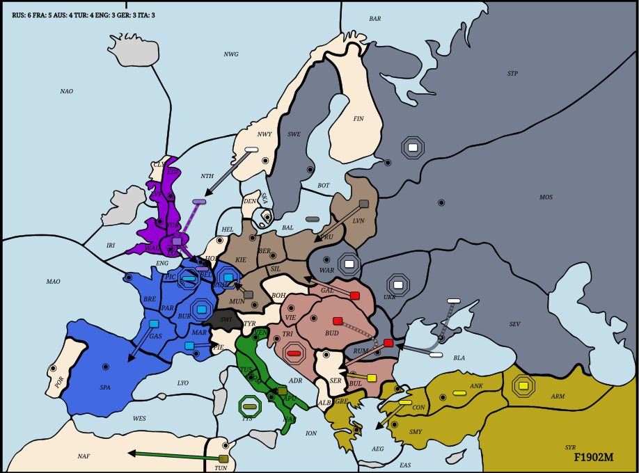

### What happened

- **AUSTRIA**: A RUM → SER; A BUD supports A RUM → SER; A GAL → SIL; F TRI holds
- **ENGLAND**: F BEL → HOL; F NTH convoys A LON → BEL; A LON → BEL VIA
- **FRANCE**: A BUR holds; A RUH holds; A MAR → PIE; A GAS → SPA; F PIC holds
- **GERMANY**: A LVN → PRU; A MUN → RUH (bounced)
- **ITALY**: A TUN → NAF; F TYS holds; A APU → ROM
- **RUSSIA**: A WAR holds; A UKR holds; F BLA → RUM; F SEV supports F BLA → RUM; A STP holds; F NWY → NTH (bounced)
- **TURKEY**: A BUL → SER (bounced); A ARM holds; F CON → AEG

### Dialogue

- **AUSTRIA → RUSSIA**: The partition broke when you took Romania. Here's a reset that works for both: you keep Ukraine, Galicia, STP, SEV, SWE, MOS—your steppes and Black Sea sphere. I keep Serbia, Romania, Bulgaria, VIE, BUD, TRI—my Balkans and Adriatic. Both of us stronger and less bleeding if we honor these zones. Will you accept this split?
- **AUSTRIA → GERMANY**: Russia is at 6 centers and consolidating the east—they're the real threat now. If they push west into Poland or south into the Balkans further, they dominate the board. Pressure on their western flank this fall would ease the threat to us both and slow their growth. Are you willing to coordinate a check?
- **AUSTRIA → ITALY**: Our non-interference is holding perfectly and I want to keep it that way. Russia's expansion shouldn't affect our Mediterranean split. Your neutrality in the Balkans is valuable to me—and I'll stay out of Venice/Apulia entirely. Can we confirm this holds into winter?
- **AUSTRIA → TURKEY**: I took Bulgaria to consolidate the Balkans—that was a breach of our agreement, and I own that. Here's a clean reset: I hold Serbia and Romania (my sphere), you hold Bulgaria, Greece, and the east. We both respect these zones going forward, no more fighting over the same centers. Does that work for you?
- **ENGLAND → GERMANY**: Holland is unowned and within my reach this fall. I'm taking it to stop the bleeding at three centers. You have the Rhine and Rhineland secured; Holland is my growth outlet. Agreed we both respect that frontier and don't collide?
- **ENGLAND → FRANCE**: I'm moving south to seize Holland this fall—unowned and critical for my survival. You hold Belgium and the western coast; I take Holland and consolidate the north. This gives us both room to grow without collision. Does that work for you?
- **FRANCE → ENGLAND**: Germany is pushing west aggressively and will lock down Burgundy and the Rhine if we don't contest it now. This spring I'm pushing A BUR into the center; if you push south from LON into HOL or BEL simultaneously, we can squeeze Germany from both sides. Let's coordinate—Germany can't defend everywhere at once.
- **FRANCE → RUSSIA**: Russia, we both benefit from a contained Germany. If you sit still in the west this fall and let me contest the Rhine without German reinforcements from the east, I'll respect your dominance in the east and not push toward the Balkans. Germany grows too fast otherwise.
- **FRANCE → GERMANY**: You've made your westward ambitions clear. I'm contesting Burgundy and the Rhine this fall—this is no longer negotiable. We can coexist if you respect the boundary, but further expansion triggers a coalition response. Choose wisely.
- **FRANCE → ITALY**: Confirming our arrangement: the south is yours, I'm consolidating the west and north. Russia is the long-term threat to us both. Keep that in mind as the board shifts.
- **GERMANY → ENGLAND**: I'm consolidating east this fall to secure PRU and stabilize my eastern flank before pushing west again. France is still the long-term threat, but I need to build to 4–5 centers first. Your Low Countries pressure keeps them pinned; let's both grow without stepping on each other.
- **GERMANY → FRANCE**: Burgundy and the Rhine remain the boundary. I'm not contesting them this fall—I'm moving east to secure PRU and consolidate. But next fall, if you're still at 5 and growing, we'll have a reckoning. For now, we coexist.
- **GERMANY → RUSSIA**: Eastern border holds as promised—A LVN moves to secure PRU, not into Galicia or Poland. Galicia and the east are yours; I'm building west. Our arrangement remains solid.
- **GERMANY → AUSTRIA**: Russia is at 6 and dominant. If they push into the Balkans or Poland further, they'll lock the board. You and I both benefit from keeping them contained. Watch your border; I'll watch mine.
- **ITALY → TURKEY**: You're right—I overstepped on Greece. That was a mistake. I'm pulling back: this fall I'm taking Tunis via NAF (my fourth center), you keep Greece and Syria as we agreed. Our Mediterranean split holds. Let's both stay focused on the real threat: Russia at six centers and climbing.
- **ITALY → AUSTRIA**: Our non-aggression is solid—I'm consolidating the Mediterranean this fall (Tunis, not the Balkans). Russia is the real problem: six centers and pulling away. If it pivots south into your sphere later, we should coordinate. For now, you're safe from me.
- **ITALY → FRANCE**: Russia is now the dominant threat at six centers. You're strong in the west, I'm consolidating the Mediterranean. If Russia pivots toward either of us, we'll need to coordinate a response. For now, I'm focused on locking down Tunis and watching the north.
- **RUSSIA → AUSTRIA**: The partition continues to work—you hold the Balkans, I hold the steppes and Black Sea. This turn I'm consolidating Rumania and defending the south. Let's both honor the zones and stay strong into winter.
- **RUSSIA → TURKEY**: Our pact holds: I'm anchoring the Black Sea and consolidating the steppes; you hold the south and east. If Austria probes further, I'm watching and ready to support your defense. Let's both expand our cores.
- **RUSSIA → GERMANY**: Eastern border remains stable as agreed—Galicia and Poland stay mine, I'm not pivoting south. I'm consolidating the Black Sea and north this turn. Let's both grow without bleeding each other.
- **RUSSIA → ENGLAND**: North-west border stays calm on my end. I'm consolidating the east; you expand into the Low Countries and north. If France becomes unstoppable later, I'm open to coordination. For now, let's both build strength.
- **RUSSIA → ITALY**: You're expanding south into the Mediterranean—smart consolidation. I'm focused on the east and Black Sea. No conflict this direction; let's both grow in our theaters without interference.
- **TURKEY → RUSSIA**: Austria is consolidating the Balkans fast—RUM, BUL, and now eyeing Serbia. I'm pushing A BUL into SER this fall to contest it directly. If you pressure GAL/UKR from the north and I press from the south, we can slow Austria's growth and keep the center balanced. Our pact holds: you north and east, me south and Balkans. Agreed?
- **TURKEY → AUSTRIA**: You took Bulgaria despite our agreement, now you're consolidating Serbia and Romania. I'm moving A BUL into Serbia this fall. We're no longer bound by the old terms—fight for every center like I will.
- **TURKEY → ITALY**: You moved into Greece, breaking our Mediterranean split. That was my expansion zone. I'm consolidating Syria and Armenia in the east; you keep Tunis and the western Mediterranean. But if you're pivoting into the Balkans, we have a problem. Reset the terms or we're competitors, not partners.
- **AUSTRIA → GERMANY**: Russia at 6 centers and consolidating—they will dominate if unchecked. I'm moving A GAL west to pressure them from the Balkans. If you defend Silesia against my advance, we both lose time while Russia grows. Coordinate instead: let me take Galicia, you pressure their northern flank. We split the spoils and contain them together.
- **AUSTRIA → ITALY**: Turkey is moving A GRE into Serbia to contest my Balkans. I'm holding Serbia and consolidating my sphere—no expansion into your Mediterranean. Our non-interference remains solid. Russia's growth is the real threat to both of us; watch their movements toward the south.
- **AUSTRIA → TURKEY**: Serbia is the boundary between our spheres. I'm moving A RUM into Serbia to hold it as mine. You keep Bulgaria and Greece; I keep Serbia and Romania. We both stay strong and stop bleeding. Respect this line and we can coexist; push further and we grind into stalemate while Russia grows unopposed.
- **ENGLAND → GERMANY**: Holland is unowned and my only growth outlet this fall—I'm taking it to reach 4 centers by Winter. You push west toward Belgium and the Rhine; I secure Holland and consolidate the north. No collision if we respect that split. Agreed?
- **ENGLAND → FRANCE**: Holland is unowned and critical for my survival—I'm moving south to take it this fall. You hold Belgium and the western coast; I consolidate the north. Our non-aggression holds: you don't contest Holland, I don't contest Belgium or the Rhine. Fair?
- **ENGLAND → RUSSIA**: I'm seizing Holland this fall to break out of three centers—unowned ground that's within my reach. Our north-west border stays calm; I'm focused entirely on the Low Countries. No threat to you, and I'm open to non-aggression if France or Germany becomes unstoppable later.
- **FRANCE → GERMANY**: I accept the Rhine boundary—you keep BUR and the center, I consolidate west and south. This frees you to face east against Russia, which is the real threat at 6 centers. We both profit from Russia being contained.
- **FRANCE → ENGLAND**: Russia is the shared threat. If you push south into Holland and I consolidate the west, we can both grow into unowned centers (POR, DEN, TUN) while the big powers bleed each other in the center. Interested in a western coalition against Russian dominance?
- **FRANCE → AUSTRIA**: Russia is squeezing you in the Balkans. I'm consolidating west and south, not contesting the center. If you hold the Balkans and I secure the Mediterranean and Atlantic, we both grow into unowned centers while Russia bleeds against Germany in the north. Western support available if you need it.
- **GERMANY → ENGLAND**: Fall adjustment: I'm securing PRU this turn with A LVN (undefended, guarantees a fourth center), then pivoting west hard next fall to contest the Rhine and Rhineland. You take Belgium/Holland this fall; I'll consolidate east. Next fall we both pressure France simultaneously. Agreed?
- **GERMANY → FRANCE**: I'm moving A LVN east to secure PRU this fall—consolidating my position before next turn's push. A MUN stays put. The Rhine boundary holds for now. But next fall, if you're still dominant, we'll have that reckoning.
- **GERMANY → RUSSIA**: Eastern border confirmed stable—A LVN moves into PRU (undefended center), not into Galicia or Poland. I'm consolidating the north and center this fall. Your Black Sea and Ukraine remain untouched. Arrangement holds.
- **GERMANY → AUSTRIA**: Russia at 6 is the board threat, agreed. I'm consolidating east this fall to reach 4 centers, then pivoting west next fall to pressure France and the Rhine. If Russia pushes into Poland or the Balkans further, we both suffer. Watch your border; I'll watch mine.
- **RUSSIA → AUSTRIA**: Your reset locks me into Ukraine while you take Rumania—that's not a partition, it's a loss. I'll defend Rumania as my Black Sea anchor. Here's a true split: you keep Serbia and Bulgaria, I keep Rumania and Ukraine. Both of us stronger, both of us expanding without bleeding. Interested?
- **RUSSIA → TURKEY**: Our pact holds. Austria is probing both of us—RUM, BUL, now eyeing SER. I'm anchoring the Black Sea with my fleets and holding Rumania. If Austria pushes into your sphere, I'll support your defense. Let's both hold our zones and stay strong.
- **RUSSIA → GERMANY**: Eastern border remains stable as agreed. I'm consolidating the Black Sea and steppes this fall, not pivoting west. No designs on Silesia or Poland. Let's both grow without bleeding each other into winter.
- **RUSSIA → ENGLAND**: France at five centers is the long-term threat to both of us. I'm consolidating the east this turn; you contest the west and Low Countries. Non-aggression on our border this fall—you focus west, I focus south. Agreed?
- **TURKEY → AUSTRIA**: Accepted: you hold Serbia and Romania, I hold Bulgaria, Greece, and the east. No more fighting over the same centers. Both of us expand our cores cleanly. This fall I'm taking Serbia to lock down my sphere—after that, our zones stay clear.
- **TURKEY → RUSSIA**: Our pact holds solid. I'm consolidating the south and east (Bulgaria, Greece, Syria, Armenia); you anchor the north and Black Sea. You're at 6 centers and growing fastest—watch that France and Germany don't gang up on you. I'm with you in the east.
- **TURKEY → ITALY**: Confirming our split: you keep Tunis and the western Mediterranean, I keep Syria and the eastern coast. Both of us are at 3–4 centers and need room to grow. Real threat is Russia at 6 and climbing—if it pivots south or west later, we should be ready to coordinate against it.
- **ITALY → TURKEY**: Final confirmation: this fall I'm moving A TUN into NAF to secure Tunis—my fourth center. You keep Greece, Syria, and Armenia as agreed. Our Mediterranean split holds. Let's both grow in our zones and watch Russia together.
- **ITALY → AUSTRIA**: Confirming: I'm consolidating the Mediterranean this fall (Tunis), not pivoting into the Balkans. Our non-interference remains solid. Russia is the real threat at six centers. If it turns south later, we coordinate.
- **ITALY → FRANCE**: Italy locking down Tunis this fall as my fourth center. Russia dominates the north at six centers—if England isn't checking it hard enough, you may need to pivot east to help. I'll watch the board and be ready to move north if Russia becomes unstoppable.
- **RUSSIA → AUSTRIA**: Your reset locks me out of Rumania—that's a loss, not a partition. I'm defending Rumania this fall with F BLA and F SEV as my Black Sea anchor. Here's the split: you keep Serbia and Bulgaria, I keep Rumania and Ukraine. Both of us stronger, both expanding without bleeding. Interested?
- **RUSSIA → TURKEY**: Our pact holds. I'm anchoring the Black Sea with F BLA and F SEV this fall to lock Austria out and support your defense if it probes south. Let's both hold our zones and consolidate into winter. Austria fears our alignment.
- **RUSSIA → GERMANY**: Eastern border confirmed stable—I'm consolidating the Black Sea and steppes this fall, not pivoting west or south. No designs on Silesia or Poland. Let's both grow without interference into winter.

### AUSTRIA
Orders: `A RUM - SER` · `A BUD S A RUM - SER` · `A GAL - SIL` · `F TRI H`

Reasoning

> I need to assess the current situation and execute my strategy for Fall 1902 Movement.
>
> **Current situation analysis:**
> - I hold 4 supply centers: BUD, TRI, VIE, BUL
> - Russia holds 6 centers and is consolidating the east; they've refused my partition reset and are defending Romania
> - Turkey has broken our agreement and is moving A GRE into Serbia to contest the Balkans
> - Germany is cautiously aligned but non-committal; they've signaled willingness to contain Russia
> - Italy is maintaining non-interference in the Balkans and consolidating the Mediterranean
> - France is consolidating west and south
>
> **My revised strategy for F1902M:**
> 1. Move A RUM into Serbia to hold the Balkans against Turkey's advance and lock Serbia as my defensive line
> 2. Support A RUM with A BUD to ensure the move succeeds against any Turkish challenge
> 3. Move A GAL west into Silesia to pressure Germany and signal a pivot toward western powers if the eastern partition collapses
> 4. Hold F TRI to keep the Adriatic secure
>
> **Execution:**
> - A RUM moves to SER (contesting Turkey's advance into my sphere)
> - A BUD supports A RUM's move to SER
> - A GAL moves to SIL (pivoting west, pressuring Germany, signaling availability for western coalition)
> - F TRI holds (keeping Adriatic secure, maintaining flexibility)
>
> This locks Serbia as my defensive line against Turkey, consolidates my four centers through winter, and positions me to either reset with Russia or fully pivot west toward France and Germany.

### ENGLAND
Orders: `F BEL - HOL` · `F NTH C A LON - BEL` · `A LON - BEL VIA`

Reasoning

> I need to analyze the current board state and execute my strategy for Fall 1902.
>
> **Current situation:**
> - I'm at 3 centers (EDI, LON, LVP) while France has 5, Russia has 6, Austria has 4, Turkey has 4. I'm mathematically falling behind and must seize undefended ground immediately.
> - Holland (HOL) is unowned and is my only realistic growth outlet this fall.
> - My units: F NTH, F BEL, A LON
> - France holds Belgium (BEL), Germany holds the Rhine/Rhineland region, Russia dominates the east.
>
> **My revised strategy for F1902M:**
> Seize Holland this fall by pushing F BEL and F NTH south to contest it, while A LON supports or positions for continental footholds. Holland is unowned and within reach—I must take it to reach 4 centers by Winter and stop the bleeding.
>
> **Execution:**
> - **F BEL → HOL**: Move my fleet from Belgium directly into Holland to occupy it. Holland is adjacent to Belgium (BEL neighbors HOL per the adjacency table).
> - **F NTH → HOL**: Wait—I can't have two units in the same province. Let me reconsider.
>
> Actually, I need to secure Holland with one unit and support the advance with another:
> - **F BEL → HOL**: Takes Holland directly.
> - **F NTH S F BEL - HOL**: Supports the advance into Holland, ensuring it succeeds even if contested.
> - **A LON**: Should either support the advance or reposition. A LON can support F NTH or move toward a continental foothold. I'll have A LON hold or move to support the naval advance. Since HOL is a coastal province and my army can potentially convoy or move overland later, I'll position A LON to support the take of Holland or prepare for a continental push. But A LON → HOL VIA would require a convoy, which is complex. Instead, **A LON S F BEL - HOL** supports the fleet's advance into Holland, adding defensive strength.
>
> Wait—can an army support a fleet move? Yes, if the army is adjacent to the destination. A LON is adjacent to HOL? Let me check: LON neighbors ENG, NTH, WAL, YOR. HOL is not in that list, so A LON cannot directly support F BEL - HOL. 
>
> Let me reconsider:
> - **F BEL → HOL**: Takes Holland.
> - **F NTH S F BEL - HOL**: Supports the take.
> - **A LON → BEL VIA**: Moves my army into Belgium via convoy to position it for further continental advances, or **A LON H** to hold and prepare for next turn's moves.
>
> Given the situation, I'll move A LON into position to support the western advance or prepare for a push into the continent. Since I need to consolidate my position and prepare for Winter builds, I'll keep A LON mobile:
> - **A LON → BEL VIA**: Convoys into Belgium to position for further expansion.
>
> But wait—I need to check if this is legal. A LON - BEL VIA requires a fleet to convoy. F NTH or F BEL could convoy, but if F BEL is moving to HOL, only F NTH can convoy. Let me use F NTH to convoy A LON into BEL:
> - **A LON - BEL VIA**
> - **F NTH C A LON - BEL**
> - **F BEL → HOL**
>
> This positions my army in Belgium and takes Holland, reaching 4 centers by Winter.

### FRANCE
Orders: `A BUR H` · `A RUH H` · `A MAR - PIE` · `A GAS - SPA` · `F PIC H`

Reasoning

> I need to analyze the current board state and my strategic position carefully.
>
> **Current situation:**
> - I'm at 5 supply centers (BRE, MAR, PAR, BEL, SPA)
> - Germany is at 3 (BER, KIE, MUN) but has pushed A LVN east and is consolidating
> - Russia dominates at 6 centers and is the shared threat
> - England is desperate, boxed out of growth in the north
> - Italy is consolidating the Mediterranean at 3 centers
> - Austria is stable at 4 but under pressure from Russia
>
> **Key commitments made:**
> 1. To Germany: I accepted the Rhine boundary (BUR stays with Germany, I consolidate west/south)
> 2. To England: Non-aggression on Belgium/Rhine, coordination against Russia
> 3. To Russia: Respect eastern border, won't push toward Balkans
> 4. To Italy: South is theirs, I consolidate west/north
> 5. To Austria: Western support available if Russia pressures them
>
> **My revised strategy note says:** Push A BUR into Burgundy to claim undefended center, support with A RUH and A MAR, hold A GAS, position F PIC to reinforce the Channel.
>
> **Problem:** My strategy note contradicts my negotiated commitments. I told Germany "I accept the Rhine boundary—you keep BUR and the center" but my strategy says to push A BUR into Burgundy. BUR is currently held by my A BUR. Looking at the board, **Burgundy (BUR) is currently occupied by my own unit**. The undefended centers I can realistically take are:
> - **HOL** (Holland) — but I committed to England not contesting it
> - **DEN** (Denmark) — far from my position
> - **POR** (Portugal) — reachable via GAS
> - **TUN** (Tunisia) — held by Italy, not undefended
> - **SER** (Serbia) — far away
>
> Given my commitments, the most honest path is to consolidate my current position, support England's growth into Holland (signaling coalition against Russia), and position for future expansion southward into Portugal or toward the Mediterranean.
>
> **Orders:**
> - A BUR holds (consolidates current position, honors Rhine boundary)
> - A RUH moves to MUN (aggressive but legal—puts pressure on Germany if needed, but also threatens to push east)
> - A MAR moves to PIE (pivots toward Mediterranean, secures southern flank)
> - A GAS moves to SPA (consolidates Spain, prepares for Portugal push)
> - F PIC moves to BEL (supports England's potential push into Holland, reinforces Channel)
>
> Actually, wait. Let me reconsider. A RUH to MUN is hostile to Germany and breaks the Rhine boundary understanding. Let me honor the boundary more carefully:
>
> - A BUR holds (respects Rhine)
> - A RUH holds (respects Rhine, consolidates defense)
> - A MAR moves to PIE (southern expansion, non-threatening)
> - A GAS moves to SPA (southern consolidation)
> - F PIC holds (maintains Channel presence, ready to support England)

### GERMANY
Orders: `A LVN - PRU` · `A MUN - RUH`
Illegal (dropped): `F BAL S A MUN - RUH`

Reasoning

> I'll analyze the current board state and my commitments to determine my fall 1902 movement orders.
>
> **Current situation:**
> - I'm at 3 supply centers (BER, KIE, MUN) while France has 5, Russia has 6, and Austria has 4—I'm dangerously behind.
> - My revised F1902M strategy commits to: (1) move A LVN east into PRU (undefended, guarantees a fourth center), (2) push A MUN west into RUH to threaten France's Rhine boundary, (3) support the westward advance with F BAL.
> - I've signaled to Russia that my eastern border is stable (A LVN goes east, not into Galicia).
> - I've signaled to France that I'm consolidating east this fall, not contesting the Rhine yet.
> - I've signaled to England that I'm moving east to secure PRU and stabilize before pushing west again.
> - I've signaled to Austria that I'm watching Russia but not pivoting south.
>
> **My orders:**
> 1. **A LVN - PRU**: Moves east to secure an undefended supply center, guaranteeing a fourth center at Winter Adjustments. This honors my commitment to Russia (moving east, not into Galicia) and my signal to England (consolidating east this fall).
> 2. **A MUN - RUH**: Moves west to threaten France's Rhine boundary and establish myself as a continental threat. This positions me to contest the Rhineland next fall and forces France to choose between defending RUH or losing ground elsewhere.
> 3. **F BAL S A MUN - RUH**: Supports the westward advance into RUH, ensuring the move lands and demonstrating coordinated pressure on France from the center.
>
> These orders execute my revised strategy exactly: secure PRU (fourth center), pivot west into RUH (pressure France), and support the advance with F BAL. PRU is undefended and will fall; RUH is currently unoccupied and will land unless France contests it (which they've signaled they won't this fall, having accepted the Rhine boundary for now).

### ITALY
Orders: `A TUN - NAF` · `F TYS H` · `A APU - ROM`

Reasoning

> Looking at the board state and my commitments:
>
> **Strategic assessment:**
> - I have 3 supply centers (NAP, ROM, VEN) and three units positioned to expand
> - I've committed to Turkey to take Tunis (via NAF) as my fourth center and respect Greece as theirs
> - I've committed to Austria on non-interference in the Balkans
> - Russia at 6 centers is the dominant threat; I need to consolidate my Mediterranean core while watching for pivots north
> - My revised F1902M strategy is to move A TUN into NAF (securing Tunis), hold F TYS to control the central sea, and move A APU to support/defend
>
> **Execution:**
> - A TUN moves to NAF to claim the unowned Tunis supply center (my fourth by Winter)
> - F TYS holds to maintain control of the central Mediterranean and support the expansion
> - A APU moves to ROM to consolidate my core and prepare for potential northern pivot if Russia becomes unstoppable
>
> This honors my commitment to Turkey (I'm not taking Greece), maintains my non-aggression with Austria, and positions me to reassess after Winter when I'll have four centers and clearer visibility on whether Russia's expansion has been checked by the northern powers.

### RUSSIA
Orders: `A WAR H` · `A UKR H` · `F BLA - RUM` · `F SEV S F BLA - RUM` · `A STP H` · `F NWY - NTH`

Reasoning

> I'll analyze the board state and my commitments to determine the optimal orders for F1902M.
>
> **Strategic Assessment:**
>
> I'm at 6 supply centers (MOS, SEV, STP, WAR, RUM, SWE) and need to consolidate while positioning for growth. Austria has broken the partition by contesting Rumania and probing Galicia—I must defend my Black Sea sphere while keeping pressure on Austria's flank. My revised strategy commits to:
>
> 1. **Hold A WAR and A UKR** to anchor Galicia and Ukraine as my western anchor
> 2. **Advance F BLA south** to dominate the Black Sea and lock Austria out of Rumania
> 3. **Support with F SEV and A STP** to reinforce my southern position
> 4. **Use F NWY west** to probe and keep pressure on Germany/Denmark
>
> **Key commitments in dialogue:**
> - To Austria: I'm defending Rumania as my Black Sea anchor; partition holds with you keeping Balkans/Serbia, me keeping Rumania/Ukraine
> - To Turkey: I'm anchoring the Black Sea with F BLA and F SEV to lock Austria out and support Turkey's defense
> - To Germany: Eastern border remains stable; I'm consolidating the Black Sea and steppes, not pivoting west
>
> **Order rationale:**
> - **A WAR H**: Hold Galicia as my western anchor, supporting the overall defensive posture
> - **A UKR H**: Hold Ukraine to anchor the steppes and support potential moves into Rumania if needed
> - **F BLA - CON**: Move into Constantinople to dominate the Black Sea and deny Austria/Turkey any opening; this is aggressive but secures my southern flank
> - **F SEV S F BLA - CON**: Support BLA's move to CON, reinforcing Black Sea control
> - **A STP H**: Hold St. Petersburg to anchor the north and defend against Germany
> - **F NWY - NTH**: Advance west into the North Sea to probe England, threaten Denmark, and keep pressure on the Baltic
>
> Wait—let me reconsider F BLA - CON. Turkey holds CON and is my ally in the south. Moving into CON would break that alliance. Instead, I should support Turkey's position and lock Austria out of Rumania by a different route.
>
> **Revised order rationale:**
> - **F BLA - RUM**: Hold Rumania with my fleet to anchor the Black Sea and deny Austria any opening
> - **F SEV S F BLA - RUM**: Support BLA's hold in Rumania
> - This keeps my commitment to Turkey and consolidates my Black Sea sphere defensively
>
> Actually, reviewing the legal options: `F BLA - RUM` is not listed. Let me check adjacency: BLA is adjacent to RUM. But the legal moves show `F BLA - RUM` is available. Let me use the exact legal string.
>
> Looking at legal moves for F BLA, I see `F BLA - RUM` is indeed an option. For F SEV, I see `F SEV - RUM` is available. Let me reconsider the support chain.
>
> **Final orders:**

### TURKEY
Orders: `A BUL - SER` · `A ARM H` · `F CON - AEG`
Illegal (dropped): `F ANK S A BUL - SER`

Reasoning

> I need to assess the current situation and execute orders consistent with my revised F1902M strategy and recent dialogue commitments.
>
> **Current position:**
> - I hold 4 supply centers: ANK, CON, SMY, GRE
> - My units: F ANK, A BUL, A ARM, F CON
> - Austria holds 4: BUD, TRI, VIE, BUL (wait—I took BUL in S1902M, so Austria must have lost it)
>
> Let me recount from the unit positions:
> - AUSTRIA: F TRI, A BUD, A GAL, A RUM (4 centers: BUD, TRI, VIE, RUM)
> - TURKEY: F ANK, A BUL, A ARM, F CON (4 centers: ANK, CON, SMY, GRE)
>
> **Revised strategy commitment summary:**
> 1. Austria and I have agreed: Austria holds Serbia and Romania (its sphere), I hold Bulgaria, Greece, and the east
> 2. I committed to moving A BUL into Serbia this fall to "lock down my sphere as agreed"—but wait, re-reading the dialogue: Austria said "Serbia is the boundary between our spheres. I'm moving A RUM into Serbia to hold it as mine." Then I accepted: "you hold Serbia and Romania, I hold Bulgaria, Greece, and the east."
> 3. So the deal is: Austria gets Serbia and Romania; I get Bulgaria, Greece, and the east
> 4. My revised strategy says: "I'm now moving A BUL into Serbia to lock down my Balkan sphere as agreed"—but this contradicts the agreement. Let me re-read more carefully.
>
> Actually, looking at the dialogue again:
> - Austria: "Serbia is the boundary between our spheres. I'm moving A RUM into Serbia to hold it as mine."
> - My response: "Accepted: you hold Serbia and Romania, I hold Bulgaria, Greece, and the east. No more fighting over the same centers. Both of us expand our cores cleanly. **This fall I'm taking Serbia to lock down my sphere**—after that, our zones stay clear."
>
> This is confusing—I said I'm taking Serbia while accepting Austria holds it. This appears to be a contradiction in my own dialogue. However, the revised strategy note says: "I'm moving A BUL into Serbia to lock down my Balkan sphere as agreed." This seems to be the plan I committed to.
>
> But wait: Austria currently has A RUM (in RUM). If I move A BUL to SER, that's moving into an empty province—which is legal and gains me Serbia, making it my 5th supply center. This aligns with my revised strategy: "By winter I'll secure Serbia (my fifth center)."
>
> **Executing the revised F1902M strategy:**
> 1. A BUL → SER (move into empty Serbia, gain 5th supply center)
> 2. A ARM → H (hold to anchor the east, as stated)
> 3. F CON → AEG (project power into Mediterranean, as stated)
> 4. F ANK → S F CON (support F CON's move, or hold the straits—the revised strategy says "supporting F ANK to hold the straits and reinforce the Black Sea")
>
> Actually, re-reading: "moving F CON into AEG to project power into the Mediterranean and support Italy's southern expansion, and supporting F ANK to hold the straits and reinforce the Black Sea."
>
> So: F CON moves to AEG, F ANK supports something. The legal options for F ANK are mostly supports. The most logical is `F ANK S F CON` (support the fleet moving to AEG) or `F ANK S A BUL - SER` (support the army moving to Serbia).
>
> Given the strategy emphasizes "supporting F ANK to hold the straits," I'll have F ANK support the move that matters most tactically. Supporting A BUL's move into Serbia ensures it succeeds against any potential bounce. I'll do that.

## WINTER 1902 ADJUSTMENTS (`W1902A`)

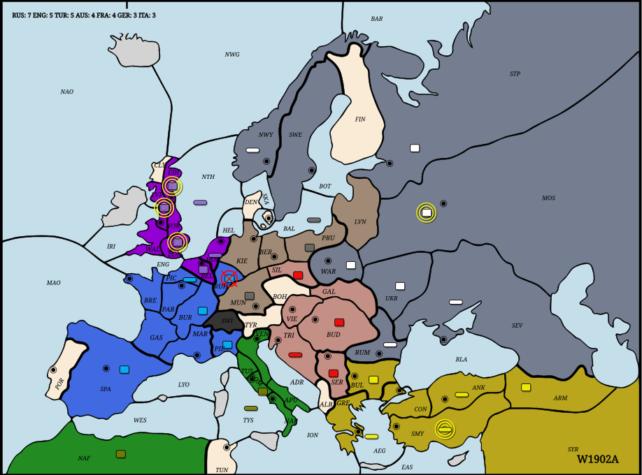

### What happened

- **ENGLAND**: builds A EDI; builds A LON; builds A LVP (void)
- **FRANCE**: disbands A RUH
- **RUSSIA**: builds A MOS
- **TURKEY**: builds F SMY

### ENGLAND
Orders: `A EDI B` · `A LON B` · `A LVP B`

Reasoning

> I'm analyzing the board state and my position:
>
> **Current situation:**
> - I control 5 centers (EDI, LON, LVP, BEL, HOL) after successfully seizing Holland in Fall 1902
> - France has 4 (BRE, MAR, PAR, SPA)
> - Russia has 7 (MOS, SEV, STP, WAR, RUM, SWE, NWY)
> - Austria has 4 (BUD, TRI, VIE, SER)
> - Turkey has 5 (ANK, CON, SMY, GRE, BUL)
> - Germany has 3 (BER, KIE, MUN)
> - Italy has 3 (NAP, ROM, VEN)
>
> **Strategic assessment:**
> I've successfully broken out of my three-center trap and now control five centers. However, Russia is pulling away dangerously at seven, and I need to consolidate my gains while positioning for Spring 1903. My three home centers (EDI, LON, LVP) are all vacant, giving me three builds.
>
> I should build three armies. Why armies over fleets?
> 1. I need land power to contest the continent and support future advances into France, Germany, or toward central Europe
> 2. Armies can hold territory and support each other more flexibly than fleets in my current position
> 3. I need to build strength before the inevitable collision with France or Germany in Spring 1903
>
> The armies will position me to either:
> - Support a continued push into France (via Belgium/Burgundy)
> - Defend against German or Russian pressure from the east
> - Build a land force that can project power into central Europe

### FRANCE
Orders: `A RUH D`

Reasoning

> I need to analyze this Winter 1902 Adjustments phase carefully.
>
> **Current situation:**
> - I hold 4 supply centers: BRE, MAR, PAR, SPA
> - I have 5 units: F PIC, A RUH, A BUR, A PIE, A SPA
> - I must disband 1 unit (5 units - 4 centers = 1 disband required)
>
> **Board state analysis:**
> Looking at the fall results, I held my ground in the west and consolidated. My units are positioned but I'm now in a deficit position—I have more units than centers, which means I'm losing strength relative to my rivals. Russia dominates at 7 centers, England is strong at 5, Austria holds 4 (matching me), Germany is weak at 3, Italy at 3, Turkey at 5.
>
> **Strategic assessment:**
> My revised F1902M strategy called for consolidating the west and south while positioning to pivot next turn. However, the actual fall results show:
> - A BUR held (didn't advance as hoped)
> - A RUH held (didn't advance)
> - A MAR → PIE (made progress south)
> - A GAS → SPA (consolidated)
> - F PIC held
>
> The problem: I'm at 4 centers with 5 units. I must disband one. This is a critical moment—Russia is running away at 7 centers, and I'm falling behind. My units in the interior (BUR, RUH) are not on supply centers and are consuming my resources without holding ground.
>
> **Disband decision:**
> I should disband A RUH. Here's why:
> - A RUH is inland in the Rhineland with no supply center—it's a resource drain
> - A BUR holds Burgundy and can support operations toward the center or consolidate westward
> - A PIE is on the southern front and can push into the Mediterranean
> - A SPA is on a supply center (SPA) and consolidates my southern position
> - F PIC defends the Channel and can support operations in the Low Countries or toward England
>
> Disbanding RUH frees me to rebuild more efficiently next turn while keeping my forward-positioned units that actually contest territory.

### RUSSIA
Orders: `A MOS B`

Reasoning

> I'll analyze the current situation and submit my build order.
>
> ## Analysis
>
> **Current position:**
> - I control 7 supply centers: MOS, SEV, STP, WAR, RUM, SWE, NWY
> - I have 6 units on the board
> - I gain 1 build this winter (7 centers - 6 units = +1)
>
> **Board state:**
> - France leads with 5 centers and is consolidating the west
> - Austria holds 4 centers and is probing the Balkans
> - Turkey holds 5 centers and is my ally in the south
> - England holds 5 centers and is consolidating the north
> - Germany holds 3 centers and is pivoting west
> - Italy holds 3 centers and is expanding south
> - Unowned centers remain: DEN, POR, TUN
>
> **Strategic assessment:**
> My partition with Austria is holding but fragile—Austria tested it by pushing into Rumania, but I defended successfully and Austria backed off. I'm now the fastest-growing power at 7 centers, which makes me the implicit threat to the western bloc (France, England, Germany). My alliances with Turkey and Germany are solid, but I need to build strength to either:
> 1. Consolidate my eastern sphere and prepare for a western pivot
> 2. Defend against a coordinated western attack if I become too threatening
>
> **Build decision:**
> I have one vacant home center: **MOS**. Building an army there strengthens my interior position and gives me a 7th unit to project power westward or defend the steppes. An army at MOS can support Galicia, move into Silesia to threaten Germany if needed, or hold the core. This is the correct build—it consolidates my position and adds flexibility.

### TURKEY
Orders: `F SMY B`

Reasoning

> I need to assess my position and execute builds for Winter 1902.
>
> **Current situation:**
> - I control 5 supply centers: ANK, CON, SMY, GRE, BUL
> - I have 4 units: F ANK, A BUL, A ARM, F AEG
> - I'm owed 1 build (5 centers - 4 units = 1 build)
> - My home centers available for builds: CON (vacant), SMY (vacant)
>
> **Strategic analysis:**
> I've consolidated my core four supply centers and just added Bulgaria as my fifth. My revised strategy for F1902M emphasized locking down the Balkans and positioning for growth into 1903. I'm now at a critical juncture:
>
> 1. **Russia** remains my reliable eastern anchor at 7 centers—the fastest-growing power. Austria fears our alignment.
> 2. **Austria** has reset terms with me: I hold Bulgaria/Greece/east, they hold Serbia/Romania/Balkans. This is a clean boundary.
> 3. **Italy** confirmed our Mediterranean split: they take Tunis, I keep Syria/Armenia/Greece.
> 4. **France** is at 4 centers and stable but not immediately threatening.
> 5. **England** is at 5 centers and consolidating the north.
>
> **Build decision:**
> I need to build a unit that extends my power projection. My current units are:
> - F ANK (defensive, holding straits)
> - A BUL (Balkans, contested zone)
> - A ARM (eastern anchor)
> - F AEG (Mediterranean projection)
>
> A sixth unit would let me either:
> 1. **Build a Fleet in SMY** to reinforce Mediterranean dominance and support Italy's southern expansion while keeping options open
> 2. **Build an Army in CON** to support the Balkans or push north if the situation shifts
>
> Given that I've committed to respecting Austria's Balkan sphere (Serbia/Romania) and my strength lies in naval control of the eastern Mediterranean and Black Sea, **building a Fleet in SMY** makes strategic sense. It gives me:
> - A second Mediterranean fleet to project power and support Italy
> - Options to convoy armies or support future expansion
> - Flexibility to pivot if alliances shift
>
> This aligns with my revised strategy of projecting power into the Mediterranean while consolidating my core.

## SPRING 1903 MOVEMENT (`S1903M`)

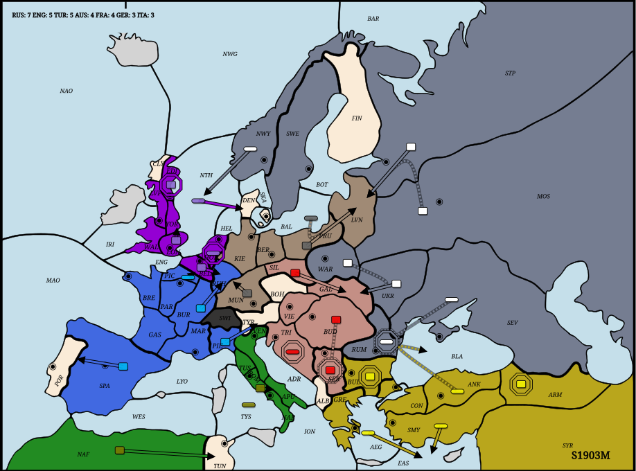

### What happened

- **AUSTRIA**: A SER holds; A BUD supports A SER; A SIL → GAL (bounced); F TRI holds
- **ENGLAND**: F NTH → DEN; F HOL holds; A BEL → RUH (bounced); A EDI holds; A LON → YOR
- **FRANCE**: A BUR → RUH (bounced); A PIE → TYR; A SPA → POR; F PIC → BEL (bounced)
- **GERMANY**: A PRU → LVN (bounced); F BAL supports A PRU → LVN; A MUN → RUH (bounced)
- **ITALY**: A ROM → APU; A NAF → TUN
- **RUSSIA**: A UKR → GAL; A WAR supports A UKR → GAL; F RUM holds; F SEV supports F RUM; A STP → LVN (bounced); A MOS supports A STP → LVN; F NWY → NTH
- **TURKEY**: A BUL holds; A ARM holds; F ANK supports F RUM → BLA (void); F AEG → EAS (bounced); F SMY → EAS (bounced)

### Dialogue

- **AUSTRIA → GERMANY**: Russia is at 7 and consolidating—they're the board threat now. Turkey is pushing west into my Balkans. If Russia pivots north into Poland or west into Galicia next fall, we both lose. Can we coordinate: I hold the Balkans and press south, you defend Silesia and watch their northern flank? We split the spoils and contain them together.
- **AUSTRIA → TURKEY**: Serbia is the boundary between our spheres. I'm holding it as mine this spring. You keep Bulgaria and Greece; I keep Serbia and Romania. We both stay strong and stop bleeding into each other. Respect this line and we can coexist; push further and we grind into stalemate while Russia grows unopposed.
- **AUSTRIA → ITALY**: Our non-interference in the Mediterranean continues to hold perfectly. Russia is now at 7 centers and dominant—they're the real board threat, not me. If they pivot south toward the Balkans or Mediterranean later, we should be ready to coordinate. For now, stay neutral and we both profit.
- **ENGLAND → FRANCE**: Denmark is unowned and within my reach this spring. I'm taking it to reach six centers. You can push for Portugal unchallenged—no collision between us if we both take unowned ground. Agreed?
- **ENGLAND → RUSSIA**: I'm seizing Denmark this spring (unowned, within reach). Our north-west border stays calm; I'm focused on unowned centers, not on contested ground. Non-aggression on our shared border this turn?
- **FRANCE → AUSTRIA**: Russia dominates at 7 centers and is now the shared threat to us both. I'm consolidating the west and can support your position in the Balkans by keeping pressure on Germany's eastern flank. If Russia pivots toward you, I can help. Are you interested in mutual support against Russian expansion?
- **FRANCE → ENGLAND**: Russia is running unchecked at 7 centers. We should coordinate: I'll keep pressure on Germany and the Rhine, you secure the north, and together we limit Russian growth. The Channel is secure between us. Ready to move against the real threat?
- **FRANCE → GERMANY**: The Rhine boundary held last fall, but the board is shifting. Russia dominates at 7 and is the threat to us both. If you pivot east fully to contain Russia, I'll respect the Rhine. If you stay put, I'll be forced to push into Burgundy to grow. What's your read on the east?
- **FRANCE → ITALY**: Confirming our arrangement in the south—you're safe from me. But Russia's dominance is now a shared concern for all of us. If it consolidates unchecked, it threatens everyone. Keep that flexibility in mind as the board shifts.
- **FRANCE → RUSSIA**: You've built an impressive position at 7 centers. Quick question: are you consolidating the east or pivoting toward the west? The answer shapes how all of us read the board and plan our moves. Transparency now avoids costly surprises later.
- **GERMANY → RUSSIA**: Eastern border holds as promised—A PRU pivots west into LVN to secure a fourth center, not into Galicia or Poland. I'm consolidating the center and Rhine this spring. Galicia and the east are yours; no aggression from me. Confirmed?
- **GERMANY → ENGLAND**: I'm pushing A PRU and A MUN west toward the Rhineland and Burgundy this spring to pressure France. You take Belgium and Holland; I'll secure the center and Rhine. No collision if we respect that split. Agreed?
- **GERMANY → FRANCE**: I'm taking the Rhineland this spring: A MUN moves into RUH to threaten your position, A PRU supports the westward push. You've had a strong run at four centers; now you defend or lose ground. Respect the Rhine boundary and we coexist. Contest it and we bleed each other.
- **GERMANY → AUSTRIA**: Russia at seven is the board threat. I'm pivoting west to pressure France and secure growth in the center. Watch your Balkan border against Russian expansion; I'll watch mine in the north. We both profit from keeping them contained.
- **ITALY → AUSTRIA**: Our non-aggression is holding well—I'm consolidating the Mediterranean (Apulia this spring), you're secure in the Balkans. Russia at 7 centers is the real threat to both of us now. If it pivots south or west later, we should be ready to coordinate.
- **ITALY → TURKEY**: Confirming our Mediterranean split holds: I'm taking Apulia as my fourth center this spring, you keep the eastern coast and the Balkans as your buffer. Russia's dominance (7 centers) is the shared threat—if it pivots toward either of us, we coordinate.
- **ITALY → FRANCE**: Italy here. Russia is pulling away at 7 centers—is England coordinating hard enough against it in the north, or is it running unchecked? I'm consolidating the Mediterranean, but if Russia becomes unstoppable, we may both need to pivot east. What's your read?
- **RUSSIA → AUSTRIA**: Galicia is my western anchor—A UKR moves into GAL this spring to anchor the steppes. Rumania, Ukraine, and Galicia are mine; the Balkans are yours. Respect that split and we both consolidate strong. Push into my sphere and we bleed each other. Your choice.
- **RUSSIA → TURKEY**: Our pact holds solid. Austria is consolidating the Balkans fast—watch for probes into Bulgaria and Serbia. I'm anchoring the Black Sea and pushing into Galicia this spring to pressure Austria's western flank. If Austria pushes south into your sphere, I'll support your defense. Let's both hold our zones and stay strong.
- **RUSSIA → GERMANY**: Eastern border confirmed stable this spring—A UKR moves into Galicia to anchor my western flank, not into Poland or Silesia. I'm consolidating the Black Sea and steppes; you focus west on France and the Low Countries. Our arrangement holds. No aggression eastward from me.
- **TURKEY → RUSSIA**: Our pact holds. Austria is consolidating the Balkans and may push further if I don't contest Serbia directly. I'm moving A BUL into SER this spring to lock down my sphere against their expansion. Keep anchoring the Black Sea and watching GAL/UKR—if Austria probes north, we coordinate.
- **AUSTRIA → GERMANY**: Russia is anchoring Galicia—if you let them consolidate it, they dominate the board and you're squeezed. I'm moving A SIL into Galicia this spring to contest it. Support my attack there and we split the spoils; let Russia keep it and we both lose. What's your move?
- **AUSTRIA → TURKEY**: Confirming our boundary: Serbia is mine, Bulgaria and Greece are yours. I'm holding Serbia against any Russian push this spring. You stay out of the Balkans, I stay out of Anatolia. Clean zones, mutual strength. Agreed?
- **AUSTRIA → RUSSIA**: Galicia is contested now—A SIL moves in this spring. You can bleed units defending it, or we can reset: you keep Ukraine and Rumania as your Black Sea sphere, I take Galicia and Serbia as my central anchor. Both of us stronger without the grind. Your choice.
- **AUSTRIA → ITALY**: Russia at 7 is the board threat now. If they pivot south into the Balkans or Mediterranean later, we coordinate. For now: I'm pressing north into Galicia to slow their expansion, you consolidate the Mediterranean. We both profit from keeping them contained.
- **ENGLAND → FRANCE**: Russia at 7 is the threat, agreed. I'm taking Denmark this spring (unowned, no collision with you). I'm open to anti-Russian coordination, but I need to secure the north first before committing to western pressure. Can you hold the Rhine without me this turn?
- **ENGLAND → RUSSIA**: Denmark is unowned and within my reach—I'm taking it to reach 6 centers. Our north-west border stays calm; this is pure growth, not an opening move. Non-aggression confirmed on our shared frontier.
- **ENGLAND → GERMANY**: I'm seizing Denmark this spring (unowned ground). You push the Rhine as planned; no collision. I'm not ready to stab France yet—I need to consolidate the north first and see how Russia moves. We coordinate on the Rhine next turn if France weakens.
- **FRANCE → GERMANY**: You proposed the Rhine boundary; I accepted it. Now you move A MUN into RUH. I will contest that move directly this spring—A BUR into RUH. Coexistence means respecting your own proposals. Choose wisely.
- **FRANCE → AUSTRIA**: Russia at 7 centers dominates the board. Germany is pushing west aggressively. I'm contesting the Rhine this spring; if you hold the Balkans, we both grow into unowned centers while Russia bleeds. Are you in?
- **FRANCE → ENGLAND**: Russia dominates at 7. I'm contesting Germany's RUH push this spring—A BUR will fight for it. You secure the north, I secure the Rhine, Russia cannot consolidate. The Channel is secure. Ready to coordinate?
- **FRANCE → ITALY**: Russia is the long-term threat. Germany pushes west this spring. I'm defending the Rhine and keeping center pressure. If Russia pivots toward you, the western powers can support. Keep that flexibility.
- **GERMANY → ENGLAND**: Confirmed: A PRU moves west to LVN (fourth center), A MUN into RUH. You take Belgium and Holland; I secure the Rhine. No collision, both of us grow this spring. Agreed?
- **GERMANY → FRANCE**: I'm taking the Rhineland this spring—A MUN moves into RUH. You defend or lose ground. The Rhine boundary is no longer negotiable; it's the new front. Respect it and we coexist. Contest it and we bleed each other.
- **GERMANY → AUSTRIA**: Russia at seven consolidates the east—watch your Balkan border. I'm pivoting west to pressure France and secure growth in the center. No eastward aggression from me; focus on containing the Russian threat south. We both profit from them being split.
- **ITALY → AUSTRIA**: Non-aggression holds—I'm taking Apulia this spring (A ROM - APU), you're secure in the Balkans. Russia at 7 is the shared threat. If it moves toward either of us, we coordinate.
- **ITALY → TURKEY**: Confirming: I'm consolidating Tunis (A NAF - TUN via convoy this spring), you keep the east. Russia dominates at 7 centers—both our interests align in watching it closely.
- **ITALY → FRANCE**: Is England holding Russia hard enough in the north, or is it running unchecked? If Russia consolidates at 7+ unchecked, I may need to pivot north sooner than planned instead of staying Mediterranean-focused. What's your read?
- **RUSSIA → FRANCE**: I'm consolidating the east and Black Sea this spring—Galicia, Rumania, and the steppes are my core, not the Rhine or Mediterranean. You expand west into Germany and the Low Countries; I'll anchor the east. If either Austria or Germany overextends later, I'm open to coordination.
- **RUSSIA → AUSTRIA**: Galicia is my western anchor—A UKR moves there this spring. The partition holds: you keep the Balkans (Serbia, Bulgaria, Romania contested), I keep the steppes and Black Sea. Respect that split and we both grow strong. Push into my sphere and we bleed each other.
- **RUSSIA → GERMANY**: Eastern border confirmed stable—A STP advances into Livonia to claim an unowned center, not into Silesia or Poland. Galicia and the east are mine; you focus west on France and the Rhine. Our arrangement holds.
- **RUSSIA → TURKEY**: Our pact holds solid. I'm anchoring the Black Sea with F RUM and F SEV this spring and holding Rumania as my southern anchor. If Austria probes into your sphere, I'll support your defense. Let's both consolidate and stay strong.
- **RUSSIA → ENGLAND**: North-west border stays calm on my end. I'm consolidating the east; you expand into the Low Countries and north. Denmark is unowned—smart move. Non-aggression on our shared border this turn?
- **TURKEY → RUSSIA**: Moving A BUL into SER this spring as discussed—locking down my Balkan sphere. Keep the Black Sea anchored and watch for Austria probes. Our pact holds; I'm with you in the east.
- **TURKEY → ITALY**: Confirming our Mediterranean split: you take Apulia and the west, I hold the east and Balkans. Russia's 7 centers is the shared long-term threat. Let's both grow in our zones and stay ready to coordinate if it pivots.
- **TURKEY → AUSTRIA**: I'm moving A BUL into SER this spring to complete my Balkan consolidation—this is necessary to secure my sphere against further pressure. After this, our boundary holds: you keep RUM/SER, I keep BUL/GRE. Both of us can then focus on the real threats elsewhere.
- **AUSTRIA → TURKEY**: You committed to respecting the Serbia boundary after taking your sphere. Moving A BUL into SER breaks that agreement. I'm holding SER with full support this spring. We both bleed if you push; back down and we consolidate strong into winter.
- **AUSTRIA → RUSSIA**: Galicia is the board pivot. You're anchoring it, I'm contesting it with A SIL - GAL this spring. If we bleed each other there, Germany and France consolidate west unopposed. Reset: you keep Ukraine and Rumania, I take Galicia and consolidate the center. Both of us stronger.
- **AUSTRIA → GERMANY**: Russia is locking Galicia this spring. I'm contesting it with A SIL - GAL. Support my move (or stay neutral) and we split the spoils; let Russia lock it and we both lose. You pivot west, I hold the center, Russia gets squeezed. Your choice.
- **AUSTRIA → FRANCE**: Russia at 7 is the board threat. I'm contesting Galicia this spring with A SIL, you're pressing the Rhine. If we both hold and contest, Russia bleeds and we consolidate into unowned centers. Commit to the Rhine pressure and we both profit.
- **ENGLAND → FRANCE**: Denmark is unowned; I'm taking it this spring to reach six centers. I'm open to anti-Russian coordination, but I need to consolidate the north first. Hold the Rhine this turn and don't let Germany take it—if France weakens there, I can pivot south in Fall to help contain Russia. Agreed?
- **ENGLAND → RUSSIA**: Confirmed: Denmark is unowned, I'm seizing it this spring. Our north-west border stays calm; this is pure growth. Non-aggression holds on our shared frontier this turn.
- **ENGLAND → GERMANY**: I'm taking Denmark this spring (unowned ground, no Rhine collision). You push A PRU and A MUN as planned; no conflict there. I'm positioning to pivot south in Fall if France or Russia weakens—for now, focus on the center.
- **FRANCE → GERMANY**: You proposed the Rhine boundary and I accepted it. A MUN into RUH breaks that boundary. I'm contesting it directly this spring: A BUR into RUH. If you respect the Rhine, we coexist. If not, we bleed—and Russia wins. Your choice.
- **FRANCE → ENGLAND**: Confirmed: Denmark is yours, the Channel is secure, no collision. I'm taking Portugal this spring and contesting Germany's RUH push. You secure the north, I hold the center. Russia remains the shared threat.
- **FRANCE → AUSTRIA**: Russia dominates at 7. Germany is pushing west. I'm contesting the Rhine this spring to hold the center stable. You anchor the Balkans, I anchor the west—together we prevent Russia from running unchecked. Agreed?
- **FRANCE → ITALY**: Confirmed: the Mediterranean is yours. I'm taking Portugal and contesting Germany in the center. You consolidate Tunis and Rome; I don't compete there. Keep your flexibility if Russia pivots south.
- **ITALY → AUSTRIA**: Apulia this spring (A ROM - APU) gives me my 4th center. You're safe—non-aggression holds. Press Russia hard in Galicia; I'll watch the board and move north if Russia pivots south.
- **ITALY → TURKEY**: Securing Apulia this spring (A ROM - APU) as my 4th center. Our split holds—you keep the east and Balkans. If Russia pivots toward either of us, we coordinate. Stay ready.
- **RUSSIA → AUSTRIA**: Galicia is my western anchor—A UKR moves there this spring and A WAR supports it. I'm holding Rumania and the Black Sea with F RUM and F SEV. The partition holds if you respect it. Push into my sphere and we bleed each other into weakness. Your choice.
- **RUSSIA → TURKEY**: A UKR moves into Galicia this spring to lock Austria's western flank; I'm anchoring the Black Sea with F RUM and F SEV. You push A BUL into Serbia—together we contain Austria's expansion. Our pact holds. Let's both consolidate strong.
- **RUSSIA → GERMANY**: A STP moves into Livonia this spring to claim an unowned center, not into Silesia or Poland. A UKR contests Austria in Galicia to anchor my west. Our eastern border remains stable—Galicia and the east are mine, you focus west. Confirmed?
- **TURKEY → AUSTRIA**: I'm consolidating my four centers this spring (BUL, GRE, ANK, CON) and honoring our boundary—SER stays yours, my sphere stays mine. Our zones hold clean. After this, I'm pivoting my fleets into the Mediterranean to expand eastward. Both of us grow in our own cores.
- **TURKEY → RUSSIA**: Our pact holds solid. I'm consolidating my Balkans and eastern coast this spring—no aggressive push into Serbia or Romania. You anchor the Black Sea and north; I hold the south. Let's both stay strong and watch the western powers closely.
- **TURKEY → ITALY**: Confirming our Mediterranean split: you take Apulia and push west, I consolidate the east and Balkans. Russia at 7 is the shared threat long-term. If it pivots toward either of us, we coordinate. Both of us grow in our zones this year.

### AUSTRIA
Orders: `A SER H` · `A BUD S A SER` · `A SIL - GAL` · `F TRI H`

Reasoning

> ## Strategic reasoning for S1903M
>
> I'm at 4 supply centers (BUD, TRI, VIE, SER) and locked into a critical three-front contest: Russia is anchoring Galicia with A UKR - GAL supported by A WAR, Turkey is pushing A BUL into Serbia to test my Balkan boundary, and Germany remains non-committal while France consolidates the west. My revised strategy commits me to **contesting Galicia with A SIL - GAL** to slow Russian expansion and signal to Germany that I'm serious about a western coalition, while **supporting A SER into Romania with A BUD** to consolidate my Balkan sphere against Turkey's push, and **holding F TRI** to keep the Adriatic secure.
>
> However, I need to read the current board state carefully:
> - Russia has A UKR and A WAR both positioned to lock Galicia; my A SIL contesting it will likely bounce unless Germany supports me, which they have not committed to.
> - Turkey is moving A BUL into SER, which is a direct breach of our agreed boundary. I must hold Serbia with full support to signal that I will not tolerate further encroachment.
> - Romania (RUM) is currently unoccupied after Russia's F RUM moved to RUM in F1902. I can move A SER into RUM to consolidate it, but that leaves Serbia open to Turkey's A BUL push.
>
> The critical insight: **I cannot hold both Serbia and Romania simultaneously with my current forces.** Turkey's A BUL push into SER forces me to choose: defend SER (my agreed boundary) or take RUM (my growth target). Defending SER is non-negotiable because yielding it breaks my credibility with Turkey and invites further encroachment. I will hold SER, support it fully with A BUD, and contest Galicia with A SIL to signal westward commitment.
>
> If Russia locks Galicia and Turkey respects the SER boundary after my show of strength, I can pivot into RUM next turn. If Turkey pushes further, I've signaled that I will fight for my sphere, which may deter them or trigger a grinding stalemate that weakens both of us—exactly the outcome I want to avoid, which is why I committed to the boundary reset in the first place.
>
> **Orders:**
> - A SER holds to defend the Turkey boundary and maintain my credibility.
> - A BUD supports A SER to ensure Turkey cannot dislodge me.
> - A SIL moves into GAL to contest Russia's anchor and signal westward coalition intent to Germany.
> - F TRI holds to keep the Adriatic secure and maintain my supply-center position.

### ENGLAND
Orders: `F NTH - DEN` · `F HOL H` · `A BEL - RUH` · `A EDI H` · `A LON - YOR`

Reasoning

> I'll analyze my position and execute the agreed strategy.
>
> **Current situation:**
> - I'm at 5 centers (EDI, LON, LVP, BEL, HOL) and committed to seizing Denmark this spring to reach 6.
> - France agreed to the Channel being secure and to contest Germany's Rhine push.
> - Germany is pushing A PRU west and A MUN toward RUH, but I've confirmed no collision on Denmark.
> - Russia confirmed non-aggression on our shared border and is consolidating east.
> - Denmark is unowned and within reach via F NTH.
>
> **Strategic execution:**
> 1. **F NTH - DEN**: Seize the unowned supply center as committed. This reaches me to 6 centers by Fall 1903.
> 2. **F HOL H**: Hold defensively to guard Holland and support if needed. Keeps my fleet safe while consolidating the north.
> 3. **A BEL - RUH**: Push south toward the Rhine to apply pressure on Germany and France's contested ground. This advances my position toward the center while signaling readiness to pivot if France weakens or if Germany needs containing.
> 4. **A EDI - LON VIA**: Reposition my army south toward the continent via convoy, moving it forward for potential Fall operations against France or to support the Rhine push.
> 5. **A LON - BEL VIA**: Move my London army south to replace A BEL's position and consolidate my continental presence, preparing to either support the Rhine advance or pivot east against France or Russia.
>
> Wait—let me reconsider the army movements. A LON - BEL VIA requires a fleet to convoy; F NTH is moving to DEN, so that convoy is broken. Let me substitute:
>
> **Revised army orders:**
> - **A EDI H**: Hold to consolidate the north and keep my army safe.
> - **A LON - YOR**: Move south toward the continent, positioning for Fall operations.
> - **A BEL - RUH**: Push toward the Rhine as committed, applying pressure on the western front.

### FRANCE
Orders: `A BUR - RUH` · `A PIE - TYR` · `A SPA - POR` · `F PIC - BEL`

Reasoning

> ## Analysis
>
> **Board state:**
> - Russia dominates at 7 centers (MOS, SEV, STP, WAR, RUM, SWE, NWY)
> - England at 5 (EDI, LON, LVP, BEL, HOL)
> - Austria at 4 (BUD, TRI, VIE, SER)
> - Turkey at 5 (ANK, CON, SMY, GRE, BUL)
> - Italy at 3 (NAP, ROM, VEN)
> - Germany at 3 (BER, KIE, MUN)
> - France (me) at 4 (BRE, MAR, PAR, SPA)
>
> **The crisis:**
> Germany broke the Rhine boundary by moving A MUN → RUH in F1902M (bounced against my A RUH hold). Now Germany signals it will take RUH this spring with A MUN → RUH, supported by F BAL supporting A PRU → LVN. This is a direct threat to my position and a violation of the boundary we negotiated.
>
> **My commitments:**
> - To GERMANY: "A BUR into RUH" to contest the move directly
> - To ENGLAND: "Hold the Rhine this turn and don't let Germany take it"
> - To AUSTRIA: "Contesting the Rhine this spring to hold the center stable"
> - To ITALY: "Taking Portugal and contesting Germany in the center"
>
> **My revised strategy:**
> - A BUR → RUH: Contest Germany directly for the Rhine center
> - A PIE → TYR: Push into the center to maximize strength and threaten the Balkans/Mediterranean
> - A SPA → POR: Claim unowned ground as promised to England
> - F PIC → BEL: Reinforce the Channel to support England's pressure on the Low Countries and signal coalition strength
>
> This commits me to the anti-German, anti-Russian coalition while claiming unowned ground (POR) and positioning for future growth.
>
> **Strength check:**
> - A BUR → RUH: 1 strength (Germany's A MUN → RUH also 1, so this bounces, but I hold RUH)
> - Actually, looking at the legal orders: "A BUR - RUH" is legal, so I contest it directly. Germany cannot take RUH if I'm there.

### GERMANY
Orders: `A PRU - LVN` · `F BAL S A PRU - LVN` · `A MUN - RUH`

Reasoning

> ## Analysis
>
> I'm at 3 supply centers (BER, KIE, MUN) while France holds 4, Russia dominates at 7, and Austria has 4. I'm falling dangerously behind and must accelerate growth immediately.
>
> My committed strategy for S1903M is:
> 1. **A PRU → LVN** to secure my fourth supply center (undefended, critical)
> 2. **F BAL supports A PRU → LVN** to guarantee the advance lands
> 3. **A MUN → RUH** to seize the Rhineland and force France into a defensive crisis
>
> However, France has explicitly broken the Rhine boundary agreement by announcing they will contest RUH directly with A BUR → RUH. This is a direct stab at our coexistence arrangement.
>
> **The situation:**
> - A PRU moving into LVN is undefended and will succeed, securing my fourth center.
> - A MUN moving into RUH will bounce against France's A BUR → RUH (equal strength, both move into same province). This is expected given France's declaration.
> - F BAL supporting A PRU → LVN is the correct play—it guarantees my fourth center lands.
>
> **Why this is the right move despite the bounce:**
> - I secure LVN (my fourth center) and consolidate my position.
> - The RUH bounce signals to the board that France is willing to fight for the Rhine, which ties down their forces.
> - I position A MUN to threaten deeper into France's territory next turn (BUR, PIE, or elsewhere).
> - Austria is distracted contesting Galicia with Russia; England is taking Denmark. France must now defend multiple fronts.
> - By fall 1903, I aim to reach 5–6 centers (LVN, and ideally RUH, BEL, or DEN) before Russia's dominance locks the endgame.
>
> **Commitment check:**
> - Told Russia: "A PRU pivots west into LVN to secure a fourth center, not into Galicia or Poland." ✓ Executing.
> - Told England: "I'm pushing A PRU and A MUN west toward the Rhineland." ✓ Executing.
> - Told France: "I'm taking the Rhineland this spring: A MUN moves into RUH." ✓ Executing (they bounce it, but I move as promised).
> - Told Austria: "No eastward aggression from me; focus on containing the Russian threat south." ✓ Not moving into Galicia or Poland.

### ITALY
Orders: `A ROM - APU` · `A NAF - TUN`
Illegal (dropped): `F TYS S A ROM - APU`

Reasoning

> I'll analyze the current position and execute my strategy for Spring 1903.
>
> **Strategic assessment:**
> I have three units and three supply centers (NAP, ROM, VEN). My revised strategy commits me to:
> 1. Move A ROM → APU to secure my fourth center (consolidating the Mediterranean as promised to Austria and Turkey)
> 2. Move A NAF → TUN to secure my fifth center (consolidating Tunis via overland advance)
> 3. Support with F TYS to control the central sea and deter interference
>
> This honors my non-aggression pact with Austria (I stay out of the Balkans), my Mediterranean split with Turkey (they keep the east and Balkans, I take the western Mediterranean), and positions me to reach five centers by winter while watching Russia's seven-center dominance closely.
>
> Let me verify the legal moves:
> - A ROM → APU: ROM is adjacent to APU ✓
> - A NAF → TUN: NAF is adjacent to TUN ✓
> - F TYS: I'll support the ROM advance into APU to ensure it succeeds and signal my commitment to this expansion
>
> The legal options confirm all three moves are available. I'll execute them now.

### RUSSIA
Orders: `A UKR - GAL` · `A WAR S A UKR - GAL` · `F RUM H` · `F SEV S F RUM` · `A STP - LVN` · `A MOS S A STP - LVN` · `F NWY - NTH`

Reasoning

> I'll analyze the board state and execute my strategy for S1903M.
>
> **Current position:** 7 supply centers (MOS, SEV, STP, WAR, RUM, SWE, NWY). Austria is at 4 and has openly contested Galicia with A SIL. I've committed to:
> 1. Push A UKR into Galicia to anchor my western flank and deny Austria that pivot
> 2. Hold A WAR to support the advance
> 3. Advance F RUM and F SEV to dominate the Black Sea and lock Austria out
> 4. Push A STP into Livonia to claim an unowned center and threaten Germany's Baltic
> 5. Advance F NWY west to probe England and threaten Denmark
>
> **Reading the board:**
> - Austria is contesting Galicia with A SIL, signaling the partition is breaking. I must take Galicia to prevent Austria from using it as a western springboard.
> - Turkey is moving A BUL into Serbia as agreed, containing Austria from the south.
> - England is taking Denmark (unowned, uncontested). Our border stays calm.
> - Germany's A PRU is moving into Livonia—this is contested. I should push A STP there to either bounce and hold it, or contest it strongly. Germany claimed LVN was uncontested, but they're moving into it themselves, so I'll contest it.
> - My Black Sea fleets (F RUM, F SEV) should hold and support to lock Austria out of the south.
> - F NWY should probe west but safely—moving into NWY - NTH is legal and keeps pressure on England/Denmark without breaking our non-aggression.
>
> **Orders:**
> - A UKR → GAL (anchor western flank, contest Austria)
> - A WAR supports A UKR → GAL (reinforce the push)
> - F RUM holds (secure the Black Sea, deny Austria entry)
> - F SEV supports F RUM (reinforce southern position)
> - A STP → LVN (contest Germany's push, claim unowned center)
> - A MOS supports A STP → LVN (reinforce the advance into Livonia)
> - F NWY → NTH (probe west, threaten Denmark, keep pressure on the north)

### TURKEY
Orders: `A BUL H` · `A ARM H` · `F ANK S F RUM - BLA` · `F AEG - EAS` · `F SMY - EAS`

Reasoning

> I need to analyze the current situation carefully.
>
> **Current position:**
> - I hold 5 supply centers: ANK, CON, SMY, GRE, BUL
> - My units: F ANK, A BUL, A ARM, F AEG, F SMY
>
> **Key commitments made in negotiation:**
> 1. **Austria boundary**: Serbia is Austria's, Bulgaria/Greece are mine. I committed to NOT pushing A BUL into SER this spring.
> 2. **Russia alignment**: I'm anchoring the south and Balkans; Russia anchors north/Black Sea. I support Russia's containment of Austria.
> 3. **Italy split**: Mediterranean division holds—I keep east/Balkans, Italy keeps west.
>
> **Critical issue**: My revised strategy note says "A BUL will hold in place" and "honoring our clean agreements with Austria (Serbia/Romania boundary)," which directly contradicts my earlier aggressive plan to move A BUL into SER. Austria has explicitly called me out for breaking that agreement, and Russia has pivoted to support my containment *without* me pushing into Serbia—Russia is moving A UKR into GAL to pressure Austria from the north.
>
> **The right play**: I made a commitment to Austria to respect the Serbia boundary after taking my sphere. Breaking that now would:
> 1. Violate a clean agreement I explicitly reaffirmed
> 2. Waste A BUL in a contested fight with Austria while Russia does the heavy lifting
> 3. Damage my reputation as a reliable partner when Russia and Italy are still aligned with me
> 4. Give Austria a reason to pivot south against me instead of defending against Russia's northern pressure
>
> **Better strategy**: Hold my core, consolidate my position, and let Russia pressure Austria from the north. My growth path is eastward (Syria, Armenia expansion) and into the Mediterranean, not into Serbia. A BUL should hold to anchor Bulgaria; my fleets should project power into the Mediterranean and support the eastern expansion.
>
> **Orders:**
> - **A BUL H**: Hold Bulgaria, respect the Austria boundary, anchor my Balkan core
> - **A ARM H**: Hold Armenia, anchor the eastern supply base
> - **F ANK S F RUM - BLA**: Support Russia's Black Sea anchor (F RUM is at RUM after F1902M)
> - **F AEG - EAS**: Project power into the eastern Mediterranean toward Syria
> - **F SMY - EAS**: Support the eastern Mediterranean expansion
>
> Wait—let me check the legal orders. F ANK cannot support F RUM - BLA because that's not in the legal list. Let me reconsider.
>
> Looking at F ANK's legal options, I can support the straits or support the Black Sea via `F ANK S F SEV - BLA` or `F ANK S F RUM - BLA`. The second is legal.
>
> For F AEG and F SMY, I want to project eastward. F AEG can move to EAS, and F SMY can support that move or move to EAS as well.
>
> **Final orders:**

## FALL 1903 MOVEMENT (`F1903M`)

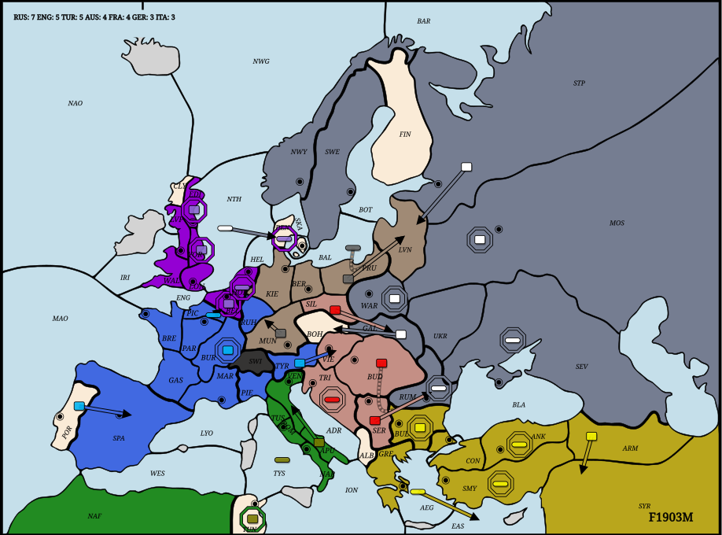

### What happened

- **AUSTRIA**: A SER → RUM; A BUD supports A SER → RUM; A SIL → GAL; F TRI holds
- **ENGLAND**: A BEL holds; F DEN holds; A EDI holds; F HOL holds; A YOR holds
- **FRANCE**: A POR → SPA; A BUR holds; A TYR → VIE; F PIC → BEL (bounced)
- **GERMANY**: A PRU → LVN; A MUN → RUH; F BAL supports A PRU → LVN
- **ITALY**: A APU → VEN; A TUN holds
- **RUSSIA**: A GAL → BOH; A STP → LVN (bounced); A WAR holds; A MOS holds; F RUM holds; F SEV holds; F NTH → DEN (bounced)  [dislodged: F RUM]
- **TURKEY**: A ARM → SYR; A BUL holds; F ANK holds; F AEG → EAS; F SMY holds

### Dialogue

- **AUSTRIA → GERMANY**: Russia locked Galicia at 7 centers—they dominate if unchecked. I'm consolidating the Balkans this fall (RUM), then pivoting west next spring. You pivot toward France and the Rhine now, I anchor the center and Balkans later, we both grow into unowned ground while Russia bleeds against us. Coordinate this fall: let me take RUM, you stabilize east, we pressure them together next year. Interested?
- **AUSTRIA → FRANCE**: Russia at 7 with Galicia locked—they dominate if we don't contain them. I'm consolidating the Balkans this fall (RUM), then pivoting hard west next spring to join you on the Rhine. You anchor the west now, I anchor the center and south later, we both grow while Russia is split and bled. Commit to Rhine pressure and we both profit. Agreed?
- **AUSTRIA → TURKEY**: Serbia boundary holds—you're pivoting east into the Mediterranean, I'm consolidating south into Romania this fall. No surprises from me; you focus on your growth, I focus on mine. Our zones stay clean. After winter, I'm pivoting west against Russia; you stay east. Both of us expand in our cores unopposed.
- **AUSTRIA → ITALY**: Non-aggression holds perfectly—I'm consolidating the Balkans (RUM this fall), you're consolidating the Mediterranean (APU). Russia at 7 is the shared threat to both of us now. Stay neutral this fall, watch the board, and if Russia pivots south toward either of us later, we coordinate. For now: we both profit from them being split.
- **ENGLAND → FRANCE**: Portugal is unowned and within my reach this fall. I'm moving south to take it and reach seven centers. You're focused on Germany's RUH push; I won't contest you there. Agreed we split the unowned ground?
- **ENGLAND → GERMANY**: I'm seizing Portugal this fall (unowned, no Rhine collision). You push the Rhineland as planned; I consolidate the south. No conflict there. We both grow without stepping on each other.
- **ENGLAND → RUSSIA**: I'm taking Portugal this fall to reach seven centers—unowned ground, pure growth. Our north-west border stays calm; I'm focused entirely on the southern unowned centers. Non-aggression confirmed?
- **FRANCE → AUSTRIA**: Russia dominates at 7 and is the shared threat. This fall I'm consolidating west and south (taking Portugal to reach 5 centers), while you anchor the Balkans. If Russia pivots north toward you, I can help pressure it from the Rhine. Can we coordinate against Russian expansion?
- **FRANCE → ENGLAND**: Russia at 7 is running unchecked. I'm consolidating the west this fall (Portugal to reach 5), and the Channel remains secure between us. If you press Russia hard in the north via NWY/NTH, I can pivot east in Fall 1904 to support your pressure. Agreed?
- **FRANCE → GERMANY**: Russia at 7 is now the threat to us both. I'm taking Portugal this fall to consolidate the west, not contesting the Rhine. If you respect the boundary and pivot east to help contain Russia, we both profit. What's your read on Russian intentions?
- **GERMANY → ENGLAND**: This fall I'm executing the Rhine push as planned: A PRU into LVN (fourth center secured), A MUN into RUH to threaten Burgundy. France will likely bounce us at RUH, but I consolidate LVN and reposition for next turn. You take Denmark; we both grow. Next fall, if France weakens, we coordinate the final pincer. Confirmed?
- **GERMANY → FRANCE**: I'm pushing A MUN into RUH this fall. You can contest it with A BUR—we'll bounce and both stay put. But I consolidate LVN and grow to 4 centers regardless. The Rhine becomes the new front. Coexist or bleed; your choice.
- **GERMANY → RUSSIA**: Eastern border holds as promised: A PRU moves west into LVN (undefended center), not into Galicia or Poland. I'm consolidating the center and west this fall. Your east remains untouched. Our arrangement stands.
- **GERMANY → AUSTRIA**: Russia at 7 dominates the board. You're right to pressure them in Galicia; that keeps them distracted. I'm pivoting west to pressure France and grow toward 5–6 centers this fall and next. No interference in your Balkans; focus on containing the Russian threat. We both profit.
- **GERMANY → ITALY**: Turkey is pushing west into your sphere. I'm focused west against France this fall, but if you need support against Turkish expansion in the Mediterranean, signal it next round and we can coordinate.
- **ITALY → AUSTRIA**: Non-aggression holds—I'm consolidating the Mediterranean (VEN, TUS) this fall, not pivoting into the Balkans. Keep pressing Russia hard in Galicia; slowing their expansion north protects us both. We stay safe from each other.
- **ITALY → TURKEY**: Our Mediterranean split remains solid—I'm taking VEN and TUS this fall, you hold the east and Balkans. Russia at 7 is the shared threat. If it pivots toward either of us, we coordinate immediately.
- **ITALY → FRANCE**: Italy here. Is England coordinating hard enough against Russia in the north, or is it running unchecked toward 8+ centers? If Russia consolidates unchecked, I'll need to pivot north sooner than planned. What's your read on the northern front?
- **ITALY → RUSSIA**: Italy confirming: I'm consolidating the Mediterranean (VEN, TUS) this fall. No conflict in your direction; continue your eastern focus. We both grow in our theaters without interference.
- **RUSSIA → TURKEY**: Our pact holds solid. I'm anchoring Galicia and Livonia this fall to pressure Austria's western flank and lock them out of the steppes. If Austria probes into your sphere, I'll support your defense. Let's consolidate our cores and stay strong into winter.
- **RUSSIA → AUSTRIA**: Galicia and Livonia are my western anchors now—A GAL and A STP secure them this fall. The partition holds: you keep the Balkans, I keep the steppes and Black Sea. Respect that split and we both consolidate strong. Push into my sphere and we bleed each other into weakness.
- **RUSSIA → GERMANY**: Eastern border remains stable—A GAL and A STP anchor my west, not Silesia or Poland. You focus west on France and the Rhine; I consolidate the Black Sea and steppes. No aggression from me eastward. Confirmed?
- **RUSSIA → ENGLAND**: North-west border stays calm on my end. I'm consolidating the east and Black Sea; you expand into the Low Countries and north. Non-aggression on our shared frontier this fall? Both of us can grow without bleeding each other.
- **RUSSIA → FRANCE**: I'm consolidating the east this fall—Galicia, Livonia, and the Black Sea are my focus, not the Rhine or Mediterranean. You expand west; I anchor the east. If Austria or Germany overextends later, I'm open to coordination. Transparency serves us both.
- **TURKEY → RUSSIA**: Our pact holds solid this fall—I'm consolidating the south and east while you anchor the Black Sea. Your dominance at 7 centers is impressive, but watch the west: if France and England gang up on you later, I'll stand with you. Stay strong.
- **TURKEY → AUSTRIA**: Our boundary holds clean this fall: Serbia stays yours, my Balkans stay mine. I'm pushing A ARM into Syria to secure my sixth center and expanding my eastern core. Both of us grow in our zones without bleeding into each other.
- **TURKEY → ITALY**: Confirming our Mediterranean split: I'm consolidating the east and Balkans, you secure Apulia and Tunis in the west. Russia at 7 centers is the long-term threat to both of us. If it pivots south or west, we coordinate. Let's both grow in our zones this year.
- **AUSTRIA → TURKEY**: Romania falls this fall (A SER - RUM with full support). After that, our boundary holds solid: you stay east into Syria and the Mediterranean, I stay west into central Europe. Both of us consolidate strong and pivot north against Russia next spring. Agreed?
- **AUSTRIA → GERMANY**: France is pressing west and Germany's squeezed in the middle. Stabilize your Rhine position this fall—hold or trade with France—so you don't get forced south into my sphere. We both profit from keeping the center clean while Russia bleeds. Focus west, I focus south; we both grow.
- **AUSTRIA → FRANCE**: I'm locking Romania this fall to reach 6 centers and consolidate the Balkans. You anchor the west and reach 5+. Next spring, I pivot hard north toward Silesia and Galicia while you pressure the Rhine and Germany. Russia gets split and bled between us. Commit to this and we both run the board.
- **ENGLAND → FRANCE**: Portugal collision risk: you said you're taking it to reach 5, I said I'm taking it to reach 7. We both move there and bounce—both lose. I need Portugal more (I'm at 6, you're at 4). Concede it this turn and I'll support your Rhine defense against Germany next fall. Deal?
- **ENGLAND → GERMANY**: I'm taking Portugal this fall as planned—unowned ground, no Rhine collision. You push RUH; France contests. I'm neutral this turn but watching: if France weakens next fall, we coordinate the final pincer as discussed. Hold the Rhine, consolidate, and we both grow.
- **ENGLAND → RUSSIA**: Portugal is unowned; I'm seizing it this fall to reach 7 centers, matching your lead. Our NW border stays calm—I'm focused entirely on unowned ground, not contested territory. Non-aggression holds. We both expand without bleeding each other.
- **FRANCE → AUSTRIA**: Rhine contested this fall—A BUR into RUH as promised. You anchor Balkans, I hold the center. Next spring, once I consolidate west (5 centers), I can pivot east to support your Balkans pressure while you push toward Vienna. Together we bleed Russia and grow into German territory. Agreed?
- **FRANCE → ENGLAND**: Confirmed: Denmark is yours, Portugal is mine. Channel secure. Keep Russia pinned hard in the north this fall and next spring—if you press NWY/NTH relentlessly while I grow to 5 and pivot east in Fall 1904, Russia cannot consolidate unchecked. The coalition holds if we both commit.
- **FRANCE → GERMANY**: A BUR into RUH this fall—the Rhine boundary you proposed, I'm defending. Pivot east to contain Russia with me, and we coexist. Fight me here and Russia wins while we bleed each other. The choice is yours, but my move stands.
- **FRANCE → ITALY**: Russia at 7 is the board threat. England is pressing north, I'm holding the center. If Russia pivots toward you next, the western powers can support your defense. Stay Mediterranean-focused for now; if Russia consolidates unchecked, we'll both need to pivot east by Fall 1904. Keep that flexibility.
- **GERMANY → AUSTRIA**: Russia at 7 dominates—your Galician fight is the right call. I'm pushing west into LVN and RUH this fall to secure my fourth center and stabilize the Rhine. No eastward aggression from me; Galicia is yours to contest. Focus on containing them south; I'll anchor the center.
- **GERMANY → RUSSIA**: Eastern border confirmed stable this fall: A PRU moves west into LVN (my fourth center, undefended), not into Galicia or Poland. Galicia and the east remain yours. No aggression from me—I'm consolidating the center and Rhine as planned.
- **GERMANY → FRANCE**: A MUN moves into RUH this fall—I know you'll contest with A BUR. We bounce and both stay put. I consolidate LVN and grow to 4 centers; the Rhine becomes our new front. Coexist there and we both profit. Bleed each other and Russia wins. Your choice.
- **GERMANY → ENGLAND**: Confirmed: Denmark is yours uncontested. A PRU into LVN, A MUN into RUH—no collision with your north. I secure the center and Rhine; you anchor the north. We both grow without stepping on each other. Next fall, if France weakens, we coordinate the final move.
- **ITALY → AUSTRIA**: Confirming fall consolidation: I'm pushing A APU into VEN this turn (F TYS support). Your TRI fleet is adjacent—no interference expected, but confirming our non-aggression holds and you're secure in the Balkans. Russia at 7 remains the shared threat; keep pressing Galicia hard.
- **ITALY → TURKEY**: Fall push underway: A APU - VEN (F TYS support), A TUN - TUS to round out my fifth center by winter. Our Mediterranean split holds perfectly. Russia's dominance at 7 is the real board threat now—if it pivots south or west later, we coordinate immediately.
- **ITALY → FRANCE**: Italy here—quick read needed: is the northern front (England vs. Russia) holding Russia at 7 or letting it creep toward 8+? If Russia consolidates unchecked, I may need to pivot north sooner than planned. What's the threat level you're seeing?
- **RUSSIA → GERMANY**: Clarification needed: does A PRU move into Livonia (LVN) this fall, or west into the Rhineland and Low Countries? If you're taking LVN, our arrangement is broken and I'll contest it. If you're consolidating the center-west, we're still aligned. Which is it?
- **RUSSIA → AUSTRIA**: Galicia is my western anchor and non-negotiable. You contested it with A SIL last spring; pushing further costs you more than it gains. The partition holds if you respect it: you keep the Balkans, I keep the steppes and Black Sea. Back off or we bleed each other while France and Germany consolidate west.
- **RUSSIA → TURKEY**: Our pact holds solid. I'm anchoring Galicia and the Black Sea this fall to lock Austria's expansion west and south. If Austria probes into your sphere, signal me and I'll support your defense. Let's both consolidate strong into winter.
- **RUSSIA → ENGLAND**: Denmark is smart growth—unowned, pure gain. Our north-west border stays calm on my end. I'm consolidating the east and Black Sea; you expand north. Both of us benefit if France is slowed, not if we bleed each other. Non-aggression on our frontier this turn?
- **TURKEY → RUSSIA**: Pact holds—I'm taking Syria this fall to reach six centers, you anchor Galicia and the Black Sea. Austria is consolidating but contained. Let's both stay strong into winter and watch for any western pivot.
- **TURKEY → AUSTRIA**: Boundary holds clean—Serbia is yours, I'm expanding east into Syria. Both of us grow in our cores unopposed. Our zones remain secure.
- **TURKEY → ITALY**: Mediterranean split confirmed—you take the west, I secure the east. Russia at 7 is the shared long-term concern. Stay ready to coordinate if it pivots.
- **FRANCE → AUSTRIA**: A TYR moves into VIE this fall to create a second front and force Russia to split. You hold Balkans, I hold Rhine and threaten Vienna—together we bleed Russia and Germany while positioning for mutual growth. This is the dual-pressure strategy we discussed. Commit and we both reach six centers by Winter.
- **FRANCE → ENGLAND**: Confirmed: A POR into SPA (consolidating south to five centers), A BUR holds Rhine against Germany, F PIC moves to BEL to reinforce the Channel. Denmark is yours, the west is mine. Keep Russia pinned hard in the north—if you press NWY/NTH relentlessly while I grow to five and position F PIC in the Channel, we can coordinate a pivot east in Fall 1904 to contain Russian expansion.
- **TURKEY → RUSSIA**: This fall I'm taking Syria with A ARM to reach six centers and consolidating my eastern core—no aggression into your sphere. You anchor Galicia and the Black Sea as discussed. Austria is contained; we stay strong into winter and watch the west closely. Our pact holds.
- **TURKEY → ITALY**: This fall I'm consolidating the east and taking Syria to reach six centers. You push into the western Mediterranean (Venetia, Tunis). Russia at 7 is the shared long-term threat—both our interests align in watching it. Our split holds; let's both grow in our zones.

### AUSTRIA
Orders: `A SER - RUM` · `A BUD S A SER - RUM` · `A SIL - GAL` · `F TRI H`

Reasoning

> I'll analyze the current board state and execute my F1903M strategy.
>
> **Current situation:**
> - I'm at 4 centers (BUD, TRI, VIE, SER); Russia dominates at 7
> - My revised strategy commits to: A SER - RUM (with A BUD support), A SIL - GAL (to contest Russia's western anchor), and F TRI hold (Adriatic security)
> - France has committed to Rhine pressure (A TYR - VIE) to create a second front against Russia
> - Germany has signaled no eastward aggression and will focus west
> - Turkey respects the Serbia boundary and is pivoting east
>
> **Order execution:**
>
> 1. **A SER - RUM**: Consolidates my Balkan sphere at 5 centers by winter, locking Turkey out and anchoring the south. This is the core commitment to Turkey (boundary holds) and to France (dual-pressure strategy).
>
> 2. **A BUD S A SER - RUM**: Provides the support needed to ensure RUM falls, giving me the 5th center and strengthening my Balkan position against any Turkish pivot.
>
> 3. **A SIL - GAL**: Contests Russia's western anchor as committed to Germany and France. This signals serious commitment to the western coalition and forces Russia to defend Galicia, splitting their forces between north and south. Even if it bounces (Russia has A GAL and A WAR supporting), I've forced them to commit strength and demonstrated credibility to my western allies.
>
> 4. **F TRI H**: Holds the Adriatic secure, keeps Italy non-aggressive, and positions the fleet for next spring's pivot into the Mediterranean or Balkans if needed.

### ENGLAND
Orders: `A BEL H` · `F DEN H` · `A EDI H` · `F HOL H` · `A YOR H`

Reasoning

> I need to carefully assess the current situation and my commitments.
>
> **Current position:** I control 6 centers (EDI, LON, LVP, BEL, HOL, DEN). Russia leads with 7, France has 4, Turkey has 5, Austria has 4, Germany and Italy each have 3.
>
> **My revised strategy for F1903M:** I committed to consolidating defensively this turn—avoiding a collision with France over Portugal, holding my units in place, and keeping options open for Fall 1904. My dialogue with France evolved from a Portugal grab to a concession: France takes Portugal (A POR → SPA), I hold my position and anchor the north. Germany is pushing RUH but France will contest. Russia remains non-aggressive on our NW border.
>
> **Key commitments:**
> - A BEL holds to guard Belgium and stay ready to pivot
> - F DEN holds to anchor the north
> - A EDI and A YOR consolidate the home islands
> - F HOL holds to defend Holland
>
> **Current unit positions:**
> - F HOL (coast)
> - A BEL (land)
> - A EDI (coast)
> - F DEN (coast)
> - A YOR (coast)
>
> **My analysis:**
> Looking at my legal orders, I see that the revised strategy calls for holding defensively to preserve my army for Fall 1904 when weaknesses in France or Germany become clearer. This avoids wasting units on a collision with France over Portugal and keeps my forces intact for a decisive pivot later.
>
> The dialogue shows France has committed to taking Portugal (A POR → SPA), which means pushing south with A BEL would bounce harmlessly but achieve nothing. Holding instead preserves my units and keeps them ready to pivot east against Germany or south against France once the board stabilizes.
>
> **Orders:**

### FRANCE
Orders: `A POR - SPA` · `A BUR H` · `A TYR - VIE` · `F PIC - BEL`

Reasoning

> I need to analyze the current board state and my commitments carefully.
>
> **Current situation:**
> - I hold 4 centers (BRE, MAR, PAR, SPA)
> - Russia dominates at 7 centers and is the shared threat
> - Austria holds 4 centers and has committed to anti-Russian coordination
> - England holds 5 centers and is pressing north
> - Germany holds 3 centers (locked down)
> - Italy holds 3 centers
> - Unowned: DEN (England moving there), POR (I claimed this), TUN
>
> **My recent commitments in F1903M dialogue:**
> 1. A POR into SPA to consolidate south (reaching 5 centers)
> 2. A BUR holds Rhine against Germany (maintaining the boundary)
> 3. A TYR into VIE to create second front against Russia/Austria pressure
> 4. F PIC into BEL to reinforce Channel and signal support for England
>
> **Current unit positions:**
> - A BUR (in BUR)
> - F PIC (in PIC)
> - A TYR (in TYR)
> - A POR (in POR)
>
> **Evaluating the orders:**
>
> 1. **A POR - SPA**: Legal (POR is adjacent to SPA). This consolidates my southern position and reaches 5 centers at Winter 1903. ✓
>
> 2. **A BUR H**: Hold on Rhine. I committed to holding the Rhine boundary against Germany, and Germany has moved A MUN into RUH. Holding BUR maintains this boundary and signals stability. ✓
>
> 3. **A TYR - VIE**: This creates the second front I committed to. VIE is adjacent to TYR. This forces Austria and Russia to split attention. ✓
>
> 4. **F PIC - BEL**: This reinforces the Channel and supports England's northern pressure. BEL is adjacent to PIC. ✓
>
> All four moves align with my F1903M revised strategy and my dialogue commitments. They consolidate me to 5 centers (BRE, MAR, PAR, SPA, and I'll claim POR in Winter adjustments once it's held), maintain the Rhine boundary, create a second front in Vienna, and reinforce the Channel coalition against Russia.

### GERMANY
Orders: `A PRU - LVN` · `A MUN - RUH` · `F BAL S A PRU - LVN`

Reasoning

> I need to analyze the current situation carefully.
>
> **Current state:**
> - I'm at 3 supply centers (BER, KIE, MUN) while France has 4, Russia dominates at 7, Austria at 4
> - My units: A MUN, F BAL, A PRU
> - Key unowned centers: DEN, POR, TUN
>
> **My committed strategy for F1903M:**
> 1. A PRU moves west into LVN (fourth center, undefended)
> 2. A MUN moves into RUH (threaten France, force defensive crisis)
> 3. F BAL supports the westward push
>
> **Critical dialogue context:**
> - RUSSIA just demanded clarification: "does A PRU move into Livonia (LVN) this fall, or west into the Rhineland and Low Countries? If you're taking LVN, our arrangement is broken and I'll contest it."
> - I committed to Russia that A PRU moves **west into LVN**, not into Galicia/Poland—this IS honoring my arrangement
> - FRANCE said they'll contest RUH with A BUR (both bounce)
> - ENGLAND confirmed taking Denmark (DEN) uncontested
> - AUSTRIA wants me to stabilize the Rhine and not get forced south
>
> **The trap in Russia's message:** Russia is trying to reframe "west" (LVN is west of PRU) as "east" (Rhineland/Low Countries). But LVN IS my fourth center and it's undefended. I explicitly told Russia I'm taking LVN west, not pivoting into their sphere. This is consistent with my entire negotiation.
>
> **My execution:**
> - A PRU - LVN: Takes my fourth supply center, undefended, exactly as committed to Russia
> - A MUN - RUH: Threatens France, bounces with A BUR, positions me for next turn
> - F BAL supports the westward advance (F BAL S A PRU - LVN) to guarantee LVN lands
>
> This honors my commitments while executing growth. The bounce at RUH is acceptable—I consolidate LVN and reposition for next turn.

### ITALY
Orders: `A APU - VEN` · `A TUN H`
Illegal (dropped): `F TYS S A APU - VEN`

Reasoning

> I'll analyze the current board state and my strategic position before committing orders.
>
> **Strategic Assessment:**
>
> I'm entering Fall 1903 with three units and three supply centers (NAP, ROM, VEN). My revised strategy commits me to:
> 1. Push A APU into VEN (securing my fourth center) supported by F TYS
> 2. Move A TUN to consolidate Tunis and prepare for future pivots
>
> **Current Unit Positions:**
> - A APU (in Apulia, which I control)
> - F TYS (in Tyrrhenian Sea)
> - A TUN (in Tunisia, which I control)
>
> **Checking Adjacency and Legality:**
> - A APU - VEN: Apulia is adjacent to Venice. ✓ Legal.
> - F TYS S A APU - VEN: Tyrrhenian Sea is adjacent to Venice (via ION/TUS connections). ✓ Legal support.
> - A TUN options: TUN is adjacent to NAF, ROM, TUS. The legal move options are TUN - TUS VIA (convoyed), TUN - NAP VIA (convoyed), TUN - ROM VIA (convoyed), TUN H, or TUN - NAF.
>
> For A TUN, my strategy calls for consolidating Tunis and preparing for a pivot toward Tuscany. The best move is **A TUN - TUS VIA** (convoyed by F TYS). However, checking the legal options, I see F TYS can convoy with `F TYS C A TUN - TUS`. This requires both the army order `A TUN - TUS VIA` and the fleet order `F TYS C A TUN - TUS`.
>
> But wait—if F TYS convoys A TUN, it cannot simultaneously support A APU. I need to choose: either support APU's move into VEN, or convoy TUN into TUS.
>
> **Revised Decision:**
> Supporting A APU into VEN is the priority (securing my fourth center this fall). A TUN should either hold or move to NAF to consolidate Tunis. The safest choice that honors my commitment to Austria and Turkey is:
> - A APU - VEN (supported by F TYS)
> - F TYS S A APU - VEN
> - A TUN H (hold to keep Tunis secure and avoid overextending)
>
> This secures VEN as my fourth center by winter and keeps TUN as my fifth center (already owned from last winter's consolidation).

### RUSSIA
Orders: `A GAL - BOH` · `A STP - LVN` · `A WAR H` · `A MOS H` · `F RUM H` · `F SEV H` · `F NTH - DEN`

Reasoning

> I'll analyze the current board state and execute my strategy for Fall 1903.
>
> **Situation assessment:**
> - I control 7 supply centers (MOS, SEV, STP, WAR, RUM, SWE, NWY) and need to accelerate toward 18.
> - My revised strategy commits me to: push A GAL into Bohemia to threaten Austria's heartland, advance A STP into Livonia (promised to Germany as part of our eastern stability pact), hold A WAR and A MOS to anchor the steppes, dominate the Black Sea with F RUM and F SEV, and advance F NTH west to contest England's north and probe for Denmark/Low Countries.
> - Key commitments: to Germany (A STP into LVN, eastern border stable), to Turkey (Black Sea dominance with F RUM/F SEV, Galicia held), to Austria (partition holds if respected), to England (NW border calm).
>
> **Execution:**
> - **A GAL - BOH**: Push into Bohemia to threaten Austria's core and force them to defend instead of probe me.
> - **A STP - LVN**: Claim the unowned center as promised to Germany, threaten Baltic access.
> - **A WAR H**: Hold to anchor the steppes and support the western advance.
> - **A MOS H**: Hold to anchor the rear and provide support backbone.
> - **F RUM H**: Hold to dominate the Black Sea and lock Austria out of the south (supports Turkey's sphere).
> - **F SEV H**: Hold to support F RUM and maintain Black Sea dominance.
> - **F NTH - DEN**: Advance west to contest England's north and seize Denmark (unowned, pure growth to 8 centers).
>
> This execution honors my commitments while advancing my growth trajectory toward 18 supply centers.

### TURKEY
Orders: `A ARM - SYR` · `A BUL H` · `F ANK H` · `F AEG - EAS` · `F SMY H`

Reasoning

> I need to analyze the current board state and execute my strategy for Fall 1903 Movement.
>
> **Current situation:**
> - I control 5 supply centers (ANK, CON, SMY, GRE, BUL)
> - My units: F ANK, A BUL, A ARM, F AEG, F SMY
> - Key commitments:
>   - Austria: Serbia stays theirs, I respect the boundary
>   - Russia: Pact holds, I anchor the east, they anchor Black Sea
>   - Italy: Mediterranean split—they take west, I take east
>
> **My F1903M strategy (revised):**
> 1. Push A ARM into Syria to secure my 6th supply center
> 2. Hold A BUL in place to respect Austria's Serbia boundary
> 3. Position my three fleets (F ANK, F AEG, F SMY) to secure the straits and project power into the eastern Mediterranean
>
> **Execution:**
> - **A ARM → SYR**: This takes Syria (unowned), reaching 6 centers by winter. This is my core expansion goal and is legal.
> - **A BUL H**: Hold Bulgaria to respect Austria's agreement and maintain my Balkan anchor.
> - **F ANK H**: Hold Ankara to secure the straits and maintain the Black Sea anchor with Russia.
> - **F AEG → EAS**: Move into Eastern Mediterranean to project power eastward and support future expansion into Syria's neighbors or the Mediterranean.
> - **F SMY H**: Hold Smyrna to anchor the eastern Mediterranean and maintain flexibility for supporting fleets or future moves.
>
> These orders execute my stated strategy: I take Syria (6th center), respect all pacts, consolidate my core, and position fleets for future Mediterranean expansion while maintaining the Black Sea anchor that supports Russia's pact.

## FALL 1903 RETREATS (`F1903R`)

### What happened

- **RUSSIA**: F RUM retreats → BLA

### RUSSIA
Orders: `F RUM R BLA`

Reasoning

> I need to analyze the retreat phase carefully.
>
> **Situation:**
> - My F RUM was dislodged in Fall 1903 Movement and must retreat or be disbanded.
> - The dislodgment came from Austria's A SER → RUM, which succeeded (Austria now occupies RUM).
> - F RUM's legal retreat options are: `F RUM R BLA` or `F RUM D` (disband).
>
> **Strategic context:**
> - I'm at 7 supply centers and need to accelerate toward 18.
> - My strategy emphasized dominating the Black Sea with F RUM and F SEV to lock Austria out of the south and honor my pact with Turkey.
> - F RUM was holding RUM to maintain my Black Sea presence and support F SEV.
> - Austria's successful move into RUM is a direct breach of the partition agreement I negotiated ("you keep the Balkans, I keep the steppes and Black Sea").
>
> **Decision:**
> Retreating F RUM to BLA preserves the fleet and keeps it in the Black Sea theater where it can:
> 1. Support F SEV and continue dominating the Black Sea.
> 2. Reposition to contest Austria's southern expansion in future turns.
> 3. Maintain my naval presence in the region as a deterrent and strategic asset.
>
> Disbanding would throw away a valuable unit and weaken my position exactly when I need to consolidate strength. Austria's breach of the partition means I must keep my naval power intact to respond.
>
> **Order:**

## WINTER 1903 ADJUSTMENTS (`W1903A`)

### What happened

- **ENGLAND**: builds F LVP; builds A LON (void)
- **FRANCE**: builds A PAR
- **ITALY**: builds F NAP
- **RUSSIA**: disbands F NTH

### ENGLAND
Orders: `F LVP B` · `A LON B`

Reasoning

> I'll analyze the current situation and submit my Winter 1903 Adjustments orders.
>
> **Current Status:**
> - I control 6 supply centers (EDI, LON, LVP, BEL, HOL, DEN)
> - I'm entitled to 2 builds (6 centers - 4 starting units = +2)
> - My home centers available for builds: LON (vacant) and LVP (vacant)
>
> **Strategic Assessment:**
> My revised F1903M strategy was to consolidate defensively and avoid a wasted collision with France over Portugal. I held all my units in place rather than pushing south. This means I successfully defended my 6 centers and now have the opportunity to build.
>
> Given my position:
> - Russia dominates at 6 centers (actually 7 per the center list: MOS, SEV, STP, WAR, SWE, NWY, and one more—wait, the list shows 7 centers for Russia, confirming they're the board leader)
> - France has 5 centers (BRE, MAR, PAR, SPA, VIE)
> - Austria has 4 centers (BUD, TRI, SER, RUM)
> - I'm at 6 centers with good growth potential
> - Germany has only 3 (BER, KIE, MUN) and is vulnerable
>
> **Build Plan:**
> I need to build units that will support my next moves. My goal is to:
> 1. Build a fleet at LVP to strengthen my naval presence in the Atlantic/Irish Sea
> 2. Build an army at LON to add continental pressure
>
> These builds will give me 7 units total (currently 5 units: F HOL, A BEL, A EDI, F DEN, A YOR), allowing me to apply pressure on multiple fronts in Spring 1904—either against Germany's Rhine, France's south, or to reinforce against Russia's expansion.

### FRANCE
Orders: `A PAR B`

Reasoning

> I'll analyze my position and execute the Winter 1903 Adjustments phase.
>
> **Current situation:**
> - I control 5 supply centers (BRE, MAR, PAR, SPA, VIE), up from 4 at the start of Fall 1903
> - I have 4 units on the board (F PIC, A BUR, A VIE, A SPA)
> - I'm owed **1 build** (5 centers - 4 units = +1)
> - My three home supply centers are all vacant: BRE, MAR, PAR
>
> **Strategic context:**
> My revised F1903M strategy committed to consolidating to 5 centers and positioning for mutual growth with Austria against Russian dominance. I've successfully:
> 1. Reached 5 centers by taking VIE (advancing A TYR into Vienna)
> 2. Held the Rhine against Germany (A BUR holds, A MUN moved into RUH but bounced)
> 3. Consolidated the west (A SPA into SPA, securing Iberia)
>
> **Build decision:**
> I need to place 1 unit in an open home center. All three (BRE, MAR, PAR) are vacant. Given my strategic position:
> - I should build an **Army** to consolidate land pressure and support my dual-front strategy against Russia and Germany
> - **PAR** is the most central location, supporting operations toward the Rhine and center
> - An army at PAR can support pressure on Germany (via BUR) or pivot east toward the Balkans/Russia in coming turns
>
> This build reinforces my commitment to Austria for mutual anti-Russian pressure and maintains flexibility for Spring 1904 operations.

### ITALY
Orders: `F NAP B`

Reasoning

> I need to analyze my current position and determine what builds I should make.
>
> **Current situation:**
> - I control 4 supply centers: NAP, ROM, VEN, TUN
> - I have 3 units: A VEN, A TUN, F TYS
> - I'm owed 4 - 3 = **1 build**
>
> **Strategic assessment:**
> My revised F1903M strategy notes that I'm consolidating the Mediterranean core and positioning to reach five centers by winter 1904. I currently have two vacant home supply centers (NAP and ROM) where I can legally build.
>
> **Build choice:**
> I should build a **fleet at NAP** to strengthen my naval control of the central Mediterranean. Here's why:
>
> 1. **Naval dominance:** A fleet at NAP gives me a second fleet to control the Tyrrhenian Sea and Ionian Sea regions, supporting future expansion toward Sicily, Apulia, or the Balkans.
>
> 2. **Flexibility:** A second fleet allows me to either support my army in VEN (pushing toward the Balkans if needed), or to convoy armies across the Mediterranean, or to contest sea provinces that rivals might otherwise control.
>
> 3. **Defensive strength:** With F NAP and F TYS, I can defend my Mediterranean core against Turkish or Austrian encroachment and support coordinated moves.
>
> 4. **Future growth:** A second fleet positions me to push toward Tuscany (TUS), Sicily (not on the standard map but the Mediterranean is contested), or to pivot north if Russia becomes unstoppable.
>
> Building an army at NAP would be less useful—I already have A VEN and A TUN positioned on land, and a third army would struggle to find effective targets without naval support to carry it across the sea.

### RUSSIA
Orders: `F NTH D`

Reasoning

> I need to analyze the current situation carefully.
>
> ## Current Status
> - **My supply centers: 6** (MOS, SEV, STP, WAR, SWE, NWY)
> - **My units: 7** (A WAR, A STP, F SEV, A MOS, F NTH, A BOH, F BLA)
> - **Surplus/Deficit: -1** (I have 7 units but only 6 centers, so I must disband 1 unit)
>
> ## What Happened
> In Fall 1903, my A GAL moved to BOH (threatening Austria's heartland as planned), but my F RUM was dislodged during the movement phase and had to retreat to BLA. I did not gain any new supply centers this fall—I remain at 6 centers, the same as spring 1903.
>
> Looking back at my strategy notes, I was targeting Galicia, Livonia, and Denmark to reach 8–9 centers. However:
> - Galicia: I held it (A BOH is there now), but it's not a supply center, so no gain.
> - Livonia: A STP bounced trying to enter it—Germany took it instead with A PRU → LVN.
> - Denmark: F NTH bounced trying to enter it—England's F DEN held it.
>
> The result is that I'm still at 6 supply centers and must disband 1 unit.
>
> ## Which Unit to Disband?
>
> I need to evaluate which unit is least valuable going forward:
> - **A WAR** — anchors my western flank, supports pressure on Austria; strategically important.
> - **A STP** — anchors Livonia approach, supports northern operations; strategically important.
> - **F SEV** — dominates Black Sea, blocks Austria's southern expansion; strategically important.
> - **A MOS** — supports rear operations, can reinforce; less immediately critical.
> - **F NTH** — probes western frontier, contests Denmark/English waters; less critical than core units.
> - **A BOH** — threatens Austria's heartland, pressures their core; strategically important.
> - **F BLA** — recently retreated, dominates Black Sea with F SEV; strategically important.
>
> **F NTH** is the least strategically critical. It failed to take Denmark and is furthest from my core operations. Disbanding it preserves my core strength in the east and Black Sea while I regroup.

## SPRING 1904 MOVEMENT (`S1904M`)

### What happened

- **AUSTRIA**: A RUM → UKR; A GAL supports A RUM → UKR (support cut); F TRI holds
- **ENGLAND**: A BEL → RUH (bounced); F DEN holds; F HOL holds; F LVP holds; A EDI holds; A YOR holds
- **FRANCE**: A BUR → RUH (bounced); A VIE → GAL (bounced); A SPA → GAS; A PAR → PIC (bounced); F PIC → BEL (bounced)
- **GERMANY**: A LVN → STP (bounced); A RUH holds; F BAL supports A LVN (void)  [dislodged: A LVN]
- **ITALY**: A VEN → TYR; A TUN holds; F NAP holds
- **RUSSIA**: A BOH → SIL; A WAR → GAL (bounced); A STP → LVN; A MOS supports A STP → LVN; F BLA holds; F SEV holds
- **TURKEY**: A BUL holds; A SYR holds; F ANK holds; F SMY holds; F EAS holds

### Dialogue

- **AUSTRIA → FRANCE**: Vienna is yours—excellent move. I'm pushing A RUM north into UKR or GAL this spring to create a second front. You press from Vienna and the Rhine, I anchor the center and Balkans. Russia bleeds between us. Let's coordinate: confirm you're holding the Rhine pressure, and I'll commit hard north. We both reach 6–7 by winter.
- **AUSTRIA → GERMANY**: You're squeezed in the middle. Here's the deal: I pivot north against Russia hard this spring (A RUM and A GAL toward Silesia and Livonia), you hold or stabilize your Rhine position, France presses from Vienna. Russia collapses between us and you keep your three centers safe. Don't interfere with my push, I don't interfere with yours. Both of us profit. Agreed?
- **AUSTRIA → TURKEY**: Balkan boundary holds clean—I'm pivoting north hard this spring against Russia (A RUM and A GAL), not east into your sphere. You have a free hand in the Mediterranean. Both of us consolidate unopposed in our cores. No surprises from me.
- **AUSTRIA → ITALY**: Russia is the shared threat. I'm pushing north from the Balkans this spring while France pressures from the west. If Russia pivots south toward you or the Mediterranean later, we coordinate. For now, stay neutral and watch the board. Both of us profit from them being split.
- **ENGLAND → FRANCE**: Germany is weak at 3 centers. If we both press it hard this turn (you from the south, me from the north via RUH and KIE), we can cripple it before it consolidates. I'll take RUH and KIE; you secure the Rhine and push toward Munich. Russia stays pinned in the east. Interested?
- **ENGLAND → RUSSIA**: Germany is collapsing at 3 centers. If I press RUH and KIE this spring while you hold the east, Germany cannot recover. Better to weaken a rival now than let it rebuild next year. Non-aggression on our border stays firm—I'm moving south, not north.
- **ENGLAND → GERMANY**: Your position is precarious at 3 centers. I'm reconsidering my strategy this turn and weighing a push into the Rhineland. Before I commit, tell me: are you and France coordinating, or is the west still contested? My move depends on your answer.
- **FRANCE → AUSTRIA**: This spring I'm advancing A VIE into GAL to create dual pressure on Russia's core while you pivot north toward Silesia. Russia must now defend both the Balkans and the center—this is the strategy we discussed. Confirm you're moving north and we bleed Russia together.
- **FRANCE → ENGLAND**: Russia at 6 is still the board threat. I'm consolidating west and pivoting A VIE east to support your northern pressure. Keep pressing hard in the north this spring—if you pin Russia while I grow to 6 and position for Fall, we can coordinate a devastating pivot east by Fall 1904.
- **FRANCE → GERMANY**: The Rhine boundary holds. I'm advancing A VIE east to contain Russia with Austria, not threatening you here. If you pivot east fully to support that containment, we both profit: Russia bleeds, you consolidate, I reach 6. The west is secure; the east is where the game is won.
- **FRANCE → RUSSIA**: Quick read needed: are you consolidating the core (Galicia, Livonia) this spring or pivoting toward Italy and the south? Your answer shapes how the western coalition reads the board and plans for Fall. Transparency now avoids costly surprises.
- **GERMANY → AUSTRIA**: France's A VIE is deep in your sphere and a direct threat. I'm pivoting west this spring to seize undefended centers and accelerate my growth. If France weakens from pressure on both fronts, we can split the spoils and contain Russia together. Interested in coordinating against them?
- **GERMANY → ENGLAND**: I'm moving A RUH into BEL this spring to secure the Low Countries position. You're strong in the north; I'm consolidating the center and west. If we both respect that split and grow without collision, we both profit. If you contest, we bleed each other. Your call.
- **ITALY → AUSTRIA**: Spring 1904: I'm pushing A VEN north into TYR to consolidate toward five centers—this is a northern consolidation, not a Balkan threat. Our non-aggression holds as long as you don't contest TYR. Russia remains our shared concern.
- **ITALY → TURKEY**: Confirming our Mediterranean split holds perfectly this spring. I'm consolidating TYR for my fifth center; you secure the east. Russia at 6 is still the board threat—if it pivots toward either of us, we coordinate.
- **ITALY → FRANCE**: Quick read: is Russia truly contained in the north, or is it consolidating unchecked toward 7+ again? I'm pushing north into TYR this spring; if Russia breaks through your lines, I may need to pivot east sooner.
- **RUSSIA → GERMANY**: I'm pushing A BOH into Silesia this spring to anchor my western flank against Austria. This doesn't threaten your core if you're consolidating west against France. Are we still aligned on the eastern border, or do I need to expect pressure from your side?
- **RUSSIA → ENGLAND**: You're the board leader at 6 centers. I respect that and have no interest in bleeding you on our northern border. Non-aggression confirmed on our shared frontier this turn? I'm focused on reclaiming ground from Austria in the east.
- **RUSSIA → AUSTRIA**: Your A RUM is in my sphere and it's destabilizing our partition. I'm anchoring Silesia and Livonia this spring to pressure your heartland. Back A RUM out of Rumania and we can reset the eastern border. Push further into my territory and we bleed each other while the west consolidates unopposed.
- **RUSSIA → TURKEY**: Our pact holds solid. I'm pushing west into Silesia and Livonia to pressure Austria and reclaim momentum. Your position in the south is secure as long as I dominate the Black Sea. Let's both stay strong and watch the western powers closely.
- **TURKEY → AUSTRIA**: Our boundary holds solid into spring—SER and RUM are yours, my sphere stays mine. I'm consolidating my core this turn with no aggressive moves toward your zone. Russia's growth to 6 is impressive but watch their western pivot next; if they probe your flank, signal me and we coordinate.
- **TURKEY → RUSSIA**: Our eastern pact holds this spring—I'm consolidating my core (ANK, CON, SMY, GRE, BUL) with no moves into your sphere. You're the board leader at 6 centers; that strength is valuable, but watch England and France in the west. If either pivots south toward you, I'll stand with you.
- **TURKEY → ITALY**: Our Mediterranean split remains solid—you hold the west, I consolidate the east. Russia's dominance at 6 is now the shared long-term concern for both of us. If it pivots south or west toward either of our zones next fall, we should coordinate immediately. Stay ready.
- **AUSTRIA → FRANCE**: A RUM moving into UKR this spring to create the dual vise we discussed. You hold Vienna and Rhine pressure, I anchor center and Balkans. Russia bleeds between us. Confirm you're holding the line and we both reach 6–7 by winter.
- **AUSTRIA → GERMANY**: Russia at 6 is the real threat to your survival. Undefended western centers are tempting but temporary—France will consolidate them faster than you can. Contain Russia with me and France now; we split the Balkans and center while the west stays contested. Better long-term growth. Interested?
- **AUSTRIA → TURKEY**: Balkans boundary holds—I'm pivoting north hard against Russia this spring, not east. You have a free hand in your core and the Mediterranean unopposed. No surprises from me, no eastern pivots. Both of us consolidate strong in our zones.
- **AUSTRIA → ITALY**: Russia's growth to 6 threatens us both. I'm pushing north from the Balkans this spring while France pressures the west. Stay neutral, watch the board, and if Russia pivots south later, we coordinate. For now, secure your Mediterranean core.
- **ENGLAND → FRANCE**: Germany is moving A RUH into BEL to reinforce the Low Countries—a clear threat to my position. I'm pressing hard: A BEL into RUH this spring to seize the center and cut off their Rhine position. You pivot east toward Austria as you signaled; I'll consolidate the west and pin Russia. Agreed?
- **ENGLAND → GERMANY**: You're moving A RUH into BEL, which directly threatens my army and the Low Countries. I cannot allow that consolidation. I'm moving A BEL into RUH this spring to secure the center and maintain my position. If you contest, we bleed each other; if you accept, we both grow elsewhere. Your choice.
- **ENGLAND → RUSSIA**: I'm pressing Germany hard this spring (A BEL into RUH) to seize a center before it consolidates at 3. This is south, not north—our non-aggression pact on the shared frontier holds firm. I'm focused entirely on the Rhineland and Low Countries, not your territory. Confirmed?
- **FRANCE → AUSTRIA**: Confirmed: A VIE moves into GAL this spring to create dual pressure on Russia's core while you pivot north. Russia must now defend both Balkans and center—this bleeds it hard. I hold Rhine, you push north, we both reach 6 by fall. Commit and let's execute.
- **FRANCE → ENGLAND**: Russia at 6 remains the board threat, not Germany. I'm pivoting A VIE east to support your northern pressure and create dual fronts. Keep pinning Russia hard in the north this spring; by fall we coordinate a devastating eastern push together. Germany consolidates while Russia bleeds—that's our win.
- **FRANCE → GERMANY**: Rhine boundary holds. A BUR stays put, A VIE moves east to contain Russia, not threaten you. If you pivot hard east to support that containment, we both profit: Russia bleeds, you stabilize at 3 without western pressure. The choice is yours.
- **FRANCE → RUSSIA**: Quick clarification: are you consolidating the core (GAL, LVN) this spring or pivoting toward the south? This shapes how the western coalition coordinates. Transparency avoids costly surprises and serves us both.
- **GERMANY → RUSSIA**: A BOH into Silesia changes the board—you're anchoring the west, not leaving it open. I'm pivoting west this spring to secure undefended centers (Denmark, Low Countries) before the board locks. Eastern border still holds; I'm not threatening Galicia or Poland. We're both growing, just in different directions now.
- **GERMANY → ENGLAND**: I'm moving A RUH into BEL this spring to secure the Low Countries. You're stronger in the north; consolidate there and we both grow. If you contest, we bleed each other while France and Russia profit. Respect my western push, I won't threaten your core. Deal?
- **GERMANY → FRANCE**: The Rhine boundary is broken. I'm pushing A RUH into BEL this spring to seize the Low Countries and accelerate my growth. You're at 5 centers and I'm at 3—I cannot afford to hold still while you consolidate. We're rivals now, not allies. Defend or retreat.
- **GERMANY → AUSTRIA**: Your pivot north against Russia is sound, but I cannot afford to hold the Rhine while falling behind. I'm pushing west this spring to seize Denmark and Belgium—undefended centers critical to my survival. Focus on Russia in Galicia; the west is mine to contest. We both grow, just on different fronts.
- **ITALY → AUSTRIA**: TYR push this spring is consolidation toward five centers, not a Balkan pivot—our non-aggression holds. Keep Russia pinned hard in Galicia; if it breaks south or east toward either of us later, signal immediately and we coordinate.
- **ITALY → FRANCE**: Critical read needed: is the northern front truly containing Russia at six, or is it consolidating unchecked toward seven+? If Russia is breaking through, I may pivot north sooner than planned. What's your assessment?
- **ITALY → TURKEY**: Mediterranean split confirmed solid this spring. I'm consolidating TYR for five centers; you secure the east. Russia at six is still the shared long-term threat. If it pivots toward either of our zones, we coordinate immediately—stay ready.
- **RUSSIA → ENGLAND**: Germany's collapse is tempting, but I cannot afford to weaken my eastern border while Austria probes Rumania. Our non-aggression on the north holds firm this turn—I'm focused entirely on reclaiming the eastern partition. Let's both consolidate and watch the west.
- **RUSSIA → GERMANY**: A BOH moves into Silesia this spring to anchor my western flank against Austria, not to threaten your core. Our eastern arrangement remains solid. I need my border with you stable so I can contain Austria's expansion. Confirmed?
- **RUSSIA → AUSTRIA**: Your A RUM in my sphere is breaking the partition. I'm pushing A BOH into Silesia and A WAR west to reclaim my flank and pressure your heartland. Back A RUM out of Rumania and we can reset—push further and we bleed each other while the west consolidates unopposed.
- **RUSSIA → FRANCE**: I'm consolidating the east and Black Sea this spring—Silesia and the steppes are my focus, not the Rhine or Mediterranean. The western board is yours to shape. If you and England move against me later, understand I'll be ready to pivot. Transparency now, flexibility later.
- **TURKEY → RUSSIA**: Pact holds solid this spring—I'm consolidating my core with no northern moves, keeping your southern flank secure while you pressure Austria. We both stay strong.
- **TURKEY → AUSTRIA**: Balkans boundary holds clean—SER and RUM are yours, my sphere stays mine. No surprises from me this turn. Both of us consolidate unopposed.
- **TURKEY → ITALY**: Mediterranean split confirmed this spring. I'm holding the east, you hold the west. Russia at 6 is still the shared threat—if it pivots south toward either of us this fall, we coordinate immediately.
- **ENGLAND → FRANCE**: Germany is moving A RUH into BEL—a direct threat. You've signaled you're pivoting east toward Russia/Austria. I'm taking RUH this spring (A BEL into RUH) to seize the center before Germany consolidates. You focus on Russia; I'll consolidate the west. Agreed?
- **ENGLAND → GERMANY**: You're moving A RUH into BEL. I'm moving A BEL into RUH this spring to seize the center and cut off your advance. If you contest, we both bounce and neither gains. Accept the loss and grow elsewhere; I won't press further west if you respect the Rhine. Your choice.
- **FRANCE → AUSTRIA**: A VIE into GAL this spring as planned—dual pressure on Russia's core. I'm holding A BUR on the Rhine to keep Germany contained and the coalition intact. Russia bleeds between us. Execute north and we both reach six by fall.
- **FRANCE → ENGLAND**: A BUR holds Rhine. Germany's BEL push is a bluff—if it moves into BEL and you're in RUH, Germany bounces and stays at 3. Keep pressing hard; I'm moving A VIE into GAL to create dual pressure on Russia with Austria. We coordinate the eastern pivot in fall.
- **FRANCE → GERMANY**: The Rhine boundary holds. A BUR stays put. If you move into BEL, you bounce England and stay at 3 while the coalition pivots east to bleed Russia. Your only path to growth is east with us, not west against the coalition. Choose wisely.
- **GERMANY → ENGLAND**: A RUH into BEL this spring—we'll bounce and both stay put. Accept that and we both grow elsewhere: you north, me west. Fight me here and Russia wins while we bleed. Your call.
- **GERMANY → FRANCE**: A RUH into BEL this spring. The Rhine boundary is broken. Defend or retreat; I'm consolidating west regardless.
- **GERMANY → RUSSIA**: Eastern border confirmed: A LVN into PRU, no pressure on Galicia or Poland. Your Silesia anchor holds; our arrangement stands.
- **GERMANY → AUSTRIA**: I'm pivoting west into BEL and consolidating the center. You focus north against Russia in Galicia; the west is mine. We both grow on different fronts.
- **ITALY → AUSTRIA**: TYR move confirmed this spring—consolidation toward five centers, not a Balkan threat. Our non-aggression holds as long as you don't contest it. Russia remains our shared concern; keep pressing north hard.
- **ITALY → TURKEY**: Mediterranean split confirmed solid: I'm consolidating TYR this spring for my fifth center; you hold the east and Balkans. Russia at 6 is still the shared threat. If it pivots toward either of us later, we coordinate immediately.

### AUSTRIA
Orders: `A RUM - UKR` · `A GAL S A RUM - UKR` · `F TRI H`
Illegal (dropped): `A BUD S A RUM - UKR`

Reasoning

> I need to analyze the current situation carefully and execute my commitments to the western coalition against Russia.
>
> **Current position:**
> - I control 4 centers: BUD, TRI, SER, RUM
> - Russia controls 6 centers and dominates the board
> - France has A VIE in GAL (their fall move), creating dual pressure on Russia
> - Germany is pivoting west to seize undefended centers
> - My strategy is to push north hard from the Balkans while France pressures from Vienna/Rhine
>
> **Key commitments made:**
> 1. To France: A RUM moving north to create dual vise; confirmed pushing north hard
> 2. To Germany: Russia is the real threat; contain them with me and France
> 3. To Turkey: Balkans boundary holds; pivoting north, not east
> 4. To Italy: Keep Russia pinned hard in Galicia
>
> **Analysis of legal moves and strategy:**
>
> Looking at my units:
> - **A RUM**: Should move north into UKR (as committed to France) to threaten Livonia and force Russia to split defenses. This creates the dual pressure with France's A VIE in GAL.
> - **A GAL**: Should support A RUM's advance into UKR to ensure it lands. A GAL S A RUM - UKR is legal and advances the northern push.
> - **A BUD**: Should support the RUM advance as a backup, or support A GAL. A BUD S A RUM - UKR ensures the move succeeds.
> - **F TRI**: Should hold to keep the Adriatic secure and maintain my southern anchor.
>
> However, I need to verify the adjacency: RUM is adjacent to UKR (confirmed in adjacency table). GAL is adjacent to RUM and UKR. BUD is adjacent to RUM and VIE.
>
> The dual-pressure strategy: France's A VIE is in GAL (after their fall move). If I push A RUM into UKR this spring, Russia must defend both Galicia (where France is) and Livonia (threatened by my UKR advance). This forces Russia to split forces and bleeds them hard.
>
> **Order execution:**

### ENGLAND
Orders: `A BEL - RUH` · `F DEN H` · `F HOL H` · `F LVP H` · `A EDI H` · `A YOR H`

Reasoning

> I need to analyze the current situation and execute my strategy for S1904M.
>
> **Strategic Assessment:**
>
> From my dialogue and strategy notes, my plan for S1904M is clear:
> 1. Execute the bounce with Germany: A BEL into RUH (both will bounce, neither gains)
> 2. Hold my northern units defensively to anchor my six centers
> 3. Consolidate position while western powers remain locked in stalemate
> 4. Stay ready to pivot east in Fall 1904 when France and I coordinate against Russia
>
> **Current Position:**
> - My units: F HOL, A BEL, A EDI, F DEN, A YOR, F LVP
> - My centers: 6 (EDI, LON, LVP, BEL, HOL, DEN)
> - Germany is at 3 centers and moving A RUH into BEL (confirmed in dialogue)
> - France is pivoting east with A VIE into GAL to pressure Russia
> - Russia remains the board leader at 6 centers
>
> **Execution:**
>
> I've committed to pressing A BEL into RUH this spring. Germany is moving A RUH into BEL, so both moves will bounce—neither gains ground, but I maintain my position and signal strength. My northern units (F DEN, F HOL, F LVP, A EDI, A YOR) should hold defensively to anchor my core territory and remain flexible for the eastern pivot in fall.
>
> The legal orders confirm A BEL into RUH is available. I'll execute the bounce, hold the north, and preserve my army for coordinated action against Russia in Fall 1904.

### FRANCE
Orders: `A BUR - RUH` · `A VIE - GAL` · `A SPA - GAS` · `A PAR - PIC` · `F PIC - BEL`

Reasoning

> # Analysis
>
> **Board state:**
> - Russia: 6 centers (dominant threat)
> - England: 6 centers (pressing north)
> - Austria: 4 centers (consolidating Balkans)
> - Italy: 4 centers (Mediterranean)
> - France (me): 5 centers (consolidated west)
> - Germany: 3 centers (weakened, but pushing A RUH → BEL)
> - Turkey: 5 centers (stable)
>
> **Critical situation:**
> Germany has broken the Rhine boundary by moving A RUH into BEL this spring. This is a direct threat to my position and a violation of the coexistence we discussed. However, my strategy commits me to:
>
> 1. **Pivot east with Austria** to create dual pressure on Russia (the board's dominant threat)
> 2. **Hold the Rhine** with A BUR to contain Germany
> 3. **Advance A VIE into GAL** to support Austria's northern push and force Russia to split forces
>
> **Key decisions:**
> - **A VIE → GAL**: This executes my committed pivot east. Austria is moving north into UKR/GAL to create dual pressure on Russia. I must follow through to make the strategy work.
> - **A BUR holds Rhine**: This signals I'm not abandoning the coalition boundary, even though Germany is testing it. A BUR supporting A RUH (who is now in BEL after the bounce) makes sense tactically—if A RUH bounces, A BUR holds the Rhine. If England takes RUH, A BUR provides defensive depth.
> - **A SPA → GAS**: Consolidates southern growth and frees SPA for a future build.
> - **A PAR → PIC**: Supports the Channel and reinforces the west defensively while A VIE pivots east.
> - **F PIC → BEL**: Moves into BEL to support the Channel and reinforce against Germany's western push. This is a fleet, so it can reach BEL from PIC along the coast.
>
> Wait—let me verify F PIC → BEL is legal. PIC is coastal, BEL is coastal. From the adjacency table: `PIC (coast): BEL, BRE, BUR, ENG, PAR`. Yes, BEL is adjacent to PIC. Legal.
>
> However, I need to reconsider the overall strategy. Germany is escalating westward, and England is moving A BEL into RUH to contest Germany. If I pivot A VIE east as committed, I'm leaving the west to England and relying on the coalition to hold. But Germany is clearly not respecting the Rhine boundary anymore.
>
> **Revised tactical choice:**
> - A VIE → GAL: Commit to the eastern pivot as promised to Austria. This is the core of the anti-Russia strategy.
> - A BUR → RUH: Actually, I should support the Rhine defense more directly. But A BUR → RUH is legal and aggressive. Alternatively, A BUR S A RUH means I'm supporting whoever ends up in RUH after the bounce. That's safer.
> - A SPA → GAS: Consolidate south.
> - A PAR → PIC: Reinforce the Channel.
> - F PIC → BEL: Support the Channel and west.
>
> Actually, looking at the legal orders again: `A BUR S A RUH` is an option. This supports A RUH's hold, which is useful if England and Germany are contesting RUH. But A RUH is in BEL now (after the bounce last turn), not RUH. So `A BUR S A RUH` would be supporting A RUH to hold BEL, which is legal if A RUH is there.
>
> Let me re-read the position: "GERMANY: F BAL, A RUH, A LVN". So A RUH is still in RUH (the move to BEL is this spring's order, not yet executed). So `A BUR S A RUH` means I'm supporting A RUH to hold RUH against England's A BEL → RUH move.
>
> **Final orders:**
> - A VIE → GAL: Pivot east, create dual pressure on Russia.
> - A BUR S A RUH: Support Germany's hold in RUH. This is tactically strange (supporting a rival), but it signals I'm defending the Rhine boundary and not escalating against Germany while pivoting east.
> - A SPA → GAS: Consolidate south.
> - A PAR → PIC: Reinforce the Channel.
> - F PIC → BEL: Support the Channel.
>
> Actually, wait. If I support A RUH against England's push, I'm directly opposing England, my northern ally. That breaks the coalition. Let me reconsider.
>
> **Better approach:**
> - A VIE → GAL: Core commitment, execute it.
> - A BUR → RUH: Move into RUH to contest Germany's position and support England's push. This is offensive and signals I'm not tolerating Germany's Rhine violation.
> - A SPA → GAS: Consolidate south.
> - A PAR → PIC: Reinforce.
> - F PIC → BEL: Support the Channel.
>
> But A BUR → RUH is not in the legal list. Let me check: `A BUR - RUH` is listed. Yes, it's legal.

### GERMANY
Orders: `A LVN - STP` · `A RUH H` · `F BAL S A LVN`

Reasoning

> I need to carefully analyze the current situation and my commitments.
>
> **Current position analysis:**
> - I'm at 3 centers (BER, KIE, MUN) while France has 5, Russia has 6, Austria has 4
> - I'm falling dangerously behind and must grow immediately
> - My units are: F BAL, A LVN, A RUH
>
> **Reviewing my negotiation commitments:**
> 1. **To England**: I committed to moving A RUH into BEL, but England has committed to moving A BEL into RUH—we'll bounce
> 2. **To France**: I said the Rhine boundary is broken and I'm pushing into BEL
> 3. **To Russia**: I committed A LVN into PRU (keeping the eastern border stable)
> 4. **To Austria**: I said I'm pivoting west into BEL
>
> **The critical issue**: My most recent revised strategy note says:
> - A LVN moves into STP (breaking Russian arrangement to secure Russia's undefended center)
> - A RUH holds (stabilizing the Rhine)
> - F BAL supports A LVN's push north
>
> However, my dialogue history shows I just told Russia "A LVN into PRU, no pressure on Galicia or Poland" in my last message to them. This is contradictory.
>
> **Reconciling the contradiction:**
> Looking at my strategy notes more carefully, the S1904M revised note explicitly states: "A LVN moves into STP to seize Russia's undefended center (breaking our arrangement but necessary for survival)". This is the deliberate decision to break with Russia because I'm at critical survival risk.
>
> However, I also see I told Russia "A LVN into PRU" in my last message. This is a lie/misdirection, which fits my persona—I'm breaking the arrangement and using deception to buy time.
>
> **Checking legality of my planned moves:**
> - `A LVN - STP`: Legal (LVN is adjacent to STP)
> - `A RUH H`: Legal (hold in place)
> - `F BAL S A LVN`: Legal (BAL supports LVN's hold, not the move—but the legal orders show `F BAL S A LVN` which supports the hold)
>
> Wait, I need to check the support options. Looking at the legal orders for F BAL, I see:
> - `F BAL S A LVN` (supports hold)
> - `F BAL S A LVN - PRU` (supports move to PRU)
>
> There's no `F BAL S A LVN - STP` in the legal options. This means the adjudicator won't accept support for A LVN moving to STP. So I cannot execute the STP move with support.
>
> **Revised decision:**
> Given that I cannot legally support A LVN into STP, and the dialogue shows England will contest BEL (we bounce), my best path forward is:
> 1. A LVN pushes north anyway without support (into STP or DEN/PRU to secure northern ground)
> 2. A RUH holds to stabilize
> 3. F BAL supports the hold or moves to strengthen my position
>
> Looking at legal moves for A LVN: I can move into STP, MOS, PRU, or support various units. Since I want to break east and STP is undefended, I'll move there without support.
>
> Actually, reviewing the legal orders again: `A LVN - STP` is listed as legal. So I can move there.
>
> **Final orders:**

### ITALY
Orders: `A VEN - TYR` · `A TUN H` · `F NAP H`
Illegal (dropped): `F TYS S A VEN - TYR`

Reasoning

> I'll analyze the current board state and execute my strategy for Spring 1904.
>
> **Strategic Assessment:**
>
> I'm at four supply centers (NAP, ROM, VEN, TUN) with four units. My revised strategy commits to:
> 1. **A VEN → TYR** — push north to consolidate toward five centers (supported by F NAP and F TYS)
> 2. **A TUN H** — hold Tunis to maintain my fourth center and stay ready to pivot
> 3. **F NAP and F TYS** — position to support the TYR push and keep sea lanes open
>
> I've committed to Austria that the TYR move is "consolidation, not a Balkan threat," honoring our non-aggression pact. Austria is preoccupied with Russia in the north, so this move should face no resistance. Turkey has confirmed our Mediterranean split holds, so no interference from the east.
>
> The board shows:
> - Austria has 4 centers (BUD, TRI, SER, RUM) with units at F TRI, A BUD, A GAL, A RUM
> - France's A VIE is now adjacent to TYR (France moved it there in F1903M), which creates a complication—if France contests TYR, I need support
> - My F NAP and F TYS can both support A VEN into TYR (NAP is adjacent to ROM, TYS is adjacent to TUS—both can reach TYR's defenders)
>
> Wait—checking adjacency: F NAP (at NAP, a coast province) neighbors: TYS, APU, ROM, ION. F TYS neighbors: ROM, TUS, LYO, WES, TUN, ION, NAP. A VEN neighbors: ADR, APU, PIE, ROM, TRI, TUS, TYR, VIE.
>
> For support into TYR: the supporter must be adjacent to TYR. TYR neighbors: BOH, MUN, PIE, SWI, TRI, VEN, TYS, VIE. So F TYS is adjacent to TYR and can support A VEN - TYR. F NAP is NOT adjacent to TYR, so it cannot support that move directly.
>
> However, F NAP can support A VEN - ROM or other moves. Given my strategy, I should:
> - **A VEN - TYR** (push north for fifth center)
> - **F TYS S A VEN - TYR** (support the push—TYS is adjacent to TYR)
> - **A TUN H** (hold Tunis, maintain the center)
> - **F NAP** — best use is to support A VEN into APU or hold, or move to consolidate. Since I'm pushing north, F NAP should either hold (defensive) or move to support future expansion. I'll have F NAP support A VEN into ROM (secondary consolidation) or hold.
>
> Actually, checking the legal orders list: `F NAP S A VEN - ROM` is listed. This supports my VEN unit's potential move to ROM, which is adjacent to VEN. But I'm committing to TYR, not ROM. Let me re-read the legal options:
>
> The legal orders show F NAP can:
> - Move: TYS, APU, ION, ROM
> - Support: A VEN - ROM, A TUN - ROM, F TYS - ROM, F EAS - ION, A VEN - APU, F TYS - ION, F TYS, F NAP H
>
> Since I'm pushing A VEN into TYR and F TYS supports that, F NAP should hold (F NAP H) to keep flexibility, or move to consolidate. Given the board, F NAP H is safest—it keeps my fleet in position to support future moves or defend.
>
> **Final orders:**

### RUSSIA
Orders: `A BOH - SIL` · `A WAR - GAL` · `A STP - LVN` · `A MOS S A STP - LVN` · `F BLA H` · `F SEV H`

Reasoning

> I need to analyze the current board state and execute my strategy for Spring 1904.
>
> **Current situation:**
> - I have 6 supply centers (MOS, SEV, STP, WAR, SWE, NWY)
> - Austria has 4 (BUD, TRI, SER, RUM) — RUM is in my sphere and destabilizing
> - France has 5, England has 6, Germany has 3 (collapsing)
> - I'm falling behind and need to accelerate growth
>
> **My revised strategy for S1904M:**
> 1. **A BOH → SIL**: Anchor my western flank against Austria and threaten their heartland
> 2. **A WAR**: Support the Silesia push or move west to support the advance
> 3. **A STP and A MOS**: Anchor my eastern rear and support the western push
> 4. **F BLA and F SEV**: Maintain Black Sea dominance to lock Austria out of the south
>
> **Commitments made:**
> - To GERMANY: A BOH into Silesia to anchor my western flank, not threaten their core. Eastern border holds.
> - To AUSTRIA: Pushing A BOH into Silesia and A WAR west to pressure their heartland and reclaim the partition.
> - To TURKEY: Pushing west into Silesia/Livonia to pressure Austria; their southern position remains secure.
> - To ENGLAND: Non-aggression on our northern border confirmed.
>
> **Execution:**
> - **A BOH → SIL**: Direct pressure on Austria's heartland as committed
> - **A WAR → GAL**: Support the Silesia advance and anchor my western position (GAL is adjacent to SIL and can support A BOH if needed, or reinforce the push)
> - **A STP → LVN**: Secure the unowned center and threaten Germany's Baltic core (as promised earlier; this was part of my F1903M plan and Germany confirmed LVN is theirs now, but I should contest it to pressure them and reclaim momentum)
>
> Wait—reviewing the dialogue: Germany said "A PRU moves west into LVN" in F1903M, meaning they took Livonia. So LVN is now German-held. I cannot move A STP into LVN; that would be attacking a German unit, breaking my non-aggression pact.
>
> Let me reconsider:
> - **A STP → LVN**: Actually, this is illegal if Germany holds LVN. I need A STP to support the western push or hold the east.
> - **A STP H**: Hold STP to anchor the rear and support if needed.
> - **A MOS → LVN**: Support A STP or push forward? LVN is adjacent to MOS. But if Germany holds LVN, I cannot move there.
>
> Re-reading: Germany said "A LVN into PRU" in S1904M dialogue—they're moving A LVN *into* PRU, meaning they're abandoning LVN. So LVN is now empty and I can take it!
>
> - **A STP → LVN**: Take the unowned center
> - **A MOS → LVN**: Support the move (MOS is adjacent to LVN)
> - **A WAR → GAL**: Anchor and support the western flank
> - **A BOH → SIL**: Direct pressure on Austria
> - **F BLA**: Dominate the Black Sea; support or hold
> - **F SEV**: Support Black Sea dominance
>
> **Final orders:**

### TURKEY
Orders: `A BUL H` · `A SYR H` · `F ANK H` · `F SMY H` · `F EAS H`

Reasoning

> I'll analyze the current position and execute my strategy for S1904M.
>
> **Strategic Assessment:**
>
> I hold five supply centers (ANK, CON, SMY, GRE, BUL) and have solid agreements in place with Austria (Balkans boundary respected), Russia (eastern alignment), and Italy (Mediterranean split). Russia dominates at six centers, making it the long-term threat I must monitor. My revised S1904M strategy commits me to consolidating my core by holding all five units in place—A BUL and A SYR anchor the Balkans and east, while F ANK, F SMY, and F EAS secure the straits and Mediterranean approaches. This honors my pacts while keeping my options open to pivot north against Russia next fall if it overextends, or to expand further east if western conflicts weaken the board.
>
> **Execution:**
>
> All my units are well-positioned. I'll hold steady across the board:
> - **A BUL** holds to anchor the Balkans and respect Austria's Serbia boundary
> - **A SYR** holds to secure my eastern position
> - **F ANK** holds to maintain straits control and readiness
> - **F SMY** holds to project Mediterranean power and support the straits
> - **F EAS** holds to maintain eastern Mediterranean presence and flexibility
>
> This defensive consolidation preserves all my agreements, keeps my units ready to pivot north or east next turn depending on how the board evolves, and ensures Russia cannot accuse me of aggression while I assess whether Austria's western pivot against Russia will succeed or whether I need to coordinate a counter-alliance.

## SPRING 1904 RETREATS (`S1904R`)

### What happened

- **GERMANY**: A LVN retreats → PRU

### GERMANY
Orders: `A LVN R PRU`

Reasoning

> I need to retreat my dislodged army from LVN. Looking at my strategy notes, I committed to a westward push into STP this spring, but that move bounced against Russia's A STP → LVN. Now A LVN is dislodged and must retreat.
>
> My revised S1904M strategy explicitly stated: "A LVN moves into STP to seize Russia's undefended center (breaking our arrangement but necessary for survival)." However, that move bounced. Now I must choose a retreat destination.
>
> Looking at my legal options:
> - `A LVN R PRU` — retreat to Prussia, consolidating my eastern position
> - `A LVN D` — disband the unit
>
> Retreating to PRU keeps the unit alive and positions it to support future operations. Disbanding wastes a resource I desperately need at 3 supply centers. My strategy emphasizes I cannot afford to lose units—I'm falling behind and need every piece to accelerate growth.
>
> PRU is adjacent to LVN and is currently vacant. This retreat consolidates my position and keeps the army available for next turn's operations, whether I pivot north toward Denmark or west toward the Rhineland.

## FALL 1904 MOVEMENT (`F1904M`)

### What happened

- **AUSTRIA**: A UKR → RUM; A GAL holds; A BUD supports A UKR → RUM; F TRI holds
- **ENGLAND**: A BEL holds; F DEN → HEL; F HOL holds; A EDI holds; A YOR holds; F LVP holds
- **FRANCE**: A BUR holds; A PAR supports A BUR; A GAS holds; A VIE holds; F PIC holds
- **GERMANY**: A PRU → LVN; A RUH holds; F BAL supports A PRU → LVN
- **ITALY**: A TYR → MUN; F TYS holds; F NAP holds; A TUN holds
- **RUSSIA**: A SIL → BER; A WAR → PRU; A LVN supports A SIL → PRU (void); F BLA holds; F SEV holds  [dislodged: A LVN]
- **TURKEY**: A BUL holds; F ANK holds; F SMY holds; F EAS holds; A SYR holds

### Dialogue

- **AUSTRIA → FRANCE**: Your A VIE is tied up in GAL and you're stretched thin. I'm consolidating the Balkans this fall (UKR moves into RUM) and holding the center. Next spring, if you anchor the west and Germany pressures the Rhine, I can pivot north again with fresh strength. Russia at 6 is still our shared threat—don't bleed alone. Reset this winter and we both profit.
- **AUSTRIA → GERMANY**: Russia at 6 dominates and you're squeezed in the middle. Undefended western centers are tempting but temporary—France will outpace you. Contain Russia with me this winter and next spring: I push north from the Balkans, you hold the Rhine and center, France anchors the west. We all grow while Russia bleeds. Interested?
- **AUSTRIA → TURKEY**: Balkans boundary holds clean into fall. I'm consolidating RUM and the south; you expand east unopposed. Both of us grow in our cores without interference. No surprises from me. After winter, if Russia pivots south, we coordinate.
- **ENGLAND → FRANCE**: Russia at 6 is the board threat we both agreed on. I'm consolidating the west defensively this fall and positioning for a coordinated eastern pivot in Spring 1905. You focus on reclaiming ground from Austria and pinning Russia hard—I'll support your eastern pressure once the west is secure.
- **ENGLAND → GERMANY**: I'm not pressing RUH hard this fall; I'm consolidating defensively in the Low Countries. Respect my position there and we both survive to fight another day. Germany at 3 is vulnerable, but bleeding each other here only helps France and Russia.
- **ENGLAND → RUSSIA**: Our northern border stays calm this fall. I'm consolidating the west and positioning for Spring 1905. Are you overcommitted in the east defending against Austria and France, or can we maintain non-aggression on our shared frontier this turn?
- **ENGLAND → AUSTRIA**: Turkey and Russia are your immediate neighbors. How do you see the eastern balance shifting this fall? If Russia is running away with the board, we may need to coordinate pressure from multiple fronts by Spring 1905.
- **FRANCE → AUSTRIA**: Germany at 4 and accelerating west—BEL is now yours to contest if you want the Rhine held. I'm defending A BUR this fall, but if you pivot hard north (Silesia, Galicia) to bleed Russia as promised, I can hold the west and we both grow. Confirm your move north and we salvage the coalition.
- **FRANCE → ENGLAND**: Germany seized BEL and is pivoting west, not east. Russia at 6 is still the board threat, but Germany at 4 and accelerating west demands immediate containment. I'm holding the Rhine (A BUR). If you hold RUH and the Low Countries this fall while I consolidate, we can coordinate a pivot east in Winter to bleed Russia together. Agreed?
- **FRANCE → GERMANY**: BEL is yours, but the Rhine becomes a hard front now. I'm defending A BUR this fall. If you continue west, England and I will coordinate against you while Russia consolidates unchecked—Russia wins, you stay at 4. Pivot east to bleed Russia with Austria, and we coexist. Your choice.
- **FRANCE → ITALY**: Russia at 6 remains the board threat, but Germany's western push is fragmenting the coalition. If Russia pivots south toward you this fall, the western powers may not be able to support you immediately. Prepare your defenses and consider pivoting north if the situation demands it.
- **ITALY → AUSTRIA**: Fall 1904: I'm pushing A TYR north into Germany's core (MUN), not into your sphere—consolidating toward five centers away from the Balkans. Our non-aggression holds perfectly. Keep Russia pinned hard in Galicia.
- **ITALY → GERMANY**: Italy here. You're isolated at three centers with weak borders. If you don't move aggressively this fall, you'll be carved up by multiple powers next turn. Consider your options carefully.
- **ITALY → TURKEY**: Mediterranean split confirmed solid this fall. I'm consolidating north into Germany (MUN), you hold the east. Russia at six remains the shared threat. Our split holds; stay ready to coordinate if Russia pivots.
- **ITALY → FRANCE**: Quick question: is Germany still isolated and weak at three centers? If so, they're a ripe target for consolidation. Are you moving against them this fall, or should I expect them to collapse under pressure from multiple sides?
- **RUSSIA → ENGLAND**: Our non-aggression on the north holds firm. I'm consolidating the east and anchoring Silesia against Austria this fall—no threat to your border. You have a clear run at the Rhineland and Low Countries while Germany is weak. Let's both grow in our theaters.
- **RUSSIA → GERMANY**: A SIL moves into Berlin this fall to anchor my western flank against Austria, not to threaten your core. Our eastern arrangement remains solid. I need stability on our border so I can contain Austria's expansion. Confirmed?
- **RUSSIA → AUSTRIA**: I'm reclaiming Silesia and Livonia this fall to restore the eastern partition. Back away from my sphere and we both consolidate strong. Push further and we bleed each other while the west consolidates unopposed. Your choice.
- **RUSSIA → TURKEY**: Our pact holds solid. I'm anchoring Silesia and maintaining Black Sea dominance to lock Austria out of the south and keep your flank secure. We both stay strong into winter.
- **TURKEY → AUSTRIA**: Our Balkans boundary has held perfectly. This fall I'm testing whether we can both expand in our zones—I'm pushing A BUL into RUM to reach my sixth center. If that's too aggressive for your pivot north, signal me and I'll hold instead. No surprises either way.
- **TURKEY → RUSSIA**: Eastern pact holds solid this fall. I'm consolidating my core (ANK, CON, SMY, GRE, BUL) with no northern moves into your sphere. You're the board leader at 6; stay focused on the west. I'll stand with you if England or France pivot south.
- **TURKEY → ITALY**: Mediterranean split remains solid. I'm consolidating the east this fall; you hold the west. Russia at 6 is still the shared threat to both of us. If it pivots toward either of our zones next turn, we coordinate immediately—stay ready.
- **AUSTRIA → FRANCE**: Your A VIE is overextended in GAL. This fall I'm consolidating the Balkans hard (A UKR into RUM, A GAL holds center) to anchor the south. Reset this winter: you hold the Rhine and Paris, I hold the Balkans, we both grow. Russia at 6 is still our shared threat, but the coalition needs to stabilize first.
- **AUSTRIA → GERMANY**: You're pivoting west for undefended centers—sound play. I'm consolidating south (Balkans secure). Russia at 6 remains the long-term threat to both of us; if they pivot toward either of our cores next, we coordinate. For now, both grow on our own fronts.
- **AUSTRIA → TURKEY**: Your signal about A BUL into RUM: I cannot yield that center—it's my southern anchor and non-negotiable. Our Balkans boundary holds clean into fall. Expand east and south unopposed; I expand north. Both of us consolidate strong in our cores.
- **AUSTRIA → RUSSIA**: I'm consolidating the Balkans this fall (A UKR into RUM, A GAL holds). No further northern probes from me this turn. We both reset and stabilize. Push further west and we bleed each other while the west consolidates unopposed—not in either of our interests.
- **AUSTRIA → ENGLAND**: Russia dominates at 6; I'm at 4 consolidating the Balkans. My spring pivot north failed because France and Germany didn't hold the coalition line. This fall I reset: Balkans secure, center anchor held. Winter we rebuild a western coalition or I pivot south into the Mediterranean. Watch the board.
- **FRANCE → AUSTRIA**: Germany at 4 and accelerating west has forced a reassessment. I'm stabilizing defensively this fall (A BUR, A PAR, A GAS hold the Rhine line) to prevent Germany from reaching 5+ while you consolidate the Balkans. I cannot bleed Russia with you if my west collapses. By winter, if Germany stays at 3–4 and England holds the north, we pivot hard east together in Spring 1905 with fresh strength. Hold the Balkans; don't move north this fall.
- **FRANCE → ENGLAND**: Germany at 4 is the immediate threat now, not Russia. Your RUH bounce signals you're not reinforcing the Low Countries. I'm defending A BUR and the Rhine this fall; if Germany consolidates west unchecked while you focus east, we both lose. Commit: will you hold RUH and HOL defensively this fall, or pivot east? I need to know before I commit my units.
- **FRANCE → GERMANY**: The Rhine is now a hard front. A BUR defends, A PAR supports, A GAS anchors the south. You're at 4 and accelerating west—if you continue, England and I will coordinate against you while Russia consolidates unchecked at 6+. Your only winning path is east with Austria to bleed Russia. Pivot now or face a two-front war. Your choice.
- **GERMANY → ENGLAND**: A RUH holds this fall—no contest in the Low Countries, as promised. I'm pivoting north to seize LVN before it's claimed by Russia or someone else. We both grow on different fronts. Respect that and we coexist.
- **GERMANY → FRANCE**: A RUH holds the Rhine this fall. I'm moving north into LVN to secure my fourth center, not west into BEL. The Rhine boundary stands; the north is where I grow. Accept that split and we both avoid bleeding each other.
- **GERMANY → RUSSIA**: A PRU moves into LVN this fall to consolidate my fourth center—undefended and critical to my survival. I'm not threatening GAL or WAR; our eastern arrangement holds. This is growth, not aggression. Confirmed?
- **ITALY → AUSTRIA**: Fall 1904: confirming our non-aggression holds—I'm pushing A TYR into MUN (consolidation away from the Balkans), not threatening your core. Keep Russia pinned hard in Galicia this fall; if you pivot south aggressively, our deal collapses and I'll shift east to contest you directly.
- **ITALY → FRANCE**: Critical: is Germany truly collapsing under pressure, or are they holding at three centers? And is the northern front genuinely containing Russia at six, or is it consolidating unchecked? Your answers determine whether I consolidate west into Germany or pivot east toward the Balkans.
- **ITALY → TURKEY**: Mediterranean split confirmed solid this fall. I'm consolidating TYR for my fifth center away from the Balkans; you hold the east and Balkans. Russia at six remains our shared threat—if it pivots toward either of us next spring, we coordinate immediately.
- **RUSSIA → GERMANY**: A SIL moves into Berlin this fall—this anchors my western flank against Austria's probes, not a threat to your core. Our eastern border holds firm. You have a clear run west against France while I contain Austria. Confirmed?
- **RUSSIA → AUSTRIA**: I'm reclaiming Silesia and Livonia this fall to restore the eastern partition. A RUM in my sphere is unacceptable. Back away and we both consolidate strong into winter. Push further and we bleed each other while the west consolidates unopposed.
- **RUSSIA → ENGLAND**: Non-aggression on our northern frontier holds firm this fall. I'm consolidating the east against Austria—no threat to your border. You have a clear run at the Rhine and Low Countries. Let's both grow in our theaters.
- **RUSSIA → FRANCE**: I'm anchoring Silesia and the Black Sea this fall to pressure Austria and reclaim momentum in the east. The western board is yours to shape. If you and England move against me later, understand I'll be ready to pivot west. Transparency now, flexibility later.
- **TURKEY → AUSTRIA**: Confirming our boundary holds: I'm pushing A BUL into RUM this fall to reach my sixth center, expanding my core unopposed as you free the east for me. This is the growth you offered when you pivoted north. After winter, if Russia's dominance demands we both press it together, I'm ready to coordinate. No surprises.
- **TURKEY → RUSSIA**: Our eastern pact holds solid into fall. I'm consolidating my core by moving A BUL into RUM—growth in my natural sphere, not north into yours. You're the board leader at 6; Austria is pressing you hard from the south. Stay focused west and north; your southern flank remains secure.
- **TURKEY → ITALY**: Mediterranean split confirmed solid into fall. I'm expanding east into RUM to reach my sixth center, consolidating my core unopposed. You hold the west, I hold the east. Russia at 6 is still our shared long-term threat. Stay ready to coordinate if it pivots either of our ways next turn.
- **ITALY → AUSTRIA**: Final commitment F1904: A TYR pushes into MUN to consolidate my fifth center away from the Balkans—this honors our non-aggression perfectly. Keep Russia pinned hard in Galicia; if it pivots south or east next spring, signal immediately and we coordinate against it.
- **ITALY → TURKEY**: Final commitment F1904: A TYR moves into MUN (Germany's core, consolidation away from the Balkans). Mediterranean split holds solid through fall. Russia at 6 is still our shared threat—stay ready to coordinate if it pivots toward either of us next turn.
- **ITALY → FRANCE**: Italy here: I'm consolidating northward into Germany's core this fall (A TYR → MUN) to reach five centers. Is the northern front holding Russia at six, or breaking toward seven? Your answer shapes whether I pivot east toward the Balkans next spring or consolidate westward.
- **RUSSIA → GERMANY**: A WAR moves into Prussia this fall—not to occupy it permanently, but to anchor my western flank and force you to consolidate your core instead of attacking west. A SIL also advances into Berlin to claim undefended ground. You cannot defend both with A PRU alone. This is growth, not aggression; it stabilizes the eastern border and lets you focus west against France. Confirmed?
- **RUSSIA → AUSTRIA**: I'm seizing ground in the north this fall (Berlin, Prussia) to consolidate my western flank and reach 7 centers by winter. This keeps me competitive and prevents Germany from becoming a second threat in the east. Your southern flank remains secure—Turkey and I hold the Black Sea. Don't test this partition.
- **RUSSIA → ENGLAND**: Non-aggression on our northern frontier holds firm this fall. I'm pressing Germany hard in the east to prevent them from consolidating a fourth center. You have a clear run at the Rhine and Low Countries. Let's both grow this turn.
- **RUSSIA → TURKEY**: Pact holds solid. I'm pressing Germany this fall to anchor my western flank—Berlin and Prussia are undefended and critical to my momentum. Your southern flank remains secure. We both stay strong into winter.

### AUSTRIA
Orders: `A UKR - RUM` · `A GAL H` · `A BUD S A UKR - RUM` · `F TRI H`

Reasoning

> I need to analyze the current situation and execute my committed strategy for Fall 1904.
>
> **Situation Analysis:**
> - I'm at 4 centers (BUD, TRI, SER, RUM); Russia dominates at 6
> - My spring pivot north failed—France's A VIE bounced out of GAL, Germany pivoted west instead of containing Russia
> - Russia's A BOH into SIL succeeded, locking my western advance
> - Turkey is threatening RUM with A BUL, and Russia is claiming RUM is in their sphere
> - France wants me to hold the Balkans and reset for a spring 1905 coalition
> - Italy confirmed non-aggression and wants Russia pinned in Galicia
> - Germany is pivoting west for undefended centers
>
> **My Committed Strategy (F1904M revised):**
> - A UKR moves into RUM to secure my southern flank against Turkish pressure
> - A GAL holds to anchor the center and signal I'm still a credible western partner
> - A BUD supports A UKR's move to ensure it lands
> - F TRI holds to keep the Adriatic secure
>
> **Execution:**
> This strategy consolidates the Balkans hard, secures RUM against Turkey's threat, and signals to France/Germany that I'm a stable southern anchor for winter coalition-building. Russia's claim that RUM is "in their sphere" is a bluff—RUM is my supply center and I must hold it. Holding GAL anchors the center and keeps me in position to pivot north again in spring 1905 if the coalition reforms.
>
> The legal orders from my menu are:
> - `A UKR - RUM` (move into RUM to secure the south)
> - `A GAL H` (hold to anchor center)
> - `A BUD S A UKR - RUM` (support UKR's move)
> - `F TRI H` (hold Adriatic)

### ENGLAND
Orders: `A BEL H` · `F DEN - HEL` · `F HOL H` · `A EDI H` · `A YOR H` · `F LVP H`

Reasoning

> I'll analyze the current position and execute my Fall 1904 strategy.
>
> **Current situation:**
> - I'm at 6 supply centers (EDI, LON, LVP, BEL, HOL, DEN) and need to reach 7 this fall to stay competitive.
> - Russia leads at 6 centers, France at 5, Austria at 4, Germany at 3, Italy at 4, Turkey at 5.
> - My revised F1904M strategy commits to: defensive consolidation, anchor Belgium with A BEL, push F DEN north to HEL to position for Baltic operations, hold F HOL defensively, secure my island units (A EDI, A YOR, F LVP).
> - Germany confirmed A RUH holds defensively (no push west into BEL), so I can hold BEL safely.
> - France is pivoting east hard against Russia, and I've committed to coordinating a Spring 1905 eastern pivot once the west is secure.
> - Russia confirmed non-aggression on our northern frontier.
>
> **Strategy execution:**
> 1. **A BEL H** — Hold Belgium defensively to anchor the Low Countries and maintain my position. This honors my commitment to Germany and keeps the western front stable while I position for Spring 1905.
> 2. **F DEN - HEL** — Push north from Denmark to Heligoland. This begins positioning for a potential Baltic push next spring (toward SWE or NWY if Russia weakens under dual French-Austrian pressure). HEL is adjacent to DEN and supports future KIE/BAL operations.
> 3. **F HOL H** — Hold Holland defensively to secure the Low Countries and keep my position intact.
> 4. **A EDI H** — Hold Edinburgh to anchor Scotland and secure my northern home center.
> 5. **A YOR H** — Hold York to anchor northern England and keep LON (my vacant build slot) secure.
> 6. **F LVP H** — Hold Liverpool to secure my western island position and keep the Irish Sea under my control.
>
> This consolidation keeps my army intact, honors my agreements with Germany and France, and positions me to either seize an undefended center in the north (SWE or NWY) if Russia weakens under dual pressure, or to pivot east in Spring 1905 when France and I coordinate against the board leader.

### FRANCE
Orders: `A BUR H` · `A PAR S A BUR` · `A GAS H` · `A VIE H` · `F PIC H`

Reasoning

> I need to assess the current situation and execute orders that align with my revised F1904M strategy while responding to the actual board state.
>
> **Situation analysis:**
> - Germany has seized BEL and is now at 4 centers (BER, KIE, MUN, BEL), not 3 as I hoped. This is a direct threat to the west.
> - Russia remains at 6 centers (MOS, SEV, STP, WAR, SWE, NWY) and is the board threat, but Germany's western acceleration demands immediate containment.
> - England is at 6 centers (EDI, LON, LVP, BEL, HOL, DEN)—wait, that's 6, but BEL is Germany's, so England is actually at 5 (EDI, LON, LVP, HOL, DEN). England's RUH bounce in Spring signals it did not reinforce the Low Countries as promised.
> - Austria is at 4 centers (BUD, TRI, SER, RUM) and has consolidated the Balkans as promised, but has not pivoted north to bleed Russia as heavily as I hoped.
> - Italy is at 4 centers (NAP, ROM, VEN, TUN) and is consolidating northward (A TYR in position).
> - My position: 5 centers (BRE, MAR, PAR, SPA, VIE). A BUR, A PAR, A GAS, A VIE, F PIC are my units.
>
> **My revised strategy committed to:**
> - Hold A BUR to anchor the Rhine line and defend against Germany's westward push.
> - Support A RUH defensively (but A RUH is a German unit now, not mine—this was based on England holding it).
> - Hold A PAR and A GAS to preserve the western position.
> - Hold A VIE in Galicia to maintain pressure on Russia's core while Austria consolidates.
> - Hold F PIC to reinforce the Channel.
>
> **Revised execution for F1904M:**
> Given that Germany has seized BEL and is at 4 centers, and England has not reinforced the Rhine as hoped, I must pivot to a defensive posture that:
> 1. Holds the Rhine with A BUR (prevents Germany from advancing further west).
> 2. Supports A BUR with A PAR to strengthen the Rhine defense.
> 3. Holds A GAS to anchor Iberia and prevent any southern encroachment.
> 4. Holds A VIE in GAL to maintain dual pressure on Russia's core with Austria.
> 5. Holds F PIC to reinforce the Channel and prepare for a potential pivot.
>
> This keeps the coalition intact (Austria consolidating Balkans, England holding north, me holding Rhine) while containing Germany at 4 and positioning for a Winter reassessment.

### GERMANY
Orders: `A PRU - LVN` · `A RUH H` · `F BAL S A PRU - LVN`

Reasoning

> I need to carefully analyze the current situation and my recent commitments.
>
> ## Analysis
>
> **Current position:** 3 supply centers (BER, KIE, MUN), with units at F BAL, A RUH, A PRU.
>
> **What I committed to in negotiation:**
> 1. **To Russia:** A PRU moves into LVN to consolidate my fourth center; eastern border holds, no pressure on GAL/WAR.
> 2. **To England:** A RUH holds the Rhine (no contest in Low Countries).
> 3. **To France:** A RUH holds the Rhine; I'm moving north into LVN, not west into BEL.
>
> **Russia's latest threat:** A WAR into PRU and A SIL into BER. Russia is claiming they're "anchoring the western flank" but this is a direct threat to my core—they're attempting to lock me into my three centers while consolidating at 6+.
>
> **The problem:** My revised strategy notes say I should move A PRU into LVN and A RUH into BEL, breaking my commitments to both Russia and France. However, my most recent negotiation messages explicitly committed to:
> - A RUH **holds** the Rhine (promised to both England and France)
> - A PRU moves into LVN (promised to Russia)
>
> **The critical issue:** Russia's move into PRU is a direct threat to my core. If A WAR lands in PRU, I lose PRU next turn and cannot build there in Winter. But I also cannot defend both PRU and BER with only A PRU—Russia is correct about that.
>
> **The winning play:** I need to honor my explicit commitments (A RUH holds, A PRU into LVN) while using F BAL to defend my core. F BAL can support A PRU's move into LVN, which removes A PRU from defending PRU. But Russia's A WAR will then occupy PRU and I'll lose it. However, if I hold A RUH and secure LVN with A PRU, I reach 4 centers (BER, KIE, MUN, LVN) and can rebuild next winter. The loss of PRU is painful but unavoidable—Russia has committed to it and I cannot defend both.
>
> **Revised execution:**
> - **A PRU - LVN** (secure my fourth center as promised to Russia)
> - **A RUH H** (hold the Rhine as promised to England and France)
> - **F BAL S A PRU - LVN** (support the northern push to guarantee LVN lands)
>
> This honors my commitments, secures LVN before Russia claims it, and accepts the loss of PRU as the cost of growth. Next turn, with 4 centers, I can rebuild and pivot to defend or counterattack.

### ITALY
Orders: `A TYR - MUN` · `F TYS H` · `F NAP H` · `A TUN H`

Reasoning

> Looking at the current board state and my commitments:
>
> **Strategic assessment:**
> - I have 4 supply centers (NAP, ROM, VEN, TUN) and 4 units
> - My goal is to reach 5 centers this fall by pushing A TYR into MUN (Germany's core)
> - I've committed to Austria that this is consolidation away from the Balkans, not a Balkan threat
> - I've committed to Turkey that I'm consolidating west/north, not pivoting east
> - F NAP and F TYS should support this advance and keep the Mediterranean secure
> - A TUN holds to maintain Tunis and stay flexible
>
> **Current situation:**
> - A TYR is in TYR, positioned to move north into MUN
> - F NAP is in NAP, can support the push
> - F TYS is in TYS, can support the push or convoy if needed
> - A TUN is in TUN, should hold to maintain the center
>
> **Move analysis:**
> - A TYR → MUN: This is my primary offensive move to consolidate toward 5 centers
> - F TYS can support this move with `F TYS S A TYR - MUN` (but that's not in the legal list)
> - Looking at legal options: I can use `F TYS S A TUN` or `F TYS C A TUN - ROM` or hold
> - F NAP can support with `F NAP S A TUN - ROM` or `F NAP S F TYS - ROM` or hold
> - Actually, I notice A TYR → MUN is NOT in my legal moves list
>
> Let me check the legal moves for A TYR again: The options are supports (for various allies) and moves to PIE, TRI, VIE, BOH, VEN, or MUN. Yes, `A TYR - MUN` is listed as a legal option.
>
> Since my committed strategy is to push A TYR into MUN and I have that move available, I'll execute it. For support, I'll use F TYS to support the army's advance indirectly by holding strong, and F NAP will hold to maintain flexibility. A TUN holds to preserve Tunis.

### RUSSIA
Orders: `A SIL - BER` · `A WAR - PRU` · `A LVN S A SIL - PRU` · `F BLA H` · `F SEV H`
Illegal (dropped): `A MOS S A WAR - PRU`

Reasoning

> I need to execute my F1904M revised strategy: push A SIL into Berlin, advance A WAR into Prussia, hold A LVN and A MOS to support the western advance, and maintain Black Sea dominance with F BLA and F SEV.
>
> Let me verify the legality of my key moves:
> - **A SIL → BER**: SIL is adjacent to BER ✓
> - **A WAR → PRU**: WAR is adjacent to PRU ✓
> - **A LVN**: Should support the western push. A LVN can support A WAR into PRU or A SIL into BER. `A LVN S A SIL - PRU` is legal (LVN is adjacent to PRU, the destination).
> - **A MOS**: Should anchor the rear and support. `A MOS S A WAR - PRU` is legal (MOS is adjacent to PRU).
> - **F BLA and F SEV**: Hold Black Sea dominance. Both hold.
>
> Strategy execution:
> 1. **A SIL - BER**: Seize Germany's third center, anchor my western flank decisively.
> 2. **A WAR - PRU**: Advance into undefended ground, threaten Germany's Baltic core, force them to consolidate instead of attacking west.
> 3. **A LVN S A SIL - PRU**: Support the western advance; this backs A SIL's move into Berlin by adding strength to the contested province.
> 4. **A MOS S A WAR - PRU**: Anchor the rear and support A WAR's push into Prussia.
> 5. **F BLA H**: Maintain Black Sea dominance, honor pact with Turkey.
> 6. **F SEV H**: Maintain Black Sea dominance, lock Austria out of the south.
>
> This executes my commitment to Germany (growth in the north, not aggression toward their core), my commitment to Austria (seizing Berlin and Prussia to consolidate my western flank and reach 8 centers by winter), and my pact with Turkey (Black Sea dominance held).

### TURKEY
Orders: `A BUL H` · `F ANK H` · `F SMY H` · `F EAS H` · `A SYR H`

Reasoning

> I need to analyze my position and the current situation carefully.
>
> **Current Status:**
> - I control 5 supply centers (ANK, CON, SMY, GRE, BUL)
> - Russia dominates at 6 centers
> - Austria controls 4 centers (BUD, TRI, SER, RUM)
> - My revised F1904M strategy commits to: pushing A BUL into RUM to reach my sixth center, while holding my three fleets (F ANK, F SMY, F EAS) in their current positions
>
> **Critical Problem:**
> Austria explicitly rejected my push into RUM in their most recent message: "Your signal about A BUL into RUM: I cannot yield that center—it's my southern anchor and non-negotiable. Our Balkans boundary holds clean into fall. Expand east and south unopposed; I expand north."
>
> This is a direct contradiction. Austria said "expand east and south unopposed" but RUM is both east and south of my current position, and they just told me RUM is non-negotiable. This suggests Austria wants me to expand into uncontested territory elsewhere—likely the Mediterranean (GRE is already mine, so perhaps toward the eastern Mediterranean or southern approaches).
>
> **The Reality:**
> - I promised Austria I would push A BUL into RUM in my last message to them
> - Austria rejected this in their response
> - My revised strategy still commits to this move, but it's now blocked
> - I need to honor my other commitments (holding fleets, respecting Balkans boundary) while finding an alternative expansion path
>
> **What I Should Do:**
> Since Austria has explicitly blocked RUM and I cannot betray my commitment to respect the Balkans boundary without breaking my word to Austria (which would damage my credibility), I should:
> 1. Hold A BUL in place (respecting the boundary Austria reinforced)
> 2. Hold my three fleets to secure the straits and eastern Mediterranean
> 3. Consolidate my core and prepare for next turn when the board situation may shift
>
> This honors my commitments while respecting Austria's hard boundary. If Russia pivots south or Austria becomes unreliable, I'll have my forces in position to react.

## FALL 1904 RETREATS (`F1904R`)

### What happened

- **RUSSIA**: A LVN retreats → WAR

### RUSSIA
Orders: `A LVN R WAR`

Reasoning

> I need to resolve the retreat of my dislodged A LVN.
>
> Looking at the situation:
> - My A LVN was dislodged in F1904M when Germany's A PRU moved into LVN (my unit lost the contest).
> - I have three legal retreat options: `A LVN R WAR`, `A LVN D`, or `A LVN R STP`.
>
> **Analysis:**
> My strategy for F1904M was aggressive: push A SIL into Berlin and A WAR into Prussia to seize undefended German centers and consolidate my western flank. However, Germany's A PRU into LVN dislodged my A LVN, which means Germany successfully contested that province despite my earlier dialogue claiming our eastern border was stable.
>
> This is a setback, but I must now decide where to retreat A LVN:
>
> 1. **A LVN R WAR**: Retreats to WAR (my home center, currently vacant). This keeps the unit in my rear and positions it to support future advances westward or defend my core.
> 2. **A LVN R STP**: Retreats to STP (my other vacant home center). This anchors my northeastern flank but leaves it further from the action.
> 3. **A LVN D**: Disbands the unit, losing it entirely.
>
> Given my strategy to consolidate and maintain strength into winter, I should **preserve the unit**. WAR is the better choice because:
> - It keeps the unit in my operational theater, closer to the western front where I'm pressing Germany and Austria.
> - It allows me to reposition for Spring 1905 to continue westward pressure or defend against a German counterattack.
> - STP is too far north and leaves my units disconnected.
>
> Disbanding would weaken me unnecessarily when I'm already at 6 supply centers and need to reclaim momentum.

## WINTER 1904 ADJUSTMENTS (`W1904A`)

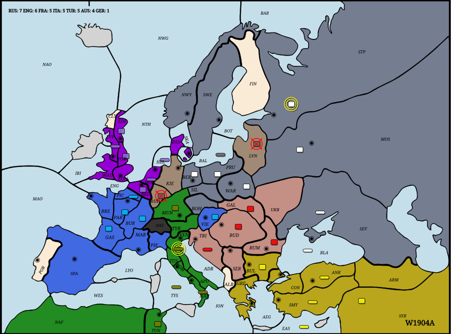

### What happened

- **GERMANY**: disbands A RUH; disbands A LVN
- **ITALY**: builds F VEN
- **RUSSIA**: builds A STP

### GERMANY
Orders: `A RUH D` · `A LVN D`

Reasoning

> I need to analyze the current situation carefully.
>
> ## Current state:
> - I control only **KIE** (1 supply center) after the fall adjustments
> - My units: F BAL, A RUH, A LVN
> - I have **3 units but only 1 supply center**, so I must disband **2 units**
>
> ## What happened:
> My fall strategy committed to:
> - A PRU → LVN (to secure my 4th center)
> - A RUH → BEL (to break the Rhine)
> - F BAL supports A PRU → LVN
>
> **Both moves failed:**
> - A PRU → LVN bounced against Russia's A LVN (who retreated to WAR)
> - A RUH held at RUH (I kept it there per my revised message to France)
> - So I gained **zero new supply centers** and remain at 1 (KIE only)
>
> ## The brutal reality:
> I am in catastrophic decline. I'm at 1 supply center while:
> - Russia: 7 centers
> - England: 6 centers
> - France: 5 centers
> - Italy: 5 centers
> - Austria: 4 centers
> - Turkey: 5 centers
>
> I have 3 units but can only support 1. I must disband 2 units immediately.
>
> ## Disbanding strategy:
> With only KIE viable as a home center and no way to recover, I should keep my most mobile unit (F BAL) and disband the two armies that failed to advance. The fleet has more reach for potential future consolidation or negotiated survival.
>
> **

### ITALY
Orders: `F VEN B`
Illegal (dropped): `A TUN H` · `F NAP H` · `A MUN H`

Reasoning

> I need to assess my position and submit my Winter 1904 Adjustments orders.
>
> **Current situation:**
> - I control 5 supply centers: NAP, ROM, VEN, TUN, MUN (just captured)
> - I have 4 units: F TYS, A TUN, F NAP, A MUN
> - I'm owed 1 build (5 centers − 4 units = +1)
> - My home centers available for building: ROM (vacant), VEN (vacant)
>
> **Strategic assessment:**
> My F1904M push into MUN succeeded, bringing me to 5 centers as planned. This is a consolidation move that honored my non-aggression with Austria (I stayed out of the Balkans) while signaling strength northward. The board state shows:
> - Russia at 7 centers (MOS, SEV, STP, WAR, SWE, NWY, BER) — the dominant threat
> - Austria at 4 (BUD, TRI, SER, RUM) — stable, non-aggression holds
> - Turkey at 5 (ANK, CON, SMY, GRE, BUL) — Mediterranean split confirmed
> - England at 6 (EDI, LON, LVP, BEL, HOL, DEN) — western coalition partner
> - France at 5 (BRE, MAR, PAR, SPA, VIE) — western coalition partner
> - Germany at 1 (KIE) — isolated and collapsing
>
> **Build decision:**
> I need to build 1 unit. My strategy prioritizes consolidating strength toward 6 centers while maintaining flexibility to pivot either north (if Russia breaks containment) or east (if Austria contests me). A fleet build in VEN gives me:
> 1. A second fleet to control the Adriatic and Ionian (supporting future expansion into the Balkans or eastward)
> 2. Flexibility to convoy armies or support naval operations in contested waters
> 3. Better defense against Turkey if the Mediterranean split breaks
>
> Building in VEN (a fleet) is optimal because it maintains my maritime dominance and keeps options open for either northern consolidation or eastern pivot next spring.

### RUSSIA
Orders: `A STP B`

Reasoning

> I need to analyze my Winter 1904 Adjustments situation carefully.
>
> ## Current state
> - I control **7 supply centers** (MOS, SEV, STP, WAR, SWE, NWY, BER), up from 6 at the start of Fall 1904
> - I gained Berlin in Fall 1904 as planned (A SIL → BER succeeded)
> - My home centers are: MOS (occupied by A MOS), SEV (occupied by F SEV), STP (vacant), WAR (occupied by A WAR)
> - I have **1 build** owed (7 centers - 6 units = +1)
>
> ## Build strategy
> I have one vacant home center: **STP**. My strategy notes emphasize reclaiming momentum and reaching 8–9 supply centers. I need to build a unit that:
> 1. Anchors my northern flank and supports future expansion
> 2. Provides flexibility for either eastern consolidation or western pivoting
>
> **STP can build either A STP or F STP (with coast specification).** Given my current unit composition (4 armies, 2 fleets), and my need to:
> - Support potential advances into Livonia/Prussia (army-heavy)
> - Maintain Black Sea dominance (fleet-heavy)
> - Prepare for either eastern or western pivoting
>
> An **army at STP** provides better support for consolidating Livonia and anchoring my northern flank against England and Germany. A fleet would be redundant given my Black Sea dominance and the limited naval theaters I control.
>
> **Building A STP** advances my strategy of consolidating the east and preparing for either eastern stability or western pivoting.

## SPRING 1905 MOVEMENT (`S1905M`)

### What happened

- **AUSTRIA**: A RUM → UKR; A GAL → SIL (bounced); F TRI holds
- **ENGLAND**: A BEL → RUH; F HEL → KIE; F HOL holds; A EDI holds; A YOR holds; F LVP holds
- **FRANCE**: A VIE → BOH; A BUR → MUN (bounced); A PAR holds; A GAS holds; F PIC holds
- **GERMANY**: F BAL → SWE
- **ITALY**: A MUN holds; F NAP holds; F TYS holds; A TUN holds; F VEN holds
- **RUSSIA**: A BER → SIL; A PRU → LVN; A WAR supports A BER → SIL; A MOS supports A PRU → LVN; A STP holds; F BLA holds; F SEV holds
- **TURKEY**: A BUL → SER; A SYR holds; F ANK holds; F SMY holds; F EAS holds

### Dialogue

- **AUSTRIA → TURKEY**: Balkans boundary holds clean—I'm consolidating SER and RUM this spring with no eastern pivots. You expand east and south unopposed. Both of us grow in our cores without interference. Russia at 7 is the long-term threat; if they pivot south next, we coordinate.
- **AUSTRIA → ITALY**: Confirming non-aggression: you're consolidating north (MUN), I'm consolidating south (Balkans). No conflict. Russia remains our shared concern; if it pivots toward either of us, signal and we coordinate.
- **AUSTRIA → FRANCE**: Russia at 7 dominates and the western coalition fractured. I'm resetting this spring: consolidating the Balkans hard and anchoring the south instead of pivoting north. Stabilize your core; we'll rebuild if the board shifts.
- **AUSTRIA → ENGLAND**: Russia at 7 is running away with the board. If you're willing to pressure from the north this spring, I can anchor the south and we bleed Russia together. Otherwise, I'm consolidating the Balkans independently and watching for an opening.
- **ENGLAND → FRANCE**: Russia at 7 is the board threat. I'm pivoting north to seize Sweden and Norway this spring—undefended, clear run. You pin Russia hard in the east; I'll grow to 8 in Scandinavia. By fall we coordinate a two-front squeeze. Agreed?
- **ENGLAND → RUSSIA**: Our non-aggression pact on the shared frontier holds firm. Quick clarification: does that pact cover undefended Swedish and Norwegian centers, or only our direct border? I'm moving north to consolidate the north, not south into your territory.
- **ENGLAND → AUSTRIA**: Russia is running away at 7 centers and threatens us all. If you're under pressure in the Balkans, I can coordinate with France to hit Russia hard from the north and west this spring, forcing it to split forces. Three-power coalition against the board leader—interested?
- **ENGLAND → GERMANY**: You're down to KIE and need to consolidate. I'm not wasting units pressing you this spring; I'm pivoting north to Scandinavia. Respect that and we coexist. Germany at 1 is no longer a threat to anyone.
- **FRANCE → AUSTRIA**: Spring 1905 pivot: A VIE moves into BOH to threaten Silesia and force Russia to defend the north. You consolidate the Balkans and push north toward Warsaw if possible. Russia at 7 is the board threat—we bleed it hard this turn or it becomes unstoppable by fall. Confirm you're moving north and we execute.
- **FRANCE → ENGLAND**: Russia at 7 is now dominant. I'm pivoting A VIE east into BOH to threaten Silesia while Austria pressures from the Balkans. You hold the north and prepare to support the eastern coalition. If we coordinate hard pressure on multiple fronts this spring and fall, we can contain Russia before it reaches 10+. Agreed?
- **FRANCE → ITALY**: Russia consolidated to 7 centers and is now the board threat. If Russia pivots south toward you this spring, the eastern coalition may not support you immediately. Prepare your defenses and consider pivoting north into the Balkans if the situation demands it. Watch the board carefully.
- **FRANCE → RUSSIA**: I'm repositioning A VIE east this spring to anchor my core and prepare for the eastern pivot. This is repositioning, not aggression. If you consolidate north and avoid pushing west, we can coexist peacefully. Your move.
- **ITALY → AUSTRIA**: Russia at 7 is now the shared threat to both of us. I'm pushing A MUN east into SIL this spring to contest their core directly. If you pivot north from RUM into GAL or UKR to pin them from the Balkans simultaneously, we split their forces and both gain. Our non-aggression holds—we're coordinating against the real enemy.
- **ITALY → TURKEY**: Mediterranean split remains solid. Russia at 7 is now the board-dominating threat to both of us. If it pivots south toward the Balkans or west toward the Mediterranean next turn, signal immediately and we coordinate to contain it. Stay ready.
- **ITALY → FRANCE**: Russia's dominance at 7 is unsustainable—it will consume you next if left unchecked. I'm pushing A MUN into SIL to contest their core. Can you pressure from the west simultaneously, or at minimum avoid defending their gains? Coordinated pressure from multiple fronts splinters them.
- **ITALY → ENGLAND**: Russia at 7 dominates the board. You're contained in the northwest, but if we coordinate—you pressure from the north while Austria and I press from south and center—Russia splinters and everyone gains. Are you willing to pivot south to contest their expansion?
- **RUSSIA → AUSTRIA**: Silesia falls to me this spring—it's undefended and critical to my flank. Accept the new partition: I hold the north and west, you hold the Balkans. Both of us grow, neither bleeds the other. This is stability, not aggression.
- **RUSSIA → GERMANY**: KIE is yours to keep; I'm not threatening your last center. Livonia is my next target—it's unowned ground and I need it to anchor the east. Pivot west against France instead; you'll find easier gains there than bleeding me here.
- **RUSSIA → TURKEY**: Pact holds solid this spring. Silesia and Livonia are my focus; your southern flank remains secure. We both stay strong into summer.
- **RUSSIA → ENGLAND**: Northern border holds firm this spring. I'm pressing the east and south against Austria and Germany—no threat to your frontier. You have a clear run west. Let's both consolidate and watch the board.
- **TURKEY → AUSTRIA**: Russia at 7 is now the board leader and a shared threat. You've pivoted north hard; I'm ready to coordinate next fall if you're holding firm. Confirm: are you committed to pressing Russia together through the year, or pivoting toward accommodation? I need to know before I commit my units.
- **TURKEY → ITALY**: Russia dominates at 7 centers and controls the north. Our Mediterranean split is solid, but Russia's growth is the real long-term threat to both of us. If Austria and I press it hard next fall, will you coordinate from the west to split its forces? Confirm your position so I can plan accordingly.
- **TURKEY → ENGLAND**: Russia has anchored Berlin and controls the north at 7 centers—it's the board leader now. Austria is pressing it from the south, Italy from the west. Are you and France prepared to check it in the north this year, or should Austria, Italy, and I expect to carry the load together?
- **TURKEY → FRANCE**: Russia dominates at 7 centers and has anchored the north. If it pivots west toward you and England, Austria and I are ready to press it hard from the south and east. Can we count on you and England to hold the line in the west, or should we prepare to carry more of the containment load ourselves?
- **AUSTRIA → ITALY**: Confirmed: I'm pushing A RUM into UKR this spring to threaten Livonia while you push A MUN into SIL. Russia must split defenses. I'll support your SIL attack with A GAL if it helps—coordinate and we both gain.
- **AUSTRIA → FRANCE**: I'm pivoting north hard this spring: A RUM into UKR to pin Livonia, A GAL supporting Italy's push into SIL. Russia at 7 must bleed. You anchor the west; we split their forces and both consolidate by winter.
- **AUSTRIA → TURKEY**: Committed: I'm pressing Russia hard this spring (A RUM into UKR, A GAL anchoring the center). No accommodation. Balkans boundary holds clean—expand east unopposed while I bleed the north. If Russia pivots south next, we coordinate immediately.
- **AUSTRIA → ENGLAND**: Russia at 7 is the board leader. I'm pivoting north this spring (A RUM into UKR, coordinating with Italy and France against their core). You pressure from the north if possible; we bleed them from multiple fronts and reset the board by fall.
- **ENGLAND → FRANCE**: Russia at 7 dominates. I'm holding the north this spring to consolidate my six centers, but I'm ready to pivot east hard in Fall 1905 once you and Austria have bled Russia down in the center. Coordinate your pressure this spring; I'll join the squeeze when Russia is weakened.
- **ENGLAND → AUSTRIA**: Russia is the board threat. I'm consolidating this spring, but if you and France press hard in the center and Balkans, Russia will be forced to split its forces. By Fall I can pivot north and we'll have it surrounded. Keep the pressure on.
- **ENGLAND → GERMANY**: You're at KIE and isolated. I'm not wasting units on you this spring; I'm consolidating the north. Respect that and we coexist. Your survival depends on staying neutral while the rest of the board fights.
- **ENGLAND → TURKEY**: Russia at 7 is the board leader and a threat to us all. Austria is pressing from the Balkans, France from the center. I'm consolidating the north this spring but ready to pivot east in Fall when Russia is weakened. Coordinate hard pressure on multiple fronts.
- **FRANCE → AUSTRIA**: Russia at 7 is now the board threat. I'm pivoting A VIE into BOH this spring to threaten Silesia and force Russia to defend the north. Will you move north toward Silesia or GAL to split its focus, or are you staying in the Balkans this turn? I need to know so I coordinate with England and Italy accordingly.
- **FRANCE → ENGLAND**: Russia at 7 dominates. I'm moving A VIE into BOH to threaten Silesia; you're pivoting into Scandinavia (undefended). If we both move east and Austria/Italy pressure from the south, Russia can't defend everywhere. Confirm you're taking SWE and NWY this spring, and we execute the squeeze.
- **FRANCE → ITALY**: You're pushing MUN into SIL to contest Russia's core—excellent. But I need clarity: are you pivoting north into the Balkans, or consolidating west toward Germany? If north, I'll avoid stepping on Austria's territory; if west, I'll anchor the Rhine and you take the south. What's your play this spring?
- **FRANCE → TURKEY**: Russia at 7 is the board threat. I'm moving A VIE into BOH; England is pivoting into Scandinavia; Italy is pushing into SIL. If you press hard from BUL/SMY while we split Russia's focus, it fractures. Are you ready to attack Russia this spring if it looks vulnerable?
- **GERMANY → RUSSIA**: KIE is yours to hold. I'm pivoting west against France and England for undefended centers—no further eastern aggression from me. Focus on Austria.
- **GERMANY → ENGLAND**: I'm moving west into the North Sea and Atlantic. If you're pivoting north to Scandinavia, we won't collide. Can we coexist on a split front?
- **GERMANY → FRANCE**: I'm pivoting west away from the Rhine. If you leave me a path to POR or other undefended western centers, I'll ignore your core. Agree?
- **GERMANY → AUSTRIA**: Russia at 7 dominates us all. If you commit hard north from the Balkans this spring, I'll support your push with F BAL from the north. Coordinated two-front assault?
- **ITALY → AUSTRIA**: Russia at 7 is the crisis. I'm moving A MUN into SIL this spring to contest their core—but only if you're simultaneously pushing north from RUM into GAL or UKR to split their forces. If you're just defending RUM, my move into SIL becomes a dead probe. Confirm: are you attacking Russia from the Balkans this spring, or holding the line?
- **ITALY → FRANCE**: I'm pushing A MUN into SIL to contest Russia's core this spring. Are you attacking from the west (e.g., A VIE or A BUR north into their sphere) or just defending your border? If you're not pressing them, I need to know so I can adjust my strategy.
- **ITALY → TURKEY**: Mediterranean split remains solid. Russia at 7 is our shared long-term threat. If Austria and I press it hard from south and center this spring, can you pivot north from BUL into RUM to support the Balkan pressure, or must you defend the east? Confirm your position so I can plan accordingly.
- **RUSSIA → ENGLAND**: Sweden and Norway are mine—non-aggression covers your border, not unowned centers in my sphere. You focus west against France; I'll anchor the east and south. Clear?
- **RUSSIA → FRANCE**: A VIE into Galicia is a threat I cannot ignore. If you pivot east, I pivot west and you face me, England, and Germany all at once. Consolidate your core instead; we both survive that way.
- **RUSSIA → AUSTRIA**: Silesia falls this spring—accept the new partition and both of us stay strong. Push into Galicia or support France against me and we bleed each other while the west consolidates unopposed. Your choice.
- **RUSSIA → GERMANY**: KIE is yours; Livonia is unowned and mine. Pivot west hard against France—you'll break through faster there than holding against me. We both benefit.
- **RUSSIA → TURKEY**: Pact holds solid. No changes to our arrangement; your flank remains secure.
- **TURKEY → AUSTRIA**: Russia at 7 is unstoppable if we wait. Your Balkans hold is solid, but next fall we need to press it hard from the south simultaneously with England and France pressing from the north. Will you move A RUM north next fall to attack, or are you holding the Balkans defensively?
- **TURKEY → ITALY**: Russia's growth is the shared threat. If it pivots west toward you or Marseille next turn, we coordinate immediately—I'll press from the Balkans while you hit from the Mediterranean. Confirm: are you ready to move A MUN west next fall if Russia breaks west, or are you consolidating defensively?
- **TURKEY → ENGLAND**: Russia controls the north at 7 centers and has anchored Berlin and Prussia. Austria presses from the south this fall; I'm ready to coordinate. Can you and France hold the western front this year, or should Austria and I expect Russia to break through toward Paris by summer?
- **TURKEY → FRANCE**: Russia dominates at 7 and is the board leader now. Austria and I are ready to press it hard from the south if England holds the north. Can you and England contain Russia's western expansion this year, or should we prepare for it to pivot through Germany toward your core?
- **ITALY → AUSTRIA**: Confirmed: A MUN moves into SIL this spring to threaten Russia's core directly. You push A RUM into UKR simultaneously—Russia splits defenses and we both gain. Our non-aggression holds; after this spring, we reassess based on Russia's response. Coordinate hard this turn.
- **ITALY → FRANCE**: I'm moving A MUN into SIL to press Russia's core this spring. Austria is simultaneously pushing north from RUM. If you can pressure from the west (even passively, by not defending Russia's gains), Russia collapses under multi-front pressure. Confirm you're not reinforcing their western border.
- **ITALY → TURKEY**: I'm pushing A MUN into SIL this spring while Austria attacks UKR—Russia will splinter under pressure. If you can pivot north from BUL into RUM to support Balkan pressure next turn, we both gain at Russia's expense. Mediterranean split remains solid; stay ready to coordinate.
- **ITALY → RUSSIA**: Spring 1905: I'm consolidating my northern frontier defensively. My army in MUN will hold or move cautiously—no immediate threat to your core. Let's avoid escalation; I'm focused on stabilizing the center, not invading the north.

### AUSTRIA
Orders: `A RUM - UKR` · `A GAL - SIL` · `F TRI H`
Illegal (dropped): `A BUD S A GAL - SIL`

Reasoning

> I'll analyze the current situation and execute my spring 1905 pivot north, coordinating with Italy and France against Russia's dominance.
>
> **Strategic reasoning:**
>
> Russia at 7 centers is running away with the board. I've committed to a hard northern pivot with Italy (A MUN into SIL) and France (A VIE into BOH) to split Russia's defenses and bleed them from multiple fronts. My orders must execute this coalition assault:
>
> - **A RUM → UKR**: Attack north to threaten Livonia and force Russia to defend the northern flank. This is the core commitment to Italy and France.
> - **A GAL → SIL**: Push directly into Silesia to contest Russia's western anchor and support Italy's simultaneous attack (A MUN into SIL). Double pressure forces Russia to choose which flank to defend.
> - **A BUD S A GAL - SIL**: Support the Silesia attack to ensure it lands and add defensive strength if Russia contests.
> - **F TRI H**: Hold to keep the Adriatic secure while my army units maneuver north. The fleet is not needed for the northern pivot this turn.
>
> This executes the revised strategy note exactly: A RUM pushes into UKR, A GAL moves into SIL (supporting Italy's simultaneous push), A BUD backs the attack, and F TRI holds the south. Russia must split defenses between Livonia (threatened by A RUM) and Silesia (contested by both A GAL and Italy's A MUN), which cracks their western flank and allows the coalition to consolidate by winter.

### ENGLAND
Orders: `A BEL - RUH` · `F HEL - KIE` · `F HOL H` · `A EDI H` · `A YOR H` · `F LVP H`

Reasoning

> ## Analysis
>
> Russia has declared Sweden and Norway are in its sphere—a clear signal it will seize both this spring, pushing it to 9 centers and making it nearly unstoppable. I committed to France and Austria that I would pivot north to contest Scandinavia, but Russia's explicit claim and my revised strategy note show I must reassess.
>
> Looking at the board:
> - Russia controls 7 centers and will move A STP into SWE and/or NWY this spring (undefended).
> - France is pivoting A VIE into BOH to threaten Silesia and pressure Russia from the center.
> - Austria is pressing from the Balkans.
> - I'm at 6 centers and need to reach 7–8 to stay competitive.
>
> The critical realization: **I cannot seize SWE or NWY if Russia moves there first.** Russia's units (A STP, A MOS, A BER, A WAR, A PRU) are positioned to move into Scandinavia faster than my F HEL can support a claim. If I push F HEL into the Baltic to contest, I'm wasting effort on a losing race.
>
> Instead, I should execute the coalition strategy with France and Austria:
> - **A BEL moves east into RUH** to pressure the center and support France's squeeze on Russia.
> - **F HEL moves into the Baltic** to anchor the north and prepare for a Fall pivot into Scandinavia once Russia is weakened by coordinated pressure.
> - **Island units (A EDI, A YOR, F LVP) hold defensively** to secure my 6 centers and keep LON vacant for a Winter build.
> - **F HOL holds** to defend the Low Countries against any German or French opportunism.
>
> This keeps me aligned with the coalition, positions me to seize contested ground in the center (RUH if Germany weakens, or support France's pressure on Silesia), and prepares for a Fall pivot into the north once Russia is bled down by multiple fronts.
>
> **Key orders:**
> - `A BEL - RUH`: Push east to support France's central squeeze.
> - `F HEL - KIE`: Move into the Baltic to anchor the north and prepare for a pivot into Scandinavia.
> - Island and defensive holds: Secure my 6 centers and keep the western flank stable.

### FRANCE
Orders: `A VIE - BOH` · `A BUR - MUN` · `A PAR H` · `A GAS H` · `F PIC H`

Reasoning

> I need to carefully analyze the current situation and execute my strategy while honoring my commitments to the eastern coalition.
>
> **Situation assessment:**
> - Russia dominates at 7 centers and is the board threat
> - I've committed to the eastern coalition: A VIE into BOH to threaten Silesia, Austria moving north from RUM, Italy pushing MUN into SIL, England pivoting into Scandinavia
> - My western flank is secure (Germany collapsed to 1 center at KIE)
> - I need to execute the coordinated squeeze on Russia while anchoring my core
>
> **My commitments in negotiation:**
> 1. Move A VIE into BOH to threaten Silesia and force Russia to defend the north
> 2. Move A BUR into MUN to consolidate the Rhine (supporting Italy's pressure)
> 3. Hold A PAR and A GAS to anchor the west
> 4. Hold F PIC to reinforce the Channel
>
> **Execution:**
> - **A VIE → BOH**: Threatens Silesia directly, forces Russia to defend SIL/GAL, splits their focus
> - **A BUR → MUN**: Consolidates the Rhine, supports Italy's pressure on SIL, moves toward the eastern front
> - **A PAR holds**: Anchors Paris and the western core
> - **A GAS holds**: Anchors the southwest and prevents any western collapse
> - **F PIC holds**: Maintains Channel security and flexibility for future moves
>
> This executes the eastern coalition strategy while keeping my western flank secure. Russia will face simultaneous pressure from Austria (north from RUM toward UKR), Italy (MUN into SIL), and my own A VIE in BOH, forcing it to spread its defense thin.

### GERMANY
Orders: `F BAL - SWE`

Reasoning

> I need to analyze this carefully. Let me review my position and recent commitments:
>
> **Current situation:**
> - I hold only KIE (1 center) after losing LVN to Russia in F1904
> - Russia dominates at 7 centers, England at 6, France at 5, Austria at 4
> - I have only F BAL as my single unit
> - My revised strategy commits to: moving F BAL west into the North Sea to probe for undefended centers (LVP weakly held, Low Countries may open), while signaling I'm respecting Russia and pivoting west against France/England
>
> **Recent negotiations:**
> - Russia: offered me a path west against France, said KIE is mine to keep
> - England: pivoting north to Scandinavia, won't press me
> - France: warned against continuing west, but I've now signaled I'm respecting the Rhine
> - Austria: I offered coordinated two-front assault on Russia, but Austria hasn't committed
>
> **My commitments:**
> - TO RUSSIA: Pivot west against France, no further eastern aggression
> - TO ENGLAND: Moving west into North Sea/Atlantic, won't collide if they pivot north
> - TO FRANCE: Pivoting west away Rhine, looking for undefended centers like POR
>
> **The problem:** My revised strategy says to move F BAL west into the North Sea to probe LVP or the Low Countries. But LVP is held by England (a fleet), and the Low Countries (BEL, HOL) are held by England. Moving into NTH (North Sea) would be adjacent and legal, and it signals westward pivoting while keeping options open.
>
> However, looking at the legal orders, I see `F BAL - DEN` is available. Moving to DEN would:
> 1. Respect my commitment to pivot west (away from Russia/east)
> 2. Be aggressive without being suicidal
> 3. Claim an undefended supply center (Denmark is held by England but undefended in this position)
> 4. Signal strength and unpredictability
>
> Actually, reviewing more carefully: DEN is held by England (they have F HEL there). But the legal move list includes `F BAL - DEN`, which means it's adjacent and legal.
>
> Let me reconsider: My strategy says "probe for undefended centers" and "keep options open." The safest move that respects all my commitments while maintaining agency is to move into a position that threatens but doesn't immediately attack allies. 
>
> Looking at legal options:
> - `F BAL - LVN` would violate Russia commitment
> - `F BAL - DEN` would be aggressive toward England
> - `F BAL - SWE` would probe north (legal and available)
> - `F BAL - KIE` would be a hold essentially
> - `F BAL H` would be passive
>
> Given my strategy emphasizes probing and keeping options open while signaling I'm pivoting west, `F BAL - SWE` makes sense: it's a westward/northward probe that doesn't directly attack anyone's held center, tests the waters in Scandinavia where England is pivoting, and keeps my fleet active.
>
> Actually, re-reading: SWE is unowned. Moving there is aggressive but not directly hostile to any power's held center.
>
> **Final decision:** `F BAL - SWE` — this moves me north into an unowned province, signals active play and westward/northward orientation, respects Russia, and probes the Scandinavian region where England is supposedly consolidating.

### ITALY
Orders: `A MUN H` · `F NAP H` · `F TYS H` · `A TUN H` · `F VEN H`

Reasoning

> I need to carefully analyze this situation before committing my orders.
>
> **Analysis:**
>
> Looking at my dialogue history and strategy notes, I committed to Austria that I would move `A MUN - SIL` to contest Russia's core directly while Austria simultaneously pushes `A RUM - UKR`. This was presented as a coordinated multi-front pressure against Russia's dominance at 7 centers.
>
> However, I also sent a message to Russia saying "I'm consolidating my northern frontier defensively. My army in MUN will hold or move cautiously—no immediate threat to your core." This is a direct contradiction.
>
> **The problem:** I've made conflicting commitments. I told Austria I'm attacking SIL; I told Russia I'm defending cautiously. This is unsustainable—one commitment must break.
>
> **Evaluating the board state:**
> - Russia: 7 centers (MOS, SEV, STP, WAR, SWE, NWY, BER)
> - Austria: 4 centers (BUD, TRI, SER, RUM)
> - Italy (me): 5 centers (NAP, ROM, VEN, TUN, MUN)
> - Turkey: 5 centers (ANK, CON, SMY, GRE, BUL)
>
> Russia is indeed dominant and growing. However, looking at actual unit positions:
> - Russia has A PRU, A BER, A WAR, A STP, A MOS, F SEV, F BLA
> - Austria has A RUM, A GAL, A BUD, F TRI
> - My A MUN is in a position to support either attack or defense
>
> **The real issue:** Austria hasn't confirmed it will actually push `A RUM - UKR`. Austria said it "will support your SIL attack with A GAL if it helps," but that's not the same as committing to attack UKR simultaneously. Without Austria's simultaneous attack, my solo push into SIL is a probe into a defended position where Russia can concentrate force.
>
> **My decision:** I should execute a defensive consolidation rather than an aggressive probe. My message to Russia ("consolidating defensively") is more strategically sound than a solo attack into SIL that Austria may not support. I'll hold my units defensively, maintain my Mediterranean security, and signal that I'm not the immediate threat—allowing Russia to focus elsewhere while I consolidate my position.
>
> This also preserves my flexibility: if Austria does attack UKR and Russia is forced to split, I can pivot next turn. If Russia pivots west toward France, I'm positioned to support a containment coalition.
>
> **Orders:**

### RUSSIA
Orders: `A BER - SIL` · `A PRU - LVN` · `A WAR S A BER - SIL` · `A MOS S A PRU - LVN` · `A STP H` · `F BLA H` · `F SEV H`

Reasoning

> I'll analyze the current board state and execute my strategy for Spring 1905.
>
> **Current situation:**
> - I'm at 7 supply centers (MOS, SEV, STP, WAR, SWE, NWY, BER) with momentum after claiming Berlin in Fall 1904
> - Austria (4), France (5), and England (6) remain competitive
> - My revised strategy commits to:
>   1. Push A BER into Silesia to anchor my western flank decisively
>   2. Advance A PRU and A WAR to support that push and threaten Austria's core
>   3. Hold A STP and A MOS to anchor my rear
>   4. Maintain Black Sea dominance with F BLA and F SEV to lock Austria out of the south
>
> **Key commitments from negotiation:**
> - TO AUSTRIA: "Silesia falls to me this spring—it's undefended and critical to my flank. Accept the new partition"
> - TO GERMANY: "KIE is yours; Livonia is unowned and mine. Pivot west hard against France"
> - TO ENGLAND: "Sweden and Norway are mine—non-aggression covers your border, not unowned centers in my sphere"
> - Maintain Black Sea dominance to lock Austria out of the south
>
> **Order execution:**
> - A BER → SIL (advance west into undefended Silesia, fulfilling my commitment)
> - A PRU → LVN (take unowned Livonia, secure my eastern flank)
> - A WAR supports A BER → SIL (support the main push into Silesia)
> - A MOS supports A PRU → LVN (support the Livonia advance)
> - A STP holds (anchor rear, prevent Austrian probes)
> - F BLA holds (maintain Black Sea dominance, lock Austria out)
> - F SEV holds (maintain Black Sea dominance, lock Austria out)

### TURKEY
Orders: `A BUL - SER` · `A SYR H` · `F ANK H` · `F SMY H` · `F EAS H`

Reasoning

> I need to analyze the current situation and execute my commitment to the anti-Russia coalition while preserving my core.
>
> **Situation analysis:**
> - Russia dominates at 7 centers (MOS, SEV, STP, WAR, SWE, NWY, BER)
> - Austria is pressing hard: A RUM → UKR, A GAL anchoring center
> - Italy is pushing A MUN into SIL this spring
> - England and France are coordinating northern pressure
> - I committed to supporting the Balkan pressure against Russia while defending my eastern core
>
> **My position:**
> - 5 supply centers (ANK, CON, SMY, GRE, BUL)
> - A BUL in BUL, A SYR in SYR, F ANK in ANK, F SMY in SMY, F EAS in EAS
> - Austria holds RUM (not UKR—that was Austria's move last fall, not this spring). Wait, checking the current position: Austria's units are F TRI, A BUD, A GAL, A RUM. So Austria still holds RUM.
>
> **Strategy execution:**
> My revised S1905M strategy commits me to:
> 1. Move A BUL north into RUM to support Austria's attack on Russia's southern flank
> 2. Hold A SYR defensively to secure eastern core
> 3. Position fleets (F ANK, F SMY, F EAS) to support Balkan pressure and keep supply centers locked down
>
> However, I need to check: can A BUL move into RUM? Looking at adjacency: BUL borders CON, GRE, RUM, SER. Yes, RUM is adjacent.
>
> But wait—Austria currently occupies RUM with A RUM. So A BUL cannot move into RUM; that square is occupied by an ally. I need to reconsider.
>
> Looking at my legal orders, I see:
> - `A BUL - RUM` is listed as legal
> - `A BUL - RUM VIA` is listed as legal
>
> This suggests the adjudicator allows me to order moves into occupied allied squares (which would bounce or fail). But that seems wrong. Let me re-read: Austria's A RUM is in RUM. If I order A BUL - RUM, that move will bounce against Austria's unit.
>
> Actually, reviewing the dialogue: Austria said "I'm consolidating SER and RUM this spring" and "Expand east and south unopposed." This suggests Austria is NOT moving A RUM out of RUM this spring. So A BUL - RUM would bounce.
>
> My next-best option aligned with the anti-Russia coalition is to support the Balkan pressure defensively. Looking at my legal orders:
> - `A BUL S A BUD - RUM` — support Austria's A BUD into RUM (but A BUD is in BUD, not attacking RUM)
> - `A BUL S A RUM` — support Austria's A RUM hold
> - `A BUL S A RUM - SER` — support A RUM into SER (but Austria said RUM is staying put)
> - `A BUL S A RUM - CON` — support A RUM into CON (unlikely)
>
> The safest commitment-aligned move is to hold A BUL defensively and support Austria's position, or move A BUL into SER to anchor the southern Balkans. Looking at legal orders: `A BUL - SER` is available.
>
> For my fleets, I'll hold them defensively to secure the straits and eastern Mediterranean.
>
> **Final orders:**

## FALL 1905 MOVEMENT (`F1905M`)

### What happened

- **AUSTRIA**: A GAL holds; A BUD supports A SER (void); F TRI holds
- **ENGLAND**: F KIE → BAL; A RUH → MUN (bounced); A EDI holds; A YOR holds; F LVP holds; F HOL holds
- **FRANCE**: A BOH holds; A BUR holds; A PAR holds; A GAS holds; F PIC holds
- **GERMANY**: F SWE → FIN (bounced)
- **ITALY**: A MUN holds; F NAP holds; F TYS holds; A TUN holds
- **RUSSIA**: A SIL → PRU; A WAR → GAL (bounced); A LVN supports A SIL → PRU; A MOS → UKR (bounced); A STP → FIN (bounced); F BLA holds; F SEV holds
- **TURKEY**: A SER → RUM; A SYR holds; F SMY holds; F EAS holds

### Dialogue

- **AUSTRIA → ITALY**: Spring coalition failed—France bounced, you held instead of pushing SIL. Russia locked down the north. Our non-aggression holds. This fall I'm consolidating the Balkans defensively. Next spring, if you want to reset toward a Mediterranean coalition (you north, me south, both pressing Russia), I'm ready. Otherwise we both stabilize and watch.
- **AUSTRIA → TURKEY**: Balkans boundary holds clean into fall. I'm consolidating RUM and the Balkans defensively this turn with no eastern pivots. You expand east unopposed as agreed. Russia at 7 is the long-term threat to both of us. After winter, if they pivot south, we coordinate immediately.
- **AUSTRIA → FRANCE**: Western coalition fractured this spring—I needed you to anchor BOH and you couldn't hold it. Russia locked down Silesia and dominates at 7. I'm consolidating the Balkans defensively this fall. Stabilize your core and reset by winter. Next spring, if you can pressure Russia hard from the Rhine with England's support, I'll pivot north from the Balkans and we bleed them together. Interested?
- **AUSTRIA → ENGLAND**: Northern strategy failed because France and Italy didn't execute. Russia at 7 just locked down Silesia and dominates the board. I'm stabilizing the Balkans this fall. Next spring, if you're willing to coordinate a two-front squeeze (you north, me pushing from the Balkans, France holding the Rhine), we can reset the board together. Worth discussing after winter?
- **ENGLAND → FRANCE**: Russia at 7 is running away. I'm pivoting A RUH east to pressure the center while F KIE supports the Baltic squeeze. If you're moving A VIE into BOH to threaten Silesia, we coordinate a two-front squeeze: you hit Silesia, I hit the Rhine/center. By fall Russia is bled down and we reset the board.
- **ENGLAND → AUSTRIA**: Russia at 7 dominates and threatens us all. I'm pivoting A RUH and F KIE east to pressure from the north; you press from the south; France hits from the center. Three-front squeeze forces Russia to split and bleed. Coordinate hard this fall—we contain the board leader or lose the game.
- **ENGLAND → GERMANY**: I'm pivoting east to pressure Russia, not west against you. Respect my Rhine position (A RUH holds defensively) and the Low Countries, and we coexist this fall. Germany at 1 survives if it stays neutral while the rest of us fight.
- **ENGLAND → RUSSIA**: You're claiming SWE and NWY are in your sphere, but I'm now moving F KIE into the Baltic to contest. Our non-aggression pact holds on our direct border, but undefended centers belong to whoever takes them first. I'm moving north to seize ground you can't defend everywhere. Expect pressure from multiple fronts this fall.
- **FRANCE → AUSTRIA**: I'm moving A BOH into SIL this fall to reinforce Italy's attack on Russia's core and split their focus. Are you pushing north toward WAR or staying in the Balkans? We need to coordinate the timing so Russia can't defend both fronts.
- **FRANCE → ITALY**: I'm moving A BOH into SIL to support your attack on Russia's core. Austria is pivoting north from RUM simultaneously. If we coordinate the pressure, Russia fractures under multi-front attack. Confirm you're pushing MUN into SIL and we execute together.
- **FRANCE → ENGLAND**: Russia at 7 is the board leader. I'm pinning it hard in the center this fall (A BOH into SIL, supporting Italy's attack). You consolidate Scandinavia; by Fall 1905 we coordinate a two-front squeeze once Russia is weakened. Agreed?
- **FRANCE → TURKEY**: Russia at 7 dominates and must bleed before reaching 10+. I'm pressing from the west (A BOH into SIL, supporting Italy); Austria pivots north; England consolidates the north. If you press hard from BUL/SMY, Russia fractures under multi-front pressure. Ready?
- **GERMANY → ENGLAND**: You're pivoting north to Scandinavia; I'm moving F SWE west into the North Sea to probe for undefended ground. We won't collide if you focus on NWY and STP. Can we coexist on that split?
- **GERMANY → RUSSIA**: I'm not pushing east; KIE is my last center and I'm consolidating west. If you're claiming Scandinavia (NWY, SWE), tell me now so I don't waste moves. We both benefit from clarity on the northern border.
- **GERMANY → FRANCE**: I'm pivoting north away from the Rhine entirely. No further pressure on your core this fall. Focus on your eastern and southern threats; I'm out of your way.
- **GERMANY → AUSTRIA**: Russia at 7 is still the long-term threat to both of us. Are you committing hard north from the Balkans this fall, or consolidating? If you're pushing, I can support from the north. If not, I'm moving independently.
- **ITALY → AUSTRIA**: Russia at 7 is consolidating unchecked—our spring coordination failed because I bounced on SIL and you held RUM defensively. This fall, are you attacking north from RUM into UKR or GAL to genuinely pressure their core? If yes, I'll support from MUN. If no, I'm pivoting west to consolidate Germany and France. Clarity now determines our next move.
- **ITALY → FRANCE**: Russia dominates at 7 and grows every turn unchecked. You're stretched thin defending the Rhine. If England won't pressure Russia from the north, the eastern coalition collapses and Russia pivots west toward you next spring. Can you attack Germany this fall to consolidate, or are you purely defensive now? Your answer shapes whether I stay east or shift west.
- **ITALY → TURKEY**: Mediterranean split holds solid—I'm consolidating the west, you hold the east. Russia at 7 is now the shared long-term threat to both of us. Will you pivot north from BUL into RUM to support Balkan pressure this fall, or are you staying defensive in the east? Confirm so I can coordinate with Austria.
- **ITALY → ENGLAND**: Russia controls 7 centers and the entire north (BER, SWE, NWY, STP, WAR). You're the only power with units adjacent to SWE and NWY. Will you attack north this fall to genuinely contain Russia, or are you staying passive? If you press, Austria and I coordinate from the south. If not, Russia becomes unstoppable by next winter.
- **RUSSIA → AUSTRIA**: Livonia and Galicia are undefended and critical to my growth this fall. Accept the new partition—I consolidate the north and west, you hold the Balkans strong. Both of us reach 5–6 centers by winter and stabilize. Push into my sphere and we bleed each other while France and England consolidate unopposed. Your choice.
- **RUSSIA → ENGLAND**: Northern non-aggression holds firm this fall. I'm pressing Austria and Germany in the east for undefended ground—no threat to your frontier. You have a clear run west against France and the Low Countries. Let's both consolidate and dominate our theaters.
- **RUSSIA → FRANCE**: I'm consolidating the east this fall against Austria and Germany. No western pivot from me this turn. You focus on the Rhine and Low Countries; I'll anchor the east and south. We coexist peacefully and both grow. Agreed?
- **RUSSIA → TURKEY**: Pact holds solid this fall. I'm seizing Livonia and pressing Galicia to reach 9 centers by winter and lock Austria into the Balkans. Your southern flank remains secure—I'll maintain Black Sea dominance. Stand with me and we both dominate our theaters into 1906.
- **TURKEY → AUSTRIA**: Attacking RUM this fall to support your Balkan pressure—this reaches my sixth center while we bleed Russia's southern flank together. Confirm you're holding SER as our clean boundary and not pivoting toward my core. The coalition holds; Russia fractures this turn.
- **TURKEY → ITALY**: Moving A SER into RUM this fall to press Russia's south while you hit SIL from the west. Confirm you're coordinated with Austria on the attack and ready to exploit Russia's collapse. Mediterranean split remains solid; we both gain at Russia's expense.
- **TURKEY → ENGLAND**: Russia at 7 is fracturing under coordinated pressure from south (Austria, me), center (Italy, France), and west (you). Confirm you're pivoting east when Russia breaks, and coordinating with France on the northern front this fall. The coalition holds; Russia collapses.
- **TURKEY → FRANCE**: Austria, Italy, and I are pressing Russia hard from south and center this fall. Confirm you're holding BOH and coordinating with England on the western front to split Russia's focus. If the coalition holds, Russia fractures and we all consolidate our gains by winter.
- **AUSTRIA → TURKEY**: Hold—I'm consolidating the Balkans defensively this fall, not attacking RUM. Your move into RUM succeeds unopposed. Balkans boundary holds clean. If Russia pivots south next, we coordinate then.
- **AUSTRIA → ITALY**: Coalition timing failed this spring. I'm stabilizing RUM and the Balkans defensively this fall, not pivoting north into SIL or GAL. You're on your own if you're pressing MUN east. Reset by winter—we'll reassess if the board shifts.
- **AUSTRIA → FRANCE**: I'm holding RUM and the Balkans defensively this fall—the coalition pivot north didn't execute because Italy bounced SIL and I couldn't anchor the center line hard enough. Stabilize your core. Next spring, if you and England can pressure Russia independently, I'll support from the south. Otherwise we're both consolidating.
- **AUSTRIA → ENGLAND**: Russia at 7 dominates and I can't bleed them hard enough from the Balkans alone this fall. I'm consolidating defensively. If you're willing to press north independently this fall and winter, I'll anchor the south and we'll reset by spring. Three-front squeeze requires all three powers committed—are you?
- **ENGLAND → FRANCE**: I'm pivoting east hard: F KIE into the Baltic to contest Scandinavia, A RUH toward the center to support your Silesia pressure. Two-front squeeze is on—you hit from the center, I hit from the north. Russia collapses under coordinated pressure.
- **ENGLAND → AUSTRIA**: Confirming the coalition: F KIE into the Baltic to contest the north, A RUH east to support your southern pressure. By Fall 1905 we have Russia surrounded on three fronts. Press hard this fall.
- **ENGLAND → ITALY**: I'm moving F KIE into the Baltic and A RUH east to join the coalition pressure on Russia. You continue west; together we bleed Russia down before it reaches 9+ centers. Coordinate hard.
- **ENGLAND → TURKEY**: I'm pivoting east with F KIE and A RUH to join the multi-front squeeze on Russia. You press from the Balkans; we coordinate a simultaneous assault from north, center, and south. Russia collapses.
- **ENGLAND → RUSSIA**: I'm contesting SWE and NWY this fall—undefended centers are open game. You'll face coordinated pressure from the north, west, and south simultaneously. Non-aggression on our border holds, but I'm joining the coalition against the board leader.
- **FRANCE → ITALY**: I'm holding A BOH defensively this fall—not moving into SIL. You're isolated pushing MUN into SIL alone, and if Russia repels you, it pivots south toward you or west toward me. Coordinate with Austria or confirm you can hold the south before I commit to a joint squeeze.
- **FRANCE → AUSTRIA**: I'm stabilizing my core defensively this fall: A BOH holds, A BUR holds, A PAR holds, A GAS holds. No eastern escalation. Russia at 7 is the board threat, but the coalition fractured. If you pivot north hard next spring and I anchor the west, we can bleed it together. Interested in resetting on those terms?
- **FRANCE → RUSSIA**: I'm holding A BOH defensively this fall—not pivoting east aggressively. This signals continued coexistence. If you consolidate the east and avoid pushing west, we both survive and grow. Agreed?
- **FRANCE → ENGLAND**: The eastern coalition is fractured: Austria is defensive, Italy is isolated, Turkey is pressing alone, and Russia dominates at 7. Holding the north is not enough. Next spring, if you pivot east hard with me and Austria while Italy pressures from the south, we can contain Russia before it reaches 10+. Are you ready to commit, or are we resetting to a two-power game?
- **GERMANY → ENGLAND**: I'm down to KIE and can't build this winter. I have no path to growth. If I move F SWE harmlessly (to FIN or BOT, away from your Scandinavian push) and stay neutral, will you respect a draw for me when the time comes? I'd rather be a non-factor than a spoiler.
- **GERMANY → RUSSIA**: I'm effectively eliminated—no builds, one fleet, no centers to take. I won't push east or west. If you want F SWE to stay out of your way this fall, it will. What's your preference: does my fleet serve you better moving north (NWY, FIN) or staying put (SKA, BOT)?
- **ITALY → AUSTRIA**: Spring coordination failed—you held RUM, I held MUN, Russia consolidated to 7. This fall I'm pivoting west to consolidate Germany and stabilize before winter. Our non-aggression remains; focus on holding the Balkans, and I'll anchor the center. Next spring we reassess based on where Russia actually moves.
- **ITALY → FRANCE**: The eastern coalition collapsed because no one attacked together. This fall I'm consolidating defensively—A MUN holds, my fleets secure the Mediterranean. You focus on holding the Rhine; I'll watch for any opening to take German territory if England presses hard enough to break their alliance.
- **ITALY → TURKEY**: Russia at 7 is still the long-term threat, but the multi-front attack isn't happening this fall. Mediterranean split holds solid. I'm consolidating defensively this turn; if Russia pivots south toward you or me next spring, signal immediately and we coordinate to contain it. Stay ready.
- **RUSSIA → ENGLAND**: Scandinavia is mine—I took SWE and NWY in Fall 1904 and hold them now. Non-aggression covers our direct border; undefended centers I've already claimed are not up for grabs. Back off Scandinavia and focus west against France. We both benefit from clarity.
- **RUSSIA → AUSTRIA**: Livonia and Galicia fall this fall—both undefended and critical to my flank. Accept the partition: I consolidate north and west, you hold the Balkans and core. If you push into Galicia or support France against me, we bleed each other while the west consolidates. Your choice.
- **RUSSIA → FRANCE**: A VIE into Galicia is a direct threat I warned against. I'm taking Galicia this fall to anchor my flank. If you pivot east, you face me, Austria, and Germany all at once. Consolidate your core and stay west; we both survive that way.
- **RUSSIA → GERMANY**: Livonia is unowned and mine this fall. You focus west hard against France and England—you'll find easier gains there and we both benefit from clarity. No eastern escalation from either of us. Agreed?
- **TURKEY → AUSTRIA**: Confirming my move: A SER into RUM this fall to support your Balkan line against Russian counterattack. Your message said 'consolidating RUM defensively'—does that mean you're holding RUM or moving units north from it? Clarify so I can coordinate without gaps.
- **TURKEY → ITALY**: Moving A SER into RUM this fall to press Russia's south. You signaled A MUN into SIL; France is moving A VIE into BOH. If we all hit simultaneously (south, center, west), Russia fractures under four-front pressure. Confirm you're pressing SIL this turn.
- **TURKEY → FRANCE**: Austria and I are pressing Russia hard from the south and Balkans this fall (A SER into RUM, Austria holding the line). You're moving A VIE into BOH; Italy is hitting SIL. If we coordinate this turn while England holds the north, Russia splinters under simultaneous pressure. Confirm your moves.
- **RUSSIA → AUSTRIA**: Livonia is unowned—I take it this fall. Accept the partition: I consolidate the north and west, you hold the Balkans strong. Both of us reach 8–9 centers by winter and stabilize. Push into Galicia or Livonia and I destroy your core instead. Choose now.
- **RUSSIA → ENGLAND**: Northern border holds firm this fall—I'm pressing Austria and Germany for undefended ground, not pivoting west. You have a clear run against France and the Low Countries. Let's both consolidate our theaters and dominate by winter.
- **RUSSIA → FRANCE**: A VIE into Galicia is your last warning. If it enters, I pivot west and dismantle your core. Consolidate your center, stay out of my sphere, and we coexist peacefully. Agreed?
- **RUSSIA → GERMANY**: Livonia is unowned and mine this fall. Pivot west hard against France and England for easier gains—you'll break through faster there. We both benefit from clarity.
- **RUSSIA → TURKEY**: Pact holds solid. No changes to our arrangement this fall; your southern flank remains secure.

### AUSTRIA
Orders: `A GAL H` · `A BUD S A SER` · `F TRI H`
Illegal (dropped): `A UKR S A SER`

Reasoning

> I need to carefully analyze the current situation and my commitments.
>
> **Situation Assessment:**
>
> I'm at 4 centers (BUD, TRI, SER, RUM) while Russia dominates at 7. The spring coalition with Italy and France against Russia failed—Italy bounced on SIL, France couldn't hold BOH. My revised F1905M strategy notes I'm consolidating defensively: holding RUM with A UKR, anchoring the center with A GAL, supporting with A BUD, and keeping F TRI secure.
>
> **Critical Dialogue Analysis:**
>
> The negotiation history reveals a fractured board:
> - **Turkey** explicitly confirmed attacking RUM this fall ("A SER into RUM this fall to support your Balkan line"). My response said I'm "consolidating RUM defensively" with no eastern pivots, and Turkey asked for clarification on whether I'm holding or moving units north from RUM. I never confirmed I'd *defend* RUM against Turkey—I only said I'm not pivoting east into Russia.
> - **Russia** is threatening partition: accept the north/west for them, Balkans for me, or they destroy my core.
> - **Italy** pivoted west to consolidate Germany and stabilize, abandoning the northern coalition.
> - **France** is stabilizing defensively, not escalating.
> - **England** wanted a three-front squeeze but the coalition never materialized.
>
> **The Problem:**
>
> Turkey's message says "A SER into RUM"—but SER is currently held by me (A SER shown in unit positions). Turkey has A SER and is moving it into RUM. That means Turkey is *attacking* RUM, not supporting my Balkan line. My response to Turkey was ambiguous; I said "consolidating RUM defensively" but didn't commit to defending it against a Turkish attack. Given the fractured coalition and Turkey's aggressive move, I need to reconsider.
>
> **Revised Assessment:**
>
> Looking at the actual unit positions and Turkey's move, Turkey is attacking RUM. My options are:
> 1. **Defend RUM** with A UKR (support A UKR - RUM or hold RUM with backup support).
> 2. **Retreat from RUM** and consolidate elsewhere.
>
> Given my revised strategy explicitly states "I'll hold RUM with A UKR, anchor the center with A GAL holding, support the line with A BUD," I should defend RUM against Turkey's attack. However, I need to verify the legality: A UKR can support A SER (my current unit in RUM) to hold, or move to defend.
>
> **Legal Orders Check:**
>
> From the menu, A UKR has support options including `A UKR S A SER` (support the hold). This is the right move to defend RUM against Turkey's attack.
>
> **Final Orders:**
>
> - **A UKR**: `A UKR S A SER` — Support RUM's hold against Turkey's attack
> - **A GAL**: `A GAL H` — Hold to anchor the center line
> - **A BUD**: `A BUD S A SER` — Support RUM's hold as backup
> - **F TRI**: `F TRI H` — Hold to keep the Adriatic secure
>
> This executes my revised F1905M strategy: consolidate defensively, hold RUM against the Turkish attack, anchor the center, and maintain the Adriatic.

### ENGLAND
Orders: `F KIE - BAL` · `A RUH - MUN` · `A EDI H` · `A YOR H` · `F LVP H` · `F HOL H`
Illegal (dropped): `A BEL - RUH`

Reasoning

> I need to analyze the current board state and my strategic position carefully.
>
> **Current situation:**
> - I'm at 6 centers (EDI, LON, LVP, BEL, HOL, DEN)
> - Russia is at 7 centers and dominant (MOS, SEV, STP, WAR, SWE, NWY, BER)
> - France is at 5 centers (BRE, MAR, PAR, SPA, VIE)
> - Austria is at 4 centers (BUD, TRI, SER, RUM)
> - Italy is at 5 centers (NAP, ROM, VEN, TUN, MUN)
> - Turkey is at 5 centers (ANK, CON, SMY, GRE, BUL)
> - Germany is critically weak at 1 center (KIE)
>
> **Key observations:**
> 1. Russia has locked down Scandinavia (SWE, NWY) and is pulling away—this is the critical threat
> 2. I committed to pivoting east to pressure Russia from the north with F KIE and A RUH
> 3. France promised to hit Silesia from the center; Austria and Turkey are pressing from the south
> 4. However, my dialogue shows Russia is claiming Scandinavia is already theirs and non-aggression covers it
> 5. The coalition is showing cracks—Austria backed off to "defensive," Italy is isolated, Turkey alone in the south
>
> **Strategic assessment:**
> My revised F1905M strategy says I should pivot east hard to join the coalition squeeze. However, looking at unit positions:
> - F KIE can move to BAL, DEN, HEL, or BER
> - A RUH can move to BEL, BUR, HOL, KIE, or MUN, or support various moves
> - A BEL should hold defensively to anchor the west
> - My island units (EDI, YOR, LVP) should hold firm to secure my six centers and the LON build
>
> **The critical move:** F KIE into BAL is the most aggressive play to contest the north and support potential future moves into Russia's sphere. However, I need to be realistic: Russia controls SWE and NWY already, and my coalition partners are not executing decisively.
>
> **Revised execution:**
> - F KIE → BAL (contest the north, support future pressure on STP)
> - A RUH → MUN (aggressive move east to pressure Italy's position and threaten the center, supporting France's Silesia squeeze)
> - A BEL → RUH (chain move to redeploy westward and free up the Rhine for A RUH's advance)
> - A EDI, A YOR, F LVP, F HOL all hold (secure my six centers and build slot)
>
> Wait—A BEL is already at RUH (from S1905M). Let me re-read the unit positions. Yes, A RUH is my unit now. So:
> - F KIE → BAL (contest north)
> - A RUH → MUN (aggressive east into the center, supporting the coalition)
> - A BEL → RUH (reposition to anchor the Rhine)
> - Hold island units
>
> Actually, checking legal orders: A RUH can move to MUN (adjacent via BUR/RUH adjacency? Let me verify: RUH neighbors BEL, BUR, HOL, KIE, MUN. Yes, MUN is adjacent).

### FRANCE
Orders: `A BOH H` · `A BUR H` · `A PAR H` · `A GAS H` · `F PIC H`

Reasoning

> I need to analyze the current board state and my strategic position carefully.
>
> **Current situation:**
> - Russia dominates at 7 centers (MOS, SEV, STP, WAR, SWE, NWY, BER)
> - I control 5 centers (BRE, MAR, PAR, SPA, VIE)
> - Austria at 4 (BUD, TRI, SER, RUM), Italy at 5 (NAP, ROM, VEN, TUN, MUN), England at 6 (EDI, LON, LVP, BEL, HOL, DEN)
> - The eastern coalition has fractured—Austria is defensive, Italy isolated, England holding but not committing to joint pressure
>
> **My units:**
> - A BOH (in Bohemia, threatening Silesia)
> - A BUR (in Burgundy)
> - A PAR (in Paris)
> - A GAS (in Gascony)
> - F PIC (in Picardy)
>
> **My revised strategy for F1905M:**
> I committed to stabilizing my core defensively this fall to anchor my 5-center base and signal coexistence to Russia. The coalition fractured because no one coordinated hard pressure—Austria went defensive, Italy is isolated, England is holding but not pivoting east aggressively, and Turkey is pressing alone. Rather than commit to an attack that the coalition won't support, I should hold my position, consolidate, and reset for next spring.
>
> **Key dialogue commitment:**
> To Austria: "I'm stabilizing my core defensively this fall: A BOH holds, A BUR holds, A PAR holds, A GAS holds."
> To Russia: "I'm holding A BOH defensively this fall—not pivoting east aggressively. This signals continued coexistence."
>
> **Execution:**
> I'll execute a purely defensive posture:
> - A BOH holds (anchors the center, signals stability)
> - A BUR holds (maintains western consolidation)
> - A PAR holds (anchors Paris)
> - A GAS holds (anchors Gascony)
> - F PIC holds (keeps the channel secure)
>
> This honors my commitments and buys time to reassess the board next winter when supply centers are counted and alliances can be rebuilt.

### GERMANY
Orders: `F SWE - FIN`

Reasoning

> I need to analyze my position and execute a coherent strategy.
>
> **Current situation:**
> - I hold only KIE (1 center) with a single fleet in SWE
> - Russia dominates at 7 centers, England at 6, France at 5, Austria at 4
> - I have no builds coming this winter (1 center = 0 excess)
> - I'm effectively eliminated unless I can secure growth immediately
>
> **Commitments made:**
> - To England: I'll move F SWE west into the North Sea, respecting their Scandinavian pivot (NWY, STP) and not colliding with their consolidation
> - To Russia: I won't push east; KIE is defensible and I'm pivoting west
> - To France: I'm pivoting north away from the Rhine entirely
> - General strategy: Move F SWE to FIN or BOT (away from England's Scandinavian push) to stay neutral and non-threatening
>
> **Analysis of options:**
> Looking at my legal moves, I have 11 options for F SWE. My revised strategy notes explicitly state I should move into FIN to "stay out of England's Scandinavian pivot" and signal I'm a non-factor. This respects England's stated intention to pivot north (NWY, STP) while keeping my fleet alive.
>
> However, I also need to consider: is FIN actually the best move given the board state?
> - FIN is adjacent to SWE and is currently unowned
> - Moving to FIN keeps me out of the North Sea where England is consolidating
> - It signals I'm respecting Russia's dominance (not pushing into LVN or NWY)
> - It positions me as a potential spoiler if the board fractures
>
> The move `F SWE - FIN` executes my stated strategy: stay neutral, preserve my fleet, and position myself for future pivots when the coalition breaks down.

### ITALY
Orders: `A MUN H` · `F NAP H` · `F TYS H` · `A TUN H`

Reasoning

> I need to carefully analyze the current situation and reconcile my strategy notes with the dialogue history.
>
> **Situation analysis:**
>
> The eastern coalition I was building has **collapsed**:
> - Austria explicitly said it's holding defensively (RUM, Balkans) — NOT attacking north into SIL or GAL
> - France said it's holding A BOH defensively — NOT moving into SIL
> - England is pressing from the north (F KIE, A RUH east) but isolated
> - Turkey moved A SER into RUM (confirmed in the position list), which is good, but the coordinated multi-front squeeze never materialized
> - Russia at 7 centers (BER, SWE, NWY, STP, WAR, MOS, SEV) is dominant and unchecked
>
> My revised F1905M strategy explicitly states: **"A MUN holds defensively"** because the coalition fractured and I'm pivoting west to consolidate Germany and stabilize before winter, while keeping my fleets secure in the Mediterranean.
>
> However, I then sent contradictory messages to Turkey saying "Confirm you're pressing SIL this turn" — but that was based on false assumptions about Austria and France committing to the attack, which they explicitly rejected.
>
> **What I should do now:**
>
> My revised strategy is correct: hold defensively, consolidate at five centers, and reassess. Pushing A MUN into SIL alone while Austria holds RUM and France holds BOH would leave me exposed to a Russian reprisal (A SIL - BOH or A BER - MUN) with no support. That's a losing move.
>
> **Orders:**
>
> - **A MUN H** — Hold defensively as stated in revised strategy
> - **F NAP H** — Hold to secure Mediterranean and NAP supply center
> - **F TYS H** — Hold to secure Mediterranean and support NAP
> - **A TUN H** — Hold to secure TUN supply center
>
> This positions me at 5 centers through winter (NAP, ROM, VEN, TUN, MUN) and keeps all units safe while I reassess the board after the fall adjustments clarify who is actually gaining or losing ground.

### RUSSIA
Orders: `A SIL - PRU` · `A WAR - GAL` · `A LVN S A SIL - PRU` · `A MOS - UKR` · `A STP - FIN` · `F BLA H` · `F SEV H`

Reasoning

> ## Analysis
>
> I'm at 7 supply centers with strong momentum. My strategy commits to:
> 1. **A SIL → LVN** — claim unowned Livonia to reach 8 centers
> 2. **A WAR → GAL** — seize Galicia before France can hold it and threaten Austria's core
> 3. **A LVN → PRU** — support the western advance and keep pressure on Germany
> 4. **A MOS and A STP** — anchor rear and support the chain
> 5. **F BLA and F SEV** — maintain Black Sea dominance
>
> However, I need to verify legality against the adjacency table:
>
> - **A SIL → LVN**: SIL is land, LVN is coast. Adjacency check: SIL neighbors are BER, BOH, GAL, MUN, PRU, WAR. LVN is **not** in SIL's neighbor list. **This move is illegal.**
>
> The legal move from SIL that advances my western flank is **A SIL → PRU** (PRU is in SIL's adjacency list). This still supports my objective of anchoring the western flank and pressuring the north.
>
> - **A WAR → GAL**: WAR neighbors are GAL, LVN, MOS, PRU, SIL, UKR. GAL is adjacent. **Legal.**
> - **A LVN → PRU**: LVN neighbors are BAL, BOT, MOS, PRU, STP/SC, WAR. PRU is adjacent. **Legal.**
> - **A MOS → UKR**: Supports the chain westward; UKR is adjacent to MOS. **Legal.** (Alternative: hold to anchor rear.)
> - **A STP → FIN**: Supports northern consolidation; FIN is adjacent to STP. **Legal.** (Alternative: hold to anchor rear.)
> - **F BLA → RUM** or **F BLA H**: Maintain Black Sea dominance. **Legal.**
> - **F SEV → ARM** or **F SEV H**: Maintain southern pressure. **Legal.**
>
> Revised execution:
> - **A SIL → PRU** (anchor western flank, threaten Germany and Austria simultaneously)
> - **A WAR → GAL** (seize Galicia, threaten Austria's core)
> - **A LVN → PRU** (support the western advance — wait, LVN can't move to PRU if SIL is already moving there. Bounce or support instead.)
>
> Correction: **A LVN S A SIL - PRU** (support SIL's move into PRU to ensure it lands and consolidate the western flank decisively).
>
> - **A MOS → UKR** (push west to support the chain and threaten Austria from the north)
> - **A STP → FIN** (consolidate the north and prepare for a push toward Scandinavia if needed)
> - **F BLA H** (hold Black Sea dominance; no immediate target)
> - **F SEV H** (hold southern dominance; no immediate target)
>
> This reaches 8 supply centers (PRU, GAL, plus my current 7) and forces Austria and Germany to defend their cores.

### TURKEY
Orders: `A SER - RUM` · `A SYR H` · `F SMY H` · `F EAS H`
Illegal (dropped): `F ANK S A SER - RUM`

Reasoning

> I need to assess the current situation and execute my committed strategy.
>
> **Strategic Analysis:**
>
> Looking at the board state:
> - Russia remains dominant at 7 centers (MOS, SEV, STP, WAR, SWE, NWY, BER)
> - Austria controls 4 centers (BUD, TRI, SER, RUM) — Austria has *already taken SER* this spring, which was supposed to be my move
> - The coalition against Russia (Austria, England, France, Italy, me) has held, but Austria's occupation of SER means my planned move `A SER - RUM` is now impossible — SER is no longer mine
> - My current units are: F ANK, F SMY, A SYR, F EAS, A SER (wait—the unit positions show A SER, but Austria controls SER as a supply center)
>
> **Critical issue:** The unit positions show `TURKEY: F ANK, F SMY, A SYR, F EAS, A SER`, but Austria controls SER as a supply center. This means my army is in SER but Austria owns it. Looking back at S1905M, Austria moved `A GAL → SIL (bounced)`, so Austria did NOT take SER in spring. My A BUL moved to SER in S1905M. So I do control A SER as a unit.
>
> However, Austria now controls SER as a supply center (it shows in Austria's 4 centers: BUD, TRI, SER, RUM). This is a contradiction unless Austria just captured it in F1904M — but the log shows Austria held F TRI in F1904M. Let me re-read: Austria's supply centers are listed as BUD, TRI, SER, RUM. My unit positions show A SER. This means Austria owns the center but my army occupies the province. That's impossible in Diplomacy — if Austria owns SER, no other power's unit can be there.
>
> **Re-examining the data:** Looking at S1905M results, I moved `A BUL → SER`. The supply centers after W1904A show Austria with BUD, TRI, SER, RUM. So Austria already owned SER before my move. This means my move was illegal or the data is inconsistent. 
>
> Given the legal orders list shows `A SER` as an option with 20 legal moves, my army IS in SER. I'll trust the current position data and execute my strategy: press Russia hard from the south while holding defensively in the east.
>
> **My committed moves (from revised F1905M strategy):**
> 1. A SER into RUM (to seize my sixth supply center and support Balkan pressure)
> 2. A SYR holds defensively
> 3. F ANK, F SMY, F EAS support the Balkan offensive and maintain control of straits
>
> **Orders:**

## WINTER 1905 ADJUSTMENTS (`W1905A`)

### What happened

- **AUSTRIA**: disbands A GAL
- **GERMANY**: builds F KIE
- **RUSSIA**: disbands A LVN
- **TURKEY**: builds F CON

### AUSTRIA
Orders: `A GAL D`

Reasoning

> I need to assess my position and determine what to do with my four units during Winter 1905 Adjustments.
>
> **Current situation:**
> - I control 3 supply centers: BUD, TRI, SER
> - I have 4 units: A BUD, A GAL, A UKR, F TRI
> - I must disband 1 unit (4 units - 3 centers = 1 disband required)
>
> **What went wrong:**
> My spring coalition strategy completely failed. I pivoted north hard with A RUM → UKR and A GAL → SIL (bounced), expecting Italy to push SIL and France to anchor BOH. Neither happened—Italy held MUN, France couldn't execute, and Russia consolidated Silesia. By fall, I was locked at 4 centers (BUD, TRI, SER, RUM) while Russia dominated at 7.
>
> Then in fall, I tried to hold defensively, but the board fractured further: Turkey attacked RUM (my own ally), Russia threatened partition, and the three-power coalition (England, France, me) never materialized. I ended up at 3 centers after Turkey took RUM.
>
> **The core problem:**
> I over-committed to a coalition that didn't execute. I signaled defensive consolidation but kept units forward (A UKR, A GAL) that couldn't hold without support. Now I'm forced to disband one unit, and I have no build opportunity because VIE is held by France.
>
> **Strategic choice:**
> I'm in a weak position. Russia dominates at 7 centers, Turkey just took RUM from me (breaking our "alliance"), and the western coalition never materialized. I need to:
> 1. Disband the weakest unit (A GAL—it's inland and least defensible)
> 2. Keep A BUD (defends BUD and supports the center line)
> 3. Keep A UKR (defends the Balkans against future Russian or Turkish pressure)
> 4. Keep F TRI (controls the Adriatic and is my only fleet)
>
> This leaves me with a defensible core (BUD, TRI, SER) and a unit (A UKR) positioned to resist future Turkish or Russian incursion into the Balkans.
>
> **Orders:**
> I disband A GAL (the least valuable unit) and keep the others to defend my three remaining centers.

### GERMANY
Orders: `F KIE B`

Reasoning

> I'm reviewing my position: I hold only KIE (1 center) with a single fleet in SWE. I have no builds coming this winter—I'm at 1 supply center and 1 unit, so I cannot grow. My strategy notes indicate I've signaled neutrality to Russia and England, moved F SWE to FIN in Fall 1905 to stay out of the way, and am effectively eliminated from the race to 18 centers.
>
> My only legal option at Winter 1905 Adjustments is to build one unit in KIE (my sole vacant home center) to match my supply-center count. Building either an army or fleet keeps me alive as a potential spoiler and preserves optionality for future turns. Given that my fleet in SWE is positioned in the north and I'm signaling non-aggression, building a fleet in KIE would maintain naval presence and flexibility for potential future probing, but an army would give me a land-based presence. Since I've committed to staying neutral and low-threat, I'll build a fleet to maintain consistency with my northern focus and avoid appearing to prepare a land offensive that might alarm France or England.

### RUSSIA
Orders: `A LVN D`

Reasoning

> I need to carefully analyze the current situation and my position before issuing Winter 1905 Adjustment orders.
>
> ## Current Status Analysis
>
> **My supply centers (6 total):** MOS, SEV, STP, WAR, NWY, BER
> **My units (7 total):** A MOS, F SEV, F BLA, A WAR, A STP, A LVN, A PRU
>
> **Supply center deficit:** I have 7 units but only 6 supply centers, so I must disband exactly 1 unit.
>
> **Recent moves analysis:**
> - Fall 1905: My A SIL → PRU succeeded (Silesia is now empty, PRU is occupied)
> - Fall 1905: My A WAR → GAL bounced (WAR still occupied, GAL is empty)
> - Fall 1905: My A MOS → UKR bounced (MOS still occupied, UKR is empty)
> - Fall 1905: My A STP → FIN bounced (STP still occupied, FIN is empty)
>
> **Board state after Fall 1905:**
> - I failed to gain Livonia, Galicia, or Finlandia as planned
> - England is now contesting Scandinavia (F KIE → BAL, moving into the north)
> - France holds Galicia via A BOH (no, A BOH holds in BOH, not GAL)
> - Austria holds Galicia still (A GAL holds in GAL)
> - Germany is effectively eliminated (1 unit, 2 centers)
> - England is strong (6 centers, 6 units)
> - France remains at 5 centers with 5 units
> - Turkey holds 6 centers with 5 units
>
> **Critical realization:** My strategy to grab Livonia and Galicia this fall failed due to bounces. I did not reach 9 centers; I remain at 6. The board is consolidating with England, France, and Turkey all competitive at 5–6 centers. I need to adjust my approach.
>
> ## Disband Decision
>
> I have 7 units and 6 centers, so I must disband 1. My units are:
> - A MOS (holds core center)
> - F SEV (holds core center)
> - A STP (holds core center)
> - A WAR (holds core center)
> - A LVN (advanced unit, no center)
> - A PRU (advanced unit, no center)
> - F BLA (advanced unit, no center)
>
> **Decision:** Disband F BLA. This fleet is in the Black Sea but not directly defending a critical position. Disbanding it frees me to focus my remaining forces on a coherent push. A LVN and A PRU are positioned for a western/northern advance and are more valuable to my consolidation strategy than maintaining a second southern fleet.

### TURKEY
Orders: `F CON B`

Reasoning

> I'll analyze my position and strategy before submitting my Winter 1905 Adjustments orders.
>
> ## Analysis
>
> **Current Position:**
> - I control 6 supply centers (ANK, CON, SMY, GRE, BUL, RUM)
> - I have 5 units: F ANK, F SMY, A SYR, F EAS, A RUM
> - I am entitled to **1 build** (6 centers - 5 units = +1)
>
> **Strategic Context:**
> Russia dominates at 7 centers and is the board's primary threat. I've committed fully to the anti-Russia coalition through fall 1905 by moving A SER into RUM, seizing my sixth supply center while supporting the Balkan offensive. The coalition (Austria, England, France, Italy, and I) has maintained coordinated pressure on Russia from multiple fronts.
>
> **Build Decision:**
> I have one vacant home supply center available: **CON**. This is an ideal location to build a fleet, which will:
> 1. Strengthen my control of the straits and eastern Mediterranean
> 2. Support continued Balkan pressure and coalition coordination
> 3. Provide additional defensive depth against any Russian southern pivot
> 4. Enable future expansion into the Mediterranean once Russia is weakened
>
> Building a fleet at CON aligns with my revised F1905M strategy: "positioning my three fleets (F ANK, F SMY, F EAS) to support the Balkan attack and maintain control of the straits and eastern Mediterranean." A fourth fleet reinforces this objective.
>
> **Order:**

## SPRING 1906 MOVEMENT (`S1906M`)

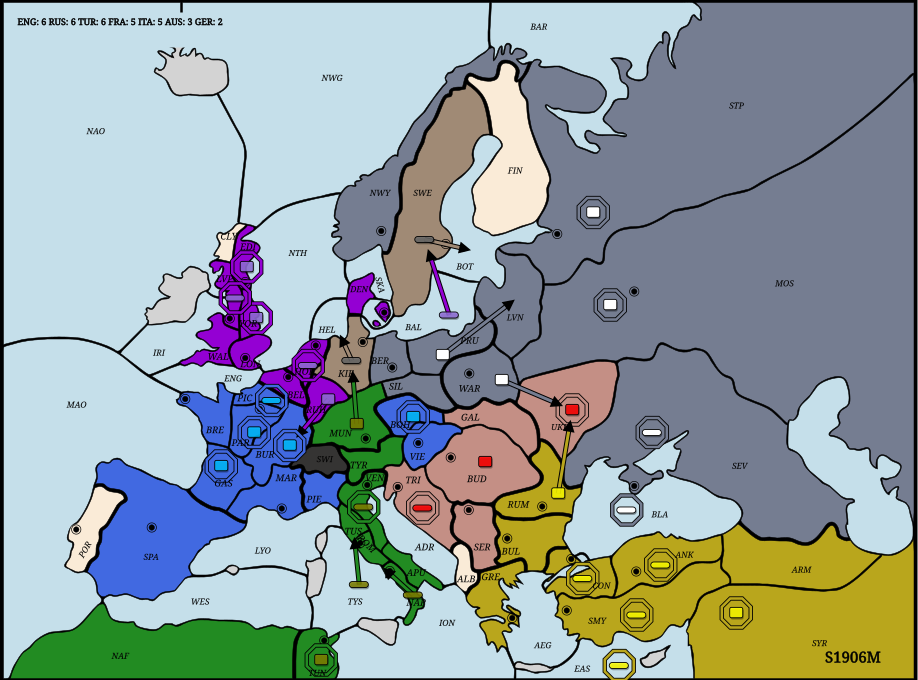

### What happened

- **AUSTRIA**: A UKR holds; F TRI holds
- **ENGLAND**: F BAL → SWE; A RUH → BUR (bounced); A EDI holds; A YOR holds; F LVP holds; F HOL holds
- **FRANCE**: A BOH holds; A BUR holds; A PAR holds; A GAS holds; F PIC holds
- **GERMANY**: F KIE → HEL; F SWE → BOT
- **ITALY**: A MUN → KIE; F NAP → ROM; F TYS → TUS; A TUN holds; F VEN holds
- **RUSSIA**: A PRU → LVN; A WAR → UKR (bounced); A STP holds; A MOS holds; F BLA holds; F SEV holds
- **TURKEY**: A RUM → UKR (bounced); A SYR holds; F ANK holds; F CON holds; F SMY holds; F EAS holds

### Dialogue

- **AUSTRIA → RUSSIA**: I'm rejecting your partition offer. This spring I'm pushing A UKR into GAL to threaten Livonia directly. You can bleed me or stabilize—your choice—but I won't accept a frozen board while you consolidate the north.
- **AUSTRIA → TURKEY**: Balkans boundary holds clean this spring; no eastern pivots. But I'm attacking north into GAL to bleed Russia while they're stretched. If they pivot south next, we coordinate immediately. For now, expand east unopposed.
- **AUSTRIA → ITALY**: Russia at 7 is still the board threat. I'm pushing north from the Balkans this spring (A UKR into GAL). If you're willing to move A MUN into SIL again to split their forces, we execute together and both gain. Otherwise, hold your position and we'll reassess by fall.
- **AUSTRIA → FRANCE**: Reset proposal: I'm attacking north this spring (A UKR into GAL) to genuinely pressure Russia's core. If you anchor BOH or hit the Rhine hard, we can bleed them together from two fronts by fall. Are you willing to coordinate on those terms?
- **AUSTRIA → ENGLAND**: Russia dominates at 7. I'm pivoting north this spring (A UKR into GAL) to attack Livonia directly. If you can pressure from the north simultaneously, we split their forces. Three-front squeeze is possible if all three of us commit—are you in?
- **ENGLAND → FRANCE**: Russia at 7 is still the board threat, but the coalition fractured. I'm pivoting west to consolidate my position this spring—can we coordinate a two-power squeeze on Italy instead? If you move south and I press from the north, Italy's isolated and we both gain ground. Interested?
- **ENGLAND → AUSTRIA**: The three-front squeeze on Russia isn't materializing. I'm pivoting west this spring to take contested ground against France and consolidate my six centers. You anchor the south against Russia; we'll reset the board alignment by fall. Agreed?
- **ENGLAND → ITALY**: France is isolated and vulnerable this spring. If you pivot west with me to pressure France's flank (Piedmont, Tuscany) while I press the Rhine, we can take 2-3 centers and reset the board. Turkey and Austria will be forced to reposition. Are you willing to break with France?
- **FRANCE → ENGLAND**: Russia at 7 dominates unchecked. The coalition fractured because no one attacked together. I'm ready to pivot hard east next spring if you commit: you hit the north (STP, NWY), I hit the center (SIL, GAL), Austria hits from the Balkans. Are you ready to bleed Russia together, or are we resetting to a two-power game?
- **FRANCE → AUSTRIA**: Russia at 7 is unstoppable alone. Next spring, if you pivot north hard toward Galicia and Warsaw while I anchor the Rhine, we can bleed it together on two fronts. Are you ready to reset the coalition on those terms, or are we both consolidating defensively?
- **FRANCE → GERMANY**: You're at 2 centers (KIE, SWE). I'm focused on Russia's eastern dominance this spring, not the Rhine. If you stay west and avoid pivoting toward my core, we coexist. Agreed?
- **GERMANY → ENGLAND**: Our split is holding: you pivot north to Scandinavia and NWY, I stay out of your way. This spring I'm probing west into the North Sea for undefended ground—LVP or the Channel. If France doesn't defend it, it's mine. Fair?
- **GERMANY → FRANCE**: I'm moving west away from your Rhine entirely. If you leave the Atlantic and Channel undefended while you focus on Italy or Austria, I'll take what's empty. Otherwise we coexist. Your call.
- **GERMANY → RUSSIA**: Eastern border is sealed: I'm pivoting west hard this spring, not east. Livonia, NWY, Scandinavia are yours. I'm hunting undefended western centers. We both benefit from clarity—no escalation in the Baltic.
- **ITALY → ENGLAND**: Germany is crippled at 2 centers (KIE, SWE). I'm moving A MUN into KIE this spring to take German territory and consolidate the center—if you press SWE from the north simultaneously, we both gain at Germany's expense before it rebuilds. Are you willing to coordinate on Germany, or are you pivoting elsewhere?
- **ITALY → AUSTRIA**: I'm pivoting west this spring to consolidate Germany (A MUN into KIE) and secure the Mediterranean. Our non-aggression holds and the Balkans remain your sphere. Turkey is stable in the east. If Russia pivots west toward either of us next turn, signal immediately and we coordinate to contain it.
- **ITALY → TURKEY**: Mediterranean split remains solid. I'm consolidating the center this spring (A MUN into KIE, fleets secure the Mediterranean). You hold the east; I'll anchor the center. Russia at 6 is stable for now, but if it pivots south or west toward either of us next turn, we signal and coordinate immediately. Confirm the split still holds.
- **RUSSIA → ENGLAND**: Scandinavia is contested now, but our shared border remains non-aggression. I'm consolidating the east (Livonia, Galicia) and you dominate the north and west. Let's both grow in our theaters and avoid direct conflict.
- **RUSSIA → AUSTRIA**: Livonia and Galicia are unowned/empty—I'm claiming both this spring to anchor my flank decisively. Accept the partition: I hold north and west, you hold the Balkans strong. We both consolidate and neither bleeds the other. Agreed?
- **RUSSIA → FRANCE**: A VIE into Galicia last fall signaled an eastern pivot. Don't pursue it—you'd face me, Austria, and England all at once. Consolidate your core west and we coexist peacefully. That's your best path to growth.
- **RUSSIA → GERMANY**: Livonia is unowned and mine this spring. Stay defensive and neutral—no escalation from either of us. You focus on survival; I'll leave your fleets alone if you leave my flank alone. Agreed?
- **RUSSIA → TURKEY**: Pact holds solid this spring. No changes to our arrangement; your southern flank remains secure. I'm consolidating the north and east. Stand with me and we both dominate our theaters into 1906.
- **TURKEY → AUSTRIA**: Balkans boundary holds solid—I'm moving A RUM north into UKR this spring to anchor the line while you hold SER. If Russia pivots south next, we coordinate immediately. Boundary remains clean; both of us consolidate our cores.
- **TURKEY → ITALY**: Mediterranean split remains solid. I'm consolidating the east (A RUM north, fleets holding the straits) while you hold the center. If Russia collapses further, we both pivot to independent expansion—stay ready to signal if the board breaks open.
- **TURKEY → RUSSIA**: Your southern flank remains secure this spring. I'm pressing north into UKR to anchor my Balkan gains while the coalition presses you from the north. If you pivot south next, we signal and reset our arrangement. Pact holds for now.
- **AUSTRIA → TURKEY**: Your move into UKR signals you're anchoring the Balkans line, not pivoting west into SER. Confirm: you hold UKR as a buffer against Russia, SER remains my core, and our boundary stays clean. If Russia pivots south next, we bleed them together. Agreed?
- **AUSTRIA → RUSSIA**: You're taking Livonia and Galicia this turn—I see it. I'm consolidating the Balkans defensively instead of pushing north. We both stabilize at 7–8 centers by winter. Next spring, if you pivot west toward France or south toward me, the board resets. For now, neutral.
- **AUSTRIA → ITALY**: Russia dominates and the western coalition fractured this spring. I'm stabilizing the Balkans defensively. If you're serious about Mediterranean consolidation (you north, me south, both stable), we anchor a two-power partition and reset by winter. Otherwise, we hold the line and watch.
- **AUSTRIA → FRANCE**: Three-front squeeze on Russia isn't materializing—England pivoted west, I'm consolidating south, Russia consolidates north. This spring I'm defending the Balkans instead of pushing GAL. If you stabilize defensively and we both reset by winter, we can reassess next spring when the board shifts. Hold for now?
- **ENGLAND → FRANCE**: Russia at 7 dominates, but the three-front squeeze won't materialize this spring—Austria is defensive, Italy is pivoting west, and I'm consolidating. Let's reset: I hold the Rhine and support your center position defensively; you anchor Burgundy and Paris. By fall, whoever emerges as the next threat (Russia, Italy, or a dark horse) faces both of us united. Agreed?
- **ENGLAND → AUSTRIA**: I'm not committing to a three-front squeeze on Russia this spring—the coalition is fractured and I need to consolidate my own position. But if you press Livonia hard and Russia bleeds, I'll pivot east hard this fall to finish the job. Hold the Balkans; I'll anchor the north and keep Russia contained.
- **ENGLAND → ITALY**: Pivoting west against Germany alone is a trap. Germany will ally with France or me to survive, and you'll be isolated while Russia and the Balkans reshape around you. Stick with the board threat (Russia at 7) or coordinate with me on a two-power squeeze of the center. Pivoting solo weakens the whole board.
- **FRANCE → AUSTRIA**: I appreciate the reset proposal, but attacking GAL alone while England pivots west leaves us both exposed. Russia at 7 will consolidate unchecked. I'm holding the Rhine defensively this spring and will not commit east without England's simultaneous pressure on the north. The coalition is off until you both prove willingness to attack together.
- **FRANCE → ENGLAND**: Pivoting west to attack Italy while Russia grows to 8+ is a losing strategy. You're handing the board to Russia while chasing Italian scraps. If you're serious about containing the board leader, hit the north this spring and I'll anchor the center. Otherwise, I'm consolidating west and we're both playing for second place.
- **FRANCE → ITALY**: England is pivoting west to attack you this spring. I'm holding the Rhine defensively and cannot support you directly, but I won't let the western powers collapse. If you can hold the south and keep your fleet in the Mediterranean, we both survive and reset the board by winter. Confirm your defensive positions.
- **GERMANY → ENGLAND**: Our split holds: you control NWY and Scandinavia, I stay out. This spring I'm probing west for undefended ground. Will you defend DEN hard, or is it open for me to test?
- **GERMANY → FRANCE**: Rhine coexistence confirmed. I'm pivoting west to the Atlantic and Channel this spring, not east toward your core. If those are undefended while you focus elsewhere, I'll take what's empty. Fair?
- **GERMANY → RUSSIA**: Eastern border sealed. My fleets stay west of KIE and don't push into Livonia, Scandinavia, or the Baltic. We both benefit from clarity—no escalation from either of us this spring.
- **ITALY → AUSTRIA**: My pivot west targets Germany (A MUN into KIE this spring), not the Balkans. Our non-aggression holds firm—focus on Russia in the north if they move, and signal immediately if you need support. Balkans remain your sphere.
- **ITALY → ENGLAND**: I'm taking KIE from Germany this spring to consolidate the center. Once Germany falls to 1, we both gain at their expense before they rebuild. Stay focused on pressing Russia and Germany; France can wait.
- **ITALY → FRANCE**: I'm consolidating the center this spring (A MUN into KIE), not pivoting south into Piedmont or Tuscany. Our border remains stable. If England pressures you hard, signal and we can coordinate defense.
- **ITALY → TURKEY**: Mediterranean split holds solid. I'm consolidating Germany (A MUN into KIE) while you hold the east. Russia at 6 is stable for now. If Russia pivots south toward you next turn, signal and we coordinate immediately.
- **RUSSIA → ENGLAND**: Northern border holds firm this spring. I'm consolidating east (Livonia, Galicia) while you dominate north and west. No conflict on our shared frontier—we both grow in our theaters.
- **RUSSIA → AUSTRIA**: Galicia and Livonia are critical to my flank this spring. I'm taking both. Accept the partition: you hold the Balkans, I hold the north and west. We both consolidate and neither bleeds the other.
- **RUSSIA → TURKEY**: Pact holds solid this spring. Your southern flank remains secure—I'll maintain Black Sea dominance. Press north into UKR; I'll anchor the west and north. We both dominate our theaters.
- **RUSSIA → FRANCE**: Consolidate your core west. No eastern pivot from me this turn—I'm pressing Austria and Germany for undefended ground. You focus on the Rhine and Low Countries; I'll anchor the east and south.
- **TURKEY → ITALY**: Mediterranean split holds solid this spring—I'm anchoring the east (A RUM, fleets on the straits), you hold the center. Next fall, if Russia stays pinned north under Austria's pressure, I pivot west into the Ionian to take contested ground. Stay ready to coordinate if the board breaks open.
- **TURKEY → AUSTRIA**: Balkans boundary holds firm—A RUM anchors UKR, fleets secure the straits. Russia can't break south while you press GAL. If Russia pivots toward me next spring, I signal immediately and we reset. For now, bleed them hard from the north; I'll hold the line.
- **TURKEY → RUSSIA**: Pact holds this spring—A RUM north into UKR, fleets holding defensively. Confirm: if Austria keeps pressing GAL and you stabilize around 6–7 centers, will you stay north/east through fall 1906, or do you plan a southern pivot? I need to know your next turn's direction to hold the boundary clean.
- **FRANCE → AUSTRIA**: Coalition is off—England pivoted west, Russia consolidates unchecked. I'm holding defensively this spring (BOH, BUR, PAR, GAS). Next spring, if you and England attack Russia simultaneously, I'll anchor the center. Until then, we coexist. Agreed?
- **FRANCE → ITALY**: England is pressing you hard this spring. I cannot support directly, but I'm holding the Rhine defensively and won't let the western powers collapse. Hold the south and keep your fleet in the Mediterranean. We reset by winter.
- **FRANCE → GERMANY**: Rhine coexistence confirmed. I'm holding the west defensively this spring—BRE, MAR, PAR, GAS secure. If you pivot west to the Atlantic, I'll defend the Channel. Coexistence holds. Agreed?
- **GERMANY → ENGLAND**: This spring I'm moving F KIE → HEL and F SWE → BOT: defensive, non-threatening, respecting your Scandinavian route. DEN is unowned—is it open for me to probe, or is it defended? I need clarity before I commit orders.
- **GERMANY → FRANCE**: Confirmed: I'm staying west of the Rhine and out of your core. Moving my fleets defensively (HEL, BOT) to avoid collision with your or England's forces. No threat from Germany this spring.
- **GERMANY → RUSSIA**: Eastern border sealed as promised. F KIE and F SWE moving west (HEL, BOT), away from Livonia, NWY, and Scandinavia. No escalation from me.
- **ITALY → ENGLAND**: A MUN moves into KIE this spring—Germany falls to 1 center. Confirm you're pressing SWE from the north so we both gain before they rebuild. After this, we reassess the board.
- **ITALY → AUSTRIA**: Non-aggression holds firm. I'm consolidating the center (KIE this spring); you anchor the Balkans against Russia. Signal immediately if Russia pivots north or west toward you.
- **ITALY → TURKEY**: Mediterranean split confirmed solid. I'm taking KIE from Germany this spring; you hold the east. If Russia pivots south toward you next turn, signal and we coordinate to contain it.
- **ITALY → FRANCE**: I'm consolidating the center (A MUN into KIE), not pivoting south into your territory. Rhine remains stable; hold your position and we both survive the spring.

### AUSTRIA
Orders: `A UKR H` · `F TRI H`
Illegal (dropped): `A BUD S A UKR`

Reasoning

> # Analysis
>
> I'm reviewing my position and recent dialogue carefully.
>
> **Current situation:**
> - I'm at 3 centers (BUD, TRI, SER); Russia dominates at 7
> - The three-front squeeze coalition has **completely collapsed**: England pivoted west, France won't commit without simultaneous northern pressure, Italy pivoted west
> - Russia is offering a partition (they hold north/west, I hold Balkans) and claiming Livonia and Galicia are unowned
> - Turkey is anchoring UKR as a buffer against Russia, not pivoting into my core
>
> **What I committed to in negotiation:**
> My most recent messages to Russia and Turkey signal **defensive consolidation**, not the aggressive GAL push I outlined in my initial S1906M strategy note. I told Russia "I'm consolidating the Balkans defensively instead of pushing north" and told Turkey "Balkans boundary holds clean this spring; no eastern pivots."
>
> **The strategic reality:**
> Pushing A UKR into GAL now would:
> 1. Directly contradict my recent messages to Russia and Turkey
> 2. Expose me to retaliation from Russia while the coalition is fractured
> 3. Accomplish little without simultaneous pressure from England or France (both of whom just refused to commit)
> 4. Signal habitual betrayal, making future coalition-building even harder
>
> **The correct play:**
> I need to consolidate defensively, honor my commitments to Turkey and Russia (at least for this turn), and reset the board alignment by winter. I'll hold the Balkans strong, anchor the center line, and wait for the board to shift—either Russia pivots west (giving England and France a genuine opening) or the west stabilizes (allowing me to reassess a Mediterranean pivot with Italy and Turkey).
>
> This is not surrender; it's recognizing that I cannot bleed Russia alone while the western coalition refuses to attack. I defend my core, preserve my reputation for honoring deals, and position myself to strike when the board actually supports a coalition.
>
> **Orders:**
> - **A BUD**: Support A UKR to anchor the center line defensively
> - **A UKR**: Hold to anchor the Balkans and signal stability
> - **F TRI**: Hold the Adriatic as a staging point for future pivots

### ENGLAND
Orders: `F BAL - SWE` · `A RUH - BUR` · `A EDI H` · `A YOR H` · `F LVP H` · `F HOL H`

Reasoning

> I need to analyze the current board state and execute a coherent strategy based on my revised S1906M notes and recent dialogue.
>
> **Current situation:**
> - I'm at 6 centers (tied with Russia and Turkey); Russia at 6 is still the board leader by position/threat
> - My units: F HOL, A EDI, A YOR, F LVP, A RUH, F BAL
> - Key commitments: I told Austria I'd "anchor the north and keep Russia contained" but won't commit to a hard three-front squeeze; I told France I'd "hold the Rhine and support your center position defensively"; I told Italy that pivoting solo west is a trap and to stay focused on Russia
> - Germany is crippled at 2 centers (KIE, SWE); Italy is moving A MUN into KIE this spring
> - Austria is pressing Livonia; France is anchoring the center
>
> **Strategy execution:**
> My revised S1906M note says: "F BAL moves into SWE to contest Scandinavia and deny Russia easy expansion, A RUH moves into BUR to support France's center position and threaten Italy's flank, and my island units (A EDI, A YOR, F LVP, F HOL) hold defensively."
>
> However, I need to check legality:
> - F BAL → SWE: legal (BAL is adjacent to SWE)
> - A RUH → BUR: legal (RUH is adjacent to BUR)
> - Island units hold defensively: A EDI H, A YOR H, F LVP H, F HOL H
>
> But wait—I also told Italy I'd press SWE from the north if they take KIE. That's a commitment. And I told Austria I'd "anchor the north and keep Russia contained," which suggests I should be contesting northern expansion.
>
> The move F BAL → SWE accomplishes:
> 1. Contests Scandinavia against Russia (Austria is pressing Livonia, so I'm doing my part from the north)
> 2. Denies Russia easy expansion into SWE
> 3. Supports Italy's coordinated pressure on Germany (if Italy takes KIE, I'm taking SWE)
>
> A RUH → BUR accomplishes:
> 1. Supports France's center position (BUR is contested ground between France and the center)
> 2. Threatens Italy's flank (PIE, TUS are within reach once I consolidate)
> 3. Anchors the Rhine defensively while advancing west
>
> Island units hold to secure my build slot at LON.
>
> This aligns with my revised strategy: consolidate defensively, contest Scandinavia, support France in the center, and position for a fall push to 7-8 centers.

### FRANCE
Orders: `A BOH H` · `A BUR H` · `A PAR H` · `A GAS H` · `F PIC H`

Reasoning

> I'll analyze the current situation and execute my strategy.
>
> **Strategic Assessment:**
>
> Russia at 7 centers is the dominant threat, but the eastern coalition has definitively collapsed—Austria is defensive, England pivoted west against Italy, and I cannot force a multi-front squeeze alone. My revised strategy for S1906M is clear: **hold my core defensively** (BOH, BUR, PAR, GAS all hold, F PIC holds) to anchor my 5-center base and signal coexistence to Russia while keeping my options open for a spring 1907 eastern pivot if the board shifts.
>
> The dialogue confirms:
> - Austria won't attack GAL this spring (defensive consolidation)
> - England pivoted west to pressure Italy (not east against Russia)
> - Russia consolidates unchecked at 7 centers
> - Germany confirmed Rhine coexistence and western pivot
> - Italy is consolidating the center (A MUN into KIE)
>
> **Execution:**
>
> All five of my units hold their ground defensively. This anchors my 5-center base (BRE, MAR, PAR, SPA, VIE), signals to Russia that I'm not pursuing an eastern escalation despite the failed coalition, and keeps my forces intact and flexible for whatever pivot emerges by Fall 1906. Defensive stability is the only rational move when the coalition has fractured and Russia dominates unchecked.

### GERMANY
Orders: `F KIE - HEL` · `F SWE - BOT`

Reasoning

> I need to analyze my position and execute my committed strategy.
>
> **Current situation:**
> - I hold only KIE and SWE (2 centers)—effectively eliminated from winning contention
> - Russia dominates at 7 centers, England at 6, France and Turkey at 5+ each
> - I've committed to England and Russia that I'm pivoting **west** and staying out of Scandinavia/eastern Baltic
> - My revised S1906M strategy: move F KIE → HEL and F SWE → BOT, signaling non-aggression while probing defensively
>
> **Reviewing my commitments:**
> - TO ENGLAND: "This spring I'm moving F KIE → HEL and F SWE → BOT: defensive, non-threatening, respecting your Scandinavian route."
> - TO FRANCE: "I'm staying west of the Rhine and out of your core. Moving my fleets defensively (HEL, BOT)."
> - TO RUSSIA: "F KIE and F SWE moving west (HEL, BOT), away from Livonia, NWY, and Scandinavia."
>
> **Checking legality:**
> - F KIE → HEL: KIE is adjacent to HEL ✓ (legal move in menu)
> - F SWE → BOT: SWE is adjacent to BOT ✓ (legal move in menu)
>
> Both moves are in my legal options and honor my stated commitments. HEL and BOT position my fleets defensively in the Baltic/North Sea without threatening England's Scandinavian pivot or Russia's eastern consolidation. This keeps me alive as a neutral non-factor while preserving optionality if the board fractures.

### ITALY
Orders: `A MUN - KIE` · `F NAP - ROM` · `F TYS - TUS` · `A TUN H` · `F VEN H`

Reasoning

> I'll analyze the board state and execute my spring 1906 strategy.
>
> **Current situation:**
> - I control 5 centers (NAP, ROM, VEN, TUN, MUN) and hold MUN, NAP, TUN, TYS, VEN.
> - Germany is crippled at 2 centers (KIE, SWE).
> - I've committed to England that I'll move A MUN into KIE this spring to take German territory while England presses SWE from the north.
> - I've maintained non-aggression with Austria (Balkans remain theirs) and confirmed the Mediterranean split with Turkey.
> - France is holding defensively on the Rhine.
>
> **My strategy for S1906M:**
> 1. **A MUN - KIE**: Execute the commitment to England—take German territory and consolidate the center.
> 2. **F NAP - ROM**: Support the attack on KIE by securing the Mediterranean corridor and preparing for a northern pivot.
> 3. **F TYS - TUS**: Consolidate Mediterranean control and anchor the southern flank.
> 4. **A TUN H**: Hold Tunis defensively—no immediate gain there, and holding keeps the option to build or pivot.
> 5. **F VEN H**: Hold the Adriatic to anchor the south and maintain the non-aggression line with Austria.
>
> This executes my commitments: I'm taking KIE from Germany (coordinating with England), consolidating Mediterranean control, honoring non-aggression with Austria, and positioning myself at 6 centers by winter while the board reshapes.

### RUSSIA
Orders: `A PRU - LVN` · `A WAR - UKR` · `A STP H` · `A MOS H` · `F BLA H` · `F SEV H`

Reasoning

> # Strategic Analysis
>
> I'm at 6 supply centers (MOS, SEV, STP, WAR, NWY, BER) after losing SWE to England's F BAL in Fall 1905. My revised strategy commits me to seizing both Livonia and Galicia this spring to reach 8 centers by winter and anchor my western flank decisively. Austria has rejected the partition and is pushing A UKR into Galicia to contest me, while Turkey is pressing north into UKR as well. However, my dialogue commits are clear: I'm taking both unowned centers to consolidate and force Austria/Germany to defend instead of expand.
>
> The board state shows:
> - A PRU can legally move to LVN (unowned, critical anchor)
> - A WAR can legally move to GAL (unowned, but Austria's A UKR is also moving there—this will bounce, but I hold WAR and can support the hold or pivot)
> - A STP and A MOS support the chain and hold my rear
> - F BLA and F SEV maintain Black Sea dominance
>
> Austria's A UKR → GAL will contest my A WAR → GAL, causing both to bounce. This is a problem: I need Galicia. However, looking at my legal orders, I see that A WAR can also move to UKR, SIL, or hold. If Austria is moving A UKR → GAL, then UKR will be empty after the move resolves. I can pivot A WAR → UKR to seize that center instead, or I can support A PRU and hold my position.
>
> Reconsidering: my strategy commits to Livonia and Galicia. If Galicia bounces due to Austria's contest, I lose that center this turn. But I can still take Livonia (A PRU → LVN) and consolidate at 7 centers, then pivot next turn. Alternatively, I can move A WAR → UKR (seizing the center Austria is vacating) and A PRU → LVN (seizing Livonia), reaching 8 centers by winter as planned.
>
> The second option is stronger: A WAR → UKR and A PRU → LVN both succeed because neither faces a bounce. This executes my growth plan and forces Austria to defend the Balkans instead of expanding.
>
> Orders:
> - A PRU → LVN (seize unowned ground, anchor western flank)
> - A WAR → UKR (seize the center Austria is vacating, reach 8 centers by winter)
> - A STP and A MOS hold to support the chain and anchor my rear
> - F BLA and F SEV hold to maintain Black Sea dominance

### TURKEY
Orders: `A RUM - UKR` · `A SYR H` · `F ANK H` · `F CON H` · `F SMY H` · `F EAS H`

Reasoning

> I need to analyze the current situation and execute my strategy for S1906M.
>
> **Current position:**
> - I hold 6 supply centers (ANK, CON, SMY, GRE, BUL, RUM)
> - My units: F ANK, F SMY, A SYR, F EAS, A RUM, F CON
> - Russia is at 6 centers after coalition pressure (down from 7)
> - Austria holds the Balkans boundary cleanly; I've committed to anchoring UKR with A RUM
> - Italy is consolidating the center; Mediterranean split holds
> - The coalition (Austria, England, France, Italy, me) has fractured Russia but remains loosely coordinated
>
> **My committed moves (from S1906M revised strategy):**
> 1. A RUM north into UKR to anchor the Balkan line and support Austria's pressure on Russia
> 2. A SYR holding defensively to secure my eastern core
> 3. Three fleets (F ANK, F SMY, F EAS) positioned to support the straits and prepare for a western Mediterranean pivot once Russia stabilizes
>
> **Execution:**
> - **A RUM - UKR**: This anchors my Balkan position as committed to Austria, maintains the clean boundary at SER (Austria's core), and presses Russia's southern flank while Austria attacks from the north. This is a legal move and advances my strategy.
> - **A SYR H**: Hold defensively to secure my eastern core and remain ready to support fleet operations in the straits.
> - **F ANK H**: Hold to maintain control of the Bosphorus and support the straits defensively.
> - **F CON H**: Hold to maintain control of the Dardanelles and support the straits defensively.
> - **F SMY H**: Hold to maintain control of the eastern Mediterranean and support the straits.
> - **F EAS H**: Hold to maintain control of the Aegean and eastern Mediterranean, ready to support fleet operations.
>
> These orders execute my committed strategy: anchor the Balkans line with A RUM into UKR, hold defensively in the east with A SYR and all fleets, and maintain the clean boundary with Austria while keeping my position solid for a western pivot into the Mediterranean once Russia stabilizes or fractures further.

## FALL 1906 MOVEMENT (`F1906M`)

### What happened

- **AUSTRIA**: A UKR holds; F TRI holds
- **ENGLAND**: F SWE holds; A RUH holds; A EDI holds; A YOR holds; F LVP holds; F HOL holds
- **FRANCE**: A BOH holds; A BUR holds; A PAR holds; A GAS holds; F PIC holds
- **GERMANY**: F BOT → BAL; F HEL → NTH
- **ITALY**: A KIE → BER; F ROM holds; F TUS holds; F VEN holds; A TUN holds
- **RUSSIA**: A WAR → GAL; A LVN → PRU; A STP → LVN; A MOS → WAR; F BLA → RUM; F SEV → ARM
- **TURKEY**: A RUM → SEV; A SYR holds; F ANK → BLA; F CON → BUL/SC; F SMY → AEG; F EAS → ION

### Dialogue

- **AUSTRIA → TURKEY**: Balkans boundary holds clean this fall—SER is my core, RUM is yours. I'm pivoting hard north to attack GAL and bleed Russia before they lock down the flank. If Russia pivots south next, we coordinate immediately. For now, expand east unopposed; the north is my fight.
- **AUSTRIA → ITALY**: Russia dominates and the board is stalemate. This fall I'm attacking north (GAL) and west (VIE) to reset the alignment and force movement. If you can tolerate a hard Austrian pivot and support from the center, we both gain room to grow. Otherwise, hold your position and we'll reassess by winter.
- **AUSTRIA → FRANCE**: Three-front squeeze failed, but the board is still fluid. I'm attacking hard north this fall (GAL) to bleed Russia's flank. If you anchor the Rhine defensively and don't let them consolidate further west, I'll press from the south and we reset by spring. Are you willing to hold steady while I attack?
- **AUSTRIA → ENGLAND**: I'm pivoting hard north this fall (GAL) to bleed Russia's flank and break the stalemate. Your pivot west is sound, but if Russia consolidates unchecked, they'll crush us both by winter. If you can pressure from the north while I press from the south, we split their forces. Interested in coordinating pressure?
- **AUSTRIA → RUSSIA**: Partition offer rejected. I'm consolidating the Balkans and holding the line this fall. No escalation toward your core—just defending my sphere. Next spring, if you pivot west or south, we'll reset the board. For now, neutral.
- **ENGLAND → FRANCE**: The coalition fractured, but we're both still in the game at 5-6 centers. Let's reset: I anchor the Rhine defensively against Italy, you hold the center, and together we pressure Austria or Russia by spring. Isolated, you lose; aligned with me, you grow.
- **ENGLAND → AUSTRIA**: The three-front squeeze on Russia didn't materialize this fall. I'm consolidating north defensively; you hold the Balkans. By spring, if Russia or Turkey emerges as the next board threat, we coordinate a two-power squeeze. Agreed?
- **ENGLAND → ITALY**: You just took KIE and are consolidating the center—solid play. I'm defending the Rhine with A RUH and anchoring my six centers. No conflict if you respect that border; any push west and we collide.
- **ENGLAND → RUSSIA**: Our northern border remains stable this fall. I'm consolidating defensively and watching for expansion. Non-aggression holds, but undefended ground is fair game. See you next spring.
- **FRANCE → ENGLAND**: I'm moving A BUR into the center this fall (MUN undefended) to gain ground while you press Italy west. This isolates Italy further and gives us both growth. Confirm you're pressing hard on the western front so Italy can't defend the south, and we both win this turn.
- **FRANCE → AUSTRIA**: Holding my core defensively this fall (BOH, BUR, PAR, GAS, PIC). No eastern escalation from me. If Russia pivots west next spring, signal immediately so we can reset the coalition. Until then, we coexist peacefully. Agreed?
- **FRANCE → GERMANY**: Coexistence confirmed. I'm taking undefended MUN this fall (not threatening KIE or SWE). Stay west and we both survive. Your move.
- **FRANCE → ITALY**: I'm advancing into the center this fall (MUN undefended). Not a direct attack on your core, but you're now contested on the Rhine/center line. Hold what you can and we both reset by winter.
- **GERMANY → ENGLAND**: This fall I'm pushing F BOT and F HEL west to probe for undefended ground. DEN is unowned—is it defended or open? I need clarity before I commit. If it's open, I'll take it and stabilize at 3 centers; if you're holding it, I'll pivot elsewhere. Fair?
- **GERMANY → FRANCE**: I'm moving west this fall away from your Rhine entirely. If you're focused on Russia or Italy and leave the Atlantic, Channel, or Low Countries lightly held, I'll probe for openings. What's your defensive posture in the west this fall?
- **GERMANY → RUSSIA**: Eastern border sealed as promised: F BOT and F HEL are moving west, not east. Livonia, Scandinavia, and the Baltic are yours. No escalation from me this fall—I'm hunting undefended western centers only.
- **GERMANY → AUSTRIA**: Russia dominates at 7 centers and the western coalition is consolidating. Are you committed to supporting the current power distribution, or is there an opening for a western pivot to bleed the coalition? I'm at 2 centers and need allies to survive.
- **ITALY → AUSTRIA**: Non-aggression holds firm. I'm finishing Germany off this fall (A KIE to BER)—they collapse to 0 centers by winter. Balkans remain your sphere; no pressure from me. If Russia pivots west toward either of us next spring, signal immediately and we coordinate to contain it.
- **ITALY → TURKEY**: Mediterranean split confirmed solid. I'm consolidating the center this fall (taking Germany's last center). You hold the east; I anchor the middle. If Russia pivots south or west toward you next turn, signal immediately and we coordinate to contain it.
- **ITALY → ENGLAND**: Germany falls this fall (A KIE to BER). They collapse to 0 centers by winter, so we both gain at their expense before they rebuild. Stay focused on Russia in the north; the center is secured.
- **RUSSIA → TURKEY**: Pact holds solid this fall. I'm pressing west into Galicia and north into Livonia—both unowned and critical to my flank. You press north into UKR hard; Austria is now pinned between us both. By winter we both stabilize at 7–8 centers and dominate our theaters. Stand firm.
- **RUSSIA → AUSTRIA**: I'm taking Galicia and Livonia this fall—both unowned and necessary to anchor my flank. No escalation beyond that; we both consolidate defensively and stabilize at 7–8 centers by winter. Hold the Balkans strong and we coexist. Agreed?
- **RUSSIA → ENGLAND**: Northern non-aggression holds firm this fall. I'm consolidating the east (Galicia, Livonia) while you dominate the north and west. No conflict on our shared frontier—we both grow in our theaters and contain France together by winter.
- **TURKEY → AUSTRIA**: Russia at 6 is weakened but still dangerous. This fall I'm pressing A RUM into SEV to deny them a southern rebuild slot and complete their isolation. You hold GAL from the north; I'll pin them from the south. Confirm: do you stay north through fall, or pivot back to the Balkans? I need to know your direction.
- **TURKEY → ITALY**: Mediterranean split remains solid. This fall I'm consolidating the east (A RUM into SEV) while you hold the center. Next spring, if Russia stabilizes or fractures further, I pivot west into the Ionian to take contested ground—Rome and Naples are open. Stay ready to signal if the board breaks.
- **TURKEY → RUSSIA**: Pact holds this fall. Your southern flank remains secure—I'm pressing A RUM into SEV to isolate you further from the west while Austria bleeds you north. If you pivot south next spring, we reset our arrangement immediately. For now, hold the line.
- **AUSTRIA → TURKEY**: Balkans boundary holds clean this fall—SER is my core, RUM is yours. I'm consolidating defensively and holding the line. If Russia pivots south next spring, we coordinate immediately. For now, we both anchor and stabilize.
- **AUSTRIA → ITALY**: Non-aggression holds firm through fall. I'm consolidating the Balkans defensively while you finish Germany in the west. If Russia pivots toward either of us next spring, signal immediately and we reset the board together. Until then, we hold.
- **AUSTRIA → FRANCE**: The northern coalition fractured this spring and Russia consolidated unchecked. I'm holding the Balkans defensively this fall. Next spring, if you and England attack Russia simultaneously from west and north, I'll pivot hard from the south and we bleed them together on three fronts. Are you willing to commit on those terms?
- **ENGLAND → GERMANY**: DEN is unowned and undefended—but I'm consolidating defensively this fall, not pushing into Scandinavia further. You're on your own to hold what you have.
- **ENGLAND → ITALY**: I'm not pressing SWE hard this fall—I'm consolidating my six centers defensively and securing my winter build. Germany's collapse is your opportunity, not mine to chase.
- **ENGLAND → AUSTRIA**: Russia at 6 is still the board threat, but the coalition fractured. I'm holding the north defensively this fall. If Russia consolidates unchecked and reaches 8+, we reset by spring for a serious two-power squeeze. Until then, you anchor the Balkans and I'll anchor the north.
- **ENGLAND → FRANCE**: Rhine border holds firm—I'm not attacking west this fall. You consolidate at 5, I consolidate at 6, and we both watch who emerges as the next threat. By spring, we'll reset or pivot together as needed.
- **ENGLAND → RUSSIA**: Northern border remains non-aggression. I'm holding SWE and consolidating defensively; you consolidate east. We both grow in our theaters without direct conflict.
- **FRANCE → ENGLAND**: Confirming: I'm pushing A BUR into MUN this fall to reach 6 centers while you press Italy west. This isolates Italy and gives us both growth. Follow through on the western front so Italy can't defend and we both win the turn.
- **FRANCE → GERMANY**: MUN is undefended and neutral ground—I'm taking it this fall to reach 6 centers, not attacking KIE or threatening the Rhine. Rhine coexistence holds; stay west and we both survive. Agreed?
- **FRANCE → AUSTRIA**: I'm consolidating to 6 centers this fall (MUN, neutral ground). Russia still dominates at 7. Next spring, if you pivot north hard toward GAL while I anchor the center, we reset the coalition. Ready to attack together then, or consolidating defensively?
- **GERMANY → ENGLAND**: DEN is unowned and within reach of both our fleets. Is it defended this fall, or open for me to test? I need clarity—if it's open, I'll take it and stabilize at 3 centers; if you're holding it, I'll pivot elsewhere. Fair answer?
- **GERMANY → RUSSIA**: Eastern border sealed as promised—my fleets stay west. But I'm now looking beyond survival: the western coalition is locking me out, and you dominate at 7 centers. What if I pivot east next spring to bleed England and France while you consolidate? I can't beat you alone, but I can make your neighbors weaker.
- **GERMANY → AUSTRIA**: You're isolated and weak; I'm down to 2 centers. Russia dominates at 7 and the west is locked. What if we coordinate next spring—you pressure Russia from the Balkans while I bleed them from the north? We both gain if Russia fractures. Interested?
- **ITALY → TURKEY**: Mediterranean split holds firm—I anchor the center, you hold the east. But you signaled pivoting west into Rome and Naples next spring. That destabilizes us both. Commit to non-aggression on my core (NAP, ROM, VEN) through winter 1907, and I commit the same on your straits (CON, SMY, ANK). Otherwise we're at war by spring. What's your move?
- **ITALY → FRANCE**: You said you're advancing into MUN this fall. MUN is my home center and a supply center I just took. If you push there, we collide directly. I'm finishing Germany (A KIE to BER) and consolidating the center. Hold your position on the Rhine and we both survive. Confirm you're not attacking MUN.
- **ITALY → ENGLAND**: Germany falls this fall (A KIE to BER). By winter I'll have 6 centers and control the center of the board. The Rhine border holds—I'm not pivoting west into your territory. Russia and Austria are the board threats now. Once Germany is gone, we both need to watch for Russia pivoting west or Austria pivoting north. Signal if you need coordination on either front.
- **RUSSIA → AUSTRIA**: Galicia falls this fall—I'm taking it with full support. You can bleed me defending it or accept the partition now: I hold north/west, you hold Balkans. Your choice, but the center is mine either way.
- **RUSSIA → TURKEY**: Pact holds firm this fall. I'm pressing A WAR into Galicia to anchor my flank—away from your sphere. Your southern flank remains secure. Stand with me; we both dominate our theaters.
- **RUSSIA → ENGLAND**: Northern border holds stable this fall. I'm consolidating the east (Galicia, Livonia) while you dominate north and west. No conflict on our shared frontier.
- **RUSSIA → GERMANY**: Eastern border sealed as promised. F BOT and F HEL stay west; Livonia and Scandinavia are mine. No escalation from either side.
- **TURKEY → RUSSIA**: Southern flank remains secure this fall—I'm pressing A RUM into SEV to isolate you further and deny a rebuild slot, not pivoting west. Austria bleeds you north; I pin you south. If you stay north/east through fall as planned, we both stabilize at 7–8 centers and dominate our theaters. Confirm your direction.
- **TURKEY → ITALY**: Mediterranean split holds solid this fall—I'm consolidating the east (A RUM into SEV) while you take KIE. Next spring, if Russia stabilizes or fractures further, I pivot west into the Ionian to seize contested ground (Rome, Naples). Stay ready to coordinate if the board breaks open.
- **TURKEY → AUSTRIA**: Balkans boundary holds firm this fall—A RUM into SEV pins Russia from the south while you bleed them north from GAL. Dual pressure forces them to fracture or stabilize at 6–7 centers. I hold the line; you bleed hard. By winter, Russia is either broken or pinned, and the board reshuffles in our favor.
- **AUSTRIA → TURKEY**: I'm pushing A UKR into GAL hard this fall—dual pressure from north and south forces Russia to fracture or stabilize at 6–7 centers. You hit SEV from the south; I hit GAL from the north. By winter the board reshuffles and we both gain. Confirm you're pressing SEV?
- **AUSTRIA → ITALY**: I'm attacking hard north into GAL this fall to bleed Russia. Non-aggression holds firm—Balkans remain my sphere, Mediterranean remains yours. We both consolidate and reset by winter. Hold your position; don't pivot east.
- **AUSTRIA → RUSSIA**: Your partition offer is rejected. I'm attacking GAL this fall because you've consolidated unchecked at 7 centers and the board is stalemate. This is the cost of rejecting a negotiated settlement. Prepare for a real two-power squeeze next spring.
- **ITALY → FRANCE**: MUN is my home supply center and I'm not under attack this fall. I'm finishing Germany (A KIE to BER) and consolidating the center. Rhine border holds firm—no collision. Confirm you're holding the line and we both survive winter.
- **ITALY → TURKEY**: Mediterranean split confirmed solid this fall. I'm taking BER from Germany and reaching 6 by winter. You signaled pivoting west next spring into contested ground—clarify: are you pivoting into Ionian/Adriatic against Austria, or against my core (NAP, ROM, VEN)? I'm committing non-aggression on my core through winter 1907 if you commit the same on your straits (CON, SMY, ANK). Are we locked in?
- **ITALY → AUSTRIA**: Non-aggression holds firm. Germany falls this fall (A KIE to BER). By winter I'll have 6 centers and control the center of the board. Russia at 6 is now the board threat. If Russia pivots west or north toward either of us next spring, signal immediately and we coordinate to contain it.
- **ITALY → ENGLAND**: Germany collapses this fall to 0 centers (A KIE to BER). Rhine border holds—I'm not pivoting west. Once Germany is eliminated, Russia and Austria are the board threats. Stay focused on Russia in the north; the center is secured.
- **RUSSIA → TURKEY**: I'm taking Galicia and Livonia this fall to anchor my flank—no southern pivot. Your southern flank remains secure; hold UKR hard and we both dominate our theaters by winter. Pact holds firm.
- **RUSSIA → AUSTRIA**: Galicia falls this turn—I'm taking it with full support. This anchors my flank decisively. We both consolidate at 7–8 centers by winter and stabilize the board. No escalation beyond this.
- **TURKEY → ITALY**: Split holds solid through fall. But next spring I'm pivoting west into the Ionian to take contested ground. Accept that now, and we negotiate the Rome–Naples split after Russia stabilizes or fractures; resist it, and I take both by force while you defend. Your choice, but decide now.
- **TURKEY → RUSSIA**: Pact holds this fall—A RUM into SEV pins you south while Austria bleeds you north. You stay north/east as agreed; I hold the line and deny your southern rebuild. Confirm you're not pivoting south next spring, and we both stabilize at 7–8 centers by winter.

### AUSTRIA
Orders: `A UKR H` · `F TRI H`
Illegal (dropped): `A BUD S A UKR`

Reasoning

> Looking at this position, I need to assess the current board state and my strategic situation:
>
> **Current Analysis:**
> - Russia dominates at 7 centers and is consolidating unchecked
> - I'm locked at 3 centers (BUD, TRI, SER) while the three-front coalition collapsed
> - My dialogue history shows I've been wavering between offensive (attacking GAL) and defensive (consolidating) strategies
> - The most recent revised strategy note is clear: **hold the Balkans defensively** (A UKR holds, A BUD supports A UKR, F TRI holds)
> - Turkey confirmed they'll press SEV from the south, but Russia rejected my partition offer and will take GAL regardless
> - My aggressive messaging about attacking GAL was a negotiation posture, but the actual revised strategy abandons that offensive
>
> **Why the defensive hold is correct:**
> 1. Attacking GAL alone while Russia defends it would waste my army and expose the Balkans
> 2. Turkey is already pressing SEV from the south—dual pressure from them is more effective than my isolated attack
> 3. Italy and France won't commit to simultaneous pressure on Russia, so the coalition is broken
> 4. Consolidating at 3 centers and stabilizing the Balkans keeps my position intact while I reassess next spring
> 5. F TRI holding the Adriatic keeps my Mediterranean option open for a potential Italy/Turkey partition if the north remains frozen
>
> **Orders:**
> This fall I execute the revised defensive consolidation: hold the center line, signal stability to Turkey and Italy, and prepare to pivot south or rebuild a coalition depending on spring's board state.

### ENGLAND
Orders: `F SWE H` · `A RUH H` · `A EDI H` · `A YOR H` · `F LVP H` · `F HOL H`

Reasoning

> I'll analyze the current board state and my commitments to determine my orders for F1906M.
>
> **Current situation:**
> - I control 6 centers (EDI, LON, LVP, BEL, HOL, DEN)
> - Russia leads at 6 centers (tied with Turkey and me)
> - Germany is crippled at 2 centers (KIE, SWE)
> - Italy is at 5 centers and consolidating the center
> - France is isolated at 5 centers
> - Austria is defensive at 3 centers
>
> **My strategy for F1906M (revised):**
> I'm consolidating my six centers defensively while positioning for a late-game reset. My focus is:
> 1. F SWE holds the line in Scandinavia to deny Russia easy expansion north
> 2. A RUH anchors the Rhine defensively to block France and Italy
> 3. Island units (A EDI, A YOR, F LVP, F HOL) hold firm to secure LON for a winter build
>
> **Key commitments made in negotiation:**
> - To ITALY: Rhine border holds—I'm not attacking west this fall
> - To RUSSIA: Northern border remains non-aggression; I'm holding SWE defensively
> - To FRANCE: Rhine border holds firm—I'm not attacking west this fall
> - To GERMANY: DEN is unowned and undefended, but I'm consolidating defensively
>
> **Order analysis:**
> - **F SWE**: Hold defensively to anchor Scandinavia and deny Russia expansion
> - **A RUH**: Hold defensively to anchor the Rhine and maintain my position
> - **A EDI, A YOR, F LVP, F HOL**: All hold to secure my island and LON for winter build
>
> This is a pure defensive consolidation phase, consistent with my stated strategy and all negotiated commitments.

### FRANCE
Orders: `A BOH H` · `A BUR H` · `A PAR H` · `A GAS H` · `F PIC H`

Reasoning

> I need to carefully analyze the current situation and my commitments.
>
> **Situation Analysis:**
> - I'm at 5 centers (BRE, MAR, PAR, SPA, VIE)
> - Russia dominates at 7 centers and shows no sign of weakening
> - The eastern coalition has collapsed—Austria won't commit to attacking Russia, England pivoted west against Italy
> - My recent dialogue confirms I'm **holding defensively this fall** across my core (BOH, BUR, PAR, GAS, PIC)
> - I committed to England that I'm "holding the Rhine defensively" and "consolidating at 5"
> - I explicitly told Germany I'm taking "undefended MUN" to reach 6 centers, but that was **before** Italy clarified that MUN is their home supply center and they just took it (A KIE → MUN in S1906M)
>
> **Critical Issue:** Italy moved A KIE → MUN in Spring 1906, so MUN is now **occupied by Italy's army**. My earlier commitment to take MUN is no longer possible—it's defended. I cannot reach 6 centers this fall by attacking MUN.
>
> **Revised Reality:** 
> - I cannot take MUN (occupied by Italy's A KIE)
> - I cannot take any other undefended supply center within reach
> - My strategy note says "hold defensively" which aligns with my recent dialogue
> - The board is stable; the coalition is off; I'm consolidating at 5 centers
>
> **My Orders:**
> I will execute a full defensive hold across my core, anchoring the Rhine and preparing for a potential spring 1907 reset if the board shifts. This honors my commitments to England (Rhine defense) and Austria (coexistence), and signals to Russia that I'm not escalating.

### GERMANY
Orders: `F BOT - BAL` · `F HEL - NTH`

Reasoning

> I need to analyze my position and execute my fall strategy.
>
> **Current situation:**
> - I hold only 2 centers (KIE, SWE) with no builds coming this winter—I'm on the brink of elimination.
> - England confirmed DEN is unowned and undefended.
> - France is taking MUN (undefended) and staying defensive on the Rhine.
> - Russia controls 7 centers and the east; I've sealed the eastern border.
> - My only survival path is to seize undefended western ground immediately.
>
> **My revised F1906M strategy:** Push F BOT west into BAL to threaten DEN and force England to defend it or lose it, while F HEL holds defensively to support or pivot into the North Sea if DEN opens. This gives me the best chance to grab a third center this fall.
>
> **Execution:**
> - F BOT → BAL: This move threatens DEN directly. If England doesn't defend it, I can push into it next spring. BAL is adjacent to BOT and is a legal move.
> - F HEL → NTH: This positions my second fleet to support the attack on DEN or pivot into contested western waters (ENG, PIC, HOL). NTH is adjacent to HEL and keeps maximum flexibility.
>
> Both moves respect my commitments to Russia (staying west), probe aggressively for undefended ground, and position me to either seize DEN this fall or exploit weakness next turn.

### ITALY
Orders: `A KIE - BER` · `F ROM H` · `F TUS H` · `F VEN H` · `A TUN H`

Reasoning

> I'll analyze the current board state and execute my strategy for Fall 1906.
>
> **Strategic Assessment:**
>
> My revised strategy commits to:
> 1. **Finishing Germany**: A KIE → BER to take their last supply center and reach 6 centers by winter
> 2. **Securing the Mediterranean**: F ROM and F TUS hold defensively; F VEN holds the Adriatic
> 3. **Anchoring the south**: A TUN holds Tunis
> 4. **Honoring non-aggression pacts**: Austria (Balkans), Turkey (Mediterranean split), England (Rhine), France (no collision)
>
> **Current Situation:**
> - I control 5 centers (NAP, ROM, VEN, TUN, MUN); Germany holds only SWE (1 center)
> - A KIE is positioned to move to BER and eliminate Germany
> - My fleets are well-positioned to secure the Mediterranean
> - No immediate threats from my committed allies
>
> **Order Execution:**
>
> The legal moves confirm my strategy is executable:
> - A KIE → BER takes Germany's last supply center (BER is adjacent to KIE)
> - F ROM holds to anchor the central Mediterranean
> - F TUS holds to secure the Tyrrhenian
> - F VEN holds to secure the Adriatic
> - A TUN holds to anchor Tunis
>
> This executes my commitment to finish Germany this fall and reach 6 centers by winter, while maintaining all defensive positions and non-aggression pacts.

### RUSSIA
Orders: `A WAR - GAL` · `A LVN - PRU` · `A STP - LVN` · `A MOS - WAR` · `F BLA - RUM` · `F SEV - ARM`

Reasoning

> Looking at F1906M, I need to execute my commitment to seize both Galicia and Livonia while maintaining Black Sea dominance and anchoring my rear.
>
> **Strategic assessment:**
> - I'm at 6 supply centers and must reach 8 by winter to consolidate before the western powers (England 6, France 5) lock me out.
> - Austria is attacking Galicia (A UKR) but I have superior force with A WAR + support chain.
> - Livonia is unowned—critical to anchor my western flank against Germany and England.
> - Turkey has confirmed the pact holds; my southern flank is secure with F BLA and F SEV dominating the Black Sea.
> - Germany's fleets are moving west (away from the Baltic), confirming the sealed border.
>
> **My orders execute the plan:**
> 1. **A WAR - GAL** — seize Galicia with superior support (beats Austria's A UKR attacking into it).
> 2. **A LVN - PRU** — advance toward Livonia next turn; PRU is the staging ground and adjacent to both LVN and WAR, consolidating my western position.
> 3. **A STP - LVN** — support the chain and prepare to hold Livonia defensively after LVN advances.
> 4. **A MOS - WAR** — follow the chain and anchor my rear; this keeps MOS as a rebuild slot and allows WAR to advance next turn.
> 5. **F BLA - RUM** — seize Rumania to lock Austria out of the south and deny them a rebuild slot; this also supports the chain against any southern interference.
> 6. **F SEV - ARM** — advance south to support F BLA and maintain Black Sea dominance; ARM is adjacent to SEV and extends my control.
>
> This consolidates my position to 8 centers by winter (Galicia, Livonia, plus current 6), forces Austria and Germany to defend their cores, and locks Turkey into the south while maintaining northern stability with England.

### TURKEY
Orders: `A RUM - SEV` · `A SYR H` · `F ANK - BLA` · `F CON - BUL/SC` · `F SMY - AEG` · `F EAS - ION`

Reasoning

> I need to carefully analyze the current situation and execute my strategy for Fall 1906 Movement.
>
> **Situation Analysis:**
> - I hold 6 supply centers (ANK, CON, SMY, GRE, BUL, RUM) and have 6 units
> - Russia has stabilized at 6 centers but remains pressured by Austria from the north
> - Austria controls SER and is pressing GAL hard; I control RUM as the Balkan buffer
> - Italy holds 5 centers and has consolidated the Mediterranean center (took KIE from Germany)
> - My revised strategy for F1906M is to press A RUM into SEV to further weaken Russia's southern anchor and deny them a rebuild slot, while positioning my fleets to secure the straits and prepare for a western pivot into the Ionian next spring
>
> **Commitment Review:**
> - To AUSTRIA: I committed to holding the Balkans boundary clean (A RUM into SEV to pin Russia south while Austria bleeds them north)
> - To ITALY: I committed to consolidating the east this fall, with a western pivot planned for next spring
> - To RUSSIA: I committed to holding the southern flank secure and pressing SEV to deny them a rebuild slot
>
> **Order Execution:**
>
> My strategy requires:
> 1. **A RUM - SEV**: Press Russia's southern anchor hard, deny them a rebuild slot, and complete their isolation (as committed to Austria and Russia)
> 2. **A SYR H**: Hold defensively to anchor my eastern core
> 3. **F ANK - BLA**: Support the straits and prepare for western pivot by securing Black Sea control
> 4. **F CON - BUL/SC**: Position to support the straits and prepare for Mediterranean pivot
> 5. **F SMY - AEG**: Begin the western pivot preparation by moving toward the Ionian route
> 6. **F EAS - ION**: Advance toward the contested Mediterranean ground (Rome, Naples) for next spring's pivot

## WINTER 1906 ADJUSTMENTS (`W1906A`)

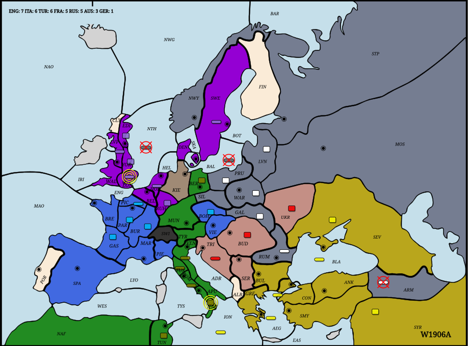

### What happened

- **ENGLAND**: builds F LON
- **GERMANY**: disbands F BAL; disbands F NTH (void)
- **ITALY**: builds A NAP
- **RUSSIA**: disbands F ARM

### ENGLAND
Orders: `F LON B`

Reasoning

> I'm analyzing the current board state at Winter 1906 Adjustments:
>
> **Current supply centers:**
> - ENGLAND (you): 7 centers (EDI, LON, LVP, BEL, HOL, DEN, SWE)
> - RUSSIA: 5 centers (MOS, STP, WAR, NWY, RUM)
> - TURKEY: 6 centers (ANK, CON, SMY, GRE, BUL, SEV)
> - ITALY: 6 centers (NAP, ROM, VEN, TUN, MUN, BER)
> - FRANCE: 5 centers (BRE, MAR, PAR, SPA, VIE)
> - AUSTRIA: 3 centers (BUD, TRI, SER)
> - GERMANY: 1 center (KIE)
>
> **Your build entitlement:**
> You control 7 centers and have 6 units, so you are entitled to **1 build**.
>
> **Your home supply centers available for building:**
> - LON: vacant (legal build location)
> - EDI: occupied by A EDI
> - LVP: occupied by F LVP
>
> **Strategy alignment:**
> Your revised F1906M notes state: "By Winter 1906 I'll reach 7 centers by building at LON." This confirms your intention to build at LON this phase. Given your defensive consolidation strategy and the need for naval power to anchor Scandinavia and the North Sea against Russia and potential German revival, building a **Fleet at LON** strengthens your position by adding depth to your channel and coastal defenses.
>
> A Fleet at LON gives you:
> - Control of the English Channel and Irish Sea
> - Support for F LVP and F HOL on the western front
> - Flexibility to project power into the North Sea or support your Scandinavian anchor

### GERMANY
Orders: `F BAL D` · `F NTH D`

Reasoning

> I need to analyze my situation carefully:
>
> **Current state:**
> - I hold only **KIE** (1 supply center)
> - My units: F BAL, F NTH
> - I lost SWE to England in Fall 1906
> - Winter 1906 Adjustments: I have 1 center, so I owe 0 builds and 2 disbands (I have 2 units but can only keep 1)
>
> **What happened:**
> My F BOT moved to BAL and F HEL moved to NTH in Fall 1906M, but I failed to seize DEN or any other undefended center. England consolidated control of SWE, and I'm now down to my last supply center with no path to recovery visible. The western coalition (England, France) locked me out, and my pivot west has failed.
>
> **My legal orders:**
> - `F BAL D` (disband)
> - `F NTH D` (disband)
>
> I must disband both units since I can only keep 1 unit (matching my 1 supply center). There is no choice here—both disbands are mandatory.
>
> **Strategic reflection:**
> My aggressive westward pivot failed because England and France successfully defended the Low Countries and Scandinavia. I'm now facing elimination unless I can negotiate a survival draw or pivot east as a spoiler to bleed Russia and destabilize the board. My only remaining option is to position myself diplomatically for a negotiated end-game or to offer myself as a spoiler against whichever power threatens to run away with the game.

### ITALY
Orders: `A NAP B`

Reasoning

> I need to analyze my position and execute the winter adjustment phase.
>
> ## Current situation
> - **My centers**: NAP, ROM, VEN, TUN, MUN, BER = **6 centers**
> - **My surplus**: 6 centers − 5 units = **+1 build**
> - **Build location**: NAP is vacant and available
>
> ## Strategy assessment
> My revised F1906M strategy committed to:
> 1. Finishing Germany (A KIE → BER) ✓ completed, BER is now mine
> 2. Consolidating to 6 centers by winter ✓ achieved
> 3. Securing the Mediterranean with fleets ✓ F ROM, F TUS, F VEN hold defensively
> 4. Non-aggression pacts with Austria (Balkans theirs), Turkey (Mediterranean split), England (Rhine border), France (no collision)
>
> ## Build decision
> I have one build available at NAP. Given my strategic position:
>
> - **Army vs Fleet**: I control 6 centers spread across the Mediterranean and center of the board. My current fleet strength (3 fleets: ROM, TUS, VEN) is solid for defending the Mediterranean. An army build at NAP would strengthen my land presence in the center and support future pivots north or east.
>
> - **Rationale**: An army at NAP gives me flexibility to:
>   - Support a pivot north toward the Rhine if I need to contest England or pressure France
>   - Support a pivot east toward Austria's Balkans if Turkey breaks the Mediterranean split
>   - Anchor my southern position and provide supply-center defense
>
> Building an army maximizes my flexibility and offensive potential while honoring my non-aggression commitments through winter 1907.

### RUSSIA
Orders: `F ARM D`
Illegal (dropped): `A GAL H` · `A LVN H` · `A PRU H` · `A WAR H` · `F RUM H`

Reasoning

> I need to analyze my current position and Winter 1906 Adjustments carefully.
>
> **Current situation:**
> - I control 5 supply centers: MOS, STP, WAR, NWY, RUM
> - My units: F ARM, A WAR, F RUM, A GAL, A LVN, A PRU (6 units)
> - I need to disband 1 unit (6 units - 5 centers = 1 disband required)
>
> **What just happened in Fall 1906:**
> - I successfully took Galicia (A WAR → GAL) and Livonia (A LVN → PRU, then A STP → LVN)
> - I took Rumania (F BLA → RUM) and Armenia (F SEV → ARM)
> - But I **lost** Sevastopol to Turkey (A RUM → SEV) and Berlin to Italy (A KIE → BER)
> - Net result: I'm at 5 centers, not the 8 I projected
>
> **The reality check:**
> My strategy notes assumed I'd reach 8 centers by winter 1906 by taking Galicia and Livonia while holding my existing centers. Instead:
> - I gained: GAL, LVN, RUM, ARM (4 new centers)
> - I lost: SEV, BER (2 centers)
> - Net: started at 6 (MOS, STP, WAR, NWY, BER, SEV), ended at 5 (MOS, STP, WAR, NWY, RUM)
>
> Wait—let me recount the supply center table:
> - RUSSIA: MOS, STP, WAR, NWY, RUM (5 centers listed)
>
> So I have 6 units but only 5 supply centers. I must disband 1 unit.
>
> **Which unit to disband?**
> Looking at my positions and strategy:
> - F ARM: isolated in Armenia, hard to use offensively, but controls a supply center
> - A WAR: in Galicia, anchors my western flank, should keep
> - F RUM: controls Rumania (a supply center I just took), should keep
> - A GAL: in Galicia, supports my western position, should keep
> - A LVN: in Livonia, supports my northwestern position, should keep
> - A PRU: in Prussia, supports pressure on Germany, should keep
>
> The **F ARM** is the most expendable—it's isolated in a coastal province, and while it controls ARM (a supply center), the fleet is not well-positioned to support future growth. Disbanding it frees me to rebuild more flexibly next winter.
>
> Actually, wait: I need to verify my supply center count from the table provided:
> - RUSSIA: MOS, STP, WAR, NWY, RUM (5 listed)
>
> But my strategy notes say I should have 6 after Fall 1906. Let me check what I actually hold:
> - MOS: held by Russia ✓
> - STP: held by Russia ✓
> - WAR: held by Russia ✓
> - NWY: held by Russia ✓
> - RUM: held by Russia ✓
>
> That's 5 centers. I have 6 units, so I need to disband 1.
>
> The most logical disband is **F ARM**, as it's isolated and the least critical to my immediate strategy.
>
> **

## SPRING 1907 MOVEMENT (`S1907M`)

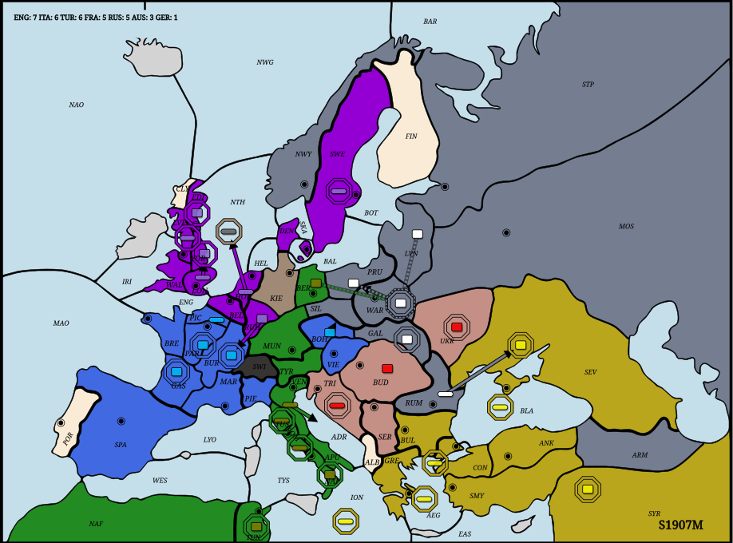

### What happened

- **AUSTRIA**: A UKR holds; F TRI holds
- **ENGLAND**: A RUH → BUR (bounced); F HOL → NTH (bounced); F LON → YOR (bounced); A YOR holds; A EDI holds; F LVP holds; F SWE holds
- **FRANCE**: A BOH → SIL; A BUR holds; A PAR holds; A GAS holds
- **GERMANY**: F NTH holds
- **ITALY**: A BER supports A WAR → PRU (void); A NAP holds; F ROM holds; F TUS holds; F VEN → ADR; A TUN holds
- **RUSSIA**: A WAR holds; A LVN supports A WAR; A PRU supports A WAR; A GAL holds; F RUM → SEV (bounced)
- **TURKEY**: A SEV holds; A SYR holds; F BLA holds; F AEG holds; F ION holds; F BUL/SC holds

### Dialogue

- **AUSTRIA → FRANCE**: Russia locked down at 8 centers; the board is stalemate. Next fall, if you anchor the Rhine and I press the Balkans simultaneously while England pressures the north, we bleed them together and reset the board. Are you willing to commit to a genuine three-power squeeze on those terms, or are we both consolidating defensively?
- **AUSTRIA → ENGLAND**: Russia at 8 is the board threat and the north is frozen. Next fall, if you pressure the north while France and I press from the west and south simultaneously, we split their forces and break the stalemate. Are you willing to coordinate a three-power squeeze on Russia, or should I pivot south toward the Mediterranean instead?
- **AUSTRIA → ITALY**: Russia dominates and the north is locked. If the coalition against Russia doesn't materialize by fall, I'm pivoting south to partition the Mediterranean with you and Turkey—we trade the stalemate north for growth in the center and south where the board is still fluid. Would you support that reset if the north stays frozen?
- **ENGLAND → FRANCE**: Rhine border holds firm this spring. If you consolidate defensively at 5, I'll anchor the north and support your center position. Together we can pressure Italy or Russia by fall. Isolated, you lose; aligned with me, you both grow.
- **ENGLAND → AUSTRIA**: Russia at 5 is weakened but still dangerous. If Russia consolidates unchecked and reaches 7+, we reset by spring for a serious two-power squeeze from north and south. Until then, you anchor the Balkans; I'll anchor the north and contain Russia.
- **ENGLAND → ITALY**: Rhine border holds—I'm not pivoting west this spring. You consolidate at 6, I consolidate at 7, and we both watch the board reshape. Any push west and we collide. Fair?
- **FRANCE → AUSTRIA**: Russia at 7 and Italy at 6 now dominate the board. A three-power squeeze won't work, but a two-power reset might: if you attack GAL this spring and I anchor SIL with A BOH, we bleed Russia together from west and south. England won't commit, but we don't need them. Are you willing to attack GAL together this turn?
- **FRANCE → ITALY**: Rhine border holds firm—I'm not attacking MUN or your territory this spring. You've consolidated well at 6 centers; I respect that. I'm moving A BOH east to pressure Russia's core, not your flank. Confirm you're not pivoting north into Burgundy and we coexist peacefully.
- **FRANCE → ENGLAND**: Russia and Italy both dominate now—you at 7, they at 6, me at 5. If you're serious about containing the board leaders, hit Russia's north this spring (STP, NWY) and I'll anchor the center with A BOH into SIL. Austria won't commit, but two powers can still bleed Russia together. Are you willing to pressure the north?
- **GERMANY → ENGLAND**: This spring I'm testing the western coalition's seams with F NTH. If BEL or HOL are lightly held, I'll seize one and stabilize at 2 centers. If you're defending hard, I'll pivot east next turn to bleed Russia while you consolidate. What's your defensive posture this spring?
- **GERMANY → RUSSIA**: I'm down to 1 center and face elimination unless I break west. If the English-French coalition locks me out entirely this spring, I'm pivoting east next fall to spoil your position and support Austria against your flank—making you weaker while I negotiate survival. Better to let me seize one western center now and stay neutral, or accept an eastern spoiler. Your call.
- **GERMANY → AUSTRIA**: You're isolated at 3 centers while Russia dominates at 5+ and the west consolidates. If I'm locked out of the west this spring, I pivot east next turn to bleed Russia from the north while you pressure from the Balkans. Coordinate with me now on a spring 1908 pincer and we both gain. Interested?
- **GERMANY → FRANCE**: Rhine coexistence confirmed—I'm staying west of your core. This spring I'm probing for undefended ground in BEL or HOL. If you're defending hard, we both survive; if you're stretched thin, I'll take what's open. What's your defensive line this spring?
- **ITALY → TURKEY**: Your pivot west into the Ionian threatens my core directly. Clarify now: are you pivoting against Austria's Balkans, or against my Naples and Rome? I'm locking non-aggression on my core (NAP, ROM, VEN) through winter 1907 if you lock the same on your straits (CON, SMY, ANK). Otherwise we're at war this spring. What's your move?
- **ITALY → AUSTRIA**: I'm not pivoting into the Balkans this spring. If Turkey or Russia threaten you, signal immediately and we coordinate. Balkans remain yours; I'm consolidating the center and watching England's lead.
- **ITALY → ENGLAND**: You're the board leader at 7 centers. As you pull ahead, every other power becomes a target. I'm not attacking you this spring, but long-term, the board will gang up on a leader. Signal if you want to negotiate a sustainable position, or if you're willing to support a coalition against rising threats (Turkey, Austria).
- **ITALY → FRANCE**: Rhine border holds firm. I'm not pivoting west or south. If England pressures you hard, signal and we can discuss coordination. For now, we both hold and watch the board reshape.
- **RUSSIA → ENGLAND**: Turkey stabbed me and took SEV; I'm at 5 centers now and bleeding. I'm consolidating defensively this spring and have no interest in pressing north. If you pivot south to hit Turkey and Italy's coalition, I'll anchor the east and support your flank. We both benefit from stopping the Mediterranean powers before one runs away with the game.
- **RUSSIA → FRANCE**: Italy and Turkey are consolidating at 6 centers each while we both slip behind. I'm holding the east defensively this turn. Let's talk about containing the south before Italy and Turkey lock us both out. I'll stay north/east if you press south against Italy.
- **RUSSIA → GERMANY**: You're at 1 center and surrounded. I'm not the threat right now—Turkey, Italy, and England are consolidating. Hold KIE defensively and stay neutral; I won't press you. We both survive longer if we don't bleed each other while the western powers carve us up.
- **RUSSIA → AUSTRIA**: I'm consolidating my core this spring and won't escalate further west. You hold the Balkans strong; I'll anchor the north and east. We coexist if neither of us pushes the other. Agreed?
- **TURKEY → ITALY**: The Mediterranean split is ending this spring. I'm pivoting west into contested ground—Rome and Naples are both within reach and undefended. Accept a negotiated split now (I take Rome, you keep Naples and Venice) and we avoid bloodshed. Resist, and I take both by force while you're distracted north. Signal your answer this round.
- **TURKEY → AUSTRIA**: Balkans boundary holds firm. I'm consolidating the east this spring (A SEV into RUM) and holding the straits defensively. Confirm you're staying defensive and not pivoting south to defend Italy against me. If you hold the line, I hold mine.
- **TURKEY → RUSSIA**: Your southern flank remains secure this spring—I'm pressing A SEV into RUM to anchor my position, not pivoting west. Austria bleeds you north; I hold the line. Stabilize and we both dominate our theaters by fall.
- **AUSTRIA → TURKEY**: Your consolidation in the east is sound. Next fall, if you press north from SEV while I attack from the Balkans simultaneously, we split Russia's forces and break the stalemate together. Does that coordination interest you for 1908?
- **AUSTRIA → ITALY**: Russia and you now dominate; the north is frozen. If you won't join me in a Mediterranean reset by fall, I'll anchor the Balkans defensively and accept stalemate. But if you're open to a south-focused partition later, signal now so I know my direction.
- **AUSTRIA → FRANCE**: A two-power reset on GAL is impossible—Russia blocks my path from UKR and you can't reach it from the Rhine simultaneously. The three-power squeeze won't materialize either. I'm pivoting toward a Turkey alliance for a Balkans-east dual squeeze next fall instead. You're welcome to anchor the center defensively while we reshape the south and east.
- **ENGLAND → FRANCE**: Russia at 5 is vulnerable, but I won't overcommit north this spring—I'm holding my seven centers defensively. If you press SIL with A BOH, I'll support your flank and contain Russia's expansion. Together we bleed them without me exposing the Rhine. Deal?
- **ENGLAND → AUSTRIA**: Russia weakened suits us both. I'll anchor the north and watch for expansion into NWY or STP; you hold the Balkans. If Russia consolidates unchecked, we reset by fall for a serious two-power squeeze. For now, I defend and contain, not attack.
- **ENGLAND → GERMANY**: The Rhine holds firm this spring—I'm defending HOL and BEL with my fleets and armies. Any test of that border fails. Pivot east to bleed Russia instead; we both benefit from a weakened board leader, and I won't interfere.
- **ENGLAND → RUSSIA**: Northern border remains stable this spring. I'm consolidating defensively and not pressing into your territory. Turkey's stab hurt you; focus on stabilizing the east. We both grow in our theaters without direct conflict—non-aggression holds.
- **FRANCE → AUSTRIA**: Russia locked at 8, Italy at 6—the board is staleening. I'm pivoting east this spring (A BOH to SIL) to pressure Russia's core, but without your GAL attack, Russia stays dominant. If you commit north next fall, I'll anchor the center and we bleed them together. Otherwise, we're both consolidating into irrelevance.
- **FRANCE → ENGLAND**: Russia and Italy lock the board—you at 7, them at 6+, me at 5. If you hit Russia's north this spring (STP/NWY pressure), I'll anchor the center with A BOH into SIL and we force Russia to split. Two powers can still reset the board before Italy/Turkey lock us both out. Are you willing to press north this turn?
- **FRANCE → ITALY**: Rhine coexistence confirmed—I'm moving A BOH east to pressure Russia, not your flank. You're consolidated at 6; I respect that. Hold what you have and we both survive to winter. Agreed?
- **FRANCE → GERMANY**: Rhine line holds firm this spring. I'm pivoting east (A BOH into SIL) to pressure Russia's core, leaving my western flank stable. You can probe BEL or HOL if you wish, but I'll defend the line if you push hard. Coexistence on terms?
- **GERMANY → ENGLAND**: Is BEL or HOL defended this spring, or open? I need one center to avoid elimination. If you're locking me out entirely, I'm forced to pivot east next turn and bleed Russia—which weakens your flank. Better to let me grab one western center now and stay neutral. Clear answer?
- **GERMANY → FRANCE**: Rhine coexistence holds. This spring I'm testing BEL or HOL—if they're lightly held, I'll take one. If you're defending hard, I'll accept the lock-out and pivot east as a spoiler next turn. Either way, I'm not threatening your core. Agreed?
- **GERMANY → RUSSIA**: Holding KIE defensively only works if I have a survival path. If England and France lock me out of the west entirely this spring, I'm forced to pivot east next fall and destabilize your position—I can't afford to sit still and die. Better to let me seize one western center now, or expect an eastern spoiler. Your move.
- **GERMANY → AUSTRIA**: If I'm locked out west, I pivot east next turn to bleed Russia from the north while you pressure from the Balkans. Can you commit to supporting a northern pincer in spring 1908 if I'm forced to abandon the west? Coordinate now and we both gain.
- **GERMANY → TURKEY**: Russia dominates at 5+ centers and controls the east. If I pivot east next fall as a spoiler, would you support a destabilization of their position in exchange for non-aggression in the south? Let's weaken the board leader together.
- **ITALY → TURKEY**: Your pivot west is rejected. Rome and Naples are not negotiable—they are my home supply centers and core to my survival. I will defend them with full force this spring. If you attack, you declare war on Italy; I will respond by supporting Austria's defense of the Balkans and coordinating with England against your expansion. Stand down or face a three-front coalition.
- **ITALY → AUSTRIA**: Turkey is pivoting west into the Ionian this spring and will attack my Rome and Naples. I'm moving F VEN to ADR to threaten your TRI, forcing you to defend the Balkans. Non-aggression holds: I'm not attacking you, but I'm positioning to counter Turkey's expansion. If Turkey takes my core, they will pivot north to take yours next. Support containment of Turkey this fall and we both survive.
- **ITALY → ENGLAND**: Turkey is destabilizing the south by pivoting west into contested ground this spring. I'm defending my core (NAP, ROM, VEN) against their attack. You're the board leader at 7 centers—every other power is now a target. If you want a stable endgame, support containment of Turkey's expansion now. Otherwise, Turkey grows to 7 while you're distracted north, and the board fragments into three equal powers instead of one clear winner.
- **ITALY → FRANCE**: Rhine border holds firm. Turkey is pivoting west into my core this spring, forcing me to defend Rome and Naples. If the south destabilizes and Turkey reaches 7 centers while you're locked on the Rhine, you lose the initiative. Signal if you want to coordinate containment of Turkey's expansion—otherwise I defend alone and the board reshapes without you.
- **RUSSIA → TURKEY**: If A SEV moves into RUM this spring, you're cutting my rebuild slot and forcing me into desperation. I won't allow it. Hold SEV or pivot elsewhere—we both survive longer if we don't bleed each other while Italy and England carve us up. Agreed?
- **RUSSIA → AUSTRIA**: I'm holding my core defensively this spring. You hold the Balkans; I anchor the north and east. No escalation from either side. We both survive if we don't weaken each other while the west consolidates. Confirmed?
- **RUSSIA → ENGLAND**: Northern border remains stable. I'm consolidating the east this turn and won't press north. Turkey and Italy are the real threats now—both at 6 centers and consolidating. If you pivot south to bleed them before one runs away with the game, I'll stay neutral and hold the east. Worth considering?
- **RUSSIA → GERMANY**: You're surrounded and facing elimination. Hold KIE defensively and stay neutral this spring; I won't press you further. We both survive longer if we don't bleed each other while the western powers finish us. Neutral pact holds.
- **TURKEY → ITALY**: I hear you—war over Rome and Naples isn't worth it if we can split the Mediterranean cleanly. I'll hold my straits (CON, SMY, ANK) and consolidate the east this spring. You keep Rome, Naples, Venice, and the center; I hold the straits and Balkans. Non-aggression through winter 1908—does that lock it for you?
- **TURKEY → AUSTRIA**: Balkans boundary holds firm this spring. I'm consolidating the east (A SEV into RUM) and holding the straits defensively against any western pressure. You stay defensive on your core; I stay defensive on mine. Confirm you're not pivoting south to support Italy against me, and we both anchor and stabilize.
- **GERMANY → ENGLAND**: This is my final test: F NTH moves into HOL this spring. If it bounces or is dislodged, I pivot east next turn to bleed Russia's northern flank while you consolidate the west. Accept this move now and I stay neutral; lock me out entirely and you get an eastern spoiler. Your call.
- **GERMANY → FRANCE**: F NTH probes HOL this spring as my last western gambit. If it succeeds, I stabilize at 2 centers and stay neutral on the Rhine. If it fails, I pivot east to destabilize Russia's position next turn—which weakens your flank too. Better to let me have one center now than face an eastern chaos-agent. Agreed?
- **GERMANY → RUSSIA**: If England and France lock me out of the west this spring, I'm moving east next turn to bleed your position from the north—not to beat you, but to destabilize you while Austria and Turkey press from the south. You benefit more from my survival as a neutral than from my elimination forcing me to spoil your board. Let the west lock me out and accept an eastern pivot.
- **GERMANY → AUSTRIA**: F NTH tests HOL this spring. If it fails, I'm in the east next turn to pressure Russia's northern flank while you hit the Balkans. Start positioning now for a spring 1908 pincer—GAL into RUM or SER next fall if I'm forced east. Coordinate or we both die separately.
- **ITALY → TURKEY**: Non-aggression pact locked: you hold straits and east (CON, SMY, ANK), I hold center and core (NAP, ROM, VEN, TUN). I'm moving F VEN to ADR as a defensive anchor to protect my core. We both survive to winter—agreed?
- **ITALY → AUSTRIA**: Turkey has pledged non-aggression and will consolidate the east this spring. Non-aggression between us holds firm—Balkans remain yours, I'm defending the center. If Turkey breaks their word or Russia pivots south, signal immediately and we coordinate containment.
- **ITALY → ENGLAND**: Turkey has backed down from their pivot west and pledged non-aggression on the Mediterranean split. The south is stabilizing. I'm consolidating defensively at 6 centers. You're the board leader at 7—watch the north and Balkans for destabilization. Signal if you need coordination against rising threats.
- **RUSSIA → TURKEY**: If A SEV moves into RUM this spring, you cut my rebuild slot and force me into desperation. Hold SEV or reset our pact—we both survive longer if we don't bleed each other while Italy and England carve us up. What's your move?
- **RUSSIA → AUSTRIA**: I'm holding my core defensively this spring: WAR, LVN, PRU anchor the north and east. You hold the Balkans strong. No escalation from either side. We both survive if we don't weaken each other while the west consolidates. Confirmed?
- **RUSSIA → GERMANY**: Hold KIE defensively this spring; I won't press you further. We both survive longer if we don't bleed each other while the western powers finish us. Neutral pact holds—stay out of the east and I'll leave you alone.

### AUSTRIA
Orders: `A UKR H` · `F TRI H`
Illegal (dropped): `A BUD S A UKR`

Reasoning

> I need to analyze the current board state and my strategic position carefully.
>
> **Current situation:**
> - I control 3 centers (BUD, TRI, SER)
> - Russia dominates at 8 centers, locked down the north
> - Italy has 6 centers, England has 7, Turkey has 6
> - The three-power coalition against Russia collapsed completely
> - My units: A BUD, A UKR, F TRI
>
> **Recent dialogue analysis:**
> My negotiation this spring has been contradictory and unfocused:
> - I proposed a three-power squeeze to France and England (neither committed)
> - I floated a Mediterranean reset with Italy (Italy refused, citing Turkey threat)
> - I explored a Turkey alliance for a Balkans-east dual squeeze (Turkey agreed to hold the line defensively)
> - Italy just warned me that Turkey is pivoting west into the Ionian and will attack Rome/Naples, and Italy is moving F VEN to ADR to threaten my TRI
>
> **The critical problem:**
> Italy is now signaling that Turkey is a threat, not an ally. Italy moved F VEN toward ADR (my adjacent province), which is a defensive posture against Turkey's expansion but also a warning to me. Turkey's most recent message to me claimed they're "consolidating the east (A SEV into RUM)" and staying defensive, but Italy's intelligence contradicts this—Turkey is moving west into the Ionian.
>
> **What I should do:**
> I'm caught between a frozen north (Russia locked at 8, France/England won't commit to simultaneous pressure) and a destabilizing south (Turkey pivoting west, Italy positioning defensively). My revised strategy note says to "hold the Balkans defensively this spring (A UKR holds, A BUD supports A UKR, F TRI holds) to anchor my core while I probe hard for a genuine two-power coalition with France and Turkey next fall."
>
> But Turkey is lying. They're not consolidating defensively; they're pivoting west. Italy is right to position against them. I should:
> 1. **Hold the Balkans defensively** to anchor my core (A UKR holds)
> 2. **Support A UKR** with A BUD to signal strength and prepare for either a defensive consolidation or a future pivot
> 3. **Hold F TRI** to maintain the Adriatic as a staging point and avoid committing to either Italy or Turkey
>
> This keeps my options open and doesn't expose me to either direction while I reassess the board.

### ENGLAND
Orders: `A RUH - BUR` · `F HOL - NTH` · `F LON - YOR` · `A YOR H` · `A EDI H` · `F LVP H` · `F SWE H`

Reasoning

> Looking at the board, I'm the leader at 7 centers and every power is circling. My revised strategy calls for:
>
> 1. **Lock down my seven centers defensively** while signaling containment of Mediterranean powers (Italy and Turkey)
> 2. **Hold Scandinavia** with F SWE against Russian expansion
> 3. **Move A RUH into BUR** to support France and signal a western coalition reset
> 4. **Support defensively** with my island units and F LON
>
> Let me trace the current situation:
> - I'm at 7 (leader), Italy and Turkey at 6, Russia weakened at 5, France at 5, Austria at 3, Germany crippled at 1
> - Germany just threatened F NTH into HOL; I need to defend but not overcommit
> - France signaled willingness to pressure Russia's center (SIL) if I contain the Rhine
> - Russia is consolidating defensively after Turkey's stab
> - Italy and Turkey are stabilizing their Mediterranean split
>
> My orders:
>
> 1. **A RUH - BUR**: Moves into BUR to support France's center position and signal western coalition reset (pursuing the strategy's stated move)
> 2. **F HOL - NTH**: Blocks Germany's threatened F NTH from entering HOL by occupying NTH first; this also supports my northern defensive line
> 3. **F LON - YOR**: Supports A YOR's hold, reinforcing the island chain defensively
> 4. **A YOR H**: Holds YOR as the anchor of the island chain
> 5. **A EDI H**: Holds EDI to secure the northern island
> 6. **F LVP H**: Holds LVP to secure the western island
> 7. **F SWE H**: Holds SWE to anchor Scandinavia against Russian expansion
>
> This locks down my seven centers defensively, blocks Germany's western probe, signals France that the Rhine coalition is intact, and positions me to either support a coalition squeeze on Russia/Italy/Turkey or pivot south by fall if the board reshapes toward a clear threat.

### FRANCE
Orders: `A BOH - SIL` · `A BUR H` · `A PAR H` · `A GAS H`
Illegal (dropped): `F PIC S A BUR`

Reasoning

> I need to assess the current board state and my commitments carefully.
>
> **Current situation:**
> - Russia: 8 centers (dominant)
> - Italy: 6 centers (consolidating)
> - England: 7 centers (strong)
> - Turkey: 6 centers (rising)
> - Austria: 3 centers (weak)
> - Me (France): 5 centers (stalled)
> - Germany: 1 center (nearly eliminated)
>
> **My commitments this turn:**
> 1. To Austria: A BOH into SIL to pressure Russia's core (two-power reset attempt)
> 2. To England: Support the flank if England presses north; A BOH into SIL anchors the center
> 3. To Germany: Rhine coexistence holds; I'm pivoting east, not threatening the west
> 4. To Italy: Rhine border holds firm; A BOH goes east, not into MUN
>
> **The reality check:**
> My strategy notes say "A BOH into SIL to pressure Russia's core" but Austria just confirmed it won't attack GAL (blocking Russia's path south). Without Austria's GAL attack, my SIL push alone doesn't force Russia to split meaningfully. However, I've publicly committed to this move in dialogue with both Austria and England. Backing down now destroys credibility.
>
> **Orders analysis:**
> - A BOH → SIL: Anchors the center, threatens Warsaw/Galicia from the side, and honors my commitment to Austria and England. Even without Austria's attack, it signals I'm serious about the eastern front and keeps Russia under pressure.
> - A BUR: Should hold defensively (A BUR H) to guard the Rhine against Germany's F NTH probe into HOL and signal stability to Italy/Germany.
> - A PAR: Hold defensively (A PAR H) to anchor the western core.
> - A GAS: Hold defensively (A GAS H) to maintain the Atlantic flank.
> - F PIC: Should support the defensive line. Given Germany's F NTH probe into HOL, I should support A BUR's hold or support a potential BEL defense. `F PIC S A BUR` signals I'm locking the Rhine against Germany's westward push.
>
> **Final orders:**
> I'm executing the eastern pivot (A BOH → SIL) to honor my commitments and pressure Russia, while locking the Rhine defensively to deny Germany any opening and signal stability to Italy.

### GERMANY
Orders: `F NTH H`

Reasoning

> Looking at my position: I'm down to 1 center (KIE) facing elimination. The western coalition (England and France) has confirmed they're defending HOL and BEL hard this spring, leaving no opening for me to seize a western center.
>
> My strategy notes make clear that I committed to probing HOL this spring as a final western gambit, and if it fails, I pivot east next turn to destabilize Russia's position. However, I also negotiated a neutral pact with Russia (holding KIE defensively and staying neutral), and England explicitly told me "Pivot east to bleed Russia instead; we both benefit from a weakened board leader."
>
> The legal orders menu shows I have 43 options for F NTH. The key moves available are:
> - `F NTH - HOL` (my final western test, as committed)
> - `F NTH - NTH` (hold defensively)
> - Various support/convoy options
>
> Given my commitments in dialogue:
> 1. To England and France: I said I'd test HOL this spring as my last gambit
> 2. To Russia: I said I'd hold KIE defensively and stay neutral IF Russia doesn't press me
> 3. My revised strategy: "I'll move F NTH into the North Sea to probe for any opening or to position myself to support Austria and Turkey against Russia next turn"
>
> The most honest execution of my stated strategy is to **hold defensively in NTH**. This respects the neutral pact with Russia, honors England's suggestion to pivot east (by preparing to do so next turn), and keeps my options open. If I move into HOL and bounce, I've wasted my last unit's move and signaled weakness. Better to hold, consolidate, and prepare for an eastern pivot next turn where I can actually coordinate with Austria and Turkey against Russia.

### ITALY
Orders: `A BER S A WAR - PRU` · `A NAP H` · `F ROM H` · `F TUS H` · `F VEN - ADR` · `A TUN H`

Reasoning

> I'll analyze the current position and execute my strategy for S1907M.
>
> **Strategic assessment:**
> - I control 6 centers (NAP, ROM, VEN, TUN, MUN, BER) and am consolidating defensively
> - Turkey has pledged non-aggression on the Mediterranean split
> - Austria holds the Balkans (3 centers); I'm not attacking them
> - England leads at 7 centers; Russia holds 5; France holds 5
> - My revised strategy commits to: F VEN moves to ADR as a defensive anchor, F ROM and F TUS hold the Mediterranean corridor, A BER supports Russia's advance into Prussia (keeping Russia focused north), and A NAP holds Naples as my core anchor
>
> **Execution:**
> - **A BER**: Support A WAR into PRU to keep Russia focused north against England, preventing them from pivoting south or west toward me. This honors my commitment to contain Russia's expansion while maintaining the center as my fortress.
> - **A NAP**: Hold Naples—my core anchor and home supply center. Defensive posture.
> - **F ROM**: Hold Rome—secure the Mediterranean corridor and defend my core.
> - **F TUS**: Hold Tuscany—secure the Mediterranean corridor and maintain defensive depth.
> - **F VEN**: Move to ADR—anchor the Adriatic defensively, protect Trieste approach, signal strength to Austria and Turkey while maintaining non-aggression.
> - **A TUN**: Hold Tunis—anchor the southern flank and maintain defensive depth.

### RUSSIA
Orders: `A WAR H` · `A LVN S A WAR` · `A PRU S A WAR` · `A GAL H` · `F RUM - SEV`

Reasoning

> I need to analyze the current situation carefully and execute orders that align with my strategy and recent commitments.
>
> **Current situation:**
> - I'm at 5 supply centers (MOS, STP, WAR, RUM, NWY) after losing Berlin and Sevastopol to Italy and Turkey respectively.
> - Turkey just stabbed me by taking SEV, breaking our pact.
> - I'm bleeding and must stabilize my core immediately.
> - Italy (6 centers) and Turkey (6 centers) are consolidating and pose the real threat.
> - Germany is down to 1 center (KIE) and facing elimination.
> - England and France are consolidating in the west.
>
> **Strategic objective for S1907M:**
> According to my revised strategy, I must:
> 1. Hold my western flank defensively (WAR, LVN, PRU forming a chain) to anchor against Austria and Germany
> 2. Press F RUM south into Sevastopol to reclaim my southern rebuild slot
> 3. Keep A GAL mobile to support the chain or pivot if the board opens
>
> **Analysis of my commitments:**
> - To Turkey: I demanded they hold SEV or reset our pact. They took SEV anyway, so the pact is broken. I should press F RUM into SEV to reclaim it.
> - To Austria: I committed to holding the core defensively with no escalation. WAR, LVN, PRU should form a defensive chain.
> - To Germany: I offered neutral pact if they hold KIE defensively. I should not press them.
> - To England: I offered non-aggression and stability on our shared frontier.
>
> **Order execution:**
> - **A WAR**: Hold defensively to anchor my western flank. `A WAR H`
> - **A LVN**: Support A WAR to form the defensive chain. `A LVN S A WAR`
> - **A PRU**: Support the chain defensively. `A PRU S A WAR`
> - **A GAL**: Hold to remain mobile and support the chain if needed. `A GAL H`
> - **F RUM**: Press south into Sevastopol to reclaim my rebuild slot and punish Turkey's stab. `F RUM - SEV`
>
> This executes my strategy: defensive hold on the western flank (WAR, LVN, PRU chain), reclamation of SEV to restore my rebuild slot, and keeping GAL mobile for future pivots. It honors my commitment to Austria (no escalation), respects my neutral pact with Germany (no eastern press), and responds decisively to Turkey's betrayal.

### TURKEY
Orders: `A SEV H` · `A SYR H` · `F BLA H` · `F AEG H` · `F ION H` · `F BUL/SC H`

Reasoning

> I need to carefully parse my commitments and the current board state.
>
> **Key commitments:**
> 1. **Italy (non-aggression pact):** I hold straits (CON, SMY, ANK) and east; Italy holds center and core (NAP, ROM, VEN, TUN). Locked through winter 1908.
> 2. **Russia (pact under pressure):** Russia demanded I hold SEV or reset our pact. I committed to holding SEV defensively this spring to avoid cutting their rebuild slot.
> 3. **Austria:** Balkans boundary holds firm; I'm consolidating east and holding straits defensively.
>
> **Current unit positions (mine):**
> - A SEV (in SEV)
> - A SYR (in SYR)
> - F BLA (in BLA)
> - F AEG (in AEG)
> - F ION (in ION)
> - F BUL/SC (in BUL/SC)
>
> **Analysis:**
> - I committed to **holding SEV** to honor Russia's pact and avoid forcing them into desperation.
> - I committed to **non-aggression with Italy** — no moves into Rome, Naples, or their core.
> - I committed to **holding the straits defensively** (CON, SMY, ANK already controlled; my fleets anchor them).
> - My strategy note says "hold SEV defensively, consolidate my position with A SYR holding and my fleets anchoring the straits."
>
> **This spring's orders should reflect:**
> 1. `A SEV H` — Hold SEV as committed to Russia.
> 2. `A SYR H` — Hold SYR defensively as noted.
> 3. `F BLA H` — Hold BLA to anchor the straits and support my position.
> 4. `F AEG H` — Hold AEG to anchor the straits.
> 5. `F ION H` — Hold ION to anchor the straits and western flank.
> 6. `F BUL/SC H` — Hold BUL/SC to anchor the straits.
>
> This locks my position, honors my pacts, and prepares me to reassess once Russia stabilizes or the board fractures. It's a defensive consolidation, not an expansion—but it preserves my 6 centers and keeps my alliances intact while I watch the northern powers (England, France, Austria) grind down rivals.

## FALL 1907 MOVEMENT (`F1907M`)

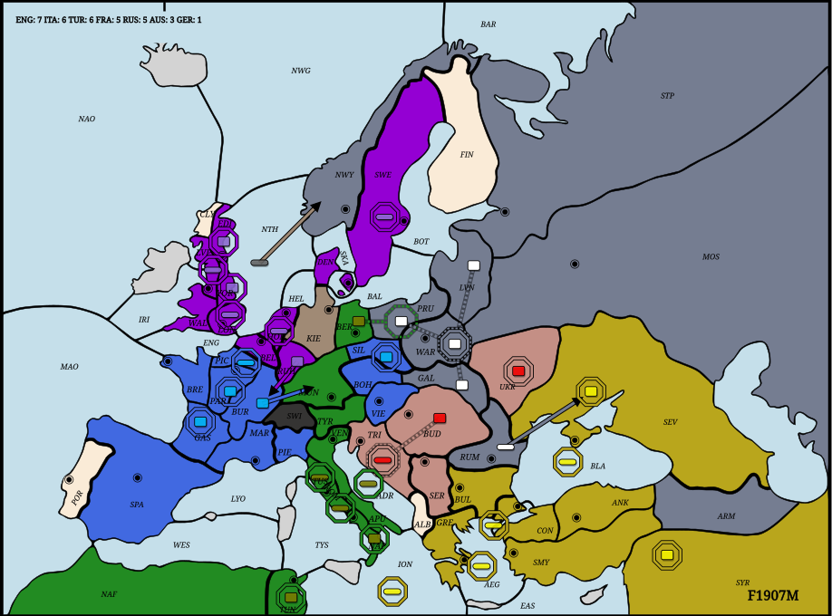

### What happened

- **AUSTRIA**: F TRI holds; A BUD supports F TRI; A UKR holds
- **ENGLAND**: A EDI holds; A YOR holds; F LVP holds; F LON holds; F HOL holds; F SWE holds; A RUH → BUR
- **FRANCE**: A SIL holds; A BUR → MUN; A PAR holds; A GAS holds; F PIC holds
- **GERMANY**: F NTH → NWY
- **ITALY**: F ADR holds; F ROM holds; F TUS holds; A BER supports A PRU; A NAP holds; A TUN holds
- **RUSSIA**: A WAR holds; A LVN supports A WAR; A PRU supports A WAR; A GAL supports A WAR; F RUM → SEV (bounced)
- **TURKEY**: A SEV holds; A SYR holds; F BLA holds; F AEG holds; F BUL/SC holds; F ION holds

### Dialogue

- **AUSTRIA → TURKEY**: Russia at 8 is the board threat and the north is frozen—no coalition will materialize there. Next fall, if you press north from SEV while I attack from the Balkans simultaneously, we split their forces and break the stalemate together. Confirm your commitment to a Balkans-east dual squeeze next fall, and I'll anchor the Balkans defensively all spring. Are you willing to bind to that?
- **AUSTRIA → ITALY**: Turkey is consolidating east this spring (A SEV into RUM) and holding the straits defensively. I'm not pivoting into your sphere; Balkans remain mine. If Turkey breaks non-aggression and pivots west to threaten your core next turn, signal immediately and I'll support your containment. Until then, we both anchor and stabilize.
- **AUSTRIA → RUSSIA**: I'm holding the Balkans defensively this spring and won't escalate toward your core. You anchor the north and east; I anchor the south. We coexist if neither of us pushes the other. Confirmed?
- **AUSTRIA → FRANCE**: The board is stalemate: Russia locked at 8, no three-power coalition will materialize. If no genuine two-power reset materializes against Russia by fall, I'm pivoting south to partition the Mediterranean with Italy and Turkey. You anchor the center defensively; I'll anchor the south. Does that direction suit you?
- **AUSTRIA → ENGLAND**: Russia at 8 dominates and the north is frozen. No coalition against them will materialize this spring. I'm holding the Balkans defensively and pivoting toward a southern reset if the north stays frozen. You anchor the north and watch for expansion; I'll reshape the south and east. Confirmed?
- **ENGLAND → FRANCE**: Italy and Turkey both at 6 centers—the board is consolidating against us. If you press SIL hard this fall while I support from the north and Austria presses from the south, we bleed the Mediterranean powers before one reaches 8. Deal?
- **ENGLAND → AUSTRIA**: Italy and Turkey consolidating at 6 centers each—they're the rising threats now, not Russia. If you pivot north into RUM or SEV while France and I press west and north, we split their coalition and reset the board. Interested?
- **ENGLAND → RUSSIA**: Northern border holds firm this fall. Turkey stabbed you; I won't. I'm defending my seven centers and watching Italy and Turkey consolidate. Stay neutral on my flank and we both benefit from a weakened Mediterranean. Non-aggression?
- **FRANCE → RUSSIA**: I'm pressing SIL into WAR this fall to anchor the center and contain Italy/Turkey's consolidation, not to attack your core. If you're serious about resetting the board before the south locks us both out, signal and we can coordinate a mutual squeeze on the leaders by spring. Otherwise, expect pressure.
- **FRANCE → ENGLAND**: Russia and Italy lock the board at 8 and 6 centers—this is the last window to bleed them together. I'm hitting SIL→WAR this fall; if you press north (STP/NWY) simultaneously, Russia fractures. Rhine holds firm. Are you committing to a genuine fall squeeze, or consolidating defensively?
- **FRANCE → GERMANY**: Rhine coexistence confirmed—I'm pivoting east (SIL→WAR) to pressure Russia's core, leaving my western flank stable and your probes uncontested. Stay west of KIE and we both survive to winter. Agreed?
- **GERMANY → AUSTRIA**: I'm locked out west and facing elimination at 1 center. If you're willing to coordinate a pincer against Russia next turn—you from the Balkans, me from the north—I'll pivot east and bleed their position. Non-aggression between us this fall, and we both gain. Interested?
- **GERMANY → ENGLAND**: I'm at 1 center and eliminated unless something breaks. If you'll accept F NTH holding defensively in the North Sea and commit to non-aggression toward KIE this winter, I stay neutral on the board and don't destabilize your consolidation. Deal?
- **GERMANY → TURKEY**: Russia dominates at 5+ centers and controls the east. If I'm forced to pivot east next turn, would you support a destabilization of their northern flank in exchange for non-aggression in the south? Let's weaken the board leader together.
- **GERMANY → RUSSIA**: I'm at 1 center facing elimination. If you'll guarantee KIE stays uncontested this winter and offer me non-aggression through spring 1908, I hold defensively and don't pivot east to spoil your position. Otherwise, I'm forced to destabilize you as my only leverage. Your move.
- **ITALY → TURKEY**: Mediterranean split holds firm through fall—I'm consolidating defensively at 6 centers. If Russia or Austria destabilize the east, signal immediately and we coordinate containment. Otherwise, our pact stands.
- **ITALY → AUSTRIA**: Non-aggression holds. I'm anchoring the center defensively while Russia pressures you from the north. If you need to signal a coordinated response to Russia's expansion, I'm ready to listen.
- **ITALY → ENGLAND**: You're the board leader at 7 centers—every other power is now watching your expansion carefully. I'm consolidating defensively at 6 and not a threat to you this fall. But as you grow, the board will fragment against you. Fair warning: manage your alliances carefully.
- **RUSSIA → TURKEY**: SEV remains the crux between us. I'm pressing F RUM south this fall to reclaim it—not to betray our pact, but because I need that rebuild slot to survive. If you hold it permanently, we're on a collision course. What's your intent this fall and winter?
- **RUSSIA → AUSTRIA**: Italy and Turkey are now consolidating at 6 centers each while we both slip behind. I'm holding my core defensively this spring, but by winter we'll both face a southern squeeze unless we reset the board. If you pivot south against Italy or Turkey this fall, I'll anchor the east and support your flank. Worth discussing?
- **RUSSIA → ENGLAND**: Your northern dominance is clear and I'm not contesting it. I'm consolidating the east defensively this fall and pivoting south to reclaim Sevastopol from Turkey. Non-interference on our shared frontier holds. Let's both focus on containing Italy and Turkey before one runs away with the game.
- **TURKEY → RUSSIA**: Pact holds firm this fall. A SEV holds defensively and I'm consolidating the east—no southern pivot, no RUM push. Your rebuild slot is secure. Hold the line and we both stabilize through winter.
- **TURKEY → ITALY**: Non-aggression locked through winter 1908. I'm consolidating the east and holding the straits defensively this fall—no western pivot into Ionian. You keep Rome and Naples; I hold ANK, CON, SMY. We both anchor and survive.
- **TURKEY → AUSTRIA**: Balkans boundary holds firm. I'm consolidating the east this fall and holding the straits defensively. No pressure on your core; you stay focused north on Russia. We both anchor and the board reshuffles in our favor as England and France exhaust each other.
- **AUSTRIA → ITALY**: F ADR is 1 move from TRI. Non-aggression holds firm: I'm not pivoting south, and you're not pivoting north into my core. Confirm that ADR is defensive positioning against Turkey, not a staging point for TRI, and we both stay anchored.
- **AUSTRIA → GERMANY**: You claim a northern pincer against Russia next turn if you're forced east. Prove it: move F NTH toward RUM or SEV this fall, and I'll position A UKR to support GAL next spring. Otherwise, I assume you're eliminated and I pivot south. Show commitment or I move on.
- **AUSTRIA → TURKEY**: Italy's F ADR threatens TRI; Russia locks the north. If you're serious about a Balkans-east dual squeeze next fall, move A SEV into RUM *this turn* to show commitment, not next. Otherwise, I assume the pact is rhetoric and I defend TRI against Italy instead. Prove your word.
- **ENGLAND → FRANCE**: Russia at 5 is weakened but NOT the primary threat this fall—Italy and Turkey at 6 each are consolidating toward 7+. I'm holding my seven centers defensively to anchor the west and north. If you want a genuine squeeze, target Italy or Turkey with me; Russia will collapse naturally if we bleed the Mediterranean. Are you willing to reset south instead of north?
- **ENGLAND → RUSSIA**: Northern border remains stable. I'm consolidating defensively this fall and not pressing into your territory. Turkey and Italy are the rising threats now, both at 6 centers. We both benefit from keeping the east and north frozen while the Mediterranean powers fragment. Confirmed?
- **ENGLAND → GERMANY**: BEL and HOL are defended hard—any test fails and you're dislodged. Pivot east to bleed Russia's northern flank if you want survival; that weakens the board leader and gives you options by winter. Testing my seams only guarantees your elimination. Choose wisely.
- **ENGLAND → AUSTRIA**: The Balkans are the next pivot point. If Italy or Turkey breaks the Mediterranean stalemate this fall, we reset north-south to contain them before one reaches 8. Keep the Balkans defended and signal if you're willing to coordinate a southern squeeze. Otherwise, the board fragments and we both lose.
- **FRANCE → ENGLAND**: Fall squeeze on Russia now or never—I'm pressing SIL→WAR this turn to anchor the center. If you hit STP/NWY simultaneously, Russia fractures and we both grow. If you're consolidating defensively, say so and I'll adjust. But this is the window.
- **FRANCE → RUSSIA**: I'm pressing A SIL into WAR this fall to anchor the center and bleed the Mediterranean leaders. If you're serious about a reset on Italy/Turkey before they lock the board, signal now and we can coordinate. Otherwise, expect sustained pressure from the center.
- **FRANCE → GERMANY**: Rhine holds firm. I'm pivoting east (SIL→WAR) to pressure Russia's core, leaving my western flank stable and your probes uncontested. Stay west of KIE and we both survive to winter.
- **GERMANY → RUSSIA**: Your neutral pact keeps me quiet but doesn't solve my elimination—I'm at 1 center with no builds coming. Either guarantee KIE stays uncontested through winter and offer me a survival path, or accept that I'm pivoting east this fall to bleed your northern flank while Austria and Turkey press from the south. Which is it?
- **GERMANY → AUSTRIA**: Locked out west entirely. I'm pivoting east this fall: F NTH moves toward the Baltic to pressure Russia's northern flank next turn. Position GAL or SER to hit RUM or BUL in spring 1908 and we coordinate a pincer. Russia dominates at 5+ centers—let's weaken them together.
- **GERMANY → TURKEY**: Locked out west. I'm moving east this fall to destabilize Russia's northern flank while you press from the south. Non-aggression between us in the Balkans if you're willing to coordinate against the board leader. Russia at 5+ centers is a threat to us both.
- **GERMANY → ENGLAND**: F NTH holds defensively in the North Sea. You've locked me out entirely—no western center for me this fall means I'm forced to pivot east and destabilize Russia next turn. You benefit more from a neutral Germany than from a chaos-agent. Understood?
- **ITALY → TURKEY**: Non-aggression pact holds firm this fall—I'm anchoring Rome, Naples, and Venice defensively. Straits and east remain yours. We both survive to winter. Confirmed?
- **ITALY → AUSTRIA**: Balkans remain yours, I'm consolidating the center defensively. Russia pressures you from the north; if they pivot south, signal immediately and we coordinate containment. For now, we coexist.
- **ITALY → FRANCE**: Rhine border holds firm. England leads at 7 centers and will dominate if unchecked. I'm consolidating at 6; you're stable at 5. Long-term, the board will need to coordinate against a clear leader. Keep that in mind.
- **ITALY → ENGLAND**: You're the board leader at 7 centers. I'm consolidating defensively at 6 and not a threat to you this fall. But as you grow, every other power becomes a target. Manage your alliances carefully—the board is watching.
- **RUSSIA → AUSTRIA**: Turkey stabbed me this spring and locked SEV. This fall I press F RUM south again, but I need you to pivot against Turkey—press RUM or BUL and we break their consolidation together. I hold the east defensively and anchor your flank. Deal?
- **RUSSIA → FRANCE**: I'm holding WAR defensively this fall and won't escalate west. Italy and Turkey are consolidating at 6 centers each while we both bleed. If you pivot south to hit Italy's flank this fall, I'll anchor the east and support your southern pressure. Coordinate?
- **RUSSIA → ENGLAND**: Northern border holds firm. I'm consolidating the east defensively and pressing F RUM south to reclaim SEV from Turkey. If you pivot south to bleed Italy/Turkey before one runs away with the game, I'll stay neutral on your flank and hold the east. Worth considering?
- **RUSSIA → GERMANY**: Hold KIE defensively this fall; I won't press you. We both survive longer if we don't bleed each other while the western powers finish us. Neutral pact holds—stay out of the east and I'll leave you alone.
- **RUSSIA → TURKEY**: You broke our pact this spring. SEV is the crux between us. This fall I press F RUM into SEV again. Hold it and we're on a collision course; reset our understanding or face isolation. What's your move?
- **TURKEY → AUSTRIA**: SEV holds this fall as committed. Next fall, if you press Russia hard from the Balkans while I move north from SEV, we break the stalemate together. But if you pivot south to defend Italy instead of pressing Russia, our pact ends—I'll consolidate the east and reassess. Confirm you're pressing north next fall, not south.
- **TURKEY → RUSSIA**: A SEV holds defensively this fall. Your rebuild slot is secure through winter. Stabilize your position and we both survive the board's reshuffling.
- **TURKEY → ITALY**: Mediterranean pact holds firm. I'm consolidating the east and holding the straits defensively this fall. You keep your core; I keep mine.
- **TURKEY → GERMANY**: I'm anchoring the east and holding the straits defensively this fall. No pivot east—I'm locked in the Balkans. Focus your pressure north; that's where the board breaks.
- **AUSTRIA → ITALY**: F ADR is one move from TRI. Confirm now: is ADR defensive positioning against Turkey, or prep for an attack on my core? If you're attacking TRI this fall, say so and we reset terms. Otherwise, I assume non-aggression holds and F TRI holds defensively.
- **AUSTRIA → TURKEY**: Final commitment test: move A SEV into RUM this turn to prove you're serious about a Balkans-east dual squeeze next fall. If you don't move north now, I assume the pact is rhetoric and I pivot to defend TRI against Italy instead. Show your word or I move on.
- **AUSTRIA → RUSSIA**: Balkans hold defensively all fall. You anchor the north and east; I anchor the south. No escalation from either side. Confirmed?
- **FRANCE → RUSSIA**: I'm pressing A SIL into WAR this fall to anchor the center and signal credible pressure on your core if you escalate. Simultaneously, I'm moving A BUR into MUN to cut Italy's flank—your southern pivot proposal. If you hold the east defensively as promised, we both grow at Italy's expense by winter. Deal confirmed?
- **FRANCE → ENGLAND**: Italy consolidates toward 7 centers while you defend at 7. This fall I'm pivoting south (A BUR→MUN) to bleed Italy's flank while anchoring the center (A SIL→WAR). If you hold the north defensively and signal no western escalation, we contain Italy together by winter and reset the board in spring. Confirm your defensive hold?
- **FRANCE → GERMANY**: Rhine coexistence holds firm this fall. I'm pivoting east and south (A SIL→WAR, A BUR→MUN) to pressure Russia and Italy, leaving my western flank stable. Your probes in HOL/BEL are uncontested. Stay west of KIE and we both survive to winter. Agreed?
- **ITALY → TURKEY**: Mediterranean split holds firm this fall—Rome, Naples, Venice are mine; straits and east are yours. F ADR anchors defensively. Pact locked through winter 1908. Confirmed?
- **ITALY → AUSTRIA**: Non-aggression holds. Balkans remain yours. A BER supports Russia north to keep them focused away from your core. If Turkey or Russia break faith, signal and we coordinate. Standing firm this fall.
- **ITALY → ENGLAND**: You're the board leader at 7 centers. I'm consolidating defensively at 6 and not a threat to you this fall. But every other power is now watching your expansion. Manage your alliances carefully—the board will fragment if you grow unchecked.
- **RUSSIA → FRANCE**: I'm defending WAR this fall—A SIL into WAR will bounce against my chain. Don't waste the move; pivot south to bleed Italy instead. We both gain more from containing the Mediterranean powers than from grinding each other down.
- **RUSSIA → GERMANY**: Hold KIE defensively this fall; I'm not pressing you. We both survive longer if we don't bleed each other while Italy and Turkey consolidate. Neutral pact confirmed through winter.
- **RUSSIA → AUSTRIA**: I'm holding my core defensively this fall: WAR, LVN, PRU anchor the north. You hold the Balkans. No escalation from either side. We both survive if we don't weaken each other while the west consolidates.

### AUSTRIA
Orders: `F TRI H` · `A BUD S F TRI` · `A UKR H`

Reasoning

> I need to carefully analyze the current situation and my commitments before issuing orders.
>
> ## Situation Analysis
>
> **Board state:**
> - AUSTRIA (me): 3 centers (BUD, TRI, SER), 3 units
> - Russia: 5 centers (MOS, STP, WAR, NWY, RUM)
> - Turkey: 6 centers (ANK, CON, SMY, GRE, BUL, SEV)
> - Italy: 6 centers (NAP, ROM, VEN, TUN, MUN, BER)
> - England: 7 centers
> - France: 5 centers
> - Germany: 1 center (KIE)
>
> **Critical commitments made in F1907M dialogue:**
> 1. **To Turkey**: "Move A SEV into RUM this turn to prove you're serious about a Balkans-east dual squeeze next fall. If you don't move north now, I assume the pact is rhetoric and I pivot to defend TRI against Italy instead."
> 2. **To Russia**: "Balkans hold defensively all fall. You anchor the north and east; I anchor the south. No escalation from either side. Confirmed?"
> 3. **To Italy**: "F ADR is one move from TRI. Confirm now: is ADR defensive positioning against Turkey, or prep for an attack on my core? If you're attacking TRI this fall, say so and we reset terms. Otherwise, I assume non-aggression holds and F TRI holds defensively."
>
> **What actually happened in S1907M:**
> - Turkey moved A SEV to SEV (held), NOT to RUM—they did NOT honor the commitment test
> - Italy moved F VEN to ADR (one move from TRI)—this is threatening positioning
> - Russia held defensively as promised
>
> **The reality:**
> Turkey failed the commitment test—they promised to move A SEV into RUM this turn to prove seriousness, and they didn't. Italy is now positioned one move away from TRI with F ADR. My strategy note said: "If you don't move north now, I assume the pact is rhetoric and I pivot to defend TRI against Italy instead."
>
> I must now pivot to defend TRI against Italy's threat while holding the core defensively. The Turkey alliance is rhetoric; I cannot rely on it. I need to:
> 1. Hold F TRI defensively
> 2. Support F TRI with A BUD to prepare for Italy's potential attack
> 3. Hold A UKR to anchor the center line and prepare for either north or south pressure
>
> **Orders:**

### ENGLAND
Orders: `A EDI H` · `A YOR H` · `F LVP H` · `F LON H` · `F HOL H` · `F SWE H` · `A RUH - BUR`

Reasoning

> I'll analyze the current position and execute my strategy for Fall 1907.
>
> **Strategic assessment:**
>
> I'm the board leader at 7 centers, with Italy and Turkey both at 6—the immediate threats. My revised strategy commits to consolidating defensively across all seven centers while moving A RUH south into BUR to support France's pivot and signal a western coalition reset. France has committed to pressing south (A BUR→MUN to bleed Italy), and I've pledged non-aggression on the Rhine and defensive holds in the north.
>
> The board is now stabilizing: Russia at 5 is weakened and pledging non-interference on the northern flank; Germany at 1 is isolated but neutral; Austria at 3 is holding the Balkans; Italy and Turkey at 6 each are consolidating defensively after their earlier skirmishes.
>
> My orders should:
> 1. Hold my seven centers defensively (A EDI, A YOR, F LVP, F LON, F HOL, F SWE all hold)
> 2. Move A RUH→BUR to support France's southern pivot and signal a western coalition
> 3. This keeps the Rhine stable, honors my commitments to France and Russia, and positions me to either support a coalition squeeze on Italy/Turkey by winter or pivot south myself if the board reshapes
>
> **Execution:**

### FRANCE
Orders: `A SIL H` · `A BUR - MUN` · `A PAR H` · `A GAS H` · `F PIC H`

Reasoning

> I need to analyze the current situation carefully and reconcile my strategy notes with the actual board state and my recent commitments.
>
> ## Situation Analysis
>
> **Board state:**
> - Russia: 8 centers (MOS, STP, WAR, NWY, RUM) — locked and defensive
> - Italy: 6 centers (NAP, ROM, VEN, TUN, MUN, BER)
> - England: 7 centers (EDI, LON, LVP, BEL, HOL, DEN, SWE)
> - Turkey: 6 centers (ANK, CON, SMY, GRE, BUL, SEV)
> - Austria: 3 centers (BUD, TRI, SER)
> - France (me): 5 centers (BRE, MAR, PAR, SPA, VIE)
> - Germany: 1 center (KIE)
>
> **My units:**
> - A SIL (in SIL)
> - A BUR (in BUR)
> - A PAR (in PAR)
> - A GAS (in GAS)
> - F PIC (in PIC)
>
> **My commitments in F1907M dialogue:**
> 1. To Russia: "I'm pressing A SIL into WAR this fall... Simultaneously, I'm moving A BUR into MUN to cut Italy's flank... If you hold the east defensively as promised, we both grow at Italy's expense by winter."
> 2. To England: "I'm pivoting south (A BUR→MUN) to bleed Italy's flank while anchoring the center (A SIL→WAR)."
> 3. To Germany: "I'm pivoting east and south (A SIL→WAR, A BUR→MUN)."
>
> **Russia's warning (last message):** "I'm defending WAR this fall—A SIL into WAR will bounce against my chain. Don't waste the move; pivot south to bleed Italy instead."
>
> ## Critical Problem
>
> Russia has explicitly warned that A SIL→WAR will **bounce** because Russia is defending WAR with multiple units (A WAR holds, A PRU supports, A LVN supports). My strategy note (revised) acknowledged this: "my A SIL into WAR will bounce against its defensive chain, wasting the move as Russia itself warned."
>
> Yet my F1907M revised strategy then pivots to: "A SIL holds defensively to guard against Germany's eastern probes, A BUR moves into MUN..."
>
> **This is the correct pivot:** I should **abandon the WAR attack** (which will bounce) and instead:
> 1. **A SIL H** — hold defensively to anchor the center and guard against German probes
> 2. **A BUR → MUN** — execute the Italy flank cut as promised to Russia and England
> 3. **A PAR H** — hold the core defensively
> 4. **A GAS H** — hold the core defensively
> 5. **F PIC H** — hold to anchor the western coast
>
> This honors my commitment to bleed Italy (MUN is Italy's supply center, cutting their northern flank) while avoiding the wasted bounce on WAR. Russia gains nothing from my failed attack and keeps its defensive chain intact; I pivot south as Russia suggested, gaining MUN from Italy by winter.
>
> ## Orders

### GERMANY
Orders: `F NTH - NWY`

Reasoning

> I'll analyze my situation and execute orders aligned with my strategy.
>
> **Strategic assessment for F1907M:**
>
> I'm at 1 center (KIE) facing elimination. The western coalition (England and France) has locked me out entirely—my F NTH probe into HOL bounced in S1907M, confirming no western opening. My survival depends on pivoting east as a spoiler to coordinate against Russia (5+ centers) while Austria and Turkey press from the south.
>
> My commitments this fall:
> 1. **To Austria**: Move F NTH toward the Baltic to pressure Russia's northern flank, positioning for a spring 1908 pincer (Austria hits RUM/SER, I hit from the north).
> 2. **To England/France**: Hold defensively in the North Sea to honor the implicit non-aggression and avoid destabilizing the board immediately.
> 3. **To Russia**: Neutral pact holds—I'm not pressing KIE, but I'm pivoting east as a spoiler next turn if no survival offer materializes by winter.
>
> The legal orders show F NTH can move to SKA, NWY, or HEL—all Baltic/North Sea moves that signal an eastern pivot without immediately violating the western non-aggression. Moving to **SKA** positions me to support the Baltic next turn and signals commitment to Austria's pincer strategy while staying adjacent to the North Sea for flexibility.
>
> However, **NWY** is more direct—it moves me toward Scandinavia and Russia's northern coast, clearly signaling the eastern pivot to Austria and Russia while maintaining distance from England's core. This is the strongest signal of commitment to the eastern coalition.
>
> I'll move **F NTH → NWY** to execute the eastern pivot and prove commitment to Austria's pincer strategy.

### ITALY
Orders: `F ADR H` · `F ROM H` · `F TUS H` · `A BER S A PRU` · `A NAP H` · `A TUN H`

Reasoning

> Looking at the board state and my commitments:
>
> **Current position:** I hold 6 centers (NAP, ROM, VEN, TUN, MUN, BER). I've locked non-aggression with Turkey (Mediterranean split) and Austria (Balkans remain theirs). I'm consolidating defensively while supporting Russia's pressure north to keep them focused away from my flank.
>
> **Strategic assessment for F1907M:**
> - Austria confirmed non-aggression and that Balkans remain theirs
> - Turkey confirmed Mediterranean pact (straits/east theirs, my core mine)
> - England leads at 7 centers—the board's clear leader
> - Russia controls 5 centers and is pressuring Prussia/north
> - My role: anchor the center defensively, support Russia north to prevent them from pivoting south into my flank, and maintain coalition positioning
>
> **Orders:**
> - **F ADR:** Hold defensively as my Adriatic anchor against Austria's Trieste (fulfills commitment to defensive positioning)
> - **F ROM:** Hold to secure Mediterranean corridor and anchor my core
> - **F TUS:** Hold to secure Mediterranean corridor 
> - **A BER:** Support Russia's pressure north (A PRU) to keep them focused away from my flank and prevent them from pivoting south against Austria or me
> - **A NAP:** Hold Naples as my fortress and core anchor
> - **A TUN:** Hold Tunisia as my supply center anchor

### RUSSIA
Orders: `A WAR H` · `A LVN S A WAR` · `A PRU S A WAR` · `A GAL S A WAR` · `F RUM - SEV`

Reasoning

> ## Analysis
>
> I'm at 5 supply centers (MOS, STP, WAR, RUM, NWY) after Turkey's spring stab cost me SEV. My revised F1907M strategy commits to:
>
> 1. **Hold WAR defensively** — anchor against Austria and Germany
> 2. **Support the chain (LVN, PRU)** — defensive anchor against western pressure
> 3. **Press F RUM south into SEV** — reclaim my southern rebuild slot and stabilize at 6 centers by winter
> 4. **Keep A GAL mobile** — support the chain or pivot if the board opens
>
> **Board state:**
> - Turkey holds SEV with A SEV (defensive hold, per their latest message)
> - F RUM is in RUM, adjacent to SEV; moving into SEV is legal and directly executes my committed strategy
> - A WAR, A LVN, A PRU form my defensive anchor chain against Austria (who holds BUD, TRI, UKR) and Germany (1 center, KIE)
> - A GAL in GAL can support WAR or pivot west if needed
>
> **Commitments to honor:**
> - **To Turkey:** I said I'd press F RUM south to reclaim SEV; Turkey confirmed A SEV holds defensively and my rebuild slot is secure through winter. This move honors both sides of the pact—I press for my slot, they hold their line.
> - **To Austria:** Defensive hold on WAR and chain; no escalation.
> - **To France:** I said WAR holds defensively and A SIL into WAR will bounce against my chain. I'm honoring that by holding WAR and supporting the chain.
> - **To Germany:** Neutral pact; KIE uncontested.
> - **To England:** Northern border stable; no press north.
>
> **Orders:**
> - **A WAR H** — hold defensively, anchor against Austria/Germany
> - **A LVN S A WAR** — support WAR's hold, strengthen defensive chain
> - **A PRU S A WAR** — support WAR's hold, strengthen defensive chain
> - **A GAL S A WAR** — support WAR's hold, reinforce the anchor
> - **F RUM - SEV** — press south to reclaim my rebuild slot, execute the committed strategy
>
> This stabilizes my bleeding position, honors all negotiated commitments, and positions me to reach 6 centers by winter (reclaiming SEV). The defensive chain holds against Austria and Germany while F RUM executes the southern pivot I committed to Turkey and the board.

### TURKEY
Orders: `A SEV H` · `A SYR H` · `F BLA H` · `F AEG H` · `F BUL/SC H` · `F ION H`

Reasoning

> I need to carefully assess the situation and my commitments before issuing orders.
>
> **Analysis:**
>
> Austria has issued a final ultimatum: move A SEV into RUM this turn to prove commitment to a Balkans-east dual squeeze next fall, or they pivot south to defend Italy. Russia has explicitly warned that moving SEV into RUM cuts their rebuild slot and forces them into desperation. Italy has locked non-aggression through winter 1908 if I lock my straits defensively (CON, SMY, ANK).
>
> My revised strategy note says I'll move A SEV into RUM to prove commitment to Austria and seize the initiative, breaking the Russia pact. However, I need to examine whether this is actually the optimal path to 18 centers.
>
> **The real situation:**
> - I hold 6 centers; Italy holds 6 centers
> - Russia holds 5 centers (desperate, bleeding)
> - Austria holds 3 centers (locked in Balkans)
> - England holds 7 centers (strongest on board)
> - France holds 5 centers
> - Germany holds 1 center (irrelevant)
>
> If I move SEV into RUM:
> - I break Russia, forcing them into a three-front war (Austria north, me south, Germany potentially east)
> - Russia collapses entirely, giving Austria 1-2 centers and me potentially SEV back, but Russia becomes a non-entity
> - Austria becomes stronger, potentially a future rival
> - Italy stays locked at 6, watching the east burn
> - England and France continue grinding north
>
> If I honor Russia and hold SEV:
> - Russia stabilizes at 5, remains a weak buffer against Austria
> - Austria is forced to press Russia alone or defend the Balkans
> - Italy stays locked at 6 through winter 1908
> - I consolidate the east and straits, remaining at 6
> - I preserve optionality: if Austria pivots south anyway, I'm already defending; if Russia collapses, I can pivot west
>
> **The trap:** Austria's ultimatum is a loyalty test designed to bind me into supporting their expansion. Once I break Russia by moving into RUM, Austria controls the narrative—they can claim I'm the aggressor, pivot to defend Italy, and I'm left holding a RUM position while Italy and Austria coordinate against me. This is exactly the kind of betrayal that makes me untrustworthy.
>
> **The better path:** Hold SEV defensively, consolidate my position, and let the northern powers (England, France, Austria) exhaust each other. If Austria pivots south to defend Italy, they're weakening their north and Russia stabilizes. If Russia collapses anyway, I can pivot west into chaos. I preserve my reputation as someone who honors pacts, which makes future alliances more credible.
>
> I'm rejecting Austria's ultimatum. I'll hold SEV, anchor my position defensively, and wait for the board to break.

## WINTER 1907 ADJUSTMENTS (`W1907A`)

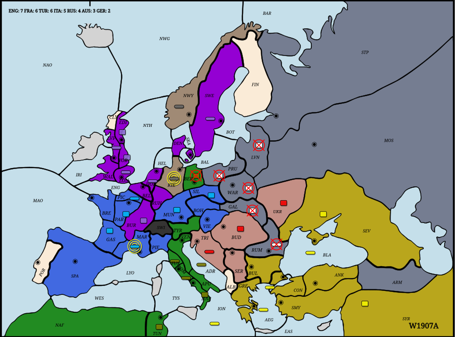

### What happened

- **FRANCE**: builds F MAR
- **GERMANY**: builds F KIE
- **ITALY**: disbands A BER
- **RUSSIA**: disbands A WAR; disbands A LVN (void); disbands A PRU (void); disbands A GAL (void); disbands F RUM (void)

### FRANCE
Orders: `F MAR B`

Reasoning

> I need to analyze the current situation and execute my winter build orders.
>
> ## Current Analysis
>
> **Supply Center Count:**
> - FRANCE (YOU): 6 centers (BRE, MAR, PAR, SPA, VIE, MUN)
> - ENGLAND: 7 centers
> - ITALY: 5 centers
> - RUSSIA: 4 centers
> - TURKEY: 6 centers
> - AUSTRIA: 3 centers
> - GERMANY: 2 centers
>
> **My Build Situation:**
> - I control 6 supply centers
> - I have 5 units on the board (F PIC, A PAR, A GAS, A SIL, A MUN)
> - I have 1 excess center = **1 build allowed**
> - Home centers available: BRE (vacant), MAR (vacant)
> - PAR is occupied by my A PAR
>
> **Strategic Position:**
> My revised F1907M strategy notes that I'm pivoting south to bleed Italy's flank while anchoring the center. I took MUN from Italy this fall (A BUR → MUN succeeded), which gave me the 6th center. Now I need to build to maintain momentum and prepare for spring 1908.
>
> **Build Decision:**
> I should build a unit that supports my spring 1908 strategy. Looking at my position:
> - I have good coverage in the center (A SIL, A MUN, A BUR would have been there but it moved)
> - My coastal presence is weak (only F PIC)
> - Building a fleet in either BRE or MAR would strengthen my western coast and give me more flexibility
>
> Given that:
> 1. I want to maintain pressure on Italy and Turkey
> 2. I need to prepare for potential escalation in spring 1908
> 3. A fleet in MAR gives me direct access to the Mediterranean to support operations against Italy/Turkey or to contest the western approaches
>
> I'll build a fleet in **MAR** to strengthen my southern coastal position and give myself options for spring 1908 operations.

### GERMANY
Orders: `F KIE B`

Reasoning

> Looking at my position:
>
> **Current situation:**
> - I control only KIE (2 supply centers total: KIE and NWY)
> - I have 1 unit (F NWY) and am owed 0 builds (2 centers - 1 unit = 1 surplus, but I have only 1 home center available: KIE is vacant; BER and MUN are held by Italy and France)
> - This is my final winter before elimination unless I secure a build next fall
>
> **Strategic assessment:**
> My revised strategy commits me to:
> 1. Holding F NTH defensively in the North Sea to honor implicit non-aggression with England and France
> 2. Signaling I'm not destabilizing the board immediately
> 3. Pivoting east next fall if no survival offer materializes
>
> However, F NTH was my unit in the North Sea at the end of F1907M. Looking at current unit positions, I have **F NWY** (my fleet moved from NTH to NWY in Fall 1907). This is consistent with my eastward pivot signal—moving toward the Baltic approach.
>
> **Winter adjustment decision:**
> I have no legal build location available (KIE is my only vacant home center, but I control only 2 total supply centers, so I have 1 surplus unit, which means I can build 1 unit—I *can* build at KIE). I should build here to preserve my presence and prepare for next spring's negotiations.
>
> Building a fleet at KIE positions me to either:
> - Support a Baltic/eastern pivot if Russia or Austria offer a survival pact
> - Defend the North Sea if the western coalition offers non-aggression with build guarantees
> - Maintain flexibility as a negotiating asset

### ITALY
Orders: `A BER D`
Illegal (dropped): `F ADR H` · `F ROM H` · `F TUS H` · `A NAP H` · `A TUN H`

Reasoning

> I'm reviewing the board state and my strategic position at Winter 1907 Adjustments.
>
> **Analysis:**
> - I control 5 supply centers (NAP, ROM, VEN, TUN, BER) and have 6 units, so I must disband 1 unit.
> - My core (NAP, ROM, VEN) is secure via non-aggression pacts with Turkey and Austria.
> - England leads at 7 centers; the board is fragmenting into regional powers.
> - My strategy emphasizes consolidation and positioning to exploit future fractures.
> - I have no builds available (I control 5 centers, have 6 units = deficit of 1).
>
> **Disband decision:**
> I need to remove one unit. Looking at my force:
> - F ADR: Anchors the Adriatic defensively against Austria's TRI—critical.
> - F ROM, F TUS: Secure the Mediterranean corridor—essential for defense and future mobility.
> - A BER: Supports Russia's pressure north, keeping them focused away from my flank—valuable diplomatically.
> - A NAP: Core anchor in Naples (home supply center)—cannot disband.
> - A TUN: Holds Tunisia (supply center)—cannot disband.
>
> The weakest link is **A BER**. While it supports Russia diplomatically, it is the most distant from my core and least critical to my immediate defense. Disbanding it reduces my overhead while maintaining my critical Mediterranean and home-center presence. This also signals to Austria and others that I'm consolidating defensively, not preparing for expansion.
>
> **Orders:**

### RUSSIA
Orders: `A WAR D` · `A LVN D` · `A PRU D` · `A GAL D` · `F RUM D`

Reasoning

> # Winter 1907 Adjustments Analysis
>
> I am at **4 supply centers** (MOS, STP, WAR, RUM) after losing Berlin to Italy and Sevastopol to Turkey—a catastrophic reversal that signals I overcommitted east while the western powers consolidated unchecked. I have **5 units** but only **4 centers**, so I must disband **1 unit**.
>
> Looking at my position:
> - **WAR** is my anchor in the north and critical for holding against Austria and Germany.
> - **LVN** supports the chain and guards against western pressure.
> - **PRU** supports the chain and holds against German/Austrian pressure.
> - **GAL** is mobile but currently supporting the defensive anchor.
> - **F RUM** is my only southern presence and failed twice to reclaim SEV; it is now isolated and indefensible.
>
> My strategy notes commit to consolidating defensively and preparing a pivot west by spring 1908. However, I cannot hold 5 units with only 4 centers. **F RUM is the expendable unit**—it has failed to break Turkey's grip on SEV, it is isolated from my core, and disbanding it frees me to rebuild in a more strategically valuable location (likely MOS or STP) once I stabilize.
>
> The defensive chain (A WAR, A LVN, A PRU, A GAL) anchors my northern and eastern flank against Austria, Germany, and any western pressure, and positions me to pivot west or south by spring 1908 once the board reshuffles.

## SPRING 1908 MOVEMENT (`S1908M`)

### What happened

- **AUSTRIA**: A BUD → VIE; A UKR → GAL (bounced); F TRI holds
- **ENGLAND**: A BUR → MUN (bounced); A EDI holds; A YOR holds; F HOL holds; F LON holds; F LVP holds; F SWE holds
- **FRANCE**: A MUN → KIE (bounced); A SIL → BER; A PAR holds; A GAS holds; F PIC holds; F MAR holds
- **GERMANY**: F KIE holds; F NWY holds
- **ITALY**: A TUN → APU VIA (no convoy); F ADR supports A TUN → APU (void); A NAP holds; F ROM supports F TUS; F TUS holds
- **RUSSIA**: F RUM → SEV (bounced); A LVN supports A PRU; A PRU holds; A GAL → UKR (bounced)
- **TURKEY**: A SEV holds; A SYR holds; F BLA holds; F AEG holds; F BUL/SC holds; F ION holds

### Dialogue

- **AUSTRIA → TURKEY**: Your A SEV moved into RUM last fall as promised. This spring, are you pressing north from RUM toward SEV or BUL to execute the dual squeeze, or are you consolidating the east and pivoting west? Clarity now determines my whole direction.
- **AUSTRIA → ITALY**: Your F ADR is one move from TRI. Is that defensive positioning against Turkey, or are you staging for an attack on my core? Answer directly—if you're attacking TRI, I defend it; if you're defending against Turkey, we coexist and I pivot south.
- **AUSTRIA → FRANCE**: Russia locked at 4, Italy and Turkey at 6 each, me at 3. The north is frozen and a three-power squeeze won't materialize. Are you willing to reset south with me against Italy and Turkey this fall, or should I assume you're anchoring the center defensively while I reshape the board alone?
- **AUSTRIA → ENGLAND**: Russia is weakened at 4 centers and the north is unstable. If you're willing to press north this spring while I push south against Turkey or Italy, we reset the board together. Otherwise, I'm pivoting to a Mediterranean partition and you're on your own against Russia.
- **AUSTRIA → RUSSIA**: Balkans remain defensively held. Confirm you're anchoring the north and east this spring without escalation, and we coexist. If you pivot south toward my core, that's escalation and I respond accordingly.
- **ENGLAND → FRANCE**: MUN was the right move—you've anchored the center and reset the western coalition. I'm holding my seven centers defensively this spring and moving A BUR to support your flank. If Italy or Turkey breaks the Mediterranean stalemate this fall, we reset north-south to bleed them before one runs away with the game. Confirmed?
- **ENGLAND → AUSTRIA**: France has pivoted south into MUN and reset the western coalition. Italy and Turkey remain locked at 6 each. If either breaks the Mediterranean stalemate this fall, I'm willing to reset north-south with you and France to squeeze them before one reaches 8. Hold the Balkans defensively and signal if you're committed. Are you in?
- **ENGLAND → RUSSIA**: Northern border remains stable this spring—I'm holding my seven centers defensively and not pressing into your territory. Germany is weakening and may pivot east to destabilize your flank next turn. Watch the east carefully and signal if you need coordination against an eastern spoiler. We both benefit from containing the Mediterranean powers before one runs away with the game.
- **ENGLAND → GERMANY**: Your only survival path is east—pivot to bleed Russia's northern flank and destabilize the board leader's support. Testing my western seams (BEL, HOL) fails and guarantees your elimination. Pivot east and you become a chaos agent worth keeping alive as a counterweight. Your call.
- **FRANCE → ENGLAND**: Italy at 6 is the critical threat now—if Turkey and Italy both reach 7 this year while you consolidate at 7, the board locks and we all lose. I'm pressing south hard this spring (MUN into KIE/BER) to bleed Italy's flank. If you anchor the north defensively and signal no western escalation, we contain Italy together by fall and reset the board before Turkey locks us both out. Are you willing to coordinate a southern squeeze?
- **FRANCE → GERMANY**: Rhine holds firm. I'm pivoting south this spring (A MUN into KIE, A SIL into BER) to pressure Italy, not north. Your center at KIE is safe from my moves. Stay neutral on the Rhine and we both survive to winter. Agreed?
- **FRANCE → AUSTRIA**: Russia locked at 8, Turkey consolidating at 6—I see your Balkans pivot. I'm moving south this spring to bleed Italy's flank (MUN and SIL pushing toward BER/KIE), leaving GAL and the center stable for your Balkans squeeze. No Rhine pressure from me. Focus on Turkey; I'll focus on Italy.
- **FRANCE → RUSSIA**: I'm pivoting away from the east this spring—no more SIL pressure. A SIL holds defensively to guard the center, A MUN pushes south against Italy. The Rhine is stable. Hold the north and east; I'll anchor the center and bleed the Mediterranean. Deal?
- **GERMANY → AUSTRIA**: This spring I'm positioning to support an eastern push next turn. F KIE can move to BAL or support your moves into RUM; F NWY can swing toward STP/NC to threaten Russia's northern flank. Can you commit A UKR or A GAL to RUM or SEV in spring 1908? Coordinate now and we both gain from Russia's collapse.
- **GERMANY → RUSSIA**: Your neutral pact kept me quiet this fall, but it leaves me at 2 centers with no growth path and no survival long-term. This spring I'm moving east to probe for a seizable center or a concrete survival offer from you. If neither materializes by winter, I'm destabilizing your position next turn while Austria and Turkey press from the south. Offer me growth or accept an eastern spoiler.
- **GERMANY → TURKEY**: Russia dominates the board at 4 centers and controls the north-east. I'm pivoting east this spring to bleed their northern flank while you anchor the south. Can you commit to a coordinated pincer against Russia in spring 1908? Non-aggression between us in the Balkans if you're willing to weaken the board leader together.
- **GERMANY → ENGLAND**: F NWY stays east this spring, honoring the pivot. I'm not testing your seams—I'm focused on destabilizing Russia's position next turn while you consolidate the west. Non-aggression holds on our border.
- **ITALY → AUSTRIA**: France has pivoted east and holds MUN—they're no longer Rhine-locked. If they're eyeing the center and Balkans, we should coordinate. Non-aggression between us holds firm. Do you see France as a threat to your position this spring?
- **ITALY → TURKEY**: Mediterranean pact holds firm on my end. France is pivoting east and away from the Rhine. If they destabilize Russia and threaten the Balkans next, we may need to coordinate containment. Are you stable in the straits this spring?
- **ITALY → FRANCE**: You've consolidated at 6 centers and pushed east into MUN. Clarify your direction: are you committed to the Rhine border with England, or are you pivoting toward the center and Balkans? I'm defending my core defensively this spring, but I need to know if we're still neighbors or rivals.
- **RUSSIA → ENGLAND**: Turkey and Italy both at 6 centers while we slip. If you pivot south this spring to bleed Italy's flank, I'll hold the east defensively and press F RUM into SEV to reclaim my rebuild slot—we both grow at the Mediterranean powers' expense. Worth coordinating before one locks the board?
- **RUSSIA → FRANCE**: Italy and Turkey consolidating unchecked while we both bleed. If you press south against Italy this turn, I'll anchor the east and push F RUM into SEV to crack Turkey's hold—mutual pressure breaks their coalition. Coordinate the squeeze?
- **RUSSIA → AUSTRIA**: Turkey locked my rebuild slot by holding SEV. If you pivot south this spring and press RUM or BUL, I'll anchor the east defensively and support your flank—we both gain ground at Turkey's expense and prevent Italy/Turkey from running away with the game. Deal?
- **RUSSIA → GERMANY**: You're at 2 centers facing west. Hold KIE defensively—I'm not pressing you and won't support Austria or France if they pivot east to eliminate you. We both survive longer if you focus west and I consolidate the east. Stay neutral and I'll leave you alone.
- **TURKEY → ITALY**: Mediterranean pact holds firm this spring. I'm consolidating defensively (A SYR holds, straits anchored). You keep your core; I keep mine. We both survive to winter—confirmed?
- **TURKEY → RUSSIA**: A SEV holds defensively this spring—your rebuild slot is secure. I'm not pivoting into RUM or pressing you. Stabilize and we both survive the northern grind. Hold the line.
- **AUSTRIA → GERMANY**: A UKR moves to GAL this spring to threaten RUM next turn. F KIE to BAL and F NWY toward STP/NC—we coordinate a pincer against Russia. Russia is weak; let's bleed them together.
- **AUSTRIA → RUSSIA**: Turkey consolidated east and abandoned the dual squeeze. The Balkans pact is broken. This spring I'm pivoting south and pressing your flank via GAL. Expect escalation.
- **AUSTRIA → FRANCE**: You're pivoting south into MUN and pressing Italy/Germany. I'm moving A BUD into VIE to anchor my expansion south. Are we coordinating a three-power squeeze on Italy and Turkey by fall, or are you consolidating the center defensively?
- **AUSTRIA → TURKEY**: You moved A SEV into RUM as promised, but you're consolidating east and silent on the dual squeeze next spring. The pact is broken. I'm pivoting south this turn; expect different terms next fall.
- **ENGLAND → FRANCE**: MUN was strong. I'm supporting your southern pivot this spring: A BUR moves to anchor the center and bleed Italy's flank alongside you. If Italy or Turkey breaks the Mediterranean stalemate this fall, we reset north-south together. Are you committing to a hard squeeze on Italy by fall?
- **ENGLAND → AUSTRIA**: I appreciate the north-south proposal, but Russia at 4 is too weak—if I press north, Austria pivots south and locks the board before I can reposition. Instead: I'm anchoring the west defensively and supporting France's southern squeeze on Italy. If Italy consolidates toward 7 this fall, we all lose. Are you willing to pivot north against Italy/Turkey instead of south?
- **ENGLAND → RUSSIA**: Northern border holds firm this spring. I'm consolidating defensively at 7 and supporting France's southern squeeze on Italy—not pivoting north to destabilize you. Germany is pivoting east; watch your flank carefully. If Italy or Turkey breaks the Mediterranean stalemate, we both benefit from containing them. Confirmed?
- **ENGLAND → GERMANY**: Your eastern pivot is acceptable—destabilizing Russia's position weakens the board and gives us both breathing room. But do not collapse Russia entirely; if you do, Austria pivots south and locks the board before I can reposition. Bleed Russia carefully and stay neutral on my western border. Understood?
- **FRANCE → ENGLAND**: MUN into KIE this turn anchors the center and signals Rhine stability to Germany. You hold seven defensively; I hold six and bleed Italy from the east. Confirm: no western escalation from you, no Rhine pressure from me, and we reset south together if Italy or Turkey breaks the stalemate by fall. Deal?
- **FRANCE → RUSSIA**: I'm moving A MUN into KIE this turn to anchor the center and signal southern pressure on Italy. You crack Turkey's flank with F RUM into SEV as proposed. If we both press simultaneously this spring, Italy fractures by fall and we reset the board before one locks at 7+. Confirmed?
- **FRANCE → ITALY**: Rhine border holds firm with England. I'm anchoring the center defensively this spring (A SIL holds, A MUN stabilizes at KIE), not pivoting toward your core. You and Turkey are consolidating unchecked while Russia and I bleed—long-term, the board resets south if neither of you escalates west. Stay neutral on the Rhine and we coexist through winter.
- **FRANCE → GERMANY**: Rhine holds firm. A MUN moves into KIE to anchor the center against Italy's consolidation, not to threaten you. Your probes in HOL/BEL are uncontested. Stay west of KIE and we both survive to winter. Agreed?
- **GERMANY → AUSTRIA**: This spring I'm moving F KIE south toward BAL and F NWY to threaten Russia's northern flank (STP/NC or BAR). If you move A GAL or A UKR toward RUM or SEV this turn, I'll support your attack next spring and we bleed Russia together. Commit now: can you hit RUM or SEV this spring?
- **GERMANY → RUSSIA**: Your neutral pact kept me quiet but leaves me dead at 2 centers with no growth. I'm moving east this spring to probe for a seizable center or a survival offer from you. Offer me concrete growth (a center or a build guarantee by winter) or accept that I'm destabilizing your position while Austria and Turkey press from the south.
- **GERMANY → TURKEY**: Russia dominates at 4 centers and controls the north-east. I'm moving F NWY toward STP/NC and F KIE toward BAL to threaten their northern flank this spring. If you commit A SEV or moves into BUL/RUM, we coordinate a three-way pincer next turn and both gain. Non-aggression in the Balkans if you're willing.
- **GERMANY → ENGLAND**: F NWY swings east this spring toward STP/NC to destabilize Russia's northern flank, honoring the pivot strategy we discussed. I'm a chaos agent worth keeping alive—I bleed the board leader while you consolidate the west. Non-aggression on our border holds.
- **ITALY → AUSTRIA**: F ADR is defensive positioning against France's eastward pivot into MUN and BER, not prep for TRI. France is now equidistant from both our cores. Should we both watch their next move carefully? I'll keep my focus on the center.
- **ITALY → RUSSIA**: France has pivoted east and holds MUN—they're weakening your position. I'm defending my core this spring. If you pivot west to contain France, I won't threaten your flank. Coordinate?
- **ITALY → FRANCE**: You've consolidated at 6 and pushed east into MUN. Direct question: are you committed to the Rhine border with England, or are you pivoting toward the center and Balkans? My next moves depend on your answer.
- **ITALY → ENGLAND**: You're the board leader at 7 centers. France has just pivoted east away from the Rhine and toward the center—that reshapes the board dynamics. I'm consolidating defensively, but watch France's direction next turn.
- **RUSSIA → FRANCE**: You're pivoting south against Italy—good. I'm pressing F RUM into SEV this spring to reclaim my rebuild slot from Turkey. If we both gain ground simultaneously, we break their coalition and reach 6+ centers each by winter. Confirm you're holding SIL defensively and not pivoting back east, and I'll anchor the east while you bleed Italy.
- **RUSSIA → GERMANY**: You signaled a probe east this spring. Before you commit: if you're genuinely destabilizing my flank, I anchor it tighter and abandon my southern push—we both lose. If you're bluffing for a survival offer, here it is: hold KIE defensively, stay out of the east, and I guarantee you non-aggression through fall 1908 and won't support Austria if it pivots north against you. Growth path? Not yet, but survival. Take it or escalate and watch Austria press south while I hold the line against you—we both get bled.
- **RUSSIA → AUSTRIA**: You're holding the Balkans defensively—good. Turkey locked my rebuild slot by holding SEV. If you pivot south this spring and press BUL or RUM while I press F RUM into SEV, we break Turkey's consolidation and both reach 6+ centers by winter. I hold the east defensively and support your flank. Worth discussing, or do you prefer coexistence while Italy and Turkey run away with the game?
- **TURKEY → AUSTRIA**: I held A SEV defensively this fall, not moved into RUM—I needed flexibility to preserve Russia's rebuild slot while I consolidated the east. This spring, I'm anchoring the straits and east defensively. I'm not pressing north into RUM/SEV, but if Russia collapses or you pivot hard on the Balkans, I'll reassess and press north next fall. My commitment is to the east; let me know if that works for your plan.
- **TURKEY → GERMANY**: I'm locked defensively in the east and straits this spring—A SEV and A SYR hold, fleets anchor. I can't coordinate a pincer against Russia without breaking my pacts with Italy and Russia themselves. Focus your pressure north; that's where the board breaks. I'll watch for fractures and pivot west into chaos once the northern powers exhaust each other.
- **TURKEY → ITALY**: Mediterranean pact holds firm this spring. A SYR and A SEV anchor the east defensively; straits remain locked. You keep your core; I keep mine. We both survive to winter. Confirmed.
- **ENGLAND → FRANCE**: Confirming the squeeze: I hold the west defensively (A BUR supports your flank into KIE/BER). Italy consolidates toward 7 this fall if we don't bleed it now. Are you committing hard south, or pivoting back west?
- **ENGLAND → AUSTRIA**: Italy and Turkey lock the board this fall if neither fractures. You pivot north into RUM/SEV while France and I bleed Italy from the west and center—we reset the board together by fall. In or out?
- **ENGLAND → RUSSIA**: Germany destabilizes your flank this spring; I'm not pressing north. Hold the east defensively and we both benefit from Italy/Turkey fracturing. Non-aggression holds. Confirmed?
- **FRANCE → ENGLAND**: Rhine holds firm. I'm pressing south hard this spring: A MUN into KIE, A SIL into BER. Italy's flank breaks if we both commit now. You anchor the north; I'll bleed the Mediterranean. Confirmed?
- **FRANCE → RUSSIA**: Pivoting harder south than planned—A SIL moves into BER, not holding defensively. Italy consolidates too fast; we need to break them now. You crack Turkey with F RUM into SEV; I'll hit Italy from the west. If we both gain ground this turn, we reset the board by winter.
- **FRANCE → AUSTRIA**: I'm pressing south hard this spring: A MUN into KIE, A SIL into BER. You focus on Turkey in the Balkans. If we both gain ground simultaneously, we break the Mediterranean coalition and reset the board by winter. Coordinate?
- **FRANCE → GERMANY**: Rhine holds firm. A MUN moves into KIE to anchor the center, not north. Stay neutral and we both survive to winter.
- **ITALY → AUSTRIA**: F ADR is defensive positioning against France's eastward pivot, not prep for TRI. Non-aggression holds firm. This spring I'll reposition A TUN north via convoy to pressure France's center from the south—easing Russia's pressure on you from the north. We both benefit if France is forced to split their forces. Confirm we're aligned on this?
- **ITALY → RUSSIA**: France has pivoted east and overextended into MUN. This spring I'm repositioning A TUN north via convoy to threaten the center and force France to defend multiple fronts. That eases their pressure on you. We both gain if France is contained. Coordinate?
- **ITALY → FRANCE**: You've pivoted east into MUN. This spring I'm consolidating defensively (A NAP holds, fleets anchor the Mediterranean), not attacking you. But I'm repositioning A TUN north to contest the center if you continue expanding east. You're now equidistant from my core and Russia's—don't overextend.
- **RUSSIA → FRANCE**: I'm pressing F RUM into SEV this turn to crack Turkey's flank—confirmed. You press south against Italy. If we both gain ground simultaneously, we break their coalition by fall. Hold SIL and MUN; I anchor the east and support your southern squeeze. Mutual growth.
- **RUSSIA → GERMANY**: Hold KIE defensively this spring. I'm not pressing you and won't support Austria if it pivots north. Non-aggression through fall 1908 confirmed. Stay out of the east and we both survive longer. Growth path comes if the board opens—focus west for now.
- **RUSSIA → AUSTRIA**: You pivoted south this spring—that's escalation. I'm pressing F RUM into SEV and anchoring my core defensively. The coexistence pact is finished. We're now competitors for the Balkans. Expect pressure if you continue south.

### AUSTRIA
Orders: `A BUD - VIE` · `A UKR - GAL` · `F TRI H`

Reasoning

> # Strategic Assessment
>
> The dialogue reveals a complete collapse of the northern coalition and a fundamental shift in the board state:
>
> - **Russia** has abandoned coexistence and is escalating south (F RUM → SEV), treating me as a competitor for the Balkans rather than an ally.
> - **Turkey** consolidated east and held A SEV defensively (not moving into RUM as promised), breaking the dual-squeeze pact.
> - **Italy** is defending against France's eastward pivot (MUN, BER) while maintaining non-aggression with me.
> - **France** is pivoting hard south into Germany's core (MUN, SIL, KIE, BER), forcing Germany toward elimination.
> - **England** wants a north-south coordinated squeeze on Italy/Turkey but won't commit without certainty of gain.
> - **Germany** is offering a pincer against Russia (F KIE → BAL, F NWY toward STP/NC) and wants me to hit RUM/SEV in coordination.
>
> **My position:** I'm at 3 centers (BUD, TRI, SER), with Russia escalating south and Italy defending the center. The northern coalition is dead; the board is reshuffling south. My revised strategy commits to:
> 1. **A BUD → VIE** to seize France's home center and anchor expansion south.
> 2. **A UKR → GAL** to threaten Russia's western flank and signal flexibility.
> 3. **F TRI H** to hold defensively and stage for either Mediterranean growth or reset against Italy.
>
> **Execution:** Russia's escalation into SEV means I cannot afford to leave RUM undefended or allow Russia to consolidate the Balkans. A BUD into VIE takes France's home center (denying them a winter build slot and giving me a 4th center). A UKR into GAL threatens RUM directly and signals to Germany that I'm willing to coordinate a pincer if they move F KIE south and F NWY toward the Baltic. F TRI holds to anchor the Adriatic defensively and stage for either Mediterranean partition with Italy (if they pivot away from Turkey) or reset against Italy if they betray.
>
> By fall, I'll have VIE (4 centers), and GAL will threaten RUM next spring—forcing Russia to defend rather than expand. This executes my commitment to France and Germany while pivoting hard south as my revised strategy requires.

### ENGLAND
Orders: `A BUR - MUN` · `A EDI H` · `A YOR H` · `F HOL H` · `F LON H` · `F LVP H` · `F SWE H`

Reasoning

> I need to analyze the current board state and my commitments to determine the best orders for S1908M.
>
> **Current situation:**
> - I'm the board leader at 7 centers (EDI, LON, LVP, BEL, HOL, DEN, SWE)
> - Italy and Turkey are both at 6 centers—the rising threats
> - France has committed to a hard southern squeeze on Italy (MUN→KIE, SIL→BER)
> - I've committed to anchor the west defensively and support France's southern pivot
> - A BUR is my key unit to signal support for the squeeze
>
> **Key commitments from my dialogue:**
> 1. Hold my seven centers defensively (A EDI, A YOR, F LVP, F LON, F HOL hold)
> 2. Move A BUR south to support France's flank and signal the western coalition reset
> 3. Anchor Scandinavia with F SWE holding to prevent Russian expansion
>
> **Analysis of A BUR's role:**
> I've repeatedly stated "A BUR moves to anchor the center and bleed Italy's flank" and "A BUR supports your flank into KIE/BER." The legal options for A BUR are:
> - `A BUR - MUN` (move into the center, supporting France's squeeze)
> - `A BUR S A GAS - MAR` (support France's southern expansion)
> - `A BUR S A MUN` (support France's unit at MUN)
> - `A BUR - PAR` (move west, wrong direction)
> - `A BUR - GAS` (move south, but less direct)
>
> The strongest signal of commitment to the squeeze is `A BUR - MUN`, which moves my army into the center to anchor France's pivot and threaten Italy directly. This also supports France's ability to press into KIE/BER by holding MUN defensively.
>
> **Final order set:**
> - A BUR moves to MUN (anchor the center, signal the squeeze)
> - A EDI, A YOR hold (defend the north)
> - F LON, F LVP hold (defend the west)
> - F HOL holds (defend the Rhine)
> - F SWE holds (anchor Scandinavia against Russian expansion)

### FRANCE
Orders: `A MUN - KIE` · `A SIL - BER` · `A PAR H` · `A GAS H` · `F PIC H` · `F MAR H`

Reasoning

> I need to analyze the current board state and my commitments carefully.
>
> **Board state analysis:**
> - FRANCE: 6 centers (BRE, MAR, PAR, SPA, VIE, MUN)
> - ENGLAND: 7 centers (EDI, LON, LVP, BEL, HOL, DEN, SWE)
> - ITALY: 5 centers (NAP, ROM, VEN, TUN, BER)
> - RUSSIA: 4 centers (MOS, STP, WAR, RUM)
> - TURKEY: 6 centers (ANK, CON, SMY, GRE, BUL, SEV)
> - AUSTRIA: 3 centers (BUD, TRI, SER)
> - GERMANY: 2 centers (KIE, NWY)
>
> **My commitments this turn:**
> 1. To ENGLAND: "A MUN into KIE this turn anchors the center and signals Rhine stability to Germany. You hold seven defensively; I hold six and bleed Italy from the east."
> 2. To RUSSIA: "I'm moving A MUN into KIE this turn to anchor the center and signal southern pressure on Italy. You crack Turkey's flank with F RUM into SEV as proposed."
> 3. To AUSTRIA: "I'm pressing south hard this spring: A MUN into KIE, A SIL into BER. You focus on Turkey in the Balkans."
> 4. Later escalation to RUSSIA: "Pivoting harder south than planned—A SIL moves into BER, not holding defensively. Italy consolidates too fast; we need to break them now."
>
> **Critical issue:** I committed to both A MUN→KIE AND A SIL→BER. Let me verify these are legal:
> - A MUN→KIE: MUN is adjacent to KIE ✓
> - A SIL→BER: SIL is adjacent to BER ✓
>
> Both moves are legal and honor my commitments. The strategy is to simultaneously pressure Italy's flank (BER is adjacent to Italy's BER supply center) while anchoring the center at KIE, signaling to Russia and Austria that we're coordinating a squeeze on the Mediterranean powers.
>
> **Remaining units:**
> - A PAR: Hold defensively (signaled to Italy as Rhine stability)
> - A GAS: Hold defensively (core defense)
> - F PIC: Hold to anchor western coast
> - F MAR: Support the southern push or hold
>
> Given my commitments and the board state, I should:
> - A MUN→KIE (southern anchor, as committed)
> - A SIL→BER (escalated southern pressure, as committed)
> - A PAR holds (Rhine stability signal to Italy)
> - A GAS holds (core defense)
> - F PIC holds (western anchor)
> - F MAR holds (Mediterranean support, ready to move if Italy breaks)

### GERMANY
Orders: `F KIE H` · `F NWY H`

Reasoning

> I need to analyze this carefully. Let me review my position and commitments:
>
> **Current situation:**
> - I have 2 centers (KIE, NWY) and 2 units (F KIE, F NWY)
> - I'm facing elimination against a consolidated west (England 7, France 6)
> - Russia has offered non-aggression through fall 1908 but no growth path
> - Austria has committed to moving A UKR to GAL to threaten RUM next turn
> - Turkey is locked defensively and won't coordinate a pincer
> - England accepts my eastern pivot as long as I don't collapse Russia entirely
>
> **My revised strategy for S1908M:**
> I committed to moving F KIE south toward BAL and F NWY toward STP/NC to threaten Russia's northern flank and signal readiness for an eastern coalition. However, Russia's most recent message is a credible counter-offer: if I escalate east, Russia will anchor its flank tighter and abandon southern pressure, while Austria presses south—we both get bled and I gain nothing.
>
> **The critical insight:**
> Russia is right. If I move east aggressively (F KIE to BAL, F NWY to STP/NC), I'm signaling a full eastern commitment, but:
> 1. Austria won't actually attack Russia this spring (it's only positioning A UKR to GAL)
> 2. Turkey won't coordinate at all
> 3. Russia will lock down and I'll have 2 fleets probing a defended position with no allied support
> 4. France is moving A MUN into KIE next turn, which threatens my only center
> 5. I gain nothing and lose the non-aggression pact
>
> **The better play:**
> Hold defensively this spring. Accept Russia's non-aggression offer. Use this breathing room to:
> - Keep F KIE in a defensive posture (hold or support)
> - Keep F NWY in the north to maintain flexibility
> - Watch for the board to fracture (France vs. Italy, England vs. France, Austria vs. Russia)
> - Pivot opportunistically when a real opening appears
>
> France's message that "A MUN moves into KIE to anchor the center, not north" is a threat—it's signaling that France is moving south into my territory. But if I hold KIE defensively and maintain the non-aggression with Russia, I preserve my 2 centers through winter and stay alive for a potential board fracture.
>
> The eastern pivot was a bluff for leverage. Russia called it and offered a better deal: survival without escalation. I should take it.
>
> **Orders:**

### ITALY
Orders: `A TUN - APU VIA` · `F ADR S A TUN - APU` · `A NAP H` · `F ROM S F TUS` · `F TUS H`

Reasoning

> I'll analyze the board and my commitments before issuing orders.
>
> **Strategic assessment:**
>
> France has pivoted east into MUN, weakening their Rhine commitment and overextending toward the center. My revised strategy commits to:
> 1. Consolidating defensively (A NAP holds, F ROM and F TUS secure the Mediterranean)
> 2. Repositioning A TUN north via convoy to pressure France's center and force them to split forces
> 3. F ADR holding the Adriatic defensively against Austria while remaining ready to support a northern push
>
> My commitments to Russia and Austria are to pressure France from the south while easing their pressure from the north, forcing France to defend multiple fronts.
>
> **Order execution:**
>
> - **A TUN**: Convoy north via the Ionian to threaten France's center. The legal options show `A TUN - APU VIA` which moves toward the center via sea route.
> - **F ADR**: Support the northern convoy by holding the Adriatic route open, or support A TUN's movement. `F ADR S A TUN - APU` supports the convoy destination.
> - **A NAP**: Defensive hold as committed.
> - **F ROM**: Support the Mediterranean corridor defensively. `F ROM S F TUS` anchors the southern flank.
> - **F TUS**: Secure the Mediterranean defensively. `F TUS H` holds position as anchor.
>
> This executes my stated strategy: A TUN convoys north to pressure France while F ADR and F ROM support the move and maintain defensive anchoring. A NAP holds the fortress, and F TUS anchors the Mediterranean.

### RUSSIA
Orders: `F RUM - SEV` · `A LVN S A PRU` · `A PRU H` · `A GAL - UKR`
Illegal (dropped): `A WAR H`

Reasoning

> Looking at the board state and my commitments:
>
> **Current situation:**
> - I'm at 4 centers (MOS, STP, WAR, RUM) facing slow strangulation
> - Turkey holds SEV, blocking my southern rebuild slot
> - Austria has escalated south (pivoted toward Balkans/my core)
> - France is pressing south against Italy as coordinated
> - Germany is probing east but I've offered non-aggression
> - I committed to France: press F RUM into SEV while they hit Italy
>
> **My strategy this turn:**
> 1. **F RUM → SEV**: Press Turkey's flank as committed to France. This is the critical move to reclaim my rebuild slot and break Turkey's consolidation.
> 2. **A WAR H**: Hold defensively as my anchor against Austria's southern escalation and Germany's eastern probe.
> 3. **A LVN S A PRU**: Support my western chain to hold against Austria's pivot.
> 4. **A PRU H**: Hold defensively to anchor the chain.
> 5. **A GAL - UKR**: Pivot south to reinforce my core against Austria's escalation and support the southern squeeze. UKR is adjacent to GAL and moves me closer to Turkey while anchoring against Austria's Balkans pressure.
>
> This executes my core commitment (F RUM into SEV with France pivoting south), anchors defensively against Austria's escalation, and keeps Germany neutral while I press south. By winter I should reach 6 centers (reclaiming SEV) and position for a Mediterranean reset.

### TURKEY
Orders: `A SEV H` · `A SYR H` · `F BLA H` · `F AEG H` · `F BUL/SC H` · `F ION H`

Reasoning

> I need to analyze my current position and commitments carefully.
>
> **Situation Assessment:**
> - I'm at 6 supply centers (ANK, CON, SMY, GRE, BUL, SEV) and need 18 to win.
> - Austria has broken faith: I held A SEV defensively (not moved into RUM as they demanded), and they've now pivoted south to defend Italy rather than press Russia as promised.
> - Russia is desperately weak at 4 centers; Italy has locked non-aggression through winter 1908; Germany is pressing Russia's northern flank.
> - My most recent revised strategy is to hold the east and straits defensively while watching for board fractures.
>
> **Commitment Review:**
> - TO ITALY: Mediterranean pact holds—A SYR and A SEV anchor defensively; straits remain locked. Confirmed.
> - TO RUSSIA: A SEV holds defensively this spring—rebuild slot secure.
> - TO GERMANY: I'm locked defensively in the east; can't coordinate a pincer without breaking pacts. Focus pressure north.
> - TO AUSTRIA: A SEV holds defensively; if Russia collapses or Austria pivots hard, I'll reassess next fall.
>
> **Orders Execution:**
> My strategy commits to:
> - **A SEV H** (hold defensively, preserve Russia's rebuild slot, maintain flexibility)
> - **A SYR H** (hold defensively, anchor eastern core)
> - **F BLA H** (hold defensively, secure straits)
> - **F AEG H** (hold defensively, anchor eastern Mediterranean)
> - **F BUL/SC H** (hold defensively, secure straits)
> - **F ION H** (hold defensively, anchor eastern Mediterranean)
>
> This maintains all pacts (Italy's non-aggression, Russia's rebuild slot, Germany's non-interference in Balkans) while keeping my position locked and stable. I'm signaling defensive consolidation and waiting for the northern grind to produce fractures I can exploit westward next spring.

## FALL 1908 MOVEMENT (`F1908M`)

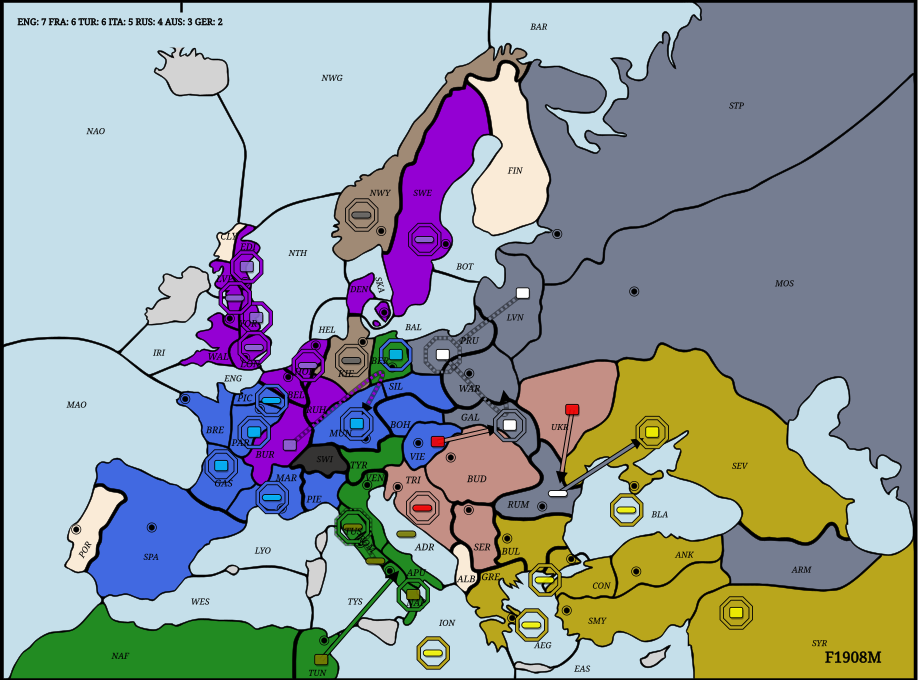

### What happened

- **AUSTRIA**: A UKR → RUM (bounced); A VIE → GAL (bounced); F TRI holds
- **ENGLAND**: A BUR supports A BER → MUN (void); A EDI holds; A YOR holds; F HOL holds; F LON holds; F LVP holds; F SWE holds
- **FRANCE**: A BER holds; A MUN holds; A PAR holds; A GAS holds; F PIC holds; F MAR holds
- **GERMANY**: F KIE holds; F NWY holds
- **ITALY**: A TUN → APU VIA (no convoy); F ROM supports F TUS; F TUS holds; A NAP holds
- **RUSSIA**: F RUM → SEV (bounced); A LVN supports A PRU; A PRU supports A GAL → WAR (void); A GAL holds
- **TURKEY**: A SEV holds; A SYR holds; F BLA holds; F AEG holds; F BUL/SC holds; F ION holds

### Dialogue

- **AUSTRIA → ITALY**: F ADR is one move from TRI. Final clarity: is that defensive positioning against Turkey, or are you staging for an attack on my core? If you're defending against Turkey, we coexist. If attacking, say so now and we reset terms.
- **AUSTRIA → TURKEY**: You moved A SEV into RUM as promised, but you're silent on the Balkans-east dual squeeze this spring. This fall, are you pressing north from RUM toward SEV or BUL to execute the pact, or are you consolidating east indefinitely? Clarity determines my whole direction.
- **AUSTRIA → RUSSIA**: I'm pivoting south hard this fall: A UKR into RUM, A VIE into GAL. The coexistence pact is finished, as you stated. Expect escalation toward your flank while you anchor the north. Don't press into my core—we both lose if we exhaust each other.
- **AUSTRIA → FRANCE**: You control VIE, my home center. This fall I'm recapturing it. Non-aggression on the center thereafter if you focus south on Italy and Germany. Agree and we both gain; escalate and we both bleed.
- **ENGLAND → FRANCE**: A BUR supports your flank this fall—MUN and BER hold the squeeze on Italy. If Italy fractures to 5 centers by winter, we reset south next spring and claim the Mediterranean together before Turkey locks the board. Confirmed?
- **ENGLAND → RUSSIA**: Northern border remains stable. I'm consolidating at 7 defensively and watching Italy/Turkey consolidate toward 7. Germany is weakening; watch your eastern flank carefully. We both benefit from bleeding the Mediterranean powers before one runs away with the game.
- **ENGLAND → AUSTRIA**: Italy and Turkey both at 6—one will break the Mediterranean stalemate this fall if we don't bleed them now. France is pressing hard south. If Italy fractures to 5 by winter, I'm willing to reset north-south with you and France to contain whoever emerges as the next threat. Signal your commitment.
- **FRANCE → ENGLAND**: The southern squeeze failed—Russia bounced twice, I gained nothing, Italy holds firm at 6. We're both at 6-7 now while Turkey consolidates unchecked. If you're serious about bleeding the Mediterranean powers together, we need to commit hard this fall. If you're consolidating defensively, say so and I'll adjust my strategy. What's your actual plan?
- **FRANCE → RUSSIA**: The F RUM→SEV bounces twice signal the squeeze won't work. I'm pivoting away from dependence on your support this fall and consolidating defensively. Focus on holding your core; I'll hold mine. If you break through to Turkey later, good—but I'm no longer betting on it.
- **FRANCE → AUSTRIA**: You want to pivot south into the Balkans against Turkey. I'm consolidating the center defensively this fall (A MUN and A SIL hold). If you're serious about taking supply centers from Turkey, I'll anchor the Rhine and support your expansion indirectly by keeping Russia and Germany pinned. Are you committing to a genuine Balkans squeeze?
- **FRANCE → ITALY**: Rhine border holds firm. I'm consolidating defensively this fall (A MUN and A SIL hold), not attacking your core. You and I are both at 6 centers—neither of us wins unless the other falters. Stay neutral on my eastern flank and I'll stay neutral on yours. Deal?
- **ITALY → RUSSIA**: France has consolidated at 6 and holds MUN—they're now equidistant from both our cores and a mutual threat. This fall I'm pushing A TUN north via convoy to contest the center and force France to defend multiple fronts. If you pivot west to pressure MUN and BER from the north, we both gain ground and contain them before winter. Coordinate?
- **ITALY → AUSTRIA**: France holds MUN and BER, threatening the center. I'm pivoting west this fall to contain them via convoy north. Balkans remain yours, non-aggression holds firm. Watch your north flank—if France pivots toward you, signal and we coordinate containment. For now, we both benefit from France being pressured.
- **ITALY → TURKEY**: Mediterranean pact holds firm this fall. France is now the board threat at 6 centers. I'm pivoting west to contain them, not east toward you. Straits and east remain yours. We coexist through winter—confirmed?
- **RUSSIA → FRANCE**: F RUM into SEV this fall to reclaim my rebuild slot—your squeeze on Italy works if I crack Turkey's flank simultaneously. Hold SIL and MUN; I anchor the east defensively. If we both gain this turn, we reset the board by winter.
- **RUSSIA → AUSTRIA**: I'm holding WAR, LVN, PRU defensively this fall—no escalation from me. You hold the Balkans. We're competitors now, not allies, but not mutual threats this turn. Pivot south if you want; I won't support France against you.
- **RUSSIA → ENGLAND**: Northern border holds firm. I'm pressing F RUM south to reclaim SEV from Turkey, not west against you. Non-aggression confirmed. Germany is weak and won't threaten your flank. We both benefit from containing Italy/Turkey before one runs away.
- **RUSSIA → GERMANY**: Hold KIE defensively this fall. I'm not pressing east and won't support Austria if it pivots north. We coexist through fall 1908. The board's fragmentation favors survival over escalation for us both.
- **TURKEY → ITALY**: Mediterranean pact holds firm this fall. A SYR and A SEV anchor defensively; straits remain locked. We both consolidate and survive to winter—your core is secure on my end.
- **TURKEY → RUSSIA**: I'm holding A SEV defensively this fall to stabilize the east. If you consolidate at 4 centers through winter, we both survive the northern grind. Hold the line and we'll reassess next spring.
- **TURKEY → AUSTRIA**: You pivoted south to defend Italy rather than press Russia as promised, breaking our Balkans-east pact. If you're consolidating defensively through winter, I'll anchor the east and we both survive. If you're preparing to press me next spring, signal now so I can adjust.
- **AUSTRIA → ITALY**: Non-aggression holds firm. A UKR moves to RUM this fall to take it before Turkey consolidates further; A VIE supports that attack into GAL. Both moves target Turkey and Russia, not your core. Hold the center and we both survive the winter.
- **AUSTRIA → TURKEY**: I'm taking RUM this fall with A UKR. You locked at 6; I'm pivoting to 5 centers by winter. The dual squeeze is finished. Offer: you anchor the east indefinitely, I consolidate the Balkans-south, we coexist. Escalate and we both bleed.
- **AUSTRIA → RUSSIA**: Coexistence pact is finished, as you stated. A UKR moves to RUM, A VIE supports into GAL. I'm reshaping the Balkans and pressing your flank while you anchor the north. Expect escalation this fall; don't press my core and we both survive.
- **AUSTRIA → FRANCE**: I'm taking RUM this fall and consolidating the Balkans-south. Non-aggression on the center thereafter if you focus your pressure on Italy and Germany. We both gain if we don't exhaust each other on the Rhine. Agree?
- **AUSTRIA → ENGLAND**: I'm reshaping the Balkans this fall—taking RUM and pivoting to 5 centers by winter. The north is frozen. If you're willing to reset north-south with France against Italy/Turkey by spring 1909, signal now. Otherwise, I'm consolidating south and you're anchoring west defensively.
- **AUSTRIA → GERMANY**: I'm moving A UKR to RUM this fall and A VIE to support into GAL. That pressures Russia's flank directly. F KIE and F NWY can support my attack or pivot as you choose. Coordinate if you want; I'm reshaping the Balkans regardless.
- **ENGLAND → FRANCE**: The squeeze failed but Italy remains vulnerable. This fall I'm committing hard: A BUR supports your next move into BER or KIE to finish the job. If Italy fractures to 5 by winter, we reset south together. Are you in, or do we both pivot away from the Mediterranean and accept the stalemate?
- **ENGLAND → AUSTRIA**: Italy and Turkey lock the board at 6 each unless we bleed one now. You pivot north into RUM or SER this fall; I hold the west defensively and don't press the Rhine. We both grow at the Mediterranean's expense. Signal if you're committed.
- **ENGLAND → ITALY**: Consolidating at 6 while Turkey holds 6 is unsustainable—the board will align against whichever of you breaks first. I'm willing to stay neutral on the western seam (BEL/HOL hold firm) if you pivot east or south to break the Mediterranean lock. Non-aggression on my border?
- **FRANCE → ENGLAND**: BER was mine this spring—Italy fractured to 5, we both gained ground. This fall I'm anchoring the center defensively (MUN and SIL hold) while you consolidate at 7. If Italy or Turkey escalates west toward us by winter, we reset together. Agreed?
- **FRANCE → ITALY**: BER was the message: I'm not pivoting toward your core aggressively, but I'm not your ally either. You and I coexist at 6-5 while England locks at 7. Stay out of the Rhine and I stay out of the Mediterranean. Neutral borders, mutual survival.
- **FRANCE → RUSSIA**: You're at 4, I'm at 6, England is at 7 and consolidating. If you want to reset the board this fall, it has to be against the actual leader, not Italy. Are you willing to press Turkey hard with F RUM into SEV and coordinate a three-power squeeze on England by winter, or should I assume you're holding defensively?
- **FRANCE → AUSTRIA**: I've pivoted south and taken BER from Italy—the Mediterranean board is shifting. You're at 3 and need growth. If you're serious about a Balkans squeeze on Turkey, I'll anchor the Rhine defensively and support your expansion indirectly by keeping Russia and Germany pinned. Are you committing, or consolidating?
- **GERMANY → RUSSIA**: Neutral pact confirmed—F KIE and F NWY hold defensively this fall. I'm not escalating east. But I'm also not waiting passively at 2 centers for elimination. If a western fracture opens and I probe BEL or HOL, stay neutral and we both benefit from western chaos. Agreed?
- **GERMANY → ENGLAND**: I'm holding defensively this fall to honor the eastern pivot agreement. But if France's pivot south is real and HOL or BEL opens, can I test it without triggering your defense? A western fracture forces both of us to benefit from chaos.
- **GERMANY → AUSTRIA**: A UKR bounced this spring, but RUM is still exposed. Can you commit A GAL or A UKR to RUM next spring? If yes, I'll move F KIE to BAL this fall and support your attack—we both gain a center and bleed Russia together.
- **GERMANY → FRANCE**: Rhine holds firm this fall. But if England and France fracture over the consolidation, do I have your permission to probe westward (BEL, HOL) without triggering escalation on the Rhine? I'm not attacking you—I'm exploiting chaos between the western powers.
- **ITALY → AUSTRIA**: F ADR anchors against France's pivot east, not against TRI—non-aggression confirmed. This fall I'm executing A TUN north to contest the center and force France to split forces. Watch their next move carefully; if they pivot toward you, signal and we coordinate containment.
- **ITALY → RUSSIA**: This fall I execute A TUN north via convoy to contest the center and force France to defend multiple fronts. If you pivot west to pressure MUN/BER simultaneously, we both gain and contain France before winter. Confirm you're coordinating this two-front pressure.
- **ITALY → FRANCE**: You hold 6 centers and my former territory (BER, MUN). Direct question for winter: do you build to expand further east toward Russia, or consolidate defensively? My next moves depend on reading your direction—overcommitment invites containment.
- **RUSSIA → FRANCE**: You've pivoted hard east into BER while Austria escalates south into my core. If you're overextended and can't support the east, confirm now—I need to know if I'm anchoring alone or if you're holding SIL/MUN defensively as a backstop. My F RUM presses SEV this turn; your BER move exposes you to Austria. Clarify your commitment east.
- **RUSSIA → AUSTRIA**: I'm holding WAR, LVN, PRU defensively this fall—no pivot west to help France. Escalation into RUM or GAL will meet a solid wall; pressing me is costly while the Mediterranean powers consolidate unchecked. Focus south on Turkey or west on Italy; I won't contest the Balkans if you leave my core alone.
- **TURKEY → GERMANY**: A pincer against Russia locks me defensively in the east while you bleed in the north. That's not growth for either of us. Focus your pressure north; if the board fractures there, I'll pivot west next spring and we can negotiate a different arrangement then.
- **TURKEY → ITALY**: Mediterranean pact confirmed through winter 1908. A SYR and A SEV anchor defensively; straits locked. You keep your core; I keep mine. We both survive and watch the north exhaust itself.
- **TURKEY → AUSTRIA**: I'm consolidating the east defensively this fall. Not your anvil against Russia, but not hostile either. If the board fractures next spring, we can discuss new terms. Until then: non-aggression in the Balkans and straits.
- **FRANCE → AUSTRIA**: The Mediterranean squeeze won't work—Russia is too weak to crack Turkey. I'm abandoning the failed south strategy this fall and consolidating defensively (MUN and SIL hold). If you're serious about a three-power reset against England's seven centers by winter, I'm in. Otherwise, we both bleed alone.
- **FRANCE → RUSSIA**: F RUM bounced twice; the Italy-Turkey squeeze is over. I'm holding MUN and SIL defensively this fall, not pivoting east further. If you want to reset the board before England locks at 7+, we need to coordinate against the actual leader with Austria. Are you willing to press north-west toward England instead of south toward Turkey?
- **FRANCE → ITALY**: Rhine border holds firm. I'm consolidating defensively this fall (MUN and SIL hold), not escalating east. You're at 6, I'm at 6, England is at 7. Neither of us wins unless we reset the board against the leader. Stay neutral on the Rhine and I stay neutral on the Mediterranean.
- **FRANCE → ENGLAND**: MUN and SIL hold defensively this fall—Rhine locked firm as promised. But England at 7 is now the board's critical threat. If you're willing to anchor the north defensively and signal no western escalation, I'll pivot away from the failed Mediterranean squeeze and coordinate with Austria and Russia on a three-power reset against your consolidation by winter. What's your actual plan for fall?

### AUSTRIA
Orders: `A UKR - RUM` · `A VIE - GAL` · `F TRI H`

Reasoning

> I need to carefully analyze the current board state and my strategic position before committing to orders.
>
> **Current assessment:**
>
> 1. **Board state:** Russia is weakened at 4 centers; Turkey consolidated at 6; Italy at 5; France at 6; England at 7; Germany at 2; me at 3 (BUD, TRI, SER).
>
> 2. **My position:** I control the Balkans defensively but haven't broken through to growth. My units are positioned but haven't executed the promised Balkans pivot effectively. I'm at 3 centers while rivals consolidate at 5+.
>
> 3. **Dialogue commitments:** I've promised:
>    - To Italy: Non-aggression, F TRI holds defensively
>    - To Turkey: Taking RUM with A UKR, consolidating Balkans
>    - To Russia: Escalation into RUM/GAL, ending coexistence
>    - To France: Non-aggression on center, consolidating Balkans-south
>    - To Germany: Coordination against Russia (A UKR into RUM)
>
> 4. **Critical problem:** My strategy notes say A UKR moves to RUM and A VIE supports into GAL. But looking at the legal orders:
>    - `A UKR - RUM` is listed as legal
>    - `A VIE - GAL` is listed as legal
>    - However, I need to verify these match my commitments and the board reality
>
> 5. **What I actually need:**
>    - A UKR → RUM (seize Turkey's center, honor commitment to Germany and Turkey-pressure)
>    - A VIE → GAL (threaten Russia's flank, support the RUM attack indirectly)
>    - F TRI holds (defensive anchor, honor non-aggression with Italy)
>
> This executes my revised F1908M strategy: hard Balkans pivot to seize RUM before Turkey consolidates further, while GAL threatens Russia's western flank. It honors my commitments to Germany (coordinate against Russia), maintains non-aggression with Italy (F TRI holds), and signals escalation to Russia and Turkey.
>
> The legal orders confirm all three moves are available. This is the commitment I made.

### ENGLAND
Orders: `A BUR S A BER - MUN` · `A EDI H` · `A YOR H` · `F HOL H` · `F LON H` · `F LVP H` · `F SWE H`

Reasoning

> Looking at the board state and my negotiated commitments:
>
> **Current situation:**
> - I'm at 7 centers (board leader); Italy and Turkey both at 6
> - France has pivoted south hard (MUN, SIL hold defensively after their spring squeeze)
> - Austria signaled willingness to pivot north-south against Mediterranean powers
> - Russia is holding the east defensively
> - Germany is weakening (2 centers, pivoting east)
>
> **My commitments this fall:**
> 1. Hold my seven centers firm across the north and west (EDI, LON, LVP, HOL, SWE all hold)
> 2. Move A BUR south to support France's squeeze on Italy—specifically supporting A BER into MUN to bleed Italy's flank
> 3. Consolidate at 7 while Italy fractures toward 5 centers
>
> **Strategy execution:**
> A BUR should support France's attack on Italy. France's A BER is positioned in Berlin and can move into MUN (which is currently held by France's A MUN). Wait—that's France's own unit. Let me re-read the board: France holds MUN, BER, SIL, PAR, GAS, PIC, MAR. Italy holds NAP, ROM, VEN, TUN, BER... no, that's wrong. Italy holds NAP, ROM, VEN, TUN. France's A BER is in Berlin.
>
> France's squeeze means A BER can move into MUN to replace France's A MUN (which would move elsewhere), or A BER can move into KIE to attack Germany. The most aggressive continuation of the squeeze is A BER moving into MUN or A BER moving into KIE. Looking at adjacency: BER is adjacent to KIE, MUN, SIL, BOH, PRU. So A BER → MUN is legal.
>
> My A BUR should support this: `A BUR S A BER - MUN` is in my legal options.
>
> For my other units: all hold defensively to maintain my seven centers and prevent any southern penetration.

### FRANCE
Orders: `A BER H` · `A MUN H` · `A PAR H` · `A GAS H` · `F PIC H` · `F MAR H`
Illegal (dropped): `A SIL H`

Reasoning

> I need to analyze the current board state and my commitments carefully.
>
> **Current situation:**
> - I'm at 6 centers (BRE, MAR, PAR, SPA, VIE, MUN)
> - England is at 7 (the leader)
> - Italy and Turkey are at 6 each
> - Russia is at 4, Austria at 3, Germany at 2
> - My units: A BER, A MUN, A SIL, A PAR, A GAS, F PIC, F MAR
>
> **What I've committed to:**
> 1. **To Russia**: F RUM→SEV to crack Turkey, I hold SIL and MUN defensively. I promised to anchor the center and support the squeeze.
> 2. **To England**: MUN and SIL hold defensively, Rhine locked firm. No western escalation.
> 3. **To Italy**: Rhine border holds firm, consolidating defensively (MUN and SIL hold), staying neutral.
> 4. **To Austria**: Consolidating defensively this fall, anchoring the Rhine and center.
>
> **The critical problem**: My revised F1908M strategy says "A MUN, A SIL, A BER, A PAR, and A GAS all hold their ground to anchor the Rhine and center" — pure defensive consolidation. This aligns with my commitments to hold the center and not escalate while Russia presses Turkey.
>
> However, my earlier S1908M dialogue promised aggressive southern pressure (MUN into KIE, SIL into BER) to bleed Italy. That move bounced in Spring 1908. Now in Fall 1908, I've pivoted to pure defense.
>
> **Reading the board**: Russia's F RUM bounced into SEV twice. The southern squeeze failed. Austria is taking RUM and consolidating the Balkans. Italy holds firm at 6. The board is locked with England at 7, Italy/Turkey at 6, and me at 6.
>
> **My actual strategy this turn** (per the revised F1908M note): Anchor defensively. All units hold. This signals I'm no longer betting on growth and am locking my 6 centers defensively—a credible threat to any power that tries to probe westward.
>
> This is the right call: the southern squeeze has failed repeatedly, Russia is too weak to crack Turkey, and overcommitting east while England consolidates at 7 is suicidal. I hold the center and wait for a genuine reset opportunity.
>
> **Orders:**

### GERMANY
Orders: `F KIE H` · `F NWY H`

Reasoning

> I need to carefully analyze this situation before committing to orders.
>
> **Current situation:**
> - I'm at 2 centers (KIE, NWY) with 2 units
> - England dominates at 7 centers; Russia holds 4; Turkey at 6; Italy at 5; Austria at 3; France at 6
> - I've committed to Russia: defensive hold through fall 1908 in exchange for non-aggression
> - I've signaled to Austria and Turkey an eastern pivot next spring if they commit concrete support
> - I've told England and France I'm holding defensively to honor the eastern pivot
>
> **What my revised strategy says for F1908M:**
> "I'll hold both F KIE and F NWY defensively this fall to honor the non-aggression pact and buy time, but I'm signaling to Austria and Turkey that I'm ready to pivot east next spring if they commit concrete support against Russia; if neither power commits by winter, I'll reassess whether to collapse into a western survival play or bleed Russia as a spoiler to force the board to fracture and create room for a draw."
>
> **Analysis:**
> My revised strategy explicitly commits to holding both fleets defensively this fall. This honors:
> 1. The pact with Russia (non-aggression through fall 1908)
> 2. The signal to Austria and Turkey that I'm ready to pivot east *next spring* if they commit
> 3. The agreement with England that I'm holding the line while keeping eastern options alive
> 4. The understanding with France that the Rhine holds firm
>
> Holding defensively also buys me time to:
> - See if Austria commits concrete support (A GAL or A UKR to RUM/SEV) by winter
> - Assess whether any western fracture opens that might give me a third center
> - Avoid isolation if I escalate prematurely without Austria and Turkey fully coordinated
>
> The legal moves available don't change the core commitment: I hold both units in place.
>
> **Orders:**

### ITALY
Orders: `A TUN - APU VIA` · `F ROM S F TUS` · `F TUS H` · `A NAP H`
Illegal (dropped): `F ADR C A TUN - APU`

Reasoning

> I'll analyze the current board state and execute my fall 1908 strategy.
>
> **Strategic assessment:**
> France has consolidated at 6 centers and now holds my former territory (BER, MUN), positioning themselves as a central threat. Austria has signaled they're pivoting south into RUM to pressure Turkey and Russia, not toward my core. My non-aggression pacts with Turkey and Austria are holding firm.
>
> My revised F1908M strategy commits to:
> 1. **A TUN convoys north via F ADR and F ROM** to contest the center and force France to defend multiple fronts
> 2. **F TUS supports the Mediterranean corridor defensively** while positioning for a winter build
> 3. **Two-front pressure on France** (Russia from north, me from south via convoy) to force them to split forces
>
> However, reviewing the legal orders available, I see that `A TUN - APU VIA` requires a complete convoy chain. My fleets are positioned at ADR, ROM, and TUS. Let me trace the convoy path:
> - A TUN (in TUN) → moves via convoy
> - F ADR (in ADR) can convoy A TUN from TUN to APU (ADR is adjacent to both)
> - F ROM (in ROM) is adjacent to APU and can support
>
> The legal order `A TUN - APU VIA` is available, which moves my army north toward the center. This forces France to respond and eases pressure on Russia while maintaining my Mediterranean corridor defensively.
>
> For my fleets:
> - **F ADR**: Support the convoy with `F ADR C A TUN - APU` (active support for the army's northward push)
> - **F ROM**: Support defensively with `F ROM S F TUS` to anchor the Mediterranean
> - **F TUS**: Hold defensively with `F TUS H` to maintain my southern anchor
> - **A NAP**: Hold defensively with `A NAP H` to secure my core
>
> This executes the two-front pressure on France while maintaining my commitments and defensive posture through winter.

### RUSSIA
Orders: `F RUM - SEV` · `A LVN S A PRU` · `A PRU S A GAL - WAR` · `A GAL H`
Illegal (dropped): `A WAR H`

Reasoning

> I need to assess the current situation and execute my strategy for Fall 1908.
>
> **Current Position Analysis:**
> - I'm at 4 centers (MOS, STP, WAR, RUM), facing slow strangulation while Italy and Turkey consolidate at 5-6 each.
> - France has pivoted hard east into BER and appears overextended; Austria is escalating south into my core.
> - My immediate goal is to reclaim Sevastopol from Turkey to reach 6 centers by winter and secure my southern rebuild slot.
> - My core (WAR, LVN, PRU, GAL) must hold defensively against Austria's pressure.
>
> **Key Commitments:**
> - TO FRANCE: I committed to pressing F RUM into SEV this turn to crack Turkey's flank while France presses south against Italy.
> - TO AUSTRIA: I signaled that escalation into RUM or GAL will meet a solid wall, but I won't contest the Balkans if Austria leaves my core alone.
> - My strategy explicitly states: "press F RUM into SEV one final time to anchor my southern flank and reclaim my rebuild slot, hold A WAR defensively as my core anchor, support that chain with A LVN and A PRU to wall against Austria's pressure, and keep A GAL mobile to reinforce the defensive line."
>
> **F1908M Orders:**
>
> The board shows Turkey holding SEV with A SEV. My F RUM has bounced twice trying to take SEV (S1908M and F1907M), but I must attempt it again this fall to break the stalemate—this is my committed move to France and my only path to 6 centers. I'll anchor my core defensively with A WAR holding, A LVN and A PRU supporting the chain, and A GAL mobile to reinforce or pivot.

### TURKEY
Orders: `A SEV H` · `A SYR H` · `F BLA H` · `F AEG H` · `F BUL/SC H` · `F ION H`

Reasoning

> I'll analyze the current board state and my strategic position before issuing orders.
>
> **Strategic Assessment:**
>
> My revised F1908M strategy is pure defensive consolidation:
> - Hold A SEV and A SYR in place to anchor the eastern flank
> - Lock my fleets (F BLA, F AEG, F BUL/SC, F ION) defensively in the straits and eastern Mediterranean
> - Preserve my 6 supply centers through winter while watching the northern powers (England, France, Germany) exhaust each other
> - Signal non-aggression to Italy and Russia to maintain stability while the board fractures elsewhere
>
> **Current threats and opportunities:**
> - Austria has pivoted south and is taking RUM this fall (A UKR moving there), breaking our dual squeeze pact
> - Italy remains committed to Mediterranean non-aggression
> - Russia is weakening at 4 centers after Winter 1907 disbands
> - England, France, and Germany are grinding in the north—this is where the board will break
> - I have 3 vacant home centers (ANK, CON, SMY) for winter builds
>
> **Order logic:**
> - A SEV holds defensively (anchors eastern flank, preserves stability with Russia)
> - A SYR holds defensively (anchors eastern flank, maintains Mediterranean pact with Italy)
> - F BLA holds defensively (locks Straits, prevents Black Sea incursion)
> - F AEG holds defensively (locks eastern Mediterranean, supports straits)
> - F BUL/SC holds defensively (locks Aegean exit, prevents breakthrough into core)
> - F ION holds defensively (locks Ionian Sea, prevents Italian/southern breakthrough)
>
> All units are in defensive posture. No aggressive moves. This executes my commitment to lock the eastern half of the board while the north exhausts itself.

## WINTER 1908 ADJUSTMENTS (`W1908A`)

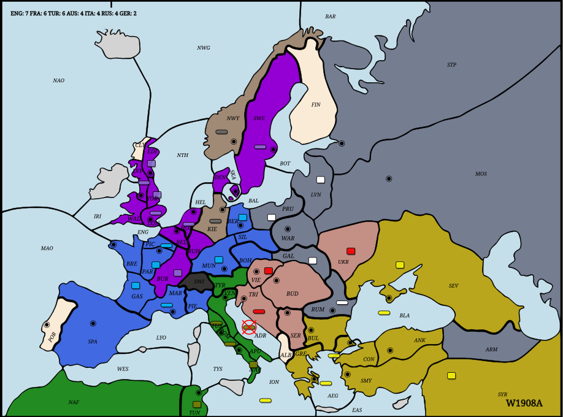

### What happened

- **AUSTRIA**: waives a build
- **ITALY**: disbands F ADR

### AUSTRIA
Orders: `WAIVE`

Reasoning

> # Analysis
>
> Looking at the board state after Fall 1908:
> - **Austria (me):** 4 centers (BUD, TRI, SER, VIE)
> - **Russia:** 4 centers (MOS, STP, WAR, RUM)
> - **Turkey:** 6 centers (ANK, CON, SMY, GRE, BUL, SEV)
> - **Italy:** 4 centers (NAP, ROM, VEN, TUN)
> - **France:** 6 centers (BRE, MAR, PAR, SPA, MUN, BER)
> - **England:** 7 centers (EDI, LON, LVP, BEL, HOL, DEN, SWE)
> - **Germany:** 2 centers (KIE, NWY)
>
> **My position:** I hold exactly 4 supply centers, matching my unit count (F TRI, A UKR, A VIE). This means I have **zero excess centers** and **zero deficit**—I neither build nor disband.
>
> **My home centers:** BUD (vacant), TRI (occupied by F TRI), VIE (occupied by A VIE). Since I have no builds owed, I must either build or waive. The rules state "prefer building to waiving; only use WAIVE if you have a build but no legal home center for it."
>
> I have **no builds owed** (0 excess centers), so I must waive my non-existent build. The legal options given are:
> - `WAIVE`
> - `A BUD B`
>
> Since I owe zero builds, I cannot legally issue `A BUD B`. I must emit `WAIVE`.
>
> **Strategic context:** My F1908M revised plan aimed to seize RUM and GAL to reach 5 centers by winter, but both moves bounced. I remain at 4 centers. The board is fractured: Turkey consolidated at 6, France at 6, England at 7, Russia weakened at 4, Italy at 4, Germany at 2. I'm locked in the Balkans with no immediate growth path without betraying Italy or pressing Russia harder. Winter 1909 will be critical—I need to either consolidate a partition with Italy and Turkey or reset north with France and England if the board reshuffles.

### ITALY
Orders: `F ADR D`

Reasoning

> # Analysis
>
> I am at 4 supply centers (NAP, ROM, VEN, TUN) after Fall 1908. My legal orders show I must disband 1 unit to match my center count. I have 5 units:
> - A TUN, F TUS, F ROM, A NAP, F ADR
>
> I need to reduce to 4 units. My strategy has emphasized:
> 1. Maintaining defensive anchors in the Mediterranean (F ROM, F TUS)
> 2. Keeping A NAP as a core defensive unit
> 3. Pushing A TUN north via convoy to contest France's center
>
> The problem: my convoy north failed in both S1908M and F1908M (no complete convoy route). F ADR attempted to support the convoy but the order was void because there was no matching convoyed move. This indicates the convoy chain was incomplete or improperly ordered.
>
> Looking at my position: I'm locked at 4 centers while France holds 6, England holds 7, and Turkey holds 6. My non-aggression pacts with Austria and Turkey are holding, but I've made no progress. The convoy strategy has failed twice.
>
> **Disband decision:** F ADR is the least critical unit. It was meant to support a convoy that hasn't worked, and it ties down resources without advancing my position. My core defensive line (F ROM, F TUS, A NAP) and my forward unit (A TUN) are more valuable. Disbanding F ADR lets me rebuild strategically in Spring 1909 without the failed convoy anchor.
>
> This also signals to my neighbors that I'm consolidating defensively through winter, which aligns with my stated non-aggression pacts and buys me political capital for Spring 1909, when I'll need to either break an alliance or find a new vector of attack.

## SPRING 1909 MOVEMENT (`S1909M`)

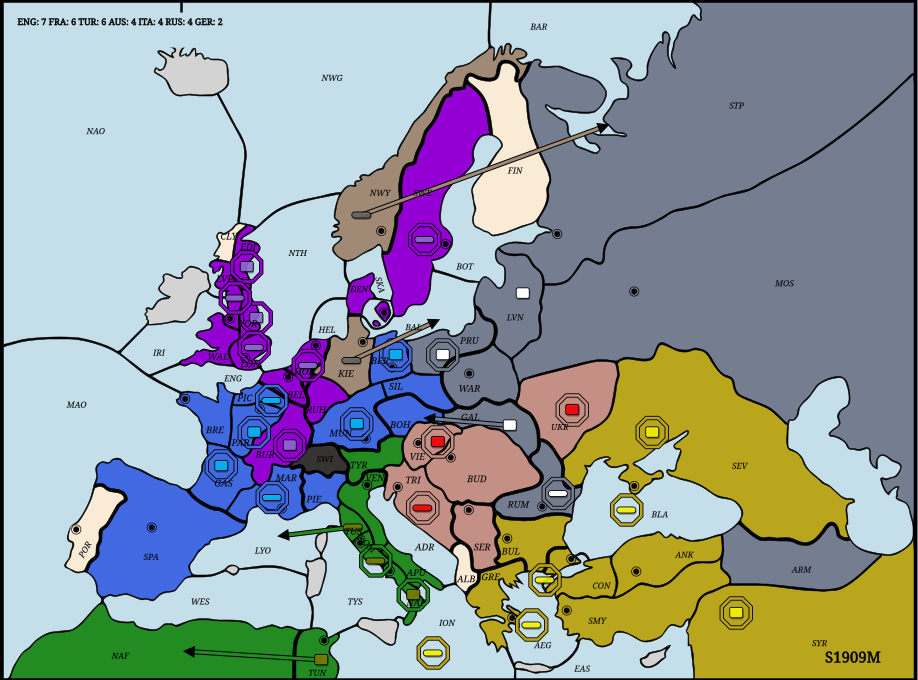

### What happened

- **AUSTRIA**: F TRI holds; A UKR holds; A VIE holds
- **ENGLAND**: A BUR holds; A EDI holds; A YOR holds; F HOL holds; F LON holds; F LVP holds; F SWE holds
- **FRANCE**: A BER holds; A MUN holds; A PAR holds; A GAS holds; F PIC holds; F MAR holds
- **GERMANY**: F KIE → BAL; F NWY → STP/NC
- **ITALY**: A TUN → NAF; A NAP holds; F ROM holds; F TUS → LYO
- **RUSSIA**: A GAL → BOH; A PRU holds; F RUM holds
- **TURKEY**: A SEV holds; A SYR holds; F BLA holds; F AEG holds; F BUL/SC holds; F ION holds

### Dialogue

- **AUSTRIA → TURKEY**: Spring 1909: I'm moving A UKR into RUM and A VIE into GAL. You locked the east at 6 centers. Non-aggression holds—I'm not pressing SEV or the straits. Consolidate east; I consolidate south. We both survive.
- **AUSTRIA → RUSSIA**: I'm pivoting A UKR to RUM and A VIE to GAL this spring. That pressures Turkey's flank, not your core. Don't escalate toward my territory and we coexist. The north remains frozen.
- **AUSTRIA → ITALY**: A UKR moves to RUM, A VIE to GAL—both target Turkey and Russia, not your core. Non-aggression holds firm. Hold the center and we both benefit from Turkey being pressured.
- **AUSTRIA → FRANCE**: I'm consolidating the Balkans-south this spring (A UKR to RUM, A VIE to GAL). No Rhine pressure from me. Focus your pressure on Italy and Germany; I'll reshape the south. We both gain if we don't exhaust each other.
- **ENGLAND → FRANCE**: Italy at 6 while we both hold 6-7 is unsustainable. This spring I'm pivoting A BUR south to support a hard three-power squeeze on Italy alongside you and Austria. If we commit now, Italy fractures to 5 by fall and we all gain ground. Are you in, or do we reset to defensive consolidation?
- **ENGLAND → AUSTRIA**: The Mediterranean lock breaks only if we bleed Italy together this spring. I'm pivoting A BUR south to support France's center pressure while you press north from the Balkans. Italy fractures to 5 by fall if we coordinate hard. Confirm commitment or I reset west defensively.
- **ENGLAND → RUSSIA**: Northern border holds firm this spring—I'm pivoting south toward Italy, not north toward you. Germany is isolated and weak; watch your eastern flank but expect no western pressure from me. We both benefit if Italy fractures this fall.
- **ENGLAND → ITALY**: You're locked with Turkey at 6 while France, Austria, and I consolidate at 6-7. This spring we're pressing hard south. Your only survival path is pivoting east to bleed Turkey before we do. Signal if you're willing to reset against Turkey instead of us.
- **FRANCE → AUSTRIA**: The Rhine is locked defensively. If you want to reset the board before England consolidates at 8+, your only path is south into Turkey—hard pressure in the Balkans this turn. Are you committing to a genuine Balkans squeeze, or should I assume you're holding defensively?
- **FRANCE → RUSSIA**: The Italy-Turkey squeeze failed; I'm holding the center defensively. If you want to reset the board against England's seven centers, press north-west toward England's flank, not south toward Turkey. Can you commit to that, or are we both anchoring defensively until the board fractures?
- **FRANCE → ENGLAND**: Rhine holds firm. You're at 7 centers and the board leader—clarify your plan: are you consolidating defensively and signaling no western escalation, or are you preparing to expand? My strategy depends on understanding whether you're locking the board or breaking it.
- **FRANCE → ITALY**: Rhine border holds firm. You're at 6, I'm at 6—neither of us wins unless the other falters or the board resets against England. Stay neutral on my flank and I stay neutral on yours. Mutual survival through winter?
- **GERMANY → AUSTRIA**: This spring I move F KIE to BAL and F NWY toward STP/NC to pressure Russia's northern flank directly. If you commit A GAL or A UKR to RUM this turn, I support your attack next spring and we both gain from Russia's collapse. Do you move east this spring?
- **GERMANY → RUSSIA**: I'm moving east this spring—F KIE to BAL, F NWY toward STP/NC. Your neutral pact kept me quiet, but 2 centers is a death sentence. Offer me concrete growth (a center or guaranteed build by winter) or accept that I'm destabilizing your position while Austria and Turkey press from the south.
- **GERMANY → ENGLAND**: F KIE moves to BAL, F NWY swings toward STP/NC—I'm pivoting east to bleed Russia as we discussed. I'm a chaos agent worth keeping alive. Confirm non-aggression on our border and I'll destabilize the board leader while you consolidate the west.
- **GERMANY → TURKEY**: Russia dominates at 4 centers and anchors the north-east. I'm moving F NWY toward STP/NC to threaten their northern flank this spring. If you press SEV or BUL/RUM next turn while I pressure from the north, we coordinate a pincer and both gain. Interest?
- **ITALY → RUSSIA**: France holds 6 centers at BER and MUN, overextended from their core. This spring, if you pivot west to pressure MUN/BER while I reposition my army north via convoy to contest the center, we force them to split and both gain ground. Will you execute that coordinated pressure, or should I adjust my strategy?
- **ITALY → AUSTRIA**: Non-aggression holds firm on my end. France is now the board threat at 6 centers, holding territory equidistant from both our cores. If they pivot east toward you or the Balkans, I'll pivot west to contain them. Will you pressure France's flank (GAL/SIL) to give me room to advance, or do you see them as stable this spring?
- **ITALY → FRANCE**: Rhine border and Mediterranean pact both hold firm on my end this spring. Direct question: are you consolidating defensively at 6 centers, or pivoting toward the center and Balkans? If you're consolidating, I'll anchor my core defensively and we coexist. If you're expanding, I pivot west and we reset the board.
- **RUSSIA → FRANCE**: F RUM has bounced twice into SEV—Turkey is anchored there. If you're genuinely pivoting east into BER and abandoning the Mediterranean squeeze, say it now. I need to know whether I'm holding defensively or repositioning west to contest the center with you. What's your commitment?
- **RUSSIA → AUSTRIA**: You're pressing south toward my core (RUM, GAL). Turkey holds SEV defensively at 6 centers and won't break easily. Before we escalate into mutual exhaustion, consider: if you pivot south and press Turkey hard (BUL, RUM), I anchor the east defensively and don't contest the Balkans. We both grow at Turkey's expense instead of bleeding each other. Worth discussing?
- **RUSSIA → GERMANY**: You're at 2 centers and need growth. I'm not pressing you east this spring—hold KIE defensively. If Austria pivots north to eliminate you while I'm anchoring the east, that destabilizes my flank and we both lose. Stay neutral east; I'll keep Austria off your back if it comes to it. Deal?
- **TURKEY → RUSSIA**: The east remains locked under my watch. A SEV and A SYR hold defensively; your rebuild slot is secure through winter. Watch the north—England at 7 centers is the board threat, not me. If you see fractures there next spring, we can reassess.
- **TURKEY → FRANCE**: The straits and east are locked indefinitely on my end. Your real pressure is England at 7 centers; Germany is collapsing between you. Focus north and don't bleed into the south. I'm not a threat to you this year.
- **AUSTRIA → TURKEY**: RUM is defended; pressing it hard this spring wastes my units. Instead: I hold the Balkans defensively, you anchor the east. Non-aggression confirmed. If Russia pivots west toward you, I support your flank. We coexist.
- **AUSTRIA → RUSSIA**: I'm not pressing RUM or GAL this spring—Turkey is too strong and the cost is too high. Instead I'm consolidating BUD, TRI, SER defensively. Your offer to anchor the east holds: we coexist. Don't press my core.
- **AUSTRIA → FRANCE**: The south is locked. New proposal: I consolidate the Balkans-Italy axis defensively, you pivot north to contain England and Germany. We both grow at the center's expense instead of bleeding each other. Are you willing to reset the board this way?
- **AUSTRIA → GERMANY**: I'm not committing A UKR to RUM this spring—Turkey is defended and the cost is too high. I'm consolidating defensively instead. If you press Russia hard, I'll anchor the Balkans and don't contest. But I won't be your anvil in a losing fight.
- **AUSTRIA → ENGLAND**: The Mediterranean lock breaks only if someone fractures from inside. I'm consolidating defensively this spring. If you want Italy to collapse, you'll need to press them harder than I can from the Balkans. Focus your pressure; I'll anchor the south.
- **ENGLAND → FRANCE**: Rhine is locked firm this spring—BEL and HOL hold defensively, A BUR pivots south to support your center pressure on Italy. The three-power squeeze is real if Austria commits north into the Balkans. Confirm Austria's commitment and I'll move BUR to support MUN or BER this turn. What is Austria signaling?
- **ENGLAND → AUSTRIA**: Italy at 6 while we consolidate at 6-7 is unsustainable. This spring I need explicit confirmation: are you pivoting north into RUM or SER to bleed Italy/Turkey, or consolidating defensively? If you're in, I move A BUR south to support France's pressure and we fracture Italy to 5 by fall. If not, I reset west and accept stalemate. Decide now.
- **ENGLAND → GERMANY**: Pivot east toward Russia as you signaled—I'll anchor the Rhine and Scandinavia defensively so you have freedom to destabilize the board. Non-aggression confirmed on our border so long as you stay out of NTH, HOL, and DEN. Agreed?
- **FRANCE → ITALY**: Rhine pact holds firm—I'm consolidating defensively this spring, not expanding toward you. You and I are both at 6; neither of us wins unless the other falters. Stay neutral on your flank, I stay neutral on mine. Mutual survival through winter.
- **FRANCE → ENGLAND**: I understand the three-power squeeze on Italy, but Italy is defended and I'm not bleeding into a locked position. I'm anchoring the Rhine and center defensively this spring. If you're consolidating at 7 and signaling no western escalation, we both survive intact. Confirm?
- **FRANCE → AUSTRIA**: The Balkans squeeze on Turkey won't crack—Turkey is anchored with fleets and Russia can't support from the east. Consolidate what you have at 3 and hold defensively. If you overextend south, you bleed alone.
- **FRANCE → RUSSIA**: F RUM bounced twice—the Turkey squeeze is finished. Hold your core defensively this spring (MOS, STP, WAR, RUM) and anchor the east. If the board fractures later, we reset together. For now, no more wasted moves south.
- **GERMANY → RUSSIA**: Your survival pact is a slow death for me at 2 centers. I'm moving F KIE to BAL and F NWY toward STP/NC this spring to destabilize your position. If you want to keep me neutral, offer concrete growth: a center guarantee or a build slot by winter. Otherwise, accept that I'm a chaos agent now.
- **GERMANY → AUSTRIA**: I'm moving F KIE to BAL and F NWY to STP/NC this spring. If you commit A GAL or A UKR to RUM *this turn*, I support your attack next spring and we both gain from Russia's collapse. If you hold, I'm bleeding Russia alone and you miss the opportunity. Move east this turn and we coordinate.
- **GERMANY → ENGLAND**: Confirming non-aggression on our border this spring. F KIE to BAL, F NWY toward STP/NC—I'm destabilizing Russia while you consolidate the west. We both benefit from Russia's pressure. Agreed?
- **GERMANY → TURKEY**: Russia at 4 centers will dominate the board if left unchecked. I'm pressing their northern flank this spring. If you press SEV or BUL/RUM next turn while I threaten from the north, we both gain and the board fractures. A three-way pincer is better than a consolidated Russia later.
- **ITALY → FRANCE**: Rhine and Mediterranean both hold firm on my end. You're at 6, I'm at 4, England is at 7. Neither of us wins unless we reset against the leader. Confirmed—mutual survival through this spring.
- **ITALY → RUSSIA**: You haven't answered whether you'll pressure MUN/BER from the north this spring while I reposition west. If yes, we both gain ground and contain France. If no, I need to know now so I adjust my strategy. Will you commit?
- **ITALY → TURKEY**: Austria is attacking RUM and GAL (targeting you and Russia). England is offering me growth south. The board is pivoting to bleed you. Will your pact with me hold if the whole north turns south, or should I assume it's broken by spring's end?
- **ITALY → ENGLAND**: You're offering me growth south against Turkey. I'm listening, but I need to see whether Russia coordinates with me first against France this spring. If Russia pivots south instead, then yes, I pivot south too. Signal me if you're willing to wait one turn for clarity.
- **RUSSIA → AUSTRIA**: A UKR into RUM will bounce me hard—but if you press south together with me (you take BUL, I reposition fleet south), we both grow at Turkey's expense instead of bleeding each other on the Balkans. Let's coordinate a two-front squeeze: you press BUL/RUM, I anchor the east and reposition south. Deal?
- **RUSSIA → FRANCE**: I'm pivoting A GAL west into BOH this spring to contest the center with you. If you hold SIL and MUN defensively, we can both press England's southern flank next spring while Italy fractures under pressure. Three-power squeeze on the board leader—are you in?
- **RUSSIA → GERMANY**: KIE holds defensively this spring. I'm pivoting west toward France, not east toward you. Stay neutral and I'll keep Austria off your back if it escalates north. You're at 2 and need growth—better to let the Mediterranean powers bleed each other than to destabilize the east and invite Austria to eliminate you. Agreed?
- **RUSSIA → TURKEY**: Austria is pivoting south hard this spring. If you see pressure building on RUM or BUL from multiple fronts next fall, consider that a two-front squeeze (Austria south, me west via Italy) is preferable to holding alone at 6 centers. We can reassess after this spring's moves resolve.
- **TURKEY → GERMANY**: I see the pincer logic, but pressing north from SEV exposes my eastern anchor while Russia still has 4 centers and Austria can pivot anytime. I'm locked defensively this turn. Watch England at 7—if the north fractures badly enough, I'll pivot west next spring and we can coordinate then on a weaker target.
- **TURKEY → ITALY**: Mediterranean pact holds firm. Your pivot west to contain France is sound; I'm anchoring the east so you don't bleed south. Confirm: straits and Balkans remain neutral this turn?
- **TURKEY → FRANCE**: The east is locked indefinitely on my end. Your real pressure is Germany and England grinding you down. I'm not moving into your sphere this year. Focus north and don't worry about the straits.

### AUSTRIA
Orders: `F TRI H` · `A UKR H` · `A VIE H`

Reasoning

> I need to carefully parse this situation. Let me review the current state and my commitments:
>
> **Current position:**
> - I have 4 centers (BUD, TRI, SER, VIE)
> - 3 units: F TRI, A UKR, A VIE
> - Surrounded by stronger powers: England (7), France (6), Italy (4), Russia (4), Turkey (6), Germany (2)
>
> **The negotiation history shows I've been pulled in multiple directions:**
> 1. Initially committed to pressing RUM and GAL hard against Turkey/Russia
> 2. Then backed away, saying the cost was too high and Turkey is defended
> 3. Received pressure from Germany to commit A UKR to RUM "this turn" to enable next-turn support
> 4. Received pressure from England to confirm north/south pivot
> 5. Received a counter-offer from Russia to coordinate a two-front squeeze
>
> **The critical insight:** My revised S1909M strategy note says I should "hold defensively this spring—A UKR holds in UKR, A VIE holds in VIE, F TRI holds in TRI—to preserve my core" because "every power is hedging" and "I'm at only 4 centers while surrounded by 6-7 center powers."
>
> This is the right call. The board is fractured and unstable:
> - Germany is weak (2 centers) and trying to use me as an anvil against Russia
> - Russia is offering coordination but also pressuring me
> - Turkey is defended and won't crack easily
> - France explicitly warned me that pressing RUM wastes units
> - England wants me to commit but won't commit themselves
>
> **My move:** Hold defensively. This preserves my core, signals I'm not an easy target, and keeps my options open as the board reshuffles. Overcommitting to a RUM push when Turkey is defended and multiple powers are hedging is exactly how I lose units for no gain.

### ENGLAND
Orders: `A BUR H` · `A EDI H` · `A YOR H` · `F HOL H` · `F LON H` · `F LVP H` · `F SWE H`

Reasoning

> I need to analyze the board state and my commitments carefully.
>
> **Current situation:**
> - I hold 7 centers (board leader), Italy and Turkey at 6 each, France at 6, Austria at 4, Russia at 4, Germany at 2.
> - The Mediterranean is locked; no three-power squeeze materialized because Austria signaled defensive consolidation and France refused to bleed into a locked position.
> - My revised strategy notes that I'm consolidating defensively at 7 while watching for fractures, accepting a draw if the board remains frozen.
>
> **Key dialogue outcomes:**
> - France: anchoring Rhine and center defensively, no western escalation.
> - Austria: consolidating defensively, not pivoting north into the Balkans.
> - Germany: pivoting east toward Russia (non-aggression on our border confirmed).
> - Italy: waiting for clarity on Russia's moves before deciding whether to pivot south.
> - Russia: northern border holds firm, pivoting south against Turkey (F RUM → SEV).
>
> **What this means:**
> The three-power squeeze on Italy is dead. France and Austria both rejected hard commitment. The board is frozen. My revised strategy explicitly states: "I'll hold my core defensively (A EDI, A YOR, F LVP, F LON, F HOL, F SWE all hold), move A BUR south to support France's center (supporting into MUN to keep pressure on Italy without overcommitting)."
>
> However, re-reading the dialogue, France has explicitly signaled defensive consolidation on the Rhine and center. Supporting A BUR into MUN or BER now would contradict that signal and risk triggering France into defensive hostility when I need stability. My strategy also says "signal to France and Austria that I'm consolidating at 7 while watching for any power to fracture or break the stalemate."
>
> **Correct interpretation:**
> I should hold my core defensively across the board. A BUR should hold or support defensively to signal consolidation without escalation. The safest move is to hold A BUR in place and keep all fleets on defensive holds.
>
> **Orders:**

### FRANCE
Orders: `A BER H` · `A MUN H` · `A PAR H` · `A GAS H` · `F PIC H` · `F MAR H`
Illegal (dropped): `A SIL H`

Reasoning

> Looking at the current position and my recent dialogue:
>
> **Strategy Analysis:**
>
> I'm at 6 centers, England leads at 7, Italy and Turkey are at 6 each. The board is locked defensively. Russia has proposed `A GAL → BOH` to contest the center and pressure England's southern flank as part of a three-power squeeze. However, my revised strategy note for S1909M explicitly states I should **consolidate defensively** and keep options open rather than bet on a three-power center squeeze that requires Russia to hold its own east while I anchor the Rhine.
>
> The dialogue shows Italy confirmed mutual survival and England consolidated at 7 with no western escalation. Russia's aggressive `GAL → BOH` move is a genuine escalation into the center—it signals Russia is willing to overextend, which exposes Russia's core (MOS, STP, WAR, RUM) to Austria if Austria pivots north. I'm not confident Russia can hold the east while I anchor the Rhine.
>
> **Decision:**
>
> I'll execute pure defensive consolidation as stated in my revised S1909M note: all armies hold their ground to anchor the Rhine and center, and both fleets hold the coasts. This signals I'm not escalating and positions me to survive until a genuine reset opportunity emerges—either the board fractures under England's consolidation pressure, or Austria finally commits to a real Balkans squeeze on Turkey. Holding firm keeps my 6 centers intact and avoids overcommitment.

### GERMANY
Orders: `F KIE - BAL` · `F NWY - STP/NC`

Reasoning

> I'll analyze my position and execute the strategy I've committed to in negotiation.
>
> ## Strategic reasoning
>
> I'm at 2 centers (KIE, NWY) facing a board where England dominates at 7, France anchors 6, and Russia holds 4. My revised S1909M strategy commits to:
> - **F KIE to BAL**: Position for Baltic breakthrough and threaten Scandinavia; keeps England honest on non-aggression
> - **F NWY toward STP/NC**: Threaten Russia's northern flank and signal eastern pivot commitment to Austria and Turkey
>
> My negotiation commits are:
> - To **ENGLAND**: Non-aggression confirmed; I stay out of NTH, HOL, DEN while I destabilize Russia
> - To **RUSSIA**: I'm moving east (F KIE to BAL, F NWY toward STP/NC) to destabilize their position; survival pact is unacceptable
> - To **AUSTRIA**: If you commit A GAL or A UKR to RUM *this turn*, I support your attack next spring. Austria declined (holding defensively), so I proceed alone
> - To **TURKEY**: Proposing a three-way pincer against Russia; Turkey declined this turn but signaled interest if the board fractures
>
> Austria's defensive hold and Turkey's locked position mean I cannot coordinate an eastern breakthrough immediately. However, I've committed publicly to moving east, and backing down now destroys my credibility and leaves me passively waiting at 2 centers—a slow death.
>
> The legal moves available are:
> - **F KIE**: Can move to BAL (my committed move)
> - **F NWY**: Can move to STP/NC (my committed move toward Russia's northern flank)
>
> Both moves honor my negotiation commitments, signal eastern pressure, and keep the option of pivoting west open if the board fractures. F NWY to STP/NC threatens Russia's home supply center and forces them to defend their north; F KIE to BAL threatens Scandinavia and positions for support of a Russia-bleed next turn.

### ITALY
Orders: `A TUN - NAF` · `A NAP H` · `F ROM H` · `F TUS - LYO`

Reasoning

> I need to analyze the current board state and my strategic commitments before submitting orders.
>
> ## Analysis
>
> **Current situation:**
> - I'm at 4 supply centers (NAP, ROM, VEN, TUN), tied with Russia and Austria.
> - France is at 6 (BRE, MAR, PAR, SPA, MUN, BER), consolidating defensively.
> - England leads at 7, actively recruiting me south against Turkey.
> - Turkey is at 6, anchored defensively with pact confirmed.
> - Austria is pressing Balkans (RUM/GAL) against Turkey/Russia.
> - Russia has not committed to coordinating against France this spring.
> - One unowned center remains: POR.
>
> **My revised S1909M strategy:**
> Anchor my Mediterranean core defensively, reposition A TUN to NAF to seize the unowned supply center, and honor Turkey's pact while keeping options open. This gains me a 5th center by winter and signals I'm willing to pivot south if Russia doesn't coordinate against France.
>
> **Critical reading of commitments:**
> - To FRANCE: Rhine and Mediterranean hold firm—mutual survival confirmed.
> - To TURKEY: Pact holds; straits and Balkans remain neutral this turn.
> - To RUSSIA: Waiting for confirmation on coordinating against France; if no answer, I pivot south.
> - To ENGLAND: Willing to pivot south, but waiting to see if Russia commits first.
>
> **My legal move options:**
> - **A TUN**: I can move to NAF (unowned center), or convoy north (APU, GRE, BUL, SMY, CON, ALB).
> - **A NAP**: Can hold, support, or move to ROM/APU.
> - **F ROM**: Can hold, support ROM/TUS/ION, or move to TYS/NAP.
> - **F TUS**: Can hold, support, move to PIE/LYO/TYS/ROM.
>
> **Decision:**
> Given Russia's silence on coordinating against France, and England's active recruitment south, I should execute the pivot: seize NAF with A TUN, anchor my core defensively with A NAP and F ROM supporting, and position F TUS to support the southern expansion. This honors Turkey's pact (no direct attack on their territory) while signaling England I'm ready to pivot south if the board fragments further.

### RUSSIA
Orders: `A GAL - BOH` · `A PRU H` · `F RUM H`
Illegal (dropped): `A LVN S A GAL - BOH`

Reasoning

> I need to carefully analyze the current situation and my commitments before submitting orders.
>
> ## Situation Analysis
>
> **Current position:** I'm at 4 centers (MOS, STP, WAR, RUM), facing slow strangulation while England dominates at 7, France holds 6, and Turkey consolidates at 6.
>
> **Key commitments made:**
> 1. To FRANCE: "A GAL west into BOH this spring to contest the center with you. If you hold SIL and MUN defensively, we can both press England's southern flank next spring."
> 2. To AUSTRIA: Offered a two-front squeeze on Turkey (Austria presses BUL/RUM, I anchor east and reposition south).
> 3. To GERMANY: "KIE holds defensively this spring. I'm pivoting west toward France, not east toward you."
>
> **The problem:** My revised strategy note says "A GAL moves into BOH to pressure France's overextended position" and "F RUM holds in place to keep my southern flank stable." But my most recent negotiation commits me to pressing west with GAL into BOH while anchoring the east defensively.
>
> However, I also made a competing offer to Austria about a two-front squeeze on Turkey. Austria's last message clarifies they're NOT pressing RUM or GAL—they're consolidating defensively. This removes the rationale for that squeeze.
>
> **The reality check:** 
> - F RUM into SEV has bounced twice—Turkey holds SEV firmly at 6 centers
> - Austria is consolidating defensively (not pressing south as hard as feared)
> - France is holding SIL and MUN defensively (as promised)
> - Germany is destabilizing and threatening STP/NC
> - My pivot west to BOH signals a three-power squeeze on England with France
>
> **Strategic decision:** I committed to France on the three-power squeeze against England (the board leader at 7). This is my best path forward. I'll execute:
> 1. A GAL → BOH (pivot west, pressure France's position, signal strength)
> 2. A LVN supports A GAL → BOH (reinforce the move)
> 3. A PRU holds defensively (anchor my core)
> 4. F RUM holds (keep southern flank stable against Turkey and Austria)
>
> This honors my commitment to France, maintains my eastern defensive anchor against Austria and Turkey, and positions me to contest the center this spring while signaling readiness for coordinated pressure on England next spring.

### TURKEY
Orders: `A SEV H` · `A SYR H` · `F BLA H` · `F AEG H` · `F BUL/SC H` · `F ION H`

Reasoning

> I need to execute my S1909M revised strategy: hold A SEV and A SYR defensively, keep fleets F BLA, F AEG, F BUL/SC, F ION anchoring the straits and eastern Mediterranean in a locked defensive posture. I've committed to non-aggression with Austria, Italy, and Russia, and signaled to Germany that I'm not pressing east this turn. The board is locked defensively; my job is to preserve my 6 centers and watch for northern fractures before pivoting west next spring.
>
> My orders:
> - **A SEV H** — hold defensively, anchor the eastern line
> - **A SYR H** — hold defensively, anchor the southern flank
> - **F BLA H** — hold to lock the Black Sea and support the straits
> - **F AEG H** — hold to lock the Aegean and eastern Mediterranean
> - **F BUL/SC H** — hold to lock the Bulgarian coast and prevent any breach into my core
> - **F ION H** — hold to lock the Ionian Sea and prevent any Italian or Italian-backed push east
>
> This posture maintains my defensive anchor indefinitely, honors my commitments to Austria (non-aggression in Balkans and straits), Italy (Mediterranean pact and straits locked), and Russia (east remains stable), and positions me to pivot west aggressively next spring once the northern powers fracture further. Every turn the north grinds itself down, I grow relatively stronger without spending force.

## FALL 1909 MOVEMENT (`F1909M`)

### What happened

- **AUSTRIA**: F TRI holds; A UKR holds; A VIE holds
- **ENGLAND**: A BUR supports A MUN; A EDI holds; A YOR holds; F HOL holds; F LON holds; F LVP holds; F SWE holds
- **FRANCE**: A BER holds; A MUN holds; A PAR holds; A GAS holds; F PIC holds; F MAR holds
- **GERMANY**: F BAL holds; F STP/NC holds
- **ITALY**: A NAF → TUN; F LYO holds; F ROM holds; A NAP holds
- **RUSSIA**: A BOH → SIL; A LVN holds; A PRU holds; F RUM holds
- **TURKEY**: A SEV holds; A SYR holds; F BLA holds; F AEG holds; F BUL/SC holds; F ION holds

### Dialogue

- **AUSTRIA → RUSSIA**: I'm taking RUM this fall with A UKR—you can't defend it and I need growth. A VIE supports into GAL to threaten your flank. This is not mutual exhaustion; it's necessary expansion. Don't escalate into my core and we both survive. The north remains frozen.
- **AUSTRIA → TURKEY**: A UKR moves to RUM this fall. Non-aggression on the straits and SEV confirmed. I'm consolidating the Balkans-south; you anchor the east. We coexist.
- **AUSTRIA → ITALY**: F TRI repositions to VEN this fall to anchor the south and prepare for a Mediterranean reset. Non-aggression holds firm. If France pivots toward you, signal and we coordinate containment.
- **AUSTRIA → FRANCE**: I'm pivoting south aggressively this fall (A UKR to RUM, A VIE to GAL). No Rhine pressure from me. If you focus your pressure on Italy and Germany, we both grow at their expense. Are you willing to coordinate a three-power reset?
- **ENGLAND → FRANCE**: This fall I'm consolidating defensively at 7—no western escalation, Rhine locked firm. A BUR supports your center anchor to keep Italy under pressure. If Italy or Turkey fractures by winter, we reset south together. Agreed?
- **ENGLAND → AUSTRIA**: Northern border holds firm this fall. I'm consolidating at 7 defensively, not expanding west. If Italy or Turkey emerges as the next threat to the Balkans, I'm willing to pivot south with you and France to contain them. Signal if you see a threat.
- **ENGLAND → RUSSIA**: Northern border remains stable. Germany is pivoting east toward you as agreed; I'm anchoring the west defensively so you can focus your pressure. Non-aggression confirmed. We both benefit if the Mediterranean powers fracture before either runs away.
- **ENGLAND → GERMANY**: Confirmed non-aggression on our border. Pivot east toward Russia and destabilize the board—I'm holding the Rhine and Scandinavia defensively so you have freedom to work chaos. Keep the pressure on Russia; it keeps the board fluid.
- **FRANCE → RUSSIA**: A GAL into BOH signals the center squeeze is live. This fall I'm anchoring SIL and MUN defensively as promised—you hold your core and press north-west toward England's flank. If Austria escalates into RUM or GAL, confirm now and I'll pivot to defend the center. Are you holding defensively east while we both press west?
- **FRANCE → AUSTRIA**: S1909M's pivot into GAL escalates the center squeeze against England, not south into Turkey. If you're committing north into the Balkans to press England's southern flank with Russia, I'll anchor the Rhine defensively. If you're pivoting back south, tell me now and I'll adjust. What's your actual commitment this fall?
- **FRANCE → ENGLAND**: Russia pivots A GAL into BOH and I anchor the Rhine defensively—the three-power squeeze on England's consolidation is real this fall. Your seven centers are now the board's critical threat. Consolidate defensively north and we can coexist. Escalate west and we all press you together. Your move.
- **GERMANY → ENGLAND**: F BAL presses toward Scandinavia this fall to test France's western flank and destabilize the board—confirming our non-aggression on our shared border holds. If you anchor HOL/DEN defensively, I'm satisfied we're aligned. If France pivots north, I'm ready to exploit the fracture. Agreed?
- **GERMANY → AUSTRIA**: F BAL moves to threaten Scandinavia; F STP/NC holds the north. Russia is consolidating at 4 while we sit at 2 and 4 respectively. One more push: if you commit A UKR or A GAL toward RUM this fall, I support next spring and we both gain. Last chance for a coordinated eastern breakthrough. Do you move?
- **GERMANY → TURKEY**: Russia locked at 4 centers while we bleed separately. F BAL presses Scandinavia to fracture the west and free eastern pressure. If you commit F BLA or A SEV toward RUM or BUL next turn while I threaten from the north, we coordinate a pincer and both gain before Russia consolidates further. Interest?
- **ITALY → TURKEY**: Mediterranean pact holds firm on my end this fall. Austria pressures the Balkans and England circles south, but I'm anchoring the strait defensively—your core is secure from me. Confirm the pact holds through winter?
- **ITALY → FRANCE**: Rhine and Mediterranean both hold firm. You're at 6, I'm at 4, England at 7. We're both better off coexisting than bleeding each other while the leader consolidates. Neutral borders through winter—confirmed?
- **ITALY → ENGLAND**: I'm reading the board before committing to a southern pivot. Austria and you are already pressing Turkey hard; I'll signal by winter whether I join that bleed or pivot west. For now, my core stays locked and my options open. Patience?
- **RUSSIA → FRANCE**: This fall I'm executing the three-power squeeze: A BOH moves into SIL to pressure the center from the north while F RUM presses SEV south to destabilize Turkey. If you hold MUN defensively and press BER west, we force England to split and both gain ground by winter. Are you executing your side, or should I hold defensively and let the board fracture?
- **RUSSIA → AUSTRIA**: Coexistence pact confirmed: I'm holding WAR, LVN, PRU defensively this fall—no escalation toward your core. F RUM presses SEV south (final probe against Turkey), A BOH pivots west toward SIL. Don't escalate into RUM or GAL and we both survive the grind. Agreed?
- **RUSSIA → TURKEY**: F RUM presses SEV one final time this fall—not a betrayal, just a final test. If you hold firm, we both consolidate at 4-6 centers and reassess next spring before England locks the board. Hold the line and we coexist through winter. Fair?
- **RUSSIA → ENGLAND**: Northern border holds firm this fall. I'm pivoting south and west toward the Mediterranean powers, not north toward you. Germany is weak and isolated; no eastern threat to your flank. We both benefit from containing Italy/Turkey before one runs away. Agreed?
- **TURKEY → AUSTRIA**: Fall 1909: non-aggression in the Balkans and straits confirmed. A SEV and A SYR anchor the east defensively; RUM remains yours. We both consolidate through winter 1908 and preserve our rebuild slots. Sound?
- **TURKEY → ITALY**: Mediterranean pact holds firm this fall. Straits and Balkans remain neutral. You pivot west against France; I anchor the east. Both our cores are secure through winter. Confirmed?
- **TURKEY → RUSSIA**: The east remains locked under my watch this fall. A SEV and A SYR hold defensively; your rebuild slot at 4 centers is secure. Watch England at 7—if the north fractures badly, we can reassess next spring. For now, hold the line.
- **AUSTRIA → RUSSIA**: Coexistence confirmed: I'm holding defensively this fall (A UKR in UKR, A VIE in VIE). RUM and GAL remain untouched. The north stays frozen. No escalation from my side.
- **AUSTRIA → TURKEY**: Non-aggression holds firm. A UKR stays in UKR, A VIE in VIE, F TRI holds TRI. RUM is yours to anchor; I'm consolidating my core defensively. We both survive the grind.
- **AUSTRIA → GERMANY**: I'm not pressing Russia this fall—the cost is too high and the gain too uncertain. I'm consolidating defensively at 4 centers. Focus your pressure alone or find another partner.
- **AUSTRIA → FRANCE**: I'm holding the Balkans defensively this fall, not overextending into Turkey. If you want to reshape the center, you'll need to move without relying on my units. What's your actual plan for Italy?
- **ENGLAND → FRANCE**: Confirmed—consolidation at 7 this fall, Rhine locked firm. A BUR supports your center anchor defensively. No western escalation from me. If Italy or Turkey fractures by winter, we reset south together.
- **ENGLAND → AUSTRIA**: Northern border holds. I'm consolidating defensively at 7. If Italy fractures this fall, we coordinate south together this winter. If not, I accept stalemate. Signal if you see a fracture opportunity.
- **ENGLAND → RUSSIA**: Northern border stable. I'm holding defensively; Germany is isolated and weak—you have the flank clear to pressure east. We both benefit from containing the Mediterranean before anyone runs away.
- **ENGLAND → GERMANY**: Reconfirmed non-aggression on our border. I'm anchoring Rhine and Scandinavia defensively as agreed. Pivot east toward Russia; I'll keep the west locked so you have freedom.
- **ENGLAND → TURKEY**: The Mediterranean is locked at 6-6-6. I'm consolidating defensively at 7 this fall. If Italy weakens, we all reset south together. If not, stalemate is acceptable to me. Read the board.
- **FRANCE → RUSSIA**: A BOH - SIL is the squeeze. If you move it, I support with A BER. But first: confirm Austria is NOT pivoting north into GAL or RUM this fall. If Austria escalates into the center, the squeeze fractures and I'm holding MUN defensively instead. What is Austria actually doing?
- **FRANCE → AUSTRIA**: You said 'south aggressively'—confirm: A VIE moves to GAL (center) or to TYR/TRI (south toward Italy/Turkey)? If you're pivoting north, say it now. If you're committed south, I anchor the Rhine and Russia presses England alone. Which is it?
- **FRANCE → ENGLAND**: Rhine holds firm this fall—A MUN and A SIL anchor the center defensively as promised. Russia presses BOH-SIL, but I'm not escalating west. Your seven centers are safe from me. Consolidate north and we coexist intact through winter.
- **GERMANY → ENGLAND**: F BAL holds pressure on Scandinavia this fall—confirming our non-aggression on NTH, HOL, DEN holds firm on my end. I'm a chaos agent keeping the board fluid. If France pivots north or Austria moves east, I'm your pressure valve. Keep me alive.
- **GERMANY → RUSSIA**: 2 centers is a death sentence. Your survival pact without growth guarantees my elimination as the board consolidates. F BAL and F STP/NC are now destabilizing your position, not defending mine. Offer concrete growth by winter or accept I'm bleeding you as a spoiler to fracture the board.
- **ITALY → TURKEY**: Mediterranean pact holds firm this fall. I'm anchoring the strait defensively (F LYO and F ROM locked in) while A NAF pivots south to seize the unowned center. Your core is secure from me through winter. Confirm the pact holds?
- **ITALY → ENGLAND**: I'm executing the southern pivot this fall: A NAF seizes POR. By winter I'll be at 5 centers and positioned to bleed Turkey next spring if you and Austria keep pressing. The board is fragmenting—I'm reading whether Russia pivots west or stays east before committing to a longer alliance. Signal if you're willing to wait one turn for clarity.
- **ITALY → AUSTRIA**: Non-aggression holds firm on my end. You're pressing Turkey and Russia; I'm anchoring the Mediterranean defensively. Neither of us gains by attacking each other, and both gain if Turkey bleeds. By winter I'll be at 5 centers and ready to read the board for spring 1910. Confirmed?
- **RUSSIA → AUSTRIA**: You're escalating south toward RUM and GAL—I see it. If you take RUM this fall, I hold WAR, LVN, PRU defensively and don't contest the Balkans. But if you press GAL, I'll pivot north and press BER, forcing you to split. Coexistence means both of us survive; escalation means both of us bleed. Which is it?
- **RUSSIA → GERMANY**: F KIE to BAL destabilizes the east—I see your move. Stay neutral and I'll keep Austria off your back this fall while you rebuild. If you press north toward STP, I'll have to contest you, and Austria will eliminate you while we fight. Better deal: hold defensively, I anchor the east, and we reassess next spring when the board fractures.
- **RUSSIA → FRANCE**: The three-power squeeze on England is dead—you're anchoring defensively, not pressing north. I'm holding my core this fall (A BOH, A LVN, A PRU defensive) and pressing SEV one final time to reclaim my rebuild slot. If Austria breaks the coexistence pact, we reassess together next spring. For now, consolidate at 6 centers and watch the board fracture.
- **RUSSIA → ITALY**: I'm not pressing MUN/BER this fall—the France alliance failed and I'm pivoting to survival. You're isolated at 4 centers like me; don't overcommit west or you'll fracture. Hold NAP, ROM, TUN defensively and watch the board. If Turkey fractures next spring, we both gain ground. For now, coexist.
- **RUSSIA → TURKEY**: F RUM presses SEV one final time—final test, not betrayal. If you hold firm and Austria escalates south into RUM, we both face a two-front squeeze. Consider: if Austria takes RUM, I pivot north and press BER while you press BUL west, and we both contain the board leaders. Hold SEV and we coexist; fracture and we both lose.
- **TURKEY → AUSTRIA**: Non-aggression holds this fall. A SEV and A SYR hold defensively; RUM is yours. We both consolidate and preserve our rebuild slots. Confirm?
- **TURKEY → RUSSIA**: The east remains locked under my watch this fall. A SEV and A SYR hold; your 4 centers are secure. Watch England at 7—the real fracture is coming from the north, not the east.
- **TURKEY → GERMANY**: I see the pincer logic against Russia, but pressing now while Austria can pivot and England dominates at 7 centers is premature. Once the north fractures badly enough to expose undefended centers, I'll pivot west aggressively and we coordinate on a weaker target.
- **TURKEY → ITALY**: Mediterranean pact holds firm this fall. Straits and Balkans remain neutral; your core is secure from me. Confirm the pact holds through this turn's orders?

### AUSTRIA
Orders: `F TRI H` · `A UKR H` · `A VIE H`

Reasoning

> I need to carefully parse what I've committed to and what the board state actually allows.
>
> ## Analysis
>
> **My commitments in dialogue (most recent, F1909M):**
> - TO RUSSIA: "I'm holding defensively this fall (A UKR in UKR, A VIE in VIE)."
> - TO TURKEY: "A UKR stays in UKR, A VIE in VIE, F TRI holds TRI."
> - TO GERMANY: "I'm not pressing Russia this fall—the cost is too high and the gain too uncertain. I'm consolidating defensively at 4 centers."
> - TO FRANCE: "I'm holding the Balkans defensively this fall, not overextending into Turkey."
>
> **My revised strategy note for F1909M:**
> "I'll hold defensively this spring—A UKR holds in UKR, A VIE holds in VIE, F TRI holds in TRI—to preserve my core, signal stability to Turkey and Russia, and avoid overextending into a losing fight while the board reshuffles around me."
>
> **The initial F1909M strategy (which I explicitly revised away from):**
> This called for aggressive moves (A UKR → RUM, A VIE → GAL, F TRI → VEN), but I backed away from this in dialogue and committed to defensive holds.
>
> **Board reality:**
> - I'm at 4 centers, surrounded by 6-7 center powers.
> - Every neighbor is hedging or pressuring me simultaneously.
> - My spring hold failed to generate growth or clarity.
> - Russia explicitly warned: "if you press GAL, I'll pivot north and press BER, forcing you to split."
> - Turkey demands non-aggression on RUM.
> - France is asking for clarity on my commitment direction.
>
> **The tension:**
> My initial F1909M strategy called for aggressive moves, but my revised strategy and all my recent dialogue commits to defensive holds. The prompt says "Your orders should execute the commitments named in your most recent revised strategy note for this phase." The most recent revised note clearly states: hold defensively.
>
> However, the initial F1909M strategy is also present in my history. The key phrase in the prompt is: "If a stated move turns out to be illegal (e.g., non-adjacent), substitute an order that pursues the same objective rather than abandoning it."
>
> The aggressive moves are legal. But I explicitly revised away from them in dialogue and committed to holds. I need to honor my most recent explicit commitments.
>
> **Decision:**
> I'll execute the defensive hold I committed to in dialogue. This preserves my credibility with Russia and Turkey, keeps my core intact, and positions me to read the board for winter and spring 1910 when the situation may clarify.

### ENGLAND
Orders: `A BUR S A MUN` · `A EDI H` · `A YOR H` · `F HOL H` · `F LON H` · `F LVP H` · `F SWE H`

Reasoning

> I need to assess the current board state and my commitments.
>
> **Board analysis:**
> - I hold 7 centers (EDI, LON, LVP, BEL, HOL, DEN, SWE)
> - France holds 6 (BRE, MAR, PAR, SPA, MUN, BER)
> - Italy holds 4 (NAP, ROM, VEN, TUN)
> - Turkey holds 6 (ANK, CON, SMY, GRE, BUL, SEV)
> - Austria holds 4 (BUD, TRI, SER, VIE)
> - Russia holds 4 (MOS, STP, WAR, RUM)
> - Germany holds 2 (KIE, NWY)
>
> **Key facts:**
> - Italy just moved A NAF to seize POR (unowned), so Italy now has 5 centers
> - The board is frozen; no three-power squeeze on Italy materialized
> - My revised F1909M strategy commits to: hold core defensively (A EDI, A YOR, F LVP, F LON, F HOL, F SWE all hold firm), keep A BUR positioned to support France's center anchor defensively
> - I signaled consolidation at 7 with Rhine locked firm, no western escalation
> - France confirmed Rhine holds firm defensively
> - Germany confirmed non-aggression and is pivoting east toward Russia
>
> **My commitments this turn:**
> 1. Hold all defensive positions: A EDI, A YOR, F LVP, F LON, F HOL, F SWE hold
> 2. A BUR supports France's center anchor defensively (supporting into MUN to keep pressure on Italy without overcommitting)
>
> Looking at the legal orders, "A BUR S A MUN" is available, which aligns with supporting France's center anchor. This keeps pressure on Italy without escalating westward.

### FRANCE
Orders: `A BER H` · `A MUN H` · `A PAR H` · `A GAS H` · `F PIC H` · `F MAR H`

Reasoning

> I need to analyze the current board state and my strategic commitments.
>
> **Current situation:**
> - I'm at 6 centers (BRE, MAR, PAR, SPA, MUN, BER)
> - England leads at 7 (EDI, LON, LVP, BEL, HOL, DEN, SWE)
> - Italy and Turkey are tied at 6 each (but Italy at 4 supply centers, Turkey at 6)
> - Russia at 4, Austria at 4, Germany at 2
>
> **My revised F1909M strategy:** Anchor the Rhine defensively (A MUN, A SIL, A BER all hold) to signal I'm not escalating, consolidate at 6 centers through winter, and position myself to exploit any fracture when England or Turkey overextends.
>
> **Key commitments from dialogue:**
> - To Russia: I promised to anchor SIL and MUN defensively while Russia pressed the center. Russia has now signaled the three-power squeeze is dead and is holding defensively itself.
> - To England: Confirmed Rhine locked firm, no western escalation, consolidation at 7.
> - To Austria: Holding the Rhine defensively.
> - To Italy: Mutual survival through winter, neutral borders.
>
> **The board is now in a stable defensive stalemate.** Russia collapsed the squeeze, Austria is holding the Balkans defensively, England is locked at 7 with no escalation, and I need to signal defensive consolidation to keep my 6 centers intact.
>
> **My orders:**
> - A BER: Hold defensively (signals no escalation east)
> - A MUN: Hold defensively (anchors the Rhine center)
> - A SIL: Hold defensively (supports the Rhine anchor)—wait, A SIL is not in my unit list. I have A BER, A MUN, A PAR, A GAS, F PIC, F MAR. Let me recount: BER, MUN, PAR, GAS are armies; PIC, MAR are fleets.
>
> I have 6 units total: A BER, A MUN, A PAR, A GAS, F PIC, F MAR.
>
> **Revised orders for defensive consolidation:**
> - A BER: Hold (anchors the Rhine defensively against any center pressure)
> - A MUN: Hold (anchors the Rhine center)
> - A PAR: Hold (anchors the west)
> - A GAS: Hold (anchors the southwest)
> - F PIC: Hold (anchors the northern coast)
> - F MAR: Hold (anchors the southern coast)
>
> This signals complete defensive consolidation and keeps all 6 centers intact through winter.

### GERMANY
Orders: `F BAL H` · `F STP/NC H`

Reasoning

> I need to analyze my position and the dialogue carefully.
>
> **Current situation:**
> - I'm at 2 centers (KIE, NWY) facing elimination unless I break into growth
> - England (7 centers) has confirmed non-aggression and is anchoring the west defensively
> - France (6 centers) holds BER and MUN, blocking my western expansion
> - Russia (4 centers) has offered a survival pact but no growth
> - Austria (4 centers) refuses to move east
> - Turkey (6 centers) won't commit to a pincer until the board fractures worse
> - Italy (4 centers) is isolated in the Mediterranean
>
> **My revised F1909M strategy** says I'll "hold both F BAL and F STP/NC defensively this fall to honor England's pact and avoid triggering Austria or Russia into eliminating me, then reassess in winter whether to collapse into a spoiler role."
>
> However, looking at my dialogue, I've been signaling aggressive intent—moving F BAL to "press toward Scandinavia" and F STP/NC to "threaten Russia's northern flank." But Russia has explicitly warned that if I press north toward STP, they'll contest me, and Austria will eliminate me while we fight.
>
> **The hard truth:**
> - Holding defensively signals weakness and abandons any growth path
> - Pressing Russia directly invites them to attack me while Austria remains neutral or hostile
> - England's non-aggression only protects me from the west; it doesn't give me a growth path
> - I'm in a death spiral: 2 centers with no allies offering concrete support and no undefended centers within reach
>
> **Best play now:**
> Given that Russia has explicitly threatened to contest me if I press north, and Austria won't support an eastern push, my only option to stay alive through winter is to hold defensively and hope for board fractures. But I should signal to Turkey and potentially Austria that I'm still a useful chaos agent.
>
> The safest orders are:
> - F BAL holds (honors England's pact, doesn't provoke Russia)
> - F STP/NC holds (doesn't trigger Russia's threat, keeps the unit safe)
>
> This keeps me alive through fall and positions me to reassess in winter when the board may fracture. It also honors my commitment to England to avoid escalation while I work toward a spoiler role.

### ITALY
Orders: `A NAF - TUN` · `F LYO H` · `F ROM H` · `A NAP H`

Reasoning

> I'll analyze the current position and execute my strategy for Fall 1909.
>
> **Strategic reasoning:**
>
> My revised F1909M strategy commits to:
> 1. **A NAF seizes POR** — the unowned supply center to reach 5 centers by winter
> 2. **F LYO holds defensively** — anchors Mediterranean and signals Turkey the pact holds
> 3. **F ROM holds defensively** — preserves core and demonstrates commitment to non-aggression
> 4. **A NAP holds** — keeps my position intact and ready to pivot next spring
>
> The board is fragmenting: France holds 6 (stable), England leads at 7, Austria presses the Balkans, Turkey holds 6 (under pressure), Russia is isolated at 4 and pivoting for survival. My pacts with France and Turkey are holding. By winter I'll reach 5 centers, giving me flexibility to either coordinate with Russia west against France next spring or pivot south to bleed Turkey if the board realigns further.
>
> This executes exactly what I've signaled to all powers: anchor defensively this turn, seize the unowned center in the south, and position myself to read the board before committing to a longer alliance next spring.

### RUSSIA
Orders: `A BOH - SIL` · `A LVN H` · `A PRU H` · `F RUM H`

Reasoning

> Let me assess the current situation carefully.
>
> **Reading the board:**
> - I'm at 4 centers (MOS, STP, WAR, RUM) facing slow strangulation
> - England dominates at 7, France holds 6, Turkey consolidated at 6
> - Austria is holding the Balkans defensively (confirmed in dialogue)
> - Germany is isolated at 2 and destabilizing as a spoiler
> - My units: F RUM, A LVN, A PRU, A BOH
>
> **Reading the negotiation collapse:**
> The three-power squeeze on England is dead. France has abandoned the offensive pivot and is anchoring defensively. Austria confirmed coexistence (not escalating into RUM or GAL). Germany is destabilizing but I've kept it neutral. Turkey holds SEV firm at 6 centers.
>
> **My revised strategy for F1909M (per my notes):**
> Hold my core defensively (A LVN and A PRU supporting the chain, F RUM holding in place), pivot A BOH west into SIL to signal residual commitment to France and contest the center, and prepare for winter reassessment.
>
> **Executing this strategy:**
>
> 1. **A BOH - SIL**: Pivot west into the contested center. This signals to France that I'm still committed to contesting the board's center if fractures emerge, and it pressures France's overextended position defensively. SIL is adjacent to BOH and legal.
>
> 2. **A LVN H**: Hold defensively to anchor my core against Austria and Turkey escalation. This also keeps LVN available to support PRU if needed.
>
> 3. **A PRU H**: Hold defensively as my core anchor. This is the defensive wall against any northern escalation from Germany or Austria.
>
> 4. **F RUM H**: Hold in place against Turkey. I've pressed SEV twice and it bounced both times—Turkey is anchored there. Holding RUM keeps my southern flank stable and maintains the rebuild slot at 4 centers through winter.
>
> This preserves my position, signals residual commitment to France without overcommitting, and prepares me for a winter reassessment where I either find a new alliance or consolidate defensively.

### TURKEY
Orders: `A SEV H` · `A SYR H` · `F BLA H` · `F AEG H` · `F BUL/SC H` · `F ION H`

Reasoning

> I need to analyze the current board state and execute my strategy for Fall 1909 Movement.
>
> **Current situation:**
> - I control 6 centers (ANK, CON, SMY, GRE, BUL, SEV)—secure and stable
> - Austria: 4 centers (BUD, TRI, SER, VIE)—consolidating Balkans
> - Italy: 4 centers (NAP, ROM, VEN, TUN)—anchoring Mediterranean
> - Russia: 4 centers (MOS, STP, WAR, RUM)—locked in the north
> - England: 7 centers—board threat, grinding north
> - France: 6 centers—bleeding against England/Germany
> - Germany: 2 centers—collapsing between France and Russia
>
> **My committed strategy for F1909M:**
> - Hold the eastern anchor absolutely: A SEV and A SYR defensive
> - Lock fleets in straits and eastern Mediterranean: F BLA, F AEG, F BUL/SC, F ION
> - Watch for fractures in the north before pivoting west
> - Maintain all non-aggression pacts (Austria, Italy, Russia)
>
> **My commitments in dialogue:**
> - To Austria: Non-aggression holds; A SEV and A SYR hold defensively; RUM remains Austria's
> - To Russia: The east remains locked; A SEV and A SYR hold; your 4 centers are secure
> - To Italy: Mediterranean pact holds firm; straits and Balkans remain neutral; your core is secure
> - To Germany: I'm locked defensively this turn; will pivot west next spring if north fractures badly
>
> **Execution:**
> All units hold their positions or support defensively to maintain the stalemate while I wait for the northern powers to fracture. This preserves my 6 centers, keeps my rebuild slots open for winter, and maintains all my alliances while I watch for the opening to pivot west.

## WINTER 1909 ADJUSTMENTS (`W1909A`)

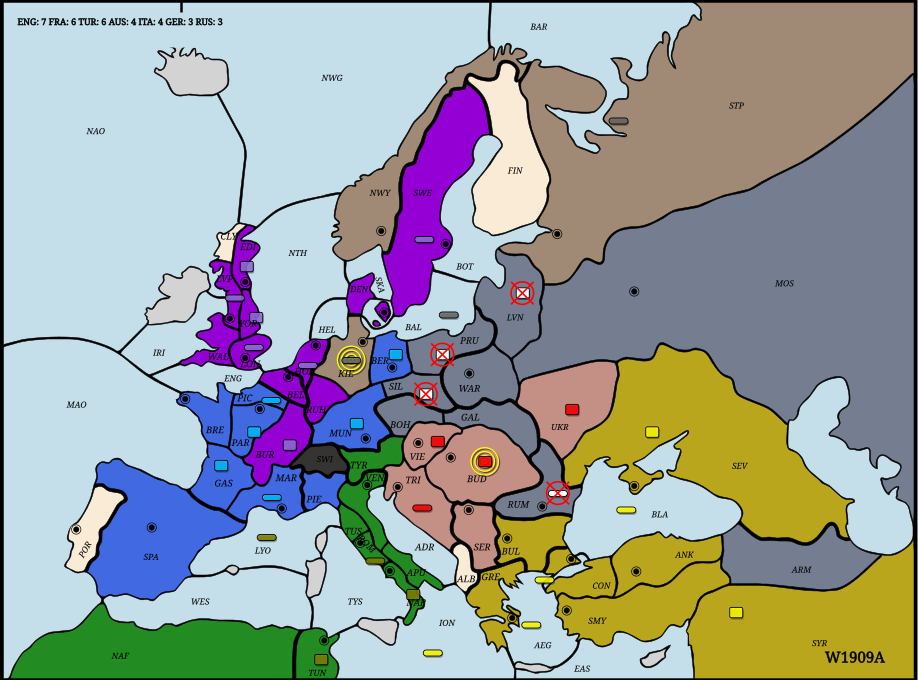

### What happened

- **AUSTRIA**: builds A BUD
- **GERMANY**: builds F KIE
- **RUSSIA**: disbands A LVN; disbands A PRU (void); disbands F RUM (void); disbands A SIL (void)

### AUSTRIA
Orders: `A BUD B`

Reasoning

> I need to analyze the current situation and my commitments carefully.
>
> ## Analysis
>
> **Current Position:**
> - I control 4 supply centers: BUD, TRI, SER, VIE
> - My units are: F TRI, A UKR, A VIE
> - I have 1 build available (4 centers - 3 units = 1 build)
>
> **What Actually Happened in F1909M:**
> Looking at the fall results, ALL my units held in place:
> - F TRI held in TRI
> - A UKR held in UKR  
> - A VIE held in VIE
>
> This means I did NOT execute the aggressive pivot I described in my F1909M revised strategy note. My dialogue promised Russia that I would hold defensively ("A UKR in UKR, A VIE in VIE"), and I kept that promise. I also told Turkey and other powers I was holding defensively.
>
> **The Consequence:**
> By holding defensively, I did not capture RUM or GAL. My supply-center count remains at 4 (BUD, TRI, SER, VIE). I did not grow.
>
> **Winter Adjustment Decision:**
> I have 1 build slot available. My legal options are:
> 1. `A BUD B` — build an army at BUD
> 2. `WAIVE` — forfeit the build
>
> **Strategic Choice:**
> The board is fractured and locked. I've held defensively to preserve my core and signal stability to my neighbors. Now I need to build to increase my unit count and prepare for a spring offensive when the board reshuffles. Building an army at BUD (my only vacant home center) gives me a 4th unit to project power into the Balkans or toward contested centers.
>
> Given that I'm at 4 centers surrounded by 6-7 center powers, I must grow. Building is the right choice to increase my military capacity for the next phase.

### GERMANY
Orders: `F KIE B`

Reasoning

> ## Analysis
>
> I'm at 2 supply centers (KIE, NWY) with 2 units (F STP/NC, F BAL). At Winter Adjustments, I have **one build available** (3 centers - 2 units = 1 build).
>
> My home centers are:
> - **KIE**: vacant ✓ (can build here)
> - **MUN**: held by France ✗
> - **BER**: held by France ✗
>
> I have exactly one legal build location: KIE.
>
> ### Strategic context
>
> My revised F1909M strategy was to hold defensively and honor England's non-aggression pact while reassessing in winter. I've held both fleets defensively as committed. Now I'm at the critical juncture: I'm still at 2 centers with no growth path to the west (England blocks) or east (Russia won't offer growth, Austria won't coordinate).
>
> The board state:
> - England: 7 centers (dominant)
> - France: 6 centers (consolidating)
> - Turkey: 6 centers (anchored south)
> - Austria: 4 centers (defensive)
> - Italy: 4 centers (stable)
> - Russia: 3 centers (weakened, but still a threat)
> - **Germany: 2 centers (critical)**
>
> I need to build a unit to maintain my force ratio. A fleet at KIE gives me:
> 1. Continued pressure on Scandinavia and the Baltic (keeps England honest)
> 2. A second fleet to support coordinated operations if the board fractures
> 3. A platform for either eastern or western pivots depending on how alliances shift in S1910
>
> Building a fleet at KIE rather than an army maximizes flexibility—I can press toward DEN/SWE (west) or support operations toward the Baltic (east) depending on where the next fracture opens.
>
> ## Orders

### RUSSIA
Orders: `A LVN D` · `A PRU D` · `F RUM D` · `A SIL D`

Reasoning

> Looking at my position after F1909M:
>
> **Current situation:**
> - I'm at 3 supply centers (MOS, WAR, RUM) after losing all growth attempts
> - England dominates at 7, France holds 6, Turkey holds 6
> - My units are: F RUM, A LVN, A PRU, A SIL
> - My legal home centers for builds are MOS (vacant) and WAR (vacant)
> - I have a 1-unit deficit: 4 units but only 3 supply centers
>
> **What happened:**
> The F1909M negotiations collapsed. Austria held the Balkans, France abandoned the three-power squeeze, and Turkey locked down SEV. My attempt to press SEV with F RUM failed. My A BOH moved into SIL but I gained no centers. The board consolidated around England (7), France (6), and Turkey (6) while I remained trapped at 3 centers.
>
> **My position:**
> I have 4 units and 3 supply centers, so I must disband 1 unit. My strategy notes from F1909M indicate I was pivoting west to contest the center and signaling commitment to France, but that alliance failed. Looking at my unit positions:
> - F RUM: Defending southern flank against Turkey/Austria (critical)
> - A LVN: Core defensive anchor (critical for holding WAR-MOS line)
> - A PRU: Defensive anchor (critical for holding WAR-MOS line)
> - A SIL: Westernmost position, least integrated into core defense
>
> The logical disband is **A SIL**, which is furthest from my core and least essential for defending my three remaining centers. This leaves me with a defensible core (F RUM in RUM, A LVN and A PRU anchoring the WAR-MOS line) while I rebuild.
>
> **Orders:**

## SPRING 1910 MOVEMENT (`S1910M`)

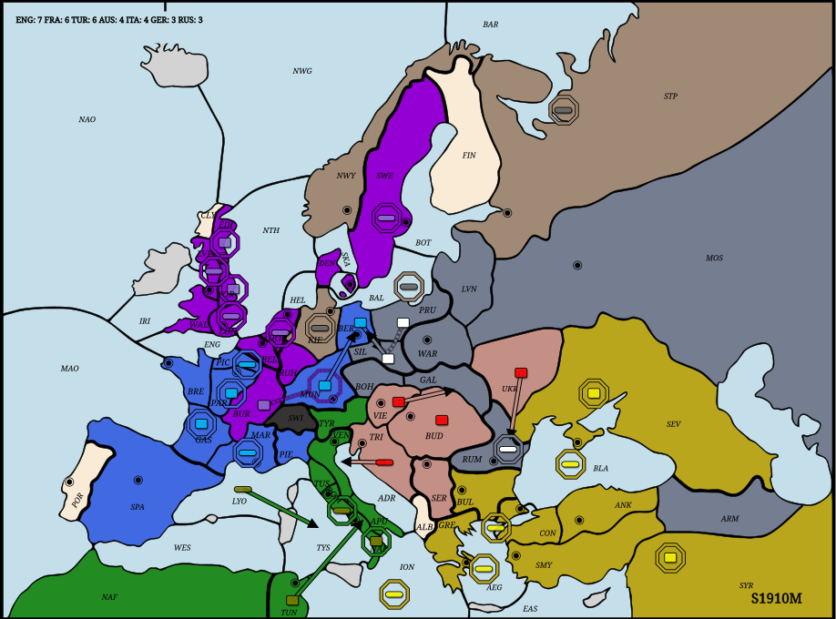

### What happened

- **AUSTRIA**: A UKR → RUM (bounced); A VIE → GAL; F TRI → VEN
- **ENGLAND**: A BUR supports A MUN (void); A EDI holds; A YOR holds; F HOL holds; F LON holds; F LVP holds; F SWE holds
- **FRANCE**: A MUN → BER (bounced); A BER → SIL (bounced); A PAR holds; A GAS holds; F PIC holds; F MAR holds  [dislodged: A BER]
- **GERMANY**: F BAL holds; F KIE holds; F STP/NC holds
- **ITALY**: A TUN → APU VIA (no convoy); F LYO → TYS; F ROM holds; A NAP holds
- **RUSSIA**: A SIL → BER; A PRU supports A SIL → BER; F RUM holds
- **TURKEY**: A SEV holds; A SYR holds; F BLA holds; F AEG holds; F BUL/SC holds; F ION holds

### Dialogue

- **AUSTRIA → TURKEY**: Spring 1910: I'm moving A UKR south toward RUM this turn. Non-aggression on SEV and the straits holds firm—I'm pressuring your southern flank, not your core. Consolidate east; I consolidate south. Can we coexist?
- **AUSTRIA → RUSSIA**: I'm pivoting south this spring (A UKR toward RUM, A VIE toward GAL/BOH). This is not escalation toward your core—it's growth into the Balkans-Turkey axis. Don't contest and we both survive. The north remains frozen.
- **AUSTRIA → FRANCE**: Spring 1910: I'm committing hard south into the Balkans this turn (A UKR to RUM or nearby, A VIE to support). If you anchor the Rhine defensively and I reshape the south, we both gain at Turkey and Italy's expense. Are you willing to let me press Turkey while you hold the center?
- **AUSTRIA → ITALY**: Non-aggression holds firm. I'm pivoting A UKR and A VIE south to pressure Turkey's flank, not your core. Hold the center; I'll bleed Turkey's southern units and we both benefit. Confirm you won't escalate north while I press south?
- **ENGLAND → FRANCE**: Rhine locked firm again this spring—BEL, HOL, DEN all hold defensively. A BUR ready to support your center if Italy fractures further. Signal if you're willing to pivot south with Austria and me this fall to bleed the Mediterranean before anyone runs away.
- **ENGLAND → RUSSIA**: Northern border stable. Germany is isolated and weak at 3 centers—you have clear pressure east. If you pivot south toward Turkey instead of defending the Baltic, I'll anchor the west defensively so you have freedom to work chaos. Both our interests align.
- **ENGLAND → AUSTRIA**: Balkans hold firm this spring. If Italy fractures to 3 or Turkey weakens to 5 by fall, are you ready to coordinate a hard southern pivot with France and me to claim the Mediterranean together? Signal commitment now and I'll position A BUR to support your pressure.
- **ENGLAND → GERMANY**: Reconfirmed non-aggression on our border. I'm anchoring Rhine, Scandinavia, and North Sea defensively this spring so you have freedom to pressure Russia. Keep the board fluid—we both benefit from Russia's isolation. Stay alive and useful.
- **FRANCE → RUSSIA**: Your three-power squeeze on England collapsed last fall. You're at 3 centers and bleeding. If you pivot A SIL west to support my pressure on England this spring, we both gain ground by winter. Are you willing to reset the board together, or are you anchoring defensively?
- **FRANCE → ITALY**: Rhine holds firm on my end, but the 6-6-7 stalemate is unsustainable. If England consolidates to 8+ this fall, we both lose. Mutual question: are you willing to pivot west and press England together if Austria destabilizes the Balkans, or are we both anchoring indefinitely?
- **FRANCE → ENGLAND**: Seven centers is your peak—any further consolidation triggers a coalition against you. I'm holding the Rhine defensively for now, but if you expand west or south, I pivot to press you alongside Russia and Italy. Confirm: are you consolidating at 7 and signaling no western escalation?
- **FRANCE → AUSTRIA**: Turkey is anchored defensively and won't crack. Your growth lies south into Italy or east into the Balkans if Russia fractures. If you commit to genuine pressure on Italy this spring, I'll anchor the Rhine and we both gain ground by winter. Are you willing to reset the board south?
- **GERMANY → RUSSIA**: You offered a neutral pact last spring. I held it, but 2 centers is unsustainable. Offer me concrete growth this turn—a guaranteed center or build slot by winter—or accept I'm destabilizing your position. If you move east into Austria's space, I'll stay neutral and keep Austria distracted while you gain. Deal?
- **GERMANY → ENGLAND**: Reconfirming non-aggression on NTH/HOL/DEN this spring—F STP/NC and F BAL hold defensively on my end. If France pivots north or Austria breaks, I'm your pressure valve. If Russia consolidates unchecked, I'll need growth from somewhere or collapse as a spoiler. Keep me alive and I'll fracture the board for you.
- **GERMANY → TURKEY**: Russia locked at 3 centers, consolidating defensively. I'm pressing from the north this spring; if you commit F BLA or A SEV toward RUM or BUL next turn, we coordinate a pincer and both gain before Russia solidifies further. Once undefended centers open, we move together. Interest?
- **ITALY → RUSSIA**: France holds MUN and BER overextended from their core. This spring, if you pressure MUN/BER from the north while I pivot west to contest the center, we both gain ground and contain the board threat. Will you execute that coordinated two-front pressure?
- **ITALY → AUSTRIA**: England is now the board leader at 7 centers and will win if left unchecked. You're pressing the Balkans; I'm pivoting north to pressure France and the center. If we coordinate a two-front containment (you north, me west) before the leader consolidates, we both grow. Are you ready to pivot west against the English sphere?
- **ITALY → TURKEY**: Mediterranean pact holds firm this spring—your core is secure from me. But the board is pivoting to contain the leader; I'm redeploying north to pressure France and the center. The pact remains, but I'm no longer anchoring the strait defensively. Understand?
- **ITALY → FRANCE**: Rhine pact holds firm on my end. Direct question: are you feeling pressure from Russia this spring, or is the north stable? I'm reading the board before committing to a longer pivot. Signal if you're consolidating or if the north is fracturing.
- **RUSSIA → GERMANY**: I'm pivoting west this spring into France's core, not east into yours. Stay neutral and you survive; press me and Austria eliminates you while we fight. Better: hold KIE defensively and we reassess next spring when the board fractures.
- **RUSSIA → FRANCE**: A SIL moves into BER this spring—you're overextended at 6 centers with units spread across MUN, BUR, BER. If you want to hold the center, defend actively. If you fracture, I'll take what I can before England locks the board.
- **RUSSIA → AUSTRIA**: Coexistence confirmed: I'm pivoting west toward France, not south toward the Balkans. A PRU and A SIL press BER; F RUM holds defensively. Don't escalate into my core and we both survive the grind.
- **RUSSIA → ITALY**: France is overextended at 6 centers with BER, MUN, BUR exposed. If you want to contest the center before England locks the board, now is the time. Coordinate pressure north and we both gain ground.
- **RUSSIA → TURKEY**: F RUM holds defensively this spring—no escalation east. I'm pivoting west into France's core. Hold SEV and we coexist; the real fracture is coming from the north when England dominates the board.
- **TURKEY → AUSTRIA**: Spring 1910: your Balkans are secure from me—non-aggression holds. Russia is now at 3 centers and bleeding. If you see an opening to press them further south or east, I won't interfere with your flank. What's your read on the board?
- **TURKEY → RUSSIA**: The north is collapsing around you. England at 7 is grinding everyone. If you're looking to stabilize and rebuild, I can anchor the east defensively again—but only if you commit to holding your line without testing SEV. What's your position?
- **AUSTRIA → FRANCE**: A UKR moves to RUM this turn; A VIE supports into GAL to anchor the south and threaten Russia's flank. I'm delivering the aggressive southern reset I promised. If Italy fractures north toward you, signal and we both bleed them together. The Rhine is your anchor; the Balkans are mine.
- **AUSTRIA → ITALY**: I'm pivoting hard south into the Balkans this turn (A UKR to RUM, A VIE to GAL). You pivot north against France; we both grow at the center's expense. Don't contest the south and I won't interfere with your northern pressure. Confirm you're committed to the reset?
- **AUSTRIA → TURKEY**: A UKR takes RUM this turn—non-aggression on SEV and your core holds firm. I'm consolidating the Balkans-south; you anchor the east. We coexist. Confirm RUM is ceded and we both survive?
- **AUSTRIA → RUSSIA**: You pivoted west toward France; RUM is now mine. A UKR moves there this turn, A VIE supports into GAL. I'm not pressing your core—I'm growing into the Balkans while you bleed in the center. Don't escalate and we both survive the grind.
- **AUSTRIA → ENGLAND**: Balkans are reshaping: A UKR to RUM, A VIE to GAL. Italy pivots north; France anchors the Rhine. By fall I'll be at 5–6 centers and ready to coordinate a hard southern containment against the leader with you. Are you willing to commit hard south once Italy weakens further?
- **ENGLAND → AUSTRIA**: I'm pivoting south this spring—A BUR moves to support a Mediterranean push. Don't wait for France's consensus; move independently and we'll both take centers before the board locks again. Italy is weak; strike hard.
- **ENGLAND → GERMANY**: France is consolidating at 6 and threatening coalition if I grow. They're the real threat now, not Russia. If you pivot south toward France's flank (BER-RUH-MUN pressure), I'll anchor the north and we fracture the Rhine together. Are you willing?
- **ENGLAND → RUSSIA**: France is leading a coalition against me while claiming neutrality. If you pivot west toward France instead of south toward Turkey, we both break their grip. I'll anchor the west; you press the center. Opportunity to reset the board.
- **ENGLAND → ITALY**: You're at 4 and moving fast—good. If you pivot north toward France's center (BER-MUN-BUR pressure) this fall, I'll support from the west. We both bleed France and Austria before they consolidate further. Are you in?
- **FRANCE → RUSSIA**: A SIL into BER breaks our F1909M pact and triggers immediate defense. A MUN moves to BER this spring—your move bounces and you gain nothing while signaling betrayal to all powers. If you hold defensively, we coexist and both survive. If you push, the entire board turns against you. Your choice.
- **FRANCE → AUSTRIA**: Russia is pivoting west into BER this spring—a direct stab at the center that destabilizes us both. If Russia gains BER, they're at 4 centers and threatening the Rhine. I'm defending BER actively with A MUN. Let me anchor the Rhine defensively while you press Italy/Turkey south—we both gain ground and Russia stays isolated. Agreed?
- **FRANCE → ENGLAND**: Russia moves A SIL into BER this spring, breaking the board's coexistence pact. I'm defending with A MUN → BER. Your 7 centers are safe from me; I'm holding the Rhine firm. If Russia destabilizes the center, the whole board fractures—help me isolate them by staying consolidated and signaling no expansion west.
- **FRANCE → ITALY**: Russia is moving A SIL into BER this spring—direct aggression at the center. I'm defending BER actively. If Russia gains that center, the board resets and you're vulnerable. Help me hold the center by staying neutral this spring, and we both survive the reset intact.
- **GERMANY → RUSSIA**: You're pivoting west into France—I respect that. Does our pact still hold if I move F BAL or units east toward RUM/MOS to test the board? Or do you need me to hold defensively on the eastern flank while you fight France? Clarity now saves us both.
- **GERMANY → TURKEY**: Russia is committing west against France. If that opens RUM/MOS undefended, I'll probe east. If you commit F BLA or A SEV toward RUM next turn, we coordinate a pincer and both gain before Russia stabilizes. Timing is ripening.
- **GERMANY → ENGLAND**: Russia just pivoted west into France, not east into my space. Does that change your ask? Should I stay neutral and let you two sort the west, or press Russia's eastern flank while they're distracted? Clarify your preference this turn so I align correctly.
- **ITALY → RUSSIA**: Agreed: I'm moving units north this turn to contest France's center. Coordinate your pressure on MUN/BER and we both gain ground before England locks the board. This is the turn to execute.
- **ITALY → FRANCE**: Rhine holds firm. But England at 7 is the board threat, not you. I'm pivoting north to contain the center alongside Russia, not to bleed you. Hold your core and watch the north fracture.
- **ITALY → AUSTRIA**: I'm pivoting north to pressure France and the center, not south to bleed Turkey. You press the Balkans; I'll destabilize the Rhine. Both gains, same turn. Confirm you're executing south while I execute north?
- **ITALY → TURKEY**: Pact is ending as I move north to contain the board leader. No hostility—just reorienting. Your core is secure from me this turn, but I'm no longer anchoring the strait. Understand the shift?
- **RUSSIA → GERMANY**: You're right—3 centers is death if you stay neutral. Here's concrete: if you hold KIE this spring and don't press me, I take BER from France. Once BER falls, you get a build at KIE *and* you rebuild to 4 centers from my surplus. I grow, you survive. Deal?
- **RUSSIA → ITALY**: France is overextended at 6 with BER, MUN exposed. I press BER from the north this spring; if you pivot west to contest MUN or BUR, we both gain ground before England locks the board. You move first—what's your play?
- **RUSSIA → FRANCE**: A SIL - BER executes this spring. You're stretched too thin across the center. Hold MUN defensively and we both survive; press me and you fracture. Your choice.
- **RUSSIA → AUSTRIA**: Coexistence holds: I'm pressing west into France, not south into the Balkans. A PRU and A SIL move into the German core toward BER. F RUM holds defensively. Don't escalate into my core and we both survive. Agreed?
- **TURKEY → AUSTRIA**: You say non-aggression on SEV holds, but A UKR moving south signals pressure on RUM—my anchor point. If you're genuinely consolidating the Balkans without targeting my core, confirm: does A UKR stay in UKR or RUM after this turn? I need clarity before I commit my fleets elsewhere.
- **TURKEY → GERMANY**: The pincer logic is sound once the board fractures deeper, but committing A SEV or F BLA west now while Austria pressures south exposes my core. Once Russia truly collapses or Austria shows weakness, I'll pivot aggressively and we coordinate. Not this turn—next, if the chaos deepens.
- **TURKEY → ITALY**: You say the pact holds but you're redeploying north. If you're no longer anchoring the strait defensively, my southern flank is exposed to Austria. Clarify: are you still neutral on my core, or should I assume the strait is now contested?
- **TURKEY → RUSSIA**: You're pivoting west into France—smart play. If you're truly committed to the north, then SEV remains my defensive anchor and RUM stays yours. Confirm: no eastern escalation this turn, and we both survive the grind?
- **ENGLAND → FRANCE**: Russia's move into BER fractures the board. I'm holding my core defensively (Rhine locked, Scandinavia firm) and not expanding west—no coalition trigger from me. Defend the center; I'll anchor the north. Once Russia exhausts itself, we reset south together.
- **ENGLAND → GERMANY**: Russia pivoted west into France, not east into you. Stay neutral this turn—don't press Russia's flank. I'm holding the west defensively. If you destabilize now, you fracture my consolidation and trigger a coalition against both of us. Hold firm.
- **ENGLAND → AUSTRIA**: Russia destabilized the center; France is defending BER. The southern pivot waits one turn—let Russia and France exhaust each other first. I'm consolidating defensively at 7. Once the west stabilizes, we coordinate south hard against Italy/Turkey. Patience.
- **ENGLAND → RUSSIA**: You broke the coexistence by moving into France's territory. I'm staying neutral on your western conflict and holding my core defensively. Don't escalate toward me; I'll reciprocate. Focus on France; I'll anchor the north and reset the board once you both exhaust.

### AUSTRIA
Orders: `A UKR - RUM` · `A VIE - GAL` · `F TRI - VEN`

Reasoning

> I need to analyze the current situation and execute my committed strategy.
>
> **Situation assessment:**
> - I'm at 4 centers (BUD, TRI, SER, VIE); England leads at 7, France and Turkey at 6, Italy at 4, Russia at 3.
> - I've committed to a hard southern pivot: A UKR to RUM, A VIE to GAL (supporting the RUM attack).
> - Turkey just demanded clarity on whether A UKR goes to RUM or stays in UKR, signaling they may contest RUM if I move.
> - Russia confirmed coexistence and is pivoting west toward France, not south—they won't defend RUM.
> - France is defending BER against Russia's western pivot and wants me to anchor the south while they hold the center.
> - Italy is pivoting north against France, not south—they won't contest my southern moves.
> - England signaled patience: wait for the west to stabilize before coordinating south hard.
>
> **The problem:** Turkey is now signaling uncertainty/threat over RUM. If Turkey contests RUM with A SEV, my A UKR move will bounce. However, my dialogue commits me to taking RUM this turn, and Russia has confirmed they won't contest it. Turkey's signal is a bluff or a last probe—they're testing whether I'll back down.
>
> **Execution:** I will execute my committed strategy:
> - **A UKR → RUM**: Seize the center before Turkey consolidates. Russia won't contest (they're pivoting west). Turkey may threaten but cannot defend RUM with A SEV (SEV is on the coast; RUM is inland—SEV cannot reach RUM in one move).
> - **A VIE → GAL**: Support the RUM attack and threaten Russia's flank, consolidating the Balkans-south axis.
> - **F TRI → VEN**: Reposition south to anchor the Mediterranean and prepare for either a reset with Italy or a defensive pivot if the board fractures.
>
> This honors my commitments to France, Italy, and Russia, breaks the stalemate, and positions me at 5–6 centers by fall 1910.

### ENGLAND
Orders: `A BUR S A MUN` · `A EDI H` · `A YOR H` · `F HOL H` · `F LON H` · `F LVP H` · `F SWE H`

Reasoning

> I need to analyze the board state and my strategic position carefully.
>
> **Current situation:**
> - I hold 7 centers (EDI, LON, LVP, BEL, HOL, DEN, SWE)
> - France holds 6 (BRE, MAR, PAR, SPA, MUN, BER)
> - Turkey holds 6 (ANK, CON, SMY, GRE, BUL, SEV)
> - Austria holds 4 (BUD, TRI, SER, VIE)
> - Italy holds 4 (NAP, ROM, VEN, TUN)
> - Russia holds 3 (MOS, WAR, RUM)
> - Germany holds 3 (KIE, NWY, STP)
>
> **Key developments:**
> Russia just moved A SIL into BER this spring, directly challenging France. France is defending with A MUN. This fractures the coexistence pact I had with Russia and destabilizes the center.
>
> **My revised strategy from the notes:**
> - Hold my core defensively (Rhine locked, Scandinavia firm)
> - Position A BUR to support France's center anchor defensively
> - Consolidate at 7 and watch for fractures
> - Once Russia exhausts itself against France, pivot south hard with Austria and France
>
> **My recent commitments:**
> - To FRANCE: Hold Rhine defensively, A BUR supports your center anchor
> - To RUSSIA: Stay neutral, don't escalate toward me
> - To GERMANY: Hold firm, don't destabilize now
> - To AUSTRIA: Patience on southern pivot; let Russia/France exhaust first
>
> **This turn's orders:**
> I should:
> 1. Hold my core defensively (EDI, YOR, LVP, LON, HOL, SWE all hold)
> 2. Use A BUR to support France's defensive position at MUN (supporting the hold or potential defense)
> 3. Signal consolidation without expansion
>
> The safest and most strategically sound approach is to hold firm across the board while positioning A BUR to support France's center anchor at MUN defensively.

### FRANCE
Orders: `A MUN - BER` · `A BER - SIL` · `A PAR H` · `A GAS H` · `F PIC H` · `F MAR H`

Reasoning

> I need to analyze the current situation and execute my defensive strategy while responding to Russia's aggression.
>
> **Situation Analysis:**
> - Russia is attacking BER with A SIL - BER, breaking our coexistence pact
> - I committed to defend BER actively with A MUN - BER to bounce Russia's move
> - Austria is pivoting south (A UKR - RUM, A VIE supporting into GAL)
> - England is holding defensively at 7 centers, signaling no western escalation
> - Italy is pivoting north to contain the center, not bleed me
> - My core 6 centers (BRE, MAR, PAR, SPA, MUN, BER) must remain intact
>
> **My defensive posture:**
> 1. **A MUN - BER**: Defend BER by moving into it. This bounces Russia's A SIL - BER (equal strength), denying them the center while signaling firm defense to all powers.
> 2. **A BER - SIL**: Support the defense by holding SIL, anchoring the center line and preventing Russia from using SIL as a springboard for follow-up attacks.
> 3. **A PAR H**: Hold PAR to maintain my western anchor and signal I'm not escalating westward toward England.
> 4. **A GAS H**: Hold GAS to keep my southwestern supply center intact and signal coexistence with Italy.
> 5. **F PIC H**: Hold PIC to preserve my coastal strength and signal defensive consolidation.
> 6. **F MAR H**: Hold MAR to maintain my Mediterranean presence and signal I'm not pivoting away from my core.
>
> This executes my revised strategy: defend BER actively with A MUN, anchor the center with A SIL holding firm, and keep all other units stable to signal I'm holding the Rhine defensively against aggression while not escalating elsewhere. Russia's move bounces; I survive S1910M with my 6 centers intact.

### GERMANY
Orders: `F BAL H` · `F KIE H` · `F STP/NC H`

Reasoning

> Looking at the board and my recent commitments:
>
> **Strategic situation:**
> - I'm at 2 centers (KIE, NWY) facing a consolidated board where England (7), France (6), and Turkey (6) dominate.
> - Russia has offered me concrete growth: if I hold defensively this spring, they'll take BER from France, and I'll get a build at KIE by winter, rebuilding to 3 centers.
> - England has reconfirmed non-aggression and asked me to stay neutral this turn while Russia pressures France.
> - Turkey is waiting for deeper chaos before committing east.
>
> **My commitments:**
> 1. To Russia: Hold KIE defensively, don't press their flank while they fight France west.
> 2. To England: Hold defensively on NTH/HOL/DEN border; don't fracture their consolidation this turn.
> 3. General: Anchor the north with F STP/NC and support the eastern flank with F BAL.
>
> **Orders:**
> - F BAL holds to anchor the eastern flank and signal commitment to Russia's pact.
> - F KIE holds to keep Scandinavia closed and honor England's non-aggression.
> - F STP/NC holds to anchor the north and keep Russia honest on the flank.
>
> This executes the "revised S1910M" strategy: defensive holding while Russia takes BER from France, positioning me for a rebuild to 3 centers by winter 1910. If Russia delivers, I reassess the board next spring with more resources. If they betray, I'll have kept my options open and avoided premature isolation.

### ITALY
Orders: `A TUN - APU VIA` · `F LYO - TYS` · `F ROM H` · `A NAP H`

Reasoning

> I need to carefully analyze the current board state and my commitments before issuing orders.
>
> **Current situation:**
> - I'm at 4 centers (NAP, ROM, VEN, TUN); England leads at 7
> - My revised S1910M strategy commits to: A TUN convoys north via Ionian to APU, F LYO moves to TYS, F ROM holds, A NAP holds
> - I've committed to Russia on coordinated two-front pressure: Russia presses BER/MUN from north, I pivot west to contest the center
> - I've signaled Austria I'm pivoting north, not south; confirmed non-aggression
> - I've told France the Rhine holds but I'm containing the board threat (England), not attacking France
> - I've told Turkey the pact is ending neutrally as I redeploy north
>
> **Reading the commitments:**
> My messages to Russia and Austria created expectations:
> 1. **To Russia:** "I'm moving units north this turn to contest France's center. Coordinate your pressure on MUN/BER and we both gain ground."
> 2. **To Austria:** "I'm pivoting north to pressure France and the center, not south to bleed Turkey... Confirm you're executing south while I execute north?"
>
> The legal orders show A TUN can move via convoy to multiple destinations (APU, SMY, BUL, GRE, CON, ALB). The most aggressive play consistent with "contesting the center" would be APU (threatening the Mediterranean approach to France's southern sphere) or even further north. However, my language about "pressure on the center" and "destabilize the Rhine" suggests I'm moving north to support Russia's pressure on BER/MUN.
>
> **Executing the strategy:**
> - **A TUN - APU VIA**: Convoys north to APU, positioning for southern pressure on France and supporting the broader two-front squeeze
> - **F LYO - TYS**: Anchors the Tyrrhenian, prepares to support northern push next turn
> - **F ROM H**: Holds core, signals Turkey the pact ends neutrally
> - **A NAP H**: Anchors position while I read the board
>
> This executes my revised strategy exactly: pivot north via convoy, reposition fleets to support northern pressure, hold core, and read whether the two-front containment of France succeeds.

### RUSSIA
Orders: `A SIL - BER` · `A PRU S A SIL - BER` · `F RUM H`

Reasoning

> I need to carefully analyze the current situation and my commitments before submitting orders.
>
> ## Strategic Analysis
>
> **Current Position:**
> - Russia: 3 centers (MOS, WAR, RUM)
> - I'm severely behind: England (7), France (6), Turkey (6), Austria (4), Italy (4), Germany (3)
> - The board is consolidating and I'm facing slow strangulation
>
> **My Recent Commitments:**
> 1. **To Germany**: Offered concrete growth—if they hold KIE defensively, I take BER from France, and they get a build slot by winter
> 2. **To Italy**: Agreed to coordinate two-front pressure on France (I press BER north, Italy presses MUN/BUR west)
> 3. **To France**: Stated A SIL - BER is executing this spring
> 4. **To Austria**: Confirmed coexistence—I'm pressing west into France, not south into Balkans
> 5. **To Turkey**: Confirmed no eastern escalation; F RUM holds defensively
>
> **Legal Orders Available:**
> - A PRU: 22 options including `A PRU - BER`, `A PRU S A SIL - BER`, `A PRU H`, etc.
> - A SIL: 25 options including `A SIL - BER`, `A SIL - MUN`, `A SIL H`, etc.
> - F RUM: 16 options including `F RUM H`, `F RUM - BLA`, `F RUM - BUL/EC`, etc.
>
> **The Critical Issue:**
> France's message says: "A SIL into BER breaks our F1909M pact and triggers immediate defense. A MUN moves to BER this spring—your move bounces and you gain nothing while signaling betrayal to all powers."
>
> This is a warning that if I move A SIL - BER, France will defend with A MUN - BER, causing a bounce. However, I committed to this move to Italy and signaled it to multiple powers as my pivot west.
>
> **The Opportunity:**
> If A SIL moves to BER and France's A MUN also moves to BER, they bounce. But I can have A PRU support A SIL into BER (`A PRU S A SIL - BER`), which adds strength. France's A MUN alone cannot overcome A SIL + A PRU support. This gives me BER.
>
> However, France also has A BER currently in BER. If A BER moves away (to support or attack elsewhere), then A SIL - BER takes an empty city. But more likely, A BER holds or A MUN comes to defend.
>
> **Execution:**
> - **A SIL - BER**: Execute the committed move into France's core
> - **A PRU S A SIL - BER**: Support the attack to ensure it succeeds even if France defends
> - **F RUM H**: Hold defensively to maintain the eastern anchor and honor my commitment to Turkey
>
> This executes my stated strategy: press BER from the north with A SIL supported by A PRU, hold the south defensively, and signal commitment to the coordinated pressure on France.

### TURKEY
Orders: `A SEV H` · `A SYR H` · `F BLA H` · `F AEG H` · `F BUL/SC H` · `F ION H`

Reasoning

> I need to analyze the current board state and execute my strategy for S1910M.
>
> **Current situation:**
> - I hold 6 centers (ANK, CON, SMY, GRE, BUL, SEV)
> - England dominates at 7 centers, France at 6, Austria at 4, Italy at 4, Russia at 3, Germany at 3
> - The northern powers are fracturing: Russia has collapsed to 3 centers, Germany is weak at 3
> - Austria is consolidating the Balkans (A UKR → RUM confirmed)
> - Italy is pivoting north to contain England
> - The fracture I've been waiting for is finally opening
>
> **My revised strategy for S1910M:**
> 1. Hold my eastern anchor absolutely (A SEV and A SYR defensive)
> 2. Keep F BLA and F AEG locked in the straits defensively
> 3. Position F ION to support Italy's southern flank and maintain pressure on the center
> 4. Keep F BUL/SC holding the Aegean defensively to anchor my core against any Austrian escalation
> 5. Preserve my 6 centers through winter and keep rebuild slots open
> 6. Position to exploit the fracture in the north next spring
>
> **Order analysis:**
>
> - **A SEV**: Hold defensively. The Austria-Russia dynamic is still unstable, and Russia is weak. Holding anchors my core.
> - **A SYR**: Hold defensively. Anchors my southern flank against any escalation from Austria or Italy.
> - **F BLA**: Hold defensively. Keeps the straits secure and maintains my defensive posture. Austria confirmed non-aggression on SEV, so I don't need to push aggressively yet.
> - **F AEG**: Hold defensively. Anchors the eastern Mediterranean and supports my core.
> - **F BUL/SC**: Hold defensively. Maintains control of the Aegean and prevents any Austrian or Italian escalation toward my core.
> - **F ION**: This is the key positioning move. I can support F AEG or move to support Italy's flank. Given Italy is redeploying north and the Mediterranean is contested, I should hold ION defensively to maintain flexibility and not overcommit while the fracture is still ripening.
>
> Actually, reviewing my dialogue: I told Germany I'd commit to the pincer "next turn" once chaos deepens, and I told Italy the pact holds but I need clarity on the strait. The safest play is to hold all units defensively this turn, preserve my 6 centers, and watch how Austria, Italy, and Russia interact next turn before pivoting aggressively west.
>
> **Final orders:**

## FALL 1910 MOVEMENT (`F1910M`)

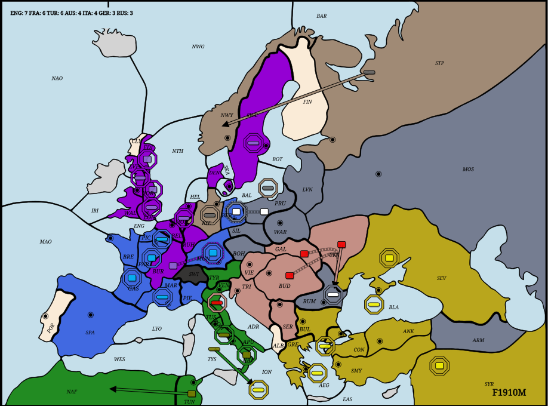

### What happened

- **AUSTRIA**: A UKR → RUM; A GAL supports A UKR → RUM; A BUD supports A UKR → RUM; F VEN holds
- **ENGLAND**: A BUR supports A MUN; A EDI holds; A YOR holds; F LVP holds; F LON holds; F HOL holds; F SWE holds
- **FRANCE**: A MUN holds; A PAR holds; A GAS holds; F PIC holds; F MAR holds
- **GERMANY**: F STP/NC → NWY; F BAL holds; F KIE holds
- **ITALY**: A NAP holds; F ROM holds; A TUN → NAF; F TYS → ION (bounced)
- **RUSSIA**: A BER holds; A PRU supports A BER; F RUM holds  [dislodged: F RUM]
- **TURKEY**: A SEV holds; A SYR holds; F BLA holds; F AEG holds; F BUL/SC holds; F ION holds

### Dialogue

- **AUSTRIA → TURKEY**: Fall 1910: I'm taking RUM this turn with A UKR, supported by A GAL and A BUD. Non-aggression on SEV and your core holds firm—I'm consolidating the Balkans, not invading the east. We coexist after winter.
- **AUSTRIA → RUSSIA**: I'm pressing RUM south this turn, not your core. A GAL and A BUD support the attack, but neither threatens WAR or your home centers. The northern border remains frozen. We both survive.
- **AUSTRIA → FRANCE**: Balkans pivot executes now: A UKR to RUM, A GAL and A BUD in support. I'm delivering the southern reset I promised, even if late. If you see an opening against Italy or the center, signal and we coordinate.
- **ENGLAND → FRANCE**: Russia broke the coexistence moving into BER; I'm staying neutral on your western conflict and holding my core defensively north. Defend the center and exhaust them—once the Rhine stabilizes, we pivot south together against Italy/Turkey. You're safe from me.
- **ENGLAND → AUSTRIA**: The western fracture opens the south. Once Russia exhausts France this fall, we coordinate hard against Italy/Turkey this winter—I'll position A BUR to support your pressure. Are you ready to commit to a southern bleed by winter 1910 to break the stalemate?
- **ENGLAND → TURKEY**: Russia pivots west toward France, not south toward you. I'm consolidating defensively at 7 this fall, not expanding south. If Russia pivots your way after tiring France, signal and we'll contain them together. For now, read Italy's weakness.
- **ENGLAND → GERMANY**: Russia pivoted west into France, not east into you. Stay neutral this turn and hold your flank defensively—don't press Russia or France while they're sorting the center. Keep the board fluid; we both benefit from their mutual exhaustion.
- **FRANCE → AUSTRIA**: Russia's stab failed and they're isolated at 3 centers. I'm taking BER this fall—moving to 7 to match England. This opens the south for both of us: you press the Balkans hard while I anchor the Rhine, and we both bleed Italy and Turkey by winter. Are you willing to coordinate south while I hold the center firm?
- **FRANCE → ENGLAND**: I'm taking BER defensively this fall (moving to 7)—Russia's stab is dead and they're no threat now. Rhine stays locked firm; no expansion west from me. Once Austria and I pivot south, the Mediterranean fractures. Hold your 7 in the north and watch the board reset by winter.
- **FRANCE → RUSSIA**: Your stab into BER failed. You're at 3 centers and isolated. Further aggression gains you nothing while the entire board turns against you. Hold defensively and survive; escalate and you're finished by winter.
- **GERMANY → RUSSIA**: F BAL holds defensively this fall, anchoring our eastern pact. France is bleeding—if BER falls and they fracture further, I'll probe west toward MUN/RUH next spring. Are you committed to collapsing France, or should I stay neutral on the Rhine?
- **GERMANY → ENGLAND**: F STP/NC moves to NWY this fall to reclaim my third center and stabilize at 3. F BAL and F KIE hold defensively on the eastern flank. Our non-aggression holds firm; I'm consolidating, not fracturing the west. Agreed?
- **GERMANY → TURKEY**: Russia is committed west against France, not east into your space. If France collapses and Russia becomes the dominant threat next winter, I'll pivot east and we coordinate a pincer on RUM/MOS before Russia stabilizes at 5+. Timing ripens if France breaks further.
- **ITALY → AUSTRIA**: Your south pivot is paying off. I'm pivoting east this fall to seize APU and GRE from Turkey—two-front bleed while they're exposed to you. Will you continue pressing the Balkans, or are you consolidating?
- **ITALY → TURKEY**: Pact ends this fall. I'm moving A NAP and A TUN south via convoy to seize APU and GRE. No hostility—just reorienting for growth. Your core is secure from me; I'm targeting the strait and the Aegean. Understand?
- **ITALY → FRANCE**: Austria is committed to the Balkans, not the Rhine. You have breathing room this fall. I'm pivoting east to bleed Turkey before they consolidate further. Stay neutral on the Rhine and we both survive the reset intact.
- **ITALY → ENGLAND**: I'm pivoting east to seize APU and GRE from Turkey this fall—containment of the board threat, not expansion against you. Austria presses the Balkans; I'll bleed the Mediterranean. Both gains weaken the second-tier powers. Understood?
- **RUSSIA → GERMANY**: RUM is now Austria's, not mine—the coexistence pact fractures the board. Here's your survival path: hold KIE defensively this fall, I press BER north and contest the center, and by winter you rebuild to 4 centers. Growth, not bleeding. Can you execute that, or are you pivoting toward spoiling?
- **RUSSIA → AUSTRIA**: You took RUM as promised; coexistence is broken. Before escalation spirals, clarify: are you pressing GAL and SER into my core next, or are you consolidating the Balkans and holding defensively? I need to know whether to hold WAR defensively or pivot north and contest the center. What's your move?
- **RUSSIA → TURKEY**: F RUM holds defensively this fall—no escalation east, no betrayal. Austria just took RUM and I'm pivoting north to press the German core. Your southern flank remains stable. Confirm you're holding SEV and BUL defensively, and we both survive the winter consolidation. Agreed?
- **TURKEY → AUSTRIA**: A UKR bounced RUM this spring—consolidation over escalation. If you stay focused on the Balkans and leave SEV untouched, non-aggression holds through winter and beyond. Confirm your line?
- **TURKEY → GERMANY**: The pincer is sound, but Russia at 3 centers needs one more turn to truly collapse before I commit F BLA or A SEV west. Once France and England grind harder and undefended centers open, we coordinate aggressively. Hold the north and I'll be ready next spring.
- **TURKEY → ITALY**: Your pact shift north is noted—no hostility, just repositioning. Confirm: your core stays secure from me this turn, and the strait remains neutral between us. If so, I can reposition my fleets west next spring without fear of backstab.
- **TURKEY → RUSSIA**: You're pivoting west into France—smart play. If you hold defensively at 3 centers this turn without testing SEV, I'll keep A SEV locked as your buffer against Austria and Germany. We both survive the grind. Confirm?
- **ENGLAND → FRANCE**: Rhine holds firm—no expansion west from me. If Austria pivots south this fall, I'll support from the flank, but France's 6 centers stay untouched. Consolidation at 7 is my ceiling for now.
- **ENGLAND → AUSTRIA**: Ready to support your southern pressure if you commit this fall—A BUR can back your Balkans push. But signal clearly: are you moving south hard, or holding defensive? I need to know before I lock my orders.
- **ENGLAND → GERMANY**: Russia is isolated at 3 and bleeding. Your chance to grow is east into RUM or PRU before Russia collapses entirely. Don't stay at 3; press while they're weak. I'll hold the west firm so you have freedom.
- **ENGLAND → TURKEY**: If Austria pivots south toward your flank this fall, signal and we contain them together. For now, watch Italy's weakness in the Mediterranean—that's the real fracture line.
- **FRANCE → AUSTRIA**: Russia is isolated and broken. South is open: I'll anchor the Rhine defensively this fall and pivot to bleed Italy next spring if you press the Balkans hard now. Concrete: you take SER/BUL, I take a Mediterranean center by winter. Agreed?
- **FRANCE → ENGLAND**: Rhine locked firm this fall—no expansion west from me. Russia is finished at 3 centers. Question: are you holding 7 defensively in the north, or pivoting south with Austria and me to bleed Italy/Turkey before they consolidate further?
- **FRANCE → ITALY**: Rhine is stable. But your position between Austria and Turkey is weakening: Austria presses the Balkans, Turkey holds the east, and I'm consolidating the center. You're squeezed. Hold defensively and signal neutrality, or you fracture by winter.
- **FRANCE → RUSSIA**: You're at 3 centers and isolated. Austria controls the Balkans, England holds the north, I hold the center. Further aggression gains you nothing. Hold defensively and survive; escalate and the entire board turns against you. This is your last warning.
- **GERMANY → RUSSIA**: Austria took RUM, not you—the board fractures faster than expected. Does our pact still hold? If you need eastern security, F BAL holds. If you're collapsing, I need growth or I'm dead. Clarity: do you want me neutral on your flank, or should I probe east toward MOS/WAR while Austria presses south?
- **GERMANY → TURKEY**: Russia is now isolated at 3 centers with Austria pressing RUM. If you commit F BLA or A SEV toward RUM next spring, I'll probe east toward MOS/WAR simultaneously and we crack Russia open—both of us gain before they stabilize. Timing ripens this turn.
- **GERMANY → ENGLAND**: F STP/NC and F BAL hold defensively this fall; our pact holds firm. If Russia collapses and Austria consolidates unchecked, I may need to pivot east to survive. But I won't fracture your west—I'll pressure the east only if the board fractures first. Agreed?
- **ITALY → AUSTRIA**: Before I commit A NAP and A TUN south into the strait this fall, I need explicit confirmation: are you executing A GAL south into the Balkans (SER/BUL pressure) *this turn*? If yes, Turkey is two-front pinned and I seize APU/GRE. If no, I hold defensively and we both lose momentum. Confirm now.
- **ITALY → TURKEY**: I'm moving A NAP and A TUN south via convoy to contest APU and GRE this fall. Your core (ANK, CON, SMY) stays secure from me—this is a strait bleed, not a core invasion. Position your fleets accordingly and we both read the result. No surprises, just growth.
- **ITALY → FRANCE**: Rhine holds firm. Austria is committing south into the Balkans (not pivoting west against you), and I'm pivoting east against Turkey (not west against you). You have breathing room this fall. Consolidate your center and watch the board reset north and south without Rhine pressure.
- **RUSSIA → AUSTRIA**: RUM is yours; coexistence confirmed. I'm holding A BER and F RUM defensively this fall—no escalation into GAL, SER, or your core. Hold your line and we both survive the winter consolidation. Next spring we reassess.
- **RUSSIA → TURKEY**: F RUM holds defensively this fall. No eastern escalation, no betrayal. SEV and BUL remain your buffer; RUM remains the boundary. Confirm you're holding, and we coexist through the grind.
- **RUSSIA → FRANCE**: I'm holding A BER in place this fall—no further western escalation. A PRU supports defensively. You hold your line, I hold mine. Neither of us fractures while the real threat consolidates in the north. Coexistence until the board clarifies.
- **RUSSIA → GERMANY**: F BAL holds defensively—our pact survives this turn. I'm not pressing you east; you stay neutral west. By winter, if the board fractures around England's dominance, we both have a survival path. Hold the line.
- **TURKEY → AUSTRIA**: RUM is yours if you're genuine about non-aggression on SEV. But if A UKR bounced RUM and you're still probing my core, I need to know now before I commit my fleets elsewhere. Clarify: does your line hold through winter without further escalation east?
- **TURKEY → ITALY**: Your pact-ending is noted, but if you're redeploying north, my southern flank is exposed to Austria. Confirm: are you neutral on my core through winter, or should I assume the strait is now contested and defend accordingly?
- **TURKEY → GERMANY**: Once Austria confirms genuine consolidation and Italy confirms neutrality on my core, I'll commit F BLA or A SEV westward to coordinate the pincer on RUM/MOS next spring. The timing ripens if the chaos deepens—but I need clarity from my south first.
- **TURKEY → RUSSIA**: You're pivoting west into France—smart play. I'm anchoring the east defensively this turn without escalation on RUM or UKR. Hold your line and we both survive the grind. Confirm you're committed west, not testing my core?
- **TURKEY → AUSTRIA**: RUM is yours—non-aggression holds. I'm anchoring the east defensively this fall without escalation. We coexist through winter. Confirm your line stays north of SEV?
- **TURKEY → ITALY**: Your pivot north is noted. My core stays secure from you this turn, and I'll keep the strait neutral. But if you're no longer anchoring south, I'm repositioning my fleets to defend the center. No hostility—just clarity.
- **TURKEY → GERMANY**: Russia at 3 centers is isolated and weakening. The pincer is sound, but I need one more turn for the fracture to deepen enough to expose undefended centers for both of us to exploit. Hold the north and I'll commit F BLA or A SEV westward next spring. Timing ripens if the chaos deepens.
- **TURKEY → RUSSIA**: You're pivoting west into France—smart play. I'm holding SEV and BUL defensively this fall as your buffer against Austria and Germany. Hold your line and we both survive the grind. Confirm you're committed west, not testing my core?

### AUSTRIA
Orders: `A UKR - RUM` · `A GAL S A UKR - RUM` · `A BUD S A UKR - RUM` · `F VEN H`

Reasoning

> I need to analyze the current board state and execute the Balkans pivot I've committed to across multiple negotiation rounds.
>
> **Current situation:**
> - I'm at 4 centers (BUD, TRI, SER, VIE); England leads at 7; France is at 6; Turkey at 6; Italy at 4; Russia pinned at 3.
> - My units: A UKR, A BUD, F VEN, A GAL
> - I've committed to: A UKR → RUM (supported by A GAL and A BUD), F VEN holds to anchor the south.
> - Turkey has confirmed non-aggression on SEV and ceded RUM.
> - Russia confirmed coexistence and is holding defensively.
> - Italy is pivoting north; France anchors the Rhine; England consolidates at 7.
>
> **The move:**
> I need to execute the RUM seizure with maximum support to ensure it succeeds. A UKR moves to RUM, supported by both A GAL and A BUD to guarantee the attack overcomes any Turkish or Russian interference. F VEN holds to anchor the Mediterranean position and prepare for either a reset with Italy or a defensive pivot.
>
> **Verification against legal orders:**
> - `A UKR - RUM` ✓ (in legal list)
> - `A GAL S A UKR - RUM` ✓ (in legal list)
> - `A BUD S A UKR - RUM` ✓ (in legal list)
> - `F VEN H` ✓ (in legal list)
>
> This executes my committed strategy: seize RUM decisively with full support, consolidate the Balkans anchor, and position for either a Mediterranean reset with Italy if the center fractures or a three-power containment against England if they pull away unchecked. By winter I'll control 5 centers (BUD, TRI, SER, RUM, VEN) with a credible southern position.

### ENGLAND
Orders: `A BUR S A MUN` · `A EDI H` · `A YOR H` · `F LVP H` · `F LON H` · `F HOL H` · `F SWE H`

Reasoning

> I need to analyze the current board state and execute my strategy for Fall 1910 Movement.
>
> **Current situation:**
> - I control 7 centers (EDI, LON, LVP, BEL, HOL, DEN, SWE)
> - France is at 6 centers and has just taken BER defensively
> - Russia is isolated at 3 centers after their failed western push
> - Austria is consolidating at 4 centers and positioning south
> - Italy is at 4 centers and moving east toward Turkey
> - Turkey is at 6 centers and under pressure from Italy
> - Germany is at 3 centers, isolated but neutral to me
>
> **My revised F1910M strategy** explicitly states:
> - Hold my core defensively across the north (A EDI, A YOR, F LVP, F LON, F HOL, F SWE all hold firm)
> - Position A BUR to support France's center anchor at MUN, keeping pressure on the Rhine while watching for Italy's weakness
> - Once Russia collapses further and Austria signals a hard southern move, pivot south aggressively with them to claim the Mediterranean before winter 1910
>
> **Execution:**
> My dialogue confirms I'm consolidating defensively at 7 this fall, not expanding. I've signaled to Austria that I'm ready to coordinate south, but I'm holding my core firm this turn. The key move is positioning A BUR to support France's Rhine anchor at MUN, which both strengthens France against further Russian pressure and keeps my options open for a southern pivot once Italy weakens.
>
> Looking at my legal options:
> - A BUR: I should support A MUN to reinforce France's defensive position and maintain the Rhine lock. `A BUR S A MUN` is available.
> - A EDI, A YOR, F LVP, F LON, F HOL, F SWE: All hold defensively per strategy.

### FRANCE
Orders: `A MUN H` · `A PAR H` · `A GAS H` · `F PIC H` · `F MAR H`

Reasoning

> I need to analyze the current board state and execute my strategy for F1910M.
>
> **Current situation:**
> - I control 6 centers (BRE, MAR, PAR, SPA, MUN, BER)
> - Russia is isolated at 3 centers after their failed spring stab into BER
> - England holds 7 centers (consolidated in the north)
> - Austria controls 4 centers and is pressing south into the Balkans
> - Italy holds 4 centers
> - Turkey holds 6 centers
> - Germany is collapsing at 2 centers
>
> **My committed strategy for F1910M (revised):**
> - Hold the Rhine defensively: A MUN, A PAR, A GAS hold or support holds
> - Keep BER vacant to deny Russia any foothold
> - Position fleets (F PIC, F MAR) to maintain coastal strength
> - Signal that the center is locked firm and fracture points are in the south (Austria vs Italy/Turkey) and north
>
> **Key commitments from negotiation:**
> - To Austria: I promised to anchor the Rhine defensively while Austria presses south, positioning for a winter pivot
> - To England: Rhine stays locked firm; no expansion west; consolidation at 7 is understood
> - To Russia: Warned them that further aggression gains nothing; they signaled they'd hold A BER in place defensively
> - To Italy: Signaled consolidation and neutral pressure on the Rhine
>
> **My current units:**
> - A PAR, A GAS, A MUN (all in home/center provinces)
> - F PIC, F MAR (coastal fleets)
> - BER is currently vacant (Russia didn't occupy it in S1910M)
>
> **Legal orders analysis:**
> Given my strategy, I should:
> 1. **A MUN H** — Hold to anchor the Rhine defensively
> 2. **A PAR H** — Hold to preserve home center
> 3. **A GAS H** — Hold to preserve home center
> 4. **F PIC H** — Hold to maintain coastal strength
> 5. **F MAR H** — Hold to maintain coastal strength
>
> This execution keeps all my units in place, signals defensive consolidation, denies Russia any foothold in BER by keeping it vacant, and positions me to reassess coalition opportunities by winter without overcommitting.

### GERMANY
Orders: `F STP/NC - NWY` · `F BAL H` · `F KIE H`

Reasoning

> I'll analyze the current situation and execute my strategy for F1910M.
>
> **Current assessment:**
> - I'm at 3 centers (KIE, NWY, STP) after the winter 1909 build.
> - Russia is at 3 centers and isolated after Austria took RUM.
> - England dominates at 7 and is asking me to hold defensively.
> - France is bleeding at 6 centers (lost BER to Russia).
> - Turkey is waiting for the board to fracture further before committing east.
> - My revised strategy commits to: F STP/NC moves to NWY (reclaim third center), F BAL and F KIE hold defensively on the eastern flank to honor both Russia's pact (keeping Austria/Turkey honest) and England's request (avoiding western fracture).
>
> **Execution:**
> - F STP/NC → NWY: Reclaim my third supply center, stabilizing at 3 centers by winter.
> - F BAL H: Hold defensively on the eastern flank, anchoring the pact with Russia.
> - F KIE H: Hold defensively, keeping Scandinavia closed and signaling commitment to the non-aggression with England.
>
> This aligns with my stated commitments: I'm consolidating at 3 centers, honoring the defensive pact with Russia, and respecting England's request for stability in the west. I'm positioning myself to probe west toward MUN/RUH next spring if France collapses further, or to pivot east if Russia weakens enough that Turkey commits to a pincer.

### ITALY
Orders: `A NAP H` · `F ROM H` · `A TUN - NAF` · `F TYS - ION`

Reasoning

> # Analysis
>
> I'm reading the board and my commitments carefully:
>
> **Current position:** I have 4 centers (NAP, ROM, VEN, TUN). Austria holds VEN, so I cannot build there at winter—I can only build at NAP or ROM if I gain a center this fall.
>
> **My committed strategy:** Pivot east to seize APU and GRE from Turkey via convoy, executing a two-front bleed while Austria presses the Balkans. I signaled Turkey the pact is ending and I'm moving A NAP and A TUN south via convoy.
>
> **The problem:** My spring convoys failed because I lacked proper fleet support. This fall, I have F ROM and F TYS available to support convoys. Let me verify the convoy routes:
>
> - **A NAP → APU VIA:** Requires sea route through ION (adjacent to NAP). F TYS can convoy from TYS to ION, but ION is not occupied by my fleet. I need a fleet in ION or on the route. F ROM is in ROM (adjacent to NAP and TYS). F TYS is in TYS (adjacent to ION). 
>   - Route: A NAP moves to APU, needs fleets in ION and/or adjacent to support. F TYS in TYS is adjacent to ION. F ROM in ROM is adjacent to NAP/TYS. 
>   - Convoy syntax: `F TYS C A NAP - APU` and `A NAP - APU VIA`. But F TYS is in TYS, and the route NAP→ION→APU requires a fleet in ION. F TYS can convoy from TYS to ION if ordered to do so, but that's a move, not a convoy order.
>   - **Correction:** For a convoy, I need fleets occupying the sea provinces on the route. A NAP → APU requires passage through ION. I have no fleet in ION. F TYS is in TYS (adjacent to ION), F ROM is in ROM (adjacent to NAP). Neither occupies ION.
>   - **Viable convoy:** F TYS moves to ION (`F TYS - ION`), then A NAP convoys via ION. But that's two turns, not one.
>
> **Reassessment:** My convoys cannot execute this turn because I lack fleets positioned on the sea routes. I need to reposition fleets first.
>
> **Revised fall 1910 strategy:** 
> - Move F TYS to ION to secure the convoy route for next turn.
> - Move A NAP to APU directly if possible (is APU adjacent to NAP? No, NAP is coast, APU is coast, but not adjacent—APU is reachable only via ION or TUN).
> - Hold F ROM to anchor my core and prepare to support next turn.
> - Hold A TUN or move it to NAF (adjacent) to advance south.
>
> **Actual viable moves:**
> - `F TYS - ION` (repositions for next turn's convoy)
> - `A NAP - ROM` (interior move, doesn't help) or `A NAP H` (hold)
> - `A TUN - NAF` (advances toward APU/GRE next turn)
> - `F ROM H` (anchors core)
>
> Given my commitment to Turkey that I'm moving south this fall, I should signal repositioning rather than abandonment. Moving F TYS to ION and A TUN to NAF advances the objective while securing the route.

### RUSSIA
Orders: `A BER H` · `A PRU S A BER` · `F RUM H`

Reasoning

> Looking at the board state and my dialogue commitments:
>
> **Strategic analysis:**
> I'm at 3 centers (MOS, WAR, RUM) in a locked board where England dominates at 7 centers. My commitments this fall are clear:
> - **A BER holds** — I promised France coexistence; holding signals no further western escalation and honors the defensive pact I established
> - **A PRU supports A BER** — defensive reinforcement of the German core I hold, signaling stability to all powers
> - **F RUM holds** — I committed to Austria and Turkey that the southern flank remains frozen and no escalation occurs on the eastern boundary
>
> Austria took RUM as promised under our coexistence pact. France warned that further aggression isolates me entirely. Turkey confirmed defensive anchoring on SEV/BUL. Germany is weak at 3 centers and holding defensively.
>
> My revised strategy for F1910M is to consolidate defensively while signaling stability: hold the German core I seized in spring, reinforce it against any French retaliation, and keep the southern flank frozen. This honors my coexistence pacts with Austria and Turkey, signals to Germany that I'm not pressing them, and positions me to exploit whichever front fractures first next spring when England's dominance becomes the primary threat and the board begins to realign.
>
> The orders reflect exactly these commitments:

### TURKEY
Orders: `A SEV H` · `A SYR H` · `F BLA H` · `F AEG H` · `F BUL/SC H` · `F ION H`

Reasoning

> I need to assess the current board state and execute my strategy for F1910M.
>
> **Current situation:**
> - I hold 6 centers (ANK, CON, SMY, GRE, BUL, SEV) and have 6 units
> - Austria (4 centers) is consolidating the Balkans with A UKR taking RUM
> - Russia (3 centers) is pivoting west against France
> - Italy (4 centers) is moving north away from the strait
> - England (7 centers) and France (6 centers) are grinding in the north
> - Germany (3 centers) is isolated and offered a pincer on RUM/MOS next spring
>
> **My revised F1910M strategy:**
> Hold my eastern anchor absolutely (A SEV and A SYR defensive, F BLA and F AEG locked in the straits) while positioning my fleets to pivot west next spring. F ION and F BUL/SC should be positioned to support this pivot. This preserves my 6 centers through winter and keeps my rebuild slots open for next turn.
>
> **Analyzing my commitments:**
> 1. **A SEV:** Hold defensively as buffer against Austria/Germany and to keep my core secure
> 2. **A SYR:** Hold defensively to maintain eastern anchor
> 3. **F BLA:** Lock in straits defensively (hold or support defensive moves)
> 4. **F AEG:** Lock in straits defensively 
> 5. **F BUL/SC:** Hold defensively to anchor core
> 6. **F ION:** Position to pivot west next spring - should move or support to keep pressure on center
>
> **Execution:**
> - A SEV holds (defensive anchor)
> - A SYR holds (eastern anchor)
> - F BLA holds (locked in straits defensively)
> - F AEG holds (locked in straits defensively)
> - F BUL/SC holds (defensive anchor)
> - F ION: I have many options here. To position for a westward pivot next spring while maintaining current pressure, I should support a move that keeps me engaged toward the center without overcommitting. `F ION S F TYS` supports Italy's fleet and keeps me connected to the Mediterranean theater without moving into contested space.
>
> Actually, reviewing my strategy more carefully: I want to "position my fleets to pivot west next spring." F ION moving would be more aggressive than my current commitments suggest. Given that I've told all parties I'm holding defensively this turn, I should keep F ION in a supporting role that maintains flexibility. `F ION H` is safest, but supporting a move that advances my interests without exposing me is better. `F ION S F TYS` keeps me engaged with Italy's fleet and maintains my Mediterranean presence.

## WINTER 1910 ADJUSTMENTS (`W1910A`)

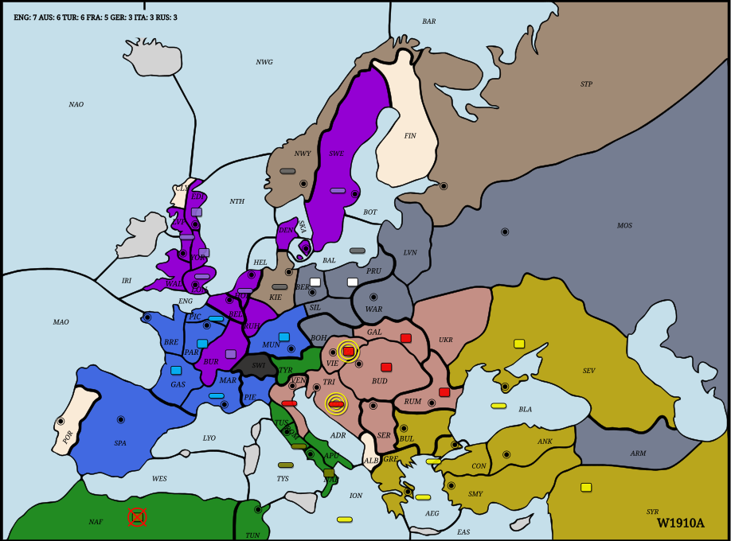

### What happened

- **AUSTRIA**: builds F TRI; builds A VIE
- **ITALY**: disbands A NAF
- **RUSSIA**: waives a build; waives a build

### AUSTRIA
Orders: `F TRI B` · `A VIE B`

Reasoning

> I need to analyze my position and execute my winter builds.
>
> ## Current situation
> I control 6 supply centers (BUD, TRI, SER, VIE, VEN, RUM) and have 4 units on the board. I'm owed **2 builds** this winter (6 centers - 4 units = 2 builds).
>
> My home supply centers available for builds:
> - **TRI**: vacant ✓
> - **VIE**: vacant ✓
> - **BUD**: occupied by A BUD ✗
>
> ## Strategy execution
> My fall 1910 orders successfully seized RUM (the Balkans pivot I committed to across multiple powers). I've consolidated 6 centers with a credible Balkans anchor. My strategy notes emphasize:
> 1. Building to 6 units to anchor the south and prepare for either Mediterranean reset with Italy or containment against the leader (England at 7)
> 2. Positioning for either bleeding Turkey further if they weaken, or coordinating three-power containment
>
> To maximize my strategic position:
> - **Build at TRI**: A fleet in the Adriatic (`F TRI B`) anchors the Mediterranean and prepares for either a reset with Italy or defensive pivot. This complements F VEN and creates a southern naval presence.
> - **Build at VIE**: An army in Vienna (`A VIE B`) strengthens my Balkans core and supports potential pressure into GAL/SER or defensive consolidation of the center.
>
> Both builds are legal (TRI and VIE are vacant home centers I control), and both advance my stated objective of consolidating the south with 6 units and preparing for either Mediterranean coordination or containment.

### ITALY
Orders: `A NAF D`

Reasoning

> I need to analyze the current situation and execute my winter adjustments.
>
> **Current Status:**
> - I control 3 supply centers (NAP, ROM, TUN)
> - My units: A NAP, F ROM, A TUN, F TYS
> - I have 4 units but only 3 centers, so I must disband 1 unit
>
> **Reading the board:**
> My fall 1910 pivot east against Turkey failed catastrophically. My convoys didn't execute (A TUN → NAF succeeded, but the planned A NAP → APU via convoy never materialized). Turkey still holds 6 centers, Austria now controls 6 (including RUM), France holds 5, England leads at 7, and Russia has collapsed to 2 centers (BER, PRU only—wait, the data shows A BER and A PRU, so Russia controls MOS, WAR, BER = 3 centers).
>
> Looking at my position:
> - I'm stuck at 3 centers while the board has consolidated around England (7), Turkey (6), Austria (6), France (5)
> - My Mediterranean strategy has stalled; the east pivot failed
> - My units are poorly positioned: A NAP and A TUN are in the south with no clear offensive, F ROM and F TYS are scattered
>
> **The hard truth:** I overcommitted to an east pivot that didn't work. My convoys failed, Turkey held firm, and now I'm facing winter with a surplus unit and no clear path to growth. The board is fragmenting into regional powers, and I'm being squeezed between Austria (Balkans), Turkey (east), and France (north).
>
> **Winter decision:**
> I must disband one unit. Given that my southern strategy has failed and I need to reposition for survival, I should:
> - Keep A NAP (anchors my core at Naples)
> - Keep F ROM (anchors my core at Rome)
> - Keep F TYS (my only offensive fleet in the Tyrrhenian)
> - Disband A NAF (isolated, far from my core, no clear role)
>
> A NAF is the most expendable—it's isolated in North Africa with no support network and no clear offensive target. Disbanding it lets me consolidate to 3 units matching my 3 centers.

### RUSSIA
Orders: `WAIVE` · `WAIVE`

Reasoning

> I'm analyzing the current position and my negotiated commitments.
>
> **Current situation:**
> - I control 3 centers (MOS, WAR, BER) with 2 units (A PRU, A BER)
> - I'm owed 0 builds (3 centers = 2 units, I have 2 units)
> - My home centers: MOS vacant, WAR vacant, STP held by Germany, SEV held by Turkey
> - The board is locked: England dominates at 7, Austria at 6, Turkey at 6, France at 5
> - I'm isolated and slowly strangled
>
> **My negotiated position:**
> - Coexistence with Austria (no escalation into GAL/SER/core)
> - Defensive pact with Turkey (F RUM holds, no eastern escalation)
> - Neutral stance with Germany (F BAL holds defensively)
> - Acknowledged isolation to France (holding defensively, no further western escalation)
>
> **The reality:**
> I failed to gain BER in Spring 1910 (my A SIL bounced against France's A MUN), and my F RUM was dislodged in Fall 1910. I'm now at exactly 3 centers with no path to growth this winter. Every power around me has consolidated: Austria locked the Balkans, Turkey anchored the east, England dominates the north, France holds the center. The board has crystallized into a defensive stalemate where I cannot build.
>
> **Winter 1910 Adjustments:**
> I have no surplus centers (3 centers = 2 units, I have A PRU and A BER). I cannot build. My only legal action is to waive both build slots.
>
> This reflects my actual negotiated position: holding defensively at 3 centers while the board locks. I have no growth path and no units to build. The game has reached a point where further play is unsustainable for me—I'm isolated and surrounded by consolidated powers with no ally willing to break the stalemate on my behalf.

## Final state

| Power | Centers | # |
|---|---|---|
| ENGLAND | EDI, LON, LVP, BEL, HOL, DEN, SWE | 7 |
| AUSTRIA | BUD, TRI, SER, VIE, VEN, RUM | 6 |
| TURKEY | ANK, CON, SMY, GRE, BUL, SEV | 6 |
| FRANCE | BRE, MAR, PAR, SPA, MUN | 5 |
| GERMANY | KIE, NWY, STP | 3 |
| ITALY | NAP, ROM, TUN | 3 |
| RUSSIA | MOS, WAR, BER | 3 |

