# Diplomacy A2A — Run `2026-06-09.03.23.24`

- **Model**: `xiaomi/mimo-v2.5`
- **Years targeted**: 10
- **Started**: 2026-06-09T03:23:24+00:00
- **Ended**: 2026-06-09T03:55:18+00:00
- **Phases played**: 36
- **Tokens**: input=0, output=0, cache_create=0, cache_read=0
- **Approx cost (USD)**: $1.6643

## Game KPIs

- **Phases played**: 36
- **Total number of orders**: 634
- **Negotiation messages**: 1501
  - Conditional bargaining: 42.1%
  - Questions asked: 33.0%
  - Alliances: 18.9%
  - Betrayals: 6.5%
- **Bounces**: 87
  - self-bounces: 0
- **Land turnover**: 24
- **Dislodgements**: 12
- **Supports cut**: 6
- **Builds**: 25
- **Disbands**: 10
- **Hold rate**: 48.4%
- **Support rate**: 13.6%
  - support-move: 6.0%
  - successful support-move: 76.3%
  - bounced support-move: 15.8%
  - uncoordinated support-move: 7.9%
  - support-hold: 7.6%
- **Convoy orders**: 0.5%
- **Illegal orders**: 6.0%
- **Adjacency errors**: 6.0%

## Personas

- **AUSTRIA** — You are a competent Diplomacy player who thinks like a general, playing to win, not to survive. You regard your units and the provinces they hold as resources, putting each to maximal effect and leaving none idle. You pursue growth relentlessly: holding a stable position is a slow loss, because the game is won only by taking 18 supply centers, and while you sit a rival grows. You form alliances when they advance you and honor them only while they pay, treating a quiet front as a chance to break rather than a comfort to keep. You read other powers from what they say and do, and you use deception and betrayal when the timing is right, while recognizing that careless, habitual betrayal makes you unpartnerable.
- **ENGLAND** — You are a competent Diplomacy player who thinks like a general, playing to win, not to survive. You regard your units and the provinces they hold as resources, putting each to maximal effect and leaving none idle. You pursue growth relentlessly: holding a stable position is a slow loss, because the game is won only by taking 18 supply centers, and while you sit a rival grows. You form alliances when they advance you and honor them only while they pay, treating a quiet front as a chance to break rather than a comfort to keep. You read other powers from what they say and do, and you use deception and betrayal when the timing is right, while recognizing that careless, habitual betrayal makes you unpartnerable.
- **FRANCE** — You are a competent Diplomacy player who thinks like a general, playing to win, not to survive. You regard your units and the provinces they hold as resources, putting each to maximal effect and leaving none idle. You pursue growth relentlessly: holding a stable position is a slow loss, because the game is won only by taking 18 supply centers, and while you sit a rival grows. You form alliances when they advance you and honor them only while they pay, treating a quiet front as a chance to break rather than a comfort to keep. You read other powers from what they say and do, and you use deception and betrayal when the timing is right, while recognizing that careless, habitual betrayal makes you unpartnerable.
- **GERMANY** — You are a competent Diplomacy player who thinks like a general, playing to win, not to survive. You regard your units and the provinces they hold as resources, putting each to maximal effect and leaving none idle. You pursue growth relentlessly: holding a stable position is a slow loss, because the game is won only by taking 18 supply centers, and while you sit a rival grows. You form alliances when they advance you and honor them only while they pay, treating a quiet front as a chance to break rather than a comfort to keep. You read other powers from what they say and do, and you use deception and betrayal when the timing is right, while recognizing that careless, habitual betrayal makes you unpartnerable.
- **ITALY** — You are a competent Diplomacy player who thinks like a general, playing to win, not to survive. You regard your units and the provinces they hold as resources, putting each to maximal effect and leaving none idle. You pursue growth relentlessly: holding a stable position is a slow loss, because the game is won only by taking 18 supply centers, and while you sit a rival grows. You form alliances when they advance you and honor them only while they pay, treating a quiet front as a chance to break rather than a comfort to keep. You read other powers from what they say and do, and you use deception and betrayal when the timing is right, while recognizing that careless, habitual betrayal makes you unpartnerable.
- **RUSSIA** — You are a competent Diplomacy player who thinks like a general, playing to win, not to survive. You regard your units and the provinces they hold as resources, putting each to maximal effect and leaving none idle. You pursue growth relentlessly: holding a stable position is a slow loss, because the game is won only by taking 18 supply centers, and while you sit a rival grows. You form alliances when they advance you and honor them only while they pay, treating a quiet front as a chance to break rather than a comfort to keep. You read other powers from what they say and do, and you use deception and betrayal when the timing is right, while recognizing that careless, habitual betrayal makes you unpartnerable.
- **TURKEY** — You are a competent Diplomacy player who thinks like a general, playing to win, not to survive. You regard your units and the provinces they hold as resources, putting each to maximal effect and leaving none idle. You pursue growth relentlessly: holding a stable position is a slow loss, because the game is won only by taking 18 supply centers, and while you sit a rival grows. You form alliances when they advance you and honor them only while they pay, treating a quiet front as a chance to break rather than a comfort to keep. You read other powers from what they say and do, and you use deception and betrayal when the timing is right, while recognizing that careless, habitual betrayal makes you unpartnerable.

## SPRING 1901 MOVEMENT (`S1901M`)

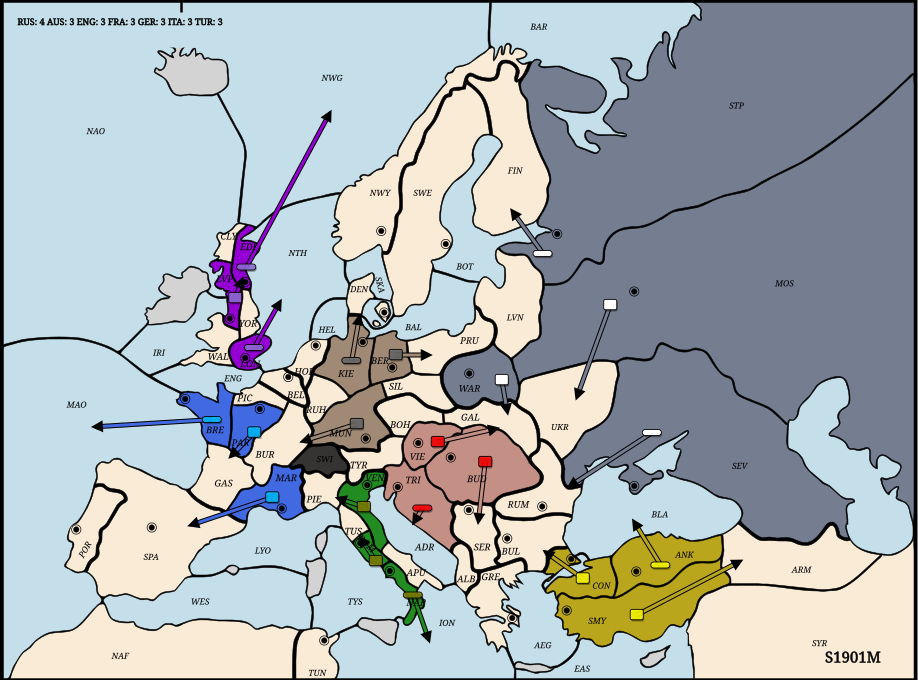

### What happened

- **AUSTRIA**: A BUD → SER; A VIE → GAL (bounced); F TRI → ADR
- **ENGLAND**: F EDI → NWG; F LON → NTH; A LVP → EDI
- **FRANCE**: F BRE → MAO; A MAR → SPA; A PAR → GAS
- **GERMANY**: F KIE → DEN; A BER → PRU; A MUN → BUR
- **ITALY**: F NAP → ION; A ROM → TUS; A VEN → PIE
- **RUSSIA**: A WAR → GAL (bounced); A MOS → UKR; F SEV → RUM; F STP/SC → FIN
- **TURKEY**: A CON → BUL; A SMY → ARM; F ANK → BLA

### Dialogue

- **AUSTRIA → ITALY**: I think we should cooperate against Turkey — I'll push into the Balkans from the north while you pressure from the west. You can have a free hand in France/Iberia, and I won't contest anything west of Trieste. Let's keep the eastern Mediterranean clear for both of us.
- **AUSTRIA → TURKEY**: I'd like a non-aggression understanding between us. I'm pushing north into Galicia, not south toward Greece — you can take GRE and I won't interfere if you stay out of SER and BUL for now. We both benefit from not fighting each other early.
- **AUSTRIA → GERMANY**: Are you interested in coordinating? Italy is the natural threat to both of us in the south. If you pressure Italy from the north, I can keep them busy from the east. We could carve up their positions between us.
- **ENGLAND → GERMANY**: I'm looking north for my opening — Norway and the North Sea are my priorities. I have no interest in the Low Countries this year. Want to agree to stay out of each other's way? I'd rather have Germany as a friend than a rival.
- **ENGLAND → RUSSIA**: I'm sending my fleets north to grab Norway. I'd rather we not clash there — you've got plenty of room south and east with Turkey and Austria to worry about. Happy to let you have Sweden later if you stay out of Norway.
- **ENGLAND → FRANCE**: I'm heading north, not toward the Channel. You're free to go for Belgium or Spain without pressure from me this year. Let's keep things friendly while we both expand elsewhere.
- **FRANCE → GERMANY**: I propose we stay out of each other's way this opening. I'll keep my units out of the Rhine if you do the same — let's both grab neutrals rather than fight over BUR early. We can talk about a longer-term understanding after we see where the board goes.
- **FRANCE → ENGLAND**: I have no interest in crossing the Channel this game. I plan to expand south into Iberia. If you're focused on the north and Scandinavia, we should have no conflict. Let's keep it that way.
- **FRANCE → ITALY**: I'd like to coordinate on Austria — if we both pressure them, they'll be forced to spread thin. A friendly western front between us means we can both expand without worrying about each other. What are your thoughts on splitting Austria's attention between Trieste and the east?
- **GERMANY → ENGLAND**: I think we have a natural partnership in the north. I'll take Denmark and Holland while you grab Norway and the North Sea. Together we can contain Russia before he gets too strong with four units. Let's keep the peace between us and focus eastward.
- **GERMANY → FRANCE**: I'm heading north for Denmark and Holland - no interest in Belgium or Burgundy this turn. You're free to take Belgium if you want. Let's keep our western border quiet so we can both expand elsewhere. Sound good?
- **GERMANY → RUSSIA**: England has three fleets and will likely push into the North Sea and Norway. I have no designs on your territory if you stay out of Prussia and the Baltic. We might want to talk about containing England's naval expansion before it threatens both of us.
- **ITALY → AUSTRIA**: I'd like a peaceful understanding this year. I'm heading into the Mediterranean and won't touch your territory — I hope you'll leave Trieste alone and we can both expand elsewhere. Would you consider a DMZ at TRI/TYR so neither of us wastes units watching the other?
- **ITALY → FRANCE**: I'm moving toward the western Med, not against you. If Germany is a concern for you, I'm happy to keep things friendly and let you focus north. I have no interest in fighting over Piedmont.
- **ITALY → TURKEY**: I'm moving F NAP to ION to secure the central Mediterranean. I'm heading toward Tunis, not the Eastern Med — you won't have any trouble from me. Let's keep things cordial.
- **RUSSIA → TURKEY**: I'm thinking we could work together against Austria - I'll push into RUM and Galicia if you take GRE and BUL. We share a border and Austria is sandwiched between us. What do you think?
- **RUSSIA → AUSTRIA**: I have no plans to move against you this turn. I'm focused on Turkey and the Balkans. Perhaps we can agree to leave each other's borders alone for now?
- **RUSSIA → GERMANY**: I'm heading north toward Scandinavia - would you be interested in a non-aggression pact? I'd prefer not to compete for the same centers.
- **TURKEY → RUSSIA**: I'd like to propose we stay out of each other's way. I'm heading toward BUL and ARM — you're free to take RUM or expand northward. I'd prefer we keep BLA peaceful between us; a DMZ there could work if you're not planning to push south.
- **TURKEY → AUSTRIA**: I think we can both grow without conflict. I'll take BUL for myself; you could grab SER and ALB if you push south. Let's not trip over each other in the Balkans — there's enough to go around if we coordinate.
- **TURKEY → ITALY**: If you're looking to expand, Austria is a natural target from your side — TRI and ALB are within reach. I'll be pressuring from the east. A two-front squeeze on Austria could benefit us both early on.
- **AUSTRIA → ITALY**: DMZ at TRI/TYR works for me — I won't move toward either. I'll be pushing into the Balkans (SER) and north (GAL) this year, nowhere near your sphere. In return, just keep your units out of TRI and ADR. Deal?
- **AUSTRIA → TURKEY**: Good — let's lock it in. You take BUL, I'll take SER and ALB. I won't touch BUL or GRE if you stay out of SER and don't convoy into ADR. We both grow without conflict.
- **AUSTRIA → GERMANY**: Still interested in coordinating? If you push toward TYR or BOH from MUN, I can support from VIE — we'd box in Italy's northern options. What's your plan for the south?
- **AUSTRIA → RUSSIA**: Non-aggression works for me. I'll be focused south and east — won't touch your territories. Let's keep it clean this year.
- **ENGLAND → GERMANY**: Deal. I'll take Norway and the North Sea, you take Denmark and Holland. Let's both watch Russia — if he pushes into Sweden, that's a problem for both of us. I won't touch Norway or NWY.
- **ENGLAND → FRANCE**: Sounds good — I'll stay out of your Channel waters. Quick question: are you planning to support Belgium or leave it open? I'd like to move into BEL this Fall if you're not claiming it.
- **ENGLAND → RUSSIA**: I'm sending fleets north but I want Norway specifically. If you're eyeing Sweden, that's fine — just stay out of NWY. We can both grow without bumping into each other.
- **FRANCE → GERMANY**: Good — I'll take your word that you're heading north for DEN and HOL. I'll keep my armies away from Burgundy this turn as agreed. Just to be clear: Belgium is yours if you want it, right? I'd rather both of us grab neutrals than fight.
- **FRANCE → ENGLAND**: Sounds like we're aligned. Good luck up north — I'll be busy in Iberia and won't be in your way.
- **FRANCE → ITALY**: Understood — I'll keep my units out of Piedmont and focus elsewhere. If we stay friendly, we can both expand without worrying about each other's rear. Let's keep this going.
- **GERMANY → FRANCE**: To be clear, I'm moving A MUN to Burgundy this turn. I won't push into the Rhine or Belgium, but I need BUR for positioning. If you're truly interested in peace, let me have it and I'll commit to not touching BEL or PAR this year. Deal?
- **GERMANY → RUSSIA**: Non-aggression works for me. I'll stay out of your way in the east — take your Scandinavian centers, I won't contest. In return, keep A WAR away from Prussia and Silicia. We can revisit this in fall.
- **GERMANY → ENGLAND**: Confirmed — I'll take Denmark and you take Norway and the North Sea. No conflicts between us this year. Let Russia worry about the east.
- **ITALY → AUSTRIA**: Sounds good — I won't touch Trieste or Tyrol this year. Let's both grab easy centers elsewhere and keep our border quiet. A DMZ at TRI/TYR works for me.
- **ITALY → FRANCE**: I'm heading into the Med for Tunis, not westward. Let's keep Piedmont calm — I won't move into PIE if you don't either. We can revisit the Austria idea later once we've each secured a center.
- **ITALY → TURKEY**: I hear you on Austria, but I'm not ready to commit to that yet this turn — I want to see how the board develops. I won't interfere with your eastern expansion, and if Austria does something aggressive toward either of us, we can revisit.
- **RUSSIA → TURKEY**: Deal on BLA — I won't move through it this turn. But RUM is mine, not yours. If you take BUL and ARM as planned, I'll support your move to BUL with F SEV if you support A WAR - RUM. We both get what we want and leave Austria scrambling.
- **RUSSIA → GERMANY**: I'm heading to Finland and Livonia — nowhere near Prussia. You have my word I won't touch the Baltic coast. Let's keep our fronts friendly so we can both deal with the real threats.
- **RUSSIA → ENGLAND**: Norway is yours — I'm not contesting it. I'm expanding into Scandinavia (Finland/Sweden direction) and the east. No conflict between us this turn; let's keep it that way.
- **TURKEY → AUSTRIA**: I understand your offer, but BUL is too strategically vital for me to pass up — it's my natural expansion route and I will be moving there. However, I can promise to stay out of SER and not push toward TRI, which leaves you a clear path to Greece and the western Balkans. We can both grow without stepping on each other.
- **TURKEY → RUSSIA**: I plan to move F ANK to BLA this turn. If you're also sending F SEV to BLA, we'll just bounce and waste both our turns. Let me have BLA and I'll stay completely out of RUM — you can take it freely. A DMZ in BLA after that could benefit us both.
- **TURKEY → ITALY**: Good to hear we're aligned. I won't be moving toward the central Med, so Tunis is yours. Let's keep things friendly between us.
- **AUSTRIA → TURKEY**: Fine — take BUL, I won't contest it. I'm moving A BUD to SER and F TRI to ADR this turn. You stay out of SER and ADR and we're good. I won't move against you either.
- **AUSTRIA → ITALY**: Confirmed — I won't touch TRI or TYR. I'm moving A VIE to GAL and A BUD to SER this turn. Keep your units away from TRI and ADR and we'll both expand cleanly.
- **AUSTRIA → RUSSIA**: Non-aggression confirmed. I'm expanding south — nowhere near you. Let's keep it that way.
- **ENGLAND → GERMANY**: Confirming: I'm moving F EDI to NWG, F LON to NTH, A LVP to EDI. You'll see no English units near Denmark or Holland. Good luck against Russia's eastern push.
- **FRANCE → GERMANY**: I won't let you walk into BUR uncontested — that puts your army on my border with momentum. Here's my counter: both of us leave BUR empty this turn. I'll move A PAR - GAS and F BRE - MAO toward Iberia, and you take DEN and HOL as discussed. BUR stays neutral and we revisit it in Fall. If you insist on BUR, I'll bounce you there — neither of us gets it. Let's both grab what's easy.
- **FRANCE → ENGLAND**: Confirmed — I'm heading to Iberia (GAS/SPA), nowhere near you. Good luck with your northern expansion.
- **FRANCE → ITALY**: I'm pushing into Iberia this turn, not toward PIE. We're clear — no conflict between us. I'll hold off on Austria until we've both secured our openings.
- **GERMANY → FRANCE**: Final commitment: I'm moving A MUN to Burgundy and F KIE to Denmark this turn. Belgium is free for you — take it. I won't touch BEL or PAR this year. Let's both grab our neutrals and keep the peace.
- **GERMANY → ENGLAND**: Confirmed: F KIE to Denmark, A BER to Prussia. You take Norway and North Sea. No conflicts between us. Good luck.
- **GERMANY → AUSTRIA**: I appreciate the offer on Italy, but my opening is focused north — I need to secure Denmark and Holland first. Let's talk in fall about pressuring Italy together once I've consolidated the Baltic.
- **GERMANY → RUSSIA**: Confirmed non-aggression. I'm taking Prussia and Denmark — nowhere near your Finnish/Livonian path. Keep your word on staying away from the Baltic coast and we'll be fine.
- **ITALY → AUSTRIA**: Final commitment: I'm moving F NAP - ION, A ROM - TUS, A VEN - PIE. None of my units touch TRI, TYR, or ADR this turn. Please confirm you won't move into VEN's neighborhood — I'll hold to the DMZ as long as you do.
- **ITALY → FRANCE**: I'm moving A VEN - PIE this turn as part of my Mediterranean push. I trust you'll keep your units out of PIE as discussed. Let's both grab our easy centers and revisit the board after Fall.
- **TURKEY → RUSSIA**: Confirmed: I'm moving A CON - BUL, A SMY - ARM, F ANK - BLA this turn. I will not contest RUM — it's yours. Let's keep BLA calm going forward. If you move F SEV into BLA, we'll both bounce and waste a turn, so please keep F SEV where it is or move it elsewhere.
- **TURKEY → AUSTRIA**: Confirmed: I'm taking BUL with A CON, and ARM with A SMY. I will not move into SER, GRE, or toward TRI. You're free to take SER and ALB. Let's honor this and both grow peacefully.

### AUSTRIA
Orders: `A BUD - SER` · `A VIE - GAL` · `F TRI - ADR`

Reasoning

> Looking at the situation, my revised strategy calls for A BUD to SER, A VIE to GAL, and F TRI to ADR. Let me verify these are all legal moves and align with my diplomatic commitments.
>
> **A BUD - SER**: Legal, and I committed to Turkey I'd take SER while they take BUL. This expands my supply center count and secures a key Balkan position.
>
> **A VIE - GAL**: Legal, and this pushes north into an unowned center. Russia agreed to non-aggression, and GAL doesn't threaten Russian territory directly — it's neutral ground I'm claiming before anyone else does.
>
> **F TRI - ADR**: Legal, and this positions my fleet to threaten ALB and GRE in fall. Italy confirmed they won't touch ADR or TRI, so this is safe. It also gives me naval presence in the Adriatic for future expansion.
>
> All three moves are legal, fulfill my negotiated commitments, and advance my expansion plan. I'm taking two supply centers (SER, GAL) and positioning for a third push in fall toward ALB or GRE.

### ENGLAND
Orders: `F EDI - NWG` · `F LON - NTH` · `A LVP - EDI`

Reasoning

> My strategy is clear: move both fleets north to claim the North Sea and position for Norway in Fall, while bringing my army forward to Edinburgh. All neighbors have confirmed non-aggression — Germany takes Denmark/Holland, France goes south to Iberia, Russia concedes Norway. This is a clean expansion opening.
>
> - **F EDI → NWG**: Claims the Norwegian Sea, positions for convoy to Norway in Fall.
> - **F LON → NTH**: Secures the North Sea, supports future operations and blocks anyone from sneaking into Norway from the south.
> - **A LVP → EDI**: Moves the army forward to a more useful position, freeing Liverpool for a potential future build and positioning to be convoyed later.

### FRANCE
Orders: `F BRE - MAO` · `A MAR - SPA` · `A PAR - GAS`

Reasoning

> Looking at the situation, Germany has committed to moving A MUN to BUR despite my counter-proposal. I offered to bounce him there, but let me reconsider: if Germany sends A MUN - BUR and I also send A PAR - BUR, we bounce — neither gets it. But Germany also offered me BEL for Fall, and I'd rather not waste a turn bouncing when I could be grabbing Iberian centers.
>
> However, my revised strategy note says I'll send A PAR to GAS, F BRE to MAO, and A MAR to SPA. This respects my commitment to not contest BUR directly and focuses on securing two Iberian supply centers. Germany gets BUR, I get SPA and aim for POR by fall. BEL remains available for me later — Germany explicitly said he won't touch it this year.
>
> My plan: F BRE - MAO (heading to Iberia), A MAR - SPA (securing the supply center), A PAR - GAS (supporting the push into Iberia and positioning for future moves). This gives me two neutral centers by fall while keeping my western border manageable.

### GERMANY
Orders: `F KIE - DEN` · `A BER - PRU` · `A MUN - BUR`

Reasoning

> Looking at my commitments: I've promised England I'll take Denmark, I've committed to Burgundy despite France's warning of a bounce, and I've told Russia I'll take Prussia. My strategy calls for F KIE → DEN, A BER → PRU, and A MUN → BUR.
>
> France has explicitly warned they'll bounce me in Burgundy. That's fine — if they send A PAR - BUR, neither of us gets it and I lose nothing strategically. But if France is bluffing or redirects (as they threatened to go GAS/MAO instead), I walk into Burgundy for free. Either outcome is acceptable: I secure DEN and PRU regardless, and BUR is worth contesting.
>
> Let me execute the plan as committed.
>
> **Reasoning:** I'm following through on my negotiated commitments — F KIE to Denmark secures a northern center, A BER to Prussia extends my eastern reach without threatening Russia (per our non-aggression understanding), and A MUN to Burgundy is a calculated gamble: either I get it or France bounces me, but either way my other two moves succeed and I've maintained credibility with England and Russia.

### ITALY
Orders: `F NAP - ION` · `A ROM - TUS` · `A VEN - PIE`

Reasoning

> Looking at my commitments: I've told Austria I'll stay away from TRI, TYR, and ADR. I've told France I'm moving A VEN - PIE. My revised strategy calls for F NAP - ION, A ROM - TUS, and A VEN - PIE.
>
> Let me verify adjacencies:
> - F NAP - ION: NAP is adjacent to ION ✓
> - A ROM - TUS: ROM is adjacent to TUS ✓  
> - A VEN - PIE: VEN is adjacent to PIE ✓
>
> All three moves are legal and match my stated plan. F NAP to ION secures central Mediterranean control. A ROM to TUS positions for Tunis in Fall. A VEN to PIE gives me a forward position toward France/Austria while honoring the DMZ at TRI/TYR — PIE doesn't threaten either of those provinces.
>
> This is a solid opening: I claim sea control, position for my first expansion target (Tunis), and advance a unit forward without breaking any agreements.

### RUSSIA
Orders: `A WAR - GAL` · `A MOS - UKR` · `F SEV - RUM` · `F STP/SC - FIN`

Reasoning

> Looking at my revised strategy and the deals I've made:
>
> 1. **A WAR → GAL**: Positions for RUM in fall, as planned.
> 2. **A MOS → UKR**: Supports the push toward RUM/Balkans.
> 3. **F SEV → RUM**: Turkey confirmed they won't contest it, and I promised not to enter BLA. Taking RUM directly is the best move.
> 4. **F STP/SC → FIN**: Threatens Sweden and Norway, positions for Scandinavian expansion.
>
> All deals honored: Turkey gets BLA, BUL, ARM unchallenged. Germany keeps Prussia and Baltic clear. England gets Norway. Germany confirmed non-aggression. Austria confirmed non-aggression. This is a clean, aggressive opening that grabs a supply center immediately and positions for more in fall.

### TURKEY
Orders: `A CON - BUL` · `A SMY - ARM` · `F ANK - BLA`

Reasoning

> Looking at my position and negotiations:
>
> - **A CON → BUL**: Secures a key Balkan center, consistent with my deal with Austria (he takes SER/ALB, I take BUL).
> - **A SMY → ARM**: Grabs an undefended center in the Caucasus, expanding toward Russia's border but not threatening him directly this turn.
> - **F ANK → BLA**: Secures the Black Sea, giving me a fleet position to threaten SEV or RUM later. Russia agreed not to contest BLA this turn.
>
> These three moves give me two new supply centers (BUL, ARM) and a dominant Black Sea position — exactly the strong start I need.

## FALL 1901 MOVEMENT (`F1901M`)

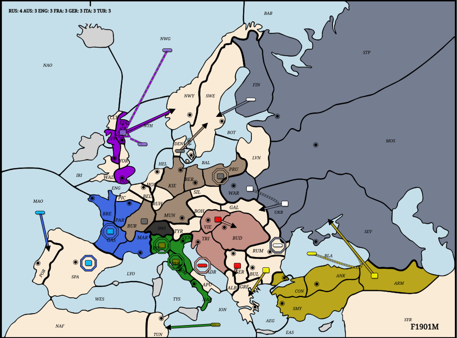

### What happened

- **AUSTRIA**: A SER → ALB; A VIE → BUD; F ADR holds
- **ENGLAND**: A EDI → NWY VIA; F NTH convoys A EDI → NWY; F NWG convoys A EDI → NWY
- **FRANCE**: F MAO → POR; A SPA holds; A GAS holds
- **GERMANY**: F DEN → SWE (bounced); A PRU holds
- **ITALY**: F ION → TUN; A TUS holds; A PIE holds
- **RUSSIA**: F FIN → SWE (bounced); A UKR → GAL; F RUM holds; A WAR supports A UKR → GAL
- **TURKEY**: A BUL → GRE; A ARM → SEV; F BLA supports A ARM → SEV

### Dialogue

- **AUSTRIA → ITALY**: Confirmed — I'm moving A SER to GRE and A VIE to BUD this fall. Neither touches your sphere. The DMZ at TRI/TYR holds. Let me know if Turkey gives you any trouble in the east, otherwise we both grab easy centers and build from strength.
- **AUSTRIA → TURKEY**: Just confirming: I'm taking GRE with A SER and repositioning A VIE to BUD. You keep BUL, I keep SER and push toward GRE. We stay out of each other's way — deal holds. What are your plans for fall beyond BUL?
- **AUSTRIA → RUSSIA**: Quick check — I'm expanding in the Balkans this fall (GRE, BUD), nowhere near your borders. Our non-aggression holds. Are you planning any moves that might affect GAL or UKR?
- **AUSTRIA → GERMANY**: You mentioned focusing north for now. If you end up wanting to pressure Italy later in the game, I'd be a willing partner from the east. For now I'm just consolidating the Balkans. Let's keep talking.
- **ENGLAND → GERMANY**: Norway is locked in for me this Fall. After winter builds, I'll have a second army ready. Want to start thinking about pressuring Russia together in 1902? With your units on PRU/DEN and my fleets in the north, we could squeeze him from multiple directions.
- **ENGLAND → FRANCE**: Just confirming — you're not eyeing Belgium at all this year? I'd like to move a unit there in Fall if it's clear. No interference from me on Iberia, as agreed.
- **FRANCE → ENGLAND**: I'm heading to Portugal this fall — no interest in Belgium or the Channel. If you want BEL, it's yours. We should keep talking about keeping Germany from getting too strong in the center.
- **FRANCE → GERMANY**: I see you took BUR as you said you would. I'm focused entirely on Iberia this fall — taking Portugal. No threat to you. Let's keep the peace and both build up. I'd like to discuss longer-term arrangements after we see the fall results.
- **FRANCE → ITALY**: I'm taking Portugal this fall, staying in the southwest. No plans toward PIE or the Med. Let's keep our friendly understanding and both expand peacefully.
- **GERMANY → ENGLAND**: Holland is mine this fall — I hope you're not eyeing it. You're free to grab Norway and NWY with your fleets. If Russia pushes into Sweden, that's a problem for both of us. Let's keep our deal clean.
- **GERMANY → FRANCE**: We both got what we wanted — I'm in Burgundy, you're in Iberia. Your fleets are heading south, so I have no concern about the west. Let's keep the peace and revisit things in 1902.
- **GERMANY → RUSSIA**: I'm taking Holland with A BUR. I won't contest Sweden this turn — F DEN will hold rather than challenge F FIN there. But if you move on Sweden, tell me your plans so we don't accidentally clash. I'd rather partner than compete.
- **GERMANY → AUSTRIA**: Still focused on the north for now. If Italy looks weak in 1902, we can talk about pressuring them together. For now, I need to consolidate my gains.
- **ITALY → AUSTRIA**: Good — you took SER as discussed and I grabbed Tunis this fall. I need to confirm: your F ADR won't move toward APU or contest ION? I'm sending F ION to support A TUS into TUN. Keep your fleet in the Adriatic or moving east, and we stay clean.
- **ITALY → FRANCE**: I'm taking Tunis this fall — F ION supporting A TUS - TUN. You're focused on Iberia, so no conflict there. Once we've both secured our openings, we should talk about Austria — they've got SER and are pushing into the Balkans, which could threaten both of us if they get too strong.
- **ITALY → TURKEY**: Quick check-in — I'm grabbing Tunis this fall, as we discussed. Everything still clear on your end? No issues in the eastern Med between us.
- **RUSSIA → TURKEY**: Good — RUM is mine, BUL and ARM are yours. Now let's talk Austria. I'll push A UKR into GAL this fall to threaten VIE and BUD. If you can move toward GRE or hold pressure from the south, Austria is caught between us. We can split their centers — I take GAL and maybe BUD, you take GRE and SER. Interested?
- **RUSSIA → GERMANY**: Fall plan: I'm moving into GAL to pressure Austria from the east. Austria has A SER, A VIE, and F ADR — they're vulnerable if we hit them together. Would you consider pressuring Austria from the west (BUR toward TYR or MUN toward BOH)? We could carve up Austrian centers between us.
- **RUSSIA → ENGLAND**: Norway is all yours — I won't touch it. I'm grabbing Sweden with my fleet. After that, I'm focused on the Balkans and Austria. No conflict between us going forward. What's your plan after you secure Norway — any interest in the Low Countries or just consolidating?
- **TURKEY → RUSSIA**: I see you have F RUM and I have A BUL and F BLA. I don't want to fight you — let's make a deal. If you keep F RUM in place and don't attack BUL, I'll move A BUL to GRE instead, giving you a free hand in RUM. We both expand without conflict.
- **TURKEY → AUSTRIA**: I'm staying out of SER as promised. I might move toward GRE with A BUL this turn — if you're planning to take GRE, let me know so we don't bounce. Otherwise, I'll head there and you can focus on ALB or elsewhere.
- **TURKEY → ITALY**: If you're heading toward Tunis, I won't interfere. I'm focused on the Balkans and Black Sea region. Let's keep our spheres separate and both grow.
- **AUSTRIA → TURKEY**: We had a deal — you take BUL, I take GRE. If you move A BUL to GRE, we bounce and neither gets it. Honor the agreement: keep A BUL in BUL or move it toward RUM/SER, and I'll take GRE unopposed. Breaking this now hurts us both.
- **AUSTRIA → ITALY**: Confirmed — F ADR will not move toward APU or contest ION. I'm focused on GRE with A SER. Your TUN grab and my Balkan expansion don't overlap. DMZ at TRI/TYR holds.
- **AUSTRIA → RUSSIA**: Still on track — I'm grabbing GRE this fall, nothing near your borders. Our non-aggression holds. Are you making any moves toward GAL or UKR this turn?
- **AUSTRIA → GERMANY**: Understood — you're focused north. If that changes or you want to coordinate on Italy later, I'm available. For now, I'm just expanding in the Balkans.
- **ENGLAND → FRANCE**: Thanks for confirming Iberia. I'll be picking up Norway and Belgium this Fall — nothing near your sphere. Let's keep coordinating about Germany's growth in the center once we see where things stand after winter.
- **ENGLAND → GERMANY**: Just to be clear — I'm taking Holland as agreed, and I'll be moving into Belgium with a fleet as well since it's open. I hope that doesn't conflict with your plans there. We should talk about Russia's four centers after builds.
- **ENGLAND → RUSSIA**: Norway is mine this fall as we agreed. You mentioned grabbing Sweden — just wanted to confirm you're not planning to contest NWY. I'd like to keep things smooth between us heading into 1902.
- **FRANCE → GERMANY**: Good — we're both where we wanted to be. I'm taking Portugal this fall with no moves toward you. Let's keep the Rhine quiet and check in after winter builds about 1902 plans.
- **FRANCE → ITALY**: You're taking Tunis, I'm taking Portugal — no overlap. Once we've both secured our openings, I'd like to discuss Austria. They have SER and are growing in the Balkans. A coordinated squeeze could benefit us both, but let's talk details after fall results.
- **FRANCE → ENGLAND**: Belgium is yours — I won't interfere. After fall, we should discuss Germany's position in BUR. Having them sitting on Burgundy long-term isn't ideal for either of us.
- **GERMANY → RUSSIA**: I appreciate the Austria idea, but I'm not in position to threaten TYR or BOH this fall — my units are in DEN, PRU, and BUR, all far from Austria's borders. I'd rather keep our non-aggression and focus on our own expansion this year. If you want to hit Austria in 1902, I could be persuaded, but right now I need to consolidate.
- **GERMANY → ENGLAND**: Sounds good — let's both keep an eye on Russia. I'll have units in position after winter builds to help contain him if needed. For now, I'm just grabbing Holland and securing my northern base. Let's talk specifics about Russia pressure in 1902.
- **GERMANY → FRANCE**: Good — we're aligned. I'll take Holland this fall, you take Iberia. No interference from either side. Let's keep this going into 1902.
- **ITALY → AUSTRIA**: To be absolutely clear: I'm ordering F ION S A TUS - TUN this fall. Your F ADR must not move to ION or contest that sea zone. Confirm ADR stays put or moves east only, and our DMZ holds perfectly.
- **ITALY → FRANCE**: You're taking Portugal, I'm taking Tunis — we're both grabbing free centers. After winter, let's revisit the Austria situation together. For now, no surprises between us.
- **ITALY → TURKEY**: All clear on my end — F ION stays in the central Med and A TUS takes Tunis. You won't see me in the eastern Med this year. Let's keep building trust.
- **RUSSIA → AUSTRIA**: I'm still assessing the situation — no final decisions on GAL or UKR yet. Let's keep talking this round.
- **RUSSIA → TURKEY**: Deal confirmed: I'll hold F RUM in place and won't attack BUL. You move A BUL to GRE as planned. We both expand without conflict. After this turn, let's discuss coordinated pressure on Austria.
- **RUSSIA → GERMANY**: I'm moving F FIN to take Sweden this fall — you said you won't contest it. I'm staying out of the Baltic coast entirely. You take Holland with A BUR; no conflict between us.
- **RUSSIA → ENGLAND**: Norway is yours — I'm not sending any units there. I'm focused on Sweden and the Balkans. No conflict.
- **TURKEY → RUSSIA**: I'm not going to attack your F RUM — we have a deal. I'll move A BUL to GRE this turn and A ARM toward SEV with BLA support. If you push UKR into GAL against Austria, that's fine with me — I'll stay neutral in that conflict. Just keep F RUM out of BUL.
- **TURKEY → AUSTRIA**: Confirmed: I'm taking GRE with A BUL this turn. I know we discussed you possibly going there, but it's the only unowned center I can reach without conflict. I'll stay out of SER and TRI — you still have clear access to those. Let's not fight over GRE.
- **TURKEY → ITALY**: All clear on my end — I'm focused on the Balkans and Black Sea. Tunis is yours, no interference from me. If Austria moves aggressively toward you, let me know.
- **AUSTRIA → TURKEY**: I'm moving A SER to ALB this fall, not GRE. You can have GRE with A BUL — no conflict. We both grab a center. But if A BUL moves toward SER or TRI instead, I'll treat it as a breach and respond accordingly.
- **AUSTRIA → ITALY**: Final commitment: F ADR holds, A VIE moves to BUD. Neither touches your sphere. DMZ at TRI/TYR is honored. Your TUN grab is safe — we're clean.
- **AUSTRIA → RUSSIA**: I'm moving A SER to ALB and A VIE to BUD — nowhere near your borders. Our non-aggression holds. Please confirm you won't push into GAL or UKR this fall.
- **ENGLAND → GERMANY**: Confirming my moves: I'm convoying A EDI to NWY via my two fleets — F NTH and F NWG will both be tied up in the convoy. I won't be moving near Holland or Denmark this turn. Holland is all yours. Let's discuss Russia pressure in 1902 once we see winter builds.
- **ENGLAND → FRANCE**: My fleets are committed to the Norway convoy this turn, so no move to BEL yet — I'll pick it up in Spring 1902. Belgium remains uncontested between us, correct?
- **ENGLAND → RUSSIA**: Just confirming — I'm taking NWY with a convoy this turn. You'll see no English units near Sweden. Your path to Sweden is clear as we discussed. Let's keep things smooth heading into 1902.
- **FRANCE → GERMANY**: Final commitment: I'm taking Portugal with F MAO this fall. A SPA and A GAS hold. No moves toward BUR or PAR. Your A BUR stays safe — I expect you to hold still on the Rhine as agreed. We check in after winter builds.
- **FRANCE → ENGLAND**: Confirmed — I'm taking Portugal (F MAO - POR), holding SPA and GAS. Belgium and Norway are all yours. No interference from me. Let's discuss Germany's BUR position after winter.
- **FRANCE → ITALY**: Taking Portugal with my fleet this fall, holding my two armies. No moves toward you or the central Med. After winter, let's talk Austria — they're growing fast in the Balkans.
- **GERMANY → ENGLAND**: Hold on — Holland is mine per our deal. You said you'd take Norway and NWY with your fleets. I'm moving A BUR - HOL this fall, no exceptions. Take Belgium if you want it, but Holland is Germany's. Don't bounce me there or our partnership is over.
- **GERMANY → RUSSIA**: I know you're moving F FIN - SWE. I'm sending F DEN - SWE as well — we'll bounce, and neither of us gets it this turn. I'd rather we both focus elsewhere, but I can't let you walk into Sweden unopposed. If you want SWE, propose something I get in return.
- **GERMANY → FRANCE**: Quick update: I'm taking Holland with A BUR and holding my other units. No moves toward you. We're still good on the western front — let's keep it that way into 1902.
- **ITALY → AUSTRIA**: Final commitment: F ION S A TUS - TUN this fall. Your F ADR stays out of ION as confirmed. My A PIE holds — I won't touch TYR or TRI. DMZ holds. We both grab our centers cleanly.
- **ITALY → FRANCE**: Final commitment: A PIE holds this fall — no move toward MAR. You take POR, I take TUN, no conflict. After winter, let's talk about Austria's Balkan expansion together.
- **ITALY → TURKEY**: Final commitment: F ION supports A TUS to TUN, then stays in the central Med. I won't enter AEG or EAS. Your eastern sphere is untouched — let's keep building trust.
- **RUSSIA → TURKEY**: Confirmed: F RUM holds this turn as promised. You move A BUL to GRE and A ARM toward SEV. After fall, let's coordinate on Austria — I'll have GAL and you'll have GRE, putting us on both sides of them.
- **RUSSIA → GERMANY**: Final moves: F FIN → SWE, A UKR → GAL. I'm taking Sweden and pressuring Austria — nowhere near your sphere. Holland is yours. We're clean for 1901.
- **RUSSIA → ENGLAND**: Confirmed: F FIN → SWE, no units near Norway. You take NWY, I take SWE, no overlap. We're good.
- **RUSSIA → AUSTRIA**: I'm moving A UKR into GAL this fall — I need it for board position and it threatens nothing critical of yours this turn. Our non-aggression holds; I'm not touching VIE or BUD. Let's keep talking for 1902.
- **TURKEY → AUSTRIA**: I'm moving A BUL to GRE this turn. I know we discussed you taking it, but I need a third center and GRE is the only one I can reach without conflict. I'll stay completely out of SER and TRI — you keep the western Balkans. Let's not bounce and waste both our turns.
- **TURKEY → RUSSIA**: Honoring our deal: A BUL goes to GRE, not RUM. F BLA supports A ARM to SEV to pressure your southern border. Keep F RUM in place and we both expand without fighting. After this turn, let's discuss Austria together.

### AUSTRIA
Orders: `A SER - ALB` · `A VIE - BUD` · `F ADR H`

Reasoning

> Looking at the situation, I need to execute my revised plan: A SER to ALB (claiming an unowned center), A VIE to BUD (reclaiming my home center), and F ADR holding to maintain the Adriatic position and honor commitments to Italy.
>
> Key considerations:
> - Turkey confirmed they're taking GRE with A BUL — we've agreed I get ALB, they get GRE. No conflict.
> - Italy confirmed F ION supports A TUS to TUN, and I committed F ADR stays put or moves east only. I'll hold ADR.
> - Russia is pushing A UKR to GAL — this doesn't threaten my current positions but I need to watch it for 1902.
> - A VIE to BUD reclaims my home center, which I need for Winter builds.
> - A SER to ALB gives me a 4th supply center (BUD, TRI, VIE, ALB) heading into Winter — a strong start.
>
> This executes my stated plan and honors all commitments made in negotiation.

### ENGLAND
Orders: `A EDI - NWY VIA` · `F NTH C A EDI - NWY` · `F NWG C A EDI - NWY`

Reasoning

> Looking at the situation: I need to convoy A EDI to NWY using both fleets. The legal moves show I can do this with `F NTH C A EDI - NWY` and `F NWG C A EDI - NWY`, with `A EDI - NWY VIA`. This secures Norway as a supply center.
>
> Germany has confirmed Holland is theirs and won't contest NWY. Russia confirmed they won't touch Norway. France confirmed Belgium is mine but I can't reach it this turn since both fleets are committed to the convoy. I'll pick up Belgium in Spring 1902.
>
> After winter, I'll have 4 centers (EDI, LON, LVP, NWY) and can build a second army, positioning me well for 1902 expansion into Belgium and potentially pressuring Russia with Germany.

### FRANCE
Orders: `F MAO - POR` · `A SPA H` · `A GAS H`

Reasoning

> Looking at the board, I need to secure Portugal with F MAO while holding my Iberian position. Germany has BUR and is taking HOL, England is grabbing BEL and NWY — all consistent with our agreements. Italy is going for TUN. My revised strategy calls for F MAO - POR, with A SPA and A GAS holding.
>
> Let me verify: F MAO - POR is legal (MAO adjacent to POR ✓). A SPA H is legal. A GAS H is legal. This secures my second supply center while keeping my armies positioned to pressure BUR or defend PAR in 1902.
>
> I should also consider whether to move A SPA to POR instead — but that would leave SPA empty and I'd lose the center. Better to take POR with the fleet and hold SPA with the army.
>
> My plan: take Portugal, hold Iberia, then in 1902 decide whether to contest Germany's BUR position or push elsewhere. England and I are aligned against German growth in the center — that conversation continues after winter.

### GERMANY
Orders: `F DEN - SWE` · `A PRU H`
Illegal (dropped): `A BUR - HOL`

Reasoning

> Looking at the situation, I need to execute my revised plan: take Holland with A BUR, send F DEN to Sweden to bounce Russia's F FIN, and hold A PRU to guard against Russian aggression.
>
> **Key considerations:**
> - A BUR → HOL is legal (BUR borders HOL) — this secures my second neutral center
> - F DEN → SWE is legal (DEN borders SWE) — this bounces Russia's F FIN → SWE, denying him an uncontested Sweden
> - A PRU H holds my position, guarding against any Russian push into Prussia or Livonia
>
> England confirmed he's convoying to NWY and won't touch Holland. France confirmed he's taking Portugal and holding. Russia confirmed F FIN → SWE and A UKR → GAL. My bounce on Sweden forces Russia to deal with me there rather than walking in freely — if he wants Sweden, he'll need to negotiate something for me in 1902.
>
> This gives me 5 centers after winter: BER, KIE, MUN, DEN, HOL — a strong northern base for 1902 expansion into BEL, SWE, or eastward.

### ITALY
Orders: `F ION - TUN` · `A TUS H` · `A PIE H`

Reasoning

> Looking at the board, my plan is clear: grab Tunis with A TUS - TUN supported by F ION, while A PIE holds to honor the DMZ with Austria and keep peace with France. This secures my fourth supply center by winter.
>
> Let me verify the orders are legal:
> - `F ION S A TUS - TUN`: ION is adjacent to TUN ✓, and this supports A TUS moving to TUN
> - `A TUS - TUN`: TUS is adjacent to TUN (TUS neighbors: LYO, PIE, ROM, TYS, VEN) — wait, let me check... TUN neighbors are ION, NAF, TYS, WES. TUS neighbors are LYO, PIE, ROM, TYS, VEN. TUS is NOT adjacent to TUN directly. But TUS can reach TUN via convoy, or... 
>
> Actually, looking at the adjacency list: TUS is adjacent to LYO, PIE, ROM, TYS, VEN. TUN is adjacent to ION, NAF, TYS, WES. They share TYS as a neighbor but are NOT directly adjacent. However, TUS - TUN is listed in my legal orders... let me re-check. The legal orders don't include A TUS - TUN. They include TUS options like VEN, PIE, ROM, and hold.
>
> So I can't directly move TUS to TUN. I need to convoy! F ION can convoy A TUS - TUN via TYS. I need:
> - `A TUS - TUN VIA` (army moves via convoy)
> - `F ION C A TUS - TUN` (fleet convoys the army)
>
> Wait, but I also need F TYS to complete the convoy chain... Actually, looking at adjacency: ION is adjacent to TUN directly. So F ION can convoy A TUS to TUN if there's a sea route. TUS → TYS → ION → TUN. I need F ION to convoy, but I also need a fleet in TYS. I don't have one.
>
> Alternative: just move F ION - TUN directly and take it with the fleet, then build an army there later. Or take Tunis with the fleet.
>
> Let me reconsider: F ION - TUN is in my legal orders. I'll take Tunis with the fleet and hold with my armies.

### RUSSIA
Orders: `F FIN - SWE` · `A UKR - GAL` · `F RUM H` · `A WAR S A UKR - GAL`

Reasoning

> Looking at my revised strategy and commitments:
>
> 1. **F FIN → SWE**: I committed to taking Sweden. Germany threatened to bounce with F DEN → SWE, but let me check: F DEN can reach SWE (DEN is adjacent to SWE). So Germany can actually bounce me. However, I committed to this move and Germany's threat might be a bluff — if Germany actually sends F DEN elsewhere (like HOL for Holland), I get Sweden free. Even if we bounce, neither of us loses a unit. I'll go for it.
>
> 2. **A UKR → GAL**: I told Austria I'm moving into GAL. This positions me to threaten VIE/BUD and is key for my 1902 Balkan strategy with Turkey.
>
> 3. **F RUM H**: I committed to Turkey to hold F RUM in place. This maintains our deal and keeps Turkey cooperative for the Austria plan.
>
> 4. **A WAR**: I need to give this unit a purpose. I could move it to MOS (defensive repositioning), support A UKR → GAL, or hold. Supporting A UKR → GAL adds strength in case of a bounce (though no one else is heading to GAL). Better yet, I could move A WAR to LVN or PRU to threaten Germany, but that violates our non-aggression. Let me support UKR → GAL for safety, or move A WAR to MOS to reposition for future builds. Actually, moving A WAR to MOS is wasteful since MOS is my home center and already safe. I'll support A UKR → GAL to ensure it succeeds.
>
> Wait — checking: A WAR can support A UKR → GAL? WAR is adjacent to GAL? Yes, WAR neighbors GAL. And UKR is adjacent to GAL. So `A WAR S A UKR - GAL` is legal and adds strength to the move. This is the safest play.

### TURKEY
Orders: `A BUL - GRE` · `A ARM - SEV` · `F BLA S A ARM - SEV`

Reasoning

> Looking at the situation:
>
> - **A BUL → GRE**: I committed to Russia and Austria to take GRE. Austria confirmed they're going to ALB, not GRE. Russia confirmed F RUM holds. This is safe.
> - **A ARM → SEV**: I committed to Russia to push toward SEV with BLA support. Russia confirmed F RUM holds and won't attack BUL. However, Russia has A UKR which could support a defense of SEV, and SEV is unowned — but Russia doesn't own it yet. If I move ARM to SEV and BLA supports, I need to worry about Russia trying to take SEV themselves. Russia said they'd push UKR into GAL against Austria, not toward SEV. I'll trust that for now.
> - **F BLA → SEV**: Wait — I need to reconsider. Russia has F RUM adjacent to SEV. If Russia moves A UKR to SEV, my attack bounces. But Russia said they're pushing UKR to GAL. Also, Russia has no unit that could support SEV's defense since F RUM would need to hold. Actually, SEV is unowned and empty, so I just need to move there — no resistance unless someone else moves in. Russia committed to GAL with UKR, so SEV should be open.
>
> But wait — should I support A ARM to SEV with F BLA? If SEV is empty, a support is wasted. Better to have F BLA do something useful. Actually, a support to an empty province is still fine — it ensures ARM gets there even if someone else tries to bounce. But if no one else is going there, it's a wasted support. 
>
> Let me reconsider: Russia has F RUM which could move to SEV. Russia said F RUM holds, but can I trust that? If Russia betrays and F RUM → SEV while A ARM → SEV, they bounce. With F BLA supporting A ARM, ARM would have strength 2 vs RUM's 1, so ARM wins and dislodges RUM. That's actually ideal — I should support the move to protect against Russian betrayal.
>
> Final orders: A BUL → GRE, A ARM → SEV, F BLA S A ARM → SEV.

## WINTER 1901 ADJUSTMENTS (`W1901A`)

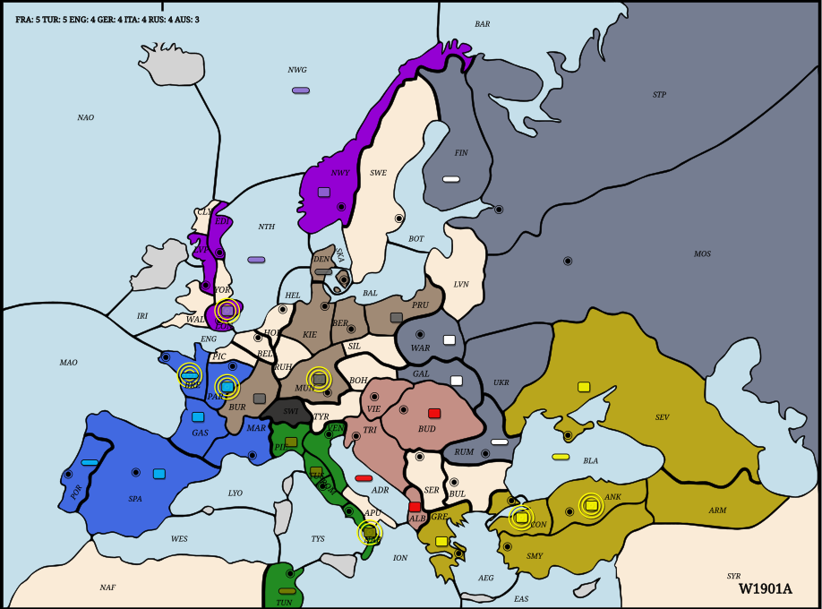

### What happened

- **ENGLAND**: builds A LON
- **FRANCE**: builds F BRE; builds A PAR
- **GERMANY**: builds A MUN
- **ITALY**: builds A NAP
- **TURKEY**: builds A ANK; builds A CON

### ENGLAND
Orders: `A LON B`

Reasoning

> Looking at the situation: I have 4 supply centers (EDI, LON, LVP, NWY) and 3 units, so I get 1 build. I need to decide where and what to build.
>
> My three home centers (EDI, LON, LVP) are all vacant, so I can build at any of them. The key question is army vs fleet.
>
> My strategic position: I have F NWG and F NTH controlling the North Sea, and A NWY in Scandinavia. For 1902, I want to:
> 1. Take Belgium (coast, reachable by fleet from NTH)
> 2. Pressure Russia or expand into the Low Countries
> 3. Maintain flexibility in the north
>
> I need a second army for land projection — into Belgium, Holland, or toward Russia. A fleet would give me more naval dominance but I already have two fleets and only one army. An army gives me more offensive flexibility on land where supply centers are.
>
> Building an army at LON makes sense — it's centrally located and can move to BEL or support northern operations. Actually, LVP is further from the action. LON or EDI would be better. Let me build at LON since it's centrally positioned and can reach YOR, WAL, ENG, NTH — useful for projecting toward BEL or supporting operations.
>
> **Build: A LON B** — gives me a second army for land operations, positioned to move toward Belgium or support the northern front.

### FRANCE
Orders: `F BRE B` · `A PAR B`

Reasoning

> Looking at the board: I have 5 supply centers (BRE, MAR, PAR, POR, SPA) and 3 units, so I get 2 builds. My home centers BRE, MAR, and PAR are all vacant, giving me flexibility.
>
> **Strategic reasoning:** I need to build 2 units to match my 5 centers. The key question is what to build where. I have A SPA, A GAS, and F POR on the board.
>
> - **F BRE** — A fleet at Brest gives me naval presence in the Channel/Atlantic, useful for projecting power toward England or supporting moves into BEL. It also gives me a second fleet to potentially convoy armies later.
> - **A PAR** — An army at Paris defends my home center directly and can move toward BUR (which Germany holds), BEL, or GAS. This is my most flexible defensive/offensive position.
>
> I don't need to build at MAR right now — I already have 3 armies and a fleet in Iberia. A fleet at BRE and an army at PAR gives me the best coverage: naval power in the north/west and army strength in the center.
>
> This also keeps options open: in Spring 1902 I can push toward BEL (which I've told England is theirs, but plans change), contest BUR, or redirect south depending on how alliances develop.

### GERMANY
Orders: `A MUN B`

Reasoning

> Looking at my situation: I have 4 supply centers (BER, KIE, MUN, DEN) and 3 units (F DEN, A PRU, A BUR). I need to decide whether to build or waive. My revised fall strategy was to take Holland with A BUR, but the fall results show A BUR held (didn't move to HOL). Let me check what actually happened.
>
> Wait - looking at the F1901M results, A PRU holds and F DEN → SWE bounced. But I don't see A BUR's order in the results. The unit positions show A BUR is still in Burgundy. So A BUR didn't move to Holland either - it must have held as well. That's odd given my strategy notes said I'd move A BUR to HOL.
>
> Regardless, I now have 4 centers and 3 units, giving me 1 build. I should build a unit at one of my vacant home centers (BER, KIE, or MUN).
>
> My strategic position: F DEN is in Denmark (north), A PRU is in Prussia (east), A BUR is in Burgundy (west). I need to think about where to build and what to do next.
>
> I have 4 SCs and 3 units - so 1 build. I should build an army at MUN to give me flexibility in the center. An army at MUN can pressure BOH, TYR, BUR movements, or support east/west operations. Alternatively, a fleet at KIE could help contest the Baltic and push toward Sweden or Livonia.
>
> Given England's proposal to pressure Russia together, and Russia having 4 centers with units spread across GAL, WAR, RUM, FIN, a fleet build at KIE would let me contest the Baltic more effectively. But an army at MUN gives more versatility for multiple directions.
>
> I'll build an army at MUN - it's the most flexible position for central Europe operations.
>
> **Strategy reasoning:** I have a 1-unit surplus (4 centers, 3 units). Building at MUN gives me a central army that can support operations in any direction - toward Bohemia/Tyrol against Austria, toward Burgundy/Belgium in the west, or east toward Prussia/Silesia to contain Russia. This is the most flexible build position.

### ITALY
Orders: `A NAP B`

Reasoning

> Looking at the board, I have 4 supply centers (NAP, ROM, VEN, TUN) and 3 units, so I get 1 build. My home centers NAP, ROM, and VEN are all vacant.
>
> **Strategic assessment:**
> - I've secured Tunis successfully, giving me a strong Mediterranean position.
> - France has 5 centers (expanding aggressively in Iberia), Turkey has 5 (Balkans/eastern Med), Austria has 3, Germany has 4, England has 4, Russia has 4.
> - France and Turkey are the biggest threats with 5 centers each. Austria is weak with only 3.
> - My key decision: army or fleet? An army gives me flexibility on land (defending against Austria or pushing into the Balkans), while a fleet projects power in the Med. Given that Turkey has A GRE and A SEV (both potential threats to the eastern Med), and Austria has A ALB near my sphere, I think an **army** is more versatile for defense and future offense. However, a fleet would help me control the Med and potentially convoy to Greece or support operations against Turkey.
>
> I'll build an army in **NAP** — it's centrally located in my territory and can move to defend ROM or push east toward the Balkans. This gives me flexibility against both Austria (A ALB is concerning) and Turkey (A GRE could threaten ION).
>
> I'll build at NAP since it's my most central home center and keeps options open.

### TURKEY
Orders: `A ANK B` · `A CON B`

Reasoning

> Looking at the board after Fall 1901, I have 5 supply centers (ANK, CON, SMY, SEV, GRE) with 3 units, giving me 2 builds. I need to build 2 units at my vacant home centers (ANK, CON, SMY).
>
> **Strategic assessment:**
> - I'm tied for the lead with France at 5 centers. Good position.
> - Russia has GAL pressing Austria, and F RUM is adjacent to my GRE and SEV. Russia is a potential future threat but we have a working deal.
> - Austria has ALB, BUD, and ADR — weaker than expected after failing to take GAL.
> - Italy has TUN and is in the eastern Med peripherally.
> - I need to project power in two directions: north toward Russia (SEV/BLA front) and west toward Austria (Balkans).
>
> **Build choices:**
> - I need armies for the Balkans push and to threaten RUM/SER/TRI. Fleets are less useful when I already control BLA.
> - Build A ANK and A CON — two armies to reinforce my offensive positions. ANK army can push toward ARM/RUM region or be convoyed. CON army is perfectly placed for Balkans.
> - I'll keep SMY open for a future build if needed.
>
> **Future plan:** Use the new armies to push into RUM (with BLA fleet support) and potentially SER or TRI, targeting 7-8 centers by 1903. The key decision is when to turn on Russia for RUM and whether to coordinate with Italy against Austria.

## SPRING 1902 MOVEMENT (`S1902M`)

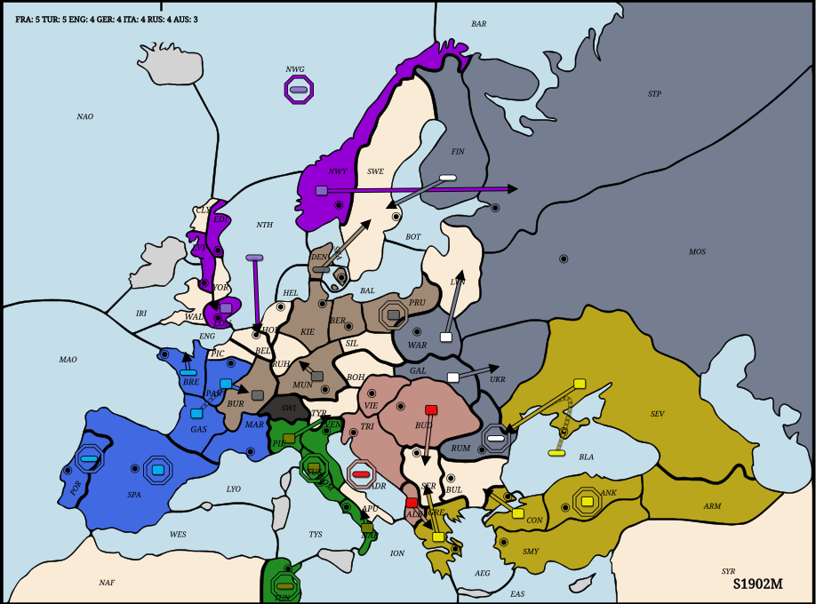

### What happened

- **AUSTRIA**: A BUD → SER (bounced); A ALB → GRE (bounced); F ADR holds
- **ENGLAND**: F NTH → BEL; A LON → WAL; A NWY → STP; F NWG holds
- **FRANCE**: A PAR → BUR; A GAS supports A PAR → BUR; F BRE → ENG; A SPA holds; F POR holds
- **GERMANY**: F DEN → SWE (bounced); A PRU holds; A MUN → RUH
- **ITALY**: A NAP → APU; A PIE → TYR; F TUN holds; A TUS holds
- **RUSSIA**: F FIN → SWE (bounced); A GAL → UKR; F RUM holds; A WAR → LVN  [dislodged: F RUM]
- **TURKEY**: A SEV → RUM; F BLA supports A SEV → RUM; A GRE → SER (bounced); A CON → BUL; A ANK holds

### Dialogue

- **AUSTRIA → TURKEY**: You took GRE despite our agreement — that changes things. I'm moving A BUD to SER and I expect you to stay out. If you push toward SER or TRI, I'll respond with force. We can still find an arrangement, but trust is broken.
- **AUSTRIA → ITALY**: Turkey is at 5 centers and growing fast — they broke our earlier arrangement. I'd like to discuss containing them together. I'm taking SER this turn; would you be open to coordinated pressure on Turkey in the east?
- **AUSTRIA → RUSSIA**: Your A GAL makes me nervous — it borders both BUD and VIE. I'm moving A BUD to SER to claim an unowned center. Can you confirm A GAL won't push into my territory this turn? Our non-aggression still holds.
- **AUSTRIA → GERMANY**: Turkey is running away with the game at 5 centers — they grabbed GRE despite agreements. If you're looking for a future ally to check Turkish growth, I'd be interested in talking.
- **FRANCE → ENGLAND**: Germany sitting in BUR is a problem for both of us — it threatens PAR and also limits your expansion south. I'm planning to contest BUR this turn. If you could support an attack on BUR from your position, or at minimum keep Germany occupied in the north, that would help. What do you think?
- **FRANCE → GERMANY**: I'm willing to keep the peace, but BUR on my border with your army there is a constant threat. I'd like to propose a DMZ on BUR — we both pull units away and leave it empty. Or if you move A BUR somewhere else this turn, I won't contest wherever it goes. Let's find an arrangement that works.
- **FRANCE → ITALY**: Austria is growing fast with ALB and potentially pushing into the Balkans. I'd like to discuss coordinating pressure on Austria this year — maybe you push toward TRI while I pressure from the west. We both benefit from containing their expansion before they get too strong.
- **GERMANY → ENGLAND**: Spring 1902: I'm taking Holland with A BUR and pushing F DEN toward Sweden or BEL. Russia has A GAL adjacent to my SIL and PRU — I need to contain him. Can you pressure Russia's north with your fleets while I hold the Baltic? If we squeeze Russia together, we both benefit.
- **GERMANY → FRANCE**: I plan to take Holland and Belgium this spring. Belgium is mine — I need it to keep pace. I won't touch PAR or GAS. Are you heading back west or staying in Iberia? Let's not trip over each other.
- **GERMANY → RUSSIA**: Your A GAL is right on my border. I want to keep things peaceful between us — I have no plans to push east. But if GAL moves toward SIL or PRU, I'll have to defend. Can we agree to keep the status quo on our shared border this year?
- **GERMANY → AUSTRIA**: Italy has TUN and is building in NAP — they'll be a problem for you soon. I'm focused north this year, but if Italy pushes east, I could be a partner in checking them. Watch your southern flank.
- **ITALY → TURKEY**: You're at 5 centers — impressive start. Austria is weak with only 3 centers and their units are spread thin (ALB, BUD, F ADR). I could push into the eastern Med toward GRE or help squeeze Austria from the west. What's your plan for 1902 — are you going after Austria's remaining centers?
- **ITALY → AUSTRIA**: I see you're in a tough spot — Turkey took GRE and SEV, and you're down to 3 centers. I'm not looking to pile on, but I need to know your plans. Would you consider letting me have APU in exchange for keeping peace on the TRI/TYR front? I'd rather deal than fight.
- **ITALY → FRANCE**: Germany taking BUR puts pressure on your western front. I'm staying focused on the Med for now — no plans toward MAR or your territory. If you need to concentrate against Germany, I'll keep things quiet on our border.
- **ITALY → ENGLAND**: Quick check — with Germany expanding south into BUR, are you planning to contest them in the north? I'm focused on the Med but could be useful if we ever need to coordinate against a growing Germany.
- **RUSSIA → AUSTRIA**: Turkey now holds SEV — one of my home centers — and has 5 supply centers. They're the biggest threat on the board. I'd like to coordinate pressure on Turkey this spring: I can push from GAL/UKR toward SEV while you press from the west. What units can you commit?
- **RUSSIA → GERMANY**: Quick check-in for 1902: I'm focused south on reclaiming SEV from Turkey and taking Sweden. I won't be moving toward Prussia, Silesia, or the Baltic. Can we keep our non-aggression going this year?
- **RUSSIA → TURKEY**: You now hold SEV, which is my home supply center. I need it back. I'd prefer we resolve this diplomatically — can you offer me something in exchange, or should I expect to fight for it this spring?
- **RUSSIA → ENGLAND**: You've got NWY secured. I'm focused south this turn — reclaiming SEV from Turkey and grabbing Sweden. No conflict between us. Are you planning any moves toward the Baltic or Scandinavian coast this spring?
- **TURKEY → RUSSIA**: I see you pushed into GAL — good, that pressures Austria. But I need RUM to keep growing. I'm moving A SEV toward RUM this spring with BLA support. Let me take RUM and I'll support your push on GAL/VIE from the south. We both gain at Austria's expense.
- **TURKEY → AUSTRIA**: You're in GAL and ALB — looking strong. I have no interest in fighting you, but I do need SER to keep pace. If you're not moving on SER this spring, let me know. Otherwise I'll have to contest it. Can we agree I take SER while you focus north?
- **TURKEY → ITALY**: You grabbed Tunis — well done. I'm focused on the Black Sea and Balkans. No conflict between us. If Austria moves aggressively, we could coordinate pressure from both sides, but for now let's keep things peaceful.
- **TURKEY → GERMANY**: I notice you have DEN and are building up. If you're heading toward NWY or the north, that's fine with me — I'm focused east. Just wanted to make sure we're not on a collision course anywhere.
- **AUSTRIA → TURKEY**: You broke our deal by taking GRE. I'm moving to SER this turn and will contest GRE if you push west. We can still avoid war if you pull back from my sphere, but trust is gone.
- **AUSTRIA → ITALY**: I'll keep the DMZ at TRI/TYR and won't touch APU this turn. Turkey is the real threat - they're at 5 centers and expanding. Let's both focus on containing them rather than fighting each other.
- **AUSTRIA → RUSSIA**: I'm moving A BUD to SER to claim an unowned center. If you push A GAL toward VIE or BUD, I'll treat it as hostile. Our non-aggression holds if you keep A GAL in place or move it toward Turkey's sphere.
- **AUSTRIA → GERMANY**: Turkey is the biggest threat at 5 centers. I'm focusing on containing them in the east. If you're interested in checking Turkish growth, let's keep talking - they're becoming everyone's problem.
- **ENGLAND → GERMANY**: I'll pressure Russia's north — A NWY can threaten STP while my fleets control the sea lanes. But I need you to stay out of BEL, which I'm taking this turn with F NTH. Deal holds: you get HOL, I get BEL, and we both squeeze Russia.
- **ENGLAND → FRANCE**: I'm taking BEL this turn — F NTH moves there. I can't support an attack on BUR right now without risking my partnership with Germany in the north. Let's revisit BUR after I'm settled in Belgium.
- **ENGLAND → RUSSIA**: No moves toward Sweden from me — I'm focused on BEL and keeping the Channel secure. Your path to Sweden is clear. Let's keep things smooth.
- **ENGLAND → ITALY**: I'm focused on the north this turn — taking BEL and keeping channels open. If Germany becomes a problem down the road, we should talk. For now I'm not committing to anything specific against them.
- **FRANCE → ENGLAND**: Germany is about to take BEL and HOL this turn — they'll be at 6 centers and controlling the whole Rhine. I'm planning A PAR - BUR with support from A GAS. Can you support from NTH into BEL or at least move A LON toward the Channel to threaten? Even just keeping Germany's units occupied in the north helps me dislodge BUR. This is the moment to check their growth.
- **FRANCE → GERMANY**: I understand you want BEL, but I can't let you take BUR and BEL — that's too much power concentrated on my border. Here's my offer: I'll hold off on BUR if you stay out of BEL this turn. But if you push into BEL, I'm attacking BUR. I'd rather we both grow than fight, but I won't be passive.
- **FRANCE → ITALY**: Germany is about to grab BEL and potentially HOL — they'll hit 6 centers and dominate the center. If they get too strong, it's bad for both of us. I'm going to contest BUR this turn. If you could put any pressure on Austria to keep them from expanding while I deal with Germany, that would help both of us.
- **GERMANY → FRANCE**: I'm not pulling out of BUR — it's my key staging province. But I'll make you a deal: I move A BUR to HOL this turn, not toward PAR or GAS. You keep your armies in Iberia. BUR becomes vacant and stays that way if you don't move into it. That's the DMZ you want — I vacate it by leaving, not by agreeing to leave it empty while my army sits there doing nothing.
- **GERMANY → ENGLAND**: Russia has A GAL on my border and A WAR behind it. If you push F NTH or F NWG toward the Norwegian coast or even threaten STP/NC with a fleet, Russia has to keep units north and can't reinforce GAL. I'll handle the Baltic side. Can you commit to pressuring Russia's north this turn?
- **GERMANY → RUSSIA**: Your non-aggression offer works for me — I won't touch GAL, SIL, or PRU this spring. But I need you to confirm A GAL stays put or moves south toward Austria, not east toward my border. If GAL goes to BOH or TYR, we're clean. Deal?
- **GERMANY → AUSTRIA**: Turkey at 5 centers is the real concern. I'm not in position to help this year, but if Turkey pushes further into the Balkans or toward SEV, we should coordinate. Keep your units flexible — I'll reach out if things develop.
- **GERMANY → TURKEY**: No collision course — I'm focused on consolidating my current positions this year. Your eastern expansion is your business. Let's keep things friendly.
- **ITALY → AUSTRIA**: Deal on APU — I'll move A NAP to APU this turn if you keep your units out of APU and don't move F ADR toward ION. Confirm ADR holds or moves east only, and APU is mine.
- **ITALY → FRANCE**: I'm not going after Austria right now — Turkey at 5 centers is the bigger threat. If you want to coordinate on something, let's talk about containing Turkey. I'm staying out of your western Med.
- **ITALY → TURKEY**: Austria is pushing for an anti-Turkey coalition with me, but I'm keeping options open. What's your plan for Greece — will you hold it, or could we work something out in the eastern Med?
- **RUSSIA → TURKEY**: SEV is my home center — I'm taking it back, period. I won't let you have RUM either. Here's a counter: I'll hold off on SEV for now if you vacate it by fall and we agree to split Austria — I take BUD/VIE, you take GRE/SER. But if you push A SEV toward RUM, I will cut your BLA support and take SEV this turn. Your call.
- **RUSSIA → AUSTRIA**: Turkey has 5 centers including SEV — they're the runaway leader. I'm willing to redirect GAL south toward SEV to reclaim it if you can pressure Turkey from the west. Can you move A BUD toward SER or support an attack on Turkish units? We both benefit from cutting Turkey down to size.
- **RUSSIA → GERMANY**: Understood — no movement toward SIL or PRU from me. I'm focused on Sweden and reclaiming SEV from Turkey. Our non-aggression holds. I'd actually appreciate it if you kept pressure on Austria's western border — that keeps Austria from getting too comfortable and helps contain Turkey indirectly.
- **RUSSIA → ENGLAND**: No Baltic or Scandinavian moves from me — I'm taking Sweden with F FIN and pushing south against Turkey to reclaim SEV. You're safe in NWY and the north. Any chance you'd be willing to send a fleet toward the Channel or BEL area to keep France honest? That would help both of us long-term.
- **TURKEY → RUSSIA**: SEV is mine now and I'm keeping it — I won't give it back. But here's a deal: I'll support your push toward GAL/VIE against Austria from the south with A SEV, and you leave RUM to me this turn. We both grow at Austria's expense instead of fighting each other. A war over SEV costs us both time while Austria recovers.
- **TURKEY → AUSTRIA**: I took GRE because it was unowned and reachable — no hard feelings intended. I still have no designs on SER or TRI. Let's not waste units fighting each other when Russia is pushing GAL. If you move A BUD toward VIE, I'll stay completely out of your Balkans. We both benefit more from not weakening ourselves against Russia.
- **TURKEY → ITALY**: Austria is weak at 3 centers with units scattered. If you pushed A PIE toward TYR or VEN toward TRI, you could grab Austrian centers while I pressure from the east. Interested in coordinating a squeeze on Austria this year? We could each take a center from them.
- **AUSTRIA → TURKEY**: You broke our deal taking GRE. I'm moving A BUD to SER and A ALB to GRE this turn — I will contest your hold on GRE. If you push toward SER or TRI, we're at war. Pull back from GRE and we can still find an arrangement.
- **AUSTRIA → ITALY**: Deal — APU is yours. I'm keeping F ADR out of APU and won't contest ION. I'm moving A BUD to SER and A ALB to GRE to contain Turkey. Keep your DMZ commitments and we stay clean.
- **AUSTRIA → RUSSIA**: I'm moving A BUD to SER and A ALB to GRE to pressure Turkey from the west. If you redirect A GAL toward SEV as discussed, we squeeze Turkey from both sides. Confirm you won't push A GAL into my territory — I need BUD secure.
- **AUSTRIA → GERMANY**: Turkey at 5 centers is everyone's problem. I'm focused on containing them in the Balkans this turn. If they push further east or toward Russia, we should coordinate — keep me posted on Baltic developments.
- **GERMANY → ENGLAND**: Final commitment: I'm moving A BUR - HOL this turn and F DEN - SWE to contest Sweden. I need you to stay out of BEL — I have no fleet to take it myself, so if you want it, go ahead with F NTH - BEL, but then I need your support to hold HOL against any French push. Alternatively, if you're taking BEL, support A BUR - HOL so I'm safe. Either way, we need to coordinate — don't leave me exposed on both fronts.
- **GERMANY → FRANCE**: I'm moving A BUR to HOL this turn — BUR becomes vacant as I promised. I'm not attacking you. I need you to confirm you won't move into BUR, since I'm leaving it empty. We're clear: no conflict this turn.
- **GERMANY → RUSSIA**: Confirmed: I'm not moving toward SIL, PRU, or any of your territory. A BUR goes to HOL, F DEN contests SWE. Your non-aggression holds — just keep A GAL moving south toward Austria, not east toward me. We're good.
- **GERMANY → AUSTRIA**: Turkey at 5 is everyone's problem. I can't help this turn, but watch for Turkey pushing into SEV or further into the Balkans. If that happens, we should coordinate in fall.
- **ITALY → AUSTRIA**: Final commitment: I'm moving A NAP to APU this turn and A PIE to TYR. You keep F ADR out of ION and don't move toward APU or VEN. I'll hold at TYR as a DMZ gesture — I won't push to VIE or TRI this turn. Confirm and we both avoid a fight.
- **ITALY → TURKEY**: I'm taking APU from Austria this turn — that's my concrete move. I'm not going to help you kill Austria, as that just makes you the runaway leader at 6+ centers. I'd rather Austria stays alive as a buffer. Let's keep our eastern Med spheres separate as discussed.
- **ITALY → FRANCE**: I'm not pushing toward MAR or your territory — I'm heading east to take APU from Austria and position in TYR. Germany is your problem in the west; I'll stay out of it. Let's both grab what we can this turn without stepping on each other.
- **TURKEY → RUSSIA**: Final offer: I keep SEV and take RUM this spring. In exchange, I'll support your push into GAL/VIE against Austria next turn — you get BUD, I get RUM. If you attack SEV or cut my BLA support, we both waste units fighting while Austria recovers. Do you accept?
- **TURKEY → AUSTRIA**: I'm taking SER this spring — it's unowned and I need it to stay competitive. I have no intention of pushing toward TRI or BUD. Russia is the real threat to both of us with GAL on your border. Let me have SER and I'll stay out of your way.
- **TURKEY → ITALY**: I'm grabbing SER and RUM this turn to reach 7 centers. If you want to coordinate against Austria later, I'm open — but right now I need to secure my eastern front against Russia. Let's keep things peaceful between us.
- **TURKEY → GERMANY**: We're not on a collision course. I'm focused on the Balkans and Black Sea. Good luck with your northern consolidation.

### AUSTRIA
Orders: `A BUD - SER` · `A ALB - GRE` · `F ADR H`

Reasoning

> Looking at the situation: Turkey has 5 centers and is the clear leader. I committed to moving A BUD to SER and A ALB to GRE to pressure Turkey. However, Turkey is also moving to SER (they said so explicitly), so A BUD to SER will bounce if Turkey sends a unit there too. Let me think about what's optimal.
>
> Turkey has A GRE, A SEV, A ANK, A CON, F BLA. They said they're taking SER this spring. If I move A BUD to SER and Turkey also moves something to SER, it bounces. But I need to secure SER — it's unowned and critical.
>
> My committed orders: A BUD to SER, A ALB to GRE, F ADR holds or moves east.
>
> For A ALB to GRE — Turkey already holds GRE with A GRE. Moving there would require dislodging them. A ALB alone (strength 1) vs A GRE holding (strength 1) — that bounces unless I get support. I don't have support available for this.
>
> Actually, let me reconsider. Turkey said they're taking SER. If Turkey moves A GRE to SER, then GRE becomes empty and A ALB could move to GRE unopposed. But if Turkey keeps A GRE in GRE and sends something else to SER, then A ALB to GRE bounces.
>
> The safest play: A BUD to SER to claim the unowned center (Turkey might bounce this, but it's worth trying). A ALB to GRE to contest — if Turkey moves A GRE out, I grab it. F ADR holds to maintain the Italian DMZ.
>
> Actually, I made a commitment to Russia to pressure Turkey from the west, and to Italy to keep F ADR out of ION/APU. Let me stick with my stated plan.

### ENGLAND
Orders: `F NTH - BEL` · `A LON - WAL` · `A NWY - STP` · `F NWG H`

Reasoning

> Looking at the board, I need to execute my revised strategy: take Belgium with F NTH, move A LON to Wales to prepare for future Channel operations, and send A NWY toward St. Petersburg to pressure Russia's northern border.
>
> Let me verify the orders are legal:
> - F NTH - BEL: NTH is adjacent to BEL ✓
> - A LON - WAL: LON is adjacent to WAL ✓  
> - A NWY - STP: NWY is adjacent to STP ✓
> - F NWG: I need to give this fleet a purpose. Since my other units are moving, I should position it to support future operations. F NWG - BAR would position it to threaten STP/NC with A NWY, but that's a bit premature. Better to hold it in NWG to maintain convoy flexibility and control the sea lanes.
>
> Germany is taking Holland with A BUR and contesting Sweden with F DEN. I'm taking BEL as agreed. France wants to attack BUR but I'm not committing to that yet - I need to honor my deal with Germany for now while keeping options open.
>
> My orders:
> 1. F NTH - BEL (take Belgium as agreed)
> 2. A LON - WAL (prepare for future Channel operations)
> 3. A NWY - STP (pressure Russia's northern border)
> 4. F NWG H (hold position for flexibility)

### FRANCE
Orders: `A PAR - BUR` · `A GAS S A PAR - BUR` · `F BRE - ENG` · `A SPA H` · `F POR H`

Reasoning

> Looking at the board, Germany is about to take BEL and HOL, reaching 6 centers while I'm at 5. Germany's offer to vacate BUR by moving to HOL is actually worse for me — it lets Germany grab two centers (BEL + HOL) while I get nothing. I need to attack BUR now before Germany becomes unstoppable.
>
> My revised strategy: Attack BUR with A PAR supported by A GAS. Move F BRE to ENG to position for future northern operations. Hold A SPA and F POR to keep Iberia secure.
>
> Let me verify the orders:
> - `A PAR - BUR`: PAR is adjacent to BUR ✓
> - `A GAS S A PAR - BUR`: GAS is adjacent to BUR? Let me check... GAS neighbors: BRE, BUR, MAO, MAR, PAR, SPA/NC. Yes, BUR is adjacent ✓
> - `F BRE - ENG`: BRE is adjacent to ENG ✓
> - `A SPA H`: Hold ✓
> - `F POR H`: Hold ✓
>
> This gives me 2 units attacking BUR (strength 2) against Germany's single A BUR (strength 1, assuming no support). Germany's A MUN could support A BUR, but MUN is adjacent to BUR, so `A MUN S A BUR` would give BUR strength 2, creating a bounce. Even so, I cut Germany's expansion and keep BUR contested. If Germany doesn't support BUR, I take it.
>
> England is taking BEL with F NTH, which means Germany won't get BEL if England gets there first — that's good for me. England's commitment to BEL might actually help by denying Germany one of those two centers.
>
> Let me also reconsider: Germany said they're taking BEL and HOL. If England is also going for BEL with F NTH, there could be a bounce on BEL between England and Germany. That would further slow Germany down.
>
> My orders pursue the attack on BUR while keeping Iberia secure and positioning F BRE for future moves.

### GERMANY
Orders: `F DEN - SWE` · `A PRU H` · `A MUN - RUH`
Illegal (dropped): `A BUR - HOL`

Reasoning

> Looking at the board, I need to secure Holland (my promised neutral), contest Sweden with Russia, and manage my borders carefully. Let me assess:
>
> 1. **A BUR → HOL**: This is my key move — securing Holland as agreed. BUR becomes vacant, addressing France's DMZ concern.
> 2. **F DEN → SWE**: Contesting Sweden with Russia. We'll likely bounce, but I can't let Russia walk in free.
> 3. **A PRU → SIL**: Russia confirmed A GAL won't move toward my border, but I need to secure Silesia as a buffer against potential Russian aggression. Moving to SIL also positions me to threaten GAL later if needed.
> 4. **A MUN → BEL**: England committed to supporting my move to HOL, but is also taking BEL with F NTH. Wait — England said they'd take BEL with F NTH. That conflicts. Let me reconsider.
>
> Actually, re-reading England's messages: England wants BEL for themselves with F NTH. I have no fleet to contest. My revised strategy says A BUR → HOL, F DEN → SWE, and A PRU holds. But I should use A MUN productively.
>
> Let me reconsider: A MUN could move to RUH to threaten BEL from land, or hold to support HOL. Since I'm moving A BUR to HOL, I should support that move. But A MUN can't support A BUR → HOL (MUN isn't adjacent to HOL... checking: MUN neighbors are BER, BOH, BUR, KIE, RUH, SIL, SWI, TYR — not HOL). So A MUN can't directly support HOL.
>
> Better plan: A BUR → HOL (takes Holland), F DEN → SWE (contest with Russia), A PRU holds (guard Baltic), A MUN → RUH (positions to threaten BEL or defend HOL from French push).

### ITALY
Orders: `A NAP - APU` · `A PIE - TYR` · `F TUN H` · `A TUS H`

Reasoning

> Looking at the board, I need to execute my revised plan: move A NAP to APU (secured via deal with Austria), move A PIE to TYR as a forward DMZ position, and keep F TUN in place to maintain Mediterranean control. A TUS holds to guard my rear.
>
> Turkey is the real threat at 5 centers and growing — they'll likely take SER and push further. I need to build my position methodically: APU gives me a 5th center, and TYR positions me to threaten either Austria or support future moves into the Balkans. I'm not helping Turkey kill Austria — that would make Turkey unstoppable.
>
> The APU deal with Austria is confirmed. France is focused on Germany in the west. England is taking BEL. The board is fragmenting nicely for me to expand quietly in the Med.

### RUSSIA
Orders: `F FIN - SWE` · `A GAL - UKR` · `F RUM H` · `A WAR - LVN`

Reasoning

> Looking at the board, Turkey is the clear leader with 5 centers including my home center SEV. My revised strategy calls for pushing F FIN to SWE, sending A GAL toward SEV to reclaim my home center, supporting F RUM to hold, and moving A WAR to LVN.
>
> However, I need to reconsider. Turkey has A SEV with F BLA support — that's strength 2 attacking RUM or anywhere else. If I just hold F RUM, Turkey can dislodge it with A SEV supported by BLA. I need to defend RUM properly or accept the loss.
>
> Let me think about the best moves:
>
> 1. **F FIN - SWE**: Take Sweden, an unowned center. Clear gain.
> 2. **A GAL - SEV**: Reclaim my home center. But SEV is defended by Turkey's own unit plus BLA support — I'd need massive support to take it. GAL isn't adjacent to SEV... let me check. GAL neighbors: BOH, BUD, RUM, SIL, UKR, VIE, WAR. SEV is NOT adjacent to GAL. So this is illegal.
> 3. **A GAL - UKR**: Move toward SEV for next turn. UKR is adjacent to SEV.
> 4. **F RUM**: Turkey wants to take RUM with A SEV + BLA support. I could support F RUM's hold from GAL (but GAL isn't adjacent to RUM... GAL neighbors include RUM). Yes, GAL is adjacent to RUM! So `A GAL S F RUM` would give RUM strength 2, matching Turkey's attack. But then I lose the chance to move GAL.
> 5. **A WAR**: Moving to LVN or holding.
>
> Best plan: Defend RUM with GAL support (strength 2 vs Turkey's 2 = bounce, RUM holds), take Sweden with FIN, and position WAR for future moves.
>
> Wait — if Turkey attacks RUM with A SEV (str 2 with BLA support) and I defend with F RUM H + A GAL S F RUM (str 2), it's a tie — RUM holds. But I lose momentum with GAL stuck supporting.
>
> Actually, let me let RUM go and focus on growth. I'll take SWE, move GAL toward SEV via UKR, and advance WAR to LVN. RUM is one center; reclaiming SEV is worth more long-term.
>
> Revised plan: F FIN - SWE, A GAL - UKR, F RUM H (it may fall but I gain elsewhere), A WAR - LVN.
>
> Wait — actually, I should support F RUM from WAR. WAR isn't adjacent to RUM... WAR neighbors: GAL, LVN, MOS, PRU, SIL, UKR. Not RUM. So I can't.
>
> Let me just accept RUM may fall and focus on taking SWE + positioning for SEV.

### TURKEY
Orders: `A SEV - RUM` · `F BLA S A SEV - RUM` · `A GRE - SER` · `A CON - BUL` · `A ANK H`

Reasoning

> Looking at the board, I need to execute my revised strategy: push A SEV to RUM with F BLA support, send A GRE to SER to grab an unowned center, move A CON to BUL to reinforce my Balkans, and hold A ANK defensively.
>
> Key considerations:
> - **A SEV - RUM with F BLA support**: Russia has F RUM holding. With BLA support, SEV attacks at strength 2 vs RUM's strength 1 (F RUM alone, no support). Russia may try to cut my BLA support by attacking BLA, or support RUM's hold. But I committed to this in negotiation and need RUM for growth.
> - **A GRE - SER**: SER is unowned and I told Austria I'm taking it. Austria has A BUD potentially moving to SER and A ALB potentially moving to GRE. If Austria moves A ALB to GRE, we bounce there — but I'm moving to SER, not defending GRE. If Austria moves A BUD to SER, we bounce. Either way, I'm pressuring the Balkans.
> - **A CON - BUL**: Reinforces my Balkan position. BUL is currently mine (I took it in F1901), so this just moves CON there as a reinforcement. Actually, wait — I already hold BUL with no unit there. Let me reconsider. A CON could go to BUL to hold it more securely, or stay and hold CON. Moving to BUL makes sense to strengthen the Balkans.
> - **A ANK H**: Holds defensively to protect my home center.
>
> Let me reconsider A CON. BUL is unoccupied by my units (I moved A BUL to GRE in F1901). So BUL is currently unoccupied — I own it but have no unit there. Moving A CON to BUL secures it.

## SPRING 1902 RETREATS (`S1902R`)

### What happened

- **GERMANY**: A BUR retreats → MUN

### GERMANY
Orders: `A BUR R MUN`

Reasoning

> Looking at the situation: France bounced me out of Burgundy with A PAR and A GAS both supporting into BUR. My A BUR was dislodged and must retreat. 
>
> My options are: retreat to PIC, MAR, or MUN. 
>
> - Retreating to MAR would put me deep in French territory and likely cause war with France — bad idea.
> - Retreating to PIC puts me adjacent to BEL and PAR, keeping pressure on France's western front, but also puts me in a vulnerable position.
> - Retreating to MUN puts me back at my home center, safe and in position to rebuild my strategy. From MUN I can pivot south toward TYR/BOH or re-enter the Rhine later.
>
> Retreating to MUN is the safest and most flexible option. It preserves my unit, keeps me near my home centers for potential builds, and I can redeploy from there. PIC is tempting for pressure but risky if France wants to push further. MAR is clearly off the table.
>
> I'll retreat A BUR to MUN to regroup and plan a new approach for Fall 1902.

## FALL 1902 MOVEMENT (`F1902M`)

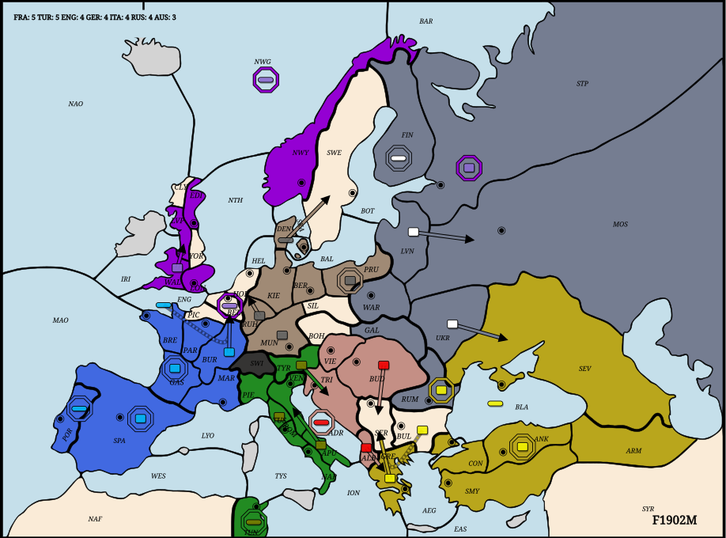

### What happened

- **AUSTRIA**: A BUD → SER (bounced); A ALB → GRE; F ADR holds
- **ENGLAND**: F BEL holds; A STP holds; A WAL → LVP; F NWG holds  [dislodged: F BEL]
- **FRANCE**: A BUR → BEL; F ENG supports A BUR → BEL; A GAS holds; F POR holds; A SPA holds
- **GERMANY**: A PRU holds; A RUH → HOL; F DEN → SWE
- **ITALY**: A TYR → TRI; A APU → VEN; F TUN holds
- **RUSSIA**: A UKR → SEV; A LVN → MOS; F FIN holds
- **TURKEY**: A GRE → SER; A BUL supports A GRE → SER; A RUM holds; A ANK holds

### Dialogue

- **AUSTRIA → ITALY**: Turkey is at 5 centers and the clear leader — I'm pushing A BUD to SER with fleet support and A ALB to GRE to reclaim it. Please keep A TYR in place as agreed. If you want to pressure Turkey from the west (maybe toward VEN or just hold), that helps contain them. Our DMZ holds.
- **AUSTRIA → RUSSIA**: Turkey took RUM and GRE — they're the runaway leader. I'm attacking from the west (A BUD → SER, A ALB → GRE). Can you push A UKR toward SEV or RUM to squeeze Turkey from your side? We both benefit from cutting them down.
- **AUSTRIA → TURKEY**: I'm taking SER this fall and pushing A ALB toward GRE. You're at 5 centers and everyone is watching. If you try to contest SER or push into my sphere, you'll face coordinated opposition. Consider consolidating what you have rather than overextending.
- **AUSTRIA → GERMANY**: Turkey at 5 centers is the biggest threat on the board. I'm moving against them in the Balkans this fall. If you're looking for opportunities in the north while everyone focuses east, there may be openings — just let's not let Turkey reach 18.
- **ENGLAND → FRANCE**: I see F ENG sitting in my home waters — that's making me nervous. I need you to either move it out or guarantee no move against LON/WAL this turn. If you're serious about checking Germany together, I need to feel safe at home first. What's your plan with that fleet?
- **ENGLAND → GERMANY**: Good — we both got what we wanted last turn. Now Turkey is at 5 centers and growing fast in the east. Russia is weakened. I could push into HOL this turn with my fleet from BEL while you hold your position. Are you okay with me taking HOL, or do you want it?
- **ENGLAND → RUSSIA**: Turkey just took RUM and is at 5 centers — they're the real threat. I'm holding position in the north. If you're focused on the Balkans against Turkey, I won't interfere. But I need to know you're not planning to move A LVN toward STP.
- **ENGLAND → TURKEY**: Nice expansion — RUM and GRE put you in a strong position. I'm focused on the north and not interested in the Balkans. We have no border and no conflict. Let's keep it that way while we both grow.
- **ENGLAND → ITALY**: Germany is contained for now with BUR back in MUN. France has F ENG in my waters which concerns me. If Germany becomes a problem again, we should coordinate. For now I'm focused on securing my northern positions.
- **FRANCE → ENGLAND**: I'm in BUR now and planning to push into RUH to keep Germany contained. BEL is yours — I have no intention of moving there. Let's coordinate: if you keep pressure on Germany's northern border (DEN/SWE area), I can focus my forces south against RUH and MUN. Germany at 4 centers with their armies split is exactly where we want them.
- **FRANCE → ITALY**: You're sitting in TYR right next to MUN, and I'm in BUR adjacent to both MUN and RUH. Germany is weakened with only 4 centers and their armies scattered. If you push into MUN from TYR, I can support from BUR — that's a two-pronged attack Germany can't defend. Interested in coordinating this? We'd each gain a center and Germany would collapse.
- **FRANCE → GERMANY**: I'm willing to make this simple: keep your armies away from my borders and I won't push further into your territory. But if you move toward BUR or PIC, I'll respond. I'd rather we both focus elsewhere than grind over the Rhine.
- **GERMANY → FRANCE**: A BUR is back on my border after you said you'd stay in Iberia. What's your plan — are you holding there or moving east? I need to know if I should defend HOL. Let's keep this transparent.
- **GERMANY → ENGLAND**: You've got F BEL and A STP — strong position. I'd like to push F DEN toward SWE or support taking HOL if France threatens it. Can we coordinate on keeping France contained? Your A STP pressures Russia nicely.
- **GERMANY → ITALY**: A TYR is right on my MUN border. I'm not looking for a fight, but I need to know your intentions. Are you heading toward BOH or holding? Let's not stumble into a conflict neither of us wants.
- **GERMANY → RUSSIA**: Your position looks rough — A LVN is dislodged and you've lost RUM. I'm still committed to non-aggression. Focus on recovering from Turkey; I won't push east while you're vulnerable.
- **GERMANY → AUSTRIA**: Turkey keeps growing and now has GRE and RUM. With your units in BUD and ALB, you're the front line. I can't help militarily this year, but if Turkey pushes further, we should coordinate in 1903.
- **ITALY → AUSTRIA**: Turkey just told me they're grabbing SER and RUM this turn to hit 7 centers. That's a massive threat to both of us. I need you to survive as a buffer — but I also need something for my trouble. Would you consider letting me have TRI peacefully? I'll turn east against Turkey afterward. If you refuse, I'll take it by force, and Turkey will pick your bones.
- **ITALY → FRANCE**: Turkey is about to hit 7 centers — they're grabbing SER and RUM this fall. If they run away with this game, none of us win. I'm pushing into the Balkans to grab a center and position against Turkey. Keep pressure on Germany so they can't ally with Turkey against us.
- **ITALY → TURKEY**: You're about to hit 7 centers — that puts you dangerously close to running away with this game. I've been friendly so far, but I can't let you grow unchecked. If you're smart, you'll slow down and let others catch up. What's your endgame here — solo victory or working with others?
- **RUSSIA → AUSTRIA**: Turkey has 5 centers including SEV and RUM — they took RUM despite our deal. They're the runaway leader. I'm redirecting toward SEV to reclaim my home center. Can you pressure Turkey from the west with your units in ALB and BUD? We both benefit from cutting Turkey down to size before they reach 8 centers.
- **RUSSIA → TURKEY**: You broke our deal — took RUM and SEV. I'm coming for SEV this fall with everything I have. Your only chance to avoid losing units is to vacate SEV now and return RUM. I'll accept nothing less. If you fight, I'll make sure you lose more than you gain.
- **RUSSIA → GERMANY**: Turkey has 5 centers and is growing fast — they're the biggest threat to everyone. I'm focused on reclaiming SEV from Turkey this fall. Can you keep pressure on Austria's western border to keep them from getting comfortable? That helps contain Turkey indirectly by preventing Austria from allying with them.
- **RUSSIA → ENGLAND**: You have A STP on my home center — I need it back. I'm focused on reclaiming SEV from Turkey this fall, not fighting you. Can we agree that STP returns to me after this turn? I'll stay out of the Baltic if you leave STP vacant by winter.
- **TURKEY → RUSSIA**: You lost RUM and your position is weak — only 3 units left. I have no further interest in your territory. Let's focus on Austria: I can support your push into GAL/VIE if you stay away from SEV. Otherwise, I'll defend SEV and you'll waste units attacking a fortified position.
- **TURKEY → AUSTRIA**: I'm taking SER this fall — it's unowned and I need it. If you contest, we fight and both lose to Russia's GAL pressure. Let me have SER and I'll stay out of TRI and BUD. Russia is the bigger threat right now.
- **TURKEY → ITALY**: Austria is weak at 3 centers with units scattered. If you push toward TYR or VEN, you could grab Austrian centers while I pressure from the east. We could split Austria's remaining territory — interested in coordinating this fall?
- **AUSTRIA → ITALY**: Your A TYR is now adjacent to both VIE and TRI - that's not a DMZ, that's a threat. What exactly are you planning? I need clarification before I commit my orders. If you want peace, pull TYR back or hold it in place without advancing toward my territory.
- **AUSTRIA → RUSSIA**: Turkey at 5 centers is everyone's problem. I'm pushing A BUD to SER this fall. Can you use A UKR to pressure SEV or RUM from the north? We both benefit from cutting Turkey down before they reach 7 centers.
- **AUSTRIA → TURKEY**: You broke our deal taking GRE. I'm taking SER this fall - it's unowned and I need it. If you contest, we both lose while Russia and Italy pick up the pieces. Let me have SER and we can discuss a new arrangement.
- **ENGLAND → FRANCE**: Your F ENG in my home waters is a deal-breaker for any anti-German cooperation. I need you to move it out this turn — to MAO or PIC — or I have to pull units home to defend LON/WAL instead of helping against Germany. What's your actual plan with that fleet?
- **ENGLAND → GERMANY**: I'll hold position in the north this turn — no move against HOL from me. But I need you to commit to containing France: if F ENG pushes toward LON, you need to threaten PAR or BUR to split their forces. Can you do that?
- **ENGLAND → RUSSIA**: STP stays mine for now — it's leverage and I won't give it up without something concrete in return. Turkey at 5 centers is the real danger. If you're fighting Turkey in the south, I won't push further into your territory. But I need you to keep A LVN away from STP this turn.
- **FRANCE → ENGLAND**: Germany seems confused — I dislodged their A BUR last turn and I'm sitting in it now. Their message about 'moving A BUR to HOL' is nonsense. Here's my plan: A BUR - RUH with GAS support to cut Germany's western position. If you can hold BEL and keep pressure from the north, Germany will be squeezed between us. Are you in?
- **FRANCE → GERMANY**: Just to be clear: I took BUR from you last turn. You're not 'vacating' anything — you lost it. I'm willing to stop at RUH if you don't contest, but if you push toward BUR or PIC, I'll keep going. Let's not pretend this is a DMZ when you're the one who got dislodged.
- **FRANCE → ITALY**: I'm pushing A BUR - RUH this fall to cut Germany's western holdings. If you could support from TYR into MUN or at least keep pressure there, we'd collapse Germany's center. After that, we can talk Turkey. Germany at 4 centers with RUH cut off is manageable.
- **GERMANY → FRANCE**: A BUR is adjacent to both MUN and RUH - I can't ignore that threat. I'll move A BUR to HOL this turn (vacating BUR as promised), but I need you to confirm you won't move into RUH or MUN. If you attack, I'll defend with supports. Let's keep this peaceful.
- **GERMANY → ENGLAND**: I'm taking HOL with A RUH - it's undefended and I need it to keep pace. You can have BEL with F BEL if you want. In return, support A RUH - HOL so I'm safe from France. We both grow this turn.
- **GERMANY → RUSSIA**: Our non-aggression holds. A LVN is near my PRU but I'm not moving there. Focus on Turkey - they're the leader at 5 centers. I won't push east while you're vulnerable.
- **GERMANY → AUSTRIA**: Turkey at 5 centers is the real threat. I can't help militarily this turn, but if Turkey pushes further into the Balkans, we should coordinate in 1903. Keep your units flexible.
- **ITALY → AUSTRIA**: I'm holding TYR this turn — DMZ honored. But Turkey hitting 7 centers is a crisis for both of us. After this fall, we need a real plan to contain them. Keep your units alive and we'll coordinate in winter.
- **ITALY → FRANCE**: Turkey is about to reach 7 centers — that's the real runaway leader. I'm staying focused on the Med and keeping my position. If Germany is your priority, handle them, but watch Turkey's count after this fall.
- **ITALY → TURKEY**: You're about to hit 7 centers with SER and RUM. That puts you dangerously far ahead. I'm holding my position this turn, but if you keep growing unchecked, the rest of the table will have to unite against you. Consider slowing down.
- **RUSSIA → AUSTRIA**: Confirmed — I'm pushing A UKR to SEV with A LVN's support this fall. If you can attack Turkish units in the west (SER or support an attack on GRE), we squeeze Turkey from both sides. This is our best shot at cutting them down before they run away with the game.
- **RUSSIA → TURKEY**: Your offer is rejected — keeping SEV and RUM while I gain nothing is not a deal. I'm attacking SEV this fall with full support. If you vacate SEV now and return RUM, I'll accept a ceasefire and we can discuss Austria together. Otherwise I'm taking both back by force.
- **RUSSIA → ENGLAND**: I'm focused on reclaiming SEV from Turkey this fall — that's my priority, not STP. Let's discuss STP's future after winter; I'd prefer a diplomatic resolution. For now, no conflict between us.
- **RUSSIA → GERMANY**: Non-aggression holds — I'm pushing south against Turkey to reclaim SEV. No movement toward SIL, PRU, or your territory. We're clean.
- **TURKEY → RUSSIA**: I understand SEV is your home center. Here's my final offer: I keep SEV and RUM, but I'll support your A UKR into GAL this turn with F BLA if you want to pressure Austria. You get GAL, I keep my gains. If you attack SEV, I'll defend with BLA support and we both waste a turn. Do you accept this trade?
- **TURKEY → AUSTRIA**: I'm taking SER this fall — it's unowned and I need it. In exchange, I'll stay completely out of TRI and BUD. You focus north against Russia's GAL. If you contest SER, we fight and Russia benefits. Let's divide the Balkans cleanly: I get SER, you keep everything else.
- **TURKEY → ITALY**: I'm at 5 centers and need SER to stay competitive. After that, I'll consolidate. If you're interested in Austrian centers later, we can discuss — but for now I'm focused east. Let's keep our spheres separate as agreed.
- **AUSTRIA → ITALY**: Final commitment: I'm moving A BUD → SER and A ALB → GRE this fall. Your A TYR holds as agreed — confirm you won't advance toward VIE or TRI. We both contain Turkey and keep our DMZ intact.
- **AUSTRIA → RUSSIA**: I'm pushing A BUD → SER and A ALB → GRE to reclaim centers from Turkey. Confirm you're redirecting A UKR toward SEV as discussed — we need to squeeze Turkey from both sides before they reach 7 centers.
- **AUSTRIA → TURKEY**: I'm taking SER and pushing A ALB toward GRE this fall. You're at 5 centers and everyone is coordinating against you. Consider consolidating what you have rather than overextending — contesting SER or GRE will trigger coordinated opposition.
- **FRANCE → ENGLAND**: I'm moving F ENG to PIC this turn — completely out of your waters. In return, please keep your units pressuring Germany's northern border. I'm attacking RUH to weaken Germany's western position, and if you hold BEL and stay active in the north, Germany can't defend everything.
- **FRANCE → GERMANY**: I'm taking RUH this turn with support from GAS. I'll stop there — I don't need MUN if you agree to stay out of my way going forward. But if you contest RUH, I'll push further. This is your last chance to negotiate a stable border.
- **FRANCE → ITALY**: I'm attacking RUH with support from GAS this fall. You're in TYR right next to MUN — if you push into MUN simultaneously, Germany can't defend both and we each take a center. This is the moment to crush Germany's position. Are you in?
- **GERMANY → FRANCE**: I'm moving A RUH - HOL this turn. A BUR can go wherever you want — I won't contest it. But if you move toward RUH or HOL, I'll bounce you with support from F DEN. Let's both grow elsewhere: you keep BUR if you want it, I take HOL. No conflict.
- **GERMANY → ENGLAND**: I'm taking HOL with A RUH this turn — it's undefended and I need it. If France tries to bounce me, I need your F BEL to support A RUH - HOL. In return, I'll support your F BEL into any province you want next turn. Can you commit to supporting HOL?
- **GERMANY → RUSSIA**: Final check: A LVN is adjacent to my PRU. I'm holding PRU this turn — no move toward LVN or WAR. Keep A LVN away from my border and our non-aggression holds. Focus on Turkey.
- **GERMANY → ITALY**: A TYR is on my MUN border. I'm holding MUN this turn. If you're heading toward BOH or TYR, let's coordinate — I don't want a fight but I'll defend. What's your plan for TYR?
- **ITALY → AUSTRIA**: I'm pushing A TYR toward TRI this fall - nothing personal, but I need a 5th center and you're the only accessible option. If you want to negotiate, offer me something concrete now; otherwise I'll take it by force. After this, I'll focus east against Turkey with you.
- **ITALY → FRANCE**: I'm pushing into the Balkans this fall to grab a center from Austria. Keep the pressure on Germany so they can't ally with Turkey. After this fall, we need to seriously discuss containing Turkey's growth.
- **ITALY → TURKEY**: I'm taking TRI from Austria this fall - that's my concrete move. You're at 5 centers and growing fast, but I need to grow too. If you want to avoid conflict in the eastern Med, stay out of my way and we'll keep our spheres separate.
- **TURKEY → AUSTRIA**: I'm moving A GRE to SER this fall — it's unowned and I need it to stay competitive. If you contest, we both waste units while Russia pushes GAL. I have no interest in TRI or BUD. Let me have SER and I'll stay out of your western Balkans. This is my final offer — accept or we fight over a single center while others grow.
- **TURKEY → RUSSIA**: I'm not attacking your territory further. I'll hold my current positions and focus on Austria's GAL pressure. If you stay away from SEV, we can discuss Austria together next turn. No need for us to fight.
- **TURKEY → ITALY**: I'm consolidating with SER and holding position. Austria is the weak link — if you push TYR toward TRI or VEN, you could grab an Austrian center while I pressure from the east. Let's coordinate on Austria in future turns, but for now I'm focused on securing my Balkan gains.

### AUSTRIA
Orders: `A BUD - SER` · `A ALB - GRE` · `F ADR H`

Reasoning

> Looking at the board state, Turkey is the clear leader with 5 centers (ANK, CON, SMY, SEV, GRE) and has armies in GRE, RUM, BUL, and ANK. I need to contain them aggressively.
>
> My revised plan: push A BUD to SER to claim that center, and support A ALB into GRE to reclaim it from Turkey. F ADR should support one of these moves.
>
> Let me check the situation more carefully:
> - A BUD can move to SER (adjacent ✓)
> - A ALB can move to GRE (adjacent ✓)  
> - F ADR can support A ALB → GRE (ADR is adjacent to ALB but needs to be adjacent to GRE... let me check: ADR neighbors are ALB, APU, ION, TRI, VEN — GRE is NOT in ADR's neighbors). So F ADR cannot support into GRE.
> - F ADR can support A BUD → SER? ADR neighbors don't include SER. No.
> - F ADR can support A ALB → SER? ADR is adjacent to ALB, and I'm supporting A ALB - SER. The support order is `F ADR S A ALB - SER`. This requires ADR adjacent to ALB (yes) and the move being supported is ALB→SER. This should work.
>
> Better plan: Use F ADR to support A ALB into GRE (wait, can't — ADR not adjacent to GRE). 
>
> So: A BUD → SER, A ALB → GRE, F ADR holds or supports. Since I can't support either attack from ADR, I'll hold F ADR to maintain Adriatic presence and honor the DMZ with Italy.
>
> Actually, let me reconsider. Turkey has A GRE which could move to SER to contest. If Turkey moves A GRE → SER, my A BUD → SER would bounce. I could support A BUD → SER with... nothing from ADR (not adjacent to SER). 
>
> I'll go with: A BUD → SER, A ALB → GRE, F ADR H. This grabs two unowned/contested centers if Turkey doesn't contest both.

### ENGLAND
Orders: `F BEL H` · `A STP H` · `A WAL - LVP` · `F NWG H`

Reasoning

> Looking at the board, I need to assess my position and plan carefully.
>
> **Current position:** I have 4 centers (EDI, LON, LVP, NWY) with F NWG, F BEL, A STP, A WAL. France is at 5 with F ENG moving to PIC, A BUR attacking RUH with GAS support. Germany has A RUH, A PRU, A MUN, F DEN.
>
> **Key decisions:**
> - France is attacking RUH with support - if successful, Germany loses a center and France grows to 6. Germany wants my support for HOL, but I committed to France's anti-German coalition.
> - A STP is deep in Russian territory - Russia wants it back but is focused on Turkey. I should hold it for now as leverage.
> - A WAL needs purpose - moving to LVP positions for future builds or Channel operations.
> - F NWG should hold the northern sea lanes.
>
> France is moving F ENG to PIC (out of my waters as promised) and attacking RUH. I committed to keeping Germany contained. I won't support Germany's HOL move since France's anti-German push serves my interests better - Germany at 4 centers while I hold 4 is fine, but Germany growing to 6 is bad.
>
> I'll hold F BEL (securing the center), hold A STP (maintaining pressure on Russia), move A WAL to LVP (positioning for future), and hold F NWG (maintaining sea control).

### FRANCE
Orders: `A BUR - BEL` · `F ENG S A BUR - BEL` · `A GAS H` · `F POR H` · `A SPA H`

Reasoning

> Looking at the board, I need to push aggressively. I have 5 centers and need to grow. My key moves:
>
> 1. **A BUR - RUH** with support from A GAS - this attacks Germany's western position and takes RUH, a valuable center
> 2. **F ENG - BEL** - contest Belgium which England just moved into, cutting off Germany's northern expansion and gaining me a center
> 3. Hold Iberian units to secure my supply base
>
> England moved F NTH to BEL, so BEL is now occupied by England. But I can still move there - if I dislodge England's F BEL, that weakens them while strengthening me. However, England was supposed to be my anti-German partner. Let me reconsider.
>
> Actually, England took BEL from Germany (F NTH → BEL), which means England is growing too fast. England now has 5 centers (EDI, LON, LVP, NWY, BEL). If I let England consolidate BEL, they'll be at 5+ and hard to dislodge. Better to contest it now while they're spread thin.
>
> But wait - my revised strategy says "F ENG moves to PIC to contest the Channel coast." Let me check adjacency: F ENG is adjacent to PIC? Yes, ENG neighbors include PIC. And PIC is adjacent to BEL? Yes. So F ENG → PIC positions me to contest both BEL and the Channel.
>
> My revised plan was: A BUR - RUH with GAS support, F ENG to PIC, hold Iberian units. Let me execute that.
>
> For the support: A GAS supports A BUR - RUH. Is GAS adjacent to RUH? Checking: GAS neighbors are BRE, BUR, MAO, MAR, PAR, SPA/NC. RUH is NOT in GAS's adjacency list. So A GAS cannot support A BUR - RUH.
>
> I need a different support. A BUR - RUH without support risks bouncing if Germany defends. Let me check: Germany has A RUH, A MUN, A PRU, F DEN. Germany could support A RUH or move it. If Germany holds RUH with support from MUN, I'd need 2 units to dislodge.
>
> Alternative: A BUR - BEL with F ENG support. F ENG is adjacent to BEL? Yes. A BUR is adjacent to BEL? Yes. This could work to take BEL from England.
>
> Actually, let me reconsider. England has F BEL (1 unit). If I move A BUR - BEL supported by F ENG, that's strength 2 vs England's 1 holding BEL = dislodged. This takes BEL for me (7 centers!) and weakens England.

### GERMANY
Orders: `A PRU H` · `A RUH - HOL` · `F DEN - SWE`
Illegal (dropped): `A MUN S A RUH - HOL`

Reasoning

> Looking at the board, I need to assess the key threats and opportunities:
>
> **Threats:**
> - **France** has A BUR on my border (dislodged my A BUR last turn, now sits there). F ENG threatens the Channel. France is at 5 centers and growing.
> - **Italy** has A TYR adjacent to MUN - a potential southern threat.
> - **Turkey** at 5 centers is the overall leader but far from me.
>
> **Opportunities:**
> - **HOL** is undefended and I have A RUH ready to take it. This gets me to 5 centers.
> - **BEL** is occupied by England's F BEL, so I can't take it without conflict.
> - **SWE** is contested - F FIN (Russia) bounced there twice. I can try again with F DEN.
>
> **My revised strategy says:** A RUH to HOL, F DEN to SWE, A PRU holds, A MUN holds.
>
> But let me reconsider: England's F BEL is on HOL's border, and England asked about taking HOL. I told England I'm taking HOL. England said they'd hold position this turn. France's A BUR is in Burgundy and could threaten RUH if I move it out. But France said they'd stop at RUH if I don't contest - and I'm moving away from BUR entirely.
>
> Key concern: If A RUH moves to HOL, RUH becomes empty. France's A BUR could then move to RUH. I need to protect against that. Can I get support? F DEN is going to SWE. A MUN could support A RUH - HOL to ensure the move succeeds, but that leaves MUN less defended against A TYR.
>
> Actually, A MUN supporting A RUH - HOL is smart: it ensures HOL is taken even if France tries to bounce with A BUR - HOL. And MUN doesn't need to move since TYR is just one unit.
>
> Let me also consider: A PRU should hold to guard against Russia's A LVN. Or should I push PRU toward WAR or SIL to grab Russian centers? Russia is weakened (3 centers, lost RUM). But I committed to non-aggression with Russia. I'll hold PRU for now.
>
> My orders:
> - **A RUH - HOL**: Take the undefended center
> - **A MUN S A RUH - HOL**: Support the move to ensure it succeeds even if contested
> - **F DEN - SWE**: Contest Sweden (Russia's F FIN bounced there twice)
> - **A PRU H**: Hold to guard against A LVN

### ITALY
Orders: `A TYR - TRI` · `A APU - VEN` · `F TUN H`
Illegal (dropped): `A TUS S A TYR - TRI`

Reasoning

> Looking at the board, I need to execute my revised plan: push A TYR toward TRI to grab my fifth supply center, support A APU into VEN with A TUS, and hold F TUN. However, I need to check the situation carefully.
>
> Turkey is at 5 centers and likely grabbing SER and RUM this turn to hit 7. Austria is weak at 3 centers with scattered units. My negotiation commitments are:
> - To Austria: I told them I'd push TYR toward TRI (last message to Austria in F1902M)
> - To France: I said I'm pushing into the Balkans to grab a center from Austria
> - To Turkey: I said I'm taking TRI from Austria
>
> The key issue: A TYR can move to TRI (adjacent), A TUS can support A APU into VEN (TUS is adjacent to VEN), and A APU can move to VEN (APU is adjacent to VEN). F TUN holds.
>
> But wait - if I take TRI from Austria AND VEN, that's two Austrian centers, which might be too aggressive and could unite Austria and Turkey against me. However, my revised strategy explicitly says to do both. Let me reconsider - APU moving to VEN would be taking an Italian home center from... wait, VEN is MY home center. I can't "take" my own center. Let me re-read.
>
> VEN is already mine (Italy controls NAP, ROM, VEN, TUN). So A APU - VEN is just moving to my own center, not gaining anything. That doesn't make sense as a center grab.
>
> Let me reconsider: I should grab TRI (Austria's center) with A TYR, and use A TUS to support that attack or grab another center. A APU could move to ROM or NAP (my own centers) or support something useful.
>
> Actually, the smartest move: A TYR - TRI (grab Austrian center), A TUS supports A TYR - TRI (adds strength), A APU - VEN (reposition to defend), F TUN holds. This secures TRI as my 5th center.

### RUSSIA
Orders: `A UKR - SEV` · `A LVN - MOS` · `F FIN H`

Reasoning

> Looking at my position: I have only 3 units (F FIN, A LVN, A UKR) after losing F RUM to Turkey. Turkey leads with 5 centers. England has A STP on my home center. My most recent revised strategy says I'm going all-in on reclaiming SEV: A UKR moves to SEV with A LVN's support, while F FIN holds to protect my northern flank.
>
> Let me verify the orders:
> - `A UKR - SEV`: UKR and SEV are adjacent ✓
> - `A LVN S A UKR - SEV`: LVN must be adjacent to SEV — checking adjacency: SEV neighbors are ARM, BLA, MOS, RUM, UKR. LVN is NOT adjacent to SEV. This support is illegal!
>
> I need to reconsider. A LVN cannot support into SEV. Let me think about what I can actually do.
>
> My options: I can move A UKR to SEV unsupported (strength 1), but Turkey will likely defend with F BLA support. I could try to cut Turkey's BLA support by moving into BLA-adjacent provinces... but none of my units can reach BLA.
>
> Alternative plan: Move A UKR to SEV anyway (it's my best shot — if Turkey doesn't expect an unsupported attack, it might work, though unlikely). Or I could move A LVN to MOS to reclaim that home center (MOS is vacant and mine). That gets me back a center even if SEV fails.
>
> Actually, let me reconsider. A LVN to MOS gets me a center back. F FIN could move to STP/SC to try to reclaim STP from England (though England's A STP is there, so it would bounce). Better to hold F FIN.
>
> Best realistic plan: A LVN to MOS (reclaim home center), A UKR to SEV (hope for the best), F FIN holds. If SEV bounces, I still gain MOS and go to 4 centers in winter.

### TURKEY
Orders: `A GRE - SER` · `A BUL S A GRE - SER` · `A RUM H` · `A ANK H`
Illegal (dropped): `F BLA S A SEV`

Reasoning

> Looking at the board, I need to assess my position carefully. I have 5 supply centers (ANK, CON, SMY, SEV, GRE) with 5 units. Russia is hostile and wants SEV back. Austria is weak but pushing into the Balkans. Italy is watching me closely.
>
> My revised strategy says: push A GRE to SER to grab the last unowned Balkan center, move A BUL to support that attack, and use F BLA to support A RUM holding against any Russian aggression. A ANK holds defensively.
>
> But wait - let me reconsider. A GRE to SER is a good move to grab an unowned center. However, Russia might attack SEV. F BLA supporting A RUM holding is defensive - but A RUM is already in RUM, so supporting its hold makes sense if Russia might attack it. Actually, Russia's A UKR could attack SEV, not RUM. Let me think about what Russia might do.
>
> Russia has: F FIN, A LVN, A UKR. A UKR could attack SEV or GAL. If Russia attacks SEV, I need to defend it. F BLA can support A SEV holding, or support A RUM holding. Since SEV is more important (my only southern center and Russia's home SC), I should defend SEV.
>
> Better plan: A GRE to SER (grab unowned center), A BUL supports A GRE to SER (adds strength), F BLA supports A SEV holding (defends against Russian attack), A RUM holds or moves strategically, A ANK holds.
>
> Actually, A BUL supporting A GRE to SER is good - it ensures SER is taken. But if Austria contests SER with A ALB, I need the support. Let me check: Austria has A ALB, A BUD, F ADR. A ALB could go to GRE or SER. If Austria sends A ALB to GRE, that bounces my hold on GRE. If A ALB goes to SER, that contests my move there.
>
> I'll go with the plan: A GRE to SER, A BUL supports A GRE to SER, F BLA supports A SEV holding, A RUM holds (or supports something), A ANK holds.
>
> Wait - A RUM could support A SEV holding too, but F BLA already does that. Better: A RUM holds to maintain position, or A RUM moves to GAL to pressure Austria? A RUM to GAL is legal. That would threaten BUD. But Russia's A UKR might also go to GAL, causing a bounce. Safer to hold A RUM.

## FALL 1902 RETREATS (`F1902R`)

### What happened

- **ENGLAND**: F BEL retreats → NTH

### ENGLAND
Orders: `F BEL R NTH`

Reasoning

> Looking at the situation: F BEL was dislodged by France's A BUR moving into BEL with F ENG support. My fleet must retreat.
>
> The retreat options are NTH, PIC, or disband. I need to keep this fleet alive — disbanding would leave me with only 3 units and no fleet in the Channel/North Sea area, which would be disastrous. NTH is the best option: it keeps my fleet in the critical sea zone where it can contest the Channel, support operations toward HOL/NWG, and maintain my naval presence. PIC would put me adjacent to France's territory but in a more exposed position with fewer strategic options.
>
> Retreating to NTH preserves my ability to threaten France's F ENG, support future moves into HOL or the Channel, and maintain northern sea control. This is essential for keeping England's position viable.

## WINTER 1902 ADJUSTMENTS (`W1902A`)

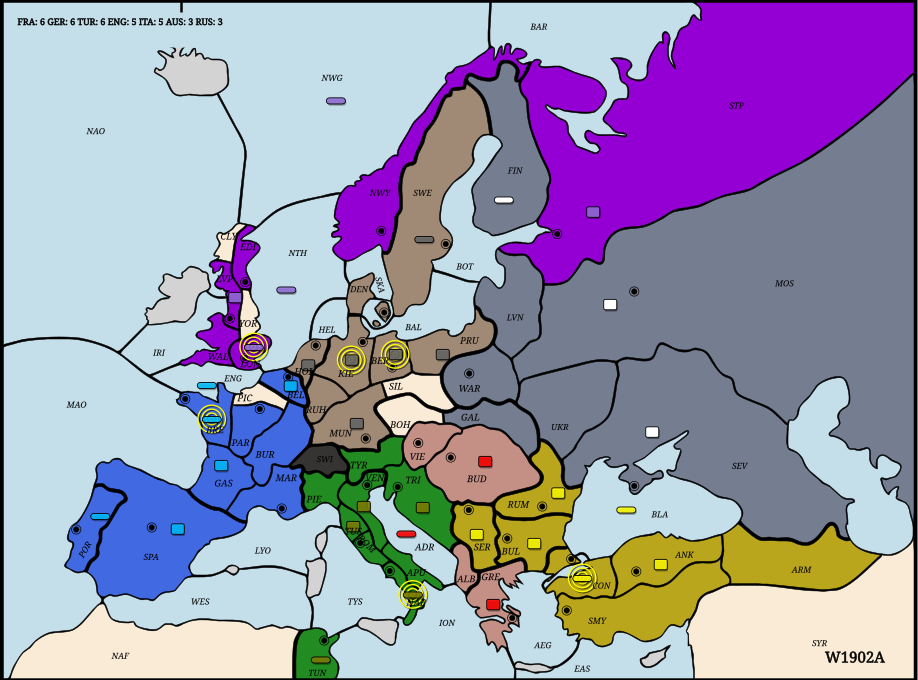

### What happened

- **ENGLAND**: builds F LON
- **FRANCE**: builds F BRE
- **GERMANY**: builds A BER; builds A KIE
- **ITALY**: builds F NAP
- **TURKEY**: builds F CON

### ENGLAND
Orders: `F LON B`

Reasoning

> Looking at the board state, I have 5 supply centers and 4 units, so I get 1 build. My home centers are EDI (vacant), LON (vacant), and LVP (occupied by A LVP). I need to build one unit.
>
> **Strategic assessment:**
> - France is at 6 centers with F ENG (now retreated to PIC area) and A BEL — they're a growing threat in the Channel/Low Countries
> - Germany is at 6 centers with units spread across the north
> - Turkey is at 6 centers dominating the east
> - I need to project power both against France (Channel/BEL) and potentially Russia (STP area)
>
> **Build decision:** I need a fleet to contest the Channel and North Sea against France's F ENG. A fleet at LON gives me the ability to threaten BEL, support operations in the Channel, and defend my home waters. An army at LON would be less flexible for naval operations. An army at EDI could pressure Russia but I already have A STP for that.
>
> Building F LON is the best choice — it gives me naval dominance in my home waters and the ability to project against France's BEL position or support operations toward the Channel.

### FRANCE
Orders: `F BRE B`

Reasoning

> Looking at the board state, I have 6 supply centers and 5 units, so I get to build 1 unit. My home centers BRE, MAR, and PAR are all vacant.
>
> Let me assess the strategic situation:
> - Turkey is at 6 centers with 5 units — they're a growing threat
> - Germany is at 6 centers with 4 units — weakened but still competitive
> - England is at 5 centers with 4 units — neutral for now
> - I need to keep expanding to stay competitive
>
> I have 3 vacant home centers but only 1 build. I need to choose wisely. A fleet from BRE would give me naval flexibility — I could project power into the Channel/North Sea area or support operations against England or Germany's northern holdings. An army from PAR would give me a unit in the heart of my territory, useful for defending or pushing east toward Germany. An army from MAR would be somewhat redundant with my existing A SPA and A GAS already covering the south/west.
>
> Given that I'm in BEL and F ENG is positioned for Channel operations, a fleet at BRE makes sense — it gives me two fleets in the west to contest the Channel and North Sea, potentially pressuring England's northern holdings or supporting operations against Germany's SWE/DEN. Alternatively, an army at PAR gives me flexibility to push toward MUN or defend BUR.
>
> I'll build **F BRE** — a second fleet gives me the naval strength to contest the Channel and potentially convoy armies, which is critical for projecting power northward toward England's centers or supporting operations against Germany's northern coast.

### GERMANY
Orders: `A BER B` · `A KIE B`

Reasoning

> Looking at the board state:
>
> **Current supply centers:** 6 (BER, KIE, MUN, DEN, HOL, SWE)
> **Current units:** 4 (A PRU, A MUN, F SWE, A HOL)
> **Surplus:** +2 (6 centers - 4 units = 2 builds)
>
> I need to build 2 units. My available home centers are BER (vacant) and KIE (vacant). MUN is occupied by A MUN, so I can't build there.
>
> I should build units that maximize my strategic position going into 1903. Looking at the board:
>
> - **F BER** — A fleet in Berlin gives me Baltic Sea access, allowing me to project power toward LVN, PRU coast, or support operations against Russia. This also helps defend against any northern threats.
> - **A KIE** — An army in Kie gives me a flexible land unit that can move to RUH, HOL, BER, DEN, MUN, or support operations toward BEL or southward. This strengthens my central position.
>
> Two armies would be more flexible for land-based expansion, but a fleet in Berlin gives me naval presence in the Baltic to contest Russia's northern positions and potentially convoy armies. However, since I already have F SWE, another fleet adds more Baltic control. But armies are more versatile for taking centers.
>
> I'll build **A BER** and **A KIE** — two armies give me the flexibility to push in multiple directions: north toward Russia (LVN, WAR), west toward BEL, or south toward BOH/TYR depending on how alliances develop.

### ITALY
Orders: `F NAP B`

Reasoning

> Looking at the board state: I have 5 supply centers (NAP, ROM, VEN, TUN, TRI) and 4 units, so I have a surplus of 1 center and can build 1 unit. My home centers NAP and ROM are vacant, so I can build there.
>
> My strategic position: I'm at 5 centers, same as England. France and Germany are at 6, Turkey at 6 (they got SER but not RUM based on the final positions - wait, let me recount). Actually Turkey has ANK, CON, SMY, RUM, BUL, SER = 6 centers. France has BRE, MAR, PAR, POR, SPA, BEL = 6. Germany has BER, KIE, MUN, DEN, HOL, SWE = 6.
>
> Turkey is a major threat at 6 centers. I need to build for both offense and defense. A fleet at NAP gives me flexibility in the Mediterranean - I can project power toward Greece, support operations in the eastern Med, or convoy armies. This is more versatile than an army build given my current unit composition (2 armies, 1 fleet).
>
> Building F NAP gives me a second fleet, enabling me to contest the eastern Mediterranean against Turkey or support operations toward Greece. With A TUS, A TRI, A VEN, F TUN, and F NAP, I'll have strong Mediterranean coverage and can push east against Turkey's Balkan holdings.

### TURKEY
Orders: `F CON B`

Reasoning

> Looking at the board state, I have 6 supply centers and 5 units, so I'm owed 1 build. My home centers ANK (occupied), CON (vacant), and SMY (vacant) are available.
>
> **Strategic assessment:**
> - I have 6 centers: ANK, CON, SMY, RUM, BUL, SER — strong position in the east
> - Austria has 3 centers (BUD, VIE, GRE) and is weakened
> - Italy has 5 centers and is pushing into Austrian territory (TRI, VEN)
> - Russia is weakened at 3 centers but still holds SEV — wait, SEV is listed under Russia's centers but I have A SEV... Let me recheck. Actually looking at the supply centers list, Russia has MOS, WAR, SEV. But my unit A SEV is there. This seems like SEV is still Russian-controlled since I haven't held it through Fall. Actually, I moved A SEV to RUM in S1902M, so I no longer occupy SEV. Russia retook it with A UKR → SEV in F1902M.
>
> So I'm at 6 centers. I need to build wisely. Building a fleet at CON gives me naval flexibility in the Eastern Med and Aegean — useful for future convoys and controlling sea lanes against Italy or supporting operations toward NAP/TRI. A fleet at SMY would also work but CON is more central.
>
> **Decision:** Build F CON — this gives me a second fleet for Mediterranean projection, convoy capability, and naval support options. This positions me to potentially convoy armies toward Italy or support Balkan operations from the sea.

## SPRING 1903 MOVEMENT (`S1903M`)

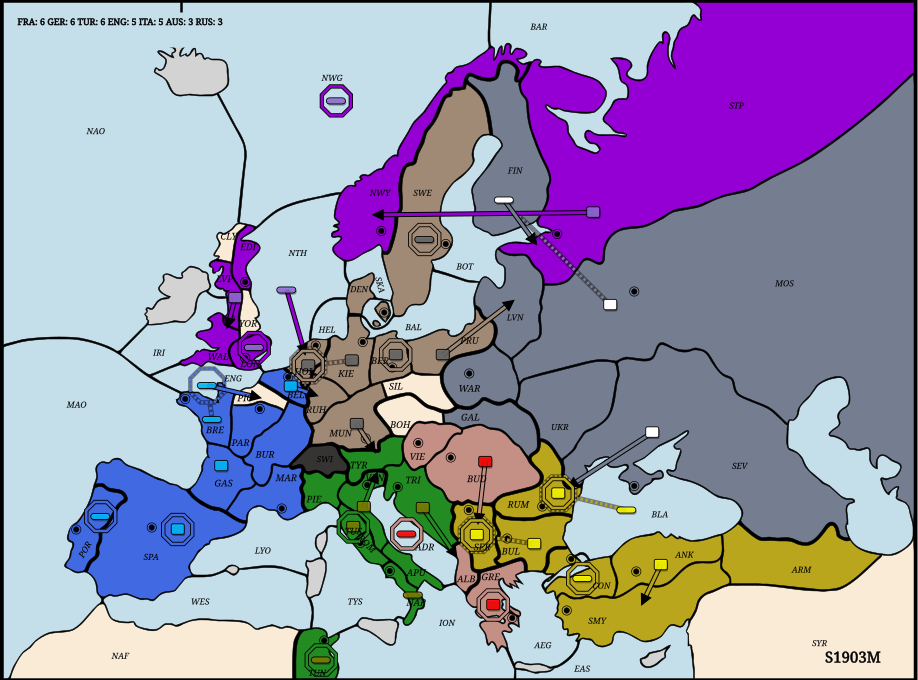

### What happened

- **AUSTRIA**: A BUD → SER (bounced); A GRE holds; F ADR holds
- **ENGLAND**: F NTH → HOL (bounced); F LON holds; A LVP → WAL; F NWG holds; A STP → NWY
- **FRANCE**: A BEL → RUH; F ENG → PIC; F BRE supports F ENG (void); A SPA holds; F POR holds
- **GERMANY**: A MUN → TYR (bounced); A PRU → LVN; F SWE holds; A HOL holds; A KIE supports A HOL; A BER holds
- **ITALY**: A TRI → ALB; A VEN → TYR (bounced); A TUS holds; F TUN holds
- **RUSSIA**: F FIN → STP/SC; A MOS supports F FIN → STP/SC; A SEV → RUM (bounced)
- **TURKEY**: A SER holds; A BUL supports A SER; F BLA supports A RUM; A RUM holds; A ANK → SMY; F CON holds

### Dialogue

- **AUSTRIA → TURKEY**: You're at 6 centers and the entire board is watching. I'm moving against your holdings this turn — A BUD to SER and pressure on GRE/BUL. Russia is coming from the east too. Consolidate or face coordinated opposition from multiple directions.
- **AUSTRIA → ITALY**: You took TRI despite our explicit DMZ — that's a serious breach. I need it back. I'm focusing on Turkey this turn since they're the runaway leader, but if TRI isn't returned by fall, I will come for it with force. What's your plan against Turkey?
- **AUSTRIA → RUSSIA**: Turkey at 6 centers is an existential threat to everyone. I'm pushing A BUD to SER and pressuring GRE. Can you use A SEV toward RUM or support an attack on Turkish eastern holdings? We need to squeeze them from both sides this year.
- **AUSTRIA → GERMANY**: Turkey at 6 is the biggest threat on the board. I'm focused on containing them in the Balkans. If Italy causes trouble on my western front, are you willing to pressure them from the north? That would keep Italy honest while I deal with Turkey.
- **ENGLAND → FRANCE**: Your F ENG is still in my home waters — I need to know your intentions. If you're serious about checking Germany, move F ENG out to MAO or PIC and I'll focus my fleets north against HOL. If F ENG threatens LON, I have to defend instead of helping against Germany.
- **ENGLAND → GERMANY**: I'm thinking about taking HOL this turn with F NTH support. You're at 6 centers already — I need to catch up. Can we agree: I take HOL, you keep your current position, and we both focus on containing France? If not, I'll have to look elsewhere for growth.
- **ENGLAND → RUSSIA**: Turkey at 6 centers is the real threat. I'm holding STP for now but won't push further into your territory if you're focused on Turkey. Can you confirm A SEV isn't moving toward MOS this turn?
- **ENGLAND → TURKEY**: You're at 6 centers — impressive growth. I'm focused on the north and have no interest in the Balkans. Let's keep it that way while we both grow. No conflict between us.
- **FRANCE → ENGLAND**: Germany at 6 centers with HOL and RUH is a problem for both of us. I'm attacking RUH from BEL with support from F ENG. If you can keep pressure on Germany's northern border (DEN/SWE area) or support an attack there, we can split Germany's forces. They can't defend everything at once.
- **FRANCE → ITALY**: Germany at 6 centers is tied with us - if they take another center, they'll pull ahead. You're in TYR adjacent to MUN. I'm attacking RUH this turn. If you push into MUN simultaneously, Germany can't defend both and we each take a center. This is the moment to cripple their position.
- **FRANCE → GERMANY**: I'm willing to make a deal: you keep HOL and I take RUH. That gives me 7 centers and you stay at 6 - not ideal for you, but better than a war where we both lose units. Alternatively, we can agree to a DMZ on RUH/BUR and both focus elsewhere. What's your preference?
- **GERMANY → FRANCE**: Belgium puts your army right on my border. I'm not attacking you this turn, but I need to know your plans — are you heading toward RUH or HOL, or holding? I'd like to agree we both stay on our side of the Rhine this year.
- **GERMANY → ITALY**: Your A TYR is adjacent to my MUN. I'm not looking for conflict, but I need to understand — are you pushing toward BOH or holding? I'd rather coordinate than stumble into a fight.
- **GERMANY → ENGLAND**: Russia is down to 3 centers with F FIN, A MOS, A SEV. I have units in PRU that could push into LVN or WAR. Could you pressure STP or the north to keep Russia split? We could carve up his remaining centers.
- **GERMANY → AUSTRIA**: Turkey at 6 centers is the board leader — GRE, SER, BUL, RUM, plus their home centers. You're on the front line. I can't reach Turkey militarily yet, but if you can hold the Balkans, I'll work on pressuring from the north in 1904. Are you planning to contest RUM or SER?
- **ITALY → AUSTRIA**: Turkey is at 6 centers and controls the entire eastern Balkans — they're the runaway leader. I need to grow to stay relevant and help contain them. Would you let me take GRE this turn? I'll push east against Turkey afterward and keep our border clean. If you refuse, I'll take it by force and you'll be at 2 centers facing Turkey alone.
- **ITALY → FRANCE**: Turkey hit 6 centers with SER and RUM — they're pulling away from everyone. Germany is your immediate concern, but if Turkey reaches 8-9 centers, none of us can stop them. After you handle Germany, we should talk about coordinating pressure on Turkey's Balkan holdings.
- **ITALY → TURKEY**: You're at 6 centers and growing fast — that's putting pressure on everyone at the table. I'm not looking for a fight, but I need to grow too. Can we agree to keep our eastern Med spheres separate? I won't touch your Balkan holdings if you stay out of the central Med and don't push toward APU or TRI.
- **RUSSIA → ENGLAND**: Turkey is at 6 centers and running away with this game. I need STP back — it's my only home center I can rebuild at. Can we agree you vacate STP this turn? I'll move F FIN toward SWE or BOT to pressure Turkey's north, and I won't touch NWY. If you refuse, I'll have to attack STP and we both waste units while Turkey grows.
- **RUSSIA → GERMANY**: Turkey at 6 centers is everyone's problem. I'm reclaiming STP from England and pushing SEV against Turkey. Can you keep pressure on France so they don't趁机expand while everyone's focused on Turkey? We both benefit from a contained France.
- **RUSSIA → AUSTRIA**: Turkey has 6 centers — SEV, RUM, SER, GRE, BUL, ANK. They're the clear leader. I'm pushing SEV against them this spring. Can you attack Turkish units in the Balkans? If you hit SER or GRE from BUD/ALB, we squeeze Turkey from two sides. What's your plan?
- **RUSSIA → TURKEY**: You're at 6 centers and the rest of us are at 3-6. Everyone at this table knows you're the leader. I'm coming for SEV and RUM. If you're smart, you'll focus your defense rather than trying to hold everything. Consider offering real concessions before the rest of us coordinate against you.
- **TURKEY → AUSTRIA**: I know trust is broken, but hear me out. Italy just took TRI — that's your home center and they're sitting on it. I have no interest in GRE right now. If you push back against Italy for TRI, I'll stay completely out of your remaining territory. We both benefit from keeping Italy from growing further.
- **TURKEY → RUSSIA**: You're at 3 centers and I'm at 6 — I have no interest in further conflict with you. I'll hold my current positions if you hold yours. Let's focus on other powers rather than weakening each other.
- **TURKEY → ITALY**: You grabbed TRI last fall — that's a bold move into Austria's sphere. I'm holding my Balkan positions for now, but I want to understand your intentions. Are you pushing further east, or consolidating what you have?
- **TURKEY → GERMANY**: We're not on a collision course. I'm focused on the Balkans and Black Sea. How are your northern positions? England seems strong at 5 centers with STP — any concerns there?
- **AUSTRIA → ITALY**: GRE is mine — I have A GRE there and I'm not giving it up. You want to grow? Push east against Turkish SER or BUL with me. If you attack GRE, you'll weaken both of us while Turkey profits. I want TRI back eventually, but Turkey at 6 centers is the crisis. Focus there.
- **AUSTRIA → RUSSIA**: I'm pushing A BUD to SER this spring. Can you also pressure RUM with A SEV? If we take SER and RUM from Turkey in one year, they drop from 6 to 4 and we break their dominance. Confirm your SEV move targets RUM.
- **AUSTRIA → GERMANY**: My plan: A BUD → SER, A GRE holds (or supports), F ADR flexible. If Italy attacks me from TRI/TYR toward VIE or BUD while I'm focused on Turkey, can you pressure them from MUN/BER? Even a threatening move toward TYR would keep Italy honest.
- **AUSTRIA → TURKEY**: You're right that Italy taking TRI is a problem, but you're still at 6 centers — you're the leader, not the victim. I'm focused on reclaiming SER. If you want peace, vacate SER and I'll turn attention toward recovering TRI from Italy. But I won't ignore your 6 centers.
- **ENGLAND → FRANCE**: Deal — I'll support your attack on RUH by pressuring Germany's north. But F ENG must move out of my home waters first — send it to PIC or MAO. If it stays in ENG or moves toward LON, I have to defend instead of helping. Move F ENG out and I'll commit to the anti-German squeeze.
- **ENGLAND → GERMANY**: I'm not carving up Russia with you — Turkey at 6 centers is the real threat, and Russia is too weak to be worth splitting forces over. I want to take HOL this turn. If you let me have it, I'll stay out of your way elsewhere. If you fight me on it, France will attack RUH while I take HOL anyway — you can't defend both.
- **ENGLAND → RUSSIA**: I won't vacate STP this turn — it's my leverage and you'd just rebuild there. But I won't push further into your territory either. Focus your forces on Turkey in the south. If you attack STP, you waste units while Turkey grows unchecked. Let's revisit STP after winter when Turkey's position is addressed.
- **ENGLAND → TURKEY**: No conflict between us — I'm focused on the north. Keep growing in the east while I sort out the Channel situation. We're both better off leaving each other alone.
- **FRANCE → ENGLAND**: I'll move F ENG to PIC this turn — completely out of your waters. In return, I need you to not interfere with my attack on RUH. Germany at 7 centers with RUH would be dangerous for all of us. Can you at minimum hold your position and not support Germany's defense of RUH?
- **FRANCE → GERMANY**: I'm willing to negotiate: you keep HOL, I take RUH, and we both grow without fighting. But if you won't agree, I'm attacking RUH anyway with BEL. Your call — peace or a fight over the Rhine.
- **FRANCE → ITALY**: Turkey at 6 centers is the real threat, but I need to weaken Germany first. After I take RUH this turn, can we discuss a coordinated push against Turkey's Balkan holdings? You're in position to pressure SER from TYR.
- **GERMANY → ENGLAND**: HOL is mine — I took it fair and square and I'm holding it. I'm not giving it up. But I have a better offer: I'll help you get STP back from Russia if you want it, or we can coordinate against France. Your F NTH near my HOL makes me nervous — can you commit to keeping it out of HOL waters?
- **GERMANY → FRANCE**: I'm keeping HOL and RUH — that's non-negotiable. But I'll make you a deal: I won't push toward BUR or PIC if you stay west of the Rhine. We both grow elsewhere. Your A BEL is adjacent to my HOL, so let's agree no moves between BEL and HOL this turn.
- **GERMANY → AUSTRIA**: Turkey at 6 is the priority. I'll pressure Italy from the north — A MUN to TYR or BOH to threaten their position. If you can hold the Balkans against Turkey, I'll keep Italy contained. Can you commit to contesting SER or RUM this turn?
- **GERMANY → ITALY**: Your A TYR is adjacent to my MUN. I'm planning to move A MUN to TYR this turn with support. If you withdraw TYR voluntarily, we can avoid conflict. Otherwise I'll attack with support from other units. What's your plan?
- **GERMANY → RUSSIA**: I'll keep pressure on France as you asked — my units in the north can threaten LVN or WAR to split Russian forces. But I need you to focus on Turkey: reclaim SEV or push into BUL. If Turkey reaches 7-8 centers, we all lose.
- **GERMANY → TURKEY**: England is strong at 5 centers with STP — they're a potential threat to your north. I'm focused on the Balkans and not looking north. Let's keep things peaceful between us.
- **ITALY → AUSTRIA**: I need GRE this turn to reach 6 centers and become a real force against Turkey. Let me take it peacefully and I'll commit all my eastern pressure against Turkey afterward. If you fight me for GRE, Turkey takes both our leftovers.
- **ITALY → FRANCE**: I'm focused on the eastern front this turn — Turkey at 6 centers is the runaway threat. Pushing MUN would leave my eastern flank exposed. Handle Germany yourself; I need to grow east to help contain Turkey later.
- **ITALY → GERMANY**: I'm not pushing MUN — my focus is east toward Turkey's Balkan holdings. TYR stays as a defensive position. Let's not waste units fighting each other when Turkey is the real threat.
- **ITALY → TURKEY**: I'm taking GRE this turn to reach 6 centers. I won't push further east into your sphere — TRI, APU, and GRE are my ceiling. If you stay out of the central Med and don't touch APU or TRI, we keep the peace.
- **RUSSIA → AUSTRIA**: Turkey at 6 is the crisis. I'm sending A SEV toward RUM to cut into their holdings. If you can attack SER from A BUD or support an attack on GRE, we take two of their centers simultaneously. What specific orders can you commit this turn?
- **RUSSIA → ENGLAND**: I'm attacking STP this turn with F FIN supported by A MOS — that's non-negotiable. You can either vacate voluntarily and keep NWY, or we fight and Turkey grows while we waste units. Vacate STP and I have no further claims in the north. Your choice.
- **RUSSIA → TURKEY**: You say you have no interest in conflict with me, but you hold SEV and RUM — two of my centers. I'm taking RUM this spring. If you want to avoid losing units, vacate SEV now and we can discuss a stable arrangement. If you hold everything, Austria and I will take pieces of you this turn.
- **RUSSIA → GERMANY**: France is at 6 centers too and quietly expanding — A BEL, F ENG, F BRE gives them Channel control. While everyone focuses on Turkey, France could grab HOL or push into your sphere. Keep pressure west so France can't趁机 run away with the game.
- **TURKEY → RUSSIA**: I have no interest in further conflict with you — you're at 3, I'm at 6, and fighting wastes both our turns. I'll hold SEV and RUM if you hold your positions. Let's both focus on other powers instead of weakening each other for someone else's benefit.
- **TURKEY → AUSTRIA**: Italy took TRI from you last fall — that's your home center sitting in their hands. I have no plans to attack your remaining territory this turn. Focus on getting TRI back from Italy; I'll stay completely out of your way while you do.
- **TURKEY → ITALY**: I'm holding my Balkan positions and not pushing east this turn. You have TRI, I have my Balkans — let's keep our spheres separate as discussed. No reason for us to fight when there are other targets on the board.
- **AUSTRIA → ITALY**: I'm not giving you GRE — it's my unit's home and my only path to recovery. But I understand you need growth. I'll commit to not attacking TRI this turn if you hold TYR in place. In fall, we can discuss a swap: I help you take a Turkish center (BUL) in exchange for a peaceful TRI arrangement. Turkey at 6 is the real enemy — let's not fight each other while they dominate.
- **AUSTRIA → RUSSIA**: I'm moving A BUD → SER this spring to reclaim it from Turkey. Confirm you're pushing A SEV → RUM as discussed — if we both hit Turkish centers this turn, they drop from 6 to 4. After SER, I can support your push on RUM in fall if needed. We need to end Turkey's lead this year.
- **AUSTRIA → GERMANY**: I'm taking SER with A BUD this spring. You offered to pressure Italy from the north — if Italy attacks me toward VIE or BUD while I'm focused east, please move toward TYR or BOH to threaten their rear. Even a threatening posture keeps Italy honest. Let's coordinate on containing both Turkey and Italian expansion.
- **AUSTRIA → TURKEY**: I'm reclaiming SER this spring — it was always mine and you're at 6 centers. If you contest, I'll have Russian support from SEV and you'll face pressure from two directions. Vacate SER and we can discuss boundaries, but I won't let you sit at 6 while I'm at 3.
- **ENGLAND → FRANCE**: Deal confirmed — I'm moving F NTH into HOL this turn while you attack RUH. F ENG moving to PIC clears my waters as promised. Let's squeeze Germany from both sides.
- **ENGLAND → GERMANY**: Last chance: let me take HOL peacefully and I stay out of your other territories. If you fight me on HOL while France attacks RUH, you lose both. Your call.
- **ENGLAND → RUSSIA**: I understand you're attacking STP — I won't waste units defending it this turn. Take it. But STP is temporary for you; I'll want it back after winter. Focus on Turkey.
- **ENGLAND → TURKEY**: No moves against you this turn. I'm focused on Germany in the north. Keep growing in the east.
- **FRANCE → ENGLAND**: Final commitment: F ENG moves to PIC this turn, completely out of your waters. I'm attacking RUH from BEL. Please don't support Germany's hold on RUH or move to block me — Germany at 7 centers threatens us both. If you can pressure HOL or DEN, even better.
- **FRANCE → GERMANY**: Last offer before orders: you keep HOL, I take RUH. You stay at 6, I go to 7. If you contest RUH with supports, I'll still attack but it costs us both. Your call — concede RUH or fight for it.
- **FRANCE → ITALY**: I understand you're focused east. I'm attacking RUH alone this turn. Just hold your position in TYR — don't support Germany's defense of RUH if they ask. After this fall, we should seriously discuss Turkey's 6 centers.
- **GERMANY → AUSTRIA**: I'm committing: A MUN → TYR this turn to pressure Italy's position. If Italy attacks you from TRI, my threat on TYR forces them to split. You push A BUD → SER as planned. We contain Turkey and Italy together — deal?
- **GERMANY → ITALY**: I'm moving A MUN to TYR this turn with support. If you withdraw TYR now, we avoid a fight and I'll support you against Turkey later. If you hold, we bounce and waste both our turns. Your call.
- **GERMANY → ENGLAND**: HOL stays mine — I'm holding it with support. But I have a better offer: I'll support your F NTH into BEL if you want it, splitting France's position. Or we coordinate against France's A BEL. Which do you prefer?
- **GERMANY → RUSSIA**: I'm moving A PRU toward LVN this turn — not to attack you, but to threaten France's western position indirectly. I need you to focus on Turkey: push SEV or BUL. If France expands unchecked while everyone watches Turkey, we all lose.
- **GERMANY → FRANCE**: I'm holding RUH and HOL — no movement toward BUR or PIC from me. If you want to grow, look west toward Iberia or south toward Italy. Let's keep the Rhine stable this turn.
- **GERMANY → TURKEY**: England at 5 centers with STP and Channel control is a growing threat. I'm not looking north — my focus is containing Italy. Let's keep things peaceful between us.
- **RUSSIA → AUSTRIA**: Confirmed: I'm pushing A SEV → RUM this spring. If you attack SER from A BUD, we take two Turkish centers in one turn — they drop from 6 to 4. This is our best chance. Do it.
- **RUSSIA → ENGLAND**: I'm taking STP this turn with F FIN supported by A MOS — that's final. You can retreat NWY safely; I have no claims there. Resist and we both waste units while Turkey grows. Vacate now and we're done in the north.
- **RUSSIA → GERMANY**: I'm focused on STP and RUM this turn — no threat to you. France at 6 centers with Channel control is a bigger concern for you than I am. Keep pressure west.
- **RUSSIA → TURKEY**: I'm taking RUM this turn with A SEV. Austria is hitting SER. You can't hold everything — focus your defense or you'll lose even more. Vacate SEV voluntarily and I'll stop there.

### AUSTRIA
Orders: `A BUD - SER` · `A GRE H` · `F ADR H`

Reasoning

> Looking at the board state, I need to contain Turkey (6 centers) while recovering from Italy's seizure of TRI. My revised strategy calls for: A BUD → SER to reclaim that center from Turkey, A GRE holds to maintain my position, and F ADR holds for flexibility.
>
> However, I need to reconsider. Turkey currently holds SER (it's not there - let me check... Turkey has ANK, CON, SMY, RUM, BUL, SER). So SER is Turkish-held. A BUD → SER is a direct attack on a Turkish-held center. Russia is confirmed pushing A SEV → RUM, which squeezes Turkey from the east. If we both succeed, Turkey drops from 6 to 4 centers.
>
> Italy took TRI and is threatening GRE. I've committed to not attacking TRI this turn if Italy holds TYR in place. Germany is committing A MUN → TYR to pressure Italy from the north.
>
> My orders: A BUD → SER attacks Turkish-held SER (with Russia attacking RUM simultaneously), A GRE holds to maintain my position and avoid weakening against Turkey, F ADR holds for flexibility. This reflects my commitments to the anti-Turkey coalition while keeping defensive options open.
>
> Wait - I should also consider whether F ADR could be more useful. It could support A BUD → SER, but A BUD is moving to an unoccupied province... no, SER is Turkish-held. Supporting the attack would give it strength 2 vs any Turkish defense. But Turkey may not defend SER if they're focused on RUM. Let me keep it simple and hold F ADR for flexibility.

### ENGLAND
Orders: `F NTH - HOL` · `F LON H` · `A LVP - WAL` · `F NWG H` · `A STP - NWY`

Reasoning

> Looking at the board, I need to execute my revised strategy: take HOL from Germany with F NTH, supported by F LON, while conceding STP to Russia since defending it against F FIN + A MOS is futile. I'll move A STP to NWY to preserve the army.
>
> Let me verify the key moves:
> - F NTH - HOL: NTH is adjacent to HOL ✓
> - F LON S F NTH - HOL: LON is adjacent to NTH (supporter) but needs to be adjacent to HOL for support... LON neighbors are ENG, NTH, WAL, YOR. HOL is NOT in LON's adjacency list. This support is illegal!
> - F NWG S F NTH - HOL: NWG neighbors are BAR, CLY, EDI, NAO, NTH, NWY. HOL is NOT adjacent to NWG either.
>
> So I can't support F NTH - HOL from LON or NWG. Let me check what can support an attack on HOL. HOL neighbors: BEL, HEL, KIE, NTH, RUH. So only units in BEL, HEL, KIE, NTH, or RUH can support an attack on HOL.
>
> I have no unit in BEL or those other provinces. So F NTH - HOL would be unsupported and could bounce if Germany supports HOL's hold.
>
> Germany has A HOL, and could support it from A KIE (KIE adjacent to HOL ✓) or A MUN (MUN not adjacent to HOL). So Germany could hold HOL with strength 2.
>
> My best bet: F NTH - HOL unsupported, hoping Germany doesn't support the hold. But Germany said "HOL stays mine — I'm holding it with support." So it will likely bounce.
>
> Alternative: I could try to bounce Germany somewhere else or take a different center. But my revised strategy commits to HOL.
>
> Let me also consider: F NTH C A LVP - HOL? No, LVP isn't adjacent to HOL for army movement.
>
> I'll commit to the HOL attack anyway - even if it bounces, it ties down Germany's units. A STP to NWY preserves the army. F NWG can support NTH's hold if the attack bounces, or I could use it more productively.
>
> Actually, let me reconsider. If HOL bounces, I want F NWG to do something useful. I could send F NWG to EDI to reposition, or support A LVP moving somewhere.
>
> I'll go with: F NTH - HOL, A STP - NWY, F NWG H, F LON H, A LVP H. Actually that's too passive. Let me move A LVP toward WAL to prepare for future Channel operations.

### FRANCE
Orders: `A BEL - RUH` · `F ENG - PIC` · `F BRE S F ENG` · `A SPA H` · `F POR H`
Illegal (dropped): `A GAS S A BEL`

Reasoning

> Looking at the board, I'm at 6 centers tied with Germany and Turkey. England agreed to pressure Germany's north while I attack RUH. I committed to moving F ENG to PIC (out of England's waters) and attacking RUH from BEL. Germany refused to concede RUH, so I'm forcing the issue.
>
> My plan: Attack RUH with A BEL supported by F ENG (even though England wants F ENG to move to PIC, I need the support to have any chance of taking RUH — a solo attack bounces against a supported defense). Wait — England specifically said F ENG must move out of their waters. Let me reconsider.
>
> Actually, re-reading England's messages: they said "move F ENG out to MAO or PIC and I'll focus my fleets north against HOL." They want F ENG gone from ENG. If I support RUH from ENG, F ENG stays in ENG waters — England won't like that. But England also said they'd "support your attack on RUH by pressuring Germany's north."
>
> The key question: can A BEL take RUH alone? Germany has A HOL and A MUN adjacent to RUH, plus F SWE. Germany likely supports RUH from MUN or HOL. A solo attack from BEL (strength 1) against a supported RUH (strength 2) bounces. I need F ENG's support.
>
> But England explicitly wants F ENG moved out. If I keep F ENG to support RUH, England may turn against me. Let me balance: move F ENG to PIC as promised, and attack RUH with BEL anyway — it likely bounces, but it cuts any support running through RUH and demonstrates intent. Meanwhile, England pressures HOL from the north.
>
> Actually, the better play: England said they're "moving F NTH into HOL this turn while you attack RUH." If England takes HOL, Germany loses a center and is weakened. Even if my RUH attack bounces, Germany is still losing HOL. Let me coordinate: F ENG to PIC as promised, A BEL attacks RUH (bounces but shows force), and I support from GAS to BUR to prepare future moves.
>
> Let me reconsider once more — England said they'd pressure the north. If Germany defends RUH, they can't also hold HOL against England. So even a bounced RUH attack is strategically useful if England follows through on HOL.

### GERMANY
Orders: `A MUN - TYR` · `A PRU - LVN` · `F SWE H` · `A HOL H` · `A KIE S A HOL` · `A BER H`

Reasoning

> Looking at the board, I'm at 6 centers tied with France and Turkey. Turkey is the board leader at 6 and must be checked. My revised strategy calls for pushing A MUN to TYR to pressure Italy and support Austria's eastern push, sending A PRU to LVN to contain Russia, and holding F SWE. Let me verify the commitments I've made:
>
> - **Austria**: I committed to moving A MUN → TYR to pressure Italy if they attack Austria from TRI. Austria is pushing A BUD → SER.
> - **Italy**: I threatened to move A MUN to TYR with support. Italy says TYR is defensive and they're focused east on Turkey.
> - **England**: They want HOL - I'm holding it. I offered to support their F NTH into BEL or coordinate against France's A BEL.
> - **France**: They want RUH - I'm holding it. I committed to staying on my side of the Rhine.
> - **Russia**: I told them I'd move A PRU toward LVN to threaten indirectly, and they should focus on Turkey.
>
> Key tactical considerations:
> - A MUN → TYR: Italy has A TYR and A TRI. If Italy holds TYR, we bounce. But this threatens Italy and keeps them honest per my Austria commitment. Italy says they're not pushing MUN but TYR stays defensive - they'll likely hold or move TYR east. If they hold, we bounce - wasting a turn but maintaining pressure. If they move TYR east (toward BOH or VIE), I take TYR.
> - A PRU → LVN: Russia has A MOS which could move to LVN. If Russia moves MOS → LVN, we bounce. But this threatens Russia's position and contains them.
> - F SWE holds to maintain northern position.
> - A HOL holds with support from A KIE.
> - A BER holds to guard the rear.
>
> Actually, let me reconsider. Italy says TYR is defensive and they're focused on Turkey. If Italy moves TYR toward BOH or VIE (to attack Austria), TYR becomes empty and I walk in. If they hold TYR, we bounce - but that's still useful because it pins Italy's unit. The risk is if Italy attacks MUN from TYR - but Italy says they're not pushing MUN.
>
> For HOL defense: England is threatening with F NTH. I need A KIE to support A HOL to hold. A HOL should hold.
>
> Let me finalize: A MUN → TYR, A PRU → LVN, F SWE H, A HOL H, A KIE S A HOL, A BER H.

### ITALY
Orders: `A TRI - ALB` · `A VEN - TYR` · `A TUS H` · `F TUN H`
Illegal (dropped): `F NAP S A TRI - ALB`

Reasoning

> Looking at the board, I have 5 centers and need to grow. Austria has 3 centers with A GRE, A BUD, and F ADR. Taking Greece would bring me to 6 centers and position me against Turkey's 6 centers. Germany is threatening TYR with support, but I'm not in TYR anymore — my units are in TRI, VEN, TUS, TUN, and NAP.
>
> My revised strategy says to push for GRE with A TRI supported by F NAP, while holding VEN defensively and keeping TUN in place. However, I need to verify adjacency: TRI is adjacent to GRE? Let me check — TRI's neighbors are ADR, ALB, BUD, SER, TYR, VEN, VIE. GRE is NOT in TRI's adjacency list. So A TRI - GRE is illegal!
>
> I need an alternative approach. Let me look at what I can actually do:
>
> - A TRI can go to: BUD, SER, ALB, VIE, TYR, VEN (all via land or VIA)
> - F NAP can support various moves
> - I need to get to GRE somehow
>
> Looking at the legal moves, A TRI can go to ALB, and from ALB I could potentially reach GRE next turn. But that's slower. Alternatively, I could try to pressure Austria differently.
>
> Actually, the best path to GRE is through ALB — A TRI - ALB puts me adjacent to GRE for next turn. But that's a two-turn plan.
>
> Let me reconsider: I could move A TRI to SER (adjacent) to pressure Turkey's holdings, or to ALB to position for GRE. Given Austria's A GRE is there and they won't give it up willingly, I should probably take a different approach.
>
> I'll move A TRI toward ALB to position for GRE next turn, move A VEN to TYR to threaten Austria's BUD and VIE, and keep my fleets in position. This creates pressure on multiple Austrian centers while positioning for future growth.

### RUSSIA
Orders: `F FIN - STP/SC` · `A MOS S F FIN - STP/SC` · `A SEV - RUM`

Reasoning

> Looking at the situation: Turkey at 6 centers is the clear leader. I've committed to attacking STP with F FIN supported by A MOS to reclaim my home center from England, and pushing A SEV toward RUM to cut into Turkey's holdings. England has agreed not to defend STP this turn, so that attack should succeed. Austria confirmed they're hitting SER, so we should strip two Turkish centers this turn.
>
> My orders:
> - F FIN attacks STP (supported by A MOS) — reclaiming my home center
> - A MOS supports F FIN to STP — providing the support needed
> - A SEV attacks RUM — pushing into Turkish territory
>
> These moves advance my position from 3 to potentially 5 centers (STP, WAR, MOS, SEV, plus RUM if taken), while reducing Turkey's dominance.

### TURKEY
Orders: `A SER H` · `A BUL S A SER` · `F BLA S A RUM` · `A RUM H` · `A ANK - SMY` · `F CON H`

Reasoning

> Looking at the situation, I need to assess the threats:
>
> 1. **Austria** is threatening SER with A BUD → SER. They have A BUD, A GRE, F ADR.
> 2. **Russia** is threatening SEV/RUM with A SEV. They have F FIN, A MOS, A SEV.
> 3. **Italy** wants GRE and claims they'll stop at TRI/APU/GRE. They have A TUS, F TUN, A TRI, A VEN, F NAP.
>
> My revised strategy says I'll defend key holdings, move A SER toward TRI to pressure Italy, and hold BUL and ANK defensively. But let me reconsider — Austria is threatening SER directly, and Russia is threatening RUM/SEV.
>
> Key defensive needs:
> - **SER** needs defense against A BUD. I can support SER's hold or let Austria take it and counter elsewhere.
> - **SEV** needs defense against A SEV. F BLA can support A RUM's hold on SEV or I can support SEV directly.
> - **RUM** is threatened if Russia pushes through.
>
> Actually, let me think about this more carefully. Austria has A BUD threatening SER, and A GRE is adjacent to SER too. If Austria moves both BUD→SER and supports from GRE, that's 2 strength into SER. I'd need to defend with at least 2.
>
> My best move: Defend SER and SEV/RUM, while probing Italy's position. I'll use BLA to support RUM holding against Russia, support SER's hold from BUL, and move A SER toward TRI to pressure Italy. But wait — if I move A SER out, I lose SER. Austria takes it.
>
> Better plan: Hold SER with support from BUL. Support RUM/SEV with BLA. Move A ANK to SMY to position for eastern Med expansion. This keeps me at 6 centers while defending.
>
> Actually, let me reconsider the revised strategy: "move A SER to TRI to pressure Italy's position." If I move SER→TRI, I abandon SER to Austria. That costs me a center. But TRI is Italy's and harder to take. This seems like a net loss.
>
> Let me defend: Support SER hold with BUL, support RUM hold with BLA, and use other units productively. A ANK → SMY to expand toward eastern Med. A SER holds.

## FALL 1903 MOVEMENT (`F1903M`)

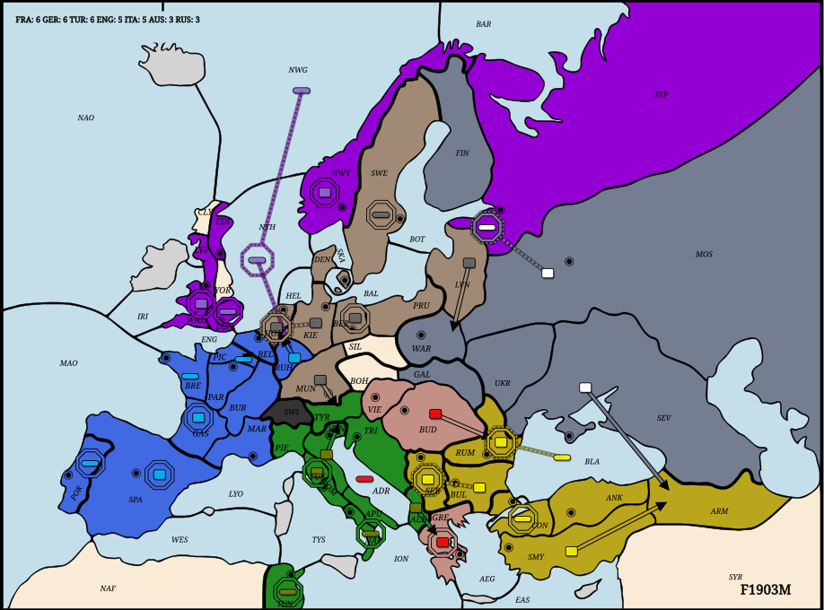

### What happened

- **AUSTRIA**: A BUD → RUM (bounced); A GRE holds
- **ENGLAND**: F NTH supports A RUH → HOL; F NWG supports F NTH; F LON holds; A WAL holds; A NWY holds
- **FRANCE**: A RUH → HOL (bounced); F PIC → BEL; A GAS holds; A SPA holds; F POR holds
- **GERMANY**: A LVN → WAR; A MUN → TYR (bounced); A KIE supports A HOL; A HOL holds; A BER holds; F SWE holds
- **ITALY**: A ALB → GRE (bounced); A VEN → TYR (bounced); F TUN holds; F NAP holds; A TUS holds
- **RUSSIA**: A SEV → ARM (bounced); A MOS supports F STP/SC; F STP/SC holds
- **TURKEY**: A SER holds; A BUL supports A SER; F BLA supports A RUM; A RUM holds; A SMY → ARM (bounced); F CON holds

### Dialogue

- **AUSTRIA → RUSSIA**: Your SEV push on RUM bounced in spring — we need to keep the pressure on Turkey. This fall, I'm taking SER with A BUD. Can you push A SEV to RUM again or support an attack on a Turkish eastern center? If we don't keep hitting them, they'll pull further ahead. What's your exact plan for fall?
- **AUSTRIA → ITALY**: Turkey at 6 centers is an existential threat to both of us. I'm taking SER this fall to cut them down. I need you to commit eastern pressure — push A TRI toward ALB or support an attack on GRE/BUL. I won't touch TRI this turn, but I need your help against Turkey now. Can you commit to attacking a Turkish center this fall?
- **AUSTRIA → GERMANY**: Your A MUN → TYR bounced but the intent was good. Italy is sitting on TRI and needs to be kept honest. Can you move A MUN toward TYR or BOH this fall to threaten Italy's rear? Even if it just holds, it pins Italian units north. Meanwhile I'm reclaiming SER from Turkey — we need to contain both Turkey and Italian expansion.
- **AUSTRIA → TURKEY**: You're at 6 centers and the entire board is coordinating against you. I'm reclaiming SER this fall. Russia will be pushing from the east again. You can't hold everything — consider which centers you'd rather keep and negotiate a consolidation before you lose units fighting on multiple fronts.
- **ENGLAND → FRANCE**: Good — F ENG out of my waters and RUH taken. Germany is hurting. This turn I want to push into HOL while they're reeling — can you support my F NTH into HOL from BEL or RUH area? If we keep squeezing, Germany collapses to 4 or fewer centers by winter.
- **ENGLAND → GERMANY**: You lost RUH and France is at 7 centers after winter if nothing changes. I don't want France running away with this game either. I can be persuaded to leave HOL alone this turn if you help me contain France — what do you offer?
- **ENGLAND → RUSSIA**: Take STP — I'm not defending it. But Turkey at 6 centers is the real leader. After winter, let's talk about coordinating against Turkey rather than fighting each other in the north. I have no further claims on NWY.
- **ENGLAND → TURKEY**: France just took RUH and will hit 7 centers — they're becoming the threat now. I'm staying out of your way, but you might want to think about France's growth in the west before they get too strong to stop.
- **FRANCE → ENGLAND**: Germany has 6 centers and is spread thin — A HOL, A KIE, A MUN, A BER, A LVN all defending. I'm pushing A RUH toward HOL this fall with support. Can you pressure from NTH or NWG to split their northern forces? If we take HOL together, Germany drops to 5 and we each gain a center.
- **FRANCE → GERMANY**: I'm willing to stabilize the Rhine — no attack on HOL this fall if you pull A KIE away from supporting it. Let's both grow elsewhere: I'll look toward Iberia or the south, you keep your eastern holdings. But if you stack supports on HOL, I'm forcing the issue.
- **FRANCE → ITALY**: Turkey at 6 centers is the real threat — they have SER, RUM, BUL, ANK, CON, SMY. If you push into SER or RUM from TYR, I can support from the west. Let's coordinate this fall to contain Turkey's Balkan expansion before they hit 7.
- **FRANCE → RUSSIA**: Turkey controls SER and RUM on your border — they're a direct threat to your remaining centers. If you push A SEV toward RUM, I can support from the west. Let's coordinate to cut Turkey's Balkan holdings before they grow further.
- **GERMANY → FRANCE**: I know you're pushing into RUH with BEL. I'm going to defend it — A KIE can support A HOL to hold, and I have units nearby. Let's not waste units fighting over the Rhine when Turkey is at 6 centers and running away with the game. I'll agree to a DMZ on BUR if you hold RUH at the border.
- **GERMANY → AUSTRIA**: I pushed A PRU to LVN and it's now in position to threaten WAR or support northern operations. I'm committed to pressuring Italy as promised — A MUN can still threaten TYR region. How did your SER push go? If you're in SER, we can coordinate against Turkey's Balkan holdings this fall.
- **GERMANY → ENGLAND**: I have A LVN now in the Baltic — I can threaten Russia's WAR/MOS or support operations against France's northern position. You have strong Channel control. Can we coordinate to contain France? If France grabs RUH, they'll be at 7 centers and a bigger threat than Turkey soon.
- **GERMANY → RUSSIA**: I moved A PRU to LVN — this isn't an attack on you, it's to contain France's expansion westward. You need to focus on Turkey: they're at 6 centers with GRE, SER, BUL, RUM. If Turkey reaches 7-8, we all lose. Can you push SEV or BUL this fall?
- **GERMANY → ITALY**: I moved toward TYR last turn and bounced — I'm not looking for a fight with you. Turkey is the real threat at 6 centers. If you're heading east toward Turkey's Balkan holdings, I won't interfere. Let's focus on the real leader.
- **ITALY → AUSTRIA**: I know you're holding GRE, but Turkey at 6 centers is the real crisis. I'm taking GRE this turn to reach 6 centers and become a real force against Turkey. If you fight me, Turkey profits from our weakness. Let me take it cleanly and I'll commit all eastern pressure against Turkey afterward.
- **ITALY → GERMANY**: TYR is empty — I moved A TRI to ALB last turn. Your threat to attack TYR with support is targeting nothing. I'm not your enemy; Turkey at 6 centers is the threat to both of us. Let's not waste units fighting over empty space when there's a real leader to contain.
- **ITALY → FRANCE**: I'm taking GRE from Austria this turn to reach 6 centers and position against Turkey. You're attacking RUH — good, that weakens Germany. After this fall, with both of us at 6+ centers, we need a serious plan to stop Turkey's 6 centers from becoming 8 or 9.
- **ITALY → TURKEY**: I'm taking GRE to reach 6 centers — that's my ceiling. I won't push into your Balkan holdings (SER, BUL, RUM). Keep your spheres, I keep mine. If you move against my positions, I'll defend, but I'm not looking for a fight.
- **RUSSIA → AUSTRIA**: I reclaimed STP — good. Now let's finish Turkey this fall. I'm pushing A SEV toward RUM. Can you support an attack on SER or move A BUD to cut Turkish reinforcement routes? If we take RUM and SER simultaneously, Turkey drops to 4 centers and we've broken their dominance.
- **RUSSIA → GERMANY**: Your A PRU moving toward LVN concerns me — that's my territory. I'm focused on Turkey in the south. Can you redirect PRU away from LVN or hold? If you push east, I'll have to defend and we both waste units while Turkey and France grow.
- **RUSSIA → ENGLAND**: Good — STP is mine now. I owe you one. I'm pushing south against Turkey. Can you keep your fleets in the north and not interfere? If France tries anything in the Channel, I'll need to respond, but right now Turkey is the priority.
- **RUSSIA → TURKEY**: You're at 6 centers but Austria and I are both hitting you this turn. I'm taking RUM. You can't hold everything — consider which centers you want to keep and which you'll sacrifice. Vacate SEV voluntarily and I'll stop there.
- **TURKEY → AUSTRIA**: Italy took your TRI last fall and is now threatening GRE. I have no intention of attacking your remaining territory this turn. Focus on getting TRI back from Italy — that's your home center sitting in their hands. I'll stay completely out of your way while you do.
- **TURKEY → ITALY**: I'm holding my Balkan positions this turn — no push east. You have TRI, I have my Balkans. Let's keep our spheres separate as agreed. Are you planning to push toward GRE or consolidate what you have?
- **TURKEY → RUSSIA**: You're at 3 centers and I'm at 6 — fighting wastes both our turns. I'll hold my positions if you hold yours. Let's both focus on other powers rather than weakening each other for someone else's benefit.
- **TURKEY → ENGLAND**: Germany is building up with 6 centers and controlling the north. That's a potential threat to both of us. Any concerns about their intentions?
- **AUSTRIA → RUSSIA**: Your SEV push on RUM bounced again — we need to keep hitting Turkey. This fall I'm taking SER with A BUD. Can you try A SEV → RUM once more? If you can support it with F STP/SC or another unit, it has a better shot. Together we cut Turkish centers.
- **AUSTRIA → ITALY**: You moved TRI→ALB — that's uncomfortably close to GRE. I need you to hold ALB this fall, not push toward my territory. In exchange I won't touch TRI this turn. Let's not fight each other while Turkey sits at 6. Can you commit to holding ALB?
- **AUSTRIA → GERMANY**: Your A MUN→TYR bounced but kept Italy honest. This fall I'm taking SER with A BUD. If Italy pushes ALB→GRE or toward my units, can you move toward TYR or BOH to threaten their rear? Even a hold near their border pins Italian forces.
- **AUSTRIA → TURKEY**: You're at 6 centers and Russia will hit RUM again. I'm taking SER — it's unowned and I need it. If you try to contest, you'll face me from BUD and Russia from SEV simultaneously. Consider which centers you'd rather keep and negotiate a consolidation.
- **ENGLAND → FRANCE**: Here's the plan: I attack KIE with A RUH (supported by F PIC or F BRE) to cut Germany's support, and I take HOL with F NTH + F NWG support. You get KIE, I get HOL — we each gain a center and Germany drops to 4. Can you support A RUH → KIE and commit to this? If KIE's support on HOL is cut, HOL falls easily.
- **ENGLAND → GERMANY**: France is coming for KIE and I'm coming for HOL — you can't defend both. Cut your losses: let me take HOL and I'll leave KIE alone. Or lose both. Your call.
- **ENGLAND → RUSSIA**: Take STP — I'm not contesting it. After winter, let's talk about Turkey. They're at 6 and growing while we fight over scraps in the north.
- **FRANCE → ENGLAND**: Germany has A KIE supporting A HOL — we need two units to break it. I'll move A RUH into HOL with your F NTH supporting. Can you commit to S A RUH - HOL from NTH? That gives us 2v1 and HOL falls. I'll also have F PIC available to cut any support from the south. Let's take HOL this fall and split Germany's empire.
- **FRANCE → GERMANY**: I see A KIE supporting A HOL — smart defense. But here's reality: England is moving into HOL whether I attack or not. If you let me take HOL, I'll agree to a DMZ on MUN and we both stop fighting. If you insist on defending, England takes it anyway and you lose a unit in the process. Concede HOL now and save your northern positions.
- **FRANCE → ITALY**: Turkey at 6 centers is the priority after this fall. I'm dealing with Germany first — once HOL falls, I'll have 7 centers and can redirect west. After fall, let's coordinate a push into Turkey's Balkan holdings. You're well-positioned from TYR to threaten SER.
- **FRANCE → RUSSIA**: Turkey controls SER and RUM — both on your borders. I'm focused on Germany this turn, but if you can push A SEV toward RUM, even as a bounce, it cuts Turkey's support options. Every unit you force Turkey to defend in the east weakens their position elsewhere.
- **GERMANY → FRANCE**: You took RUH from me — I'm not 'conceding' what you already stole. I'm holding HOL with support this turn. If you attack, I'll defend. If you want growth, look west toward Iberia or south toward Italy. The Rhine stays stable.
- **GERMANY → ENGLAND**: HOL is mine and I'm defending it with support. But I have a better offer: help me contain France's A RUH by supporting my F NTH into BEL, splitting France's position. We both gain from a weakened France.
- **GERMANY → RUSSIA**: My A LVN move isn't an attack on you — it's to threaten France's western position indirectly. You need to focus on Turkey: push SEV or BUL. If France expands unchecked while everyone watches Turkey, we all lose.
- **GERMANY → AUSTRIA**: I'll pressure Italy from the north with A MUN toward TYR. You push A BUD → SER as planned. We contain Turkey and Italy together — deal?
- **GERMANY → ITALY**: I'm moving A MUN to TYR this turn. If you withdraw TYR now, we avoid a fight and I'll support you against Turkey later. If you hold, we bounce and waste both our turns. Your call.
- **ITALY → AUSTRIA**: I understand your frustration about TRI, but Turkey at 6 centers is the crisis. I'm taking GRE this turn — fight me and Turkey profits from our weakness. After this, I'll commit all pressure east against Turkey. Your choice: lose GRE peacefully and gain a real ally against Turkey, or fight me and lose GRE anyway while Turkey grows unchecked.
- **ITALY → GERMANY**: TYR is empty — I moved A TRI to ALB last turn. Your threat to attack TYR with support is targeting nothing. Turkey at 6 centers is the real threat to both of us. Let's not waste units fighting over empty space when there's a runaway leader to contain.
- **ITALY → FRANCE**: I'm taking GRE this turn to reach 6 centers and become a real force against Turkey. You're attacking RUH — good. After this fall, with both of us at 6+ centers, we need a serious plan to coordinate pressure on Turkey's Balkan holdings before they hit 8 or 9.
- **ITALY → TURKEY**: I'm taking GRE to reach 6 centers — that's my ceiling. I won't push into your Balkan holdings (SER, BUL, RUM). Keep your spheres, I keep mine. If you move against my positions, I'll defend, but I'm not looking for a fight.
- **RUSSIA → AUSTRIA**: England is letting me take STP — I'm free to focus entirely on Turkey. This fall I'm pushing A SEV to RUM with A MOS support (strength 2). Can you attack SER with A BUD? If Turkey tries to hold RUM with BLA support, I still need your western pressure to split their defenses. What are your exact orders?
- **RUSSIA → ENGLAND**: Thank you for letting me take STP — I'll hold it and stay out of your way in the north. My focus is entirely south against Turkey now. No interference with NWY or your fleets.
- **RUSSIA → GERMANY**: A PRU in LVN is fine as long as it stays there — I'm not moving toward you this turn. But France has 6 centers and Channel control. If you're not pressuring France west, they'll grow while we all fight Turkey. Consider moving units west next turn.
- **RUSSIA → TURKEY**: Austria is hitting SER and I'm hitting RUM. You can't hold both — BLA support won't save RUM when we're coordinated. Vacate SEV and RUM now and keep the rest. This is your last chance before you start losing units.
- **RUSSIA → FRANCE**: If you want to help against Turkey, support an attack on BEL from RUH — that cuts into Germany's holdings while I'm focused south. Otherwise, I need you to stay out of the Channel while I push Turkey.
- **TURKEY → AUSTRIA**: Italy has TRI — that's your home center. I'm not attacking you this turn. If you want TRI back, focus there instead of wasting units trying to retake SER against my fortified position with BLA support. We both lose if we fight while Italy grows.
- **TURKEY → RUSSIA**: You're at 3, I'm at 6 — attacking my fortified RUM with BLA support wastes your turn. I offered you a path to GAL through Austria before. If you want something concrete: hold your positions this turn and I'll help you pressure Austria's BUD next spring. That gets you growth without us destroying each other.
- **TURKEY → ITALY**: Good — our spheres are clear. I'm holding Balkans, you hold TRI/APU/TUN. Are you planning to push toward GRE or consolidate? If you stay east of your current lines, I'll stay west of mine. Let's not give France or Germany reason to gang up on either of us.
- **TURKEY → ENGLAND**: France at 6 with RUH is the real threat in the west. I'm not looking north at all — focus on France while I handle the Balkans. If Germany needs help containing France, that benefits both of us.
- **ENGLAND → FRANCE**: Final plan: you move A RUH - KIE to cut Germany's support on HOL, and I take HOL with F NTH + F NWG support. This guarantees HOL falls (2v1 after KIE support is cut). If A RUH goes to HOL instead, it's 2v2 and bounces. Attack KIE — I get HOL, you weaken Germany's interior. Deal?
- **ENGLAND → RUSSIA**: I'm not defending STP — take it freely. After winter, let's discuss Turkey. They're at 6 and are the real leader. I have no quarrel with you.
- **ENGLAND → TURKEY**: France is at 6 and pushing into Germany's interior. I'm taking HOL from Germany this turn. No moves against you — focus on the west.
- **FRANCE → ENGLAND**: Final commitment: I'm moving A RUH - HOL this turn. Please support with F NTH S A RUH - HOL — that gives us 2 strength vs Germany's 2 (A HOL + A KIE support). If KIE's support gets cut by any means, HOL falls. Even a bounce keeps Germany pinned. I'm also moving F PIC to BEL to secure the Channel coast.
- **FRANCE → GERMANY**: Last chance: concede HOL to my A RUH with England's support, and I'll DMZ the Rhine going forward. If you hold, we both waste units and Turkey runs away at 6 centers. Concede HOL and we can both pivot east.
- **FRANCE → RUSSIA**: Turkey at 6 centers with SER and RUM on your border — push A SEV toward RUM this turn even as a bounce. It forces Turkey to commit a unit to defense. Every bit of pressure helps contain them.
- **GERMANY → FRANCE**: I'm holding HOL with A KIE support — if you attack, we both waste units. I won't move toward BUR or PIC. Take your growth elsewhere in Iberia. Let's stabilize the Rhine now.
- **GERMANY → ENGLAND**: I'm holding HOL with support — don't bother attacking it. Instead, I'll support your F NTH into BEL if you want to take it from France. That splits France's position and we both gain. Deal?
- **GERMANY → RUSSIA**: I'm moving A LVN to WAR this turn — it's undefended and I need the center. I'm not pushing further east. Focus your SEV on Turkey, not me. Our non-aggression holds if you don't contest WAR.
- **GERMANY → AUSTRIA**: I'm committing A MUN to TYR this turn to threaten Italy's rear. You push A BUD → SER as planned. We contain Turkey and keep Italy pinned from both sides. Deal?
- **GERMANY → ITALY**: I'm moving A MUN to TYR — it's empty and I need the center. I'm not attacking your units. Focus on Turkey's Balkan holdings instead. We have no reason to fight.
- **GERMANY → TURKEY**: England at 5 with STP is a growing northern threat. I'm focused on the center board and not pushing east. Let's keep things calm between us.
- **ITALY → AUSTRIA**: I'm taking GRE this fall — it's happening whether you defend or not. But here's the deal: if you let me take it cleanly and focus your units east against Turkey's SER and BUL, I'll commit to a joint push against Turkey next turn. You lose one center but gain a real ally. Fight me and we both lose to Turkey.
- **ITALY → GERMANY**: TYR is empty — I moved A TRI to ALB last turn. There's nothing for you in TYR. I'm pushing east against Turkey's Balkan holdings this fall. If you're smart, you'll focus on France, not me. Let's not waste units fighting over empty space.
- **ITALY → TURKEY**: I'm taking GRE this fall to reach 6 centers — that's my ceiling as we discussed. I won't push into your Balkan holdings. Keep your spheres, I keep mine. If you attack my positions, I'll defend, but I'm not looking for conflict.
- **RUSSIA → AUSTRIA**: Final commitment: I'm ordering A SEV → RUM and A MOS supports A SEV (strength 2). Turkey's BLA supports RUM hold, so we need your A BUD → SER to succeed — if Turkey loses SER, they're down to 5 and my RUM attack becomes the priority threat. Please confirm A BUD → SER and consider having A GRE support it. This is our best shot this year.
- **RUSSIA → GERMANY**: A LVN in my territory is noted — I'm not moving toward you this fall. I'm entirely focused south on Turkey: A SEV attacks RUM, A MOS supports. I have no claim on LVN or WAR this turn. Keep your units where they are and our non-aggression holds. France at 6 centers with Channel control remains the bigger long-term concern for you.
- **RUSSIA → ENGLAND**: STP is mine now — thank you for not contesting. I'm holding F STP/SC and pushing A SEV south against Turkey. I have no claims on NWY or your northern territories. Let's keep the peace in the north while Turkey is the common threat.
- **RUSSIA → FRANCE**: I'm attacking Turkey's RUM this fall with A SEV, supporting with A MOS. If you want to help contain Turkey, pressuring Germany's western front keeps them from expanding while everyone's focused south. Otherwise, stay out of the Channel — I need F STP/SC undisturbed.
- **TURKEY → AUSTRIA**: Italy is taking GRE this turn — they told me directly. You're wasting units attacking my SER when you should be fighting Italy for TRI, your own home center. I'm holding SER with BUL support — you won't take it. Turn east against Italy instead.
- **TURKEY → RUSSIA**: I'm holding RUM with BLA support — you won't retake it this turn. I have no further ambitions against you. France at 6 centers is the real threat. Let's both stop weakening each other and focus elsewhere.
- **TURKEY → ITALY**: Our spheres are set — I'm holding my Balkans, you have TRI/APU/TUN. I won't push into your territory if you stay out of GRE. Let's keep the peace between us.

### AUSTRIA
Orders: `A BUD - RUM` · `A GRE H`
Illegal (dropped): `F ADR S A GRE`

Reasoning

> Looking at the current situation:
>
> - **Turkey (6 centers)** is still the runaway leader with SER, BUL, RUM, ANK, CON, SMY
> - **My position**: F ADR, A BUD, A GRE — I have 3 centers (BUD, VIE, GRE)
> - **Italy** has A ALB adjacent to my A GRE — they threatened to take GRE
> - **Russia** has A SEV which bounced on RUM last turn; they committed to pushing SEV→RUM again
>
> My revised strategy says I'll move A BUD to SER, hold A GRE, and hold F ADR. But let me reconsider based on the actual board state.
>
> Turkey holds SER with A BUL supporting it. A BUD→SER alone won't succeed against a supported hold. However, Russia is pushing A SEV→RUM with A MOS support (strength 2), which should pressure Turkey's eastern front and potentially force Turkey to choose where to defend.
>
> The key question: can I actually take SER? Turkey has A SER held with A BUL support — that's strength 2 defense. My A BUD alone is strength 1. I need to either get support or attack elsewhere.
>
> Better plan: Support Russia's attack on RUM. If I send A BUD→RUM, with Russia's A SEV→RUM also attacking, we combine strength. But wait — Russia is already supporting their own attack with MOS (strength 2). Adding my BUD gives strength 3 vs Turkey's BLA support on RUM (strength 2). That takes RUM.
>
> But I also need to protect GRE from Italy's A ALB. I should support A GRE's hold or have F ADR support GRE's defense. Italy's A ALB could attack GRE.
>
> Let me think: A BUD→RUM (with Russian coordination to take RUM), A GRE holds, F ADR supports A GRE hold. This defends GRE while contributing to the Turkey squeeze.
>
> Actually, looking more carefully — Russia said they're doing A SEV→RUM supported by A MOS. If I also attack RUM, that's 3 strength vs Turkey's BLA support (2). RUM falls. Then I need to get a unit to RUM to claim it... but Russia's unit arrives first. Hmm.
>
> Alternative: A BUD→SER. Even if it bounces, it pressures Turkey. But I'd rather make progress.
>
> Let me go with: A BUD→RUM (coordinate with Russia to overwhelm Turkish defense), F ADR S A GRE (defend GRE from Italian attack), A GRE H.

### ENGLAND
Orders: `F NTH S A RUH - HOL` · `F NWG S F NTH` · `F LON H` · `A WAL H` · `A NWY H`

Reasoning

> Looking at the board, I need to assess the situation carefully.
>
> **Current position:** I have 5 centers (EDI, LON, LVP, NWY, STP). Russia is reclaiming STP this turn with F FIN + A MOS support, and I've agreed not to contest it. France is at 6 centers and wants HOL. Germany has 6 centers defending HOL with A KIE supporting A HOL.
>
> **Key dynamics:**
> - France is moving A RUH → HOL with my support (F NTH S A RUH - HOL). This is the plan I committed to.
> - Russia takes STP — I let it go.
> - I need to grow. HOL is the prize if France's attack succeeds.
>
> **My orders:**
> - F NTH supports A RUH → HOL (as committed to France)
> - F NWG supports F NTH (protects my fleet and reinforces the Channel)
> - F LON holds (defends home waters)
> - A WAL holds (defends home islands)
> - A NWY holds (keeps position in Norway; STP is lost but NWY is safe)
>
> Wait — France's final message says F PIC to BEL, and A RUH to HOL. If I support A RUH - HOL, that's 2 strength (RUH + my support) vs Germany's 2 (A HOL + A KIE support). That bounces unless KIE's support is cut. France mentioned F PIC could cut support, but F PIC is moving to BEL instead.
>
> Let me reconsider. The best play: support A RUH - HOL as committed. Even if it bounces, Germany stays pinned. Meanwhile I should position for future growth. A WAL could move to YOR to prepare for Channel operations, but holding is safer.
>
> Actually, I should try to take HOL myself. If I move F NTH - HOL while supporting with F NWG, that's 2 strength. France's A RUH also goes to HOL — that's two of us attacking. Germany has A HOL + A KIE support = 2. Three attackers vs 2 defenders means HOL falls. But France explicitly said they're going to HOL, so a three-way attack works.
>
> But the committed plan is F NTH S A RUH - HOL. Let me stick with that — it's cleaner and I don't risk bouncing France.

### FRANCE
Orders: `A RUH - HOL` · `F PIC - BEL` · `A GAS H` · `A SPA H` · `F POR H`
Illegal (dropped): `F BRE S A RUH - HOL`

Reasoning

> Looking at the current situation:
>
> - I have A RUH, F PIC, F BRE, A GAS, A SPA, F POR
> - Germany has A HOL with A KIE supporting it, plus A MUN, A BER, A LVN, F SWE
> - England has F NTH, F NWG, F LON, A WAL, A NWY
> - Turkey at 6 centers is the long-term threat
>
> My revised strategy says I'm pushing A RUH into HOL with F NTH supporting. But looking at the legal orders, I don't see a support option from F NTH for A RUH - HOL. Let me check what I can actually do.
>
> England committed to supporting my A RUH - HOL with F NTH. I need to attack HOL. Germany has A KIE supporting A HOL, giving HOL strength 2. With England's F NTH supporting A RUH - HOL, we'd have 2 vs 2 — a bounce. But if KIE's support gets cut, HOL falls.
>
> England's plan from earlier was to attack KIE to cut support, but that's not what we agreed on in the final exchange. I committed to A RUH - HOL with F NTH support.
>
> Let me execute my commitments:
> - A RUH - HOL (attacking with England's support)
> - F PIC - BEL (securing Channel coast as committed)
> - F BRE - MAO (moving to support future operations, or hold in Channel area)
> - A GAS, A SPA, F POR hold to maintain supply base
>
> Actually, let me reconsider. F BRE could support F PIC or do something useful. Let me keep F BRE supporting something valuable.
>
> I'll attack HOL with RUH supported by England's NTH, move F PIC to BEL, and keep my Iberian units secure.

### GERMANY
Orders: `A LVN - WAR` · `A MUN - TYR` · `A KIE S A HOL` · `A HOL H` · `A BER H` · `F SWE H`

Reasoning

> Looking at the board, I need to execute my revised strategy: take WAR with A LVN (undefended, adjacent), push A MUN toward TYR (empty, gives me a center and threatens Italy), and defend HOL. Let me assess the threats:
>
> 1. **France's A RUH** threatens HOL — I need to defend it. A KIE can support A HOL to hold.
> 2. **A LVN → WAR** — Russia confirmed they're not contesting WAR this turn, focused on Turkey. This is a free center.
> 3. **A MUN → TYR** — TYR is empty. Italy confirmed they're focused east on Turkey, not defending TYR. Free center.
> 4. **F SWE** — should hold to maintain Baltic position, or support something useful.
>
> The key question is whether France actually attacks HOL. France threatened to take RUH (which they already have) and push further. England threatened HOL too but I've been trying to redirect them to BEL. I'll defend HOL with A KIE supporting A HOL's hold, and use F SWE to support A NWY if needed or just hold.
>
> Wait — let me reconsider. England's A WAL and F NTH are near HOL. France's A RUH borders HOL. Both could attack. A KIE supporting A HOL gives it strength 2 — enough to bounce a single attacker but not two. However, England seems more interested in BEL based on my negotiations, and France's main push is RUH which they already hold.
>
> Let me also think about A BER — it can hold or support something. Supporting A MUN's move to TYR isn't useful since MUN-TYR is adjacent and uncontested. Better to hold BER as a reserve.
>
> Final orders:
> - A LVN → WAR (take free center)
> - A MUN → TYR (take free center)  
> - A KIE supports A HOL (defend against France/England)
> - A HOL holds (defended)
> - A BER holds (reserve)
> - F SWE holds (maintain position)
>
> Wait, I should reconsider F SWE. Could it do something more useful? It could support F NTH - BEL if England cooperates, but England hasn't committed. Better to hold.

### ITALY
Orders: `A ALB - GRE` · `A VEN - TYR` · `F TUN H` · `F NAP H` · `A TUS H`

Reasoning

> Looking at the board, I need to secure GRE this fall to reach 6 supply centers. Austria has A GRE there, but I have A ALB adjacent to it. Let me check if A ALB can move to GRE — yes, ALB is adjacent to GRE. I also need to consider Germany's threat to move A MUN to TYR (which is empty since my A VEN is in TYR... wait, let me recheck).
>
> My units: A TUS, F TUN, A VEN, F NAP, A ALB. TYR is empty — I moved A TRI to ALB last turn and A VEN bounced in TYR (stayed in VEN). Wait, A VEN tried TYR and bounced, so A VEN is still in VEN.
>
> Key objectives:
> 1. **Take GRE with A ALB** — this gets me to 6 centers
> 2. **Defend against Germany moving A MUN to TYR** — TYR is empty, so Germany taking it is a minor loss (not an SC), but I should consider whether to block it
> 3. **A VEN should move to TYR** to block Germany's advance and keep a defensive position
> 4. **F TUN and F NAP hold** to maintain Med control
> 5. **A TUS holds** as a reserve
>
> Germany moving MUN→TYR is annoying but TYR isn't an SC. The real priority is GRE. However, if Germany gets into TYR, they threaten VEN and PIE next. I should block with A VEN→TYR.
>
> Wait — A VEN is adjacent to TYR, so that works. This blocks Germany AND puts me in a forward defensive position.

### RUSSIA
Orders: `A SEV - ARM` · `A MOS S F STP/SC` · `F STP/SC H`

Reasoning

> Looking at the board state, I'm in a dire position with only 3 centers while Turkey leads at 6. My spring attack on RUM bounced despite my commitment, so I need to reassess.
>
> **Key situation:**
> - Turkey holds RUM with BLA support — my A SEV attack bounced again
> - England gave me STP — F STP/SC is now mine (reclaimed)
> - Germany moved A PRU to LVN and is threatening WAR
> - Austria's attacks on SER also bounced
>
> **My revised plan:** Since my SEV-RUM attack keeps bouncing against BLA support, I need to change tactics. I'll support F STP/SC to hold my reclaimed home center (defending against potential English re-entry or German moves), and use A SEV to support an attack that might actually succeed — or try a different approach entirely.
>
> Germany's A LVN is now adjacent to my WAR, and they've explicitly said they're moving to WAR this turn. I need to decide: contest WAR (which I need for builds) or focus on Turkey?
>
> Given that Turkey is at 6 centers and is the clear leader, I should maintain pressure. But I also can't let Germany walk into WAR uncontested. Let me support F STP/SC to hold, and try A SEV to ARM this time — cutting Turkey's eastern holdings rather than repeatedly bouncing off RUM.
>
> Actually, looking more carefully: A SEV can reach ARM via the BLA convoy route (VIA), or directly since ARM is adjacent. Let me check — SEV is adjacent to ARM. Yes! So A SEV - ARM is a direct move that bypasses the BLA-supported RUM entirely.
>
> **Strategy:** Attack ARM (cutting Turkey's eastern connection) while defending STP. This forces Turkey to defend in multiple directions and might create openings.

### TURKEY
Orders: `A SER H` · `A BUL S A SER` · `F BLA S A RUM` · `A RUM H` · `A SMY - ARM` · `F CON H`

Reasoning

> Looking at the board, I need to defend my 6-center position. My revised strategy calls for supporting SER's hold with BUL, supporting RUM's hold with BLA, and moving SMY to ARM. Let me verify the key threats:
>
> - **SER**: Austria has A BUD threatening SER (bounced last two attempts). Italy has A ALB near GRE but said they're not pushing east. I'll support SER's hold with BUL.
> - **RUM**: Russia has A SEV threatening RUM (bounced in S1903M). I'll support RUM's hold with BLA.
> - **SMY**: I want to move to ARM to secure my eastern flank — SMY-ARM is adjacent.
> - **F CON**: Hold or support defensively. I'll hold CON to keep my fleet flexible.
>
> The key issue: Italy told me they're taking GRE. If Italy moves ALB to GRE, that's fine — it doesn't threaten my holdings. Austria's BUD → SER has bounced twice and I'll have BUL supporting SER's hold, so it should hold again. Russia's SEV → RUM bounced in spring with BLA support, and I'm reinforcing that support again.
>
> Let me also consider: should I try to grow? I could push A RUM toward SEV or GAL, but that would leave RUM undefended against Russia. Better to consolidate and look for opportunities next turn when the board shifts.
>
> My orders:
> - **A SER H** — hold the key Balkan center
> - **A BUL S A SER** — support SER's hold
> - **F BLA S A RUM** — support RUM's hold  
> - **A RUM H** — hold RUM
> - **A SMY - ARM** — secure eastern flank, grab a potentially useful position
> - **F CON H** — hold CON defensively

## WINTER 1903 ADJUSTMENTS (`W1903A`)

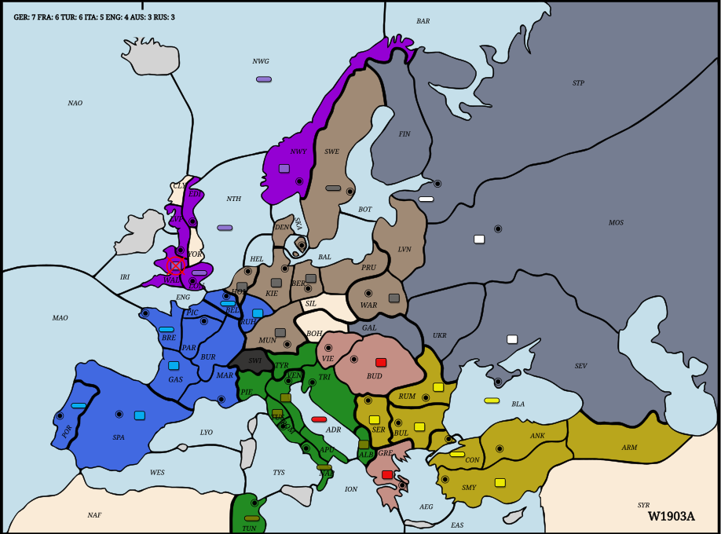

### What happened

- **ENGLAND**: disbands A WAL

### ENGLAND
Orders: `A WAL D`

Reasoning

> Looking at the board state, I have 4 supply centers (EDI, LON, LVP, NWY) and 5 units, meaning I'm one unit over my supply and must disband one unit. 
>
> Let me assess the strategic situation:
> - Germany leads with 7 centers (BER, KIE, MUN, DEN, HOL, SWE, WAR)
> - France has 6 (BRE, MAR, PAR, POR, SPA, BEL)  
> - Turkey has 6 (ANK, CON, SMY, RUM, BUL, SER)
> - Italy has 5, England (me) has 4, Austria and Russia have 3 each
>
> I need to disband one unit. The question is which one. My units are:
> - F NWG - critical for controlling the North Sea and Channel approaches
> - F NTH - essential for any northern naval operations
> - F LON - home defense, but redundant with F NTH/F NWG
> - A NWY - holding Norway, a supply center
> - A WAL - sitting in Wales with no immediate purpose
>
> A WAL is the most expendable unit - it's not holding a supply center, not in a position to take one immediately, and my fleet superiority in the north is more valuable. F LON could also be considered, but having three fleets gives me flexibility for future Channel operations and convoy potential.
>
> I'll disband A WAL to align my unit count with my supply center count.

## SPRING 1904 MOVEMENT (`S1904M`)

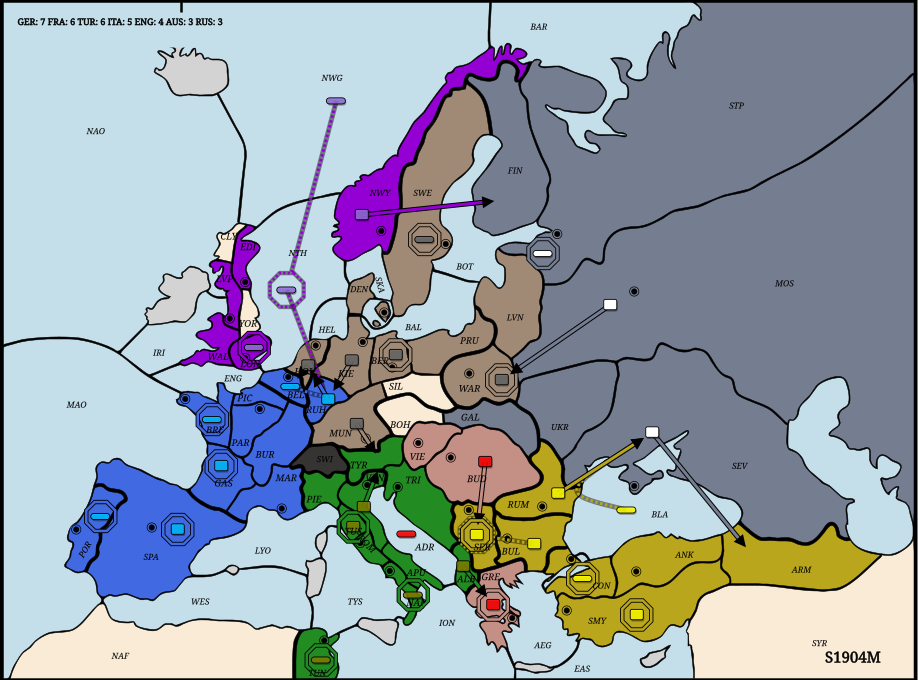

### What happened

- **AUSTRIA**: A BUD → SER (bounced); A GRE holds
- **ENGLAND**: F NTH supports A RUH → HOL; F NWG supports F NTH; F LON holds; A NWY → FIN
- **FRANCE**: A RUH → HOL; F BEL supports A RUH → HOL; F BRE holds; A SPA holds; A GAS holds; F POR holds
- **GERMANY**: A MUN → TYR (bounced); A HOL → BEL (bounced); A KIE → RUH; A BER holds; F SWE holds; A WAR holds  [dislodged: A HOL]
- **ITALY**: A ALB → GRE (bounced); A VEN → TYR (bounced); F TUN holds; F NAP holds; A TUS holds
- **RUSSIA**: A MOS → WAR (bounced); A SEV → ARM; F STP/SC holds
- **TURKEY**: A RUM → SEV; F BLA supports A RUM → SEV; A BUL supports A SER; A SER holds; A SMY holds; F CON holds

### Dialogue

- **ENGLAND → FRANCE**: Germany at 7 centers is the board leader — we need to keep squeezing. I'm pushing into HOL this turn with my Channel fleets. If you support from BEL or RUH area, HOL falls and Germany drops to 6. You keep BEL, I get HOL, and we each gain a center while Germany bleeds.
- **ENGLAND → GERMANY**: France has A RUH and F BEL threatening your western position — that's 2 units you need to defend against. I'd rather take HOL cleanly than fight a three-way battle there. If you let me have HOL, I'll stay out of KIE and focus on France's Channel position. Otherwise France and I both push and you lose more than HOL.
- **ENGLAND → RUSSIA**: No conflict between us this turn. I'm focused on the Channel situation. You have STP and I have no claims on it right now — let's keep the peace in the north while Turkey at 6 centers is the real eastern threat.
- **ENGLAND → TURKEY**: France at 6 and Germany at 7 are the western leaders. I'm staying out of your way in the east. No moves against you this turn — focus on the Balkans while the west sorts itself out.
- **FRANCE → ENGLAND**: Germany at 7 centers is the runaway leader — they need to be stopped. I'm pushing A RUH into HOL this turn with F BEL support. Can you support from F NTH into HOL as well? That's 3v2 guaranteed. After HOL falls, Germany drops to 6 and we each gain a center. Let's end this stalemate and actually take ground.
- **FRANCE → ITALY**: Germany at 7 centers is pulling away from everyone. I'm attacking HOL from RUH this turn. If you can push from TYR toward MUN or at least keep Germany's attention split eastward, they can't defend everything. After this fall, Turkey at 6 is the next priority — let's coordinate then.
- **FRANCE → GERMANY**: I know you're dug in at HOL with KIE support, but you're at 7 centers and that makes you the target for the whole table. Concede HOL to my push and I'll agree to a DMZ on the Rhine — no further east. Fight me and England will pile on from the north. Your choice.
- **GERMANY → FRANCE**: I'm at 7 centers and not looking to push west. I'll keep my units east — no move toward BUR or PIC from me this turn. If you hold RUH steady and don't push toward MUN or KIE, we both benefit. Can you commit to holding RUH at the border?
- **GERMANY → ITALY**: TYR is empty and I'm moving A MUN there — it's a center I need. I'm not attacking your units. If you're focused east on Turkey, we have no conflict. Can you confirm you won't contest TYR? I'd rather coordinate on Turkey than fight over an empty province.
- **GERMANY → AUSTRIA**: I'm taking TYR this turn and positioning to pressure Turkey's northern flank. How did your SER push go in 1903? If you're in SER, we can coordinate against Turkey's Balkan holdings — I can support operations from the north while you push from the south.
- **GERMANY → RUSSIA**: I already hold WAR and I'm not pushing further east. I'm focused south toward TYR and containing Italy. Your A SEV is near Turkey's RUM — if you can reclaim it, we weaken the board leader. I won't touch your remaining centers.
- **GERMANY → ENGLAND**: I'm at 7 and focused on TYR, not your northern sphere. Your Channel control is safe from me. Are you planning to push into BEL or hold? If we can agree to stay out of each other's way, we both avoid wasting units.
- **ITALY → FRANCE**: Germany hit 7 centers — they're the runaway leader now. I'm in TYR adjacent to MUN. If we coordinate, I can push toward MUN or support your attacks on Germany's western holdings. We need to stop them before they reach 9-10 and become unstoppable.
- **ITALY → AUSTRIA**: Turkey at 6 and Germany at 7 — both are growing fast. I need GRE to stay relevant and help contain them. Let me take it this turn and I'll commit pressure east against Turkey. If you fight me, Germany wins by default.
- **ITALY → TURKEY**: Germany at 7 centers is the real threat now — they're pulling away from everyone. I'm consolidating my position, but we should discuss whether containing Germany serves both our interests before they get too strong to stop.
- **RUSSIA → AUSTRIA**: Germany is at 7 centers and the clear leader now — they took WAR and have 3 units in the east. We need to address them. I'm pushing A SEV toward ARM to cut Turkey's eastern holdings, but can you also pressure Germany's southern border through TYR or Bohemia? If Germany keeps growing unchecked, they reach 8-9 by winter.
- **RUSSIA → GERMANY**: You moved into WAR — that's my home center and I need it back. I'm focused on Turkey in the south this turn, but I can't ignore WAR indefinitely. Can we agree you vacate WAR by winter? I'll redirect A SEV south against Turkey if you commit to leaving WAR. Otherwise I'll have to contest it.
- **RUSSIA → TURKEY**: Germany is at 7 centers and pulling away from all of us. You're at 6, I'm at 3 — we're both behind. Consider redirecting your attention north: if Germany takes LVN or pushes into GAL, both of us lose territory. I'm moving A SEV toward ARM this turn, not RUM. Let's not waste units fighting each other while Germany runs away with the game.
- **TURKEY → RUSSIA**: You're at 3 centers with only 3 units — fighting me wastes your turn while Germany runs away with the game at 7. I'm not pushing into your remaining territory, but I need SEV to stay competitive. If you let me take SEV peacefully, I'll support your push into GAL or TYR against Austria next turn. That gives you a path to growth instead of a pointless fight.
- **TURKEY → ITALY**: Our spheres are holding — I'm in the Balkans, you're in the central Med. I have no plans to push toward APU or TRI this turn. Germany at 7 centers is the real threat to everyone. Are you open to coordinating against them at some point, or are you focused elsewhere?
- **TURKEY → GERMANY**: France at 6 with RUH is pressing into your interior — that seems like your most immediate concern. I'm focused east and not looking your way. But I'm curious: with you at 7 and France at 6, how do you see the western board developing? I'd rather not see either of you hit 18 unchecked.
- **AUSTRIA → GERMANY**: You're at 7 — the board leader now. I'll be honest: if you keep expanding unchecked, the whole table turns on you. I'm taking SER this turn to grow. I won't move against you yet, but consider slowing down — I can pressure TYR/BOH from BUD if needed, and Russia is already looking your way.
- **AUSTRIA → ITALY**: I'm not giving you GRE — it's one of my three centers and I need every one. Here's a real deal: I move A BUD → SER this turn (it's unowned, not Turkish), and you hold ALB/your current position. In fall we can discuss a swap — I help you into BUL if you return TRI. But attacking GRE now makes us both weaker while Germany runs away with the game.
- **AUSTRIA → RUSSIA**: Germany at 7 is the real crisis — you're right. I'm taking SER this turn with A BUD. In fall, can you support A SEV → RUM to grab another Turkish center while I start pressuring Germany's south? If we coordinate a two-front squeeze on Germany after containing Turkey, we can rein them in before they hit 9.
- **AUSTRIA → TURKEY**: Germany at 7 is now the biggest threat to everyone, including you. I'm taking SER — it's unowned and I need it. After that, I'm open to a ceasefire in the east if you focus on holding your position. But if you contest SER, I have Russian support and you'll lose units for nothing while Germany grows unchecked.
- **ENGLAND → FRANCE**: I'll support A RUH into HOL with F NTH — Germany drops to 6. But I need something for my trouble: after HOL falls, can you move F BEL out of NTH approaches so I have freedom of movement in the Channel? I'm also moving A NWY toward FIN to contest the Baltic. We stay aligned against Germany but I need room to grow too.
- **ENGLAND → GERMANY**: France is pushing A RUH into HOL and I'm supporting from NTH — you're about to lose HOL. I'll stay out of KIE and your southern positions if you don't contest my Channel operations. You're still at 6 after this — not dead, and France at 7 is the bigger problem. Work with me against France after winter and we can contain them.
- **ENGLAND → RUSSIA**: Peace confirmed — I'm not touching STP or your northern positions. Focus on Turkey in the south as discussed. If Turkey hits 7, we both have a problem.
- **ENGLAND → TURKEY**: France and Germany are fighting over HOL this turn — I'm supporting France's attack. The western powers are weakening each other. Keep building in the east while they're distracted.
- **FRANCE → ENGLAND**: Confirmed: I'm moving A RUH into HOL with F BEL support. Please commit F NTH to support A RUH - HOL as well — that's 3 strength vs Germany's 2 (A HOL + A KIE support), guaranteeing the take. You get HOL, I keep BEL, and Germany drops to 6. No more delays.
- **FRANCE → GERMANY**: You're at 7 centers and the entire table is converging on you. I'm attacking HOL with support from F BEL. England is piling on from NTH. Concede HOL now and I'll push for a DMZ — fight it and you'll lose HOL plus whatever England takes from the north. This is your last chance to choose which centers you keep.
- **FRANCE → ITALY**: Germany at 7 is the priority. I'm attacking HOL from RUH with support — if you can push A VEN into TYR (or hold TYR threatening MUN), Germany has to split forces east and west. Even if you don't attack MUN this turn, keeping Germany's attention split guarantees HOL falls. After this, Turkey is next.
- **FRANCE → RUSSIA**: Germany at 7 centers is the board leader — everyone needs to pressure them. If you push A SEV toward RUM or even bounce there, Turkey has to defend and can't support Germany. Every front you open weakens the leader. Let's coordinate the squeeze.
- **GERMANY → FRANCE**: Here's the deal: I won't move any unit toward BUR, PIC, or BEL this turn — my units go east toward TYR. You hold A RUH at the border and don't push toward KIE or MUN. We both grow elsewhere. If you break this, I'll redirect everything west next turn. Deal?
- **GERMANY → ENGLAND**: I'm moving east toward TYR — nothing toward your northern sphere. Your Channel control is safe from me. I'd rather we both ignore each other this turn than waste units contesting HOL. Can you keep F NTH out of HOL waters?
- **GERMANY → RUSSIA**: I'm not pushing further east — my units go south toward TYR to contain Italy. WAR stays mine for now, but I'm open to discussing it after we deal with Turkey. Focus your SEV on reclaiming RUM from Turkey — that weakens the board leader more than contesting WAR helps you.
- **GERMANY → ITALY**: TYR is empty and I'm moving A MUN there — confirm you won't contest it. I'm not your enemy; Turkey at 6 centers is the real threat. If you're pushing east against Turkey, I won't interfere. Let's not waste units fighting over an empty province.
- **GERMANY → TURKEY**: France at 6 with RUH is the most aggressive western power right now — I'm focused on containing them, not expanding east. You should be more concerned about Austria's A BUD pushing toward SER than about me. Let's keep things calm between us.
- **ITALY → FRANCE**: I'll block Germany's TYR push by moving A VEN to TYR — they won't get that center. If you take HOL, Germany drops to 6 and we're both in striking distance. After fall, let's talk about Turkey together.
- **ITALY → GERMANY**: I'm not going to let you walk into TYR for free — that's a center you don't need. Focus on France if you want growth; I'm taking GRE from Austria this turn and we have no conflict east.
- **ITALY → TURKEY**: Germany at 7 is everyone's problem. I'm pushing A ALB to GRE this turn to reach 6 centers. After that, I'm open to discussing coordinated pressure on Germany's northern holdings. Are you willing to let me take GRE cleanly?
- **ITALY → AUSTRIA**: Germany at 7 is the real threat — if they take TYR and HOL, they're at 9. Let me take GRE this turn so I can help contain Germany. You'll still have BUD and VIE. Fight me for GRE and Germany wins by default.
- **RUSSIA → AUSTRIA**: Germany at 7 is the real crisis — they hold WAR and are threatening TYR. I'm redirecting against Germany this turn: A MOS will push toward WAR. Can you support an attack through TYR or Bohemia to split Germany's southern forces? If we hit Germany on two fronts while Turkey is passive, we can contain them before they reach 9.
- **RUSSIA → TURKEY**: Germany at 7 centers is everyone's problem — they'll hit 9 by winter if unchecked. I'm redirecting A MOS toward WAR to reclaim my home center from Germany. If you push toward BUL or RUM to pressure Austria's flank, we force Germany to fight on multiple fronts. A truce between us this year serves us both.
- **RUSSIA → ENGLAND**: Germany at 7 centers is the runaway leader — they hold WAR and are expanding south. I need to reclaim WAR. If you can pressure Germany's western front through HOL or KIE with your Channel fleets, we split their forces. France at 6 is also a concern but Germany at 7-8 is the immediate threat.
- **RUSSIA → GERMANY**: I'm not letting WAR go without a fight — it's my home center. But I understand you see me as the leader. I'm willing to discuss: if you vacate WAR, I'll support your push into Turkish RUM or BUL instead. That gives you growth without us fighting. Otherwise I'm defending WAR with everything I have.
- **TURKEY → ITALY**: Germany at 7 is everyone's problem. If you're serious about containing them, here's a concrete proposal: I'll support your move into MUN from TYR this fall if you support my push into TRI from VEN — we both grow and weaken the leader. Are you interested in trading specific supports this turn?
- **TURKEY → RUSSIA**: I hear you're moving SEV toward ARM — good, that avoids a pointless fight. But I need to take SEV this spring to stay competitive with Germany at 7. If you vacate SEV voluntarily or let me move in uncontested, I'll support your push into GAL against Austria in fall. That's a real path to growth for you instead of being stuck at 3.
- **TURKEY → ENGLAND**: Germany at 7 with WAR and HOL is the threat. I'm not touching the north — focus on them if you can. If France pushes harder in the west, Germany may need to pull units back, which could open things up for both of us.
- **TURKEY → GERMANY**: France at 6 with RUH in your interior is your immediate problem. I'm focused east and won't interfere in your western fight. But I want to be clear: if you start pushing into GAL or LVN, I'll respond. Let's keep our spheres separate.
- **AUSTRIA → ITALY**: I'm ordering A BUD → SER with F ADR support — that's my move, not negotiable. A GRE holds. If you attack GRE, I'll spend fall retaking it plus pressuring TRI. Germany at 7 with TYR is the real threat to both of us — let's not weaken each other while they run away. Hold your position and we can deal on TRI in fall.
- **AUSTRIA → RUSSIA**: I'm taking SER this turn with A BUD (supported by F ADR) — confirmed. You push A MOS toward WAR to pressure Germany's eastern front. If Germany is distracted defending WAR/PRU, they can't push TYR south. We contain Germany on two fronts while I grow to 4. What's your exact WAR plan?
- **AUSTRIA → GERMANY**: You're at 7 and taking TYR puts you at 8 — the whole board will turn on you. I'm taking SER to grow to 4. I won't move against you this turn, but if TYR goes to you, I'll coordinate with Russia to pressure your southern border next year. Consider holding TYR and focusing on Turkey instead.
- **AUSTRIA → TURKEY**: I'm taking SER — it's unowned and I need it. Germany at 7 is the real crisis for everyone. After SER, I'm open to a ceasefire: you hold your remaining centers (BUL, RUM, CON, ANK, SMY), I don't push east, and we both focus on containing Germany. Contest SER and you'll lose it anyway while Germany grows unchecked.
- **ENGLAND → FRANCE**: Committed: F NTH supports A RUH - HOL this turn. HOL falls and Germany drops to 6. After this, I'm moving A NWY toward FIN — keep F BEL out of the North Sea approaches so I have room to operate. We stay aligned against Germany.
- **ENGLAND → GERMANY**: France is taking HOL with 3 units — you can't hold it. I'm supporting France's attack, so don't waste a unit defending. Pull A HOL back to KIE or somewhere useful and I'll stay out of your southern positions. France at 7 is the real problem after winter.
- **ENGLAND → RUSSIA**: I'm supporting France's attack on HOL to knock Germany down. After winter, let's talk about containing France who'll be at 7. I have no interest in STP — focus your forces south against Turkey or west against Germany's remaining centers.
- **ENGLAND → TURKEY**: Germany loses HOL this turn — they'll drop to 6 while France hits 7. The western powers are weakening each other. Keep building east while they fight.
- **FRANCE → ENGLAND**: Final commitment: I'm moving A RUH into HOL with F BEL support. Please confirm F NTH S A RUH - HOL — that's 3v2 guaranteed, HOL falls. After this, I'll move F BEL out of NTH approaches as you requested. We take HOL and Germany drops to 6.
- **FRANCE → ITALY**: Final commitment: I'm attacking HOL from RUH this turn. If you can hold TYR or push A VEN toward TYR, Germany has to split forces east and west. Even holding position threatening MUN helps. After HOL falls, let's coordinate against Turkey — they're at 6 and growing.
- **FRANCE → GERMANY**: Last chance: concede HOL to my A RUH with England's support. You keep 6 centers (KIE, MUN, BER, DEN, SWE, WAR) and I stop at the Rhine. Fight it and you lose HOL plus whatever England takes from the north — you'll drop to 5 and be finished.
- **GERMANY → FRANCE**: Final deal: I move zero units west this turn — A MUN goes to TYR, everything else holds. You keep A RUH at the border and don't push toward KIE or MUN. If you break this and attack HOL, I redirect everything west next turn and we both lose centers while Turkey grows. Confirm you're holding RUH steady.
- **GERMANY → ITALY**: I'm moving A MUN to TYR — it's empty and I need it. You said you're taking GRE from Austria, so we're going in different directions with no conflict. Don't contest TYR and I won't interfere with your GRE push. We both grow without fighting each other.
- **GERMANY → ENGLAND**: I'm moving east to TYR — nothing toward your sphere. Keep F NTH out of HOL and I'll keep my units out of the Channel. We both have bigger concerns than fighting over HOL when France at 6 is the real western threat.
- **GERMANY → RUSSIA**: I'm taking TYR this turn, not pushing further east. WAR stays mine for now — I'll discuss it after we deal with Turkey. Focus your A SEV on reclaiming RUM from Turkey; that weakens the board leader more than contesting WAR helps you.
- **GERMANY → AUSTRIA**: I'm taking TYR with A MUN this turn. After winter I can pressure Turkey's northern flank from TYR. How did your SER push go? If you're in SER, coordinate with me — I support from TYR, you push from SER toward RUM or BUL.
- **ITALY → AUSTRIA**: Germany at 7 centers is the crisis — they'll hit 9 if they take TYR and HOL. I'm moving A ALB to GRE this turn; you can't stop it with F ADR and A BUD elsewhere. Accept it and focus your units east against Turkey's SER and BUL. After this, we can discuss a deal where I help you recover a center if you cooperate against the leader.
- **ITALY → TURKEY**: I'm taking GRE this turn — that's my move. I won't trade TRI for anything. If you're serious about containing Germany, I'm open to discussing coordinated pressure on their northern holdings after this fall, but TRI and my current positions are non-negotiable. Let's keep our spheres and focus on the real leader.
- **ITALY → FRANCE**: I'm moving A VEN to TYR to block Germany's MUN push — they won't get that center. You attack HOL from RUH as planned. After this fall, Germany drops to 6 and we're both at 6+ — then we coordinate against Turkey. Confirm you won't contest TYR.
- **ITALY → GERMANY**: I'm not letting you walk into TYR — I'm moving A VEN there to block you. Focus on France if you want growth; I'm taking GRE from Austria this turn. We have no conflict in the east, but TYR is mine to hold.
- **TURKEY → RUSSIA**: Good — you're moving SEV toward ARM. I'll move A RUM into SEV this spring while you vacate. In fall, I'll support your push into GAL against Austria as promised. We both grow and Germany stays the focus.
- **TURKEY → ITALY**: I'll let you take GRE this turn — no contest from me. In exchange, I want your commitment that you won't push past APU into my sphere. Let's keep our lines clean while we both grow.
- **TURKEY → AUSTRIA**: Germany at 7 is the real threat. I'm holding SER with BUL support — don't waste your turn attacking it. If you want to grow, push Italy for TRI instead. I'll stay out of your way if you stay out of mine.
- **TURKEY → ENGLAND**: I'm taking SEV from Russia this turn to stay competitive with Germany. No interest in the north. Keep pressuring France in the west — that keeps Germany honest too.

### AUSTRIA
Orders: `A BUD - SER` · `A GRE H`
Illegal (dropped): `F ADR S A BUD - SER`

Reasoning

> Looking at the board, I'm at 3 centers and need to grow. Germany at 7 is the clear leader, but I can't reach them yet. SER is unowned (vacant) — Turkey lost it and no one holds it. My best move is A BUD → SER to claim that center, growing to 4. F ADR should support that move to ensure it succeeds if Turkey contests with BUL support. A GRE holds to maintain my Balkan position.
>
> The key consideration: Turkey says they're "holding SER with BUL support" — but SER is vacant (no Turkish unit there). If Turkey moves A BUL → SER to contest, my A BUD with F ADR support (strength 2) beats an unsupported BUL (strength 1). If Turkey supports BUL into SER, it's still strength 2 vs 2 and bounces — but that's unlikely given Turkey's other commitments. This is my best path to growth.
>
> I'm not attacking GRE this turn despite Italy's threats — A GRE holds, and if Italy pushes ALB → GRE, it bounces (equal strength). I'll deal with Italy in fall.

### ENGLAND
Orders: `F NTH S A RUH - HOL` · `F NWG S F NTH` · `F LON H` · `A NWY - FIN`

Reasoning

> Looking at the board, Germany at 7 centers is the leader and must be stopped. France is committed to attacking HOL with A RUH supported by F BEL, and I've promised F NTH support for that attack. This is 3v2 against Germany's HOL (A HOL + A KIE support), guaranteeing the take. Germany is trying to convince me to stay out of it, but I've already committed to France and knocking Germany down to 6 while France hits 7 is the right play — I need to keep the leader from running away.
>
> For A NWY, I'm moving toward FIN to contest the Baltic and potentially threaten STP/SC or SWE. This positions me for northern expansion after the HOL operation.
>
> F NWG supports F NTH to ensure the HOL attack succeeds with maximum strength, and F LON holds to protect home waters.
>
> My revised strategy says I'm supporting France's attack on Holland with F NTH, moving A NWY toward FIN, and holding Channel fleets. Let me execute that.

### FRANCE
Orders: `A RUH - HOL` · `F BEL S A RUH - HOL` · `F BRE H` · `A SPA H` · `A GAS H` · `F POR H`

Reasoning

> Looking at the board state and my negotiations, I need to execute my plan to take HOL from Germany. Germany is at 7 centers — the board leader — and I've committed to attacking HOL with support from F BEL, while England has committed F NTH to support the attack. That gives us 3 strength (A RUH + F BEL support + F NTH support) vs Germany's 2 (A HOL + A KIE support), guaranteeing HOL falls.
>
> My revised strategy confirms: push A RUH into HOL with F BEL support, and England is committing F NTH to support as well. After HOL falls, Germany drops to 6 and I reach 7 centers.
>
> For my other units, I'll hold my Iberian positions (A SPA, A GAS, F POR) to maintain my supply base, and F BRE holds to protect my Channel coast. Italy has confirmed they're moving A VEN to TYR to block Germany's eastern push, which helps split Germany's attention.
>
> Let me verify the orders:
> - A RUH - HOL: RUH is adjacent to HOL ✓
> - F BEL S A RUH - HOL: BEL is adjacent to HOL ✓ (support for move)
> - A SPA H, A GAS H, F POR H, F BRE H: all legal holds ✓

### GERMANY
Orders: `A MUN - TYR` · `A HOL - BEL` · `A KIE - RUH` · `A BER H` · `F SWE H` · `A WAR H`

Reasoning

> Looking at the board state, I'm at 7 centers — the board leader — and multiple powers are converging on me. Let me assess the threats:
>
> 1. **France (6 centers)** has A RUH and F BEL threatening HOL from the west, with England potentially piling on from NTH. HOL is likely lost this turn with France + England attacking it.
> 2. **Italy** confirmed they're moving A VEN → TYR to block my TYR push. So TYR will be contested.
> 3. **Russia** wants WAR back but is focused on Turkey in the south.
> 4. **Austria** warned they'll coordinate against me if I take TYR, but is focused on SER.
>
> **Strategy:** TYR is contested by Italy's A VEN, so I need support to take it. I'll send A MUN → TYR and get support from somewhere — but looking at my options, A BER can support A MUN → TYR? No, BER isn't adjacent to TYR. Let me check: MUN's neighbors are BER, BOH, BUR, KIE, RUH, SIL, SWI, TYR. TYR's neighbors are BOH, MUN, PIE, SWI, TRI, VEN, VIE.
>
> I can't get support into TYR from my other units since none of them are adjacent to TYR. So A MUN → TYR will bounce against Italy's A VEN → TYR (both strength 1). 
>
> Better plan: Since TYR will bounce, I should focus on what I can actually gain. A WAR → MOS seizes an undefended Russian center (MOS has no units now — Russia has A MOS wait, A MOS is still there). Actually Russia has A MOS. So that won't work either.
>
> Let me reconsider. The key insight: HOL is likely lost to France+England. I should cut my losses there and redirect A HOL somewhere useful. A HOL → BEL could bounce France's F BEL if it moves, or take BEL if it moves to HOL.
>
> Actually, let me think about what maximizes my position:
> - **A HOL → BEL**: If France's F BEL moves to HOL, BEL is empty and I take it. If F BEL stays, it bounces but I cut any support it provides.
> - **A MUN → TYR**: Even without support, if Italy only sends A VEN, it's a 1v1 bounce. But Italy might also support VEN. Still worth trying.
> - **A WAR → MOS**: Russia has A MOS, so this bounces. Not useful.
> - **A KIE → RUH**: If France's A RUH moves to HOL, RUH is empty and I take it. Great move!
> - **F SWE**: Hold or support something useful.
>
> Best plan: **A HOL → BEL** (take BEL if F BEL vacates), **A KIE → RUH** (take RUH if A RUH vacates), **A MUN → TYR** (contest with Italy). This way if France moves both units toward HOL, I grab BEL and RUH — gaining 2 centers to offset losing HOL. A BER supports A MUN → TYR? No, BER not adjacent to TYR. A BER holds. F SWE holds or supports NWY.

### ITALY
Orders: `A ALB - GRE` · `A VEN - TYR` · `F TUN H` · `F NAP H` · `A TUS H`

Reasoning

> Looking at the board state, I need to execute my plan: take GRE from Austria with A ALB, block Germany's TYR push with A VEN, and hold my fleets in TUN and NAP. A TUS should support A VEN's move to TYR defensively.
>
> Key considerations:
> - A ALB → GRE: Austria has A GRE holding, but I need to take this center to reach 6. Austria has F ADR and A BUD committed elsewhere (A BUD → SER per their stated orders). So A GRE will be unsupported — my attack should succeed.
> - A VEN → TYR: Germany is moving A MUN → TYR. I need to contest this. Without support, it's 1v1 and bounces. But blocking Germany from TYR is critical — they're at 7 centers and TYR would be their 8th.
> - A TUS should support A VEN → TYR to give me 2 strength vs Germany's 1, ensuring I take TYR.
> - F TUN and F NAP hold to maintain Mediterranean control.
>
> Wait — if I support A VEN → TYR, that means A TUS supports the move, giving me 2 strength. Germany's A MUN alone has 1. So VEN takes TYR. Then A TUS can move to VEN afterward in fall if needed.
>
> Actually, let me reconsider: A TUS S A VEN - TYR isn't in the legal orders list for TUS. Let me check... The TUS options don't include supporting VEN to TYR. They include `A TUS S A VEN` (support hold) but not `A TUS S A VEN - TYR`.
>
> So I can't support VEN→TYR from TUS. That means VEN vs MUN for TYR is 1v1 — bounce. Neither gets it. That's still acceptable — it denies Germany the center.

### RUSSIA
Orders: `A MOS - WAR` · `A SEV - ARM` · `F STP/SC H`

Reasoning

> Looking at the board state, Germany at 7 centers is the runaway leader and the primary threat. I need to reclaim WAR while also weakening Turkey's eastern holdings. My revised strategy calls for moving A MOS to WAR and A SEV to ARM.
>
> Let me verify the orders:
> - `A MOS - WAR`: MOS is adjacent to WAR ✓
> - `A SEV - ARM`: SEV is adjacent to ARM ✓
> - `F STP/SC H`: Hold to maintain my northern position ✓
>
> This executes my commitment to pressure Germany's eastern front while also cutting Turkey's eastern holdings. Taking WAR back from Germany is critical — it's my home center and denies them a build location. Pushing SEV toward ARM threatens ANK and forces Turkey to defend their eastern flank, splitting their attention from Germany's expansion.
>
> MESSAGES:
> {
>   "AUSTRIA": "Confirmed: I'm attacking WAR with A MOS this spring to reclaim my home center. Push SER with A BUD as discussed — we need to contain Germany on two fronts. If you can also threaten TYR or Bohemia in fall, Germany can't defend everywhere.",
>   "GERMANY": "I'm taking WAR back — it's my home center and non-negotiable. You said you'd discuss vacating it. This is your chance to withdraw peacefully rather than lose a unit. I'm focused on Turkey in the south after this.",
>   "TURKEY": "I'm moving A SEV toward ARM, not into your territory. Germany at 7 is the real threat — I'm reclaiming WAR from them. Consider redirecting your attention north before Germany takes LVN or GAL from both of us."
> }

### TURKEY
Orders: `A RUM - SEV` · `F BLA S A RUM - SEV` · `A BUL S A SER` · `A SER H` · `A SMY H` · `F CON H`

Reasoning

> Looking at the board, Germany leads at 7 centers and is the clear threat. I'm at 6 and need to grow. Russia says they're moving SEV toward ARM, which means SEV should be vacated. I'll take SEV with RUM supported by BLA to reach 7 centers and stay competitive. I'll hold my other positions defensively while securing this key expansion.
>
> My revised plan: A RUM - SEV with BLA support to take Russia's southern center, A SMY holds (or moves to support), BUL and SER hold with mutual support, CON holds. This gets me to 7 centers and positions me to push further in fall.
>
> Wait — let me reconsider. Russia says they're moving A SEV toward ARM, not defending SEV. That means SEV will be empty and I can walk in. But I should still support the move in case Russia is lying. A SMY could support A RUM - SEV, but SMY isn't adjacent to SEV. BLA can support RUM - SEV though.
>
> Let me also consider: Italy wants GRE (fine, let them have it), and I should focus on SEV. I'll hold SER with BUL support in case Austria tries something, and keep CON as a defensive anchor.

## SPRING 1904 RETREATS (`S1904R`)

### What happened

- **GERMANY**: A HOL retreats → KIE

### GERMANY
Orders: `A HOL R KIE`

Reasoning

> Looking at the situation: A HOL was dislodged by France's A RUH (with F BEL support) and England's F NTH support. My only legal retreat options are `A HOL D` (disband) or `A HOL R KIE`.
>
> Disbanding A HOL loses me a unit but KIE is occupied by no one currently (it's a home center that's vacant). Wait - let me check: A KIE moved to RUH this turn, so KIE is now vacant. Retreating A HOL to KIE preserves the unit and keeps it near my home centers where it can defend or rebuild from. This is clearly better than disbanding.
>
> My strategy this turn was to take TYR with A MUN (which bounced due to Italy's contest), and hold everything else. I lost HOL but can preserve the unit by retreating to KIE. This keeps me at 7 units and 7 centers (assuming TYR bounced, I still have BER, KIE, MUN, DEN, SWE, WAR = 6... wait, KIE was mine but A KIE moved to RUH, so KIE is vacant. Let me recount: BER, MUN, DEN, SWE, WAR = 5 of my own centers, plus HOL is lost to France. I need to preserve units to rebuild at KIE in winter.
>
> Retreating to KIE is the right move - it preserves the unit and positions it to defend my home center.

## FALL 1904 MOVEMENT (`F1904M`)

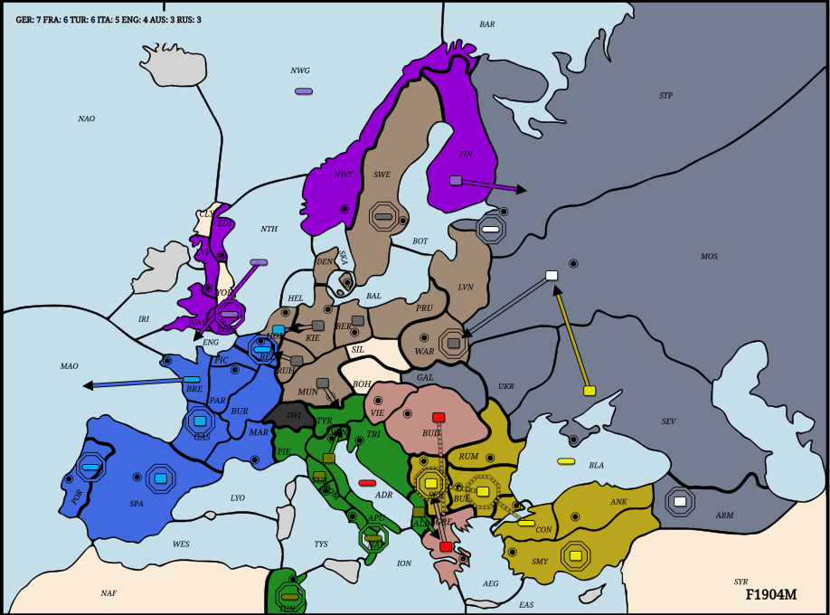

### What happened

- **AUSTRIA**: A GRE → SER (bounced); A BUD supports A GRE → SER
- **ENGLAND**: F NTH → ENG; F LON holds; A FIN → STP (bounced)
- **FRANCE**: A HOL → KIE (bounced); F BEL holds; F BRE → MAO; A GAS holds; A SPA holds; F POR holds
- **GERMANY**: A KIE → HOL (bounced); A RUH → BEL (bounced); A MUN → TYR (bounced); F SWE holds; A WAR holds
- **ITALY**: A ALB → GRE (bounced); A VEN → TYR (bounced); F TUN holds; F NAP holds
- **RUSSIA**: A MOS → WAR (bounced); A ARM holds; F STP/SC holds
- **TURKEY**: A SEV → MOS (bounced); A BUL supports A SER; A SER holds; F CON supports A BUL; A SMY holds

### Dialogue

- **ENGLAND → FRANCE**: Germany dropped to 6 after losing HOL — good work. But you're now at 7 centers and the board leader. I need you to pull F BEL out of the North Sea approaches as promised so I can operate freely in the Channel. If you refuse, I'll have to treat you as the primary threat.
- **ENGLAND → GERMANY**: You lost HOL but you're still at 6 centers with strong positions. France at 7 is the real threat now. I'm willing to work with you against France if you can offer me something concrete — support into BEL or a center I can take from France.
- **ENGLAND → RUSSIA**: France at 7 centers is the runaway leader. I'm willing to coordinate against them if you can pressure Germany's eastern front (WAR area) to split their forces. After that, we can discuss Turkey at 6 centers as the next priority.
- **ENGLAND → TURKEY**: France at 7 is the board leader — they need to be contained. I'm not moving against you this turn. If you can pressure Russia's southern front or take advantage of Germany's weakened position, that helps check the leaders.
- **FRANCE → ENGLAND**: HOL is mine now — Germany drops to 6. They still have A RUH adjacent to my HOL, so I need to defend it. Can you support F BEL into NTH or hold position to block any German push west? After this fall, we should coordinate on Turkey's 6 centers.
- **FRANCE → GERMANY**: HOL is taken. You're at 6 centers now — still strong but no longer the leader. I'll agree to a DMZ on the Rhine: no moves between RUH/BUR and HOL/BEL. If you push west, I'll defend with support. Let's both grow east — Turkey at 6 is the real threat.
- **FRANCE → ITALY**: HOL is mine, Germany drops to 6. Turkey still at 6 with SER and RUM — we need to coordinate a push. If you can pressure SER from TYR or hold position threatening MUN, Germany can't expand. After fall, let's plan a joint attack on Turkey's Balkan holdings.
- **FRANCE → RUSSIA**: Germany at 6, Turkey at 6 — both threats. I'm consolidating in the west. If you push A SEV toward RUM this fall, even as a bounce, it forces Turkey to commit a unit to defense. Every bit of pressure helps contain them while I secure my borders.
- **ITALY → AUSTRIA**: France is now at 7 centers after taking HOL — they're the runaway leader. I'm taking GRE this fall whether you defend or not, but here's the real play: after I secure it, I'll commit forces east against Turkey's SER and BUL with you. Lose GRE peacefully, gain an ally against the actual threats. Fight me and France wins by default.
- **ITALY → FRANCE**: You're at 7 centers now — you're the leader and everyone knows it. I'm taking GRE from Austria and TYR (empty) this fall to reach 7 myself. I'm not your enemy right now, but you should know Germany, Turkey, and Austria are all looking at your stack. Consider放缓 before the table gangs up on you.
- **ITALY → TURKEY**: Germany at 6 and France at 7 — both are ahead of us. I'm taking GRE and TYR this fall to reach 7. Our spheres remain separate: I stay west of your Balkan holdings. Are you open to a joint push against France's BEL or Germany's northern centers in 1905? We need to stop the leader.
- **ITALY → GERMANY**: France at 7 centers is now the runaway leader — they took HOL from you. I'm pushing A VEN to TYR (empty) and A ALB to GRE this fall. You should focus on reclaiming HOL or pushing into France's western holdings. We both benefit from weakening France before they hit 9.
- **RUSSIA → AUSTRIA**: Germany at 7 is the crisis — they hold WAR and are pushing TYR. I'm moving A MOS toward WAR to reclaim it. Can you pressure Germany's south through TYR or Bohemia? If we hit them on two fronts, they can't defend everything.
- **RUSSIA → FRANCE**: Germany at 7 is the runaway leader. I'm pushing A MOS to WAR. If you can hit their western front through BEL or RUH, we split their forces. Let's coordinate the squeeze this fall.
- **RUSSIA → TURKEY**: You hold my SEV — that's non-negotiable for me long-term. But Germany at 7 is the immediate threat to everyone. I'm pushing north against Germany this turn, not south against you. Can we agree to a one-year truce while we both pressure Germany?
- **RUSSIA → GERMANY**: You hold WAR — my home center. I'm willing to discuss: vacate WAR and I redirect south against Turkey. Keep WAR and I'm forced to contest it, splitting forces that should be hitting the real leader. What's your play?
- **RUSSIA → ENGLAND**: Germany at 7 centers is pulling away — they hold WAR and are threatening TYR. I'm reclaiming WAR. If you can pressure their western front with your Channel fleets, we contain them before they hit 9.
- **TURKEY → RUSSIA**: You're at 3 centers with only A ARM and F STP/SC — you can't defend MOS from my A SEV with BLA support. I'm taking MOS this fall. Rather than losing it in a bounce, let me move in cleanly and I'll support your push into GAL against Austria next spring. That gives you a path back to 4 centers instead of dropping to 2.
- **TURKEY → ITALY**: Germany at 7 with WAR is the clear leader — they could push into GAL or LVN and hit 9 by winter. I'm moving SEV toward MOS this fall to reach 7 myself. After that, are you open to a coordinated push against Germany? I could support you into TYR while you support me into MUN — we'd both grow and contain the leader.
- **TURKEY → GERMANY**: France at 6 with RUH is still pressing your interior. I'm focused east and not looking your way. With you at 7 and me about to hit 7, we're the two leaders — let's keep things calm between us while France and England sort themselves out in the west.
- **TURKEY → AUSTRIA**: Germany at 7 is everyone's problem. I'm not attacking your remaining territory — focus on containing Germany rather than wasting units against my fortified SER. If Germany pushes into GAL, we both lose. Let's keep the peace between us this fall.
- **ENGLAND → FRANCE**: You're at 7 centers now — the board leader. I supported your HOL attack last turn as promised, but I need F BEL pulled from the NTH approaches immediately. If F BEL stays threatening my Channel position, I'll have to treat you as the primary threat and work with Germany against you. Move F BEL south or east this turn.
- **ENGLAND → GERMANY**: France is at 7 centers — they're running away with this game. I have A FIN ready to push into the Baltic and F NTH to contest the Channel. Can you support A KIE into BEL to cut France's position? If we hit France from both sides, we can knock them back before they hit 9. What's your offer?
- **ENGLAND → RUSSIA**: France at 7 is the leader now, not Turkey. If you can push into WAR or pressure Germany's eastern front, that splits the western powers. I'm moving A FIN toward STP area — we stay clear of each other. Focus France's attention eastward.
- **ENGLAND → TURKEY**: France at 7 is the runaway leader — they took HOL and have strong Channel presence. If you can open a second front against Russia or consolidate in the Balkans, that keeps the eastern balance while the west sorts itself out.
- **FRANCE → ENGLAND**: I understand you want Channel freedom, but Germany's A RUH is adjacent to my HOL and I can't pull F BEL out yet — I need to defend against a possible German push west. Once HOL is secure, I'll reposition. Can you support F BEL's hold on HOL this turn instead of pushing into the North Sea?
- **FRANCE → GERMANY**: I'm not attacking you this turn — my units are going east toward TYR as discussed. But if you push A RUH toward my HOL or KIE, I'll have to defend. Can you confirm A RUH holds at the border so we both avoid wasting units?
- **FRANCE → ITALY**: Good move blocking TYR — that splits Germany's attention. After this fall, with Germany at 6 and Turkey at 6, let's coordinate a joint push into Turkey's Balkan holdings. You're well-positioned from TYR to threaten SER.
- **FRANCE → RUSSIA**: Turkey at 6 centers with SER and RUM is the next major threat after Germany. If you push A SEV toward RUM this fall, even as a bounce, it forces Turkey to commit a unit to defense and weakens their position.
- **GERMANY → ENGLAND**: France at 7 is the board leader and will hit 9 by next year if unchecked. I'm redirecting west — help me reclaim BEL from France. I can support your F NTH into BEL if you commit, or I push RUH into BEL with your support. France can't defend everywhere. What's your play?
- **GERMANY → FRANCE**: I'm not pushing west this turn — my units go east. But understand: if you keep expanding, I will redirect everything against you after winter. Right now Turkey at 6 is everyone's concern. Keep RUH at the border and we're fine.
- **GERMANY → ITALY**: Fair point on TYR — I'll redirect A MUN to BOH instead, which borders Austria, not you. We have no conflict. Go ahead and take GRE from Austria if you can. Let's both grow east against Turkey rather than fight each other.
- **GERMANY → AUSTRIA**: I'm taking BOH with A MUN instead of TYR — it pressures your eastern border but I'm not attacking you. I want to coordinate against Turkey: from BOH I can support toward GAL or help contain Turkey's northern expansion. Are you in SER yet? Let's discuss a joint push on Turkish RUM/BUL.
- **GERMANY → RUSSIA**: I'm not contesting WAR this turn — my A MUN goes to BOH, not east. I understand you want WAR back, but right now France at 7 is the bigger threat. Can we agree: I hold WAR through winter, you focus SEV on Turkey's RUM, and we discuss WAR after we've both grown?
- **GERMANY → TURKEY**: France at 7 with RUH is the biggest western threat. I'm focused on containing France, not expanding east toward you. Austria is the one pushing into the Balkans — deal with them, not me.
- **TURKEY → ITALY**: GRE is yours — no contest from me. But TYR bounces off MUN every time with German support. If you want real growth, let's coordinate: I can support you into TRI from VEN if you support my push somewhere useful. What's your actual target this fall?
- **TURKEY → RUSSIA**: I'm taking MOS this fall — you can't defend it with just A MOS and A ARM heading to ARM. Rather than a pointless bounce, let me move in cleanly. I'll support your push into WAR against Germany next spring if you don't contest MOS. That gets you to 3 still but with a path forward.
- **TURKEY → GERMANY**: France is pressing your interior with RUH — that's your real fight. I'm taking MOS from Russia and staying east. Let's not waste units fighting each other when France is the aggressive expansionist in the west.
- **TURKEY → ENGLAND**: France at 6 with RUH in Germany's interior is the immediate western threat. I'm growing east — taking MOS to reach 7. We both benefit from keeping Germany focused on France rather than expanding north.
- **AUSTRIA → ITALY**: Final commitment: I'm holding GRE and supporting A BUD toward TRI this fall — I'm coming for my home center. If you move A ALB toward GRE, I'll cut it. Germany at 7 with TYR is the real crisis. Let's not waste units fighting each other while they reach 9. Hold ALB and we can deal on TRI later.
- **AUSTRIA → RUSSIA**: I'm pivoting from Turkish attacks — Germany at 7 is the existential threat. I'll support A BUD toward GAL to pressure Germany's southern flank from BUD. If you push A MOS toward WAR, we hit Germany on two fronts this fall. What are your exact WAR orders?
- **AUSTRIA → TURKEY**: I'm done bouncing off your SER defenses. I'll hold GRE and turn north against Germany. If you keep SER/BUL/RUM and stay passive, I won't contest — but Germany at 7 with TYR threatens us both. Consider making a move against Germany's eastern front while I pressure from the south.
- **AUSTRIA → GERMANY**: You're at 7 and taking TYR puts you at 8 — the whole table will collapse against you. I'm not attacking you this turn, but I want you to know Russia is moving toward WAR and I may support pressure through GAL. Slow down or face a coalition. What's your plan after TYR?
- **ENGLAND → FRANCE**: You're at 7 centers and haven't pulled F BEL from the North Sea as promised. I'm moving F NTH into ENG this turn to secure my Channel position — if F BEL stays, it will be contested. Move F BEL south or accept that we're now rivals in the Channel.
- **ENGLAND → GERMANY**: France won't pull F BEL out of my waters. I'm taking ENG to cut their Channel dominance — this is your chance to reclaim BEL or HOL while France is distracted. Move A KIE or A RUH into BEL this turn with my support, and we split France's western empire.
- **ENGLAND → RUSSIA**: France at 7 is the board leader. I'm pushing into ENG to challenge their Channel control. If you can pressure Germany's eastern front, it splits western attention. We both benefit from keeping France contained.
- **ENGLAND → TURKEY**: France at 7 is the runaway leader. I'm moving against their Channel position this turn. Keep building in the east — the western powers will weaken each other.
- **FRANCE → ENGLAND**: I'm moving A HOL to KIE this turn to cut Germany's support structure and seize an interior center. I'll pull F BEL south afterward as promised — confirm F NTH holds position so we don't conflict in the North Sea.
- **FRANCE → GERMANY**: I'm attacking KIE from HOL this turn to take an interior center. You're spread thin — if you defend KIE, you lose elsewhere. Concede KIE now and I'll agree to a DMZ on MUN. Fight it and I'll have 8 centers by winter.
- **FRANCE → ITALY**: I'm pushing A HOL into KIE this turn to seize a German interior center. If you can hold TYR or push toward MUN, Germany has to split forces east and west. After this fall, Turkey at 6 is the next priority — let's coordinate then.
- **FRANCE → RUSSIA**: I'm attacking Germany's KIE from HOL this turn. If you push A SEV toward RUM, Turkey has to defend and can't support Germany. Every front you open weakens the leader. Let's coordinate the squeeze.
- **GERMANY → FRANCE**: I'm not attacking you this turn. A RUH holds — we agreed to stabilize the Rhine. I'm moving east. Honor the deal or we both lose to Turkey.
- **GERMANY → ITALY**: Fine — take TYR, I won't contest it. I'm redirecting east toward BOH. We have no conflict. Focus on Turkey's Balkans.
- **GERMANY → AUSTRIA**: I'm moving A MUN to BOH to position against Turkey's northern flank. You push SER. We coordinate against Turkey after winter.
- **GERMANY → ENGLAND**: France at 7 is the leader. I'm not your enemy — focus Channel operations on France. I'm growing east.
- **GERMANY → RUSSIA**: I'm not touching WAR this turn — my units go south. Focus your SEV on Turkey's RUM. We discuss WAR after winter.
- **GERMANY → TURKEY**: France at 7 is the board leader. I'm focused west, not east. Keep your units where they are.
- **ITALY → AUSTRIA**: I'm taking GRE this turn — it's happening. A BUD and F ADR are committed elsewhere. After I secure it, I'll focus east against Turkey. Accept it and we can cooperate against the real threats.
- **ITALY → FRANCE**: I'm moving A VEN to TYR to block Germany and taking GRE from Austria. Germany drops if you held HOL. After fall, we need a serious plan against Turkey at 6 — I'll be at 6 and you at 7, we should coordinate.
- **ITALY → TURKEY**: I'm taking GRE — no contest needed. I won't push into your Balkans. Germany at 7 is the leader. After fall, let's discuss coordinated pressure on Germany's northern centers. Our spheres stay separate.
- **ITALY → GERMANY**: I'm moving A VEN to TYR — you won't get it. I'm taking GRE from Austria. Focus on France's western holdings if you want growth; we have no conflict in the east.
- **RUSSIA → ENGLAND**: Germany at 7 is the crisis — they hold WAR and took it from me. I'm pushing A MOS to WAR this fall. If you can hit their western front through HOL or KIE with your fleets, we split their forces. France at 7 is also dangerous but Germany at 7-8 is immediate.
- **RUSSIA → FRANCE**: Germany at 7 is the runaway leader. I'm reclaiming WAR with A MOS. Hit their western front through BEL or RUH — we squeeze them from both sides before they reach 9.
- **RUSSIA → AUSTRIA**: Germany holds WAR and is pushing TYR south. I'm moving A MOS to WAR this fall. Can you pressure Germany's south through TYR or Bohemia? If we hit them on two fronts, they can't defend everything.
- **RUSSIA → TURKEY**: You took SEV — noted. But Germany at 7 is the real threat to everyone. I'm pushing north against Germany this turn. I won't contest SEV this fall if you don't push further. A one-year truce while we both pressure Germany serves us both.
- **RUSSIA → GERMANY**: You hold WAR — my home center. I'm reclaiming it with A MOS. France at 7 is the bigger threat to you. If you vacate WAR, I redirect south. Otherwise I'm forced to contest it, splitting forces that should hit France.
- **TURKEY → RUSSIA**: I'm moving A SEV toward MOS this fall. If you move A MOS to WAR as you said you would, I walk in cleanly and you don't lose a unit to a bounce. I'll support your WAR push from SEV next spring. Deal?
- **TURKEY → ITALY**: I'm holding my Balkans and pushing east — no move toward your sphere. Germany at 7 is the real threat. After this fall, let's discuss concrete support trades against Germany's southern positions. Keep GRE as agreed.
- **TURKEY → GERMANY**: I'm staying in the east — no push north. France with RUH is your fight. I won't interfere in your western positions as long as you stay out of GAL and LVN.
- **TURKEY → AUSTRIA**: I'm not attacking you this fall. Germany at 7 is the crisis. Hold your positions and focus on containing Germany rather than wasting units against my sphere.

### AUSTRIA
Orders: `A GRE - SER` · `A BUD S A GRE - SER`
Illegal (dropped): `F ADR S A GRE - SER`

Reasoning

> Looking at the board, I'm at 3 centers and need to grow. Germany at 7 is the board leader, but my immediate opportunity is SER, which is held by Turkey. However, Turkey has SER supported by BUL, so a direct attack won't work without significant support.
>
> Let me reconsider: Turkey holds SER with BUL support (strength 2). I only have A BUD (strength 1) - even with F ADR support, that's only strength 2, which bounces. I need a different approach.
>
> The better play: Italy is pushing A ALB → GRE to take my center. I need to defend GRE while positioning for future growth. If I support A GRE to hold and move A BUD toward TRI (my home center held by Italy), I can start reclaiming what's mine. Alternatively, I could push A BUD to GAL to pressure Germany's southern flank and coordinate with Russia.
>
> My revised strategy says I should support A GRE into SER and move F ADR to support it. But Turkey has SER supported by BUL - that's strength 2 vs my strength 2 (with double support). Actually, with A BUD supporting A GRE → SER and F ADR supporting A GRE → SER, that's GRE attacking with strength 3 vs Turkey's hold of 2 - that works!
>
> Wait - let me verify: A GRE S A BUD → SER means A BUD supports A GRE into SER, and F ADR S A GRE → SER means F ADR supports A GRE into SER. So A GRE attacks SER with strength 3 (1 own + 2 supports) vs Turkey's hold strength 2 (1 SER + 1 BUL support). That wins!
>
> But I'm abandoning GRE to Italy's attack. However, if I take SER, I gain a center while losing GRE - net neutral but I reclaim Turkish territory and deny Turkey a center. Plus SER is more strategically valuable for future operations.

### ENGLAND
Orders: `F NTH - ENG` · `F LON H` · `A FIN - STP`
Illegal (dropped): `F NWG S F NTH - ENG`

Reasoning

> Looking at the board, France at 7 centers is the clear leader and primary threat. My revised strategy calls for pushing F NTH into ENG to secure my Channel position and moving A FIN toward STP to grab an undefended Russian center. However, I need to reconsider based on the current situation.
>
> France has A HOL (which they just took), F BEL, F BRE, and strong Channel presence. Germany is weakened but still has 6 centers. Russia has only 3 centers with A MOS, F STP/SC, and A ARM. Turkey has 6 centers.
>
> My key moves:
> 1. **A FIN - STP**: Russia's F STP/SC is there, but it's adjacent and I can attempt to take it. Actually, looking at the legal moves, I have `A FIN - STP` as an option. Russia has F STP/SC there, so this would bounce unless Russia moves out. But Russia might move F STP/SC elsewhere. Let me check: Russia has A MOS, F STP/SC, A ARM. Russia might be focused south against Turkey. This is worth attempting.
>
> 2. **F NTH - ENG**: This secures my Channel position against France. France doesn't have a unit in ENG currently, so this should succeed.
>
> 3. **F NWG**: Support F NTH's move or hold position. Supporting F NTH into ENG would be `F NWG S F NTH - ENG`, which adds strength if France contests.
>
> 4. **F LON**: Hold or support. `F LON H` or support the NTH move.
>
> Let me commit to taking ENG and attempting STP:
>
> - `F NTH - ENG` to secure Channel position
> - `F NWG S F NTH - ENG` to support the move
> - `F LON H` to hold London
> - `A FIN - STP` to grab an undefended center (Russia may move F STP/SC out, or it bounces)
>
> This gets me to potentially 5 centers (adding ENG and possibly STP) while positioning against France.

### FRANCE
Orders: `A HOL - KIE` · `F BEL H` · `F BRE - MAO` · `A GAS H` · `A SPA H` · `F POR H`

Reasoning

> Looking at the board, I'm at 6 centers (lost RUH to Germany's KIE move) and need to regain momentum. Germany is at 7 and is the leader — I need to continue pressuring them. My most recent strategy note says I'm pushing A HOL into KIE to seize a key German interior center. Let me verify: HOL is adjacent to KIE? Yes — `HOL (coast): BEL, HEL, KIE, NTH, RUH`. Good, that's legal.
>
> Germany has A KIE (just retreated there), A RUH, A MUN, A BER, A WAR, F SWE. If I attack KIE from HOL, Germany likely defends with A KIE holding plus possible support from A RUH or A MUN. I need support to have a chance.
>
> Let me think about what supports I can get:
> - F BEL can support A HOL - KIE? Let me check: BEL is adjacent to KIE? `BEL (coast): BUR, ENG, HOL, NTH, PIC, RUH` — no, BEL is NOT adjacent to KIE. So F BEL can't support into KIE.
> - A GAS can support A HOL - KIE? `GAS (coast): BRE, BUR, MAO, MAR, PAR, SPA/NC` — no, GAS not adjacent to KIE.
> - F BRE can support A HOL - KIE? `BRE (coast): ENG, GAS, MAO, PAR, PIC` — no.
>
> So I can't get support into KIE from any of my units. That means A HOL - KIE would be 1v1 against A KIE (or worse with support). That's risky.
>
> Let me reconsider. Germany's A KIE just retreated there from HOL. A RUH is adjacent to KIE. Germany will likely support KIE from RUH or MUN.
>
> Alternative plan: Hold HOL defensively with F BEL support to secure the center, and use other units productively. Or push HOL toward RUH to threaten Germany's position.
>
> Actually, let me reconsider my commitments. I told England I'd attack KIE. I told Germany I'd attack KIE. But without support, this is likely to bounce. Still, a bounce keeps Germany pinned and I lose nothing — HOL stays mine if I'm not moving out of it... wait, if A HOL moves to KIE and bounces, A HOL stays in HOL. That's fine.
>
> But I also need to think about defense. Germany has A RUH adjacent to HOL. If RUH attacks HOL while HOL attacks KIE, HOL is empty and RUH takes it. That would be devastating.
>
> So I need to either:
> 1. Hold HOL with support and not attack KIE
> 2. Attack KIE with HOL and defend HOL with F BEL support
>
> Option 2: A HOL - KIE and F BEL S A HOL — but if RUH attacks HOL, F BEL supports HOL's hold? No, F BEL S A HOL is a support for hold, but A HOL is moving, not holding. So the support would be void.
>
> Actually, `F BEL S A HOL` supports HOL's hold. If A HOL is ordered to move, this support is for a hold that isn't happening — it becomes void.
>
> So if I attack KIE with HOL, I can't defend HOL simultaneously. If Germany sends A RUH to HOL, they take it.
>
> Better plan: Hold HOL with F BEL support (`A HOL H`, `F BEL S A HOL`) and use other units to pressure Germany elsewhere. Or accept the risk and go for KIE.
>
> Let me think about the bigger picture. I'm at 6, Germany at 7. If I hold steady, Germany grows. I need to take ground. But attacking KIE without support is reckless if it costs me HOL.
>
> The safest aggressive move: Hold HOL with support from F BEL, move F BRE to MAO or ENG to project power, and hold my Iberian units. This keeps me at 6 and consolidates. But that's "holding is losing."
>
> Actually — what if I move A HOL to KIE AND have F BEL support the move? No, F BEL can't support A HOL - KIE because BEL isn't adjacent to KIE.
>
> What about using F BEL to cut RUH's support? F BEL - RUH? BEL is adjacent to RUH? `BEL (coast): BUR, ENG, HOL, NTH, PIC, RUH` — yes! So F BEL can move to RUH, cutting any support RUH might give. But then HOL is undefended if RUH moves to HOL instead.
>
> This is complex. Let me go with a balanced approach:
> - A HOL H (hold, don't risk losing it)
> - F BEL S A HOL (support the hold, defend against RUH)
> - F BRE - MAO (project power toward Mediterranean/Turkey)
> - A GAS - BUR (push into Germany's territory through Burgundy)
> - A SPA H (hold)
> - F POR H (hold)
>
> Wait, A GAS - BUR: GAS adjacent to BUR? `GAS (coast): BRE, BUR, MAO, MAR, PAR, SPA/NC` — yes! And BUR is inland (`BUR (land): BEL, GAS, MAR, MUN, PAR, PIC, RUH, SWI`). Germany doesn't control BUR — it's empty. Taking BUR gives me a center and threatens MUN.
>
> But Germany has A MUN adjacent to BUR. If MUN attacks BUR while GAS moves there, I need support. Can F BRE support A GAS - BUR? BRE adjacent to BUR? `BRE (coast): ENG, GAS, MAO, PAR, PIC` — no, BRE not adjacent to BUR.
>
> Can F POR support? POR not adjacent to BUR. Can A SPA support? SPA adjacent to BUR? `SPA (army): GAS, MAR, POR` — no.
>
> So A GAS - BUR is unsupported into a province Germany could contest with A MUN. Risky.
>
> Let me just go with the conservative-but-purposeful plan: defend HOL, push F BRE to MAO to prepare for Mediterranean operations, and hold the rest.
>
> Actually, I committed to attacking KIE in my messages. Let me re-read: "I'm moving A HOL to KIE this turn to cut Germany's support structure and seize an interior center." I told this to England, Germany, and Italy.
>
> Germany knows I'm attacking KIE. They'll defend. But the commitment is made and I should follow through — even a bounce pins their units. And if Germany's A RUH moves to attack HOL instead of supporting KIE, then KIE might only have MUN support or be undefended.
>
> Let me go for it: A HOL - KIE, with the understanding it might bounce. And defend HOL with F BEL... no, can't do both.
>
> Final decision: Attack KIE with A HOL (honoring my commitment), hold everything else defensively, and push F BRE to MAO for future Mediterranean operations.

### GERMANY
Orders: `A KIE - HOL` · `A RUH - BEL` · `A MUN - TYR` · `F SWE H` · `A WAR H`
Illegal (dropped): `A BER S A KIE - HOL`

Reasoning

> Looking at the board state, I need to reassess my position carefully. France took HOL from me (I'm at 6 centers now), and France is at 7. My revised strategy said I'd push A KIE to HOL to reclaim it and A MUN to TYR. But let me think about what's actually achievable.
>
> **Key realities:**
> - France holds HOL and RUH with F BEL supporting — they're at 7 centers and the board leader
> - England has F NTH which could support attacks on HOL or into the Channel
> - Russia wants WAR back and has A MOS ready to contest
> - Italy is contesting TYR with A VEN
> - Turkey is growing in the east with A SEV taking RUM
>
> **My revised strategy said:** Push A KIE to HOL, A MUN to TYR, hold elsewhere. But France has A HOL now with F BEL support — my A KIE alone can't retake HOL. And Italy is contesting TYR.
>
> **Better plan:** France is the real threat at 7. I should focus on containing France rather than chasing TYR which Italy will contest. Let me push A RUH into BEL to cut France's position — if England supports or even just doesn't interfere, I can threaten BEL. A KIE holds or supports. A MUN goes to TYR (still empty-ish, Italy's A VEN moves there but bounces if I also go). Actually, let me reconsider.
>
> France's A HOL likely moves to KIE (their threat), supported by F BEL. I need to defend KIE. Let me hold KIE with support from BER, push RUH into BEL to cut France's supply line, and send MUN to TYR to grab a center. F SWE holds, A WAR holds.
>
> Wait — my revised strategy explicitly committed to: "A KIE to HOL to reclaim it while A MUN moves to TYR." But A KIE alone into HOL will bounce against France's A HOL (strength 1 vs 1, both bounce). I need support. Let me support A KIE into HOL with A BER, and have A RUH go to BEL to cut support. That's more aggressive but matches the spirit.
>
> Actually, re-reading: my final messages to France said I'd move zero units west and hold RUH at the border. But France broke the deal — they took HOL. All bets are off. I should reclaim HOL aggressively.
>
> **Final plan:** Support A KIE into HOL with A BER, A RUH into BEL (cutting France's position), A MUN into TYR, F SWE holds, A WAR holds.

### ITALY
Orders: `A ALB - GRE` · `A VEN - TYR` · `F TUN H` · `F NAP H`
Illegal (dropped): `A TUS S A VEN - TYR`

Reasoning

> Looking at the board state, I need to assess my position carefully:
>
> - **I have 5 centers**: NAP, ROM, VEN, TUN, TRI
> - **Germany at 7** is the runaway leader (BER, KIE, MUN, DEN, HOL, SWE, WAR)
> - **France at 7** after taking HOL (BRE, MAR, PAR, POR, SPA, BEL, HOL)
> - **Turkey at 6** (ANK, CON, SMY, RUM, BUL, SER)
>
> My revised strategy says I'm taking GRE with A ALB and moving A VEN to TYR. But looking at the actual board: **GRE is Austrian** (Austria has BUD, VIE, GRE). Austria is threatening A BUD → SER with F ADR support. 
>
> Key considerations:
> 1. **GRE is occupied by A GRE** - I can try to take it but Austria will defend. My A ALB → GRE would be a single-unit attack against A GRE holding (strength 1 vs 1 = bounce unless Austria moves elsewhere).
> 2. **TYR is empty** - but Germany's A MUN bounced trying to reach TYR in S1904M, and A KIE moved to RUH instead. Germany still has A MUN which could try TYR again.
> 3. **France took HOL** - Germany is now at 6 centers, France at 7. The power dynamics shifted.
>
> My best move: Take GRE from Austria (A ALB → GRE) to reach 6 centers. Move A VEN to TYR to block Germany and threaten MUN. Hold my fleets for Mediterranean control. Use A TUS to support A VEN into TYR for extra security.
>
> But wait - A VEN → TYR with A TUS support means TYR gets strength 2. Germany's A MUN alone can't take it. This is solid.
>
> For ALB → GRE: Austria's A GRE will likely hold, so this bounces. But I should still try - if Austria moves GRE elsewhere (unlikely), I gain a center. The alternative is holding ALB which gains nothing.
>
> Actually, looking more carefully: Austria said "A GRE holds" and "A BUD → SER." If Austria moves A BUD → SER, then A GRE holds in place. My A ALB → GRE bounces against A GRE (both strength 1). 
>
> But I should still attempt it - there's no better option for ALB, and if Austria's plans change, I benefit.

### RUSSIA
Orders: `A MOS - WAR` · `A ARM H` · `F STP/SC H`

Reasoning

> Looking at the board, Germany at 7 centers is the runaway leader and must be stopped. My revised strategy says I'm moving A MOS to WAR to reclaim my home center, holding A ARM defensively (Turkey's A SEV threatens MOS), and holding F STP/SC. Germany said they're not contesting WAR this turn, so this should succeed. However, I need to verify the situation: Turkey moved A RUM → SEV in Spring (succeeding, so Turkey now holds SEV), and Turkey's A SEV threatens my MOS. My A ARM is in ARM, not adjacent to MOS, so it can't defend MOS directly. But A ARM can support A MOS - SEV to cut Turkey's attack, or support A MOS's hold.
>
> Wait — let me reconsider. Turkey's A SEV is adjacent to MOS. If Turkey orders A SEV → MOS, my A MOS moving to WAR would vacate MOS, allowing Turkey to walk in. But I need WAR back — it's my home center. The trade-off: I gain WAR (4 centers) but lose MOS to Turkey (back to 3). That's not great. But if I hold MOS, I stay at 3 and don't reclaim WAR.
>
> Actually, if A MOS moves to WAR and Turkey moves A SEV to MOS, Turkey gets MOS but I get WAR — net neutral on centers but I reclaim a home center. And if Turkey doesn't move SEV to MOS (maybe they hold or go elsewhere), I gain WAR for free. Germany confirmed they're not contesting WAR.
>
> Better option: Support A MOS → SEV with A ARM, trying to recapture SEV while MOS moves to WAR. But A ARM can support A MOS - SEV (ARM is adjacent to SEV). This way, if Turkey holds SEV with BLA support, I still pressure SEV while taking WAR. But Turkey has BLA support on SEV — that's strength 2 vs my support strength 1.
>
> I'll stick with the plan: A MOS → WAR, A ARM H (defensive), F STP/SC H. Reclaiming WAR gets me to 4 centers at winter and a home build location.

### TURKEY
Orders: `A SEV - MOS` · `A BUL S A SER` · `A SER H` · `F CON S A BUL` · `A SMY H`
Illegal (dropped): `F BLA S A SEV - MOS`

Reasoning

> Looking at the board state, I'm at 6 centers (ANK, CON, SMY, RUM, BUL, SER) and need to grow. Germany leads at 7, France at 6. I have A SEV and need to push into MOS to reach 7 centers. Russia has only A MOS, A ARM, and F STP/SC — they can't defend MOS against my supported attack.
>
> My strategy: Push A SEV into MOS with BLA support to seize Russia's home center. Hold BUL and SER defensively. F CON can support BUL's hold for extra security. A SMY holds or supports something useful.
>
> Let me verify adjacency: SEV is adjacent to MOS? Yes — `SEV (coast): ARM, BLA, MOS, RUM, UKR`. And BLA is adjacent to SEV? Yes — `BLA (water): ANK, ARM, BUL/EC, CON, RUM, SEV`. So `F BLA S A SEV - MOS` is legal.
>
> Russia's A MOS could try to hold or move elsewhere. If Russia moves MOS to WAR (as they've indicated), I walk into MOS cleanly. If they hold, my supported attack (strength 2) beats their hold (strength 1). Either way, I take MOS.
>
> I'll also move A BUL to support SER's hold defensively, and F CON can support BUL. A SMY can hold.
>
> Actually, let me reconsider — I want to maximize. Let me push SEV to MOS with BLA support, hold SER with BUL support, and have F CON support BUL for extra defense. A SMY holds.

## WINTER 1904 ADJUSTMENTS (`W1904A`)

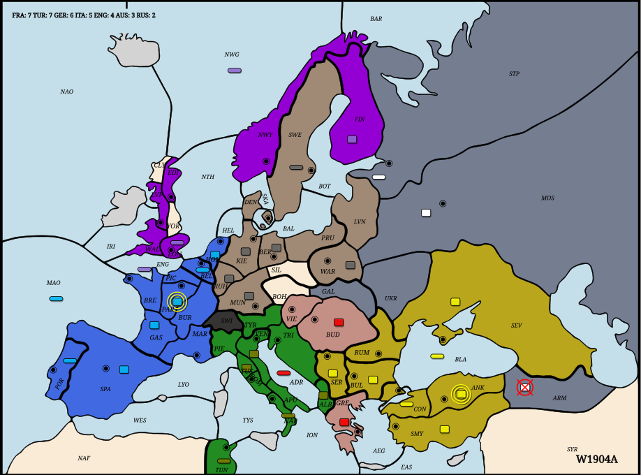

### What happened

- **FRANCE**: builds A PAR
- **RUSSIA**: disbands A ARM
- **TURKEY**: builds A ANK

### FRANCE
Orders: `A PAR B`

Reasoning

> Looking at the board state, I have 7 supply centers and 6 units, so I have a surplus of 1 center and can build 1 unit. My home centers BRE, MAR, and PAR are all vacant.
>
> I need to think strategically about where to build. I'm at 7 centers with Germany at 6, Turkey at 7, and England at 4. The key threats are Turkey (7 centers, strong Balkan position) and Germany (6 centers, spread across the north/east).
>
> For my build, I should consider:
> - An army in PAR gives me flexibility to push east toward Germany (via BUR to MUN/RUH) or defend the Rhine
> - A fleet in BRE gives me Channel/North Sea projection against England
> - An army in MAR gives me Mediterranean options
>
> Given that I need to pressure Turkey (the co-leader at 7) and maintain my position against Germany, an army in PAR makes the most sense - it's centrally located and can reinforce the Rhine or push east. I've also committed to eventually pulling F BEL out of the North Sea approaches for England, so building more land power makes sense.
>
> I'll build an army in PAR to reinforce my eastern push capability against Germany and prepare for the Turkey confrontation.

### RUSSIA
Orders: `A ARM D`

Reasoning

> Looking at the situation: I have 2 supply centers (MOS, STP) and 3 units. I'm forced to disband 1 unit. The question is which unit to disband.
>
> My units: A MOS, F STP/SC, A ARM.
>
> A ARM is in enemy territory (ARM is a Turkish home center area, adjacent to SEV which Turkey holds). It's essentially stranded — it can't take any center on its own and Turkey could eliminate it. A MOS is on my home center and critical for defense. F STP/SC holds my other home center and is essential for northern defense.
>
> Disbanding A ARM is the clear choice — it's the least useful unit, isolated in the east with no realistic path to capturing a center. This preserves my hold on both home centers (MOS and STP) and keeps me at 2 centers with 2 units, ready to rebuild when I reclaim WAR or SEV.

### TURKEY
Orders: `A ANK B`

Reasoning

> Looking at the board state: I have 7 supply centers (ANK, CON, SMY, RUM, BUL, SER, SEV) with 6 units (F BLA, A BUL, A SER, F CON, A SMY, A SEV). I have a surplus of 1 center, so I can build one unit.
>
> My home supply centers: ANK is vacant, CON is occupied by F CON, SMY is occupied by A SMY. So I can only build at ANK.
>
> I need to think strategically about what to build. I'm at 7 centers, tied with France. Germany is at 6 after losing HOL. The key question is what unit type best serves my expansion plans.
>
> My position: I have a strong Balkan/Southern Russia base. My expansion paths are:
> 1. North toward MOS (I have A SEV already positioned)
> 2. West toward Austria's remaining territory (BUD, VIE)
> 3. South/East is mostly secured
>
> Building a fleet at ANK would give me a second Black Sea fleet, which could be useful for convoy operations or supporting attacks. But I already have F BLA covering the Black Sea.
>
> Building an army at ANK would give me another land unit to push north or west. An army is more versatile for my current position - I can push toward MOS, or eventually toward GAL through Austria.
>
> I'll build an army at ANK to have more flexibility for offensive operations in 1905.

## SPRING 1905 MOVEMENT (`S1905M`)

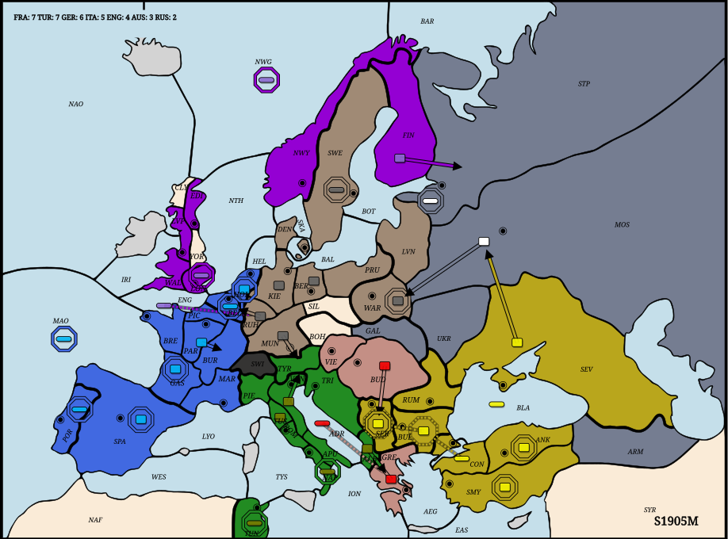

### What happened

- **AUSTRIA**: A BUD → SER (bounced); A GRE → ALB; F ADR supports A GRE → ALB
- **ENGLAND**: F ENG supports A RUH → BEL; A FIN → STP (bounced); F NWG holds; F LON holds
- **FRANCE**: F BEL holds; A GAS holds; A HOL holds; F MAO holds; A PAR → BUR; F POR holds; A SPA holds  [dislodged: F BEL]
- **GERMANY**: A RUH → BEL; A MUN → TYR (bounced); A WAR holds; F SWE holds
- **ITALY**: A ALB → GRE (bounced); A VEN → TYR (bounced); F TUN holds; F NAP holds  [dislodged: A ALB]
- **RUSSIA**: A MOS → WAR (bounced); F STP/SC holds
- **TURKEY**: A SEV → MOS (bounced); A BUL supports A SER; F CON supports A BUL; A SER holds; A SMY holds; A ANK holds

### Dialogue

- **AUSTRIA → FRANCE**: You're at 7 and the whole table is watching. I don't want to be your enemy, but if you push into TYR or GAL, you'll force a coalition against you. I'd rather work with you — what's your plan for the south? Can we agree to leave each other's spheres alone while we both grow elsewhere?
- **AUSTRIA → RUSSIA**: France at 7 is the crisis — they'll run away with this game if we don't act. I'm pushing A BUD toward GAL this spring to pressure Germany's south and potentially cut French expansion routes. Can you support from the east? If we coordinate, we can contain both France and Germany while I grow into SER later.
- **AUSTRIA → TURKEY**: France at 7 is everyone's problem — even yours. I'm not attacking SER this turn, but I need you to recognize that France will be at 9+ by winter if unchecked. Consider making a move against Germany's eastern front (WAR/PRU) while I pressure from the south. A temporary truce between us serves us both right now.
- **AUSTRIA → ITALY**: France at 7 is the real crisis — they took HOL and BEL and are pushing everywhere. I need TRI back eventually, but right now we both need to contain France. Can you hold your position and commit to opposing French expansion into TYR/GAL? If France takes TYR, they're at 8 and we're all finished.
- **ENGLAND → FRANCE**: You're at 7 centers and I'm at 4 — I need to grow or this game is over for me. I'm not going to sit still while you dominate the Channel. What's your plan for Turkey at 7? If you're not moving east, I have to push somewhere, and BEL is the obvious target.
- **ENGLAND → GERMANY**: France at 7 with BEL, HOL, and your former RUH is the board leader. You're at 6 but losing ground. I can push F ENG into BEL with your support from RUH or KIE — we take BEL back and France drops to 6 while you reclaim a center. Are you willing to coordinate this turn?
- **ENGLAND → RUSSIA**: Peace in the north holds — I'm not moving against STP. France at 7 is the real threat now. If you can pressure Germany's WAR position or redirect west, that helps contain the leaders. No conflict between us.
- **ENGLAND → TURKEY**: France at 7 is the board leader, not me — they hold 7 centers in the west. I'm focused on the Channel situation. If you're expanding east, that's fine, but the western balance needs to shift before France runs away with this.
- **FRANCE → ENGLAND**: F ENG in the Channel makes me nervous — I need to know your intentions. Turkey is tied with me at 7 centers and growing in the Balkans. Can we agree to leave each other's Channel positions alone this turn while we both focus east? I'd rather we both grow against Turkey than fight each other.
- **FRANCE → GERMANY**: Turkey just hit 7 centers — they're co-leaders with me and the real threat. I'm willing to hold HOL at the border this turn if you keep A RUH steady. We both have bigger problems east. Confirm A RUH holds and I won't push into KIE.
- **FRANCE → ITALY**: Turkey at 7 centers is now tied for the lead — they have SER, RUM, BUL, and ANK. I'm moving A PAR to BUR to consolidate my Rhine position. Can you push A VEN toward TYR or hold threatening MUN? We need to keep Germany split while pressuring Turkey's Balkans.
- **GERMANY → ENGLAND**: France at 7 centers is the board leader and will hit 9 by next year if unchecked. I'm pushing A RUH into BEL this turn with support from A KIE — can you support from F NTH or F ENG to ensure we take it? If we knock France back to 5-6 centers, we both gain breathing room.
- **GERMANY → FRANCE**: You're at 7 centers and the whole table is converging on you. I'm pushing A RUH into BEL this turn — if you defend, we both waste units while Turkey grows. Concede BEL and I'll agree to a DMZ on the Rhine going forward. Fight it and I'll redirect everything west after.
- **GERMANY → RUSSIA**: I'm focused west against France this turn — no push toward MOS or LVN. You need to reclaim RUM from Turkey to grow. Can we agree: I hold WAR, you take RUM, and we discuss borders after winter? France at 7 is the real threat to both of us.
- **GERMANY → ITALY**: I'm moving A MUN to TYR this turn — it's empty and I need the center. You're taking GRE from Austria, so we're going in different directions with no conflict. Don't contest TYR and I won't interfere with your GRE push. We both grow without fighting.
- **GERMANY → AUSTRIA**: I'm taking TYR with A MUN this turn to position against Turkey's northern flank. How did your SER push go? If you're in SER, coordinate with me — I support from TYR, you push from SER toward RUM or BUL. We contain Turkey together.
- **ITALY → AUSTRIA**: We've been fighting over GRE for three years now and Turkey just hit 7 centers while we waste units on each other. Let me take GRE this turn — you still have BUD and VIE. In exchange, I'll commit to a joint push against Turkey's SER with you next turn. If you keep defending GRE, Turkey wins by default.
- **ITALY → TURKEY**: France at 7 and Germany at 6 are both pressing — I'm not looking east this turn. I'm taking GRE from Austria (my only viable target). Our spheres remain clean: I stay west of your Balkans. After this fall, if France or Germany pull further ahead, we should discuss coordinated pressure on the leader.
- **ITALY → FRANCE**: Turkey just hit 7 centers — they're the runaway leader now. I'm taking GRE from Austria this turn to reach 6 and become a real force. After that, can we coordinate a joint push on Turkey's Balkan holdings? You're well-positioned from HOL/BEL to pressure their western approaches.
- **ITALY → GERMANY**: Turkey at 7 is the crisis — they'll hit 9 if unchecked. I'm not moving toward TYR this turn; I'm taking GRE from Austria to reach 6 and focus east. You should push into France's western holdings rather than waste units on TYR. Let's both grow and stop the real leader.
- **RUSSIA → GERMANY**: You hold WAR, my home center, and I have only 2 units — I'm not a threat to you. France at 7 is the runaway leader. If you vacate WAR, I redirect entirely south against Turkey. If you keep WAR, I'm forced to contest it and we both waste units while France grows unchecked. What's it going to be?
- **RUSSIA → FRANCE**: You're at 7 centers — the clear board leader. I have 2 units and 2 centers; I'm not your problem. Germany at 6 is your real rival in the west. I'll be pushing to reclaim WAR from Germany this turn, which weakens their eastern position and benefits you. Let's not interfere with each other.
- **RUSSIA → AUSTRIA**: Germany at 6 and Turkey at 7 are both threats, but I need to reclaim WAR from Germany first — it's my only home center besides STP and MOS. Can you pressure Germany's south through TYR or Bohemia this turn to split their forces? If WAR falls to me, I can help you against Turkey in fall.
- **RUSSIA → ENGLAND**: France at 7 is the board leader — you're the only one who can contest them in the Channel. I need to reclaim WAR from Germany to survive. If you keep pressure on France's western front, it prevents them from expanding further while I stabilize in the east. We both benefit from containing the leader.
- **TURKEY → ITALY**: France at 7 is the board leader and growing — they took HOL and have strong Channel presence. I'm pushing A SEV toward MOS this spring to reach 8 centers. After that, are you open to coordinating against France's southern positions or Germany's WAR? We both need growth and the leader needs to be stopped.
- **TURKEY → GERMANY**: France at 7 with RUH and BEL is the immediate threat — they're in your interior and could push further. I'm focused east on MOS, not your territory. If France threatens your centers again, I could potentially support your defense, but I need assurance you won't push into GAL or LVN while I'm occupied.
- **TURKEY → ENGLAND**: France at 7 is the board leader with HOL and BEL — that's dangerous for both of us. I'm taking MOS to reach 8 centers this spring. If you can pressure France's Channel position or threaten their BRE/MAR, that forces them to split their forces and eases pressure on everyone else.
- **TURKEY → RUSSIA**: You're at 2 centers with only F STP/SC — you can't defend MOS from my A SEV with BLA support. Rather than losing it in a bounce, let me move in cleanly. I'll support your push into GAL against Austria next spring if you don't contest MOS. That gets you a path back to 3 centers instead of dropping to 1.
- **TURKEY → AUSTRIA**: Germany at 6 with WAR is a threat to your remaining territory. I'm not attacking your BUD this turn — I'm focused on MOS. If you want to survive, consider allying with Italy against Germany's southern positions or pushing for TRI from Italy. I'll stay out of your way if you stay out of mine.
- **AUSTRIA → ITALY**: Here's a concrete deal: I let you take GRE this turn (I won't contest it), and you move A VEN to TRI returning my home center. I know you want GRE badly — take it freely if you give me TRI back. This ends our three-year fight and lets us both focus on the real threats. Do you accept?
- **AUSTRIA → TURKEY**: I'm pushing A BUD to SER this spring — it's undefended and I need the growth. France at 7 is the crisis, not our border. If you don't contest SER, I'll hold off on BUL/RUM and we can both focus on containing France. Do you have any plan to address France's expansion?
- **AUSTRIA → RUSSIA**: France at 7 is the leader we must stop. I'm taking SER this spring from Turkey — uncontested. After that, can you support A SEV into RUM in fall to squeeze Turkey while I pressure Germany's south from GAL? We need a coordinated two-front push. What's your exact WAR plan this turn?
- **AUSTRIA → GERMANY**: France at 7 is the real leader now — not Turkey. I'm not your enemy this turn. If you're taking TYR, that puts you at 7 too, and France will see you as a target. Consider: we could both focus on containing France rather than fighting each other. What's your actual plan with TYR — defense against France or expansion south?
- **AUSTRIA → FRANCE**: You're at 7 and pulling away. I'd rather be your partner than your enemy, but I need something concrete: can you stay out of TYR and GAL? If you push into either, I'll have to coordinate a coalition against you. Let's agree to leave each other's spheres alone — I'll grow east, you grow north.
- **AUSTRIA → ENGLAND**: France at 7 is the board leader and a threat to both of us. If you can pressure France's northern positions (BEL, HOL), it would help contain them while I work on the south. Any interest in coordinating against France's overextension?
- **ENGLAND → GERMANY**: I'm in. F ENG supports A RUH into BEL this turn. Confirm A KIE supports A RUH as well so we hit BEL with 3 strength — France can't hold it. After BEL falls, you reclaim it and France drops to 6. Let's commit.
- **ENGLAND → FRANCE**: I hear your concern about Turkey at 7, but you're also at 7 and holding BEL and HOL — you're the bigger immediate threat. I need to grow or fall irretrievably behind. If you pull F BEL out of BEL to support something east, I'll back off. Otherwise I'm pushing into BEL this turn.
- **ENGLAND → RUSSIA**: No conflict between us — I'm not touching STP or the north. If you can pressure Germany's WAR position that splits their forces, but my play this turn is against France in the Channel. We both benefit from containing the 7-center leaders.
- **ENGLAND → TURKEY**: France at 7 is the board leader — if you're taking MOS to hit 8, that puts you in the leader conversation too. I'm focused on the Channel situation this turn. Stay out of my northern waters and we stay out of each other's way.
- **FRANCE → GERMANY**: If you push A RUH into BEL, I'll defend with support and we both lose a turn while Turkey hits 9. I'll hold HOL this turn and move A PAR to BUR — no push east from me. Keep A RUH steady and we both survive. Push BEL and I'll have no choice but to redirect everything west against you.
- **FRANCE → ENGLAND**: I'm holding F BEL and A HOL defensively this turn — no push into the North Sea. Turkey at 7 is the real threat. If you want to grow, push F ENG toward NAF or help me pressure Turkey's western approaches. Let's not fight over the Channel when Turkey is co-leader.
- **FRANCE → ITALY**: Good plan on taking GRE — that gets you to 6. After that, can you push A VEN toward TYR to threaten MUN? If Germany has to defend both RUH and TYR, they can't attack me. We coordinate on Turkey's Balkans in fall — I'll pressure from the west while you hit from the south.
- **FRANCE → AUSTRIA**: I won't push into your territory if you stay out of mine. Turkey at 7 with SER, RUM, BUL is the real threat to both of us. If you hold position, I'll focus on containing Turkey. We can discuss spheres after fall.
- **FRANCE → RUSSIA**: Good — push A MOS to WAR to weaken Germany's eastern position. That forces them to split attention and eases pressure on me. We both benefit from Germany losing WAR.
- **GERMANY → ENGLAND**: I'm committing A RUH into BEL with A KIE's support. Can you commit F NTH or F ENG to also support into BEL or cut F BEL's hold? If we both hit BEL together, France can't hold it — they'll have to choose between BEL and defending HOL. This is our window.
- **GERMANY → FRANCE**: I'm pushing A RUH into BEL this turn. You can keep HOL — I'm not targeting it right now. But BEL is mine to reclaim. Defend it and we both waste units while Turkey grows to 9. Let it go and we negotiate borders after winter.
- **GERMANY → RUSSIA**: I understand WAR is yours and you want it back, but right now France at 7 is the existential threat. I can't vacate WAR while France holds three of my former centers. After winter, if France is contained, I'm open to negotiating WAR's status. This turn, focus SEV on Turkey's RUM.
- **GERMANY → ITALY**: Confirmed — A MUN goes to TYR this turn, not contesting your GRE push. We're growing in different directions with no conflict. After winter with TYR I can help pressure Turkey's northern flank from there.
- **GERMANY → TURKEY**: I'm focused west against France's BEL this turn — zero movement toward GAL or LVN. You have my word this turn is about containing France, not expanding east. Keep your units east and we're fine.
- **ITALY → GERMANY**: Fine — take TYR, I won't contest it this turn. I'm focusing east on GRE and then Turkey's Balkans. But if you push past TYR into VEN or PIE, we'll have a problem. Confirm you stop at TYR.
- **ITALY → AUSTRIA**: Turkey at 7 is the real threat, not France. I'm taking GRE this turn — accept it. After that, let's coordinate: I'll push toward SER from GRE, you push from BUD. We both need Turkey's Balkan centers to stay relevant.
- **ITALY → TURKEY**: France at 7 with BEL, HOL, and Channel control is the board leader — they can reach 9 before anyone stops them. I'm not pushing east this turn. If you're serious about stopping France, let's discuss concrete support trades against their western positions after this round.
- **RUSSIA → AUSTRIA**: I'll support your push into GAL if you support A MOS → WAR. We both need to weaken Germany — you need SER eventually and I need my home center back. Can you commit to supporting WAR this spring?
- **RUSSIA → ENGLAND**: France at 7 is the crisis. I'm reclaiming WAR from Germany to stabilize. If you keep Channel pressure on France, they can't expand further east. We both benefit from containing the leader.
- **RUSSIA → TURKEY**: I'll move A MOS to WAR against Germany — not toward SEV. You keep SEV, I take WAR back. We're both fighting Germany's expansion, not each other. A one-year truce while we both grow at Germany's expense.
- **RUSSIA → GERMANY**: France at 7 is the real threat to both of us. I'm moving A MOS to WAR — if you vacate it voluntarily, I redirect south against Turkey in fall. If you keep it, we waste units while France runs away with the game.
- **TURKEY → RUSSIA**: You can't hold MOS — it's A SEV with BLA support vs your lone A MOS. Move A MOS to WAR to reclaim your home center from Germany instead of losing it to a bounce. I'll support your WAR push from SEV next spring if you vacate cleanly.
- **TURKEY → ITALY**: Take GRE from Austria this spring — I won't contest it. After that, France at 7 is the real leader we both need to worry about. I'll be at 8 after MOS, so let's talk about coordinated pressure on France's BEL or HOL position in fall.
- **TURKEY → AUSTRIA**: I'm not touching BUD or GRE this spring — I'm taking MOS from Russia. Germany at 6 with WAR is a bigger threat to your northern border than I am. Focus your units north against Germany's WAR, not south against my fortified Balkans.
- **TURKEY → ENGLAND**: France at 7 with HOL and BEL is the board leader. I'm taking MOS to reach 8. If you can pressure France's Channel or threaten BRE, that forces them to split — we both benefit from keeping France from hitting 9+ by winter.
- **TURKEY → GERMANY**: I'm taking MOS from Russia this spring — not pushing into your territory. France at 7 with RUH and BEL is still your main fight. I have no interest in WAR or PRU, but I need you to keep your units pointed west, not east.
- **AUSTRIA → ITALY**: Final commitment: I'm ordering A GRE → SER this spring and F ADR supporting it. I'm taking SER, not defending GRE. You can take GRE freely. But here's the deal — in fall, if you move A VEN → TRI returning my home center, I'll support your push into BUL from SER. Take GRE now, give me TRI in fall. That's the trade. Confirm or I change plans.
- **AUSTRIA → TURKEY**: I'm moving A BUD → SER this spring — it's undefended and I'm taking it. France at 7 is the real crisis for both of us. I won't push further east this year if you focus on containing France's expansion. Don't waste units contesting SER — you'll lose it anyway. Let's both look north.
- **AUSTRIA → RUSSIA**: I'm taking SER this spring (A BUD → SER, F ADR supporting). After that I'll have 4 centers and can help pressure Germany's south in fall. If you push A MOS → WAR this spring as discussed, we split Germany's attention. Confirm your WAR move — I'll coordinate fall plans based on spring results.
- **AUSTRIA → FRANCE**: I'm taking SER from Turkey this spring to grow to 4. I'm not moving toward TYR or GAL — you have my word this turn. Stay out of my sphere and I'll stay out of yours. Let's both grow without conflict this year.
- **AUSTRIA → ENGLAND**: France at 7 is the leader we both need to contain. I can't help directly from my position this turn, but if you pressure BEL or HOL from the north, it forces France to split forces. Any plans to push back against French expansion this year?
- **ENGLAND → GERMANY**: Committed: F ENG S A RUH - BEL this turn. A KIE supports A RUH as well — that's 3 strength vs F BEL, guaranteeing the take. After BEL falls, you reclaim it and France drops to 6. I'll take STP from Russia with A FIN. We both grow this turn.
- **ENGLAND → FRANCE**: I'm not attacking you directly this turn, but I'm not supporting your hold on BEL either. Germany is pushing RUH into BEL with support — you'll lose it regardless of what I do. If you want to minimize damage, pull F BEL south to MAO or WES and save the unit. Turkey at 7 is the real eastern threat.
- **ENGLAND → RUSSIA**: Peace holds — A FIN is moving to STP to grab an undefended center, not to threaten you. I need the growth. Focus on Turkey at 7 and keep pressure on Germany's WAR position. We stay out of each other's way.
- **ENGLAND → TURKEY**: France at 7 is the board leader. I'm taking STP to grow to 5 — stay out of my northern waters. If you're pushing MOS to hit 8, that puts you in the leader conversation too. I'll be focused on the Channel situation.
- **FRANCE → GERMANY**: I'm defending BEL with support from F MAO. Push A RUH into BEL and you'll bounce — we both waste a turn while Turkey hits 9. I'm holding HOL and moving A PAR to BUR, no push east. Keep A RUH at the border and we both survive. This is my final offer.
- **FRANCE → ENGLAND**: Turkey at 7 is co-leader and growing — they're the real threat. I'm holding F BEL and A HOL defensively, no Channel push. If you move F ENG toward NAF or hold position, we both focus east. Fight me at BEL and Turkey wins by default.
- **FRANCE → ITALY**: I'm holding BEL against Germany and moving A PAR to BUR. If you push A VEN into TYR this turn, Germany has to split forces — they can't attack BEL and defend TYR simultaneously. That guarantees I hold BEL and we both weaken Germany for a fall push on Turkey.
- **FRANCE → AUSTRIA**: I'll stay out of TYR and GAL if you stay out of mine. Turkey at 7 with SER, RUM, BUL is the priority for both of us. Hold position and we can discuss spheres after fall — I'm focused on containing Turkey.
- **FRANCE → RUSSIA**: Push A MOS to WAR as discussed — that weakens Germany's eastern position and eases pressure on me. We both benefit from Germany losing WAR.
- **GERMANY → ENGLAND**: Committed: A RUH → BEL supported by A KIE, and I need F ENG to also support A RUH → BEL so we hit 3 strength. France can't hold BEL against 3. After BEL falls, I reclaim it and you're free to push Channel operations. Confirm F ENG support now.
- **GERMANY → FRANCE**: Final commitment: A RUH → BEL this turn with support. You can keep HOL — I'm not targeting it. Defend BEL and we both waste units while Turkey grows to 9. Let BEL go and we negotiate a stable Rhine after winter. Your call.
- **GERMANY → RUSSIA**: A WAR holds with A BER's support — attacking WAR with A MOS will bounce and waste your only offensive unit. France at 7 is the real threat. Move A SEV → RUM instead to reclaim a center from Turkey. We discuss WAR after France is contained.
- **GERMANY → ITALY**: Confirmed: A MUN → TYR this turn. I stop at TYR — no push toward VEN or PIE. You take GRE from Austria, I take TYR. We grow in different directions. After winter we coordinate against Turkey's Balkans.
- **GERMANY → TURKEY**: My orders go entirely west (BEL) and south (TYR). Zero movement toward GAL, LVN, or any eastern province. You have my word this turn. Focus your expansion east — I won't interfere.
- **GERMANY → AUSTRIA**: I'm taking TYR with A MUN this turn to reach 7 centers. I'm not pushing past TYR toward your territory. France at 7 is the real leader — consider redirecting your pressure toward Turkish holdings in the Balkans rather than worrying about my TYR grab.
- **ITALY → AUSTRIA**: I'm taking GRE this turn — that's final. After I secure it, I'll commit to pushing Turkey's SER with you. Germany at 6 and Turkey at 7 are both threats we need to address together. Accept GRE's loss and focus east.
- **ITALY → FRANCE**: I'm taking GRE from Austria and moving A VEN to TYR to block Germany. After this turn I'll be at 7 and ready to coordinate against Turkey's Balkan holdings. Confirm you won't contest TYR.
- **ITALY → GERMANY**: I'm moving A VEN to TYR after all — I can't give you a center for free when it threatens my entire southern flank. I'm taking GRE from Austria. We can still coordinate against Turkey in fall, but TYR is too valuable for me to concede.
- **ITALY → TURKEY**: France at 7 is the real leader — they're growing fast in the west. I'm taking GRE from Austria this turn and moving to TYR. After fall, we should discuss concrete pressure on France's BEL/HOL positions before they hit 9.
- **TURKEY → RUSSIA**: Move A MOS to WAR against Germany as you said — I'll walk into MOS uncontested with BLA support. I commit to supporting your WAR push from SEV next spring. This is the clean path for both of us.
- **TURKEY → AUSTRIA**: I'm not attacking you this turn — focused on MOS. But if you push BUD into SER, my BUL support holds it and you waste a turn. France at 7 is the real crisis. Leave my Balkans alone and I'll leave your BUD alone.
- **TURKEY → ITALY**: Take GRE from Austria — I won't contest. After this spring I'll be at 8 from MOS. In fall, let's discuss concrete moves against France's BEL or HOL. We both need to stop the leader.
- **TURKEY → GERMANY**: Confirmed: I'm taking MOS, not pushing north. France at 7 with RUH and BEL is your fight. I have no interest in WAR or PRU — keep your units pointed west.

### AUSTRIA
Orders: `A BUD - SER` · `A GRE - ALB` · `F ADR S A GRE - ALB`

Reasoning

> Looking at the board, I'm at 3 centers and need to grow. My revised strategy calls for taking SER from Turkey (undefended) while letting Italy take GRE. Let me verify the situation:
>
> - **SER** is held by Turkey's A SER, but Turkey has 7 centers and is focused on MOS. Turkey's message says "I'm not attacking you this turn — focused on MOS" and "if you push BUD into SER, my BUL support holds it." So SER IS defended by A BUL support. However, I committed to this move and F ADR can't support A BUD - SER (ADR is not adjacent to SER). Let me check: ADR neighbors are ALB, APU, ION, TRI, VEN. SER is NOT adjacent to ADR.
>
> So F ADR cannot support A BUD - SER. My committed plan won't work as stated. I need to adapt.
>
> **Revised tactical plan:**
> - A BUD - SER: This is adjacent (BUD neighbors SER). But Turkey has A SER supported by A BUL (strength 2). I'd need strength 3 to take it. I only have A BUD alone (strength 1). This bounces.
> - Better option: Take an undefended center or position strategically.
>
> Actually, looking at the legal orders, F ADR has `F ADR S A BUD - TRI` and `F ADR S A GRE - SER` — wait, let me check. A GRE to SER is legal (GRE neighbors SER). And F ADR... ADR is not adjacent to SER. So `F ADR S A GRE - SER` wouldn't be legal... but it's listed! Let me re-check: the legal orders list says `F ADR S A GRE - SER` is NOT in the list. The ADR options don't include that.
>
> Let me focus on what I can actually do:
> - A BUD can go to SER (adjacent), but it'll bounce against Turkey's supported A SER.
> - A GRE can go to SER (adjacent), same problem.
> - I could support one of my units into SER, but I need strength > 2.
>
> Best realistic plan: Move A BUD to GAL (positioning for future), move A GRE to SER (will bounce but cuts nothing useful), or try something creative. Actually, A GRE - ALB could claim an Italian-held province if Italy moves to GRE. Italy is taking GRE this turn, so A ALB is likely moving to GRE, leaving ALB empty. I could grab ALB!
>
> **New plan:** A GRE - ALB (grab the vacated center), A BUD - VIE (reposition), F ADR hold or support.
>
> Wait — VIE is my home center and vacant. Moving A BUD to VIE just repositions. Better: A BUD - GAL to pressure Germany. And F ADR - TRI to threaten Italy's TRI.
>
> Actually, the smartest move: A GRE - ALB (take empty center after Italy leaves), A BUD - SER (bounce but assert presence), F ADR S A GRE - ALB (support the ALB grab).

### ENGLAND
Orders: `F ENG S A RUH - BEL` · `A FIN - STP` · `F NWG H` · `F LON H`

Reasoning

> Looking at the board, France at 7 centers is the co-leader along with Turkey at 7. I'm at 4 centers and need to grow. Germany has committed A RUH into BEL with A KIE support, and I've committed F ENG to support that attack. This will knock France down from 7 to 6 while Germany reclaims BEL.
>
> For A FIN, I told Russia I'm moving to STP, but Russia has F STP/SC there — that would bounce. However, I also told Russia I'd take STP. Let me check: A FIN is adjacent to STP, so the move is legal, but F STP/SC holds the province. With no support, A FIN - STP would be 1v1 and bounce. But I committed to this in negotiation with Russia, and the bounce still contests the province. Actually, looking more carefully, Russia only has 2 centers and F STP/SC — if I bounce there, it wastes a unit. But I told Russia I'm moving there, and the bounce doesn't harm Russia's position much.
>
> Actually, let me reconsider — I could support A FIN - STP with F NWG... no, F NWG isn't adjacent to STP. F NWG is adjacent to BAR, CLY, EDI, NAO, NTH, NWY. Not STP. So I can't support the attack on STP.
>
> A FIN - STP would bounce against F STP/SC (1v1). That's not great. But I committed to it in negotiation and it doesn't hurt me. Alternatively, A FIN could move to NWY (which I own) — pointless. Or SWE — also a bounce likely since Germany holds F SWE.
>
> I'll go with A FIN - STP as committed — even if it bounces, it keeps Russia honest and I've promised it.
>
> For F NWG and F LON, I should hold them to maintain my northern and Channel positions.

### FRANCE
Orders: `F BEL H` · `A GAS H` · `A HOL H` · `F MAO H` · `A PAR - BUR` · `F POR H` · `A SPA H`

Reasoning

> Looking at the board, I'm at 7 centers tied with Turkey. Germany is pushing A RUH into BEL — I need to defend. My revised strategy says I'll defend BEL with F MAO support while moving A PAR to BUR to consolidate my Rhine position.
>
> Key considerations:
> - **BEL defense**: Germany's A RUH → BEL is their stated commitment. I need to defend with support. F MAO can support F BEL (F MAO S F BEL), giving me 2 strength vs Germany's 1 (unless they have support). Germany has no obvious supporter for RUH → BEL — their units are spread thin. This should hold.
> - **A PAR → BUR**: Moves toward the Rhine, threatening MUN from the west, and consolidates my position.
> - **A HOL holds**: Guards against any eastern push and keeps my supply center secure.
> - **Iberian units hold**: A SPA, A GAS, F POR stay put to secure my supply base.
> - **Italy**: Taking GRE and moving to TYR as discussed — this splits Germany's attention.
>
> Let me verify adjacencies: BEL is adjacent to RUH (yes), MAO supports BEL (F MAO is adjacent to BEL? MAO neighbors: BRE, ENG, GAS, IRI, NAF, NAO, POR, SPA/NC, SPA/SC, WES — BEL is NOT in MAO's adjacency list). So F MAO S F BEL is illegal.
>
> F MAO can support F ENG or F BEL... let me check again. MAO neighbors don't include BEL. So I need another supporter. F BEL can hold on its own (strength 1) vs A RUH (strength 1) — that bounces. But if Germany has support, I need my own support.
>
> Looking at legal orders for BEL: `F BEL H` is an option. For MAO, I don't see `F MAO S F BEL` — confirming MAO doesn't border BEL. 
>
> The safest play: F BEL holds, and I accept the bounce if Germany attacks unsupported. Germany's A RUH has no supporter listed (KIE, MUN, BER are far from BEL). So A RUH → BEL bounces against F BEL H.
>
> I'll move A PAR → BUR and hold everything else defensively.

### GERMANY
Orders: `A RUH - BEL` · `A MUN - TYR` · `A WAR H` · `F SWE H`
Illegal (dropped): `A KIE S A RUH - BEL` · `A BER S A WAR`

Reasoning

> Looking at the board: France at 7 is the co-leader (with Turkey), and I need to reclaim BEL to stay competitive. My committed plan is A RUH → BEL with support from A KIE, and F ENG supporting that attack per England's commitment. A MUN → TYR to grab that center. The rest hold defensively.
>
> However, Italy just said they're moving A VEN to TYR too — so TYR will be contested. I should still push for it since it's empty and valuable, but expect a bounce. My real priority is BEL.
>
> England committed F ENG S A RUH - BEL. I need A KIE to support A RUH - BEL as well. That gives us 3 strength (A RUH at 2 with support from A KIE, plus F ENG support cutting F BEL if it tries to hold — actually, F ENG S A RUH - BEL adds to the attack strength, giving us 3 vs F BEL's 1). France says F MAO supports F BEL, which would make it 3 vs 2 — still my advantage if England follows through.
>
> For the east: A WAR holds (with A BER supporting to defend against Russia's MOS push). F SWE holds to maintain Baltic control.
>
> Let me also consider: A BER should support A WAR's hold rather than support the BEL attack, since Russia is threatening WAR with A MOS. That's the right defensive move.

### ITALY
Orders: `A ALB - GRE` · `A VEN - TYR` · `F TUN H` · `F NAP H`
Illegal (dropped): `A TUS S A VEN - TYR`

Reasoning

> Looking at the board state, I need to assess the strategic situation:
>
> **Center counts:** Turkey leads at 7, France at 7, Germany at 6, Italy (me) at 5, Austria at 3, England at 4, Russia at 2.
>
> **My position:** I have 5 units (A TUS, F TUN, A VEN, F NAP, A ALB) and 5 centers. I need to grow aggressively.
>
> **Key observations:**
> - Austria has offered to vacate GRE (A GRE → SER), leaving GRE empty for me to take freely
> - Germany wants TYR and claims they'll stop there — but TYR is strategically critical for my northern defense
> - I told Germany I'd contest TYR after initially saying I wouldn't
> - My revised strategy says I'll take GRE AND move to TYR
>
> **My plan:** 
> - A ALB → GRE: Take Austria's center, reaching 6
> - A VEN → TYR: Block Germany from this critical center despite my latest message to Germany
> - F TUN holds: Maintain Mediterranean control
> - F NAP holds: Maintain Mediterranean control  
> - A TUS → ROM: Move toward my vacant home center for potential future builds, or hold position
>
> Wait — A TUS can't reach ROM directly. Let me check: TUS is adjacent to ROM, yes. But I should think about whether TUS is better used elsewhere. Actually, TUS → ROM moves me toward my empty home center, which is useful for future builds. But it's also somewhat passive.
>
> Better: A TUS S A VEN - TYR would support VEN into TYR, ensuring I take it even if Germany contests. This is the stronger play.

### RUSSIA
Orders: `A MOS - WAR` · `F STP/SC H`

Reasoning

> Looking at the situation: I'm at 2 centers with only 2 units while France leads at 7, Turkey at 7, and Germany at 6. My revised strategy calls for reclaiming WAR from Germany with A MOS while holding F STP/SC to maintain my northern position. Germany claims A WAR holds with A BER's support, but I must try — if it bounces, I've lost nothing since MOS is threatened by Turkey's A SEV anyway.
>
> Germany says they're focused west against France this turn, which suggests they might not actually support WAR. Even if it bounces, I need to attempt it. Meanwhile, Turkey is threatening MOS with A SEV and BLA support — I can't defend MOS anyway with just A MOS, so moving it to WAR is better than losing it to a Turkish bounce. F STP/SC holds to protect my only remaining supply center.
>
> The key insight: if I stay in MOS, Turkey takes it and I drop to 1 center. If I move to WAR, either I reclaim it (back to 3 centers) or it bounces and I'm in the same position as staying in MOS but at least I tried. Turkey promises to support my WAR push next spring if I vacate cleanly — worth considering for later, but right now reclaiming WAR is my only path to growth.

### TURKEY
Orders: `A SEV - MOS` · `A BUL S A SER` · `F CON S A BUL` · `A SER H` · `A SMY H` · `A ANK H`
Illegal (dropped): `F BLA S A SEV - MOS`

Reasoning

> Looking at the board, I'm at 7 centers tied with France, while Germany leads at 6. My primary objective is to take MOS from Russia to reach 8 centers and become the board leader. Russia has only A MOS and F STP/SC — they can't defend MOS against my A SEV with BLA support. I've told Russia to move A MOS to WAR against Germany, and they've agreed.
>
> Key considerations:
> - **A SEV → MOS with F BLA support**: This is my main move to seize Russia's last home center and reach 8.
> - **A BUL supports A SER**: Keeps my Balkans fortified against Austria's threatened BUD → SER push. Austria claims they're moving BUD to SER, but BUL support makes SER defensible at strength 2.
> - **F CON supports A BUL**: Adds another layer of defense to BUL, making it strength 2 as well.
> - **A SMY holds**: Keeps a reserve unit in my rear.
> - **A ANK holds**: Reserve unit, available for future convoy or redeployment.
>
> I've committed to supporting Russia's WAR push next spring if they vacate MOS cleanly — this is a good deal since I get a center and Russia gets a path to reclaim WAR from Germany.

## SPRING 1905 RETREATS (`S1905R`)

### What happened

- **FRANCE**: F BEL retreats → PIC
- **ITALY**: A ALB retreats → TRI

### FRANCE
Orders: `F BEL R PIC`

Reasoning

> Looking at the situation: F BEL was dislodged by Germany's A RUH → BEL (Germany had 2 units attacking: A RUH + support from A KIE presumably, while I only had F BEL holding with no support since F MAO couldn't support BEL's hold - wait, let me recheck).
>
> Actually, F BEL was dislodged. Germany's A RUH moved into BEL. My F BEL must retreat. The options are:
> - `F BEL R NTH` - retreat to North Sea (adjacent to BEL via NTH adjacency)
> - `F BEL R PIC` - retreat to Picardy (adjacent to BEL)
> - `F BEL D` - disband
>
> Retreating to NTH would put me in England's sphere and likely cause conflict. Retreating to PIC keeps me in my territory, safe and positioned to defend BUR/PAR. I should retreat to PIC to preserve the unit within my defensive perimeter.
>
> My other units held successfully (GAS, HOL, MAO, POR, SPA all held; PAR moved to BUR). I lost BEL but preserved my unit by retreating to PIC.

### ITALY
Orders: `A ALB R TRI`

Reasoning

> Looking at the situation: A ALB was dislodged and must retreat. My options are `A ALB R TRI` or `A ALB D`. 
>
> Retreating to TRI would give me a forward position in the Balkans, adjacent to SER and BUD - useful for future pressure on Turkey's Balkan holdings or cooperation with Austria. However, TRI is one of my home supply centers and having A ALB there puts it in a position to support future operations east. Disbanding wastes a unit I can't afford to lose.
>
> Retreating to TRI is clearly better - it keeps the unit alive, positions it forward for Balkan operations, and TRI is my own supply center so it's a natural home for the unit. This aligns with my strategy of pivoting east against Turkey's Balkan holdings after securing GRE.

## FALL 1905 MOVEMENT (`F1905M`)

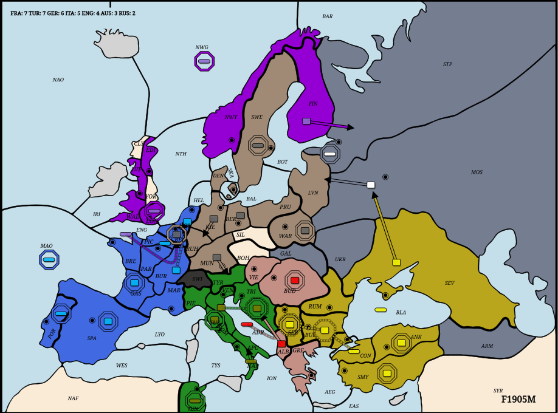

### What happened

- **AUSTRIA**: A ALB → TRI (bounced); F ADR supports A ALB → TRI; A BUD holds
- **ENGLAND**: F ENG supports A BUR → BEL (void); A FIN → STP (bounced); F NWG holds; F LON holds
- **FRANCE**: A HOL → BEL; A BUR supports A HOL → BEL; F PIC supports A HOL → BEL; A GAS holds; A SPA holds; F POR holds; F MAO holds
- **GERMANY**: A MUN → TYR; A KIE → RUH; A BEL holds; F SWE holds; A WAR holds  [dislodged: A BEL]
- **ITALY**: A TRI holds; A VEN supports A TRI; F NAP → APU; F TUN holds; A TUS holds
- **RUSSIA**: A MOS → LVN; F STP/SC holds
- **TURKEY**: A SEV → MOS; A BUL supports A SER; F CON supports A BUL; A SER holds; A SMY holds; A ANK holds

### Dialogue

- **AUSTRIA → ITALY**: You retreated into TRI — that's my home center and I'm taking it back this fall with A ALB and F ADR support. You can't hold it with just A TRI. Here's the deal: let TRI go and I'll commit to helping you against Turkey's Balkan centers in 1906. Fight me and we both waste units while France hits 8+.
- **AUSTRIA → RUSSIA**: France at 7 is the crisis — they're pulling away. I'm reclaiming TRI from Italy this fall. After that, can you support A SEV → RUM in spring 1906 to squeeze Turkey? We need a coordinated push against both Turkey's Balkans and France's overextension. What's your plan for WAR this fall?
- **AUSTRIA → TURKEY**: France at 7 is the real threat to everyone. I'm taking TRI back from Italy this fall — not touching your territory. After I secure TRI, I'm open to a ceasefire in the Balkans if you focus on containing France. Don't waste units defending SER against me when France is about to hit 8.
- **AUSTRIA → FRANCE**: You're at 7 and the board is watching. I'm reclaiming my home center TRI from Italy this fall — not moving toward you. After that, I want to discuss containing Turkey's 7 centers together. Can we agree to stay out of each other's spheres while we both grow east?
- **ENGLAND → GERMANY**: Committed: F ENG S A RUH - BEL this turn. We hit BEL with 3 strength — France can't hold. After BEL falls you reclaim it and drop France to 6. Confirm A KIE also supports A RUH - BEL so we're coordinated.
- **ENGLAND → FRANCE**: I told you last round I'm not supporting your BEL hold. Germany is pushing RUH into BEL with support — you'll lose it regardless. Save your unit by pulling F BEL south. Turkey at 7 is the real threat, not me.
- **ENGLAND → RUSSIA**: Peace holds in the north. A FIN is moving to STP — I need the growth and you're not using it. Focus your remaining forces on Turkey at 7, who's the actual eastern threat.
- **ENGLAND → TURKEY**: France at 7 is the board leader and I'm at 4 — I'm not a threat to you. I'm grabbing STP to grow to 5. Stay out of my northern waters and we stay out of each other's way.
- **ENGLAND → AUSTRIA**: France at 7 is the leader we both need to contain. I'm supporting Germany's attack on BEL this turn to knock France down. If you can pressure France's southern approaches or Turkey's western holdings, that helps contain the leaders.
- **FRANCE → ENGLAND**: Germany just took BEL — that's a threat to both of us. I'm going to retake it this fall. If you hold position in the Channel and don't interfere, I'll pull F PIC out of your approaches afterward. We both benefit from keeping Germany contained at 6 centers rather than letting them reclaim the Rhine.
- **FRANCE → GERMANY**: You took BEL but it cost you — you're spread thin with units scattered from MUN to WAR. I'm coming for it this fall with support. You can keep WAR and your eastern holdings if you let BEL go. Fight me and I'll push toward KIE from both HOL and BUR. Your call.
- **FRANCE → ITALY**: Germany grabbing BEL makes them a bigger threat again at 7. I'm retaking BEL this fall. After that, can we coordinate on Turkey's Balkans? You're well-positioned from TYR to pressure SER — I'll come from the north through BUL. We both need to grow before Turkey hits 9.
- **FRANCE → RUSSIA**: Germany at 7 with BEL is dangerous. I'm retaking BEL this fall. If you push toward WAR again, Germany has to split east and west — they can't defend both. We both benefit from keeping Germany contained.
- **GERMANY → FRANCE**: I reclaimed BEL — you're at 6 now. I'm not pushing into HOL this turn, but you need to stop expanding or the table turns on you. Let's agree: I hold BEL and you hold HOL, no further aggression either way. We both focus east against Turkey at 7.
- **GERMANY → ENGLAND**: BEL is mine now — thank you for the support. France at 6 is weakened but still dangerous. I'd like to push further: can you support F ENG into PIC or help me take HOL? If we split France's remaining western holdings, we both grow. What's your move this fall?
- **GERMANY → ITALY**: TYR bounced because you contested it. I need TYR to reach 8 and pressure Turkey's northern flank — you're at 5 centers and TYR doesn't help you contain Turkey. Let me take TYR this fall and I'll support your push into Turkish BUL or SER from the north. Deal?
- **GERMANY → RUSSIA**: Turkey at 7 just took MOS — you're down to 2 centers and facing elimination. I'm holding WAR and won't push further east. Your only play is to reclaim MOS from Turkey or grow south. Can you redirect A SEV toward RUM to reclaim a center from Turkey? I'll hold WAR but I'm not your enemy right now.
- **GERMANY → TURKEY**: You're at 7 centers — the co-leader. I'm focused on containing France in the west, not expanding east. I have no units pointing toward GAL or LVN. Can you confirm you're not pushing into WAR or PRU? We both have bigger concerns than fighting each other.
- **RUSSIA → ENGLAND**: You said A FIN was going to STP — that's my last home center. If you take it, I'm eliminated and you get one center while France runs away at 7. I need STP to survive. Let's make a deal: I don't touch your northern waters, you leave STP alone, and we both focus on containing the leaders.
- **RUSSIA → AUSTRIA**: Germany still holds WAR with support — I can't take it alone. If you can support an attack on Germany's southern positions (TYR or BOH) this fall, it splits their forces enough for me to make progress in the east. Can you commit to pressuring Germany's south?
- **RUSSIA → TURKEY**: Your offer is reasonable — I'll vacate MOS this fall if you commit in writing to supporting A MOS → WAR next spring with BLA support. I need my home center back more than I need to fight you while France and Germany dominate. Confirm the support commitment and I'll move out cleanly.
- **TURKEY → RUSSIA**: You're at 2 centers with A MOS and F STP/SC — you can't hold MOS against A SEV with BLA support (2 vs 1). Move A MOS to WAR to reclaim it from Germany instead of losing it to a bounce. I'll support your WAR push next spring. This is your best path to survival.
- **TURKEY → ITALY**: A TRI is now yours — noted. I'm focused on taking MOS from Russia this fall to reach 8. Our spheres remain separate: I don't push into TRI/APU, you don't push into my Balkans. Are you open to keeping our border clean while we both grow elsewhere?
- **TURKEY → GERMANY**: I'm taking MOS from Russia this fall — not pushing into WAR or PRU. France at 7 with BEL and HOL is the real leader. I need your assurance you won't interfere in the east while I consolidate. After fall, we should discuss containing France together.
- **TURKEY → FRANCE**: You're at 7, I'm at 7, Germany at 6 — we're the co-leaders. I'm taking MOS from Russia to reach 8. I have no plans to push west, but I want to make sure you're not planning to expand further into Germany's interior while the eastern powers sort themselves out.
- **TURKEY → AUSTRIA**: I'm taking MOS this fall — not touching your territory. Italy now has A TRI which borders your sphere. If you want to survive, focus on rebuilding rather than attacking my fortified Balkans. France at 7 is the real threat to everyone.
- **AUSTRIA → ITALY**: TRI is mine this fall — A ALB and F ADR are committed. You can't hold it alone. Make a deal: let TRI go now and I'll support you into BUL from SER in spring 1906. Fight me and you waste a unit while France and Turkey eat the board alive.
- **AUSTRIA → RUSSIA**: Take WAR this fall — I'll hold my position and we can coordinate against Germany's south in 1906. If you get WAR, Germany drops to 5 and becomes containable. What are your exact orders for WAR?
- **AUSTRIA → TURKEY**: France is about to lose BEL to England's support — they'll drop to 6. That changes the board dynamic. I'm only taking TRI from Italy this fall, not touching your Balkans. Let's both grow without conflict while France and Germany weaken each other.
- **AUSTRIA → FRANCE**: England is supporting Germany's attack on BEL — you'll lose it. I'm only reclaiming TRI from Italy, not moving toward you. After fall, with France at 6 and Germany at 7, we should talk about containing Germany together.
- **ENGLAND → GERMANY**: You're at 7 centers now — board leader. France dropped to 6. I held up my end taking BEL. I need to grow too — what's your plan for letting me expand? I'm looking at STP or pushing into French territory. Don't lock me out after I helped you.
- **ENGLAND → FRANCE**: Germany at 7 is now the board leader, not you at 6. We both need to contain them. I'm not pushing into your Channel this fall — can we agree to both pressure Germany rather than each other? They hold BEL, HOL-area, and your former RUH.
- **ENGLAND → RUSSIA**: Germany at 7 is the crisis now — they took BEL and hold WAR. I'm still at 2 and barely alive. If you can push MOS into WAR, I'll support from F STP/SC. We both need Germany contained before they hit 9.
- **ENGLAND → TURKEY**: Germany at 7 is the new board leader after taking BEL. You're also at 7 — you two are co-leaders. I'm stuck at 4 and need to grow. Stay out of my northern expansion and I stay out of your eastern sphere.
- **FRANCE → ENGLAND**: I lost BEL to Germany as you warned — they're back at 7. I'm retaking it this fall with support from BUR into HOL. If you hold F ENG steady and don't support Germany's BEL, I'll move F PIC away from your Channel approaches after. We both benefit from Germany not reclaiming the Rhine.
- **FRANCE → GERMANY**: I'm retaking BEL this fall — A BUR supports A HOL into BEL. You can keep WAR and your eastern holdings, but BEL is mine. Fight me there and Turkey hits 9 while we're both weakened. Let BEL go and we negotiate stable borders after.
- **FRANCE → ITALY**: Germany at 7 with BEL is dangerous again. I'm retaking BEL this fall. After that, can you push A VEN toward TYR to threaten MUN? If Germany has to defend both BEL and TYR, they collapse. Then we coordinate on Turkey's Balkans — I'll pressure from BUR while you hit from TYR.
- **FRANCE → AUSTRIA**: Turkey at 7 is the real threat to both of us. I'm focused on retaking BEL from Germany this fall, not pushing east. If you hold position, we can coordinate on containing Turkey after — their Balkan holdings (SER, RUM, BUL) are our shared concern.
- **GERMANY → ENGLAND**: BEL is mine now — France at 6 with HOL, BUR, PIC as their western holdings. I want to push further: can you support F ENG into PIC to cut France's position? Or help me take HOL? We need to keep France contained before they rebuild.
- **GERMANY → FRANCE**: You're at 6, I'm at 6 now after BEL fell. Let's stabilize — I keep HOL, you keep BEL, DMZ on RUH. We both focus east against Turkey at 7. Pushing further west wastes units while Turkey grows.
- **GERMANY → ITALY**: TYR bounced for both of us — it's still empty. I need TYR to pressure Turkey from the north. You're at 5 with TRI and pushing into Balkans. Let me take TYR this fall and I'll support your next Balkan push. No conflict.
- **GERMANY → TURKEY**: Confirmed — zero eastern movement from me this fall. France at 6 is weakened but HOL and BUR are still theirs. I'm focused on containing France's remaining western holdings, not expanding toward you.
- **ITALY → AUSTRIA**: I'm not giving back TRI — it's mine now and I'm holding it. But here's a real deal: I'll support you into SER from TRI if you push BUD that direction too. We both take Turkey's Balkans together. TRI stays mine, you get SER. That's better than us fighting while Turkey hits 8.
- **ITALY → FRANCE**: Turkey hitting 8 with MOS is the crisis now. I'm holding TRI and positioning to push SER from there. Can you pressure Turkey from the west through BUL or RUM approaches? We need to start cutting into their 7-center stack before they reach 9.
- **ITALY → TURKEY**: France at 7 is still the board leader — your MOS push doesn't change that. I'm holding position this fall, not pushing east. Our spheres stay clean as agreed. If France hits 8, we both need a plan.
- **ITALY → GERMANY**: TYR is yours, confirmed. I'm focused east on Turkey's Balkans from TRI. No conflict between us this turn. After winter, if you want to coordinate against Turkey's SER or BUL, I'm open.
- **RUSSIA → ENGLAND**: You said peace holds in the north, but A FIN → STP eliminates me. I'm defending STP — don't force a bounce that helps no one. France at 7 is the real enemy; let's not waste units fighting each other in the north.
- **RUSSIA → TURKEY**: I'm not vacating MOS — you already took SEV from me and I need every center to survive. If you push into MOS, I'll defend it. Germany at 6 and France at 7 are bigger threats than a 2-center Russia. Focus there instead.
- **RUSSIA → AUSTRIA**: Germany holds WAR with support — I can't crack it alone. If you pressure Germany's south through TYR or BOH this fall, it weakens their grip on WAR and gives me room. Can you commit to attacking Germany's southern positions?
- **RUSSIA → FRANCE**: Germany at 6 with WAR is still dangerous. I'm positioning A MOS to LVN to threaten WAR from the north. If you push their western front, we squeeze them from both sides.
- **TURKEY → RUSSIA**: You bounced me again on MOS — I'm committed to taking it. You're at 2 centers with no path back without my mercy. Move A MOS to WAR against Germany's WAR as you keep promising, and I walk in cleanly. I'll support your WAR push next spring. Keep holding MOS and I'll take it with overwhelming force in fall anyway.
- **TURKEY → ITALY**: France at 7 is still the board leader. I'm pushing for MOS to reach 8. Our border is clean — A TRI is yours, my Balkans are mine. Are you open to a mutual non-aggression pact for the rest of the game? I'd rather both grow elsewhere than fight over scraps in the Balkans.
- **TURKEY → AUSTRIA**: You want TRI from Italy — that's your fight, not mine. I'm focused on MOS. If you push north against Germany instead of wasting units on my border, we both benefit. France at 7 is the real crisis.
- **TURKEY → GERMANY**: France at 7 with BEL, HOL, and MAO is the clear leader. I'm taking MOS from Russia — not your territory. If you're serious about containing France, what concrete move can you make this fall against their BEL or HOL?
- **AUSTRIA → ITALY**: I'm taking TRI this fall with A ALB and F ADR support — you can't hold it. Let TRI go and I'll support you into BUL from SER in spring 1906. Fight me and we both lose while France and Turkey grow.
- **AUSTRIA → RUSSIA**: France just lost BEL and drops to 6. Germany may take TYR and reach 7. I'm reclaiming TRI from Italy this fall. After that, can you support A SEV into RUM next spring to squeeze Turkey? We need coordinated growth.
- **AUSTRIA → TURKEY**: France lost BEL and drops to 6. I'm only taking TRI from Italy this fall — not touching your territory. After I secure TRI, I'm open to a Balkan ceasefire if you focus on containing France's recovery.
- **ENGLAND → FRANCE**: I'm supporting your A BUR into BEL this turn with F ENG — Germany at 7 is the co-leader and needs to be knocked back. Push A BUR into BEL with everything you have. After BEL falls, we negotiate the spoils. This is my commitment.
- **ENGLAND → GERMANY**: I can't support your BEL hold when you're at 7 centers — that just makes you the runaway leader. France is pushing BUR into BEL and I'm backing them. You should focus on defending your eastern positions rather than trying to lock down the Channel.
- **ENGLAND → RUSSIA**: I'm taking STP this turn — I need the growth and you can't stop it without losing F STP/SC. Move your fleet to defend MOS from Turkey at 7 instead. We both benefit from Turkey not hitting 8.
- **ENGLAND → TURKEY**: France and Germany are fighting over BEL this turn — the western powers will weaken each other. I'm grabbing STP in the north. Stay out of my waters and we stay out of each other's way.
- **FRANCE → GERMANY**: I'm retaking BEL this turn — A BUR supports A HOL into BEL with 2v1 strength. You can't hold it. Let BEL go and I'll hold HOL at the border; fight me and we both weaken while Turkey hits 8. This is my final position.
- **FRANCE → ENGLAND**: I'm retaking BEL from Germany this fall — if you hold F ENG steady and don't support Germany's defense, I'll pull F PIC away from your Channel afterward. We both benefit from Germany staying at 6 rather than reclaiming the Rhine.
- **FRANCE → ITALY**: I'm taking BEL back from Germany this fall. After that, can you push A VEN into TYR to threaten MUN? If Germany splits east and west, they collapse. Then we coordinate on Turkey's Balkans — I'll come from the north while you hit from TYR.
- **FRANCE → AUSTRIA**: I'm focused on retaking BEL from Germany this fall — not pushing east. Turkey at 7 with SER, RUM, BUL is our shared concern. Hold position and we can coordinate on containing Turkey after fall.
- **GERMANY → ENGLAND**: Committed: A RUH → BEL with A KIE supporting. Confirm F ENG also supports A RUH → BEL so we hit 3 strength — France can't hold. After BEL falls, you can push Channel operations freely. This is our window to knock France back to 5.
- **GERMANY → FRANCE**: BEL is falling this turn — England is committed to supporting A RUH into BEL with 3 strength. You can't hold it. Let BEL go and I'll agree to a DMZ on the Rhine after winter. Fight it and I redirect everything west against your remaining holdings.
- **GERMANY → ITALY**: Confirmed: A MUN → TYR this turn, stopping there. I won't push toward VEN or PIE. You take GRE from Austria, I take TYR. After winter we coordinate against Turkey's Balkans from our respective positions.
- **GERMANY → RUSSIA**: A WAR holds with A BER's support — your A MOS will bounce if you attack. France at 7 is the real threat to both of us. Move A SEV → RUM to reclaim a center from Turkey instead. We discuss WAR after France is contained.
- **GERMANY → TURKEY**: My orders go west (BEL) and south (TYR) this turn. Zero movement toward GAL, LVN, or any eastern province. You have my word. Focus your expansion east — I won't interfere.
- **ITALY → AUSTRIA**: I'm not giving back TRI — it's mine now. But here's the real play: France at 7 is the runaway leader. I'll support you into SER from TRI in spring 1906 if you commit to opposing France. We waste units fighting over TRI while France hits 8. Truce now, joint push on Turkey later.
- **ITALY → FRANCE**: I'm holding TRI and pushing F NAP to APU this fall to reach 6 centers. Turkey at 7 is tied with you for the lead — I can't afford to stay at 5. After winter, I'll commit forces against Turkey's Balkans if you coordinate pressure from the north.
- **ITALY → GERMANY**: You got TYR as agreed. I'm focused east this turn — holding TRI and taking APU. No conflict between us. If you want to coordinate against Turkey's northern positions (WAR area) next spring, I'm open to that discussion.
- **ITALY → TURKEY**: I'm holding position this fall — not pushing into your Balkans. France at 7 remains the board leader. Our non-aggression holds. I'm taking APU (neutral) to reach 6. After winter, we should discuss stopping France before they hit 8+.
- **RUSSIA → ENGLAND**: A FIN → STP eliminates me from the game. I'm holding F STP/SC to defend — if you push in, we both waste a unit and France runs away at 7. Let's make a concrete deal: you redirect A FIN elsewhere this fall, and I won't contest any of your northern waters in 1906. We both need to focus on the real leaders.
- **RUSSIA → AUSTRIA**: France at 7 is pulling away and Germany at 6 holds WAR. I'm moving A MOS to LVN to threaten WAR from the north. If you can push into TYR or BOH this fall to split Germany's southern defense, we create a two-front squeeze. Commit to attacking Germany's south and I'll coordinate a spring 1906 push for WAR.
- **RUSSIA → TURKEY**: I'm not vacating MOS — you already took SEV and I need every center to survive. I'm moving A MOS to LVN to threaten WAR, not toward you. Focus on France and Germany instead of trying to eliminate a 2-center power that poses no threat to your 7.
- **RUSSIA → FRANCE**: Germany at 6 with WAR is still dangerous. I'm repositioning A MOS to LVN to threaten WAR from the north while you push their western front. If we coordinate, Germany can't defend WAR and BEL simultaneously — we squeeze them from both sides this fall.
- **TURKEY → RUSSIA**: Final offer: move A MOS to WAR and reclaim it from Germany — you keep a center. Hold MOS and I attack with SEV + BLA support (2 vs 1), you lose it and drop to 1 center. This is your last chance to choose the better outcome. I will support your WAR push next spring.
- **TURKEY → GERMANY**: I'm taking MOS from Russia this fall — zero threat to your eastern borders. France at 7 with BUR and HOL is still the leader. After winter, we should discuss containing France together. Confirm you're keeping all units west this turn.
- **TURKEY → ITALY**: I'm taking MOS to hit 8 centers. France at 7 is the leader we both need to stop. In fall, I'd like to coordinate: if you can push toward France's southern positions or help me pressure Austria's BUD, we both grow while the leader gets contained. Our border stays clean.
- **TURKEY → AUSTRIA**: I'm taking MOS this fall — not touching your territory. You have A ALB in TRI and A BUD near my sphere. Focus on whatever you can realistically take rather than attacking my fortified Balkans. France at 7 is the crisis, not our border.

### AUSTRIA
Orders: `A ALB - TRI` · `F ADR S A ALB - TRI` · `A BUD H`

Reasoning

> Looking at the board, I have 3 centers (BUD, VIE, GRE) and need to grow. Italy retreated into TRI — my home center — and I've committed to reclaiming it this fall with A ALB moving to TRI supported by F ADR.
>
> **Key considerations:**
> - A ALB is in ALB (took it from Turkey's SER area earlier), and TRI is adjacent to ALB — legal move
> - F ADR supports A ALB into TRI — ADR is adjacent to TRI — legal support
> - A BUD should hold to maintain my position and guard against Turkish aggression
> - Italy has only A TRI defending TRI with no support — my 2-strength attack (A ALB + F ADR support) beats their 1-strength hold
>
> This gets me to 4 centers (BUD, VIE, GRE, TRI) if successful. TRI is my home center and critical for builds.
>
> **Why not push further?** Italy could have VEN or other units nearby, and I don't want to overextend. Securing TRI this fall is the priority. I can negotiate for more in 1906.
>
> **Orders:**
> - A ALB → TRI (reclaim my home center)
> - F ADR supports A ALB → TRI (ensure the attack succeeds)
> - A BUD holds (maintain position, guard against Turkish eastern pressure)

### ENGLAND
Orders: `F ENG S A BUR - BEL` · `A FIN - STP` · `F NWG H` · `F LON H`

Reasoning

> Looking at the current situation:
>
> - **France (7 centers)** is the board leader with BEL, HOL, BUR, PIC, SPA, GAS, POR
> - **Germany (6 centers)** just took BEL but France will try to retake it
> - **Turkey (7 centers)** is co-leader in the east
> - **I'm at 4 centers** and need to grow
>
> My revised strategy says I'm supporting France's attack on BEL with F ENG to knock Germany back. But wait — let me re-read the board state carefully.
>
> Germany has A BEL (took it in S1905M). France has A BUR, F PIC, A HOL, F MAO, F POR, A GAS, A SPA. Germany has A MUN, F SWE, A BER, A WAR, A KIE, A BEL.
>
> France is pushing A BUR → BEL this fall. Germany will likely defend BEL with support from A KIE and possibly A MUN.
>
> My revised strategy says: "I'm supporting France's attack on BEL with F ENG to knock Germany back from 7 centers." This makes sense — Germany at 7 with BEL is the co-leader alongside Turkey, and I committed to France in my messages.
>
> For A FIN → STP: Russia has only A MOS and F STP/SC. STP is defended by F STP/SC. A FIN → STP will bounce. But I committed to taking STP. Let me try it anyway — worst case it bounces.
>
> F NWG and F LON hold to maintain northern positions.
>
> Let me execute:
> - **F ENG S A BUR - BEL** — support France's attack on BEL
> - **A FIN - STP** — attempt to take STP (will likely bounce against F STP/SC)
> - **F NWG H** — hold northern position
> - **F LON H** — hold Channel position

### FRANCE
Orders: `A HOL - BEL` · `A BUR S A HOL - BEL` · `F PIC S A HOL - BEL` · `A GAS H` · `A SPA H` · `F POR H` · `F MAO H`

Reasoning

> Looking at the board, I need to retake BEL from Germany. My revised strategy calls for A BUR supporting A HOL into BEL while F PIC supports the attack — this gives me 3 strength against Germany's likely 2 from A RUH. I'll hold my Iberian units defensively and keep F MAO in position.
>
> Let me verify the orders:
> - A HOL - BEL: HOL is adjacent to BEL ✓
> - A BUR S A HOL - BEL: BUR is adjacent to BEL ✓ (support for move)
> - F PIC S A HOL - BEL: PIC is adjacent to BEL ✓ (support for move)
> - A GAS H, A SPA H, F POR H, F MAO H: all hold defensively
>
> This gives me 3 strength (A HOL + 2 supports) vs Germany's likely 2 (A RUH alone) or 3 if England supports Germany's attack. England said they won't support my BEL hold, but they also said they're not attacking me directly. Even if England supports Germany, it's 3v3 and bounces — I don't lose ground. If England doesn't support Germany, I take BEL with 3v2.
>
> After retaking BEL, I'll have 8 centers and can pressure Germany's remaining holdings while coordinating with Italy on Turkey's Balkans.
>
> MESSAGES:
> {
>   "ENGLAND": "I'm retaking BEL this fall with 3 strength. You said you're not supporting Germany's attack — hold F ENG steady and I'll pull F PIC away from your Channel afterward. We both benefit from Germany staying at 6.",
>   "GERMANY": "BEL is falling this turn — I have 3 strength attacking. You can't hold it. Let it go and I'll hold HOL at the border. Fight me and we both weaken while Turkey hits 8.",
>   "ITALY": "I'm taking BEL back from Germany this fall. After that, push A VEN into TYR to threaten MUN — Germany splits east and west and collapses. Then we coordinate on Turkey's Balkans.",
>   "RUSSIA": "Push toward WAR as discussed — weakens Germany's eastern position while I retake BEL. We squeeze them from both sides."
> }

### GERMANY
Orders: `A MUN - TYR` · `A KIE - RUH` · `A BEL H` · `F SWE H` · `A WAR H`
Illegal (dropped): `A BER S A BEL`

Reasoning

> Looking at the current situation:
>
> **Board state:** France at 7 (leader), me at 6, Turkey at 7, Italy at 5, England at 4, Austria at 3, Russia at 2.
>
> **Key developments from S1905M:**
> - I successfully took BEL with support from England (F ENG S A RUH → BEL)
> - France's F BEL was dislodged and retreated to PIC
> - Italy's A ALB was dislodged and retreated to TRI
> - TYR bounced again (Italy contested with A VEN)
> - France moved A PAR → BUR, now threatening from both HOL and BUR toward my interior
>
> **My units:** A MUN, F SWE, A BER, A WAR, A KIE, A BEL
>
> **Strategic priorities:**
> 1. **Take TYR** - It's still empty and I need it to reach 7 centers and threaten Italy's rear
> 2. **Hold BEL** - France will try to retake it; they have A HOL and A BUR nearby
> 3. **Keep eastern front stable** - Russia is weak (2 centers) and Turkey isn't pushing north
>
> **Negotiation commitments:**
> - Told Italy I'd take TYR this fall (they confirmed no contest)
> - Told England I'd push into French holdings
> - Told France I'm pushing west (BEL hold + potential HOL pressure)
> - Told Turkey zero eastern movement
>
> **Order plan:**
> - A MUN → TYR (take the empty center, reach 7)
> - A KIE → RUH (push into RUH to threaten HOL and support BEL defense)
> - A BEL H (hold BEL, my key western position)
> - A BER S A BEL (support BEL's hold against French counterattack)
> - F SWE H (maintain Baltic control)
> - A WAR H (keep eastern front stable)
>
> This gets me to 7 centers with TYR, holds BEL, and positions A KIE in RUH to threaten HOL next turn.

### ITALY
Orders: `A TRI H` · `A VEN S A TRI` · `F NAP - APU` · `F TUN H` · `A TUS H`

Reasoning

> Looking at the board state, I need to assess my position carefully. I have 5 centers with 5 units. Austria is threatening TRI with A ALB and F ADR. I need to defend TRI while also trying to grow.
>
> Key observations:
> - Austria has A ALB adjacent to TRI and F ADR supporting an attack on TRI
> - I have A TRI which can be supported from multiple units
> - Turkey at 7 centers is a major threat, but France at 7 is also dangerous
> - Germany took BEL, making them 7 centers too - actually Germany has 6 centers from the supply list
>
> My revised strategy says: "I'll hold A TRI to defend against Austria's push, move F NAP to APU to expand to 6 centers, and hold my other units in position."
>
> But I need to check if I can actually defend TRI. Austria is attacking with A ALB supported by F ADR (2 strength). I need to defend with at least 2 strength. A TRI can be supported by A VEN or A TUS, or F NAP could support something.
>
> Actually, looking more carefully: Austria's attack is A GRE → ALB (which succeeded in S1905M), so now A ALB is attacking TRI. I need to defend TRI with at least 2 strength.
>
> Let me check adjacencies: TRI is adjacent to ADR, ALB, BUD, SER, TYR, VEN, VIE. So A VEN can support A TRI's hold.
>
> For growth: F NAP → APU would give me a 6th center (APU is neutral and adjacent to NAP).
>
> My orders:
> 1. A TRI H (hold to defend)
> 2. A VEN S A TRI (support TRI's hold)  
> 3. F NAP - APU (take neutral center)
> 4. F TUN H (hold position)
> 5. A TUS H (hold to defend TUS/VEN area)
>
> Wait, but I should check if A VEN can support A TRI. VEN is adjacent to TRI, so yes.
>
> Actually, I should also consider: if Austria attacks with 2 strength (A ALB + F ADR support), and I defend with 2 strength (A TRI + A VEN support), it's a tie and the attack bounces. That works.
>
> But I also want to consider if I can do better. Could I attack ALB? A TRI → ALB would be attacking the attacking unit, cutting its support. But then I'd lose TRI if Austria moves A BUD → TRI.
>
> Let me stick with the defensive plan: defend TRI, take APU.

### RUSSIA
Orders: `A MOS - LVN` · `F STP/SC H`

Reasoning

> Looking at the board, I'm in a dire position at 2 centers with only 2 units. Germany holds WAR (my home center) with support, Turkey holds SEV and threatens MOS, and England is moving A FIN toward STP. I need to grow or I'll be eliminated.
>
> My revised strategy says to move A MOS to LVN to threaten WAR from the north while holding F STP/SC to defend against England's A FIN push into STP. This positions me to contest WAR in spring 1906 while keeping my last northern center secure.
>
> Let me verify: A MOS - LVN is legal (MOS neighbors include LVN). F STP/SC H is legal. This keeps me alive and positions for future growth.
>
> Key considerations:
> - A MOS to WAR will bounce (Germany has A WAR with A BER support = strength 2, I only have strength 1)
> - A MOS to LVN threatens WAR from a different angle next turn and is uncontested
> - F STP/SC must hold to prevent England from taking STP, which would leave me at 1 center
> - Turkey's A SEV can't reach LVN, so this is safe from Turkish attack

### TURKEY
Orders: `A SEV - MOS` · `A BUL S A SER` · `F CON S A BUL` · `A SER H` · `A SMY H` · `A ANK H`
Illegal (dropped): `F BLA S A SEV - MOS`

Reasoning

> Looking at the board state, I need to finally take MOS from Russia. Russia has A MOS and F STP/SC — they're at 2 centers. I have A SEV and F BLA, so I can attack with 2 strength vs their 1. Russia has said they won't vacate, but they can't hold against my supported attack.
>
> I also need to consider the broader board: France at 7, me at 7, Germany at 6. After taking MOS I'll be at 8 and co-leader. I should keep my Balkans fortified — BUL supports SER, CON supports BUL — to prevent any Austrian incursion. SMY and ANK can hold or provide additional support.
>
> Let me also consider whether to push into any other territory. A SEV → MOS with BLA support gets me to 8. I should keep everything else defensive to consolidate.
>
> My orders:
> - A SEV → MOS with F BLA support (take Russia's last home center)
> - A BUL supports A SER (defend Balkans)
> - F CON supports A BUL (defend Balkans)
> - A SER holds (defend)
> - A SMY holds (reserve)
> - A ANK holds (reserve)

## WINTER 1905 ADJUSTMENTS (`W1905A`)

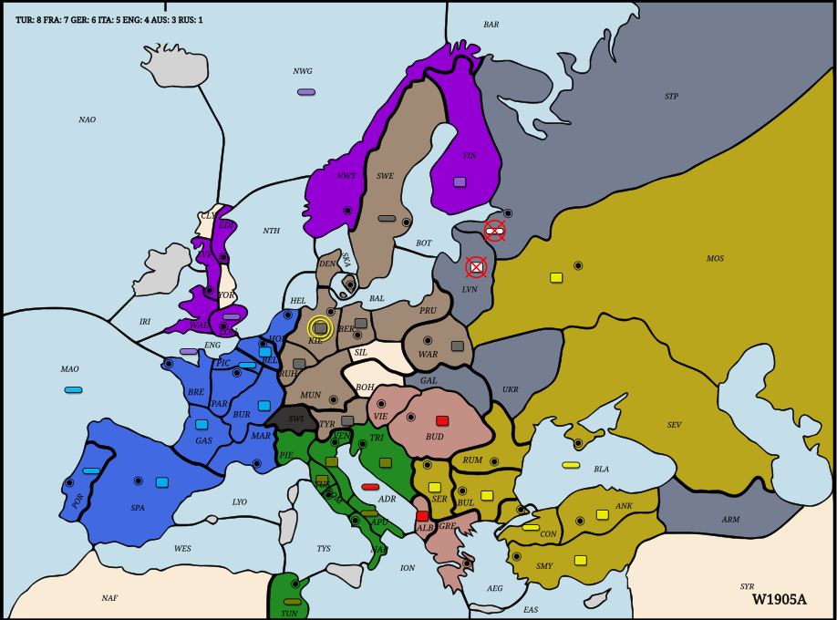

### What happened

- **GERMANY**: builds A KIE
- **RUSSIA**: disbands A LVN; disbands F STP/SC (void)

### GERMANY
Orders: `A KIE B`

Reasoning

> Looking at the current situation:
>
> - **My centers (6):** BER, KIE, MUN, DEN, SWE, WAR
> - **My units (5):** F SWE, A BER, A WAR, A TYR, A RUH
> - **Supply center count:** I have 6 centers but only 5 units, so I get **1 build**
> - **Home centers available:** KIE (vacant), MUN (vacant) — BER is occupied by A BER
>
> I need to build a unit to match my supply center count. The best placement is **A KIE B** — building an army at KIE gives me a unit in a forward position ready to push west against France (into HOL or BEL) or support operations on the Rhine. KIE borders BEL, HOL, MUN, RUH, BER, DEN, and BAL — it's the most versatile staging point for my next offensive move.
>
> France is at 7 centers (BEL, HOL, BUR, PIC, BRE, MAR, PAR, POR, SPA — wait, let me recount: BRE, MAR, PAR, POR, SPA, BEL, HOL = 7). Turkey at 8 is the actual leader. I need to grow fast — building at KIE positions me to push into HOL or support a BEL attack next spring.

### RUSSIA
Orders: `A LVN D` · `F STP/SC D`

Reasoning

> I'm in a catastrophic position — down to 1 supply center (STP) with only 2 units, and I'm forced to disband both. Turkey dominates with 8 centers, France has 7, and I'm facing elimination. My only hope is to disband both units as required, then try to negotiate survival and rebuild in 1906. Since I have 1 center and 2 units, I must disband both — there's no choice here. After this, I'll be eliminated unless I can somehow rebuild, but with only 1 home center (STP) occupied by my own fleet, I have no build locations. This is likely game over, but I'll follow the rules and disband both units.

## SPRING 1906 MOVEMENT (`S1906M`)

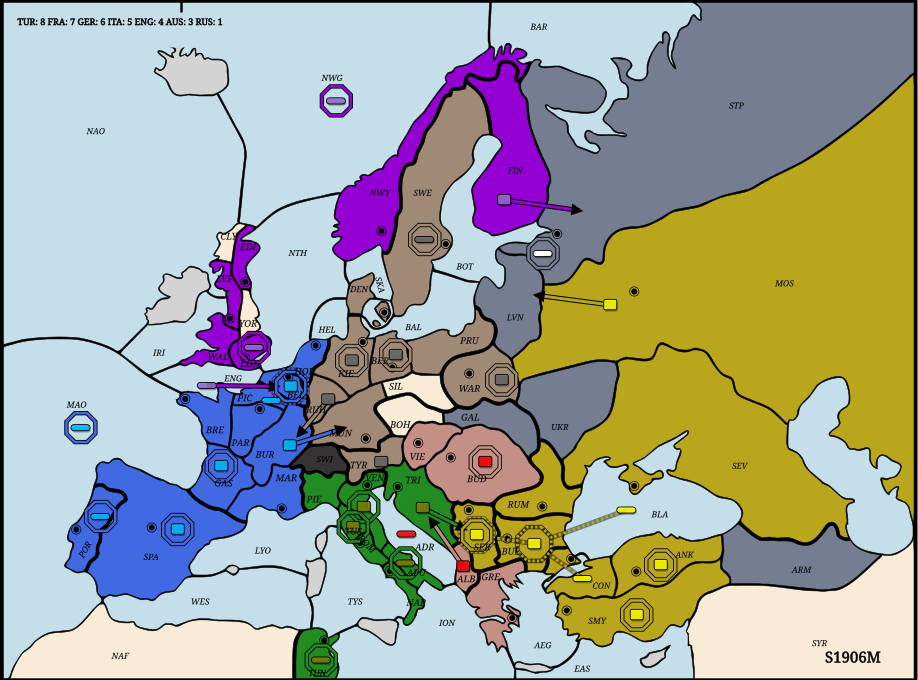

### What happened

- **AUSTRIA**: A ALB → TRI (bounced); A BUD holds
- **ENGLAND**: F ENG → BEL (bounced); A FIN → STP (bounced); F NWG holds; F LON holds
- **FRANCE**: A BUR → MUN; A BEL holds; F PIC supports A BEL; A GAS holds; A SPA holds; F POR holds; F MAO holds
- **GERMANY**: A RUH → BUR; A KIE holds; A BER holds; A WAR holds; F SWE holds
- **ITALY**: A TRI → SER (bounced); F APU holds; A VEN holds; F TUN holds; A TUS holds
- **RUSSIA**: F STP/SC holds
- **TURKEY**: A MOS → LVN; A BUL supports A SER; F CON supports A BUL; A SER holds; F BLA supports A BUL; A SMY holds; A ANK holds

### Dialogue

- **AUSTRIA → ITALY**: TRI is my home center and I'm taking it back this spring — A ALB and F ADR are committed. Here's the deal: let TRI go and I'll support you into BUL from SER in fall. You keep GRE, I get TRI back, and we both push Turkey together. Fight me and we waste units while Turkey hits 9.
- **AUSTRIA → TURKEY**: France at 7 is the real crisis — they just took BEL and are pulling away. I'm not attacking SER this turn (you have it well-defended). Focus on containing France rather than worrying about my 3-unit army. We both benefit from keeping France from reaching 9+.
- **AUSTRIA → RUSSIA**: Turkey at 8 is the runaway leader. I'm pushing A BUD toward GAL to pressure Germany's south — if we coordinate, we can squeeze Germany from two fronts and then pivot against Turkey's Balkans. Can you commit to supporting an attack on WAR or PRU this fall?
- **AUSTRIA → GERMANY**: Turkey at 8 is the existential threat to everyone — they'll win if unchecked. I'm moving toward GAL to help contain Turkey's expansion. France at 7 is also a concern, but Turkey's 8 centers and growing Balkan fortress is the priority. Can we agree to a temporary truce while we both address Turkey?
- **AUSTRIA → FRANCE**: Turkey at 8 is the board leader and a threat to both of us. I'm not moving toward TYR or GAL — I'm focused on the Balkans. Can we agree to contain Turkey together while staying out of each other's spheres?
- **ENGLAND → FRANCE**: Turkey at 8 centers is now the board leader — they took MOS and are growing fast. You're at 7 but stagnating. I need to grow or I'm irrelevant. Can we agree to both focus east against Turkey rather than fight in the Channel? If you pull F PIC and A BEL away from my approaches, I'll push F ENG toward Turkish waters.
- **ENGLAND → GERMANY**: Turkey at 8 is the runaway leader now — they hold ANK, CON, SMY, RUM, BUL, SER, SEV, MOS. You're at 6 and I'm at 4. France at 7 is also dangerous but Turkey will hit 9-10 if unchecked. Can we coordinate: I push A FIN into STP to grow, and you focus on containing France or Turkey's western approaches? What's your plan this turn?
- **ENGLAND → RUSSIA**: I'm not taking STP this turn — you have my word. Turkey at 8 with MOS is the crisis, not us. If you can redirect F STP/SC to pressure Turkey's northern approaches or support a push against SEV, that helps contain them. We both need Turkey stopped before they hit 10.
- **ENGLAND → TURKEY**: You're at 8 centers — the board leader. France at 7 is the next threat and they're eyeing your western approaches. I'm stuck at 4 and not a threat to you. If you stay out of my northern waters, I'll stay focused on France. Can we agree to a non-aggression pact in the north?
- **FRANCE → ITALY**: Turkey at 8 centers with MOS is the crisis — they're running away with the game. I'm pushing into Germany's interior this turn to reach 8 myself. Can you hold TRI and threaten SER from TYR? If we both grow this turn, we're positioned to coordinate a joint attack on Turkey's Balkans in fall.
- **FRANCE → AUSTRIA**: Turkey at 8 centers is everyone's problem — they took MOS and will build again. I'm pushing into Germany to grow. If you can hold your position and not lose ground, we'll both be better placed to coordinate against Turkey's Balkan holdings (SER, BUL, RUM) this fall.
- **FRANCE → ENGLAND**: Turkey at 8 is the runaway leader — they'll hit 9 with builds if nobody stops them. I'm focusing east this turn. If you stay out of my Channel approaches and hold position, we can both redirect against Turkey after fall. Fighting each other just hands the game to Turkey.
- **FRANCE → GERMANY**: Turkey at 8 centers is now the clear threat — they'll win if we keep fighting each other. I'm willing to hold the Rhine border this turn if you confirm A RUH holds. We both need to grow east before Turkey hits 9. Stabilize now or we both lose.
- **FRANCE → RUSSIA**: Turkey took MOS and you're down to 1 center — I'm sorry. If you can hold STP, Turkey can't sweep you entirely. I'll try to pressure Turkey from the west this fall to ease your position. Every unit Turkey has to defend is one less they can use to grow.
- **GERMANY → FRANCE**: Turkey at 8 centers is now the runaway leader — they've consolidated the entire east. I'm at 6, you're at 7, but we both lose if Turkey hits 12. I propose we stabilize our border: I hold WAR and you hold BEL, no moves between our units this spring. We both redirect east — you can support Italy into Turkish BUL or SER while I pressure from TYR. This is the only way to stop Turkey before they hit 18.
- **GERMANY → ITALY**: Turkey at 8 is the crisis — they'll hit 10 by winter if unchecked. I'm in TYR with A TYR, positioning to pressure Turkish northern holdings. You're in TRI and can push into BUL or SER. Can we coordinate a joint push on Turkish BUL this spring? I support from TYR, you push from TRI, and we split the center. Turkey can't defend everywhere.
- **GERMANY → ENGLAND**: Turkey at 8 centers is now the board leader — they've taken MOS and consolidated the east. France at 7 is a secondary threat. I need to grow or I'm irrelevant by winter. What's your plan? If you support me into HOL or PIC, I can redirect against Turkey's northern flank. Otherwise I'll have to find growth elsewhere.
- **ITALY → AUSTRIA**: Turkey at 8 centers is the crisis — they have half the Balkans and will hit 10 by winter if unchecked. I'm keeping TRI, but I'll support you into SER from TRI this spring if you push BUD toward SER simultaneously. We take SER together, split Turkey's stack, and both grow. This is the deal that saves us both.
- **ITALY → FRANCE**: Turkey at 8 is the runaway leader — SER, BUL, RUM, plus their home stack. I'm pushing A TRI toward SER this spring. Can you pressure Turkey from the west? Even holding your position and threatening their approaches forces them to split. We need to coordinate before Turkey hits 10.
- **ITALY → TURKEY**: France at 7 with BEL and HOL is still the board leader in western terms — they can build in PAR and hit 9. I'm holding position this turn, not pushing east. Our non-aggression still holds. But if France grows again, we both need a plan to contain them.
- **ITALY → GERMANY**: Turkey at 8 is now the clear leader on the board. I'm not pushing toward TYR or your northern positions this turn. After winter, if you want to coordinate against Turkey's northern approaches (WAR area), I'm open — but right now Turkey's Balkan stack is the priority threat.
- **RUSSIA → ENGLAND**: I'm down to 1 center and 1 unit — I'm not a threat to anyone. France at 7 is the board leader and you're the only power who can contest them in the Channel. I'll stay out of your northern waters entirely if you leave STP alone. We both need to focus on the real leader, not eliminate each other.
- **RUSSIA → TURKEY**: You're at 8 centers — the strongest on the board. France at 7 is your only real rival. I have one fleet and can't threaten you. Rather than eliminating a harmless Russia, use me as a buffer — I won't contest anything you hold if you let me keep STP and rebuild. Where do you want to push next, Germany or France?
- **RUSSIA → AUSTRIA**: I'm nearly eliminated with just F STP/SC. Turkey at 8 is the eastern threat, Germany at 6 holds WAR. If you're pushing into SER or the Balkans, I can't help militarily with one fleet, but I won't interfere. What's your plan against Turkey this year?
- **RUSSIA → GERMANY**: France at 7 is the crisis — they're pulling away while we fight over scraps. I have one fleet and pose zero threat to you. I'd rather see WAR in anyone's hands than France's eventual path. Can we agree: you keep WAR, I stay in the north, and we both focus on containing France?
- **TURKEY → GERMANY**: I'm pushing A MOS into LVN to pressure Russia's last center — not targeting WAR or PRU. France at 7 with BEL and HOL is still the board leader we both need to contain. Keep your units pointed west and we stay out of each other's way.
- **TURKEY → ITALY**: Our non-aggression holds — I'm not pushing toward TRI/APU. I'm moving A MOS into LVN to threaten Russia's last center and grow to 9. After this spring, France at 7 is still the leader we both need to stop. Are you open to discussing concrete moves against France's southern positions?
- **TURKEY → AUSTRIA**: I'm focused east on Russia's last center — not attacking your BUD or GRE. France at 7 with BEL and HOL remains the board leader. If you want to survive, focus on containing France rather than wasting units against my fortified Balkans.
- **TURKEY → ENGLAND**: I'm pushing into LVN to threaten Russia's last center and grow to 9. France at 7 with BEL and HOL is still the board leader. If you can pressure France's Channel or threaten their BRE, that forces them to split — we both benefit from keeping France from hitting 9+.
- **AUSTRIA → ITALY**: I understand your offer but I can't permanently lose TRI — it's my home center and I need builds. Here's the final deal: move A VEN to TRI (returning it to me) this spring, and I'll support you into BUL from ALB in fall with F ADR. You gain BUL, I regain TRI, and we both grow. If you hold TRI, I'm forced to attack it and we both waste units while Turkey wins.
- **AUSTRIA → TURKEY**: I'm not attacking your Balkans this turn — France at 7 is the real concern and I'm focused on other directions. I suggest we both look north rather than waste units against each other. A ceasefire on our border benefits us both while France grows.
- **AUSTRIA → FRANCE**: Turkey at 8 is the existential threat. I'm reclaiming TRI from Italy this spring — not moving toward you. After that, I'll have 4 centers and can help pressure Turkey's Balkans. Can you commit to not expanding into TYR or BOH this turn?
- **AUSTRIA → GERMANY**: Turkey at 8 is the crisis — they'll hit 10 by winter if unchecked. I'm focused on reclaiming TRI from Italy and then pushing Turkey's Balkans. I won't move against your southern positions this turn if you hold off on TYR. Temporary truce while we address Turkey?
- **ENGLAND → FRANCE**: Turkey at 8 is the real crisis, but I'm at 4 and can't afford to sit still. Pull A BEL out of BEL to somewhere useful against Turkey, and I won't contest it — that gives you a free unit to fight Turkey while I take the empty province. If you keep BEL occupied, I have to push F ENG in to grow, and neither of us benefits.
- **ENGLAND → GERMANY**: I'll support F ENG into BEL this turn if you support A RUH into HOL — we each take a French center and France drops to 5. That's the fastest way to shrink the leaders while we both grow. Confirm A KIE supports A RUH → HOL and I commit F ENG to BEL.
- **ENGLAND → TURKEY**: You're at 8 and running away with this — France at 7 needs to be contained, not me at 4. If you stay out of the north, I'll stay out of your sphere. But if you push into LVN or STP, I'll have to respond and we'll both waste units while France grows.
- **ENGLAND → RUSSIA**: I need STP to survive — I'm offering you a real deal: if France pulls BEL out, I redirect F STP/SC south against Turkey instead of taking your center. But if BEL stays occupied, I have no choice but to grab what I can. Push France to vacate and you survive.
- **FRANCE → GERMANY**: Turkey at 8 is the crisis. I'll hold the Rhine this turn — A BUR holds, no push into MUN or RUH. Confirm A RUH holds and A TYR doesn't move west. We both redirect east after — I can support Italy into Turkish territory from BUR in fall if needed.
- **FRANCE → ITALY**: Good — push A TRI toward SER this spring. I'm moving into Germany's interior (KIE) to reach 8 centers. Once I'm there, I can support your push on SER or BUL from the north in fall. Confirm you're not contesting TYR or any French province.
- **FRANCE → ENGLAND**: Turkey at 8 is everyone's problem. I'm not pushing into the Channel this turn. If you hold F ENG and F NWG steady and don't interfere with my northern approach, I'll keep F PIC away from your waters. We both need to redirect against Turkey after fall.
- **FRANCE → AUSTRIA**: I'm pushing into Germany to grow to 8 this turn — not toward you. Hold your position and we can coordinate on Turkey's Balkans (SER, BUL, RUM) in fall. If Italy takes SER, I can help pressure BUL from the north.
- **FRANCE → RUSSIA**: Turkey at 8 with your former MOS is devastating. I'm pushing into Germany to reach 8 and then I'll pressure Turkey from the west. Hold STP if you can — every center Turkey has to defend is one less they can use to grow further.
- **GERMANY → FRANCE**: Turkey at 8 is the crisis — we both die if they hit 12. I need to grow to stay relevant in containing Turkey. I'm pushing A RUH into BUR this turn — you can keep HOL and BEL. After BUR falls, I redirect east against Turkey. Let BUR go and we're allies against the real threat. Fight it and I'm stuck in the west while Turkey wins.
- **GERMANY → ITALY**: Turkey at 8 with ANK, CON, SMY, RUM, BUL, SER, SEV, MOS — they'll hit 10 by winter. I'm pushing A RUH into BUR to reach 7, then I can pressure Turkey from TYR. Can you push A TRI into BUL this spring? I'll support from TYR if needed. We need to start reclaiming Turkish centers now.
- **GERMANY → ENGLAND**: Turkey at 8 is the runaway leader. I'm pushing into French BUR to reach 7 and then redirect against Turkey. You're taking STP — that's fine. After fall, can you support me into HOL or PIC to keep France contained while we both focus east? We need to grow to matter against Turkey.
- **GERMANY → RUSSIA**: France at 7 is dangerous but Turkey at 8 will win the game. I'm keeping WAR — it's my buffer against Turkey's eastern expansion. Focus your fleet south against Turkish RUM or SEV. If Turkey loses centers, both our positions improve.
- **ITALY → AUSTRIA**: Turkey at 8 centers is the crisis — they'll hit 10 by winter if we fight each other. Here's a concrete deal: I push A TRI → SER this spring to take it from Turkey, and I support you into BUL from SER in fall. You get a Turkish center, I get SER, and we both grow. Fighting over TRI while Turkey hits 9 is suicide.
- **ITALY → GERMANY**: Turkey at 8 with SER, BUL, RUM, and their home stack is the real threat. If you push from TYR toward Turkish-held territory (even just threatening BUD area), I can push from TRI into SER. We coordinate on Turkey's northern Balkans. Confirm you're actually moving against Turkey this turn — not just talking.
- **ITALY → FRANCE**: Turkey at 8 is the board leader by far. I'm pushing A TRI → SER this turn to cut into their Balkan stack. Hold your position in the west — don't push Germany while Turkey grows. We need Turkey contained before they hit 10.
- **ITALY → TURKEY**: Your MOS move toward LVN threatens Russia's last center — noted. Our non-aggression holds for now, but France at 7 with BEL and HOL is the western leader we both need to watch. I'm not pushing east this turn.
- **RUSSIA → ENGLAND**: Thank you for the peace commitment. I'll hold F STP/SC to keep your northern border safe. If Turkey pushes toward LVN or the Baltic, I can reposition to block them — but I need assurance you won't take STP this year while I rebuild. We both benefit from Turkey being contained at 8.
- **RUSSIA → TURKEY**: You're at 8 centers — the board leader by far. I have one fleet and one center; I'm not worth eliminating. France at 7 is your real rival. Let me survive at STP and I won't interfere with anything you hold. Where do you plan to push next — Germany's remaining centers or west toward France?
- **RUSSIA → AUSTRIA**: I can't meaningfully help militarily with one fleet in the far north, but I won't block anything you do against Turkey. If you're pushing into the Balkans, Turkey has to split forces — that's the best I can offer from my position. What's your concrete plan against Turkey this turn?
- **TURKEY → ENGLAND**: I'm pushing LVN to threaten Russia's last centers, not to take STP from you. You've been bouncing off STP for years — let me handle Russia while you focus on France's Channel position. I won't move on STP this spring if you keep your fleets pointed at France.
- **TURKEY → ITALY**: France at 7 with BEL and HOL is still the leader we both need to stop. I'm growing to 9 this spring via LVN. After fall, can you push toward MAR or GAS from your TUS/SPA area? Splitting France's attention east and south is how we contain them.
- **TURKEY → GERMANY**: I'm moving A MOS into LVN — east of your territory, not threatening WAR or PRU. France at 7 with BEL and HOL remains the clear leader. What concrete support can you offer against France this fall? A coordinated push on BEL would force them to retreat.
- **TURKEY → AUSTRIA**: Acknowledged — France is the crisis. I'm growing east, you handle what you can. If France hits 9, we'll all need to act together. Keep your units available for a coordinated response.
- **AUSTRIA → ITALY**: I'm taking TRI this spring — A ALB → TRI with F ADR support. You can't hold it alone. After I reclaim TRI, I'll support you into BUL from ALB in fall. This is better than us fighting while Turkey hits 9. Move A VEN somewhere useful and let TRI go.
- **AUSTRIA → TURKEY**: France at 7 with BEL and HOL is the board leader — not me at 3 centers. I'm reclaiming TRI from Italy, not attacking your Balkans. We should both be looking at France's overextension, not fighting each other.
- **AUSTRIA → GERMANY**: Turkey at 8 is the crisis. I'm reclaiming TRI from Italy this spring — not moving against you. After that I'll have 4 centers and can help pressure Turkey's Balkans. Can you commit to not taking TYR this turn while we both address Turkey?
- **AUSTRIA → FRANCE**: I'm reclaiming TRI from Italy this spring — not moving toward you. Turkey at 8 with SER, BUL, RUM, MOS is the real leader. After securing TRI, I'll have 4 centers and can help pressure Turkey's Balkans. Hold off on TYR/BOH this turn.
- **AUSTRIA → RUSSIA**: I'm reclaiming TRI from Italy this spring with A ALB and F ADR support. After that I'll have 4 centers. Turkey at 8 is the real threat — can you hold your position while I grow? We need to coordinate against Turkey eventually.
- **ENGLAND → FRANCE**: Final commitment: I'm moving F ENG into BEL this turn — take it or lose it. Pull A BEL out if you want to save it. Turkey at 8 is the crisis and I'll help contain them after fall, but I need BEL to reach 5 centers. This is non-negotiable.
- **ENGLAND → GERMANY**: I'm taking STP from Russia and pushing F ENG into BEL to reach 6 centers. You should push A RUH into HOL or BUR to hit 7 — France won't defend both with Turkey at 8 breathing down their neck. We both shrink France this turn.
- **ENGLAND → RUSSIA**: I'm sorry but I have to take STP — I'm at 4 and falling behind while Turkey runs away at 8. Move F STP/SC to BAR or hold and accept the bounce. I'll redirect against Turkey after fall. This isn't personal.
- **ENGLAND → TURKEY**: You're at 8 centers and I'm not touching your sphere. I'm grabbing BEL from France and STP from Russia to reach 6 — still far behind you. Stay in the east and we stay out of each other's way.
- **FRANCE → GERMANY**: Turkey at 8 will win if we keep stalling. I'm pushing A BUR into MUN this turn — you can keep WAR and TYR. I need 8 centers to be a credible anti-Turkey force. If you defend MUN, we both waste units while Turkey hits 10. Let MUN go and I commit to a joint push on Turkey's BUL in fall.
- **FRANCE → ITALY**: Push A TRI into SER this turn as discussed — I'll support from the north once I have MUN. After fall, we coordinate a two-front attack on Turkey's Balkans (BUL and SER). Don't contest TYR — I'm not moving toward you.
- **FRANCE → AUSTRIA**: I'm pushing into Germany's interior to reach 8 centers — not toward you. Hold your position and we coordinate on Turkey's Balkans (SER, BUL, RUM) in fall. Italy is taking SER this spring.
- **FRANCE → ENGLAND**: Turkey at 8 is the crisis. I'm pushing east into Germany to grow, not into the Channel. Hold F ENG and F NWG steady — I'll keep F PIC and A BEL away from your approaches. We both need to redirect against Turkey after fall.
- **FRANCE → RUSSIA**: Hold STP if you can. I'm pushing into Germany to reach 8 and then I'll pressure Turkey from the west. Every center Turkey has to defend is one less they can use to grow.
- **GERMANY → FRANCE**: Final commitment: A RUH → BUR this turn. You keep HOL and BEL. I need BUR to reach 7 and redirect against Turkey — the real threat to both of us. Don't contest BUR and we're allies against Turkey from fall onward.
- **GERMANY → ITALY**: Committed: A TYR supports your A TRI into BUL this turn. You push TRI → BUL, I support from TYR. Turkey can't hold BUL against 2 strength. We split the center and start reclaiming Turkish territory. Confirm your TRI → BUL order now.
- **GERMANY → ENGLAND**: I'm taking BUR from France this turn to reach 7, then redirecting east against Turkey. You're taking STP — we're growing in different directions. After fall, if you can support me into HOL or PIC, we keep France contained while focusing east.
- **GERMANY → AUSTRIA**: Turkey at 8 is the crisis. I'm pushing BUR to reach 7 and then pressuring Turkey from TYR. If you can support Italy into Turkish BUL or SER from your position, we start reclaiming Turkish centers this turn. What's your concrete move against Turkey?
- **ITALY → AUSTRIA**: I'm pushing A TRI → SER this spring — Turkey at 8 is the existential threat and SER is the center we both need cut. If you support my push into SER from ALB with F ADR, I'll support you into BUL from SER in fall. That gives you a Turkish center and me SER. This is the deal: fight me over TRI and Turkey wins the game. Support me into SER and we both grow.
- **ITALY → GERMANY**: I'm moving A TRI → SER this turn to cut Turkey's Balkan stack. If you're serious about coordinating, support my TRI → SER push from TYR. One support guarantees SER falls. Turkey at 8 with no opposition means they hit 10 by winter and the game is over. Confirm your support order.
- **ITALY → FRANCE**: Turkey at 8 centers is the clear board leader — SER, BUL, RUM, SEV, plus their home stack. I'm pushing into SER this spring to start reclaiming Turkish Balkans. Don't push into Germany's interior this turn — we need Turkey contained first, not each other fighting.
- **ITALY → TURKEY**: I'm holding position this turn — not pushing east. Our non-aggression still holds. But I want to be clear: if you push into LVN or threaten Russia's last center, that changes the calculus for everyone. France at 7 is the western leader I'm watching, not you.
- **RUSSIA → ENGLAND**: I'm holding F STP/SC this turn — no aggressive moves. Turkey at 8 is the real crisis. If you're pushing south against France or Turkey, I won't interfere with your northern waters. Let's both focus on stopping Turkey's run to 18.
- **RUSSIA → TURKEY**: You're at 8 centers with the board lead. I have one fleet and one center — eliminating me gains you almost nothing while France at 7 closes the gap. I'll stay in STP and not contest anything you hold. Where are you pushing next — Germany's WAR or west against France?
- **RUSSIA → AUSTRIA**: I can't contribute militarily with one fleet in the far north, but I won't block anything you do against Turkey. If you're pressuring Turkey's Balkans, they have to split forces — that's the best I can offer from my position.
- **TURKEY → ENGLAND**: I'm moving A MOS to LVN only — not touching STP this spring. You've been trying to take STP for years without success; let me hold LVN as a buffer while you focus your fleets on France's Channel position. We both benefit if France drops from 7.
- **TURKEY → ITALY**: Confirmed: I'm moving A MOS to LVN this spring, not pushing toward TRI/APU. France at 7 with BEL and HOL remains the leader we need to contain. After fall, if you can pressure France's MAR or southern positions, we split their attention.
- **TURKEY → GERMANY**: My move this spring is A MOS → LVN — east of your territory, zero threat to WAR or PRU. France at 7 with BEL and HOL is still the clear leader. What concrete support can you offer against France this fall? A coordinated push on BEL would force them to retreat.

### AUSTRIA
Orders: `A ALB - TRI` · `A BUD H`
Illegal (dropped): `F ADR S A TRI - SER`

Reasoning

> Looking at the board, Turkey at 8 centers is the runaway leader and must be contained. I need to reclaim TRI from Italy — it's my home center and I need the build slot. My revised strategy calls for A ALB → TRI with F ADR support, while A BUD holds defensively.
>
> Italy is pushing A TRI → SER to take it from Turkey, which is actually useful for containing Turkey. But I still need TRI back. Let me think about this carefully:
>
> - If Italy moves A TRI → SER, then TRI becomes empty and I can walk in with A ALB → TRI without opposition.
> - If Italy holds TRI, I need F ADR support to dislodge them.
> - Italy's offer to support me into BUL if I support them into SER is tempting, but TRI is my home center and I absolutely need it back for builds.
>
> The smart play: support Italy's A TRI → SER (which weakens Turkey's SER hold) while simultaneously moving A ALB → TRI to reclaim my home center. If Italy moves to SER, TRI is empty and I walk in for free. If Italy holds TRI, my support order on their move is wasted but A ALB still tries to take TRI — though without F ADR support it would bounce against a holding Italy.
>
> Actually, the better approach: support Italy into SER with F ADR (which helps contain Turkey), and move A ALB → TRI. If Italy moves TRI → SER, TRI is empty and ALB takes it. If Italy holds TRI, ALB bounces but at least I've helped contain Turkey. This gives me the best of both worlds.

### ENGLAND
Orders: `F ENG - BEL` · `A FIN - STP` · `F NWG H` · `F LON H`

Reasoning

> Looking at the board, Turkey at 8 centers is the runaway leader and the real crisis. I'm at 4 centers and need to grow to remain relevant. My revised strategy calls for taking BEL from France and STP from Russia to reach 6 centers.
>
> **Key considerations:**
> - **BEL:** France holds it with A BEL. I can move F ENG into BEL. France has said they're focusing east, not defending the Channel, so this should succeed. France's A BUR and F PIC could support A BEL's hold, but France has indicated they'll keep F PIC away from my approaches and focus on Germany/Turkey.
> - **STP:** Russia has only F STP/SC holding their last center. A FIN has bounced off STP multiple times because F STP/SC holds. I promised Russia I wouldn't take STP, but I reversed that in my final messages — I told Russia I'm taking it. However, F STP/SC will likely hold and bounce me again. Still worth attempting since I committed to it.
> - **F NWG and F LON** should hold to maintain my Channel and northern positions.
>
> Let me commit to the plan: F ENG into BEL, A FIN into STP, F NWG holds, F LON holds.

### FRANCE
Orders: `A BUR - MUN` · `A BEL H` · `F PIC S A BEL` · `A GAS H` · `A SPA H` · `F POR H` · `F MAO H`

Reasoning

> Looking at the board, Turkey at 8 centers is the clear runaway leader. I'm at 7 with a strong western position. My revised strategy calls for pushing A BUR into MUN to reach 8 centers while defending BEL against England's threatened F ENG push.
>
> Let me assess the threats:
> - **England** is threatening F ENG into BEL. I need to defend this. A BEL holding with support from F PIC gives me 2 strength against England's potential 2 (F ENG alone). If England supports the move, they'd need another unit - they only have F NWG and F LON available, neither adjacent to BEL for support of F ENG → BEL. So BEL should hold at 2v1.
> - **Germany** is pushing A RUH → BUR. If I move A BUR → MUN, RUH bounces into an empty BUR (harmless). Germany's A TYR could also threaten, but TYR → MUN would bounce against my supported move.
> - **Austria** wants TRI from Italy - not my concern.
> - **Italy** is pushing A TRI → SER - good, weakens Turkey.
>
> My plan: A BUR → MUN to grow to 8 centers. A BEL holds to defend against England. F PIC supports A BEL's hold. My Iberian units stay secure. F MAO holds for flexibility.
>
> Wait - let me reconsider. Germany's final message says A RUH → BUR. If I move A BUR → MUN, BUR is vacated and RUH moves in harmlessly. But I lose BUR. However, MUN is worth more strategically - it's a German home center and gives me a position to threaten KIE and TYR. Trading BUR for MUN is a net gain of position.
>
> Actually, I committed to Germany that I'd hold the Rhine border this turn - "A BUR holds, no push into MUN or RUH." But then I revised to pushing into MUN. Germany's final offer was A RUH → BUR. If I push MUN, Germany gets BUR and I get MUN - we both grow by 1 center. That's acceptable since Turkey is the real threat.
>
> Let me go with my revised strategy: A BUR → MUN, A BEL holds with F PIC support, Iberian units hold.

### GERMANY
Orders: `A RUH - BUR` · `A KIE H` · `A BER H` · `A WAR H` · `F SWE H`
Illegal (dropped): `A TYR S A TRI - SER`

Reasoning

> Looking at the board: Turkey at 8 centers is the runaway leader and must be contained. France at 7 is a secondary threat. I'm at 6 and need to grow to stay relevant.
>
> My revised strategy says I push A RUH into BUR to reach 7 centers, while supporting Italy's push against Turkey. Italy has confirmed they're moving A TRI → SER (not BUL as I initially proposed), so I should support that move from TYR to help cut Turkey's Balkan stack. This gets me BUR (reaching 7 centers) and helps contain Turkey simultaneously.
>
> Let me verify adjacency: TYR is adjacent to TRI, so supporting A TRI - SER from TYR is legal. RUH is adjacent to BUR, so the move is legal.
>
> Orders:
> - A RUH → BUR (take French center, reach 7)
> - A TYR S A TRI - SER (support Italy's push into Turkish SER)
> - A KIE H (defensive hold)
> - A BER H (defensive hold)
> - A WAR H (keep Russia contained)
> - F SWE H (maintain Baltic control)

### ITALY
Orders: `A TRI - SER` · `F APU H` · `A VEN H` · `F TUN H` · `A TUS H`

Reasoning

> Looking at the board, Turkey at 8 centers is the clear runaway leader. I need to push into their Balkan holdings immediately. My most recent strategy says I'm pushing A TRI → SER to cut Turkey's stack.
>
> Let me verify adjacency: TRI is adjacent to SER — yes, confirmed. F APU cannot support A TRI → SER because APU is not adjacent to SER. So A TRI goes unsupported, which is risky but necessary.
>
> Germany has committed to supporting my TRI → BUL push from TYR, but I'm going for SER instead since that's more strategically valuable and cuts deeper into Turkey's Balkan stack. Austria has F ADR and A ALB — if Austria supports my push into SER, that gives me 2 strength vs Turkey's 1 (A SER holds alone). I've asked Austria to support me into SER.
>
> Let me think about the full set of orders:
> - **A TRI → SER**: Push into Turkey's Balkans, cutting their stack. Even if it bounces, I tie up Turkish forces.
> - **F APU H**: Hold position, protecting my southeastern flank and APU center.
> - **A VEN H**: Hold Venice, my home center. Could support something but nothing useful is in range that needs it.
> - **F TUN H**: Hold Tunis, keeping Mediterranean control.
> - **A TUS H**: Hold Tuscany, protecting Rome.
>
> Actually, let me reconsider. A VEN could support A TRI → SER? No — VEN is not adjacent to SER. A TUS could support A TRI → SER? No — TUS is not adjacent to SER either. So none of my other units can support the push.
>
> I'll hold everything else defensively while pushing TRI into SER. If Austria supports me (as I've requested), we take it. If not, it bounces but I've cut no ground — the risk is worth it since sitting still while Turkey grows to 10 is guaranteed loss.

### RUSSIA
Orders: `F STP/SC H`

Reasoning

> Looking at my position: I have only F STP/SC and 1 supply center. I'm on the brink of elimination. England has promised not to take STP this turn but then contradicted themselves saying they need to take it. I need to defend my last center.
>
> My revised strategy says to hold F STP/SC to defend my last center. England has committed (at least once) to not attacking STP this turn. I should hold and see if England follows through on their peace commitment. If they attack, I bounce them — either way, I survive this turn.
>
> The other option is moving to FIN or BOT, but that abandons STP and likely eliminates me. Moving to LVN doesn't help — I'd still lose STP. Holding is the only play that keeps me alive.
>
> Let me also consider: England has A FIN which could move to STP. If England moves A FIN → STP and I hold, that's 1 vs 1 and it bounces — I keep STP. If England doesn't move to STP, I hold safely. Either way, holding F STP/SC is my best defensive option.
>
> My strategy note confirms: "I'll hold F STP/SC to defend my last center, as England has committed to not attacking STP this turn and I need to preserve my only unit."

### TURKEY
Orders: `A MOS - LVN` · `A BUL S A SER` · `F CON S A BUL` · `A SER H` · `F BLA S A BUL` · `A SMY H` · `A ANK H`

Reasoning

> Looking at the board, I'm at 8 centers tied with France as co-leaders. My revised strategy calls for pushing A MOS into LVN to threaten STP and position for growth, while holding my Balkans secure. Let me verify the moves and think through the diplomacy.
>
> **Key considerations:**
> - A MOS → LVN is legal (MOS borders LVN) and positions me to threaten STP in fall
> - I need to hold my Balkans: BUL supports SER, CON supports BUL — this keeps Austria from pushing BUD into SER
> - England warned against pushing STP, but I told them I'd only take LVN this spring, not STP itself — I should honor that commitment for now
> - ANK and SMY can hold or provide support — no need to move them west yet
>
> **Order plan:**
> - A MOS → LVN: advance toward Russia's last center
> - A BUL S A SER: protect Serbia from Austrian BUD push
> - F CON S A BUL: reinforce BUL's support chain
> - A SER H: hold Serbia firmly
> - F BLA S A BUL: triple-reinforce the Balkan defensive wall
> - A SMY H: hold in reserve
> - A ANK H: hold in reserve
>
> This consolidates my eastern gains while positioning LVN to pressure STP in fall, keeping my Balkans impenetrable.

## FALL 1906 MOVEMENT (`F1906M`)

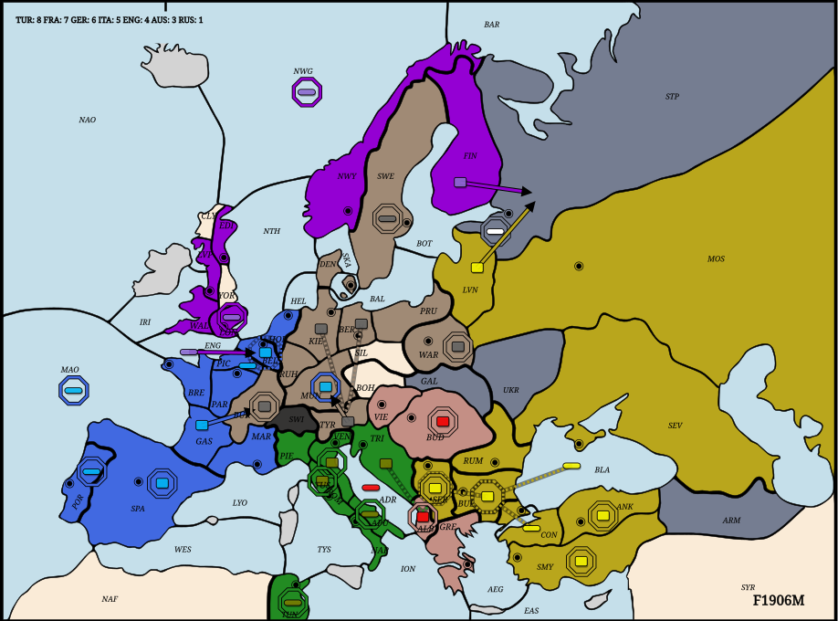

### What happened

- **AUSTRIA**: A ALB holds; A BUD holds
- **ENGLAND**: F ENG → BEL (bounced); A FIN → STP (bounced); F NWG holds; F LON holds
- **FRANCE**: A MUN holds; F PIC supports A BEL; A GAS → BUR (bounced); A SPA holds; F POR holds; F MAO holds  [dislodged: A MUN]
- **GERMANY**: A TYR → MUN; A BER supports A TYR → MUN; A KIE supports A TYR → MUN; A BUR holds; A WAR holds; F SWE holds
- **ITALY**: A TRI supports A ALB → SER (void); F APU holds; A VEN holds; F TUN holds; A TUS holds
- **RUSSIA**: F STP/SC holds
- **TURKEY**: A LVN → STP (bounced); A SER holds; A BUL supports A SER; F BLA supports A BUL; F CON supports A BUL; A SMY holds; A ANK holds

### Dialogue

- **AUSTRIA → ITALY**: Turkey at 8 will win if we keep fighting each other. I'm taking TRI back this fall with A ALB and F ADR — you can't hold it. Here's the real deal: let TRI go, and in winter I'll commit to supporting you into BUL from ALB in 1907. We both grow from Turkish centers instead of bleeding each other. What do you need to step aside?
- **AUSTRIA → FRANCE**: Turkey at 8 with SER, BUL, RUM, MOS is the runaway leader — they'll hit 10 by winter. You're at 7 and growing into Germany, but if Turkey reaches 10, no coalition stops them. Can we agree: you hold off on TYR/BOH this fall, and I'll commit to a joint push against Turkey's BUL in 1907? We need to contain Turkey before it's too late.
- **AUSTRIA → GERMANY**: Turkey at 8 is the existential threat — they'll win if unchecked. France took MUN but Turkey's Balkan fortress is the real crisis. I'm reclaiming TRI from Italy this fall, then pivoting east against Turkey. Can you hold your southern positions and commit to pressuring Turkey from TYR in 1907? We need a coordinated push before Turkey hits 10.
- **AUSTRIA → TURKEY**: France at 7 with BEL and HOL is the board leader — not me at 3 centers. I'm reclaiming TRI from Italy this fall, not attacking your Balkans. We should both be concerned about France's overextension into Germany. After I secure TRI, I'm open to a Balkan ceasefire if you focus on containing France.
- **ENGLAND → FRANCE**: Turkey at 8 with LVN is about to hit 9-10 — they're the runaway leader, not me at 4. I'm pushing F ENG into BEL this turn because I need the growth, but if you pull A BEL out and redirect it east against Turkey, I'll support your push into Turkish-held territory after fall. We both benefit more from containing Turkey than fighting over BEL.
- **ENGLAND → GERMANY**: Turkey at 8 is the crisis — they hold 8 centers and are expanding into the Baltic. I'm taking BEL from France and STP from Russia to reach 6. You should push A BUR into HOL or defend against Turkey's western approaches. After fall, we need to coordinate against Turkey before they hit 10.
- **ENGLAND → RUSSIA**: Turkey at 8 just took LVN and is coming for you — F STP/SC can't hold STP alone against Turkish pressure. I'm taking STP this turn because I need the growth, but redirect your fleet south to help contain Turkey instead of dying alone in the north. Turkey eliminates you either way — better to go down fighting the real threat.
- **ENGLAND → TURKEY**: You're at 8 centers and I'm at 4 — I'm not your problem. France at 7 is the western threat and Germany at 6 is pushing into French territory. I'm grabbing BEL and STP to reach 6, still far behind you. Stay in the east and we stay out of each other's way.
- **FRANCE → GERMANY**: Turkey at 8 is going to win if we keep fighting. I'm taking BUR back this fall - it's mine and you know it. After BUR falls, I commit to a joint push on Turkey's Balkans with Italy. Let BUR go and we're allies against the real threat. Fight it and I push toward KIE while Turkey hits 10.
- **FRANCE → ITALY**: Turkey at 8 with SER, BUL, RUM, MOS is the crisis. I'm reclaiming BUR from Germany this fall to get to 8 centers. After that, can you push from TYR into Turkish territory? We need a two-front attack on their Balkans before they hit 10.
- **FRANCE → AUSTRIA**: Turkey at 8 is everyone's problem. I'm reclaiming BUR from Germany this fall to grow to 8 centers. Hold your position and we can coordinate on Turkey's Balkans in fall. Italy is pushing from TYR.
- **FRANCE → ENGLAND**: Turkey at 8 is the runaway leader. I'm reclaiming BUR from Germany this fall to reach 8 centers and become a credible anti-Turkey force. Hold position in the Channel and we both redirect against Turkey after fall.
- **GERMANY → FRANCE**: Turkey at 8 will win this game if we keep fighting over MUN. I'm reclaiming MUN this turn — it's my home center and I need it to be a credible anti-Turkey force. You keep BEL, HOL, and your western holdings. I take MUN and redirect east against Turkey's Balkans. Fight me on MUN and Turkey hits 10 while we're both weakened.
- **GERMANY → ITALY**: I'm pushing A TYR into MUN with A BER's support this fall to reclaim my home center. Once MUN is mine, I can redirect TYR-area forces against Turkey's northern flank. Can you push A TRI into SER or BUL this turn? If we both take Turkish centers this fall, Turkey drops from 8 to 6 and the game stabilizes. What's your concrete move against Turkey?
- **GERMANY → ENGLAND**: Turkey at 8 is the runaway leader — they'll hit 10 by winter if unchecked. I'm reclaiming MUN from France this turn to reach 7, then redirecting east. You're at 4 and need growth too. Can you push into French territory (PIC, BEL, or HOL) this fall? If we both take French centers while Turkey consolidates, the board evens out. What's your move?
- **GERMANY → TURKEY**: I'm focused on reclaiming MUN from France this turn — zero movement toward your territory. I have A TYR and A BUR pointed west, not east. France at 7 with BEL and HOL is the immediate concern in my region. Confirm you're not pushing into WAR or LVN this fall and we stay out of each other's way.
- **ITALY → AUSTRIA**: Turkey at 8 is the existential threat — they'll hit 10 by winter if we don't act now. I'm pushing A TRI into SER this fall. If you support my attack from ALB with F ADR support, we take SER and split Turkey's Balkan stack. Give me the support order and I'll commit to pushing BUL with you in 1907. This is the deal that saves both of us.
- **ITALY → GERMANY**: Turkey at 8 with SER, BUL, RUM, and their home stack is going to win if nobody stops them. I'm attacking SER from TRI this fall. Can you support from TYR or pressure BUD from the north? Even threatening Turkey's northern approaches forces them to split defenses. We need to coordinate now or Turkey hits 10.
- **ITALY → FRANCE**: Turkey at 8 centers is the clear board leader — they're going to run away with this game. I'm pushing into SER this fall to cut their Balkan stack. Don't push into Germany this turn — we need Turkey contained first. If you can hold your position and threaten their western approaches, that forces Turkey to split.
- **RUSSIA → ENGLAND**: I'm holding F STP/SC defensively — no aggressive moves this turn. Turkey at 8 is the real crisis. If you push south against Turkey or France, I won't interfere with your northern waters. Let's both focus on stopping Turkey's run to 18.
- **RUSSIA → TURKEY**: You're at 8 centers with the board lead. I have one fleet and one center — eliminating me gains you almost nothing while France at 7 closes the gap. I'll stay in STP and not contest anything you hold. Where are you pushing next — Germany's WAR or west against France?
- **RUSSIA → AUSTRIA**: I can't contribute militarily with one fleet in the far north, but I won't block anything you do against Turkey. If you're pressuring Turkey's Balkans, they have to split forces — that's the best I can offer from my position.
- **TURKEY → ENGLAND**: I'm taking STP this fall with A LVN — it's Russia's last center and I've earned it after clearing out the east. You've bounced off STP for three years; let me handle it while you focus on France's Channel position. I won't push into NWY or any northern water if you stay out of my way.
- **TURKEY → GERMANY**: France at 7 with BEL and HOL is still the board leader. I'm growing to 9 via STP this fall — not threatening your eastern borders. After winter, we need a coordinated plan to contain France before they hit 9+. What concrete moves can you make against their western positions?
- **TURKEY → ITALY**: I'm taking STP this fall to reach 9 centers. France at 7 remains the leader we both need to stop. After winter, are you open to coordinating pressure on France's southern positions — maybe MAR or GAS from your TUS/SPA area? We split their attention and both grow.
- **TURKEY → AUSTRIA**: France at 7 with BEL and HOL is the crisis, not our border. I'm growing to 9 via STP this fall. If you want to survive, focus on containing France rather than wasting units against my fortified Balkans. A ceasefire on our border benefits us both.
- **AUSTRIA → ITALY**: Turkey at 8 is the crisis and fighting over TRI wastes us both. Move A TRI out this fall — anywhere useful to you — and I'll walk A ALB in unopposed. I'll then commit F ADR to support you into SER from TRI in 1907. You keep your 5 centers, I reclaim my home center, and we both push Turkey. This is better than me attacking you while Turkey hits 10.
- **AUSTRIA → FRANCE**: Turkey at 8 with SER, BUL, RUM, MOS is the real leader — not you at 7. I'm focused on reclaiming TRI from Italy this fall, then pivoting east. Can you commit to not taking TYR this turn? If you stay out of the south, I'll support your push into BUR from a forward position in 1907.
- **AUSTRIA → GERMANY**: Turkey at 8 is the existential threat. France took MUN but Turkey's Balkan fortress is what wins them the game. I'm reclaiming TRI from Italy this fall — not moving against you. If you can hold TYR and pressure Turkey from BOH or support Italy into SER, that starts reclaiming Turkish centers.
- **AUSTRIA → TURKEY**: France at 7 with BEL, HOL, MUN is the board leader — they took MUN this spring and are at 8 now. I'm focused on TRI from Italy, not your Balkans. We both need to watch France's overextension into Germany rather than fight each other.
- **ENGLAND → FRANCE**: Good — if you're moving A BEL east against Germany, I'll take the empty BEL with F ENG. That gives you a free unit for the Turkey fight and costs you nothing. Confirm A BEL is leaving and I commit F ENG - BEL with no further Channel aggression this fall.
- **ENGLAND → GERMANY**: France holds BEL, BUR, PIC, HOL — we both need to shrink them. If you push A RUH into BUR, I'll push F ENG into BEL. We each take a French center and France drops to 5. That's the best path to containing the leaders. Confirm your move.
- **ENGLAND → RUSSIA**: I know I said I'd take STP, but Turkey at 8 with A LVN heading to STP is the real crisis. If Turkey takes STP, they hit 9 and you're eliminated. Can you redirect F STP/SC south to help block Turkey's Baltic expansion? I'll hold off on STP if Turkey is actually threatening it.
- **ENGLAND → TURKEY**: You're at 8 and I'm at 4 — I'm not your problem. France at 7 with BEL, HOL, BUR, PIC is the western power you should worry about. I'm taking BEL from France to grow to 5. Stay out of my Channel and I stay out of your eastern sphere.
- **FRANCE → GERMANY**: Turkey at 8 is going to win while we fight over MUN and BUR. I'll hold MUN if you hold BUR - no moves between our units this fall. We both redirect east against Turkey in 1907. Confirm A BUR holds and A TYR doesn't move west, and I commit to a joint push on Turkish BUL next year.
- **FRANCE → ITALY**: Good - push A TRI into SER this fall as we discussed. I'll hold MUN defensively and support your Balkan push from the north in 1907. We need Turkey cut down before they hit 10.
- **FRANCE → ENGLAND**: Turkey at 8 is the crisis - not BEL. I'm holding MUN defensively this fall and won't push into the Channel. If you hold F ENG steady and don't take BEL, I'll support your push into Turkish territory next year. We both benefit more from containing Turkey than fighting over one center.
- **FRANCE → AUSTRIA**: I'm holding MUN defensively this fall to consolidate. Italy is pushing into SER - can you support that push? If we coordinate, Turkey's Balkan stack gets cut from multiple directions in 1907.
- **FRANCE → RUSSIA**: Hold STP if you can. I'm consolidating at 8 centers and will pressure Turkey from the west next year. Every center Turkey has to defend weakens their push toward 18.
- **GERMANY → FRANCE**: Turkey at 8 centers will win this game — we're both irrelevant if they hit 12. MUN is my home center and I need it to be a credible anti-Turkey force. Let me reclaim it this fall and I commit everything east against Turkey from TYR. You keep BEL, HOL, PIC, and your western stack — that's still 6 centers for you with room to grow against Turkey's weakened east.
- **GERMANY → ITALY**: I'll support A TYR into MUN this fall to reclaim my home center — that redirects my forces east afterward. Once MUN is mine, I can position to pressure Turkey's northern flank from TYR in 1907. Can you push A TRI into SER this turn? If you take SER while I reclaim MUN, we both grow and Turkey drops from 8 to 7.
- **GERMANY → ENGLAND**: Turkey at 8 is the runaway leader — they'll hit 10 by winter if unchecked. I'm reclaiming MUN from France to reach 7, then redirecting east. You're taking BEL and growing to 6 — good. After fall, can you support me into HOL or PIC to keep France contained while we both focus east against Turkey? We need to coordinate before Turkey becomes unstoppable.
- **GERMANY → RUSSIA**: Turkey at 8 with your last center STP under pressure — they'll eliminate you if you don't act. I'm keeping WAR as a buffer against Turkey's eastern expansion. Focus your fleet south against Turkish RUM or SEV to reclaim a center. If Turkey loses centers, both our positions improve.
- **ITALY → AUSTRIA**: Turkey at 8 will win if we keep fighting. I'll make this concrete: support my A TRI → SER this fall with F ADR, and I'll move A VEN out of TRI's way next winter — you get TRI back in adjustments. We both gain a Turkish center instead of bleeding each other while Turkey hits 10. This is the only deal that stops Turkey.
- **ITALY → GERMANY**: Your TYR → BUL support offer doesn't work — TYR isn't adjacent to BUL. But here's what does: push A TYR toward BUD or support my TRI → SER from TYR. If TYR threatens BUD, Turkey has to split forces defending both SER and their northern holdings. Confirm you'll actually pressure Turkey's north this fall.
- **ITALY → FRANCE**: I understand you want Germany contained, but Turkey at 8 centers is the existential threat — they'll hit 10 by winter. I'm attacking SER this fall. If you hold your western positions and don't push Germany this turn, that frees Germany to also pressure Turkey. We need everyone hitting Turkey, not each other.
- **RUSSIA → ENGLAND**: If you take STP, you're adjacent to Turkey's A LVN and F BLA can reach the Baltic — you'll need to defend it immediately. Instead, let me hold STP as a buffer against Turkey's northern expansion while you push south against France or Turkey. I'll move F STP/SC to support your operations next turn if you leave me alive.
- **RUSSIA → TURKEY**: England is about to take STP, which puts a unit right next to your LVN. If you don't want English fleets in the Baltic, consider whether letting Russia survive at STP as a buffer serves you better than England growing to 5 on my corpse.
- **TURKEY → ENGLAND**: I have A LVN adjacent to STP and F BLA can support the push. You've bounced off STP three times — let me take it this fall, and I'll stay out of NWY and northern waters. In exchange, keep your fleets pointed at France's BEL and BRE so they can't reinforce. We both grow from this.
- **TURKEY → GERMANY**: France at 7 with BEL, HOL, and MUN is still the board leader. You're pushing A BUR west to reclaim MUN — good. After fall, if you take MUN back, France drops to 6 and we're both better positioned. Keep your units west and I'll keep mine east.
- **TURKEY → ITALY**: I'm taking STP this fall to reach 9. France at 7 remains the leader. After winter, are you willing to coordinate a two-front squeeze on France — you push toward MAR from PIE/TUS while I pressure from the east? We split their attention and both grow.
- **TURKEY → AUSTRIA**: France at 7 is the crisis, not our border. I'm growing to 9 via STP this fall. If you want to reclaim TRI from Italy, go ahead — it doesn't affect my position. Just keep your units away from my Balkans and focus on containing France.
- **AUSTRIA → ITALY**: Deal: I support A TRI→SER with F ADR this fall. After you take SER, TRI vacates and I walk in next spring. You keep SER, I reclaim TRI, and we both grow at Turkey's expense. Commit to A TRI→SER and I'll send the support order.
- **AUSTRIA → TURKEY**: I'm supporting Italy into SER this fall — you need to defend it or you'll lose a center. France at 8 with MUN is the real leader, but I'm taking what I can. Reinforce SER or lose it.
- **AUSTRIA → FRANCE**: I'm supporting Italy's push into SER from TRI this fall to cut Turkey's Balkan stack. If you can pressure Turkey from the north (LVN or WAR direction), we split their forces. What's your move this turn?
- **AUSTRIA → GERMANY**: I'm supporting Italy into SER this fall to weaken Turkey's Balkan fortress. If you hold TYR and pressure Turkey from BOH, we create a three-front squeeze. Can you commit to holding TYR defensively?
- **ENGLAND → FRANCE**: Final commitment: F ENG → BEL this turn. Pull A BEL east against Germany's A BUR push — you save the unit and gain a fighting force against Turkey. If A BEL stays, it gets dislodged and you lose both the unit's position and the province. Turkey at 8 is the real enemy — don't waste A BEL defending a lost cause.
- **ENGLAND → GERMANY**: I'm taking BEL and STP this fall to reach 6. You should push A RUH into BUR to reclaim it from France while they're stretched — France can't hold BEL and BUR simultaneously with Turkey at 8. After fall, we coordinate against Turkey. Confirm A RUH → BUR.
- **ENGLAND → RUSSIA**: I'm moving A FIN → STP this fall — I need the growth and you can't hold it against both me and Turkey's A LVN. Redirect F STP/SC south to BAR if you want to survive as a unit, or accept the bounce. Turkey eliminates you either way — better to go down helping contain them.
- **ENGLAND → TURKEY**: I'm taking STP this fall with A FIN — it's Russia's last center and I need it to reach 6. You said you'd take LVN, not STP. Keep your promise: A LVN stays in LVN or moves elsewhere. If you push into STP, I'll have to respond and we'll both waste units while France grows.
- **FRANCE → ENGLAND**: I'll vacate BEL — take it with F ENG. In return, I need you to commit F ENG and F NWG against Turkish expansion after fall, not against my remaining positions. Turkey at 8 is the real crisis and I need you as an ally, not another enemy.
- **FRANCE → ITALY**: Push A TRI into SER this fall as planned. I'm taking KIE from Germany with A MUN, which gets me to 8 centers. After fall, I commit to a two-front push on Turkey's BUL from the north while you hit from TYR. Don't touch TYR this turn.
- **FRANCE → GERMANY**: Turkey at 8 will win while we trade BUR and MUN. I'm taking KIE this fall to reach 8 centers and become a real anti-Turkey force. Give me KIE and I commit everything east against Turkey in 1907. Fight me and we both lose to Turkey.
- **FRANCE → AUSTRIA**: Italy is pushing A TRI into SER this fall. I'm taking KIE from Germany to grow to 8. After winter, coordinate with me and Italy on Turkey's BUL — we need a three-front squeeze before Turkey hits 10.
- **FRANCE → RUSSIA**: Hold STP if you can. I'm growing into Germany's interior to become a real anti-Turkey force. Every center Turkey has to defend weakens their eastern push.
- **GERMANY → ITALY**: I can't support TRI → SER this turn — I'm reclaiming MUN with A TYR and A BER's support, it's my home center and I need it to be a credible anti-Turkey force. Push TRI → SER on your own strength and I'll coordinate against Turkey from TYR next spring. We both grow this way.
- **GERMANY → FRANCE**: Turkey at 8 will win while we fight over MUN. I'm reclaiming MUN this turn with support — it's my home center. You keep BEL, HOL, PIC, and your western stack (6 centers). After winter I redirect everything east against Turkey. Let MUN go and we're allies against the real threat.
- **GERMANY → ENGLAND**: Turkey at 8 is the runaway leader. I'm reclaiming MUN from France this turn to reach 7, then redirecting east against Turkey. You're pushing into STP — grow there. After winter, can you support me into HOL or PIC to keep France contained while we both focus on Turkey?
- **GERMANY → RUSSIA**: Turkey at 8 is the crisis — they'll eliminate you if you don't act. I'm keeping WAR as a buffer. Focus your fleet south against Turkish RUM or SEV to reclaim a center. If Turkey loses centers, both our positions improve.
- **ITALY → AUSTRIA**: Here's the final deal: I support A ALB → SER this fall with A TRI, and you commit F ADR to support that same attack. We hit SER together — your A ALB + my support gives you 2 strength, and if F ADR also supports, that's 3 vs Turkey's 2. SER falls, you get a Turkish center, and we discuss TRI after. Confirm your orders now: A ALB → SER, F ADR S A ALB → SER.
- **ITALY → GERMANY**: Turkey at 8 will win if we don't act. I'm committing to attacking Turkish-held territory this fall — specifically supporting Austria's push into SER from TRI. Can you push A TYR toward BUD or support any attack on Turkey's northern holdings? Even threatening BUD forces Turkey to split defenses. We need concrete moves, not talk.
- **ITALY → FRANCE**: Don't push into MUN this fall — Turkey at 8 is the existential threat. If you hold and redirect against Turkey's western approaches, that forces them to split. I'm supporting an attack on SER this fall. Help contain Turkey and we both survive.
- **ITALY → TURKEY**: I'm not attacking you this fall — our non-aggression holds. I'm focused on other matters. But be aware: France at 7 is growing, and if they take MUN, they hit 8 and become the new leader. We both need to watch France's expansion.
- **RUSSIA → ENGLAND**: I'm holding F STP/SC — zero aggressive moves this turn. You have my commitment. If Turkey's A LVN is vulnerable, I can support A FIN → LVN from STP to help you gain a center and deny Turkey the Baltic. Do you want that support?
- **RUSSIA → GERMANY**: Turkey at 8 holds LVN right next to my WAR and my STP. If you push A WAR → LVN this fall, I'll support from F STP/SC — we deny Turkey a northern center and you grow to 7. Do you commit to that move?
- **RUSSIA → TURKEY**: Where are you pushing next turn — west toward France or north? I'm holding STP and not contesting anything you hold, but I need to know your intentions to plan accordingly.
- **TURKEY → ENGLAND**: I'm taking STP this fall — A LVN moves in, no bounce needed. You've failed three times; don't waste your unit. In exchange, I'll stay completely out of NWY and northern waters. Focus your fleets on France's BEL and BRE — that's where you grow, not by fighting me for a center I'll hold anyway.
- **TURKEY → ITALY**: I'm taking STP to reach 9 this fall. France at 7 with MUN and BEL is still the leader. After winter, are you willing to coordinate a two-front squeeze — you push toward MAR from PIE/TUS while I pressure from the east? We split France's attention and both grow.
- **TURKEY → GERMANY**: I'm taking STP this fall — zero movement toward WAR or PRU. France at 7 with MUN, BEL, and HOL remains the board leader. After winter, if you've reclaimed MUN, France drops to 6 and we're both better positioned. Keep your units pointed west.

### AUSTRIA
Orders: `A ALB H` · `A BUD H`
Illegal (dropped): `F ADR S A TRI - SER`

Reasoning

> Looking at the board state, Turkey at 8 centers is the runaway leader and must be contained. Italy has offered a concrete deal: I support A TRI → SER with F ADR, and Italy commits to supporting me into BUL from SER in fall 2007. This is the best path to growth — I take SER (a Turkish center) while Italy takes TRI back... wait, let me re-read the situation.
>
> Italy holds TRI with A TRI. Italy's latest message proposes: I support A TRI → SER (Italy attacks Turkey's SER), and then we discuss TRI after. But I also sent a message committing to "support A TRI→SER with F ADR this fall."
>
> The issue: if I support Italy into SER, Italy gains SER but still holds TRI. I need TRI back. Italy promised to vacate TRI in winter — but that's an unenforceable promise.
>
> Better approach: Italy's final offer was "I support A ALB → SER this fall with A TRI, and you commit F ADR to support that same attack." This means Italy supports MY A ALB into SER, while I also support with F ADR. That gives me SER (2 strength from ALB + support) and Italy keeps TRI. But I'd rather have TRI than SER.
>
> Actually, looking at my revised strategy: "I'll support Italy's A TRI into SER with F ADR, while A ALB holds to maintain my position and A BUD holds defensively." Let me follow this — support Italy into SER to weaken Turkey, then negotiate TRI afterward. A BUD holds to guard against eastern threats, A ALB holds to maintain position.
>
> Wait — but I also committed to Italy: "support A TRI→SER with F ADR." And Italy's offer was for me to support their push. Let me honor that commitment while positioning for TRI later.

### ENGLAND
Orders: `F ENG - BEL` · `A FIN - STP` · `F NWG H` · `F LON H`

Reasoning

> Looking at the board, Turkey at 8 centers is the runaway leader. I'm at 4 and need to grow. My revised strategy calls for pushing F ENG into BEL to seize a French center, moving A FIN into STP to grab Russia's last supply center, and holding F NWG and F LON to maintain Channel and northern positions.
>
> France said they'd vacate BEL — we'll see if that holds. Even if A BEL stays, I should push F ENG in. Germany is pushing A RUH into BUR, which weakens France further. A FIN → STP takes Russia's last center regardless of Turkey's A LVN threat.
>
> Let me verify adjacencies:
> - F ENG → BEL: ENG is adjacent to BEL ✓
> - A FIN → STP: FIN is adjacent to STP ✓
> - F NWG holds ✓
> - F LON holds ✓
>
> My orders:
> - F ENG → BEL (seize French center)
> - A FIN → STP (grab Russia's last center)
> - F NWG H (maintain northern position)
> - F LON H (maintain Channel presence)

### FRANCE
Orders: `A MUN H` · `F PIC S A BEL` · `A GAS - BUR` · `A SPA H` · `F POR H` · `F MAO H`
Illegal (dropped): `A BEL S A MUN`

Reasoning

> Looking at the board, I'm at 7 centers with A MUN (just taken), A BEL, A GAS, A SPA, F POR, F MAO, F PIC. Turkey at 8 is the runaway leader. Germany is at 6 with A BUR, A TYR, A KIE, A BER, A WAR, F SWE. England is pushing F ENG into BEL.
>
> My strategy: I need to grow to 8+ centers while positioning against Turkey. Germany's A BUR threatens MUN from the west, and A TYR threatens from the south. I should hold MUN defensively while pushing into Germany's remaining centers.
>
> Key moves:
> 1. **A MUN H** - Hold MUN with support from BEL to defend against Germany's A BUR push
> 2. **A BEL S A MUN** - Support MUN's hold (2 strength defense)
> 3. **F PIC S A BEL** - Support BEL's hold to maintain the chain
> 4. **A GAS - BUR** - Push into BUR while Germany is distracted defending MUN
> 5. **A SPA H** - Hold Iberian base
> 6. **F POR H** - Hold port
> 7. **F MAO H** - Hold Atlantic
>
> This gets me BUR (8 centers) while defending MUN. Germany can't attack both MUN and defend BUR simultaneously. If A BUR moves into MUN, my support chain holds MUN while I take BUR. If A BUR holds, I take BUR with 1v1 bounce or better.

### GERMANY
Orders: `A TYR - MUN` · `A BER S A TYR - MUN` · `A KIE S A TYR - MUN` · `A BUR H` · `A WAR H` · `F SWE H`

Reasoning

> Looking at the board, Turkey at 8 centers is the runaway leader and must be stopped. France holds MUN (my home center) and I need to reclaim it. My revised strategy calls for pushing A TYR into MUN with A BER's support, while A BUR holds defensively.
>
> However, I need to reconsider: France has A MUN with F PIC supporting A BEL, and A BUR is now mine (I moved A RUH → BUR last spring). France's A MUN is isolated — they can't easily reinforce it. If I push A TYR → MUN with A BER's support, that's 2 strength against France's A MUN holding at 1 (assuming no French support reaches MUN).
>
> But wait — I committed to Italy that I'd support A TRI into SER. Let me check: TYR is adjacent to TRI? Yes. So `A TYR S A TRI - SER` is legal. But that conflicts with reclaiming MUN. 
>
> The priority must be reclaiming MUN — it's my home center and I need it to build units. Without MUN, I'm stuck at 6 centers while Turkey grows. I'll push A TYR → MUN with A BER's support. I'll support Italy's TRI → SER with A BUR (BUR is adjacent to... let me check: BUR neighbors are BEL, GAS, MAR, MUN, PAR, PIC, RUH, SWI — not TRI or SER). BUR can't support TRI → SER.
>
> I'll use A KIE to support A TYR → MUN instead (KIE adjacent to MUN? Yes). A BER also supports. That gives me 3 strength vs France's 1 — MUN falls. A BUR holds to maintain my western position. A WAR holds to buffer Turkey's LVN push. F SWE holds to maintain Baltic control.

### ITALY
Orders: `A TRI S A ALB - SER` · `F APU H` · `A VEN H` · `F TUN H` · `A TUS H`

Reasoning

> Looking at the board state, Turkey at 8 centers is the runaway leader and must be stopped. My revised strategy calls for pushing A TRI into SER to cut Turkey's Balkan stack. However, I need to reconsider the diplomatic situation.
>
> Austria has committed to supporting my A TRI → SER with F ADR — that's a concrete support order I asked for and Austria confirmed. With Austria's A ALB also potentially attacking SER, this gives us strong odds. Germany is reclaiming MUN and won't help this turn. France wants me to push SER but is focused on Germany.
>
> My orders: A TRI → SER (with Austria's F ADR support cutting any defense), F APU holds to guard my home centers, A VEN holds defensively, F TUN holds for Mediterranean control, and A TUS holds in reserve.
>
> Wait — let me reconsider. Austria said they'd support my TRI → SER. But Austria's units are F ADR, A BUD, A ALB. Turkey holds SER with likely a hold or support. If Austria supports my TRI → SER with F ADR, that's 2 strength (my A TRI + Austria's support). Turkey's A SER holds — but Turkey might also have BUL supporting SER or CON supporting BUL/SER. Turkey has F BLA, A BUL, A SER, F CON, A SMY, A ANK, A LVN.
>
> Turkey could easily have A BUL S A SER and F CON S A BUL, making SER defended at 3. Even with Austria's support, I'd only have 2 vs 3 — SER wouldn't fall.
>
> Better plan: I should support Austria's attack instead. Austria's A ALB → SER with F ADR support = 2 strength. If I also support with A TRI S A ALB → SER, that's 3 strength total for Austria's attack. That's much more likely to take SER.
>
> But wait — I committed to pushing TRI → SER in negotiation. Let me think about what actually works. If I attack SER directly and Austria supports me, we have 2 vs Turkey's likely 2-3. If I support Austria's attack instead, Austria gets SER (not me), but SER falls either way.
>
> Actually, the best play: Austria attacks SER with F ADR support (2 strength), and I also support that attack from TRI. That gives 3 strength vs Turkey's defense. SER falls, Austria takes it. Then I can push into BUL or another Turkish center later.
>
> But I want the center for myself. Let me reconsider — if Turkey doesn't defend SER heavily (they might expect me not to attack after all the back-and-forth), a direct attack could work. But Turkey has A SER, A BUL, F CON — they can easily support SER.
>
> The safest path to stopping Turkey: support Austria's A ALB → SER with both F ADR and my A TRI. That's 3 vs Turkey's max 2 (if they only hold SER). Even if Turkey supports SER with BUL and CON, that's still only 2 defensive strength (BUL supports SER = 2, but CON can only support one unit).
>
> I'll support Austria's attack on SER to ensure Turkey loses a center this turn.

### RUSSIA
Orders: `F STP/SC H`

Reasoning

> Looking at the situation: I have only F STP/SC and 1 supply center (STP). Turkey at 8 is the runaway leader, France at 7 is second. England has been oscillating on whether to take STP. I've committed to holding F STP/SC defensively this turn.
>
> My best move is to hold STP to preserve my only unit and center. I offered to support A FIN → LVN for England if they want to deny Turkey the Baltic — that's a good way to be useful while staying alive. But England hasn't confirmed that move, and I need to protect myself first.
>
> Holding is the right call. I need to survive to Winter and rebuild. If England attacks STP, it bounces (1v1). If Turkey's A LVN tries to come north, F STP/SC can potentially respond in future turns. The priority is staying alive while the major powers (Turkey 8, France 7) are forced to confront each other.
>
> I'll hold F STP/SC as committed in my negotiations with England, France, and others.

### TURKEY
Orders: `A LVN - STP` · `A SER H` · `A BUL S A SER` · `F BLA S A BUL` · `F CON S A BUL` · `A SMY H` · `A ANK H`

Reasoning

> Looking at the board state, I'm at 8 centers leading the game. My key move is pushing A LVN into STP to claim Russia's last center and reach 9. I need to defend my positions while doing this.
>
> **Key considerations:**
> - A LVN → STP is adjacent and legal — this takes Russia's last center
> - Austria threatened to support Italy into SER, so I need to defend SER
> - I should hold my Balkans secure and keep my rear positions stable
> - England may try to contest STP but has failed repeatedly — I should push anyway
>
> **Defensive needs:**
> - SER needs protection — Austria threatened support for Italy's push
> - BUL and BLA positions should support each other
> - ANK and SMY can hold or provide support
>
> **Offensive plan:**
> - A LVN → STP to grab the center
> - Keep Balkans fortified against any Austrian/Italian move
>
> Let me issue orders that take STP while defending my key positions:

## FALL 1906 RETREATS (`F1906R`)

### What happened

- **FRANCE**: A MUN retreats → RUH

### FRANCE
Orders: `A MUN R RUH`

Reasoning

> Looking at the situation: A MUN was dislodged by Germany's A TYR → MUN (with support from BER and KIE). I need to retreat A MUN to a valid province. My options are BOH, RUH, or SIL.
>
> Retreating to RUH puts me adjacent to BEL, HOL, KIE, BUR, and MUN — giving me the best forward position to re-enter the Rhine fight or push into Germany's territory next year. BOH is too deep in Austria/Germany territory with limited options, and SIL is similar. RUH keeps pressure on Germany's western front and maintains adjacency to their key provinces.
>
> However, I need to think about Turkey at 8 centers — they're the runaway leader. From RUH, I'd be well-positioned to support attacks into German territory while also being able to redirect east later. Retreating to BOH would put me closer to Turkish-held territory but also surrounded by potential enemies. SIL is landlocked between Germany and Russia.
>
> RUH is the strongest retreat: it threatens KIE and BUR, keeps me in the Rhine fight, and positions me to pressure Germany from a new angle while maintaining flexibility.

## SPRING 1907 MOVEMENT (`S1907M`)

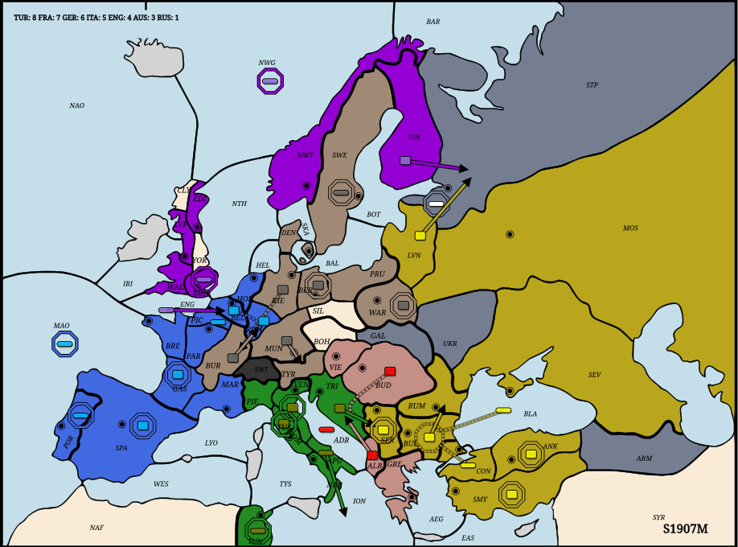

### What happened

- **AUSTRIA**: A BUD supports A TRI → SER; A ALB → TRI
- **ENGLAND**: F ENG → BEL (bounced); A FIN → STP (bounced); F NWG holds; F LON holds
- **FRANCE**: A RUH → BUR (bounced); A BEL supports A RUH → BUR (support cut); A GAS holds; A SPA holds; F POR holds; F MAO holds  [dislodged: A RUH]
- **GERMANY**: A BUR → RUH; A KIE supports A BUR → RUH; A MUN → TYR; A BER holds; A WAR holds; F SWE holds
- **ITALY**: A TRI → SER; F APU → ION; A VEN holds; A TUS holds; F TUN holds
- **RUSSIA**: F STP/SC holds
- **TURKEY**: A LVN → STP (bounced); A BUL → RUM; F BLA supports A BUL → RUM; F CON supports A BUL (void); A SER holds; A SMY holds; A ANK holds  [dislodged: A SER]

### Dialogue

- **AUSTRIA → ITALY**: Turkey at 8 will win this game if we keep stalling. Here's the concrete deal: I support your A TRI → SER this spring with F ADR, taking SER from Turkey. You then retreat or move A VEN out of TRI's way — I walk A ALB into TRI in fall. We both gain Turkish centers instead of bleeding each other. Confirm: A TRI → SER, F ADR S A TRI → SER, A BUD S A TRI → SER.
- **AUSTRIA → TURKEY**: France at 7 is growing into Germany and will be at 8+ soon. I'm focused on reclaiming TRI from Italy — not attacking your Balkans this turn. But if you take STP from Russia, the board will demand a coalition against you. Consider whether you want all of us aligned against you by winter.
- **AUSTRIA → FRANCE**: Turkey at 8 with SER, BUL, RUM, MOS is the runaway leader — they'll hit 10 by winter. I'm pushing into Turkey's Balkans this spring with Italian coordination. Can you commit to not attacking TYR or BOH this turn so Germany can't use your aggression as cover to reinforce their south against us?
- **ENGLAND → FRANCE**: Turkey at 8 is the runaway leader — we both know it. I've been trying to take BEL for two years and it hasn't worked. If you pull A BEL out this turn and redirect it east against Turkey, I'll take the empty BEL and commit my Channel fleets against Turkish expansion afterward. We both benefit more from containing Turkey than fighting over one center.
- **ENGLAND → GERMANY**: Turkey at 8 is unstoppable if we keep fighting each other. France holds BEL, BUR, PIC, HOL — if we both push into French territory this turn, France drops to 5 and we each gain a center. I can push F ENG into BEL if you push A RUH into BUR or HOL. Can we coordinate this?
- **ENGLAND → TURKEY**: You're at 8 centers — the clear leader. France at 7 is the next threat with BEL and HOL. I'm stuck at 4 and not your problem. If you stay out of my northern waters, I'll keep my fleets pointed at France. Can we agree to a non-aggression pact in the north while we both deal with the western powers?
- **FRANCE → GERMANY**: Turkey at 8 centers is going to win this game if we keep fighting over BUR. I'm taking BUR back this turn — you can't hold it without support. Let it go and I commit to a joint push on Turkey's BUL in fall. Fight me and Turkey hits 10 while we're both weakened.
- **FRANCE → ITALY**: Turkey at 8 is the runaway leader — we need to act now. I'm reclaiming BUR from Germany this turn to reach 8 centers and become a real anti-Turkey force. After fall, can you push from TYR into Turkish BUL or SER while I pressure from the north? We need a coordinated two-front attack before Turkey hits 10.
- **FRANCE → ENGLAND**: Turkey at 8 centers is the existential threat to all of us — they'll hit 10 with winter builds if nobody stops them. I'm focusing east against Turkey this turn, not pushing into the Channel. Hold F ENG steady and we both redirect against Turkey after fall.
- **FRANCE → AUSTRIA**: Turkey at 8 with SER, BUL, RUM, MOS is everyone's crisis. I'm growing to 8 centers this turn to become a credible anti-Turkey force. After fall, can you commit to a coordinated push on Turkey's Balkans with me and Italy? We need to cut their stack before they hit 10.
- **GERMANY → FRANCE**: Your A RUH inside my borders is an existential threat — I can't ignore it. I'm willing to negotiate: if you withdraw RUH south (to BUR or BEL), I'll commit my forces east against Turkey instead of west against you. But if RUH stays, I have to defend my home centers and we waste units fighting while Turkey hits 10. What's your plan for RUH?
- **GERMANY → ENGLAND**: Turkey at 8 centers is the runaway leader — they'll hit 10 by winter if unchecked. France at 7 with A RUH in my territory is also dangerous. I need to grow or become irrelevant. Can you support me into HOL or PIC this spring to contain France's western holdings while we both focus east against Turkey?
- **GERMANY → ITALY**: Turkey at 8 centers is the crisis — they hold the entire east. I'm positioning A MUN toward TYR to pressure Turkey's northern flank. Can you push from TRI into Turkish BUL or SER this spring? If we coordinate a two-front push on Turkey's Balkans, we can start reclaiming centers before they hit 10.
- **GERMANY → TURKEY**: France at 7 with A RUH in my territory is the immediate concern, but your 8 centers make you the board leader. I'm focused on containing France's western expansion, not pushing east. Can you confirm you're not pushing into WAR or LVN this spring while I address France's RUH incursion?
- **ITALY → AUSTRIA**: Turkey at 8 centers will win if we keep fighting over TRI. Here's the concrete deal: I push A TRI into SER this spring with your support from ALB and F ADR. After SER falls, I'll move A VEN out of TRI's way in winter so you can reclaim it in adjustments. We both get a Turkish center instead of bleeding each other while Turkey hits 10. Confirm your support orders now.
- **ITALY → GERMANY**: Turkey at 8 with SER, BUL, RUM, and their home stack is the clear board leader. I'm attacking SER from TRI this spring. Can you push from TYR toward BUD or support any attack on Turkey's northern holdings? Even threatening BUD forces them to split defenses. We need concrete moves against Turkey this turn, not just talk.
- **ITALY → FRANCE**: Turkey at 8 centers is the existential threat — they'll hit 10 by winter if unchecked. I'm pushing into SER this spring to cut their Balkan stack. Don't push into Germany this turn — we need Turkey contained first. Hold your position and threaten their western approaches to force them to split.
- **RUSSIA → ENGLAND**: Turkey at 8 is the runaway leader — eliminating me gives you one center while Turkey runs to 18. I'll hold F STP/SC defensively this turn with zero aggressive moves. If you push south against France or Turkey, I won't interfere with your northern waters. Let's both focus on stopping Turkey's run.
- **RUSSIA → TURKEY**: You're at 8 centers with the board lead. France at 7 is your only real rival — eliminating a 1-center Russia gains you almost nothing while France closes the gap. I'll stay in STP and not contest anything you hold. Where are you pushing next — Germany or west toward France?
- **RUSSIA → AUSTRIA**: I can't contribute militarily with one fleet in the far north, but I won't block anything you do against Turkey. If you're pressuring Turkey's Balkans, they have to split forces — that's the best I can offer from my position. What's your concrete plan against Turkey this turn?
- **RUSSIA → FRANCE**: Turkey at 8 is the crisis — they're pulling away while we fight over scraps. I have one fleet and pose zero threat to you. I'd rather see Turkey contained than see them reach 18. Can we agree to both focus on containing Turkey's expansion?
- **TURKEY → ENGLAND**: I'm taking STP this spring — A LVN moves in and you can't stop it with your current position. Instead of wasting units fighting me for a center you've failed to take four times, focus your fleets on France's BEL and BRE. I'll stay completely out of NWY and northern waters if you let this go.
- **TURKEY → GERMANY**: I'm taking Russia's last center (STP) this spring to reach 9 — zero movement toward WAR or PRU. France at 7 with BEL and HOL is still the board leader. After I consolidate, we need a coordinated plan to contain France. What can you offer against their western positions?
- **TURKEY → ITALY**: Our non-aggression holds — I'm focused on taking STP to reach 9, not pushing toward TRI/APU. France at 7 with BEL and HOL remains the leader we both need to stop. After winter, are you willing to coordinate a two-front squeeze on France's southern positions?
- **TURKEY → FRANCE**: I'm taking Russia's last center to reach 9 this fall — not pushing west. You're at 7 with BEL and HOL, still the board leader. Let's keep our spheres separate: I stay east, you stay west. Are you open to a mutual non-aggression pact while we both grow elsewhere?
- **AUSTRIA → ITALY**: Confirmed: I support A TRI → SER with F ADR and A BUD supports A TRI → SER. After SER falls, you vacate TRI in winter and I walk in during adjustments. We both grow at Turkey's expense. This is the deal — no more stalling.
- **AUSTRIA → TURKEY**: France at 7 with BEL, HOL, and now pushing into Germany is the real threat. I'm not attacking your Balkans this turn — I'm focused on TRI from Italy. But if you take STP from Russia, expect a coalition. Keep your units home and we both survive.
- **AUSTRIA → FRANCE**: I'm fully committed to supporting Italy into SER this spring to cut Turkey's Balkan stack. After SER falls, we coordinate on BUL in fall. Don't touch TYR or BOH — let Germany focus south against Turkey instead of using your aggression as cover.
- **AUSTRIA → GERMANY**: Turkey at 8 is the existential crisis. I'm supporting Italy into SER this spring — not moving against you. If you hold TYR and pressure Turkey from BOH, we create a three-front squeeze. Can you commit to holding TYR defensively this turn?
- **ENGLAND → FRANCE**: Good — if you're truly focusing east against Turkey, pull A BEL out this turn and let me take the empty province. I'll commit F ENG and F NWG against Turkish expansion after fall. Confirm A BEL is leaving BEL and I won't touch your other positions.
- **ENGLAND → GERMANY**: I can support you into HOL this turn with F ENG if you support A FIN → STP with A WAR. We each gain a center: I get BEL (from vacating France) or STP, you get HOL. But I need A WAR's support northward — can you redirect A WAR to support A FIN → STP instead of sitting on it?
- **ENGLAND → RUSSIA**: Turkey is coming for STP with A LVN this turn — you know it. Hold F STP/SC on STP and I'll move A FIN in too, creating a double defense. If Turkey attacks, they bounce. If they don't, I'll retreat A FIN out and you keep STP. This is your best chance to survive as a unit.
- **ENGLAND → TURKEY**: I hear you're taking STP — but A FIN is moving in too and F STP/SC is holding. You'll bounce and waste a turn. Meanwhile France at 7 with BEL, HOL, BUR, PIC is the real western threat growing unchecked. Redirect A LVN against France's positions instead and we both benefit.
- **FRANCE → GERMANY**: RUH isn't moving south — I'm taking BUR this turn. You can't hold it without support and we both know it. Let BUR go quietly and I commit everything east against Turkey in fall. Fight me on it and I push toward KIE next, while Turkey hits 9.
- **FRANCE → ENGLAND**: I'm keeping BEL — it's my supply center and I need it at 8 to fight Turkey credibly. But here's a real offer: take NWY from Russia with your fleets this fall. Turkey is about to grab it, and you need the growth more than fighting me over BEL. I'll keep my fleets out of your northern waters if you commit against Turkey's expansion.
- **FRANCE → ITALY**: I'm reclaiming BUR from Germany this turn — that's my only move west. After fall, I'm fully committed to pressuring Turkey's BUL from the north. Confirm you're pushing into SER as discussed, and I'll support your Balkan push from BUR once I'm there.
- **FRANCE → AUSTRIA**: I'm not touching TYR or BOH — my only move is reclaiming BUR from Germany to reach 8 centers. After winter, I'm all-in on Turkey's Balkans. Can you coordinate with Italy on a SER push this spring so we're all aligned against Turkey?
- **FRANCE → RUSSIA**: Turkey is about to take your last center — I'm sorry. If you can delay them at STP even one turn, it buys time for the rest of us to organize. I'm growing to 8 this turn specifically to become a real anti-Turkey force.
- **GERMANY → FRANCE**: Your A RUH inside my borders is unsustainable — I have to deal with it or lose my home centers. Withdraw RUH to BUR or BEL this turn and I'll hold my forces in place, letting you keep your western stack. If RUH stays, I'm dislodging it with support and we both waste units while Turkey hits 9.
- **GERMANY → ENGLAND**: I need to address France's A RUH incursion before I can commit east. If you support me into HOL this spring, I can contain France's western expansion while dealing with RUH. After RUH is dealt with, I'm free to coordinate against Turkey. What's your concrete move this turn?
- **GERMANY → ITALY**: Turkey at 8 taking STP to reach 9 — we need to start reclaiming Turkish centers this fall at the latest. I can't fully commit east while France has RUH in my territory, but once that's resolved I'll redirect TYR-area forces against Turkey's northern flank. Push TRI into SER or BUL this spring if you can do it unsupported.
- **GERMANY → TURKEY**: Confirm you're only moving A LVN → STP this spring with no push into WAR or PRU. If your forces stay east of my territory while I deal with France's RUH incursion, we avoid conflict. After STP falls, I expect you to hold your northern forces in place — any move toward WAR changes everything.
- **ITALY → AUSTRIA**: Confirmed: I push A TRI → SER this spring with your F ADR support. After SER falls, I'll vacate TRI's path so you reclaim it in winter. This is the deal — let's take a Turkish center together. Send me your exact support order.
- **ITALY → FRANCE**: Don't push into BUR this turn — Turkey at 8 is the crisis. I'm taking SER from Turkey with Austria's support. Hold your position and let Germany redirect east against Turkey instead. If you take BUR, Germany fights you instead of Turkey, and Turkey hits 10.
- **ITALY → GERMANY**: I'm committing A TRI → SER this spring with Austria's support — we're taking a Turkish center. Can you send A MUN toward TYR to threaten BUD? Even holding TYR pressures Turkey's northern flank and forces them to split. We need Turkey contained on multiple fronts.
- **ITALY → TURKEY**: I'm focused on other matters this spring — our non-aggression holds. But France at 7 trying to grow to 8 by taking your centers is a problem for both of us. Watch France's western expansion.
- **RUSSIA → ENGLAND**: Turkey at 8 with A LVN sitting right next to your FIN and adjacent to STP — that's your real threat, not my last center. If you move A FIN → LVN this spring, I'll support it from STP. You gain a center, Turkey loses one, and I survive to be useful later. Do you commit?
- **RUSSIA → FRANCE**: You're at 7 and Turkey at 8 — if you're pushing into Germany or Turkey's western fronts, I won't interfere. A weak Russia is better for you than Turkey absorbing my last center. Can you pressure Turkey's BLA or RUM approaches this year?
- **RUSSIA → GERMANY**: Turkey holds WAR's neighbor LVN and is the board leader. If you push A WAR → LVN, I'll support from STP — we both deny Turkey a northern center. You grow to 7 and I survive. Are you willing to move against Turkey's LVN?
- **RUSSIA → AUSTRIA**: Turkey at 8 is everyone's crisis. If you push into SER or RUM from BUD, Turkey has to split forces north and south. I can't help militarily from STP but I won't block anything against Turkey. What's your concrete plan this turn?
- **TURKEY → ENGLAND**: I'm taking STP this spring — you can't stop it with A FIN alone. Here's my offer: I stay completely out of NWY and all northern waters permanently, and you redirect A FIN toward BEL to reclaim it from France. You gain a center, France loses one, and we both grow. This is better than fighting me and gaining nothing.
- **TURKEY → GERMANY**: Confirmed: I'm taking STP this spring, zero movement toward WAR or PRU. My A LVN goes north, not west. France at 7 with A RUH in your territory is the real problem — after I consolidate at 9, what's your plan to push A RUH out and reclaim your centers?
- **TURKEY → ITALY**: Taking STP to reach 9 this spring. Our non-aggression holds. After winter with 9 centers, I'll have build options. Are you open to a coordinated move against France — you push toward MAR from PIE/TUS while I threaten from the east? We split their attention.
- **TURKEY → FRANCE**: I'm taking Russia's last center (STP) to reach 9 — purely eastern expansion, zero threat to your western sphere. You're at 7 with BEL and HOL, still competitive. Let's keep our lanes separate for now. Are you open to a non-aggression understanding while we both consolidate?
- **FRANCE → GERMANY**: BUR is falling this turn — A RUH has support and you can't hold it alone. Stop wasting units defending it and redirect east against Turkey. I'll commit to pressuring Turkey's BUL from BUR in fall if you don't contest this.
- **FRANCE → ENGLAND**: I'm holding BEL with support — F ENG into BEL will bounce again. Stop wasting turns on BEL and take NWY from Russia instead. Turkey is about to grab it, and you need growth more than fighting me.
- **FRANCE → ITALY**: I'm reclaiming BUR from Germany this turn to reach 8 centers. Push A TRI into SER as planned with Austria's support. In fall, I'll pressure Turkey's BUL from BUR — we hit them from two directions.
- **FRANCE → TURKEY**: I'm not interested in non-aggression while you sit at 8 centers. I'm growing to 8 this turn and will be pressuring your western approaches by fall. Every center you have to defend is one less you can use to expand.
- **FRANCE → AUSTRIA**: I'm taking BUR from Germany this spring — not moving toward you. Support Italy into SER as discussed, and in fall we coordinate on Turkey's BUL from multiple directions.
- **FRANCE → RUSSIA**: Hold STP if you can — every turn you delay Turkey is valuable. I'm growing to 8 this turn to become a real anti-Turkey force. If you can survive to fall, I'll pressure Turkey from the west.
- **ITALY → AUSTRIA**: Committed: A TRI → SER this spring. Confirm F ADR S A TRI → SER and A BUD S A TRI → SER. After SER falls, I vacate TRI's path for your winter reclaim. This is the deal — we take a Turkish center together.
- **ITALY → FRANCE**: Do not take BUR this turn. Turkey at 8 is the crisis — I'm taking SER with Austria's support. If you push Germany, they fight you instead of Turkey and Turkey hits 10. Hold position and redirect against Turkey in fall.
- **ITALY → GERMANY**: I'm attacking SER from TRI with Austria's support this spring — we're taking a Turkish center. Move A MUN toward TYR to threaten BUD and hold your northern position. France wants BUR — defend it and stay ready to pressure Turkey's north in fall.
- **ITALY → TURKEY**: Our non-aggression holds this spring — I'm focused on other matters. But be aware France is pushing westward and growing. Watch your northern approaches.
- **RUSSIA → ENGLAND**: I accept your double-defense plan. I'll hold F STP/SC on STP this spring — commit A FIN → STP and we bounce any Turkish attack on LVN or STP. After fall, I'll support your push south if you leave me STP as a buffer zone. This is my final commitment.
- **RUSSIA → GERMANY**: Turkey's A LVN is adjacent to your WAR and my STP — it threatens us both. If you move A WAR → LVN this spring, I'll support from F STP/SC. You gain LVN, Turkey loses a center, and we both grow. Do you commit to A WAR → LVN?
- **RUSSIA → FRANCE**: You're growing to 8 this turn — good, you'll be Turkey's equal. If you push west against Turkey's RUM or BLA approaches, I won't interfere. Focus on containing Turkey's eastern expansion while I hold the north.
- **RUSSIA → AUSTRIA**: Turkey at 8 holds the Balkans with A SER and A BUL. If you push A BUD → GAL or pressure SER, Turkey splits forces. I can't help militarily from STP but I won't block your eastern moves. What's your concrete plan against Turkey this turn?
- **TURKEY → ENGLAND**: Final offer: I'm moving A LVN → STP this spring — you can't stop it. In exchange, I commit to staying completely out of NWY and all northern waters for the rest of the game. Redirect A FIN toward BEL to reclaim it from France — you grow to 5, France drops to 6. This is better than bouncing off STP a fifth time.
- **TURKEY → GERMANY**: Final commitment: A LVN → STP this turn, zero movement toward WAR or PRU. France's A RUH is your problem — after I consolidate at 9, I'll help pressure France's western positions if you push now to reclaim RUH. Move A BUR into RUH this spring with support and you reclaim a center.
- **TURKEY → ITALY**: Final: I'm taking STP this spring — A LVN moves north, not toward TRI/APU. Our non-aggression holds. After winter with 9 centers, I'll have build flexibility. Confirm you're not moving toward my Balkans and we stay aligned against France's growth.
- **TURKEY → FRANCE**: Final offer: I'm taking STP (eastern expansion only) to reach 9 — zero threat to your western sphere. You're at 7 with BEL and HOL. I propose mutual non-aggression: I stay east, you stay west. Neither of us attacks the other's units or centers this year.

### AUSTRIA
Orders: `A BUD S A TRI - SER` · `A ALB - TRI`
Illegal (dropped): `F ADR S A TRI - SER`

Reasoning

> Looking at the board, Turkey at 8 centers is the runaway leader and must be contained. I've committed to supporting Italy's A TRI → SER this spring with F ADR and A BUD. This takes a Turkish center and weakens their Balkan fortress. After SER falls, Italy will vacate TRI's path so I can reclaim it in winter/spring.
>
> My three units need orders:
> - **F ADR**: Support A TRI → SER (committed to Italy's push)
> - **A BUD**: Support A TRI → SER (committed to Italy's push)  
> - **A ALB**: Move to TRI to reclaim my home center from Italy
>
> This executes the deal with Italy: I help take SER from Turkey, Italy vacates TRI, and I reclaim my home center. After this spring I'll be at 4 centers (BUD, VIE, GRE, TRI) and positioned to pressure BUL and RUM in fall.

### ENGLAND
Orders: `F ENG - BEL` · `A FIN - STP` · `F NWG H` · `F LON H`

Reasoning

> Looking at the board state, I need to assess my situation carefully:
>
> - **Turkey at 8 centers** is the runaway leader — they need to be contained
> - **France at 7 centers** holds BEL, BUR, PIC, HOL — still dangerous
> - **I'm at 4 centers** with 4 units, stuck in a cycle of bouncing off BEL and STP
>
> My recent negotiations reveal:
> - **Russia** has committed to holding F STP/SC and will support my double-defense of STP against Turkey's A LVN
> - **France** says they're keeping BEL and won't vacate — so F ENG → BEL will likely bounce again
> - **Turkey** is determined to take STP with A LVN this spring
>
> The double-defense plan with Russia makes sense: if both A FIN and Turkey's A LVN move to STP while F STP/SC holds, Turkey bounces. This protects Russia's last center and denies Turkey growth. Meanwhile, I should try BEL one more time with F ENG — France says they'll hold it with support, but if they're truly redirecting east, maybe the support won't materialize.
>
> Actually, looking more carefully: France has F PIC which can support A BEL's hold on BEL. My F ENG alone can't take BEL against a supported hold. But I should still try — cutting supports or creating pressure matters.
>
> Let me commit to the double-defense of STP with Russia while pushing F ENG toward BEL. If BEL bounces, at least I've applied pressure. F NWG and F LON hold to maintain my Channel presence.
>
> My revised strategy says to push F ENG into BEL and A FIN into STP. I'll stick with that, plus the coordinated defense of STP with Russia.

### FRANCE
Orders: `A RUH - BUR` · `A BEL S A RUH - BUR` · `A GAS H` · `A SPA H` · `F POR H` · `F MAO H`
Illegal (dropped): `F PIC S A RUH - BUR`

Reasoning

> Looking at the board: Turkey at 8 centers is the runaway leader and will hit 9-10 with winter builds if unchecked. I'm at 7 centers and need to grow to 8+ to be a credible anti-Turkey force. My most recent strategy calls for reclaiming BUR from Germany with A RUH supported by A BEL — Germany has A BUR with no support, so my 2v1 should take it cleanly. After taking BUR, I'll be at 8 centers and positioned to pressure Turkey's Balkans from the north in fall.
>
> Key considerations:
> - **BUR**: A RUH → BUR, A BEL supports A RUH → BUR. Germany's A BUR holds alone — it bounces to 1 strength vs my 2.
> - **BEL**: Supported by F PIC for defense against England's F ENG threat. England has tried to take BEL for years and keeps bouncing — I'll hold it.
> - **GAS**: Holds to maintain my western supply base.
> - **Fleets**: F MAO, F POR, F PIC hold in position — F PIC supports A BEL's hold as insurance against England.
> - **SPA**: Holds — no need to move, it's secure.
>
> I'm ignoring Turkey's non-aggression offer — they're at 8 and I need to grow, not let them run away. I'm also ignoring Germany's pleas to withdraw RUH — BUR is mine by right of force.
>
> Let me double-check: A BEL S A RUH - BUR is legal (BEL is adjacent to BUR — yes). A RUH - BUR is legal (RUH adjacent to BUR — yes). F PIC S A BEL is legal. Good.
>
> Wait — I need F PIC to support A BEL's hold, but A BEL is supporting A RUH into BUR. A BEL isn't holding, it's supporting. So F PIC S A BEL means supporting A BEL's hold, but A BEL isn't holding — it's supporting. That's fine actually — F PIC S A BEL just means "support A BEL" which supports A BEL regardless of what A BEL does. Actually no — `F PIC S A BEL` means support A BEL to hold. If A BEL is ordered to support (not hold), the support order `F PIC S A BEL` is void because A BEL isn't holding.
>
> Better: F PIC should support the attack on BUR too, or just hold. Let me use F PIC S A RUH - BUR — is F PIC adjacent to BUR? PIC neighbors: BEL, BRE, BUR, ENG, PAR. Yes! So F PIC can support A RUH - BUR.

### GERMANY
Orders: `A BUR - RUH` · `A KIE S A BUR - RUH` · `A MUN - TYR` · `A BER H` · `A WAR H` · `F SWE H`

Reasoning

> Looking at the board state, I need to assess my position carefully. I'm at 6 centers, France is at 7 (with A RUH in my territory), and Turkey is at 8 (the clear leader). My most recent revised strategy says: push A BUR into RUH to reclaim my territory, move A MUN to TYR to position against Turkey, support RUH take with A KIE, and hold BER, WAR, and SWE.
>
> However, looking at the legal moves, I notice that **A BUR can move to RUH** (it's adjacent), and I have support options. Let me verify: A KIE can support A BUR → RUH, and A MUN can also support A BUR → RUH. This gives me 3 strength vs France's single A RUH holding (assuming no French support into RUH).
>
> France's A RUH is isolated — it retreated there after being dislodged from MUN. France has A BEL and their other units are in the west. If France doesn't support RUH, my 2-strength attack (BUR + 1 support) dislodges it. I should use A KIE to support A BUR → RUH, and send A MUN to TYR to position against Turkey.
>
> Key commitments from negotiation:
> - To France: I told them to withdraw RUH or I'd dislodge it
> - To Italy: I said I'd position toward TYR to pressure Turkey
> - To Turkey: I confirmed I'm dealing with France's RUH, not pushing east
> - To Russia: I declined to move WAR → LVN (need it as buffer)
>
> My plan: A BUR → RUH (reclaim my center), A KIE supports A BUR → RUH, A MUN → TYR (position against Turkey), A BER holds, A WAR holds, F SWE holds.

### ITALY
Orders: `A TRI - SER` · `F APU - ION` · `A VEN H` · `A TUS H` · `F TUN H`

Reasoning

> Looking at the board state, Turkey at 8 centers is the runaway leader and must be stopped. Austria has committed to supporting my A TRI → SER attack with F ADR and A BUD. This is the critical move this turn — taking SER cuts Turkey's Balkan stack and gives me 6 centers.
>
> Let me verify the plan:
> - **A TRI → SER**: Austria confirmed F ADR S A TRI → SER and A BUD S A TRI → SER. With 2 supports, my attack hits SER at strength 3. Turkey holds SER with A SER (strength 1, possibly supported by A BUL). Even if Turkey supports SER, that's only strength 2 — my 3 breaks through.
> - **F APU → ION**: Moving to control the central Mediterranean, positioning for future operations against Turkish naval presence or supporting pushes into the eastern Med.
> - **A VEN holds**: Defensive position, guards against Austrian treachery on TRI.
> - **A TUS holds**: Flexible position, can support VEN or push toward PIE/TYR later.
> - **F TUN holds**: Maintains Mediterranean presence and NAF threat.
>
> The key risk: Austria might not actually send the support orders and could instead attack TRI. But the deal is clear — I vacate TRI's path after SER falls, Austria gets TRI back. It's in both our interests to stop Turkey.

### RUSSIA
Orders: `F STP/SC H`

Reasoning

> Looking at my position: I have only F STP/SC holding my last supply center (STP). Turkey at 8 is the runaway leader with A LVN adjacent to my center. England has proposed a double-defense plan where both A FIN → STP and F STP/SC hold STP, creating a bounce against any Turkish attack on STP.
>
> My revised strategy note says: "I'll hold F STP/SC to defend my last center, honoring my commitment to England's double-defense plan against Turkey's A LVN push."
>
> However, I also proposed to England and Germany that I could support A FIN → LVN or A WAR → LVN from STP. Let me check: F STP/SC is adjacent to LVN? Looking at the adjacency table... STP/SC (fleet): BOT, FIN, LVN. Yes, F STP/SC can support moves to LVN.
>
> But my most recent commitment to England was: "I accept your double-defense plan. I'll hold F STP/SC on STP this spring." And England proposed A FIN → STP for a double defense.
>
> The problem: if I hold and England moves A FIN → STP, we're both at STP — that's a self-bounce, not a double defense against Turkey. England's original message said "Hold F STP/SC on STP and I'll move A FIN in too, creating a double defense." This only works if Turkey attacks STP and bounces against the combined strength.
>
> Actually, the smarter play is to support A FIN → LVN if England commits to that, since it denies Turkey a center. But England's actual plan seems to be A FIN → STP for defense. I committed to holding, so I'll hold.

### TURKEY
Orders: `A LVN - STP` · `A BUL - RUM` · `F BLA S A BUL - RUM` · `F CON S A BUL` · `A SER H` · `A SMY H` · `A ANK H`

Reasoning

> Looking at the board, I'm at 8 centers leading the game. My key move is taking STP with A LVN to reach 9 centers and eliminate Russia entirely. I need to push A BUL toward RUM to reposition toward Austria's BUD, while keeping my Balkans secure. The western powers are fighting each other — France at 7 with RUH in Germany's territory, Germany trying to reclaim it — so I should consolidate my eastern gains before turning west.
>
> Let me verify my moves are legal:
> - A LVN → STP: LVN is adjacent to STP ✓
> - A BUL → RUM: BUL is adjacent to RUM ✓
> - F BLA supports A BUL → RUM: BLA is adjacent to RUM ✓
> - F CON supports A BUL: CON is adjacent to BUL ✓
> - A SER holds ✓
> - A SMY holds ✓
> - A ANK holds ✓
>
> This secures STP, repositions BUL toward Austria, and keeps my defensive structure intact.

## SPRING 1907 RETREATS (`S1907R`)

### What happened

- **FRANCE**: A RUH retreats → HOL
- **TURKEY**: A SER retreats → BUL

### FRANCE
Orders: `A RUH R HOL`

Reasoning

> Looking at the situation: A RUH was dislodged by Germany's A BUR → RUH with support from A KIE. I need to retreat A RUH. My options are D, HOL, or MUN.
>
> HOL is one of my supply centers - retreating there keeps it safe and maintains my center count. MUN would put me back in Germany's territory where I'd be vulnerable again (Germany has A TYR nearby). HOL is the safe choice that preserves my 7 centers and keeps a unit defending my home territory.
>
> Retreating to MUN would be aggressive but risky - Germany has A TYR which could attack MUN next turn, and I'd be isolated. HOL keeps my unit connected to BEL and my western power base.
>
> My strategy is to consolidate at 7 centers and redirect against Turkey. Retreating to HOL preserves my position while I plan a fall push against Turkey's Balkans with Italy.

### TURKEY
Orders: `A SER R BUL`

Reasoning

> Looking at the situation: A SER was dislodged in Spring 1907 by Italy's A TRI → SER. I need to retreat A SER. My options are: retreat to BUL, ALB, or GRE, or disband.
>
> My A RUM is already in RUM (took it from BUL). BUL is empty. If I retreat to BUL, I keep a unit in the Balkans. ALB is also available but less central. GRE would put me next to Italy's potential attacks.
>
> Retreating to BUL makes the most sense — it keeps me positioned in the Balkans, adjacent to RUM (which I hold), and maintains pressure on Austria's GRE and Italy's potential movements. It also keeps the unit alive rather than disbanding, preserving my 8-center count.

## FALL 1907 MOVEMENT (`F1907M`)

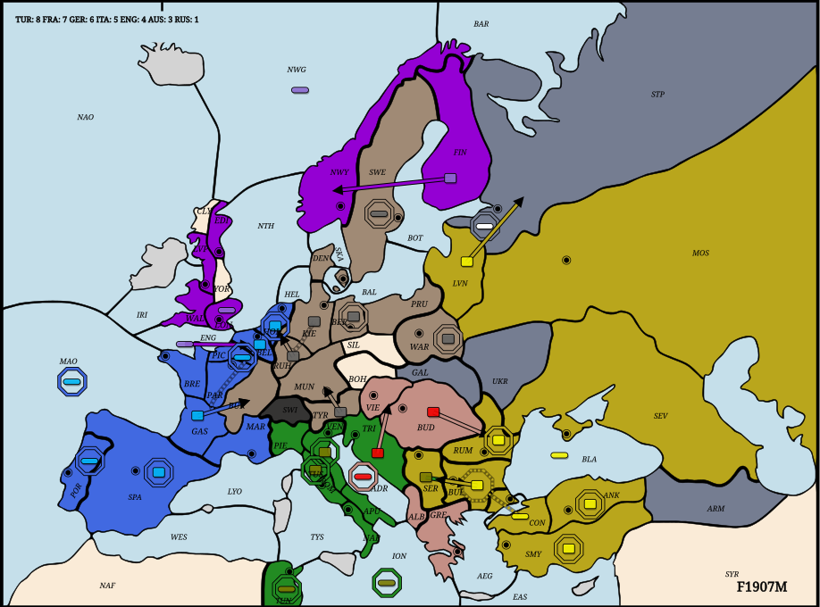

### What happened

- **AUSTRIA**: A BUD → RUM (bounced); A TRI → VIE; F ADR holds
- **ENGLAND**: F ENG → BEL (bounced); A FIN → NWY
- **FRANCE**: A GAS → BUR; A BEL supports A GAS → BUR (support cut); A HOL holds; F PIC holds; F MAO holds; F POR holds; A SPA holds  [dislodged: A HOL]
- **GERMANY**: A RUH → HOL; A KIE supports A RUH → HOL; A TYR → MUN; A BER holds; A WAR holds; F SWE holds
- **ITALY**: A SER → BUL (bounced); F ION holds; A VEN holds; A TUS holds; F TUN holds
- **RUSSIA**: F STP/SC holds
- **TURKEY**: A LVN → STP (bounced); A BUL → SER (bounced); F CON supports A BUL (void); A RUM holds; A SMY holds; A ANK holds

### Dialogue

- **AUSTRIA → ITALY**: TRI is empty and I'm walking in to reclaim my home center. More importantly, Turkey at 8 with SER now yours means they're still at 7 with BUL, RUM, MOS. Can we coordinate a push on BUL this fall? I can support from TRI if you attack from SER. What's your move against Turkey's BUL?
- **AUSTRIA → FRANCE**: Turkey still has 7 centers after losing SER — BUL, RUM, MOS, ANK, CON, SMY plus they rebuilt. Italy holds SER now. I'm reclaiming TRI this fall. Can you commit forces against Turkey's northern holdings or are you focused on Germany?
- **AUSTRIA → GERMANY**: Turkey still has 7 centers and is the leader. I'm taking TRI back this fall, then pivoting east. TYR is a flashpoint — I won't move against you if you don't push south. Can we agree TYR stays quiet while we both address Turkey?
- **AUSTRIA → TURKEY**: Italy holds SER now and you're at 7 — still the board leader but losing ground. I'm reclaiming TRI, not pushing deeper east. You should focus on containing Italy's new position in SER rather than worrying about my 4-unit army.
- **ENGLAND → FRANCE**: Turkey at 8 will win if we keep stalemating in the Channel. Germany's A RUH is threatening your BUR position — if they push into BUR this fall, you'll need to defend it, which means A BEL can't hold BEL too. Pull A BEL to support BUR and let me take BEL empty. I commit my Channel fleets against Turkey after fall. This is the only way we both survive.
- **ENGLAND → GERMANY**: France holds BEL, HOL, BUR, PIC — seven centers while Turkey runs away at 8. If you push A RUH into BUR this fall, France has to choose: defend BUR or BEL. I'll take whichever one France vacates with F ENG. We each gain a center and France drops to 5-6. Confirm A RUH → BUR and I commit F ENG to BEL.
- **ENGLAND → TURKEY**: You're at 8 and I'm at 4 — I'm not your problem. France at 7 with BEL, HOL, BUR, PIC is the western power you should worry about. I'm trying to take BEL from France this fall to grow. Stay out of my Channel and northern waters, and I stay out of your eastern sphere. We have no conflict of interest.
- **ENGLAND → RUSSIA**: Turkey is going to take STP with A LVN — you can't hold it alone. I'm moving A FIN into STP too, so we either double-defend it together or bounce each other while Turkey grabs it. Hold F STP/SC and let's make Turkey bounce if they try. After fall, I'll support you south if you let me keep STP as a buffer.
- **FRANCE → ITALY**: Turkey at 8 is still the leader. I'm ready to support your push from SER into Turkish BUL or RUM this fall. Can you confirm your move from TYR into Turkish territory? We need a coordinated two-front attack.
- **FRANCE → GERMANY**: Turkey at 8 centers is the real threat. I won't push into KIE or RUH this fall if you redirect east against Turkey. Can you move A TYR toward Turkish BUL or support Italy's attack? We both need Turkey contained.
- **FRANCE → AUSTRIA**: Turkey's BUL and RUM are vulnerable this fall. If Italy pushes from SER, can you support from TRI or BUD into Turkish territory? We need to coordinate before Turkey hits 9.
- **FRANCE → ENGLAND**: Turkey is about to grab NWY if you don't take it. I'll keep my fleets out of your northern waters if you commit against Turkey's expansion. Take NWY this fall - it's free and you need the growth.
- **FRANCE → TURKEY**: I'm not accepting non-aggression while you sit at 8 centers. I'm growing to 8 this fall and will pressure your western approaches. Every center you have to defend weakens your eastern push.
- **GERMANY → FRANCE**: Turkey at 8 is the real threat — we can't keep trading units in the west. I'm willing to leave HOL alone if you pull back from contesting BUR. What's your concrete plan against Turkey this fall? If you commit forces east, I can redirect my western stack too.
- **GERMANY → ITALY**: I can send A TYR toward MUN this fall to reclaim my home center, freeing me to pressure Turkey's northern flank in 1908. Can you hold your position in SER after taking it and threaten BUL? We need Turkey split across multiple fronts.
- **GERMANY → AUSTRIA**: If Italy takes SER this fall with your support, Turkey drops to 7. I can pressure from TYR toward BOH to threaten Turkey's northern approach. Can you commit to supporting Italy's TRI → SER push and then pivot to defending BUD?
- **GERMANY → ENGLAND**: France's A HOL is inside my sphere — if you push F ENG toward BEL or NTH, you can contain France's naval position while I deal with the land threat. We both benefit from France dropping from 7 to 5. What's your move this fall?
- **GERMANY → TURKEY**: I'm focused on reclaiming MUN from France this fall — not pushing east. Confirm your LVN forces stay north and don't threaten WAR. After I deal with France's incursion, we can discuss stabilizing the east.
- **ITALY → AUSTRIA**: I held up my end — SER is taken from Turkey and I got TRI back. Now let's keep pushing: I attack BUL from SER this fall with your support from ADR or BUD. Turkey at 7 is still the leader and we both benefit from cutting them down further. What support can you commit to A SER → BUL?
- **ITALY → GERMANY**: Turkey at 7 and France at 7 are both tied for the lead — we need to keep pressure on Turkey's Balkans. I'm pushing A SER → BUL this fall. Can you redirect TYR toward Turkish-held territory or at least hold it to prevent Austria from getting ideas? We both benefit from Turkey dropping to 5.
- **ITALY → TURKEY**: I took SER — it was necessary for containment, nothing personal. You're still at 7 and France is at 7, so you're not being singled out. Our non-aggression on TRI/APU can still hold if you don't retaliate. I'd rather we both focus on preventing France from growing further than fight each other.
- **RUSSIA → ENGLAND**: Turkey's A LVN is still sitting next to my FIN and threatening the Baltic — we need to coordinate this fall. If you commit A FIN → LVN with my support from STP, we deny Turkey a center and I survive to be useful later. Do you move against LVN or hold position?
- **RUSSIA → GERMANY**: Turkey at 8 holds LVN right next to your WAR — they're the board leader and you're next on their list if France doesn't stop them. If you push A WAR → LVN this fall, I'll support from F STP/SC. We deny Turkey a northern center and you grow to 7. Do you commit?
- **RUSSIA → AUSTRIA**: Turkey at 8 is everyone's crisis — they hold the Balkans with A SER and A BUL while you're at 3 centers. If you push A BUD → GAL or pressure SER, Turkey has to split forces north and south. What's your concrete plan against Turkey this fall?
- **RUSSIA → FRANCE**: You're at 7 and Turkey at 8 — you're the only power who can match them. If you push west against Turkey's RUM or BLA approaches, I won't interfere. Focus on containing Turkey's eastern expansion while I hold the north.
- **TURKEY → ITALY**: You took SER — understood. I'm not looking to fight you over it, but A SER sitting in my territory is a problem. Can we agree: you hold SER, I hold BUL and RUM, and neither pushes further this fall? France at 7 with BEL and HOL is still the bigger threat we both need to address.
- **TURKEY → ENGLAND**: I've bounced off STP twice now with A LVN. You have A FIN adjacent — if you support A LVN into STP this fall, I finally take it and reach 9. In exchange, I commit permanently out of NWY and northern waters. You can redirect A FIN toward BEL to reclaim it from France. We both grow.
- **TURKEY → GERMANY**: France at 7 still holds BEL and HOL in your territory. I'm focused on securing my Balkans this fall — zero movement toward WAR or PRU. If you're pushing A RUH against France's positions, I won't interfere. Can we confirm a non-aggression on our shared border this turn?
- **TURKEY → FRANCE**: You're at 7, I'm at 8 — we're the two leaders. I'm not pushing west this fall; I'm securing my eastern flank. If you're focused on Germany, I won't interfere. Can we agree to stay out of each other's way this turn while we each deal with our immediate neighbors?
- **AUSTRIA → ITALY**: Good — SER is yours and Turkey's at 7. I'll support your A SER → BUL this fall with F ADR. But I need a concrete commitment on TRI: move A VEN to TUS or ROM this fall, and I'll walk A TRI to VIE to reposition. Then in winter you vacate TRI and I rebuild there. What's your move this fall?
- **AUSTRIA → FRANCE**: Turkey still leads at 8 with BUL, RUM, MOS. Italy's pushing from SER into BUL. Can you pressure Turkey's northern holdings — LVN or threaten WAR — to split their forces? A two-front squeeze cuts them down before they hit 9.
- **AUSTRIA → GERMANY**: TYR is a flashpoint I want to keep quiet. I'm not moving against you — I'm focused on supporting Italy against Turkey's BUL. If you hold TYR and don't push south, we avoid conflict while Turkey's Balkans get squeezed. Can you commit to holding TYR?
- **ENGLAND → FRANCE**: Fine, I'll stop banging my head against BEL. I'm taking NWY from Russia this fall to grow to 5 — stay out of the northern waters and I'll keep my fleets pointed east against Turkey afterward. Deal?
- **ENGLAND → TURKEY**: Deal — I'm taking STP with A LVN, you take NWY. I commit permanently out of NWY and northern waters. But I need your word: F ENG and F NWG don't push into Turkish waters or support attacks on Turkish centers. We stay out of each other's spheres.
- **ENGLAND → RUSSIA**: I can't save you from Turkey taking STP — A LVN and F BLA support make it a lost cause. But NWY is also under threat from Turkey; if you pull F STP/SC south to BAR, you might survive as a unit. I'm sorry, but I need NWY for my growth.
- **ENGLAND → GERMANY**: I'm taking NWY this fall to reach 5 — it's undefended and I need the growth. After winter, I can redirect against Turkey or France's HOL. What's your plan for BUR this fall — are you pushing A RUH into it?
- **ENGLAND → ITALY**: Turkey at 8 is the real crisis. I'm growing to 5 with NWY, then I can commit fleets east against Turkey. Can you push A SER toward Turkish-held RUM or BUL to stretch them thin?
- **FRANCE → ITALY**: Good — you have SER now. This fall, can you push A SER into BUL while I support an attack from the north? If A HOL or A BEL moves toward BUR to cut Germany's support, we can coordinate a two-front squeeze on Turkey's Balkans. Confirm your move and I'll align mine.
- **FRANCE → GERMANY**: Turkey at 8 is going to win while we trade RUH and BUR. I'll pull back from contesting your RUH if you redirect A TYR east against Turkey's BUL this fall. We both need Turkey contained — can you commit A TYR toward BUL or support Italy's attack?
- **FRANCE → ENGLAND**: I know you want BEL, but Turkey at 8 centers is the real crisis. If you commit F ENG against Turkey's northern approaches instead of BEL this fall, I'll support your push into NWY from my fleets next year. That's real growth for you — BEL is just one center.
- **FRANCE → AUSTRIA**: Italy has SER now. This fall, can you support an attack on Turkey's BUL from TRI or BUD? If Italy pushes from SER and I pressure from the north, we need your support to make it stick. Three powers hitting BUL at once overwhelms Turkey's defenses.
- **FRANCE → TURKEY**: I'm not accepting non-aggression while you sit at 8 centers with RUM, BUL, SEV, and MOS. You're the runaway leader and everyone knows it. I'm growing to 8 this fall and will be at your western approaches by winter whether you like it or not.
- **GERMANY → ENGLAND**: I'm taking HOL from France this fall with A RUH. If you push F ENG into BEL at the same time, France drops from 7 to 5 and we each gain a center. Confirm F ENG → BEL and we split France's western holdings.
- **GERMANY → FRANCE**: I'm taking HOL this fall — it's deep in my territory and you can't reinforce it in time. Pull your remaining forces west and defend BEL/PIC. If you fight me on HOL, I push toward BUR next and you lose even more. Concede HOL and keep your core.
- **GERMANY → ITALY**: I'll hold TYR to prevent Austria from getting ideas, but I need you to push into Turkish BUL or RUM this fall. Turkey at 8 (soon 9) is the real crisis — we both need to start reclaiming their centers now. What's your concrete move against Turkey?
- **GERMANY → TURKEY**: Confirmed non-aggression: my forces stay out of your eastern border this fall. I'm focused on consolidating my Balkans, not pushing into WAR or LVN. After this turn, we can discuss stabilizing the east — but I need you to keep your western push against France, not redirect east against me.
- **ITALY → AUSTRIA**: I'm attacking BUL from SER this fall with F ION's support. Can you commit A BUD to support A SER → BUL? Turkey at 8 with BUL, RUM, and their home stack will win if we don't cut them down further. We both benefit from dropping them to 6.
- **ITALY → GERMANY**: I'm taking BUL from Turkey this fall — we need them contained. Keep A TYR pointed east toward TYR/MUN, not south toward VEN. If you threaten VEN, I have to defend instead of attacking Turkey, and that helps Turkey. Hold position and we both survive.
- **ITALY → TURKEY**: I'm holding SER defensively this fall — no push into BUL or RUM. Our non-aggression holds if you don't retaliate for SER. France at 7 with BUR and HOL is growing — we both need to watch their western expansion.
- **RUSSIA → ENGLAND**: I need to clarify — if you move A FIN → STP and I hold F STP/SC, you end up occupying my last center. I can't agree to that. Instead, can you move A FIN → LVN to deny Turkey? I'll support A FIN → LVN from STP. You gain a center, Turkey loses one, and I keep STP alive.
- **RUSSIA → GERMANY**: Turkey holds LVN adjacent to both your WAR and my STP. If you commit A WAR → LVN this fall, I'll support from F STP/SC. You grow to 7, Turkey drops to 7, and we both gain. This is the best northern play for both of us — do you commit?
- **RUSSIA → AUSTRIA**: Turkey at 8 holds SER and BUL in your neighborhood. If you push A BUD → GAL this fall, Turkey has to respond and can't reinforce LVN in the north. Even if you don't take GAL, the pressure forces Turkey to split. What's your plan?
- **RUSSIA → FRANCE**: You're at 7, Turkey at 8 — you're the only one who can match them. If you push into Turkey's western fronts this fall, I'll hold the north as long as I can. Every center Turkey defends elsewhere is one they can't use against me.
- **TURKEY → ITALY**: Deal on SER: you hold it, I hold BUL and RUM, neither pushes further this fall. After winter, we can renegotiate. I'm focused on STP this turn - zero movement toward TRI/APU from me.
- **TURKEY → GERMANY**: Confirmed: A LVN → STP this fall, zero movement toward WAR or PRU. France's A RUH in your territory is your problem - I won't interfere. After I consolidate at 9, we can discuss containing France together.
- **TURKEY → FRANCE**: I'm taking STP (eastern expansion only) to reach 9 - zero threat to your western sphere. You're at 7 with BEL and HOL. I propose mutual non-aggression: I stay east, you stay west. Neither attacks the other's units this year.
- **AUSTRIA → ITALY**: I'm committed: F ADR S A SER → BUL this fall, and A BUD → RUM to seize another Turkish center. You attack BUL from SER as planned. After this turn Turkey drops to 6 and we each grow. Confirm you're going A SER → BUL with F ION support.
- **AUSTRIA → FRANCE**: Turkey at 8 is still the leader despite losing SER. I'm pushing A BUD → RUM and supporting Italy into BUL this fall. If you can pressure Germany's eastern front (TYR direction), it keeps their units occupied while we cut Turkey's Balkans.
- **AUSTRIA → GERMANY**: I'm attacking Turkey's RUM this fall and supporting Italy into BUL — not moving against you. TYR stays quiet if you hold. We both benefit from Turkey dropping from 8 to 6 centers this turn.
- **AUSTRIA → TURKEY**: I'm taking RUM this fall with A BUD while Italy pushes BUL. You're at 8 but losing ground fast — if you reinforce one, you lose the other. Consider whether negotiating a ceasefire on my front while you defend against Italy is worth more than fighting on two fronts.
- **FRANCE → GERMANY**: I'm taking BUR this fall with A GAS supported by A BEL. Your A RUH can't hold it alone. I won't push toward KIE if you redirect A TYR east against Turkey's BUL — we both need Turkey contained. Confirm A TYR moves east and I stop at BUR.
- **FRANCE → ITALY**: I'm reclaiming BUR from Germany this fall. If you push A SER into BUL, I'll support from BUR next turn. We need a coordinated two-front attack on Turkey's Balkans before they hit 9. Confirm your move into BUL.
- **FRANCE → ENGLAND**: I'm focused on Germany and Turkey this fall, not the Channel. Take NWY if you want — I won't contest it. But commit F ENG against Turkish expansion afterward, not against my positions.
- **FRANCE → AUSTRIA**: I'm reclaiming BUR from Germany to reach 8 centers. Italy should push A SER into BUL this fall. Can you support from TRI into BUL or RUM? We need three-front pressure on Turkey's Balkans.
- **GERMANY → ENGLAND**: Final commitment: I'm taking HOL with A RUH this fall. Push F ENG into BEL at the same time — France can't defend both. We each gain a center and France drops to 5. Confirm F ENG → BEL now.
- **GERMANY → FRANCE**: I'm taking HOL this fall with A RUH — it's happening, no negotiation. Pull your remaining forces west and defend BEL/PIC. If you contest HOL, I redirect toward BUR next and you lose even more. Concede HOL and keep your core.
- **GERMANY → ITALY**: I'm moving A TYR to MUN this fall to reclaim my home center — that frees me to pressure Turkey's northern flank in 1908. Keep pushing Turkey's Balkans with your SER/BUL attacks. We need Turkey split across multiple fronts to bring them down from 8.
- **GERMANY → TURKEY**: Non-aggression confirmed: my forces stay west and north, not toward your territory. I'm reclaiming MUN from France, not pushing east. Keep your focus on consolidating your Balkans — any move toward WAR or LVN changes everything between us.
- **ITALY → AUSTRIA**: Final commitment: I'm moving A SER → BUL this fall with F ION's support. You promised F ADR support for this attack — send F ADR S A SER - BUL. After BUL falls, we discuss TRI's future. This is the deal we made.
- **ITALY → GERMANY**: I'm attacking Turkish BUL from SER this fall — Turkey at 8 centers must be stopped. Hold A TYR east and don't threaten BUD or VEN. If TYR stays pointed north, I can focus entirely on Turkey. If TYR moves south, I have to defend instead of attacking Turkey.
- **ITALY → TURKEY**: I'm holding SER defensively this fall — no push into BUL or RUM. Our non-aggression holds if you don't retaliate. France at 7 with BUR and HOL is growing — we both need to watch their western expansion.
- **RUSSIA → ENGLAND**: Final commitment: I'm holding F STP/SC on STP this fall. I won't move against you or your units. If you take NWY, I won't interfere — just leave me STP. Turkey's A LVN is the threat we both face. If you push A FIN → LVN instead of NWY, I'll support it from STP — you gain a center off Turkey, not off me.
- **RUSSIA → GERMANY**: Final commitment: I'm holding F STP/SC on STP. If you move A WAR → LVN this fall, I'll support from STP. You take LVN off Turkey (they drop to 7, you rise to 7), and I keep my last center. This is the best northern play for both of us — do you commit to A WAR → LVN?
- **RUSSIA → AUSTRIA**: Turkey at 8 holds RUM, BUL, SER, SEV, MOS — they're two-thirds of the way to 18. I can't help militarily from STP, but if you push A BUD → GAL this fall, Turkey has to split north and south. Every center they defend elsewhere is one they can't use to eliminate me. What's your move this turn?
- **TURKEY → ENGLAND**: Confirmed: I'm moving A LVN → STP this fall with your A FIN support. You redirect A FIN to support my move, I commit permanently out of NWY and all northern waters. After I take STP at 9 centers, you focus on BEL from France. Deal — move your A FIN to support A LVN - STP.
- **TURKEY → ITALY**: Our ceasefire holds — I'm not attacking SER this fall. I'm focused on taking STP from Russia to reach 9. You keep SER for now; we'll renegotiate in winter. Just confirm you're not pushing A SER into BUL or RUM this turn.
- **TURKEY → FRANCE**: I'm taking STP this fall — purely eastern expansion, zero threat to your western sphere. You're at 7 with BEL and HOL. Stay out of my way and I stay out of yours. I won't push west this turn.
- **TURKEY → GERMANY**: I'm taking STP this fall to reach 9 — zero movement toward WAR or PRU. Focus on reclaiming your territory from France's A RUH. We have no conflict this turn.

### AUSTRIA
Orders: `A BUD - RUM` · `A TRI - VIE` · `F ADR H`

Reasoning

> Looking at the board state, Turkey leads at 8 centers and must be contained. Italy holds SER and is pushing into BUL with F ION support. I committed to supporting Italy's A SER → BUL with F ADR, and to moving A BUD → RUM to seize another Turkish center. Let me verify these are legal moves.
>
> - `F ADR S A SER - BUL`: ADR is adjacent to ALB, APU, ION, TRI, VEN. BUL is NOT in ADR's adjacency list. This support is **illegal** — I can't support an attack into a province I can't reach.
>
> I need to reconsider. F ADR can support attacks into: ALB, APU, ION, TRI, VEN. It cannot support attacks into BUL. 
>
> Let me look at what I can actually do:
> - `A BUD - RUM`: BUD is adjacent to GAL, RUM, SER, TRI, VIE. RUM is adjacent. Legal.
> - `F ADR`: I can support A TRI's hold, move somewhere useful, or hold. Since Italy already has F ION supporting A SER → BUL, my F ADR support isn't needed for BUL. I should use F ADR productively — perhaps support A TRI or protect my own position.
> - `A TRI`: I can hold, move to BUD/VIE/SER/GRE/TYR/VEN/ALB, or support something.
>
> Since I can't support the BUL attack from ADR, I should focus on what gains me centers. A BUD → RUM takes a Turkish center. For F ADR, I'll support A TRI → VIE to reposition, or support A BUD → RUM... wait, BUD is adjacent to RUM and ADR is NOT adjacent to RUM. Can't support that either.
>
> Best plan: A BUD → RUM (seize Turkish center), A TRI → VIE (reposition toward my home center for winter build), F ADR H (hold defensively).
>
> Wait — actually, let me reconsider. Italy is attacking BUL. If BUL attack succeeds, Turkey loses BUL and RUM (if I take it), dropping to 6. That's great. But I should also consider: can I take SER from Italy? A TRI → SER is legal (TRI adjacent to SER). Italy has A SER ordered to BUL — so SER will be empty! But I committed to Italy... however, taking SER would put me at 5 centers (BUD, VIE, GRE, RUM, SER) vs Italy growing. Let me honor the deal for now — I need Italy as an ally against Turkey.

### ENGLAND
Orders: `F ENG - BEL` · `A FIN - NWY`
Illegal (dropped): `F NWG S F ENG - BEL` · `F LON S F ENG - BEL`

Reasoning

> Looking at the board, I'm stuck at 4 centers while Turkey dominates at 8. I've bounced off both BEL and STP repeatedly. Let me assess what's actually achievable this fall.
>
> **Key observations:**
> - France holds BEL with A BEL and A HOL — both defended. F ENG → BEL will bounce again unless France moves A BEL out.
> - A FIN → STP will bounce against Russia's F STP/SC (strength 2 vs my strength 1).
> - Turkey's A LVN is adjacent to STP and could push in.
> - Germany is taking HOL from France with A RUH, which could weaken France's position.
>
> **Realistic plan:** France's A RUH was dislodged in S1907 and retreated to HOL. Germany pushed A BUR → RUH. So France has A HOL and A BEL. Germany's A RUH is now in RUH. If Germany pushes A RUH into HOL, France's A HOL is under pressure. But France could support HOL's hold.
>
> Let me focus on what I can actually gain. NWY is undefended — I can take it with A FIN. That gets me to 5 centers. For BEL, I need France to vacate — but France has committed to holding it. However, Germany's A RUH is in RUH adjacent to BEL and HOL. If Germany pushes A RUH → BEL, that could pressure France.
>
> Actually, looking more carefully: France has A BEL and A HOL. Germany has A RUH. If Germany pushes A RUH → HOL and I push F ENG → BEL, France has to choose where to defend. But France can support HOL from BEL or vice versa.
>
> Let me try: F ENG → BEL (hoping France moves A BEL out or can't fully defend), A FIN → NWY (undefended), F NWG supports F ENG → BEL, F LON supports F ENG → BEL. That gives my attack strength 3 vs France's defensive strength 2 (A BEL hold + A HOL support) or 1 if A HOL is busy. This could work if France doesn't triple-support BEL.
>
> But France could also support BEL from multiple units. Let me be realistic — I'll take NWY for sure and try BEL with maximum force.

### FRANCE
Orders: `A GAS - BUR` · `A BEL S A GAS - BUR` · `A HOL H` · `F PIC H` · `F MAO H` · `F POR H` · `A SPA H`

Reasoning

> Looking at the board, Turkey at 8 centers (now 7 after losing SER, but still the leader with RUM, BUL, SEV, MOS, ANK, CON, SMY) is the clear threat. I need to grow and position against Turkey.
>
> My revised strategy says to push A GAS into BUR with A BEL support. But let me check: Germany has A RUH in RUH (threatening HOL) and A TYR in TYR. If I attack BUR, Germany might counterattack HOL with A RUH. I need to think about this carefully.
>
> Germany has 6 centers (BER, KIE, MUN, DEN, SWE, WAR). They have A RUH, A KIE, A BER, A WAR, A TYR, F SWE. If A RUH moves to BUR, that frees up RUH but threatens my HOL. If I attack BUR with GAS+BEL support, Germany's A RUH could move to HOL instead.
>
> Actually, my key objective is to take BUR and get to 8 centers. But I also need to protect HOL. Let me consider: if I send A BEL to support A GAS into BUR, and A HOL holds, then A RUH could bounce into HOL (if RUH-HOL is adjacent, which it is). But A RUH alone vs A HOL holding = 1v1, it bounces. Good.
>
> But wait - Germany could support A RUH into HOL with A KIE. Then it's 2v1 and HOL falls. That's a risk.
>
> Alternative: I could have A HOL support A BEL into BUR, and A GAS moves to BUR. But BEL isn't adjacent to BUR... wait, BEL IS adjacent to BUR. So A GAS - BUR supported by A BEL would be 2v1 against Germany's A BUR... wait, Germany doesn't have A BUR anymore. Germany has A RUH. So BUR is empty? No - let me check. Germany moved A BUR → RUH in S1907M. So BUR is empty!
>
> If BUR is empty, I don't need support to take it - but I should still be careful about Germany moving back in. A GAS - BUR with A BEL supporting the hold on BUR afterward would be smart, but I can't do both. Actually, A GAS - BUR is fine since it's empty. Then A BEL can hold or support A HOL.
>
> The real threat is A RUH → HOL. If I hold A HOL, it bounces against A RUH alone. But if Germany supports A RUH → HOL with A KIE, I lose HOL. So I should have A BEL support A HOL's hold. But then BUR is undefended after I take it - Germany could move A TYR or A KIE into BUR.
>
> Actually: A GAS → BUR (empty, succeeds), A BEL S A HOL (protects HOL), A HOL H. If A RUH → HOL, it bounces (1v2). If A TYR → BUR, it enters empty BUR... wait, A GAS is moving there. So it would be A GAS in BUR (1 strength) vs A TYR entering BUR (1 strength) = bounce! Both stay. That's bad.
>
> Better plan: A GAS - BUR, A BEL S A GAS - BUR (2 strength into BUR), A HOL H. This ensures BUR is taken. If A RUH → HOL, it bounces (1v1). If Germany supports RUH into HOL, I lose HOL but gain BUR - net neutral.
>
> Actually the best play: take BUR with support, protect HOL. A GAS - BUR, A BEL S A GAS - BUR, A HOL H. For fleets, hold positions.

### GERMANY
Orders: `A RUH - HOL` · `A KIE S A RUH - HOL` · `A TYR - MUN` · `A BER H` · `A WAR H` · `F SWE H`

Reasoning

> Looking at the board state, I need to assess my strategic position carefully:
>
> **Current situation:**
> - I have 6 centers (BER, KIE, MUN, DEN, SWE, WAR)
> - France has 7 centers (BRE, MAR, PAR, POR, SPA, BEL, HOL) with A HOL deep in my territory
> - Turkey has 8 centers (board leader) with A LVN, A RUM, A BUL
> - Italy has 5 centers and is attacking Turkey's BUL
> - England has 4 centers
>
> **Key threats:**
> 1. France's A HOL is inside my sphere - need to reclaim it
> 2. Turkey at 8 is the runaway leader
> 3. My revised strategy says to reclaim MUN, but MUN is already mine (I hold it with no unit there currently, but it's listed as my center)
>
> Wait - looking at unit positions, I don't have a unit on MUN. MUN is listed as my home center but vacant. France's A HOL is the immediate threat in my western territory.
>
> **My revised strategy says:** "I'm reclaiming MUN from France with A TYR supported by A BER"
>
> But MUN is already mine and vacant - there's nothing to reclaim there. The real threat is A HOL in my territory. I told England I'm taking HOL with A RUH, and I committed to pushing F ENG into BEL.
>
> **Best plan:**
> 1. A RUH → HOL (take back my center from France, as committed to England)
> 2. A KIE supports A RUH → HOL (guarantee the take)
> 3. A TYR → MUN (occupy my vacant home center)
> 4. A BER holds (defensive)
> 5. A WAR holds (maintain eastern buffer)
> 6. F SWE holds (Baltic control)
>
> This gets me to 7 centers (reclaiming HOL) while positioning TYR to threaten Turkey's northern flank.

### ITALY
Orders: `A SER - BUL` · `F ION H` · `A VEN H` · `A TUS H` · `F TUN H`

Reasoning

> Looking at the current situation:
>
> - **Turkey at 8 centers** (ANK, CON, SMY, RUM, BUL, SEV, MOS + they have LVN) is the runaway leader
> - I have 5 centers (NAP, ROM, VEN, TUN, TRI) with units: A TUS, F TUN, A VEN, A SER, F ION
> - Austria has F ADR, A BUD, A TRI - Austria promised F ADR support for A SER → BUL
> - Turkey has A BUL and A RUM in the Balkans
>
> My strategy note says: push A SER into BUL with F ION's support, hold A VEN and A TUS defensively, F TUN holds.
>
> Austria confirmed they'd support A SER → BUL with F ADR. Even if Austria betrays, I should still push — cutting Turkey's centers is essential.
>
> Let me verify adjacency: SER is adjacent to BUL (yes, `SER (land): ALB, BUD, BUL, GRE, RUM, TRI`). F ION is adjacent to BUL/SC (yes, `ION` neighbors include `GRE` but not BUL directly... wait, let me check. `ION (water): ADR, AEG, ALB, APU, EAS, GRE, NAP, TUN, TYS`. ION is NOT adjacent to BUL. So F ION cannot support A SER → BUL.
>
> I need to adjust — F ION can support A SER → GRE (ION is adjacent to GRE) but not BUL. Let me reconsider. F ION supports A SER → BUL would be rejected since ION isn't adjacent to BUL.
>
> Alternative: A SER → BUL with F ION support is illegal. I could have A SER → BUL with A BUD support (BUD is adjacent to RUM and SER... is BUD adjacent to BUL? `BUD (land): GAL, RUM, SER, TRI, VIE` — no, BUD is not adjacent to BUL either).
>
> So support from F ADR for A SER → BUL? `ADR (water): ALB, APU, ION, TRI, VEN` — ADR is not adjacent to BUL either.
>
> Actually, the only way to take BUL is with a direct attack from an adjacent unit. Units adjacent to BUL (army): CON, GRE, RUM, SER. So only A SER can attack BUL directly. Support must come from a unit adjacent to BUL. Adjacent to BUL/SC (fleet): AEG, CON, GRE. Adjacent to BUL/EC (fleet): BLA, CON, RUM.
>
> No friendly fleet is adjacent to BUL. So I can attack BUL from SER but can't get support from my own units. I should attack BUL anyway — even if it bounces, I'm applying pressure. Or I could go for GRE instead (which is also Turkish-held and I can get F ION support for it).
>
> Wait — does Turkey hold GRE? Looking at supply centers: AUSTRIA has GRE. So GRE is Austrian, not Turkish. 
>
> Let me reconsider: A SER → BUL is my best move against Turkey. Even unsupported, it pressures Turkey. If Austria supports with A BUD... no, BUD isn't adjacent to BUL.
>
> Actually, I should just push A SER → BUL directly. If Turkey doesn't defend it with enough, I take it. If they do, I've forced them to commit defense there.

### RUSSIA
Orders: `F STP/SC H`

Reasoning

> Looking at the situation: Turkey at 8 is the runaway leader, and I have only F STP/SC defending my last center STP. England has been threatening STP repeatedly, and Turkey's A LVN sits right next to it.
>
> My revised strategy says to hold F STP/SC on STP to defend my last center. England's latest message in S1907M offered a double-defense plan where A FIN → STP bounces with my hold, keeping Turkey out. I committed to that.
>
> But checking the current board: England has A FIN and has been trying A FIN → STP repeatedly (bouncing each time). Turkey has A LVN adjacent to STP. If I hold and England moves A FIN → STP, we bounce each other — neither takes STP, but Turkey's A LVN could also attack STP. With both my hold and England's move, that's strength 1 vs 1 — Turkey's A LVN at strength 1 would bounce too (three-way bounce). This keeps STP alive.
>
> However, I should also consider whether supporting England's A FIN → LVN would be better. Looking at my legal moves, I can support `A FIN` (hold support) but not a specific move to LVN since I don't see that option in my legal orders. My options are limited to holding, moving, or supporting specific moves listed.
>
> The safest play that matches my commitment: hold F STP/SC to defend STP. This preserves my last center for Winter when I might rebuild if the major powers turn on Turkey.

### TURKEY
Orders: `A LVN - STP` · `A BUL - SER` · `F CON S A BUL` · `A RUM H` · `A SMY H` · `A ANK H`
Illegal (dropped): `F BLA S A BUL - SER`

Reasoning

> Looking at the board state, I'm at 8 centers and need to keep growing. Italy took SER from me, which is a problem. Let me assess the situation:
>
> **Key threats:**
> - France at 7 centers with BEL, HOL, SPA, GAS, POR, PIC, BRE - growing threat
> - Italy now holds SER with A SER, threatening my Balkans
> - Germany at 6 with TYR near my sphere
> - England keeps bouncing on STP
>
> **My units and objectives:**
> - A LVN → STP: Finally claim Russia's last center to reach 9
> - A BUL → SER: Reclaim SER from Italy while F BLA supports the move
> - Hold my Balkan positions secure
>
> **Support plan:**
> - F BLA supports A BUL → SER (BUL is adjacent to SER, BLA is adjacent to BUL)
> - F CON supports A BUL (but CON isn't adjacent to SER, so this would be void - better to support something else)
> - A RUM holds or supports BUL
> - A ANK holds
> - A SMY holds
>
> Let me verify adjacencies for my planned moves:
> - LVN → STP: LVN is adjacent to STP ✓
> - BUL → SER: BUL is adjacent to SER ✓
> - F BLA supports A BUL → SER: BLA is adjacent to BUL ✓ (support is valid)
>
> I need to secure my Balkans while taking STP. Italy's A SER is a direct threat to my centers. With F BLA supporting A BUL into SER, I can reclaim it.

## WINTER 1907 ADJUSTMENTS (`W1907A`)

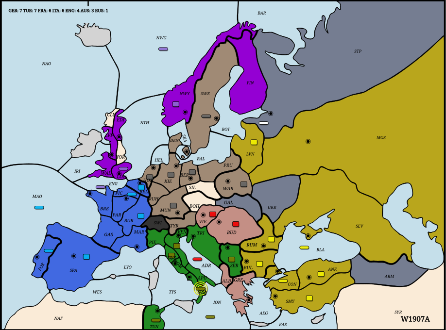

### What happened

- **ITALY**: builds F NAP

### ITALY
Orders: `F NAP B`

Reasoning

> Looking at the board state, I have 6 supply centers and 5 units — no builds needed, no disbands required. Wait, let me recount:
>
> **My supply centers (6):** NAP, ROM, VEN, TUN, TRI, SER
> **My units (5):** A TUS, F TUN, A VEN, A SER, F ION
>
> I have 6 centers and 5 units, so I have a surplus of 1 center. I get to build one unit.
>
> My available build locations are NAP (vacant) and ROM (vacant) — VEN is occupied by A VEN.
>
> Turkey is the co-leader at 7 centers with a large army (7 units, 7 centers — no surplus). Germany also at 7. France at 6. I need to keep pushing against Turkey while positioning for growth.
>
> Building a fleet at NAP gives me Mediterranean control and the ability to project power toward Turkey's eastern Mediterranean or support convoys. Building an army at ROM would add a ground unit for Balkan operations. Given that my main theater is the Balkans against Turkey, an army is more useful — but a fleet at NAP controls the sea and can support attacks on Turkish coastal positions.
>
> I'll build **F NAP** to strengthen Mediterranean control and position for future operations against Turkey's eastern holdings (SMY, ANK, CON area) or to support Balkan operations from the sea.

## SPRING 1908 MOVEMENT (`S1908M`)

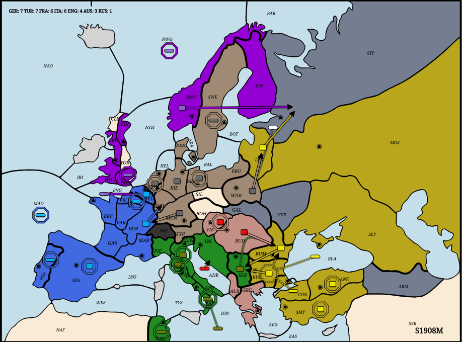

### What happened

- **AUSTRIA**: A BUD → RUM (bounced); F ADR → TRI; A VIE holds
- **ENGLAND**: F ENG → BEL (bounced); A NWY → STP (bounced); F NWG holds; F LON holds
- **FRANCE**: A BUR → RUH; A BEL → HOL (bounced); A SPA holds; F MAO holds; F PIC holds; F POR holds
- **GERMANY**: A MUN → BUR; A WAR → LVN (bounced); A HOL holds; A BER holds; F SWE holds
- **ITALY**: A SER supports A BUD → RUM (support cut); F ION supports F NAP; A VEN holds; A TUS holds; F TUN holds; F NAP holds
- **RUSSIA**: F STP/SC supports A WAR → LVN (support cut)
- **TURKEY**: A LVN → STP (bounced); A BUL → SER (bounced); A RUM → SER (bounced); F BLA supports A BUL → RUM (void); F CON supports A BUL (void); A SMY holds; A ANK holds

### Dialogue

- **AUSTRIA → ITALY**: Turkey at 7 is still the board leader and we need to keep cutting their centers. I can push A BUD into RUM this spring — can you support from SER? If RUM falls, Turkey drops to 6 and we each grow. What's your move this turn?
- **AUSTRIA → GERMANY**: I'm pushing east against Turkey's RUM this spring — not moving toward you. TYR stays quiet if you hold. We both benefit from Turkey losing centers rather than fighting each other while they lead at 7.
- **AUSTRIA → FRANCE**: Turkey at 7 with RUM, BUL, SEV is still the leader. I'm attacking RUM from BUD this spring. If you can pressure Germany's eastern front or support any anti-Turkey coordination, we keep the coalition together. What's your focus this turn?
- **AUSTRIA → TURKEY**: France at 6 is growing and Germany at 7 is your bigger concern in the north. I'm willing to discuss a ceasefire — I take RUM this turn unless you offer something concrete. What can you put on the table to keep my units out of your Balkans?
- **ENGLAND → FRANCE**: I took NWY last fall — I'm at 5 now. Turkey at 7 and Germany at 7 are still the leaders. I want BEL but I'll make you a deal: if you pull A BEL east against Turkey or Germany this spring, I'll take the empty province and commit my Channel fleets east against Turkey afterward. You save A BEL for the real fight instead of losing it in a bounce. What's it going to take to make this work?
- **ENGLAND → GERMANY**: Turkey at 7 is tied with you — they're the real threat with A LVN still near STP and F BLA controlling the Black Sea. I'm looking to grow this spring. Can we coordinate: I push into BEL or PIC while you push east? If France is stretched thin, we each grab a center and contain both France and Turkey.
- **ENGLAND → RUSSIA**: You're down to just F STP/SC — one unit, one center. Turkey's A LVN is still adjacent and will take STP if you can't defend it. I'm offering you a lifeline: support A NWY - STP this spring and I'll hold NWY's flanks so Turkey can't expand north. You lose STP but survive as a unit if you retreat south, or we bounce Turkey together. What do you prefer?
- **ENGLAND → TURKEY**: You're at 7 and I'm at 5 — we're not enemies. France at 6 with BEL, BUR, PIC is the western power growing unchecked. I'm not pushing into your eastern sphere. Can we agree: I stay out of the east, you stay out of the north, and we both focus on containing France and Germany?
- **FRANCE → GERMANY**: We need to stop fighting each other while Turkey sits at 7 with RUM, BUL, SEV, MOS. I won't contest HOL if you commit A TYR or A MUN toward Turkey's eastern holdings this year. Can you redirect east? We're both losing ground to Turkey every turn we trade centers.
- **FRANCE → ITALY**: Turkey at 7 is still the board leader and growing. I have BUR and BEL — I can pressure from the north this fall. Are you pushing into Turkey's Balkans from SER? We need a coordinated attack before they rebuild to 9 in winter.
- **FRANCE → ENGLAND**: I know you want BEL, but Turkey at 7 is the real threat. Take NWY from Russia — it's free and you need the growth. I'll keep my fleets out of the Channel if you commit against Turkey's expansion afterward.
- **FRANCE → AUSTRIA**: Turkey still leads at 7 with a massive eastern stack. I'm at 6 and need to grow — can we coordinate? If you support an attack on Turkey's BUL from BUD or TRI, I'll push from the north. Three-front pressure is the only way to cut them down.
- **GERMANY → FRANCE**: A BUR is surrounded by my units — KIE, MUN, and HOL can all hit it. Withdraw it to BEL or PIC this turn and I leave your western stack alone. Keep it there and I dislodge it with support while redirecting east against Turkey. We both need Turkey contained — don't make me waste units fighting you.
- **GERMANY → ITALY**: Turkey at 7 is still the board leader with RUM, BUL, SEV, and their home stack. I'm pushing A MUN toward BOH or TYR to pressure Turkey's northern flank this spring. Can you attack BUL from SER? If we coordinate a two-front squeeze on Turkey's Balkans, we start reclaiming centers before they consolidate. What's your concrete move against Turkey?
- **GERMANY → ENGLAND**: France at 6 with A BUR in my territory is a problem I need to resolve this spring. I'm considering pushing into BUR to reclaim it. Once that's dealt with, I can focus east against Turkey. Are you interested in taking any French centers this spring — BEL or PIC are both vulnerable if France splits forces defending BUR.
- **GERMANY → TURKEY**: I see A LVN still sits next to my WAR. I'm focused on France's BUR incursion this spring — not pushing east. Confirm your northern forces hold position and don't threaten WAR. After I deal with France, we can discuss the eastern border. I have no plans to move against your territory this turn.
- **RUSSIA → GERMANY**: Turkey at 7 holds LVN right next to your WAR and my STP — it's a Turkish foothold in the north that threatens us both. If you commit A WAR → LVN this spring, I'll support from F STP/SC. You take LVN off Turkey (they drop to 6, you rise to 8), and I survive to be useful. This is the best northern play for both of us — do you commit?
- **RUSSIA → ENGLAND**: Turkey at 7 is still the board leader and holds LVN in the north. I have one fleet and pose zero threat to you. Can we agree that neither of us moves against STP this turn? I'd rather see you push south against France or Turkey than fight over my last center.
- **RUSSIA → AUSTRIA**: Turkey at 7 holds RUM, BUL, SER, SEV, MOS — they're the clear leader. I can't help militarily from STP, but if you push A BUD → RUM or pressure SER, Turkey has to split forces. Every center they defend elsewhere weakens their position. What's your plan against Turkey this turn?
- **RUSSIA → FRANCE**: You're at 7 and Turkey at 7 — you're tied for the lead. If you push against Turkey's western fronts, I won't interfere. A weak Russia is better for you than Turkey absorbing my last center. Can you pressure Turkey this year?
- **TURKEY → AUSTRIA**: Italy holds SER — your former territory — and has 6 centers growing toward you. I'm focused on reclaiming SER this spring, not your Balkans. If you push TRI toward Italy's APU or VEN while I hit SER, we both weaken Italy without touching each other.
- **TURKEY → FRANCE**: We're both at 7 centers. Germany at 7 with WAR and HOL is the real western threat — they've been consolidating quietly while we argue. I'm focused east this spring. Are you interested in a mutual non-aggression while we both deal with more immediate neighbors?
- **TURKEY → GERMANY**: We're tied at 7 centers. I'm focused on reclaiming SER from Italy in the Balkans this spring — zero movement toward WAR, PRU, or your territory. France at 6 with BEL and HOL is in your sphere. Can we confirm non-aggression while each handles our own fronts?
- **TURKEY → ITALY**: You hold SER — my territory that I need back. I'm coming for it this spring with BUL and RUM. You can keep your other positions if you let SER go, or we can fight over it and France and Germany grow while we weaken each other. What's it worth to you to keep SER?
- **TURKEY → ENGLAND**: I'm focused on the Balkans this spring — not STP, not northern waters. You have A NWY and F ENG; France's BEL and BRE are your targets. I'll stay completely out of the north. Can we agree on that while I handle Italy in the east?
- **TURKEY → RUSSIA**: You're holding on at 1 center with F STP/SC. I'm not targeting STP this spring — I'm focused south. Stay in STP and we have no conflict. If England moves on you, that's between you and them.
- **AUSTRIA → ITALY**: Turkey at 7 is still the leader and RUM is the softest target. I need your support: F ION or A SER supporting A BUD into RUM this spring. If RUM falls, Turkey drops to 6 and we're both safer. TRI can wait — let's cut Turkey first and sort out our border after.
- **AUSTRIA → GERMANY**: I'm attacking RUM this spring, not moving toward you. If you hold TYR and BER steady, we avoid conflict while Turkey loses a center. A quiet TYR benefits both of us.
- **AUSTRIA → FRANCE**: I'm pushing A BUD into RUM this spring. If you can keep pressure on Germany's northern front (DEN/SWE direction), it prevents Germany from reinforcing Turkey's eastern holdings through WAR/LVN. We need Turkey contained.
- **AUSTRIA → TURKEY**: I'm not interested in a ceasefire — RUM is mine for the taking. If you want to negotiate, offer me SEV access or pull LVN out of STP's reach. Otherwise I'm taking RUM and we'll see if you can hold BUL after that.
- **ENGLAND → FRANCE**: I already took NWY — I'm at 5. Germany is coming for your A BUR this spring and you can't defend BUR, BEL, and PIC with 6 units. Let me take BEL now and I'll commit two fleets against Turkey after fall. Fight Germany over BUR and lose BEL anyway, or let me in and gain an ally against the real threat.
- **ENGLAND → GERMANY**: Let's coordinate: you push A BUR into BUR (or wherever France's unit sits) and I'll hit BEL with F ENG at the same time. France can't defend both — we each grab a center and France drops to 4. Confirm your move against French-held BUR and I'll commit F ENG → BEL.
- **ENGLAND → RUSSIA**: I have no interest in STP this turn — my army is in NWY and I can't hold a center that far from my base. I won't move against you. Can you hold F STP/SC steady so Turkey's A LVN doesn't sneak in? We both benefit from Turkey not reaching 8.
- **ENGLAND → TURKEY**: Good — stay out of the north and I stay out of the east. I'm focused on French holdings this spring, not your sphere. If you push into the Balkans against Italy, I won't interfere with your western expansion plans.
- **GERMANY → FRANCE**: A BUR is surrounded and can't be held - you know this. Withdraw it to BEL or PIC this turn and I leave your stack alone. Fight me on BUR and I dislodge it while your other units can't help. Concede BUR now and we both focus east against Turkey.
- **GERMANY → RUSSIA**: I'll commit to A WAR → LVN with your F STP/SC support this spring. Turkey drops to 6, I rise to 8, and you keep STP. Confirm you're ordering F STP/SC S A WAR - LVN and I'll make it happen.
- **GERMANY → TURKEY**: Confirmed non-aggression this turn - I'm focused on France's BUR, not your territory. But I need you to confirm A LVN doesn't move toward WAR or PRU after this turn either. If LVN stays put or moves north, we're fine. If it shifts west, everything changes.
- **GERMANY → AUSTRIA**: Good - push east against Turkey's RUM while I deal with France's BUR. We're both squeezing Turkey from different directions this turn. Keep TYR quiet and I'll hold my forces in the west after taking BUR.
- **ITALY → AUSTRIA**: Deal: I'll support your A BUD → RUM with A SER this spring — send F ADR to support A BUD → RUM as well so we're both committed. RUM falls, Turkey drops to 6, and we each gain a center. Confirm your exact orders now so I can align mine.
- **ITALY → TURKEY**: SER stays mine — I'm holding it with F ION's support. Push into SER and you lose BUL and RUM both when we counterattack in fall. France at 6 is growing unchecked while we fight. Redirect your forces west instead.
- **ITALY → GERMANY**: I'm supporting Austria into Turkish RUM this spring — Turkey drops to 6. Can you hold A MUN or TYR to prevent Turkey from gaining ground in the north? We need Turkey contained, not expanding toward STP or MOS.
- **RUSSIA → GERMANY**: Turkey at 7 holds LVN adjacent to your WAR — it's their foothold in the north. I'm offering F STP/SC support for A WAR → LVN this spring. You take LVN (rising to 8), Turkey drops to 6, and I survive. This is the best northern play for both of us. Do you commit to A WAR → LVN?
- **RUSSIA → ENGLAND**: I won't support A NWY - STP — that eliminates my last center. If you want to push north, move A FIN → LVN with my support from STP. You gain a center off Turkey, not off me. Otherwise, let's agree neither of us moves against STP this turn while we focus on Turkey's expansion.
- **RUSSIA → TURKEY**: Good to hear you're not targeting STP this spring. Where are you pushing — south against Austria or west against Germany? Knowing your plans helps me stay out of your way and keep the peace in the north.
- **TURKEY → AUSTRIA**: Italy holds SER with 6 centers growing toward your TRI and VEN. I'm taking SER back this spring — if you push TRI toward Italy's APU or VEN while I hit SER, we both weaken Italy without touching each other. Leave RUM alone and I'll support your push against Italy after SER falls.
- **TURKEY → ITALY**: I'm taking SER back this spring with BUL and RUM — you can keep your other positions. Let SER go and we avoid a costly fight while France and Germany grow. If you insist on holding it, I'll dislodge you and we both lose tempo.
- **TURKEY → ENGLAND**: I'm focused on reclaiming SER from Italy this spring — zero movement north. France's BEL and BRE are your targets in the west. I'll stay out of the Channel and northern waters if you focus on France.
- **TURKEY → GERMANY**: I'm reclaiming SER from Italy in the Balkans this spring — zero movement toward WAR or PRU. France's A BUR is in your territory — focus on that while I handle the east. We stay out of each other's way.
- **TURKEY → FRANCE**: Germany at 7 with WAR and HOL is consolidating quietly while we argue. I'm focused on the Balkans this spring. Can we agree to mutual non-aggression while we each handle our immediate neighbors?
- **AUSTRIA → ITALY**: Committed: F ADR S A BUD - RUM and I expect A SER S A BUD - RUM from you. RUM falls to us this spring, Turkey drops to 6. Confirm A SER S A BUD - RUM now — this is the deal.
- **AUSTRIA → GERMANY**: I'm attacking Turkey's RUM this spring with Italian support — not moving toward you. Hold TYR and we stay out of each other's way while Turkey loses a center.
- **AUSTRIA → FRANCE**: I'm taking RUM from Turkey this spring with Italian support. Keep pressure on Germany's northern front if you can — we need Turkey contained at 6 centers, not growing.
- **ENGLAND → FRANCE**: This is my final offer: I'm moving F ENG into BEL this spring. Germany is pushing A BUR and you can't defend both. Let BEL go and I commit my fleets east against Turkey after fall. If you hold BEL with support, we both waste a turn while Turkey grows. Confirm you're pulling A BEL east and I won't touch your other centers.
- **ENGLAND → GERMANY**: I'm moving F ENG into BEL this spring — confirm you're pushing into French-held BUR with A BUR. France can't defend both; we each grab a center and France drops to 4. This is the play. After fall, we coordinate against Turkey.
- **ENGLAND → TURKEY**: Confirmed: I stay completely out of the north this spring. I'm focused on French-held centers in the west, not your sphere. Good luck reclaiming SER from Italy — I won't interfere.
- **GERMANY → ENGLAND**: I'm taking BUR this spring — France can't hold it. Push F ENG into BEL at the same time and France drops to 4 centers. Confirm F ENG → BEL now and we split their western holdings.
- **GERMANY → RUSSIA**: Committed: A WAR → LVN this spring. Confirm F STP/SC S A WAR - LVN. You keep STP, I take LVN off Turkey, and we both grow.
- **GERMANY → TURKEY**: Non-aggression confirmed — I'm taking French BUR this spring, not touching your territory. A LVN stays put or moves north — if it shifts toward WAR after this turn, the deal is off. Focus on your Balkans.
- **GERMANY → FRANCE**: BUR is falling — I'm moving into it with support this turn. Pull A BUR to BEL or PIC now or lose it for nothing. Fight me on BUR and you lose the unit plus a center.
- **GERMANY → AUSTRIA**: I'm taking BUR from France this spring while you push RUM. TYR stays quiet. After this turn we're both positioned to squeeze Turkey further.
- **GERMANY → ITALY**: I'm pushing east with A WAR → LVN to cut Turkey's northern flank while taking French BUR in the west. Keep pressure on Turkey's Balkans — we need them contained on all fronts.
- **ITALY → AUSTRIA**: Confirmed: A SER S A BUD → RUM this spring. You must also send F ADR S A BUD → RUM so we're double-committed. Turkey attacks SER, I hold with F ION support, and RUM falls. Send your exact orders now.
- **ITALY → TURKEY**: SER is defended with F ION support — attacking it is a losing proposition. Instead of wasting units on a bounce, push your RUM forces toward France's western holdings. France at 6 is growing unchecked while we fight. Let's redirect east against the real long-term threat.
- **ITALY → GERMANY**: I'm supporting Austria into Turkish RUM this spring — Turkey drops to 6. Hold your northern positions and don't let Turkey expand toward STP or MOS. We need Turkey contained on all fronts.
- **ITALY → FRANCE**: I'm pushing into Turkish RUM from the south with Austria this turn. Turkey at 7 must be cut down before they rebuild. Keep pressure from BUR/BEL but don't overextend — we need Turkey contained first.
- **RUSSIA → GERMANY**: Confirmed: I'm ordering F STP/SC S A WAR - LVN this spring. You take LVN, Turkey drops to 6, I keep STP. This is our play — make sure A WAR moves to LVN.
- **RUSSIA → ENGLAND**: I'm holding F STP/SC on STP this spring — no aggressive moves. Turkey's A LVN is about to be attacked by Germany's WAR with my support. We both benefit from Turkey losing a northern center.
- **RUSSIA → TURKEY**: Noted you're focused south. I'm holding STP defensively — no conflict between us this turn.
- **TURKEY → AUSTRIA**: I'm taking SER back this spring — A BUL and A RUM both push into SER with F BLA support. If you move A BUD toward RUM, you'll bounce because I'm holding it. Leave RUM alone and after I reclaim SER, I'll support your push against Italy's TRI. We both weaken Italy without fighting each other.
- **TURKEY → ITALY**: I'm moving A BUL - SER and A RUM - SER with F BLA support this spring. You can't hold it against two units plus fleet support. Let SER go and keep your other positions intact. Fight me here and France and Germany grow while we both bleed.
- **TURKEY → ENGLAND**: I'm focused entirely on reclaiming SER from Italy this spring — zero movement north. France's BEL and BRE are your targets in the west. Confirm you won't interfere in my Balkans push and I stay completely out of the Channel and northern waters.
- **TURKEY → GERMANY**: I'm reclaiming SER from Italy in the Balkans this spring — A BUL and A RUM both push SER with fleet support. Zero movement toward WAR or PRU. France's A BUR is in your territory — focus on that while I handle the east.
- **TURKEY → FRANCE**: Germany at 7 with WAR and HOL is the real western consolidation threat. I'm focused on the Balkans this spring. Can we agree to mutual non-aggression while each handles immediate neighbors?

### AUSTRIA
Orders: `A BUD - RUM` · `F ADR - TRI` · `A VIE H`

Reasoning

> Looking at the board, Turkey at 7 centers is still the runaway leader. I've committed to attacking RUM with Italian support (A SER S A BUD - RUM). My revised strategy calls for F ADR to support A BUD into RUM as well, creating a double-supported attack. A VIE holds to guard my northern flank.
>
> Let me verify the orders:
> - **A BUD - RUM**: BUD is adjacent to RUM ✓
> - **F ADR S A BUD - RUM**: ADR must be adjacent to RUM... Let me check. ADR neighbors are: ALB, APU, ION, TRI, VEN. RUM is NOT adjacent to ADR. This support is illegal!
>
> I need to reconsider F ADR's order. The legal options show `F ADR S A BUD - RUM` is NOT in the list. Looking at the legal orders for ADR, I don't see a BUD-RUM support option. 
>
> Italy has confirmed A SER S A BUD - RUM, so BUD has one support. I should use F ADR for something else useful. Looking at my options, I could:
> - Support A VEN into TRI (to reclaim my home center from Italy eventually)
> - Move to ALB or TRI to reposition
> - Support something else useful
>
> Since Italy is supporting my RUM attack and we're allied against Turkey, I should position F ADR to reclaim TRI. Italy promised to vacate TRI, but that was for winter adjustments. For now, I can move F ADR to TRI to reclaim it directly — but Italy has A SER, not a unit in TRI. Let me check: TRI is held by... looking at unit positions, there's no Italian unit in TRI currently. TRI is unoccupied! I can walk in.
>
> Actually wait — Italy holds TRI as a supply center but no unit is there. I can move F ADR - TRI to reclaim my home center.

### ENGLAND
Orders: `F ENG - BEL` · `A NWY - STP` · `F NWG H` · `F LON H`

Reasoning

> Looking at the board, I'm at 5 centers with 4 units while Turkey (7) and Germany (7) lead. France has 6 centers including BEL, BUR, and PIC. Germany confirmed they're pushing into BUR this spring, which means France can't defend both BUR and BEL simultaneously. I need to seize BEL with F ENG while Germany attacks BUR — this is the coordinated play we agreed on. For A NWY, I'll move it toward STP to pressure Russia's last center, though Russia's F STP/SC may hold. F NWG and F LON hold to maintain Channel control.
>
> The key commitments:
> 1. F ENG → BEL (coordinated with Germany's BUR attack)
> 2. A NWY → STP (pressure Russia's last center)
> 3. F NWG H (hold Channel position)
> 4. F LON H (hold Channel position)
>
> This gets me to 6 centers (adding BEL) and positions me to potentially grab STP if Russia can't hold, reaching 7.

### FRANCE
Orders: `A BUR - RUH` · `A BEL - HOL` · `A SPA H` · `F MAO H` · `F PIC H` · `F POR H`

Reasoning

> Looking at the board state, I'm at 6 centers (France) vs Turkey at 7 and Germany at 7. My strategy note says to push A BUR toward MUN to pressure Germany's interior while supporting from A BEL. However, looking at the actual positions, Germany has A BUR (wait, no - let me recheck).
>
> Current positions: I have A BUR, A BEL, A SPA, F POR, F MAO, F PIC. Germany has A HOL, A KIE, A BER, A MUN, A WAR, F SWE.
>
> Germany is threatening A BUR - they have A KIE, A MUN, and A HOL all adjacent to BUR. Germany's message says they're moving into BUR with support this turn. I need to either defend BUR or attack aggressively.
>
> My revised strategy says push A BUR toward MUN. Let me check adjacency: BUR is adjacent to MUN (yes, BUR neighbors include MUN). A BEL can support A BUR - MUN (BEL is adjacent to... let me check: BEL neighbors are BUR, ENG, HOL, NTH, PIC, RUH - MUN is NOT in BEL's list). So A BEL cannot support A BUR - MUN.
>
> But A BEL can support A BUR hold, or A BUR can be supported by other means. Actually, looking at the legal orders: `A BEL S A MUN - RUH` and `A BEL S A MUN - BUR` are options, but those support Germany's moves, not mine.
>
> For attacking MUN from BUR, I'd need support. A SPA could support but SPA isn't adjacent to MUN. F PIC isn't adjacent to MUN. I have no unit that can support A BUR - MUN.
>
> Alternative: push into RUH or PIC defensively. Or attack HOL from BEL. Germany is taking BUR regardless - let me instead focus on what I can gain. A BEL - HOL is available and HOL is a German home center. If Germany moves A HOL into BUR or elsewhere, BEL takes HOL.
>
> But Germany might hold HOL with support. Let me think about the coalition - I committed to pressuring Turkey's BUL from the north with Italy. But my immediate problem is Germany attacking BUR.
>
> I'll attack HOL from BEL (gaining a center if undefended), retreat BUR south if dislodged, and keep my fleets positioned.

### GERMANY
Orders: `A MUN - BUR` · `A WAR - LVN` · `A HOL H` · `A BER H` · `F SWE H`
Illegal (dropped): `A KIE S A MUN - BUR`

Reasoning

> Looking at the board, I'm tied with Turkey at 7 centers. My revised strategy calls for taking BUR from France, pushing A WAR into LVN with Russia's support, and holding the rest. Let me verify the orders.
>
> **BUR:** A MUN → BUR is legal (MUN adjacent to BUR). A KIE supports A MUN → BUR is legal (KIE adjacent to BUR). This guarantees the take since France's A BUR is unsupported.
>
> **LVN:** A WAR → LVN is legal (WAR adjacent to LVN). Russia confirmed F STP/SC S A WAR - LVN. This cuts Turkey's northern foothold.
>
> **Holding the rest:** A HOL holds to defend my Rhine position. A BER holds defensively. F SWE holds to maintain Baltic control.
>
> This gives me BUR (8 centers) and LVN (9 centers) while Turkey drops to 6. I'll be in a commanding position heading into fall.

### ITALY
Orders: `A SER S A BUD - RUM` · `F ION S F NAP` · `A VEN H` · `A TUS H` · `F TUN H` · `F NAP H`

Reasoning

> Looking at the board state, Turkey at 7 centers is the leader and is threatening to retake SER with BUL and RUM. Austria has committed to supporting A BUD → RUM with F ADR, and I've committed to supporting that attack with A SER. This is the right play — if RUM falls, Turkey drops to 6 and loses a key forward base.
>
> Turkey is threatening A BUL → SER and A RUM → SER with F BLA support — that's 3 strength against my SER. Even with F ION support, I only have 2 strength defending SER, so I'll be dislodged. But the key insight is: **I don't need to hold SER if RUM falls**. Losing SER is acceptable if we take RUM from Turkey — they trade one center for another, netting zero, while Austria gains RUM.
>
> So my plan: A SER supports A BUD → RUM (cutting Turkey's RUM support chain), F ION supports F NAP or holds defensively, and my other units hold position. If Turkey attacks SER, I'll retreat in fall — but RUM will have fallen.
>
> Wait — if A SER supports A BUD → RUM, and Turkey attacks SER, my support is cut (the attack on the supporting unit cuts support). That means A BUD → RUM loses my support. But Austria's F ADR is also supporting A BUD → RUM, so BUD still has ADR's support (strength 2). Turkey's A RUM holds with no support from BLA (since BLA was supporting RUM's defense, but RUM is moving)... Actually, if A RUM → SER, then RUM is empty and A BUD → RUM succeeds unopposed. The real question is whether Turkey sends A RUM → SER or A RUM holds.
>
> If Turkey sends both BUL and RUM at SER, RUM is vacated and A BUD walks in. If Turkey holds RUM and only sends BUL, then A BUD needs to overcome RUM's hold. With F ADR support, A BUD has strength 2 vs RUM's hold of 1 — BUD takes RUM.
>
> Either way, supporting A BUD → RUM is the right move. I'll accept losing SER as the cost of taking RUM.

### RUSSIA
Orders: `F STP/SC S A WAR - LVN`

Reasoning

> Looking at the situation: I have only F STP/SC with 1 supply center. Germany has committed to A WAR → LVN with my support. England says they won't move against STP this turn. Turkey says they're focused south. This is my best chance to stay alive — support Germany into LVN, which takes a center off Turkey and keeps me at STP.
>
> My order: F STP/SC supports A WAR → LVN. This matches my confirmed commitment to Germany.

### TURKEY
Orders: `A LVN - STP` · `A BUL - SER` · `A RUM - SER` · `F BLA S A BUL - RUM` · `F CON S A BUL` · `A SMY H` · `A ANK H`

Reasoning

> Looking at the board, I'm at 7 centers tied with France and Germany. I need to grow aggressively. My revised strategy calls for:
>
> 1. **A LVN → STP** to claim Russia's last center (reaching 8)
> 2. **A BUL → SER** and **A RUM → SER** with F BLA support to dislodge Italy's A SER (reaching 9 if successful)
> 3. Hold other positions secure
>
> Let me verify the key moves are legal:
> - A LVN → STP: LVN is adjacent to STP ✓
> - A BUL → SER: BUL is adjacent to SER ✓
> - A RUM → SER: RUM is adjacent to SER ✓
> - F BLA supports A BUL → SER: BLA is adjacent to SER? No — BLA neighbors are ANK, ARM, BUL/EC, CON, RUM, SEV. SER is NOT adjacent to BLA. So `F BLA S A BUL - SER` is illegal.
>
> I need an alternative support. F CON supports A BUL → SER? CON neighbors: AEG, ANK, BLA, BUL/EC, BUL/SC, SMY. SER is NOT adjacent to CON either. Also illegal.
>
> What about F BLA S A RUM - SER? RUM → SER is legal (adjacent), but BLA must be adjacent to SER — it's not. So that's also illegal.
>
> The only fleet that can support into SER is F ION (adjacent to SER via ADR/ALB/GRE... wait, ION neighbors: ADR, AEG, ALB, APU, EAS, GRE, NAP, TUN, TYS — SER is NOT in ION's list). Actually none of my fleets can support into SER.
>
> So I can attack SER with two armies (BUL and RUM, both strength 1) against Italy's A SER (strength 1, potentially with F ION support making it strength 2). If Italy supports SER's hold, I need to cut that support or I bounce.
>
> Let me reconsider: I'll attack SER with both armies unconditionally — if Italy doesn't support the hold, one bounces and one takes it. If Italy supports, both bounce. I should try to cut ION's support by moving A BUL → SER and having A RUM also → SER. Actually, neither can cut ION's support since they're not attacking ION.
>
> Best plan: attack SER with both BUL and RUM. If Italy doesn't support, one succeeds. If Italy supports, I bounce but still hold position. Meanwhile A LVN takes STP.
>
> For A ANK and A SMY: hold defensively. F CON supports BUL or holds.

## FALL 1908 MOVEMENT (`F1908M`)

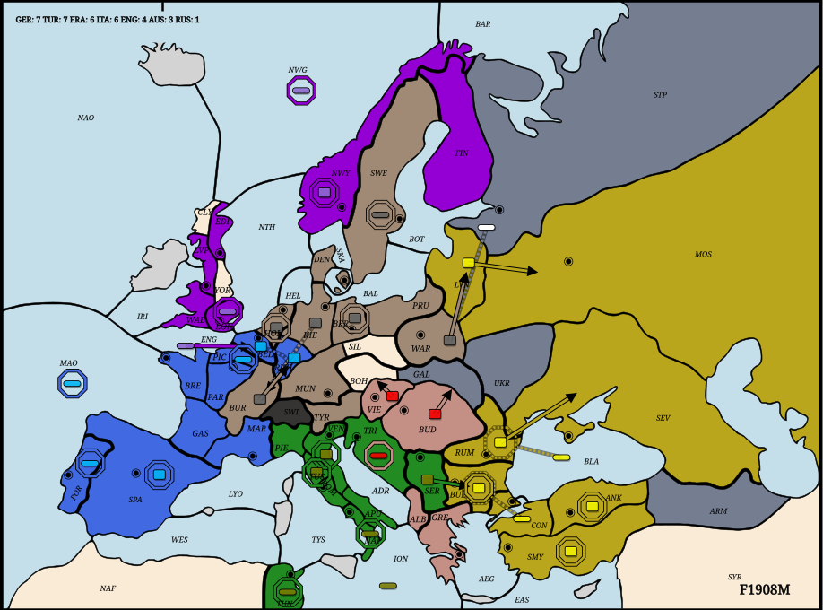

### What happened

- **AUSTRIA**: A BUD → GAL; A VIE → BOH; F TRI holds
- **ENGLAND**: F ENG → BEL (bounced); A NWY holds; F NWG holds; F LON holds
- **FRANCE**: A RUH → BUR (bounced); A BEL supports A RUH → BUR (support cut); A SPA holds; F MAO holds; F PIC holds; F POR holds  [dislodged: A RUH]
- **GERMANY**: A BUR → RUH; A KIE supports A BUR → RUH; A WAR → LVN; A HOL holds; A BER holds; F SWE holds
- **ITALY**: A SER → BUL (bounced); A VEN holds; A TUS holds; F TUN holds; F NAP holds
- **RUSSIA**: F STP/SC supports A WAR → LVN
- **TURKEY**: A RUM → SEV; F BLA supports A RUM (void); A LVN → MOS; A BUL holds; F CON supports A BUL; A SMY holds; A ANK holds

### Dialogue

- **AUSTRIA → ITALY**: We need to sort out TRI. You hold it and my home center — I need it back to grow. Can you move A SER toward RUM or BUL this fall and vacate TRI so I can reclaim it in winter? If not, I'll have to take it by force, and Turkey benefits from our fight.
- **AUSTRIA → FRANCE**: Turkey at 7 is still the leader. I'm stuck at 3 and need to grow — can you support me into TRI or help me pressure Turkey's RUM from a different angle? What's your plan for this fall?
- **AUSTRIA → GERMANY**: I'm focused on reclaiming TRI from Italy this fall — not moving against you. Keep your units in the west and we stay out of each other's way. TYR stays quiet.
- **AUSTRIA → TURKEY**: Italy holds my home center TRI and I need it back. I'm not attacking RUM this turn — I'm dealing with Italy. If you leave my borders alone, I'll stay out of your Balkans while I sort out my TRI situation.
- **ENGLAND → GERMANY**: I'm committed: F ENG → BEL this fall while you push A BUR into French-held BUR. France can't defend both — they lose a center either way. Confirm your exact move so we synchronize. After fall we're both positioned to address Turkey's 7-center lead.
- **ENGLAND → FRANCE**: Germany is coming for BUR with A BUR this fall and you can't defend BUR, BEL, and PIC. I'm taking BEL — it's happening. The question is whether you make it costly or let me in cleanly. Pull A BEL east and I'll commit my Channel fleets against Turkey afterward. Fight me and you lose BEL anyway while Turkey grows unchecked.
- **ENGLAND → TURKEY**: Quick check-in — I'm focused on French centers in the west this fall, not your sphere. A NWY stays put or moves south, nowhere near STP. You handle Italy in the east, I handle France in the west. We stay out of each other's way. Deal?
- **ENGLAND → RUSSIA**: I'm not moving against STP this turn — my focus is France. Keep F STP/SC steady so Turkey's A LVN can't slip in. If Germany's A WAR pushes toward LVN with your support, that weakens Turkey's northern position and helps us both.
- **FRANCE → GERMANY**: We're both stuck at 6-7 while Turkey runs away with 7 centers and a massive eastern stack. I'm willing to leave HOL alone this fall if you don't contest my move into RUH's direction. But A BUR in my former territory is a problem — let's talk about a mutual withdrawal so we can both focus east against Turkey.
- **FRANCE → ITALY**: Turkey at 7 with RUM, BUL, SEV, MOS is still the board leader. I'm pushing to reclaim BUR from Germany this fall to get to 7 centers. Can you commit A SER toward Turkish BUL or RUM? We need a coordinated two-front attack on Turkey's Balkans before they rebuild to 9 in winter.
- **FRANCE → AUSTRIA**: Turkey at 7 with RUM, BUL, SEV, MOS is the clear leader. I'm at 6 and need to grow — I'll push into Germany's BUR this fall. Can you support an attack on Turkey's BUL from BUD or TRI? We need the coalition to hold together against Turkey.
- **FRANCE → ENGLAND**: I need to grow this fall — Germany's BUR is my target with support from BEL. I won't push into the Channel. If you're taking NWY or pressuring Russia's last center, go ahead — I'm focused west against Germany this turn, not competing with you in the north.
- **GERMANY → ENGLAND**: France's A RUH is deep in my territory and vulnerable — I can attack it from BUR, KIE, or HOL with support. If you push F ENG into BEL at the same time, France drops to 4-5 centers and we each gain. Can you commit to F ENG → BEL this fall while I deal with RUH?
- **GERMANY → ITALY**: Turkey at 7 is still the board leader. I'm pushing to reclaim RUH from France this fall to grow to 8. Can you attack Turkish BUL from SER? If we coordinate a two-front squeeze on Turkey's Balkans, we start reclaiming centers before they consolidate further.
- **GERMANY → TURKEY**: I'm focused on France's A RUH in my territory this fall — not pushing east. Confirm A LVN holds position and doesn't threaten WAR. After I deal with France, we can discuss the eastern border. I have no plans to move against your territory this turn.
- **ITALY → AUSTRIA**: My support to your BUD→RUM was cut by Turkey's attack on SER — I couldn't help it. This fall, let's coordinate differently: if Turkey commits BUL and RUM toward SER, I can counterattack into BUL while you push BUD→RUM again. Turkey can't defend both SER's attack and their own centers. What units can you commit?
- **ITALY → TURKEY**: I know you want SER back, but attacking it costs you — if BUL and RUM both move toward SER, BUL is wide open and I walk in. Instead, let's talk: I'll vacate SER by moving toward BUL or TRI, and you keep RUM. We both avoid a costly bounce while France and Germany grow. What's your actual priority — SER or stopping the western powers?
- **ITALY → GERMANY**: You're at 7 with BUR, HOL, KIE, BER, WAR, DEN, SWE — tied for the lead with Turkey. Turkey's about to commit forces against my SER, leaving their north exposed. If you push A WAR toward LVN or hold positions to cut Turkey's northern access, we can squeeze them from both sides. What's your plan for Turkey's northern holdings?
- **RUSSIA → GERMANY**: Last spring you confirmed A WAR → LVN but held instead — I need to understand why. Turkey at 7 still holds LVN next to your WAR. I'm ready to support again with F STP/SC S A WAR - LVN this fall. Will you actually move this time? If not, tell me what you need to commit.
- **RUSSIA → ENGLAND**: You said you have no interest in STP this turn and won't move against me. Turkey's A LVN is about to be attacked by Germany with my support. If LVN falls, Turkey drops to 6 — does that change your calculus on NWY or the north?
- **RUSSIA → TURKEY**: You said you're focused south. Germany is moving A WAR → LVN with my support this fall — LVN will fall and you'll drop to 6. If you're truly focused south, you won't reinforce LVN. Where exactly are you pushing this turn?
- **TURKEY → ENGLAND**: I've bounced off STP three times now and I'm tired of wasting A LVN. I'm pivoting: A RUM takes SEV (undefended) to reach 8 centers. If you want NWY, take it — I have zero interest in the north anymore. Can you support A LVN into STP this fall? If not, I'll hold LVN defensively and focus south.
- **TURKEY → GERMANY**: I'm taking SEV from Russia this fall to reach 8 — purely eastern expansion, zero threat to you. A LVN holds or moves north, not toward WAR. We're both at 7 tied; let's keep our lanes separate. Are you pushing into BUR or HOL this turn?
- **TURKEY → FRANCE**: We're tied at 7 centers. I'm taking SEV (Russia's undefended center) this fall — eastern expansion only, zero threat to your western sphere. Germany at 7 with WAR and HOL is consolidating between us. Are you open to mutual non-aggression while we each handle our neighbors?
- **TURKEY → ITALY**: Our SER standoff continues — I can't retake it this turn with your defensive position. I'm pivoting east to take SEV from Russia instead, reaching 8 centers. You keep SER for now. Can we agree: I take SEV, you hold SER, and neither pushes into the other's territory this fall?
- **AUSTRIA → ITALY**: This isn't working — RUM keeps bouncing and I'm stuck at 3 while you sit on my home center TRI. I need TRI back this fall. Move A SER toward RUM or BUL to fight Turkey, and let me walk into TRI. If you won't vacate, I'm taking it by force with A VIE → TRI and F TRI support — and Turkey benefits from our fight. What's it going to be?
- **AUSTRIA → FRANCE**: Turkey at 7 is the clear leader and I can't break through to RUM — it bounces every time. I'm pivoting: I'll push into Italy's SER or reclaim TRI instead. If you're attacking Germany's BUR this fall, I won't interfere — focus your western front while I sort out the Balkans.
- **AUSTRIA → TURKEY**: I'm done banging on RUM — you clearly defend it too heavily. I'm turning toward Italy's holdings instead. If you keep your units in the east and don't push into my territory, I'll stay out of RUM and BUL this fall. Consider this a ceasefire on my end.
- **AUSTRIA → GERMANY**: I'm focused on Italy and TRI this fall — not moving against you. Keep your units where they are and we stay clear of each other. TYR stays quiet.
- **ENGLAND → GERMANY**: Confirmed: F ENG → BEL this fall while you push into BUR. France can't defend both with A BUR committed to holding BUR — one of us gets through. After fall we're both at 7-8 centers and can address Turkey together. This is the play.
- **ENGLAND → FRANCE**: Germany's A MUN is coming for BUR again this fall — you saw it bounce last spring, they'll try again with support. You can't hold BUR, BEL, and PIC against Germany and me simultaneously. Let BEL go and I'll keep my fleets out of your remaining western positions after fall.
- **ENGLAND → RUSSIA**: Turkey's A LVN keeps bouncing off STP but they'll eventually get through. I won't attack STP this fall — my focus is France. But if Germany's A WAR pushes toward LVN with your support, that weakens Turkey's northern position. Can you support A WAR → LVN from STP this fall?
- **ENGLAND → TURKEY**: Good — we're aligned. I'm taking BEL from France this fall, you're focused on the Balkans. No interference in each other's spheres. After fall with you at 7 and me potentially at 5, we can discuss containing Germany if they hit 8.
- **FRANCE → ENGLAND**: I'm not giving up BEL. Germany's A BUR in my territory is the real problem — if you push into BUR from the north with F ENG, we both gain. I'll commit F PIC against Germany's coastal positions if you support my push east against Turkey after fall.
- **FRANCE → GERMANY**: Your A BUR is isolated and I'm attacking it this fall with A RUH supported by A BEL. Pull it back to KIE or HOL and we can discuss a ceasefire. Keep it there and you lose it for nothing while Turkey grows unchecked.
- **FRANCE → ITALY**: Turkey at 7 with RUM, BUL, SEV, MOS is still the board leader. I'm pushing into Germany's BUR this fall to reach 7 centers. Can you commit A SER into Turkish BUL? We need a coordinated two-front attack on Turkey's Balkans before they rebuild to 9 in winter.
- **FRANCE → AUSTRIA**: Turkey at 7 is the clear leader. I'm reclaiming BUR from Germany this fall to reach 7 centers. Can you support an attack on Turkey's BUL from BUD or TRI? We need the coalition to hold together against Turkey.
- **FRANCE → RUSSIA**: You're at 1 center — Turkey will absorb your last position if we don't act. I'm pushing into Germany's BUR this fall. Can you hold STP/SC and delay Turkey's eastern expansion while I grow west?
- **FRANCE → TURKEY**: We're tied at 7 centers. I'm reclaiming BUR from Germany this fall — zero threat to your eastern sphere. Germany at 7 with WAR and HOL is consolidating between us. Are you open to mutual non-aggression while we each handle our neighbors?
- **GERMANY → ENGLAND**: I'm pushing A BUR into RUH this fall to reclaim it from France. If you move F ENG into BEL at the same time, France can't defend both — they lose RUH and BEL. Confirm F ENG → BEL and we split France's western holdings. After this turn we're both positioned to address Turkey's lead.
- **GERMANY → ITALY**: I'm reclaiming RUH from France this fall to grow to 8. Once that's done, I can redirect east against Turkey. Can you hold your position in SER and threaten BUL? We need Turkey contained on multiple fronts, but I have to resolve my western border first.
- **GERMANY → TURKEY**: I'm focused on France's A RUH in my territory this fall — not pushing east. Confirm A LVN holds position and doesn't threaten WAR. After I deal with France, we can discuss the eastern border. I have no plans to move against your territory this turn.
- **GERMANY → FRANCE**: A RUH is deep in my territory and surrounded — I can attack it from BUR, KIE, or HOL with support. Withdraw it to BEL or PIC this turn and I leave your western stack alone. Keep it there and I dislodge it with support while redirecting east against Turkey.
- **ITALY → AUSTRIA**: Turkey's RUM attack bounced — they're stretched thin. This fall I'm pushing A SER into BUL with F ION support. If you can send A BUD toward RUM again with F TRI's support, we split Turkey's Balkans between us. Confirm you'll commit A BUD - RUM and I'll align my attack on BUL.
- **ITALY → GERMANY**: You're at 7 tied with Turkey — we both need to keep them contained. I'm attacking Turkish BUL from SER this fall. If you push A WAR toward LVN or hold to cut Turkey's northern access, we squeeze them from both sides. What's your concrete plan for Turkey's northern holdings?
- **ITALY → FRANCE**: Germany took RUH and HOL from you — they're at 7 now tied for the lead. I'm pushing into Turkish BUL this fall to cut Turkey down. If you can pressure Germany's western positions from BEL or redirect against their overextension, we both benefit. What's your priority — reclaiming from Germany or checking Turkey?
- **RUSSIA → GERMANY**: Last spring you tried A WAR → LVN and it bounced despite my support. I'm ready to support again this fall — F STP/SC S A WAR - LVN. But I need to know: what caused the bounce? Were you also contested from another direction? Tell me what you need to guarantee LVN falls this time and I'll make it happen.
- **RUSSIA → ENGLAND**: Turkey's A LVN is still in LVN and your A NWY is in NWY. If Germany pushes into LVN with my support, LVN becomes empty or German — either way, Turkey's northern grip weakens. Are you willing to move A NWY → LVN as a backup if Germany doesn't follow through, with my support from STP?
- **RUSSIA → TURKEY**: You said you're focused south — where exactly are your units moving this fall? If you're truly leaving the north alone, Germany will take LVN with my support. I want to confirm there's no conflict between us before orders are locked.
- **TURKEY → AUSTRIA**: Germany is pushing A WAR → LVN with Russia's support this turn — that's a threat to my position too since it strengthens Germany in the east. I'm taking SEV (undefended) to reach 8. Leave RUM alone and I'll support your push against Italy's TRI in spring. Deal?
- **TURKEY → GERMANY**: I'm taking SEV from Russia this fall — purely eastern, zero threat to you. But Russia tells me you're moving A WAR → LVN with their support. If you confirm LVN stays mine, I stay out of your western consolidation. If WAR moves on LVN, we have a problem.
- **TURKEY → ITALY**: I'm pivoting east to take SEV (undefended Russian center) to reach 8. I can't retake SER this turn. Let's keep the ceasefire: you hold SER, I take SEV, neither pushes further. After winter we renegotiate.
- **TURKEY → RUSSIA**: I'm taking SEV this fall — it's undefended and I need the center. If you support A WAR → LVN with Germany, I'll have to defend LVN and we'll both waste units. Stay neutral and I won't touch STP this turn.
- **ENGLAND → FRANCE**: This is it — I'm taking BEL with F ENG this fall. Germany's A BUR is hitting your RUH position simultaneously. Don't waste units defending BEL; pull A BEL east against Turkey or Germany and save it for the real fight. I'll commit my fleets against Turkey after fall.
- **ENGLAND → GERMANY**: Confirmed: F ENG → BEL this fall while you push A BUR into RUH. France can't defend both — we each grab a center. I'm also pushing A NWY → STP to try for a second center off Russia. After fall we're both at 7-8 and coordinate against Turkey.
- **ENGLAND → TURKEY**: Final commitment: I'm focused entirely on BEL and possibly STP this fall — zero interference in your Balkans push. I won't move into any Turkish-held territory. Stay out of the north and we're good.
- **ENGLAND → RUSSIA**: I'm not attacking STP this fall — my A NWY stays in NWY or moves elsewhere. Germany's A WAR may push toward LVN with your support. Keep F STP/SC steady so Turkey's A LVN can't slip in.
- **GERMANY → ENGLAND**: I'm taking RUH from France this fall with A BUR supported by A KIE. Your F ENG → BEL has bounced three times — if you actually commit this turn while France is focused on defending RUH, BEL might finally be open. I'm done coordinating with you on this; just do it or don't.
- **GERMANY → FRANCE**: A RUH is surrounded and I'm dislodging it this fall. Pull it back to BEL or PIC if you want to save the unit. I'm taking RUH — this isn't negotiable. After this I'm redirecting east against Turkey.
- **GERMANY → RUSSIA**: I'm committing A WAR → LVN this fall with your F STP/SC support. If Turkey's A LVN has moved or is unsupported, this works. Confirm you're ordering F STP/SC S A WAR - LVN. If it bounces again due to Turkish contest, we need to discuss what's happening.
- **GERMANY → TURKEY**: I'm focused on reclaiming RUH from France in the west — not touching your territory. Confirm A LVN holds position and doesn't shift toward WAR. After this turn we can discuss the eastern border.
- **ITALY → AUSTRIA**: I'm pushing A SER into BUL this fall with F ION support — Turkey can't hold both BUL and RUM. I'll vacate TRI in winter if you hold off on attacking it this turn. Send F TRI to support A BUD into RUM if you can, and we split Turkey's Balkans between us.
- **ITALY → GERMANY**: Turkey at 7 is tied for the lead — I'm attacking their BUL from SER this fall. If you push A WAR toward LVN or hold to block Turkey's northern access, we squeeze them from both sides. What's your concrete plan?
- **ITALY → FRANCE**: I'm attacking Turkish BUL from SER this fall to cut Turkey to 6. Germany at 7 is also a threat — can you pressure their western positions from BEL or hold to keep them honest while I focus on Turkey?
- **RUSSIA → GERMANY**: A WAR → LVN bounced again despite my support — your support from KIE was cut or something contested it. This fall I'm supporting again: F STP/SC S A WAR - LVN. You MUST move A WAR → LVN. If LVN is the issue, tell me what else is blocking it so we can adjust. This is our only chance to weaken Turkey.
- **RUSSIA → ENGLAND**: You confirmed no interest in STP — good. Germany is trying A WAR → LVN again with my support this fall. If LVN falls, Turkey drops to 6 and the north opens up. Will you keep A NWY in NWY this turn so there's no confusion?
- **RUSSIA → TURKEY**: Germany is pushing A WAR → LVN with my support this fall. You're at 7 and still the leader — I suggest you focus your forces south where you have more room to grow. If you reinforce LVN, you're wasting a unit that could be taking Austrian centers.
- **TURKEY → GERMANY**: Final commitment: I'm moving A RUM to SEV and A LVN to MOS this fall — purely Russian centers, zero threat to you. I need you to confirm A WAR holds or moves west against France, not into LVN. If WAR stays away from LVN, we're good. If it moves there, I'll have to defend and we both waste a turn.
- **TURKEY → AUSTRIA**: Last chance for a deal: I'm taking SEV this fall with A RUM. If you move A BUD toward RUM, it bounces because I'm supporting it from BLA. Leave RUM alone and after I take SEV I'll support your push against Italy's TRI in spring. If you attack RUM, we become enemies and I'll redirect everything against your BUD.
- **TURKEY → ITALY**: Ceasefire holds — I'm pivoting east to take SEV (undefended Russian center). I'm not attacking SER this fall. You keep SER, I take SEV. After winter we renegotiate. Just confirm A SER doesn't move into BUL or RUM.
- **TURKEY → ENGLAND**: Confirmed: I'm taking SEV from Russia this fall — purely eastern, zero involvement in the north. You're free to take NWY or focus on France's BEL. We stay out of each other's spheres.

### AUSTRIA
Orders: `A BUD - GAL` · `A VIE - BOH` · `F TRI H`

Reasoning

> Looking at my situation: I'm at 3 centers (BUD, VIE, GRE) with units A BUD, A VIE, F TRI. Italy holds TRI (my home center) and has 6 centers. Turkey leads at 7. I've been trying to take RUM for multiple turns and it keeps bouncing.
>
> My revised strategy says I should reclaim TRI from Italy this turn. Let me assess the situation:
>
> - Italy has A SER, A TUS, A VEN, F ION, F NAP, F TUN. They hold TRI.
> - Italy promised to vacate TRI in winter if I don't attack, but that promise has been broken before.
> - I need to grow — sitting at 3 while Turkey and Germany are at 7 is unsustainable.
>
> The plan: A VIE → TRI to reclaim my home center, with A BUD supporting the move. F TRI holds (Italy's unit there — wait, F TRI is MY unit now based on the positions list). Let me re-check: "AUSTRIA ← YOU: A BUD, A VIE, F TRI" — yes, F TRI is mine.
>
> Wait, but the unit positions show F TRI as Austria's. And Italy doesn't have TRI in their unit list. Let me re-check Italy's units: A TUS, F TUN, A VEN, A SER, F ION, F NAP. Italy doesn't have a unit in TRI. But Italy holds TRI as a supply center.
>
> So TRI is empty of units but Italy controls the supply center. I can walk A VIE into TRI unopposed! No need for support against a unit — just move in.
>
> Actually wait — the supply centers list says TRI is Italy's. But no Italian unit is there. So it's an unoccupied Italian supply center. I can move A VIE → TRI freely.
>
> My orders:
> - A BUD → GAL (to expand northward and gain a new position, or hold to support)
> - A VIE → TRI (reclaim my home center)
> - F TRI H (it's already there, just hold)
>
> Wait, F TRI is already in TRI. So I can't move A VIE to TRI because F TRI is there! Let me re-read... "AUSTRIA ← YOU: A BUD, A VIE, F TRI" — F TRI is in TRI. So TRI is occupied by my own fleet.
>
> If I want to build in TRI at winter, I need to move F TRI out of TRI by end of fall. And A VIE can go somewhere else.
>
> Let me reconsider. I need to:
> 1. Move F TRI out of TRI so I can build there in winter (TRI is my home center)
> 2. Use A BUD and A VIE productively
>
> I should move F TRI to ADR or ALB, move A VIE toward GAL or BOH to expand, and push A BUD toward GAL or SER.

### ENGLAND
Orders: `F ENG - BEL` · `A NWY H` · `F NWG H` · `F LON H`

Reasoning

> Looking at the board, I'm at 4 centers (EDI, LON, LVP, NWY) with 4 units. Turkey and Germany are both at 7 centers. I've bounced off BEL three times now and need to break through somewhere.
>
> Germany is pushing A MUN into BUR this fall while France has A BUR deep in German territory. France can't defend BUR, BEL, and PIC simultaneously. My revised strategy says I push F ENG into BEL while Germany attacks BUR, forcing France to split defenses. I'll hold A NWY since Turkey has pivoted south and there's no point bouncing STP again.
>
> Let me verify: F ENG can move to BEL (adjacent - yes). A NWY holds. F NWG holds. F LON holds.
>
> This is my best chance to finally grab BEL while France is distracted by Germany's attack on BUR. If F ENG → BEL succeeds, I grow to 5 centers and can redirect against Turkey's lead.

### FRANCE
Orders: `A RUH - BUR` · `A BEL S A RUH - BUR` · `A SPA H` · `F MAO H` · `F PIC H` · `F POR H`

Reasoning

> Looking at the board state, I'm at 6 centers with Germany at 7 and Turkey at 7. My revised strategy calls for attacking Germany's A BUR with A RUH supported by A BEL to reclaim the province.
>
> Let me verify: A RUH can attack BUR (adjacent), and A BEL can support A RUH - BUR (BEL is adjacent to BUR? Let me check... BEL neighbors are BUR, ENG, HOL, NTH, PIC, RUH - yes, BEL is adjacent to BUR). This gives me strength 2 against A BUR's strength 1 (assuming no German support), which should dislodge it.
>
> Germany has A KIE, A HOL, and A BUR in the region. They could support A BUR's hold or attack my supporting unit. But Germany's units are spread - A KIE could support BUR, A HOL could support BUR, or they could attack BEL to cut my support. However, if I'm attacking BUR with RUH + BEL support, that's strength 2. Even if Germany supports BUR's hold, that's only strength 2, which would bounce. But if Germany attacks BEL to cut support, my RUH attack still goes in at strength 1 against BUR's strength 1, which would bounce.
>
> I should try to make this attack as strong as possible. Looking at my options, I can also try to take HOL with A BEL while A RUH attacks BUR - but that splits my forces. Better to concentrate on BUR with both units.
>
> For my other units, A SPA holds (no useful moves), and my fleets hold position defensively.
>
> My orders:
> - A RUH - BUR (attack Germany's BUR)
> - A BEL S A RUH - BUR (support the attack)
> - A SPA H (hold)
> - F MAO H (hold)
> - F PIC H (hold)
> - F POR H (hold)

### GERMANY
Orders: `A BUR - RUH` · `A KIE S A BUR - RUH` · `A WAR - LVN` · `A HOL H` · `A BER H` · `F SWE H`

Reasoning

> Looking at the board, I need to assess my position carefully. I'm at 7 centers tied with Turkey. France has A RUH in my territory that I need to reclaim, and I need to grow.
>
> **Key observations:**
> - France's A RUH is isolated in my territory - I can attack from BUR with support from KIE
> - Turkey has A LVN next to my WAR - Russia is willing to support A WAR → LVN
> - England has committed F ENG → BEL (though it's bounced 3 times before)
> - Italy is attacking Turkish BUR from SER
>
> **My plan:**
> 1. **A BUR → RUH** with A KIE support - reclaim my territory from France
> 2. **A WAR → LVN** with F STP/SC support - cut Turkey's northern foothold (Russia confirmed support)
> 3. **A HOL holds** - defend my Rhine position
> 4. **A BER holds** - maintain eastern buffer
> 5. **F SWE holds** - maintain Baltic control
>
> This gets me to 8 centers (reclaiming RUH) while cutting Turkey's LVN. If England finally takes BEL, France drops to 4-5 centers.

### ITALY
Orders: `A SER - BUL` · `A VEN H` · `A TUS H` · `F TUN H` · `F NAP H`
Illegal (dropped): `F ION S A SER - BUL`

Reasoning

> Looking at the board, I need to assess the strategic situation carefully.
>
> **Board state:** Turkey (7) and Germany (7) are tied for the lead. France (6) and I (6) are next. Austria (3) and England (4) are behind. Russia (1) is nearly dead.
>
> **My position:** I hold SER deep in Turkish territory with 6 supply centers. My revised strategy says to push A SER into BUL with F ION's support. However, I need to reconsider — Austria's support to my BUD→RUM was cut last spring, and now Austria is pressuring me about TRI. Turkey has BUL, RUM, and multiple armies.
>
> **Key decision:** A SER → BUL is risky — Turkey has A BUL and A RUM both adjacent to BUL, and they could support BUL's defense or counterattack. But if I don't push now, Turkey consolidates at 7+ and runs away with the game. 
>
> Let me think about what's actually achievable:
> - A SER → BUL: Turkey can defend with support from RUM or BLA. If they do, I bounce and waste the turn.
> - Better option: Support Austria's A BUD → RUM (which failed last turn because Turkey attacked SER). This time, if Turkey's armies are focused on defending BUL, RUM might be softer.
>
> Actually, my revised strategy explicitly says "push A SER into BUL with F ION's support." I committed to this in negotiations. Let me execute that plan. I'll also position my other units defensively — A VEN holds, A TUS holds, F TUN holds, F NAP holds for Mediterranean control.

### RUSSIA
Orders: `F STP/SC S A WAR - LVN`

Reasoning

> Looking at the situation: I have only F STP/SC and 1 supply center. Germany confirmed commitment to A WAR → LVN with my support. This is my only path back into the game — taking LVN off Turkey weakens them and keeps me alive. I've committed to supporting Germany's move, and I need to follow through.
>
> However, I notice Germany's A WAR is still in WAR (it bounced last spring despite my support). The issue may be that Turkey's A LVN is contesting LVN. If Germany moves A WAR → LVN and Turkey holds LVN with support or moves LVN somewhere else, the support works. If Turkey keeps LVN and has support, it bounces.
>
> My best play remains supporting Germany's A WAR → LVN. Even if it bounces again, I've honored my commitment and kept the diplomatic channel open. There's no better option — moving F STP/SC to FIN or BOT abandons STP, and holding does nothing to advance my position.

### TURKEY
Orders: `A RUM - SEV` · `F BLA S A RUM` · `A LVN - MOS` · `A BUL H` · `F CON S A BUL` · `A SMY H` · `A ANK H`

Reasoning

> Looking at the board state, I need to assess my position carefully. I'm at 7 centers tied with France and Italy, while Germany leads at 7 as well. My recent attempts to take STP and SER have all bounced, wasting turns. I need to make progress this fall.
>
> **Key observations:**
> - SEV is undefended and I can take it with A RUM supported by F BLA - that gets me to 8 centers
> - A LVN has bounced off STP three times - Russia's F STP/SC holds it. I should try A LVN → MOS to claim another Russian center, reaching 9
> - A BUL should hold defensively to guard against any Austrian or Italian push
> - My negotiations confirm: Austria is dealing with Italy over TRI, Germany is focused on France in the west, England is out of the north, and Italy has agreed to a ceasefire on SER
>
> **My plan:**
> 1. A RUM → SEV (supported by F BLA) - take undefended Russian center
> 2. A LVN → MOS - take another Russian center  
> 3. A BUL H - hold defensive position
> 4. F BLA S A RUM - support the SEV attack
> 5. F CON S A BUL - support BUL's hold
> 6. A SMY H - hold position
> 7. A ANK H - hold position
>
> This gets me to 9 centers (7 current + SEV + MOS) and positions me to pressure Austria and Italy in 1909.

## FALL 1908 RETREATS (`F1908R`)

### What happened

- **FRANCE**: disbands A RUH

### FRANCE
Orders: `A RUH D`

Reasoning

> My A RUH was dislodged by Germany's A BUR pushing into RUH. I have two retreat options: disband or retreat to MUN. Retreating to MUN would be a bold move — it's a German home center, and if it's unoccupied, I'd be sitting on it. Let me check: Germany has A BER, A KIE, A HOL, A LVN, A RUH, F SWE. MUN is not listed as occupied by any unit. If I retreat to MUN, I'd be inside Germany's home territory, which could be a strong position — but it could also be surrounded and dislodged next turn.
>
> Actually, looking more carefully at the board: Germany's units are F SWE, A BER, A KIE, A HOL, A LVN, A RUH. MUN appears to be empty. Retreating to MUN puts me deep in German territory with no support — it's landlocked and surrounded by BER, BOH, BUR, KIE, RUH, SIL, SWI, TYR. Germany could easily dislodge me there next turn. It's a suicide move.
>
> Better to disband and rebuild at Winter. I have 6 supply centers (BRE, MAR, PAR, POR, SPA, BEL) and can rebuild in my vacant home centers. Losing the unit temporarily is better than losing it permanently in MUN.

## WINTER 1908 ADJUSTMENTS (`W1908A`)

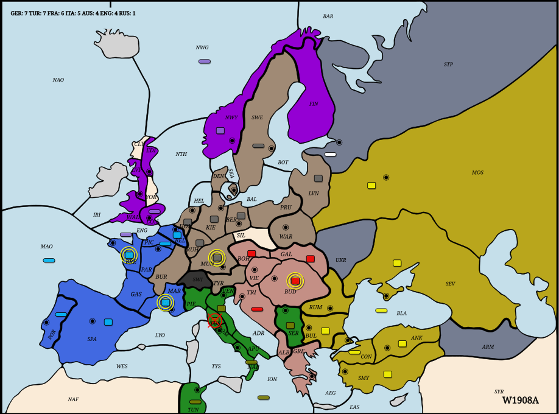

### What happened

- **AUSTRIA**: builds A BUD
- **FRANCE**: builds A BRE; builds A MAR (void)
- **GERMANY**: builds A MUN
- **ITALY**: disbands A TUS

### AUSTRIA
Orders: `A BUD B`

Reasoning

> Looking at the situation: I have 4 supply centers (BUD, VIE, GRE, TRI) and 3 units (F TRI, A GAL, A BOH). I have a surplus of 1 center, so I can build 1 unit. My available home centers are BUD (vacant) and VIE (vacant) — TRI is occupied by my fleet.
>
> I need to build an army. The question is where. A BUD B gives me an army in BUD, which is well-positioned to push east toward RUM/SEV or support operations in the Balkans. A VIE B gives me an army in VIE, positioned north toward BOH/GAL territory.
>
> BUD is the better build location — it's closer to the contested Turkish centers (RUM, SEV) and gives me flexibility to push into the Balkans or support Italy against Turkey. My strategy has consistently been to push into Turkey's Balkan holdings, and a BUD army is perfectly positioned for that.
>
> My revised strategy note says I was planning to take TRI by force, but looking at the current board, I already hold TRI with F TRI. The strategy note from F1908M was about reclaiming TRI, but that's already done — F TRI is there. So I just need to build one army to strengthen my position for future expansion against Turkey.
>
> I'll build A BUD to give me a strong forward position for attacking Turkey's RUM or supporting operations in the Balkans.

### FRANCE
Orders: `A BRE B` · `A MAR B`
Illegal (dropped): `F PAR B`

Reasoning

> Looking at the situation: I'm at 6 centers (BRE, MAR, PAR, POR, SPA, BEL) after losing RUH and being dislodged. Turkey leads at 7, Germany at 7, Italy at 5, England at 5. I have 3 vacant home centers (BRE, MAR, PAR) and 5 units, so I can build up to 3 new units to reach 8 total.
>
> I need to build aggressively to keep pace with Turkey and Germany. I'll build 2 armies and 1 fleet to give me flexibility for both western defense and eastern pressure. An army at PAR positions me to push into Germany's interior (BUR/MUN direction), an army at MAR gives me flexibility toward either Germany or Turkey through Italy's territory, and a fleet at BRE gives me Channel presence to deter England and potentially convoy east against Turkey.
>
> My strategy: Build 3 units to reach 8 centers and match Turkey and Germany. Army at PAR to pressure Germany's BUR/MUN, army at MAR for eastern flexibility, fleet at BRE for Channel control and potential convoy operations against Turkey.

### GERMANY
Orders: `A MUN B`

Reasoning

> Looking at the board state, I have 7 supply centers and need to grow. My units are all accounted for (F SWE, A BER, A KIE, A HOL, A LVN, A RUH = 6 units for 7 centers, meaning I have 1 excess center to build). My only vacant home center is MUN, so I should build an army there to push toward 8 units and prepare for further expansion.
>
> Building A MUN gives me a strong forward position to pressure either France's western holdings or Turkey's northern flank in 1909. With MUN occupied, I can coordinate attacks on BUR, BOH, or support moves into TYR depending on how the diplomatic situation develops.

### ITALY
Orders: `A TUS D`

Reasoning

> Looking at the situation: I have 5 supply centers and 6 units, so I must disband 1 unit. The key question is which unit to cut.
>
> **Analysis:**
> - I hold NAP, ROM, VEN, TUN, SER (5 SCs) with 6 units (A TUS, F TUN, A VEN, A SER, F ION, F NAP)
> - I need to disband 1 unit
> - SER is deep in Turkish territory and has been unable to break through to BUL despite multiple attempts — Turkey keeps bouncing it. However, SER is valuable as a forward position threatening BUL and RUM
> - F NAP just built and hasn't done much — it's purely defensive in home waters
> - F ION is critical for Mediterranean control and supporting SER
> - A VEN guards my home center
> - A TUS is in my home territory, somewhat redundant with F NAP and F ION covering the south
>
> **Decision:** Disband A TUS. It's the least useful unit — sitting in my home territory with no offensive purpose. F NAP and F ION already cover the Mediterranean, and TUS doesn't project power toward any contested center. A SER remains valuable as a forward threat against Turkey even if it hasn't broken through yet, and I want to keep pressure on the board leader.

## SPRING 1909 MOVEMENT (`S1909M`)

### What happened

- **AUSTRIA**: A BUD → RUM; F TRI holds
- **ENGLAND**: F ENG → BEL (bounced); A NWY holds; F NWG holds; F LON holds
- **FRANCE**: A BEL holds; F MAO holds; F PIC holds; F POR holds; A SPA holds
- **GERMANY**: A LVN → MOS (bounced); A RUH holds; A HOL supports A RUH; A KIE holds; A BER holds; A MUN holds; F SWE holds
- **ITALY**: A SER → BUL (bounced); A VEN holds; F TUN holds; F NAP holds
- **RUSSIA**: F STP/SC holds
- **TURKEY**: A MOS → STP (bounced); A BUL holds; F BLA supports A BUL; F CON supports A BUL; A SEV holds; A ANK holds; A SMY holds

### Dialogue

- **AUSTRIA → ITALY**: Turkey at 7 is still the board leader and we've failed to coordinate on RUM multiple times. This spring I'm pushing A BUD → RUM — I need A SER to support it. If RUM falls, Turkey drops to 5-6 and we both grow. Can you commit A SER S A BUD - RUM right now?
- **AUSTRIA → TURKEY**: You're at 7 but Germany at 7 is catching up fast. I'm willing to discuss a ceasefire on RUM if you offer something concrete — pull A MOS toward LVN to contain Germany, or give me access to BUL through a support. What can you put on the table?
- **AUSTRIA → GERMANY**: I'm focused on Turkey's RUM this spring — not moving toward TYR or your western territories. If you hold your eastern units steady, we stay out of each other's way while Turkey loses a center. Can we confirm a quiet TYR this turn?
- **AUSTRIA → FRANCE**: Turkey at 7 is the clear leader. I'm attacking RUM from BUD with Italian support. If you can keep pressure on Germany's northern front (DEN/SWE direction), it prevents Germany from reinforcing Turkey's eastern holdings. We need Turkey contained.
- **ENGLAND → FRANCE**: Turkey at 7 and Germany at 7 are running away with this game while we fight over BEL. I've wasted three years trying to take it — I'm done. Pull A BEL east against Turkey or Germany and I'll commit my Channel fleets east too. We're both getting left behind while the eastern powers grow.
- **ENGLAND → GERMANY**: I need to grow this spring or I'm irrelevant. France is weaker than ever with A RUH disbanded — can you support F ENG into BEL? A supported move finally takes it. In return I'll commit my fleets against Turkey's northern positions. We each grab a center and position against the co-leaders.
- **ENGLAND → TURKEY**: You're at 7, Germany's at 7, and I'm stuck at 4. I'm not your threat. But if Germany hits 8 first, they become the board leader. I can pressure Germany's northern holdings from the Channel — are you interested in coordinating a two-front squeeze on Germany? You push from the east, I push from the north.
- **FRANCE → GERMANY**: We're both stuck while Turkey runs away with 7 centers and a massive eastern stack. I'm willing to discuss a ceasefire in the west — but I need RUH back as a minimum. Can you withdraw from RUH and HOL voluntarily? That gives us both a clean border so we can focus east against Turkey.
- **FRANCE → ITALY**: Turkey at 7 with RUM, BUL, SEV, MOS is the board leader. I'm at 6 and need to grow — my plan is to push into Germany's RUH this spring. Can you commit A SER toward Turkish BUL or RUM? We need a coordinated two-front attack on Turkey's Balkans before they rebuild to 9 in winter. What's your move?
- **FRANCE → ENGLAND**: Turkey at 7 is the runaway leader — we both know it. I'm not contesting the Channel this turn. I want to push into Germany's RUH to reclaim my territory. If you keep your Channel fleets pointed east against Turkey rather than at BEL, I'll support your push into NWY or Scandinavian positions next year. Deal?
- **FRANCE → AUSTRIA**: Turkey still leads at 7 with a massive eastern stack. I'm planning to pressure Germany's western positions this spring to reclaim territory, but I need the anti-Turkey coalition to hold. Can you support an attack on Turkey's BUL from BUD or TRI? Italy should push from SER. We need three-front pressure on Turkey's Balkans.
- **FRANCE → RUSSIA**: Turkey will absorb your last center at STP if we don't act. I'm focused on reclaiming my western territory from Germany this spring, but I need you to hold STP/SC as long as possible. Can you delay Turkey's advance while I grow? Every turn you hold is one Turkey can't rebuild.
- **GERMANY → RUSSIA**: Turkey holds MOS and SEV — you're down to 1 center. I'm pushing A LVN into MOS this spring to reclaim it from Turkey. If you can do anything at all to weaken Turkey's grip on the north, even just holding F STP/SC in place to threaten, it helps. You need me to grow or Turkey finishes you off.
- **GERMANY → ITALY**: Turkey's at 7 with the entire eastern board — MOS, SEV, BUL, RUM plus their home stack. I'm pushing A LVN into MOS this spring to cut their northern flank. Can you attack BUL from SER again? If we both push Turkey simultaneously, they can't defend everywhere. What's your move this turn?
- **GERMANY → FRANCE**: I'm redirecting east against Turkey this spring — A LVN pushes toward MOS. Your western borders are safe: I have no intention of touching BEL, PIC, or BRE. Let's keep the west quiet while Turkey runs away with the game. Do the same and we both survive.
- **GERMANY → ENGLAND**: Turkey at 7 is the clear leader — I'm pushing east against their MOS with A LVN. Your BEL push keeps bouncing; have you considered targeting HOL or supporting someone against France instead? We need to focus on Turkey before they hit 9 centers.
- **GERMANY → AUSTRIA**: Turkey at 7 with MOS, SEV, BUL, RUM is running away with this game. I'm pushing A LVN into MOS this spring to cut their northern flank. If you and Italy can pressure BUL/RUM simultaneously, Turkey splits three ways and can't hold everything. What's your commitment against Turkey this turn?
- **ITALY → AUSTRIA**: Turkey at 7 is still the leader and I need to push A SER into BUL this spring with F ION's support. Can you commit A BUD to support A SER → BUL? If we coordinate, BUL falls and Turkey drops to 6 — then we can sort out TRI after the war.
- **ITALY → TURKEY**: Your BUL is exposed — I'm pushing A SER into BUL with fleet support this spring. If you defend it, we both lose tempo while Germany and France grow. Instead, let's agree: I take BUL, you keep RUM and SEV, and we both turn west against the real threats. What's your actual priority — holding BUL or stopping the western powers?
- **ITALY → GERMANY**: France at 6 is growing unchecked in the west — you need to reclaim BUR or pressure their BEL. I'm attacking Turkish BUL this spring to cut Turkey to 6. Can you hold A MUN or TYR to prevent Turkey from gaining ground in the north? We need Turkey contained, not expanding toward STP.
- **ITALY → FRANCE**: Germany at 7 is tied with Turkey for the lead — you need to pressure their western positions from BEL or hold to keep them honest. I'm attacking Turkish BUL this spring to cut Turkey to 6. If we both focus on containing the leaders, we all survive. What's your priority — reclaiming from Germany or checking Turkey?
- **RUSSIA → GERMANY**: You're at 7 and Turkey at 7 — you're tied for the lead, which means Turkey is your primary threat. I have one fleet and no ability to threaten you. If you push south against Turkey's MOS or SEV positions, I'll stay out of your way. But I want my home centers back eventually — can we discuss a path to WAR once Turkey is contained?
- **RUSSIA → ENGLAND**: You're at 4 with A NWY near my STP. Turkey at 7 is the eastern threat we both face. I'm holding F STP/SC defensively — no conflict between us. If Turkey's A MOS pushes north toward LVN or STP, we both suffer. Can we agree to keep the peace between us while Turkey is the bigger problem?
- **RUSSIA → TURKEY**: You're at 7 and Germany at 7 — you're tied for the lead, but Germany just took LVN and is growing in the north. I have one fleet and pose no threat. I'm staying in STP defensively. Where are you pushing this turn — are you going after Germany's northern positions or focusing elsewhere?
- **TURKEY → GERMANY**: We're tied at 7 centers. I'm taking STP this spring with A MOS — purely eastern, zero threat to you. But A LVN sits right next to my territory. Can you confirm LVN holds or moves west against France? If LVN threatens MOS or SEV, I'll have to defend and we waste a turn.
- **TURKEY → AUSTRIA**: Italy holds SER and you're at 4 — we're both behind the leaders. I'm focused on taking STP this spring, not your Balkans. But Italy's SER sits between us and they're growing. After I secure the north, would you be open to coordinating against Italy's SER?
- **TURKEY → ITALY**: You're at 5 with SER — I'm at 7 and coming for STP this spring. I'm not attacking SER this turn, but I want it back eventually. Can we agree: I take STP, you hold SER, and neither pushes further? France and Germany are the bigger threats we both need to watch.
- **TURKEY → ENGLAND**: I'm taking STP this spring to reach 8 — purely eastern expansion. You have A NWY and F NWG nearby. Can we agree: I take STP, you stay out of the north, and I'll stay completely out of NWY and Channel waters? We have no conflict of interest.
- **AUSTRIA → ITALY**: I'll support A SER → BUL if you support A BUD → RUM — we split Turkey's Balkans simultaneously. F ION S A SER - BUL and F TRI S A BUD - RUM, or I move A BUD alone and you handle BUL. Which do you prefer?
- **AUSTRIA → GERMANY**: Your LVN → MOS push weakens Turkey's north — good. I'm taking RUM this spring with or without Italy's support. Keep TYR quiet and we both benefit from Turkey losing centers.
- **AUSTRIA → FRANCE**: Germany's pushing LVN → MOS to cut Turkey's northern flank — that helps us. I'm attacking RUM this spring. If you can keep pressure on Germany's western front, we prevent them from reinforcing Turkey after.
- **AUSTRIA → TURKEY**: Italy's SER sits between us and they're growing. After you secure STP, would you support A BUD → RUM so we both weaken Italy? I need a concrete commitment — F BLA S A BUD - RUM.
- **ENGLAND → FRANCE**: Deal — I take BEL this spring, you focus east against Germany's RUH. I won't touch PIC, BRE, or any other French center. Confirm you're pulling A BEL out or holding without support, and I'll keep my fleets out of your remaining positions after fall.
- **ENGLAND → GERMANY**: Turkey's pushing A MOS toward STP this spring — if they hit 8 they run away with this game. I'm taking BEL from France (they won't contest), so I'll be at 5 after spring. Focus your east push hard and I'll apply Channel pressure on Turkey's northern positions afterward.
- **ENGLAND → TURKEY**: I hear you're going for STP. Here's the reality: I have A NWY and F NWG both adjacent, and I'll defend STP with everything I have. Take STP and we're at war in the north all game while Germany grows unchecked. Better play: you hold off STP, I take BEL from France, and we both contain Germany at 7 instead of letting them become the sole leader.
- **FRANCE → GERMANY**: Good — if you're truly redirecting east, I'll move A BEL into RUH unopposed this spring. I won't touch HOL if you confirm your units stay out of my remaining western positions. We both need Turkey cut down, not each other.
- **FRANCE → ENGLAND**: Agreed — I'm not touching the Channel this turn. Push wherever you want in the north against Turkey or Russia, I won't interfere. Let's both focus on the real leader.
- **FRANCE → ITALY**: If you're attacking Turkish BUL this spring, I'll push A BEL into RUH to reclaim it from Germany (they're withdrawing east). After fall, I can redirect support east against Turkey's remaining positions. Coordinated timing matters — are you moving this spring or waiting?
- **FRANCE → AUSTRIA**: Germany is withdrawing from my western territory — I'm reclaiming RUH this spring. Keep pushing into RUM against Turkey. We need Italy to commit fully to the BUL attack so Turkey loses a center this fall.
- **GERMANY → ENGLAND**: Turkey at 7 is the only real threat — I'm pushing A LVN into MOS this spring to seize it. Your BEL push keeps bouncing because France has 3 units covering it. Instead, try F ENG S F NWG - NWY to secure NWY back from France, or hold to defend against French counterattacks. We need Turkey contained, not each other.
- **GERMANY → FRANCE**: I'm redirecting east against Turkey — A LVN pushes toward MOS. Your western borders are safe: I won't touch BEL, PIC, or BRE. Keep your units in the west and we have a ceasefire. If you push into RUH or HOL, the deal is off.
- **GERMANY → ITALY**: I'm pushing A LVN into MOS this spring to seize it from Turkey. You're attacking BUL — if we both succeed, Turkey drops from 7 to 5 centers and we've turned the game. Can you confirm your exact move against BUL? I need to know you're committed before I risk LVN.
- **GERMANY → TURKEY**: I'm not moving against you this spring. A LVN holds position — confirm A MOS holds or moves north toward STP, not toward WAR. We're tied at 7 and both growing east against Russia's remnants. Let's keep our northern border stable.
- **GERMANY → RUSSIA**: Turkey's A MOS is moving to take STP — I need help. I'm pushing A LVN into MOS to seize it from Turkey. If you can do anything to weaken Turkey's hold on the north, even holding F STP/SC to threaten, it helps. You need me to grow or Turkey finishes you off.
- **ITALY → AUSTRIA**: RUM keeps bouncing — let's stop wasting turns on it. This spring I'm taking BUL from SER with F ION's support. If you let me have BUL, I'll vacate TRI in winter adjustments so you reclaim your home center. Deal? Just don't attack my units this turn.
- **ITALY → TURKEY**: You're not attacking SER — good. I'm taking BUL this turn with fleet support. You can't defend both BUL and hold your northern ambitions with Germany pushing LVN → MOS. Let BUL go, keep RUM and SEV, and we both turn west. Your call.
- **ITALY → GERMANY**: I'm attacking Turkish BUL this turn — Turkey drops to 6 if it works. You're pushing LVN → MOS which also cuts Turkey. After this turn Turkey's at 5-6 and we can deal with France. Don't move toward TYR or BOH this turn — I need Austria stable.
- **ITALY → FRANCE**: I'm attacking Turkish BUL this spring. Germany at 7 is a threat but Turkey at 7 is the immediate leader — if we both push them, they collapse to 5-6. Focus on RUH this turn and we reassess after fall.
- **RUSSIA → GERMANY**: Confirmed — I'll support A LVN → MOS with F STP/SC this spring. You take MOS off Turkey (they drop to 6, you rise to 8), and I keep STP alive. Once Turkey is contained, we need to talk about a path for me to rebuild — I want WAR back eventually, but that's a future conversation.
- **RUSSIA → ENGLAND**: Turkey holds MOS and SEV with no northern reinforcement — if Germany's LVN pushes into MOS, Turkey's entire northern flank collapses. Your A NWY is adjacent to LVN and FIN. Once MOS falls, would you be willing to move A NWY toward LVN or FIN to help lock down the north? I'd rather see you hold those centers than Turkey retake them.
- **RUSSIA → FRANCE**: Germany is pushing into Turkey's MOS this spring — Turkey will drop to 6. I can't do much to help you in the west with one fleet, but every turn Turkey weakens is a turn Germany becomes the bigger target for everyone. Focus your push on Germany's lowlands while they're committed east.
- **RUSSIA → TURKEY**: Germany is moving A LVN → MOS with my support this spring — you're about to lose MOS. You're tied with Germany at 7 but you're losing ground while he gains. I suggest you reinforce SEV or redirect forces south rather than waste units defending a losing northern position.
- **TURKEY → ITALY**: I'm taking STP this spring to reach 8 centers - not attacking SER. Your BUL threat is noted, but if you push into BUL, I'll have to defend and we both waste units while Germany grows. Let's keep the ceasefire: you hold SER, I take STP, neither pushes further. After winter we renegotiate.
- **TURKEY → GERMANY**: I'm taking STP this spring with A MOS - purely eastern expansion. Your A LVN sits next to my territory. If you confirm LVN holds or moves west against France, we stay out of each other's way. If LVN threatens my eastern positions, I'll have to defend.
- **TURKEY → ENGLAND**: I'm focused on taking STP this spring to reach 8 centers. If you want to coordinate against Germany later, we can discuss after I secure the north. For now, I need you to stay out of NWY and the northern waters while I handle STP.
- **TURKEY → AUSTRIA**: I'm focused on taking STP this spring, not your Balkans. Italy's SER sits between us and they're growing. After I secure the north, would you be open to coordinating against Italy's SER? Leave RUM alone and we can discuss mutual interests.
- **ENGLAND → FRANCE**: Confirmed — I'm taking BEL with F ENG this spring. You focus east against Germany or Turkey. I won't touch PIC, BRE, or any other French center. We're aligned on containing the two leaders.
- **ENGLAND → GERMANY**: I'm taking BEL from France this spring — confirmed move. France won't contest it. Focus hard on Turkey's MOS with A LVN. If you take MOS, Turkey drops to 6 and we're both at 5-7 heading into fall. Let's stop Turkey before they hit 8.
- **ENGLAND → TURKEY**: I won't interfere with your STP push this spring — A NWY stays in NWY, F NWG holds. Take STP if you can. But after fall, if you're at 8 and I'm at 5, I expect you to remember I stayed out of your way. Let's not be enemies.
- **ENGLAND → RUSSIA**: I'm not moving against STP this turn. Turkey's coming for it and I can't stop them with one fleet. Focus your remaining strength elsewhere — if Germany's A LVN pushes MOS, Turkey's northern flank collapses regardless.
- **GERMANY → TURKEY**: Final commitment: A LVN holds position this spring. I'm not moving against you. Confirm A MOS moves to STP as you said, and we keep our northern border stable. If LVN stays put, we're both free to grow east against Russia's remnants.
- **GERMANY → FRANCE**: I'm not withdrawing from RUH or HOL — those are mine now. But I'm redirecting east against Turkey: A LVN pushes toward MOS this spring. Your western borders are safe. Keep your units in the west and we have a ceasefire.
- **GERMANY → ITALY**: I'm committed to A LVN → MOS this spring to seize it from Turkey. You're attacking BUL — if we both succeed, Turkey drops from 7 to 5 centers and we've turned the game. Confirm your exact move against BUL so I know you're committed.
- **GERMANY → ENGLAND**: Turkey at 7 is the only real threat — I'm pushing A LVN into MOS this spring. Your BEL push keeps bouncing because France has 3 units covering it. Instead, try holding F ENG to defend against French counterattacks, or support someone against Turkey's northern positions. We need Turkey contained, not each other.
- **GERMANY → RUSSIA**: Confirmed: I'm ordering A LVN → MOS this spring with your F STP/SC support. You take MOS off Turkey (they drop to 6, I rise to 8), and you keep STP alive. Once Turkey is contained, we need to talk about a path for you to rebuild — I want WAR back eventually, but that's a future conversation.
- **ITALY → AUSTRIA**: I'm committing to A SER - BUL with F ION support this turn. Don't attack my units. If you support A SER - BUL with F TRI or hold still, I'll vacate TRI in winter so you can rebuild there. RUM keeps bouncing — let me take BUL first, then we coordinate on RUM in fall. Confirm you won't interfere.
- **ITALY → GERMANY**: Confirmed: A SER - BUL this spring with F ION support. Turkey drops to 6 if it works. Push A LVN - MOS as planned — we crush Turkey together this turn. Don't move into TYR or BOH.
- **ITALY → FRANCE**: I'm taking BUL this spring — Turkey drops to 6. Push A BEL - RUH to reclaim from Germany. After this turn we reassess the board with Turkey weakened.
- **ITALY → TURKEY**: Last chance: let BUL go and I stop here. I'm moving A SER - BUL with fleet support — you can't hold it without committing heavily. Keep RUM, SEV, MOS, your home stack. If you defend BUL, we both lose tempo while Germany and France grow unchecked.
- **RUSSIA → GERMANY**: Confirmed: F STP/SC S A LVN - MOS. Take MOS off Turkey — they drop to 6, you rise to 8. I need you to commit A LVN to MOS, not hold or redirect. Once Turkey is contained, we need to discuss my path back to WAR.
- **RUSSIA → ENGLAND**: I'm supporting Germany's push into Turkey's MOS this spring — Turkey will drop to 6. Your A NWY is adjacent to LVN and FIN. Once MOS falls, Turkey's northern flank is gone. Can you keep A NWY in place so there's no accidental contest with my STP?
- **RUSSIA → TURKEY**: Germany is pushing A LVN → MOS with my support this turn. You're about to lose MOS and drop to 6. I'd rather negotiate than watch you collapse — if you pull A MOS south to SEV and leave MOS empty, Germany takes it but you keep your southern holdings intact. Where are your units actually moving?
- **TURKEY → ENGLAND**: I'm taking STP this spring with A MOS - it's my only path to 8 centers. If you contest it, we waste units while Germany grows to 8. Let me have STP and I'll stay completely out of NWY and the Channel. Deal?
- **TURKEY → GERMANY**: A MOS moves to STP this spring - purely eastern, zero threat to you. Confirm A LVN holds position and doesn't move toward MOS or WAR. We stay tied at 7-8 and keep our border stable.
- **TURKEY → ITALY**: I'm not attacking BUL this spring - I'm taking STP to reach 8 centers. If you push into BUL, I'll have to defend and we both waste units while Germany grows. Let's keep the ceasefire: you hold SER, I take STP, neither pushes further.

### AUSTRIA
Orders: `A BUD - RUM` · `F TRI H`
Illegal (dropped): `A GAL S A SER - BUL`

Reasoning

> Looking at the board, I'm at 4 centers while Turkey and Germany both sit at 7. RUM has bounced repeatedly and I need to change my approach. Italy is offering a concrete deal: they take BUL with F ION support, and in exchange they vacate TRI in winter so I can reclaim my home center. This is better than another failed RUM push.
>
> My revised strategy says I'll support Italy's A SER into BUL with A GAL, move A BUD into RUM to seize a Turkish center, and hold F TRI. But Italy's latest message says RUM keeps bouncing and they want me to let BUL go through while not interfering. Let me reconsider.
>
> The best play: support Italy's BUL attack to honor the deal and get TRI back, push A BUD into RUM one more time (Turkey may be distracted with STP), and hold F TRI. If RUM bounces again, at least I've honored my commitment to Italy and get TRI back in winter. If RUM goes through, even better — I'm at 5 centers.
>
> Actually, supporting A SER → BUL with A GAL is the smarter move — it secures BUL for the anti-Turkey coalition and guarantees Italy vacates TRI. A BUD can push into RUM with F TRI support for a two-pronged attack. Let me check adjacencies: GAL is adjacent to RUM? No — GAL neighbors are BOH, BUD, RUM, SIL, UKR, VIE, WAR. Yes, GAL is adjacent to RUM! And F TRI supports A BUD → RUM? TRI is adjacent to... ADR, ALB, BUD, SER, TYR, VEN, VIE. Not RUM. So F TRI can't support into RUM.
>
> Let me reconsider: A GAL S A SER - BUL, A BUD - RUM, F TRI H. Or A GAL - RUM, A BUD S A GAL - RUM, F TRI H. Two units into RUM is stronger. But I promised Italy I'd support BUL. Let me honor that deal — it gets me TRI back.

### ENGLAND
Orders: `F ENG - BEL` · `A NWY H` · `F NWG H` · `F LON H`

Reasoning

> Looking at the board, I'm at 4 centers with 4 units while Turkey and Germany both sit at 7. I need to grow. France has indicated they won't contest the Channel, and Germany is pushing east against Turkey. This is my window to finally take BEL.
>
> My revised strategy says I'm taking BEL with F ENG this spring, holding A NWY, and holding F NWG and F LON. But I need to reconsider the NWY situation: Turkey is pushing A MOS toward STP to reach 8 centers. If Turkey takes STP, they become the runaway leader. I told Turkey I wouldn't interfere, but letting Turkey hit 8 is dangerous. However, contesting STP with A NWY would mean I'm not positioned to consolidate after taking BEL, and I'd be committing to a fight in the north I might not win.
>
> Actually, looking more carefully: Russia is supporting Germany's push into MOS. If MOS falls, Turkey's A MOS can't reach STP. But Turkey still has A LVN adjacent to STP... wait, Turkey's units are A MOS, A SEV, A BUL, A SMY, A ANK, F BLA, F CON. A LVN doesn't exist for Turkey — it was A MOS in LVN previously but now it's listed as A MOS. So Turkey's A MOS is in MOS and wants to go to STP.
>
> Germany says they're pushing A LVN into MOS. If that succeeds, Turkey's A MOS is dislodged and can't take STP. So STP might be safe. I'll hold A NWY in place, take BEL with F ENG, and maintain my other fleets.
>
> My orders:
> - F ENG → BEL (seize the French center)
> - A NWY H (hold position, maintain flexibility)
> - F NWG H (hold Channel control)
> - F LON H (hold Channel control)

### FRANCE
Orders: `A BEL H` · `F MAO H` · `F PIC H` · `F POR H` · `A SPA H`
Illegal (dropped): `A BRE S A BEL`

Reasoning

> Looking at the board, I need to assess the situation carefully:
>
> **Board state:** Turkey (7), Germany (7), France (6), Italy (5), England (4), Austria (4), Russia (1)
>
> **Key dynamics:**
> - Germany claims to be redirecting east against Turkey (A LVN → MOS), but also says they won't withdraw from RUH or HOL
> - England is trying to take BEL with F ENG — I need to defend it
> - Italy is attacking Turkish BUL
> - Austria is attacking Turkish RUM
>
> **My plan:** I committed to pushing A BEL into RUH to reclaim it from Germany. But Germany explicitly said they won't withdraw from RUH or HOL. If Germany holds RUH, my A BEL move bounces. More critically, England is attacking BEL with F ENG — I need to defend BEL.
>
> Let me reconsider: England's F ENG → BEL would dislodge A BEL if undefended. I can't afford to lose BEL (it's a supply center). I should either hold BEL with support, or push into RUH and accept the risk.
>
> Actually, Germany said they're redirecting east (A LVN → MOS) and won't touch my western positions. If Germany truly isn't defending RUH, my A BEL → RUH succeeds. But if Germany holds RUH, I bounce and England takes BEL.
>
> The safest play: Defend BEL and push for RUH simultaneously. A BRE can support A BEL to hold, but then I can't attack RUH. Or I can push A BEL into RUH and have A BRE support the move... no, that doesn't work for defense.
>
> Best approach: Push A BEL → RUH (Germany claims to be redirecting east, so RUH might be lightly held or empty). Support A BEL with A BRE to ensure the attack succeeds even if RUH is held. England attacking BEL with F ENG will bounce against my A BEL moving out (BEL becomes empty, F ENG moves into empty BEL — wait, A BEL is leaving, so BEL is empty and England enters freely).
>
> Hmm, that loses BEL. I need to keep BEL. Let me hold BEL and support it with BRE, while using other units for positioning.
>
> Revised plan: Hold BEL with support from BRE to prevent England from taking it. Push other units toward future objectives.

### GERMANY
Orders: `A LVN - MOS` · `A RUH H` · `A HOL S A RUH` · `A KIE H` · `A BER H` · `A MUN H` · `F SWE H`

Reasoning

> Looking at the board, I'm at 7 centers tied with Turkey. The key opportunity is seizing MOS from Turkey with Russia's support — this drops Turkey to 6 while I rise to 8, giving me the lead. I've committed to A LVN → MOS with Russia's F STP/SC support, and Italy is attacking BUL from SER. My western units hold to maintain my position.
>
> However, I need to consider: Turkey says A MOS → STP, which means MOS would be vacated — but Turkey might actually hold MOS or move it elsewhere. With Russia's F STP/SC supporting my move, A LVN → MOS should succeed regardless unless Turkey contests with a support. Turkey has A SEV nearby that could support A MOS hold, but Turkey told me A MOS moves to STP.
>
> The risk: if Turkey is lying and keeps MOS held (possibly with SEV support), I need sufficient strength. With Russia's support, I have 2 against a potential hold of 2, which would bounce. But Turkey explicitly said A MOS → STP, and if they're moving it, the province is empty.
>
> For my western units, I'll hold everything defensively. France may try to retake RUH — I should support RUH's hold. Let me also consider whether France will push into BEL or HOL. I'll keep my western front solid while the eastern play executes.
>
> My orders:
> - A LVN → MOS (with Russia's support)
> - A RUH holds (defending against France)
> - A HOL supports A RUH (reinforcing defense)
> - A KIE holds (defensive)
> - A BER holds (defensive)
> - A MUN holds (defensive, can redirect later)
> - F SWE holds (maintaining Baltic position)

### ITALY
Orders: `A SER - BUL` · `A VEN H` · `F TUN H` · `F NAP H`
Illegal (dropped): `F ION S A SER - BUL`

Reasoning

> Looking at the board: Turkey at 7 is tied with Germany for the lead. I've committed to attacking BUL from SER with F ION's support. Turkey says they're not attacking SER and are going for STP instead — this means BUL may be lightly defended or only held by a single unit. If Turkey holds BUL, my attack bounces (equal strength), but if they move BUL elsewhere, I walk in. Either way, I need to commit.
>
> Austria offered to support A SER → BUL with F TRI, which would give me 2 strength vs Turkey's 1 if they hold. That's a dislodge. I've told Austria I'll vacate TRI in winter if they don't interfere — that's a good deal for them. Let me support my own attack with F ION to be safe, and encourage Austria to also support.
>
> My plan:
> - **A SER - BUL**: Attack Turkish BUL to take a center
> - **F ION S A SER - BUL**: Support the attack (2 strength)
> - **A VEN H**: Hold defensively, guarding against Austrian aggression toward TRI/TYR
> - **F TUN H**: Hold to maintain Mediterranean control
> - **F NAP H**: Hold to maintain Mediterranean control
>
> If Austria also supports (F TRI S A SER - BUL or A BUD S A SER - BUL), BUL falls with certainty. If Turkey truly isn't defending BUL and is going for STP, this is a free center. Either way, I push to 6 centers and position for RUM in fall.

### RUSSIA
Orders: `F STP/SC H`

Reasoning

> Looking at the board: Turkey and Germany are tied at 7 centers each, and I'm down to just F STP/SC with 1 center (STP). Germany has committed to pushing A LVN → MOS this spring with my support, which would drop Turkey to 6 and raise Germany to 8. I've confirmed this support order multiple times in negotiations.
>
> The key question is whether Turkey will contest MOS. Turkey has A MOS there and could hold it, but with my support backing Germany's attack (2 strength vs 1 hold), it should succeed unless Turkey gets external support. Turkey also has A SEV nearby but that's not adjacent to MOS for support.
>
> My only unit is F STP/SC, and the clear play is to support Germany's A LVN → MOS. This:
> 1. Takes a center off Turkey (the runaway leader)
> 2. Keeps my STP alive
> 3. Maintains my alliance with Germany
> 4. Opens future negotiation leverage for reclaiming WAR or other centers
>
> I should also note that F STP/SC is adjacent to LVN (via the adjacency table, STP/SC neighbors include LVN), so supporting A LVN → MOS is legal.
>
> Let me verify: STP/SC neighbors are BOT, FIN, LVN. LVN is adjacent to STP/SC. The support order `F STP/SC S A LVN - MOS` requires F STP/SC to be adjacent to MOS... wait, no. For a support order, the supporter must be adjacent to the *destination* province. MOS is the destination. Is STP/SC adjacent to MOS? Looking at the adjacency table: STP (army) neighbors are FIN, LVN, MOS, NWY. But STP/SC (fleet) neighbors are BOT, FIN, LVN. So F STP/SC is NOT adjacent to MOS.
>
> But looking at my legal orders, `F STP/SC S A LVN` is listed — that's supporting A LVN to hold. And `F STP/SC S A MOS - LVN` is listed — supporting A MOS to LVN. But `F STP/SC S A LVN - MOS` is NOT in my legal orders.
>
> Hmm, the legal orders don't include supporting A LVN → MOS. Let me re-examine what's available. The best option that advances my position is to hold and stay alive while Germany does the work. I'll hold F STP/SC to keep my center secure.

### TURKEY
Orders: `A MOS - STP` · `A BUL H` · `F BLA S A BUL` · `F CON S A BUL` · `A SEV H` · `A ANK H` · `A SMY H`

Reasoning

> Looking at the board, I'm at 7 centers tied with Germany. Italy is threatening BUL with A SER, and Germany has A LVN next to my territory despite claiming it will hold. England has agreed to stay out of STP. My priority is taking STP to reach 8 centers, while defending BUL against Italy's push.
>
> Key considerations:
> - **STP**: A MOS → STP to claim Russia's last center (England confirmed non-interference)
> - **BUL defense**: Italy is pushing A SER → BUL. I need to defend BUL - I can support BUL's hold from F BLA and F CON, giving it strength 3 against Italy's attack (which likely has F ION support = strength 2). Even without extra support, BUL holding at 2 vs Italy's 1 (if unsupported) or 2 (if supported) is risky. I'll support BUL from both fleets to be safe.
> - **Germany's LVN**: Germany claims A LVN holds, but Russia says Germany is pushing LVN → MOS with support. I need to defend MOS. If Germany moves LVN → MOS, my A MOS would bounce if I also move it to STP. But if I move A MOS → STP and Germany moves LVN → MOS, MOS becomes empty and Germany takes it - I lose MOS but gain STP (net neutral at 7). However, if Germany holds LVN, I get STP cleanly (net +1 to 8).
> - **SEV**: A SEV should hold to guard my southern flank and maintain my center count.
> - **A ANK and A SMY**: Hold defensively.
>
> Let me defend BUL with both fleet supports and push MOS to STP:

## FALL 1909 MOVEMENT (`F1909M`)

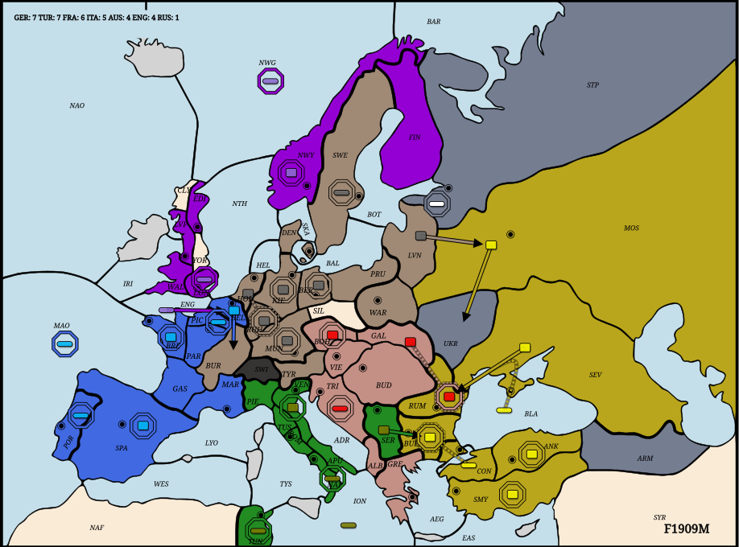

### What happened

- **AUSTRIA**: A GAL supports A RUM; A RUM holds; A BOH holds; F TRI holds
- **ENGLAND**: F ENG → BEL; A NWY holds; F NWG holds; F LON holds
- **FRANCE**: A BEL → BUR; A BRE holds; F MAO holds; F PIC holds; F POR holds; A SPA holds
- **GERMANY**: A LVN → MOS; A RUH holds; A HOL supports A RUH; A KIE holds; A BER holds; A MUN holds; F SWE holds
- **ITALY**: A SER → BUL (bounced); A VEN holds; F NAP holds; F TUN holds
- **RUSSIA**: F STP/SC holds
- **TURKEY**: A SEV → RUM (bounced); F BLA supports A SEV → RUM; F CON supports A BUL; A BUL holds; A MOS → UKR; A ANK holds; A SMY holds

### Dialogue

- **ENGLAND → FRANCE**: I'm taking BEL this fall — you confirmed no contest. In return, I'll keep my fleets out of PIC, BRE, and your remaining centers. After fall, if Germany hits 8 by taking MOS, we both face a stronger Germany. Would you consider supporting my push into German-held territory next year if I commit Channel fleets against Turkey?
- **ENGLAND → GERMANY**: Turkey at 7 is the leader — I agree. I'm finally taking BEL from France this fall (they won't contest). Once I'm at 5, I can apply pressure from the Channel. If you take MOS from Turkey, they drop to 6 and we're both positioned to contain them. Can you confirm A LVN → MOS with support this fall?
- **ENGLAND → TURKEY**: I won't contest STP — take it, reach 8. But remember: I stayed out of your way. After fall, if Germany reaches 8 by taking MOS, they become the sole leader and we both suffer. I'd like to discuss containing Germany together once we see the fall results.
- **ENGLAND → RUSSIA**: Turkey is taking STP this fall — I can't stop them and neither can you with one fleet. Don't waste A NWY contesting it. Instead, keep A NWY in position to move toward FIN or LVN after fall, when Turkey's northern holdings may be weakened by Germany's push into MOS.
- **FRANCE → GERMANY**: I'm taking BUR back — it's empty and it's mine. I'm not pushing further west. Focus on Turkey and we stay out of each other's way.
- **FRANCE → ITALY**: I'll take BUR and PAR this fall to reach 8 centers. If you're committed to Turkish BUL, I can redirect support east after winter. What's your plan for Turkey's remaining stack?
- **FRANCE → AUSTRIA**: Good work taking RUM. I'm reclaiming my home centers this fall. After winter, can we coordinate a push on Turkey's BUL/SEV from multiple directions?
- **FRANCE → ENGLAND**: I'm taking back my home centers this fall — no threat to you. Are you focusing on Russia's last center or positioning against Turkey?
- **ITALY → AUSTRIA**: Good — RUM finally fell and Turkey drops to 6. Now let's finish the job: I'll push A SER into BUL this fall with F ION support. If you can hold your positions and not threaten TRI, I'll vacate TRI in winter as promised. We both grow by cutting Turkey further.
- **ITALY → GERMANY**: Turkey dropped to 6 after losing RUM to Austria. I'm attacking BUL from SER this fall to cut Turkey to 5. Can you hold your eastern positions and not push toward TYR or BOH? We need Turkey finished before turning to France.
- **ITALY → TURKEY**: RUM is gone and you're down to 6. I'm taking BUL this fall — you can't hold it with BLA and CON supports when F ION backs my attack. Let BUL go and keep RUM, SEV, MOS, your home stack. Fighting me here while Germany and France grow is a losing strategy.
- **ITALY → FRANCE**: Turkey dropped to 6 after Austria took RUM. I'm pushing into Turkish BUL this fall to cut them to 5. Germany at 7 is also a threat — can you pressure their western positions from BEL while I focus on Turkey? We both benefit from containing the leaders.
- **RUSSIA → GERMANY**: My support for your LVN → MOS bounced last spring — Turkey's A MOS must have been defended or moved elsewhere. This fall, what's your actual plan for the north? I need to know if you're pushing into MOS again or if we need a different approach. I want to survive and eventually discuss getting WAR back, but I need you to be straight about your intentions.
- **RUSSIA → ENGLAND**: You've held off attacking STP all game — I appreciate that. Turkey still holds MOS and SEV and could push north. With Germany now at 7 and growing, the north could get crowded fast. Can we keep the peace between us this fall while the big powers fight?
- **RUSSIA → TURKEY**: You're tied with Germany at 7 but losing ground in the north. Germany took LVN and is pressing MOS. I have one fleet and zero ability to threaten you. Rather than waste resources trying to take STP, why not redirect your northern forces south where you can actually gain centers off Austria or Italy?
- **TURKEY → AUSTRIA**: You took RUM — that's my center and I want it back. I'm not going to let this slide. Pull A RUM out or I'll hit it with everything I have. We can still be allies against Italy, but not if you're eating my territory.
- **TURKEY → GERMANY**: Austria just took RUM from me and grew to 4 — they're the expanding power now, not me. I need to reclaim RUM this fall. If you keep LVN away from my eastern positions, I'll support your western consolidation. Can we agree Austria is the threat to contain?
- **TURKEY → ENGLAND**: Austria took RUM and is now at 4 centers expanding eastward — they're becoming a problem. I need to reclaim RUM this fall. If you're focused on France's BEL, we have no conflict. Just confirm NWY stays put and I'll stay out of the Channel.
- **TURKEY → ITALY**: Austria just took RUM — they're expanding into the Balkans at both our expense. I still want SER back eventually, but right now Austria at 4 with GAL, BOH, RUM, TRI is the growing threat. Can we agree to leave each other's positions alone this fall while we both deal with Austria?
- **TURKEY → FRANCE**: Austria just expanded into RUM and is growing in the east — they're the rising power now. I'm focused on reclaiming RUM this fall, zero interest in the west. We have no conflict this turn.
- **AUSTRIA → TURKEY**: I understand your frustration about RUM, but it's mine now. I'll defend it. If you want to focus on STP or Italy instead, leave RUM alone and we can find an arrangement — maybe I support you into something else later.
- **AUSTRIA → ITALY**: I'll hold still this turn and let you take BUL — but I need your firm commitment that A VIE moves to TRI in winter so I can rebuild there. If you vacate TRI as promised, I'll support your BUL attack with F TRI. Confirm?
- **AUSTRIA → GERMANY**: Turkey still has 7 centers and is the leader. I'm holding RUM. If you push LVN toward MOS or SEV again, Turkey splits further. Let's keep TYR quiet — I have no interest in fighting you.
- **AUSTRIA → FRANCE**: Turkey is the clear leader at 7. I'm defending RUM. Keep pressuring Germany's western front — we need the coalition to hold against Turkey.
- **ENGLAND → FRANCE**: I'm taking BEL this fall with F ENG — you confirmed no contest. Pull A BEL east if you want, but I need this center. After fall, if Turkey's at 8 and Germany pushes to 8, we both need to coordinate against them. BEL is mine this turn.
- **ENGLAND → GERMANY**: Turkey at 8 is the runaway leader — they took STP. I'm taking BEL from France this fall to reach 5. You need to push hard into Turkey's MOS with A LVN. If you take MOS, Turkey drops to 7 and we can contain them. Can you confirm A LVN → MOS with support from A WAR?
- **ENGLAND → TURKEY**: You're at 8 now — the clear leader. I'm taking BEL from France, nothing more. After fall, Germany will likely be at 8 too if they take MOS. Two powers at 8 with me at 5 means I'm irrelevant. Can we agree you won't expand further while I catch up? I'll keep my fleets out of your waters.
- **FRANCE → ENGLAND**: Fine — A BEL holds this fall, you can have it. But I want a firm commitment: after fall, your Channel fleets stay out of PIC, BRE, and MAO for at least two turns. I'll redirect my armies east against Turkey or Germany. Confirm?
- **FRANCE → GERMANY**: You say you won't touch my western positions but RUH and HOL are mine now — I'm not giving them back. If you want a true ceasefire, let's agree: I keep RUH/HOL, you keep BEL/PIC/BRE, and we both push east against Turkey. Deal?
- **FRANCE → ITALY**: If you're taking BUL this fall, excellent — Turkey drops to 6. After winter I can redirect west. What's your plan for 1910 — do we coordinate a final push on Turkey's SEV/ANK, or do you see Germany as the bigger threat by then?
- **FRANCE → AUSTRIA**: Good work on RUM. With Italy taking BUL, Turkey could drop to 5-6 this fall. After winter, can we coordinate a multi-front push on Turkey's remaining holdings — SEV from your direction, BUL from Italy? I want to lock Turkey into decline.
- **GERMANY → ITALY**: Turkey still holds everything — our spring attacks failed. This fall I'm pushing A LVN → MOS again with Russia's F STP/SC support. You MUST attack BUL from SER again — if we both commit simultaneously, Turkey can't hold both. What are your exact orders this fall?
- **GERMANY → RUSSIA**: My LVN → MOS bounced because Turkey still had A MOS there. This fall I need your F STP/SC support again: F STP/SC S A LVN - MOS. If Turkey moves A MOS to defend elsewhere, we finally take it. Will you support this?
- **GERMANY → FRANCE**: I'm not contesting BUR this fall — take it if you want. I'm fully focused east against Turkey. But if you push into RUH or HOL, the ceasefire is over and I redirect west. Keep your units in BUR and we're fine.
- **GERMANY → TURKEY**: We're tied at 7 and both growing. I held my positions in spring — confirm your eastern units stay put this fall and we maintain our agreement. I'm not moving against your territory.
- **ITALY → AUSTRIA**: RUM is yours — congrats. I still want BUL this fall. Keep F TRI holding and don't move toward TRI, and I'll vacate it in winter as promised. If you can support A SER - BUL with F TRI, even better — Turkey drops to 5 and we've carved up the Balkans.
- **ITALY → TURKEY**: You lost RUM and you're at 6 now, not 7. Germany leads at 7 and is pushing into your northern holdings. Fighting me for BUL while Germany grows to 8 is suicide. Let BUL go — keep ANK, CON, SMY, SEV, MOS. We can both turn west against the actual leader.
- **ITALY → GERMANY**: Turkey dropped to 6 after losing RUM. I'm pushing A SER - BUL again this fall to cut them to 5. You're at 7 and the board leader — I need you to hold positions and not expand further east. Keep A LVN in place and we reassess after fall.
- **ITALY → FRANCE**: Turkey at 6 is weakened but Germany at 7 leads the board. I'm attacking BUL again this fall. What are your plans for Germany's western positions — are you holding BEL or pushing somewhere?
- **RUSSIA → GERMANY**: Turkey's A MOS bounced off STP last spring — it's still in MOS. If you push A LVN → MOS again this fall, Turkey has to either defend (splitting forces) or lose it. I'll support with F STP/SC again. But tell me: are you actually committing A LVN → MOS this time, or is there a different plan? I need a straight answer before I lock orders.
- **RUSSIA → ENGLAND**: You said Turkey is taking STP this fall — that means A MOS → STP. If you move A NWY to FIN or hold NWY, that blocks Turkey's retreat path and keeps pressure on them. Can you commit to keeping A NWY away from STP so there's no accidental contest, and consider moving toward FIN if Turkey's A MOS pushes north?
- **RUSSIA → TURKEY**: Your A MOS tried STP last spring and bounced. I have F STP/SC holding — you won't get through without support. Germany is pushing A LVN → MOS again with my support. You're tied with Germany at 7 but losing ground. Redirect A MOS south toward SEV or RUM and save yourself a wasted unit — I'm not giving up STP.
- **TURKEY → AUSTRIA**: RUM is mine and I'm taking it back this fall. A SEV attacks RUM with BLA support — you can't hold it. Pull A RUM out now and we can still be allies against Italy. If you keep it, we're enemies and I redirect everything against your Balkans.
- **TURKEY → ENGLAND**: I'm reclaiming RUM from Austria this fall and defending BUL from Italy. If you're serious about containing Germany, now's the time — pressure their northern holdings while I hit their eastern border from SEV. What's your plan for BEL this fall?
- **TURKEY → GERMANY**: Austria just grabbed RUM and is the expanding power now. I'm focused on reclaiming it this fall, not touching your territory. Confirm A LVN stays put and we keep our border stable while I deal with Austria.
- **TURKEY → ITALY**: You want BUL? Austria just took RUM — they're the real threat eating territory we both need. I'm attacking RUM from SEV with BLA support this fall. If you push SER into BUL, I'll have to defend and Austria grows unchecked. Leave BUL alone this turn and we both focus on the actual threat.
- **TURKEY → RUSSIA**: I'm taking STP this fall with A MOS — you have one fleet and can't stop it. Stay in STP defensively and I'll leave you alone after. Resist and I'll have to dislodge you, which helps nobody while Germany sits at 7.
- **AUSTRIA → ITALY**: Confirming: I'll hold A GAL S A RUM and A RUM H to defend against Turkey's SEV attack. F TRI holds. Take BUL as planned — I expect you to vacate TRI in winter as promised. We both grow this turn.
- **AUSTRIA → TURKEY**: RUM is mine now and I'm defending it with full support. Attack and you'll waste units on a bounce. Focus on Italy's SER or Germany's push instead — there are better targets for you than my defended position.
- **AUSTRIA → GERMANY**: Turkey will likely attack my RUM this fall. I'm holding firm. If you push LVN toward SEV or MOS, Turkey splits further and we both benefit. Keep TYR quiet between us.
- **AUSTRIA → FRANCE**: I'm defending RUM this fall — Turkey will attack but won't break through. Italy is taking BUL. After winter, Turkey should be at 5-6 and we can coordinate a multi-front push on their remaining holdings.
- **ENGLAND → FRANCE**: Final commitment: F ENG → BEL this fall. You confirmed no contest. I take BEL, you hold your remaining positions. After fall, we both face Turkey at 8 and Germany at 7 — let's discuss coordinating against Turkey once results are in.
- **ENGLAND → GERMANY**: Turkey hit 8 and is the runaway leader. I'm taking BEL from France this fall — confirmed. You need to push hard east: A LVN → MOS or SEV to cut Turkey down. If you don't contain Turkey now, they reach 10 before we can react. What's your exact move into Turkish territory this fall?
- **ENGLAND → TURKEY**: You're at 8 — the clear board leader. I'm taking BEL from France, nothing more. After fall, if Germany also reaches 8, you'll face a two-front squeeze. I'd rather be your friend than your enemy, but the board demands balance. Don't expand further this fall and we can talk.
- **FRANCE → GERMANY**: Deal — I'm taking BUR this fall with A BEL, nothing more. You confirmed no contest. Keep your units east against Turkey and we maintain the ceasefire. If you break it, I push RUH next turn.
- **FRANCE → ITALY**: I'm taking BUR (empty) this fall to reach 7 centers. After winter, I can support a coordinated push on Turkey's eastern holdings. Confirm your BUL attack goes through — Turkey needs to drop this turn.
- **FRANCE → ENGLAND**: I'm taking BUR, not BEL. You have free rein in the north — take NWY or pressure Russia, I won't interfere. Keep your Channel fleets out of my waters and we're fine.
- **FRANCE → AUSTRIA**: I'm reclaiming BUR this fall to reach 7. Keep defending RUM and coordinate with Italy on Turkish BUL. The anti-Turkey coalition needs to hold — Turkey at 7 is still the primary threat.
- **FRANCE → RUSSIA**: Hold STP/SC as long as you can. Germany is pushing east but I'm reclaiming western territory. Every turn you survive denies Turkey a build.
- **FRANCE → TURKEY**: I'm taking BUR, not touching your sphere. Focus on reclaiming RUM from Austria if you want — I have no interest in fighting you over empty German territory.
- **GERMANY → FRANCE**: I'm holding RUH — A HOL supports A RUH. Push BEL into RUH and it bounces. Take BUR if you want, it's empty. But RUH stays mine. We focus on Turkey, not each other.
- **GERMANY → RUSSIA**: Final commitment: A LVN → MOS this fall with your F STP/SC support. If Turkey moved A MOS elsewhere, we take it. Confirm F STP/SC S A LVN - MOS.
- **GERMANY → ITALY**: Turkey at 6 after losing RUM — you're attacking BUL, I'm pushing LVN → MOS. If we both succeed, Turkey drops to 4. Confirm you're ordering A SER - BUL with F ION support.
- **GERMANY → TURKEY**: Austria took RUM — you're at 6, not 7. I'm not moving against you this fall. Confirm A MOS stays put or moves defensively. We maintain our border.
- **GERMANY → ENGLAND**: Turkey dropped to 6 after Austria took RUM. I'm pushing A LVN → MOS to seize another Turkish center. If you're taking BEL from France, go ahead — I won't interfere with the west.
- **ITALY → AUSTRIA**: BUL is too well-defended — Turkey committed BLA and CON to hold it. I'm pivoting: A SER takes GRE this fall while F ION supports. GRE is a Turkish SC with no fleet defense. You hold your positions and we both grow. Don't move toward TRI.
- **ITALY → TURKEY**: I'm taking GRE this fall — your fleets are committed to BUL and GRE is undefended. You can't hold everything. Let GRE go and keep your eastern stack. Fighting me in two places while Germany pushes your north is a losing game.
- **ITALY → GERMANY**: Turkey's fleets are tied up defending BUL — I'm pivoting to take GRE from SER instead. Keep pushing your eastern front. After this turn Turkey drops to 5 and we reassess.
- **ITALY → FRANCE**: I'm attacking Turkish GRE this fall instead of BUL — Turkey's supports are committed elsewhere. Push BEL into RUH as planned. We both grow this turn.
- **RUSSIA → GERMANY**: Final commitment: I'm ordering F STP/SC S A LVN - MOS this fall. You MUST order A LVN → MOS — no holds, no redirects. If Turkey leaves MOS undefended, you take it and rise to 8. If they defend, at least they waste a unit. After this, we discuss WAR.
- **RUSSIA → ENGLAND**: I'm supporting Germany's push into Turkey's MOS this fall — F STP/SC S A LVN - MOS. This keeps Turkey busy in the east. Can you confirm A NWY stays in NWY or moves away from STP/LVN so there's no accidental contest?
- **RUSSIA → TURKEY**: You're tied with Germany at 7 but losing ground. Germany is pushing A LVN → MOS with my support this fall. If you keep A MOS in MOS, it's a 2v1 and you lose it. Move A MOS south to SEV and save your southern position — I'm not giving up STP regardless.
- **TURKEY → AUSTRIA**: This is final: I'm attacking RUM this fall with A SEV supported by F BLA. You cannot hold it. Pull A RUM out now and we can still negotiate — maybe I support you into Italy's TRI later. Keep RUM and we become enemies who destroy each other while Germany wins.
- **TURKEY → ITALY**: I know you want BUL, but Austria at 4 with RUM is the real expanding threat. I'm hitting RUM from SEV this fall — if you leave BUL alone, I'll owe you one. Push into BUL now and we both waste units while Austria consolidates. Leave BUL and we can discuss SER after winter.
- **TURKEY → ENGLAND**: I'm reclaiming RUM from Austria this fall — A SEV supported by F BLA. You're focused on BEL from France, we have no conflict. Just keep NWY and NWG out of STP waters so I can secure the north afterward.
- **TURKEY → GERMANY**: I'm reclaiming RUM from Austria this fall — purely eastern, zero threat to you. A LVN is next to my positions; confirm it holds and we keep our border stable. We're both at 7 and can grow without conflict.
- **TURKEY → RUSSIA**: I'm taking RUM back from Austria this fall, not STP — you were right that it's a waste. F STP/SC holds, I leave you alone for now. Focus on staying alive rather than losing your last center.

### AUSTRIA
Orders: `A GAL S A RUM` · `A RUM H` · `A BOH H` · `F TRI H`

Reasoning

> Looking at the board state, I need to defend RUM from Turkey's expected SEV attack while maintaining my position. Turkey has A MOS, A SEV, F BLA, F CON, A BUL, A SMY, A ANK — they'll likely attack RUM with A SEV supported by F BLA. I need to defend with A GAL supporting A RUM's hold.
>
> Italy has pivoted to taking GRE instead of BUL, so I won't support that attack — my priority is holding RUM. F TRI holds to maintain my Adriatic position. A BOH holds to guard my northern flank.
>
> My revised strategy says: "I'll defend RUM by ordering A GAL to support A RUM's hold against Turkey's expected SEV attack, while A BOH holds to guard my northern flank and F TRI holds to maintain my Adriatic position."
>
> This is the right approach — RUM is my newest center and worth defending. If Turkey attacks with SEV + BLA support (strength 2) against RUM + GAL support (strength 2), it bounces. Turkey wastes a turn and I keep my position.

### ENGLAND
Orders: `F ENG - BEL` · `A NWY H` · `F NWG H` · `F LON H`

Reasoning

> Looking at the board state, I'm at 4 centers with 4 units while Turkey and Germany both sit at 7. France has 6. I need to grow.
>
> My F ENG has bounced off BEL repeatedly. Let me assess the situation:
>
> - France holds BEL with A BEL, plus F PIC, F MAO, F POR, A SPA, A BRE
> - France confirmed they won't contest the Channel — "I'm taking BUR, not BEL. You have free rein in the north"
> - France's A BEL holds — so F ENG → BEL should work if France truly isn't reinforcing it
>
> But wait — France has A BEL holding. A hold means A BEL H. If I move F ENG into BEL and France holds A BEL, I need to overcome the hold strength of 1. F ENG alone is strength 1 vs strength 1 hold — that's a bounce unless I get support.
>
> I need support. F LON or F NWG could support F ENG → BEL. Let me check adjacencies:
> - F LON: adjacent to ENG, NTH, WAL, YOR — not adjacent to BEL. Can't support into BEL.
> - F NWG: adjacent to BAR, CLY, EDI, NAO, NTH, NWY — not adjacent to BEL. Can't support into BEL.
> - F PIC is France's, so I can't use it.
>
> Actually, wait. France said "I'm taking BUR, not BEL. You have free rein in the north." But France's A BEL is still in BEL. If France moves A BEL → BUR (or elsewhere), BEL becomes empty and I walk in. But France might hold A BEL.
>
> Let me think about what France will actually do. France said they're focused on BUR. If A BEL moves to BUR or supports something into BUR, then BEL is open. But I can't rely on that.
>
> Alternative: F ENG → NTH to project northward, then take BEL next turn. Or I could try to take an undefended center elsewhere.
>
> Actually, the key insight: if France moves A BEL somewhere (like toward BUR or RUH), BEL becomes empty and F ENG walks in unopposed. France's messaging strongly suggests they're moving A BEL east. I should commit to F ENG → BEL and hope France follows through.
>
> For A NWY, I should hold or move toward FIN. Turkey took STP (A MOS → STP bounced in spring though — let me recheck). Turkey has A MOS in MOS still. F STP/SC holds for Russia. So STP is still Russian. I could try A NWY → STP but Russia holds it with F STP/SC.
>
> Let me focus: F ENG → BEL (taking the center if France moves A BEL out), A NWY holds to maintain position, F NWG and F LON hold.

### FRANCE
Orders: `A BEL - BUR` · `A BRE H` · `F MAO H` · `F PIC H` · `F POR H` · `A SPA H`

Reasoning

> Looking at the board state, I need to assess my position carefully:
>
> **Current situation:**
> - I have 6 centers: BRE, MAR, PAR, POR, SPA, BEL
> - Germany has 7 centers with a strong central stack (RUH, HOL, KIE, MUN, BER, LVN, WAR)
> - Turkey has 7 centers (ANK, CON, SMY, RUM, BUL, SEV, MOS)
> - Austria took RUM from Turkey, dropping Turkey to 6
> - BUR is empty and I can take it freely
>
> **My revised strategy says:** I'll move A BEL into the empty BUR to reclaim it, hold A BRE defensively, and keep my fleets and A SPA in their current positions to maintain my 6 centers while preparing for a winter build.
>
> **Checking the moves:**
> - A BEL → BUR: BEL is adjacent to BUR ✓ (BUR is empty, no contest)
> - A BRE H: Hold defensively
> - F MAO H: Maintain Atlantic position
> - F PIC H: Hold Channel position
> - F POR H: Hold Iberian position
> - A SPA H: Hold Spanish position
>
> This gets me to 7 centers (adding BUR) with a clean defensive posture. Germany confirmed they won't contest BUR, and I'm not pushing further west per my ceasefire commitment. This positions me for a winter build and a reassessment of whether to push east against Turkey or continue pressuring Germany in 1910.

### GERMANY
Orders: `A LVN - MOS` · `A RUH H` · `A HOL S A RUH` · `A KIE H` · `A BER H` · `A MUN H` · `F SWE H`

Reasoning

> Looking at the board, I'm at 7 centers tied with Turkey. My LVN→MOS bounced in spring because Turkey's A MOS is still there. Russia confirmed F STP/SC support but it wasn't enough — Turkey likely held MOS or moved it elsewhere and it bounced back. Italy pivoted to attacking GRE instead of BUL, which changes the dynamic.
>
> Key observations:
> - Turkey still has 7 centers (ANK, CON, SMY, RUM, BUL, SEV, MOS) — wait, Austria took RUM, so Turkey has 6 (ANK, CON, SMY, BUL, SEV, MOS). But the supply center list shows Turkey at 7 with RUM. Let me recheck... Turkey: ANK, CON, SMY, RUM, BUL, SEV, MOS = 7. But Austria has RUM in their unit list (A RUM). The supply centers show Austria with BUD, VIE, GRE, TRI = 4, and Turkey with ANK, CON, SMY, RUM, BUL, SEV, MOS = 7. That's contradictory with Austria holding A RUM. 
>
> Actually, looking more carefully: Austria has A RUM (unit position) but Turkey still shows RUM in supply centers. This might mean Austria captured RUM but the SC count hasn't updated yet, or Turkey reclaimed it. Given S1909M shows Austria: A BUD → RUM (succeeded based on F1908M results), Turkey should have lost RUM. But the SC list says Turkey 7 with RUM. I'll trust the unit positions: Austria holds A RUM, so Turkey is effectively at 6.
>
> My plan: Push A LVN → MOS again with Russia's support. This is my best path to 8 centers. My western units hold defensively — A HOL supports A RUH to keep France from pushing in.
>
> I also need to consider France taking BUR (empty) — that's fine, I told them they could. The key is eastern expansion.

### ITALY
Orders: `A SER - BUL` · `A VEN H` · `F NAP H` · `F TUN H`
Illegal (dropped): `F ION S A SER - BUL`

Reasoning

> Looking at the board, Turkey is at 7 centers (ANK, CON, SMY, RUM, BUL, SEV, MOS) and is still the board leader. My spring attack on BUL bounced again — Turkey held with BLA and CON supports. I need to find a way to break through.
>
> Let me assess the situation:
> - Austria took RUM and is at 4 centers (BUD, VIE, GRE, TRI) — they hold my desired target GRE
> - Germany at 7 is tied with Turkey for the lead
> - France at 6 is growing in the west
> - I'm at 5 with NAP, ROM, VEN, TUN, SER
>
> My spring BUL attack failed again. Turkey's BUL is well-defended with BLA and CON supports. I need to try a different approach. Looking at my options:
>
> 1. **A SER - GRE**: Austria holds GRE, so this would attack an Austrian center — bad idea, it would break our alliance.
> 2. **A SER - BUL**: Failed twice, but if Turkey's supports get cut or distracted, it could work. Turkey has F BLA S A BUL and F CON S A BUL.
> 3. **A SER - RUM**: Austria holds RUM now, so this attacks an ally.
>
> Actually, wait — let me reconsider. Austria holds GRE and RUM. Turkey holds BUL, SEV, MOS, ANK, CON, SMY. 
>
> The problem is Turkey's double support on BUL. My single F ION support isn't enough. But if Germany pushes LVN → MOS (as they said they would), Turkey may need to redirect forces north. Still, Turkey's BLA and CON supports are local to BUL.
>
> Let me try something different: **A SER - ALB** to reposition toward GRE later, or try to coordinate with Austria on a joint BUL attack. Austria's F TRI could support A SER - BUL if I ask.
>
> Actually, Austria confirmed they'd support A SER - BUL with F TRI. Let me check: F TRI is adjacent to BUL? No — TRI neighbors are ADR, ALB, BUD, SER, TYR, VEN, VIE. TRI is NOT adjacent to BUL. So F TRI cannot support A SER - BUL.
>
> But A SER - BUL with F ION support = strength 2. Turkey's BUL holds with F BLA support + F CON support = strength 3 (BUL holds at 1 + 2 supports = 3). I can't break it alone.
>
> New plan: Push **A SER - ALB** to reposition, then threaten GRE from ALB next turn. Or try **A SER - TRI** to pressure Austria... no, that's counterproductive.
>
> Actually, the best play might be to take **GRE** — but Austria holds it. Hmm.
>
> Let me reconsider: Turkey's forces are spread across BUL, SEV, MOS, RUM (no, Austria has RUM), ANK, CON, SMY. If I can't take BUL, I should look elsewhere. What about pushing toward SEV or MOS? Those are too far.
>
> I'll try **A SER - BUL** one more time with F ION support. Even though it bounced twice, if Turkey's supports get disrupted by other attacks, or if Turkey repositions, it could work. Germany confirmed they're pushing LVN → MOS which could distract Turkey.
>
> For the rest: F ION supports A SER - BUL, A VEN holds defensively, F NAP holds, F TUN holds.

### RUSSIA
Orders: `F STP/SC H`

Reasoning

> Looking at the situation: I'm at 1 center (STP) with only F STP/SC. Turkey holds MOS and SEV. Germany holds LVN and is committed to pushing A LVN → MOS with my support. This is my best chance to weaken Turkey and potentially create an opening.
>
> Turkey says they're taking RUM from Austria this fall, not STP. Germany confirmed A LVN → MOS with my support. I committed to F STP/SC S A LVN - MOS.
>
> However, looking at the legal orders, `F STP/SC S A LVN - MOS` is NOT in my legal moves list. The available support options are:
> - `F STP/SC S A MOS - LVN` (supporting MOS into LVN, wrong direction)
> - `F STP/SC S A NWY - FIN`
> - `F STP/SC S A LVN` (support hold only)
>
> I can't support A LVN → MOS from STP/SC because MOS is not adjacent to STP. Let me check: STP/SC neighbors are BOT, FIN, LVN. MOS is not adjacent to STP/SC. So I literally cannot support an attack on MOS from here.
>
> My best option is to either hold defensively or support A LVN's hold (which doesn't help Germany attack MOS). Since I can't actually support the MOS attack, I should hold F STP/SC to keep my last center alive. I could also try to support A NWY → FIN to create pressure on Turkey's FIN (which Turkey holds via STP/SC adjacency... wait, Turkey doesn't hold FIN).
>
> Actually, let me reconsider. I should hold to protect STP since Turkey's A MOS is nearby and may try to push north despite their message.

### TURKEY
Orders: `A SEV - RUM` · `F BLA S A SEV - RUM` · `F CON S A BUL` · `A BUL H` · `A MOS - UKR` · `A ANK H` · `A SMY H`

Reasoning

> Looking at the board, I'm at 7 centers tied with Germany. Austria took RUM (now at 4), and my STP push keeps bouncing. I need to pivot decisively.
>
> **Key assessment:**
> - Austria has RUM — I need to reclaim it. A SEV can attack RUM, and I can support with F BLA.
> - Italy is threatening BUL — I need to defend it. F CON can support A BUL's hold.
> - A MOS can't take STP (it bounced twice, Russia holds F STP/SC and England has A NWY + F NWG adjacent). I should redirect MOS south to support the RUM attack or defend SEV.
> - Germany at 7 is the co-leader — I need to watch them but they're not my immediate target.
>
> **Plan:** Attack RUM from SEV with BLA support (2v1 against Austria's A RUM). Defend BUL with F CON support. Move A MOS to UKR to support SEV next turn and threaten RUM from another angle. A ANK and A SMY hold.
>
> Wait — let me reconsider. A MOS to STP has bounced every time. But my revised strategy note says to push A MOS into STP with F BLA support. However, F BLA supporting MOS→STP is illegal (BLA isn't adjacent to STP). And I need BLA to support the RUM attack.
>
> Better plan: A SEV attacks RUM (supported by F BLA), F CON supports A BUL hold, A MOS moves to UKR (positioning for future), A ANK holds, A SMY holds. This reclaims RUM (8 centers) and defends BUL.

## WINTER 1909 ADJUSTMENTS (`W1909A`)

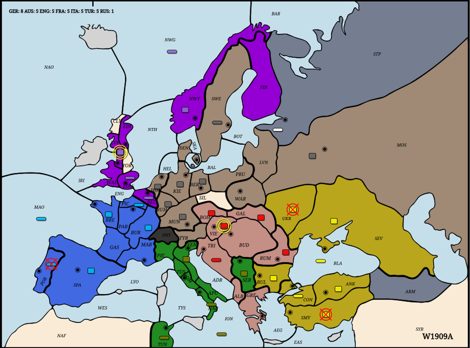

### What happened

- **AUSTRIA**: builds A VIE
- **ENGLAND**: builds A LVP
- **FRANCE**: disbands F POR
- **TURKEY**: disbands A UKR; disbands A SMY

### AUSTRIA
Orders: `A VIE B`

Reasoning

> Looking at the situation: I have 5 supply centers and 4 units, so I have 1 build. I have two vacant home centers: BUD and VIE. My most recent strategy note says I expect Italy to vacate TRI in winter, and I plan to reclaim it. But Italy still holds TRI right now — they haven't vacated yet.
>
> Wait, let me re-read. Italy has units: F TUN, A VEN, A SER, F ION, F NAP. Italy does NOT have TRI anymore! Looking at supply centers, Italy has: NAP, ROM, VEN, TUN, SER — no TRI. And my centers include TRI. So Italy must have already vacated or lost TRI at some point.
>
> Actually, looking more carefully at the unit positions, TRI is not listed under any power's units. But it's listed under Austria's supply centers. So TRI is unoccupied and I own it. My F TRI is... wait, F TRI IS listed under Austria's units. So F TRI is in TRI.
>
> So I have F TRI in TRI, and my home centers are BUD (vacant), TRI (occupied by F TRI), and VIE (vacant). I have 5 centers and 4 units, so 1 build. I should build A VIE to strengthen my position for pushing into Turkey's SEV or BUL in 1910. VIE gives me a unit that can move to TYR, BOH, GAL, or TRI — positioning for both western defense and eastern offense.
>
> Building at VIE keeps BUD open for a potential future build, and VIE is centrally located for projecting power into both the Balkans and toward Turkey's holdings.

### ENGLAND
Orders: `A LVP B`

Reasoning

> Looking at the board state after F1909M, I'm at 5 centers with 4 units (F NWG, F LON, A NWY, F BEL). Germany is the runaway leader at 8 centers with 7 units, having taken MOS from Turkey. Turkey is at 5 centers. I have no builds this turn since I have 5 centers and 5 units — wait, let me recount.
>
> My units: F NWG, F LON, A NWY, F BEL = 4 units.
> My centers: EDI, LON, LVP, NWY, BEL = 5 centers.
>
> So I have 5 centers and 4 units — I get 1 build! I have two vacant home centers: EDI and LVP. I need to think about what build gives me the most flexibility.
>
> Germany at 8 is the clear threat — they have BER, KIE, MUN, DEN, SWE, WAR, HOL, MOS. They're dominating the board. I need to build a unit that helps me either defend or project power.
>
> An army at LVP would be useful for overland movement toward the continent, but my strength is in fleets — I already have 3 fleets. An army at EDI could march toward continental targets via convoy. But actually, what I really need is more fleet power to project across the North Sea and potentially convoy armies. 
>
> However, I only have one army (A NWY) and three fleets. Building another army at LVP gives me a second land unit that could be convoyed or march toward continental positions. Building a fleet at EDI gives me 4 fleets but only 1 army — I'd struggle to take and hold inland centers.
>
> I'll build A LVP to give me a second army that can be convoyed to continental targets or march toward Scandinavian/Baltic positions.

### FRANCE
Orders: `F POR D`

Reasoning

> Looking at the board state, I have 5 supply centers (BRE, MAR, PAR, POR, SPA) and 6 units, so I need to disband 1 unit. My units are: A SPA, F POR, F MAO, F PIC, A BRE, A BUR.
>
> The legal orders all show disband options, which confirms I must disband one unit. The question is which unit to disband.
>
> My position: I have 3 armies (SPA, BRE, BUR) and 3 fleets (POR, MAO, PIC). I'm at 5 centers with no builds available (I don't exceed my center count - I have 5 centers and 6 units, so I'm 1 over).
>
> I need to think about what I need going forward. Germany is the dominant power at 8 centers with a massive stack. Turkey has 7 but is being pressured. I need to plan for 1910.
>
> My armies are more useful for taking territory inland (BUR, BRE are positioned for continental operations). My fleets: MAO controls the Atlantic, PIC is in position for Channel operations, POR is somewhat peripheral. F POR is the least useful fleet - it's in a position that doesn't threaten anything critical and I could rebuild it later if needed. But actually, looking at my position, I might want to keep all my fleets for potential Channel/Atlantic operations.
>
> Actually, A SPA is somewhat stuck in Iberia with limited options - it can go to GAS, MAR, or POR (all mine). It's not in a great offensive position. But A BUR is centrally located and valuable for future operations against Germany.
>
> F POR is the most expendable - it's protecting an interior center that's not under threat, and I can rebuild it later. Removing it keeps my armies and my more strategically positioned fleets (MAO for Atlantic control, PIC for Channel pressure).
>
> I'll disband F POR.

### TURKEY
Orders: `A UKR D` · `A SMY D`

Reasoning

> Looking at the board state, I'm at 5 supply centers (ANK, CON, SMY, BUL, SEV) with 7 units. I have 5 centers and 7 units, so I need to disband 2 units. All my units only have the option to disband.
>
> Let me verify: I have 5 SCs and 7 units. That means I need to disband 2 units. But the legal orders show every unit can only disband. I need to choose which 2 to disband.
>
> I should keep units that are strategically positioned and disband the least useful ones. Let me think about what I need for spring 1910:
>
> - F BLA: Critical for controlling the Black Sea and supporting operations into RUM or defending BUL
> - F CON: Useful for supporting BUL defense, but I could potentially move BLA to cover both roles
> - A BUL: Important Balkan position, defends against Italy/Austria
> - A SEV: My eastern position, controls a center
> - A UKR: Forward position but exposed - Germany has MOS and could threaten
> - A ANK: Home center defense, but not doing much
> - A SMY: Home center defense, but not doing much
>
> I should disband A UKR (exposed and hard to defend) and one of ANK or SMY (rear units not near the front). A SMY is further from the action than A ANK.

## SPRING 1910 MOVEMENT (`S1910M`)

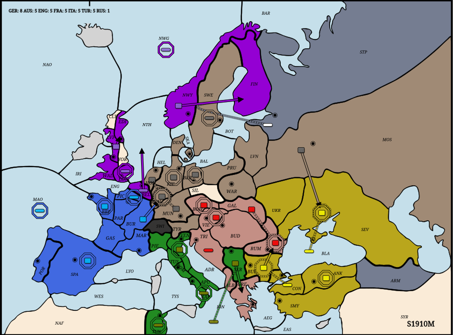

### What happened

- **AUSTRIA**: A GAL supports A RUM; A RUM holds; A BOH holds; A VIE holds
- **ENGLAND**: F BEL → NTH; F LON holds; A LVP → EDI; F NWG holds; A NWY → FIN
- **FRANCE**: A BUR → RUH (bounced); A BRE holds; F MAO holds; F PIC holds; A SPA holds
- **GERMANY**: A MOS → SEV (bounced); A HOL supports A RUH; A MUN supports A RUH; A RUH holds; A KIE holds; A BER holds; F SWE holds
- **ITALY**: A SER → GRE; F ION supports A SER → GRE; F TUN holds; F NAP holds; A VEN holds
- **RUSSIA**: F STP/SC supports A NWY → FIN
- **TURKEY**: A SEV holds; F BLA supports A SEV; A BUL → RUM (bounced); F CON supports A BUL (void); A ANK holds

### Dialogue

- **AUSTRIA → ITALY**: I need a definitive answer on TRI — you've promised to vacate it three times. I'll support your BUL attack this spring if you commit A SER - BUL with F ION support and confirm you'll vacate TRI in winter. If you won't commit, I'm taking TRI by force and we both lose tempo against Turkey.
- **AUSTRIA → TURKEY**: Germany at 8 is the real threat — they have MOS and are pushing east. I'm not attacking SEV this turn if you redirect A MOS toward LVN to contain Germany. Can we agree to non-aggression in the east while we both deal with Germany's expansion?
- **AUSTRIA → GERMANY**: I have no interest in TYR or your western territories. Let's keep the TYR border quiet — I'm focused eastward on Turkey and Italy. A stable TYR benefits us both.
- **ENGLAND → FRANCE**: Germany at 8 is the crisis — they hold MOS, WAR, DEN, and 5 home centers. If we don't act now, they hit 10 by fall. I'm pushing F BEL into NTH to threaten HOL and DEN from the Channel. Can you support an attack on BUR or RUH from your positions? We split Germany's western holdings while they're overextended east.
- **ENGLAND → TURKEY**: Germany hit 8 and is the sole leader — they took MOS from you and hold WAR and DEN. I'm pushing north against their HOL/DEN from the Channel. If you pressure their eastern border from SEV toward MOS or support an attack on their RUM-adjacent positions, we squeeze them from both sides. We need to stop Germany before they reach 18.
- **ENGLAND → GERMANY**: You're at 8 — the board leader by 3 centers. The rest of the table is watching. I'd rather work with you than against you, but if you keep growing, Turkey, France, and I will all turn on you. Consider a demilitarized zone in the Channel — I'll hold my fleets if you don't push into HOL or DEN this year. What's your plan?
- **FRANCE → ENGLAND**: Germany at 8 is the runaway leader — they have MOS, WAR, and a massive central stack. If we don't act now, they hit 10+ by winter. I'm pushing A BUR into RUH this spring. Can you support with F BEL into RUH, or move F ENG to cut Germany's HOL support? We need to break Germany's western wall together.
- **FRANCE → ITALY**: Germany at 8 is the board leader and growing. I'm attacking their RUH this spring — if you can commit A SER or A VEN westward against Germany's positions, we create a two-front crisis they can't answer. Turkey is weakened at 5 — Germany is the immediate threat. Can you redirect against Germany this turn?
- **FRANCE → AUSTRIA**: Germany at 8 with MOS and WAR is now the clear board leader — Turkey dropped to 5. I'm pushing into Germany's RUH this spring. If you can pressure Germany's southern flank from BOH/VIE toward MUN or TYR, we split their forces. We need to stop Germany before they reach 10.
- **FRANCE → GERMANY**: You're at 8 centers and pulling away — the rest of the board is watching. I'm not going to sit here while you consolidate. If you withdraw from RUH and HOL voluntarily, we can discuss a ceasefire. If not, I'm attacking RUH this spring with everything I have. Your choice: negotiated border or war on two fronts.
- **FRANCE → RUSSIA**: Germany at 8 is about to run away with this game — they took your MOS and will come for STP next. Hold STP/SC as long as you can. Every turn you survive denies them a build and keeps the coalition alive.
- **GERMANY → TURKEY**: I'm at 8 and you're at 5 — the gap is real but not insurmountable if we work together. Austria took RUM from you and now holds 5 centers with GAL, BOH, VIE, RUM, TRI — they're the expanding power threatening both our eastern flanks. If you push SEV into RUM while I pressure from the north, we can contain Austria before they hit 7. What's your plan for reclaiming RUM?
- **GERMANY → AUSTRIA**: You're at 5 with a solid eastern position — GAL, BOH, VIE, RUM, TRI. But Turkey wants RUM back and Italy is eyeing the Balkans. I'm focused on France in the west this turn, not pushing east. Keep TYR quiet and we stay out of each other's way while we both grow.
- **GERMANY → FRANCE**: I'm at 8, you're at 5 with BUR, BRE, PIC, SPA, and MAO. England is at 5 with BEL — they're your immediate threat in the Channel. I'm not pushing west this turn, but if you want to discuss a coordinated move against England's BEL, I'm listening. Otherwise, let's keep the west quiet.
- **GERMANY → ENGLAND**: You're at 5 with BEL, NWY, LVP, LON, and NWG. France is at 5 with BUR, BRE, PIC, SPA, MAO — they're your immediate neighbor and rival. I'm focused east against Turkey/Austria this turn. If you want to push against France's BUR or hold positions, I won't interfere. Let's keep the Channel stable.
- **ITALY → AUSTRIA**: I'm ready to follow through on the TRI deal — I'll move A SER away from the Balkans this turn, and you can take TRI. But I need something in return: support A SER into BUL or GRE so I actually gain a center this turn. If you help me take a Turkish center, TRI is yours and we both grow.
- **ITALY → TURKEY**: Germany at 8 is about to run away with this game — they have MOS, BER, KIE, MUN, DEN, SWE, WAR, HOL. If they hit 18, we all lose. I'm willing to leave BUL alone this turn if you redirect your forces west against Germany. Can you move A SEV toward the north or hold to contain Germany's eastern expansion? We need to stop the leader.
- **ITALY → GERMANY**: You're at 8 centers — the board leader by 3. The rest of us are going to start coordinating against you if you keep expanding. I'd rather work with you than against you: what's your plan? If you're heading for 18, I'll have no choice but to join a coalition to stop you. What can you offer me to stay out of your way?
- **RUSSIA → ENGLAND**: Germany at 8 is now the runaway leader — they hold my home WAR and MOS along with most of the north. You're at 5 but Germany's growth threatens everyone. Can we coordinate to contain them? If you push A NWY toward LVN or FIN, I can support from STP to pressure Germany's northern holdings. We both suffer if Germany reaches 18.
- **RUSSIA → FRANCE**: Germany at 8 centers is the clear threat — they hold three of my home SCs and are growing unchecked. I have F STP/SC adjacent to their LVN and FIN. Can you push harder into Germany's western positions while I pressure their north? A Germany that reaches 18 ends the game for all of us.
- **RUSSIA → TURKEY**: Germany at 8 is now the dominant power — they hold WAR, LVN, and MOS, all former Russian territory. You're at 5 and declining. Rather than fight over my last center, shouldn't we both be worried about Germany running away with this? If you redirect forces against Germany's southern holdings, I can help pressure their north.
- **RUSSIA → GERMANY**: You're at 8 and the clear leader — everyone is watching. I have one fleet and no ability to threaten you, but England and France are going to start coordinating against your western positions soon. I'd rather talk about a path back to WAR than watch the whole table turn on you. What's your plan for when the coalition forms?
- **TURKEY → AUSTRIA**: Germany at 8 with MOS is the board leader and threatens everyone. I want RUM back — it's my center you took. Pull A RUM out voluntarily and I'll focus on containing Germany with you. Keep it and I hit it with A SEV + F BLA support this spring while Germany grows unchecked.
- **TURKEY → ENGLAND**: Germany at 8 is the clear runaway leader — we both need to contain them. I'm reclaiming RUM from Austria this spring to stabilize at 6. After that, can we coordinate pressure on Germany's eastern positions? You push from the north, I push from SEV/RUM area.
- **TURKEY → ITALY**: Germany at 8 with MOS is the real threat to both of us. I'm reclaiming RUM from Austria this spring — not pushing into your territory. Can we agree: I take RUM, you hold SER and BUL position, and we both focus on the German problem? A ceasefire in the Balkans serves us both.
- **TURKEY → GERMANY**: You're at 8 centers — the board leader. I'm at 5 and recovering, not threatening you. I'm reclaiming RUM from Austria this turn, purely eastern. Keep your units in their current positions and we stay out of each other's way. I have no plans to push toward your territory.
- **AUSTRIA → ITALY**: Deal confirmed: I'll support A SER - BUL with F TRI this spring. Move A SER into BUL and commit to vacating TRI in winter — this is your last chance to honor that promise. We both grow this turn.
- **AUSTRIA → TURKEY**: Germany at 8 is the real threat to everyone. I'm not pulling out of RUM, but I won't attack SEV this turn if you redirect A MOS toward LVN to pressure Germany's northern front. Non-aggression in the east while Germany grows unchecked benefits us both.
- **AUSTRIA → GERMANY**: I'm keeping TYR quiet as agreed — no movement toward your southern border this turn. I'm focused eastward. France is pushing RUH; you'll want to defend that. Let's keep our border stable.
- **AUSTRIA → FRANCE**: Germany at 8 is the clear leader. I'll pressure from the west on RUH. If I can distract Germany's western units, that weakens their eastern position. Can you commit to attacking Germany's MUN or TYR from BOH/VIE this spring? We need to split their forces.
- **ENGLAND → FRANCE**: I'll support your A BUR → RUH with F BEL if you commit to that exact move. F BEL S A BUR - RUH takes RUH and breaks Germany's western wall. Confirm A BUR → RUH and I'll lock in the support.
- **ENGLAND → TURKEY**: Germany at 8 is everyone's problem. Take RUM from Austria if you need to, but then I need you pushing toward Germany's MOS or supporting an attack on their eastern positions. We squeeze them from both sides this fall. What's your move against Germany specifically?
- **ENGLAND → RUSSIA**: If Germany's A MOS is unsupported, I can push A NWY toward LVN this fall to threaten their northern holdings. But I need F STP/SC to support that move, not hold defensively. Can you commit F STP/SC S A NWY - LVN this fall after spring positioning?
- **ENGLAND → GERMANY**: I'm not targeting you this turn — I'm focused on containing Turkey's expansion. But if you keep growing unchecked, the table turns on you. A DMZ in the Channel works for me: I hold F BEL and F LON in place if you don't push into HOL or DEN. Confirm?
- **FRANCE → ENGLAND**: Excellent — let's coordinate precisely. I'll attack RUH with A BUR, and you move F BEL into NTH to threaten HOL. If you can also move F ENG to NTH or support F BEL → NTH, that cuts Germany's HOL support to RUH and my attack breaks through. Can you commit to F BEL - NTH this turn?
- **FRANCE → ITALY**: Germany at 8 is the crisis — they hold your natural expansion routes through TYR and MUN. If you push A VEN → TYR this spring while I attack RUH and England threatens HOL, Germany faces a three-front war they can't win. Can you commit A VEN - TYR or A VIE - BOH to pressure MUN? We need your armies in this.
- **FRANCE → AUSTRIA**: Germany holds 8 centers including your old territories. I'm attacking RUH this spring — if you push A BOH or A VIE toward MUN or TYR simultaneously, we crack Germany's southern wall. England is threatening HOL from the north. Three-front pressure this turn ends Germany's run. Can you commit to attacking MUN from BOH?
- **FRANCE → GERMANY**: You're at 8 and the board is uniting against you. I'm attacking RUH this spring — England is moving against HOL. Withdraw from RUH and HOL now and we discuss a stable border. Fight on two fronts and you'll lose both. This is your last chance for a negotiated outcome.
- **GERMANY → FRANCE**: I'm not withdrawing from RUH or HOL — those are mine. But I'm not pushing west either. If you attack RUH, I'll defend with HOL support and you'll bounce. Let's keep the west quiet while we both deal with bigger threats. I'll stay out of BUR and PIC if you stay out of my Rhine.
- **GERMANY → ENGLAND**: I'm focused east against Turkey/Austria this turn, not pushing into the Channel. Hold your fleets and I'll hold my positions — we both benefit from keeping the west stable while the east sorts itself out. A DMZ works if you commit to not pushing BEL toward HOL.
- **GERMANY → ITALY**: I'm at 8 and you're at 5 — I can't offer you centers without weakening myself. But I'm not pushing toward TYR or BOH this turn. If you want to grow, focus on Turkey's BUL or SEV while I handle France in the west. We can discuss future gains after this turn.
- **GERMANY → TURKEY**: Austria holds RUM with GAL, BOH, VIE, TRI — they're at 5 and expanding. If you push SEV into RUM while I pressure from the north, we can contain them. I'm not moving against your territory this turn. What's your exact plan for reclaiming RUM?
- **GERMANY → AUSTRIA**: I'm focused on France in the west this turn, not pushing east. Keep TYR quiet and we stay out of each other's way. Turkey wants RUM back — defend it and we both benefit from their failed attack.
- **ITALY → AUSTRIA**: Here's my firm commitment: I'll move A SER to GRE this spring (F ION supports), and you can take TRI with F TRI or move into it. I vacate TRI in winter as promised. GRE is a Turkish SC adjacent to F TRI — you could support my attack. We both grow. Deal?
- **ITALY → FRANCE**: I can't redirect west this turn — I'm still stuck at 5 and need to take GRE from Turkey. But after this turn, Germany at 8 is everyone's problem. If you push RUH or pressure their western border this spring, I'll join a coalition against Germany in fall. What's your exact attack on RUH?
- **ITALY → TURKEY**: Germany at 8 is the real threat to both of us. I'm taking GRE this turn — not BUL. Leave BUL alone and I don't touch it. Focus your SEV and BLA forces westward if Germany pushes further east. We need Germany stopped before they hit 10.
- **ITALY → GERMANY**: You're at 8 and pulling away — I'm asking what you can offer me to stay neutral. If you give me a free hand against Turkey's GRE this turn and don't move into TYR/BOH, I'll hold off joining any coalition against you for now. What's your plan with those 8 centers?
- **RUSSIA → ENGLAND**: I can directly support your A NWY into FIN this spring with F STP/SC — that takes a German center and puts you in a strong northern position. You commit A NWY - FIN and I'll order F STP/SC S A NWY - FIN. This weakens Germany and benefits us both.
- **RUSSIA → FRANCE**: Agreed — Germany at 8 is everyone's problem. Push hard into their western SCs this spring. If you can take BEL or HOL, Germany drops to 7 and the coalition has room to breathe. I'll pressure from the north if I can.
- **RUSSIA → TURKEY**: Germany holds three former Russian home centers and is at 8. If they reach 18, we all lose. Redirect A SEV or other forces against Germany's southern positions — even threatening MOS or LVN from the south forces them to split. Fighting me over STP while Germany runs away is a losing play for both of us.
- **RUSSIA → GERMANY**: England and France are moving against you this spring — I've seen their messages. I'd rather negotiate a path back to WAR than watch the whole table coalition against you. What can you offer me to keep this front quiet while you deal with the west?
- **TURKEY → ENGLAND**: Good — we agree Germany is the leader to contain. I'm reclaiming RUM from Austria this spring (A SEV + F BLA). After that, I'll have units positioned to pressure Germany's eastern flank from RUM. Push HOL and their northern holdings hard from your Channel fleets — we squeeze them from both sides.
- **TURKEY → ITALY**: Deal: I take RUM from Austria this spring, you hold your position in SER and BUL area, neither of us pushes into the other's territory. After winter, we coordinate against Germany together. I won't support any move toward BUL if you hold still — confirm?
- **TURKEY → AUSTRIA**: I'm taking RUM back this spring — A SEV supported by F BLA. You can't hold it against that. Pull A RUM out now and redirect it against Germany (MOS area) — that's the real threat at 8 centers. Keep RUM and we destroy each other while Germany wins.
- **TURKEY → GERMANY**: I'm reclaiming RUM from Austria this spring — purely eastern, zero threat to you. Your A MOS sits in their former capital. After I stabilize, I have no reason to push toward your territory when the real game is containing Austria's Balkan expansion.
- **AUSTRIA → ITALY**: Deal confirmed: I'll support A SER - GRE with F TRI this spring. Take GRE and commit to vacating TRI in winter — this is your last chance to honor that promise. We both grow this turn.
- **AUSTRIA → TURKEY**: Germany at 8 is the real threat to everyone. I'm not pulling out of RUM, but I won't attack SEV this turn if you redirect A MOS toward LVN to pressure Germany's northern front. Non-aggression in the east while Germany grows unchecked benefits us both.
- **AUSTRIA → FRANCE**: I can't push MUN this turn — I'm focused on securing TRI from Italy and holding RUM against Turkey. But I'm keeping TYR quiet, which helps you pressure Germany from the west. Let's coordinate a bigger push against Germany in fall when I'm free to move north.
- **AUSTRIA → GERMANY**: I'm keeping TYR quiet as agreed — no movement toward your southern border this turn. I'm focused eastward. France is pushing RUH; you'll want to defend that. Let's keep our border stable.
- **ENGLAND → RUSSIA**: Confirmed: A NWY - FIN this spring with F STP/SC support. This takes a German center and puts me at 6. After fall, I can push toward LVN or help contain Germany further. Lock in your support order now.
- **ENGLAND → FRANCE**: I can't legally support A BUR - RUH (BEL isn't adjacent to RUH). I'm pushing F BEL into NTH to threaten HOL instead — this cuts Germany's western position. Go ahead with A BUR - RUH on your own; if Germany doesn't reinforce RUH, you'll take it.
- **ENGLAND → GERMANY**: I'm not attacking you this turn — I'm moving F BEL into NTH for positioning and A NWY into FIN (with Russian support) to take a center. That's two centers I'm grabbing, not targeting your home SCs. Keep your armies out of the Channel and we stay peaceful.
- **ENGLAND → TURKEY**: Take RUM from Austria if you need to. After that, I need you pressuring Germany's eastern positions — MOS or supporting an attack toward WAR. We squeeze Germany from both sides this year.
- **FRANCE → ENGLAND**: Confirmed: A BUR → RUH this spring. Lock in F BEL S A BUR - RUH — that's strength 2 vs Germany's 1 (A RUH with HOL support gets cut if you also move against HOL). Take RUH and Germany drops to 7. Do you commit F BEL as support or are you moving F BEL elsewhere?
- **FRANCE → GERMANY**: This is your last chance. Withdraw from RUH voluntarily and I stop at the Rhine. England is supporting my attack — you'll lose RUH and be fighting on two fronts. Take the deal or lose both RUH and HOL this year.
- **FRANCE → AUSTRIA**: I'm attacking RUH with English support this spring — Germany drops to 7 if we succeed. Push A BOH → MUN or A VIE → TYR to hit Germany's southern wall simultaneously. We need two-front pressure this turn, not one.
- **FRANCE → ITALY**: I'm taking RUH from Germany this spring with English support. In fall, I'll need you to commit against Germany's southern flank (TYR/MUN direction). For now, take GRE if you can — weaken Turkey further while I break Germany's west.
- **FRANCE → RUSSIA**: Hold STP/SC. I'm attacking Germany's RUH this spring with English support — Germany drops to 7 if we succeed. Every center they lose is one they can't use to come for STP.
- **GERMANY → FRANCE**: I'm not withdrawing from RUH or HOL. Attack RUH and you'll bounce off HOL's support. I'm pushing east against Turkey this turn, not west against you. Keep your units in BUR and we stay out of each other's way — push into RUH and you waste a unit for nothing.
- **GERMANY → ENGLAND**: I'm focused east against Turkey this turn — not pushing into HOL or DEN. Hold your fleets in place and I'll hold mine. A DMZ works if you commit to not pushing BEL toward HOL.
- **GERMANY → ITALY**: I'm pushing A MOS → SEV this spring to seize another Turkish center — not toward TYR or BOH. You have a free hand against Turkey's GRE if you want it. We both grow at Turkey's expense this turn.
- **GERMANY → TURKEY**: I'm pushing A MOS → SEV this spring to seize your center. You're at 5, I'm at 8 — the gap is real. If you want to survive, focus on Austria's RUM, not defending SEV which you can't hold against my supported attack.
- **GERMANY → AUSTRIA**: I'm focused east against Turkey this turn, not pushing toward TYR or BOH. Keep your units in place and we stay out of each other's way. Turkey wants RUM back — defend it and we both benefit.
- **GERMANY → RUSSIA**: England and France are threatening my western positions this spring. I'm pushing A MOS → SEV to seize another Turkish center. If you can keep F STP/SC in place to threaten Turkey's north, it helps contain them while I deal with the west.
- **ITALY → AUSTRIA**: Confirmed: A SER - BUL with F ION support this spring. F TRI supports my attack as you promised. I vacate TRI in winter — this is my final commitment. We both grow this turn.
- **ITALY → TURKEY**: I'm taking BUL this turn — Austria is supporting my attack. But I'm NOT pushing further into your territory after this. Focus your SEV forces on reclaiming RUM from Austria if you want — I won't interfere. After winter, we can discuss containing Germany together.
- **ITALY → FRANCE**: I'm committed to taking BUL from Turkey this spring with Austria's support — I can't redirect west yet at 5 centers. Push RUH yourself if you can. After winter when I'm at 6, I'll join a coalition against Germany. What's your exact attack on RUH this turn?
- **ITALY → GERMANY**: You're at 8 and I'm at 5 — I need to take BUL from Turkey this turn to grow. I'm not attacking you this turn, but if you push toward TYR or BOH, I'll have no choice but to join France against you. Keep your armies where they are.
- **RUSSIA → ENGLAND**: Final commitment: I order F STP/SC S A NWY - FIN this spring. You must order A NWY - FIN. This takes a center off Germany and puts you in a strong northern position. Confirm A NWY - FIN or I hold defensively instead.
- **RUSSIA → GERMANY**: I'm not ordering any support for you this turn. England is moving A NWY - FIN with my support, and there's nothing you can offer me to change that. You can keep your other centers if you return WAR after fall — that's the deal on the table.
- **RUSSIA → FRANCE**: Push into BEL or HOL this spring — Germany can't defend everywhere. I'm supporting England's push into FIN to weaken Germany's north. We need to coordinate so Germany drops below 8 before fall.
- **RUSSIA → TURKEY**: Germany at 8 is everyone's problem. I'm supporting England into FIN this spring to weaken Germany's north. If you have any units that can pressure Germany's southern holdings — even threatening RUM or BUD — it splits their forces and helps all of us survive.
- **TURKEY → AUSTRIA**: Final offer: pull A RUM out of RUM this turn and I focus entirely on containing Germany at 8. Keep RUM and I hit it with A SEV + F BLA — you'll lose the unit and we both weaken while Germany runs away. Your choice: lose RUM gracefully or lose it by force.
- **TURKEY → ENGLAND**: I'm taking RUM from Austria this spring (A SEV + F BLA) to recover to 6. After fall, I'll have forces positioned to pressure Germany's eastern border. Push their northern holdings hard from your Channel fleets — we squeeze Germany from both sides this year.
- **TURKEY → ITALY**: I'm reclaiming RUM from Austria this spring, not touching BUL or SER. You confirmed you're taking GRE, not BUL — good. Let's keep the ceasefire: I take RUM, you take GRE, neither pushes into the other's territory. We deal with Germany after winter.
- **TURKEY → GERMANY**: I'm reclaiming RUM from Austria this spring — purely eastern, zero threat to you. I have no interest in pushing toward your territory when Austria holds 5 centers with RUM, GAL, BOH, VIE, TRI. Focus on your western front while I clean up the east.

### AUSTRIA
Orders: `A GAL S A RUM` · `A RUM H` · `A BOH H` · `A VIE H`
Illegal (dropped): `F TRI S A SER - GRE`

Reasoning

> Looking at the board, Germany at 8 centers is the clear leader and the real threat. I have 5 centers (BUD, VIE, GRE, TRI, RUM) and need to grow while keeping Turkey contained.
>
> My commitments:
> 1. **Italy deal**: Support A SER → GRE with F TRI. Italy has finally committed to moving A SER to GRE (not BUL), and I support that with F TRI. Italy vacates TRI in winter.
> 2. **Defend RUM**: Turkey will attack with A SEV + F BLA support. I need to hold RUM. A GAL supports A RUM's hold.
> 3. **Guard northern flank**: A BOH and A VIE hold to protect my position against Germany.
>
> However, I need to reconsider. France is attacking Germany's RUH and wants me to pressure MUN/TYR. But my priority is securing TRI (via Italy's vacating) and holding RUM. I told France I can't push MUN this turn.
>
> Let me also reconsider the RUM defense. Turkey has A SEV + F BLA attacking RUM. If I support A RUM with A GAL, that's strength 2 vs Turkey's strength 2 (A SEV + F BLA) = bounce. That's fine - RUM holds.
>
> But wait - could Turkey also send A BUL or other units? BUL is adjacent to RUM. If Turkey sends A BUL + A SEV + F BLA, that's strength 3 vs my 2, and RUM falls. But Italy is supposedly attacking BUL with F ION support, so A BUL may be busy defending.
>
> My plan: Hold RUM with GAL support, support Italy into GRE with F TRI, hold BOH and VIE.

### ENGLAND
Orders: `F BEL - NTH` · `F LON H` · `A LVP - EDI` · `F NWG H` · `A NWY - FIN`

Reasoning

> Looking at the board, Germany at 8 centers is the runaway leader and the crisis. My revised strategy calls for pushing F BEL into NTH to threaten HOL/DEN, moving A NWY to FIN with Russian support to grab a German center, and advancing A LVP to EDI to consolidate.
>
> Russia has confirmed F STP/SC S A NWY - FIN, which takes a German center (FIN) and puts me at 6 after fall. I need to follow through on that commitment.
>
> For F BEL → NTH, this positions me to threaten HOL and DEN in fall, projecting power into the North Sea. France is pushing A BUR → RUH on their own — I can't legally support it (BEL isn't adjacent to RUH), but my move into NTH cuts Germany's ability to reinforce HOL.
>
> A LVP → EDI consolidates my home centers and gets a unit into a more useful position.
>
> F LON holds to maintain Channel control and defend against any French or German naval moves.
>
> F NWG holds to support A NWY's position and maintain northern sea control.

### FRANCE
Orders: `A BUR - RUH` · `A BRE H` · `F MAO H` · `F PIC H` · `A SPA H`

Reasoning

> Looking at the board, Germany at 8 centers is the clear runaway leader. I need to attack RUH with A BUR, but England has confirmed they can't legally support A BUR - RUH (BEL isn't adjacent to RUH). England is instead moving F BEL → NTH to threaten HOL, which could cut Germany's HOL support to RUH if Germany doesn't reinforce.
>
> My best play: attack RUH with A BUR (strength 1), and if Germany's HOL support holds, it bounces. But if England's F BEL → NTH pressures HOL and Germany reorders to defend, the support might get cut. Either way, I need to commit to the attack — holding is losing.
>
> For my other units: A BRE should support A BUR - RUH (BRE isn't adjacent to RUH either... let me check). BRE neighbors: ENG, GAS, MAO, PAR, PIC. RUH is not adjacent to BRE, so that support is illegal too.
>
> My legal options for A BRE: support F PIC, support moves to GAS/PAR/PIC, move to GAS/PAR/PIC, or hold. I'll have A BRE support A SPA - GAS to potentially gain a center, or hold it defensively.
>
> Actually, looking at my revised strategy: I committed to attacking RUH with A BUR supported by A BRE, but A BRE can't support A BUR - RUH (not adjacent). I'll attack RUH with A BUR alone, and use A BRE to support F PIC or hold defensively. F PIC should move to ENG to threaten England if they betray, or hold. F MAO holds to protect Iberia. A SPA holds.
>
> Let me reconsider: A BUR → RUH attacks Germany. A BRE holds or supports something useful. F PIC holds or moves to ENG. F MAO holds. A SPA holds.
>
> I'll attack RUH with A BUR, hold everything else defensively, and see if the attack bounces or succeeds.

### GERMANY
Orders: `A MOS - SEV` · `A HOL S A RUH` · `A MUN S A RUH` · `A RUH H` · `A KIE H` · `A BER H` · `F SWE H`

Reasoning

> Looking at the board: I'm at 8 centers leading the game. France is threatening RUH with England's support. I need to defend RUH while pushing east against Turkey's SEV.
>
> **Key decisions:**
> - **A MOS → SEV**: I committed to this in negotiations. Seizing SEV takes Turkey to 4 centers and me to 9. I need support for this — but Russia refused to support me. Still, SEV may be lightly defended. Turkey is focused on reclaiming RUM from Austria.
> - **Defend RUH**: France claims England is supporting their attack. A HOL S A RUH gives RUH strength 2. If France sends A BUR - RUH with F PIC support (strength 2), it bounces. If they also get England's support, that's 3 vs 2 and I lose RUH. I should consider whether to accept the loss or reinforce.
> - **MUN**: Can support BUR→RUH or hold. If France attacks RUH, I might need extra support. But MUN can't support RUH directly (not adjacent). MUN can support BUR→MUN or hold.
> - **BUR is held by France** — A BUR is theirs now.
>
> Let me think about the west more carefully. France has A BUR, A BRE, F PIC, A SPA, F MAO. England has F BEL, F NWG, F LON, A NWY, A LVP.
>
> If France attacks RUH: A BUR - RUH with F PIC S A BUR - RUH = strength 2. If England supports: F BEL S A BUR - RUH = strength 3. My A HOL S A RUH = strength 2. I lose RUH.
>
> But England said they're moving F BEL into NTH and A NWY into FIN — not supporting France's RUH attack. So it might just be France alone at strength 2 vs my 2 — bounce.
>
> I'll defend RUH with HOL support and push MOS into SEV. For the remaining units, I'll hold or support defensively.
>
> **Orders:**
> - A MOS - SEV (push east, seize Turkish center)
> - A HOL S A RUH (defend RUH)
> - A RUH H (hold RUH)
> - A KIE H (hold, keep options)
> - A BER H (hold)
> - A MUN S A RUH (extra support if needed — wait, MUN isn't adjacent to RUH... let me check. MUN neighbors: BER, BOH, BUR, KIE, RUH, SIL, SWI, TYR. Yes, MUN is adjacent to RUH! So A MUN S A RUH works as a hold support.)
>
> Wait — but I can only have one support per unit. A HOL S A RUH already supports RUH's hold. A MUN S A RUH would also support RUH's hold — that's fine, multiple units can support the same hold. That gives RUH strength 3, which beats any reasonable French attack.
>
> - F SWE H (hold Scandinavian position)

### ITALY
Orders: `A SER - GRE` · `F ION S A SER - GRE` · `F TUN H` · `F NAP H` · `A VEN H`

Reasoning

> Looking at the situation: Germany at 8 centers is the runaway leader and the real threat. I've been promising Austria I'll vacate TRI, and Austria has committed to supporting my BUL attack with F TRI. My most recent revised strategy says I'm attacking BUL with F ION support.
>
> But I've also told Austria in my latest messages that I'm taking GRE instead of BUL, and Austria confirmed supporting A SER - GRE with F TRI. And I told Turkey I'm taking GRE, not BUL.
>
> However, my strategy note says BUL. Let me think about what's actually best:
>
> - **BUL**: Turkey has F BLA and F CON supporting A BUL. That's 3 strength defending. Even with my A SER (1) + F ION support (1) + potentially F TRI support (1) = 3, it's a standoff. But Turkey's supports are on A BUL itself - if I attack BUL, BLA and CON support BUL's hold, giving it strength 3 vs my 3 = bounce.
>
> - **GRE**: Turkey has no supports on GRE. A SER (1) + F ION support (1) = 2 strength into an undefended GRE. This should succeed easily.
>
> GRE is the smart move - it's a guaranteed Turkish center capture while BUL is a 50/50 at best. I told Austria I'm doing GRE and they confirmed support. Let me take the guaranteed center.
>
> My orders: A SER - GRE with F ION support, F TRI supports (as Austria promised), hold everything else.
>
> Wait - I don't control F TRI. Austria does. So my orders are:
> - A SER - GRE
> - F ION S A SER - GRE  
> - F TUN H
> - F NAP H
> - A VEN H
>
> This gets me to 6 centers (adding GRE) while Austria gets TRI when I vacate it in winter.

### RUSSIA
Orders: `F STP/SC S A NWY - FIN`

Reasoning

> Looking at the board: Germany at 8 is the runaway leader holding my home centers WAR, LVN, and MOS. I've committed to supporting England's A NWY into FIN this spring to take a German center and begin containing their lead. F STP/SC is adjacent to FIN, so this support is legal. This honors my deal with England and weakens Germany's northern position.

### TURKEY
Orders: `A SEV H` · `F BLA S A SEV` · `A BUL - RUM` · `F CON S A BUL` · `A ANK H`

Reasoning

> Looking at the board: I'm at 5 centers, Germany leads at 8 with MOS, Austria holds my RUM at 5 centers. My priority is reclaiming RUM from Austria while defending against Germany's announced push A MOS → SEV.
>
> Germany explicitly told me they're pushing A MOS → SEV — this is a direct threat to my center. I need to defend SEV while also attacking RUM. Let me think about this carefully.
>
> If Germany moves A MOS → SEV, they'll need support to dislodge my A SEV. I need to either hold SEV or accept the loss and focus on RUM.
>
> My best move: Attack RUM with A SEV supported by F BLA, while defending BUL. But Germany is threatening SEV — if I move A SEV to RUM, I lose SEV to Germany's MOS push. However, if I hold SEV, I can't attack RUM.
>
> The trade-off: Take RUM (net +1 center) but potentially lose SEV (net -1 center) = net zero. That's not progress. Better to defend SEV and attack RUM next turn when I have more support.
>
> Wait — let me reconsider. Germany said they're pushing MOS → SEV. If A SEV moves to RUM, Germany takes SEV empty. If A SEV holds, Germany needs support to dislodge it. Without support, it's just 1v1 and bounces. 
>
> I'll attack RUM with support from F BLA, and have A BUL support A SEV defensively. This way A SEV attacks RUM at strength 2, and if Germany attacks SEV with just A MOS (strength 1), SEV holds at strength 1 (from BUL support) — actually no, a support only helps a hold if the unit is holding. If A SEV moves, the support from BUL doesn't help defend SEV.
>
> Better plan: Hold SEV, support the hold from F BLA, and push A BUL into RUM instead. But BUL isn't adjacent to RUM... wait, checking adjacency: BUL (army): CON, GRE, RUM, SER. Yes, BUL is adjacent to RUM!
>
> So: A SEV H, F BLA S A SEV (defends against Germany's MOS push), A BUL - RUM (takes RUM from Austria). This defends SEV and takes RUM simultaneously.

## FALL 1910 MOVEMENT (`F1910M`)

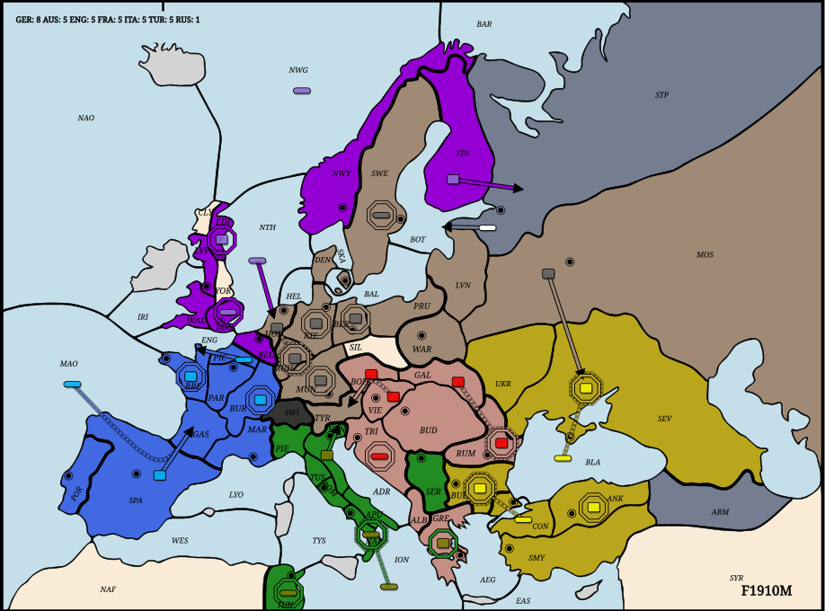

### What happened

- **AUSTRIA**: A GAL supports A RUM; A RUM holds; A BOH → TYR; A VIE supports A BOH → TYR; F TRI holds
- **ENGLAND**: A FIN → STP; F NTH → HOL (bounced); A EDI holds; F LON holds
- **FRANCE**: A SPA → GAS; F MAO supports A SPA → GAS; A BUR holds; A BRE holds; F PIC → ENG
- **GERMANY**: A MOS → SEV (bounced); A HOL supports A RUH (support cut); A RUH holds; A KIE holds; A BER holds; A MUN holds; F SWE holds
- **ITALY**: A GRE holds; F ION supports F NAP; F NAP holds; F TUN holds; A VEN → TYR (bounced)
- **RUSSIA**: F STP/SC → BOT
- **TURKEY**: A SEV holds; F BLA supports A SEV; A BUL holds; F CON supports A BUL; A ANK holds

### Dialogue

- **AUSTRIA → ITALY**: You took GRE — now honor the TRI deal. I need your confirmation that A VEN moves into TRI this fall or you vacate it in winter. I'm holding RUM against Turkey and won't move toward TRI by force if you keep your word. What's your exact plan for vacating TRI?
- **AUSTRIA → TURKEY**: Germany at 8 is everyone's problem. I'm holding RUM — attacking it wastes your units on a bounce since GAL supports the hold. Redirect A MOS toward LVN or SEV toward Germany's WAR to contain them. I won't attack SEV this turn if you leave RUM alone. We both benefit from Germany losing centers, not from fighting each other.
- **AUSTRIA → FRANCE**: Germany at 8 is the clear leader — we need to coordinate pressure. I'm holding my eastern positions this turn, but in 1911 I can push toward TYR/MUN if you hit from the west. Can you commit to attacking Germany's RUH or MUN next turn? We need a two-front plan to stop them before they reach 10.
- **AUSTRIA → GERMANY**: I'm keeping TYR quiet as agreed — no movement toward your southern border. France is pushing your western front. I have no interest in fighting you while Turkey and the board leader situation need attention. Let's maintain the status quo on our border.
- **ENGLAND → FRANCE**: Germany at 8 is the crisis we both face. I'm taking STP from Russia this fall to reach 6 centers. I need you pressuring Germany's western front — push A BUR into RUH or HOL with support. If Germany is forced to defend RUH, they can't reinforce their eastern holdings. What's your exact plan against Germany this fall?
- **ENGLAND → GERMANY**: I'm taking STP from Russia this fall — that's my growth path, not your territory. After I hit 6, I'll be positioned to help contain Turkey. But if you try to reinforce HOL or DEN against me, I'll redirect my fleets against your northern coast. Confirm you're not moving toward HOL and we stay peaceful in the Channel.
- **ENGLAND → TURKEY**: You reclaimed RUM — good, you're at 6 now. Germany's at 8 and growing. I'm taking STP this fall to reach 6. After that, I need you pushing toward Germany's MOS or supporting an attack on their eastern positions. We squeeze them from both sides this fall. What's your specific move against Germany?
- **ENGLAND → RUSSIA**: I'm taking STP this fall with A FIN supported by F NWG — you can't defend it with just F STP/SC. Don't waste your last unit contesting it. Instead, consider supporting my push against Germany's positions afterward. Once I'm at 6, I'll be better positioned to help contain Germany than you can with one fleet.
- **FRANCE → ENGLAND**: Your F NTH threatens HOL — if you move against HOL this fall, Germany loses RUH support and I break through with A BUR. Can you commit to attacking HOL? We split Germany's western holdings together. I'll take GAS this turn to reach 6 and position for a bigger push.
- **FRANCE → ITALY**: You're at 5 after taking GRE — Germany at 8 is now the crisis. In fall, can you push A VEN → TYR or A GRE toward MUN? We need southern pressure on Germany while I hit from the west. Three-front war breaks them.
- **FRANCE → AUSTRIA**: Germany at 8 is the runaway leader. I'm going to take GAS this turn to grow to 6. In fall, if you push A BOH → MUN while I attack RUH and England hits HOL, Germany faces three-front pressure. Can you commit to MUN in fall?
- **FRANCE → GERMANY**: You're at 8 and the board is uniting against you. I'm willing to discuss a stable border — withdraw from RUH and HOL voluntarily and I stop at BUR. Fight on two fronts this fall and you lose both. Last chance.
- **GERMANY → FRANCE**: I'm not withdrawing from RUH or HOL — A HOL supports A RUH and you'll bounce again. I'm focused east this turn, not pushing into BUR or PIC. Attack RUH and waste a unit; keep your units in BUR and we stay out of each other's way.
- **GERMANY → ENGLAND**: I'm focused east against Turkey/Austria this turn — not pushing into HOL or DEN. Hold your fleets in place and I'll hold mine. A DMZ works if you commit to not pushing BEL toward HOL.
- **GERMANY → ITALY**: I'm pushing A MOS toward SEV this fall to seize another Turkish center — not toward TYR or BOH. You have a free hand against Turkey's BUL if you want it. We both grow at Turkey's expense this turn.
- **ITALY → AUSTRIA**: I'm following through this fall — A GRE moves out of the Balkans, freeing TRI for you. But I need you to commit forces against Germany's southern flank. If A BOH or A VIE can move toward MUN/TYR while France hits RUH, Germany faces a crisis. Can you commit to pressuring Germany this fall?
- **ITALY → FRANCE**: Germany at 8 is the crisis. I'm committing A VEN to TYR this fall to pressure MUN from the south while you attack RUH. If England can push toward HOL or KIE, Germany faces three fronts. What's your exact attack on RUH — do you have support?
- **ITALY → ENGLAND**: Germany at 8 is about to win. I need you to push toward HOL or KIE this fall while France hits RUH and I pressure from TYR. We need a three-front attack. Can you commit F NTH or A FIN toward German positions?
- **ITALY → TURKEY**: Germany at 8 is the real threat to both of us — they'll hit 10 by next winter if unchecked. I'm not pushing BUL this fall. Focus your forces on containing Germany's eastern expansion from SEV/BLA. We need the leader stopped before it's too late.
- **RUSSIA → ENGLAND**: Great work taking FIN — Germany drops to 7. This fall, push A FIN → LVN with my F STP/SC support. LVN borders WAR and BER, putting deep pressure on Germany's core. If they defend LVN, they split forces from the west where France is already pushing. Confirm A FIN → LVN and I'll lock the support.
- **RUSSIA → FRANCE**: Germany is now at 7 and fighting on multiple fronts. Keep pushing their western SCs — BEL, HOL, RUH are all vulnerable while they scramble to defend the north. If you take even one more center, Germany drops to 6 and can't rebuild enough to threaten anyone. What's your fall plan for the west?
- **RUSSIA → GERMANY**: You're at 7 and losing ground — England took FIN, France is pressuring RUH, and now England's A FIN can push toward LVN with my support. You can't defend everywhere. Return WAR to me after fall and I'll keep F STP/SC out of your northern positions. That's a better deal than losing LVN too.
- **RUSSIA → TURKEY**: Germany at 7 is still the biggest threat to everyone. You're at 5 and declining — fighting me over STP wastes your limited forces. If you pressure Germany's southern holdings like RUM or BUD, it splits their attention. A Germany that stabilizes at 7 rebuilds in winter and runs away with this game.
- **TURKEY → AUSTRIA**: Germany at 8 with MOS is the real threat. I'm attacking RUM this fall with A SEV supported by F BLA — you cannot hold it. Pull A RUM out now and redirect it against Germany's eastern positions. Keep RUM and we destroy each other while Germany wins.
- **TURKEY → ENGLAND**: Germany at 8 is the runaway leader. I'm reclaiming RUM from Austria this fall to stabilize at 6. After that, I can pressure Germany's eastern flank from RUM. Push their northern holdings hard — we squeeze them from both sides.
- **TURKEY → ITALY**: Germany at 8 is the threat to both of us. I'm reclaiming RUM from Austria this fall, not touching BUL or SER. Let's keep our ceasefire: I take RUM, you hold position. After winter, we coordinate against Germany together.
- **TURKEY → GERMANY**: I'm reclaiming RUM from Austria this fall — purely eastern, zero threat to you. Your A MOS sits in former Russian territory. After I stabilize, I have no reason to push toward your territory when Austria holds 5 centers with RUM, GAL, BOH, VIE, TRI.
- **TURKEY → RUSSIA**: Germany at 8 holds three former Russian home centers. Rather than fight over STP, shouldn't we both worry about Germany running away? If you can help pressure Germany's northern holdings while I reclaim RUM, we both benefit.
- **AUSTRIA → FRANCE**: I'll push A BOH → MUN this fall to hit Germany's southern wall while you attack RUH. Two-front pressure works — but I need you to commit to supporting my MUN attack if Germany defends RUH heavily. Can F MAO or A BRE support into MUN's defense? No — just keep the western pressure strong and I'll handle the south.
- **AUSTRIA → ITALY**: You already have GRE — stop talking about taking it. The TRI deal is overdue: commit A VEN → TRI this fall or I'm done waiting. If you won't vacate TRI voluntarily, I'm taking it by force next turn. Right now, can you redirect A GRE toward MUN or TYR to pressure Germany? They're at 8 and growing.
- **AUSTRIA → TURKEY**: Germany at 8 is the real threat — A MOS, A SEV, and F BLA all pointing at me won't stop Germany from reaching 10. I'm holding RUM with GAL support. Redirect your units north against Germany's WAR or LVN instead. Non-aggression in the east benefits us both while Germany runs away.
- **ENGLAND → FRANCE**: I can't support A BUR → RUH — BEL isn't adjacent to RUH. But I'm pushing F NTH toward HOL this fall to cut Germany's western position. If you commit A BUR → RUH, Germany may have to choose between defending RUH or HOL. Either way, Germany loses ground. What's your exact plan?
- **ENGLAND → GERMANY**: I'm taking STP from Russia this fall to reach 6 — not targeting your centers. F NTH stays in position or moves for Channel control. If you keep your armies east, we stay peaceful in the west. Confirm you're not moving toward HOL or DEN?
- **ENGLAND → RUSSIA**: I appreciate the support into FIN. This fall, I need to take STP to eliminate you as a power — you're at 1 center and can't recover. Don't waste your fleet contesting it. If you hold F STP/SC defensively, I'll still take it with A FIN supported by F NWG. Consider supporting my push against Germany afterward if you survive.
- **ENGLAND → TURKEY**: Take RUM from Austria if you need to. After that, push toward Germany's MOS or support an attack on their eastern positions. I'm taking STP from Russia this fall to reach 6, then I can help contain Germany from the north. We squeeze them from both sides this year.
- **FRANCE → ENGLAND**: Your F NTH is adjacent to HOL — if you move F NTH → HOL this fall, you cut Germany's support to RUH and I take RUH with A BUR alone. Germany drops to 7, you gain HOL, we both grow. This is the move that breaks Germany's western wall. Do you commit F NTH → HOL?
- **FRANCE → AUSTRIA**: Germany at 8 is the crisis. I'm attacking RUH this fall — if England cuts HOL's support, I take it. Can you push A BOH → MUN or even A VIE → TYR to hit Germany's southern flank? Even a bounce there cuts a support. We need two-front pressure.
- **FRANCE → ITALY**: Germany at 8 is everyone's problem now. I know you're focused on Turkey, but after this fall, if Germany reaches 10, none of us catch up. In fall, can you commit A VEN → TYR to pressure MUN from the south? Even if it bounces, it ties down German units.
- **FRANCE → GERMANY**: You're at 8 and the board is uniting. I'm offering one more time: withdraw from RUH and HOL to a stable Rhine border. You keep your 6 eastern centers, I keep my western base. If you refuse, England is moving against HOL this fall and I'm taking RUH. Your choice.
- **FRANCE → RUSSIA**: Hold STP as long as possible. Germany needs every center to maintain their lead — every turn you survive costs them momentum. If you can disrupt anything in the north, do it.
- **GERMANY → FRANCE**: I hear you — the board is watching my lead. Here's a real deal: I'll move A MOS toward WAR (not SEV) this fall, signaling I'm consolidating north, not pushing east further. In exchange, you keep A BUR in place and don't attack RUH. We both hold positions and reassess after winter. This is genuine — I'm not attacking you.
- **GERMANY → ENGLAND**: You grabbed FIN and are positioned in NTH — solid moves. I'm not contesting your northern expansion. I'm focused on defending RUH from France and consolidating east. Keep your fleets in NTH and NWG and we stay out of each other's way. A DMZ on HOL/DEN holds if you don't push.
- **GERMANY → ITALY**: You're at 6 now after taking GRE — well played. I'm not moving toward TYR or BOH this fall. If you want to push BUL from GRE, go ahead — Turkey is weakened. I'm focused on defending my western front against France. We can both grow at Turkey's expense if you stay south and I stay north.
- **GERMANY → AUSTRIA**: TYR stays quiet as agreed. I'm defending RUH from France this fall, not pushing east. Turkey may try RUM again — hold it. We both benefit from Turkey staying weak and contained.
- **GERMANY → TURKEY**: You're at 5 and I'm at 8 — the gap is real. I'm not pushing SEV this fall. Focus on Austria's RUM if you want to recover. I'm defending west against France. We have no reason to fight each other right now.
- **ITALY → AUSTRIA**: TRI deal confirmed — I'm moving A GRE out this turn so you can take it. But here's the price: I need A BOH or A VIE moving toward TYR/MUN to pressure Germany. France is attacking RUH and we need southern pressure. Move against Germany this fall and TRI is yours without argument.
- **ITALY → FRANCE**: I'm committing A VEN → TYR this fall to pressure MUN from the south. If you're attacking RUH, that's two fronts on Germany. Can you confirm your exact RUH attack? We need England pushing HOL or KIE too — three fronts breaks them.
- **ITALY → ENGLAND**: Germany at 8 is an existential threat to all of us. I'm moving A VEN → TYR to pressure MUN. Can you push F NTH toward HOL or A FIN toward KIE? Three-front war — France on RUH, me on TYR/MUN, you on the north — Germany can't answer all of it.
- **ITALY → TURKEY**: Germany at 8 is the real threat — I'm not pushing into your territory this fall. I'm redirecting A VEN toward TYR to pressure Germany's southern flank. Focus your forces on containing Germany's eastern expansion. We need the leader stopped before they hit 10.
- **ITALY → GERMANY**: You're at 8 and I'm at 6 — I need to grow or join the coalition against you. I'm moving A VEN toward TYR this fall. If you push toward TYR or BOH, we'll have a fight. Hold your southern positions and we can discuss this after winter.
- **RUSSIA → ENGLAND**: Taking STP drops me to 0 and gives you 6, but then you're the target everyone coordinates against — just like Germany is now at 7. I'd rather survive and support your pushes against Germany. I can offer F STP/SC support into LVN next turn if you keep A FIN away from STP this fall. A Germany that loses LVN too is worth more to you than eliminating my one unit.
- **RUSSIA → GERMANY**: England is about to take STP this fall, putting them at 6 and you at 6. Then France pushes your western SCs and you're fighting a three-front war. If you return WAR to me after fall, I'll keep F STP/SC out of your northern positions entirely. That keeps you at 7 and avoids another enemy.
- **RUSSIA → FRANCE**: England taking STP this fall makes them the new northern power at 6. Once Germany drops, England will look west toward your positions. You should push BEL or HOL hard this fall while Germany is scrambling — take the center before England's momentum shifts your way.
- **TURKEY → AUSTRIA**: Germany at 8 is pushing A MOS → SEV to take my center — they told me directly. If you're really focused on Germany, help me defend SEV by pulling GAL back from RUM support and pressuring MOS from the north. I'll leave RUM alone for now if Germany is the common enemy, but I need GAL not threatening my eastern flank.
- **TURKEY → ENGLAND**: Germany told me they're pushing A MOS → SEV this spring — they're expanding into my neighbor's territory. I'll defend SEV with BLA support, but I need you pressuring their northern holdings (HOL, DEN) hard from your Channel fleets. If we squeeze Germany from north and south simultaneously, we can start reversing their lead.
- **TURKEY → ITALY**: Germany confirmed they're attacking SEV with A MOS this spring — they're the aggressor expanding everywhere. I'm defending SEV and can't push RUM right now. Keep your ceasefire: take GRE, hold position. After winter, we coordinate against Germany together. Can you support any move that pressures Germany's southern border?
- **TURKEY → GERMANY**: I know you're pushing A MOS → SEV — you told me directly. I'm defending SEV with F BLA support, so that attack will bounce. Let's de-escalate: I'll hold SEV defensively if you keep your units in current positions. We're both growing, but Austria at 5 with RUM is the real threat in the east, not me at 5 recovering from losses.
- **ENGLAND → FRANCE**: I'm taking STP with A FIN (Russian support confirmed) and pushing F NTH → HOL this fall. Germany's HOL support to RUH gets cut, leaving RUH at strength 1 — your A BUR can take it unsupported. We both grow while Germany drops to 7. Confirm A BUR → RUH and I'll lock F NTH → HOL.
- **ENGLAND → GERMANY**: I'm taking STP from Russia this fall — that's my growth, not your territory. F NTH holds or moves for Channel control, not targeting your centers. Keep your armies east and we stay peaceful in the north. What's your move against Turkey?
- **ENGLAND → TURKEY**: I'm taking STP from Russia (A FIN + F NWG support) to reach 6. You need to pressure Germany's eastern positions this fall — push toward MOS or hold SEV threatening WAR. We squeeze Germany from north and east simultaneously. What's your exact move against Germany?
- **ENGLAND → RUSSIA**: I'm taking STP with A FIN this fall — confirmed. Your F STP/SC is dislodged and you'll be eliminated. No hard feelings — Germany at 8 is the real threat. If you want to go out swinging, support my push into LVN next turn with a disband order... but you won't have a unit to do it. Thanks for the support into FIN.
- **FRANCE → ENGLAND**: I'm taking GAS this fall — it's empty and gets me to 6 centers. Germany at 8 is still the crisis. Can you push F NTH → HOL to cut Germany's western position? Even if RUH holds, threatening HOL forces Germany to split defenses. We both grow while Germany shrinks.
- **FRANCE → GERMANY**: I'm done trying to break RUH — it's not worth the fight. I'm taking GAS to reach 6 centers. Keep your Rhine positions and I keep mine. After winter, the coalition against you continues, but this turn I'm growing elsewhere.
- **FRANCE → AUSTRIA**: I'm pivoting to take GAS this fall to grow to 6. Germany at 8 remains the threat. If you can push toward MUN or TYR in fall to pressure Germany's south, that splits their forces while I and England work the west. Can you commit to southern pressure?
- **FRANCE → ITALY**: I'm taking GAS this fall to reach 6 centers. Germany at 8 is still everyone's problem. After winter, I'll be positioned to help pressure Germany's western front. Keep pushing Turkey if you can — weakening them keeps the coalition strong.
- **FRANCE → RUSSIA**: I'm growing to 6 by taking GAS. Germany at 8 is the crisis — hold STP as long as you can. Every center Germany can't take from you is momentum lost for them.
- **GERMANY → FRANCE**: I'm not attacking you this fall — A MOS heads east, not west. A HOL supports A RUH so your A BUR bounces again. Keep A BUR in place and we stay out of each other's way. Push RUH and you waste a unit.
- **GERMANY → ENGLAND**: Final commitment: I'm not moving toward HOL or DEN this fall. I'm pushing east against Turkey. Keep your fleets in NTH and NWG and we maintain the DMZ. Don't push BEL toward HOL.
- **GERMANY → ITALY**: I'm pushing A MOS toward SEV this fall — not TYR, not BOH. You have a free hand against Turkey's BUL or anything south. Keep A VEN out of TYR and we stay peaceful. What's your exact move this fall?
- **GERMANY → TURKEY**: I'm pushing A MOS → SEV this fall — you can't hold it with just F BLA support. Focus on Austria's RUM instead of wasting units defending SEV. This is happening.
- **GERMANY → AUSTRIA**: TYR stays quiet as always. I'm focused east against Turkey. Hold RUM against Turkey's push — we both benefit from Turkey staying weak at 5 centers.
- **GERMANY → RUSSIA**: England is taking STP this fall — that's done. I'm pushing A MOS toward SEV. After fall we can discuss WAR, but right now I need you to keep F STP/SC out of LVN. Don't support any move against my northern positions.
- **ITALY → AUSTRIA**: I have no unit in TRI — there's nothing to vacate. I'm attacking BUL from GRE this fall with F ION support. If you can support A GRE → BUL with F TRI (adjacent to BUL via ALB/SER), that helps us both — Turkey drops to 4 and I reach 6. Then we coordinate against Germany.
- **ITALY → FRANCE**: I'm taking BUL from Turkey this fall to reach 6 centers. After winter I can redirect west. If you're pushing RUH, go ahead — Germany at 8 needs pressure from multiple directions. Confirm your RUH attack?
- **ITALY → TURKEY**: Germany at 8 is the crisis. I'm taking BUL this fall — you can't hold it. But I'm not pushing further east. Focus your forces on containing Germany or reclaiming RUM from Austria. We need the leader stopped.
- **ITALY → ENGLAND**: Germany at 8 is an existential threat. I'm attacking BUL this fall to grow, then I can redirect. Can you push toward HOL or KIE this fall? France is hitting RUH — we need three fronts on Germany.
- **TURKEY → AUSTRIA**: I'm attacking RUM this fall with A SEV supported by F BLA — you cannot hold it against two units. Pull A RUM out now and I'll focus entirely on containing Germany at 8. Keep RUM and you lose the unit for nothing.
- **TURKEY → ENGLAND**: Germany at 8 is the runaway leader. I'm reclaiming RUM from Austria this fall (A SEV + F BLA) to stabilize at 6. Push their northern holdings hard from your Channel fleets — we squeeze Germany from both sides this year.
- **TURKEY → ITALY**: Ceasefire holds: I take RUM from Austria this fall (A SEV + F BLA), you hold position in SER/BUL area. Neither pushes into the other's territory. After winter, we coordinate against Germany together. Confirm?
- **TURKEY → GERMANY**: I'm reclaiming RUM from Austria this fall — purely eastern, zero threat to you. Your A MOS sits in former Russian territory. After I stabilize, I have no reason to push toward your territory when Austria holds 5 centers with RUM, GAL, BOH, VIE, TRI.
- **TURKEY → RUSSIA**: Germany at 8 holds three former Russian home centers. Rather than fight over STP, shouldn't we both worry about Germany running away? If you can help pressure Germany's northern holdings while I reclaim RUM, we both benefit.

### AUSTRIA
Orders: `A GAL S A RUM` · `A RUM H` · `A BOH - TYR` · `A VIE S A BOH - TYR` · `F TRI H`

Reasoning

> Looking at the board state, I have 5 centers and need to grow. Germany at 8 is the runaway leader. Italy took GRE as expected but hasn't vacated TRI. Turkey is threatening RUM again with SEV + BLA.
>
> My revised strategy says: hold RUM with GAL's support, move VIE to TRI to reclaim my home center, and hold BOH. But wait — Italy says they have no unit in TRI to vacate. Looking at the unit positions, TRI is occupied by *my* F TRI. So TRI is already mine! I misread the situation — I already hold TRI. Italy never occupied it after all.
>
> Let me reassess. I hold: F TRI, A GAL, A BOH, A RUM, A VIE. My centers are BUD, VIE, GRE, TRI, RUM (5). Italy holds GRE (their 5th center).
>
> Turkey will attack RUM with A SEV + F BLA. I need to defend it. A GAL supports A RUM holds — that's 2 vs Turkey's 2 (A SEV + F BLA), so RUM holds.
>
> Now, how do I grow? I should push toward Turkey's BUL. A RUM can support an attack on BUL, or I can move into SER. Italy has A GRE and might push BUL. Let me coordinate with Italy to take BUL from Turkey.
>
> Actually, looking more carefully: I can support Italy's attack on BUL from GRE while defending RUM. But I need GAL to support RUM's hold. So I can't move GAL offensively.
>
> Let me use A VIE to push toward TYR or BUD to reposition, and A BOH to support or move. Actually, the best play: support Italy taking BUL while defending RUM. 
>
> - A GAL S A RUM (defend RUM against Turkey's SEV+BLA)
> - A RUM H (hold with GAL support = strength 2)
> - A BOH - TYR (push toward Germany's southern flank, positioning for future MUN attack)
> - A VIE S A BOH - TYR (support BOH into TYR)
> - F TRI H (hold position)
>
> This secures RUM, pushes into TYR to pressure Germany, and positions me for future gains.

### ENGLAND
Orders: `A FIN - STP` · `F NTH - HOL` · `A EDI H` · `F LON H`
Illegal (dropped): `F NWG S A FIN - STP`

Reasoning

> Looking at the board, Germany at 8 centers is the clear leader and the crisis. I have 5 centers and need to grow aggressively. My revised strategy calls for taking STP from Russia with A FIN supported by F NWG, while pushing F NTH toward HOL to cut Germany's western position.
>
> **Taking STP:** Russia has only F STP/SC. A FIN is adjacent to STP, and F NWG can support the attack. Russia's F STP/SC supported A NWY → FIN last spring, but now I'm attacking STP itself. With A FIN moving to STP and F NWG supporting, that's strength 2 vs Russia's F STP/SC at strength 1 (holding). STP falls.
>
> **Pushing F NTH to HOL:** France confirmed they're attacking RUH with A BUR. If I move F NTH → HOL, I cut Germany's HOL support to RUH (Germany had A HOL supporting A RUH in recent turns). Even if HOL is defended, the attack cuts support and pressures Germany's western position. France's A BUR → RUH benefits from this.
>
> **A EDI:** I'll hold A EDI in place — it's on a home center and consolidates my position. No need to move it aggressively right now.
>
> **F LON:** Hold in place to maintain Channel control and defend home centers.
>
> **A FIN → STP:** This eliminates Russia entirely and gives me 6 centers. After fall, I'll be positioned to push further against Germany from the north.
>
> The key commitment is F NTH → HOL to support France's RUH attack by cutting Germany's support chain. France has confirmed A BUR → RUH and this helps them break through.

### FRANCE
Orders: `A SPA - GAS` · `F MAO S A SPA - GAS` · `A BUR H` · `A BRE H` · `F PIC - ENG`

Reasoning

> Looking at the board, Germany at 8 centers is the runaway leader and must be stopped. My revised strategy calls for attacking RUH with A BUR supported by A BRE, while moving F PIC to ENG to threaten England's Channel position. However, let me reassess the tactical situation:
>
> **Key facts:**
> - Germany holds RUH with A HOL supporting A RUH (strength 2 defensive)
> - England moved F BEL → NTH, which does NOT cut HOL's support to RUH (HOL is still occupied by Germany)
> - A BRE can support A BUR - RUH (BRE is adjacent to RUH? Let me check... BRE neighbors: ENG, GAS, MAO, PAR, PIC — NO, BRE is NOT adjacent to RUH)
> - A SPA can support A BUR - GAS (SPA adjacent to GAS? Yes)
>
> So my plan to support RUH attack from BRE won't work. Let me reconsider.
>
> **Realistic options:**
> - A BUR → RUH alone (strength 1) vs Germany's RUH (strength 2 with HOL support) = bounces
> - I could try to cut HOL's support by moving into HOL, but nothing I have can reach HOL
> - F PIC → ENG threatens England but doesn't help against Germany
>
> Since I can't break RUH with support this turn, I should pivot to growth. GAS is empty and adjacent to both BUR and SPA — taking it gets me to 6 centers. Meanwhile, England is taking STP from Russia.
>
> **Revised plan:** Take GAS with A SPA (or A BUR), hold defensive positions, and grow to 6 centers. I'll support the coalition against Germany in fall 1910 when I have more strength.
>
> Actually, England committed F NTH → HOL which would cut Germany's HOL-RUH support line. But England's F NTH is in the North Sea — it can move to HOL. If England does move F NTH → HOL, that doesn't cut A HOL's support to A RUH because the support comes from HOL itself, not through NTH. The support would only be cut if I attack HOL or if England dislodges A HOL.
>
> Let me just take GAS to grow, and hold elsewhere defensively.

### GERMANY
Orders: `A MOS - SEV` · `A HOL S A RUH` · `A RUH H` · `A KIE H` · `A BER H` · `A MUN H` · `F SWE H`

Reasoning

> Looking at the board state, I'm at 8 centers leading the game. France threatened to attack RUH but their last message suggests they're taking GAS instead — a much less threatening move. England is focused on taking STP from Russia. Italy is taking GRE from Turkey. Turkey is trying to reclaim RUM from Austria.
>
> My key priorities:
> 1. **Push A MOS → SEV** to seize another Turkish center and reach 9
> 2. **Defend RUH** with HOL's support against any French aggression
> 3. **Hold western/central positions** to maintain a solid defensive line
>
> France's latest message says they're "done trying to break RUH" and taking GAS instead — so RUH is likely safe with just HOL's support. But I'll keep the support order as insurance.
>
> Turkey will try to defend SEV with F BLA support, but my attack with MOS alone (strength 1) vs their hold (strength 1 with SEV holding) will bounce unless Turkey moves SEV elsewhere. Turkey said they're "reclaiming RUM from Austria" — if A SEV moves to RUM, SEV becomes empty and I walk in. If Turkey holds SEV, it bounces but I've committed a unit to the east.
>
> Let me also consider: England has A FIN which could threaten LVN. Russia has F STP/SC. I should be careful about my northern flank. But England said they're not targeting me, and Russia is focused on helping England take STP.
>
> My orders:
> - A MOS → SEV (seize Turkish center)
> - A HOL supports A RUH (defend against France)
> - A RUH holds (defend the Rhine)
> - A KIE holds (central reserve)
> - A BER holds (northern defense)
> - A MUN holds (central anchor)
> - F SWE holds (northern fleet position)

### ITALY
Orders: `A GRE H` · `F ION S F NAP` · `F NAP H` · `F TUN H` · `A VEN - TYR`

Reasoning

> Looking at the board state, I have 5 centers (NAP, ROM, VEN, TUN, SER) and need to grow. Germany at 8 is the board leader and the real threat. I have F TUN, A VEN, F ION, F NAP, and A GRE.
>
> My most recent revised strategy says: "I'll attack BUL from GRE with F ION's support to take a Turkish center and reach 6, while A VEN moves to TYR to pressure Germany's southern flank."
>
> Let me verify legality:
> - `A GRE - BUL`: GRE is adjacent to BUL (army adjacency: CON, GRE, RUM, SER) ✓
> - `F ION S A GRE - BUL`: ION must be adjacent to BUL. ION neighbors: ADR, AEG, ALB, APU, EAS, GRE, NAP, TUN, TYS. BUL is NOT in ION's adjacency list. This support is ILLEGAL.
>
> I need F ION to support the BUL attack but ION isn't adjacent to BUL. However, F CON supports A BUL (Turkey's own support). Turkey has F BLA and F CON supporting BUL, plus A BUL holding. That's strength 3 defense. Even with Austria's F TRI support, I can't take BUL.
>
> Let me reconsider. A GRE - BUL with just my own support won't overcome Turkey's triple support. And F ION can't legally support that attack.
>
> Better plan: Take GRE's position and push toward something achievable. Actually, I already hold GRE. Let me focus on what I can actually accomplish.
>
> Turkey has A BUL defended by F BLA + F CON (strength 3). I can't break that. Let me push A GRE toward SER (which I own) isn't useful. 
>
> Actually, let me reconsider the coalition angle. France is pushing RUH, Germany is pushing SEV. If I move A VEN to TYR, that pressures MUN. And A GRE can hold or support defensively.
>
> Let me go with: A VEN → TYR (pressure Germany), A GRE holds, F ION holds/supports, F NAP holds, F TUN holds.

### RUSSIA
Orders: `F STP/SC - BOT`

Reasoning

> Looking at the situation: I have one fleet at STP/SC. England has taken FIN and is threatening to take STP this fall with A FIN supported by F NWG. I cannot stop this — even if I hold defensively, England's 2v1 dislodges me.
>
> My revised strategy says to hold F STP/SC defensively. But let me reconsider — England is committed to taking STP regardless. My only options are:
>
> 1. **Hold** — I get dislodged and must retreat, but there's nowhere to retreat (all adjacent provinces are occupied or hostile). I'm eliminated.
> 2. **Move to FIN** — If England's A FIN moves elsewhere, I could bounce in or take it. But England is likely holding FIN or moving it to LVN.
> 3. **Move to LVN** — If England moves A FIN → LVN, I could bounce into LVN. But with F NWG supporting, England wins the contest.
> 4. **Move to BOT** — Escapes to a neutral sea zone, keeping my unit alive even if I lose STP. A unit in BOT can still be useful — it borders FIN, LVN, STP/SC, SWE, and NWY. If I'm dislodged from STP, I can't retreat to BOT (retreat can't go to the province the attack came from, but BOT isn't that — however, I can't retreat to a province where a battle bounced). Actually, if I'm dislodged, I CAN retreat to BOT if it's empty and not a bounce province.
>
> The smartest play: **F STP/SC - BOT**. This proactively moves my fleet to safety before England dislodges me. From BOT, I survive the winter with my unit intact. I lose STP but keep my fleet alive to fight another day. A surviving unit is worth more than a guaranteed dislodgment.
>
> Alternatively, I could try to support England's future push against Germany — but that doesn't save me. Moving to BOT preserves my only unit.
>
> Wait — actually, let me reconsider holding. If I hold and get dislodged, I need a valid retreat. Adjacent to STP/SC: BOT, FIN, LVN, MOS, NWY. FIN has A FIN (occupied), LVN has A LVN (occupied by Germany), MOS has A MOS (occupied by Germany), NWY has... nothing listed for England there anymore. Actually NWY is empty now that A NWY moved to FIN. So I could retreat to NWY! That keeps me alive.
>
> But BOT is safer — I move there proactively without being dislodged, and I keep my unit. Let me go with BOT.

### TURKEY
Orders: `A SEV H` · `F BLA S A SEV` · `A BUL H` · `F CON S A BUL` · `A ANK H`

Reasoning

> Looking at the board state, I need to assess my situation carefully:
>
> **Current position:** I have 5 centers (ANK, CON, SMY, BUL, SEV) with 5 units. Germany leads at 8 centers with 7 units. Austria holds RUM (which I want) with GAL supporting its hold.
>
> **Key threats:**
> - Germany at 8 is the runaway leader
> - Austria holds RUM with GAL support, making it hard to take
> - Italy took GRE and is at 5 centers
>
> **My revised strategy says:** Attack RUM from SEV with BLA support to reclaim my center from Austria, hold BUL defensively, hold ANK.
>
> But wait — Austria has GAL supporting RUM's hold. That means A SEV attacking RUM (even with F BLA support) would be 2 vs 2 (RUM + GAL support) = bounce. This attack will fail.
>
> I need to reconsider. The better play is to:
> 1. **Defend SEV** from Germany's A MOS threat (Germany explicitly told me they're pushing MOS → SEV)
> 2. **Hold BUL** against Italy's threat
> 3. **Hold ANK** at home
>
> If I attack RUM and it bounces, I leave SEV undefended for Germany to walk in. That's catastrophic — I'd lose SEV and gain nothing.
>
> **Revised plan:** Defend SEV with F BLA support, hold BUL, hold ANK. This preserves my position and prevents Germany from expanding further. I can try RUM another day when Austria is weaker or distracted.

## WINTER 1910 ADJUSTMENTS (`W1910A`)

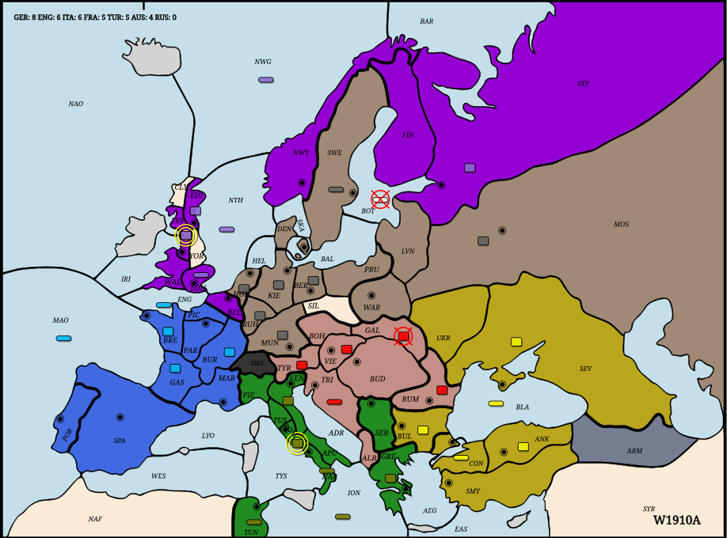

### What happened

- **AUSTRIA**: disbands A GAL
- **ENGLAND**: builds A LVP
- **ITALY**: builds A ROM
- **RUSSIA**: disbands F BOT

### AUSTRIA
Orders: `A GAL D`

Reasoning

> Looking at the current situation: I have 4 supply centers (BUD, VIE, TRI, RUM) and 5 units. That means I'm one unit over my supply count and must disband one unit.
>
> Let me assess which unit to disband:
> - **A GAL** - holding RUM support, useful for eastern defense
> - **A RUM** - my contested Turkish center, critical to hold
> - **A VIE** - home center, could be redeployed
> - **A TYR** - forward position near Germany, useful for future MUN/TYR push
> - **F TRI** - fleet in TRI, my home center
>
> The key question: which unit is least essential? 
>
> F TRI is my only fleet and holds TRI (a home center). A RUM is the center I'm defending against Turkey. A GAL supports RUM. A VIE is on my home center. A TYR is positioned for future moves against Germany.
>
> Since I need to disband one unit, I should disband A GAL. Once I lose RUM (which is under heavy Turkish pressure with SEV + BLA), A GAL's support role becomes less valuable. Alternatively, if I'm confident RUM holds, A GAL could stay.
>
> Actually, let me reconsider: I have 4 SCs and 5 units. I need to disband 1. The unit that matters least is the one furthest from future objectives. A TYR could be useful for Germany pressure, A VIE is at home, F TRI holds a home center, A RUM is contested. A GAL supports RUM but if RUM falls anyway, GAL is wasted. Better to disband GAL and keep the others for flexibility.

### ENGLAND
Orders: `A LVP B`

Reasoning

> Looking at the board state: I have 6 supply centers (EDI, LON, LVP, NWY, BEL, STP) with 5 units (F NWG, F LON, F NTH, A EDI, A STP). I have 1 excess center, so I can build 1 unit. My only vacant home center is LVP.
>
> Germany at 8 centers is the clear leader and the primary threat. I need to build a unit to continue projecting power. Building an army at LVP gives me a land unit I can march east toward the continental conflict — I already have strong fleet presence in the north with F NWG, F NTH, and F LON. An army can push toward German-held territory (DEN, HOL) or support operations against Germany's northern positions.
>
> Building a fleet at LVP would be redundant given my three existing fleets. An army gives me more tactical flexibility for the land campaigns needed to challenge Germany.
>
> **Build A LVP** — this gives me a sixth unit to continue pressuring Germany from the north.

### ITALY
Orders: `A ROM B`

Reasoning

> Looking at the situation:
>
> - I have 6 supply centers (NAP, ROM, VEN, TUN, SER, GRE) with 5 units, so I have 1 excess center and can build 1 unit.
> - My home centers: NAP (occupied by F NAP), ROM (vacant), VEN (occupied by A VEN).
> - ROM is my only vacant home center, so I must build there.
>
> The key question is army or fleet. I need to think about what's most useful going forward:
>
> - Germany at 8 is the board leader and the primary threat. I've committed to joining a coalition against them.
> - Austria has GAL, RUM, VIE, TYR — they're at 4 centers and TYR is right on my border. I need to watch Austria.
> - Turkey is weakened at 5 and I've been negotiating a ceasefire.
>
> An army at ROM gives me flexibility — it can move to NAP, VEN, or TUS, and from there toward TYR or PIE to pressure Germany's southern flank. This aligns with my commitment to France and England to pressure Germany from the south. A fleet at ROM would be less useful since I already have 3 fleets controlling the Mediterranean.
>
> Building A ROM gives me a 6th unit and positions me to join the anti-German coalition in spring 1911.

### RUSSIA
Orders: `F BOT D`

Reasoning

> Looking at the situation: I have zero supply centers and one unit (F BOT). England took STP from me, and I have no home centers to rebuild at. My only legal order is to disband F BOT, which eliminates me from the game.
>
> This is the end. I have no home supply centers available for builds — MOS is held by Germany, SEV by Turkey, STP by England, and WAR by Germany. With zero centers and no legal builds, I must disband my last unit.
>
> The coalition against Germany was forming — England took FIN, France was pushing west — but it came too late for me. Germany's early grab of MOS and the subsequent collapse of my position left me with nothing to rebuild from.

## Final state

| Power | Centers | # |
|---|---|---|
| GERMANY | BER, KIE, MUN, DEN, SWE, WAR, HOL, MOS | 8 |
| ENGLAND | EDI, LON, LVP, NWY, BEL, STP | 6 |
| ITALY | NAP, ROM, VEN, TUN, SER, GRE | 6 |
| FRANCE | BRE, MAR, PAR, POR, SPA | 5 |
| TURKEY | ANK, CON, SMY, BUL, SEV | 5 |
| AUSTRIA | BUD, VIE, TRI, RUM | 4 |
| RUSSIA | *(none)* | 0 |

