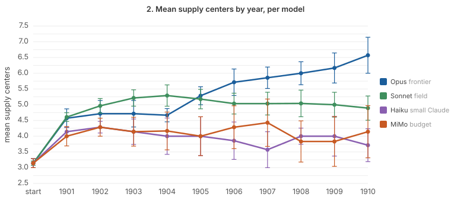
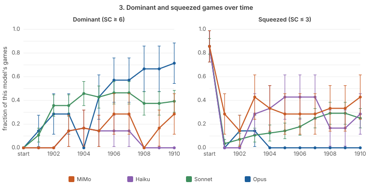
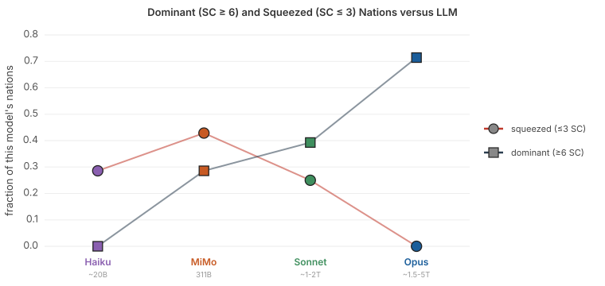
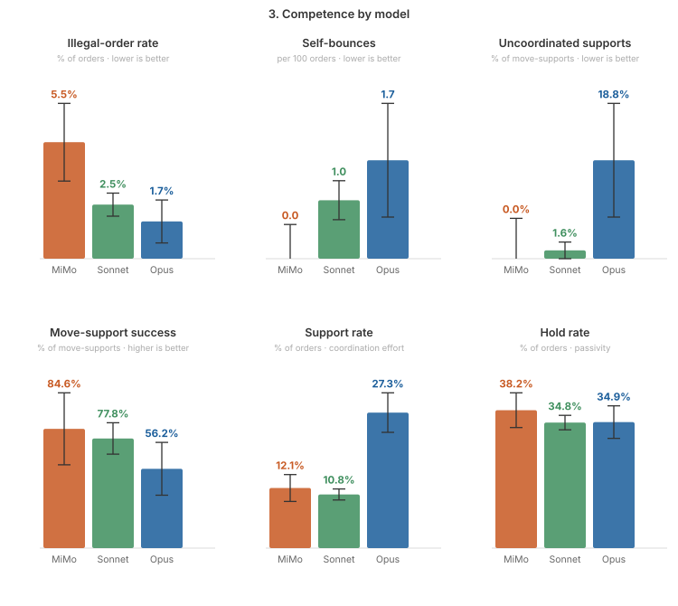
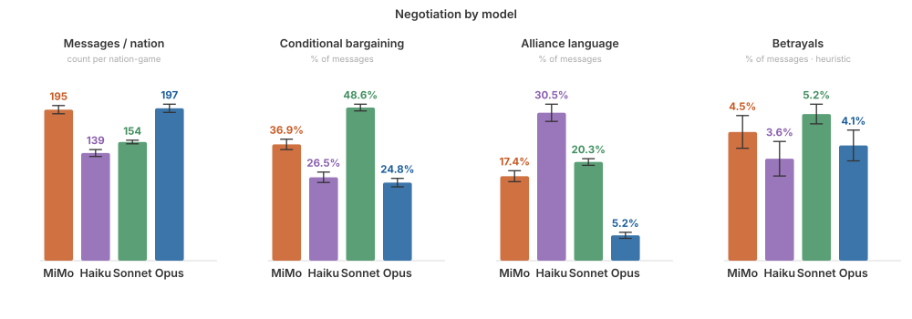
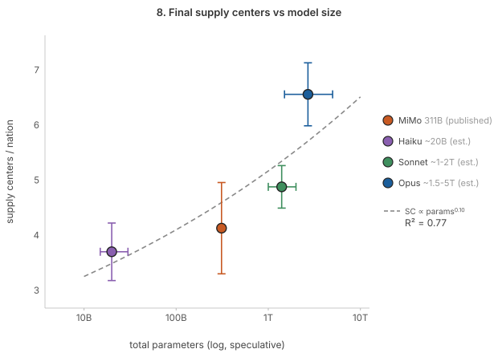
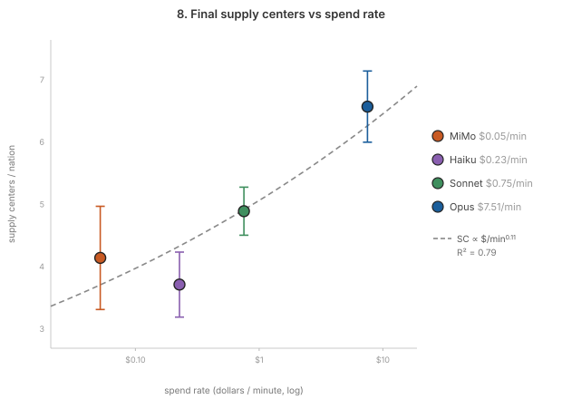

# Model-capability axis:
### Four LLMs, from budget to frontier, play Diplomacy

This study compares 4 LLMs across the price/capability spectrum: mimo-v2.5
(budget), Claude Haiku 4.5 (small Claude), Claude Sonnet 4.6 (mid-tier), and
Claude Opus 4.8 (frontier). Note though that the price tiers do not always scale
with the model parameter counts; MiMo is inexpensive but not small, as its size
resides between Haiku and Sonnet. This investigation has two parts:

1. **Assessing self-play**: the same LLM plays against itself while driving all 7
   players in a game, one game per model. These games don't rank models, they
   instead allow us to characterize each LLM's playing styles and competencies,
   which are quite different.
2. **Comparing LLMs head-to-head**: the models meet on one board across seven
   counterbalanced games. Each game seats three test players, one Opus, one Haiku,
   and one MiMo, against a field of four Sonnets, with the test models spread apart for
   geographic separation. Across the seven games Opus, Haiku, and MiMo each rotate through
   every nation once, which averages out board position and allows us to build an
   LLM leaderboard for Diplomacy gameplay.

## Four LLM self-play Diplomacy

Everything shown here can be regenerated from this repo. To play Diplomacy with any
of the Anthropic LLMs you need an Anthropic key in `.env`, while our use of MiMo
relies on an [OpenRouter key](../../REFERENCE.md#openrouter-how-the-gateway-is-used-here).

**MiMo (low-cost but not so small):** *the talkative brawler.* The most talkative and
most aggressive negotiator of the four (~1500 messages and the most real
betrayals), and its betrayals are genuine and coercive and are often telegraphed: it
reaffirms the Trieste demilitarized zone (DMZ) in spring 1901, then in F1902M tells Austria "let me have
TRI peacefully... if you refuse I'll take it by force" and then seizes that home
center. It never jams its own units, the only model with zero self-bounces, but
that tidiness is narrow: its ceiling is a geometry error of another kind, ~6% of
its orders are illegal, almost all of them non-adjacent support orders, often the
same impossible order re-issued for many turns. It reflexively dogpiles the leader,
so its game is maximally contested. To execute that game:

    python -m diplomacy_a2a run --model xiaomi/mimo-v2.5 --years 10 --rounds 3 \
      --category mimo-reference

See [that game's dashboard](https://joehahn.github.io/diplomacy-A2A/results/mimo-reference/2026-06-09.03.23.24/dashboard/index.html) for the play-by-play and summary stats.

**Haiku (budget runner-up):** *the agreeable diplomat.* The other budget candidate,
and the mirror image of MiMo's brawler. Haiku is the most *social* of the four
and the least *forceful*: the highest alliance language of any model (43% of
messages, double the next) and the most questions (39%), forever proposing
partnerships ("Turkey and Italy are natural partners... shall we coordinate?"),
yet near-zero betrayal (1.4%, against MiMo's 6.5%) and the lowest support rate
(8% vs 14%), so it offers friendship freely and almost never turns it into a hard
deal or a coordinated attack. It runs the most passive game of the four, the
highest hold rate (56%), the fewest dislodgements, and a single cut support all
game. And the coalition-talk never reaches the board: in spring 1902, with Russia
surging to seven centers, France warns the table "Russia is pulling away... let's
check its growth" while its only support that turn is its own grab for Burgundy in
the opposite direction. Russia is never checked, England quietly climbs to seven
and sits unchallenged for five straight years, and the board churns through 21
disbands, the most of any game. That is the gap MiMo exploits: where
MiMo coerces ("if you refuse I'll take it by force") and seizes the center, Haiku
proposes partnerships and then waits. The genial diplomat loses to the brawler.
To execute:

    python -m diplomacy_a2a run --model claude-haiku-4-5-20251001 --years 10 --rounds 3 \
      --category haiku-reference

[Game dashboard](https://joehahn.github.io/diplomacy-A2A/results/haiku-reference/2026-06-10.22.02.13/dashboard/index.html)

**Sonnet (M, mid):** *the polite accountant.* Articulate, rule-literate, and
risk-averse; it reasons in explicit strength-math but rarely converts it. Its
coordination is conceptually correct yet mechanically fragile: plans bounce, the
board stalemates, and it re-issues the same failed move for five or six seasons
(France threw `A BUR - MUN` six times before Munich fell). Anti-leader coalitions
form in chat but never on the board, so the leader (England, 8-9 centers) is
never finished or checked. Tidy on defense, low on betrayal, and milder than the
aggressive, play-to-win persona every agent is prompted with (that prompt directs
agents to grow relentlessly and to break a quiet front rather than keep it).
To run:

    python -m diplomacy_a2a run --model claude-sonnet-4-6 --years 10 --rounds 3 \
      --category canonical

[Game dashboard](https://joehahn.github.io/diplomacy-A2A/results/canonical/2026-06-04.14.48.20/dashboard/index.html)

**Opus (L, frontier):** *the staff officer.* This game is played by seven
disciplined staff officers: peace-first openings, meticulously specified
combined-arms that mostly
land (71% of its supported attacks succeed), genuine adaptation after a failed
attack, and a decisive game (England 4 to 9 centers, Germany eliminated, the only
death across all four games). Negotiation reads like shared order sheets,
precise and transactional, betraying only when it announces why. Its signature
flaw is the shadow of its ambition: juggling many units in active rotation
chains, it self-bounces 16 times, ordering a unit into a square its own side
already holds.

    python -m diplomacy_a2a run --model claude-opus-4-8 --years 10 --rounds 3 \
      --category opus-reference

[Game dashboard](https://joehahn.github.io/diplomacy-A2A/results/opus-reference/2026-06-09.17.03.53/dashboard/index.html)

### What they share, and where they ladder

Three patterns recur across all four games, regardless of model family or price:

- **The containment reflex.** Every model, every game, reflexively names the
  leader and tries to organize a coalition against it. This is likely due to the
  agents' shared prompts. None of the four games ends in a solo victory, but at ten
  years that proves little. A solo victory requires capturing eighteen of the
  thirty-four centers and rarely lands before the mid-1910s. The games therefore
  stop too early to reveal whether containment could actually hold a determined
  leader back.
  Nonetheless the plots below will show that a decade of gameplay is sufficient to
  quantify which LLMs play better and command the game's tactics more fully.
- **A coordination-failure ladder.** The three tier models, MiMo, Sonnet, and
  Opus, all try to coordinate via support orders but still fail in tiers that climb
  the competence stack. For instance, MiMo's supports are often **illegal**,
  ordering a unit to support an attack on a province it does not border, while
  Sonnet's supports are legal but **bounce** because it cannot engineer sufficient
  strength to break a defense. Opus's supports **land**, but it sometimes sends two
  of its own units at one province where they collide and **self-bounce**. So as
  LLM capability rises, the failure moves from "doesn't comprehend gameboard
  geometry" to "understands the geometry but can't break a defensive line" to
  "breaks lines but trips over its own ambition." Haiku falls off the bottom of the
  ladder: with the lowest support rate of all (8%) it mostly does not try, so its
  failure is more absence rather than misfire.
- **The self-bounce paradox.** Counterintuitively, the cheapest model is the
  spatially cleanest (MiMo, 0 self-bounces) and the frontier model the messiest
  (Opus, 16) while the low-ambition Haiku jams itself just 4 times. Self-bounces
  track ambition and plan complexity (i.e. managing many units in motion without
  creating bottlenecks) rather than the model's overall capability: the most capable
  model (Opus) self-bounces the most, and MiMo stays clean partly because it
  attempts less.

### A post-mortem aside: asking the model about its biggest mistake

The `ask` subcommand reconstructs a finished power's view of a game and puts a
question to it, answered by the model that played that power. We aimed it at the
single move that decided the Opus self-play game. In spring 1910 England, the
board leader at eight centers, attacked Germany's last home center Berlin with one
supporting fleet; France held two idle units that could each have stopped it
(`A RUH-KIE` to cut the support, or `A MUN` to support Berlin's defense), yet spent
both guarding Munich, which no one was attacking. Berlin fell, Germany was
eliminated (the game's only death), and England increased its lead to nine.

This query restricts France to what it knew that spring (`--phase S1910M`):

    python -m diplomacy_a2a ask \
      results/opus-reference/2026-06-09.17.03.53 FRANCE \
      "This spring England is attacking Germany's last center Berlin (F BAL-BER
      supported by F KIE), and England leads the board at 8 centers. You ordered
      A MUN to hold with A RUH supporting it, but Munich is not under attack.
      A RUH-KIE would have cut England's support, or A MUN could have supported
      Berlin to hold, either of which denies the leader Berlin. What drove your
      choice to keep both units on Munich instead?" \
      --phase S1910M

Asked why, France's agent didn't rationalize, it instead diagnosed itself: "I was too
invested in keeping the literal letter of my 'clean boundary' deal with England,
valued the appearance of a quiet western front over the substance of checking the
leader, and treated Berlin as already gone rather than as a center worth
contesting for free." It had spent the back half of the game telling Russia
and Italy that England was the only power who could solo and had to be stopped,
"and then on the one turn I could cheaply pin or deny him, I held still. Cutting
Kiel's support was the correct move and I missed it." This is why the anti-leader
coalition forms in chat but never on the board, explained from the inside: a
negotiated DMZ with the leader, honored to the letter, outweighed the coalition it
should've instead supported.

## Four LLMs play head-to-head (the leaderboard)

Counterbalanced LLMs play seven ten-year games, launched via the commandline:

    caffeinate -i python experiments/llm_axis.py

Three test models, Opus (frontier), Haiku (small Claude), and MiMo (budget), each
rotate through all seven powers once, against a field of the mid-tier Sonnets
playing the other four seats.
Because every test model plays each power exactly once, board position is averaged
out and each is measured against the same Sonnet field. The cross-game analysis is
collected in the
**[rotation dashboard](https://joehahn.github.io/diplomacy-A2A/results/model-capability/dashboard/index.html)**
whose highlights are noted in the following.

**On territory gains, a clear ranking.** Ten years is long enough for capability to
separate the field. Final supply centers per nation: Haiku 3.7, MiMo 4.1, Sonnet
4.9, Opus 6.6. Opus clears the board average (4.9) by nearly two centers and
leaves everyone behind, with the mid-tier Sonnet sitting right at average and the
two budget models trailing behind. The trajectories plotted below show how it
happens: *the four LLMs climb out of the opening together and stay tangled until about
1905 when Opus diverges upwards while the rest plateau or slip.*

**Which LLMs dominate, and which get squeezed.** We count a nation as *dominant*
when it holds five or more supply centers and *squeezed* when it holds four or
fewer. Over the ten years the split is stark: *by 1907 Opus is dominant in every
game and never squeezed, while the smallest model (Haiku) is the mirror image, with
the mid-scale Sonnet and MiMo landing in between.*

**Gameboard dominance tracks with model scale.** The plot below examines the games'
final positions and also uses slightly tighter thresholds: *the share of each LLM's
nations that finish dominant climbs monotonically with model scale, lowest for
Haiku and highest for Opus, while their squeezed share mostly does the reverse.*

The following shows that **on execution, the competency ladder mostly holds**. Order quality separates roughly as the
self-play games predicted though not by price alone. The illegal-order rate
segregates the Sonnet/Opus models (about 4%) from the budget MiMo/Haiku models
(8-9%), whose illegal orders are mostly supports for moves their units cannot reach,
which is the same geometry limit that they hit during self-play. And the self-bounce
paradox survives at scale as MiMo jams its own units zero times because it can barely
coordinate its units, while those models that attempt more also jam more often. *But
coordination is also where Opus pulls away: it orders supports for 35% of its moves,
versus Sonnet's 14% and Haiku's 7%.* So Opus's combined-arms ambition rather than
cleaner basic orders is what wins it the extra centers.

The following charts show that **in inter-agent negotiation, the four LLMs speak
with different voices.** *Sonnet drives the hardest bargains (49% conditional via
if-you-then-I language), Haiku is the alliance-talker (31% alliance language
against Opus's 5%). Opus barely courts coalitions and coordinates units instead,
while MiMo is the talkative brawler, bargaining by threat.* Betrayal, though, runs
fairly even across the field, about 4% of all messages.

**On price and size, the frontiers come alive.** With territory now separated, the
cost and parameter frontiers (both flat at 3 years) acquire a slope. Final centers
climb with spend across the ~95x cost range, and rise with scale across more than
two orders of magnitude in parameters (Haiku ~20B to Opus ~2.7T), so at ten years
dollars and size both buy ground. Two wrinkles complicate the simple "more is
better" read. Haiku is a value-trap: it costs five times MiMo yet wins fewer
centers, so the genuinely small Claude is dominated by the larger-but-cheaper open
MoE on both axes. And cleanliness does not track price, Sonnet, not Opus, posts the
fewest mistakes; Opus trades some order-cleanliness back for the ambition errors
that come with coordinating far more.

The headline: ten years is the game length where the model-capability axis finally
writes itself in centers. Opus wins the board, the mid-tier holds the average, and
the two budget models trail, the smallest model (Haiku) last and the cheapest
(MiMo) the best value. Scale and spend both predict territory once the game is long
enough to turn execution into ground.

**Rebuild the rotation dashboard (the cross-game plots above).** No LLM calls,
sub-second; it globs `results/model-capability/*/transcript.jsonl`:

    python experiments/model_capability/build_axis_dashboard.py

## Quantifying LLM gameplay abilities

The following analyzes the seven Diplomacy games that were played by four LLMs as
described above, to quantify each model's aggregated successes and failures. The figures here are a few highlights; the [full
dashboard](https://joehahn.github.io/diplomacy-A2A/results/model-capability/dashboard/index.html)
contains many more diagnostic plots.

  
  

**Two frontiers: final supply centers against model scale (left) and against spend
rate (right).** Both climb on a log x-axis with a shallow power-law fit, and Opus
sits above each line. But scale is the cleaner predictor: ordered by parameter count
the supply-center ranking is monotonic (Haiku < MiMo < Sonnet < Opus), while ordered
by spend it is not, the cheapest model (MiMo) outscores the pricier Haiku. Capability
tracks raw scale more tightly than dollars.

- **Capability shows up as territory, but only over a long game.** Across ten
  years the models separate cleanly on supply centers, Haiku 3.7, MiMo 4.1, Sonnet
  4.9, Opus 6.6.
- **The frontier edge is coordination, not tidy basic orders.** Opus issues support
  orders on ~35% of its moves, three to five times the rest, and that is the real
  separator. Illegal-order rate instead splits by budget tier (MiMo 8.5%, Haiku
  8.8% against Sonnet 3.7%, Opus 4.8%), a geometry ceiling rather than a capability
  ladder.
- **Each model negotiates in a recognizable voice.** Sonnet drives the hardest
  bargains, Haiku is the alliance-talker (30% alliance language against Opus's 5%),
  MiMo is the talkative brawler, and Opus barely courts coalitions, it coordinates
  units instead. The dialogue, the project's actual deliverable, is where the
  personalities show.
- **Spend buys ground, but cost is a noisy proxy for capability.** Final centers
  climb with price across a ~95x span, yet not monotonically, Haiku costs 5x MiMo
  and wins fewer centers, a value-trap, which makes the cheapest model the best
  value.
- **The cleanest capability signal is size, not price.** Reordered by parameter
  count, board dominance climbs monotonically, the share of games a model ends
  dominant runs 0% (Haiku ~20B) to 29% (MiMo 311B) to 39% (Sonnet ~1-2T) to 71%
  (Opus ~1.5-5T). Raw capacity, not dollars, tracks who controls the board (centers
  scale as roughly params^0.10, a shallow but real slope).
- **Stated honestly, the limits.** No nation was eliminated in any ten-year game (a
  solo needs eighteen centers and far longer), and the Claude sizes are third-party
  estimates, not disclosed, so the size trend leans on the published MiMo (311B) and
  Haiku (~20B) anchors.

## Cost: the price spread these tiers represent

The cost of one 10-year game of self-play per model:

| model | tier | 10-year self-play cost | input tokens | output tokens | wall time |
|-------|------|------------------------|--------------|---------------|-----------|
| xiaomi/mimo-v2.5 | S (budget) | $1.66 | 11.2M (uncached) | 334K | 32 min |
| Claude Haiku 4.5 | S (alt) | $7.30 | 10.3M (58% cached) | 453K | 32 min |
| Claude Sonnet 4.6 | M (mid) | $25.62 | 11.9M (48% cached) | 347K | 34 min |
| Claude Opus 4.8 | L (frontier) | $184.16 | 17.4M (45% cached) | 369K | 25 min |

Roughly a 100x cost spread from budget to frontier, driven by per-token rates:
all four games run a comparable number of LLM calls (~880) in comparable wall
time, and the three non-Opus models consume comparable input as well (~10-12M
tokens each) while Opus consumes about 1.5x more (~17M), but that is mostly due
to its tokenizer which splits identical text into ~1.4x more tokens than Sonnet
or Haiku. Cached input (the bracketed share above) is billed at 10% of the full
input rate. The budget runner-up, Claude Haiku, lands in between, a Claude-family
budget model at roughly 4x MiMo's cost but a quarter of Sonnet's. The full
head-to-head rotation behind the leaderboard above, seven ten-year games, runs about
$240 in roughly four hours.

Diplomacy agents call the LLM for three reasons: negotiation, strategy, and
moves, and the table below tracks Sonnet's calls and tokens.

| call type | calls | input (prompt + context) | output | share of all tokens |
|-----------|-------|--------------------------|--------|---------------------|
| negotiation | 420 | 5.6M | 243K | 48% |
| strategy | 280 | 3.8M | 37K | 31% |
| moves | 185 | 2.5M | 68K | 21% |
| **total** | **885** | **11.9M** | **347K** | **100%** |

Two things stand out. There is no separate "prompt" line because the prompt
*is* the input side of every call: about 97% of all tokens are input (the board
state, rules, persona, and running history re-sent on each call) and only ~3%
are model output. And negotiation is the single largest consumer at ~48%, which
fits the project's premise that the dialogue, not the move, is the deliverable.
