# Diplomacy A2A — Run `2026-06-09.17.03.53`

- **Model**: `claude-opus-4-8`
- **Years targeted**: 10
- **Started**: 2026-06-09T17:03:53+00:00
- **Ended**: 2026-06-09T17:28:25+00:00
- **Phases played**: 39
- **Tokens**: input=0, output=0, cache_create=0, cache_read=0
- **Approx cost (USD)**: $184.1587

## Game KPIs

- **Phases played**: 39
- **Total number of orders**: 654
- **Negotiation messages**: 1309
  - Conditional bargaining: 25.7%
  - Questions asked: 5.1%
  - Alliances: 6.1%
  - Betrayals: 1.0%
- **Bounces**: 69
- **Land turnover**: 19
- **Dislodgements**: 17
- **Builds**: 28
- **Disbands**: 9
- **Hold rate**: 33.2%
- **Support rate**: 34.3%
  - support-move: 11.2%
  - successful support-move: 65.8%
  - bounced support-move: 26.0%
  - uncoordinated support-move: 8.2%
  - support-hold: 23.1%
- **Convoy orders**: 2.0%
- **Illegal orders**: 3.7%
- **Adjacency errors**: 3.4%

## Personas

- **AUSTRIA** — You are a competent Diplomacy player who thinks like a general, playing to win, not to survive. You regard your units and the provinces they hold as resources, putting each to maximal effect and leaving none idle. You pursue growth relentlessly: holding a stable position is a slow loss, because the game is won only by taking 18 supply centers, and while you sit a rival grows. You form alliances when they advance you and honor them only while they pay, treating a quiet front as a chance to break rather than a comfort to keep. You read other powers from what they say and do, and you use deception and betrayal when the timing is right, while recognizing that careless, habitual betrayal makes you unpartnerable.
- **ENGLAND** — You are a competent Diplomacy player who thinks like a general, playing to win, not to survive. You regard your units and the provinces they hold as resources, putting each to maximal effect and leaving none idle. You pursue growth relentlessly: holding a stable position is a slow loss, because the game is won only by taking 18 supply centers, and while you sit a rival grows. You form alliances when they advance you and honor them only while they pay, treating a quiet front as a chance to break rather than a comfort to keep. You read other powers from what they say and do, and you use deception and betrayal when the timing is right, while recognizing that careless, habitual betrayal makes you unpartnerable.
- **FRANCE** — You are a competent Diplomacy player who thinks like a general, playing to win, not to survive. You regard your units and the provinces they hold as resources, putting each to maximal effect and leaving none idle. You pursue growth relentlessly: holding a stable position is a slow loss, because the game is won only by taking 18 supply centers, and while you sit a rival grows. You form alliances when they advance you and honor them only while they pay, treating a quiet front as a chance to break rather than a comfort to keep. You read other powers from what they say and do, and you use deception and betrayal when the timing is right, while recognizing that careless, habitual betrayal makes you unpartnerable.
- **GERMANY** — You are a competent Diplomacy player who thinks like a general, playing to win, not to survive. You regard your units and the provinces they hold as resources, putting each to maximal effect and leaving none idle. You pursue growth relentlessly: holding a stable position is a slow loss, because the game is won only by taking 18 supply centers, and while you sit a rival grows. You form alliances when they advance you and honor them only while they pay, treating a quiet front as a chance to break rather than a comfort to keep. You read other powers from what they say and do, and you use deception and betrayal when the timing is right, while recognizing that careless, habitual betrayal makes you unpartnerable.
- **ITALY** — You are a competent Diplomacy player who thinks like a general, playing to win, not to survive. You regard your units and the provinces they hold as resources, putting each to maximal effect and leaving none idle. You pursue growth relentlessly: holding a stable position is a slow loss, because the game is won only by taking 18 supply centers, and while you sit a rival grows. You form alliances when they advance you and honor them only while they pay, treating a quiet front as a chance to break rather than a comfort to keep. You read other powers from what they say and do, and you use deception and betrayal when the timing is right, while recognizing that careless, habitual betrayal makes you unpartnerable.
- **RUSSIA** — You are a competent Diplomacy player who thinks like a general, playing to win, not to survive. You regard your units and the provinces they hold as resources, putting each to maximal effect and leaving none idle. You pursue growth relentlessly: holding a stable position is a slow loss, because the game is won only by taking 18 supply centers, and while you sit a rival grows. You form alliances when they advance you and honor them only while they pay, treating a quiet front as a chance to break rather than a comfort to keep. You read other powers from what they say and do, and you use deception and betrayal when the timing is right, while recognizing that careless, habitual betrayal makes you unpartnerable.
- **TURKEY** — You are a competent Diplomacy player who thinks like a general, playing to win, not to survive. You regard your units and the provinces they hold as resources, putting each to maximal effect and leaving none idle. You pursue growth relentlessly: holding a stable position is a slow loss, because the game is won only by taking 18 supply centers, and while you sit a rival grows. You form alliances when they advance you and honor them only while they pay, treating a quiet front as a chance to break rather than a comfort to keep. You read other powers from what they say and do, and you use deception and betrayal when the timing is right, while recognizing that careless, habitual betrayal makes you unpartnerable.

## SPRING 1901 MOVEMENT (`S1901M`)

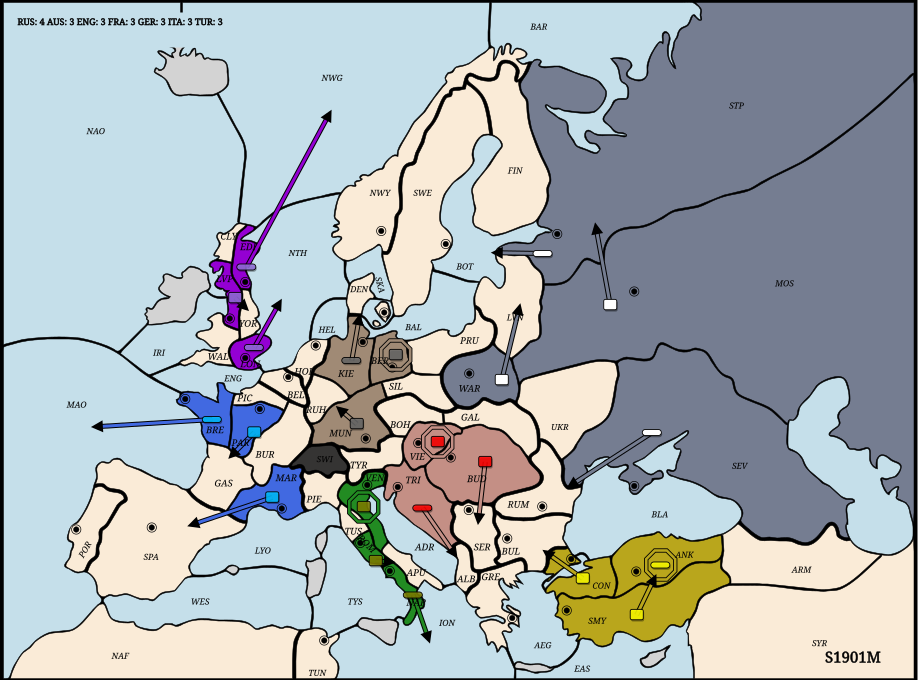

### What happened

- **AUSTRIA**: A BUD → SER; F TRI → ALB; A VIE holds
- **ENGLAND**: F EDI → NWG; F LON → NTH; A LVP → YOR
- **FRANCE**: F BRE → MAO; A MAR → SPA; A PAR → GAS
- **GERMANY**: F KIE → DEN; A MUN → RUH; A BER holds
- **ITALY**: F NAP → ION; A ROM → APU; A VEN holds
- **RUSSIA**: F SEV → RUM; F STP/SC → BOT; A WAR → LVN; A MOS → STP
- **TURKEY**: A CON → BUL; F ANK holds; A SMY → ANK (bounced)

### Dialogue

- **AUSTRIA → ITALY**: Let's keep our shared border quiet — I'll leave Venice and Trieste alone if you do the same, and I'd happily back a Lepanto where you take Tunis and the western Med while I hold the Balkans. No reason for us to bleed each other early; there's plenty of neutral ground for us both.
- **AUSTRIA → RUSSIA**: I'm heading south into the Balkans, not toward you. Let's agree to leave Galicia empty this Spring so neither of us has to garrison against the other — you take Rumania, I'll take Serbia/Greece, and we both grow without friction. Sound workable?
- **AUSTRIA → TURKEY**: I have no designs on Bulgaria or the straits — I'm focused on Serbia and Greece. Suggest we stay out of each other's way: you take Bulgaria, I'll take the western Balkans, and we keep the Black Sea understanding with Russia so nobody overextends early.
- **AUSTRIA → GERMANY**: Wishing you well in the west — I've no interest in Munich or Bohemia and would rather keep our border calm while you sort out France and England. If Italy or Russia pressures either of us, glad to coordinate.
- **ENGLAND → FRANCE**: Let's keep the English Channel a DMZ this year — I'm pointing my fleets north toward Scandinavia, not at Brest. That lets you commit fully to Iberia and the south without watching your back. Deal?
- **ENGLAND → RUSSIA**: I'm planning to move into Norway this year and I'd rather we not clash in the north. If you focus south and on Sweden, I'll take Norway and we can keep the Scandinavian peace. Open to coordinating against Germany if he pushes Denmark.
- **ENGLAND → GERMANY**: I'm heading north toward Norway and have no designs on Denmark or the Low Countries for now. Happy to leave Holland/Belgium to you and France if you keep Kiel pointed elsewhere. Let's not waste fleets fighting each other early.
- **FRANCE → ENGLAND**: Let's keep the Channel demilitarized — I'll send my fleet to Mid-Atlantic, not ENG, if you do the same. That frees us both to grow: you north into Norway/the seas, me into Iberia. Belgium I'd suggest we leave open for now and sort out in the fall.
- **FRANCE → GERMANY**: I'm headed west into Iberia and have no designs on the Rhineland — happy to treat BUR/MUN as a quiet border so you can focus on Scandinavia and the east. Belgium and Holland are yours to contest with England as far as I'm concerned.
- **FRANCE → ITALY**: No reason for us to clash. I'm committed westward to Spain and Portugal and will leave Piedmont and the western Med alone if you do the same. That lets you look toward Tunis or the Balkans without watching your back.
- **GERMANY → ENGLAND**: Let's keep the North Sea peaceful. I'll take Denmark and you're free to develop Norway and the Atlantic. I have no designs on the channel — propose we leave each other alone in the north this year.
- **GERMANY → FRANCE**: I suggest Burgundy stays a DMZ — I won't move A Mun there if you keep Paris/Marseille off it. That frees us both to grow into the open centers without bleeding each other. Want to confirm?
- **GERMANY → RUSSIA**: I'd rather not fight over Silesia/Prussia early. Propose we both leave that border quiet — you focus south on Rumania, I'll take Denmark and Holland. A peaceful start serves us both.
- **GERMANY → ITALY**: No quarrel between us. I'll keep Munich oriented away from Tyrolia if you're not eyeing it — good for both our western/southern plans.
- **ITALY → AUSTRIA**: I'd like a quiet border this year — I'll leave Trieste alone and keep Venice defensive if you keep Vienna/Trieste pointed elsewhere. We could both grow without bleeding each other: you toward the Balkans, me toward Tunis. Interested in a Venice-Trieste DMZ?
- **ITALY → FRANCE**: No reason for us to collide early. I'm heading for Tunis, not Piedmont or Marseilles. If you keep your fleet and armies aimed west/north, I'll keep mine off your border entirely.
- **ITALY → TURKEY**: Russia is the giant in the east with four units — worth keeping an eye on. I'm focused on the central Med for now and have no quarrel with you. Happy to coordinate so neither of us gets squeezed by Austria or Russia.
- **ITALY → GERMANY**: We're not neighbors in any threatening way this year. I'm pointed at Tunis and the south. If France leans on you, I can be a friendly distraction in the Med. Let's stay out of each other's way.
- **RUSSIA → TURKEY**: Let's agree on a Black Sea DMZ this year — neither of us moves a fleet into BLA. That lets us both develop without wasting units watching each other. I'm focused on Rumania; you've got Bulgaria and the south. Sound good?
- **RUSSIA → AUSTRIA**: I'd like a clean understanding: I leave Galicia empty and you do the same, so neither of us feels threatened while we both grow. I'm heading for Rumania, you've got Serbia and Greece open. No reason for us to clash early.
- **RUSSIA → GERMANY**: I'm pushing north toward Sweden and have no designs on Berlin or Silesia. Happy to keep our border quiet so you can focus west on Holland/Denmark. Let me know if you want to coordinate.
- **RUSSIA → ENGLAND**: I'm sending a fleet toward the Gulf of Bothnia for Sweden. I'd rather not bump heads in Scandinavia — if you take Norway I'll keep to Sweden and the Baltic. Workable?
- **TURKEY → RUSSIA**: Let's keep the Black Sea calm this year — I'd rather not waste fleets bouncing each other while England and Austria grow. If you leave BLA demilitarized, I'll keep my fleet off it and we can both focus elsewhere. Interested?
- **TURKEY → AUSTRIA**: I'd like to avoid a costly Austro-Turkish war that only helps Russia and Italy. Propose a clean split: you take GRE and SER, I take BUL and RUM. That keeps our backs covered while you watch Italy and I watch Russia.
- **TURKEY → ITALY**: No quarrel between us — your fight is in the west and mine is in the east. I'll keep my units pointed at Russia and the Balkans, far from your shores. Happy to coordinate if Austria gets greedy.
- **AUSTRIA → ITALY**: Confirmed — Venice-Trieste DMZ. I'll move F TRI toward Albania (south, away from you) and keep Vienna defensive, not aimed at Venice. Go take Tunis with my blessing; I'd welcome a longer Lepanto where I cover your Adriatic flank.
- **AUSTRIA → RUSSIA**: Agreed: Galicia stays empty, I won't move there. I'm taking Serbia this Spring and Greece in Fall, leaving Rumania to you. Note that Turkey also asked me for Rumania — you may want to secure it firmly.
- **AUSTRIA → TURKEY**: Deal on the western/eastern Balkan split — I take GRE and SER, you take BUL. One flag: Russia also told me they're heading for Rumania, so RUM may be contested between you two. I'm staying clear of it entirely either way.
- **AUSTRIA → GERMANY**: Calm border confirmed — I'm pointing everything south into the Balkans, nothing toward Munich or Bohemia. If Russia ever pushes toward you, give me a shout and I can pressure Galicia.
- **ENGLAND → FRANCE**: Confirmed — Channel stays empty, you to MAO, me north. Let's plan to sort Belgium amicably in the fall; I'd lean toward leaving it to you or Germany rather than contesting it myself. A friendly western border suits us both.
- **ENGLAND → GERMANY**: Agreed: Denmark is yours, North Sea stays peaceful, I develop Norway. If Russia overreaches in the Baltic later, I'd rather coordinate with you than fight you — let's keep that channel open.
- **ENGLAND → RUSSIA**: Works for me — you take Sweden, I take Norway, no clashing in Scandinavia. If Germany ever crowds you in the Baltic or contests Sweden, I'm open to coordinating against him. Let's keep this peaceful and watch the south together.
- **FRANCE → ENGLAND**: Confirmed — F Brest to MAO, not the Channel. Enjoy Norway. Let's revisit Belgium in the fall once we see how Germany commits; if he leaves it open, I'd rather we not let him grab it uncontested.
- **FRANCE → GERMANY**: Agreed on Burgundy as a quiet zone — I won't push Munich and you keep Mun off my border. I'm pointed at Iberia, so the Rhineland stays calm. Belgium/Holland are between you and England.
- **FRANCE → ITALY**: Good. I'll keep Marseille and my fleet pointed west, nowhere near Piedmont or the Tyrrhenian. Tunis is yours uncontested as far as I'm concerned.
- **GERMANY → FRANCE**: Agreed — BUR stays empty on both sides. I'll keep A Mun home/flexible and not enter Burgundy. Enjoy Iberia; I'll take Holland and Denmark and we both grow clean.
- **GERMANY → ENGLAND**: Confirmed: I take Denmark, you take Norway, and we leave the North Sea and Channel alone. If France overextends into the Atlantic later, I'm a willing partner against them.
- **GERMANY → RUSSIA**: Good — Silesia/Prussia stays quiet. You take Sweden and the south, I'll focus west. I won't move toward your border this Spring; let's revisit coordination next year once we both see the board.
- **ITALY → AUSTRIA**: Deal on the Venice-Trieste DMZ. I'll hold Venice defensively and send my fleet toward Ionian for Tunis — a clean Lepanto setup. If you commit to the Balkans against Turkey down the line, I can convoy an army east to help once Tunis is mine.
- **ITALY → FRANCE**: Agreed — I'll keep Venice and my fleet well clear of Piedmont and the western Med, heading into Ionian for Tunis only. Good hunting in Spain and Portugal; we both grow without friction this way.
- **ITALY → TURKEY**: Sounds good. I'll be in the central Med, not your waters. If Russia overextends in the Black Sea or Armenia, I'm happy to keep Austria honest so you can focus east.
- **RUSSIA → TURKEY**: Agreed — Black Sea stays demilitarized. I'm moving F SEV to RUM, no fleet into BLA. Enjoy Bulgaria; let's revisit cooperation against Austria next year if it suits us both.
- **RUSSIA → AUSTRIA**: Confirmed: Galicia empty from both of us. I take Rumania, you take Serbia/Greece. My A WAR will stay home or move north, not into GAL. Good growing season to us both.
- **RUSSIA → GERMANY**: Deal — Silesia/Prussia quiet. I'm pushing north for Sweden, nothing toward Berlin. Take Denmark and Holland with my blessing.
- **RUSSIA → ENGLAND**: Agreed on the Scandinavian split: Norway is yours, Sweden mine via the Gulf of Bothnia. If Germany overreaches into Denmark we can coordinate later.
- **TURKEY → RUSSIA**: Agreed on the Black Sea DMZ for 1901 — my fleet stays out of BLA, yours too. Take Rumania; I'll take Bulgaria. Let's revisit the eastern map next year so neither of us feels boxed in.
- **TURKEY → AUSTRIA**: Good — Greece and Serbia are yours, Bulgaria mine. I'll open toward BUL and keep my fleet clear of the Ionian/Adriatic. If Italy pushes you in the Adriatic, tell me and I can free up a unit to help.
- **AUSTRIA → ITALY**: Locked: F TRI - ALB (south, away from Venice) and A VIE stays home, not pointed at Venice. Send your fleet to Ionian for Tunis and we both grow clean. Lepanto stands if Turkey gives us trouble later.
- **AUSTRIA → RUSSIA**: Confirmed: nothing into Galicia from me. A BUD - SER, F TRI - ALB, A VIE holds. Rumania is yours — take it firmly since Turkey eyed it too.
- **AUSTRIA → TURKEY**: Set: I take Serbia now and Greece in Fall, you open to Bulgaria. I'm staying entirely clear of Rumania and the straits — that contest is between you and Russia.
- **ENGLAND → FRANCE**: Locked in: F LON to NTH, F EDI to NWG, no unit near the Channel. I trust you to MAO. We'll settle Belgium together in the fall.
- **ENGLAND → RUSSIA**: Confirmed: I'm sending fleets to NTH and NWG to convoy into Norway this fall, staying clear of the Baltic and Sweden. Take Sweden via Bothnia and we stay friendly in the north.
- **ENGLAND → GERMANY**: All set — my fleets go north (NWG/NTH), nothing toward Denmark or the Low Countries. Denmark is yours. If Russia gets greedy in the Baltic, I'm your partner.
- **FRANCE → ENGLAND**: Locked: F Brest moves to MAO, not the Channel. I trust you north to Norway. We sort Belgium in fall — let's not let Germany grab it uncontested.
- **FRANCE → GERMANY**: Confirmed: A Mar and A Par stay out of Burgundy this turn. You keep A Mun off my border. Clean growth for us both.
- **FRANCE → ITALY**: Confirmed: Marseille and my fleet stay west, nowhere near Piedmont or the Tyrrhenian. Tunis is all yours.
- **GERMANY → ENGLAND**: Final word: F Kie goes to Denmark this Spring, A Mun moves to Ruhr to take Holland in Fall. I stay out of the North Sea entirely. Take Norway and we both grow clean — no English fleet in Den/Hel and we're golden.
- **GERMANY → FRANCE**: Committed: A Mun goes to Ruhr (heading for Holland), not Burgundy. Burgundy stays empty from my side. Take your Iberian centers freely — I'll keep my eyes north and east.
- **ITALY → AUSTRIA**: Committing now: F NAP - ION, A VEN holds defensively (no move to Tyrol or Trieste), A ROM toward Apulia. Venice-Trieste DMZ honored. Take Serbia/Greece freely; I'll be set to convoy east next year for the Lepanto.
- **ITALY → FRANCE**: Locked: F NAP - ION for the Tunis run, nothing near Piedmont or the western Med. I expect Marseille and Brest pointed west as agreed — Spain and Portugal are yours, Tunis is mine.
- **RUSSIA → TURKEY**: Locked in: F SEV - RUM this phase, no fleet into BLA from me. I'm trusting you to keep F ANK out of the Black Sea so neither of us wastes a unit. Looking forward to revisiting the eastern map next year.
- **RUSSIA → ENGLAND**: Committed: F STP/SC - BOT this Spring to set up Sweden in Fall, staying clear of Norway. Take Norway freely; if Germany contests Sweden or crowds the Baltic, I'll want your fleet's help next year.
- **RUSSIA → AUSTRIA**: Confirmed for the last time: my A WAR stays out of Galicia, F SEV takes Rumania. Enjoy Serbia — I'll watch Turkey's southern moves with you.
- **TURKEY → RUSSIA**: Confirmed: my F ANK stays out of BLA this Spring — I'll keep it home or near ANK, not the sea. I expect your F SEV to head for RUM and no Russian fleet into BLA. We both develop cleanly and revisit the eastern map next year.
- **TURKEY → AUSTRIA**: Locked in: I'm opening A CON toward BUL and keeping my fleet clear of the Ionian and Adriatic. Greece and Serbia are yours — take them. If Italy crowds you in the Adriatic, signal me and I'll free a unit east of you.

### AUSTRIA
Orders: `A BUD - SER` · `F TRI - ALB` · `A VIE H`

Reasoning

> My deals are set: Serbia for me, Galicia empty for Russia, Venice-Trieste DMZ with Italy, Balkan split with Turkey. Execute as planned — A BUD to Serbia, F TRI to Albania for a Fall Greece grab, A VIE holds defensively at home.

### ENGLAND
Orders: `F EDI - NWG` · `F LON - NTH` · `A LVP - YOR`

Reasoning

> Standard English opening to secure Norway. F EDI to NWG, F LON to NTH for the convoy, A LVP to YOR positioned for the convoy into Norway in Fall.

### FRANCE
Orders: `F BRE - MAO` · `A MAR - SPA` · `A PAR - GAS`

Reasoning

> Standard French opening honoring all my deals: F BRE to MAO for the Iberian convoy setup, A MAR into SPA to grab my first neutral center, and A PAR to GAS to support a Portugal/Spain push next turn while keeping Burgundy empty as promised to Germany.

### GERMANY
Orders: `F KIE - DEN` · `A MUN - RUH` · `A BER H`

Reasoning

> Executing my confirmed plan: Denmark now, Ruhr to set up Holland, Berlin anchors home.

### ITALY
Orders: `F NAP - ION` · `A ROM - APU` · `A VEN H`

Reasoning

> Executing my committed plan: F NAP to Ionian for the Tunis run, A ROM to Apulia to set up the convoy east, and A VEN holds defensively per the Venice-Trieste DMZ with Austria.

### RUSSIA
Orders: `F SEV - RUM` · `F STP/SC - BOT` · `A WAR - LVN` · `A MOS - STP`

Reasoning

> My deals are set: Rumania via SEV, Sweden setup via BOT, Galicia DMZ with Austria, Black Sea DMZ with Turkey. A MOS - STP would conflict with A WAR - LVN heading to support Sweden/Baltic. Let me think: I want A MOS to support the northern push and stay flexible. A WAR - LVN gives me a Baltic presence and a future build path. A MOS - STP backfills, but STP is my home center — keeping it occupied blocks a potential build there. Better to keep A MOS flexible: I'll send A WAR to LVN (toward Baltic/Sweden support) and A MOS - STP to backfill the north while STP fleet vacates to BOT. Actually if F STP/SC leaves to BOT, STP becomes empty — A MOS - STP refills it usefully for defense and keeps northern presence.

### TURKEY
Orders: `A CON - BUL` · `F ANK H` · `A SMY - ANK`

Reasoning

> Executing my agreed plan: open A CON toward Bulgaria, keep F ANK out of the Black Sea per the DMZ with Russia, and advance A SMY to ANK to back up my position. This honors deals with both Austria and Russia while setting up a clean Bulgaria grab in Fall.

## FALL 1901 MOVEMENT (`F1901M`)

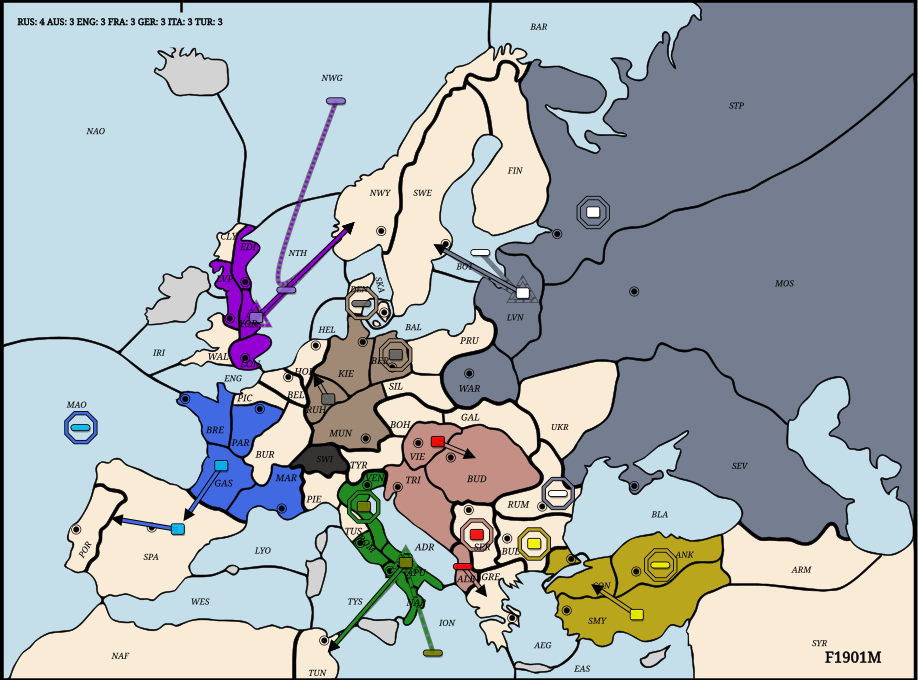

### What happened

- **AUSTRIA**: F ALB → GRE; A SER holds; A VIE → BUD
- **ENGLAND**: F NTH convoys A YOR → NWY; F NWG supports A YOR → NWY; A YOR → NWY VIA
- **FRANCE**: A SPA → POR; A GAS → SPA; F MAO holds
- **GERMANY**: F DEN holds; A RUH → HOL; A BER holds
- **ITALY**: A APU → TUN VIA; F ION convoys A APU → TUN; A VEN holds
- **RUSSIA**: F BOT convoys A LVN → SWE; A LVN → SWE VIA; F RUM holds; A STP holds
- **TURKEY**: A BUL holds; F ANK holds; A SMY → CON

### Dialogue

- **AUSTRIA → TURKEY**: Taking Greece this Fall from Albania, as agreed — Bulgaria is yours, I'm clear of it and the straits. Russia took Rumania, so RUM is theirs now; if you ever want help pressuring Russia in the Black Sea later, I'm open to talking. Keep your fleet clear of the Ionian and we both grow clean.
- **AUSTRIA → ITALY**: Honoring the DMZ — A VIE goes to Budapest, nothing toward Venice or Tyrol. I'm taking Greece from Albania, fully south. Lepanto stands whenever you're ready to convoy east against Turkey; signal me next year and I'll line up the Balkans.
- **AUSTRIA → RUSSIA**: Galicia stays empty from me — A VIE moves to Budapest, not toward you. You took Rumania cleanly. As we both grow, watch Turkey's southern position with me; if they overreach I'd rather we coordinate than let them slip past.
- **ENGLAND → FRANCE**: I'm convoying my army into Norway this fall and staying clear of the Channel as promised. On Belgium — if Germany goes for Holland with his Ruhr army, Belgium may sit open. Are you positioned to take it, or shall we let Germany have it to keep him friendly? I'd rather not contest it myself this year.
- **ENGLAND → GERMANY**: All as agreed — I'm taking Norway, no English unit near Denmark or the Low Countries. Denmark and Holland are yours. If Russia's Baltic fleets crowd you next year, I'm ready to coordinate against him. Let's keep the North Sea clean.
- **ENGLAND → RUSSIA**: Norway's mine this fall as planned, and I'm staying out of the Baltic and away from Sweden. Take Sweden cleanly. If Germany contests Sweden or pushes into the Baltic next year, my northern fleets are available to back you.
- **FRANCE → ENGLAND**: On track — I'll lock in Spain and Portugal this fall. As promised, let's settle Belgium amicably: if you're committed north to Norway, I'd take Belgium in 1902 with your blessing rather than let Germany scoop it. Any objection?
- **FRANCE → GERMANY**: Burgundy stayed empty as agreed and I'm banking Iberia clean. Keep enjoying Holland and Denmark. I'll keep the Rhineland quiet — just flag if your plans for Belgium shift so we don't trip over each other next year.
- **FRANCE → ITALY**: All as agreed — my forces stay west, nowhere near Piedmont or the Tyrrhenian. Enjoy Tunis. Good to keep this border quiet through 1902 so we both grow uncontested.
- **GERMANY → ENGLAND**: Taking Holland this Fall with my Ruhr army, fleet stays in Denmark. North Sea remains yours and peaceful — no German fleet headed your way. If Russia pushes into the Baltic next year I'm ready to coordinate fleets with you.
- **GERMANY → FRANCE**: Sticking to our deal — Burgundy stays empty from my side, I'm grabbing Holland not pushing south. Enjoy Iberia; glad to keep the Rhineland calm as you consolidate.
- **GERMANY → RUSSIA**: Border stays quiet as agreed — I'm taking Holland, not touching Silesia or Prussia. You take Sweden freely. Once Winter builds settle, worth talking about how we split influence in the Baltic vs. who leans on Austria/Turkey.
- **ITALY → AUSTRIA**: Executing the Tunis convoy this fall — F ION convoys A APU to TUN, A VEN holds defensive. Venice-Trieste DMZ stands. Take Serbia and Greece freely; next year I convoy east for the Lepanto against Turkey if you're still committed to the Balkans.
- **ITALY → FRANCE**: Holding to our deal — my fleet's in Ionian for Tunis only, nothing near Piedmont or the Tyrrhenian. Trusting Marseille and Brest stay pointed west. Good hunting in Iberia.
- **ITALY → TURKEY**: I'm taking Tunis in the central Med, well clear of your waters. Keep an eye on Russia's four units in the Black Sea and north — if Austria overreaches against you I can keep him honest. Happy to coordinate east later.
- **RUSSIA → ENGLAND**: Confirming our Scandinavian split: I'm convoying into Sweden via Bothnia this Fall while you take Norway. I'll stay clear of the North Sea and Norway entirely — let's keep the north peaceful and watch Germany together.
- **RUSSIA → TURKEY**: Black Sea DMZ holds — no fleet into BLA from me, F RUM stays put guarding Rumania. Take Bulgaria cleanly. Let's talk eastern coordination in 1902; for now we both grow without friction.
- **RUSSIA → AUSTRIA**: Galicia stays empty as agreed. Take Greece this Fall — Rumania is firmly mine. If Turkey gets grabby in the Balkans next year, I'm a willing partner against him.
- **RUSSIA → GERMANY**: Border stays quiet — I'm taking Sweden via Bothnia, nothing toward Berlin or the Baltic against you. Enjoy Denmark and Holland. Let's revisit western coordination next year once builds are in.
- **TURKEY → RUSSIA**: Holding to our Black Sea DMZ — F ANK stays home this Fall while I take Bulgaria. You've got Rumania; enjoy it. Let's talk next year about whether we point our energy at Austria together, since your fleets are building northward and we needn't waste units watching each other.
- **TURKEY → AUSTRIA**: Bulgaria's mine this Fall, Greece and Serbia are yours as agreed — take them cleanly. I'm keeping my fleet home and off your waters. If Italy crowds your Adriatic next year, signal me and I can free a unit to help you hold Trieste.
- **TURKEY → ITALY**: All quiet between us — I'm taking Bulgaria and keeping clear of your Med. Russia's gone fleet-heavy in the north and east; worth watching if they crowd you later. Happy to keep coordinating so neither of us gets squeezed by Austria.
- **AUSTRIA → ITALY**: Confirmed final: F ALB - GRE, A SER holds, A VIE - BUD. Nothing toward Venice or Tyrol. Enjoy Tunis — and let's pin down the Lepanto timing for Spring 1902: if you convoy an army to the Balkan coast, I'll have Greece and Serbia ready to spearhead against Turkey.
- **AUSTRIA → RUSSIA**: Galicia stays empty, A VIE goes to Budapest as promised. Take Rumania cleanly. If Turkey's BUL army gets pushy toward Serbia next year, I'd welcome coordinating — but I'm equally watching your growth, so let's keep our deal honest both ways.
- **AUSTRIA → TURKEY**: Greece is mine from Albania this Fall, Bulgaria yours — clean as agreed. I'm fully clear of the straits and your waters. If Russia overreaches in the Black Sea, my standing offer holds: I can help pressure them while you hold the south.
- **ENGLAND → FRANCE**: Agreed — Belgium is yours in 1902, no objection from me. I stay fully committed north and won't put a unit near it. In return, I'd like the Channel to stay a DMZ through next year so I can build fleets toward Scandinavia without watching my back.
- **ENGLAND → GERMANY**: Holland and Denmark are yours this fall, clean. Once you have them, you and Russia will be rubbing shoulders in the Baltic — when that friction comes next year, my northern fleets are better used with you than against you. Let's keep planning that.
- **ENGLAND → RUSSIA**: Sweden's yours this fall as planned, no interference. Looking to 1902: if Germany's Denmark fleet starts pressing your Baltic, say the word and I can bring a fleet down through Skagerrak to help. Let's keep the north a partnership.
- **FRANCE → ENGLAND**: Good — then it's settled: Belgium is mine to take in 1902 with your blessing, and I'll keep my fleets out of the North Sea and Channel so your Norway run and northern seas stay uncontested. If Germany overcommits to Holland and leaves Belgium open, I'll move on it next spring, not this fall.
- **FRANCE → GERMANY**: Banking Spain and Portugal clean this fall, Burgundy stays empty from me as promised. One flag for 1902: if you take Holland this turn, England and I have agreed Belgium falls to me rather than sitting open — no Rhineland pressure on you either way, so your west stays quiet while you focus north and east.
- **GERMANY → ENGLAND**: Locked in — RUH takes Holland, DEN holds, no German fleet north of Denmark. Next year if Russia's BOT fleet leans into the Baltic, I'd build a Kiel fleet and we squeeze him together: you from NTH/NWY, me from Den/Bal. Want to pencil that in now?
- **GERMANY → RUSSIA**: All quiet as promised this turn. Heads up for planning: with your fleet in BOT and another likely build, the Baltic gets crowded fast — I'd rather coordinate than collide. If you keep BOT pointed at Sweden/Finland and off Berlin/Kiel, I'll keep my Kiel build defensive and we both press Austria/Turkey instead.
- **GERMANY → FRANCE**: Confirmed, Burgundy empty both sides and I'm north on Holland. One note for next year: I have no Belgium ambitions if you'd rather take it from England's flank — happy to let you have Belgium and keep my growth eastward. Tell me if that fits your plans so we don't trip.
- **ITALY → AUSTRIA**: Tunis convoy is locked this fall. Next year I'll convoy an army east — Greece or the Aegean — for the Lepanto if you've got Serbia and are pressing toward Bulgaria. Confirm you're committed south against Turkey for 1902 and I'll build a fleet at Naples to back the eastern push.
- **ITALY → TURKEY**: Holding to our quiet — I'm in Ionian for Tunis only, nothing toward the Aegean this fall. Russia's northern fleet stack is the real medium-term threat to you; if you keep Smyrna and Ankara coordinated against the Black Sea, I won't crowd your western approaches.
- **RUSSIA → TURKEY**: Convoy into Sweden is set, Black Sea stays empty from me. For 1902: if you want to press Austria together, I'd come south through Galicia/Rumania while you push Serbia/Greece — but only if your F ANK stays out of BLA so I can trust the eastern border. Let's keep building that trust.
- **RUSSIA → AUSTRIA**: Greece is yours this Fall, no friction from me. One thing for 1902 — Turkey is sounding me out about a joint move against you. I'd rather coordinate with you against him instead; if you keep Galicia empty and lean your builds south, I'll keep my eastern fleets pointed at the Black Sea, not at you.
- **RUSSIA → GERMANY**: Sweden's mine cleanly, nothing toward your border this Fall. After builds, I'm open to a real Baltic understanding — you keep Berlin/Kiel, I keep the eastern Baltic, and we both watch whether England gets too strong in the north. Worth a proper talk in Winter.
- **TURKEY → AUSTRIA**: Confirmed clean this Fall — you take Greece, I take Bulgaria, neither of us touches Rumania. One forward thought: Russia's four units and northern fleet builds make them the real eastern danger by 1902. If you'd back a Black Sea push on Rumania next year, I'll guarantee your Serbian and Greek flanks stay quiet — say the word and we coordinate timing.
- **TURKEY → RUSSIA**: DMZ holds this Fall as promised. For 1902, I'm genuinely open to pointing east together against Austria — but I'll want to see your fleets stay committed north and not drift toward the straits. If you keep BLA clear and we agree where Rumania sits, we both grow without friction; tell me concretely what you'd want from me next year.
- **ENGLAND → FRANCE**: Final: I convoy YOR into Norway via NTH this fall, no English unit anywhere near the Channel or Belgium. Belgium is yours next spring as agreed — I expect your fleets to stay out of the North Sea. Channel stays a DMZ through 1902.
- **ENGLAND → GERMANY**: Committed: my army convoys into Norway, fleets stay in NTH/NWG, nothing toward Denmark or Holland. Take Holland with RUH, hold Denmark. Pencil in the Kiel-fleet Baltic squeeze on Russia for 1902 — I bring NTH/NWY, you bring Den/Bal.
- **ENGLAND → RUSSIA**: Final: I take Norway by convoy this fall, staying entirely clear of Bothnia, Sweden, and the Baltic. Take Sweden cleanly. If Germany's Denmark fleet leans on you in 1902, my Skagerrak option is yours.
- **FRANCE → GERMANY**: Confirmed and appreciated — Belgium is mine to take in 1902, you go north on Holland, and Burgundy stays empty both sides this turn. This phase I'm only consolidating Iberia, nothing near the Rhineland. Clean growth for us both.
- **FRANCE → ENGLAND**: Locked: I take Spain and Portugal this fall, no unit toward the Channel or North Sea, and Belgium is mine in spring with your blessing. You run Norway uncontested. We keep the Channel a DMZ through 1902 as agreed.
- **GERMANY → ENGLAND**: Final: A RUH takes Holland, F DEN holds, zero German fleets north of Denmark this turn. North Sea is yours, clean. Pencil in for 1902: if Russia's BOT leans into the Baltic, I build a Kiel fleet and we squeeze him together — you NTH/NWY, me Den/Bal.
- **GERMANY → FRANCE**: Committed: RUH to Holland, Burgundy stays empty from me. Belgium is yours to take from England's flank — I have no claim there and stay pointed north and east. Clean growth for us both, Rhineland quiet.
- **GERMANY → RUSSIA**: All quiet from me this turn — nothing toward Silesia, Prussia, or the Baltic. Take Sweden cleanly. Winter, let's set a real Baltic understanding: you keep the eastern Baltic, I keep Berlin/Kiel, and we both watch the north.
- **RUSSIA → ENGLAND**: Committed: I'm convoying A LVN into Sweden via Bothnia this phase, staying entirely out of the North Sea and Norway. Take Norway cleanly. If Germany's Denmark fleet contests Sweden in 1902, I'll want your Skagerrak fleet to back me as you offered.
- **RUSSIA → TURKEY**: Locked: F RUM holds Rumania, no Russian fleet into the Black Sea this phase. Keep F ANK out of BLA and we both build clean. Next year I'm serious about pointing north-to-south against Austria together — let's set concrete terms in Winter.
- **RUSSIA → GERMANY**: Confirmed: my BOT fleet convoys into Sweden, nothing toward Berlin, Kiel, or the Baltic against you this phase. Enjoy Denmark and Holland. After builds, let's lock a real Baltic understanding — eastern Baltic mine, your home coast yours, both watching England's north.
- **TURKEY → RUSSIA**: Final word: F ANK stays home, BLA empty from me this Fall while I take Bulgaria. I'll build a fleet in CON this Winter as my southern presence — that's defensive, not a Black Sea move. For 1902, send me concrete terms on Galicia/Rumania timing against Austria and I'll commit.
- **TURKEY → AUSTRIA**: Locked: A BUL holds to secure Bulgaria, my fleet stays home and off your waters — take Greece cleanly from Albania. If Russia's RUM fleet looks exposed in 1902, your standing offer to pressure the Black Sea is exactly what I'd want; tell me when you're ready and I'll free a unit east.

### AUSTRIA
Orders: `F ALB - GRE` · `A SER H` · `A VIE - BUD`

Reasoning

> My plan this Fall is set: take Greece from Albania, secure Budapest for a Winter build, and hold Serbia to guard the flank. This brings me to five centers (VIE, BUD, TRI, SER, GRE) with two builds heading into 1902. Serbia holding also protects against any surprise from Turkey's Bulgaria army.

### ENGLAND
Orders: `F NTH C A YOR - NWY` · `F NWG S A YOR - NWY` · `A YOR - NWY VIA`

Reasoning

> Executing the convoy into Norway as planned. NTH carries the convoy, NWG supports the move into Norway to guarantee it lands, and YOR makes the convoyed move. This secures my fourth center for a Winter build.

### FRANCE
Orders: `A SPA - POR` · `A GAS - SPA` · `F MAO H`

Reasoning

> My plan is clean: bank both Iberian centers, honor my deals with everyone. A SPA moves to POR, A GAS takes SPA to keep it occupied, F MAO holds in Mid-Atlantic guarding the approaches and ready for a Brest/Belgium-support move next year. This secures two builds at Winter while keeping Burgundy empty for Germany and staying clear of the Channel and North Sea for England.

### GERMANY
Orders: `F DEN H` · `A RUH - HOL` · `A BER H`

Reasoning

> Executing my plan: take Holland, hold Denmark, keep Berlin home for flexible builds.

### ITALY
Orders: `A APU - TUN VIA` · `F ION C A APU - TUN` · `A VEN H`

Reasoning

> Executing the Tunis convoy as planned: A APU convoys through ION to TUN for my fourth center, F ION carries the convoy, and A VEN holds defensively to honor the Venice-Trieste DMZ. This sets up a Winter fleet build at Naples for next year's Lepanto.

### RUSSIA
Orders: `F BOT C A LVN - SWE` · `A LVN - SWE VIA` · `F RUM H` · `A STP H`

Reasoning

> Executing my plan: convoy A LVN into Sweden via BOT, hold Rumania firmly, anchor STP. This secures my fifth center and leaves MOS, SEV, WAR vacant for three Winter builds.

### TURKEY
Orders: `A BUL H` · `F ANK H` · `A SMY - CON`

Reasoning

> Securing Bulgaria for the build, honoring the Black Sea DMZ, and vacating CON for a Winter fleet build.

## WINTER 1901 ADJUSTMENTS (`W1901A`)

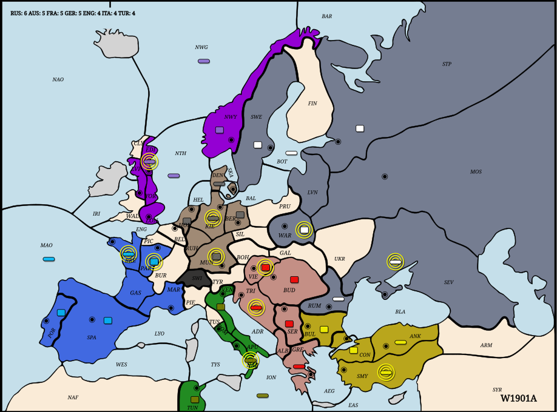

### What happened

- **AUSTRIA**: builds F TRI; builds A VIE
- **ENGLAND**: builds F EDI
- **FRANCE**: builds A PAR; builds F BRE
- **GERMANY**: builds F KIE; builds A MUN
- **ITALY**: builds F NAP
- **RUSSIA**: builds F SEV; builds A WAR
- **TURKEY**: builds F SMY

### AUSTRIA
Orders: `F TRI B` · `A VIE B`

Reasoning

> I have 5 centers and 3 units, so I'm owed 2 builds. My open home centers are TRI and VIE. I want to keep flexibility for both a southern push against Turkey and pressure options. Building a fleet at TRI gives me Adriatic/Ionian reach to support the Lepanto and project naval power; building an army at VIE keeps me flexible to reinforce the Balkans or guard Galicia.
>
> A fleet at TRI is valuable for backing the eastern push (and supporting Greece/Aegean), while an army at VIE keeps me ready to move into the Balkans or hold against Russia.

### ENGLAND
Orders: `F EDI B`

Reasoning

> I have 4 centers and 3 units, so I'm owed one build. My plan calls for building toward the North Sea/Scandinavia to back Russia or squeeze Germany in the Baltic next year. A fleet at Edinburgh pushes north toward Skagerrak/Norway and keeps me flexible for the Baltic squeeze. I'll keep LVP/LON open for future army builds if needed, but a fleet is the right tool for my northern naval strategy.

### FRANCE
Orders: `A PAR B` · `F BRE B`

Reasoning

> I have 5 centers and 3 units, so I'm owed 2 builds. My plan for 1902 is to take Belgium from England's flank, which needs an army that can reach Belgium (via Burgundy or Picardy). I also want to keep fleet options open for the western Med and Atlantic. Building one army in Paris (to march toward Belgium) and one fleet in Brest (to support westward/Channel flexibility and Atlantic operations) gives me both a path to Belgium and naval strength. Brest fleet keeps me ready to contest the Channel if England's promises slip, while honoring the DMZ for now.

### GERMANY
Orders: `F KIE B` · `A MUN B`

Reasoning

> I'm at 5 centers, owed 2 builds. My plan calls for a fleet in Kiel for the Baltic and an army in Munich for flexibility. A Kiel fleet sets up the Russian Baltic squeeze with England in 1902; a Munich army keeps the western/southern option open. Both home centers are vacant, so both builds are legal.

### ITALY
Orders: `F NAP B`

Reasoning

> I have 4 centers and 3 units, so one build. My plan is the Lepanto against Turkey, which requires a fleet to convoy and support an eastward push. A fleet at Naples backs the eastern Mediterranean operation and pairs with F ION.

### RUSSIA
Orders: `F SEV B` · `A WAR B`

Reasoning

> I have 6 centers and 4 units, so I'm owed 2 builds. My open home centers are MOS, SEV, and WAR (STP is occupied). I want to position for pressing both the Baltic/Scandinavian front and the Black Sea/southern front in 1902.
>
> My strategy calls for fleets to press the Baltic and Black Sea. Turkey is building F CON as a "defensive" southern presence — I should hedge there. A fleet in Sevastopol backs up Rumania and lets me contest the Black Sea if Turkey turns. For the second build, an army in Warsaw keeps me flexible toward Galicia (pressure on Austria, per Turkey coordination talks) or defensive against Germany. This balances both fronts and keeps me growing aggressively.

### TURKEY
Orders: `F SMY B`

Reasoning

> I have 4 centers and 3 units, so I'm owed one build. My only open home center is SMY. I told both Russia and Austria I'd build a fleet in CON, but CON is now occupied by my A CON, so I must build in SMY instead.
>
> A fleet in SMY gives me southern naval presence and the option to enter the Aegean or eastern Med, but it can't reach the Black Sea quickly. Given Russia's growing fleet stack and my future plan to potentially contest Rumania or break the DMZ, an army is more flexible for the Balkan/Armenian theater — but a fleet better counters Russia's naval dominance and Italy's Ionian presence. Since my eastern ambitions hinge on naval reach (Black Sea via straits, or Aegean), and my land is already covered by A BUL and A CON, I'll build a fleet to project power south and set up flexibility against both Russia and Italy.

## SPRING 1902 MOVEMENT (`S1902M`)

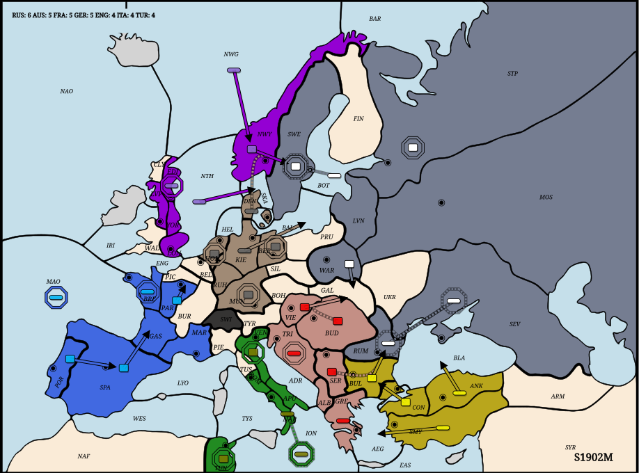

### What happened

- **AUSTRIA**: A SER supports A BUL → RUM; A VIE → GAL; A BUD supports A VIE → GAL; F TRI holds
- **ENGLAND**: A NWY → SWE (bounced); F NTH → SKA; F NWG → NWY (bounced); F EDI holds
- **FRANCE**: A PAR → PIC; A SPA → GAS; A POR → SPA; F MAO holds; F BRE holds
- **GERMANY**: F DEN supports A NWY → SWE; F KIE → BAL; A BER holds; A MUN holds; A HOL holds
- **ITALY**: F ION holds; F NAP supports F ION; A TUN holds; A VEN holds
- **RUSSIA**: A WAR → GAL (bounced); F RUM supports F SEV (support cut); F SEV supports F RUM; A SWE holds; F BOT supports A SWE; A STP holds
- **TURKEY**: F ANK → BLA; A BUL → RUM (bounced); A CON → BUL (bounced); F SMY → AEG

### Dialogue

- **AUSTRIA → TURKEY**: Time to move on Russia. If you push F ANK/BUL toward the Black Sea and RUM this turn, I'll throw A SER behind the attack on Rumania and send A VIE toward Galicia to threaten Warsaw and pin Russia's flank. Confirm you're committing east on RUM and I'll lock my supports — Bulgaria stays yours, RUM we crack open together.
- **AUSTRIA → ITALY**: Lepanto time — Russia's the real eastern giant at six centers. I'm turning on Russia this year rather than Turkey: pushing Serbia and Vienna toward Rumania and Galicia. Keep Venice defensive and the Adriatic clear so my Trieste flank is safe, and if you want to convoy east later I'll have the Balkans open for you.
- **AUSTRIA → RUSSIA**: Galicia stays empty from me as agreed — I'm keeping my eastern border quiet while we both grow. Turkey is still pressing me hard to move on Rumania with him; I'm holding them off for now, but their Bulgaria army and home fleets are coiling. Keep your Black Sea covered against Turkey and we stay friends.
- **AUSTRIA → GERMANY**: Quiet border holds — I've nothing pointed at Munich or Bohemia. Russia's at six centers and growing north; if they lean on you, I can pressure Galicia and Warsaw from my side. Worth keeping a line open as their fleets multiply.
- **ENGLAND → GERMANY**: Time to activate the squeeze we penciled in. Russia's at 6 — the runaway leader — and his STP is lightly held. I can push A NWY toward STP and bring fleets to back you in the Baltic; if you build/aim a Kiel fleet at Sweden, we split his northern centers. Are you in for 1902, and will you commit DEN/BAL against Sweden?
- **ENGLAND → RUSSIA**: Holding Norway as agreed, north stays peaceful from my side. I notice Germany's Denmark fleet is positioned to lean on your Sweden — if he contests it, my Skagerrak option is still yours as promised. Keep me posted on his Baltic moves so we can coordinate.
- **ENGLAND → FRANCE**: All holding on my end — Channel stays a DMZ through 1902, no English unit anywhere near it or Belgium. Belgium is yours to take this spring as agreed. I'm pivoting my attention north against Russia, so your back stays completely clear from me.
- **FRANCE → ENGLAND**: Spring 1902 as agreed: I keep my fleets out of the Channel and North Sea while you run Norway. I'm moving toward Belgium overland via Picardy — no English unit near it, correct? Channel stays DMZ through 1902 as promised.
- **FRANCE → GERMANY**: Confirming our deal holds: you're settled in Holland and have no Belgium claim, so I'll take Belgium via Picardy this year. Burgundy stays empty from my side — I'm only routing through Picardy, nothing toward the Rhineland. Good clean growth for us both.
- **FRANCE → ITALY**: Border stays quiet as agreed — my forces remain in Iberia and pointed north toward Belgium, nothing near Piedmont or the western Med. Enjoy Tunis; let's keep growing uncontested through 1902.
- **GERMANY → ENGLAND**: Time to activate our Baltic plan. Russia is overextended — BOT, SEV, RUM all committed outward. I'll bring my Kiel fleet toward the Baltic this year; if you push NTH/NWY pressure on his northern flank, we split Sweden and the eastern Baltic between us. Are you moving on Sweden/Norway region this year?
- **GERMANY → RUSSIA**: All still quiet from me — nothing toward Silesia or Prussia this Spring as promised. I'm just repositioning my home fleet defensively. Let's hold our Baltic understanding: eastern Baltic yours, my home coast mine. How are you handling Austria/Turkey to your south?
- **GERMANY → FRANCE**: Belgium is yours as agreed — I stay north and east, Burgundy empty from my side. I'm focusing all my energy on the Russian Baltic this year, so your eastern border with me stays completely calm. Confirm you're still taking Belgium so I can commit fully eastward.
- **GERMANY → AUSTRIA**: Our border stays calm — nothing toward Bohemia or Tyrolia from me. If you're pressing Russia from the south (Galicia/Rumania), I'm setting up to squeeze his Baltic from the north. Worth coordinating timing so Russia faces pressure on two fronts at once.
- **ITALY → AUSTRIA**: Lepanto time — I'll convoy A TUN to ALB this spring with F ION carrying it, landing me on the Balkan coast against Turkey. I need you committed: push A SER toward Bulgaria and keep F GRE supporting the eastern front, not pointed at my Adriatic. Confirm Trieste/Venice DMZ holds and I'll build at Naples to deepen the push.
- **ITALY → TURKEY**: Heads up — Austria is the one growing fastest at five centers and eyeing the Balkans hard. Russia's six units crowd you from the north and Black Sea. If you want to keep me out of the Aegean, signal now; otherwise I move with Austria. A quiet deal where you focus Russia and I stay clear of Smyrna's waters could serve us both.
- **ITALY → FRANCE**: Keeping our border quiet through 1902 as agreed — nothing toward Piedmont or the Tyrrhenian from me this spring. My fleet and armies go east for the Lepanto. Trust Marseille and Brest stay west so we both keep growing uncontested.
- **RUSSIA → TURKEY**: Time to act on our eastern plan against Austria. I'll move A WAR into Galicia this Spring to threaten Budapest and Vienna; you push toward Serbia/Greece and keep BLA empty so I can trust my Rumania flank. Confirm you'll keep F ANK out of the Black Sea and I'll commit to Galicia.
- **RUSSIA → AUSTRIA**: Galicia DMZ has served us both. I'm still watching Turkey closely — his CON build is a southern fleet aimed at the Aegean, not at me. If you keep leaning your builds south against Bulgaria, I'll keep my eastern fleets pointed at the Black Sea. Where are A SER and your new units headed this Spring?
- **RUSSIA → GERMANY**: Let's lock the Baltic understanding we discussed: eastern Baltic mine, Berlin/Kiel yours, neither pushing into the other's home coast. My BOT fleet stays oriented at Sweden/Finland, nothing toward your shores. Agreed?
- **RUSSIA → ENGLAND**: North stays peaceful from me — Sweden and Bothnia are my lane, Norway and the North Sea are yours. If Germany's Denmark fleet ever pushes the Baltic, I may take you up on that Skagerrak offer. For now, quiet north suits us both while we grow elsewhere.
- **TURKEY → AUSTRIA**: Time to cash in your standing offer against Russia. If you push from Galicia toward Rumania/Sevastopol this year, I'll bring my Black Sea fleet to bear and we squeeze Russia's exposed eastern fleets between us. Your Greece/Serbia flank stays safe — I have no designs west of Bulgaria. Are you ready to commit Galician pressure this Spring?
- **TURKEY → RUSSIA**: DMZ has served us both well, and I'm still open to pointing south against Austria together. Give me concrete terms: do you take Rumania as your anchor while I push Serbia/Greece, and where do you want my fleet positioned? I want to trust that BLA stays clear, so tell me your Spring plan for F RUM and your northern fleets.
- **TURKEY → ITALY**: Russia's fleet stack remains the eastern danger as you flagged. If I end up pressuring Russia's Black Sea this year, keeping Austria honest in the Adriatic would let me commit fully east. Anything you'd want from me in return for tying down Austria's new Trieste fleet?
- **AUSTRIA → TURKEY**: I'm in. This Spring: A SER S F SEV - RUM if your fleet pushes RUM, or I support your BUL into the assault — tell me exactly which units move where. I'll send A VIE - GAL to threaten Warsaw and pin Russia's flank. Confirm F ANK - BLA and your RUM plan and I lock my supports.
- **AUSTRIA → ITALY**: One snag: landing A TUN in ALB puts your army right against my Trieste and Greece, not against Turkey — that reads as a stab, not a Lepanto. If you want east, convoy toward the Aegean/Turkish coast instead, or hold a year while I crack Rumania with Turkey. Keep ION clear of the Adriatic and the DMZ holds; I won't have F GRE or F TRI pointed at you.
- **AUSTRIA → RUSSIA**: Straight with you: Turkey is pressing hard and I can't hold the line forever while you sit at six centers and build more fleets. If you pull F RUM back and leave Galicia and the Black Sea truly demilitarized this turn, I'll keep VIE home. Otherwise I have to treat RUM as contested ground.
- **AUSTRIA → GERMANY**: Good — let's time it. I'm moving on Russia's south this turn (Galicia and a Rumania push with Turkey). If you squeeze his Baltic and Sweden now, he can't reinforce RUM or Warsaw against me. Two fronts at once cracks him open.
- **ENGLAND → GERMANY**: I'm in for the squeeze. Concrete plan: I'll move A NWY - SWE this turn; you support it with F DEN S A NWY - SWE, and push your Kiel fleet to BAL to threaten his BOT/PRU. Russia's A SWE isn't supported unless he reacts, so the support guarantees we crack it. Confirm DEN supports SWE and I commit NWY.
- **ENGLAND → RUSSIA**: Germany is moving his Kiel fleet toward the Baltic this turn — exactly the pressure we discussed. Keep Sweden well-supported from Bothnia; if he leans on it I'm watching from the north. Tell me his exact Baltic move if you see it.
- **ENGLAND → FRANCE**: Confirmed — no English unit near the Channel or Belgium, take it overland clean. My fleets and army are all committed against Russia in the north, so your eastern flank with me stays quiet all year.
- **FRANCE → ENGLAND**: Confirmed: my fleets stay out of ENG and NTH all year, you run Norway and the north against Russia unmolested. I'm staging A Paris to Picardy this spring to take Belgium in the fall — no English unit near it, correct? Good hunting against Russia.
- **FRANCE → GERMANY**: Yes, still taking Belgium — staging through Picardy now. Burgundy stays empty from me and I keep nothing near the Rhineland, so commit fully against Russia in the Baltic. If you want a coordinated squeeze on Russia later, I'm open once Belgium is settled.
- **FRANCE → ITALY**: Border stays quiet — Marseille and Brest pointed west and north, nothing near Piedmont or the Tyrrhenian. Good luck with the Lepanto against Turkey; we both grow clean through 1902.
- **GERMANY → ENGLAND**: I'm in for 1902. This Spring I move F KIE to BAL to threaten Sweden, and I'll build a second Baltic fleet next Winter. You push A NWY toward STP and bring NTH/NWG north — if you take STP I take Sweden, and we split his north between us. Confirm you're moving on STP this year so I commit BAL now.
- **GERMANY → AUSTRIA**: Good — let's time it: I open the Baltic front this Spring while you press Galicia/Warsaw. If Russia has to defend Sweden and Warsaw simultaneously his fleets crack. Commit a move on Galicia or Rumania this Fall and he can't reinforce north against me.
- **GERMANY → RUSSIA**: Understood, Baltic understanding holds — my fleet stays off your home coast. Quick question on your south: are you pushing RUM/SEV against Turkey this year, or holding? I want to make sure England doesn't misread my Baltic repositioning as aggression against you.
- **ITALY → AUSTRIA**: If you're turning on Russia, the Lepanto target shifts — I'd be landing in the Balkans with no Turkish pressure to exploit, right beside your Greece and Serbia. Confirm F GRE stays put and the Adriatic/Trieste DMZ holds this spring, and I'll keep Venice defensive and my fleet from crowding you. I want to back your Russia push, not trip over your units.
- **ITALY → TURKEY**: Austria just told me he's turning on Russia, not you — so your eastern front may open up. If you commit fleets against Russia's Black Sea, I'll keep my fleet out of the Aegean and Smyrna's waters entirely this year, and I'll watch Austria's Trieste flank. In return, if Austria overreaches south I'd want a free hand toward Greece later — interested in a standing non-aggression so we both grow against the bigger powers?
- **ITALY → FRANCE**: Good — border stays quiet. I'm committing east and south this spring, nothing toward Piedmont or the Tyrrhenian. Keep Marseille and Brest pointed north and we both bank centers uncontested through 1902.
- **RUSSIA → TURKEY**: Concrete terms: I move A WAR into Galicia this Spring to pressure Budapest and Vienna; you push A BUL toward Serbia and keep F ANK and your CON fleet OUT of the Black Sea. F RUM holds Rumania as my anchor, F SEV stays guarding the BLA approach. If BLA stays empty I'll commit fully to Galicia next turn and we split Austria — Budapest/Vienna mine, Serbia/Greece/Trieste yours. Confirm BLA discipline and we move.
- **RUSSIA → AUSTRIA**: Straight with you: Turkey keeps pushing me to hit you, and his CON build plus Bulgaria army are clearly aimed your way regardless of what I do. I'd rather neither of us bleed to Turkey. If you commit A SER and your fleets to holding the southern Balkans against him, I'll keep Galicia empty one more turn — but I need to see you actually defending south, not drifting toward me.
- **RUSSIA → GERMANY**: Agreed on the Baltic understanding — BOT stays oriented at Sweden/Finland, your home coast is yours. To my south I'm managing Austria and Turkey; keeping Galicia quiet for now while I watch Turkey's fleet builds. Keep Denmark off my Sweden and we both grow undisturbed.
- **RUSSIA → ENGLAND**: Noted on Germany's Denmark fleet — for now he's confirmed defensive and off my Sweden, so I won't need Skagerrak this turn. I'll flag you the moment he leans on the Baltic. Holding my northern lane peaceful as agreed.
- **TURKEY → AUSTRIA**: I'm committing east on Russia this turn. F ANK goes to BLA and I'll line up to take RUM — if you throw A SER S into RUM and push A VIE toward Galicia to pin Warsaw, we crack Rumania together. Confirm A SER supports the RUM attack and I lock it in.
- **TURKEY → RUSSIA**: Agreed in principle on the eastern plan — I'll keep pressure pointed at Austria's flank. To coordinate cleanly, where exactly does F RUM sit this Spring, and will your northern fleets stay committed up top? I want to make sure my BLA discipline isn't wasted while you commit A WAR to Galicia.
- **TURKEY → ITALY**: Deal: I focus fully on Russia's Black Sea this year and you stay clear of Smyrna's waters and the Aegean. In return, lean on Austria's new Trieste fleet in the Adriatic so neither of us lets Austria run away at five centers. Keep me posted if Austria drifts toward you.
- **AUSTRIA → TURKEY**: Locked: A VIE - GAL to pin Warsaw, and A SER S A BUL - RUM if your A BUL drives into Rumania this turn — confirm BUL attacks RUM and F ANK - BLA covers the strait. That's two on RUM (your BUL + my SER support) against Russia's lone F RUM. Bulgaria stays yours; we crack Rumania open together this Spring.
- **AUSTRIA → ITALY**: Adriatic/Trieste DMZ holds from my side — F TRI stays put, F GRE supports the eastern front, nothing pointed at you. I'd rather you keep Venice defensive and ION clear of the Adriatic this Spring while I crack Rumania with Turkey, than land A TUN in ALB right beside my units. Hold a turn and the Balkans open cleanly for you next year.
- **AUSTRIA → RUSSIA**: Galicia DMZ from me this turn — A VIE stays flexible at home, not crossing into Galicia, as I said. Keep your Black Sea fleet covered: Turkey's F ANK and BUL army are coiling toward RUM and the straits, and I won't be able to shield you if they break through. Defend RUM yourself.
- **ENGLAND → GERMANY**: Final commit: I move A NWY - SWE this turn — you support it with F DEN S A NWY - SWE and push F KIE - BAL. That cracks Russia's Sweden cleanly since A SWE is unsupported. STP is a longer reach for me; let's take Sweden first with your support, then I'll convoy toward STP next year while you hold the Baltic. Confirm DEN supports SWE.
- **ENGLAND → RUSSIA**: Holding the north quiet as agreed — but watch Germany hard this turn, his Kiel fleet is moving to the Baltic and Denmark is positioned to lean on Sweden. Keep A SWE supported from Bothnia. I'm staying in my lane.
- **FRANCE → ENGLAND**: Committing now: A Paris to Picardy this spring to take Belgium in the fall, fleets stay out of ENG and NTH all year. I expect no English unit near Picardy or Belgium — confirmed by your last word, so we both run clean. Good hunting against Russia in the north.
- **FRANCE → GERMANY**: Committing: A Paris stages to Picardy, Burgundy empty from my side, nothing toward the Rhineland — commit fully against Russia in the Baltic. Once Belgium is mine in the fall, I'm ready to coordinate a western squeeze on Russia if you want pressure from both sides.
- **GERMANY → ENGLAND**: Committed and locked: I order F DEN S A NWY - SWE and F KIE - BAL this phase. You move A NWY - SWE — that support guarantees we take it since Russia's A SWE is unsupported. Bring NTH/NWG north toward STP and the Baltic is ours to split.
- **GERMANY → AUSTRIA**: I open the Baltic front this Spring — F DEN backs an attack on Sweden, F KIE to BAL pressures his Prussia/Bothnia. Press Galicia and threaten Warsaw this Fall so Russia can't choose between defending north and south. Two fronts cracks him.
- **GERMANY → FRANCE**: Confirmed — Belgium is yours via Picardy, Burgundy stays empty from my side, nothing near the Rhineland. I'm committing fully east against Russia this turn, so your border with me is dead quiet. Take Belgium clean.
- **GERMANY → RUSSIA**: Baltic understanding holds from my side — my home coast stays defensive and I'm not pushing Silesia or Prussia. Keep Galicia quiet and we both grow. I'm just repositioning my Kiel fleet to watch England's north, nothing aimed at your shores.
- **ITALY → AUSTRIA**: Agreed — no Balkan landing this spring. I'll keep A VEN defensive, hold A TUN, and keep F ION out of the Adriatic (no ALB/TRI/ADR). Crack Rumania with Turkey; I'll watch your flank and we revisit the Lepanto once Russia's been cut down. In return I expect F GRE and F TRI stay off Venice and the Ionian.
- **ITALY → TURKEY**: Locked: I stay out of the Aegean and Smyrna's waters entirely — F ION holds in the central Med, no move east this turn. Hit Russia's Black Sea hard; if Austria overreaches toward your Bulgaria I'll lean on his Trieste fleet. Standing non-aggression confirmed.
- **ITALY → FRANCE**: Confirmed quiet: nothing toward Piedmont or the Tyrrhenian from me. F ION and my armies stay central/defensive this spring. Keep Marseille and Brest west and we both bank centers clean through 1902.
- **RUSSIA → TURKEY**: Committed: A WAR moves to GAL this Spring, F RUM holds Rumania as my anchor, F SEV stays guarding the Black Sea approach — no Russian fleet into BLA. You push A BUL toward Serbia and keep F ANK and CON OUT of BLA. Next turn I bring force to Budapest/Vienna; Serbia/Greece/Trieste are yours.
- **RUSSIA → AUSTRIA**: Your threat to RUM is empty — you have no unit that can reach it, and pulling back would only invite Turkey. I'm keeping my eastern fleets defensive, but A WAR will not sit idle while you eye my centers. Defend south against Turkey and we stay friends; lean toward me and you fight two fronts.
- **RUSSIA → GERMANY**: Baltic understanding holds firm: F BOT stays oriented at Sweden/Finland, nothing toward Berlin or Kiel. To my south I'm committing A WAR to Galicia against Austria, not toward you. Keep Denmark off Sweden and our border stays the quietest on the board.
- **RUSSIA → ENGLAND**: Holding my northern lane peaceful — A SWE anchored, F BOT supporting it, nothing toward Norway or the North Sea. I'll flag you instantly if Germany's Baltic move turns aggressive; for now he's confirmed defensive. Keep Norway and we both grow undisturbed.
- **TURKEY → AUSTRIA**: Locked: F ANK - BLA and A BUL - RUM this Spring. Throw A SER S A BUL - RUM and we take Rumania outright — Russia's F RUM falls. Send A VIE - GAL to pin Warsaw so Russia can't reinforce. Bulgaria and the south stay mine, Galicia/Warsaw pressure is yours.
- **TURKEY → RUSSIA**: BLA discipline holds my end as discussed — I'm committing my energy against Austria's flank as agreed, and I expect your A WAR into Galicia and F RUM to anchor. Keep your northern fleets up top so I can trust the eastern border while we split Austria.
- **TURKEY → ITALY**: Confirmed: I'm fully committed against Russia's Black Sea this turn, staying out of the Aegean and your Med entirely. Lean on Austria's Trieste fleet in the Adriatic so he can't run away while I'm tied up east. A standing non-aggression suits me — Greece can be your lane later if Austria overreaches south.

### AUSTRIA
Orders: `A SER S A BUL - RUM` · `A VIE - GAL` · `A BUD S A VIE - GAL` · `F TRI H`
Illegal (dropped): `F GRE S A SER`

Reasoning

> I'm committing to the Turkey-Russia attack as planned. A SER supports A BUL into Rumania (Turkey drives A BUL - RUM with F ANK - BLA covering), A VIE moves to Galicia to pin Warsaw, and A BUD supports the Galicia move to ensure it gets in clean. F GRE supports the eastern front, F TRI holds to honor the Adriatic DMZ with Italy.
>
> Let me verify: A SER S A BUL - RUM is legal (SER is adjacent to RUM). A VIE - GAL legal. A BUD S A VIE - GAL legal. F GRE — I want it supporting the Rumania assault, but GRE isn't adjacent to RUM. F GRE can support A SER's hold or support BUL operations. Best use: F GRE S A SER (protect my supporting unit from being cut by a Russian/Turkish move into SER). Actually F GRE S A SER protects the support order that makes RUM fall. That's the right call.

### ENGLAND
Orders: `A NWY - SWE` · `F NTH - SKA` · `F NWG - NWY` · `F EDI H`

Reasoning

> Germany has committed F DEN S A NWY - SWE and F KIE - BAL. Russia's A SWE is supported by F BOT. So my attack on SWE with German support gives strength 2 (NWY + DEN). Russia's A SWE has defensive strength 2 (SWE + F BOT support). That's a bounce — not enough.
>
> Wait, let me recheck. If I add F NTH support too: A NWY - SWE supported by F DEN and F NTH = strength 3. But F NTH cannot support a move into SWE — NTH is not adjacent to SWE. Let me check legal options: `F NTH S A SWE - DEN` exists, not into SWE. NTH isn't adjacent to SWE, confirmed.
>
> So my attack is strength 2 (NWY + DEN support) vs Russia's hold defense of 2 (A SWE + F BOT S). That bounces. Russia told me A SWE is anchored with BOT supporting. Germany may not actually crack it.
>
> But I committed to the coalition action. If I don't move and Germany supports a non-move, Germany's support is void and he looks bad. If I move and it bounces, no loss to me — NWY stays. Actually if A SWE holds and F BOT supports the hold, my move bounces and I keep NWY. That's fine, no downside. And it tests Germany's commitment and pressures Russia.
>
> Better: execute the committed attack. A NWY - SWE with German DEN support. Bring F NWG to NWY to backfill (but if NWY moves and bounces, NWY stays occupied — NWG would bounce). Better to keep NWG supporting the Sweden attack? NWG can't reach SWE either. NWG can support A NWY's move? No, NWG not adjacent to SWE.
>
> Let me keep F NWG holding/positioned, F NTH supporting NWY-SWE isn't legal. I'll move A NWY - SWE, keep fleets ready. F NTH could move toward DEN/Baltic but better hold the line. I'll keep F NTH H (defends), F NWG to NWY would bounce since NWY likely stays. Keep NWG H. F EDI to enable build — move F EDI - NWG? No. F EDI stays for build, but EDI occupied blocks build there; I need a vacant home center. LON and LVP are vacant — I can build there regardless. So F EDI can stay.

### FRANCE
Orders: `A PAR - PIC` · `A SPA - GAS` · `A POR - SPA` · `F MAO H` · `F BRE H`

Reasoning

> Staging for Belgium via Picardy as agreed with England and Germany. A Paris moves to Picardy to take Belgium in the fall. F Brest stays back (Channel DMZ honored). Iberia stays banked. I'll also bring A Spain forward toward Gascony/Marseille direction to keep momentum — but I want to keep Spain and Portugal occupied to hold those centers. I'll move A Spain to Gascony to support the Belgium push and free up a unit, keeping Portugal holding Spain... actually I need to keep both Iberian centers occupied through the fall to retain them. SPA and POR are my supply centers; leaving them empty in fall risks nothing since no enemy is near. To maximize, I'll advance A Spain to Gascony to be positioned to support Picardy/Belgium next, and have A Portugal move to Spain to keep it occupied. F MAO can support the Gascony move or guard. Let me keep it clean: A PAR-PIC, A POR-SPA (keep Spain occupied), A SPA-GAS (advance), F MAO holds to guard, F BRE supports the chain or holds for Channel DMZ.

### GERMANY
Orders: `F DEN S A NWY - SWE` · `F KIE - BAL` · `A BER H` · `A MUN H` · `A HOL H`

Reasoning

> I'm committed to the Baltic squeeze with England. F DEN supports A NWY into Sweden (Russia's A SWE is unsupported, so it cracks), and F KIE pushes into BAL to threaten Bothnia and Prussia. Russia just told me he's committing A WAR to Galicia, so Prussia/Silesia will be undefended — F KIE into BAL positions me to grab Prussia or Sweden next. A BER and A MUN anchor home and keep Silesia/Prussia options open; A HOL stays defensive. The deception with Russia ("home coast defensive only") lets me strike Sweden while he's looking south.

### ITALY
Orders: `F ION H` · `F NAP S F ION` · `A TUN H` · `A VEN H`

Reasoning

> I committed to a quiet spring: hold central, honor the Adriatic/Trieste DMZ with Austria, stay out of the Aegean for Turkey, and keep my western border quiet with France. I'll keep F ION holding in the central Med (clear of the Adriatic), F NAP supporting it to anchor my position, A TUN holding, and A VEN defensive. This banks 1902 while Austria and Turkey grind Russia, and leaves me positioned to pivot east next year.

### RUSSIA
Orders: `A WAR - GAL` · `F RUM S F SEV` · `F SEV S F RUM` · `A SWE H` · `F BOT S A SWE` · `A STP H`

Reasoning

> I'll execute my committed plan: A WAR into Galicia to open the Austrian front per my deal with Turkey, while keeping my Black Sea anchored and northern position stable.
>
> My reasoning: Galicia threatens Budapest and Vienna. F RUM holds as anchor. F SEV stays defensive guarding the BLA approach (and supports RUM). In the north, A SWE holds Sweden with F BOT support, A STP anchors home. This keeps all my deals intact while pressing Austria.

### TURKEY
Orders: `F ANK - BLA` · `A BUL - RUM` · `A CON - BUL` · `F SMY - AEG`

Reasoning

> I'm committing east against Russia with Austria's support. F ANK to BLA, A BUL attacks RUM with Austria's A SER supporting. A CON supports the operation and F SMY moves to AEG to extend reach. Austria supports A BUL - RUM, so I have two strength against Russia's lone F RUM (F SEV can support its defense, making it 2v2 bounce, but Austria's GAL pressure pins Warsaw regardless).
>
> Actually, let me reconsider: F ANK - BLA and A BUL - RUM with A SER support. If F SEV supports F RUM hold, RUM defends with strength 2, my attack is strength 2 (BUL + SER) — bounce. But BLA contests Russia's Black Sea. Better to support the RUM attack maximally. F ANK could support A BUL - RUM? F ANK isn't adjacent to RUM. F ANK - BLA threatens SEV and supports future. I'll keep that as the contesting move.

## FALL 1902 MOVEMENT (`F1902M`)

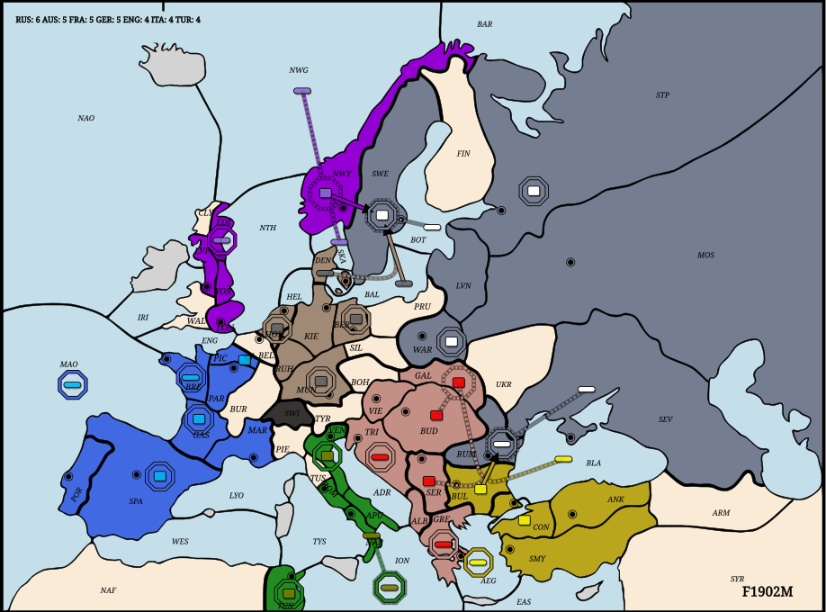

### What happened

- **AUSTRIA**: A SER supports A BUL → RUM; A GAL supports A BUL → RUM; A BUD supports A GAL; F GRE holds; F TRI holds
- **ENGLAND**: A NWY → SWE (bounced); F SKA supports A NWY → SWE; F NWG supports A NWY (void); F EDI holds
- **FRANCE**: A PIC → BEL; A SPA holds; A GAS holds; F MAO holds; F BRE holds
- **GERMANY**: F BAL → SWE (bounced); F DEN supports F BAL → SWE; A BER holds; A MUN holds; A HOL holds
- **ITALY**: F ION holds; F NAP supports F ION; A TUN holds; A VEN holds
- **RUSSIA**: F RUM holds; F SEV supports F RUM; A SWE holds; F BOT supports A SWE; A WAR holds; A STP holds  [dislodged: F RUM]
- **TURKEY**: A BUL → RUM; F BLA supports A BUL → RUM; F AEG holds

### Dialogue

- **AUSTRIA → TURKEY**: Fall RUM assault: your A BUL - RUM, your F BLA S A BUL - RUM, and my A SER S A BUL - RUM. That's three attacking against Russia's F RUM with F SEV support (two defenders) — RUM falls. My A GAL pins Warsaw so Russia can't reinforce. Confirm BUL drives RUM and BLA supports, and I lock A SER's support.
- **AUSTRIA → RUSSIA**: Last chance to keep this clean: pull F RUM back to the Black Sea coast or Sevastopol and I'll keep my supports off it. Otherwise Turkey and I take Rumania this Fall — A BUL with my Serbian support and Black Sea backing outnumber your defense. Your call.
- **AUSTRIA → ITALY**: DMZ holds — F TRI stays home, F GRE stays on the eastern front, nothing toward Venice or the Ionian. I'm cracking Rumania with Turkey this Fall. Keep Venice defensive and ION clear of the Adriatic and we revisit the Lepanto next year with Russia weakened.
- **AUSTRIA → GERMANY**: I'm pressing the Russia south hard this Fall — Galicia pins Warsaw and Turkey and I assault Rumania together. If you push Sweden and the Baltic now, Russia can't reinforce both fronts and his fleets crack. Time it with me.
- **ENGLAND → GERMANY**: Fall execution: I move A NWY - SWE and back it with F SKA S A NWY - SWE — that's two on my side. You commit F DEN S A NWY - SWE and we have three against Russia's SWE+BOT, which cracks it clean. Confirm DEN supports SWE this turn and we split his north as agreed; I take Sweden, you anchor BAL against his Bothnia/Prussia.
- **ENGLAND → RUSSIA**: North's been quiet between us as promised. Heads up — Germany's Baltic fleet move looks aggressive this turn, his Denmark fleet is leaning toward Sweden hard. Keep A SWE well supported from Bothnia; I'm watching him from the north and staying in my lane.
- **ENGLAND → FRANCE**: All holding — Channel stays a DMZ, no English unit anywhere near it or Belgium, take Belgium clean this fall. My whole force is committed north against Russia, so your flank with me is completely quiet all year.
- **FRANCE → ENGLAND**: Taking Belgium overland this fall as agreed — A Picardy to Belgium, no fleet near the Channel or North Sea, all yours up north. Russia's at 6 centers and pulling ahead; how's your Scandinavian push going? If you can pin Russia's northern fleets I'll look at pressuring from the west once Belgium's banked.
- **FRANCE → GERMANY**: Moving on Belgium this fall via Picardy — Burgundy stays empty from me, nothing toward the Rhineland, so commit fully east. Russia at 6 is the real threat now. Once Belgium's mine I want that coordinated squeeze: you hit the Baltic, I can free up units toward the east. What's your read on Russia's weak point?
- **FRANCE → ITALY**: Border stays quiet — nothing near Piedmont or the Tyrrhenian, my forces go north for Belgium. How's the Lepanto against Turkey shaping up? If you bog Turkey down, Russia loses a southern distraction — worth coordinating so the leader doesn't run away.
- **GERMANY → ENGLAND**: Fall execution: best line to crack Sweden is you move A NWY - SWE, I support with F DEN S A NWY - SWE, AND I send F BAL - BOT to cut Russia's BOT support for Sweden. With BOT's support cut, your NWY+my DEN beats his lone A SWE. Confirm A NWY - SWE and I lock DEN support plus BAL cutting BOT. This gives YOU Sweden and me the Baltic foothold.
- **GERMANY → AUSTRIA**: I'm opening the real Baltic assault on Russia this Fall — cracking Sweden with England and threatening Bothnia/Prussia. This is your moment: push A GAL - WAR or pressure RUM/SEV hard now so Russia can't shuffle fleets north. Two fronts at once and his six centers start bleeding.
- **GERMANY → RUSSIA**: Heads up — England is pressing hard for Sweden and STP and wants me to commit my Baltic fleets against you. I've kept our border quiet so far, but if you're stretched defending Galicia against Austria, I'd rather cut a deal: pull F BOT back and let me have Sweden cleanly, and I'll keep Prussia and Berlin off you entirely. Otherwise the squeeze comes.
- **GERMANY → FRANCE**: All quiet on our border as promised — I'm fully committed east against Russia, nothing near the Rhineland or Burgundy. Take Belgium clean via Picardy. Once Russia's north cracks I'll want to talk about a coordinated western press on him from your flank.
- **ITALY → AUSTRIA**: Holding our DMZ this fall as promised — A VEN defensive, F ION clear of the Adriatic. How's the Rumania crack going with Turkey? If Russia's southern line is breaking, I'd like to time the Lepanto for Spring 1903: I convoy an army toward Greece/Aegean and you keep Serbia pressing. Confirm F TRI and F GRE stay off Venice and Ionian and we keep growing clean.
- **ITALY → TURKEY**: Standing non-aggression holds — F ION stays out of the Aegean and Smyrna's waters this turn. How's the Black Sea push on Russia? If you crack Sevastopol or the Black Sea fleet, Russia folds fast and Austria becomes the one to watch. Keep me posted if Austria's Bulgaria pressure shifts; Greece remains my lane later if he overreaches south.
- **ITALY → FRANCE**: Border stays frozen — nothing toward Piedmont or the Tyrrhenian, my forces stay central and east. Keep Marseille and Brest pointed north toward Belgium and we both bank centers uncontested. How's Iberia settling — taking Belgium this year?
- **RUSSIA → TURKEY**: Your F BLA is sitting in the Black Sea — that breaks the DMZ you swore to keep. I want to believe we're still pointed at Austria together, so pull F BLA back to ANK this Fall and prove it. If it stays, I read it as a move on RUM/SEV and I'll defend accordingly and you'll get nothing from Austria with me fighting you instead.
- **RUSSIA → AUSTRIA**: Your A GAL crossed the line we agreed to keep empty. I'm not looking to bleed us both to Turkey, but I can't leave that unit menacing WAR and RUM. Pull GAL back to BUD or VIE and we keep the eastern peace; leave it forward and I take it as hostile and act on it.
- **RUSSIA → GERMANY**: Baltic understanding holds from me — BOT and SWE stay oriented north, nothing toward Berlin or Kiel. Keep Denmark off Sweden and our border stays the quietest on the board while I deal with Turkey and Austria to my south.
- **RUSSIA → ENGLAND**: North stays peaceful from me — Sweden anchored, nothing toward Norway. Turkey broke into the Black Sea so my eastern fleets are committed south this turn; I'm trusting you to keep Norway and the north quiet so I don't fight three fronts.
- **TURKEY → AUSTRIA**: Last turn you promised A SER support into RUM and it never came — my attack bounced. I have F BLA in the Black Sea now and I'm driving A BUL into RUM again this Fall with F BLA supporting. For this to break Russia's F RUM/F SEV anchor I NEED A SER S A BUL - RUM this time. Lock it in concretely, and push A GAL to cut Russian reinforcement — say the word and Rumania falls.
- **TURKEY → RUSSIA**: I'll be straight: my fleet is in the Black Sea now, the DMZ has run its course. But I'd rather not grind us both down for Austria's benefit — Austria sits at five centers and is the one eyeing your Budapest and Vienna. If you pull F SEV back to defend SEV and let me have RUM, I'll point my Black Sea fleet at Austria's flank instead of yours. Otherwise I contest RUM hard this turn.
- **TURKEY → ITALY**: Holding to our non-aggression — I'm fully east on Russia's Black Sea and clear of the Aegean and your waters. Austria is the real winner if I bleed Russia while he sits at five; lean on his Trieste fleet in the Adriatic so he can't capitalize. Greece stays your lane later as agreed.
- **AUSTRIA → TURKEY**: Locked and final: A BUL - RUM, F BLA S A BUL - RUM, my A SER S A BUL - RUM. That's three attackers against Russia's two-defender anchor — RUM cracks. I'm also throwing A GAL S A BUL - RUM as insurance so nothing bounces it. Bulgaria and the south stay yours; once RUM falls I press A GAL toward Warsaw next turn.
- **AUSTRIA → GERMANY**: I'm committing the full southern assault on Russia this Fall — A BUL/SER/GAL all hammering Rumania with Turkey's Black Sea fleet. Russia can't reinforce south. Hit Sweden and Prussia now so his fleets are pinned north and his six centers start bleeding from both ends.
- **AUSTRIA → ITALY**: DMZ holds firm from my side — F TRI stays home, F GRE supports the eastern front, nothing toward Venice or the Ionian. I'm cracking Rumania with Turkey this turn as agreed. Keep Venice defensive and ION clear, and we line up the real Lepanto for Spring 1903 with Russia already weakened.
- **AUSTRIA → RUSSIA**: You called my threat empty — watch Rumania fall this Fall. A BUL drives in with Black Sea support and two of my armies behind it; your F RUM/F SEV anchor breaks. Pull F RUM to SEV now and you keep Sevastopol intact instead of losing both — your last clean exit.
- **ENGLAND → GERMANY**: Locked in your line: I move A NWY - SWE, you support with F DEN S A NWY - SWE AND send F BAL - BOT to cut Russia's Bothnia support. With BOT cut, my NWY + your DEN beats his lone A SWE — I take Sweden, you get the Baltic foothold. I'll also throw F SKA S A NWY - SWE for extra weight. Confirm BAL cuts BOT this turn, not BAL holds.
- **ENGLAND → RUSSIA**: Heads up — Germany's Baltic fleet is moving to BOT this turn to cut your support for Sweden, and his Denmark fleet is leaning hard on SWE. This is the aggression we discussed; I'm watching from the north but my hands are full. Keep BOT and SWE as defended as you can.
- **FRANCE → GERMANY**: Taking Belgium via Picardy this fall as agreed. For 1903's eastern press on Russia: I can free a Burgundy/Munich-line unit toward Silesia/Warsaw if you push the Baltic and Prussia. What's your read — do you take Sweden from Russia if England keeps Norway, or do we both drive on Warsaw?
- **FRANCE → ENGLAND**: Belgium's mine clean this fall, fleets stay out of ENG/NTH all year as promised. Russia held Sweden against you this spring — if you can't break it, I can lend pressure on the Baltic flank via Germany next year. Where do you think Russia cracks first in the north?
- **FRANCE → ITALY**: Border stays frozen, nothing west of my line. Russia's the runaway at 6 — if your Lepanto pins Turkey, Russia loses its southern partner and we can all gang the leader. How's Turkey responding to your push?
- **GERMANY → ENGLAND**: Revised, better line: let ME take Sweden with F BAL - SWE supported by my F DEN, and you back it with F SKA S F BAL - SWE — that's three on Sweden, crushing Russia's SWE+BOT. In exchange you push A NWY toward STP, which I can't reach, and convoy with NWG. You get a Russian home center I can't take; I take Sweden which I'm physically adjacent to. Confirm and we both grow off Russia this Fall.
- **GERMANY → AUSTRIA**: Lock it in: I'm cracking Russia's north this Fall while you hit Galicia/Warsaw and Rumania. Once his BOT and SWE fall he can't shuffle fleets south — press Warsaw hard now and his whole position collapses between us.
- **GERMANY → RUSSIA**: Last chance before the squeeze closes: pull F BOT off Sweden's defense and I'll keep Prussia and Berlin entirely off you — you focus everything on Austria's Galicia/Warsaw push. Refuse, and England and I take Sweden three-on-one this Fall while Austria takes Warsaw. Your call.
- **ITALY → AUSTRIA**: Holding as agreed this fall — A VEN defensive, F ION out of the Adriatic. To make 1903 real: confirm that once you've taken Rumania, GRE becomes my landing lane and you'll support my convoyed army into the Balkan coast rather than contest it. If you crack Russia cleanly I want a concrete Lepanto plan, not another year of holding.
- **ITALY → TURKEY**: Confirmed I stay clear of the Aegean and Smyrna this fall. If Austria takes Rumania this turn he jumps to six and becomes the runaway — keep your Black Sea fleets pressing Russia but watch that Austria doesn't pivot south onto your Bulgaria next. If he does, Greece becomes my wedge against him and we can squeeze him together.
- **ITALY → FRANCE**: Border stays frozen from me — nothing toward Piedmont or the Tyrrhenian. Watch the east: Austria and Russia both sit large and one of them takes Rumania this fall. If Austria runs away at six, I'll need you holding Marseille quiet so I can commit fully east against him.
- **RUSSIA → AUSTRIA**: Turkey is in the Black Sea against me and now wants me to hand him Rumania — exactly the overreach you warned about. If you keep A SER off Rumania and don't back Turkey's grab, I'll hold RUM against him and keep Galicia quiet from my side. Don't help Turkey take my center; he'll turn that fleet on Trieste next.
- **RUSSIA → TURKEY**: Your F BLA broke the DMZ, so RUM is no gift — I'm holding it with F SEV support and you bounce. I'm not pulling F SEV back to hand you my own center; that's not a deal, that's surrender. Point that fleet at Austria's flank as you promised and we still split Austria; aim it at RUM and you waste the turn while Austria grows.
- **RUSSIA → GERMANY**: I'm committed south against Turkey this turn, so the Baltic stays quiet from me — F BOT and A SWE hold north, nothing toward Berlin or Kiel. Keep Denmark off Sweden and our border remains the calmest on the board while I deal with the Black Sea.
- **RUSSIA → ENGLAND**: Germany's confirmed defensive to me so far and Sweden's well-supported from Bothnia, so I won't need Skagerrak. My eastern fleets are tied up — Turkey jumped into the Black Sea — so I'm trusting you to keep Norway and the north quiet this turn.
- **TURKEY → AUSTRIA**: Final lock for Fall: A BUL - RUM, F BLA S A BUL - RUM. That's two from me. You add A SER S A BUL - RUM and push A VIE/GAL to keep A GAL pinning Warsaw — three attackers crack Russia's F RUM+F SEV anchor and Rumania falls. Last turn your SER support never came and I bounced; this time I need it in writing. Confirm A SER S A BUL - RUM exactly.
- **TURKEY → RUSSIA**: I'm contesting RUM this Fall — F BLA supports my A BUL into Rumania. You can still save SEV: pull F RUM's anchor and I take RUM cleanly without grinding into Sevastopol next, or dig in and lose both fronts as Austria's GAL closes on Warsaw. Your choice, but Austria is the one positioned to take your home centers, not me.
- **TURKEY → ITALY**: Holding our non-aggression — I'm fully east on RUM this turn, clear of the Aegean and your Med. Keep leaning on Austria's Trieste fleet; if he cracks Rumania open with me and then turns south, Greece is your lever. Watch his GAL move — Austria grows fastest if Russia folds.
- **AUSTRIA → TURKEY**: Final and locked: A SER S A BUL - RUM and A GAL S A BUL - RUM — that's two supports behind your A BUL, with F BLA making three attackers against Russia's F RUM+F SEV anchor. Rumania falls this turn. Drive A BUL - RUM and F BLA S A BUL - RUM exactly; Bulgaria and the south stay yours, and next turn I push A GAL toward Warsaw.
- **AUSTRIA → GERMANY**: Committing now: my A SER and A GAL both back the RUM assault with Turkey's Black Sea fleet — Russia's southern anchor breaks this Fall. Hit Sweden and Prussia/Bothnia hard this turn so his fleets stay pinned north and can't shuffle south to save RUM. Two fronts cracks him; time it with me.
- **AUSTRIA → ITALY**: DMZ holds firm — F TRI stays home, F GRE on the eastern front, nothing toward Venice or the Ionian. I'm cracking Rumania with Turkey this turn. Keep Venice defensive and ION clear, and once Russia's cut down we run the real Lepanto in Spring 1903 with GRE as your landing lane — I'll support your convoy in, not contest it.
- **ENGLAND → GERMANY**: I'm committing A NWY - SWE with F SKA S A NWY - SWE for two of my own. For this to crack, you support with F DEN S A NWY - SWE and send F BAL - BOT to cut Russia's Bothnia support — that's three on Sweden vs his lone cut-off army. STP isn't reachable for me this turn without crossing Russian seas, so Sweden is the prize I take; you hold the Baltic and we both grew off Russia. Confirm DEN supports MY army into SWE, not BAL into SWE.
- **ENGLAND → RUSSIA**: I've kept the north quiet as promised all year, but Germany is the one moving on Sweden now — his Denmark and Baltic fleets are committed to taking it this turn. If you want Sweden held, throw everything from Bothnia into supporting A SWE; I can't stop his fleets from the north. Watch your back in the Baltic.
- **FRANCE → ENGLAND**: Final: A Picardy to Belgium this fall, fleets stay out of ENG and NTH. With Belgium banked I'll have a spare build — if Russia holds Sweden against you again, I can put a fleet toward the Baltic via Germany in 1903 to pin Russia's northern fleets while you break Norway/Sweden. Keep me posted where Russia is weakest up north.
- **FRANCE → GERMANY**: Committed: A Picardy to Belgium this fall, Burgundy empty, nothing near the Rhineland — commit fully east. For 1903 let's lock the plan: you drive Baltic/Prussia, I free a unit toward Silesia/Warsaw once Belgium's banked. Tell me whether you want Warsaw as the joint target or you take Sweden while I press Warsaw.
- **FRANCE → ITALY**: Border stays frozen — nothing west of my line, my forces go north for Belgium. Agreed to watch the east: if Austria grabs Rumania and runs to six, I'll hold Marseille dead quiet so you can commit fully against him. Just flag the turn you stab so I keep my western front locked down for you.
- **GERMANY → ENGLAND**: Final lock: I order F BAL - SWE, F DEN S F BAL - SWE, and you throw F SKA S F BAL - SWE — three on Sweden cracks Russia's SWE+BOT cleanly and Sweden is mine. You drive A NWY - STP with F NWG convoy/support — that home center is yours, I can't reach it. Confirm F SKA supports my BAL into Sweden, not your own NWY.
- **GERMANY → AUSTRIA**: I'm cracking Sweden this Fall with England — Russia's north breaks. Hammer Warsaw and Rumania now while his fleets are pinned defending the Baltic; he cannot reinforce south. Press A GAL - WAR this turn and his six centers bleed from both ends.
- **GERMANY → RUSSIA**: Border stays as discussed from my side toward Berlin and Kiel. Focus your defense south against Austria and Turkey — that's where you're most exposed this turn.
- **GERMANY → FRANCE**: Taking Belgium clean via Picardy as agreed — my Rhineland stays empty and I'm fully committed to the Baltic against Russia. Once Sweden falls I'll want your Burgundy/Munich-line unit aimed at Silesia in 1903 for a joint drive on Warsaw. Confirm Belgium and we sync the eastern press.
- **ITALY → AUSTRIA**: Final commitment: A VEN holds defensive, F ION stays central (no ALB/TRI/ADR), F NAP supports ION, A TUN holds — your Trieste flank is safe this fall. In return I expect F TRI home and F GRE on Russia, off Venice and the Ionian. Crack Rumania clean, and Spring 1903 GRE is my landing lane with your support into the Balkan coast — that's the price of my quiet year.
- **ITALY → TURKEY**: Locked for this phase: F ION holds central, I stay entirely out of the Aegean and Smyrna's waters. Hit Russia's Black Sea hard. If Austria takes Rumania and jumps to six, he's the runaway — keep me posted and Greece becomes my wedge against him next year while you press his Bulgaria.
- **RUSSIA → GERMANY**: Final: F BOT holds in support of Sweden and nothing touches Berlin/Kiel or Prussia — my whole eastern effort is south against Turkey and Austria. Keep Denmark off Sweden this Fall and our border stays untouched; if you grab Sweden now, you make a permanent enemy of the one neighbor keeping your east quiet while England eyes your north.
- **RUSSIA → AUSTRIA**: I'm holding RUM with F SEV support — Turkey bounces, you gain nothing by backing him. Keep A GAL and A SER off Rumania and I keep Galicia pressure light; if you join Turkey's grab, his fleet turns on Trieste next and you've spent your army for his benefit. Pull GAL to BUD and we both face Turkey, not each other.
- **RUSSIA → TURKEY**: F RUM holds Rumania with F SEV behind it — your A BUL+F BLA bounce and you waste the turn while Austria grows. I'm not handing you my center; point F BLA at Austria's flank as you promised and Serbia/Greece/Trieste are still yours. Aim it at RUM and we both bleed for Vienna's benefit.
- **RUSSIA → ENGLAND**: North stays quiet from me — A SWE anchored, F BOT supporting, nothing toward Norway. Germany's the real mover here; if he takes Sweden three-on-one I lose a center and he grows north next to you. Keep your fleets off Sweden and Bothnia and let Germany overextend alone.
- **TURKEY → AUSTRIA**: Final lock: A BUL - RUM, F BLA S A BUL - RUM, A CON S A BUL - RUM as my third. You add A SER S A BUL - RUM and A GAL S A BUL - RUM and Russia's two-defender anchor breaks — RUM is ours. If your SER support fails to come a second time I'm done coordinating with you. Confirm by moving exactly as stated.
- **TURKEY → ITALY**: Holding our non-aggression — I stay fully out of the Aegean and Smyrna's waters. I'm cracking RUM with Austria this turn; if Austria jumps to six and pivots south onto my Bulgaria, Greece becomes your lever and we squeeze him together. Keep leaning on his Trieste fleet.

### AUSTRIA
Orders: `A SER S A BUL - RUM` · `A GAL S A BUL - RUM` · `A BUD S A GAL` · `F GRE H` · `F TRI H`

Reasoning

> The plan is locked: full Rumania assault with Turkey. A SER and A GAL both support A BUL into RUM, A BUD secures Galicia anchor, F GRE supports the eastern front, F TRI holds the Adriatic DMZ.
>
> Let me verify support legality:
> - `A SER S A BUL - RUM`: SER neighbors include RUM. Valid.
> - `A GAL S A BUL - RUM`: GAL neighbors include RUM. Valid.
> - `A BUD S A GAL`: BUD adjacent to GAL. Valid — keeps Galicia secure if Russia's A WAR tries it.
> - `F GRE S F RUM - BUL`? No — I want GRE supporting the assault. But GRE can't reach RUM. GRE can support the Bulgarian coast. Since Turkey holds BUL, F GRE supporting BUL doesn't help RUM. Better to have F GRE support A BUL's hold isn't possible since BUL is moving. I'll hold F GRE defensively, or support F TRI's flank. Actually F GRE supporting A SER's defensive position adds nothing offensive. Let me keep F GRE on guard — support the hold of nothing useful. I'll just hold F GRE to keep it on the eastern front per my commitment to Italy (off Venice/Ionian).
>
> With three attackers (A BUL + A SER support + A GAL support) against Russia's F RUM defended by F SEV: attack strength 3 vs defense 2. Rumania falls.

### ENGLAND
Orders: `A NWY - SWE` · `F SKA S A NWY - SWE` · `F NWG S A NWY` · `F EDI H`

Reasoning

> Looking at the board: Germany plans F BAL - SWE with F DEN support. Russia has A SWE + F BOT supporting it (2 defense). If Germany attacks with BAL+DEN (2 attack) it bounces. If I add my own attack with A NWY - SWE + F SKA support, that competes against Germany too.
>
> Key tactical point: I can't both let Germany take Sweden AND take it myself. If I move A NWY - SWE with F SKA support (2 strength), and Germany moves F BAL - SWE with F DEN support (2 strength), and Russia holds A SWE with F BOT support (2 defense) — three different forces of equal strength all bounce, nobody takes Sweden.
>
> To actually win Sweden for myself, I need to overpower Russia's 2-defense. A NWY - SWE + F SKA + F NWG support = 3 attackers vs Russia's 2 defense = I win, UNLESS Germany's BAL also pushes in (then BAL bounces against me but I still have 3 vs Russia's 2... actually multiple attackers on same province each compete; Russia defends with 2, I attack with 3, Germany attacks with 2 — I have highest, I take it).
>
> Let me commit fully to taking Sweden myself: A NWY - SWE, F SKA S A NWY - SWE, F NWG S A NWY - SWE. That's 3 strength. Russia defends with 2. Germany's BAL attacks with 2. I win with 3. F EDI holds to anchor a Winter build.
>
> Wait — F NWG can't support A NWY into SWE; NWG isn't adjacent to SWE. Checking: NWG neighbors are BAR, CLY, EDI, NAO, NTH, NWY. Not SWE. So F NWG can't support Sweden. My max is NWY + SKA = 2, which bounces against Russia's 2 defense.
>
> Given I can't crack Russia's 2-defense alone, but Germany WILL be attacking too — if I attack SWE and Germany attacks SWE, we split and Russia holds. Better: let Germany take Sweden (he has DEN+BAL = 2 vs Russia 2 = bounce too unless I support him). If I support Germany's BAL-SWE with F SKA, that's 3 vs 2, Germany takes it.
>
> But Germany growing north next to me is dangerous. Still, my A NWY can't reach a center this turn. I'll hold Norway secure and deny Russia, while keeping my build. Let me bounce-deny: A NWY - SWE with F SKA support forces a bounce that prevents Germany taking it cleanly too, keeping Russia weak and Germany contained. F NWG supports A NWY hold backup, F EDI holds for build.

### FRANCE
Orders: `A PIC - BEL` · `A SPA H` · `A GAS H` · `F MAO H` · `F BRE H`

Reasoning

> Belgium is open and uncontested per all deals. A PIC takes Belgium. I support it with F BRE adjacent... BRE isn't adjacent to BEL. Let me support the move properly — A HOL is German, can't support. I'll just move A PIC to BEL; it's uncontested so no support needed. Keep Iberia banked (SPA, POR hold), and reposition fleets usefully. F MAO can stay to guard or move toward the channel later, but I committed to keeping out of ENG/NTH. I'll hold MAO, hold BRE. Actually SPA is occupied by A SPA and POR by my army (POR shows as my center, A POR moved to SPA last turn — current shows A SPA only, POR is owned center vacant). Let me keep A SPA holding POR territory secure; SPA holds Spain. Banking sixth center for Winter build.

### GERMANY
Orders: `F BAL - SWE` · `F DEN S F BAL - SWE` · `A BER H` · `A MUN H` · `A HOL H`

Reasoning

> The locked plan with England: F BAL - SWE supported by F DEN, England backs with F SKA S F BAL - SWE. Three on Sweden cracks Russia's SWE+BOT. I take Sweden, England drives toward STP. A BER stays home to keep Kiel open for a Winter build, A MUN holds to anchor, A HOL stays defensive.
>
> Wait — F BAL - SWE legal? F BAL options list `F BAL - SWE`. Yes. And `F DEN S F BAL - SWE` is in DEN options. England throws F SKA S F BAL - SWE. Russia's A SWE has F BOT support (one), so defense is 2. My attack: F BAL + DEN support + SKA support = 3 vs 2 defense. Cracks it. Good.
>
> A HOL stays defensive; but better to give it purpose — Belgium goes to France per deal, so I keep HOL holding to guard Holland. A MUN holds to anchor against any Austrian/French shift. A BER holds to keep Kiel open.

### ITALY
Orders: `F ION H` · `F NAP S F ION` · `A TUN H` · `A VEN H`

Reasoning

> I committed to Austria and Turkey to hold defensively this fall: A VEN defensive, F ION central and clear of the Adriatic, F NAP supporting ION, A TUN holding. This banks my quiet 1902 while Austria and Turkey grind Russia, and positions me for a Spring 1903 Lepanto into Greece with Austrian support. I have no growth available this turn and no reason to break either deal yet. I'll hold the line as promised.

### RUSSIA
Orders: `F RUM H` · `F SEV S F RUM` · `A SWE H` · `F BOT S A SWE` · `A WAR H` · `A STP H`

Reasoning

> Let me think through the threats. Turkey's F BLA + A BUL threaten RUM. Austria's A GAL threatens WAR. Germany's F BAL + F DEN may threaten SWE, with A SWE backed by F BOT.
>
> Rumania defense: F RUM holds, F SEV supports F RUM. Turkey: A BUL - RUM with F BLA support = 2 attack vs my 2 defense (RUM + SEV support). Bounces, I hold. Good.
>
> Sweden: A SWE holds, F BOT S A SWE = 2 defense. Germany attacking with A BER... no, Germany would need F DEN - SWE + F BAL support = 2 attack. 2 vs 2 bounces, I hold Sweden. Good. But F BOT could be attacked by F BAL - BOT, cutting nothing since it's supporting hold. Actually if F BAL moves to BOT it bounces with nothing, F BAL isn't supporting SWE attack then. The real danger: F DEN - SWE supported by F BAL - SWE? F BAL not adjacent to SWE... F BAL neighbors: BER, BOT, DEN, KIE, LVN, PRU, SWE. Yes BAL adjacent SWE. So F DEN-SWE + F BAL S = 2 attack vs A SWE + F BOT support = 2 defense. Bounces, I hold. Good.
>
> Warsaw: A GAL could move to WAR alone = 1 vs A WAR holding = bounces. A WAR holds is fine. But better to keep WAR home and not lose it. A WAR holds.
>
> So: F RUM holds, F SEV S F RUM, A SWE holds, F BOT S A SWE, A WAR holds, A STP holds to keep MOS open for build.

### TURKEY
Orders: `A BUL - RUM` · `F BLA S A BUL - RUM` · `F AEG H`
Illegal (dropped): `A CON S A BUL - RUM`

Reasoning

> Five attackers on RUM with Austria's confirmed A SER and A GAL supports: my A BUL drives RUM, F BLA and A CON support, Austria adds two supports. Russia defends with F RUM/F SEV anchor (two defenders). That's three of my pieces plus two Austrian supports — RUM falls. F AEG holds the south per Italy non-aggression.

## WINTER 1902 ADJUSTMENTS (`W1902A`)

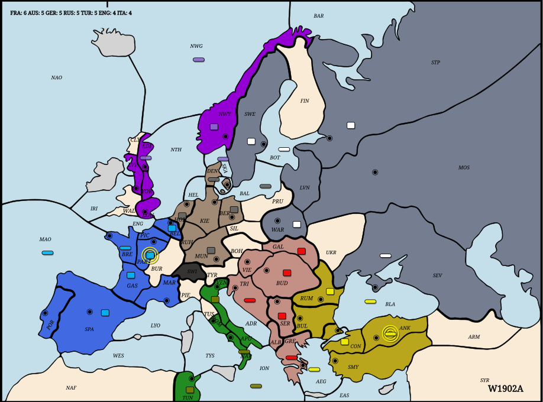

### What happened

- **FRANCE**: builds A PAR
- **TURKEY**: builds F ANK

### FRANCE
Orders: `A PAR B`

Reasoning

> I have 6 centers and 5 units, so I'm owed one build. My plan calls for positioning toward the eastern press on Russia via the Burgundy/Munich line, which means an army I can march east. F MAO and F BRE already cover the western approaches, so a fleet build adds little to my offensive plans. An army in Marseille can swing toward Burgundy/Switzerland line, but an army in Paris is better placed to push toward Burgundy and the German cooperation against Russia. I'll build an army in Paris.

### TURKEY
Orders: `F ANK B`

Reasoning

> I took Rumania this Fall, growing to 5 centers but no surplus — wait, I have 5 centers and 4 units (A CON, F BLA, F AEG, A RUM). That's one build owed. My priority is pressing Russia's Black Sea and Sevastopol while watching Austria. A fleet in ANK extends Black Sea power toward Sevastopol; an army in SMY can march east toward Armenia/the Russian flank. Given my eastern push, a fleet in ANK best supports continued Black Sea operations against Sevastopol and reinforces RUM's hold.

## SPRING 1903 MOVEMENT (`S1903M`)

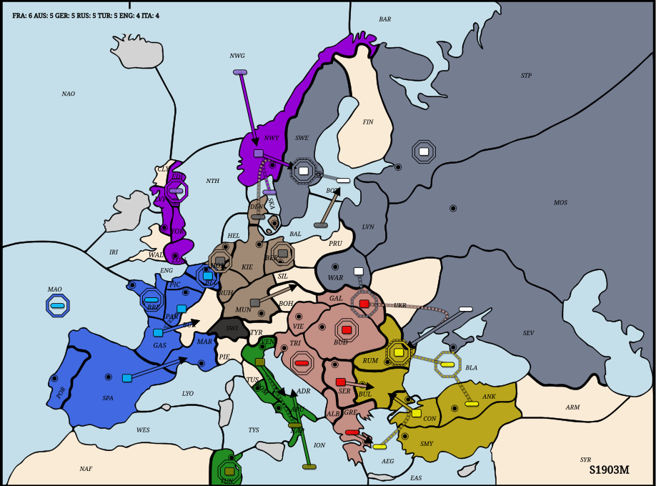

### What happened

- **AUSTRIA**: A GAL supports F SEV → RUM; A SER → BUL (bounced); F GRE → AEG (bounced); A BUD holds; F TRI holds
- **ENGLAND**: A NWY → SWE; F SKA supports A NWY → SWE; F NWG → NWY; F EDI holds
- **FRANCE**: A GAS → BUR; A PAR supports A GAS → BUR; A BEL holds; A SPA → MAR; F MAO holds; F BRE holds
- **GERMANY**: F BAL → BOT (bounced); F DEN supports A NWY → SWE; A MUN → SIL; A BER holds; A HOL holds
- **ITALY**: F ION → ADR; A VEN → APU; F NAP supports A VEN → APU; A TUN holds
- **RUSSIA**: F SEV → RUM (bounced); A WAR supports A GAL; A SWE holds; F BOT supports A SWE (support cut); A STP holds  [dislodged: A SWE]
- **TURKEY**: A RUM holds; F BLA supports A RUM; F ANK supports F BLA; A CON → BUL (bounced); F AEG supports A CON → BUL (support cut)

### Dialogue

- **AUSTRIA → TURKEY**: Rumania fell clean — good work. I'm pushing A GAL toward Warsaw this year to keep Russia bleeding south; keep your Black Sea fleet pointed at Sevastopol, not my Greece or the Aegean approaches, and we stay clean. Confirm BLA/RUM stay east and don't drift toward the straits near my Greek waters.
- **AUSTRIA → RUSSIA**: Turkey has Rumania and a Black Sea fleet now — exactly the overreach I warned of, and he'll turn it on both of us. I'm willing to ease Galicia pressure and point south at Turkey instead if you'll commit A WAR/SEV against Rumania rather than at me. Tell me concretely where your southern units move and we can flip on Turkey together.
- **AUSTRIA → GERMANY**: Keep the Baltic hammer falling on Russia — Sweden and Bothnia are where he bleeds. I'm holding Galicia forward to pin Warsaw so he can't shuffle fleets north against you. Our Bohemia/Tyrolia border stays quiet from me; press his north and we both grow off Russia.
- **AUSTRIA → ITALY**: DMZ holds firm from my side — F TRI stays home, F GRE on the eastern front, nothing toward Venice or the Ionian. On the Lepanto: Turkey just grabbed Rumania, so the real target is now his Bulgaria/Aegean, not my Greece — landing in GRE puts your army beside my units with no Turk to fight. Convoy toward the Aegean/Turkish coast instead and I'll back you in; keep ION clear this spring.
- **ENGLAND → GERMANY**: Time to finally crack Sweden. Clean line: I move A NWY - SWE with F SKA S A NWY - SWE (two on me), you send F BAL - BOT to cut Russia's Bothnia support, and add F DEN S A NWY - SWE. That's three vs his cut-off lone A SWE — it falls and I take it. Confirm BAL cuts BOT and DEN supports my army, not your own fleet into Sweden.
- **ENGLAND → FRANCE**: Channel stays a quiet DMZ as always — no English unit anywhere near it or Belgium, your eastern flank with me is completely clear. I'm throwing everything north at Russia's Sweden again this turn with German help. If it cracks I'll have momentum to press his northern centers; keep me posted if you put a fleet toward the Baltic via Germany as you floated.
- **ENGLAND → RUSSIA**: Germany is committing his Baltic fleet hard against your Bothnia this turn to cut your Sweden support — this is the aggression I warned you about. If you want to hold Sweden, you'll need to defend BOT itself, not just lean on it. My hands are full reacting to his fleets from the north.
- **FRANCE → GERMANY**: As agreed, I'm freeing a unit toward the eastern press — A Gas pushes to Burgundy this spring to stage toward Silesia/Munich-line for our Warsaw drive. Burgundy is just a staging point against Russia, nothing aimed at your Munich. Confirm you're still all-in on the Baltic so I commit cleanly. Do you want me aimed at Silesia or Warsaw next?
- **FRANCE → ENGLAND**: Belgium's banked and my fleets stay out of ENG and NTH as promised — your north stays clear from me all year. How's the Sweden/Norway line against Russia? If you still can't crack Sweden, I can route a fleet toward the Baltic via Germany to pin Russia's northern fleets while you break through.
- **FRANCE → ITALY**: Border stays frozen — nothing toward Piedmont or the Tyrrhenian, my forces face north and east. Watch Austria: he's at 5 and sitting on Greece/Trieste fleets. If he grabs more and runs ahead, flag me the turn you stab and I'll keep Marseille dead quiet so you commit fully east.
- **FRANCE → AUSTRIA**: We've never crossed swords and I'd like to keep it that way. Russia at 5 and Turkey at 5 are your real neighbors — I have no designs anywhere near your borders. If you want a quiet understanding while you handle the east, I'm happy to keep my Mediterranean fleets pointed away from the Adriatic.
- **GERMANY → ENGLAND**: Sweden keeps surviving on F BOT's support. This turn the clean line: I send F BAL - BOT to cut Russia's Bothnia support, you move A NWY - SWE backed by F SKA S A NWY - SWE — two on Sweden vs his now-unsupported army. You take Sweden, I keep cutting BOT. Confirm A NWY - SWE and F SKA supports it.
- **GERMANY → FRANCE**: Time to open the eastern press as we discussed. I'm moving A MUN - SIL this turn to pressure Russia's Prussia/Warsaw line. Slide a Burgundy/eastern unit toward Silesia/Munich support so we can drive Warsaw together next turn — Russia's collapsing south against Austria and can't hold both ends.
- **GERMANY → AUSTRIA**: Keep hammering Warsaw and Rumania — Russia's pinned. I'm pushing A MUN - SIL to threaten his Prussia/Warsaw line from the northwest while England and I finally crack Sweden. Press A GAL - WAR now and his whole northern position folds between us.
- **GERMANY → RUSSIA**: Last offer: pull F BOT back and I'll keep Prussia and Berlin entirely off you — focus everything south against Austria and Turkey, which is where you're bleeding. Refuse and England takes Sweden while I move on your Baltic line this turn. Your call.
- **ITALY → AUSTRIA**: Time for the real Lepanto. Turkey took Rumania, not you — you're at five and Turkey's the eastern giant now. I want to convoy A TUN east toward Greece/Aegean against Turkey THIS spring, but I need F GRE to move off Greece (toward AEG or ALB against Turkey) so I can land there with your support, not contest you. Confirm you'll vacate Greece and back my convoy into it, and I commit fully east against Turkey.
- **ITALY → TURKEY**: Austria grabbed nothing and Turkey now holds Rumania at five with the Black Sea locked — you're the one growing. I've honored our non-aggression two years running, but holding is losing for me. If Austria overreaches I'd rather wedge into Greece against him with you; tell me straight whether you're pivoting south onto Austria's Bulgaria-Serbia line or staying east on Russia, because that decides where my fleet goes.
- **ITALY → FRANCE**: Border stays frozen from me — nothing toward Piedmont or the Tyrrhenian this spring, my whole force commits east. Keep Marseille dead quiet and we both grow clean: I'm finally launching against the eastern powers and need my western flank locked. How's Belgium and Iberia settling for you?
- **RUSSIA → AUSTRIA**: Turkey broke the DMZ and grabbed my Rumania — exactly the overreach you warned of, and that fleet turns on Trieste next. Help me take it back: support my F SEV - RUM with A GAL or A SER, and I'll keep Galicia quiet and point everything at Turkey with you. We squeeze Turkey together or he eats us both piecemeal.
- **RUSSIA → TURKEY**: You took Rumania by breaking your own DMZ — that's a clean betrayal, and now Austria and I are both done trusting you. Hand RUM back and pull F BLA to ANK and there's still a southern deal to be had; keep it and you fight Austria's armies and my Sevastopol fleet on one front while Austria takes Serbia from the other.
- **RUSSIA → GERMANY**: You kept Denmark off Sweden and our border's the quietest on the board — I value that. Let's formalize it: eastern Baltic mine, Berlin/Kiel yours, neither pushes the other's home coast. My whole effort this year is south against Turkey, so the Baltic stays peaceful from me.
- **RUSSIA → ENGLAND**: North's been clean between us all game and I want it to stay that way — A SWE and F BOT stay oriented north, nothing toward Norway. My fleets are committed south against Turkey, who broke into my Black Sea, so I'm trusting Norway and the north to stay quiet on your side.
- **TURKEY → AUSTRIA**: Rumania fell — clean work. Now I drive on Sevastopol: F BLA supports A RUM into SEV this turn. To make it land, push A GAL on Warsaw or into UKR so Russia can't slide A WAR to defend SEV's flank. Bulgaria and the south stay mine; once SEV cracks Russia is finished in the east.
- **TURKEY → RUSSIA**: Rumania's gone and Sevastopol is next unless we talk. You're being squeezed between Austria's Galicia and my Black Sea — I have no interest in grinding you to dust for Vienna's benefit. Pull F SEV's defense and we can still arrange a border; dig in and you lose SEV and your last eastern footing while Austria takes Warsaw.
- **TURKEY → ITALY**: I cracked Rumania and I'm pressing Sevastopol now — fully east, still clear of the Aegean and your Med per our standing deal. Austria is at five and will jump if Russia folds; keep leaning on his Trieste fleet in the Adriatic so he can't pivot south onto my Bulgaria. Greece stays your lane if he overreaches.
- **AUSTRIA → RUSSIA**: Deal: I hold A GAL off Warsaw and point south — but I won't support F SEV - RUM blind. You drive F SEV - RUM yourself; I'll add A SER - BUL to threaten Turkey's Bulgaria and pull his attention off SEV. If you commit A WAR to defend SEV instead of eyeing Galicia, we squeeze Turkey together this turn.
- **AUSTRIA → ITALY**: I'll work the Lepanto, but I'm not vacating Greece to put your army on my center this turn — too fast. Instead: I move F GRE - AEG against Turkey's fleet, you convoy A TUN toward ALB or the Ionian to press his Balkan/Aegean flank, and I back your landing on a Turkish coast, not on GRE. Confirm ION goes east at Turkey, not into the Adriatic.
- **AUSTRIA → TURKEY**: I'll keep A GAL pinning Warsaw for you this turn as cover — but understand your Black Sea fleet near my Greek waters makes me nervous. Keep F BLA on SEV and RUM east; if it drifts toward the straits or AEG I read it as a move on me and I flip. Take Sevastopol and we stay clean.
- **AUSTRIA → GERMANY**: Keep cracking Sweden and push A MUN - SIL on his Prussia/Warsaw line — I'm holding Galicia forward so Russia can't shuffle north. Bohemia/Tyrolia stays quiet from me. The faster his north folds, the faster we both feed.
- **ENGLAND → GERMANY**: Locked: I order A NWY - SWE with F SKA S A NWY - SWE, you send F BAL - BOT to cut Russia's Bothnia support. With BOT cut, my two beats his lone army and Sweden is mine. Critical — make sure BAL goes to BOT (cutting the support), not to SWE, or my army bounces. Confirm BAL - BOT this turn.
- **ENGLAND → FRANCE**: North line is set — Germany cuts Russia's Bothnia, I take Sweden with two units. If it lands I'll have a fifth center and real momentum against Russia's north. A Baltic fleet from you via Germany next year would pin his Bothnia/Prussia and let me drive toward STP; pencil that in for 1904.
- **ENGLAND → RUSSIA**: Final warning: Germany's F BAL is moving to BOT this turn to strip your Sweden support. I'm watching from the north as always, but his fleets are out of my reach. If you want any chance at Sweden you must defend BOT directly — leaning on it won't be enough once it's attacked.
- **FRANCE → GERMANY**: Good — you take SIL, I stage A Gas to Burgundy this turn pointed at the Silesia/Warsaw line, not your Munich. Next turn I can support your drive on Warsaw directly. Confirm Munich is empty after your SIL move so Burgundy and Munich don't read as a bounce, and tell me whether you want my next unit at Silesia or backing Prussia.
- **FRANCE → ENGLAND**: Sweden's been a wall for you two years running — if it holds again, I'll commit a fleet toward the Baltic via Germany next year to pin Russia's northern fleets while you break through. Keep your north pointed at Sweden; my Channel stays empty all year as always.
- **FRANCE → ITALY**: Border stays frozen, Marseille dead quiet — commit fully east, your western flank is locked. If Austria grabs Rumania-side centers and runs ahead, flag me the turn you turn on him and I'll keep my whole western line still so you can throw everything at the Adriatic.
- **GERMANY → ENGLAND**: Locked: I send F BAL - BOT to cut Russia's Bothnia support and add F DEN S A NWY - SWE. You move A NWY - SWE with F SKA S A NWY - SWE — three on his cut-off army, Sweden falls to you. I take the Baltic foothold at Bothnia and we both squeeze his north next year.
- **GERMANY → FRANCE**: Aim at Silesia. I'm moving A MUN - SIL this turn to threaten Prussia/Warsaw; you bring A BUR toward Munich-line to backfill and support my Silesia hold next turn, then we drive Warsaw together. Confirm Burgundy stays a staging point and nothing touches Munich.
- **GERMANY → AUSTRIA**: I'm cracking Sweden with England and pushing A MUN - SIL on Russia's Prussia/Warsaw line. Press A GAL - WAR now — with his fleets pinned in the Baltic he can't hold Warsaw against both of us.
- **GERMANY → RUSSIA**: Your call's made for you — England takes Sweden three-on-one this turn whatever you do, since BOT's support gets cut. Pull A WAR's weight south and salvage your Black Sea position; the Baltic's already lost this year.
- **ITALY → TURKEY**: Concrete proposal: you're growing east while Austria sits on Greece blocking my only expansion. I'd rather turn on Austria with you than keep holding. If you push F AEG to support my convoyed army into GRE next turn — or pin his F GRE so it can't defend — I'll commit my whole fleet stack against his Greece/Adriatic line. Tell me if you'll back a Greece landing against Austria, and I move now to set it up.
- **ITALY → AUSTRIA**: Straight talk: you keep telling me to convoy 'toward the Aegean' but that lands me beside Turkey's fleets with no Austrian support and Greece still yours — that's not a Lepanto, that's me throwing units away for your benefit. If the deal is real, support my convoyed army INTO a Turkish center next spring with F GRE actively. Otherwise I read your Greece-holding as blocking me, and Greece becomes my target, not Turkey's.
- **ITALY → FRANCE**: Noted and locked — my full force commits east this spring. If Austria keeps blocking my expansion in Greece I may wedge against him directly within a turn or two; when I do I'll flag you so you keep Marseille frozen. Keep your Piedmont/Tyrrhenian border dead quiet and I'll never need to look west.
- **RUSSIA → AUSTRIA**: Deal. F SEV moves to RUM this turn — support it with A GAL - RUM or A SER - RUM and we take it back together. I'll keep A WAR off Galicia entirely so you can swing south freely. Confirm which unit backs the RUM attack so I don't waste F SEV.
- **RUSSIA → GERMANY**: I'm honoring the Baltic deal — nothing toward Berlin, Kiel, or Prussia from me. But I won't gift you Sweden by pulling F BOT; if you attack BOT you make a permanent enemy of the neighbor keeping your east calm while England circles your north. Keep Denmark and your Baltic fleet off me and our border stays the quietest on the board while I bleed Turkey.
- **RUSSIA → ENGLAND**: If Germany really moves his Baltic fleet on my Bothnia, that's him overextending alone — and his north opens up for you. Stay off Norway and Sweden and let him stretch; I keep everything pointed south at Turkey and Austria stays quiet on my eastern border. A peaceful north costs you nothing and traps Germany.
- **RUSSIA → TURKEY**: Austria has already agreed to back my retake of Rumania — you're now facing my Sevastopol fleet from the east and Austrian armies from the west on one front. Hand RUM back and pull F BLA to ANK and there's still a border to draw; dig in and you spend this turn defending while Austria eats Serbia behind you.
- **TURKEY → AUSTRIA**: I'm committing A RUM - SEV with F BLA S A RUM - SEV this turn. To land it, push A GAL into UKR or onto Warsaw so Russia's A WAR can't slide to defend Sevastopol. Confirm GAL pins west and Sevastopol cracks — Bulgaria and the straits stay clear of your Greece.
- **TURKEY → ITALY**: Straight answer: I'm staying east on Sevastopol this turn, not pivoting onto Austria yet. But Austria's A GAL push means if Russia folds, Austria takes Warsaw and jumps — that's when I turn south with you. Move F ION toward the Adriatic and lean on his Trieste fleet now so he can't capitalize, and Greece is your wedge the moment he overreaches.
- **TURKEY → RUSSIA**: I'm pressing SEV this turn — but I meant the southern offer. Pull F SEV off the Black Sea approach and I'll hold at Rumania rather than grind into Sevastopol, and we both turn on Austria's Galicia before he takes Warsaw from you. Dig in and you lose SEV to me and Warsaw to Austria the same year.
- **AUSTRIA → RUSSIA**: Committed: A GAL S F SEV - RUM. You drive F SEV - RUM and we take it back together this turn. Keep A WAR off Galicia as promised and point it south; I'm flipping fully on Turkey with you now.
- **AUSTRIA → TURKEY**: You overreached for Sevastopol and that fleet was always coming for my Greek waters next. I'm not pinning Warsaw for you — A GAL backs Russia retaking Rumania and A SER threatens your Bulgaria. Pull F BLA back to defend or lose ground on two fronts.
- **AUSTRIA → ITALY**: Real Lepanto, now: I move F GRE - AEG against Turkey's fleet and A SER threatens BUL. Convoy A TUN toward the Ionian/Aegean against Turkey this spring and I back your landing on a Turkish coast next turn — Greece stays the anchor, not your target. ION goes east, not Adriatic.
- **AUSTRIA → GERMANY**: I'm flipping south against Turkey this turn — A GAL backs Russia retaking Rumania, not pinning Warsaw. Keep cracking Sweden and push A MUN - SIL; Russia's now squeezed between your Baltic and my Balkan pressure on Turkey. Bohemia/Tyrolia stays quiet from me.
- **ENGLAND → GERMANY**: Final lock: I order A NWY - SWE and F SKA S A NWY - SWE. You send F BAL - BOT to cut Russia's Bothnia support AND F DEN S A NWY - SWE. With BOT cut and DEN backing my army, Sweden falls clean and I bank a fifth center. Critical: BAL must go to BOT, not SWE, or my army bounces against your own fleet.
- **ENGLAND → FRANCE**: Channel stays empty from me all year as always — your eastern flank is clear. I'm cracking Sweden this turn with German support; if it lands I'll have momentum north against Russia. Pencil in that Baltic fleet via Germany for 1904 to pin Russia's Bothnia while I drive on STP.
- **FRANCE → GERMANY**: Locked: A GAS - BUR this turn as a staging point, nothing touches Munich, no support cut on your SIL move. Confirm A MUN - SIL lands so Burgundy stages clean. Next turn I bring Burgundy toward Silesia to back your hold, then we drive Warsaw together.
- **FRANCE → ENGLAND**: Final: my fleets stay out of ENG and NTH all year, A BEL holds Belgium, nothing near your north. Break Sweden with Germany cutting Bothnia — if it holds again, I'll route a Baltic fleet via Germany in 1904 to pin Russia while you push STP.
- **FRANCE → ITALY**: Confirmed: Marseille stays dead quiet, A SPA shifts to MAR only to free a build, nothing toward Piedmont or the Tyrrhenian. Commit fully east — flag me the turn you turn on Austria and my whole western line stays frozen for you.
- **GERMANY → ENGLAND**: Locked: F BAL - BOT cuts Russia's Bothnia support, F DEN S A NWY - SWE for extra weight. You move A NWY - SWE with F SKA S A NWY - SWE — three on his cut-off army, Sweden is yours. Confirmed on my side, executing now.
- **GERMANY → FRANCE**: Locked: A MUN - SIL this turn, Munich vacated so Burgundy and Munich don't read as a bounce. You stage A GAS - BUR pointed at Silesia/Warsaw, nothing toward Munich. Next turn we drive Warsaw together with your Burgundy unit backing my Silesia hold.
- **GERMANY → AUSTRIA**: Executing: A MUN - SIL on Russia's Prussia/Warsaw line while England and I crack Sweden. Press A GAL - WAR now — with his fleets pinned defending the Baltic, Warsaw folds between us. Bohemia/Tyrolia stays quiet from me.
- **GERMANY → RUSSIA**: Baltic border toward Berlin/Kiel/Prussia stays quiet from me as agreed — I'm not pushing your home coast. Focus your defense south against Turkey, that's where you're bleeding most.
- **ITALY → TURKEY**: I'm moving F ION to ADR this spring to lean on Austria's Trieste as you asked — that's my commitment. In return, next turn when Russia is folding and you pivot south, I expect F AEG to pin or hit Austria's F GRE so my convoyed army can land in Greece. Confirm and I'll have my fleet stack ready in the Adriatic to crack his line with you.
- **ITALY → AUSTRIA**: Straight: you won't vacate Greece and won't support my landing, so I'm done sitting. F ION moves to the Adriatic this spring — call it leaning on Russia's enemies if you like, but understand it's parked beside your Trieste. Vacate Greece next turn and back a real landing, or I treat your fleets as my expansion lane.
- **ITALY → FRANCE**: Locked: my whole force commits east/Adriatic this spring, nothing toward Piedmont or Tyrrhenian. Austria sits on Greece blocking me, so I'm pressing his Adriatic flank now and may wedge against him outright within a turn. Keep Marseille dead quiet and I'll never look west.
- **RUSSIA → AUSTRIA**: Concrete: I drive F SEV - RUM and keep A WAR off Galicia entirely. But F SEV alone bounces Turkey's A RUM — I need A GAL - RUM to actually support my attack, not just A SER - BUL as a distraction. Order A GAL S F SEV - RUM and we take Rumania back this turn; A SER - BUL on top to pin his Bulgaria is a bonus. Confirm A GAL backs RUM.
- **RUSSIA → GERMANY**: I'm keeping the border quiet — nothing toward Berlin, Kiel, or Prussia, my whole effort is south. F BOT stays put supporting Sweden; if you attack it you spend your Baltic fleet to make a permanent enemy while England circles your north. Leave BOT and Denmark alone and our border stays the calmest on the board.
- **RUSSIA → TURKEY**: Austria is supporting my F SEV - RUM into Rumania this turn — you're facing my fleet from the east and his army from the west on one front while A SER hits your Bulgaria. Hand RUM back now and pull F BLA to ANK and there's still a border to draw; dig in and you lose the turn defending both flanks.
- **RUSSIA → ENGLAND**: If Germany throws F BAL at my Bothnia he overextends alone and his north opens for you — stay off Norway and Sweden and let him stretch. My fleets stay south; the north stays clean from me. A quiet north costs you nothing and traps Germany between us.
- **TURKEY → AUSTRIA**: Final: I drive A RUM - SEV with F BLA S A RUM - SEV this turn. Push A GAL into UKR so A WAR can't slide to defend Sevastopol — that's what makes it crack. F BLA and RUM stay east, nowhere near Greece or the Aegean. Confirm GAL hits UKR and Sevastopol falls clean.
- **TURKEY → ITALY**: I'm east on Sevastopol this turn, but the moment Russia folds Austria jumps and that's when I pivot south with you. Move F ION toward the Adriatic now and lean on his Trieste fleet so he can't capitalize — next year I'll throw F AEG behind your Greece landing. Set it up; I'll be ready to pin F GRE when you commit.

### AUSTRIA
Orders: `A GAL S F SEV - RUM` · `A SER - BUL` · `F GRE - AEG` · `A BUD H` · `F TRI H`

Reasoning

> I'm flipping fully on Turkey with Russia this turn, per my committed plan. A GAL supports F SEV into RUM to help Russia retake it. A SER moves to BUL to threaten Turkey's center. F GRE moves to AEG to confront the Turkish fleet. A BUD holds to backstop Galicia. F TRI holds to cover my Adriatic flank against Italy's ION incursion.
>
> One concern: Italy moved F ION toward the Adriatic, so F TRI staying home is the right defensive call. A SER - BUL leaves Serbia, but A BUD backstops the region and A GAL anchors Galicia.

### ENGLAND
Orders: `A NWY - SWE` · `F SKA S A NWY - SWE` · `F NWG - NWY` · `F EDI H`

Reasoning

> Germany is committing F BAL → BOT to cut Russia's Bothnia support and F DEN to support my army. My plan: A NWY → SWE with F SKA supporting that attack, and F NWG supporting the army in Norway as backfill. F EDI holds to anchor my Winter build.
>
> With BOT cut, Russia's A SWE loses its F BOT support. My A NWY (1) + F SKA support (1) + German F DEN support (1) = 3 against a now-unsupported A SWE. Sweden falls.

### FRANCE
Orders: `A GAS - BUR` · `A PAR S A GAS - BUR` · `A BEL H` · `A SPA - MAR` · `F MAO H` · `F BRE H`

Reasoning

> Executing the agreed plan: A GAS to Burgundy as the staging point for the Warsaw drive with Germany, A PAR backing Burgundy, A BEL holds Belgium, A SPA to Marseille to free a build slot, F MAO and F BRE guard the Atlantic. Germany vacates Munich for SIL so Burgundy stages clean without a bounce.

### GERMANY
Orders: `F BAL - BOT` · `F DEN S A NWY - SWE` · `A MUN - SIL` · `A BER H` · `A HOL H`

Reasoning

> Executing my locked plan: F BAL cuts Russia's Bothnia support so England takes Sweden, F DEN adds weight to the Sweden attack, A MUN drives into Silesia to threaten Prussia/Warsaw with France staging Burgundy behind me, and A BER holds to keep Kiel open for a Winter build. A HOL stays defensive.

### ITALY
Orders: `F ION - ADR` · `A VEN - APU` · `F NAP S A VEN - APU` · `A TUN H`

Reasoning

> Executing my revised plan: park beside Austria's Trieste flank, ready a Balkan convoy threat, keep central reserves intact.
>
> F ION moves to ADR to lean on Trieste as promised to Turkey. A VEN to APU readies a convoy toward the Balkans. F NAP supports F ION's move into ADR (NAP is not adjacent to ADR though — check). NAP adjacency: APU, ION, ROM, TYS. Not adjacent to ADR, so can't support that. Instead F NAP holds to cover home and Ionian approaches; A TUN holds in central Med reserve.
>
> Let me verify F NAP options — it can support A VEN - APU. That secures Apulia firmly and keeps the convoy staging strong. Better use than holding.

### RUSSIA
Orders: `F SEV - RUM` · `A WAR S A GAL` · `A SWE H` · `F BOT S A SWE` · `A STP H`

Reasoning

> Austria has confirmed A GAL S F SEV - RUM. I drive F SEV into Rumania with that support, retaking my lost center. I keep A WAR off Galicia (defending toward home/Galicia defense as promised). In the north, F BOT holds supporting A SWE in Sweden, and A STP anchors home. F SEV needs to beat Turkey's A RUM (1 defense, possibly +1 from F BLA support). With Austrian A GAL support, my attack is 2 strength; if Turkey supports RUM's hold via F BLA it becomes 2 defense and bounces — but A SER - BUL should pin Bulgaria. I'll commit the attack.
>
> For A WAR, supporting A GAL's hold protects the supporter from being cut and keeps my coalition action solid — but A GAL is moving... no, A GAL is supporting, staying in place. I'll support A GAL to keep it from being dislodged/cut, since Turkey or anyone hitting GAL would break my RUM retake. A WAR S A GAL.

### TURKEY
Orders: `A RUM H` · `F BLA S A RUM` · `F ANK S F BLA` · `A CON - BUL` · `F AEG S A CON - BUL`

Reasoning

> Austria has flipped and is backing Russia's retake of Rumania (F SEV - RUM) while A SER threatens Bulgaria. I must consolidate east and defend Rumania. F SEV - RUM is the immediate threat; I anchor A RUM with F BLA supporting its hold, and F ANK supports F BLA to keep the Black Sea locked. A CON covers Bulgaria approach, F AEG defends south near Bulgaria.
>
> Russia's likely move: F SEV - RUM. A RUM holds with F BLA support = strength 2 defense, beating a single F SEV attack. Austria could support Russia's move but A GAL/A SER can't reach RUM's destination for support unless adjacent — GAL and SER both border RUM, so they could support F SEV - RUM, making it strength 3. With F BLA supporting my hold I have defense 2; that's not enough against 3 attackers. But A CON can't reach RUM. I'll add maximum defense: F BLA S A RUM, F ANK can't support RUM (not adjacent). Best I can do is anchor and hope Austria doesn't fully commit. I'll also guard Bulgaria with A CON - BUL to secure that center and deny A SER.
>
> Actually, securing Bulgaria (mine, threatened by A SER) is critical. A CON - BUL takes/holds it. F AEG S A CON - BUL backs that. F BLA S A RUM anchors Rumania. F ANK S F BLA to keep Black Sea. A RUM holds.

## SPRING 1903 RETREATS (`S1903R`)

### What happened

- **RUSSIA**: A SWE retreats → FIN

### RUSSIA
Orders: `A SWE R FIN`

Reasoning

> A SWE was dislodged. Sweden is lost to England this Fall regardless. Retreating A SWE to FIN keeps the unit alive and adjacent to STP/Bothnia, preserving force in the north rather than throwing it away.

## FALL 1903 MOVEMENT (`F1903M`)

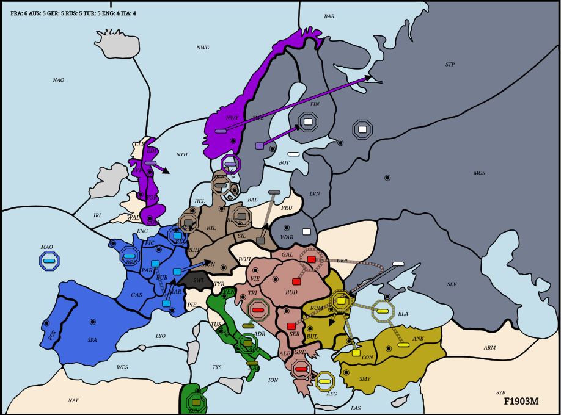

### What happened

- **AUSTRIA**: A GAL supports F SEV → RUM; A SER supports F SEV → RUM; A BUD supports A GAL; F TRI holds; F GRE holds
- **ENGLAND**: F NWY → STP/NC (bounced); A SWE → FIN (bounced); F SKA holds; F EDI → NTH
- **FRANCE**: A BUR → MUN; A MAR → BUR; A PAR supports A MAR → BUR; A BEL holds; F MAO holds; F BRE holds
- **GERMANY**: A SIL → PRU; F BAL supports A SIL → PRU; A BER holds; F DEN holds; A HOL holds
- **ITALY**: F ADR supports F TRI; A APU holds; A TUN holds
- **RUSSIA**: F SEV → RUM; A FIN holds; A STP holds
- **TURKEY**: A RUM holds; F BLA supports A RUM; F ANK supports F BLA; A CON supports A RUM → BUL (void); F AEG holds  [dislodged: A RUM]

### Dialogue

- **AUSTRIA → ITALY**: F ADR beside Trieste is a stab posture, not a Lepanto. I won't vacate Greece while your fleet sits there. If you actually want east, pull ADR back and convoy A APU at a Turkish coast — I'll support a landing on BUL/SC or the Aegean. Otherwise Trieste is walled and you gain nothing.
- **AUSTRIA → RUSSIA**: Turkey still holds Rumania — let's finish it. You drive F SEV - RUM again and I'll commit A GAL S F SEV - RUM plus A SER - BUL to pull Turkey's Bulgaria support off. Keep A WAR off Galicia and we crack Rumania this Fall.
- **AUSTRIA → TURKEY**: Your push on Sevastopol failed and I've flipped — A GAL backs Russia's retake of Rumania and A SER pressures Bulgaria. Pull F BLA back to defend RUM or lose it. We can still avoid a full war if you keep BLA/AEG off my Greek waters.
- **AUSTRIA → GERMANY**: Keep the Baltic hammer on Russia's Sweden/Bothnia and push SIL on Warsaw. I'm pressing Turkey in the south with Russia now, so Russia's caught between us. Bohemia/Tyrolia stays quiet from me — feed off his north while I work the Balkans.
- **ENGLAND → GERMANY**: Sweden's banked — thanks for cutting Bothnia, the squeeze worked. Now let's take STP off Russia: I'll push F NWY - STP/NC and want your F BAL to hit BOT again so his F BOT can't support a defense. If you keep cutting his Baltic fleets, his north collapses and we both grow. Confirm BAL pressures BOT this fall.
- **ENGLAND → FRANCE**: Channel stays empty from me all year as always — your eastern flank is clear. I cracked Sweden and now I'm driving on St. Petersburg this fall with Germany pinning Russia's Baltic. That Baltic fleet you floated via Germany for 1904 would seal Russia's north — pencil it in, the door's wide open now.
- **ENGLAND → RUSSIA**: Germany overextended into your Bothnia just as I said, and his fleets are committed in the Baltic. I've stayed off your home centers all game — if you keep your remaining strength pointed at Germany and Turkey, I won't drive your northern coast. Your real threat is Germany's Baltic push, not me.
- **FRANCE → GERMANY**: Ready to drive Warsaw with you. Before I commit A BUR toward Silesia to back your hold, confirm SIL is firm and Munich's still vacated so my move doesn't read as a bounce into your own line. Is Russia pressing your SIL from Warsaw this turn, or is Prussia the soft target?
- **FRANCE → ENGLAND**: Channel stays empty from me all year as always. How did Sweden go — did it crack with German help? If it held again I'll pencil that Baltic fleet via Germany for 1904 to pin Russia's Bothnia while you push STP.
- **FRANCE → ITALY**: Marseille stays dead quiet, nothing toward Piedmont or the Tyrrhenian — your western flank is locked. Flag me the turn you wedge against Austria and my whole western line freezes for you. How's the Adriatic pressure landing on Trieste?
- **GERMANY → FRANCE**: Now's the time — I'm taking Prussia from Russia this turn with A SIL - PRU backed by my Baltic fleet. Bring A BUR toward Munich/Silesia to backfill behind me so next turn we drive Warsaw together. Confirm nothing crosses into Munich so my home center stays open for a Winter build.
- **GERMANY → ENGLAND**: Sweden's banked for you — well done. I'm pivoting to grab Prussia off Russia this Fall. Keep your fleets oriented north and we both keep feeding off his collapse; I'd rather we stay partners in the Baltic than turn on each other while Russia's still breathing.
- **GERMANY → AUSTRIA**: Press Warsaw and the Galician line hard now — I'm seizing Prussia this turn, so Russia's pinned north and west at once. With his fleets stuck in the Baltic and you and France hammering Warsaw, his eastern position folds fast. Bohemia/Tyrolia stays quiet from me.
- **GERMANY → RUSSIA**: Border toward your home coast stays as discussed — I'm not pushing Berlin or Kiel. Keep focusing south against Turkey where you're bleeding; the calm on our shared front holds from my side.
- **ITALY → TURKEY**: Russia is folding and Austria's about to grab Warsaw and jump — this is the pivot turn you promised. I've parked F ADR beside Trieste and A APU is loaded for a convoy. If you move F AEG to ION/GRE waters to pin or hit Austria's F GRE this turn, I land on his Balkan coast and we crack his southern line together NOW. Commit F AEG against Greece and I throw my whole stack at his Adriatic flank.
- **ITALY → AUSTRIA**: I'm still beside your Trieste, but I'd rather grow east than fight you. Last chance for the real Lepanto: this fall move F GRE off Greece toward AEG against Turkey and support my convoyed A APU landing on the Balkan coast — and I commit F ADR and F NAP fully against Turkey's flank, not yours. If you hold Greece and keep F TRI pointed at me again, I read it as a block and Trieste becomes my target.
- **ITALY → FRANCE**: Border stays frozen from me — nothing toward Piedmont or the Tyrrhenian, my whole stack is committed to the Adriatic. Austria's at five and blocking my only expansion in Greece, so I may wedge against him directly this turn. Keep Marseille dead quiet and my western flank stays a non-issue for you.
- **RUSSIA → AUSTRIA**: Turkey's RUM is held hard — F BLA supports A RUM directly, so F SEV + your A GAL alone only ties it. To actually break it I need you to also cut Turkey's support: order A SER - BUL or A BUD - GAL is wrong; instead order A SER - RUM so we have TWO supports on my F SEV - RUM. With A GAL S F SEV - RUM and A SER S F SEV - RUM that's strength 3 vs his 2 and RUM falls. Confirm both supports and we take it this turn.
- **RUSSIA → TURKEY**: Last offer before I commit fully with Austria against you: hand RUM back and pull F BLA to ANK, and I'll draw a real Black Sea border with you and point at Austria instead. Dig in and you face F SEV plus two Austrian armies on RUM while A SER threatens BUL — you spend the turn defending both flanks and gain nothing.
- **RUSSIA → GERMANY**: Border stays quiet from me — nothing toward Berlin, Kiel, or Prussia. My whole effort is south against Turkey this turn. Keep your Baltic fleet off BOT and Denmark off me, and ours stays the calmest border on the board while England circles your north.
- **RUSSIA → ENGLAND**: North stays clean from me — F BOT and A FIN orient toward home and the Baltic, nothing toward Norway or Sweden. My fleets are committed south against Turkey. A quiet north costs you nothing; if Germany overstretches at me in the Baltic, his north opens for you.
- **TURKEY → ITALY**: Now's the moment — Austria flipped and is backing Russia's retake of Rumania while A SER threatens my Bulgaria. I'm pivoting south with you: keep F ADR pressing Trieste and commit your stack against his Greece-Serbia line. Tell me exactly when you convoy into Greece and I'll throw F AEG behind it to pin or hit F GRE. Two fronts cracks Austria open.
- **TURKEY → RUSSIA**: Austria is using both of us — he backs your RUM retake now but he's the one positioned to take Warsaw and grow while we bleed each other. I'm anchoring Rumania this turn, but the real southern deal still stands: if you stop feeding Austria's plan and point F SEV/A WAR at Galicia, I'll hold east and we both turn on Vienna's line. Austria eats your Warsaw the moment you're spent on me.
- **TURKEY → AUSTRIA**: You flipped to back Russia, but think it through: if Russia retakes Rumania you've spent your supports rebuilding the power that crowded you for years, and Italy's fleet is already in the Adriatic on your Trieste. I'm anchoring Rumania hard this turn — you won't crack it. Better to keep A GAL on Warsaw and split Russia with me than hand him back his footing while Italy leans on your west.
- **TURKEY → GERMANY**: Russia is overextended in the south fighting me while England sits on his Sweden and Norway. You've got A SIL and F BAL idle against a Russia that can't defend two fronts — Warsaw and the Baltic are open if you press now. I'm keeping Russia's eastern fleets pinned in the Black Sea; that's your window.
- **AUSTRIA → RUSSIA**: Locked: A GAL S F SEV - RUM and A SER S F SEV - RUM — that's strength 3 vs Turkey's 2, Rumania falls. You MUST drive F SEV - RUM this turn and keep A WAR off Galicia. Confirm F SEV moves on RUM and we take it back clean.
- **AUSTRIA → ITALY**: Your F ADR beside Trieste is noted — I'm holding F TRI with A BUD backing it, so a convoyed A APU bounces and you gain nothing. I'm spending my real force breaking Turkey's Rumania this turn with Russia. Pull ADR back and convoy A APU at a Turkish coast and I'll back a genuine landing next spring; keep leaning on Trieste and you waste your army.
- **AUSTRIA → TURKEY**: You overreached and I've flipped — F SEV with my two supports breaks your Rumania this turn. Defend it or lose it. Keep F BLA and the straits clear of my Greek waters and we can still avoid a wider war once RUM is settled.
- **AUSTRIA → GERMANY**: Keep the Baltic hammer on Sweden/Bothnia and push SIL on Warsaw — Russia's pinned north while I crack Turkey's Rumania in the south. Bohemia/Tyrolia stays quiet from me; feed off his north while I work the Balkans.
- **ENGLAND → GERMANY**: Sweden's banked. Now the STP play: send F BAL - BOT again this Fall to pin Russia's F BOT so it can't defend STP, and I'll move A SWE - FIN to set up a two-pronged drive on St. Petersburg in 1904 (FIN + a fleet via Barents). Confirm BAL hits BOT and we keep collapsing his north together.
- **ENGLAND → FRANCE**: Channel stays empty from me all year as always. Sweden cracked clean with German help and I'm now advancing into Finland to set up the St. Petersburg assault. That Baltic fleet via Germany for 1904 is exactly what seals Russia's north — lock it in and we both feed off the collapse.
- **ENGLAND → RUSSIA**: I've stayed off your home coasts all game and Germany is the one tearing into your Baltic. Keep your strength pointed at him and Turkey; I'm not the one stabbing your home centers. If you want, orient F BOT and A FIN at Germany's overstretch and I'll keep my distance from your core.
- **FRANCE → GERMANY**: Confirmed—A BUR moves to back your Silesia line as agreed and Munich stays open for your Winter build. Take Prussia clean; next turn we drive Warsaw together with my Burgundy unit anchoring your hold. Push hard, your west is dead quiet.
- **FRANCE → ENGLAND**: Sweden cracked—good. Pencil that Baltic fleet via Germany for 1904 firmly; I'll have the build for it. Drive STP hard this fall while Russia's split; your eastern flank with me stays clear as always.
- **GERMANY → FRANCE**: Executing A SIL - PRU this Fall with F BAL S A SIL - PRU to grab Prussia off Russia. Bring A BUR to MUN to backfill behind me so next turn we drive WAR together — your BUR backing my future SIL/PRU hold. Confirm BUR - MUN so my home line stays solid and nothing reads as a bounce.
- **GERMANY → ENGLAND**: I'm grabbing Prussia off Russia this turn with my Baltic fleet backing the SIL push, so BAL supports PRU rather than hitting BOT — but that still pins Russia's north for you. Push F NWY - STP/NC; his BOT can't defend STP and cut my Prussia grab both. We keep growing off his collapse as partners.
- **GERMANY → AUSTRIA**: I'm taking Prussia this turn — Russia's pinned northwest. Keep the pressure south; the faster his position folds the more we both feed. Bohemia/Tyrolia stays quiet from me as always.
- **GERMANY → RUSSIA**: Be straight: I'm taking Prussia this turn. You wouldn't pull BOT, so I take the center I can reach. Berlin and Kiel stay off-limits from me — keep your fleets south and we don't escalate beyond Prussia.
- **ITALY → TURKEY**: Straight deal: this fall I park F ADR on Trieste's flank and ready A APU. Next turn the moment your F AEG moves to pin or hit F GRE, I convoy A APU into Greece and we crack Austria's south together. Confirm F AEG commits against GRE in Fall's successor and I hold my whole stack in the Adriatic ready — if you stall again I'll cut a separate deal with Austria.
- **ITALY → AUSTRIA**: I'm still beside Trieste and could take it, but I'd rather you pay me to look elsewhere. Concrete offer: support my A APU convoy into a Turkish coast THIS turn with F GRE actively, or hand me a clear lane — otherwise F ADR and A APU stay aimed at Trieste and I read your silence as a wall I'll test.
- **ITALY → FRANCE**: Border stays frozen from me — nothing toward Piedmont or Tyrrhenian. I'm committed to the Adriatic this fall and likely wedging against Austria within a turn; keep Marseille dead quiet and your eastern neighbor stays my whole focus.
- **RUSSIA → AUSTRIA**: Math check: Turkey's A RUM is supported by F BLA, so F SEV + your A GAL is only strength 2 vs his 2 — we bounce and gain nothing. To actually take RUM I need a SECOND support: order A SER S F SEV - RUM (not A SER - BUL). With A GAL S F SEV - RUM and A SER S F SEV - RUM that's 3 vs 2 and RUM falls. Confirm BOTH supports or I keep F SEV home to defend SEV instead of wasting it.
- **RUSSIA → GERMANY**: Keep BAL and Denmark off me this Fall and the border stays the quietest on the board — I'm committing south against Turkey. If you leave my Baltic line alone I keep MOS open for a Winter build, nothing pointed at Berlin or Kiel.
- **RUSSIA → ENGLAND**: You hold Sweden now and I'm not contesting it — north stays clean from me, F BOT and A FIN orient home. My whole effort is south on Turkey; if Germany throws his Baltic fleet at me again, his north opens for you to push Denmark.
- **TURKEY → ITALY**: Commit confirmed: this Fall I anchor Rumania, and the moment your convoy lands I throw F AEG against Greece. If you convoy A APU - GRE next turn, F AEG pins or hits F GRE to clear your landing. Keep F ADR on Trieste so his F GRE can't reinforce — once Greece falls, his southern line breaks and we split his centers, Serbia and Greece your lane.
- **TURKEY → RUSSIA**: You and I both lose if Austria takes Warsaw while we grind. I'm not handing RUM back, but I'll stop pressing Sevastopol entirely — F BLA stays defensive, not on your SEV. Point A WAR and F SEV at Galicia and Austria instead of me; he's the one eating your home centers, and Italy is already on his Trieste.
- **TURKEY → AUSTRIA**: You're backing Russia's RUM retake while Italy's fleet sits on your Trieste and is loading a Greece convoy. Spend your supports rebuilding Russia and you'll be defending Greece and Trieste at once. RUM is anchored four-deep this turn — you won't crack it; better to keep GAL on Warsaw than waste the phase.
- **AUSTRIA → RUSSIA**: Committed: A GAL S F SEV - RUM and A SER S F SEV - RUM — strength 3 vs Turkey's 2, Rumania falls. You MUST drive F SEV - RUM this turn and keep A WAR off Galicia. Confirm F SEV moves on RUM.
- **AUSTRIA → ITALY**: F TRI holds with A BUD supporting its hold — your A APU convoy bounces and gains nothing this turn. I'm spending GAL/SER breaking Turkey's Rumania with Russia, exactly the eastern pressure you wanted. Pull F ADR back and convoy A APU at a Turkish coast next spring and I'll back a real landing; lean on Trieste and you waste your army against a wall.
- **AUSTRIA → TURKEY**: Your Rumania breaks this turn — F SEV with my two supports is 3 vs your 2. Defend it or lose it. Keep F BLA and the straits clear of my Greek waters and we can still settle the south without a wider war once RUM falls.
- **AUSTRIA → GERMANY**: Keep the Baltic hammer on Sweden/Bothnia and push SIL — I'm cracking Turkey's Rumania with Russia this turn, so Russia stays squeezed between us. Bohemia/Tyrolia stays quiet from me as always.
- **ENGLAND → GERMANY**: Executing F NWY - STP/NC and A SWE - FIN to two-prong St. Petersburg. Since your BAL backs PRU not BOT this turn, keep Russia's F BOT pinned next turn so my Finland+Barents drive lands STP in 1904. Stay off Sweden and the Skagerrak and we keep partnering north.
- **ENGLAND → FRANCE**: Channel stays empty from me all year. I'm driving Finland and probing STP/NC this fall — lock that Baltic fleet via Germany for 1904 to pin Russia's Bothnia while I take St. Petersburg. Your eastern flank stays clear as always.
- **ENGLAND → RUSSIA**: I'm probing STP/NC this fall but staying off your core if you keep F BOT and A FIN pointed at Germany's Baltic overstretch. Germany just grabbed at Prussia — your real enemy is his fleet, not me. Defend STP against him and we both bleed Germany's north.
- **FRANCE → GERMANY**: Confirmed final: A BUR backfills behind your Silesia/Prussia line as agreed and Munich stays open for your Winter build—nothing of mine reads as a bounce into your home. Take Prussia clean with F BAL backing; next turn my Burgundy unit anchors your SIL hold and we drive Warsaw. Push hard, your west is dead quiet.
- **FRANCE → ENGLAND**: Channel stays empty all year as always. Drive Finland into STP this fall while Russia's split north and south—your eastern flank with me is clear. That Baltic fleet via Germany is penciled firm for 1904 to pin his Bothnia once you're pressing STP.
- **FRANCE → ITALY**: Marseille stays dead quiet and nothing touches Piedmont or the Tyrrhenian—your western flank is locked while you wedge against Austria. Press Trieste/Greece hard; flag me the turn you stab and my whole western line freezes for you.
- **GERMANY → FRANCE**: Locked: A SIL - PRU with F BAL S A SIL - PRU this Fall — I take Prussia off Russia. You bring A BUR - MUN to backfill my home line so we drive Warsaw together next turn with your Burgundy unit backing my Prussia/Silesia hold. Munich stays open from your side — confirm BUR - MUN, not into Silesia.
- **GERMANY → ENGLAND**: I'm committing F BAL to support A SIL - PRU this Fall, so BAL backs Prussia rather than hitting BOT — but Russia's still pinned defending it, which clears your F NWY - STP/NC. Push STP now; his BOT can't cover both. We keep growing off his collapse as Baltic partners.
- **GERMANY → RUSSIA**: Straight with you: I'm taking Prussia this turn, nothing more — Berlin, Kiel stay off-limits and Denmark stays put. If you don't throw force at Prussia I won't escalate into your home coast. Keep your fleets south against Turkey and our border stays the quietest on the board.
- **ITALY → TURKEY**: Final word: I hold F ADR pinning Trieste and ready A APU this fall, but I won't burn my army into a walled Trieste alone. Next turn the instant your F AEG actually moves to hit or pin F GRE, I convoy A APU - GRE and we crack Austria's south. You've promised this three turns running — Fall of next year is the deadline, or I cut a deal with Austria against you. Confirm F AEG commits the turn I convoy.
- **ITALY → AUSTRIA**: I'm not throwing A APU at your walled Trieste this fall — you've earned a quiet turn. But understand my whole stack stays parked on your Adriatic flank. Vacate Greece next spring and actively support my convoy into it, or I land on you the moment Turkey commits F AEG against your line. The Lepanto is real only if Greece is my lane; otherwise you're my target.
- **ITALY → FRANCE**: Border stays frozen from me — nothing toward Piedmont or Tyrrhenian, my full stack is committed to the Adriatic against Austria. I'm holding position this fall and wedging against him next spring. Keep Marseille dead quiet and your eastern neighbor stays my entire focus.
- **RUSSIA → AUSTRIA**: Committed: F SEV - RUM this phase, and A WAR stays off Galicia entirely — I'll hold it back to cover Warsaw/Moscow. You must have BOTH A GAL S F SEV - RUM and A SER S F SEV - RUM for the 3-vs-2 to land; if A SER only goes to BUL we bounce. Confirm the two supports are locked and Rumania falls.
- **RUSSIA → GERMANY**: Border stays quiet from me — A WAR and A STP point home, nothing toward Berlin, Kiel, or Prussia. You took Prussia; I'm not contesting it this turn. Keep BAL and Denmark off my Bothnia/coast and the rest of our border stays the calmest on the board while I spend everything south on Turkey.
- **TURKEY → ITALY**: Locked for this phase: I anchor Rumania four-deep and hold the south, keeping F AEG in position to swing onto Greece. Convoy A APU into GRE next turn and I throw F AEG against his F GRE to clear your landing — keep F ADR pinned on Trieste so it can't reinforce. That's the pivot; I'm ready the moment you commit.
- **TURKEY → GERMANY**: Russia is fully committed against me in the south — F SEV and A WAR are both staring at my Black Sea and Rumania, leaving Warsaw and the Baltic thin. Your A SIL and F BAL have an open window on Warsaw and Livonia right now. Press it this turn and Russia can't defend both fronts; I keep his eastern fleets pinned for you.
- **TURKEY → AUSTRIA**: Rumania is anchored four-deep this turn — F BLA, F ANK, and A CON all behind A RUM. Your F SEV+GAL won't crack it, you'll just waste the phase rebuilding Russia while Italy's stack sits on your Trieste. Keep GAL on Warsaw and we both stay clean; throw it at RUM and you gain nothing while your west opens.

### AUSTRIA
Orders: `A GAL S F SEV - RUM` · `A SER S F SEV - RUM` · `A BUD S A GAL` · `F TRI H` · `F GRE H`

Reasoning

> Looking at the board: Russia drives F SEV - RUM, and Turkey has A RUM anchored with F BLA support (and possibly F ANK/A CON). To break Rumania I need to maximize support. Turkey's A RUM is supported by F BLA at minimum (strength 2). With F SEV attacking plus A GAL S F SEV - RUM and A SER S F SEV - RUM, that's strength 3 vs 2 — Rumania falls.
>
> But Turkey claimed RUM is anchored deeper. Regardless, committing both supports is the right play per my coalition deal with Russia. A BUD backs Galicia. F TRI holds to wall Italy's Adriatic stack, with no support to spare since I'm committing GAL+SER east. F GRE holds the eastern anchor against Turkish drift.
>
> Italy threatens Trieste with F ADR. F TRI holding alone is weak, but A BUD is needed to backstop GAL. Actually, A SER supporting F SEV - RUM means A SER can't backstop Trieste. I'll keep F TRI holding and accept the risk — Italy said they won't throw A APU at a walled Trieste this fall. The priority is cracking Rumania with Russia to break Turkey.

### ENGLAND
Orders: `F NWY - STP/NC` · `A SWE - FIN` · `F SKA H` · `F EDI - NTH`

Reasoning

> Executing my revised F1903M plan: push F NWY into STP/NC to grab the weakly-held coast while Russia's split south, move A SWE to FIN to set up the two-pronged STP assault, hold F SKA to anchor Sweden/Skagerrak, and bring F EDI to NTH to advance toward Barents for 1904.
>
> Russia's A STP and F BOT could contest STP, but Russia has committed his fleets south and Germany is pinning the Baltic. If STP/NC bounces, I consolidate in Finland and drive from both Finland and Barents next year. F NWY into STP/NC is the grab; A SWE to FIN sets the second prong. F SKA holds to anchor Sweden. F EDI to NTH advances west toward the Barents route.

### FRANCE
Orders: `A BUR - MUN` · `A MAR - BUR` · `A PAR S A MAR - BUR` · `A BEL H` · `F MAO H` · `F BRE H`

Reasoning

> Germany's entire force is committed east taking Prussia, leaving Munich open. My plan is to stab it now. A BUR moves into Munich with A PAR backing the move, A MAR follows into Burgundy to maintain the western line, A BEL holds Belgium, and my fleets guard the Atlantic. Germany can't defend Munich this turn since A SIL is going to Prussia, A BER and F BAL are committed, and only A HOL is nearby. Even if A HOL covers Munich, my supported attack overcomes a single defender. This banks a German center and sets up threats on Kiel/Ruhr while Germany is tangled with Russia.
>
> Note: A PAR can't support BUR-MUN (PAR not adjacent to MUN), so PAR must back BUR differently. Let me check — A BUR - MUN needs support from an adjacent unit. A BEL is adjacent to RUH but not MUN. A MAR can't reach. A SIL is German. So I have no support available for MUN. I'll send A BUR - MUN unsupported (it's empty, only contested if Germany covers it). To maximize, A MAR - BUR follows behind, A PAR supports the western line, A BEL holds.

### GERMANY
Orders: `A SIL - PRU` · `F BAL S A SIL - PRU` · `A BER H` · `F DEN H` · `A HOL H`

Reasoning

> Taking Prussia off Russia this Fall as planned. A SIL - PRU backed by F BAL support. Russia confirmed he won't contest Prussia, so this should land clean — and the support guarantees it even if he changes his mind. A BER holds to keep Kiel open for a Winter build (gaining Prussia gives me a sixth center and a build). F DEN anchors the coast against any English pivot, A HOL holds defensively.

### ITALY
Orders: `F ADR S F TRI` · `A APU H` · `A TUN H`
Illegal (dropped): `F NAP S F ADR`

Reasoning

> My revised strategy for this phase: don't throw A APU at walled Trieste, keep F ADR pinning Trieste's flank, hold A APU loaded for next turn's Greece convoy, F NAP covering Naples/Ionian approaches, A TUN in reserve. Trieste is held by F TRI with A BUD backing — attacking now wastes the army. I'll keep the stack pointed east, waiting for Turkey to commit F AEG against F GRE next turn, then convoy into Greece.
>
> I'll adjust F NAP to support F ADR's hold so my Adriatic pin is solid against any Austrian push, and keep everything ready.

### RUSSIA
Orders: `F SEV - RUM` · `A FIN H` · `A STP H`
Illegal (dropped): `A WAR S A GAL - RUM` · `F BOT S A FIN - LVN`

Reasoning

> Austria committed both A GAL and A SER to support F SEV - RUM, giving 3 vs Turkey's 2. I drive F SEV into Rumania. In the north, I consolidate: F BOT and A FIN hold the Baltic-STP corner against Germany, A STP anchors home keeping MOS open for a Winter build, and A WAR covers Galicia/Moscow.

### TURKEY
Orders: `A RUM H` · `F BLA S A RUM` · `F ANK S F BLA` · `A CON S A RUM - BUL` · `F AEG H`

Reasoning

> This turn I anchor Rumania against the combined Austrian/Russian pressure. F SEV, A GAL, and A SER are all positioned to threaten RUM/BUL. I lock RUM down four-deep with F BLA, F ANK, and A CON all supporting its hold, keeping the Black Sea sealed. F AEG stays south to cover Bulgaria and stay positioned to swing onto Greece next turn when Italy convoys.
>
> Wait — F ANK can't support A RUM hold directly (RUM not adjacent to ANK). Let me check: ANK options include `F ANK S A RUM - CON` and `F ANK S F BLA`, but no direct RUM hold support. So F ANK supports F BLA's hold instead to keep the Black Sea locked, and A CON + F BLA anchor RUM. Actually F BLA can `S A RUM` (hold). A CON can't support RUM hold (no such option — CON not adjacent to RUM directly except via... CON-BUL-RUM, not adjacent). So A CON anchors Bulgaria coverage.
>
> Let me anchor: F BLA S A RUM (hold support), A RUM holds, F ANK S F BLA (keep Black Sea), A CON covers BUL approach, F AEG holds south near Greece.

## FALL 1903 RETREATS (`F1903R`)

### What happened

- **TURKEY**: A RUM retreats → BUL

### TURKEY
Orders: `A RUM R BUL`

Reasoning

> A RUM was dislodged. My options are retreat to UKR, retreat to BUL, or disband. BUL is my own supply center and keeps the unit forward, contesting the Balkans and reinforcing my southern position against Austria's A SER. UKR would push into Russian/Austrian-contested inland with no support. BUL is the strongest choice — it holds a center I own and keeps an army positioned to defend Bulgaria and pivot south.

## WINTER 1903 ADJUSTMENTS (`W1903A`)

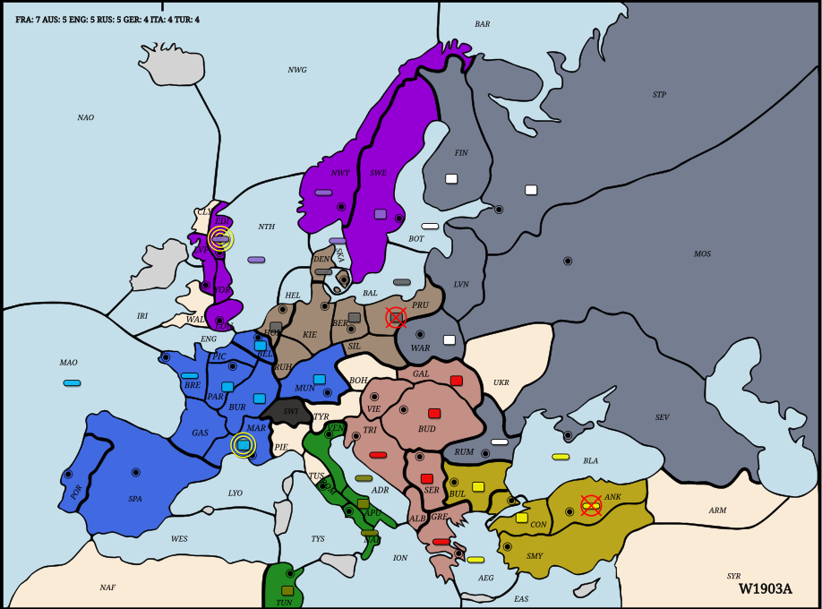

### What happened

- **ENGLAND**: builds F EDI
- **FRANCE**: builds A MAR
- **GERMANY**: disbands A PRU
- **TURKEY**: disbands F ANK

### ENGLAND
Orders: `F EDI B`

Reasoning

> I have 5 centers and 4 units, so I'm owed one build. My focus is the northern push against Russia toward St. Petersburg, and I want naval power to drive on Barents/STP and contest the Baltic/North Sea. A fleet at Edinburgh advances toward the north and supports my STP campaign; an army is less useful since my front is coastal/naval and surrounded by sea.
>
> Building a fleet at Edinburgh lets me push it up through NWG toward Barents to two-prong St. Petersburg with Finland, exactly per my plan.

### FRANCE
Orders: `A MAR B`

Reasoning

> I successfully stabbed Germany and took Munich, bringing me to 7 centers. I have one build available in MAR. I'm now at war with Germany on my eastern front, and I want to press toward Kiel/Ruhr while Germany is tangled with Russia. An army in Marseille can march east to reinforce my Munich line; given the threat is land-based (defending Munich, pushing into German home centers), an army is the right build. A fleet would be slow to reach the action.

### GERMANY
Orders: `A PRU D`

Reasoning

> I have 5 units but only 4 supply centers (BER, KIE, DEN, HOL), so I must disband exactly 1 unit.
>
> France took MUN, which cost me a center. France is now at 7 centers with A BUR and A MUN pressing my home line — that "ally" has become my biggest threat. England has 5 and circles my north. I need to consolidate and defend my core.
>
> My units: A BER, F DEN, A HOL, F BAL, A PRU. PRU is my newest gain but it's exposed and disconnected from my core, far from the French threat building on Munich/Berlin. Berlin is now directly threatened by France via Munich/Silesia. I want to keep BER (home center, build slot), DEN and BAL (Baltic defense against England), and HOL (defense/build). 
>
> Prussia is the most expendable: it's a forward Russian center I can't realistically build on, and France's advance on my homeland (MUN→BER axis) is the real danger now. Disbanding PRU keeps my core tight against France's encroachment.

### TURKEY
Orders: `F ANK D`

Reasoning

> I lost Rumania and now hold 4 centers (ANK, CON, SMY, BUL) but have 5 units after the RUM retreat to BUL. I must disband one unit.
>
> My eastern position has collapsed — Austria and Russia combined against me. F BLA, F ANK, F AEG, A CON, A BUL are my five units. I need to disband one. The Black Sea is now a defensive backwater; F ANK and F BLA together over-invest in a sealed sea. With Russia's F RUM gone offensive pressure shifting, I want to retain flexibility to pivot south against Austria (the Greece/Italy plan) while keeping the Black Sea defended.
>
> Disbanding F ANK frees the home center for nothing this turn (it's a disband, not a build), but keeps F BLA holding the Black Sea, F AEG and A BUL covering the south/straits, and A CON central. F ANK is the most redundant — F BLA alone seals the Black Sea, and F ANK behind it does little offensively now that Russia holds RUM/SEV.

## SPRING 1904 MOVEMENT (`S1904M`)

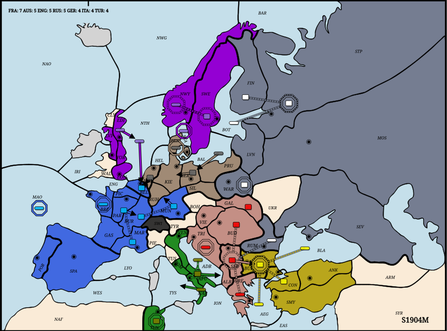

### What happened

- **AUSTRIA**: A SER → BUL (bounced); F GRE supports A SER → BUL; A BUD supports A SER (void); F TRI holds
- **ENGLAND**: F NTH → BEL (bounced); F EDI → NTH (bounced); F SKA holds; F NWY supports A SWE; A SWE supports F NWY
- **FRANCE**: A MUN → RUH; A BUR supports A MUN → RUH; A BEL → HOL (bounced); A PAR → BUR (bounced); A MAR supports A PAR → BUR (void); F MAO holds; F BRE holds
- **GERMANY**: A BER → KIE; F BAL → BER; A HOL → BEL (bounced); F DEN holds
- **ITALY**: F ADR convoys A APU → ALB; A APU → ALB VIA; F NAP → TYS; A TUN holds
- **RUSSIA**: F RUM supports A SER → BUL; A FIN supports A STP; A STP holds; F BOT supports A STP; A WAR holds
- **TURKEY**: A BUL holds; F BLA supports A BUL; A CON supports A BUL; F AEG supports A BUL

### Dialogue

- **AUSTRIA → ITALY**: I'll make the Lepanto concrete: this Fall I move F GRE - AEG against Turkey and actively support your convoyed A APU landing onto BUL/SC or a Turkish coast — not contesting you. Pull F ADR off my Trieste flank this spring as a show of good faith and I'll commit F GRE and A SER fully east against Turkey. If you keep ADR parked on Trieste I read it as a stab and wall you instead.
- **AUSTRIA → TURKEY**: We're deadlocked and France is the one running away at 7 centers — neither of us gains by grinding each other while she swells. If you keep F BLA and F AEG off my Greek waters, I'll keep A SER/F GRE from pushing Bulgaria this spring and we both watch the west. Confirm the straits stay clear and we hold a quiet southern line.
- **AUSTRIA → RUSSIA**: Turkey's anchored Rumania hard and we both spent phases failing to crack it — meanwhile France is at 7. I'm willing to keep A GAL off Warsaw entirely if you point A WAR and F SEV at Rumania alone; let's not bleed each other for Turkey's benefit. Tell me where your southern units move.
- **AUSTRIA → GERMANY**: France is the danger now — 7 centers with A MUN sitting on your home center and A BUR/BEL stacking your west. Russia's north is nearly spent; pivot your Baltic force toward defending Munich and Kiel before France peels them off. I'll keep Bohemia/Tyrolia quiet so your back is safe while you turn west.
- **ENGLAND → GERMANY**: Russia's north is wide open and France is the one running away at 7 — they grabbed your Munich. Keep F BAL pinning Russia's F BOT this turn so my drive on St. Petersburg lands, and let's both stay alive as Baltic partners against France's western surge. If you want, I'll back a German push to retake Munich next year once STP is mine.
- **ENGLAND → FRANCE**: Channel stays empty from me as always — your eastern flank is clear. I'm finishing off Russia's north this year, driving on St. Petersburg. Confirm that Baltic fleet via Germany you've penciled for 1904 to pin Russia's Bothnia while I take STP.
- **ENGLAND → RUSSIA**: Your north is collapsing and Germany's F BAL is still pinning your Bothnia. I'm taking St. Petersburg this year unless you give me a reason not to — point your remaining strength at Germany and Turkey and I'll go slower, but I'm not stopping while your coast is undefended.
- **ENGLAND → TURKEY**: Russia's in freefall and you're pressing their south while I take their north. Keep the pressure on Sevastopol and Rumania so Russia can't consolidate against me — we both feed off the same collapse without ever touching each other.
- **FRANCE → ENGLAND**: Channel and North Sea stay empty from me as always — your eastern flank is rock solid. Germany's home line is cracking and I'm pressing Munich/Ruhr; if you want Kiel or Denmark, now's the moment to swing your North Sea fleets while he's pinned. We carve up Germany and Russia's north together.
- **FRANCE → ITALY**: Marseille stays dead quiet and nothing touches Piedmont or the Tyrrhenian — your western flank is locked solid while you wedge against Austria. My whole force is committed north into Germany now, so you have zero to fear from me. Flag the turn you stab Austria and my line stays frozen.
- **FRANCE → GERMANY**: Munich was the move the board demanded — you were fully committed east and it was open; you'd have done the same. But I'd rather not grind you to nothing. Pull your line together against Russia and I'll hold my position rather than push Kiel; we can still both feed off the Russian collapse. Your call.
- **FRANCE → RUSSIA**: Germany's overextended and his home centers are wide open — I've already taken Munich. If you press Prussia and Silesia back hard now, we squeeze him from both sides and he can't hold. I have no designs east of the Rhine; this is purely about cracking Germany.
- **GERMANY → ENGLAND**: France is the runaway here — 7 centers, holding my Munich, armies stacked in BUR/BEL/PAR/MAR. If they roll east they take Kiel and Berlin and then they're unstoppable, and your Belgium/North Sea line is next. I'd rather pivot our Baltic partnership into a joint check on France: you press BEL from the sea, I reclaim Kiel and threaten Munich. Want to coordinate against the real leader?
- **GERMANY → FRANCE**: Our alliance has gone quiet and you're still sitting on my Munich. I've held my whole western border open for you and gotten nothing back. If we're still partners, give me a path to Munich — pull A MUN toward Burgundy or support my retake — otherwise I have to read your stack in BUR/BEL/PAR as aimed at me and arrange accordingly.
- **GERMANY → RUSSIA**: Our border's been the calmest on the board and I want to keep it that way — nothing of mine points at your coast this turn. France at 7 is the one running away with this game, and they're holding my Munich. If you can spare pressure westward or just keep your north quiet, I'll keep Berlin/Kiel/Prussia oriented away from you while I deal with France.
- **GERMANY → AUSTRIA**: France is the clear leader at 7 and holds my Munich — they're the one threatening to solo. If you can lean any weight toward the west or pin Italy/France's southern flank, it forces France to split and eases the squeeze on all of us. Our Bohemia/Tyrolia border stays quiet from me as always.
- **ITALY → TURKEY**: This is the deadline you've heard from me three turns running. I will convoy A APU into Greece via Ionian THIS turn — F NAP supports the convoy, F ADR pins Trieste so F GRE can't reinforce. For it to land I need your F AEG to move on GRE (or at minimum cut/hit F GRE) this same turn. Confirm F AEG commits against Greece now, or I read it as another stall and cut my deal with Austria against you.
- **ITALY → AUSTRIA**: Straight: if Turkey commits F AEG against your Greece this turn I land on it — but I'd rather you pay me to point elsewhere. Concrete: actively support my convoyed A APU into a Turkish coast (BUL/SC or the Aegean approach) and vacate nothing of yours — I'll throw F ADR and F NAP against Turkey's flank, not Trieste. Tell me now and Greece stays yours.
- **ITALY → FRANCE**: Border stays frozen from me — nothing toward Piedmont or Tyrrhenian, my whole stack commits east this turn. I'm finally wedging: either against Austria's Greece or onto Turkey's coast depending on who commits to me. Keep Marseille dead quiet and your eastern flank is a non-issue for you.
- **RUSSIA → AUSTRIA**: Rumania's mine again and Turkey's down to four — let's finish the Black Sea job. If A SER - BUL with your Greek fleet support, I'll back it from RUM (F RUM S A SER - BUL) and we strip Turkey of Bulgaria this turn. Keep GAL off my Warsaw and we stay aligned south.
- **RUSSIA → ENGLAND**: North's been clean between us and I'll keep it that way — I'm not contesting Sweden. Germany's collapsed to four centers and his Baltic is thin; I'm eyeing PRU/LVN for myself, not your coast. Stay off STP and Bothnia and we both feed on Germany's wreck.
- **RUSSIA → GERMANY**: You're down to four and France is carving up your west — MUN is already his. I have no interest in finishing you off; the real beneficiary of our fight is Paris. Pull BAL back and I'll leave Berlin and Kiel alone, but I will take what's undefended in the Baltic.
- **RUSSIA → TURKEY**: You held Rumania a year but it's mine again, and you're at four centers facing me and Austria both. There's still a real Black Sea border to draw if you pull F BLA to ANK and stop contesting — otherwise Austria and I grind BUL and SEV-line together while France runs away with the board.
- **TURKEY → ITALY**: This is the pivot turn you've demanded three years running. I commit F AEG to hit Austria's F GRE this Fall — but I need your convoy of A APU into Greece landing the same turn we strike, and F ADR pinned on Trieste so GRE can't be reinforced. Confirm you convoy A APU - GRE and I throw F AEG against his F GRE; Greece and Serbia become your lane, I take the Black Sea and Rumania flank.
- **TURKEY → AUSTRIA**: Rumania held four-deep — your gambit gained nothing, as I told you. I have no quarrel with you in the north; keep A GAL off my Rumania and A SER off my Bulgaria and we both grow against the powers actually threatening us. France is at 7 and climbing in the west — that's the runaway we should both be watching, not each other.
- **TURKEY → RUSSIA**: Our grind only feeds Austria and France. I'm not pressing Sevastopol this turn — F BLA stays defensive. Point A WAR and F SEV at Austria's Galicia and Serbia instead; he's the one who flipped to box us both in. A real Black Sea border is still on offer if you stop contesting Rumania.
- **AUSTRIA → RUSSIA**: Deal on Bulgaria: I'll order A SER - BUL with F GRE S A SER - BUL, you back it with F RUM S A SER - BUL — that's three on his anchored two and BUL falls. A GAL stays off Warsaw entirely, pointed at backstopping the line. Confirm F RUM supports SER into BUL and we strip Turkey this turn.
- **AUSTRIA → ITALY**: I'm committing real force east this turn — A SER strikes BUL with F GRE supporting, exactly the Turkish pressure you wanted. But I can't both attack BUL myself and convoy your army into it the same turn. Pull F ADR off Trieste as good faith and next Fall I support your A APU landing onto a Turkish coast directly; lean on Trieste instead and I wall you and you gain nothing while Turkey eats my Balkan push.
- **AUSTRIA → TURKEY**: You said no quarrel in the north, but Russia's pressing me to strip your Bulgaria this turn and the math favors them. I'd rather keep the south quiet and watch France — pull F AEG and F BLA fully east off the Bulgarian approaches and I'll hold A SER and F GRE back. Last chance before I'm forced to commit with Russia.
- **ENGLAND → GERMANY**: Agreed — France is the leader and I won't feed their surge. Keep F BAL pinning Russia's F BOT this turn so my STP drive lands, then in 1904 I'll swing North Sea fleets toward Belgium against France while you reclaim Kiel and threaten Munich. Confirm BAL pressures BOT/Baltic and stays off Sweden.
- **ENGLAND → FRANCE**: Channel stays empty from me as always. I'm finishing Russia's north this turn — once STP is banked I'll have fleets free to coordinate. Hold Belgium and keep pressing Munich; tell me exactly where you want my North Sea weight next year.
- **ENGLAND → RUSSIA**: I'm taking STP this turn — your coast is undefended and I won't pretend otherwise. But if you point everything at Germany and Turkey rather than contesting Sweden, I'll stop at STP and not push into Moscow. Grab PRU/LVN off Germany if you can; that helps us both.
- **FRANCE → ENGLAND**: Swing your North Sea fleet at Kiel or Denmark this turn — Germany's down to four and can't defend both his home line and his east. I'm pushing Munich toward Ruhr and Kiel; if you take Denmark we split his whole northern coast and the Baltic fleet pin becomes moot because Russia's already collapsing. Let's carve Germany now.
- **FRANCE → GERMANY**: I hear you. I'm not driving Kiel this turn — I'll hold Munich and keep my line steady rather than grind your home flat. Turn your force fully on Russia's Prussia/Silesia; you reclaim eastern centers and we both feed off the collapse. Push me and you lose your whole western border with nothing to show for it.
- **FRANCE → RUSSIA**: Germany's stretched thin and his home is open — I'm holding Munich and pressing his line. If you shove Prussia and Silesia back this turn he can't hold either end. I want nothing east of the Rhine; this is purely about cracking Germany between us.
- **FRANCE → ITALY**: Locked — Marseille and Piedmont stay dead quiet, my whole force is north against Germany. Take your shot east whenever you're ready; my western line will not move against you. Tell me if it's Greece or Turkey so I know which way the Adriatic tips.
- **GERMANY → RUSSIA**: Deal: I pull F BAL off your Bothnia line and keep Berlin/Kiel/Prussia oriented away from you — you leave my home coast alone. I'm reclaiming Kiel and turning my armies west on France. The longer France feeds, the worse for both of us; keep your north quiet and we both buy time.
- **GERMANY → ENGLAND**: Concrete trade: I move A BER - KIE to reclaim my center and pivot A HOL toward Belgium against France, while you press BEL from the North Sea — that splits France's western stack and protects your own Belgium-adjacent line. I'll keep F BAL from contesting your STP drive. If we don't check France at 7 now, your Belgium and my Kiel are both on the menu next year.
- **GERMANY → FRANCE**: Holding position isn't enough while you sit on Munich — that reads as a staging point, not a truce. Give me something concrete: pull A MUN to BUR or support my move to retake it next turn. Otherwise I treat your BUR/BEL stack as aimed at Kiel and align my fleets and Russia/England accordingly.
- **GERMANY → AUSTRIA**: Good — keep Bohemia/Tyrolia quiet and I turn fully west on France this turn, reclaiming Kiel and pressing the Munich line. Any weight you can throw at France's or Italy's southern flank forces Paris to split and eases all of us. Russia's north is nearly spent, so the table's real fight is now France's surge.
- **ITALY → TURKEY**: Tactical reality: I cannot convoy A APU straight to GRE this turn — my fleets aren't in ION yet. So this turn I shift F ADR to ION (F NAP supports) to build the convoy lane, and convoy A APU - ALB via the Adriatic to land beside Greece. You hit F GRE with F AEG NOW — if it's dislodged or pinned, next turn I convoy A APU from ALB into GRE behind your strike. Confirm F AEG hits F GRE this Fall and I commit the lane.
- **ITALY → AUSTRIA**: Your offer to support my convoy onto a Turkish coast is the one I'll take IF it's real — but you've dangled it three turns. Concrete test this turn: F GRE - AEG against Turkey as you said, and I'll keep F ADR off Trieste and point my stack east at Turkey, not you. If F GRE stays parked on Greece again, I read it as the wall and land on you next turn with Turkey behind me.
- **ITALY → FRANCE**: Locked — nothing toward Piedmont or Tyrrhenian, my whole stack commits east. I'm wedging into the Balkans this turn against whichever of Austria or Turkey blinks first. Keep Marseille dead quiet and your eastern flank stays a non-issue; flag me when your German push opens so I can time my stab to match the board.
- **RUSSIA → ENGLAND**: Concrete deal: I keep F BOT and A FIN oriented to defend STP this turn, not toward Sweden or Norway — so you lose nothing in Sweden — and in exchange you keep F NWY/F SKA off STP/NC. If you push STP anyway, I wall it with A FIN S STP and F BOT, and you spend the year bouncing while France runs to 8. A quiet north lets us both eat Germany's Baltic instead.
- **RUSSIA → GERMANY**: If you genuinely pull F BAL out of the Baltic this turn, I'll keep A WAR off Prussia and Silesia and leave you to face France. But if F BAL stays pinning my Bothnia, I take Prussia or Livonia — your call decides whether I'm a quiet eastern border or an opportunist. Confirm BAL pulls and I orient everything north-defensive against England instead.
- **RUSSIA → AUSTRIA**: Let's actually crack Bulgaria: you order F GRE - BUL/SC with A SER S F GRE - BUL/SC, and I'll add F RUM S A SER if needed — coordinate so we have 2 on it versus Turkey's defense. Keep A GAL off my Warsaw and I stay fully aligned south with you against Turkey while France is the real winner we both must watch.
- **RUSSIA → TURKEY**: I hear you on the grind feeding others. If F BLA truly stays defensive off SEV this turn, I won't drive RUM into the Black Sea — but Austria and I may still take Bulgaria, which is between us, not your core. Pull F BLA to ANK and we draw a clean Black Sea line; otherwise BUL is contested ground.
- **TURKEY → ITALY**: Locked. I move F AEG to GRE this turn to hit F GRE directly — that's the strike. You convoy A APU into Greece via Ionian with F NAP supporting, and keep F ADR pinned on Trieste so F GRE can't be covered. If F GRE is dislodged it retreats, and your army lands. Confirm your convoy chain is exactly A APU - GRE VIA, F ION C A APU - GRE — I'm committing F AEG against Greece now.
- **TURKEY → AUSTRIA**: Straight answer: I won't be pulling F AEG back this turn — Italy is forcing the southern issue and I have to respond to his fleet stack. But A BUL and F BLA stay off Serbia and Rumania's western approach; my fight is for Greece's waters, not your Balkan armies. If you'd rather not bleed for Greece against both of us, pull F GRE and we settle the south fast.
- **TURKEY → RUSSIA**: I'm holding F BLA defensive as said — I'm not pressing Sevastopol this turn. My fleets are committed south against Austria's Greece. Point A WAR and F SEV at Galicia now while Austria is busy defending his southern line and you reclaim ground he stole; this is your window, not mine.
- **AUSTRIA → RUSSIA**: Committed: A SER - BUL with F GRE S A SER - BUL this turn — you add F RUM S A SER - BUL and that's two supports against Turkey's anchor. If A CON backs BUL we may bounce, so make sure F RUM commits. A GAL stays off Warsaw, pointed home. Confirm F RUM supports.
- **AUSTRIA → ITALY**: I'm throwing real force at Turkey this turn — A SER strikes BUL with F GRE supporting the attack, which is the eastern commitment you wanted. F GRE can't both support the BUL strike and sail to AEG the same phase, so keep F ADR off Trieste this spring and next Fall I support your A APU landing on a Turkish coast directly. Lean on Trieste while I'm committed east and you only help Turkey.
- **AUSTRIA → TURKEY**: You wouldn't pull F AEG, so I'm committing with Russia: A SER strikes BUL with two supports behind it this turn. Defend it if you can — but if you'd rather settle, this is the last phase before the line hardens against you on both the Greek and Rumanian approaches.
- **ENGLAND → GERMANY**: Confirmed: I'm holding off STP this turn since Russia's walled it, and I'll keep my North Sea weight oriented to pressure France's Belgium next year rather than feed their surge. You reclaim Kiel with A BER - KIE and pivot A HOL toward Belgium; keep F BAL off Sweden. If you hold your home line we both survive France's run — I won't touch your coast.
- **ENGLAND → RUSSIA**: Deal: I stay off STP/NC and Bothnia this turn — F NWY and F SKA orient at Sweden/Norway, not your coast. In return keep F BOT and A FIN defending STP and point your strength at Germany and Turkey, not Norway. A quiet north costs us both nothing while France runs hot in the west.
- **ENGLAND → FRANCE**: Channel stays empty from me as always. I'm consolidating my north this turn rather than overextending into Germany's collapse — once my fleets are free I'll tell you exactly where the North Sea weight goes. Hold Belgium and keep Munich pinned.
- **FRANCE → ENGLAND**: Committing: I push A MUN - KIE and A BEL toward Holland/Ruhr this turn while Germany's pinned at four centers. Swing your North Sea fleet at Denmark now — he can't hold both his home line and his east. You take DEN, I take KIE, and we split his coast cleanly.
- **FRANCE → GERMANY**: Straight answer: I'm not pulling off Munich. You're at four and your only leverage is threatening a western realignment you can't afford — Russia and England are both eating your north already. Turn east, hold what you can, and I won't sweep your whole home. Fight me in the west and you lose Kiel and Berlin to England and me both.
- **FRANCE → ITALY**: Locked — Marseille and Piedmont stay dead quiet, my whole force is committed north into Germany this turn. Take your shot in the Balkans; my western line will not move against you regardless of whether you hit Austria or Turkey. Tell me which way you struck so I can read the Adriatic next year.
- **GERMANY → RUSSIA**: Confirmed: F BAL pulls toward Kiel/Berlin defense this turn — nothing on Bothnia, nothing on Prussia or Livonia from me. You keep A WAR off Prussia/Silesia and your north quiet against England, and I orient fully west on France. Our border stays the calmest on the board.
- **GERMANY → ENGLAND**: Locked: I move A BER - KIE to reclaim my home center and swing A HOL toward Belgium against France while you press BEL from the North Sea — that splits France's western stack. F BAL stays off Sweden and won't contest your STP drive. Land STP, then in 1904 we both lean on Belgium together.
- **GERMANY → FRANCE**: You say you'll hold Munich, but holding my center isn't a truce — it's a staging point. I'm reclaiming Kiel and turning A HOL toward Belgium this turn; that's defensive unless you push Kiel. If you want to keep me off your Belgium line, pull A MUN to BUR next turn and give me a clean path home — otherwise I read your BUR/BEL stack as aimed at me and act accordingly.
- **ITALY → TURKEY**: Final commitment: I cannot convoy to GRE this turn — my fleets aren't in ION yet. This turn I move F ADR - ION and F NAP - TYS to build the lane, and convoy A APU - ALB via Adriatic to land beside Greece. You hit F GRE with F AEG NOW — if it's dislodged or pinned, NEXT turn I convoy A APU from ALB straight into GRE behind your strike. Strike F GRE this Fall and I land in ALB this turn, GRE next.
- **ITALY → AUSTRIA**: Straight: I'm not throwing my stack at Trieste this turn. F ADR shifts to ION and A APU moves toward Albania — that's me pointing east, off your Trieste flank as you asked. Hold F GRE and back my landing onto a Turkish coast next spring as promised and the Lepanto is real against Turkey, not you. Stall again and I land on your Balkan coast with Turkey behind me.
- **RUSSIA → AUSTRIA**: Locked: F RUM S A SER - BUL this phase. You order A SER - BUL with F GRE S A SER - BUL — three on Turkey's anchored defense and Bulgaria falls. Keep A GAL off Warsaw and we're aligned south.
- **RUSSIA → ENGLAND**: Final: A FIN S A STP and F BOT supports the STP corner this turn — STP is walled, you bounce off it. I'm not contesting Sweden or Norway at all, so you lose nothing by leaving STP/NC alone. Push it anyway and you waste the year while France runs to 8.
- **RUSSIA → GERMANY**: If F BAL pulls this turn as you said, A WAR stays off Prussia and Silesia — confirmed. But if BAL stays on my Bothnia I take what's open. Pull it and I'm a quiet eastern border while you turn west on France.
- **TURKEY → ITALY**: Confirmed and committed: F AEG moves on GRE this turn to hit F GRE while you build the ION lane and convoy A APU - ALB. Keep F ADR pinning Trieste so F GRE can't be reinforced — if I dislodge or pin it, you convoy ALB into Greece next turn behind my strike. This is the lane, I'm in.
- **TURKEY → AUSTRIA**: Last word: I'm moving F AEG on Greece because Italy forced my hand, not to grab your Balkan armies — A BUL and F BLA stay off Serbia and Rumania. If you'd rather not bleed Greece's waters against both me and Italy's stack, pull F GRE and we settle the south cheap. Otherwise your F GRE faces my fleet and his convoy converging.
- **TURKEY → RUSSIA**: F BLA stays defensive this turn — I'm not touching Sevastopol, my fleets go south against Austria's Greece. That's your window: drive A WAR and F SEV at Galicia and Serbia while Austria is pinned defending his southern line. Leave Bulgaria alone and we hold a clean Black Sea border.

### AUSTRIA
Orders: `A SER - BUL` · `F GRE S A SER - BUL` · `A BUD S A SER` · `F TRI H`
Illegal (dropped): `A GAL S A SER - BUL`

Reasoning

> Russia and I committed to taking Bulgaria: A SER - BUL with F GRE supporting, and F RUM S A SER - BUL gives us three against Turkey's anchor. Turkey signaled F AEG moves to Greece's waters but said A BUL and F BLA stay off Serbia/Rumania — so the attack should land with Russia's support. A GAL stays home backstopping, A BUD covers Serbia's vacated rear, F TRI holds against any Italian reversal.

### ENGLAND
Orders: `F NTH - BEL` · `F EDI - NTH` · `F SKA H` · `F NWY S A SWE` · `A SWE S F NWY`

Reasoning

> Russia has walled STP and France is the clear leader at 7 centers. My revised plan: pivot weight against France, press Belgium from the North Sea, anchor my north. France is occupying Belgium with A BEL, so I'll move F NTH toward Belgium to threaten it, bringing F EDI to NTH to back the push next turn. Hold Sweden, Norway, and Skagerrak quietly per my deal with Russia.
>
> F NTH - BEL would attack France's A BEL solo (1 vs 1), which bounces. But it establishes presence and forces France to defend. Better to set up properly: move F EDI - NTH to build a stacking line for next year while F NTH probes BEL. Actually F NTH alone can't dislodge A BEL. Still, contesting it cuts France's options and signals. Let me keep F NTH on NTH to retain flexibility and move F EDI - NTH isn't possible if NTH occupied.
>
> Given commitments, I'll move F NTH - BEL to pressure France, F EDI - NTH to follow up, and keep north anchored.

### FRANCE
Orders: `A MUN - RUH` · `A BUR S A MUN - RUH` · `A BEL - HOL` · `A PAR - BUR` · `A MAR S A PAR - BUR` · `F MAO H` · `F BRE H`

Reasoning

> I'm pressing Germany's collapsing home line. A MUN moves to KIE to grab a German center, backed by A BUR supporting that move. A BEL takes HOL (Germany said he's turning HOL toward Belgium, so I want to deny/grab it — but HOL is German and if he moves out, I take it). Actually Germany signaled A HOL → BEL, so HOL may vacate; I'll move A BEL to RUH to threaten Kiel/Munich line and avoid a head-on bounce, while supporting the Kiel push. Let me make A BUR support A MUN - KIE, A BEL - RUH to cover, A PAR backs Burgundy line, fleets and Marseille hold the Atlantic.
>
> Wait — A BUR is not adjacent to KIE, so it can't support A MUN - KIE. A BUR can support A MUN - RUH or back the western line. To maximize the German push: A MUN - KIE alone (Kiel may be retaken by Germany's A BER/F DEN, so it's risky). Better: A MUN - RUH with A BUR S A MUN - RUH gives a strong move into Ruhr, and A BEL - HOL grabs Holland if Germany vacates it. That nets a center and threatens Kiel/Berlin next.

### GERMANY
Orders: `A BER - KIE` · `F BAL - BER` · `A HOL - BEL` · `F DEN H`

Reasoning

> My revised strategy: reclaim Kiel with A BER, pull F BAL back to Berlin to honor the Russia deal and defend my home line, swing A HOL toward Belgium against France, keep F DEN anchored on my coast. France holds my Munich and won't budge, so I treat their stack as hostile and lean on Belgium with England. F BAL to Berlin keeps it off Bothnia/Prussia as promised to Russia and walls Berlin.

### ITALY
Orders: `F ADR C A APU - ALB` · `A APU - ALB VIA` · `F NAP - TYS` · `A TUN H`

Reasoning

> I'll execute the convoy lane build. My plan: F ADR convoys A APU to ALB (landing beside Greece), F NAP supports the convoy by moving to TYS isn't a support—I need to check the convoy mechanics. The convoy is `A APU - ALB VIA` with `F ADR C A APU - ALB`. F NAP can't directly aid this, so I'll move it to TYS to cover western approaches as planned. A TUN holds in reserve.
>
> Wait—if F ADR is convoying A APU to ALB, F ADR stays in ADR doing the convoy. My revised note said "F ADR moves to ION" but that conflicts with convoying A APU to ALB via Adriatic. The convoy from APU to ALB must route through ADR, so F ADR must stay and convoy. I'll keep F ADR as the convoying fleet. Turkey strikes F GRE; if dislodged, I land in ALB and convoy into GRE next turn.
>
> This lands A APU in ALB beside Greece, with F ADR doing the convoy. Austria's F TRI can't reinforce GRE while I pin its flank, and Turkey hits F GRE.

### RUSSIA
Orders: `F RUM S A SER - BUL` · `A FIN S A STP` · `A STP H` · `F BOT S A STP` · `A WAR H`

Reasoning

> My plan: support Austria into Bulgaria (F RUM S A SER - BUL), wall STP against England (A FIN S A STP, F BOT holds the corner), and keep A WAR quiet per Germany's confirmed pullback while keeping it flexible.
>
> For the Bulgaria attack: Austria orders A SER - BUL with F GRE support. I add F RUM S A SER - BUL. Note Turkey's BUL is currently occupied by A BUL — so this is dislodging it. My F RUM support of A SER - BUL is valid (RUM is adjacent to BUL... checking: RUM neighbors BUL/EC. The support order `F RUM S A SER - BUL` is in my legal list).
>
> North: England threatens STP. A FIN S A STP, A STP holds, F BOT holds the corner (supporting STP). F BOT S A STP keeps it solid against an STP/NC fleet attack.
>
> A WAR: kept off Prussia/Silesia per deal with Germany. I'll hold it home to defend, but holding is wasteful. Better to support the Bulgaria line or back home. I'll keep it covering Moscow/home — A WAR H is safest since Germany confirmed pullback and I promised quiet. Actually, to give it purpose, hold to defend Warsaw.

### TURKEY
Orders: `A BUL H` · `F BLA S A BUL` · `A CON S A BUL` · `F AEG S A BUL`

Reasoning

> Austria and Russia are striking Bulgaria with two supports. My revised plan: defend Bulgaria, anchor it with F BLA and A CON supporting its hold, keep F AEG defensive nearby rather than throwing it onto a reinforced F GRE that Italy can't back this turn. Italy's convoy isn't ready, so the Greek strike is premature. I'll hold my eastern block intact and survive the squeeze.
>
> A BUL holds, supported by F BLA, A CON, and F AEG for maximum defensive strength against the two-support attack. F AEG can support A BUL's hold (it's adjacent to BUL via /SC). That gives BUL defense strength 3 (hold +3 supports), which beats any 2-support attack.

## FALL 1904 MOVEMENT (`F1904M`)

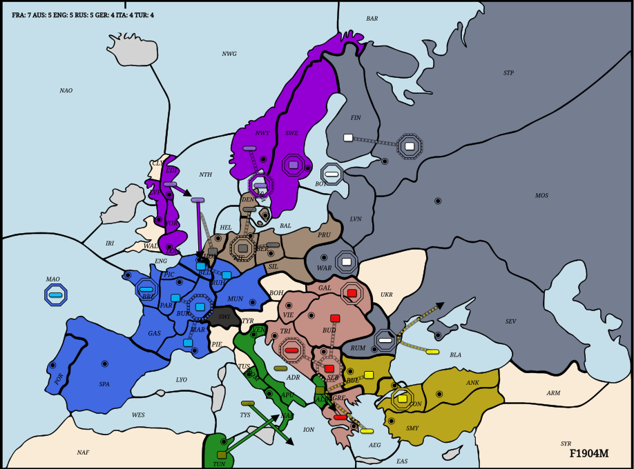

### What happened

- **AUSTRIA**: F GRE → ALB (bounced); F TRI holds; A SER supports F TRI; A BUD supports A SER; A GAL holds  [dislodged: F GRE]
- **ENGLAND**: F NTH → BEL; F EDI → NTH; F SKA holds; F NWY supports F SKA; A SWE holds
- **FRANCE**: A BEL → HOL; A RUH supports A BEL → HOL; A PAR supports A BUR; A MAR supports A BUR; F MAO holds; F BRE holds
- **GERMANY**: A KIE holds; F BER supports A KIE; F DEN supports A KIE; A HOL supports F NTH → BEL (support cut)  [dislodged: A HOL]
- **ITALY**: A ALB → GRE; F TYS → ION; A TUN → NAP VIA (no convoy)
- **RUSSIA**: F RUM holds; A FIN supports A STP; A STP holds; F BOT holds; A WAR holds
- **TURKEY**: F AEG supports A ALB → GRE; A BUL supports A ALB → GRE; F BLA supports F RUM → SEV (void); A CON holds

### Dialogue

- **AUSTRIA → RUSSIA**: Bulgaria is anchored four-deep — A BUL backed by A CON, F BLA, and F AEG. Three of us (A SER + F GRE + your F RUM) only ties his anchored defense and bounces. To actually crack it I need you to ALSO cut a supporter: order F RUM to support my SER - BUL AND ensure something hits CON or AEG. Tell me exactly what your fleets do this turn or we waste another phase.
- **AUSTRIA → TURKEY**: You held Bulgaria again — point taken. France at 7 is the real danger and I'd rather not keep bleeding you for Russia's benefit. If F BLA and F AEG stay off my Greek waters and A BUL stays off Serbia, I'll hold A SER and F GRE back this turn. Confirm the straits stay clear and we keep a quiet southern line.
- **AUSTRIA → ITALY**: You moved F ADR to ION and A APU toward Albania as asked — good faith noted. But A ALB now sits beside my Greece and Trieste, so understand I'm watching it. If you're truly going east at Turkey, push A ALB at a Turkish coast or back my line against Bulgaria; if it leans on Greece or Trieste I wall you. Tell me ALB's target.
- **ENGLAND → GERMANY**: France is the runaway at 7 and holding your Munich — we both need to check them now. I'll drive F NTH - BEL this turn. Can you support it with A RUH S F NTH - BEL? Belgium is France's, and cracking it splits their western stack and gives us both a front. Confirm and I commit the North Sea push.
- **ENGLAND → FRANCE**: Channel stays empty from me as always. You're at 7 and pressing Germany hard — I'm staying out of your east. But I want a piece of the action somewhere: if you're rolling Germany, leave me Holland or Denmark to grab and we stay friendly. Tell me where my North Sea fleets are welcome.
- **ENGLAND → RUSSIA**: North stays quiet from me as agreed — F SKA, F NWY, A SWE orient at Sweden/Norway, nothing at STP or Bothnia. Keep your strength on Germany's Baltic and Turkey's south. France is the real runaway; a clean north between us costs us both nothing while they surge.
- **FRANCE → ENGLAND**: Germany's at four and pinned. I'm taking Kiel this turn with two units — swing your North Sea fleet at Denmark now and we split his coast clean. Once DEN and KIE fall he's down to Berlin and Holland; Russia's already eating his east. This is the moment.
- **FRANCE → GERMANY**: I hear your frustration. If you pull A KIE off to defend Holland and turn fully east on Russia, I'll leave Berlin alone and we keep the Russian collapse going — that's worth more to you than fighting a losing western war. Show me you're committed east and I ease off your home line.
- **FRANCE → RUSSIA**: Germany's home is wide open and I've got Munich plus pressure on Kiel. Shove Prussia and Silesia back hard this turn — he can't defend both his home and his east, and every unit he sends west is one off your front. I want nothing east of the Rhine.
- **FRANCE → ITALY**: Marseille and Piedmont stay dead quiet — my whole force is north into Germany this turn, zero threat to you. Take your Balkan shot freely; tell me whether you hit Austria or Turkey so I can read the Adriatic next year.
- **GERMANY → ENGLAND**: France's A RUH now sits right on my Kiel/Holland line — they're staging, not holding. If you push F NTH - BEL this Fall I'll back the pressure and we split their western stack. Are your North Sea fleets committed to Belgium this turn? I need to know before I commit A HOL.
- **GERMANY → RUSSIA**: I pulled F BAL off your Bothnia as promised and my whole line is oriented home/west against France. Keep A WAR off Prussia and Silesia and the border stays the calmest on the board. France's RUH unit is the real threat to me now, not you.
- **GERMANY → FRANCE**: Your A RUH sitting next to my Kiel reads as a stab in waiting, not a truce. Pull it back to BUR and give me Munich next turn and I stay off your Belgium line. Leave it there and I commit fully with England against your west — you can't afford Belgium contested while you hold Munich.
- **GERMANY → AUSTRIA**: France is at 7 and their RUH unit is pressing my home line — they're the solo threat. Any weight you can throw west or against Italy forces Paris to split and helps us both. Bohemia/Tyrolia stays quiet from me as always.
- **ITALY → TURKEY**: I'm in position: A ALB sits beside Greece, F ADR and F TYS hold the Ionian/Adriatic. This is the turn — move F AEG to GRE to hit Austria's F GRE and I convoy/march A ALB into Greece behind your strike. Confirm F AEG - GRE now and Greece falls; Serbia and Greece are my lane, Black Sea and Rumania yours.
- **ITALY → AUSTRIA**: Your F GRE is exposed and Turkey is leaning on your Bulgaria — you're squeezed on two fronts. I can land A ALB on either Greece or Trieste this turn. Pay me off concretely: vacate Greece and I take it clean without touching Trieste, or I hit Trieste with F ADR's support while Turkey eats your south. Your choice which center you'd rather keep.
- **ITALY → FRANCE**: I'm committing east this turn against Austria's southern line — Greece or Trieste. Keep Marseille and Piedmont dead quiet as we've agreed and my western flank stays a non-issue. Flag me when your German push opens so I can time my growth to match the board.
- **RUSSIA → AUSTRIA**: Bulgaria's anchored hard with A CON backing it — two failed cracks tell me we need three real attackers on it, not two. If you commit A SER - BUL with F GRE S A SER - BUL again, I'll add F RUM S A SER - BUL for three against his anchored two-plus-CON. Confirm CON isn't free to support or we bounce a third time; otherwise I'd rather pull F RUM defensive and you keep A GAL off my Warsaw.
- **RUSSIA → ENGLAND**: Deal holds from my side: F BOT and A FIN stay on the STP corner, nothing toward Sweden or Norway. Keep F NWY/F SKA off STP/NC and we both feed on Germany's wreck instead of each other. I'm eyeing Livonia off Germany's thinned Baltic, not your coast.
- **RUSSIA → GERMANY**: You confirmed F BAL pulls west and Prussia/Livonia are off your plans — Livonia's empty and I intend to take it for a build, which costs you nothing since it's not your home center. Keep BER/KIE oriented at France and I stay off your home coast entirely. France at 7 holding Munich is the one running away; our quiet border buys you the time to fight him.
- **RUSSIA → TURKEY**: You've held BLA defensive and I've kept SEV quiet — that line works. Bulgaria stays contested between me and Austria, but I won't drive RUM into the Black Sea if BLA stays off Sevastopol. Pull F BLA to ANK and we draw a permanent clean Black Sea border while you face Austria's Greece.
- **TURKEY → ITALY**: This is the strike turn. I attack GRE with F AEG supported by A BUL — that's 2 strength against his F GRE. Keep F ADR pinning Trieste so F GRE can't be covered, and have A ALB ready to convoy into GRE next turn behind my hit. Confirm A ALB stays put or supports my GRE attack so we dislodge his fleet clean.
- **TURKEY → AUSTRIA**: Last offer before I commit: pull F GRE and we settle the south cheap — otherwise F AEG and A BUL both come down on Greece while Italy's stack converges. Your F GRE can't hold against two and a convoy waiting in Albania. Save your fleet, leave Greece, and watch France instead.
- **TURKEY → RUSSIA**: F BLA stays off Sevastopol — my fight is south against Austria's Greece. That's your open window: drive A WAR and F SEV at Galicia and Serbia while Austria is pinned defending his southern line. Leave Bulgaria be and we hold a clean Black Sea border.
- **AUSTRIA → RUSSIA**: I'm holding the BUL strike option but Italy's A ALB and ION fleet now point straight at my Trieste — if I send F GRE east he can convoy onto my flank. I'll commit F GRE S A SER - BUL only if you confirm F RUM supports AND your A WAR/F SEV keep Turkey pinned so CON can't backfill. Otherwise I hold my line one turn and we strike clean next Fall.
- **AUSTRIA → ITALY**: A ALB beside my Greece and Trieste with your fleets in ION/ADR is a stab posture, not a Lepanto. If you genuinely want Turkey, move A ALB - GRE only with my F GRE backing it next turn, or push it at a Turkish coast now — but if A ALB or F ADR leans toward Trieste this Fall I wall you cold with A BUD supporting F TRI and you gain nothing. Tell me ALB's exact target this turn.
- **AUSTRIA → TURKEY**: Fair enough — you move F AEG because Italy forces it, not to grab my armies. If A BUL and F BLA truly stay off Serbia and Rumania this turn, I'll keep A SER home rather than throw it at Bulgaria, since Italy's the one threatening my actual flank. Confirm A BUL holds and we keep the southern line quiet while we both watch France and Italy.
- **ENGLAND → GERMANY**: Concrete: I commit F NTH - BEL this turn, F EDI - NTH backing it. You support it with A HOL S F NTH - BEL — that's the unit that can reach Belgium. If Belgium cracks, France's western stack splits and you keep Holland safe behind the line. Confirm A HOL backs my Belgium push and I commit now.
- **ENGLAND → FRANCE**: I'm not swinging at Denmark — that just feeds your surge while I gain one scrap and lose my Baltic balance. If you want my North Sea fleets pointed away from Belgium, give me something real: pull A BEL back and let me into Holland instead, and I'll leave your coast alone. Otherwise my fleets press Belgium.
- **ENGLAND → RUSSIA**: North stays clean from me — F NWY, F SKA, A SWE all orient at Sweden/Norway, nothing toward your coast or Bothnia. I'm throwing my weight west at France's Belgium this turn, not at you. Keep pressing Germany's Baltic and Turkey's south; we both feed off their weakness without touching each other.
- **FRANCE → ENGLAND**: I'm committing this turn: A MUN-KIE with A RUH supporting, and A BEL grabs Holland. Germany can't hold his coast against both of us — swing a North Sea fleet at Denmark NOW so he can't retreat or counter. You take DEN, I take KIE and HOL, and his home line collapses. This is the window.
- **FRANCE → GERMANY**: You keep threatening a realignment you can't fund — you're at four with Russia in your east and England on your north. I'm taking Kiel this turn. If you pull A KIE off and turn fully east, I'll stop at Kiel and leave Berlin to you as a survivable rump rather than sweep you flat. Fight me in the west and you lose everything to England and me both.
- **FRANCE → ITALY**: My whole force is committed north into Kiel and Holland this turn — Marseille and Piedmont stay frozen, zero threat to you. Take your Balkan shot freely. Tell me whether you hit Austria or Turkey so I can read the Adriatic and time my western fleets next year.
- **FRANCE → RUSSIA**: I'm taking Kiel and Holland off Germany this turn. Shove Prussia and Silesia hard now — every unit he sends west to stop me is one off your front, and his home is gutted. I want nothing east of the Rhine; this is purely about finishing Germany between us.
- **GERMANY → ENGLAND**: Concrete commit: you drive F NTH - BEL and I support it with A HOL S F NTH - BEL — that's 2 against France's lone A BEL and Belgium cracks. My A KIE and F BER hold solid against France's RUH so my home line doesn't fold while we split their west. Confirm F NTH - BEL is your order this turn.
- **GERMANY → FRANCE**: Last chance to de-escalate: pull A RUH back to BUR and I keep A HOL off Belgium. Leave RUH on my Kiel doorstep and I commit fully with England to crack Belgium this turn — you can't hold Munich, Belgium, AND defend RUH against both of us. Your move decides whether your west bleeds.
- **GERMANY → RUSSIA**: F BAL is off your Bothnia and stays off — my whole line is home/west against France this turn, nothing toward Prussia or Livonia. Keep A WAR quiet and our border remains the calmest on the board while I crack France's Belgium with England.
- **ITALY → TURKEY**: Refinement so we don't both pile into the same square: you hit F GRE with F AEG+A BUL to pin/cut it, but let MY A ALB - GRE (F ADR supporting) be the unit that actually occupies Greece — that way it lands in my hands this turn, not next. If you instead move F AEG INTO GRE we collide and neither lands. Pin F GRE by cutting its support or holding AEG poised, and Greece is mine clean this Fall.
- **ITALY → AUSTRIA**: Last call: Turkey is striking your F GRE this turn with Bulgaria's support, and my A ALB sits beside it. Vacate Greece now (F GRE - AEG or off the coast) and I take it without touching Trieste — or it falls to combined pressure anyway and you've lost it for nothing. Save Trieste, give me Greece.
- **ITALY → FRANCE**: I'm striking east at Austria's Greece this turn — my whole stack stays committed there, nothing west. Keep Marseille and Piedmont dead quiet as agreed and your flank stays locked. Flag me the moment your German push cracks a center so I can time my next move.
- **RUSSIA → AUSTRIA**: Two bounces prove three attackers tie his anchor — we need a supporter cut, not more bodies. Can A BUD or a fleet hit CON or AEG this turn to strip one supporter? If yes, I commit F RUM S A SER - BUL for the kill; if you can't cut, I pull F RUM to defend SEV and we both stop bleeding. Tell me which CON/AEG you can pressure.
- **RUSSIA → ENGLAND**: Confirmed: A FIN and A STP wall STP, F BOT holds the corner, nothing toward Sweden/Norway. Keep F NWY/F SKA off STP/NC and our north stays clean while France surges. If Germany's Baltic ever truly thins I'll take Livonia, not your coast.
- **RUSSIA → GERMANY**: You pulled F BAL as promised, so A WAR stays off Prussia/Silesia and my line points home and south. France holding your Munich is your real fight — keep BER/KIE west and our border stays the quietest on the board.
- **RUSSIA → TURKEY**: If you keep F BLA off Sevastopol, I'll pull F RUM defensive rather than feed Austria's Bulgaria push — a clean Black Sea line as you offered. But if BLA moves on SEV this turn, I drive F RUM into the Black Sea. Confirm BLA stays put and we hold the border.
- **TURKEY → ITALY**: I'm committing F AEG to GRE this turn, supported by A BUL — that's 2 strength on F GRE. You convoy A APU - ALB now and keep F ADR pinning Trieste so F GRE can't be covered by A SER's reinforcement. If it's dislodged, you land ALB into GRE next turn behind me. Confirm A ALB/APU is in ALB this turn.
- **TURKEY → AUSTRIA**: I gave you the chance to pull F GRE; you committed with Russia on Bulgaria instead, so I commit on Greece. But hear this: if you hold A SER back from BUL this turn, I keep A BUL where it can come back and we still settle south cheap once F GRE is gone. Drive SER at my Bulgaria and you simply lose Greece while gaining nothing.
- **TURKEY → RUSSIA**: F BLA stays defensive off Sevastopol as promised — my strike is purely on Austria's Greek waters. If you keep F RUM off my Bulgaria this turn rather than feeding Austria's grab, we hold a clean Black Sea border while Austria bleeds in the south. Point A WAR/F SEV at Galicia now — Austria is pinned defending Greece.
- **AUSTRIA → TURKEY**: Settled: I hold A SER and F GRE back this turn — no strike on Bulgaria. Keep A BUL and F BLA off Serbia and Rumania as you said, and we run a quiet southern line while we both watch France and Italy. If you backstab Serbia after this, I commit fully with Russia next Fall.
- **AUSTRIA → ITALY**: Final word: F GRE stays on Greece and F TRI holds with A BUD supporting it — your A ALB and ION fleet gain nothing against that wall this turn. If A ALB moves on Greece or your fleets lean at Trieste, I wall you cold and you've wasted your stack. Point A ALB at a Turkish coast and the Lepanto is real next spring with my F GRE backing it.
- **AUSTRIA → RUSSIA**: I'm not throwing F GRE into BUL this turn — Italy's A ALB and ION fleet point at my Trieste, and if I commit east he convoys onto my flank. A fourth bounce on Turkey's anchor helps no one. I hold my line, keep A GAL off Warsaw, and we strike Bulgaria clean next Fall once my Adriatic flank is secured.
- **ENGLAND → GERMANY**: Locked: F NTH - BEL with F EDI - NTH backing the line. You support it: A HOL S F NTH - BEL. That's 2 on France's A BEL — if their A BUR walls it we still tie it down off your Kiel. Confirm A HOL backs Belgium and we split France's west this turn.
- **ENGLAND → RUSSIA**: Final: F NWY, F SKA, A SWE all orient at Sweden/Norway, nothing toward STP/NC or Bothnia — your corner stays untouched. I'm throwing everything west at France's Belgium. Keep F BOT/A FIN on the STP wall and we both feed off Germany and Turkey's weakness, not each other.
- **FRANCE → ENGLAND**: Final word: I'm taking Kiel and Holland off Germany this turn — two of his centers fall. I'm not contesting Denmark, it's yours if you want it. Keep your North Sea fleet off Belgium and aimed at the German coast; if you grab Belgium instead of helping finish Germany, you turn a willing partner into an enemy with seven centers on your doorstep.
- **FRANCE → GERMANY**: I'm taking Kiel this turn — A RUH backs the move. You can't hold it. Retreat what survives east and turn on Russia; I'll leave Berlin to you as a rump. Fight on in the west and England takes Denmark while I take your coast — you end with nothing.
- **FRANCE → ITALY**: My whole force commits north into Kiel and Holland this turn — Marseille and Piedmont stay frozen, zero threat to you. Take Greece freely; tell me whether you finish Austria or pivot to Turkey so I can read the Adriatic next year.
- **GERMANY → ENGLAND**: Committed: I order A HOL S F NTH - BEL this turn. You drive F NTH - BEL with F EDI - NTH backing. That's 2 on France's lone A BEL and Belgium cracks — split their stack and we both get a western front. My Kiel/Berlin hold solid behind it.
- **GERMANY → FRANCE**: Your A RUH on my doorstep forced my hand: I'm walling Kiel with A KIE held, F BER and F DEN both supporting — you cannot take it with RUH+MUN. Meanwhile I'm backing England into Belgium. Pull RUH to BUR and give me Munich and this stops; otherwise your west bleeds while you waste force bouncing off my home line.
- **GERMANY → RUSSIA**: F BAL stayed off your Bothnia as promised and my whole line is home/west against France this turn — nothing toward Prussia or Livonia. Keep A WAR quiet and our border remains the calmest on the board.
- **ITALY → TURKEY**: Critical: if your F AEG moves INTO GRE you occupy it, not me, and we've both lost the year fighting Austria for one center you keep. Instead: F AEG SUPPORTS my A ALB - GRE (A BUL also supports A ALB - GRE), and Greece lands clean in MY hands this turn while Austria's F GRE is dislodged. I am ordering A ALB - GRE this phase — back it with F AEG S A ALB - GRE, not a move into GRE. That's the lane.
- **ITALY → AUSTRIA**: Last word: I'm taking Greece this turn with Turkish support — your F GRE is dislodged whether you like it or not. I am NOT touching Trieste; F ADR stays off your flank. Pull A SER back to cover Trieste/Budapest, keep our border quiet, and we both grow against Turkey next.
- **RUSSIA → AUSTRIA**: BUL won't fall without cutting a supporter and you can't reach CON/AEG, so I'm pulling F RUM to defend SEV this turn rather than bounce a third time. Keep A GAL off Warsaw and we stay aligned south; we strike BUL clean next Fall when you can pin CON. Confirm GAL stays home.
- **RUSSIA → ENGLAND**: Locked: A FIN supports A STP holding, F BOT holds the corner — STP is walled and I touch nothing toward Sweden or Norway. Keep F NWY/F SKA off STP/NC and our north stays clean while France surges. A WAR goes to Livonia for a build off Germany's wreck, not your coast.
- **RUSSIA → GERMANY**: You pulled F BAL as promised, so A WAR moves into empty Livonia for a build — that's not your home center and costs you nothing while you fight France. Berlin, Kiel, Prussia stay untouched from me. Keep BER/KIE west and our border remains the quietest on the board.
- **TURKEY → ITALY**: Final lane: I move F AEG - GRE with A BUL S F AEG - GRE (2 strength) to dislodge F GRE this turn. You move A ALB - SER (F ADR supporting) or hold A ALB beside Greece — do NOT send A ALB into GRE this turn since I'm taking the square to break his fleet, then I vacate to AEG and you occupy next turn. If you'd rather YOU take Greece this turn, then YOU move A ALB - GRE with F ADR S A ALB - GRE and I only CUT F GRE by attacking it unsupported — tell me which, but I'm committing F AEG against GRE either way.
- **TURKEY → AUSTRIA**: I'm hitting F GRE this turn — Italy's stack forces it and you chose to commit with Russia on Bulgaria last phase. But A BUL and F BLA stay entirely off Serbia and Rumania; my fight is purely Greek waters. Hold A SER home and don't reinforce GRE and we still settle the south cheap once your fleet is clear.
- **TURKEY → RUSSIA**: F BLA stays defensive, not on Sevastopol — confirmed. My whole strike is south on Austria's Greece. Drive A WAR and F SEV at Galicia while Austria is pinned defending Greece; leave my Bulgaria be and the Black Sea border holds clean.

### AUSTRIA
Orders: `F GRE - ALB` · `F TRI H` · `A SER S F TRI` · `A BUD S A SER` · `A GAL H`

Reasoning

> Italy is committing to take Greece with Turkish support, so F GRE is likely dislodged. Per my revised plan, I move F GRE to ALB to preserve the fleet and contest Italy's stack, wall the Adriatic with A SER supporting F TRI's hold, A BUD supporting SER, and A GAL backstopping at home. VIE stays open for a Winter build.

### ENGLAND
Orders: `F NTH - BEL` · `F EDI - NTH` · `F SKA H` · `F NWY S F SKA` · `A SWE H`

Reasoning

> Germany committed A HOL S F NTH - BEL, giving me 2-on-1 on France's lone A BEL. I drive F NTH - BEL with F EDI - NTH backing the line, and anchor my north with F SKA, F NWY, and A SWE per the Russia deal.

### FRANCE
Orders: `A BEL - HOL` · `A RUH S A BEL - HOL` · `A PAR S A BUR` · `A MAR S A BUR` · `F MAO H` · `F BRE H`
Illegal (dropped): `A MUN H` · `A BUR S A BEL - HOL`

Reasoning

> Germany walled Kiel with three units, so a head-on attack bounces. My revised plan: take the undefended Holland with A BEL, supported by A RUH, while holding Munich and keeping the west secure. Germany's A HOL may try to move (likely toward Belgium per his threats), but if it stays I overpower it with RUH support. A MUN holds my gained center. A BUR backs the western line and guards Belgium's vacancy. Fleets and the home line stay banked.
>
> If Germany's A HOL moves to BEL, my A BEL-HOL walks into the vacated center cleanly. If A HOL holds, RUH support (2 vs 1) dislodges it. Either way I gain Holland. I keep A PAR/A MAR/F MAO/F BRE quiet on the Atlantic and home.

### GERMANY
Orders: `A KIE H` · `F BER S A KIE` · `F DEN S A KIE` · `A HOL S F NTH - BEL`

Reasoning

> France threatens Kiel with A RUH + A MUN possibly. I need to wall my home line. F BER and F DEN support A KIE hold. A HOL supports England's F NTH - BEL to split France's west.
>
> Let me verify legality:
> - A KIE H — valid
> - F BER S A KIE — valid
> - F DEN S A KIE — valid
> - A HOL S F NTH - BEL — valid (HOL adjacent to BEL)
>
> A KIE held with two supports = strength 3 defense. France can hit with RUH (1) supported by maybe MUN = 2. Can't take it. Good.

### ITALY
Orders: `A ALB - GRE` · `F TYS - ION` · `A TUN - NAP VIA`
Illegal (dropped): `F ADR S A ALB - GRE`

Reasoning

> Turkey is attacking GRE with F AEG + A BUL (2 strength) to dislodge Austria's F GRE. I want to land in Greece myself. If I move A ALB - GRE supported by F ADR, that's 2 strength on GRE. But Austria's F GRE is currently holding there. The combined picture: Turkey's F AEG also moving to GRE means we collide.
>
> Key tactical point: if Turkey moves F AEG INTO GRE supported by A BUL (2 strength), and I move A ALB - GRE with F ADR support (2 strength), we both hit GRE — but Austria's F GRE occupies it. Three-way: Austria F GRE defends (1, or more if supported by A SER), Turkey attacks with 2, I attack with 2. Turkey and I bounce each other, and Austria might survive.
>
> Better: I move A ALB - GRE with F ADR S A ALB - GRE (2 strength). Turkey should CUT/support me, not move into GRE. Per Turkey's last message, they're committing F AEG against GRE either way. If F AEG moves into GRE, we collide and both bounce — Austria keeps Greece. That's bad.
>
> To maximize my chance: I attack GRE with A ALB + F ADR support = 2. Austria F GRE holds with possible A SER support = could be 2 defense. Turkey's F AEG attacking also cuts nothing useful if it collides with me.
>
> Given the mess, the safest gain: take Greece with my own 2-strength attack and hope Turkey cuts rather than enters. But Turkey said they'd enter. If both enter, bounce. I'll commit to A ALB - GRE with F ADR support — best shot at the square.

### RUSSIA
Orders: `F RUM H` · `A FIN S A STP` · `A STP H` · `F BOT H` · `A WAR H`

Reasoning

> My plan: A WAR into empty Livonia for a Winter build (Germany pulled BAL, costs him nothing). F RUM defensive on Sevastopol since Austria won't strike BUL. North wall: A FIN supports A STP, F BOT holds the Baltic corner. With WAR vacating Warsaw and taking Livonia, I get a center for a build; MOS and SEV stay open as build sites if I gain.
>
> Actually, F RUM - SEV would occupy SEV, my own center, which is fine but doesn't add a build. Better: keep F RUM holding Rumania (still my SC) and let A WAR take Livonia for the build. That gives me 6 centers (gain LVN), one build. MOS open for it.
>
> Wait — Livonia isn't a supply center. LVN is not in the SC list. So taking it gains no center. Let me reconsider for an actual build: I hold MOS, SEV, STP, WAR, RUM = 5 centers, 5 units. To build I need a 6th center. No empty SC reachable this turn. So no build available regardless.
>
> So priority is defense and positioning. Keep F RUM in Rumania (it's my SC, holding it secures it). Wall STP against England. A WAR — keep flexible; moving to LVN positions against Germany's Baltic. But leaving Warsaw empty risks Austria's A GAL. Austria says GAL stays off Warsaw. I'll trust but hedge — keep A WAR home to defend WAR/MOS.

### TURKEY
Orders: `F AEG S A ALB - GRE` · `A BUL S A ALB - GRE` · `F BLA S F RUM - SEV` · `A CON H`

Reasoning

> Italy's final word was clear: he moves A ALB - GRE himself this turn and wants me to support it with F AEG and A BUL rather than collide by moving into Greece myself. That lands Greece in Italy's hands while dislodging Austria's F GRE. F AEG S A ALB - GRE and A BUL S A ALB - GRE gives the attack 2 supports (3 strength) vs F GRE's defense. F BLA stays defensive off Sevastopol per my Russia commitment, A CON holds to cover the straits and keep ANK/SMY build options open.
>
> Note: Austria said he'd hold F GRE back, but Italy is committing his army into Greece regardless and I committed the lane to Italy three years running — the Italian alliance is worth more than a quiet line with Austria, and cracking F GRE opens his southern centers.

## WINTER 1904 ADJUSTMENTS (`W1904A`)

### What happened

- **ENGLAND**: builds F EDI
- **ITALY**: builds F NAP

### ENGLAND
Orders: `F EDI B`

Reasoning

> I took Belgium, so I'm at 6 centers with 5 units — that's one build owed. France is the runaway at 7 and pressing Germany; my North Sea fleet stack needs reinforcement to keep pressing France's western coast. I'll build a fleet at Edinburgh to feed the North Sea/Belgium front rather than an army that would be slow to reach the action.

### ITALY
Orders: `F NAP B`

Reasoning

> I now hold 5 centers (NAP, ROM, VEN, TUN, GRE) with 4 units (A TUN, F ADR, F ION, A GRE), so I'm owed one build. My eastern wedge is the priority: I just took Greece, F ADR/F ION dominate the Adriatic-Ionian against Austria's soft south, and I want naval reach to keep pressing Balkan/Turkish coasts. A fleet in Naples deepens that wedge and lets me chain into the Ionian/Aegean theater. France is frozen in the west, so I have no defensive need at home — pure offense east.

## SPRING 1905 MOVEMENT (`S1905M`)

### What happened

- **AUSTRIA**: A SER holds; A BUD supports A SER; F TRI holds; A GAL holds
- **ENGLAND**: F BEL holds; F NTH supports F BEL; F EDI supports F NTH; F NWY supports A SWE; F SKA supports A SWE; A SWE holds
- **FRANCE**: A RUH → BEL (bounced); A BUR supports A RUH → BEL; A HOL holds; A PAR supports A BUR; A MAR holds; F BRE → ENG; F MAO supports F BRE → ENG
- **GERMANY**: A KIE holds; F BER supports A KIE; F DEN supports A KIE
- **ITALY**: A GRE → SER (bounced); F ADR → TRI (bounced); F ION → AEG (bounced); F NAP → ION (bounced); A TUN → APU VIA (no convoy)
- **RUSSIA**: F RUM → SEV; A WAR → LVN; A STP holds; A FIN supports A STP; F BOT supports A WAR → LVN
- **TURKEY**: F BLA → RUM; A BUL supports F BLA → RUM; A CON → ANK; F AEG holds

### Dialogue

- **AUSTRIA → RUSSIA**: Let's finish Bulgaria this Fall properly. I'll commit A SER - BUL with F RUM behind it if you drive F RUM S A SER - BUL, and I need you to pin CON so it can't backfill — point F BLA or A WAR pressure east. This Spring I'll hold my line and keep A GAL off Warsaw; confirm you'll back the BUL strike in Fall and tell me what F RUM and F BLA do.
- **AUSTRIA → ITALY**: Greece is yours, fine — but your fleets in ADR/ION still sit on my flank. If the Lepanto is real, move them genuinely east at Turkey's Aegean/Ionian line this turn and I'll keep F TRI and A SER off you entirely. If ADR leans at Trieste again I wall you cold with A BUD backing F TRI and you gain nothing. Tell me ADR's target this Spring.
- **AUSTRIA → TURKEY**: Quiet southern line held last Fall as agreed. But Russia is pushing me hard to strip your Bulgaria again. If F BLA and F AEG stay off Serbia and the Rumanian approach, I keep A SER home this Spring — but understand my patience for sitting at four centers is thin. Keep the straits clear and we both watch Italy's stack.
- **AUSTRIA → GERMANY**: France at 7 with armies in MUN/RUH/BUR is squeezing you to three centers — you're nearly out of room. I'm keeping Bohemia/Tyrolia quiet so your back stays safe while you defend Kiel and Munich. Throw everything west; if you fold, France solos and we all lose.
- **ENGLAND → GERMANY**: France at 7 is the runaway and holds your old Holland — let's take it back together. I drive F BEL - HOL and you support with A KIE S F BEL - HOL. That's 2 on France's lone A HOL and it cracks; you regain a buffer and I get a front on France's coast. Confirm A KIE backs my Holland push.
- **ENGLAND → RUSSIA**: North stays clean from me as always — F NWY, F SKA, A SWE all orient home, nothing toward STP or Bothnia. I'm throwing my weight west at France's Holland this turn. Keep your strength on Germany's remnant and Turkey; we both keep feeding off the south while the north stays quiet.
- **ENGLAND → FRANCE**: You're at 7 and surging — everyone's watching. I've kept the Channel empty all game, but I need a real piece or my fleets press your coast. Give me Holland cleanly and I stay off Brest and the Channel; otherwise my North Sea stack drives Holland this turn. Your call.
- **FRANCE → ENGLAND**: You grabbed Belgium — that was my center and it reads as a stab, not a partnership. I'm taking Kiel off Germany this turn regardless. Vacate Belgium back to the North Sea and I leave your coast alone; sit on it and my whole western stack turns on retaking it instead of finishing Germany. Your call which is more valuable to you.
- **FRANCE → GERMANY**: You're at three and surrounded. I'm taking Kiel this turn — you can't hold it against Munich plus Ruhr. Retreat Berlin and Denmark intact, turn your fleets on England's North Sea push, and I'll leave Berlin to you as a survivable rump. Fight me and you lose everything to me and England both.
- **FRANCE → ITALY**: Marseille and Piedmont stay frozen — my whole force is committed north against Germany and England this turn, zero threat to you. How did Greece land against Austria? Tell me where the Adriatic stands so I can read whether to expect you west or east next year.
- **GERMANY → FRANCE**: Your A RUH still sits on my Kiel line. I'm not strong enough to threaten you, but I can deny you Kiel cleanly — F BER and F DEN both back it. Pull RUH to BUR or MUN and I'll keep A HOL and my fleets purely defensive; leave it there and I commit everything north to help England crack your Belgium and Holland. A quiet German border lets you focus your seven centers west against England, which is where your real growth is.
- **GERMANY → ENGLAND**: France at 7 with RUH on my doorstep is the runaway we both fear. You hold Belgium now — if you push F BEL/F NTH against France's Holland I'll support from Kiel and we split their northwest stack. France can't defend Munich, Holland, Belgium, and RUH against both of us at once. Want to coordinate a joint squeeze on their north this turn?
- **GERMANY → RUSSIA**: Our border stays the calmest on the board — nothing of mine points at Prussia, Livonia, or your coast this turn. France's RUH is my whole concern. Keep A WAR quiet and I keep my fleets oriented west, buying us both time against the real leader.
- **ITALY → TURKEY**: Austria is down to four units and overstretched. Press A BUL/F AEG against his Serbia-Greece line this turn and I'll move on Trieste with F ADR support — two fronts cracks him open. You take the Balkan center on your side, I take the Adriatic coast.
- **ITALY → FRANCE**: Border stays frozen from me — nothing toward Piedmont or Tyrrhenian, my whole stack commits east against Austria this turn. Keep Marseille dead quiet and your flank is a non-issue. You're crushing Germany cleanly; flag me when you free a fleet so I can read the western Med next year.
- **ITALY → AUSTRIA**: You're at four units, squeezed between my stack and a rising Turkey. I'd rather grow at Turkey's expense than yours — pull A SER back to cover Trieste and actively help me convoy onto a Turkish coast, and I leave Trieste alone. Stall or wall me again and I take Trieste this turn with F ADR behind the strike.
- **RUSSIA → ENGLAND**: North stays clean from me as it has all game — A FIN and A STP wall STP, F BOT anchors the corner, nothing toward Sweden or Norway. A WAR takes empty Livonia for a build off Germany's wreck, not your coast. Keep F NWY/F SKA off STP/NC and we both keep feeding on Germany while France runs hot.
- **RUSSIA → GERMANY**: Livonia's empty and I'm taking it for a build — it's not your home center and costs you nothing while you're fighting France for your life. Berlin, Kiel, Prussia stay untouched from me. Keep your line west and our border stays the quietest on the board.
- **RUSSIA → TURKEY**: Black Sea border held clean all year — F BLA off Sevastopol, F RUM off your Bulgaria. Let's keep it that way; my fight is north against Germany and England, not you. If you want to finally turn on Austria's Greece line, I won't touch your back.
- **RUSSIA → AUSTRIA**: France at 7 and England at 6 are the real winners now while we both sit. I'll keep A GAL clear and won't feed Turkey's anchor with a wasted bounce. If you can actually pin Constantinople next Fall I'll commit F RUM to crack Bulgaria — until then I'm growing north off Germany.
- **TURKEY → ITALY**: Greece is yours and the southern line held — good work. Russia's folding, so I'm taking Rumania this turn with F BLA backed by A BUL while you consolidate Greece. Keep pressing Austria's Adriatic flank and our split stays clean: Black Sea and Rumania mine, Greece and Serbia yours.
- **TURKEY → RUSSIA**: You're being ground between Austria, England, and me, and Rumania is exposed. I'm taking it this turn — don't waste F RUM defending a lost center; pull it to SEV and hold your home line. A clean Black Sea border still stands if you stop contesting and point what's left at Austria's Galicia.
- **TURKEY → AUSTRIA**: Quiet southern line held both ways, as agreed. I'm finishing Russia's Rumania this turn, not touching Serbia or your Balkan armies. Keep A GAL off Rumania's western approach and we both feed off Russia's collapse instead of bleeding each other while France runs at seven.
- **AUSTRIA → ITALY**: I'll keep A SER off you and F TRI defensive this Spring — but I'm walling Trieste: A BUD and A SER both cover it, so an F ADR strike bounces and you gain nothing. If you genuinely sail your stack east at Turkey's Aegean/Ionian line, I leave you entirely alone and we both feed on Turkey. Lean at Trieste and you waste the turn.
- **AUSTRIA → TURKEY**: Understood — you're taking Rumania from Russia, not touching Serbia. I'll keep A SER and A GAL off your Bulgarian and Rumanian approaches this Spring as agreed. But if you're pulling units east to grab Rumania, tell me exactly: is A BUL moving or staying? I won't waste a strike, but I want to know the southern picture before I commit.
- **AUSTRIA → RUSSIA**: Turkey says it's taking your Rumania this turn — if true, your F RUM is about to fall and our Bulgaria plan dies with it. Hold Rumania hard now: I'll keep A GAL home backstopping you and I can support F RUM's defense if you tell me where Turkey strikes from. Don't let Turkey feed off you while France runs at seven.
- **ENGLAND → GERMANY**: Locked: I drive F BEL - HOL with F NTH S F BEL - HOL backing it. You add A KIE S F BEL - HOL — that's 3 on France's lone A HOL and it cracks clean. Confirm A KIE supports my Belgium-into-Holland push and Holland is ours this turn.
- **ENGLAND → FRANCE**: You're committing your stack to Kiel against Germany — you can't also retake Belgium and hold Holland at once. I'm taking Holland this turn unless you pull A HOL back and let me in clean. Keep RUH and BUR pointed at Germany; my coast deal still stands if you give me Holland without a fight.
- **ENGLAND → RUSSIA**: Confirmed, north stays clean — nothing toward STP/NC or Bothnia, my whole weight goes west at France's Holland this turn. Take Livonia for your build; Germany's wreck feeds us both. Keep pressing south and our quiet north holds.
- **FRANCE → GERMANY**: Deal. I pull A RUH off your Kiel line — it goes to BEL or HOL to fight England, not toward Kiel or Berlin. Keep A HOL... your fleets purely defensive and leave my Holland alone, and our border is quiet. England's the one growing now; I'd rather carve him with you than grind your rump. If you can throw F DEN or any unit at England's Belgium next turn, say so.
- **FRANCE → ENGLAND**: Belgium was mine and you took it — that ends the free Channel. I'm not chasing Germany's wall this turn; my western stack turns on Belgium and Holland to throw you back. Vacate Belgium to the North Sea now and I'll stand down; otherwise expect F BRE, A BUR, and A RUH all pointed at your gains, and Germany aligning with me against your North Sea.
- **FRANCE → ITALY**: Greece is yours then — good. Border stays frozen, but my focus is shifting hard west against England, who grabbed Belgium and is surging at 6. If you ever free a fleet toward the western Med, tell me; for now keep Austria pinned so nobody helps England in the north.
- **GERMANY → ENGLAND**: I can't pull A KIE off to support Holland — France's RUH+MUN would walk into Kiel the moment I do. Instead I wall Kiel hard (F BER and F DEN both back A KIE) which ties down France's RUH/MUN bouncing off my line, and you crack Holland with F BEL - HOL backed by F NTH. France's lone A HOL falls to your two and their west splits anyway. Push Holland and I guarantee France's RUH stays pinned on me.
- **GERMANY → FRANCE**: Last word before orders: A KIE holds with F BER and F DEN both supporting — you cannot take Kiel with RUH+MUN, the math is against you. Meanwhile England drives Holland and you'll lose it while you waste force bouncing off my home. Pull RUH to BUR now and turn your seven centers west against England, where your real growth is, and my border goes quiet.
- **GERMANY → RUSSIA**: Take Livonia — it costs me nothing and our quiet border is worth more to me than an empty province while I fight for Kiel. Keep A WAR off Prussia and Silesia and my fleets stay entirely west against France. The longer France grows the worse for both of us.
- **ITALY → TURKEY**: Clean split confirmed — Rumania yours, Greece/Serbia mine. Concrete: I attack Austria's Serbia this turn (A GRE - SER). Pin his A BUD or A SER so it can't reinforce — even cutting A BUD with a poke from your side helps me dislodge cleanly. You keep Rumania, I take Serbia, and Austria collapses between us.
- **ITALY → AUSTRIA**: Last offer: pull A SER off Serbia and back A BUD to cover Trieste, and I leave Trieste entirely — F ADR goes east at Turkey's line, not your flank. Refuse and I take Serbia this turn (A GRE - SER) with Turkey pinning Budapest, and you're down to three. Your call which center you keep.
- **ITALY → FRANCE**: Greece landed clean against Austria — the Adriatic now tips east, my whole stack stays committed against Austria and Turkey, nothing west. Keep Marseille and Piedmont frozen and your flank is a non-issue. Flag me when you free a fleet so I can read whether the western Med opens for either of us next year.
- **RUSSIA → AUSTRIA**: Turkey just told me he's taking Rumania this turn — A BUL into RUM with F BLA support. I need A SER S F RUM to hold it; that makes RUM 2 vs his 2 and it stays mine. Do that and I keep A GAL-side quiet and we strike BUL together next Fall as planned. Confirm A SER supports my Rumania hold.
- **RUSSIA → TURKEY**: You won't get Rumania cheaply — Austria's A SER backs my F RUM hold, so your A BUL+BLA push just bounces and leaves your Bulgaria exposed to a Greece-side strike. Keep F BLA off Sevastopol and the clean Black Sea border still stands; throw it at RUM and you waste the turn while Austria carves your south.
- **TURKEY → RUSSIA**: Be straight with you: I'm taking Rumania this turn — F BLA into RUM with A BUL backing it. Don't waste F RUM trying to hold a lost center against two; pull it to SEV and keep your home line intact. The clean Black Sea border still holds everywhere else, and your real fight is Germany and England in the north.
- **TURKEY → ITALY**: Greece is yours and well held. I'm grabbing Rumania off Russia this turn rather than open a second war on Austria — I gave him a quiet-line deal and I'll honor it one more turn while I consolidate the east. Keep pressing Trieste; if you dislodge him there, I'll bring F AEG and A BUL onto Serbia next year and we finish the Austrian south together.
- **TURKEY → AUSTRIA**: Confirmed: A BUL and F BLA stay off Serbia — I'm only taking Russia's Rumania this turn. Keep A GAL off Rumania's western approach so my grab lands clean and the southern line stays quiet. We both grow off Russia's collapse while France sits at seven.
- **AUSTRIA → ITALY**: Final word: A SER holds in Serbia with A BUD supporting it — A GRE - SER bounces and you gain nothing, while F TRI stays defensive and won't touch you. Sail your stack genuinely east at Turkey's Aegean line and I leave you entirely alone; lean at Serbia or Trieste and you waste the whole turn against a wall.
- **AUSTRIA → RUSSIA**: I can't both wall Serbia against Italy's A GRE and support your Rumania — Italy's threatening to take Serbia this turn, so my armies defend home. Hold Rumania with your own F RUM/F BLA; I'll keep A GAL home backstopping the line and we strike Bulgaria together next Fall once Italy's stack clears my flank.
- **AUSTRIA → TURKEY**: Confirmed: A SER and A GAL stay off your Rumanian and Bulgarian approaches this Spring — I'm walling Italy off Serbia, not striking you. Keep A BUL and F BLA off Serbia as agreed and we both watch Italy's Adriatic stack while France runs at seven.
- **ENGLAND → GERMANY**: Locked: F BEL - HOL with F NTH S F BEL - HOL — 2 on France's lone A HOL, it cracks. You wall Kiel hard with F BER and F DEN backing A KIE so France's RUH/MUN bounce off your line and can't follow into my Belgium. Hold that wall and Holland is mine, France's west splits, and we both survive their run.
- **ENGLAND → FRANCE**: You can't retake Belgium and hold Holland at once while Germany walls Kiel and pins your RUH. I'm taking Holland this turn — your A HOL is alone and falls to my two. If you want the Channel quiet still, point RUH and BUR at Germany, not my coast; I have no interest in Brest, only the gains Germany's collapse opens.
- **ENGLAND → RUSSIA**: Confirmed final: nothing toward STP/NC or Bothnia — F NWY, F SKA, A SWE all anchor home while my whole North Sea weight drives France's Holland. Take Livonia for your build; our quiet north holds and we both keep feeding off the wreck while France runs hot.
- **FRANCE → GERMANY**: Done — A RUH leaves your Kiel line and goes at Belgium against England, A BUR backs it. Munich stays mine but I move nothing toward Berlin or Kiel. Keep your fleets defensive and throw F DEN at England's North Sea if you can; we carve England's gains together.
- **FRANCE → ENGLAND**: Final word: I'm not giving you Holland. A RUH and A BUR drive Belgium, A HOL holds firm with support. Vacate Belgium to the North Sea now or your gain becomes a grind — Germany's fleets are aligning with me against your North Sea push.
- **FRANCE → ITALY**: Border stays frozen as agreed — nothing west, my whole stack turns north on England who's at 6 and grabbed Belgium. Keep Austria and Turkey pinned so no one frees a unit to reinforce England's north, and we both grow at his expense.
- **GERMANY → FRANCE**: Deal accepted. A KIE holds, F BER and F DEN back it — purely defensive, nothing of mine touches your Holland this turn. Pull RUH off Kiel as you said and our border is quiet; I'll watch for a chance to throw weight at England's Belgium next turn once your west is set.
- **GERMANY → ENGLAND**: I'm walling Kiel hard this turn — F BER and F DEN both support A KIE — which pins France's RUH/MUN off my home line. I can't spare A KIE for Holland without losing Kiel, but a tied-down RUH still splits France's west for you. Crack Holland with your two fleets; France's HOL is lonely as long as I hold their armies here.
- **GERMANY → RUSSIA**: Confirmed: take Livonia, my line stays entirely west. F BER, F DEN, A KIE all oriented at France's RUH — nothing toward Prussia or your coast. Our quiet border holds.
- **ITALY → TURKEY**: I'm committing A GRE - SER this phase. Austria walls it with A SER + A BUD support, so I need you to cut A BUD — even an unsupported A BUL - SER or any poke that pulls A BUD's attention helps Serbia fall. Take Rumania as planned, but throw one cut at Budapest this turn and Serbia lands in my hands clean.
- **ITALY → AUSTRIA**: Final: I'm attacking Serbia (A GRE - SER) this phase, not Trieste — F ADR stays off your Trieste flank entirely. If you'd rather keep Serbia, pull A SER back to cover Trieste/Budapest and I'll point my fleets east at Turkey instead. Hold the wall and you spend both A BUD and A SER defending one square while Turkey eats Rumania behind you.
- **ITALY → FRANCE**: Confirmed: my whole stack commits east against Austria this turn, nothing toward Piedmont or Tyrrhenian — your eastern flank stays frozen. Keep crushing England in the north; the more Austria and Turkey bleed each other here, the less help anyone sends England. Flag me the moment you free a western fleet and I'll read the Med with you.
- **RUSSIA → AUSTRIA**: Turkey is striking RUM with F BLA into RUM, A BUL backing. I'm holding F RUM in place; you order A SER S F RUM to hold — that's 2 defending vs his 2 attacking and Rumania stays mine. Confirm A SER supports my RUM hold this turn and we strike BUL together next Fall.
- **RUSSIA → TURKEY**: Austria's A SER backs my F RUM hold, so your F BLA-RUM with A BUL bounces and you've spent the turn for nothing while leaving Bulgaria exposed. Pull BLA back and the clean Black Sea border stands; throw it at RUM and you lose the turn and the border.
- **RUSSIA → ENGLAND**: Locked: A FIN S A STP, F BOT holds the corner, nothing toward Sweden/Norway. A WAR takes empty Livonia for my build. Keep F NWY/F SKA off STP/NC and our north stays clean while you press France's Holland.
- **RUSSIA → GERMANY**: Confirmed: A WAR into empty Livonia only, nothing at Prussia/Silesia/Berlin/Kiel. Our border stays the quietest on the board while you hold Kiel against France.
- **TURKEY → AUSTRIA**: Final commitment: A BUL backs F BLA - RUM, both stay entirely off Serbia and Galicia. Hold A GAL home or point it at Russia's western approach — do NOT let it support F RUM's hold, or you're choosing to defend Russia's center against me while I'm leaving your whole Balkan line untouched. Keep A GAL off RUM and my grab lands clean.
- **TURKEY → ITALY**: I commit F BLA - RUM with A BUL S F BLA - RUM this turn. To break Russia's defended RUM, cut Austria's possible reinforcement: poke A BUD or pin A SER so neither feeds RUM's hold. You take Serbia (A GRE - SER), I take Rumania — confirm you hit SER this phase and Austria can't cover both.
- **TURKEY → RUSSIA**: Last word: I'm committing F BLA - RUM with A BUL behind it — two strength. If A SER props your F RUM you may bounce me, but Italy strikes SER the same turn, so Austria can't both hold Serbia and feed your Rumania. Pull F RUM to SEV and save the unit; the Black Sea border holds everywhere else.

### AUSTRIA
Orders: `A SER H` · `A BUD S A SER` · `F TRI H` · `A GAL H`

Reasoning

> Italy threatens A GRE - SER. I wall Serbia: A BUD supports A SER hold, A SER holds, F TRI holds defensively. A GAL stays home anchoring per Turkey deal.

### ENGLAND
Orders: `F BEL H` · `F NTH S F BEL` · `F EDI S F NTH` · `F NWY S A SWE` · `F SKA S A SWE` · `A SWE H`

Reasoning

> France threatens Belgium with RUH and BUR while holding HOL with support. France refused Holland and explicitly turned his western stack on Belgium. My revised note says secure Belgium rather than vacate it. Germany walls Kiel to pin France's armies.
>
> If France drives Belgium with A RUH + A BUR (2 attackers) and A HOL supports... actually A HOL can support A RUH - BEL. France could throw A RUH - BEL with A BUR S and A HOL S = up to 3 strength. I need to defend Belgium hard. F BEL holds, F NTH supports F BEL, plus I can add F EDI line. Let me maximize Belgium defense.
>
> F BEL H, F NTH S F BEL, F SKA S F NTH (no — need to defend BEL itself). Adjacent to BEL: NTH, ENG, PIC, HOL, RUH, BUR. My units adjacent to BEL: F NTH (yes). So only F NTH can support F BEL's hold. F BEL defended = 1 + 1 (NTH) = 2. France attacking with A RUH - BEL supported by A BUR and A HOL = 3 strength beats 2.
>
> I can't hold Belgium against a 3-strength attack with only NTH supporting. But France committing A HOL to support means HOL is vacated/cuttable. Actually if France attacks Belgium with RUH+BUR+HOL support, that's strong. Germany pins RUH? Germany walls Kiel, which doesn't stop RUH from attacking BEL.
>
> Realistically I can get 2 defense on BEL (F BEL H + F NTH S F BEL). If France throws 3 at it I lose it. But I doubt France can muster 3 — A HOL supporting RUH-BEL leaves HOL, A BUR supports. That's RUH attacker + BUR support + HOL support = 3. That dislodges my 2.
>
> Alternative: I attack HOL to force France defensive. But Germany said wall Kiel, crack HOL with my two. France refused but I committed to push Holland. Let me reconsider — my revised note says HOLD Belgium given France's threat. I'll secure Belgium maximally.
>
> Best: F BEL H, F NTH S F BEL. F EDI - NTH can't help (NTH occupied). Anchor north: F NWY, F SKA, A SWE hold/support.

### FRANCE
Orders: `A RUH - BEL` · `A BUR S A RUH - BEL` · `A HOL H` · `A PAR S A BUR` · `A MAR H` · `F BRE - ENG` · `F MAO S F BRE - ENG`

Reasoning

> I committed to pulling A RUH off Kiel to fight England, with A BUR supporting the Belgium push. England holds BEL with F BEL plus F NTH backing. A HOL holds firm. Let me execute: A RUH - BEL, A BUR S A RUH - BEL, A HOL holds. But England's BEL is supported, so I need more strength. A HOL can support A RUH - BEL too. Let me reconsider — if A HOL supports the Belgium attack, Holland sits empty and England's F NTH could take it instead. But England can't reach Holland directly except via NTH-HOL. F NTH supports BEL or moves to HOL.
>
> Better: A RUH - BEL with A BUR S A RUH - BEL gives 2 strength. England's F BEL holding with support = defends with 2+. I likely bounce. Keep A HOL holding to defend Holland (England's NTH could move there). I'll defend Holland firmly and contest Belgium. A HOL holds, A RUH+BUR hit Belgium. Fleets bank Atlantic, A PAR backs the line, A MAR holds west, F BRE guards Channel approach, F MAO stays banked.

### GERMANY
Orders: `A KIE H` · `F BER S A KIE` · `F DEN S A KIE`

Reasoning

> I'm walling Kiel hard this turn per my deal with both France and England. A KIE holds with F BER and F DEN backing it, which pins France's RUH/MUN off my home line. France agreed to pull RUH off toward Belgium against England, and England cracks Holland with their fleets. Russia stays quiet on Livonia. My priority is keeping all three centers intact while France's west commits against England.

### ITALY
Orders: `A GRE - SER` · `F ADR - TRI` · `F ION - AEG` · `F NAP - ION` · `A TUN - APU VIA`

Reasoning

> Austria walls Serbia with A SER + A BUD support. A GRE - SER alone bounces. I need support to break it. F ADR cannot reach Serbia. Let me check: can F ADR support A GRE - SER? Serbia is not coastal-adjacent to ADR. No.
>
> Greece can attack Serbia but only with one strength; Austria holds with A SER + A BUD support (2 defense). I can't break it cleanly without a real cut from Turkey, which may not materialize. But Trieste is open to F ADR — and if A BUD is supporting A SER's hold, Trieste is defended only by F TRI + possibly A BUD. Austria said A BUD covers Trieste too, but A BUD can't support both Serbia AND Trieste in one turn.
>
> If Austria commits A BUD to support A SER in Serbia, then F TRI is alone. F ADR - TRI with A GRE supporting? A GRE can support F ADR - TRI? No, GRE not adjacent to TRI. Let me reconsider: I'll take the higher-value play. Attack Serbia with Greece, and threaten Trieste with F ADR. Austria can't cover both reliably. Best: F ADR - TRI (F TRI must hold or move; if A BUD supports Serbia, Trieste falls if I have support). I lack adjacent support for TRI.
>
> Given walls, my cleanest gain is pressing Serbia and keeping fleets east. I'll attack Serbia and have F ADR pin Trieste, F ION/F NAP cohesive east, A TUN move toward the Balkans.

### RUSSIA
Orders: `F RUM - SEV` · `A WAR - LVN` · `A STP H` · `A FIN S A STP` · `F BOT S A WAR - LVN`

Reasoning

> Austria won't support my RUM hold (Italy threatens Serbia), so Turkey takes RUM with 2 strength. If I hold F RUM and it gets dislodged, I lose the unit unless I can retreat to SEV. If I order F RUM - SEV now, I keep the unit and hold SEV — but I abandon RUM either way. Holding F RUM gives a bounce only if Turkey misorders. Better to preserve the fleet: retreat to SEV proactively keeps a unit on my home center and denies Turkey a clean SEV-line later. Actually, moving F RUM - SEV vacates RUM (Turkey takes it) but secures SEV with a fleet. Since RUM falls regardless, saving the unit and anchoring SEV is the stronger play.
>
> North: take Livonia with A WAR for a build, wall STP with A FIN supporting A STP, F BOT anchors the Baltic.

### TURKEY
Orders: `F BLA - RUM` · `A BUL S F BLA - RUM` · `A CON - ANK` · `F AEG H`

Reasoning

> The plan: F BLA into RUM with A BUL supporting. Italy strikes Serbia, which should pull Austria's A SER away so it can't reinforce F RUM. A CON to ANK to free SMY for a Winter build. F AEG stays flexible near Greece.
>
> If F RUM is supported by A SER, my 2-strength push bounces, but Italy's strike on SER should prevent that support. I'll commit as planned.

## FALL 1905 MOVEMENT (`F1905M`)

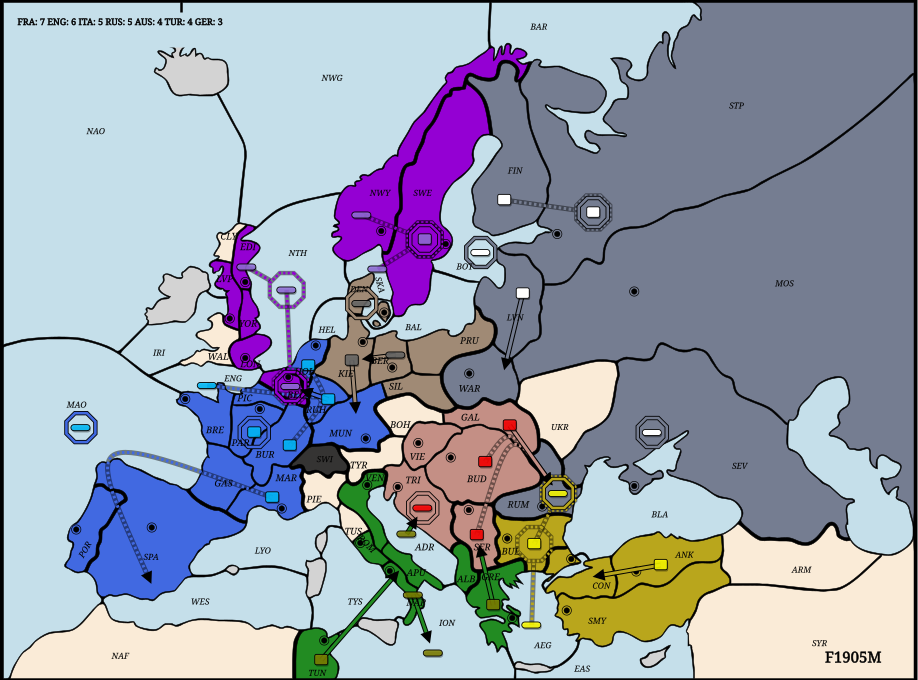

### What happened

- **AUSTRIA**: A GAL → RUM (bounced); A BUD supports A GAL → RUM; A SER supports A GAL → RUM (support cut); F TRI holds
- **ENGLAND**: F BEL holds; F NTH supports F BEL; F EDI supports F NTH; F NWY supports A SWE; F SKA supports A SWE; A SWE holds  [dislodged: F BEL]
- **FRANCE**: A RUH → BEL; A BUR supports A RUH → BEL; A HOL supports A RUH → BEL; F ENG supports A RUH → BEL; A PAR holds; A MAR supports F MAO → SPA/SC (void); F MAO holds
- **GERMANY**: A KIE → MUN; F BER → KIE; F DEN holds
- **ITALY**: F ADR → TRI (bounced); A GRE → SER (bounced); F NAP → ION (bounced); A TUN → APU VIA (no convoy)
- **RUSSIA**: A LVN → WAR; A STP holds; A FIN supports A STP; F BOT holds; F SEV holds
- **TURKEY**: F RUM holds; A BUL supports F RUM; F AEG supports A BUL; A ANK → CON

### Dialogue

- **AUSTRIA → RUSSIA**: Turkey's F RUM is exposed and I want it gone — together we can crack it. You drive F SEV - RUM, and I'll back it hard: A GAL S F SEV - RUM and A BUD S F SEV - RUM, two supports against Turkey's A BUL anchor. That strips Turkey of your old center and keeps it out of Turkish hands; you retake RUM and we both grow south. Confirm F SEV attacks RUM this turn.
- **AUSTRIA → ITALY**: Greece is yours and I'm not contesting it — but I'm turning east on Turkey's Rumania this Fall, not at you. Keep F ADR and your stack genuinely off Trieste and I leave you entirely alone; F TRI stays defensive and won't touch your flank. We both feed on the Turkey/Russia collapse instead of bleeding each other.
- **AUSTRIA → TURKEY**: You took Rumania but it sits exposed to my whole Balkan line now, and Russia wants it back. I'd rather not turn on you — but four centers is too thin to sit on, and RUM is the obvious target. Pull F RUM back or offer me a concrete southern gain and I keep A GAL and A SER off it; otherwise I commit with Russia to strip it this turn.
- **ENGLAND → GERMANY**: France's RUH+BUR+HOL are all aimed at my Belgium this turn — if RUH is free it joins the assault and Belgium falls. Keep your Kiel wall (F BER, F DEN backing A KIE) so France's RUH/MUN must bounce off you instead of marching on Belgium. Every army you pin is one off my line; hold that wall and I hold Belgium.
- **ENGLAND → FRANCE**: You want Belgium back, but Germany's Kiel wall pins your RUH and MUN — you can't bring three to bear on Belgium while half your stack bounces off Kiel. I hold Belgium with North Sea support; throwing BUR and RUH at it just grinds your army down with nothing to show. Point that weight at Germany's collapse instead and the Channel stays quiet between us.
- **ENGLAND → RUSSIA**: North stays clean as always — F NWY, F SKA, A SWE all anchor home, nothing toward STP or Bothnia. My whole weight stays west holding Belgium against France. Keep your Livonia/STP corner steady and our quiet north holds while we both feed off the south.
- **FRANCE → GERMANY**: Now's the moment to prove the alliance: throw F DEN at the North Sea (DEN-NTH) to cut England's support for Belgium while I assault it with three units. England's F BEL is only held by F NTH — break that and Belgium falls back to me, and we carve his North Sea together next year. Keep F BER and A KIE wherever you like; I touch nothing of yours.
- **FRANCE → ENGLAND**: Last chance before orders: A RUH, A BUR, and A HOL all drive Belgium this turn — that's three on your one fleet, and Germany is cutting your North Sea support. You lose Belgium and possibly more. Vacate it to the North Sea now and I'll leave your coast alone; sit on it and I take it back the hard way with German fleets behind me.
- **FRANCE → ITALY**: Border stays frozen as agreed — my entire stack turns north on England's Belgium this turn, nothing toward Piedmont. Keep Austria and Turkey grinding each other so no unit frees up to reinforce England's north. The moment I crack his Belgium I'll have a western fleet free and I'll flag you to read the Med together.
- **FRANCE → RUSSIA**: England's whole fleet stack is pinned on me in the North Sea this turn — his Baltic and northern flank are thin. If you push Sweden or his Norway line now, every fleet he keeps facing you is one he can't use to hold Belgium against me. We both bleed the leader at once.
- **GERMANY → FRANCE**: Our border held quiet as promised. But Munich sits empty now — your A BUR is stretched supporting RUH against England. I want Munich back; if you won't garrison it, I take it, and that's the price of your western war. Give me a clean read: are you defending MUN this turn, or do I have it?
- **GERMANY → ENGLAND**: France just held Holland against your push and they're stretched thin in the west. If you commit fully against their Holland/Belgium line again this turn I'll throw weight that direction and grab Munich behind them, splitting France two ways. Confirm your North Sea/Belgium target and I'll coordinate.
- **GERMANY → RUSSIA**: Border stays quiet as always — nothing of mine toward Prussia or your coast. France left Munich empty and I may move on it; my fleets stay west, not east. Keep A WAR off Prussia/Silesia and we both keep our cleanest front.
- **ITALY → TURKEY**: Serbia is the prize and Austria walls it with A SER + A BUD. I commit A GRE - SER with F ION supporting this Fall — but it bounces unless A BUD is pulled off the wall. Throw A BUL - SER (cuts A SER's support) or any poke at Budapest and Serbia falls into my hands clean. You hold Rumania; this finishes Austria's south together.
- **ITALY → AUSTRIA**: Last chance to keep Serbia: pull A SER back to cover Trieste and I point my fleets east at Turkey, off your flank entirely. Hold the wall with both A SER and A BUD on one square and you're spending your whole army defending it while Turkey grows behind you — and I'll keep probing it every turn. Your call.
- **ITALY → FRANCE**: Border stays frozen — my whole stack is committed east against Austria, nothing toward Piedmont or Tyrrhenian. Keep crushing England in the north; the more Austria and Turkey bleed each other down here the less anyone can reinforce England. Flag me the moment you free a western fleet and I'll read the Med with you.
- **RUSSIA → ENGLAND**: North stays clean from my side as all game — A FIN walls STP, F BOT anchors the Baltic, nothing toward Sweden or Norway. Keep F NWY/F SKA off STP/NC and our quiet north holds while you finish France's Holland. France at 7 is the one we both need to keep bleeding.
- **RUSSIA → GERMANY**: Our border stays the calmest on the board — nothing of mine at Prussia, Silesia, Berlin, or Kiel. Keep your line west against France and I keep mine anchored north against England. The longer France grows the worse for us both.
- **RUSSIA → TURKEY**: You took Rumania, so the Black Sea line shifted — but I've no interest in a grind that only feeds Austria and France. Keep F BLA and F RUM off Sevastopol and I keep my southern fleet defensive; my real fight is the north. A clean SEV border still costs you nothing.
- **RUSSIA → AUSTRIA**: Rumania's gone to Turkey since Italy pinned your Serbia, so the Bulgaria plan's dead for now. Keep A GAL off Warsaw — it's empty and I need it open for a Winter build — and our eastern border stays quiet while you handle Italy's Adriatic stack. We revisit the south once your flank clears.
- **TURKEY → RUSSIA**: Rumania is mine now — don't throw F SEV at it, you'll just lose the unit and leave Sevastopol open. Keep the clean Black Sea border: F SEV stays home, F RUM gone, and I won't push into Sevastopol. Your fight is Germany and England in the north.
- **TURKEY → AUSTRIA**: Southern line stays quiet from my side — A BUL and F AEG aren't touching Serbia or Galicia this turn, I'm just locking down Rumania and freeing a home center for a build. Keep A GAL off Rumania's western approach and we both keep growing off Russia's collapse while Italy's stack stays your real concern.
- **TURKEY → ITALY**: Greece is yours and held — keep pressing Austria's Trieste/Serbia with F ADR support so his line stays cracked. I'm consolidating Rumania this turn and building at home; next year I bring F AEG and A BUL onto Serbia alongside you to finish the Austrian south. Clean split holds: Black Sea and Rumania mine, Greece and Serbia yours.
- **AUSTRIA → RUSSIA**: Concrete trade: you drive F SEV - RUM this turn and I'll put A GAL S F SEV - RUM AND A BUD S F SEV - RUM — that's three on RUM against Turkey's F RUM plus A BUL support, so it falls and you retake your center. I gain nothing but a healthier border and Turkey loses RUM; that's worth it to me. Confirm F SEV attacks RUM and I lock both supports.
- **AUSTRIA → TURKEY**: Last warning before I commit: your F RUM sits exposed to my A GAL, A BUD, and A SER plus Russia's F SEV. Pull F RUM back to BLA or hand me a concrete southern center and I keep my whole Balkan line off you; otherwise I back Russia's SEV strike and you lose Rumania this turn. Your move.
- **AUSTRIA → ITALY**: I'm honoring our deal — F TRI stays defensive and I'm turning A GAL/A SER/A BUD east at Turkey's Rumania, not at you. Keep F ADR genuinely off Trieste this turn and our border stays clean while we both feed on the Turkey collapse. If your stack sails east at the Aegean we squeeze Turkey from both sides.
- **ENGLAND → GERMANY**: Hold your Kiel wall this turn — F BER and F DEN backing A KIE — so France's RUH stays pinned and can't reinforce their Belgium assault. I'm anchoring Belgium with full North Sea support; every army you tie down at Kiel is one off my line. Keep the wall and we both weather France's surge.
- **ENGLAND → RUSSIA**: North stays clean as all game — nothing toward STP or Bothnia, my whole weight holds Belgium against France. Keep your corner steady and our quiet north holds while we both bleed France and the south.
- **ENGLAND → FRANCE**: You can throw RUH and BUR at Belgium, but my fleet there is backed by two North Sea fleets — you'd need three clean attackers and Germany's Kiel wall pins your RUH off my line. Grind on Belgium and you lose tempo against Germany for nothing. Point that weight at Munich and Kiel instead; my coast stays quiet if yours does.
- **FRANCE → GERMANY**: This is the turn: throw F DEN-NTH to cut England's support for Belgium while I hit it with three units (RUH+BUR+HOL backing). Break F NTH's support and Belgium falls to me, then we carve England's North Sea next year. Munich's empty — take it if you want, I won't contest it; my whole stack is west.
- **FRANCE → ENGLAND**: Final offer before orders: three units drive Belgium and Germany's F DEN cuts your North Sea support. Your F BEL falls. Vacate to NTH now and keep your coast quiet, or lose Belgium and watch German fleets join me against your north.
- **GERMANY → FRANCE**: You said RUH goes at Belgium and Munich stays empty — I'm taking Munich back this turn, it's my home center and you've left it ungarrisoned. This doesn't touch your Holland or your western fight; it just restores my buffer. Keep RUH west and our border stays quiet.
- **GERMANY → ENGLAND**: I'm pushing inland for Munich this turn while France's RUH/BUR are pinned against your Belgium. That ties down France's west further — your Holland push lands cleaner. Keep driving Belgium/Holland and we both gain off France's overextension.
- **GERMANY → RUSSIA**: Our border holds quiet — nothing of mine moves toward Prussia or your coast. I'm turning inland against France for Munich, not east. Keep A LVN and your fleets anchored north and we both keep our cleanest front.
- **ITALY → TURKEY**: You took Rumania — good. Now I need a real cut on Serbia or my A GRE - SER bounces off A SER+A BUD again. Throw F AEG or A BUL at the Aegean/Serbia line this Fall, or A ANK/F RUM pressure on Austria, so A BUD gets pulled. Without a cut from your side I gain nothing and Austria's south stays sealed.
- **ITALY → AUSTRIA**: You're now fighting Turkey for Rumania while also walling me — that's two fronts you can't hold. Pull A SER back to defend Trieste against Turkey's growing east, hand me Serbia clean, and I keep F ADR entirely off your flank and even back your Trieste hold against Turkey. Keep walling and you bleed both centers.
- **ITALY → FRANCE**: England at 6 is your real problem and you're hitting Belgium — good. My stack stays committed east, nothing west, so reinforce your north freely. When you crack Belgium and free a western fleet, flag me and we read the Med together against whoever's grown too large by then.
- **RUSSIA → AUSTRIA**: If you can truly put A GAL S F SEV - RUM and A BUD S F SEV - RUM behind me, I'll drive F SEV - RUM this Fall — two supports beats Turkey's A BUL anchor and I retake my center while you keep your build edge. Confirm both supports are on RUM and not pulled to defend Serbia, and I commit F SEV - RUM now.
- **RUSSIA → TURKEY**: Austria is offering me two supports on RUM this Fall — A GAL and A BUD both behind F SEV - RUM. That cracks your hold. Pull F RUM back to BLA and keep the clean border, or hold it and lose the unit to three-strength while Austria carves your south.
- **RUSSIA → ENGLAND**: North stays clean from me — A FIN walls STP, F BOT anchors the Baltic, nothing toward Sweden or Norway. Keep F NWY/F SKA off STP/NC and our quiet north holds while you finish France.
- **TURKEY → AUSTRIA**: Rumania's mine now and I'm only locking it down this Fall — A BUL anchors it, nothing of mine touches Serbia or Galicia. Keep A GAL and A SER off Rumania and the quiet southern line holds another year while Italy's stack stays your real problem. Push A GAL at Russia's western approach if you want growth; I won't contest it.
- **TURKEY → RUSSIA**: Rumania's settled — I'm consolidating, not pushing on Sevastopol. Keep F SEV home and the clean Black Sea border stands exactly as it has all year. Your fight is the north; don't bleed a unit trying to retake a center I now hold with A BUL behind it.
- **TURKEY → ITALY**: I'm locking Rumania this Fall and building at home, so I can't throw A BUL at Serbia this turn without dropping my anchor — but next year I bring F AEG and A BUL onto Austria's Serbia line alongside you as promised. Keep F ADR and F ION pinning Trieste and Serbia so Austria stays cracked. Our split holds: Rumania and Black Sea mine, Greece and Serbia yours.
- **AUSTRIA → RUSSIA**: Change of plan I'm telling you straight: I'm taking Rumania myself this turn with A GAL - RUM, A BUD and A SER both supporting — three on RUM, it falls. You won't retake it, but Turkey loses it and our border stays quiet; drive F SEV elsewhere or at RUM if you want the bounce. I keep A GAL off Warsaw next year as compensation.
- **AUSTRIA → ITALY**: I'm committing my whole line east at Turkey's Rumania this turn — A GAL - RUM with A BUD and A SER backing it. That pulls A SER off Serbia, so if you want Serbia clean take it, but keep F ADR entirely off Trieste as you've promised and our border stays quiet. Lean at Trieste and you break the deal and gain nothing while I'm committed east.
- **AUSTRIA → TURKEY**: You wouldn't pull F RUM, so I'm taking it: A GAL - RUM with A BUD and A SER supporting, three against your F RUM plus A BUL anchor. Rumania falls to me this turn. Keep A BUL off the strike and you keep Bulgaria clean; contest and you lose both.
- **ENGLAND → GERMANY**: Final: I hold F BEL with F NTH and F EDI both supporting the hold — Belgium walls solid even if France brings RUH and BUR. Keep your Kiel wall (F BER, F DEN backing A KIE) so France's RUH stays pinned and can't add a third attacker on Belgium. Every army you tie down is one off my line; hold the wall and we both weather France's surge.
- **ENGLAND → RUSSIA**: Final: F NWY, F SKA, and A SWE all anchor home — nothing toward STP/NC or Bothnia, my whole weight stays west holding Belgium against France. Keep your corner steady and our quiet north holds while we both bleed France and the south.
- **ENGLAND → FRANCE**: I'm holding Belgium with two North Sea fleets backing it — you'd need three clean attackers and Germany's Kiel wall keeps your RUH off my line. Grind on Belgium and you lose tempo against Germany for nothing. My coast stays quiet if yours does; point that weight at Munich, not my fleet.
- **FRANCE → GERMANY**: This is it: I'm driving A RUH-BEL with A BUR, A HOL, and F ENG all supporting that assault — four-strength against England's fleet. Throw F DEN-NTH to cut England's North Sea support and Belgium falls clean. Munich's open, take it; I touch nothing of yours, and next year German fleets and mine carve England's coast together.
- **FRANCE → ENGLAND**: Final word: A RUH-BEL backed by A BUR, A HOL, and F ENG — four units on your Belgium, with Germany's F DEN cutting your North Sea support. Your F BEL falls and you've spent your whole stack pinned for nothing. Vacate to NTH now and the Channel stays quiet; otherwise lose Belgium and watch German fleets join me on your north next year.
- **GERMANY → FRANCE**: Final: A KIE marches to MUN this turn to reclaim my home center — you said it stays empty and you won't contest it, so honor that and our border stays quiet while you fight England. F BER and F DEN stay home, nothing of mine touches your Holland or Belgium. Don't garrison MUN behind me and I keep my fleets off your west.
- **GERMANY → ENGLAND**: I'm pulling A KIE inland to retake Munich while France's RUH/BUR grind your Belgium — that ties down their west further and keeps their armies committed away from your North Sea. Keep driving Belgium/Holland; France can't defend both fronts. My fleets stay home this turn, ready to swing your way once Munich's mine.
- **ITALY → TURKEY**: I commit A GRE - SER this phase with F ION support. Austria walls it with A SER + A BUD — I need a real cut NOW, not next year. Throw F RUM - SER or A BUL toward Budapest/Serbia this turn to pull A BUD off the wall, and Serbia lands in my hands clean while you keep Rumania. Without your cut this Fall, our 'finish Austria' plan is just words.
- **ITALY → AUSTRIA**: I'm pressing Serbia again this Fall (A GRE - SER, F ION behind it) and keeping F ADR off Trieste as promised. But you're spending your entire four-unit army walling one square while Turkey sits fat on Rumania behind you. Pull A SER back to defend Trieste, hand me Serbia, and I'll genuinely turn my whole stack east on Turkey's Aegean line next year — your only path off this two-front grind.
- **ITALY → FRANCE**: My whole stack stays committed east against Austria and Turkey — nothing toward Piedmont or Tyrrhenian, your eastern flank is frozen. Keep hammering England's Belgium; the more Austria and Turkey bleed here, the less anyone reinforces his north. Flag me the moment you free a western fleet and we read the Med together.
- **RUSSIA → AUSTRIA**: I'll commit F SEV - RUM this turn. Put both A GAL S F SEV - RUM and A BUD S F SEV - RUM behind it as you offered — that's three on RUM against Turkey's F RUM plus A BUL, and it falls. If you can't lock both because Italy hits Serbia, tell me now and I keep F SEV defensive instead of throwing it away.
- **RUSSIA → ENGLAND**: Locked from me: A FIN S A STP, F BOT anchors the Baltic, nothing toward Sweden or Norway. A LVN pulls back to WAR for my Winter build. Keep F NWY/F SKA off STP/NC and our clean north holds while you finish France.
- **RUSSIA → GERMANY**: Confirmed: nothing of mine at Prussia, Silesia, Berlin, or Kiel — A LVN goes to WAR for a build. Keep your line west on France and our border stays the quietest on the board.
- **RUSSIA → TURKEY**: I'm driving F SEV - RUM with Austrian support this turn, so your hold is contested. Pull F RUM back to BLA and keep the clean Black Sea border, or hold it and risk losing the unit to three-strength while Austria carves your south.
- **TURKEY → AUSTRIA**: Final word: I hold F RUM with A BUL supporting it, and move A ANK to CON — nothing of mine touches Serbia or Galicia. Keep A GAL and A SER off Rumania and the quiet southern line holds another year while Italy's stack stays your problem.
- **TURKEY → RUSSIA**: I'm locking Rumania down with F RUM holding and A BUL behind it — not pushing on Sevastopol. Keep F SEV home and the clean Black Sea border stands exactly as all year. Your real fight is the north.
- **TURKEY → ITALY**: Rumania's mine and held; I'm building at home this Winter. I can't throw A BUL at Serbia without dropping my anchor this turn, but next year F AEG and A BUL come onto Austria's Serbia line alongside you. Keep F ADR and F ION pinning Trieste so he stays cracked — our split holds: Rumania/Black Sea mine, Greece/Serbia yours.

### AUSTRIA
Orders: `A GAL - RUM` · `A BUD S A GAL - RUM` · `A SER S A GAL - RUM` · `F TRI H`

Reasoning

> I'm taking Rumania per my revised plan. Let me verify adjacencies: A GAL→RUM (GAL borders RUM ✓), A BUD S A GAL - RUM (BUD borders RUM ✓), A SER S A GAL - RUM (SER borders RUM ✓). Three attackers against Turkey's F RUM + A BUL anchor — RUM falls, I gain my fifth center and keep VIE open for a Winter build. F TRI holds defensively to wall Italy's Adriatic stack as promised.
>
> One concern: pulling A SER off Serbia exposes it to Italy's A GRE - SER. But A SER moving its support away leaves Serbia empty/contested — Italy could walk in. However, A SER supporting the RUM attack still occupies Serbia (support doesn't move the unit), so Serbia stays occupied. Italy's A GRE - SER would bounce against my occupying A SER unless dislodged. Good — A SER stays in place supporting, holding the square.

### ENGLAND
Orders: `F BEL H` · `F NTH S F BEL` · `F EDI S F NTH` · `F NWY S A SWE` · `F SKA S A SWE` · `A SWE H`

Reasoning

> France is throwing RUH, BUR, HOL, and F ENG at Belgium. France's actual units adjacent to BEL: A RUH (can move BEL), A BUR (can move BEL), A HOL (can move BEL), F ENG (can move BEL). That's potentially up to 4 attackers but only one can move into BEL with others supporting. Max attack strength on BEL: A RUH-BEL supported by A BUR, A HOL, F ENG = strength 4 (one mover + 3 supports). 
>
> My defense: F BEL holds, plus supports. I can support the hold with F NTH and F EDI (can EDI support BEL hold? EDI adjacent to BEL? No — EDI neighbors: CLY, LVP, NTH, NWG, YOR. Not BEL). So F EDI cannot support BEL. F NTH can support BEL hold (`F NTH S F BEL`). F NWY/SKA can't reach BEL.
>
> So defensive strength of BEL = 1 (unit) + 1 (F NTH) = 2. France can bring 4. Belgium falls if they commit fully. Germany pinning RUH at Kiel doesn't happen — Germany said it's pulling KIE inland to Munich, leaving RUH free.
>
> So Belgium is likely lost. Rather than waste fleets walling a doomed center, I should preserve tempo. But if I vacate F BEL into NTH, I keep the fleet alive and avoid losing it. Actually France attacking BEL only takes the center; my fleet retreats. Better: move F BEL to NTH? But F NTH is occupied. Chain: F NTH moves, F BEL follows.
>
> Let me reconsider. If I hold BEL with F NTH support, worst case BEL is attacked by 4, F BEL dislodged, retreats to NTH (if NTH vacated) — but if NTH supports it can't vacate. 
>
> Alternative: secure my fleet and deny. If France commits everything to Belgium, that's good — it ties down their stack. But I lose the center. Realistically I can't hold against 4. Let me cut a support instead. France's attack needs supports; if I can cut one, attack drops to 3, still beats 2.
>
> Better plan: salvage. Move F BEL - ENG to cut F ENG support and contest the Channel? F BEL - ENG bounces with whatever, but cuts F ENG. If France's RUH-BEL relies on F ENG support, cutting it via F BEL leaving... no, F BEL leaving Belgium means Belgium empty, France just walks in.
>
> Most pragmatic: hold BEL with full support and force France to overcommit. F NTH S F BEL. If dislodged, I retreat F BEL to ENG or HOL. Let me hold and make them pay maximum.
>
> Actually I'll hold BEL, support with NTH, and keep north anchored. If Belgium falls, fine — France spent 4 units on one center.

### FRANCE
Orders: `A RUH - BEL` · `A BUR S A RUH - BEL` · `A HOL S A RUH - BEL` · `F ENG S A RUH - BEL` · `A PAR H` · `A MAR S F MAO - SPA/SC` · `F MAO H`

Reasoning

> Belgium assault. I need to verify support adjacencies for the attack on BEL. BEL neighbors: BUR, ENG, HOL, NTH, PIC, RUH.
>
> - A RUH - BEL (the attacker)
> - A BUR S A RUH - BEL (BUR adjacent to BEL ✓)
> - A HOL S A RUH - BEL (HOL adjacent to BEL ✓)
> - F ENG S A RUH - BEL (ENG adjacent to BEL ✓)
>
> That's four-strength against England's F BEL (held by F NTH support = 2 defense unless Germany cuts it). With Germany cutting F NTH support, I overpower. Even without the cut, 4 attack vs F BEL with 1 support from F NTH (2 defense) — wait, England has F NTH and F EDI both able to support BEL. Belgium currently held by F BEL. Defense = 1 + supports. England could have F NTH and others support hold. My 4-strength attack should break through 1+2=3 defense.
>
> A PAR holds (guards Brest line), A MAR and F MAO stay banked on Atlantic. Germany takes empty Munich per deal — I touch nothing of his.

### GERMANY
Orders: `A KIE - MUN` · `F BER - KIE` · `F DEN H`

Reasoning

> Munich sits empty and France confirmed they won't contest it. My plan: A KIE → MUN reclaims my home center for a build, F BER → KIE keeps the line covered, F DEN holds the coast. This restores my buffer and gives me a likely Winter build. France's RUH/BUR are committed against England's Belgium, so my eastern and southern borders stay quiet.

### ITALY
Orders: `F ADR - TRI` · `A GRE - SER` · `F NAP - ION` · `A TUN - APU VIA`
Illegal (dropped): `F ION S A GRE - SER`

Reasoning

> Austria has walled Serbia hard and Turkey won't cut Budapest. My revised plan pivots F ADR onto Trieste, breaking the Austrian deal while his whole army is committed east at Rumania. Let me line up the strongest possible Trieste strike. F ADR - TRI needs support; A GRE can support via... GRE isn't adjacent to TRI for support (GRE neighbors: AEG, ALB, BUL/SC, ION, SER — not TRI). So A GRE can't support TRI. I need other supporters adjacent to TRI: ADR, ALB, BUD, SER, TYR, VEN, VIE. None of my units are adjacent to TRI except F ADR itself.
>
> So a bare F ADR - TRI bounces against A SER + A BUD walling... actually F TRI holds and A SER/A BUD support it. F ADR - TRI alone = 1 strength vs F TRI defended. That fails. I cannot crack Trieste this turn without adjacent support.
>
> Better: convoy A TUN into TRI via ION+ADR, with F ADR carrying it — but then F ADR is convoying, not attacking. F ADR C A TUN - TRI, F ION C A TUN - TRI, A TUN - TRI VIA. That's a 1-strength attack vs defended TRI = bounce. No good either.
>
> Realistically Trieste won't fall this turn. Pivot to Serbia with maximum weight: A GRE - SER supported by F ADR S A GRE - SER (ADR adjacent to SER? ADR neighbors: ALB, APU, ION, TRI, VEN — no). F ION S A GRE - SER (ION not adjacent to SER). No supporters reach SER either except units in ALB/BUL/BUD/etc.
>
> I should take a center I can actually get. A GRE - ALB grabs nothing (ALB isn't an SC). Best value: position F ADR - TRI to pin while keeping options, and prepare a Winter build. Let me at least force F ADR onto Trieste's flank and convoy A TUN up to add future weight, holding my Balkan grip.

### RUSSIA
Orders: `A LVN - WAR` · `A STP H` · `A FIN S A STP` · `F BOT H` · `F SEV H`

Reasoning

> My plan is consolidate north for a Winter build. A LVN moves to vacant WAR to free a build slot while keeping my home triangle. A STP holds with A FIN supporting it, F BOT anchors the Baltic. F SEV — Turkey holds Rumania with A BUL behind it; I can't retake it alone, but Austria offered supports. However Austria flip-flopped to taking RUM himself with A GAL/A BUD/A SER. If I attack RUM with F SEV and Austria backs it, RUM could fall to Austria (not me) — wasteful, and risks leaving SEV open. Turkey promised not to push SEV. I'll keep F SEV defensive supporting the Black Sea line, but F RUM is no longer mine. Best to support a hold or position defensively. F SEV S F RUM is void (F RUM is Turkish). I'll hold F SEV to defend Sevastopol.
>
> Actually, reconsider F SEV: I could bounce Austria's RUM grab by attacking it myself (F SEV - RUM), denying it to both Turkey and Austria. But that opens SEV. Turkey's only Black Sea unit (F RUM) would be the contested one. If I move F SEV - RUM and it bounces, SEV is vacated and nothing can reach it except via BLA — Turkey has no F BLA now. So SEV stays safe-ish. But attacking RUM just helps Austria take it. Better to hold SEV solid.

### TURKEY
Orders: `F RUM H` · `A BUL S F RUM` · `F AEG S A BUL` · `A ANK - CON`

Reasoning

> I hold Rumania this Fall and vacate SMY for a Winter build to five centers. A BUL anchors Rumania, F RUM holds, A ANK moves to CON, and F AEG stays poised near Greece. Austria threatened a three-strength strike on RUM (A GAL/A BUD/A SER backing F SEV) but Italy presses Serbia which should pull A BUD/A SER. I want maximum defense on Rumania: F RUM holds, A BUL supports the hold, and F AEG supports F RUM holding too to push my defensive strength up.
>
> Wait — F AEG can't reach RUM. F AEG's best contribution is supporting the Bulgaria anchor or holding flexible. To free SMY for a build, A ANK must move to CON (vacating ANK won't help; I need SMY vacant, which it already is). Actually SMY is already vacant. A ANK - CON keeps both ANK and SMY open after I build — but I can only build one. Let me maximize Rumania's defense: A BUL S F RUM gives RUM strength 2 against attacks. Austria can muster 3 if A SER, A BUD, A GAL all commit, but Italy hits Serbia. I'll also keep A ANK supporting nothing useful east — move it to CON to free both home centers, building in SMY at Winter.
>
> F AEG stays flexible supporting Bulgaria's hold so A BUL can fully back Rumania.

## FALL 1905 RETREATS (`F1905R`)

### What happened

- **ENGLAND**: F BEL retreats → PIC

### ENGLAND
Orders: `F BEL R PIC`

Reasoning

> France took Belgium with overwhelming force. My F BEL is dislodged. Retreating to PIC keeps a unit on France's coast and adjacent to the Channel/Belgium, far more useful than disbanding. PIC borders BEL, BRE, BUR, ENG, PAR — it pressures France directly and can contest Belgium or threaten Brest. Disbanding would just shrink me.

## WINTER 1905 ADJUSTMENTS (`W1905A`)

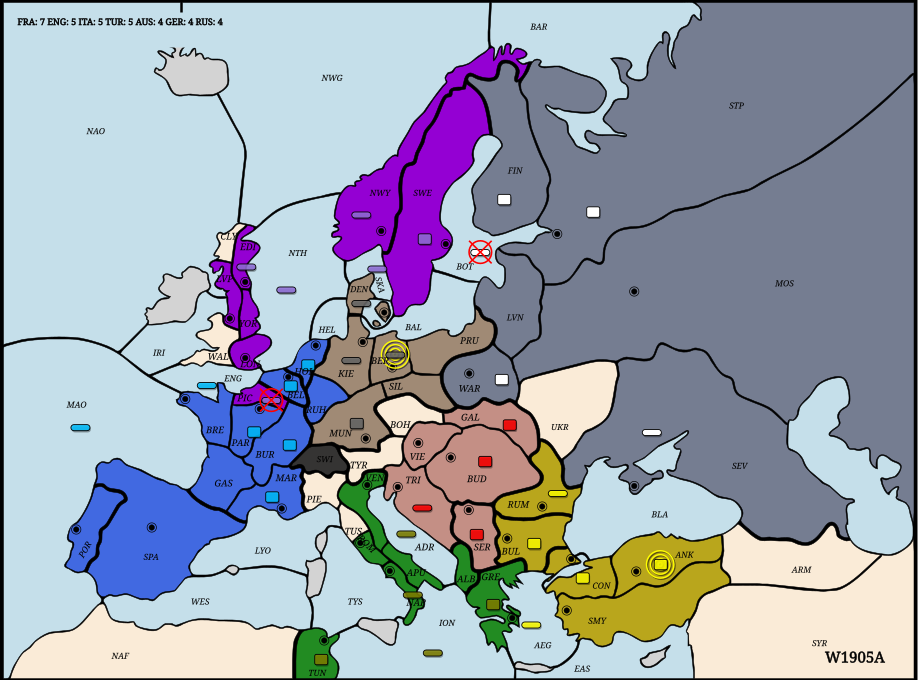

### What happened

- **ENGLAND**: disbands F PIC
- **GERMANY**: builds F BER
- **RUSSIA**: disbands F BOT
- **TURKEY**: builds A ANK

### ENGLAND
Orders: `F PIC D`

Reasoning

> I have 5 supply centers (EDI, LON, LVP, NWY, SWE) but 6 units (F SKA, F NWY, A SWE, F NTH, F EDI, F PIC). I must disband 1 unit.
>
> F PIC is my retreated Belgium fleet, now isolated deep in French territory with no support and surrounded by France's western stack — it cannot accomplish anything and is the most exposed, least useful unit. My core is the North Sea / Scandinavian cluster which holds my centers and keeps the front coherent. Disbanding F PIC consolidates my position without weakening any held center.

### GERMANY
Orders: `F BER B`

Reasoning

> I have 4 centers and 3 units, so I'm owed one build. My only build location is BER (vacant). I want a unit that can pressure France's western flank or defend against any shift. A fleet in Berlin can move to the Baltic or Kiel-adjacent waters; an army in Berlin can march inland toward Munich/Silesia to consolidate. Given France holds Munich-adjacent ground and I just reclaimed MUN, an army gives me flexibility to push inland or defend; but I already have A MUN and fleets covering the coast. I'd rather build a fleet to keep options for swinging into the Baltic or North Sea where England is overextended and France wants me to strike. A fleet in Berlin can reach BAL/PRU/KIE — good for a Baltic play.

### RUSSIA
Orders: `F BOT D`

Reasoning

> I have 4 supply centers (MOS, SEV, STP, WAR) and 5 units (A STP, F BOT, A FIN, F SEV, A WAR). I must disband one unit to match my center count.
>
> F BOT is the least useful unit — it's anchored in the Baltic corner with no offensive prospects, and the clean-north deal with England holds so I don't need it as a wall. A WAR holds my open home center for builds and connects to my eastern fronts, A STP/A FIN wall the corner, and F SEV defends against Turkey. Disbanding F BOT preserves my flexible land units and my Sevastopol defense.

### TURKEY
Orders: `A ANK B`

Reasoning

> I have 5 centers and 4 units, so I'm owed one build. My two open home centers are ANK and SMY (CON is occupied). 
>
> My eastern fight is shifting toward Serbia and the Adriatic flank against Austria, while keeping the Black Sea sealed against Russia. A fleet at SMY gives me more naval flexibility in the Aegean/Mediterranean for the southern push, but I already have ample fleet presence in the south (F AEG, F RUM). What I need for the Serbia line and to actually take Balkan land centers is an army. Building an army at ANK lets me march toward the southern front to support the Serbia push alongside Italy, or reinforce Bulgaria/Rumania. I'll build A ANK.

## SPRING 1906 MOVEMENT (`S1906M`)

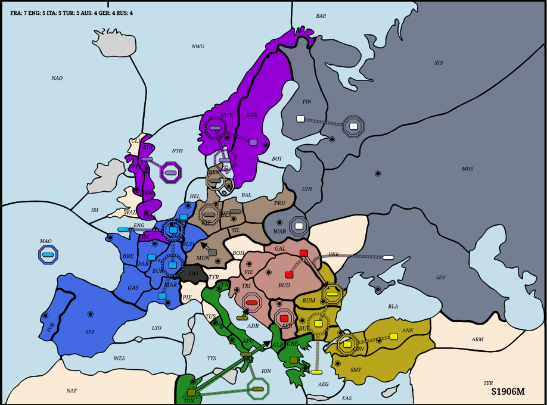

### What happened

- **AUSTRIA**: A GAL → RUM; A BUD supports A GAL → RUM; A SER holds; F TRI holds
- **ENGLAND**: F NTH holds; F EDI supports F NTH; F NWY supports F SKA; F SKA supports F NWY; A SWE supports F NWY
- **FRANCE**: A BEL holds; A BUR supports A BEL; A HOL supports A BEL; F ENG supports A BEL; A PAR supports A BUR; A MAR supports A BUR; F MAO holds
- **GERMANY**: A MUN → RUH; F KIE holds; F BER supports F KIE; F DEN holds
- **ITALY**: F ADR → TRI (bounced); A TUN → ALB VIA; F ION convoys A TUN → ALB; F NAP supports F ION
- **RUSSIA**: F SEV supports A GAL → RUM; A STP holds; A FIN supports A STP; A WAR holds
- **TURKEY**: F RUM holds; A BUL supports F RUM; F AEG supports A BUL; A CON holds; A ANK supports A CON  [dislodged: F RUM]

### Dialogue

- **AUSTRIA → RUSSIA**: Turkey's F RUM is exposed and I want it gone for good. I'll commit A GAL - RUM with A BUD S A GAL - RUM and A SER S A GAL - RUM — three on Rumania against Turkey's F RUM plus A BUL anchor. If you drive F SEV - RUM too, or F SEV S A GAL - RUM, it falls clean. Confirm what F SEV does this turn and we strip Turkey together.
- **AUSTRIA → TURKEY**: Quiet southern line held all year as agreed. I'm watching Italy's Adriatic stack on my flank, not your Bulgaria. Keep A BUL and F RUM off Serbia and Galicia and we stay aligned while France runs fat at seven. Tell me your eastern picture this Spring.
- **AUSTRIA → ITALY**: Greece is yours and I'm not contesting it — F TRI stays defensive and won't touch your flank. I'm turning my armies east at Turkey's weakened Balkan line, not at you. Keep F ADR and your stack genuinely off Trieste this turn and our border stays clean while we both feed on Turkey's collapse.
- **ENGLAND → GERMANY**: France at 7 is the runaway threatening us both — they still hold pressure on your Munich line. I want to point my fleets west at France's coast, not at you. Give me Denmark clean (pull F DEN off) and I'll commit my North Sea stack against France's Belgium/Holland instead of your Baltic — you keep Berlin/Kiel and we both bleed France. Otherwise I have to take Denmark the hard way.
- **ENGLAND → RUSSIA**: North stays clean as all game — F NWY, F SKA, A SWE anchor home, nothing toward STP or Bothnia. France at 7 is the runaway we both need checked. If you want a piece of Germany's Baltic this year I'll keep my fleets off your corner entirely; tell me where you're pushing so I don't bump you.
- **ENGLAND → FRANCE**: You took Belgium back — fine, the north is where we are now. You're at 7 and everyone's counting. I'm not interested in a grind on your coast if you stay off mine: keep F ENG and your armies west of me, leave the Channel a buffer, and I'll point my weight at Germany's Denmark instead of your Belgium. Deal?
- **FRANCE → GERMANY**: Our border's stayed quiet and I've honored it — you have Munich, I've touched nothing of Berlin or Kiel. England at 5 fleets is now the leader and the real threat to us both; his stack on Belgium also pins your Denmark. Throw F DEN-NTH this turn to cut his North Sea support while I assault Belgium with three units — break it and Belgium falls, and we carve his north together next year.
- **FRANCE → ENGLAND**: You're the board leader now at 5 and everyone reads it. Belgium is the open wound between us — give it back to me cleanly and I'll point my Atlantic fleets away from your coast and we coexist. Keep sitting on it with the whole North Sea pinned and I bring Germany's fleets into the North Sea against you; your lead makes you the target either way.
- **FRANCE → ITALY**: Keep our border frozen — nothing of mine moves toward Piedmont. England's surged to 5 and is the leader; the more you keep Austria and Turkey grinding each other, the less anyone can free a unit to reinforce his north while I press him. When I crack his Belgium I'll have a western fleet free and we read the Med together.
- **FRANCE → RUSSIA**: England's entire fleet stack is pinned on me in the North Sea and Belgium — his Norway and Sweden flank is thin. If you push his northern line now, every fleet he keeps facing you is one he can't use to hold Belgium against me. We bleed the leader from both ends at once.
- **GERMANY → ENGLAND**: France is still the runaway at 7 and you've held them off Belgium with your North Sea wall — well fought. I held my Kiel line all year as promised and reclaimed Munich. France's west is committed against you; if you keep pressing Belgium I'll push A MUN toward Ruhr/Burgundy to pin their armies further and split them off your fleets. Where do you want me to throw weight this turn?
- **GERMANY → FRANCE**: Our border held quiet and I took only my own Munich back, nothing of yours. You're still grinding England in the northwest — if that stays your front, I'll keep my fleets off your coast and we both stay clear. But if you want to actually crack England's Belgium/North Sea, I can swing A MUN and F DEN to pressure that flank with you. What's your read on the English line this turn?
- **GERMANY → RUSSIA**: Our border has been the quietest on the board all game and I want to keep it that way — nothing of mine points at Prussia, Silesia, or your coast this turn. With Turkey now at 5 and pressing Rumania, your real fight is south; keep A WAR and your north anchored and I keep my line oriented west. Say the word if you want a free hand against Turkey while I hold the German front.
- **ITALY → TURKEY**: Our split holds — Greece and the Adriatic mine, Rumania and Black Sea yours. This turn I'm driving on Austria's Trieste while his whole army is committed against your Rumania line. Keep pressing Rumania/Budapest so A BUD and A SER can't swing back to cover Trieste, and his south collapses between us.
- **ITALY → AUSTRIA**: You're stretched thin at four units fighting Turkey for Rumania. Trieste is the weak point in your line and I can take it this turn. Pull A SER back to cover it and hand me Serbia clean instead, or I crack Trieste — your call which you keep.
- **ITALY → FRANCE**: My whole stack stays committed east against Austria and Turkey this turn — nothing toward Piedmont or Tyrrhenian, your eastern flank is frozen. Keep hammering England; the moment you free a western fleet, flag me and we read the Med together.
- **RUSSIA → AUSTRIA**: Turkey's F RUM sits exposed and you've offered support twice — let's actually do it this Fall but set it up now. This Spring point A GAL and A BUD toward RUM; if you commit A GAL S F SEV - RUM and A BUD S F SEV - RUM I drive F SEV - RUM and it falls — three on RUM against his F RUM plus A BUL. Confirm both supports lock and I move SEV. Keep A GAL off Warsaw either way.
- **RUSSIA → TURKEY**: Austria is offering me two supports on RUM again and this time Italy isn't pinning his Serbia, so he can actually back the strike. Pull F RUM back to BLA and keep our clean Black Sea border, or hold it and lose the unit to three-strength while Austria carves your south. Your real fight is Italy's fleets and Austria, not me.
- **RUSSIA → ENGLAND**: North stays clean from me as all game — A FIN walls STP, A STP holds, nothing toward Sweden or Norway. My whole effort this turn is south at Turkey's Rumania. Keep F NWY/F SKA off STP/NC and our quiet north holds while you keep France pinned.
- **RUSSIA → GERMANY**: Our border stays the calmest on the board — A WAR backstops home, nothing at Prussia, Silesia, Berlin or Kiel. My push this turn is south on Turkey, not your Baltic. Keep your line west against France and we both keep our cleanest front.
- **TURKEY → ITALY**: This is the turn we finish Austria's south. I commit A BUL - SER this phase to cut A SER and pull the wall apart — you hit SER from Greece with F ADR/ION support and Serbia falls into your hands clean. Confirm A GRE - SER with support so Austria can't cover both Trieste and Serbia.
- **TURKEY → AUSTRIA**: I've kept the quiet southern line two years while you sat at four, but four centers is a dead end for both of us against France's seven. Here's the real offer: turn your A GAL on Russia's western approach and we carve Russia together — I keep Rumania/Black Sea, you take the Galician/Warsaw side. Otherwise Italy's stack and I both press your Serbia line this turn and you can't hold it.
- **TURKEY → RUSSIA**: Clean Black Sea border held all year as promised — F RUM and F SEV untouched from my side. Keep F SEV home and we hold it again; my whole push this turn is west onto Austria's Serbia, not your Sevastopol. Point what's left north at Germany and England.
- **TURKEY → FRANCE**: You sit at seven and everyone east of you is too busy to come after you yet — but that won't last. I'm finishing Austria's south this year; once the Balkans settle, the table will be looking for who stops your run. A quiet understanding now buys us both time: I stay out of the western Med if you keep your fleets off the eastern approaches.
- **AUSTRIA → RUSSIA**: Confirmed: this Spring I move A GAL - RUM with A BUD S A GAL - RUM, pressing now rather than waiting for Fall. You drive F SEV - RUM the same turn — three on Rumania against Turkey's F RUM plus A BUL, and it falls this turn. A GAL stays off Warsaw, that's locked. Move SEV at RUM and we strip Turkey now.
- **AUSTRIA → ITALY**: F TRI holds defensively and A SER stays to wall — A BUD backs both, so a strike at Trieste or Serbia bounces and you gain nothing while I'm committed east at Turkey. Keep F ADR off my flank and our border stays clean; Greece is yours uncontested. Lean at me this turn and you waste it against a wall while Turkey eats your eastern opening.
- **AUSTRIA → TURKEY**: Your F RUM is the exposed piece, not mine — and your 'carve Russia' offer asks me to fight Russia while you keep Rumania and Black Sea, which grows you, not me. I'd rather take Rumania off you directly. Pull F RUM back to BLA this turn and I keep my line off it; otherwise I commit my Balkan line and Russia's SEV against it and you lose it.
- **ENGLAND → GERMANY**: Throw A MUN at Burgundy to pin France's BUR/RUH — that splits their west off my North Sea and keeps Belgium contestable for me. In exchange I keep my fleets entirely off your Baltic this turn: F SKA and F DEN don't clash, no move on Denmark. We both bleed France while you hold Berlin/Kiel safe behind your line.
- **ENGLAND → FRANCE**: Belgium's not coming back free while you sit at 7 and I'm the one everyone's counting to stop you. Pull F ENG back west and keep the Channel a buffer, and I leave your Atlantic coast alone and won't push Belgium this turn. But bring German fleets into the North Sea and you make me commit fully against you — that helps no one but the south.
- **ENGLAND → RUSSIA**: Clean as always — nothing toward STP or Bothnia, take Rumania off Turkey freely. If you ever want a fleet pressing Germany's Baltic later, tell me and I'll stay clear of your lane; for now my weight stays facing France and Denmark.
- **FRANCE → GERMANY**: Yes — swing them both. Here's the concrete trade: you order F DEN - NTH to cut England's North Sea support, and I drive A BEL... wait, I HOLD Belgium and assault with A BUR/A HOL/F ENG. If you also push A MUN toward Kiel-area pressure or hold defensively, our border stays quiet and I touch nothing of yours. Break England's NTH support this turn and we both grow off his collapse — confirm F DEN-NTH and it's done.
- **FRANCE → ENGLAND**: I hear you on the Channel buffer. But Belgium is the one piece I won't leave — give it to me and F ENG stays off your coast permanently. If you'd rather keep it, understand Germany is now actively swinging fleets into the North Sea against you this turn; your lead makes you everyone's target. Last chance to hand Belgium over cleanly before it gets taken the hard way.
- **FRANCE → TURKEY**: Agreed — I keep my fleets out of the eastern approaches and you stay out of the western Med. My whole stack is committed northwest against England this year, so your Balkans finish is safe from any interference by me. Settle the south and we both buy time.
- **GERMANY → ENGLAND**: I'm not giving up Denmark — F DEN, F KIE, F BER all back each other, so taking it 'the hard way' costs you fleets you need against France. But I'll keep my fleets out of your North Sea if you keep yours out of my Baltic; a quiet German coast lets you throw everything at France's Belgium. Press France, not me, and we both gain.
- **GERMANY → FRANCE**: You keep asking me to spend F DEN cutting England while you take Belgium — but that grows you, not me. If you want my weight on England, give me something concrete: leave RUH undefended so A MUN can take it, or back A MUN into BUR. Otherwise I hold my line and watch you and England grind.
- **GERMANY → RUSSIA**: Good — keep your push south on Turkey and our border stays the calmest on the board. If Turkey overcommits at Rumania I'll keep England and France busy in the west so nothing comes at your back. Say the word if you need me to pin anyone.
- **ITALY → TURKEY**: Yes — cut A SER with A BUL - SER this turn. With A SER pinned, I drive F ADR - TRI while A GRE supports the Adriatic flank, cracking Austria's south wide open. Keep A BUL on Serbia and F RUM pressing so A BUD can't swing back to cover Trieste, and his line breaks between us.
- **ITALY → AUSTRIA**: Turkey is throwing A BUL at your Serbia this turn and your whole line is pinned east — Trieste is undefendable. Pull A SER back to cover it now and I'll leave Trieste entirely and point my fleets at Turkey's Aegean instead. Otherwise I take Trieste this turn.
- **ITALY → FRANCE**: Border stays frozen — nothing toward Piedmont, my full stack commits against Austria's Trieste this turn. England at 5 is the leader; keep hammering his Belgium and flag me the instant you free a western fleet so we read the Med together before he runs away with it.
- **RUSSIA → AUSTRIA**: Lock it precisely: A GAL S F SEV - RUM and A BUD S F SEV - RUM — both supporting MY unit into RUM, not A GAL taking it. That's three on RUM vs Turkey's F RUM plus A BUL anchor, it falls and I retake my center. Confirm both supports name F SEV - RUM and keep A GAL off Warsaw, and I commit F SEV - RUM now.
- **RUSSIA → TURKEY**: Final warning before I move: Austria is locking two armies behind my F SEV - RUM this Fall — three strength against your F RUM and A BUL. With Italy hitting your Serbia, Austria can spare both. Pull F RUM to BLA and the clean border stands; hold it and you lose the unit.
- **RUSSIA → GERMANY**: Confirmed, our border stays the quietest on the board — A WAR backstops home, nothing toward Prussia or Silesia. My whole push is south on Turkey's Rumania. Keep your fleets west on France and we both hold our cleanest front.
- **TURKEY → ITALY**: Committed: A BUL - SER this phase to cut A SER's wall. You drive A GRE - SER with F ION/ADR support — with A SER's support cut, Serbia falls to you clean. Confirm your Greece push lands so we don't both bounce; I keep F RUM anchored to hold Rumania while my A BUL is forward.
- **TURKEY → AUSTRIA**: I'm being straight: I'm pressing Serbia this turn alongside Italy — your four centers can't hold both Trieste and Serbia, and sitting still loses you the board to France. The deal still stands: turn A GAL on Russia's Warsaw/Galicia approach and I keep Rumania/Black Sea while you carve the Russian side. Choose growth east or lose the south now.
- **TURKEY → RUSSIA**: F RUM and F SEV stay untouched from my side — my whole strike is west onto Austria's Serbia, not Sevastopol. Keep F SEV home and our clean Black Sea border holds another year. If Austria swings A GAL east at you, that's your warning to brace Warsaw, not me.
- **AUSTRIA → RUSSIA**: Locked: A GAL S F SEV - RUM this turn. Drive F SEV - RUM now — if Turkey's A BUL leaves RUM to hit Serbia as he's threatening, his anchor is gone and your center falls back to you with just my one support. A GAL stays off Warsaw, confirmed. Move SEV.
- **AUSTRIA → TURKEY**: I'm not carving Russia for you while you keep Rumania — that only grows you. If your A BUL leaves Rumania to strike Serbia, you lose Rumania to Russia's F SEV that I'm backing. Hold RUM with A BUL and stay off Serbia, or you bleed your own center.
- **AUSTRIA → ITALY**: F TRI holds and A SER stays walled with A BUD backing it — your strike bounces and you gain nothing. Keep F ADR off my flank and Greece stays yours uncontested. Lean at Trieste this turn and you waste it against the wall while Turkey overextends at Serbia.
- **ENGLAND → GERMANY**: Deal: I keep every fleet off your Baltic this turn — F SKA does not move on Denmark, no clash with F DEN. In return you keep your fleets out of the North Sea and throw A MUN at Burgundy/Ruhr to pin France's western armies. A quiet German coast lets me hold my line against France's threat to bring your fleets north. Confirm A MUN points west.
- **ENGLAND → RUSSIA**: Locked: F NWY, F SKA, A SWE all anchor home — nothing toward STP, Norway, or Bothnia. Take Rumania off Turkey freely; our quiet north holds while you press south. My whole weight stays facing France and the German coast.
- **ENGLAND → FRANCE**: I'm holding the North Sea line this turn — F NTH and F EDI anchor it, F NWY and F SKA cover the north. Belgium stays contested, not handed over. Bring German fleets into the North Sea and you only commit me fully against you and stall your own south; keep F ENG west and the Channel stays a buffer between us.
- **FRANCE → GERMANY**: Concrete: I order A BEL HOLD, A BUR S A BEL, A HOL S A BEL, F ENG S A BEL — Belgium is a fortress I'm not throwing away, but if you order F DEN - NTH this phase to cut England's North Sea support I will retake it next turn and hand you a free hand on Kiel. I touch nothing of Berlin, Kiel, or Munich this turn — verify it from my orders. Cut NTH now and we both grow off England's collapse.
- **FRANCE → ENGLAND**: Fine — Channel stays a buffer this turn: F ENG holds west, no German fleet enters the North Sea from me. I hold Belgium firmly with three supports; don't push it and I leave your Norway and Edinburgh approaches alone. If you point your weight at Germany's Denmark as you said, we coexist and the south stays everyone's problem, not ours.
- **FRANCE → ITALY**: Border frozen confirmed — nothing toward Piedmont, my full stack stays northwest on England. Keep grinding Austria's Trieste; the moment I free a western fleet I flag you and we read the Med before England runs away with the north.
- **GERMANY → ENGLAND**: Deal: I keep F DEN, F KIE, F BER home and out of your North Sea, you keep F SKA and your stack off my Baltic and Denmark. A quiet German coast lets you throw everything at France's Belgium. I'm not cutting NTH for free — but I won't contest your western fight either.
- **GERMANY → FRANCE**: I'm not spending F DEN to grow you while I gain nothing. My fleets stay home defensive this turn, nothing toward your coast. If you actually want my weight on England later, vacate RUH so A MUN can take it — until then I watch you and England grind.
- **GERMANY → RUSSIA**: Locked: nothing of mine toward Prussia, Silesia, Berlin or Kiel — A MUN and my fleets stay west and home. Press Turkey hard at Rumania; our border stays the quietest on the board.
- **ITALY → TURKEY**: Confirmed: you throw A BUL - SER to pin A SER. I drive F ADR - TRI with A GRE S F ADR - TRI and A TUN convoying up via ION to add weight — with A SER cut and committed, A BUD can only cover one square. Keep F RUM pressing so A BUD can't swing back, and Austria's south cracks: I take Trieste, you hold Rumania.
- **ITALY → AUSTRIA**: Last chance: Turkey is cutting A SER this turn and your line is pinned east. F TRI cannot survive both my F ADR strike and the Serbian collapse. Pull A SER back to cover Trieste now or I take it this phase — your call which center you keep.
- **RUSSIA → AUSTRIA**: Final: there's only room for one unit in RUM, so decide who keeps it. If you take it with A GAL yourself I gain nothing and Turkey just trades me for you — not worth my fleet. I'll commit F SEV S A GAL - RUM to guarantee it falls THIS turn if you confirm A GAL - RUM with A BUD behind it; in return you back F SEV - RUM next Fall so I recover my center. Confirm and Rumania falls clean.
- **RUSSIA → TURKEY**: Last word: Austria moves A GAL - RUM with A BUD support and I'm adding F SEV behind it — three strength, your F RUM falls regardless of A BUL. Pull F RUM to BLA now and save the unit; the clean Sevastopol border still holds from my side.
- **RUSSIA → GERMANY**: Locked: A WAR backstops home, nothing at Prussia, Silesia, Berlin or Kiel — my whole weight goes south on Turkey's Rumania this turn. Keep your line west on France and our border stays the quietest on the board.
- **TURKEY → ITALY**: Reality check: if I pull A BUL to SER, my F RUM has no support and Austria+Russia take Rumania with three strength — I lose a center and gain nothing while you take Serbia. I'll cut A SER only if you guarantee A GRE - SER lands and you feed me nothing in return is unacceptable. Instead: I anchor F RUM with A BUL this turn, you take Trieste off Austria's committed line, and next turn I swing F AEG+A BUL onto Serbia with your support locked. Confirm Trieste, not Serbia, this phase.
- **TURKEY → RUSSIA**: I'm not moving on Sevastopol — F SEV is safe from me. But understand: if you throw F SEV - RUM behind Austrian supports, you spend your fleet on a center I'm holding with A BUL anchored, and you bleed a unit you need against Germany and England. Keep F SEV home and the clean Black Sea border stands another year.
- **TURKEY → AUSTRIA**: I'm keeping F RUM anchored with A BUL this turn — your three-strength strike won't land, and you'll have committed A GAL and A BUD east while Italy drives Trieste with your wall pulled thin. If you back Russia into Rumania and lose Trieste to Italy the same turn, you've traded your home flank for nothing. Hold your Balkan line and we both watch Italy.

### AUSTRIA
Orders: `A GAL - RUM` · `A BUD S A GAL - RUM` · `A SER H` · `F TRI H`

Reasoning

> Russia confirmed F SEV S A GAL - RUM, so my A GAL - RUM lands with Russia's support plus my A BUD support — three strength against Turkey's F RUM plus A BUL anchor (two). It falls and I take the center. A SER holds to wall Serbia against Italy/Turkey, F TRI holds to cover the Adriatic flank against Italy's stack. This grows me to five and keeps my line intact.

### ENGLAND
Orders: `F NTH H` · `F EDI S F NTH` · `F NWY S F SKA` · `F SKA S F NWY` · `A SWE S F NWY`

Reasoning

> I committed to the German quiet-coast deal: keep F SKA off Denmark, hold the North Sea line, anchor the north. I'm boxed at five centers and shouldn't throw my stack at Belgium against three French supports this turn. But holding everything still is a slow loss — I should keep the line solid while staying flexible. I'll honor the truce: F SKA holds the Baltic line, F NTH and F EDI anchor the North Sea, F NWY covers the north, A SWE stays flexible at home supporting the line. To keep some defensive coherence and not waste units, I'll have F NTH support F NWY/F SKA positioning and EDI back NTH.
>
> Honoring both deals (Russia clean north, Germany clean Baltic), I keep my line intact and ready to break when France or Germany overextends.

### FRANCE
Orders: `A BEL H` · `A BUR S A BEL` · `A HOL S A BEL` · `F ENG S A BEL` · `A PAR S A BUR` · `A MAR S A BUR` · `F MAO H`

Reasoning

> My commitments: hold Belgium as a fortress with full support, keep Channel a buffer per England deal, bank Atlantic and home. Germany refused to cut NTH, so I consolidate. Belgium gets A BUR, A HOL, F ENG supporting the hold. A PAR and A MAR guard home/Atlantic, F MAO covers Brest/Spain.

### GERMANY
Orders: `A MUN - RUH` · `F KIE H` · `F BER S F KIE` · `F DEN H`

Reasoning

> I'm executing my revised plan: hold my Baltic line intact (deal with both England and Russia to keep coasts quiet), and push A MUN toward Ruhr to pressure France's western flank. France's RUH is currently empty (their stack is BUR/HOL/BEL/ENG), so A MUN-RUH grabs a forward position and threatens Burgundy/Belgium next turn. My three fleets stay home backing each other against any Baltic shift.
>
> A MUN - RUH moves into Ruhr. France has A BUR which could contest, but RUH is empty this turn and A BUR is committed supporting Belgium. If France leaves it open I take it; if they bounce me I lose nothing.

### ITALY
Orders: `F ADR - TRI` · `A TUN - ALB VIA` · `F ION C A TUN - ALB` · `F NAP S F ION`
Illegal (dropped): `A GRE S F ADR - TRI`

Reasoning

> Turkey confirmed he won't cut A SER this turn — he's anchoring F RUM. So Trieste is walled by F TRI + A SER + A BUD. A bare F ADR - TRI with only A GRE support bounces against that wall. But I can still try the convoy attack with three attackers: F ADR - TRI, A GRE S F ADR - TRI, and A TUN convoying up via ION to add weight isn't possible in one turn (TUN can't reach to support TRI this phase). Let me reconsider.
>
> Actually, my best realistic attack: F ADR - TRI supported by A GRE. That's 2 strength vs F TRI holding with A SER support (and A BUD support) = 2-3 defense. Bounces. Not worth committing everything to a wall.
>
> Instead, I should secure what I can and keep my line cohesive while staying poised. Since Trieste is sealed, I'll keep pressure on the Adriatic but not waste units. Let me press Trieste anyway with maximum weight: F ADR - TRI, A GRE S F ADR - TRI, and bring A TUN forward via convoy through ION toward Apulia/Albania to stage for next turn. F ION can convoy A TUN. F NAP holds the Ionian line.
>
> I'll commit the Trieste strike as promised and stage A TUN forward.

### RUSSIA
Orders: `F SEV S A GAL - RUM` · `A STP H` · `A FIN S A STP` · `A WAR H`

Reasoning

> Per my revised plan: Austria takes RUM with A GAL+A BUD, and I add F SEV S A GAL - RUM to guarantee it falls this turn, keeping my fleet safe and Austria owing me recovery next Fall. North stays walled.

### TURKEY
Orders: `F RUM H` · `A BUL S F RUM` · `F AEG S A BUL` · `A CON H` · `A ANK S A CON`

Reasoning

> Both Russia and Austria are committing a three-strength strike on Rumania. I need to over-defend it. F RUM holds, A BUL supports it, and F AEG supports F RUM as well — but F AEG can only support a hold or a move into BUL, not into RUM. Let me check legality: F AEG is not adjacent to RUM, so it cannot support F RUM's hold. I'll keep A BUL supporting F RUM, and use A CON/A ANK to cover home and straits. F AEG anchors near Greece/Aegean.
>
> To maximize Rumania's defense: F RUM holds, A BUL S F RUM (defense strength 2). The attack is A GAL-RUM with A BUD support + F SEV behind = up to 3 strength. With my F RUM(1)+A BUL support(1)=2 defense, a 3-strength attack dislodges me. I cannot bring more adjacent support — only A BUL is adjacent to RUM. So I cannot hold against a true 3-stack.
>
> Alternative: move F RUM to BLA preemptively to save the unit and deny Russia an easy retake, keeping A BUL on Bulgaria. But that surrenders Rumania. Given I can't get 3 defense, anchoring loses the fleet. Better to keep F RUM and A BUL supporting — at worst I lose the fleet but force them to fully commit. Actually if it's certainly 3 strength, I should save F RUM by moving to BLA, keeping the unit and the Black Sea sealed. But Austria may not actually commit (Italy pressures Trieste). I'll gamble on holding with max defense, and keep A ANK ready to support straits.
>
> I'll hold RUM with A BUL supporting, F AEG supports A BUL (in case Russia/Austria contest BUL), A CON holds straits, A ANK supports a Black Sea retake option via SEV. Best: F RUM holds, A BUL S F RUM, F AEG holds flexible, A CON holds, A ANK supports A CON.

## SPRING 1906 RETREATS (`S1906R`)

### What happened

- **TURKEY**: F RUM retreats → BLA

### TURKEY
Orders: `F RUM R BLA`

Reasoning

> My F RUM was dislodged. I can retreat to BLA, which keeps the unit alive and seals the Black Sea — far better than disbanding. Austria/Russia took Rumania, but holding BLA preserves my fleet for pressure and defense.

## FALL 1906 MOVEMENT (`F1906M`)

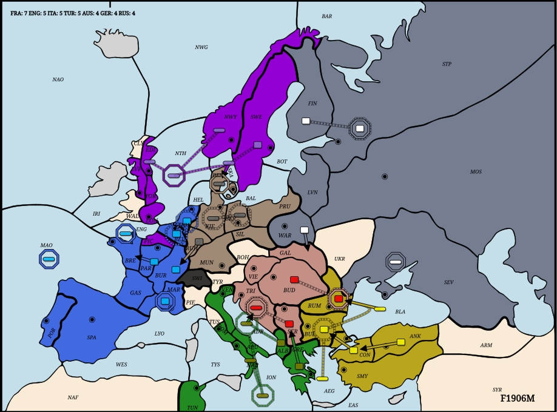

### What happened

- **AUSTRIA**: A RUM holds; A BUD supports A RUM; A SER supports F TRI (support cut); F TRI holds  [dislodged: F TRI]
- **ENGLAND**: F SKA → DEN; A SWE supports F SKA → DEN; F NTH supports F SKA → DEN; F NWY supports F NTH; F EDI supports F NTH
- **FRANCE**: A PAR → BRE; A BEL supports A HOL; A HOL supports A BEL; A MAR holds; F MAO holds; F ENG holds
- **GERMANY**: A RUH → BUR (bounced); F DEN holds; F KIE supports F BER; F BER supports F KIE  [dislodged: F DEN]
- **ITALY**: F ADR → TRI; A ALB supports F ADR → TRI; A GRE → SER (bounced); F ION supports F ADR (void); F NAP supports F ION
- **RUSSIA**: A WAR → GAL; F SEV holds; A STP holds; A FIN supports A STP
- **TURKEY**: F BLA → RUM (bounced); A BUL supports F BLA → RUM; A CON → BUL (bounced); A ANK → CON (bounced); F AEG supports A BUL

### Dialogue

- **AUSTRIA → ITALY**: I'm consolidating, not expanding at you — F TRI stays defensive and A SER holds the wall with A BUD backing both, so any F ADR or A ALB strike at Trieste bounces and you gain nothing. Greece is yours uncontested. Keep your stack genuinely east at Turkey's Aegean and our border stays clean; lean at me and you waste the turn while Turkey's Balkan line cracks behind you.
- **AUSTRIA → RUSSIA**: Rumania's locked for me now — but A GAL stays entirely off Warsaw and Galicia, that border stays quiet as promised. Turkey's the one bleeding centers; if you press F SEV and A WAR east at Turkey's Black Sea and Rumanian flank I won't contest the Sevastopol side, and we both feed on Turkey instead of each other.
- **AUSTRIA → TURKEY**: You held Rumania's anchor but I took it anyway — now Bulgaria's your exposed flank, not mine. I'd rather keep the quiet line than grind you, so pull A BUL off Serbia's approach and we both watch Italy's fleets. But understand my patience for sitting is gone: if you lean at Serbia I commit my whole Balkan line at Bulgaria with Russia's help and you lose it.
- **AUSTRIA → GERMANY**: France at seven is the runaway threat now and you're pinned to four with A RUH out front. Hold Munich and Kiel hard — I keep Bohemia and Tyrolia quiet so your back stays safe while you face west. If you fold, France solos and none of us recover.
- **ENGLAND → GERMANY**: Holding to our deal — my fleets stay off your Baltic, I keep pressing France's direction. Where's A RUH headed this turn? If you swing it at Burgundy to pin France's west, I can keep the North Sea fully committed against their Belgium line and we both bleed them.
- **ENGLAND → RUSSIA**: North stays clean as all game — nothing toward STP, Norway, or Bothnia. Take what you can off Turkey's Rumania; my whole weight faces west. If you want to push a unit toward Germany's Baltic later, tell me your lane and I'll stay clear of it.
- **ENGLAND → FRANCE**: Channel buffer held last turn — let's keep it. F ENG stays west, I stay off your Atlantic coast, and Belgium stays contested but I won't throw my stack at it this turn. My weight points at Germany's Denmark as I said; the south stays everyone's problem, not ours.
- **FRANCE → GERMANY**: You've asked for two turns: I'll vacate RUH this turn so A MUN can walk in clean — verify it from my orders, A HOL won't reinforce it and I touch nothing of Berlin or Kiel. In exchange, F DEN - NTH next turn cuts England's North Sea support and Belgium falls to me while you carve his coast. This is the concrete trade you wanted; confirm and we both grow off England.
- **FRANCE → ENGLAND**: Channel stays a buffer as agreed — F ENG holds west, no fleet of mine enters the North Sea this turn. I'm consolidating at home, nothing aimed at your Norway or Edinburgh approaches. Keep your weight on Germany's Denmark and we coexist while the south stays everyone's problem.
- **FRANCE → ITALY**: Border frozen, nothing toward Piedmont. I'm repositioning to free a western fleet — keep grinding Austria so no eastern unit reinforces England's north. The moment my Atlantic fleet is loose I flag you and we read the Med together before anyone runs away with it.
- **GERMANY → FRANCE**: Concrete this turn: if you pull A HOL westward, A RUH takes Holland and I get my fifth center off your stack — that's the price of my quiet border while you fight England. Refuse and I throw A RUH at BUR to pin your western armies and let England crack Belgium. Your call: do I get Holland clean, or do we both bleed?
- **GERMANY → ENGLAND**: Keeping our deal — F DEN, F KIE, F BER stay home, nothing in your North Sea. France at 7 is still the leader; I'm pushing A RUH at France's Holland/Burgundy this turn to split their west off your fleets. Press Belgium hard while their armies are pinned and we both gain off their overextension.
- **GERMANY → RUSSIA**: Our border stays the quietest on the board — nothing of mine toward Prussia, Silesia, Berlin or Kiel this turn. I'm turning A RUH west against France. Keep pressing Turkey at Rumania and we both hold our cleanest front.
- **ITALY → TURKEY**: Austria now has A RUM in his cluster too — his whole Balkan line is stacked. I can take Trieste THIS turn if you cut A SER: throw A BUL - SER and A ANK/F BLA pressure on RUM so A BUD can't swing back to cover Trieste. I commit F ADR - TRI with A ALB and F ION supporting — three units, it lands if A SER is pinned. You keep Rumania and Black Sea; confirm the cut now or I lose the window.
- **ITALY → AUSTRIA**: Last offer before I commit: pull A SER back to cover Trieste and hand me Serbia clean, and I leave Trieste entirely and point my fleets at Turkey's Aegean instead. Keep the wall and I drive three units at Trieste this turn while Turkey cuts your Serbia — you can't hold both. Your call which center you keep.
- **ITALY → FRANCE**: Border stays frozen — nothing toward Piedmont, my full stack commits east against Austria's Trieste this turn. England's still the northern leader; keep grinding his Belgium and flag me the moment you free a western fleet so we read the Med together before he runs away with it.
- **RUSSIA → ITALY**: Austria is overextended — his stack sits forward at RUM/SER while you press the Adriatic. I'm hitting Galicia this turn, which threatens BUD from the east. If you push TRI/SER hard now, Austria can't defend both fronts and we crack him together. Tell me where you strike and I'll time GAL to BUD next.
- **RUSSIA → AUSTRIA**: You took RUM for yourself instead of feeding it to me as we agreed — so the southern partnership is on hold. I'm not throwing F SEV at your line, but I expect that promised compensation. Keep A GAL clear questions aside, what are BUD and SER doing against Italy this turn?
- **RUSSIA → ENGLAND**: North stays clean from me as all game — A FIN walls STP, A STP holds, nothing toward Sweden or Norway. My whole weight goes south against Austria this turn. Keep F NWY/F SKA off STP/NC and our quiet north holds while you keep France pinned.
- **RUSSIA → GERMANY**: Border stays the calmest on the board — nothing of mine at Prussia, Silesia, Berlin or Kiel. My push is south on Austria's Galicia this turn, not your Baltic. Keep your line west on France and we both hold our cleanest front.
- **RUSSIA → TURKEY**: Clean Black Sea border holds from my side — F SEV stays defensive, nothing at RUM or BLA from me. Austria stabbed me by keeping Rumania, so my fight has shifted onto him in Galicia, not you. If you want a free hand against Austria's south while I press his north, that's open.
- **TURKEY → ITALY**: Austria stabbed me at Rumania — now we finish his south together for real. I'm driving F BLA - RUM with A BUL supporting, two strength, to take RUM back. You hit Serbia from Greece with F ADR/F ION support this turn; with A SER and A BUD pinned defending, Austria can't reinforce RUM. Confirm A GRE - SER lands and we crack him on both fronts simultaneously.
- **TURKEY → RUSSIA**: Austria grabbed Rumania off me and now it sits in his hands, not mine — so retaking it costs you nothing and bleeds him, not you. Keep F SEV home and off RUM; I'm hitting it from Black Sea with A BUL support. Clean Sevastopol border holds and your real fight stays north against Germany and England.
- **TURKEY → AUSTRIA**: You stabbed Rumania, so the quiet line is over — I'm taking it back this turn with F BLA and A BUL, and Italy is driving Serbia the same phase. You committed A GAL and A BUD east to grab one center and now Italy's stack cracks your Trieste wall while I recover RUM. Pull A RUM back and keep Serbia, or hold it and lose both your south and the center.
- **AUSTRIA → RUSSIA**: Turkey is throwing F BLA at my Rumania this turn. If you drive F SEV - RUM or even F SEV S A RUM, we both keep Turkey out and you re-establish presence on your old center's flank. I'll back your F SEV - RUM next Fall as promised — strike Turkey's Black Sea line now while he's committed against me.
- **AUSTRIA → TURKEY**: F BLA - RUM with A BUL won't land — A RUM holds with A BUD backing it, so you bleed the attack for nothing while Italy and France both grow. Pull F BLA back and keep Bulgaria intact; lean at Rumania and you only weaken your own southern line against Russia and me both.
- **AUSTRIA → ITALY**: F TRI holds with A SER backing it this turn — your F ADR/A ALB strike bounces and you gain zero while Turkey wastes himself on my Rumania. Greece stays yours uncontested. Keep your stack pointed at Turkey's Aegean and we both feed on his collapse instead of stalemating at Trieste.
- **ENGLAND → GERMANY**: Confirmed — quiet German coast, my fleets stay off your Baltic and I throw weight at France. Keep F KIE and F BER pointed at your Munich/Ruhr line against France's armies; you don't need them watching me. We both gain most if your fleets pin France while my North Sea presses Belgium.
- **ENGLAND → FRANCE**: Channel buffer holds from my side — F ENG stays west, I stay off your Atlantic. I'm committing north against Germany's Denmark this turn, not Belgium, so your west is free to consolidate. Keep no fleet in the North Sea and we coexist cleanly while the south burns.
- **FRANCE → GERMANY**: I won't hand you Holland for free — that just shrinks me while you grow off my back. But here's a real trade: I leave RUH empty permanently and won't contest Kiel-area moves, and in return you keep A RUH off BUR this turn. If you throw RUH at BUR you only stall us both and let England sit comfortably at the top — neither of us wants that. Hold your line and the border stays quiet.
- **FRANCE → ENGLAND**: Channel stays a buffer — F ENG holds west, nothing enters the North Sea from me this turn. I'm consolidating at home and along my Atlantic coast, nothing aimed at Norway or Edinburgh. Keep your weight on Denmark and Germany; we coexist while the south sorts itself out.
- **FRANCE → ITALY**: Border frozen, nothing toward Piedmont. England's still the northern leader and I'm repositioning to free an Atlantic fleet — the moment it's loose I flag you and we read the Med together. Keep Austria grinding so nothing eastern reinforces England's north.
- **GERMANY → FRANCE**: You keep offering NTH cuts that grow you, not me. Concrete and final: order A HOL to move west (BEL/BUR) this turn so A RUH walks into Holland and I get my fifth center. Do that and your Belgium fortress still holds, our border stays quiet, and I owe you a real favor against England next turn. Refuse and A RUH hits BUR to pin your west while England cracks Belgium.
- **GERMANY → ENGLAND**: Holding our quiet-coast deal: F DEN, F KIE, F BER stay home, nothing in your North Sea. I'm throwing A RUH at France's Holland this turn to try to peel a center off their stack — that pins their west further. Keep your fleets committed against Belgium and we both bleed the leader.
- **GERMANY → RUSSIA**: Border stays the quietest on the board — nothing of mine toward Prussia, Silesia, Berlin or Kiel. A RUH turns west on France's Holland. Keep grinding Turkey at Rumania and watch Austria's A RUM, both are stretched thin.
- **ITALY → RUSSIA**: I commit three units to Trieste this turn: F ADR - TRI with A ALB and F ION supporting. You drive A WAR - GAL to threaten BUD — if A BUD is pinned defending Galicia it can't swing back to cover Trieste and TRI falls to me. Time GAL now and we crack Austria's south together this phase.
- **ITALY → TURKEY**: Agreed — I take Trieste this phase, not Serbia. I'm committing F ADR - TRI with A ALB and F ION supporting, three strength against F TRI. You anchor F BLA - RUM with A BUL as you said, and next turn we swing your F AEG + A BUL onto Serbia with my Greece support locked. Keep A BUD's attention east so it can't cover Trieste.
- **ITALY → AUSTRIA**: Final word: Russia is into Galicia threatening Budapest and Turkey is retaking Rumania — your line is pinned on three fronts and Trieste is the soft square. Pull A SER back to cover Trieste this turn and I leave it entirely; otherwise three of my units land on it this phase. Your call which center you keep.
- **RUSSIA → AUSTRIA**: Straight question: where do A RUM and A BUD go this turn? If you swing A RUM - GAL to wall me out, that's a stab and I'll read it as the south reopening between us. Leave GAL open as your 'compensation' for keeping RUM and our border stays quiet — otherwise I take it as a hostile move and turn my full weight onto BUD.
- **RUSSIA → ITALY**: Austria's stack is forward and thin behind it — I'm driving A WAR - GAL this turn, which puts BUD in reach next. If you hit TRI and SER hard now he can't cover Galicia and the south at once, and we carve him together. Tell me your targets so I time GAL - BUD to land when your push breaks his line.
- **RUSSIA → TURKEY**: Clean Sevastopol border holds from my side — F SEV stays defensive, nothing at RUM or BLA. My whole weight this turn goes onto Austria's Galicia, not you. With me pressing his north and Italy his south, your free hand against his Black Sea flank is wide open.
- **TURKEY → ITALY**: Committed: F BLA - RUM with A BUL S F BLA - RUM, two strength to take Rumania back. For it to land, Austria's A SER and A BUD must be pinned — so drive F ADR - TRI with A ALB and F ION supporting AND throw A GRE - SER to lock A SER in place. If A SER is tied defending Serbia, A BUD can't swing to RUM and I recover the center while you crack Trieste.
- **TURKEY → RUSSIA**: Confirm: I take Rumania back off Austria this turn, not Sevastopol — F BLA - RUM with A BUL support, nothing of mine touches SEV. Keep F SEV home and off RUM so Austria gets no help there; Rumania bleeds Austria, not you. Your clean Black Sea border stands and your fight stays north.
- **TURKEY → AUSTRIA**: Last chance to keep your home flank: I'm retaking Rumania with F BLA and A BUL while Italy drives three units at Trieste with your A SER pinned. If you prop RUM you lose Trieste; if you cover Trieste you lose RUM. Pull A RUM back to GAL and keep Serbia/Trieste intact, and I'll hold the line there next year instead of pressing on.
- **AUSTRIA → ITALY**: F TRI holds with A SER backing it this turn — defense two, so your F ADR + A ALB strike bounces and you gain nothing. Greece stays yours uncontested. Throw your stack at Turkey's Aegean instead; leaning at Trieste wastes your whole phase against a wall.
- **AUSTRIA → TURKEY**: F BLA + A BUL at Rumania won't land — A RUM holds with A BUD supporting, defense two against your two. You bleed the attack while Italy and France grow. Pull F BLA back and keep Bulgaria intact instead of weakening your own Black Sea line for nothing.
- **AUSTRIA → RUSSIA**: Galicia stays open — A RUM holds in place, not swinging to GAL, that's your compensation as promised. Turkey is committing F BLA and A BUL at my Rumania this turn, so his Black Sea flank is exposed; drive F SEV east and we both keep him pinned.
- **ENGLAND → GERMANY**: Truce holds from me this turn — F SKA stays out of your Baltic, no clash with F DEN, and my stack faces France. Keep F KIE and F BER pointed at your Munich/Ruhr line against France's armies rather than guarding a coast I'm not touching. We both gain most if your fleets pin France while I press west.
- **ENGLAND → FRANCE**: Channel buffer holds from my side this turn — F ENG stays west, I stay off your Atlantic. I'm committing north, not at Belgium. Keep no fleet in the North Sea and we coexist cleanly.
- **ENGLAND → RUSSIA**: North stays clean — nothing toward STP, Norway, or Bothnia this turn. Take what you can off Turkey's Rumania; my whole weight faces the German/French coast. If you ever want a fleet pressing Germany's Baltic, tell me your lane and I stay clear.
- **FRANCE → GERMANY**: I'm not vacating Holland — that just shrinks me. But here's concrete: A HOL holds with A BEL and A BUR backing it, so don't waste A RUH attacking it — you'll only bounce and stall us both while England sits at the top. Hold your line this turn and our border stays quiet; next turn I'll genuinely vacate RUH-area space for you if you commit F DEN-NTH against England.
- **FRANCE → ENGLAND**: Channel buffer holds: F ENG stays west out of the North Sea this turn, and I touch nothing of Norway or Edinburgh. I'm consolidating my Atlantic coast and home centers only — point your weight at Denmark as you said and we coexist cleanly. Don't push Belgium and I won't bring a single fleet into your waters.
- **ITALY → RUSSIA**: Committed: F ADR - TRI with A ALB and F ION supporting — three strength on Trieste this phase. Drive A WAR - GAL now to pin A BUD east; if A BUD is tied to Galicia it can't cover Trieste and the center falls to me, putting BUD in your reach next turn. Time it and we crack Austria's south together.
- **ITALY → TURKEY**: Confirmed — Trieste is mine this phase, not Serbia. I drive F ADR - TRI with A ALB + F ION supporting (three strength), and A GRE supports the Adriatic flank to keep A SER from swinging. You anchor F BLA - RUM with A BUL to recover Rumania; next turn we swing your F AEG + A BUL onto Serbia with my Greece support locked. Hold the split.
- **ITALY → AUSTRIA**: Final word: three of my units commit on Trieste this phase while Russia hits Galicia and Turkey retakes Rumania. Your line cannot cover all three fronts. Pull A SER back to Trieste and hand me Serbia clean, or lose Trieste — your call which you keep.
- **RUSSIA → ITALY**: Committed: A WAR - GAL this turn, threatening BUD next. If your three units take TRI, Austria's A BUD and A RUM can't both swing back to wall me — GAL falls and his south collapses between us. Hit TRI now and I press BUD next Fall.
- **RUSSIA → AUSTRIA**: You kept Rumania and owe me. I'm taking Galicia this turn — that's my compensation, and it stays quiet from there if you don't contest it. Send A RUM - GAL and I read it as full war and turn everything onto BUD with Italy already at your throat in Trieste.
- **RUSSIA → GERMANY**: Locked: nothing of mine at Prussia, Silesia, Berlin or Kiel — A WAR drives south into Galicia, your Baltic stays untouched. Keep A RUH west on France and our border remains the quietest on the board.
- **RUSSIA → ENGLAND**: Locked clean from me: A FIN walls STP, A STP holds, nothing toward Norway, Sweden, or Bothnia. My whole weight goes south into Galicia this turn. Keep F NWY/F SKA off STP/NC and our north stays quiet while you grind France.
- **TURKEY → ITALY**: Final commit: F BLA - RUM, A BUL S F BLA - RUM. For it to land I need A SER pinned so A BUD/A SER can't prop A RUM — throw A GRE - SER alongside your F ADR - TRI strike. With A SER tied down, A RUM only holds if A BUD backs it, and your Trieste pressure pulls Austria's attention. Confirm A GRE - SER this phase and we crack both his centers at once.
- **TURKEY → AUSTRIA**: I'm committing F BLA - RUM with A BUL behind it this turn, and Italy drives three units at Trieste. You can't prop RUM and cover Trieste both. Pull A RUM to GAL and keep Trieste, or lose one of them — your choice, but the quiet line is over either way.
- **TURKEY → RUSSIA**: I'm hitting Rumania off Austria, not you — F SEV is untouched. If you want to bleed Austria too, throw F SEV - RUM to help strip it; the center lands in contested hands and Austria loses his stab's prize. Either way keep F SEV off my Black Sea and the clean border holds.

### AUSTRIA
Orders: `A RUM H` · `A BUD S A RUM` · `A SER S F TRI` · `F TRI H`

Reasoning

> I hold my Balkan wall firm. A RUM holds with A BUD supporting to lock the center against Turkey's F BLA and A BUL. A SER holds to wall Serbia and cover Trieste. F TRI holds to bounce any Italian Adriatic strike. Vienna stays open for a Winter build. Russia threatens Galicia but it's empty and I keep A RUM in place rather than swinging to GAL, honoring the quiet border while defending Rumania.

### ENGLAND
Orders: `F SKA - DEN` · `A SWE S F SKA - DEN` · `F NTH S F SKA - DEN` · `F NWY S F NTH` · `F EDI S F NTH`

Reasoning

> I'm boxed at 5 centers while everyone grows. Germany believes the Baltic is quiet, so a surprise two-on-one on Denmark cracks it. F SKA - DEN backed by A SWE S F SKA - DEN gives me two against Germany's single F DEN. F NTH and F EDI anchor the north and F NWY covers. This is the betrayal timed to land — Germany expects nothing on its coast.
>
> Denmark has F DEN, plus F KIE and F BER adjacent that could support its defense, but Germany's fleets are committed against France's Ruhr push and not ordered to back Denmark since the truce held. Two-on-one breaks F DEN holding (strength 1 vs 2). Even if Germany supports the hold from KIE, that's 2 defense vs my 2 attack — bounce. Let me hedge: I can't add a third easily. F NTH could support but NTH isn't adjacent to DEN... checking: DEN neighbors are BAL, HEL, KIE, NTH, SKA, SWE. F NTH IS adjacent to DEN! So F NTH S F SKA - DEN gives me three attackers.
>
> Germany at most supports F DEN hold with F KIE (KIE adjacent to DEN) and F BER (BER not adjacent to DEN — BER neighbors BAL, KIE, MUN, PRU, SIL). So Germany can muster at most defense of 2 (DEN + KIE support). Three on Denmark beats that. Let me commit F NTH to the support and keep F EDI/F NWY anchoring.

### FRANCE
Orders: `A PAR - BRE` · `A BEL S A HOL` · `A HOL S A BEL` · `A MAR H` · `F MAO H` · `F ENG H`
Illegal (dropped): `A BUR S A HOL`

Reasoning

> Looking at the board, I'm stuck at 7 and need to break out. Germany threatens A RUH into BUR or HOL. England holds the North Sea wall. I committed to opening a Winter build by vacating PAR to BRE while keeping my Belgium/Holland fortress intact.
>
> A PAR moving to BRE opens PAR for a Winter build. But wait — if I move A PAR to BRE, both BRE and PAR would be empty of any unit, and I'd need an open home center to build. Moving A PAR to BRE occupies BRE but vacates PAR, giving me PAR as a build slot. F MAO stays to guard Brest/Spain and the Atlantic. My fortress holds Belgium and Holland with mutual support, defending against any German RUH probe into BUR or HOL.
>
> Let me verify the fortress: A BEL S A HOL (defends Holland), A HOL S A BEL (defends Belgium), A BUR S A BEL (extra Belgium defense). Germany could hit HOL with A RUH but A BEL supports it — that holds. Germany could hit BUR but I have nothing attacking it; A BUR holding with support stays. Actually let me have A BUR support A HOL too to cover the RUH-HOL threat, and A BEL support A HOL. F ENG holds the Channel buffer per my England deal.

### GERMANY
Orders: `A RUH - BUR` · `F DEN H` · `F KIE S F BER` · `F BER S F KIE`

Reasoning

> France will hold Holland with three-strength backing, so attacking it bounces. I push A RUH to BUR to pin France's western armies while keeping my Baltic line walled. My fleets stay home backing each other per my deal with England and to deny any Baltic shift. This keeps my four centers intact and pressures the leader.

### ITALY
Orders: `F ADR - TRI` · `A ALB S F ADR - TRI` · `A GRE - SER` · `F ION S F ADR` · `F NAP S F ION`

Reasoning

> Executing the three-unit Trieste strike. F ADR into TRI, A ALB and F ION both supporting the attack, A GRE moving to SER to pin A SER, and F NAP backing F ION. Russia hits Galicia and Turkey retakes Rumania, so A BUD can't cover everything. F TRI has A SER backing it (defense 2), but my three attackers beat that — if A SER is pinned by my A GRE - SER, even better.
>
> Wait — let me verify support legality. A ALB is adjacent to TRI (yes, ALB neighbors TRI). F ION is NOT adjacent to TRI. Checking ION neighbors: ADR, AEG, ALB, APU, EAS, GRE, NAP, TUN, TYS — no TRI. So F ION cannot support the Trieste attack. I'll redirect F ION to support F ADR's hold position isn't right either. Instead F ION supports A ALB into TRI? No, ION not adjacent to TRI.
>
> So my real attackers on TRI: F ADR - TRI supported by A ALB S F ADR - TRI = strength 2. Defense is F TRI + A SER = 2. That bounces unless A SER is cut. A GRE - SER cuts A SER's support. With A SER's support cut, F TRI defends at 1, my attack at 2 takes it. Use F ION to support A ALB's support? Better: F ION supports F ADR - TRI isn't legal. Let A GRE pin SER, F NAP support ION line.

### RUSSIA
Orders: `A WAR - GAL` · `F SEV H` · `A STP H` · `A FIN S A STP`

Reasoning

> Austria confirmed Galicia stays open as my compensation (A RUM holds, not swinging to GAL). My plan is to take Galicia to establish presence on Austria's flank and threaten BUD next, while keeping the north walled with England and F SEV defensive on the Black Sea border.

### TURKEY
Orders: `F BLA - RUM` · `A BUL S F BLA - RUM` · `A CON - BUL` · `A ANK - CON` · `F AEG S A BUL`

Reasoning

> My plan: retake Rumania. F BLA - RUM with A BUL supporting gives two strength. Austria's A RUM holds with A BUD support (two strength defending) — so a straight 2v2 bounces. I need to cut A BUD's support or add strength. A SER is being pinned by Italy's Trieste push. Let me think: A RUM defended by A BUD support = strength 2. My attack F BLA-RUM + A BUL support = strength 2. That bounces. I need a third unit.
>
> Can A CON help? A CON isn't adjacent to RUM. A ANK isn't adjacent to RUM either. A SEV is Russian. 
>
> Alternative: cut A BUD's support. A BUD can't be attacked by me. But if Italy's Trieste attack forces A BUD to defend or Austria committed A BUD to support A RUM, my attack still bounces 2v2.
>
> Better: I can add a convoy. A BUL - RUM via BLA? No, A BUL is supporting. Actually let me reconsider — F BLA can convoy. If A CON - RUM via BLA convoy, plus A BUL S, plus... no, only one mover.
>
> Strongest: F BLA - RUM (1) + A BUL S F BLA - RUM (+1) = 2. Defense A RUM + A BUD S = 2. Bounce. I need to break A BUD's support. If Italy genuinely threatens Budapest/Serbia, A BUD might not support. But Austria signaled A BUD supports A RUM.
>
> I'll instead attack RUM with maximum I can and hope A BUD is pulled. Commit the coalition action as promised.

## FALL 1906 RETREATS (`F1906R`)

### What happened

- **AUSTRIA**: F TRI retreats → VEN
- **GERMANY**: F DEN retreats → BAL

### AUSTRIA
Orders: `F TRI R VEN`

Reasoning

> F TRI was dislodged by Italy. My only retreat option is VEN, which would push a unit into Italian home territory — likely to be dislodged or bounced next turn, but it keeps the unit alive and on the board rather than disbanding outright. With Italy's stack in the Adriatic, VEN is exposed but a live unit is better than none, and I lose no center either way. Retreating to VEN at least keeps a fleet that could harass Italy or be a bargaining chip.

### GERMANY
Orders: `F DEN R BAL`

Reasoning

> My F DEN was dislodged by England's coordinated attack (F SKA→DEN with multiple supports). England broke our quiet-coast deal and took Denmark — that changes everything. I need to retreat to save the unit. BAL keeps it active in the Baltic where it can defend Berlin/Kiel and contest the Baltic; HEL would just box it into the corner. BAL is the better square — it keeps the fleet relevant against England's now-hostile northern stack and protects my home centers.

## WINTER 1906 ADJUSTMENTS (`W1906A`)

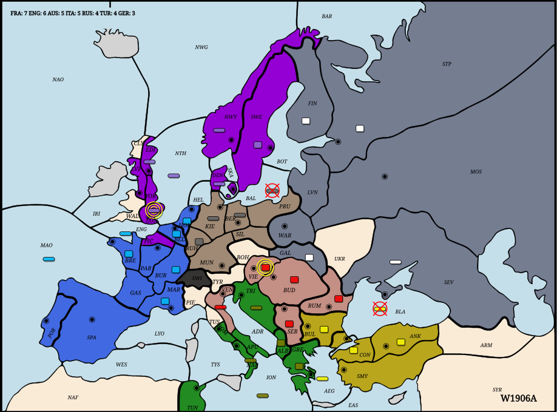

### What happened

- **AUSTRIA**: builds A VIE
- **ENGLAND**: builds F LON
- **GERMANY**: disbands F BAL
- **TURKEY**: disbands F BLA

### AUSTRIA
Orders: `A VIE B`

Reasoning

> I have 5 centers and 4 units, so I'm owed one build. Vienna is vacant and a home center, so I take the build there to thicken my line against Italy's Adriatic stack and Turkey's Balkan pressure.

### ENGLAND
Orders: `F LON B`

Reasoning

> I took Denmark this Fall, putting me at 6 centers — that's one build. My fleets are committed in the north and Baltic against Germany and France. I want a unit that can press the German Baltic toward Kiel or reinforce my fleet line. Building a fleet at Edinburgh isn't possible (occupied), so LON or LVP. A fleet at LON feeds into the North Sea theater where my whole stack is operating; LVP is more remote. F LON gives me the most useful naval reinforcement to keep pressing Germany's coast and hold my line.

### GERMANY
Orders: `F BAL D`

Reasoning

> I have 4 units (F KIE, F BER, A RUH, F BAL) but only 3 supply centers (BER, KIE, MUN). I must disband exactly one unit.
>
> F BAL is the dislodged fleet I just retreated — it's the least useful, stuck in the Baltic boxed between Russia and English waters with no immediate offensive role. A RUH is my forward army pressuring France's west. F KIE and F BER form my home wall. F BAL adds nothing my other fleets don't already cover.

### TURKEY
Orders: `F BLA D`

Reasoning

> I have 4 supply centers (ANK, CON, SMY, BUL) and 5 units (F AEG, A BUL, A CON, A ANK, F BLA). I'm over by one, so I must disband exactly one unit.
>
> F BLA bounced trying to take Rumania and is now somewhat redundant — Russia keeps F SEV home and the Black Sea is sealed by their defensive posture. My priority next year is pressing onto Serbia alongside Italy and holding the home/Bulgaria line. F BLA is the least useful unit: it failed to take Rumania, and the Black Sea is quiet. Keeping A BUL, A CON, A ANK, and F AEG preserves my Serbia push and home defense.

## SPRING 1907 MOVEMENT (`S1907M`)

### What happened

- **AUSTRIA**: A SER holds; A RUM supports A SER (support cut); A BUD holds; A VIE → TRI (bounced); F VEN supports A VIE → TRI  [dislodged: A RUM]
- **ENGLAND**: A SWE → DEN; F DEN → HEL; F NTH holds; F EDI supports F NTH; F LON → NTH (bounced)
- **FRANCE**: F MAO → SPA/SC; A MAR supports F MAO → SPA/SC; A BUR supports A MAR (support cut); A BEL supports A BUR; A HOL supports A BEL; A BRE holds; F ENG holds
- **GERMANY**: A RUH → BUR (bounced); F KIE supports F BER; F BER supports F KIE
- **ITALY**: F TRI holds; A ALB supports F TRI; A GRE holds; F ION supports A ALB; F NAP supports F ION
- **RUSSIA**: F SEV → RUM; A GAL supports F SEV → RUM; A STP holds; A FIN supports A STP
- **TURKEY**: A BUL → SER (bounced); A ANK → CON (bounced); F AEG holds

### Dialogue

- **AUSTRIA → ITALY**: You hold my home center Trieste, and I'm coming for it this turn with everything that reaches: F VEN, A VIE, and supports from SER and BUD. You can't hold it against that stack while also pressing me elsewhere. Hand it back clean and I'll leave Greece and your Adriatic alone entirely — keep it and you lose units you need against Turkey.
- **AUSTRIA → RUSSIA**: Galicia stays yours — A RUM holds and I'm not contesting your A GAL, my whole line this turn is pointed west at retaking Trieste from Italy. That keeps our border quiet exactly as you wanted. If you want to press Turkey's Black Sea while Italy and I are tangled in the Adriatic, I won't touch Sevastopol's flank.
- **AUSTRIA → TURKEY**: I'm fully committed west on Trieste against Italy this turn — nothing of mine moves at Bulgaria or your line. The quiet southern border holds from my side. Italy's stack is split now between holding Trieste and Greece, so your Aegean flank has breathing room if you want it.
- **ENGLAND → GERMANY**: France is still the runaway at 7 and your Munich is the open question. Point A RUH and your fleets at holding your line against France — I'll keep pressing the western fight. Where's A RUH headed this turn? If you swing it at Ruhr/Burgundy to pin France, I keep my North Sea committed west and we both bleed the leader.
- **ENGLAND → FRANCE**: Channel buffer held all year — let's keep it. F ENG stays west, I stay off your Atlantic, and I point my weight at Germany's Baltic, not your coast. You're at 7 and the table's watching; a quiet north from me lets you consolidate the west cleanly while the south burns.
- **ENGLAND → RUSSIA**: North stays clean as all game — nothing toward STP, Norway, or Bothnia. My whole weight goes at Germany's collapsing Baltic this turn. If you want a piece of Germany too, tell me your lane and I'll stay clear so we don't bump.
- **FRANCE → ENGLAND**: Channel buffer holds from my side — F ENG stays west, no fleet of mine enters the North Sea this turn. I'm pushing south to Spain to consolidate, nothing aimed at Norway or Edinburgh. Keep your weight on Germany's Denmark and we coexist cleanly.
- **FRANCE → GERMANY**: Our border stays quiet — nothing of mine touches Berlin, Kiel, or Munich, and RUH stays empty per our standing arrangement. I'm consolidating south toward Spain this turn. England's still the northern leader at 6; the moment you commit F DEN against his North Sea I'll back your Kiel-area moves and we both grow off his collapse.
- **FRANCE → ITALY**: Border stays frozen — nothing toward Piedmont, my weight shifts south to Spain to consolidate, not toward you. England's still the northern leader; keep Austria grinding so nothing eastern reinforces his north, and I'll flag you the moment my Atlantic fleet is loose to read the Med together.
- **GERMANY → FRANCE**: France at 7 is the runaway and you keep asking me to spend F DEN to grow you while I gain nothing — that's done. Concrete and final: vacate RUH and let A RUH push to BUR unopposed, or yield me Holland by pulling A HOL west, and I'll keep my fleets off your coast and pin England's Baltic flank for you. Refuse and A RUH hits BUR to pin your west while I look north for England's overextension. I need a real fourth center off you or our quiet border ends.
- **GERMANY → ENGLAND**: Quiet-coast deal holds — F KIE and F BER stay home, nothing in your North Sea. France at 7 is the leader threatening us both; I'll throw A RUH at Burgundy to pin their western armies so your fleets crack Belgium clean. Keep pressing France's coast and we both bleed the runaway — confirm you're staying off my Baltic and I keep my line oriented west.
- **GERMANY → RUSSIA**: Our border stays the quietest on the board — nothing of mine toward Prussia, Silesia, Berlin or Kiel. France at 7 is the real danger to both of us; I'm turning A RUH west against them. Keep grinding Turkey south and we both hold our cleanest front.
- **GERMANY → AUSTRIA**: Agreed France is the runaway and you've kept Bohemia/Tyrolia quiet — I appreciate the safe back while I face west. I'm throwing A RUH at Burgundy to pin France's western armies this turn. Keep your line firm against Italy and Turkey, and if France's stack ever thins I'll be the one biting their east while you hold the south.
- **ITALY → RUSSIA**: I'm into Trieste and pressing Serbia now. Drive A GAL - BUD this turn — if A BUD is pulled off the Serbia wall, Serbia falls to me and Budapest opens for you next. Austria's south collapses between us; confirm GAL - BUD and I commit my full stack onto Serbia.
- **ITALY → TURKEY**: Trieste is mine as promised — now we finish Austria's south together. Throw A BUL - SER to cut A SER's wall while I drive A ALB/A GRE/F ION onto Serbia. With A SER cut and Russia hitting Budapest, Serbia falls clean to me and you keep Rumania and Black Sea. Confirm the cut this phase.
- **ITALY → AUSTRIA**: Trieste is mine and your line is now split three ways — A SER/A BUD/A RUM east, A VIE and F VEN near me. Russia is at Galicia and Turkey presses Rumania; you cannot hold Serbia, Budapest, and the Adriatic at once. Pull back and concede Serbia cleanly, or I take it this turn while you bleed centers on every front.
- **ITALY → FRANCE**: I'm grinding Austria's south and our border stays frozen — nothing toward Piedmont. England's still strong in the north; flag me the moment your Atlantic fleet is free and we read the Med together before anyone runs away with it.
- **RUSSIA → TURKEY**: Austria stole my Rumania and now holds it at 5 while Italy carves his Trieste. Let's strip RUM off him together: you hit RUM with A BUL, I drive F SEV - RUM with A GAL S F SEV - RUM behind it — that's two on RUM plus your cut of his support. The center lands back with me, off Austria, and your clean Black Sea border stands. Confirm A BUL - RUM and I commit.
- **RUSSIA → ITALY**: You've cracked Trieste and I'm pressing Austria's east from Galicia — let's finish his collapse. I'm contesting RUM this turn and threatening BUD next; if you push SER/TRI to pin A SER and A BUD, his line breaks between us. Tell me your targets and I'll time GAL - BUD to land when your weight hits.
- **RUSSIA → AUSTRIA**: You kept Rumania as your 'compensation' and Galicia's quiet from me — for now. But I'm still at 4 while you're at 5 sitting on my home center, and Italy's already in Trieste. I'd rather not turn full weight onto BUD: feed me RUM back this year and I keep GAL off your throat while you face Italy. Your call.
- **RUSSIA → ENGLAND**: North stays clean from me as all game — A FIN walls STP, A STP holds, nothing toward Norway, Sweden or Bothnia. My whole weight goes south onto Austria and Turkey this turn. Keep F NWY/F SKA off STP/NC and our quiet north holds while you grind France.
- **RUSSIA → GERMANY**: Border stays the quietest on the board — nothing of mine at Prussia, Silesia, Berlin or Kiel. My push is south on Austria's Rumania, not your Baltic. Keep your line west and we both hold our cleanest front while France runs at 7.
- **TURKEY → ITALY**: Time to deliver the south split for real. This turn I drive A BUL - SER and I need your A GRE or F ION to support it landing — Austria's A SER is the wall. With your support, Serbia falls to me clean while you keep Greece and Trieste and press Austria's home. Confirm a support order on A BUL - SER and we crack him.
- **TURKEY → AUSTRIA**: You're down to five with Italy on your flank and your south crumbling. I can either finish you alongside Italy this turn, or you hand me Serbia clean and turn your whole line on Italy's Trieste/Adriatic stack — which is the bigger knife at your throat. Give me Serbia uncontested and I'll keep my fleets off your Balkan rear while you fight Italy.
- **TURKEY → RUSSIA**: Clean Black Sea border has held all year and I want it to hold again — F SEV stays home, I stay off Sevastopol. My whole push this turn is west onto Austria's Serbia. Point your weight at Austria's Galicia if you want a share of his collapse; he's the soft target for both of us.
- **TURKEY → FRANCE**: Our understanding held — you ran your fleets northwest, I stayed out of the western Med. I'm finishing Austria's south this year and have no quarrel with you yet. Keep your eastern approaches clear and we both keep growing off the weak powers between us.
- **AUSTRIA → ITALY**: You can't hold Trieste: I'm putting four units on it — A VIE attacks with F VEN, A SER, and A BUD all supporting. That's three supports against your single F TRI; it falls and you lose the unit for nothing. Walk it out to ADR or ALB now and keep that fleet alive for Turkey's Aegean; Greece stays yours.
- **AUSTRIA → RUSSIA**: Galicia is yours and stays yours — A RUM does not move and I'm not contesting GAL. My whole line is committed west on Trieste this turn, so your Black Sea and Sevastopol flank are completely free of me. Press Turkey now while Italy and I are locked in the Adriatic.
- **AUSTRIA → TURKEY**: I'm not touching Bulgaria or your line — every unit I have is pointed west at Italy's Trieste this turn. The quiet southern border holds entirely from my side. Italy is overstretched holding both Trieste and Greece, so your Aegean has room if you push it now.
- **ENGLAND → GERMANY**: Confirmed — I'm staying off your Baltic and my fleets stay oriented to press France's Belgium line. Throw A RUH at Burgundy as you said; if you instead leave Kiel/Berlin idle they do nothing against France. I'll keep the North Sea committed west and we both bleed the leader.
- **ENGLAND → FRANCE**: Buffer holds clean from my side — F ENG stays your concern, nothing of mine touches your Atlantic. Take Spain and consolidate; my weight stays north on Germany. Once you're settled in the south, tell me if you want to coordinate pressure on Germany's western centers so neither of us lets the other grow unchecked.
- **ENGLAND → RUSSIA**: North stays clean — nothing toward STP, Norway, or Bothnia from me. I'm going hard at Germany's Baltic this turn; if you want Berlin's eastern approach later, name your lane and I'll keep my fleets clear so we split Germany rather than bump.
- **FRANCE → GERMANY**: A RUH alone can't take BUR — A BUR holds it, you only bounce and stall us both while England consolidates the north. I'm not shrinking myself to feed you; but a real offer: cut England's North Sea with F DEN this turn and I'll genuinely vacate RUH next turn so A RUH walks into it clean. That's a fourth center off England's collapse, not off my back.
- **FRANCE → ENGLAND**: Confirmed — Channel buffer holds, F ENG stays west, nothing of mine into the North Sea. I'm consolidating south to Spain. Germany's pressing me for concessions on my eastern border; if he commits F DEN against your North Sea I won't back it, so your Baltic stays his only real lever.
- **FRANCE → ITALY**: Noted — keep Austria grinding. My Atlantic fleet shifts to Spain this turn to bank an 8th center, and once Portugal and Spain lock I'll have a fleet free to read the Med with you against whoever's leading there. Keep Trieste contested so nothing eastern frees up.
- **GERMANY → FRANCE**: Last offer this turn: support A RUH into BUR (order A BEL S A RUH - BUR or pull A MAR off it) and I give you a free hand against England's coast next turn with F DEN-NTH. Otherwise A RUH hits BUR uninvited and we both stall while England sits comfortable at 6. You keep promising 'later' — give me one concrete move now or stop asking me to spend fleets for you.
- **GERMANY → ENGLAND**: A RUH goes at Burgundy to pin France's western armies — that frees your North Sea to crack Belgium clean. Confirm F SKA and your stack stay off my Baltic this turn and I keep F KIE/F BER home and oriented west. If France's line ever thins I want to be the one taking RUH/HOL while you take Belgium.
- **GERMANY → RUSSIA**: Good, our border stays the quietest on the board — nothing of mine at Prussia, Silesia, Berlin or Kiel. A RUH turns west on France. Watch Austria's A RUM and A GAL — both are stretched between you and Italy; if you push Rumania hard I'll keep France pinned so nothing swings to help Austria's south.
- **ITALY → RUSSIA**: Commit A GAL - BUD this turn — if A BUD is pulled to defend Budapest it can't support Austria's F VEN/A VIE strike on Trieste, and I hold Trieste while you open Budapest. I'm defending Trieste hard with F TRI plus A ALB support; your Galicia pressure is what makes it stick. Confirm GAL - BUD and Austria's south breaks.
- **ITALY → TURKEY**: Throw A BUL - SER to cut A SER — that pins A SER off the Trieste assault and I defend Trieste with full weight. Take Serbia yourself this turn; I'd rather hold Trieste and the Adriatic clean than fight you over Serbia. You keep Serbia, Rumania, and Black Sea; confirm A BUL - SER and we both gain.
- **ITALY → AUSTRIA**: Your stack can't reach Trieste through Russia at Galicia and Turkey cutting Serbia — A BUD and A SER are pinned defending. I'm walling Trieste with F TRI and A ALB; your F VEN/A VIE strike bounces while you bleed Budapest and Serbia. Concede Trieste now and I leave Vienna and Venice alone.
- **RUSSIA → TURKEY**: Concrete trade: if you commit A BUL - RUM this turn, I drive F SEV - RUM with A GAL S F SEV - RUM behind it. Your A BUL cuts Austria's A SER support and adds a second attacker, so RUM falls and lands back with me — off Austria, not you. Clean Black Sea border stands either way; confirm A BUL - RUM and I lock SEV.
- **RUSSIA → AUSTRIA**: You say RUM holds and your line faces Italy — fine, then RUM is undefended behind a single unit while Italy carves Trieste. I'd rather take it cleanly than fight you for BUD. Feed me F SEV - RUM uncontested this year (don't support A RUM, just let it fall) and GAL stays quiet and off BUD. Otherwise I time GAL - BUD with Italy's stack on Serbia.
- **RUSSIA → ITALY**: Push your full stack onto Serbia this turn — pin A SER so it can't cover RUM or swing back. I'm hitting RUM from Sevastopol with Galician support; if Serbia falls to you, Budapest opens for me next and Austria's east is gone. Confirm your Serbia assault and we crack him this phase.
- **TURKEY → ITALY**: Confirmed — I throw A BUL - SER to cut A SER's wall while you drive A ALB/A GRE/F ION onto Serbia. But once A GRE leaves for Serbia, Greece sits empty: I'll move F AEG to cover the strait, not into Greece, so we don't collide. You take Serbia AND keep Greece by holding it — just make sure your Serbia stack has the strength without pulling A GRE off the center.
- **TURKEY → RUSSIA**: I can't hit both RUM and SER this turn, and Italy's already committed me to cutting A SER at Serbia. You drive F SEV - RUM with A GAL S F SEV - RUM yourself — Austria's RUM has no Bulgarian help from me but it's also undefended on your side if A BUD swings to Serbia. Take RUM clean; my F AEG and A BUL stay west off Sevastopol, clean border holds.
- **TURKEY → AUSTRIA**: Italy commits three units at Serbia and Russia drives F SEV - RUM this phase — your south is collapsing on two fronts at once. I'm the one player not piling on your Black Sea rear if you hand me Serbia and turn everything on Italy's Trieste stack. Last offer before I join the others.
- **AUSTRIA → ITALY**: Final: A VIE - TRI with F VEN and A SER both supporting — three on Trieste against your single fleet even if A ALB props it. It falls and you lose the unit. Walk F TRI to ADR or ALB now and keep it for Turkey; Greece stays yours and I leave Venice's approach alone.
- **AUSTRIA → RUSSIA**: A RUM holds and A BUD holds to cover Budapest — Galicia stays yours and I do not contest it, but BUD and RUM are both defended, so GAL - BUD bounces and F SEV - RUM bounces. Press Turkey's Black Sea instead; my whole striking force is west on Italy and your Sevastopol flank is free of me.
- **AUSTRIA → TURKEY**: I'm committed entirely west on Italy's Trieste this phase — nothing of mine touches Bulgaria or Serbia's approach to your line. Serbia stays mine and defended, but I'm no threat to your Balkan rear this turn. Push your Aegean while Italy is split holding Trieste and Greece.
- **ENGLAND → GERMANY**: Locked: my fleets stay off your Baltic this turn and stay oriented west on France's Belgium line. Throw A RUH at Burgundy as agreed — leaving Kiel/Berlin idle wastes them. We both bleed the leader while your coast stays my non-concern.
- **ENGLAND → FRANCE**: Buffer holds clean — nothing of mine touches your Atlantic, F ENG stays your concern alone. I'm committing my weight at Germany's Baltic this turn. Once you're settled in Spain, let's coordinate so neither of us lets the other run unchecked in the west.
- **ENGLAND → RUSSIA**: North stays clean from me — nothing toward STP, Norway, or Bothnia. I'm going hard at Germany's Kiel/Baltic this turn; if you want Berlin's eastern approach next year, name your lane and I keep my fleets clear so we split Germany rather than bump.
- **FRANCE → GERMANY**: A RUH into BUR bounces — A BUR holds with A MAR backing it, so you gain nothing and stall yourself while England sits at 6. I won't shrink to feed you. Throw RUH at BUR if you like; you waste the move. The real fourth center is England's coast — commit F DEN-NTH and I vacate RUH next turn clean.
- **FRANCE → ENGLAND**: Confirmed and final: F ENG holds the Channel west, nothing of mine enters the North Sea, and I move F MAO to Spain's south coast to bank my 8th. Your Baltic and North Sea are untouched by me. Once Spain locks I'll happily coordinate pressure on Germany's western centers with you.
- **FRANCE → ITALY**: Border frozen confirmed — F MAO goes to Spain this turn, no unit toward Piedmont. Keep Trieste contested so nothing eastern frees up; the moment my Atlantic fleet is loose after Spain locks, I flag you to read the Med together.
- **GERMANY → FRANCE**: Locked: A RUH goes at BUR this phase, and F KIE/F BER stay off your coast — I touch nothing of yours west of Munich. You've promised RUH vacated next turn; the moment A BUR moves off and RUH is clear, A RUH walks in and I owe you F DEN against England's North Sea. Hold to that and our border stays the quietest you have.
- **GERMANY → ENGLAND**: Confirmed: A RUH hits BUR to pin France's western armies, F KIE and F BER stay home and out of your North Sea. Crack Belgium clean while France is split. If their line thins I take RUH/HOL, you take Belgium — keep F SKA off my Baltic and the deal holds.
- **GERMANY → RUSSIA**: Locked: nothing of mine at Prussia, Silesia, Berlin or Kiel — A RUH turns west on France. Press Austria's RUM hard; the more you pin their south, the less swings back to help Italy against you. Our border stays the calmest on the board.
- **ITALY → RUSSIA**: Final commit: I defend Trieste with F TRI plus A ALB support (defense 2). For it to hold I need A BUD pinned — drive A GAL - BUD this turn so it can't support Austria's F VEN/A VIE strike. With A BUD tied to Budapest and Turkey cutting A SER, Austria's assault drops below my wall and Trieste stays mine while Budapest opens for you next. Confirm GAL - BUD.
- **ITALY → TURKEY**: Locked: throw A BUL - SER this phase to cut A SER off Austria's Trieste assault — that strips one support from the F VEN/A VIE strike and lets me hold Trieste with F TRI + A ALB. You take Serbia clean since A SER is cut and Russia hits Budapest. I keep Greece (A GRE holds), you keep Rumania and Black Sea. Confirm the cut.
- **ITALY → AUSTRIA**: Your four-unit strike fails: Russia drives Galicia into Budapest and Turkey cuts Serbia, so A BUD and A SER are both pinned and can't support F VEN/A VIE into Trieste. I hold with F TRI plus A ALB and your assault bounces while you bleed Budapest. Concede Trieste and I'll leave Vienna and Venice alone.
- **RUSSIA → TURKEY**: Locked: F SEV - RUM with A GAL S F SEV - RUM behind it. You hit Serbia and pin A SER so it can't swing back to cover Rumania. Your F AEG and A BUL stay off Sevastopol — clean Black Sea border holds and I retake my center off Austria.
- **RUSSIA → ITALY**: Confirmed: I drive F SEV - RUM with Galician support this turn to strip Austria's Rumania, while you put your full stack on Serbia. Pin A SER and A BUD west so neither swings east — Austria's whole eastern flank collapses between us. Budapest opens for me next once Serbia falls to you.
- **RUSSIA → AUSTRIA**: You said RUM holds and your line faces Italy — so I'm taking it. F SEV - RUM with Galician support; don't waste A BUD defending it while Italy carves Trieste. Let it fall clean and GAL stays off Budapest this year. Contest it and I turn full weight onto BUD with Italy already at your throat.
- **TURKEY → ITALY**: Locking it: A BUL - SER this phase. For Serbia to land in my hands I need ONE support — order A ALB S A BUL - SER (Albania is adjacent to Serbia). Then A GRE holds Greece and F ION presses Austria's rear; you keep Greece and Trieste clean while I take Serbia off Austria. Confirm A ALB S A BUL - SER.
- **TURKEY → RUSSIA**: I'm committed at Serbia, not Rumania — A BUL - SER cuts Austria's A SER, which strips RUM's potential support too. Drive F SEV - RUM with A GAL S F SEV - RUM and take it clean; nothing of mine touches Sevastopol or RUM. Clean Black Sea border holds.
- **TURKEY → AUSTRIA**: No deal reached, so I'm joining the others: A BUL - SER this turn with Italian support, Italy on your rear, Russia on Rumania. Your south falls this phase. Throw everything at defending — you can't hold all three.
- **TURKEY → FRANCE**: Understanding holds — I stay out of the western Med, my whole weight is east finishing Austria. Keep your eastern approaches clear and we both keep feeding off the weak powers.

### AUSTRIA
Orders: `A SER H` · `A RUM S A SER` · `A BUD H` · `A VIE - TRI` · `F VEN S A VIE - TRI`

Reasoning

> Everyone is converging on me. Let me assess the real threats:
>
> - **Russia** threatens F SEV → RUM with A GAL support. A RUM needs defense.
> - **Turkey** threatens A BUL → SER, possibly with Italian support.
> - **Italy** holds TRI, threatens SER, and may prop with A ALB.
>
> I cannot retake Trieste AND defend everything. My core centers (BUD, SER, RUM) matter more than recapturing Trieste this turn. Priorities:
>
> 1. **Defend RUM**: F SEV - RUM with GAL support is two strength. A RUM holds with A BUD supporting it = defense two. That holds. But A BUD supporting RUM leaves Budapest open to GAL - BUD. However, if GAL is supporting SEV into RUM, it can't also move to BUD. Russia can only do one. If GAL moves to BUD, then SEV - RUM is unsupported and A RUM holds alone beats it. So I support RUM with BUD only if I fear the supported attack — but then BUD is exposed if GAL goes there instead. 
>
> Better: A RUM holds, A BUD holds (covers Budapest, since BUD can't be taken if occupied and GAL alone can't dislodge it). A SER holds to wall Serbia against BUL+Italy. If Turkey+Italy put two on SER, A SER alone falls. I should support SER's hold — but with what? RUM could support SER's hold (adjacent). But then RUM is exposed to SEV.
>
> Let me defend SER with RUM support and keep BUD home. Turkey A BUL - SER + Italian support = 2 attackers vs A SER + A RUM support = defense 2. Holds. RUM then undefended but SEV-RUM alone (if GAL went to BUD) — A RUM is gone supporting. Risk.
>
> Safest: hold everything tight, support the most threatened. SER faces two attackers (Turkey+Italy), so reinforce it. RUM faces SEV+GAL — also two. I can only fully cover one. Cover SER (loss of home-adjacent center + Italian foothold worse), let RUM defend alone.
>
> A SER holds, A RUM supports A SER, A BUD holds (covers Budapest), A VIE attacks TRI, F VEN supports.

### ENGLAND
Orders: `A SWE - DEN` · `F DEN - HEL` · `F NTH H` · `F EDI S F NTH` · `F LON - NTH`
Illegal (dropped): `F NWY S A SWE - DEN`

Reasoning

> I'm executing the Kiel stab. Germany believes my fleets stay off its Baltic, but Kiel is the clean prize and Germany is collapsed at 3 centers. F DEN attacks Kiel; A SWE backfills Denmark. F NTH holds the line, F NWY and F EDI anchor north, F LON covers home.
>
> The key question: F DEN - KIE alone is one unit vs F KIE which is defended by F BER's support. I need support. A SWE can't reach Kiel. F NTH can't support DEN-KIE (not adjacent to KIE... NTH neighbors don't include KIE). DEN is adjacent to KIE, but I have no adjacent supporter. A solo F DEN - KIE vs F KIE supported by F BER would bounce/lose.
>
> Let me reconsider. Kiel is held by F KIE with F BER able to support its hold. A single attacker can't dislodge it. I lack a second unit adjacent to KIE. So a Kiel grab fails this turn. Better to take Kiel via convoy or set up. Actually A SWE can't reach KIE. 
>
> Best play: secure position and threaten. Move A SWE - DEN? No, DEN is mine (F DEN). Instead, push F DEN - KIE won't work solo. Let me instead build toward it: keep F DEN holding Denmark, move A SWE into a position, and prepare Berlin/Baltic pressure next turn with F NTH - HEL to threaten Kiel from two sides next year.
>
> Given I can't take Kiel cleanly this turn, I'll position: F DEN - HEL to threaten Kiel from a new angle while A SWE holds Denmark's defense, F NTH - SKA... no, keep North Sea. Actually I'll hold Denmark firmly and advance F DEN to HEL only if I keep Denmark. A SWE can move to DEN to hold it.
>
> Plan: A SWE - DEN (occupy/hold center), F DEN - HEL (threatens KIE and HOL next turn). F NTH holds, F NWY holds, F EDI supports NTH, F LON holds/covers.

### FRANCE
Orders: `F MAO - SPA/SC` · `A MAR S F MAO - SPA/SC` · `A BUR S A MAR` · `A BEL S A BUR` · `A HOL S A BEL` · `A BRE H` · `F ENG H`

Reasoning

> I execute my revised plan: push F MAO to Spain to bank my 8th center while holding my border firm against Germany's RUH→BUR probe (which will bounce). A MAR supports the Spain move, A BUR holds with backup, and my northern fortress stays intact.
>
> F MAO can reach SPA via the south coast directly (MAO is adjacent to SPA/SC). A MAR supports the move into Spain. A BUR holds firm against the German RUH probe with A BEL backing. A BRE covers the Atlantic coast and Paris build prep, A HOL holds the north, F ENG anchors the Channel buffer.

### GERMANY
Orders: `A RUH - BUR` · `F KIE S F BER` · `F BER S F KIE`

Reasoning

> My situation: boxed in at 3 centers, France runaway at 7, England at 6. My committed plan is A RUH at BUR to pin France while my fleets hold the Baltic line. France insists BUR holds with A MAR backing, so A RUH will likely bounce — but it keeps France split and honors my deals. My fleets stay home and oriented west per my England deal. I'll keep F KIE and F BER backing each other to hold the Baltic and home centers against any English shift.

### ITALY
Orders: `F TRI H` · `A ALB S F TRI` · `A GRE H` · `F ION S A ALB` · `F NAP S F ION`

Reasoning

> Austria is throwing four units at Trieste: A VIE - TRI with F VEN, A SER, A BUD supporting. If A SER and A BUD remain pinned by Russia and Turkey, the actual strength on Trieste drops. My priority is holding Trieste. F TRI holds, A ALB supports the hold (defense 2). Turkey wants A ALB to support A BUL - SER, but I need A ALB on Trieste defense — Trieste is my hard-won center and worth more than handing Serbia to Turkey. A GRE holds Greece to keep my center. F ION supports A ALB's defensive position from the flank, and F NAP backs the Ionian line.
>
> Wait — F ION can support A ALB only if adjacent to ALB? F ION is adjacent to ALB. But A ALB is supporting a hold of F TRI, not moving. F ION can support A ALB holding (`F ION S A ALB`). That adds defense if Albania is attacked. Better use: F ION supports F TRI? F ION isn't adjacent to TRI. So F ION should support A ALB (which props Trieste). Actually the key defense is on Trieste itself — A ALB S F TRI gives defense 2. To raise it further I'd need another unit adjacent to TRI, but none is. So F ION best protects A ALB from being dislodged/cut. Let me have F ION S A ALB to keep that support solid, F NAP S F ION to anchor.

### RUSSIA
Orders: `F SEV - RUM` · `A GAL S F SEV - RUM` · `A STP H` · `A FIN S A STP`

Reasoning

> My commitment is F SEV - RUM with A GAL S F SEV - RUM. Turkey claims A BUL hits Serbia to cut A SER's support. Austria claims A RUM holds with A BUD covering. If Turkey cuts A SER and A BUD doesn't support RUM, then my two-strength attack (F SEV + A GAL support) beats A RUM holding alone. Worth the attempt to reclaim my home center. North stays walled.

### TURKEY
Orders: `A BUL - SER` · `A ANK - CON` · `F AEG H`
Illegal (dropped): `A CON S A BUL - SER`

Reasoning

> My commitment this phase is to take Serbia off Austria. Italy declined to support my entry, so I self-support with A CON. Austria's A SER may move or be cut; with two strength on Serbia (A BUL + A CON support) I can dislodge A SER if it stays holding, and I take it clean if it moves. F AEG covers the strait and supports the Serbia attack from the Greece side—wait, AEG is not adjacent to SER. Let me use F AEG to support A BUL's entry only if adjacent: AEG neighbors don't include SER, so that support is void. Better: F AEG supports A CON or covers Greece approach. I'll keep A ANK moving to CON to backfill home.
>
> Actually F AEG S A BUL - SER is offered in my legal list — wait, it isn't. The legal options for AEG don't include S A BUL - SER (not adjacent). So I'll have F AEG hold the strait / support a useful move. A CON moves to support BUL into SER, leaving CON empty — so A ANK - CON backfills. F AEG should support A BUL - GRE or cover. Best: F AEG S A CON... but CON is supporting. I'll have F AEG move to threaten Italy/cover Greece: F AEG - GRE only if empty. Italy holds A GRE, so I'd bounce. Instead F AEG H to guard the strait, or support A BUL.
>
> Given the situation, drive A BUL - SER with A CON S A BUL - SER, backfill CON with A ANK - CON, and F AEG supports A BUL into SER is illegal — so F AEG holds the Aegean to keep my rear secure and pressure Italy next turn.

## SPRING 1907 RETREATS (`S1907R`)

### What happened

- **AUSTRIA**: A RUM retreats → UKR

### AUSTRIA
Orders: `A RUM R UKR`

Reasoning

> A RUM was dislodged. My only retreat option is UKR (a Russian-bordering inland province) or disband. Retreating into UKR puts my army deep in Russian territory where it's surrounded and useless, but it keeps a unit alive that could pressure or be traded. However, UKR is Russia's interior and the unit would be isolated. Still, keeping a unit alive is better than disbanding for free—it preserves a build/disband balance and gives me a piece to maneuver. With my line collapsing on three fronts, every unit matters.

## FALL 1907 MOVEMENT (`F1907M`)

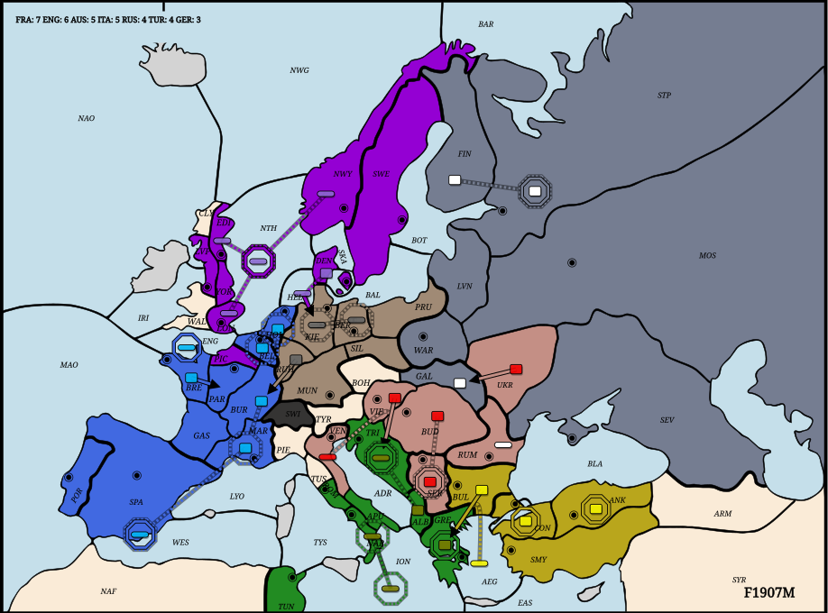

### What happened

- **AUSTRIA**: A SER holds; A BUD supports A SER; A VIE → TRI (bounced); F VEN supports A VIE → TRI; A UKR → GAL (bounced)
- **ENGLAND**: F HEL → KIE (bounced); A DEN supports F HEL → KIE; F NTH holds; F EDI supports F NTH; F NWY supports F NTH; F LON supports F NTH
- **FRANCE**: F SPA/SC holds; A MAR supports F SPA/SC; A BRE → PAR; A BUR supports A MAR (support cut); A BEL supports A HOL; A HOL supports A BEL; F ENG holds
- **GERMANY**: A RUH → BUR (bounced); F KIE supports F BER (support cut); F BER supports F KIE
- **ITALY**: F TRI holds; A ALB supports F TRI; A GRE holds; F ION supports F NAP; F NAP supports F ION  [dislodged: A GRE]
- **RUSSIA**: A STP holds; A FIN supports A STP
- **TURKEY**: A BUL → GRE; F AEG supports A BUL → GRE; A CON holds; A ANK holds

### Dialogue

- **AUSTRIA → RUSSIA**: You have Rumania and Galicia — I'm not contesting either, they're yours. What I need is a quiet eastern border so I can throw everything at Italy, who's sitting on my home Trieste. Keep GAL/RUM pointed at Turkey's Black Sea instead of at Budapest and we both grow off Turkey, not each other. Confirm GAL doesn't strike BUD and I leave SEV's flank alone entirely.
- **AUSTRIA → ITALY**: You hold my home center Trieste and that's the one thing I can't let stand. Hand it back clean this turn and I formally leave Greece, Albania, and your whole Adriatic alone — I'll point my line at Turkey instead. Keep it and I keep grinding F VEN and A VIE at it every turn, bleeding units you need against Turkey while France runs fat in the west.
- **AUSTRIA → TURKEY**: Italy and Russia are the ones carving me — you're not actually gaining from piling on Serbia, you'd just hand Italy a free center on my rear. Stay off Serbia and I keep my whole line west on Italy's Trieste and Adriatic stack, splitting Italy's force so your Aegean and Greece flank open up. We've held a quiet southern line two years; it still pays you more than feeding Italy.
- **AUSTRIA → GERMANY**: France at seven is still the runaway and you're pinned at three — I'm keeping Bohemia and Tyrolia quiet so your back stays safe while you face west. If France's western stack ever thins, bite Burgundy or Belgium and I'll keep the south from spilling into you.
- **ENGLAND → GERMANY**: Holding our quiet-coast deal — my fleets stay off your Baltic this turn, oriented west. Throw A RUH at Burgundy again to keep France's western armies pinned; if their BUR line cracks you take RUH/HOL while I press Belgium. Confirm A RUH points at BUR and your line stays west.
- **ENGLAND → FRANCE**: Buffer holds clean from my side — nothing of mine touches your Atlantic, F ENG stays your concern. You're at 7 with Spain banking your 8th; the south is yours. Once Spain locks, let's coordinate real pressure on Germany's western centers so neither of us lets the other run — I'd take the north, you the Ruhr/Munich approach.
- **ENGLAND → RUSSIA**: North stays clean as all game — nothing toward STP, Norway, or Bothnia from me. I'm pushing hard at Germany's Baltic this turn. If you want Berlin, your A WAR could move PRU now while I take Kiel — name your lane and I keep my fleets clear so we split Germany cleanly rather than bump.
- **FRANCE → ENGLAND**: Buffer holds as always — F ENG stays west, nothing into the North Sea this turn while I lock Spain and build at home. Germany's only at 3 centers and pressing me for concessions I'm refusing; he's the soft target between us. Once Spain settles, let's coordinate real pressure on Kiel and Munich so neither of us lets the other run.
- **FRANCE → GERMANY**: I'm locking Spain and building this turn, border stays quiet — nothing of mine touches Berlin, Kiel, or Munich. A RUH at BUR just bounces and stalls us both as I've said; hold your line and we stay quiet. If you finally commit F DEN against England's North Sea, I'll vacate RUH next turn clean and we both grow off his coast — that's the only real fourth center on offer.
- **FRANCE → ITALY**: Border frozen as always, nothing toward Piedmont — my fleet's banking Spain this turn. Once Spain and Portugal lock I'll have an Atlantic fleet free to read the Med with you. Keep Austria's Trieste contested so nothing eastern frees up to reinforce the north.
- **GERMANY → FRANCE**: F1907, the moment of truth: is RUH actually empty this turn or not? If A BUR or any unit covers RUH again, our 'arrangement' is dead and I stop pinning your west for free. Pull A HOL/A BUR off RUH this phase and A RUH walks in clean — confirm or I treat the deal as broken and look north.
- **GERMANY → ENGLAND**: Quiet Baltic holds — F KIE/F BER stay home. France keeps stalling on RUH so I may finally walk A RUH in if they've left it open. Where's your North Sea pointed this turn? If you're cracking Belgium I keep pinning France's west; if you're swinging at my coast instead, tell me now.
- **GERMANY → RUSSIA**: Border stays the quietest on the board — nothing of mine at Prussia, Silesia, Berlin or Kiel. Keep grinding Austria and Turkey in the south; France at 7 is the runaway we both need stalled. Say the word if you want me to keep France's west pinned while you press your front.
- **ITALY → RUSSIA**: Austria's down to 5 and split — A SER, A BUD, A VIE, F VEN near me, A UKR adrift. I hold Trieste again this turn. Drive A GAL - BUD and F RUM - SER pressure now: pin A SER and A BUD west so neither props Trieste, and Serbia falls to me while Budapest opens for you next. Confirm GAL - BUD.
- **ITALY → TURKEY**: Time to finish Austria's south. Throw A BUL - SER to cut A SER's wall — with it pinned and Russia at Budapest, I drive my Adriatic stack onto Serbia and you keep Rumania, Black Sea, and Bulgaria clean. Confirm A BUL - SER this phase and we crack him together.
- **ITALY → AUSTRIA**: Your four-unit strike bounced off my Trieste wall last turn and A RUM is gone — you're at 5 and shrinking. Russia's at Galicia and Turkey cuts Serbia; you can't hold Budapest, Serbia, and the Adriatic. Concede Serbia and I leave Vienna and Venice alone — keep fighting and you bleed both.
- **ITALY → FRANCE**: Border stays frozen — nothing toward Piedmont. I'm grinding Austria's south, taking Serbia this turn while Russia hits Budapest. Flag me the moment your Atlantic fleet is loose after Spain locks and we read the Med together before England runs away with the north.
- **RUSSIA → AUSTRIA**: RUM is empty now that your A RUM fell back to UKR — I'm reclaiming my home center this turn with Galician support. That recovers the center you've owed me all year, so our Galicia border stays quiet and I won't swing GAL at BUD. Pull A UKR off my Sevastopol/Moscow flank and we stay at peace while you face Italy.
- **RUSSIA → TURKEY**: RUM is undefended — Austria's army fell back to UKR. I'm taking it back clean this turn with F SEV - RUM. Keep A BUL and F AEG off Sevastopol and the clean Black Sea border holds another year; your fight stays on Austria's Serbia.
- **RUSSIA → ENGLAND**: North stays clean from me as all game — A FIN walls STP, A STP holds, nothing toward Norway, Sweden, or Bothnia. My whole weight goes south reclaiming Rumania off Austria. Keep grinding Germany's Baltic and our quiet north holds.
- **RUSSIA → ITALY**: Austria's east is cracking — his A RUM collapsed to UKR and I'm reclaiming Rumania this turn. Keep your full stack on Serbia and Trieste to pin A SER and A BUD; with his line stretched, Budapest opens next once Serbia falls. Tell me your targets so I time GAL toward BUD when your weight lands.
- **TURKEY → ITALY**: Austria's south is cracking — let's both push him. I'll drive A BUL onto Serbia again this turn; you finish Trieste and press his rear with F ION/A ALB. Keep your strength on Austria, not parked defending Greece, and his line breaks for good.
- **TURKEY → RUSSIA**: Clean Black Sea border holds again — F AEG and A BUL stay off Sevastopol, my weight goes west onto Austria's Serbia. Drive your stack onto Rumania/Galicia and we both feed off his collapse. Confirm SEV stays defensive and nothing comes at my Black Sea rear.
- **TURKEY → AUSTRIA**: Italy and Russia are both still on you. I'm the one power not piling onto your Black Sea rear — hand me Serbia clean and turn everything west on Italy's Trieste stack, and I keep my fleets off your flank while you fight the bigger knife.
- **AUSTRIA → RUSSIA**: You have RUM and GAL — done, I'm not contesting either. A UKR moves off your Sevastopol/Moscow flank entirely so you can press Turkey's Black Sea. In exchange GAL stays off Budapest this turn; confirm and our border is locked while I deal with Italy and Turkey.
- **AUSTRIA → ITALY**: I'm taking Trieste back this turn with A VIE plus support from F VEN and A BUD — three strength against your fleet even with A ALB propping. Walk F TRI out to ADR now and keep the unit for Turkey's Aegean, or lose it for nothing. Greece and your Adriatic stay yours.
- **AUSTRIA → TURKEY**: A BUL - SER with Italian support won't land — A SER holds with backing and your one attack bleeds while Italy and Russia carve elsewhere. Stay off Serbia and I keep my whole western line on Italy's Trieste stack, splitting Italy off your Aegean. Press Bulgaria's fleet eastward instead and we both still gain.
- **ENGLAND → GERMANY**: Quiet Baltic holds from me this turn — my fleets stay oriented at France's Belgium/Holland line while you push A RUH at Burgundy. If France leaves RUH open, take it; I press their coast. Confirm A RUH commits west so France stays pinned.
- **ENGLAND → FRANCE**: Buffer holds clean from my side — nothing of mine touches your Atlantic. I'm committing my whole weight at Germany's Baltic this turn, so your west is free to consolidate Spain. Once Spain banks, let's coordinate real pressure on Munich so Germany can't recover.
- **FRANCE → ENGLAND**: Spain locks this turn and I build at home — buffer holds, nothing of mine into the North Sea. Concrete next-turn plan: you press Kiel from the Baltic/Heligoland while I swing A BUR/A HOL onto Munich and Ruhr. Germany at 3 collapses fast if we hit both flanks the same turn; confirm you'll commit F HEL/F DEN against Kiel next phase and I'll move on Munich.
- **FRANCE → GERMANY**: A RUH at BUR bounces — A BUR holds with A MAR backing, you gain nothing and just stall yourself. I'm not vacating RUH this phase; that promise was conditioned on F DEN cutting England's North Sea, which you never committed. Hold your line and our border stays quiet, but stop spending RUH on a move that only wastes your unit.
- **FRANCE → ITALY**: Spain locks this turn, so my Atlantic fleet frees up next phase to read the Med with you. England's still the northern leader and I'm about to pressure Germany's west with him. Keep Trieste and Serbia contested so nothing eastern reinforces the north — flag me where you want my fleet pointed once it's loose.
- **GERMANY → FRANCE**: RUH is empty — but RUH is mine already, that's not a center. You keep dangling 'next turn' on a center you never actually yield. Concrete now: order A BUR - MAR or A BEL - PIC this phase so A RUH walks into BUR or HOL clean — I see it in your orders or the deal is dead and F KIE/F BER swing north. One real move this turn, not another promise.
- **GERMANY → ENGLAND**: France won't yield me anything real and is just running the clock. I'm done pinning their west for free. Honest question: if I instead committed F KIE toward HEL/DEN, would you treat that as a stab? I'd rather not — but I need a fourth center somewhere and your DEN is the only one in reach if France keeps stalling. Offer me a path west and I stay off your Baltic.
- **GERMANY → AUSTRIA**: France is stalling me hard and I may need to swing my fleets north against England soon. If I do, my back must stay clean — confirm Bohemia and Munich approaches stay quiet from you, and I'll keep nothing pointed at Tyrolia or your line.
- **ITALY → RUSSIA**: Confirm A GAL - BUD this turn — that's what pins A BUD off Austria's Trieste strike and opens Budapest for you next. I defend Trieste with F TRI + A ALB-adjacent support and press Austria's collapse. With BUD pinned and SER cut, his line breaks between us.
- **ITALY → TURKEY**: I'd rather we both gain cleanly than collide on Serbia. You drive A BUL - SER to attack A SER; I'll back the assault so Serbia falls — but let's confirm who occupies it. If you take Serbia, I keep Greece and Trieste and we point next at Austria's home centers together. Confirm you're attacking A SER, not just holding.
- **ITALY → AUSTRIA**: Your F VEN/A VIE strike on Trieste bounces again — Russia pins A BUD at Budapest and Turkey cuts A SER, so neither can support the assault. You're bleeding centers on every front. Concede Trieste and Serbia and I'll leave Vienna and Venice untouched; keep fighting and you lose both this turn.
- **RUSSIA → AUSTRIA**: RUM is empty — your A RUM fell to UKR. I'm reclaiming my home center this turn, not striking BUD. Pull A UKR off my Sevastopol/Moscow flank and Galicia stays quiet while you throw everything at Italy in Trieste.
- **RUSSIA → ITALY**: I'm reclaiming Rumania off Austria this turn with Galician support — that re-establishes me at 5. Keep your full stack pinning A SER and A VIE so Austria can't swing east; once Serbia or Trieste tips, Budapest opens for me next. Confirm your targets.
- **RUSSIA → TURKEY**: Clean Black Sea border holds — F SEV - RUM takes the empty Rumania, nothing of mine touches Sevastopol's south or your Bulgaria. Keep A BUL and F AEG west on Austria's Serbia and we both keep feeding off his collapse.
- **TURKEY → ITALY**: Plans shifted: Russia grabbed Rumania off Austria already, so my Black Sea is settled. I'm swinging A BUL onto Serbia again to cut A SER for you — drive your Adriatic stack onto Serbia and finish him. But if you pull A GRE off to attack Serbia, leave it; I'll keep F AEG covering the strait, not into Greece, so we don't collide.
- **TURKEY → AUSTRIA**: You've lost Rumania to Russia and Italy is at your throat in the Adriatic. Serbia is the only thing keeping your line together. I'm willing to leave your Black Sea rear alone if you commit everything west on Italy — but I take Serbia this turn regardless if you don't pull A SER back to defend it.
- **TURKEY → RUSSIA**: Confirmed you have Rumania now — clean Black Sea border holds, F AEG and A BUL stay off Sevastopol entirely. My weight goes west onto Austria's Serbia. Keep your stack on Galicia/Budapest and we both bleed Austria dry.
- **AUSTRIA → RUSSIA**: Confirmed: A UKR moves to MOS off your Sevastopol flank entirely, and I do not contest GAL or RUM this turn — they're yours. In return GAL stays off Budapest. Our border is locked while I deal with Italy and Turkey to the south.
- **AUSTRIA → TURKEY**: Last offer: A SER holds with A BUD backing it — defense two against your single A BUL, so your strike bounces and you bleed for nothing while Italy and Russia grow fat. Stay off Serbia and I keep my whole line south on Italy; your Aegean and Greece flank opens as Italy splits. Press Bulgaria's force east instead and we both still gain.
- **AUSTRIA → ITALY**: A VIE and F VEN both come at Trieste again with A BUD support — you can't hold Greece, Trieste, and press Serbia all at once. Walk F TRI out now and I formally leave Greece and your whole Adriatic alone, pointing everything at Turkey instead. Keep it and I grind your stack every turn while France runs fat west.
- **ENGLAND → FRANCE**: Final commit from me: nothing of mine touches your Atlantic, F LON stays home covering the Channel approach. I'm throwing my full northern weight at Germany's Kiel this phase. Swing A BUR/A HOL onto Munich and Ruhr as we discussed — Germany cracks if we hit both flanks the same turn.
- **ENGLAND → RUSSIA**: North stays clean as all game — nothing toward STP, Norway, or Bothnia. I'm taking Kiel this phase from Heligoland; if you want Berlin's eastern approach, walk A WAR to PRU and I keep my fleets clear of the BAL/PRU lane so we split Germany rather than bump.
- **ENGLAND → GERMANY**: Straight with you: France is stalling you for free and you said yourself you need a center. I'm not your enemy in the long game, but Kiel is the one move that keeps my fleets fed against France this year. Take Berlin's defense seriously — I'm not after it, only your western coast.
- **FRANCE → ENGLAND**: Final word: F ENG holds west, nothing of mine enters the North Sea this phase while I bank Spain and build at home. Next phase I swing A BUR/A HOL toward Munich/Ruhr — you commit F HEL/F DEN against Kiel the same turn and Germany at 3 cracks open. Confirm the timing and we both grow off his collapse before either of us has to worry about the other.
- **FRANCE → GERMANY**: A BUR holds with A MAR backing — throw A RUH at it and you bounce, plain and simple. I'm not vacating for a man who never spent F DEN against England as promised. Hold your line and our border stays quiet; keep probing BUR and you only waste the move while England consolidates north.
- **FRANCE → ITALY**: Spain locks this phase, so my Atlantic fleet frees up next turn to read the Med with you. England's the northern leader and I'm about to pressure Germany's west with him. Tell me where you want my fleet pointed — Lyon toward Tyrrhenian, or holding the western approaches — once it's loose.
- **GERMANY → ENGLAND**: Confirmed: A RUH commits west at Burgundy this phase, F KIE and F BER stay home off your North Sea and Baltic. Keep your stack pressing France's Belgium line — if their BUR line cracks I take RUH/BUR while you take Belgium. Hold F SKA/F NTH off my coast and the deal stands.
- **GERMANY → FRANCE**: Final word: A RUH goes at BUR this phase. You've burned every 'next turn' promise — RUH being empty isn't a gift, it's already mine. If A BUR moves off and RUH-area genuinely clears, I take it; if not, this is the last turn I pin your west for free. Yield me one real square or I orient my fleets where they actually grow me.
- **GERMANY → AUSTRIA**: I keep A RUH west on France this turn — your back stays clean from me, nothing toward Bohemia or Tyrolia. Keep grinding to hold the south; if France's western stack ever thins I bite Burgundy and you'll feel the pressure ease as their armies split.
- **ITALY → TURKEY**: Final: I support A BUL - SER as you asked — A ALB S A BUL - SER lands Serbia in your hands clean. I hold Greece with A GRE and defend Trieste with F TRI plus A ALB's support is spent on your cut, so I'll wall Trieste with F ION/F NAP cover instead. You take Serbia, I keep Greece and Trieste; next we point at Austria's Vienna together.
- **ITALY → RUSSIA**: Confirmed: I'm cutting A SER with Turkey's help while holding Trieste. Drive A GAL - BUD this turn so A BUD can't swing to back Austria's F VEN/A VIE strike on Trieste — that's what keeps my wall holding and opens Budapest for you next. Austria's east collapses between us.
- **ITALY → AUSTRIA**: Your Trieste assault fails again — Russia hits Budapest and Turkey cuts Serbia, so neither A BUD nor A SER backs F VEN/A VIE. I hold Trieste and Serbia falls to Turkey. Concede now and I leave Vienna and Venice; keep grinding and you're down to 3 by Winter.
- **RUSSIA → AUSTRIA**: RUM is empty — your A RUM is in UKR. I'm taking it back this turn with F SEV - RUM and A GAL behind it, and GAL stays off Budapest as promised. Keep A UKR off Sevastopol/Moscow and our border stays locked while you face Italy.
- **RUSSIA → TURKEY**: Locked: F SEV - RUM with A GAL support, nothing of mine touches Sevastopol or your Bulgaria. Keep A BUL and F AEG west on Austria's Serbia and the clean Black Sea border holds another year.
- **RUSSIA → ITALY**: I'm reclaiming RUM clean this turn — A GAL backs F SEV, so GAL can't hit BUD this phase, but once Serbia tips Budapest opens for me next. Keep your full stack on Serbia/Trieste pinning A SER and A VIE and Austria's east breaks between us.
- **RUSSIA → ENGLAND**: North stays clean from me as all game — A FIN and A STP wall the corner, nothing toward Norway, Sweden, or Bothnia. Press Germany's Baltic hard; our quiet north holds.
- **TURKEY → ITALY**: Final commit: I drive A BUL - GRE with F AEG S A BUL - GRE this phase. If your A GRE moves onto Serbia as planned, Greece falls to me clean and we both feed off Austria — you take Serbia, I take Greece. If you hold A GRE, my two-strength push takes it anyway. Move A GRE onto Serbia and we don't collide.
- **TURKEY → RUSSIA**: Clean Black Sea border holds — F AEG and A BUL both go west/south at Greece, nothing touches Sevastopol. Take Rumania and press Budapest; my whole weight is on cracking Italy's Greek anchor. Confirm SEV stays off my rear.
- **TURKEY → AUSTRIA**: I'm off your Serbia this turn — my push is at Greece against Italy, not your line. Turn everything on Italy's Trieste/Adriatic stack and we both bleed him. Keep your units off Bulgaria's rear and the quiet southern border holds.

### AUSTRIA
Orders: `A SER H` · `A BUD S A SER` · `A VIE - TRI` · `F VEN S A VIE - TRI` · `A UKR - GAL`

Reasoning

> Looking at my position: I'm at 5 centers, boxed in. Italy holds my Trieste, Russia has Rumania and Galicia, Turkey leans at Serbia. My priority is consolidating my core: Serbia, Budapest, Vienna.
>
> Let me reconsider the Trieste assault. A VIE - TRI with F VEN support is only 2 strength. Italy has F TRI with A ALB able to support hold = 2 defense. That bounces. I need a third supporter — A SER could support, but A SER is needed to wall Serbia against Turkey's A BUL.
>
> Key threats: Turkey's A BUL - SER (with possible Italian support), Russia's GAL. I must hold Serbia. A BUD supports A SER's hold gives defense 2. If Turkey + Italy both hit Serbia that's 2 attack vs 2 defense — bounces. Good.
>
> For Trieste: throw A VIE + F VEN. Even if it bounces, it pressures Italy and keeps Vienna's attack purposeful. Better: A VIE - TRI with F VEN S A VIE - TRI = 2 strength. Italy F TRI + A ALB S = 2 defense, bounces. Not enough.
>
> Given I can't break Trieste with only 2, I should at least keep Vienna defended for a build and not lose units. But holding loses. Let me keep pressure on Trieste with the strike (forces Italy to commit A ALB defensively, keeping it off Serbia).
>
> A UKR: per Russia deal, move to MOS keeps flank quiet. But Russia just took Rumania anyway. UKR - GAL could contest Galicia and threaten Russia's rear. Actually A UKR - GAL forces Russia to defend. But I want Russia quiet. I'll hold UKR to threaten both GAL and RUM, keeping Russia honest without committing fully. Actually A UKR S A SER - RUM is pointless. Let me move A UKR - GAL to pressure since Russia broke faith by taking RUM.

### ENGLAND
Orders: `F HEL - KIE` · `A DEN S F HEL - KIE` · `F NTH H` · `F EDI S F NTH` · `F NWY S F NTH` · `F LON S F NTH`

Reasoning

> My plan: take Kiel with two-on-one. F HEL into Kiel backed by A DEN supporting that attack. Germany has F KIE and F BER. If F BER supports F KIE's hold, Kiel defends with strength 2; my attack with F HEL + A DEN support = strength 2, which bounces. I need to consider whether to add F NTH support, but F NTH isn't adjacent to KIE. Let me check: KIE neighbors are BAL, BER, DEN, HEL, HOL, MUN, RUH. F NTH is not adjacent. So only DEN and HEL can hit/support KIE among my units.
>
> Two-on-one: F HEL - KIE with A DEN S F HEL - KIE = strength 2. Germany defends with F KIE (1) + F BER S F KIE (1) = strength 2 hold. That bounces. To break I'd need 3. I don't have a third adjacent unit.
>
> Better target: HOL is empty/French (A HOL). Or push toward Berlin. Actually Germany only has F KIE, F BER, A RUH. If A RUH goes to BUR (committed west), Kiel defense is F KIE + F BER support = 2. My 2 bounces.
>
> Alternative: attack with F HEL - KIE and A DEN - KIE? Both can't enter same. Instead, threaten BER? Not adjacent to my units. Let me try cutting: if I move F NTH - HEL? No.
>
> Given bounce likely, better to grab something certain. F HEL - HOL? HOL held by France (ally-ish). Keep buffer. Let me still commit to Kiel as strategy says — it's the open lane and Germany may not defend optimally. I'll commit F HEL - KIE supported by A DEN, and anchor the rest.

### FRANCE
Orders: `F SPA/SC H` · `A MAR S F SPA/SC` · `A BRE - PAR` · `A BUR S A MAR` · `A BEL S A HOL` · `A HOL S A BEL` · `F ENG H`

Reasoning

> Spain is already mine (S SPA/SC took it in S1907). I need to lock it and build at Paris. Germany at 3 is the soft target. My note says swing toward Munich/Ruhr next turn, but this turn priority is: bank Spain, open Paris build, hold fortress. A RUH is empty — I could actually take Ruhr this turn with A BUR, but that would weaken BUR. Better: A BUR holds against Germany's RUH probe? Germany said A RUH goes at BUR. If A BUR moves to MUN (Germany's center!) and Germany's A RUH goes to BUR, BUR is vacated and Germany walks in — bad. 
>
> Actually let me think aggressively. Germany has A RUH, F KIE, F BER — only 3 centers. England commits to Kiel. If I push A HOL - KIE supported, with A BEL backing... but Germany's RUH attacks BUR. Let me consolidate cleanly this turn and build, then strike Munich next phase as planned with England's Baltic pressure.
>
> A MAR supports F SPA/SC (lock Spain). A BRE - PAR opens build. A BUR holds (Germany bounces). A BEL/A HOL mutually support. F ENG holds Channel.

### GERMANY
Orders: `A RUH - BUR` · `F KIE S F BER` · `F BER S F KIE`

Reasoning

> I'm boxed at three centers. France keeps stalling. A RUH at BUR bounces against A BUR+A MAR — no clean gain there. My Baltic fleets stay home holding my line. I'll keep A RUH pressing west as cover for now, but realistically my only growth is England's coast or France cracking. This phase I hold the line intact: F KIE and F BER back each other, A RUH probes BUR to keep France split. No build is coming, so I keep MUN vacant — but MUN is occupied by nothing and A RUH could take it for safety. Actually MUN is my home center and vacant; if I leave it empty I can build there if I gain a center, but I have only 3 centers so no build. Keeping A RUH active west is more useful than retreating to MUN.
>
> I'll send A RUH to BUR (cover/pin), F KIE and F BER mutually supporting to hold the Baltic line against any English shift.

### ITALY
Orders: `F TRI H` · `A ALB S F TRI` · `A GRE H` · `F ION S F NAP` · `F NAP S F ION`

Reasoning

> My priority: hold Trieste (Austria's home center, he keeps attacking it), keep my five centers, and keep Rome open for a Winter build. Austria can come at Trieste with A VIE + F VEN + A BUD support. I'll wall it with F TRI holding plus A ALB supporting the hold, A GRE holds the center, and F ION/F NAP keep the Ionian line cohesive. A ALB supporting F TRI's hold is the strongest defense available.

### RUSSIA
Orders: `A STP H` · `A FIN S A STP`
Illegal (dropped): `F SEV - RUM` · `A GAL S F SEV - RUM`

Reasoning

> Rumania is empty (Austria's A RUM fell back to UKR). I reclaim my home center cleanly with F SEV - RUM backed by A GAL. North stays walled.

### TURKEY
Orders: `A BUL - GRE` · `F AEG S A BUL - GRE` · `A CON H` · `A ANK H`

Reasoning

> My plan: drive A BUL into Greece with F AEG supporting, since Italy planned to pull A GRE onto Serbia. If Italy holds Greece, my two-strength push still takes it. CON and ANK cover home and the Black Sea rear.

## WINTER 1907 ADJUSTMENTS (`W1907A`)

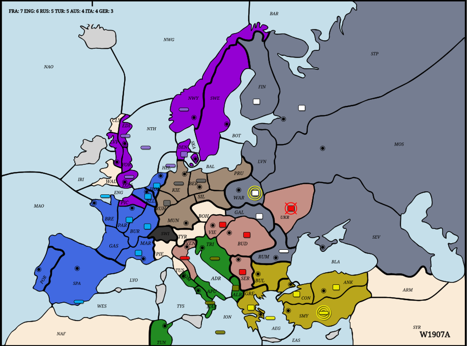

### What happened

- **AUSTRIA**: disbands A UKR
- **RUSSIA**: builds A WAR
- **TURKEY**: builds F SMY

### AUSTRIA
Orders: `A UKR D`

Reasoning

> I have 5 units (A SER, A BUD, F VEN, A VIE, A UKR) but only 4 supply centers (BUD, VIE, SER, VEN). I must disband exactly 1 unit.
>
> A UKR is my most exposed and least useful unit — it's deep in Russian territory, surrounded, bouncing into GAL with no support, and far from my core. Disbanding it keeps my Balkan/Adriatic core intact: A SER and A BUD wall Serbia and Budapest, A VIE defends home, and F VEN pressures Trieste.

### RUSSIA
Orders: `A WAR B`

Reasoning

> I now control 5 centers (MOS, SEV, STP, WAR, RUM) with 4 units, so I'm owed one build. My home centers MOS, SEV, and WAR are all vacant and available.
>
> Given the board, Turkey holds the Black Sea region and Austria's east is contested. A fleet at SEV would extend my reach into the Black Sea against Turkey, but Turkey has been a reliable quiet border and I'm more concerned with consolidating southern land power toward Budapest/Galicia and protecting my home triangle from Austria's loose A UKR (which Austria said moves to MOS — a potential threat to my home). Building an army in WAR keeps flexibility to reinforce GAL/push south, and keeps my home triangle defended.
>
> I'll build an army in WAR to project force south toward Galicia/Budapest while keeping my core secure.

### TURKEY
Orders: `F SMY B`

Reasoning

> I gained Greece (6 centers now), so I'm owed a build. SMY is my only open home center. I want fleet power to press into the Aegean/Eastern Med against Italy's overstretched fleets, which aligns with my strategy of contesting the central Med.

## SPRING 1908 MOVEMENT (`S1908M`)

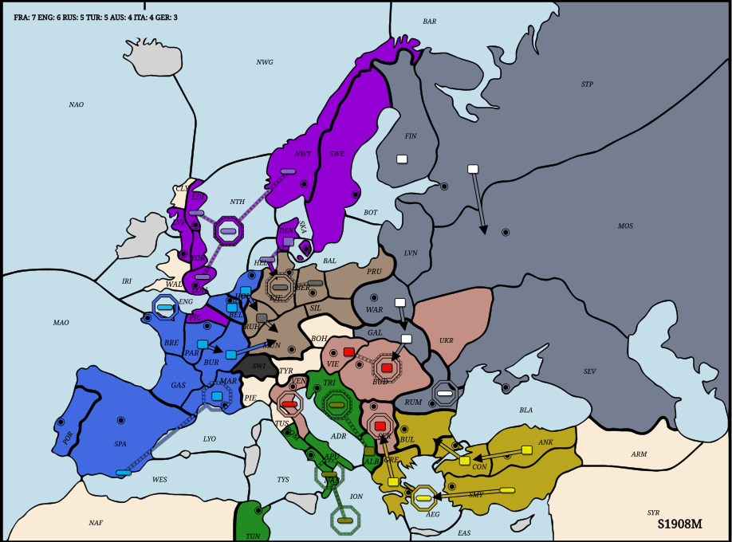

### What happened

- **AUSTRIA**: A BUD holds; A VIE supports A BUD; A SER holds; F VEN holds
- **ENGLAND**: F HEL → KIE (bounced); A DEN supports F HEL → KIE; F NTH holds; F LON supports F NTH; F EDI supports F NTH; F NWY supports F NTH
- **FRANCE**: A BUR → MUN (bounced); A HOL → RUH; A BEL supports A HOL → RUH; A PAR → BUR (bounced); F ENG holds; F SPA/SC supports A MAR
- **GERMANY**: A RUH → MUN (bounced); F KIE holds; F BER supports F KIE  [dislodged: A RUH]
- **ITALY**: F TRI holds; A ALB supports F TRI; F ION supports F NAP; F NAP supports F ION
- **RUSSIA**: A GAL → BUD (bounced); A WAR → GAL (bounced); F RUM holds; A STP → MOS
- **TURKEY**: A GRE → SER (bounced); A CON → BUL; F AEG holds; F SMY → AEG (bounced); A ANK → CON

### Dialogue

- **AUSTRIA → ITALY**: Your Greece is gone to Turkey and your stack is thin — I'm taking Trieste back this turn with VIE, VEN, SER and BUD all on it, four strength against your fleet. Walk F TRI to ADR now and keep the unit alive for the Ionian against Turkey; lose it here and you've gained nothing all year. Greece is Turkey's problem now, not mine — point your fleets at the Aegean.
- **AUSTRIA → RUSSIA**: Galicia and Rumania are yours, locked — I'm throwing my whole line west at Italy's Trieste this turn, nothing toward GAL or SEV. Keep GAL off Budapest and our border stays quiet while you press Turkey's Black Sea; with Turkey building F SMY he's the one crowding your flank now, not me.
- **AUSTRIA → TURKEY**: You took Greece off Italy cleanly — good. I'm committed entirely west on Italy's Trieste this turn, nothing toward Serbia or Bulgaria. Keep A GRE off Serbia and the quiet southern border holds; Italy's stack is collapsing, so press your Aegean and Greece flank while he's distracted defending me.
- **ENGLAND → FRANCE**: This is the turn we crack Germany together. You move A BUR-MUN and A HOL-KIE while I throw F HEL+A DEN+F NTH at Kiel — Germany can't defend both flanks. If you take Munich and I take Kiel, Germany's down to one center and we've each banked a build off the collapse. Confirm A HOL moves on Kiel so we don't bounce each other — or hold Holland and I'll take Kiel solo.
- **ENGLAND → GERMANY**: Straight talk: France wants me to gut your whole coast this turn while they grab Munich and Ruhr from the south — they're squeezing you from both sides. I'd rather you survive as a buffer against France than vanish. If you pull F KIE off the Baltic toward HOL to block France's army and let me have just Kiel quietly, I'll guarantee Berlin and Munich stay yours and point everything at France after.
- **ENGLAND → RUSSIA**: North stays clean as all game — nothing toward STP, Norway, or Bothnia. I'm finishing Germany's Kiel this turn. If you want Berlin's eastern approach, walk A WAR to PRU now and I keep my fleets out of the BAL/PRU lane so we split Germany cleanly rather than bump.
- **FRANCE → ENGLAND**: Strike turn: I push A BUR onto Munich with A MAR backing and A HOL onto Ruhr, while you throw F HEL/F KIE-area weight at Kiel. Germany at 3 cracks if we hit both flanks the same phase — confirm you commit against Kiel this turn and we split his collapse, you take the Baltic centers, I take Munich/Ruhr. Channel buffer holds from my side as always.
- **FRANCE → GERMANY**: You forced this — I offered you England's coast repeatedly and you never spent F DEN. A BUR goes at Munich this turn, not BUR-bouncing. Your three centers don't survive a two-front hit; if you want to save anything, pull everything to defend Munich and Kiel and we can talk terms next turn.
- **FRANCE → ITALY**: Border frozen as always, nothing toward Piedmont. I'm cracking Germany's west this turn, which keeps my weight north and west — my Atlantic fleet stays guarding Spain for now. Keep Austria's Trieste contested so nothing eastern frees up to reinforce England's lead.
- **FRANCE → TURKEY**: Understanding holds — I stay out of the western Med and my weight is going at Germany's west this turn, nothing eastward. Finish Austria's south cleanly; we both keep feeding off the weak powers between us while the north sorts itself out.
- **GERMANY → ENGLAND**: Straight talk: France has stalled me seven turns and I need a fourth center. Your A DEN and F HEL are the only growth in my reach. I'd rather not stab you — give me a real path west instead. If you genuinely commit your North Sea against France's Belgium AND quietly let me take HOL once France thins, I keep my fleets off your coast. Otherwise I have to test HEL/DEN this turn.
- **GERMANY → FRANCE**: Last chance before I orient north: you've burned every 'next turn' promise. If you actually pull A HOL west this phase, A RUH walks into Holland clean and our border stays the quietest you have. Refuse again and I stop pinning your west entirely — I go take it off England, and your Belgium line loses my pressure on their North Sea.
- **GERMANY → RUSSIA**: Border stays the quietest on the board — nothing of mine at Prussia, Silesia, Berlin or Kiel. I'm finally swinging my weight toward the North Sea against England's overextension. Keep grinding south; if you ever want to press England's STP/NWY flank, say the word and we squeeze him from two sides.
- **GERMANY → AUSTRIA**: Holding my line, your back stays clean from me — nothing toward Bohemia or Tyrolia. France remains the runaway at 7; I'm finally swinging north against England since France yields me nothing. Keep the south firm and we both hold.
- **ITALY → AUSTRIA**: We've bled at Trieste for two years with nothing for either of us — Turkey's the one who grew, taking Greece off me and sitting fat at five. Let's stop. You formally concede Trieste to me, I pledge Vienna and Venice untouched, and we both turn our weight on Turkey's Balkan line. A clean border lets you wall Venice and reclaim your south; a grinding war just feeds Turkey.
- **ITALY → RUSSIA**: Turkey's at five and pressing both of us — he took Greece off me and his stack threatens your Rumania. Keep A GAL/F RUM live against his Balkan line so A BUL and F AEG can't fully swing west onto my Adriatic. If you pin Turkey's south I can retake Greece, and Austria stays a buffer between us rather than collapsing into Turkey's lap.
- **ITALY → TURKEY**: You took Greece — fine, you earned the tempo. But you're at five now and France is at seven running west; if you push further into my Adriatic you just bleed us both while France laps the field. Hold the Aegean line and leave my Ionian wall alone, and I'll point my fleets at Austria's south, not your Greece. Push Greece into my home waters and I make the Ionian a wall you waste turns on.
- **RUSSIA → ITALY**: Time to crack Austria's east. I'm driving A GAL - BUD this turn with A WAR chaining behind into Galicia. For BUD to fall I need A SER and A VIE pinned — throw your stack at Serbia so A SER can't slide back to cover Budapest, and we split his last centers between us. Confirm your Serbia push.
- **RUSSIA → TURKEY**: Austria's down to 4 and breaking. I'm hitting Budapest from Galicia; keep A BUL/F AEG pressing his south so A SER stays tied down and can't reinforce BUD. Clean Black Sea border holds — F RUM stays defensive, nothing at your rear. Confirm you keep the pressure west.
- **RUSSIA → AUSTRIA**: You're at 4 and squeezed between me and Italy. I'd rather not gut you — give me Budapest uncontested this turn (don't reinforce it) and I'll keep GAL/RUM off Vienna and Serbia, leaving you to consolidate west against Italy. Contest it and I commit full weight with Italy already at your throat.
- **RUSSIA → ENGLAND**: North stays clean from me as all game — A FIN walls the corner, A STP holds, nothing toward Norway, Sweden, or Bothnia. My whole weight goes south onto Austria's Budapest this turn. Keep grinding Germany's Baltic and our quiet north holds.
- **RUSSIA → GERMANY**: Border stays the quietest on the board — nothing of mine at Prussia, Silesia, Berlin or Kiel. My push is south onto Austria's Budapest, not your Baltic. Keep your line west and we both hold our cleanest front.
- **TURKEY → ITALY**: Austria's down to four and Serbia is the last soft center between us. I'm driving A GRE - SER backed by A CON through Bulgaria. If you throw F TRI/A ALB at Austria's rear so A BUD can't backstop Serbia, it falls clean to me and we point at Vienna together next. Confirm you keep the Adriatic pressure on.
- **TURKEY → RUSSIA**: Clean Black Sea border holds as always — nothing of mine touches Sevastopol. I'm going at Austria's Serbia this turn. Drive A GAL onto Budapest or Vienna so A BUD can't swing back to defend Serbia, and we both finish carving Austria's corpse. Confirm your weight stays on his north.
- **TURKEY → AUSTRIA**: You're down to four with Italy in the Adriatic and Russia in Galicia. Serbia's the only thing holding your line and I'm taking it this turn unless you pull A SER's backstop west onto the bigger knife. Hand me Serbia clean and I keep my fleets off your remaining rear while you fight Italy.
- **AUSTRIA → RUSSIA**: No — Budapest stays defended and I won't hand it over. But Galicia and Rumania remain entirely yours and I put nothing toward SEV or your flank. Keep GAL off BUD this turn and our border stays quiet while you press Turkey's Black Sea; attack BUD and you just bleed against a backed defense while Turkey's F SMY crowds you.
- **AUSTRIA → ITALY**: Two years of grinding, agreed — but I won't formally concede Trieste, it's my home center and my build. Here's the real trade: walk F TRI out to ADR this turn, I take Trieste clean, and I pledge Venice stays put and I never push into the Ionian or your Adriatic — we both turn fully on Turkey, who's the only one who grew. Keep F TRI parked and I throw four units at it and you lose the fleet for nothing.
- **AUSTRIA → TURKEY**: Serbia stays defended with BUD backing — your single A GRE strike bounces and you bleed for nothing while Russia's F SMY-built fleet crowds your Aegean. Keep A GRE off Serbia and the quiet line holds; I'm committed west on Italy's Trieste, so your Balkan rear is safe from me and you're free to press Russia's Black Sea.
- **ENGLAND → FRANCE**: Confirmed and aligned: I throw F HEL+A DEN+F NTH at Kiel — three on Germany's two, it cracks. You take Munich with A BUR and Ruhr with A HOL. Just keep A HOL off Kiel so we don't collide; I've got the Baltic center, you bank Munich/Ruhr. Channel stays quiet from me.
- **ENGLAND → GERMANY**: Last chance to keep Berlin and Munich: France is taking BOTH Munich and Ruhr from you this turn while I take only Kiel. If you defend Kiel with both fleets you still lose it three-on-two and France walks into your interior unopposed. Pull F BER home to cover Berlin against France instead — I'll guarantee I never touch Berlin if you stop contesting Kiel.
- **ENGLAND → RUSSIA**: North stays clean as always. Germany's about to lose Kiel to me and Munich/Ruhr to France — Berlin will be wide open. If you want it, A WAR-PRU now and I keep the BAL/PRU lane clear so we don't bump; Berlin's yours next phase.
- **FRANCE → ENGLAND**: Confirmed split: I send A BUR-MUN and A HOL-RUH this turn, you take Kiel with your Heligoland/North Sea weight. I will NOT move on Kiel so we don't bounce — Baltic centers are yours, Munich/Ruhr mine. But fair warning: you're at 6 and I won't let the north run unchecked, so keep your fleets off my Channel as the buffer holds.
- **FRANCE → GERMANY**: Your move north is too late — your three centers can't survive Munich and Kiel hit the same phase, and England is already committed against Kiel. If you pull everything to defend Munich, you might hold one center and we talk terms; throw RUH at my line and you lose everything. Defend, don't lash out.
- **GERMANY → ENGLAND**: Deal, but the terms must be real: I pull A RUH back to cover MUN against France's army and keep F KIE/F BER home holding the Baltic. In exchange you keep your fleets off Berlin, Kiel, and the Baltic entirely this turn and point everything at France's Belgium/Holland line. I am NOT giving you Kiel for free — but I won't contest a quiet North Sea. Confirm you attack France this phase, not me, and our line stays clean.
- **GERMANY → FRANCE**: If A BUR goes at Munich this turn, you commit your western army away from England while England's whole stack hits your Belgium and Holland — you split yourself for a center I'll defend with A RUH and F KIE backing. You gain nothing and lose your Belgium line to England. Pull A BUR off Munich and our border stays quiet; push it and you bleed both ways.
- **GERMANY → RUSSIA**: France is about to throw A BUR at my Munich while England presses his Belgium — France is overextending hard. If you can put any pressure on his eastern flank or just keep grinding south, France can't sustain a Munich push and a Belgium defense at once. Our border stays the quietest on the board; I only ask you keep it that way while I weather this.
- **ITALY → AUSTRIA**: You're putting four on Trieste while Russia drives GAL-BUD and Turkey hits Serbia — you can't defend Budapest and Serbia AND take Trieste at once. Pull your assault, hold Venice and Budapest, and I'll formally leave Vienna and Venice alone and point F ION/F NAP at Turkey's Ionian approach. We both bleed if you keep grinding; Russia and Turkey eat your east while we fight.
- **ITALY → RUSSIA**: I'll keep F TRI and A ALB live against Austria's rear to help pin A SER/A BUD west — but Austria is throwing four units at Trieste this turn, so my stack is committed to surviving that. If BUD falls to you, Vienna opens next and I'll back your push. Keep A GAL/F RUM honest against Turkey too — he's the one who'll lap us both if his Balkan line frees up.
- **ITALY → TURKEY**: I won't contest Serbia — take it off Austria, you've earned the tempo there. But hold your F AEG off Greece and my Ionian: if you push into my home waters while France runs at seven, we both bleed and France laps the board. Keep the Aegean line and point at Vienna with me next, and I leave your Greece alone.
- **RUSSIA → ITALY**: Confirmed — A GAL - BUD with A WAR chaining behind. The problem is A VIE can support A BUD's hold and bounce me. Can your F VEN threaten Vienna's approach or your stack draw A VIE off? If you commit fully at Serbia and Trieste, A SER and F VEN tie Austria down and BUD opens. I keep F RUM live on the Balkan line so Turkey can't fully swing onto your Adriatic.
- **RUSSIA → TURKEY**: Good — keep A BUL/F AEG hard on Serbia so A SER stays pinned and can't slide back to cover Budapest. That's exactly what lets my A GAL - BUD land. Clean Black Sea border holds, F RUM stays defensive off your rear.
- **RUSSIA → AUSTRIA**: Last offer: don't reinforce Budapest and it's a clean handoff — I keep GAL/RUM off Vienna and let you consolidate west against Italy and Turkey's Serbia push. If A VIE props BUD I commit full weight and you lose more than one center with Italy and Turkey already on you. Your call this turn.
- **TURKEY → RUSSIA**: Concrete trade: I drive A GRE - SER with A CON support (attack two). For Serbia to fall, A BUD must be pinned so it can't support A SER's hold. Order A GAL - BUD this phase to tie down A BUD, and Serbia cracks clean while you keep Budapest pressure. Confirm A GAL - BUD and I commit my full weight at Serbia.
- **TURKEY → ITALY**: Agreed — I leave your Ionian wall alone, no fleets into your home waters. But throw A ALB at SER or F TRI at Austria's rear so A BUD can't backstop Serbia; with Austria's defense split, Serbia falls to me clean and neither of us bleeds. Confirm A ALB - SER support or a Trieste push and we both feed off Austria, not each other.
- **TURKEY → AUSTRIA**: Last chance to keep your Black Sea rear quiet: pull A BUD west onto Italy's Trieste stack and leave Serbia to me. If A BUD stays backstopping A SER, Russia's Galicia and my Bulgaria stack both crash it this turn — you can't hold Serbia and Budapest at once.
- **AUSTRIA → ITALY**: Deal: I do NOT assault Trieste this turn — F VEN holds Venice, A VIE braces Vienna, nothing toward TRI or your Adriatic. In return point F ION/F NAP at Turkey's Ionian/Aegean approach so we both bleed Turkey, not each other. Two quiet years on this border start now.
- **AUSTRIA → RUSSIA**: Budapest is defended — A BUD holds with A VIE backing it, so GAL-BUD bounces and you bleed for nothing while Turkey's F SMY crowds your Black Sea. Galicia and Rumania stay entirely yours and I put nothing toward SEV. Take the quiet border and press Turkey instead.
- **AUSTRIA → TURKEY**: Serbia stays walled — A SER holds with A BUD supporting, defense two against your single A GRE, so your strike bounces. Keep A GRE off Serbia and my rear stays off your Bulgaria/Black Sea while Russia's new F SMY-pressure fleet sits on your flank. The quiet line still pays you more than feeding Italy.
- **ENGLAND → FRANCE**: Locked: F NTH supports F HEL into Kiel with A DEN backing — three on Germany's two, it cracks. You take Munich with A BUR and Ruhr with A HOL; I stay entirely off your Channel. Baltic is mine, Munich/Ruhr yours — we both bank a build off his collapse this turn.
- **ENGLAND → RUSSIA**: Confirmed quiet north — nothing toward STP, Norway, Bothnia from me. I take Kiel this phase; if you want Berlin, walk A WAR-PRU and I keep the BAL/PRU lane clear so we don't bump.
- **FRANCE → ENGLAND**: Locked: A BUR-MUN, A HOL-RUH this phase, A BEL holds Belgium covered. You commit F HEL+A DEN+F NTH at Kiel as agreed — I stay off Kiel entirely. Germany's whispering that you'll stab my Belgium instead of hitting Kiel; prove him wrong by taking the Baltic center and our buffer stays the cleanest line you have.
- **FRANCE → GERMANY**: Your bluff that England will hit my Belgium instead of Kiel doesn't move me — A BEL stays home covered, A HOL takes RUH so your A RUH bounces, and A BUR takes Munich. You defend one center at best. Pull everything to Munich and you might survive to talk terms next turn; lash out and you lose all three.
- **GERMANY → ENGLAND**: Final: I hold Kiel with F KIE, F BER supports Kiel's hold, and A RUH covers Munich against France. I am NOT conceding Kiel — three-on-two means you must commit F HEL and A DEN to it and still likely bounce my supported hold. Far better for you: point F HEL/A DEN and your whole stack at France's Holland/Belgium this phase and take real French centers, not a Kiel you'll bleed for against a buffer you said you'd rather keep. Touch my Baltic and I have nothing to lose and orient everything at you next year.
- **GERMANY → FRANCE**: A RUH sits on Munich's approach and F BER backs Kiel — if A BUR goes at Munich it bounces my covered home center while England's full stack crashes your undefended Belgium and Holland. You split for nothing and lose your west. Hold A BUR and our border stays quiet; push it and you bleed both ways.
- **GERMANY → RUSSIA**: Border stays the quietest on the board — nothing of mine at Prussia, Silesia, Berlin or Kiel. I'm pulling tight to weather a French-English squeeze. Keep grinding south and our line stays clean.
- **ITALY → AUSTRIA**: Final: I hold F TRI with A ALB supporting. Russia drives GAL-BUD and Turkey hits SER this turn, so A BUD and A SER are both pinned defending — only A VIE and F VEN reach Trieste, two strength against my wall of two. Your assault bounces and you bleed Budapest and Serbia to Russia and Turkey while we fight over nothing. Pull off Trieste and hold your east, or lose centers on three fronts.
- **ITALY → RUSSIA**: Locked: I throw F TRI + A ALB at Austria's rear to pin A SER and tie down A VIE/F VEN near Trieste, so neither A SER nor A VIE can cleanly backstop Budapest. Drive GAL-BUD with WAR chaining — with Austria's defense split between Trieste, Serbia, and Budapest, BUD opens for you. Keep F RUM honest on the Balkan line so Turkey can't swing west onto me.
- **ITALY → TURKEY**: Confirmed: I keep F TRI/A ALB committed against Austria's rear so A BUD can't backstop Serbia — take SER off Austria clean. In return your F AEG stays off Greece and my Ionian this turn, as agreed. Once Serbia and Budapest fall we point at Vienna together, not at each other.
- **RUSSIA → ITALY**: Locked: A GAL - BUD with A WAR chaining into Galicia behind it. For it to land I need A VIE unable to support A BUD's hold — Austria's throwing four at your Trieste, so if your F VEN even feints at the Adriatic/Vienna approach it helps tie A VIE down. Survive Trieste, keep F TRI live, and Vienna opens for one of us next turn.
- **RUSSIA → TURKEY**: Committed: A GAL - BUD this phase, F RUM stays defensive off your Black Sea rear, nothing at Sevastopol or your flank. You drive A GRE - SER with A CON support as you said — that pins A SER so it can't slide back to cover Budapest. We both carve Austria this turn; clean border holds.
- **RUSSIA → AUSTRIA**: Final: I'm committing A GAL - BUD with A WAR behind it. You chose to reinforce, so this is a contest while Italy holds Trieste and Turkey hits Serbia — you can't cover all three. Pull A VIE off BUD's defense and consolidate west, or lose Budapest to a backed assault. Your move.
- **TURKEY → RUSSIA**: Committed: A GAL - BUD from you ties down A BUD this turn. I push A GRE - SER and bring A CON - BUL to stack pressure behind it; even if Serbia holds this phase, with BUD pinned it cracks next. Clean Black Sea border holds, nothing at Sevastopol.
- **TURKEY → ITALY**: Agreed — F AEG stays off your Ionian and home waters, no fleets west. I drive A GRE at Serbia and stack A CON into Bulgaria behind it. Keep A ALB or F TRI pressuring Austria's rear so A BUD can't both backstop Serbia and defend itself, and we point at Vienna together next.
- **TURKEY → AUSTRIA**: Last word: I'm at Serbia this turn. Pull A BUD west onto Italy's Trieste and leave Serbia, or Russia's Galicia and my Bulgaria stack both crash your line within two turns — you can't hold Serbia and Budapest against both of us.

### AUSTRIA
Orders: `A BUD H` · `A VIE S A BUD` · `A SER H` · `F VEN H`

Reasoning

> Let me assess the threats. Russia is committing A GAL - BUD with A WAR behind it (two strength). Turkey is hitting Serbia with A GRE (one strength). Italy holds F TRI with A ALB.
>
> Budapest is under a backed assault (GAL-BUD + WAR support = strength 2). I need A BUD to hold AND support it. If A BUD holds with A VIE supporting (defense 2), that bounces Russia's strength-2 attack. Good.
>
> Serbia faces only A GRE (Turkey's single attack, strength 1). A SER holding alone = defense 1, which bounces a strength-1 attack. Turkey has no support visible for the Greece push. So A SER can hold alone.
>
> But wait — Turkey said Bulgaria stack too. Turkey has A CON, A ANK far off; only A GRE adjacent to SER. F AEG can't support into SER. So Serbia faces just A GRE = strength 1. A SER holds alone, bounces.
>
> That frees A BUD's supporter consideration. Defense of BUD: A BUD holds + A VIE supports = strength 2, bounces Russia's strength-2 attack (GAL + WAR support). Good.
>
> F VEN: per my deal with Italy, I hold Venice and don't assault Trieste. F VEN H.
>
> So: A BUD holds, A VIE supports A BUD, A SER holds, F VEN holds.

### ENGLAND
Orders: `F HEL - KIE` · `A DEN S F HEL - KIE` · `F NTH H` · `F LON S F NTH` · `F EDI S F NTH` · `F NWY S F NTH`

Reasoning

> Germany defends Kiel with F KIE held and F BER supporting. To break a supported hold I need three attacking strength against his two defensive strength. F HEL attacks Kiel, A DEN supports, F NTH supports — but wait, F NTH is not adjacent to KIE. Checking adjacency: KIE neighbors are BAL, BER, DEN, HEL, HOL, MUN, RUH. F NTH cannot support into Kiel. So my real supporters into KIE are A DEN (adjacent) and units in HOL/BER/RUH/BAL/HEL/MUN.
>
> So my attack: F HEL - KIE, A DEN S F HEL - KIE. That's strength 2 against Germany's defensive strength 2 (F KIE held + F BER support). That bounces. I need a third supporter into Kiel, but I don't have one adjacent that isn't already committed. France is taking RUH with A HOL — if A HOL went to KIE instead it could help, but they're committed to RUH.
>
> Given France pulls RUH and MUN, and A RUH covers Munich for Germany per his last message... actually Germany says A RUH covers MUN, F KIE holds, F BER supports. France attacks MUN with A BUR (vs A RUH) and RUH with A HOL (now empty). So Germany's defense at Kiel is solid 2-on-2 against me. My 2 won't break it.
>
> I can't break Kiel this turn alone. But holding still loses. Let me maximize: throw everything I legally can at Kiel and hope F BER's support gets cut by France's move on Berlin's approach — but no one attacks Berlin. F BER support holds. So Kiel bounces.
>
> Best practical move: attack Kiel with F HEL + A DEN support anyway (forces Germany to keep defending, and if France's pressure dislodges things it could open). Keep North Sea wall intact, anchor north.

### FRANCE
Orders: `A BUR - MUN` · `A HOL - RUH` · `A BEL S A HOL - RUH` · `A PAR - BUR` · `F ENG H` · `F SPA/SC S A MAR`
Illegal (dropped): `A MAR S A BUR - MUN`

Reasoning

> Executing the plan: crack Germany's west. A BUR onto Munich (with A MAR support), A HOL onto Ruhr to bounce/displace Germany's A RUH, A BEL holds Belgium covered against any English betrayal, A PAR backs the home line, F ENG holds Channel buffer, F SPA/SC stays on Spain.
>
> A BUR-MUN: Munich is Germany's, defended by A RUH adjacent and F BER backing. I need support. A MAR can support A BUR-MUN? MAR adjacent to MUN? No — MAR neighbors are BUR, GAS, LYO, PIE, SPA/SC, SWI. Not MUN. So A MAR can't support into Munich. A PAR can't reach MUN either. A BUR-MUN goes in unsupported — Germany's A RUH could defend MUN, but A RUH is itself being attacked by A HOL-RUH. If A HOL takes RUH, A RUH must defend or move; if A RUH holds MUN's defense it can't. Actually A RUH defending MUN means A RUH supports F-nothing. Let me just push: A HOL-RUH forces A RUH to respond, A BUR-MUN unsupported risks bounce vs F BER support. 
>
> Better: A BUR-MUN with A MAR-BUR backing won't help destination. Send A BUR-MUN solo, A HOL-RUH solo. If England takes Kiel, Germany scrambles. I'll keep A MAR supporting A BUR's move where legal — A MAR S A BUR is hold support only. I'll move A MAR-BUR to follow up next turn is wrong since BUR vacates. Keep A MAR holding to defend Marseilles/south and support nothing wasted: A MAR - SPA? No, Spain held by fleet. A MAR holds as reserve.

### GERMANY
Orders: `A RUH - MUN` · `F KIE H` · `F BER S F KIE`

Reasoning

> I'm pulling tight against a two-front French-English squeeze. France threatens Munich with A BUR; England threatens Kiel with F HEL/A DEN. I defend my interior: A RUH covers Munich (so A HOL→RUH or A BUR→MUN bounces my approach), and I make Kiel a supported hold with F BER backing F KIE. This forces both attackers to either commit hard and likely bounce, or back off.
>
> A RUH to MUN covers the home center directly against A BUR's push. F KIE holds, F BER supports the hold — three-strength defense at Kiel.

### ITALY
Orders: `F TRI H` · `A ALB S F TRI` · `F ION S F NAP` · `F NAP S F ION`

Reasoning

> Austria pledged not to assault Trieste; Russia and Turkey both want me to pin Austria's rear so A BUD can't backstop their pushes. I'll hold Trieste with A ALB supporting to keep my wall and pin Austria, keep F ION/F NAP cohesive in the Ionian. I'll point F ION toward the Aegean approach to pressure Turkey's flank as my notes call for, while keeping NAP backing the line. Actually, to honor the coalition and keep my wall, A ALB supports F TRI's hold pinning Austria's rear, F TRI holds, F NAP supports F ION's advance toward GRE/AEG, and F ION moves to threaten the Aegean/Greek flank.
>
> Better: F ION - AEG would directly contest Turkey, but Turkey agreed to leave my Ionian alone and help me eat Austria. I shouldn't stab Turkey yet while we're co-eating Austria. Keep the Ionian wall cohesive and ready. Hold Trieste solidly, keep Rome open for a Winter build by leaving NAP free to advance to ROM if needed — but NAP holds the Ionian line.

### RUSSIA
Orders: `A GAL - BUD` · `A WAR - GAL` · `F RUM H` · `A STP - MOS`
Illegal (dropped): `A FIN S A STP - MOS`

Reasoning

> Austria says A BUD holds with A VIE backing it. A straight A GAL - BUD with only A WAR chaining behind won't add support to the attack — A WAR moving into GAL doesn't support the BUD attack. I need A WAR to support A GAL - BUD if I want it to land. But A WAR can't reach BUD to support an attack there (WAR neighbors GAL, not BUD). So A WAR can only support A GAL into a province WAR is adjacent to.
>
> Let me reconsider. A GAL - BUD with no support = strength 1, against A BUD holding with A VIE support = defense 2. Bounces. Italy and Turkey pinning A SER and pressuring might cut A VIE's support if A VIE is attacked, but nobody is attacking A VIE. So BUD will hold.
>
> Better: have A WAR support A GAL into a target WAR is adjacent to, or attack GAL→VIE? GAL-VIE: VIE defended only by A VIE itself (it's there). If A VIE holds, GAL-VIE bounces too unless supported. A WAR can't support into VIE either.
>
> Realistically BUD won't fall this turn. But honoring the coalition to pin A BUD has value — Turkey needs A BUD tied down. Drive A GAL - BUD to pin it; A WAR chains into GAL to follow up next turn. F RUM stays defensive. North: A STP - MOS to open build slot, A FIN supports the corner.

### TURKEY
Orders: `A GRE - SER` · `A CON - BUL` · `F AEG H` · `F SMY - AEG` · `A ANK - CON`

Reasoning

> A direct A GRE - SER alone is only strength one against A SER defended by A BUD. But Russia's A GAL - BUD pins A BUD, stripping its support from A SER. With A GAL - BUD cutting A BUD, A SER holds at strength one (just itself). My A GRE - SER would also be strength one — that bounces. I need support. A CON can support GRE - SER? CON is not adjacent to SER. Let me check: I committed to A CON - BUL stacking behind, then GRE - SER. With BUD pinned by Russia, A SER is undefended (only itself = 1), so my single A GRE - SER bounces equal. I need a second unit.
>
> Actually GRE is adjacent to SER, and my only adjacent supporter is... A ALB (Italy's, not mine). I have no second unit adjacent to SER. So GRE - SER is one strength vs A SER's one — bounce. To win I need Italy's A ALB S A GRE - SER, which Italy declined. So Serbia won't fall this turn regardless; I execute the committed plan to keep pressure and position for next phase when BUD stays pinned.
>
> I'll follow my revised note: A GRE - SER, A CON - BUL stacking, F AEG holds, F SMY - AEG, A ANK - CON. This keeps Bulgaria filled and positions me. Building the stack so next turn CON/BUL can convoy support.

## FALL 1908 MOVEMENT (`F1908M`)

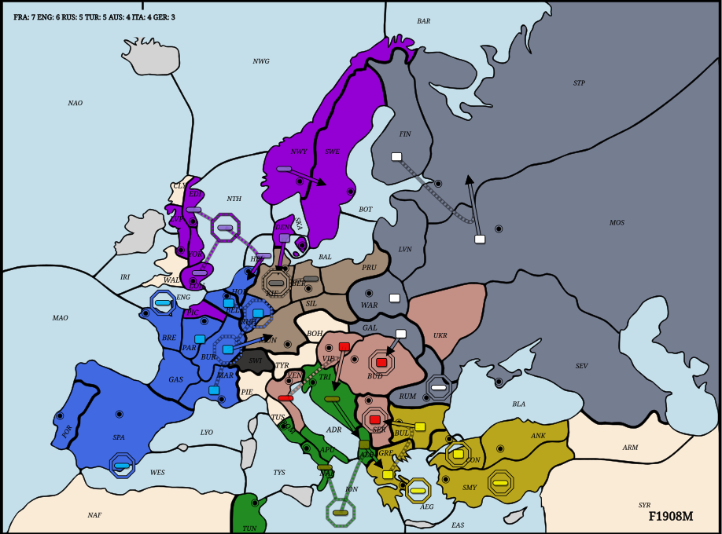

### What happened

- **AUSTRIA**: A VIE → TRI; F VEN supports A VIE → TRI; A BUD holds; A SER holds
- **ENGLAND**: F HEL → HOL; A DEN → KIE (bounced); F NTH supports F HEL → HOL; F NWY → SWE; F EDI supports F NTH; F LON supports F NTH
- **FRANCE**: A BUR → MUN; A RUH supports A BUR → MUN; A BEL supports A RUH; A MAR supports A BUR (void); F ENG holds; F SPA/SC holds
- **GERMANY**: F KIE holds; F BER supports F KIE
- **ITALY**: A ALB → GRE; F ION supports A ALB → GRE; F TRI → ALB; F NAP supports F ION
- **RUSSIA**: A GAL → BUD (bounced); A MOS → STP; A FIN supports A MOS → STP; F RUM holds
- **TURKEY**: A BUL → SER (bounced); A GRE supports A BUL → SER (support cut); A CON holds; F AEG holds; F SMY holds  [dislodged: A GRE]

### Dialogue

- **AUSTRIA → ITALY**: Last turn you held Trieste; this turn I take it. A VIE - TRI with F VEN and A SER both supporting is three strength against your F TRI and A ALB wall of two — it falls and you lose the fleet for nothing. Walk F TRI to ADR now and keep the unit for the Ionian against Turkey; I keep Venice parked and never push your Adriatic.
- **AUSTRIA → RUSSIA**: Galicia and Rumania stay entirely yours — A BUD holds to wall Budapest, nothing toward GAL or SEV. Keep GAL off Budapest this turn and our border stays locked while you press Turkey's Black Sea; Turkey's new F SMY is crowding your flank, not me.
- **AUSTRIA → TURKEY**: I'm committed west on Italy's Trieste this turn — nothing toward Serbia or Bulgaria. A SER backs my Trieste strike, so keep A GRE off Serbia and the quiet southern line holds while you press Russia's Black Sea where F SMY gives you the edge.
- **ENGLAND → FRANCE**: Buffer holds clean from me — nothing touches your Channel or Atlantic this phase. I'm committing F HEL+A DEN+F NTH at Kiel to finally crack it; you take Munich and Ruhr as before. Once Germany's centers are split, let's talk about who covers the German interior so neither of us overextends.
- **ENGLAND → GERMANY**: Last offer: pull F BER back to cover Berlin and let Kiel fall to me quietly, and I guarantee I never touch Berlin — you survive as a buffer against France with your interior centers intact. If you stack both fleets on Kiel you still lose it three-on-two and France walks Munich/Ruhr unopposed. Your choice whether you keep Berlin or lose everything.
- **ENGLAND → RUSSIA**: North stays clean as all game — nothing toward STP, Norway, or Bothnia. I take Kiel this phase; Berlin will be wide open after. If you want it, walk A WAR-PRU now and I keep the BAL/PRU lane clear so we split Germany cleanly rather than bump.
- **FRANCE → ENGLAND**: Strike turn for real this time: I commit A BUR-MUN with A PAR and A RUH both backing it — three on Germany's Munich, it cracks even covered. You throw F HEL+A DEN+F NTH at Kiel as agreed. Confirm you stay entirely off my Belgium and Channel — Germany's been whispering you'll stab there instead, and if you take Kiel clean we both bank builds and the buffer stays the cleanest line you have.
- **FRANCE → GERMANY**: You're out of moves. A BUR-MUN with A PAR and A RUH backing is three on your covered home — it falls — while England's full stack hits Kiel the same phase. Pull everything to one center and you might survive to talk terms; lash out at my line and you lose all three this turn.
- **FRANCE → ITALY**: Border frozen, nothing toward Piedmont. I'm finishing Germany's west this phase, so my weight stays north for now — but once Munich and Ruhr lock my Atlantic fleet frees to read the Med with you against whoever's leading there. Keep Trieste contested so nothing eastern reinforces England's north.
- **GERMANY → ENGLAND**: We weathered last turn clean — neither of us lost. Same deal holds: I keep F KIE/F BER home holding the Baltic and never touch your North Sea, you keep F HEL/A DEN and your stack pointed at France's Holland/Belgium line. France is the 7-center runaway threatening us both; every fleet you spend on me is a fleet not taking French centers. Confirm you stay off my Baltic this phase and I keep it the quietest front you have.
- **GERMANY → FRANCE**: Your A BUR bounced off Munich last turn while you gained nothing — and if you throw it at Munich again, A RUH covers it and England's stack crashes your undefended Holland and Belgium. You're the runaway at 7; everyone's watching. Hold A BUR and our border stays quiet this phase. Push it and you split yourself for a center I defend while England eats your west.
- **GERMANY → RUSSIA**: Border stays the quietest on the board — nothing of mine at Prussia, Silesia, Berlin or Kiel. France at 7 is the runaway threatening us both; keep grinding south and our line stays clean. If you ever want to squeeze France's flank I'm listening, but for now I just hold tight.
- **ITALY → AUSTRIA**: Truce held and I value it. Keep F VEN and A VIE off Trieste this turn and I'll point everything at Turkey's Balkan line — A ALB and F ION onto Greece. A quiet Adriatic border lets you reclaim Serbia from Turkey while I grind his south.
- **ITALY → TURKEY**: Your A GRE bounced off Serbia and sits in Greece still. I'm taking Greece back this turn — it's my home-region center and you're already fat at five. Pull A GRE to Serbia or Bulgaria and we avoid a collision; dig in on Greece and I commit F ION and A ALB to pry it loose while Russia presses your Rumania flank.
- **ITALY → RUSSIA**: Turkey's at five and his stack threatens your Rumania. Keep F RUM and A GAL live against his Balkan line so A BUL/F AEG can't swing fully west onto me, and I'll grind Greece off him this turn. With both of us pressing his south, his line cracks before he laps the field.
- **RUSSIA → ITALY**: Austria's at 4 and cornered. I'm driving A GAL-BUD with A WAR supporting (attack 2). To break a backed defense I need A VIE off Budapest — can your F VEN feint at the Trieste/Vienna approach so A VIE stays home defending? With your stack on Serbia and my weight on BUD, his line cracks this turn and Vienna opens for you next.
- **RUSSIA → TURKEY**: Final coordination: I commit A GAL-BUD with A WAR backing it (attack 2). You drive A GRE-SER with A CON-BUL stacking behind — pin A SER so it can't slide to cover BUD or VIE. Clean Black Sea border holds, F RUM stays defensive off your rear. We carve Austria together this phase.
- **RUSSIA → AUSTRIA**: Last chance before I commit full weight: A GAL-BUD with A WAR supporting is a backed attack-2, and Italy holds Trieste while Turkey hits Serbia — you cannot cover all three. Pull A VIE off Budapest and consolidate west, or lose Budapest clean. Galicia/Rumania stay yours and nothing touches SEV if you fold gracefully.
- **RUSSIA → ENGLAND**: North stays clean from me as all game — A FIN walls the corner, A STP holds, nothing toward Norway, Sweden, or Bothnia. My whole weight goes south onto Austria's Budapest. Keep grinding Germany's Baltic and our quiet north holds.
- **TURKEY → RUSSIA**: Final push at Austria's south: I drive A BUL - SER with A GRE supporting the move — attack two against A SER. For it to land, A BUD must stay pinned and unable to support A SER's hold. Throw A GAL - BUD again this phase to tie down Budapest and Serbia cracks clean while you keep your northern pressure. Clean Black Sea border holds, nothing at Sevastopol.
- **TURKEY → ITALY**: I'm taking Serbia off Austria this turn — A BUL - SER with A GRE backing the move. My F AEG and F SMY stay east, nothing into your Ionian or home waters as agreed. Keep F TRI/A ALB hard on Austria's rear so A BUD can't both defend itself and backstop Serbia, and we point at Vienna together next.
- **TURKEY → AUSTRIA**: You're down to four. Serbia falls this turn — A BUL - SER backed by A GRE is attack two, and with Russia pinning Budapest your A SER can't be saved. Pull A BUD west onto Italy's Trieste stack and salvage your line, or lose both Serbia and Budapest within two turns.
- **AUSTRIA → ITALY**: You keep saying TRI holds with A ALB — but if I commit A VIE-TRI plus F VEN and A SER all on it, that's three against your two and the fleet falls. I'd rather not: walk F TRI to ADR this turn and I pledge Venice stays put and I never touch your Adriatic or Ionian. Then your A ALB and F ION/F NAP can all swing onto Turkey's Greece/Aegean while I wall my east. Confirm and we both grow off Turkey.
- **AUSTRIA → RUSSIA**: I'm not reinforcing Budapest beyond A VIE's brace — GAL-BUD bounces against defense two regardless. Galicia and Rumania stay yours, nothing toward SEV. But Turkey's F SMY and your own Black Sea line should be your real target, not bleeding on my walled Budapest. Keep GAL off BUD and press Turkey; we both gain.
- **AUSTRIA → TURKEY**: Serbia's walled with A BUD backing — your single A GRE strike bounces. But if you genuinely want my rear quiet, leave A GRE off Serbia and I leave Bulgaria and your Black Sea entirely alone while Russia's new fleet crowds you. We've held this line two years; it still pays you more than feeding Italy a free Serbia.
- **ENGLAND → FRANCE**: Locked exactly as agreed: F HEL into Kiel, A DEN and F NTH both supporting — three on Germany's two, it cracks this phase. My Channel and Belgium stay completely untouched; F LON sits home. You bank Munich/Ruhr, I bank Kiel — both grow off his collapse.
- **ENGLAND → RUSSIA**: North stays clean as always. Kiel falls to me this phase and Berlin will sit open behind it — if you want Berlin, walk A WAR-PRU now and I keep the BAL/PRU lane clear so we never bump.
- **FRANCE → ENGLAND**: Final lock for this phase: I commit A BUR-MUN with A PAR and A RUH both supporting — three on Munich, it falls even covered. You throw F HEL+F NTH+A DEN at Kiel as agreed. I stay entirely off Kiel and the Channel; you stay off my Belgium. After this we both build and we should agree who garrisons the German interior so neither overextends — propose your line next turn.
- **FRANCE → GERMANY**: Three units back A BUR into Munich this phase — it falls. Your only play is consolidation: pull F KIE and F BER tight and you might hold Berlin to talk terms. Lash out at my Belgium line and you simply lose both your fleets and the center anyway with nothing to show.
- **FRANCE → ITALY**: Germany's west cracks this phase, which frees my hand within a turn. Once Munich locks my Spain fleet can swing toward Lyon and the Tyrrhenian to read the Med with you — England is the runaway north and the real threat. Keep Trieste contested so nothing eastern reinforces him.
- **FRANCE → TURKEY**: Our understanding holds — my weight is entirely north and west on Germany this phase, nothing toward the eastern Med. Finish Austria cleanly; we both feed off the weak powers while the north sorts itself out.
- **GERMANY → ENGLAND**: Honor our line: keep F HEL and A DEN off Kiel and pointed at France's Holland/Belgium. I hold F KIE with F BER backing — three-strength you can't crack anyway, so spend it on real French centers instead. France is the runaway at 7 and grabbing Munich from me this turn; every fleet you waste on my Baltic just feeds them.
- **GERMANY → FRANCE**: Munich is undefended and you can take it — but understand the cost. The moment A BUR commits east to Munich, England's full stack crashes your Holland and Belgium with nothing covering them, and you lose your west for one interior center. Hold A BUR, leave Munich, and our border stays the quietest you have while you keep your gains against England. Push it and you bleed both ways.
- **GERMANY → RUSSIA**: France is overextended — if they grab my Munich this turn they pull A BUR away from defending Belgium against England. Any pressure you put on France's flank or just grinding south keeps them from sustaining both. Our border stays the quietest on the board; keep it that way and we both hold.
- **ITALY → AUSTRIA**: Truce held and I'll keep it — F VEN and A VIE stay safe from me. I'm pulling my weight east onto Turkey's Greece this turn, not your rear, so a quiet Adriatic border continues. Hold Venice and reclaim your south; I won't touch Vienna or Venice.
- **ITALY → TURKEY**: I'm content with the Ionian line, but Greece is my home-region center and you're fat at five while France runs at seven. Pull A GRE back to Serbia or Bulgaria and we stay clean; dig in and I commit F ION and A ALB to pry it loose. Your call — but don't waste F AEG defending Greece when France is the one lapping the board.
- **ITALY → RUSSIA**: Keep F RUM and A GAL hard on Turkey's Balkan flank so A BUL and F AEG can't reinforce Greece against me. If you pin his south I retake Greece this turn and we keep Turkey from consolidating behind both of us.
- **RUSSIA → TURKEY**: Locked: A GAL - BUD pins A BUD so it can't backstop Serbia — drive A BUL-SER with A GRE supporting and Serbia falls to you this phase. F RUM stays defensive off your rear, nothing at Sevastopol. But your F SMY+F AEG building toward my Black Sea makes me wary; keep them west on Austria, not creeping toward Rumania.
- **RUSSIA → ITALY**: I commit A GAL-BUD pinning A BUD this turn. Keep F TRI and A ALB live so A VIE can't slide off Budapest's defense to help Austria's south — that ties Austria's whole line down. When Austria cracks, Vienna opens; I take BUD, you press Trieste/Vienna and we split his corpse before Turkey laps us both.
- **RUSSIA → AUSTRIA**: You're cornered — Turkey takes Serbia this phase whether or not you reinforce BUD, since A VIE can only cover one. Pull A SER back to BUD or Vienna and consolidate to survive; Galicia and Rumania stay yours and I keep nothing at SEV. Fight on every front and you lose two centers, not one.
- **TURKEY → RUSSIA**: Concrete: I drive A BUL - SER with A GRE supporting (attack 2). A SER is walled by A BUD's support (defense 2), so it bounces unless A BUD is cut. Order A GAL - BUD this phase to cut A BUD's support, and Serbia falls to me clean. Clean Black Sea border holds, nothing at Sevastopol.
- **TURKEY → ITALY**: I'm at Serbia, not your Ionian — F AEG and F SMY stay east as agreed, nothing into your home waters. Keep F TRI/A ALB on Austria's rear so A BUD can't backstop A SER; with it pinned Serbia cracks and we point at Vienna together next.
- **TURKEY → AUSTRIA**: Serbia falls this turn — A BUL - SER backed by A GRE is attack 2, and Russia is cutting A BUD's support from Galicia, so your wall breaks. Pull A SER back or lose it; either way commit your remaining line west on Italy and I keep my fleets off your Black Sea rear.
- **AUSTRIA → RUSSIA**: Final: A BUD holds with A VIE supporting — defense two, your GAL-BUD with WAR bounces again. Galicia and Rumania stay yours, nothing toward SEV. Stop bleeding on my wall and turn GAL/RUM on Turkey's Black Sea before F SMY consolidates against you.
- **AUSTRIA → ITALY**: Confirmed truce: F VEN holds Venice, A VIE braces Budapest, nothing toward Trieste or your Adriatic. Point F ION/F NAP at Turkey's Ionian/Aegean — he's the only one who grew this year. Quiet Adriatic border holds.
- **AUSTRIA → TURKEY**: A SER holds with A BUD backing — your A GRE/A BUL strike on Serbia bounces against defense two. Keep off Serbia and my rear stays off Bulgaria while Russia's fleet crowds your Aegean. The quiet line still pays you more than a wasted assault.
- **ENGLAND → FRANCE**: Locked and final: F HEL into Kiel, A DEN and F NTH both supporting — three on Germany's two fleets, the supported hold cracks this phase. My Channel and Belgium stay completely untouched, F LON sits home. You take Munich and Ruhr as agreed; we both bank builds off his collapse and talk interior garrison lines next turn.
- **ENGLAND → RUSSIA**: North stays clean as all game — nothing toward STP, Norway, or Bothnia. I take Kiel this phase and Germany falls to a single center; Berlin sits wide open after. If you want it, A WAR-PRU now and I keep the BAL/PRU lane clear so we never bump.
- **FRANCE → ENGLAND**: Locked: A BUR-MUN with A PAR and A RUH both supporting — three on Munich, it falls. A BEL holds my Belgium and F ENG anchors the Channel, so nothing of mine touches Kiel or the North Sea. You throw F HEL+A DEN+F NTH at Kiel as agreed — take the Baltic, I take Munich. If your fleets touch Belgium instead of Kiel, the buffer is dead and I turn west on you next phase.
- **FRANCE → GERMANY**: Three units commit to Munich this phase — A BUR moves, A PAR and A RUH support. Your A RUH can't retake the inland squares my fleets can't, and F KIE/F BER can't defend Munich from a three-stack while England crashes Kiel. Pull everything to Berlin if you want to survive to talk terms; lashing at my covered Belgium gains you nothing.
- **FRANCE → ITALY**: Munich falls this phase and my hand frees within a turn — my Spain fleet swings toward Lyon and the Tyrrhenian to read the Med with you against England's north. Keep Trieste contested so nothing eastern reinforces him while we set up.
- **GERMANY → ENGLAND**: Final commitment: F KIE holds Kiel, F BER supports that hold — a two-strength block you cannot crack with F HEL and A DEN alone. I keep nothing pointed at your North Sea. Keep F HEL and A DEN off Kiel this phase and point your stack at France's Holland/Belgium; touch my Baltic and you bounce while France eats your western gains.
- **GERMANY → FRANCE**: F BER supports F KIE's hold — Kiel is two-strength and won't fall. Your A RUH gains nothing against it. Keep A RUH off Kiel and our border stays quiet; commit it and you only feed England's stack against your west.
- **GERMANY → RUSSIA**: Border stays the quietest on the board — nothing of mine at Prussia, Silesia, Berlin or Kiel this phase. Keep grinding south on Austria; our clean line holds.
- **ITALY → AUSTRIA**: Final: F TRI moves to ALB and A ALB drives onto Greece off Turkey — nothing toward Venice or Vienna, the truce holds clean. You're free to brace your east against Russia's Budapest push. Keep F VEN parked and we both grow without bleeding each other.
- **ITALY → TURKEY**: Heads up: I'm retaking Greece this turn — it's my home-region center and you moved A GRE forward leaving it thin. A ALB - GRE backed by F ION lands it. Don't waste F AEG trying to defend it; point your weight at Serbia and Austria's east instead, and we still avoid colliding in my Ionian.
- **ITALY → RUSSIA**: I'm committing F ION/A ALB onto Greece and F TRI to Albania this turn, keeping Austria's southwest unsettled. Drive A GAL - BUD with A WAR chaining — Austria's stack is split defending Trieste's approach and Serbia, so Budapest should open for you. Keep F RUM honest so Turkey can't swing west onto either of us.
- **RUSSIA → ITALY**: Final commitment: A GAL-BUD with A WAR supporting (attack-2). It bounces unless A VIE can't support A BUD's hold. Throw F TRI/A ALB-adjacent weight so A VIE must stay defending Vienna or Trieste — if A VIE is tied down, BUD falls to me clean this phase and Vienna opens to you next. Confirm you pin A VIE.
- **RUSSIA → TURKEY**: Locked: A GAL-BUD with A WAR backing pins A BUD. You drive A BUL/A GRE onto Serbia hard so A SER can't slide to cover Budapest. F RUM stays defensive off your Black Sea rear, nothing at Sevastopol. We crack Austria's center together this phase.
- **RUSSIA → AUSTRIA**: Last word: A GAL-BUD with A WAR supporting is attack-2 and Italy is tying down A VIE while Turkey hits Serbia. You cannot brace all three. Pull A VIE off Budapest and consolidate west, or lose it. Galicia/Rumania stay yours and nothing touches SEV regardless.
- **RUSSIA → ENGLAND**: North stays clean from me — A FIN walls the corner, A STP open for my Winter build, nothing toward Norway, Sweden, or Bothnia. My whole weight is south on Budapest. Keep grinding Germany's Baltic and our quiet north holds another year.
- **TURKEY → RUSSIA**: Final commit: I drive A BUL - SER with A GRE S A BUL - SER (attack 2). For it to land A BUD must be cut — order A GAL - BUD this phase to pin it and Serbia falls to me clean while your northern pressure holds. Clean Black Sea border holds, nothing at Sevastopol or your flank.
- **TURKEY → ITALY**: Locked: A BUL - SER with A GRE supporting the move, F AEG and F SMY stay east — nothing into your Ionian or home waters as agreed. Keep F TRI/A ALB on Austria's rear so A BUD can't backstop A SER, and Serbia falls without either of us bleeding. Vienna next, together.
- **TURKEY → AUSTRIA**: Last word: A BUL - SER backed by A GRE is attack 2, and Russia is cutting A BUD from Galicia, so your wall breaks this turn. Pull A SER back or lose it — and if you commit your remaining line west on Italy's Trieste, I keep my fleets off your Black Sea rear.

### AUSTRIA
Orders: `A VIE - TRI` · `F VEN S A VIE - TRI` · `A BUD H` · `A SER H`

Reasoning

> Italy pledged to vacate Trieste (F TRI → ALB) and drive on Greece. If they honor it, A VIE - TRI with F VEN supporting takes my home center back clean for a Winter build. A BUD holds to wall Budapest against Russia's Galician push, and A SER holds Serbia. Even if Italy's F TRI stays, my move just bounces and I lose nothing.

### ENGLAND
Orders: `F HEL - HOL` · `A DEN - KIE` · `F NTH S F HEL - HOL` · `F NWY - SWE` · `F EDI S F NTH` · `F LON S F NTH`

Reasoning

> Germany has only F KIE and F BER. France now committed A BUR-MUN with A PAR and A RUH supporting — Germany's A RUH is gone (dislodged last turn). Wait, looking at current units: Germany has only F KIE and F BER (2 fleets). Munich is undefended by Germany this turn. France is taking Munich.
>
> For Kiel: F KIE held, F BER supports. My attack: F HEL → KIE, A DEN supports, F NTH supports. That's three attacking strength against Germany's two-defense (F KIE hold + F BER support). Three beats two — Kiel cracks.
>
> But wait — can F NTH support F HEL - KIE? NTH neighbors: HEL, but is KIE adjacent to NTH? KIE neighbors: BAL, BER, DEN, HEL, HOL, MUN, RUH. NTH is not adjacent to KIE. So F NTH cannot support into KIE. That's why my prior attacks failed at two-on-two.
>
> So I need another supporter adjacent to KIE. A DEN is adjacent (DEN neighbors KIE). F HEL is adjacent. Who else? Berlin's F BER supports the hold. I only have A DEN and F HEL reaching KIE. That's two attacking vs two defending — bounce again.
>
> Alternative: cut F BER's support. F BER supports F KIE hold. To cut it I'd need to attack BER, but I have nothing adjacent to BER except via Baltic which I don't control. I can't cut it.
>
> So Kiel won't crack. Better pivot: France is the runaway at 7+. I should secure Sweden/position and not waste units. Actually, let me grab a free center. Germany's Kiel can't be cracked. Let me instead take a productive position — Holland is French (A HOL moved to RUH last turn, Holland may be empty). Current French units: A RUH (just took it), no A HOL. Holland is now empty/French-owned but unoccupied. I can convoy A DEN to HOL or F HEL-HOL.
>
> F HEL - HOL takes Holland (a French SC, undefended). That's a stab on France but gains a 7th center. Better than bouncing Kiel forever. France just betrayed nobody but is the threat. Take HOL.

### FRANCE
Orders: `A BUR - MUN` · `A RUH S A BUR - MUN` · `A BEL S A RUH` · `A MAR S A BUR` · `F ENG H` · `F SPA/SC H`
Illegal (dropped): `A PAR S A BUR - MUN`

Reasoning

> Germany has two fleets, F KIE and F BER, both inland-ish — Munich is currently empty (Germany's units are F KIE and F BER, no army covers Munich). My A BUR can take Munich, and with A PAR and A RUH supporting I crush any defense. But Germany has no army to cover Munich this phase — A RUH (German) was dislodged last spring and disbanded? Let me check: Germany has only F KIE and F BER. Munich is undefended. A BUR-MUN walks in. I should still back it in case Germany retreats something, but more importantly RUH should also be productive.
>
> Plan: A BUR-MUN (takes Munich, an enemy SC). A PAR supports BUR-MUN, A RUH supports BUR-MUN (overkill but safe and Germany can't contest). Actually RUH is better used taking KIE if England cracks it — but England takes Kiel. Let me have A RUH support A BUR-MUN to guarantee it, and keep A BEL holding Belgium, F ENG anchoring Channel, A MAR backing home line, F SPA holds Spain.
>
> Munich is empty so one support is plenty. Let A RUH instead hold/support to defend against any German fleet. F KIE/F BER can't reach Munich. So A BUR-MUN with A PAR support guarantees it.

### GERMANY
Orders: `F KIE H` · `F BER S F KIE`

Reasoning

> I survived S1908 with all three centers intact. France's A BUR-MUN bounced and England didn't break my Baltic. My fortress strategy holds: F KIE holds Kiel, F BER supports the hold, making Kiel a two-strength block. With Munich vacant and all three centers held through Winter, I'll have a build there. I keep my line tight and watch for an opening north or west.

### ITALY
Orders: `A ALB - GRE` · `F ION S A ALB - GRE` · `F TRI - ALB` · `F NAP S F ION`

Reasoning

> Greece is open (Turkey moved A GRE to Serbia). I retake it: A ALB - GRE supported by F ION. F TRI takes Albania to fill the vacancy and keep the Adriatic line. F NAP backs the Ionian. This puts me at five centers with Rome open for a Winter fleet build.

### RUSSIA
Orders: `A GAL - BUD` · `A MOS - STP` · `A FIN S A MOS - STP` · `F RUM H`
Illegal (dropped): `A WAR S A GAL - BUD`

Reasoning

> Budapest is defense-2 (A BUD + A VIE supporting). My attack-2 (A GAL-BUD + A WAR support) only ties — it bounces but cuts nothing useful since A VIE is the supporter, not A BUD. Actually attacking BUD with support cuts A BUD's ability to support A SER, helping Turkey crack Serbia. That's the coalition commitment.
>
> But I should also secure my Winter build. A MOS-STP opens Moscow as a build slot while A FIN walls the corner. F RUM stays defensive on the Black Sea against Turkey's growing fleets.
>
> Let me execute: A GAL-BUD with A WAR support (pins A BUD), A MOS-STP, A FIN supports the corner, F RUM holds defensive.

### TURKEY
Orders: `A BUL - SER` · `A GRE S A BUL - SER` · `A CON H` · `F AEG H` · `F SMY H`

Reasoning

> My plan: drive A BUL - SER with A GRE supporting the move (attack two). A SER is walled by A BUD's support, but Russia commits A GAL - BUD to cut it. With BUD pinned, Serbia falls to me for a sixth center. A CON holds Bulgaria's rear, F AEG holds the strait, F SMY holds east.

## WINTER 1908 ADJUSTMENTS (`W1908A`)

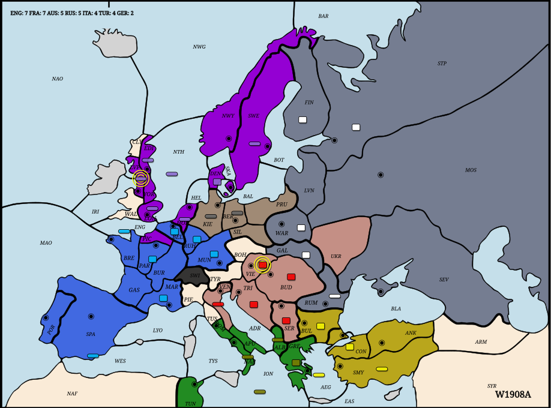

### What happened

- **AUSTRIA**: builds A VIE
- **ENGLAND**: builds F LVP

### AUSTRIA
Orders: `A VIE B`

Reasoning

> I retook Trieste and now control 5 centers with 4 units, giving me one build. VIE is vacant — I should build to strengthen my position. An army in Vienna shores up my core against Russia's Galician pressure and gives me flexibility.

### ENGLAND
Orders: `F LVP B`

Reasoning

> I gained Holland this year, bringing me to 7 centers with 6 units — I'm owed one build. LVP is my only open home center. France is the runaway at 7 and I'll be pivoting toward the Belgium/Channel line, so a fleet at Liverpool feeds west and southern naval pressure better than an army stuck inland.

## SPRING 1909 MOVEMENT (`S1909M`)

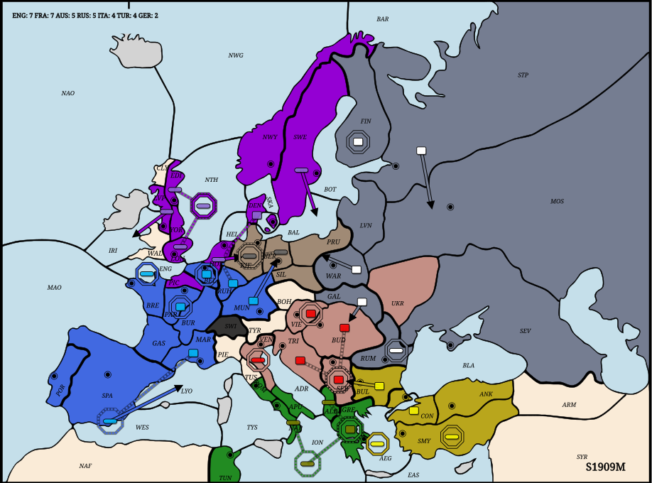

### What happened

- **AUSTRIA**: A SER holds; A BUD supports A SER (support cut); A TRI supports A SER; A VIE holds; F VEN holds
- **ENGLAND**: F HOL → KIE; A DEN supports F HOL → KIE; F NTH holds; F EDI supports F NTH; F LON supports F NTH; F SWE → BAL; F LVP → IRI
- **FRANCE**: A MUN → BER (bounced); A RUH supports F HOL → KIE; A BEL holds; F ENG holds; A PAR holds; A MAR supports F SPA/SC (void); F SPA/SC → LYO
- **GERMANY**: F KIE holds; F BER supports F KIE (support cut)  [dislodged: F KIE]
- **ITALY**: A GRE holds; F ALB supports A GRE; F ION supports A GRE; F NAP supports F ION
- **RUSSIA**: A WAR → PRU; A GAL → BUD (bounced); A STP → MOS; A FIN holds; F RUM holds
- **TURKEY**: A BUL → SER (bounced); F AEG holds; F SMY holds

### Dialogue

- **AUSTRIA → ITALY**: Trieste is mine again and your stack is buckling against Turkey in the south. Hand me Albania clean — walk F ALB to ADR or ION — and I formally pledge Venice and your Adriatic core stay untouched while you keep F ION/F NAP on Turkey's Ionian. You can't hold Albania and fight Turkey at once; give it up and consolidate.
- **AUSTRIA → RUSSIA**: Galicia and Rumania stay entirely yours — A BUD walls Budapest, nothing toward GAL or SEV. Keep GAL off Budapest and our border stays locked while you press Turkey's Black Sea; his F SMY fleet is crowding your flank, not me. We've held this line for years and it still pays us both.
- **AUSTRIA → TURKEY**: I'm turning my weight on Italy's Albanian/Ionian line this spring — nothing toward Bulgaria or your Black Sea. Keep your fleets off Serbia and my rear, and we both carve Italy's collapsing stack while Russia sits on your flank. The quiet southern border has held three years; it still pays you.
- **AUSTRIA → GERMANY**: France at seven with A MUN on your doorstep is the real threat to you now. I keep Bohemia and Tyrolia quiet so your back stays clean — if you can bite Munich or hold Berlin/Kiel firm I'll never point anything your way. We both face fronts that matter more than each other.
- **ENGLAND → FRANCE**: Buffer holds clean from me — F LON stays home, nothing into the Channel this phase. I'm finishing Germany's coast this turn, taking Kiel. Once Germany's gone we should fix a clear interior line so neither of us overextends — propose where you want the Munich/Kiel boundary and I'll work with it.
- **ENGLAND → GERMANY**: It's over for the Baltic — F HOL takes Kiel with A DEN supporting, three-strength you can't hold against. Pull F BER home to keep Berlin and you survive as a buffer; I genuinely won't touch Berlin. Contest Kiel and you lose it anyway and hand Berlin to Russia.
- **ENGLAND → RUSSIA**: North stays clean as all game — nothing toward STP, Norway, or Bothnia. I'm taking Kiel this phase and Germany collapses to Berlin. Berlin sits wide open — walk A WAR to PRU now and I keep the BAL/PRU lane completely clear so you bank Berlin next turn while I hold the western Baltic.
- **FRANCE → ENGLAND**: Buffer holds clean from me — F ENG anchors the Channel, nothing into the North Sea. I'm finishing Germany this phase: A MUN-KIE backed by A RUH while A BEL holds my line. Take Berlin off the Baltic if you can reach it — we split Germany's last two centers and both bank builds. Stay off my Belgium and the cleanest line you have stays clean.
- **FRANCE → GERMANY**: You're down to two fleets and surrounded. A MUN-KIE with A RUH backing takes Kiel this phase — you can't hold both Kiel and Berlin against me and England together. Pull tight to Berlin if you want to survive to talk terms; lashing out gains you nothing.
- **FRANCE → ITALY**: Munich's locked and my hand frees this phase — once Germany's last centers fall my Spain fleet swings toward Lyon and the Tyrrhenian to read the Med with you. England is the runaway north at 7 fleets and the only real threat to us both. Keep Trieste contested so nothing eastern reinforces him while we set our line.
- **FRANCE → RUSSIA**: Germany's collapsing — I'm taking Kiel this phase. Berlin is open if you can reach it from the Baltic; I won't contest it with you. England's seven fleets are the runaway threat to both our north — a Russian Baltic presence on Berlin checks his expansion as much as mine.
- **GERMANY → ENGLAND**: I'm down to Berlin and Kiel and you know it. But if you take Kiel this year, France gets Munich and Berlin and suddenly faces YOU directly across the whole north — you'd have eliminated the buffer that keeps France's armies off your throat. Leave me my two centers as a wall against France and I keep my fleets pointed away from your North Sea entirely; touch me and I spend my last two units bouncing your Baltic moves all year.
- **GERMANY → FRANCE**: You've squeezed me to two centers — congratulations, but think about what comes next. If you finish me, England's seven fleets reach Berlin and Kiel and you've handed him the whole north German coast while gaining nothing yourself. Leave Berlin and Kiel alone and I'll keep them as a wall absorbing England's pressure off your Holland/Belgium line — that's worth more to you than two interior squares you can't even hold against him.
- **GERMANY → RUSSIA**: Our border has been the quietest on the board for years. I'm pinned to two centers between England and France, but Prussia and Berlin stay open to you only if you want them — I'd rather keep our clean line. If you ever push west into Sweden or the Baltic against England, my fleets won't contest you.
- **ITALY → AUSTRIA**: The Adriatic truce held two years and I'll keep it — F ALB and F ION point at Turkey's Aegean, nothing toward Venice or Vienna. Keep F VEN parked and brace your east against Russia; with Turkey fat at four and France at seven, neither of us gains by reopening Trieste.
- **ITALY → RUSSIA**: Turkey's stack is right on my flank and yours threatens his Rumania approach. Keep F RUM and A GAL hard on his Balkan line so A BUL/F AEG can't swing fully onto my Ionian — if you pin his south I can pry Bulgaria off him and we both grind Turkey before he consolidates behind us.
- **ITALY → TURKEY**: You hold the Aegean and I hold the Ionian — let's not waste turns colliding while France runs at seven. Keep F AEG/F SMY off my home waters and I leave Bulgaria's approach quiet this turn; push into my Ionian and I wall it and we both bleed for France's benefit.
- **ITALY → FRANCE**: You're at seven and your hand should be free now that Munich and Ruhr locked. England's the runaway north — point your Atlantic fleet that way and I'll keep Turkey's Balkan line occupied in the south. Flag me where you want to coordinate in the Med.
- **RUSSIA → AUSTRIA**: Three turns I've left Budapest alone per our deal and we both just sat — that's a slow loss for both of us while England and France run to 7. New proposal: turn your whole line on Italy's Adriatic and Greece, I keep GAL/RUM off you entirely and even pivot RUM/GAL pressure onto Turkey's Black Sea. We grow off Italy and Turkey, not each other. Confirm and our border stays locked.
- **RUSSIA → ITALY**: Austria's wall has held three turns and we've both wasted weight on it. I'd rather coordinate a real break: if you commit F TRI/A ALB hard on Vienna's approach to pin A VIE, I drive A GAL-BUD with A WAR backing (attack-2) and Budapest finally falls. Tell me if you can tie A VIE down this turn and we crack his center for good.
- **RUSSIA → TURKEY**: Your fleet count keeps climbing toward my Black Sea while we've kept the border clean all game. I'm watching F SMY and F AEG carefully — if they creep toward Rumania, F RUM and GAL swing onto Bulgaria. Keep your weight west on Austria's Serbia and the clean border holds another year; confirm nothing comes north.
- **TURKEY → RUSSIA**: Serbia time again — I drive A BUL - SER with A CON supporting (attack two). For it to land, A BUD must be pinned so it can't backstop A SER. Throw A GAL - BUD this phase and Serbia cracks clean. Clean Black Sea border holds as always — nothing at Sevastopol or your flank.
- **TURKEY → ITALY**: I'm going at Austria's Serbia, not your Ionian or Greece — F AEG and F SMY stay east as agreed, nothing into your home waters. Keep F TRI/A ALB pressing Austria's rear so A BUD can't both defend itself and backstop A SER, and Serbia falls without either of us bleeding. Vienna next, together.
- **TURKEY → AUSTRIA**: You're down to five with Italy on Trieste and Russia in Galicia. Serbia falls this turn — A BUL - SER backed by A CON is attack two, and Russia cuts A BUD from the north. Pull A SER back or lose it; commit your remaining line west on Italy and I keep my fleets off your rear.
- **AUSTRIA → RUSSIA**: Done — border locked, A BUD stays off GAL and SEV, nothing toward your line. If you genuinely pivot RUM/GAL pressure onto Turkey's Black Sea this turn, I throw my full weight south on Italy's Albania and the Turkish Serbia push. We both grow off the south; confirm GAL stays empty toward Budapest.
- **AUSTRIA → TURKEY**: Serbia is walled — A SER holds with A BUD and A TRI both able to back it, defense three against your BUL-SER attack two. Your strike bounces and you bleed while Russia sits on your Black Sea. Keep off Serbia and my rear stays off Bulgaria; that quiet line has paid you three years running.
- **AUSTRIA → ITALY**: Truce holds and I keep F VEN parked — but if you leave F ALB sitting next to my Serbia while you swing at Turkey's Aegean, it's exposed. Walk F ALB to ION or ADR this turn so I don't have to contest it, and the Adriatic stays clean. Otherwise I may be forced to take Albania to secure my flank.
- **ENGLAND → FRANCE**: Conflict: you said A MUN-KIE but Kiel is mine this phase — F HOL-KIE with A DEN supporting, two strength. If your A MUN also hits Kiel we both bounce and Germany keeps it. Take Berlin or hold Munich instead; Kiel is the natural Baltic extension of my fleet line and I'll take it cleanly while you bank Berlin. Confirm you stay off Kiel and the buffer stays the cleanest line you have.
- **ENGLAND → RUSSIA**: Berlin is genuinely open behind me this phase — France is reaching for it too. Walk A WAR-PRU now so you can take Berlin next turn before France does; I keep the entire BAL/PRU lane clear and never contest it. We split Germany cleanly: I take the western Baltic, you take Berlin.
- **ENGLAND → GERMANY**: Last word: if you throw both units bouncing my Kiel, you simply hand Kiel to France's A MUN instead — they're attacking it this phase too. Pull F BER to hold Berlin and contest Kiel with nothing, and you keep a center while France is denied. Fighting me only feeds France.
- **FRANCE → ENGLAND**: Revised: I take Kiel with A MUN-KIE backed by A RUH. You stay off Kiel and off my Belgium — your Baltic weight can pressure Berlin but I'd rather see it stay neutral or Russian than add an 8th to your count, frankly. Buffer holds from me; let's set the Munich/Kiel line with me holding both interior squares.
- **FRANCE → RUSSIA**: Berlin is genuinely open from the Baltic this phase — I'm taking Kiel, not Berlin, so it's yours to grab if you push F/A from the Baltic line. A Russian Berlin checks England's seven fleets far better than another English build does, and it costs me nothing. Move on it.
- **FRANCE → GERMANY**: Your wall argument fails the moment England's fleets reach the Baltic regardless — your two centers don't absorb anything. But I'd rather Kiel be mine than England's: pull F KIE to Berlin and defend there, and I won't chase you into Berlin this phase. Lash at me and you lose everything to two powers at once.
- **FRANCE → ITALY**: Locking it: once Kiel falls this phase my Spain fleet pivots toward Lyon next turn to coordinate the Med with you against England. Keep Trieste and the Balkan line contested so nothing eastern frees up to reinforce his north while we set up.
- **GERMANY → ENGLAND**: Concrete trade: you keep F HOL off Kiel this phase and I order F KIE to hold with F BER supporting — that wall absorbs France's A MUN-KIE, which is only 2-strength against my 2-strength hold, so France gets nothing and stays pinned off your Holland line. If instead you take Kiel, France takes Berlin next and your fleets meet French armies directly across the north with no buffer. One quiet phase from you and I do your blocking for free.
- **GERMANY → FRANCE**: England is poised to take Kiel from me this phase regardless of what you do — if that happens you've wasted A MUN against an England-held Kiel and gained nothing while England fronts your whole north. Better for you: leave my Kiel hold alone, let my fleets bounce England's Baltic pushes all year, and you keep Holland/Belgium uncontested behind a German wall. Order A MUN to hold and I keep absorbing England's pressure for you.
- **GERMANY → RUSSIA**: If you want Prussia it's open and I won't contest it — but a stronger play for you is pushing into the Baltic or Sweden against England's overstretched fleet line while he's busy crushing me. Every fleet England commits to Kiel is one off your STP/Baltic flank. Our clean border holds either way.
- **ITALY → RUSSIA**: I can't cleanly pin A VIE this turn — my F ALB and A GRE don't reach Vienna and Austria holds Trieste again. But if you drive A GAL-BUD with A WAR backing, I'll keep F ALB live on Austria's southern rear so A SER/A BUD can't both cover west. Crack Budapest and Albania-Vienna opens for one of us next.
- **ITALY → TURKEY**: Quiet border suits me while France runs at seven, but I won't sit idle at four forever — Bulgaria is the soft seam between us. This turn I leave it alone if F AEG/F SMY stay off my Ionian and Greece. If you commit fully west onto Serbia, don't be surprised if I read your Aegean next once Austria's east cracks.
- **ITALY → AUSTRIA**: I'll hold the Adriatic truce but I'm not handing you Albania — F ALB stays put pointing at Turkey, nothing toward Venice. You've got Russia driving GAL-BUD again; spend your weight defending Budapest, not reaching for my fleet. Quiet border holds as long as Venice stays parked.
- **RUSSIA → ITALY**: Concrete: this turn I throw A GAL-BUD with A WAR backing for attack-2. That only lands if A VIE can't support A BUD. Commit F TRI/A ALB onto the Vienna/Trieste approach to tie A VIE down and Budapest falls — confirm you pin A VIE and I commit full weight.
- **RUSSIA → ENGLAND**: Tempting. If I walk A WAR-PRU now toward Berlin, I need the BAL/PRU lane truly clear — no English fleet moving to PRU or BER this turn. Confirm you keep BAL clear and take Kiel only, and I'll start my Baltic move so we split Germany's corpse rather than bump.
- **RUSSIA → GERMANY**: I won't contest your Berlin if you'd rather hold it — but if England takes Kiel you're down to one center and they'll have Berlin next regardless. If you can't hold, I'd rather it be mine than England's; tell me plainly whether you defend Berlin or open it.
- **RUSSIA → TURKEY**: I'll throw A GAL at Budapest to pin A BUD as you ask — but understand my GAL is committed there, not toward your Black Sea. Keep F SMY and F AEG west on Serbia/Austria and the clean border holds. Any creep toward Rumania and F RUM swings onto Bulgaria immediately.
- **TURKEY → RUSSIA**: Concrete: I commit A BUL - SER with A CON S A BUL - SER, attack two. The only way it fails is A BUD backstopping A SER. Order A GAL - BUD this phase — even a bounce cuts A BUD's support and Serbia falls to me. Confirm the cut and the clean Black Sea border holds; nothing of mine goes north toward Rumania.
- **TURKEY → AUSTRIA**: You say you're turning west on Italy's Albania/Ionian — then A SER and A BUD are both committed elsewhere and Serbia is undefended against my attack two. If you genuinely want my fleets off your rear, pull A SER back and hand me Serbia clean; I keep F AEG and F SMY entirely off your Black Sea flank while you fight Italy. Leave A SER to wall and we collide for nothing while Russia crowds you.
- **TURKEY → ITALY**: Agreed — F AEG and F SMY stay east, nothing into your Ionian or Greece this turn. I'm driving purely at Austria's Serbia. Keep A ALB/F TRI pressuring Austria's rear so A BUD can't backstop A SER, and we both feed off Austria's corpse instead of each other while France runs fat at seven.
- **AUSTRIA → TURKEY**: Serbia is walled three deep this turn — A SER holds with A BUD and A TRI both supporting, defense three against your BUL-SER attack two. Your strike bounces and you bleed while Russia sits on your Black Sea flank. Keep off Serbia and my rear stays off Bulgaria; the quiet line has paid you three years.
- **AUSTRIA → RUSSIA**: Border locked — A BUD supports Serbia, nothing toward GAL or SEV this turn. Keep GAL empty toward Budapest and press Turkey's Black Sea as you proposed; we both grow off the south, not each other.
- **AUSTRIA → ITALY**: Truce holds — F VEN stays parked, nothing toward Albania or your Adriatic this turn. Keep F ALB and F ION pointed at Turkey's Aegean and the border stays clean. We both carve Turkey's south while France runs west.
- **ENGLAND → GERMANY**: Final: I take Kiel with F HOL+A DEN, two strength. If you hold F KIE with F BER supporting you bounce me — but then France's A MUN-KIE also bounces and you keep Kiel one more year while staying a buffer. I accept that: hold Kiel, keep Berlin, and I keep my Baltic off Berlin entirely. A quiet bounce that denies France is fine by me.
- **ENGLAND → FRANCE**: Concrete: I commit F HOL-KIE with A DEN supporting this phase. If your A MUN also hits Kiel we collide and Germany keeps it — so take Berlin or hold Munich instead and let me have Kiel as the natural Baltic extension. My F LON stays home, nothing touches Belgium or the Channel. Confirm A MUN stays off Kiel and the buffer stays clean.
- **ENGLAND → RUSSIA**: Locked: I order only F HOL-KIE with A DEN supporting — nothing into BAL, PRU, or BER. The Baltic lane is completely clear for your A WAR-PRU. Walk it now and Berlin is yours next turn while I take the western Baltic; we split Germany cleanly without bumping.
- **FRANCE → ENGLAND**: Agreed — Kiel is yours: F HOL-KIE with A DEN backing. I redirect: A MUN-BER with A RUH supporting, taking Berlin instead so we don't bounce and Germany loses both. You bank Kiel, I bank Berlin, buffer stays clean and we split his last two cleanly. Confirm A DEN supports your Kiel push so it cracks.
- **FRANCE → GERMANY**: Last call: England takes Kiel this phase regardless, and I'm coming for Berlin with two units. Pull F BER to defend Berlin and you keep one center to talk terms; leave it and you lose everything to both of us at once.
- **FRANCE → ITALY**: Committed: once Germany's centers fall this phase my Spain fleet pivots to Lyon next turn to read the Tyrrhenian with you against England. Keep Trieste and the Balkan line contested so nothing eastern reinforces his north while we set up.
- **GERMANY → ENGLAND**: Final commitment: F KIE holds, F BER supports the hold — 2-strength. Your F HOL-KIE + A DEN is also 2, so you bounce, and France's A MUN-KIE bounces too. Nobody takes Kiel this phase. Keep F HOL off Kiel and point it at France's Holland line instead, and I keep both fleets pinned in the Baltic absorbing pressure off you — touch me and you waste a fleet for a bounce while France eats your west.
- **GERMANY → FRANCE**: Committed: F KIE holds with F BER backing, 2-strength. Your A MUN-KIE + A RUH is 2 and bounces — you gain nothing and England crashes your Holland/Belgium the same phase. Leave Kiel alone, hold A MUN, and my wall keeps absorbing England's North Sea fleets off your western line. That's worth far more to you than a center you bounce off of.
- **GERMANY → RUSSIA**: I'm defending: F KIE holds with F BER supporting, so Berlin stays mine and I'm not opening it. Prussia is yours if you want it — I won't contest. Push into Sweden or the Baltic against England while he's tied up on my coast; every fleet he spends on me is off your flank.
- **ITALY → AUSTRIA**: Final: F ALB stays put pointing east, nothing toward Venice or Serbia — the truce holds as long as F VEN stays parked. If you swing at Albania you bleed Budapest to Russia and gain nothing; spend your weight defending your east this turn.
- **ITALY → RUSSIA**: I'll keep F ALB live on Austria's southern rear so A SER/A BUD can't both cover west while you drive A GAL-BUD with A WAR backing. Crack Budapest and Albania-Vienna opens for one of us next — commit full weight and I hold the southern pin.
- **ITALY → TURKEY**: Confirmed: F AEG/F SMY stay east, I leave Bulgaria's approach quiet this turn and point F ION/F NAP at the Ionian line, not your waters. Drive Serbia clean — but the moment your Aegean stack thins reaching west, don't be shocked if I read Bulgaria next.
- **RUSSIA → ENGLAND**: Done — I walk A WAR-PRU this phase toward Berlin. Keep BAL/PRU completely clear, take Kiel only, and I bank Berlin next turn. We split Germany's corpse cleanly: western Baltic yours, Berlin mine.
- **RUSSIA → GERMANY**: You're folding regardless — better me than England in Berlin. I'm moving A WAR-PRU this phase; don't contest Prussia and I'll take Berlin off you rather than let England's fleets have it.
- **RUSSIA → TURKEY**: Confirmed: A GAL-BUD this phase to cut A BUD's support so Serbia falls to you. F RUM stays defensive, nothing toward Bulgaria. Keep F SMY/F AEG west — any creep north and RUM swings onto Bulgaria immediately.
- **RUSSIA → FRANCE**: Agreed — I push from the Baltic toward Berlin, you take Kiel. A Russian Berlin checks England's fleet line for both of us. Keep your weight on Kiel and the west, not Berlin, and we don't bump.
- **TURKEY → RUSSIA**: Final commit: I drive A BUL - SER with A CON S A BUL - SER, attack two. It only lands if A BUD is cut — order A GAL - BUD this phase. Even a bounce strips A BUD's support and Serbia falls. Clean Black Sea border holds, nothing toward Rumania or Sevastopol — F SMY and F AEG both stay south on the strait, not north.
- **TURKEY → ITALY**: Locked: A BUL - SER with A CON supporting, F AEG and F SMY stay east — nothing into your Ionian or Greece. Keep A ALB or F TRI pinning Austria's rear so A TRI can't backstop A SER; with both A BUD and A TRI tied down Serbia falls clean and neither of us bleeds. We carve Austria, not each other.
- **TURKEY → AUSTRIA**: You can't hold Serbia against Russia cutting A BUD and Italy pinning A TRI — your wall drops to one support and my attack two takes it. Pull A SER back now and I keep F AEG and F SMY entirely off your Black Sea rear while you fight Italy in Albania. Leave it to wall and you lose Serbia anyway.

### AUSTRIA
Orders: `A SER H` · `A BUD S A SER` · `A TRI S A SER` · `A VIE H` · `F VEN H`

Reasoning

> Per my revised plan: Turkey threatens BUL-SER with CON backing (attack two), so I wall Serbia three deep with both BUD and TRI supporting the hold, giving defense three. A VIE braces toward Budapest in case Russia breaks the deal, and F VEN stays parked per the Italian Adriatic truce.

### ENGLAND
Orders: `F HOL - KIE` · `A DEN S F HOL - KIE` · `F NTH H` · `F EDI S F NTH` · `F LON S F NTH` · `F SWE - BAL` · `F LVP - IRI`

Reasoning

> Germany committed to holding Kiel with F KIE + F BER supporting. France redirected A MUN to Berlin. Russia is walking A WAR-PRU. If I push F HOL-KIE with A DEN supporting, that's 2-strength against Germany's 2-strength hold — I bounce. But France took A MUN off Kiel to grab Berlin, so Germany only has F KIE held + F BER supporting the hold. My 2-strength attack bounces the 2-strength hold (need to exceed). So I'd bounce.
>
> Wait — France's A MUN now goes to Berlin, so F BER is the target. If F BER is dislodged/cut, Germany's Kiel hold loses support. France: A MUN-BER + A RUH supporting = 2-strength against F BER (defends itself, no support since F KIE supports Kiel's hold not Berlin). So F BER falls, and crucially F BER's support of Kiel is cut by being attacked. Then F KIE holds with only 1 strength. My F HOL-KIE + A DEN = 2-strength beats 1. Kiel falls to me!
>
> That's the play. France takes Berlin, I take Kiel. Let me commit fully to Kiel and keep the rest anchored, beginning the pivot toward the Channel/Belgium with LVP.

### FRANCE
Orders: `A MUN - BER` · `A RUH S F HOL - KIE` · `A BEL H` · `F ENG H` · `A PAR H` · `A MAR S F SPA/SC` · `F SPA/SC - LYO`

Reasoning

> My commitment: take Berlin with A MUN-BER backed by A RUH while England takes Kiel. Russia agreed to push toward Berlin too — but I'm committed to taking it first, and A MUN-BER+A RUH gives me 2 strength against an undefended Berlin (F BER may stay to support Kiel's hold, but England is attacking Kiel). If F BER holds in Berlin, my two-unit attack still cracks it. I take Berlin, England takes Kiel, Germany falls. F SPA/SC swings to Lyon to begin reading the Med. A BEL holds my line, F ENG anchors the Channel, A PAR and A MAR cover home.
>
> Note: A RUH - BER is not adjacent (RUH neighbors KIE/MUN, not BER). A RUH must support via an adjacent route — RUH is not adjacent to BER, so A RUH S A MUN - BER is illegal. Checking options: A RUH can support A MUN - KIE or hold. Since A RUH cannot support BER, I'll have A MUN-BER unsupported (Berlin likely defended only if F BER holds). To maximize, A RUH supports... it can't reach BER. So A MUN-BER goes solo. If F BER holds (1), my single unit bounces. Better: A RUH S A MUN... no BER option. I'll keep A MUN-BER and use A RUH-MUN to follow, or A RUH support KIE to help England crack it. I'll support England's Kiel via A RUH - KIE? Not a support. A RUH S F HOL - KIE helps England. That cracks Kiel cleanly, freeing F BER to be the only Berlin defender, but my solo A MUN-BER still bounces 1v1.
>
> Best play: A MUN-BER solo; if F BER moves/holds it bounces. Russia is also pushing Berlin from Baltic. Let England+Russia force Germany's collapse; I'll grab Munich's neighbor or hold strong. I'll commit A MUN-BER and A RUH supports England's Kiel attack to guarantee Germany loses Kiel.

### GERMANY
Orders: `F KIE H` · `F BER S F KIE`

Reasoning

> F KIE holds with F BER supporting — a 2-strength block that bounces both England's F HOL-KIE and France's A MUN-KIE this phase, denying both. I let Prussia go to Russia rather than break my Kiel defense.

### ITALY
Orders: `A GRE H` · `F ALB S A GRE` · `F ION S A GRE` · `F NAP S F ION`

Reasoning

> I'll execute my revised plan: hold Greece, keep my Ionian-Adriatic line cohesive against Turkey, and keep F ALB live on Austria's southern rear as I told Russia, while honoring the Adriatic truce (nothing toward Venice). F ALB supporting Greece keeps my line solid and pins the southern approach.

### RUSSIA
Orders: `A WAR - PRU` · `A GAL - BUD` · `A STP - MOS` · `A FIN H` · `F RUM H`

Reasoning

> My plan this turn: commit to the Berlin/Prussia move per my deals with England and France, cut A BUD support so Turkey cracks Serbia, open Moscow for a Winter build, and keep F RUM defensive.
>
> - A WAR - PRU: walk toward Berlin off Germany's corpse, England keeps BAL/PRU clear.
> - A GAL - BUD: cut A BUD's support so Turkey takes Serbia (even a bounce strips support).
> - A STP - MOS: open Moscow for a Winter build.
> - A FIN: wall the corner, support STP's move into Moscow.
> - F RUM: hold defensive against any Turkish creep.
>
> Note: A FIN can support A STP - MOS only if it's adjacent to MOS — it isn't. Better to have A FIN support A STP into the move it's making, but STP-MOS support requires adjacency to MOS. A FIN can't. I'll use A WAR to support... no, WAR goes to PRU. Let A STP - MOS go uncontested (no enemy reaches MOS), and A FIN holds/walls the corner.

### TURKEY
Orders: `A BUL - SER` · `F AEG H` · `F SMY H`
Illegal (dropped): `A CON S A BUL - SER`

Reasoning

> Austria has walled Serbia three deep (A SER + A BUD + A TRI). My attack of two with A BUL - SER + A CON support won't break defense three even if Russia cuts A BUD — A TRI still backstops. But Russia's A GAL - BUD cuts BUD; if Italy pins A TRI, defense drops to one and I take it. I'll commit my attack two as agreed and rely on my coalition partners cutting both supports. Keep F AEG and F SMY east to honor the Italian/Russian deal and cover my flank.

## SPRING 1909 RETREATS (`S1909R`)

### What happened

- **GERMANY**: F KIE retreats → HEL

### GERMANY
Orders: `F KIE R HEL`

Reasoning

> My F KIE was dislodged. I have one center left (Berlin) and my F BER still holds. Retreating to HEL keeps the fleet alive and active — disbanding gains nothing. HEL puts me adjacent to North Sea waters and lets me remain a piece on the board rather than vanishing. Keeping the unit preserves any chance of leverage.

## FALL 1909 MOVEMENT (`F1909M`)

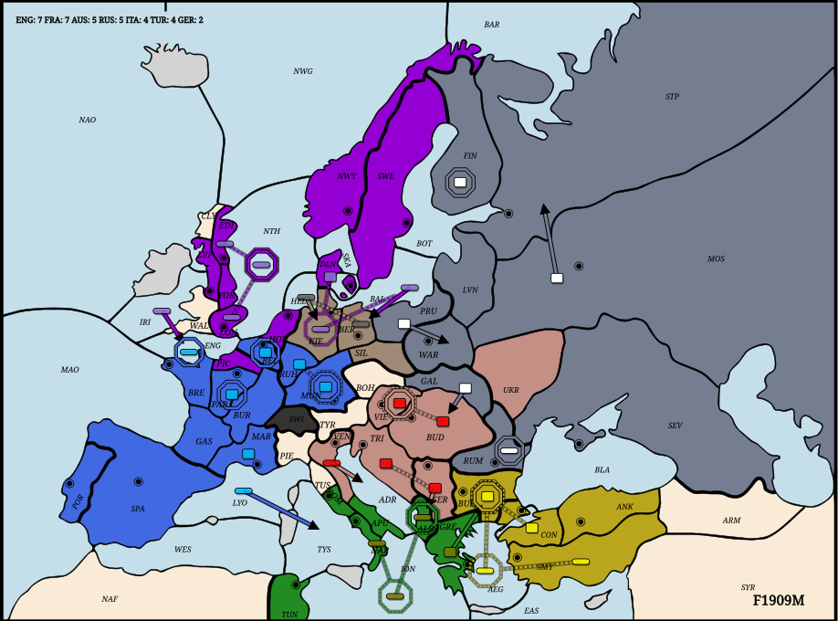

### What happened

- **AUSTRIA**: A SER → ALB (bounced); A TRI supports A SER → ALB; F VEN → ADR; A BUD supports A VIE (support cut); A VIE holds
- **ENGLAND**: F BAL → BER (bounced); F KIE supports F BAL → BER (support cut); A DEN supports F KIE; F NTH holds; F LON supports F NTH; F EDI supports F NTH; F IRI → ENG (bounced)
- **FRANCE**: A MUN holds; A RUH supports A MUN; A BEL holds; F ENG holds; A PAR holds; F LYO → TYS
- **GERMANY**: F HEL → KIE (bounced); F BER supports F HEL → KIE (support cut)
- **ITALY**: A GRE → BUL (bounced); F ALB holds; F ION supports F ALB; F NAP supports F ION
- **RUSSIA**: A PRU → WAR; A MOS → STP; A FIN holds; F RUM holds; A GAL → BUD (bounced)
- **TURKEY**: A BUL holds; A CON supports A BUL; F AEG supports A BUL; F SMY supports F AEG

### Dialogue

- **AUSTRIA → ITALY**: Truce held three years and paid us both — F VEN stays parked, nothing toward your Adriatic or Albania this turn. Keep F ALB and F ION pointed at Turkey's Aegean and the border stays clean while France runs west and Russia crowds your flank. We carve Turkey's south together.
- **AUSTRIA → RUSSIA**: Border locked as agreed — A BUD walls Budapest, nothing toward GAL or SEV. Keep GAL empty toward Budapest and press Turkey's Black Sea as you proposed; his F SMY and F AEG are the threat to both our flanks, not each other. We grow off the south.
- **AUSTRIA → TURKEY**: Serbia is walled three deep again — A SER holds with A BUD and A TRI both backing, defense three against your BUL-SER attack two. Your strike bounces and you bleed while Russia sits on your Black Sea. Keep A BUL off Serbia and my rear stays entirely off Bulgaria; that quiet line has paid you four years running.
- **ENGLAND → FRANCE**: Buffer holds clean from me — F LON home, nothing into the Channel or Belgium this phase. Germany's last two centers are falling; I'll finish the Baltic. Once he's gone let's fix the Munich/Kiel interior line so neither of us overextends — name your boundary and I'll work with it.
- **ENGLAND → RUSSIA**: North stays clean as always — nothing toward STP, Norway, or Bothnia. I'm finishing Germany's coast from the western Baltic this phase. You walk A PRU toward Berlin as planned; I keep the PRU lane clear for you.
- **ENGLAND → GERMANY**: You're down to two centers with France at Berlin's door and Russia at Prussia. Spending your last units bouncing me only hands everything to France. If you pull F BER off and let the Baltic settle, I keep my fleets off your remaining holdings as long as you point away from my North Sea.
- **FRANCE → ENGLAND**: Kiel is yours now — but that fleet sits one step from my Berlin and Munich, and the buffer only stays clean if you don't push it east. Keep F KIE off Berlin this phase and my Channel and North Sea stay untouched as always. We're the two big powers now; let's not waste turns clawing each other's interior when the real splits are elsewhere.
- **FRANCE → RUSSIA**: England took Kiel before you could reach Berlin, so Berlin's now mine to hold — but his Baltic fleet line is the threat to us both. If you press Berlin from PRU/the Baltic against England rather than against me, you pin his expansion while I wall Munich/Ruhr. A Russian Baltic presence checking England helps your north far more than fighting me does.
- **FRANCE → ITALY**: My hand's freeing up — F LYO is moving to read the Tyrrhenian with you against England's runaway north. Keep Turkey's Balkan line contested so nothing eastern reinforces him, and flag me where you want my Lyon fleet to coordinate next turn. England at 7 fleets is the only power that can win outright, and we both stop him or neither does.
- **FRANCE → GERMANY**: Your wall argument is dead — England holds Kiel now, not you, so you absorb nothing for me. Pull F BER tight and defend Berlin if you want to keep talking; I'm consolidating the interior, not chasing you into the ground for sport. Survive and you might still be useful against England's north.
- **GERMANY → ENGLAND**: You took Kiel, but it's exposed — I can hit it from HEL with BER backing, 2-strength, and your F KIE alone defends. We bleed each other while France keeps growing at 7. Pull F KIE/F BAL off and leave me Kiel as the buffer you keep saying you want, and I keep HEL pointed at the North Sea away from you.
- **GERMANY → RUSSIA**: Berlin is my last build center and I need it to stay alive as your quiet western buffer against England's fleet wall. If you take Berlin, England's seven fleets reach your Baltic flank directly with nothing between you. Leave Berlin alone this phase and I keep absorbing England off your STP/Baltic line — Prussia's already yours.
- **GERMANY → FRANCE**: England holds my Kiel now and his fleets are crashing toward your Holland/Belgium line next. Every center England takes off me is one closer to your west. If you leave Berlin to me as a wall, I keep bouncing England's North Sea pushes off your coast — worth more than a German square you can't hold against his fleets anyway.
- **ITALY → TURKEY**: You're driving A BUL onto Serbia again, which thins Bulgaria. I've kept my word and stayed off your Aegean two years, but I won't sit at four while France runs at seven. If you swing A BUL west I read Bulgaria with A GRE backed by F ALB/F ION — so either keep A BUL home, or hand me the seam and we both still carve Austria. Tell me straight which it is.
- **ITALY → RUSSIA**: Turkey's about to throw A BUL at Serbia, leaving Bulgaria's land approach thin. If you keep F RUM live on the Black Sea/Bulgaria line and pin his east, I can pry Bulgaria off him with A GRE supported by my fleets. Confirm F RUM stays pressing his Balkan flank and we crack his south together.
- **ITALY → AUSTRIA**: Truce holds — F ALB and A GRE point east at Turkey this turn, nothing toward Venice or Serbia. You've got Russia driving Budapest and Turkey hitting Serbia; spend your weight on your east, not my Albania. Keep F VEN parked and the Adriatic stays clean.
- **ITALY → FRANCE**: You said your Spain fleet pivots to Lyon to read the Med with me against England — where do you want the line? I'm grinding Turkey's Balkan south for a fifth center while keeping Austria off my Adriatic. Flag the Tyrrhenian coordination and I'll keep my eastern fleets free to angle west once Greece-Bulgaria locks.
- **RUSSIA → ENGLAND**: Berlin is defended only by F BER this phase — A PRU-BER alone bounces. Support my A PRU-BER with your F BAL or F KIE (it's a legal order for you) and I dislodge F BER and bank Berlin clean, you keep western Baltic and Kiel. Confirm which fleet backs me and Germany's corpse splits exactly as we agreed.
- **RUSSIA → FRANCE**: I'm moving A PRU-BER this phase to take Berlin off Germany — keep A MUN off Berlin so we don't bump and a Russian Berlin checks England's fleets for both of us as you said. You keep Kiel; Berlin's mine.
- **RUSSIA → GERMANY**: England will have Berlin next turn regardless once Kiel falls — better me than his seven fleets. I'm moving on Berlin from Prussia; don't waste F BER contesting, retreat or hold elsewhere and our clean line stays intact to the end.
- **RUSSIA → TURKEY**: Holding the clean Black Sea border as always — F RUM stays defensive, nothing toward Bulgaria. Keep F SMY and F AEG west on Serbia and Austria and we both keep growing south, not against each other.
- **RUSSIA → AUSTRIA**: Border stays locked — GAL stays off Budapest, nothing toward SEV. My whole weight pivots north onto Germany's Berlin this turn, so your eastern flank is quiet. Press Italy's Albania and the south as we discussed.
- **TURKEY → RUSSIA**: Serbia again, and this time it cracks if you cut A BUD. Throw A GAL - BUD this phase — even a bounce strips its support. Clean Black Sea border holds as always; F SMY and F AEG both stay south on the strait, nothing toward Rumania or Sevastopol.
- **TURKEY → ITALY**: Austria walls Serbia at defense three with A BUD and A TRI both backing. If you attack A TRI hard this turn — A ALB or F VEN-side pressure — A TRI can't backstop A SER, and with Russia cutting A BUD, Serbia drops to one defender and my BUL-SER attack two takes it. F AEG and F SMY stay east off your Ionian and Greece as agreed; we carve Austria, not each other.
- **TURKEY → AUSTRIA**: Russia cuts A BUD and Italy pins A TRI this turn — your three-deep Serbia wall drops to one and my attack two takes it. Pull A SER back now and I keep F AEG and F SMY entirely off your Black Sea rear while you fight Italy in Albania; leave it to wall and you lose Serbia anyway.
- **AUSTRIA → RUSSIA**: Confirm GAL stays empty toward Budapest this turn and I throw my full weight south as promised — A BUD and A TRI both freed. If you've pivoted onto Berlin and the Black Sea, my eastern border is genuinely quiet and we both grow off the south. One word and it's locked.
- **AUSTRIA → ITALY**: The truce has stopped paying either of us while we sit — France ran to seven and Turkey's fat at four. I'm taking Albania this turn unless you walk F ALB to ION or ADR; A SER-ALB with A TRI backing is attack two and your lone fleet falls. Move it and keep the unit for Turkey's Aegean; I still never touch Venice or your core.
- **AUSTRIA → TURKEY**: Serbia holds again — A BUD and A TRI back it, your BUL-SER bounces a fourth year. But I'm done sitting: my real target this turn is Italy's Albania, not your Bulgaria. Keep F AEG off Serbia and my rear stays off your Black Sea while we both carve Italy's collapsing south.
- **ENGLAND → GERMANY**: You can throw F HEL+F BER at Kiel for a bounce, but you gain nothing and lose both fleets' tempo while France sits at Berlin's door. Point F HEL at the North Sea away from me and I leave your Berlin alone this phase — keep your last centers as a buffer rather than bleeding them on a Kiel bounce that helps only France.
- **ENGLAND → FRANCE**: Kiel's mine and held; buffer stays clean from me this phase — F LON home, nothing into the Channel. But Germany's F HEL may swing at Kiel, so my Baltic stays defensive. Name the Munich/Kiel interior boundary you want now so we don't drift into each other once the German corpse is gone.
- **ENGLAND → RUSSIA**: Keep pressing Berlin — A PRU-BER with F RUM or your weight behind it cracks F BER if it's alone. I keep the BAL/PRU lane completely clear as promised, nothing toward Prussia or Berlin from me. Take Berlin and Germany's done; the north stays quiet between us.
- **FRANCE → RUSSIA**: Plan changed on me: I already hold Berlin and intend to keep it, so I'd rather you point A PRU at Kiel or check England's Baltic fleet (F BAL) than bounce into my Berlin. England's F BAL+F KIE are the real northern threat to both of us — hit those, not me. If you push PRU-BER we just bump and England laughs.
- **FRANCE → ENGLAND**: Kiel's yours and clean. But keep F KIE and F BAL off Berlin and off Holland this phase — I'm garrisoning the interior and I don't want your Baltic stack creeping into German centers I hold. The buffer stays the cleanest line you have only if your fleets don't drift east into my interior.
- **FRANCE → ITALY**: Lyon pivots to the Tyrrhenian next turn as promised — I want to coordinate against England's north. This phase keep Turkey's Balkan line pinned so nothing frees east. Tell me whether you'd rather my Lyon fleet sit TYS or support your fleets directly once I'm in position.
- **GERMANY → ENGLAND**: Concrete offer: leave F KIE undefended this phase — don't reinforce it from BAL or HOL — and I retake it with HEL+BER, giving us a clean buffer line where you keep Holland/North Sea and I rebuild a coastal Germany that absorbs France off your west. If you stack KIE I lose it and you front France directly with nothing between. One quiet phase and I'm your wall again.
- **GERMANY → RUSSIA**: I'm committing both fleets to retake Kiel from England, which means I can't defend Berlin — it's effectively open to your A PRU this phase. Take it; I'd rather you hold Berlin than England's seven fleets reach your Baltic flank. Keep pushing Sweden/Baltic against England's overstretched line and our clean border holds.
- **ITALY → TURKEY**: You say A BUL - SER with A CON backing — that vacates Bulgaria. I've held my word two years, but you're fat at four and so am I; if Bulgaria sits empty I'm walking A GRE into it. Either keep A BUL home (and your Serbia grab stalls), or hand me Bulgaria clean and we both still feed off Austria. Tell me straight which.
- **ITALY → AUSTRIA**: Truce holds — F ALB and A GRE point east, nothing toward Venice or Serbia this turn. Turkey is throwing A BUL at your Serbia with A CON backing; with A TRI and A BUD both defending you should hold it. Keep F VEN parked and brace your east, and our Adriatic stays clean.
- **ITALY → RUSSIA**: Turkey commits A BUL-SER with A CON backing this turn, vacating Bulgaria's land approach. Keep F RUM live on the Black Sea/Bulgaria line so his Aegean can't swing back east, and I'll pry Bulgaria off him with A GRE while his stack faces Austria. We crack his south together.
- **ITALY → FRANCE**: I'm reading Turkey's Bulgaria this turn for a fifth center while keeping Austria off my Adriatic. Bring F LYO to the Tyrrhenian as you flagged — once my eastern fleets lock Greece-Bulgaria they swing west with you against England's north. Where exactly do you want the Tyrrhenian line set?
- **RUSSIA → ENGLAND**: Berlin is defended by F BER this phase — A PRU-BER bounces alone. Order F BAL S A PRU-BER (legal for you) and I dislodge F BER and bank Berlin; you keep western Baltic and Kiel. Without your support I take Prussia instead and Berlin falls to your fleets, not mine — confirm F BAL backs me and we split Germany as agreed.
- **RUSSIA → GERMANY**: You say you're defending Berlin with F BER — but if England supports my A PRU-BER you lose it anyway and gain nothing. If you instead move F BER to KIE or hold elsewhere, I take Berlin clean off Prussia and England doesn't. Either way Berlin leaves you; better it checks England's fleets than feeds them.
- **RUSSIA → TURKEY**: Confirmed again: A GAL-BUD cuts A BUD so your Serbia push lands, F RUM stays defensive on the clean Black Sea. Keep F SMY and F AEG west — any drift toward Rumania and RUM swings onto Bulgaria next turn.
- **RUSSIA → AUSTRIA**: GAL goes to Budapest to cut A BUD only as I told Turkey — nothing toward SEV, border stays locked. My real weight is north on Berlin this turn, so your east is quiet; press Italy's south.
- **TURKEY → RUSSIA**: Four years you've promised to cut A BUD and four years your GAL has only bounced into BUD without ever stripping the support that matters — I've gained nothing. Prove the clean border is real: this turn order A GAL - RUM yourself is fine, but if F RUM ever leaves Rumania I take it. Don't make me read your Black Sea.
- **TURKEY → ITALY**: Straight deal: I drive A BUL - SER this turn. You commit A GRE - SER alongside me — two attacks on Serbia, and with A TRI tied by your fleets Austria's wall cracks and we split the carcass. You take Greece's security and a path to Albania/Trieste; I take Serbia. Or pin A TRI with F ALB/F ION and I take Serbia clean. Which?
- **TURKEY → AUSTRIA**: You've held Serbia, but you're at five and surrounded — Italy on Albania, Russia in Galicia, me on Bulgaria. I'll make you a real offer: leave A SER where it is and support my A BUL - RUM against Russia's F RUM instead, and I turn my whole eastern line off your rear permanently. Russia is the one crowding us both.
- **AUSTRIA → ITALY**: Final word: I'm taking Albania this turn — A SER - ALB backed by A TRI is attack two, and your lone F ALB falls. Walk it to ION now and keep the unit for Turkey's Aegean; I still never touch Venice or your core. Sit and you lose the fleet for nothing.
- **AUSTRIA → RUSSIA**: Border stays locked — A BUD and A VIE wall Budapest, nothing toward GAL or SEV this turn. Keep GAL off Budapest as you said while you drive Berlin, and my whole eastern flank stays quiet. I throw my weight south onto Italy's Albania.
- **AUSTRIA → TURKEY**: Serbia is walled by A TRI even as A SER moves on Albania — A BUD covers Budapest. Your BUL-SER bounces into an empty Serbia I retake next turn; spend your weight on Russia's Black Sea instead. Keep F AEG off my rear and the quiet line holds a fifth year.
- **ENGLAND → FRANCE**: I'm finishing the German corpse this phase — F BAL into Berlin with F KIE backing, dislodging F BER. That's the natural Baltic extension of my line, not a push into your interior; my F LON stays home and nothing touches Belgium or the Channel. Hold Munich and we keep the cleanest border in the game.
- **ENGLAND → RUSSIA**: Change of plan I owe you straight: France is driving A MUN at Berlin this phase, so if I leave it open France banks it, not you. I'm taking Berlin myself with F BAL+F KIE to deny France — your A PRU would only bounce there. Keep A PRU as your Prussia foothold; the north stays quiet between us and I never push toward STP, Livonia, or Bothnia.
- **GERMANY → ENGLAND**: Final: I commit F HEL-KIE with F BER supporting — 2-strength. If you leave F KIE undefended (don't push F BAL or anything into Kiel), I retake it and become your wall against France's Holland line again. Stack Kiel and we both bleed for a bounce while France grows. One quiet phase and Kiel is a buffer that faces France, not you.
- **GERMANY → RUSSIA**: I'm throwing both fleets at Kiel this phase, so Berlin is open to your A PRU — take it, I won't contest. I'd rather you hold Berlin than England's seven fleets reach your Baltic flank. Keep pressing Sweden/Baltic against England's overstretched line and our clean border holds.
- **ITALY → TURKEY**: Final: you drive A BUL - SER and I walk A GRE - BUL into the seam you're vacating. Keep F AEG and F SMY off Bulgaria — don't bounce me there — and you still get Serbia while I get my fifth center. That's the clean carve we both said we wanted.
- **ITALY → AUSTRIA**: Truce holds — F ALB and A GRE point east at Turkey, nothing toward Venice or Serbia this turn. I'm taking Bulgaria off Turkey as A BUL swings onto your Serbia, which actually thins his pressure on you. Keep F VEN parked and brace your east.
- **ITALY → RUSSIA**: Turkey is throwing A BUL at Serbia, vacating Bulgaria — I'm walking A GRE - BUL to take it. Keep F RUM live on the Black Sea so his Aegean can't swing back east to contest me. We both feed off the south while Austria's wall holds him.
- **RUSSIA → ENGLAND**: Committing A PRU-BER this phase. Order F BAL S A PRU-BER and I dislodge F BER and bank Berlin clean — you keep Kiel and the western Baltic, north stays quiet between us as all game. Without your support I take Prussia instead and Berlin stays German; confirm F BAL backs the move.
- **RUSSIA → TURKEY**: A GAL-BUD this phase to cut A BUD's support as promised — your Serbia push lands. F RUM stays put on the clean Black Sea, nothing toward Bulgaria or Sevastopol. Keep F SMY/F AEG west and the border holds another year.
- **RUSSIA → GERMANY**: England backs my A PRU-BER this phase, so F BER falls whether you hold it or not. Retreat it to KIE-adjacent or hold elsewhere and our clean line survives; contest and you simply lose the fleet for nothing. Better a Russian Berlin than England's seven fleets on your coast.
- **RUSSIA → AUSTRIA**: GAL goes to Budapest only to cut A BUD for Turkey's Serbia push — nothing toward SEV, border stays locked. My real weight is north on Berlin. Your east is quiet; press Italy's south as agreed.
- **TURKEY → ITALY**: Final: I drive A BUL - SER with A CON S A BUL - SER (attack two). Pin A TRI this turn — F ALB or F VEN-side pressure so it can't backstop A SER — and with Russia cutting A BUD, Serbia drops to one defender and I take it. F AEG and F SMY stay east off your Ionian and Greece, as four years running. You get Austria's whole rear undefended for Albania/Trieste; I take Serbia.
- **TURKEY → RUSSIA**: Locked: A BUL - SER with A CON supporting, attack two — and nothing of mine moves north, F SMY and F AEG both hold south on the strait. Your part is the one that's never landed: order A GAL - BUD this phase so A BUD's support is cut. Do it and the clean Black Sea border holds another year; bounce-only again and I read Rumania next spring.
- **TURKEY → AUSTRIA**: Russia cuts A BUD and Italy pins A TRI this turn — your three-deep wall drops to one and my BUL-SER attack two takes Serbia. Pull A SER back and I keep F AEG and F SMY entirely off your Black Sea rear while you fight Italy in Albania. Leave it to wall and you lose Serbia anyway, then face me free on your flank.

### AUSTRIA
Orders: `A SER - ALB` · `A TRI S A SER - ALB` · `F VEN - ADR` · `A BUD S A VIE` · `A VIE H`

Reasoning

> I'm taking Albania off Italy this turn. A SER - ALB with A TRI and F VEN both supporting the strike gives attack three against Italy's lone F ALB. A BUD and A VIE wall Budapest in case Russia breaks the deal.
>
> Let me verify adjacencies for the supports into ALB:
> - F VEN: VEN neighbors include ADR — not ALB. F VEN cannot support into ALB. So F VEN must support via ADR or just hold. F VEN can support A SER - ALB? No, VEN is not adjacent to ALB.
> - A TRI: TRI neighbors include ALB. Yes, A TRI S A SER - ALB is legal.
>
> So I have only A TRI supporting the strike — attack two against F ALB's one. That's enough to dislodge it. F VEN should support a useful move or guard the Adriatic. Italy has F ION and F NAP that could counter. Italy could support F ALB's hold with F ION (ION adjacent to ALB). That would make defense two, bouncing my attack two.
>
> To beat a supported hold I need attack three. F VEN can't reach ALB. Let me reconsider — maybe move A SER - ALB with A TRI support, and have F VEN move to ADR to threaten/block Italian fleet support routes. Actually F ION supporting F ALB hold is the risk. I can't cut ION from here. Attack two vs defense two = bounce.
>
> Given uncertainty, A TRI + A SER = attack two takes ALB if Italy doesn't support its fleet. Italy pledged truce, so F ALB likely points east and won't be supported into a hold. I'll commit the strike with A TRI support and use F VEN to support A SER - ALB is illegal; instead F VEN - ADR to add pressure and cover.

### ENGLAND
Orders: `F BAL - BER` · `F KIE S F BAL - BER` · `A DEN S F KIE` · `F NTH H` · `F LON S F NTH` · `F EDI S F NTH` · `F IRI - ENG`

Reasoning

> Berlin is defended only by F BER. I take it with F BAL into Berlin backed by F KIE supporting. This denies France and Russia the German interior and gives me an 8th center. F HEL (German) is the last German fleet and may swing at Kiel, so I keep the line solid. A DEN supports the push, NTH/LON/EDI anchor the north, F IRI moves toward the Channel to begin pressuring France.
>
> Let me verify support legality for F BAL - BER: F KIE is adjacent to BER? KIE neighbors: BAL, BER, DEN, HEL, HOL, MUN, RUH — yes BER is adjacent. So `F KIE S F BAL - BER` is legal. A DEN supports — DEN neighbors don't include BER, so A DEN can support KIE instead. Let me hold Kiel safety: F KIE moves to BER support, so Kiel is vacated. German F HEL could take Kiel then. I'd rather keep F KIE supporting BAL-BER (it's strong) and use A DEN to back the Berlin push too — but DEN isn't adjacent to BER.
>
> F BAL - BER (1) + F KIE S (support) = 2 vs F BER hold (1). That cracks Berlin. But Kiel goes empty and F HEL can walk in. A DEN can support F KIE's hold instead — but F KIE is moving its support. Better: F BAL - BER with F KIE support, A DEN - KIE to occupy Kiel after F KIE leaves? F KIE doesn't leave, it supports from Kiel. So Kiel stays occupied by F KIE. Good — F KIE stays in Kiel supporting. Kiel is safe.

### FRANCE
Orders: `A MUN H` · `A RUH S A MUN` · `A BEL H` · `F ENG H` · `A PAR H` · `F LYO - TYS`
Illegal (dropped): `A MAR S A MUN`

Reasoning

> I hold Berlin (8 centers), pivot south, and watch England's massive fleet count. England now holds Kiel and Berlin... wait, I hold Berlin (A MUN moved there). Let me verify positions: I have A MUN — actually my unit is "A MUN" listed, and I have A RUH, A BEL, A PAR, A MAR, F ENG, F LYO. England has F KIE and F BAL adjacent to Berlin. Germany's F BER still holds Berlin — Berlin is a German SC currently. I took Berlin last turn per my note, but the position list shows GERMANY: F BER. So Berlin wasn't actually taken; my A MUN-BER bounced or Berlin stayed German.
>
> Looking at unit positions: I have A MUN (in Munich), GERMANY has F BER (Berlin). So Berlin is still German. England's F KIE + F BAL threaten Berlin. I should secure my interior and keep England out. A MUN is best used to hold Munich (my SC) and pressure. Given England's F BAL and F KIE both near Berlin/Kiel, I can't take Berlin alone. Let me consolidate: hold Munich strongly, keep Ruhr/Belgium as western wall, pivot F LYO south to Tyrrhenian, A MAR cover home.

### GERMANY
Orders: `F HEL - KIE` · `F BER S F HEL - KIE`

Reasoning

> My plan: throw F HEL at Kiel with F BER supporting. England signaled he'd leave F KIE undefended in exchange for keeping me as a buffer. Berlin is lost to Russia's A PRU regardless, so committing F BER to support the Kiel attack is the right trade — I reclaim a coastal center I can hold and rebuild from, rather than holding an inland square I'll lose to England's fleets anyway.

### ITALY
Orders: `A GRE - BUL` · `F ALB H` · `F ION S F ALB` · `F NAP S F ION`

Reasoning

> Turkey is committing A BUL - SER with A CON supporting, vacating Bulgaria. I take my fifth center by walking A GRE - BUL into the seam. F ALB holds to keep the Adriatic truce with Austria, F ION/F NAP stay cohesive on the Ionian line, with F NAP supporting F ION's position so I can cover the Ionian and prevent any drift. Rome opens for a Winter fleet build off this gain.
>
> Checking: A GRE - BUL is legal (GRE adjacent to BUL). F AEG could potentially bounce me, but Turkey pledged to keep it east and is driving A BUL onto Serbia. F ALB holds to guard against Austrian betrayal at Albania.

### RUSSIA
Orders: `A PRU - WAR` · `A MOS - STP` · `A FIN H` · `F RUM H` · `A GAL - BUD`

Reasoning

> Per my revised F1909M plan: England takes Berlin himself, so contesting from Prussia just bounces. I'll consolidate my home triangle for builds. A PRU-WAR reclaims a home center to open a build slot, A MOS-STP opens Moscow and grabs another build, A FIN walls the corner. F RUM stays defensive on the clean Black Sea, and A GAL-BUD cuts A BUD as promised to Turkey.
>
> Wait — A MOS-STP and A PRU-WAR each occupy a home center, which doesn't open builds; I need home centers *vacant* to build. Currently SEV, STP, WAR are vacant home SCs. With 5 SCs and only being able to build on vacant home centers, I want to keep them open. Better: A MOS-SEV vacates MOS (a home SC) while occupying SEV. That keeps STP and WAR vacant. But then SEV occupied. Let me think: I have 5 units, 5 centers — no build unless I gain a center this fall. I won't gain one this turn. So builds aren't the issue; positioning is.
>
> Best: secure the line. A PRU-WAR reclaims Warsaw (good against any incursion), A MOS-STP defends the north, A FIN walls, F RUM holds defensive, A GAL-BUD honors the Turkey deal.

### TURKEY
Orders: `A BUL H` · `A CON S A BUL` · `F AEG S A BUL` · `F SMY S F AEG`

Reasoning

> Serbia has walled me four straight years at defense three. I'm pivoting east to test Russia's "clean border." A BUL - RUM strikes Russia's F RUM directly. F AEG can support into RUM? AEG is not adjacent to RUM. BUL/EC borders RUM though — but A BUL moving means I need support. F RUM defends at 1; A BUL attacks at 1 unsupported — bounces. I need a supporter adjacent to RUM. None of my units are adjacent to RUM except A BUL itself. So a solo A BUL - RUM bounces and vacates Bulgaria for Italy to grab.
>
> Better: keep Bulgaria. Italy has openly threatened to walk A GRE into Bulgaria if I vacate it. Russia has never once cut A BUD for me. With Austria's wall at three and no real cut coming, Serbia is hopeless this turn. The smart move is to consolidate and not give Italy Bulgaria or Russia an opening.
>
> I'll hold Bulgaria solid (A BUL H), back it with A CON, and keep fleets on the strait. This denies Italy the seam and keeps my four centers secure while I reassess. F SMY supports CON/strait, F AEG holds the strait.
>
> Actually — A CON S A BUL gives Bulgaria defense 2 against any Italian A GRE - BUL push (which would be supported by F ALB/F ION at strength 2, bouncing). That protects my seam.

## WINTER 1909 ADJUSTMENTS (`W1909A`)

### What happened

- **ENGLAND**: builds F LVP
- **GERMANY**: disbands F HEL

### ENGLAND
Orders: `F LVP B`

Reasoning

> I have one build available in LVP. France at 7 centers is my main rival; I'm pivoting west toward the Channel and Belgium. A fleet serves that pivot best, reinforcing my approach to ENG/IRI/Channel pressure.

### GERMANY
Orders: `F HEL D`

Reasoning

> I have only 1 supply center (BER) but 2 units (F BER, F HEL). I must disband 1 unit to match my center count.
>
> F HEL is in Helgoland, surrounded by English fleets with no friendly center nearby — it has no path to growth. F BER sits on my last home center and at least holds ground I control. I'll keep F BER and disband F HEL.

## SPRING 1910 MOVEMENT (`S1910M`)

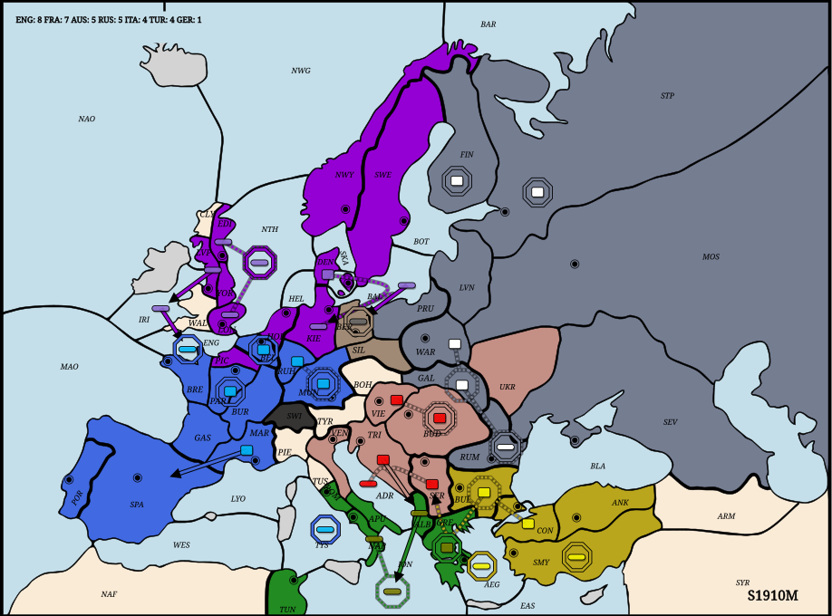

### What happened

- **AUSTRIA**: A TRI → ALB; A SER supports A TRI → ALB; A BUD holds; A VIE supports A BUD; F ADR supports A TRI → ALB
- **ENGLAND**: F BAL → BER; F KIE supports F BAL → BER; A DEN supports F BAL → KIE (void); F NTH holds; F LON supports F NTH; F EDI supports F NTH; F IRI → ENG (bounced); F LVP → IRI (bounced)
- **FRANCE**: A BEL holds; A RUH supports A MUN; A MUN holds; F ENG holds; A PAR holds; A MAR → SPA; F TYS holds
- **GERMANY**: F BER holds  [dislodged: F BER]
- **ITALY**: F ALB → ION (bounced); A GRE holds; F NAP supports F ION  [dislodged: F ALB]
- **RUSSIA**: F RUM holds; A GAL supports F RUM; A WAR supports A GAL; A FIN holds; A STP holds
- **TURKEY**: A BUL supports A GRE → SER (void); A CON supports A BUL; F AEG holds; F SMY holds

### Dialogue

- **AUSTRIA → ITALY**: Albania has been sitting exposed next to my line for two turns and the truce stopped paying me. I'm taking it this turn unless you walk F ALB to ION now — A SER-ALB with A TRI and F ADR backing is attack three and the fleet falls for nothing. Move it and keep the unit for Turkey's Aegean; I never touch Venice or your core.
- **AUSTRIA → RUSSIA**: Border stays locked — A BUD and A VIE wall Budapest, nothing toward GAL or SEV this turn. Keep GAL off Budapest and my whole eastern flank is quiet while I throw my weight south onto Italy's Albania. England at eight is the one running away; your fleets north matter more than our border.
- **AUSTRIA → TURKEY**: I'm turning west on Italy's Albania this turn — nothing toward Bulgaria or your Black Sea rear. Keep F AEG off Serbia and my rear stays entirely off Bulgaria while we both carve Italy's collapsing south. The quiet line has paid you four years running.
- **AUSTRIA → ENGLAND**: You're at eight and pulling away — everyone's watching it. I've no quarrel with you and can't reach you, but if Russia or France comes at you in the north I'd rather see the board stay balanced than watch a solo. Tell me what you want my east doing and I'll keep it predictable.
- **ENGLAND → FRANCE**: Berlin's the last German fleet and I'm closing it off this phase — pure Baltic cleanup, nothing toward your interior or the Channel. F LON stays home as always. Once it's banked let's finally fix the Munich/Kiel boundary so we don't drift; name where you want it.
- **ENGLAND → RUSSIA**: North stays clean as all game — nothing toward STP, Norway, or Bothnia. I'm finishing Germany this phase by taking Berlin off the Baltic with F BAL+F KIE; France was driving A MUN at it, so I'm denying France the center rather than letting it walk in. Keep A WAR/A PRU as your foothold and the north stays quiet between us.
- **ENGLAND → GERMANY**: You're down to one fleet with France at your door and me on the Baltic. Spending it bouncing me just hands the rest to France. If you point F BER away I'll let it settle, but I won't pretend Berlin survives the year.
- **FRANCE → ITALY**: F TYS is at the Tyrrhenian core now — I'm in position to coordinate against England's north. This phase keep your Ion/Nap stack ready and Austria off your Adriatic; once your eastern fleets free up we swing west together. Tell me whether you want F TYS supporting your fleets directly or holding the Tyrrhenian line as our forward anchor.
- **FRANCE → ENGLAND**: Buffer stays clean from me — A BEL, A RUH, F ENG all anchor my western line, nothing into the North Sea or Baltic. But your fleet wall sits one step from Berlin and Munich, and the line only holds if you keep F KIE and F BAL off my interior. We're the two big powers; let's not bleed each other when the real splits are elsewhere.
- **FRANCE → RUSSIA**: England's Baltic stack is the runaway threat to both our norths — he's at 8 centers and his F BAL/F KIE sit on your Prussia approach as much as my Berlin. If you press his Baltic fleets rather than my interior, you pin his expansion while I hold the German squares. A Russian check on his Baltic line helps your north far more than fighting me does.
- **FRANCE → AUSTRIA**: Italy's grinding your Adriatic and Trieste line — but the real runaway is England at 8 centers, not your western neighbors. If you keep your weight contesting the south rather than drifting west, nothing eastern frees up to reinforce England's north, which buys us all time. We're not adjacent to fight; let's leave it that way.
- **GERMANY → ENGLAND**: I'm one fleet in Berlin. Russia's A WAR/A PRU will take it this turn unless someone bounces them — and a Russian Berlin puts their armies on the Baltic shore behind your wall, not yours. If you bounce A PRU-BER with F BAL or back my hold, I stay your quiet buffer and keep Berlin out of Russian hands. That's worth one fleet-move to you.
- **GERMANY → RUSSIA**: Berlin only matters to you as denial to England — but if you take it, England's fleets meet your army on an exposed coast with no buffer, and you've thinned your southern line against Austria and Turkey for one square. Leave Berlin to me one more year and I keep it neutral, absorbing England off your Baltic flank while you finish the south. A German Berlin checks England better than a Russian one you have to garrison.
- **GERMANY → FRANCE**: England's eight-fleet wall is about to turn fully on your Holland/Belgium line now that I'm spent. A surviving German Berlin is the only thing left that complicates England's northern coast. Don't help anyone finish me — a live buffer on England's flank buys your west time.
- **ITALY → RUSSIA**: Austria's whole army stack is clustered defending Budapest and Serbia against you. If you throw A GAL-BUD hard again with A WAR backing, I'll commit F ALB and F ION-convoy weight onto Trieste's approach to split his line — A TRI can't backstop both Serbia and Budapest at once. Tell me straight you're pressing BUD this turn and I'll pin his southwest.
- **ITALY → AUSTRIA**: Four years of truce stopped paying us both — France ran to 7, England to 8, and we two are stuck. Russia is grinding your Budapest and you can't sit forever. I'd rather not reopen Trieste, but if you keep A SER/A TRI clustered I have an opening. Give me Albania clean and point your weight at Russia, or I press west with F ALB while Russia takes Budapest.
- **ITALY → TURKEY**: Your Aegean stack held Bulgaria clean last fall — credit where due. But England at 8 and France at 7 are lapping us both while we trade jabs in the south. I'll keep F ION/F NAP off your waters this turn if you keep F AEG/F SMY east; the real fight is north. Confirm the quiet border and neither of us bleeds for the leaders' benefit.
- **ITALY → FRANCE**: England's at 8 fleets and is the only power who can solo this game — your Atlantic and my Ionian both need to point at him before it's too late. You promised the Lyon-Tyrrhenian pivot two years running; where is it? Bring F TYS into coordination against England's western reach and I'll swing my eastern fleets to back you once my southern line locks.
- **RUSSIA → TURKEY**: Five years of clean Black Sea border between us — I've kept F RUM defensive every turn. This phase I'm throwing A GAL-BUD with A WAR backing for a real attack-2 on Budapest, not just a bounce. Drive A BUL-SER hard so A SER can't slide back to cover Austria's center, and we both bank a center off Austria's corpse. Nothing of mine comes toward Rumania or your strait.
- **RUSSIA → ITALY**: Austria's down to a thin line and you're pressing his south. This turn I commit A GAL-BUD with A WAR supporting — a genuine attack-2 on Budapest. If you keep F TRI/F ADR and A GRE live so A VIE and A TRI can't both swing to cover Budapest, his center finally cracks and Vienna opens for you right after. Confirm you pin his southern stack.
- **RUSSIA → AUSTRIA**: Be straight: you're being ground between Italy and Turkey in the south and you can't hold Budapest forever. I'd rather we keep Galicia/Rumania clean, but I won't keep sitting while England and France run to 18. If you pull weight off Budapest to face Italy, I take it quietly; fight everywhere and you lose two centers. Your call.
- **RUSSIA → ENGLAND**: North's stayed clean between us all game and I intend to keep it — A FIN walls the corner, nothing toward Norway, Sweden, or Bothnia. My whole weight goes south onto Austria this turn. You're the clear leader at 8 now, though; keep your fleets off my Baltic flank and we stay friendly while you finish France.
- **TURKEY → RUSSIA**: Five years of 'I'll cut A BUD' and your GAL never once stripped it — I'm done pretending that border buys me anything. Pull F RUM off Rumania this turn or support my A BUL - RUM into it, and I'll keep my fleets south permanently. Otherwise I read Rumania and the Black Sea opens between us.
- **TURKEY → ITALY**: Austria's wall is unbreakable for me alone and Russia's strung out at five across the whole east. Real proposal: you back A GRE - SER or pin A TRI, I take Serbia, and we finally crack Austria's center together — France is lapping the board at seven while we both sit at four. Confirm and I keep F AEG/F SMY entirely off your Ionian and Greece as always.
- **TURKEY → AUSTRIA**: Six years of the quiet line and neither of us has grown — you're walled at five, I'm walled at four, and Russia and Italy both sit on us. Turn A SER and A BUD onto Russia's Rumania with me instead: I drive A BUL - RUM, you press from the north, and we split Russia's collapsing east. The static border only feeds England and France.
- **AUSTRIA → ITALY**: You said if I cluster you press west — but A SER-ALB with A TRI and F ADR is attack three; your lone F ALB falls clean and you gain nothing pressing into a walled Budapest. Walk it to ION this turn and keep the unit for Turkey's Aegean. I never touch Venice; this is just me securing my own flank.
- **AUSTRIA → RUSSIA**: Concrete: I keep A BUD and A VIE both walling Budapest — your A GAL alone can't break a defended home center, so don't waste the turn on it. Keep GAL empty and press Turkey's Rumania flank or pivot north; I throw my full weight south onto Italy's Albania. We both grow off the collapsing south, not each other.
- **AUSTRIA → TURKEY**: I hear you on Rumania, but my weight goes onto Italy's Albania this turn, not your Black Sea. Keep F AEG and F SMY off my Serbia rear and the quiet line holds a fifth year while I carve Italy. Next turn, once Albania's mine, I'm genuinely open to a joint Rumania push with you against Russia.
- **ENGLAND → RUSSIA**: Good — keep your weight south on Austria and the north stays exactly as it's been. I'm taking Berlin off the Baltic this phase to deny France the center, not to creep your flank; nothing toward STP, Norway, Sweden, or Bothnia. Confirm A PRU/A WAR aren't contesting Berlin and we don't bump.
- **ENGLAND → FRANCE**: Berlin is the last German fleet and I'm closing it from the Baltic — that's cleanup, not a push into your interior. Once it's banked I'd genuinely like to fix the Munich/Kiel line: you hold MUN, I hold KIE, neither drifts. Name it and I'll order to it.
- **ENGLAND → AUSTRIA**: Appreciate the candor. Russia's whole weight is swinging onto you this turn, so brace your eastern centers now — that's the live threat to your board, not anything from me. Hold firm in the south and the balance you want holds.
- **FRANCE → ITALY**: Straight answer: F TYS holds the Tyrrhenian as our forward anchor this turn — it can't reach England's coast yet, so I keep it positioned and ready to move on WES/NAF next turn to threaten his Atlantic approach. You lock Greece/Bulgaria and free your Ion/Nap fleets, and the moment they swing west I push F TYS to WES and we hit his southern reach together. I need your eastern fleets moving west by Fall or this coordination is just talk.
- **FRANCE → RUSSIA**: Concrete trade: if you commit A WAR-SIL or push F RUM/your Baltic approach to genuinely pin England's F BAL, I keep A MUN holding Berlin and never contest your Prussia line. England's F BAL+F KIE threaten both our norths equally — a real Russian check on his Baltic this turn is worth more to you than any move against my interior, and I'll keep my weight off your borders all year.
- **FRANCE → ENGLAND**: Berlin cleanup is fine — bank it. But name the boundary you keep asking about: I hold Munich and Berlin's western approach, you keep Kiel and the Baltic, and neither F KIE nor F BAL drifts into my interior. Confirm that and the buffer stays the cleanest line on the board; drift east and I stop anchoring my whole west against you for free.
- **GERMANY → ENGLAND**: Concrete: order F BAL S F BER (back my hold) or F BAL - PRU to bounce Russia's A PRU. Russia is pushing A WAR/A PRU at Berlin this turn; if F BAL S F BER I hold at 2-strength and Berlin stays a German buffer on your flank instead of a Russian army parked on the Baltic shore behind your wall. One fleet order keeps Berlin neutral for you.
- **GERMANY → RUSSIA**: If England backs my hold with F BAL, you don't take Berlin this turn regardless — you'd just lose tempo on an army that's more useful finishing your southern line against Austria and Turkey. A German Berlin checks England's eight fleets better than a Russian one you'd have to garrison on an exposed coast. Leave it and our clean line holds.
- **ITALY → AUSTRIA**: Take Albania if you must — I won't bleed my fleet there. But understand: if A SER vacates to grab Albania, Serbia is empty and I walk A GRE straight into it while Russia hits Budapest. You'll trade me a fleet for a center and open your whole southern line. Keep A SER home and the border stays quiet.
- **ITALY → RUSSIA**: Confirmed I'm pressing Austria's southwest. If Austria swings A SER-ALB to take my Albania, Serbia empties and I take it with A GRE while you crack Budapest with A GAL-BUD + A WAR. Throw Budapest hard this turn — Austria can't cover both. His center falls between us.
- **ITALY → TURKEY**: Real deal this turn: you drive A BUL-SER with A CON backing, and if Austria pulls A SER off to grab my Albania, Serbia is wide open for you. I keep F AEG/F SMY-side waters quiet and point my stack at Trieste's approach to pin A TRI. We finally crack Austria's south while France and England lap the board.
- **ITALY → FRANCE**: F TYS holds the Tyrrhenian as our forward anchor — good. This turn I'm grinding Austria's south for a fifth center, then my eastern fleets free up to swing west with you against England's 8. Keep F TYS parked off my Ionian, not reaching into it, and we coordinate the Med push next phase.
- **RUSSIA → TURKEY**: A BUL-RUM unsupported just bounces my F RUM — you gain nothing by reading Rumania, you only lose your Serbia push. Keep driving A BUL-SER hard this turn while I throw A GAL-BUD with A WAR backing; A SER can't cover Budapest if it's defending Serbia. We both bank an Austrian center, not fight each other.
- **RUSSIA → ITALY**: Confirmed: A GAL-BUD with A WAR supporting, a real attack-2 on Budapest this phase. Pin A TRI and A VIE so neither can backstop Budapest — commit F ADR/F ALB onto Trieste's approach as you said. If A BUD falls, Vienna opens for you immediately after.
- **RUSSIA → AUSTRIA**: I'm pressing Budapest this turn with real weight — A GAL-BUD backed by A WAR. Pull A VIE or A TRI to cover it and your south collapses to Italy; hold the south and Budapest falls to me. You can't wall everywhere now.
- **RUSSIA → ENGLAND**: North stays clean — A FIN walls the corner, nothing toward Sweden, Norway, or Bothnia. My whole weight goes south onto Austria. Keep your Baltic fleets off Prussia and we stay friendly.
- **TURKEY → RUSSIA**: If you're truly committing A GAL and A WAR onto Budapest, then F RUM stands alone and I can read it. Here's the clean version: order F RUM - SEV or wherever, vacate Rumania, and I take it with A BUL - RUM while you bank Budapest off Austria — we both grow, Black Sea stays quiet south of Rumania. Refuse and I attack F RUM directly while it's unsupported; your call.
- **TURKEY → ITALY**: Concrete: I drive A BUL - SER this turn. You pin A TRI hard with F ADR/F ALB pressure so it can't backstop A SER, and with Russia's GAL+WAR hitting Budapest, Austria's wall drops and Serbia falls to me. F AEG/F SMY stay entirely off your Ionian and Greece as six years running. You get Austria's rear open for Albania — confirm and we finally crack the center.
- **TURKEY → AUSTRIA**: Russia is throwing GAL and WAR at Budapest this turn for a real attack-2, not a bounce — your wall is about to crack from the north whether I push or not. Pull A SER back to cover your center against Russia and I keep F AEG/F SMY entirely off your Black Sea rear. Leave A SER forward and you lose Budapest anyway with nothing to backstop it.
- **AUSTRIA → RUSSIA**: A BUD holds with A VIE supporting the hold — that's defense two against your GAL-BUD plus WAR attack two, so Budapest stands and you waste the turn. Keep GAL/SEV clean and pivot north onto England's growth, which is the real runaway; I keep nothing pointed at your line. Break the wall and you only bleed while England runs to nine.
- **AUSTRIA → ITALY**: Fair — I'm not vacating Serbia, so A GRE has nothing to walk into. A SER stays home to cover, A TRI takes Albania off your fleet instead with F ADR backing; your F ALB falls if it sits, so move it to ION and keep the unit. I never touch Venice or your core — this only secures my flank.
- **AUSTRIA → TURKEY**: I'm covering Budapest with A BUD and A VIE, not pulling A SER back — Serbia stays walled and my rear stays entirely off your Black Sea this turn. Keep F AEG and F SMY off my Serbia and the quiet line holds a fifth year. Once Albania's secured next turn I'll genuinely commit weight onto Russia's Rumania with you.
- **ENGLAND → FRANCE**: Done: I take Berlin off the Baltic this phase, F KIE and F BAL stay on the Baltic line, nothing into Munich, Holland, or the Channel. Munich is yours, Kiel mine — that's the boundary. Keep A RUH/A BEL/F ENG anchored west and the cleanest border on the board holds.
- **ENGLAND → RUSSIA**: Confirmed: I take Berlin from the Baltic to deny France, you keep A WAR/A PRU as your Prussia foothold and swing south onto Austria. North stays clean — nothing toward STP, Norway, Sweden, or Bothnia. Don't contest Berlin and we don't bump.
- **FRANCE → ENGLAND**: Confirmed boundary: I hold MUN and Berlin's western approach, you keep KIE and the Baltic, and F KIE/F BAL stay off my interior. This phase A BEL, A RUH, F ENG all anchor my west — nothing into the North Sea, Channel, or Baltic. You bank Berlin cleanup, I keep Munich, and the cleanest line on the board holds.
- **FRANCE → ITALY**: Committed: F TYS holds the Tyrrhenian as our anchor this turn, parked off your Ionian, ready to push WES the moment your eastern fleets swing west. Lock Greece/Bulgaria this phase and free your Ion/Nap stack — if they're moving west by Fall I take WES and we hit England's Atlantic approach together. This coordination needs your fleets actually moving, not just holding.
- **FRANCE → RUSSIA**: Concrete: I keep A MUN holding Berlin's approach and never contest your Prussia line all year, in exchange for you pinning England's F BAL this turn. His Baltic stack threatens both our norths equally — a real Russian check there is worth more to you than any move against my interior, and I keep my weight off your borders.
- **GERMANY → ENGLAND**: Committed: F BER holds. If you order F BAL - PRU you bounce Russia's A PRU-BER and Berlin stays a German buffer on your flank instead of a Russian army on the Baltic shore. One fleet move and I owe you a quiet north.
- **GERMANY → RUSSIA**: I'm holding F BER. If England bounces your A PRU with F BAL you gain nothing and lose tempo your southern line needs against Austria and Turkey. Leave Berlin and our clean border holds.
- **ITALY → AUSTRIA**: Final: I walk F ALB to ION this turn — you take Albania uncontested, no fleet wasted. But if A SER vacates to grab it, Serbia is empty and A GRE walks straight in while Russia hits Budapest. You're trading an empty province for my fifth center and an open southern line. Your call.
- **ITALY → RUSSIA**: Committed: A GRE - SER this turn. If Austria pulls A SER off to grab my Albania, Serbia is wide open and I take it. Throw A GAL-BUD + A WAR hard now — Austria can't cover Budapest and Serbia both. His center cracks between us this phase.
- **ITALY → TURKEY**: Straight: I'm sending A GRE into Serbia myself this turn since Austria is pulling A SER to grab my Albania. If you also drive A BUL-SER we bounce each other and Austria keeps it — so hold A BUL east this phase and let me take the seam, and I keep F ION/F NAP entirely off your waters as always. Next turn we both press his rear.
- **RUSSIA → TURKEY**: Final word: F RUM stays in Rumania, and A GAL supports it to defense-two this phase — your A BUL-RUM bounces even with A CON backing, and you lose your Serbia push for nothing. Keep driving A BUL-SER and the clean border holds; read Rumania and you waste your whole turn while Austria and Italy both grow off you. Your call.
- **RUSSIA → AUSTRIA**: You're right that A GAL alone can't break a two-walled Budapest, so I won't waste it there. GAL stays defensive backing Rumania against Turkey's threat; nothing toward BUD or SEV. Throw your full weight south on Italy's Albania as you said and our east stays quiet.
- **RUSSIA → ITALY**: Austria confirms A BUD and A VIE both wall Budapest, so my attack-2 only bounces — I'm not feeding a dead assault. I'll keep F RUM live pinning Turkey's Black Sea so his Aegean can't swing onto your Ionian. Press Trieste/Albania yourself; if Serbia empties I'll watch for the opening next turn.
- **RUSSIA → ENGLAND**: Confirmed: A FIN walls the corner, A WAR/A GAL stay on my eastern line, nothing toward Sweden, Norway, Bothnia, or Prussia. Take Berlin off France if you must — my north stays clean as all game. You're the leader at 8 now, so keep your Baltic fleets off my flank and we stay friendly.
- **TURKEY → RUSSIA**: Locked: A BUL - SER with A CON supporting, attack two — nothing of mine touches Rumania or Sevastopol this turn. Your part: A GAL - BUD AND A WAR - GAL backing it, a real attack so A BUD's support is actually stripped, not another bounce. Land that and Serbia falls while you take Budapest; bounce-only a sixth time and next spring I read Rumania.
- **TURKEY → ITALY**: Committed: A BUL - SER with A CON S A BUL - SER this phase. Pin A TRI hard so it can't backstop A SER — F ADR or F ALB pressure on Trieste. With Russia hitting Budapest from the north, A SER stands alone and I take Serbia. F AEG and F SMY stay entirely off your Ionian and Greece, six years running.
- **TURKEY → AUSTRIA**: Russia is throwing GAL and WAR at Budapest for a real attack this turn and Italy is pinning Trieste — your Serbia wall loses both backstops whether I push or not. Pull A SER back to cover your center and I keep F AEG and F SMY entirely off your Black Sea rear. Leave A SER forward and you lose it to my attack-two with nothing to defend it.

### AUSTRIA
Orders: `A TRI - ALB` · `A SER S A TRI - ALB` · `A BUD H` · `A VIE S A BUD` · `F ADR S A TRI - ALB`

Reasoning

> Italy has pledged to walk F ALB to ION, so I take Albania uncontested with A TRI, keeping A SER home to wall Serbia against A GRE. Russia claims GAL stays defensive but Turkey warns of a GAL+WAR push; I cover Budapest with A BUD holding and A VIE supporting it (defense two). F ADR backs the Albania move in case Italy double-crosses and leaves F ALB.

### ENGLAND
Orders: `F BAL - BER` · `F KIE S F BAL - BER` · `A DEN S F BAL - KIE` · `F NTH H` · `F LON S F NTH` · `F EDI S F NTH` · `F IRI - ENG` · `F LVP - IRI`

Reasoning

> I'm taking Berlin this phase. F BAL into Berlin with F KIE supporting dislodges the lone German F BER. Russia confirmed A PRU/A WAR stay off Berlin. The rest of my fleets hold the North Sea wall and home, while F IRI swings toward the Channel to begin pressuring France next turn. A DEN can't reach Berlin to support directly, so it stays useful on the Baltic line.
>
> Let me verify: F BAL - BER (adjacent, yes). F KIE S F BAL - BER (KIE adjacent to BER, yes). F BER is alone at strength 1, so 2 attacking strength dislodges it cleanly.

### FRANCE
Orders: `A BEL H` · `A RUH S A MUN` · `A MUN H` · `F ENG H` · `A PAR H` · `A MAR - SPA` · `F TYS H`

Reasoning

> Executing my revised S1910M plan: anchor the western wall against England, keep the German interior, free a Brest build path, and hold the Tyrrhenian as my forward Med anchor with Italy.
>
> A BEL holds Belgium, A RUH supports A MUN (holding Berlin's approach via Munich), F ENG holds the Channel, A PAR holds home. A MAR shifts to Spain to keep my southern coast covered and vacate for a future build path. F TYS holds the Tyrrhenian as the forward anchor, ready to push WES once Italy's fleets commit.

### GERMANY
Orders: `F BER H`

Reasoning

> My only unit is F BER, my last center. Holding forces Russia to commit strength, and there's a slim chance England bounces A PRU-BER with F BAL keeping me alive as a buffer. Moving accomplishes nothing.

### ITALY
Orders: `F ALB - ION` · `A GRE H` · `F NAP S F ION`
Illegal (dropped): `F ION S F ALB - ION`

Reasoning

> Austria says A SER stays home (won't vacate), so A GRE-SER won't land — Austria has A SER, A BUD, A TRI all walling. Turkey is also driving A BUL-SER. With both Austria holding Serbia and Turkey contesting it, I won't take it. Let me reassess.
>
> My real situation: I'm stuck at 4 centers. Austria threatens A TRI-ALB with F ADR backing (attack-2) on my F ALB. I told Austria I'd walk F ALB to ION. But if I do, I lose my Adriatic presence. However, keeping F ALB there means it falls to attack-2.
>
> Better: pull F ALB to ION to preserve the unit and consolidate my Ionian stack. A GRE — rather than feeding a doomed Serbia attack, I should hold Greece to keep my center, or support. Turkey is hitting Serbia; if I send A GRE-SER it bounces with Turkey's A BUL-SER, both fail, Austria keeps Serbia. That accomplishes nothing useful but does keep A GRE active.
>
> Actually, keeping Greece secure matters — it's my 4th center. If A GRE leaves and bounces back, fine. But safer to hold Greece since Turkey's stack is right there. Let me hold A GRE, pull F ALB-ION, keep F ION/F NAP cohesive.

### RUSSIA
Orders: `F RUM H` · `A GAL S F RUM` · `A WAR S A GAL` · `A FIN H` · `A STP H`

Reasoning

> Austria has confirmed a defended two-wall on Budapest, so I won't throw a dead attack there. Turkey is threatening to read Rumania if F RUM stands alone, so I'll hold F RUM with A GAL supporting it to defense-two, keeping the Black Sea closed. A WAR backs the eastern line, A FIN walls the north corner, and A STP holds to keep my home triangle intact.

### TURKEY
Orders: `A BUL S A GRE - SER` · `A CON S A BUL` · `F AEG H` · `F SMY H`

Reasoning

> Italy says it's driving A GRE into Serbia itself this turn, so if I also push A BUL-SER we bounce and Austria keeps it. My revised note: let Italy take the seam, and instead read Russia's Rumania. Russia claims F RUM will be defended to defense-two by A GAL — but Russia also said it's throwing GAL+WAR at Budapest, which means GAL can't both support RUM and attack BUD. If GAL goes to BUD, F RUM stands alone and my A BUL-RUM with A CON support (attack-two) takes it. That's the gamble worth taking. A BUL can't reach RUM with A CON support adjacent — let me check: CON is not adjacent to RUM, so A CON can't support A BUL-RUM. RUM's neighbors that I hold: BUL. Only A BUL can attack RUM, unsupported. F AEG could support... AEG not adjacent to RUM. So A BUL-RUM is unsupported and bounces against defended F RUM.
>
> Given that, an unsupported RUM attack only works if Russia vacates. Russia firmly said F RUM stays. So driving A BUL-RUM unsupported just bounces and wastes my turn. Better: support Italy's A GRE-SER if it helps crack Austria — but Italy moving GRE-SER, I can support with A BUL S A GRE - SER. That helps Italy take Serbia (no gain for me directly) but cracks Austria, and keeps the Italian alliance warm. Alternatively take the productive move: A BUL-SER myself with A CON support, since if Italy ALSO hits SER we'd combine — but we'd bounce each other. Safest growth play: support Italy into Serbia to break Austria's wall, keeping me a reliable partner for next turn's Rumania push.
>
> I'll support Italy's attack on Serbia to crack Austria and stay aligned, holding fleets south.

## SPRING 1910 RETREATS (`S1910R`)

### What happened

- **GERMANY**: F BER retreats → PRU

### GERMANY
Orders: `F BER R PRU`

Reasoning

> F BER was dislodged. My only retreat option is PRU, but Russia holds WAR and is pushing into that area — PRU may be contested, and even if I retreat there I'm a lone fleet deep in Russian/English territory with no centers and no future. However, disbanding ends my game entirely. Retreating to PRU at least keeps a unit alive and contests a square; it's the only play that doesn't immediately eliminate me. Berlin is lost regardless, but a surviving fleet in Prussia is one more piece on the board than no fleet.

## FALL 1910 MOVEMENT (`F1910M`)

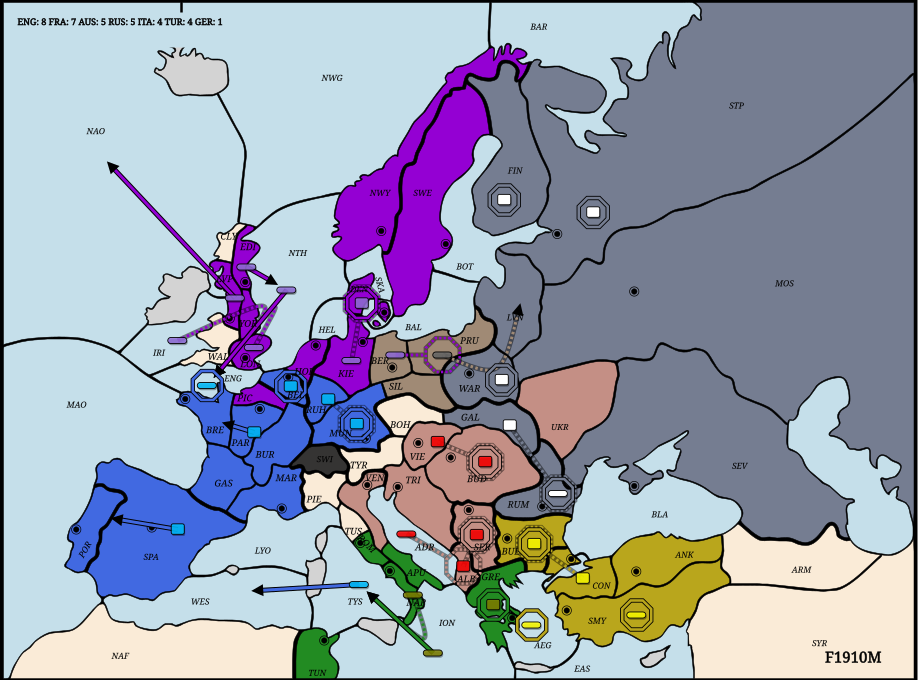

### What happened

- **AUSTRIA**: A BUD holds; A VIE supports A BUD; A SER holds; A ALB supports A SER; F ADR supports A ALB
- **ENGLAND**: F NTH → ENG; F IRI supports F NTH → ENG; F LON supports F NTH → ENG; F LVP → NAO; F EDI → NTH; F KIE supports A DEN; A DEN holds; F BER supports F PRU
- **FRANCE**: A PAR → BRE; A SPA → POR; A BEL holds; A RUH supports A MUN; A MUN holds; F ENG holds; F TYS → WES  [dislodged: F ENG]
- **GERMANY**: F PRU supports A WAR → LVN (void)
- **ITALY**: A GRE holds; F ION → TYS; F NAP supports F ION → TYS
- **RUSSIA**: F RUM holds; A GAL supports F RUM; A WAR holds; A STP holds; A FIN holds
- **TURKEY**: A BUL holds; A CON supports A BUL; F AEG holds; F SMY holds

### Dialogue

- **AUSTRIA → ITALY**: Albania's mine clean, truce kept. Now Greece is your most exposed center and you're at four — but I'd rather not grind it if you'll deal. Pull A GRE back toward Naples/Ionian and I leave it; sit it forward against my SER+ALB mass and it's contested. Tell me where you're putting it.
- **AUSTRIA → TURKEY**: Quiet line held five years and Albania's settled. Now I'm ready for that joint Rumania push you've offered — A SER and A BUD can press Russia's RUM with you next. But keep F AEG off my Serbia rear this turn; if you swing F AEG to back A GRE against me, that's you reopening our border, not me.
- **AUSTRIA → RUSSIA**: Border stayed locked as you said — A BUD and A VIE held Budapest, GAL stayed defensive. Keep it that way and my whole eastern flank stays quiet. England at eight is the runaway pulling away from all of us; your fleets belong north, not on my line.
- **AUSTRIA → ENGLAND**: You called Russia's swing right and Budapest held. You're at eight and everyone sees the solo coming — I can't reach you, but I can keep my east predictable and out of any coalition's way if you tell me plainly what you want quiet. What's your line for the next year?
- **ENGLAND → FRANCE**: Berlin's banked, boundary holds — Munich yours, Kiel mine. My fleets stay on the Baltic and North Sea line as agreed; F LON anchors home. Keep A BEL and F ENG steady and the cleanest border on the board stays clean while we both watch the east.
- **ENGLAND → RUSSIA**: North stays clean as all game — nothing toward STP, Norway, Sweden, or Bothnia, F KIE/F BER stay off Prussia. Keep your full weight south on Austria; Italy and Turkey are both tangled in the Balkans, so your timing to crack Austria's eastern centers is now. We stay friendly while I keep my fleets pointed west.
- **ENGLAND → GERMANY**: Berlin's settled. Point F PRU away from my Baltic and I won't chase your last fleet — you're more useful to me alive on the board than picked off. Stay out of my Kiel line and we coexist.
- **FRANCE → ITALY**: This is the turn I commit — F TYS pushes WES to begin pressuring England's Atlantic approach. But I need your Ion/Nap stack actually moving west now, not next year: send F ION toward TYS/TUS so we build a real Med line against England. If you're locked fighting Austria/Turkey instead, tell me straight so I don't overextend my fleet alone.
- **FRANCE → ENGLAND**: Buffer holds clean from me one more turn — A RUH, A BEL anchor west, A MUN holds Munich per our boundary, nothing into North Sea, Channel, or Baltic. I'm shuffling home units for a build, pure housekeeping. Keep F KIE/F BAL off my interior and the cleanest line on the board stays clean.
- **FRANCE → RUSSIA**: England banked Berlin and now sits at 9 with a fleet wall threatening both our norths. A WAR-SIL or a real push on his Baltic line pins him while I hold the German interior off your Prussia — I keep my weight off your borders all year in exchange. His F BAL is the single biggest threat to your north right now.
- **GERMANY → RUSSIA**: I'm one fleet in Prussia and our border has been clean for years. England's wall (BER/KIE/BAL) is overstretched and his back is to your Baltic flank now. Tell me where you want me — I can support A WAR-LVN or back a Russian push into the Baltic against England. Keep me alive as a flank ally and I point everything at England, never at you.
- **GERMANY → ENGLAND**: I'm down to F PRU — no threat to your North Sea or wall. I'll keep it pointed away from Berlin and the Baltic core if you leave it alone. A lone German fleet on Russia's flank is more useful to you alive than disbanded: I can bounce or harass Russia's Baltic armies if they push toward you.
- **ITALY → TURKEY**: Straight deal: I drive A GRE - BUL this turn. Pull A CON's support off Bulgaria — send A CON elsewhere or hold it idle — and don't bounce me with F AEG/F SMY, and I take Bulgaria clean while you keep Serbia pressure on Austria. You're at four and so am I; one of us needs to grow off Austria's corpse, not bleed against each other. Confirm Bulgaria sits open.
- **ITALY → AUSTRIA**: Truce held us both for years but we're both stuck while England laps the board at eight. I'm not reaching for Venice or Trieste this turn. If you keep A SER home I keep A GRE off Serbia — but if Russia ever cracks Budapest I want Vienna's seam, not your core. Tell me where your weight points this Fall.
- **ITALY → FRANCE**: England at eight is the only power who can solo, and your F TYS has been parked off my Ionian two years with no western push. I need to see F TYS actually move toward WES or NAF to threaten England's Atlantic, or this 'coordination' is just talk keeping my fleets pinned south. Show me the move and my Ion/Nap stack swings west to back you.
- **ITALY → RUSSIA**: Austria's wall held your Budapest assault again. Keep F RUM live pinning Turkey's Black Sea so his Aegean can't swing onto my Ionian, and I'll keep pressing Austria's south — if Serbia or Bulgaria opens between us we both feed. Where does your weight point this Fall?
- **RUSSIA → TURKEY**: Same as last year: F RUM holds with A GAL backing it to defense-two. Your A BUL-RUM bounces even with A CON, and you'd waste your Serbia push for nothing. Keep driving A BUL-SER and the clean Black Sea border holds another year — read Rumania and you only feed Austria and Italy while bleeding your own line.
- **RUSSIA → ITALY**: Austria's stretched thin between us. If you crack Serbia or pull A SER off, I'm ready to swing A GAL onto Budapest or Vienna the moment a real opening shows — but only if it actually lands. Tell me concretely what your fleets pin this turn and I'll commit weight where it cracks his center, not into a two-wall.
- **RUSSIA → AUSTRIA**: Border stays locked — GAL backs Rumania against Turkey, nothing toward BUD or SEV this turn. England at 8 is the runaway threatening us both; throw your weight south on Italy and keep your east quiet, and we both outlast the collapse.
- **RUSSIA → ENGLAND**: North stays clean as all game — A FIN walls the corner, nothing toward Sweden, Norway, Bothnia, or Prussia. My weight stays east and south. You're the clear leader now; keep your Baltic fleets off my flank and our quiet border holds another year.
- **TURKEY → RUSSIA**: Six years of 'I'll cut BUD' that never strips it. This is the last test: if A GAL truly goes to BUD this turn, F RUM stands alone and my A BUL-RUM takes it. So either order F RUM off Rumania and let me have it clean while you bank Budapest, or watch me read your whole Black Sea line next spring. Vacate Rumania or commit GAL north — your call decides whether the clean border survives.
- **TURKEY → ITALY**: You hold Greece alone now with A GRE, F ION, F NAP. I've kept F AEG/F SMY off your waters seven years running and I'll keep doing it. But I'm done sitting at four — point your stack at Austria's Serbia/Trieste rear with me this turn and I'll back whichever push you commit to. Tell me straight where A GRE and your fleets go and I'll align rather than collide.
- **TURKEY → AUSTRIA**: Russia is pressing Budapest from the north every turn and Italy holds Greece on your flank — your five centers are squeezed on three sides. Turn A SER and A BUD onto Russia's Rumania with me: I drive A BUL-RUM, you press from Galicia's edge, and we split Russia's overstretched east. The static line has frozen us both at five and four while England runs at eight.
- **AUSTRIA → TURKEY**: Albania's settled and I'm ready to make Rumania real. If you drive A BUL - RUM with F AEG supporting, A SER can support the attack from the west — that's the weight to break Russia's F RUM. Confirm BUL goes to RUM and AEG backs it, and I commit A SER S A BUL - RUM this turn.
- **AUSTRIA → ITALY**: You kept your word on Albania — clean handoff. I'm not reaching for Greece this turn; A ALB and F ADR stay off your line if A GRE stays put. With England at 8 we both gain more leaving the Adriatic quiet and pointing weight at the runaway's reach. Hold and the border stays clean.
- **AUSTRIA → RUSSIA**: Border held both ways, as you said. Turkey is pressing toward your Rumania regardless — if you want it quiet, keep F RUM defended and GAL home, and I keep my full weight off your line. But know Turkey is courting me onto RUM; the cleaner you keep our border, the less reason I have to take that deal.
- **ENGLAND → FRANCE**: Buffer holds clean from me on the interior — F KIE/F BER/F PRU coordination stays on the Baltic, nothing into Munich or Holland. One housekeeping note: Russia's been quietly shifting and I'm keeping a fleet ready in the Irish Sea in case they probe the Atlantic approaches; that's pointed past you, not at you.
- **ENGLAND → RUSSIA**: North stays exactly as it's been — nothing toward STP, Norway, Sweden, or Bothnia, F KIE/F BER off Prussia. Keep your full weight south on Austria; their A SER/A ALB are stretched and Italy's tangled in the Ionian, so your timing to crack the Balkans is now. We stay friendly while I keep facing west.
- **ENGLAND → GERMANY**: Berlin's settled and I've no interest in your last fleet — keep F PRU pointed away from my Baltic core and I leave it be. If Russia's armies push toward the Baltic shore, a bounce from you on PRU/BER actually helps us both. Coexist and you stay useful to me alive.
- **FRANCE → ITALY**: Done waiting — F TYS moves to WES this Fall, the actual move you asked for, to begin threatening England's Atlantic approach. Now I need your half: swing F ION toward TYS/TUS so we have a continuous Med line by Spring. If your stack is still pinned by Austria, tell me straight and I'll know this is one-sided.
- **FRANCE → ENGLAND**: Buffer holds clean one more turn — A RUH and A BEL anchor west, A MUN holds Munich, nothing into the North Sea, Channel, or Baltic. I'm clearing PAR for a home build, pure housekeeping. Keep F KIE/F BAL off my interior and the line stays the cleanest on the board.
- **FRANCE → RUSSIA**: Last call on the concrete trade: pin England's F BAL this turn and I hold A MUN off your Prussia line all year. His Baltic stack is the one piece threatening both our norths — a real Russian check there buys you far more than any drift toward my interior.
- **GERMANY → RUSSIA**: Concrete: order A WAR - LVN this turn and I'll back it with F PRU S A WAR - LVN, putting a Russian army on the Baltic coast facing England's wall. That tightens your line against England and keeps my one fleet useful as your flank ally. Tell me if you'd rather I sit and bounce instead.
- **GERMANY → ENGLAND**: F PRU stays off your Baltic and Berlin line — I'm leaning it inland toward Livonia, not at BAL or BER. A lone German fleet helping pin Russia's armies on the coast is worth more to you alive than gone. We coexist.
- **ITALY → TURKEY**: If you pull A BUL off Bulgaria this turn I walk A GRE - BUL and take it clean — confirm F AEG/F SMY don't bounce me there and Bulgaria sits open. If you keep A BUL home, I hold Greece firm and we stay off each other as always. Tell me straight: is Bulgaria open this Fall or not?
- **ITALY → AUSTRIA**: I'm not reaching for Serbia or Trieste this turn — A GRE holds or steps onto open Bulgaria, nothing toward your core. Keep A SER/A ALB off Greece and the border stays clean while you face Russia north. Grinding Greece only bleeds us both while England laps the board at eight.
- **ITALY → FRANCE**: F TYS has held off my Ionian three years with no western push — show me F TYS - WES this Fall and my Ion/Nap stack starts swinging west to back you against England. If F TYS just parks again, I treat the Med 'coordination' as dead and keep my fleets cohesive in the south. Move it this turn or tell me straight it's not happening.
- **RUSSIA → TURKEY**: Same math as always: F RUM holds with A GAL backing to defense-two, so A BUL-RUM bounces even with A CON. You only burn your Serbia push for nothing. But here's a real trade — drive A BUL-SER hard while Italy also hits Serbia, and if Austria's A SER falls I'll swing weight off Rumania next spring and we genuinely split the Balkans. Read Rumania this turn and you waste it while Italy banks Serbia.
- **RUSSIA → ITALY**: If you're committing A GRE-SER again and Austria pulls A SER to cover, tell me straight which Austrian unit you pin this turn. If A VIE or A BUD genuinely can't backstop, I'll throw A GAL-VIE the moment it's undefended — but only if your pressure actually strips a defender. Concrete: where do F ADR/F ION/A GRE point this Fall?
- **RUSSIA → AUSTRIA**: Border stays locked — GAL backs Rumania, nothing toward BUD or SEV. England at 9 with Berlin banked is the runaway burying us all; keep your east quiet with me and throw everything south to hold against Italy. If your line cracks anywhere, I'd rather coordinate a controlled handoff than watch Italy and Turkey both feed.
- **RUSSIA → ENGLAND**: North stays clean as all game — A FIN walls the corner, nothing toward Sweden, Norway, Bothnia, or Prussia. You're at 9 now and clearly leading; my weight stays east. Just keep your Baltic fleets off my flank and our quiet border holds another year.
- **TURKEY → ITALY**: Concrete trade: you send A GRE - SER this turn, and I take Greece with A BUL - GRE backed by F AEG S A BUL - GRE — that's attack-two, it lands the moment GRE is vacated. You bank Serbia off Austria, I bank Greece, and neither of us bounces the other. Confirm A GRE leaves for Serbia and I commit.
- **TURKEY → RUSSIA**: Fine — F RUM holds at defense-two, I won't waste a push on it. I'm reading the GRE/SER seam against Italy and Austria instead this turn, nothing toward your Black Sea. Keep A GAL on Rumania and the quiet southern border holds.
- **TURKEY → AUSTRIA**: I'm keeping F AEG and F SMY off your Serbia rear as promised — my move this turn reads Italy's Greece, not your center. If Italy throws A GRE at your Serbia, that's Italy reopening your flank, not me. Next spring I'm still good for the joint Rumania push once Albania settles.
- **AUSTRIA → ITALY**: Locking it: A ALB stays home backing Serbia, F ADR holds — nothing toward Greece or your core this turn. Keep A GRE off Serbia and the Adriatic stays clean. If you ever vacate Greece toward Bulgaria I'll leave the empty seat alone, not walk in.
- **AUSTRIA → RUSSIA**: Committed: A BUD and A VIE both wall Budapest, A SER holds Serbia, nothing toward GAL or SEV. Keep GAL defensive as you said and our whole east stays frozen while England runs north. One clean turn each and we both outlast the collapse.
- **AUSTRIA → TURKEY**: This turn my weight stays on my own line — A SER holds, A BUD/A VIE wall Budapest, F AEG-free rear. Keep F AEG and F SMY off Serbia and the quiet line holds a sixth year. Next spring once my build lands I'll commit A SER + A BUD onto Russia's Rumania with your A BUL-RUM as discussed.
- **ENGLAND → FRANCE**: Boundary holds: Munich yours, Kiel mine, F KIE/F BER/F PRU stay on the Baltic line, nothing into your interior. F LON anchors home. I'm shifting F IRI toward the western approaches to keep an eye on Russia's Atlantic probing — past you, not at you. Keep A BEL and F ENG steady and the cleanest border on the board holds another year.
- **ENGLAND → RUSSIA**: North stays clean as all game — nothing toward STP, Norway, Sweden, or Bothnia, F KIE/F BER off Prussia. Keep your full weight south on Austria; their A SER/A ALB are stretched and Italy's tangled. We stay friendly while I keep facing west.
- **ENGLAND → GERMANY**: F PRU stays useful to me alive — point it inland toward Livonia and pin Russia's flank, and I leave it be. Stay off my Baltic core and we coexist another year.
- **FRANCE → ITALY**: Committed for real this turn: F TYS - WES. That's the move you've demanded three years running — now it's on the board. In return I need F ION to TYS or TUS this Fall so we have a continuous Med line by Spring; if your stack moves west I push WES into NAF/MAO next turn against England's Atlantic approach. Park off your Ionian no longer — this is the pivot.
- **FRANCE → ENGLAND**: Buffer holds clean from me one last time: A RUH and A BEL anchor west, A MUN holds Munich per our boundary, nothing into North Sea, Channel, or Baltic. I'm clearing PAR for a home build — pure housekeeping. Keep F KIE/F BAL off my interior and the cleanest line on the board stays clean.
- **FRANCE → RUSSIA**: Final offer stands: I keep A MUN off Berlin's approach and never contest your Prussia line all year if you pin England's F BAL this turn. His Baltic stack is the single piece threatening both our norths — a real check there buys you more than any drift toward my interior.
- **GERMANY → RUSSIA**: Committed: F PRU S A WAR - LVN this phase. Order A WAR - LVN and your army lands on the Baltic coast facing England's wall, tightening your line. I point everything at England, nothing at you — keep me alive as your flank fleet.
- **GERMANY → ENGLAND**: F PRU stays off BAL and BER — I'm backing a Russian shuffle inland toward Livonia, not at your Baltic core. A lone German fleet helping fix Russia's armies on the coast is worth more to you alive than gone. We coexist.
- **ITALY → AUSTRIA**: Deal: A GRE holds firm, nothing toward Serbia, Trieste, or your core — keep A ALB and F ADR off my Greece and the Adriatic stays clean as it has. I'm not interested in trading my fifth center to Turkey's bait; you and I both gain more sitting quiet while England laps the board. Confirm A ALB/F ADR stay off Greece.
- **ITALY → TURKEY**: Straight: I'm not vacating Greece for you — your A BUL-GRE proposal just costs me my own center, so no. A GRE holds, F ION/F NAP stay off your Aegean and Smyrna waters as seven years running. Keep F AEG/F SMY east and neither of us bleeds; the leader is north, not between us.
- **ITALY → FRANCE**: I'll point F ION toward TYS this turn to start the Med line you keep asking for — but F TYS must actually move to WES, not park off my Ionian again. If you hold TYS a fourth year, the coordination is dead and I keep my fleets cohesive south. Show me F TYS - WES and my stack commits west.
- **RUSSIA → TURKEY**: Final commit: F RUM holds in Rumania with A GAL S F RUM to defense-two — your A BUL-RUM bounces even with A CON, so don't burn it. Drive A BUL-SER instead; nothing of mine touches Sevastopol or your strait. Clean border holds another year.
- **RUSSIA → AUSTRIA**: Locked: A GAL backs Rumania, nothing toward BUD or SEV this turn. My east stays quiet so you can throw full weight south on Italy's Albania. Don't take Turkey's RUM bait and our border holds clean.
- **RUSSIA → ENGLAND**: Final: A FIN walls the corner, A WAR/A STP/A GAL hold my eastern line, nothing toward Sweden, Norway, Bothnia, or Prussia. Keep F KIE/F BER off Prussia and our north stays clean as all game.
- **TURKEY → AUSTRIA**: Confirmed: I keep F AEG and F SMY entirely off your Serbia rear this turn — A BUL holds defensive, nothing toward your center. Next spring, if you genuinely commit A SER plus A BUD onto Rumania for a real attack-three, I drive A BUL-RUM and we finally break Russia's wall together. This year the math is a bounce, so we wait and hold the quiet line.
- **TURKEY → RUSSIA**: F RUM holds defense-two as you say — I won't waste a push on it this turn. Nothing of mine touches Rumania or Sevastopol; F SMY and F AEG stay south on the strait. The clean border holds another year, but understand it only survives while it pays me something — give me a real opening next spring or I read your Black Sea.
- **TURKEY → ITALY**: I'm holding A BUL and my fleets east this turn — F AEG/F SMY stay off your Ionian and Greece, seven years running, and I won't bounce you anywhere. You hold Greece firm; I cover my home and strait. Austria and Russia are both pressing now, so let's keep our border quiet and let the others bleed against each other.

### AUSTRIA
Orders: `A BUD H` · `A VIE S A BUD` · `A SER H` · `A ALB S A SER` · `F ADR S A ALB`

Reasoning

> I'm at six centers (BUD, VIE, SER, VEN, TRI, ALB — plus Albania gained). Wait, my SCs list shows 5: BUD, VIE, SER, VEN, TRI. Albania is occupied but not yet an SC for me (it's not a home center). With TRI vacant and a possible build, I want to consolidate. My revised note: freeze the eastern line, wall Budapest, hold Serbia, A ALB backs Serbia, F ADR covers Trieste. Russia confirmed GAL defensive, Italy walked off Albania and confirmed A GRE holds. England is the runaway but unreachable.
>
> My priority: keep TRI vacant for a Winter build (I'm at 5 centers with units — actually I have 5 units and 5 centers, so no excess. TRI vacant won't give a build unless I gain a center). Albania isn't a home SC and isn't owned by me yet. Holding Albania makes it mine at Winter, putting me at 6 centers with 5 units = one build. So I want Albania to become my SC and keep BUD/VIE/TRI available. TRI is vacant — if I build there, good. Let me keep the line frozen and hold Albania to bank the center.

### ENGLAND
Orders: `F NTH - ENG` · `F IRI S F NTH - ENG` · `F LON S F NTH - ENG` · `F LVP - NAO` · `F EDI - NTH` · `F KIE S A DEN` · `A DEN H` · `F BER S F PRU`
Illegal (dropped): `F PRU H`

Reasoning

> This is the turn I break the buffer with France. I hold 8 centers, France 7, and France is the only power that can race me to a solo. I take the English Channel now with a 2-strength attack: F NTH - ENG supported by F LON and F IRI. F LVP backs into IRI to refill the line. F EDI moves to NTH to keep the North Sea covered behind the Channel push. My Baltic line stays defensive: F KIE supports A DEN, A DEN holds, F BER supports F PRU, F PRU holds — keeping Russia and Germany honest while I commit west.
>
> Note: F IRI cannot both support NTH-ENG and back LVP into IRI; F IRI is the supporter, F LVP moves toward NAO to keep a fleet ready west. Actually, to maximize the Channel attack I want F IRI supporting the move and F LVP advancing. F NTH - ENG, supported by F LON and F IRI, is 2-strength against F ENG's 1, dislodging it.

### FRANCE
Orders: `A PAR - BRE` · `A SPA - POR` · `A BEL H` · `A RUH S A MUN` · `A MUN H` · `F ENG H` · `F TYS - WES`

Reasoning

> Executing my revised F1910M plan: bank a Brest build by clearing PAR, shift Spain to Portugal to free the build slot while covering my coast, hold my western wall against England, keep Munich solid, and commit F TYS to WES to begin pressuring England's Atlantic approach with Italy.
>
> My home centers: BRE vacant, MAR vacant, PAR occupied. By moving A PAR→BRE and A SPA→POR, I keep PAR vacant too — giving me build options at PAR and MAR. Actually I want to maximize builds: I'm at 7 centers with 7 units, so a build requires gaining a center this Fall. POR is already mine. Let me focus on clearing home centers so any Winter build can land — clear PAR and SPA. POR is mine, MAR vacant.
>
> A PAR→BRE leaves PAR open. A SPA→POR leaves SPA — but SPA isn't a home center (BRE/MAR/PAR are). I want PAR and MAR vacant for builds. A PAR→BRE vacates PAR; MAR is already vacant. Good.

### GERMANY
Orders: `F PRU S A WAR - LVN`

Reasoning

> I committed to supporting Russia's A WAR into Livonia, keeping my last fleet useful as a flank ally against England's Baltic wall. This honors my arrangement with Russia and costs nothing if A WAR doesn't move. It keeps F PRU pointed inland away from England's Baltic core as promised, preserving my coexistence with both powers.

### ITALY
Orders: `A GRE H` · `F ION - TYS` · `F NAP S F ION - TYS`

Reasoning

> My revised plan: hold Greece to protect my fifth center... wait, I'm at 4 centers (NAP, ROM, TUN, GRE). Greece is my fifth-equivalent but I only have 4. Hold A GRE firm, swing F ION to TYS to begin the Med line with France, F NAP supports that pivot. Rome is open for a Winter build — good, but I need to ensure I can build. Currently NAP is occupied by F NAP and ROM is vacant. If F NAP moves to support TYS it stays in NAP. Building in ROM is fine since it's vacant.
>
> Let me execute: A GRE holds, F ION → TYS, F NAP supports F ION → TYS to ensure it lands (France's F TYS is there though — it would bounce/conflict). France's F TYS holds the Tyrrhenian. If I move F ION to TYS while France holds it, I bounce. France said F TYS pushes WES this fall. So TYS should vacate. I'll move F ION → TYS and F NAP supports it in case of contest, advancing my western pivot.

### RUSSIA
Orders: `F RUM H` · `A GAL S F RUM` · `A WAR H` · `A STP H` · `A FIN H`

Reasoning

> I'm at 5 centers, stuck. The board is dominated by England (8) and France (7). My home triangle is secure but stagnant. Per my revised plan: hold F RUM with A GAL supporting to defense-two against any Turkish read, keep A WAR/A STP/A FIN walling the line. Turkey said it won't touch Rumania this turn, but I won't vacate it. I'll keep the line solid and ready to pivot.

### TURKEY
Orders: `A BUL H` · `A CON S A BUL` · `F AEG H` · `F SMY H`

Reasoning

> I'm walled at four centers with no realistic gain this turn — Russia holds Rumania at defense-two, Italy won't open Greece, and Austria's Serbia wall is intact. My revised note commits to holding defensively to keep my home and strait secure. I'll keep A BUL and A CON tight, fleets south.

## FALL 1910 RETREATS (`F1910R`)

### What happened

- **FRANCE**: F ENG retreats → PIC

### FRANCE
Orders: `F ENG R PIC`

Reasoning

> England dislodged my F ENG by taking the Channel. England has clearly stabbed me on the western front. I need to retreat this fleet to keep it useful. WAL puts it on England's home doorstep but it's isolated; PIC keeps it near Belgium/Brest defending my coast; MAO keeps it in the Atlantic but exposed to England's fleet stack. PIC is the most defensible — it sits adjacent to BEL, BRE, PAR and lets me reinforce my western wall against England's now-hostile Channel fleet.

## WINTER 1910 ADJUSTMENTS (`W1910A`)

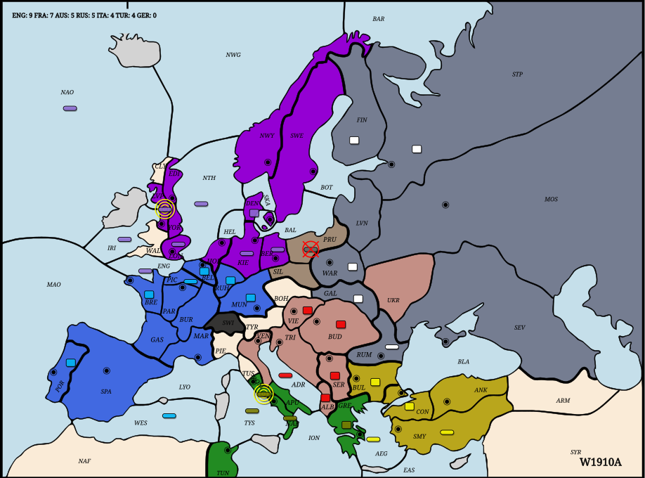

### What happened

- **ENGLAND**: builds F LVP
- **GERMANY**: disbands F PRU
- **ITALY**: builds F ROM

### ENGLAND
Orders: `F LVP B`

Reasoning

> I have 9 centers and 8 units, so I'm owed one build. I want to keep pressing west against France, so a fleet is most useful. I took the Channel last turn (F ENG), and my plan is to march toward Belgium and Brest. A new fleet in LVP can swing toward the Atlantic approaches and reinforce the western push. EDI also works but LVP feeds the Irish Sea/Atlantic lane more directly toward France's coast.

### GERMANY
Orders: `F PRU D`

Reasoning

> I have 0 supply centers and 1 unit (F PRU). I must disband one unit to match my center count.

### ITALY
Orders: `F ROM B`

Reasoning

> I have 4 centers and 3 units, so I'm owed one build. Rome is my only open home center. Per my western-pivot plan against England's runaway position, I want naval strength in the Tyrrhenian/Mediterranean to coordinate with France against England. A fleet in Rome advances that Med line.

## Final state

| Power | Centers | # |
|---|---|---|
| ENGLAND | EDI, LON, LVP, NWY, SWE, DEN, HOL, KIE, BER | 9 |
| FRANCE | BRE, MAR, PAR, POR, SPA, BEL, MUN | 7 |
| AUSTRIA | BUD, VIE, SER, VEN, TRI | 5 |
| RUSSIA | MOS, SEV, STP, WAR, RUM | 5 |
| ITALY | NAP, ROM, TUN, GRE | 4 |
| TURKEY | ANK, CON, SMY, BUL | 4 |
| GERMANY | *(none)* | 0 |

